# 黄土高原土壤侵蚀评价

张科利谢云魏欣等著

# “十二五”国家重点图书出版规划项目


水科学前沿丛书

黄土高原土壤侵蚀评价

## www.sciencep.com


# 水科学前沿丛书

# 黄土高原土壤侵蚀评价

张科利谢云魏欣等著

科学出版社

北京

## 内容简介

本书是作者系统总结多年来从事相关国家基金和水利部生产项目等多个研究成果，并在吸收前人研究成果的基础上编写而成。在阐述黄土高原土壤侵蚀特点和规律的同时，重点介绍土壤侵蚀评价方法及相关因子获取和计算模型，希望为黄土高原水土保持建设提供技术工具。在撰写过程中，突出了知识系统性、目标实用性、资料可靠性和方法可行性等特点，书中基本理论和方法不仅适用于黄土高原地区，对全国其他水土流失严重区也具有指导和借鉴意义。全书共分八章，第一章简述土壤侵蚀一般问题。第二章讲述黄土高原自然环境特征和河流泥沙问题。第三章论述土壤侵蚀模型及数据采集和计算流程。第四章介绍降雨侵蚀力因子计算方法及其分布特征。第五章介绍土壤可蚀性因子值及其估算方法。第六章介绍地形因子计算公式、计算流程及其变化特征。第七章介绍水土保持措施类型及其因子取值。第八章介绍和分析黄土高原最新水土流失调查和评价结果。

本书可供从事水土保持、资源管理、水利工程和地理学等领域的研究人员和高校师生参考使用。

图书在版编目(CIP)数据

黄土高原土壤侵蚀评价/张科利等著.—北京：科学出版社，2015.9

(水科学前沿丛书)

ISBN 978-7-03-045913-8

I.①黄… Ⅱ.①张… Ⅲ.①黄土高原-土壤侵蚀-土壤评价 IV.①S157

中国版本图书馆CIP数据核字(2015)第237245号

责任编辑：杨帅英/责任校对：韩杨

责任印制：肖兴/封面设计：陈敬

科学出版社出版

北京东黄城根北街16号

邮政编码：100717

http://www.sciencep.com

中国科学院印刷厂印刷

科学出版社发行 各地新华书店经销

2015年10月第一 版 开本：787×1092 1/16

2015年10月第一次印刷印张：12

字数：285000

定价：98.00元

(如有印装质量问题，我社负责调换)

# 《水科学前沿丛书》编委会

(按姓氏汉语拼音排序)

顾 问曹文宣陈志恺 程国栋傅伯杰

韩其为 康绍忠 雷志栋 林学钰

卯智孟伟王超王浩

王光谦 薛禹群 张建云 张勇传

主 编刘昌明

常务副主编徐宗学

## 编

委蔡崇法常剑波 陈求稳 陈晓宏

陈永灿 程春田 方红卫 胡春宏

黄国和 黄介生 纪昌明 康跃虎

雷廷武 李怀恩李义天 林鹏

刘宝元 梅亚东 倪晋仁 牛翠娟

彭世彰任立良沈冰王忠静

吴吉春 吴建华 徐宗学 许唯临

杨金忠 郑春苗周建中

# 《水科学前沿丛书》出版说明

随着全球人口持续增加和自然环境不断恶化，实现人与自然和谐相处的压力与日俱增，水资源需求与供给之间的矛盾不断加剧。受气候变化和人类活动的双重影响，与水有关的突发性事件也日趋严重。这些问题的出现引起了国际社会对水科学研究的高度重视。

在我国，水科学研究一直是基础研究计划关注的重点。经过科学家们的不懈努力，我国在水科学研究方面取得了重大进展，并在国际上占据了相当地位。为展示相关研究成果、促进学科发展，迫切需要我们对过去几十年国内外水科学不同分支领域取得的研究成果进行系统性的梳理。有鉴于此，科学出版社与北京师范大学共同发起，联合国内重点高等院校与中国科学院知名中青年水科学专家组成学术团队，策划出版《水科学前沿丛书》。

从书将紧扣水科学前沿问题，对相关研究成果加以凝练与集成，力求汇集相关领域最新的研究成果和发展动态。从书拟包含基础理论方面的新观点、新学说，工程应用方面的新实践、新进展和研究技术方法的新突破等。从书将涵盖水力学、水文学、水资源、泥沙科学、地下水、水环境、水生态、土壤侵蚀、农田水利及水力发电等多个学科领域的优秀国家级科研项目或国际合作重大项目的成果，对水科学研究的基础性、战略性和前瞻性等方面的问题皆有涉及。

为保证本丛书能够体现我国水科学研究水平，经得起同行和时间检验，组织了国内多位知名专家组成丛书编委会，他们皆为国内水科学相关领域研究的领军人物，对各自的分支学科当前的发展动态和未来的发展趋势有诸多独到见解和前瞻思考。

我们相信，通过从书编委会、编著者和科学出版社的通力合作，会有大批代表当前我国水科学相关领域最优秀科学研究成果和工程管理水平的著作面世，为广大水科学研究者洞悉学科发展规律、了解前沿领域和重点方向发挥积极作用，为推动我国水科学研究和水管理做出应有的贡献。

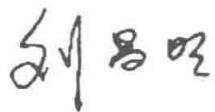

2012年9月

## 前 言

黄土高原是我国乃至世界土壤侵蚀最为严重的地区之一。严重的土壤侵蚀导致黄河多沙并在下游河床淤积，长期威胁着下游地区人民的生命财产安全。自新中国成立以来，政府投入大量人力、物力和财力进行土壤侵蚀研究和水土保持建设，取得了显著成就。从20世纪50年代开始，水利部和中国科学院先后组织多次对黄土高原土壤侵蚀和水土保持进行综合考察。在80年代，中国科学院又组织有关专家对黄土高原进行了综合考察，土壤侵蚀和水土保持是重要的考察内容之一。1999年，水利部组织各流域结构以及省、自治区、直辖市开展了全国第二次水土流失遥感调查，并在2002年发布了全国水土流失公告。同时，自50年代开始·水利部和中国科学院等先后在黄土高原设立土壤侵蚀和水土流失监测站，开展了系统的土壤侵蚀规律研究。上述调查、考察和定点观测，为认识黄土高原土壤侵蚀规律、水土流失特点和区域分布特征奠定了重要基础。

纵观黄土高原地区土壤侵蚀研究和水土流失调查成果，目前在土壤侵蚀模型及其应用方面仍比较薄弱。美国在20世纪50～60年代，就在 W. H. Wischmeier和N.P.Woodruff为代表的科学家努力下，通过对土壤侵蚀影响因子的系统研究，建立了通用土壤流失方程USLE(universal soil loss equation)和风蚀方程 WEQ(wind erosion equa-tion)，后来成为国家资源清查中水蚀和风蚀评估的重要工具，为水土保持规划和土地资源管理提供了强有力的技术支撑。作者基于前人已有的研究基础及十多年来对黄土高原土壤侵蚀因子的定量研究，提出了适用于黄土高原地区的土壤侵蚀评价模型及因子估算方法，并系统评价了黄土高原水土流失现状。本书是在总结作者研究成果和吸收国内外相关研究的基础上撰写而成。内容具有完整的理论体系，又具有较强的可操作性。希望为黄土高原水土保持和生态建设提供技术工具。

《黄土高原土壤侵蚀评价》一书的编写，得到了国家基金委员会多个基金项目和水利部“黄土高原土壤流失方程研究”项目成果的支持。本书具体执笔人分别是:第一章，张科利、谢云；第二章，谢云、张科利、张岩；第三章，谢云、魏欣；第四章，谢云、殷水清；第五章，张科利、刘鸿鹄；第六章，刘宝元、符素华；第七章，刘宝元、谢云、张岩、章文波；第八章，张科利。全书由张科利、谢云统稿。从构思、动笔到现在，几经搁置，历经十年，在很多专家学者的鼓励下才得以完成。在此，谨向水利部水土保持监测中心郭索彦、张长印等；中国科学院地理科学与资源研究所蔡强国；中国科学院水利部水土保持研究所江忠善、王万忠、卢宗凡、侯喜禄、刘国彬等专家学者表示衷心感谢。同时，也一并感谢曾在北京师范大学地理学院土壤侵蚀课题组学习，并为本书作出过贡献的所有研究生。最后，对培养和带领我们走上土壤侵蚀研究之路的朱显谟院士和唐克丽先生表示诚挚的感谢。

作者

2015年于北京师范大学

## 目 录

《水科学前沿丛书》出版说明  
前言  
第章概论………………………………………………………………1  
、土壤侵蚀概述……………………………………………………………1  
二、土壤侵蚀类型…………………………………………………………………………4  
(一)分类目的及原则…………………………………………………………………4  
(二)主要侵蚀类型……………………………………………………………5  
(三)几个相关问题和概念……………………………………………………………6  
三、土壤侵蚀危害…………………………………………………………………………8  
(一)危害河流生态安全………………………………………………………………8  
(二)加剧水资源短缺程度……………………………………………………9  
(三)降低土壤生产力，导致土地贫瘠化…………………………………9  
(四）威胁交通和通信保障…………………………………………………………………9  
(五)加剧全球环境变化程度……………………………………………………………9  
(六)影响社会综合发展………………………………………………………………………9  
四、黄土高原土壤侵蚀的特殊性………10  
(一)区位上的特殊性……………………………………………………………………10  
(二)问题上的特殊性…………………………………………………………10  
(三)研究上的特殊性………………………………………………………………………………………………11  
参考文献…………12  
第二章 黄土高原土壤侵蚀环境…………13  
一、黄土高原的范围与面积…………………………13  
二、黄土高原自然条件…………………………………………………………14  
(一)地质地貌……………………………………………………………………14  
(二)气候条件……………………………19  
(三)河流水文……………………………………………………………………………25  
(四)土壤资源……………………………………………………28  
(五)植被覆盖………………………………………………………………………………42  
三、黄土高原土壤侵蚀特征………………………………45  
(一)土壤侵蚀类型多样…………………………………………………………45  
(二)王壤侵蚀强度大……………………………………………………………46  
(三)土壤侵蚀区域分异显著…………………49  
四、黄土高原土壤侵蚀与黄河泥沙……51  
(一)黄土高原水土流失是黄河泥沙根源……51  
(二)黄河粗泥沙来源于黄土高原多沙区…………52  
参考文献…… … 53  
第三章黄土高原土壤侵蚀定量评价方法………………55  
一、评价目的与意义…………………………………………………………55  
(一)土壤侵蚀模型的发展过程…………55  
(二)区域土壤侵蚀定量评价发展历程…………60  
二、黄土高原土壤侵蚀评价方法………………………………………………64  
(一)评价方案设计与野外调查单元布局……………………………64  
(二)数据采集方法…………………………………………66  
(三)土壤侵蚀定量评价方法………………………………………66  
(四)数据库构建与计算程序……………67  
(五)评价成果及其应用……………………………68  
参考文献…………………………………………………………69  
第四章 降雨因子评价………………………………………………………72  
一、降雨侵蚀力定义与指标 ………………………………………………………………72  
(一)主要降雨特性指标……………………………………………………………72  
(二)降雨侵蚀力……………………………………………………74  
二、侵蚀性降雨标准……77  
(一)侵蚀性降雨标准的确定方法…………………………78  
(二）侵蚀性降雨标准的评价指标…………………………………………………………79  
(三）黄土高原侵蚀性降雨标准的确定…………………………………79  
三、降雨侵蚀力计算…………………………………………………………………………81  
(一）用降雨过程资料计算 ………………………………………………………………82  
(二)用次降雨资料计算…………………………………………………………………85  
(三)用日降雨资料计算…………………………………………………………86  
(四)用月雨量资料计算………………………………………………………………88  
(五)用年雨量资料计算………………………………………………89  
(六)各种计算方法的误差分析…………90  
四、降雨侵蚀力季节分布……………93  
五、多年平均年降雨侵蚀力空间分布…………102  
参考文献…………………………………………………………………………………………103  
第五章土壤因子评价…………………………107  
一、土壤因子评价指标的选择和使用问题……107  
二、土壤可蚀性因子K的定义和计算方法……109  
三、典型站点土壤可蚀性因子K 实测值……112  
(一）资料来源及处理 …… 113  
(二）土壤可蚀性实测值及其变化规律……113  
四、土壤可蚀性因子K值估算问题………114  
(一)主要估算公式…………………………………………115  
（二）不同估算公式的计算与应用问题 …………………………………………115  
（三）土壤可蚀性估算方法及具体流程 ……………………………………………………………117  
五、黄土高原主要土壤类型的可蚀性因子值……122  
六、土壤可蚀性K估算值精度分析……127  
(一)资料选取及说明…………………………………………………………127  
(二)估算结果精度分析……………………………………………………………………………128  
(三)模型评价及应用……………………………………………………………129  
七、存在问题及未来发展………129  
参考文献…………………………………………………………130  
第六章 地形因子评价………132  
一、土壤侵蚀量与坡度的关系……………………………………132  
二、土壤侵蚀量与坡长的关系………………135  
三、地形因值计算公式…………………138  
(一)坡面尺度的LS计算公式…………………138  
(二)区域尺度的LS计算公式……………………………………………139  
(三)区域尺度的LS计算流程……………………………140  
(四）黄土高原地区地形因子计算中相关参数设置………142  
四、黄土高原坡度及坡度因子分布特点……142  
()坡度分布……………………………………………………………………………142  
(二)坡度因子分布…………………………………………………………………145  
五、黄土高原坡长及坡长因子分布特点………146  
(一)坡长分布………………………………………………………………146  
(二)坡长因子分布………………………………………………………………………146  
参考文献…………………………………………………………………………………147  
第七章 水土保持措施因子评价……150  
一、水土保持措施类型…………………150  
二、水土保持措施因子的定义……154  
三、植被覆盖与生物措施因子(B)的估算方法……155  
(一)草地土壤流失比率 SLR……………………………………………………155  
(二)林地土壤流失比率………………………………157  
(三)其他土地利用类型的生物措施因子………158  
四、工程措施因子(E)的估计……158  
五、耕作措施因子(T)的估计……159  
(一)农地耕作措施因子估算方法……159  
(二)其他耕作措施因子…………………161  
六、存在问题和前景展望……162  
参考文献………………………………………………163  
第八章黄土高原土壤侵蚀空间分布特征……165  
一、土壤侵蚀评价精度分析……………165  
(一)资料与处理…………………………………………………………165  
(二)模拟计算精度………………………………………………………166  
二、土壤侵蚀强度及其空间分布……167  
(一)黄土高原现代土壤侵蚀解析……168  
(二)黄土高原土壤侵蚀强度特征……169  
(三)黄土高原土壤侵蚀空间分布特征……172  
三、土壤侵蚀和水土保持未来变化趋势………175  
(一)强度减弱,仍为严重区域………………………………175  
(二)分布格局发生变化…………………………175  
(三)河流泥沙威胁缓解…………176  
(四)研究重点领域变化……176  
(五)政府投资思路需要转变………176  
参考文献……………………………………………………………………177

## 第一章 概 论

由干独特的自然环境特征和社会经济条件，黄土高原水土流失问题十分突出。严重的水土流失导致地带性土壤基本流失殆尽和土地生产力降低。同时，大量入河泥沙也会引起河床淤积抬升，加剧洪涝灾害的威胁。自然环境的独特性表现为地形崎岖陡峻，土质疏松多孔，降雨集中且多暴雨。社会经济的独特性在于天然植被受破坏，陡坡普遍开垦以及广种薄收的农业生产习惯。在自然因素和人类活动的共同影响下，不论从发生机制、发展过程及分布规律，还是危害程度、社会影响和影响范围等考虑，黄土高原的土壤侵蚀在中国土壤侵蚀研究中都具有不可替代的地位。在黄土高原发生的土壤侵蚀，犹如一本完整的土壤侵蚀教科书，研究黄土高原土壤侵蚀不仅有助于系统理解侵蚀基本原理，而且还对全国其他地区土壤侵蚀和水土流失防治研究具有示范作用。另外，相对于我国其他土壤侵蚀类型区，黄土高原土壤侵蚀研究历史悠久、过程机制清楚、资料积累丰富。因此，在黄土高原进行土壤侵蚀定量化评价，具有研究基础丰富和区域特征典型的优势。

## 一、土壤侵蚀概述

“侵蚀”一词源于拉丁语动词“erodere”，是剥掉、移走的意思，最早在19世纪末被Penck(1894)用于描述水流的形成以及河水流动过程中对固体物质的冲刷，而地表径流和降雨的侵蚀被称为冲刷或剥蚀(ablation)，来自拉丁语“ablation”的“携走”之意。“土壤侵蚀”一词直到20世纪初才出现，而广泛使用始于20～30年代，美国学者Bennett、Fuller、Lowdermilk和Middleton，苏联学者Kozmenko、Pankov、Gussak、Sobolev 和Zas-lavskii，德国学者Kuron、Schultze、Glander和Flegel，法国学者Bauling等，先后在其文献中使用并给出了土壤侵蚀的定义，一般是指水力和风力作用下对土壤的破坏(Zacher，1982)。

不同学者给出的具体定义会有所不同。中美联合编审委员会(1986)指出，土壤侵蚀是通过各种自然作用，其中最重要的是水的作用，塑造地壳并使之磨损的过程。该定义更侧重于地貌。《地理学词典》编制委员会(1983)指出，土壤侵蚀是土壤或土体在外营力(水力、风力、冻融或重力)作用下，发生冲刷、剥蚀和吹蚀的现象。该定义较前一个定义更为具体和有针对性，目前被我国学者普遍所接受。Bennett(1939)指出土壤侵蚀是水和风力将土壤颗粒冲起或吹起并移走。1979年美国科学教育部农业局指出，土壤侵蚀是风和流水在地表对土壤的分离和移动。这两个定义一致，主要强调的是风和水的作用，并细化了土壤侵蚀的两个重要过程：分离和移动。Kirkby和Morgan(1980)给出的定义是：土壤侵蚀是雨滴和径流对土壤移动的总量，没有包括其他营力的作用。Lal(1994)与之类似指出，土壤侵蚀是土壤颗粒被溅离或被挟移。陈永宗等(1988)在其《黄土高原现代侵蚀与治理》一书中，对土壤侵蚀含义作过系统评述与论证，认为侵蚀是指地表物质(岩石和土壤)在外营力作用下的分离、破坏和移动，外营力包括各种自然营力(如水、风、重力等)和人为作用。明确强调了人类活动在现代侵蚀中的作用。同时，他还特别将土壤侵蚀概念区分为狭义土壤侵蚀和广义土壤侵蚀。广义土壤侵蚀包括土壤和成土母质在外营力作用下的分离、破坏和移动过程，而狭义土壤侵蚀是指土壤被外营力分离、破坏和移动。我国水利部在其行业标准中没有对土壤侵蚀作特别定义，而是分别给出了不同营力形成的各种土壤侵蚀的定义，包括水蚀、风蚀、重力侵蚀、冻融侵蚀、人为侵蚀等。

综合前人上述定义或论述，我们认为侵蚀应该是指地表组成物质(包括岩石、风化物和土壤等)在内外营力作用下被分离、搬运和沉积的过程。外营力包括自然营力(如水、风、冻融、重力等)和人为作用，内营力主要是指新构造运动。因为从长期而言，一个地区侵蚀强度与构造运动有一定关系，在构造抬升区，总体侵蚀强度要大，相反在沉降区，总体侵蚀强度相对要弱。在侵蚀分区或强度图编制时，都要考虑新构造运动。流水侵蚀冲刷塑造了各种沟谷地貌形态，风蚀作用造就了不同的风沙地貌类型。重力侵蚀发生则导致了滑坡、塌陷等。因此，侵蚀过程也是地貌过程的一种，是地貌塑造过程中的物质破坏、搬运和沉积过程。

土壤侵蚀是指在自然因子和人类活动共同作用下，地表土壤被分离、搬运和沉积，并导致土壤性状或生产力发生改变的过程。鉴于侵蚀严重区地带性土壤已经遭受强烈破坏，切沟等沟道侵蚀均在土壤母质中发生的事实，我们认为土壤侵蚀应该是指在自然因子和人类活动共同作用下，地表土壤或成土母质被分离、搬运和沉积的过程。与陈永宗等(1988)的定义比较，强调了沉积过程。因为在土壤侵蚀发生过程中，表层土壤结构被破坏，遭受分离、搬运和沉积过程是同时存在，交替发生。土壤侵蚀含义更多体现的是土壤遭受破坏后，自然生产力逐渐降低的过程。

与土壤侵蚀密切相关的概念还有两个，土壤流失和水土流失。虽然3个概念本身有其自明性，但在实际应用中，人们的理解和使用会有所不同。从概念本身而言，土壤侵蚀是指外来作用对土壤进行的破坏并发生移动，而土壤流失是指相对于某个范围而言，土壤组成物质的损失数量，即土壤遭受侵蚀后，从某个特定空间上流失的数量，对应的英文词为soilloss，在使用上更具有专业性和世界通用性。水土流失是指相对于某空间而言水和土的同时损失，是我国土壤侵蚀研究者和水土保持工作者鉴于我国土壤侵蚀特点所使用的词汇，对应的英文也应是soilloss。因为水资源问题在黄土高原与土的问题同样重要，一直沿用水土流失来描述土壤侵蚀问题。尽管水土流失隐含着水的流失，但在实际使用时仍然是指土壤流失。关于水的问题，用径流一词来描述。水土流失在使用上有我国特色，在一定程度上更具有社会性。从这个意义上说，只要土壤遭受外力的作用发生分离和移动，就发生了土壤侵蚀，但如果没有从要研究的特定地块范围内流出去，就没有土壤流失或水土流失的发生。对于土壤流失而言，必须有外营力的作用，如风力和水力，否则不会流失。因此，国外多用土壤流失，不用水土流失。目前水土流失的含义，是对所有营力导致的土壤流失的统称，包括水蚀、风蚀、冻融侵蚀和重力侵蚀等引起的土壤流失量。有些学者认为水土流失仅是指水蚀过程中水分和土壤的损失，不包含风蚀；有些学者认为同时包括水蚀和风蚀造成的损失。已有学者建议不采用水土流失，但考虑到被普遍使用多年的习惯传承，可将其看做是与土壤侵蚀相同的概念。

在土壤侵蚀和水土保持领域还有使用泥沙和产沙等词汇，泥沙和产沙多为水利界同行使用，泥沙或产沙主要是从河流着眼来探讨土壤侵蚀问题。泥沙量或产沙量与土壤流失量或水土流失量在概念内涵上有某些重叠，也有一定差别。泥沙量是对某个流域系统河流中固体物质多少的描述，具体可用含沙量、输沙量等来表示。产沙量则指某个时间段来自某个空间范围的泥沙量，如坡面产沙量、沟道产沙量和流域产沙量等。

Kirkby和Morgan(1980)以及 Lal(1994)给出了它们的区别。Kirkby和Morgan(1980)认为，土壤侵蚀量是指雨滴和径流对土壤移动的总量；土壤流失量是指土壤被移出一个具体的坡面或田块的数量；产沙量是指泥沙被输送到一个特定点(断面)的数量，一般是指进入河道的侵蚀物质多少。Lal(1994)认为，土壤侵蚀是指土壤颗粒被击溅和分离移动的量，不同于淤积或沉积，以及泥沙输移；土壤流失量是用单位面积和时间表示的量，常用于小区；产沙量是通过小区、田块、沟槽或流域集水区一定地点流出的侵蚀物质的数量。从这些表述中不难看出，3个概念是有区别的，但在很小的面积内，三者基本一致。而在一般情况下，如进行坡面、流域等的研究，侵蚀量减去沉积量即为产沙量或流失量。在实际应用中，土壤侵蚀量是一个理论值，一般不可能测量得到。更有应用意义的指标是土壤流失量和产沙量。在计算流域的总侵蚀量时，必须考虑泥沙输移比。如果用流域产沙量推算流域侵蚀量，也要通过泥沙输移比计算。泥沙输移比是指流域某一断面产沙量与该断面以上流域总侵蚀量的比值，它是0\~1的无量纲变量。其值越小，表明流域侵蚀量多沉积在流域内；其值越大，表明侵蚀量多流出流域断面。例如，黄土高原丘陵区的许多河流泥沙输移比接近1(龚时旸和熊贵枢，1979；牟金泽和孟庆枚，1982)。

尽管土壤侵蚀量、流失量和产沙量在概念及其内在含义上有一定区别，但在目前土壤侵蚀研究和水土保持实践中，在没有指明的情况下三者实际含义相同，常常被混用，如对于坡面而言，坡面土壤侵蚀量就等于坡面土壤流失量，也等于坡面产沙量。在流域尺度上更是如此。不管是侵蚀量、流失量还是产沙量实际上都是侵蚀物质在运移过程中在不同面积尺度和不同输移距离上的表述，在计算流域泥沙平衡时需要加以严格区分。为了定量描述土壤侵蚀，并便于调查计算和科学评价，我们建议一般情况下，使用土壤流失量概念更具有通用性。进入河道后，用输沙量的概念则更为恰切。统一用坡面土壤流失量、小流域土壤流失量等用语取代坡面产沙量和小流域产沙量、坡面侵蚀量和小流域侵蚀量等称谓。针对中大尺度流域，用输沙量较为适宜，如延河流域输沙量、黄河流域输沙量，而不用延河流域土壤流失量和黄河流域土壤流失量。因为在大尺度下，下垫面情况变化很大，使用土壤流失量时指意不明。

侵蚀是一个自然过程。只要地表出露，必然要始终处于不断地被风化、侵蚀、搬运、堆积过程中，由此形成了各具特色的地貌。由于人类活动介入以后，改变了地表自然生态系统，毁林毁草开荒，使地表物质自然的移动过程改变，原有的自然平衡被打破，地表物质运移过程加剧，导致土壤资源破坏，形成水土流失灾害。因此，许多研究者将侵蚀分为地质(自然或常态)侵蚀和加速侵蚀。最具代表性的是Bennett(1939)提出的自然侵蚀(normalerosion)和加速侵蚀(acceleratederosion)，他认为自然侵蚀是指不受人类活动干扰时，地表在自然环境下的侵蚀过程。加速侵蚀或非自然侵蚀(abnormalerosion)是指由于人类活动干扰，打破了土壤形成与侵蚀过程的平衡状态，从而导致土壤被移动的速度大大加快。只有在进行人类活动影响评价或长时间环境演变等方面研究时，才需要对自然侵蚀和加速侵蚀予以区分，现在所说的土壤侵蚀都是指加速侵蚀，不必再特别指明加速侵蚀。本书中对土壤侵蚀的论述和评价，统一使用土壤流失量，并主要针对坡面农耕地的土壤流失量估算问题。

## 二、土壤侵蚀类型

受地理位置和环境特征的决定，黄土高原土壤侵蚀不仅程度强烈，而且表现形式十分复杂。在不同侵蚀营力作用下，土壤遭受破坏及被运移的方式和过程不同，结果形成了不同的形态，同时，对流失量也有不同的贡献。因此，对土壤侵蚀进行准确的分类，一方面有助于理清土壤侵蚀发生机理，也是进行流失量准确估算的基础。关于黄土高原土壤侵蚀分类，从20世纪50年代开始，前人已经有过较为系统的研究。黄秉维(1955)、朱显谟(1956)、罗来兴(1956)、陈永宗等(1988)和唐克丽(2005)等从不同角度论述了黄土高原地区的土壤侵蚀类型划分及原则。这些成果为后来土壤侵蚀研究及相关图件的绘制奠定了重要的理论基础。但由于当时对土壤侵蚀过程机理方面研究成果和试验观测数据的匮乏，上述分类中或过分依据地貌形态，或过于关注类型区的划分，而对不同类型的发生机制及其对总体流失量的贡献考虑显得不足。为了适应土壤侵蚀预报研究，以及指导对土壤侵蚀机理深入研究，有必要对土壤侵蚀分类再作系统讨论。

## (一)分类目的及原则

进行土壤侵蚀分类是为了深入理解土壤侵蚀发生过程及控制机制，明确侵蚀泥沙来源及其产生方式，从理论和实践两方面为土壤流失量估算奠定基础。最终，针对性明确地服务于水土流失的有效防治工作。因此，不论从理论研究层面，还是生产实践层面，进行土壤侵蚀分类工作都十分必要。关于土壤侵蚀的分类原则，陈永宗等(1988)在20世纪80年代就明确指出，侵蚀分类与地貌分类一样，应以成因和形态相结合为原则。形态是指几何图形，可以用面积、长宽、高度、坡度和形状等要素进行表示。成因则是塑造形态的原因。借用地貌学分类原则，有充分的理由和可信性，但由于分类的对象是土壤侵蚀，仅考虑成因和形态还不足以从内在根本上区分土壤侵蚀。形态是侵蚀过程的结果，同样的形态可以通过不同的途径完成。同时，同一侵蚀过程在不同发展阶段，也会留下不同的形态。例如，细沟可以发展成浅沟，浅沟可以发展成切沟。细沟、浅沟和切沟在形态特征上差异很大，但其内在形成机制都是径流冲刷和重力导致边壁崩塌共同作用的结果。因此，进行土壤侵蚀分类的首要原则是以成因和过程差异为依据，兼顾形态特征。其次，要遵循层次性原则，按照营力-过程-形态等的异同点，逐层划分或归并。最后，为理论研究和生产实践服务兼顾原则。进行土壤侵蚀分类的首要目的是揭示侵蚀过程的内在规律，但必须考虑水土保持实践中的应用问题，尽可能地反映其对流失量贡献和水土保持措施要求上的差异。

## (二)主要侵蚀类型

尽管黄土高原地区侵蚀类型复杂多样，但各种侵蚀类型或方式都有清晰的成因关系。只要按照一定的逻辑关系进行梳理，就可以构建合理的土壤侵蚀分类体系。考虑黄土高原地区土壤侵蚀特点及理论研究和水土保持实践的需求，土壤侵蚀分类由3级系统构成(表1-1)。

表1-1 黄土高原土壤侵蚀类型
<table><tr><td>一级类型</td><td>二级类型</td><td>三级类型</td><td>过程特征及其对流失量的贡献作用</td></tr><tr><td rowspan="7">水力侵蚀</td><td>雨滴溅蚀</td><td>击溅分离</td><td>雨滴打击地表，将土粒分散、分离</td></tr><tr><td></td><td>击溅扰动</td><td>雨滴打击扰动径流，增大径流分离搬运能力</td></tr><tr><td rowspan="4">径流冲蚀</td><td>面蚀</td><td>薄层水流分离、搬运土壤颗粒</td></tr><tr><td>细沟侵蚀</td><td>径流冲刷、分离和搬运土粒，边壁崩塌扩展</td></tr><tr><td>浅沟侵蚀</td><td>径流冲刷、分离和搬运土粒，边壁崩塌扩展</td></tr><tr><td>切沟侵蚀</td><td>径流冲刷、下切、搬运土粒，边壁崩塌扩展</td></tr><tr><td rowspan="2">渗流潜蚀</td><td>洞穴侵蚀</td><td>下渗水流携带土粒移动，导致塌陷</td></tr><tr><td>壤中流涌蚀</td><td>入渗水流侧向流动，携带土粒移动</td></tr><tr><td rowspan="3">风力侵蚀</td><td>吹蚀</td><td></td><td>大风吹扬和运移土粒</td></tr><tr><td>磨蚀</td><td></td><td>风沙流摩擦分离土粒</td></tr><tr><td>扫蚀</td><td></td><td>大风吹动植物扫刮地表并扬沙</td></tr><tr><td rowspan="3">重力侵蚀</td><td>滑坡</td><td></td><td>诸多因素诱导和在重力作用下的大块体运动</td></tr><tr><td>崩塌</td><td></td><td>临空面或沟边壁失衡发生的块体运动</td></tr><tr><td>泻溜</td><td></td><td>经冻融交替破坏分散的土粒滑落堆积</td></tr><tr><td rowspan="2">冻融侵蚀</td><td>冻胀挤压</td><td></td><td>土壤水冻结膨胀挤压，土壤紧实，入渗降低</td></tr><tr><td>消融分散</td><td></td><td>土壤冻结消融反复，破坏结构，分散土粒</td></tr><tr><td rowspan="3">人为侵蚀</td><td>耕作侵蚀</td><td></td><td>耕作翻动增大土壤可蚀性、垄沟改变径流</td></tr><tr><td>灌溉侵蚀</td><td></td><td>灌溉水冲刷搬运土壤，在地表发生再分配</td></tr><tr><td>挖掘侵蚀</td><td></td><td>筑路、采石、开矿等弃渣弃土</td></tr><tr><td rowspan="2">生物侵蚀</td><td>根系穿崩</td><td></td><td>根系生长崩裂土体</td></tr><tr><td>动物啃挖</td><td></td><td>动物洞穴扰动土体、影响入渗</td></tr><tr><td rowspan="3">复合类型</td><td>泥石流</td><td></td><td>重力与流水共同作用下两相体移动</td></tr><tr><td>泥流</td><td></td><td>重力与流水共同作用下两相体移动</td></tr><tr><td>泻溜</td><td></td><td>重力与冻融作用下土体移动</td></tr></table>

一级类型主要依据侵蚀作用营力的差异划分，包括水力侵蚀、风力侵蚀、重力侵蚀、冻融侵蚀、人为侵蚀、生物侵蚀和复合侵蚀7种类型。一级类型的划分，一方面可以指导土壤侵蚀机理研究。另一方面，可以为大尺度土壤侵蚀类型图的编绘奠定理论基础。一级类型的划分还不考虑其对土壤流失量的贡献问题。二级类型划分的依据主要是侵蚀营力作用方式的差异性，在一级类型的基础上再作划分。例如，将水力侵蚀进一步分为雨滴溅蚀、径流冲蚀和渗流潜蚀。三者同是水力侵蚀，但作用方式差异显著，要求必须区别对待。雨滴打击作用主要在于分散土粒和扰动径流，实际搬运作用十分有限。而径流冲刷作用除了分离土粒外，其搬运能力大增，同时还会不同程度地改变地表形态。渗流潜蚀由于是水在土壤中移动，对土粒的运移能力与地表径流不同，作用结果也差异显著。将水力侵蚀区分为上述3种次一级类型后，可以在遵循各自机理的基础上，用不同方法来观测确定其对流失量的贡献。结果使土壤侵蚀研究理论性和针对性更强。同样是径流冲蚀，在不同地形部位和汇流条件下，侵蚀结果也会有显著不同。为此，依据侵蚀搬运强度、对土壤流失量的贡献程度，可以再将径流冲蚀分为面状侵蚀、细沟侵蚀、浅沟侵蚀和切沟侵蚀。在进行水土流失估算时，可进一步分解建模和提取不同的参数。在进行水土保持规划时，可以更有针对性地选择不同的水土保持措施。由于融雪侵蚀的实质也是径流冲刷，作用机理与降雨径流完全一致，在侵蚀分类中不必专门列出。可以知道融雪径流量，就可以计算其侵蚀量。

对水力侵蚀以外的其他类型，由于现阶段研究成果的相对薄弱和对流失量贡献程度的考虑，只包括两种类型。例如，风力侵蚀包括吹蚀、磨蚀和扫蚀3种次级类型。考虑到冻融侵蚀作用直接产沙贡献很难量定，再作进一步分类时，更多地考虑了其对土壤侵蚀过程的影响作用。冻融侵蚀再分为冻胀挤压和消融分散两种次级类型。对于生物侵蚀、人为侵蚀类型的划分，更多考虑的是土壤侵蚀分类系统的完整性。在本次土壤侵蚀分类系统中，增加了复合侵蚀类型。尽管在有些文献中也有人提及复合侵蚀，如风水复合侵蚀，但含义完全不同。复合侵蚀应该是指在两种或者以上的营力共同作用下形成的土壤侵蚀，如泥石流、泥流和泻溜。泥石流和泥流的发生首先必须具备大量的侵蚀物质基础，再被搬运沉积。在这一过程中，重力作用导致的滑坡、崩塌等提供侵蚀物质，而降雨(或融雪等)形成的径流则是搬运的动力基础。同样，泻溜的发生是由冻融作用的交替发生分散土壤，在重力作用下发生移动堆积。现有文献中提到的风水复合侵蚀实际上指的是风蚀和水蚀同时发生区，而不是侵蚀类型。关于这方面的区别和联系将在后续内容中详细论述。

关于传统土壤侵蚀分类中提到的悬沟侵蚀、冲沟侵蚀、坳沟侵蚀等不再列入土壤侵蚀类型。因为对这几种类型的划分依据主要是形态上的差异，同时，在一条冲沟内，实际上受多种营力共同影响，且多种侵蚀方式并存。悬沟侵蚀可以直接并入切沟侵蚀类型。另外一个原因是，对土壤侵蚀机理研究和土壤流失量计算而言，有无这些类型关系不大。冲沟以上的沟谷系统应该归入侵蚀地貌的研究范畴。

## (三)几个相关问题和概念

在以往研究和水土保持工作实践中，为了特定研究目的或实际操作的需要，常常也会看到某某侵蚀的描述，如坡面侵蚀、沟谷侵蚀；强度侵蚀、中度侵蚀；农地侵蚀、草地侵蚀等术语。这些术语不属于土壤侵蚀类型分类方案中的侵蚀类型，与真正的侵蚀类型之间不存在成因和过程的逻辑关系，在土壤侵蚀分类系统没有其相应的位置。

坡面侵蚀与沟谷侵蚀实质上是一个区域概念。坡面侵蚀是指发生在坡面范围的土壤侵蚀过程，沟谷侵蚀则是指发生在沟谷范围内的土壤侵蚀过程，两者都包含着多种侵蚀类型。之所以区分坡面侵蚀和沟谷侵蚀：首先是发生在坡面和沟谷范围的侵蚀，在主导营力和对流失量的贡献对比上有明显差别。坡面侵蚀以径流冲蚀为主导，侵蚀方式也以径流分离和搬运土粒为主。沟谷侵蚀在很大程度上则以重力侵蚀为主导，侵蚀方式以下切、崩塌和高含沙水流输移为主。类似的概念还有农地侵蚀、草地侵蚀和林地侵蚀等，在此不作一一赘述。

侵蚀强度是根据土壤侵蚀剧烈程度进行区别和描述的概念。强度分级也不是土壤侵蚀分类，只反映土壤侵蚀程度，不包含机理上的逻辑关系。侵蚀强度分级可以针对某种侵蚀类型进行，如强度细沟侵蚀、中度细沟侵蚀和轻度细沟侵蚀。也可以针对每个区域侵蚀程度的差异性进行分级，如强度侵蚀区、中度侵蚀区和轻度侵蚀区。侵蚀强度分级的目的是为了刻画土壤流失量的差异性，主要服务于河流泥沙来源和水土保持规划。在进行侵蚀强度分级时，只注重侵蚀结果，可以不考虑侵蚀类型。因为同一种侵蚀类型的强度可以接近，也可以相差甚远。

侵蚀分类和分区首先是关注不同的科学问题，侵蚀分类的依据是侵蚀成因和过程机理的差异性，根据其差异性从高到低逐级划分。而侵蚀分区的依据主要是侵蚀类型的共同点，根据其共同点从低到高逐级合并。侵蚀类型可以不考虑区域和面积问题，但类型区最终要绘成具有一定面积的图斑。图斑大小受研究目的和资料详略程度决定。侵蚀分类是进行土壤侵蚀分区的基础。土壤侵蚀分区更关心高级类型和主导营力，如水力侵蚀区、风力侵蚀区、冻融侵蚀区等的划分只根据土壤侵蚀作用营力的差异。同时，在一个类型区可以是多种类型并存，如水力侵蚀区同时存在风蚀、重力侵蚀和冻融侵蚀，只是以水力侵蚀为主导。

剖面侵蚀与母质侵蚀:朱显谟先生在进行土壤侵蚀分类中提出过剖面侵蚀和母质侵蚀概念，也不能算作真正的侵蚀类型。按照朱先生的解释，坡面侵蚀是指发生在土壤剖面中的侵蚀过程，母质侵蚀是指发生在土壤母质中的侵蚀过程。剖面侵蚀和母质侵蚀只是反映了侵蚀作用的物质基础不同而已，没有任何营力、过程和程度上的依据。但是，提出剖面侵蚀和母质侵蚀对指导土壤侵蚀过程研究及模型参数确定还是很有意义。具有成土剖面的土壤和母质在结构及构型上差异明显。发生在母质中的侵蚀，不会因侵蚀过程的持续和土壤层变薄而导致流失量与土壤性质因子间的关系发生变化。而发生在剖面土壤中的侵蚀，流失量与土壤性质因子间的关系会因侵蚀过程的持续和土壤层变薄而显著变化。例如，东北地区的黑土，土壤侵蚀导致土层变化后，土壤有机质含量、质地、透水性和紧实度都会随时间变化而变，土壤可蚀性也会随之而变。对于黄土高原而言，地带性土壤黑垆土已基本侵蚀殆尽，现在分布的黄绵土是人类在黄土母质上不断耕垦的结果，基本性状与黄土母质之间没有明显差异。土壤有机质含量、质地、透水性和紧实度等参数不会随时间变化而变化，土壤可蚀性基本上为常数。因此，在黄土高原地区没有必要区分剖面侵蚀与母质侵蚀。

对黄土高原地区土壤侵蚀严重程度的理解和认识，既要有历史观，但也需要把握一个尺度问题，包括空间尺度和时间尺度。黄河历来多沙，但不能简单地用华北平原的形成来佐证。因为黄河泥沙在华北平原的淤积可能与黄土高原水土流失问题不在同一个时间尺度上。即使黄土高原水土流失不严重，但只要持续发生，假以时日也能淤积出平原。如果要用华北平原堆积来证明黄土高原的水土流失，必须建立能相互对应的时间序列。否则，可能就会造成夸大的误导。同样的道理，也不能简单地用千沟万壑的现象来证明黄土高原水土流失的严重程度。只有坡面细沟、浅沟和切沟形成及发育程度能直接说明现在土壤侵蚀的严重程度。另外，不管历史上黄土高原土壤侵蚀程度如何，近几十年的土壤侵蚀应该是最严重的时期。因为在这个时期，人类活动影响最为强烈，植被破坏和坡地开垦最为盛行。

新中国成立以来，关于黄土高原土壤侵蚀与水土保持曾经有过两个有代表性的争论。其一，沟间地和沟谷地的来沙比例问题。其二，工程措施和生物措施效益对比问题。关于第一个问题，当时的主流观点是沟谷地来沙占70%，沟间地来沙只占30%。关于第二个问题，不同学者各持己见，但坚持工程措施优先一方略占上风。现在回头再看这些问题，已经没有争论的必要，客观事实已经清楚地回答了这两个问题。自黄土高原实施退耕还林工程以来，只是坡耕地状况发生重大变化，人类活动影响强度减弱，区域土壤侵蚀锐减。这个事实证明，坡耕地曾是黄土高原水土流失主要源地，恢复生态等生物措施是控制水土流失的根本。最新一次全国水利普查结果，黄土高原土壤侵蚀强度和水土流失面积减弱就是最有力的证据。

## 三、土壤侵蚀危害

尽管侵蚀本身是一个自然过程，在地质侵蚀或自然侵蚀状态下，不会对一个区域构成危害。然而，在人类活动导致侵蚀加剧，侵蚀演变成加速侵蚀时，就会给人类生存环境带来很大危害。黄土高原是我国乃至世界土壤侵蚀最为强烈的地区，严重的土壤侵蚀不仅对当地自然、经济和社会环境造成巨大危害，同时，也给黄河下游广大地区带来了严重隐患。黄土高原土壤侵蚀危害具体表现在以下几个方面。

## (一)危害河流生态安全

土壤侵蚀导致严重的水土流失，大量的侵蚀物质进入河道，使河流含沙量剧增。根据黄河三门峡水文站观测记录，黄河输向下游的多年平均泥沙达16亿t。尽管经过长期治理，特别是近些年来实施的退耕还林工程，黄河年输沙量已经明显减少，但泥沙问题仍然是黄土高原土壤侵蚀的最大危害。被侵蚀的土壤进入河道，打破了黄河水沙间的自然平衡和泥沙输移过程，形成沙多水少的独特河流特征，大量泥沙在黄河下游地区淤积，形成地上河流的奇观。长期以来，黄土高原地区的侵蚀产沙一直是黄河下游地区河患的根源所在。据陈永宗等(1988)统计，历史上黄河曾泛滥改道1500多次，其中大改道26次，波及的范围北至海河，南到江淮的华北平原大部分地区。每次改道或洪水发生，都会给黄河下游地区的广大民众带来巨大的生命和财产损失。新中国成立以来，政府十分重视黄河下游地区安全问题，大力推行黄土高原地区的水土保持工作，但黄河隐患问题还没有被根除。

## (二)加剧水资源短缺程度

水资源问题是黄土高原生态环境恶化的根本原因。尽管降雨偏少是原因之一，但水土流失是区域水资源短缺加剧的主要根源。人类毁林开荒，破坏自然植被，改变地表水循环，加剧了水资源短缺程度。自然植被遭受破坏以后，降雨过程中失去植被保护的土壤入渗率降低，形成超渗产流，地表径流剧增，河流暴涨暴落，洪峰流量增加。即使在相同降雨量下，水资源的生态功能降低，等于实际可用水量减少。同时，大量吸附土壤养分的侵蚀泥沙，也是面源污染物的载体。泥沙进入河流湖泊，不同程度地引起水质恶化，降低可利用水资源等级，等于减少了区域水资源总量。

## (三)降低土壤生产力，导致土地贫瘠化

土壤侵蚀过程中，首先被侵蚀掉的是肥沃的表层土壤，最后直至整个土壤剖面遭受侵蚀。黄土高原侵蚀严重区的地带性土壤本该是有机质含量相对丰富的黑垆土，现在几乎已经损失殆尽。土壤腐殖质流失，营养成分减少。同时，还会导致土壤结构恶化，土壤自然生产力降低，土地逐渐走向贫瘠化。另外一方面，强烈侵蚀还会强化沟谷系统的演化进程，沟谷下切加深，沟头不断通过溯源侵蚀蚕食坡面，使耕地面积减少，直接威胁农业生产。

## (四)威胁交通和通信保障

土壤侵蚀引起的滑坡泥石流、崩塌、侵蚀沟等，也会威胁交通运输和通信畅通。黄土高原地区的大多数道路为土质路面。强降雨发生时，大量径流汇集路面，沿道路下泻，强烈冲刷路面，形成侵蚀沟，深度可达米级尺度。在道路低洼处或沟路交汇处，常常又会发生泥沙堆积，阻碍正常交通。另外，侵蚀沟不断发生溯源侵蚀，形成腰险地形，直接威胁着道路安全。发生滑坡、崩塌时，也会直接毁坏电讯线路等，威胁供电和通信安全。

## (五)加剧全球环境变化程度

土壤侵蚀会使肥沃的表土流失，大量有机质随径流进入河道。在此过程中，大部分有机物质会被分解氧化，形成 $\mathrm { C O _ { 2 } }$ 进入大气圈。如果没有严重的水土流失，土壤在与植物圈、大气圈等进行物质交换的过程中，植物固碳并带入土壤，形成土壤腐殖质，保存并积累在土壤中。因此，水土流失的结果，使土壤-植物-大气圈中碳转移方向发生了改变，土壤圈由碳汇变成了碳源，在一定程度上促进了全球环境变化。大力推行水土保持，在保持水土恢复生态的同时，也会减少碳排放，进而缓解全球变暖的进程。

## (六)影响社会综合发展

土壤是土地资源的核心，土地资源又是农村经济基础和农民生活的基本保证。水土流失导致土地贫瘠化，甚至彻底破坏土地资源，使生态环境逐步恶化，土地生产力降低。

形成越穷越开，越开越穷的恶性循环。水土流失严重区都是经济欠发达和教育落后的地区。可以说正是严重的水土流失，使黄土高原地区的经济、教育和社会发展受到了限制，使区域社会总体水平与其他地区的差异越来越大。大力实施水土保持，使受损的生态环境得到逐步恢复，改变传统的不合理土地利用方式，经济模式由单一的农业逐步走向多元化，发展多种经济，社会综合水平会逐步得到改善。

## 四、黄土高原土壤侵蚀的特殊性

黄土高原是一个独立的自然地理单元，黄土分布是黄土高原地区最主要的地质特征。按照传统的学术观点，黄土组成物质来源于中国西北与中亚大沙漠，经风力搬运而来。黄土的矿物成分以石英、长石为主，质地组成则以粉粒为主，且垂直节理发育。正是由于黄土力学性质和理化特征，发育形成了别具特色的黄土地貌。黄土高原地貌类型多样，塬、梁、昴构成正向地貌的主体，切割穿插其中的大小沟谷则形成了负向地貌系统。地貌特征决定了切割破碎、沟谷纵横和沟深坡陡的地形特点。地形与气候、植被以及人类活动相互促进，加剧了黄土高原的水土流失。

## (一)区位上的特殊性

黄土高原地处中国内陆腹地，自然地带上从半湿润森林地带向半湿润半干旱森林草原地带、半干旱草原和干旱荒漠草原逐渐过渡。从土地利用类型而言，黄土高原主体处在农牧交错带。从农牧交错带向东南方向，尽管降雨量逐渐增大，降雨侵蚀力增高，但丰沛的降雨有利于植被生长和保存，植被对地表的保护作用强，不易发生严重的土壤侵蚀。即使天然植被遭到破坏，农作物也能起到一定的保护作用。从农牧交错带向西北方向，由于降雨量逐渐减少，天然植被衰减而对地表的保护作用减小，但由于降雨侵蚀力急剧减弱，水蚀强度必然较弱。黄土高原所处的位置正好是植被对地表保护作用弱而降雨侵蚀力仍然较强的地带。加之，质地均匀、富含粉粒和在耕作层几乎无结构的黄绵土极易被降雨径流分散和分离。地质地貌、气候、植被和土质等自然条件叠加，构成了黄土高原特有的侵蚀环境。由于干旱少雨，加之黄土深厚且易于耕作，自古以来就形成了广种薄收的农耕习惯，陡坡开垦甚为普遍。黄土高原地区人类不合理的土地利用方式导致土壤侵蚀加剧，可以说陡坡开垦就是现代加速侵蚀的根源。

## (二)问题上的特殊性

土壤侵蚀是世界性的环境问题，但黄土高原地区的土壤侵蚀特征显著。首先，侵蚀强度大。在国家实施退耕还林工程之前，官方公布的黄河年输沙量为16亿 $t _ { \circ }$ 其中90%以上来自托克托和三门峡之间的黄河中游黄土高原(陈永宗等，1988)。尤其在渭河北山至延安、志丹、庆阳一线向北，土壤侵蚀模数从 $5 0 0 0 \mathrm { t / ( k m ^ { 2 } \cdot a ) }$ 逐渐增大，在绥德、米脂一带达 $1 5 0 0 0 \mathrm { t / ( k m ^ { 2 } \cdot } \mathrm { a } )$ ，再向北到府谷、准格尔旗时高达 $1 8 0 0 0 \mathrm { t / ( k m ^ { 2 } \cdot a ) }$ 以上（孟庆枚，1996)。其次，社会影响大。一般意义上的土壤侵蚀更多关注的是其导致的土壤退化和土地生产力降低，但对于黄土高原地区土壤侵蚀，人们关注更多的是大量入黄泥沙。来自黄土高原的泥沙在黄河下游淤积，导致河床抬高。正是由来自黄土高原的泥沙加剧了下游洪水灾害的威胁，黄土高原地区的土壤侵蚀一直受到各级政府和普通民众的普遍关注。再次，垂直分异规律明显。由干黄土丘陵表面浑圆平整，土质均一，土壤侵蚀方式或类型呈现有规律的垂直分布，从分水岭到坡脚，依次为雨滴溅蚀和面状侵蚀带、细沟侵蚀带、浅沟侵蚀带和切沟侵蚀带。不同侵蚀带不仅发生过程的机理不同，土壤侵蚀量也相差巨大。黄土高原土壤侵蚀垂直分带性规律的客观存在，要求水土保持措施也必须有针对性地配置。最后，治理面积大。黄土高原的土壤侵蚀不仅强度大，影响面积也很广。由于地形崎岖、植被覆盖度低，水土流失现象十分普遍。在国家实施退耕还林工程之前，尽管国家及各级政府已经投入大量的人力物力，但治理效果仍然不很显著。究其原因，治理工程或措施主要为点状分布的重点小流域或坡面，治理面积和流失面积相比仍然很小，不能从根本上解决问题。而且，边治理边破坏现象也十分普遍。退耕还林工程实施近15年以后，黄土高原地区的水土流失得到有效的控制，水土流失强度和流失面积都显著减小。退耕还林工程成功的决策证明，在黄土高原治理水土流失就要抓准问题的本质，又要在同时期有大规模的治理面积作保证。

## (三)研究上的特殊性

与其他侵蚀严重区相比，黄土高原地区的土壤侵蚀研究历史悠久、资料积累齐全、研究成果丰富。涉及黄河泥沙和水土流失的文献出现很早，但黄土高原现代土壤侵蚀研究可以认为始于20世纪30年代。在此期间，美国学者W.C.罗德民多次来华访问和指导土壤侵蚀研究，并于40年代初在甘肃省天水建立了中国第一个径流观测小区，标志着中国土壤侵蚀定量化研究的开始。之后，为了应对三门峡水库及黄河下游的泥沙淤积，水利部黄河水利委员会又先后在甘肃西峰和陕西绥德建立水土保持试验站，加上后来建立的陕西子洲水土保持试验站，山西省水土保持研究所建立的王家沟试验站，中国科学院水土保持研究所建立的安塞、长武和固原野外试验站，内蒙古水利厅建立的皇甫川水土保持试验站等。尽管每个试验站各自都有不同的研究目标和工作重点，但都不同程度地为黄土高原的土壤侵蚀研究提供了丰富的基础数据。几代土壤侵蚀和水土保持领域的学者，扎根黄土高原，长期从事区域调查和定点试验，取得了丰硕的研究成果。黄土高原地区的土壤侵蚀研究是中国土壤侵蚀最早的研究基地、人才培养基地和对外交流合作基地。由于黄土高原土壤侵蚀研究的系统性、长期性和全面性，研究成果一直影响和指导着全国其他地区的土壤侵蚀和水土保持研究。我国涉及土壤侵蚀和水土保持规范或标准的出台，基本上参考或应用黄土高原地区的土壤侵蚀研究结果。另外，由于黄土高原地区的地带性土壤黑垆土基本被侵蚀殆尽，现代土壤侵蚀发生在没有发生层的黄土母质中，朱显谟先生在20世纪50年代就称其为母质侵蚀。因此，在模拟实验中只要考虑试土容重接近实际坡面土壤的容重就可以保证土质条件的相似性。而在其他地区进行模拟降雨实验时，需要根据研究区代表性土壤剖面构型特征来建造实体模型，仅考虑试土容重就很难保证土质条件的相似性。另外，在位于黄河中游的黄土高原地区拥有数量众多的水文站，积累了从支流到干流海量气象、水文和泥沙资料，又由于黄土高原地区沟道泥沙输移比接近

1,长系列的水文泥沙资料有力地支撑了小流域侵蚀产沙及水土流失分区研究。

## 参考文献

陈永宗，景可，蔡强国.1988.黄土高原现代侵蚀与治理.北京：科学出版社

《地理学词典》编制委员会.1983.地理学词典.上海：上海辞书出版社

龚时旸，熊贵枢.1979.黄河泥沙来源和地区分布.人民黄河，1：7-17

黄秉维.1955.编制黄河中游流域土壤侵蚀分区图的经验教训. 科学通报，(2):15-21

罗来兴.1956.划分晋西、陕北、陇东黄土区域沟间地与沟谷的地貌类型.地理学报，22(3):201-222

孟庆枚.1996.黄土高原水土流失.郑州：黄河水利出版社

牟金泽，孟庆枚.1982.论流域产沙量计算中的泥沙输移比.泥沙研究，(2):60-65

唐克丽.2005.中国水土保持.北京：科学出版社

朱显谟.1956.黄土区土壤侵蚀的分类. 土壤通报，4(2)：99-115

中美联合编审委员会.1985.简明不列颠百科全书.北京：中国大百科全书出版社

Bennett H H. 1939. Soil Conservation. New York: MeGraw-Hill Book Company, Inc

Hudson N W. 1995. Soil Conservation. Ames: Iowa State University Press

Kirkby M J, Morgan R P C. 1980. Soil Erosion. New York: John Wiley&. Sons

Lal R. 1994. Soil Erosion: Research Methods. Delray Beach: Soil and Water Conservation Society

Lowdermilk W C. 1953. Conquest of the Land through Seven Thousand Years. Agriculture Information Bulletin No. 99 Washington D C:Govemment Printing office

Morgan R P C. 1986. Soil erosion and its control. New York: Van Nostrand Reinhold Company

Penck A. 1894. Morphology of the Earth's Surface. Stuttgart:J Engelhorn

Zacher D. 1982. Soil Erosion. Amsterdam: Elsevier Scientific Publishing Company

## 第二章 黄土高原土壤侵蚀环境

## 一、黄土高原的范围与面积

黄土高原是中国四大高原之一，是世界著名的为大面积黄土覆盖的高原。地理位置位于北纬 $3 4 ^ { \circ } \sim 4 0 ^ { \circ }$ ，东经 $1 0 2 ^ { \circ } \sim 1 1 4 ^ { \circ }$ ，面积约30万km2，海拔多在1000\~2000m。中国自然地理(地貌)将我国境内的黄土分布概括为3个地段：青海湖和乌鞘岭以西的西段，大兴安岭和太行山以东的东段，两端之间的黄河流域为中段。其中中段是我国黄土最集中的地区，分布面积广、厚度大，地势较高，地理上称为黄土高原。黄土高原作为我国一个特殊自然地理单元，其总体特点为位于我国二级阶梯的高原地带，被巨厚的黄土覆盖，发育了典型的黄土地貌。由于该自然地理单元的内部复杂性和外部过渡性，许多学者从不同研究目的或角度给出了不同的黄土高原范围界定及其面积，对此杨勤业等(1988)、陈永宗等(1988)都进行了详细的探讨(表2-1)。

表2-1 不同学者划分的黄土高原范围
<table><tr><td>研究者</td><td>面积/万 km²</td><td>范围</td></tr><tr><td>中国科学院黄河中游水 土保持考察队(1959)</td><td>37</td><td>东起云中山、太岳山，西抵青海高原边缘，南到秦岭，北到贺兰山、狼山以 南的土壤侵蚀严重区</td></tr><tr><td>刘东生(1964)</td><td>27.5</td><td>黄河中游的黄土覆盖区 东起吕梁山，西至青藏高原边缘山地，北从鄂尔多斯南缘大约沿长城一</td></tr><tr><td>罗来兴(1956)</td><td>30</td><td>线，南到秦岭山脉北麓。大约位于北纬34°~39°，东经104°~112°</td></tr><tr><td>中国科学院《中国自然 地理》编辑委员会(1980)</td><td>43</td><td>黄河中游流域面积占全流域面积的64%，黄土及黄土类土分布面积约 43万km²</td></tr><tr><td>朱显谟等(1985)</td><td>58</td><td>东起太行山，西至青藏高原东缘，北起阴山山脉，南至秦岭山脉。严重水 土流失区面积43万km² 从小浪底沿沁河西分水岭，接汾河东分水岭，向北连清水河分水岭，向西</td></tr><tr><td>陈永宗等(1988)</td><td>38</td><td>经托克托过黄河，由内蒙古准格尔旗东部转向西南延长城至中宁，再沿 黄河至兰州北，经乌鞘岭至日月山东坡，由贵德转洮河分水岭，然后向东 沿秦岭北坡直至伊河、洛河的北分水岭于小浪底闭合</td></tr><tr><td>中国科学院黄土高原综 合科学考察队(1991)</td><td>62.4</td><td>东起太行山，西以日月山、贺兰山为界，北起阴山山脉，南起秦岭山脉，跨 北纬33°43′~41°16′，东经100°54′~114°33′</td></tr><tr><td>杨勤业等(1988)</td><td>64</td><td>东至太行山，西起日月山、青海湖，南起秦岭、伏牛山北坡，北至阴山—贺 兰山。大约位于北纬34°~40°，东经102°~112°</td></tr></table>

综合各种划分范围可以看出：①不同的划分角度主要包括综合自然地理区划(黄秉维，1955)、黄土分布范围(刘东生，1964)、地貌类型组合(罗来兴，1956)、流域分界(陈永宗等，1988)、国土整治(朱显谟等，1985；中国科学院黄土高原综合科学考察队，1991)等。②各边界划分的主要差别表现在，东界以太行山东麓、西麓，或吕梁山为界；西界以青藏高原边缘山地或青海省龙羊峡为界，其中对前者又有日月山、乌鞘岭等具体的界定；北界以阴山山脉或长城一线为界；南界以秦岭山脉北麓，其东端又有伊河、洛河分水岭或伏牛山为界。此外，即使是以同样的大地形为界，具体边界和面积的确定也有差别。③各种划分都有一个共同的主体区，即位于黄河中游、面积在30万km2左右的黄土分布区，东起吕梁山，西至乌鞘岭，北起长城一线，南到秦岭北麓。该核心区域的主体特点是大致为一个平均海拔1200\~1600m的完整高原，黄土分布集中，厚度大(50\~200m)，发育有典型的黄土地貌。

由于本书重点内容是强调评价方法与参数提取技术，不涉及对区域面积的统计，因此，在此不对黄土高原的具体范围进行界定和讨论。评价方法及参数可适用于任意一个划分方案中的土壤水蚀发生区域。可以根据实际需求，统计和治理不同面积上评价结果。

## 二、黄土高原自然条件

## (一)地质地貌

地质地貌是土壤侵蚀发生影响的要素之一。地质要素主要通过岩性、构造运动和形态来影响土壤侵蚀背景环境。地貌要素则通过降雨再分配来影响土壤侵蚀过程及发生强度。黄土高原地区独特的土壤侵蚀过程与地质地貌特征密切相关。

## 1. 地质构造

构成黄土高原的大地构造单元包括两个:华北陆台和秦岭-祁连地槽，二者大致以白垩纪经燕山运动而褶皱隆起的六盘山为界。六盘山以西地区在海西与印支运动后，即形成了以内陆断陷盆地为主的特点。新生代以来的新构造运动在该区总体表现为间歇性抬升，以华家岭为界，南北差异较大，南部地区的活动性大于北部。六盘山以东地区的华北陆台又被分成两个部分：一是西部的鄂尔多斯台地，一是东部的山西台地。二者之间为断裂带，即为现在的黄河晋陕峡谷。鄂尔多斯台地是黄土高原核心区的主体构造单元，白垩纪末期燕山运动开始抬升，边缘发生断陷，在其东南部和北部形成一系列地堑式断陷盆地。古近纪和新近纪中期继续缓慢抬升，并遭受剥蚀，其间曾有短暂的堆积。第四纪新构造运动使其再次抬升，而边缘凹陷盆地继续下沉、接受沉积。

至第四纪黄土堆积之前，其下伏古地貌形态可概括为(朱显谟，1991)：①山西地台的五台、吕梁、中条古陆屡经造山、剥蚀、沉积过程的影响，形成了太行、吕梁、中条平行的褶皱山系和一系列盆地；②鄂尔多斯地台屡经剥蚀、切割形成了高原和起伏岗地；③六盘山以西陇中盆地屡经南山运动以来上升下降、剥蚀堆积等影响形成了一系列长岗、尖顶山、

低缓丘陵和山前平原等。

从第四纪开始，受青藏高原隆起影响，我国自然区域三大格局已经形成，西北干旱地区的黄土物质来源和季风环流的共同作用，使该区具备了堆积巨厚黄土层的条件。在上述古地貌基础上，开始了2.5Ma的黄土堆积过程。朱显谟(1991)论证了中国黄土与其西部戈壁、沙漠的同源性，强调黄土系历经成壤风化的物质，屡经搬运混合，再从干旱地区空运而来。刘东生等(1964)不仅总结了以往该区的黄土地层划分，还结合气候标志等进行了更为详细的划分(表2-2):黄土的堆积过程共有4个阶段：早更新世的午城黄土(古黄土)、中更新世的离石黄土(老黄土)、晚更新世的马兰黄土(新黄土或砂质新黄土)和全新世的黄土状岩石(次生黄土)。此外，黄土中剥蚀面、古土壤(埋藏土)的多次重复等表明，黄土堆积并非连续，其间经历了以侵蚀为主的作用，因此黄土堆积主要在干冷气候环境下进行。

表2-2 黄土地层的划分与年代
<table><tr><td rowspan=2 colspan=1>时代地</td><td rowspan=2 colspan=1>层</td><td rowspan=1 colspan=1>安特生</td><td rowspan=1 colspan=1>德日进杨钟建</td><td rowspan=1 colspan=1>刘东生</td><td rowspan=1 colspan=1>张宗祜</td><td rowspan=1 colspan=1>严阵</td><td rowspan=1 colspan=1>刘东生</td><td rowspan=1 colspan=3>刘东生</td></tr><tr><td rowspan=1 colspan=1>1923年</td><td rowspan=1 colspan=1>1930年</td><td rowspan=1 colspan=1>1956~1957年</td><td rowspan=1 colspan=1>1959年</td><td rowspan=1 colspan=1>1958~1960年</td><td rowspan=1 colspan=1>1960年</td><td rowspan=1 colspan=2>气候期划分</td><td rowspan=1 colspan=1>1964年</td></tr><tr><td rowspan=1 colspan=1>全新世</td><td rowspan=1 colspan=1>Q4</td><td rowspan=1 colspan=1>次生黄土</td><td rowspan=1 colspan=1></td><td rowspan=1 colspan=1>新黄土2</td><td rowspan=1 colspan=1>冲积、坡积、重力堆积黄土状土</td><td rowspan=1 colspan=1></td><td rowspan=1 colspan=1></td><td rowspan=1 colspan=1></td><td rowspan=1 colspan=1></td><td rowspan=1 colspan=1>黄土状岩石</td></tr><tr><td rowspan=2 colspan=1>晚更新世</td><td rowspan=2 colspan=1>Q3</td><td rowspan=2 colspan=1>马兰黄土(原生黄土)</td><td rowspan=2 colspan=1>马兰黄土新黄土</td><td rowspan=2 colspan=1>1</td><td rowspan=2 colspan=1>浅灰黄、黄、浅褐黄色夹红色埋藏土的黄土</td><td rowspan=2 colspan=1>马兰黄土</td><td rowspan=2 colspan=1>马兰黄土</td><td rowspan=1 colspan=1>间雨期</td><td rowspan=1 colspan=1></td><td rowspan=1 colspan=1>新黄土或砂质新黄土(马兰黄土）</td></tr><tr><td rowspan=1 colspan=1>雨期</td><td rowspan=1 colspan=1></td><td rowspan=1 colspan=1>(清水期侵蚀)</td></tr><tr><td rowspan=4 colspan=1>中更新世</td><td rowspan=4 colspan=1>Q2</td><td rowspan=4 colspan=1></td><td rowspan=6 colspan=1>红色土</td><td rowspan=4 colspan=1>老黄土2</td><td rowspan=4 colspan=1>浅棕黄色夹红色埋藏土的黄土状亚黏土</td><td rowspan=4 colspan=1>老黄土</td><td rowspan=2 colspan=1>离石黄土(上部)</td><td rowspan=2 colspan=1>间雨期</td><td rowspan=1 colspan=1>间雨期</td><td rowspan=1 colspan=1>老黄土上部(与离石黄土上部相当)</td></tr><tr><td rowspan=1 colspan=1>雨期</td><td rowspan=1 colspan=1>(铜川侵蚀)</td></tr><tr><td rowspan=2 colspan=1>离石黄土(下部)</td><td rowspan=2 colspan=1>雨期</td><td rowspan=1 colspan=1>间雨期</td><td rowspan=1 colspan=1>老黄土下部(与离石黄土下部相当)</td></tr><tr><td rowspan=1 colspan=1>雨期</td><td rowspan=1 colspan=1>(湟水期侵蚀)</td></tr><tr><td rowspan=2 colspan=1>早更新世</td><td rowspan=2 colspan=1>Q1</td><td rowspan=2 colspan=1></td><td rowspan=2 colspan=1>老黄土1</td><td rowspan=2 colspan=1>浅红色黄土，重亚黏土</td><td rowspan=2 colspan=1>古黄土</td><td rowspan=2 colspan=1>午城黄土</td><td rowspan=1 colspan=1>间雨期</td><td rowspan=1 colspan=1></td><td rowspan=1 colspan=1>午城黄土(相当老黄土下部的部分层次）</td></tr><tr><td rowspan=1 colspan=1>雨期</td><td rowspan=1 colspan=1></td><td rowspan=1 colspan=1>(汾河期侵蚀)</td></tr></table>

资料来源：刘东生等，1964。

## 2. 地貌特征

罗来兴(1980)在《中国自然地理·地貌》的黄土地貌一章中，对黄土高原的地貌结构进行了极为精炼的概括：“黄土高原的地貌结构主要包括3种类型(或成分)：①位置最高，突起于黄土覆盖层之上的岩石山地；②位置最低，接受新生界沉积的断陷盆地或地堑谷地；③位置居中，基岩上为深厚黄土层所覆盖，并为河谷、沟谷分割的所谓塬’、梁”、峁’。在这样的地貌结构中，堆积的黄土和基岩的起伏犹如皮肉与骨骼的关系。”其中断陷盆地主要分布在鄂尔多斯地台北部、阴山山脉以北、吕梁山以东的地区，因此在黄土高原的核心区域内，主要地貌类型实质为两类：山地地貌和黄土地貌。

黄土高原内部及其边缘地区的岩石山地早在黄土堆积以前就已经存在，古近纪和新近纪尤其是喜马拉雅运动以来，又经过大幅度上升或构造运动的复杂化，形成山脉走向大多为东西走向和南北走向或近似南北走向的中低山。中山的山坡上有黄土分布，低山顶部有薄层黄土覆盖。

黄土覆盖之前该区已是山地、河谷并存，黄土在原有地貌基础上进一步堆积。降落在低平之处的黄土不断堆积增厚，降落在高而陡尤其是基岩山地上的黄土，会被雨水或径流携带到平缓低凹处堆积，形成山前洪积冲积平原和山麓坡地，因此黄土堆积不仅深受下伏古地貌影响，而且受其堆积期间的堆积、侵蚀、再堆积的作用(朱显谟，1991)。全新世以来，黄土堆积过程减弱，覆盖的黄土不断被侵蚀和搬运沉积，形成了黄土高原地区独有的黄土地貌。

黄土地貌按成因分为侵蚀地貌和堆积地貌，侵蚀地貌主要是各种侵蚀沟谷，包括河沟、干沟、冲沟、切沟和浅沟等。其中河沟和干沟形成于更新世黄土堆积前和堆积过程中，被称为古代沟谷或承袭沟谷。冲沟、切沟和浅沟则形成于全新世以后，发育在堆积后的黄土上。堆积地貌主要为黄土塬、黄土梁、黄土峁和河谷平原。塬是黄土堆积的高原面，四周为沟谷的沟头所蚕食，在平面上呈花瓣状，其中心部分地势平缓，边缘陡峭。梁包括黄土平顶梁和黄土梁，前者梁顶宽度较大，多数为400～500m，沿分水线起伏较小；后者梁顶宽度小，沿分水线起伏大。昴包括连续昴和孤立昴，前者平面上呈椭圆或圆形连续分布，沿分水线有和缓起伏，昴顶面积较大；后者平面上呈单一椭圆或圆形，昴顶面积小，呈明显凸起状。

黄土地貌按形态分为谷间地(沟间地)和沟谷地(罗来兴，1956)，沟间地是以水力搬运和风力运送的堆积作用为主导形成的堆积地貌，是黄土覆盖在古地貌基础上，并受不同时期的沟谷所分割。沟谷地是以流水剥蚀作用为主导形成的侵蚀地貌，多为近代流水沿被堆积的古代沟谷下切或直接切于黄土覆盖物。谷间地的塬、梁、昴与为数众多的沟谷组成的沟谷地共同构成了黄土高原的地貌形态特征，区域上有不同特征。根据沟间地和沟谷地的组合，一般将黄土高原划分为黄土高原沟壑区和黄土丘陵沟壑区(中国科学院《中国自然地理》编辑委员会，1980)。高原沟壑区的谷间地以塬为主，边缘地带有梁和昴，且为平顶梁和连续昴。丘陵沟壑区的谷间地主要是黄土梁和孤立的黄土昴。无论从沟道密度(河沟、干沟和冲沟的总长度与流域面积之比)还是地面分割度(河沟、干沟和冲沟的沟谷合计面积占流域面积比例)看，都是高原沟壑区较小，丘陵沟壑区较大(表2-3)。

表2-3 不同地区沟道密度和地面切割度的比较
<table><tr><td>分区</td><td>区域</td><td>沟道密度  $/ ( \mathrm { k m / k m ^ { 2 } } )$ </td><td>地面分割度/%</td></tr><tr><td>高原沟壑区</td><td>陇东</td><td>2.35~2.65</td><td>24.86~27.45</td></tr><tr><td>丘陵沟壑区</td><td>陇中</td><td>3.80~4.59</td><td>24.60~25.49</td></tr><tr><td>梁昴丘陵区</td><td>陕北</td><td>3.47~5.10</td><td>19.80~42.66</td></tr><tr><td>梁昴丘陵区</td><td>晋西</td><td>6.81~8.05</td><td>28.84~43.70</td></tr></table>

资料来源：中国科学院《中国自然地理》编辑委员会，1980。

沟间地和沟谷地是黄土高原两大侵蚀产沙单元。沟间地土壤侵蚀以雨滴溅蚀、面蚀、沟蚀等各种水力侵蚀过程为主，沟谷地则在水力侵蚀搬运的基础上凸显了重力侵蚀的作用。本次评价主要针对沟间地坡面土壤流失量估算问题，全面了解黄土高原地区坡面形态特征，对评价结果的准确应用至关重要。

黄土高原地区地形破碎，地表起伏，陡坡开垦现象十分普遍。不同地区沟谷切割程度和沟间地形态直接关系到土壤侵蚀程度。根据不同地貌类型区的统计资料中国科学院黄土高原综合科学考察队(1991)，黄土高原地区沟间地面积在黄土丘陵区约占总面积的一半，在黄土塬区占70%以上(表2-4)。坡面坡度在黄土丘陵区以 $1 0 ^ { \circ } \sim 3 5 ^ { \circ }$ 居多(表2-5)，这一区间频率在山西离石王家沟流域占到51.3%，在天水吕二沟达63%。在实施退耕还林工程以前，该坡度段正是坡耕地主要分布范围，也是黄土高原水土流失发生的主要地块。小于该坡度段时，由于坡度较缓，相同降雨条件下的径流冲刷能力弱。而大于此坡度段后，投影方向上受雨面积减少，且在土地利用上多为荒草坡，总体水土流失强度也会相应减弱。

表2-4 黄土高原典型小流域沟间地面积
<table><tr><td>流域地点和名称</td><td>流域面积 /km²</td><td>沟谷地面 积/km²</td><td>沟谷地面 积比例/%</td><td>沟间地面 积/km²</td><td>沟间地面 积比例/%</td><td>地貌类型区</td></tr><tr><td>甘肃西峰南小河</td><td>36.3</td><td>9.95</td><td>27.41</td><td>26.35</td><td>72.59</td><td>黄土塬区</td></tr><tr><td>陕西延安碾庄沟</td><td>53</td><td>28.12</td><td>53.06</td><td>24.88</td><td>46.94</td><td>黄土丘陵区</td></tr><tr><td>晋西离石王家沟</td><td>9.12</td><td>4.09</td><td>44.85</td><td>5.03</td><td>55.15</td><td>黄土梁峁丘陵区</td></tr><tr><td>陕西绥德非园沟</td><td>70.7</td><td>33.72</td><td>47.69</td><td>36.98</td><td>52.31</td><td>黄土梁昴丘陵区</td></tr><tr><td>甘肃天水吕二沟</td><td>12.01</td><td>3.01</td><td>25.06</td><td>9</td><td>74.94</td><td>黄土长梁丘陵区</td></tr></table>

资料来源：中国科学院黄土高原综合科学考察队，1991。

表2-5 黄土高原典型小流域坡度组成
<table><tr><td rowspan=2 colspan=1>流域地点和名称</td><td rowspan=1 colspan=8>坡度/(°)</td><td rowspan=2 colspan=1>地貌类型区</td></tr><tr><td rowspan=1 colspan=1>0~5</td><td rowspan=1 colspan=1>5~10</td><td rowspan=1 colspan=1>10~15</td><td rowspan=1 colspan=1>15~20</td><td rowspan=1 colspan=1>20~25</td><td rowspan=1 colspan=1>25~35</td><td rowspan=1 colspan=1>35~45</td><td rowspan=1 colspan=1>&gt;45</td></tr><tr><td rowspan=1 colspan=1>甘肃西峰南小河</td><td rowspan=1 colspan=1>61.4</td><td rowspan=1 colspan=2>1.3</td><td rowspan=1 colspan=2>4.0</td><td rowspan=1 colspan=1>7.5</td><td rowspan=1 colspan=2>25.8</td><td rowspan=1 colspan=1>黄土塬区</td></tr><tr><td rowspan=1 colspan=1>陕西绥德非园沟</td><td rowspan=1 colspan=1>12.0</td><td rowspan=1 colspan=4>26.0</td><td rowspan=1 colspan=1>40.0</td><td rowspan=1 colspan=2>22.0</td><td rowspan=1 colspan=1>黄土梁昴丘陵区</td></tr><tr><td rowspan=1 colspan=1>晋西离石王家沟</td><td rowspan=1 colspan=1>2.02</td><td rowspan=1 colspan=1>5.96</td><td rowspan=1 colspan=1>11.7</td><td rowspan=1 colspan=1>12.6</td><td rowspan=1 colspan=1>10.8</td><td rowspan=1 colspan=1>16.2</td><td rowspan=1 colspan=1>13.6</td><td rowspan=1 colspan=1>27.3</td><td rowspan=1 colspan=1>黄土梁昴丘陵区</td></tr><tr><td rowspan=1 colspan=1>甘肃天水吕二沟</td><td rowspan=1 colspan=1>6.3</td><td rowspan=1 colspan=1>18.1</td><td rowspan=1 colspan=1>16.2</td><td rowspan=1 colspan=1>22.2</td><td rowspan=1 colspan=1>8.7</td><td rowspan=1 colspan=1>14.9</td><td rowspan=1 colspan=2>12.6</td><td rowspan=1 colspan=1>黄土长梁丘陵区</td></tr><tr><td rowspan=1 colspan=1>陕西延安小砭沟</td><td rowspan=1 colspan=1>6.3</td><td rowspan=1 colspan=2>7.2</td><td rowspan=1 colspan=2>18.0</td><td rowspan=1 colspan=1>25.5</td><td rowspan=1 colspan=1>30.7</td><td rowspan=1 colspan=1>12.3</td><td rowspan=1 colspan=1>黄土长梁丘陵区</td></tr></table>

资料来源：中国科学院黄土高原综合科学考察队，1991。

坡长是影响侵蚀程度的另外一个地貌形态指标。黄土高原不同地貌类型区坡长变化很大，一般规律是塬区坡长大于梁昴丘陵区，昴状丘陵区坡面坡长最短。根据我们利用航片在陕北梁昴丘陵区安塞、昴状丘陵区绥德和长梁丘陵区吴起典型区量测结果的统计(表2-6)，黄土高原梁昴坡面平均坡长为98.25m,90%以上坡面坡长变化于60\~150m，坡长为80\~120m的坡面出现频率达65.8%。坡长小于100m的坡面占60.4%，大于120m的坡面只占14%。

表2-6 黄土高原典型小流域沟间地坡长统计
<table><tr><td rowspan=2 colspan=1>调查地点</td><td rowspan=1 colspan=7>坡长/m</td><td rowspan=2 colspan=1>平均坡长/m</td></tr><tr><td rowspan=1 colspan=1>&lt;60</td><td rowspan=1 colspan=1>60~80</td><td rowspan=1 colspan=1>80~100</td><td rowspan=1 colspan=1>100~120</td><td rowspan=1 colspan=1>120~150</td><td rowspan=1 colspan=1>150~200</td><td rowspan=1 colspan=1>&gt;200</td></tr><tr><td rowspan=1 colspan=1>陕西安塞</td><td rowspan=1 colspan=1>3.70</td><td rowspan=1 colspan=1>16.50</td><td rowspan=1 colspan=1>40.20</td><td rowspan=1 colspan=1>25.60</td><td rowspan=1 colspan=1>10.30</td><td rowspan=1 colspan=2>3.70</td><td rowspan=1 colspan=1>98.25</td></tr><tr><td rowspan=1 colspan=1>陕西绥德</td><td rowspan=1 colspan=1>12.34</td><td rowspan=1 colspan=1>30.84</td><td rowspan=1 colspan=1>35.68</td><td rowspan=1 colspan=1>15.86</td><td rowspan=1 colspan=1></td><td rowspan=1 colspan=1>5.29</td><td rowspan=1 colspan=1></td><td rowspan=1 colspan=1>85.00</td></tr><tr><td rowspan=1 colspan=1>陕西吴起</td><td rowspan=1 colspan=3>16.22</td><td rowspan=1 colspan=2>40.54</td><td rowspan=1 colspan=1>33.78</td><td rowspan=1 colspan=1>9.46</td><td rowspan=1 colspan=1>143.00</td></tr></table>

在昴状丘陵区的绥德，坡长在80\~120m的坡面出现频率为51.54%，而坡长小于100m的坡面出现频率高达78.86%，坡长大于120m的坡面只有5.29%。与梁昴丘陵区相比，昴状丘陵区短坡长坡面的比例显著增加，而长坡长坡面明显减少。在黄土长梁丘陵区的吴起，坡长小于100m的坡面出现频率只有16.22%，而大于150m的坡面要占43.24%，长坡长坡面所占比例长梁丘陵区显著大于梁昴丘陵区和昴状丘陵区。不同地貌类型区坡面长度差异，必然影响坡面侵蚀过程及强度，在进行土壤侵蚀过程模拟及水土保持措施配置设计时，必须充分客观地反映不同类型区坡长的实际变化范围及频率分布和平均值大小等特征参数。

## 3. 黄土分布特征

刘东生等(1964)对黄河中游面积27.56万km²的黄土分布特征进行了概括，主要特点如下所述。

黄土分布的区域特征。六盘山以西、兰州以东是马兰黄土(新黄土)的大面积覆盖区，离石黄土(老黄土)以较薄的厚度埋藏于马兰黄土之下。六盘山以东地区马兰黄土分布较薄，主要为厚层离石黄土覆盖。陕北地区是黄河中游黄土分布的中心，除分布广泛、地层较完整外，厚度最大。其中马兰黄土较薄，离石黄土较厚，且在若干地区出露地表。晋西(吕梁山以西)地区黄土分布也较广泛，马兰、离石黄土的厚度都较大，除个别小山外，马兰黄土基本连续覆盖。

黄土分布的水平地带性。黄土自鄂尔多斯南缘向南具有较明显的分带性:临接鄂尔多斯南缘，黄土粒度较粗，呈片状分布，常为流沙覆盖，有时和流沙相交替；向南至靖边白于山一带，含砂较多厚度较薄的马兰黄土断续覆盖于大面积出露的离石黄土之上；再向南吴起、绥德、安塞、环县和海原一线，连续的马兰黄土覆盖于离石黄土之上；再向南马兰黄土依然连续覆盖，颗粒更细。

马兰黄土物质成分的水平地带性。从以上不难看出，马兰黄土不仅是该区更新世黄土堆积的最晚期，而且覆盖面积最大，受到的成岩作用影响小，因此更多地保留了黄土原貌。马兰黄土呈灰黄色、多大孔隙、柱状节理发育，富含碳酸盐。其粒度组成主要为粉土(0.05\~0.005mm)，含量多>50%，变化于37.2%\~70.0%。细砂(>0.05mm)含量一般为15%\~30%，黏粒(<0.005mm)含量为10%\~25%。根据马兰黄土细砂和黏粒含量，可将其粒度组成自西北向东南分为砂黄土、黄土和黏黄土3个地带，相应的碎屑矿物成分和化学成分也有变化(表2-7)。

表2-7 马兰黄土物质成分的地带性变化
<table><tr><td colspan="2">分带名称</td><td>第Ⅰ带砂黄土</td><td>第Ⅱ带黄土</td><td>第Ⅲ带黏黄土</td></tr><tr><td colspan="2">范围</td><td>长城一些至靖边 白于山一带</td><td>靖边白于山一带至吴 起、绥德、安塞、环县和 海原一线</td><td>吴起、绥德、安塞、 环县和海原一线 至秦岭北麓</td></tr><tr><td rowspan="3">粒度组成</td><td>细砂含量/%</td><td>23.6~72.4</td><td>11.1~31.5</td><td>11.4~21.9</td></tr><tr><td>黏粒含量</td><td>7.0~20.7</td><td>8.1~30.4</td><td>18.0~27.8</td></tr><tr><td>中位数/mm</td><td>0.026~0.076</td><td>0.016~0.032</td><td>0.018~0.027</td></tr><tr><td rowspan="3">碎屑矿物成分</td><td>相对密度4.5~5.0的矿物</td><td>20.73~23.44</td><td>20.00~21.43</td><td>17.63~20.09</td></tr><tr><td>相对密度3.0~3.5的矿物</td><td>18.17~20.27</td><td>16.48~21.46</td><td>14.41~23.36</td></tr><tr><td>不稳定矿物含量/%</td><td>49.68~53.28</td><td>25.23~41.60</td><td>5.00~19.14</td></tr><tr><td rowspan="4">化学成分</td><td> $\mathrm { F e } _ { 2 } ( ) _ { 3 }$  含量/%</td><td>2.15~4.70</td><td>3.34~6.14</td><td>4.21~5.51</td></tr><tr><td> $\mathrm { { A l } _ { 2 } \mathrm { { O } _ { 3 } } }$  含量/%</td><td>8.41~12.57</td><td>10.05~14.16</td><td>11.09~13.49</td></tr><tr><td> $\mathrm { F e O }$  含量/%</td><td>0.62~1.35</td><td>0.24~0.87</td><td>0.35~0.61</td></tr><tr><td> $\mathrm { S i O _ { 2 } }$  含量/%</td><td>63.54~54.11</td><td>58.45~49.52</td><td>58.29~49.23</td></tr></table>

黄土分布的高度特征。黄土的分布高度随所在区域地势高低变化而变化：地势高的地区(山区)，黄土分布也高，反之则低。因此黄土高原从北向南随地势降低，黄土的分布高度也在降低，如吕梁山北部五寨一带黄土分布高度为2000m以上，到邻县真武山一带降低到1800m，再向南到中阳石楼一带仅为1400m，更南可到1000m以下。此外黄土分布的上限与基岩山接触处似有一整齐的界线，张伯声(1956)称之为“黄土线”。

## (二)气候条件

黄土高原属暖温带大陆性半湿润和半干旱气候类型。冬季受北方冷空气影响，寒冷干燥，夏季受来自东南太平洋暖湿气团影响，温暖湿润。全年平均气温大多为 $3 \mathrm { \sim } 1 3 ^ { \circ } \mathrm { C }$ 由南向北、自东向西逐渐降低(图2-1)。全年降雨量多变化于200～700mm。由于受东部南北向太行山以及南部秦岭对暖湿气流的阻挡作用，增加了气候的干燥度，区内降雨量由南向北、由东向西减少(图2-2)。降雨主要集中在夏季和初秋，6～9月的降雨总量占全年降雨量的55%\~80%，平均为69.6%。根据位于黄土高原235个气象站1971\~2000年日雨量的统计，该区2年一遇日雨量变化于1.3\~2.8mm，平均为2.1mm;5年一遇日雨量变化于4.7\~11.2mm，平均为8.4mm;10年一遇日雨量变化于8.7\~9.4mm，平均为15.1mm;50年一遇日雨量变化于19.4\~43.7mm，平均为33.1mm;100年一遇日雨量变化于24.0\~57.4mm，平均为42.0mm，其空间变化趋势与年平均降雨量基本一致(图2-3a\~c)。

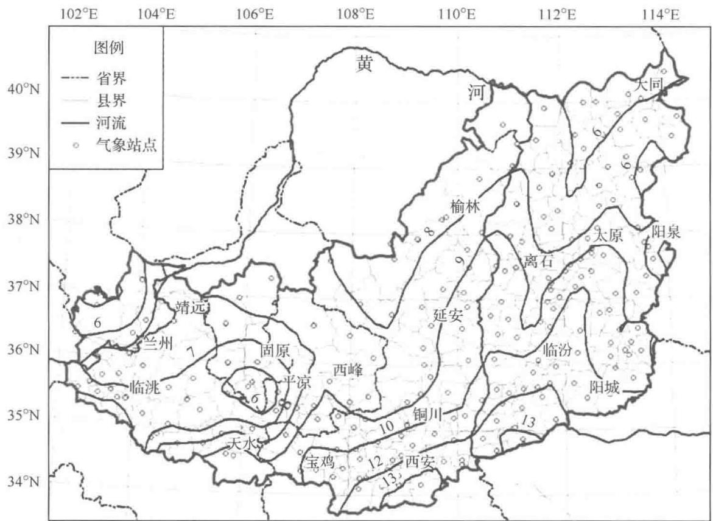  
图2-1 黄土高原多年平均年气温(℃)示意图

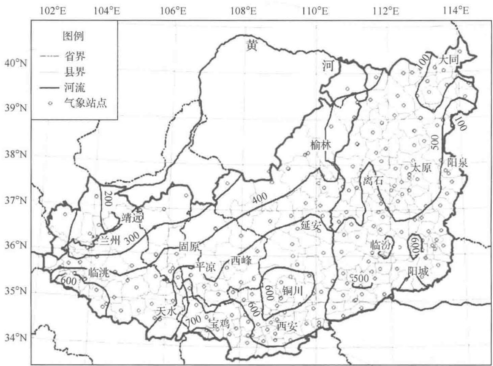  
图2-2 黄土高原多年平均年降雨量(mm)示意图

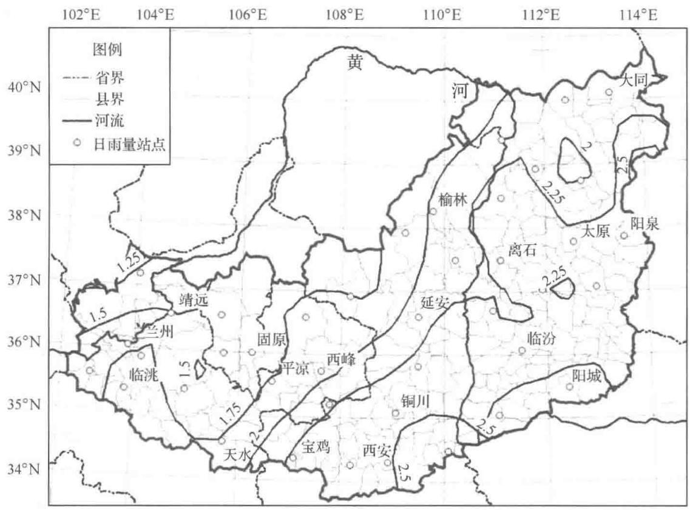

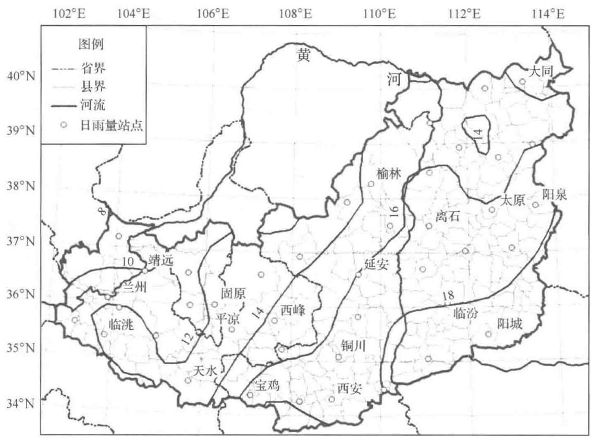

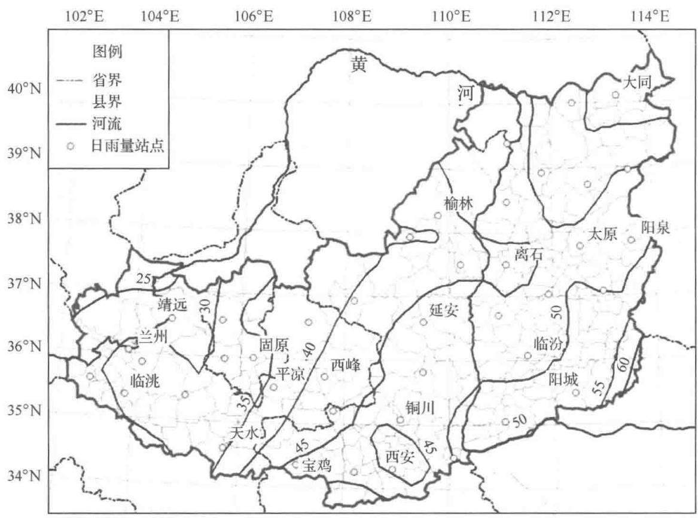

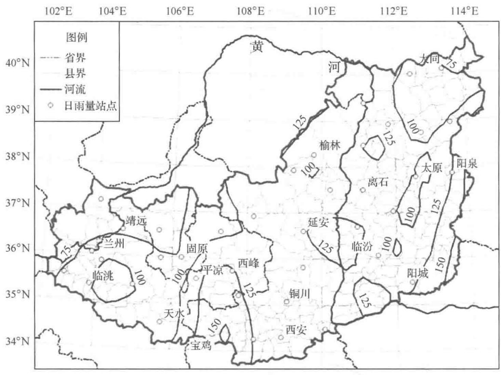  
图2-3 黄土高原不同重现期及最大日雨量(mm)示意图

由于地处内陆，气候的大陆性较强，夏季多对流性暴雨，日最大雨量可达到90～160mm(图2-3d)。暴雨的出现与地形有密切关系。王万忠和焦菊英(1996)的研究表明，该区暴雨中心区多达17个，集中分布于陕西北部和山西西部。从不同等级的降雨日数(图2-4)

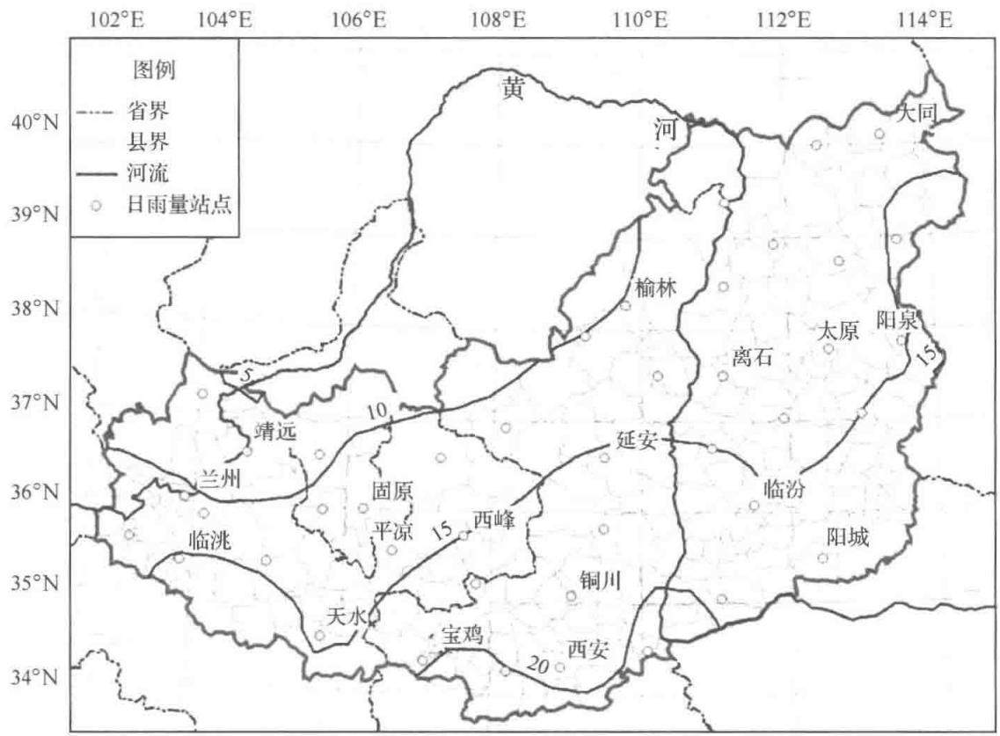  
(a) 日雨量≥10mm日数

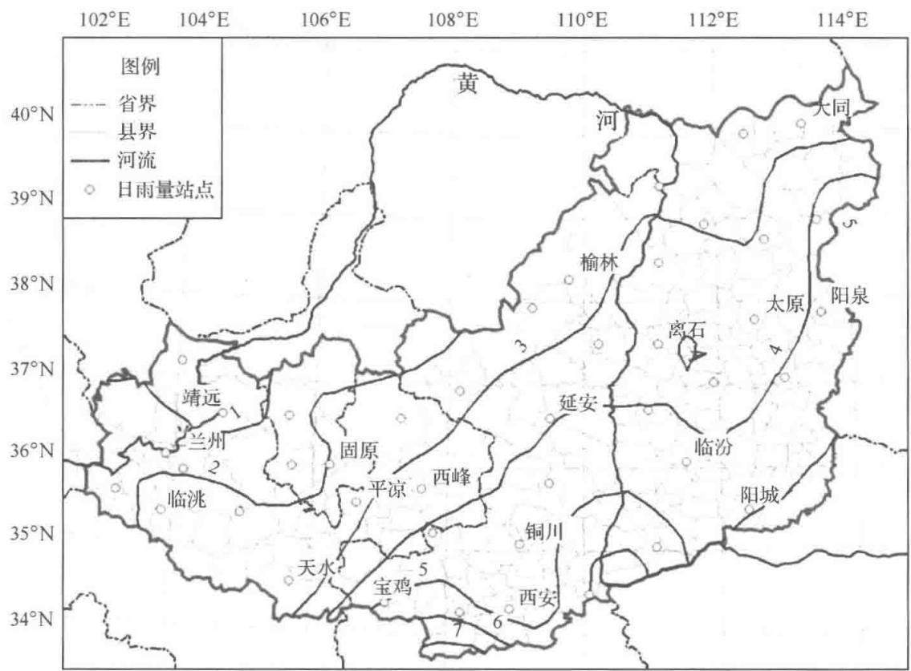  
(b) 日雨量≥25mm日数

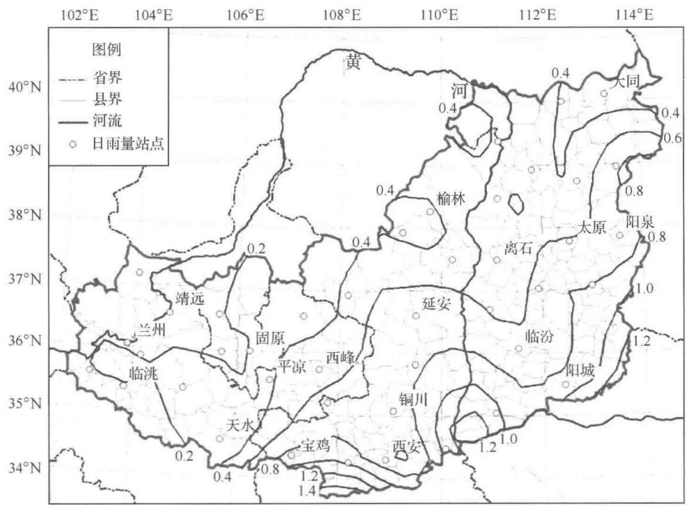

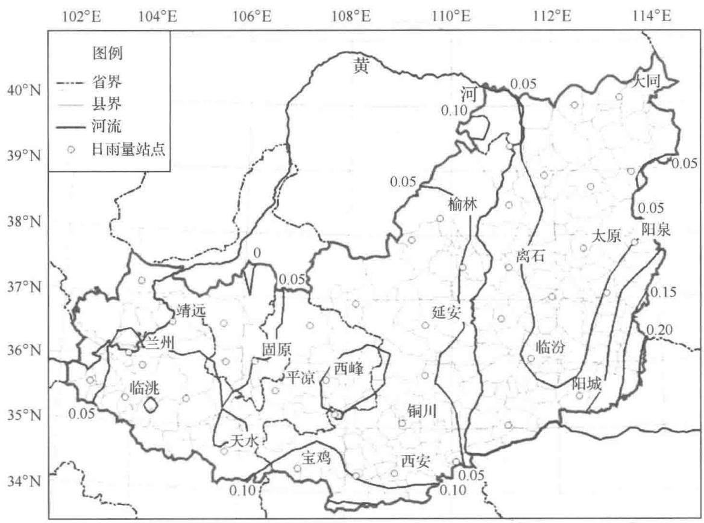  
(d) 日雨量≥100mm日数  
图2-4 黄土高原不同等级降雨日数分布(天)示意图

看，均呈现从西北向东南方向减少的趋势，日雨量小于10mm的日数平均10～20天；日雨量10\~20mm的日数平均1\~7天；日雨量50mm以上的暴雨日数不足一天。

该区春季气温回升时，由于干燥和气温升高速度较快的共同影响，形成多风天气。大部分地区年平均风速2.0\~3.0m/s，4\~5月平均风速可达3.0m/s以上，风速从西北向东南呈递减趋势(图2-5)。因此该区除遭受水力侵蚀外，还会遭受风力侵蚀。

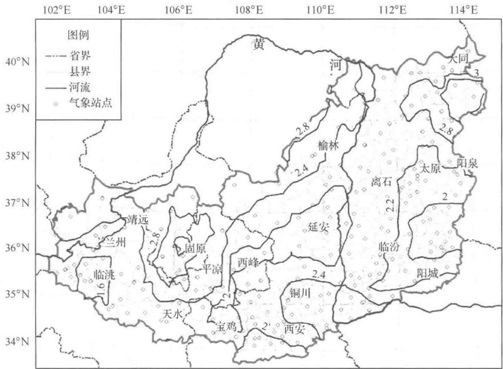  
图2-5 黄土高原多年平均年风速(m/s)示意图

## (三)河流水文

该区河流主要是黄河、海河及内陆闭流水系(中国科学院黄土高原综合科学考察队，1991)。如果自青海龙羊峡算做黄河进入黄土高原，河南花园口算作黄河出黄土高原，其流经面积为52.27万km²，包括了黄土高原地区，因此有了黄河中游黄土高原之称。黄河在黄土高原的主要支流有窟野河、无定河、汾河、渭河等。内陆河闭流区位于鄂尔多斯高原的毛乌素沙地、陕宁蒙边缘地区，面积约4.2万km2。

## 1. 河流泥沙过程

受黄土高原破碎地形和严重土壤侵蚀的影响，流经该区的黄河支流往往比降较大，目疏松的黄土极易被暴雨产生的地表径流冲刷，河流含沙量很高。径流中携带大量泥沙，也会使流体形态发生变化，导致径流挟沙力大于一般河流，进而搬运更多的泥沙。黄土高原地区的大量泥沙从支流进入干道，形成黄河的主要沙源区。表2-8是主要河流的基本情况，在表中所列的25个干支流中，平均含沙量大于100kg/m3的河流(段)就有15个，其中皇甫川和偏关河的含沙量分别高达325kg/m³和316kg/m³。同一时期，黄河干流龙门站的含沙量也高达30kg/m³，远远高于世界其他大河的年均含沙量，只有美国科罗拉多河流年均含沙量(27.5kg/m³)与之接近。黄土高原地区各支流来沙量差别很大，其中泾河、无定河、渭河和窟野河年均输沙量都在1亿t以上，上述4条支流输沙量占全河段总输沙量的一半左右。同时，各支流输沙量年内分配集中，一半集中在7\~10月，连续最大4个月的输沙量占全年总输沙量的80%以上。黄土高原地区各支流输沙量的年际变化也很大，龙门、华县、河津和洑头4站实测泥沙量之和最大时达40.7亿t(1933年)，最小时只有4.2亿t(1987年)，最大值几乎为最小值的10倍。黄河泥沙问题一方面是多沙，另一方面又是多粗砂(粒径>0.05mm)。

表2-8黄土高原主要黄河支流径流与输沙量(1955\~1985年平均)
<table><tr><td>支流名称</td><td>水文站</td><td>控制面积/km²</td><td>径流量/亿m³</td><td>含沙量/(kg/m³)</td><td>输沙量/10亿t</td></tr><tr><td>黄河干流</td><td>头道拐</td><td>367898</td><td>251.132</td><td>5.778</td><td>1.451</td></tr><tr><td>红河</td><td>放牛沟</td><td>5461</td><td>2.424</td><td>78.795</td><td>0.191</td></tr><tr><td>偏关河</td><td>偏关</td><td>1915</td><td>0.468</td><td>316.239</td><td>0.148</td></tr><tr><td>皇甫川</td><td>皇甫</td><td>3175</td><td>1.719</td><td>324.607</td><td>0.558</td></tr><tr><td>孤山川</td><td>高石崖</td><td>1263</td><td>0.918</td><td>261.438</td><td>0.240</td></tr><tr><td>岚漪河</td><td>裴家川</td><td>2159</td><td>0.885</td><td>131.073</td><td>0.116</td></tr><tr><td>蔚汾河</td><td>碧村</td><td>1476</td><td>0.683</td><td>169.839</td><td>0.116</td></tr><tr><td>窟野河</td><td>温家川</td><td>8645</td><td>6.936</td><td>170.415</td><td>1.182</td></tr><tr><td>秃尾河</td><td>高家川</td><td>3253</td><td>3.898</td><td>59.261</td><td>0.231</td></tr><tr><td>佳芦河</td><td>申家湾</td><td>1121</td><td>0.804</td><td>235.075</td><td>0.189</td></tr><tr><td>湫水河</td><td>林家坪</td><td>1873</td><td>0.918</td><td>251.634</td><td>0.231</td></tr><tr><td>三川河</td><td>后大成</td><td>4102</td><td>2.679</td><td>89.959</td><td>0.241</td></tr><tr><td>屈产河</td><td>裴沟</td><td>1023</td><td>0.383</td><td>279.373</td><td>0.107</td></tr><tr><td>无定河</td><td>白家川</td><td>29662</td><td>13.214</td><td>109.202</td><td>1.443</td></tr><tr><td>清涧河</td><td>延川</td><td>3468</td><td>1.435</td><td>281.041</td><td>0.378</td></tr><tr><td>昕水河</td><td>大宁</td><td>3992</td><td>1.685</td><td>122.255</td><td>0.206</td></tr><tr><td>延水</td><td>甘谷驿</td><td>5891</td><td>2.221</td><td>217.920</td><td>0.484</td></tr><tr><td>汾川河</td><td>新市河</td><td>1121</td><td>0.376</td><td>79.787</td><td>0.030</td></tr><tr><td>仕望川</td><td>大村</td><td>2141</td><td>0.915</td><td>32.787</td><td>0.030</td></tr><tr><td>州川河</td><td>吉县</td><td>436</td><td>0.194</td><td>211.340</td><td>0.041</td></tr><tr><td>黄河干流</td><td>龙门</td><td>497566</td><td>310.642</td><td>29.877</td><td>9.281</td></tr><tr><td>汾河</td><td>河津</td><td>38728</td><td>13.237</td><td>22.739</td><td>0.301</td></tr><tr><td>北洛河</td><td>洑头</td><td>25154</td><td>9.250</td><td>95.784</td><td>0.886</td></tr><tr><td>泾河</td><td>张家山</td><td>43216</td><td>15.195</td><td>167.226</td><td>2.541</td></tr><tr><td>渭河</td><td>咸阳</td><td>46827</td><td>51.187</td><td>30.652</td><td>1.569</td></tr></table>

根据以往的研究成果，黄河每年淤积在下游河道的4亿t泥沙中，69%属于粒径0.05mm的粗泥沙。黄河泥沙主要来自黄土高原地区，但更集中于多沙粗砂区。徐建华和牛玉国(2000)在前人研究的基础上对黄河多沙粗砂的定义、限定条件以及面积大小进行过全面论述，认为多沙区面积(多年平均侵蚀模数 ${ > } 5 0 0 0 \mathrm { t } / \mathrm { k m } ^ { 2 } )$ 约为11.05万 $\mathrm { k m ^ { 2 } }$ ,粗砂区面积只有7万 $\mathrm { k m ^ { 2 } }$ 左右。大量粗砂在下游河道淤积，形成地上河，严重地威胁着下游两岸人民生命财产安全。黄土高原地区也是黄河粗泥沙的主要来源地，黄河高含沙量特点决定了黄河流域独特的水沙运移规律和河床演变过程。

## 2. 河流径流过程

黄土高原地区河流水文的另外一个特点是径流量的季节变化和年际变化都十分明显，汛期径流量和输沙量远远大于非汛期。黄河流域径流主要来源于降雨，降雨方式多为短历时和高强度的暴雨，年内分配集中。由于天然植被覆盖面积小，加之受人类不合理的土地利用方式和降雨特征的综合影响，黄土高原地区的河流的洪水常常表现出暴涨暴落。无植被保护的陡坡地形促进了地表径流快速汇集，并在产流过程中常常伴有“溃坝效应”，造成洪水暴涨暴落。流域内最大连续4个月径流量可占全年径流总量的60%。径流年际变化同样较大，最大时天然径流量可达968亿 $\mathrm { m ^ { 3 } }$ (1964年)，最小时天然径流量只有258亿 $\mathrm { m ^ { 3 } ( 1 9 2 8 }$ 年)，最大与最小年相差2.75倍。

## 3. 河流水资源

黄河全流域多年平均水资源总量744.2亿 $\mathrm { m } ^ { 3 }$ (1956\~1979年)，工农业耗水251亿 $\mathrm { m ^ { 3 } }$ 地下水耗水49.4亿 $\mathrm { m ^ { 3 } }$ ,水资源利用率达34.0%。龙羊峡到花园口黄土高原地区黄河水资源总量为483.2亿 $\mathrm { m ^ { 3 } }$ ，占全流域水资源总量的64.93%。龙羊峡到兰州段，位于青海高原与黄土高原结合部位，土地利用以牧草地为主，区间多年平均水资源总量135.3亿 $\mathrm { m } ^ { 3 }$ 占流域水资源总量的18.2%，占黄土高原地区黄河段水资源总量的28.0%。兰州到河口镇段，属于黄土高原和内蒙古高原，耕地面积增加。区间多年平均水资源总量36.9亿 $\mathrm { m ^ { 3 } }$ 占流域水资源总量的5.0%，占黄土高原地区黄河段水资源总量的7.64%。由于灌区面积大，工农业耗水量达94.1亿 $\mathrm { m ^ { 3 } }$ 。河口镇到龙门段，属于黄土高原丘陵沟壑区，区间多年平均水资源总量70.4亿 $\mathrm { m } ^ { 3 }$ ，占流域水资源总量9.5%，占黄土高原地区黄河段水资源总量的14.57%。土地利用中雨养耕地面积大，工农业耗水2.4亿 $\mathrm { m ^ { 3 } }$ 。龙门到三门峡段，属于黄土塬和黄土丘陵沟壑区，耕地面积比例更大，但仍以雨养农业为主。区间多年平均水资源总量169.4亿 $\mathrm { m } ^ { 3 }$ ，占流域水资源总量22.8%，占黄土高原地区黄河段水资源总量的22.76%。三门峡到花园口段，属于黄土丘陵和冲积平原，耕地面积比例进一步增大，灌溉面积也有所增加。区间多年平均水资源总量71.2亿 $\mathrm { m ^ { 3 } }$ ，占流域水资源总量9.6%，占黄土高原地区黄河段水资源总量的9.57%(表2-9)。

表2-9 黄土高原地区黄河水资源量
<table><tr><td>河段区间</td><td>龙羊峡-兰州</td><td>兰州-河口镇</td><td>河口镇-龙门</td><td>龙门三门峡</td><td>三门峡-花园口</td></tr><tr><td>地表水/亿  $\mathrm { m ^ { 3 } }$ </td><td>135.3</td><td>14.9</td><td>59.7</td><td>142.4</td><td>65.3</td></tr><tr><td>地下水/亿  $\mathrm { m } ^ { 3 }$ </td><td></td><td>22.0</td><td>10.7</td><td>27.0</td><td>5.9</td></tr><tr><td>总量/亿  $\mathrm { m ^ { 3 } }$ </td><td>135.3(28%)</td><td>36.9(7.64%)</td><td>70.4(14.57%)</td><td>169.4(22.76%)</td><td>71.2(9.57%)</td></tr></table>

资料来源：陈先德，1996。

## (四)土壤资源

土壤及其母质是水土流失的物质来源，土壤性状特征深刻地影响着土壤侵蚀过程及强度。由于特殊的成土环境，形成了黄土高原地区独特的土壤类型及其发生演变过程和分布规律，最终影响到总体水土流失格局。尽管黄土高原地区类型多样，但土壤性质的普遍特点是有机质含量低，结构性差，机械组成以粉粒为主，黏粒含量少，土壤透水性好。土壤侵蚀严重区的土壤类型基本上都未形成明显的发生层，土壤基本性状与成土母质十分接近。这种土壤性状的总体特征，决定了黄土高原地区的土壤侵蚀不论在过程机理，还是在流失量动态变化方面都有别于其他地区。

## 1. 成土母质特征

黄土高原的成土母质主要有黄土及黄土状沉积物、风沙沉积物、残积物、坡积物、河流湖泊冲积物，以及岩石风化物。黄土及黄土状物质是黄土高原地区最普遍的成土母质，风沙沉积物主要集中分布在毛乌素沙地和库布齐沙漠，由于细粒部分被吹走，粒径相对较粗，黏粒含量很少。残积物和残积坡积物主要分布在山地和鄂尔多斯高原北部，主要由花岗岩、片麻岩、红色砂岩和砂砾岩等就地风化或坡积而成的母质。质地粗，砂砾含量高，土层浅薄。洪积物和湖积物主要分布在河套平原、汾渭平原等地，水平层理明显，质地较为黏重。

在黄土高原地区，土壤特点深受黄土及黄土状物质基本性质影响。黄土及黄土状物质的主要特征是：在物质组成上以粉粒为主，黏粒含量低。在结构上以柱状为主，间有层状和块状结构，其他结构少见。在组成成分上，则以富含 $\mathrm { C a ^ { 2 + } , K ^ { + } }$ 为特点。由于沙粒和粉粒含量高，成土母质疏松，大孔隙多，透水性好。就母质本身特征而言，降雨过程有利于入渗。柱状结构则决定了黄土垂直节理发育、矗立性好，影响沟谷侵蚀过程及侵蚀沟形态。

## 2. 成土过程特点

受黄土高原气候、地形、植被、成土母质和人类活动等因素的共同影响，黄土高原的土壤总体上表现为成十环境不稳定、腐殖质化作用弱、残积黏化和钙化过程明显。从自然地理环境地带性而言，黄土高原的部分地区属于干旱半干旱地区，由于降雨量少，加上地形破碎，陡坡地多，降雨过程中入渗量小，产流量大，成土过程中的淋溶作用相对较弱。在主要土壤类型中，除了褐土和棕壤有明显的残积黏化和钙化过程外，其他土壤类型都不明显。受少雨干旱和土质疏松的影响，地带性植被条件差，多年生类型多且根系层分布深厚，腐殖质化作用弱，很难形成明显的腐殖质层。在南部森林植被条件下的棕壤和褐土，成土过程表现为腐殖化过程、黏化过程和钙化过程，土壤剖面分异明显，形成了浅褐色黏化层和灰白色假菌丝状或结核状的钙积层。

由于严重的水土流失，成土速率远远小于侵蚀速率，黄土高原地区的成土环境不稳定。除了南北植被覆盖较好的区域外，在水力侵蚀或风力侵蚀作用下，大部分地区土壤一边发育，一边遭受侵蚀，都基本停留在初育土阶段，剖面分异不明显。以黄绵土为例，剖面分异只表现为人为耕作过程形成的耕作层和犁底层，成土过程作用微弱，土壤现状在整个剖面都比较均一，土壤有机质含量仅为1%左右。由于母质深厚且透水性强，土壤剖面中很难形成明显的钙积现象，碳酸钙结核常常出现在很深的黄土层下部。

黑垆土属黄土高原地区草原植被下发育的地带性土壤，由于母质疏松且透水性好，降雨入渗深度大。为了有效利用土壤水，植物根系深扎，形成独特的土壤腐殖化过程和腐殖质层。腐殖质层深厚，但有机质含量低，颜色较浅。

搂土是黄土高原一种独特的土壤类型，主要发育于关中平原地区，在分类上属于人为土壤的一种。在人类年复一年的耕作培肥过程中，土壤层向上逐渐增厚(正常土壤发育过程是向下逐渐增厚)，形成新老耕作层-犁底层交互更替的剖面特征。人类活动是土形成的主导过程。

## 3. 主要土壤类型及性状

根据20世纪80年代中国科学院黄土高原综合考察结果，黄土高原主要发育的土壤类型有20多种，包括搂土、黑垆土、黄绵土、褐土、栗钙土、黑钙土、灰钙土、棕钙土、灰漠土、风沙土、灌淤土、水稻土、紫色土、淡棕壤、红土、灰褐土、草甸土、潮土、新积土、盐碱土和粗骨土等。其中黑垆土、褐土、栗钙土、灰钙土、棕钙土、灰漠土为水平地带性土壤类型，黑钙土、淡棕壤为垂直地带性土壤。搂土、灌淤土、水稻土等为人为土壤类型。草甸土、紫色土、潮土、盐碱土等土壤类型则在一定程度上受制于地方性成土因素的影响。黄绵土、粗骨土、新成土等土壤则是在地带性土壤遭受侵蚀破坏后形成或发育的土壤类型。尽管黄土高原地区的土壤类型多种多样，但分布面积较大的只有黄绵土，占总面积的32.5%。风沙土占11.77%，粗骨土占8.07%，灰褐土占7.09%，灰钙土占5.25%，褐土占4.63%，栗钙土占4.63%，黑垆土占3.72%，搂土占3.46%。其他土壤类型在黄土高原地区分布面积相对较少。高原地区自然地带性土壤在很大程度上遭受破坏，耕作土壤广泛分布。

黄绵土是地带性土壤遭受侵蚀后，在黄土母质上耕种而形成的土壤类型。其形态和属性与黄土母质相似，粒径组成以粉粒为主，有机质含量很低，结构性差，渗透性好，田间持水量为20%\~26%，2m土层可储存有效水400\~500mm。剖面无明显发生层，土层深厚，质地均匀，富含碳酸钙，土体疏松，容重为1.1～1.3g/cm³。分布遍及整个黄土高原，是土壤侵蚀严重区主要土壤类型。受黄土高原气候、母质等要素地带性分布规律影响，黄绵土又可分为膳黄绵土、黄绵土、沙黄绵土和灰黄绵土。膳黄绵土分布在黄土高原南部，母质组成物质较细，发育程度较好，质地以中壤为主。黄绵土则主要分布在黄土高原中部，发育于轻壤质黄土母质上，土质疏松，易于分散，为侵蚀最严重的土壤类型。沙黄绵土主要分布在黄土高原北部地区，沙粒含量多，一般风蚀沙化严重。灰黄绵土主要分布于黄土高原中部和南部的次生林下，有较为明显的腐殖质层，但剖面总体发育不显著。相对于其他黄绵土类型，土壤肥力较好，表层土壤有一定的结构性。

风沙土主要分布于黄土高原长城沿线及以北沙区，为风蚀沙化严重地段风成沙性母质上发育的土壤。由于气候干旱且多大风天气，成土过程十分不稳定。因此，风沙土的成土过程在很大程度上一直处于初育阶段。只有沙丘处于固定或半固定状态时，植被条件逐步改善的条件下，成土过程才能得以继续。由于母质和气候的原因，风沙土地区成土过程以物理风化为主，化学风化和生物过程都相当微弱，很难形成完整的土壤剖面。风沙土一般质地较粗，以细沙部分为主，结构性极差。

粗骨土是在岩石半风化体上发育很弱的极其幼年的土壤类型，主要分布在土石山地、石质山地和丘陵地区的基岩裸露部位。共同特点是土层薄砾石含量多，土壤保水保肥性能差。由于地形和质地原因，植被条件极差，土壤有机质和其他养分含量都很低。粗骨土分布地区，土壤侵蚀一般都极为严重，且治理难度很大。

灰褐土是黄土高原地区山地发育的一种垂直地带性土壤，主要分布于褐土带以北的六盘山、吕梁山等山地，植被为针阔叶混交林或山杨、白桦林。灰褐土成土过程类似褐土，但受降雨和植被条件决定，其腐殖质化过程稍强于褐土，形成了较厚的腐殖质层，属褐土和灰色森林土之间的过渡类型。土壤有机质含量高，水热条件好，化学风化旺盛，有明显的淀积黏化作用。结构性好，土壤质地为轻壤到中壤。由于灰褐土地区植被条件较好，一般土壤侵蚀微弱。

褐土是黄土高原地区的主要地带性土壤，分布于黄土高原东南部的关中、晋南和豫西盆地及山地的垂直带中。在暖温带大陆性气候的影响下，夏季高温多雨，冬季寒冷干旱，干湿季变化分明。在夏季水热条件较好的时期，褐土中矿物风化和生物分解作用相对旺盛，淋溶过程明显，促进了土壤形成过程和剖面分异程度，形成了腐殖质层-黏化层-钙化层-母质层的典型剖面构型。在植被条件较好时，褐土土壤有机质含量可达2%～4%，质地较为黏重。土壤保水保肥性能好，是较为理想的农业土壤。

黑垆土是黄土高原地区暖温带草原植被下发育的地带性土壤，分布范围很广，几乎占据黄土高原的大部分地区。但由于长期严重的水土流失，除了在地形平坦的黄土塬区和残塬区外，大部分黄土丘陵地区的黑垆土已被侵蚀流失殆尽，只有在梁峁顶部、鞍部等地形较为平坦的地区零星尚存。在黄土母质和草原植被条件下，黑垆土剖面腐殖质层很深厚，多在2m以上，但土壤有机质含量并不高，一般在1%左右，容重为1.1\~1.2g/cm3。这种特殊的腐殖质层的形成过程可以归结于以下3个方面原因，黄土母质疏松，通透性好，有机质分解迅速；由于气候干旱，植物根系发达，根系层深度大；处于黄土沉积区，风成物质不断加积，增加了土壤层厚度。

栗钙土是黄土高原地区主要的草原土壤类型，主要分布于内蒙古东部和青海省海东大部分地区。气候属温带半干旱大陆性气候，降雨量少，夏季温热短促，冬季寒冷漫长，春季干旱多风。植被类型为典型草原。栗钙土的成土过程主要为腐殖质累积和碳酸钙聚集，有机质含量高，一般为1%～2%。在土地利用上属于半农半牧，由于人类活动强烈影响，乱垦滥牧导致栗钙土严重退化，土壤性质恶化，风蚀严重。

红土也称为红色土或红胶土，主要分布于黄土高原水土流失严重地区深切河谷和坡度较陡的梁昴坡的中下部。在强烈的侵蚀作用下，黄土层被剥蚀，使下覆的红色古土壤条带或者第三纪红土出露地表而形成的母质型幼年土。红土全剖面呈褐棕色或红棕色，黏粒含量高，质地黏重致密，孔隙度小，通透性差。与上覆黄土相比，土壤抗冲抗蚀性强，即使在相同的降雨和径流侵蚀下，也会形成不同的侵蚀形态。

新积土是在黄土高原地区河流阶地、河漫滩、山前洪积扇等地貌类型上发育的一类初育土。由于成土时间短，成土过程又常被河流洪水打断，土壤发育不明显，土壤性质在很大程度上取决于成土母质性质。由于母质为流水沉积物，新积土剖面有明显的水平沉积层理，组成物质粒径组成差异性大，常含有大量砾石。由于分布在河谷地区，新成土一般是黄土高原地区重要的耕地。

不同土壤类型在理化性质方面存在很大差异。根据第二次全国土壤普查资料统计整理，就与水土流失关系密切的土壤容重和有机质含量而言，黄土高原地区表层土壤的平均容重变化于 $1 { \sim } 1 . 6 2 \mathrm { g } / \mathrm { c m } ^ { 3 }$ ，总体平均值为 $1 . 2 2 \mathrm { g / c m ^ { 3 } }$ 。土壤有机质含量变化于0.35%\~8.75%，平均含量为1.56%。分布面积最大的黄绵土表层容重为 $\mathrm { 1 . 0 2 g / c m ^ { 3 } }$ ，土壤有机质含量只有1.19%。土壤有机碳密度变幅为 $0 . 6 6 \sim 1 2 . 1 8 \mathrm { k g ~ C / m ^ { 2 } }$ ，其中大部分土壤的有机碳密度集中在 $1 \mathrm { \sim } 4 \mathrm { k g } \mathrm { C / m ^ { 2 } }$ (表2-10)。

表2-10黄土高原地区不同土壤类型有机质含量和碳密度
<table><tr><td>土壤类型</td><td>剖面数</td><td>统计面积  $/ \mathrm { k m ^ { 2 } }$ </td><td>剖面深度  $/ \mathrm { c m }$ </td><td>平均有机质  $1 \%$ </td><td>平均容重  $/ ( \mathrm { g / c m ^ { 3 } } )$ </td><td>有机碳密度  $/ ( \mathrm { k g } \mathrm { C } / \mathrm { m } ^ { 2 } )$ </td></tr><tr><td>草甸盐土</td><td>14</td><td>339.3</td><td>20</td><td>0.77</td><td>1.39</td><td>1.25</td></tr><tr><td>草毡土</td><td>12</td><td>44.7</td><td>20</td><td>8.33</td><td>1.20</td><td>11.60</td></tr><tr><td>潮土</td><td>429</td><td>3598.7</td><td>20</td><td>1.00</td><td>1.50</td><td>1.74</td></tr><tr><td>粗骨土</td><td>32</td><td>4418.7</td><td>20</td><td>1.85</td><td>1.25</td><td>2.68</td></tr><tr><td>风沙土</td><td>86</td><td>13343.3</td><td>20</td><td>0.35</td><td>1.62</td><td>0.66</td></tr><tr><td>灌淤土</td><td>323</td><td>1746.7</td><td>20</td><td>1.22</td><td>1.10</td><td>1.55</td></tr><tr><td>褐土</td><td>487</td><td>31080.7</td><td>20</td><td>2.28</td><td>1.17</td><td>3.09</td></tr><tr><td>搂土</td><td>326</td><td>7197.3</td><td>20</td><td>1.10</td><td>1.20</td><td>1.54</td></tr><tr><td>黑钙土</td><td>78</td><td>2154.0</td><td>20</td><td>4.73</td><td>1.25</td><td>6.86</td></tr><tr><td>黑垆土</td><td>860</td><td>11643.3</td><td>20</td><td>1.37</td><td>1.10</td><td>1.74</td></tr><tr><td>黑土</td><td>135</td><td>1418.0</td><td>20</td><td>5.18</td><td>1.25</td><td>7.52</td></tr><tr><td>黑毡土</td><td>1</td><td>7.3</td><td>20</td><td>8.75</td><td>1.20</td><td>12.18</td></tr><tr><td>红黏土</td><td>293</td><td>5327.3</td><td>20</td><td>1.42</td><td>1.34</td><td>2.21</td></tr><tr><td>黄褐土</td><td>1</td><td>832.7</td><td>20</td><td>1.25</td><td>1.29</td><td>1.87</td></tr><tr><td>黄绵土</td><td>1368</td><td>106109.3</td><td>20</td><td>1.02</td><td>1.19</td><td>1.41</td></tr><tr><td>黄棕壤</td><td>33</td><td>5775.3</td><td>20</td><td>1.45</td><td>1.03</td><td>1.73</td></tr><tr><td>灰钙土</td><td>362</td><td>20666.0</td><td>20</td><td>1.18</td><td>1.29</td><td>1.74</td></tr><tr><td>灰褐土</td><td>32</td><td>7758.0</td><td>20</td><td>3.06</td><td>1.21</td><td>4.46</td></tr><tr><td>灰漠土</td><td>1</td><td>2069.3</td><td>20</td><td>1.01</td><td>1.25</td><td>1.46</td></tr><tr><td>栗钙土</td><td>103</td><td>12040.7</td><td>20</td><td>2.72</td><td>1.24</td><td>3.91</td></tr><tr><td>栗褐土</td><td>143</td><td>11322.7</td><td>20</td><td>0.94</td><td>1.26</td><td>1.37</td></tr><tr><td>漠境盐土</td><td>2</td><td>129.3</td><td>20</td><td>0.92</td><td>1.39</td><td>1.48</td></tr><tr><td>山地草甸土</td><td>20</td><td>278.7</td><td>20</td><td>7.27</td><td>1.25</td><td>10.54</td></tr><tr><td>石灰土</td><td>6</td><td>247.3</td><td>20</td><td>2.22</td><td>1.24</td><td>3.19</td></tr><tr><td>石质土</td><td>33</td><td>1724.7</td><td>20</td><td>1.88</td><td>1.27</td><td>2.76</td></tr><tr><td>土壤类型</td><td>剖面数</td><td>统计面积  $/ \mathrm { k m ^ { 2 } }$ </td><td>剖面深度  $/ \mathrm { c m }$ </td><td>平均有机质 1%</td><td>平均容重  $/ ( \mathrm { g / c m ^ { 3 } } )$ </td><td>有机碳密度  $/ ( \mathrm { k g } \mathrm { C } / \mathrm { m } ^ { 2 } )$ </td></tr><tr><td>水稻土</td><td>168</td><td>812.0</td><td>20</td><td>2.36</td><td>1.20</td><td>3.24</td></tr><tr><td>新积土</td><td>499</td><td>5420.7</td><td>20</td><td>0.97</td><td>1.29</td><td>1.46</td></tr><tr><td>沼泽土</td><td>41</td><td>500.0</td><td>20</td><td>2.83</td><td>0.23</td><td>0.76</td></tr><tr><td>棕壤</td><td>186</td><td>9240.7</td><td>20</td><td>5.49</td><td>1.02</td><td>6.50</td></tr><tr><td>总计</td><td>6074</td><td>267246.7</td><td>20</td><td>1.56</td><td>1.22</td><td></td></tr></table>

## 4. 土壤分布特征

土壤是成土环境综合作用的结果，成土环境地带性分布规律及地域性变化制约着土壤变化及分布趋势。水热环境及其变化是土壤区域分异的内在原因，植被条件和地形特征是主导因素。黄土高原地区生物气候条件受大陆性季风气候影响明显，随着从东南向西北地势的升高和距海渐远、季风影响减弱，降雨逐渐减少；加之人类活动的深刻影响，形成了黄土高原独特的土壤分布格局。黄土高原地区的分布规律，体现在水平地带性、垂直地带性和地域性规律的变化上。

受水热条件变化的制约，黄土高原表现出东北一西南走向的生物气候带。土壤整体上也呈现出相应的水平地带性变化规律，土壤带大致呈东北一西南和东西向更替规律。由东南向西北依次分布着褐土、黑垆土、栗钙土、棕钙土和灰漠土。在黄土高原西部地区，由于地区性因子影响作用，在黑垆土和灰漠土之间发育了灰钙土。灰钙土的形成除了生物气候条件外，与所处山前平原的地貌部位及黄土状母质有关。

在黄土高原不同土壤区内，受地形、母质、水文地质和人为耕作等因素的影响，镶嵌着不同组合方式的非地带性土壤和农业土壤。在不同空间尺度上，表现出了地域性分布规律。在地带性土壤黑垆土分布区内，由于人类不合理的土地利用而导致的严重水土流失，使黑垆土剖面被侵蚀殆尽，黄土或红土母质出露，形成了大面积初育土壤黄绵土和红土。山区植被破坏后，地带性土壤遭受侵蚀，形成不少粗骨土和石质土类。在汾渭平原，在长期耕作活动影响下，形成了不同发育历史的搂土。河套平原和宁夏平原等地则发育了盐碱土、沼泽土、草甸土和新积土。形成了在地带性土壤类型区内镶嵌多种地方性土壤类型的分布格局。

在典型黄土高原区，随着地貌形态变化和地形部位的不同，从塬面一丘陵一沟谷一河川，土壤依次呈现黑垆土一黄绵土一红土一潮土和新积土分布断面。由于海拔由低到高引起的生物气候条件的变化，土壤类型也在垂直方向发生依次更替。黄土高原地区土壤垂直带谱的基本类型：暖温带半湿润阔叶林褐土带，更替模式为褐土一淋溶褐土一淡棕壤一山地草甸土，基带是褐土；暖温带半干旱半湿润黑垆土带，更替模式为黑垆土一灰褐土一淋溶灰褐土一山地草甸土，基带是黑垆土；中温带半干旱草原栗钙土带，更替模式为栗钙土一暗栗钙土一黑钙土和灰钙土一山地草甸土，基带是栗钙土；中温带干旱荒漠草原带，更替模式为灰钙土一山地灰钙土一石灰性灰钙土一山地草甸土，基带是灰钙土；中温带荒漠带，更替模式为灰漠土一棕钙土一灰褐土一山地草甸土，基带是灰漠土。在黄土高原水土流失严重区，即黄绵土分布区域，从梁昴顶部到沟谷底部土壤也表现出垂直变化规律。由于黄绵土分布地带水土流失严重，地带性土壤流失殆尽，当前土壤特性受母质影响很大。从梁昴顶部到沟谷底部，土壤母质依次为马兰黄土、离石黄土和午城黄土或第三纪三趾马红土。在梁昴顶部和梁昴坡面，母质为马兰黄土和离石黄土。马兰黄土厚10～15m，淡灰黄色，疏松。离石黄土厚50\~80m，夹13\~14层红褐色古土壤和二层沙质黄土层，出露高度较马兰黄土低。沟沿线以下则以离石黄土为主，午城黄土和三趾马红土多见于深切沟谷和局部沟坡，一般在沟沿线以下较为多见。受成土母质性状特征的控制，黄土高原地区土壤在垂直方向上的分布规律一般为，黄土梁昴坡覆盖黄绵土，沟坡则有红土或红胶土、黏红土。由于新老黄土、古土壤和三趾马红土在粒径组成、孔隙度、干容重，以及湿陷系数等物理性状方面的差异(表2-11)，新老黄土和红土或红胶土在可蚀性方面会表现出明显差异。尽管目前还没有分别针对新老黄土和红土土壤可蚀性值的实测资料，根据其性状指标推断，土壤可蚀性值由大到小的顺序应该为红土>老黄土>新黄土。土壤性质垂直方向上的变化规律，要求在进行区域或小流域水土流失估算时，需根据土壤变化规律选择正确的可蚀性值。

表2-11 黄土高原主要成土母质物理性状比较
<table><tr><td rowspan="2">类别</td><td rowspan="2">地点</td><td colspan="3">粒径组成/mm</td><td rowspan="2">容重 /(g/cm³)</td><td rowspan="2">含水量 1%</td><td rowspan="2">孔隙度 1%</td><td rowspan="2">湿陷 系数</td></tr><tr><td>0.25~0.05</td><td>0.05~0.005</td><td>&lt;0.005</td></tr><tr><td>新黄土</td><td>洛川</td><td>26.0</td><td>53.0</td><td>21.0</td><td>1.25</td><td>16.7</td><td>54.4</td><td>0.074</td></tr><tr><td rowspan="2">老黄土</td><td>西峰</td><td>9.5</td><td>52.6</td><td>37.9</td><td>1.22</td><td>10.5</td><td>55.0</td><td>0.149</td></tr><tr><td>洛川</td><td>5.8</td><td>56.3</td><td>37.9</td><td>1.34</td><td>18.3</td><td>51.0</td><td></td></tr><tr><td></td><td>西峰</td><td>14.1</td><td>62.8</td><td>23.1</td><td>1.33</td><td>7.8</td><td>51.0</td><td>0.014</td></tr><tr><td>古土壤</td><td>洛川</td><td>15.0</td><td>59.0</td><td>26.0</td><td>1.53</td><td>17.1</td><td>44.4</td><td>0.014</td></tr></table>

注：老黄土中西峰用原表中的甘肃数据。古土壤粒径组成引自《中国的黄土堆积》  
资料来源：中国科学院黄土高原综合科学考察队，1991。

土壤有机质是影响水土流失强度的主要土壤性状指标之一。表层土壤有机质含量多少直接关系到降雨过程中的入渗产流和土壤侵蚀过程。为此，我们利用第二次土壤普查资料，对黄土高原地区表土中的土壤碳进行计算，得到各类的土壤碳密度分布图(图2-6)。黄土高原地区东部的土壤碳密度高于其他地区。广泛分布在山西省大部分地区的褐土和带状分布在陕西、甘肃省边缘区的棕壤、山地草甸土以及草毡土等土壤碳密度明显高于其他地域。从地貌类型看，山西省的太行山脉和吕梁山区，陕西、甘肃和宁夏的秦岭山脉和六盘山区土壤有机碳含量较高。该区为黄土高原林地分布的主要地域，植被覆盖度相对较高，具有较强盛的物质的生物循环过程，因此有机碳含量相对较高。但虽说是林地分布区，却比全国其他林地土壤碳密度低。黄土高原地区中西部土壤碳密度低于东部地区，主要分布着有机碳含量较低的搂土、黄绵土、灰钙土等土类。在中西部地区，黑垆土零散分布，灰钙土集中分布在西北角，黄绵土大面积分布，而搂土分布在关中平原地区。这些土壤类型主要分布在侵蚀较强的黄土高原丘陵、黄土塬区，是农牧业比较发达的地区。陕西北部地区分布有土壤碳密度很低的风沙土，属毛乌素沙地，土壤有机碳密度只有0.66kg$\mathrm { C / m ^ { 2 } }$ 。

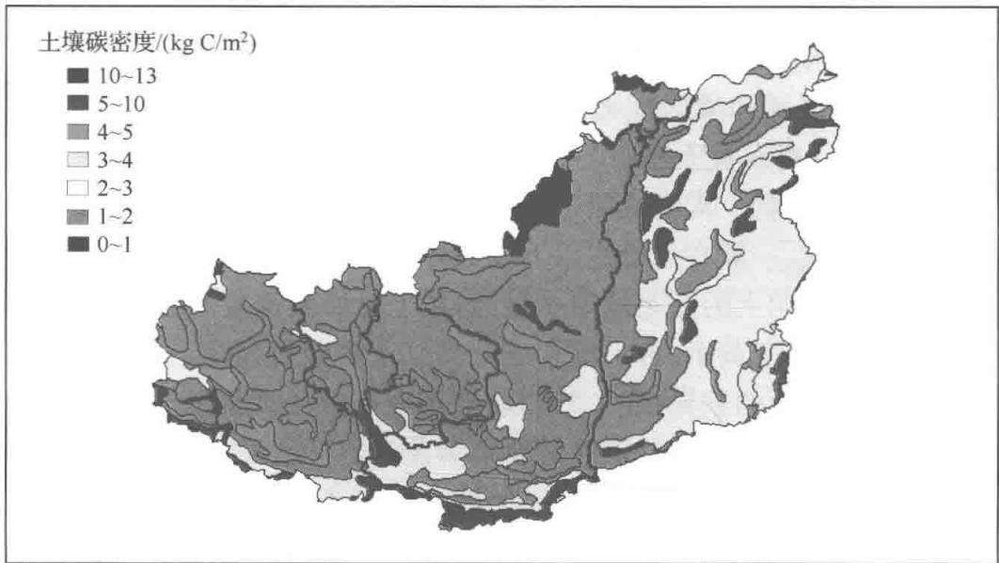  
图2-6 黄土高原地区各类土壤碳密度分布示意图

## 5. 土壤侵蚀与土壤演变

土壤是成土因素综合作用的产物，土壤形成过程是地表物质循环和能量转换过程的重要组成部分。在稳定的成土环境下，成土母质通过与大气圈、水圈和生物圈进行物质和能量交换，推动土壤系统中的物理过程、化学过程、生物过程和生化过程，土壤有机质累积、母质经风化迁移，逐渐发育成与成土环境相对应的土壤剖面。人类不合理的土地利用方式破坏植被，导致水土流失，等于改变了成土环境及成土过程中的物质循环和迁移方式。在土壤侵蚀速率小于或等于成土速率时，土壤剖面持续发育，土壤肥力水平仍能保持。当土壤侵蚀速率大于成土速率时，土壤剖面厚度逐渐变薄，发生层逐层损失。在剧烈侵蚀持续发生背景下，土壤发生层会损失殆尽。在黄土高原地区，土壤侵蚀速率远大于成土速率，土壤演变过程基本上都是原地带性土壤剖面的损失过程。

黑垆土是黄土高原地区历史上分布最广的地带性土壤类型。长期强烈侵蚀的结果，使大面积的黑垆土剖面从上向下逐渐被剥蚀，原自然土壤的A层、B层以及C层逐渐剥蚀出露，在人为耕垦作用下，形成了现代的黄绵土。受气候环境和成土母质特性决定，黑垆土淋溶作用弱，钙化作用不明显，难以形成假菌丝状的碳酸钙淀积，整个剖面通体有石灰反应。由于质地疏松，有利于植物根系下扎和有机质分解矿化，形成了黑垆土腐殖质层深厚但有机质含量不高的特点。由于黑垆土总体成土作用较弱，剖面发育程度也弱，因此不同发生层间理化性质差异不甚显著。在区域水土流失发生过程中，尽管土壤发生层逐层遭侵蚀流失，但不同时期表层土壤性状不会出现显著不同。而在东北黑土区等其他土壤剖面发育较为完善地区，随着水土流失的持续发生，不同发生层相继出露，不同时期的表层土壤理化性质及其与下覆土层间的接触关系会发生显著变化，使得即使降雨、地形等条件保持不变，水土流失过程和程度也会不尽相同。因此，在研究区域水土流失演变历史时，需要充分考虑水土流失导致的土壤演变及其对土壤侵蚀的反馈作用。

由于黄土高原地区沟壑纵横，坡度陡峻，降雨过程中流失的土壤会迅速进入沟道河流，以河流泥沙随水流向下游运移。泥沙输移比接近1，泥沙很少在坡面上或沟道内淤积。也就是说，在黄土高原地区，因水土流失导致的地表物质再分配，进而引起的地表土壤变异现象不明显。不像在东北黑土区，侵蚀物质进入沟道河流部分比例不大，而在田间发生再分配，导致土壤空间变异性加剧。

黄土高原地区地表土壤因侵蚀而发生的演变过程主要表现在发生层的损失，但土壤基本性状的时空变化不显著。就这点而言，黄土高原地区的土壤侵蚀和水土流失动态变化相对简单，在不同历史时期，土壤对侵蚀的影响作用变化不大。在地带性土壤流失殆尽的现代侵蚀过程更是如此，现在黄土高原侵蚀严重地区的黄绵土在性状方面类似黄土母质，基本不存在发生层。土壤侵蚀年复一年地发生，土壤层逐年流失，但表层土壤性质基本保持不变。对同一地点来说，土壤可蚀性值可以被看做常数。而在东北黑土区，随着土壤侵蚀年复一年地发生，上层土壤首先遭受剥蚀，下层土壤逐次出露。由于上下层土壤性质存在差异，土壤可蚀性值在逐年变化。同时，遭受侵蚀的土壤中还有一部分会淤积在剖面中下部或低洼处，等于在表层土壤上又覆盖一层土壤，结果加剧了土壤性质的田间变异，使土壤可蚀性值计算更为复杂。朱显谟院士在20世纪50年代提出剖面侵蚀和母质侵蚀的概念，就是在强调土壤侵蚀过程中土壤对侵蚀影响作用的不同。对于母质侵蚀而言，土壤对侵蚀影响作用基本保持不变，但对于剖面侵蚀而言，土壤对侵蚀影响作用处在动态变化中。模拟试验是进行现代土壤侵蚀研究的重要手段。严格地讲，模拟实验只适用于母质侵蚀情况，不适用于剖面侵蚀情况。在母质侵蚀地区，试验模型只要选择接近试验土壤的田间容重的状态就行，不存在发生层模拟问题。而在剖面侵蚀地区，是无法准确模拟土壤发生层。尽管受扰动后的表层土壤可以通过田间容重来控制，但表层与下覆土壤层间的关系问题就不好解决了。由于黄土高原地区的现代侵蚀属于母质侵蚀，且黄土母质上下均一，采用室内模拟试验手段完全可行。

## 6. 水土保持与土壤恢复

水土保持措施可以有效地控制水土流失，同时也使受损土壤得到恢复。根据基本原理和实施过程，水土保持措施分为工程措施、生物措施和耕作措施。工程措施通过改变地形条件和泥沙运移过程等来防止水土流失，主要包括小型水库、淤地坝系、梯田、谷坊鱼鳞坑和护坡工程等。生物措施通过增加地表覆盖和减少地表扰动来防止水土流失，主要包括植树造林、种草和撂荒等。耕作措施是指通过改变耕作制度和土地利用方式来抑制水土流失，主要包括等高耕作、免耕覆盖和粮草间作等。由于工程措施的基本功能是拦蓄泥沙，与地表土壤性状恢复关系不大。而生物措施和耕作措施则在很大程度上会改善土壤性质。近几年，黄土高原地区大面积实施退耕还林工程，土地利用方式发生显著变化。实施退耕还林还草后，原先大面积耕地人为扰动减少，土壤由强烈退化过程向初始成土过程转变，土壤性状特征趋于改善。

## （1）耕地撂荒与土壤物理性状响应

耕地弃耕撂荒，土壤物理性状随之发生变化，主要表现在地表土壤容重、孔隙度、入渗、持水特性、抗剪强度等物理性状指标。土壤物理性状变化受撂荒年限制约，不同撂荒时间土壤性状指标的变化程度不同。表2-12是坡耕地弃耕撂荒1年、2年、5年、8年、12年土壤物理指标变化情况。随着撂荒时间的增加，土壤有容重减小、孔隙度增大的趋势。说明耕地撂荒后，由于扰动减少，从而土壤酶活性加快有机质催化反应形成结皮，土壤有机质增加，土壤结构逐渐恢复；土壤非毛管孔隙增大，土壤透水性和通气性增强。尽管土壤有机质的含量总体很低，但随着弃耕时间的增加，有机质有增加趋势。毛管孔隙度和非毛管孔隙度都是在弃耕5年的时候开始出现明显变化的趋势，其他物理指标随撂荒时间变化趋势不明显。

表2-12不同撂荒年限土壤的物理指标变化
<table><tr><td>土地利用</td><td>容重  $/ ( \mathrm { g / c m } ^ { 3 } )$ </td><td>有机质 1%</td><td>饱和含水 量/%</td><td>毛管含水 量/%</td><td>田间持水 量/%</td><td>总孔隙 度/%</td><td>毛管孔隙 度/%</td><td>非毛管孔 隙度/%</td></tr><tr><td>1年荒地</td><td>1.26</td><td>0.54</td><td>36.0</td><td>35.8</td><td></td><td>53.39</td><td>50.1</td><td>3.32</td></tr><tr><td>2年荒地</td><td>1.30</td><td>0.26</td><td>41.1</td><td>38.7</td><td>23.2</td><td>52.00</td><td>50.3</td><td>1.69</td></tr><tr><td>5年荒地</td><td>1.24</td><td>0.69</td><td>40.7</td><td>39.2</td><td>22.9</td><td>53.93</td><td>48.7</td><td>5.25</td></tr><tr><td>8年荒地</td><td>1.25</td><td>0.38</td><td>38.4</td><td>38.0</td><td></td><td>53.80</td><td>47.2</td><td>6.55</td></tr><tr><td>12年荒地</td><td>1.19</td><td>0.75</td><td>49.6</td><td>41.7</td><td>32.6</td><td>55.94</td><td>50.6</td><td>5.34</td></tr></table>

土壤抗剪强度是表征土体力学性质的一个主要指标，其大小直接反映了土体在外力作用下发生剪切变形破坏的难易程度。土壤抗剪力与土壤的颗粒组成、土壤容重及土壤含水率等因素密切相关。植物根系通过改变土壤的物理性质来改变土壤的抗剪切能力。不同退耕年限表层土壤抗剪切力试验表明(表2-13)，弃耕地的土壤抗剪切力一般都大于除去生物结皮处理的扰动地面。同时，在弃耕5年以前，土壤抗剪切力是随弃耕年限增加而增大；而弃耕超过5年时，结论正好相反。这一结果表明，退耕后土壤表面形成的生物结皮对增加地表抗剪强度有重要贡献。随着弃耕年限增长，生物结皮愈加发育，根系越来越密集。当弃耕时间超过5年以后，地表的草本植物逐渐向多年生的乔灌木过渡，根系逐渐向下伸展，表层的根系密集程度减小。同时，随着土壤有机质的逐渐积累，表层土壤也变得相对疏松，土壤表层的抗剪强度又会有所下降。

表2-13 不同撂荒时间、不同处理的土壤抗剪切力 （单位：kg/cm²)
<table><tr><td>撂荒时间</td><td>弃耕地</td><td>除去结皮处理的弃耕地</td></tr><tr><td>1年</td><td>3.77</td><td>1.65</td></tr><tr><td>2年</td><td>3.92</td><td>3.27</td></tr><tr><td>5年</td><td>4.77</td><td>4</td></tr><tr><td>8年</td><td>3.66</td><td>3.47</td></tr><tr><td>12年</td><td>3.75</td><td>3.57</td></tr><tr><td>20年</td><td>3.2</td><td>2.05</td></tr></table>

土壤入渗是地表水循环过程的重要环节，也是影响径流形成过程的重要因素。黄土高原坡耕地退耕以后，随着土壤有机质增加和土壤结构的改善，入渗过程也必然发生变化。土壤的入渗是复杂的物理过程，通常在入渗的最初阶段，入渗率有较大的数值，其后随着入渗作用的不断进行，土壤含水量增加，入渗率逐步递减，递减的速率也是先快后慢，最后达到稳定的数值。产流初始阶段是入渗率变化最快的阶段，土壤初始产流阶段的入渗率差异是土壤特性和地表覆被差异导致的结果。在对同一地点弃耕地上进行不同退耕年限土壤入渗试验时，土壤特性没有差异，导致入渗率差异的主要是地表覆盖的差异。图2-7\~图2-11为不同地表处理情况土壤初期入渗曲线图。

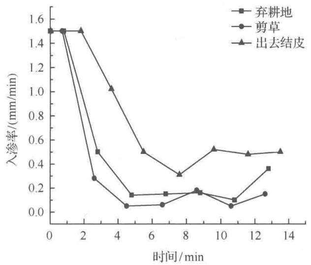  
图2-7 弃耕1年时不同处理的产流入渗曲线

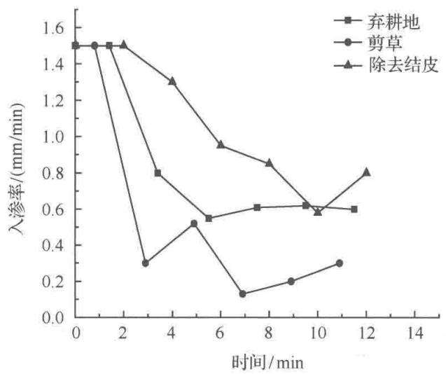  
图2-8 弃耕2年时不同处理的产流入渗曲线

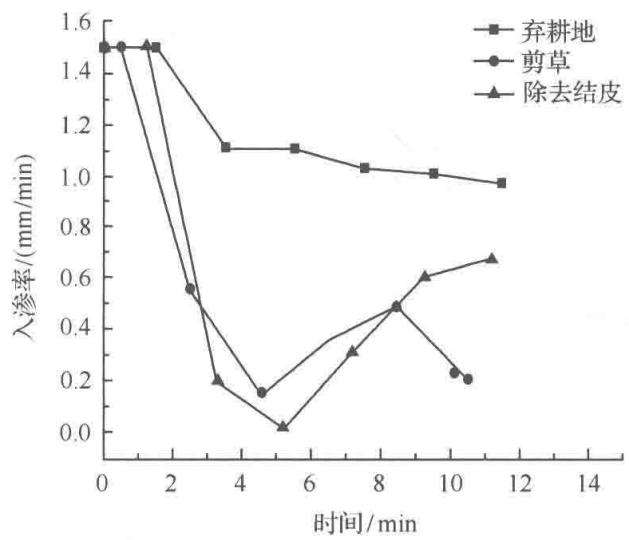  
图2-9 弃耕5年时不同处理的产流入渗曲线

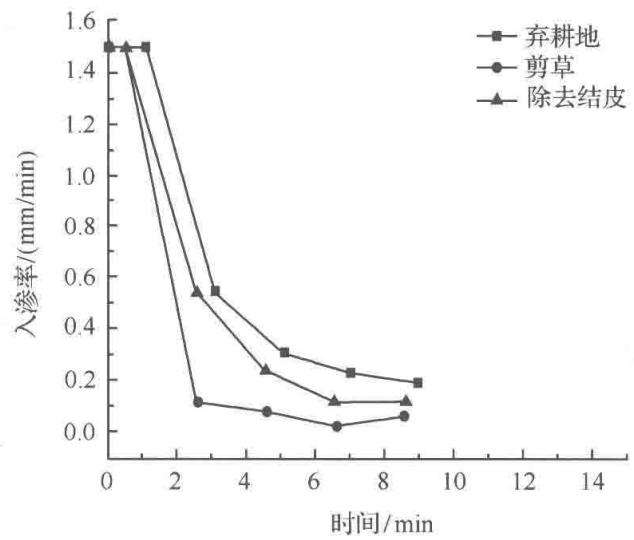  
图2-10 弃耕8年时不同处理的产流入渗曲线

从图2-12可以看出，弃耕初期(1\~2年)，入渗率大小受结皮影响较大。由于在弃耕初期，有机质含量少，土壤结构差，土壤表面以受雨滴打击形成的机械结皮为主，结皮的存在起着减小入渗的作用。随着弃耕时间的增长，有机质含量增加，土壤结构改良，在土壤表面形成一层生物结皮，加之植被也得到很大程度的恢复，结皮起到增加入渗的作用。而且随着弃耕年限的增长，一年生的草本植物开始向多年生的乔灌木植物过渡，植被的植株增高，盖度增大，截留作用开始增强，减少了径流，植被根系密集，在地表穿插也增加了入渗。

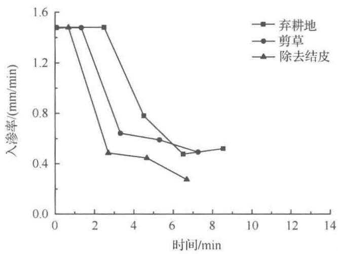  
图2-11 弃耕12年时不同处理的产流入渗曲线

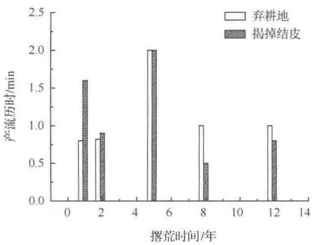  
图2-12 不同处理的产流历时随摆荒时间的变化

## （2)退耕还林与土壤理化性质响应

在黄土高原地区，由于长期遭受侵蚀及有机物质输入较少等因素，地带性土壤遭受破坏，现代土壤剖面构型发育都不完善，一般都处在初育土阶段。实施退耕还林工程后，植被得以恢复，水土流失导致的土壤退化在一定程度上受到抑制，土壤剖面开始发育形成，有机质含量较高的土壤A层逐渐形成。根据对陕西安塞、绥德，山西离石和内蒙古皇甫川等地的实际考察和采样分析，在安塞、离石和绥德三地区坡耕地恢复林灌后，下部草类生长较好，而皇甫川流域林灌下草类生长很少。表2-14反映了上述不同地区植被恢复后土壤主要物理性质的差异。安塞土壤容重最小，离石和绥德较一致，皇甫川流域最大，尤其是风沙土，土壤容重呈现由南向北增大趋势。安塞地区土壤饱和含水量、毛管孔隙度、总空隙度增大最显著，皇甫川流域很小，风沙土变化最小。这说明植被恢复后，土壤持水能力呈现由南向北减小的趋势。安塞地区土壤通透性好，土壤储水库容最大，而皇甫川流域土壤结构最差，尤其是风沙土。

表2-14 植被恢复区土壤主要物理性质
<table><tr><td rowspan="3">物理性质</td><td>安塞</td><td>离石</td><td>绥德</td><td colspan="3">皇甫川</td></tr><tr><td>黄绵土</td><td>黄绵土</td><td>黄绵土</td><td>沙黄土</td><td>披砂岩土</td><td>风沙土</td></tr><tr><td>容重/(g/cm³)</td><td>1.02</td><td>1.07</td><td>1.07</td><td>1.25</td><td>1.23</td><td>1.36</td></tr><tr><td>饱和含水量(以质量比例计)/%</td><td>60.21</td><td>54.34</td><td>51.84</td><td>38.71</td><td>40.06</td><td>33.02</td></tr><tr><td>毛管孔隙度(以质量比例计)/%</td><td>51.81</td><td>45.73</td><td>46.97</td><td>35.91</td><td>35.83</td><td>31.00</td></tr></table>

土壤pH是表示土壤酸碱度的指标。土壤酸碱度对土壤中养分存在的形态和有效性，对土壤的理化性质、微生物活动以及植物生长发育都有很大影响。上述地区土壤pH均大于8.5，土壤呈碱性，实施植被恢复后土壤pH略有减小，且不同地域减小程度差异不明显。安塞坡耕地减小略大，可以减小0.64，披砂岩地区荒坡植被恢复后土壤pH减小相对略小，只减小0.42。安塞刺槐、离石和绥德柠条、皇甫川油松和杨树土壤pH比坡耕地减小较为显著。分析说明，实施退耕还林后，土壤pH变化不十分显著，相对而言，在植被恢复较好的地区(安塞地区)和pH较高的地区(披砂岩区)，土壤pH减小较为明显。

土壤有机质是土壤的重要养分来源，丰富的有机质也有利于形成良好的土壤结构。无论是退耕还林还草还是荒坡植树种草，土壤有机质水平均会得到不同程度的提高，但是，不同地区土壤有机质积累强度、积累过程以及不同植被类型的积累均具有一定差异。图2-13为不同地区植被恢复后土壤有机质与对照值的比较。就林地土壤有机质而言，安塞为2.39%，离石为2.27%，皇甫川流域沙黄土为2.08%，披砂岩土为1.68%。林地土壤有机质积累呈现南部偏高北部偏低的趋势。而灌木地、撂荒地的差异却不十分明显，绥德、离石以及披砂岩土区灌木生长较好，有机质积累也相应较多。从不同类型植被下土壤有机质积累分析来看，安塞13年生刺槐土壤有机质为2.89%，皇甫川沙黄土22年生刺槐土壤为1.37%;几个地区柠条地土壤有机质含量均较高，离石和绥德因为柠条生长较好，25年生土壤有机质可达4.91%，沙黄土区相对较低；皇甫川沙黄土12年生油松沙棘混交林土壤有机质含量为2.65%，风沙土13年生油松土壤有机质可达2.15%。

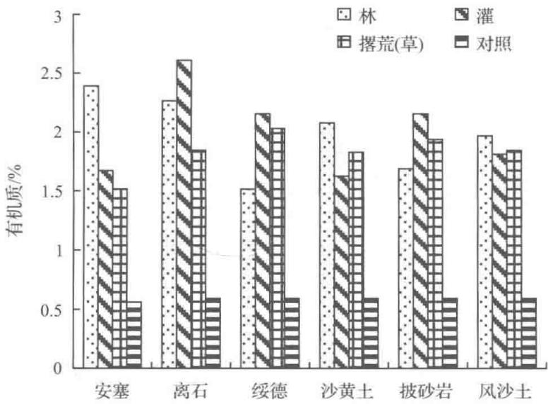  
图2-13 植被恢复土壤有机质与对照地比较

虽然土壤元素含量的多少并不能直接说明土壤养分水平，但是，元素全量多的土壤说明其养分潜在含量大，含量少的土壤至少可以说明其养分水平不会高。此外，土壤中的元素经水土流失而减少，这不仅直接影响土壤质量，而且还会造成面源污染，影响区域生态环境。

从土壤碳分析看，与对照农地相比，离石、安塞坡耕地植被恢复土壤碳含量分别提高了32.54%、24.97%，而位于北部皇甫川流域的披砂岩和沙黄土基本没有增加。这主要是由于前者土壤有机物质输入多，土壤有机碳积累明显，而后者地上有机物质分解慢，输入土壤的有机物质少，且由于植被恢复利于土壤微生物繁殖，土壤碳又是土壤微生物食源，有可能致使土壤中碳含量反而降低。但风沙土由于本身土壤碳水平太低，荒坡植被恢复后土壤碳增加相对较快，增加了31.73%。图2-14为10\~20年植被恢复土壤碳含量的情况。

不同地区土壤氮含量差异也较为明显。安塞土壤全氮含量比沙黄土高1.22倍，离石全氮含量比沙黄土高47.18%，土壤氮本底值呈现由南向北减小趋势。实施植被恢复后，土壤全氮含量变化最大的是风沙土，提高了76.07%，其次是安塞黄绵土和皇甫川流域沙黄土，分别提高了44.5%和40.95%。这说明在植被恢复好的地区(安塞地区)和在土壤氮含量较低的地区(风沙土区)恢复植被能够快速提高土壤氮含量，而植被恢复的好坏会大大影响到土壤氮的积累。图2-15为恢复10\~20年不同类型植被土壤氮含量。黄土高原地区退耕还林植被恢复后，土壤碳、氮以及其他全量元素含量水平呈南部地区高北部地区低的趋势，植被恢复后，土壤碳、氮含量在植被恢复较好和其本底值含量较低的地区增加最为明显，而土壤钾、钠、钙、镁、磷含量变化没有明显规律性，变化也不明显。并且，混交林地均比较利于土壤碳、氮恢复，此外，安塞刺槐、柠条土壤碳、氮含量较高，而皇甫川杨树、油松土壤碳、氮含量较高(图2-15)。

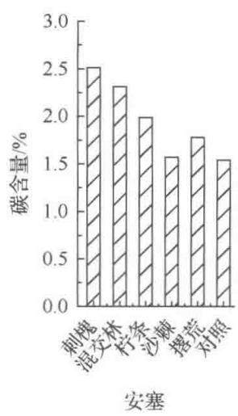

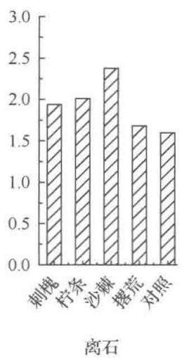

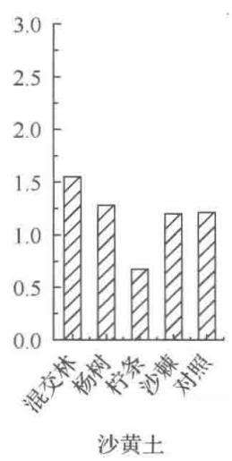

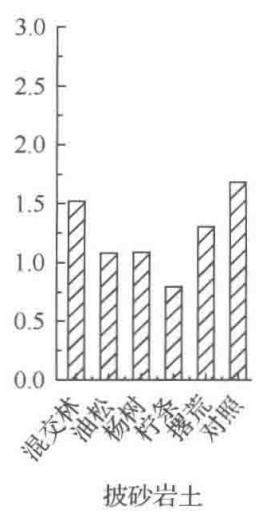

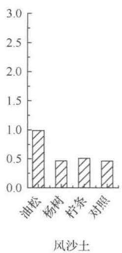  
图2-14不同地区植被恢复土壤碳含量与对照地比较

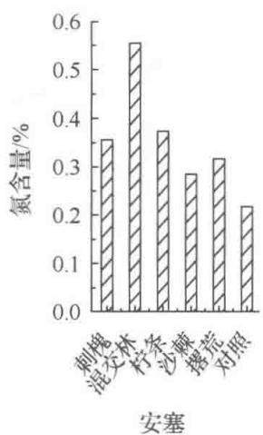

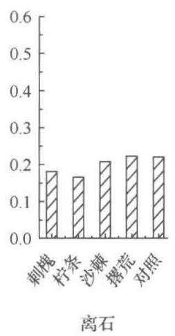

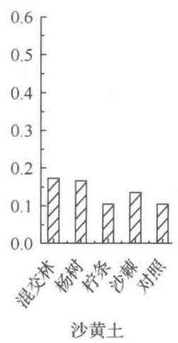

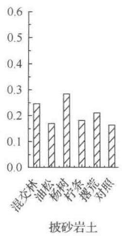

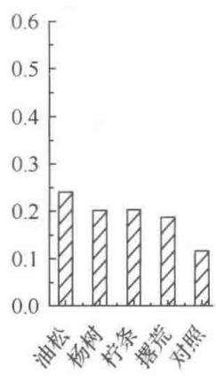  
图2-15 不同地区植被恢复土壤氮含量与对照地比较

土壤全量含量水平并不能说明土壤养分含量的多少，当季植物所能直接吸收的往往是土壤浸出液中的离子，即速效养分。因此，可以通过土壤离子含量水平的分析来说明十壤速效养分状况。表2-15说明了植被恢复10～20年后土壤速效养分增减变化百分比。安塞土壤离子含量水平普遍较高，皇甫川流域较低，尤其是风沙土。植被恢复后，不同地区土壤离子含量水平增减情况各不相同。一般来说，安塞地区土壤离子含量普遍呈增加趋势，而且增加幅度也较大，而皇甫川流域较多情况却呈减少的趋势。

表2-15植被恢复后土壤离子含量的变化  
(单位：%)
<table><tr><td>地区土壤</td><td>植被类型</td><td> $\mathrm { N H } _ { 4 } ^ { + }$ </td><td> $\mathrm { N O _ { 2 } }$ </td><td> $N ( ) _ { 3 }$ </td><td> $\mathrm { S O } _ { 4 } ^ { 2 - }$ </td><td> $\mathrm { K ^ { + } }$ </td><td> $\mathrm { N a ^ { + } }$ </td><td> $\mathrm { C a ^ { 2 + } }$ </td><td> $\mathrm { M g ^ { 2 + } }$ </td></tr><tr><td rowspan="6"></td><td>刺槐</td><td>24.16</td><td>3150</td><td>149.94</td><td>131.37</td><td>363.43</td><td>26.44</td><td>61.28</td><td>74.79</td></tr><tr><td>油松×杨树</td><td>87.61</td><td>1514.29</td><td>-64.87</td><td>109.45</td><td>215.6</td><td>19.83</td><td>86.14</td><td>324.23</td></tr><tr><td>柠条</td><td>38.17</td><td>1221.43</td><td>401.94</td><td>244.27</td><td>647.21</td><td>15.93</td><td>70.07</td><td>219.61</td></tr><tr><td>沙棘</td><td>-15.24</td><td>200</td><td>-28.9</td><td>132.04</td><td>222.93</td><td>-9.86</td><td>51.91</td><td>83.75</td></tr><tr><td>撂荒</td><td>-6.57</td><td>6142.86</td><td>-36.74</td><td>148.61</td><td>374.59</td><td>22.1</td><td>40</td><td>200.28</td></tr><tr><td>对照</td><td>0</td><td>0</td><td>0</td><td>0</td><td>0</td><td>0</td><td>0</td><td>0</td></tr><tr><td rowspan="5">皇甫川 沙黄土</td><td>杨树</td><td>-23.39</td><td>-49.51</td><td>27.24</td><td>-4.04</td><td>85.33</td><td>30.31</td><td>51.26</td><td>61.83</td></tr><tr><td>油松×沙棘</td><td>-6.88</td><td>-57.38</td><td>5.04</td><td>5.33</td><td>113.58</td><td>67.65</td><td>64.94</td><td>98.29</td></tr><tr><td>柠条</td><td>-1.07</td><td>-31.8</td><td>46.53</td><td>-32.08</td><td>33.78</td><td>7.26</td><td>-0.37</td><td>-35.39</td></tr><tr><td>沙棘</td><td>-28.04</td><td>-36.72</td><td>7.82</td><td>-21.6</td><td>8.97</td><td>0.34</td><td>13.18</td><td>1.49</td></tr><tr><td>对照</td><td>0</td><td>0</td><td>0</td><td>0</td><td>0</td><td>0</td><td>0</td><td>0</td></tr><tr><td rowspan="5">皇甫川 披砂岩</td><td>油松</td><td>4.42</td><td>-0.81</td><td>-14.92</td><td>45.47</td><td>7.4</td><td>-35.53</td><td>5.77</td><td>54.66</td></tr><tr><td>杨树×沙棘</td><td>-7.25</td><td>-36.29</td><td>19.53</td><td>-68.07</td><td>119.66</td><td>-24.16</td><td>30.72</td><td>81.78</td></tr><tr><td>柠条</td><td>0.57</td><td>19.35</td><td>52.44</td><td>-76.44</td><td>116.91</td><td>-50.82</td><td>26.2</td><td>-2.74</td></tr><tr><td>撂荒</td><td>-24.01</td><td>64.52</td><td>-5.16</td><td>-69.27</td><td>65.01</td><td>-34.36</td><td>42.49</td><td>24.79</td></tr><tr><td>对照</td><td>0</td><td>0</td><td>0</td><td>0</td><td>0</td><td>0</td><td>0</td><td>0</td></tr><tr><td rowspan="5">皇甫川 风沙土</td><td>杨树</td><td>-7.67</td><td>-17.14</td><td>12.94</td><td>25.33</td><td>-23.31</td><td>-6.61</td><td>-9.84</td><td>-11.04</td></tr><tr><td>油松</td><td>12.56</td><td>-19.43</td><td>-68.46</td><td>-23.74</td><td>48.5</td><td>71.03</td><td>32.47</td><td>103.46</td></tr><tr><td>柠条</td><td>-3.84</td><td>95.43</td><td>235.79</td><td>402.78</td><td>138.14</td><td>-4.5</td><td>17.58</td><td>33.55</td></tr><tr><td>杨材</td><td>10.7</td><td>1.71</td><td>0.96</td><td>-10.61</td><td>87.99</td><td>75.53</td><td>9.3</td><td>32.25</td></tr><tr><td>对照</td><td>0</td><td>0</td><td>0</td><td>0</td><td>0</td><td>0</td><td>0</td><td>0</td></tr></table>

土壤铵态氮和硝态氮在安塞地区增加较为显著，而皇甫川流域增加不明显，许多情况下呈减少趋势。安塞林、灌土壤铵态氮比坡耕地分别平均增加了55.89%、11.52%，而皇甫川几乎没有明显增加。安塞刺槐、柠条土壤硝态氮分别增加了近1.5倍和4倍多，而皇甫川沙黄土杨树、柠条却只增加了27.24%和46.53%。不同地区土壤钾、钠、钙、镁盐基离子含量增加趋势较为显著。安塞点土壤离子含量水平最高，在皇甫川地区的土壤离子含量相对较低，尤其是风沙土钙、镁离子含量，比安塞地区低了40%以上。坡耕地植被恢复10\~20年后，安塞土壤盐基离子总量水平(钾、钠、钙、镁离子含量总和)提高最为明显，平均提高了78.26%，皇甫川流域沙黄土提高了34.39%，披砂岩土和风沙土提高了近23.00%。安塞土壤钾离子含量增加近3倍，皇甫川沙黄土增加了60.42%。安塞油松杨树混交土壤镁离子含量比坡耕地增加了3倍多，而沙黄土区油松沙棘混交林比荒坡增加近1倍。安塞土壤钙离子增加了61.88%，皇甫川沙黄土增加了32.25%，披砂岩增加了26.30%，风沙土增加了12.38%。披砂岩土壤钠离子含量普遍减小，其他地区增加幅度也不大。

## (五)植被覆盖

黄土高原气候从半湿润向干旱过渡的特点，决定了自然植被的过渡性特征，表现在植被类型上包括森林植被、灌从植被和草原植被，在空间分布上由东南向西北呈带状依次为森林地带、森林草原地带、典型草原地带、荒漠草原地带(表2-16)。此外，受区内山地影响，还分布有草甸植被。下面简要介绍各植被地带的主要特征。

表2-16 黄土高原植被地带及其环境指标
<table><tr><td>植被地带</td><td>年降雨量/mm</td><td>年均温/℃</td><td>干燥度</td><td>干湿分区</td><td>地带性土壤</td></tr><tr><td>森林地带</td><td>550~770</td><td>9~12</td><td>1.3~1.5</td><td>半湿润</td><td>褐土</td></tr><tr><td>森林草原地带</td><td>450~550</td><td>8~10</td><td>1.4~1.8</td><td>半湿润-半干旱</td><td>黑垆土</td></tr><tr><td>典型草原地带</td><td>300~450</td><td>6~8</td><td>1.8~2.2</td><td>半干旱</td><td>轻黑垆土、淡栗钙土</td></tr><tr><td>荒漠草原地带</td><td>200~300</td><td>6~9</td><td>2.4~3.5</td><td>干旱-半干旱</td><td>灰钙土、棕钙土</td></tr></table>

资料来源：中国科学院黄土高原综合科学考察队，1991。

## 1. 植被水平地带性

森林地带北界大致位于甘肃天水—隆德一泾川—宁县—合水一陕西安塞西河口—延安一延长一山西石楼中阳一林县与兴县之间的紫金山—岢岚一神池一线(梁一民，2003)。该区气候属温暖半湿润区，水热条件相对较好，年均温在9\~12C，生物气温为12\~13℃。年降雨量550\~700mm，山区可达700～800mm。该地带以天然林和天然次生林为主，从东向西主要分布在豫西低山丘陵、晋中南的土石山地、人烟稀少的黄土丘陵区如子午岭、乔山、黄龙山等。主要植被类型是落叶阔叶林和常绿针叶林。落叶阔叶林主要是栎林、桦木林、杨树林等，主要树种包括：辽东栎(Quercuswutaishanica)、栓皮栎(Q.variabilis)、山杨(Populus davidiana)、小叶杨(P. simonii)、青杨(P. cathayana)、白桦(Betulaplatyphylla)等。常绿针叶林的主要树种包括:云杉(Picea asperata)、华山松(Pinus armandii)、油松(P.tabulaeformis)、侧柏(Platycladus orientalis)等。森林植被遭受破坏后，往往转为灌木和草本为主，常见的灌木有酸枣(Ziziphusjujuba var. spi-nosa)、荆条(Vitexnegundo var.heterophylla)、达乌里胡枝子(Lespedeza dahurica)、黄蔷薇(Rosa hugonis)等，主要草本有白羊草(Bothriochloa ischaemum)、隐子草(Cleisto-genes serotina)、大油芒(Spodiopogon sibiricus)、蒿属(Artemisia)等。该区栽种乔木主要有臭椿(Ailanthus altissima)、榆树(Ulmus pumila)、楸树(Catalpa bungei)、槐树(So-phorajaponica)以及杨树和果树等，成片人工林主要有刺槐(Robinia pseudoacacia)、沙棘(Hippophaerhamnoides)。该区农业较为发达，农作物以冬小麦、玉米、水稻、棉花、花生、红薯为主，两年三熟。林果业也较为发达，常见的栽培果树为柿、枣、核桃、板栗、苹果、石榴等，此外，适宜种植花椒、皂荚等经济树种。

森林草原地带的北界大致位于甘肃临洮—华家岭—宁县固原一甘肃环县一—陕西吴起—靖边—横山—榆林—神木一山西河曲一线。该区的显著特征是草原植被占有较大优势，仅存零星天然次生林，分布于山地，发育在地势稍高的山体上或隐蔽的沟谷中，主要树种有落叶阔叶的栎、桦、杨等，常绿针叶的云杉、油松、侧柏等，乔木主要分布于水分条件较好的沟谷，其代表类型为以油松、辽东栎、白桦、山杨为建群组成的纯林或混交林。黄土丘陵区次生的小乔木有榆树和臭椿。黄土丘陵植被以草原为主，东南部地区草灌为主，灌木除酸枣、达乌里胡枝子外，有柠条、蒿属和虎榛子(Ostryopsisdavidiana)等，草本主要有白羊草、长芒草(Stipa bungeana)、隐子草、白草(Pennisetum centrasiaticum)、铁杆蒿(Artemisia sacrorum)、茵陈蒿(A. capillaries)、艾蒿(A.giraldii)等。西北部地区植被相对稀疏，草本以针茅和蒿属为主，并有少量耐干旱和耐盐碱的植物。该区农业以旱作为主，黄土塬和黄土丘陵区较适合耕作，主要作物种类有冬小麦、玉米、糜、谷、高粱和马铃薯，为两年三熟或一年一熟。

典型草原地带的北界大致位于甘肃皋兰—宁夏海原一同心一惠安堡一盐池县天池内蒙古鄂托克旗一杭锦旗一线。该区主要以各种各样的草原植被为主，亦散生一些乔木树种，如旱柳、小叶杨、杜梨、白榆、山杏、臭椿等，除具备小生境可满足小片林木生长外，大片林木生长已不可能，主要是草本群落。主要草本植物有针茅、披碱草(Elymusdahuri-cus)、委陵菜(Potentilla chinensis)、羊草(Aneurolopidium chinense)、铁杆蒿等，还出现耐盐植物，如柽柳、盐蓬、芨芨草(Achnatherum splendens)、甘草(Glycyrrhizauralen-sis)、沙柳(Salixcheilophila)等。根据草本植物优势种的差异，该区主要有以下几种代表性草原群落类型：①本氏针茅草原，是该地带的代表类型，分布于陕北、陇东、陇中、宁南及晋西的黄土丘陵区，主要伴生种有铁杆蒿、茭蒿(Ariemisiagiraldii)、兴安胡枝子、地椒、茵陈蒿、阿尔泰狗娃花(Heteropappus altaicus(Wild.)Novopokr)等。②铁杆蒿草原，是该地带的主要草原类型，在森林草原地带或森林地带的荒山也有分布。伴生种主要有菱蒿、草地凤毛菊(Saussureamara)、本氏针茅(Stipa capillata Linn)、硬质早熟禾(Poa sphondylodes)、牛尾蒿(Artemi siadubin)等。③茭蒿草原，是仅次于本氏针茅草原的主要群落类型。遍布于该地带中南部和森林草原地带。主要伴生种有本氏针茅、铁杆蒿、兴安胡枝子、地椒(Thymus quinquecostatus)、大针茅(Stipa grandis)、短花针茅(Sti-pabreviflore)等。④地椒草原，多分布于地势较高、气候冷凉的梁昴坡地段。区内除河谷平原和河流沿岸地带适合发展农业外，其余地区农业生产均不稳定，北部已进入农牧结合地区。主要作物为春小麦、糜、谷、马铃薯以及荞麦、莜麦、黑豆、亚麻等，一年一熟。该区栽培树种明显减少，阳坡不适合乔木生长，仅能栽培一些灌木和草本植物；阴坡仅能栽种侧柏、杏树、榆等树种，呈疏林状分布。

荒漠草原地带位于黄土高原的最西北部，与腾格里、库布齐沙漠接壤，植被稀疏，以耐寒和耐盐的草本灌木为主，代表性物种有沙生针茅(Stipa glareosa)、隐子草(Cleisto-genes serotina)、刺旋花(Convolvulus tragacanthoides)、猫头刺(Oxytropis aciphylla)、短花针茅(Stipa breviflora)、戈壁针茅(Stipa tianschanico)、红砂(Reaumuria songari-ca)、蓍状亚菊(Ajania achilleoides)等，以及受沙化影响的油蒿(Artemisia ordosica)、苦豆子(Sophoraalopecuroides)、甘草(Glycyrrhiza uralensis)等。主要群落类型包括：①短花针茅草原，是该地带最具代表性群落，分布于西部丘陵的坡地，主要伴生种有本氏针茅、阿尔泰狗娃花、红砂、猫头刺等。②蓍状亚菊草原，主要分布于草原与荒漠的过渡地带，喜沙砾质生境，伴生种以冷蒿、短花针茅、糙隐子草(Cleistogenessquarrosa)等为主。

③荒漠锦鸡儿群落，主要在该地带山地的低山缓丘区。伴生种以中间锦鸡儿、狭叶锦鸡儿、红砂、沙冬青(Ammopiptanthus mongolicus)等为主。该地带以牧业为主，仅个别河谷地带适合发展农业，且大多为灌溉农业。主要作物为春麦、糜、谷、荞麦、莜麦、马铃薯等。除个别温暖河谷地带可实行两年三熟外，其他地区均为一年一熟。栽培树种仅有沙枣、榆、旱柳等。

## 2. 植被微域分异规律

在黄土高原地区，除了明显的水平地带性规律外，同一地区不同立地水分条件存在很大差异，天然植被还具有一定的垂直地带性规律或微域分异规律。特别在黄土丘陵沟壑区，地形起伏，沟壑纵横，不同坡向和地形部位的水热都会被重新分配，造成水热条件差异并导致植被表现出显著的微域差异。梁一民(2003)的观测结果表明，黄土梁昴阴坡和阳坡土壤水分差异显著。在典型草原区沟谷阴坡下部的水分条件也可以达到森林地带梁昴半阴坡水平。尽管典型草原带和森林地带年均降雨量差异很大，但是由于土壤水分条件的微域差异，在草原地带沟谷下部也可以生长小片乔木林。同时，在不同自然带的同一坡面，从沟谷坡到梁昴坡再到梁昴顶，土壤水分条件也有很大差异。受土壤水分变化的影响，沟谷地水分条件要好于沟间地，立地条件更适宜乔木生长。沟间地则更适宜灌木和草本植物生长。因此，即使在黄土高原同一地区，不同立地类型的水热状况会因坡度、坡向、地形部位发生很大变异，天然植被也会表现出明显的微域分布规律。植被在分布上表现出的微域分异，要求在黄土高原地区实施生态恢复工程时，既要遵循植被的地带性变化，又要充分考虑立地条件的微域变化。

## 3. 历史时期植被与现代植被恢复

尽管对黄土高原地区历史时期植被有不同认识，但对历史时期植被条件好于现代植被条件基本上没有异议。由于人类长期垦殖，天然植被遭到大面积破坏。在20世纪50年代前，黄土高原地区的天然植被面积已不足总面积的10%，而且主要分布在石质山地或土石山区，如吕梁山、子午岭、黄龙山和六盘山等处。关于历史时期黄土高原地区的植被，王守春(1990)曾经做过系统的总结和论述。王守春将有关黄土高原地区历史植被总结归纳为3种观点：①黄土高原地区的原始天然植被为草原，②黄土高原地区的原始天然植被为森林，③黄土高原地区的原始天然植被为森林草原。出现认识上的分歧的原因主要是不同研究者所采用的方法都存在一定的局限性，或者说不完整。王守春在综合多种方法和信息源的基础上认为，在战国时期以前，黄土高原地区的自然环境受人类活动影响十分有限，可以将此时期的植被作为天然植被。在西周时期，黄土高原地区保持着较好的自然生态系统，植被特点是草地占有很大面积。草地主要分布在塬面上，此外还广泛分布着灌木林。古代黄土高原塬面上虽然也生长树木，但属灌木化的矮小乔木。在河谷低地和山地，植被类型则以乔木林为主。因此，古代黄土高原地区的植被状况十分复杂，不能简单地用森林、草原或森林草原来笼统地称谓。在六盘山以东、吕梁山以西、渭河以北和长城以南的黄土高原地区，黄土塬面上既有面积广大的草地，也有广泛分布的灌木丛，还有长势不好的、矮小的灌木化的乔木，与成片的草地和灌木林相间分布。在河谷低地和山地的植被以乔木林为主，但主要受隐域生境影响，不能作为黄土高原地区的地带性植被。战国时期以后，随着人口不断增加，塬面及梁昴坡天然植被逐渐遭受破坏，沟谷中生长的乔木和灌木也大多被破坏。不论从什么角度看，人类活动是黄土高原地区植被破坏的根源的观点不容置疑。

半个多世纪以来，尽管政府部门大力倡导水土保持，推广植树造林，但受制于当时经济发展模式，植被恢复的总体效果不显著，只是集中在试验点和重点小流域。直到20世纪90年代退耕还林工程的实施，黄土高原地区的生态恢复效果才得到了明显的改善。黄土高原地区植被恢复重建主要途径有天然植被封育、人工造林种草和飞播造林种草等。实施天然植被封育是加速林草植被建设简单易行和十分有效的途径。在黄土高原大部分地区，只要改变乱垦滥牧等不合理的土地利用方式，林草植被就可以逐渐恢复，退化的天然植被均可按其自然规律向地带性亚顶级或顶级群落演替。实施人工造林种草，则可以依据不同立地的水分条件，合理地配置草、灌、乔的比例和密度，高效快速地促进植被恢复。实施飞播造林种草则可以在短时间进行大面积林草植被建设，具有速度快、成本低和省劳力的特点，特别适合在人口稀少和交通不便地区实施。

在黄土高原地区实施植被恢复建设，首先应该通过法律或行政手段制止滥伐、滥垦和滥牧，实施天然植被的自然恢复。同时通过飞播和人工造林种草等促进植被恢复和生态环境建设。在实施人工造林种草时，应首先遵循天然植被分布的地带性规律和微域性变异规律，以及群落结构特征，选择合适的树种、草种及合理的种植密度。另外，应该将植被恢复和限制性因子改良相结合，以保证植被恢复效果。在推动生态环境恢复过程中，也要充分考虑当地农民的经济利益，处理好生态林和经济林的关系，粮食生产和牧业生产的关系，以及生态重建和区域发展的关系。

## 三、黄土高原土壤侵蚀特征

## (一)土壤侵蚀类型多样

按土壤侵蚀营力划分，黄土高原的主要土壤侵蚀类型包括水蚀、风蚀和重力侵蚀三大类。水蚀在该区分布最广，危害最大;风蚀在该区西北和北部边缘比较显著；重力侵蚀从区域分布上与水蚀相伴，但主要集中在沟谷边缘，更多属于成土母质的剥蚀与移动。由于各种营力的侵蚀过程不同，侵蚀形态也随之各异。例如，黄秉维(1981，1982)将黄土高原水蚀分为5种类型：溅蚀、溶蚀、片蚀、沟蚀和沟道侵蚀，其中细沟侵蚀被包括在沟蚀中，并指出悬沟和洞穴侵蚀实质是沟蚀的变异。也有研究者将水力侵蚀分为面状侵蚀(溅蚀和片状流水侵蚀)、线状侵蚀(细沟、浅沟、切沟侵蚀)以及冲沟、干沟和河沟侵蚀(中国科学院黄土高原综合科学考察队，1991)。我们认为，按照发展过程及其形态，黄土高原水蚀总体包括面蚀、沟蚀和沟道侵蚀，其中，面蚀主要是指细沟和细沟间侵蚀，沟蚀主要是指浅沟和切沟，沟道侵蚀主要针对古代侵蚀形成的冲沟、干沟和河沟，实质上更多是水力和重力共同作用的结果。

各种侵蚀类型的发生主要受降雨和地形因素影响，其在不同地貌部位的组合形成了黄土高原独特的土壤侵蚀垂直地带特征(刘元保等，1988)。这种地带性可概括为图2-16的模式：坡面水蚀过程主要发生在谷间地，其中昴坡顶部，坡度较缓，坡长尚不足以形成集中流，以雨滴溅蚀为主，随着坡长增加，出现细沟，进一步发展形成浅沟，甚至切沟；沟道侵蚀主要发生在沟谷地，往往在较强的径流作用下，以重力侵蚀的泻溜、崩塌或滑塌等形式发生。

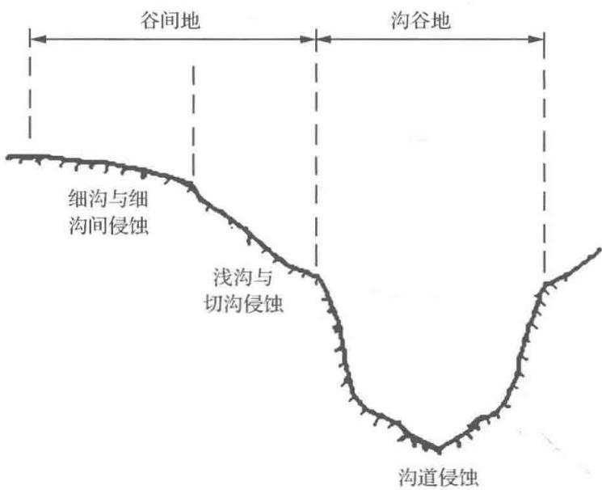  
图2-16 黄土高原土壤侵蚀垂直地带示意图

黄土高原土壤侵蚀的垂直地带性又由于区内地貌差异具有明显的区域分异：在以黄土塬为主的高原沟壑区，虽然谷间地面积远大于沟谷地面积，但由于以平坦的塬面为主，侵蚀过程远弱于沟谷地，后者不仅侵蚀活动强，且以重力侵蚀为主。而在丘陵沟壑区，谷间地比例大于沟谷地，坡面的面蚀、沟蚀，以及沟谷地的沟道侵蚀都十分显著。例如，陕北和晋西谷间地和沟谷地比例大致为6：4，陇中地区为7:3。

## (二)土壤侵蚀强度大

目前对黄土高原土壤侵蚀强度的确定主要基于以下几种方法：一是结合野外调查、小区观测等估计的土壤侵蚀模数，以20世纪50年代黄秉维提出的黄土高原土壤侵蚀强度图为代表。二是利用流域出口水文站泥沙观测推算。三是通过遥感调查获得，以20世纪80年代水利部发布的土壤侵蚀强度为代表。

1955～1958年中国科学院组织进行了“黄河中游水土保持考察”，黄秉维(1955)通过实地考察和分析研究，提出了“黄河中游流域土壤水蚀强度图”（图2-17)。他以土壤侵蚀模数为指标，将土壤水蚀强度分为5个级别：第1级为异常强烈，土壤侵蚀模数在10000t/km²以上;第2级为甚强烈，土壤侵蚀模数为5000～10000t/km²；第3级为强烈，土壤侵蚀模数为2000\~5000t/km²；第4级为中度，土壤侵蚀模数为1000\~2000t/km²；第5级为微弱，土壤侵蚀模数在1000t/km²以下。从各级别土壤侵蚀模数的划分不难看出黄土高原土壤侵蚀强度之大。

许多学者采用水文-地貌方法确定土壤侵蚀强度，即根据流域水文站实测泥沙资料，结合地貌特征，利用泥沙输移比推算土壤侵蚀强度。该方法在黄土高原应用得尤其普遍，这由黄土高原土壤侵蚀与流域产沙的特殊关系所决定。龚时旸和熊贵枢(1980)首先论证了黄土高原的泥沙输移比为1，牟金泽和孟庆枚(1982)进一步在黄河支流之一无定河的支流大理河证明了这一结论。黄河中游所在黄土高原的各支流流域地貌特征均与之十分相似，因此在泥沙输移比为1的情况下，流域产沙量即代表流域侵蚀量，将产沙量除以所在流域面积即为该流域土壤侵蚀模数，但一般将其称为流域输沙模数。这是因为产沙量能否代表侵蚀量除受泥沙输移比影响外，还与观测资料有关。目前水文站观测的泥沙只有悬移质部分，不包括槽床底部的推移质和卵石，这会影响对侵蚀量的推算。利用这一方法，许多学者给出了黄土高原的土壤侵蚀强度特征。

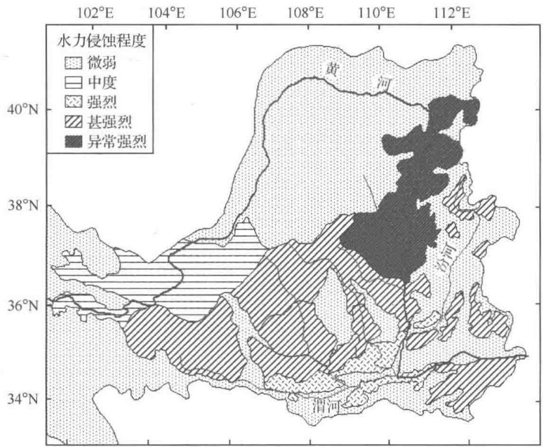  
图2-17 黄河中游流域土壤水蚀强度图

陈永宗等(1988)利用水文站资料计算的黄土高原主要的黄河支流土壤侵蚀量变化为$1 1 0 6 . 8 { \sim } 1 8 6 0 9 . 3 \mathrm { t } / ( \mathrm { k m } ^ { 2 } \bullet a )$ ,平均为 $7 1 7 9 . 7 6 \mathrm { t } / ( \mathrm { k m } ^ { 2 } \cdot \mathrm { a } )$ 。涉及的流域面积变化为1915\~$4 3 2 1 6 \mathrm { k m ^ { 2 } }$ ,平均 $2 1 1 2 5 \mathrm { k m } ^ { 2 }$ (表2-17)。土壤侵蚀强度在 $1 0 0 0 0 \mathrm { t / ( k m ^ { 2 } \cdot \mathrm { a } ) }$ 以上的流域主要位于陕北的皇甫川、窟野河和延河，分别为18609. $3 \mathrm { t / ( k m ^ { 2 } \bullet \ a ) } , 1 5 0 7 9 . 2 \mathrm { t / ( k m ^ { 2 } \bullet \ a ) }$ 和$1 0 0 0 7 . 9 \mathrm { t / ( k m ^ { 2 } \cdot { \circ } a ) }$ 。

20世纪80年代的黄土高原综合考察(中国科学院黄土高原综合科学考察队，1991)以水文泥沙资料为基础，给出了黄土高原土壤侵蚀强度分级标准(表2-18)，并分析了区内土壤侵蚀强度的变化：从东西分布看，六盘山以西和吕梁山以东地区的土壤侵蚀强度在$5 0 0 0 \mathrm { t / ( k m ^ { 2 } \cdot { a } ) }$ 以内，其间的黄土高原核心区普遍较大，但有明显的南北差异：渭河北山以南为台塬和河谷平原区，侵蚀强度多小于 $1 0 0 0 \mathrm { t / ( k m ^ { 2 } \cdot a ) }$ ，渭河北山至庆阳一延安一离石一线之间，除植被较好的土石山区外，侵蚀强度一般为 $2 0 0 0 { \sim } 5 0 0 0 \mathrm { t / ( k m ^ { 2 } \bullet a ) }$ ，而该线以北至长城沿线之间的地区侵蚀量都在 $5 0 0 0 \mathrm { t / ( k m ^ { 2 } \cdot a ) }$ 以上，尤其是皇甫川、窟野河、孤山川、佳卢河和秃尾河等流域是黄土高原土壤侵蚀最强烈地区，其中心位于窟野河中下游和孤山川流域，侵蚀强度高达 $2 0 0 0 0 \mathrm { t / ( k m ^ { 2 } \cdot { a } ) }$ 以上。无定河中下游、北洛河上游、延河和清涧河上游、马连河流域等也是高侵蚀中心，侵蚀强度在 $7 5 0 0 { \sim } 1 5 0 0 0 \mathrm { t / ( k m ^ { 2 } \cdot } \mathrm { a } )$ 此外在沿黄河晋陕峡谷两侧，也有侵蚀强度在 $\mathrm { 1 0 0 0 0 { \sim } 1 5 0 0 0 t / ( k m ^ { 2 } \bullet a ) }$ 的地区，北起山西河曲，南抵龙门。

表2-17 黄土高原黄河各支流流域土壤侵蚀强度
<table><tr><td>河名</td><td>站名</td><td>流域面积  $/ \mathrm { k m ^ { 2 } }$ </td><td>统计时间/年</td><td>侵蚀量  $/ [ t / ( \mathrm { k m ^ { 2 } \cdot { \dot { \ a } } ) } ]$ </td></tr><tr><td>偏关河</td><td>偏关</td><td>1915</td><td>1958~1980</td><td>7367.0</td></tr><tr><td>皇甫川</td><td>皇甫</td><td>3199</td><td>1954~1980</td><td>18609.3</td></tr><tr><td>窟野河</td><td>温家川</td><td>8645</td><td>1954~1980</td><td>15079.2</td></tr><tr><td>三川河</td><td>后大成</td><td>4102</td><td>1957~1980</td><td>6775.5</td></tr><tr><td>无定河</td><td>川口</td><td>30217</td><td>1957~1980</td><td>5370.7</td></tr><tr><td>昕水河</td><td>大宁</td><td>3992</td><td>1955~1980</td><td>5796.6</td></tr><tr><td>延河</td><td>甘谷驿</td><td>5891</td><td>1957~1980</td><td>10007.9</td></tr><tr><td>汾河</td><td>河津</td><td>38728</td><td>1934~1980</td><td>1106.8</td></tr><tr><td>渭河</td><td>华县</td><td>106489</td><td>1935~1980</td><td>3944.1</td></tr><tr><td>渭河</td><td>武山</td><td>8080</td><td>1940~1980</td><td>3537.1</td></tr><tr><td>平均</td><td></td><td>21125</td><td></td><td>7759.42</td></tr></table>

表2-18 黄土高原水蚀强度分级标准
<table><tr><td>级别</td><td>多年平均侵蚀模数  $/ [ \tau / ( \epsilon \mathrm { m } ^ { 2 } \cdot \mathrm { a } ) ]$ </td></tr><tr><td>微度</td><td> $\textcircled { < } 1 0 0 0 ( 5 0 0 \cdot )$ </td></tr><tr><td>轻度</td><td> $1 0 0 0 ( 5 0 0 ^ { * } ) \sim 2 5 0 0$ </td></tr><tr><td>中度</td><td>2500~5000</td></tr><tr><td>强度</td><td>5000~10000</td></tr><tr><td>极强</td><td>10000~15000</td></tr><tr><td>剧烈</td><td>&gt;15000</td></tr></table>

\*为土石山丘区采用的标准。  
资料来源：中国科学院黄土高原综合科学考察队，1991

刘元保等(1993)利用水利部黄河水利委员会刊印出版的340个黄河流域水文站观测的径流泥沙资料，分析了黄河水沙的时间和空间变化。利用黄河干流和支流水文站泥沙推算了各流域输沙模数(图2-18)。从其空间分布可以明显看出：土壤侵蚀最强烈地区位于皇甫川、窟野河、孤山川、佳卢河和秃尾河等流域。

黄土高原土壤侵蚀强度除有明显的区域差异外，垂直地带性的差异也十分显著，谷间地和沟谷地土壤侵蚀强度明显不同。

陈永宗等(1988)分别比较了丘陵沟壑区和高原沟壑区谷间地和沟谷地的土壤侵蚀强度。在黄土丘陵沟壑区，根据陕西子州团山沟流域坡面径流场和流域泥沙资料，计算了不同垂直带的土壤侵蚀强度。团山沟流域面积 $0 . 1 8 \mathrm { k m ^ { 2 } }$ ，其中谷间地面积占 $74 \%$ ，沟谷地面积占 $26 \%$ ，地势相对高差约200m，谷间地主要覆盖马兰黄土，坡度变化于 $1 0 ^ { \circ } \sim 3 5 ^ { \circ }$ ,沟谷地有离石黄土和三趾马红色黏土层组成，坡度在 $3 5 ^ { \circ }$ 以上，下游河床出露基岩。计算结果表明，全流域土壤侵蚀强度为 $2 3 9 4 8 . 1 \mathrm { t } / ( \mathrm { k m } ^ { 2 } \cdot \mathrm { a } )$ ，其中谷间地土壤侵蚀强度为$2 0 2 8 4 . 3 8 \mathrm { t / ( k m ^ { 2 } \cdot { \cdot } a ) }$ ，是全流域的85%，沟谷地的土壤侵蚀强度为 $3 4 3 7 5 . 6 \mathrm { t / ( k m ^ { 2 } \cdot \ a ) }$ ，是全流域的1.44倍，沟谷地的侵蚀强度大于谷间地，但由于后者面积比例大，因此从土壤侵蚀总量的贡献看，谷间地占62.7%，沟谷地占37.3%。在黄土高原沟壑区，根据甘肃西峰南小河沟流域泥沙资料计算了不同垂直带的土壤侵蚀强度。南小河沟流域面积$3 0 . 6 2 \mathrm { k m ^ { 2 } }$ ，其中，谷间地面积占75.3%，沟谷地面积占24.7%。计算结果表明，全流域土壤侵蚀强度为 $4 3 5 0 . 1 \mathrm { t } / ( \mathrm { k m } ^ { 2 } \cdot \mathrm { a } )$ ，其中，谷间地土壤侵蚀强度为 $7 9 1 . 8 5 \mathrm { t / ( k m ^ { 2 } \cdot { a } ) }$ ，是全流域的18%，沟谷地的土壤侵蚀强度为 $1 5 1 9 8 . 4 \mathrm { t } / ( \mathrm { k m } ^ { 2 } \cdot \mathrm { a } )$ ，是全流域的3.49倍，沟谷地侵蚀强度远大于谷间地。总土壤侵蚀总量贡献看，虽然沟谷地面积百分比小于谷间地，但土壤流失量的贡献占全流域的86.3%，谷间地土壤流失量的贡献占13.7%，这显然源于高强度的沟谷地土壤侵蚀。20世纪80年代的黄土高原综合考察也给出了谷间地与沟谷地土壤侵蚀强度的差异(表2-19)。

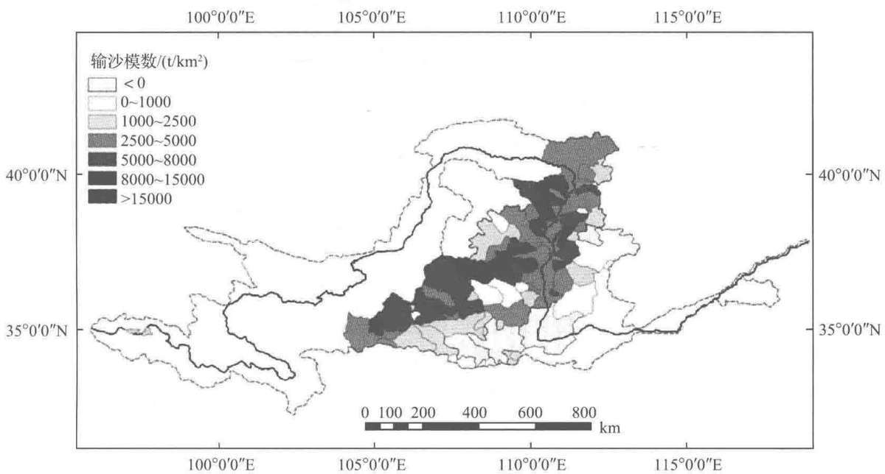  
图2-18 黄土高原黄河中游主要支流输沙模数分布

## (三)土壤侵蚀区域分异显著

土壤侵蚀是气候、土壤、地形、植被、人类活动等多种因素综合作用的结果，因此区域特征的分异特性决定了土壤侵蚀的区域分异。研究土壤侵蚀区域分异规律，并进行分区，是指导水土保持措施建设的基础。早在20世纪50年代，黄秉维(1955)编制了黄河中游土壤侵蚀分区图。朱显谟(1958)就黄河中游土壤侵蚀区划问题提出了划分系统，规定了5级制，以及各级应采用的指标和制图比例，杨勤科等进行了整理(图2-19)。随后很多学者从不同的角度提出了各种分区建议(景可，1985；朱显谟，1981；中国科学院黄土高原综合科学考察队，1991），其中针对的黄土高原范围也各不相同。

表2-19 黄土高原不同地区垂直地带土壤侵蚀强度
<table><tr><td rowspan="2">流域名称和地点</td><td rowspan="2">代表的地貌类型区</td><td rowspan="2">面积/km²</td><td colspan="2">土壤侵蚀强度  $/ [ t / ( \mathrm { k m ^ { 2 } \cdot \ a ) ] }$ </td></tr><tr><td>谷间地</td><td>沟谷地</td></tr><tr><td>甘肃西峰南小河沟</td><td>黄土塬区</td><td>30.62</td><td>791.9</td><td>15198.4</td></tr><tr><td>陕西子州团山沟</td><td>黄土丘陵区</td><td>0.18</td><td>20284.4</td><td>34375.6</td></tr><tr><td>陕西绥德韭园沟</td><td>黄土丘陵区</td><td>70.1</td><td>10616.0</td><td>37915.0</td></tr><tr><td>山西离石羊道沟</td><td>黄土丘陵区</td><td>0.206</td><td>6740.0</td><td>27300.0</td></tr></table>

资料来源：陈永宗等，1988

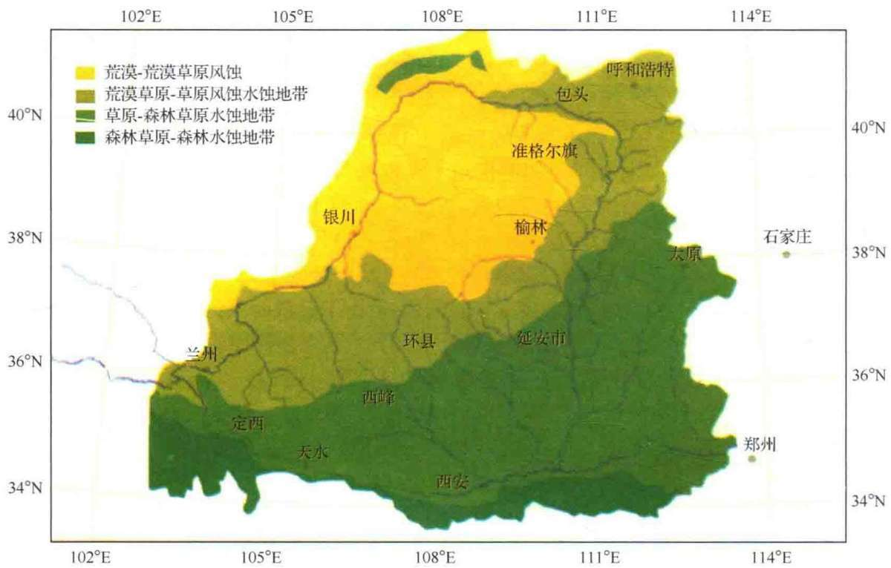  
图2-19 黄土高原土壤侵蚀区划示意图[杨勤科(2001)根据朱显谟(1957)初稿图整理]

黄秉维首先考虑植被状况，将黄土高原分为两大类区域：将有完整植被的地区划为第I类，缺乏完整植被的地区都列为第Ⅱ类。进一步综合考虑地面物质组成、地貌、土壤侵蚀强度等，划分了10个次一级区。第Ⅰ类除部分开垦的农地外，土壤侵蚀微弱甚或没有土壤侵蚀，包括3个区：高地草原、石质山岭中的林区和黄土丘陵中的林区。第Ⅱ类包括7个区：冲积平原、石质山岭、干燥草原、风沙区、黄土阶地、黄土高原、黄土丘陵。其中黄土丘陵区面积最大，土壤侵蚀差异显著，主要依据土地利用，并参考地形、植被和气候，被进一步划分为5个副区。黄土丘陵的这一划分方法至今被普遍使用。

朱显谟(1958)提出的黄河中游土壤侵蚀区划系统包括5级：侵蚀地带，主要采用土壤侵蚀类型，并与气候相结合；侵蚀区带，主要考虑决定侵蚀基础的地质过程和地貌类型；侵蚀复区，以显示与侵蚀本质有关的因素为依据，主要考虑土壤、岩性、地貌类型的演变阶段等；侵蚀区，能明确表示现代侵蚀发展过程和演变趋势，主要考虑土地利用、土壤侵蚀强度、沟谷扩张及下切等；侵蚀分区，主要以满足水土保持初步设计为目标，能反映现代侵蚀和径流分布现状，如坡度、坡长、坡型、水土保持措施有无及类型等。

在黄土高原综合考察基础上，中国科学院黄土高原综合科学考察队(1991)依据土壤侵蚀营力、类型、强度、发展趋势及治理途径等进行了土壤侵蚀分区，共划分了三级区。

第一级是地区。以主要侵蚀营力风力和水力为划分指标，并参照生物气候带确定地区分界。重力虽然普遍，但与沟蚀相伴，且区域分异不显著，故指标中没有考虑。共包括3个侵蚀地区：风蚀地区、风蚀水蚀地区(以水蚀为主，风蚀相当显著)、水蚀地区。

第二级是区。以土壤侵蚀强度为划分指标。共包括25个区，其中，风蚀地区有6个区，风蚀水蚀地区有7个区，水蚀地区有12个区。

第三级是亚区。以区内土壤侵蚀类型组合为划分指标。只在风蚀水蚀地区和水蚀地区内的部分二级区进行了亚区的划分，共包括10个亚区。

该分区具有两个显著特点：①总体上体现了朱显谟提出的分区原则，一级区相当于“侵蚀地带”，主要考虑侵蚀营力作用，二级区相当于“侵蚀区”，主要考虑了现代侵蚀发展过程，以侵蚀强度为指标。②提出了风力水力地区，体现了两种营力共同作用的特点。

## 四、黄土高原土壤侵蚀与黄河泥沙

黄河孕育了中华民族，同时又以其输沙量大、含沙量高而举世闻名。泥沙问题成为治理黄河的症结，解决这个症结的关键在黄土高原，由此形成黄土高原土壤侵蚀与黄河泥沙之间的紧密联系。

## (一)黄土高原水土流失是黄河泥沙根源

黄河流域总面积75.2万 $\mathrm { k m ^ { 2 } }$ (不包括内流区4.2万 $\mathrm { k m } ^ { 2 } )$ ，自河源至内蒙古托克托县的河口镇为上游，面积38.6万 $\mathrm { k m ^ { 2 } }$ ，占流域面积的51.3%；自河口镇至河南郑州桃花峪为中游，面积34.3万 $\mathrm { k m ^ { 2 } }$ ，站流域面积的45.6%；自桃花峪至入海口为下游，面积2.3万km2，占流域面积的3.1%。花园口是位于中游桃花峪附近的水文站，以此站水量和沙量为准，则上游来水量占56%，来沙量只有8%，是黄河的主要清水源。其余44%的水量来自中游，但来沙量高达92%，显然中游是黄河的主要沙源区。其中的河口至龙门区间，虽然流域面积仅11.1万 $\mathrm { k m } ^ { 2 }$ ，占黄河流域面积的14.8%，占黄河中游流域面积的32.4%，但来沙量占了56%(表2-20)。黄河三门峡站多年平均输沙量16亿t,有4亿t沉积在下游河道里，致使黄河下游河床因淤积平均每年抬高8\~10cm，洪水水位高出两岸地面4\~10m。

表2-20 黄河不同区间流域面积、来水、来沙及含沙量
<table><tr><td>黄河区间</td><td>起讫点</td><td>流域面积  $/ \mathcal { F } \mathrm { k m } ^ { 2 }$ </td><td>占全流域 面积/%</td><td>占花园口 水量/%</td><td>占花园口 沙量/%</td><td>含沙量  $/ ( \mathrm { k g / m ^ { 3 } } )$ </td></tr><tr><td>上游</td><td>河源—河口</td><td>38.6</td><td>51.3</td><td>56</td><td>8</td><td>5.6</td></tr><tr><td rowspan="4">中游， 其中：</td><td>河口—桃花峪</td><td>34.3</td><td>45.6</td><td>44</td><td>92</td><td></td></tr><tr><td>河口一龙门</td><td>11.1</td><td>14.8</td><td>14.9</td><td>55.8</td><td>128.5</td></tr><tr><td>龙门一三门峡</td><td>19.1</td><td>25.4</td><td>21.7</td><td>33.7</td><td>53.4</td></tr><tr><td>三门峡一花园口</td><td>4.1</td><td>5.5</td><td>10.6</td><td>1.9</td><td>6</td></tr><tr><td>下游</td><td>桃花峪一入海口</td><td>2.3</td><td>3.1</td><td></td><td></td><td></td></tr></table>

资料来源：赵文林，1996。

位于黄土高原黄河支流的来沙量差别很大。例如，以年输沙总量计，在1亿t以上的支流有4条：泾河为2.2亿t，无定河为2.12亿t，渭河咸阳以上为1.86亿t，窟野河为1.36亿t，共计7.54亿t，占全河沙量的47.1%。若以流域输沙模数计，大于10000t/km²的主要有3个地区：①托克托县河口镇至清涧县河口镇的晋陕间支流；②无定河的支流红柳河、芦河、大理河、清涧河，延河、北洛河、泾河支流马莲河河源区(白于山)；③渭河上游北岸支流葫芦河的中下游、三渡河。以上3个地区均为黄土丘陵区，是黄河泥沙的主要源区。景可等(1993)提出侵蚀模数大于5000t/km²的流域为多沙区。

## (二)黄河粗泥沙来源于黄土高原多沙区

黄土高原不仅是黄河的沙源区，而且是其粗泥沙源区。有关泥沙粒径的分类有不同的标准，钱宁(1978)通过对黄河泥沙的研究发现，淤积在黄河下游河道最多的泥沙是粒径大于0.05mm的泥沙：粒径大于0.10mm的泥沙几乎全部淤积在河道里，粒径为0.05～0.10mm的泥沙，近50%淤积在河道里。主槽表层淤积物中80%以上是粒径大于0.05mm的粗泥沙。根据花园口泥沙粒配结构(表2-21)，粒径小于等于0.05mm的部分占51%，粒径在0.1mm以上的部分仅占5%，反映出泥沙来自黄土，粒径较小的特性。但值得注意的是，粒径在0.05\~0.1mm的部分达到44%，与其他粗泥沙部分合计为49%，因此，钱宁(1978)特别提出0.05mm作为黄河悬移质泥沙中的粗泥沙，目前已被广泛接受。景可等(1993)提出悬移质泥沙中粗泥沙(大于0.05mm)所占总沙量百分比大于25%的地区为粗沙区。

表2-21 花园口悬移质泥沙粒配结构
<table><tr><td>粒径/mm</td><td>0.007</td><td>0.010</td><td>0.025</td><td>0.05</td><td>0.10</td><td>0.25</td><td>0.50</td></tr><tr><td>比例累积/%</td><td>19.7</td><td>24.8</td><td>42.3</td><td>51.0</td><td>95.0</td><td>99.8</td><td>100</td></tr></table>

从前面地质地貌部分的介绍已经知道，该区以马兰黄土覆盖为主，其粒度组成为粉土(0.05\~0.005mm)含量变化于37.2%\~70.0%，细砂(>0.05mm)含量为15%\~30%，黏粒(<0.005mm)含量为10%\~25%。按其粒度组成自西北向东南分为砂黄土、黄土和黏黄土3个地带。因此越向北，黄河支流的入黄泥沙颗粒越粗。这一点从图2-20中可得到反映，最北部的乌兰木伦、皇甫川粗泥沙比例最高，向南降低。到秃尾河又有明显上升，然后降低。从输沙模数看(图2-21)，反映出黄土高原黄河支流的多沙粗沙特点，在河口镇到龙门的黄河流域内，有两个明显的多沙粗沙带：一是皇甫川至孤山川一带，主要位于陕北丘陵区，其粗泥沙含量高达50%\~60%，流域输沙模数为15000\~20000t/km2，粗沙输沙模数也超过了10000t/km2，是黄土高原的主要多沙粗沙区。其次是窟野河、秃尾河、佳芦河、湫水河一带，粗泥沙比例在40%以上，流域输沙模数为5000～10000t/km²，粗泥沙输沙模数在 $5 0 0 0 \mathrm { { 0 } \mathrm { { t } / k m ^ { 2 } } }$ 以上。因此常将此区称为河龙区间多沙粗沙区。

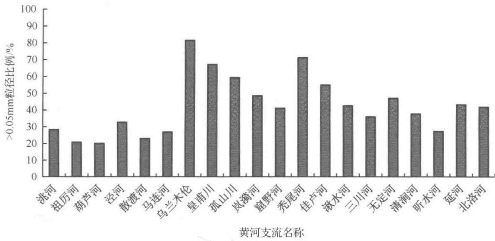  
图2-20 黄土高原黄河支流把口站>0.05mm粗泥沙比例

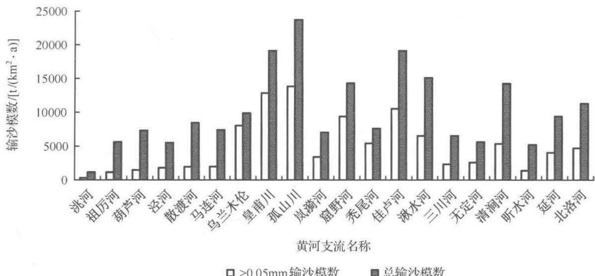  
图2-21 黄土高原黄河支流的输沙模数

## 参考文献

陈先德.1996.黄河水文.郑州：黄河水利出版社

陈永宗，景可，蔡强国.1988.黄土高原现代侵蚀与治理.北京：科学出版社

龚时旸，熊贵枢.1980.黄河泥沙的来源与输移.见：中国水利学会.河流泥沙国际学术讨论会论文集.北京：光华出版社

黄秉维.1955.编制黄河中游流域土壤侵蚀分区图的经验教训.科学通报，2：15-21

黄秉维.1981.确切地估计森林的作用.地理知识，1(1):3

黄秉维.1982.再谈森林的作用.地理知识，2:1-3

姜达权.1980.黄河现代地质作用的一些基本特征和开发治理黄河的途径.中国第四纪研究，5(1)：35-47

景可.1985.黄土高原侵蚀分区讨论.山地学报，(3):161-165

景可，陈永宗，李风新.1993.黄河泥沙与环境.北京：科学出版社

梁一民.2003.黄土高原植被建设.郑州：黄河水利出版社

刘东生.1964.黄河中游黄土.北京：科学出版社

刘东生.1965.中国的黄土堆积.北京：科学出版社

刘东生.1966.黄土的物质成分和结构.北京：科学出版社

刘广全，等，2005.黄土高原植被构建效应.北京：中国科学技术出版社

刘元保，唐克丽，焦菊英，等.1993.黄河水沙时空图谱.北京：科学出版社

刘元保，朱显谟，周佩华，等.1988.黄土高原土壤侵蚀垂直分带研究.中国科学院西北水土保持研究所集刊土壤侵蚀规律研究专集，(7)：5-8

罗来兴.1956.划分晋西、陕北、陇东黄土区域沟间地与沟谷的地貌类型.地理学报，22(3)：201-222

罗来兴.1980.中国自然地理·地貌.北京：科学出版社

孟庆枚.1997.黄土高原水土保持.郑州：黄河水利出版社

牟金泽、孟庆枚.1982.论流域产沙量计算中的泥沙输移比.泥沙研究，(2)：60-65

钱宁，张仁，赵业安，等.1978.从黄河下游河床演变规律来看河道治理中的调水调沙问题.地理学报，38(1):13-24

王守春.1990.论古代黄土高原植被.地理研究，9(4)：72-79

王万忠，焦菊英.1996.中国土壤侵蚀因子定量评价研究.水土保持通报，5:1-20

徐建华，牛玉国.2000.水利水保工程对黄河中游多沙粗砂区径流泥沙影响研究.郑州：黄河水利出版社

杨勤业，张伯平，郑度.1988.黄土高原空间范围的讨论.自然资源学报，3(1)：9-15

张伯声，1956.从黄土线说明黄河河道的发育.科学通报，3:5-10

赵文林.1996.黄河泥沙.郑州：黄河水利出版社

中国科学院地理研究所.1959.中国综合自然区划.北京：科学出版社

中国科学院黄河中游水土保持综合考察队.1958.黄河中游黄土高原的自然、农业、经济和水土保持土地合理利用区划. 北京：科学出版社

中国科学院黄河中游水土保持综合考察队.1959.黄河中游黄土高原地区的调查研究报告，第五号：黄河中游的林业.北京：科学出版社

中国科学院黄土高原综合科学考察队.1991a.黄土高原地区农业气候资源的合理利用.北京：中国科学技术出版社

中国科学院黄土高原综合科学考察队.1991b.黄土高原地区水资源问题及其对策.北京：中国科学技术出版社

中国科学院黄土高原综合科学考察队.1991c.黄土高原地区土壤侵蚀区域特征及其治理途径.北京：中国科学技术出版社

中国科学院黄土高原综合科学考察队.1991d.黄土高原地区植被资源及其合理利用.北京：中国科学技术出版社

中国科学院黄土高原综合科学考察队.1991e.黄土高原地区土壤资源及其合理利用.北京：中国科学技术出版社

中国科学院《中国自然地理》编辑委员会.1980.中国自然地理·地貌.北京：科学出版社

朱显谟.1956.黄土区土壤侵蚀分类.土壤学报，4(2):99-115

朱显谟.1958.有关黄河中游土壤侵蚀区划问题.土壤通报，1:1-6

朱显谟.1981.黄土高原水蚀的主要类型及其有关因素，水土保持通报，3:1-9

朱显谟.1991.黄土高原的形成与整治对策.水土保持通报，11(1):1-17

朱显谟，孙林夫，杨文治，等.1985.黄土高原综合治理分区.中国科学院西北水土保持研究所集刊：黄土高原综合治理专集(1)

## 第三章 黄土高原土壤侵蚀定量评价方法

## 一、评价目的与意义

为了认识土壤侵蚀发生规律，了解水土流失造成的危害，评价水土保持措施在防治土壤侵蚀中的作用和效益，以及合理布设水土保持措施和进行区域水土保持规划，必须进行土壤侵蚀定量评价。正如我国水利学家张含英先生(1937)所言：“盖一切学理之推求，方案之建议，必以数值为准，而数值之来，则根据实地之经验及试验之结果，并参以归纳演绎而求之。”

为了进行定量评价，必须有相应的监测数据和评价方法。按对象差异和采用方法不同，土壤侵蚀监测有不同类型。从空间尺度而言，由小到大依次为坡面、流域和区域。随着空间尺度增大，影响侵蚀的因素增多，监测和评价方法也发生变化。从时间尺度而言，可以是一次降雨事件、季节变化、年和多年平均等。空间尺度和时间尺度往往密切相关：小范围监测更可以实现个别事件或季节变化的监测，进而推求多年平均状况，而大范围监测往往更关心某段时间的平均状况，否则工作量太大无法实现，且无必要。从这个角度而言，小尺度高频率监测主要认识土壤侵蚀规律，评价某种水土保持措施的效益；大尺度低频率监测主要针对水土保持规划、管理和政策制定。前者即为定位监测，如径流小区或小流域把口站等，通过长期监测研究土壤侵蚀发生发展规律，建立定量评价方法土壤侵蚀模型；后者则为区域调查与评价，通过调查土壤侵蚀影响因素，基于前者研究的土壤侵蚀模型，对区域土壤侵蚀分布及其变化进行定量评价。

## (一)土壤侵蚀模型的发展过程

土壤侵蚀定量评价即建立土壤侵蚀模型，用数学方法描述土壤侵蚀规律。如果以1940年Zingg发表的土壤流失量与坡度和坡长的指数关系作为最早的土壤侵蚀模型，至今定量研究已经有了70多年的历史，从模型性质看，经历了从经验模型的研究、应用到机理模型研究的过程；从模拟对象的空间尺度变化看，经历了从坡面侵蚀到小流域、大流域的侵蚀沉积过程的模拟；从模拟内容看，经历了从侵蚀、产沙到土壤侵蚀对土地生产力影响、面源污染、水土资源管理的过程。这种多目标日新月异地发展，除源于人们对土壤侵蚀发生发展过程及其影响的研究不断深入之外，在很大程度上得益于以计算机技术为支撑的地理信息系统、遥感等技术手段的应用。以下仅按时间顺序对土壤侵蚀模型的发展历程做简要介绍。

## (1）20世纪30\~80年代:经验模型的建立与发展

无论是经验模型还是机理模型的建立都离不开观测和试验数据。土壤侵蚀模型研究主要依靠径流小区、小流域量水堰观测和人工模拟降雨试验等方法。1882年德国土壤学家Wollny用小区方法，研究了坡度、植物覆盖、土壤类型、坡向等对土壤侵蚀的影响(Baver，1938)，这不仅是首次开展的土壤侵蚀定量研究，而且创立了土壤侵蚀研究的径流小区方法。正是这一方法的开创使土壤侵蚀科学走向成熟，并发展成为一门独立的学科。时隔30年后，1912年伴随西部开发带来的土地退化问题，美国研究人员采用了类似的方法，在犹他州建立了一个10acre①(4hm²)的小区，研究过度放牧对水土流失的影响(Meyer，1984)。1917年Miller在密苏里大学建立了90.75ft②(27.66m)长、6ft(1.83m)宽，面积为1/80acre(50.62m²)的径流小区，已经十分类似目前的径流小区，因而成为土壤侵蚀研究史上的里程碑。20世纪20年代美国“水土保持之父”Bennett开始注意到土壤侵蚀对土地资源造成的严重危害，并领导建设了全美首批10个水土保持试验站，其中大部分小区为72.6ft长(22.13m)、6ft宽(1.83m)，面积0.01acre(40.5m²)。30\~40年代随着土壤侵蚀危害的日益严重，尤其是1934年的“黑风暴”事件，不仅直接促成美国《水土保持法》的出台和水土保持局的建立，而且陆续建立了遍布全国的一大批试验站，大量观测数据的积累无疑为土壤侵蚀模型的研究奠定了重要的数据基础。

Cook(1936)提出的土壤侵蚀3个主要影响因子:土壤的易侵蚀性、降雨的侵蚀能力和植被覆盖的保护程度，为模型的建立奠定了理论基础。真正利用数学方法估算土壤流失量始于Zingg(1940)发表的第一个土壤流失方程，给出了土壤流失量与坡度和坡长的关系，Smith和Whitt(1948)增加了作物和水土保持措施因子。随后在各地根据观测资料陆续建立了区域性土壤侵蚀经验模型，其中比较有代表性的是Musgrave方程(Musgrave，1947)，能够直接用于农地的水土保持规划。全国范围观测数据的积累和众多区域性经验模型的开发，为建立能够在全国应用的土壤侵蚀经验模型奠定了基础。1954年美国农业部在普渡大学成立了国家径流与土壤侵蚀数据中心(Wischmeier，1955)。基于对来自全美49个地点10000多个小区年径流和泥沙数据的统计分析，以及对各区域土壤流失方程研究成果的集成，终于建立了一个能够在全国范围内应用的通用土壤流失方程(universal soil loss equation，USLE)，并分别在1965年、1978年以农业手册 208号和537号正式发布(Wischmeier and Smith，1965，1978)。该方程可用于估算坡面细沟和细沟间侵蚀导致的多年平均土壤流失量，将不同水土保持措施下的土壤流失量与容许土壤流失量进行对比，能够实现水土保持措施规划与管理，因而成为水土保持工作者重要的技术工具。1977年，美国水土保持学会曾对其所起的作用予以高度评价：没有一种技术像通用土壤流失方程一样，对土壤保护产生如此重要的影响。20世纪60年代以后，随着计算机技术的发展，观测数据和研究成果的积累，USLE被重新修订，1997年发布了修订版USLE(revised universal soil loss equation,RUSLE) (Renard et al., 1997)。RUSLE的主要改进有两点：一是应用计算机技术编制了计算机模型及相应的数据库，为用户提供了使用指南，大大方便了计算过程。二是进行了土壤侵蚀研究成果和数据更新。方程中某些预报因子的计算方法变化较大，如植被覆盖与管理因子等。

我国土壤侵蚀定量研究最早始于黄土高原，1944年全国第一个水土保持试验站建于黄土高原的甘肃省天水，1945年开始有观测资料。1953年刘善建利用天水水土保持科学试验站观测资料，提出了估算黄土高原农地年土壤侵蚀量的经验方程式，这是黄土高原也是我国第一个土壤侵蚀预报模型。该模型只考虑了坡度与土壤流失量的关系，其基本形式为

$$
d = K ( S ^ { 1 . 4 } + 4 6 . 6 ) \Big ( \frac { R } { P } \Big ) ^ { 5 / 3 }\tag{3-1}
$$

式中，S是坡度(°)； $: d$ 是年土壤流失量(mm);R是年径流量(mm)； $P$ 是年降雨量(mm);K是冲刷系数。随地表情况不同而变化：休闲地，地表裸露时， $K = 1$ .84；水土保持耕作制， $K { = } 2 . 1 0$ ；传统耕作制， $K { = } 2 . 7 6$ ;植被覆盖良好地面， $K { = } 4 . 5 0 \ 。$ 其中传统耕作制是指第一年生长上一年撒播的冬小麦，冬小麦收割后农地休闲一段时期，秋季撒播荞麦，荞麦收割后也有适当的休闲期；第二年玉米与黄豆间作，采用等高条播；第三年则为扁豆等高条播，收割后休闲一段时期后，撒播冬麦。三年四熟为一循环。水土保持措施耕作制是指等高条播代替了撒播，黑豆代替了荞麦，种植绿肥代替了休闲。冲刷系数K与植被优劣状况成反比，由于方程中采用了径流量，植被覆盖对径流量的影响远大于冲刷系数。该方程的基本思路与同期国际研究思路十分类似，但在随后的60～70年代，受其他因素影响，研究一度中断。80年代以后，经验模型研究迅速发展，尤以黄土高原地区的研究比较集中。例如，牟金泽和孟庆枚(1983)用回归分析方法建立了降雨、坡度、植被以及雨前土壤含水率等各个因子与坡面次降雨侵蚀量之间的指数乘积关系。李建牢等(1989)利用甘肃天水水土保持科学试验站资料，选取降雨、土壤可蚀性、坡度、坡长、土地利用5个因子，建立了因子值乘积形式的方程式，估算多年平均土壤流失量。其基本形式直接应用美国USLE，但进行了一些参数估算的调整。降雨侵蚀力因子不变，土壤可蚀性因子则根据诺模图建立了与土壤抗分散性的指数关系式。根据地形状况修订了坡度坡长因子中的指数，给出4种不同土地利用的系数值。孙保平等(1990)在宁夏西吉县(黄土高原丘陵区)应用美国通用土壤流失方程USIE进行土壤流失量研究，利用汛期(5～10月)降雨量计算降雨因子，但未对其他因子的订正进行说明。金争平等(1991)在黄河皇甫川流域选择了15个影响小流域土壤侵蚀的因子，通过逐步回归分析方法优选出5个土壤侵蚀预报方程，适用于不同地区。15个因子概括起来包括降雨、流域特征、沟谷特征、土壤分布、植被覆盖以及坡耕地比例等。5个方程包含的因子各不相同，但最终筛选出的重要因子包括沟壑密度、沟壑切割裂度、平均坡度、披砂岩面积比、风沙土面积比、植被覆盖度，基本反映出研究区不同地区的土壤侵蚀环境特征。李钜章等(1999)用与上类似的方程形式，建立了黄土高原多沙粗沙区侵蚀模型，选择的因子包括流域特征指标、植物因子指标、地表物质因子指标、地形因子指标、降雨因子指标 $( P _ { x } )$ 、人为因子指标等。各种指标或以表格形式给出，或以其他参数估算。

## (2)20世纪70\~80年代以后：流域模型的建立与发展

20世纪70年代以后，对土壤侵蚀危害的认识开始从当地影响扩展到异地影响，以流域为单元的水资源和土地资源管理越来越受到关注，由此带动了土壤侵蚀模型研究在以下两个方面的迅速发展：一是模型的模拟空间从地块发展到流域，早期比较有代表性的流域模型是 Williams 和 Nicks(1983) 研制的 SWRRB(simulator for water resources inruralbasins)，用来评价各种不同管理方式对流域水资源和产沙的影响。以此为基础，基于 GIS 技术进一步发展了SWAT(soil and water assessment tool)模型(Arnold et al.1995)，用于进行较大尺度的流域水土资源管理。二是模拟内容从侵蚀-产沙，发展到影响评价，包括土壤侵蚀对土地生产力的影响及其造成的面源污染。在土壤侵蚀影响土地生产力评价方面，以Williams 等(1983)研制的 EPIC(erosion/productivity impact calcula-tor)模型最具代表性，在模拟土壤流失量的基础上，进一步估算了土壤侵蚀导致的土地生$\vec { j } ^ { \pm }$ 力下降和经济损失。该模型的评价单元一般是面积不超过 $\mathrm { 1 h m ^ { 2 } }$ 的小流域。在土壤侵蚀面源污染模型方面，较早的模型是Knisel(1980)研制的CREAMS(chemicals，runoff,and erosionfrom agricultural management systems)模型，用来评价地块单元上不同农业管理措施所造成的面源污染。除包括土壤侵蚀模型的径流泥沙模拟外，还包括了化学污染物模拟部分。此外，还有流域尺度的非点源污染模型如ANSWERS(areal non-pointsource watershed environment response simulation)(Beasley et al. , 1980) 和 AGNPS(agricultural non-point-source pollution model)(Yong et al. , 1983; Engel, 1994)等。

我国流域模型研究也从20世纪80年代以后迅速增多，如江忠善和宋文经(1980)根据黄土高原地区10个小流域(集水面积 $0 . 1 8 \sim 1 8 7 \mathrm { k m } ^ { 2 } )$ 资料，建立了流域次暴雨产沙公式。选择的主要参数有流域坡降、土壤可蚀性因子、植被作用系数。没有区分坡面侵蚀与流域侵蚀，以及泥沙输移过程。但随后考虑到沟谷地与沟间地侵蚀的差异，分别给出沟间地和沟谷地土壤侵蚀模型(江忠善等，1996)。

沟间地模型为

$$
A = 5 . 0 9 7 K P ^ { 0 . 9 9 9 } I _ { 3 0 } ^ { 2 . 6 3 7 } S ^ { 0 . 8 8 } L ^ { 0 . 2 8 6 } H C \eta\tag{3-2}
$$

沟谷地模型为

$$
A = 5 . 0 9 7 K P ^ { 0 . 9 9 9 } I _ { 3 0 } ^ { 2 . 6 3 7 } S ^ { 0 . 8 8 } L ^ { 0 . 2 8 6 } G C _ { g }\tag{3-3}
$$

式中，A是次降雨侵蚀量 $\mathrm { ( \ t / k m ^ { 2 } ) }$ ；K是土质类型修正系数，无量纲； $P$ 是次降雨量$( \mathrm { m m } ) ; I _ { 3 0 }$ 是次降雨最大30min雨强(mm/min);S是坡度 ${ \mathit { \Phi } } ^ { \circ } ) : L$ 是坡长(m);H是浅沟侵蚀影响系数，无量纲，当坡面无浅沟侵蚀时， $H { = } 1 { : } C$ 是植被影响系数，无量纲，分为林地、草地和农作物地3种类型； $\eta$ 是水土保持措施影响系数，无量纲； ${ \cal G }$ 是沟蚀系数，无量纲；$C _ { g }$ 是沟坡植被影响修正系数，无量纲，天然荒坡为1，人工林地和封育草坡参照沟间地植被影响系数C的计算方法和扣除荒坡植被现状覆盖度基数(25%\~30%)的影响加以确定。牟金泽和孟庆枚(1983)用回归分析方法建立了陕北中小流域多年平均年输沙量计算公式。

小流域：

$$
M _ { \mathrm { s o } } = 0 . 0 9 5 \eta M _ { \mathrm { 0 } } ^ { 2 . \mathrm { o } } J _ { \mathrm { 0 } } ^ { 0 . 2 8 } L ^ { 0 . 2 5 }\tag{3-4}
$$

中等流域：

$$
M _ { \mathrm { { s o } } } = 0 . 0 9 5 \eta \alpha \beta M _ { \odot } ^ { 2 , 0 } J _ { 0 } ^ { 0 , 2 8 } L ^ { 0 , 2 5 }\tag{3-5}
$$

式中， $M _ { \mathrm { s } 0 }$ 是小流域和中流域多年平均年输沙模数 $( 1 0 ^ { 4 } \mathrm { t / k m ^ { 2 } } )$ $M _ { 0 }$ 是小流域和中流域多年平均年径流模数 $( 1 0 ^ { 4 } \mathrm { m } ^ { 3 } / \mathrm { k m } ^ { 2 } )$ 。 $J _ { 0 }$ 是沟道平均比降。L是流域长度(km)。η是修匀系数：小流域取值1.24;中流域取值1.09。α是地区系数，与悬移质泥沙多年平均中数粒径 $d _ { 5 0 }$ 有关：当 $d _ { 5 0 }$ 为0.04\~0.06mm时，取值1;0.06\~0.07mm时，取值0.4;0.07\~0.08mm时，取值 $0 . 2 7 . \beta$ 是土壤侵蚀类型分区系数：黄土丘陵沟壑区取值1，风沙区取值0.3。范瑞瑜(1985)采用前述坡面统计模型的思想建立了黄河中游地区小流域土壤量计算公式：

$$
W _ { s } = 8 . 1 5 1 R ^ { 1 . 5 7 3 } K ^ { 1 . 2 3 5 } J ^ { 1 . 3 2 8 } C ^ { 1 . 4 9 1 } P ^ { 1 . 8 5 8 }\tag{3-6}
$$

式中， $W _ { s }$ 是小流域年均单位面积土壤流失量 $( 1 0 ^ { 4 } \mathrm { t / k m ^ { 2 } } )$ ;R是降雨影响侵蚀因子，是年暴雨总动能与汛期雨量的函数；K是土壤可蚀性指标，据各地实测资料，经统计相关分析值采用不同地区土体中大于0.05mm粒级含量与易溶盐百分含量之和(以小数计);J是流域平均坡度，用流域地形图各等高线长度之和与相邻等高线高差的乘积与流域面积的比值表示 ${ } _ { ; C }$ 是植被影响侵蚀系数，无量纲； $P$ 是工程措施影响系数，是流域工程措施面积之和与流域总面积的函数，无量纲。该模型适用于黄土高原地区 $2 0 0 \mathrm { k m ^ { 2 } }$ 以下的小流域。孙立达等(1988)建立了宁夏西吉县黄土丘陵沟壑区小流域土壤流失预报方程，采用指数函数形式，分别给出面积小于 $1 0 \mathrm { k m ^ { 2 } }$ 和 $1 0 \mathrm { \sim } 5 0 \mathrm { k m ^ { 2 } }$ 小流域的侵蚀方程。

面积小于 $1 0 \mathrm { k m ^ { 2 } }$ 小流域：

$$
\begin{array} { r l } & { \mathrm { l n } Y = - 1 0 2 . 0 1 6 + 9 4 . 9 9 7 S ^ { 1 / 4 0 } + 1 3 . 1 9 8 ( E R ) ^ { 1 / 3 0 } - 5 . 6 2 6 ( F / \mathrm { e } ^ { H } ) } \\ & { \qquad + 0 . 0 7 6 A - 0 . 0 1 8 L ^ { 2 } - 0 . 2 4 6 S _ { h } } \end{array}\tag{3-7}
$$

面积为 $1 0 \mathrm { \sim } 5 0 \mathrm { k m ^ { 2 } }$ 小流域：

$$
\begin{array} { r } { \ln Y = - 2 0 . 8 7 2 + 1 2 . 8 8 3 ( E R ) ^ { 1 / 3 0 } - 1 8 . 4 6 5 ( F T ) + 1 1 . 8 5 S ^ { 1 / 4 } - 5 . 9 4 8 ( F / \mathrm { e } ^ { H } ) } \\ { + 0 . 6 0 3 H - 0 . 0 8 3 A + 0 . 4 1 6 L + 2 . 8 2 2 S _ { h } \qquad \quad ( 0 . 0 3 7 7 - 0 . 0 3 4 8 ( F / \mathrm { e } ^ { H } ) ) } \end{array}\tag{3-8}
$$

式中，Y为小流域年单位面积土壤侵蚀量 $\left[ \mathrm { t } / ( \mathrm { k m ^ { 2 } \cdot \mathrm { a } } ) \right]$ ;A为流域面积 $\mathrm { ( k m ^ { 2 } ) }$ ;E、R分别称为年降雨侵蚀力(100J/m²)和年降雨复合参数，但根据表述理解，应分别为降雨总动能E和降雨侵蚀力 $\mathrm { E I } _ { 3 0 }$ ，分别建立了E和 $\mathrm { E I _ { 3 0 } }$ 与年降雨量之间的线性关系；S为流域平均坡度，用1:50000地形图选择的等高线长度之和及高差乘积与流域面积的比值表示；L为流域主沟道长度(km)，是指流域出口顺主沟道方向到分水岭的距离； $S _ { h }$ 为流域形状参数，为 $A / L ^ { 2 } : F$ 为林草面积与流域面积的比值；T为水平梯田和平台地面积之和与流域面积的比值；H为坡耕地面积与流域面积的比值。

付炜(1992)选用了10个因子，建立了黄土丘陵沟壑区模型，采用的是指数乘积的回归形式。10个因子包括汛期降雨量、雨强、土壤可蚀性(由坡度、坡向、植被覆盖度、相对高差、沟谷密度、垦殖指数和地面粗糙度采用层次分析法划分的土壤侵蚀强度等级计算得到)、坡长和坡度因子、植被覆盖度、年径流深、地面粗糙度、沟谷密度、水土保持措施因子。该模型与GIS技术结合，直接预报网格面积上的土壤侵蚀量，进而汇总为流域土壤侵蚀量，地形和流域特征以及输沙路径通过GIS技术提取。

刘黎明和林培(1993)筛选出主导影响因子，建立了黄土丘陵沟壑区小流域土壤侵蚀经验模型：

$$
Y = Q \times [ 0 . 3 0 6 P ^ { - 0 . 8 5 9 } X ^ { - 0 . 2 9 4 } \times 0 . 0 6 2 ^ { d } \times 1 . 0 5 2 ^ { s } \times 0 . 9 8 5 ^ { t } \times 0 . 9 2 1 ^ { f } ]\tag{3-9}
$$

式中，Y是小流域平均土壤侵蚀模数 $\mathrm { t } / ( \mathrm { k m } ^ { 2 } \cdot \mathrm { a } ) ] ; Q$ 是小流域平均径流模数 $\mathbf { m } ^ { 3 } / ( \mathrm { k m } ^ { 2 } \cdot \mathrm { a } ) ]$ P是植被度及治理度(%);X是流域形状参数；d是坡耕地比例(%);s是平均坡度(%);l是平均坡长(m)；f是0.1\~2.0mm的细沙含量(%)。进一步又分别建立了坡面侵蚀和坡面侵蚀输移比的模型，坡面模型采用线性修订USLE的形式，坡面侵蚀输移比模型是径流模数、坡度、植被覆盖度等的指数函数，这样，可以根据小流域模型和坡面模型及其输移比计算出沟谷侵蚀量。

（3）20世纪80～90年代以后:机理模型研究迅速发展

早在20世纪40年代，Ellison(1944)通过试验分析雨滴打击土壤的溅蚀过程，揭示了土壤侵蚀的动力学机理，从而找到了植被覆盖能够减缓降雨动能进而保持土壤的根本原因。Meyer和Wischmeier(1969)提出了土壤侵蚀过程的定量表达：一是用产沙量与输移能力之比表征侵蚀与沉积发生与否及单元输沙量，从而实现了对土壤侵蚀过程进行空间上的连续模拟；二是提出坡面侵蚀过程分为细沟和细沟间侵蚀，阐述了两个过程的不同机理；三是利用泥沙输移连续方程描述侵蚀产沙过程，实现了基于物质守恒定律的物理过程控制。Foster和Lane(1987)以此为基础建立了土壤侵蚀机理模型。随后的土壤侵蚀机理模型基本按照这样的建模思路。

最早发布的机理模型是1986年由美国农业部水土保持局组织的10年研究项目：水蚀预报项目(water erosion prediction project, WEPP)(Laflenet al.，1991)，旨在代替USLE经验模型。1995发布了第一个官方正式版本WEPP95，包括坡面版和流域版，但没有网格版(USDA，1995)。与此同时，世界其他国家也陆续开发了土壤侵蚀机理模型，如澳大利亚 GUEST(Griffith University erosion system template)模型，是一个预报次降雨侵蚀产沙的机理模型，它以Misra 和Rose(1996)，Hairsine和Rose(1991，1992a，1992b)提出的坡面水流侵蚀理论和降雨溅蚀理论为基础。英国、比利时、德国、意大利等国在欧盟资助下共同开发了欧洲土壤侵蚀模型EUROSEM(the European soil erosionmodel)(Morgan etal.，1998)，也是一个模拟次降雨土壤侵蚀过程的机理模型。荷兰DeRoo研制了 LISEM 模型(Limburg soil erosion model)(De Roo and Wesseling， 1995),这是基于GIS支持的土壤侵蚀过程模型。总体而言，目前的机理模型仍属于研究型模型，与实际应用尚有一定差距。

## (二)区域土壤侵蚀定量评价发展历程

区域土壤侵蚀定量评价按方法可分为3种：①抽样调查。按一定原则和比例在区域范围内抽样，调查抽样单元或地块的侵蚀因子状况，再利用土壤侵蚀预报模型估算土壤流失量，进而根据不同目的进行各层次管理或自然单元汇总。该方法以美国为代表，在1977\~1997年每隔5年进行一次，共进行了5次。从2000年开始每年进行。②网格估算。按一定空间分辨率将区域划分网格(网格大小取决于可获得数据的空间分辨率)，基于GIS技术支持，利用土壤侵蚀预报模型估算各网格土壤流失量，进而根据不同目的进行不同层次的单元汇总。该方法以澳大利亚和欧洲各国为代表，从20世纪末期开始进行。③遥感调查。基于遥感影像资料和GIS技术，选择一定的空间分辨率，利用全数字作业的人机交互判读方法，通过分析地形、土地利用、植被覆盖等因子，确定土壤侵蚀类型及其强度与分布。该方法以我国为代表，从20世纪80年代至今进行了3次。网格估算可以实现全区域所有地块土壤流失量的计算，但结果的准确度和可信性较差。因为目前一般采用1km×1km网格，由于网格尺度较大，已经无法真实地反映水土流失影响因子的实际情况，难以获得准确的计算结果。实际上利用土壤侵蚀预报模型估算土壤流失量的适宜地块尺度是:在地形破碎地区，不大于10m;在地形比较完整地区，不大于100m。显然1km×1km的网格无法估算出正确的土壤流失因子。而当网格变小以后，要么使工作量剧增，要么无法获取所需要的资料。遥感调查考虑的侵蚀因子有限，无法给出土壤流失速率，只能判断土壤流失的大概趋势。抽样调查不仅能够获得抽样区的土壤流失量，而且可以根据实际情况确定抽样强度，具有准确性和灵活性的特点。以下对不同方法在世界范围内开展的情况进行简要回顾。

## 1. 抽样调查

采用抽样调查方法进行全国土壤侵蚀定量评价以美国最具代表性。最早可追溯至1934年的全国侵蚀勘探调查(National Erosion Reconnaissance Survey)(NusserandGobel，1997；Gobel，1998)，由美国内政部(U.S. Department of Interior)土壤侵蚀局(Soil Erosion Service，SES)组织全国115位土壤侵蚀专家，进行了为期2个月的实地调查，确定了768.93万 $\mathrm { k m } ^ { 2 } ( 1 . 9 \times 1 0 ^ { 9 }$ 英亩)农地土壤侵蚀(包括水蚀和风蚀)及强度分级面积(Harlow，1994)。调查完成6个月后，1935年颁布了美国《水土保持法》(SoilCon-servation Act)，并在农业部(U. S. Department of Agriculture，USDA)设立了水土保持局(Soil Conservation Service，SCS)，替代原内务部的土壤侵蚀局(Harlow，1994)。随后分别在1942年、1958年和1965年先后为维护和改善农业生产力、评估实施水土保持措施的重要性和紧迫性等目标，开展了调查，分别为1945ConservationNeeds Inventory(Harlow, 1994; Gobel, 1998), 1958Conservation Needs Inventory(1958CNI)和 1967NationalInventory of Soil and Water Conservation Needs (Harlow, 1994; Gobel,1998)。其中，1942年主要基于各种统计资料的分析，1958年首次采用了抽样调查的方法，1965年基本与1958年的调查相同。1972年美国国会通过《乡村发展法》(RuralDevelopment Act of 1972)，要求每 5\~10 年进行一次资源调查(Harlow，1994)。1977年依据《土壤与水资源保护法》(Soil and Water Resources Conservation Act of 1977),水土保持局组织实施了全国资源调查(National ResourcesInventory，NRI)。基本沿用1967年的抽样调查方法，在全国共抽取70000个基本抽样单元PSUs，然后在每个PSU内随机抽取1\~3个采样点。此次调查开创了两个先河：一是首次利用通用土壤流失方程(universal soil loss equation，USLE)和土壤风蚀方程(wind erosion equation，WEQ)对土壤侵蚀进行定量评价；二是首次同时对抽样单元(PSU)和采样点(point)进行数据采集，因此本次调查最初被称为1977侵蚀调查(1977ErosionInventory)，后来称为1977全国资源调查(Harlow，1994；Gobel，1998)，并被看做是延续至今的全国资源调查NRI的起点。随后每隔5年，分别在1982年、1987年、1992年和1997年开展了同样的调查，受经费投入影响，每次调查的抽样单元(PSU)和采样点(point)数量有所不同(Gobel，1998):1982年规模最大，全国共有321000个PSUs和800000个采样点；1987年因经费缩减减少到108000个PSUs;1992年和1997年均恢复到1982年规模。为了评价1982\~1997年15年的土壤侵蚀动态变化，在1997年调查中，采用遥感影像解译和相关资料分析方法，补充了1982年未进行调查的抽样单元数据。由于1982年以后调查方法和数据采集内容一致，与1977年的调查有所差异，因此从应用角度，1982年被认为是土壤侵蚀动态监测与评价的起始点(Gobel，1998)。进入21世纪以后，鉴于调查经费和人员缩减，以及对资源变化进行连续性动态评估的需求日益增强，5年一次的资源调查开始转为每年连续调查。经过1998\~1999年的连续性调查方法探讨，2000年正式启动了连续调查方案：已经形成15年序列的全国300000个PSUs和800000个采样点数据库为基础，每年调查其中约42000个的核心(core)PSUs及其采样点，再选取约30000个PSUs及其采样点作为轮换(rotation)或补充(supplement)PSUs;计划经过8年左右使所有轮换单元都调查过一次。由于每年需要调查大约72000个PSUs及其采样点数据，工作量较大，主要采样航片解译方法。遇到无法获得当年航片或航片不清的情况时，辅以实地调查。根据目前收集的资料，2000年调查了分布在50个州的42000个核心PSUs;2001年调查73000个PSUs，包括上一年度的42000个核心PSUs和31000个轮换PSUs;2002年调查51000 个PSUs，包括21000 个核心 PSUs和 30000个轮换 PSUs;2003 年调查 73000 个PSUs，包括42000个核心PSUs和31000个轮换PSUs;2004年启动草地土壤侵蚀调查，选取2004个PSUs只调查牧草地（rangeland)；2006年和2007年恢复调查73000个PSUs，包括42000个核心PSUs和31000个轮换PSUs。截至目前的调查成果有：2000年发布1982～1997年共计15年的土壤侵蚀动态变化，并建立数据库供不同人员应用；2009年发布1982\~2007年共计25年的土壤侵蚀动态变化;其间分别发布了2001年、2002年和2003年的年度简报。

总结美国国家资源清查发展历史，具有以下特点：①持续时间长；②调查方法和内容一致、规范，不仅有助于了解现状，更确保了调查结果的可对比性，能够掌握变化动态；③调查始于土壤侵蚀与水土保持需求，发展至今依然是重点内容之一，但所涉及范围更加广泛，应用领域进一步扩大；④形成的长序列调查成果已经成为政府进行自然资源保护立法、立项和财政预算的重要参考依据。

我国2010\~2012年在国务院领导下，由水利部组织实施了新中国成立以来的第一次水利普查，其中一项内容是水土保持情况普查，包括水土保持措施、沟道侵蚀和土壤侵蚀3项内容。其中土壤侵蚀调查采用了抽样调查(国务院第一次全国水利普查领导小组办公室，2010)。

## 2. 网格估算

1997\~2001年，澳大利亚开展了国家土地与水资源调查(TheNational Land and

WaterResourcesAudit)，旨在了解全国土地和水资源现状及其变化，为经济可持续发展、资源管理和可持续利用提供决策依据。项目分7个专题实施，第5个专题是农业生产力与可持续能力，包含了土壤侵蚀调查。调查采用网格估算方法：依据不同数据源精度，在全国范围内划分网格，利用土壤侵蚀模型计算土壤侵蚀模数。采用的模型是修订版通用土壤流失方程RUSLE，但受资料限制，对模型参数进行了简化处理：降雨侵蚀力采用全国120个雨量站20年日雨量计算(Yu andRosewell，1996)，插值生成 $0 . 0 5 0 ^ { \circ } \times 0 . 0 5 0 ^ { \circ }$ 网格；土壤可蚀性基于全国土壤类型图的土壤属性性质计算，插值生成 $0 . \ 0 0 2 5 0 ^ { \circ } \times 0 . \ 0 0 2 5 0 ^ { \circ }$ 网格(经度×纬度)；坡度和坡长因子采用全国数字高程模型DEM计算，分辨率为$0 . \ 0 0 2 5 0 ^ { \circ } \times 0 . \ 0 0 2 5 0 ^ { \circ }$ ；覆盖与管理因子采用NOAA(AVHRR)13年归一化植被指数(NDVI)计算，插值生成 $0 . 0 1 0 ^ { \circ } \times 0 . 0 1 0 ^ { \circ }$ 网格；受资料限制，水土保持措施因子取值为1，不考虑其影响。此外还采用了1997年分辨率为1km的全国土地利用图。在GIS技术支持下，以月为单位计算各月土壤侵蚀速率，然后累加得到全年土壤侵蚀模数，分辨率为$0 . \ 0 0 2 5 0 ^ { \circ } \times 0 . \ 0 2 5 0 ^ { \circ }$ (经度×纬度)。从调查方法看，虽然实现了无缝隙计算，但存在两个问题：一是受数据源空间精度限制，估算误差较大，表现为地形因子对空间分辨率反应敏感，0.0025的分辨率会导致坡度的平滑， $0 . 0 0 2 5 0 ^ { \circ } \times 0 . 0 2 5 0 ^ { \circ }$ 的网格尺度较大，只能反映宏观特征。二是没有考虑水土保持措施的影响。从这个角度说，应该属于危险性评价，而非真正的现状评价。

20世纪90年代到21世纪初，为了应用现代数字计算定量评价欧洲土壤侵蚀状况，欧盟联合研究中心欧洲土壤局实施了土壤侵蚀危险性评价项目，旨在识别土壤侵蚀易发生区域，为欧盟国家制定土壤保护和退化防治政策提供信息。先后在整个欧洲、欧洲内不同区域或国家采用不同方法进行了侵蚀危险性评价，评价方法概括为专家法和模型法。其中模型法采用USLE模型计算土壤侵蚀模数，评价两种危险性：潜在危险性和实际危险性。前者是指气候、地形和土壤条件下决定的土壤流失量，不考虑植被覆盖与水土保持措施作用 $( C { = } 1 , P { = } 1 )$ 。后者增加了当前植被覆盖的影响(P=1)。降雨侵蚀力利用欧洲大陆578个气象站1989～1998年日雨量资料计算各月和年值，插值为空间分辨率1km的网格。土壤可蚀性采用欧洲 $1 : 1 0 0 0 0 0 0$ 土壤地理数据库中的每种土壤类型表土机械组成和有机质含量计算其因子值，每个图斑包括一种或多种土壤类型，通过面积加权平均得到图斑因子值。坡度和坡长因子采用分辨率1km的数字高程模型DEM计算；覆盖与管理因子采用NOAA(AVHRR)归一化植被指数(NDVI)计算，水土保持措施因子取值为1，不考虑其影响。此外，还采用因子分级打分法评价全欧洲土壤侵蚀危险性，评价对象为9种土地利用类型，考虑的因子包括：①坡度分为8级；②土壤分为理化性质、结皮和土壤可蚀性3种指标；③气候分为降雨量、大于等于40mm日雨量的频率和降雨侵蚀力3种指标。对9种土地利用类型按上述因子的侵蚀敏感性打分，利用层次分析法得到侵蚀危险性等级。

## 3. 遥感调查

我国全国范围的土壤侵蚀调查先后开展了4次，分别在1984年、1999年、2000年和2010年进行。前3次均采用遥感调查方法，即基于遥感影像解译，利用坡度和植被覆盖通过人机交互式判读土壤侵蚀强度。前3次利用遥感技术进行的全国水土流失调查，达到了在可用资料不足的条件下对全国水土流失宏观把控的最低要求，为政府宏观政策制定提供了技术支撑。但遥感调查的主要问题在于，调查结果只是不同地区水土流失程度的相对结果，而不是实际水土流失强度，没有与小区资料建立直接联系，专家判断对调查结果影响较大。

如前所述，第4次采用抽样调查方法，即在全国利用分层系统不等概区域抽样确定近4万个调查单元，通过实地调查获取调查单元范围内土壤侵蚀自然和人为影响因子的空间分布及其属性，再利用土壤侵蚀模型计算侵蚀模数，根据分级标准确定土壤侵蚀强度和水土流失面积。模型计算需要的相关参数是通过新中国成立以来各地监测资料及其研究成果获得。

与前3次遥感调查相比，第4次增加了水土保持措施类型及其空间分布的调查，从而可以反映水土保持的现状和作用，这是目前遥感影像因空间分辨率所限无法实现的，如果在大范围区域采用能识别水土保持措施的高空间分辨率影像(至少小于5m)，又是财力所不允许的。因此，区域土壤侵蚀调查必须综合考虑空间精度、计算精度、财力和时间等因素的影响，确定最终方法，保证既能实现监测目标，又符合实际切实可行。

## 二、黄土高原土壤侵蚀评价方法

## (一)评价方案设计与野外调查单元布局

通过上节的回顾不难看出，较大范围区域的土壤侵蚀定量评价以抽样调查方法为优，其原因有以下几方面：一是具有精确性。调查指标实地获得，精度高，是其他数据源所无法取代的。虽然高分辨率遥感信息能在一定程度上取代实地调查，但费用高，时间长。二是具有灵活性，可根据评价需求、人力、物力、财力和时间要求等，确定科学合理的抽样原则和比例，在同时考虑土壤侵蚀复杂性和特殊性的基础上，兼顾可操作性。三是反映人为因素尤其是水土保持措施的影响。因为这一资料目前依然通过实地获得，遥感信息尚难以解决。因此，本研究采用抽样方法在黄土高原范围内布设野外调查单元，通过收集降雨、土壤和植被遥感影像指标，实地调查土地利用和水土保持措施情况，依据土壤侵蚀模型计算调查单元土壤流失量，在此基础上，通过汇总统计方法定量评价区域土壤侵蚀现状。

野外调查单元是实地调查土地利用和水土保持措施的空间范围，平原区一般为面积1km×1km的网格，丘陵区和山区为0.2\~3km²的小流域。采用分层不等概系统抽样方法确定野外调查单元。分层是指在全国统一划分4级网格，采用高斯-克吕格投影分带将全国分为22个3°带，在每一带内分别以中央经线和赤道为基准向两侧划分:第1层网格为 $4 0 \mathrm { k m } \times 4 0 \mathrm { k m }$ ，称为县级区;第2层网格在第①层基础上，划分为 $1 0 \mathrm { k m } \times 1 0 \mathrm { k m }$ ，称为乡级区；第3层网格在第2层基础上，划分为5km×5km，称为控制区；第4层网格在第3层基础上，划分为1km×1km，称为基本调查单元。以第4层的基本调查单元 $( 1 \mathrm { k m } \times 1 \mathrm { k m } )$ 为基础，按4%密度抽样：即在每个控制区(5km×5km)中心抽取一个1km×1km网格，即为野外调查单元的基本位置。选取每个控制中心避免了靠近道路等人为定点的影响，属于系统抽样。不等概是考虑到平原区或深山区基本无土壤侵蚀发生，采用低密度抽样。共有4%，1%,0.25%，和0.0625%4种抽样密度。具体方法是以4%密度抽样结果为基础，分别在东西和南北方向每隔1个、3个、7个调查单元重新抽样，从而保证0.0625%～4%抽样密度之间调查单元空间位置的重合。最终在黄土高原布设了3267个水蚀野外调查单元(表3-1，图3-1)。

表3-1 调查单元数量统计
<table><tr><td>行政代码</td><td>省(自治区)</td><td>调查单元个数</td></tr><tr><td>14</td><td>山西</td><td>1153</td></tr><tr><td>15</td><td>内蒙古</td><td>21</td></tr><tr><td>41</td><td>河南</td><td>18</td></tr><tr><td>61</td><td>陕西</td><td>1132</td></tr><tr><td>62</td><td>甘肃</td><td>793</td></tr><tr><td>63</td><td>宁夏</td><td>4</td></tr><tr><td>64</td><td>青海</td><td>146</td></tr><tr><td>合计</td><td></td><td>3267</td></tr></table>

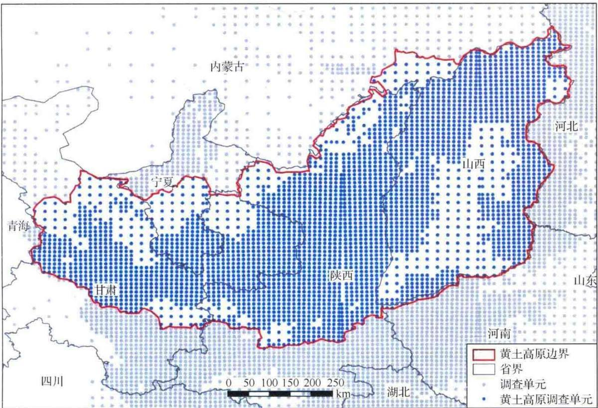  
图3-1 黄土高原调查单元分布

## (二)数据采集方法

数据采集是指收集与土壤侵蚀定量评价相关的各种土壤侵蚀影响因子，包括降雨、土壤、地形、植被覆盖和各种水土保持措施等，其中降雨和土壤为区域范围，地形、植被覆盖和各种水土保持措施及其分布等为野外调查单元范围。

降雨资料主要收集黄土高原范围内时间序列尽可能长且数量尽可能多的气象站雨量资料，最终分别利用黄土高原46个气象站1961～1990年共30年逐日雨量资料，计算半月降雨侵蚀力累积百分比;利用235个站1961～1990年30年平均月雨量资料计算黄土高原多年平均年降雨侵蚀力，并插值为空间分布图。

土壤资料主要收集第二次土壤普查成果资料，包括不同土壤类型的典型土壤剖面理化性质，以及分布图。

地形参数主要是指坡度和坡长，利用调查单元所在的1:10000地形图提取。将每个调查单元范围内等高线数字化，生成10m分辨率的数字高程图(DEM)，然后分别提取坡度和坡长。

不同土地利用下的植被覆盖和各种水土保持措施需要基于实地调查，为此需要先制作调查单元的野外调查底图和调查表，然后到野外绘图和填表。底图制作方法如下:前述调查单元布局方法确定的是调查单元内或附近点的经纬度坐标，其实际位置和范围需要基于1:10000地形图确定：找到上述经纬度坐标所在1:10000地形图后，在该幅图相对中心的位置确定野外调查单元边界，然后数字化。确定调查单元边界时应注意：如果地形图显示为大川、大河、塬面、平原等地势较为平坦且等高线稀疏的区域，且平坦范围(水域)面积≥20%时，取相对中心位置的1km×1km网格作为调查单元边界；如果该地形图以丘陵区和山区为主，在相对中心区(尽量与中心千米网格相连)选择面积0.2\~3km²的小流域作为调查单元。数字化完调查单元边界后，还要对其范围内的等高线数字化，以便提取坡度和坡长。

野外调查是依据调查底图和GPS定位，勾绘调查图和填写调查表。调查图是将调查单元内的地块边界勾绘在调查底图上，并注明每个地块的编号和拍摄的照片编号，然后对应的每个地块信息填写在调查表上，具体信息包括：地块的土地利用类型、植被覆盖和生物措施类型、工程措施类型、耕作措施类型。这些信息将转换为土壤侵蚀模型的相关参数，进而对土壤侵蚀现状进行定量评价。所谓地块是指土地利用类型一致、水土保持措施类型一致、植被郁闭度或盖度一致(差异小于等于10%)的连续空间范围。因此每个地块的土壤侵蚀影响因子相同，不同地块的某个或多个土壤侵蚀影响因子不同。

## (三)土壤侵蚀定量评价方法

土壤侵蚀定量评价方法采用北京师范大学基于黄土高原观测资料开发的土壤侵蚀模型，模型基本形式为

$$
A = R \times K \times L \times S \times B \times E \times T\tag{3-10}
$$

式中，A为土壤流失量 $\left[ \mathrm { t } / ( \mathrm { k m ^ { 2 } \cdot \mathrm { a } } ) \right]$ ;R为降雨侵蚀力因子 $\left[ \mathrm { M J } \bullet \mathrm { m m } / ( \mathrm { h m } ^ { 2 } \bullet \mathrm { h } \bullet \mathrm { a } ) \right]$ ; K为土壤可蚀性因子 $\left[ ( \mathrm { t } \bullet \mathrm { h m } ^ { 2 } \bullet \mathrm { h } ) / ( \mathrm { h m } ^ { 2 } \bullet \mathrm { M J } \bullet \mathrm { m m } ) \right]$ ;L为坡长因子，无量纲；S为坡度因子，无量纲；B为植被覆盖与生物措施因子，无量纲；E为工程措施因子，无量纲；T为耕作措施因子，无量纲。下面各章将详细介绍每个土壤侵蚀影响因子的评价。

利用该模型计算黄土高原3267个野外调查单元土壤水蚀模数，然后依据水利部颁布的《土壤侵蚀分类分级标准》(SL190—2007)(表3-2和表3-3)判断土壤水蚀强度，轻度及以上(包括轻度、中度、强烈、极强烈和剧烈5级)属于土壤水力侵蚀面积，通过对调查单元结果的空间插值得到区域分布状况，黄土高原区微度为 $1 0 0 0 \mathrm { t / ( k m ^ { 2 } \cdot a ) }$

表3-2 土壤侵蚀强度分级标准表
<table><tr><td>级别</td><td>平均侵蚀模数/[t/(km²·a)]</td></tr><tr><td>微度</td><td>&lt;200,500,1000</td></tr><tr><td>轻度</td><td>200,500,100~2500</td></tr><tr><td>中度</td><td>2500~5000</td></tr><tr><td>强烈</td><td>5000~8000</td></tr><tr><td>极强烈</td><td>8000~15000</td></tr><tr><td>剧烈</td><td>&gt;15000</td></tr></table>

表3-3面蚀分级指标表
<table><tr><td colspan="2">地类与坡度</td><td> $< 5 ^ { \circ }$ </td><td> $5 ^ { \circ } { \sim } 8 ^ { \circ }$ </td><td>8°~15°</td><td>15°~25°</td><td>25°~35°</td><td>&gt;35°</td></tr><tr><td rowspan="5">非耕地林草覆盖度/%</td><td>&gt;75</td><td rowspan="5">微度</td><td rowspan="2">微度 轻度</td><td rowspan="2">微度</td><td rowspan="2">微度</td><td rowspan="2">微度</td><td rowspan="2">微度</td></tr><tr><td>60~75</td></tr><tr><td>45~60</td><td>微度 微度 轻度</td><td>轻度 轻度</td><td>轻度 中度</td><td>中度 中度</td><td>中度 强烈</td></tr><tr><td>30~45</td><td>微度</td><td>轻度 中度</td><td>中度</td><td>强烈</td><td>极强烈</td></tr><tr><td>&lt;30</td><td>微度</td><td>中度 中度</td><td>强烈</td><td>极强烈</td><td></td></tr><tr><td colspan="2">坡耕地</td><td>微度</td><td>轻度</td><td>中度 强烈</td><td>极强烈</td><td></td></tr></table>

## (四)数据库构建与计算程序

数据库包括区域范围的气象站逐日降雨量和1：100万土壤类型分布及其典型剖面土壤理化性质，野外调查单元的数字高程DEM和地块信息。通过开发的土壤流失量计算SLC(soilloss calculation)系统，计算了黄土高原3267个调查单元的土壤流失量，然后通过空间插值形成区域土壤侵蚀分布现状。具体计算内容如下：

1）黄土高原多年平均年降雨侵蚀力等值线图，生成30m×30m分辨率栅格图，利用野外调查单元边界文件裁切，得到每个野外调查单元R因子图层，并重采样为 $1 0 \mathrm { m } \times 1 0 \mathrm { m }$ 分辨率共计25个栅格图层。

2）黄土高原土壤可蚀性分布图，生成 $3 0 \mathrm { m } \times 3 0 \mathrm { m }$ 分辨率栅格图，利用野外调查单元边界文件裁切，得到每个野外调查单元K因子图层，并重采样为10m×10m分辨率共计25个栅格图层。

3）调查单元植被覆盖与生物措施因子B栅格图层，10m×10m分辨率。利用野外调查单元调查的地块郁闭度和盖度信息，通过参数赋值后形成栅格图层。该值对于林地、园地和草地地块随调查的盖度和郁闭度变化而变化，对于农地地块则赋值为1，农地作物覆盖的作用通过耕作措施体现。

4）调查单元坡长因子L栅格图层， $1 0 \mathrm { m } \times 1 0 \mathrm { m }$ 分辨率。基于调查单元等高线矢量图插值生成10m×10m分辨率DEM后，先提取坡长，然后利用分段坡的坡长因子公式计算得到每个野外调查单元L因子 $1 0 \mathrm { m } \times 1 0 \mathrm { m }$ 栅格图层。

5）调查单元坡度因子S栅格图层， $1 0 \mathrm { m } \times 1 0 \mathrm { m }$ 分辨率。基于调查单元等高线矢量图插值生成10m×10m分辨率DEM后，先提取坡度，然后利用坡度因子公式计算得到每个野外调查单元S因子 $1 0 \mathrm { m } \times 1 0 \mathrm { m }$ 栅格图层。

6）调查单元水土保持工程措施因子E栅格图层，10m×10m分辨率。利用调查单元调查的地块水土保持工程措施信息，通过参数赋值后形成栅格图层。

7)调查单元水土保持耕作措施因子T栅格图层，10m×10m分辨率。利用调查单元调查的地块农地耕作信息，通过参数赋值后形成栅格图层。只有农地根据耕作措施或作为轮作制度的不同具有不同的数值，其他土地利用类型均取值为1。

对每个调查单元上述7个模型因子图层进行乘积运算，即得到每个调查单元10m10m分辨率土壤流失量栅格图层，然后依据土壤侵蚀强度标准(表3-2和表3-3)判断每个栅格的土壤侵蚀强度，计算各强度级栅格数量占该调查单元总栅格数量的比例，即为调查单元各侵蚀强度级别比例，轻度以上各级别比例之和为土壤侵蚀面积比例。在区域范围内对所有野外调查单元土壤侵蚀面积比例和各侵蚀强度比例进行空间插值，得到区域土壤侵蚀面积比例及其强度级别比例分布图。

## (五)评价成果及其应用

该评价采用了资料收集、野外调查和模型计算相结合的方法。资料收集主要收集地形图、降雨资料和土壤资料。用收集的历史降雨资料，建立黄土高原地区降雨资料数据库，用于计算模型所需的降雨侵蚀力因子。用收集的土壤资料，建立黄土高原地区土壤数据库，用于计算土壤可蚀性因子。用收集或购买的地形图，建立调查单元的坡度坡长数据库，用于计算坡度坡长因子。野外调查主要完成调查单元地块划分、土地利用类型识别、土壤类型和水土保持措施确认，为土壤可蚀性和水土保持措施因子计算提供依据。最后，应用调查或计算获取的参数，应用模型计算每个调查单元土壤侵蚀量。应用上述评价方法和程序，可以得到以下成果：

1）调查单元基础数据库。由于本次评价必须达到现场完成水蚀野外调查单元，每个调查单元都会涉及土地利用、水土保持措施、土壤和地块面积等信息。利用该评价方法时，可以构建以调查单元为单位的多种基础数据库。由于调查单元定点定位和网格化布设，可以用于后续插值和制图。

2)土壤可蚀性数据库。应用收集到的土壤调查资料，根据该评价中介绍的公式和计算程序，可以得到不同土种的土壤可蚀性值，也可以向上合并成土类的可蚀性值。如果需要，也可以绘制整个黄土高原或某个评价地区的土壤可蚀性等值线图。

3）降雨侵蚀力等值线图。降雨侵蚀力是进行土壤侵蚀定量评价的重要参数。基于收集到的多年降雨资料，利用北京师范大学建立的降雨侵蚀力估算公式计算各站点多年平均降雨侵蚀力。最后，利用GIS软件插值并绘制降雨侵蚀力等值线图。

4）土壤侵蚀强度图。根据计算所得的每个调查单元土壤侵蚀模数，可以编绘出黄土高原土壤侵蚀强度图。也可以按照行政区划，编绘不同侵蚀强度等级面积比例图。这些图件对宏观把握土壤侵蚀区域分布规律至关重要。

5）区域水土流失数据库。用调查点上各侵蚀因素值及所计算的土壤侵蚀强度等，可以根据实际需要构建县级、省级等行政单元水土流失数据库。也可以按照流域构建不同自然地理单元水土流失动态数据库。

有了上述调查和评价结果，就可以定量化计算和评价不同范围土壤侵蚀强度、不同侵蚀强度面积比例，为区域水土流失评价以及水土保持实践提供技术支撑，实现区域水土流失的数字化管理。还可以使政府和相关管理部门的水土保持工作做到有的放矢，实现资金投入和效益评价同步展开。

## 参考文献

范瑞瑜，1985，黄河中游地区小流域土壤流失量计算方程的研究.中国水土保持，(2):12-18

付炜.1992.黄土丘陵沟壑区土壤侵蚀模型的建立方法及土壤侵蚀因子计算机自动提取的试验研究.见：陈洪经.黄土高原小流域动态监测信息系统研究.北京：测绘出版社：110-118

龚时旸，熊贵枢.1979.黄河中游泥沙来源和地区分布.人民黄河，1:7-18

国务院第一次全国水利普查领导小组办公室.2010.第一次全国水利普查培训教材之六:水土保持情况普查.北京：中国水利水电出版社

江忠善，宋文经.1980.黄河中游黄土丘陵沟壑区小流域产沙量计算.见:中国水利学会.第一次河流泥沙国际学术讨论会文集.北京：光华出版社.63-72

江忠善，王志强，刘志.1996.黄土丘陵区小流域土壤侵蚀空间变化定量研究.土壤侵蚀与水土保持学报，2(1):1-9

金争平，赵焕勋，和泰等.1991.皇甫川区小流域土壤侵蚀量预报方程研究.水土保持学报，5(1)：8-18

李建牢，刘世德，罗玉沟.1989.流域坡面土壤侵蚀量的计算.中国水土保持，(3):28-31

李钜章，景可，李风新。1999.黄土高原多沙粗沙区侵蚀模型探讨.地理科学进展，18(1):46-53

刘黎明，林培.1993.黄土高原丘陵沟壑区土壤侵蚀定量方法与模型的研究.水土保持学报，7(3):73-79

刘善建.1953.天水水土流失测验的初步分析.科学通报，12:59-65,54

牟金泽，孟庆枚.1983.陕北部分中小流域输沙量计算.人民黄河，(4)：35-37

史景汉，郝建忠、熊运章等.1989.黄丘-副区小流域暴雨洪水输沙过程预报模型.中国水土保持，1:32-37

孙保平，赵廷宁，齐实，1990.西吉县黄土丘陵沟壑区的应用.中国科学院水利部西北水土保持研究所集刊，12:50-58

孙立达，孙保平.1988.西吉县黄土丘陵沟壑区小流域土壤流失量预报方程.自然资源学报，3(2):141-153

谢树楠，张仁，王孟楼，1993.黄河中游黄土丘陵沟壑区暴雨产沙模型研究.见：黄河水沙变化研究基金会.黄河水沙变化研究论文集，五卷.北京：黄河水沙变化基金会出版社：238-274

张含英.1949.土壤之冲刷与控制.北京：商务印书馆

Arnold J G, Williams J R, Nicks A D, et al. 1990. SWRRB: A Basin Scale Simulation Model for Soil and Water Resources Management. Texas: A&.M University Press

Baver L D. 1938. Ewald Wollny—A poineer in soil and water conservation research. Soil Science Society Proceedings:

330-333

Beasley D B, Huggins L F, Monke E J. 1980. Answers: A model for watershed planning. Transactions of the ASAE, 23:938-944

Cook HL. 1936. The nature and controlling variables of the water erosion process, Soil Science Scoiety of America Proceedings, 1:60-64

De Roo A P J. 1996. The LISEM project: an introduction. Hydrological Processes, 10: 1021-1025

De Roo A P, Wesseling C G. 1995. LISEM: Limburg Soil erosion Model, A User Guide. Department of physical Geo graphy. Utrecht University, The Nethelands

Engel B A. 1994. The impact of GIS-derived topographic attributes on the simulation of erosion using AGNPS. Ameri can of Society of Agricultural Engineers, 10(4):561-566

Flangan D C, Nearing M A. 1995. USDA Water Erosion Prediction Project: Hillslope Profile and Watershed Model Documentation. West Lafayette: NSERL

Foster G R. 1991. Advances in wind and water erosion prediction. Journal of Soil and Water Conservation, 46(1) : 27- 29

Foster G R, Lane L J. 1987. User Requirements, USDA-Water Erosion Prediction Project ( WEPP). West Lafayette:NSERL

Goebel J J. 1998. The National Resources Inventory and its role in U. S. agriculture. Proceedings of Agricultural Statistics 2000, Conference on Agricultural Statistics, Washington, DC: 181-192

Hairsine P B, Rose C W. 1991. Rainfall detachment and deposition: sediment transport in the absence of flow-driven processes. Soil Science Society of America Journal, 55:320-324

Hairsine P B, Rose C W. 1992a. Modeling water erosion due to overland flow using physical principles. 1. Sheet flow. Water Resources Research, 28:237-243

Hairsine P B, Rose C W. 1992b. Modeling water erosion due to overland flow using physical principles. 2. Rill flow. Water Resources Research, 28:245-250

Harlow J T. 1994. History of natural resources conservation service national resources inventories. Washington, D C: USDA

Knisel W G. 1980. CREAMS: A field scale model for chemicals, runoff, and erosions from agricultural management systems. USDA Conservation Research Report 26

Laflen J M, Lane L J, Foster G R, et al. 1991. WEPP: A new generation of erosion prediction technology. The Journal ofSoil and Water Conservation,46(1):34-38

Meyer L D. 1984. Evolution of the universal soil loss equation. Journal of Soil and Water Conservation, 39:99-104

Meyer L D, Wischmeier W H.1969. Mathematical simulation of the process of soil erosion by water. Transactions of theASAE,12:754-759,762

Misra R K, Rose C W. 1993. Application and sensitivity analysis of process-based erosion model—GUEST. European Journal Soil Science, 10:593-604

Morgan R P C, Quinton J N, Smith R E, et al. 1998. The European soil erosion model (EUROSEM) : A dynamic approach for predicting sediment transport from fields and small catchments. Earth Surface Processes and Landforms,23:527-544

Musgrave G W. 1947. The quantitative evaluation of factors in water erosion—A first approximation. Journal of Soil and Water Conservation, 2:133-138

Nusser S M, Goebel J J. 1997. The national resources inventory: a long-term multi-resource monitoring programme. Environmental and Ecological Statistics, 4:181-204

Renard K G, Foster G R, Weesies G A, et al. 1997. Predicting Soil Erosion by Walter: A Guide to Conservation Planning with the Revised Universal Soil Loss Equation(RUSLE). National Technical Information Service, United States Department of Agriculture (USDA)

Smith D D. 1941. Interpretation of soil conservation data for field use. Agricultural Engineering, 22: 173-175

Smith D D, Whitt D M. 1948. Evaluating soil losses from field areas. Agricultural Engineering,29:394-396

Williams J R, Nicks A D. 1983. SWRRB, A simulator for water resources in rural basins: an overview. In: Proceedings of the natural resources modeling symposium, Oct. 16-21:17-22

Williams J R, Dyke P T, Jones C A. 1983. A New Method for Assessing the Effect of Erosion on Productivity—The EPICmodel. Journal of Soil and Water Conservation, 38: 381-383

Wischmeier W H. 1955. Punched cards record runoff and soil-loss data. Agricultural Engineering: 664-666

Wischmeier W H, Smith D D. 1965. Predicting Rainfall Erosion Losses from Cropland East of the RockyMountains. Agricultural Handbook.No. 282. Washington D C: USDA

Wischmeier W H, Smith D D. 1978. Predicting rainfall erosion losses—A Guide to Conservation Planning. USDA Agricultural Handbook No. 537. Washington D C: USDA

Yong R A, Onstad C A, Bosch D D, et al. 1987. AGNPS, Agricultural Non-point-source Pollution Model—A Watershed Analysis Tool. Conservation Research Report No. 35. USDA-ARS, Washington, D. C. :53

Yu B, Rosewell C J. 1996. An assessment of a daily rainfall erosivity model for New South Wales. Soil Research, 34(1):139-152.

Zingg A W. 1940. Degree and length of land slope as it affects soil loss in runoff. Agricultural Engineering, 21: 59-64

## 第四章 降雨因子评价

雨滴以一定速度降落打击地表。如果地表是裸露土壤，这种打击会造成以团聚体及某种结构存在的土壤颗粒发生分离(detachment)和位移(movement)。如果地表对降雨的入渗强度小于降雨强度，降雨形成的地表径流会进一步分离并携带土壤移动。早在20世纪40年代Ellision(1944)就通过实验研究了雨滴造成土壤分离和位移的溅蚀过程，提出了雨滴溅蚀量(E)与雨滴速度(V)、雨滴直径(d)和雨强(I)的幂函数关系。随后Ellision(1947)进一步明确了土壤侵蚀是侵蚀营力导致的土壤分离(detachment)和输移(transportation)两个连续且相互独立的过程，并分别用分离能力(detachingcapacity)和输移能力(transporting capacity)表示。有研究发现雨滴降落和地表径流速度(前者高达30ft/s，后者不到0.25ft/s)的明显差异，及其导致的土壤侵蚀过程完全不同，为后来土壤侵蚀机理模型的建立提供了理论基础(Meyer和Wischmeier，1969；Foster andMeyer，1975)。植被覆盖正是通过降低降雨动能、减缓雨滴的溅蚀作用，以及减小雨强、增加入渗能力、减少径流的分离输移作用，起到了保护土壤的功效。因此Stallings指出(Hudson，1995)雨滴溅蚀规律的发现，为人类指明了与土壤侵蚀斗争取得胜利的方向。

土壤侵蚀定量研究始于径流小区的观测(Baver，1938)，通过布设不同侵蚀影响因子的控制小区，建立土壤流失量与其的统计关系，如不同土壤类型、植被覆盖、坡度等。Cook(1936)曾指出影响土壤水蚀的4个因子:降雨、土壤、地形(坡度和坡长)以及对土壤的保护措施，但在Zingg(1940)建立的第一个土壤侵蚀经验模型中，只考虑了坡度和坡长与土壤侵蚀的关系。随后陆续增加了作物和水土保持措施因子(Smith，1941)、降雨因子(Musgrave，1947)。由于建立土壤侵蚀经验方程的主要目的是估算某种农制下农田的多年平均土壤流失量，通过与容许土壤流失量对比，选择减小土壤侵蚀的水土保持措施。因此建立定量表征降雨与土壤侵蚀关系的定量指标与计算方法，是进行土壤侵蚀定量评价的核心内容之一。

## 一、降雨侵蚀力定义与指标

## (一)主要降雨特性指标

降雨按成因一般可分为3种类型：对流雨、地形雨和锋面雨或气旋雨。从全球看，热带地区全年多对流性降雨，地形雨主要出现在山区，温带地区则多锋面雨或气旋雨，并在夏季伴有对流性降雨。一般而言，对流雨和地形雨往往时阵性强：历时短、强度大；而锋面雨或气旋雨往往持续性较强：历时长，强度小。因此它们对土壤侵蚀的影响会有差异。一个地区的降雨特性既包括某一降雨事件(次降雨)的特性，又包括由若干次降雨事件综合而成的总体特性，前者影响土壤侵蚀的动态过程，后者影响土壤侵蚀的总体特征，因此需要根据研究的时间尺度选取不同的降雨特性指标。一般而言，与土壤侵蚀关系比较密切的降雨指标有：降雨量、降雨强度和降雨动能等。

降雨量是被普遍采用的降雨特性指标，描述了降雨的多寡。根据统计时段不同，一般包括次雨量、时段降雨量(如1h、6h、12h等)、日(24h)雨量、旬雨量、月雨量、年雨量等，用mm表示。从降雨影响土壤侵蚀角度，次降雨影响侵蚀过程，年降雨影响区域土壤侵蚀总体特征，如水蚀主要发生在半干旱和湿润地区，干旱地区则多风蚀。即使都是700mm的年降雨量，如果大部分集中降于裸露的地表(如作物刚刚播种、出苗，地表覆盖度很低)，土壤侵蚀会很大；反之如果大部分降于繁茂植物覆盖的地表，土壤侵蚀会大大降低。如果冬季有降雪，其积雪融化形成地表径流导致的土壤侵蚀，与降雨的雨滴溅蚀作用又完全不同。

降雨强度是指单位时间的降雨量，多用于描述次降雨特性，用mm/h或mm/min表示。常用的有：①平均雨强。是一次降雨的总雨量与总历时之比。由于一次降雨过程中的雨强会有明显变化，因此无法全面刻画次降雨的强度变化。②断点雨强。将一次降雨过程按雨强是否相同划分不同时段，每一段内的雨强称为断点雨强，能反映一次降雨过程的雨强变化，需要利用自记雨量计记录的降雨过程曲线或数字雨量计获得。③最大时段雨强。按不同的时段，如1min、5min、10min、20min、30min、60min等，选择一次降雨过程中对应时段的最大雨强，又称为峰值雨强。同样一次降雨，如次雨量为36mm，由于雨强不同，如分别以6mm/h降6h和以18mm/h降2h，显然会造成完全不同的侵蚀结果。

降雨动能是指雨滴降落至地表所具有的动能，有两种表达方式：一是单位面积单位雨量具有的降雨动能 $e _ { \mathrm { m m } } \mathrm { [ J / ( m ^ { 2 } \cdot \ m m ) ] }$ ，一是单位面积单位时间降雨具有的降雨动能 $e _ { \mathrm { t i m e } }$ $\big [ \mathrm { J } / ( \mathrm { m } ^ { 2 } \cdot \mathrm { s } ) \big ]$ ，二者之间可进行线性转换： $e _ { \mathrm { t i m e } } { = } c { \times } I { \times } e _ { \mathrm { m m } }$ ，其中，I是雨强(mm/h)，c是单位转换系数，如果 $e _ { \mathrm { i m e } }$ 的单位时间用 $s ,$ 则 $c = 1 / 3 6 0 0$ ;如果用h，则 $c { = } 1$ 。动能由物体的质量和速度决定，因此降雨动能与雨滴大小(质量)和雨滴的终点速度有关。雨滴大小又与雨强有关：小雨强雨滴较小，大雨强雨滴较大(Hudson，1995)。一次降雨过程的雨强不同，雨滴大小也会变化，仅用平均雨滴直径无法反映总体特征，因此多用中值雨滴直径表示：按雨滴直径由小到大排序进行雨量累积，雨量为总雨量一半时对应的雨滴直径。许多研究表明，中值雨滴直径 $D _ { 5 0 }$ 与平均雨强呈幂函数增大关系，但对大雨强不适合，如雨强超过80mm/h或 $1 0 0 \mathrm { m m / h } , D _ { 5 0 }$ 不再增大(Hudson，1995)。雨滴降落至地面的终点速度与雨滴大小有关：雨滴越大，其终点速度越大，反之则小。直径5mm的雨滴终点速度约为9m/s(Hudson，1995)。综上所述：大雨滴具有较大动能，小雨滴具有较小动能。由于降雨动能难以观测，雨滴及其终点速度与雨强有关，于是许多研究者建立了降雨动能与降雨强度的经验关系(表4-1)。Salles和Poesen(2002)认为单位时间降雨动能与雨强的关系更好，且稳定，幂函数形式更为适用。VanDijk(2002)等认为单位雨量降雨动能与雨强的关系与气候或降雨类型有关，随地区变化有一定差异。

表4-1 单位雨量降雨动能(e)与雨强(I)的关系
<table><tr><td>降雨动能/  $\mathrm { J / ( m ^ { 2 } \cdot m m ) } ]$  与雨强/(mm/h)关系</td><td>研究地点</td><td>适用雨强范围</td><td>参考文献</td></tr><tr><td> $e = 1 1 . 8 7 + 8 . 7 3 \cdot \mathrm { l g } I$ </td><td>华盛顿特区，美国</td><td>I≤76mm/h</td><td>Wischemier 和 Smith,1958</td></tr><tr><td> $e { = } 2 8 , 3$ </td><td></td><td>76mm/h</td><td></td></tr><tr><td> $e { = } 9 . 8 1 { + } 1 1 . 2 5 \cdot \lg I$ </td><td>意大利</td><td></td><td>Zanchi 和 Torri, 1980</td></tr><tr><td> $e { = } 2 7 . 8 3 { + } 1 1 . 5 5 \cdot \log I$ </td><td>中国黄土高原地区</td><td></td><td>江忠善等，1983</td></tr><tr><td> $e { = } 9 . 8 1 { + } 1 0 . 6 \cdot \lg I$ </td><td>Okinawa，日本</td><td></td><td>Onaga等，1988</td></tr><tr><td> $e { = } 8 . 9 5 { + } 8 . 4 4 \cdot \lg I$ </td><td>美国</td><td></td><td>Brandt,1990</td></tr><tr><td>e=29.863(1-4.287/I)或e=30-125/I</td><td>津巴布韦</td><td></td><td>Hudson,1965</td></tr><tr><td> $e = 3 0 , 1 3 ( 1 - 5 . 4 8 / I )$ </td><td>迈阿密，美国</td><td>1.89~309mm/h</td><td>Kinnel,1973</td></tr><tr><td>e=29.22[1-0.894exp(-0.04771D)]</td><td>罗德西亚</td><td>18.5~228.6mm/h</td><td>Kinnel,1981</td></tr><tr><td>e=29.0[1-0.596exp(-0.04041)]</td><td>Gunnedah，澳大利亚</td><td>1~145.9mm/h</td><td>Rosewell,1986</td></tr><tr><td>e=26.35[1-0.669exp(-0.0349I)]</td><td>布里斯班，澳大利亚</td><td>1~161.2mm/h</td><td></td></tr><tr><td> $e { = } 2 9 . 0 [ 1 { - } 0 . 7 2 \mathrm { e x p } ( - 0 . 0 5 I ) ]$ </td><td>美国</td><td>0~250mm/h</td><td>Brown 和 Foster,1987</td></tr><tr><td> $e { = } 3 8 . 4 [ 1 { - } 0 . 5 3 8 \mathrm { e x p } ( - 0 . 0 2 9 I ) ]$ </td><td>巴塞罗那，西班牙</td><td>不详</td><td>Cerro等，1998</td></tr><tr><td> $e { = } 3 5 . 9 [ 1 { - } 0 . 5 5 5 9 \mathrm { e x p } ( - 0 . 0 3 4 I ) ]$ </td><td>葡萄牙</td><td>0~120mm/h</td><td>Coutinho 和 Tomas, 1995</td></tr><tr><td> $e { = } 3 6 . 8 [ 1 { - } 0 . 6 9 1 \mathrm { e x p } ( - 0 . 0 3 8 I ) ]$ </td><td>香港，中国</td><td>0~150mm/h</td><td>Jayawardena 和 Rezaur, 2000</td></tr><tr><td> $\begin{array} { c } { e { = } 1 1 . 3 2 + 0 . 5 5 4 6 I { - } 0 . 5 0 0 9 { \times } 1 0 ^ { - 2 } { \times } I ^ { 2 } } \\ { + 0 . 1 2 6 { \times } 1 0 ^ { - 4 } { \times } I ^ { 3 } } \end{array}$ </td><td>美国中南部</td><td>1~250mm/h</td><td>Carter等，1974</td></tr><tr><td> $e = A \times I ^ { b }$  A = 10-18;b = 0.14-0.25</td><td>美国</td><td>不详</td><td>Smith 和 De Veaux,1992 Steiner 和 Smith, 2000</td></tr><tr><td> $e = 2 9 , 6 4 \bullet I ^ { 0 . 2 9 }$ </td><td>中国黄土高原地区</td><td>不详</td><td>江忠善等，1983</td></tr><tr><td>e = 40.910.31，梅雨型</td><td>中国，福建</td><td>不详</td><td>黄炎和等，1992</td></tr><tr><td>e = 35.9210.28，台风雷暴雨型</td><td>中国，福建</td><td>不详</td><td>黄炎和等，1992</td></tr></table>

\*根据 Salles 和Poesen(2002)整理。

## (二)降雨侵蚀力

降雨侵蚀力是指降雨造成土壤侵蚀的潜在能力，这种潜在能力能否发挥形成实际土壤侵蚀，需要与被侵蚀对象土壤以及其他影响土壤侵蚀的因素如地形、植被覆盖、水土保持措施等共同作用。最早引入降雨指标评价土壤侵蚀的是Musgrave(1947)，采用2年一遇30min雨量1.75次方的幂函数形式，但未得到推广(Meyer，1984)。1958年Wischmeier和Smith利用美国3个小区6\~10年近500次降雨径流资料，分析了19个变量及其线性组合与土壤流失量的关系后，发现一次降雨总动能(E，MJ/hm²)与该次降雨最大 30min雨强 $( I _ { 3 0 } , \mathrm { { m m } / h ) }$ 乘积 $\cdot E I _ { 3 0 } , \mathrm { M J } \cdot \mathrm { m m } / ( \mathrm { h m } ^ { 2 } \cdot \mathrm { h } )$ 所构成的复合变量与土壤流失量的相关关系最好(表4-2)，因而将其定义为降雨侵蚀力指标。因为降雨动能E主要反映了雨滴对土壤颗粒的分离作用，而最大30min雨强 $I _ { 3 0 }$ 则主要反映了降雨产生的径流对土壤颗粒的输移作用(Renard et al.，1997)，Wischmeier(1959)将该指标用于USLE(universal soil loss equeation)。

表4-2不同变量对土壤流失量的决定系数(百分数)
<table><tr><td rowspan="2">回归方程中的变量</td><td colspan="5">土壤类型和分析时使用的降雨次数</td></tr><tr><td> $\mathrm { S h e l b y } ^ { 2 }$  (138)</td><td> $\mathrm { S h e l b y } ^ { 3 }$  (207)</td><td> $\mathrm { S h e l b y ^ { \mathrm { i } } }$  (207)</td><td>Marshall (131)</td><td>Fayette (144)</td></tr><tr><td>降雨量/mm</td><td>73.0</td><td>68.3</td><td>64.6</td><td>38.7</td><td>42.2</td></tr><tr><td>降雨动能  $/ ( \mathrm { M J / h m ^ { 2 } } )$ </td><td>81.7</td><td>78.2</td><td>73.9</td><td>54.9</td><td>61.6</td></tr><tr><td>最大15min雨强/(mm/h)</td><td>43.4</td><td>40.9</td><td>25.7</td><td>50.4</td><td>65.5</td></tr><tr><td>最大30min雨强/(mm/h)</td><td>56.2</td><td>59.8</td><td>35.1</td><td>56.0</td><td>79.9</td></tr><tr><td>3个变量**</td><td>78.6</td><td>73.8</td><td>67.6</td><td>66.2</td><td>82.6</td></tr><tr><td> $E I _ { 3 0 } ( \mathrm { M J \bullet m m } ) / ( \mathrm { h \bullet h m ^ { 2 } } )$ </td><td>89.2</td><td>81.7</td><td>75.6</td><td>70.7</td><td>88.0</td></tr><tr><td> $E I _ { 3 0 }$  与3个变量***</td><td>92.1</td><td>85.8</td><td>80.2</td><td>78.6</td><td>88.3</td></tr></table>

\*引自Wischmeier 和 Smith(1958)。  
\*\*3个变量包括：降雨量，最大15min雨强，最大30min雨强。  
\*\*\*3个变量包括：降雨动能，前期降雨指数，最后一次耕作以来的降雨总动能。

随后许多学者在世界不同地区对 $E I _ { 3 0 }$ 指标进行了大量的验证和比较研究，甚至根据当地降雨与土壤侵蚀关系的分析研究，提出了不同的指标。例如，Hudson(1965)在研究热带非洲的土壤侵蚀时发现，由于热带地区多暴雨、雨强大， $E I _ { 3 0 }$ 指标在该地区明显不适用。他通过对小区观测资料的分析，认为采用雨强大于等于25mm·h的降雨总动能(KE>25)作为降雨侵蚀力指标明显比 $E I _ { 3 0 }$ 指标好。Lal(Hudson，1995)则提出了新的指标 $A I _ { m }$ ，即一次降雨量A与最大7.5min雨强 $I _ { m }$ 的乘积。他利用非洲尼日利亚小区观测资料分别检验了 $E I _ { 3 0 } , \mathrm { K E > 2 5 }$ 和 $A I _ { m }$ 3个指标发现， $A I _ { m }$ 比其他两个指标都好。考虑到降雨造成的土壤侵蚀应包括两个过程:雨滴击溅对土壤颗粒的分离作用以及降雨形成径流造成的冲刷作用，Foster等(1982)利用美国11个站点2459次降雨径流资料，分析了21种指标，尤其增加了径流因子。结果表明，考虑径流因子的指标虽然与土壤流失量的相关关系变好，但与 $E I _ { 3 0 }$ 相比改善效果不明显，由此进一步验证了 $E I _ { 3 0 }$ 是描述降雨引起土壤侵蚀潜在能力的很好的定量指标。

我国学者从20世纪80年代开始对降雨侵蚀力指标进行了大量研究。针对我国降雨量和降雨强度地域差异大的特点，研究了一次降雨总动能E和多个最大时段雨强组合指标与土壤流失量的关系，结果表明：我国南方地区由于降雨历时较长，采用较长时段的最大雨强要比30min最大雨强好。例如，黄炎和等(1992)、周伏建等(1995)、吴素业(1994)发现福建、安徽大别山区等用 $E I _ { 6 0 }$ 指标更好， $I _ { 6 0 }$ 是最大60min雨强。而我国西北地区由于降雨历时较短，采用较短时段的最大雨强比30min最大雨强好。例如，赵富海和赵宏夫(1995)、王万忠(1983,1987)的研究发现，张家口地区、西北黄土高原地区用 $E I _ { 1 0 }$ 指标最好，贾志军等(1987)、江忠善和李秀英(1988)、江忠善等(1990)也指出黄土高原地区宜采用 $E I _ { 1 0 }$ 作为降雨侵蚀力指标。张宪奎等(1992)、杨子生(1999)对黑龙江省和云南省的研究发现，采用 $E _ { 6 0 } I _ { 3 0 }$ 指标比 $E I _ { 3 0 }$ 指标好， $E _ { 6 0 }$ 是最大60min雨强对应的降雨动能。王万忠和焦菊英(1996)对全国不同地区各种降雨侵蚀力指标与土壤流失量的关系进行系统研究后指出，各种指标与 $E I _ { 3 0 }$ 相比，与土壤流失量的相关程度差别不显著，对降雨侵蚀力计算精度的提高程度不大，因此认为兼顾全国不同地区降雨特性，宜采用 $E I _ { 3 0 }$ 作为计算中国降雨侵蚀力的指标。利用王万忠等(1995)收集的黄土高原径流小区土壤侵蚀资料(表4-3)，分析了降雨特性各单因子指标(表4-4)及其组合指标(表4-5)与土壤流失量的关系(章文波等，2002)，结果表明：单因子指标中(表4-4)，最大10min、30min、60min雨强指标普遍与土壤流失量的回归关系较好，决定系数分别为0.722、0.742和0.690,平均雨强的回归关系较差，决定系数平均只有0.199，最大60min降雨动能指标的决定系数也较高，达到0.719，单指标中以最大30min雨强效果最好。各种组合指标与土壤流失量回归关系的决定系数都很高(表4-5)，平均变化于0.670\~0.830，明显高于单一指标，且各复合指标的决定系数差别不大。只有次雨量与最大60min雨强的组合指标 $P I _ { 6 0 }$ 的决定系数小于0.70，为0.670，其他都大于0.70。决定系数最大的组合指标是 $E I _ { 1 0 }$ ，其次是 $E _ { 6 0 } I _ { 1 0 }$ 分别是0.830和0.827。 $E I _ { 3 0 }$ 的决定系数为0.776。考虑到各组合指标效果差别不大，且为与广泛应用的 $E I _ { 3 0 }$ 相比，本研究采用 $E I _ { 3 0 }$ 作为降雨侵蚀力指标，与王万忠等(1995)的研究结论一致。

表4-3 径流小区基本情况表
<table><tr><td>地区</td><td>小区号</td><td>资料年份</td><td>土壤</td><td>地表状况</td><td>坡度/(°)</td><td>坡长  $/ \mathrm { m }$ </td><td>坡宽  $/ \mathrm { m }$ </td><td>面积  $/ \mathrm { m ^ { 2 } }$ </td></tr><tr><td rowspan="3">陕西子洲 团山沟</td><td>3</td><td>1961~1969</td><td>黄绵土</td><td>农田</td><td>20</td><td>60</td><td>15</td><td>900</td></tr><tr><td>7</td><td>1961~1969</td><td>黄绵土</td><td>农地荒坡</td><td></td><td>136</td><td>42</td><td>5740</td></tr><tr><td>9</td><td>1961~1969</td><td>黄绵土</td><td>农田</td><td>20</td><td>161</td><td>107</td><td>17200</td></tr><tr><td>陕西</td><td>23</td><td>1956~1958</td><td>黄土</td><td>农田</td><td>14.83</td><td>20</td><td>5</td><td>100</td></tr><tr><td>绥德</td><td>24</td><td>1956~1958</td><td>黄土</td><td>农田</td><td>14.25</td><td>12</td><td>5</td><td>60</td></tr></table>

表4-4 次降雨特性单因子与土壤侵蚀量回归的决定系数表
<table><tr><td>地区</td><td>小区号</td><td> $P$   $/ \mathrm { m m }$ </td><td> $E$   $/ ( \mathrm { M J / h m ^ { 2 } } )$ </td><td> $E _ { 6 0 }$   $/ ( \mathrm { M J / h m ^ { 2 } } )$ </td><td> $I _ { \mathrm { A } }$   $/ ( \mathrm { { m m } / h ) }$ </td><td> $I _ { 1 0 }$   $/ ( \mathrm { { m m } / \mathrm { { h } } ) }$ </td><td> $I _ { 3 0 }$   $/ ( \mathrm { { m m } / h ) }$ </td><td> $I _ { 6 0 }$   $/ ( \mathrm { m m / h } )$ </td></tr><tr><td rowspan="3">陕西子洲 团山沟</td><td>3</td><td>0.179</td><td>0.346</td><td>0.547</td><td>0.335</td><td>0.652</td><td>0.590</td><td>0.510</td></tr><tr><td>7</td><td>0.374</td><td>0.604</td><td>0.775</td><td>0.293</td><td>0.667</td><td>0.768</td><td>0.769</td></tr><tr><td>9</td><td>0.375</td><td>0.613</td><td>0.792</td><td>0.353</td><td>0.722</td><td>0.798</td><td>0.759</td></tr><tr><td rowspan="2">陕西绥德</td><td>23</td><td>0.308</td><td>0.657</td><td>0.734</td><td>0.006</td><td>0.774</td><td>0.767</td><td>0.701</td></tr><tr><td>24</td><td>0.298</td><td>0.657</td><td>0.746</td><td>0.007</td><td>0.793</td><td>0.788</td><td>0.711</td></tr><tr><td>汇总平均</td><td></td><td>0.307</td><td>0.575</td><td>0.719</td><td>0.199</td><td>0.722</td><td>0.742</td><td>0.690</td></tr></table>

注：表中P是次降雨量；E是次降雨总动能； $E _ { 6 0 }$ 是60min最大降雨动能； $I _ { A }$ 是平均雨强， $I _ { 1 0 } , I _ { 3 0 } , I _ { 6 0 }$ 分别是最大 10min、30min、60min雨强。

表4-5降雨特性复合指标与土壤流失量回归的决定系数表
<table><tr><td></td><td></td><td> $P I _ { \{ 0 \} }$  mm)/h]</td><td> $P l _ { 3 0 }$  mm)/h]</td><td> $P l _ { 6 0 }$  mm)/h] /(h · hm²)] /(h· hm²)] /(h· hm2)] /(h· hm2)] /(h · hm²)] /(h· hm²)]</td><td> $E I _ { 1 0 }$  地区 小区号 /(mm· /(mm·/(mm·/[(MJ·mm)/(MJ·mm)/[(MJ·mm)/(MJ· mm)/[(MJ·mm)/[(MJ·mm)</td><td> $E I _ { 3 0 }$ </td><td> $E I _ { 6 0 }$ </td><td> $E _ { 6 0 } I _ { 1 0 }$ </td><td> $E _ { \mathrm { i j 0 } } I _ { 3 0 }$ </td><td> $E _ { 6 0 } I _ { 6 0 }$ </td></tr><tr><td>陕西子</td><td>3</td><td>0.572</td><td>0.439</td><td>0.364</td><td>0.628</td><td>0.494</td><td>0.426</td><td>0.661</td><td>0.529</td><td>0.481</td></tr><tr><td>洲团山</td><td>7</td><td>0.743</td><td>0.685</td><td>0.645</td><td>0.751</td><td>0.704</td><td>0.686</td><td>0.712</td><td>0.675</td><td>0.686</td></tr><tr><td>沟</td><td>9</td><td>0.811</td><td>0.712</td><td>0.642</td><td>0.856</td><td>0.767</td><td>0.711</td><td>0.823</td><td>0.746</td><td>0.718</td></tr><tr><td>陕西</td><td>23</td><td>0.931</td><td>0.932</td><td>0.852</td><td>0.957</td><td>0.957</td><td>0.906</td><td>0.969</td><td>0.968</td><td>0.937</td></tr><tr><td>绥德</td><td>24</td><td>0.932</td><td>0.934</td><td>0.849</td><td>0.958</td><td>0.959</td><td>0.905</td><td>0.970</td><td>0.971</td><td>0.937</td></tr><tr><td>汇总平均</td><td></td><td>0.798</td><td>0.740</td><td>0.670</td><td>0.830</td><td>0.776</td><td>0.727</td><td>0.827</td><td>0.778</td><td>0.752</td></tr></table>

## 二、侵蚀性降雨标准

并非所有的降雨都导致土壤侵蚀。例如，黄土高原绥德非园沟1954\~1979年22年中(不包括1970\~1973年)共降雨1713次，降雨总量为11242mm，其中产生径流的降雨为191次，占总降雨次数的11%，未产生径流的降雨占总降雨次数的89%。产流降雨量为5104mm，占总降雨量的45%，未产流降雨量占总降雨量的55%(加生荣和徐雪良，1992)。因此，评价降雨影响土壤侵蚀应针对侵蚀性降雨，即能产生径流并导致土壤侵蚀的降雨事件，剔除非侵蚀性降雨，为此需要确定侵蚀性降雨标准。Wischmeier(1962)认为次雨量大于12.7mm才发生侵蚀，如果次雨量小于12.7mm，但15min内雨量超过6.4mm，仍视为侵蚀性降雨，计算降雨侵蚀力时，应剔除非侵蚀性降雨。Renard等(1997)的修订版中RUSLE(revised universal soil loss equation)继续沿用了该标准。Hudson(1995)研究非洲地区降雨与土壤侵蚀的关系时发现，降雨强度≥25mm/h才发生土壤侵蚀。Elwell和Stocking(1975)则采用了日降雨量25mm和次降雨强度25mm/h的标准。Morgan(1977)研究温带地区降雨与土壤侵蚀的关系时，将Hudson(1955)提出的雨强标准由25mm/h降低为10mm/h。我国学者对黄土高原的侵蚀性降雨标准也进行了比较深入的研究(表4-6)。例如，方正山(1958)、刘尔铭(1982)根据气象日雨量大于等于50mm的降雨为暴雨的规定，拟定了暴雨标准，但该标准是单纯的降雨特征参数，没有与土壤侵蚀联系起来。张汉雄(1983)在确定黄土高原侵蚀性暴雨标准时，首先以甘肃省西峰坡度为10°无覆盖农地产生径流并引起土壤侵蚀为标准，确定发生侵蚀的暴雨时段雨强为5min降雨强度为0.78mm/min，或5min雨量3.9mm。然后参考气象部门标准，确定1440min雨量等于55mm，二者之间的雨强标准用椭圆和抛物线配线方法推求。王万忠(1984)根据所有发生侵蚀的降雨样本，给出了侵蚀性降雨的4种标准：①基本雨量标准。将侵蚀性降雨按雨量从大到小排序，顺序数与总次数之比为80%时对应的雨量称为基本雨量标准。黄土高原侵蚀性降雨的基本雨量标准是：农地8.1mm，人工草地10.9mm，林地14.6mm。同时也给出了弱度、轻度、中度、强度4个不同侵蚀强度的基本雨量标准。②一般雨量标准。将侵蚀性降雨按雨量从大到小排序，并求出对应土壤流失量的累积百分比，称为累积侵蚀量。累积侵蚀量达到95%时对应的雨量称为一般雨量标准。黄土高原的一般雨量标准为9.9mm，其土壤流失量一般大于200t/km2。③瞬时雨率标准。将侵蚀性降雨按5min、10min、15min、20min、30min等不同时段最大雨强从大到小排序，顺序数达到总次数80%时对应的时段雨强称为对应时段的瞬时雨率标准。并给出了计算任一时段(60min以内)最大降雨量标准计算公式。④暴雨标准。与一般雨量标准的计算方法相同，只是将累积侵蚀量的标准降低到90%时对应的雨量，即认为暴雨引起的土壤流失量占地区总流失量的90%以上。它比一般雨量标准的数值偏高，故称为暴雨标准。黄土高原侵蚀性暴雨标准为12.4mm，所引起的土壤流失量一般大于500t/km²。周佩华和王占礼(1987)将能发生径流的降雨称为土壤侵蚀暴雨，并用人工降雨法将不同雨强降雨事件的起流历时和相应的雨强配线，求得土壤侵蚀暴雨标准。江忠善和李秀英(1988)根据黄土地区降雨径流资料，拟定了该地区侵蚀性降雨标准为次降雨量大于10mm。

表4-6 黄土高原暴雨和侵蚀性降雨标准研究结果比较  
(单位：mm)
<table><tr><td>降雨</td><td>5min</td><td>10min</td><td></td><td>15min20min 30min 40min50min 60min 90min 120min 240min</td><td></td><td></td><td></td><td></td><td></td><td></td><td></td><td></td><td>720min 1440min</td><td>研究者</td></tr><tr><td rowspan="3">暴雨</td><td>2.5</td><td>3.8</td><td>5.0</td><td>6.0</td><td>8.1</td><td>9.6</td><td>11</td><td>12</td><td>15</td><td>17</td><td>26</td><td>45</td><td>61</td><td>方正三</td></tr><tr><td>3.0</td><td>4.0</td><td></td><td></td><td>6.5</td><td></td><td></td><td>8</td><td></td><td></td><td>13</td><td></td><td>25</td><td>徐在庸</td></tr><tr><td>2.3</td><td>3.4</td><td>4.4</td><td>5.4</td><td>7.5</td><td>8.8</td><td>9.8</td><td>11</td><td>14</td><td>15</td><td>23</td><td>38</td><td>50</td><td>刘尔铭</td></tr><tr><td rowspan="4">侵蚀性 降雨</td><td>3.9</td><td>5.5</td><td>6.7</td><td>7.7</td><td>9.5</td><td></td><td></td><td>13</td><td>16</td><td>19</td><td>26</td><td>43</td><td>55</td><td>张汉雄</td></tr><tr><td>5.8</td><td>7.1</td><td>8.0</td><td></td><td>9.7</td><td></td><td></td><td>12</td><td></td><td>15</td><td>21</td><td>35</td><td>50</td><td>王万忠</td></tr><tr><td>4.4</td><td>5.6</td><td>6.5</td><td>7.2</td><td>8.3</td><td>9.1</td><td>9.9</td><td>11</td><td></td><td></td><td></td><td></td><td></td><td>周佩华</td></tr><tr><td>3.4</td><td>4.0</td><td>4.3</td><td>4.7</td><td>5.2</td><td>5.5</td><td>5.9</td><td>6.1</td><td></td><td></td><td></td><td></td><td></td><td>绥德</td></tr></table>

## (一)侵蚀性降雨标准的确定方法

只有发生侵蚀的降雨才参与降雨侵蚀力计算，因此，确定侵蚀性降雨标准的目的是剔除不发生侵蚀的降雨，保留发生侵蚀的降雨，提高降雨侵蚀力计算精度。根据前文降雨特性指标与土壤流失量的回归分析不难看出，采样不同的指标确定的标准会有不同的结果，并且都会出现将未发生侵蚀的降雨错选，或将发生侵蚀的降雨漏选等现象。如果使二者互相替代，就能保证降雨侵蚀力的计算精度。根据这一思路，确定侵蚀性降雨标准的方法如下:选择某种降雨特性指标如雨量、平均雨强或最大时段雨强，按该指标排序，首先计算从小到大排序时发生侵蚀的降雨侵蚀力的累加和，然后计算从大到小排序时未发生侵蚀的降雨侵蚀力的累加和，当二者累加和相等或相差最小时对应的指标值即为该指标的侵蚀性降雨标准。它反映出漏选的侵蚀性降雨被误选的非侵蚀降雨替代，从而保证了降雨侵蚀力的计算精度。根据采用指标不同计算了3种侵蚀性降雨标准：①雨量标准。是按次降雨量排序确定的标准。具体计算方法为，将所有降雨事件的雨量、降雨侵蚀力和土壤流失量按次雨量由小到大排序，然后对发生侵蚀的降雨对应的降雨侵蚀力由小到大累加，对未发生侵蚀的降雨对应的降雨侵蚀力由大到小累加，两列数据的对应值相减，差值绝对值的最小值对应的降雨量即为侵蚀性降雨的雨量标准。②平均雨强标准。是按次降雨的平均雨强确定的标准。具体计算方法同上，只是将所有降雨事件按次降雨的平均雨强由小到大排序。③时段雨强标准。是按不同时段最大雨强确定的标准。选择的时段包括5min、10min、15min、20min、25min、30min、40min、50min、60min等。具体计算方法同上，分别按不同时段的最大雨强由小到大排序。

## (二）侵蚀性降雨标准的评价指标

为了评价所确定的降雨标准筛选侵蚀性降雨的效果如何，提出了以下3个评价指标。

1）降雨侵蚀力偏差系数。是因错选降雨事件造成的降雨侵蚀力计算精度的误差。错选事件包括误选的未发生侵蚀的非侵蚀性降雨事件和漏选的发生侵蚀的侵蚀性降雨事件。理想的侵蚀性降雨标准应剔除所有非侵蚀性降雨，而保留所有侵蚀性降雨，但总会存在发生侵蚀的小雨和不发生侵蚀的大雨，导致错选不可避免。例如，根据Wischmeier(1962)的资料，小于25.4mm降雨产生的侵蚀量占总侵蚀量的比例在美国各地差异很大：中北部为22%，纽约州Ithaca为43%，佐治亚州Watkinsville为13%，俄克拉何马州Guthrie为7%。如果使漏选的侵蚀性降雨的侵蚀力被误选的非侵蚀性降雨侵蚀力替代，依然能够保证降雨侵蚀力的精度，但无法保证二者的值完全相等，因此将降雨侵蚀力偏差系数RCv定义为，漏选的侵蚀性降雨侵蚀力之和(DR)与误选的非侵蚀性降雨侵蚀力之和(AR)的差值绝对值与所有侵蚀性降雨侵蚀力之和(RI)的比值：

$$
\mathrm { R C v } = | \ \mathrm { D R } - \mathrm { A R } \ | \ / \mathrm { R I }\tag{4-1a}
$$

RCv为0\~1，0表示漏选的降雨侵蚀力与误选的降雨侵蚀力相等，误差相抵，计算精度最高；1表示所有侵蚀性降雨全部剔除，或所有非侵蚀性降雨全部误选，计算精度最差。

2）错选度。是漏选的非侵蚀性降雨事件(DN)与误选的侵蚀性降雨事件(AN)之和与总降雨事件(N)之比：

$$
t _ { \mathrm { H } } ^ { \pm } \mathcal { V } _ { \alpha } ^ { \pm } ] _ { \mathcal { X } } ^ { \pm } = ( \mathrm { D N } + \mathrm { A N } ) / N\tag{4-1b}
$$

错选度取值为0\~1，值越大，表明错选的降雨事件比例越高，标准的区分能力越弱，反之则越高。

3）剔除率。是所有被剔除的侵蚀性和非侵蚀性降雨事件之和(TN)占总降雨事件(N)的比例：

$$
\frac { 1 1 } { 2 0 } y \vert \vert \overrightarrow { > } \vert \cdot \overrightarrow { - 4 0 } = \mathrm { T N } / N\tag{4-1c}
$$

剔除率反映了使用侵蚀性降雨标准所能减少的计算量，值越大表示剔除的降雨事件越多。这3个参数从保证降雨侵蚀力计算精度、区分降雨事件能力和减少计算量3个方面综合评价了侵蚀性降雨标准的效果，最优状况是偏差系数和错选度越小、剔除率越高越好。

## (三)黄土高原侵蚀性降雨标准的确定

采用位于陕西子洲试验站团山沟小流域，团山沟3号、7号和9号小区1961～1969年共300余次降雨过程及径流泥沙资料(表4-7)，计算各次降雨事件的次雨量、平均雨强以及最大5min、10min、15min、20min、25min、30min、40min、50min、60min的时段雨强。

由于雨量站搬迁或观测间断等，无法保证同一雨量站降雨资料的连续性，为此对间断年份选择距离尽可能接近的测站资料替补。选取的雨量站与团山沟3号、7号和9号小区及团山沟水文站距离都很小，相距最远的2号雨量站与团山沟水文站距离也只有210m左右，因此可以认为是同一站点的降雨资料。摘录降雨过程资料时，如果降雨间歇在6h以内，则算作一次降雨过程，否则认为是二次降雨事件。

表4-7 团山沟小区和小流域基本情况
<table><tr><td>特征</td><td>团山沟3号</td><td>团山沟7号</td><td>团山沟9号</td><td>团山沟</td></tr><tr><td>面积/m²</td><td>900</td><td>5740</td><td>17200</td><td>180000</td></tr><tr><td>集水区长度/m</td><td>60</td><td>136</td><td>161</td><td>630</td></tr><tr><td>集水区平均宽度/m</td><td>15</td><td>42</td><td>107</td><td>290</td></tr><tr><td>集水区平均坡度/%</td><td>40.4</td><td>44.5/173/34.4*</td><td>与团山沟3号类似</td><td>与团山沟7号类似</td></tr></table>

\*坡面分为3段，故为3个坡度值。

我们首先利用次雨量建立了雨量标准，并用前述指标评价了该标准的区分效果(表4-8)。3个小区的雨量标准比较接近，为11.9mm或12.8mm，剔除了约80%的降雨事件，错选度为17.7%\~18.7%，降雨侵蚀力偏差系数平均只有0.14%，因此建议将黄土高原坡面土壤侵蚀的次雨量标准取为12mm。这比刘元保(1990)拟定的黄土高原基本雨量标准12.3mm稍微偏小，比江忠善等(1990)拟定的黄土高原雨量标准10mm偏大，比王万忠(1984)拟定的黄土高原农耕地一般雨量标准9.9mm偏大。与坡面次雨量标准相比，团山沟小流域的雨量标准明显偏低，为7.5mm。这是由于小雨小侵蚀偏多，其侵蚀事件多发生在沟床、道路等流域局部地区，对年土壤侵蚀量的贡献相对较小。例如，团山沟小流域小于100t/km²的侵蚀量之和仅占总侵蚀量的0.4%。随着忽略的小侵蚀量降雨事件的增多，雨量标准相应增大，由7.5mm增大到11.1mm，因此在利用小流域观测资料确定侵蚀性降雨的雨量标准时，建议忽略侵蚀量小于10t/km²小降雨事件。如果针对小流域设定侵蚀降雨标准，确定为10mm。

表4-8团山沟小区和小流域的雨量标准及其区分效果
<table><tr><td>参数</td><td>团山沟3号</td><td>团山沟7号</td><td>团山沟9号</td><td>团山沟</td></tr><tr><td>标准/mm</td><td>12.8</td><td>12.8</td><td>11.9</td><td>7.5</td></tr><tr><td>偏差系数/%</td><td>0.06</td><td>0.11</td><td>0.37</td><td>0.03</td></tr><tr><td>错选度/%</td><td>17.7</td><td>18.7</td><td>17.7</td><td>15.5</td></tr><tr><td>剔除率/%</td><td>80.9</td><td>79.8</td><td>80.1</td><td>65.0</td></tr></table>

用次降雨平均雨强确定的平均雨强标准及其区分效果见表4-9，其中确定团山沟小流域平均雨强标准时，忽略了小于 $1 0 \mathrm { t / k m ^ { 2 } }$ 的侵蚀量。坡面的平均雨强标准为0.04mm/min，小流域的平均雨强标准为0.03mm/min，比小区标准略低。与雨量标准相比，平均雨强标准的区分效果明显要好。错选度由17.7%\~20.4%降低到9.6%\~13.3%，但二者的剔除率相差不大。平均雨强标准区分效果好于雨量标准的结论，与Wischmeier和Smith(1958)的研究结果一致。因此建议在有平均雨强资料的地区，使用平均雨强标准替代雨

量标准。

表4-9团山沟小区和小流域的平均雨强标准及其区分效果
<table><tr><td>参数</td><td>团山沟3号</td><td>团山沟7号</td><td>团山沟9号</td><td>团山沟*</td></tr><tr><td>标准/(mm/min)</td><td>0.046</td><td>0.045</td><td>0.041</td><td>0.029</td></tr><tr><td>偏差系数/%</td><td>0.11</td><td>0.20</td><td>0.03</td><td>0.003</td></tr><tr><td>损失率/%</td><td>3.0</td><td>1.8</td><td>2.5</td><td>0.6</td></tr><tr><td>错选度/%</td><td>9.6</td><td>10.8</td><td>12.0</td><td>16.7</td></tr><tr><td>剔除率/%</td><td>81.2</td><td>79.8</td><td>78.9</td><td>69.0</td></tr></table>

\*拟定小流域平均雨强标准时忽略了小于10t/km²的侵蚀量。

在确定时段雨强标准之前，首先允许忽略占土壤流失总量1%的土壤流失量，确定雨量标准进行初选，然后在此基础上确定最大5min、10min、15min、20min、25min、30min、40min、50min和60min等时段雨强标准。坡面区忽略1%土壤流失量后的雨量初选标准为7.6mm，可剔除66.6%的降雨事件。在此基础上确定的坡面侵蚀最大5min、10min、15min、20min、25min、30min、40min、50min和60min雨强标准分别为0.50mm/min、0.40mm/min、0.34mm/min、0.32mm/min、0.29mm/min、0.25mm/min、0.20mm/min、0.17mm/min和0.15mm/min(表4-10)。小流域时段雨强标准明显较坡面雨强标准偏低，其原因可能与道路、村庄等易侵蚀地面的存在有关，有待进一步研究。从评价指标看，时段雨强标准的区分效果明显较雨量和平均雨强标准的效果好(表略)，平均可剔除88%以上的降雨事件，错选度只有5.3%。随着雨强时段间隔的增大，标准的错选率略有增加，但相差不大。如最大5min、10min、30min和60min雨强标准的错选度分别为4.7%、5.4%、5.5%和5.7%。考虑到降雨侵蚀力指标为 $E I _ { 3 0 }$ ，建议采用最大30min雨强标准0.25mm/min。

表4-10 团山沟小区和小流域各时段雨强标准 (单位：mm/min)
<table><tr><td>位置</td><td> $I _ { 5 }$ </td><td> $I _ { 1 0 }$ </td><td> $I _ { 1 5 }$ </td><td> $I _ { 2 0 }$ </td><td> $I _ { 2 5 }$ </td><td> $I _ { 3 0 }$ </td><td> $I _ { 4 0 }$ </td><td> $I _ { 5 0 }$ </td><td> $I _ { 6 0 }$ </td></tr><tr><td>团山沟3号</td><td>0.500</td><td>0.400</td><td>0.353</td><td>0.328</td><td>0.304</td><td>0.255</td><td>0.208</td><td>0.169</td><td>0.146</td></tr><tr><td>团山沟7号</td><td>0.48</td><td>0.369</td><td>0.289</td><td>0.280</td><td>0.243</td><td>0.214</td><td>0.174</td><td>0.166</td><td>0.142</td></tr><tr><td>团山沟9号</td><td>0.524</td><td>0.430</td><td>0.362</td><td>0.356</td><td>0.307</td><td>0.273</td><td>0.212</td><td>0.181</td><td>0.151</td></tr><tr><td>团山沟</td><td>0.268</td><td>0.218</td><td>0.179</td><td>0.159</td><td>0.143</td><td>0.134</td><td>0.118</td><td>0.108</td><td>0.101</td></tr></table>

## 三、降雨侵蚀力计算

降雨侵蚀力的计算内容包括：①次降雨侵蚀力，反映一次降雨的潜在能力；②时段降雨侵蚀力，反映降雨侵蚀力的季节变化，为计算生物措施因子(B)和耕作措施因子(T)提供降雨侵蚀力季节分配的权重系数，本研究采用的时段为半月；③多年平均年降雨侵蚀力，反映年降雨侵蚀力的多年平均状况。为了覆盖降雨的干湿周期，Wischmeier(1976)建议降雨序列应足够长，不应少于22年。计算降雨侵蚀力指标 $E I _ { 3 0 }$ 需要降雨过程资料，不易获得，许多学者研究了利用易得的气象站常规降雨资料来估算降雨侵蚀力的方法，因此一般将利用降雨过程资料计算 $E I _ { 3 0 }$ 的方法称为经典方法，而将各种利用常规资料估算$E I _ { 3 0 }$ 的方法称为简易算法。以下分别给出采用各种降雨资料计算降雨侵蚀力因子的方法，用户可根据资料拥有情况选择不同的计算方法。

## (一)用降雨过程资料计算

降雨过程资料有两种：一是传统的降雨自记纸，人工摘录成断点雨强资料。但目前中国气象局已逐步开始实现了降雨自记纸的扫描和数字化处理，将其转为记录时间间隔为1min和1h的资料。二是数字化降雨采集器记录的自动降雨资料，根据精度有不同的记录时间间隔，如1min、2min、5min、10min。间隔越小越好，一般间隔小于5min的均可视为降雨过程资料。利用降雨过程资料可直接计算一次降雨的 $E I _ { 3 0 }$

$$
R _ { ☉ } = E \cdot I _ { 3 0 }\tag{4-2}
$$

$$
E = \sum _ { r = 1 } ^ { n } ( e _ { r } \cdot P _ { r } )\tag{4-3}
$$

式中， $R _ { ☉ }$ 是次降雨侵蚀力 $[ \mathrm { M J } \bullet \mathrm { m m } / ( \mathrm { h m } ^ { 2 } \bullet \mathrm { h } ) ] ; I _ { 3 0 }$ 是一次降雨的最大30min雨强(mm/h);E是一次降雨总动能 $( \mathrm { M J } / \mathrm { h m } ^ { 2 } ) _ { ; } r = 1 , 2 , \cdots , n$ 表示一次降雨过程按雨强分为 $n$ 段，每一段雨强相同，各段雨强不同。如果是数字化采集器，则时段间隔相同。如果是从自记雨量计记录的降雨过程曲线，则各段间隔不同； $P _ { r }$ 是每一时段的雨量(mm) $\colon e _ { r }$ 是每一时段的单位降雨动能 $\left[ \mathrm { M J / ( h m ^ { 2 } \cdot \ m m ) } \right]$ ，有不同的计算方法，应用比较广的有：Wischmeier和Smith(1958)根据Laws(1941)发表的雨滴终点速度资料、Laws和Parsons(1943)分析的雨滴大小和雨强关系的资料分析得出式(4-4a)，随后Wischmeier和Smith(1978)考虑到降雨强度大于76mm/h时，中值雨滴大小一般不会继续增大(Carteret al.，1974)，降雨动能趋于常数，对公式的取值上限作了规定[式(4-4b)]：

$$
e _ { r } = 0 . 1 1 9 + 0 . 0 8 7 3 1 { \mathrm { g } } i _ { r } \qquad i _ { r } \leqslant 7 6 \mathrm { m m / h }\tag{4-4a}
$$

$$
e _ { r } = 0 . 2 8 3 \mathrm { ~  ~ { ~  ~ } ~ } \qquad i _ { r } > 7 6 \mathrm { m m / h }\tag{4-4b}
$$

式中， $i _ { r }$ 是断点雨强或数字化采集器的等间隔雨强(mm/h)。其他各项意义与前相同。由于该公式在雨强76mm/h时不连续，且当雨强小于0.05mm/h时，计算的降雨动能为负值,RUSLE(Renard et al.,1997)采用了Brown 和 Foster(1987)提出的单位降雨动能指数形式：

$$
\_ e _ { r } = 0 . 2 9 [ 1 - 0 . 7 2 \mathrm { e x p } ( - 0 . 0 5 i _ { r } ) ]\tag{4-5}
$$

式中，各项字母意义与前相同。与原来公式相比，该式有两点明显改进：①改变了原公式函数不连续和雨强大于某一临界值后，单位降雨动能恒为常数的不足；②计算结果恒为正值。McGregor等(1995)发现，当雨强在1～35mm/h时，公式(4-5)计算结果较公式(4-4)计算结果小约 $12 \%$ ，因此建议将式(4-5)中的0.05改为0.082，随后Foster(2004)在RUSLE2中使用了该公式：

$$
e _ { r } = 0 . 2 9 [ 1 - 0 . 7 2 \mathrm { e x p } ( - 0 . 0 8 2 i _ { r } ) ]\tag{4-6}
$$

VanDijk等(2002)综述了20多个指数模型，并结合不同气候类型的天然降雨数据得到公式如下：

$$
e _ { r } = 0 . 2 8 3 [ 1 - 0 . 5 2 \mathrm { e x p } ( - 0 . 0 4 2 i _ { r } ) ]\tag{4-7}
$$

Salles等(2002)认为幂函数更适合单位降雨动能，且与降雨类型有关，分别给出对流性降雨和层状降雨的单位降雨动能公式：

对流性降雨

$$
e _ { r } = 1 3 . 5 0 9 2 i _ { r } ^ { 0 . 2 }\tag{4-8a}
$$

层状降雨

$$
e _ { r } = 9 . 1 8 7 8 i _ { r } ^ { 0 . 3 }\tag{4-8b}
$$

江忠善等(1983)在黄河水利委员会绥德水土保持试验站用滤纸法测量了148次天然降雨雨滴，然后计算单位降雨动能，拟合出对数函数形式如下，决定系数达到0.9025。

$$
e _ { r } = 0 . 0 7 8 + 0 . 1 1 8 6 \lvert \mathrm { g } i _ { r }\tag{4-9}
$$

为了确定适宜的单位降雨动能计算公式，我们收集了陕西省绥德气象站1961～2000年降雨过程资料，按公式(4-11)计算单位降雨动能，将其作为观测值，与公式(4-4)～公式(4-8)的计算结果比较。采用的评价指标为

$$
\mathrm { M E S } = \frac { 1 0 0 } { m } \sum _ { k = 1 } ^ { m } \left| \frac { E _ { \mathrm { s i m } } ( k ) - E _ { \mathrm { o b s } } ( k ) } { E _ { \mathrm { o b s } } ( k ) } \right|\tag{4-10a}
$$

$$
\mathrm { E Y = \frac { A E _ { \mathrm { { s i m } } } - A E _ { \mathrm { { o b s } } } } { A E _ { \mathrm { { o b s } } } } }\tag{4-10b}
$$

式中，MES是单位降雨动能的相对误差(%)； $E _ { \mathrm { s i m } }$ 是用公式(4-6)～公式(4-8)计算的每次降雨总动能； $E _ { \mathrm { o b s } }$ 是用公式(4-9)计算的每次降雨总动能;EY是多年平均年降雨侵蚀力的相对误差(%)； $\mathrm { A E _ { \mathrm { { s i m } } } }$ 是用公式(4-4)～公式(4-8)计算单位降雨动能后求得的多年平均年降雨侵蚀力； $\mathrm { { A E } _ { \mathrm { { o b s } } } }$ 是用公式(4-9)计算单位降雨动能后求得的多年平均年降雨侵蚀力。1961\~2000年40年绥德平均年降雨量353.8mm，侵蚀性降雨(次雨量大于等于12mm)293次，侵蚀性年降雨量268mm，占年降雨量的75.7%。结果表明(表4-11)，无论是单位降雨动能还是年降雨侵蚀力均是Salles层状云公式和RUSLE2公式计算的相对误差最小，考虑到实际应用时无法区分降雨对应的云的类型，且二者差异很小，本研究采用RUSLE2中的单位降雨动能公式(4-8)。

表4-11 不同公式计算单位降雨动能的相对误差(MES)和年降雨侵蚀力相对误差(EY)
<table><tr><td>参数</td><td>USLE 式(4-6)</td><td>RUSLE 式(4-7)</td><td>RUSLE2 式(4-8)</td><td>Van Dijk 式(4-9)</td><td>Salles C 式(4-10a)</td><td>Salles S 式(4-10b)</td></tr><tr><td>MES/%</td><td>12.2</td><td>9.2</td><td>3.4</td><td>12.2</td><td>19.3</td><td>3.6</td></tr><tr><td>EY/%</td><td>7.8</td><td>-9.8</td><td>1.7</td><td>5.0</td><td>16.2</td><td>0.8</td></tr></table>

我国气象台站一直以来摘录有24h整点逐时的小时雨量资料，可看做是比较粗略的降雨过程资料。Yin等(2007)利用全国5个水土保持试验站断点雨强资料整理成小时资料后，建立了利用小时资料计算降雨总动能E、最大30min雨强及降雨侵蚀力指标 $E I _ { 3 0 }$ 的转换公式。本研究利用位于黄土高原的山西五寨和阳城两个气象站的分钟降雨资料，建立了利用小时资料与用断点雨强资料计算降雨侵蚀力指标 $E I _ { 3 0 }$ 的转换关系：

$$
E _ { b p } = a E _ { 6 0 }\tag{4-11}
$$

$$
( I _ { 3 0 } ) _ { b p } = b I _ { 6 0 }\tag{4-12}
$$

$$
( E I _ { 3 0 } ) _ { b p } = c ( E _ { 6 0 } I _ { 6 0 } )\tag{4-13}
$$

式中， $E _ { b p } \ : , ( \boldsymbol { I } _ { 3 0 } ) _ { b p } \ : , ( E \boldsymbol { I } _ { 3 0 } ) _ { b p }$ 分别是利用断点雨强资料或分钟资料计算的次降雨动能、最大30min雨强和降雨侵蚀力指标 $E I _ { 3 0 } ; E _ { 6 0 } , I _ { 6 0 }$ 分别是利用小时雨量计算的次降雨动能、最大60min雨强。通过回归分析得到上述公式中的回归系数a、b、c(表4-12)，通过了95%水平的回归检验。从系数变化可以看出，利用小时资料计算降雨侵蚀力指标时，由于时间分辨率的降低，对最大30min雨强的计算偏差明显大于对降雨动能的计算偏差，因此雨强的转换系数较大，其乘积则体现了二者的共同作用(图4-1)。该模型的回归系数与Yin等(2007)在全国范围拟合的系数略有偏差，体现出降雨特性的区域差异。

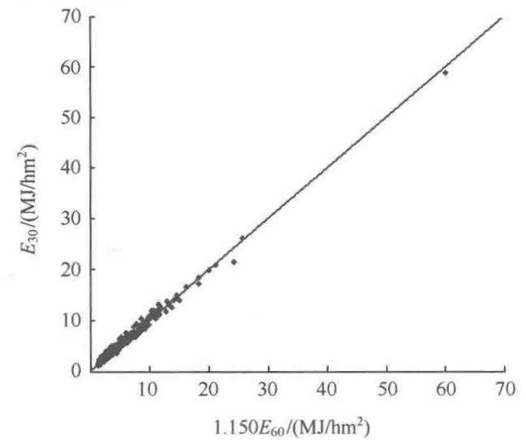

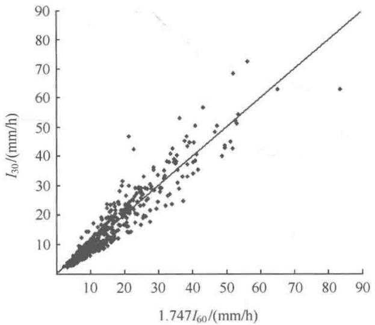

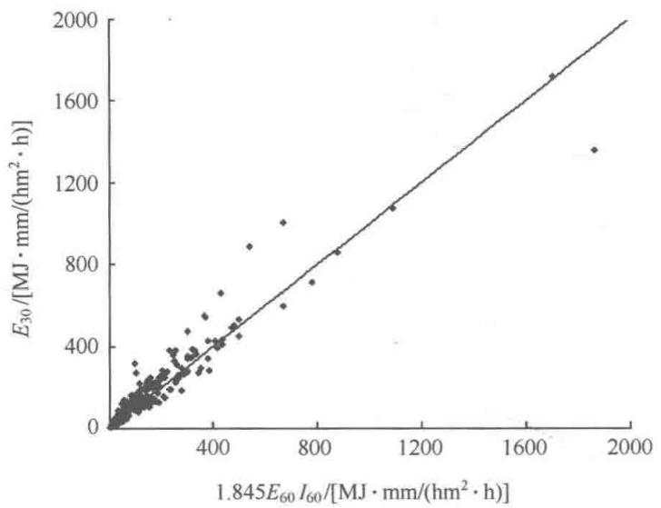  
图4-1山西五寨、阳城小时雨量资料计算 $E , I _ { 3 0 }$ 和 $E I _ { 3 0 }$ 与过程资料计算结果的对比

表4-12 回归系数 $a , b , c$ 及其决定系数(95%水平)
<table><tr><td>位置</td><td> $a$ </td><td> $R ^ { 2 }$ </td><td> $b$ </td><td> $R ^ { 2 }$ </td><td>c</td><td> $R ^ { 2 }$ </td></tr><tr><td>五寨</td><td>1.190</td><td>0.980</td><td>1.762</td><td>0.876</td><td>2.134</td><td>0.928</td></tr><tr><td>阳城</td><td>1.136</td><td>0.990</td><td>1.740</td><td>0.905</td><td>1.786</td><td>0.927</td></tr><tr><td>汇总</td><td>1.150</td><td>0.987</td><td>1.747</td><td>0.898</td><td>1.845</td><td>0.922</td></tr><tr><td>Yin等(2007)</td><td>1.105</td><td></td><td>1.668</td><td></td><td>1.73</td><td></td></tr></table>

综上，如果能够收集到气象站的小时整点雨量资料，建议利用以下公式计算降雨侵蚀力指标 $E I _ { 3 0 }$

$$
E I _ { 3 0 } = 1 . 8 4 5 ( E _ { 6 0 } I _ { 6 0 } )\tag{4-14a}
$$

$$
E _ { 6 0 } = \sum _ { r = 1 } ^ { m } \{ 0 . 2 9 [ 1 - 0 . 7 2 \mathrm { e x p } ( - 0 . 0 8 2 \times i _ { 6 0 } ) ] \times i _ { 6 0 } \}\tag{4-14b}
$$

式中， $E I _ { 3 0 }$ 是次降雨侵蚀力 $[ \mathrm { M J } \cdot \mathrm { m m } / ( \mathrm { h m } ^ { 2 } \cdot \mathrm { h } ) ] ; I _ { 6 0 }$ 是次降雨的最大60min雨强(mm/h);  
$E _ { 6 0 }$ 是利用小时雨量计算的次降雨动能 $( \mathrm { M J } / \mathrm { h m } ^ { 2 } ) ; i _ { 6 0 }$ 是60min雨量(mm)。

## (二)用次降雨资料计算

利用山西五寨和阳城两个气象站的分钟降雨资料，通过回归分析，建立了可以直接利用次降雨资料计算次降雨侵蚀力指标 $E I _ { 3 0 }$ 的公式。次降雨资料包括两种情形：一是同时有次雨量P和最大30min雨强 $I _ { 3 0 }$ 资料，一是只有次雨量P资料。分别对两种情形进行拟合，前者的回归关系明显好于后者(图4-2)，体现了最大30min雨强对侵蚀的重要影响。 $E I _ { 3 0 }$ 与次雨量及其最大30min雨强之乘积 $P I _ { 3 0 }$ 呈线性关系，两站拟合的回归方程决定系数变化于0.947\~0.957(表4-13)。 $E I _ { 3 0 }$ 与次雨量P呈幂函数形式，两站拟合的回归方程决定系数变化于0.460\~0.520(表4-13)。考虑到系数随地区变化有差异，采用两站的汇总数据拟合，得到用次雨量计算降雨侵蚀力公式如下(图4-2，表4-13)：

$$
E I _ { 3 0 } = 0 . 1 9 5 ( P I _ { 3 0 } )\tag{4-15a}
$$

$$
E I _ { 3 0 } = 1 . 5 6 0 P ^ { 1 . 2 0 7 }\tag{4-15b}
$$

式中， $E I _ { 3 0 }$ 是次降雨侵蚀力 $\mathrm { [ M J \bullet m m / ( h m ^ { 2 } \bullet h ) ] }$ ;P是次雨量(mm)； $I _ { 3 0 }$ 是次降雨的最大30min雨强(mm/h)。

王万忠等(1995)利用全国径流小区降雨资料也建立了降雨侵蚀力指标 $E I _ { 3 0 }$ 与 $P I _ { 3 0 }$ 的线性回归形式：

$$
\begin{array} { l l } { E I _ { 3 0 } = 1 . 7 0 ( P I _ { 3 0 } / 1 0 0 ) - 0 . 1 3 6 } & { I _ { 3 0 } < 1 0 \mathrm { { m m } / \mathrm { { h } } } } \\ { E I _ { 3 0 } = 2 . 3 5 P I _ { 3 0 } / 1 0 0 ) - 0 . 5 2 3 } & { I _ { 3 0 } \geq 1 0 \mathrm { { m m } / \mathrm { { h } } } } \end{array}\tag{4-16a}
$$

式中， $E I _ { 3 0 }$ 是次降雨侵蚀力 $\left[ \mathbf { m } \cdot \mathbf { \vec { r } } \cdot \mathbf { c m } / ( \mathbf { h m } ^ { 2 } \cdot \mathbf { \vec { h } } ) \right]$ ;P是次雨量(mm); $I _ { 3 0 }$ 是次降雨的最

大30min雨强(mm/h)。将该公式换算为国际制单位后\*：

$$
\begin{array} { c c } { E I _ { 3 0 } } = 0 . 1 7 3 P I _ { 3 0 }  & { I _ { 3 0 } < 1 0 \mathrm { m m / h } } \\ { \ } \\ { E I _ { 3 0 } } = 0 . 2 4 0 P I _ { 3 0 }  & { I _ { 3 0 } \geqslant 1 0 \mathrm { m m / h } } \end{array}\tag{4-16b}
$$

式中各项意义同式(4-15)，将公式(4-16b)中的两个系数求平均为0.207，与本研究的式(4-15)系数0.195比较接近。

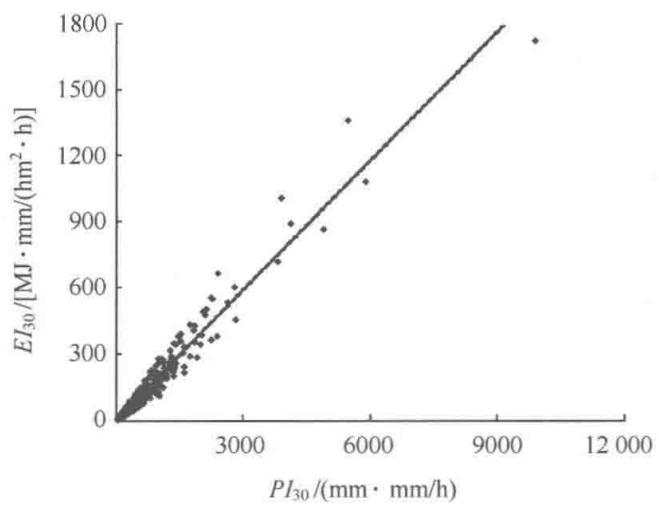

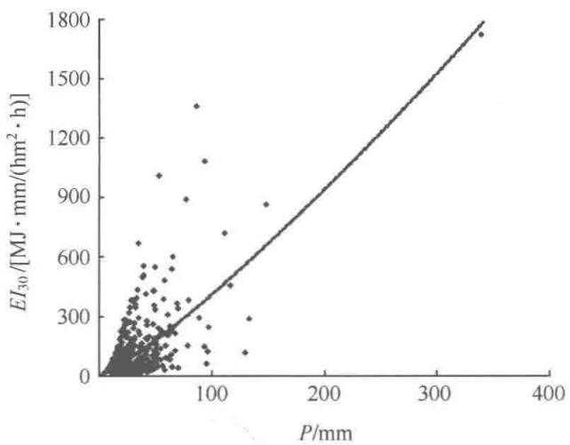  
图4-2山西五寨、阳城次降雨侵蚀力 $E I _ { 3 0 }$ 与 $P I _ { 3 0 } \Omega P$ 的回归关系图

表4-13 次降雨 $E I _ { 3 0 }$ 与 $P I _ { 3 0 \setminus } P$ 的回归关系及其决定系数(95%置信度)
<table><tr><td>位置</td><td> $E I _ { 3 0 }$  与  $P I _ { 3 0 }$  的回归关系</td><td> $R ^ { 2 }$ </td><td> $E I _ { 3 0 }$  与  $P$  的回归关系</td><td> $R ^ { 2 }$ </td></tr><tr><td>五寨</td><td> $E I _ { 3 0 } = 0 . 1 9 3 ( P I _ { 3 0 } )$ </td><td>0.947</td><td> $E I _ { 3 0 } = 0 , 4 7 4 P ^ { 1 , 5 0 9 }$ </td><td>0.520</td></tr><tr><td>阳城</td><td> $E I _ { 3 0 } = 0 . 1 9 6 ( P I _ { 3 0 } )$ </td><td>0.957</td><td> $E I _ { 3 0 } = 1 . 8 7 8 P ^ { 1 . 1 6 6 }$ </td><td>0.460</td></tr><tr><td>总</td><td> $E I _ { 3 0 } = 0 . 1 9 5 ( P I _ { 3 0 } )$ </td><td>0.956</td><td> $E I _ { 3 0 } = 1 . 5 6 0 P ^ { 1 . 2 0 7 }$ </td><td>0.472</td></tr></table>

## (三)用日降雨资料计算

日雨量是容易获得的资料，但日雨量与次雨量并非一一对应，共有3种情况：①一日降雨即为一次降雨；②一日降雨含2次以上降雨事件；③一次降雨发生在多日。据此分别计算这三种情况的日降雨侵蚀力：

1）一日只发生一次降雨事件：

$$
( E I _ { 3 0 } ) _ { \perp } = ( E I _ { 3 0 } ) _ { \perp }\tag{4-17}
$$

2)一日发生2次以上降雨事件：

$$
( E I _ { 3 0 } ) _ { \mathrm { { H } } } = \sum _ { i = 1 } ^ { m } ( E I _ { 3 0 } ) _ { \emptyset } \quad\tag{4-18}
$$

3）一次降雨事件发生在多日：

$$
E _ { \mathbb { W } } = \sum _ { j = 1 } ^ { n } ( E _ { \mathrm { H } } ) _ { j } \quad ( E I _ { 3 0 } ) _ { \mathbb { W } } = \Big [ \sum _ { j = 1 } ^ { n } ( E _ { \mathrm { H } } ) _ { j } \Big ] \times ( I _ { 3 0 } ) _ { \mathbb { W } }\tag{4-19}
$$

$$
( E I _ { 3 0 } ) _ { \mathrm { H } } = ( E _ { \mathrm { H } } ) _ { j } \times ( I _ { 3 0 } ) _ { \mathcal { W } }\tag{4-20}
$$

$$
( E _ { \mathrm { H } } ) _ { j } = \sum _ { r = 1 } ^ { k } \left\{ 0 . 2 9 \big [ 1 - 0 . 7 2 \mathrm { e x p } ( - 0 . 0 8 2 \times i _ { \eta } \times 6 0 ) \big ] \times i _ { \eta } \right\}\tag{4-21}
$$

式中， $( E I _ { 3 0 } ) _ { \mathrm { ~ H ~ } } , ( E I _ { 3 0 } ) _ { \ast }$ 分别是日和次降雨侵蚀力 $[ \mathrm { M J } \bullet \mathrm { m m } / ( \mathrm { h m } ^ { 2 } \bullet \mathrm { h } ) ] ; i = 1 , 2 , \cdots , m$ 是指某日有某次降雨事件 ${ \mathfrak { s o } } = 1 , 2 , \cdots , n$ 是指一次降雨事件发生在n日； $E _ { \mathcal { U } }$ 是发生在n日的一次降雨总动能 $( \mathrm { M J / h m ^ { 2 } } )$ ，它可分解为n日降雨总动能 $( E _ { \mathbb { H } } ) _ { j }$ 之和； $r = 1 , 2 , \cdots$ ,k表示某日的降雨过程按1min分为k段； $i _ { \eta }$ 是 1min雨量(mm); $I _ { 3 0 }$ 为一次降雨的最大30min雨强(mm/h)。

计算得到两站逐日降雨侵蚀力后，分别建立日降雨侵蚀力与日雨量 $P _ { \mathrm { d a i l y } }$ 和日最大30min雨强 $( I _ { 3 0 } ) _ { \perp }$ 组合 $( P I _ { 3 0 } ) _ { \perp }$ ,及日雨量 $P _ { \mathrm { ~ H ~ } }$ 的回归关系：

$$
( E I _ { 3 0 } ) _ { \mathbb { H } } = a \bullet ( P I _ { 3 0 } ) _ { \mathbb { H } }\tag{4-22}
$$

$$
( E I _ { 3 0 } ) _ { \boxplus } = \alpha \bullet P _ { \boxplus } ^ { \beta }\tag{4-23}
$$

式中， $( E I _ { 3 0 } ) _ { \mathrm { ~ H ~ } }$ 是日降雨侵蚀力 $[ \mathrm { M J } \bullet \mathrm { m m } / ( \mathrm { h m } ^ { 2 } \bullet \mathrm { h } \bullet \mathrm { d } ) ] ; P _ { \mathrm { H } }$ 是日雨量(mm); $( I _ { 3 0 } ) _ { \mathrm { H } }$ 是日最大30min雨强(mm/h); $( P I _ { 3 0 } ) _ { \perp }$ 是 $P _ { \perp }$ 与 $( I _ { 3 0 } ) _ { \perp }$ 之乘积 $\mathrm { ( m m \cdot m m / h ) } ; \alpha , \alpha$ 与 $\beta$ 是回归指数。对两站的回归结果见表4-14。考虑到我国气象台站的降雨强度数据曾有日最大10min雨强 $( I _ { 1 0 } ) _ { \mathrm { { H } } }$ 的记录，我们也建立了利用日雨量和日最大10min雨强之乘积$( P I _ { \mathrm { { i 0 } } } ) _ { \mathrm { { E } } }$ 计算日降雨侵蚀力的公式(表4-14)。采用两站的汇总数据拟合，得到用日雨量计算日降雨侵蚀力的3个公式(表4-14，图4-3):

$$
( E I _ { 3 0 } ) _ { \mathrm { { H } } } = 0 . 2 0 7 ( P I _ { 3 0 } ) _ { \mathrm { { H } } }\tag{4-24a}
$$

$$
( E I _ { 3 0 } ) _ { \perp } = 0 . 1 3 4 ( P I _ { 1 0 } ) _ { \perp }\tag{4-24b}
$$

$$
( E I _ { 3 0 } ) _ { \perp } = 0 . 7 3 2 P _ { \perp } ^ { 1 . 4 6 2 }\tag{4-24c}
$$

式中， $( E I _ { 3 0 } ) _ { \perp }$ 是日降雨侵蚀力 $[ \mathrm { M J } \bullet \mathrm { m m } / ( \mathrm { h m } ^ { 2 } \bullet \mathrm { h } \bullet \mathrm { d } ) ] ; P _ { \mathrm { H } }$ 是日雨量(mm)。

表4-14 日降雨侵蚀力 $( E I _ { 3 0 } ) _ { \perp }$ 与 $\left( P I _ { 3 0 } \right)$ 日 $\scriptstyle { \mathcal { P } } _ { \mathtt { H } }$ 的回归关系及其决定系数(95%置信度)
<table><tr><td>位置</td><td> $( E I _ { 3 0 } ) _ { \mathrm { H } }$  与  $( P I _ { 3 0 } ) _ { \perp }$  的回归关系</td><td> $R ^ { 2 }$ </td><td> $( E I _ { 3 0 } ) _ { \perp }$  与  $P _ { \mathrm { ~ H ~ } }$  的回归关系</td><td> $R ^ { 2 }$ </td></tr><tr><td>五寨</td><td> $( E I _ { 3 0 } ) _ { \mathrm { H } } = 0 . 2 0 3 ( P I _ { 3 0 } ) _ { \mathrm { H } }$ </td><td>0.941</td><td> $( E I _ { 3 0 } ) _ { \mathrm { H } } = 0 . 2 6 9 P _ { \mathrm { H } } ^ { 1 . 7 2 2 }$ </td><td>0.481</td></tr><tr><td rowspan="2">阳城</td><td> $( E I _ { 3 0 } ) _ { \parallel } = 0 . 1 2 2 ( P I _ { 1 0 } ) _ { \parallel }$ </td><td>0.893</td><td></td><td></td></tr><tr><td> $( E I _ { 3 0 } ) _ { \perp } = 0 . 2 0 8 ( P I _ { 3 0 } ) _ { \perp }$ </td><td>0.956</td><td> $( E I _ { 3 0 } ) _ { \mathrm { H } } = 0 . 9 4 8 P _ { \mathrm { H } } ^ { 1 . 4 0 1 }$ </td><td>0.434</td></tr><tr><td rowspan="2">总</td><td> $( E I _ { 3 0 } ) _ { \mathrm { H } } = 0 . 1 3 9 ( P I _ { 1 0 } ) _ { \mathrm { H } }$ </td><td>0.904</td><td></td><td></td></tr><tr><td> $( E I _ { 3 0 } ) _ { \perp } = 0 . 2 0 7 ( P I _ { 3 0 } ) _ { \perp }$   $( E I _ { 3 0 } ) _ { \perp } = 0 . 1 3 4 ( P I _ { 1 0 } ) _ { \perp }$ </td><td>0.953 0.898</td><td> $( E I _ { 3 0 } ) _ { \mathrm { H } } = 0 . 7 3 2 P _ { \mathrm { H } } ^ { 1 . 4 6 2 }$ </td><td>0.446</td></tr></table>

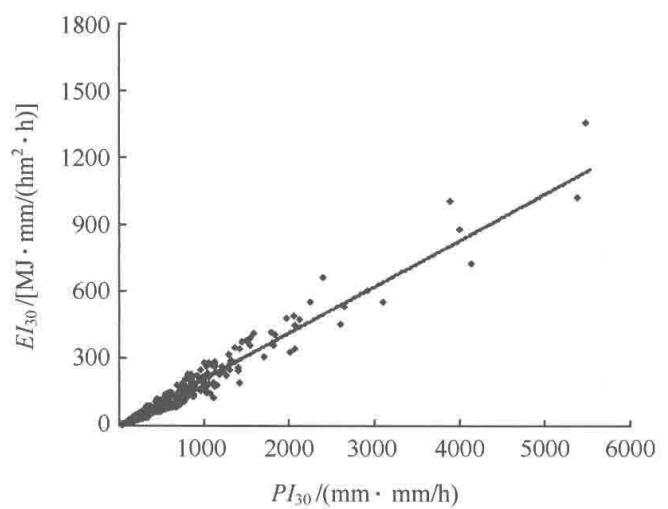

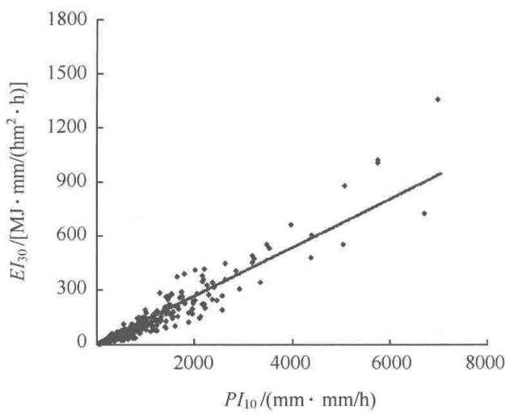

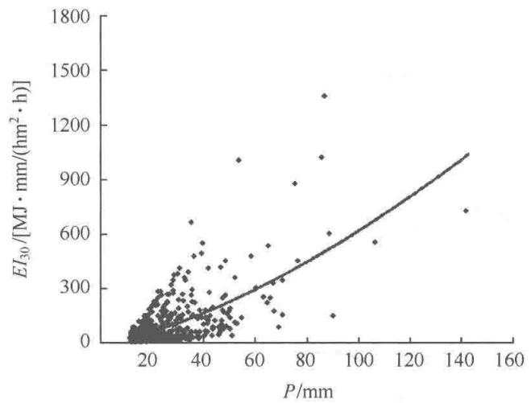  
图4-3 五寨与阳城日降雨侵蚀力 $E I _ { 3 0 }$ 与日 $P I _ { 3 0 } \ 、 P I _ { 1 0 } \ 、 P _ { \perp }$ 的回归关系图

## (四)用月雨量资料计算

月雨量资料十分容易获得，但只能计算月以上时段的降雨侵蚀力。利用山西五寨和阳城两个气象站的分钟降雨资料，通过回归建立用月雨量计算月降雨侵蚀力指标$( E I _ { 3 0 } ) _ { \mathrm { { H } } }$ 的公式。月雨量与月降雨侵蚀力呈幂函数关系，两站拟合的回归方程决定系数变化于0.560\~0.752(表4-15)，回归系数与指数变化较大，采用两站合并数据得到拟合方程的决定系数为0.588(图4-4，表4-15)：

$$
( E I _ { 3 0 } ) _ { \it \Pi } = 0 . 2 0 1 P _ { \it \Pi } ^ { 1 . 5 3 3 }\tag{4-25}
$$

表4-15 月降雨侵蚀力 $( E I _ { 3 0 } ) _ { \mathrm { \Pi } }$ 与月降雨量 $P _ { \perp }$ 的回归关系及其决定系数(95%置信度)
<table><tr><td>位置</td><td> $( E I _ { 3 0 } ) _ { \mathrm { { H } } }$  与  $P _ { \mathrm { { H } } }$  的回归关系</td><td> $R ^ { 2 }$ </td></tr><tr><td>五寨</td><td> $( E I _ { 3 0 } ) _ { \mathcal { H } } = 0 . 0 0 2 P _ { \mathcal { H } } ^ { 2 . 4 1 5 }$ </td><td>0.752</td></tr><tr><td>阳城</td><td> $( E I _ { 3 0 } ) _ { \mathbb { H } } = 0 . 6 4 1 P _ { \mathbb { H } } ^ { 1 . 3 1 8 }$ </td><td>0.560</td></tr><tr><td>总</td><td> $( E I _ { 3 0 } ) _ { \mathbb { H } } = 0 . 2 0 1 P _ { \mathbb { H } } ^ { 1 . 5 3 3 }$ </td><td>0.588</td></tr></table>

式中， $( E I _ { 3 0 } ) _ { \mathrm { { ‰} } }$ 是月降雨侵蚀力 $[ \mathrm { M J } \bullet \mathrm { m m } / ( \mathrm { h m } ^ { 2 } \bullet \mathrm { h } \bullet \mathrm { m o n } ) ] ; P _ { \mathrm { H } }$ 是月雨量(mm)。在有条件的情况下，应收集更多站的降雨过程资料，深入探讨黄土高原地区月降雨资料计算月降雨侵蚀力公式的系数与指数变化规律。

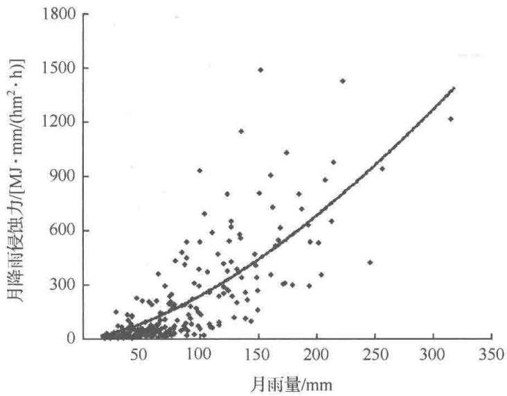  
图4-4 五寨与阳城月降雨侵蚀力 $E I _ { 3 0 }$ 与月雨量 $P _ { \sharp }$ 的回归关系图

章文波等(2002)参照RUSLE(Renard et al.，1997)以半月间隔计算降雨侵蚀力季节分布的方法，建立了用日雨量资料计算半月降雨侵蚀力的公式：

$$
( E I _ { \mathrm { 3 0 } } ) _ { \# \mathbb { H } } = \alpha \sum _ { k = 1 } ^ { m } ( P _ { \mathbb { H } } ) ^ { \beta }\tag{4-26a}
$$

$$
\beta = 0 . 8 3 6 3 + \frac { 1 8 . 1 4 4 } { P _ { d i 2 } } + \frac { 2 4 . 4 5 5 } { P _ { y 1 2 } }\tag{4-26b}
$$

$$
\alpha = 2 1 . 5 8 6 \beta ^ { 7 . 1 8 9 1 }\tag{4-26c}
$$

式中， $P _ { \parallel }$ 是半月内第k天的侵蚀性降雨(大于12mm)日雨量 $( \mathrm { m m } ) ; \alpha , \beta$ 是回归参数；$P _ { d 1 2 }$ 是一年内侵蚀性降雨日雨量的平均值(mm)，即一年中大于等于12mm日雨量总和与相应日数和的比值； $P _ { y 1 2 }$ 是侵蚀性降雨年总量的多年平均值(mm)，即大于等于12mm日雨量年累加值的多年平均。

## (五)用年雨量资料计算

年降雨量资料计算的是年降雨侵蚀力，与采用月雨量计算方法类似，用山西五寨和阳城两个气象站的分钟降雨资料，通过回归建立了用年雨量资料计算年降雨侵蚀力指标$( E I _ { 3 0 } ) _ { 4 5 }$ 的公式。年雨量与年降雨侵蚀力呈幂函数关系，两站拟合的回归方程决定系数变化于0.412\~0.736(表4-16)，回归系数与指数变化较大，采用两站合并数据得到的拟合方程，决定系数为0.670(图4-5，表4-16)：

$$
( E I _ { 3 0 } ) _ { 4 5 } = 0 . 0 4 7 P _ { 4 5 } ^ { 1 . 6 4 5 }\tag{4-27}
$$

式中， $( E I _ { 3 0 } ) _ { \mathrm { t F } }$ 是年降雨侵蚀力 $[ \mathrm { M J } \bullet \mathrm { m m } / ( \mathrm { h m } ^ { 2 } \bullet \mathrm { h } \bullet \mathrm { a } ) ] ; P _ { \# }$ 是年雨量(mm)。在有条

件的情况下，应收集更多站的降雨过程资料，深入探讨黄土高原地区年降雨资料计算年降雨侵蚀力公式的系数与指数变化规律。

章文波等(2002)建立了利用年降雨量计算年降雨侵蚀力的公式：

$$
( E I _ { 3 0 } ) _ { 4 \sharp } = 0 . 0 6 6 8 P _ { 4 \sharp } ^ { 1 . 6 2 6 6 }\tag{4-28}
$$

式中，各项字母意义同上，系数和幂函数中的指数有一定差异。

表4-16 年降雨侵蚀力 $( E I _ { 3 0 } ) _ { \# }$ 与年降雨量 $P _ { \mathcal { F } }$ 的回归关系及其决定系数(95%置信度)
<table><tr><td>位置</td><td> $( E I _ { 3 0 } ) _ { 4 }$  与  $P _ { \# }$  的回归关系</td><td> $R ^ { 2 }$ </td></tr><tr><td>五寨</td><td> $( E I _ { 3 0 } ) _ { \mathrm { \it 4 4 } } = 0 . 0 0 2 P _ { \mathrm { \it 4 5 } } ^ { 2 . 1 8 4 }$ </td><td>0.736</td></tr><tr><td>阳城</td><td> $( E I _ { 3 0 } ) _ { 4 \mathrm { f } } = 1 . 0 3 2 P _ { 4 \mathrm { f } } ^ { 1 . 1 5 6 }$ </td><td>0.412</td></tr><tr><td>总</td><td> $( E I _ { 3 0 } ) _ { 4 } = 0 . 0 4 7 P _ { 4 5 } ^ { 1 . 6 4 5 }$ </td><td>0.670</td></tr></table>

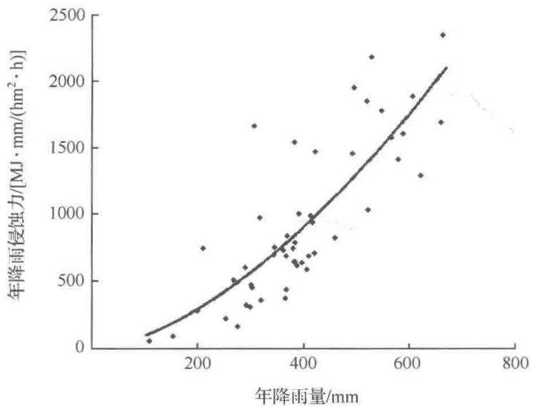  
图4-5 五寨与阳城年降雨侵蚀力 $( E I _ { 3 0 } ) _ { 4 5 }$ 与年雨量 $P _ { \mathcal { F } }$ 的回归关系图

## (六)各种计算方法的误差分析

除利用降雨过程直接计算每次降雨的 $E I _ { 3 0 }$ ，然后按次累加为不同时段或年降雨侵蚀力外，其他利用各种常规气象资料计算均属于简易估算法，存在误差。为了对各种估算公式进行精度评价，利用五寨和阳城1996～2000年共计5年的分钟降雨资料，计算了各个公式计算值与观测值之间的相对误差：

$$
\mathrm { e r r } = \mid ( E I _ { 3 0 } ) _ { \mathrm { o b s } } - ( E I _ { 3 0 } ) _ { \mathrm { e s t } } \mid / ( E I _ { 3 0 } ) _ { \mathrm { o b s } }\tag{4-29}
$$

式中，err是相对误差 $( \% ) : ( E I _ { 3 0 } ) _ { \mathrm { o b s } }$ 是利用分钟资料计算的次、日、月和年降雨侵蚀力$\left[ \mathrm { M J } \cdot \mathrm { m m } / ( \mathrm { h m } ^ { 2 } \cdot \mathrm { h } ) \right]$ ，将其视为观测值； $( E I _ { 3 0 } ) _ { \mathrm { e s t } }$ 是利用次、日、月和年降雨侵蚀力公式计算的估计值，同时还分析了其他研究者估算公式的相对误差。

五寨和阳城1996\~2000年共发生侵蚀性降雨124次，其中五寨55次，阳城69次，平均每年发生11次和13.8次。五寨侵蚀性降雨发生于5～9月，阳城则发生于4\~10月。五寨这5年间最大次降雨侵蚀力为 $1 0 1 8 . 7 \mathrm { M J } \cdot \mathrm { m m } / ( \mathrm { h m } ^ { 2 } \cdot \mathrm { h } )$ ，发生于1999年8月17～18日，降雨量72.7mm，历时664min(11.1h)，平均雨强6.5mm/h，最大30min雨强67mm/h。阳城5年间最大次降雨侵蚀力为 $1 1 4 7 . 5 \mathrm { M J \bullet \ m m / ( h m ^ { 2 } \bullet h ) }$ ，发生于1996年7月30\~31日，降雨量147.2mm，历时1278min(21.3h)，平均雨强6.9mm/h，最大30min雨强39.8mm/h。五寨平均降雨侵蚀力为 $9 6 . 2 \mathrm { M J \bullet \ m m / ( h m ^ { 2 } \bullet h ) }$ ，阳城为125.2MJ·$\mathrm { m m / ( h m ^ { 2 } \cdot \ b ) }$ ，两个地方的平均次降雨侵蚀力为 $1 1 2 . 3 \mathrm { M J \bullet \ m m / ( h m ^ { 2 } \bullet h ) }$ 。从次降雨侵蚀力公式(4-15)和式(4-16)的相对误差看(表4-17)，多年平均次降雨侵蚀力和重现期次降雨侵蚀力的计算精度高于逐次降雨侵蚀力，有最大30min雨强的公式(4-12a)与公式(4-13)精度明显好于仅用次雨量的公式(4-12b)。公式(4-12a)的平均次降雨侵蚀力、2年一遇次降雨侵蚀力和逐次降雨侵蚀力的相对误差分别为0.03%、21.08%和40.21%，公式(4-13)为19.6%；公式(4-13)的相对误差分别为19.6%、2.87%和62.47%；公式(4-12b)的相对误差分别为14.27%、57.16%和205.45%。利用雨量和雨强乘积指标好于单独采用雨量指标，一是由于雨强对侵蚀的影响大于雨量，不考虑雨强必然会明显降低计算精度；二是在资料有限制情况下只考虑雨量时，回归系数会随地区有很大差异(Richardson etal.，1983)。如果仅用雨量建立模型，应考虑收集更多站点的雨量资料。本研究仅采用两个气象站的分钟资料，显然在空间上不够充分。

表4-17不同公式计算次降雨侵蚀力相对误差
<table><tr><td>模型</td><td>计算公式</td><td></td><td>五寨</td><td>阳城</td><td>两站合计</td></tr><tr><td rowspan="3">本研究式(4-15a)</td><td rowspan="3"> $E I _ { 3 0 } = 0 . 1 9 5 ( P I _ { 3 0 } )$ </td><td>平均次</td><td>38.97</td><td>41.21</td><td>40.21</td></tr><tr><td>#5年平均</td><td>1.52</td><td>0.88</td><td>0.03</td></tr><tr><td>$2年一遇</td><td>10.70</td><td>16.36</td><td>21.08</td></tr><tr><td rowspan="2">王万忠等(1995) 式(4-16)</td><td rowspan="2"> $E I _ { 3 0 } = 0 . 1 7 3 P I _ { 3 0 } ~ I _ { 3 0 } < 1 0 \mathrm { { m m / h } }$   $E I _ { 3 0 } = 0 . 2 4 0 P I _ { 3 0 } ~ I _ { 3 0 } \geq 1 0 \mathrm { m m / h }$ </td><td>平均次</td><td>37.65</td><td>62.37</td><td>62.47</td></tr><tr><td>5年平均</td><td>21.56</td><td>18.41</td><td>19.60</td></tr><tr><td rowspan="3">本研究式(4-15b)</td><td rowspan="3"> $E I _ { 3 0 } = 1 . 5 6 0 P ^ { 1 . 2 0 7 }$ </td><td>2年一遇</td><td>9.9</td><td>2.95</td><td>2.87</td></tr><tr><td>平均次</td><td>197.70</td><td>211.62</td><td>205.45</td></tr><tr><td>5年平均 2年一遇</td><td>15.15 24.05</td><td>13.73 58.32</td><td>14.27 57.16</td></tr></table>

\*5年所有次降雨侵蚀力的平均相对误差。#5年平均降雨侵蚀力的相对误差。\$2年一遇次降雨侵蚀力的相对误差。

五寨和阳城1996～2000年共发生侵蚀性降雨132天，其中五寨53天，阳城79天，平均每年发生10.6天和15.8天。五寨这5年间最大日降雨侵蚀力为 $1 0 1 7 . 5 \mathrm { M J \bullet \ m m / ( h m ^ { 2 } \bullet h ) }$ 发生于1999年8月18日。阳城5年间最大日降雨侵蚀力为 $1 1 1 4 . 7 \mathrm { M J } \cdot \mathrm { m m } / ( \mathrm { h m } ^ { 2 } \cdot \mathrm { h } )$ 发生于1996年7月31日。两个地方的平均日降雨侵蚀力为 $\mathrm { 1 0 1 . 3 M J \bullet \ m m / ( h m ^ { 2 } \bullet h ) }$ o日降雨侵蚀力与次降雨侵蚀力十分接近。从日降雨侵蚀力公式4-12的相对误差看(表4-18)，采用最大30min或10min雨强的公式(4-24a)与公式(4-24b)精度明显高于仅

(单位：%)

用日雨量的公式(4-24c)，且用不同的时段雨强差别不大。公式(4-24a)的平均日降雨侵蚀力误差为47.43%，公式(4-24b)的相对误差为43.3%，公式(4-24c)的相对误差为185.01%。显然，用日雨量资料估算精度明显低于次雨量资料的估算精度。

表4-18不同公式计算日降雨侵蚀力相对误差
<table><tr><td>数据来源</td><td>公式</td><td>五寨</td><td>阳城</td><td>平均</td></tr><tr><td>本研究[式(4-24a)]</td><td> $( E I _ { 3 0 } ) _ { \perp } = 0 . 2 0 7 ( P I _ { 3 0 } ) _ { \perp }$ </td><td>40.64</td><td>51.98</td><td>47.43</td></tr><tr><td>本研究[式(4-24b)]</td><td> $( E I _ { 3 0 } ) _ { \mathrm { H } } = 0 . 1 3 4 ( P I _ { 1 0 } ) _ { \mathrm { H } }$ </td><td>40.92</td><td>44.89</td><td>43.30</td></tr><tr><td>本研究[式(4-24c)]</td><td> $( E I _ { 3 0 } ) _ { \mathrm { H } } = 0 . 7 3 2 P _ { \mathrm { H } } ^ { 1 . 4 6 2 }$ </td><td>145.61</td><td>211.44</td><td>185.01</td></tr></table>

五寨1996\~2000年5年间4～10月最大月降雨侵蚀力为 $1 0 1 7 . 5 \mathrm { M J \bullet \ m m / ( h m ^ { 2 } \bullet h ) }$ 发生于1999年8月。阳城1996～2000年5年间4\~10月最大月降雨侵蚀力为$1 9 4 1 . 4 \mathrm { M J \bullet \ m m / ( \ h m ^ { 2 } \bullet \ h ) }$ ，发生于1996年7月。根据前文分析不难看出，最大月侵蚀力实际主要由一次降雨造成。两站4～10月平均月降雨侵蚀力为284. $\mathrm { 6 M J \bullet \ m m / ( h m ^ { 2 } \bullet h ) } .$ 从月降雨侵蚀力公式(4-25)和公式(4-26)的相对误差看(表4-19)，多年平均月降雨侵蚀力的计算精度高于逐月降雨侵蚀力，两个公式精度差别不大。公式(4-25)的多年平均月降雨侵蚀力和逐月降雨侵蚀平均相对误差分别为16.5%和137.97%，公式(4-26)的相对误差分别为10.57%和183.87%。

表4-19不同公式计算月降雨侵蚀力相对误差  
(单位：%)
<table><tr><td>数据来源</td><td>公式</td><td></td><td>五寨</td><td>阳城</td><td>合计</td></tr><tr><td rowspan="2">本研究[式(4-25)]</td><td> $( E I _ { 3 0 } ) _ { \mathbb { H } } = 0 . 2 0 1 P _ { \mathbb { H } } ^ { 1 . 5 3 3 }$ </td><td>*平均月</td><td>141.34*</td><td>137.55*</td><td>137.97*</td></tr><tr><td></td><td>年平均月</td><td>16.69≠</td><td>16.39#</td><td>16.50#</td></tr><tr><td>章文波等(2002) [式(4-26)]</td><td> $( E I _ { 3 0 } ) _ { \# \mathbb { H } } = \alpha \sum _ { k = 1 } ^ { m } ( P _ { \mathbb { H } } ) ^ { \beta }$ </td><td>平均月</td><td>160.18*</td><td>292.60*</td><td>183.87*</td></tr><tr><td></td><td> $\begin{array} { c } { { \beta = 0 . 8 3 6 3 + \frac { 1 8 . 1 4 4 } { P _ { d 1 2 } } + \frac { 2 4 . 4 5 5 } { P _ { y 1 2 } } } } \\ { { \alpha = 2 1 . 5 8 6 \beta ^ { - 7 . 1 8 9 1 } } } \end{array}$ </td><td>#年平均月</td><td>2.17#</td><td>15.79#</td><td>10.57#</td></tr></table>

\*5年所有月降雨侵蚀力的平均相对误差。5年平均月降雨侵蚀力的相对误差。

五寨1996～2000年5年间最大年降雨侵蚀力为 $1 3 7 0 . 8 \mathrm { M J \bullet \ m m / ( h m ^ { 2 } \bullet h ) }$ ,发生于1999年。阳城1996～2000年5年间最大年降雨侵蚀力为 $3 1 2 4 . \ : 2 \mathrm { M J } \cdot \mathrm { m m } / ( \mathrm { h m } ^ { 2 } \cdot \mathrm { h } )$ 发生于1996年。同样看出，最大年降雨侵蚀力也与当年最大一次降雨有极为密切的关系。两站平均年降雨侵蚀力为 $1 3 3 7 . 5 \mathrm { M J \bullet \ m m / ( h m ^ { 2 } \bullet h ) }$ 。从年降雨侵蚀力公式(4-27)和公式(4-28)的相对误差来看(表4-20)，多年平均年降雨侵蚀力的计算精度高于逐年降雨侵蚀力，两个公式精度差别不大。公式(4-27)的多年平均年降雨侵蚀力和逐年降雨侵蚀力平均相对误差分别为7.8%和24.98%，公式(4-28)的相对误差分别为15.01%和35.90%。年降雨侵蚀力计算精度明显高于日、月的降雨侵蚀力。

表4-20 不同公式计算的年降雨侵蚀力相对误差
<table><tr><td>数据来源</td><td>公式</td><td></td><td>五寨</td><td>阳城</td><td>合计</td></tr><tr><td rowspan="2">本研究[式(4-27)]</td><td rowspan="2"> $( E I _ { 3 0 } ) _ { 4 \ell } = 0 . 0 4 7 P _ { \ell \ell } ^ { 1 . 6 4 5 }$ </td><td>*平均年</td><td>9.61*</td><td>30.34*</td><td>24.98*</td></tr><tr><td>多年平均</td><td>0.93#</td><td>13.69#</td><td>7.80#</td></tr><tr><td>章文波等(2002) [式(4-28)]</td><td> $( E I _ { 3 0 } ) _ { 4 5 } = 0 . 0 6 6 8 P _ { 4 5 } ^ { 1 , 6 2 6 6 }$ </td><td>*平均年 多年平均</td><td>30.32* 23.67#</td><td>41.48* 7.64#</td><td>35.90*</td></tr></table>

\*5年所有年降雨侵蚀力的平均相对误差。#5年平均年降雨侵蚀力的相对误差。

## 四、降雨侵蚀力季节分布

受大陆性季风气候影响，黄土高原降雨的年内分配很不均匀，降雨主要集中在7\~9月，降雨侵蚀力也在该季节最大。降雨侵蚀力季节变化与植被覆盖季节变化的配合，会对土壤侵蚀产生不同的结果：一次大暴雨若发生在植被覆盖茂密季节，由于植被的保护作用不会形成很强的土壤侵蚀；反之若发生在植被覆盖差的季节如整地时期或播种后不久，由于缺乏植被保护会造成严重的土壤侵蚀。Wischmeier(1962)对美国23个州45个试验站25万多次暴雨的分析发现，一次降雨导致的最大流失量往往出现在播种后几天到一个月内。因此评价降雨对土壤侵蚀的影响必须考虑降雨侵蚀力的季节变化，作为计算植被覆盖因子影响的权重系数，即某时段降雨侵蚀力占全年降雨侵蚀力的比例(%)或累积比例(%)。时段长短的选择应同时反映出降雨侵蚀力和植被覆盖的季节变化特征。例如，USLE第一版(Wischmeier and Smith,1965)按农作期划分了5个时段：休闲期、苗期、生长前期、生长后期和收获后的残茬期。如果在每期中间有农事活动对地表造成了扰动，则按农事活动日期再进一步划分该时段。USLE第二版则采用了以半月为间隔的时段划分方法(Wischmeier and Smith，1978),RUSLE(Renardet al.，1997)认为半月时段足以表达植被覆盖的季节变化，沿用了半月的时段划分方法。我国学者曾计算了以月为步长的降雨侵蚀力季节分布(黄炎和等，1992；吴素业，1994；周伏建等，1995；王万忠和焦菊英，1996)。考虑到一个月内作物覆盖会有较大变化，如玉米、高粱覆盖度在一个月内可从10%变化到80%(Renard et al.，1997)，章文波和付金生(2003)以半月为间隔计算降雨侵蚀力季节变化。

本研究提出了计算次、日、月和年降雨侵蚀力的估算方法，可根据实际资料获得情况和需要选择代表性时段。分别利用黄土高原46个气象站1961～1990年30年逐日雨量资料和235个站1961\~1990年30年平均月雨量资料，根据公式(4-24c)和公式(4-25)分别计算半月降雨侵蚀力累积比例(表4-21)和月降雨侵蚀力累积比例(表4-22)，用户可根据需要选择使用。半月累积比例包括的站点少，但时段短，月累积比例包括的站点多，但时段长，因此如果空间变异较大，建议选择月时段，否则选择半月时段。

<table><tr><td colspan="13" rowspan="2">1月          2月          3月         4月        5月         6月时段</td><td colspan="2" rowspan="1">7月</td><td colspan="2" rowspan="1">8月</td><td colspan="2" rowspan="1">9月</td><td colspan="2" rowspan="1">10月</td><td colspan="2" rowspan="1">11月</td><td colspan="2" rowspan="1">12月</td></tr><tr><td colspan="2" rowspan="1"></td><td colspan="2" rowspan="1"></td><td colspan="1" rowspan="1"></td><td colspan="1" rowspan="1"></td><td colspan="1" rowspan="1"></td><td colspan="1" rowspan="1"></td><td colspan="1" rowspan="1"></td><td colspan="1" rowspan="1"></td><td colspan="1" rowspan="1"></td><td colspan="1" rowspan="1"></td><td colspan="1" rowspan="1">1~</td><td colspan="1" rowspan="1">16~</td><td colspan="1" rowspan="1">1~</td><td colspan="1" rowspan="1">16~</td><td colspan="1" rowspan="1">1~</td><td colspan="1" rowspan="1">16~</td><td colspan="1" rowspan="1">1~</td><td colspan="1" rowspan="1">16~</td><td colspan="1" rowspan="1">1~</td><td colspan="1" rowspan="1">16~</td><td colspan="1" rowspan="1">1~</td><td colspan="1" rowspan="1">16~</td></tr><tr><td colspan="1" rowspan="1"></td><td colspan="2" rowspan="1">15 日31日</td><td colspan="2" rowspan="1">15 日28/29 日</td><td colspan="1" rowspan="1">15日31</td><td colspan="1" rowspan="1">日</td><td colspan="1" rowspan="1">15日</td><td colspan="1" rowspan="1">30日15</td><td colspan="1" rowspan="1">日</td><td colspan="1" rowspan="1">31 日</td><td colspan="1" rowspan="1">15 日</td><td colspan="1" rowspan="1">30 日</td><td colspan="1" rowspan="1">15 日</td><td colspan="1" rowspan="1">31 日</td><td colspan="1" rowspan="1">15 日</td><td colspan="1" rowspan="1">31 日</td><td colspan="1" rowspan="1">15 日</td><td colspan="1" rowspan="1">30日</td><td colspan="1" rowspan="1">15日</td><td colspan="1" rowspan="1">31 日</td><td colspan="1" rowspan="1">15日</td><td colspan="1" rowspan="1">30 日15</td><td colspan="1" rowspan="1">日</td><td colspan="1" rowspan="1">31 日</td></tr><tr><td colspan="1" rowspan="1">景泰</td><td colspan="2" rowspan="1">0.0 0.0</td><td colspan="1" rowspan="1">0.0</td><td colspan="1" rowspan="1">0.0</td><td colspan="1" rowspan="1">0.0</td><td colspan="1" rowspan="1">0.0</td><td colspan="1" rowspan="1">0.4</td><td colspan="1" rowspan="1">0.9</td><td colspan="1" rowspan="1">5.4</td><td colspan="1" rowspan="1">9.9</td><td colspan="1" rowspan="1">15.3</td><td colspan="1" rowspan="1">20.7</td><td colspan="1" rowspan="1">25.8</td><td colspan="1" rowspan="1">30.9</td><td colspan="1" rowspan="1">52.8</td><td colspan="1" rowspan="1">74.7</td><td colspan="1" rowspan="1">87.1</td><td colspan="1" rowspan="1">99.6</td><td colspan="1" rowspan="1">100.0</td><td colspan="1" rowspan="1">100.0</td><td colspan="1" rowspan="1">100.0</td><td colspan="1" rowspan="1">100.0</td><td colspan="1" rowspan="1">100.0</td><td colspan="1" rowspan="1">100.0</td></tr><tr><td colspan="1" rowspan="1">民和</td><td colspan="1" rowspan="1">0.0</td><td colspan="1" rowspan="1">0.0</td><td colspan="1" rowspan="1">0.0</td><td colspan="1" rowspan="1">0.0</td><td colspan="1" rowspan="1">0.0</td><td colspan="1" rowspan="1">0.0</td><td colspan="1" rowspan="1">0.6</td><td colspan="1" rowspan="1">1.1</td><td colspan="1" rowspan="1">6.5</td><td colspan="1" rowspan="1">11.8</td><td colspan="1" rowspan="1">17.9</td><td colspan="1" rowspan="1">23.9</td><td colspan="1" rowspan="1">30.9</td><td colspan="1" rowspan="1">38.0</td><td colspan="1" rowspan="1">57.9</td><td colspan="1" rowspan="1">77.7</td><td colspan="1" rowspan="1">85.2</td><td colspan="1" rowspan="1">92.7</td><td colspan="1" rowspan="1">96.4</td><td colspan="1" rowspan="1">100.0</td><td colspan="1" rowspan="1">100.0</td><td colspan="1" rowspan="1">100.0</td><td colspan="1" rowspan="1">100.0</td><td colspan="1" rowspan="1">100.0</td></tr><tr><td colspan="1" rowspan="1">兰州</td><td colspan="1" rowspan="1">0.0</td><td colspan="1" rowspan="1">0.0</td><td colspan="1" rowspan="1">0.0</td><td colspan="1" rowspan="1">0.0</td><td colspan="1" rowspan="1">0.0</td><td colspan="1" rowspan="1">0.0</td><td colspan="1" rowspan="1">0.4</td><td colspan="1" rowspan="1">0.9</td><td colspan="1" rowspan="1">5.9</td><td colspan="1" rowspan="1">11.0</td><td colspan="1" rowspan="1">15.9</td><td colspan="1" rowspan="1">20.9</td><td colspan="1" rowspan="1">28.2</td><td colspan="1" rowspan="1">35.4</td><td colspan="1" rowspan="1">55.4</td><td colspan="1" rowspan="1">75.3</td><td colspan="1" rowspan="1">83.7</td><td colspan="1" rowspan="1">92.2</td><td colspan="1" rowspan="1">95.9</td><td colspan="1" rowspan="1">99.7</td><td colspan="1" rowspan="1">100.0</td><td colspan="1" rowspan="1">100.0</td><td colspan="1" rowspan="1">100.0</td><td colspan="1" rowspan="1">100.0</td></tr><tr><td colspan="1" rowspan="1">靖远</td><td colspan="1" rowspan="1">0.0</td><td colspan="1" rowspan="1">0.0</td><td colspan="1" rowspan="1">0.0</td><td colspan="1" rowspan="1">0.0</td><td colspan="1" rowspan="1">0.2</td><td colspan="1" rowspan="1">0.5</td><td colspan="1" rowspan="1">1.5</td><td colspan="1" rowspan="1">2.4</td><td colspan="1" rowspan="1">8.2</td><td colspan="1" rowspan="1">14.0</td><td colspan="1" rowspan="1">20.6</td><td colspan="1" rowspan="1">27.1</td><td colspan="1" rowspan="1">34.9</td><td colspan="1" rowspan="1">42.6</td><td colspan="1" rowspan="1">60.8</td><td colspan="1" rowspan="1">79.0</td><td colspan="1" rowspan="1">88.5</td><td colspan="1" rowspan="1">97.9</td><td colspan="1" rowspan="1">99.0</td><td colspan="1" rowspan="1">100.0</td><td colspan="1" rowspan="1">100.0</td><td colspan="1" rowspan="1">100.0</td><td colspan="1" rowspan="1">100.0</td><td colspan="1" rowspan="1">100.0</td></tr><tr><td colspan="1" rowspan="1">榆中</td><td colspan="1" rowspan="1">0.0</td><td colspan="1" rowspan="1">0.0</td><td colspan="1" rowspan="1">0.0</td><td colspan="1" rowspan="1">0.0</td><td colspan="1" rowspan="1">0.0</td><td colspan="1" rowspan="1">0.0</td><td colspan="1" rowspan="1">0.2</td><td colspan="1" rowspan="1">0.5</td><td colspan="1" rowspan="1">5.7</td><td colspan="1" rowspan="1">11.0</td><td colspan="1" rowspan="1">19.6</td><td colspan="1" rowspan="1">28.3</td><td colspan="1" rowspan="1">38.2</td><td colspan="1" rowspan="1">48.0</td><td colspan="1" rowspan="1">61.4</td><td colspan="1" rowspan="1">74.7</td><td colspan="1" rowspan="1">84.7</td><td colspan="1" rowspan="1">94.7</td><td colspan="1" rowspan="1">97.3</td><td colspan="1" rowspan="1">99.8</td><td colspan="1" rowspan="1">100.0</td><td colspan="1" rowspan="1">100.0</td><td colspan="1" rowspan="1">100.0</td><td colspan="1" rowspan="1">100.0</td></tr><tr><td colspan="1" rowspan="1">临夏</td><td colspan="1" rowspan="1">0.0</td><td colspan="1" rowspan="1">0.0</td><td colspan="1" rowspan="1">0.0</td><td colspan="1" rowspan="1">0.0</td><td colspan="1" rowspan="1">0.0</td><td colspan="1" rowspan="1">0.0</td><td colspan="1" rowspan="1">1.2</td><td colspan="1" rowspan="1">2.3</td><td colspan="1" rowspan="1">8.5</td><td colspan="1" rowspan="1">14.7</td><td colspan="1" rowspan="1">20.9</td><td colspan="1" rowspan="1">27.1</td><td colspan="1" rowspan="1">35.8</td><td colspan="1" rowspan="1">44.5</td><td colspan="1" rowspan="1">58.9</td><td colspan="1" rowspan="1">73.4</td><td colspan="1" rowspan="1">83.5</td><td colspan="1" rowspan="1">93.7</td><td colspan="1" rowspan="1">96.7</td><td colspan="1" rowspan="1">99.7</td><td colspan="1" rowspan="1">100.0</td><td colspan="1" rowspan="1">100.0</td><td colspan="1" rowspan="1">100.0</td><td colspan="1" rowspan="1">100.0</td></tr><tr><td colspan="1" rowspan="1">临洮</td><td colspan="1" rowspan="1">0.0</td><td colspan="1" rowspan="1">0.0</td><td colspan="1" rowspan="1">0.0</td><td colspan="1" rowspan="1">0.0</td><td colspan="1" rowspan="1">0.2</td><td colspan="1" rowspan="1">0.4</td><td colspan="1" rowspan="1">1.5</td><td colspan="1" rowspan="1">2.7</td><td colspan="1" rowspan="1">8.2</td><td colspan="1" rowspan="1">13.8</td><td colspan="1" rowspan="1">17.7</td><td colspan="1" rowspan="1">21.6</td><td colspan="1" rowspan="1">33.2</td><td colspan="1" rowspan="1">44.7</td><td colspan="1" rowspan="1">61.4</td><td colspan="1" rowspan="1">78.1</td><td colspan="1" rowspan="1">87.0</td><td colspan="1" rowspan="1">95.8</td><td colspan="1" rowspan="1">97.6</td><td colspan="1" rowspan="1">99.5</td><td colspan="1" rowspan="1">100.0</td><td colspan="1" rowspan="1">100.0</td><td colspan="1" rowspan="1">100.0</td><td colspan="1" rowspan="1">100.0</td></tr><tr><td colspan="1" rowspan="1">会宁</td><td colspan="1" rowspan="1">0.0</td><td colspan="1" rowspan="1">0.0</td><td colspan="1" rowspan="1">0.0</td><td colspan="1" rowspan="1">0.0</td><td colspan="1" rowspan="1">0.3</td><td colspan="1" rowspan="1">0.5</td><td colspan="1" rowspan="1">1.2</td><td colspan="1" rowspan="1">1.8</td><td colspan="1" rowspan="1">6.6</td><td colspan="1" rowspan="1">11.3</td><td colspan="1" rowspan="1">17.2</td><td colspan="1" rowspan="1">23.1</td><td colspan="1" rowspan="1">35.3</td><td colspan="1" rowspan="1">47.4</td><td colspan="1" rowspan="1">60.4</td><td colspan="1" rowspan="1">73.4</td><td colspan="1" rowspan="1">84.4</td><td colspan="1" rowspan="1">95.4</td><td colspan="1" rowspan="1">97.5</td><td colspan="1" rowspan="1">99.6</td><td colspan="1" rowspan="1">100.0</td><td colspan="1" rowspan="1">100.0</td><td colspan="1" rowspan="1">100.0</td><td colspan="1" rowspan="1">100.0</td></tr><tr><td colspan="1" rowspan="1">华家岭</td><td colspan="1" rowspan="1">0.0</td><td colspan="1" rowspan="1">0.0</td><td colspan="1" rowspan="1">0.0</td><td colspan="1" rowspan="1">0.0</td><td colspan="1" rowspan="1">0.0</td><td colspan="1" rowspan="1">0.0</td><td colspan="1" rowspan="1">0.6</td><td colspan="1" rowspan="1">1.2</td><td colspan="1" rowspan="1">5.0</td><td colspan="1" rowspan="1">8.8</td><td colspan="1" rowspan="1">14.6</td><td colspan="1" rowspan="1">20.3</td><td colspan="1" rowspan="1">32.7</td><td colspan="1" rowspan="1">45.0</td><td colspan="1" rowspan="1">56.9</td><td colspan="1" rowspan="1">68.9</td><td colspan="1" rowspan="1">82.3</td><td colspan="1" rowspan="1">95.8</td><td colspan="1" rowspan="1">97.7</td><td colspan="1" rowspan="1">99.6</td><td colspan="1" rowspan="1">100.0</td><td colspan="1" rowspan="1">100.0</td><td colspan="1" rowspan="1">100.0</td><td colspan="1" rowspan="1">100.0</td></tr><tr><td colspan="1" rowspan="1">右玉</td><td colspan="1" rowspan="1">0.0</td><td colspan="1" rowspan="1">0.0</td><td colspan="1" rowspan="1">0.0</td><td colspan="1" rowspan="1">0.0</td><td colspan="1" rowspan="1">0.0</td><td colspan="1" rowspan="1">0.0</td><td colspan="1" rowspan="1">0.6</td><td colspan="1" rowspan="1">1.2</td><td colspan="1" rowspan="1">3.0</td><td colspan="1" rowspan="1">4.8</td><td colspan="1" rowspan="1">10.7</td><td colspan="1" rowspan="1">16.7</td><td colspan="1" rowspan="1">27.6</td><td colspan="1" rowspan="1">38.5</td><td colspan="1" rowspan="1">60.6</td><td colspan="1" rowspan="1">82.7</td><td colspan="1" rowspan="1">89.7</td><td colspan="1" rowspan="1">96.7</td><td colspan="1" rowspan="1">98.3</td><td colspan="1" rowspan="1">100.0</td><td colspan="1" rowspan="1">100.0</td><td colspan="1" rowspan="1">100.0</td><td colspan="1" rowspan="1">100.0</td><td colspan="1" rowspan="1">100.0</td></tr><tr><td colspan="1" rowspan="1">大同</td><td colspan="1" rowspan="1">0.0</td><td colspan="1" rowspan="1">0.0</td><td colspan="1" rowspan="1">0.0</td><td colspan="1" rowspan="1">0.0</td><td colspan="1" rowspan="1">0.0</td><td colspan="1" rowspan="1">0.0</td><td colspan="1" rowspan="1">0.5</td><td colspan="1" rowspan="1">1.1</td><td colspan="1" rowspan="1">3.1</td><td colspan="1" rowspan="1">5.2</td><td colspan="1" rowspan="1">11.7</td><td colspan="1" rowspan="1">18.1</td><td colspan="1" rowspan="1">32.1</td><td colspan="1" rowspan="1">46.2</td><td colspan="1" rowspan="1">63.6</td><td colspan="1" rowspan="1">81.1</td><td colspan="1" rowspan="1">88.6</td><td colspan="1" rowspan="1">96.0</td><td colspan="1" rowspan="1">97.8</td><td colspan="1" rowspan="1">99.5</td><td colspan="1" rowspan="1">99.8</td><td colspan="1" rowspan="1">100.0</td><td colspan="1" rowspan="1">100.0</td><td colspan="1" rowspan="1">100.0</td></tr><tr><td colspan="1" rowspan="1">河曲</td><td colspan="1" rowspan="1">0.0</td><td colspan="1" rowspan="1">0.0</td><td colspan="1" rowspan="1">0.0</td><td colspan="1" rowspan="1">0.0</td><td colspan="1" rowspan="1">0.0</td><td colspan="1" rowspan="1">0.0</td><td colspan="1" rowspan="1">0.9</td><td colspan="1" rowspan="1">1.7</td><td colspan="1" rowspan="1">3.3</td><td colspan="1" rowspan="1">5.0</td><td colspan="1" rowspan="1">10.4</td><td colspan="1" rowspan="1">15.9</td><td colspan="1" rowspan="1">27.9</td><td colspan="1" rowspan="1">40.0</td><td colspan="1" rowspan="1">61.6</td><td colspan="1" rowspan="1">83.2</td><td colspan="1" rowspan="1">89.7</td><td colspan="1" rowspan="1">96.1</td><td colspan="1" rowspan="1">97.8</td><td colspan="1" rowspan="1">99.5</td><td colspan="1" rowspan="1">99.8</td><td colspan="1" rowspan="1">100.0</td><td colspan="1" rowspan="1">100.0</td><td colspan="1" rowspan="1">100.0</td></tr><tr><td colspan="1" rowspan="1">五台山</td><td colspan="1" rowspan="1">0.0</td><td colspan="1" rowspan="1">0.0</td><td colspan="1" rowspan="1">0.1</td><td colspan="1" rowspan="1">0.1</td><td colspan="1" rowspan="1">0.4</td><td colspan="1" rowspan="1">0.6</td><td colspan="1" rowspan="1">2.0</td><td colspan="1" rowspan="1">3.5</td><td colspan="1" rowspan="1">5.7</td><td colspan="1" rowspan="1">7.8</td><td colspan="1" rowspan="1">12.1</td><td colspan="1" rowspan="1">16.5</td><td colspan="1" rowspan="1">31.4</td><td colspan="1" rowspan="1">46.3</td><td colspan="1" rowspan="1">66.3</td><td colspan="1" rowspan="1">86.3</td><td colspan="1" rowspan="1">91.0</td><td colspan="1" rowspan="1">95.6</td><td colspan="1" rowspan="1">97.3</td><td colspan="1" rowspan="1">99.0</td><td colspan="1" rowspan="1">99.4</td><td colspan="1" rowspan="1">99.8</td><td colspan="1" rowspan="1">100.0</td><td colspan="1" rowspan="1">100.0</td></tr><tr><td colspan="1" rowspan="1">榆林</td><td colspan="1" rowspan="1">0.0</td><td colspan="1" rowspan="1">0.0</td><td colspan="1" rowspan="1">0.1</td><td colspan="1" rowspan="1">0.1</td><td colspan="1" rowspan="1">0.2</td><td colspan="1" rowspan="1">0.3</td><td colspan="1" rowspan="1">1.3</td><td colspan="1" rowspan="1">2.4</td><td colspan="1" rowspan="1">5.4</td><td colspan="1" rowspan="1">8.4</td><td colspan="1" rowspan="1">12.5</td><td colspan="1" rowspan="1">16.6</td><td colspan="1" rowspan="1">31.9</td><td colspan="1" rowspan="1">47.1</td><td colspan="1" rowspan="1">65.5</td><td colspan="1" rowspan="1">83.8</td><td colspan="1" rowspan="1">90.1</td><td colspan="1" rowspan="1">96.3</td><td colspan="1" rowspan="1">97.8</td><td colspan="1" rowspan="1">99.2</td><td colspan="1" rowspan="1">99.6</td><td colspan="1" rowspan="1">99.9</td><td colspan="1" rowspan="1">100.0</td><td colspan="1" rowspan="1">100.0</td></tr><tr><td colspan="1" rowspan="1">五寨</td><td colspan="1" rowspan="1">0.0</td><td colspan="1" rowspan="1">0.0</td><td colspan="1" rowspan="1">0.1</td><td colspan="1" rowspan="1">0.1</td><td colspan="1" rowspan="1">0.1</td><td colspan="1" rowspan="1">0.2</td><td colspan="1" rowspan="1">1.8</td><td colspan="1" rowspan="1">3.5</td><td colspan="1" rowspan="1">6.5</td><td colspan="1" rowspan="1">9.5</td><td colspan="1" rowspan="1">14.6</td><td colspan="1" rowspan="1">19.8</td><td colspan="1" rowspan="1">32.9</td><td colspan="1" rowspan="1">46.0</td><td colspan="1" rowspan="1">66.1</td><td colspan="1" rowspan="1">86.2</td><td colspan="1" rowspan="1">91.5</td><td colspan="1" rowspan="1">96.8</td><td colspan="1" rowspan="1">98.2</td><td colspan="1" rowspan="1">99.6</td><td colspan="1" rowspan="1">99.7</td><td colspan="1" rowspan="1">99.9</td><td colspan="1" rowspan="1">100.0</td><td colspan="1" rowspan="1">100.0</td></tr><tr><td colspan="1" rowspan="1">兴县</td><td colspan="1" rowspan="1">0.0</td><td colspan="1" rowspan="1">0.0</td><td colspan="1" rowspan="1">0.1</td><td colspan="1" rowspan="1">0.1</td><td colspan="1" rowspan="1">0.1</td><td colspan="1" rowspan="1">0.2</td><td colspan="1" rowspan="1">1.6</td><td colspan="1" rowspan="1">3.0</td><td colspan="1" rowspan="1">5.2</td><td colspan="1" rowspan="1">7.3</td><td colspan="1" rowspan="1">11.9</td><td colspan="1" rowspan="1">16.4</td><td colspan="1" rowspan="1">30.0</td><td colspan="1" rowspan="1">43.6</td><td colspan="1" rowspan="1">62.3</td><td colspan="1" rowspan="1">81.0</td><td colspan="1" rowspan="1">88.0</td><td colspan="1" rowspan="1">95.1</td><td colspan="1" rowspan="1">97.1</td><td colspan="1" rowspan="1">99.1</td><td colspan="1" rowspan="1">99.5</td><td colspan="1" rowspan="1">99.9</td><td colspan="1" rowspan="1">100.0</td><td colspan="1" rowspan="1">100.0</td></tr><tr><td colspan="1" rowspan="1">原平</td><td colspan="1" rowspan="1">0.0</td><td colspan="1" rowspan="1">0.0</td><td colspan="1" rowspan="1">0.1</td><td colspan="1" rowspan="1">0.1</td><td colspan="1" rowspan="1">0.1</td><td colspan="1" rowspan="1">0.2</td><td colspan="1" rowspan="1">1.4</td><td colspan="1" rowspan="1">2.6</td><td colspan="1" rowspan="1">5.2</td><td colspan="1" rowspan="1">7.8</td><td colspan="1" rowspan="1">12.2</td><td colspan="1" rowspan="1">16.6</td><td colspan="1" rowspan="1">30.1</td><td colspan="1" rowspan="1">43.6</td><td colspan="1" rowspan="1">64.0</td><td colspan="1" rowspan="1">84.3</td><td colspan="1" rowspan="1">90.2</td><td colspan="1" rowspan="1">96.0</td><td colspan="1" rowspan="1">97.5</td><td colspan="1" rowspan="1">99.1</td><td colspan="1" rowspan="1">99.5</td><td colspan="1" rowspan="1">99.9</td><td colspan="1" rowspan="1">100.0</td><td colspan="1" rowspan="1">100.0</td></tr><tr><td colspan="1" rowspan="1">吴旗</td><td colspan="1" rowspan="1">0.0</td><td colspan="1" rowspan="1">0.0</td><td colspan="1" rowspan="1">0.1</td><td colspan="1" rowspan="1">0.1</td><td colspan="1" rowspan="1">0.2</td><td colspan="1" rowspan="1">0.3</td><td colspan="1" rowspan="1">1.5</td><td colspan="1" rowspan="1">2.7</td><td colspan="1" rowspan="1">5.6</td><td colspan="1" rowspan="1">8.4</td><td colspan="1" rowspan="1">12.7</td><td colspan="1" rowspan="1">17.0</td><td colspan="1" rowspan="1">30.2</td><td colspan="1" rowspan="1">43.5</td><td colspan="1" rowspan="1">59.9</td><td colspan="1" rowspan="1">76.4</td><td colspan="1" rowspan="1">85.3</td><td colspan="1" rowspan="1">94.2</td><td colspan="1" rowspan="1">96.5</td><td colspan="1" rowspan="1">98.7</td><td colspan="1" rowspan="1">99.3</td><td colspan="1" rowspan="1">99.9</td><td colspan="1" rowspan="1">100.0</td><td colspan="1" rowspan="1">100.0</td></tr><tr><td colspan="1" rowspan="1">横山</td><td colspan="1" rowspan="1">0.0</td><td colspan="1" rowspan="1">0.0</td><td colspan="1" rowspan="1">0.1</td><td colspan="1" rowspan="1">0.1</td><td colspan="1" rowspan="1">0.1</td><td colspan="1" rowspan="1">0.2</td><td colspan="1" rowspan="1">1.3</td><td colspan="1" rowspan="1">2.5</td><td colspan="1" rowspan="1">5.4</td><td colspan="1" rowspan="1">8.3</td><td colspan="1" rowspan="1">13.2</td><td colspan="1" rowspan="1">18.1</td><td colspan="1" rowspan="1">32.1</td><td colspan="1" rowspan="1">46.0</td><td colspan="1" rowspan="1">63.2</td><td colspan="1" rowspan="1">80.5</td><td colspan="1" rowspan="1">87.6</td><td colspan="1" rowspan="1">94.8</td><td colspan="1" rowspan="1">96.9</td><td colspan="1" rowspan="1">99.0</td><td colspan="1" rowspan="1">99.4</td><td colspan="1" rowspan="1">99.9</td><td colspan="1" rowspan="1">100.0</td><td colspan="1" rowspan="1">100.0</td></tr><tr><td colspan="1" rowspan="1">绥德</td><td colspan="1" rowspan="1">0.0</td><td colspan="1" rowspan="1">0.0</td><td colspan="1" rowspan="1">0.1</td><td colspan="1" rowspan="1">0.1</td><td colspan="1" rowspan="1">0.2</td><td colspan="1" rowspan="1">0.4</td><td colspan="1" rowspan="1">1.4</td><td colspan="1" rowspan="1">2.4</td><td colspan="1" rowspan="1">4.3</td><td colspan="1" rowspan="1">6.3</td><td colspan="1" rowspan="1">10.6</td><td colspan="1" rowspan="1">14.8</td><td colspan="1" rowspan="1">32.2</td><td colspan="1" rowspan="1">49.6</td><td colspan="1" rowspan="1">64.4</td><td colspan="1" rowspan="1">79.2</td><td colspan="1" rowspan="1">86.9</td><td colspan="1" rowspan="1">94.5</td><td colspan="1" rowspan="1">96.9</td><td colspan="1" rowspan="1">99.2</td><td colspan="1" rowspan="1">99.5</td><td colspan="1" rowspan="1">99.9</td><td colspan="1" rowspan="1">100.0</td><td colspan="1" rowspan="1">100.0</td></tr><tr><td colspan="1" rowspan="1">离石</td><td colspan="1" rowspan="1">0.0</td><td colspan="1" rowspan="1">0.0</td><td colspan="1" rowspan="1">0.1</td><td colspan="1" rowspan="1">0.1</td><td colspan="1" rowspan="1">0.2</td><td colspan="1" rowspan="1">0.3</td><td colspan="1" rowspan="1">1.6</td><td colspan="1" rowspan="1">2.8</td><td colspan="1" rowspan="1">5.1</td><td colspan="1" rowspan="1">7.3</td><td colspan="1" rowspan="1">12.1</td><td colspan="1" rowspan="1">17.0</td><td colspan="1" rowspan="1">31.9</td><td colspan="1" rowspan="1">46.8</td><td colspan="1" rowspan="1">62.5</td><td colspan="1" rowspan="1">78.1</td><td colspan="1" rowspan="1">86.7</td><td colspan="1" rowspan="1">95.3</td><td colspan="1" rowspan="1">97.2</td><td colspan="1" rowspan="1">99.2</td><td colspan="1" rowspan="1">99.5</td><td colspan="1" rowspan="1">99.9</td><td colspan="1" rowspan="1">100.0</td><td colspan="1" rowspan="1">100.0</td></tr><tr><td colspan="1" rowspan="1">太原</td><td colspan="1" rowspan="1">0.0</td><td colspan="1" rowspan="1">0.0</td><td colspan="1" rowspan="1">0.1</td><td colspan="1" rowspan="1">0.1</td><td colspan="1" rowspan="1">0.2</td><td colspan="1" rowspan="1">0.3</td><td colspan="1" rowspan="1">1.6</td><td colspan="1" rowspan="1">2.8</td><td colspan="1" rowspan="1">6.3</td><td colspan="1" rowspan="1">9.8</td><td colspan="1" rowspan="1">14.3</td><td colspan="1" rowspan="1">18.9</td><td colspan="1" rowspan="1">34.2</td><td colspan="1" rowspan="1">49.6</td><td colspan="1" rowspan="1">65.0</td><td colspan="1" rowspan="1">80.4</td><td colspan="1" rowspan="1">87.7</td><td colspan="1" rowspan="1">95.1</td><td colspan="1" rowspan="1">97.0</td><td colspan="1" rowspan="1">98.9</td><td colspan="1" rowspan="1">99.4</td><td colspan="1" rowspan="1">99.9</td><td colspan="1" rowspan="1">100.0</td><td colspan="1" rowspan="1">100.0</td></tr><tr><td colspan="1" rowspan="1">阳泉</td><td colspan="1" rowspan="1">0.0</td><td colspan="1" rowspan="1">0.0</td><td colspan="1" rowspan="1">0.1</td><td colspan="1" rowspan="1">0.1</td><td colspan="1" rowspan="1">0.1</td><td colspan="1" rowspan="1">0.2</td><td colspan="1" rowspan="1">1.2</td><td colspan="1" rowspan="1">2.1</td><td colspan="1" rowspan="1">4.5</td><td colspan="1" rowspan="1">6.8</td><td colspan="1" rowspan="1">12.4</td><td colspan="1" rowspan="1">17.9</td><td colspan="1" rowspan="1">32.8</td><td colspan="1" rowspan="1">47.7</td><td colspan="1" rowspan="1">64.2</td><td colspan="1" rowspan="1">80.7</td><td colspan="1" rowspan="1">87.8</td><td colspan="1" rowspan="1">94.9</td><td colspan="1" rowspan="1">96.8</td><td colspan="1" rowspan="1">98.7</td><td colspan="1" rowspan="1">99.3</td><td colspan="2" rowspan="1">99.9100.0</td><td colspan="1" rowspan="1">100.0</td></tr><tr><td colspan="37" rowspan="1"></td></tr><tr><td colspan="1" rowspan="1"></td><td colspan="10" rowspan="1">1月          2月          3月         4月        5月</td><td colspan="2" rowspan="1">6月</td><td colspan="2" rowspan="1">7月</td><td colspan="2" rowspan="1">8月</td><td colspan="2" rowspan="1">9月</td><td colspan="18" rowspan="1">10月       11月        12月</td></tr><tr><td colspan="1" rowspan="1">时段</td><td colspan="2" rowspan="1">1~16~</td><td colspan="2" rowspan="1">1~  16~</td><td colspan="2" rowspan="1">1~16~</td><td colspan="1" rowspan="1">1~</td><td colspan="1" rowspan="1">16~</td><td colspan="1" rowspan="1">1~</td><td colspan="1" rowspan="1">16~</td><td colspan="1" rowspan="1">1~</td><td colspan="1" rowspan="1">16~</td><td colspan="1" rowspan="1">1~</td><td colspan="1" rowspan="1">16~</td><td colspan="1" rowspan="1">1~</td><td colspan="1" rowspan="1">16~</td><td colspan="1" rowspan="1">1~</td><td colspan="1" rowspan="1">16~</td><td colspan="1" rowspan="1">1~</td><td colspan="1" rowspan="1">16~</td><td colspan="1" rowspan="1">1~</td><td colspan="1" rowspan="1">16~</td><td colspan="1" rowspan="1">1~</td><td colspan="13" rowspan="1">16~</td></tr><tr><td colspan="1" rowspan="1"></td><td colspan="2" rowspan="1">15日31 日</td><td colspan="2" rowspan="1">15日28/29日</td><td colspan="1" rowspan="1">15 日31</td><td colspan="1" rowspan="1">日15</td><td colspan="1" rowspan="1">日</td><td colspan="1" rowspan="1">30 日</td><td colspan="1" rowspan="1">15日31</td><td colspan="1" rowspan="1">日</td><td colspan="1" rowspan="1">15日</td><td colspan="1" rowspan="1">30 日</td><td colspan="1" rowspan="1">15日</td><td colspan="1" rowspan="1">31 日</td><td colspan="1" rowspan="1">15日</td><td colspan="1" rowspan="1">31日</td><td colspan="1" rowspan="1">15日</td><td colspan="1" rowspan="1">30日</td><td colspan="1" rowspan="1">15日</td><td colspan="1" rowspan="1">31日</td><td colspan="1" rowspan="1">15日</td><td colspan="1" rowspan="1">30日</td><td colspan="1" rowspan="1">15日</td><td colspan="13" rowspan="1">31日</td></tr><tr><td colspan="1" rowspan="1">榆社</td><td colspan="2" rowspan="1">0.0 0.0</td><td colspan="2" rowspan="1">0.1  0.1</td><td colspan="1" rowspan="1">0.2</td><td colspan="1" rowspan="1">0.4</td><td colspan="1" rowspan="1">1.3</td><td colspan="1" rowspan="1">2.1</td><td colspan="1" rowspan="1">4.3</td><td colspan="1" rowspan="1">6.4</td><td colspan="2" rowspan="1">10.614.9</td><td colspan="2" rowspan="1">29.944.8</td><td colspan="1" rowspan="1">62.7</td><td colspan="1" rowspan="1">80.5</td><td colspan="1" rowspan="1">88.0</td><td colspan="1" rowspan="1">95.4</td><td colspan="1" rowspan="1">97.2</td><td colspan="1" rowspan="1">98.9</td><td colspan="1" rowspan="1">99.4</td><td colspan="1" rowspan="1">99.8</td><td colspan="1" rowspan="1">100.0</td><td colspan="13" rowspan="1">100.0</td></tr><tr><td colspan="1" rowspan="1">海源</td><td colspan="2" rowspan="1">0.0 0.0</td><td colspan="2" rowspan="1">0.1   0.1</td><td colspan="1" rowspan="1">0.4</td><td colspan="1" rowspan="1">0.7</td><td colspan="1" rowspan="1">1.5</td><td colspan="1" rowspan="1">2.3</td><td colspan="1" rowspan="1">6.2</td><td colspan="1" rowspan="1">10.1</td><td colspan="1" rowspan="1">15.1</td><td colspan="1" rowspan="1">20.1</td><td colspan="1" rowspan="1">33.2</td><td colspan="1" rowspan="1">46.3</td><td colspan="1" rowspan="1">63.4</td><td colspan="1" rowspan="1">80.6</td><td colspan="1" rowspan="1">88.3</td><td colspan="1" rowspan="1">96.0</td><td colspan="1" rowspan="1">97.5</td><td colspan="1" rowspan="1">98.9</td><td colspan="1" rowspan="1">99.4</td><td colspan="1" rowspan="1">99.9</td><td colspan="1" rowspan="1">100.0</td><td colspan="13" rowspan="1">100.0</td></tr><tr><td colspan="1" rowspan="1">同心</td><td colspan="2" rowspan="1">0.0 0.0</td><td colspan="2" rowspan="1">0.1   0.1</td><td colspan="1" rowspan="1">0.3</td><td colspan="1" rowspan="1">0.6</td><td colspan="1" rowspan="1">1.9</td><td colspan="1" rowspan="1">3.1</td><td colspan="1" rowspan="1">7.5</td><td colspan="1" rowspan="1">11.9</td><td colspan="1" rowspan="1">16.8</td><td colspan="1" rowspan="1">21.8</td><td colspan="1" rowspan="1">34.4</td><td colspan="1" rowspan="1">47.0</td><td colspan="1" rowspan="1">64.2</td><td colspan="1" rowspan="1">81.4</td><td colspan="1" rowspan="1">88.8</td><td colspan="1" rowspan="1">96.2</td><td colspan="1" rowspan="1">97.6</td><td colspan="1" rowspan="1">99.0</td><td colspan="1" rowspan="1">99.4</td><td colspan="1" rowspan="1">99.9</td><td colspan="1" rowspan="1">100.0</td><td colspan="13" rowspan="1">100.0</td></tr><tr><td colspan="1" rowspan="1">固原</td><td colspan="1" rowspan="1">0.0</td><td colspan="1" rowspan="1">0.0</td><td colspan="1" rowspan="1">0.1</td><td colspan="1" rowspan="1">0.1</td><td colspan="1" rowspan="1">0.1</td><td colspan="1" rowspan="1">0.1</td><td colspan="1" rowspan="1">1.3</td><td colspan="1" rowspan="1">2.5</td><td colspan="1" rowspan="1">5.5</td><td colspan="1" rowspan="1">8.5</td><td colspan="1" rowspan="1">13.5</td><td colspan="1" rowspan="1">18.5</td><td colspan="1" rowspan="1">33.0</td><td colspan="1" rowspan="1">47.5</td><td colspan="1" rowspan="1">62.7</td><td colspan="1" rowspan="1">77.9</td><td colspan="1" rowspan="1">86.9</td><td colspan="1" rowspan="1">95.8</td><td colspan="1" rowspan="1">97.4</td><td colspan="1" rowspan="1">99.0</td><td colspan="1" rowspan="1">99.4</td><td colspan="1" rowspan="1">99.9</td><td colspan="1" rowspan="1">100.0</td><td colspan="13" rowspan="1">100.0</td></tr><tr><td colspan="1" rowspan="1">环县</td><td colspan="1" rowspan="1">0.0</td><td colspan="1" rowspan="1">0.0</td><td colspan="1" rowspan="1">0.1</td><td colspan="1" rowspan="1">0.1</td><td colspan="1" rowspan="1">0.2</td><td colspan="1" rowspan="1">0.3</td><td colspan="1" rowspan="1">1.0</td><td colspan="1" rowspan="1">1.7</td><td colspan="1" rowspan="1">4.7</td><td colspan="1" rowspan="1">7.6</td><td colspan="1" rowspan="1">12.6</td><td colspan="1" rowspan="1">17.5</td><td colspan="1" rowspan="1">32.4</td><td colspan="1" rowspan="1">47.2</td><td colspan="1" rowspan="1">61.6</td><td colspan="1" rowspan="1">75.9</td><td colspan="1" rowspan="1">84.9</td><td colspan="1" rowspan="1">93.9</td><td colspan="1" rowspan="1">96.0</td><td colspan="1" rowspan="1">98.1</td><td colspan="1" rowspan="1">99.0</td><td colspan="1" rowspan="1">99.9</td><td colspan="1" rowspan="1">100.0</td><td colspan="13" rowspan="1">100.0</td></tr><tr><td colspan="1" rowspan="1">延安</td><td colspan="1" rowspan="1">0.0</td><td colspan="1" rowspan="1">0.0</td><td colspan="1" rowspan="1">0.1</td><td colspan="1" rowspan="1">0.1</td><td colspan="1" rowspan="1">0.2</td><td colspan="1" rowspan="1">0.4</td><td colspan="1" rowspan="1">1.3</td><td colspan="1" rowspan="1">2.2</td><td colspan="1" rowspan="1">4.6</td><td colspan="1" rowspan="1">7.1</td><td colspan="1" rowspan="1">11.4</td><td colspan="1" rowspan="1">15.7</td><td colspan="1" rowspan="1">29.6</td><td colspan="1" rowspan="1">43.5</td><td colspan="1" rowspan="1">59.2</td><td colspan="1" rowspan="1">74.8</td><td colspan="1" rowspan="1">84.5</td><td colspan="1" rowspan="1">94.2</td><td colspan="1" rowspan="1">96.3</td><td colspan="1" rowspan="1">98.4</td><td colspan="1" rowspan="1">99.2</td><td colspan="1" rowspan="1">99.9</td><td colspan="1" rowspan="1">100.0</td><td colspan="13" rowspan="1">100.0</td></tr><tr><td colspan="1" rowspan="1">隰县</td><td colspan="1" rowspan="1">0.0</td><td colspan="1" rowspan="1">0.0</td><td colspan="1" rowspan="1">0.1</td><td colspan="1" rowspan="1">0.1</td><td colspan="1" rowspan="1">0.2</td><td colspan="1" rowspan="1">0.4</td><td colspan="1" rowspan="1">1.3</td><td colspan="1" rowspan="1">2.2</td><td colspan="1" rowspan="1">4.5</td><td colspan="1" rowspan="1">6.7</td><td colspan="1" rowspan="1">11.6</td><td colspan="1" rowspan="1">16.5</td><td colspan="1" rowspan="1">33.4</td><td colspan="1" rowspan="1">50.2</td><td colspan="1" rowspan="1">64.4</td><td colspan="1" rowspan="1">78.5</td><td colspan="1" rowspan="1">86.8</td><td colspan="1" rowspan="1">95.0</td><td colspan="1" rowspan="1">96.9</td><td colspan="1" rowspan="1">98.7</td><td colspan="1" rowspan="1">99.3</td><td colspan="1" rowspan="1">99.9</td><td colspan="1" rowspan="1">100.0</td><td colspan="13" rowspan="1">100.0</td></tr><tr><td colspan="1" rowspan="1">介休</td><td colspan="1" rowspan="1">0.0</td><td colspan="1" rowspan="1">0.0</td><td colspan="1" rowspan="1">0.1</td><td colspan="1" rowspan="1">0.1</td><td colspan="1" rowspan="1">0.1</td><td colspan="1" rowspan="1">0.2</td><td colspan="1" rowspan="1">1.2</td><td colspan="1" rowspan="1">2.2</td><td colspan="1" rowspan="1">4.9</td><td colspan="1" rowspan="1">7.5</td><td colspan="1" rowspan="1">12.1</td><td colspan="1" rowspan="1">16.8</td><td colspan="1" rowspan="1">33.6</td><td colspan="1" rowspan="1">50.5</td><td colspan="1" rowspan="1">65.0</td><td colspan="1" rowspan="1">79.5</td><td colspan="1" rowspan="1">87.4</td><td colspan="1" rowspan="1">95.3</td><td colspan="1" rowspan="1">97.1</td><td colspan="1" rowspan="1">98.9</td><td colspan="1" rowspan="1">99.4</td><td colspan="1" rowspan="1">99.9</td><td colspan="1" rowspan="1">100.0</td><td colspan="13" rowspan="1">100.0</td></tr><tr><td colspan="1" rowspan="1">临汾</td><td colspan="1" rowspan="1">0.0</td><td colspan="1" rowspan="1">0.0</td><td colspan="1" rowspan="1">0.1</td><td colspan="1" rowspan="1">0.1</td><td colspan="1" rowspan="1">0.2</td><td colspan="1" rowspan="1">0.3</td><td colspan="1" rowspan="1">1.2</td><td colspan="1" rowspan="1">2.0</td><td colspan="1" rowspan="1">5.0</td><td colspan="1" rowspan="1">8.0</td><td colspan="1" rowspan="1">12.4</td><td colspan="1" rowspan="1">16.8</td><td colspan="1" rowspan="1">33.2</td><td colspan="1" rowspan="1">49.6</td><td colspan="1" rowspan="1">63.2</td><td colspan="1" rowspan="1">76.8</td><td colspan="1" rowspan="1">85.1</td><td colspan="1" rowspan="1">93.4</td><td colspan="1" rowspan="1">95.8</td><td colspan="1" rowspan="1">98.2</td><td colspan="1" rowspan="1">99.0</td><td colspan="1" rowspan="1">99.8</td><td colspan="1" rowspan="1">100.0</td><td colspan="13" rowspan="1">100.0</td></tr><tr><td colspan="1" rowspan="1">西吉</td><td colspan="1" rowspan="1">0.0</td><td colspan="1" rowspan="1">0.0</td><td colspan="1" rowspan="1">0.1</td><td colspan="1" rowspan="1">0.1</td><td colspan="1" rowspan="1">0.1</td><td colspan="1" rowspan="1">0.2</td><td colspan="1" rowspan="1">0.9</td><td colspan="1" rowspan="1">1.7</td><td colspan="1" rowspan="1">5.2</td><td colspan="1" rowspan="1">8.7</td><td colspan="1" rowspan="1">14.4</td><td colspan="1" rowspan="1">20.0</td><td colspan="1" rowspan="1">33.3</td><td colspan="1" rowspan="1">46.6</td><td colspan="1" rowspan="1">62.6</td><td colspan="1" rowspan="1">78.5</td><td colspan="1" rowspan="1">86.8</td><td colspan="1" rowspan="1">95.1</td><td colspan="1" rowspan="1">96.9</td><td colspan="1" rowspan="1">98.7</td><td colspan="1" rowspan="1">99.3</td><td colspan="1" rowspan="1">99.9</td><td colspan="1" rowspan="1">100.0</td><td colspan="13" rowspan="1">100.0</td></tr><tr><td colspan="1" rowspan="1">平凉</td><td colspan="1" rowspan="1">0.0</td><td colspan="1" rowspan="1">0.0</td><td colspan="1" rowspan="1">0.1</td><td colspan="1" rowspan="1">0.1</td><td colspan="1" rowspan="1">0.3</td><td colspan="1" rowspan="1">0.5</td><td colspan="1" rowspan="1">1.6</td><td colspan="1" rowspan="1">2.6</td><td colspan="1" rowspan="1">4.8</td><td colspan="1" rowspan="1">7.0</td><td colspan="1" rowspan="1">12.0</td><td colspan="1" rowspan="1">17.1</td><td colspan="1" rowspan="1">32.0</td><td colspan="1" rowspan="1">46.8</td><td colspan="1" rowspan="1">62.0</td><td colspan="1" rowspan="1">77.2</td><td colspan="1" rowspan="1">86.3</td><td colspan="1" rowspan="1">95.4</td><td colspan="1" rowspan="1">97.1</td><td colspan="1" rowspan="1">98.8</td><td colspan="1" rowspan="1">99.3</td><td colspan="1" rowspan="1">99.9</td><td colspan="1" rowspan="1">100.0</td><td colspan="13" rowspan="1">100.0</td></tr><tr><td colspan="1" rowspan="1">西峰镇</td><td colspan="1" rowspan="1">0.0</td><td colspan="1" rowspan="1">0.0</td><td colspan="1" rowspan="1">0.1</td><td colspan="1" rowspan="1">0.1</td><td colspan="1" rowspan="1">0.4</td><td colspan="1" rowspan="1">0.6</td><td colspan="1" rowspan="1">1.8</td><td colspan="1" rowspan="1">2.9</td><td colspan="1" rowspan="1">6.3</td><td colspan="1" rowspan="1">9.6</td><td colspan="1" rowspan="1">13.6</td><td colspan="1" rowspan="1">17.6</td><td colspan="1" rowspan="1">32.0</td><td colspan="1" rowspan="1">46.4</td><td colspan="1" rowspan="1">59.6</td><td colspan="1" rowspan="1">72.8</td><td colspan="1" rowspan="1">83.1</td><td colspan="1" rowspan="1">93.4</td><td colspan="1" rowspan="1">95.8</td><td colspan="1" rowspan="1">98.2</td><td colspan="1" rowspan="1">99.0</td><td colspan="1" rowspan="1">99.9</td><td colspan="1" rowspan="1">100.0</td><td colspan="13" rowspan="1">100.0</td></tr><tr><td colspan="1" rowspan="1">长武</td><td colspan="1" rowspan="1">0.0</td><td colspan="1" rowspan="1">0.0</td><td colspan="1" rowspan="1">0.1</td><td colspan="1" rowspan="1">0.1</td><td colspan="1" rowspan="1">0.3</td><td colspan="1" rowspan="1">0.6</td><td colspan="1" rowspan="1">2.4</td><td colspan="1" rowspan="1">4.2</td><td colspan="1" rowspan="1">7.2</td><td colspan="1" rowspan="1">10.2</td><td colspan="1" rowspan="1">13.5</td><td colspan="1" rowspan="1">16.8</td><td colspan="1" rowspan="1">30.3</td><td colspan="1" rowspan="1">43.9</td><td colspan="1" rowspan="1">55.9</td><td colspan="1" rowspan="1">67.9</td><td colspan="1" rowspan="1">79.4</td><td colspan="1" rowspan="1">91.0</td><td colspan="1" rowspan="1">94.4</td><td colspan="1" rowspan="1">97.8</td><td colspan="1" rowspan="1">98.8</td><td colspan="1" rowspan="1">99.8</td><td colspan="1" rowspan="1">100.0</td><td colspan="13" rowspan="1">100.0</td></tr><tr><td colspan="1" rowspan="1">洛川</td><td colspan="1" rowspan="1">0.0</td><td colspan="1" rowspan="1">0.0</td><td colspan="1" rowspan="1">0.1</td><td colspan="1" rowspan="1">0.3</td><td colspan="1" rowspan="1">0.7</td><td colspan="1" rowspan="1">1.1</td><td colspan="1" rowspan="1">2.2</td><td colspan="1" rowspan="1">3.2</td><td colspan="1" rowspan="1">5.5</td><td colspan="1" rowspan="1">7.8</td><td colspan="1" rowspan="1">11.4</td><td colspan="1" rowspan="1">15.0</td><td colspan="1" rowspan="1">30.5</td><td colspan="1" rowspan="1">46.0</td><td colspan="1" rowspan="1">59.1</td><td colspan="1" rowspan="1">72.1</td><td colspan="1" rowspan="1">81.8</td><td colspan="1" rowspan="1">91.5</td><td colspan="1" rowspan="1">94.8</td><td colspan="1" rowspan="1">98.0</td><td colspan="1" rowspan="1">99.0</td><td colspan="1" rowspan="1">99.9</td><td colspan="1" rowspan="1">100.0</td><td colspan="13" rowspan="1">100.0</td></tr><tr><td colspan="1" rowspan="1">铜川</td><td colspan="1" rowspan="1">0.0</td><td colspan="1" rowspan="1">0.0</td><td colspan="1" rowspan="1">0.1</td><td colspan="1" rowspan="1">0.1</td><td colspan="1" rowspan="1">0.3</td><td colspan="1" rowspan="1">0.4</td><td colspan="1" rowspan="1">1.3</td><td colspan="1" rowspan="1">2.1</td><td colspan="1" rowspan="1">5.0</td><td colspan="1" rowspan="1">7.8</td><td colspan="1" rowspan="1">11.1</td><td colspan="1" rowspan="1">14.4</td><td colspan="1" rowspan="1">26.7</td><td colspan="1" rowspan="1">39.0</td><td colspan="1" rowspan="1">54.6</td><td colspan="1" rowspan="1">70.3</td><td colspan="1" rowspan="1">81.0</td><td colspan="1" rowspan="1">91.8</td><td colspan="1" rowspan="1">95.2</td><td colspan="1" rowspan="1">98.5</td><td colspan="1" rowspan="1">99.2</td><td colspan="1" rowspan="1">99.9</td><td colspan="1" rowspan="1">100.01</td><td colspan="13" rowspan="1">00.0</td></tr><tr><td colspan="1" rowspan="1">运城</td><td colspan="1" rowspan="1">0.0</td><td colspan="1" rowspan="1">0.0</td><td colspan="1" rowspan="1">0.1</td><td colspan="1" rowspan="1">0.1</td><td colspan="1" rowspan="1">0.4</td><td colspan="1" rowspan="1">0.7</td><td colspan="1" rowspan="1">1.5</td><td colspan="1" rowspan="1">2.4</td><td colspan="1" rowspan="1">6.0</td><td colspan="1" rowspan="1">9.7</td><td colspan="1" rowspan="1">14.3</td><td colspan="1" rowspan="1">19.0</td><td colspan="1" rowspan="1">34.0</td><td colspan="1" rowspan="1">49.0</td><td colspan="1" rowspan="1">60.2</td><td colspan="1" rowspan="1">71.3</td><td colspan="1" rowspan="1">81.5</td><td colspan="1" rowspan="1">91.6</td><td colspan="1" rowspan="1">94.9</td><td colspan="1" rowspan="1">98.2</td><td colspan="1" rowspan="1">99.0</td><td colspan="1" rowspan="1">99.8</td><td colspan="1" rowspan="1">100.0</td><td colspan="13" rowspan="1">100.0</td></tr><tr><td colspan="1" rowspan="1">阳城</td><td colspan="1" rowspan="1">0.0</td><td colspan="1" rowspan="1">0.0</td><td colspan="1" rowspan="1">0.1</td><td colspan="1" rowspan="1">0.1</td><td colspan="1" rowspan="1">0.5</td><td colspan="1" rowspan="1">0.8</td><td colspan="1" rowspan="1">1.8</td><td colspan="1" rowspan="1">2.8</td><td colspan="1" rowspan="1">5.8</td><td colspan="1" rowspan="1">8.8</td><td colspan="1" rowspan="1">13.4</td><td colspan="1" rowspan="1">18.0</td><td colspan="1" rowspan="1">31.8</td><td colspan="1" rowspan="1">45.5</td><td colspan="1" rowspan="1">61.3</td><td colspan="1" rowspan="1">77.0</td><td colspan="1" rowspan="1">85.0</td><td colspan="1" rowspan="1">93.0</td><td colspan="1" rowspan="1">95.0</td><td colspan="1" rowspan="1">96.9</td><td colspan="1" rowspan="1">98.1</td><td colspan="1" rowspan="1">99.4</td><td colspan="1" rowspan="1">99.7</td><td colspan="13" rowspan="1">100.0</td></tr><tr><td colspan="1" rowspan="1">天水</td><td colspan="1" rowspan="1">0.0</td><td colspan="1" rowspan="1">0.0</td><td colspan="1" rowspan="1">0.1</td><td colspan="1" rowspan="1">0.1</td><td colspan="1" rowspan="1">0.3</td><td colspan="1" rowspan="1">0.5</td><td colspan="1" rowspan="1">1.7</td><td colspan="1" rowspan="1">2.9</td><td colspan="1" rowspan="1">6.6</td><td colspan="1" rowspan="1">10.3</td><td colspan="1" rowspan="1">15.8</td><td colspan="1" rowspan="1">21.3</td><td colspan="1" rowspan="1">34.1</td><td colspan="1" rowspan="1">47.0</td><td colspan="1" rowspan="1">60.2</td><td colspan="1" rowspan="1">73.4</td><td colspan="1" rowspan="1">83.5</td><td colspan="1" rowspan="1">93.7</td><td colspan="1" rowspan="1">96.4</td><td colspan="1" rowspan="1">99.1</td><td colspan="1" rowspan="1">99.4</td><td colspan="1" rowspan="1">99.8</td><td colspan="1" rowspan="1">100.0</td><td colspan="13" rowspan="1">100.0</td></tr><tr><td colspan="1" rowspan="1">宝鸡</td><td colspan="1" rowspan="1">0.0</td><td colspan="1" rowspan="1">0.0</td><td colspan="1" rowspan="1">0.0</td><td colspan="1" rowspan="1">0.0</td><td colspan="1" rowspan="1">0.4</td><td colspan="1" rowspan="1">0.8</td><td colspan="1" rowspan="1">2.7</td><td colspan="1" rowspan="1">4.7</td><td colspan="1" rowspan="1">8.0</td><td colspan="1" rowspan="1">11.3</td><td colspan="1" rowspan="1">13.9</td><td colspan="1" rowspan="1">16.5</td><td colspan="1" rowspan="1">31.7</td><td colspan="1" rowspan="1">46.8</td><td colspan="1" rowspan="1">54.0</td><td colspan="1" rowspan="1">61.3</td><td colspan="1" rowspan="1">75.2</td><td colspan="1" rowspan="1">89.1</td><td colspan="1" rowspan="1">93.5</td><td colspan="1" rowspan="1">98.0</td><td colspan="1" rowspan="1">99.0</td><td colspan="1" rowspan="1">100.0</td><td colspan="1" rowspan="1">100.0</td><td colspan="13" rowspan="1">100.0</td></tr><tr><td colspan="1" rowspan="1">武功</td><td colspan="1" rowspan="1">0.0</td><td colspan="1" rowspan="1">0.0</td><td colspan="1" rowspan="1">0.1</td><td colspan="1" rowspan="1">0.1</td><td colspan="1" rowspan="1">0.8</td><td colspan="1" rowspan="1">1.5</td><td colspan="1" rowspan="1">2.8</td><td colspan="1" rowspan="1">4.2</td><td colspan="1" rowspan="1">8.6</td><td colspan="1" rowspan="1">13.0</td><td colspan="1" rowspan="1">16.1</td><td colspan="1" rowspan="1">19.1</td><td colspan="1" rowspan="1">31.2</td><td colspan="1" rowspan="1">43.4</td><td colspan="1" rowspan="1">53.7</td><td colspan="1" rowspan="1">64.1</td><td colspan="1" rowspan="1">76.6</td><td colspan="1" rowspan="1">89.1</td><td colspan="1" rowspan="1">93.3</td><td colspan="1" rowspan="1">97.5</td><td colspan="1" rowspan="1">98.8</td><td colspan="1" rowspan="1">100.0</td><td colspan="1" rowspan="1">100.0</td><td colspan="13" rowspan="1">100.0</td></tr><tr><td colspan="1" rowspan="1">西安</td><td colspan="1" rowspan="1">0.0</td><td colspan="1" rowspan="1">0.0</td><td colspan="1" rowspan="1">0.2</td><td colspan="1" rowspan="1">0.3</td><td colspan="1" rowspan="1">0.9</td><td colspan="1" rowspan="1">1.6</td><td colspan="1" rowspan="1">3.0</td><td colspan="1" rowspan="1">4.5</td><td colspan="1" rowspan="1">9.2</td><td colspan="1" rowspan="1">13.9</td><td colspan="1" rowspan="1">16.9</td><td colspan="1" rowspan="1">19.9</td><td colspan="1" rowspan="1">32.8</td><td colspan="1" rowspan="1">45.7</td><td colspan="1" rowspan="1">54.3</td><td colspan="1" rowspan="1">62.8</td><td colspan="1" rowspan="1">75.4</td><td colspan="1" rowspan="1">88.0</td><td colspan="1" rowspan="1">93.2</td><td colspan="1" rowspan="1">98.4</td><td colspan="1" rowspan="1">99.2</td><td colspan="1" rowspan="1">100.0</td><td colspan="1" rowspan="1">100.0</td><td colspan="13" rowspan="1">100.0</td></tr><tr><td colspan="1" rowspan="1">华山</td><td colspan="1" rowspan="1">0.0</td><td colspan="1" rowspan="1">0.0</td><td colspan="1" rowspan="1">0.0</td><td colspan="1" rowspan="1">0.0</td><td colspan="1" rowspan="1">0.8</td><td colspan="1" rowspan="1">1.6</td><td colspan="1" rowspan="1">3.8</td><td colspan="1" rowspan="1">6.1</td><td colspan="1" rowspan="1">10.6</td><td colspan="1" rowspan="1">15.1</td><td colspan="1" rowspan="1">20.1</td><td colspan="1" rowspan="1">25.1</td><td colspan="1" rowspan="1">37.7</td><td colspan="1" rowspan="1">50.2</td><td colspan="1" rowspan="1">58.8</td><td colspan="1" rowspan="1">67.5</td><td colspan="1" rowspan="1">77.0</td><td colspan="1" rowspan="1">86.6</td><td colspan="1" rowspan="1">91.8</td><td colspan="1" rowspan="1">97.0</td><td colspan="1" rowspan="1">98.5</td><td colspan="1" rowspan="1">100.0</td><td colspan="1" rowspan="1">100.0</td><td colspan="13" rowspan="1">100.0</td></tr><tr><td colspan="1" rowspan="1">三门峡</td><td colspan="1" rowspan="1">0.0</td><td colspan="1" rowspan="1">0.0</td><td colspan="1" rowspan="1">0.0</td><td colspan="1" rowspan="1">0.0</td><td colspan="1" rowspan="1">0.5</td><td colspan="1" rowspan="1">1.0</td><td colspan="1" rowspan="1">2.0</td><td colspan="1" rowspan="1">3.0</td><td colspan="1" rowspan="1">7.6</td><td colspan="1" rowspan="1">12.3</td><td colspan="1" rowspan="1">17.1</td><td colspan="1" rowspan="1">21.9</td><td colspan="1" rowspan="1">33.9</td><td colspan="1" rowspan="1">45.9</td><td colspan="1" rowspan="1">56.5</td><td colspan="1" rowspan="1">67.2</td><td colspan="1" rowspan="1">78.4</td><td colspan="1" rowspan="1">89.6</td><td colspan="1" rowspan="1">94.0</td><td colspan="1" rowspan="1">98.3</td><td colspan="1" rowspan="1">99.2</td><td colspan="1" rowspan="1">100.0</td><td colspan="1" rowspan="1">100.0</td><td colspan="13" rowspan="1">100.0</td></tr><tr><td colspan="37" rowspan="1"></td></tr></table>

(单位：%)  
表4-22黄土高原235个气象站1961\~1990年30年平均月雨量计算的多年平均
<table><tr><td rowspan=1 colspan=3>站名   1月</td><td rowspan=1 colspan=1>2月</td><td rowspan=1 colspan=1>3月</td><td rowspan=1 colspan=1>4月</td><td rowspan=1 colspan=1>5月</td><td rowspan=1 colspan=1>6月</td><td rowspan=1 colspan=1>7月</td><td rowspan=1 colspan=1>8月</td><td rowspan=1 colspan=1>9月</td><td rowspan=1 colspan=3>10月 11月 12月</td></tr><tr><td rowspan=1 colspan=2>景泰</td><td rowspan=1 colspan=1>0.0</td><td rowspan=1 colspan=1>0.1</td><td rowspan=1 colspan=1>0.8</td><td rowspan=1 colspan=1>3.9</td><td rowspan=1 colspan=1>13.1</td><td rowspan=1 colspan=1>25.2</td><td rowspan=1 colspan=1>45.6</td><td rowspan=1 colspan=1>79.1</td><td rowspan=1 colspan=1>95.3</td><td rowspan=1 colspan=1>99.7</td><td rowspan=1 colspan=1>100.0</td><td rowspan=1 colspan=1>100.0</td></tr><tr><td rowspan=1 colspan=2>民和</td><td rowspan=1 colspan=1>0.1</td><td rowspan=1 colspan=1>0.2</td><td rowspan=1 colspan=1>1.1</td><td rowspan=1 colspan=1>4.8</td><td rowspan=1 colspan=1>16.5</td><td rowspan=1 colspan=1>27.1</td><td rowspan=1 colspan=1>48.7</td><td rowspan=1 colspan=1>79.3</td><td rowspan=1 colspan=1>94.4</td><td rowspan=1 colspan=1>99.6</td><td rowspan=1 colspan=1>100.0</td><td rowspan=1 colspan=1>100.0</td></tr><tr><td rowspan=1 colspan=2>皋兰</td><td rowspan=1 colspan=1>0.0</td><td rowspan=1 colspan=1>0.1</td><td rowspan=1 colspan=1>0.7</td><td rowspan=1 colspan=1>4.2</td><td rowspan=1 colspan=1>14.8</td><td rowspan=1 colspan=1>27.7</td><td rowspan=1 colspan=1>51.5</td><td rowspan=1 colspan=1>82.5</td><td rowspan=1 colspan=1>95.7</td><td rowspan=1 colspan=1>99.7</td><td rowspan=1 colspan=1>100.0</td><td rowspan=1 colspan=1>100.0</td></tr><tr><td rowspan=1 colspan=2>永登</td><td rowspan=1 colspan=1>0.1</td><td rowspan=1 colspan=1>0.2</td><td rowspan=1 colspan=1>1.0</td><td rowspan=1 colspan=1>4.4</td><td rowspan=1 colspan=1>13.7</td><td rowspan=1 colspan=1>23.2</td><td rowspan=1 colspan=1>48.0</td><td rowspan=1 colspan=1>77.9</td><td rowspan=1 colspan=1>94.0</td><td rowspan=1 colspan=1>99.4</td><td rowspan=1 colspan=1>100.0</td><td rowspan=1 colspan=1>100.0</td></tr><tr><td rowspan=1 colspan=2>兰州</td><td rowspan=1 colspan=1>0.0</td><td rowspan=1 colspan=1>0.2</td><td rowspan=1 colspan=1>1.4</td><td rowspan=1 colspan=1>5.2</td><td rowspan=1 colspan=1>16.3</td><td rowspan=1 colspan=1>26.7</td><td rowspan=1 colspan=1>47.4</td><td rowspan=1 colspan=1>79.1</td><td rowspan=1 colspan=1>94.0</td><td rowspan=1 colspan=1>99.5</td><td rowspan=1 colspan=1>100.0</td><td rowspan=1 colspan=1>100.0</td></tr><tr><td rowspan=1 colspan=2>靖远</td><td rowspan=1 colspan=1>0.1</td><td rowspan=1 colspan=1>0.3</td><td rowspan=1 colspan=1>1.0</td><td rowspan=1 colspan=1>4.7</td><td rowspan=1 colspan=1>15.6</td><td rowspan=1 colspan=1>25.2</td><td rowspan=1 colspan=1>47.6</td><td rowspan=1 colspan=1>78.5</td><td rowspan=1 colspan=1>93.4</td><td rowspan=1 colspan=1>99.4</td><td rowspan=1 colspan=1>100.0</td><td rowspan=1 colspan=1>100.0</td></tr><tr><td rowspan=1 colspan=2>白银</td><td rowspan=1 colspan=1>0.0</td><td rowspan=1 colspan=1>0.1</td><td rowspan=1 colspan=1>0.6</td><td rowspan=1 colspan=1>3.4</td><td rowspan=1 colspan=1>11.6</td><td rowspan=1 colspan=1>24.4</td><td rowspan=1 colspan=1>46.4</td><td rowspan=1 colspan=1>79.8</td><td rowspan=1 colspan=1>95.2</td><td rowspan=1 colspan=1>99.8</td><td rowspan=1 colspan=1>100.0</td><td rowspan=1 colspan=1>100.0</td></tr><tr><td rowspan=1 colspan=2>临夏县</td><td rowspan=1 colspan=1>0.1</td><td rowspan=1 colspan=1>0.4</td><td rowspan=1 colspan=1>1.5</td><td rowspan=1 colspan=1>5.6</td><td rowspan=1 colspan=1>15.8</td><td rowspan=1 colspan=1>26.6</td><td rowspan=1 colspan=1>51.7</td><td rowspan=1 colspan=1>78.6</td><td rowspan=1 colspan=1>94.5</td><td rowspan=1 colspan=1>99.2</td><td rowspan=1 colspan=1>99.9</td><td rowspan=1 colspan=1>100.0</td></tr><tr><td rowspan=1 colspan=2>永靖</td><td rowspan=1 colspan=1>0.0</td><td rowspan=1 colspan=1>0.1</td><td rowspan=1 colspan=1>0.9</td><td rowspan=1 colspan=1>4.5</td><td rowspan=1 colspan=1>12.5</td><td rowspan=1 colspan=1>29.5</td><td rowspan=1 colspan=1>54.2</td><td rowspan=1 colspan=1>82.8</td><td rowspan=1 colspan=1>96.1</td><td rowspan=1 colspan=1>99.9</td><td rowspan=1 colspan=1>100.0</td><td rowspan=1 colspan=1>100.0</td></tr><tr><td rowspan=1 colspan=2>东乡</td><td rowspan=1 colspan=1>0.2</td><td rowspan=1 colspan=1>0.6</td><td rowspan=1 colspan=1>2.3</td><td rowspan=1 colspan=1>6.6</td><td rowspan=1 colspan=1>16.4</td><td rowspan=1 colspan=1>28.7</td><td rowspan=1 colspan=1>52.9</td><td rowspan=1 colspan=1>80.0</td><td rowspan=1 colspan=1>95.3</td><td rowspan=1 colspan=1>99.5</td><td rowspan=1 colspan=1>99.9</td><td rowspan=1 colspan=1>100.0</td></tr><tr><td rowspan=1 colspan=2>广河</td><td rowspan=1 colspan=1>0.1</td><td rowspan=1 colspan=1>0.4</td><td rowspan=1 colspan=1>1.8</td><td rowspan=1 colspan=1>6.0</td><td rowspan=1 colspan=1>16.4</td><td rowspan=1 colspan=1>29.0</td><td rowspan=1 colspan=1>50.8</td><td rowspan=1 colspan=1>81.0</td><td rowspan=1 colspan=1>95.5</td><td rowspan=1 colspan=1>99.5</td><td rowspan=1 colspan=1>99.9</td><td rowspan=1 colspan=1>100.0</td></tr><tr><td rowspan=1 colspan=1></td><td rowspan=1 colspan=1>榆中</td><td rowspan=1 colspan=1>0.1</td><td rowspan=1 colspan=1>0.2</td><td rowspan=1 colspan=1>1.6</td><td rowspan=1 colspan=1>6.0</td><td rowspan=1 colspan=1>16.2</td><td rowspan=1 colspan=1>29.0</td><td rowspan=1 colspan=1>51.5</td><td rowspan=1 colspan=1>77.9</td><td rowspan=1 colspan=1>94.6</td><td rowspan=1 colspan=1>99.5</td><td rowspan=1 colspan=1>99.9</td><td rowspan=1 colspan=1>100.0</td></tr><tr><td rowspan=1 colspan=1></td><td rowspan=1 colspan=1>临夏</td><td rowspan=1 colspan=1>0.1</td><td rowspan=1 colspan=1>0.3</td><td rowspan=1 colspan=1>1.5</td><td rowspan=1 colspan=1>6.8</td><td rowspan=1 colspan=1>18.5</td><td rowspan=1 colspan=1>29.7</td><td rowspan=1 colspan=1>51.3</td><td rowspan=1 colspan=1>77.4</td><td rowspan=1 colspan=1>93.9</td><td rowspan=1 colspan=1>99.6</td><td rowspan=1 colspan=1>100.0</td><td rowspan=1 colspan=1>100.0</td></tr><tr><td rowspan=1 colspan=1></td><td rowspan=1 colspan=1>和政</td><td rowspan=1 colspan=1>0.1</td><td rowspan=1 colspan=1>0.5</td><td rowspan=1 colspan=1>2.1</td><td rowspan=1 colspan=1>6.6</td><td rowspan=1 colspan=1>18.3</td><td rowspan=1 colspan=1>29.8</td><td rowspan=1 colspan=1>51.1</td><td rowspan=1 colspan=1>76.3</td><td rowspan=1 colspan=1>93.8</td><td rowspan=1 colspan=1>99.3</td><td rowspan=1 colspan=1>99.9</td><td rowspan=1 colspan=1>100.0</td></tr><tr><td rowspan=1 colspan=1></td><td rowspan=1 colspan=1>临洮</td><td rowspan=1 colspan=1>0.1</td><td rowspan=1 colspan=1>0.3</td><td rowspan=1 colspan=1>1.6</td><td rowspan=1 colspan=1>6.0</td><td rowspan=1 colspan=1>17.0</td><td rowspan=1 colspan=1>28.1</td><td rowspan=1 colspan=1>51.4</td><td rowspan=1 colspan=1>78.6</td><td rowspan=1 colspan=1>94.7</td><td rowspan=1 colspan=1>99.4</td><td rowspan=1 colspan=1>99.9</td><td rowspan=1 colspan=1>100.0</td></tr><tr><td rowspan=1 colspan=1></td><td rowspan=1 colspan=1>康乐</td><td rowspan=1 colspan=1>0.2</td><td rowspan=1 colspan=1>0.5</td><td rowspan=1 colspan=1>1.9</td><td rowspan=1 colspan=1>7.0</td><td rowspan=1 colspan=1>17.5</td><td rowspan=1 colspan=1>29.3</td><td rowspan=1 colspan=1>51.2</td><td rowspan=1 colspan=1>79.7</td><td rowspan=1 colspan=1>95.0</td><td rowspan=1 colspan=1>99.4</td><td rowspan=1 colspan=1>99.9</td><td rowspan=1 colspan=1>100.0</td></tr><tr><td rowspan=1 colspan=1></td><td rowspan=1 colspan=1>会宁</td><td rowspan=1 colspan=1>0.2</td><td rowspan=1 colspan=1>0.6</td><td rowspan=1 colspan=1>1.9</td><td rowspan=1 colspan=1>6.1</td><td rowspan=1 colspan=1>15.1</td><td rowspan=1 colspan=1>27.1</td><td rowspan=1 colspan=1>50.6</td><td rowspan=1 colspan=1>76.6</td><td rowspan=1 colspan=1>93.5</td><td rowspan=1 colspan=1>99.0</td><td rowspan=1 colspan=1>99.9</td><td rowspan=1 colspan=1>100.0</td></tr><tr><td rowspan=1 colspan=1></td><td rowspan=1 colspan=1>定西</td><td rowspan=1 colspan=1>0.1</td><td rowspan=1 colspan=1>0.3</td><td rowspan=1 colspan=1>1.7</td><td rowspan=1 colspan=1>7.1</td><td rowspan=1 colspan=1>17.3</td><td rowspan=1 colspan=1>29.4</td><td rowspan=1 colspan=1>53.9</td><td rowspan=1 colspan=1>77.6</td><td rowspan=1 colspan=1>93.7</td><td rowspan=1 colspan=1>99.3</td><td rowspan=1 colspan=1>99.9</td><td rowspan=1 colspan=1>100.0</td></tr><tr><td rowspan=1 colspan=1></td><td rowspan=1 colspan=1>华家岭</td><td rowspan=1 colspan=1>0.2</td><td rowspan=1 colspan=1>0.5</td><td rowspan=1 colspan=1>1.7</td><td rowspan=1 colspan=1>6.3</td><td rowspan=1 colspan=1>16.0</td><td rowspan=1 colspan=1>29.0</td><td rowspan=1 colspan=1>51.0</td><td rowspan=1 colspan=1>76.1</td><td rowspan=1 colspan=1>93.7</td><td rowspan=1 colspan=1>99.2</td><td rowspan=1 colspan=1>99.9</td><td rowspan=1 colspan=1>100.0</td></tr><tr><td rowspan=1 colspan=1></td><td rowspan=1 colspan=1>渭源</td><td rowspan=1 colspan=1>0.1</td><td rowspan=1 colspan=1>0.4</td><td rowspan=1 colspan=1>1.8</td><td rowspan=1 colspan=1>6.9</td><td rowspan=1 colspan=1>18.0</td><td rowspan=1 colspan=1>31.1</td><td rowspan=1 colspan=1>51.4</td><td rowspan=1 colspan=1>76.4</td><td rowspan=1 colspan=1>93.9</td><td rowspan=1 colspan=1>99.3</td><td rowspan=1 colspan=1>99.9</td><td rowspan=1 colspan=1>100.0</td></tr><tr><td rowspan=1 colspan=2>右玉</td><td rowspan=1 colspan=1>0.1</td><td rowspan=1 colspan=1>0.3</td><td rowspan=1 colspan=1>1.0</td><td rowspan=1 colspan=1>3.5</td><td rowspan=1 colspan=1>8.4</td><td rowspan=1 colspan=1>20.4</td><td rowspan=1 colspan=1>49.6</td><td rowspan=1 colspan=1>85.6</td><td rowspan=1 colspan=1>96.7</td><td rowspan=1 colspan=1>99.5</td><td rowspan=1 colspan=1>100.0</td><td rowspan=1 colspan=1>100.0</td></tr><tr><td rowspan=1 colspan=1></td><td rowspan=1 colspan=1>大同</td><td rowspan=1 colspan=1>0.1</td><td rowspan=1 colspan=1>0.3</td><td rowspan=1 colspan=1>1.2</td><td rowspan=1 colspan=1>4.0</td><td rowspan=1 colspan=1>9.2</td><td rowspan=1 colspan=1>19.3</td><td rowspan=1 colspan=1>54.6</td><td rowspan=1 colspan=1>85.1</td><td rowspan=1 colspan=1>96.2</td><td rowspan=1 colspan=1>99.3</td><td rowspan=1 colspan=1>99.9</td><td rowspan=1 colspan=1>100.0</td></tr><tr><td rowspan=1 colspan=1></td><td rowspan=1 colspan=1>大同县</td><td rowspan=1 colspan=1>0.0</td><td rowspan=1 colspan=1>0.3</td><td rowspan=1 colspan=1>1.4</td><td rowspan=1 colspan=1>4.1</td><td rowspan=1 colspan=1>10.5</td><td rowspan=1 colspan=1>27.0</td><td rowspan=1 colspan=1>58.3</td><td rowspan=1 colspan=1>85.6</td><td rowspan=1 colspan=1>97.3</td><td rowspan=1 colspan=1>99.4</td><td rowspan=1 colspan=1>99.9</td><td rowspan=1 colspan=1>100.0</td></tr><tr><td rowspan=1 colspan=1></td><td rowspan=1 colspan=1>天镇</td><td rowspan=1 colspan=1>0.0</td><td rowspan=1 colspan=1>0.2</td><td rowspan=1 colspan=1>0.8</td><td rowspan=1 colspan=1>2.7</td><td rowspan=1 colspan=1>7.7</td><td rowspan=1 colspan=1>20.9</td><td rowspan=1 colspan=1>55.4</td><td rowspan=1 colspan=1>87.2</td><td rowspan=1 colspan=1>97.1</td><td rowspan=1 colspan=1>99.6</td><td rowspan=1 colspan=1>100.0</td><td rowspan=1 colspan=1>100.0</td></tr><tr><td rowspan=1 colspan=1></td><td rowspan=1 colspan=1>准格尔旗</td><td rowspan=1 colspan=1>0.1</td><td rowspan=1 colspan=1>0.3</td><td rowspan=1 colspan=1>1.4</td><td rowspan=1 colspan=1>3.8</td><td rowspan=1 colspan=1>8.5</td><td rowspan=1 colspan=1>17.6</td><td rowspan=1 colspan=1>49.7</td><td rowspan=1 colspan=1>84.4</td><td rowspan=1 colspan=1>96.6</td><td rowspan=1 colspan=1>99.5</td><td rowspan=1 colspan=1>100.0</td><td rowspan=1 colspan=1>100.0</td></tr><tr><td rowspan=1 colspan=2>清水河</td><td rowspan=1 colspan=1>0.1</td><td rowspan=1 colspan=1>0.4</td><td rowspan=1 colspan=1>1.4</td><td rowspan=1 colspan=1>4.2</td><td rowspan=1 colspan=1>8.7</td><td rowspan=1 colspan=1>18.5</td><td rowspan=1 colspan=1>49.6</td><td rowspan=1 colspan=1>85.5</td><td rowspan=1 colspan=1>96.3</td><td rowspan=1 colspan=1>99.4</td><td rowspan=1 colspan=1>99.9</td><td rowspan=1 colspan=1>100.0</td></tr><tr><td rowspan=1 colspan=1></td><td rowspan=1 colspan=1>河曲</td><td rowspan=1 colspan=1>0.1</td><td rowspan=1 colspan=1>0.3</td><td rowspan=1 colspan=1>1.3</td><td rowspan=1 colspan=1>3.8</td><td rowspan=1 colspan=1>7.9</td><td rowspan=1 colspan=1>18.0</td><td rowspan=1 colspan=1>50.6</td><td rowspan=1 colspan=1>83.9</td><td rowspan=1 colspan=1>95.8</td><td rowspan=1 colspan=1>99.3</td><td rowspan=1 colspan=1>99.9</td><td rowspan=1 colspan=1>100.0</td></tr><tr><td rowspan=1 colspan=2>偏关</td><td rowspan=1 colspan=1>0.1</td><td rowspan=1 colspan=1>0.4</td><td rowspan=1 colspan=1>1.6</td><td rowspan=1 colspan=1>3.7</td><td rowspan=1 colspan=1>7.8</td><td rowspan=1 colspan=1>18.4</td><td rowspan=1 colspan=1>49.3</td><td rowspan=1 colspan=1>83.3</td><td rowspan=1 colspan=1>95.4</td><td rowspan=1 colspan=1>99.3</td><td rowspan=1 colspan=1>99.9</td><td rowspan=1 colspan=1>100.0</td></tr><tr><td rowspan=1 colspan=3>府谷    0.1</td><td rowspan=1 colspan=1>0.3</td><td rowspan=1 colspan=1>1.1</td><td rowspan=1 colspan=1>3.8</td><td rowspan=1 colspan=1>7.7</td><td rowspan=1 colspan=1>17.7</td><td rowspan=1 colspan=1>45.5</td><td rowspan=1 colspan=1>82.5</td><td rowspan=1 colspan=1>95.5</td><td rowspan=1 colspan=1>99.2</td><td rowspan=1 colspan=1>99.9</td><td rowspan=1 colspan=1>100.0</td></tr><tr><td rowspan=1 colspan=2>左云</td><td rowspan=1 colspan=1>0.1</td><td rowspan=1 colspan=1>0.3</td><td rowspan=1 colspan=1>1.2</td><td rowspan=1 colspan=1>3.3</td><td rowspan=1 colspan=1>8.3</td><td rowspan=1 colspan=1>20.4</td><td rowspan=1 colspan=1>49.9</td><td rowspan=1 colspan=1>86.1</td><td rowspan=1 colspan=1>97.4</td><td rowspan=1 colspan=1>99.4</td><td rowspan=1 colspan=1>99.9</td><td rowspan=1 colspan=1>100.0</td></tr><tr><td rowspan=1 colspan=3>平鲁    0.1</td><td rowspan=1 colspan=1>0.3</td><td rowspan=1 colspan=1>1.1</td><td rowspan=1 colspan=1>3.3</td><td rowspan=1 colspan=1>8.0</td><td rowspan=1 colspan=1>18.5</td><td rowspan=1 colspan=1>48.8</td><td rowspan=1 colspan=1>86.7</td><td rowspan=1 colspan=1>97.1</td><td rowspan=1 colspan=1>99.5</td><td rowspan=1 colspan=1>99.9</td><td rowspan=1 colspan=1>100.0</td></tr><tr><td rowspan=1 colspan=3>神池    0.1</td><td rowspan=1 colspan=1>0.4</td><td rowspan=1 colspan=1>1.3</td><td rowspan=1 colspan=1>3.9</td><td rowspan=1 colspan=1>8.1</td><td rowspan=1 colspan=1>19.2</td><td rowspan=1 colspan=1>47.8</td><td rowspan=1 colspan=1>84.69</td><td rowspan=1 colspan=1>5.5</td><td rowspan=1 colspan=1>99.2</td><td rowspan=1 colspan=1>99.9</td><td rowspan=1 colspan=1>100.0</td></tr><tr><td rowspan=1 colspan=3>山阴    0.1</td><td rowspan=1 colspan=1>0.3</td><td rowspan=1 colspan=1>1.2</td><td rowspan=1 colspan=1>3.9</td><td rowspan=1 colspan=1>9.7</td><td rowspan=1 colspan=1>19.5</td><td rowspan=1 colspan=1>52.7</td><td rowspan=1 colspan=1>85.7</td><td rowspan=1 colspan=1>95.9</td><td rowspan=1 colspan=1>99.2</td><td rowspan=1 colspan=1>99.9</td><td rowspan=1 colspan=1>100.0</td></tr><tr><td rowspan=1 colspan=3>宁武    0.0</td><td rowspan=1 colspan=1>0.3</td><td rowspan=1 colspan=1>1.0</td><td rowspan=1 colspan=1>3.4</td><td rowspan=1 colspan=1>7.9</td><td rowspan=1 colspan=1>20.6</td><td rowspan=1 colspan=1>51.2</td><td rowspan=1 colspan=1>87.1</td><td rowspan=1 colspan=1>96.7</td><td rowspan=1 colspan=1>99.4</td><td rowspan=1 colspan=1>99.9</td><td rowspan=1 colspan=1>100.0</td></tr></table>

续表
<table><tr><td>站名</td><td>1月</td><td>2月</td><td>3月</td><td>4月</td><td>5月</td><td>6月</td><td>7月</td><td>8月</td><td>9月</td><td>10月</td><td>11月</td><td>12月</td></tr><tr><td>朔县</td><td>0.1</td><td>0.2</td><td>1.0</td><td>3.5</td><td>8.9</td><td>21.0</td><td>51.7</td><td>86.9</td><td>96.6</td><td>99.3</td><td>100.0</td><td>100.0</td></tr><tr><td>代县</td><td>0.1</td><td>0.2</td><td>1.0</td><td>3.0</td><td>7.0</td><td>19.0</td><td>51.4</td><td>86.4</td><td>96.3</td><td>99.4</td><td>99.9</td><td>100.0</td></tr><tr><td>怀仁</td><td>0.1</td><td>0.3</td><td>1.6</td><td>3.9</td><td>9.2</td><td>20.6</td><td>47.5</td><td>84.8</td><td>96.7</td><td>99.3</td><td>99.9</td><td>100.0</td></tr><tr><td>浑源</td><td>0.1</td><td>0.3</td><td>1.3</td><td>3.9</td><td>11.0</td><td>23.4</td><td>56.5</td><td>86.5</td><td>96.0</td><td>99.0</td><td>99.9</td><td>100.0</td></tr><tr><td>应县</td><td>0.1</td><td>0.3</td><td>1.3</td><td>4.1</td><td>10.6</td><td>23.9</td><td>57.7</td><td>85.3</td><td>96.0</td><td>99.1</td><td>99.9</td><td>100.0</td></tr><tr><td>繁峙</td><td>0.0</td><td>0.2</td><td>0.9</td><td>3.4</td><td>9.2</td><td>22.3</td><td>52.1</td><td>87.0</td><td>96.7</td><td>99.4</td><td>99.9</td><td>100.0</td></tr><tr><td>五台山</td><td>0.3</td><td>1.1</td><td>3.2</td><td>6.7</td><td>11.9</td><td>24.9</td><td>58.1</td><td>86.4</td><td>94.5</td><td>98.0</td><td>99.5</td><td>100.0</td></tr><tr><td>广灵</td><td>0.0</td><td>0.1</td><td>0.6</td><td>2.8</td><td>9.2</td><td>22.3</td><td>52.6</td><td>89.0</td><td>97.1</td><td>99.5</td><td>99.9</td><td>100.0</td></tr><tr><td>灵邱</td><td>0.0</td><td>0.2</td><td>0.7</td><td>2.6</td><td>8.3</td><td>20.2</td><td>54.4</td><td>89.1</td><td>97.5</td><td>99.5</td><td>99.9</td><td>100.0</td></tr><tr><td>榆林</td><td>0.1</td><td>0.3</td><td>1.4</td><td>4.4</td><td>9.5</td><td>18.6</td><td>48.8</td><td>82.4</td><td>95.4</td><td>99.2</td><td>99.9</td><td>100.0</td></tr><tr><td>神木</td><td>0.1</td><td>0.3</td><td>1.2</td><td>3.4</td><td>7.1</td><td>15.7</td><td>47.7</td><td>84.4</td><td>96.0</td><td>99.4</td><td>99.9</td><td>100.0</td></tr><tr><td>佳县</td><td>0.1</td><td>0.5</td><td>2.0</td><td>5.3</td><td>9.8</td><td>24.2</td><td>50.6</td><td>80.1</td><td>95.0</td><td>99.2</td><td>99.9</td><td>100.0</td></tr><tr><td>临县</td><td>0.1</td><td>0.5</td><td>1.6</td><td>4.3</td><td>9.6</td><td>19.7</td><td>51.6</td><td>78.1</td><td>94.3</td><td>98.9</td><td>99.9</td><td>100.0</td></tr><tr><td>保德</td><td>0.1</td><td>0.3</td><td>1.3</td><td>3.8</td><td>7.6</td><td>21.9</td><td>52.1</td><td>81.3</td><td>95.3</td><td>99.4</td><td>99.9</td><td>100.0</td></tr><tr><td>岢岚</td><td>0.1</td><td>0.2</td><td>0.9</td><td>3.1</td><td>7.8</td><td>21.0</td><td>51.6</td><td>83.4</td><td>95.5</td><td>99.1</td><td>99.9</td><td>100.0</td></tr><tr><td>五寨</td><td>0.1</td><td>0.4</td><td>1.3</td><td>4.5</td><td>9.7</td><td>23.0</td><td>54.5</td><td>83.6</td><td>95.3</td><td>99.1</td><td>99.9</td><td>100.0</td></tr><tr><td>兴县</td><td>0.1</td><td>0.5</td><td>1.5</td><td>4.5</td><td>8.5</td><td>17.3</td><td>50.5</td><td>81.1</td><td>94.2</td><td>98.8</td><td>99.9</td><td>100.0</td></tr><tr><td>岚县</td><td>0.1</td><td>0.6</td><td>1.7</td><td>4.6</td><td>8.7</td><td>20.0</td><td>52.1</td><td>79.9</td><td>94.9</td><td>99.0</td><td>99.9</td><td>100.0</td></tr><tr><td>静乐</td><td>0.1</td><td>0.3</td><td>1.1</td><td>3.8</td><td>8.3</td><td>20.3</td><td>51.2</td><td>82.7</td><td>95.4</td><td>99.2</td><td>99.9</td><td>100.0</td></tr><tr><td>娄烦</td><td>0.1</td><td>0.4</td><td>1.7</td><td>4.5</td><td>9.8</td><td>25.2</td><td>55.6</td><td>83.1</td><td>96.4</td><td>99.5</td><td>99.9</td><td>100.0</td></tr><tr><td>原平</td><td>0.1</td><td>0.3</td><td>0.9</td><td>3.2</td><td>7.7</td><td>18.6</td><td>49.1</td><td>84.2</td><td>96.2</td><td>99.3</td><td>99.9</td><td>100.0</td></tr><tr><td>忻州</td><td>0.1</td><td>0.4</td><td>1.2</td><td>3.5</td><td>8.7</td><td>22.1</td><td>52.0</td><td>85.1</td><td>95.6</td><td>99.1</td><td>99.9</td><td>100.0</td></tr><tr><td>定襄</td><td>0.1</td><td>0.4</td><td>1.3</td><td>3.7</td><td>9.8</td><td>27.7</td><td>51.0</td><td>85.1</td><td>95.7</td><td>99.3</td><td>99.8</td><td>100.0</td></tr><tr><td>北郊</td><td>0.1</td><td>0.7</td><td>2.6</td><td>5.0</td><td>13.0</td><td>32.4</td><td>57.0</td><td>83.0</td><td>96.5</td><td>99.2</td><td>99.8</td><td>100.0</td></tr><tr><td>阳曲</td><td>0.1</td><td>0.3</td><td>0.9</td><td>3.3</td><td>8.7</td><td>21.1</td><td>52.0</td><td>81.2</td><td>95.9</td><td>99.1</td><td>99.9</td><td>100.0</td></tr><tr><td>南郊</td><td>0.1</td><td>0.5</td><td>2.2</td><td>4.4</td><td>12.2</td><td>26.5</td><td>57.7</td><td>82.0</td><td>96.5</td><td>99.3</td><td>99.9</td><td>100.0</td></tr><tr><td>豆村</td><td>0.1</td><td>0.4</td><td>1.1</td><td>3.2</td><td>6.8</td><td>19.6</td><td>57.0</td><td>87.8</td><td>96.5</td><td>99.3</td><td>99.9</td><td>100.0</td></tr><tr><td>孟县</td><td>0.1</td><td>0.4</td><td>1.2</td><td>3.9</td><td>8.5</td><td>20.6</td><td>54.0</td><td>85.2</td><td>96.2</td><td>99.0</td><td>99.9</td><td>100.0</td></tr><tr><td>平定</td><td>0.1</td><td>0.6</td><td>1.4</td><td>2.8</td><td>9.1</td><td>19.9</td><td>58.5</td><td>85.7</td><td>96.4</td><td>99.4</td><td>99.8</td><td>100.0</td></tr><tr><td>兴仁堡</td><td>0.1</td><td>0.2</td><td>0.9</td><td>4.5</td><td>13.4</td><td>21.5</td><td>43.1</td><td>78.8</td><td>95.1</td><td>99.5</td><td>100.0</td><td>100.0</td></tr><tr><td>定边</td><td>0.1</td><td>0.4</td><td>1.6</td><td>4.6</td><td>13.3</td><td>23.1</td><td>43.3</td><td>76.6</td><td>93.1</td><td>98.7</td><td>99.9</td><td>100.0</td></tr><tr><td>河南</td><td>0.1</td><td>0.3</td><td>1.3</td><td>4.8</td><td>10.9 11.0</td><td>21.6 22.6</td><td>44.9 41.5</td><td>78.9 78.6</td><td>94.2</td><td>99.2</td><td>99.9</td><td>100.0 100.0</td></tr><tr><td>靖边</td><td>0.1</td><td>0.3</td><td>1.6</td></table>

续表
<table><tr><td colspan="3" rowspan="1">站名    1月</td><td colspan="1" rowspan="1">2月</td><td colspan="1" rowspan="1">3月</td><td colspan="1" rowspan="1">4月</td><td colspan="1" rowspan="1">5月</td><td colspan="1" rowspan="1">6月</td><td colspan="1" rowspan="1">7月</td><td colspan="1" rowspan="1">8月</td><td colspan="1" rowspan="1">9月</td><td colspan="2" rowspan="1">10月 11月</td><td colspan="1" rowspan="1">12月</td></tr><tr><td colspan="2" rowspan="1">米脂</td><td colspan="1" rowspan="1">0.2</td><td colspan="1" rowspan="1">0.4</td><td colspan="1" rowspan="1">1.7</td><td colspan="1" rowspan="1">4.5</td><td colspan="1" rowspan="1">10.4</td><td colspan="1" rowspan="1">26.0</td><td colspan="1" rowspan="1">57.6</td><td colspan="1" rowspan="1">80.5</td><td colspan="1" rowspan="1">95.1</td><td colspan="1" rowspan="1">98.9</td><td colspan="1" rowspan="1">99.9</td><td colspan="1" rowspan="1">100.0</td></tr><tr><td colspan="2" rowspan="1">子洲</td><td colspan="1" rowspan="1">0.1</td><td colspan="1" rowspan="1">0.5</td><td colspan="1" rowspan="1">1.7</td><td colspan="1" rowspan="1">3.8</td><td colspan="1" rowspan="1">8.5</td><td colspan="1" rowspan="1">22.0</td><td colspan="1" rowspan="1">53.2</td><td colspan="1" rowspan="1">80.6</td><td colspan="1" rowspan="1">95.4</td><td colspan="1" rowspan="1">99.1</td><td colspan="1" rowspan="1">99.8</td><td colspan="1" rowspan="1">100.0</td></tr><tr><td colspan="2" rowspan="1">柳林</td><td colspan="1" rowspan="1">0.1</td><td colspan="1" rowspan="1">0.5</td><td colspan="1" rowspan="1">1.5</td><td colspan="1" rowspan="1">4.1</td><td colspan="1" rowspan="1">8.6</td><td colspan="1" rowspan="1">19.7</td><td colspan="1" rowspan="1">51.4</td><td colspan="1" rowspan="1">80.7</td><td colspan="1" rowspan="1">95.7</td><td colspan="1" rowspan="1">99.1</td><td colspan="1" rowspan="1">99.8</td><td colspan="1" rowspan="1">100.0</td></tr><tr><td colspan="2" rowspan="1">绥德</td><td colspan="1" rowspan="1">0.1</td><td colspan="1" rowspan="1">0.5</td><td colspan="1" rowspan="1">1.7</td><td colspan="1" rowspan="1">4.4</td><td colspan="1" rowspan="1">9.3</td><td colspan="1" rowspan="1">20.4</td><td colspan="1" rowspan="1">51.0</td><td colspan="1" rowspan="1">75.2</td><td colspan="1" rowspan="1">94.0</td><td colspan="1" rowspan="1">98.9</td><td colspan="1" rowspan="1">99.9</td><td colspan="1" rowspan="1">100.0</td></tr><tr><td colspan="2" rowspan="1">吴堡</td><td colspan="1" rowspan="1">0.2</td><td colspan="1" rowspan="1">0.6</td><td colspan="1" rowspan="1">1.7</td><td colspan="1" rowspan="1">4.0</td><td colspan="1" rowspan="1">8.1</td><td colspan="1" rowspan="1">19.7</td><td colspan="1" rowspan="1">50.5</td><td colspan="1" rowspan="1">81.2</td><td colspan="1" rowspan="1">94.8</td><td colspan="1" rowspan="1">98.7</td><td colspan="1" rowspan="1">99.8</td><td colspan="1" rowspan="1">100.0</td></tr><tr><td colspan="2" rowspan="1">清涧</td><td colspan="1" rowspan="1">0.1</td><td colspan="1" rowspan="1">0.4</td><td colspan="1" rowspan="1">1.6</td><td colspan="1" rowspan="1">4.6</td><td colspan="1" rowspan="1">10.3</td><td colspan="1" rowspan="1">19.7</td><td colspan="1" rowspan="1">51.1</td><td colspan="1" rowspan="1">73.7</td><td colspan="1" rowspan="1">93.4</td><td colspan="1" rowspan="1">98.6</td><td colspan="1" rowspan="1">99.9</td><td colspan="1" rowspan="1">100.0</td></tr><tr><td colspan="2" rowspan="1">石楼</td><td colspan="1" rowspan="1">0.2</td><td colspan="1" rowspan="1">0.5</td><td colspan="1" rowspan="1">1.6</td><td colspan="1" rowspan="1">4.5</td><td colspan="1" rowspan="1">9.5</td><td colspan="1" rowspan="1">19.2</td><td colspan="1" rowspan="1">51.9</td><td colspan="1" rowspan="1">77.2</td><td colspan="1" rowspan="1">93.7</td><td colspan="1" rowspan="1">98.7</td><td colspan="1" rowspan="1">99.9</td><td colspan="1" rowspan="1">100.0</td></tr><tr><td colspan="2" rowspan="1">方山</td><td colspan="1" rowspan="1">0.1</td><td colspan="1" rowspan="1">0.5</td><td colspan="1" rowspan="1">1.5</td><td colspan="1" rowspan="1">3.8</td><td colspan="1" rowspan="1">9.3</td><td colspan="1" rowspan="1">23.1</td><td colspan="1" rowspan="1">55.3</td><td colspan="1" rowspan="1">79.9</td><td colspan="1" rowspan="1">94.8</td><td colspan="1" rowspan="1">99.2</td><td colspan="1" rowspan="1">99.9</td><td colspan="1" rowspan="1">100.0</td></tr><tr><td colspan="2" rowspan="1">古郊</td><td colspan="1" rowspan="1">0.1</td><td colspan="1" rowspan="1">0.3</td><td colspan="1" rowspan="1">1.7</td><td colspan="1" rowspan="1">3.7</td><td colspan="1" rowspan="1">10.8</td><td colspan="1" rowspan="1">26.0</td><td colspan="1" rowspan="1">56.5</td><td colspan="1" rowspan="1">84.0</td><td colspan="1" rowspan="1">96.7</td><td colspan="1" rowspan="1">99.3</td><td colspan="1" rowspan="1">99.9</td><td colspan="1" rowspan="1">100.0</td></tr><tr><td colspan="2" rowspan="1">离石</td><td colspan="1" rowspan="1">0.1</td><td colspan="1" rowspan="1">0.4</td><td colspan="1" rowspan="1">1.2</td><td colspan="1" rowspan="1">3.7</td><td colspan="1" rowspan="1">8.8</td><td colspan="1" rowspan="1">19.5</td><td colspan="1" rowspan="1">50.0</td><td colspan="1" rowspan="1">79.1</td><td colspan="1" rowspan="1">94.3</td><td colspan="1" rowspan="1">98.7</td><td colspan="1" rowspan="1">99.9</td><td colspan="1" rowspan="1">100.0</td></tr><tr><td colspan="1" rowspan="1"></td><td colspan="1" rowspan="1">中阳</td><td colspan="1" rowspan="1">0.1</td><td colspan="1" rowspan="1">0.5</td><td colspan="1" rowspan="1">1.5</td><td colspan="1" rowspan="1">3.8</td><td colspan="1" rowspan="1">8.9</td><td colspan="1" rowspan="1">22.0</td><td colspan="1" rowspan="1">52.3</td><td colspan="1" rowspan="1">82.2</td><td colspan="1" rowspan="1">95.1</td><td colspan="1" rowspan="1">99.0</td><td colspan="1" rowspan="1">99.8</td><td colspan="1" rowspan="1">100.0</td></tr><tr><td colspan="2" rowspan="1">孝义</td><td colspan="1" rowspan="1">0.1</td><td colspan="1" rowspan="1">0.5</td><td colspan="1" rowspan="1">1.7</td><td colspan="1" rowspan="1">3.9</td><td colspan="1" rowspan="1">9.7</td><td colspan="1" rowspan="1">23.0</td><td colspan="1" rowspan="1">51.9</td><td colspan="1" rowspan="1">81.7</td><td colspan="1" rowspan="1">95.2</td><td colspan="1" rowspan="1">99.4</td><td colspan="1" rowspan="1">99.8</td><td colspan="1" rowspan="1">100.0</td></tr><tr><td colspan="1" rowspan="1"></td><td colspan="1" rowspan="1">汾阳</td><td colspan="1" rowspan="1">0.1</td><td colspan="1" rowspan="1">0.5</td><td colspan="1" rowspan="1">1.6</td><td colspan="1" rowspan="1">4.1</td><td colspan="1" rowspan="1">9.4</td><td colspan="1" rowspan="1">19.8</td><td colspan="1" rowspan="1">53.2</td><td colspan="1" rowspan="1">80.0</td><td colspan="1" rowspan="1">94.6</td><td colspan="1" rowspan="1">98.8</td><td colspan="1" rowspan="1">99.9</td><td colspan="1" rowspan="1">100.0</td></tr><tr><td colspan="1" rowspan="1"></td><td colspan="1" rowspan="1">祁县</td><td colspan="1" rowspan="1">0.1</td><td colspan="1" rowspan="1">0.4</td><td colspan="1" rowspan="1">1.4</td><td colspan="1" rowspan="1">4.8</td><td colspan="1" rowspan="1">10.6</td><td colspan="1" rowspan="1">22.5</td><td colspan="1" rowspan="1">55.2</td><td colspan="1" rowspan="1">77.7</td><td colspan="1" rowspan="1">93.7</td><td colspan="1" rowspan="1">98.8</td><td colspan="1" rowspan="1">99.9</td><td colspan="1" rowspan="1">100.0</td></tr><tr><td colspan="1" rowspan="1"></td><td colspan="1" rowspan="1">文水</td><td colspan="1" rowspan="1">0.1</td><td colspan="1" rowspan="1">0.5</td><td colspan="1" rowspan="1">1.6</td><td colspan="1" rowspan="1">3.9</td><td colspan="1" rowspan="1">9.0</td><td colspan="1" rowspan="1">21.8</td><td colspan="1" rowspan="1">53.3</td><td colspan="1" rowspan="1">82.2</td><td colspan="1" rowspan="1">95.3</td><td colspan="1" rowspan="1">99.3</td><td colspan="1" rowspan="1">99.8</td><td colspan="1" rowspan="1">100.0</td></tr><tr><td colspan="1" rowspan="1"></td><td colspan="1" rowspan="1">太原</td><td colspan="1" rowspan="1">0.1</td><td colspan="1" rowspan="1">0.5</td><td colspan="1" rowspan="1">1.4</td><td colspan="1" rowspan="1">4.4</td><td colspan="1" rowspan="1">9.8</td><td colspan="1" rowspan="1">20.5</td><td colspan="1" rowspan="1">56.3</td><td colspan="1" rowspan="1">81.0</td><td colspan="1" rowspan="1">94.7</td><td colspan="1" rowspan="1">98.8</td><td colspan="1" rowspan="1">99.9</td><td colspan="1" rowspan="1">100.0</td></tr><tr><td colspan="1" rowspan="1"></td><td colspan="1" rowspan="1">清徐</td><td colspan="1" rowspan="1">0.1</td><td colspan="1" rowspan="1">0.3</td><td colspan="1" rowspan="1">1.0</td><td colspan="1" rowspan="1">4.0</td><td colspan="1" rowspan="1">9.8</td><td colspan="1" rowspan="1">20.3</td><td colspan="1" rowspan="1">57.3</td><td colspan="1" rowspan="1">80.5</td><td colspan="1" rowspan="1">95.0</td><td colspan="1" rowspan="1">99.0</td><td colspan="1" rowspan="1">99.9</td><td colspan="1" rowspan="1">100.0</td></tr><tr><td colspan="1" rowspan="1"></td><td colspan="1" rowspan="1">太谷</td><td colspan="1" rowspan="1">0.1</td><td colspan="1" rowspan="1">0.4</td><td colspan="1" rowspan="1">1.4</td><td colspan="1" rowspan="1">4.5</td><td colspan="1" rowspan="1">I1.1</td><td colspan="1" rowspan="1">24.0</td><td colspan="1" rowspan="1">55.0</td><td colspan="1" rowspan="1">78.5</td><td colspan="1" rowspan="1">93.7</td><td colspan="1" rowspan="1">98.7</td><td colspan="1" rowspan="1">99.8</td><td colspan="1" rowspan="1">100.0</td></tr><tr><td colspan="1" rowspan="1"></td><td colspan="1" rowspan="1">榆次市</td><td colspan="1" rowspan="1">0.1</td><td colspan="1" rowspan="1">0.3</td><td colspan="1" rowspan="1">1.3</td><td colspan="1" rowspan="1">3.5</td><td colspan="1" rowspan="1">10.3</td><td colspan="1" rowspan="1">23.0</td><td colspan="1" rowspan="1">52.4</td><td colspan="1" rowspan="1">81.2</td><td colspan="1" rowspan="1">95.3</td><td colspan="1" rowspan="1">99.2</td><td colspan="1" rowspan="1">99.8</td><td colspan="1" rowspan="1">100.0</td></tr><tr><td colspan="1" rowspan="1"></td><td colspan="1" rowspan="1">交城</td><td colspan="1" rowspan="1">0.1</td><td colspan="1" rowspan="1">0.3</td><td colspan="1" rowspan="1">1.3</td><td colspan="1" rowspan="1">4.1</td><td colspan="1" rowspan="1">9.8</td><td colspan="1" rowspan="1">20.3</td><td colspan="1" rowspan="1">56.5</td><td colspan="1" rowspan="1">79.6</td><td colspan="1" rowspan="1">94.6</td><td colspan="1" rowspan="1">98.8</td><td colspan="1" rowspan="1">99.9</td><td colspan="1" rowspan="1">100.0</td></tr><tr><td colspan="1" rowspan="1"></td><td colspan="1" rowspan="1">平遥</td><td colspan="1" rowspan="1">0.1</td><td colspan="1" rowspan="1">0.4</td><td colspan="1" rowspan="1">1.5</td><td colspan="1" rowspan="1">3.8</td><td colspan="1" rowspan="1">8.7</td><td colspan="1" rowspan="1">19.7</td><td colspan="1" rowspan="1">49.5</td><td colspan="1" rowspan="1">81.6</td><td colspan="1" rowspan="1">94.8</td><td colspan="1" rowspan="1">99.3</td><td colspan="1" rowspan="1">99.8</td><td colspan="1" rowspan="1">100.0</td></tr><tr><td colspan="1" rowspan="1"></td><td colspan="1" rowspan="1">寿阳</td><td colspan="1" rowspan="1">0.1</td><td colspan="1" rowspan="1">0.4</td><td colspan="1" rowspan="1">1.3</td><td colspan="1" rowspan="1">4.1</td><td colspan="1" rowspan="1">9.5</td><td colspan="1" rowspan="1">22.5</td><td colspan="1" rowspan="1">52.6</td><td colspan="1" rowspan="1">81.7</td><td colspan="1" rowspan="1">95.2</td><td colspan="1" rowspan="1">98.8</td><td colspan="1" rowspan="1">99.9</td><td colspan="1" rowspan="1">100.0</td></tr><tr><td colspan="1" rowspan="1"></td><td colspan="1" rowspan="1">阳泉</td><td colspan="1" rowspan="1">0.1</td><td colspan="1" rowspan="1">0.5</td><td colspan="1" rowspan="1">1.3</td><td colspan="1" rowspan="1">3.7</td><td colspan="1" rowspan="1">9.1</td><td colspan="1" rowspan="1">19.6</td><td colspan="1" rowspan="1">53.9</td><td colspan="1" rowspan="1">84.9</td><td colspan="1" rowspan="1">95.9</td><td colspan="1" rowspan="1">98.9</td><td colspan="1" rowspan="1">99.9</td><td colspan="1" rowspan="1">100.0</td></tr><tr><td colspan="1" rowspan="1"></td><td colspan="2" rowspan="1">昔阳   0.1</td><td colspan="1" rowspan="1">0.5</td><td colspan="1" rowspan="1">1.2</td><td colspan="1" rowspan="1">3.2</td><td colspan="1" rowspan="1">8.0</td><td colspan="1" rowspan="1">19.0</td><td colspan="1" rowspan="1">52.3</td><td colspan="1" rowspan="1">84.9</td><td colspan="1" rowspan="1">95.9</td><td colspan="1" rowspan="1">98.9</td><td colspan="1" rowspan="1">99.9</td><td colspan="1" rowspan="1">100.0</td></tr><tr><td colspan="1" rowspan="1"></td><td colspan="1" rowspan="1">左权</td><td colspan="1" rowspan="1">0.1</td><td colspan="1" rowspan="1">0.4</td><td colspan="1" rowspan="1">1.2</td><td colspan="1" rowspan="1">3.3</td><td colspan="1" rowspan="1">7.9</td><td colspan="1" rowspan="1">19.8</td><td colspan="1" rowspan="1">53.6</td><td colspan="1" rowspan="1">81.5</td><td colspan="1" rowspan="1">95.0</td><td colspan="1" rowspan="1">98.9</td><td colspan="1" rowspan="1">99.9</td><td colspan="1" rowspan="1">100.0</td></tr><tr><td colspan="1" rowspan="1"></td><td colspan="1" rowspan="1">榆社</td><td colspan="1" rowspan="1">0.1</td><td colspan="1" rowspan="1">0.5</td><td colspan="1" rowspan="1">1.4</td><td colspan="1" rowspan="1">3.8</td><td colspan="1" rowspan="1">8.1</td><td colspan="1" rowspan="1">19.1</td><td colspan="1" rowspan="1">53.7</td><td colspan="1" rowspan="1">82.3</td><td colspan="1" rowspan="1">94.9</td><td colspan="1" rowspan="1">98.9</td><td colspan="1" rowspan="1">99.8</td><td colspan="1" rowspan="1">100.0</td></tr><tr><td colspan="3" rowspan="1">和顺   0.1</td><td colspan="1" rowspan="1">0.3</td><td colspan="1" rowspan="1">1.0</td><td colspan="1" rowspan="1">3.1</td><td colspan="1" rowspan="1">8.6</td><td colspan="1" rowspan="1">20.9</td><td colspan="1" rowspan="1">53.2</td><td colspan="1" rowspan="1">82.2</td><td colspan="1" rowspan="1">95.5</td><td colspan="1" rowspan="1">99.0</td><td colspan="1" rowspan="1">99.9</td><td colspan="1" rowspan="1">100.0</td></tr><tr><td colspan="1" rowspan="1"></td><td colspan="1" rowspan="1">海源</td><td colspan="1" rowspan="1">0.1</td><td colspan="1" rowspan="1">0.4</td><td colspan="1" rowspan="1">1.5</td><td colspan="1" rowspan="1">4.7</td><td colspan="1" rowspan="1">14.2</td><td colspan="1" rowspan="1">23.8</td><td colspan="1" rowspan="1">45.0</td><td colspan="1" rowspan="1">76.6</td><td colspan="1" rowspan="1">93.5</td><td colspan="1" rowspan="1">99.1</td><td colspan="1" rowspan="1">99.9</td><td colspan="1" rowspan="1">100.0</td></tr><tr><td colspan="1" rowspan="1"></td><td colspan="2" rowspan="1">同心    0.1</td><td colspan="1" rowspan="1">0.4</td><td colspan="1" rowspan="1">1.4</td><td colspan="1" rowspan="1">5.7</td><td colspan="1" rowspan="1">15.3</td><td colspan="1" rowspan="1">23.9</td><td colspan="1" rowspan="1">45.5</td><td colspan="1" rowspan="1">77.5</td><td colspan="1" rowspan="1">93.8</td><td colspan="1" rowspan="1">99.0</td><td colspan="1" rowspan="1">99.9</td><td colspan="1" rowspan="1">100.0</td></tr><tr><td colspan="1" rowspan="1"></td><td colspan="2" rowspan="1">固原    0.1</td><td colspan="1" rowspan="1">0.3</td><td colspan="1" rowspan="1">1.2</td><td colspan="1" rowspan="1">4.8</td><td colspan="1" rowspan="1">13.1</td><td colspan="1" rowspan="1">24.2</td><td colspan="1" rowspan="1">47.9</td><td colspan="1" rowspan="1">76.0</td><td colspan="1" rowspan="1">94.4</td><td colspan="1" rowspan="1">99.1</td><td colspan="1" rowspan="1">99.9</td><td colspan="1" rowspan="1">100.0</td></tr><tr><td colspan="3" rowspan="1">环县   0.1</td><td colspan="1" rowspan="1">0.3</td><td colspan="1" rowspan="1">1.5</td><td colspan="1" rowspan="1">4.9</td><td colspan="1" rowspan="1">12.7</td><td colspan="1" rowspan="1">21.2</td><td colspan="1" rowspan="1">48.3</td><td colspan="1" rowspan="1">74.7</td><td colspan="1" rowspan="1">93.3</td><td colspan="1" rowspan="1">98.6</td><td colspan="1" rowspan="1">99.9</td><td colspan="1" rowspan="1">100.0</td></tr><tr><td colspan="3" rowspan="1">庆阳    0.1</td><td colspan="1" rowspan="1">0.4</td><td colspan="1" rowspan="1">1.9</td><td colspan="1" rowspan="1">5.8</td><td colspan="1" rowspan="1">12.9</td><td colspan="1" rowspan="1">21.6</td><td colspan="1" rowspan="1">48.2</td><td colspan="1" rowspan="1">73.0</td><td colspan="1" rowspan="1">92.7</td><td colspan="1" rowspan="1">98.3</td><td colspan="1" rowspan="1">99.9</td><td colspan="1" rowspan="1">100.0</td></tr><tr><td colspan="3" rowspan="1">志丹   0.1</td><td colspan="1" rowspan="1">0.3</td><td colspan="1" rowspan="1">1.4</td><td colspan="1" rowspan="1">4.5</td><td colspan="1" rowspan="1">10.1</td><td colspan="1" rowspan="1">20.5</td><td colspan="1" rowspan="1">50.7</td><td colspan="1" rowspan="1">75.4</td><td colspan="1" rowspan="1">94.7</td><td colspan="1" rowspan="1">98.9</td><td colspan="1" rowspan="1">99.9</td><td colspan="1" rowspan="1">100.0</td></tr><tr><td colspan="1" rowspan="1"></td><td colspan="2" rowspan="1">太白镇  0.1</td><td colspan="1" rowspan="1">0.3</td><td colspan="1" rowspan="1">1.7</td><td colspan="1" rowspan="1">5.5</td><td colspan="1" rowspan="1">12.9</td><td colspan="1" rowspan="1">22.2</td><td colspan="1" rowspan="1">49.6</td><td colspan="1" rowspan="1">72.3</td><td colspan="1" rowspan="1">92.8</td><td colspan="1" rowspan="1">98.3</td><td colspan="1" rowspan="1">99.9</td><td colspan="1" rowspan="1">100.0</td></tr><tr><td colspan="3" rowspan="1">安塞    0.1</td><td colspan="1" rowspan="1">0.5</td><td colspan="1" rowspan="1">1.5</td><td colspan="1" rowspan="1">4.1</td><td colspan="1" rowspan="1">9.3</td><td colspan="1" rowspan="1">20.7</td><td colspan="1" rowspan="1">50.6</td><td colspan="1" rowspan="1">77.0</td><td colspan="1" rowspan="1">95.5</td><td colspan="1" rowspan="1">99.2</td><td colspan="1" rowspan="1">99.8</td><td colspan="1" rowspan="1">100.0</td></tr><tr><td colspan="4" rowspan="1">站名   1月  2月</td><td colspan="1" rowspan="1">3月</td><td colspan="1" rowspan="1">4月</td><td colspan="1" rowspan="1">5月</td><td colspan="1" rowspan="1">6月</td><td colspan="1" rowspan="1">7月</td><td colspan="1" rowspan="1">8月</td><td colspan="1" rowspan="1">9月</td><td colspan="3" rowspan="1">10月 11月 12月</td></tr><tr><td colspan="3" rowspan="1">延安    0.1</td><td colspan="1" rowspan="1">0.3</td><td colspan="1" rowspan="1">1.6</td><td colspan="1" rowspan="1">4.6</td><td colspan="1" rowspan="1">11.1</td><td colspan="1" rowspan="1">21.8</td><td colspan="1" rowspan="1">48.3</td><td colspan="1" rowspan="1">75.3</td><td colspan="1" rowspan="1">94.1</td><td colspan="1" rowspan="1">98.7</td><td colspan="1" rowspan="1">99.9</td><td colspan="1" rowspan="1">100.0</td></tr><tr><td colspan="3" rowspan="1">甘泉    0.1</td><td colspan="1" rowspan="1">0.5</td><td colspan="1" rowspan="1">2.0</td><td colspan="1" rowspan="1">4.8</td><td colspan="1" rowspan="1">11.1</td><td colspan="1" rowspan="1">23.0</td><td colspan="1" rowspan="1">50.2</td><td colspan="1" rowspan="1">78.9</td><td colspan="1" rowspan="1">95.0</td><td colspan="1" rowspan="1">98.8</td><td colspan="1" rowspan="1">99.8</td><td colspan="1" rowspan="1">100.0</td></tr><tr><td colspan="3" rowspan="1">延川    0.1</td><td colspan="1" rowspan="1">0.6</td><td colspan="1" rowspan="1">1.8</td><td colspan="1" rowspan="1">4.6</td><td colspan="1" rowspan="1">10.0</td><td colspan="1" rowspan="1">20.2</td><td colspan="1" rowspan="1">47.8</td><td colspan="1" rowspan="1">79.9</td><td colspan="1" rowspan="1">94.8</td><td colspan="1" rowspan="1">98.8</td><td colspan="1" rowspan="1">99.8</td><td colspan="1" rowspan="1">100.0</td></tr><tr><td colspan="3" rowspan="1">永和    0.1</td><td colspan="1" rowspan="1">0.5</td><td colspan="1" rowspan="1">1.5</td><td colspan="1" rowspan="1">4.3</td><td colspan="1" rowspan="1">8.9</td><td colspan="1" rowspan="1">17.9</td><td colspan="1" rowspan="1">49.7</td><td colspan="1" rowspan="1">77.7</td><td colspan="1" rowspan="1">94.3</td><td colspan="1" rowspan="1">98.9</td><td colspan="1" rowspan="1">99.6</td><td colspan="1" rowspan="1">100.0</td></tr><tr><td colspan="2" rowspan="1">隰县</td><td colspan="1" rowspan="1">0.2</td><td colspan="1" rowspan="1">0.6</td><td colspan="1" rowspan="1">1.8</td><td colspan="1" rowspan="1">4.8</td><td colspan="1" rowspan="1">9.7</td><td colspan="1" rowspan="1">20.2</td><td colspan="1" rowspan="1">52.9</td><td colspan="1" rowspan="1">75.1</td><td colspan="1" rowspan="1">93.3</td><td colspan="1" rowspan="1">98.5</td><td colspan="1" rowspan="1">99.8</td><td colspan="1" rowspan="1">100.0</td></tr><tr><td colspan="2" rowspan="1">延长</td><td colspan="1" rowspan="1">0.1</td><td colspan="1" rowspan="1">0.5</td><td colspan="1" rowspan="1">1.8</td><td colspan="1" rowspan="1">5.1</td><td colspan="1" rowspan="1">11.6</td><td colspan="1" rowspan="1">22.6</td><td colspan="1" rowspan="1">53.1</td><td colspan="1" rowspan="1">77.9</td><td colspan="1" rowspan="1">95.5</td><td colspan="1" rowspan="1">98.8</td><td colspan="1" rowspan="1">99.8</td><td colspan="1" rowspan="1">100.0</td></tr><tr><td colspan="3" rowspan="1">大宁    0.2</td><td colspan="1" rowspan="1">0.6</td><td colspan="1" rowspan="1">2.1</td><td colspan="1" rowspan="1">4.9</td><td colspan="1" rowspan="1">11.3</td><td colspan="1" rowspan="1">24.2</td><td colspan="1" rowspan="1">51.1</td><td colspan="1" rowspan="1">75.9</td><td colspan="1" rowspan="1">93.0</td><td colspan="1" rowspan="1">98.8</td><td colspan="1" rowspan="1">99.7</td><td colspan="1" rowspan="1">100.0</td></tr><tr><td colspan="2" rowspan="1">宜川</td><td colspan="1" rowspan="1">0.1</td><td colspan="1" rowspan="1">0.5</td><td colspan="1" rowspan="1">2.0</td><td colspan="1" rowspan="1">5.3</td><td colspan="1" rowspan="1">11.5</td><td colspan="1" rowspan="1">22.1</td><td colspan="1" rowspan="1">54.7</td><td colspan="1" rowspan="1">76.1</td><td colspan="1" rowspan="1">93.6</td><td colspan="1" rowspan="1">98.4</td><td colspan="1" rowspan="1">99.8</td><td colspan="1" rowspan="1">100.0</td></tr><tr><td colspan="3" rowspan="1">吉县    0.2</td><td colspan="1" rowspan="1">0.5</td><td colspan="1" rowspan="1">2.1</td><td colspan="1" rowspan="1">5.8</td><td colspan="1" rowspan="1">11.6</td><td colspan="1" rowspan="1">20.1</td><td colspan="1" rowspan="1">54.0</td><td colspan="1" rowspan="1">74.5</td><td colspan="1" rowspan="1">92.9</td><td colspan="1" rowspan="1">98.4</td><td colspan="1" rowspan="1">99.8</td><td colspan="1" rowspan="1">100.0</td></tr><tr><td colspan="1" rowspan="1"></td><td colspan="1" rowspan="1">交口</td><td colspan="1" rowspan="1">0.1</td><td colspan="1" rowspan="1">0.6</td><td colspan="1" rowspan="1">1.9</td><td colspan="1" rowspan="1">3.5</td><td colspan="1" rowspan="1">8.8</td><td colspan="1" rowspan="1">22.3</td><td colspan="1" rowspan="1">56.5</td><td colspan="1" rowspan="1">84.1</td><td colspan="1" rowspan="1">96.1</td><td colspan="1" rowspan="1">99.4</td><td colspan="1" rowspan="1">99.8</td><td colspan="1" rowspan="1">100.0</td></tr><tr><td colspan="3" rowspan="1">襄汾    0.1</td><td colspan="1" rowspan="1">0.6</td><td colspan="1" rowspan="1">2.9</td><td colspan="1" rowspan="1">6.0</td><td colspan="1" rowspan="1">13.1</td><td colspan="1" rowspan="1">23.0</td><td colspan="1" rowspan="1">53.9</td><td colspan="1" rowspan="1">82.8</td><td colspan="1" rowspan="1">94.6</td><td colspan="1" rowspan="1">98.8</td><td colspan="1" rowspan="1">99.6</td><td colspan="1" rowspan="1">100.0</td></tr><tr><td colspan="3" rowspan="1">灵石    0.2</td><td colspan="1" rowspan="1">0.7</td><td colspan="1" rowspan="1">2.1</td><td colspan="1" rowspan="1">4.8</td><td colspan="1" rowspan="1">9.5</td><td colspan="1" rowspan="1">21.4</td><td colspan="1" rowspan="1">53.2</td><td colspan="1" rowspan="1">79.8</td><td colspan="1" rowspan="1">94.5</td><td colspan="1" rowspan="1">99.1</td><td colspan="1" rowspan="1">99.7</td><td colspan="1" rowspan="1">100.0</td></tr><tr><td colspan="3" rowspan="1">介休    0.1</td><td colspan="1" rowspan="1">0.5</td><td colspan="1" rowspan="1">1.7</td><td colspan="1" rowspan="1">4.7</td><td colspan="1" rowspan="1">10.2</td><td colspan="1" rowspan="1">19.9</td><td colspan="1" rowspan="1">55.0</td><td colspan="1" rowspan="1">77.8</td><td colspan="1" rowspan="1">93.8</td><td colspan="1" rowspan="1">98.7</td><td colspan="1" rowspan="1">99.8</td><td colspan="1" rowspan="1">100.0</td></tr><tr><td colspan="1" rowspan="1"></td><td colspan="1" rowspan="1">蒲县</td><td colspan="1" rowspan="1">0.2</td><td colspan="1" rowspan="1">0.5</td><td colspan="1" rowspan="1">2.0</td><td colspan="1" rowspan="1">3.6</td><td colspan="1" rowspan="1">12.8</td><td colspan="1" rowspan="1">24.8</td><td colspan="1" rowspan="1">56.6</td><td colspan="1" rowspan="1">81.0</td><td colspan="1" rowspan="1">95.1</td><td colspan="1" rowspan="1">99.1</td><td colspan="1" rowspan="1">99.8</td><td colspan="1" rowspan="1">100.0</td></tr><tr><td colspan="1" rowspan="1"></td><td colspan="1" rowspan="1">汾西</td><td colspan="1" rowspan="1">0.2</td><td colspan="1" rowspan="1">0.9</td><td colspan="1" rowspan="1">2.6</td><td colspan="1" rowspan="1">4.9</td><td colspan="1" rowspan="1">10.6</td><td colspan="1" rowspan="1">21.4</td><td colspan="1" rowspan="1">54.3</td><td colspan="1" rowspan="1">79.5</td><td colspan="1" rowspan="1">94.1</td><td colspan="1" rowspan="1">99.1</td><td colspan="1" rowspan="1">99.7</td><td colspan="1" rowspan="1">100.0</td></tr><tr><td colspan="1" rowspan="1"></td><td colspan="1" rowspan="1">洪洞</td><td colspan="1" rowspan="1">0.2</td><td colspan="1" rowspan="1">0.4</td><td colspan="1" rowspan="1">2.0</td><td colspan="1" rowspan="1">5.7</td><td colspan="1" rowspan="1">11.7</td><td colspan="1" rowspan="1">20.5</td><td colspan="1" rowspan="1">56.4</td><td colspan="1" rowspan="1">75.7</td><td colspan="1" rowspan="1">93.3</td><td colspan="1" rowspan="1">98.4</td><td colspan="1" rowspan="1">99.8</td><td colspan="1" rowspan="1">100.0</td></tr><tr><td colspan="1" rowspan="1"></td><td colspan="1" rowspan="1">临汾</td><td colspan="1" rowspan="1">0.1</td><td colspan="1" rowspan="1">0.4</td><td colspan="1" rowspan="1">2.0</td><td colspan="1" rowspan="1">5.9</td><td colspan="1" rowspan="1">12.1</td><td colspan="1" rowspan="1">21.0</td><td colspan="1" rowspan="1">54.6</td><td colspan="1" rowspan="1">76.1</td><td colspan="1" rowspan="1">93.3</td><td colspan="1" rowspan="1">98.4</td><td colspan="1" rowspan="1">99.8</td><td colspan="1" rowspan="1">100.0</td></tr><tr><td colspan="1" rowspan="1"></td><td colspan="2" rowspan="1">霍县    0.2</td><td colspan="1" rowspan="1">0.7</td><td colspan="1" rowspan="1">2.5</td><td colspan="1" rowspan="1">4.8</td><td colspan="1" rowspan="1">9.6</td><td colspan="1" rowspan="1">20.1</td><td colspan="1" rowspan="1">54.7</td><td colspan="1" rowspan="1">78.5</td><td colspan="1" rowspan="1">94.4</td><td colspan="1" rowspan="1">99.0</td><td colspan="1" rowspan="1">99.7</td><td colspan="1" rowspan="1">100.0</td></tr><tr><td colspan="1" rowspan="1"></td><td colspan="1" rowspan="1">武乡</td><td colspan="1" rowspan="1">0.2</td><td colspan="1" rowspan="1">0.6</td><td colspan="1" rowspan="1">1.8</td><td colspan="1" rowspan="1">5.0</td><td colspan="1" rowspan="1">10.2</td><td colspan="1" rowspan="1">21.6</td><td colspan="1" rowspan="1">57.5</td><td colspan="1" rowspan="1">81.6</td><td colspan="1" rowspan="1">94.1</td><td colspan="1" rowspan="1">98.5</td><td colspan="1" rowspan="1">99.8</td><td colspan="1" rowspan="1">100.0</td></tr><tr><td colspan="1" rowspan="1"></td><td colspan="2" rowspan="1">沁县    0.2</td><td colspan="1" rowspan="1">0.7</td><td colspan="1" rowspan="1">1.8</td><td colspan="1" rowspan="1">4.8</td><td colspan="1" rowspan="1">10.5</td><td colspan="1" rowspan="1">21.2</td><td colspan="1" rowspan="1">55.5</td><td colspan="1" rowspan="1">81.0</td><td colspan="1" rowspan="1">94.3</td><td colspan="1" rowspan="1">98.6</td><td colspan="1" rowspan="1">99.8</td><td colspan="1" rowspan="1">100.0</td></tr><tr><td colspan="1" rowspan="1"></td><td colspan="1" rowspan="1">长子</td><td colspan="1" rowspan="1">0.2</td><td colspan="1" rowspan="1">0.7</td><td colspan="1" rowspan="1">2.3</td><td colspan="1" rowspan="1">5.4</td><td colspan="1" rowspan="1">10.5</td><td colspan="1" rowspan="1">23.1</td><td colspan="1" rowspan="1">58.6</td><td colspan="1" rowspan="1">81.7</td><td colspan="1" rowspan="1">94.5</td><td colspan="1" rowspan="1">98.4</td><td colspan="1" rowspan="1">99.7</td><td colspan="1" rowspan="1">100.0</td></tr><tr><td colspan="1" rowspan="1"></td><td colspan="1" rowspan="1">古县</td><td colspan="1" rowspan="1">0.1</td><td colspan="1" rowspan="1">0.6</td><td colspan="1" rowspan="1">2.8</td><td colspan="1" rowspan="1">4.4</td><td colspan="1" rowspan="1">11.4</td><td colspan="1" rowspan="1">20.4</td><td colspan="1" rowspan="1">59.5</td><td colspan="1" rowspan="1">83.3</td><td colspan="1" rowspan="1">95.5</td><td colspan="1" rowspan="1">99.1</td><td colspan="1" rowspan="1">99.7</td><td colspan="1" rowspan="1">100.0</td></tr><tr><td colspan="1" rowspan="1"></td><td colspan="1" rowspan="1">沁源</td><td colspan="1" rowspan="1">0.2</td><td colspan="1" rowspan="1">0.6</td><td colspan="1" rowspan="1">1.8</td><td colspan="1" rowspan="1">5.3</td><td colspan="1" rowspan="1">10.6</td><td colspan="1" rowspan="1">20.1</td><td colspan="1" rowspan="1">58.7</td><td colspan="1" rowspan="1">80.9</td><td colspan="1" rowspan="1">94.6</td><td colspan="1" rowspan="1">98.6</td><td colspan="1" rowspan="1">99.8</td><td colspan="1" rowspan="1">100.0</td></tr><tr><td colspan="1" rowspan="1"></td><td colspan="1" rowspan="1">安泽</td><td colspan="1" rowspan="1">0.2</td><td colspan="1" rowspan="1">0.7</td><td colspan="1" rowspan="1">2.1</td><td colspan="1" rowspan="1">5.6</td><td colspan="1" rowspan="1">11.3</td><td colspan="1" rowspan="1">20.0</td><td colspan="1" rowspan="1">53.6</td><td colspan="1" rowspan="1">76.2</td><td colspan="1" rowspan="1">93.0</td><td colspan="1" rowspan="1">98.1</td><td colspan="1" rowspan="1">99.7</td><td colspan="1" rowspan="1">100.0</td></tr><tr><td colspan="1" rowspan="1"></td><td colspan="1" rowspan="1">黎城</td><td colspan="1" rowspan="1">0.1</td><td colspan="1" rowspan="1">0.4</td><td colspan="1" rowspan="1">1.5</td><td colspan="1" rowspan="1">4.0</td><td colspan="1" rowspan="1">9.2</td><td colspan="1" rowspan="1">20.0</td><td colspan="1" rowspan="1">57.3</td><td colspan="1" rowspan="1">83.3</td><td colspan="1" rowspan="1">94.9</td><td colspan="1" rowspan="1">98.6</td><td colspan="1" rowspan="1">99.9</td><td colspan="1" rowspan="1">100.0</td></tr><tr><td colspan="2" rowspan="1">屯留</td><td colspan="1" rowspan="1">0.3</td><td colspan="1" rowspan="1">0.7</td><td colspan="1" rowspan="1">2.3</td><td colspan="1" rowspan="1">4.5</td><td colspan="1" rowspan="1">9.8</td><td colspan="1" rowspan="1">23.1</td><td colspan="1" rowspan="1">59.1</td><td colspan="1" rowspan="1">84.4</td><td colspan="1" rowspan="1">94.8</td><td colspan="1" rowspan="1">98.8</td><td colspan="1" rowspan="1">99.7</td><td colspan="1" rowspan="1">100.0</td></tr><tr><td colspan="1" rowspan="1"></td><td colspan="1" rowspan="1">潞城</td><td colspan="1" rowspan="1">0.2</td><td colspan="1" rowspan="1">0.7</td><td colspan="1" rowspan="1">2.7</td><td colspan="1" rowspan="1">4.6</td><td colspan="1" rowspan="1">10.9</td><td colspan="1" rowspan="1">24.2</td><td colspan="1" rowspan="1">61.0</td><td colspan="1" rowspan="1">85.1</td><td colspan="1" rowspan="1">95.7</td><td colspan="1" rowspan="1">99.0</td><td colspan="1" rowspan="1">99.8</td><td colspan="1" rowspan="1">100.0</td></tr><tr><td colspan="2" rowspan="1">韦州</td><td colspan="1" rowspan="1">0.1</td><td colspan="1" rowspan="1">0.4</td><td colspan="1" rowspan="1">1.2</td><td colspan="1" rowspan="1">4.9</td><td colspan="1" rowspan="1">15.7</td><td colspan="1" rowspan="1">24.9</td><td colspan="1" rowspan="1">46.0</td><td colspan="1" rowspan="1">79.9</td><td colspan="1" rowspan="1">95.1</td><td colspan="1" rowspan="1">99.4</td><td colspan="1" rowspan="1">99.9</td><td colspan="1" rowspan="1">100.0</td></tr><tr><td colspan="2" rowspan="1">襄垣</td><td colspan="1" rowspan="1">0.1</td><td colspan="1" rowspan="1">0.4</td><td colspan="1" rowspan="1">1.7</td><td colspan="1" rowspan="1">4.8</td><td colspan="1" rowspan="1">11.1</td><td colspan="1" rowspan="1">21.2</td><td colspan="1" rowspan="1">57.5</td><td colspan="1" rowspan="1">80.9</td><td colspan="1" rowspan="1">93.9</td><td colspan="1" rowspan="1">98.2</td><td colspan="1" rowspan="1">99.8</td><td colspan="1" rowspan="1">100.0</td></tr><tr><td colspan="2" rowspan="1">壶关</td><td colspan="1" rowspan="1">0.2</td><td colspan="1" rowspan="1">0.5</td><td colspan="1" rowspan="1">1.7</td><td colspan="1" rowspan="1">4.6</td><td colspan="1" rowspan="1">9.2</td><td colspan="1" rowspan="1">21.9</td><td colspan="1" rowspan="1">58.5</td><td colspan="1" rowspan="1">83.6</td><td colspan="1" rowspan="1">94.6</td><td colspan="1" rowspan="1">98.7</td><td colspan="1" rowspan="1">99.7</td><td colspan="1" rowspan="1">100.0</td></tr><tr><td colspan="2" rowspan="1">晋东南</td><td colspan="1" rowspan="1">0.1</td><td colspan="1" rowspan="1">0.4</td><td colspan="1" rowspan="1">1.3</td><td colspan="1" rowspan="1">4.3</td><td colspan="1" rowspan="1">8.4</td><td colspan="1" rowspan="1">19.6</td><td colspan="1" rowspan="1">56.6</td><td colspan="1" rowspan="1">82.8</td><td colspan="1" rowspan="1">94.9</td><td colspan="1" rowspan="1">98.6</td><td colspan="1" rowspan="1">99.8</td><td colspan="1" rowspan="1">100.0</td></tr><tr><td colspan="1" rowspan="1"></td><td colspan="1" rowspan="1">平顺</td><td colspan="1" rowspan="1">0.1</td><td colspan="1" rowspan="1">0.4</td><td colspan="1" rowspan="1">1.5</td><td colspan="1" rowspan="1">3.9</td><td colspan="1" rowspan="1">8.6</td><td colspan="1" rowspan="1">18.0</td><td colspan="1" rowspan="1">58.6</td><td colspan="1" rowspan="1">84.3</td><td colspan="1" rowspan="1">95.1</td><td colspan="1" rowspan="1">98.8</td><td colspan="1" rowspan="1">99.8</td><td colspan="1" rowspan="1">100.0</td></tr><tr><td colspan="3" rowspan="1">西吉    0.1</td><td colspan="1" rowspan="1">0.3</td><td colspan="1" rowspan="1">1.2</td><td colspan="1" rowspan="1">4.6</td><td colspan="1" rowspan="1">12.7</td><td colspan="1" rowspan="1">23.9</td><td colspan="1" rowspan="1">47.8</td><td colspan="1" rowspan="1">76.0</td><td colspan="1" rowspan="1">94.2</td><td colspan="1" rowspan="1">99.2</td><td colspan="1" rowspan="1">99.9</td><td colspan="1" rowspan="1">100.0</td></tr><tr><td colspan="1" rowspan="1"></td><td colspan="2" rowspan="1">静宁   0.1</td><td colspan="1" rowspan="1">0.3</td><td colspan="1" rowspan="1">1.3</td><td colspan="1" rowspan="1">5.9</td><td colspan="1" rowspan="1">13.5</td><td colspan="1" rowspan="1">24.1</td><td colspan="1" rowspan="1">49.3</td><td colspan="1" rowspan="1">74.4</td><td colspan="1" rowspan="1">93.8</td><td colspan="1" rowspan="1">99.1</td><td colspan="1" rowspan="1">99.9</td><td colspan="1" rowspan="1">100.0</td></tr><tr><td colspan="3" rowspan="1">通渭    0.1</td><td colspan="1" rowspan="1">0.3</td><td colspan="1" rowspan="1">1.4</td><td colspan="1" rowspan="1">6.3</td><td colspan="1" rowspan="1">16.4</td><td colspan="1" rowspan="1">28.8</td><td colspan="1" rowspan="1">49.6</td><td colspan="1" rowspan="1">74.6</td><td colspan="1" rowspan="1">93.3</td><td colspan="1" rowspan="1">99.2</td><td colspan="1" rowspan="1">99.9</td><td colspan="1" rowspan="1">100.0</td></tr><tr><td colspan="3" rowspan="1">站名   1月</td><td colspan="1" rowspan="1">2月</td><td colspan="2" rowspan="1">3月   4月</td><td colspan="1" rowspan="1">5月</td><td colspan="1" rowspan="1">6月</td><td colspan="1" rowspan="1">7月</td><td colspan="1" rowspan="1">8月</td><td colspan="1" rowspan="1">9月</td><td colspan="2" rowspan="1">10月 11月</td><td colspan="1" rowspan="1">12月</td></tr><tr><td colspan="2" rowspan="1">六盘山</td><td colspan="1" rowspan="1">0.3</td><td colspan="1" rowspan="1">0.9</td><td colspan="1" rowspan="1">2.7</td><td colspan="1" rowspan="1">6.2</td><td colspan="1" rowspan="1">12.9</td><td colspan="1" rowspan="1">26.1</td><td colspan="1" rowspan="1">52.8</td><td colspan="1" rowspan="1">77.9</td><td colspan="1" rowspan="1">93.9</td><td colspan="1" rowspan="1">98.7</td><td colspan="1" rowspan="1">99.7</td><td colspan="1" rowspan="1">100.0</td></tr><tr><td colspan="2" rowspan="1">隆德</td><td colspan="1" rowspan="1">0.1</td><td colspan="1" rowspan="1">0.4</td><td colspan="1" rowspan="1">1.2</td><td colspan="1" rowspan="1">4.5</td><td colspan="1" rowspan="1">11.1</td><td colspan="1" rowspan="1">22.9</td><td colspan="1" rowspan="1">53.3</td><td colspan="1" rowspan="1">77.1</td><td colspan="1" rowspan="1">94.6</td><td colspan="1" rowspan="1">99.1</td><td colspan="1" rowspan="1">99.9</td><td colspan="1" rowspan="1">100.0</td></tr><tr><td colspan="2" rowspan="1">平凉</td><td colspan="1" rowspan="1">0.1</td><td colspan="1" rowspan="1">0.3</td><td colspan="1" rowspan="1">1.4</td><td colspan="1" rowspan="1">6.0</td><td colspan="1" rowspan="1">13.2</td><td colspan="1" rowspan="1">23.1</td><td colspan="1" rowspan="1">49.4</td><td colspan="1" rowspan="1">74.1</td><td colspan="1" rowspan="1">93.2</td><td colspan="1" rowspan="1">98.9</td><td colspan="1" rowspan="1">99.9</td><td colspan="1" rowspan="1">100.0</td></tr><tr><td colspan="2" rowspan="1">泾源</td><td colspan="1" rowspan="1">0.1</td><td colspan="1" rowspan="1">0.4</td><td colspan="1" rowspan="1">1.5</td><td colspan="1" rowspan="1">5.7</td><td colspan="1" rowspan="1">12.7</td><td colspan="1" rowspan="1">24.4</td><td colspan="1" rowspan="1">49.5</td><td colspan="1" rowspan="1">73.9</td><td colspan="1" rowspan="1">93.3</td><td colspan="1" rowspan="1">98.9</td><td colspan="1" rowspan="1">99.9</td><td colspan="1" rowspan="1">100.0</td></tr><tr><td colspan="2" rowspan="1">庄浪</td><td colspan="1" rowspan="1">0.2</td><td colspan="1" rowspan="1">0.5</td><td colspan="1" rowspan="1">2.0</td><td colspan="1" rowspan="1">9.2</td><td colspan="1" rowspan="1">19.0</td><td colspan="1" rowspan="1">32.6</td><td colspan="1" rowspan="1">33.6</td><td colspan="1" rowspan="1">67.1</td><td colspan="1" rowspan="1">91.1</td><td colspan="1" rowspan="1">98.5</td><td colspan="1" rowspan="1">99.9</td><td colspan="1" rowspan="1">100.0</td></tr><tr><td colspan="2" rowspan="1">西峰镇</td><td colspan="1" rowspan="1">0.1</td><td colspan="1" rowspan="1">0.4</td><td colspan="1" rowspan="1">2.0</td><td colspan="1" rowspan="1">6.8</td><td colspan="1" rowspan="1">15.3</td><td colspan="1" rowspan="1">24.2</td><td colspan="1" rowspan="1">49.6</td><td colspan="1" rowspan="1">71.8</td><td colspan="1" rowspan="1">92.7</td><td colspan="1" rowspan="1">98.3</td><td colspan="1" rowspan="1">99.9</td><td colspan="1" rowspan="1">100.0</td></tr><tr><td colspan="2" rowspan="1">灵台</td><td colspan="1" rowspan="1">0.2</td><td colspan="1" rowspan="1">0.7</td><td colspan="1" rowspan="1">2.5</td><td colspan="1" rowspan="1">8.4</td><td colspan="1" rowspan="1">17.1</td><td colspan="1" rowspan="1">24.6</td><td colspan="1" rowspan="1">46.5</td><td colspan="1" rowspan="1">69.1</td><td colspan="1" rowspan="1">90.8</td><td colspan="1" rowspan="1">98.3</td><td colspan="1" rowspan="1">99.8</td><td colspan="1" rowspan="1">100.0</td></tr><tr><td colspan="2" rowspan="1">镇原</td><td colspan="1" rowspan="1">0.1</td><td colspan="1" rowspan="1">0.5</td><td colspan="1" rowspan="1">2.0</td><td colspan="1" rowspan="1">6.2</td><td colspan="1" rowspan="1">15.4</td><td colspan="1" rowspan="1">24.0</td><td colspan="1" rowspan="1">48.7</td><td colspan="1" rowspan="1">76.2</td><td colspan="1" rowspan="1">93.8</td><td colspan="1" rowspan="1">98.7</td><td colspan="1" rowspan="1">99.9</td><td colspan="1" rowspan="1">100.0</td></tr><tr><td colspan="2" rowspan="1">泾川</td><td colspan="1" rowspan="1">0.1</td><td colspan="1" rowspan="1">0.4</td><td colspan="1" rowspan="1">1.8</td><td colspan="1" rowspan="1">6.7</td><td colspan="1" rowspan="1">14.0</td><td colspan="1" rowspan="1">21.9</td><td colspan="1" rowspan="1">47.9</td><td colspan="1" rowspan="1">70.5</td><td colspan="1" rowspan="1">92.2</td><td colspan="1" rowspan="1">98.4</td><td colspan="1" rowspan="1">99.9</td><td colspan="1" rowspan="1">100.0</td></tr><tr><td colspan="2" rowspan="1">华亭</td><td colspan="1" rowspan="1">0.1</td><td colspan="1" rowspan="1">0.3</td><td colspan="1" rowspan="1">1.4</td><td colspan="1" rowspan="1">6.7</td><td colspan="1" rowspan="1">13.7</td><td colspan="1" rowspan="1">20.1</td><td colspan="1" rowspan="1">46.1</td><td colspan="1" rowspan="1">65.9</td><td colspan="1" rowspan="1">91.4</td><td colspan="1" rowspan="1">98.2</td><td colspan="1" rowspan="1">99.9</td><td colspan="1" rowspan="1">100.0</td></tr><tr><td colspan="2" rowspan="1">崇信</td><td colspan="1" rowspan="1">0.1</td><td colspan="1" rowspan="1">0.4</td><td colspan="1" rowspan="1">2.0</td><td colspan="1" rowspan="1">7.3</td><td colspan="1" rowspan="1">14.5</td><td colspan="1" rowspan="1">22.5</td><td colspan="1" rowspan="1">48.1</td><td colspan="1" rowspan="1">72.6</td><td colspan="1" rowspan="1">93.6</td><td colspan="1" rowspan="1">98.9</td><td colspan="1" rowspan="1">99.9</td><td colspan="1" rowspan="1">100.0</td></tr><tr><td colspan="3" rowspan="1">长武    0.2</td><td colspan="1" rowspan="1">0.7</td><td colspan="1" rowspan="1">2.8</td><td colspan="1" rowspan="1">8.6</td><td colspan="1" rowspan="1">16.4</td><td colspan="1" rowspan="1">24.2</td><td colspan="1" rowspan="1">46.7</td><td colspan="1" rowspan="1">67.9</td><td colspan="1" rowspan="1">90.1</td><td colspan="1" rowspan="1">97.8</td><td colspan="1" rowspan="1">99.8</td><td colspan="1" rowspan="1">100.0</td></tr><tr><td colspan="2" rowspan="1">华池</td><td colspan="1" rowspan="1">0.1</td><td colspan="1" rowspan="1">0.4</td><td colspan="1" rowspan="1">1.6</td><td colspan="1" rowspan="1">5.3</td><td colspan="1" rowspan="1">11.5</td><td colspan="1" rowspan="1">20.5</td><td colspan="1" rowspan="1">47.7</td><td colspan="1" rowspan="1">78.6</td><td colspan="1" rowspan="1">94.9</td><td colspan="1" rowspan="1">98.8</td><td colspan="1" rowspan="1">99.9</td><td colspan="1" rowspan="1">100.0</td></tr><tr><td colspan="2" rowspan="1">富县</td><td colspan="1" rowspan="1">0.1</td><td colspan="1" rowspan="1">0.6</td><td colspan="1" rowspan="1">2.4</td><td colspan="1" rowspan="1">6.2</td><td colspan="1" rowspan="1">12.2</td><td colspan="1" rowspan="1">20.8</td><td colspan="1" rowspan="1">54.8</td><td colspan="1" rowspan="1">75.1</td><td colspan="1" rowspan="1">94.3</td><td colspan="1" rowspan="1">98.7</td><td colspan="1" rowspan="1">99.9</td><td colspan="1" rowspan="1">100.0</td></tr><tr><td colspan="1" rowspan="1"></td><td colspan="1" rowspan="1">合水</td><td colspan="1" rowspan="1">0.2</td><td colspan="1" rowspan="1">0.6</td><td colspan="1" rowspan="1">2.4</td><td colspan="1" rowspan="1">6.6</td><td colspan="1" rowspan="1">14.5</td><td colspan="1" rowspan="1">24.0</td><td colspan="1" rowspan="1">49.1</td><td colspan="1" rowspan="1">73.1</td><td colspan="1" rowspan="1">93.4</td><td colspan="1" rowspan="1">98.4</td><td colspan="1" rowspan="1">99.8</td><td colspan="1" rowspan="1">100.0</td></tr><tr><td colspan="1" rowspan="1"></td><td colspan="1" rowspan="1">正宁</td><td colspan="1" rowspan="1">0.2</td><td colspan="1" rowspan="1">0.6</td><td colspan="1" rowspan="1">2.2</td><td colspan="1" rowspan="1">7.0</td><td colspan="1" rowspan="1">14.8</td><td colspan="1" rowspan="1">22.8</td><td colspan="1" rowspan="1">46.3</td><td colspan="1" rowspan="1">71.0</td><td colspan="1" rowspan="1">91.0</td><td colspan="1" rowspan="1">98.1</td><td colspan="1" rowspan="1">99.8</td><td colspan="1" rowspan="1">100.0</td></tr><tr><td colspan="1" rowspan="1"></td><td colspan="1" rowspan="1">宁县</td><td colspan="1" rowspan="1">0.2</td><td colspan="1" rowspan="1">0.7</td><td colspan="1" rowspan="1">3.3</td><td colspan="1" rowspan="1">10.1</td><td colspan="1" rowspan="1">20.5</td><td colspan="1" rowspan="1">30.5</td><td colspan="1" rowspan="1">60.0</td><td colspan="1" rowspan="1">60.8</td><td colspan="1" rowspan="1">88.4</td><td colspan="1" rowspan="1">97.4</td><td colspan="1" rowspan="1">99.8</td><td colspan="1" rowspan="1">100.0</td></tr><tr><td colspan="1" rowspan="1"></td><td colspan="1" rowspan="1">旬邑</td><td colspan="1" rowspan="1">0.3</td><td colspan="1" rowspan="1">0.9</td><td colspan="1" rowspan="1">2.8</td><td colspan="1" rowspan="1">8.2</td><td colspan="1" rowspan="1">16.4</td><td colspan="1" rowspan="1">26.1</td><td colspan="1" rowspan="1">49.0</td><td colspan="1" rowspan="1">72.2</td><td colspan="1" rowspan="1">90.3</td><td colspan="1" rowspan="1">98.0</td><td colspan="1" rowspan="1">99.7</td><td colspan="1" rowspan="1">100.0</td></tr><tr><td colspan="1" rowspan="1"></td><td colspan="1" rowspan="1">白水</td><td colspan="1" rowspan="1">0.2</td><td colspan="1" rowspan="1">0.7</td><td colspan="1" rowspan="1">2.9</td><td colspan="1" rowspan="1">7.8</td><td colspan="1" rowspan="1">15.4</td><td colspan="1" rowspan="1">23.1</td><td colspan="1" rowspan="1">52.5</td><td colspan="1" rowspan="1">73.0</td><td colspan="1" rowspan="1">92.2</td><td colspan="1" rowspan="1">98.1</td><td colspan="1" rowspan="1">99.8</td><td colspan="1" rowspan="1">100.0</td></tr><tr><td colspan="1" rowspan="1"></td><td colspan="1" rowspan="1">洛川</td><td colspan="1" rowspan="1">0.2</td><td colspan="1" rowspan="1">0.7</td><td colspan="1" rowspan="1">2.8</td><td colspan="1" rowspan="1">7.3</td><td colspan="1" rowspan="1">13.8</td><td colspan="1" rowspan="1">22.2</td><td colspan="1" rowspan="1">52.0</td><td colspan="1" rowspan="1">73.7</td><td colspan="1" rowspan="1">92.0</td><td colspan="1" rowspan="1">98.0</td><td colspan="1" rowspan="1">99.8</td><td colspan="1" rowspan="1">100.0</td></tr><tr><td colspan="1" rowspan="1"></td><td colspan="1" rowspan="1">黄陵</td><td colspan="1" rowspan="1">0.1</td><td colspan="1" rowspan="1">0.5</td><td colspan="1" rowspan="1">2.2</td><td colspan="1" rowspan="1">5.8</td><td colspan="1" rowspan="1">12.4</td><td colspan="1" rowspan="1">22.0</td><td colspan="1" rowspan="1">50.5</td><td colspan="1" rowspan="1">73.4</td><td colspan="1" rowspan="1">91.6</td><td colspan="1" rowspan="1">98.2</td><td colspan="1" rowspan="1">99.8</td><td colspan="1" rowspan="1">100.0</td></tr><tr><td colspan="1" rowspan="1"></td><td colspan="1" rowspan="1">宜君</td><td colspan="1" rowspan="1">0.2</td><td colspan="1" rowspan="1">0.6</td><td colspan="1" rowspan="1">2.4</td><td colspan="1" rowspan="1">7.3</td><td colspan="1" rowspan="1">14.4</td><td colspan="1" rowspan="1">23.8</td><td colspan="1" rowspan="1">49.9</td><td colspan="1" rowspan="1">72.0</td><td colspan="1" rowspan="1">91.5</td><td colspan="1" rowspan="1">98.1</td><td colspan="1" rowspan="1">99.8</td><td colspan="1" rowspan="1">100.0</td></tr><tr><td colspan="1" rowspan="1"></td><td colspan="1" rowspan="1">黄龙</td><td colspan="1" rowspan="1">0.1</td><td colspan="1" rowspan="1">0.5</td><td colspan="1" rowspan="1">1.8</td><td colspan="1" rowspan="1">5.5</td><td colspan="1" rowspan="1">11.5</td><td colspan="1" rowspan="1">21.0</td><td colspan="1" rowspan="1">53.5</td><td colspan="1" rowspan="1">76.0</td><td colspan="1" rowspan="1">92.2</td><td colspan="1" rowspan="1">98.5</td><td colspan="1" rowspan="1">99.8</td><td colspan="1" rowspan="1">100.0</td></tr><tr><td colspan="1" rowspan="1"></td><td colspan="1" rowspan="1">铜川</td><td colspan="1" rowspan="1">0.2</td><td colspan="1" rowspan="1">0.6</td><td colspan="1" rowspan="1">2.5</td><td colspan="1" rowspan="1">7.4</td><td colspan="1" rowspan="1">14.9</td><td colspan="1" rowspan="1">23.5</td><td colspan="1" rowspan="1">47.3</td><td colspan="1" rowspan="1">72.1</td><td colspan="1" rowspan="1">91.0</td><td colspan="1" rowspan="1">98.1</td><td colspan="1" rowspan="1">99.8</td><td colspan="1" rowspan="1">100.0</td></tr><tr><td colspan="1" rowspan="1"></td><td colspan="1" rowspan="1">蒲城</td><td colspan="1" rowspan="1">0.2</td><td colspan="1" rowspan="1">0.7</td><td colspan="1" rowspan="1">2.7</td><td colspan="1" rowspan="1">7.9</td><td colspan="1" rowspan="1">16.0</td><td colspan="1" rowspan="1">24.5</td><td colspan="1" rowspan="1">50.7</td><td colspan="1" rowspan="1">71.3</td><td colspan="1" rowspan="1">89.7</td><td colspan="1" rowspan="1">97.8</td><td colspan="1" rowspan="1">99.8</td><td colspan="1" rowspan="1">100.0</td></tr><tr><td colspan="1" rowspan="1"></td><td colspan="1" rowspan="1">澄城</td><td colspan="1" rowspan="1">0.2</td><td colspan="1" rowspan="1">0.6</td><td colspan="1" rowspan="1">2.7</td><td colspan="1" rowspan="1">7.9</td><td colspan="1" rowspan="1">15.6</td><td colspan="1" rowspan="1">23.3</td><td colspan="1" rowspan="1">52.1</td><td colspan="1" rowspan="1">73.0</td><td colspan="1" rowspan="1">92.1</td><td colspan="1" rowspan="1">98.2</td><td colspan="1" rowspan="1">99.8</td><td colspan="1" rowspan="1">100.0</td></tr><tr><td colspan="1" rowspan="1"></td><td colspan="2" rowspan="1">合阳   0.2</td><td colspan="1" rowspan="1">0.6</td><td colspan="1" rowspan="1">2.7</td><td colspan="1" rowspan="1">8.0</td><td colspan="1" rowspan="1">16.5</td><td colspan="1" rowspan="1">25.2</td><td colspan="1" rowspan="1">52.9</td><td colspan="1" rowspan="1">71.8</td><td colspan="1" rowspan="1">91.0</td><td colspan="1" rowspan="1">97.7</td><td colspan="1" rowspan="1">99.8</td><td colspan="1" rowspan="1">100.0</td></tr><tr><td colspan="1" rowspan="1"></td><td colspan="1" rowspan="1">稷山</td><td colspan="1" rowspan="1">0.2</td><td colspan="1" rowspan="1">0.6</td><td colspan="1" rowspan="1">2.9</td><td colspan="1" rowspan="1">7.6</td><td colspan="1" rowspan="1">15.3</td><td colspan="1" rowspan="1">23.6</td><td colspan="1" rowspan="1">54.0</td><td colspan="1" rowspan="1">75.3</td><td colspan="1" rowspan="1">91.4</td><td colspan="1" rowspan="1">97.7</td><td colspan="1" rowspan="1">99.8</td><td colspan="1" rowspan="1">100.0</td></tr><tr><td colspan="1" rowspan="1"></td><td colspan="1" rowspan="1">韩城</td><td colspan="1" rowspan="1">0.3</td><td colspan="1" rowspan="1">0.8</td><td colspan="1" rowspan="1">3.5</td><td colspan="1" rowspan="1">8.7</td><td colspan="1" rowspan="1">16.8</td><td colspan="1" rowspan="1">25.4</td><td colspan="1" rowspan="1">50.6</td><td colspan="1" rowspan="1">71.5</td><td colspan="1" rowspan="1">90.5</td><td colspan="1" rowspan="1">97.4</td><td colspan="1" rowspan="1">99.7</td><td colspan="1" rowspan="1">100.0</td></tr><tr><td colspan="1" rowspan="1"></td><td colspan="2" rowspan="1">万荣    0.2</td><td colspan="1" rowspan="1">0.6</td><td colspan="1" rowspan="1">2.6</td><td colspan="1" rowspan="1">7.8</td><td colspan="1" rowspan="1">14.9</td><td colspan="1" rowspan="1">23.6</td><td colspan="1" rowspan="1">50.8</td><td colspan="1" rowspan="1">73.7</td><td colspan="1" rowspan="1">91.6</td><td colspan="1" rowspan="1">97.7</td><td colspan="1" rowspan="1">99.7</td><td colspan="1" rowspan="1">100.0</td></tr><tr><td colspan="3" rowspan="1">河津    0.2</td><td colspan="1" rowspan="1">0.5</td><td colspan="1" rowspan="1">2.8</td><td colspan="1" rowspan="1">7.7</td><td colspan="1" rowspan="1">16.2</td><td colspan="1" rowspan="1">24.2</td><td colspan="1" rowspan="1">53.1</td><td colspan="1" rowspan="1">74.5</td><td colspan="1" rowspan="1">91.8</td><td colspan="1" rowspan="1">97.9</td><td colspan="1" rowspan="1">99.8</td><td colspan="1" rowspan="1">100.0</td></tr><tr><td colspan="3" rowspan="1">临猗    0.3</td><td colspan="1" rowspan="1">0.7</td><td colspan="1" rowspan="1">3.4</td><td colspan="1" rowspan="1">8.8</td><td colspan="1" rowspan="1">16.4</td><td colspan="1" rowspan="1">25.1</td><td colspan="1" rowspan="1">49.9</td><td colspan="1" rowspan="1">69.7</td><td colspan="1" rowspan="1">89.8</td><td colspan="1" rowspan="1">97.5</td><td colspan="1" rowspan="1">99.7</td><td colspan="1" rowspan="1">100.0</td></tr><tr><td colspan="3" rowspan="1">运城    0.2</td><td colspan="1" rowspan="1">0.6</td><td colspan="1" rowspan="1">2.3</td><td colspan="1" rowspan="1">7.7</td><td colspan="1" rowspan="1">16.4</td><td colspan="1" rowspan="1">26.5</td><td colspan="1" rowspan="1">53.9</td><td colspan="1" rowspan="1">70.6</td><td colspan="1" rowspan="1">90.1</td><td colspan="1" rowspan="1">97.7</td><td colspan="1" rowspan="1">99.8</td><td colspan="1" rowspan="1">100.0</td></tr><tr><td colspan="3" rowspan="1">曲沃    0.3</td><td colspan="1" rowspan="1">0.9</td><td colspan="1" rowspan="1">5.0</td><td colspan="1" rowspan="1">7.5</td><td colspan="1" rowspan="1">15.7</td><td colspan="1" rowspan="1">25.3</td><td colspan="1" rowspan="1">56.9</td><td colspan="1" rowspan="1">79.2</td><td colspan="1" rowspan="1">94.4</td><td colspan="1" rowspan="1">98.7</td><td colspan="1" rowspan="1">99.7</td><td colspan="1" rowspan="1">100.0</td></tr><tr><td colspan="2" rowspan="1">翼城</td><td colspan="1" rowspan="1">0.2</td><td colspan="1" rowspan="1">0.7</td><td colspan="1" rowspan="1">2.5</td><td colspan="1" rowspan="1">6.7</td><td colspan="1" rowspan="1">12.9</td><td colspan="1" rowspan="1">22.8</td><td colspan="1" rowspan="1">57.3</td><td colspan="1" rowspan="1">78.4</td><td colspan="1" rowspan="1">92.9</td><td colspan="1" rowspan="1">97.9</td><td colspan="1" rowspan="1">99.7</td><td colspan="1" rowspan="1">100.0</td></tr><tr><td colspan="3" rowspan="1">站名    1月</td><td colspan="1" rowspan="1">2月</td><td colspan="1" rowspan="1">3月</td><td colspan="1" rowspan="1">4月</td><td colspan="1" rowspan="1">5月</td><td colspan="1" rowspan="1">6月</td><td colspan="1" rowspan="1">7月</td><td colspan="1" rowspan="1">8月</td><td colspan="1" rowspan="1">9月</td><td colspan="1" rowspan="1">10月</td><td colspan="2" rowspan="1">11月 12月</td></tr><tr><td colspan="3" rowspan="1">新绛    0.2</td><td colspan="1" rowspan="1">0.8</td><td colspan="1" rowspan="1">3.6</td><td colspan="1" rowspan="1">7.0</td><td colspan="1" rowspan="1">14.8</td><td colspan="1" rowspan="1">23.1</td><td colspan="1" rowspan="1">51.7</td><td colspan="1" rowspan="1">76.9</td><td colspan="1" rowspan="1">92.8</td><td colspan="1" rowspan="1">98.5</td><td colspan="1" rowspan="1">99.6</td><td colspan="1" rowspan="1">100.0</td></tr><tr><td colspan="3" rowspan="1">绛县    0.3</td><td colspan="1" rowspan="1">1.0</td><td colspan="1" rowspan="1">3.9</td><td colspan="1" rowspan="1">7.6</td><td colspan="1" rowspan="1">15.4</td><td colspan="1" rowspan="1">25.7</td><td colspan="1" rowspan="1">54.8</td><td colspan="1" rowspan="1">76.2</td><td colspan="1" rowspan="1">92.6</td><td colspan="1" rowspan="1">98.5</td><td colspan="1" rowspan="1">99.6</td><td colspan="1" rowspan="1">100.0</td></tr><tr><td colspan="3" rowspan="1">浮山    0.2</td><td colspan="1" rowspan="1">0.7</td><td colspan="1" rowspan="1">2.6</td><td colspan="1" rowspan="1">5.1</td><td colspan="1" rowspan="1">12.4</td><td colspan="1" rowspan="1">21.3</td><td colspan="1" rowspan="1">57.5</td><td colspan="1" rowspan="1">81.5</td><td colspan="1" rowspan="1">94.5</td><td colspan="1" rowspan="1">98.9</td><td colspan="1" rowspan="1">99.7</td><td colspan="1" rowspan="1">100.0</td></tr><tr><td colspan="2" rowspan="1">闻喜</td><td colspan="1" rowspan="1">0.3</td><td colspan="1" rowspan="1">0.7</td><td colspan="1" rowspan="1">3.1</td><td colspan="1" rowspan="1">8.7</td><td colspan="1" rowspan="1">15.9</td><td colspan="1" rowspan="1">25.1</td><td colspan="1" rowspan="1">50.7</td><td colspan="1" rowspan="1">71.1</td><td colspan="1" rowspan="1">90.5</td><td colspan="1" rowspan="1">97.8</td><td colspan="1" rowspan="1">99.8</td><td colspan="1" rowspan="1">100.0</td></tr><tr><td colspan="2" rowspan="1">垣曲</td><td colspan="1" rowspan="1">0.3</td><td colspan="1" rowspan="1">0.9</td><td colspan="1" rowspan="1">2.8</td><td colspan="1" rowspan="1">6.8</td><td colspan="1" rowspan="1">13.5</td><td colspan="1" rowspan="1">21.8</td><td colspan="1" rowspan="1">52.0</td><td colspan="1" rowspan="1">73.6</td><td colspan="1" rowspan="1">91.3</td><td colspan="1" rowspan="1">97.7</td><td colspan="1" rowspan="1">99.6</td><td colspan="1" rowspan="1">100.0</td></tr><tr><td colspan="2" rowspan="1">沁水</td><td colspan="1" rowspan="1">0.2</td><td colspan="1" rowspan="1">0.9</td><td colspan="1" rowspan="1">2.6</td><td colspan="1" rowspan="1">6.1</td><td colspan="1" rowspan="1">12.6</td><td colspan="1" rowspan="1">21.3</td><td colspan="1" rowspan="1">55.5</td><td colspan="1" rowspan="1">77.9</td><td colspan="1" rowspan="1">93.2</td><td colspan="1" rowspan="1">98.1</td><td colspan="1" rowspan="1">99.7</td><td colspan="1" rowspan="1">100.0</td></tr><tr><td colspan="3" rowspan="1">高平    0.3</td><td colspan="1" rowspan="1">0.9</td><td colspan="1" rowspan="1">2.9</td><td colspan="1" rowspan="1">5.5</td><td colspan="1" rowspan="1">10.9</td><td colspan="1" rowspan="1">24.6</td><td colspan="1" rowspan="1">56.6</td><td colspan="1" rowspan="1">83.0</td><td colspan="1" rowspan="1">94.6</td><td colspan="1" rowspan="1">98.3</td><td colspan="1" rowspan="1">99.6</td><td colspan="1" rowspan="1">100.0</td></tr><tr><td colspan="2" rowspan="1">阳城</td><td colspan="1" rowspan="1">0.2</td><td colspan="1" rowspan="1">0.9</td><td colspan="1" rowspan="1">2.7</td><td colspan="1" rowspan="1">6.5</td><td colspan="1" rowspan="1">12.8</td><td colspan="1" rowspan="1">22.2</td><td colspan="1" rowspan="1">54.9</td><td colspan="1" rowspan="1">78.3</td><td colspan="1" rowspan="1">93.3</td><td colspan="1" rowspan="1">97.9</td><td colspan="1" rowspan="1">99.7</td><td colspan="1" rowspan="1">100.0</td></tr><tr><td colspan="3" rowspan="1">晋城   0.3</td><td colspan="1" rowspan="1">0.9</td><td colspan="1" rowspan="1">2.7</td><td colspan="1" rowspan="1">6.2</td><td colspan="1" rowspan="1">12.7</td><td colspan="1" rowspan="1">22.9</td><td colspan="1" rowspan="1">56.3</td><td colspan="1" rowspan="1">78.3</td><td colspan="1" rowspan="1">93.1</td><td colspan="1" rowspan="1">97.8</td><td colspan="1" rowspan="1">99.6</td><td colspan="1" rowspan="1">100.0</td></tr><tr><td colspan="3" rowspan="1">陵川    0.2</td><td colspan="1" rowspan="1">0.6</td><td colspan="1" rowspan="1">2.1</td><td colspan="1" rowspan="1">5.2</td><td colspan="1" rowspan="1">10.0</td><td colspan="1" rowspan="1">22.4</td><td colspan="1" rowspan="1">55.8</td><td colspan="1" rowspan="1">80.9</td><td colspan="1" rowspan="1">94.5</td><td colspan="1" rowspan="1">98.3</td><td colspan="1" rowspan="1">99.7</td><td colspan="1" rowspan="1">100.0</td></tr><tr><td colspan="3" rowspan="1">漳县    0.1</td><td colspan="1" rowspan="1">0.4</td><td colspan="1" rowspan="1">2.1</td><td colspan="1" rowspan="1">7.7</td><td colspan="1" rowspan="1">20.5</td><td colspan="1" rowspan="1">35.2</td><td colspan="1" rowspan="1">55.8</td><td colspan="1" rowspan="1">78.6</td><td colspan="1" rowspan="1">94.5</td><td colspan="1" rowspan="1">99.3</td><td colspan="1" rowspan="1">99.9</td><td colspan="1" rowspan="1">100.0</td></tr><tr><td colspan="1" rowspan="1"></td><td colspan="2" rowspan="1">陇西   0.1</td><td colspan="1" rowspan="1">0.3</td><td colspan="1" rowspan="1">1.7</td><td colspan="1" rowspan="1">7.4</td><td colspan="1" rowspan="1">18.1</td><td colspan="1" rowspan="1">32.0</td><td colspan="1" rowspan="1">52.3</td><td colspan="1" rowspan="1">75.0</td><td colspan="1" rowspan="1">93.2</td><td colspan="1" rowspan="1">99.3</td><td colspan="1" rowspan="1">99.9</td><td colspan="1" rowspan="1">100.0</td></tr><tr><td colspan="1" rowspan="1"></td><td colspan="2" rowspan="1">舟曲    0.0</td><td colspan="1" rowspan="1">0.2</td><td colspan="1" rowspan="1">1.6</td><td colspan="1" rowspan="1">8.4</td><td colspan="1" rowspan="1">21.8</td><td colspan="1" rowspan="1">36.9</td><td colspan="1" rowspan="1">58.3</td><td colspan="1" rowspan="1">77.2</td><td colspan="1" rowspan="1">92.6</td><td colspan="1" rowspan="1">99.6</td><td colspan="1" rowspan="1">100.0</td><td colspan="1" rowspan="1">100.0</td></tr><tr><td colspan="1" rowspan="1"></td><td colspan="2" rowspan="1">彭山   0.2</td><td colspan="1" rowspan="1">0.6</td><td colspan="1" rowspan="1">1.6</td><td colspan="1" rowspan="1">4.6</td><td colspan="1" rowspan="1">12.0</td><td colspan="1" rowspan="1">24.2</td><td colspan="1" rowspan="1">55.7</td><td colspan="1" rowspan="1">82.5</td><td colspan="1" rowspan="1">96.7</td><td colspan="1" rowspan="1">99.1</td><td colspan="1" rowspan="1">99.9</td><td colspan="1" rowspan="1">100.0</td></tr><tr><td colspan="1" rowspan="1"></td><td colspan="1" rowspan="1">甘谷</td><td colspan="1" rowspan="1">0.2</td><td colspan="1" rowspan="1">0.4</td><td colspan="1" rowspan="1">2.0</td><td colspan="1" rowspan="1">8.0</td><td colspan="1" rowspan="1">17.0</td><td colspan="1" rowspan="1">28.1</td><td colspan="1" rowspan="1">54.3</td><td colspan="1" rowspan="1">74.1</td><td colspan="1" rowspan="1">92.4</td><td colspan="1" rowspan="1">99.1</td><td colspan="1" rowspan="1">99.9</td><td colspan="1" rowspan="1">100.0</td></tr><tr><td colspan="1" rowspan="1"></td><td colspan="1" rowspan="1">泰安</td><td colspan="1" rowspan="1">0.2</td><td colspan="1" rowspan="1">0.5</td><td colspan="1" rowspan="1">1.9</td><td colspan="1" rowspan="1">7.9</td><td colspan="1" rowspan="1">16.0</td><td colspan="1" rowspan="1">28.5</td><td colspan="1" rowspan="1">52.8</td><td colspan="1" rowspan="1">73.9</td><td colspan="1" rowspan="1">91.6</td><td colspan="1" rowspan="1">98.7</td><td colspan="1" rowspan="1">99.9</td><td colspan="1" rowspan="1">100.0</td></tr><tr><td colspan="1" rowspan="1"></td><td colspan="1" rowspan="1">陇县</td><td colspan="1" rowspan="1">0.1</td><td colspan="1" rowspan="1">0.5</td><td colspan="1" rowspan="1">1.7</td><td colspan="1" rowspan="1">7.1</td><td colspan="1" rowspan="1">14.2</td><td colspan="1" rowspan="1">22.1</td><td colspan="1" rowspan="1">46.8</td><td colspan="1" rowspan="1">69.9</td><td colspan="1" rowspan="1">91.9</td><td colspan="1" rowspan="1">98.8</td><td colspan="1" rowspan="1">99.9</td><td colspan="1" rowspan="1">100.0</td></tr><tr><td colspan="1" rowspan="1"></td><td colspan="1" rowspan="1">武山</td><td colspan="1" rowspan="1">0.1</td><td colspan="1" rowspan="1">0.4</td><td colspan="1" rowspan="1">1.8</td><td colspan="1" rowspan="1">7.7</td><td colspan="1" rowspan="1">18.8</td><td colspan="1" rowspan="1">31.3</td><td colspan="1" rowspan="1">55.7</td><td colspan="1" rowspan="1">74.3</td><td colspan="1" rowspan="1">92.0</td><td colspan="1" rowspan="1">99.2</td><td colspan="1" rowspan="1">99.9</td><td colspan="1" rowspan="1">100.0</td></tr><tr><td colspan="1" rowspan="1"></td><td colspan="1" rowspan="1">天水</td><td colspan="1" rowspan="1">0.2</td><td colspan="1" rowspan="1">0.5</td><td colspan="1" rowspan="1">2.1</td><td colspan="1" rowspan="1">8.5</td><td colspan="1" rowspan="1">17.9</td><td colspan="1" rowspan="1">30.8</td><td colspan="1" rowspan="1">52.4</td><td colspan="1" rowspan="1">70.8</td><td colspan="1" rowspan="1">91.5</td><td colspan="1" rowspan="1">98.7</td><td colspan="1" rowspan="1">99.9</td><td colspan="1" rowspan="1">100.0</td></tr><tr><td colspan="1" rowspan="1"></td><td colspan="1" rowspan="1">清水</td><td colspan="1" rowspan="1">0.1</td><td colspan="1" rowspan="1">0.4</td><td colspan="1" rowspan="1">1.7</td><td colspan="1" rowspan="1">6.7</td><td colspan="1" rowspan="1">15.5</td><td colspan="1" rowspan="1">26.6</td><td colspan="1" rowspan="1">50.8</td><td colspan="1" rowspan="1">71.2</td><td colspan="1" rowspan="1">92.7</td><td colspan="1" rowspan="1">98.8</td><td colspan="1" rowspan="1">99.9</td><td colspan="1" rowspan="1">100.0</td></tr><tr><td colspan="1" rowspan="1"></td><td colspan="1" rowspan="1">张家川</td><td colspan="1" rowspan="1">0.2</td><td colspan="1" rowspan="1">0.5</td><td colspan="1" rowspan="1">1.5</td><td colspan="1" rowspan="1">6.3</td><td colspan="1" rowspan="1">14.4</td><td colspan="1" rowspan="1">25.1</td><td colspan="1" rowspan="1">53.3</td><td colspan="1" rowspan="1">73.9</td><td colspan="1" rowspan="1">92.3</td><td colspan="1" rowspan="1">98.7</td><td colspan="1" rowspan="1">99.9</td><td colspan="1" rowspan="1">100.0</td></tr><tr><td colspan="1" rowspan="1"></td><td colspan="1" rowspan="1">北道区</td><td colspan="1" rowspan="1">0.1</td><td colspan="1" rowspan="1">0.3</td><td colspan="1" rowspan="1">1.7</td><td colspan="1" rowspan="1">7.3</td><td colspan="1" rowspan="1">17.6</td><td colspan="1" rowspan="1">29.8</td><td colspan="1" rowspan="1">50.7</td><td colspan="1" rowspan="1">70.5</td><td colspan="1" rowspan="1">92.7</td><td colspan="1" rowspan="1">99.0</td><td colspan="1" rowspan="1">99.9</td><td colspan="1" rowspan="1">100.0</td></tr><tr><td colspan="1" rowspan="1"></td><td colspan="1" rowspan="1">宝鸡</td><td colspan="1" rowspan="1">0.2</td><td colspan="1" rowspan="1">0.6</td><td colspan="1" rowspan="1">2.7</td><td colspan="1" rowspan="1">9.8</td><td colspan="1" rowspan="1">18.4</td><td colspan="1" rowspan="1">26.9</td><td colspan="1" rowspan="1">47.8</td><td colspan="1" rowspan="1">64.5</td><td colspan="1" rowspan="1">89.1</td><td colspan="1" rowspan="1">98.1</td><td colspan="1" rowspan="1">99.9</td><td colspan="1" rowspan="1">100.0</td></tr><tr><td colspan="1" rowspan="1"></td><td colspan="1" rowspan="1">秦岭</td><td colspan="1" rowspan="1">0.2</td><td colspan="1" rowspan="1">0.6</td><td colspan="1" rowspan="1">2.2</td><td colspan="1" rowspan="1">7.7</td><td colspan="1" rowspan="1">16.0</td><td colspan="1" rowspan="1">25.5</td><td colspan="1" rowspan="1">49.9</td><td colspan="1" rowspan="1">72.6</td><td colspan="1" rowspan="1">92.4</td><td colspan="1" rowspan="1">98.5</td><td colspan="1" rowspan="1">99.8</td><td colspan="1" rowspan="1">100.0</td></tr><tr><td colspan="1" rowspan="1"></td><td colspan="1" rowspan="1">宝鸡县</td><td colspan="1" rowspan="1">0.2</td><td colspan="1" rowspan="1">0.8</td><td colspan="1" rowspan="1">2.6</td><td colspan="1" rowspan="1">8.1</td><td colspan="1" rowspan="1">17.1</td><td colspan="1" rowspan="1">25.9</td><td colspan="1" rowspan="1">49.1</td><td colspan="1" rowspan="1">67.9</td><td colspan="1" rowspan="1">90.6</td><td colspan="1" rowspan="1">98.6</td><td colspan="1" rowspan="1">99.8</td><td colspan="1" rowspan="1">100.0</td></tr><tr><td colspan="1" rowspan="1"></td><td colspan="1" rowspan="1">千阳</td><td colspan="1" rowspan="1">0.2</td><td colspan="1" rowspan="1">0.6</td><td colspan="1" rowspan="1">2.3</td><td colspan="1" rowspan="1">8.6</td><td colspan="1" rowspan="1">16.6</td><td colspan="1" rowspan="1">24.9</td><td colspan="1" rowspan="1">47.9</td><td colspan="1" rowspan="1">68.6</td><td colspan="1" rowspan="1">90.6</td><td colspan="1" rowspan="1">98.4</td><td colspan="1" rowspan="1">99.9</td><td colspan="1" rowspan="1">100.0</td></tr><tr><td colspan="1" rowspan="1"></td><td colspan="1" rowspan="1">麟游</td><td colspan="1" rowspan="1">0.2</td><td colspan="1" rowspan="1">0.9</td><td colspan="1" rowspan="1">3.1</td><td colspan="1" rowspan="1">9.9</td><td colspan="1" rowspan="1">18.8</td><td colspan="1" rowspan="1">26.5</td><td colspan="1" rowspan="1">48.7</td><td colspan="1" rowspan="1">67.0</td><td colspan="1" rowspan="1">89.4</td><td colspan="1" rowspan="1">97.9</td><td colspan="1" rowspan="1">99.8</td><td colspan="1" rowspan="1">100.0</td></tr><tr><td colspan="1" rowspan="1"></td><td colspan="1" rowspan="1">彬县</td><td colspan="1" rowspan="1">0.1</td><td colspan="1" rowspan="1">0.6</td><td colspan="1" rowspan="1">2.5</td><td colspan="1" rowspan="1">9.0</td><td colspan="1" rowspan="1">17.0</td><td colspan="1" rowspan="1">25.3</td><td colspan="1" rowspan="1">48.7</td><td colspan="1" rowspan="1">67.7</td><td colspan="1" rowspan="1">89.9</td><td colspan="1" rowspan="1">97.8</td><td colspan="1" rowspan="1">99.9</td><td colspan="1" rowspan="1">100.0</td></tr><tr><td colspan="1" rowspan="1"></td><td colspan="1" rowspan="1">岐山</td><td colspan="1" rowspan="1">0.2</td><td colspan="1" rowspan="1">0.7</td><td colspan="1" rowspan="1">3.0</td><td colspan="1" rowspan="1">10.8</td><td colspan="1" rowspan="1">19.4</td><td colspan="1" rowspan="1">26.5</td><td colspan="1" rowspan="1">46.1</td><td colspan="1" rowspan="1">64.9</td><td colspan="1" rowspan="1">89.1</td><td colspan="1" rowspan="1">97.8</td><td colspan="1" rowspan="1">99.8</td><td colspan="1" rowspan="1">100.0</td></tr><tr><td colspan="1" rowspan="1"></td><td colspan="1" rowspan="1">凤翔</td><td colspan="1" rowspan="1">0.2</td><td colspan="1" rowspan="1">0.6</td><td colspan="1" rowspan="1">2.5</td><td colspan="1" rowspan="1">9.4</td><td colspan="1" rowspan="1">18.3</td><td colspan="1" rowspan="1">26.5</td><td colspan="1" rowspan="1">48.1</td><td colspan="1" rowspan="1">66.2</td><td colspan="1" rowspan="1">89.9</td><td colspan="1" rowspan="1">98.2</td><td colspan="1" rowspan="1">99.9</td><td colspan="1" rowspan="1">100.0</td></tr><tr><td colspan="2" rowspan="1">扶风</td><td colspan="1" rowspan="1">0.2</td><td colspan="1" rowspan="1">0.8</td><td colspan="1" rowspan="1">3.0</td><td colspan="1" rowspan="1">11.0</td><td colspan="1" rowspan="1">19.8</td><td colspan="1" rowspan="1">26.6</td><td colspan="1" rowspan="1">45.7</td><td colspan="1" rowspan="1">63.1</td><td colspan="1" rowspan="1">88.2</td><td colspan="1" rowspan="1">97.9</td><td colspan="1" rowspan="1">99.8</td><td colspan="1" rowspan="1">100.0</td></tr><tr><td colspan="2" rowspan="1">眉县</td><td colspan="1" rowspan="1">0.2</td><td colspan="1" rowspan="1">0.8</td><td colspan="1" rowspan="1">3.2</td><td colspan="1" rowspan="1">10.8</td><td colspan="1" rowspan="1">20.8</td><td colspan="1" rowspan="1">29.5</td><td colspan="1" rowspan="1">49.5</td><td colspan="1" rowspan="1">64.2</td><td colspan="1" rowspan="1">87.8</td><td colspan="1" rowspan="1">97.9</td><td colspan="1" rowspan="1">99.8</td><td colspan="1" rowspan="1">100.0</td></tr><tr><td colspan="2" rowspan="1">礼泉</td><td colspan="1" rowspan="1">0.3</td><td colspan="1" rowspan="1">0.8</td><td colspan="1" rowspan="1">3.3</td><td colspan="1" rowspan="1">9.7</td><td colspan="1" rowspan="1">19.2</td><td colspan="1" rowspan="1">26.6</td><td colspan="1" rowspan="1">46.4</td><td colspan="1" rowspan="1">63.7</td><td colspan="1" rowspan="1">87.5</td><td colspan="1" rowspan="1">97.4</td><td colspan="1" rowspan="1">99.8</td><td colspan="1" rowspan="1">100.0</td></tr><tr><td colspan="3" rowspan="1">永寿   0.3</td><td colspan="1" rowspan="1">0.9</td><td colspan="1" rowspan="1">3.3</td><td colspan="1" rowspan="1">9.7</td><td colspan="1" rowspan="1">18.2</td><td colspan="1" rowspan="1">25.8</td><td colspan="1" rowspan="1">47.0</td><td colspan="1" rowspan="1">66.1</td><td colspan="1" rowspan="1">89.2</td><td colspan="1" rowspan="1">97.6</td><td colspan="1" rowspan="1">99.8</td><td colspan="1" rowspan="1">100.0</td></tr><tr><td colspan="2" rowspan="1">淳化</td><td colspan="1" rowspan="1">0.2</td><td colspan="1" rowspan="1">0.7</td><td colspan="1" rowspan="1">2.9</td><td colspan="1" rowspan="1">8.5</td><td colspan="1" rowspan="1">17.5</td><td colspan="1" rowspan="1">26.2</td><td colspan="1" rowspan="1">48.3</td><td colspan="1" rowspan="1">67.3</td><td colspan="1" rowspan="1">89.6</td><td colspan="1" rowspan="1">97.8</td><td colspan="1" rowspan="1">99.8</td><td colspan="1" rowspan="1">100.0</td></tr><tr><td colspan="14" rowspan="1">站名    1月   2月   3月   4月   5月   6月   7月   8月   9月  10月  11月  12月</td></tr><tr><td colspan="6" rowspan="1">周至    0.3   0.9   3.7  11.1</td><td colspan="3" rowspan="1">22.0  29.9  48.6</td><td colspan="2" rowspan="1">62.9  87.2</td><td colspan="3" rowspan="1">97.5  99.8  100.0</td></tr><tr><td colspan="3" rowspan="1">泾阳    0.2</td><td colspan="1" rowspan="1">0.7</td><td colspan="1" rowspan="1">3.0</td><td colspan="1" rowspan="1">8.7</td><td colspan="1" rowspan="1">18.6</td><td colspan="1" rowspan="1">26.4</td><td colspan="1" rowspan="1">49.2</td><td colspan="1" rowspan="1">62.7</td><td colspan="1" rowspan="1">87.2</td><td colspan="1" rowspan="1">97.5</td><td colspan="1" rowspan="1">99.8</td><td colspan="1" rowspan="1">100.0</td></tr><tr><td colspan="3" rowspan="1">武功    0.3</td><td colspan="1" rowspan="1">0.9</td><td colspan="1" rowspan="1">3.4</td><td colspan="1" rowspan="1">10.2</td><td colspan="1" rowspan="1">20.9</td><td colspan="1" rowspan="1">28.2</td><td colspan="1" rowspan="1">46.5</td><td colspan="2" rowspan="1">63.3 88.3</td><td colspan="1" rowspan="1">97.6</td><td colspan="2" rowspan="1">99.8 100.0</td></tr><tr><td colspan="3" rowspan="1">乾县    0.2</td><td colspan="1" rowspan="1">0.7</td><td colspan="1" rowspan="1">3.2</td><td colspan="1" rowspan="1">9.5</td><td colspan="1" rowspan="1">19.1</td><td colspan="1" rowspan="1">26.7</td><td colspan="1" rowspan="1">48.0</td><td colspan="1" rowspan="1">62.9</td><td colspan="1" rowspan="1">87.3</td><td colspan="1" rowspan="1">97.5</td><td colspan="1" rowspan="1">99.8</td><td colspan="1" rowspan="1">100.0</td></tr><tr><td colspan="3" rowspan="1">西安    0.3</td><td colspan="1" rowspan="1">1.0</td><td colspan="1" rowspan="1">3.8</td><td colspan="1" rowspan="1">11.2</td><td colspan="1" rowspan="1">22.6</td><td colspan="1" rowspan="1">30.3</td><td colspan="1" rowspan="1">49.7</td><td colspan="1" rowspan="1">61.4</td><td colspan="1" rowspan="1">85.7</td><td colspan="1" rowspan="1">97.1</td><td colspan="1" rowspan="1">99.7</td><td colspan="1" rowspan="1">100.0</td></tr><tr><td colspan="3" rowspan="1">耀县    0.2</td><td colspan="1" rowspan="1">0.7</td><td colspan="1" rowspan="1">3.2</td><td colspan="1" rowspan="1">9.3</td><td colspan="1" rowspan="1">17.4</td><td colspan="1" rowspan="1">25.2</td><td colspan="1" rowspan="1">49.6</td><td colspan="1" rowspan="1">67.0</td><td colspan="1" rowspan="1">90.6</td><td colspan="1" rowspan="1">98.0</td><td colspan="1" rowspan="1">99.8</td><td colspan="1" rowspan="1">100.0</td></tr><tr><td colspan="3" rowspan="1">兴平    0.3</td><td colspan="1" rowspan="1">0.8</td><td colspan="1" rowspan="1">3.5</td><td colspan="1" rowspan="1">10.8</td><td colspan="1" rowspan="1">22.6</td><td colspan="1" rowspan="1">30.3</td><td colspan="1" rowspan="1">48.4</td><td colspan="1" rowspan="1">61.7</td><td colspan="1" rowspan="1">86.8</td><td colspan="1" rowspan="1">97.1</td><td colspan="1" rowspan="1">99.8</td><td colspan="1" rowspan="1">100.0</td></tr><tr><td colspan="2" rowspan="1">长安</td><td colspan="1" rowspan="1">0.3</td><td colspan="1" rowspan="1">0.9</td><td colspan="1" rowspan="1">4.0</td><td colspan="1" rowspan="1">12.1</td><td colspan="1" rowspan="1">24.6</td><td colspan="1" rowspan="1">33.1</td><td colspan="1" rowspan="1">51.6</td><td colspan="1" rowspan="1">62.5</td><td colspan="1" rowspan="1">85.5</td><td colspan="1" rowspan="1">97.2</td><td colspan="1" rowspan="1">99.8</td><td colspan="1" rowspan="1">100.0</td></tr><tr><td colspan="3" rowspan="1">高陵    0.2</td><td colspan="1" rowspan="1">0.9</td><td colspan="1" rowspan="1">3.5</td><td colspan="1" rowspan="1">9.7</td><td colspan="1" rowspan="1">20.1</td><td colspan="1" rowspan="1">28.2</td><td colspan="1" rowspan="1">48.9</td><td colspan="1" rowspan="1">64.1</td><td colspan="1" rowspan="1">87.8</td><td colspan="1" rowspan="1">97.8</td><td colspan="1" rowspan="1">99.8</td><td colspan="1" rowspan="1">100.0</td></tr><tr><td colspan="3" rowspan="1">三原    0.1</td><td colspan="1" rowspan="1">0.6</td><td colspan="1" rowspan="1">2.6</td><td colspan="1" rowspan="1">6.8</td><td colspan="1" rowspan="1">15.8</td><td colspan="1" rowspan="1">22.7</td><td colspan="1" rowspan="1">43.0</td><td colspan="1" rowspan="1">59.6</td><td colspan="1" rowspan="1">89.1</td><td colspan="1" rowspan="1">98.1</td><td colspan="1" rowspan="1">99.8</td><td colspan="1" rowspan="1">100.0</td></tr><tr><td colspan="1" rowspan="1"></td><td colspan="1" rowspan="1">富平</td><td colspan="1" rowspan="1">0.2</td><td colspan="1" rowspan="1">0.7</td><td colspan="1" rowspan="1">3.4</td><td colspan="1" rowspan="1">9.5</td><td colspan="1" rowspan="1">19.0</td><td colspan="1" rowspan="1">26.1</td><td colspan="1" rowspan="1">48.5</td><td colspan="1" rowspan="1">64.7</td><td colspan="1" rowspan="1">88.6</td><td colspan="1" rowspan="1">97.2</td><td colspan="1" rowspan="1">99.8</td><td colspan="1" rowspan="1">100.0</td></tr><tr><td colspan="1" rowspan="1"></td><td colspan="1" rowspan="1">大荔</td><td colspan="1" rowspan="1">0.2</td><td colspan="1" rowspan="1">0.7</td><td colspan="1" rowspan="1">3.2</td><td colspan="1" rowspan="1">8.8</td><td colspan="1" rowspan="1">17.6</td><td colspan="1" rowspan="1">25.2</td><td colspan="1" rowspan="1">47.7</td><td colspan="1" rowspan="1">69.1</td><td colspan="1" rowspan="1">88.8</td><td colspan="1" rowspan="1">97.5</td><td colspan="1" rowspan="1">99.8</td><td colspan="1" rowspan="1">100.0</td></tr><tr><td colspan="1" rowspan="1"></td><td colspan="1" rowspan="1">临潼</td><td colspan="1" rowspan="1">0.2</td><td colspan="1" rowspan="1">0.7</td><td colspan="1" rowspan="1">3.5</td><td colspan="1" rowspan="1">10.8</td><td colspan="1" rowspan="1">22.7</td><td colspan="1" rowspan="1">30.6</td><td colspan="1" rowspan="1">50.6</td><td colspan="1" rowspan="1">64.7</td><td colspan="1" rowspan="1">87.0</td><td colspan="1" rowspan="1">97.1</td><td colspan="1" rowspan="1">99.8</td><td colspan="1" rowspan="1">100.0</td></tr><tr><td colspan="1" rowspan="1"></td><td colspan="1" rowspan="1">渭南</td><td colspan="1" rowspan="1">0.3</td><td colspan="1" rowspan="1">0.9</td><td colspan="1" rowspan="1">3.7</td><td colspan="1" rowspan="1">10.4</td><td colspan="1" rowspan="1">20.0</td><td colspan="1" rowspan="1">28.2</td><td colspan="1" rowspan="1">48.0</td><td colspan="1" rowspan="1">65.3</td><td colspan="1" rowspan="1">85.9</td><td colspan="1" rowspan="1">97.1</td><td colspan="1" rowspan="1">99.8</td><td colspan="1" rowspan="1">100.0</td></tr><tr><td colspan="1" rowspan="1"></td><td colspan="1" rowspan="1">华山</td><td colspan="1" rowspan="1">0.4</td><td colspan="1" rowspan="1">1.3</td><td colspan="1" rowspan="1">4.7</td><td colspan="1" rowspan="1">12.2</td><td colspan="1" rowspan="1">22.2</td><td colspan="1" rowspan="1">31.1</td><td colspan="1" rowspan="1">54.0</td><td colspan="1" rowspan="1">70.7</td><td colspan="1" rowspan="1">88.0</td><td colspan="1" rowspan="1">97.3</td><td colspan="1" rowspan="1">99.6</td><td colspan="1" rowspan="1">100.0</td></tr><tr><td colspan="1" rowspan="1"></td><td colspan="1" rowspan="1">蓝田</td><td colspan="1" rowspan="1">0.4</td><td colspan="1" rowspan="1">0.9</td><td colspan="1" rowspan="1">3.3</td><td colspan="1" rowspan="1">10.4</td><td colspan="1" rowspan="1">21.6</td><td colspan="1" rowspan="1">30.9</td><td colspan="1" rowspan="1">52.3</td><td colspan="1" rowspan="1">66.2</td><td colspan="1" rowspan="1">86.5</td><td colspan="1" rowspan="1">97.4</td><td colspan="1" rowspan="1">99.8</td><td colspan="1" rowspan="1">100.0</td></tr><tr><td colspan="1" rowspan="1"></td><td colspan="1" rowspan="1">咸阳</td><td colspan="1" rowspan="1">0.3</td><td colspan="1" rowspan="1">0.8</td><td colspan="1" rowspan="1">3.4</td><td colspan="1" rowspan="1">10.2</td><td colspan="1" rowspan="1">20.5</td><td colspan="1" rowspan="1">28.5</td><td colspan="1" rowspan="1">48.1</td><td colspan="1" rowspan="1">60.9</td><td colspan="1" rowspan="1">85.7</td><td colspan="1" rowspan="1">97.3</td><td colspan="1" rowspan="1">99.8</td><td colspan="1" rowspan="1">100.0</td></tr><tr><td colspan="1" rowspan="1"></td><td colspan="1" rowspan="1">华县</td><td colspan="1" rowspan="1">0.2</td><td colspan="1" rowspan="1">0.9</td><td colspan="1" rowspan="1">3.4</td><td colspan="1" rowspan="1">10.1</td><td colspan="1" rowspan="1">20.2</td><td colspan="1" rowspan="1">29.0</td><td colspan="1" rowspan="1">48.0</td><td colspan="1" rowspan="1">65.6</td><td colspan="1" rowspan="1">87.5</td><td colspan="1" rowspan="1">97.1</td><td colspan="1" rowspan="1">99.8</td><td colspan="1" rowspan="1">100.0</td></tr><tr><td colspan="1" rowspan="1"></td><td colspan="1" rowspan="1">三门峡</td><td colspan="1" rowspan="1">0.3</td><td colspan="1" rowspan="1">0.7</td><td colspan="1" rowspan="1">2.6</td><td colspan="1" rowspan="1">8.2</td><td colspan="1" rowspan="1">17.1</td><td colspan="1" rowspan="1">27.7</td><td colspan="1" rowspan="1">52.7</td><td colspan="1" rowspan="1">70.9</td><td colspan="1" rowspan="1">90.0</td><td colspan="1" rowspan="1">97.8</td><td colspan="1" rowspan="1">99.7</td><td colspan="1" rowspan="1">100.0</td></tr><tr><td colspan="1" rowspan="1"></td><td colspan="1" rowspan="1">永济</td><td colspan="1" rowspan="1">0.2</td><td colspan="1" rowspan="1">0.6</td><td colspan="1" rowspan="1">3.1</td><td colspan="1" rowspan="1">8.2</td><td colspan="1" rowspan="1">15.6</td><td colspan="1" rowspan="1">23.9</td><td colspan="1" rowspan="1">47.7</td><td colspan="1" rowspan="1">69.3</td><td colspan="1" rowspan="1">89.6</td><td colspan="1" rowspan="1">98.1</td><td colspan="1" rowspan="1">99.7</td><td colspan="1" rowspan="1">100.0</td></tr><tr><td colspan="2" rowspan="1">芮城</td><td colspan="1" rowspan="1">0.2</td><td colspan="1" rowspan="1">0.5</td><td colspan="1" rowspan="1">2.3</td><td colspan="1" rowspan="1">8.2</td><td colspan="1" rowspan="1">17.6</td><td colspan="1" rowspan="1">26.5</td><td colspan="1" rowspan="1">51.0</td><td colspan="1" rowspan="1">68.8</td><td colspan="1" rowspan="1">89.6</td><td colspan="1" rowspan="1">97.7</td><td colspan="1" rowspan="1">99.8</td><td colspan="1" rowspan="1">100.0</td></tr><tr><td colspan="2" rowspan="1">潼关</td><td colspan="1" rowspan="1">0.2</td><td colspan="1" rowspan="1">0.8</td><td colspan="1" rowspan="1">3.2</td><td colspan="1" rowspan="1">9.6</td><td colspan="1" rowspan="1">19.1</td><td colspan="1" rowspan="1">26.9</td><td colspan="1" rowspan="1">50.8</td><td colspan="1" rowspan="1">68.0</td><td colspan="1" rowspan="1">88.1</td><td colspan="1" rowspan="1">97.5</td><td colspan="1" rowspan="1">99.7</td><td colspan="1" rowspan="1">100.0</td></tr><tr><td colspan="3" rowspan="1">华阴    0.2</td><td colspan="1" rowspan="1">0.7</td><td colspan="1" rowspan="1">2.7</td><td colspan="1" rowspan="1">8.2</td><td colspan="1" rowspan="1">16.7</td><td colspan="1" rowspan="1">27.0</td><td colspan="1" rowspan="1">51.1</td><td colspan="1" rowspan="1">69.0</td><td colspan="1" rowspan="1">89.9</td><td colspan="1" rowspan="1">98.1</td><td colspan="1" rowspan="1">99.8</td><td colspan="1" rowspan="1">100.0</td></tr><tr><td colspan="2" rowspan="1">夏县</td><td colspan="1" rowspan="1">0.3</td><td colspan="1" rowspan="1">0.8</td><td colspan="2" rowspan="1">3.4   7.5</td><td colspan="1" rowspan="1">14.6</td><td colspan="1" rowspan="1">26.3</td><td colspan="1" rowspan="1">55.7</td><td colspan="1" rowspan="1">74.2</td><td colspan="1" rowspan="1">91.4</td><td colspan="1" rowspan="1">98.5</td><td colspan="1" rowspan="1">99.6</td><td colspan="1" rowspan="1">100.0</td></tr><tr><td colspan="2" rowspan="1">平陆</td><td colspan="1" rowspan="1">0.2</td><td colspan="1" rowspan="1">0.6</td><td colspan="1" rowspan="1">2.4</td><td colspan="1" rowspan="1">7.9</td><td colspan="1" rowspan="1">16.2</td><td colspan="1" rowspan="1">27.0</td><td colspan="1" rowspan="1">54.6</td><td colspan="1" rowspan="1">72.4</td><td colspan="1" rowspan="1">91.0</td><td colspan="1" rowspan="1">98.1</td><td colspan="1" rowspan="1">99.8</td><td colspan="1" rowspan="1">100.0</td></tr><tr><td colspan="3" rowspan="1">户县    0.3</td><td colspan="1" rowspan="1">0.9</td><td colspan="1" rowspan="1">4.2</td><td colspan="1" rowspan="1">11.5</td><td colspan="1" rowspan="1">23.6</td><td colspan="1" rowspan="1">32.8</td><td colspan="1" rowspan="1">52.3</td><td colspan="1" rowspan="1">62.8</td><td colspan="1" rowspan="1">86.1</td><td colspan="1" rowspan="1">97.3</td><td colspan="2" rowspan="1">99.7 100.0</td></tr></table>

## 五、多年平均年降雨侵蚀力空间分布

降雨侵蚀力的空间分布用降雨侵蚀力等值线图(isoerodentmap)表示，它是多年平均年降雨侵蚀力空间相等点的连线。如果某地区缺少降雨观测资料计算年降雨侵蚀力，可直接从等值线图上读取多年平均降雨侵蚀力值。位于相邻两条等侵蚀线之间的站点，通过线性内插求得。

根据资料拥有情况可选择不同的公式计算年降雨侵蚀力，如果是次、日、月等公式，累加为年值后再求多年平均值即可。为了充分反映降雨侵蚀力的空间变化，应利用尽可能多的站点，并且要求降雨资料的序列越长越好，至少应包括干湿周期。根据这一要求，本研究利用黄土高原235个气象站1961\~1990年30年平均年降雨资料，根据公式(4-27)计算了各站多年平均年降雨侵蚀力，绘制出黄土高原降雨侵蚀力等值线图(图4-6)。黄土高原地区年降雨侵蚀力从东南向西北方向逐渐递减，变化于 $4 0 0 { \sim } 2 0 0 0 \mathrm { M J \bullet \ m m / ( \ h m ^ { 2 } \bullet h \bullet \ a ) }$ 0最高值位于南部地区，年降雨侵蚀力达到 $\mathrm { 2 0 0 0 M J \bullet m m / ( h m ^ { 2 } \bullet h \bullet a ) }$ 以上。

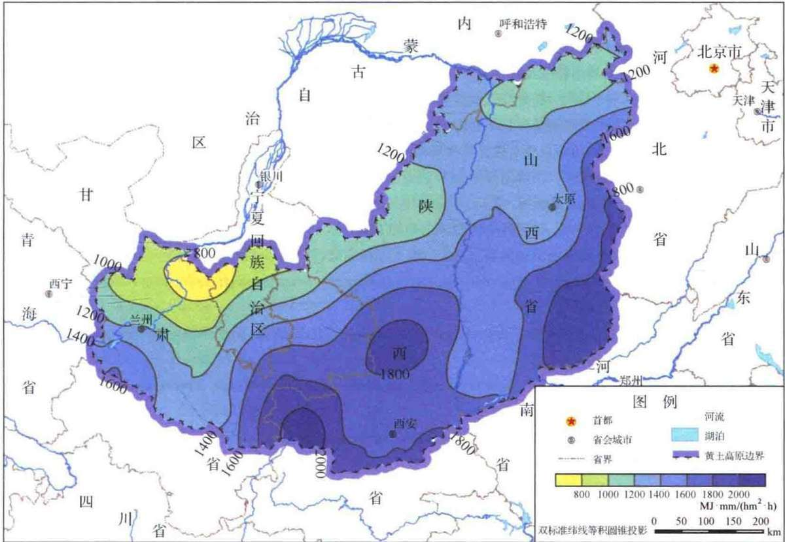  
图4-6 黄土高原多年平均年降雨侵蚀力等值线图 $\left[ \mathrm { M J } \cdot \mathrm { m m } / ( \mathrm { h m } ^ { 2 } \cdot \mathrm { h } \cdot \mathrm { a } ) \right]$

## 参考文献

方正山.1958.黄河中游黄土高原梯田的调查研究.北京：科学出版社

黄炎和，卢程隆，郑添发，等.1992.闽东南降雨侵蚀力指标R值的研究.水土保持学报，4:1-5

加生荣，徐雪良.1992.黄丘(一)副区小流域降雨特性研究.见:黄委会绥德水土保持科学试验站.黄丘(一)副区小流域产流产沙数学模型及应用研究.绥德：黄委会绥德水土保持科学试验站编委会

贾志军，王小平，李俊义.1987.晋西黄土丘陵沟壑区降雨侵蚀力指标R值的确定.中国水土保持，6:18-20

江忠善，李秀英.1988.黄土高原土壤流失方程中降雨侵蚀力和地形因子的研究.中国科学院西北水土保持研究所集刊，7:40-45

江忠善，贾志伟，刘志。1990.降雨和地形因素与坡地水土流失关系的研究.见：中国科学院水利部西北水土保持研究所.黄土丘陵沟壑区水土保持型生态农业研究.西安：天则出版社

江忠善，宋文经，李秀英.1983.黄土地区天然降雨雨滴特性研究.中国水土保持，3:32-36

刘尔铭.1982.黄河中游降雨特性初步分析.水土保持通报，1:31-34

刘元保.1990.小流域降雨侵蚀力模拟.杨凌：中国科学院西北水土保持研究所博士学位论文

王万忠.1987.黄土地区降雨侵蚀力R指标的研究.中国水土保持，12:34-40

王万忠。1983.黄土地区降雨特性与水土流失关系的研究Ⅲ降雨侵蚀力指标R值的探讨.水土保持通报，5：62-64

王万忠，1984.黄土地区降雨特性与土壤流失关系的研究Ⅲ关干侵蚀性降雨标准的问题、水土保持通报，(2)：58-62

王万忠，焦菊英.1996.中国的土壤侵蚀因子定量评价研究.水土保持通报，16(5):1-20

王万忠，焦菊英，郝小品，等.1995.中国降雨侵蚀力R值的计算与分布(I).水土保持学报，9(4)：5-18

吴素业.1994.安徽大别山区降雨侵蚀力简易算法与时空分布规律研究.中国水土保持，4:12-13

谢云，刘宝元，章文波.2000.侵蚀性降雨标准研究.土壤侵蚀与水土保持学报，14(4)：6-11

杨子生.1999. 滇东北山区坡耕地土壤流失方程研究.水土保持通报，19(1):1-9

张汉雄，1983.黄土高原的暴雨特性及其分布规律.地理学报，38(4)：416-425

张宪奎，许谨华，卢秀琴，等.1992.黑龙江省土壤流失方程的研究.水土保持通报，12(4)：1-9

章文波，付金生.2003.不同类型雨量资料估算降雨侵蚀力.资源科学，25(1):35-41

章文波，谢云，刘宝元.2002.用雨量和雨强计算次降雨侵蚀力.地理研究，21(3)：384-390

赵富海，赵宏夫.1995.编制张家口市降雨侵蚀力R值图的研究.见：蔡强国，赵宏夫，王忠科，等.永定河上游张家口市水土流失规律坡地与土地改良利用.北京：中国环境科学出版社：16-22

周伏建，陈明华，林福兴，等.1995.福建省降雨侵蚀力指标R值.水土学报，9(1):13-18

周佩华，王占礼.1987.黄土高原土壤侵蚀暴雨标准.水土保持通报，7(1):38-44

Baver L D. 1938. Ewald Wollny—A pioneer in soil and water conservation research. Soil Science Society Proceeding, 3：330-333

Brandt C J. 1990. Simulation of the Size distribution and erosivity of raindrops and throughfall drops. Earth Surface Processes&.Landform,15:687-698

Brown L C, Foster GR. 1987. Storm erosivity using idealized intensity distributions. Transactions of the ASAE, 30: 379-386

Carter C E, Greer J D, Braud H J, et al. 1974. Raindrop characteristics in South Central United States. Transactions of the ASAE, 17: 1033-1037

Cerro C, Bech J, Codina B, et al. 1998, Modeling rain erosivity using disdrometric techniques. Soil Science Society American Journal,66:731-735

Cook H L. 1936. The nature and controlling variables of the water erosion process. Soil Science Society of America Proceedings, 1: 60-64

Coutinho M A, Thomas P P. 1995. Characterization of raindrop size distributions at the vale Formoso Experimental ErosionCenter. Catena, 25(1):187-197

Ellison W D. 1944. Studies of raindrop erosion. Agricultural Engineering, 25: 131-136, 181-182

Ellison WD. 1947. Soil Erosion studiesPart I and Ⅱ. Agricultural Engineering, 28:145-146, 197-201

Elwell H A, Stocking M A. 1975. Parameters for estimating annual runoff and soil loss from agricultural lands in Rhodesia. Water Resources Research, 11(4):601-605

Foster G R. 2004, User's Reference Guide: Revised Universal Soil Loss Equation(RUSLE 2). Washington D C: USDA

FosterG R, MeyerL M. 1975. Mathematical simulation of upland erosion by fundamental erosion mechanics. In: Present and Prospective Technology for Predicting Sediment Yields and Sources. Oxford: USDA.190-207

Foster G R, Lombardi F, Moldenhauer W C. 1982. Evaluation of rainfall-runoff erosivity factors for individual storms. Transactions of the ASAE, 25(1);124-129

Hudson N W. 1965. The Influence of Rainfall on the Mechanics of Soil Erosion. MSc Thesis, University of Cape Town Hudson N W. 1995. Soil Conservation. Ames: Iowa State University Press

Jayawardena A W, Rezaur R B. 2000. Drop Size distribution and kinetic energy load of rainstorms in Hong Kong.

Hydrological Processes, 14(6):1069-1082

Kinnel P I A. 1973. Theproblem of assessing the erosive power of rainfall from meteorological observations. Soil ScienceSociety of America Journal, 37(4) :617-621

Kinnel P I A. 1981.Rainfall intensity-kinetic energy relationships for soil loss prediction. Soil Science Society of America Journal, 45(1):153-155

Laws O J. 1941. Measurement of fall velocity of water drops and rain drops. Trans. Aver. Geophys. Union, 22: 709- 721

Laws O J, Parsons D A. 1943. The relation of raindrop-size to intercity. Transactions of the AGU, 24: 452-460

MeGregor K C, Bingner R L, Bowie A J, et al. 1995. Erosivity index values for northern Mississippi. Transactions of the ASAE,38(4):1039-1047

McGregor K C, Mutchler C K. 1976. Status of the R factor in northern Mississippi, soil erosion: prediction and control. Soil Conservation Society American, 135-142

Meyer L D. 1984. Evolution of the universal soil loss equation. Journal of Soil and Water Conservation, 39: 99-104

Meyer L. D, Wischmeler W H. 1969. Mathematical simulation ofthe process of Soil erosion by water. Transactions of the ASAE, 12:572-580

Morgan R P C. 1977. Soil erosion in the United Kingdom: field studies in the Silsoe area 1973-1975. National College of Agricultural Engineering, Occasional Paper 4

Musgrave G W. 1947. The quantitative evaluation of factors in water erosion: A first approximation. Journal of Soil and Water Conservation, 2: 133-138

Onaga K. , Shirai K. , Yoshinage A. 1988. Rainfall erosion and how to control its effects on farmland in Okinawa. In: Rimwanich S. Land Conservation for Future Generation. Bangkok: Department of Land Development

Renard K G, Foster G R, Weesies G A, et al. 1997. Predicting Soil Erosion by Water: A Guide to Conservation Planning with the Revised Universal Soil Loss Equation (RUSLE). U. S. Dep. Agric. , Agric. Handb. No. 703

Richardson C W, Foster G R, Wright D A. 1983. Estimation of erosion index from daily rainfall amount. Transactions of theASAE,26(1):153-156

Rosewell C J. 1986. Rainfall Kinetic energy in eastern Australia. Journal ofClimate and Applied Meteorology, 25(11):1695-1701

Salles C J, Poesen J, Sempere-Torres D. 2002. Kinetic energy of rain and its functional relationship with intensity. Journal of Hydrology, 257(200): 256-270

Smith D D. 1941. Interpretation ofsoil conservation data for field use. Agricultural Engineering, 22: 173-175

Smith J A, De Veaux R D. 1992. The temporal and Spatial Variability of rainfall power. Environmetrics, 3(1) : 29-53

Steiner M, Smith J A. 2000. Reflectivity, rain rate, and kinetic energy flux relationships based on raindrop spectra. Journal of Applied Meteorology, 39(11): 1923-1940

Van Dijk A I J M, Bruijnzeel L A, Rosewell C J. 2002. Rainfall intensity-kinetic energy relationships: a critical literature appraisal.Journal ofHydrology, 261: 1-23

Wischmeier W H. 1959. A rainfall erosion index for a universal soil-loss equation. Soil Science Society Proceedings. 23(3):246-249

Wischmeier W H. 1962. Storms and Soil Conservation. Journal of Soil and Water Conservation, 17: 55-59

Wischmeier W H. 1976. Use and misuse of the universal soil loss equation. Journal of Soil and Water Conservation, 1:5-9

Wischmeier W H, Smith D D. 1965. Predicting rainfall erosion losses from cropland east of the Rocky Mountains. Agric. Handbook. No. 282. Washington, D. C: USDA

Wischmeier W H, Smith D D. 1958. Rainfall Energy and Its Relationship to Soil Loss. Transactions, American Geophysical Union,39:285-291

Wischmeier W H, Smith. D D. 1978. PredictingRainfall Erosion Losses—A Guide to Conservation Planning. U. S.

Dep. Agric. , Agric. Handb. No. 537

Yin S, Xie Y, Nearing M A, et al. 2007. Estimation of rainfall erosivity using 5- to 60-minute fixed-interval rainfall data from China, Catena, 70:306-312

Zanchi C, Toni D. 1980. Evaluation of rainfall energy in Central Italy. Assessment of Erosion, 133-142

Zingg A W. 1940. Degree and length of land slope as it affects soil loss in runoff. Agricultural Engineering, 21: 59-64

## 第五章 土壤因子评价

土壤是侵蚀过程作用的对象，也是河流泥沙的主要物质来源。通过影响入渗、地表阻力等，土壤本身的性质差异对侵蚀发生过程的强弱及其产沙量的多少有着极为重要的影响。同时，由于土壤含有丰富的养分元素，土壤特性对水质污染等环境问题也有直接的作用。正确地研究评价土壤性质对水土流失的影响作用，不仅是土壤流失量及水土保持效益定量评价的基础，而且也是土地生产力及区域水资源评价的重要环节。因此，开展土壤性质对侵蚀影响的定量评价研究是构建土壤侵蚀预报的关键模块。

## 一、土壤因子评价指标的选择和使用问题

土壤性质与侵蚀的关系一直是国内外学者广泛关注的研究议题。对于土壤性质的影响作用，不同学者曾经使用土壤抗冲性、土壤抗蚀性和土壤可蚀性等不同术语来表述。中国学者在研究最初阶段，普遍采用土壤抗冲性和土壤抗蚀性概念。土壤抗冲性和土壤抗蚀性概念首先由朱显谟等(1954)提出，并指出土壤抗冲性是土壤抵抗径流冲刷的能力，土壤抗蚀性是指土壤抵抗降雨径流浸泡和溶解分散的能力。土壤抗冲性和土壤抗蚀性都是表征土壤抵抗侵蚀的能力，如果抗冲性或抗蚀性越强，表明在相同的侵蚀营力下，土壤流失量越小。由于在降雨侵蚀过程中，实际上无法区分土壤抗冲性和抗蚀性的影响程度，在后来的相关研究中统一采用了土壤抗冲性概念。在国外，一直沿用着土壤可蚀性概念，用来表示土壤遭受侵蚀的难易程度。土壤可蚀性值越大，表明土壤越容易遭受侵蚀。因此，土壤抗冲性和土壤可蚀性实际上都是反映土壤对侵蚀的敏感程度，但关注的侧重点刚好相反。土壤抗冲性越强，土壤可蚀性值越小。

不论采用土壤抗冲性还是土壤可蚀性，都必须选定合适的指标来量化和提出合理科学的方法来确定指标值大小。按照定义，土壤抗冲性或可蚀性是反映土壤遭受侵蚀的敏感程度指标，反映土壤内在性质对侵蚀的影响程度。因此，不论采用什么形式的指标衡量，其值大小应该只与土壤性状特征有关。理想的反映土壤抗冲性和可蚀性的指标，只能随土壤性质的不同而变化。而不应该受其他因素，如地形、土地利用、水土保持措施等的影响。

从理论上讲，土壤可蚀性可以采用各种指标来衡量，但实际使用效果会存在优劣之分。合理的土壤可蚀性指标必须遵循唯一性原则和实用性原则。所谓唯一性就是说对一种土壤而言，只可能有一个土壤可蚀性值。不管在什么条件下测定，其数值大小应该保持不变。如果选定的反映土壤可蚀性的指标值因小区条件和测定方法等的不同而变化，说明该指标不能很好地反映土壤性质对侵蚀的影响作用。相反，如果所选可蚀性指标值大小不因观测小区条件或测定方法的变化而变，只随土壤类别的不同而异，就表明所选指标合理。所谓实用性是指可蚀性指标必须具有土壤流失量预报价值，同时要有一套可行的测定方法。最后，合理的可蚀性指标还必须能够在不同土壤类型之间进行大小比较。

在已有的研究中，表征土壤可蚀性所采用的主要土壤性状指标有：土壤的硅铁铝率、土壤浸湿热、分散率、侵蚀率、颗粒组成、渗透速度、崩解率、悬浮率、膨胀系数以及团聚体总量、团聚状况、团聚度等。Bennent(1926)认为可以用土壤硅铁铝率来反映侵蚀强弱程度。Middletton(1930)指出土壤浸湿热大小与土壤侵蚀率的高低成正比。Bouyoucos(1935)建立了土壤质地与侵蚀程度的定量关系。朱显谟等(1954)通过测定土壤的膨胀系数和分散速度等性质来反映土壤对侵蚀的影响。田积莹和黄义端(1960)、史德明等(1983)通过研究土壤物理性质与侵蚀的关系，对土壤可蚀性指标进行了评价。蒋定生等(1995)通过改进古萨克冲刷装置，设计了原状土冲刷试验水槽，并测定了黄土地区农、林、草地下的土壤抗冲性指标及其分级。李勇等(1990)通过抗冲槽试验和索波列夫抗冲仪，测定了黄土的相对抗冲性指标。周佩华和武春龙(1993)用单位径流深引起的侵蚀模数作为反映土壤抗冲性强弱的指标。1963年Olson和Wischmeier在建立美国通用流失方程(USLE)时，提出了用标准小区上单位降雨侵蚀力引起的土壤流失量多少来表征土壤性质对侵蚀影响作用大小的土壤可蚀性K指标。由于K指标基于野外小区实测资料来计算，可直接用于水土流失预报，后来被多个土壤侵蚀预报模型广泛采用。

针对上述反映土壤可蚀性的指标，也有不同的测定方法与之对应。主要有土壤理化性质测定、简单仪器测定和野外小区测定法等。土壤理化性质测定法就是通过分析多种土壤性质指标与土壤可蚀性或抗冲性的关系，建立定性或半定量的土壤可蚀性评价方法。仪器测定法是用水滴或水流直接冲刷土样或土体来测定土壤可蚀性的微型试验，如古萨克抗冲槽、索波列夫抗冲仪、威廉斯基的滴水器、奥尔德曼的试验装置以及我国蒋定生设计的抗冲槽等。所谓抗冲槽试验，就是将一定大小的土样放置在坡度可调的冲刷槽上，用一定流量的清水冲刷土样，通过监测和计算单位时间内单位流量所冲刷的土量的多少来衡量土壤抵抗侵蚀能力的强弱。试验方法简便，易于操作。而且，试验土样采用原状土，其结果更符合实际情况。但是，由于在土壤侵蚀发生过程中，土壤与径流之间交互作用的存在，选用多大的径流进行试验，对结果影响很大。由于试验选用的流量大小不同，或许会出现截然相反的结论。在小流量时，对于较疏松的沙质土而言，由于入渗强度大，径流侵蚀会相对较弱。在大流量时，疏松的特性则更有利于被冲刷搬运，因此，径流侵蚀会相对较强。对于黏结性好的黏质土而言，情况会正好相反。这样，仅由于试验时所选流量大小的不同，出现了土壤可蚀性大小完全相反的排序，说明这种方法需要慎重使用。另外，怎样将实验结果与实际土壤流失量联系也是一个十分复杂的问题。目前，使用这种方法研究土壤性质对侵蚀的影响作用的学者认为，根据抗冲槽的实验结果求得的土壤抗冲系数是一个动态参数，不是恒定的常数，它是土壤的自然性质、地形、降雨及水土保持活动的函数。根据这种认识，由于在自然界中土壤的自然性质、地形、降雨及水土保持活动等的组合有无穷多种，土壤抗冲系数也会有无穷多个，这样的指标也就失去了意义。

索波列夫抗冲仪法是用一定压力、通过一定孔径的水柱冲蚀土壤，通过量测比较冲刷穴的深度来评判土壤抵抗侵蚀的程度。一般是十质越坚硬，冲刷穴越浅，说明此类土壤对侵蚀的敏感性小。相反，土质越疏松，冲刷穴越深，说明此类土壤对侵蚀的敏感性强，土壤可蚀性大。这种方法最简单易行，在某种程度上也得到了可蚀性评价的定量指标，所以在我国初期的土壤性质与侵蚀关系的研究中得到了广泛的使用。但与抗冲槽一样，用索波列夫抗冲仪法研究土壤可蚀性时也存在很多问题：首先，由于试验范围很小，试验点的代表性有一定局限。其次，试验结果受人为影响较大。最后，用索波列夫抗冲仪法得到的土壤可蚀性指标值与土壤流失量多少之间没有直接关系。因此，用索波列夫抗冲仪法研究土壤性质对侵蚀的影响作用，只能对土壤遭受侵蚀的相对难易程度进行评价。而且，由于现代侵蚀主要发生在受人类活动强烈影响的坡耕地上，仅用比较原状土冲刷穴的深度很难准确地把握土壤可蚀性值大小。

威廉斯基的滴水器法是通过测定从一定高度上、以一定速度滴落的水滴打击分散土壤的快慢或多少来衡量土壤对侵蚀敏感程度的方法。由于土壤侵蚀包括土壤颗粒的分散、搬运等多个过程，同时在进行此类试验时一般很难满足达到雨滴终点速度的高度，此方法既不能衡量土壤流失的强弱，也没有真正模拟雨滴打击分散土壤的过程。因此，用水滴打击分散土壤的方法来研究土壤对侵蚀的敏感程度，也不可能真正把握土壤可蚀性的大小。最多只能作为一种辅助方法来补充验证其他指标。

总之，用仪器法研究土壤对侵蚀的敏感程度，比仅测定土壤性质有所进步。因为它力图直接模拟土壤侵蚀发生的过程。所以，如果设计合理并使用得当，这类方法能更直接地反映土壤侵蚀作用机理。但目前由于设计上的不完善，实验结果并不能完全反映土壤性质本身的差异对侵蚀的影响作用。因为在使用这种方法时，土壤性质上的差异完全可能为其他因素的不同而掩盖。而且，用此方法求得的指标值随试验设计的不同有明显的差异。实验设计可以有无穷多个，而一种土壤的可蚀性指标值不应该有无穷多，否则，无法开展侵蚀预报。

综上所述，在黄土高原土壤可蚀性研究过程中，曾经出现和使用过不同指标来刻画土壤性质对侵蚀的影响程度。早期使用的指标尽管简单易行，且对认识土壤性质与侵蚀的关系也有很大帮助，但大都很难直接建立其与土壤流失量之间的定量关系。因此，这些指标值一般都不能直接用于土壤侵蚀预报。在后期，把地表径流的作用结果作为土壤可蚀性的度量指标，物理意义比较明确，较仅测定土壤性质有了很大的进步。但用冲走单位质量的土壤所用水量和所用时间的函数作为指标来度量土壤可蚀性大小时，由于实验方法本身存在缺陷，也只能得到不同土壤间可蚀性大小的相对值，很难直接用于侵蚀预报。只有美国通用土壤流失方程式中定义的土壤可蚀性指标K值，可以直接用于土壤侵蚀预报，而且，有可操作性很强的测定方法作保证。

## 二、土壤可蚀性因子K的定义和计算方法

从20世纪90年代开始，黄土高原地区土壤可蚀性研究中逐渐接受和采用USLE中定义的指标K值。根据Wischmeier和Smith(1965)的定义，某种土壤的可蚀性因子K值等于标准小区条件下，单位降雨侵蚀力R所对应的土壤流失量。USLE中规定的标准小区为坡长22.13m，坡度为9%，连续保持清耕休闲状态的小区。同时要求小区在观测期间经常清除杂草，以保证植被覆盖度不大于5%。按照USLE模型总体构想，确定土壤可蚀性K值时必须注意两个问题。首先，土壤可蚀性值必须在标准小区上观测计算。其次，必须严格按照要求管理和维护小区。在观测期间，小区要保持裸露，定期除草。同时，还必须按照当地农作习惯对小区进行定期翻耕，以保证与当地耕地状况完全对应。

在标准小区条件下，就可按以下公式计算土壤可蚀性K值：

$$
K = { \frac { A } { R } }\tag{5-1}
$$

式中，A为标准小区上观测的多年平均土壤流失量 $\mathrm { ( t / h m ^ { 2 } ) }$ ;R为多年平均降雨侵蚀力$\left[ \mathrm { M J } \cdot \mathrm { m m } / ( \mathrm { h m } ^ { 2 } \cdot \mathrm { h } \cdot \mathrm { a } ) \right]$ 0

计算土壤可蚀性因子值时要特别注意单位。根据其定义，土壤可蚀性值的单位是土壤流失量单位与降雨侵蚀力单位的比，在美制体系中为 $\mathrm { ~ t ~ } \bullet \mathrm { ~ a c r e ~ } \bullet \mathrm { ~ h / ( ~ l 0 0 a c r e ~ } \bullet \mathrm { ~ f t ~ } \bullet \mathrm { ~ t ~ } \bullet$ inch①)，在国际制体系中为 $\mathrm { \bf ~ t } \bullet \mathrm { \bf ~ h m } ^ { 2 } \bullet \mathrm { \bf ~ h } / ( \mathrm { h m } ^ { 2 } \bullet \mathrm { \bf ~ M J } \bullet \mathrm { \bf ~ m m } )$ 。单位换算关系是由美制转换成国际制时，乘以系数0.1317；由国际制转换成美制时，乘以系数7.587。用现有模型中土壤可蚀性估算公式计算的土壤可蚀性值都是美制单位，在中国使用时需要订正成国际制单位。

若观测小区不是标准小区，首先需要对土壤流失量观测资料予以订正，将各种因子订正到标准小区水平，然后再利用式(5-1)计算。若采用的小区不是标准小区要求的坡长和坡度，可以分别采用坡度和坡长公式进行订正。尽管有多个坡度坡长公式，由于黄土高原地区耕地已属于陡坡，建议在黄土高原地区坡度坡长订正时采用刘宝元等(1999)提出的陡坡公式：

$$
S = 2 1 . 9 1 \mathrm { s i n } \theta - 0 . 9 6\tag{5-2}
$$

坡长订正公式为

$$
L = \left( { \frac { \lambda } { 2 0 } } \right) ^ { \prime \prime \prime }\tag{5-3}
$$

式中，L为坡长因子(无量纲);λ为坡长(m);m为系数。当坡度大于5%， $m { = } 0 , 5$ 当坡度为3.5%\~4.5%， $m { = } 0 , 4$ ；当坡度为 $1 \% \sim 3 \% , m { = } 0 . 3$ ;当坡度小于1%时， $m { = } 0 , 2$ o

如果实际小区处理不是标准小区要求的完全裸露地，需要根据实际观测确定的覆盖因子(C)或水土保持措施因子(P)值予以订正，然后再计算土壤可蚀性K值。不过在土壤可蚀性K值测定和计算时，建议最好使用裸露小区的观测资料。

小区观测是定量研究土壤侵蚀的基本方法，也是确定土壤可蚀性K值的最基本方法。以小区实测土壤流失资料为依据，计算的土壤可蚀性指标可以直接用来估算土壤流失量，这也是研究确定土壤可蚀性值的最终目的。使用小区观测确定土壤可蚀性方法的缺点是必须建立和维持大量的试验小区。而建立和维持小区试验必然耗费人力物力，而且还受降雨产流次数的限制，如在中国黄土高原地区，年产流次数只有6次，积累系列足够长的观测资料是一项十分艰巨的工作。如果能在更小的小区上精确确定土壤可蚀性的大小，可以节省大量物力和财力。在今后的土壤可蚀性K值库建设时，可以考虑选择比较小的观测小区，通过进行人工降雨试验来弥补，但是，有许多问题仍需要认真研究。首先，试验小区面积问题。水源是进行人工降雨试验时的主要限制因素，如果试验区过大，试验用水很难保证。同时，降雨的均匀性也将受到影响。如果试验区过小，其代表性又将受到质疑。因此，需要做一组试验来研究确定人工降雨试验的试验区面积大小。其次，降雨特性的选定与组合问题。土壤可蚀性因子值反映的是降雨侵蚀的多年平均状况，包括了各种强弱和大小的降雨。在进行人工降雨试验时，不可能对所有的降雨都进行模拟。那么，就需要科学地选择雨量、雨强及其组合。如果雨量和雨强都选择过量，求得的土壤可蚀性值必然会偏大，相反则又会偏少。不解决雨量、雨强及其组合的选定问题，利用人工降雨试验只能研究比较不同土壤可蚀性值的相对大小，不可能与实际土壤流失量建立起关系。对于这一点必须清楚，否则将会产生误导。不过，只要上述问题得到解决，利用人工降雨试验也是研究土壤可蚀性的最佳选择。

另外一个需要注意的方面，在计算和使用土壤可蚀性值时一定要明确标准小区问题。因为土壤可蚀性K值反映的是标准小区条件下土壤对侵蚀影响的定量度量。在近十几年我国许多学者提出的土壤侵蚀预报模型的雏形中，尽管模型结构及其因子计算都以美国通用流失方程式为参照，但在模型建立过程中，由于没有明确统一的标准小区概念，出现了许多混乱，有些研究者直接用通用流失方程中的标准小区或接近的坡度对资料进行了订正，有些研究者根本没有考虑资料订正问题。另外一方面，由于在不同时期布设的大量观测小区，不论在规模大小，还是在管理方法上也都存在很大的差异，如果不对其进行统一处理就直接计算土壤可蚀性值，结果不仅影响了研究成果的可比性，而且也很容易产生使用上的混乱。

所谓标准小区，实际上是指在对实测资料进行分析对比时所规定的基准平台，可以是实地现设的小区规格，也可以是计算中虚设的小区，但一般选用有观测资料的实设小区。规定了标准小区以后，在进行资料分析时，就可以把所有资料首先订正到标准小区上，然后再统一分析其规律性。另外，也只有在统一的标准小区条件下，才能对土壤性质的影响作用进行统一的对比评价，计算得到统一的土壤可蚀性指标值。在美国的通用流失方程(USLE)中，规定坡度为9%，坡长为22.13m，连续保持清耕休闲状态，且实行顺坡耕作的小区为标准小区。同时又具体规定：小区首先必须犁耕到正常耕作深度，犁耕后即实施耕耙整平，犁耕次数与日期应与对照农作小区一致；必要时还应破除结皮，如果耕作不能消灭杂草时，还必须使用除草剂。

我国是土壤侵蚀问题最严重的国家之一。水土流失严重的原因除了降雨、地质地貌、地面物质组成等自然因素外，广泛存在的大面积陡坡开垦是水土流失问题严重的重要根源。因此，与土壤侵蚀问题同样严重的美国相比，陡坡耕地是中国水土流失环境的具体特征。例如，在水土流失最严重的黄土高原，坡耕地的面积约占总耕地面积的50%，其中，在黄土丘陵区，坡耕地占总耕地面积的70%～90%。所以，在中国开展土壤侵蚀预报研究，必须重视陡坡地水土流失问题。黄土高原水土流失严重区典型小流域地面坡度组成表明，除了黄土塬区和片沙覆盖黄土区外，陡坡地所占面积很大。大于 $1 0 ^ { \circ }$ 的坡地面积一般占总面积的75.5%，大于 $1 5 ^ { \circ }$ 的坡面占57.6%，大于 $2 5 ^ { \circ }$ 的坡面占总面积的31.5%左右。大面积的陡坡开垦不仅增大了水土流失发生的面积，而且也会影响到土壤侵蚀发生的动力机制，即使在相同的降雨条件下，由于坡度变陡，侵蚀方式和形态演化过程都会发生显著变化，土壤侵蚀量会急剧增加。在黄土高原的侵蚀环境下，如果直接引用通用流失方程中所规定的标准小区条件，不一定能完全反映陡坡条件下的侵蚀本质特征。由于影响土壤侵蚀强度的各个因子之间的交互关系，即使通过坡度坡长公式订正，也可能带来不必要的误差。

关于适用于黄土高原地区的标准小区，以前曾有学者(江忠善和李秀英，1988)建议采用坡度为 $1 0 ^ { \circ }$ 、坡长为20m(投影长度)、宽为5m的直型坡裸露小区。考虑我国陡坡大面积开垦的具体事实，以及现有小区的坡度范围，在既遵循水土流失发生的客观规律，又能最大限度地使用历史资料的原则指导下，我们也曾建议(张科利等，2000)，在黄土高原地区我国的标准小区最好选定 $1 5 ^ { \circ }$ 坡度、20m坡长、5m宽的清耕休闲地。小区每年按传统方法准备成苗床，并按当地习惯适时中耕，保证没有明显的杂草生长(覆盖度以不超过5%为宜)。按照标准小区建设，一方面可以对我国不同地区现有的观测资料进行统一的分析整理，系统规范地研究我国的土壤可蚀性，为开展侵蚀预报奠定基础；另一方面也可以指导未来野外试验的规划和布设。

获取大量的实测数据，是建立土壤侵蚀预报方程的基础。半个世纪以来，我国在全国不同地区建立过许多野外观测小区，积累了相当丰富的观测资料。根据目前刊出的黄河流域水土保持径流泥沙观测资料，以及有关水土保持杂志上发表论文中所引用的其他地区的小区资料，表明我国小区资料的坡度范围，主要变化于 $5 ^ { \circ } \sim 3 5 ^ { \circ }$ 。其中，有 $1 / 4$ 多的小区坡度落在 $1 0 ^ { \circ } \sim 1 5 ^ { \circ }$ 的范围。这一结果首先说明 $1 0 ^ { \circ } \sim 1 5 ^ { \circ }$ 的小区在我国具有最大的广泛性，也即在各地不同立地条件下，这一坡度范围内布设的小区最多，同时也说明选这一坡度级作为标准小区的坡度时，等于在标准小区上的实测资料最多。

需要注意的是，不论采用 $1 5 ^ { \circ } { \dot { \pi } }$ 是沿用USLE中规定的标准小区规范，在计算土壤可蚀性K值时都必须明确说明。同时，还必须与其他因子的计算公式相匹配。鉴于模型中地形因子的计算公式仍以USLE模型中的标准小区为基准，同时也考虑与国际同类研究的衔接比较问题，在本次黄土高原地区土壤流失方程中，土壤可蚀性计算时的标准小区仍然采用9%坡度。

## 三、典型站点土壤可蚀性因子K实测值

由于黄土高原地区复杂的成土环境，发育了多种土壤类型。不同土壤性质差异显著，土壤可蚀性值大小也会随之不同。针对所有土壤类型，设置径流小区来观测计算土壤可蚀性值，不论从人力物力，还是从时间尺度上考虑，都不太切合实际。可行的途径是，首先根据已有试验台站常年积累的小区观测资料，计算一组典型点上的土壤可蚀性K值。以这组实测值为基础，同时测定不同土壤类型的入渗率、粒径组成、有机质含量等理化特征值。通过对这些指标进行分类选择，选定既与土壤侵蚀强弱关系最为密切、测定方法又简单的一组指标值。然后，再分析建立所选土壤性状指标与可蚀性指标K值之间的定量关系，构建土壤可蚀性指标值的估算公式。最后，通过海量的土壤普查资料来建立土壤可蚀性数据库。因此，要建立实用的黄土高原地区土壤可蚀性K值数据库，首先必须根据小区实测资料，计算出一组土壤可蚀性K实测值。

## (一)资料来源及处理

黄土高原地域辽阔，土壤的性质特点从北到南变化很大，其可蚀性值大小也必然会出现区域差异。为此，我们从北到南依次选用皇甫川、子洲、绥德、离石和安塞等站的小区资料，分别计算了黄土高原不同地域的土壤可蚀性K值。其中，皇甫川的可蚀性指标值是根据金争平等(1995)的资料用坡度公式订正到标准小区上的计算结果。子洲站使用了团山沟2号、团山沟3号、团山沟4号和团山沟5号等小区的资料。离石站所用资料为6个不同坡度小区的观测数据。由于上述试验站所设小区不完全与标准小区规定的条件相符，在进行土壤可蚀性值计算时需要进行相应的订正。首先用前面提及的坡度公式，将土壤流失量统一订正到标准小区坡度上。由于除了皇甫川和安塞两站的小区为裸露地外，绥德、子洲和离石均为农耕地，在计算土壤可蚀性值时还需要对土壤流失量大小作进一步订正。对于这3个站作物覆盖C的取值问题，可以应用张岩等(2001)利用安塞站都比小区对作物覆盖的研究结果。根据安塞站的观测计算结果，坡耕地平均C值为0.517，考虑到绥德、子洲和离石的降雨情况，对绥德、子洲和离石农作物进行评估后，我们对绥德和子洲两站的C值取安塞站较大的荞麦地0.74，离石站则取0.5来订正。将完全订正到标准小区条件下的多年平均土壤流失量除以相应时间段的年均降雨侵蚀力值R，就得到了黄土高原典型地土壤可蚀性K值，如表5-1所示。

表5-1 黄土高原地区部分土壤实测可蚀性K值
<table><tr><td rowspan="2">土壤类型</td><td rowspan="2">位置</td><td rowspan="2">小区状况</td><td colspan="2">K/[t· hm²· h/(hm2·MJ· mm)]</td><td rowspan="2">资料年限</td></tr><tr><td>USLE标准</td><td>15°标准小区</td></tr><tr><td>黄绵土</td><td>皇甫川</td><td>10.5%,20m</td><td>裸地</td><td>0.0166</td><td>0.0689</td><td>1987~1989年</td></tr><tr><td>黄绵土</td><td>子洲</td><td>40.4%,60.3%,20m</td><td>农地</td><td>0.0186</td><td>0.0772</td><td>1964~1967年</td></tr><tr><td>黄绵土</td><td>绥德</td><td>25.5%，20m</td><td>农地</td><td>0.0234</td><td>0.0971</td><td>1956~1958年</td></tr><tr><td>黄绵土</td><td>安塞</td><td>8.7%~53.2%,20m</td><td>裸地</td><td>0.0096</td><td>0.0382</td><td>1985~1989年</td></tr><tr><td>黄绵土</td><td>离石</td><td>8.7%~57.7%,20m</td><td>农地</td><td>0.0156</td><td>0.0647</td><td>1957~1964年</td></tr></table>

注：表中可蚀性K值单位为国际制 $\mathrm { \Delta t \bullet h m ^ { 2 } \bullet h / ( h m ^ { 2 } \bullet M J \bullet m m ) }$ ，同时给出了标准小区为USLE规范和中国标准小区规范下的K值。与美制单位换算关系为，国际制×7.59=美制单位。子洲资料1961～1969年，摘自《黄河流域子洲径流实验站水文实验资料》；离石资料1957\~1964年，摘自《山西省水土保持科学研究所径流测验资料》；绥德资料1956\~1958年，摘自《黄河中游水土保持径流测验资料(天水、西峰、绥德站径流场部分)》。

## (二)土壤可蚀性实测值及其变化规律

在USLE标准小区条件下，当取国际制单位时，黄土高原地区的土壤可蚀性值变化于 $0 . \ 0 0 9 2 { \sim } 0 . \ 0 2 3 4 \ { \cdot } \ \mathrm { h m ^ { 2 } } \ { \bullet } \ \mathrm { h } / ( \mathrm { h m ^ { 2 } } \ { \bullet } \ \mathrm { M J } \ { \bullet } \ \mathrm { m m } )$ 。在15°标准小区条件下，黄土高原地区的土壤可蚀性值则变化于 $0 . \ 0 3 8 2 { \sim } 0 . \ 0 9 7 1 { \mathrm { t } } \cdot \ \mathrm { h m } ^ { 2 } \cdot \ \mathrm { h } / ( \mathrm { h m } ^ { 2 } \cdot \mathrm { M J } \cdot \mathrm { m m } )$ 。为了便于与国外研究成果进行比较，在此仍然用USLE标准小区条件下土壤可蚀性K值来进行论述。在黄土高原地区，土壤可蚀性值在地域上表现为中部地区较大，由中部向北、向南和向东部都逐渐减小的规律。土壤可蚀性最大值出现在子洲、绥德一带，可高达0.0234。向北到皇甫川流域，土壤可蚀性值减小为0.0166。向东到山西离石一带，土壤可蚀性也只有0.0156。向南到安塞一带后，土壤可蚀性更是减小到0.0096。土壤可蚀性出现这种区域差异的主要原因，可以认为是黄土物理性质的区域差异决定的。土壤可蚀性大小主要与土壤的颗粒组成、入渗特性、有机质含量，以及土壤结构有关。由于黄土的有机质含量普遍很低，结构特征变化也不大。所以，可以认为颗粒组成的变化是影响黄土可蚀性大小差异的主要因素，且可蚀性的大小主要与土壤中粉粒和黏粒含量的多少密切有关。黄土高原粒径组成变化的总趋势是从西北到东南由粗变细，砂粒含量沿该方向逐渐减少，而黏粒含量则不断增加。粉粒含量的变化是先不断增加，然后又渐渐减少，其最大值出现在位于中部地区的子洲、绥德一带。土壤中黏粒含量越高，土壤抵抗侵蚀的能力越强，可蚀性指标值越小。粉粒含量越高，越易发生侵蚀，土壤可蚀性指标值越大。因此，表5-1中的土壤可蚀性实测值变化趋势与研究区黄土粒径组成的变化基本规律一致。这也从另外一方面说明了该指标在黄土高原地区的合理性。尽管关于黄土粒径组成与其可蚀性之间的定量关系还有待于进一步研究，这一结果仍可以在黄土高原地区的土壤侵蚀预报及水土保持规划中作为参考使用。

有了这组土壤可蚀性实测值以后，一方面可以对黄土高原地区土壤侵蚀预报精度进行基本控制，在进行土壤侵蚀预报时直接代入方程来计算土壤流失量。另一方面也可为土壤可蚀性估算研究提供基本数据。以土壤可蚀性实测值为依据，建立土壤可蚀性值与土壤性状指标之间的定量关系。这里同时列出USLE中标准小区条件和我们建议的中国标准小区条件下的土壤可蚀性计算值，目的在于便于对照。在选择使用土壤可蚀性值时，一定要注意并明确计算标准。由于黄土高原土壤流失方程的基本构架和因子计算方法都借鉴了美国通用流失方程，在美国一般都采用美制单位，而我们国家习惯于国际制单位。在土壤可蚀性计算和模型应用中，要注意参数单位的统一，并采用准确的换算方法。在已往的研究成果中，有许多学者弄混了降雨侵蚀力和土壤可蚀性的单位，或者在美制单位和国际制单位换算中用错了系数。

## 四、土壤可蚀性因子K值估算问题

在获取表5-1中所示的一组可靠土壤可蚀性实测值后，就可以考虑研究建立土壤可蚀性值估算公式。关于土壤可蚀性值的估算研究，国外已有许多成果。但由于国外土壤可蚀性实测值与我国实测值大小之间存在明显的差异，能否直接将国外关于土壤可蚀性估算的研究成果在我国使用，还有待于进一步研究。国内的相关研究，基本上又大多缺乏实测资料的验证，或者只是一个观测点上的结果。因此，目前我国仍没有一个从根本上解决土壤可蚀性值估算的方法。

对于黄土高原地区土壤可蚀性值的估算问题，最简捷的方法就是参照国外的研究成果，首先用实测资料进行验证。如果计算精度可行，就可以修订使用。如果国外已有研究成果经修订后仍不适用于我国的土壤类型，再考虑根据我国的数据资料建立估算公式。

为此，我们首先考虑用黄土高原实测的土壤可蚀性值及对应的土壤类型性状来验证已有估算公式的计算结果(张科利，2001)。

## (一)主要估算公式

尽管关于土壤可蚀性值估算的研究很多，但具有代表性的成果为Wischmeier等(1971)、EPIC模型(1990)，以及 Shirazi和Boersma(1984)所建立的估算公式和方法。Wischmeier等(1971)选用粉粒+极细砂粒含量、砂粒含量、有机质含量、结构和入渗5项土壤特性指标，通过分析其与土壤可蚀性因子K值之间的关系，提出了土壤可蚀性估算公式(5-4)。

$$
K = [ 2 . 1 \times 1 0 ^ { - 4 } M ^ { 1 . 1 4 } ( 1 2 - \mathrm { O M } ) + 3 . 3 5 ( s - 2 ) + 2 . 5 ( p - 3 ) ] / 1 0 0\tag{5-4}
$$

式中，M为美国粒径分级制中的(粉粒+极细砂)%与(100一黏粒)%之积;OM为土壤有机质含量；s为结构系数； $\phi$ 为渗透性等级。土壤可蚀性计算值单位为美制单位。在USLE模型中，为了方便用户使用，研究者们还根据土壤可蚀性值估算式中各参数间的对比关系，绘制了简单明了的诺模图。用户只要按照要求获得相关土壤性质参数值，就可以直接在图中查找出对应的土壤可蚀性K值大小。由于在使用诺模图时，必须要知道土壤透水性参数和结构等级，而实际上用户在很多情况下不能掌握所有所需的土壤性质参数。为此，在EPIC模型中采用只考虑土壤有机质和粒径组成资料来估算土壤可蚀性值的公式(5-5)。

$$
\begin{array} { r l } & { K = \{ 0 . 2 + 0 . 3 \mathrm { e x p } [ - 0 . 0 2 5 6 \mathrm { S A N } ( 1 - \mathrm { S I L } / 1 0 0 ] \} \times \left( \frac { \mathrm { S I L } } { \mathrm { C L A } + \mathrm { S I L } } \right) ^ { 0 . 3 } } \\ & { \qquad \times \left[ 1 . 0 - \frac { 0 . 2 5 C } { C + \mathrm { e x p } ( 3 . 7 2 - 2 . 9 5 C ) } \right] \times \left[ 1 . 0 - \frac { 0 . 7 \mathrm { S N } 1 } { \mathrm { S N } 1 + \mathrm { e x p } ( - 5 . 5 1 + 2 2 . 9 \mathrm { S N } 1 ) } \right] } \end{array}\tag{5-5}
$$

式中，SAN、SIL、CLA是砂粒、粉粒、黏粒含量；C为土壤有机质含量(%);SN1=1一SAN/100。此公式计算的可蚀性计算值单位也为美制单位。

由于在使用公式(5-4)和公式(5-5)来估算土壤可蚀性时，需要粒径组成、有机质，土壤入渗等多种土壤性状资料。在没有足够资料的情况下，Shirazi和Boersma(1984)建议可用只考虑几何平均粒径 $( \mathrm { D g } )$ 的公式(5-6)来计算土壤可蚀性值。必须强调的是，用公式(5-5)计算的可蚀性计算值单位仍为美制单位。

$$
K = 7 . 9 5 4 \Big \{ 0 . 0 0 1 7 + 0 . 0 4 9 4 \mathrm { e x p } \Big [ - \frac { 1 } { 2 } \Big ( \frac { \log \mathrm { D g } + 1 . 6 7 5 } { 0 . 6 9 8 6 } \Big ) ^ { 2 } \Big ] \Big \}\tag{5-6}
$$

## (二)不同估算公式的计算与应用问题

根据公式(5-4)\~公式(5-6)的要求，对黄土高原地区5个试验站上土壤基本性质资料(表5-2和表5-3)，包括土壤的粒径组成、有机质含量、透水特性和结构等级等土壤性质数据进行收集和整理，分别用公式(5-4)～公式(5-6)计算了所观测土壤的可蚀性值

$K _ { \mathrm { n o m o } } \cdot K _ { \mathrm { e p i c } }$ 和 $K _ { \mathrm { f o r m l a r } }$ 。结果显示，对所研究的土壤类型而言，不论用哪一个估算公式，结果都是估算值远远大于实测值。说明现行的美国土壤流失预报模型中所采用的土壤可蚀性值估算公式都不能直接应用于我国土壤的可蚀性值计算。对于造成这种结果的原因，目前尚不清楚，但耕作方式不同可能是主要原因。在USLE规定的标准小区条件中，耕作方式为顺坡耕作，降雨过程中不仅容易产生径流，而且相同流量下流速要大，必然引起土壤流失量增加。而黄土高原地区的农耕习惯为横坡耕作，在相同降雨条件下入渗量增加，径流冲刷相对减弱，土壤流失量相对要少。

表5-2 黄土高原部分土壤实测可蚀性K值及相应的估算值

$$
\mathrm { t } \bullet \mathrm { h m } ^ { 2 } \bullet \mathrm { h } / ( \mathrm { h m } ^ { 2 } \bullet \mathrm { M J } \bullet \mathrm { m m } ) ]
$$

<table><tr><td>土壤类型</td><td>位置</td><td>资料年限</td><td>小区实测值</td><td> $K _ { \mathrm { n o m o } }$ </td><td> $K _ { \mathrm { e p i c } }$ </td><td> $K _ { \mathrm { f o r m i a r } }$ </td></tr><tr><td>黄绵土</td><td>皇甫川</td><td>1987~1989年</td><td>0.0154</td><td>0.0610</td><td>0.0528</td><td>0.0377</td></tr><tr><td>黄绵土</td><td>子洲</td><td>1964~1967年</td><td>0.0186</td><td>0.0884</td><td>0.0625</td><td>0.0459</td></tr><tr><td>黄绵土</td><td>绥德</td><td>1956~1958年</td><td>0.0234</td><td>0.0803</td><td>0.0606</td><td>0.0428</td></tr><tr><td>黄绵土</td><td>安塞</td><td>1985~1989年</td><td>0.0096</td><td>0.0685</td><td>0.0607</td><td>0.0476</td></tr><tr><td>黄绵土</td><td>离石</td><td>1957~1964年</td><td>0.0161</td><td>0.0661</td><td>0.0537</td><td>0.0504</td></tr></table>

表5-3 用于估算土壤可蚀性值的土壤性质取值
<table><tr><td rowspan="2">土壤类型</td><td rowspan="2">位置</td><td colspan="2">土壤质地</td><td rowspan="2">有机质/%</td><td rowspan="2">结构等级</td><td rowspan="2">渗透等级</td></tr><tr><td>0.1~0.002mm</td><td>&lt;0.002mm</td></tr><tr><td>黄绵土</td><td>皇甫川</td><td>60</td><td>12</td><td>0.3</td><td>3</td><td>2</td></tr><tr><td>黄绵土</td><td>子洲</td><td>86</td><td>8</td><td>0.5</td><td>2</td><td>3</td></tr><tr><td>黄绵土</td><td>绥德</td><td>79</td><td>8</td><td>0.5</td><td>2</td><td>3</td></tr><tr><td>黄绵土</td><td>安塞</td><td>86</td><td>10</td><td>0.776</td><td>2</td><td>3</td></tr><tr><td>黄绵土</td><td>离石</td><td>79</td><td>18</td><td>1.2</td><td>2</td><td>4</td></tr></table>

尽管上述已有估算公式的计算结果都较实测值大，但如果在估算值与实测值之间存在良好的相关关系，也可以通过修正估算值来保证计算精度。为此，我们试图将公式(5-4)～公式(5-6)计算结果 $K _ { \mathrm { n o m o } } \setminus K _ { \mathrm { e p i c } }$ 和 $K _ { \mathrm { f o r m l a r } }$ 与实测值作相关分析，得到以下统计结果：

$$
y = 0 . 2 9 K _ { \mathrm { n o m o } } - 0 . 0 0 4 3 \quad R ^ { 2 } = 0 . 4 7 3\tag{5-7}
$$

$$
y = 0 . 1 3 4 K _ { \mathrm { e p i c } } - 0 . 0 0 9 \quad R ^ { 2 } = 0 . 0 1\tag{5-8}
$$

$$
y = - 0 . 3 9 6 K _ { \mathrm { f o r m l a r } } + 0 . 0 3 4 R ^ { 2 } = 0 . 1 4\tag{5-9}
$$

从相关系数看，在黄土高原地区，EPIC模型和Shirazi和Boersma(1984)所提出的土壤可蚀性估算公式都无法通过订正来达到应用的精度。Wischmeier等(1971)提出的估算公式，尽管计算值也明显偏大，但与实测值之间存在显著的线形相关关系。因此，把通过诺模图或Wischmeier估算公式计算得到的土壤可蚀性值，经过关系式(5-7)修正后，就可以应用于黄土高原地区的土壤侵蚀预报中。值得注意的是，Wischmeier公式建立在USLE标准小区条件基础上的，计算所得结果一定是9%坡度的可蚀性值，在进行黄土高原实际坡面土壤侵蚀量估算时，一定注意要用坡度公式进行订正。

## (三)土壤可蚀性估算方法及具体流程

根据上节分析结果，目前较为广泛应用的3种土壤可蚀性计算公式都不能直接应用于黄土高原地区，3种公式的估算值都明显偏大。但USLE中使用的Wischmeier等(1971)建立的诺模关系式计算的结果与实测值之间存在线形关系。也就是说，经过相应的订正后，诺模关系式可以用来估算黄土高原地区的土壤可蚀性K值。由于诺模关系式是建立在USLE中各因子关系基础上的，式中各参数的单位为美国制体系，使用该公式时首先必须对输入参数进行必要的单位转换。为此，本节就参数转换及土壤可蚀性值具体估算方法和程序详述如下：

Wischmeier等(1971)建立的公式(5-4)中所需参数有：M为优势粒径组成的乘积：(0.002\~0.1mm粒径含量)×(粉粒含量+砂粒含量);OM为土壤有机质含量；s为土壤结构等级；p为土壤渗透性。由于式中参数单位及分级标准与我国现有的土壤普查资料之间有很大不同，在使用公式(5-4)计算土壤可蚀性K值时需要进行必要的资料转换和重新整理。

式(5-4)中土壤质地是美国粒径分级标准，而在我国已经进行的两次土壤普查资料中，土壤质地资料属多个分级标准共存，先后采用了不同的土壤质地分类标准。第一次为苏联制，第二次则采用了国际制，但未曾采用美国粒径分级标准。分析不同粒径分级系统可以发现，不同质地分类标准的各种粒径级界限不同，并存在相互交叉(表5-4)。尽管每个粒径分级制大体都将土粒分成砾石、砂粒、粉粒和黏粒4组，但不同分级制下各粒径组的范围有很大的差别。应用诺模公式计算土壤可蚀性K值时，涉及土壤质地分类标准转换问题。另外一个关键问题是，根据诺模关系式计算的土壤可蚀性值是美国制单位体系，在应用于黄土高原时，要转换为国际制单位，单位转换关系如表5-5所示。

表5-4 常见的土壤粒径分级制
<table><tr><td rowspan=1 colspan=1>当量粒径/mm</td><td rowspan=1 colspan=1>中国制(1978年)</td><td rowspan=1 colspan=1>苏联制(1957年)</td><td rowspan=1 colspan=1>美国制(1951年)</td><td rowspan=1 colspan=1>国际制(1930年)</td></tr><tr><td rowspan=1 colspan=1>3~2</td><td rowspan=2 colspan=1>砾石</td><td rowspan=2 colspan=1>砾石</td><td rowspan=1 colspan=1>砾石</td><td rowspan=1 colspan=1>砾石</td></tr><tr><td rowspan=1 colspan=1>2~1</td><td rowspan=1 colspan=1>极粗砂粒</td><td rowspan=4 colspan=1>粗砂粒</td></tr><tr><td rowspan=1 colspan=1>1~0.5</td><td rowspan=2 colspan=1>粗砂粒</td><td rowspan=1 colspan=1>粗砂粒</td><td rowspan=1 colspan=1>粗砂粒</td></tr><tr><td rowspan=1 colspan=1>0.5~0.25</td><td rowspan=1 colspan=1>中砂粒</td><td rowspan=1 colspan=1>中砂粒</td></tr><tr><td rowspan=1 colspan=1>0.25~0.2</td><td rowspan=3 colspan=1>细砂粒</td><td rowspan=3 colspan=1>细砂粒</td><td rowspan=2 colspan=1>细砂粒</td></tr><tr><td rowspan=1 colspan=1>0.2~0.1</td><td rowspan=3 colspan=1>细砂粒</td></tr><tr><td rowspan=1 colspan=1>0.1~0.05</td><td rowspan=1 colspan=1>极细砂粒</td></tr><tr><td rowspan=1 colspan=1>0.05~0.02</td><td rowspan=2 colspan=1>粗粉粒</td><td rowspan=2 colspan=1>粗粉粒</td><td rowspan=4 colspan=1>粉粒</td></tr><tr><td rowspan=1 colspan=1>0.02~0.01</td><td rowspan=3 colspan=1>粉粒</td></tr><tr><td rowspan=1 colspan=1>0.01~0.005</td><td rowspan=1 colspan=1>中粉粒</td><td rowspan=1 colspan=1>中粉粒</td></tr><tr><td rowspan=1 colspan=1>0.005~0.002</td><td rowspan=1 colspan=1>细粉粒</td><td rowspan=2 colspan=1>细粉粒</td></tr><tr><td rowspan=1 colspan=1>0.002~0.001</td><td rowspan=1 colspan=1>粗黏粒</td><td rowspan=4 colspan=1>黏粒</td><td rowspan=4 colspan=1>黏粒</td></tr><tr><td rowspan=1 colspan=1>0.001~0.0005</td><td rowspan=3 colspan=1>细黏粒</td><td rowspan=1 colspan=1>粗黏粒</td></tr><tr><td rowspan=1 colspan=1>0.0005~0.0001</td><td rowspan=1 colspan=1>细黏粒</td></tr><tr><td rowspan=1 colspan=1>&lt;0.0001</td><td rowspan=1 colspan=1>胶质黏粒</td></tr></table>

表5-5 不同单位制间单位换算公式
<table><tr><td>参数</td><td>美制单位</td><td>国际制单位</td><td>转换系数</td></tr><tr><td>土壤可蚀性K值</td><td>1t· arce·h/(100arce· ft· tf· in)</td><td> $\mathrm { : \bullet \ h m ^ { 2 } \bullet h / ( h m ^ { 2 } \bullet M J \bullet m m ) }$ </td><td>乘以0.1317</td></tr><tr><td>降雨侵蚀力R值</td><td>100ft· tf·in/(acre·h)</td><td> $\mathrm { M J \cdot \ m m / ( \ h m ^ { 2 } \cdot \ h ) }$ </td><td>乘以17.02</td></tr><tr><td>土壤流失量</td><td>1t/acre</td><td>t/hm²</td><td>乘以2.242</td></tr></table>

注： $1 \mathrm { t f } { = } 0 . 9 0 7 \mathrm { t } _ { \circ }$

下面介绍利用我国土壤普查数据计算土壤可蚀性因子K值的4个步骤及具体方法：

第一步，根据土壤普查数据，摘录诺模关系式所需要的土壤性质资料，包括土壤有机质、土壤结构、机械组成及相关土壤类型和剖面地点等。并同时确定土壤类型及分布位置。

第二步是通过土壤结构获取土壤结构等级。完成这一步骤时，需要解决的关键问题是进行根据不同方法确定土壤结构之间的相互转换。公式(5-4)中采用的土壤结构划分方法(表 5-6)源自 Soil and Water Assessment Tool Theoretical Documentation (Version2000)一书。将土壤结构划分为4个等级(表5-7)。其中团粒结构又被更详细地分为4个等级，片状结构、棱柱状和柱状结构、块状结构都属于第4级。

表5-6 土壤结构划分与分级
<table><tr><td>等级</td><td>片状结构/mm</td><td>棱柱和柱状结构/mm</td><td>块状结构/mm</td><td>团粒结构/mm</td></tr><tr><td>极小的</td><td>&lt;1</td><td>&lt;10</td><td>&lt;5</td><td>&lt;1</td></tr><tr><td>小的</td><td>1~2</td><td>10~20</td><td>5~10</td><td>1~2</td></tr><tr><td>中等</td><td>2~5</td><td>20~50</td><td>10~20</td><td>2~5</td></tr><tr><td>大的</td><td>5~10</td><td>50~100</td><td>20~50</td><td>5~10</td></tr><tr><td>较大的</td><td>&gt;10</td><td>&gt;100</td><td>&gt;50</td><td>&gt;10</td></tr></table>

表5-7 土壤结构分级
<table><tr><td>土壤结构</td><td>粒径/mm</td><td>土壤结构等级</td></tr><tr><td rowspan="3">团粒结构</td><td>&lt;1</td><td>1</td></tr><tr><td>1~2</td><td>2</td></tr><tr><td>2~10</td><td>3</td></tr><tr><td rowspan="2">片状结构、棱柱和柱状结构、块状结构</td><td>&gt;10</td><td>4</td></tr><tr><td>&gt;10</td><td>4</td></tr></table>

《中国土种志》(1995)中可查到的土壤结构包括单粒结构、粒块状结构、团粒状结构、片状结构、块状结构等，其划分方法与美国土壤调查手册中使用的方法不尽相同，主要源于勒·恩·阿列克桑德洛娃和奥·阿·娜伊坚诺娃编著的《土壤学实验室作业》一书（表5-8)。通过对比表5-6和表5-7，得到土壤结构的度量表5-8，确定各种土壤类型的结构等级。这样，就把从《中国土种志》上摘录的某种土壤结构转换成公式(5-5)中需要的土壤结构等级。

表5-8 国际制土壤结构和对应的土壤结构等级
<table><tr><td></td><td>结构</td><td>粒径/mm</td><td>土壤结构等级</td><td>备注</td></tr><tr><td>块状结构</td><td></td><td>&gt;20</td><td>4</td><td>不耐水</td></tr><tr><td colspan="2">团块状结构</td><td></td><td></td><td></td></tr><tr><td></td><td>大团块状结构</td><td>20~10</td><td>4</td><td>较耐水</td></tr><tr><td></td><td>中团块状结构</td><td>10~1</td><td>3</td><td></td></tr><tr><td></td><td>小团块状结构</td><td>1~0.25</td><td>2</td><td></td></tr><tr><td>核状结构</td><td></td><td></td><td></td><td>很耐水</td></tr><tr><td></td><td>大核状结构</td><td>20~10</td><td>4</td><td></td></tr><tr><td></td><td>中核状结构</td><td>10~7</td><td>3</td><td></td></tr><tr><td></td><td>小核状结构</td><td>7~5</td><td>3</td><td></td></tr><tr><td>粒状结构</td><td></td><td></td><td></td><td>很耐水</td></tr><tr><td></td><td>大粒状结构</td><td>5~3</td><td>3</td><td></td></tr><tr><td></td><td>中粒状结构</td><td>3~1</td><td>2</td><td></td></tr><tr><td></td><td>小粒状结构</td><td>1~0.5</td><td>1</td><td></td></tr><tr><td colspan="2">棱柱状结构</td><td></td><td></td><td></td></tr><tr><td></td><td>柱状结构</td><td>50~30</td><td>4</td><td>不耐水</td></tr><tr><td></td><td>棱状结构</td><td>50~30</td><td>4</td><td>不耐水</td></tr><tr><td colspan="2">板状结构</td><td></td><td></td><td></td></tr><tr><td></td><td>板状结构</td><td>5~3</td><td>4</td><td>不耐水</td></tr><tr><td></td><td>片状结构</td><td>3~1</td><td>4</td><td>不耐水</td></tr><tr><td></td><td>薄片状结构</td><td>&lt;1</td><td>4</td><td>不耐水</td></tr></table>

利用《中国土种志》数据，摘录出黄土高原所有32个土种的土壤结构，其中对存在一些复合结构类型，如屑粒至碎块状结构、粒状及小团块状结构、粒和块状结构，按相对优势来处理。对有些土壤无结构，按最差等级来处理。根据表5-8中的转换关系，就可以确定出各种土壤类型的结构等级如表5-9所示。

第三步是进行不同粒径分级标准之间的转换。将我国土壤普查资料中采用的粒径制，转换为公式(5-4)所需要的粒径制，包括公式计算需要的修正粒径百分含量和为获得土壤渗透等级重新进行的土壤质地划分。

《中国土种志》记录的土壤质地采用国际制，共分为4个部分：2\~0.2mm的粗砂粒、0.2\~0.02mm的细砂粒、0.02\~0.002mm的粉粒和<0.002mm的黏粒。美国制土壤质地分级中的砂粒、粉粒和黏粒分别是2\~0.05mm、0.05\~0.002mm、<0.002mm。诺模图法计算土壤可蚀性时，采用的是美国土壤质地分级标准，需要的土壤质地包括3个部分：0.002\~0.1mm粒径含量，2\~0.05mm的砂粒含量和0.05\~0.002mm的粉粒含量。对比两种分级标准，只要分别获得0.1mm和0.05mm处的粒径累积百分含量就可以实现不同分级系统的质地转换，同时，满足诺模图算法的要求。

表5-9 黄土高原各土种的土壤结构及其等级
<table><tr><td>土壤结构</td><td>土壤结构 等级</td><td>土壤结构</td><td>土壤结构 等级</td><td>土壤结构</td><td>土壤结构 等级</td></tr><tr><td>单粒结构</td><td>1</td><td>粒状或团块状结构</td><td>2</td><td>板状结构</td><td>4</td></tr><tr><td>粒块状结构</td><td>2</td><td>粒状或小块状结构</td><td>2</td><td>层状结构</td><td>4</td></tr><tr><td>粒状和小块状结构</td><td>2</td><td>团粒状结构</td><td>2</td><td>大块状结构</td><td>4</td></tr><tr><td>屑粒至碎块状结构</td><td>2</td><td>小团块状结构</td><td>2</td><td>鳞片状结构</td><td>4</td></tr><tr><td>屑粒状结构</td><td>1</td><td>块状和粒状结构</td><td>3</td><td>片状结构</td><td>4</td></tr><tr><td>粒状及小团块状结构</td><td>1</td><td>碎块状结构</td><td>3</td><td>片状、块状结构</td><td>4</td></tr><tr><td>粒状结构</td><td>2</td><td>团块状结构</td><td>3</td><td>片状和小块状结构</td><td>4</td></tr><tr><td>糊泥状夹有小团块</td><td>1</td><td>核块状结构</td><td>3</td><td>片状或块状结构</td><td>4</td></tr><tr><td>粒和块状结构</td><td>2</td><td>块状结构</td><td>4</td><td>小核状结构</td><td>3</td></tr><tr><td>粒状和团块状结构</td><td>2</td><td>棱块状结构</td><td>4</td><td>小块状结构</td><td>4</td></tr><tr><td>粒状或块状结构</td><td>3</td><td>棱柱状结构</td><td>4</td><td>无结构</td><td>1</td></tr></table>

关于不同粒径分级之间的转换问题，蔡永明等(2003)比较了一次样条、二次样条和三次样条对不同粒径的转换结果，认为三次样条插值方法得到的结果最好。刘建立等(2003)比较了对数正态分布、三次样条、逻辑生长模型、改进的逻辑生长模型、VanGenuchten经验方程等方法对不同粒径的转换，结果表明，改进的逻辑生长模型效果最优。门明新等(2004)使用改进的逻辑生长模型对河北省的土壤不同粒径进行了转换。本节中选择三次样条方法进行插值。公式为

$$
Y = a X ^ { 3 } + b X ^ { 2 } + c X + d\tag{5-10}
$$

式中，Y为粒径累积百分比含量(%);X为粒径大小(mm);a,b,c,d为系数。

插值时，按照颗粒粒径从小到大(0.002mm\~0.2mm)进行百分含量累积，只需在0.05mm和0.1mm处进行插值，得到这两处粒径的累积百分含量。举例说明如下：

运用Matlab软件。以粒径大小为自变量x，分别取0.002mm、0.02mm、0.2mm、2mm粒径；因变量y表示粒径累积百分比含量，如<0.002mm粒径百分比含量为5.2%，<0.02mm粒径百分比含量为12.5%,<0.2mm粒径百分比含量为59.1%，<2mm粒径百分比含量为100%。为了求0.05mm和0.1mm处的粒径累积百分含量。

```matlab
在Matlab软件主窗口键入：
x = [0.000.020.22];
y = [5.212.559.1 100];
xx = [0.050.1];
yy = interp1(x,y,xx, 'spline');
display(yy)
```

如果需要处理大量的数据，可以编写程序实现插值运算。

用计算得到的粒径0.1mm处的累积百分含量减去0.002mm处的累积百分含量，即得到粉砂和极细砂的百分比含量，加上《中国土种志》中所包含的黏粒含量数据，可以计算公式(5-4)中的M值。

计算粒径0.05mm处的累积百分含量后，按照粒级<0.002mm、0.05\~0.002mm、2\~0.05mm的级别，根据表5-10得到土壤质地，然后根据表5-11确定土壤渗透等级。

表5-10 美国制土壤质地分类标准
<table><tr><td colspan="2">质地分类</td><td colspan="3">各粒级含量/%</td></tr><tr><td rowspan="2">类别</td><td>名称</td><td>黏粒(clay) &lt;0.002mm</td><td>粉砂粒(silt) 0.05~0.002mm</td><td>砂粒(sand) 2~0.05mm</td></tr><tr><td>砂土(sand)</td><td>0~10</td><td>0~15</td><td>85~100</td></tr><tr><td rowspan="3">砂土类</td><td>壤砂土(lomy sand)</td><td></td><td></td><td></td></tr><tr><td></td><td>0~15</td><td>0~30</td><td>70~90</td></tr><tr><td>粉砂土(silt sand)</td><td>0~12</td><td>80~100</td><td>0~20</td></tr><tr><td rowspan="3">壤土类</td><td>砂壤土(sandy loam)</td><td>0~20</td><td>0~50</td><td>43~100</td></tr><tr><td>壤土(loam)</td><td>8~28</td><td>28~50</td><td>23~52</td></tr><tr><td>粉壤土(silt loam)</td><td>0~28</td><td>50~88</td><td>0~50</td></tr><tr><td rowspan="3">黏壤 土类</td><td>砂黏壤土(sandy clay loam)</td><td>20~35</td><td>0~28</td><td>45~80</td></tr><tr><td>黏壤土(clay loam)</td><td>28~40</td><td>15~53</td><td>20~45</td></tr><tr><td>粉砂黏壤土(silt clay loam)</td><td>28~40</td><td>40~72</td><td>0~20</td></tr><tr><td rowspan="3">黏土类</td><td>砂黏土(sandy clay)</td><td>35~55</td><td>0~20</td><td>45~65</td></tr><tr><td>粉砂黏土(silt clay)</td><td>40~60</td><td>40~60</td><td>0~20</td></tr><tr><td>黏土(clay)</td><td>40~100</td><td>0~40</td><td>0~45</td></tr></table>

表5-11 质地结构对应的土壤渗透等级
<table><tr><td>质地结构</td><td>土壤渗透等级</td><td>饱和导水率/(in/h)</td><td>饱和导水率/(mm/h)</td></tr><tr><td>SiC,C(silt clay, clay)</td><td>6</td><td>&lt;0.04</td><td>&lt;1.02</td></tr><tr><td>SiCL,SC(silt clay loam, sandy clay)</td><td>5</td><td>0.04~0.08</td><td>1.02~2.04</td></tr><tr><td>SCL,CL(sandy clay loam, clay loam)</td><td>4</td><td>0.08~0.2</td><td>2.04~5.08</td></tr><tr><td>L,SiL(loam, siltloam)</td><td>3</td><td>0.2~0.8</td><td>5.08~20.32</td></tr><tr><td>LS,SiS, SL(loam sand, silt sand, sandy loam)</td><td>2</td><td>0.8~2.4</td><td>20.32~60.96</td></tr><tr><td>S(sand)</td><td>1</td><td>&gt;2.4</td><td>&gt;60.96</td></tr></table>

第四步是利用前三步计算得到的土壤有机质含量、土壤结构等级、极细砂和粉粒含量、黏粒含量和土壤渗透等级等参数值后，就可以根据公式(5-4)计算土壤可蚀性因子K值。由于公式计算值单位为美制单位，这时再根据表5-5列出的换算关系，把计算结果转换成国际制单位体系下的土壤可蚀性K值。

第五步是将第四步计算的结果代入公式(5-7)，对应用诺模公式估算的土壤可蚀性K值进行必要的订正。经过订正得到的土壤可蚀性值就可以直接应用于黄土高原地区的土壤侵蚀预报。需要再次提醒的是，根据上述步骤计算出的土壤可蚀性K值，是USLE中标准小区坡度(9%)条件下的K值。也就是说与降雨侵蚀力相乘计算出的土壤流失量是9%坡度条件下的土壤流失量，估算其他坡度坡面的土壤流失量时，需要再结合对应的坡度坡长公式来估算。

## 五、黄土高原主要土壤类型的可蚀性因子值

有了上述土壤可蚀性估算方法，便可以使用第二次全国土壤普查资料《中国土种志》摘录的土壤性状资料，利用公式(5-4)和公式(5-7)对黄土高原地区的所有土壤类型的可蚀性K值进行逐一估算。根据第二次土壤普查的结果，黄土高原地区有17个土类、27个亚类、53个土属、107个土种。各土种的有机质含量、土壤结构等级和土壤渗透等级统计表明(图5-1)，黄土高原土壤有机质含量相对较低，表层土壤70%左右的有机质含量小于2%。土壤结构等级主要为1级和4级，二者占总比例的80%左右，2级和3级分别只占10%左右；土壤渗透等级主要为2级和3级，只有少量1级和4级，没有5级和6级。根据各种土壤性状指标值，对相应公式予以赋值，计算土壤可蚀性K值。结果表明，黄土高原地区的土壤可蚀性K值变化于0.0002\~0.016，土壤可蚀性值变化呈正态分布，平均值约在0.0082，但80%土壤的可蚀性集中于 $0 . \ 0 0 6 \sim 0 . \ 0 1 4 \ \bullet \ \mathrm { h m ^ { 2 } } \ \bullet \ \mathrm { h / ( h m ^ { 2 } \bullet \ M J \bullet \ m m ) }$ (表5-12)。

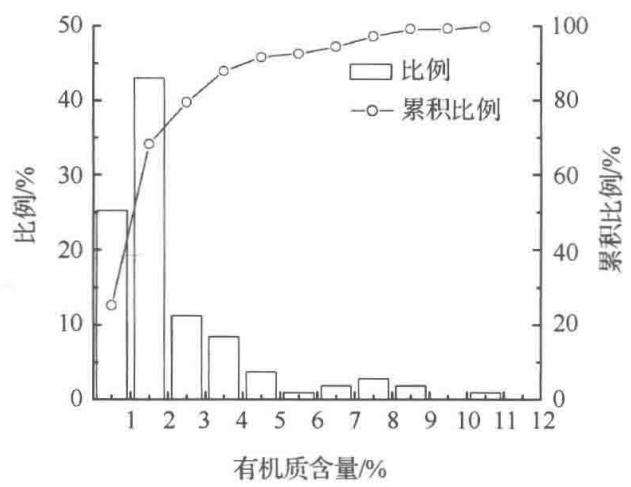

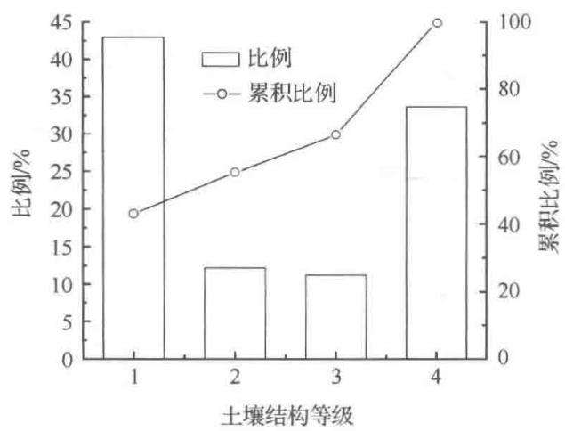

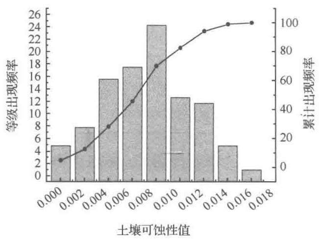

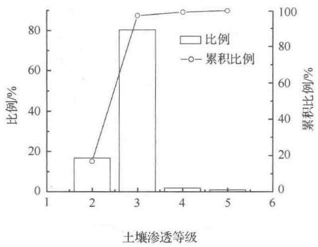  
图5-1黄土高原表层土壤有机质、土壤结构等级、土壤可蚀性值和土壤渗透等级的分布图

表5-12 黄土高原各土种表层土壤可蚀性因子K值
<table><tr><td>土类</td><td>亚类</td><td>土属</td><td>土种</td><td>有机质 1%</td><td>土壤结 构等级</td><td>土壤渗 透等级</td><td colspan="2"> $K \langle \vert \overleftrightarrow { \mathbb { H } } / [ \mathrm { t } \cdot \mathrm { h m } ^ { 2 } \cdot \mathrm { h }$   $/ ( \mathrm { h m ^ { 2 } \cdot M J \cdot m m } ) ]$ </td></tr><tr><td></td><td></td><td></td><td></td><td></td><td></td><td></td><td>估算值</td><td>订正值</td></tr><tr><td>褐土</td><td>褐土</td><td>褐黄土</td><td>褐黄土</td><td>8.18</td><td>1</td><td>3</td><td>0.0201</td><td>0.0015</td></tr><tr><td>褐土</td><td>褐土</td><td>褐黄土</td><td>黄僵土</td><td>1.39</td><td>3</td><td>3</td><td>0.0570</td><td>0.0122</td></tr><tr><td>褐土</td><td>褐土</td><td>褐红泥土</td><td>褐红土</td><td>1.32</td><td>1</td><td>4</td><td>0.0299</td><td>0.0044</td></tr><tr><td>褐土</td><td>石灰性褐土</td><td>火褐泥土</td><td>麻褐红土</td><td>3.08</td><td>3</td><td>3</td><td>0.0403</td><td>0.0074</td></tr><tr><td>褐土</td><td>石灰性褐土</td><td>火褐泥土</td><td>红鸡粪土</td><td>1.90</td><td>1</td><td>3</td><td>0.0231</td><td>0.0024</td></tr><tr><td>褐土</td><td>石灰性褐土</td><td>火褐黄土</td><td>麻褐黄土</td><td>4.34</td><td>1</td><td>3</td><td>0.0278</td><td>0.0038</td></tr><tr><td>褐土</td><td>石灰性褐土</td><td>火褐黄土</td><td>羊脑髓土</td><td>1.20</td><td>4</td><td>3</td><td>0.0530</td><td>0.0111</td></tr><tr><td>褐土</td><td>石灰性褐土</td><td>火褐砂土</td><td>褐砂土</td><td>1.05</td><td>1</td><td>2</td><td>0.0147</td><td>0.0000</td></tr><tr><td>褐土</td><td>石灰性褐土</td><td>火褐黄土</td><td>固阳褐黄土</td><td>1.21</td><td>1</td><td>2</td><td>0.0356</td><td>0.0060</td></tr><tr><td>褐土</td><td>淋溶褐土</td><td>老褐砂土</td><td>砂黑泡土</td><td>1.16</td><td>1</td><td>3</td><td>0.0375</td><td>0.0066</td></tr><tr><td>褐土</td><td>淋溶褐土</td><td>老褐黄土</td><td>黑黄土</td><td>1.31</td><td>1</td><td>3</td><td>0.0461</td><td>0.0091</td></tr><tr><td>褐土</td><td>淋溶褐土</td><td>老褐黄土</td><td>黑泡土</td><td>3.75</td><td>1</td><td>3</td><td>0.0251</td><td>0.0030</td></tr><tr><td>褐土</td><td>褐土性土</td><td>幼褐砂土</td><td>青石碴土</td><td>4.50</td><td>2</td><td>3</td><td>0.0234</td><td>0.0025</td></tr><tr><td>灰褐土</td><td>石灰性灰褐土</td><td>火灰褐泥土</td><td>麻灰黑土</td><td>3.15</td><td>1</td><td>3</td><td>0.0322</td><td>0.0050</td></tr><tr><td>灰褐土</td><td>石灰性灰褐土</td><td>火灰褐黄土</td><td>墡灰黑土</td><td>3.87</td><td>1</td><td>3</td><td>0.0281</td><td>0.0038</td></tr><tr><td>灰褐土</td><td>石灰性灰褐土</td><td>火灰褐泥土</td><td>砾灰黑土</td><td>6.33</td><td>1</td><td>3</td><td>0.0171</td><td>0.0007</td></tr><tr><td>黑土</td><td>黑土</td><td>黄黑土</td><td>岷县大黑土</td><td>6.35</td><td>2</td><td>3</td><td>0.0266</td><td>0.0034</td></tr><tr><td>黑土</td><td>黑土</td><td>黄黑土</td><td>破皮大黑土</td><td>2.92</td><td>1</td><td>3</td><td>0.0282</td><td>0.0039</td></tr><tr><td>黑土</td><td>黑土</td><td>黄黑土</td><td>大黑土</td><td>10.95</td><td>1</td><td>3</td><td>0.0008</td><td>0.0052</td></tr><tr><td>黑土</td><td>草甸黑土</td><td>锈黄黑土</td><td>锈黑土</td><td>5.17</td><td>2</td><td>3</td><td>0.0327</td><td>0.0088</td></tr><tr><td>黑钙土</td><td>黑钙土</td><td>黑黄土</td><td>坪台黑油土</td><td>3.55</td><td>2</td><td>3</td><td>0.0452</td><td>0.0054</td></tr><tr><td>黑钙土</td><td>黑钙土</td><td>黑黄土</td><td>破皮黑油土</td><td>4.33</td><td>2</td><td>3</td><td>0.0336</td><td>0.0028</td></tr><tr><td>黑钙土</td><td>黑钙土</td><td>黑黄土</td><td>黑油土</td><td>7.10</td><td>2</td><td>3</td><td>0.0244</td><td>0.0047</td></tr><tr><td>黑钙土</td><td>黑钙土</td><td>火黑黄土</td><td>天祝破皮黑土</td><td>2.88</td><td>2</td><td>3</td><td>0.0312</td><td>0.0055</td></tr><tr><td>黑钙土</td><td>黑钙土</td><td>火黑黄土</td><td>川台油黑土</td><td>2.41</td><td>2</td><td>3</td><td>0.0338</td><td>0.0002</td></tr><tr><td>黑钙土</td><td>黑钙土</td><td>火黑黄土</td><td>天祝黑土</td><td>7.31</td><td>1</td><td>3</td><td>0.0156</td><td>0.0065</td></tr><tr><td>黑钙土</td><td>黑钙土</td><td>暗栗黄土</td><td>破皮暗栗土</td><td>2.28</td><td>1</td><td>3</td><td>0.0373</td><td>0.0079</td></tr><tr><td>黑钙土</td><td>黑钙土</td><td>暗栗黄土</td><td>天祝暗栗土</td><td>4.61</td><td>4</td><td>3</td><td>0.0419</td><td>0.0155</td></tr><tr><td>黑钙土</td><td>黑钙土</td><td>暗栗砂黄土</td><td>砂田暗栗土</td><td>1.81</td><td>4</td><td>3</td><td>0.0682</td><td>0.0105</td></tr><tr><td rowspan="2">土类</td><td rowspan="2">亚类</td><td rowspan="2">土属</td><td rowspan="2">土种</td><td rowspan="2">有机质 土壤结 土壤渗 1%</td><td rowspan="2"></td><td rowspan="2">构等级 透等级</td><td colspan="2">K值/[t· hm²· h /(hm²·MJ·mm)</td></tr><tr><td>估算值</td><td>订正值</td></tr><tr><td>黑钙土</td><td>黑钙土</td><td>栗黄土</td><td>永登栗土</td><td>1.95</td><td>4</td><td>3</td><td>0.0511</td><td>0.0082</td></tr><tr><td>黑钙土</td><td>黑钙土</td><td>栗黄土</td><td>破皮栗土</td><td>2.40</td><td>1</td><td>3</td><td>0.0430</td><td>0.0068</td></tr><tr><td>黑钙土</td><td>黑钙土</td><td>栗黄土</td><td>南裕栗土</td><td>3.58</td><td>1</td><td>3</td><td>0.0382</td><td>0.0130</td></tr><tr><td>黑钙土</td><td>黑钙土</td><td>淡栗黄土</td><td>淡栗土</td><td>1.26</td><td>4</td><td>3</td><td>0.0598</td><td>0.0095</td></tr><tr><td>黑钙土</td><td>黑钙土</td><td>淡栗黄土</td><td>民乐淡栗土</td><td>2.37</td><td>3</td><td>3</td><td>0.0477</td><td>0.0147</td></tr><tr><td>黑钙土</td><td>黑钙土</td><td>淡栗黄土</td><td>砂田淡栗土</td><td>1.96</td><td>4</td><td>3</td><td>0.0654</td><td>0.0060</td></tr><tr><td>黑钙土</td><td>黑钙土</td><td>淡栗砂土</td><td>坡砂石土</td><td>0.40</td><td>1</td><td>3</td><td>0.0356</td><td>0.0052</td></tr><tr><td>黑钙土</td><td>黑钙土</td><td>淡栗砂土</td><td>中沙硬砂土</td><td>0.45</td><td>1</td><td>2</td><td>0.0029</td><td>0.0070</td></tr><tr><td>栗钙土</td><td>草甸栗钙土</td><td>锈栗黄土</td><td>锈栗土</td><td>2.69</td><td>1</td><td>3</td><td>0.0327</td><td>0.0070</td></tr><tr><td>栗钙土</td><td>草甸栗钙土</td><td>淡栗褐黄土</td><td>淡栗黄土</td><td>0.91</td><td>1</td><td>3</td><td>0.0391</td><td>0.0009</td></tr><tr><td>栗钙土</td><td>草甸栗钙土</td><td>淡栗褐黄土</td><td>淡栗黄土</td><td>1.06</td><td>4</td><td>4</td><td>0.0388</td><td>0.0138</td></tr><tr><td>栗褐土</td><td>潮栗褐土</td><td>潮栗褐泥砂土</td><td>砂河黄土</td><td>1.51</td><td>1</td><td>2</td><td>0.0180</td><td>0.0119</td></tr><tr><td>栗褐土</td><td>潮栗褐土</td><td>绵垆土</td><td>孟原黑垆土</td><td>1.18</td><td>4</td><td>3</td><td>0.0623</td><td>0.0105</td></tr><tr><td>黑垆土</td><td>黑麻土</td><td>麻垆土</td><td>剥皮麻土</td><td>1.21</td><td>4</td><td>3</td><td>0.0557</td><td>0.0103</td></tr><tr><td>黑垆土</td><td>黑麻土</td><td>麻垆土</td><td>山地麻土</td><td>1.43</td><td>3</td><td>3</td><td>0.0512</td><td>0.0131</td></tr><tr><td>黑垆土</td><td>黑麻土</td><td>麻垆土</td><td>旱川台麻土</td><td>1.96</td><td>3</td><td>3</td><td>0.0503</td><td>0.0147</td></tr><tr><td>黑垆土</td><td>黑麻土</td><td>麻垆土</td><td>黄麻土</td><td>1.28</td><td>4</td><td>3</td><td>0.0601</td><td>0.0065</td></tr><tr><td>黑垆土</td><td>黑麻土</td><td>灰钙黄土</td><td>灰白土</td><td>1.62</td><td>4</td><td>3</td><td>0.0656</td><td>0.0109</td></tr><tr><td>黑垆土</td><td>黑麻土</td><td>灰钙黄土</td><td>海源黄白土</td><td>3.23</td><td>3</td><td>3</td><td>0.0374</td><td>0.0121</td></tr><tr><td>黑垆土</td><td>黑麻土</td><td>灰钙泥砂土</td><td>黄白泥土</td><td>0.80</td><td>3</td><td>3</td><td>0.0525</td><td>0.0084</td></tr><tr><td>黑垆土</td><td>黑麻土</td><td>淡灰钙黄土</td><td>同心白脑土</td><td>0.83</td><td>4</td><td>3</td><td>0.0564</td><td>0.0045</td></tr><tr><td>黑垆土</td><td>黑麻土</td><td>淡灰钙泥砂土</td><td>白脑砂土</td><td>0.51</td><td>4</td><td>2</td><td>0.0438</td><td>0.0067</td></tr><tr><td>黑垆土</td><td>黑麻土</td><td>淡灰钙泥砂土</td><td>白脑泥土</td><td>0.56</td><td>4</td><td>2</td><td>0.0303</td><td>0.0099</td></tr><tr><td>灰钙土</td><td>盐化灰钙土</td><td>氯化物灰钙泥砂土</td><td>白脑土</td><td>0.40</td><td>4</td><td>2</td><td>0.0381</td><td>0.0083</td></tr><tr><td>灰钙土</td><td>盐化灰钙土</td><td>氯化物灰钙泥砂土</td><td>咸性土</td><td>1.03</td><td>4</td><td>2</td><td>0.0488</td><td>0.0129</td></tr><tr><td>灰钙土</td><td>盐化灰钙土</td><td>硫酸盐灰钙泥砂土</td><td>咸石土</td><td>0.55</td><td>4</td><td>2</td><td>0.0433</td><td>0.0101</td></tr><tr><td>灰钙土</td><td>盐化灰钙土</td><td>氯化物灰钙红土</td><td>咸红黏土</td><td>0.79</td><td>4</td><td>3</td><td>0.0594</td><td>0.0156</td></tr><tr><td>灰漠土</td><td>盐化灰漠土</td><td>硫酸盐灰漠泥砂土</td><td>盐漠钙土</td><td>1.03</td><td>4</td><td>3</td><td>0.0495</td><td>0.0099</td></tr><tr><td>灰漠土</td><td>盐化灰漠土</td><td>硫酸盐灰漠泥砂土</td><td>中盐漠钙土</td><td>0.47</td><td>4</td><td>3</td><td>0.0685</td><td>0.0056</td></tr><tr><td>灰漠土</td><td>灌耕灰漠土</td><td>灌灰漠泥砂土</td><td>浊棕土</td><td>0.73</td><td>4</td><td>3</td><td>0.0488</td><td>0.0085</td></tr><tr><td>黄绵土</td><td>黄绵土</td><td>黄墡土</td><td>灰墡土</td><td>2.88</td><td>1</td><td>3</td><td>0.0341</td><td>0.0085</td></tr><tr><td rowspan="2">土类</td><td rowspan="2">亚类</td><td rowspan="2">土属</td><td rowspan="2">土种</td><td rowspan="2">有机质 1%</td><td rowspan="2">土壤结土壤渗 构等级</td><td rowspan="2">透等级</td><td colspan="2">K值/[t·hm²·h /(hm²·MJ·mm)]</td></tr><tr><td colspan="2">估算值 订正值</td></tr><tr><td>黄绵土</td><td>黄绵土</td><td>黄缮土</td><td>梯黄缮土</td><td>1.24</td><td>2</td><td>3</td><td>0.0443</td><td>0.0091</td></tr><tr><td>黄绵土</td><td>黄绵土</td><td>黄墡土</td><td>坡黄缮土</td><td>0.82</td><td>1</td><td>3</td><td>0.0443</td><td>0.0108</td></tr><tr><td>黄绵土</td><td>黄绵土</td><td>黄缮土</td><td>夹胶黄墡土</td><td>0.53</td><td>2</td><td>3</td><td>0.0461</td><td>0.0108</td></tr><tr><td>黄绵土</td><td>黄绵土</td><td>绵土</td><td>傻白土</td><td>1.22</td><td>1</td><td>3</td><td>0.0520</td><td>0.0081</td></tr><tr><td>黄绵土</td><td>黄绵土</td><td>绵土</td><td>崇信坡绵土</td><td>1.20</td><td>1</td><td>3</td><td>0.0521</td><td>0.0108</td></tr><tr><td>黄绵土</td><td>黄绵土</td><td>绵土</td><td>灰粗绵土</td><td>1.71</td><td>2</td><td>3</td><td>0.0426</td><td>0.0132</td></tr><tr><td>黄绵土</td><td>黄绵土</td><td>绵土</td><td>梯绵黄土</td><td>1.00</td><td>1</td><td>3</td><td>0.0522</td><td>0.0099</td></tr><tr><td>黄绵土</td><td>黄绵土</td><td>绵土</td><td>灌绵土</td><td>0.90</td><td>3</td><td>3</td><td>0.0602</td><td>0.0092</td></tr><tr><td>黄绵土</td><td>黄绵土</td><td>绵土</td><td>灵台灰绵土</td><td>1.18</td><td>1</td><td>3</td><td>0.0491</td><td>0.0145</td></tr><tr><td>黄绵土</td><td>黄绵土</td><td>绵土</td><td>淤绵土</td><td>1.06</td><td>2</td><td>3</td><td>0.0466</td><td>0.0123</td></tr><tr><td>黄绵土</td><td>黄绵土</td><td>绵土</td><td>盐绵土</td><td>0.71</td><td>4</td><td>3</td><td>0.0649</td><td>0.0129</td></tr><tr><td>黄绵土</td><td>黄绵土</td><td>绵土</td><td>缃黄土</td><td>0.83</td><td>4</td><td>3</td><td>0.0574</td><td>0.0075</td></tr><tr><td>黄绵土</td><td>黄绵土</td><td>绵土</td><td>老牙村淤绵土</td><td>0.70</td><td>4</td><td>3</td><td>0.0593</td><td>0.0048</td></tr><tr><td>红黏土</td><td>积钙红黏土</td><td>火红土</td><td>西华红黏土</td><td>1.22</td><td>1</td><td>3</td><td>0.0408</td><td>0.0076</td></tr><tr><td>红黏土</td><td>积钙红黏土</td><td>火红土</td><td>东乡红黏土</td><td>1.35</td><td>1</td><td>5</td><td>0.0313</td><td>0.0044</td></tr><tr><td>红黏土</td><td>积钙红黏土</td><td>火红土</td><td>中红结土</td><td>0.71</td><td>4</td><td>3</td><td>0.0411</td><td>0.0076</td></tr><tr><td>新积土</td><td>新积土</td><td>山洪土</td><td>砂砾淤淀土</td><td>0.88</td><td>1</td><td>2</td><td>0.0301</td><td>0.0085</td></tr><tr><td>新积土</td><td>新积土</td><td>山洪土</td><td>夹黏阴黑土</td><td>2.30</td><td>2</td><td>3</td><td>0.0411</td><td>0.0105</td></tr><tr><td>新积土</td><td>新积土</td><td>山洪土</td><td>厚阴黑土</td><td>3.24</td><td>4</td><td>3</td><td>0.0440</td><td>0.0085</td></tr><tr><td>新积土</td><td>新积土</td><td>山洪土</td><td>厚洪淤土</td><td>0.94</td><td>1</td><td>3</td><td>0.0512</td><td>0.0066</td></tr><tr><td>新积土</td><td>冲积土</td><td>新滩土</td><td>淀淤黄土</td><td>1.34</td><td>1</td><td>3</td><td>0.0443</td><td>0.0051</td></tr><tr><td>风沙土</td><td>草原风沙土</td><td>草原半固沙土</td><td>浮沙土</td><td>0.28</td><td>1</td><td>2</td><td>0.0376</td><td>0.0098</td></tr><tr><td>风沙土</td><td>草原风沙土</td><td>草原半固沙土</td><td>哈巴湖浮沙土</td><td>0.27</td><td>1</td><td>2</td><td>0.0323</td><td>0.0059</td></tr><tr><td>风沙土</td><td>草原风沙土</td><td>潮壤土</td><td>黏心黄沫土</td><td>1.62</td><td>1</td><td>3</td><td>0.0486</td><td>0.0070</td></tr><tr><td>潮土</td><td>脱潮土</td><td>脱潮壤土</td><td>脱潮壤土</td><td>0.93</td><td>4</td><td>2</td><td>0.0351</td><td>0.0071</td></tr><tr><td>潮土</td><td>脱潮土</td><td>脱潮砂土</td><td>岗沫土</td><td>0.55</td><td>1</td><td>2</td><td>0.0388</td><td>0.0115</td></tr><tr><td>潮土</td><td>脱潮土</td><td>苏打潮砂土</td><td>马尿潮砂泥土</td><td>0.33</td><td>4</td><td>2</td><td>0.0392</td><td>0.0091</td></tr><tr><td>潮土</td><td>脱潮土</td><td>硫酸盐潮壤土</td><td>白咸潮泥土</td><td>1.30</td><td>1</td><td>3</td><td>0.0546</td><td>0.0065</td></tr><tr><td>潮土</td><td>盐化潮土</td><td>硫酸盐氯化物潮土</td><td>塔桥盐锈土</td><td>2.09</td><td>4</td><td>3</td><td>0.0462</td><td>0.0132</td></tr><tr><td>潮土</td><td>碱化潮土</td><td>淤潮黏土</td><td>淤红泥</td><td>1.13</td><td>4</td><td>3</td><td>0.0371</td><td>0.0052</td></tr><tr><td>潮土</td><td>碱化潮土</td><td>硫酸盐甸盐土</td><td>白霜咸土</td><td>1.09</td><td>4</td><td>3</td><td>0.0602</td><td>0.0088</td></tr><tr><td rowspan="2">土类</td><td rowspan="2">亚类</td><td rowspan="2">土属</td><td rowspan="2">土种</td><td rowspan="2">有机质 1%</td><td rowspan="2">土壤结 构等级</td><td rowspan="2">土壤渗 透等级</td><td colspan="2">K值/[t· hm² ·h /(hm²·MJ·mm)]</td></tr><tr><td>估算值</td><td>订正值</td></tr><tr><td>潮土</td><td>碱化潮土</td><td>苏打甸盐土</td><td>黑马尿咸土</td><td>1.55</td><td>4</td><td>2</td><td>0.0327</td><td>0.0116</td></tr><tr><td>盐土</td><td>碱化盐土</td><td>镁质碱盐土</td><td>镁质碱盐泥</td><td>2.57</td><td>3</td><td>3</td><td>0.0453</td><td>0.0120</td></tr><tr><td>漠境盐土</td><td>残余盐土</td><td>氯化物残盐土</td><td>同心干盐泥</td><td>0.85</td><td>4</td><td>3</td><td>0.0549</td><td>0.0091</td></tr><tr><td>灌淤土</td><td>灌淤土</td><td>淤壤土</td><td>淀红土</td><td>1.13</td><td>4</td><td>3</td><td>0.0563</td><td>0.0126</td></tr><tr><td>灌淤土</td><td>灌淤土</td><td>淤壤土</td><td>淀黄土</td><td>1.60</td><td>4</td><td>3</td><td>0.0462</td><td>0.0087</td></tr><tr><td>灌淤土</td><td>灌淤土</td><td>淤壤土</td><td>底砂厚淤土</td><td>1.14</td><td>3</td><td>3</td><td>0.0583</td><td>0.0097</td></tr><tr><td>灌淤土</td><td>灌淤土</td><td>淤壤土</td><td>薄吃劲土</td><td>1.39</td><td>1</td><td>3</td><td>0.0449</td><td>0.0096</td></tr><tr><td>灌淤土</td><td>灌淤土</td><td>游黏土</td><td>厚吃劲土</td><td>1.73</td><td>3</td><td>3</td><td>0.0484</td><td>0.0160</td></tr><tr><td>灌淤土</td><td>潮灌淤土</td><td>潮淤壤土</td><td>厚潮淤土</td><td>1.34</td><td>1</td><td>3</td><td>0.0478</td><td>0.0093</td></tr><tr><td>灌淤土</td><td>潮灌淤土</td><td>潮淤壤土</td><td>潮淤土</td><td>1.14</td><td>3</td><td>3</td><td>0.0701</td><td>0.0048</td></tr><tr><td>灌淤土</td><td>盐化灌淤土</td><td>表锈淤壤土</td><td>薄卧土</td><td>1.48</td><td>4</td><td>3</td><td>0.0469</td><td>0.0003</td></tr><tr><td>棕壤</td><td>棕壤</td><td>棕砂土</td><td>棕黄砂土</td><td>2.66</td><td>1</td><td>2</td><td>0.0314</td><td>0.0096</td></tr><tr><td>棕壤</td><td>棕壤</td><td>棕麻土</td><td>棕石碴土</td><td>7.17</td><td>1</td><td>3</td><td>0.0160</td><td>0.0050</td></tr><tr><td>棕壤</td><td>棕壤</td><td>棕黄土</td><td>黄僵泥土</td><td>1.59</td><td>1</td><td>3</td><td>0.0478</td><td>0.0015</td></tr><tr><td>棕壤</td><td>棕壤</td><td>棕黄土</td><td>文县棕黄土</td><td>3.60</td><td>1</td><td>3</td><td>0.0321</td><td>0.0122</td></tr><tr><td>棕壤</td><td>棕壤性土</td><td>幼棕砂土</td><td>棕黄碴土</td><td>8.11</td><td>1</td><td>2</td><td>0.0013</td><td>0.0044</td></tr></table>

土壤可蚀性值是进行土壤侵蚀预报的关键因子。由于目前通过径流小区观测资料计算的实测值很少，在很多情况下只能选择使用估算值。表5-12给出了黄土高原地区主要土壤类型的可蚀性K值大小。需要说明的是，在给出估算值过程中对公式计算值进行了一次订正。而建立订正公式所用的实测资料主要来源于黄绵土，而未能包含黄土高原地区所有土壤类型的性状特征的全部变化范围。因此，无法对表5-12所有计算值进行验证。但可以根据与侵蚀密切相关的土壤性质的相互比较以及土壤可蚀性值K的大小排序情况来间接地证明表5-12中估算值的可信程度。

虽然黄土高原地区土壤类型较多，但根据分布面积大小，主要类型只有黄绵土、褐土、灰钙土、黑垆土、棕壤、栗钙土和灰褐土，上述土壤类型的分布面积要占90%以上。根据表5-12中的计算结果，如果黄土高原地区主要侵蚀性土壤的可蚀性值按土类计算平均值，黄绵土可蚀性值平均为0.0103(0.075～0.0145)，褐土可蚀性值平均为0.0054(0.0015\~0.0122)，灰钙土为0.0094(0.0086\~0.0156)，黑垆土为0.0103(0.0045\~0.0147)，棕壤为0.0049(0.0015\~0.0122)，栗钙土为0.0064(0.0009\~0.0138)，灰褐土为0.0032(0.0007\~0.005)。根据黄土高原地区实测土壤可蚀性值大小，以及土壤性质差异，上述土壤可蚀性值按土类平均值基本上反映了黄土高原土壤的基本情况，可以推荐选择使用。表5-12中列出了黄土高原地区不同土壤类型的可蚀性K值。在实际使用时，选择土壤类型所对应的订正值一列的数值。由于受订正时已搜集资料的限制，有些土种的可蚀性值出现0或负值，这时，建议采用该同类的可蚀性平均值。

## 六、土壤可蚀性K估算值精度分析

侵蚀预报模型是进行水土保持规划及水土保持措施效益评价的重要工具。有了可信的侵蚀预报模型，就可以通过输入已知的其他侵蚀影响因子值来筛选水土保持措施，并对其进行有效的配置。美国通用流失方程是根据土壤侵蚀基本原理建立的地块土壤流失量估算模型，主要解决已知坡面土壤、地形、降雨和土地利用条件下土壤流失量的估算问题。基于美国通用流失方程的基本思想，黄土高原土壤侵蚀模型的基本原理也是基于小区观测资料分析的土壤流失规律，也属于地块模型。只要根据模型中规定的参数赋值，估算的土壤流失量接近小区实测值，就可以推广使用。为此，我们选择黄土高原地区的裸露小区观测资料，对使用估算的土壤可蚀性K值计算的土壤流失量进行了验证。

## (一)资料选取及说明

黄土高原地区是我国水土流失观测和研究最为深入的地区。自20世纪50年代开始，水利部、中国科学院以及地方相关院所，先后建立了多处水土流失野外观测站。在这些野外站点中，以水利部设立的绥德、西峰、天水和子洲水土保持观测站，中国科学院水土保持研究所设立的安塞水土保持观测站，山西水土保持研究所设立的离石水土保持观测站和内蒙古水利厅设立的皇甫川水土保持观测站最有影响，资料积累也最为丰富。由于在早期的水土保持监测中还没有体现侵蚀预报的理念，在小区布设时往往更注重考虑地形因子和水土保持因子，而且，农地小区占有很大比例。在农作物处理上逐年变化的情况很普遍。因此，有些早期的小区实测资料用于进行侵蚀预报方程因子计算时存在很多麻烦。通过比较分析和资料系列长短的要求，中国科学院水土保持研究所设立的安塞水土保持观测站和内蒙古水利厅设立的皇甫川水土保持观测站小区实测资料完全符合侵蚀预报模型的要求。水利部设立的绥德、子洲水土保持观测站和山西水土保持研究所设立的离石水土保持观测站小区观测资料，在经过相应的订正后也可以使用。而天水和西峰水土保持观测站的小区资料很少适合侵蚀预报模型要求。为了与土壤可蚀性值计算中所用资料一致，我们仍然选用皇甫川、子洲、绥德、安塞和离石水土保持观测站的资料对模型的估算结果进行验证。

为了减少因子订正过程中带来的误差，选择黄土高原坡耕地中间坡度 $1 5 ^ { \circ }$ 裸露坡面作为验证地块。以上各点降雨侵蚀力指标R值，用第四章中建立的降雨侵蚀力与多年平均年降雨量经验关系计算。对于土壤可蚀性K值的计算，首先根据土壤性质指标，包括有机质含量、粒径组成、土壤结构等级和渗透等级等，用美国通用流失方程中K估算公式计算一个值，再根据我们建立的订正公式予以订正，得到黄土高原各土壤类型的实用土壤可蚀性值。将土壤可蚀性K与先期计算的降雨侵蚀力R相乘，计算出标准小区坡面土壤流失量值。再乘以坡度系数 $( 1 5 ^ { \circ }$ 时为4.15)就得到 $1 5 ^ { \circ }$ 坡面多年平均土壤流失量。即应用我们构建的侵蚀预报模型，使用气象站雨量观测资料，土壤性状指标值和地形等指标，就可以计算出相应坡面的多年平均土壤流失量。

用于验证的土壤流失量实测值，我们主要选择引用了黄土高原地区最具代表性的学者发表或出版的论文或著作。皇甫川站资料引用金正平1992年出版的《黄河皇甫川流域土壤侵蚀系统模型和治理模式》。由于书中未列出土壤流失量原始数据，根据书中实测的土壤可蚀性K值和多年平均降雨侵蚀力R值乘积作为实测值。子洲站引用陈永宗《黄土高原现代侵蚀与治理》一书表6-24中梁昴坡上部细沟侵蚀带土壤流失量实测值。绥德站引用唐克丽《黄土高原地区土壤侵蚀区域特征及其治理途径》一书中韭园沟流域梁昴坡地土壤流失量实测值。安塞站引用江忠善1985～1989年15°小区土壤流失量实测值。离石站引用龚时旸和蒋德麒1978年发表于《中国科学》上《黄河中游黄土丘陵沟壑区沟道小流域的水土流失及治理》一文中沟间地土壤流失量实测值。

## (二）估算结果精度分析

根据所选站点的土壤性质资料，确定模型需要的土壤参数有机质含量、极细砂和粉粒含量、砂粒含量，以及土壤结构等级和渗透等级等参数，计算出各个站点的土壤可蚀性指标值。利用气象台站的降雨记录，计算多年平均降雨量，再计算出降雨侵蚀力指标值，得到各站点坡面农耕地土壤流失量估算值如表5-13所示。与整理的相应实测值比较，除了安塞站估算值相对偏大以外，其他各站的估算值都可以接受。为了弄清安塞站估算值偏大的原因，对实测数据进一步分析发现，在所观测的五年间，1985年侵蚀模数为3706t/$\mathrm { k m } ^ { 2 }$ ，1986年只有1153t/km²，1987年为 $2 8 6 2 \mathrm { t / k m ^ { 2 } }$ 。而1988年和1989年分别为21234t/km²和$9 5 2 1 \mathrm { { t } / \mathrm { { k m } ^ { 2 } } }$ 。正是由于1985～1986年3年相对枯水年较小的土壤侵蚀，使得多年年均侵蚀模数只有 $7 7 1 6 \mathrm { t / k m ^ { 2 } }$ 。如果观测年限相对较长，估算值可能会更接近实测值。

表5-13 使用K估算值计算的土壤流失量与小区实测值比较
<table><tr><td rowspan="2">位置</td><td rowspan="2"> $K _ { \mathrm { n o m o } }$   $/ [ \cdot \cdot \ \mathrm { h m ^ { 2 } \cdot h }$   $/ ( \mathrm { h m ^ { 2 } \cdot M J \cdot m m } ) ]$ </td><td rowspan="2">K订正值  $/ [ \cdot \cdot ]  { \mathrm { h m ^ { 2 } \cdot h } }$   $/ ( \mathrm { h m ^ { 2 } \cdot M J \cdot m m } ) ]$ </td><td rowspan="2">R年雨量  $/ [ \mathbf { M } ] \cdot \mathbf { m } \mathbf { m }$   $/ ( \mathrm { h m ^ { 2 } \cdot h \cdot a } ) ]$ </td><td rowspan="2">估算侵蚀量  $/ ( { \mathrm { t } } / { \mathrm { k m } ^ { 2 } } )$ </td><td colspan="2">实际侵蚀量  $/ ( t / \mathrm { k m } ^ { 2 } )$ </td></tr><tr><td>实测值</td><td>地形部位及学者</td></tr><tr><td>皇甫川</td><td>0.0610</td><td>0.0134</td><td>1279.1</td><td>7113.1</td><td>8813</td><td>坡面(金争平)</td></tr><tr><td>子洲</td><td>0.0884</td><td>0.0213</td><td>1288.8</td><td>11392.3</td><td>12903</td><td>梁昴坡上部(陈永宗)</td></tr><tr><td>绥德</td><td>0.0803</td><td>0.0190</td><td>1481.7</td><td>11683.2</td><td>12420</td><td>梁昴坡地(唐克丽)</td></tr><tr><td>安塞</td><td>0.0685</td><td>0.0156</td><td>1713.5</td><td>11093.2</td><td>7716</td><td>15°坡面(江忠善)</td></tr><tr><td>离石</td><td>0.0661</td><td>0.0149</td><td>1648.1</td><td>10191</td><td>10900</td><td>沟间地坡面(龚时旸)</td></tr></table>

注：表中估算侵蚀量值是15°坡面裸露坡耕地多年平均侵蚀模数。

关于坡面土壤侵蚀量的确定，尽管都是以小区实测资料为准，但在具体计算坡面侵蚀量时，不同学者的计算结果可能存在一定的差异。因此，在表5-13中实际侵蚀量选择时，尽可能选择了大家普遍接受的学者的代表性著作来参考。由于选择了15坡面作为验证坡面，在实测值选定时，尽可能选择坡面中上部的土壤流失量。

## (三)模型评价及应用

黄土高原土壤侵蚀模型属经验模型，主要用于农耕地多年平均土壤流失量的估算。模型的主要功能是指导农作生产和进行水土保持措施筛选，不能简单地用作区域泥沙平衡计算。如果要应用于小流域或区域尺度土壤侵蚀预报，必须结合遥感GIS技术。通过地块合理分割，提取模型所需参数。

在模型构架中，土壤可蚀性因子值的合理与否对估算精度影响很大。黄土高原侵蚀预报模型中的土壤可蚀性值计算主要借鉴了美国通用流失方程的方法，但用根据实测资料建立的订正公式进行了必要的订正。模型估算值与实测值的对照表明，本次建立的土壤可蚀性估算方法可以用于黄土高原侵蚀预报模型中的土壤可蚀性值计算。由于用于模型验证的站点主要集中在黄绵土分布区域，其他土类的可蚀性值因没有实测资料验证，尽管模型中给出了不同土种的土壤可蚀性值，建议在模型影响使用时尽量采用该土类可蚀性的平均值。

由于黄土高原土壤侵蚀预报模型属经验模型，其使用范围仅限于黄土高原地区。其他地区可以借鉴，但土壤可蚀性值和作物覆盖因子等值必须重新确定。在有土壤可蚀性值和作物覆盖因子实测值时，也可以在其他地区推广使用。另外，根据模型构成及要求，尽管模型中每个因子单独计算并赋值，但因子确定方法必须匹配。所有因子计算关系的确定必须以标准小区为基准，标准小区的规范必须统一。

## 七、存在问题及未来发展

黄土高原地区是我国土壤侵蚀最为严重的地区，也是相关研究最为深入的区域。经过黄河水利委员会、中国科学院以及有关大专院校的不懈努力，积累了丰富的研究成果，为开展土壤侵蚀预报研究奠定了良好基础。确定土壤可蚀性值大小是进行土壤侵蚀预报的基础，对土壤可蚀性值计算的准确与否直接关系到土壤流失量预报的精度。受财力和物力的限制，虽然在黄土高原地区已经积累了丰富的观测资料，但由于各地自然条件及土壤特性差异很大，能用于土壤可蚀性研究和估算的小区实测资料仍然不足。如何有效地把已有的实测资料用于土壤侵蚀预报，是今后需要深入探讨的课题。为了完善土壤侵蚀预报模型，提高模型预报精度，还需要开展以下几方面工作。

第一，加强不同土壤类型可蚀性值的实测值的观测和计算。通过建立标准小区，观测计算一组土壤可蚀性值实测值。在条件允许的情况下，在不同土壤类型上，根据规定的标准条件，布设一系列统一规范的标准小区，确定一部分土壤的可蚀性指标实测值。

第二，通过研究微型小区与标准小区之间的关系，确定利用人工模拟降雨试验观测土壤可蚀性值的最小面积。用微型小区人工降雨实验，测定我国主要土类的可蚀性。如果微型小区与标准小区之间的相关性不好，再考虑用标准小区人工降雨试验测定与标准小区实测值进行比较。如果标准小区人工降雨试验还不够理想，就只用天然降雨测定。总之，在天然标准小区、天然微型小区、人工降雨标准小区、人工降雨微型小区4种方法中率定和优选其中之一，然后测定土壤可蚀性值。

第三，用通过观测或模拟降雨试验得到的土壤可蚀性值，测定相应土壤的基本理化性质指标，寻求土壤理化性质与可蚀性值之间的关系，建立实用的数学模型，以推求所有需要的土壤可蚀性值，为土壤侵蚀预报服务。

第四，由于受财力和人力的限制，无法大规模布设天然小区来研究各种土壤的可蚀性值大小。需要开展人工降雨试验研究，以弥补无天然观测小区资料地区的应用需要。由于人工模拟降雨机设计的侧重点不同，其性能会有很大的差异。选择什么样的模拟降雨机研究土壤可蚀性，也是目前亟待解决的问题。对于这个问题，其总体原则应该是，选择同一种适用于我国陡坡条件的降雨模拟机，在同样的试验设计条件下，对不同土壤类型的土壤可蚀性进行统一试验，通过建立与天然小区观测资料之间的关系，计算真正的土壤可蚀性值。

## 参考文献

蔡永明，张科利，李双才.2003.不同粒径制间土壤质地资料的转换问题研究.土壤学报，40(2):9-14

陈永宗，景可，蔡强国.1988.黄土高原现代侵蚀与治理.北京：科学出版社

龚时旸，蒋德麒.1978.黄河中游黄土丘陵沟壑区沟道小流域的水土流失及治理.中国科学，(6):671-678

江忠善，李秀英，1988.黄土高原土壤流失预报方程中降雨侵蚀量和地形因子的研究，见：中国科学院西北水土保持研究所集刊编辑委员会.中国科学院西北水土保持研究所集刊.第7集.西安：陕西科学技术出版社

蒋定生，李新华，范兴科，等.1995.论晋陕蒙接壤地区土壤的抗冲性与水土保持措施体系的配置.水土保持学报，9(1):1-7

金争平，史培军，候福昌，等.1992.黄河黄甫川流域土壤侵蚀系统模型和治理模式.北京：海洋出版社

勒·恩·阿列克桑德洛娃，奥·阿·娜伊坚诺娃.1960.土壤学实验室作业.北京：高等教育出版社

李勇，吴钦孝，朱显谟，等.1990.黄土高原植物根系提高土壤抗冲性能的研究.水土保持学报，4(1)：1-16

刘宝元，张科利，焦菊英.1999.土壤可蚀性及其在侵蚀预报中的应用.自然资源学报，14(4)：345-350

刘建立，徐绍辉，刘慧.2003.几种土壤累积粒径分布模型的对比研究.水科学进展，14(5)：588-592

门明新，赵同科，彭正萍，等.2004.基于土壤粒径分布模型的河北省土壤可蚀性研究.中国农业科学，37(11)：1641-1653

全国土壤普查办公室.1995.中国土种志(第五卷).北京：中国农业出版社

史德明，杨艳生，姚宗虞.1983.土壤侵蚀调查方法中的侵蚀实验研究和侵蚀量测定问题.中国水土保持，6:21-22

唐克丽，陈永宗，景可，等，1990.黄土高原地区土壤侵蚀区域特征及其治理途径.北京：中国科学技术出版社

田积莹，黄义端.1960.子午岭连家砭地区土壤物理性质与土壤抗侵蚀性能指标的初步研究.土壤学报，(2):110-121

张科利，蔡永明，刘宝元，等.2001.黄土高原地区土壤可蚀性及其应用研究.生态学报，21(10)：1687-1695

张科利，刘宝元，蔡永明.2000.土壤侵蚀预报研究中的标准小区问题论证.地理研究，19(3)：297-302

张科利，彭文英，杨红利.2007.中国土壤可蚀性值及其估算.土壤学报，44(1):8-13

张岩，刘宝元，史培军，等.2001.黄土高原土壤侵蚀作物覆盖因子计算.生态学报，21(7):1050-1056

周佩华，武春龙.1993.黄土高原土壤抗冲性的实验研究方法探讨.水土保持学报，7(1)29-34

朱显谟，张相麟，雷文进.1954.泾河流域土壤侵蚀现象及其演变.土壤学报，2(4):209-222

Bennett H H. 1926. Some comparisons of the properties of humid-tropical and humid-temperate American soils, with special reference to indicated relations between chemical composition and physical properties. Soil Science, 21: 349-375

Bouyoucos G J. 1935. The clay ratio as a criterion of susceptibility of soils to erosion. Journal of the American Society of Agronomy, 27:738-741

Liu B Y, Nearing M A, Risse L M. 1994. Slope gradient effects on soil loss for steep slopes. Transactions of ASAE, 37(6),1835-1840

Middletton H E. 1930. Properties of soils which influence erosion. USDA Tech. Bull: 178

Olson T C, Wischmeier W H. 1963. Soil erodibility evaluation for soils on the runoff and erosion stations. Soil Science Scoiety of America Proceedings,27(5):590-592

Shirazi M A, Boersma L. 1984. A unifying quantitative analysis of soil texture. Soil Science Society of America Journal,48:142-147

United States Department of Agriculture. 1990. EPIC-Erosion/Productivity Impact Calculator 1. Model Documentation. Technical BulletinNumber 1768, Washington D C: USDA-ARS

Wischmeier W H, Johson C B, Gross B V. 1971. A soil erodibility nomograph for farmland and construction sites. Journal of Soil and Water Conservation, 26: 189-193

Zhang K, Li S, Peng W, et al. 2004. Erodibility of agricultural soils on the Loess Plateau of China. Soils &. Tillage Research,(76):157-165

## 第六章 地形因子评价

地形对坡面土壤侵蚀的影响可概括为坡度、坡长、坡型和坡向等因素。在以往黄土高原土壤侵蚀研究中，地形因子主要考虑的是坡度和坡长。坡型影响则在将坡面进行分段，再计算坡面侵蚀量时予以考虑。对坡向的影响作用目前研究相对较少。理论上而言，坡度是指坡面与水平投影面的夹角；坡长是指坡面上地表径流起点到泥沙淤积点或沟道之间沿最大坡降方向的水平投影距离(Wischmeier andSmith，1978)。为了消除其他因素的影响作用，在本次评价中，用坡度因子和坡长因子来评价地形对土壤侵蚀的影响作用。坡度因子和坡长因子采用Wischmeier和Smith(1965)所用的定义。即坡度因子是指降雨、土壤、坡长、地表状况等条件一致情况时，某坡度下的坡面土壤侵蚀量与坡度为5.14时的坡面土壤侵蚀量的比值。这个比值是一个无量纲值，其值大小反映了土壤侵蚀量与坡度之间的定量关系。坡长因子是指其他条件一致的情况下，某种坡长的坡面土壤侵蚀量与坡长为22.13m的坡面土壤侵蚀量比值。该比值反映了土壤侵蚀量与坡长的定量关系。需要说明的是，我国黄土高原地区现有小区规格以坡长20m、宽5m的小区为主，但为了数据的通用性和可比性，我们仍采用5.14°和22.13m作为标准化坡度和坡长的参考值。

## 一、土壤侵蚀量与坡度的关系

早在19世纪末期，德国学者Wollny利用径流小区定量研究不同因子对土壤侵蚀的影响时，坡度就被考虑在其中。Zingg(1940)最早定量考虑了坡度对土壤侵蚀的影响。历经百余年探索与实践，土壤侵蚀量与坡度关系的定量研究得以不断完善。国外研究从早期的坡度对土壤侵蚀影响的定量规律探讨到后期的围绕USLE中的坡度因子进行定量评价。国内研究多是进行坡度对土壤侵蚀影响的定量规律评价。下面分述之。

Zingg(1940)首次提出土壤侵蚀量与坡度的1.4次方成正比。即

$$
A \propto ( \alpha ) ^ { 1 . 4 }\tag{6-1}
$$

式中，A为土壤侵蚀量 $( \mathrm { t } / \mathrm { h m } ^ { 2 } ) ; \alpha$ 为坡度(%)。

随后的许多研究者根据天然降雨或人工降雨试验资料，给出了土壤侵蚀量与坡度之间的不同函数关系式。这些公式都能按照坡度因子的定义转换成坡度因子的计算公式。例如,Smith和Whitt(1947)根据Neal(1938)小区(长3.7m，宽1.1m)人工降雨试验资料建立的坡度因子公式为

$$
S = 0 . 0 2 5 + 0 . 0 5 2 \alpha ^ { 4 / 3 }\tag{6-2}
$$

式中，α为坡度(%)。

Musgrave(1947)分析了 Borst 等(1945)、Browning等(1948)、Duley 和Hays(1932)等的数据，提出的坡度因子计算公式为

$$
S = \left( { \frac { \alpha } { 9 } } \right) ^ { 1 . 3 5 }\tag{6-3}
$$

式中， $\alpha$ 为坡度(%)。

Smith和Wischmeier(1957)利用Hays等(1949)的天然降雨小区资料，提出了二次多项式的坡度因子公式：

$$
S = 0 . 0 0 6 5 ( \alpha ) ^ { 2 } + 0 . 0 4 5 4 \bullet \alpha + 0 . 0 6 5 0\tag{6-4}
$$

式中， $\alpha$ 为坡度(%)。

Smith和Wischmeier(1957)进一步利用Zingg(1940)的人工降雨试验资料、Gard 和Van Doren(1949)以及Borst等(1945)的天然降雨观测资料验证了公式(6-4)。此后公式(6-4)被用于USLE第一版(Wishmeier and Smith，1965)。USLE第二版则采用坡度正弦值代替了坡度正切值，仍采用二次多项式的函数形式[公式(6-5)]：

$$
S = 6 5 . 4 1 ( \mathrm { s i n } \theta ) ^ { 2 } + 4 . 5 6 \mathrm { s i n } \theta + 0 . 0 6 5\tag{6-5}
$$

式中， $\theta$ 为坡度 $( ^ { \circ } )$ 。

McCool等(1987)通过对多个地区小区观测资料的分析发现，当坡度发生变化时，土壤侵蚀量与坡度的关系也发生变化：缓坡条件下的土壤侵蚀量随坡度增加而缓慢增加公式(6-6a)]，而陡坡条件下的土壤侵蚀量随坡度增加而迅速增加[公式(6-6b)]。他们给出的缓坡与陡坡界限为 $5 ^ { \circ } ( 9 \% )$ ，坡度因子采用坡度正弦的线性函数形式公式。RUSLE(Renard et al.，1997)应用了这一坡度因子公式：

$$
S = 1 0 . 8 \mathrm { s i n } \theta + 0 . 0 3 \theta < 5 ^ { \circ }\tag{6-6a}
$$

$$
S = 1 6 . 8 \mathrm { s i n } \theta - 0 . 5 0 \quad \theta \geq 5 ^ { \circ }\tag{6-6b}
$$

我国学者在黄土高原地区也开展了大量的土壤侵蚀量与坡度关系的研究工作。刘善建(1953)利用黄土高原天水水土保持试验站的观测资料建立了我国最早土壤侵蚀深度(mm)与坡度的幂函数关系[公式(6-7)]。

$$
d = 0 . 0 1 2 ( _ { \alpha } ) ^ { 1 . 4 } + 0 . 5 6\tag{6-7}
$$

式中， $d$ 为侵蚀深度(mm) $; \alpha$ 为坡度(%)。

此后的研究曾一度中断，直到20世纪80年代，陆续有学者通过不同坡度小区的对比试验观测资料，研究了坡度对土壤侵蚀的影响。例如，牟金泽(1983)利用了甘肃天水的资料建立了以 $5 . 0 7 ^ { \circ }$ 为对比坡度的相对土壤侵蚀量与坡度关系式[公式(6-8)]。

$$
A ^ { \prime } = \left( { \frac { \theta } { 5 . 0 7 } } \right) ^ { 1 . 3 }\tag{6-8}
$$

式中， $A ^ { \prime }$ 为相对于坡度 $5 . 0 7 ^ { \circ }$ 的相对土壤侵蚀量 $\boldsymbol { \theta }$ 为坡度 $( ^ { \circ } )$

江忠善和李秀英(1988)利用甘肃天水和陕西绥德的资料建立了以 $1 0 ^ { \circ }$ 为对比坡度的

相对土壤侵蚀量与坡度关系式[公式(6-9)。江忠善等(1990)用安塞径流小区的资料，分析得到类似于公式(6-9)的幂函数关系，但指数取值为1.3。

$$
A ^ { \prime } = \left( { \frac { \theta } { 1 0 } } \right) ^ { 1 . 4 5 }\tag{6-9}
$$

Liu等(1994)利用我国黄土高原天水、安塞和绥德3个水土保持试验站的小区观测资料，将所有观测资料统一标准化到坡度中值 $1 4 ^ { \circ }$ 条件下(表6-1)，先建立了相对土壤侵蚀量与坡度的关系式，然后将该关系式标准化到5.14°坡度上，得到了陡坡条件下的坡度因子公式：

$$
S = 2 1 . 9 1 \mathrm { s i n } \theta - 0 . 9 6\tag{6-10}
$$

该公式坡度正弦的系数明显大于RUSLE(Renard et al.，1997)采用的坡度公式中的系数，表明陡坡情况下土壤侵蚀量增加随坡度增加更为迅速。

表6-1 黄土高原3个试验站小区年均土壤侵蚀量
<table><tr><td rowspan="2">小区号</td><td colspan="2">坡度</td><td rowspan="2">年均径流深 /mm</td><td colspan="2">年均土壤侵蚀量/(t/hm²)</td></tr><tr><td> $( ^ { \circ } )$ </td><td>%</td><td>观测</td><td>标准化后</td></tr><tr><td colspan="6">绥德(37°29′N,110°08′E)</td></tr><tr><td>32</td><td>8.6</td><td>15.1</td><td>20.8</td><td>5.80</td><td>0.336</td></tr><tr><td>18</td><td>14.7</td><td>26.2</td><td>20.0</td><td>21.93</td><td>1.271</td></tr><tr><td>11</td><td>28.7</td><td>54.7</td><td>17.8</td><td>42.71</td><td>2.476</td></tr><tr><td colspan="6">安塞(36°56′N,109°16′E)</td></tr><tr><td>1</td><td>5</td><td>8.7</td><td>45.1</td><td>15.32</td><td>0.222</td></tr><tr><td>2</td><td>10</td><td>17.6</td><td>52.0</td><td>44.21</td><td>0.641</td></tr><tr><td>3</td><td>15</td><td>26.8</td><td>52.8</td><td>77.52</td><td>1.124</td></tr><tr><td>4</td><td>20</td><td>36.4</td><td>55.3</td><td>103.26</td><td>1.497</td></tr><tr><td>5</td><td>25</td><td>46.6</td><td>55.2</td><td>139.87</td><td>2.027</td></tr><tr><td>6</td><td>28</td><td>53.2</td><td>55.5</td><td>140.70</td><td>2.039</td></tr><tr><td colspan="6">天水(34°36′N,105°41′E)</td></tr><tr><td>15</td><td>5.4</td><td>9.4</td><td>9.3</td><td>8.01</td><td>0.316</td></tr><tr><td>16</td><td>5.1</td><td>8.9</td><td>16.8</td><td>7.80</td><td>0.307</td></tr><tr><td>17</td><td>4.7</td><td>8.3</td><td>13.4</td><td>13.51</td><td>0.533</td></tr><tr><td>7</td><td>14.2</td><td>25.3</td><td>10.7</td><td>24.45</td><td>0.964</td></tr><tr><td>8</td><td>14.1</td><td>25.2</td><td>14.0</td><td>25.28</td><td>0.996</td></tr><tr><td>9</td><td>13.9</td><td>24.8</td><td>12.5</td><td>23.95</td><td>0.944</td></tr><tr><td>12</td><td>17.4</td><td>31.3</td><td>12.3</td><td>30.87</td><td>1.217</td></tr><tr><td>13</td><td>17.7</td><td>31.8</td><td>15.7</td><td>36.25</td><td>1.429</td></tr><tr><td>14</td><td>17.5</td><td>31.4</td><td>9.9</td><td>30.23</td><td>1.192</td></tr><tr><td>18</td><td>23.7</td><td>43.9</td><td>16.1</td><td>65.19</td><td>2.570</td></tr></table>

将公式(6-10)、USLE和RUSLE公式计算结果与3个站观测结果对比表明(图6-1)：当坡度小于 $1 0 ^ { \circ }$ 时，3个公式的计算结果差异不大，与实测值接近。当坡度大于$1 0 ^ { \circ }$ 时，USLE坡度因子的计算值明显偏高，而RUSLE坡度因子的计算值明显偏低。公式(6-10)计算结果与实测值最为接近。因此建议在小于 $1 0 ^ { \circ }$ 时，采用RUSLE中的坡度因子公式，当坡度大于等于 ${ 1 0 } ^ { \circ }$ 时，应采用公式(6-10)。

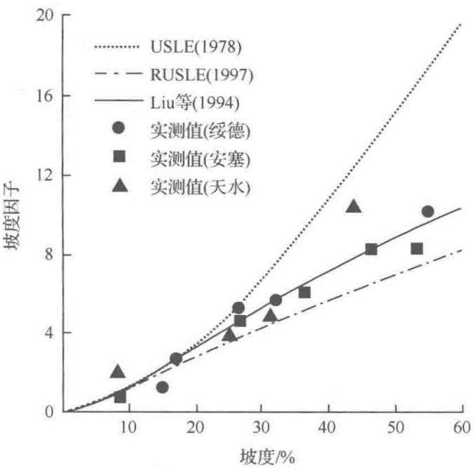  
图6-1 不同公式计算值与实测值比较

除了坡度影响土壤侵蚀量与坡度的关系外，坡长也会对该关系式产生影响。Foster等(1981)认为当坡长小于4m时，几乎没有细沟侵蚀。而坡度因子公式采用的小区资料坡长都大于4m，这些小区上可能存在细沟侵蚀。因此这些在坡长大于4m小区上建立的坡度因子公式不适用于坡长小于4m的情况。Foster(1982)利用Lattanzi等(1974)0.61m坡长小区的人工降雨试验资料，建立了坡长小于4m的短坡坡度因子公式：

$$
S = 3 . 0 ( \sin \theta ) ^ { 0 . 8 } + 0 . 5 6\tag{6-11}
$$

式中,S为坡度因子(无量纲);θ为坡度 ${ \bf \Xi } ^ { \circ } )$ 。

McCool等(1987)用Singer 和Blackard(1982)，Evett 和 Dutt(1985)以及Rubio-Montoya和Brown(1984)的试验资料验证结果表明:公式(6-11)是合理可用的。此后公式(6-11)被应用于RUSLE中计算短坡长的坡度因子。

## 二、土壤侵蚀量与坡长的关系

Zingg(1940)建立的土壤侵蚀量方程中首次定量考虑了坡长对土壤侵蚀量的影响。其研究结果表明天然降雨和人工降雨小区资料所获得的土壤侵蚀量与坡长的关系相同，都是幂函数关系[公式(6-12)]，且指数均为0.6,称为坡长指数：

$$
A \propto C L ^ { 0 . 6 }\tag{6-12}
$$

式中，A是单位面积土壤流失量 $\mathrm { ( t / h m ^ { 2 } ) }$ ;L为坡长(m);C为经验系数。Musgrave(1947)提出坡长指数为0.35。Wischmeier等(1958)根据美国9个州15个站观测资料的分析结果发现坡长指数在不同地点的变化范围为0\~0.74。但在10%的显著水平下美国中北部和东北部地区坡长指数没有显著差异，建议坡长指数为 $0 . 5 { \pm } 0 . 1$ 。坡长指数受坡度和坡长交互作用的影响，还与土壤性质、地表植被类型和田间管理措施等有密切关系(Wischmeier et al. , 1958)。

在通用土壤流失方程(USLE)第一版(Wischmeierand Smith，1965)中，首次提出了坡长因子的概念，将相对土壤侵蚀量标准化到22.13m坡长小区上，建立了相对土壤侵蚀量与坡长的幂函数关系「公式(6-13)。坡长因子概念的提出更便于进行不同研究区域间坡面侵蚀量与坡长关系的比较。USLE第一版中的坡长指数随坡度变化而变化。对于坡度大于5.7°的坡面，坡长指数取0.6;对于坡度小于 $0 . 2 9 ^ { \circ }$ 的长坡长坡面，坡长指数取0.3；其他情况下坡长指数取0.5。

$$
L = \left( { \frac { \lambda } { 2 2 . 1 3 } } \right) ^ { m }\tag{6-13}
$$

式中，L为坡长因子(无量纲);λ为坡长(m);m为坡长指数。

在通用土壤流失方程(USLE)第二版(Wischmeier andSmith，1978)中，更为详细地规定了不同坡度范围下的坡长指数取值：当坡度范围分别为 $< 0 . 5 7 ^ { \circ } , 0 . 5 7 ^ { \circ } \sim 1 . 7 2 ^ { \circ } , 2 ^ { \circ } \sim$ $2 . 5 8 ^ { \circ } . > 2 . 8 6 ^ { \circ }$ 时，坡长指数分别取值0.2、0.3、0.4和0.5。对缓坡如此详细的坡长指数规定是由于美国农地以缓坡为主，且大量观测数据基于缓坡。Mutchler和Greer(1980)用人工降雨实验方法给出了坡度小于 $0 . 2 9 ^ { \circ }$ 时的坡长指数为0.15。Meyer等(1975)从土壤侵蚀机理出发，将土壤侵蚀过程分为细沟侵蚀和细沟间侵蚀。Foster和Meyer(1975)以此为基础，提出坡长指数m与细沟侵蚀量和细沟间侵蚀量的比值 $\beta$ 有关，其表达式为

$$
m = \frac { \beta } { \beta + 1 }\tag{6-14}
$$

进一步将该式表达为细沟和细沟间侵蚀量的形式为

$$
m = \frac { A _ { r } } { A _ { r } + A _ { i } } = \frac { A _ { r } } { A }\tag{6-15}
$$

式中，A为细沟侵蚀量； $A _ { i }$ 为细沟间侵蚀量 $; A$ 为总侵蚀量。显然公式(6-15)表明，坡长指数主要与细沟侵蚀量在总侵蚀量中的比例有关，细沟侵蚀比例越大，坡长指数越大。由于在大多数情况下难以获得细沟和细沟间侵蚀量，无法估计 $\beta$ 值，McCool等(1989)根据Foster等(1982a，b)提出的细沟间侵蚀公式和细沟侵蚀公式，推导了标准小区细沟侵蚀与细沟间侵蚀比例不同情况下的 $\beta$ 值计算公式[式(6-16)，式(6-17)和式(6-18)]，这一研究成果被应用于RUSLE(Renard等，1997)中。

当细沟侵蚀和细沟间侵蚀相等时 $, \beta$ 的计算公式为

$$
\beta = ( \sin \theta / 0 . 0 8 9 6 ) / ( 3 . 0 \sin ^ { 0 . 8 } \theta + 0 . 5 6 )\tag{6-16}
$$

当细沟侵蚀与细沟间侵蚀之比较大时， $\beta$ 的计算公式为

$$
\beta = 2 ( \sin \theta / 0 . 0 8 9 6 ) / ( 3 . 0 \sin ^ { 0 . 8 } \theta + 0 . 5 6 )\tag{6-17}
$$

当细沟侵蚀与细沟间侵蚀之比较小时 $, \beta$ 的计算公式为

$$
\beta = 0 . 5 ( \sin \theta / 0 , 0 8 9 6 ) / ( 3 . 0 \sin ^ { 0 . 8 } \theta + 0 . 5 6 )\tag{6-18}
$$

在冻融侵蚀区，如果以细沟侵蚀为主，坡长因子指数为0.5;如果以细沟间侵蚀为主，则按比例小的公式(6-18)计算。McCool等(1989)研究了美国不同地点的10个坡长指数，其平均值为0.48。随后又研究了陡坡的坡长指数(McCool etal.，1993)，所用小区平均坡度为28.4%，最大坡度为56%，得到的坡长指数值为0.5。

在黄土高原地区也做了大量的土壤侵蚀量与坡长关系研究。罗来兴(1958)根据雨后细沟调查资料认为:沿坡长增加，侵蚀呈强弱交替变化。从20世纪80年代后期开始研究黄土高原地区土壤侵蚀量与坡长的定量关系，均采用了幂函数形式。但由于所用资料及研究方法不同，坡长指数存在差异。华绍祖(1982)利用天水、绥德等地的径流小区观测资料分析得出坡长指数为0.15～0.5。牟金泽(1983)用甘肃天水资料得出的坡长指数为0.2。江忠善等(1990)利用陕西安塞径流小区资料分析得到坡长指数为0.4。魏天兴和朱金兆(2002)用北京林业大学吉县科研实验场试验站的资料分析得到坡长指数为0.35。Liu等(2000)利用黄土高原安塞、子洲和绥德3个水土保持试验站的天然降雨小区资料，较为系统地研究了陡坡条件下的坡长指数。所采用的小区资料除坡长不同外，其他条件均相同(表6-2)。

表6-2 黄土高原3个试验站小区年均土壤侵蚀量
<table><tr><td rowspan="2">小区号</td><td rowspan="2">坡长 /m</td><td colspan="2">坡度</td><td rowspan="2">年均径流深 /mm</td><td colspan="2">年均土壤侵蚀量  $/ ( { \tau } / { \ h m ^ { 2 } } )$ </td></tr><tr><td>(°)</td><td>%</td><td>观测</td><td>标准化后</td></tr><tr><td colspan="7">绥德  $( 3 7 ^ { \circ } 2 9 ^ { \prime } \mathrm { N } , 1 1 0 ^ { \circ } 0 8 ^ { \prime } \mathrm { E } )$ </td></tr><tr><td>12</td><td>10</td><td>22.00</td><td>40.0</td><td>20.6</td><td>15.59</td><td>0.70</td></tr><tr><td>29</td><td>40</td><td>23.00</td><td>42.8</td><td>17.9</td><td>28.00</td><td>1.26</td></tr><tr><td>34</td><td>60</td><td>22.00</td><td>40.4</td><td>14.0</td><td>36.59</td><td>1.64</td></tr><tr><td colspan="7">安塞(36°56&#x27;N,109°16′E)</td></tr><tr><td>1</td><td>10</td><td>29.98</td><td>57.7</td><td>46.8</td><td>92.66</td><td>0.72</td></tr><tr><td>2</td><td>20</td><td>29.98</td><td>57.7</td><td>43.1</td><td>128.56</td><td>1.00</td></tr><tr><td>3</td><td>30</td><td>29.98</td><td>57.7</td><td>38.7</td><td>142.20</td><td>1.10</td></tr><tr><td>4</td><td>40</td><td>29.98</td><td>57.7</td><td>39.5</td><td>162.85</td><td>1.26</td></tr><tr><td colspan="7">子洲(37°31&#x27;N,109°47′E)</td></tr><tr><td>4</td><td>20</td><td>22.00</td><td>40.4</td><td>23.9</td><td>91.84</td><td>0.90</td></tr><tr><td>2</td><td>40</td><td>22.00</td><td>40.4</td><td>27.5</td><td>153.14</td><td>1.51</td></tr><tr><td>3</td><td>60</td><td>22.00</td><td>40.4</td><td>24.1</td><td>143.11</td><td>1.41</td></tr></table>

为了进行对比分析，需要将土壤侵蚀量统一标准化为22.13m坡长下，但观测资料中没有坡长为22.13m的数据，于是首先建立各个站点土壤侵蚀量与坡长的幂函数关系：

$$
A = a \lambda ^ { m }\tag{6-19}
$$

式中，A为单位面积土壤侵蚀量 $\mathrm { { ( t / h m ^ { 2 } ) } }$ ;λ为坡长(m);a为系数。由于各小区观测资料除坡长不同外，所有条件均相同，因此该回归关系只反映了坡长的影响。根据建立各试验站土壤侵蚀量与坡长的回归关系计算出坡长22.13m时的土壤侵蚀量，然后计算出各区域相对于22.13m坡长的相对土壤侵蚀量(坡长因子L)。进一步通过回归分析，建立坡长因子与坡长的幂函数关系如下：

$$
L = \left( { \frac { \lambda } { 2 2 . 1 3 } } \right) ^ { 0 . 4 4 } r ^ { 2 } = 0 . 9 5\tag{6-20}
$$

公式(6-20)中的坡长指数0.44与USLE第二版坡度大于 $2 . 8 6 ^ { \circ }$ 时的坡长指数值(0.5)以及McCool等(1993)耕地上得到的坡长指数值(0.5)都很接近。

图6-2进一步比较了坡长指数分别取0.44、0.5(USLE采用)、0.68(RUSLE采用)时3个试验站土壤侵蚀量的模拟值与计算值，结果表明：在短坡长(小于20m)情况下，RUSLE计算结果偏小；而在坡长较大(大于20m)时，RUSLE计算结果明显偏大；而坡长指数为0.44与USLE第二版坡长指数0.5的计算结果比较接近，而且模拟的相对土壤侵蚀量值与实测值也很接近。因此在黄土高原地区陡坡侵蚀比较普遍的条件下，将坡长指数取值为0.5，且不随坡长变化发生变化。

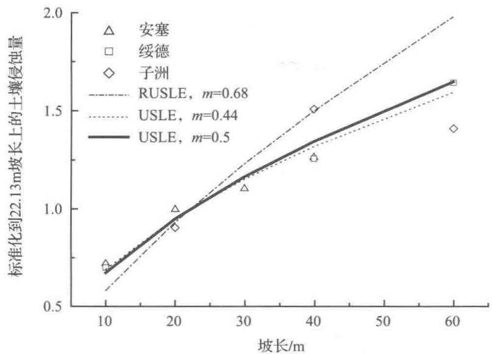  
图6-2 不同计算方法与实测值比较

## 三、地形因子值计算公式

## (一)坡面尺度的LS计算公式

地形因子是指坡度因子和坡长因子的总称。如果坡面坡度、土地利用、水土保持措施及土壤都相同，且不考虑土壤侵蚀随坡长变化的变化，此时可采用整坡的LS计算公式。其坡度因子计算公式为

$$
S = 1 0 . 8 \mathrm { s i n } \theta + 0 . 0 3 \theta < 5 ^ { \circ }\tag{6-21}
$$

$$
S = 1 6 . 8 \mathrm { s i n } \theta - 0 . 5 0 5 ^ { \circ } \leqslant \theta < 1 0 ^ { \circ }\tag{6-22}
$$

$$
S = 2 1 . 9 1 \mathrm { s i n } \theta - 0 . 9 6 \quad \theta \geq 1 0 ^ { \circ }\tag{6-23}
$$

式中，S为坡度因子(无量纲);θ为坡度(°)。

坡长因子计算公式为

$$
\begin{array} { c c } { { L = \left( \displaystyle \frac { \lambda } { 2 2 . 1 3 } \right) ^ { m } } } & { { } } \\ { { m = 0 . 2 } } & { { \theta \leqslant 0 . 5 ^ { \circ } } } \\ { { m = 0 . 3 } } & { { 0 . 5 ^ { \circ } < \theta < 1 . 5 ^ { \circ } } } \\ { { m = 0 . 4 } } & { { 1 . 5 ^ { \circ } \leqslant \theta \leqslant 2 . 5 ^ { \circ } } } \\ { { m = 0 . 5 } } & { { \theta > 2 . 5 ^ { \circ } } } \end{array}\tag{6-24}
$$

式中，L为坡长因子(无量纲);λ为坡长(m);θ为坡度(°);m为坡长指数，随坡度变化取不同的值。

以上公式适用于坡度、土地利用、水土保持措施及土壤都相同时的均一坡面。这里所谓的坡面尺度一般坡长和坡度都在有实测小区范围内。如果要计算的坡面长度远大于该地区资料来源小区的坡长，还用上述公式计算就可能产生误差。

## (二)区域尺度的LS计算公式

计算LS因子时，遇到坡面上坡度、土地利用、水土保持措施或土壤有差异，或需要考虑土壤侵蚀量随坡长变化的变化等情况，需要用分段坡LS因子计算公式。其中的坡度因子计算公式仍采用公式(6-21)～公式(6-23)，坡长因子计算公式采用(6-25)。

$$
L _ { i } = \frac { \lambda _ { i } ^ { m + 1 } - \lambda _ { i - 1 } ^ { m + 1 } } { ( \lambda _ { i } - \lambda _ { i - 1 } ) \times 2 2 . 1 3 ^ { m } }\tag{6-25}
$$

式中， $L _ { i }$ 为第i坡段的坡长因子； $\lambda _ { i } \setminus \lambda _ { i - 1 }$ 分别为第i坡段及第i—1坡段的坡长(m)。

表6-3给出了坡面坡长为120m，不考虑坡面土壤、土地利用、水土保持措施的差异时，将坡面人为均匀分段后，坡长因子沿坡长变化的变化。由表6-3可以看出，将坡面人为分段后，坡面的平均坡长因子不随坡面分段数的增加而变化。但是坡下坡段的坡长因子值要大于坡上坡段的坡长因子值。例如，将120m坡长的坡面均匀分成3段时，其坡面的平均坡长因子值仍与不进行分段计算时一样，都为2.33；从坡上至坡下，第1段、第2段和第3段的坡长因子值依次增加，分别为1.34、2.46和3.18(表6-3)。由此可见，将一个坡面划分成若干坡段后，可以描述坡长因子随坡长变化的变化，从而反映出坡面土壤侵蚀随坡长变化的变化规律。

表6-3 坡面不同坡段数对坡长因子的影响
<table><tr><td rowspan="2">坡段</td><td colspan="3">坡长因子</td></tr><tr><td>分1段</td><td>分2段 分3段</td><td>分4段</td></tr><tr><td>1</td><td>2.33</td><td>1.65</td><td>1.34 1.16</td></tr><tr><td>2</td><td></td><td>3.01 2.46</td><td>2.13</td></tr><tr><td>3</td><td></td><td>3.18</td><td>2.76</td></tr><tr><td>4</td><td></td><td></td><td>3.26</td></tr><tr><td>平均</td><td>2.33</td><td>2.33</td><td>2.33 2.33</td></tr></table>

注：假设坡长为120m，不考虑坡面土壤、土地利用、水土保持措施的差异；坡长指数取0.5。

## (三)区域尺度的LS计算流程

在进行区域坡面土壤侵蚀量评价时，数字高程图DEM是计算LS因子的基础资料，计算LS因子的流程图如图6-3所示。

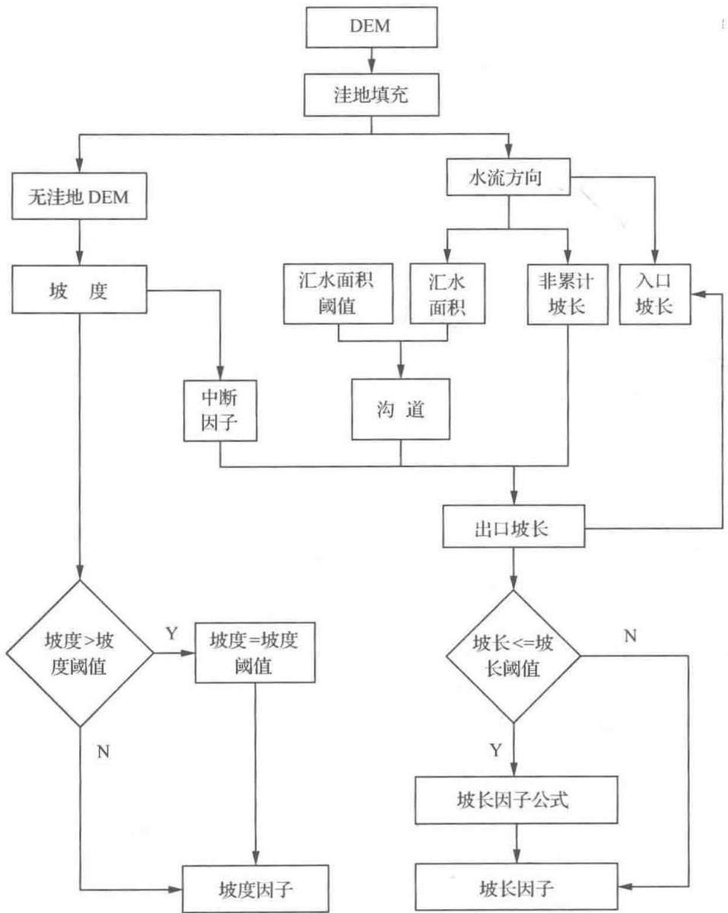  
图6-3基于DEM的LS因子计算流程

## 1. 坡度的计算

基于DEM计算坡度有很多方法，本次计算使用最大坡降算法。该算法在3×3窗口里计算中心格网与其周围8个格网的高程差与格网中心点距离的比值，取比值最大者作为中心格网的坡度。这种算法与基于DEM进行水文分析常用的流向算法一致，符合坡面水流方向一般受地表坡度控制的原理。

## 2. 坡长的计算

由于在DEM中连续的地面被离散化为具有一定尺寸和高程值的栅格网，每一栅格的坡长为从水流流出该栅格的边界点到沿水流方向向上游追踪到水流起点所在栅格边界点之间的最大累计水流长度。Fu等(2013)在Hickey等(1994)和Hickey(2000)坡长计算方法的基础上，提出了一套基于DEM的坡长计算方法，主要步骤如下所述。

第一步：填洼处理。DEM中一般会存在一些高程值低于周围的凹陷点，这些点无法进行流向判断而造成流路中断。本次计算采用Martz和Garbrecht(1992)提出的扫描窗口法进行填洼处理。其主要思路是先找到每个平地栅格或是洼地底点栅格(入流栅格)，并标记出这个栅格。然后从已标记的栅格中找出潜在的出流点。找到最低的潜在出流点后，比较它和洼地栅格的高程。如果出流点高程高于洼地栅格，那么洼地是一个凹地，否则是一个平地。对于凹地，把洼地集水区域内所有低于出流点的栅格高程升高至出流点高程。这样，凹地就成为一个平地。对于平地，按照Martz和Garbrecht(1992)中使用起伏平地的算法进行处理。

第二步：计算水流流向。采用最大坡降算法，即栅格坡度的最佳代表值是以之为中心3×3窗口内其周围8个方向坡度最大值。水流方向与最大坡降一致。

第三步：沟道提取。根据水流方向，计算每个栅格的流入汇水面积及流出汇水面积。流入汇水面积为流入当前栅格的所有上游栅格面积之和。流出汇水面积为流入汇水面积与当前栅格面积之和。然后再确定沟道，如果栅格流入汇水面积大于汇水面积阈值，则认为当前栅格为沟道。汇流面积阈值由用户输入，其值的确定原则是让由DEM生成的沟道尽可能地与实际情况相符。

第四步：计算每个栅格的非累计坡长(NCSL)。即单个栅格对后续流入及流出坡长的贡献，计算规则如下(g为栅格分辨率)：

g (当前栅格为局部高程点或入流及出流方向都为坐标轴方向)

1.207g （出流为对角线方向的非局部高程点）

第五步:坡长计算。依据水流流向，将流入当前栅格的上游栅格非累计坡长进行累加，得到当前栅格的流入坡长。如果当前栅格的来流方向不止一个，则取来流方向栅格中的最大流出坡长值作为当前栅格的流入坡长。当前栅格的流出坡长为流入坡长值与本栅格的非累计坡长值之和。将栅格流出坡长及流入坡长代入公式(6-25)中进行当前栅格的坡长因子值计算。根据坡长的定义，在坡长计算过程中用两个控制条件来确定流出坡长

终点。

1）沟道：当栅格是沟道时，则认为坡长终止，该栅格的流出坡长为0。

2）中断因子：中断因子用于确定坡面坡度由陡坡到缓坡变化时，由于出现泥沙淤积而导致的坡长中断。中断因子定义为当前栅格的坡度值与其流入方向栅格坡度比值的临界值。这一比值反映了当前栅格坡度相对于流入方向栅格坡度的减小程度。若当前栅格的坡度小于中断因子与流入栅格坡度的乘积时，会出现泥沙淤积，坡长中断。此时当前栅格的流出坡长重新设置为栅格长度。本次计算时，缓坡(坡度 $< 3 ^ { \circ } )$ 的中断因子设为0.7;陡坡(坡度 $\geq 3 ^ { \circ } )$ 的中断因子设为0.5。

## (四)黄土高原地区地形因子计算中相关参数设置

本次评价中的DEM主要是从1：10000地形图生成，栅格大小为10m。

本次土壤侵蚀评价中坡度因子公式的选择：

林地和草地：地面坡度小于5°时采用公式(6-21);坡度大于5°采用公式(6-22)；坡度大于 $3 0 ^ { \circ }$ 时将坡度设置为 $3 0 ^ { \circ }$ ，并采用公式(6-22)计算坡度因子。除林地和草地外的其他土地利用：依据坡度的大小分别用公式(6-21)～公式(6-23)计算坡度因子；坡度大于 $3 0 ^ { \circ }$ 时将坡度设置为 $3 0 ^ { \circ }$ ，并采用公式(6-23)计算坡度因子。

坡长因子:本次评价中黄土高原地区的生成沟道汇流面积阈值采用了 $2 0 0 0 \mathrm { m } ^ { 2 }$ 。坡长因子公式采用公式(6-25)。当坡长大于100m时，坡长设置为100m。

## 四、黄土高原坡度及坡度因子分布特点

黄秉维(1955)根据植被的好坏把黄土高原地区划分为“有完密植被区域”和“缺乏完密植被区域”。同时认为水力侵蚀强度较大的区域是“缺乏完密植被区域”中的黄土阶地、黄土高原和黄土丘陵区。本次黄土高原土壤侵蚀评价结果侵蚀强度的空间分布与黄秉维(1955)的结果类似。为此我们选择了位于这3个区域内的陕西、山西、宁夏和甘肃4个省(自治区)的1298个、1153个、147个和1153个野外调查单元来统计分析黄土高原主要水力侵蚀区的省和县两种不同尺度的地形因子的分布特点。

## (一)坡度分布

山西、陕西、宁夏和甘肃4个省(自治区)坡度总体上较陡，平均坡度为 $1 5 . 8 ^ { \circ }$ ，主要以$1 5 ^ { \circ } \sim 3 5 ^ { \circ }$ 的坡度为主，占4个省份统计面积的45.0%。各个省份坡度分布特点各有不同。甘肃省的平均坡度最大，为 $1 9 . 1 ^ { \circ } :$ 山西、陕西和宁夏3个省份的平均坡度差异不大，在$1 4 . 6 ^ { \circ }$ 左右(表6-4)。在坡度组成上，甘肃和山西两省主要以 $1 5 ^ { \circ } \sim 3 5 ^ { \circ }$ 的坡度为主，分别占全省统计面积的53.6%和44.9%；陕西省以大于 $2 5 ^ { \circ }$ 的陡坡为主，占全省统计面积的40.7%；宁夏回族自治区主要是以小于 $3 ^ { \circ }$ 的缓坡为主，占全自治区统计面积的32.1%。

表6-4 黄土高原各省坡度组成及范围
<table><tr><td rowspan="2">省份</td><td colspan="7">面积比例/%</td><td colspan="3">坡度统计/(°)</td></tr><tr><td> $< 3 ^ { \circ }$ </td><td> $3 ^ { \circ } { \sim } 5 ^ { \circ }$ </td><td> $5 ^ { \circ } \sim 8 ^ { \circ }$ </td><td> $8 ^ { \circ } \sim 1 5 ^ { \circ }$ </td><td> $1 5 ^ { \circ } \sim 2 5 ^ { \circ }$ </td><td> $2 5 ^ { \circ } \sim 3 5 ^ { \circ }$ </td><td> $= 3 5 ^ { \circ }$ </td><td>最小值</td><td>最大值</td><td>平均值</td></tr><tr><td>山西</td><td>21.4</td><td>5.0</td><td>5.9</td><td>14.7</td><td>25.2</td><td>19.7</td><td>8.2</td><td>0.0</td><td>57.7</td><td>15.3</td></tr><tr><td>陕西</td><td>25.7</td><td>4.7</td><td>4.4</td><td>8.2</td><td>16.3</td><td>22.0</td><td>18.7</td><td>0.0</td><td>53.0</td><td>14.6</td></tr><tr><td>宁夏</td><td>32.1</td><td>6.1</td><td>6.9</td><td>16.6</td><td>22.3</td><td>12.0</td><td>4.0</td><td>0.0</td><td>53.6</td><td>14.3</td></tr><tr><td>甘肃</td><td>9.3</td><td>3.1</td><td>4.9</td><td>17.5</td><td>30.5</td><td>23.1</td><td>1.2</td><td>0.0</td><td>84.4</td><td>19.1</td></tr><tr><td>汇总</td><td>21.4</td><td>4.9</td><td>5.8</td><td>14.6</td><td>25.2</td><td>19.8</td><td>8.3</td><td>0.0</td><td>84.4</td><td>15.8</td></tr></table>

中国科学院黄土高原综合科学考察队(1990)(简称“黄考”)利用1：100000地形图和坡度尺量测了各省的坡度，并进行了统计。为此，我们也统计了4个省全部野外调查单元的坡度组成。图6-4对比了黄考和本次评价的坡度组成。从图6-4可以看出，总体上，本次评价中 $2 5 ^ { \circ } \downarrow \downarrow$ 上的坡度面积比例都比黄考要高；而小于 $3 ^ { \circ }$ 的缓坡比黄考低(宁夏除外)。这主要原因是地形图比例尺不一致。本次评价的地形图比例尺为1：10000；而黄考的地形图比例尺为1:100000。小比例尺地形图平滑了地面坡度。在坡度组成上，两次评价结果陕西和甘肃的坡度组成差异较大；而山西和宁夏的坡度组成则较为类似。

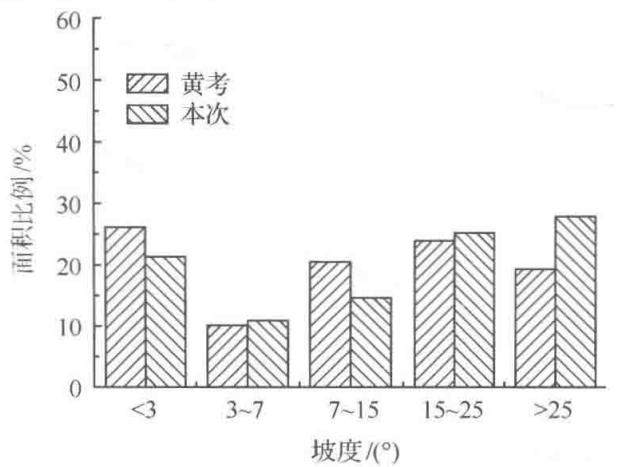

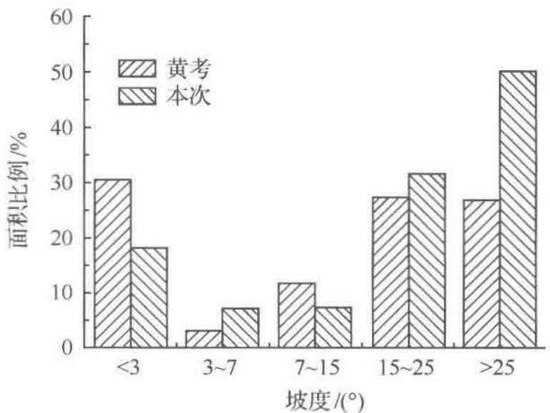

(a) 山西  
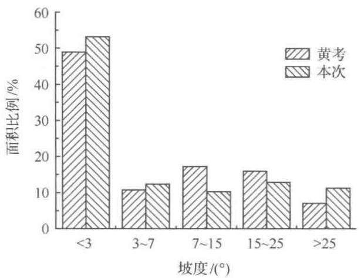  
(c) 宁夏

(b) 陕西  
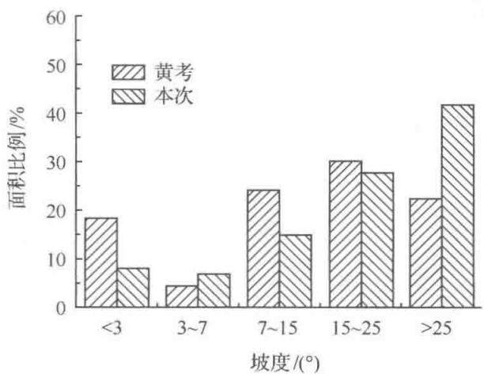  
(d) 甘肃  
图6-4 中国科学院黄土高原综合科学考察队(黄考)和本次评价的坡度组成

黄秉维(1955)认为在黄土丘陵区第Ⅰ副区的陡坡最多，平均坡度最大；其次是第Ⅱ副区；第Ⅲ、Ⅳ、V平均坡度较为接近，比第Ⅰ、第Ⅱ副区坡度要小。选取了离石、安塞、定西和长武分别代表了黄土高原丘陵区Ⅰ、Ⅱ、Ⅲ副区和黄土高塬区，作出了坡度分级图(图 $6 \div 5 )$ 。图6-5表明，离石和安塞大于 $1 5 ^ { \circ }$ 坡度的面积比例基本相等，分别占统计面积的86.4%和86.9%。二者平均坡度也很接近，分别为 $2 4 . 3 ^ { \circ }$ 和 $2 7 . 4 ^ { \circ }$ 。即黄土高原丘陵区I、Ⅱ副区的坡度并没有明显差别。为进一步说明黄土高原丘陵区Ⅰ、Ⅱ副区的坡度差异，分别选取了陕西省绥德、米脂、佳县、吴堡和子洲5个县代表黄土高原丘陵区Ⅰ副区陕西省安塞、延安、甘泉、志丹和延长5个县(市)代表黄土高原丘陵区Ⅱ副区，分别统计了I、Ⅱ副区的坡度组成(表6-5)及平均坡度。结果表明，无论是坡度组成还是在平均坡度上，这两个副区都没有明显差别。以甘肃定西县为代表的黄土丘陵Ⅲ副区的平均坡度为$1 9 . 7 ^ { \circ }$ ，在坡度组成上以 $8 ^ { \circ } \sim 2 5 ^ { \circ }$ 坡度为主，占统计面积的71.3%。黄土高塬(长武县)的平均坡度为 $9 . 8 ^ { \circ }$ ，以小于5°的坡度为主，占统计面积的43.5%。

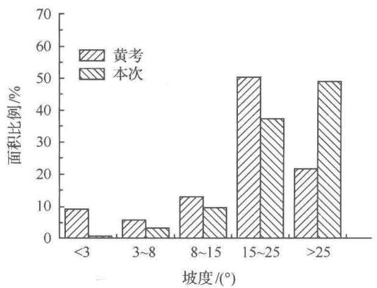

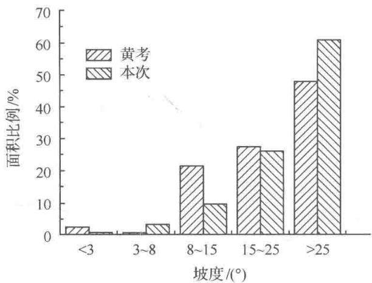  
(b) 定西

(a) 离石  
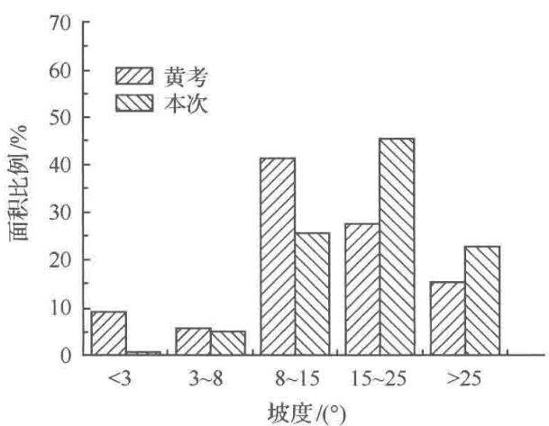  
(c) 安塞

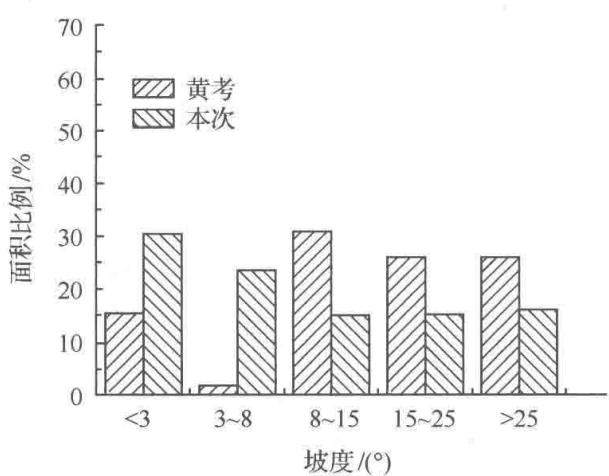  
(d) 长武  
图6-5 黄土高原不同分区的坡度组成  
（离石、安塞、定西和长武分别代表了黄土高原丘陵区Ⅰ、Ⅱ、Ⅲ副区和黄土高塬区)

表6-5黄土高原丘陵沟壑区Ⅰ、Ⅱ副区的坡度组成及平均值
<table><tr><td colspan="10">副区</td><td colspan="3">坡度统计/(°)</td></tr><tr><td></td><td> $< 3 ^ { \circ }$ </td><td> $3 ^ { \circ } \sim 5 ^ { \circ }$ </td><td> $5 ^ { \circ } \sim 8 ^ { \circ }$ </td><td> $8 ^ { \circ } \sim 1 5 ^ { \circ }$ </td><td> $1 5 ^ { \circ } \sim 2 5 ^ { \circ }$ </td><td> $2 5 ^ { \circ } \sim 3 5 ^ { \circ }$ </td><td> ${ \geqslant } 3 5 ^ { \circ }$ </td><td> ${ > } 1 5 ^ { \circ }$ </td><td>均值</td><td>标准差</td><td>变差系数</td></tr><tr><td>I</td><td>1.1</td><td>1.7</td><td>3.3</td><td>11.8</td><td>27.6</td><td>32.3</td><td>22.2</td><td>82.1</td><td>23.4</td><td>6.43</td><td>0.27</td></tr><tr><td>Ⅱ</td><td>1.0</td><td>1.3</td><td>2.5</td><td>9.3</td><td>26.5</td><td>36.2</td><td>23.3</td><td>86.0</td><td>23.6</td><td>7.06</td><td>0.30</td></tr></table>

注：陕西省绥德、米脂、佳县、吴堡和子洲5个县代表黄土高原丘陵区Ⅰ副区，陕西省安塞、延安、甘泉、志丹和延长5个县(市)代表黄土高原丘陵区Ⅱ副区。

## (二)坡度因子分布

山西、陕西、宁夏和甘肃4个省(自治区)平均坡度因子值为3.5，主要分布在1.84～8.3，占4个省份统计面积的64.1%(表6-6)。4个省份中，甘肃省的平均坡度因子值最大，为4.3;山西、陕西和宁夏3个省份的平均坡度因子值差异不大，在3.1左右。在坡度因子分级上，4个省份的坡度因子值主要集中在1.84\~8.30，占省统计面积的50.4%(宁夏)\~75.4%(甘肃)。

表6-6黄土高原各省坡度因子组成及范围
<table><tr><td rowspan="2">省份</td><td colspan="6">面积比例/%</td><td colspan="3">坡度因子统计</td></tr><tr><td>&lt;0.59</td><td>0.59~0.97</td><td>0.97~1.84</td><td>1.84~4.71</td><td>4.71~8.3</td><td>8.3~9.99</td><td>最小值</td><td>最大值</td><td>平均值</td></tr><tr><td>山西</td><td>21.3</td><td>5.0</td><td>7.6</td><td>35.2</td><td>28.9</td><td>2.0</td><td>0.0</td><td>10.0</td><td>3.3</td></tr><tr><td>陕西</td><td>25.6</td><td>4.7</td><td>5.5</td><td>21.5</td><td>40.0</td><td>2.6</td><td>0.0</td><td>10.0</td><td>3.1</td></tr><tr><td>宁夏</td><td>32.1</td><td>6.2</td><td>9.3</td><td>30.8</td><td>19.6</td><td>2.0</td><td>0.0</td><td>9.8</td><td>3.2</td></tr><tr><td>甘肃</td><td>9.3</td><td>3.2</td><td>6.1</td><td>33.9</td><td>41.5</td><td>6.0</td><td>0.0</td><td>10.0</td><td>4.3</td></tr><tr><td>汇总</td><td>21.3</td><td>5.0</td><td>7.6</td><td>35.0</td><td>29.1</td><td>2.0</td><td>0.0</td><td>10.0</td><td>3.5</td></tr></table>

黄土高原丘陵区Ⅰ、Ⅱ、Ⅲ副区的坡度因子组成及坡度因子平均值没有显著差别，坡度因子值主要集中在1.84\~8.3，占各县统计面积的90%以上;坡度因子平均值在4.8左右。黄土高原区的坡度因子值明显低于黄土丘陵区，主要集中在<0.97的区域(表6-7)。

表6-7黄土高原丘陵沟壑区I、Ⅱ、副区及塬区坡度因子组成及平均值
<table><tr><td rowspan="2">分区</td><td colspan="6">面积比例/%</td><td rowspan="2">坡度因子 平均值</td></tr><tr><td>&lt;0.59</td><td>0.59~0.97</td><td>0.97~1.84</td><td>1.84~4.71</td><td>4.71~8.3</td><td>8.3~9.99</td></tr><tr><td>离石(Ⅰ)</td><td>0.63</td><td>0.99</td><td>3.69</td><td>44.24</td><td>47.89</td><td>2.54</td><td>5.1</td></tr><tr><td>安塞(Ⅱ)</td><td>0.5</td><td>0.89</td><td>3.38</td><td>33.84</td><td>60.01</td><td>1.38</td><td>4.7</td></tr><tr><td>定西(Ⅲ)</td><td>0.64</td><td>1.26</td><td>4.95</td><td>47.29</td><td>42.62</td><td>3.25</td><td>4.6</td></tr><tr><td>长武(塬区)</td><td>30.23</td><td>13.21</td><td>11.69</td><td>24.38</td><td>18.23</td><td>2.26</td><td>2.1</td></tr></table>

## 五、黄土高原坡长及坡长因子分布特点

## (一)坡长分布

山西、陕西、宁夏和甘肃4个省(自治区)的平均坡长为32.2m，58.1%的统计面积坡长小于40m(表6-8)。4个省(自治区)中，山西、陕西、甘肃、宁夏的平均坡长依次降低，且都以小于40m的坡长为主，占各省(自治区)统计面积的58.0%以上。

表6-8 黄土高原各省坡长组成及范围
<table><tr><td rowspan="2">省份</td><td colspan="6">面积比例/%</td><td colspan="3">坡长统计/m</td></tr><tr><td>&lt;20m</td><td>20~40m</td><td>40~60m</td><td>60~80m</td><td>80~100m</td><td>≥100m</td><td>最小值</td><td>最大值</td><td>平均值</td></tr><tr><td>山西</td><td>34.7</td><td>23.3</td><td>12.1</td><td>9.8</td><td>8.0</td><td>12.0</td><td>0.0</td><td>191.6</td><td>40.8</td></tr><tr><td>陕西</td><td>43.9</td><td>22.2</td><td>11.3</td><td>8.7</td><td>6.9</td><td>7.0</td><td>0.0</td><td>142.8</td><td>31.8</td></tr><tr><td>甘肃</td><td>50.9</td><td>23.8</td><td>10.9</td><td>7.5</td><td>5.2</td><td>1.8</td><td>0.0</td><td>90.3</td><td>29.7</td></tr><tr><td>宁夏</td><td>45.6</td><td>22.1</td><td>11.9</td><td>9.4</td><td>7.8</td><td>3.2</td><td>0.0</td><td>67.0</td><td>26.3</td></tr><tr><td>汇总</td><td>34.9</td><td>23.2</td><td>12.1</td><td>9.8</td><td>8.0</td><td>11.9</td><td>0.0</td><td>191.6</td><td>32.2</td></tr></table>

黄土高原丘陵区Ⅱ、Ⅲ副区和黄土高塬区的坡长组成及坡长平均值没有显著差别，坡长值主要集中在0\~40m，占每个县统计面积的65%以上;坡长平均值在33m左右。黄土高原丘陵区Ⅰ副区的平均坡长比其他几个区域稍大，为 $4 3 \mathrm { m } ; 0 \sim 4 0 \mathrm { m }$ 的坡长占县统计面积的51%(表6-9)。

表6-9 黄土高原丘陵沟壑区Ⅰ、Ⅱ、Ⅲ副区及塬区坡长组成及平均值
<table><tr><td rowspan="2">分区</td><td colspan="6">面积比例/%</td><td rowspan="2">坡长平均 值/m</td></tr><tr><td>&lt;20m</td><td>20~40m</td><td>40~60m</td><td>60~80m</td><td>80~100m</td><td>≥100m</td></tr><tr><td>离石(I)</td><td>27.50</td><td>23.88</td><td>13.29</td><td>11.44</td><td>9.63</td><td>14.25</td><td>43.4</td></tr><tr><td>安塞(Ⅱ)</td><td>39.24</td><td>25.72</td><td>13.85</td><td>10.43</td><td>7.73</td><td>3.03</td><td>32.6</td></tr><tr><td>定西(Ⅲ)</td><td>41.96</td><td>23.04</td><td>12.83</td><td>10.25</td><td>8.54</td><td>3.39</td><td>31.0</td></tr><tr><td>长武(塬区)</td><td>43.60</td><td>20.91</td><td>10.27</td><td>8.43</td><td>6.84</td><td>9.94</td><td>35.5</td></tr></table>

## (二)坡长因子分布

山西、陕西、宁夏和甘肃4个省(自治区)的平均坡长因子值为1.2,62.0%的统计面积坡长小于1.88(表6-10)。4个省(自治区)的平均坡长因子差异不大，在1.2左右，且都以小于1.88的坡长因子值为主，占各省(自治区)统计面积的61%以上。

表6-10黄土高原各省坡长因子组成及范围
<table><tr><td rowspan="2">省份</td><td colspan="6">面积比例/%</td><td colspan="3">坡长因子</td></tr><tr><td>&lt;1.22</td><td>1.22~1.88</td><td>1.88~2.36</td><td>2.36~2.76</td><td>2.76~3.10</td><td>≥3.10</td><td>最小值</td><td>最大值</td><td>平均值</td></tr><tr><td>山西</td><td>36.2</td><td>25.6</td><td>21.8</td><td>10.6</td><td>5.3</td><td>0.4</td><td>0.0</td><td>2.5</td><td>1.4</td></tr><tr><td>陕西</td><td>45.5</td><td>23.6</td><td>16.7</td><td>9.4</td><td>4.5</td><td>0.3</td><td>0.0</td><td>3.0</td><td>1.2</td></tr><tr><td>甘肃</td><td>53.7</td><td>24.1</td><td>11.8</td><td>7.3</td><td>3.2</td><td>0.0</td><td>0.0</td><td>2.6</td><td>1.2</td></tr><tr><td>宁夏</td><td>46.3</td><td>22.8</td><td>14.9</td><td>10.7</td><td>5.3</td><td>0.0</td><td>0.0</td><td>2.3</td><td>1.1</td></tr><tr><td>汇总</td><td>36.4</td><td>25.6</td><td>21.7</td><td>10.6</td><td>5.3</td><td>0.4</td><td>0.0</td><td>3.0</td><td>1.2</td></tr></table>

黄土高原丘陵沟壑区Ⅱ、Ⅲ副区和黄土高塬区的坡长因子值组成及坡长因子平均值没有显著差别，坡长因子值主要集中在0～1.88，占每个县统计面积的65%以上；坡长因子平均值在1.3左右。黄土高原丘陵区Ⅰ副区的平均坡长因子值比其他几个区域稍大，为1.5;0\~1.88区间的坡长因子占县统计面积的51%(表6-11)。

表6-11 黄土高原丘陵沟壑区I、Ⅱ、Ⅲ副区及塬区坡长因子组成及平均值
<table><tr><td rowspan="2">分区</td><td colspan="6">面积比例/%</td><td rowspan="2">坡长因子 平均值</td></tr><tr><td>&lt;1.22</td><td>1.22~1.88</td><td>1.88~2.36</td><td>2.36~2.76</td><td>2.76~3.10</td><td>≥3.10</td></tr><tr><td>离石(I)</td><td>27.53</td><td>23.88</td><td>27.24</td><td>13.67</td><td>7.09</td><td>0.6</td><td>1.52</td></tr><tr><td>安塞(Ⅱ)</td><td>39.26</td><td>25.71</td><td>17.08</td><td>12.1</td><td>5.81</td><td>0.05</td><td>1.33</td></tr><tr><td>定西(Ⅲ)</td><td>41.98</td><td>23.03</td><td>16.45</td><td>12.42</td><td>6.12</td><td>0</td><td>1.24</td></tr><tr><td>长武(塬区)</td><td>45.73</td><td>22.46</td><td>18.12</td><td>8.82</td><td>4.34</td><td>0.53</td><td>1.23</td></tr></table>

## 参考文献

华绍祖.1982.黄河中游实验小流域的土壤侵蚀及水土保持效益.1982年国际土壤学学术讨论会论文集

黄秉维.1955.编制黄河中游流域土壤侵蚀分区图的经验教训.科学通报，12:5-13

江忠善，李秀英.1988.黄土高原土壤流失预报方程中降雨侵蚀力和地形因子的研究，中国科学院西北水土保持研究所集刊，（7）：40-45

江忠善，刘志，贾志伟.1990.地形因素与坡地水土流失关系的研究.中国科学院西北水土保持研究所集刊，(12)：1-8

刘善建.1953.天水水土流失测验的初步分析.科学通报，12:59-65

罗来兴.1958.甘肃华亭粮食沟坡侵蚀量的野外观测及其初步分析结果.地理学资料，(2)：111-118

牟金泽.1983.降雨侵蚀土壤流失预报方程的初步研究.中国水土保持，6:23-26

魏天兴，朱金兆.2002.黄土残塬沟壑区坡度和坡长对土壤侵蚀的影响分析.北京林业大学学报，24(1):59-62

中国科学院黄土高原综合科学考察队.1990.中国黄土高原地区地面坡度分集数据集.北京:海洋出版社

Borst H L, McCall A G, Bell F G. 1945. Investigations in Erosion Control and the Reclamation of Eroded Land at the Northwest Appalachian Conservation Experiment Station, Zanesville, Ohio, 1934-1942. U. S. Department of Agricultural Techechic Bulletin: 888

Browning F M, Norton R A, McCall A G, et al. 1948. Investigations in Erosion Control and the Reclamation of Land at the Missouri Valley Loess Conservation Experiment Station, Clarinda, Iowa, 1931-1942. U. S. Department of Agricultural Techechic Bulletin: 959

Duley F L, Hays O) E. 1932. The effect of the degree of slope on run-off and soil erosion, Journal of Agricutural

Research,45(6):349-360

Evett S R, Dutt G R. 1985. Effect of slope and rainfall intensity on erosion from sodium dispersed, compacted earth microcatchments. Soil Science Society of America Journal, 49(1):202-206

Foster G R. 1982. Modeling the erosion process. In: Haan C T, Johnson H P, Brakensiek D L. Hydrologic Modeling of Small Watersheds. St. Joseph, Mich: ASAE:297-380

Foster G R, Meyer L. D. 1975. Mathematical simulation of upland erosion by fundamental erosion mechanics. In: USDA. Present and Prospective Technology for Predicting Sediment Yields and Sources. Oxford: USDA Sedimentation Laboratory.

Foster G R, Wischmeier W H. 1974. Evaluating irregular slopes for soil loss prediction. Transactions of the ASAE, 17:305-309

Foster G R, Lombardi F, Moldenhauer W C. 1982a. Evaluation of rainfall-runoff erosivity factors for individual storms. Transactions of the ASAE, 25(1):124-129

Foster G R, Osterkamp W R, Lane L J, et al. 1982b. Effect of discharge on rill erosion. ASAE Paper No. 82-2572. St. Joseph, MI: ASAE

Foster G R, Simanton J R, Renard K G, et al. 1981. Discussion of “application of the Universal Soil Loss Equation to rangland on a per-storm basis". Journal of Range Management,34(2):161-165

Fu S H, Cao L X, Liu B Y, et al. 2014. Effects of DEM grid size on Predicting Soil Loss from Small Watersheds in China. Environmental Earth Science, DOI: 10. 1007/s12665-014-3564-3.

Fu S H, Wu Z P, Liu B Y, et al. 2013. Comparison of the effects of the different methods for computing the slope length factor at a watershed scale. International Soil and Water Conservation Research, 1(2) : 64-71

Gard L E, Van Doren C A. 1949. Soil losses as affected by cover, rainfall, and slope. Soil Science Society of Proceedings,14:374-378

Hays O E, McCall A G, Bell F G. 1949. Investigations in erosion control and the reclamation of eroded land at the Upper Mississippi Valley Conservation Experiment Stationnear La Crosse, Wisconsin, 1933-1943. U. S. Dep. Agric. Tech. Bull. 973

Hickey R. 2000. Slope angle and slope length solutions for GIS. Cartography, 29; 1-8

Hickey R, Smith A, Jankowski P. 1994. Slope length calculations from a DEM within Arc/ Info GRID. Computers, Environment, and Urban Systems, 18(5):365-380

Lattanzi A R, Meyer L D, Baumgardner M F. 1974. Influences of mulch rate and slope steepness on interrill erosion. Soil Science Society of America Proceedings, 38:946-950

Liu B Y, Nearing M A, Risse L M. 1994. Slope gradient effects on soil loss for steep slopes. Transactions of ASAE, 37(6):1835-1840

Liu B Y, Nearing M A, Shi P J, et al. 2000. Slope length effects on soil loss for steep slopes. Soil Science Society of America Journal,(64):1759-1763

Martz L W, Garbrecht J. 1992. Numerical definition of drainage network and subcatchment areas from digital eleva tion models. Computers &. Geosciences, 18(6): 747-761

McCool D K, Brown L C, Foster G R, et al. 1987. Revised slope steepness factor for the universal soil loss equation Transactions of the ASAE, 30(5): 1387-1396

McCool D K, Foster G R, Mutchler K, et al. 1989. Revised slope length factor for the Universal Soil Loss Equation. Transactions of ASAE, 32(5):1571-1576

McCool D K, George G O, Freckleton M, et al. 1993. Topographic effect on erosion from cropland in the northwestern wheat region. Transactions ofthe ASAE, 36(3) :771-775

Meyer L D, Foster G R, Romkens M J M. 1975. Source of soil eroded by water from upland slopes. In: USDA. Present and Prospective Technology for Predicting Sediment Yields and Sources, Proceedings ofthe Sediment-Yield Workshop, Oxford: USDA Sedimentation Laboratory

Musgrave G W. 1947. The quantitative evaluation of factors in water erosion-A first approximation. Journal Soil and Water Conservation,2:133-138

Mutchler C K, Greer J D. 1980. Effect of slope length on erosion from low slopes. Transactions of the ASAE, 23(4) : 866-876

Neal J H. 1938. Effect of degree of slope and rainfall characteristics on runoff and soil erosion. Agricultural Engineering,19(5): 213-217

Renard K G, Foster G R, Weesies G A, et al. 1997. RUSLE—a guide to conservation planning with the revised universal soil loss equation. USDA Agricultural Handbook No. 703. Washington D C: USDA

Rubio-Montoya D, Brown K W. 1984. Erodibility of stripmine spoils. Soil Science, 138(5) :365-373

Singer M J, Blackard J. 1982, Slope angle-interril soil loss relationships for slope up to 50%. Soil Science Society of America Journal,46(6):1270-1273

Smith D D, Whitt D M. 1947. Estimating soil losses from field areas of claypan soil. Soil Science Society of Proceedings,12:485-490

Smith D D, Wischmeier W H. 1957. Factors affecting sheet and rill erosion. Transactions American Geophysical Union, 38(6):889-896

Wischmeier W H, Smith D D. 1965. Predicting Rainfall-erosion Losses from Cropland East of the Rocky Mountains. USDA Agricultural HandbookNo. 282.Washington D C: USDA

Wischmeier W H, Smith D D. 1978.Predicting rainfall erosion losses—A Guide to Conservation Planning. USDA Agricultural Handbook No. 537. Washington D C: USDA

Wischmeier W H, Smith D D, Uhland R E. 1958. Evaluation of factors in the soil loss equation. Agricultural Engineering,39:458-462

Zingg A W. 1940. Degree and length of land slope as it affects soil loss in runoff. Agricultural Engineering, 21(2): 59-64

## 第七章 水土保持措施因子评价

水土保持措施是农业生产过程中为减少因人为耕作导致的水土流失而采取的相应方法或措施。黄土高原农耕历史悠久，广大劳动人民在长期的生产实践过程中，发展和完善了一系列适合当地特点的水土保持措施，对减少土壤侵蚀起到了重要作用，也是进行土壤侵蚀定量评价需要考虑的重要人为影响因素。

## 一、水土保持措施类型

我国农业耕作历史悠久，在长期的生产实践中，广大劳动人民总结出多种多样的水土保持措施类型。许多学者对水土保持措施类型进行了划分(Hudson，1995;Brooks et al.，1991;辛树帜和蒋德麒，1982；唐克丽，2004;郭廷辅和高博文，1982；王礼先，1995；王礼先和朱金兆，2005)。刘宝元等(2013)在总结各种分类方法基础上，提出了以植被覆盖与生物措施、工程措施和耕作措施3种类型为一级类的分类体系(表7-1)。根据这一分类体系，黄土高原3个一级类均有分布。植被覆盖与生物措施4个二级分类均包括；18个三级类中，除植物篱和草水路较少外，其余亦有分布，尤其是造林、种草和生态恢复十分普遍。工程措施16个二级分类中有11种，其中梯田、鱼鳞坑、沟头防护和淤地坝等十分常见，但竹节沟、地下管-道、引洪漫地、引水拉沙造地和沙障固沙等少见。耕作措施13个二级类中，除垄作区田和免耕少见外，其他11种类型都有分布，尤以等高耕作、等高沟垄种植和轮作等十分普遍。

表7-1 水土保持措施分类系统各级代码与名称
<table><tr><td colspan="1" rowspan="1">一级</td><td colspan="1" rowspan="1">二级</td><td colspan="1" rowspan="1">三级</td><td colspan="1" rowspan="1">含义</td></tr><tr><td colspan="1" rowspan="8">01 植被覆盖与生物措施</td><td colspan="1" rowspan="8">0101造林</td><td colspan="1" rowspan="1">010101人工乔木林</td><td colspan="1" rowspan="1">人工种植乔木林</td></tr><tr><td colspan="1" rowspan="1">010102人工灌木林</td><td colspan="1" rowspan="1">人工种植灌木林</td></tr><tr><td colspan="1" rowspan="1">010103人工混交林</td><td colspan="1" rowspan="1">人工种植两种或两种以上乔木或灌木组成的林木</td></tr><tr><td colspan="1" rowspan="1">010104飞播乔木林</td><td colspan="1" rowspan="1">飞机播种方式种植乔木林</td></tr><tr><td colspan="1" rowspan="1">010105飞播灌木林</td><td colspan="1" rowspan="1">飞机播种方式种植灌木林</td></tr><tr><td colspan="1" rowspan="1">010106飞播混交林</td><td colspan="1" rowspan="1">飞机播种方式种植两种或两种以上乔木或灌木</td></tr><tr><td colspan="1" rowspan="1">010107经果林</td><td colspan="1" rowspan="1">人工种植经济果树林</td></tr><tr><td colspan="1" rowspan="1">010108 植物篱</td><td colspan="1" rowspan="1">在农田内，每隔一定距离种植以灌木为主的多年生植物，以截断径流，防治水土流失。其中农耕地较宽，多年生植物带较窄</td></tr><tr><td colspan="1" rowspan="19">01 植被覆盖与生物措施02工程措施</td><td colspan="1" rowspan="2">0101造林</td><td colspan="1" rowspan="1">010109农田防护林</td><td colspan="1" rowspan="1">以防风为目的在农田种植以乔木为主的树木，主带一般宽8~12m，副带宽4~6m</td></tr><tr><td colspan="1" rowspan="1">010110四旁林</td><td colspan="1" rowspan="1">在非林地的村旁、宅旁、路旁、水旁等栽植树木</td></tr><tr><td colspan="1" rowspan="3">0102种草</td><td colspan="1" rowspan="1">010201人工种草</td><td colspan="1" rowspan="1">人工种植草本植物</td></tr><tr><td colspan="1" rowspan="1">010202飞播种草</td><td colspan="1" rowspan="1">飞机播种草本植物</td></tr><tr><td colspan="1" rowspan="1">010203草水路</td><td colspan="1" rowspan="1">在坡面浅沟底、谷底或道路两侧等容易形成切沟的地方种植草本植物，安全排水防止冲刷</td></tr><tr><td colspan="1" rowspan="3">0103 封育</td><td colspan="1" rowspan="1">010301封山育乔木林</td><td colspan="1" rowspan="1">原始植被遭到破坏后，通过围栏封禁，经长期恢复为乔木林</td></tr><tr><td colspan="1" rowspan="1">010302封山育灌木林</td><td colspan="1" rowspan="1">原始植被遭到破坏后，通过围栏封禁，经长期恢复为灌木林</td></tr><tr><td colspan="1" rowspan="1">010303 封坡育草</td><td colspan="1" rowspan="1">由于过度放牧等导致草场退化，通过围栏封禁，恢复植被</td></tr><tr><td colspan="1" rowspan="3">0104生态修复</td><td colspan="1" rowspan="1">010401生态恢复乔木林</td><td colspan="1" rowspan="1">原始植被遭到破坏后，通过政策、法规和其他管理办法等，限制人畜进入，经长期恢复为乔木林</td></tr><tr><td colspan="1" rowspan="1">010402生态恢复灌木林</td><td colspan="1" rowspan="1">原始植被遭到破坏后，通过政策、法规和其他管理办法等，限制人畜进入，经长期恢复为灌木林</td></tr><tr><td colspan="1" rowspan="1">010403生态恢复草地</td><td colspan="1" rowspan="1">由于过度放牧等导致草场退化，通过政策、法规和其他管理办法等，限制牲畜进入，恢复植被</td></tr><tr><td colspan="1" rowspan="1">0105 植物护路</td><td colspan="1" rowspan="1">010501 植物护路</td><td colspan="1" rowspan="1">在道路开挖面和堆砌面种植植物，保护道路，防止水土流失</td></tr><tr><td colspan="1" rowspan="6">0201梯田</td><td colspan="1" rowspan="1">020101 土坎水平梯田</td><td colspan="1" rowspan="1">坡地修成台阶状，田坎由土组成，田面水平，陡坡地田宽一般5~15m，缓坡地一般宽20~40m</td></tr><tr><td colspan="1" rowspan="1">020102 石坎水平梯田</td><td colspan="1" rowspan="1">坡地修成台阶状，田坎由石材砌成，田面水平，陡坡地田宽一般5~15m，缓坡地一般宽20~40m</td></tr><tr><td colspan="1" rowspan="1">020103坡式梯田</td><td colspan="1" rowspan="1">与水平梯田类似，田面一般比水平梯田宽，田坎比水平梯田低，田面比原来坡度小，但没有达到水平，仍有坡度</td></tr><tr><td colspan="1" rowspan="1">020104 隔坡梯田</td><td colspan="1" rowspan="1">坡面上修建的每一台水平梯田，其上方都留出一定面积的原坡面不修，是平、坡相间的复式梯田</td></tr><tr><td colspan="1" rowspan="1">020105窄梯田</td><td colspan="1" rowspan="1">和水平梯田一样，但田面宽度小于5m，大于1.5m</td></tr><tr><td colspan="1" rowspan="1">020106软埝</td><td colspan="1" rowspan="1">在小于8°的缓坡上，横坡每隔一定距离，做一条埂子，埂的两侧坡度很缓。时间久了，通过耕作，坡地逐渐变成梯田</td></tr><tr><td colspan="1" rowspan="1">0202 水平阶</td><td colspan="1" rowspan="1">020201 水平阶</td><td colspan="1" rowspan="1">坡面修成台阶状，阶面宽1.0~1.5m，具有3°~5°反坡，也称为反坡梯田。主要是造林整地方式</td></tr><tr><td colspan="1" rowspan="14">02工程措施</td><td colspan="1" rowspan="1">0203 水平沟</td><td colspan="1" rowspan="1">020301 水平沟</td><td colspan="1" rowspan="1">沿等高线开挖沟槽，沟口上宽0.6~1.0m，沟底宽0.3~0.5m，沟深0.4~0.6m，主要是造林整地方式</td></tr><tr><td colspan="1" rowspan="1">0204竹节沟</td><td colspan="1" rowspan="1">020401竹节沟</td><td colspan="1" rowspan="1">坡面上或梯田、大型果树坑所在田面内侧，沿等高线修成的水平沟，一般底宽和高各0.5~1m，每隔5~10m留一土垱，分段开挖似“竹节”，具有留蓄雨水、减缓径流、积留表土的作用</td></tr><tr><td colspan="1" rowspan="1">0205 鱼鳞坑</td><td colspan="1" rowspan="1">020501 鱼鳞坑</td><td colspan="1" rowspan="1">半圆形坑，长径0.8~1.5m，短径0.5~0.8m;坑深0.3~0.5m。各坑沿等高线布设，上下两行呈“品”字形错开排列。坑的两端，开挖宽深各0.2~0.3m、倒“八”字形的截水沟</td></tr><tr><td colspan="1" rowspan="1">0206大型果树坑</td><td colspan="1" rowspan="1">020601大型果树坑</td><td colspan="1" rowspan="1">在土层极薄的土石山区或丘陵区种植果树时，坡面开挖大坑，深0.8~1.0m，圆形直径0.8~1.0m，方形各边长0.8~1.0m，取出坑内石砾或生土，附近表土填入坑内</td></tr><tr><td colspan="1" rowspan="1">0207坡面小型蓄排工程</td><td colspan="1" rowspan="1">020701 坡面小型蓄排工程</td><td colspan="1" rowspan="1">坡面上开挖沟槽，拦截上方来水，如四川等地的边沟背沟。主要包括截水沟、排水沟、蓄水池和沉沙池等设施</td></tr><tr><td colspan="1" rowspan="1">0208地下管-道</td><td colspan="1" rowspan="1">020801地下管-道</td><td colspan="1" rowspan="1">在东北地区称为鼠道。沿坡面在地下布设渗水排水管，同时采用专用鼠道犁犁出孔道进行排涝，减少水土流失</td></tr><tr><td colspan="1" rowspan="2">0209路旁、沟底小型蓄引工程</td><td colspan="1" rowspan="1">020901水窖</td><td colspan="1" rowspan="1">地下埋藏式蓄水设施兼有水土保持作用。主要设在村旁、路旁有足够地表径流来源的地方，阻止径流侵蚀，集水可利用</td></tr><tr><td colspan="1" rowspan="1">020902 涝池</td><td colspan="1" rowspan="1">主要修于村旁、路旁，用于拦蓄径流，防止道路冲刷与沟头前进；同时可供饮牲口和洗涤之用</td></tr><tr><td colspan="1" rowspan="2">0210沟头防护</td><td colspan="1" rowspan="1">021001 蓄水型沟头防护</td><td colspan="1" rowspan="1">沟头上方修筑蓄水池，防止暴雨径流进入沟头，造成侵蚀</td></tr><tr><td colspan="1" rowspan="1">021002排水型沟头防护</td><td colspan="1" rowspan="1">修筑跌水或其他排水设施，防止暴雨径流进入沟头时发生侵蚀</td></tr><tr><td colspan="1" rowspan="4">0211 谷坊</td><td colspan="1" rowspan="1"></td><td colspan="1" rowspan="1">沟底小坝，主要用于切沟治理，修建在沟底比降较大(5%~10%或更大)、沟底下切剧烈发展的沟段</td></tr><tr><td colspan="1" rowspan="1">021101 土谷坊</td><td colspan="1" rowspan="1">由填土夯实筑成，适宜于土质丘陵区。土谷坊一般高3~5m</td></tr><tr><td colspan="1" rowspan="1">021102 石谷坊</td><td colspan="1" rowspan="1">由浆砌或干砌石块建成，适于石质山区或土石山区。干砌石谷坊一般高1.5m左右，浆砌石谷坊一般高3.5m左右</td></tr><tr><td colspan="1" rowspan="1">021103 植物谷坊</td><td colspan="1" rowspan="1">或称为柳谷坊，多由柳桩打入沟底，织梢编篱，内填石块而成，一般高1.0m左右</td></tr><tr><td colspan="1" rowspan="14">02工程措施03耕作措施</td><td colspan="1" rowspan="4">0212 淤地坝</td><td colspan="1" rowspan="1"></td><td colspan="1" rowspan="1">在沟壑中筑坝拦泥淤地，减轻沟蚀，减少入河泥沙</td></tr><tr><td colspan="1" rowspan="1">021201小型淤地坝</td><td colspan="1" rowspan="1">一般坝高5~15m，库容1万~10万m3，淤地面积0.2~2hm²，修在小支沟或较大支沟的中上游，单坝集水面积1km²以下，建筑物一般为土坝与溢洪道或土坝与泄水洞“两大件”</td></tr><tr><td colspan="1" rowspan="1">021202 中型淤地坝</td><td colspan="1" rowspan="1">一般坝高15~25m，库容10万~50万m3，淤地面积2~7hm²，修在较大支沟下游或主沟的中上游，单坝集水面积1~3km²，建筑物少数为土坝、溢洪道、泄水洞“三大件”,多数为土坝与溢洪道或土坝与泄水洞“两大件”</td></tr><tr><td colspan="1" rowspan="1">021203大型淤地坝</td><td colspan="1" rowspan="1">一般坝高25m以上，库容50万～500万m3，淤地面积7hm²以上，修在主沟的中、下游或较大支沟下游，单坝集水面积3~5km²或更多，建筑物一般是土坝、溢洪道、泄水洞“三大件”齐全</td></tr><tr><td colspan="1" rowspan="1">0213引洪漫地</td><td colspan="1" rowspan="1">021301引洪漫地</td><td colspan="1" rowspan="1">暴雨期间引用坡面、道路、沟壑与河流的洪水、淤漫耕地或荒滩的工程</td></tr><tr><td colspan="1" rowspan="1">0214 引水拉沙造地</td><td colspan="1" rowspan="1">021401引水拉沙造地</td><td colspan="1" rowspan="1">在有水源条件的风沙区，通过引水渠、蓄水池、冲水壕、围埂、排水口等设施，采用引水或抽水的办法冲刷沙丘，淤出耕地，同时起到水土保持作用</td></tr><tr><td colspan="1" rowspan="3">0215沙障固沙</td><td colspan="1" rowspan="1"></td><td colspan="1" rowspan="1">沙障是用柴草、活性沙生植物的枝茎或其他材料平铺或直立于风蚀沙丘地面，以增加地面糙度，削弱近地层风速，固定地面沙粒，减缓和制止沙丘流动</td></tr><tr><td colspan="1" rowspan="1">021501带状沙障</td><td colspan="1" rowspan="1">沙障在地面呈带状分布，带的走向垂直于主风向</td></tr><tr><td colspan="1" rowspan="1">021502沙障</td><td colspan="1" rowspan="1">沙障在地面呈方格状(或网状)分布,主要用于风向不稳定，除主风向外，还有较强侧向风的地方</td></tr><tr><td colspan="1" rowspan="1">0216工程护路</td><td colspan="1" rowspan="1">021601工程护路</td><td colspan="1" rowspan="1">在道路开挖面和堆砌面建设工程，保护道路，防止水土流失</td></tr><tr><td colspan="1" rowspan="1">0301等高耕作</td><td colspan="1" rowspan="1">030101等高耕作</td><td colspan="1" rowspan="1">在坡耕地上顺等高线进行耕作。主耕作线坡度小于2%，所有耕作线坡度小于4%</td></tr><tr><td colspan="1" rowspan="1">0302 等高沟城种植</td><td colspan="1" rowspan="1">030201等高沟珑种植</td><td colspan="1" rowspan="1">在坡耕地上顺等高线进行耕作，形成沟城相间的地面，以容蓄雨水，减轻水土流失</td></tr><tr><td colspan="1" rowspan="1">0303垄作区田</td><td colspan="1" rowspan="1">030301垄作区田</td><td colspan="1" rowspan="1">在传统沟垄耕作基础上，按一定距离在垄沟内修筑小土垱，成为区田</td></tr><tr><td colspan="1" rowspan="1">0304 掏钵（穴状)种植</td><td colspan="1" rowspan="1">030401掏钵(穴状)种植</td><td colspan="1" rowspan="1">在坡耕地上沿等高线用锄挖穴(掏钵)，穴距30~50cm，以作物行距为上下两行穴间行距(一般为60~80cm)，穴的直径20～50cm，深20～40cm，上下两行穴的位置呈“品”字形错开</td></tr><tr><td colspan="1" rowspan="9">03耕作措施</td><td colspan="1" rowspan="1">0305抗旱丰产沟</td><td colspan="1" rowspan="1">030501抗旱丰产沟</td><td colspan="1" rowspan="1">适用于土层深厚的干旱、半干旱地区。顺等高线方向开挖宽、深、间距均为30cm，沟内保留熟土，地埂由生土培成</td></tr><tr><td colspan="1" rowspan="1">0306休闲地水平犁沟</td><td colspan="1" rowspan="1">030601休闲地水平犁沟</td><td colspan="1" rowspan="1">从上到下每隔2~3m，沿等高线犁出一条沟。使犁沟下方形成一道土城，以拦蓄雨水。可在同一位置翻犁2次，加大沟深和珑高。犁沟坡度小于2%</td></tr><tr><td colspan="1" rowspan="1">0307 中耕培垄</td><td colspan="1" rowspan="1">030701中耕培垄</td><td colspan="1" rowspan="1">中耕时，在每棵作物根部培土堆，高10cm左右，并把这些土堆子串联起来，形成一个一个的小土堆，以拦蓄雨水</td></tr><tr><td colspan="1" rowspan="1">0308草田轮作</td><td colspan="1" rowspan="1">030801草田轮作</td><td colspan="1" rowspan="1">适用于人多地少的农区或半农半牧区。特别是对原来有轮歇、撂荒习惯的地区。主要是指作物与牧草的轮作</td></tr><tr><td colspan="1" rowspan="1">0309横坡带状间作</td><td colspan="1" rowspan="1">030901横坡带状间作</td><td colspan="1" rowspan="1">基本上沿等高线呈条带状隔带种植不同植物。每带宽度相等，带宽一般5~10m。主要是农作物与牧草或密植作物隔带</td></tr><tr><td colspan="1" rowspan="1">0310休闲地绿肥</td><td colspan="1" rowspan="1">031001休闲地绿肥</td><td colspan="1" rowspan="1">是指作物收获前，在作物行间顺等高线地面播种绿肥植物，作物收获后，绿肥植物加快生长，迅速覆盖地面</td></tr><tr><td colspan="1" rowspan="1">0311 留茬少耕</td><td colspan="1" rowspan="1">031101留茬少耕</td><td colspan="1" rowspan="1">是指在传统耕作基础上，尽量减少整地次数和减少土层翻动，以及将作物秸秆残差覆盖在地表的措施，作物种植之后残差覆盖度至少达到30%</td></tr><tr><td colspan="1" rowspan="1">0312免耕</td><td colspan="1" rowspan="1">031201免耕</td><td colspan="1" rowspan="1">是指作物播种前不单独进行耕作，直接在前茬地上播种，在作物生育期间不使用农机具进行中耕松土的耕作方法。一般留茬在50%～100%就认定为免耕</td></tr><tr><td colspan="1" rowspan="1">0313轮作</td><td colspan="1" rowspan="1">031301轮作</td><td colspan="1" rowspan="1"></td></tr></table>

## 二、水土保持措施因子的定义

生物措施、耕作措施和工程措施的水土保持作用早已广为人知，但定量评价其减水减沙效益是随着在土壤侵蚀预报方程的发展而展开的。Smith在1941年第一次把植被的影响作用引入土壤流失量估算方程。此后，Browning等于1947年在植被影响作用中引入了管理因子，考虑了耕作措施的土壤保持作用。VanDoron等(1950)在量化植被的影响作用时，分别考虑了作物轮作因子和管理水平因子对土壤侵蚀的影响。1956年在普渡大学(PurdueUniversity)召开的土壤侵蚀联合工作会议上，专家们提出了型如A=C×M×S×L×P×E的土壤流失方程，其中，C是作物轮作因子，M是管理因子，S、L是坡度、坡长因子，P是水土保持措施因子，E是前期土壤侵蚀因子。其中，水土保持措施因子指的是工程措施。Wischmeier和Smith(1960)建议将轮作因子和管理因子合并，于是在USLE 及以后的 RUSLE中，分别用覆盖和管理因子 C(cover and managementfactor)及水土保持措施因子P(support practicefactor)表征作物覆盖及田间管理活动和工程措施对水土流失的影响。覆盖和管理因子是指一定条件下有植被覆盖或实施田间管理的小区土壤流失量与同等条件下(降雨、土壤、坡度、坡长等相同)清耕连续休闲(裸地)小区的土壤流失量之比(WischmeierandSmith，1978)。水土保持措施因子是指实施某种水土保持措施的小区土壤流失量与同等条件下(降雨、土壤、坡度、坡长等相同)顺坡耕作小区的土壤流失量之比(Wischmeier and Smith，1978)。

结合我国的分类传统和国外的研究成果，本研究将水土保持措施因子按我国实际情况分为植被覆盖与生物措施因子B、工程措施因子E和耕作措施因子T，分别定义如下：植被覆盖与生物措施因子B是指有植被覆盖和生物措施条件下的土地土壤流失量与同等条件下(降雨、土壤、坡度、坡长等相同)的标准小区土壤流失量之比。工程措施因子E是指采取某种工程措施小区土壤流失量与同等条件下(降雨、土壤、坡度、坡长等相同)顺坡耕作小区土壤流失量之比。耕作措施因子T是指采取某种耕作措施小区土壤流失量与同等条件下(降雨、土壤、坡度、坡长等相同)顺坡耕作小区土壤流失量之比。

## 三、植被覆盖与生物措施因子(B)的估算方法

生物措施主要通过植被覆盖截留降雨、增加入渗和减缓径流速度来保护土壤，是影响土壤侵蚀的重要因素之一。植被覆盖与植被类型和管理方式等不同而有很大差异，对十壤侵蚀的影响各异，如相同覆盖的乔木、灌木和草被，其水土保持作用呈明显增加趋势，即植被冠层高度越低，越贴近地表，水土保持效果越好。因此，评价植被覆盖与生物措施因子B时，主要考虑不同植被类型及其覆盖度，及其季节分布与降雨季节分布的配合，因为相同降雨量或强度配合不同的植被类型或盖度也会导致不同强度的土壤侵蚀。

B因子计算公式如下：

$$
B = \sum _ { k = 1 } ^ { m } \mathrm { S L R } _ { k } \times \frac { R _ { k } } { R }\tag{7-1}
$$

式中， $k = 1 , 2 , \cdots ; m$ 表示一年的不同时段，可以是等间隔时段，如半月，也可以是植物的不同生长阶段，最简单的方法是将全年分为植物生长季和非生长季两个时段； $\mathrm { S L R } _ { k }$ 是对应时段的土壤流失比率，通过实测获得，根据定义是某时段有植被覆盖和生物措施条件下小区土壤流失量与同等条件标准小区土壤流失量之比； $R _ { k }$ 是对应时段的多年平均降雨侵蚀力;R是多年平均年降雨侵蚀力。显然，计算B值的关键是获得土壤流失比率，以下分别针对不同植被类型加以介绍。

## (一)草地土壤流失比率 SLR

草地在黄土高原地区广泛分布，包括天然草地和人工草地，但它们对土壤侵蚀的影响有明显差别，具有不同的土壤流失比率。天然草地的水土保持作用主要在于植株较高的草本冠层对降雨的截留作用、伏地草本和地面枯落物的蓄水保土作用，以及植物根系的固土作用。在估计草地生物措施下土壤流失比率时，一般只考虑冠层覆盖度及地面植物和枯落物覆盖度。由于天然草地小区试验资料很少，采用美国农业部农业手册537号(Wis-chmeier and Smith,1978)中的有关内容，拟定了天然草地 SLR值(表7-2)。

表7-2 天然草地和荒地土壤流失比率 SLR
<table><tr><td colspan="2">地上植被</td><td colspan="6">地面植被盖度/%</td></tr><tr><td>植被类型和高度</td><td>盖度/%</td><td>0</td><td>20</td><td>40</td><td>60</td><td>80</td><td>&gt;95</td></tr><tr><td>无地上植被</td><td>0</td><td>0.45</td><td>0.22</td><td>0.13</td><td>0.067</td><td>0.028</td><td>0.007</td></tr><tr><td>高秆杂草或</td><td>25</td><td>0.36</td><td>0.19</td><td>0.11</td><td>0.065</td><td>0.027</td><td>0.007</td></tr><tr><td>矮灌丛(50cm)</td><td>50</td><td>0.26</td><td>0.15</td><td>0.09</td><td>0.056</td><td>0.026</td><td>0.007</td></tr><tr><td></td><td>75</td><td>0.17</td><td>0.11</td><td>0.08</td><td>0.05</td><td>0.025</td><td>0.007</td></tr></table>

资料来源：Wischmeier 和Smith，1978。

人工草地在播种、苗期直至发育期时，盖度变化很大，土壤受到的扰动也大，相应地造成土壤流失比率也较大。研究表明(Zhang et al.，2003)，2年以上人工草地的覆盖度基本保持稳定，土壤扰动也很少，植被因子基本保持稳定，所以土壤流失比率与前期有很大差别，应分别予以估计。根据Zhang等(2003)的研究给出几种人工草地的SLR值见表7-3。

表7-3人工草地土壤流失比率SLR值
<table><tr><td>植被类型</td><td>土壤流失比率值</td></tr><tr><td>红豆草</td><td>0.174</td></tr><tr><td>苜蓿</td><td>0.264</td></tr><tr><td>一年生草木樨</td><td>0.377</td></tr><tr><td>二年生草木樨</td><td>0.083</td></tr></table>

为了方便应用，根据小区试验资料估计的人工草地土壤流失比率，以及江忠善等(1996)的研究结果，给出了土壤流失比率SLR与人工草地盖度间的指数关系(图7-1)。

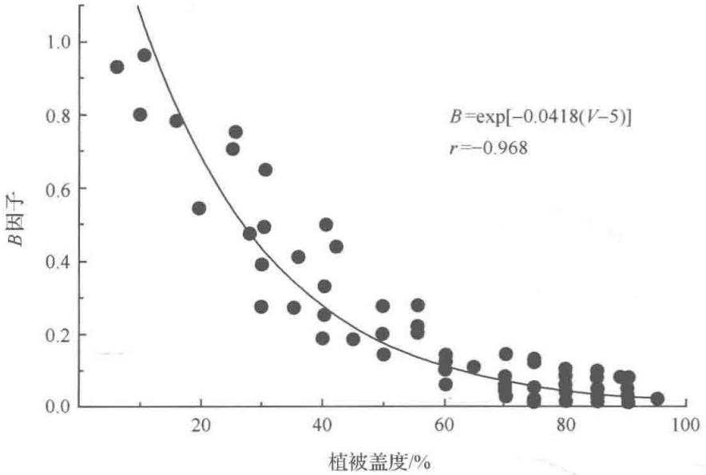  
图7-1 土壤流失比率SLR与植被盖度的关系(据江忠善等，1996)式中B为植物覆盖与生物措施因子;V为植被盖度(%)

## (二)林地土壤流失比率

黄土高原大部分地区的森林已非地带性植被，多为人工林或残存的少数天然林地和天然次生林，天然林与人工林的水土保持效益有差异，尤其在种植初期。天然林土壤入渗速率和土壤有机质含量都很高。地表的大部分或全部被腐殖质层覆盖，使土壤免受径流侵蚀和雨滴冲击的破坏，对防止土壤侵蚀非常有效。在树木和枯枝落叶覆盖不完全的情况下，很少或没有被覆盖的地块也可能受到下层林木的保护。由于黄土高原天然林地的径流小区试验资料也很有限，天然林土壤流失比率SLR借鉴了USLE(Wischmeier andSmith，1978)中的有关资料(表7-4)。

表7-4林地土壤流失比率SLR值随乔木郁闭度和其下植被盖度变化而变化
<table><tr><td rowspan="2">盖度/%</td><td colspan="10">乔木郁闭度/%</td></tr><tr><td>10</td><td>20</td><td>30</td><td>40</td><td>50</td><td>60</td><td>70</td><td>80</td><td>90</td><td>100</td></tr><tr><td>5</td><td>0.390</td><td>0.378</td><td>0.367</td><td>0.356</td><td>0.345</td><td>0.335</td><td>0.325</td><td>0.315</td><td>0.306</td><td>0.296</td></tr><tr><td>10</td><td>0.339</td><td>0.330</td><td>0.320</td><td>0.310</td><td>0.301</td><td>0.292</td><td>0.284</td><td>0.275</td><td>0.267</td><td>0.259</td></tr><tr><td>20</td><td>0.238</td><td>0.232</td><td>0.225</td><td>0.219</td><td>0.213</td><td>0.207</td><td>0.201</td><td>0.196</td><td>0.190</td><td>0.185</td></tr><tr><td>30</td><td>0.181</td><td>0.177</td><td>0.172</td><td>0.168</td><td>0.164</td><td>0.160</td><td>0.156</td><td>0.153</td><td>0.149</td><td>0.146</td></tr><tr><td>40</td><td>0.123</td><td>0.121</td><td>0.119</td><td>0.117</td><td>0.115</td><td>0.113</td><td>0.111</td><td>0.109</td><td>0.108</td><td>0.106</td></tr><tr><td>50</td><td>0.095</td><td>0.094</td><td>0.092</td><td>0.091</td><td>0.090</td><td>0.088</td><td>0.087</td><td>0.086</td><td>0.085</td><td>0.084</td></tr><tr><td>60</td><td>0.066</td><td>0.066</td><td>0.065</td><td>0.064</td><td>0.064</td><td>0.063</td><td>0.063</td><td>0.062</td><td>0.062</td><td>0.061</td></tr><tr><td>70</td><td>0.040</td><td>0.040</td><td>0.039</td><td>0.039</td><td>0.039</td><td>0.038</td><td>0.038</td><td>0.037</td><td>0.037</td><td>0.037</td></tr><tr><td>80</td><td>0.013</td><td>0.013</td><td>0.013</td><td>0.013</td><td>0.013</td><td>0.013</td><td>0.012</td><td>0.012</td><td>0.012</td><td>0.012</td></tr><tr><td>90</td><td>0.008</td><td>0.008</td><td>0.008</td><td>0.008</td><td>0.008</td><td>0.008</td><td>0.008</td><td>0.008</td><td>0.008</td><td>0.008</td></tr><tr><td>&gt;95</td><td>0.003</td><td>0.003</td><td>0.003</td><td>0.003</td><td>0.003</td><td>0.003</td><td>0.003</td><td>0.003</td><td>0.003</td><td>0.003</td></tr></table>

人工林的水土保持作用与天然林相比有很大差距。另外，人工林在整地过程中，以及幼林保育期对土壤的扰动都很大，必须分别估计幼林和成林的SLR。据Zhang等(2003)的研究结果，有些幼林地2年以后SLR基本保持稳定，有些林地则在3年或4年以后基本保持稳定。一般造林初期SLR变化较大，一方面是由于植被自身的特征，如覆盖度、高度、叶面积以及根系密度等对土壤的保护作用还很小，另一方面是植物栽种时对土壤的扰动程度不同。Zhang等(2003)根据小区试验资料得到不同人工林地和灌木林地的观测结果(表7-5)。

表7-5 黄土高原部分人工林地土壤流失比率SLR值
<table><tr><td>植被类型</td><td>土壤流失比率值</td></tr><tr><td>刺槐</td><td>0.004</td></tr><tr><td>柠条</td><td>0.058</td></tr><tr><td>沙打旺</td><td>0.071</td></tr><tr><td>沙棘</td><td>0.083</td></tr><tr><td>沙棘+杨树</td><td>0.144</td></tr><tr><td>沙棘+油松</td><td>0.164</td></tr></table>

\*沙棘+杨树和沙棘+油松的林龄在3年以上，其他乔灌林龄2年以上，草木樨以外的人工草地2年以上。

## (三)其他土地利用类型的生物措施因子

其他土地利用类型是指除果园、林地和草地以外的各种类型，主要包括耕地、居民点及工矿用地、交通运输用地、水域和其他土地等。耕地中植被覆盖对土壤侵蚀的影响主要表现为种植制度决定的作物覆盖季节变化产生的影响，在本研究中将该影响统一在耕作措施因子中考虑，其SLR值取1。裸露的土地由于没有地表植被截留降雨和阻滞径流，接近或大于清耕休闲地的土壤流失量，将其SLR值设为1。道路和居民点根据实际地表覆盖情况取值，但如果地表为人造水泥等，应取值为1。黄土高原道路侵蚀的严重性受到广泛关注，但由于道路侵蚀包含了沟蚀、泻溜、崩塌、陷穴、悬沟侵蚀及滑坡等多种形式(郑世清等，2001)，土壤流失量的估计有很大难度，现有数据和资料还不足以确定道路的SLR值。

## 四、工程措施因子(E)的估计

如前所述，水土保持工程措施是通过改变小地形(如坡改梯等平整土地的措施)、拦蓄地表径流、增加土壤降雨入渗等途径减少或防止土壤侵蚀。估计水土保持措施因子E的基础数据也是水土保持试验观测资料，表7-6是根据不同文献的研究结果整理的不同工程措施减流减沙效益以及在此基础上计算的E因子值。

表7-6不同工程措施减流减沙效益及其E因子值
<table><tr><td>工程措施名称</td><td>减流效益</td><td>减沙效益</td><td>E值</td><td>备注</td></tr><tr><td>水平梯田(1°)</td><td>0.853</td><td>0.910</td><td>0.090</td><td>试验样地:晋西离石羊道沟小流域。坡向：</td></tr><tr><td>鱼鳞坑(31°)</td><td>0.680</td><td>0.750</td><td>0.250</td><td>西北。土壤：黄土。小区长：20m，宽：</td></tr><tr><td>坡式梯田(地埂，24°)</td><td>0.615</td><td>0.730</td><td>0.270</td><td>10m。试验未设重复。试验年限1957~</td></tr><tr><td>水平阶(31°)</td><td>0.564</td><td>0.669</td><td>0.331</td><td>1965年</td></tr><tr><td>水平梯田</td><td>0.708</td><td>0.967</td><td>0.033</td><td>试验样地：山东省新泰市北师乡狼毛沟小 流域。土壤：花岗片麻岩风化粗砂土。小</td></tr><tr><td>坡式梯田</td><td>0.627</td><td>0.833</td><td>0.167</td><td>区面积100m²。地面坡度为5°和10°，试验 未设重复。试验年限1989~1991年</td></tr><tr><td>鱼鳞坑</td><td>0.645</td><td>0.813</td><td>0.187</td><td>试验样地:安塞县纸坊沟小流域。土壤:黄 绵土。坡度36°，试验采用人工模拟降雨，</td></tr><tr><td>水平阶</td><td>0.579</td><td>0.744</td><td>0.256</td><td>时间1991年6~10月</td></tr><tr><td>隔坡梯田</td><td>0.868</td><td>0.890</td><td>0.110</td><td>试验样地：延安市上砧沟小流域。土壤:黄 绵土。梯田宽3~4m，间隔自然坡面6～ 8m,试验年限1982~1984年</td></tr></table>

在黄土高原地区，梯田、鱼鳞坑等适用于坡面的水土保持工程措施具有明显的蓄水保土效益。但是，工程措施受降雨、工程质量的影响很大。暴雨和大暴雨是降低水土保持工程措施蓄水保土效益的主要因素之一，当次降雨综合参数PI、汛期雨量、年产流降雨量分别小于20.0mm²/min、350mm和125mm时，蓄水保土效益均为100%；当大于这些数值时，水土保持措施的蓄水保土效益有随着降雨增大而效益降低的趋势(吴发启等，2004)。由于在土壤流失量的长期预报中，定量评估工程措施和降雨因素的影响还缺乏足够的依据，考虑到土壤侵蚀评价主要针对多年平均土壤流失量，暂时不予考虑。

## 五、耕作措施因子(T)的估计

农地耕作措施因子(T)包括两部分：一是指由耕作制度决定的作物轮作方式对土壤侵蚀的影响，主要表现为作物覆盖变化的影响；二是指采取整地或耕作措施对土壤侵蚀的影响，在黄土高原地区比较主要的有:水平沟、穴种(穴植刺槐)、等高沟垄(平播)耕作、区田、套犁沟播、等高带状间轮作等，以下分别介绍。

## (一)农地耕作措施因子估算方法

农作物覆盖度的季节变化最大，休闲期和苗床期可能为0%，成熟期的最大覆盖度可以达到90%以上。因此，要准确估计某个给定地区农作物的B因子值，需要掌握那个地区一年内侵蚀性降雨在各月的分配以及侵蚀性降雨可能发生的时段内植被及其残体等对土壤侵蚀的抑制作用的大小。在能够获得降雨侵蚀力季节分配以及反映不同阶段作物覆盖和管理的观测数据条件下，本节提供了具体的估算方法:首先要计算作物不同生长发育阶段和不同覆盖度的土壤流失比率(某一条件与休闲地土壤流失量之比SLR)，然后根据当地的降雨侵蚀力季节分布，将各阶段的SLR进行加权平均求得年平均或作物生长周期的B因子值。黄土高原地区粮食作物以旱作为主，据初步统计，主要粮食作物有冬小麦、玉米、高粱、谷子、糜子、马铃薯、大豆等，以下主要针对这些作物计算。

## 1. 不同作物农作期的划分

划分作物生长期(农作期)是估算作物B因子的主要步骤之一，USLE(WischmeierandSmith，1965)依据作物生长时间划分5个农作期。USLE(Wischmeier andSmith，1978)中的方法是按照作物覆盖度的变化将作物生长期划分为6个期：休闲期(翻地一准备苗床)、苗床期(准备苗床一10%覆盖度)、定苗期(10%～50%覆盖度)、发育期(50%～75%覆盖度)、成熟期(75%覆盖度—收割)和残茬期(收割翻地)。张岩等(2001)借鉴USLE(Wischmeier andSmith，1978)的方法，根据黄土高原作物生长过程绘出覆盖度变化曲线，结合播种期、收割期等确定各农作期的时间长度，划分了黄土高原地区7种农作物的农作期(表7-7)。黄土高原一般准备苗床到播种日期很短，所以在划分农作期时，苗床期都从播种日期算起。由于玉米黄豆间作(玉米+黄豆)和冬麦收割后一般保留残茬，直到下一次播种前才翻地，因此收割日期到下一次播种算作残茬期，无休闲期。另外，由于作物长势差等原因使覆盖度不能达到75%时，从抑制土壤侵蚀的作用来说，覆盖度达50%后直到收割都算发育期，无成熟期，如扁豆。

表7-7 农作物①土壤流失比率(SLR)表
<table><tr><td></td><td>苗床期</td><td>定苗期</td><td>发育期</td><td>成熟期</td><td>残茬期</td><td>休闲期</td><td>作物产量水平  $/ ( \sqrt { T } / \overrightarrow { \boxplus } ) ^ { * }$ </td><td>植株高 /cm</td></tr><tr><td>荞麦</td><td>0.71</td><td>0.54</td><td>0.19</td><td>0.21</td><td>0.53</td><td>1.00</td><td>568</td><td>90~100</td></tr><tr><td>马铃薯</td><td>1.00</td><td>0.53</td><td>0.47</td><td>0.30</td><td>0.71</td><td>1.00</td><td>376</td><td>40~50</td></tr><tr><td>谷子</td><td>1.00</td><td>0.57</td><td>0.52</td><td>0.52</td><td>0.96</td><td>②</td><td>628</td><td>90~100</td></tr><tr><td>大豆</td><td>1.00</td><td>0.92</td><td>0.56</td><td>0.46</td><td>0.53</td><td>②</td><td>478</td><td>60~70</td></tr><tr><td>冬麦</td><td>1.00</td><td>②</td><td>②</td><td>0.17</td><td>0.19①</td><td>③</td><td>302</td><td>50~60</td></tr><tr><td>玉米+大豆</td><td>1.00</td><td>0.40④</td><td>0.26</td><td>0.03</td><td>②</td><td>③</td><td>420/57</td><td>190~200</td></tr><tr><td>扁豆</td><td>1.00</td><td>0.70</td><td>0.46</td><td>—⑤</td><td>0.52</td><td>1.00</td><td>88</td><td>/50~60 90~100</td></tr></table>

①表中所列农作物的耕作都是当地的传统方法，即玉米+大豆、扁豆为等高条播；冬麦，荞麦、谷子为撒播；马铃薯、黄豆穴播；扁豆收后休闲；荞麦、马铃薯、谷子和大豆锄翻；冬麦、玉米+大豆、扁豆掀翻。  
②少雨季节，资料不足。  
③无翻地日期记录，从收割到下一次播种算做残茬期。  
④冬麦残茬期SIR是天水冬麦小区和“裸地”上单位降雨侵蚀力产生的平均侵蚀量的比值。  
⑤因扁豆长势差，覆盖度低，从覆盖度50%到收割都算发育期，因此没有得到成熟期土壤流失比率。\*1 $F _ { \mathrm { f } } = 5 0 0 \mathrm { g } ; 1$ 亩 $\approx 6 6 6 . 6 7 \mathrm { m ^ { 2 } }$ 0

## 2. 各农作期土壤流失率SLR

农作期土壤流失比率(SLR)是一个农作期内耕种农田与清耕休闲地土壤流失量之比。使用黄土高原天水和安塞的水土保持试验小区观测资料估计7种农作物或间作作物B因子农作期土壤流失比率(表7-8，张岩等，2001)。

## 3. 计算多年平均耕作措施因子T

首先收集农作物播种期、中耕时间、收获期及秸秆产量等信息，并估计作物冠层的生长速度，即覆盖度分别达到10%、50%、75%和最大冠层覆盖度的日期，然后按照下面的流程计算多年平均耕作措施因子T。

第一步:确定各种作物每个农作期开始的日期。

第二步:从降雨侵蚀力季节分布计算表或依据公式(7-1)计算农作期降雨侵蚀力占年降雨侵蚀力的累积百分比，建议采用 $E I _ { 3 0 }$ 指标。

第三步：从表7-7中获得农作期土壤流失比率SLR值。

第四步:计算作物B值:每个农作期土壤流失比率SLR与相应的WR相乘。WR计算可参见第四章降雨侵蚀力因子，提供了黄土高原不同地区降雨侵蚀力季节分布，既可以直接查表计算，也可利用下面公式计算：

$$
\mathrm { W R } _ { k } = { \frac { R _ { k } } { \bar { R } } }\tag{7-2}
$$

式中， $\mathrm { W R } _ { k }$ 为第k个农作期的降雨侵蚀力 $( R _ { k } )$ 占多年平均年降雨侵蚀力 $( \hat { R } )$ 的比例(%);

$k { = } 1 , 2 , \cdots$ ，是某作物的农作期。

## 4. 根据作物秸秆产量计算修正系数

黄土高原地区的侵蚀性降雨集中在6～9月，多数农作物处于发育期和成熟期。作物长势的好坏显著影响其保护土壤的效果。为了体现不同年份作物长势差异导致的土壤流失率 SLR差异较大，参考美国农业部农业手册 537号(Wischmeierand Smith,1978)，依据土壤流失率SLR与成熟期作物盖度V(0\~1)的关系，可对SLR进行修正。

$$
\begin{array} { r } { \nVdash \frac { \# / } { \mathbb { H } / } \frac { \# } { \mathbb { H } } \textcircled { \# } \mathrm { c m } : \mathrm { S L R } = - 0 . 8 3 3 V + 1 } \end{array}
$$

作物高度50(含)～100cm:SLR=—0.7V+1

$$
\nmid \nmid \nwarrow 4 / 2 \mid \stackrel { \scriptscriptstyle { \mathrm { R e } } } { \scriptscriptstyle { \mathrm { R e } } } 1 0 0 ( \underset { \scriptscriptstyle \mathrm { R e } } { \scriptscriptstyle \mathrm { \widehat { \scriptscriptstyle \mathrm { R e } } } } ) \sim 2 0 0 \mathrm { c m } _ { \mathrm { : } } \mathrm { S L R } = - 0 . 5 V + 1
$$

如果作物成熟期的盖度不易获得，也可以通过作物秸秆的产量反映成熟期盖度大小。假设作物盖度与秸秆产量呈正比例，则土壤流失率SLR与作物秸秆产量也应具有线性关系。计算实际产量与表7-7中所列产量之比值，作为修正系数，修正该种作物成熟期的土壤流失比率SLR。

## (二)其他耕作措施因子

其他耕作措施是指除反映植被覆盖影响外的其他整地和样地措施，一般要根据径流小区观测资料计算。黄土高原该类水土保持措施种类较多，并有较为丰富的观测资料。1944年以来，黄土高原地区陆续建立了天水、西峰、绥德、子洲、安塞、离石等水土保持试验站，其中的一些试验站观测了耕作措施的水土保持效益。表7-8是根据不同文献的研究结果整理的各种耕作措施减流减沙效益，以及在此基础上计算的T因子值。表中所给值还比较粗略。研究表明当坡度为 $0 ^ { \circ } 1$ 时，水流方向不确定，各种耕作措施的T因子都为1.0;而当坡度大于 $2 5 ^ { \circ }$ 时，等高耕作T因子也等于1.0，因为在这种情况下，15cm的犁沟已经不能储存径流(Smith andWhitt，1947)。影响等高耕作水土保持效果的因素还有犁垄的高度、降雨强度、坡长等。由于基础观测资料的缺乏，黄土高原地区降雨、坡度、土壤等各种因素对耕作措施的影响有待进一步研究。

表7-8 不同耕作措施减流减沙效益及其T因子值
<table><tr><td colspan="2">耕作措施名称</td><td>减流效益</td><td>减沙效益</td><td>T值</td><td>备注</td></tr><tr><td>水平沟</td><td></td><td>0.430</td><td>0.391</td><td>0.609</td><td>试验样地：安塞县纸坊沟流域。坡度：23°， 坡向：正北。小区长20m，宽5m。试验未 设重复。试验年限：1987~1991年共5年 天然降雨</td></tr><tr><td rowspan="4">水平沟</td><td> $1 0 ^ { \circ }$ </td><td>0.620</td><td>0.779</td><td>0.221</td><td></td></tr><tr><td> $1 5 ^ { \circ }$ </td><td>0.490</td><td>0.695</td><td>0.305</td><td rowspan="3">试验样地：安塞县沿河湾镇茶坊村。坡向： 西南。土壤：黄绵土。小区长：7m，宽：</td></tr><tr><td> $2 0 ^ { \circ }$ </td><td>0.400</td><td>0.425</td><td>0.575</td></tr><tr><td> $2 5 ^ { \circ }$ </td><td>0.380</td><td>0.295</td><td>2m。试验未设重复。试验年限不详</td></tr><tr><td colspan="2">穴种(穴植刺槐)</td><td>0.460</td><td></td><td>0.705</td><td></td></tr><tr><td colspan="2">等高沟垄耕作</td><td>0.581</td><td>0.783</td><td>0.217</td><td rowspan="3">试验样地：陕北绥德、米脂。坡度16°~ 30°，小区长、宽不详。试验未设重复。试</td></tr><tr><td>区田(20°~30°)</td><td>0.643</td><td>0.827</td><td colspan="2">0.173</td></tr><tr><td>套犁沟播</td><td>0.521</td><td>0.728</td><td colspan="2">0.272 验年限：1954~1957年</td></tr><tr><td colspan="2">等高带状间轮作</td><td></td><td>0.795</td><td>0.205</td><td>试验样地:辽宁省西丰县泉河小流域。土 壤为黄土状棕壤。坡度：15°；小区长20m， 宽5m。试验未设重复。试验年限：1980~ 1990年共11年天然降雨</td></tr><tr><td colspan="2">等高耕作**</td><td>0.567</td><td>0.702</td><td>0.298</td><td rowspan="4"></td></tr><tr><td>抗旱丰产沟</td><td></td><td></td><td colspan="2">0.213</td></tr><tr><td>掏钵(穴状)种植</td><td></td><td></td><td colspan="2">0.499</td></tr><tr><td>留茬少耕</td><td></td><td>0.212</td><td colspan="2">试验样地：浙江省兰溪市水土保持管理站。 土壤为红壤。坡度：15°；小区长、宽不详。</td></tr><tr><td colspan="2">免耕</td><td></td><td></td><td>0.136</td><td>试验未设重复。试验年限：1987年天然</td></tr><tr><td colspan="2">中耕培垄</td><td></td><td></td><td>0.499</td><td>降雨</td></tr><tr><td colspan="2">草田轮作</td><td></td><td></td><td>0.225</td><td></td></tr><tr><td colspan="2">休闲地绿肥</td><td></td><td></td><td>0.225</td><td></td></tr></table>

\*以平播裸露地为对照；\*\*以顺坡耕作为对照。

## 六、存在问题和前景展望

本研究在评价水土保持措施生物因子B、工程措施因子E和耕作措施因子T时，主要依据黄土高原地区径流小区试验积累的观测资料，以及部分研究成果，还不能涵盖实际应用中可能遇到的所有情况，有待进一步丰富观测资料，不断完善。

随着退耕还林的推广，黄土高原地区人工林地面积不断扩大，人工林树种和配置模式也越来越多样化，实际应用中，对于没有的树种和混交模式，可以使用相似树种或人工林B因子的平均值代替。黄土高原的道路侵蚀非常严重，但道路侵蚀与道路的维护密切相关，现有的研究成果还不足以准确估计道路的B因子。必要时，可以用裸地的B因子代替，即B=1。但是，这样估计的道路侵蚀可能小于实际侵蚀量。黄土高原地区农地撂荒是普遍存在的现象。如前所述，现有的试验数据无法对撂荒年限土壤侵蚀影响做出定量估计。本模型中暂时没有考虑撂荒年限对荒地生物措施因子的影响，撂荒年限修正系数暂时设定为1。

工程措施因子和耕作措施因子的计算同样依据径流小区观测数据。但是，这方面积累的资料更加有限。因此，还参考了黄土高原以外地区的观测资料，用来估计等高带状间轮作和等高耕作T因子及水平梯田和坡式梯田的E因子。另外，由于径流小区面积有限，用来观测工程措施和耕作措施的水土保持作用时，可能增加研究结果的不确定性，从而导致不同的实验研究结果有较大差异，为模型计算相关因子带来一定

困难。

农作物的覆盖影响通过耕作措施因子估算，计算时其B因子值取1。估算覆盖产生的影响时，分别给出了利用农作期的土壤流失比率SLR估算和利用作物轮作制度估算的方法，前者基于小区观测资料，比较准确，但受观测资料限制；后者计算简单，但精度较低，尤其是目前农地以个人承包为主，轮作制度变化很大，目前的划分已经与时间相差很大。因此，一方面需要不断积累各种作物分生育期的土壤流失比率，另一方面需要不断更新作物轮作制度，目前的高分辨率遥感数据为此提供了可行手段。

为了更加准确估计各种水土保持措施因子，还需要加强相关研究的深度和广度。一方面，增加径流小区试验，观测更多的植被类型、耕作措施和工程措施的产流产沙量；另一方面，需要深入研究水土保持措施因子的次一级影响因素。例如，在林地控制土壤侵蚀效能方面，对植被树龄、高度、郁闭度对B因子的影响研究还很少。农作物方面，需要研究新型耕作方式、作物残茬管理以及产量水平等对土壤侵蚀的影响。此外，还应对已有大量观测数据和研究成果实现数据共享和系统管理，不断扩充土壤侵蚀基础信息数据库，以满足土壤侵蚀预报及水土保持和土地利用影响评价的要求。

## 参考文献

郭廷辅，高博文.1982.农业生产技术基本知识-水土保持.北京：农业出版社

江忠善，王志强，刘志.1996.应用地理信息系统评价黄土丘陵区小流域土壤侵蚀的研究.水土保持研究，3(2)：1-9

刘宝元，刘瑛娜，张科利，等.2013.中国水土保持措施分类.水土保持学报，27(2)：80-84

唐克丽.2004.中国水土保持.北京：科学出版社

王礼先. 1995.水土保持学.北京：中国林业出版社

王礼先，朱金兆.2005.水土保持学.第2版.北京：中国林业出版社

吴发启，张玉斌，王建.2004.黄土高原水平梯田的蓄水保土效益分析.中国水土保持科学，2(1)：34-37

辛树帜，蒋德麒.1982.中国水土保持概论.北京：农业出版社

张岩，刘宝元，史培军，等.2001.黄土高原土壤侵蚀作物覆盖因子计算.生态学报，21(7)：1050-1056

郑世清，杨岗民.2001.黄土丘陵沟壑区山坡道路防蚀措施初步研究.中国水土保持，11：16-17

Bennett H H. 1955. Elements of Soil Conservation. New York and London: Megraw-Hill Book Company

Brooks K N, Ffollioff P F, Gregersen H M, et al. 1991. Hydrology and the Management of Watersheds. Ames: Iowa State University Press

Browning G M, Parish C L, Glass J A. 1947. A method for determining the use and limitation of rotation and conservation practices in control of soil erosion in Iowa. Journal of the American Society of Agronomy, 39(1) : 65-73

Hudson N. 1995. Soil Conservation. Ames: Iowa State University Press

Morgan R P C. 2006. Soil Erosion and Conservation. Oxford: Blackwell Publishing Company

Smith D D. 1941. Interpretation of soil conservation data for field use. Agricultural Engineering, 22(5) : 173-175

Smith D D, Whitt D M, 1947. Estimating soil losses from field areas of claypan soil. Soil Science Society of America Proceedings, 12: 485-490

Van Doren C A, Stauffer R S, Kidder E H. 1950. Effect of contour farming on soil loss and runoff. Soil Science Society of America Proceedings, 15: 413-417

Wischmeier W H. 1960. Cropping-management factor evaluation for universal soil-loss equation. Soil Science Society of America Proceedings, 24(4) : 322-326

Wischmeier W H, Smith D D. 1965. Predicting Rainfall Erosion Losses from Cropland East of the Rocky Mountains Guide for Selection of Practices for Soil and Water Conservation. USDA Agricultural Handbook. No. 282. Wash-

ington, D.C: USDA

Wischmeier W H, Smith D D. 1978. Predicting Rainfall Erosion Losses—A Guide to Conservation Planning. USDA Agricultural Handbook. No. 537. Washington, D. C: USDA

Zhang Y, Liu B Y, Zhang Q C. 2003. Influence of different vegetation types on soil erosion by water. Acta Botanica Sinica,45(10):1204-1209

## 第八章 黄土高原土壤侵蚀空间分布特征

## 一、土壤侵蚀评价精度分析

黄土高原土壤流失方程主要用于预报不同土地利用类型长期平均的细沟和细沟间土壤流失量。计算的土壤流失量是多年平均流失量的估计值，而不是绝对值。一般来说，越是与标准小区定义的情况接近，估计值的精度就越高。与标准小区条件相差越悬殊，产生外推误差的概率就越大。

为了验证计算机模型提供的方程、图表及模拟结果的精确性，选择了黄土高原地区近28种不同土地利用类型的径流小区，用模型计算已有观测资料小区的长期平均土壤流失量，将模拟结果与观测结果进行比较。

## (一)资料与处理

选用的小区资料年限一般为5～13年，个别林地小区只有3年的观测数据，同时，要求有径流小区的植被类型、田间管理、工程措施等必要的记录，所选小区基本情况见表8-1。

表8-1用于验证模型的径流小区基本情况
<table><tr><td>试验站</td><td>时间</td><td>土质</td><td>坡度 /(°)</td><td>坡长 /m</td><td>面积 /m2</td><td>植被覆盖</td><td>耕作措施</td><td>工程措施</td><td>小区 年限</td></tr><tr><td>安塞</td><td>1987~1992年</td><td>黄绵土</td><td>25</td><td>20</td><td>100</td><td>谷子</td><td>撒播</td><td>无</td><td>6</td></tr><tr><td>安塞</td><td>1987~1992年</td><td>黄绵土</td><td>27.6</td><td>20</td><td>100</td><td>红豆草</td><td>撒播</td><td>无</td><td>6</td></tr><tr><td>安塞</td><td>1987~1992年</td><td>黄绵土</td><td>25</td><td>20</td><td>100</td><td>黄豆</td><td>穴播</td><td>无</td><td>6</td></tr><tr><td>安塞</td><td>1987~1992年</td><td>黄绵土</td><td>27.6</td><td>20</td><td>100</td><td>裸地</td><td>无</td><td>无</td><td>6</td></tr><tr><td>安塞</td><td>1987~1992年</td><td>黄绵土</td><td>25</td><td>20</td><td>100</td><td>裸地</td><td>无</td><td>无</td><td>6</td></tr><tr><td>安塞</td><td>1987~1992年</td><td>黄绵土</td><td>25</td><td>20</td><td>100</td><td>马铃薯</td><td>穴播</td><td>无</td><td>6</td></tr><tr><td>安塞</td><td>1987~1992年</td><td>黄绵土</td><td>25</td><td>20</td><td>100</td><td>荞麦</td><td>撒播</td><td>无</td><td>6</td></tr><tr><td>安塞</td><td>1987~1992年</td><td>黄绵土</td><td>27.6</td><td>20</td><td>100</td><td>沙打旺</td><td>撒播</td><td>无</td><td>6</td></tr><tr><td>离石</td><td>1957~1965年</td><td>黄绵土</td><td>31</td><td>23.1</td><td>200</td><td>刺槐</td><td>无</td><td>水平沟</td><td>9</td></tr><tr><td>离石</td><td>1957~1959年</td><td>黄绵土</td><td>31</td><td>23.1</td><td>200</td><td>刺槐</td><td>无</td><td>水平阶</td><td>3</td></tr><tr><td>离石</td><td>1957~1965年</td><td>黄绵土</td><td>31</td><td>23.1</td><td>200</td><td>刺槐</td><td>穴植</td><td>无</td><td>9</td></tr><tr><td>试验站</td><td>时间</td><td>土质</td><td>坡度 /(°)</td><td>坡长 /m</td><td>面积 /m²</td><td>植被覆盖</td><td>耕作措施</td><td>工程措施</td><td>小区 年限</td></tr><tr><td>离石</td><td>1959~1966年</td><td>黄绵土</td><td>24</td><td></td><td>1453</td><td>农作物</td><td>平作</td><td>地埂</td><td>8</td></tr><tr><td>离石</td><td>1960~1961年， 1963~1966年</td><td>黄绵土</td><td>1</td><td>40</td><td>400</td><td>马铃薯、谷子</td><td>平作</td><td>水平梯田</td><td>6</td></tr><tr><td>绥德</td><td>1954~1960年</td><td>黄绵土</td><td>28.68</td><td>20</td><td>100</td><td>高粱豇豆</td><td>平作</td><td>无</td><td>7</td></tr><tr><td>绥德</td><td>1954~1960年</td><td>黄绵土</td><td>14.68</td><td>20</td><td>100</td><td>高粱豇豆</td><td>平作</td><td>无</td><td>7</td></tr><tr><td>绥德</td><td>1955~1960年</td><td>黄绵土</td><td>34.25</td><td>20</td><td>100</td><td>苜蓿</td><td>平作条播</td><td>无</td><td>6</td></tr><tr><td>绥德</td><td>1955~1960年</td><td>黄绵土</td><td>32.78</td><td>20</td><td>100</td><td>草木樨</td><td>平作条播</td><td>无</td><td>6</td></tr><tr><td>天水</td><td>1954～1957年</td><td>黄绵土</td><td>27.8</td><td>20</td><td>100</td><td>洋槐(7~10年)</td><td>穴植</td><td>无</td><td>4</td></tr><tr><td>天水</td><td>1954~1957年</td><td>黄绵土</td><td>29.12</td><td>20</td><td>100</td><td>洋槐(7~10年) 冬麦荞麦黄</td><td>穴植</td><td>无</td><td>4</td></tr><tr><td>天水</td><td>1954~1957年</td><td>黄绵土</td><td>8.73</td><td>30</td><td>100</td><td>豆十玉米一扁豆</td><td>等高条播</td><td>梯田</td><td>4</td></tr><tr><td>天水</td><td>1945~1957年</td><td>黄绵土</td><td>6.55</td><td>20</td><td>100</td><td>冬麦—荞麦—黄 豆+玉米一扁豆</td><td>撒播</td><td>无</td><td>13</td></tr><tr><td>天水</td><td>1945~1957年</td><td>黄绵土</td><td>8.05</td><td>20</td><td>100</td><td>冬麦一荞麦一黄 豆+玉米一扁豆</td><td>等高条播</td><td>无</td><td>13</td></tr><tr><td>天水</td><td>1945~1957年</td><td>黄绵土</td><td>8.6</td><td>20</td><td>100</td><td>冬麦荞麦黄 豆+玉米一扁豆</td><td>等高条播</td><td>无</td><td>13</td></tr><tr><td>天水</td><td>1945~1957年</td><td>黄绵土</td><td>25.5</td><td>20</td><td>100</td><td>苜蓿</td><td>等高条播</td><td>无</td><td>13</td></tr><tr><td>西峰</td><td>1962~1966年</td><td>黄绵土</td><td>2.85</td><td>20</td><td>100</td><td>冬麦</td><td>条播</td><td>无</td><td>5</td></tr><tr><td>子洲</td><td>1960~1967年</td><td>黄绵土</td><td>22</td><td>40.00</td><td>200</td><td>农作物</td><td>平作</td><td>无</td><td>8</td></tr><tr><td>子洲</td><td>1960~1967年</td><td>黄绵土</td><td>22</td><td>60.00</td><td>300</td><td>农作物</td><td>平作</td><td>无</td><td>8</td></tr><tr><td>子洲</td><td>1960~1967年</td><td>黄绵土</td><td>22</td><td>20.00</td><td>100</td><td>农作物</td><td>平作</td><td>无</td><td>8</td></tr><tr><td>子洲</td><td>1961~1969年</td><td>黄绵土</td><td>24,60,19</td><td></td><td>4080</td><td>农作物</td><td>平作</td><td>无</td><td>9</td></tr></table>

## (二)模拟计算精度

图8-1为模型计算结果与小区实测资料的1:1线图。模拟结果表明，28个径流小区年平均土壤流失量的预报值与实测值平均误差为 $1 8 9 \mathrm { t / k m ^ { 2 } }$ ，最小为一 $2 9 7 6 \mathrm { t / k m ^ { 2 } }$ ，最大为$4 1 7 0 \mathrm { { t } / k m ^ { 2 } }$ 。其中，35.7%的小区模拟误差在 $5 0 0 \mathrm { t / k m ^ { 2 } }$ 以内，57.1%的小区模拟误差在$\mathrm { 1 0 0 0 t / k m ^ { 2 } }$ 以内。总体上看，预报值与实测值的相关性很高，模型的有效性系数达到0.882(图8-1)。

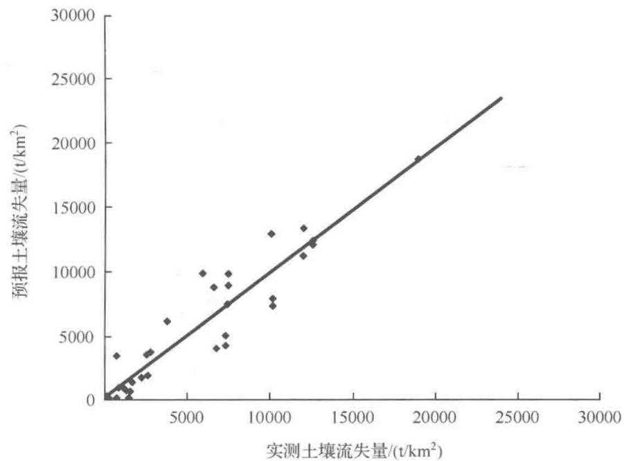  
图8-1 模拟土壤流失量与实测土壤流失量的比较

个别小区模拟误差较大的原因主要是小区实测资料的年限太短。模型预报的是多年平均流失量，一般认为22年以上的观测记录才能代表多年平均的侵蚀状态。而本次评价中使用的小区观测资料年限最长的也只有13年，多数在10年以内。Wischmeier和Smith(1965)指出：短期的记录必然包含周期作用引起的偏差，以及不可控制变量的随机波动影响。在预报多年平均土壤流失量时，这些变量的作用已被平均化。土壤流失量预报精确与否，取决于选用的相关参数是否准确描述了具体地块的自然状况与管理情况。由于资料的限制，这次评价所应用的黄土高原土壤流失方程中，能够提供的因子值还十分有限，选择因子的误差会在预报土壤流失量时产生同样比例的误差。

以上验证结果表明，尽管基于现有资料的模型计算结果存在一定程度的误差，但有效性系数达到0.882的预报精度仍可以满足区域水土流失评价及水土保持效益分析。由于用于精度分析的数据都是小区资料，且精度有正有负，即有些小区估算值偏高，有些小区估算值又偏低了。在进行小流域或区域水土流失估算时，有多种不同的下垫面存在，即使在现在精度水平下，不同下垫面估算结果的误差也会在一定程度上相互抵消，总体估算误差一定小于单个小区的估算误差。

## 二、土壤侵蚀强度及其空间分布

土壤侵蚀是自然环境因素和人类社会活动共同影响的结果。自然环境特征决定着土壤侵蚀发生的主导因素，人类活动特点则是在自然环境导致的土壤侵蚀背景上，加剧或减弱土壤侵蚀严重程度。导致黄土高原土壤侵蚀严重的自然因素包括地貌、气候、植被、土质等。地貌特征主要表现在地形破碎、沟谷纵横，且陡坡面积大；气候特征主要为干旱少雨、降雨集中，且多高强度暴雨；植被特征主要体现在森林覆盖度低、郁闭度差，且森林多集中在石质山地；土质疏松多孔、有机质少，但粉粒含量高。人类活动特点表现为地多人少、广种薄收和陡坡开垦，天然植被破坏严重。自然因子和人为因素共同导致黄土高原严重的土壤侵蚀。

## (一)黄土高原现代土壤侵蚀解析

黄土高原地区土壤侵蚀严重的根源是自然因素和人类活动相互叠加和相互促进的结果。切割破碎和陡峻坡面为土壤侵蚀发生创造了条件，植被覆盖度低则使土壤侵蚀发生成为可能，而高强度降雨为土壤侵蚀发生提供了推动力，土质疏松则加剧了土壤侵蚀的发生程度。人类活动则进一步破坏了植被对土壤侵蚀的抑制作用，导致了现代加速侵蚀的发生。在黄土高原地区开展土壤侵蚀评价研究，应该正确理解自然因素和人为因素的作用，以及对区域水土流失的贡献。

自然因素导致的土壤侵蚀被称为自然侵蚀或地质侵蚀，是指在人类活动影响之前或者不考虑人为作用的前提下所发生的土壤侵蚀。自然侵蚀是客观存在的自然地理现象，理论上可以发生在除永久冰盖以外的任何地球表面，只是在植被条件差、地形陡峻的地方表现较为强烈，反之，则表现微弱。降雨条件是土壤侵蚀发生的动力，降雨量越大，理论上土壤侵蚀发生的潜在可能越高。但在降雨条件好的地方，植被覆盖度也相应较高，植被对地表的保护作用可以抑制降雨多引起的土壤侵蚀。在降雨量稀少的干旱地区，由于缺乏足够的动力条件，土壤侵蚀也会相对较弱。在崎岖陡峻的石质山地，尽管地形条件有利于土壤侵蚀发生，但由于缺少土壤及泥沙来源，也不会导致强烈侵蚀的发生。黄土高原地处我国干旱半干旱地区，在土地利用上属农牧交错带。年降雨量没有多到植被茂密，但也没有少到不足于分离土壤和搬运泥沙。如果从黄土高原开始向降雨量逐渐增多的东南方向伸展，植被条件改善、森林覆盖度增大，土壤侵蚀逐渐减弱。同样，从黄土高原向降雨量逐渐减少的西北方向伸展，虽然植被条件会变得很差，有利于土壤侵蚀发生，但降雨侵蚀力又会减弱，土壤侵蚀也会逐渐减少。因此，即使只考虑自然侵蚀，黄土高原地区的环境条件也极易发生土壤侵蚀。自古黄河多沙，下游河道淤积，以及下游地区发育的不同时期的冲积扇，都是历史时期黄土高原土壤侵蚀严重的直接证据。

人为侵蚀是指由于人类活动直接或间接导致的土壤侵蚀。直接方式是指人类通过修路、开矿、采石和挖窑洞等直接移动土体；间接方式则是指人类通过破坏植被和开垦坡地而导致的在自然侵蚀基础上的程度加剧。在黄土高原地区，人类破坏植被和陡坡垦种是现代土壤侵蚀加剧的主要原因。所以，所谓的加速侵蚀就是指人类开垦后，坡耕地上发生的土壤侵蚀。关于人类加速侵蚀，需要分空间和时间尺度来理解。就人为侵蚀的概念而言，一旦上述列举的人类针对自然地理环境的活动开始施加，就会导致人为侵蚀。但就一个小流域、某个行政区，乃至整个黄土高原而言，人类活动达到一定规模时，才能对水土流失产生一定影响，人类加速侵蚀是一个空间尺度问题。同时，人类活动影响一般是从弱到强逐渐发展，某一个时期的人类活动可能会引起后期很长时间内的土壤流失，人类加速侵蚀也有时间尺度问题。

不同于自然环境因素，人类活动对土壤侵蚀的影响具有双重性。人类也可以通过实施水土保持措施来抑制土壤侵蚀。对于黄土高原现代土壤侵蚀而言，水土保持应该是指人类针对自然环境遭受破坏而引发土壤侵蚀加剧而采取的措施。天然林地、天然灌木林地和荒草地不应该归于水土保持措施，因为这些土地利用不是人类有目的实施的，而是不以人类意志而客观存在的。因此，水土保持应该是人类为了防止水土流失和控制入河泥沙所进行的有目的的生产活动。在坡耕地实施的等高耕作、水平沟、梯田以及措施是为了控制水土流失，而在沟道中实施的谷坊、淤地坝等措施则是为了控制入河泥沙。

现代土壤侵蚀应该是在人类扰动背景下地表土壤在外力作用下发生位置移动的过程，外力包括降雨打击、径流冲刷、大风吹刮等。现代土壤侵蚀研究的首要目标是坡耕地上土壤保护和土壤生产力的维持，重点研究领域应该是土壤侵蚀过程、发生机理以及侵蚀量估算。但由于黄河泥沙的严重威胁，长期以来河流泥沙及其运移问题一直在黄土高原土壤侵蚀研究中占有重要地位。多年来黄土高原地区的土壤侵蚀研究也都围绕着河流泥沙开展，流域或者区域土壤侵蚀量计算基本上都以河流泥沙观测资料为依据。2010年之前水利部组织开展的3次水土流失普查都是借鉴遥感技术的评价，估算结果只是土壤侵蚀严重程度的相对评价，而不是土壤侵蚀量的绝对值，应用土壤侵蚀模型来开展区域水土流失评价的工作几乎仍为空白。中国土壤侵蚀模型(CSLE)是立足于野外小区实测资料构建的适用于我国土壤侵蚀特点的定量化评价模型，已经成功地应用于2013年完成的第一次全国水利普查。黄土高原地区是我国土壤侵蚀观测工作开展最早、资料积累最为丰富的地区。黄土高原地区的实测资料为CSLE模型开发及参数率定提供了强有力的支撑，在黄土高原应用CSLE模型开展土壤侵蚀评价，评价结果也应该最为可信。

## (二)黄土高原土壤侵蚀强度特征

长期以来，官方公布的黄河多年平均输沙量为16.8亿t,其中91%的黄河泥沙来自内蒙古河口镇托克托和河南三门峡之间的黄土高原各干支流。如果接受河流泥沙输移比为1的结论，用托克托和三门峡之间的输沙量除以相应的面积，得到黄土高原平均侵蚀模数可达 $4 7 9 1 . 0 \mathrm { t / ( k m ^ { 2 } \cdot { a } ) }$ ，皇甫川流域的土壤侵蚀模数达 $2 5 8 0 0 . 0 \mathrm { t / ( k m ^ { 2 } \cdot { \mathrm { a } } ) }$ ，温家川以上窟野河流域土壤侵蚀模数更是高达 $3 7 5 0 0 \mathrm { t / ( k m ^ { 2 } \cdot { a } ) }$ 。在绥德、子洲和延川一带，土壤侵蚀模数也都在 $1 0 0 0 0 \mathrm { t / ( k m ^ { 2 } \cdot { a } ) }$ 以上(陈永宗等，1988)。因此，黄土高原地区土壤侵蚀的一个突出特点就是强烈。由于强烈的土壤侵蚀，每年流失的土壤层厚度约为0.63cm（陈永宗等，1988)，有大量泥沙进入河道，加剧了洪水灾害的威胁。由于黄土高原地区地带性土壤黑垆土基本上已经流失殆尽，现代发育的黄绵土现状接近母质，土壤生产力低下，加之黄土母质深厚，土壤侵蚀导致的土壤退化问题在黄土高原地区一直未能引起足够的重视。不论是相关学者，还是政府管理部门，泥沙问题一直是黄土高原开展水土保持工作的核心所在。因此，黄土高原土壤侵蚀的另一个特点是入河泥沙引起的河流安全问题威胁巨大。由于大量泥沙淤积河道，河流天然泄洪输沙能力降低，导致“小水大灾”时有发生。

由于黄土高原地区降雨主要集中在汛期，土壤侵蚀也表现出明显的时段集中性。土壤侵蚀不仅主要发生在汛期，甚至就集中在几次大或特大暴雨过程。1977年7月和8月，陕北、陇东、晋中和内蒙古南部先后发生3次特大暴雨，导致的悬移质泥沙量占当年悬移质泥沙总量的78.3%(陈永宗等，1988)。特大暴雨发生时，崩塌、滑坡、泥石流等地质灾害会带来巨大的泥沙增量。同时，常规水土保持措施效益也会大打折扣，甚至毁坏而出现“零存整取”现象。2012年7月23日北京发生的特大暴雨和7月27日在陕北发生的特大暴雨，都引发重大洪涝及地质灾害，导致剧烈的水土流失。特大暴雨引发的水土流失已超出土壤侵蚀理论和方法范畴，也不能用这些灾害事件来评价区域土壤侵蚀问题。1993年7～8月，日本九州地区连续遭受强台风袭击，引起植被覆盖良好的山坡也发生滑塌、滑坡等地质灾害，导致水土流失严重，不能因此就说日本九州地区土壤侵蚀严重。

从20世纪90年代开始，中国政府大力推行“退耕还林还草”工程，黄土高原是实施力度最大的地区。由于陡坡开垦这个水土流失首要诱因得到抑制，黄土高原地区的自然环境发生了根本性变化，天然还草地逐年恢复，土壤侵蚀强度明显减弱。根据胡春宏等(2010)研究成果，2000\~2005年黄河输沙量为4.36亿t。根据水利部发布的《中国河流泥沙公报》,2010年，潼关水文站年总输沙量减少到2.27亿t,2011年潼关站的年总输沙量更是减少到只有1.32亿t。为了与前面提到的陈永宗所用1980年之前的数据对照，仍然用陈永宗使用的托克托至三门峡之间的流域面积31.9971万 $\mathrm { k m ^ { 2 } }$ 来计算土壤侵蚀模数，得到2000\~2005年平均土壤侵蚀模数为 $1 3 6 2 . 6 \mathrm { t / ( k m ^ { 2 } \cdot { a } ) }$ ，2010年土壤侵蚀模数只有 $7 0 9 . 4 \mathrm { t } / ( \mathrm { k m } ^ { 2 } \cdot \mathrm { a } )$ ，到2011年该河段平均土壤侵蚀模数更是减少到 $4 1 2 . 5 \mathrm { t } / ( \mathrm { k m } ^ { 2 } \cdot \mathrm { a } )$ 0黄河中游泥沙急剧减少的原因就是由于黄土高原地区的土壤侵蚀强度减弱。由于从20世纪80年代至今，在黄土高原地区并没有实施大规模的水土保持工程措施，即使假定工程措施拦沙20%，2010年和2011年平均侵蚀模数也分别只有 $8 5 1 . 2 8 \mathrm { t } / ( \mathrm { k m } ^ { 2 } \cdot \mathrm { a } )$ 和$4 9 5 \mathrm { t / ( k m ^ { 2 } \cdot { a } ) }$ ，平均只有 $6 7 3 . 1 4 \mathrm { t } / ( \mathrm { k m ^ { 2 } \cdot { } a } )$ 。不论是与陈永宗的 $4 7 9 1 . 0 \mathrm { { t } / ( \mathrm { { k m } ^ { 2 } \cdot \mathrm { { a } ) } } }$ 还是用胡春宏1961\~1973年时段的输沙量数据计算的 $5 2 6 6 . 1 \mathrm { { t } / ( \mathrm { { k m } ^ { 2 } \cdot \mathrm { { \Omega a } ) } } }$ 相比，土壤侵蚀强度都减弱至原来的近十分之一。

河流泥沙资料只能间接地反映较大流域尺度土壤侵蚀的平均状况，很难对不同地貌类型、不同土地利用条件下坡面土壤侵蚀强度进行评价。本书应用土壤侵蚀预报模型开展的黄土高原土壤侵蚀评价中，通过科学抽样和样点布设，现场采集模型计算所需要的地形、植被、土壤、土地利用，以及水土保持措施等要素信息，再经过科学合理的赋值来进行土壤侵蚀强度计算。由于模型中参数取值是以长系列野外径流小区观测数据为依据，本次评价结果就是调查单元地块的侵蚀强度真实值。这是与以往利用河流泥沙资料和遥感技术时段评价结果的最大区别。根据模型计算评价结果(表8-2)，黄土高原土壤侵蚀强度也是较过去大幅度减弱。在20世纪80年代陈永宗研究成果(陈永宗等，1988)中所列的侵蚀模数大于 $2 0 0 0 0 \mathrm { t / ( k m ^ { 2 } \cdot { \mathrm { a } } ) }$ 的陕北神府地区，现在耕地土壤侵蚀模数神木县为$1 4 0 5 . 8 \mathrm { t / ( k m ^ { 2 } \cdot { a } ) }$ ，府谷县只有 $1 2 1 5 . 2 \mathrm { t } / ( \mathrm { k m } ^ { 2 } \cdot \mathrm { a } )$ 。在20世纪土壤侵蚀模数大于$1 5 0 0 0 \mathrm { t / ( k m ^ { 2 } \cdot { a } ) }$ 的陕北绥德、米脂、佳县地区，现在耕地土壤侵蚀模数绥德县为$6 6 0 2 . 9 \mathrm { { t } / ( \mathrm { { k m } ^ { 2 } \cdot \mathrm { { a } ) } } }$ ,米脂县为 $3 4 5 4 . 1 \mathrm { { t } / ( \mathrm { { k m } ^ { 2 } \cdot \mathrm { { \Omega a } ) } } }$ ，佳县也只有 $3 2 1 9 . 2 \mathrm { t / ( k m ^ { 2 } \cdot { \vec { \ a } } ) }$ 。安塞县、志丹县和吴起县耕地平均土壤侵蚀模数分别只有1226. $7 \mathrm { t } / ( \mathrm { k m } ^ { 2 } \bullet \mathrm { a } ) , 1 7 6 2 . 2 \mathrm { t } / ( \mathrm { k m } ^ { 2 } \bullet \mathrm { a } )$ 和 $1 1 2 0 . 3 \mathrm { t } / ( \mathrm { k m } ^ { 2 } \cdot \mathrm { a } )$ 。坡耕地平均侵蚀模数减少原因是原来侵蚀剧烈的陡坡地大规模退耕还林，区域输沙模数减弱则更得益于土地利用结构的调整：耕地面积减少、林地和草地面积增大。

$$
\mathrm { : t / ( k m ^ { 2 } \cdot { a } ) } ]
$$

表8-2 陕北黄土高原不同土地利用类型侵蚀强度
<table><tr><td>县名</td><td>旱地</td><td>有林地</td><td>灌木林地</td><td>其他林地</td><td>人工草地</td><td>其他草地</td></tr><tr><td>榆阳区</td><td>2389.9</td><td>196.3</td><td>109.6</td><td>506</td><td>111.8</td><td>613.8</td></tr><tr><td>神木县</td><td>1405.8</td><td>367.6</td><td>246</td><td>278.8</td><td>304.8</td><td>504.9</td></tr><tr><td>府谷县</td><td>1215.2</td><td>301</td><td>147.7</td><td>545.8</td><td>二</td><td>546.5</td></tr><tr><td>横山县</td><td>3404.4</td><td>408.1</td><td>230.9</td><td>515.1</td><td>499.4</td><td>944.9</td></tr><tr><td>靖边县</td><td>3023.7</td><td>171.5</td><td>407.7</td><td>1667.3</td><td>1105.6</td><td>704.6</td></tr><tr><td>定边县</td><td>775.8</td><td>240.3</td><td>194.3</td><td>739.4</td><td>382.6</td><td>375.0</td></tr><tr><td>绥德县</td><td>6602.9</td><td>143.7</td><td>765.8</td><td>一</td><td>1192.6</td><td>914.7</td></tr><tr><td>米脂县</td><td>3454.1</td><td>511.2</td><td>857.9</td><td>1720.0</td><td>788.7</td><td>1097.9</td></tr><tr><td>佳县</td><td>3219.2</td><td>283.9</td><td>535.0</td><td>1547.2</td><td>55.0</td><td>751.4</td></tr><tr><td>吴堡县</td><td>3427.3</td><td>一</td><td>一</td><td>一</td><td>88.6</td><td>1036.8</td></tr><tr><td>清涧县</td><td>3530.5</td><td>751.1</td><td>一</td><td>1388.1</td><td>一</td><td>823.5</td></tr><tr><td>子洲县</td><td>4471.7</td><td>665.7</td><td>979.1</td><td>2529.8</td><td>940.3</td><td>1192.1</td></tr><tr><td>宝塔区</td><td>1884.6</td><td>789.3</td><td>159.1</td><td>一</td><td>一</td><td>390.0</td></tr><tr><td>延长县</td><td>2136.1</td><td>559.7</td><td>359.1</td><td>457.8</td><td>一</td><td>454.7</td></tr><tr><td>延川县</td><td>5974.9</td><td>527.0</td><td>573.2</td><td>1507</td><td>一</td><td>640.6</td></tr><tr><td>子长县</td><td>5690.7</td><td>790.1</td><td>607.2</td><td>571.4</td><td>一</td><td>738.8</td></tr><tr><td>安塞县</td><td>1226.7</td><td>615.4</td><td>484.8</td><td>565.6</td><td>110.9</td><td>605.7</td></tr><tr><td>志丹县</td><td>1762.2</td><td>370.0</td><td>433.4</td><td>987.0</td><td>39.7</td><td>552.9</td></tr><tr><td>吴起县</td><td>1120.3</td><td>272.9</td><td>485.6</td><td>251.2</td><td>217.1</td><td>456.1</td></tr></table>

就陕北黄土高原中部典型县不同侵蚀程度面积而言(表8-3)，安塞县、志丹县和吴起县侵蚀强度在中度以下的面积分别占水蚀总面积的比例都超过50%，安塞县为58.5%，志丹县55.9%，吴起县57.8%，极强烈以上面积比例分别为7.3%、12.9%和8.6%。就整个黄土高原地区而言，土壤侵蚀强度在中度以下的面积比例为54.84%，极强烈以上面积比例16.21%。与实施退耕还林工程之前相比，黄土高原地区的土壤侵蚀比例不管是侵蚀模数，还是强度侵蚀面积比例都显著减缓。

表8-3 陕北黄土高原及典型县不同侵蚀程度面积构成 (单位： $\mathrm { k m ^ { 2 } } )$
<table><tr><td>行政区划</td><td>水蚀面积</td><td>轻度</td><td>中度</td><td>强烈</td><td>极强烈</td><td>剧烈</td></tr><tr><td>延川县</td><td>1360.07</td><td>636.75</td><td>81.70</td><td>485.22</td><td>102.25</td><td>54.15</td></tr><tr><td>子长县</td><td>1642.14</td><td>924.63</td><td>44.66</td><td>552.41</td><td>94.78</td><td>25.66</td></tr><tr><td>安塞县</td><td>1732.41</td><td>985.83</td><td>27.80</td><td>593.04</td><td>115.48</td><td>10.26</td></tr><tr><td>志丹县</td><td>2222.42</td><td>1171.26</td><td>70.54</td><td>693.51</td><td>257.48</td><td>29.63</td></tr><tr><td>吴起县</td><td>2100.92</td><td>1174.96</td><td>38.87</td><td>706.97</td><td>166.27</td><td>13.85</td></tr><tr><td>黄土高原地区</td><td>390856.1</td><td>89114.75</td><td>125219.70</td><td>113182.80</td><td>41054.56</td><td>22284.31</td></tr></table>

## (三)黄土高原土壤侵蚀空间分布特征

受气候、地貌、植被和土质等自然因素制约，黄土高原土壤侵蚀表现出明显的时空变化规律。陈永宗等(1988)基于河流输沙模数资料，认为黄土高原地区的土壤侵蚀在空间上以六盘山为界分为两大块和两个变化模式。以六盘山为界，六盘山以东地区土壤侵蚀明显强于以西地区，东部侵蚀模数在 $\mathrm { 1 0 0 0 0 t / ( k m ^ { 2 } \cdot \ a ) }$ 以上，而西部侵蚀模数则不足$1 0 0 0 0 \mathrm { t / ( k m ^ { 2 } \cdot { a } ) }$ ；在六盘山以东，土壤侵蚀强度呈现由南向北逐渐增强的趋势，北部地区土壤侵蚀模数最大可达 $3 8 0 0 0 \mathrm { t / ( k m ^ { 2 } \cdot { a } ) }$ ；而在六盘山以西，土壤侵蚀强度则表现为由北向南逐渐增强，散渡河流域的侵蚀模数可达 $9 8 2 1 \mathrm { { t } / ( \mathrm { { k m } ^ { 2 } \cdot \mathrm { { a } ) } } }$ 。同时，存在多个高强度中心。孟庆枚(1996)进一步指出，黄土高原地区土壤侵蚀强度区域间可以相差几倍甚至几十倍。同时，中、小流域也具有明显的水平分异规律，一般中游的侵蚀强度最大，上游最小。在小流域内，从分水岭到谷底的垂直方向上，土壤侵蚀强度变化显著，基本上遵循由弱到强的规律。

经过几十年的水土保持工作，特别是20世纪90年代末开始实施的退耕还林工程，黄土高原地区的土壤侵蚀发生了巨大变化，总体上是土壤侵蚀强度显著减弱，水土流失面积大幅度减少。与20世纪学者研究结果比较，土壤侵蚀强度分布也发生了变化。土壤侵蚀严重地区呈从东北、山西、陕西、内蒙古接壤部到西南青海甘肃接壤部的带状分布，但表现出从东北向西南逐渐减缓的趋势(图8-2)。在六盘山以西和以东地区，土壤侵蚀强度都是北部强南部弱，而不像之前在六盘山以东和以西存在不同的变化趋势。土壤侵蚀强度另外一个分布特征为，除了山西、陕西接壤的黄河峡谷区这一高强度侵蚀区外，不同级别强度区较为破碎，极强度侵蚀和剧烈侵蚀类型基本都以岛状分布，且剧烈侵蚀类型最为破碎。说明在实施退耕还林工程以后，高强度侵蚀程度急剧减少。为了进一步明确黄土高原地区土壤侵蚀强度区域差异，再分别分析陕西省、山西省和甘肃省行政区内土壤侵蚀强度变化。

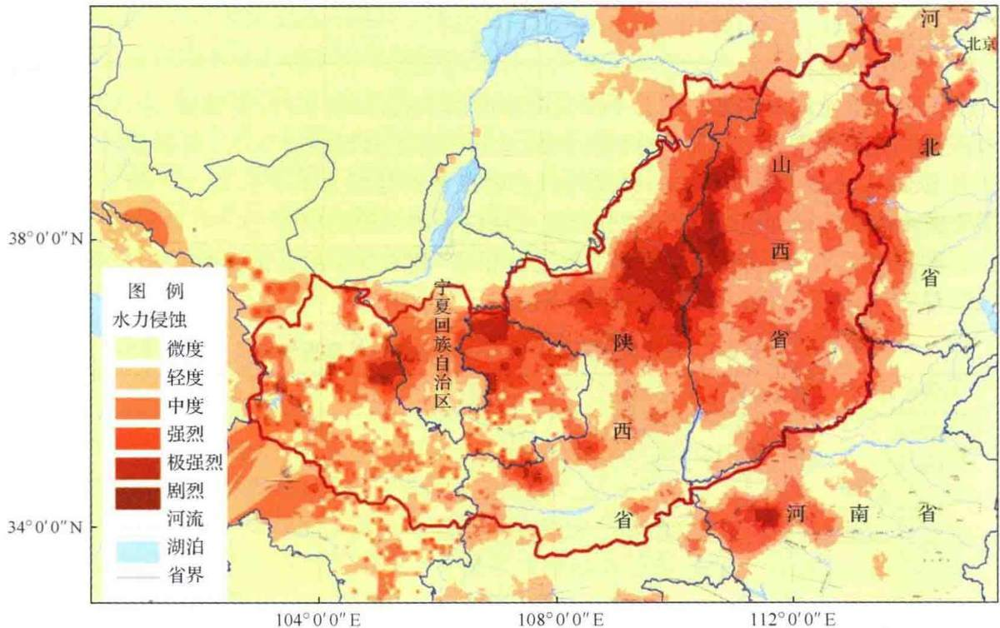  
图8-2 黄土高原地区土壤侵蚀强度示意图

陕西省内水土流失最严重区位于陕北黄土高原地区，延安市、铜川市和榆林市水土流失面积比例分别为49.75%、47.07%和46.08%，其强烈以上流失比例也为全省最高值，表明陕北黄土高原地区仍为陕西省水土流失最为严重的地区。关中地区水土流失面积比例从高到低依次为宝鸡市35.04%，咸阳市为22.57%，西安市为22.08%和渭南市21.25%。陕南地区的安康市水土流失比例最高，达到32.90%，汉中市为23.32%，商洛市水土流失面积比例最低，仅为15.50%。除延安、榆林和铜川市外，其他地区的强烈以上侵蚀面积比例都不足10%(表8-4)。

表8-4 陕西省野外调查市级水土流失面积比例  
(单位：%)
<table><tr><td>市名</td><td>水土流失比例</td><td>轻度比例</td><td>中度比例</td><td>强烈比例</td><td>极强烈比例</td><td>剧烈比例</td></tr><tr><td>延安市</td><td>49.75</td><td>31.51</td><td>1.08</td><td>13.77</td><td>2.83</td><td>0.56</td></tr><tr><td>榆林市</td><td>46.08</td><td>25.55</td><td>2.12</td><td>12.58</td><td>4.62</td><td>1.21</td></tr><tr><td>铜川市</td><td>47.07</td><td>33.62</td><td>1.42</td><td>8.26</td><td>2.93</td><td>0.83</td></tr><tr><td>宝鸡市</td><td>35.04</td><td>27.48</td><td>0.41</td><td>5.34</td><td>1.66</td><td>0.16</td></tr><tr><td>咸阳市</td><td>22.57</td><td>16.31</td><td>0.35</td><td>4.54</td><td>1.22</td><td>0.15</td></tr><tr><td>渭南市</td><td>21.25</td><td>17.43</td><td>0.15</td><td>3.17</td><td>0.43</td><td>0.08</td></tr><tr><td>西安市</td><td>22.08</td><td>14.52</td><td>0.44</td><td>5.61</td><td>1.31</td><td>0.21</td></tr><tr><td>安康市</td><td>32.90</td><td>26.15</td><td>1.14</td><td>3.38</td><td>1.47</td><td>0.76</td></tr><tr><td>汉中市</td><td>23.32</td><td>18.82</td><td>0.99</td><td>1.45</td><td>1.41</td><td>0.64</td></tr><tr><td>商洛市</td><td>15.50</td><td>13.41</td><td>0.24</td><td>1.29</td><td>0.42</td><td>0.15</td></tr><tr><td>陕西省</td><td>34.43</td><td>23.45</td><td>1.03</td><td>7.14</td><td>2.22</td><td>0.59</td></tr></table>

山西省全境水土流失严重，市均水土流失面积比例变化于34%～58%。省内水土流失最严重区位于吕梁市、忻州市、阳泉市、晋城市和长治市，土壤流失面积比例分别为57.82%、50.60%、49.71%、48.12%和46.32%，水土流失面积比例都超过或接近一半。水土流失程度相对较轻的是大同市、太原市、朔州市和运城市，土流失面积比例分别为36.86%、36.63%、36.12%和34.08%。山西省水土流失不仅面积比例高，而且强烈以上面积比例也高，接近和大于10%的市达到八个，占全省70%以上(表8-5)。

甘肃省内水土流失最严重区位于陇东和陇中黄土高原地区，其中庆阳市水土流失面积比例高达50.91%，临夏回族自治州水土流失面积比例也达47.10%。定西市、白银市、甘南藏族自治州和兰州市水土流失面积比例分别为38.08%、36.10%、34.89%和33.57%。兰州以西的张掖市、武威市水土流失面积比例分别为16.85%和16.01%。水力侵蚀最弱的区域是金昌市、嘉峪关市和酒泉市，水土流失面积比例只有7.67%、4.29%和0.14%。除了甘南藏族自治州以外，强烈及其以上侵蚀面积所占比例基本上与总水蚀面积比例的排序一致，即甘肃省水土流失严重区也就是强烈、极强烈和剧烈侵蚀比例大的区域(表8-6)。

表8-5 山西省各市水力侵蚀强度分级比例  
(单位：%)
<table><tr><td>市名</td><td>轻度以上</td><td>轻度</td><td>中度</td><td>强烈</td><td>极强烈</td><td>剧烈</td></tr><tr><td>太原市</td><td>36.63</td><td>14.89</td><td>12.12</td><td>6.72</td><td>2.66</td><td>0.23</td></tr><tr><td>大同市</td><td>36.86</td><td>17.72</td><td>12.90</td><td>5.11</td><td>0.99</td><td>0.13</td></tr><tr><td>阳泉市</td><td>49.71</td><td>21.64</td><td>17.93</td><td>7.79</td><td>1.47</td><td>0.88</td></tr><tr><td>长治市</td><td>46.32</td><td>17.52</td><td>16.63</td><td>8.86</td><td>2.18</td><td>1.13</td></tr><tr><td>晋城市</td><td>48.12</td><td>16.30</td><td>17.90</td><td>10.57</td><td>2.96</td><td>0.40</td></tr><tr><td>朔州市</td><td>36.12</td><td>16.61</td><td>13.08</td><td>4.52</td><td>1.75</td><td>0.16</td></tr><tr><td>晋中市</td><td>43.28</td><td>18.20</td><td>15.61</td><td>8.02</td><td>1.14</td><td>0.30</td></tr><tr><td>运城市</td><td>34.08</td><td>13.23</td><td>12.16</td><td>5.90</td><td>2.25</td><td>0.54</td></tr><tr><td>忻州市</td><td>50.60</td><td>19.95</td><td>17.69</td><td>9.78</td><td>2.56</td><td>0.62</td></tr><tr><td>临汾市</td><td>42.31</td><td>15.33</td><td>14.46</td><td>9.67</td><td>2.39</td><td>0.46</td></tr><tr><td>吕梁市</td><td>57.82</td><td>16.39</td><td>17.21</td><td>15.34</td><td>7.01</td><td>1.87</td></tr><tr><td>山西省</td><td>44.85</td><td>17.04</td><td>15.43</td><td>8.98</td><td>2.73</td><td>0.67</td></tr></table>

表8-6 甘肃省市级水土流失面积比例  
(单位：%)
<table><tr><td>市名</td><td>水土流失比例</td><td>轻度比例</td><td>中度比例</td><td>强烈比例</td><td>极强烈比例</td><td>剧烈比例</td></tr><tr><td>兰州市</td><td>33.57</td><td>14.19</td><td>10.55</td><td>6.53</td><td>2.05</td><td>0.25</td></tr><tr><td>嘉峪关市</td><td>4.29</td><td>1.24</td><td>1.66</td><td>1.08</td><td>0.11</td><td>0.20</td></tr><tr><td>金昌市</td><td>7.67</td><td>3.16</td><td>2.32</td><td>1.86</td><td>0.16</td><td>0.18</td></tr><tr><td>白银市</td><td>36.10</td><td>14.24</td><td>10.64</td><td>5.35</td><td>3.76</td><td>2.12</td></tr><tr><td>天水市</td><td>29.33</td><td>11.96</td><td>8.07</td><td>5.61</td><td>3.16</td><td>0.53</td></tr><tr><td>武威市</td><td>16.01</td><td>8.41</td><td>4.71</td><td>2.54</td><td>0.31</td><td>0.04</td></tr><tr><td>张掖市</td><td>16.85</td><td>4.74</td><td>7.42</td><td>3.30</td><td>0.43</td><td>0.96</td></tr><tr><td>平凉市</td><td>29.22</td><td>13.84</td><td>9.70</td><td>4.13</td><td>1.33</td><td>0.22</td></tr><tr><td>酒泉市</td><td>0.14</td><td>0.04</td><td>0.05</td><td>0.03</td><td>0.00</td><td>0.01</td></tr><tr><td>庆阳市</td><td>50.91</td><td>16.09</td><td>17.23</td><td>12.30</td><td>3.93</td><td>1.36</td></tr><tr><td>定西市</td><td>38.08</td><td>15.76</td><td>11.46</td><td>6.99</td><td>3.33</td><td>0.55</td></tr><tr><td>陇南市</td><td>24.45</td><td>9.24</td><td>7.31</td><td>4.05</td><td>2.91</td><td>0.94</td></tr><tr><td>临夏回族自治州</td><td>47.10</td><td>15.51</td><td>15.71</td><td>10.01</td><td>4.06</td><td>1.80</td></tr><tr><td>甘南藏族自治州</td><td>34.89</td><td>16.97</td><td>13.25</td><td>2.11</td><td>1.82</td><td>0.74</td></tr></table>

## 三、土壤侵蚀和水土保持未来变化趋势

黄河自古多泥沙，黄土高原地区土壤侵蚀自古有之。近代人类活动导致土壤侵蚀加速发展，通过调整人类生产活动，区域水土流失可以得到有效控制，分析把握未来土壤侵蚀趋势，以及水沙关系变化，对黄土高原地区区域发展战略及生态环境恢复建设至关重要。

## (一)强度减弱，仍为严重区域

由于地貌特征、气候特点和土壤性质等自然要素长时段内不会明显改变，通过实施持续的退耕还林工程和区域产业结构的调整，黄土高原地区的生态环境逐步改善，土壤侵蚀强度逐渐减弱也是必然趋势，但在未来黄土高原仍是中国土壤侵蚀最为严重地区的事实也不会根本改变。就侵蚀类型而言，发生在坡面的面状侵蚀、细沟侵蚀和浅沟侵蚀都会减弱。由于坡面结皮形成和紧实度增大，坡面径流量减少不会比侵蚀减弱程度大，切沟侵蚀和重力侵蚀强度减缓程度会较小。在大气环流模式和气候特征不变前提下，黄土高原地区大暴雨和特大暴雨仍会存在。大和特大暴雨时的各种地质灾害引起的水土流失仍然会非常严重。因此，黄土高原地区未来水土保持工作重点应该放在生态恢复成果保护和特大暴雨导致的地质灾害预防。水土保持工作不宜再进行大规模工程措施建设，应该以保护和恢复为重点，将人类活动对自然环境施加的影响控制到最低。在生态脆弱区域更应首先考虑保护和恢复，避免再走先破坏再治理的老路。

## (二)分布格局发生变化

根据近10年的水土保持经验，黄土高原地区水土流失减弱的主要原因是人类干扰减少和生态环境恢复。生态恢复效果在很大程度上取决于气候条件，特别是降雨量多少。黄土高原地区年降雨量从东南部600mm向西北减少到100多毫米，生态恢复效果也会从东南向西北越来越差。现在以六盘山为界东强西弱的格局将发生改变，六盘山以东地区降雨量较多，生态恢复效果显著，水土流失减少程度会更大。六盘山以西地区年降雨量少，退耕还林还草效果不如东部地区，水土流失减少程度也会小于东部。所以，未来黄土高原地区水土流失东西差异会减弱。在六盘山以东地区，由于降雨量由南向北减少，退耕还林效果是南部大于北部，南部水土流失减弱程度大于北部，东部地区水土流失南北差异会更大。特别在陕西、山西、内蒙古交界的砥砂岩地区，生态恢复较为困难，黄河粗沙区会更为突出。在六盘山以西地区，降雨量是南部大于北部，退耕还林效果南部会优于北部，因此，土壤侵蚀强度的南北差异会更大。就小流域程度而言，由于坡面侵蚀得到控制，土壤侵蚀强度的垂直分带规律也会弱化，上中下游侵蚀强度差异减小。

## (三)河流泥沙威胁缓解

由于黄土高原地区土壤侵蚀强度的总体减弱，黄河泥沙会进一步减少。河流水沙关系也将发生变化，下游河床淤积问题得到进一步缓解。现在普遍担心在实施退耕还林以后，虽然黄河泥沙减少，但径流量也会减少，输沙能力也必然降低，黄河下游会不会出现泥沙淤积现象。另外，由于粗沙区治理难度大，面积效益相对较小，会不会出现黄土高原总体泥沙量大幅度减少，但粗泥沙减少不明显的现象，这些问题值得深度关注。因此，对多沙粗沙区的重点治理不能因黄土高原地区水土流失总体减少而掉以轻心，多沙粗沙区水土流失的威胁将长期存在。在多沙粗沙区实施退耕还林工程的基础上，仍然要强化工程措施，加大淤地坝系建设，为区域生态恢复争取更长时间。在黄土高原东部和南部降雨量比较多的地区，不宜再进行大规模的工程措施，诸如梯田和淤地坝等，以避免新增水土流失。

## (四)研究重点领域变化

在黄河泥沙威胁减小后，黄土高原地区土壤侵蚀和水土保持研究的重点也应改变，集中力量，应对新问题。在黄河泥沙减少以前，查找泥沙来源一直是黄土高原土壤侵蚀研究的重点。经过几十年的现场检测和资料分析，确定了黄土高原地区泥沙主要源区多沙粗沙区，为实施重点区域水土保持控制提供了依据。随着土壤侵蚀强度减弱和河流泥沙减少，区域生态恢复和土地生产力提高，构建人和自然的和谐将是黄土高原未来目标。土壤侵蚀研究重点也应围绕退耕还林工程引起的下垫面条件突变后土壤侵蚀规律、河流水沙关系和区域环境效应等问题开展深入研究，回答政府和民众普遍关心的黄河水沙问题。集中力量开展退耕还林背景下坡面侵蚀规律、坡沟水沙关系、小流域侵蚀产沙规律等。同时，研究生态恢复与土壤性质变化及其对坡面水文过程的响应变化，研究退耕还林后坡面径流分配规律，以及地表水循环变化等。加大开发建设项目新增水土流失发生规律、过程机理，以及影响因素量化，水土流失估算模型等研究力度。水土保持工作重点则转向生态建设、流域管理和水土流失预防方面。

## (五)政府投资思路需要转变

水土保持工作在很大程度上属于社会公益事业，所需资金基本来自从中央到地方的各级政府。投资重点区域也都是水土流失严重区域。但一直存在只见投资，不管效果评估的现象，导致地方政府更愿意接收被夸大的水土流失现状，因为水土流失现状被夸大可以获取更多的资金投入。将来水土保持工作重点应加强治理效益评估，投资规模一方面考虑水土流失的严重程度，还应该与治理累积效果挂钩，更应该将一部分资金用在治理措施的维护与修复。建立治理效果与政府绩效及后续投资间的联动评估体系。依据科学的调查评价技术，向治理效率高和治理效果好的地方优先投资，以促进地方干部不顾现状事实而争水土流失面积做法的改变。

## 参考文献

陈永宗，景可，蔡强国.1988.黄土高原现代侵蚀与治理.北京：科学出版社

胡春宏，陈绪坚，陈建国.2010.21世纪黄河泥沙的合理安排与调控.中国水利，9：13-16

孟庆枚.1996.黄土高原水土保持.郑州：黄河水利出版社

水利部.2011.中国河流泥沙公报.北京：水利水电出版社

Wischmeier W H, Smith D D. 1965. Predicting Rainfall Erosion Losses from Cropland East of the Rocky Mountains. USDA Agricultural Handbook. No. 282. Washington D C: USDA

```json
Document generated by Anna's Archive around 2023-2024 as part of the DuXiu collection
(https://annas-blog.org/duxiu-exclusive.html).
Images have been losslessly embedded. Information about the original file can be found in PDF attachments. Some stats (more in the
PDF attachments):
"filename": "MTM4NzQ3Mjkuemlw",
"filename decoded": "13874729.zip".
"filesize": 35202330.
"md5": "32d2d57f1bc15a8d43eb0a1061686a2c".
"header_md5": "7725716a029c30352c7aae4be66b033d",
"sha1": "ca1e45b3b994ff20cc2553c8eb9ea3ca83661240"
"sha256": "55f761b926d5e7ddd51d484fff7bc6730e5ecf8a893a67273348790fcc1d4b27",
"crc32": 218037901,
"zip_password": "",
"uncompressed_size": 43011131,
"pdg_dir_name": "\u2557\u255e\u2550\u2534\u2555\u2580\u2558\u00a1\u2550\u2534\u255a\u2514\u255f\u2553\u2569\u2524\u25
5e\u2514\u255d\u258813874729",
"pdg_main_pages_found": 177,
"pdg_main_pages_max": 177,
"total_pages": 188,
"total_pixels": 1161670068,
"pdf_generation_missing_pages": false
}
```