# ex20_雷廷武_细沟侵蚀物理模型

<!-- 由 MinerU 分片产物合并生成；共 2/2 片；源目录：md文件/ex20_雷廷武_细沟侵蚀物理模型/ -->


<!-- ===== 分片 p1-200（200页，源：ex20_雷廷武_细沟侵蚀物理模型（1-200页））===== -->

# 细沟侵蚀物理模型

雷廷武 张晴雯 闫丽娟 著

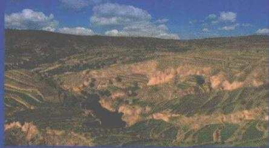

## 细沟侵蚀物理模型


# 细沟侵蚀物理模型

雷廷武 张晴雯 闫丽娟著

科学出版社

北 京

## 内容简介

本书系统阐述了作者多年来在土壤侵蚀预报模型参数获取方法和侵蚀模拟方面的最新研究成果。全书共15章。主要内容有土壤侵蚀模型研究的进展，存在的问题和建模难点：细沟侵蚀模型的有限元数值计算方法和有限元的程序设计，不同工况条件下的细沟侵蚀动态过程的模拟；细沟侵蚀传统实验方法及其局限：系统确定土壤侵蚀物理预报模型参数输沙能力、细沟侵蚀剥蚀率、土壤临界剪切力和土壤可蚀性参数的实验方法和数学计算方法：利用多种稀土元素示踪法研究细沟侵蚀产沙过程及细沟剥蚀率的试验方法和计算方法；现有细沟土壤侵蚀物理预报模型基本参数估算方法的缺陷、误差产生的原因和减少误差的方法；对WEPP模型细沟侵蚀产沙方程进行验证；应用有限元方法构建的细沟侵蚀预报模型模拟放水冲刷及降雨条件下的细沟侵蚀产沙过程。

本书可供土壤侵蚀、水土保持、流水地貌、生态、水文、自然地理、国土整治、土壤物理、农林牧和水利等部门的研究人员及高等院校相关专业师生等参考。

图书在版编目（CIP）数据

细沟侵蚀物理模型/雷廷武，张晴雯，闫丽娟著.—北京：科学出版社，2009

ISBN 978-7-03-023713-2

I. 细… Ⅱ. ①雷…②张…③闫… Ⅲ. 土壤侵蚀 -物理模型(系统工程) IV.S157

中国版本图书馆CIP数据核字（2008）第198913号

责任编辑：彭胜潮关焱王日臣/责任校对：钟洋

责任印制：钱玉芬/封面设计：王浩

科學出版社出版

北京东黄城根北街16号

邮政编码：100717

http://www.sciencep.com

源海印刷有限责任公司印刷

科学出版社发行 各地新华书店经销

2009年5月第 一版

开本：787×1092 1/16

2009年5月第一次印刷

印张：151/4

印数：1—1500

字数：342000

定价：50.00元

(如有印装质量问题，我社负责调换<新欣>)

## 序

环境和发展问题，是21世纪全球面对的核心问题之一。长期土地、植被资源的不合理开发利用，对土地资源的质量造成了很大的负面影响：水土严重流失、生态环境恶化、于旱水灾频繁发生、农业生产力低下并且抵御自然灾害的能力削弱。根据第二次全国土壤侵蚀遥感普查的资料，目前我国土壤侵蚀面积达到357万km²，其中水力侵蚀的面积约占44%，风力侵蚀的面积约占54%。水土流失既是造成土地生产力退化的主要原因，又是河流泥沙与水体非点源污染的主要来源，严重的水土流失导致可耕地减少、地力衰减，直至土地生产力的根本性破坏，对农业发展、人们生活和生存构成了严重威胁，是当前影响环境和发展的环球性灾害之一。水土流失直接影响农业生产并将继续影响农业的持续发展，将威胁21世纪我国15多亿人口的食物安全供给。研究土壤侵蚀过程对于控制水土流失、改善人类的生存环境，特别是对贫困地区的可持续发展具有重要意义。

土壤侵蚀预报模型研究是当今土壤侵蚀科学研究的前沿领域。土壤侵蚀预报研究的重要作用是，估计土壤流失的速度，将预测的土壤侵蚀模数与允许土壤流失量加以比较，从而确定合适的土地利用方式；另外，研究可以用于评价不同水土保持措施的功能与效益。国际、国内研究土壤侵蚀的传统方法多以实地观察、测量、建立侵蚀产沙与若干影响因子之间的经验统计关系（模型）为主。这种研究方法所取得的结果可靠，但将其应用于预报则十分困难。最主要的原因之一是，无法明了土壤侵蚀系统的功能如何随着控制因子变化。由于应用时所遇到的条件与试验时所采用的条件有很大出人，这种情况下往往需通过标定对参数进行调整，而这种调整在一般情况下具有很大的随机性，并且很大程度上受人的主观意志影响。采用这种方式只能进行土壤侵蚀的事后验证，其结果与实测结果相差很大，两者间相差一倍或更大颇为常见。其另一主要不足是这种研究方法预报只能给出极其有限空间、时间点的土壤侵蚀信息，土壤侵蚀发生、发展与演变过程不清楚，即无法回答土壤侵蚀的时间、空间分布规律。这给指导水保实践带来很大困难，因为只有通过对过程的控制才能实现对最终结果—土壤侵蚀的有效控制。目前关于土壤侵蚀预报模型的研究，无论是经验模型还是物理过程模型，都存在模拟土壤侵蚀时空变化规律、模型参数的确定方法、考虑水沙耦合作用等问题，始终是建模技术路线和实证实验的难点。

该书瞄准土壤侵蚀学科前沿，系统阐述作者多年来在土壤侵蚀预报模型参数获取方法和侵蚀模拟方面的最新研究成果。在作用和变量控制下，进行室内细沟侵蚀精细模拟创新实验，对野外因种种原因无法研究的类似变量和作用关系加以分析、控制及精确测量，研究细沟侵蚀过程以及细沟流侵蚀作用过程中系统中物质和能量的分布及转化，细沟水流剪切力作用下土壤颗粒由地表剥离的动力学机制、泥沙的输运力学过

程，与土壤侵蚀预报相关参数的定量测定方法。提出系统确定细沟水蚀预报物理模型中参数体系的实验方法和计算方法。从物理本质的揭示到实证试验与计算方法都提出了独到的见解，分析了土壤侵蚀原方程中求土壤可蚀性参数的缺陷，并提出了改进方法。将建立和改进后的模型参数及计算方法应用于坡面细沟侵蚀数学模型中，利用有限元方法和C++语言对模型进行数值计算并模拟侵蚀产沙过程，通过模拟结果与相应试验结果的对比，验证了数学模型、计算方法及模型参数的正确性。

该书为我国土壤侵蚀的模拟与预报模型发展提供了科学依据，建立的确定基本参数的简捷合理的实验方法体系，为土壤侵蚀模拟与预报模型的建立探索了新的途径，对土壤侵蚀预报模型向完整物理模型发展提供了理论依据和实验方法，从而奠定了具有广泛适用性的坡面水蚀物理过程模型的基础。

该书的出版将为我国土壤侵蚀过程的模拟与预报提供可借鉴的科学信息，促进土壤侵蚀模拟与预报工作深人开展，为自主发展我国的土壤侵蚀模型进行了成功的探索。在此，我愿意向土壤侵蚀、水土保持、自然地理、国土整治、农林牧和水利等有关领域的研究人员及高等院校相关师生推荐这本新著。

中国科学院院士

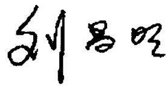

2008年12月26日

## 前 言

土壤侵蚀既是造成土地生产力退化的主要原因，又是水体非点源污染的重要来源，对农业发展及人们的生活和生存环境构成了严重威胁，是当前环球性灾害之一。土壤侵蚀过程模型对预报土壤侵蚀量、评价土地利用方式、水土保持措施功能效果等具有重要的理论意义和实用价值，是近几十年来国内外有关土壤侵蚀科学研究的前沿领域。目前关于土壤侵蚀预报模型的研究，无论是经验模型还是物理过程模型，在模拟土壤侵蚀时空变化规律的过程中，模型参数的确定、考虑水沙耦合作用机理等始终是建模技术路线和实证实验的难点和热点。细沟侵蚀是坡面水力侵蚀，产沙量大，并且是坡面侵蚀泥沙输送最重要的通道，因此其研究具有重要的理论意义和实用价值。细沟侵蚀规律、演变机理以及相关参数的确定对土壤侵蚀预测预报及相应模型预报极为重要。现有国内同类书籍大都是关于土壤侵蚀经验模型的成果，尚未见系统介绍以物理过程基础的水蚀预报模型及参数研究的专著。

本书针对土壤侵蚀物理模型基本参数的确定缺乏合理的实验和计算方法这一研究热点和难点，结合多年国内外研究工作经验以及我国黄土高原实际情况，以细沟侵蚀过程在实验室模拟再现的方法，提出一套完整的系统确定细沟侵蚀预报模型参数的研究方法。建立系统的细沟侵蚀模型，深入研究细沟侵蚀动态过程、含沙水流的侵蚀产沙规律、细沟侵蚀发展过程中地表地形与土壤侵蚀交互作用、细沟剥离及泥沙输移过程与机理，并用稳定性稀土元素示踪技术对实验结果进行验证。利用有限元方法和C++语言对模型进行数值计算，并模拟细沟侵蚀产沙过程。通过模拟结果与相应试验结果的对比，验证了数学模型、计算方法及模拟程序和模型参数体系的正确性，系统解决细沟侵蚀模型预报所需的所有物理参数的确定方法。

本书瞄准土壤侵蚀学科前沿，系统阐述了模型参数求解方法和侵蚀模拟的最新研究成果，将为今后进一步深入研究提供基础、经验、借鉴，为土壤侵蚀过程的模拟与预报研究提供系统的科学信息，将促进土壤侵蚀模拟预报工作的深入开展。全书包括15章。第1章讨论土壤侵蚀模型研究目前的进展、存在的问题和难点；第2章至第5章建立细沟侵蚀动态过程预报的物理模型体系，给出细沟侵蚀模型的有限元计算方法和有限元的程序设计，模拟了不同工况条件下的细沟侵蚀动态过程；第6章介绍细沟侵蚀传统实验方法及其局限；第7章至第10章系统叙述确定细沟侵蚀物理预报模型参数输沙能力、细沟侵蚀剥蚀率、土壤临界剪切力和土壤可蚀性参数的实验方法和数学计算方法：第11章阐述利用多种稀土元素示踪法研究细沟侵蚀产沙过程及细沟剥蚀率的试验方法和计算方法；第12章从理论上分析现有细沟侵蚀物理预报模型基本参数估算方法的缺陷，分析误差产生的原因并提出减少误差的方法；第13章应用提出的参数计算方法验证 WEPP(water erosion prediction project)模型细沟侵蚀产沙方程的合理性；第14 章和第15章应用有限元方法和C+ +语言建立细沟侵蚀预报模型，模拟放水冲刷及降雨条件下的细沟侵蚀产沙过程。研究结果为进一步研究流域水文模型和土壤侵蚀模型提供基础。

本书是作者们十余年共同研究的成果，研究工作得到了中国科学院“百人计划”和“引进国外杰出人才”项目“水蚀参数量化研究”(982602)、教育部重大项目“细沟土壤侵蚀动力过程模型模拟及其基本参数的系统研究”（重大01-10)、国家自然科学基金重点项目“黄土高原多尺度小流域土壤水蚀动态过程模拟研究(40635027)”的资助，并得到科学出版社的大力支持，在此表示诚挚的谢意。本书成果和书稿在完成过程中得到美国 USDA-ARS 国家土壤侵蚀研究实验室 M. A. Nearing 教授、中国科学院水土保持研究所所长邵明安研究员、黄土高原土壤侵蚀与旱地农业国家重点实验室唐克丽研究员、西北农林科技大学刘秉正教授等的亲切指导和大力支持，中国科学院水土保持研究所赵军高级工程师、巨风生厂长、王长斌老师、黄少华老师和张梅英老师在项目完成过程中给予了大力支持，在此一并表示衷心的感谢。

为了提高通读性和实用性，本书在编著过程中模型所用的公式推导尽可能做到详尽并在书中给出了算例，书后附录给出了部分程序源代码，以供读者参考应用。本书可供土壤侵蚀、水土保持、流水地貌、生态、水文、自然地理、国土整治、土壤物理、农林牧和水利等部门的研究人员及高等院校相关专业师生参考。

限于著者水平，加之室内模拟过程中对问题的概化，不可避免地给细沟侵蚀产沙模型及参数确定带来了一定的误差。如参数构建时没有考虑雨滴溅蚀、入渗的影响，模型模拟假设细沟的形态不随时间、空间变化，这虽然为模型构建和参数确定提供了方便，但所得结论可能不尽完善。有关细沟侵蚀物理模型的研究和应用正处于不断完善之中，书中必然存在许多缺点乃至错误，恳请读者批评指正，也敬请各位专家、学者多提宝贵意见，以丰富及完善土壤侵蚀预报模型研究的理论方法。

## 目 录

前言  
第1章绪论……  
1.1土壤侵蚀与细沟侵蚀研究的重要性……1  
1.2土壌侵蚀预报模型研究进展……3  
1.3坡面流研究进展……………9  
1.3.1坡面流数学模型………………………………………………………………………………9  
1.3.2降雨对坡面流的影响……………………………12  
1.3.3 坡面细沟流输沙能力公式……14  
1.4 细沟侵蚀预报模型研究的意义……15  
1.5模型参数的物理意义及求解方法……17  
1.5.1 细沟侵蚀剥蚀率…………17  
1.5.2 细沟侵蚀输沙能力…………18  
1.5.3 细沟可蚀性参数及土壤临界抗剪切力………………19  
第2章细沟侵蚀动态过程与物理模型……24  
2.1 细沟侵蚀动态过程描述………24  
2.2维水流连续性方程………25  
2.3水流动量守恒方程……27  
2.4 泥沙质量守恒方程…………29  
第3章 细沟侵蚀模型有限元计算方法……31  
3.1 有限元方法的概念及在细沟侵蚀领域中的应用……31  
3.2偏微分方程的近似积分法……32  
3.2.1理论基础…32  
3.2.2 线性插值函数…………………………………33  
3.2.3 一维有限元计算公式Galerkin 方法………………………………35  
3.3一维细沟侵蚀模型的有限元方法……36  
3.3.1 单元有限元方程的推导……………36  
3.3.2 时间微分处理有限差分法………43  
3.3.3 有限元法的总体合成………45  
3.3.4边界条件处理………………………………………………48  
3.3.5有限元总体方程的解法………………49  
第4章有限元的程序设计……52  
4.1 单元矩阵及其计算方法……52  
4.2输入初始数据………53  
4.3般矩阵的合成与求解……54  
4.3.1 总体（全局）刚度矩阵的合成（装配）…………54  
4.3.2 矩阵的向量化存储……  
4.3.3矩阵相乘…… …57  
4.3.4线性方程组的无回代求解………………………………………………………………………………………………………………59  
4.4帯状矩阵的合成与求解……61  
4.4.1存储带状矩阵……………………………………………………………………61  
4.4.2 合成单元矩阵到带状向量空间……61  
4.4.3 引入边界条件…… …63  
4.4.4 向量存储带状方程组的求解……63  
第5 章细沟侵蚀过程的模拟与检验……69  
5.1 非限定性细沟侵蚀试验及泥沙连续方程参数设定 ……69  
5.1.1 模型的描述……… …70  
5.1.2 有限元计算方法与计算公式……74  
5.2 非限定性细沟侵蚀过程的实验模拟与验证……76  
5.2.1 方法……… …  
5.2.2物性参数…… …7  
5.3 细沟沟床的瞬态演变模拟结果与检验……80  
5.3.1细沟宽度和沟床坡度不随时间、空间变化…………80  
5.3.2 细沟宽度不随时间变化、空间均匀，坡度随时间变化、空间非均匀………81  
5.3.3 时间不变但空间非均匀宽度及时变与空间非均匀坡度……………………………82  
5.3.4 时变及空间非均匀变化的沟宽和沟床坡度……………………85  
5.3.5细沟沟床的瞬态演变模拟结果检验……86  
第6章细沟侵蚀传统实验方法及其局限……89  
6.1 试验方法  
6.2 试验结果 …… …90  
6.2.1 泥沙含量与坡度及人流量的关系……90  
6.2.2输沙能力与采样长度的关系……90  
6.3 细沟沟宽与泥沙的波动…………91  
6.3.1沟宽与坡度及人流量的关系……………91  
6.3.2细沟的周期性形态……………………92  
6.3.3 流速与坡度及流量的关系………93  
6.4 传统试验方法的局限性……94  
第7章 细沟侵蚀过程的系统实验方法………95  
7.1 细沟侵蚀动态过程的概念……95  
7.2 试验材料和方法  
7.2.1 试验水槽设计及土壤处理……………98  
7.2.2 供水及流量控制和试验量测…………………100  
7.3试验数据及其表达………100  
第8章 细沟土壤剥蚀过程 …102  
8.1 细沟侵蚀剥蚀率及其计算方法……102  
8.2 水流含沙量对细沟剥蚀率的影响………103  
8.3 细沟剥蚀率与细沟沟长的关系………105  
8.4 细沟剥蚀率的解析方法……107  
8.5 细沟剥蚀率解析结果的检验………108  
8.6陡坡细沟侵蚀含沙量的解析方法……112  
第9章细沟侵蚀产沙输沙过程与输沙能力……117  
9.1 输沙能力及其试验确定方法……117  
9.2 细沟输沙能力的解析方法……121  
9.3 输沙能力与坡度和流量的关系……125  
9.4 输沙能力与水流功率的关系………126  
第10 章 土壤可蚀性参数和临界抗剪切应力………129  
10.1 WEPP 模型细沟可蚀性参数估计……129  
10.2 （有理）实验法确定细沟可蚀性参数与临界抗剪切应力………………131  
10.2.1 理论分析及数学推导 …… …131  
10.2.2 参数计算及分析…………… …134  
10.3 疏松土壤材料中细沟的再生及其临界剪应力的实验研究 ……138  
10.3.1 材料与方法…… …138  
10.3.2坡度与单宽流量的关系……140  
10.3.3 临界剪切应力与坡度的关系……142  
第11章细沟侵蚀动态过程的稀土元素示踪法………144  
11.1 REE 示踪元素的用法与用量的计算……145  
11.1.1 REE示踪元素的选取及坡面布置………145  
11.1.2 施放深度及浓度………………146  
11.1.3 示踪土样的配制…………………………………148  
11.1.4 冲刷试验设计………………………………………………………………… 148  
11.2 计算方法…………………………………………………………………………………………………………148  
11.2.1 样品采集和土壤侵蚀量的计算……148  
11.2.2 含沙量的计算………… …149  
11.3 REE 示踪法估算细沟侵蚀产沙分布 ……… 149  
11.3.1 不同水动力条件下细沟侵蚀产沙分布………149  
11.3.2测定精度…… …152  
11.4 细沟流剥蚀率的 REE 示踪法研究……154  
第12 章 WEPP模型细沟侵蚀产沙方程理论分析与实验验证……………………159  
12.1 试验结果及解析验证 …159  
12.2 理论分析及试验验证 …… ………161  
第13 章 WEPP 模型中细沟可蚀性参数估计方法误差的理论分析……………… 166  
13.1 WEPP模型确定可蚀性参数的实验与计算方法………… 166  
13.2 WEPP模型细沟土壤可蚀性参数估计误差来源………………167  
、13.3 WEPP模型细沟可蚀性参数误差的估算……………168  
第14章 模型参数及有限元模拟算法的检验……171  
14.1 初始及边界条件 ……… …171  
14.2 集中水流条件下细沟侵蚀随坡长变化过程的模拟 ………172  
14.2.1 模拟程序流程图………173  
14.2.2模拟工况………………………………………………………………………173  
14.2.3 模型输入参数………174  
14.2.4模拟结果…… …174  
14.3 传统输沙能力公式对细沟侵蚀产沙过程的影响 ……177  
14.4 传统土壤可蚀性参数对细沟侵蚀产沙过程的影响 ……180  
14.5 输沙能力与土壤可蚀性参数的共同影响……184  
14.6 细沟剥蚀过程 ………… …187  
第15 章降雨条件下细沟侵蚀的有限元模拟……190  
15.1 有降雨条件下的细沟侵蚀实验………190  
15.1.1 实验设计及数据表达………190  
15. 1.2 初始及边界条件……………192  
15.2 模型模拟结果与分析………193  
15.2.1 模拟流程图……………………193  
15.2.2模拟结果……………………………………… 194  
15.2.3结果分析……………………………………………………198  
15.3 细沟侵蚀过程有限元模拟的可视化 ……202  
15.3.1 系统组成简介……………… …203  
15.3.2 系统主要优点……………204  
参考文献…… 205  
附录 模型参数计算程序

## 第1章 绪 论

## 1.1 土壤侵蚀与细沟侵蚀研究的重要性

水是生命之源，土是生存之本，水土资源是人类赖以生存和发展的基本条件。土壤原本是一种可再生的资源，但在人类活动影响下，水土流失的速度已大大超过了土壤自然形成的过程，使土壤这种可再生资源变成了实际上的不可再生。土壤侵蚀既是造成土地生产力退化的主要原因，又是水体非点源污染的重要来源，对农业发展及人们的生活和生存构成了严重威胁，是当前全球性灾害之一。自20世纪40年代以来，全球人口急剧增长，工业化进程的加剧以及随之而来对水土等资源的“掠夺式”开发利用，使大面积的水土资源流失。据联合国有关机构的统计，全世界水土流失面积达2500万 $\mathbf { k } \mathbf { m } ^ { 2 }$ ，占全球陆地面积的10.8%，每年流失的土壤高达257亿t(伊武军，2001)。

土地资源的损失已成为全球性的资源环境问题，而发展中国家所面临的状况尤为严重。土壤侵蚀导致可耕地减少、地力衰减，其直接后果就是农业生产条件遭到破坏，吃饭成了问题。被冲走的土，都是表土，对于耕地来说，就是生长农作物的熟土。冲走了熟土，耕地生产能力就会受到根本性破坏。《科学》(Science)杂志发表了一篇文章，认为同希腊文明一样古老的玛雅文明，其突然崩溃的原因就是水土流失(Huang et al.，2003)。从公元前8世纪开始，玛雅人口剧增，只维持了1700年的繁荣。当时危地马拉低地的人口高达500万。到10世纪时突然崩溃，仅仅数十年间，人口下降到不足原来的 $1 / 1 0 _ { \circ }$ 据研究，直接的原因就是表土被冲走，庄稼种不成，没饭吃，人饿死、饿跑了，文明也随之垮了。

玛雅文明的悲剧绝非孤例。曾养育了辉煌中国文明的黄河流域，同样在遭受严重的水土流失的威胁。我国是一个人多地少，山地多、平地少，高山、高原、荒漠土地多，宜耕地少，土壤侵蚀十分严重的国家。根据第二次全国土壤侵蚀遥感调查，我国现有水土流失面积356万 $\mathbf { k } \mathbf { m } ^ { 2 }$ ，占国土面积的37.1%，其中水蚀面积165万 $\mathbf { k } \mathbf { m } ^ { 2 }$ 、风蚀面积191万 $\mathbf { k } \mathbf { m } ^ { 2 }$ (中华人民共和国水利部，2002)。国家环境保护总局原局长曲格平于1996年6月在纪念水土保持法颁布实施5周年座谈会上发表讲话时提出：“水土流失是我国头号环境问题”，这一观点已在社会上逐步形成了共识(焦居仁，2002)。

严重的水土流失，给中国社会、经济发展和人民群众的生产、生活以及国家的生态安全带来多方面的危害。一是耕地减少，土地退化严重。据20世纪80年代统计（卜兆宏等，1990)，我国每年新增水土流失面积达150万 $\mathrm { h m } ^ { 2 }$ ,年均丧失耕地6.67万 ${ \bf k } { \bf m } ^ { 2 }$ 。这使我国业已短缺的水土资源(人均水土资源占有量为世界的1/4)变得更加紧张。另外，土壤侵蚀的发生带走了生物生长所需要的营养物质，从而使土壤肥力和土地生产力迅速降低。每年有100多亿吨沃土付诸东流，相当于流失1000万亩’耕地的30cm厚耕作层，其流失的氮、磷、钾等养分远大于全国化肥的年产量，而有机质的损失则永难弥补。有学者对黄土高原水土流失区耕层土样进行分析，测定强度侵蚀土壤的有效养分含量多已下降了50%左右，大多数接近黄土母质层(彭琳等，1996;杨文治和余存祖，1992)。二是泥沙淤积，加剧洪涝灾害。据统计，全国各类水利工程累计淤积泥沙已达200多亿吨，淤积的江河湖库，降低了水利设施调蓄功能和河道行洪能力。长江流域的5万余座大、中、小型水库(总库容1200亿m3)，因泥沙淤积已损失库容达12亿 $\mathbf { m } ^ { 3 }$ (唐克丽，2004)。黄河在下游形成800km的地上悬河，悬河河床高度，相对于两岸河堤之外的平原，现已高出3\~5m，有的河段达10m。究其原因，乃是黄河挟沙量大，每年约16亿t泥沙的1/4堆积在这一段坡降不大、水流平缓的河床之中，河底逐年淤垫(李鄂荣，1999)。三是生态环境恶化，贫困加剧。土壤侵蚀对地表的剥蚀结果导致土地的荒漠化或石漠化，从而改变了士地原有的地貌形态，形成了广阔的沙地或沙丘。同时，土地的荒漠化或石漠化加剧了气候环境的进一步恶化，破坏了人类的生存空间。据统计，我国特大沙尘暴天气发生次数从20世纪50年代的5次，发展到70年代的13次，90年代增加到23次(唐克丽,2004）。四是水土流失严重地区，“人地”矛盾突出，形成“越穷贫越垦，越垦越穷”的恶性循环。目前，全国有592个国家级贫困县，5800万贫困人口，其中80%以上的贫困人口生活在生态环境比较恶劣的水土流失地区(中国水土保持情况介绍，2002;朱登铨，1996;姜春云，1997)。

研究土壤侵蚀过程、控制水土流失对于改善人类的生存环境，特别是对我国贫困地区的可持续发展具有重要意义。在对土壤侵蚀的研究中，坡面被认为是土壤流失的产生和汇集地，其作为流域的基本组成单元，往往是土壤侵蚀过程研究的开始(白清俊，1999；刘青泉等，2004)。据统计：黄河入海的细颗粒泥沙，相当部分来自坡耕地表土。有研究表明：某些流域的坡耕地土壤流失量占全流域总流失量的一半以上(唐克丽等，1983)。细沟侵蚀是坡面薄层水流汇集成线性小股水流时对地面冲刷而形成的细小沟状侵蚀(唐克丽，2004)，它是黄土高原坡耕地土壤侵蚀的主要方式之一。作为面蚀向沟蚀转化的特殊阶段，细沟侵蚀是坡面侵蚀机理及预报研究中的重要组成部分。唐克丽(2004)通过对杏子沟流域侵蚀产沙研究得出：坡耕地侵蚀产沙以细沟侵蚀、浅沟侵蚀为主，其侵蚀产沙量占总输沙量的25%\~30%，坡耕地的细沟产沙量可占总输沙量的50%。郑粉莉(1988)基于对陕北黄土丘陵沟壑区的定位观测、野外调查和室内人工降雨资料发现：在细沟侵蚀区，细沟侵蚀量可占总侵蚀量的74%，在细沟浅沟侵蚀区，细沟侵蚀量一般占浅沟侵蚀量的12%\~30%，最大可达40%以上。

细沟侵蚀降低了土地肥力和可耕性，坡面水蚀动力学特性决定了侵蚀径流优先输送较细土粒，侵蚀是土壤养分流失的动力和条件。土壤的有机质和全氮(主要为有机氮)与侵蚀物质中的细颗粒结合，带走了生物所需要的营养物质(张兴昌等，2000)。细沟侵蚀也是沟道、库渠、河流泥沙的重要来源，被冲走的细沙最终将进入沟道、河流和水库等水系，导致沟塘库渠淤积，农业排灌能力下降(唐克丽，1984b;刘秉正和吴发启，1996)。黄河平均每年输入下游的16亿t泥沙中约有40%\~60%来自黄土高原的坡耕地。据唐克丽(1984a)推算，在黄河多年平均16亿t的输沙量中，约有4.8亿\~8亿t来自坡耕地较肥沃的表土，如按耕层20cm计，每年损失有效耕地面积22万\~36.7万 $\mathbf { h } \mathbf { m } ^ { 2 }$ 。因此，无论对提高黄土高原人民的生活水平，还是根治黄河水患，研究并预报黄土高原的土壤侵蚀都是当务之需。细沟侵蚀是面蚀向沟蚀转化的特殊阶段，是黄土高原坡面土壤侵蚀的主要方式之一，其研究在坡面侵蚀机理研究及预报中有着重要的意义。同时，由于细沟侵蚀与浅沟侵蚀的相似性，对细沟侵蚀机理的认识将有助于对其他沟蚀的理解与研究。

## 1.2 土壤侵蚀预报模型研究进展

土壤侵蚀学属应用基础学科，它源于生产又服务于生产，是伴随着生产实践和社会的发展而诞生和发展起来的(刘秉正和吴发启，1996)。土壤侵蚀是指土壤在内、外力(如水力、风力、重力、人为活动等)作用下被剥蚀、输送和沉积的过程。水土流失则是指由水作用为应力造成水土资源和土地生产力的破坏和损失，它直接反映了土壤侵蚀的危害程度。与土壤侵蚀相比较，在应用“水土流失”概念时，水不仅是作为引起土壤侵蚀的应力，同时也是农业生产的资源要素。从农业生产角度而言，土壤侵蚀不仅会造成土壤及其养分的流失，也将造成土壤水分和水资源的流失。

土壤侵蚀预报研究的主要目的在于预测、预报土壤侵蚀流失量，并进一步预测泥沙输移对人河泥沙的影响(唐克丽，2004)。已开发的侵蚀产沙模型，可以归纳为经验性模型和物理概念性模型两大类。过去对坡面侵蚀过程的研究总是从大量的观测和定性描述着手，以达到经验概括、形成理论和建立模型(刘秉正和吴发启，1996；戚隆溪和王柏懿，1995)的目的。由于各国所处的自然环境及社会经济状况不同，土壤侵蚀发生和发展的动力及表现形式也各具特点，加上科技文化发展的不均衡以及水土流失危害程度的差异，形成了土壤侵蚀研究的不同特点。我国对于土壤侵蚀的研究可以追溯到公元前10世纪的西周时代，《诗经》中就有朴素的土壤侵蚀原理及合理土地利用重要性的记述。到20世纪20年代末，受西方科技发展的影响，我国开始了土壤侵蚀科学研究，先后在不同地方建立了水土流失试验区，积累了一些研究资料和经验。

我国的土壤侵蚀产沙模型研究是从20世纪50年代开始的。早期建立的土壤侵蚀和产沙模型大都是经验性的，其中50\~60年代初建立的经验模型仅限于进行坡耕地侵蚀量计算。从20世纪70年代美国通用流失方程引进我国以后，一些研究者陆续以土壤流失方程为原型，根据各自不同研究地区的实际情况进行相应的修正，建立了若于个地区性降雨土壤流失预报方程。在流域模型研究方面，先后提出了一些各具特色的流域侵蚀产沙经验模型。例如：70年代末，江忠善和宋文经(1980)根据陕北、晋西、陇东南黄土丘陵沟道小流域的水文泥沙观测资料，建立了包括洪水径流量、地形坡度、土质和植被等影响因素的未治理小流域一次降雨产沙量的预报模型。牟金泽和熊贵枢(1980)根据陕北子洲岔巴沟流域的观测资料，建立了小流域一次洪水和全年的产沙量预报模型。刘宝元于2001年(刘宝元等,2001;蔡强国和刘纪根,2003)建立了中国土壤流失方程(Chinesesoil loss equation，CSLE)，可以用于计算坡面上多年平均土壤流失量，此模型确立了中国土壤侵蚀预报模型的基本形式，形式简单、内容实用，易于在不同地区推广应用，其基本形式为 $\mathbf { \langle } A = R K L S B E T$ ,其中A是坡面上多年平均年土壤流失量[ $V ( \mathbf { h m } ^ { 2 } \cdot \mathbf { a } ) ]$ ;R 是降雨侵蚀力 $\bf \Pi ^ { - } M J \cdot \ m m / ( \ h m ^ { 2 } \cdot \ h \cdot \ a ) \frac { \partial } { \partial \phi }$ ;K是土壤可蚀性 $[ \mathbf { t } \cdot \mathbf { h } \mathbf { m } ^ { 2 } \cdot \mathbf { h } ^ { \prime } ( \mathbf { h } \mathbf { m } ^ { 2 } \cdot \mathbf { M } \mathbf { J } \cdot \mathbf { m } \mathbf { m } )$ ];L是地形的坡长因子(无量纲单位):S是地形的坡度因子(无量纲单位);B是水土保持的生物措施因子(无量纲单位);E是水土保持的工程措施因子(无量纲单位)；T是水土保持的耕作措施因子(无量纲单位)。全国性CSLE模型建立和应用的关键在于以下四个方面：①资料标准的统一、修正：②不同区域各因子的修正体系的确立；③模型在不同区域流域内的验证：④新技术RS、GIS在实际预测中的应用等。所有这些经验土壤侵蚀模型，都是借鉴美国的通用土壤流失方程，再结合中国的实际状况，对其中的一些因子进行重新量化和统计分析后建立的。这些经验模型只预测侵蚀结果，不涉及侵蚀过程，不能对侵蚀作出理论性解释。同时，由于一些因子的标准在不同地区的差异，模型的推广也受到一定的限制。这些土壤侵蚀模型在一定意义上对我国的土壤侵蚀模型研究起到了很好的推动作用，但对于土壤侵蚀的精确预报而言，还需要进一步的探索和研究。

20世纪80年代以后，对侵蚀过程的研究取得了长足进展。80年代以来，我国开展了侵蚀与产沙物理过程模型的研究。王礼先和吴长文(1994)从侵蚀的水动力学原理出发，利用一维水流模型，把导出的坡面流近似模型与侵蚀基本方程耦合求解，得出了坡地侵蚀的数学模型。该模型既适合缓坡，亦适合陡坡；既可用于坡度变化的裸坡，又可用于有植被的林地、农地，但由于它是一种数学解析模型，因而限制条件也较多。它不适合坡度变化的复合坡面；对不同耕作措施的情况亦未做深入研究；模型参数的选取还需做大量的工作(汤立群和陈国祥，1994)。汤立群(1996)分析了物理成因产沙模型研究中亟待解决的几个问题，从流域水沙产生、运动和沉积的过程及机理出发，尝试建立了流域产沙随时间、空间分布的确定性模型。包为民(1995)提出了概念性坡面产沙、沟蚀产沙、坡面汇沙和沟道汇沙模型，并结合水文学中的概念性汇流计算方法，构成了一个有一定物理意义的流域水流、泥沙耦合模型。蔡强国等(1996)利用GIS的空间分析功能对侵蚀产沙的过程进行量化研究的尝试，建立了一个有一定物理基础的能表示侵蚀一输移一产沙过程的次降雨侵蚀产沙模型，它由三个子模型构成，即坡面子模型、沟坡子模型、沟道子模型。该模型考虑了降雨入渗、径流剥蚀、重力侵蚀、洞穴侵蚀及泥沙输移等侵蚀过程，从侵蚀机理上对影响侵蚀过程的因子进行定量分析。由于这是一个侵蚀产沙的过程模型，旨在从理论上阐明坡面侵蚀产沙规律，因此模型结构尤其是坡面子模型较为复杂，在推广应用时受到模型参数的限制。同时在沟道子模型中，还是以经验方程为主。邵学军(1998)提出了有细沟和集中水流的坡面上地表流动的一维动力波模型及运动波模型，并对两种模型给出了数值近似解。柳丽英和范荣生(1997)及李清河等(2000)分别从不同角度对坡面侵蚀产沙预报模型进行了分析。

国外对土壤侵蚀的研究是从18世纪末到19世纪初逐步形成和发展起来的(刘秉正和吴发启，1996)。1877\~1895年，德国土壤学家沃伦建立了第一个水土保持研究试验小区，观测植被及地面覆盖物对防止侵蚀和土壤板结的影响作用，以及坡度对径流、冲刷的影响，之后该方法传入美国、前苏联等国家，并在这些国家得到了进一步的发展(刘秉正和吴发启，1996)。但这些研究大多是应用研究，基本上是经验性的。关于土壤侵蚀机理的基础研究是从20世纪40年代逐步开始的。Zingg于1940年给出了第一个关于片蚀和细沟侵蚀的预报模型。从20世纪50年代中期开始，美国开展了一系列更广泛、细致和系统的研究项目，使土壤侵蚀的定量研究出现了一个崭新的局面。1956年，Wischmeier和Smith等（Franti et al.,1999)利用国家水土流失中心收集到的资料，包括美国 21个州、35个地区和200多个小区的6500场暴雨资料，8250个小区的每年土壤侵蚀资料和2500个每年降雨冲刷模拟数据，在对各因素不同排列组合进行多重回归分析和系统研究后，提出了土壤通用流失方程USLE，并于1965年正式发布，这是一个基于因子的方程。他借助现代化的数理统计分析方法，把美国所有田间试验小区的结果关联起来，通过降雨因子、坡长因子、坡度因子、作物覆盖与经营管理因子以及土壤保持措施因子等6个因子的连乘形式来表示土壤的流失量。该方程包括了影响坡面土壤侵蚀的主要因素，侵蚀模型形式统一，从而在世界各国得到广泛应用。但模型中仍然存在很多不足，其数据库是基于美国洛基山脉以东地区，主要适用于蒙托土缓坡地。USLE方程没有考虑泥沙的输移与沉积，模型中互相作用的变量重复计算，而其他因子间的交互作用则被忽略，且与土壤侵蚀密切相关的径流因子未包含在方程之内。因此，1987年美国农业部的农业研究局(ARS)、土壤保持局(SCS)和其他几个部门开始合作对USLE进行改进，修订工作于1997年完成，并将模型更名为修正通用土壤流失方程 RUSLE(Renard and Foster,1991;Tiwariet al., 2000)。

目前，研究土壤侵蚀最好的经验模型为通用土壤流失方程及其修订版RUSLE（Ti-wari et al.，2000)。RUSLE 仍然保留了 USLE的所有因素，而在应用过程中，各因素的计算方法有了一定的改进。RUSLE与USLE相比最大的优点在于它用计算机软件编制成了计算机模型，而且还可以用于非农业地区。RUSLE主要有以下几个特点：①数据处理计算机化，设计的计算机程序能在个人计算机的 DOS和UNIX操作系统下进行工作；②新的降雨-径流侵蚀因子R值表明了不同气候条件下的侵蚀性，其值的大小及季节性分布与农作物的轮作制度联系了起来。R因子的另一个变化是，由于暴雨雨滴击溅在有层流的地表时侵蚀力降低，在长历时、高强度暴雨地区的平缓坡面上其值减小；③提出了随季节不同而发生变化的土壤可蚀性因子K;④使用不同亚因子值计算植被因子C;⑤新的坡长L、坡度因子S反映了细沟侵蚀和细沟间侵蚀的比率，也反映了不同形状的坡面；⑥新的土壤保持措施因子P反映了草地和农地的轮作制度、等高耕作情况和土壤亚表层排水情况。方程的优点在于形式简单且所需参数易于获取。但这种经验模型的不足在于它不能反映实际数据的变化趋势，相互作用的变量重复计算，而其他因子间的交互作用则被忽略，如雨强大的地区坡度的相对重要性，与土壤侵蚀紧密相关的一个因素—径流未包括在方程之内。该方程多用于土地利用规划与评价，由于不能预报土壤侵蚀的时空分布，对于水土流失防止措施的选取并不能起到应有的指导作用。这些不足的存在使得侵蚀机制的研究越来越侧重于侵蚀过程的深入研究。

经验模型仅能能够预报特定区域一段时间的总产沙量，无法知道侵蚀过程中相关因素的变化过程。随着侵蚀动力学过程的不断深入，越来越多的学者从动力学角度出发，建立了基于物理过程的动力学模型。土壤侵蚀过程模型是在对土壤侵蚀机理与过程理解的基础上所构造的数学模型，为定量评价土壤侵蚀强度及其时空分布提供必要手段，是进行土地利用和土壤侵蚀防治规划，以及工程设计的基础。1947年，Ellison(1947a，b，c.d)将土壤侵蚀划分为降雨分离、径流分离、降雨输移和径流输移4个基本的侵蚀过程，Mever和Wishmeier在1969年对这4个基本子过程分布进行了定量描述。物理过程模型最早出现于20世纪60年代，是从产沙、水流汇集及泥沙输移的物理概念出发，利用各种数学方法，把气象学、水文学、水力学、土壤学和泥沙运动力学的基本原理结合起来，经过一定的简化，以数学的形式总结出土壤侵蚀过程与影响因子的联系，以模拟各种不同形式的侵蚀，预报土壤在时间和空间的变化。直到20世纪60年代末，Meyer和Wischmeier(1969)根据已有的土壤侵蚀知识，创建了一个基于物理过程的预报模型框架(process-basedtechnology)。但因为当时的数据库不完备，加上当时计算机能力不足，该模型一直未实际应用。Meyer和 Wischmeier(1969)提出的侵蚀与输移量的过程模型将坡面水蚀过程分成4个子过程，并建立了4个子过程的定量关系，但方程中各指数是根据侵蚀过程的研究和理论探讨确定的。1972年，Foster和Meyer(1972a,1972b)根据侵蚀泥沙的来源将坡面侵蚀划分为细沟侵蚀和细沟间侵蚀，并在近似稳定条件下，依据泥沙输移连续性方程建立了坡面侵蚀泥沙连续方程，从而为建立基于土壤侵蚀过程的土壤侵蚀动力学模型发展奠定了理论基础。

1985年开始，美国农业部着手了10年的研究项目，目的是开发能代替USLE的土壤侵蚀预报模型。1986年，4家政府部门（农业部农业研究局、土壤保持局、林业局，内政部土地管理局)签署了为期10年开发新一代侵蚀模型的项目——水蚀预报项目(water ero-sion prediction project, WEPP)(Nearing et al. ,1989;Flanagan et al. ,1995)。1987 年完成了用户需求报告，规定了WEPP的基本框架，WEPP模型应具备以下3个版本：坡面版、流域版和网格版。WEPP流域版的工作从1990年开始。流域版作为坡面版的扩展，用于预报流域径流与土壤侵蚀过程，评价流域内地形、土壤特征、土地利用和农业管理措施对土壤侵蚀的影响。第一个版本于1990年完成，以后做了进一步的改进。1995年8月在依阿华州(Des Moines,Iowa)举行的 WEPP 和 WEPS(wind erosion prediction project,风蚀预报系统)学术讨论会上发布了第一个官方正式版本WEPP95，完成了坡面版和流域版，但没有完成网格版。该版本包括以下3个基本部分：坡面、渠道和蓄水池。渠道部分又可划分为水文和侵蚀两部分。渠道水文部分计算人渗、蒸发蒸散、渗透、植被截留降雨量、地表蓄水及洪峰流量。渠道侵蚀部分计算泥沙量，包括坡面上和渠道中的剥离、搬运与沉积。由于WEPP是过程模型，所以比原有侵蚀预报模型具备明显优越性，主要包括：①估算土壤侵蚀的时空分布即全坡面或坡面任意一点的净土壤流失量及随时间的变化。②作为过程模型它可以应用于更广泛的条件下(Nearing et al.，1989)。

WEPP的核心是基于坡面在不同土壤、管理方式、气象条件下的水蚀过程，而其流域规模的应用只是在空间上对每个坡面的集成(刘宝元和史培军，1998)。WEPP坡面版可以直接代替USLE，但比USLE的功能更强。自然资源保护局主要将其应用于资源保护规划和项目规划。流域版可以评价和指导资源管理系统，以保证流域侵蚀速率小于允许侵蚀速率，维持土地生产力。在项目的计划中，流域模型常常作为一个技术工具用于下述几方面：①决定流域侵蚀控制的方法及其贡献；②模拟流域产沙量和泥沙特征为渠道和蓄水设施设计提供资料；③估算泥沙产量和特征，分析对下游水质的影响。土地管理局要求模型简单易于使用，主要用于侵蚀量估算、评价放牧系统和草地改良措施对侵蚀的影响等方面。林业局的应用类似于自然资源保护局，主要用于联邦森林和私人林地管理，包括林业规划、项目规划与评估和资源保护计划等。流域模型只能用于田块尺寸范围内，最大范围大约为260hm²，但用于林地时，模型应用范围可以达到800hm²。模型不能用于切沟和河道侵蚀，它只能用于排水沟、草皮水路和农田临时切沟侵蚀预报。对于草地和林地来说，渠道的最大规模必须是小于农田里传统的切沟，即宽度为1\~2m，深度为1m(Foster et al.，1995)。

WEPP 主体程序用ANSI FORTRAN 77 编写。它有一个方便的接口程序(C 语言编写）.用干编辑、管理和查看输入参数和输出结果。WEPP的所有输人参数主要包含在10\~12个文件中，这些输入文件以文本格式编辑和储存，一般都比较容易编辑，只有田间管理文件较为复杂，最好借助“文件创建程序(FILE BUILDER)”编辑。气候文件按逐Et输入，文件较大时可以借助气候发生器(weather generator,CLIGEN)(Nicks et al.，1995)。这些输入文件是：①气候文件。包括以下10个逐日参数，即雨量、降雨历时、最大雨强与平均雨强的比率、最大雨强出现的历时与总历时的比率、最高温度、最低温度、太阳辐射、风向、风速及露点温度。可以逐日输入实测资料，也可以用CLIGEN模型自动生成。②地形文件。包括坡度、坡长，必须把复杂的坡面分解成多个单一的直形坡。③植物与田间管理文件。这个文件很复杂，包括很多耕作和作物生长等方面的详细资料，如耕作工具、耕作日期、播种日期、收割日期、残茬管理、耕作深度、耕作后地面糙度等。此外还包括30多个植物生长参数，如植物生长量与覆盖的关系参数、生物量与高度的关系参数，生物-能量转换系数及最低、最高生长温度等。④土壤文件。包括如下5个分层土壤基本特性，即砂粒含量(%)、黏粒含量(%)、有机质含量(%)、阳离子代换量(Meq/100g)和砾石含量(%)。此外还有土壤名称、质地、反射率、初始饱和度、细沟可蚀性、临界剪切力和有效水力传导率。这四个输人文件是最基本的文件，如果有灌溉还需加上灌溉文件。这五个文件是坡面版本和流域版本都需要的文件。流域模型需要包括另外两个输入文件，即结构文件和渠道文件。同时和坡面版一样需要渠道坡度坡长文件、渠道土壤文件、渠道管理文件和渠道气候文件。所以，对于一般没有灌溉和蓄水条件的流域主要是10个基本的输入文件，它们分别是：坡面气候、土壤、作物、地形，渠道气候、土壤、作物、地形，流域结构及渠道文件，灌溉文件，拦蓄管理文件等(刘宝元和史培军，1998)。

WEPP模型将整个流域划分为三部分，即坡面、渠道和拦蓄设施。土壤侵蚀过程包括剥蚀、输送和沉积。剥蚀发生在坡面和渠道中，沉积可以发生在任何地方。暴雨所产生的径流和泥沙先由坡面从上往下传送，再经过渠道或拦蓄设施，最后离开流域出口。在此过程中沿途不断有剥蚀和沉积发生。坡面侵蚀包括细沟侵蚀和细沟间侵蚀。在模拟过程中首先计算坡面上的土壤流失量和坡面低端的产沙量然后模拟渠道过程。坡面流过程概化为片流和细沟流两部分，坡面侵蚀包括细沟间侵蚀和细沟侵蚀。细沟间侵蚀被认为是雨滴打击使土粒剥蚀，然后被片流输送到细沟由细沟沿坡向下搬运送入渠道或拦蓄设施。细沟侵蚀是径流剥蚀力、泥沙输送力和泥沙含量的函数。坡面部分先计算径流过程，然后沿坡面从上到下模拟泥沙的剥蚀、输送和沉积。只有最后一段坡面上的泥沙进入渠道。坡面模拟结束后，把模拟结果存人一个文件中，然后进行渠道和拦蓄模拟。

储存坡面模拟结果的文件叫“传递”文件，主要存储如下信息：暴雨历时、汇流时间、径流深、径流总量、洪峰流量、总分离量、坡面上的总沉积量、各粒级的泥沙含量、各颗粒占总泥沙的比例等。在渠道中，当水力剪切力大于土壤临界剪切力且泥沙含量小于泥沙输送力时才出现剥蚀，当泥沙含量大于输送能力时出现沉积。

物理过程模型试图对发生的侵蚀产沙过程进行概化和近似描述，并用数学方程描述侵蚀产沙的重要物理过程，再用比较严格的数值解析法计算含沙水运动过程。这种模型的物理基础强，外延精度高，有利于地区移动和向设计条件延伸，可以模拟侵蚀产沙的时空变化。但也存在一些问题，如它们多是从物理概念出发进行推理，所得结果缺少实际检验，且有些参数仍然采用经验值，使其结果并非是完全建立在物理过程基础之上。过程模型的目的在于了解对运动起作用的因素，及其在时间和空间的变化规律。在形式上，这种模型可以表示为不同的方程式。

WEPP模型虽然被公认为迄今最好的物理模型，但它同样也存在问题，如所需参数的量化始终是模型完善和发展的瓶颈。在WEPP模型中一些重要的参数尚不能经实验直接测定与检验，模型参数仍然采用经验公式，或将它们作为待标定的参数，或采用所谓“合理”的估计值。如坡面水流(片流特别是细沟流)的输沙能力、土壤可蚀性参数、土壤的临界抗剪应力等。Lei等(1998)发现用已有的坡面输沙能力公式进行土壤侵蚀预报模拟时，需要重新标定才能得到合理的结果。另外，细沟作为坡面土壤侵蚀产沙的主要来源和唯一的输沙通道，在 WEPP中未能得到很好的处理。WEPP根据 Gilley等(1990)在田间对已经形成的细沟调查结果，设定了一个固定细沟数量：1条/m。对于不同降雨、水流条件、坡度、耕作体系对细沟发生(数量)、发展、演化过程不加考虑。从而模型的模拟结果往往要在参数标定后才合理，(至少部分)失去了作为物理模型的意义。Macinlla和Chen(2005)对农地产流和土壤侵蚀条件下细沟密度预测和细沟流分布的研究结果很好地阐明了WEPP存在的这一问题。

除了WEPP模型外，还有一些代表性的坡面模型也得到了广泛应用。如Beasley等(1980) 建立的 ANSWERS(areal nonpoint source watershed environment response simulation)模型。该模型采用降雨期间和降雨后的农业用地为起始值，同时，对农业区域种植制度的布局和水保措施作出评估。模型的一个基本假设是：“在流域的任一点，径流量与影响径流量的水文参数(降雨强度、入渗、地形、土壤类型等)之间存在函数关系。因此，径流量能兼容适合的因子关系式，以此作为基础来模拟其他输送现象，如流域内的土壤侵蚀和化学元素迁移等。”以上假设的一个重要特点是该模型能运用于流域内的任一点。在实际运用时需变换成一个个方格单元，在流域内的这些方格单元内水文要素是均衡的。因此方格单元足够小，以至于一个单元的参数变化对流域整体行为的影响可以忽略不计。Misra和Rose(1996)提出了次降雨侵蚀产沙土壤侵蚀物理模型，即格里菲斯大学土壤侵蚀模型 GUEST(Griffith University erosion system template)。该模型中考虑了细沟和无细沟两种情况下的土壤侵蚀。与其他模型过程不同的是，该模型中还考虑了降雨和径流对新淤土层的二次剥蚀和作用。但该模型需已知坡面出口断面的径流过程，同时它主要适用于裸地径流小区，因此限制了模型在其他地区的应用。与WEPP一样，EuroSEM(Morgan et al.,1998)模型等也是基于物理过程的模型。这些模型均假定细沟宽度均匀、水力糙度不变，流量随距离线性变化，坡度不随时间与空间变化。还有其他一些物理模型均为稳态模型，未能解决空间变异性。这些模型在一定程度上可以用于土壤侵蚀的预报，但因为得不到土壤侵蚀的发展及演化信息，有碍于对土壤水蚀过程的理解和预报。

## 1.3 坡面流研究进展

坡面一般指倾斜于地表水平面且坡度大于2°的地形单元，是土壤侵蚀研究中最基本的单元(张光业，1986)。雨水降落在坡面汇集形成坡面水流，而坡面水流是细沟侵蚀过程的主要动力。因此，搞清坡面产流的动力学特点是进一步研究细沟侵蚀过程规律的基础。

## 1.3.1 坡面流数学模型

随着人们对自然环境研究的重视，坡面流研究得到了较大的发展，逐渐由经验性定性分析走向动力学特征为主的机理研究。Horton从20世纪30年代开始(Horton，1945），对坡面流进行了真正的定量描述，他认为坡面流是一种混合状态的水流，稳定状态的坡面流水深可以近似用河道水流公式估算，不论是层流还是湍流均可写为

$$
q = k h ^ { m }\tag{1-1}
$$

式中，q为单宽流量 $_ { , q }$ $( \mathbf { m } ^ { 2 } / \mathbf { s } ) : h$ 为水深(m);k为反映床面特性、坡度、水流类型及黏性的综合系数；m为湍流程度指数，层流时为3，湍流时取5/3，混合流取1.67\~3。流量沿程增加方程为

$$
q = x q ^ { * }\tag{1-2}
$$

式中， $q ^ { * }$ 为静雨量 $( \mathbf { m } ^ { 2 } / \mathbf { s } )$ ，即降雨强度与土壤人渗率的差值 ${ \ ; } x$ 为沿坡面的距离 $\mathbf { \tau } ( \mathbf { m } )$ O

结合式(1-1)和式(1-2)就可求得坡面流的沿程水深、流速和切应力等水力要素。Yoon和Brater(1962)将坡面流看作流量沿程增加的空间变量流，建议采用空间变量流的基本微分方程及连续方程来描述和求解坡面流水力学问题。Yen和Wenzel(1970)考虑了降雨对坡面流的影响，并根据动量原理，推导出了有降雨情况下的一维坡面流运动方程

$$
\frac { \mathrm { d } y } { \mathrm { d } x } = \frac { S _ { 0 } - S _ { \mathrm { t } } - \left( V _ { \mathrm { n } } \mathrm { c o s } \varphi - 2 \beta V \right) q ^ { \ast } / g y } { \mathrm { c o s } \theta - \beta V ^ { 2 } / g y }\tag{1-3}
$$

$$
{ \frac { \mathrm { d } Q } { \mathrm { d } x } } = q ^ { * }\tag{1-4}
$$

式中 $, y$ 为水深(m);x为距离(m)； $S _ { 0 }$ 为地面坡度； $S _ { \mathrm { f } }$ 为水流能坡； $V _ { \mathbf { m } }$ 为雨滴终速 $\left( \mathbf { m } { \big / } \mathbf { s } \right)$ $\varphi$ 为雨滴终速与坡面的夹角(°)； $\beta$ 为一动量系数；V为坡面流平均流速 $\mathbf { ( ~ m / s ) }$ ；θ为地面坡角(°);Q为坡面流单宽流量 $( \mathbf { m } ^ { 2 } / \mathbf { s } ) : q ^ { * }$ 为单位长度增加流量 $( \mathbf { m } ^ { 3 } / \mathbf { s } )$ ，即净雨量。

由于土壤的入渗过程直接影响着坡面的产流过程，有学者在坡面流的数值模型中，将两者联合起来耦合求解(Smith and Wollhiser, 1971),或者联合求解(Foster et al.,1968;

Freeze， 1978:Akan,1985;de Lima,1989;戚隆溪和黄兴法,1997;陈力等,2001;Chen et al.,2001:Wang et al.,2002)。但在实际中，坡面流流动过程与土壤入渗过程是弱耦合的，土壤入渗过程对坡面流的影响主要体现在提供产流的源项条件方面，而对坡面流流动特性没有本质影响。在数值求解中.二者分别求解，先进行入渗模型求解，而后供给坡面流模型一个汇源项，在土壤充分饱和条件下，认为此汇源项为零。

坡面流运动的力学特性相当复杂，长期以来，对坡面流的计算以简化处理为主，即忽略模型因素，或假定某些因素不变，并应用明渠水力学方法，结合坡面流特点做一些修正，进行模拟。通常将坡面流看作一维、恒定、非均匀沿程变量流处理(刘青泉等，2004)。

很多学者采用带源项的圣维南方程对坡面径流进行数学描述(Milne-Thomson,1960;Shames.1992:Zienkiewicz et al.,2005)。以流速 u、水深h 为基本变量，一维圣维南控制方程形式为

$$
\frac { \partial h } { \partial t } + \frac { \partial u h } { \partial x } = q\tag{1-5}
$$

$$
\frac { \partial u } { \partial t } + u \frac { \partial u } { \partial x } + g \frac { \partial h } { \partial x } = g \big ( s _ { 0 } - s _ { \mathrm { f } } \big ) - \frac { q } { h } \big ( u - v \big )\tag{1-6}
$$

式中， $\pmb { u }$ 为坡面流流速(m/s);h为水深(m);x为水平方向坐标;t为时间(s)； $s _ { 0 }$ 为坡面坡度； $s _ { \mathrm { f } }$ 为水流能坡； $\pmb q$ 为侧向流入的源或汇 $( \mathbf { m } ^ { 2 } / \mathbf { s } )$ ;v为侧向入流的速度在x向的分量(m/s)。

将其运用到坡面流，一般取沿坡面水平方向为x轴，侧向人流的方向垂直于x轴，且入渗速度值较u小得多，因此认为v很小而取为零，得到坡面流方程式(Freeze,1978；Woolhiser and Liggett , 1967)

$$
\frac { \partial h } { \partial t } + \frac { \partial u h } { \partial x } = q\tag{1-7}
$$

$$
\frac { \partial u } { \partial t } + u \frac { \partial u } { \partial x } + g \frac { \partial h } { \partial x } = g \big ( s _ { 0 } - s _ { \mathrm { f } } \big ) - \frac { q } { h } u\tag{1-8}
$$

式中， $\pmb q$ 为降雨和人渗的综合结果，即雨强与渗透率的差值

$$
q = p - i\tag{1-9}
$$

式中 $, p$ 为降雨强度；i为土壤入渗率，其变化过程由土壤入渗模型提供。

对于坡度较小的情况，将坐标取为水平方向与取为沿坡面向下方向差别不大，且降雨方向近似垂直于坡面，入流流速也可以忽略，上述方程可以较好的描述坡面流运动；对于坡度较大，特别是如黄土高原地区，陡坡分布广泛，水深h必须定义为垂直于坡面，此时选择沿坡面向下的方向为x轴，且降雨方向不垂直于坡面(x轴)可得到坡面流运动方程如下(陈力和刘青泉,2001)

$$
{ \frac { \partial h } { \partial t } } + { \frac { \partial u h } { \partial x } } = p \mathbf { c o s } \theta - i\tag{1-10}
$$

$$
\frac { \partial u } { \partial t } + u \frac { \partial u } { \partial x } + g \mathrm { c o s } \theta \frac { \partial h } { \partial x } = g \left( s _ { \mathrm { 0 } } - s _ { \mathrm { f } } \right) - \frac { p \mathrm { c o s } \theta \left( u - u _ { \mathrm { R } } \mathrm { s i n } \theta \right) - i } { h }\tag{1-11}
$$

式中，x为沿坡面向下方向； $\pmb \theta$ 为坡面与水平夹角； $\pmb { u } _ { \mathbb { R } }$ 为雨滴在x方向上的速度分量。上式说明，陡坡情况下，连续方程的源项和动量方程均与原方程有所差异。

完整的圣维南方程对坡面流的描述较为全面，但实际的坡面水流运动因边界条件复杂，用圣维南方程求解有相当的困难。同时，由于坡面流很浅，在实际坡面流动中受微地貌影响很大，完整的的圣维南方程并不一定能够很好地描述这种特殊的流动。因此，近几十年，简化模型逐渐成为研究坡面流运动的趋势，并在实际坡面流描述和运用中取得了更好的效果。

目前，坡面流模拟中最常采用的是圣维南方程的一个近似形式一—运动波模型，该模型最早由Lighthill和Witham(1955)提出。其基本思想是在圣维南方程的动量方程中忽略各导数项，近似假设水流的能坡和底坡相等，即用底坡等于能坡的关系来代替原动量方程。从Woolhiser和Ligget(1967)的研究开始，对坡面流的研究基本上都采用了运动波的描述方式，并假设能坡与底坡相等，利用明渠流水力学公式得到了一个流量与水深的指数关系

$$
\frac { \partial h } { \partial t } + \frac { \partial q } { \partial x } = p \mathrm { s i n } \theta - i\tag{1-12}
$$

$$
q ~ = ~ \frac { 1 } { n } h ^ { 5 / 3 } S _ { 0 } ^ { 1 / 3 }\tag{1-13}
$$

式中 $, x$ 为沿坡面向下方向(m);t 为时间(s);h 为水深(m);q 为单宽流量 $( \mathbf { \nabla } \mathbf { m } ^ { 2 } / \mathbf { s } ) : p$ 为降雨强度 $\big ( \mathbf { m } \big / \mathbf { s } \big )$ ;i为人渗率 $\textbf { ( m / s ) }$ ; $S _ { 0 }$ 为坡面坡度， $S _ { 0 } = \sin \theta$ ；θ为坡面倾角 ${ \bf \Xi } ( { \bf \Lambda } ^ { \circ } )$ $_ { n }$ 为 Man-ning 糙率系数。

Woolhiser和Ligget(1967)在平整的规则坡面上，运用数值模拟方法比较了运动波模型和完整圣维南方程解的差别。通过无量纲化发现如果以下表达式(1-14)成立，则动量方程解将趋于运动波的解。

$$
k \frac { s _ { 0 } L _ { 0 } } { H _ { 0 } F _ { 0 } ^ { 2 } } \propto \infty\tag{1-14}
$$

式中，为底坡； $s _ { 0 }$ $L _ { 0 }$ 为坡长； $H _ { 0 }$ 为出口处流量最大时的水深； $F _ { 0 }$ 是 $H _ { 0 }$ 的 Froud 数; k 被称为运动波数。结果表明在 $k > 1 0$ 以后，运动波的结果已经较接近圣维南方程的结果。沈冰(1996)的研究表明在实际坡面流中，运动波波数一般大于10。Morris和Woolhiser(1980)进一步发现当 $F _ { 0 }$ 较小时运动波模拟仍能接近圣维南方程的结果。建议在 $F _ { 0 }$ 较小时运用准则 $F _ { 0 } ^ { 2 } \geqslant 5$ 来判断运动波近似的适用性。Singh等(Sharda and Singh，1994;Sharda et al.,1994;Sharda and Nearing,1999) 运用运动波模型模拟坡面流，得到了很好的结果。

为避免运动波模型在运动波数较小时实用性有所下降，Morris和Woolhiser(1980)、Poncel(1978)、Govindaraju(1988)相继发展了扩散波模型，该模型在运动波模型简化时考虑了水深沿程变化项，即压力梯度。扩散波模型较运动波模型更接近圣维南方程解，适用范围较广泛，但其求解相对要困难一些。总体考虑，扩散波模型相对于运动波模型并无实质上的改进，实际应用中仍以运动波模型为主。近年来，随着对土壤入渗和坡面流阻力认识的不断深入，以运动波理论为基础的坡面产流动力学模型得到了进一步发展。Esteves等(2000)运用运动波结合Green-Amp模型模拟非恒定降雨条件下的坡面产流和入渗过程：Deletic(2001)将运动波运用于草地，计算产流和产沙过程；陈力等(陈力等，2001;Chen et al.,2001)运用运动波理论结合改进的 Green-Ampt 入渗模型，建立了坡面降雨入渗产流的动力学模型，运用数值模拟方法探讨了坡面产流的基本动力学规律。在此基础上，向华(2002)进一步将复杂地表条件对坡面流运动的影响概化为阻力的变化，建立了能够反映地表条件影响的坡面降雨入渗产流模型。

实际坡面通常是不平整的，将出现水流的集中路线，此时一维计算难以满足分析的需要，而需要对其进行特殊的模拟或二维流动模拟。Govindaraju等(1992)建立一个简单的坡面流运动的二维扩散波模型：Tayfur等(1993)采用St.Venant方程建立了一个二维坡面流模型，由于坡面流水深很小，实际上该模型是对一维流量或流速的二维分解。Scoging(1992)建立了一个坡面流计算模型，较好地模拟了坡面流的集中流路。首先将坡面划分为二维网格，在每个计算网格内仍采用一维运动波模型来计算本网格内的水流流动，然后通过引用流向矢量概念来确定水流的运动方向。刘青泉等(2004)发展了一种反映坡面流汇流过程的二维模拟方法。即在坡面上划分二维网络，在每个网络单元内使用如下形式的准二维模型

$$
\frac { \partial h } { \partial t } + \frac { \partial { { q } _ { x } } } { \partial x } + \frac { \partial { { q } _ { y } } } { \partial y } = p \mathrm { c o s } \gamma - i\tag{1-15}
$$

$$
q \ = \ u h \ = \ \frac { 1 } { h } h ^ { 5 / 3 } s _ { 0 } ^ { 1 / 2 }\tag{1-16}
$$

$$
q _ { x } ~ = ~ q \mathbf { c o s } \gamma\tag{1-17}
$$

$$
q _ { y } \ = \ q \mathbf { s } \mathrm { i n } \gamma\tag{1-18}
$$

式中， $_ { 1 } q$ 为单元实际单宽流量； $q _ { x }$ ，9\~分别为网络单元在x,y方向的单宽流量； $q _ { y }$ $\gamma$ 为单元中水流流向与x轴夹角。

## 1.3.2 降雨对坡面流的影响

雨滴对水层的打击，对坡面流运动可能产生很大的影响(Yen andWenzel,1970)。首先，雨滴对水层打击影响其他水力特性；其次，打击会增强水流湍动，加大水流阻力(又称为“雨滴附加阻力”)。此外，这些影响又随水深、坡度等因素而变。Emmett(1978)通过实验观察认为坡面流不同于普通的层流、湍流及过渡流。由于雨滴打击，水流被充分扰动，湍动扩散强烈。这种水流状态虽然具有一些湍流性质，但同时也具有大部分层流的特征，因此称之为“扰动流”。姚文艺(1996)、陈国祥等(1996)将降雨扰动下的坡面流定义为“伪层流”，即雨滴打击引起局部水流掺混，但整体水流仍处于层流状态。吴普特(1997)认为雨滴击溅与薄层水流冲刷二者之间有着不可分割的关系。

降雨除了对坡面流流态的影响，更为实际的问题是降雨对坡面流阻力的作用。关于降雨对坡面流阻力的影响已有学者做过大量研究，结果表明坡面流阻力与水流流态有密切关系。雨滴的打击作用和动能输入扰动了表面水流，从而增加湍动使阻力增大。有研究表明(刘青泉等，2004)：降雨增加的阻力在一般情况下较小，但对于层流缓坡，降雨阻力最大可占总阻力的20%。阻力系数是反映流体宏观整体平均特性的一个重要参数，实际计算中许多学者仍然使用 Chezy 公式或Manning 公式以及 Darcy-Weisbach阻力系数公式，涉及阻力的计算目前一般仍采用一维明渠恒定流的阻力概念和表达方法，即

$$
{ \frac { \tau } { \rho u ^ { 2 } } } = { \frac { f } { 8 } } = { \frac { g } { C ^ { 2 } } } = { \frac { g n ^ { 2 } } { h ^ { 1 / 3 } } }\tag{1-19}
$$

式中 $, C$ 为谢才系数；n为曼宁糙率系数 $\mathord { \left. \kern - delimiterspace \right.} $ 为Darcy-Weisbach阻力系数。

Yong和Wenzel(1971)在模拟降雨实验中研究了坡面流流速、阻力、流态等动力学特性，用热膜流速仪测量了降雨条件下坡面流的流速，并用高精度的测针测量了时间平均水深，结果表明：当雷诺数 $R e < 9 0 0$ 时，阻力系数与 $R e \lesseqgtr - 1$ 次方的关系，但较普遍层流大;当 $R e > 2 0 0 0$ 时，降雨的影响可以不计，但阻力系数表现出随雷诺数增加而下降的规律。Shen和 Li(1973)采用与 Yoon和 Brater(1962)相类似的实验设备并用步进式压力传感装置与数字记录器测量水深，进一步分析了阻力系数的规律，在得到了与Yoon和Bra-ter(1962)相同结论的同时，发现坡度对于阻力系数无明显作用，降雨在Re小时作用较明显， $\pmb { R e }$ 较大时则不明显。Shen和Li(1973)将雷诺数 $R e < 9 0 0$ 时的阻力系数 $\cdot f$ 表示为无降雨时的阻力系数 $f _ { 0 }$ 和降雨附加阻力系数 $f _ { \mathrm { r } }$ 之和

$$
f = f _ { 0 } + f _ { \mathrm { r } }\tag{1-20}
$$

式中， $f _ { 0 }$ 为光滑床面条件下的层流阻力表达式 $\smash {  { \mathbf { \sigma } } _ { \mathrm { { J } } } } ^ { }$ 为与雨强I、雷诺数Re 有关的函数。

当 $R e > 2 0 0 0$ 时，降雨作用可以忽略，阻力系数表示为

$$
f = 1 . 0 4 8 f _ { 0 }\tag{1-21}
$$

Emmett(1978)研究了美国地质调查局水力学实验室的一组室内实验和野外实验测量结果，实验测得的降雨条件下均匀流阻力系数规律与Yoon 和 Brater(1962)、Shen和Li的结论一致，结果表明降雨使阻力系数增加约1倍。Abrahams等(1992)根据地表特征差异将坡面流阻力分为4个部分，即

$$
f = f _ { \mathrm { g } } \ + f _ { \mathrm { f } } \ + f _ { \mathrm { w } } \ + f _ { \mathrm { r } }\tag{1-22}
$$

式中 $\mathcal { f } _ { \mathrm { g } }$ 为颗粒阻力，是由高度小于10倍水流黏性底层厚度的土壤颗粒和微团聚体引起的阻力 $\smash {  { \mathbf { \ell } } _ { \mathbf { \ell } } } \cdot  { f _ { \mathrm { f } } }$ 为形态阻力，包括地表微地形、植被、砾石等较大的粗糙源产生的分离涡和二次流耗散的能量 ${ \bf { ; } } f _ { \bf { w } }$ 为波阻力，指更大尺度的地表变形造成水流表面明显起伏、流速突变或流线分离等产生的阻力 $\smash {  { \mathbf { s } } f _ { \perp } }$ 为降雨阻力，即雨滴打击造成水流延迟产生的相应附加阻力。

国内也有学者对此做过研究。姚文艺(1996)针对多数坡面浅层水流实验坡度较小的问题，设计了一系列降雨情况下坡面阻力实验，坡度最大达到 $2 0 ^ { \circ }$ 。研究发现，坡度较大时，坡度值对f有较明显的影响，并得到降雨情况下的阻力系数关系式

$$
f = { \frac { 2 4 + 3 . 4 5 3 ( 1 + 1 . 3 5 9 \sqrt { \Delta } ) S _ { 0 } ^ { 0 . 4 0 3 } I ^ { 0 . 7 4 3 } - 0 . 3 1 5 \sqrt { \Delta } } { R e } } \quad ( R e < 8 0 0 )\tag{1-23}
$$

对于 $S _ { 0 } ~ > ~ 3 ^ { \circ }$ 的陡坡

$$
f = { \frac { ( 1 . 3 4 0 + 3 . 5 1 4 \Delta ~ ) S _ { 0 } ^ { ~ 0 . 4 6 5 } } { R e ^ { 0 . 5 } } } \qquad { } \qquad ( R e > 2 0 0 0 )\tag{1-24}
$$

对于 $S _ { 0 } \leqslant 3 ^ { \circ }$ 的缓坡

$$
f = { \frac { 0 . 2 8 5 + 0 . 6 2 \Delta } { R e ^ { 0 . 2 5 } } }\tag{1-25}
$$

式中，I为雨强； $S _ { 0 }$ 为底坡； $\Delta$ 为粗糙高度； $R e$ 为坡面流雷诺数。

吴普特和周佩华(1994)比较了雨滴在较大降落高度和较小降落高度两种情况下的阻力，认为雨滴击溅能减小阻力，但刘青泉等(2004)认为这与雨滴的动量输入有关，由于实验坡度均在 $1 0 ^ { \circ }$ 以上，将落高较大时雨滴顺流方向的动量输入不应忽略，它会增大水流流速，其作用等效于减小阻力。

## 1.3.3 坡面细沟流输沙能力公式

输沙能力(sediment transport capacity)的概念是在物理过程分析的基础上得来的。在细沟产生以后水流的剥蚀、输送和沉积作用是一个不断转化的过程。输沙能力为水流可携带的最大含沙量(Huang et al.,1998)。如果实际水流含沙量小于这个值，那么水流继续侵蚀输送土壤颗粒；如果含沙量大于输沙能力，那么多余的泥沙就会沉积。从能量的角度而言，细沟中的水流具有剥离土壤和输送泥沙的能力。在细沟产生初期，径流中的泥沙含量较少，水流的剥离能力占有主导地位，随着水流不断地剥蚀土壤，水流中的泥沙含量逐渐增多，用于剥离土壤的能力也逐渐转换为输送泥沙的能量，直到水流的全部能量都用于输送泥沙，即不再剥离土壤。与此同时，水流中的泥沙含量处于饱和状态并达到稳定值，出现暂时的平衡状态(Huang, et al., 1998; Alonso et al.,1981; Finkner et al.,1989)。

多数坡面输沙能力公式都是基于河道水流运动的理论建立的。一直以来，对于这些公式是否适用于土壤侵蚀存在争论。所有的坡面输沙能力公式都反映了水力参数、输移的泥沙颗粒组成、水流速度和坡度等因子间的相互关系。为了对各种输沙能力公式效果进行过比较，Alonso 等(1981)、Julien 和 Simons(1985)、Guy等(1992)先后做了大量的工作。Alonso等利用Yalin 公式计算坡面流输沙能力得到了很好的结果；Finkner等(1989)还将 Yalin 公式运用到 WEPP 模型的计算中;但 Julien 和 Simons 比较了多个河流输沙能力公式(包括Yalin公式)，认为这些公式并不适用于坡面流，他们提出了包含坡度、流量、剪切力和降雨强度的幂函数关系的输沙能力表达式；Guy等(1992)通过比较Yang、DuBoys、Bagnold、Laursen、Yalin和 Schoklitsch的六种输沙能力公式，认为所有模型都不适用于坡面流，尤其是在有降雨的情况下，更不宜。

近年来，对于坡面输沙能力的计算又有了新的发展。Govers(1992)利用细沟流平均流速和坡度来计算坡面输沙能力,EuroSEM(european soil erosion model)(1998)模型沿用并发展了 Govers 等的结果，细沟流输沙能力 $( T _ { \mathrm { { c } } } )$ 表示为 V

$$
T _ { \mathrm { c } } ~ = ~ c ( \omega - \omega _ { \mathrm { c r } } ) ^ { \eta }\tag{1-26}
$$

式中， $\pmb { \omega }$ 为单位水流功率 $( { \bf c m / s } ) : \omega _ { \mathrm { c r } }$ 为临界单位水流功率 $( \mathbf { c m } / \mathbf { s } ) : c$ 和 $\pmb { \eta }$ 为根据实验得到的系数，与泥沙颗粒大小有关( $d _ { 5 0 } \mathrm { ~ , ~ } \mu \mathrm { ~ m ~ } \mathrm { ~ ) ~ }$

Nearing等(1997)以Bagnold(1966)提出的水流功率概念为基础，建立了一个输沙能力计算公式

$$
\log ( T _ { \mathrm { c } } ) = \alpha + \beta * \ \frac { \mathrm { e } ^ { [ a + b \log ( \omega ) ] } } { \{ 1 + \mathrm { e } ^ { [ a + b \log ( \omega ) ] } \} }\tag{1-27}
$$

式中， $\pmb { T _ { \mathrm { c } } }$ 为输沙能力 $[ \mathrm { \bf ~ k g } / ( \mathrm { \bf ~ m } \cdot \mathrm { \bf ~ s } ) ] ; a , b , \alpha$ 和 $\beta$ 为回归系数， $a = 0 . 8 4 5 , b = 0 . 4 1 2 , \alpha =$ $- 3 4 . 4 7 , \beta = 3 8 . 6 1 ; \omega$ 为水流功率 $( \log \beta ^ { 3 } )$ 。Lei 等(1998)将式(1-27)引入细沟侵蚀动力过程模型进行侵蚀过程的计算，计算结果与实验结果的相关性很好。但在细沟出口处比实验实测值偏小，因此使用者在模拟前必须根据不同土壤类型对输沙能力进行标定，才能使模型给出准确的预报结果。经过进一步研究，Lei等(2001)认为输沙能力与细沟坡度和流量之间存在着线性关系

$$
T _ { c } \ = \ a + b S + c Q\tag{1-28}
$$

式中，S为细沟坡度 $( ^ { \circ } ) : Q$ 为流量 $( \mathbf { L } / \mathbf { m i n } ) ; a , b$ 和 c 为回归系数， $a = \mathrm { ~ - ~ } 0 . 3 1 0 9 , b =$ 0.01718, $c = 0 , 1 2 0 3$ 0

坡面细沟侵蚀的水流输沙能力是目前土壤侵蚀学界关注的热点。

## 1.4 细沟侵蚀预报模型研究的意义

早期对于细沟的研究主要与农业生产有关，但由于细沟可以被正常耕作活动完全填平，从表面上看似乎不会给农业生产带来大的影响，所以并没有得到特别的重视。1945年.Horton注意到了细沟在流域地貌演变中的潜在意义。1975年，Meyer等(1975a,1975b)在野外粉砂壤小区实验中观测到，细沟产生后，土壤侵蚀量增加了两倍。Foster等(1981)依据坡面侵蚀原理和泥沙输移连续性将坡面降雨径流侵蚀分为细沟间侵蚀和细沟侵蚀两部分，他发现与细沟侵蚀量相比，细沟间侵蚀量所占的比例很小。Morgan发现(Morgan,1982；Morgan et al.,1984),11%的沙性土壤坡面上细沟侵蚀量是细沟间侵蚀量的 40 倍。

近20年来，国外学者对细沟形成机制进行了大量的研究，Kirkby和Morgan（1980)、Abrahams等(1996)、Selby(1993)分别对细沟形成的影响因素及产生机理做了较为详细而全面的研究。Foster等(1984)通过不同条件下的试验研究和理论分析探讨过细沟的流速及分布、水力半径及阻力系数的表达式。Govers(1992)根据野外调查和试验研究，建立了细沟的流量、流速与过水断面面积的函数关系。许多研究者从不同角度对细沟发生的临界条件进行过大量的研究。在定量分析细沟发生的临界条件方面，采用的参数有坡度、流速、流量、弗罗德数(Fr)、雷诺数(Re)、径流水流动力、径流剪切力(或剪切速度)和土壤抗剪强度等。Chow(1965)对以雷诺数Re为自变量的函数—水力糙度做过详细的研究。Savat等提出，欧洲壤土农地上细沟发生的临界坡度为 $2 ^ { \circ } \sim 3 ^ { \circ }$ ,砂壤土的临界坡度为 $6 ^ { \circ } \sim 1 2 ^ { \circ }$ 。对细沟浅层水流的水力糙度也有不同的试验研究。Gilley等(1990)在田间测量了10种土壤的细沟径流速度，研究结果表明：整个试验设置坡度从4%到10%，径流雷诺数 Re 在从 300 到 10 000 的范围之间，对每一种土壤 Darcy-Weisbach 阻力系数 $( f )$ 与$R e$ 是负指数函数关系。坡度不变时，细沟中的糙度随着径流的增加而减小。Gilley的研究说明，随着径流深度的增加，物理糙度对水力阻力有较小的影响。

对于细沟的形成机制，国内已有许多学者进行了研究。张科利(1999)对黄土坡面发育的细沟水动力学特征及发生机理进行了试验研究；雷阿林和唐克丽(1998)对细沟侵蚀发生的临界动力条件做了研究;郑粉莉(郑粉莉等，1987;郑粉莉，1988，1989;郑粉莉和康绍忠，1998a,1998b;郑粉莉和高学田,2000)对黄土区坡耕地细沟侵蚀的发生、发展和防治途径做了探讨，并对发生细沟侵蚀的临界坡长和坡度进行了研究，认为我国黄土高原区细沟发生的临界坡度为 $4 ^ { \circ }$ ;胡世雄(1999)研究了坡度和降雨及土壤条件对细沟侵蚀的影响；蔡强国(1989)(蔡国强等，1998)对细沟侵蚀产沙过程进行了研究和模拟。对细沟产生的机制基本上有一致的结论：当细沟侵蚀力大于坡面上某一部分的土壤抗蚀性时，发生较强的水流冲刷，侵蚀坡面形成陡坎和跌水，流态进而由缓流变为局部急流，并发生溯源侵蚀，最终相连形成细沟。

细沟侵蚀过程的研究是与坡面土壤侵蚀规律研究以及侵蚀预测模型的建立紧密联系在一起的。对于坡面土壤侵蚀规律的研究，人们很早就开始借助模型对其变化规律进行研究和预测。细沟侵蚀模型是坡面模型的一个延伸，是坡面水蚀模拟的一个重要组成部分。Meyer等(1975a,1975b)将细沟冲刷模型表示为

$$
E _ { \mathrm { { w } } } ~ = ~ A _ { \mathrm { { s } } } + A _ { \mathrm { { m } } }\tag{1-29}
$$

式中， $E _ { \mathrm { m } }$ 为细沟冲刷； $A _ { \mathfrak { s } }$ 为剪切冲刷； $A _ { \mathrm { m } }$ 为溯源冲刷。

Foster 和Meyer(1972a,1972b)根据坡面侵蚀原理和泥沙输移的连续性将坡面降雨径流侵蚀分为细沟间侵蚀与细沟侵蚀两部分，细沟侵蚀反映细沟中的净剥蚀和净沉积，细沟间侵蚀反映由雨滴和薄层水流引起的泥沙颗粒的剥蚀和输送。Foster的方法为很多学者所接受，并开展了对细沟和细沟间侵蚀模型的深入研究。WEPP坡面版预报模型就是基于Foster的这个概念提出来的。WEPP中用质量守恒和过程连续微分方程来描述细沟侵蚀产沙过程。细沟侵蚀的剥蚀、输移以及沉降过程是相互独立又相互联系的三个过程，它们是相互依赖而又相互矛盾的过程。当坡面侵蚀以冲刷为主导因素时，基于准恒定过程的假定，可以从坡面侵蚀泥沙连续方程式中除去时间因素，对距离进行积分可得到细沟侵蚀量方程式。细沟内的土壤侵蚀量可以借鉴河流动力学中的有关结果，用质量平衡和过程连续微分方程来描述坡面侵蚀过程(Foster et al., 1989; Nearing et al.,1989;Flanagan et al. ,1995) ,即

$$
D _ { \mathrm { r } } = K _ { \mathrm { r } } \big ( \tau - \tau _ { \mathrm { c } } \big ) \Big ( 1 - \frac { q c } { T _ { \mathrm { c } } } \Big )\tag{1-30}
$$

式中， $D _ { \mathbf { r } }$ 为单位时间、单位面积内的细沟侵蚀量 $[ \mathbf { k g } / ( \mathbf { s } \cdot \mathbf { m } ^ { 2 } ) ]$ ，即细沟剥蚀率； $K _ { \mathrm { r } }$ 为与土壤类型有关的参量，当土壤类型不同时有显著不同； $\pmb { \tau }$ 为水流剪切力 $\bullet \pmb { \tau _ { c } }$ 为床面泥沙启动的临界剪切力； $\pmb q$ 为单位宽度径流流量 $( \mathbf { m } ^ { 2 } / \mathbf { s } )$ ；c 为泥沙含量 $( \mathrm { \bf ~ k g } / \mathrm { \bf m } ^ { 3 } )$ ; $\pmb { T _ { \mathrm { c } } }$ 是输沙能力$[ \mathbf { k g } / ( \mathbf { s } \cdot \mathbf { m } ) ]$ 。细沟侵蚀产沙方程的物理意义是：细沟内的土壤侵蚀量与“沟内水流输沙能力和沟内水流实际挟带的含沙量之差值”成正比，这意味着当水流中泥沙含量没有达到输沙能力时，水流将对细沟床面的泥沙产生冲刷。那么求解细沟内侵蚀量的关键在于找到侵蚀含沙量随时间和沟长的关系。

Elliot和Laflen(1993)更进一步建立了考虑剥蚀、输沙和沉积三个过程的细沟侵蚀模型，他们认为水流功率能够很好地反映细沟水流剥蚀能力，并给出了计算公式。Cochrane和Flanagan(1993)共同研制了研究细沟侵蚀的试验设备，试验结果验证了WEPP模型中对于细沟侵蚀的描述。Liu等(2006)发展了可以模拟细沟和细沟间侵蚀的模型，模型包括坡面流、土壤入渗和土壤侵蚀三部分，其中土壤侵蚀又包含细沟和细沟间侵蚀，研究结果认为：坡长、坡度、降雨时间和细沟的产生发展对土壤侵蚀有着不同的影响。

## 1.5 模型参数的物理意义及求解方法

## 1.5.1 细沟侵蚀剥蚀率

土壤剥蚀作用是指由侵蚀动力引起的土壤颗粒从土壤母质由团聚体的自然状态被剥蚀的过程，它是土壤物质被侵蚀的初始阶段，区别于侵蚀泥沙的输移过程和已沉积的泥沙的再剥蚀过程。土壤剥蚀是细沟泥沙的主要来源，坡面上侵蚀量大的地方，土壤剥蚀总是很活跃(Nearing et al.，1997)。

细沟剥蚀作用的大小由剥蚀率来表述，剥蚀率被定义为单位时间(s)、单位面积$( \mathbf { m } ^ { 2 } )$ 被径流剥蚀掉的土壤量(kg)。剥蚀率是侵蚀过程预报模型的重要物理参数，如何确定土壤剥蚀率一直是土壤侵蚀特别是土壤侵蚀模拟与预报研究所关注的问题。但由于计算及测量手段的限制，一般仅能在试验坡面的出口处取得含沙量和径流量的时间系列值，对于任意坡面在任意时段的取样比较困难，且容易破坏试验的自然进程，因此，土壤剥蚀率在土壤侵蚀研究中一直难以确定。

WEPP模型中用质量守恒和过程连续微分方程来描述细沟侵蚀产沙过程，方程代表了细沟剥蚀率的泥沙反馈形式，它是在土壤颗粒与水流相互作用下流体力学的基础上建立的。应该说明的是，该侵蚀产沙方程式虽然能够反映细沟侵蚀机制及泥沙输移过程，但是缺乏严密的数学推导以及合理的试验验证，且对于剥蚀率与含沙量之间的关系仍然存在争议。

最早关于含沙量对侵蚀过程影响的概念模型是Ellsion于1947提出来的，他认为径流剥蚀土壤的能力随着径流中含沙量的增加而增加。所以，清水具有最大的输送能力(maximum transporting capacity)和最小的剥蚀能力(minimum detaching capacity)，因此产生的侵蚀很小。相反，当含沙量饱和时，径流具有最大的剥蚀能力和最小的输沙能力，同样会产生很少的侵蚀。当径流的剥蚀能力和输沙能力达到平衡时，即当径流携带足够的剥蚀性泥沙时，侵蚀最大。Foster和 Meyer(1972a,1972b)提出了一种与Ellison模型不同的径流剥蚀率和泥沙输移能力耦合概念模型，即 $\smash {  { D _ { \mathrm { r } } } =  { \alpha } ( T _ { \mathrm { c } } - G ) }$ ，认为剥蚀率 $D _ { \mathrm { r } }$ 与输沙能力 $\pmb { T _ { \mathrm { c } } }$ 和输沙量G的差值成比例，式中α为比例常数。此概念模型所表达的物理意义为：径流在低含沙量的时候，剥蚀能力大，当含沙量等于输沙能力时，剥蚀率最小。

Nearing等(1989)从能量分析的角度对Foster和Meyer的概念模型做了阐述，认为径流能量用来剥蚀土壤和输移泥沙，由于剥蚀作用细沟流中的含沙量增加，随着径流中含沙量的增加，用于输送泥沙消耗的能量就会增大，反过来用于剥蚀土壤的能量就会减小，结果细沟剥蚀率就必然减小。他们将此模型进一步发展为以物理过程为基础的WEPP模型的核心部分，该模型概念表达式为

$$
D _ { _ { \mathrm { r } } } = D _ { \mathrm { c } } \big ( 1 - G / T _ { \mathrm { c } } \big )
$$

式中， $D _ { \mathrm { c } }$ 为剥蚀能力，定义为最大剥蚀率。

Julien(1989)认为细沟侵蚀主要受制于水流的输沙能力，不受供沙条件限制。黄基华等在1996年对剥蚀率和含沙量的关系曾做过研究，他们认为细沟剥蚀率与实际的输沙量是相对独立的，Gimenez和Govers(2002)得到了类似的结论。郑粉莉等(2000)用双槽系统进行的试验发现剥蚀率在土壤自由排水条件下是减小的，在土壤入渗流存在时，泥沙输移量大大增加，往往产生成倍增加的侵蚀量。Merten等(2001）的试验认为，在一般情况下，剥蚀率随着含沙量的增加而递减，但是递减方式却不能用现有的剥蚀输运耦合理论来解释。

关于含沙量对于剥蚀输移过程的影响，至今为止多从物理概念进行分析，缺乏合理的试验设计和严密的数学推导来进行验证。

## 1.5.2 细沟侵蚀输沙能力

土壤侵蚀的剥蚀、输送、沉积过程受水流的水力学特性及输沙能力的影响。细沟流形成后，运动泥沙和床面泥沙有可能发生交换，但当含沙量达到水流的输沙能力时这种交换出现平衡状态，结果表现为水流中的含沙量保持稳定不变。细沟中水流输送泥沙的能力是泥沙沉降和输送达到平衡状态时，水流挟带泥沙能力的综合性指标。坡面水流的输沙能力在侵蚀产沙及泥沙输运研究中十分重要，一直受到土壤侵蚀界的高度关注。

坡面流输沙能力极为复杂，被输移的土壤颗粒细、黏性大、组成很不均匀，当存在团粒结构时重率(泥沙颗粒单位体积的重量)较低。长期以来，关于坡面水流输沙能力的研究，国内外许多学者或从理论，或根据野外小区实测资料和室内试验数据出发，提出了不少半理论、半经验或经验性的公式(表1.1)。Julien和Simons(1985)分析了14个已有的输沙方程，认为河流输沙能力公式不能直接用于坡面流，并在维数分析的基础上提出了一种作为坡度、流量、剪切力和降雨强度的幂函数关系的输沙能力表达式，他们在分析中指出影响输沙能力最重要的两个参数是坡度和流量，并得到了相似的公式，即 $T _ { \mathrm { ~ c ~ } } =$ $A q ^ { B } s ^ { c }$ ,式中 s 和 $\pmb q$ 分别为坡度和流量，A、B、C分别为指数和系数。Moore和 Burch(1986)发现，基于水流单位能量概念的Yang公式既能较好地模拟片流输沙过程，又能在对细沟流输沙过程的模拟中得到较好结果。Govers和Rauws(1986)利用不同土壤类型，研究了平面和不规则地块漫流条件下的水流输沙能力，利用水流功率和径流剪切力来计算坡面输沙能力，得到了简化的公式： $\begin{array} { r } { T _ { \mathrm { { c } } } = \alpha S ^ { B } q ^ { c } i ^ { \sigma } } \end{array}$ ,式中 S 和 $\pmb q$ 分别为坡度和单宽流量，i为雨强。他认为径流冲刷起主导作用时 $\pmb { \sigma }$ 为0，并提出水流功率可以用来预测输沙能力。此提议后来被EuroSEM模型采用。Guy等(1987)通过试验研究了坡面水流的输沙能力问题，他的试验表明，径流的输沙能力决定于流量和坡面的比降，雨滴的打击会增加水流的输沙能力。Lu等(1989)用3种不同团粒结构的土壤进行了室内模拟试验，对已有的输沙能力方程进行了验证，发现对于砂壤土，剪切力的幂函数可以很好地用来预测坡面流的输沙能力。WEPP模型中把输沙能力作为坡面侵蚀产沙方程重要的物理参数，在单位细沟宽度的基础上用简化的输沙方程计算输沙能力。此输沙方程中输沙能力与剪切力之间的关系是合理的，但是在实际使用过程中，需要根据不同土壤颗粒粒级的输沙能力的权重平均值来进行修正，且不同粒级之间的 $T _ { \mathrm { { c } } }$ 存在差异。Nearing等(1997)根据大量室内细沟侵蚀试验数据，提出了侵蚀产沙与水流功率(单位耗能率)(stream power)间的关系表达式，并由回归得到了方程参数。雷廷武和Nearing(1998)等通过计算模拟和实测验证，证实了这一表达式可以作为水流输沙能力方程使用，模拟得到的侵蚀产沙过程与实测结果相关性良好。尽管其具有良好的表达形态，实际使用中仍需要对不同的土壤类型进行标定，方能给出准确的预报结果。

表1.1 坡面流输沙能力公式
<table><tr><td>作者</td><td>公式</td></tr><tr><td>Zingg(1940)</td><td> $T _ { \mathrm { c } } ~ = ~ \alpha L ^ { 1 . 6 6 } S _ { 0 } ^ { 1 . 3 7 }$ </td></tr><tr><td>Musgrave(1947)</td><td> $T _ { \mathrm { c } } ~ = ~ \alpha S _ { 0 } ^ { m } L ^ { n } P$ </td></tr><tr><td>Wischmerier 和 Smith(1956)</td><td> $T _ { \mathrm { { c } } } ~ = \alpha L ^ { 1 . 5 } ( 0 . 0 0 0 7 6 S _ { 0 } ^ { 2 } + 0 . 0 0 5 3 S _ { 0 } + 0 . 0 0 7 6 )$ </td></tr><tr><td>Young 和 Mutcher (1969)</td><td> $T _ { \mathrm { c } } ~ = ~ \alpha L ^ { 2 . 2 4 } S _ { 0 } ^ { 0 . 4 7 }$ </td></tr><tr><td>Li 等(1973)</td><td> $T _ { \mathrm { c } } ~ = ~ \alpha { \int _ { 0 } ^ { L } } \tau _ { 0 } ^ { 2 } \mathrm { d } x$ </td></tr><tr><td>Komura (1983)</td><td> $T _ { \mathrm { c } } ~ = ~ \alpha q ^ { 1 1 / 8 } I ^ { 1 / 2 } S _ { 0 } ^ { 1 . 5 }$ </td></tr></table>

国内对输沙能力的研究多集中在明渠流含沙水的研究中(费详俊，1996；费详俊和舒安平，1998；王士强等，1998)，对坡面输沙能力的研究多是借助于明渠流的公式，且在最近几年才有所发展。赵晓光(1999)认为，用众多土粒在外力作用下的宏观整体运动来表示输移过程较为合理，运用单宽径流能量可以反映输移力的大小，并认为坡面径流侵蚀输移量的大小与径流能量成正比。吴长文和陈法扬(1994)引入坡面水流“搬运力”的概念，以区分河流沟道紊动水流中的“挟沙力”，他同时分析了坡面流的输沙条件与河流输沙条件的差异。王协康等(1999)确定了Guy坡面流输沙能力的应用范围。蔡强国等(1988)针对黄土丘陵区小流域的复杂地形和侵蚀产沙的垂直分带规律，分别建立了3个子模型，即坡面子模型、沟坡子模型和沟道子模型。在坡面子模型中，通过分析，他得到了一个估算水流输移能力的方程，即 $\begin{array} { r } { \boldsymbol { T } _ { \mathrm { c } } = 0 . 0 0 8 1 \boldsymbol { E } _ { \mathrm { w } } ^ { 1 \mathrm { . } } } \end{array}$ 55,式中 Ew 为径流侵蚀力，采用 Bag- $\pmb { { \cal E } } _ { \mathbf { w } }$ nold所定义的水流侵蚀力来计算。雷廷武等(2001,2002)由室内细沟侵蚀模拟冲刷试验，由变坡长法得到估算水流输沙能力的方法，并分析了坡度和流量对输沙能力的影响，发现坡度和流量对细沟输沙能力有非常显著的影响。

由以上分析发现，尽管不同学者的试验方法和结果不同，但是共同之处在于通过试验发现影响输沙能力最重要的两个参数是坡度和流量，但对于剪切力和水流功率，哪一个能更好地预测输沙能力尚存在争议。

## 1.5.3 细沟可蚀性参数及土壤临界抗剪切力

土壤侵蚀程度的大小不仅取决于引起土壤侵蚀的外部动力，而且也取决于土壤的可蚀性值和土壤的临界抗剪切力(Gilly et al.，1993; Gimenez and Govers，2002;Lindley et al.，

1998;Van et al.，1998)。表征土壤黏性程度大小的土壤可蚀性受制于土壤对两个能量来源的抵抗能力：一种能量来源是雨滴对土壤表面的击溅力，另外一种能量来源是细沟水流对土块的剪切力。研究表明：即使侵蚀外营力一样，但是由于土壤性质差异可造成土壤侵蚀量相差10倍多。土壤的可蚀性值和土壤的临界抗剪切力反映了土壤可蚀性的程度和抵抗水流作用下土壤发生细沟侵蚀的能力，是定量计算土壤流失的重要指标，是土壤侵蚀预报模型中的必要参数。

土壤可蚀性是指土壤是否易受侵蚀破坏的性能，也就是土壤对侵蚀介质剥蚀和输沙的敏感性(刘宝元等，1999;蒋定生，1997;Lopez et al.,1993；Wischemeier，1971)。由于土壤可蚀性并不是一个可定量测定的物理或化学指标，而是一个综合因子(表1.2)，因此，对于土壤可蚀性的评价只能在一定的控制条件下通过测定与土壤流失量密切相关的土壤性质的某些参数作为土壤的可蚀性指标(表1.2)(张科利等，2001；范兴科等，1997)。土壤可蚀性研究与侵蚀的过程结合起来，能够更加真实地反映自然状态下土壤抵抗侵蚀的性能。

表1.2 不同学者的土壤可蚀性指标
<table><tr><td>年份</td><td>研究者</td><td>可蚀性指标</td><td>方法</td></tr><tr><td>1926</td><td>Bennet</td><td>土壤硅铝铁率</td><td>理化性质测定</td></tr><tr><td>1930</td><td>Middletton</td><td>土壤浸湿热、侵蚀率</td><td>理化性质测定</td></tr><tr><td>1935</td><td>Bouyoucos</td><td>(砂粒% + 粉粒%)/黏粒%</td><td>理化性质测定</td></tr><tr><td>1937</td><td>Peel</td><td>渗透率、悬浮率、分散率</td><td>理化性质测定</td></tr><tr><td>1946</td><td>Gussak</td><td>冲走  $1 0 0 \mathbf { g }$  土壤所需水量</td><td>仪器测定法</td></tr><tr><td>1947</td><td>Elision</td><td>土壤可分离性、可搬动性</td><td>仪器测定法</td></tr><tr><td>1954</td><td>朱显谟</td><td>土壤膨胀系数、分散速度</td><td>理化性质测定</td></tr><tr><td>1960</td><td>朱显谟</td><td>静水中土体崩解速度</td><td>理化性质测定</td></tr><tr><td>1960</td><td>朱显谟</td><td>水冲穴的深浅</td><td>仪器测定法</td></tr><tr><td>1963</td><td>蒋定生</td><td>原状土冲刷水槽，提出抗冲力指标和分级，单位水量所 冲走的土量</td><td>仪器测定法</td></tr><tr><td>1963</td><td>Olson Wischmeier</td><td>单位降雨侵蚀力所应的土壤流失量</td><td>小区测定法</td></tr><tr><td>1964</td><td>唐克丽</td><td>土壤物理、化学性质、黏土矿物构成、微结构等</td><td>仪器测定法</td></tr><tr><td>1964</td><td>田积莹，黄义端</td><td>团聚体总量、1~10mm团聚体量、团聚状况、团聚度、团 聚体分散度、分散率、侵蚀率</td><td>理化性质测定</td></tr><tr><td>1969</td><td>Wischmeier Manne- ring</td><td>Nomo 图及其公式</td><td>数学模型和图解法</td></tr><tr><td>1978</td><td>Subhash Chandra</td><td>侵蚀系数K</td><td>仪器测定法</td></tr><tr><td>1991</td><td>Laflen and Elliot</td><td>关系系数</td><td>水动力学模型试验</td></tr><tr><td>1993</td><td>周佩华等</td><td>单位径流深所对应的土壤流失量</td><td>小区测定法</td></tr><tr><td>1995</td><td>蒋定生</td><td>可冲刷性系数</td><td>仪器测定法</td></tr></table>

资料来源:据张科利等.土壤可蚀性动态变化规律研究.地理学报，2001，56(6)：675\~679.

由于研究目的不同以及对土壤可蚀性研究的逐步深入，出现了许多不同的概念和术语(史学正和邓西海，1993：于东升和史学正,2000：朱显谟，1960)。不过总体而言，国外将土壤可蚀性(erodibility)进一步分为可剥蚀性(detachability)和可输送性(transportabili-ty)(Ellison，1947)。国内对于土壤可蚀性的研究很少将土壤对这两种侵蚀力的敏感性分开研究，一般通称为土壤抗侵蚀性，多用“抗冲抗蚀性”一词，并将其分为抗冲性和抗蚀性(朱显谟，1960)。抗冲性是指土壤抵抗地面径流机械破坏和推移的能力，决定于土质的松紧、厚度、土块在静水中的崩解和冲失情况，主要与土体紧实度以及植物根系的数量和固结情况有关。而抗蚀性主要指土壤抵抗水对土粒的剥蚀和悬浮作用，决定于土壤的剥蚀率、侵蚀率、团聚度，主要与土壤中的黏粒、有机质含量、胶体性质有关。从土壤侵蚀机理考虑，土壤抗冲性和抗蚀性的划分具有重要意义。但从试验角度看，目前尚无法将抗冲性和抗蚀性分开，因为它们之间有着密切的关系，尤其是抗蚀性的强弱，在很大程度上决定着抗冲的强弱，如易在水中分散悬浮的土壤，其抗冲性必然较弱，只是人为规定某些试验结果是对抗冲性的评价和测定。土壤可蚀性和抗侵蚀性从本质上讲是一个问题的两个侧面：前者是指土壤对侵蚀作用的敏感性，后者是指土壤对侵蚀作用的抵抗能力，因此二者都反映了土壤特性与土壤侵蚀的关系。为了文献资料等方面的通用化、国际化，本书采用“土壤可蚀性”一词。

目前尚难以从理论上对可蚀性问题做出定量的描述、也没有现存的方法估算土壤可蚀性参数。以间接指标和试验手段进行研究，是目前广为采用的方法，并取得了不少成果。土壤可蚀性的研究方法可以概括为以下5种(刘宝元等，1999；张科利等，2001)：土壤理化性质测定方法、仪器测定法、小区测定法、图解法以及水动力模型求解法。

理化性质测定法主要是分析土壤的物理化学性质来评价土壤可蚀性。仪器测定法是用水滴或水流直接冲刷土样或土体来测定土壤可蚀性。土壤理化性质测定方法和仪器测定法只能作为对土壤特性的研究，没有将可蚀性指标与土壤侵蚀直接联系起来，所得结果只是不同类型土壤对侵蚀敏感性某种程度的反映，而且指标值随试验设计有明显差异。由Wischmeier在1956年建立的“标准单位小区”(a unit plot)田间测量法，规定小区长72.6ft(22.13m)、宽6ft(1.83m).且具有9%的均一坡度，连续耕作和没有植被2年以上的休闲地，顺坡耕作，并且要把小区处理得像种植玉米的苗床一样。在测定土壤流失量期间，要求每年春季将小区犁一次，以防止植被生长或形成结皮。由于这种试验方法综合了所有土壤性质对土壤侵蚀的影响，因而被认为是可取的，同时也是符合土壤田间实际侵蚀状况的一种方法。需要说明的是小区坡长和坡度的选择，不是根据某一理论推算出来的，而是根据当时美国绝大多数土壤侵蚀试验小区的平均坡长和坡度确定的。这种方法所需经费较多、耗费时间长。

数学模型图解法通过分析大量的小区实测资料和人工降雨模拟试验与土壤性质的关系，用已有的侵蚀资料求回归方程和诺谟图，然后用所得的方程或诺谟图估算没有实测资料的土壤可蚀性。显然，“诺谟图法”较为快速、简捷，但已有的研究表明，在美国西部总结出的“诺谟图法”并不完全适合于其他地区。

水动力模型求解法要求与土壤侵蚀过程的研究结合起来，但方法还不够成熟。

不同学者通过土壤理化性质测定、仪器测定、小区观测、数学模型图解、水动力学模型求解等手段，提出了不同的土壤可蚀性评价指标(张科利等，2001)。尽管这些指标都对认识土壤性质对侵蚀的影响作用有直接或间接的贡献，但只有根据小区观测资料和水动力模型求解法确定的指标才具有土壤流失量的预报价值。

土壤的临界抗剪切力是表征土壤力学性质的一个重要指标，也是定量分析坡面侵蚀发生的一个重要指标，其大小直接反映土体抵抗外力作用而发生剪切变形破坏的能力，与土壤凝聚力和内摩擦角有关(范兴科等，1997)。该定义从宏观的角度考虑了土体的剪切破坏。

在我国，目前对土壤抗剪强度的研究，主要关注建筑物地基的强度和土壤边坡的稳定的计算，很少把它与土壤侵蚀联系用以预测土壤的可蚀性或者与侵蚀的相关过程(查小春和贺秀斌，1999)。土壤抗剪切力一般是用剪切仪在野外直接测定或采集样本室内测定，需采集大量样本，且测量精度受采样时间和野外条件的限制。蒋定生(1997）、范兴科等(1997)从宏观角度分析研究了黄土高原原状土和击实黄土的抗剪强度规律，他们得出：“在水平变化规律上，土壤的黏聚力呈现由北向南渐次递增的趋势，内摩擦角有自北向南渐次减少的趋势；在纵向变化规律上，抗剪强度随土层深度的增大，随土壤容重增大而增强。”潘利君和Bergsma(1995)在分析土壤抵御外力扭剪的能力后，认为土壤抗剪力制约着土壤的可蚀性。代全厚等(1998)通过对嫩江大堤护坡植物根系和抗剪强度分析，发现土壤稳定性与植物根量关系密切，根量大，其土壤抗剪强度越大，故土壤抗剪强度与植物根量有明显的相关性。

国外学者对土壤的抗剪强度的研究相对较多，而且已有相关成果被成功地用来预测土壤的可蚀性以及与侵蚀相关的过程。把抗剪强度与土壤侵蚀联系起来，从侵蚀的角度考虑土粒或土团的剪切破坏时，Jumics 和 Barer(Kok and McCool,1990)把抗剪强度定义为:在剪应力的作用下，抵抗土粒或土团持续剪切而引起的剪切变形破坏的阻力，并指出它由以下三部分组成，即土粒间的黏聚力、颗粒间相互联结的抵抗变形力和颗粒表面间的抗滑力。对于降雨径流对土壤侵蚀的影响，Cruse和Larson(1977)认为当雨滴击溅土壤表面时，决定土粒剥蚀的因素中，起主要作用的是粒间的剪切力，即粒间产生的剪切破坏，可见，土壤的抗剪强度影响着土壤侵蚀的产生。AlDurrah和Bradford(1981)利用土壤强度来研究土粒和击溅机理等。Flamax(Nearing and West,1988)把土壤压缩强度和临界剪应力联系起来分析侵蚀现象。Watson和Laflen(1986)把沟间侵蚀和抗剪强度联系起来预测土壤侵蚀量，从雨强、坡度和抗剪强度三个因素对细沟间蚀进行多元回归分析后发现：降雨后的抗剪强度相比降雨前的抗剪强度，能很好地预测土壤的流失量。

Gilley等(1993)建立了细沟产生与临界剪切力之间的经验关系，用细沟侵蚀泥沙剥蚀能力方程来计算临界剪切力。雷廷武和Nearing(2000b)曾在理论分析的基础上设计了一种测量临界剪切力的试验装置，用于测量沉积疏松土壤中细沟再生的力学参数，得到了与沟坡相关的临界剪切力。Govers和Rauws(1986)在室内水槽试验中发现，当坡面径流处于层流到过渡流状态时，其含沙量与剪切力有关。Rose等(1983a，1983b)在建立土壤侵蚀模型时，使用水流剪切力作为地表径流的侵蚀力指标，并在野外模拟降雨试验中发现，剪切力达到某一定值后，细沟侵蚀开始发生，并将此值假定为农田细沟侵蚀发生的通用临界值。

美国开发的可以表征时空变化的土壤水蚀预报模型 WEPP(Foster et al.,1989;Nea-ring et al.,1989; Flanagan et al.,1995),以实际发生的水沙物理过程为基础，用数学方程描述，用一定的方法求解，可以概化和近似地表达流域内的土壤侵蚀和泥沙输移过程。为使模型真正以物理过程为基础，模型中所用的物理参数必须具有明确的物理意义，而目可以直接由试验测量或计算。WEPP预报模型将坡面土壤可蚀性分为细沟可蚀性参数$K _ { \mathrm { r } }$ 和细沟间可蚀性参数 $K _ { \mathrm { i } }$ ，细沟可蚀性参数 $K _ { \mathrm { r } }$ 和临界剪切力 $\pmb { \tau _ { c } }$ 衡量土壤对细沟流侵蚀力的抵抗程度， $K _ { \mathrm { i } }$ 表示土壤对雨滴击溅和片流侵蚀的敏感性，这种精细划分有助于坡面水蚀过程的准确预报和模拟。模型中细沟可蚀性参数 $K _ { \mathrm { r } }$ 值的计算仍然采用经验值，目前仍然采用通用土壤流失方程USLE中K值的计算方法，它是在标准连续裸露的小区上经试验确定的一个定量数值。而对土壤的临界抗剪切力 $\pmb { \tau _ { \mathrm { c } } }$ ，仍然沿用明渠流公式，由于计算方法的限制，有时甚至可以出现负值。

## 第2 章 细沟侵蚀动态过程与物理模型

## 2.1 细沟侵蚀动态过程描述

土壤侵蚀形成的细沟，既是坡面侵蚀的来源又是泥沙输运的通道，在坡地侵蚀中具有极其重要的地位。通常侵蚀量大的地方，细沟侵蚀很活跃。侵蚀细沟形态随时间与空间不断演变，这种演变反过来影响细沟中水流的水力学特性。水流是坡面水蚀过程的驱动力，细沟水流水力特性的动态变化将引起侵蚀细沟形态的演变。因此，细沟演化的过程形成了一个侵蚀、水流水力学特性、沟床形态变化间相互影响的反馈环。沟中水流流速、深度、细沟宽度、水力糙度、局部细沟坡度、阻力坡度、侵蚀速率等都是细沟演变过程中随时空变化的函数。

细沟侵蚀是坡面单元上水流和土壤相互作用的复杂物理过程，水流是土壤侵蚀的主要动力，泥沙又是水流中的主要输移物，其动力过程模型的建立是坡面侵蚀动力学研究的基础，也是预测、预报坡面侵蚀产沙量的依据。

坡面细沟侵蚀数学模型描述的是地表径流运动和泥沙剥蚀输移的物理过程，由于时空分布的不均匀性，其侵蚀过程应该是一个三维变化过程，但由于理论和实验手段的限制，通常可以将空间水流运动简化为一维运动，与侵蚀过程对应的数学方程是水动力学方程和泥沙运动方程，将两者结合就形成坡面细沟的产沙、产流模型(图2.1)。

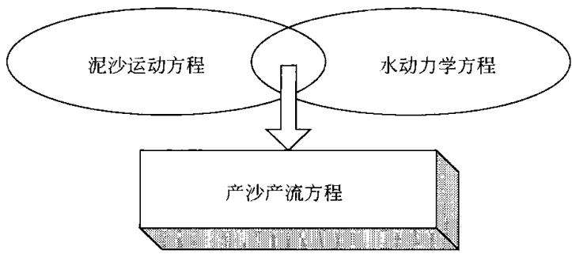  
图 2.1 细沟侵蚀模型组成

细沟侵蚀过程模型构建的基本假设是：①与细沟长度相比，水流非常薄；②流速在垂直方向上均匀分布且只在x方向上流动；③平行于土体表面的流速是流体在水深上的平均值；④细沟宽度和坡度恒定不变；⑤无地表、表层的侧向流入，无入渗，只考虑降雨影响。

## 2.2 一维水流连续性方程

坡面流指在重力作用下顺坡面流动的浅层水流，在分水岭附近呈均匀覆盖的水层，称为片流，而形成细沟时集中在细沟内流动的称之为“细沟流”。细沟水流比较集中，也称为集中流。虽然细沟流边界条件复杂，并且变化较快，但因其属于集中水流，故可用浅层明渠水流公式描述(刘青泉等,2004)。已有许多学者对一维水流方程做过深入研究(Freeze，1978;沈 冰, 1996; Nearing and Parker, 1994; Nearing et al., 1991; Foster and Meyer, 1972a,1972b;Gilley et al.,1990; Meyer et al. ,1975a,1975b; Einstein and Chien ,1954; Vanoni and Nam-icos ,1960;Rose et al., 1983a, 1983b; Foster et al. , 1984; Elliot et al., 1989; Hairsine and Rose,1992;Wllolhiser,1967)。

集中水流动力过程数学描述如下。假设水流是单向的，即细沟流断面内其他横向水流部分极小且可以忽略，这样可以进行一维分析。图(2.2)中u为水流在x方向上沿深度和宽度的平均流速[L/T]，w为细沟沟宽[L]，h为垂直方向的水流深度[L]， $\pmb { \sigma }$ 为降雨强度[L/T]，S.为细沟坡度 $[ \mathrm { L } / \mathrm { L } ]$ ,取 $S _ { x } = { \mathrm { \ t a n } } \theta , \theta$ 为细沟的坡度，忽略地表侧向入流 $[ \mathbf { L } ^ { 2 } /$ T]和表层侧向入流 $[ \mathbf { L } ^ { 2 } / \mathbf { T } ]$ ，水流的密度为 $\pmb { \rho } \left[ \mathbf { M } / \mathbf { L } ^ { 3 } \right]$ 0

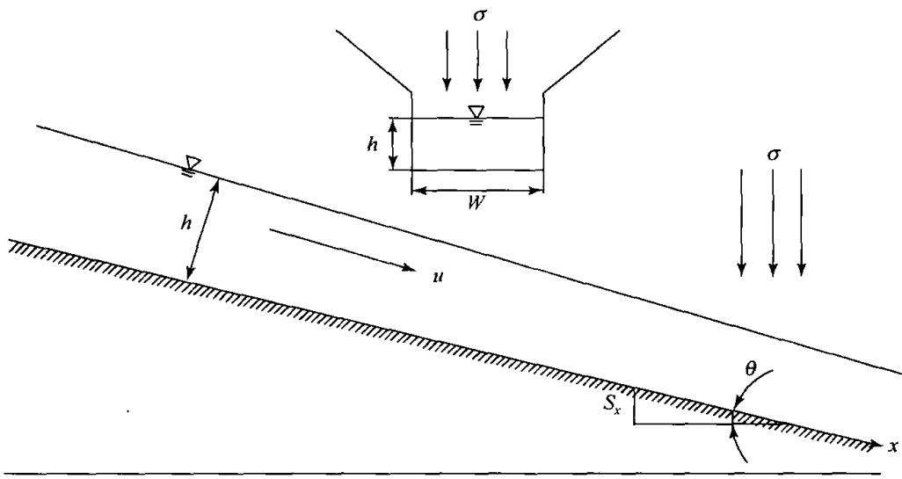  
图2.2一维细沟水流模型：纵断面，横断面图

从细沟水流中取一微小单元，设细沟长度dx区间内水流在初瞬时 $t _ { 1 }$ 的水面线为 $a \mathrm { ~ - ~ }$ a,经过dt时段以后，末瞬时 $t _ { 2 } = t _ { 1 } + \mathrm { d } t$ 的水面线为b-b，如图2.3所示。

水流连续性方程推导如下(吴持恭，1998)：

x,t为自变量，水深 $h ( x , t )$ 和流速 $u ( \boldsymbol { y } , t )$ 是流程x和时间t的连续函数，沟宽w和坡度 $S _ { x }$ 为常数。设初瞬时区间上游断面(上一上断面)流量为 $Q$ ，过水面积为 $A ;$ 在同一瞬时区间下游断面(下-下断面)流量为 $Q + \frac { \partial Q } { \partial x } \mathrm { d } x$ ,过水面积为 $A + { \frac { \partial A } { \partial x } } \mathrm { d } x$ ;则末瞬时上-上断面流量应该为 $Q + \frac { \partial Q } { \partial t } \mathrm { d } t$ ,过水面积为 $A + { \frac { \partial A } { \partial t } } \mathrm { d } t$ ；下-下断面流量为 $Q + { \frac { \partial Q } { \partial x } } \mathrm { d } x + { \frac { \partial } { \partial t } } ( \partial +$ $\frac { \partial Q } { \partial x } \mathrm { d } x ) \mathrm { d } t$ ,过水面积为 $A + { \frac { \partial A } { \partial x } } \mathrm { d } x + { \frac { \partial } { \partial t } } { \bigl ( } A + { \frac { \partial A } { \partial x } } \mathrm { d } x { \bigr ) } \mathrm { d } t$ o

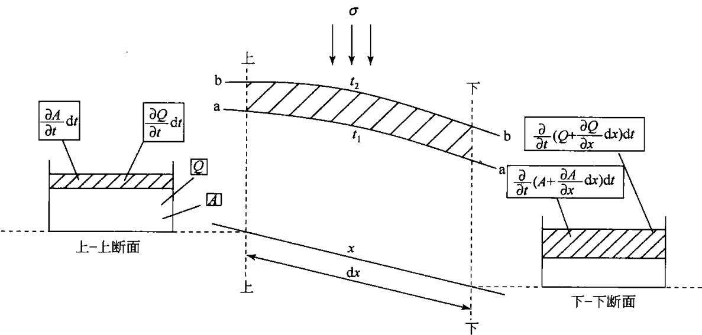  
图 2.3 水流质量守恒的单元流体

因为液体是不可压缩的连续介质，在dt时段内经上-上断面流入区间的液体体积，与经下-下断面流出区间液体体积之差，应当等于该区间内末、初瞬时水体体积的增量。初时到末时，流入和流出dx区间液体体积之差为

$$
\begin{array} { r l r } {  { \frac { 1 } { 2 } \Big ( Q + Q + \frac { \partial Q } { \partial t } \mathrm { d } t \Big ) \mathrm { d } t } } & { - \frac { 1 } { 2 } \Big [ Q + \frac { \partial Q } { \partial x } \mathrm { d } x + Q + \frac { \partial Q } { \partial x } \mathrm { d } x + \frac { \partial } { \partial t } \Big ( Q + \frac { \partial Q } { \partial x } \mathrm { d } x \Big ) \mathrm { d } t \Big ] \mathrm { d } t } & { + \sigma w \mathrm { d } x \mathrm { d } t } & \\ & { } & { = - \frac { \partial Q } { \partial x } \mathrm { d } x \mathrm { d } t - \frac { 1 } { 2 } \frac { \partial ^ { 2 } Q } { \partial x \partial t } \mathrm { d } x \mathrm { d } t ^ { 2 } + \sigma w \mathrm { d } x \mathrm { d } t \quad \qquad ( 2 - \frac { 1 } { 2 } \frac { \partial ^ { 2 } Q } { \partial x } \mathrm { d } x + Q + \frac { \partial Q } { \partial t } \mathrm { d } x ) \mathrm { d } t . } \end{array}\tag{1}
$$

dx区间内末、初瞬时水体体积的增量为

$$
\begin{array} { r l } & { \cfrac { 1 } { 2 } \left[ { \cal A } + \frac { \partial { \cal A } } { \partial t } \mathrm { d } t + { \cal A } + \frac { \partial { \cal A } } { \partial x } \mathrm { d } x + \frac { \partial } { \partial t } \Big ( { \cal A } + \frac { \partial { \cal A } } { \partial x } \mathrm { d } x \Big ) \mathrm { d } t \right] \mathrm { d } x - \cfrac { 1 } { 2 } \left( { \cal A } + { \cal A } + \frac { \partial { \cal A } } { \partial x } \mathrm { d } x \right) \mathrm { d } x } \\ & { \qquad = \frac { \partial { \cal A } } { \partial t } \mathrm { d } x \mathrm { d } t + \cfrac { 1 } { 2 } \frac { \partial ^ { 2 } { \cal A } } { \partial x \partial t } \mathrm { d } t \mathrm { d } x ^ { 2 } } \end{array}\tag{2-2}
$$

令式(2-1)和式(2-2)相等，各项同除以dxdlt，并忽略高阶微量后整理可得

$$
{ \frac { \partial A } { \partial t } } + { \frac { \partial Q } { \partial x } } = \sigma w\tag{2-3}
$$

对于矩形断面的细沟水流，过水面积A和计算流量Q可通过下式计算

$$
A \ = \ w h\tag{2-4}
$$

$$
Q \ = \ A u \ = \ w u h\tag{2-5}
$$

式(2-3) 可写成

$$
\frac { \partial h } { \partial t } + \frac { \partial \big ( u h \big ) } { \partial x } = \sigma\tag{2-6}
$$

说明在有降雨无侧向流入且沟宽与坡度不变的细沟水流中，过水断面面积随时间的变率与流量随位置的变率之和为降雨强度。

## 2.3 水流动量守恒方程

水流运动方程的推导可参考图(2.4)(Freeze,1978;Zienkiewicz et al.,2005;Shreve，1960)。任意取出一微段总流来分析。

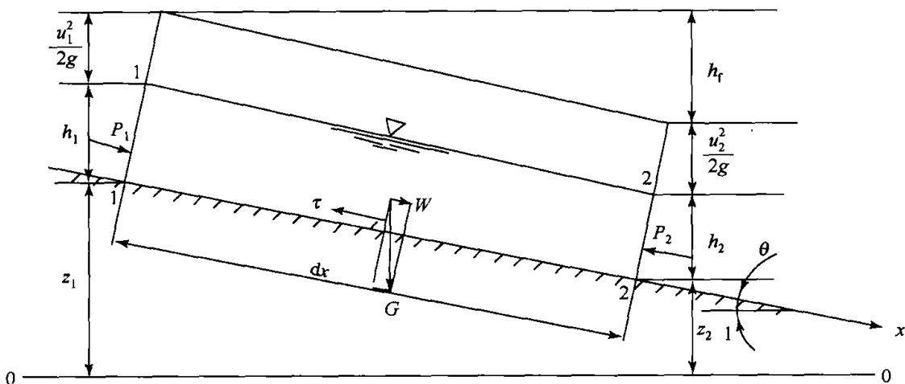  
图2.4 水流动量守恒的单元流体

总流与水平面成角度 $\pmb \theta$ ;平均过水断面面积为A;该段长度为 $\mathbf { d } \boldsymbol { x }$ ;细沟宽度为 ${ \pmb w } _ { \circ }$ 图中 $u _ { 1 } , u _ { 2 } , h _ { 1 } , h _ { 2 }$ 分别为断面1-1及2-2上的平均流速与水深。在微段内，所受重力为G，重力在x轴方向上的分量为W， $\pmb { \tau }$ 为边界上的平均剪切应力，速度、水深和面积的关系可表示为

$$
u _ { 2 } \ = \ u _ { 1 } \ + \frac { \partial u } { \partial x } \mathrm { d } x\tag{2-7}
$$

$$
h _ { 2 } \ = \ h _ { 1 } + \frac { \partial h } { \partial x } \mathrm { d } x\tag{2-8}
$$

$$
A \ = \ w \ \frac { \left( h _ { 1 } \ + \ h _ { 2 } \right) } { 2 }\tag{2-9}
$$

作用在该微流段上有下列各力

不平衡的静水压力 $F _ { p }$ ,作用在断面1-1上的动水压力 $P _ { 1 } = A p _ { 1 } = \rho g A h$ ，作用在断面2-2上的动水压力 $P _ { \mathrm { ~ 2 ~ } } = A p _ { 2 } \ = \rho g A h _ { 2 }$ ,则

$$
F _ { p } \ = \ P _ { 2 } \ - P _ { 1 } \ = \rho { g } A ( h _ { 2 } \ - h _ { 1 } ) \ = \rho { g } A \Big ( h _ { 1 } \ + \frac { \partial h } { \partial x } \mathrm { d } x \ - h _ { 1 } \Big ) = - \rho { g } A \frac { \partial h } { \partial x } \mathrm { d } x\tag{2-10}
$$

重力分量 $F _ { g }$ ，作用方向指向下游，

$$
F _ { g } \ = \ G \mathrm { s i n } a \ = \rho g A S _ { 0 } \mathrm { d } x\tag{2-11}
$$

式中， $S _ { \mathfrak { o } }$ 为底坡， $S _ { 0 } ~ = ~ \sin \theta$

流体所受阻力 $F _ { \mathrm { f } }$ ，作用方向指上游，根据水力学原理

$$
F _ { f } ~ = ~ \tau R \mathrm { d } x ~ = - \rho h A h _ { \mathrm { ~ f ~ } } = - \rho g A S _ { f x } \mathrm { d } x\tag{2-12}
$$

式中，R为细沟槽湿周， $S _ { f x }$ 为水力坡度。

$S _ { f x }$ 可以通过谢才公式得到

$$
S _ { f x } \ = \ \bigg ( \frac { u } { C } \bigg ) ^ { 2 } \ \frac { 1 } { h }\tag{2-13}
$$

式中，C 为谢才系数，由下式确定(Chow,1959)

$$
C = { \sqrt { \frac { 8 g } { f } } }\tag{2-14}
$$

式中， $f$ 为 Darcy- Weisbach 水力摩擦系数。

水流运动遵循牛顿第二运动定律

$$
F = m a \ = { \frac { m \mathrm { d } u } { \mathrm { d } t } } \ = \ { \frac { \mathrm { d } M } { \mathrm { d } t } }\tag{2-15}
$$

式中，F为作用于流体上的所有力的矢量和； $\pmb { m }$ 为流体质量； $M$ 为流体的动量； $^ { \mathbf { \nabla } , a }$ 为流体运动加速度；u为流体运动速度；t为运动时间。式(2-15)的意义为作用于流体的所有力的矢量和等于该流体中动量的变率。

流体所受到的总的作用力，可由下式计算

$$
F = F _ { \mathrm { p } } + F _ { \mathrm { g } } + F _ { \mathrm { f } }\tag{2-16}
$$

动量的变率由下式计算

$$
{ \frac { \mathrm { d } M } { \mathrm { d } t } } = m _ { \mathrm { e } } { \frac { \mathrm { d } u } { \mathrm { d } t } } + m _ { \mathrm { r } } { \frac { \mathrm { d } u _ { \mathrm { r } } } { \mathrm { d } t } }\tag{2-17}
$$

式中， $m _ { e }$ 为细沟槽中流体的质量； $m _ { \tau }$ 为降雨的质量；u为细沟流流速； $u _ { \mathrm { r } }$ 为降雨入流的流速。

式(2-17)中右边两项分别可以表示为

$$
m _ { \mathrm { e } } \frac { \mathrm { d } u } { \mathrm { d } t } = \rho A \mathrm { d } x \bigg ( \frac { \partial u } { \partial t } + u \frac { \partial u } { \partial x } \bigg )\tag{2-18}
$$

$$
m _ { \mathrm { r } } \frac { \mathrm { d } u } { \mathrm { d } t } \ = \rho r w \mathrm { d } x \mathrm { d } t \bigg ( \frac { u \ - \ u _ { r } } { \mathrm { d } t } \bigg ) \ = \rho r w \big ( \ u \ - \ u _ { \mathrm { r } } \big ) \mathrm { d } x\tag{2-19}
$$

由于 $\pmb { u } _ { \mathbf { r } }$ 都比u小得多，所以可将这些项从上式忽略，得

$$
\frac { \mathrm { d } M } { \mathrm { d } t } = \rho A \mathrm { d } x \bigg ( \frac { \partial u } { \partial t } + u \frac { \partial u } { \partial x } \bigg ) + \rho \sigma w u { } x\tag{2-20}
$$

根据式(2-15),使式(2-10)、式(2-11)和式(2-12)之和等于(2-20)右项

$$
- \rho g A { \frac { \partial h } { \partial x } } \mathrm { d } x ~ + \rho g A S _ { 0 } \mathrm { d } x ~ - \rho g A S _ { f x } \mathrm { d } x ~ = ~ \rho A \mathrm { d } x \Big ( { \frac { \partial u } { \partial t } } ~ + ~ u ~ { \frac { \partial u } { \partial x } } \Big ) + \rho \sigma w u \mathrm { d } x\tag{2-21}
$$

两边同除 $\rho A \mathrm { d } x$ 得

$$
- \ g \frac { \partial h } { \partial x } + g S _ { 0 } \ - \ g S _ { f x } \ = \frac { \partial u } { \partial t } + u \frac { \partial u } { \partial x } + \frac { \sigma w u } { A }\tag{2-22}
$$

对各项进行合并整理并以 $A \ = \ w h$ 代人，得到运动方程

$$
u \frac { \partial \big ( u \big ) } { \partial x } + \frac { \partial u } { \partial t } + g \frac { \partial h } { \partial x } + \frac { u \sigma } { h } + g \big ( S _ { f x } - S _ { 0 } \big ) \ = 0\tag{2-23}
$$

令 $\pmb { S _ { x } }$ 为沟道的坡度(Jayawardena and White,1977)，用沟底地表高程差 $\partial z$ 和沟长差$\partial \pmb { x }$ 可表示为

$$
S _ { x } ~ = ~ \mathbf { t a n } \theta ~ = ~ { \frac { \partial z } { \partial x } }\tag{2-24}
$$

则

$$
S _ { 0 } \ = \ \mathrm { s i n } \theta \ = \ \mathrm { t a n } a \ \cdot \ \mathrm { c o s } \theta \ = \ S _ { x } \ \sqrt { 1 \ - \ \mathrm { s i n } ^ { 2 } \theta } \ = \ S _ { x } \ \sqrt { 1 \ - \ \overline { { { S _ { 0 } ^ { 2 } } } } }\tag{2-25}
$$

因此

$$
S _ { 0 } \ = \ \frac { S _ { x } } { \sqrt { 1 \ + \ S _ { x } ^ { 2 } } }\tag{2-26}
$$

于是，水流动量守恒方程为

$$
u \frac { \partial ( u ) } { \partial x } + \frac { \partial u } { \partial t } + g \frac { \partial h } { \partial x } + \frac { u \sigma } { h } = g \bigg ( \frac { S _ { x } } { \sqrt { 1 + S _ { x } ^ { 2 } } } + S _ { f x } \bigg )\tag{2-27}
$$

## 2.4 泥沙质量守恒方程

泥沙输移过程中，流体内存在泥沙和水两种物质，因此可以将其看做是二元混合物。当这一混合体在空间分布不均一、其组成成分在空间存在着浓度梯度时，就会产生扩散驱动力，使得某一特定的成分从高浓度区向低浓度区扩散。扩散过程进行得快慢可用扩散通量或流的大小来表示(J)，即单位时间内单位面积上扩散传递的物质量，其量纲是$\left[ \mathbf { M } \right] \left[ \mathbf { L } ^ { 2 } \right] \mathbf { \Sigma } ^ { - 1 } \left[ \mathbf { T } \right] \mathbf { \Sigma } ^ { - 1 }$ ;引起传递的宏观原因为梯度或力(G），其量纲是 $[ \mathbf { C } ] [ \mathbf { L } ] \mathbf { \Sigma } ^ { - 1 }$ ，通量与梯度之间存在着函数关系，这一关系是传递现象动力学的基本关系式

$$
J = f ( G )\tag{2-28}
$$

根据费克定律(Fick'sLaw)，在恒温恒压下，由泥沙、水组成的双组分混合物中，泥沙在混合物中沿x方向作稳定分子扩散时，其扩散通量 $J _ { \textrm { s } }$ 为

$$
\boldsymbol { J } _ { \mathrm { s } } ~ = - ~ D _ { \mathrm { H } } ~ \frac { \mathrm { d } c _ { \mathrm { s } } } { \mathrm { d } x }\tag{2-29}
$$

式中， $J _ { s }$ 为泥沙在x方向的分子扩散通量； $\frac { \mathrm { d } c _ { \circ } } { \mathrm { d } x }$ 泥沙在方向x上扩散的浓度梯度； $D _ { \mathtt { H } }$ 为泥沙在水中的扩散系数 $( \mathbf { m } ^ { 2 } / \mathbf { s } )$ ，负号表示扩散是沿着泥沙浓度降低的方向进行；与水流运动一样，泥沙运动同样符合质量守恒定律，即式(2-6)，但不同之处在于，进入单元体的不是降雨而是泥沙，可写为

$$
\frac { \partial c h } { \partial t } + \frac { \partial c \big ( { u _ { \mathrm { s } } } h \big ) } { \partial x } = S _ { \mathrm { s s } }\tag{2-30}
$$

式中， ${ \mathbf { } } _ { | c } ( { \pmb x } , t )$ 为泥沙含量 $( \mathrm { \ k g / m } ^ { 3 } )$ ; q 为单宽流量； $S _ { \mathfrak { s s } } ( \pmb { x } , t )$ 为泥沙源(汇)项 $[ \mathbf { \ k g } / ( \mathbf { \ m } ^ { 2 }$ ${ \bf s } ) ]$ ，为单位时间内由单位面积表面剥离的泥沙量，也就是细沟剥蚀率 $D _ { \mathfrak { r } } \mathfrak { s } \ { \pmb u } _ { \mathfrak { s } }$ 为泥沙运动的速度，包括扩散运动和受力运动两个部分，

$$
u _ { \mathrm { { s } } } ~ = ~ u + J _ { \mathrm { { s } } }\tag{2-31}
$$

将式(2-31)代入式(2-30)整理得

$$
\frac { \partial c h } { \partial t } + \frac { \partial c ( u h ) } { \partial x } + \frac { \partial c J _ { \mathrm { s } } h } { \partial x } = D _ { \mathrm { r } }\tag{2-32}
$$

单宽流量可表示为 $q \ = \ u h$ ,将式(2-29)代人式(2-32),得

$$
\begin{array} { r } { c \frac { \partial h } { \partial t } + h \frac { \partial c } { \partial t } + c \frac { \partial u h } { \partial x } + u h \frac { \partial c } { \partial x } = \frac { \partial } { \partial x } \Big ( h D _ { \mathrm { H } } \frac { \partial c } { \partial x } \Big ) + D _ { r } } \end{array}\tag{2-33}
$$

将式(2-6)代入式(2-33)即泥沙连续性方程

$$
h \frac { \partial c } { \partial t } + h u \frac { \partial c } { \partial x } = \frac { \partial } { \partial x } \Big ( h D _ { \mathrm { H } } \frac { \partial c } { \partial x } \Big ) + D _ { \mathrm { r } }\tag{2-34}
$$

## 第3章 细沟侵蚀模型有限元计算方法

## 3.1 有限元方法的概念及在细沟侵蚀领域中的应用

工程实践中常常遇到边界条件和受力条件复杂的问题，无法求得精确的解析。在实际中，可以用近似的数值解代替。对于这种已知控制方程和边界条件的力学问题，我们可以保留其复杂性，利用数值计算方法求得问题的近似数值解。有限元法是一种关于微分方程的数值解的方法，随着计算机技术的飞速发展，这种方法的应用范围和领域不断拓宽，在许多领域都受到高度重视(荣先成等，2007)。

有限元法是将求解区域分解成若干(有限)个互相连接而又不重叠的几何单元，根据变分原理或方程余量与权函数正交化原理，来确定单元特性的矩阵方程(单元刚度矩阵），然后，将单元上的方程总体合成得到有限元代数方程组，通过对时间微分的处理，将微分方程组变成线性代数方程组，代入边界条件和初始条件进行求解(Zienkiewicz et al.，2005;沈冰，1996;龙江等,2002;朱伯芳，1998)。

有限元方法的基本概念是把连续函数分段近似地表示成为离散模型，即把实际问题的整体求解区域划分为有限个单元，这些单元越小，就越逼近原连续的求解函数。通过有限单元的离散可以将一些外形相当复杂的几何区域分成有限段(或有限片、有限块)，达到化无限为有限、化难为易的作用。

因此，使用有限元法求解模型的第一步是离散求解区域，其实质是将实际的求解域剖分成一组节点和单元，最后求解各节点上的未知值。对于细沟侵蚀问题的单元剖分中，以线性单元最为合理简单。当把无侧向流入条件下的薄层细沟流概化成为沿坡面的一维运动问题时，可将求解区域离散成为一维线性单元组。单元的端点叫做节点，单元之间在节点处连接，单元之间的信息只通过节点传递，外加条件只加在节点上。在单元划分完毕后，要将全部单元及全部节点按一定顺序编号，并且单元号和节点号不能遗漏或重复。如果离散的单元数较多，那么通过有限元方法得到的总体矩阵将会很大，有可能超过计算机的内存允许范围，所以有限单元节点编号，需要遵循最小半带宽原则(详见3.3.3小节)，也就是按自然数列排列节点编号(图3.1)。

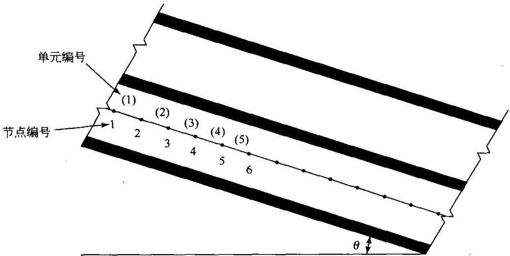  
图3.1 坡面细沟概化为有限元单元

## 3.2 偏微分方程的近似积分法

## 3.2.1 理论基础

## (1)泛函和变分

有限元方法的理论是变分原理和加权余量法。在对变分的研究中，泛函是一个重要的概念，泛函是函数概念的一个扩展；不同之处是，函数的自变量是数，而泛函的自变量是函数，所以泛函数是函数的函数，记作

$$
I = I ( y ( x ) )\tag{3-1}
$$

式中， $\boldsymbol { y } ( \boldsymbol { x } )$ 为自变量，也是一个函数；I为因变量，是一个实数。

变分法就是对泛函I求极值，确定积分最小值问题：

$$
I ( y ) \ = \ \int _ { a } ^ { b } F \big ( x , y ( x ) , y ^ { \prime } ( x ) \big ) \mathrm { d } x\tag{3-2}
$$

式中 $, y ( a )$ 和 $\boldsymbol { y } ( \boldsymbol { b } )$ 为已知值，是求函数 $\scriptstyle y = y ( x )$ 满足边界条件 $\gamma ( a ) \lrcorner \gamma ( b )$ 时使I达到极 值的条件。

数学上已经证明，泛函求极值(变分问题)计算可用微分方程的求解来代替；反之，微分方程的求解也可用泛函求极值计算来代替，但变分法没有对求解区域作网络剖分，得到的是对全区域的近似解析解。随着应用领域的不断扩展，慢慢解析解不能满足具有复杂结构和复杂边界条件的问题的求解。因此，结合变分原理与求解区间有限划分的求解方法——有限元法便应运而生。

## (2)加权余量法

加权余量法是变分原理的一个推广，较变分法更为通用。加权余量法的基本原理是，对已知求解问题的控制微分方程，假定一个符合边界和初始条件的近似解，当把这个近似解代人该控制微分方程时，在求解区域内部各点上都会产生残差项(余数)。定义该

余数为R，让该余量在有限元法的每个单元的误差的加权和(积分)为0。

微分方程为以下形式

$$
L ( \phi ( x , y , z ) ) \ : - \ : F ( x , y , z ) \ : = \ : 0\tag{3-3}
$$

式中，L为微分算子； $\phi$ 为未知函数； $\pmb { F }$ 为已知函数。

定义式(3-3)在单元内的近似解 $\hat { \phi }$ 形式为

$$
\hat { \phi } ( x , y , z ) ~ = ~ \sum _ { i = 1 } ^ { m } N _ { i } { \left( x , y , z \right) } \phi _ { i }\tag{3-4}
$$

式中， $N _ { i }$ 为单元插值形函数； $\phi _ { i }$ 为单元节点值；m为有限单元节点总数。将单元近似解(3-4)代入微分方程式(3-3)，就会产生残差 $R$

$$
R ( x , y , z ) ~ = ~ L ( \hat { \phi } ( x , y , z ) ~ - { \cal F } ( x , y , z ) ) ~ \ne 0\tag{3-5}
$$

残差项在求解域内部各点取值都有所不同，在一些内点上可能会偏大于真实解，而在另一些内点又会偏小于真实解，因此，使R在区域内处处为零是很困难的，但可以让残差项在整个区域的加权积分为零，即

$$
\underset { \ b { \Omega } } { \int } \omega \left( x , y , z \right) R \left( x , y , z \right) \mathrm { d } \Omega \ = \ 0\tag{3-6}
$$

式中， ${ \pmb { \omega } } ( { \pmb x } , { \pmb y } , { \pmb z } )$ 为加权函数；Ω为求解域，对于一维问题，Ω代表长度。

将式(3-5)代入式(3-6)得

$$
\int _ { \Omega } \omega \big ( x , y , z \big ) \big ( L \big ( \hat { \phi } \big ( x , y , z \big ) \big ) - F \big ( x , y , z \big ) \big ) \mathrm { d } \Omega \ = 0\tag{3-7}
$$

对式(3-7)积分求解，需要对近似解 $\hat { \phi }$ 和权重函数 $\pmb { \omega }$ 作数学处理。

## 3.2.2 线性插值函数

在有限元方法中的插值函数 $\hat { \phi }$ 被定义为整个求解区域上的分段函数。求解域被剖分成有限个单元，每个单元由一个插值函数所定义，用来描述单元在端点之间的状态。插值函数可以是线性函数、二次函数、三次函数或其他函数。用公式表示为

$$
\hat { \phi } ^ { ( e ) } \left( x , y , z \right) ~ = ~ \sum _ { i = 1 } ^ { n } N _ { i } ^ { ( e ) } \phi _ { i }\tag{3-8}
$$

式中， $N _ { i } ^ { ( e ) }$ 为单元插值形函数； $\phi _ { i }$ 为每个节点上的未知函数值，即节点函数值： $; n$ 为单元的节点数。当细沟侵蚀模型取为一维形式和采用线性插值函数时，单元包括2个节点，用i和 $j$ 分别代表单元的2个节点，则用矩阵形式表示的单元插值为：

$$
\hat { \phi } ^ { ( e ) } \left( x \right) ~ = ~ \left[ N ^ { ( e ) } \right] \left\{ \phi \right\}\tag{3-9}
$$

其中

$$
\left[ N ^ { \left( e \right) } \right] = \left[ N _ { i } ^ { \left( e \right) } \left( x \right) N _ { j } ^ { \left( e \right) } \left( x \right) \right]\tag{3-10}
$$

$$
\displaystyle { \{ \phi \} } = \left[ { \phi _ { i } \atop \phi _ { j } } \right]\tag{3-11}
$$

式中， $N _ { i } ^ { ( e ) } , N _ { j } ^ { ( e ) }$ 为插值形函数，仅与空间变量有关，而与时间变量无关；φ；、φ，分别为函数 $\mathbf { \nabla } _ { \cdot } \phi _ { j }$ 在i和j节点上的取值，是给定节点上需要近似求解的待求未知函数，与空间变量无关，但与时间变量有关。

线性单元如图3.2所示。

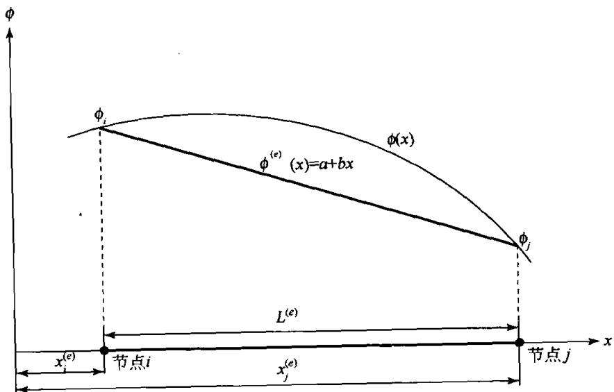  
图3.2 节点单元图

另设每一个单元内的近似插值函数φ可由线性多项式表示为 $\hat { \phi } ^ { ( e ) }$

$$
\hat { \phi } ^ { ( e ) } \ : = \ : a \ : + \ : b x\tag{3-12}
$$

由图3.2所示，φ在单元节点上满足 $\hat { \phi } ^ { \left( e \right) }$

$$
\begin{array} { r } { \left\{ \begin{array} { l l } { \hat { \phi } ^ { ( e ) } \left( x _ { i } \right) = \Phi _ { i } } \\ { \hat { \phi } ^ { ( e ) } \left( x _ { j } \right) = \Phi _ { j } } \end{array} \right. } \end{array}\tag{3-13}
$$

将式(3-13)代人式(3-12)可求得多项式系数a,b

$$
\left\{ \begin{array} { l l } { \displaystyle a = \frac { \phi _ { i } x _ { j } - \phi _ { j } x _ { i } } { x _ { j } - x _ { i } } = \frac { \phi _ { i } x _ { j } - \phi _ { j } x _ { i } } { L } } \\ { \displaystyle b = \frac { \phi _ { j } - \phi _ { i } } { x _ { j } - x _ { i } } = \frac { \phi _ { j } - \phi _ { i } } { L } } \end{array} \right.\tag{3-14}
$$

其中， $\pmb { L } = \pmb { x } _ { j } - \pmb { x } _ { i }$ 为单元长度

则函数 $\hat { \phi } ^ { ( e ) }$ 在单元上可以写成

$$
\hat { \phi } ^ { ( e ) } \ = \ \frac { \phi _ { i } x _ { j } - \phi _ { j } x _ { i } } { L } + \frac { \phi _ { j } - \phi _ { i } } { L } x\tag{3-15}
$$

整理式(3-15)，变形为由式(3-8)确定的形式，得到

$$
\hat { \phi } ^ { ( e ) } \ = \frac { x _ { j } - x } { L } \phi _ { i } + \frac { x - x _ { i } } { L } \phi _ { j }\tag{3-16}
$$

可知单元插值形函数为

$$
N _ { i } ^ { ( e ) } \left( x \right) = \frac { x _ { j } - x } { L }\tag{3-17}
$$

$$
N _ { j } ^ { ( e ) } \left( x \right) = \frac { x - x _ { i } } { L }\tag{3-18}
$$

插值形函数在弹性力学有限元求解领域反映了单元的位移形态，所以通常叫做形函数，形函数具有在单元内“本点是1、他点为 $0 ^ { \dprime }$ 的性质(颜云辉等，2000；刘尔烈等，2004)，即

在i节点处 $\left( \pmb { x } = \pmb { x } _ { i } \right)$

$$
\begin{array} { r } { \left\{ \begin{array} { l l } { N _ { \mathrm { i } } ^ { ( e ) } \left( x _ { \mathrm { i } } \right) ~ = ~ 1 } \\ { N _ { j } ^ { ( e ) } \left( x _ { i } \right) ~ = ~ 0 } \end{array} \right. } \end{array}\tag{3-19}
$$

在j节点处 $\left( x = x _ { j } \right)$

$$
\begin{array} { r } { \left\{ \begin{array} { l l } { N _ { i } ^ { ( e ) } \left( x _ { j } \right) ~ = ~ 0 } \\ { N _ { j } ^ { ( e ) } \left( x _ { j } \right) ~ = ~ 1 } \end{array} \right. } \end{array}\tag{3-20}
$$

## 3.2.3 一维有限元计算公式——Galerkin 方法

式(3-7)中的权重函数可以有不同的选取方法，根据选取方法的不同，就出现了不同的加权余量方法，主要有子域定位法、点定位法、Galerkin法和最小二乘法。Galerkin方法和最小二乘法都能得到较好的结果，但前者在一定条件下能得到与泛函变分结果相同的计算公式，所以Galerkin方法得到了广泛应用和高度重视(孔祥谦，1999)。Galerkin方法选用插值函数作为权函数，于是有

$$
{ \pmb \omega } _ { i } ( { \pmb x } ) = N _ { i } ( { \pmb x } ) = \frac { { \pmb x } _ { j } - { \pmb x } } { L } \quad { \pmb x } \geq { \pmb x } _ { i }\tag{3-21}
$$

$$
{ \pmb { \omega } } _ { j } { \left( { \pmb x } \right) } = N _ { j } { \left( { \pmb x } \right) } = \frac { { \pmb x } - { \pmb x } _ { i } } { L } \quad { \pmb x } \geqslant { \pmb x } _ { i }\tag{3-22}
$$

对于一维问题，若求解域为长度L，加权余量方程变为

$$
\int _ { L } N ( x ) R ( x ) { \mathrm { d } } l = 0\tag{3-23}
$$

式中， ${ \pmb N } ( { \pmb x } )$ 为线性插值函数； $\pmb { R } ( \pmb { x } )$ 为残差项。

## 3.3 一维细沟侵蚀模型的有限元方法

## 3.3.1 单元有限元方程的推导

整理细沟侵蚀模型式(2-6)、式(2-27)和式(2-35)并用函数 $L _ { 1 } ( \mathbf { \Psi } ) \mathbf { \Psi } \sqrt { L _ { 2 } ( \mathbf { \Psi } ) }$ 和 $L _ { 3 } ( \mathbf { \varepsilon } )$ 表示如下

$$
L _ { 1 } ( u , h ) = \frac { \partial h } { \partial t } + \frac { \partial \left( u h \right) } { \partial x } - \sigma = 0\tag{3-24}
$$

$$
L _ { 2 } ( u , h ) \ = \ \frac { \partial u } { \partial t } + u \frac { \partial u } { \partial x } + g \frac { \partial h } { \partial x } + \frac { u \sigma } { h } + g \bigg ( \frac { S _ { x } } { \sqrt { 1 + S _ { x } ^ { 2 } } } + S _ { f x } \bigg ) = 0\tag{3-25}
$$

$$
L _ { 3 } \left( \ u , h , c \right) = c \sigma + h \frac { \partial c } { \partial t } + h u \frac { \partial c } { \partial x } - \frac { \partial } { \partial x } \bigg ( h D _ { \mathrm { H } } \frac { \partial c } { \partial x } \bigg ) - D _ { \mathrm { r } } = 0\tag{3-26}
$$

## (1)水流连续性方程推导

在 Galerkin 方法中，分析图 3.2 中单元 e 中 $i , j$ 两点，对于方程(3-24)，将h视为节点未知数，设 $\hat { \sigma } _ { i } ^ { ( e ) } , \hat { h } ^ { ( e ) }$ 为近似解， $R _ { i } ^ { ( e ) }$ 为单元i节点上产生的误差余项， $\pmb { M } _ { i } ^ { ( e ) }$ 为误差余项在求解域的加权积分，

有：

$$
M _ { i } ^ { ( \epsilon ) } \ = \ \int _ { L } N _ { i } ^ { ( \epsilon ) } R _ { i } ^ { ( \epsilon ) } \mathrm { d } x \ = \ \int _ { L } N _ { i } ^ { ( \epsilon ) } \bigg [ \frac { \partial \hat { h } ^ { ( \epsilon ) } } { \partial t } + \hat { h } \frac { \partial u ^ { ( \epsilon ) } } { \partial x } + u ^ { ( \epsilon ) } \frac { \partial \hat { h } ^ { ( \epsilon ) } } { \partial x } - \hat { \sigma } ^ { ( \epsilon ) } \bigg ] \mathrm { d } x\tag{3-27}
$$

其中 $\frac { \partial \hat { h } ^ { \left( e \right) } \left( x \right) } { \partial t } = \frac { \partial } { \partial t } \big ( N _ { i } ^ { \left( e \right) } h _ { i } + N _ { j } ^ { \left( e \right) } h _ { j } \big ) , \quad \frac { \partial \hat { h } ^ { \left( e \right) } \left( x \right) } { \partial x } = \frac { \partial } { \partial x } \big ( N _ { i } ^ { \left( e \right) } h _ { i } + N _ { j } ^ { \left( e \right) } h _ { j } \big ) ,$

$$
\hat { h } ^ { ( e ) } \left( x \right) = N _ { i } ^ { ( e ) } h _ { i } + N _ { j } ^ { ( e ) } h _ { j } , \quad \hat { \sigma } ^ { ( e ) } \left( x \right) = N _ { i } ^ { ( e ) } \sigma _ { i } + N _ { j } ^ { ( e ) } \sigma _ { j }
$$

则式(3-27)变形为

$$
\begin{array} { r l } { M _ { i } ^ { ( \epsilon ) } } & { = \displaystyle \int _ { L } \boldsymbol { N } _ { i } ^ { ( \epsilon ) } \frac { \partial } { \partial t } \big ( \boldsymbol { N } _ { i } ^ { ( \epsilon ) } \boldsymbol { h } _ { i } + \boldsymbol { N } _ { j } ^ { ( \epsilon ) } \boldsymbol { h } _ { j } \big ) \mathrm { d } x + \displaystyle \int _ { L } \boldsymbol { N } _ { i } ^ { ( \epsilon ) } \big ( \boldsymbol { N } _ { i } ^ { ( \epsilon ) } \boldsymbol { h } _ { i } + \boldsymbol { N } _ { j } ^ { ( \epsilon ) } \boldsymbol { h } _ { j } \big ) \frac { \partial \boldsymbol { u } ^ { ( \epsilon ) } } { \partial x } \mathrm { d } x } \\ & { \quad + \displaystyle \int _ { L } \boldsymbol { N } _ { i } ^ { ( \epsilon ) } \boldsymbol { u } ^ { ( \epsilon ) } \frac { \partial } { \partial t } \big ( \boldsymbol { N } _ { i } ^ { ( \epsilon ) } \boldsymbol { h } _ { i } + \boldsymbol { N } _ { j } ^ { ( \epsilon ) } \boldsymbol { h } _ { j } \big ) \mathrm { d } x - \displaystyle \int _ { L } \boldsymbol { N } _ { i } ^ { ( \epsilon ) } \big ( \boldsymbol { N } _ { i } ^ { ( \epsilon ) } \boldsymbol { \sigma } _ { i } + \boldsymbol { N } _ { j } ^ { ( \epsilon ) } \boldsymbol { \sigma } _ { j } \big ) \mathrm { d } x } \\ &  = \displaystyle \int _ { L } \Big ( \boldsymbol { N } _ { i } ^ { ( \epsilon ) } \boldsymbol { N } _ { i } ^ { ( \epsilon ) } \Big \{ \frac { \partial \boldsymbol { h } _ { i } } { \partial t } \Big \} + \boldsymbol { N } _ { i } ^ { ( \epsilon ) } \boldsymbol { N } _ { j } ^ { ( \epsilon ) } \Big \{ \frac { \partial \boldsymbol { h } _ { j } } { \partial t } \Big \} \Big ) \mathrm { d } x + \frac { \partial \boldsymbol { \tilde { u } } ^ { ( \epsilon ) } } { \partial x } \displaystyle \int _ { L } \big ( \boldsymbol { N } _ { i } ^ { ( \epsilon ) } \boldsymbol { N } _ { i } ^ { ( \epsilon ) } \big \{ \boldsymbol { h } _ { i } \big \} + \boldsymbol \end{array}\tag{3-28}
$$

$\frac { { \partial \bar { \mathbf { u } } ^ { \left( e \right) } } } { { \partial \mathbf { x } } }$ 为单元两端节点上的速度求导后的平均值

$$
\frac { \partial \bar { u } ^ { ( e ) } } { \partial x } = \frac { 1 } { 2 } \bigg ( \frac { \mathrm { d } u _ { i } } { \mathrm { d } x } + \frac { \mathrm { d } u _ { j } } { \mathrm { d } x } \bigg )\tag{3-29}
$$

$\bar { \pmb u } ^ { ( e ) }$ 为单元两端节点上速度的平均值

$$
\bar { \boldsymbol { u } } ^ { ( e ) } \ = \ \frac { 1 } { 2 } ( \boldsymbol { u } _ { i } \ + \ \boldsymbol { u } _ { j } )\tag{3-30}
$$

将式(3-28)写成矩阵形式，并整理得

$$
\begin{array} { r l } { { \displaystyle M _ { i } ^ { ( \epsilon ) } ~ = ~ \int _ { L } ( N _ { i } ^ { ( \epsilon ) } N _ { i } ^ { ( \epsilon ) } , N _ { i } ^ { ( \epsilon ) } N _ { j } ^ { ( \epsilon ) } ) \operatorname { d } x \Biggl \{ \displaystyle \frac { \partial h _ { i } } { \partial t } \Biggr \} _ { + } +  \frac { \partial ~ \bar { u } ^ { ( \epsilon ) } } { \partial x } \int _ { L } ( N _ { i } ^ { ( \epsilon ) } N _ { i } ^ { ( \epsilon ) } , N _ { i } ^ { ( \epsilon ) } N _ { j } ^ { ( \epsilon ) } ) \mathrm { d } x \Biggl \{ \displaystyle h _ { h _ { j } } \Biggr \} } } & \\ { { \displaystyle ~ + ~ \bar { u } ^ { ( \epsilon ) } \int _ { L } \Bigl ( N _ { i } ^ { ( \epsilon ) }  \frac { \partial N _ { i } ^ { ( \epsilon ) } } { \partial x } + N _ { i } ^ { ( \epsilon ) }  \frac { \partial N _ { j } ^ { ( \epsilon ) } } { \partial x } ) \mathrm { d } x \Biggl \{ \displaystyle h _ { i } \Biggr \} _ { h _ { j } } - \int _ { L } ( N _ { i } ^ { ( \epsilon ) } N _ { i } ^ { ( \epsilon ) } + N _ { i } ^ { ( \epsilon ) } N _ { j } ^ { ( \epsilon ) } ) \mathrm { d } x \Biggl \{ \displaystyle \sigma _ { i } \Biggr \} _ { \sigma _ { j } } \Biggr \} . } } \end{array}\tag{3-31}
$$

分别计算式中各项

$$
\frac { \partial N _ { i } ^ { ( e ) } } { \partial x } = \frac { \partial } { \partial x } \bigg ( \frac { x _ { j } - x } { L } \bigg ) = - \frac { 1 } { L }\tag{3-32}
$$

$$
\frac { \partial N _ { j } ^ { ( e ) } } { \partial x } = \frac { \partial } { \partial x } \bigg ( \frac { x - x _ { i } } { L } \bigg ) = \frac { 1 } { L }\tag{3-33}
$$

$$
\int _ { L } N _ { i } ^ { ( e ) } N _ { i } ^ { ( e ) } \mathrm { d } x \ = \ \int _ { x _ { j } } ^ { x _ { i } } \biggl ( \frac { x _ { j } - x } { L } \biggr ) ^ { 2 } \mathrm { d } x \ = \ \frac { 1 } { 3 } L\tag{3-34}
$$

$$
\int _ { L } N _ { i } ^ { ( e ) } N _ { j } ^ { ( e ) } \mathrm { d } x = \int _ { x _ { j } } ^ { x _ { i } } \frac { x _ { j } - x } { L } \cdot \frac { x - x _ { i } } { L } \mathrm { d } x = \frac { 1 } { 6 } L\tag{3-35}
$$

$$
\int _ { L } N _ { i } ^ { ( e ) } ~ { \frac { \partial N _ { i } ^ { ( e ) } } { \partial x } } \mathrm { d } x ~ = ~ \int _ { x _ { j } } ^ { x _ { i } } \Bigl ( { \frac { x _ { j } - x } { L } } \Bigr ) \Bigl ( - { \frac { 1 } { L } } \Bigr ) \mathrm { d } x ~ = - { \frac { 1 } { 2 } }\tag{3-36}
$$

$$
\int _ { L } N _ { i } ^ { ( e ) } ~ \frac { \partial N _ { j } ^ { ( e ) } } { \partial x } \mathrm { d } x ~ = ~ \int _ { x _ { j } } ^ { x _ { i } } \Bigl ( \frac { x _ { j } ~ - ~ x } { L } \Bigr ) \Bigl ( \frac { 1 } { L } \Bigr ) \mathrm { d } x ~ = ~ \frac { 1 } { 2 }\tag{3-37}
$$

将式(3-32)\~式(3-37)代入式(3-31)有

$$
{ \cal M } _ { i } ^ { ( \epsilon ) } = \left( \frac { 1 } { 3 } { \cal L } , \frac { 1 } { 6 } { \cal L } \right) \left[ \frac { \partial h _ { i } } { \partial t } \right] _ { \epsilon } \partial \bar { \frac { \partial \bar { t } } { \partial x } } \left( \frac { 1 } { 3 } { \cal L } , \frac { 1 } { 6 } { \cal L } \right) \left\{ _ { h _ { j } } ^ { h _ { i } } \right\} + \bar { u } ^ { ( \epsilon ) } \Big ( \mathrm { ~ - ~ } \frac { 1 } { 2 } \mathrm { ~ , ~ } \frac { 1 } { 2 \epsilon } \Big ) \left\{ _ { h _ { j } } ^ { h _ { i } } \right\} - \left( \frac { 1 } { 3 } { \cal L } , \frac { 1 } { 6 } { \cal L } \right) \left\{ _ { \sigma _ { j } } ^ { \sigma _ { i } } \right\} + \bar { u } ^ { ( \epsilon ) } ,\tag{3-38}
$$

同理，在j节点的误差余项为

$$
\begin{array} { r l } { M _ { j } ^ { ( \epsilon ) } } & { = \displaystyle \int _ { L } N _ { j } ^ { ( \epsilon ) } \left[ \frac { \partial \hat { h } ^ { ( \epsilon ) } } { \partial t } + \hat { h } ^ { ( \epsilon ) } \frac { \partial u ^ { ( \epsilon ) } } { \partial x } + u ^ { ( \epsilon ) } \frac { \partial \hat { h } ^ { ( \epsilon ) } } { \partial x } - \hat { \sigma } ^ { ( \epsilon ) } \right] \mathrm { d } x } \\ & { = \displaystyle \int _ { L } N _ { j } ^ { ( \epsilon ) } \frac { \partial } { \partial t } ( N _ { i } ^ { ( \epsilon ) } h _ { i } + N _ { j } ^ { ( \epsilon ) } h _ { j } ) \mathrm { d } x + \displaystyle \int _ { L } N _ { j } ^ { ( \epsilon ) } \big ( N _ { i } ^ { ( \epsilon ) } h _ { i } + N _ { j } ^ { ( \epsilon ) } h _ { j } \big ) \frac { \partial u ^ { ( \epsilon ) } } { \partial x } \mathrm { d } x } \\ & { \quad + \displaystyle \int _ { L } N _ { j } ^ { ( \epsilon ) } u ^ { ( \epsilon ) } \frac { \partial } { \partial x } ( N _ { i } ^ { ( \epsilon ) } h _ { i } + N _ { j } ^ { ( \epsilon ) } h _ { j } ) \mathrm { d } x - \displaystyle \int _ { L } N _ { j } ^ { ( \epsilon ) } \big ( N _ { i } ^ { ( \epsilon ) } \sigma _ { i } + N _ { j } ^ { ( \epsilon ) } \sigma _ { j } \big ) \mathrm { d } x } \end{array}
$$

$$
\begin{array} { r l } { \mathrm { ~ } } & { = \displaystyle { \int _ { L } \Big ( N _ { j } ^ { ( e ) } N _ { i } ^ { ( e ) } \left\{ \frac { \partial N _ { i } } { \partial t } \right\} + N _ { j } ^ { ( e ) } N _ { j } ^ { ( e ) } \left\{ \frac { \partial h _ { j } } { \partial t } \right\} } \mathrm { d } x + \frac { \partial } { \partial x } \displaystyle { \int _ { L } ( N _ { j } ^ { ( e ) } N _ { i } ^ { ( e ) } \left\{ h _ { i } \right\} + N _ { j } ^ { ( e ) } N _ { j } ^ { ( e ) } \left\{ h _ { j } \right\} \mathrm { d } x } } \\ { \displaystyle } &  ~ + \bar { u } ^ { ( e ) } \displaystyle { \int _ { L } \Big ( N _ { j } ^ { ( e ) } \frac { \partial N _ { i } ^ { ( e ) } } { \partial x } \left\{ h _ { i } \right\} + N _ { j } ^ { ( e ) } \frac { \partial N _ { j } ^ { ( e ) } } { \partial x } \left\{ h _ { j } \right\} \Big ) \mathrm { d } x - \displaystyle { \int _ { L } \Big ( N _ { j } ^ { ( e ) } N _ { i } ^ { ( e ) } \left\{ \sigma _ { i } \right\} + N _ { j } ^ { ( e ) } N _ { j } ^ { ( e ) } \left\{ \sigma _ { j } \right\} \Big ) \mathrm { d } x } } \\ { \mathrm { ~ } } &  = \displaystyle { \int _ { L } \big ( N _ { j } ^ { ( e ) } N _ { i } ^ { ( e ) } , N _ { j } ^ { ( e ) } N _ { j } ^ { ( e ) } \big ) \mathrm { d } x \Bigg \{ \frac { \partial h _ { i } } { \partial t } \Bigg \} + \frac { \partial } { \partial x } \bar { u } ^ { ( e ) } \int _ { L } \big ( N _ { j } ^ { ( e ) } N _ { i } ^ { ( e ) } , N _ { j } ^ { ( e ) } N _ { j } ^ { ( e ) } \big ) \mathrm { d } x \Bigg \{ h _ { i } \Bigg \} } \\ { \displaystyle } &  ~ + \bar { u } ^ { ( e ) } \displaystyle  \int _ { L } \Big ( N _ \end{array}
$$

式中

$$
\int _ { L } N _ { j } ^ { ( e ) } N _ { j } ^ { ( e ) } \mathrm { d } x = \int _ { x _ { j } } ^ { x _ { i } } \biggl ( \frac { x - x _ { i } } { L } \biggr ) ^ { 2 } \mathrm { d } x = \frac { 1 } { 3 } L\tag{3-40}
$$

$$
\int _ { L } N _ { j } ^ { ( e ) } N _ { i } ^ { ( e ) } \mathrm { d } x = \int _ { x _ { j } } ^ { x _ { i } } \frac { x - x _ { i } } { L } \cdot \frac { x _ { j } - x } { L } \mathrm { d } x = \frac { 1 } { 6 } L\tag{3-41}
$$

$$
\int _ { L } N _ { j } ^ { ( e ) } ~ { \frac { \partial N _ { i } ^ { ( e ) } } { \partial x } } \mathrm { d } x ~ = ~ \int _ { x _ { j } } ^ { x _ { i } } \biggl ( { \frac { x - x _ { i } } { L } } \biggr ) \Bigl ( - { \frac { 1 } { L } } \Bigr ) \mathrm { d } x ~ = - ~ { \frac { 1 } { 2 } }\tag{3-42}
$$

$$
\int _ { L } N _ { j } ^ { ( e ) } ~ \frac { \partial N _ { j } ^ { ( e ) } } { \partial x } \mathrm { d } x ~ = ~ \int _ { x _ { j } } ^ { x _ { i } } \Bigl ( \frac { x ~ - ~ x _ { i } } { L } \Bigr ) \Bigl ( \frac { 1 } { L } \Bigr ) \mathrm { d } x ~ = ~ \frac { 1 } { 2 }\tag{3-43}
$$

则

$$
\mathcal { M } _ { j } ^ { ( \epsilon ) } = \Big ( \frac { 1 } { 6 } L , \frac { 1 } { 3 } L \Big ) \left\{ \frac { \partial h _ { i } } { \partial t } \right\} + \frac { \partial \bar { u } ^ { ( \epsilon ) } } { \partial x } \Big ( \frac { 1 } { 6 } L , \frac { 1 } { 3 } L \Big ) \left\{ { h _ { j } } \right\} + \bar { u } ^ { ( \epsilon ) } \Big ( - \frac { 1 } { 2 } , \frac { 1 } { 2 } \Big ) \left\{ { h _ { j } } \right\} - \Big ( \frac { 1 } { 6 } L , \frac { 1 } { 3 } L \Big ) \left\{ { \sigma _ { i } } \right\}\tag{3-44}
$$

合并 $R _ { i } ^ { ( e ) } , R _ { j } ^ { ( e ) }$ 两项得

$$
\begin{array} { r l } &  \left\{ \begin{array} { l } { M _ { i } ^ { ( s ) } } \\ { M _ { i } ^ { ( s ) } \Bigr \} = \left( \frac { 1 } { 3 } L \begin{array} { l l } { \frac 1 6 } \end{array} \right) \frac { \partial h _ { i } } { \partial t } } \\ { \left\{ \begin{array} { l l } { \frac 1 6 L } \end{array} \right\} \left\{ \frac { \partial \hat { u } _ { i } ^ { ( s ) } } { \partial t } \right\} + \frac { \partial \bar { u } ^ { ( s ) } } { \partial x } \left\{ \frac 1 6 L \begin{array} { l l } { \frac 1 3 L } & { \frac 1 6 } \end{array} \right\} \left\{ h _ { i } ^ { ( s ) } + \bar { u } ^ { ( s ) } \right\} + \bar { u } _ { \ast } ^ { ( s ) } \left( \begin{array} { l l } { - \frac 1 2 } & { \frac 1 2 } \\ { - \frac 1 2 L } & { \frac 1 2 } \end{array} \right) \left[ h _ { i } \right] } \\ &  \qquad \quad - \left( \frac 1 8 L \begin{array} { l } { \frac 1 3 L } \\ { \frac 1 6 L } \end{array} \right) \left\{ \frac { \partial h _ { i } } L \right\} \left\{ \begin{array} { l l } { \frac 1 6 } \end{array} \right\} \\ { \frac 1 6 , } \\ & { \qquad \mathrm - \left( \frac 1 8 L \begin{array} { l } { \frac 1 6 } \end{array} \right) \left\{ \left[ \begin{array} { l } { \frac 1 6 } { 3 L } \right] \right\} \\  \left[ \begin{array} { l } { \frac 1 6 } \end{array} \right] } \left\{ \begin{array} { l } { \frac 1 6 } \end{array} \right\} \\ { \left[ \begin{array} { l } { \frac 1 6 } \end{array} \right] \right\} \end{array} } \\ &  \qquad = \frac { L } { 6 } \left\{ \begin{array} { l l } { 2 } & { \frac 1 6 } \\ { 1 } & { 2 } \end{array} \right\} \left\{ \begin{array} { l l } { \frac { \partial h _ { i } } { \partial t } } \\ { \frac 1 6 } \end{array} \right\} \end{array} \end{array}\tag{3-45}
$$

## (2)水流动量守恒方程推导

对于方程(3-25)，将速度u设为节点未知函数，得到

$$
S _ { f \star } ^ { ( e ) } = u ^ { ( e ) } \bar { S } _ { f \star } ^ { ( e ) } = u ^ { ( e ) } \frac { 1 \bar { u } ^ { ( e ) } } { \bar { C } ^ { 2 } \bar { h } ^ { ( e ) } }\tag{3-46}
$$

$$
\bar { S } _ { f x } ^ { ( e ) } \ = \ \frac { 1 \bar { u } ^ { ( e ) } } { \tilde { C } ^ { 2 } \bar { h } ^ { ( e ) } }\tag{3-47}
$$

$\pmb { M } _ { i } ^ { ( e ) }$ 有如下所示

$$
{ M _ { i } ^ { \left( \epsilon \right) } } = \int _ { L } { N _ { i } ^ { \left( \epsilon \right) } \left[ \frac { \partial { \widehat { u } ^ { \left( \epsilon \right) } } } { \partial { t } } + u ^ { \left( \epsilon \right) } \frac { \partial { \widehat { u } ^ { \left( \epsilon \right) } } } { \partial { x } } + g \frac { \partial { \widehat { h } ^ { \left( \epsilon \right) } } } { \partial { x } } + \frac { { \widehat { u } ^ { \left( \epsilon \right) } } } { \widehat { h } ^ { \left( \epsilon \right) } } - g \left( \frac { \widehat { S } _ { x } ^ { \left( \epsilon \right) } } { \sqrt { 1 + \left( S _ { x } ^ { \left( \epsilon \right) } \right) ^ { 2 } } } - \widehat { u } _ { i - \bot \delta } ^ { \left( \epsilon \right) } \bar { S } _ { \widehat { t } x } ^ { \left( \epsilon \right) } \right) \right] } \mathrm { d } x\tag{3-48}
$$

其中

$$
\frac { \partial \hat { \boldsymbol u } _ { ( x ) } ^ { ( e ) } } { \partial t } = \frac { \partial } { \partial t } ( N _ { i } ^ { ( e ) } { \boldsymbol u } _ { i } + N _ { j } ^ { ( e ) } { \boldsymbol u } _ { j } )\tag{3-49}
$$

$$
\frac { \partial \hat { \ b u } ^ { ( e ) } ( \ b x ) } { \partial \ b x } = \frac { \partial } { \partial \ b x } ( N _ { i } ^ { ( e ) } \ b u _ { i } + N _ { j } ^ { ( e ) } \ b u _ { j } )\tag{3-50}
$$

$$
\hat { \boldsymbol { u } } ^ { ( e ) } \left( \mathcal { x } \right) ~ = ~ N _ { i } ^ { ( e ) } { \boldsymbol { u } } _ { i } + N _ { j } ^ { ( e ) } { \boldsymbol { u } } _ { j }\tag{3-51}
$$

$$
\hat { \pmb { \sigma } } ^ { ( e ) } \left( { \pmb x } \right) \ = \ N _ { i } ^ { ( e ) } { \pmb { \sigma } } _ { i } + N _ { j } ^ { ( e ) } { \pmb { \sigma } } _ { j }\tag{3-52}
$$

$$
\hat { S } _ { \bf x } ^ { \ ( e ) } \ = \ N _ { i } ^ { ( e ) } S _ { x i } \ + N _ { j } ^ { ( e ) } S _ { x j }\tag{3-53}
$$

$$
\begin{array} { r l } { M ^ { ( 2 ) } = } & { \int _ { 0 } ^ { \infty } \frac { \partial } { \partial x } ( y ) ^ { ( 2 ) } u _ { \tau } + N _ { \tau } ^ { ( 2 ) } u _ { \tau } ) \mathrm { d } x + \int _ { 0 } ^ { \infty } \frac { \partial } { \partial x } ( \int _ { 0 } ^ { \infty } \frac { \partial } { \partial y } ( \hat { \mathcal { H } } _ { \tau } ^ { ( 2 ) } u _ { \tau } + \hat { \mathcal { H } } _ { \tau } ^ { ( 2 ) } u _ { \tau } ) \mathrm { d } x } \\ & { + [ \int _ { 0 } ^ { \infty } \frac { \partial } { \partial x } ( \hat { \mathcal { H } } _ { \tau } ^ { ( 2 ) } ( \hat { \mathcal { H } } _ { \tau } ^ { ( 2 ) } , \hat { \mathcal { H } } _ { \tau } ^ { ( 2 ) } ) ) \mathrm { d } x + \int _ { 0 } ^ { \infty } \frac { \partial } { \partial x } ( \int _ { 0 } ^ { \infty } \frac { \partial } { \partial y } ( \hat { \mathcal { H } } _ { \tau } ^ { ( 2 ) } ( \hat { \mathcal { H } } _ { \tau } ^ { ( 2 ) } , \hat { \mathcal { H } } _ { \tau } ^ { ( 2 ) } ) \mathrm { d } y ) \mathrm { d } x   } \\ &  -   [ \int _ { 0 } ^ { \infty } \frac { \partial } { \partial y } ( \int _ { 0 } ^ { \infty } \hat { \mathcal { H } } _ { \tau } ^ { ( 2 ) } \hat { \mathcal { H } } _ { \tau } ^ { ( 2 ) } + \frac { \partial } { \partial x } ( \int _ { 0 } ^ { \infty } \hat { \mathcal { H } } _ { \tau } ^ { ( 2 ) } \hat { \mathcal { H } } _ { \tau } ^ { ( 2 ) } - ( \hat { \mathcal { H } } _ { \tau } ^ { ( 2 ) } - \hat { \mathcal { H } } _ { \tau } ^ { ( 2 ) } ( \hat { \mathcal { H } } _ { \tau } ^ { ( 2 ) } ,  \end{array}
$$

$$
\begin{array} { r l } &  \quad + g [ ( N _ { \omega } ^ { ( i ) } \frac { \partial N _ { i } ^ { ( j ) } } { \partial s ^ { i } } , N _ { i } ^ { ( i ) } \frac { \partial N _ { i } ^ { ( j ) } } { \partial s ^ { i } } ) ^ { t } \tilde { h } _ { i , j } \ln _ { k } + \frac { \bar { g } ^ { ( i ) \omega } } { \bar { h } ^ { ( i ) \omega } } \int _ { ( N _ { \omega } ^ { ( i ) } \frac { \partial N _ { i } ^ { ( j ) } } { \partial s ^ { i } } ) ^ { t } ( N _ { \omega } ^ { ( i ) } \frac { \partial N _ { i } ^ { ( j ) } } { \partial s ^ { i } } ) ^ { t } \mu _ { i j } ] } \\ & { \quad - \frac { g } { \sqrt { 1 + ( \bar { S } _ { \omega } ^ { ( i ) } ) ^ { 2 } } } \Big [ ( N _ { \omega } ^ { ( j ) } N _ { \omega } ^ { ( i ) } , N _ { \omega } ^ { ( j ) } , N _ { \omega } ^ { ( k ) } ) \Big ] \{ \bar { S } _ { \omega } \Big | _ { \partial \omega } + \bar { S } _ { \omega } ^ { ( i ) } \int _ { \mathbb { L } } ( N _ { \omega } ^ { ( i ) } N _ { \omega } ^ { ( j ) } , N _ { \omega } ^ { ( k ) } ) ^ { t } \mu _ { i j } \} [ \mu _ { i j } ^ { ( k ) } ] } \\ & { =  | \frac { 1 } { 6 } L ^ { ( j ) } L \frac { 1 } { 3 } | | \frac { \partial \overline { { u } } } { \partial s } | + \bar { u } ^ { ( j ) \omega } ( - \frac { 1 } { 2 } - \frac { 1 } { 2 } \frac { 1 } { 2 } ) | \frac { \partial \overline { { u } } } { \partial s ^ { i } } | + g ( - \frac { 1 } { 2 } - \frac { 1 } { 2 } \frac { 1 } { 2 } ) | \bar { h } _ { i j } | } \\ &  \quad + \ \end{array}
$$

同理

$$
\begin{array} { c c } { { M _ { j } ^ { ( \epsilon ) } = ( \displaystyle { \frac { 1 } { 6 } } L \displaystyle { \frac { 1 } { 3 } } L ) \{ \displaystyle { \frac { \partial u _ { i } } { \partial t } } \} + \displaystyle { \bar { u } ^ { ( \epsilon ) } \Big ( - \displaystyle { \frac { 1 } { 2 } } \cdot \frac { 1 } { 2 } \Big ) } \{ \displaystyle { u _ { i } } \} + g \Big ( - \displaystyle { \frac { 1 } { 2 } } } } & { { \displaystyle { \frac { 1 } { 2 } } } \Big ) \{ \displaystyle { h _ { i } } \} + \displaystyle { \frac { \bar { \sigma } ^ { ( \epsilon ) } } { \bar { h } ^ { ( \epsilon ) } } \Big ( \displaystyle { \frac { 1 } { 6 } } L \frac { 1 } { 3 } L \Big ) } \{ \displaystyle { u _ { i } } \} }  \\ { { } } &  { - \displaystyle { \frac { g } { \sqrt { 1 + \big ( \bar { S } _ { \mathrm { x } } ^ { ( \epsilon ) } \big ) ^ { 2 } } } } \Big ( \displaystyle { \frac { 1 } { 6 } } L \mathrm { \small ~ \frac { 1 } { 3 } L } \Big ) \{ \displaystyle { \bar { S } _ { \mathrm { x } j } ^ { ( \epsilon ) } } g \Big ( \displaystyle { \frac { 1 } { 6 } } L \mathrm { \small ~ \frac { 1 } { 3 } } L \Big ) \{ \displaystyle { u _ { i } } \} _ { \mathrm { \ell - a } \mathrm { \ell } } } \end{array}
$$

$$
\begin{array} { r l } & { \{ \displaystyle M _ { i } ^ { ( \epsilon ) } \} = ( \frac { 1 } { 3 } { L }  \frac { 1 } { 6 } { L } \} [ \frac { \partial { \bar { u } } _ { i } } { \partial t } ] _ { + } = \bar { u } ^ { ( \epsilon ) } ( - \frac { 1 } { 2 } { L } { L }  \frac { 1 } { 2 } { L } ) [ u _ { i } \} _ { + } + g ( - \frac { 1 } { 2 } { L } { \quad \frac { 1 } { 2 } } ) [ h _ { i } ] _ { + } + \bar { \frac { \sigma } { h ^ { ( \epsilon ) } } } ( \frac { 1 } { 3 } { L } { \quad \frac { 1 } { 6 } } ) ( \frac { 1 } { 3 } { L } { L } ) _ { [ u _ { i } ] } } \\ & {   \frac { 1 } { 6 } { L } \quad \frac { 1 } { 3 } { L } ) [ \frac { \partial { \bar { u } } _ { j } } { \partial t } ] _ { + } \overline { { \frac { 1 } { 2 } { 3 } { L } } } { L } ] _ { - } \frac { 1 } { 2 } { L } { L } [ \frac { 1 } { 2 } { L } ] _ { [ u _ { j } ] } ^ { [ u _ { i } ] } _ { + } = ( \frac { 1 } { \sqrt { \frac { 1 } { 2 } { L } { L } } } { \quad \frac { 1 } { 2 } } ) [ h _ { i j } ] _ { + } \bar { \frac { 1 } { h ^ { ( \epsilon ) } } } ( \frac { 1 } { 6 } ) _ { [ \frac { 1 } { 3 } { L } { L } ] _ { [ u _ { j } ] } } ^ { [ \frac { 1 } { 3 } { L } ] _ { [ u _ { j } ] } } } \\ &  - \frac { g }  \sqrt { 1 + ( { \bar { S } } _ { s } ^ { ( \epsilon ) } ) ^ { 2 } } \{ \frac { 1 } { 6 } { L }  \quad \frac   \end{array}
$$

$$
\begin{array} { c c } { { \displaystyle \{ { \cal M } _ { i } ^ { ( \epsilon ) } \atop { \cal M } _ { j } ^ { ( \epsilon ) } \} = \displaystyle \frac { L } { 6 } { ( \begin{array} { l l } { { 2 } } & { { 1 } } \\ { { 1 } } & { { 2 } } \end{array} ) } ^ { ( \displaystyle \frac { \partial u _ { i } } { \partial t } ) } \displaystyle \{ { \frac { \bar { u } ^ { ( \epsilon ) } } { \partial t } } \atop { \partial u _ { j } } \} + \displaystyle [ \displaystyle { \frac { \bar { u } ^ { ( \epsilon ) } } { 2 } } { ( \begin{array} { l l } { { - 1 } } & { { 1 } } \\ { { - 1 } } & { { 1 } } \end{array} ) } + \displaystyle \frac { \bar { \sigma } ^ { ( \epsilon ) } L } { 6 \bar { h } ^ { ( \epsilon ) } } { ( \begin{array} { l l } { { 2 } } & { { 1 } } \\ { { 1 } } & { { 2 } } \end{array} ) } \displaystyle ] { \displaystyle [ \begin{array} { l } { { u _ { i } } } \\ { { u _ { j } } } \end{array} ] } + \displaystyle \frac { g } { 2 } { ( \begin{array} { l l } { { - 1 } } & { { 1 } } \\ { { - 1 } } & { { 1 } } \end{array} ) } { \displaystyle \{ \begin{array} { l } { { h _ { i } } } \\ { { h _ { j } } } \end{array} \} } } } \\   \displaystyle - \displaystyle \frac { g } { \sqrt { 1 + { ( \bar { S } _ { \mathrm { x } } ^ { ( \epsilon ) } ) ^ { 2 } } } } { ( \begin{array} { l l } { { 2 } } & { { 1 } } \\ { { 1 } } & { { 2 } } \end{array} ) } { \displaystyle \{ \begin{array} { l } { { S _ { \mathrm { x } i } } } \\ { { S _ { \mathrm { x } j } } } \end{array} \} } + \displaystyle \frac { g \bar { S } _ { \mathrm { f c } } ^ { ( \epsilon ) } L } { 6 }  ( \begin{array} { l l } { { 2 } } &  { 1 } \end{array} \end{array}\tag{57}
$$

## (3)泥沙连续性方程的推导

对于方程(3-26)，将速度c设为节点未知函数，有

$$
M _ { i } ^ { \left( \epsilon \right) } = \int _ { L } { N _ { i } ^ { \left( \epsilon \right) } \left( \hat { c } ^ { \left( \epsilon \right) } \sigma ^ { \left( \epsilon \right) } + h ^ { \left( \epsilon \right) } \frac { \partial \hat { c } ^ { \left( \epsilon \right) } } { \partial t } + h ^ { \left( \epsilon \right) } u ^ { \left( \epsilon \right) } \frac { \partial \hat { c } ^ { \left( \epsilon \right) } } { \partial x } - \frac { \partial } { \partial x } \left( h ^ { \left( \epsilon \right) } D _ { \mathbb { H } } ^ { \left( \epsilon \right) } \frac { \partial \hat { c } ^ { \left( \epsilon \right) } } { \partial x } \right) - \hat { D } _ { \tau } ^ { \left( \epsilon \right) } \right)}  \mathrm { d } x  = 0\tag{3-58}
$$

其中

$$
\hat { c } ^ { ( e ) } = N _ { i } ^ { ( e ) } c _ { i } + N _ { j } ^ { ( e ) } c _ { j }\tag{3-59}
$$

$$
\frac { \partial \hat { c } ^ { ( e ) } } { \partial t } = N _ { i } ^ { ( e ) } \frac { \partial c _ { i } } { \partial t } + N _ { j } ^ { ( e ) } \frac { \partial c _ { j } } { \partial t }\tag{3-60}
$$

$$
\frac { \partial \hat { c } ^ { ( e ) } } { \partial x } = \frac { \partial N _ { i } ^ { ( e ) } } { \partial x } c _ { i } + \frac { \partial N _ { j } ^ { ( e ) } } { \partial x } c _ { j }\tag{3-61}
$$

$$
\hat { D } _ { r } ^ { \ ( e ) } \ = \ N _ { i } ^ { ( e ) } D _ { r i } \ + N _ { j } ^ { ( e ) } D _ { r j }\tag{3-62}
$$

$$
\begin{array} { l } { { { \cal M } _ { i } ^ { ( \epsilon ) } \ = \ \bar { \sigma } ^ { ( \epsilon ) } \displaystyle \int _ { L } \big ( N _ { i } ^ { ( \epsilon ) } N _ { i } ^ { ( \epsilon ) } c _ { i } \ + N _ { i } ^ { ( \epsilon ) } N _ { j } ^ { ( \epsilon ) } c _ { j } \big ) \mathrm { d } x \ + \bar { h } ^ { ( \epsilon ) } \displaystyle \int _ { L } \bigg ( N _ { i } ^ { ( \epsilon ) } N _ { j } ^ { ( \epsilon ) } \ \frac { \partial c _ { i } } { \partial t } \ + N _ { i } ^ { ( \epsilon ) } N _ { j } ^ { ( \epsilon ) } \ \frac { \partial c _ { j } } { \partial t } \bigg ) \mathrm { d } x } } \\ { { \displaystyle \qquad + \ \bar { h } ^ { ( \epsilon ) } \bar { u } ^ { ( \epsilon ) } \displaystyle \int _ { L } \bigg ( N _ { i } ^ { ( \epsilon ) } \ \frac { \partial N _ { i } ^ { ( \epsilon ) } } { \partial x } c _ { i } \ + N _ { i } ^ { ( \epsilon ) } \ \frac { \partial N _ { j } ^ { ( \epsilon ) } } { \partial x } c _ { j } \bigg ) \mathrm { d } x } } \\ { { \displaystyle \qquad - \bar { h } ^ { ( \epsilon ) } \bar { D } _ { H } ^ { ( \epsilon ) } \displaystyle \int _ { L } \bigg ( \frac { \partial N _ { i } ^ { ( \epsilon ) } } { \partial x } \frac { \partial N _ { i } ^ { ( \epsilon ) } } { \partial x } c _ { i } \ + \frac { \partial N _ { i } ^ { ( \epsilon ) } } { \partial x } \frac { \partial N _ { j } ^ { ( \epsilon ) } } { \partial x } c _ { j } \bigg ) \mathrm { d } x \ - \displaystyle \int _ { L } N _ { i } ^ { ( \epsilon ) } N _ { i } ^ { ( \epsilon ) } D _ { n } \ + N _ { i } ^ { ( \epsilon ) } N _ { j } ^ { ( \epsilon ) } D _ { p } \mathrm { d } x } } \end{array}\tag{3-63}
$$

式中，

$$
\int _ { L } \frac { \partial N _ { i } ^ { ( e ) } } { \partial x } \frac { \partial N _ { i } ^ { ( e ) } } { \partial x } \mathrm { d } x = \int _ { L } \Big ( - \frac { 1 } { L } \Big ) \cdot \Big ( - \frac { 1 } { L } \Big ) \mathrm { d } x = \frac { 1 } { L }\tag{3-64}
$$

$$
\int _ { L } \frac { \partial N _ { i } ^ { ( e ) } } { \partial x } \frac { \partial N _ { j } ^ { ( e ) } } { \partial x } \mathrm { d } x = \int _ { L } \Big ( - \frac { 1 } { L } \Big ) \cdot \Big ( \frac { 1 } { L } \Big ) \mathrm { d } x = - \frac { 1 } { L }\tag{3-65}
$$

则

$$
\begin{array}{c} \begin{array} { l } { { { \cal M } _ { i } ^ { ( \epsilon ) } ~ = ~ \bar { \sigma } ^ { ( \epsilon ) } ( ~ \frac { 1 } { 3 } { \cal L } ~ \frac { 1 } { 6 } { \cal L } ) \{ \displaystyle { { c } _ { i } ^ { c } } \} + \bar { h } ^ { ( \epsilon ) } ( ~ \frac { 1 } { 3 } { \cal L } ~ \frac { 1 } { 6 } { \cal L } ) \displaystyle { ( \frac { \partial c _ { i } } { \partial t } ) } + \bar { h } ^ { ( \epsilon ) } ~ \bar { u } ^ { ( \epsilon ) } ( ~ - \frac { 1 } { 2 } ~  { \frac { 1 } { 2 } } ) \displaystyle { \{ \displaystyle { \begin{array} { l } { { c } _ { i } } \\ { { c } _ { j } } \end{array} \} } ^ { c _ { i } } \} } } \\ { { ~ - ~ \bar { h } ^ { ( \epsilon ) } \bar { D } _ { \bar { \Psi } } ^ { ( \epsilon ) } ( ~ \frac { 1 } { \cal L } ~ - ~ \frac { 1 } { \cal L } ) \displaystyle { \{ { c } _ { j } } \} ^ { c _ { i } } \} - ( ~ \frac { 1 } { 3 } { \cal L } ~ \frac { 1 } { 6 } { \cal L } ) \displaystyle { \{ { D } _ { n _ { j } } ^ { n } \} } } } \end{array} ( 3 ) }  \\ { { ~ ( 3 ) } ~ } \end{array}\tag{-66}
$$

同理

$$
\begin{array} { l } { { { \cal M } _ { j } ^ { \left( e \right) } ~ = ~ \displaystyle \int _ { L } N _ { j } ^ { \left( e \right) } ~ \left[ \hat { c } ^ { \left( e \right) } \sigma ^ { \left( e \right) } ~ + ~ h ^ { \left( e \right) } ~ \displaystyle \frac { \partial \hat { c } ^ { \left( e \right) } } { \partial t } ~ + ~ h ^ { \left( e \right) } u ^ { \left( e \right) } ~ \displaystyle \frac { \partial \hat { c } ^ { \left( e \right) } } { \partial x } \right. } } \\ { { ~ \displaystyle - \left. \frac { \partial } { \partial x } \Big ( h ^ { \left( e \right) } { \cal D } _ { \mathrm { H } } ^ { \left( e \right) } ~ \displaystyle \frac { \partial \hat { c } ^ { \left( e \right) } } { \partial x } \Big ) - \hat { \cal D } _ { r } ^ { ~ \left( e \right) } ~ \displaystyle \right] \mathrm { d } x ~ = 0 } } \end{array}\tag{3-67}
$$

$$
\int _ { L } \frac { \partial N _ { j } ^ { ( e ) } } { \partial x } \frac { \partial N _ { i } ^ { ( e ) } } { \partial x } \mathrm { d } x = \int _ { L } \Bigl ( \frac { 1 } { L } \Bigr ) \cdot \Bigl ( - \frac { 1 } { L } \Bigr ) \mathrm { d } x = - \frac { 1 } { L }\tag{3-68}
$$

$$
\int _ { L } \frac { \partial N _ { j } ^ { ( e ) } } { \partial x } \frac { \partial N _ { j } ^ { ( e ) } } { \partial x } \mathrm { d } x = \int _ { L } \Bigl ( \frac { 1 } { L } \Bigr ) \cdot \Bigl ( \frac { 1 } { L } \Bigr ) \mathrm { d } x = \frac { 1 } { L }\tag{3-69}
$$

$$
\begin{array} { r l }  \Phi ^ { ( 2 ) } = \Phi ^ { ( 1 ) } \{ \begin{array} { l l } { \frac { 1 } { 8 } } & { \frac { 1 } { 8 } \{ \alpha ^ { 2 } \} \frac { 1 } { 1 6 } \{ \alpha ^ { 2 } \} \sin ^ { 2 } \alpha + \frac { 1 } { 3 6 } \{ \alpha ^ { 2 } \} \frac { 1 } { 6 } \{ \alpha ^ { 3 } \} \frac { 1 } { 6 } \{ \alpha ^ { 4 } \} \frac { \alpha ^ { 2 } } { 8 } , \ \frac { 1 } { 1 6 } \{ \alpha ^ { 3 } \} \alpha ^ { 2 } \{ \alpha ^ { 4 } \} \frac { 1 } { 1 6 } \{ \alpha ^ { 4 } \} \frac { 1 } { 1 6 } \{ \alpha ^ { 4 } \} \frac { 1 } { 1 6 } \{ \alpha ^ { 4 } \} \frac { 1 } { 1 6 } \{ \alpha ^ { 4 } \} \{ \alpha ^ { 4 } \} \frac { 1 } { 1 6 } \{ \alpha ^ { 4 } \} \{ \alpha ^ { 4 } \} } \\  - \frac { ( 1 6 - 2 ) \alpha ^ { 2 } } { 1 6 } \{ \alpha ^ { 4 } \} \frac { 1 } { 1 6 } \{ \alpha ^ { 4 } \} \frac { 1 } { 1 6 } \{ \alpha ^ { 4 } \} \frac { 1 } { 1 6 } \{ \alpha ^ { 4 } \} \{ \alpha ^ { 4 } \} \frac { 1 } { 1 6 } \{ \alpha ^ { 4 } \} \frac { 1 } { 1 6 } \{ \alpha ^ { 4 } \} \{ \alpha ^ { 2 } \} \frac { 1 } { 1 6 } \{ \alpha ^ { 4 } \} \{ \alpha ^ { 2 } \} \frac { 1 } { 1 6 } \{ \alpha ^ { 4 } \} \{ \alpha ^ { 2 } \} \frac { 1 } { 1 6 } \{ \alpha ^ { 4 } \} \{ \alpha ^ { 2 } \} \frac { 1 } { 1 6 } \{ \alpha ^ { 4 } \} \{ \alpha ^ { 2 } \}  \end{array} \end{array}\tag{3-71}
$$

在 Galerkin方法中，要求误差余项在单元的积分 $\pmb { M } ^ { ( e ) }$ 为零，则通过以上推导，单元内的细沟侵蚀模型的三个控制方程的数值离散模型建立如下。

$$
\begin{array} { r l } & { \frac { L } { 6 } \{ ^ { 2 } _ { 1 } } _ { 2 } \left\{ ^ { 2 } _ { 1 } \frac { 1 } { 6 \lambda _ { f } } \} \left\{ \frac { \partial \tilde { u } _ { \xi } } { \partial \xi } \right\} = \frac { L } { 6 } \{ ^ { \tilde { \alpha } ( \xi ) _ { f } }  \{ \frac { 1 } { 2 } \tilde { \sigma } ^ { \tilde { \alpha } ( \xi ) } - \frac { L } { 2 } \frac { 1 } { 2 } \xi \} \{ - \frac { 1 } { 2 } \xi _ { 1 } ^ { \tilde { \alpha } ( \xi ) } \big [ - \frac { 1 } { 2 } \xi _ { 1 } \big ] \} \{ \tilde { \beta } _ { \xi } \} _ { 1 } \big [ - \frac { L } { 6 } \{ ^ { 2 } _ { 1 } \} _ { 2 } \big ] \{ \tilde { \sigma } _ { \xi } \} \ \big ] \ \right. \ \leq  \\ & { \phantom { \frac { L } { 6 } } \Big \{ \frac { L } { 6 } \{ ^ { 2 } _ { 1 } } _ { 2 } \left[ \frac { 1 } { \tilde { \alpha } \tilde { \alpha } \} \right] _ { f } \} \{ \tilde { \alpha } \tilde { \alpha } \} \\ & { \qquad \Big . \frac { L } { 6 } \{ ^ { 2 } _ { 2 } \xi _ { 1 } ^ { \tilde { \alpha } } \tilde { \alpha } } \Big \} \{ \frac { \partial \tilde { \alpha } } { \partial \xi } \Big \} \{ \frac { \partial \tilde { \alpha } ^ { 2 } _ { f } } { \partial \xi } \Big \} + \frac { L } { 2 } \{ - 1 } \ \{ \tilde { \alpha } \} ^ { 2 } + \frac { \tilde { \alpha } ^ { 2 } L _ { f } ^ { 2 } ( \xi _ { 1 } ^ { 2 } ) } { \tilde { \alpha } \tilde { \alpha } } ^ { 2 } \ 1 \Big \} \{ \frac { L ^ { 2 } u _ { f } } { u _ { f } ^ { 2 } } \Big \}  \\ & { \qquad = \frac { \xi } { 2 } \{ - 1 }  ^ { 1 } _ { 1 } \} \{ \tilde { \beta } _  \xi  \end{array}\tag{-72}
$$

-73)

$$
=  \frac { L } { 6 } \binom { 2 } { 1 } \{ \binom { D _ { r i } } { D _ { \gamma } } \}\tag{3-74}
$$

以上三式可以整理成常微分方程形式

$$
[ \mathbf { \nabla } C ^ { ( e ) } ] \left\{ \frac { \partial \phi } { \partial t } \right\} + \mathbf { \nabla } \big [ \mathbf { \nabla } K ^ { ( e ) } \big ] \big \{ \dot { \phi } \big \} = \big \{ \mathbf { \nabla } f ^ { ( e ) } \big \}\tag{3-75}
$$

式中， $\left\{ \phi \right\}$ 代表单元未知函数 $\left\{ \textbf { } u \right\} , \left\{ \textbf { } h \right\}$ 和 $\{ c \} : \left[ \pmb { c } ^ { ( e ) } \right]$ 与 $\left[ \pmb { K } ^ { ( e ) } \right]$ 和 $\{ f ^ { ( e ) } \}$ 为单元的质量矩阵、刚度矩阵和力矩阵 $\{ f ^ { ( e ) }$ 也称为力矢量。对于水流连续方程动量守恒方程和泥沙守恒方程的单元质量矩阵、刚度矩阵和力矩阵分别为

$$
[ \pmb { C } ^ { ( \epsilon ) } ] ~ = ~ \left\{ \begin{array} { l } { \underline { { L } } \Big [ \underline { { \ : } } _ { 1 } ^ { 2 } \ : \ : _ { 2 } ^ { 1 } \Big ] } \\ { 6 \ : \Big [ \underline { { \ : } } _ { 1 } ^ { 2 } \ : \ : _ { 1 } ^ { 1 } \Big ] } \\ { 6 \ : \Big [ \underline { { \ : } } _ { 1 } ^ { ( \epsilon ) } \ : \ : _ { 2 } ^ { 2 } \ : \Big ] } \\ { \underline { { \ : } } _ { 6 } ^ { ( \epsilon ) } \ : \Big [ \underline { { \ : } } _ { 1 } ^ { ( \epsilon ) } \ : \ : _ { 2 } ^ { 1 } \Big ] } \end{array} \right.\tag{3-76}
$$

$$
\begin{array} { r l r } { \left[ K ^ { ( \epsilon ) } \right] } & { = } & { \left\{ \begin{array} { l l } { \displaystyle \bar { \frac { u ^ { ( \epsilon ) } } { 2 } } \Big [ \begin{array} { c c } { - 1 } & { 1 } \\ { - 1 } & { 1 } \end{array} \Big ] + \frac { \bar { u } _ { x } ^ { ( \epsilon ) } L } { 6 } \Big [ \begin{array} { c c } { 2 } & { 1 } \\ { 1 } & { 2 } \end{array} \Big ] } \\ { \displaystyle \bar { \frac { u ^ { ( \epsilon ) } } { 2 } } \Big [ \begin{array} { c c } { - 1 } & { 1 } \\ { - 1 } & { 1 } \end{array} \Big ] + \frac { \bar { \sigma } ^ { ( \epsilon ) } L } { 6 \bar { h } ^ { ( \epsilon ) } } \Big [ \begin{array} { c c } { 2 } & { 1 } \\ { 1 } & { 2 } \end{array} \Big ] } \\ { \displaystyle \bar { \frac { h } { 2 } } \Big [ \begin{array} { c c } { - 1 } & { 1 } \\ { - 1 } & { 1 } \end{array} \Big ] - \frac { \bar { h } ^ { ( \epsilon ) } \bar { D } _ { \mathbb { M } } ^ { ( \epsilon ) } } { L } \Big [ \begin{array} { c c } { 1 } & { - 1 } \\ { - 1 } & { 1 } \end{array} \Big ] + \frac { \bar { \sigma } ^ { ( \epsilon ) } L } { 6 } \Big [ \begin{array} { c c } { 2 } & { 1 } \\ { 1 } & { 2 } \end{array} \Big ] } \end{array} \right. } \end{array}\tag{3-77}
$$

$$
\begin{array} { r l } { \big [ \displaystyle \frac { L } { 6 } \big [ _ { 1 } ^ { 2 } } & { _ { 2 } ^ { 1 } \big ] \big \{ \sigma ^ { ( \epsilon ) } \big \} } \\ { \big [ f ^ { ( \epsilon ) } \big ] } & { = \{ - \displaystyle \frac { g } { 2 } \big [ _ { \mathrm { ~ - ~ } 1 } ^ { - 1 } \big . _ { 1 } ^ { 1 } \big ] \big \{ h ^ { ( \epsilon ) } \big \} - \displaystyle \frac { g L } { 6 } \Big [ _ { 1 } ^ { 2 } \big . _ { 2 } ^ { 1 } \Big ] \Big \{ \displaystyle \frac { 1 } { \sqrt { 1 + \big ( \bar { S } _ { \mathrm { x } } ^ { ( \epsilon ) } \big ) ^ { 2 } } } \big \{ S _ { \mathrm { x } } ^ { ( \epsilon ) } \big \} \quad + \bar { S } _ { \mathrm { f x } } ^ { ( \epsilon ) } \big \{ u _ { \mathrm { t - } \mathrm { a } t } ^ { ( \epsilon ) } \big \} \} } \\ { \displaystyle  [ \displaystyle \frac { L } { 6 } \Big [ _ { 1 } ^ { 2 } \quad _ { 2 } ^ { 1 } \Big ] \big \{ D _ { \mathrm { r } } ^ { ( \epsilon ) } \big \}  } \end{array}\tag{3-78}
$$

## 3.3.2 时间微分处理——有限差分法

伽辽金法求解瞬态方程是用有限差分法离散时间导数。其基本思想是首先用伽辽金离散空间导数，让时间导数保持连续(沈冰，1996)，然后用适当的有限差分法近似求解所得到的常微分方程组。依据有限差分法的基本理论，对于任意函数 $\phi$ 在时间t到 ${ \pmb t + \Delta \pmb t }$ 间隔中的任意一点 $\pmb { \varepsilon }$ 上对时间的导数可以用时间差分表示为(图3.3)。

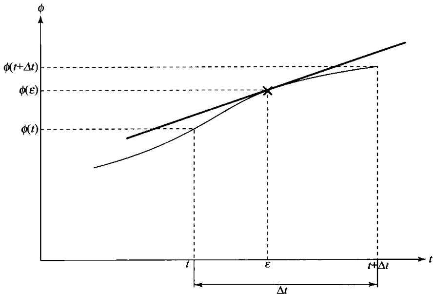  
图3.3 时间差分处理图

$$
\frac { \mathrm { d } \phi ( \varepsilon ) } { \mathrm { d } t } = \frac { \phi ( t + \Delta t ) - \phi ( t ) } { \Delta t }\tag{3-79}
$$

$$
\phi ( \varepsilon ) \ = \ \phi ( t ) \ + \ ( \varepsilon - t ) \ \frac { \phi ( t + \Delta t ) } { \Delta t }\tag{3-80}
$$

定义变量 $\pmb \theta$ 为

$$
\theta = \frac { \varepsilon - t } { \Delta t }\tag{3-81}
$$

式(3-80)可写为

$$
\phi ( \varepsilon ) ~ = ~ ( 1 ~ - \theta ) \phi ( t ) ~ + \theta \phi { \bigl ( } t ~ + ~ \Delta t { \bigr ) }\tag{3-82}
$$

将式(3-79)、式(3-82)代入式(3-75)得

$$
[ \textbf {  { C } } ^ { ( e ) } ] \frac { \big \{ \big . \phi ^ { ( e ) } \big \} _ { t + \Delta t } - \big \{ \big . \phi ^ { ( e ) } \big \} _ { t } } { \Delta t } + \left( 1 - \theta \right) \big [ \textbf {  { K } } ^ { ( e ) } \big ] \big \{ \phi ^ { ( e ) } \big \} _ { t } + \theta \big [ \textbf {  { K } } ^ { ( e ) } \big ] \big \{ \phi ^ { ( e ) } \big \} _ { t + \Delta t } = \big \{ f ^ { ( e ) } \big \} _ { t }\tag{3-83}
$$

整理上式为

$$
\left( \left[ C ^ { \left( \epsilon \right) } \right] + \theta \Delta t \left[ K ^ { \left( \epsilon \right) } \right] \right) \left\{ \phi ^ { \left( \epsilon \right) } \right\} _ { \epsilon \Delta t } = \left( \left[ C ^ { \left( \epsilon \right) } \right] - \left( 1 - \theta \right) \Delta t \left[ K ^ { \left( \epsilon \right) } \right] \right) \left\{ \phi ^ { \left( \epsilon \right) } \right\} _ { t } + \Delta t \left\{ f ^ { \left( \epsilon \right) } \right\} _ { t } .\tag{3-84}
$$

时刻 $\pmb { t } + \Delta \pmb { t }$ 上的未知函数 $\left\{ \phi \right\} _ { t + \Delta t }$ 可用时刻t上的已知函数计算，令

$$
\left[ \pmb { A } ^ { ( e ) } \right] \ = \ \left( \left[ \pmb { C } ^ { ( e ) } \right] \ + \theta \Delta t \ \left[ \pmb { K } ^ { ( e ) } \right] \right)\tag{3-85}
$$

$$
\begin{array} { r }  \{ \begin{array} { l }  \boldsymbol { B } ^ { ( e ) } \ \} \\ { \qquad = \ \big ( [ \begin{array} { l } { \boldsymbol { C } ^ { ( e ) } \big ] \ - \ ( \ 1 \ - \theta ) \Delta t \big [ \boldsymbol { K } ^ { ( e ) } \big ] \ \big ) \big \{ \boldsymbol { \phi } ^ { ( e ) } \ \big \} _ { t } \ + \ \Delta t \big \{ \boldsymbol { f } ^ { ( e ) } \big \} _ { t } } \end{array}  } \end{array} \end{array}\tag{3-86}
$$

式(3-84)可表示为

$$
\big [ { \cal A } ^ { ( e ) } \big ] \big \{ \phi ^ { ( e ) } \big \} _ { t + \Delta t } = \big \{ { \cal B } ^ { ( e ) } \big \}\tag{3-87}
$$

## 3.3.3 有限元法的总体合成

为了求得每个单元节点的未知值，推导得出单元矩阵后，需要合成包括所有单元的矩阵，组成全局矩阵。这一步骤就叫做装配总体矩阵，通过公式可表示为

$$
[ \mathop { M } _ { \scriptscriptstyle \boxtimes } ] ~ = ~ \sum _ { e \mathrm { } = 1 } ^ { n } \big [ \mathop { M } ^ { \scriptscriptstyle ( e ) } \big ]\tag{3-88}
$$

式中， $[ \underset {  } { M } ]$ 为任意总体(全局)矩阵； $[ \boldsymbol { M } ^ { ( e ) }$ ]为单元矩阵 $\mathbf { ; } e$ 为单元号；n为总单元数。

合成总体矩阵的方法如下:假设求解区域被离散成的线性单元共有n个单元，则对已形成的单元进行改写扩大，没有数的写为零，以便与总体刚度矩阵成为同阶矩阵，并具有统一格式。

以单元矩阵 $\mathbf { \Delta } _ { \mathbf { \vec { \mathbf { \Pi } } } } C ^ { ( e ) }$ ]为例，进一步说明合成方法。先考虑按照节点编号从小到大的顺序排列组成，将求解区域分为4个单元5个节点，编号如图3.4所示。

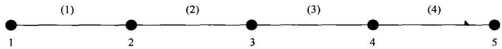  
图 3.4 单元节点编号

$$
\begin{array} { r l r } & { } & { 1 \quad \quad 2 } \\ & { } & { \lbrack { \bf C } ^ { ( 1 ) } ] = \left[ \begin{array} { c c } { c _ { 1 1 } ^ { ( 1 ) } } & { c _ { 1 2 } ^ { ( 1 ) } } \\ { c _ { 2 1 } ^ { ( 1 ) } } & { c _ { 2 2 } ^ { ( 1 ) } } \end{array} \right] _ { 2 } ^ { 1 } } \end{array}\tag{3-89}
$$

式(3-89)中，矩阵上方和右方的数字为单元(1)中的节点编号。单元(1)中有两个节点，单元矩阵 $[ C ^ { ( 1 ) }$ ]大小为 $2 \times 2$ ,全局矩阵 $[ \underset { \sharp } { C } ]$ 有5个节点，则矩阵大小为 $5 \times 5 _ { \circ }$ 将单元矩阵扩大成与总体矩阵一样的大小，将每个元素放到总体矩阵的相应位置上，对应节点编号为3、4和5上的元素 $\big ( \mathbf {  { c } } _ { 1 3 } ^ { ( 1 ) } \mid \mathbf {  { c } } _ { 1 4 } ^ { ( 1 ) } \mid \mathbf {  { c } } _ { 1 5 } ^ { ( 1 ) } \mid \mathbf {  { c } } _ { 2 3 } ^ { ( 1 ) } \mid \mathbf {  { c } } _ { 2 4 } ^ { ( 1 ) } \mid \mathbf {  { c } } _ { 2 5 } ^ { ( 1 ) } \mid \mathbf {  { c } } _ { 3 1 } ^ { ( 1 ) } \mid \mathbf {  { c } } _ { 3 2 } ^ { ( 1 ) } \mid \mathbf {  { c } } _ { 3 3 } ^ { ( 1 ) } \mid \mathbf {  { c } } _ { 3 4 } ^ { ( 1 ) } \mid \mathbf {  { c } } _ { 3 5 } ^ { ( 1 ) } \mid \mathbf {  { c } } _ { 4 1 } ^ { ( 1 ) } \mid \mathbf {  { c } } _ { 4 2 } ^ { ( 1 ) }$ $c _ { 4 3 } ^ { ( 1 ) } \circ c _ { 4 4 } ^ { ( 1 ) } \circ c _ { 4 5 } ^ { ( 1 ) } \circ c _ { 5 1 } ^ { ( 1 ) } \circ c _ { 5 2 } ^ { ( 1 ) } \circ c _ { 5 3 } ^ { ( 1 ) } \circ c _ { 5 4 } ^ { ( 1 ) } \circ c _ { 5 5 } ^ { ( 1 ) } $ 全补零，得到下式

$$
\begin{array} { r } { \big [ \pmb { C } _ { \pmb { \mathscr { F } } } ^ { ( 1 ) } \big ] \ = \left[ \begin{array} { c c c c c } { 1 } & { 2 } & { 3 } & { 4 } & { 5 } \\ { \pmb { C } _ { 1 1 } ^ { ( 1 ) } } & { \pmb { C } _ { 1 2 } ^ { ( 1 ) } } & { 0 } & { 0 } & { 0 } \\ { \pmb { C } _ { 2 1 } ^ { ( 1 ) } } & { \pmb { C } _ { 2 2 } ^ { ( 2 ) } } & { 0 } & { 0 } & { 0 } \\ { 0 } & { 0 } & { 0 } & { 0 } & { 0 } \\ { 0 } & { 0 } & { 0 } & { 0 } & { 0 } \\ { 0 } & { 0 } & { 0 } & { 0 } & { 0 } \end{array} \right] \ } \end{array}\tag{3-90}
$$

同理对于(2)单元、(3)单元和(4)单 $\mathcal { \overline { { \pi } } }$ ，也可以得到扩大矩阵

$$
[ \begin{array} { c c c c c } { \pmb { C } ^ { ( 2 ) } } \end{array} ] = \left[ \begin{array} { c c c c c } { 0 } & { 0 } & { 0 } & { 0 } & { 0 } \\ { 0 } & { c _ { 2 2 } ^ { ( 2 ) } } & { c _ { 2 3 } ^ { ( 2 ) } } & { 0 } & { 0 } \\ { 0 } & { c _ { 3 2 } ^ { ( 2 ) } } & { c _ { 3 3 } ^ { ( 2 ) } } & { 0 } & { 0 } \\ { 0 } & { 0 } & { 0 } & { 0 } & { 0 } \\ { 0 } & { 0 } & { 0 } & { 0 } & { 0 } \end{array} \right]\tag{3-91}
$$

$$
\begin{array} { r } { \left[ \begin{array} { l } { { \bf C } ^ { ( 3 ) } } \\ { { \bf C } ^ { ( 3 ) } _ { \mathcal { F } _ { \mathcal { X } } } } \\ { { \bf C } ^ { ( 3 ) } _ { \mathcal { X } _ { \mathcal { X } } } } \\ { { \bf C } } \\ { { \bf C } } \\ { { \bf C } ^ { ( 4 ) } _ { \mathcal { F } _ { \mathcal { X } } } } \end{array} \right] = \left[ \begin{array} { l l l l l } { 0 } & { 0 } & { 0 } & { 0 } & { 0 } \\ { 0 } & { 0 } & { 0 } & { 0 } & { 0 } \\ { 0 } & { 0 } & { c _ { 3 3 } ^ { ( 2 ) } } & { c _ { 3 4 } ^ { ( 3 ) } } & { 0 } \\ { 0 } & { 0 } & { c _ { 4 3 } ^ { ( 2 ) } } & { c _ { 4 4 } ^ { ( 3 ) } } & { 0 } \\ { 0 } & { 0 } & { 0 } & { 0 } & { 0 } \\ { 0 } & { 0 } & { 0 } & { 0 } & { 0 } \end{array} \right] } \\ { \left[ \begin{array} { l } { { \bf C } } \\ { { \bf C } ^ { ( 4 ) } _ { \mathcal { Y } _ { \mathcal { X } } } } \\ { { \bf C } ^ { ( 4 ) } _ { \mathcal { X } _ { \mathcal { Y } } } } \end{array} \right] = \left[ \begin{array} { l l l l l } { 0 } & { 0 } & { 0 } & { 0 } & { 0 } \\ { 0 } & { 0 } & { 0 } & { 0 } & { 0 } \\ { 0 } & { 0 } & { 0 } & { 0 } & { 0 } \\ { 0 } & { 0 } & { 0 } & { c _ { 4 4 } ^ { ( 3 ) } } & { c _ { 4 5 } ^ { ( 3 ) } } \\ { 0 } & { 0 } & { 0 } & { c _ { 5 } ^ { ( 4 ) } } & { c _ { 5 } ^ { ( 4 ) } } \end{array} \right] } \end{array}\tag{3-92}
$$

(3-93)

将所有扩大后的单元矩阵直接叠加就得到总体合成矩阵：

$$
\big [ \underset { \mathfrak { X } \times \mathfrak { X } } { C } \big ] = \big [ \underset { \mathfrak { X } \times \mathfrak { X } } { C } \big ] + \big [ \underset { \mathfrak { X } \times \mathfrak { X } } { C } \big ] + \big [ \underset { \mathfrak { P } \times \mathfrak { X } } { C } \big ] + \big [ \underset { \mathfrak { P } \times \mathfrak { X } } { C } \big ] + \big [ \underset { \mathfrak { P } \times \mathfrak { X } } { C } \big ]\tag{3-94}
$$

于是形成了总体矩阵

$$
\begin{array} { r } { \left[ \underset { \mathbb { A } ^ { 3 } \times \mathbb { H } ^ { 5 } } { C } \right] = \left[ \begin{array} { c c c c c c } { c _ { 1 1 } ^ { ( 1 ) } } & { c _ { 1 2 } ^ { ( 1 ) } } & { 0 } & { 0 } & { 0 } \\ { c _ { 2 1 } ^ { ( 1 ) } } & { c _ { 2 2 } ^ { ( 1 ) } + c _ { 2 2 } ^ { ( 2 ) } } & { c _ { 2 3 } ^ { ( 2 ) } } & { 0 } & { 0 } \\ { 0 } & { c _ { 3 2 } ^ { ( 2 ) } } & { c _ { 3 3 } ^ { ( 2 ) } + c _ { 3 3 } ^ { ( 3 ) } } & { c _ { 3 4 } ^ { ( 3 ) } } & { 0 } \\ { 0 } & { 0 } & { c _ { 4 3 } ^ { ( 3 ) } } & { c _ { 4 4 } ^ { ( 3 ) } + \bar { c } _ { 4 4 } ^ { ( 4 ) } } & { c _ { 4 5 } ^ { ( 4 ) } } \\ { 0 } & { 0 } & { 0 } & { c _ { 5 4 } ^ { ( 4 ) } } & { c _ { 5 5 } ^ { ( 4 ) } } \end{array} \right] } \end{array}\tag{3-95}
$$

如式(3-95)非零元素分布在对角线两边，定义半带宽为对角线上的元素到同行最后(或最前)一个非零元素的个数的最大值，这个个数用半带宽HBW表示，如图3.5所示。

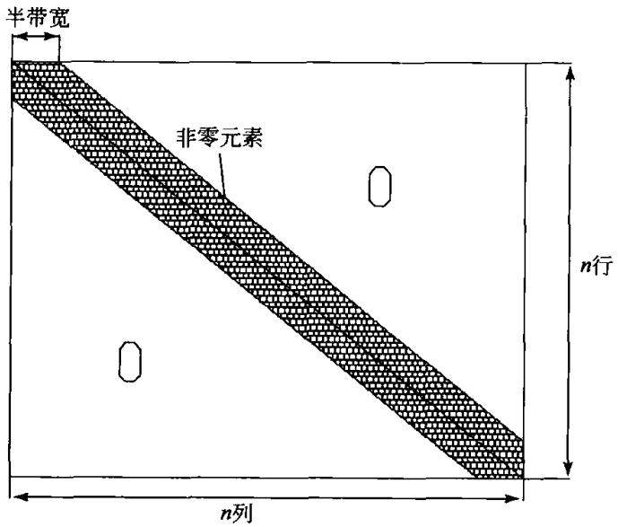  
图 3.5 总体矩阵的带状分布

可用下式计算 HBW：

$$
\mathrm { H } \mathbf { B } \mathbf { W } \mathbf { \Phi } = R \mathbf { \Phi } + \mathbf { \Phi } \mathbf { 1 }\tag{3-96}
$$

式中，R为单元节点号的差值的最大值。

因为图3.4所示的节点最大差值R为1，因此，其 $\mathbf { H B W } = 1 + 1 = 2 ,$ 。同样方法，如果节点编号不按照由小到大的顺序排列，则有不同的总体矩阵，半带宽也有所不同，如下所示

$$
\begin{array} { r l } & { \qquad \ P \qquad ^ { ( 1 ) } \qquad \frac { ( 1 ) } { 3 } \qquad \frac { ( 2 ) } { 3 } \qquad \frac { ( 3 ) } { 4 } \qquad \frac { ( 3 ) } { 5 } \qquad \frac { ( 4 ) } { 2 } \qquad \frac { \bullet } { 2 } } \\ & { \qquad \left[ \begin{array} { l l l l l l } { c _ { 1 1 } ^ { ( 1 ) } } & { 0 } & { c _ { 1 3 } ^ { ( 1 ) } } & { 0 } & { 0 } \\ { 0 } & { c _ { 2 2 } ^ { ( 4 ) } } & { 0 } & { 0 } & { c _ { 2 5 } ^ { ( 4 ) } } \\ { c _ { 3 1 } ^ { ( 1 ) } } & { 0 } & { c _ { 3 3 } ^ { ( 1 ) } + c _ { 3 3 } ^ { ( 2 ) } } & { c _ { 3 4 } ^ { ( 2 ) } } & { 0 } \\ { 0 } & { 0 } & { c _ { 4 4 } ^ { ( 2 ) } } & { c _ { 4 4 } ^ { ( 3 ) } } & { c _ { 4 5 } ^ { ( 3 ) } } \\ { 0 } & { c _ { 5 2 } ^ { ( 4 ) } } & { 0 } & { c _ { 5 4 } ^ { ( 3 ) } } & { c _ { 5 5 } ^ { ( 3 ) } + c _ { 5 5 } ^ { ( 4 ) } } \end{array} \right] \qquad \mathrm { H B W ~ = ~ 3 ~ + 1 ~ } = 4 } \end{array}
$$

$$
\begin{array} { r l } { \underset { \{ \mathbf { \theta } ^ { \prime } \} \not \in \mathcal { E } } { \underbrace { ( 1 ) } } } & { = \left[ \begin{array} { l l l l l l l } { c _ { 1 1 } ^ { ( 1 ) } } & { \bullet } & { \frac { ( 2 ) } { 3 } } & { \frac { ( 2 ) } { 2 } } & { \frac { ( 3 ) } { 4 } } & { \frac { ( 4 ) } { 5 } } & { \frac { \bullet } { 5 } } & { \frac { ( 4 ) } { 5 } } & { \frac { ( 5 ) } { 6 } } \\ { c _ { 1 1 } ^ { ( 1 ) } } & { 0 } & { c _ { 1 3 } ^ { ( 1 ) } } & { 0 } & { 0 } & { 0 } \\ { 0 } & { c _ { 2 2 } ^ { ( 2 ) } + c _ { 2 2 } ^ { ( 3 ) } } & { c _ { 2 3 } ^ { ( 2 ) } } & { c _ { 2 4 } ^ { ( 3 ) } } & { 0 } \\ { c _ { 3 1 } ^ { ( 1 ) } } & { c _ { 3 2 } ^ { ( 2 ) } } & { c _ { 3 3 } ^ { ( 1 ) } + c _ { 3 3 } ^ { ( 2 ) } } & { c _ { 3 4 } ^ { ( 2 ) } } & { 0 } \\ { 0 } & { c _ { 4 2 } ^ { ( 3 ) } } & { 0 } & { c _ { 4 4 } ^ { ( 3 ) } + c _ { 4 4 } ^ { ( 4 ) } } & { c _ { 4 5 } ^ { ( 4 ) } } \\ { 0 } & { 0 } & { 0 } & { c _ { 5 4 } ^ { ( 4 ) } } & { c _ { 5 5 } ^ { ( 4 ) } } \end{array} \right] ~ } & { \mathrm { ~ H B W ~ = ~ 2 ~ + ~ 1 ~ = ~ 3 ~ 2 ~ } } \end{array}
$$

$$
\begin{array} { r } { [ \underset { \mathbb { R } ^ { 4 } } { C } ] = \left[ \begin{array} { c c c c c c c } { c _ { 1 1 } ^ { ( 1 ) } } & { 0 } & { 0 } & { c _ { 1 4 } ^ { ( 1 ) } } & { 0 } \\ { 0 } & { c _ { 2 2 } ^ { ( 4 ) } } & { c _ { 2 3 } ^ { ( 4 ) } } & { c _ { 4 4 } ^ { ( 1 ) } } & { c _ { 4 4 } ^ { ( 2 ) } } & { c _ { 4 5 } ^ { ( 2 ) } } \\ { 0 } & { c _ { 3 2 } ^ { ( 4 ) } } & { c _ { 3 3 } ^ { ( 3 ) } } & { c _ { 3 3 } ^ { ( 4 ) } } & { 0 } & { c _ { 3 5 } ^ { ( 3 ) } } \\ { c _ { 4 1 } ^ { ( 1 ) } } & { 0 } & { 0 } & { 0 } & { 0 } \\ { 0 } & { 0 } & { c _ { 3 3 } ^ { ( 3 ) } } & { c _ { 5 4 } ^ { ( 2 ) } } & { c _ { 5 5 } ^ { ( 2 ) } } & { + c _ { 5 5 } ^ { ( 3 ) } } \end{array} \right] \qquad \mathrm { H B W ~ = ~ 3 ~ + 1 ~ = ~ 4 ~ } } \end{array}
$$

$$
\begin{array} { r } { [ \underset { \mathbb { A } \mathbb { A } ^ { \times } } { C } ] = \left[ \begin{array} { c c c c c c } { c _ { 1 1 } ^ { ( 1 ) } } & { 0 } & { 0 } & { 0 } & { c _ { 1 5 } ^ { ( 1 ) } } \\ { 0 } & { c _ { 2 2 } ^ { ( 4 ) } } & { c _ { 2 3 } ^ { ( 4 ) } } & { 0 } & { 0 } \\ { 0 } & { c _ { 3 2 } ^ { ( 4 ) } } & { c _ { 3 3 } ^ { ( 3 ) } + c _ { 3 3 } ^ { ( 4 ) } } & { c _ { 3 4 } ^ { ( 3 ) } } & { 0 } \\ { 0 } & { 0 } & { c _ { 4 3 } ^ { ( 3 ) } } & { c _ { 4 4 } ^ { ( 2 ) } + c _ { 4 4 } ^ { ( 3 ) } } & { c _ { 4 5 } ^ { ( 2 ) } } \\ { c _ { s 1 } ^ { ( 1 ) } } & { 0 } & { 0 } & { c _ { 5 4 } ^ { ( 2 ) } } & { c _ { 5 5 } ^ { ( 1 ) } + c _ { 5 5 } ^ { ( 2 ) } } \end{array} \right] \qquad \mathrm { H B W ~ = ~ 3 ~ + ~ 1 ~ } = 4 , } \end{array}
$$

对于计算机存储而言，半带宽越大，所需要的存储空间就越大，既提高了对计算机配置的要求，又影响计算效率。因此，在实际计算时，对于一维细沟侵蚀节点的编号可以采用遵循顺序原则，所得到的矩阵为带状分布，总体矩阵 $[ \underset { i \leq i \neq 1 } C ]$ 中的非零元素分布在以对角线为中心的带形区域内，为三角矩阵上，仅需要存储2N个数据。

按照上面的方法需要将每个单元都扩大为n×n阶矩阵，但这种方法在使用时并不方便，因为需要在不相关的所有点上补充大量的零：同时，每一个扩大的矩阵都需要同总体矩阵相同的存储空间，会严重影响计算速度。按节点形成总体矩阵可以解决这个问题。先将存放总体矩阵的数组元素置零，从节点1开始，判断该节点与哪个节点相邻，凡是与其相邻的节点，在总体矩阵中就有对应的子阵。如节点m，若节点n与其相邻，则总矩阵中必有元素 $C _ { m n }$ 。然后再判断哪个单元与这两个节点有关，并将有关单元中的相应元素 $C _ { m n }$ 相互叠加。若节点s与节点r无关，则元素 $C _ { m n }$ 为零。如此重复，直到最后一个节点为止(荣先成等，2007)。用计算机很容易实现上述方法(见第4章)。

## 3.3.4 边界条件处理

得到总体有限元求解矩阵后，方程求得的结果必须满足初始和边界条件的要求，但在选择插值函数时并没有考虑这一点，因此，必须将这些条件引入到有限元方程。初始条件是在 $\pmb { t = 0 }$ 时刻确定的函数，边界条件是函数及其法向导数的在边界上的取值，或是在边界上函数及其法向导数的线性组合。可通过直接代入法对边界条件进行处理(王勖成，2003）。若总体矩阵有m个节点，其中有n个点是已知的，则得到一组求解 $m - n$ 个待定节点值的修正方程组。讨论如下。

设有方程组：

$$
[ A ] [ X ] \ = \ \{ B \}\tag{3-97}
$$

即

$$
\left[ \begin{array} { l l l l l l } { a _ { 1 1 } } & { a _ { 1 2 } } & { a _ { 1 3 } } & { a _ { 1 4 } } & { a _ { 1 5 } } \\ { a _ { 2 1 } } & { a _ { 2 2 } } & { a _ { 2 3 } } & { a _ { 2 4 } } & { a _ { 2 5 } } \\ { a _ { 3 1 } } & { a _ { 3 2 } } & { a _ { 3 3 } } & { a _ { 3 4 } } & { a _ { 3 5 } } \\ { a _ { 4 1 } } & { a _ { 4 2 } } & { a _ { 4 3 } } & { a _ { 4 4 } } & { a _ { 4 5 } } \\ { a _ { 5 1 } } & { a _ { 5 2 } } & { a _ { 5 3 } } & { a _ { 5 4 } } & { a _ { 5 5 } } \end{array} \right] \left[ \begin{array} { l } { x _ { 1 } } \\ { x _ { 2 } } \\ { x _ { 3 } } \\ { x _ { 4 } } \\ { x _ { 5 } } \end{array} \right] = \left\{ \begin{array} { l } { b _ { 1 } } \\ { b _ { 2 } } \\ { b _ { 3 } } \\ { b _ { 4 } } \\ { b _ { 5 } } \end{array} \right\}\tag{3-98}
$$

如果节点1和5为已知，即 ${ \pmb x } _ { 1 } = { \pmb \eta } , { \pmb x } _ { 5 } = { \pmb \xi }$ ，就可以在方程中剔除，相当于把 ${ \boldsymbol { \mathscr { x } } } _ { 1 } , { \boldsymbol { \mathscr { x } } } _ { \boldsymbol { \mathscr { s } } }$ 所在行和其相应的列从方程和相应的矩阵[A]中剔除。具体做法是，将η代入上式中， $\pmb { x } _ { 1 }$ 所在的行和列即为已知，移到等号右边，可以视作将矩阵[A]中的第1行和第1列消，如图3.6所示,并得到式(3-99)。

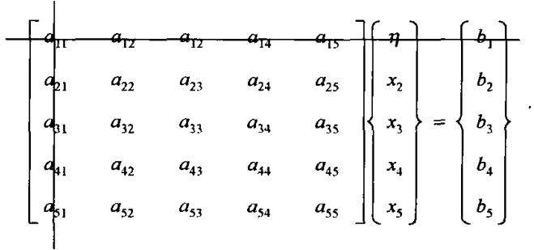  
图 3.6 消去元素 $\pmb { x } _ { 1 }$ 所在的行和列

$$
\left[ \begin{array} { l l l l } { a _ { 2 2 } } & { a _ { 2 3 } } & { a _ { 2 4 } } & { a _ { 2 5 } } \\ { a _ { 3 2 } } & { a _ { 3 3 } } & { a _ { 3 4 } } & { a _ { 3 5 } } \\ { a _ { 4 2 } } & { a _ { 4 3 } } & { a _ { 4 4 } } & { a _ { 4 5 } } \\ { a _ { 5 2 } } & { a _ { 5 3 } } & { a _ { 5 4 } } & { a _ { 5 5 } } \end{array} \right] \left[ \begin{array} { l } { x _ { 2 } } \\ { x _ { 3 } } \\ { x _ { 4 } } \end{array} \right] = \left\{ \begin{array} { l } { b _ { 2 } - a _ { 2 1 } * \eta } \\ { b _ { 3 } - a _ { 3 1 } * \eta } \\ { b _ { 4 } - a _ { 4 1 } * \eta } \\ { b _ { 5 } - a _ { 5 1 } * \eta } \end{array} \right\}\tag{3-99}
$$

同理，消去第5行和第5列划去，得到式(3-100)。

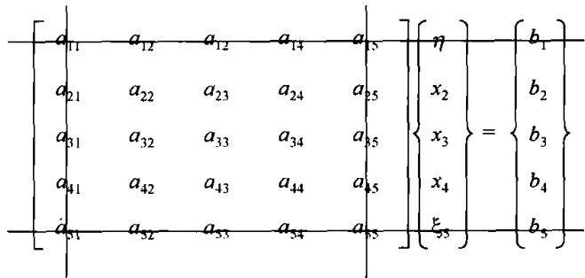  
图3.7 消去元素 $\pmb { x } _ { 5 }$ 所在的行和列

$$
\left[ \begin{array} { l l l } { a _ { 2 2 } } & { a _ { 2 3 } } & { a _ { 2 4 } } \\ { a _ { 3 2 } } & { a _ { 3 3 } } & { a _ { 3 4 } } \\ { a _ { 4 2 } } & { a _ { 4 3 } } & { a _ { 4 4 } } \end{array} \right] \left[ \begin{array} { l } { x _ { 2 } } \\ { x _ { 3 } } \\ { x _ { 4 } } \end{array} \right] = \left[ \begin{array} { l l l } { b _ { 2 } - a _ { 2 1 } * \eta - a _ { 2 5 } * \xi } \\ { b _ { 3 } - a _ { 3 1 } * \eta - a _ { 3 5 } * \xi } \\ { b _ { 4 } - a _ { 4 1 } * \eta - a _ { 4 5 } * \xi } \end{array} \right]\tag{3-100}
$$

通过修正，方程组就可以求解其余未知数。可见，得到修正方程的实质就是将已知节点所对应的行和列元素都去掉，并在其他行做相应处理，将已知的边界条件引入到方程中，得到新的矩阵就是引人边界条件修正后的方程矩阵。

## 3.3.5 有限元总体方程的解法

用前面所述方法，将偏微分方程变成用有限元近似的线性代数方程。而代数方程的解法直接决定着有限元求解的效率及运算结果的精度。若采用不当，不仅浪费计算机资源，还可能导致求解过程的不稳定和求解过程的失败。

线性代数方程的解法主要有两类，包括直接法和迭代法。直接法对于一个给定的线性代数方程组，事先可以按规定的算法步骤计算出它所需要的算术运算操作数，直接给出最后的结果。而迭代法是首先假设一个初始解，然后按一定的算法公式进行迭代。在每次迭代过程中对解的误差进行检查，并通过增加迭代次数以期不断降低解的误差，直到满足解的精度要求，最后输出结果。迭代法节省内存空间，但耗用机时较多；直接法需用机时少，但又占用内存空间较多。对于用有限元法得到的系数矩阵具有对称正定稀疏的特点，如果节点编号恰当，并采用带状存贮，则多占内存单元的矛盾也可以大大缓解。因此，结合两种方法的优点，对于求解细沟侵蚀模型的有限元方程用直接法与迭代法混合使用求解，在迭代初值支持下采用直接法求解下一迭代值，每轮求解结果做收敛检验，如果不满足收敛条件，进行下一次迭代。

## (1)迭代法

设线性代数方程组有如下形式(孔祥谦，1999)

$$
\sum _ { j = 1 } ^ { n } a _ { i j } x _ { j } \ = \ b _ { i } \ \quad ( i , j \ = \ 1 , 2 , \cdots , n )\tag{3-101}
$$

式中系数矩阵[A]为正定，并且所有主对角元素

$$
\begin{array} { r } { { \boldsymbol { a } } _ { i i } > 0 \quad ( i = 1 , 2 , \cdots , n ) } \end{array}\tag{3-102}
$$

从而可以解得 $\boldsymbol { x } _ { i } ( i = 1 , 2 , \cdots , N )$ ，将方程组改写成为

$$
x _ { i } \ = \frac { b _ { i } } { a _ { i i } } - \sum _ { j = 1 } ^ { i - 1 } \frac { a _ { i j } } { a _ { i i } } x _ { j } \ - \sum _ { j = i + 1 } ^ { n } \frac { a _ { i j } } { a _ { i i } } x _ { j } ( i \ = 1 , 2 , \cdots , n )\tag{3-103}
$$

设初值为 $\{ \boldsymbol { x } _ { i } ^ { ( 0 ) } \} _ { \mathrm { ~ } } ( i = 1 , 2 , \cdots , n )$ ,根据式(3-101)，可以得到第一次迭代结果 $\{ \pmb { x } _ { i } ^ { ( 1 ) }$ },即

$$
x _ { i } ^ { ( 1 ) } = \frac { b _ { i } } { a _ { i i } } - \sum _ { j = 1 } ^ { i - 1 } \frac { a _ { i j } } { a _ { i i } } x _ { j } ^ { ( 1 ) } - \sum _ { j = i + 1 } ^ { n } \frac { a _ { i j } } { a _ { i i } } x _ { j } ^ { ( 0 ) } ( i = 1 , 2 , \cdots , n )\tag{3-104}
$$

依次类推，第k+1次迭代结果为

$$
x _ { i } ^ { ( k + 1 ) } = \frac { b _ { i } } { a _ { i i } } - \sum _ { j = 1 } ^ { i - 1 } \frac { a _ { i j } } { a _ { i i } } x _ { j } ^ { ( k + 1 ) } - \sum _ { j = i + 1 } ^ { n } \frac { a _ { i j } } { a _ { i i } } x _ { j } ^ { ( k ) } ( i = 1 , 2 , \cdots , n )\tag{3-105}
$$

每做完一次迭代，即与前次数值进行比较，如果满足收敛条件

$$
\left| \frac { x _ { i } ^ { ( k + 1 ) } - x _ { i } ^ { ( k ) } } { x _ { i } ^ { ( k ) } } \right| \leqslant \varepsilon \quad ( i = 1 , 2 , \cdots , n )\tag{3-106}
$$

则迭代收敛，结束迭代，跳出计算程序，并取

$$
x _ { i } \ = \ x _ { i } ^ { ( k + 1 ) } ( i \ = 1 , 2 , \cdots , n )\tag{3-107}
$$

这里 $\pmb { \varepsilon }$ 为误差值，控制计算精度，如可取 $1 0 ^ { - 2 } \sim 1 0 ^ { - 4 }$

为了使迭代过程加速或者稳定，可对上述迭代方程作适当的处理，加入松弛因子 $\pmb { \omega }$ ，把式(3-105)中计算得到的结果记作x $\mathbf { \Phi } _ { i } ^ { ( k + 1 ) }$ ,则

$$
\begin{array} { r l } { x _ { i } ^ { ( k + 1 ) } \ = \ \omega \bar { x } _ { i } ^ { ( k + 1 ) } + ( 1 - \omega ) x _ { i } ^ { ( k ) } } \end{array}\tag{3-108}
$$

根据具体情况， $\pmb { \omega }$ 可在 $0 \leqslant \omega \leqslant 2$ 内选取。

## (2)高斯消去法

高斯消去法是发展比较成熟的线性方程直接解法，分为消元过程与回代过程，消元过程将所给方程组加工成上三角形方程组，再经回代过程求解。具体计算方法可参考4.4.4小节的例1，这里不再赘述具体方法，只给出消元和回代公式。

为叙述问题方便，将 $b _ { i }$ 写成 $a _ { i , { n + 1 } } , i = 1 , 2 , \cdots , n _ { \circ }$

$$
{ \left\{ \begin{array} { l l } { a _ { 1 1 } x _ { 1 } + a _ { 1 2 } x _ { 2 } + a _ { 1 3 } x _ { 3 } + \dotsb + a _ { 1 n } x _ { n } = a _ { 1 , n + 1 } } \\ { a _ { 2 1 } x _ { 1 } + a _ { 2 2 } x _ { 2 } + a _ { 2 3 } x _ { 3 } + \dotsb + a _ { 2 n } x _ { n } = a _ { 2 , n + 1 } } \\ { \dots \dotsb \dotsb \dotsb \dotsb \dotsb \dotsb } \\ { a _ { n 1 } x _ { 1 } + a _ { n 2 } x _ { 2 } + a _ { n 3 } x _ { 3 } + \dotsb + a _ { n n } x _ { n } = a _ { n , n + 1 } } \end{array} \right. }\tag{3-109}
$$

消元公式为

$$
\begin{array} { r } { \left\{ \begin{array} { l l } { \boldsymbol { a } _ { k j } ^ { ( k ) } } & { = \frac { \boldsymbol { a } _ { k j } ^ { ( k - 1 ) } } { \boldsymbol { a } _ { k k } ^ { ( k - 1 ) } } \boldsymbol { j } = k , \boldsymbol { k } + 1 , \cdots , \boldsymbol { n } + 1 } \\ { \quad } \\ { \boldsymbol { a } _ { i j } ^ { ( k ) } } & { = \boldsymbol { a } _ { i j } ^ { ( k - 1 ) } - \boldsymbol { a } _ { i k } ^ { ( k - 1 ) } \cdot \boldsymbol { a } _ { k j } ^ { ( k ) } } \\ { \boldsymbol { j } = \boldsymbol { k } + 1 , \cdots , \boldsymbol { n } + 1 } \\ { \boldsymbol { i } + \boldsymbol { k } + 1 , \cdots , \boldsymbol { n } } \end{array} \right. } \end{array}\tag{3-110}
$$

回代公式为

$$
\left\{ \begin{array} { l l } { x _ { n } = a _ { n , n + 1 } ^ { ( n ) } } \\ { x _ { k } = a _ { k , n + 1 } ^ { ( k ) } - \displaystyle \sum _ { j = k + 1 } ^ { n } a _ { k j } ^ { ( k ) } x _ { j } \quad k = n - 1 , \cdots , 1 } \end{array} \right.\tag{3-111}
$$

(3)细沟侵蚀模型有限元方程的计算方法

根据有限差分法，可以处理时间微分问题，将细沟侵蚀有限元方程组总体合成如下形式

$$
\left[ A \right] ~ = ~ \left( ~ \left[ ~ C \right] ~ + ~ \theta \Delta t { \left[ ~ K \right] } ~ \right)\tag{3-112}
$$

$$
\{ B \} \ = \ ( \begin{array} { r }  { [ \begin{array} { l } { C } \end{array} ] } - ( \begin{array} { l } { 1 } \end{array} - \theta ) \Delta t { [ \begin{array} { l } { K } \end{array} ] } \ \{ \phi \} _ { t } + \Delta t \{ f \} _ { t } \end{array}\tag{3-113}
$$

$$
[ A ] \left\{ \phi \right\} _ { t + \Delta t } = \left\{ B \right\}\tag{3-114}
$$

设 $\left\{ \phi \right\} _ { t + \Delta t }$ 的初始值为 $\{  \phi ^ { 0 } \} _ { t { } + \Delta t } = \{ \phi ^ { 0 } \}$ ,误差为 $\pmb { \varepsilon }$ ,则有

$$
[ A ] \left\{ \phi ^ { 1 } \right\} _ { t + \Delta t } = \left[ B \right]\tag{3-115}
$$

其中

$$
\begin{array} { c } { { \left[ A \right] ~ = ~ \left[ ~ C \right] ~ + \theta \Delta { t } { \left[ ~ K \right] } } } \\ { { \left[ B \right] ~ = ~ \left( ~ \left[ ~ C \right] ~ - ~ \left( ~ 1 ~ - \theta \right) \Delta { t } { \left[ ~ K \right] } ~ \right) ~ \left\{ ~ \phi ^ { 0 } ~ \right\} ~ _ { \ast } ~ + ~ \Delta { t } { \left\{ f \right\} } . } } \end{array}\tag{3-116}
$$

(3-117)

通过高斯消去法求解式(3-115)，得到 $\left\{ \phi ^ { 1 } \right\} _ { t + \Delta t }$ 值，再将 $\left\{ \phi ^ { 1 } \right\} _ { t + \Delta t }$ 代入式(3-117)右边得到 $\left\{ \phi ^ { 2 } \right\} _ { t + \Delta t }$ ，如此迭代下去，直到满足精度要求为止，即

$$
\left| \frac { \{ \phi ^ { k + 1 } \} _ { t + \Delta t } - \{ \phi ^ { k } \} _ { t + \Delta t } } { \{ \phi ^ { k } \} _ { t + \Delta t } } \right| \leqslant \varepsilon ( k = 0 , 1 , 2 , \cdots )\tag{3-118}
$$

如此得到的 $\{  \phi ^ { k + 1 } \} _ {  \textrm { t + } \Delta { t }  }$ 最接近精确解，再以 $\left\{ \phi ^ { k + 1 } \right\} _ { \mathrm { ~ } \{ + \Delta \mathfrak { a } \} }$ 为初始值计算下一个时间步长的$\{  \phi \} _ { t + 2 \Delta t }$ ，便可得出指定时刻上的空间近似解。

## 第4章 有限元的程序设计

## 4.1 单元矩阵及其计算方法

有限元法的实现必须通过计算机。全部有限元法的计算原理和数值方法集中反映在有限元法的程序中。因此有限元法的程序极为重要，它应具有计算准确可靠、计算效率高、使用方便、易于扩充和修改等特点。

细沟侵蚀模型的有限元程序设计可以归纳为如图4.1所示的流程。

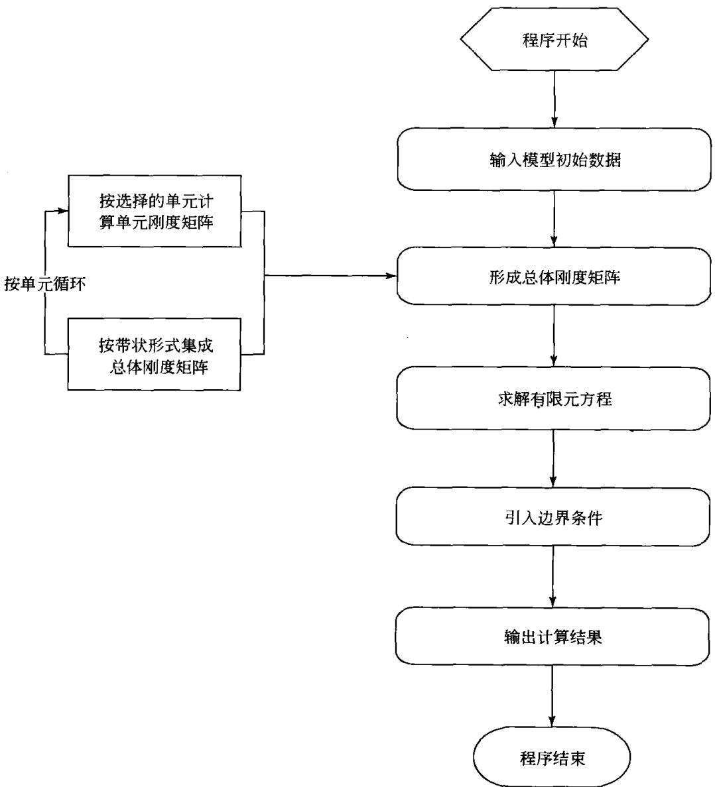  
图4.1 有限元程序设计流程图

## 4.2 输入初始数据

程序需要输入的数据为计算模型的参数和初始条件、边界条件。为提高程序的可维护性，本程序将某些数据及处理这些数据的函数封装到一个类中。用动态数组存储变量，即根据剖分单元数来确定数组元素个数。输入数据中各参数和数组的说明如下。

1)细沟形态数据

$X _ { 0 }$ :细沟起点 x 向坐标

$X _ { \mathrm { L } }$ :细沟终点x向坐标

WidthGiven:沟宽

NodeNum:计算模型的节点总数。

BandWidth:总体刚度矩阵半带宽

2)实验工况数据

$H _ { 0 }$ :水深初始条件

$V _ { 0 }$ :流速初始条件

$C _ { 0 }$ :泥沙含量初始条件

$H _ { i }$ :水深边界条件

$V _ { i }$ :流速边界条件

$C _ { i }$ :泥沙含量边界条件

Slopex0:坡度

$\pmb { q _ { 0 } }$ :集中水流流量

Rain:雨强

K\_Detach:土壤可蚀性参数

$R _ { \mathrm { c } }$ :土壤临界剪切应力

$D _ { \mathtt { H } }$ :水动力扩散系数

3)时间因子数据

TimeE:总计算时间

DeltaT:时间步长(可变)

Deltat\_Max:最大时间步长

Theta:差分形式(0，1/2，1/3)

tmrain:降雨时间

4)误差因子数据

RerrLimit:误差限

## 4.3 一般矩阵的合成与求解

## 4.3.1 总体(全局)刚度矩阵的合成(装配)

选择单元刚度矩阵[A]和力矢量 $\{ \pmb { B } \}$ ，说明合成总体矩阵的程序方法。设单元刚度矩阵和单元力矢量为

$$
\begin{array} { r l } { \left[ \pmb { A } ^ { ( \pmb { * } ) } \right] } & { = \left[ \begin{array} { c c c c c c c c } { a _ { 1 1 } ^ { ( e ) } } & { a _ { 1 2 } ^ { ( e ) } } & { a _ { 1 3 } ^ { ( e ) } } & { \cdots } & { a _ { 1 n - 1 } ^ { ( e ) } } & { a _ { 1 n } ^ { ( e ) } } \\ { a _ { 2 1 } ^ { ( e ) } } & { a _ { 2 2 } ^ { ( e ) } } & { a _ { 2 3 } ^ { ( e ) } } & { \cdots } & { a _ { 2 n - 1 } ^ { ( e ) } } & { a _ { 2 n } ^ { ( e ) } } \\ { \vdots } & { \vdots } & { \vdots } & & { \vdots } & { \vdots } \\ { a _ { ( n - 1 ) 1 } ^ { ( e ) } } & { a _ { ( n - 1 ) 2 } ^ { ( e ) } } & { a _ { ( n - 1 ) 3 } ^ { ( e ) } } & { \cdots } & { a _ { ( n - 1 ) ( n - 1 ) } ^ { ( e ) } } & { a _ { ( n - 1 ) n } ^ { ( e ) } } \\ { a _ { n 1 } ^ { ( e ) } } & { a _ { n 2 } ^ { ( e ) } } & { a _ { n 3 } ^ { ( e ) } } & { \cdots } & { a _ { n ( n - 1 ) } ^ { ( e ) } } & { a _ { n n } ^ { ( e ) } } \end{array} \right] } \end{array}\tag{4-1}
$$

$$
\begin{array} { r l r } { \{ { \bf \delta } B ^ { ( e ) } \} } & { = } & { \left\{ \begin{array} { l } { b _ { 1 } ^ { ( e ) } } \\ { b _ { 2 } ^ { ( e ) } } \\ { \vdots } \\ { b _ { n } ^ { ( e ) } } \end{array} \right\} } \end{array}\tag{4-2}
$$

式中，n为每个单元中的节点数；设单元元素的节点编号为1,2，…，n，这些节点编号对应于全局中的编号为 $e _ { 1 } , e _ { 2 } , \cdots , e _ { n }$

一个矩阵，可以用数组的方式来储存。因此，有限元方法得到的矩阵元素都以数组的方式存储。数组中的每个元素由一个值和一组下标确定，对于每组有定义的下标都存在一个与之相对应的值。用i和j表示单元矩阵中任意行和列，元素 $\pmb { a } _ { i j } ^ { ( e ) }$ 的地址就可以用 $i \surd$ 值确定。而对应全局矩阵， $\pmb { a } _ { i j } ^ { ( e ) }$ 又对应于编号 $\pmb { e } _ { i }$ 与 $\pmb { e } _ { j }$ ，所以在全局矩阵[A]中,元素 $a _ { i j } ^ { ( e ) }$ 放在 $\pmb { a } _ { e _ { i } e _ { j } }$ 的地址上。同理， $b _ { i } ^ { ( e ) }$ 在单元力矢量矩阵中用i确定，在全局力矢量中对应的编号是 $e _ { i \setminus }$ 元素的获取是通过元素地址的方式实现。对总体矩阵进行合成，就是用原有总体矩阵元素加上单元内所对应于总体矩阵编号的元素值，用公式可表示为

$$
a _ { e _ { i } e _ { j } } = a _ { e _ { i } e _ { j } } ^ { 0 } + a _ { i j } ^ { ( e ) }\tag{4-3}
$$

$$
b _ { e _ { i } } = b _ { e _ { i } } ^ { 0 } + b _ { e _ { i } } ^ { ( e ) }\tag{4-4}
$$

式中， $a _ { e _ { i } e _ { j } } ^ { 0 }$ 和 $b _ { e _ { i } } ^ { 0 }$ 表示这次合成前的 $c _ { e _ { i } e _ { j } }$ 和 $f _ { e _ { i } }$ 值。

计算流程如图4.2所示。n为单元中的节点数(细沟侵蚀模型研究中n为2);N为总的单元数;M为全求解域上的节点总数；ii和 $\ddot { y }$ 为对应于全局矩阵里的节点地址；node[][]为二维数组，存储单元号为e的单元上i节点元素的地址，形式为node[单元号][i];矩阵clocal表示单元刚度矩阵，由上一级程序来决定其形式。

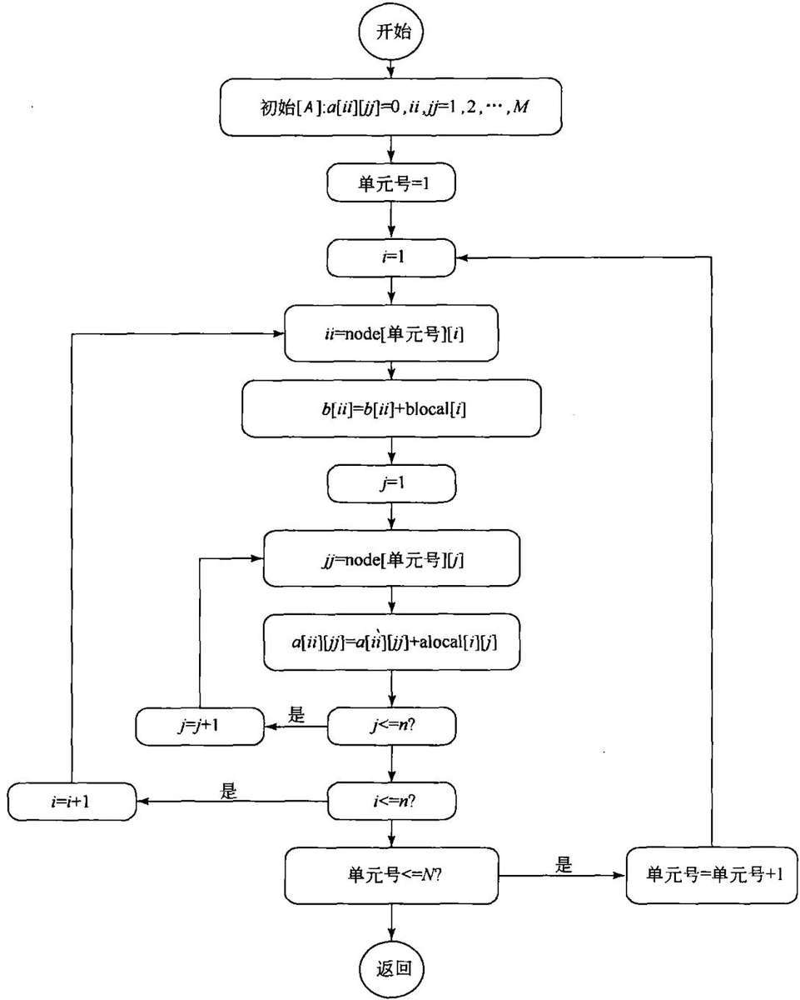  
图4.2 合成总体矩阵流程图

## 4.3.2 矩阵的向量化存储

为了便于计算机存储与计算，引入向量的概念。由于数组是由有限的元素构成的有序集合，数组的大小和元素之间的关系一经确定，就不再发生变化，因此数组均采用顺序存储结构实现，即矩阵用向量的形式表达。它要求有一片连续的存储空间存储。

对于一个N行M列的矩阵A可以用一个长NM的向量B表示。将A中的第一行1，2,…，M列元素顺序放入向量B的1到M列，A 中的第二行元素放入向量B的M+1到2M列，依次类推，完成其他元素的存储。可以用下式表示：

$$
\begin{array} { r } { A = \left[ \begin{array} { c c c c c c c } { a _ { 1 1 } } & & & & & & & & \\ { a _ { 1 1 } } & { a _ { 1 2 } } & { \cdots } & { a _ { 1 : ( M - 1 ) } } & & { a _ { 1 \times } } \\ { a _ { 2 1 } } & { a _ { 2 2 } } & { \cdots } & { a _ { 2 : ( M - 1 ) } } & & { a _ { 2 M } } \\ { \vdots } & { \vdots } & & & & { \vdots } \\ { a _ { ( N - 1 ) 1 } } & { a _ { ( N - 1 ) 2 } } & { \cdots } & { a _ { ( N - 1 ) ( M - 1 ) } } & { a _ { ( N - 1 ) \times } } \\ { a _ { N } } & & { a _ { N - 1 } } & { \cdots } & { a _ { N ( M - 1 ) } } & & { a _ { N M } } \\ & & & & & & & { a _ { ( N - 1 ) M } } \end{array} \right] \Rightarrow B = \left[ \begin{array} { c } { a _ { 1 1 } } \\ { \vdots } \\ { a _ { 1 M } } \\ { a _ { 2 1 } } \\ { \vdots } \\ { a _ { 2 M } } \\ { \vdots } \\ { a _ { ( N - 1 ) M } } \\ { a _ { N - 1 } } \\ { \vdots } \\ { a _ { N } } \end{array} \right] } \end{array}\tag{4-5}
$$

若按这种存储方式，则上述A矩阵中任何一个元素 $\pmb { a } _ { i j }$ 的存储位置可以按以下公式确定：

$$
\begin{array} { r c l } { { \mathbf { a d d r e s s } ( B _ { c } ) \ = \ \mathbf { a d d r e s s } ( \mathbf { \boldsymbol { a } } _ { i j } ) } } \\ { { \mathbf { \boldsymbol { c } } \ = \ \mathbf { ( \it \ i  - 1 ) M } + j } } \end{array}\tag{4-6}
$$

(4-7)

式中,i和 $j$ 为矩阵A 中任意i行和 $j$ 列 ${ \ : } \bullet \bullet$ 为向量B中元素的下标。

局部和全局中的所有矩阵都可以用上述方式存储为向量形式。图4.3为集成单元矩阵 $\left[ A ^ { \left( e \right) } \right]$ 和 $\left\{ \pmb { B } ^ { ( e ) } \right.$ }到用向量形式表达的 $\left\{ A \right\}$ 和 $\{ B \}$ 的流程图，图中T为总节点数。

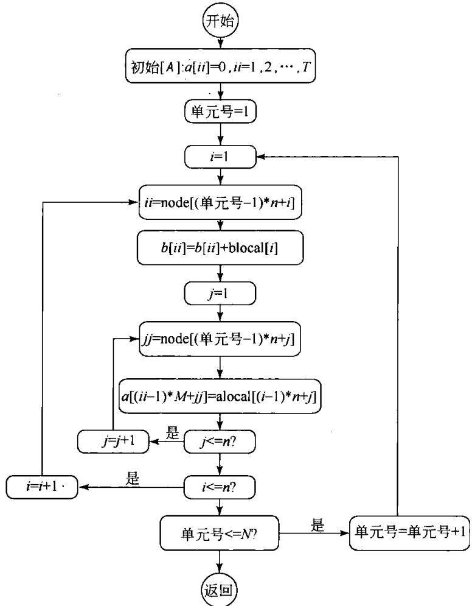  
图4.3 矩阵的向量化存储流程图

## 4.3.3 矩阵相乘

设有矩阵 $\pmb { A } ^ { \prime } ( \pmb { L } \times \pmb { M } )$ (L行M列)

$$
\begin{array} { r } { A ^ { \prime } { \bf \Pi } = \left[ \begin{array} { c c c c c c } { a _ { 1 1 } ^ { \prime } } & { a _ { 1 2 } ^ { \prime } } & { \cdots } & { a _ { 1 \cdot ( M - 1 ) } ^ { \prime } } & { a _ { 1 \cdot M } ^ { \prime } } \\ { a _ { 2 1 } ^ { \prime } } & { a _ { 2 2 } ^ { \prime } } & { \cdots } & { a _ { 2 \cdot ( M - 1 ) } ^ { \prime } } & { a _ { 2 \cdot M } ^ { \prime } } \\ { \cdots } & { \cdots } & { \vdots } & { \cdots } & { \cdots } \\ { a _ { \langle L - 1 \rangle \cdot 1 } ^ { \prime } } & { a _ { \langle L - 1 \rangle \cdot 2 } ^ { \prime } } & { \cdots } & { a _ { \langle L - 1 \rangle \cdot ( M - 1 ) } ^ { \prime } } & { a _ { \langle L - 1 \rangle \cdot M } ^ { \prime } } \\ { a _ { L \cdot 1 } ^ { \prime } } & { a _ { L \cdot 2 } ^ { \prime } } & { \cdots } & { a _ { L \cdot ( M - 1 ) } ^ { \prime } } & { a _ { L \cdot M } ^ { \prime } } \end{array} \right] } \end{array}
$$

和矩阵 $\pmb { B } ^ { \prime } ( \pmb { M } \times \pmb { N } ) \left( \pmb { M } \right.$ 行N列)

$$
\pmb { B } ^ { \prime } = \left[ \begin{array} { c c c c c c } { b _ { 1 1 } ^ { \prime } } & { b _ { 1 2 } ^ { \prime } } & { \cdots } & { b _ { 1 \cdot ( N - 1 ) } ^ { \prime } } & { b _ { 1 \cdot N } ^ { \prime } } \\ { b _ { 2 1 } ^ { \prime } } & { b _ { 2 2 } ^ { \prime } } & { \cdots } & { b _ { 2 \cdot ( N - 1 ) } ^ { \prime } } & { b _ { 2 \cdot N } ^ { \prime } } \\ { \cdots } & { \cdots } & { \vdots } & { \cdots } & { \cdots } \\ { b _ { ( M - 1 ) \cdot 1 } ^ { \prime } } & { b _ { ( M - 1 ) \cdot 2 } ^ { \prime } } & { \cdots } & { b _ { ( M - 1 ) \cdot ( N - 1 ) } ^ { \prime } } & { b _ { ( M - 1 ) \cdot N } ^ { \prime } } \\ { b _ { M \cdot 1 } ^ { \prime } } & { b _ { M \cdot 2 } ^ { \prime } } & { \cdots } & { b _ { M \cdot ( N - 1 ) } ^ { \prime } } & { b _ { M \cdot N } ^ { \prime } } \end{array} \right]
$$

相乘得到矩阵 $C ^ { \prime } ( L \times N )$

$$
\pmb { C } ^ { \prime } = \left[ \begin{array} { c c c c c } { \pmb { c } _ { 1 1 } ^ { \prime } } & { \pmb { c } _ { 1 2 } ^ { \prime } } & { \cdots } & { \pmb { c } _ { 1 - ( N - 1 ) } ^ { \prime } } & { \pmb { c } _ { 1 - N } ^ { \prime } } \\ { \pmb { c } _ { 2 1 } ^ { \prime } } & { \pmb { c } _ { 2 2 } ^ { \prime } } & { \cdots } & { \pmb { c } _ { 2 \cdot ( N - 1 ) } ^ { \prime } } & { \pmb { c } _ { 2 \cdot N } ^ { \prime } } \\ { \cdots } & { \cdots } & { \vdots } & { \cdots } & { \cdots } \\ { \pmb { c } _ { ( L - 1 ) \cdot 1 } ^ { \prime } } & { \pmb { c } _ { ( L - 1 ) \cdot 2 } ^ { \prime } } & { \cdots } & { \pmb { c } _ { ( L - 1 ) \cdot ( N - 1 ) } ^ { \prime } } & { \pmb { c } _ { ( L - 1 ) \cdot N } ^ { \prime } } \\ { \pmb { c } _ { L \cdot 1 } ^ { \prime } } & { \pmb { c } _ { L \cdot 2 } ^ { \prime } } & { \cdots } & { \pmb { c } _ { L \cdot ( N - 1 ) } ^ { \prime } } & { \pmb { c } _ { L \cdot N } ^ { \prime } } \end{array} \right]\tag{4-8}
$$

矩阵 $c ^ { \prime }$ 中的元素 $c _ { i j } ^ { \prime }$ 可通过下式计算

$$
c _ { i j } ^ { \prime } = \sum _ { k = 1 } ^ { M } a _ { i k } ^ { \prime } b _ { k j } ^ { \prime }\tag{4-9}
$$

根据式(4-6),式(4-7)可以将矩阵 $\mathbf { A } ^ { \prime } \cdot \mathbf { B } ^ { \prime }$ 和 $C ^ { \prime }$ 存储为向量A、B和 $\pmb { C }$ ,式(4-9)中的 $\mathbf { \bar { \alpha } } _ { a _ { i k } ^ { \prime } } ^ { \prime }$ 和 ${ { b } _ { k } ^ { \prime } }$ 可以表示为

$$
\left\{ \begin{array} { l l } { { a _ { i k } ^ { \prime } = a _ { ( i - 1 ) M + k } = a _ { \prime } } } \\ { { } } \\ { { b _ { i k } ^ { \prime } = b _ { ( k - 1 ) N + j } = b _ { I } } } \end{array} \right.\tag{4-10}
$$

式中 $, a _ { I } , b _ { I }$ 为向量A、B中的元素；I为元素的序号，也是元素的地址；k $\mathbf { \nabla } _ { j }$ 为任意行和列；如果知道向量中元素的序号，那么也可以反求元素在矩阵中的地址，方法如下：

$$
\begin{array} { l } { { \left\{ \begin{array} { l l } { { a _ { I } ~ = ~ a _ { \left( I \% M + 1 \right) \left( I - I \% M + M \right) } ^ { \prime } } } \\ { { b _ { I } ~ = ~ b _ { \left( I \% N + 1 \right) \left( I - I \% N + N \right) } ^ { \prime } } } \end{array} \right. } } \end{array}\tag{4-11}
$$

式中，%为整除取整，如 $1 4 \% 5 = 2$ 。同理，对于相乘后的结果有

$$
\begin{array} { c } { { c _ { i j } ^ { \prime } = c _ { ( i - 1 ) N + j } ~ = ~ \displaystyle \sum _ { k = 1 } ^ { M } a _ { ( i - 1 ) M + k } b _ { ( k - 1 ) N + j } } } \\ { { c _ { J } ~ = ~ c _ { ( J \% N + 1 ) ( J - J \% N \ast N ) } ^ { \prime } . } } \end{array}\tag{4-12}
$$

(4-13)

式中，J为矩阵 $c ^ { \prime }$ 元素放入向量C中的地址。

矩阵相乘的计算流程如图4.4所示。

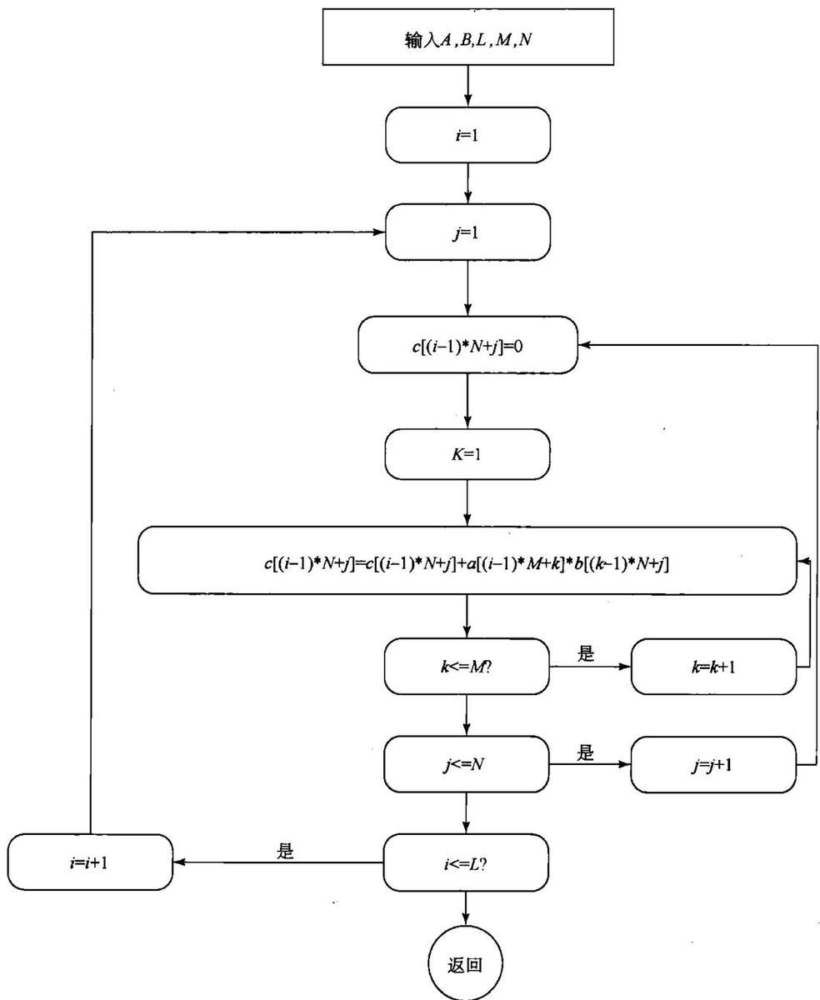  
图 4.4 矩阵相乘流程图

## 4.3.4 线性方程组的无回代求解

设有线性代数方程组

$$
\pmb { A } ^ { \prime } \pmb { X } = \pmb { B } ^ { \prime }\tag{4-14}
$$

式中 $, A ^ { \prime }$ 为 m×m阶非奇异矩阵， $\pmb { B } ^ { \prime }$ 为 n×m 阶矩阵。

为求解方程，又设增广矩阵 $\pmb { A } ^ { \ast } \left[ \pmb { m } \times \left( \pmb { m } + \pmb { n } \right) \right]$ (m行m+n列)为

$$
\textbf {  { A } } ^ { * } ~ = ~ \left( A ^ { \prime } B ^ { \prime } \right)\tag{4-15}
$$

设存在一个矩阵 $\pmb { Q }$ ，左乘系数矩阵A'后得到单位矩阵

$$
\pmb { Q } \pmb { A } ^ { \prime } = \pmb { I }\tag{4-16}
$$

$\pmb { Q }$ 左乘式(4-14)得

$$
Q A ^ { \prime } X = I X = Q B ^ { \prime }\tag{4-17}
$$

则

$$
\pmb { X } = \pmb { Q } \pmb { B } ^ { \prime }\tag{4-18}
$$

因此，只要求出 $\pmb { Q }$ 就能得到解X。

主元素所在行除以主元素 $\pmb { a } _ { i i }$ 使主元素变为1，变换后的这一行乘以第j行系数 $\pmb { a } _ { j i }$ 的相反数- ${ \pmb { a } } _ { j i }$ 加到第j行 $( j \neq i )$ ，使其他各行同列的系数均变为零。要得到新的基变量对应的系数矩阵认为单位矩阵，可以得到一组新的解基。

消元公式为

$$
a _ { j k } ^ { * } = a _ { j k } ^ { * } - \frac { a _ { i k } ^ { * } } { a _ { i i } ^ { * } } \times a _ { j i } ^ { * } \quad \left\{ \begin{array} { l l } { i = 1 , 2 , \cdots , m } \\ { j = 1 , 2 , \cdots , m \quad \mathrm { ( } j \not \approx i \mathrm { ) } } \\ { k = i + 1 , i + 2 , \cdots , m + n } \end{array} \right.\tag{4-19}
$$

$$
\begin{array} { c c } { { { \pmb a } _ { i i } ^ { * } } } & { { = \displaystyle \frac { { \bf a } _ { i i } ^ { * } } { { \bf a } _ { i i } ^ { * } } } } \end{array} \begin{array} { c c } { { ( i = 1 , 2 , \cdots , m ) } } \end{array}\tag{4-20}
$$

$$
a _ { i ( m + j ) } ^ { * } = \frac { a _ { i ( m + j ) } ^ { * } } { a _ { i i } ^ { * } } \left( i = 1 , 2 , \cdots , m , j = 1 , 2 , \cdots , n \right)\tag{4-21}
$$

转换后 $\pmb { A } ^ { * }$ 的m+1到 $m + n$ 列为所求解。

$\pmb { A } ^ { * }$ 存储为向量A,式(4-19)、式(4-20)、式(4-21)改变为

$$
c = \frac { 1 } { a _ { ( i - 1 ) \times ( m + n ) + i } }\tag{4-22}
$$

$$
a _ { ( k - 1 ) * ( m + n )  j } \ = \ a _ { ( k - 1 ) * ( m + n )  j } \ - c \times a _ { ( k - 1 ) * ( m + n )  i } \times a _ { ( i - 1 ) * ( m + n )  j }\tag{4-23}
$$

$$
\left\{ \begin{array} { l } { { i = 1 , 2 , \cdots , m } } \\ { { { \it j \ l } = 1 , 2 , \cdots , m ; \quad ( j \not = i ) } } \\ { { { \it k \ l } = i + 1 , i + 2 , \cdots , m + n } } \end{array} \right. .
$$

$$
a _ { ( i - 1 ) * ( m + n ) + m + j } \ = \ a _ { ( i - 1 ) * ( m + n ) + m + j } \Big / a _ { ( i - 1 ) * ( m + n ) + i } \ \left\{ { \begin{array} { l } { i = 1 , 2 , \cdots , m } \\ { j = 1 , 2 , \cdots , n } \end{array} } \right.\tag{4-24}
$$

其求解过程流程图如图4.5所示。

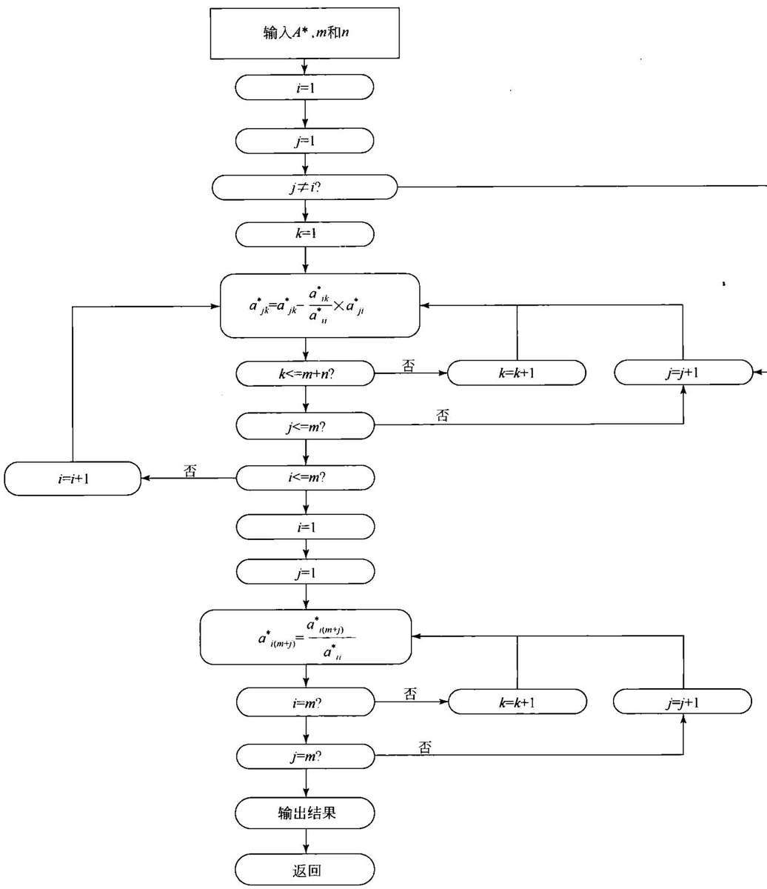  
图4.5 线性方程组的无回代求解过程流程图

## 4.4 带状矩阵的合成与求解

## 4.4.1 存储带状矩阵

合成后的总体刚度矩阵是一个具有对称性并且非零元素分布在以对角线为中心的带状区域内的矩阵结构。相对比矩阵的总宽度，带宽较窄，如图4.6所示。这为计算机的存储和计算提供了有利条件。

设矩阵的带宽为BW，与节点号有关，带宽的一半是半带宽，用HBW表示。可用下式计算带宽和半带宽：

$$
\begin{array} { l } { { \displaystyle { \bf B W } ~ = ~ 2 ~ \times \operatorname* { m a x } _ { e = 1 } ^ { N } \left\{ D N ^ { ( e ) } ~ \right\} ~ + ~ 1 } } \\ { { \displaystyle ~ { \bf H B W } ~ = \frac { { \bf B W } ~ - 1 } { 2 } } } \end{array}\tag{4-25}
$$

(4-26)

式中 $\mathbf { \Delta } \mathbf { D } \mathbf {  { N } } ^ { ( e ) }$ 为一个单元中最大节点号与最小节点号之间的差值；N为总单元号。将上图中两条虚线之间的元素扩展，使虚线间每行元素个数相同，填补的元素为

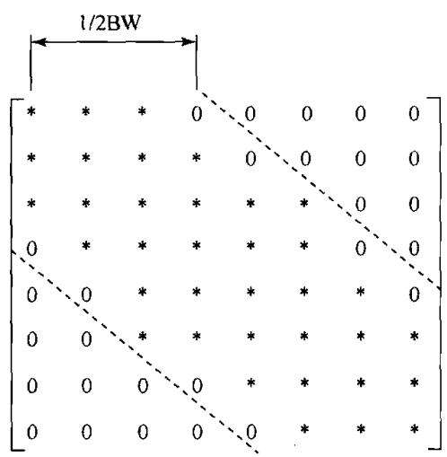  
图 4.6 带状矩阵

零，扩展后如图4.7左边部分所示。这时，虚线间的矩阵可以看成图4.7右边部分的新矩阵，将这一矩阵用向量的方式存储，用这种方式进行矩阵的存取和求解运算可以大提高存取和计算效率。

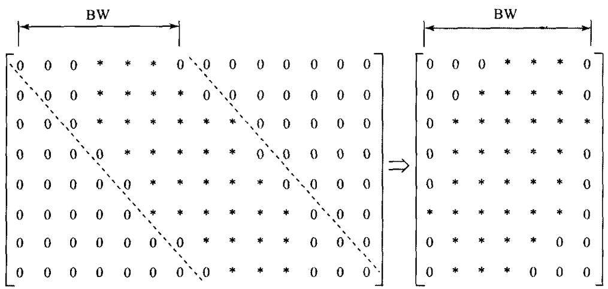  
图4.7 带状矩阵的扩展

## 4.4.2 合成单元矩阵到带状向量空间

设第e个单元中的第 $i ( i = 1 , 2 )$ 个节点元素信息存储在矩阵 $\mathbf { N o d e N u m } \left[ \textbf { \em e } \right] \left[ \textbf { \em i } \right]$ 中(线性单元的矩阵大小为 $2 \times 2 )$ ，单元矩阵为 ${ \left[ \pmb { A } ^ { \left( e \right) } \right. }$ ]，总体矩阵为 $[ \pmb { A } ^ { \prime } ]$ ，总体矩阵的带状矩阵和其带状向量空间存储矩阵用 $[ \mathbf { A } ^ { * } ]$ 和[A]表示。

对于一个编号为e的单元，对应于总体矩阵中的元素节点号 $i \surd$ 可以由下式表示：

$$
\left\{ \begin{array} { l l } { i = \mathrm { N o d e N u m } \left[ e \right] \left[ i _ { e } \right] } & \\ { j = \mathrm { N o d e N u m } \left[ e \right] \left[ j _ { e } \right] } & \end{array} \right. \left( i _ { e } , j _ { e } = 1 , 2 \right)\tag{4-27}
$$

式(4-27)表明，合成总体矩阵时，单元矩阵 $\left[ A ^ { \left( e \right) } \right]$ 中的元素 $a _ { i _ { e } j _ { e } } ^ { ( e ) }$ 应该加到矩阵 $[ A ^ { \prime } ]$ 中 $\pmb { a } _ { i j } ^ { \prime }$ 所对应的地址上，而元素 $\pmb { a } _ { i j } ^ { \prime } .$ 对应到带状矩阵 $[ \pmb { A } ^ { \star } ]$ 中的是 $A _ { i ^ { * } j } ^ { * }$ ，它们之间的关系可表示为：

$$
\left\{ \begin{array} { l l } { i ^ { * } { \bf \Sigma } = i } \\ { \rule { 0.5 ex } { 5 ex } } \\ { j ^ { * } { \bf \Sigma } = ( j - i ) + \frac { { \bf B } \mathbb { W } - 1 } { 2 } + 1 } \end{array} \right.\tag{4-28}
$$

将元素 $\pmb { a } _ { i } ^ { * } { } _ { j }$ 放入向量[A]中第k个元素，用 ${ \pmb a } _ { k }$ 表示

$$
k = \left( i ^ { * } \ - 1 \right) \ \times \mathrm { B W } + j ^ { * } \ = \ \left( i - 1 \right) \ \times \mathrm { B W } + \left( j - i \right) \ + \frac { \mathrm { B W } - 1 } { 2 } + 1\tag{4-29}
$$

式(4-27)、式(4-28)和式(4-29)说明了如何将单元矩阵 $\left[ A ^ { ( e ) } \right]$ 中元素 $\pmb { a } _ { i _ { e } j _ { e } } ^ { ( e ) }$ 集成到向量$\left[ \pmb { A } \right]$ 中元素 ${ \pmb a } _ { \pmb k }$ 的方法，流程图见图 $4 . 8 .$ BWT表示带状向量中的总元素数。

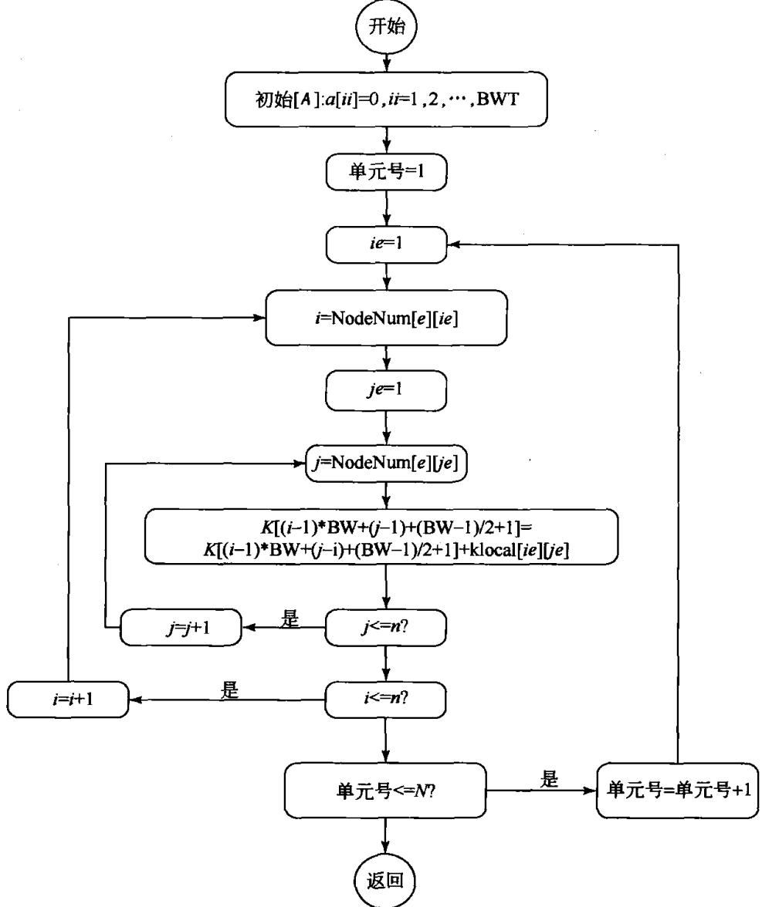  
图4.8 合成单元矩阵到总体向量空间流程图

## 4.4.3 引入边界条件

合成后的总体矩阵(向量)包含了所有节点上的信息，这些节点也包括了已知求解结果，即边界条件。在计算结果之前，需要根据边界条件调整方程，除已知点外，将已知节点值所在的行元素全部置零，所在的列元素乘以已知值后与力矢量相加，已知点的力矢量直接乘以已知值。这样的做法使最后的矩阵既包含已知值(KNV)，又包含未知值结果。具体做法如下：

假设第i个节点已知，那么第i行和i列将会被消去。消去带状总体矩阵A'和向量B'中的有关各项方法如下。

第一步，先消去列。

对于消去第i列的元素，第i行以下各元素调整为

$$
\begin{array}{c} \Big \{ _ { { i + j } } ^ { b _ { i + j } } = b _ { i + j } - a _ { ( i + j - l ) \times \mathbb { B W } + \mathbb { H B W } - j } \times \mathrm { K N V } \qquad \Big \{ _ { j } ^ { j } = 1 , 2 , \cdots , \mathrm { H B W }  \\ { a _ { ( i + j - l ) \times \mathbb { B W } + \mathbb { H B W } - j } = 0 . 0 } \end{array}\tag{4-30}
$$

第i行以上各元素调整为

$$
\begin{array} { r } { \left\{ \begin{array} { l l } { b _ { i - j } ~ = ~ b _ { i - j } ~ - ~ a _ { ( i - j - l ) \times \mathtt { B W } + \mathtt { H B W } - j } \times \mathrm { K N V } \quad } & { \mathrm { ~ } j ~ = ~ 1 , 2 , \cdots , \mathrm { H B W } } \\ { a _ { ( i - j - l ) \times \mathtt { B W } + \mathtt { H B W } + j } ~ = ~ 0 . ~ 0 } & { \mathrm { ~ } \mathrm { ~ ( ~ } i ~ + j ~ ) \geqslant 0 } \end{array} \right. } \end{array}\tag{4-31}
$$

式中，KNV 为已知节点值。

第二步，消去行。通过下式计算：

$$
\begin{array} { r } { \pmb { a } _ { ( i - 1 ) \times \mathrm { B W } + j - 1 } = 0 . 0 \qquad \left\{ \begin{array} { l l } { j = 1 , 2 , \cdots , \mathrm { B W } } \\ { j \neq \mathrm { H B W } } \end{array} \right. } \end{array}\tag{4-32}
$$

最后，第i个力矢量可表示为：

$$
b _ { i } \ = \ a _ { ( i - 1 ) \times \tt B W + H B W } \ \times \tt K N V\tag{4-33}
$$

假设节点i的值已知，则第i行i列的各元素将被调整，方法如图4.9所示。

## 4.4.4 向量存储带状方程组的求解

经过有限元分析，最后得到求解的一组线性方程代数方程：

$$
[ A ^ { \prime } ] \left\{ X \right\} \ = \left[ B ^ { \prime } \right]\tag{4-34}
$$

$\pmb { A } ^ { \prime } ( \pmb { M } \times \pmb { M } )$ 和 $\pmb { { \cal B } } ^ { \prime } ( { \pmb { { \cal M } } } \times { \pmb { { \cal m } } } )$ 分别为方程组的系数矩阵和常数项矩阵。利用总体刚度矩阵对称、稀疏和带状特点的方法是最适合有限元系统方程的求解方法，能够极大地减少计算机的存储和求解时间。根据前述方法将 $[ \pmb { A } ^ { \prime } ]$ 和 $[ \pmb { B } ^ { \prime } ]$ 转变为带状形式的矢量，用 $[ \pmb { A } ]$ 和 $[ \pmb { B } ]$ 表示,将 $[ A ^ { \prime } ]$ 中的第i行第 $j$ 列的元素放到 $[ A ]$ 中第k地址，将 $[ B ^ { \prime } ]$ 中的第i行第j列的元素放到 $[ B ]$ 中第 $\pmb { k } ^ { \prime } .$ 地址：

$$
\begin{array} { r }  k = ( i - 1 ) \times \mathbf { B W } + ( j - i ) \quad + \mathbf { H B W } + 1 \quad \left\{ { \begin{array} { l } { i = 1 , 2 , \cdots , M } \\ { i - \mathbf { H B W } \leqslant j \leqslant i + \mathbf { H B W } , \quad ( 1 \leqslant j \leqslant M ) } \end{array} } \right\} \end{array}\tag{4-35}
$$

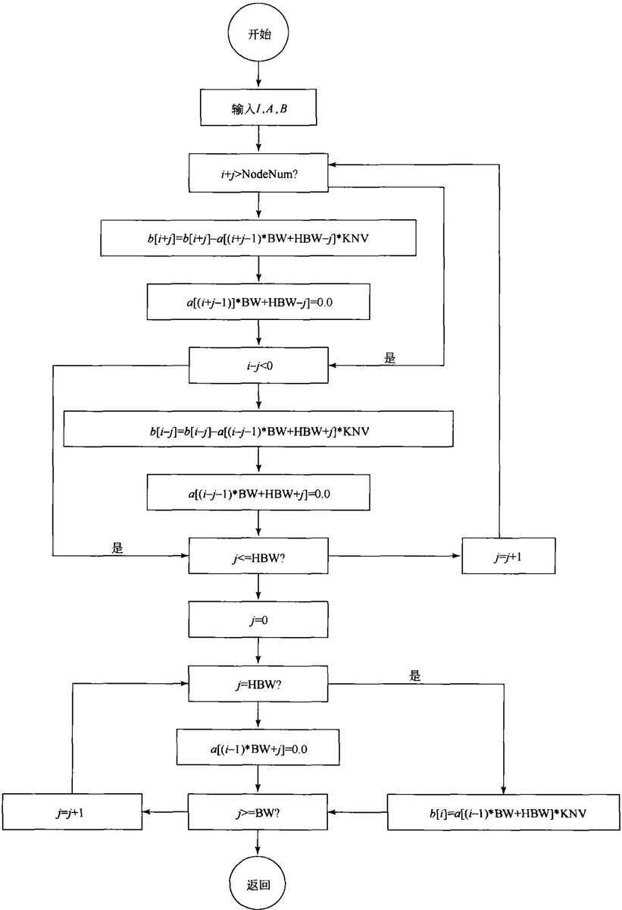  
图4.9 边界条件处理流程图

$$
\begin{array}{c} k ^ { \prime } \ = \ \left( { \ } i ^ { \prime } \ - 1 \right) \ \times m + { \dot { j } } ^ { \prime } \quad \left\{ _ { 1 } ^ { i ^ { \prime } \ = \ 1 } , 2 , \cdots , M \right.  \\ { \left. \qquad \right. \leqslant j ^ { \prime } \leqslant m } \end{array}\tag{4-36}
$$

式中 $\mathbf { \Delta } , k$ 表示向量[A]中第k个元素的地址，将矩阵 $[ { \pmb A } ^ { \prime } ]$ 中第i行第 $j$ 列的元素放到k地址；  
同样 $, k ^ { \prime }$ 是向量 $[ \pmb { B } ]$ 中第k个元素的地址，在此地址上放入矩阵 $[ \pmb { B } ^ { \prime } ]$ 中第 $\percase \expandafter { \romannumeral 1 }$ 行第 $j ^ { \prime }$ 列元素。

采用高斯消去法求解带状方程组 $\pmb { A } \pmb { X } = \pmb { B }$ ，具体过程如下。

(1)消去过程。

设

$$
\boldsymbol { c } = \frac { 1 } { a _ { ( i - 1 ) \times \mathrm { B W } + \mathrm { H B W } } } \quad ( \boldsymbol { i } = 0 , 1 , \cdots , M - 1 )\tag{4-37}
$$

$$
\begin{array} { r l } { c l } & { = a _ { ( i + j ) \times \mathrm { B W } + \mathrm { H B W } - j } \quad \left\{ \begin{array} { l l } { i = 0 , 1 \cdots , M - 1 } \\ { j = 1 , 2 , \cdots , \mathrm { H B W } } \end{array} \right. } \end{array}\tag{4-38}
$$

当 $j > i$ 时，消去第j行i列元素，对于系数矩阵有

$$
\begin{array} { r l } { a _ { ( i + j - 1 ) \times \mathtt { B W } + \mathtt { k W } \mathtt { V } \mathtt { - j } \mathtt { + k } } = } & { a _ { ( i + j - 1 ) \times \mathtt { B W } + \mathtt { k W } \mathtt { V } \mathtt { - j } \mathtt { + k } } - c \times c l \times a _ { ( i - 1 ) \times \mathtt { B W } + \mathtt { k B W } \mathtt { + k } } \quad ( k = 0 , 1 , \cdots , \mathtt { H B W } ) } \end{array}\tag{4-39}
$$

对于常数项消去后元素为

$$
b _ { ( i + j - 1 ) \times m + l } = b _ { ( i + j - 1 ) \times \mathbb { B W } + l } - c \times c l \times a _ { ( i - 1 ) \times m + l } \quad ( l = 0 , 1 , \cdots , m - 1 )\tag{4-40}
$$

(2)回代过程。回代计算后的结果就是方程组的结果。将结果保存在常数项 $[ B ]$ 列阵中。回代过程从方程组的最后一行开始。

对于第M-1到1行，回代方程为

$$
\begin{array} { r } { \{ \begin{array} { l l } { S _ { l } \ = \ \displaystyle \sum _ { j = 1 } ^ { \mathrm { H B W } } a _ { ( M - i - l ) \times \mathrm { B W } + \mathrm { H B W } + j } \times  b _ { ( M - i = j - l ) \times m + l } \quad \} _ { i \ = \ 1 , 2 , \cdots , M \ - 1 } ^ { l \ = 0 , 1 , \cdots , m - 1 } } \\ { \qquad \quad  \sum _ { j \ \leq i } \frac { b _ { ( M - i - l ) \times m + l } - b _ { ( M - i - l ) \times m + l } } { a _ { ( M - i - l ) \times \mathrm { B W } + \mathrm { H B W } } } \quad \} _ { i \ = \ 1 , 2 , \cdots , M - 1 } ^ { l \ = 1 } } \end{array}  } \\ {   \begin{array} { l } { S _ { { ( M - i - l ) } \times m + l } \ = \ \frac { b _ { ( M - i - l ) \times m + l } - S _ { l } } { a _ { ( M - i - l ) \times \mathrm { B W } + \mathrm { H B W } } } } \end{array}  } \end{array}\tag{4-41}
$$

流程图如图4.10所示。

例1 假设矩阵 $\mathbf { A ^ { \prime } }$ 和矩阵 $\pmb { B } ^ { \prime } = \pmb { B } ^ { \ast }$ 有如下形式：

$$
A ^ { \prime } = { \left[ \begin{array} { l l l } { 1 } & { 1 } & { 1 } \\ { 2 } & { 3 } & { 2 } \\ { 3 } & { 2 } & { 4 } \end{array} \right] } \qquad B ^ { * } = { \left[ \begin{array} { l l } { 6 } & { 6 } \\ { 1 4 } & { 1 4 } \\ { 1 9 } & { 1 8 } \end{array} \right] }
$$

用本章所述方法对矩阵 $\pmb { A } ^ { \prime }$ 可以进行变形， $m = 2 , M = 3 , \mathbf { B } \mathbf { W } = 5$ 0

$$
A ^ { \prime } = { \left[ \begin{array} { l l l } { 1 } & { 1 } & { 1 } \\ { 2 } & { 3 } & { 2 } \\ { 3 } & { 2 } & { 4 } \end{array} \right] } \equiv A ^ { \prime } = { \left[ \begin{array} { l l l l l l l } { 0 } & { 0 } & { 1 } & { 1 } & { 1 } & { 0 } & { 0 } \\ { 0 } & { 0 } & { 2 } & { 3 } & { 2 } & { 0 } & { 0 } \\ { 0 } & { 0 } & { 3 } & { 2 } & { 4 } & { 0 } & { 0 } \end{array} \right] } \Rightarrow A ^ { \prime } = { \left[ \begin{array} { l l l l l l } { 0 } & { 0 } & { 1 } & { 1 } & { 1 } & { 0 } \\ { 0 } & { 2 } & { 3 } & { 2 } & { 0 } \\ { 3 } & { 2 } & { 4 } & { 0 } & { 0 } \end{array} \right] } \Rightarrow A ^ { \prime } = { \left[ \begin{array} { l l l l l l } { 0 } & { 0 } & { 0 } & { 1 } & { 1 } & { 1 } & { 0 } \\ { 0 } & { 0 } & { 2 } & { 3 } & { 2 } & { 0 } \\ { 0 } & { 0 } & { 3 } & { 2 } & { 4 } & { 0 } & { 0 } \end{array} \right] } \Rightarrow A ^ { \prime } = A ^ { \prime } = { \left[ \begin{array} { l l l l l l } { 0 } & { 0 } & { 0 } & { 0 } & { 1 } & { 1 } & { 1 } \\ { 0 } & { 0 } & { 1 } & { 1 } & { 1 } & { 1 } & { 1 } \\ { 0 } & { 0 } & { 1 } & { 2 } & { 0 } & { 0 } \end{array} \right] }
$$

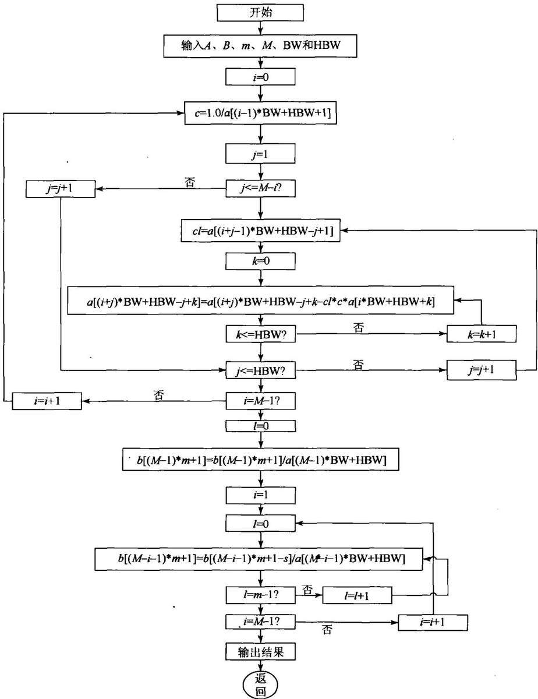  
图4.10 带状方程组的求解

矩阵 $\mathbf { \nabla } A ^ { \prime }$ 和矩阵 $\pmb { \mathcal { B } ^ { \prime } }$ 可以分别存储为向量A和 $\pmb { \cal B }$

$$
\begin{array} { l } { { A \ = \ [ 0 \quad 0 \quad 1 \quad 1 \quad 1 \quad 0 \quad 2 \quad 3 \quad 2 \quad 0 \quad 3 \quad 2 \quad 4 \quad 0 \quad 0 ] } } \\ { { B \ = \ \bigl [ 6 \quad 6 \quad 1 4 \quad 1 4 \quad 1 9 \quad 1 8 \bigr ] } } \end{array}
$$

消去过程

$$
\textbf { \textit { A } } ^ { * } ~ = \left[ \begin{array} { l l l l l l } { 0 . 0 0 } & { 0 . 0 0 } & { 1 . 0 0 } & { 1 . 0 0 } & { 1 . 0 0 } \\ { 0 . 0 0 } & { 0 . 0 0 } & { 1 . 0 0 } & { 0 . 0 0 } & { 0 . 0 0 } \\ { 3 . 0 0 } & { 2 . 0 0 } & { 4 . 0 0 } & { 0 . 0 0 } & { 0 . 0 0 } \end{array} \right]
$$

$$
\begin{array} { r l } { B ^ { * } } & { = \left[ \begin{array} { l l } { 6 . 0 0 } & { 6 . 0 0 } \\ { 2 . 0 0 } & { 2 . 0 0 } \\ { 1 9 . 0 0 } & { 1 8 . 0 0 } \end{array} \right] } \end{array}
$$

$$
\textbf { \textit { A } } ^ { * } ~ = \left[ \begin{array} { l l l l l } { 0 . 0 0 } & { 0 . 0 0 } & { 1 . 0 0 } & { 1 . 0 0 } & { 1 . 0 0 } \\ { 0 . 0 0 } & { 0 . 0 0 } & { 1 . 0 0 } & { 0 . 0 0 } & { 0 . 0 0 } \\ { 0 . 0 0 } & { - 1 . 0 } & { 1 . 0 0 } & { 0 . 0 0 } & { 0 . 0 0 } \end{array} \right]
$$

$$
\begin{array} { r l } { B ^ { \ast } } & { = \left[ \begin{array} { l l l } { 6 . 0 0 } & { 6 . 0 0 } \\ { 2 . 0 0 } & { 2 . 0 0 } \\ { 1 . 0 0 } & { 0 . 0 0 } \end{array} \right] } \end{array}
$$

$$
\textbf { \textit { A } } ^ { * } ~ = \left[ \begin{array} { l l l l l l } { 0 . 0 0 } & { 0 . 0 0 } & { 1 . 0 0 } & { 1 . 0 0 } & { 1 . 0 0 } \\ { 0 . 0 0 } & { 0 . 0 0 } & { 1 . 0 0 } & { 0 . 0 0 } & { 0 . 0 0 } \\ { 0 . 0 0 } & { 0 . 0 0 } & { 1 . 0 0 } & { 0 . 0 0 } & { 0 . 0 0 } \end{array} \right]
$$

$$
\begin{array} { r l } { B ^ { * } } & { = \left[ \begin{array} { l l } { 6 . 0 0 } & { 6 . 0 0 } \\ { 2 . 0 0 } & { 2 . 0 0 } \\ { 3 . 0 0 } & { 2 . 0 0 } \end{array} \right] } \end{array}
$$

回代过程：通过回代得到方程如下解：

$$
B = \left[ \begin{array} { l l l l l l l } { 1 . 0 0 } & { 2 . 0 0 } & { 2 . 0 0 } & { 2 . 0 0 } & { 3 . 0 0 } & { 2 . 0 0 } \end{array} \right] \Leftrightarrow B ^ { * } = \left[ \begin{array} { l l l l l } { 1 . 0 0 } & { 2 . 0 0 } & { 2 . 0 0 } & { 2 . 0 0 } \\ { 2 . 0 0 } & { 2 . 0 0 } & { 2 . 0 0 } & { 2 . 0 0 } \\ { 3 . 0 0 } & { 2 . 0 0 } & { 2 . 0 0 } \end{array} \right] \Leftrightarrow B ^ { * } ,
$$

例2 设有矩阵 $\mathbf { \nabla } A ^ { \prime }$ 和矩阵 $\pmb { B } ^ { \prime } = \pmb { B } ^ { * }$ 有如下形式：

$$
A ^ { \prime } = { \left[ \begin{array} { l l l l l } { 1 } & { 1 } & { 1 } & { 0 } & { 0 } \\ { 2 } & { 3 } & { 2 } & { 0 } & { 0 } \\ { 0 } & { 3 } & { 2 } & { 4 } & { 0 } \\ { 0 } & { 0 } & { 2 } & { 5 } & { 2 } \\ { 0 } & { 0 } & { 1 } & { 1 } & { 1 } \end{array} \right] }
$$

$$
\begin{array} { r } { B ^ { * } { \begin{array} { l } { = \left[ \begin{array} { l l l } { 3 } & { 4 } & { 6 } \\ { 7 } & { 1 0 } & { 1 4 } \\ { 9 } & { 1 6 } & { 2 8 } \\ { 9 } & { 1 4 } & { 3 6 } \\ { 3 } & { 4 } & { 1 2 } \end{array} \right] } \end{array} } } \end{array}
$$

A'变形后为 $\pmb { A } ^ { \star }$

$$
A ^ { \prime } = { \left[ \begin{array} { l l l l l } { 1 } & { 1 } & { 1 } & { 0 } & { 0 } \\ { 2 } & { 3 } & { 2 } & { 0 } & { 0 } \\ { 0 } & { 3 } & { 2 } & { 4 } & { 0 } \\ { 0 } & { 0 } & { 2 } & { 5 } & { 2 } \\ { 0 } & { 0 } & { 1 } & { 1 } & { 1 } \end{array} \right] } \cong A ^ { \prime } = { \left[ \begin{array} { l l l l l l l l l } { 0 } & { 0 } & { 1 } & { 1 } & { 1 } & { 0 } & { 0 } & { 0 } & { 0 } \\ { 0 } & { 0 } & { 2 } & { 3 } & { 2 } & { 0 } & { 0 } & { 0 } & { 0 } \\ { 0 } & { 0 } & { 0 } & { 3 } & { 2 } & { 4 } & { 0 } & { 0 } & { 0 } \\ { 0 } & { 0 } & { 0 } & { 0 } & { 2 } & { 5 } & { 2 } & { 0 } & { 0 } \\ { 0 } & { 0 } & { 0 } & { 0 } & { 1 } & { 1 } & { 1 } & { 0 } & { 0 } \end{array} \right] } \Rightarrow A ^ { \prime } = { \left[ \begin{array} { l l l l l l l } { 0 } & { 0 } & { 1 } & { 1 } & { 1 } & { 1 } & { 0 } \\ { 0 } & { 2 } & { 3 } & { 2 } & { 0 } & { 0 } & { 1 } & { 2 } \\ { 0 } & { 3 } & { 2 } & { 4 } & { 0 } & { 0 } & { 2 } & { 0 } \\ { 0 } & { 2 } & { 5 } & { 2 } & { 0 } & { 0 } \\ { 1 } & { 1 } & { 1 } & { 0 } & { 0 } & { 2 } & { 1 } & { 1 } & { 1 } \end{array} \right] }
$$

式中 $m = 3 , M = 5 , \mathrm { B W } = 5 ,$ 。向量A和B分别如下：

$$
\begin{array} { r l } & { A \ = \ [ 0 \quad 0 \quad 1 \quad 1 \quad 1 \quad 0 \quad 2 \quad 3 \quad 2 \quad 0 \quad 0 \quad 3 \quad 2 \quad 4 \quad 0 \quad 0 \quad 2 \quad 5 \quad 2 \quad 0 \quad 1 \quad 1 \quad 1 \quad 0 \quad 0 ] } \\ & { B \ = \ [ 3 \quad 4 \quad 6 \quad 7 \quad 1 0 \quad 1 4 \quad 9 \quad 1 6 \quad 2 8 \quad 9 \quad 1 4 \quad 3 6 \quad 3 \quad 4 \quad 1 2 ] } \end{array}
$$

消去过程：

$$
\textbf {  { A } } ^ { * } ~ = \left[ \begin{array} { l l l l l l } { 0 . 0 0 } & { 0 . 0 0 } & { 1 . 0 0 } & { 1 . 0 0 } & { 1 . 0 0 } \\ { 0 . 0 0 } & { 0 . 0 0 } & { 1 . 0 0 } & { 0 . 0 0 } & { 0 . 0 0 } \\ { 0 . 0 0 } & { 3 . 0 0 } & { 2 . 0 0 } & { 4 . 0 0 } & { 0 . 0 0 } \\ { 0 . 0 0 } & { 2 . 0 0 } & { 5 . 0 0 } & { 2 . 0 0 } & { 0 . 0 0 } \\ { 1 . 0 0 } & { 1 . 0 0 } & { 1 . 0 0 } & { 0 . 0 0 } & { 0 . 0 0 } \end{array} \right]
$$

$$
\begin{array} { r l r } { B ^ { * } } & { = } & { \left[ \begin{array} { l l l } { 3 . 0 0 } & { 4 . 0 0 } & { 6 . 0 0 } \\ { 1 . 0 0 } & { 2 . 0 0 } & { 2 . 0 0 } \\ { 9 . 0 0 } & { 1 6 . 0 0 } & { 2 8 . 0 0 } \\ { 9 . 0 0 } & { 1 4 . 0 0 } & { 3 6 . 0 0 } \\ { 3 . 0 0 } & { 4 . 0 0 } & { 1 2 . 0 0 } \end{array} \right] } \end{array}
$$

$$
\begin{array} { r l } { \mathcal { A } _ { 1 , 1 1 } ^ { \mathrm { s c a l } } } & { \leq _ { 2 , 0 } ^ { \mathrm { s c a l } } \leq _ { 1 , 0 } ^ { \mathrm { s c a l } } \leq _ { 1 , 0 } ^ { \mathrm { s c a l } } \leq _ { 1 , 0 } ^ { \mathrm { s c a l } } } \\ { \leq } & { \nu _ { 1 } \textsc { t o t } \leq _ { 2 , 0 } ^ { \mathrm { s c a l } } \leq _ { 2 , 0 } ^ { \mathrm { s c a l } } \leq _ { 2 , 0 } ^ { \mathrm { s c a l } } \leq _ { 1 , 0 } ^ { \mathrm { s c a l } } } \\ & { \quad \times \mathrm { l o t } \quad \frac { 1 } { \mathrm { l o t } } \leq _ { 2 , 0 } ^ { \mathrm { s c a l } } \leq _ { 2 , 0 } ^ { \mathrm { s c a l } } \leq _ { 3 , 0 } ^ { \mathrm { s c a l } } \leq _ { 1 , 0 } ^ { \mathrm { s c a l } } \leq _ { 1 , 0 } ^ { \mathrm { s c a l } } \leq _ { 2 , 0 } ^ { \mathrm { s c a l } } \leq _ { 3 , 0 } ^ { \mathrm { s c a l } } } \\ & { \quad \times \mathrm { l o t } \quad \frac { 1 } { \mathrm { l o t } } \leq _ { 2 , 0 } ^ { \mathrm { s c a l } } \leq _ { 3 , 0 } ^ { \mathrm { s c a l } } \leq _ { 3 , 0 } ^ { \mathrm { s c a l } } \leq _ { 1 , 0 } ^ { \mathrm { s c a l } } \leq _ { 3 , 0 } ^ { \mathrm { s c a l } } \leq _ { 3 , 0 } ^ { \mathrm { s c a l } } \leq _ { 4 , 0 } ^ { \mathrm { s c a l } } } \\ & { \quad \times \mathrm { l o t } \quad \frac { 1 } { \mathrm { l o t } } \leq _ { 4 , 0 } ^ { \mathrm { s c a l } } \leq _ { 1 , 0 } ^ { \mathrm { s c a l } } \leq _ { 4 , 0 } ^ { \mathrm { s c a l } } \leq _ { 4 , 0 } ^ { \mathrm { s c a l } } \leq _ { 4 , 0 } ^ { \mathrm { s c a l } } } \\ { \leq } &  \nu _ { 1 } \textsc { t o t } \quad \mathrm  \end{array}
$$

回代过程：

得到方程解

$$
\begin{array} { r l } { \boldsymbol { B } = [ 1 . 0 \quad 1 . 0 \quad 1 . 0 \quad 1 . 0 \quad 1 . 0 \quad 1 . 0 \quad 1 . 0 \quad 2 . 0 \quad 1 . 0 \quad 2 . 0 \quad 1 . 0 \quad 1 . 0 \quad 2 . 0 \quad 3 . 0 \quad 3 . 0 \quad 4 . 0 \quad 5 . 0 ] } \\ { \boldsymbol { B } ^ { * } } & { = \left[ \begin{array} { l l l l l } { 1 . 0 0 \quad 1 . 0 0 \quad 1 . 0 0 } \\ { 1 . 0 0 \quad 2 . 0 0 \quad 2 . 0 0 } \\ { 1 . 0 0 \quad 1 . 0 0 \quad 3 . 0 0 } \\ { 1 . 0 0 \quad 2 . 0 0 \quad 4 . 0 0 } \\ { 1 . 0 0 \quad 1 . 0 0 \quad 5 . 0 0 } \end{array} \right] } \end{array}
$$

## 第 5 章 细沟侵蚀过程的模拟与检验

## 5.1 非限定性细沟侵蚀试验及泥沙连续方程参数设定

土壤侵蚀形成的细沟，既是坡面侵蚀的来源又是泥沙输运的通道，在坡地侵蚀中具有极其重要的地位。通常侵蚀量大的地方，细沟侵蚀很活跃(Ellison,1947;Foster，1982；Govers and Rauws, 1986; Govers, 1990; Govers, 1992; Nearing et al., 1989; Nearing et al.1997)。侵蚀细沟形态随时间与空间不断演变，这种演变反过来影响细沟中水流的水力学特性。水流是坡面水蚀过程的驱动力，细沟水流水力特性的动态变化将引起侵蚀细沟形态的演变。因此，细沟演化的过程形成了一个侵蚀、水流水力学特性、沟床形态变化间相互影响的互反馈环。细沟中水流流速、水深、细沟宽度、水力糙度、局部细沟坡度、阻力坡度、侵蚀速率等都是细沟演变过程中随时空变化的函数。本章目的是在理论分析的基础上，建立描述细沟侵蚀过程及其形态发育演变过程的模拟模型，给出相应的求解方法。

现有的许多土壤侵蚀模型通过许多假设及相应的数学模型来简化对细沟侵蚀的描述。作出这些简化的理由很多。首先，这些模型大多数以水土保持中所需的土壤侵蚀预报为目的，而不关心侵蚀过程的机理。对于整个细沟侵蚀过程的完整描述，涉及许多复杂的数学公式，有些往往不适用于土壤侵蚀预报，并且有些还满足不了侵蚀预报的精度。造成这些现象的主要原因是因为即使在相同的环境条件下土壤侵蚀量差异也很大(Wendt et al.,1986)。到目前为止，已有的模型还没有涉及细沟侵蚀中细沟形态演化即随时空变化的问题。例如，现阶段影响较大的 WEPP 模型(Nearing et al.,1989;Nearing etal.;1990; Nearing and Nicks, 1996), GUEST 模型(Misra and Rose, 1996) 及 EuroSEM 模型(Morgan et al.,1992)，均假定恒定的细沟宽度、不变的水力糙度、随距离线性变化的流量、不随时空变化的坡度。上述三个模型描述细沟的时空变化都有局限性。这三个模型以及其他一些模型，在给予恰当的参数时，可以适用于一般的土壤侵蚀预报目的，但都不能模拟细沟形态演化动态过程。本章目的是为了建立模拟坡面侵蚀细沟演变过程的数学模型。该模型能反映细沟侵蚀动态过程、细沟沟床形态变化及细沟中水流水力学特性的动态互反馈作用，同时反映细沟瞬时形态的特征与时空变化。根据局部土壤剥离和泥沙沉积量可以对局部沟坡与宽度的变化随时进行动态更新。沟坡的变化将引起相关联的水流速度、剪切应力、能量等一系列变化，这些变化反过来又影响水流剥离、输送和沉积泥沙量。该模型采用了一组完整的水动力学方程组，包括一个以概率论为基础的土壤剥蚀模型、一个用于细沟侵蚀的新型泥沙运移方程。本章还叙述理论模型的有限元数值求解方法。

## 5.1.1 模型的描述

## (1)水动力学方程

均匀沟宽的一维水动力学方程已有过广泛的讨论(Milne-Thomson,1960;Shames，1992;Ziekiewicz and Taylor,1991)。本章所针对的是沟宽非均匀并不断地动态变化的情况。根据质量守恒原理，变沟宽的水流连续性方程如下：

$$
\frac { \partial ^ { ( } h w ) } { \partial t } + \frac { \partial ^ { ( } u h w ) } { \partial x } = \sigma w\tag{5-1}
$$

式中 ${ \bf \nabla } , { \bf \nabla } \cdot { \bf \nabla }$ 为笛卡儿坐标(m);t为时间 $\mathrm { ( ~ s ) } \{ \ : h \ : \ : ( \ : x , t ) \}$ 为铅直度量的水流深度 $\left( \mathbf { m } \right) ; u \left( x , t \right)$ 为水流关于深度与宽度在x方向上的平均流速 $\left( \mathbf { m } { \bf / s } \right) ; w \left( { \pmb x } , { \pmb t } \right)$ 为细沟宽度 $\mathbf { \Psi } ( \mathbf { m } ) : R ( x , t )$ 为水流流量沿沟长的增减量 $\textbf { ( m / s ) }$ ，当降雨量超过入渗量或有地下渗流溢出时， $R ( { \boldsymbol { \mathbf { \mathit { x } } } } , t )$ 为正值，当有沿程损失(如入渗)时 $R ( x , t )$ 为负值。

在变沟宽条件下的动量守恒方程如下(Jayawardena and White,1997):

$$
\frac { \partial \big ( u h w \big ) } { \partial t } + \frac { \partial \big ( u ^ { 2 } h w \big ) } { \partial x } + \frac { g } { 2 } \frac { \partial \big ( h ^ { 2 } w \big ) } { \partial x } = - g h w \Big [ \frac { S _ { x } } { \sqrt { 1 + S _ { x } ^ { 2 } } } + S _ { f _ { x } } \Big ] + F _ { C _ { n } } h w n _ { x }\tag{5-2}
$$

式中， $\pmb { \delta }$ 为重力加速度 $\left( \mathrm { m } { \middle / \mathrm { \mathbf { s } } } ^ { 2 } \right) ; S _ { x } \left( x , t \right)$ 为细沟的坡度 $\left( \mathrm { m / m } \right) ; S _ { f x } \left( x , t \right)$ 为阻力坡度(Chow,1959) $\left( \mathbf { m } / \mathbf { m } \right)$ ,具有下列表达式：

$$
S _ { f _ { x } } \ = \ \Big [ \frac { C } { u } \Big ] ^ { 2 } \frac { 1 } { h }\tag{5-3}
$$

式中，C为水流阻力系数 $( \mathbf { m } ^ { 1 / 2 } / \mathbf { s } )$ ,由下式确定(Chow,1959)：

$$
C = { \sqrt { \frac { 8 g } { f } } }\tag{5-4}
$$

式中， f为 Darcy-Weisbach 水力摩擦系数。

细沟的坡度简单地由下式给出：

$$
S _ { x } \ = \ { \frac { \partial z } { \partial x } }\tag{5-5}
$$

式中， ${ \pmb z } ( { \pmb x } , { \pmb t } )$ 为沟底地表高程(m)。

式(5-2)中的Fc为由土壤表面曲率引起的离心加速度对动量的贡献，该项可表示为 $F _ { c _ { n } }$

$$
F _ { C _ { n } } = \frac { u ^ { 2 } } { R _ { \underset { \ast } { } } }\tag{5-6}
$$

式中

$$
R _ { n } \ = \ \frac { \left( \ 1 \ + S _ { x } ^ { 2 } \right) ^ { \frac { 3 } { 2 } } } { \displaystyle \frac { \partial S _ { x } } { \partial x } }\tag{5-7}
$$

单位矢量在x轴上的投影切矢量 $\pmb { n } _ { \pmb { x } }$ 由下式确定：

$$
n _ { \ast } ^ { \mathrm { ~ ~ } } = - \mathrm { ~ } S _ { x }\tag{5-8}
$$

## (2)泥沙连续方程

与变沟宽细沟水流相联系的泥沙运移过程由下式给出：

$$
h w \frac { \partial c } { \partial t } + h w u \frac { \partial c } { \partial x } = \frac { \partial } { \partial x } \Big [ h w D _ { \mathrm { H } } \frac { \partial c } { \partial x } \Big ] + \big ( S _ { \ast s } - c \pmb { \sigma } \big ) w\tag{5-9}
$$

式中 $, c ( \boldsymbol { x } , t )$ 为泥沙含量 $( \mathrm { \bf k g } / \mathrm { \bf m } ^ { 3 } ) ; D _ { \mathrm { \bf H } }$ 为泥沙在水中的扩散系数 $\left( \mathrm { m } ^ { 2 } / \mathrm { s } \right) ; S _ { \mathrm { s s } } \left( x , t \right)$ 为泥沙源(汇)项[ $\cdot \bf { k } \bf { g } / ( \bf { m } ^ { 2 } \cdot \bf { s } ) ]$ 。式中的扩散系数在泥沙输运方程中并不常用，与 $D _ { \mathtt { H } }$ 有关的数据十分有限。然而，物理上该过程的存在是肯定的，特别是对于将问题作为一维情况处理时，沟中水流断面上任一时刻、任一点总表现出不同的速度分布，水流的几何断面的变化会导致这种速度的差异，同时自由水流与流体边界层间也存在流速差异，这些都是泥沙在水流中动力扩散的原因。

## (3)泥沙源(汇)项

在土壤侵蚀中，用式(5-9)表示泥沙连续方程是无可争议的。然而，式(5-9)中的泥沙源(汇)项则有很多不同的表达式，并且一直是土壤侵蚀界一个备受关注的问题(Elli-son,1947; Foster, 1982; Morgan et al., 1992; Elliot, 1988; Elliot et al. , 1989; Elliot and Laflen,1993; Rose et al. ,1983a,1983b; Hairsine and Rose ,1992a;1992b; Laflen et al. ,1991;Morgan,1995;Nearing，1991)。该侵蚀模型采用与输沙能力相关的概念：当水流泥沙含量小于局部的水流输沙能力(所能携带的含沙量)时，水流使土壤剥离；当水流泥沙含量超过局部的水流输沙能力时，水流中的泥沙开始沉积。

紊流是导致土壤剥蚀的原因之一(Nearing and Parker,1994)。现在，所有以物理过程为基础的土壤侵蚀模型都采用平均水流参数，如平均水流剪切应力(Nearing et al.,1989)或单位水流功率(Morgan，1995)等。本章采用由水流的紊动特性计算土壤剥蚀的模型。Nearing(1991)对该表达方法进行了详细描述。由紊流引起土壤剥离的这种关系式具有下列形式：

$$
{ \cal E } = { \cal F } { \cal P } { \cal M }\tag{5-10}
$$

式中，E为土壤剥蚀率 $\left[ \mathbf { k } \mathbf { g } / ( \mathbf { m } ^ { 2 } \cdot \mathbf { s } ) \right]$ ;F为紊流冲击的时空分布频率 $[ 1 / ( \ s \cdot \mathbf { m } ^ { 2 } ) ]$ ;P为引发土壤剥离(失效事件)的概率； $M$ 为每一个失效事件平均所剥离的土壤质量 $( \mathbf { k } _ { \mathbf { g } } )$ 。上述方程式也可以写成下列形式：

$$
E = K C P h ^ { \frac { 1 } { 2 } } S _ { x } ^ { \frac { 3 } { 2 } }\tag{5-11}
$$

式中， $\mathbf { \nabla } . \kappa$ 为经验系数，可由试验数据确定；C为Chezy糙度系数；h为水流深度 $( \mathbf { m } ) : S _ { x }$ 为摩擦坡度 $\left( \mathbf { m } / \mathbf { m } \right)$ 。土壤剥离的概率P是下列两个分布函数的重叠部分的值：一个是土壤的拉伸应力，它是土壤对被剥离的阻力；另一个是地表土壤受到紊流冲击作用时所经受的紊流剪切应力(图5.1)。E为最大可能剥离速率，即清水的剥离速率。实际的源项值$S _ { \textrm { s s } }$ 与最大可能剥离速率及水流中的含沙量有关。计算方法在下文中讨论。

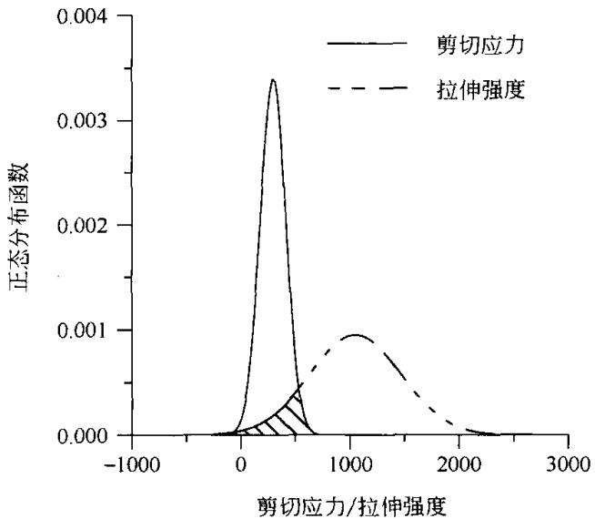  
图5.1 剪切应力及拉伸强度正态分布函数

该模型采用Nearing等(1997)提出的输沙能力关系式对细沟侵蚀进行模拟，表达式如下：

$$
\log _ { 1 0 } \left( T _ { \mathrm { c } } \right) = A + \frac { B \mathrm { e } ^ { \mathrm { ~ t ~ } a + b \log \left( \omega \right) \mathrm { ~ } \mathrm { ~ } } } { 1 + \mathrm { e } ^ { \mathrm { ~ } \left[ a + b \log \left( \omega \right) \mathrm { ~ } \right] } }\tag{5-12}
$$

式中， $T _ { \mathrm { { c } } }$ 为输沙能力 $[ \bf k g / ( \bf m \cdot s ) ] _ { \mu } \bf _ { ; } a _ { \nu } = 0$ .845;b =0.412;A = -34.47;B =38.61; $; \omega$ 为水流功率 $( \frac { \alpha } { 8 } / \mathrm { { s } } ^ { 3 } )$ ，由下式给出：

$$
\omega = \rho g S _ { x } q\tag{5-13}
$$

式中 $, q$ 为单宽水流量 $( \mathbf { m } ^ { 2 } / \mathbf { s } ) : q$ 为水的容重 $\cdot \bf { g } / \mathrm { c m } ^ { 3 } )$ 0

最大可能剥离速率E用来描述清水、紊流对土壤的剥离能力。水流中泥沙的存在，会降低实际的剥离速率。一个很清楚的原因是泥沙对紊流速度脉动的影响。Einstein和Chien(1954)及 Vanoni 和Namicos(1960)都曾说明，水流中泥沙的存在会导致紊流强度的减弱。Rose等(1983a,1983b)及Hairsine和 Rose(1992a,1992b)认为水流中泥沙对剥离速率的影响是泥沙在输运过程中不断地在沟床沉积和再次启动，保护沟床的同时使剥离速率降低。Foster和 Meyer(1972a，1972b)、Meyer等(1975a,1975b)认为，泥沙存在使剥离速率降低，致使输沙过程要消耗能量，从而使得水剥离土壤的能量减少。在该模型中用下列公式来计算水流中的泥沙对剥离速率降低的关系：

$$
S _ { \mathrm { s s } } ~ = ~ E { \left[ { 1 ~ { - } ~ { \frac { c q } { T _ { \mathrm { c } } } } } \right] }\tag{5-14}
$$

当水流的输沙量 $( c q )$ 大于水流的输沙能力 $T _ { \mathrm { c } }$ 时，泥沙就开始沉积，沉积速度与过量泥沙有关，可以由下列一阶沉积表达式进行计算：

$$
S _ { \mathrm { s s } } ~ = - \beta \big ( c q { } ~ - { } ~ T _ { \mathrm { c } } \big )\tag{5-15}
$$

式中 $\mathbf { \nabla } , \beta$ 为一阶经验沉积系数(1/m)。

## (4)沟床的瞬态演变

## 1)沟底高程的变化

细沟水流输沙能力随时间和空间变化，同时也是水流功率的函数。水流功率又是沟宽、水深、流速和局部阻力坡度的函数。输沙能力的差异，不仅会影响沿沟长剥离量与沉积量的变化，还会引起由剥离向沉积过程(或由沉积向剥离)的转化。因此，即使起始时由均质土壤形成的一条坡度、宽度一定从而流速均一的细沟，在侵蚀过程中沟宽、坡度的随机变化会引起输沙能力的变化，导致泥沙连续性方程中源项的变化。局部的土壤剥离和泥沙沉积会引起局部沟坡的瞬态变化，原因是沟床随时间是非均匀侵蚀。在时间段(dt)内水流由地表剥离或沉积到地表面积(wdx)上的泥沙量将引起地表土壤质量的改变，其量值为 $( S _ { s s } w \mathbf { d } x \mathbf { d } t )$ ，该质量用地表高程的变化来表示：

$$
S _ { \mathrm { s s } } w \mathrm { d } x \mathrm { d } t \ = \rho _ { \mathrm { b } } \frac { \partial z } { \partial t } w \mathrm { d } t \mathrm { d } x\tag{5-16}
$$

式中，ρ为土壤的体积密度 $\pmb { \rho _ { \mathrm { b } } }$ $( \mathbf { \ k g } / \mathbf { m } ^ { 3 } )$ 。根据质量守恒定律可得：水流对细沟土壤的剥离量或泥沙从水流中沉积下来的沉积量等于细沟沟床被剥离或从水流中沉积到地表的泥沙量，即

$$
S _ { \mathrm { s s } } w \mathrm { d } x \mathrm { d } t = - \rho _ { \mathrm { b } } \frac { \partial z } { \partial t } \mathrm { d } t w \mathrm { d } x\tag{5-17}
$$

$$
\frac { \partial z } { \partial t } = - \frac { 1 } { \rho _ { \mathrm { b } } } S _ { \mathrm { s s } }\tag{5-18}
$$

对式(5-17)积分得到

$$
z ( x , t ) \ = - \ \frac { 1 } { \rho _ { \mathrm { b } } } \int _ { t _ { 0 } } ^ { t _ { 0 } + \Delta t } S _ { \mathrm { s s } } \left( \boldsymbol { x } , t \right) { \mathrm d } t \ + f _ { 0 } \left( \boldsymbol { x } \right)\tag{5-19}
$$

式中 $\mathcal { f } _ { 0 } ( x )$ 为侵蚀过程开始时沟底的初始形态函数； $S _ { _ { 8 8 } } ( x , t ) \mid _ { x \mid \frac { } { x } }$ 表示沉积过程。在此情况下 $z ( x , t ) > f _ { 0 } ( x )$ 时，泥沙向表面的沉积使高程增加。反之，对于剥离的情况，则有$z ( x , t ) < f _ { 0 } ( x )$ 及 $S _ { \scriptscriptstyle \mathrm { 8 } } ( x , t ) > 0$ 0

## 2)沟宽变化

当细沟中某一部分发生沉积时，引起其上游的沟坡减缓，流速也相应降低；沉积处沟宽相应增加，由于质量守恒，水流深度减低。在细沟变宽的过程中，水流质量未变。因此，根据质量守恒定律，我们得到

$$
V _ { 1 } w _ { 1 } H _ { 1 } \ = \ V _ { 2 } w _ { 2 } H _ { 2 }\tag{5-20}
$$

式中， $V _ { 1 } , V _ { 2 }$ 分别为沉积开始及结束时流体的速度 $( \mathbf { \dot { m } } / \mathbf { s } ) ; w _ { 1 } , w _ { 2 }$ 为沟宽 $\mathrm { ~ ( ~ m ~ ) ~ } ; H _ { 1 } , H _ { 2 }$ 为水流深度(m)，它们之间的关系为

$$
\left\{ \begin{array} { l } { { V _ { 2 } \ = \ V \Bigg | _ { t \ = t _ { 1 } } + \ \displaystyle \left[ \frac { \partial v } { \partial t } \Delta \ t \right] | _ { t \ = t _ { 1 } } = \ V _ { 1 } + \Delta \ V } } \\ { { \Bigg \{ w _ { 2 } \ = \ w \Bigg | _ { t \ = t _ { 1 } } + \ \displaystyle \left[ \frac { \partial w } { \partial t } \Delta \ t \right] | _ { t \ = t _ { 1 } } = w _ { 1 } + \Delta \ w } }  \\ { { \Bigg [ H _ { 2 } \ = \ H \Bigg | _ { t \ = t _ { 1 } } + \ \displaystyle \left[ \frac { \partial H } { \partial t } \Delta \ t \right] | _ { t \ = t _ { 1 } } = H _ { 1 } + \Delta \ H } } \end{array} \right.\tag{5-21}
$$

式中， $\Delta t = t _ { 2 } - t _ { 1 } > 0$ 。此处，我们设定沉积的泥沙总深度中的一部分垫高了沟底，从而减低了水的深度，即

$$
H _ { 2 } \ = \ H _ { 1 } \ + \beta \Delta z\tag{5-22}
$$

式中 $0 \leqslant \beta \leqslant 1$ 为沉积引起水深降低的系数。由于 $\Delta V$ 很小，为了求得 $\Delta z$ ，我们做了进一步假定 $\Delta V = 0$ ,则可得到沟宽 ${ \pmb w } _ { 2 }$ 的演变方程如下：

$$
w _ { 2 } \ = \ { \frac { w _ { 1 } H _ { 1 } } { H _ { 1 } + \beta \Delta z } }\tag{5-23}
$$

当沉积发生时， $\Delta z \ < 0$ 可以由式(5-15) 看出 ${ \pmb w } _ { 2 }$ 大于 ${ \pmb w } _ { 1 }$ ，即沟宽增加。当水深减小到一定极限 $H _ { \mathrm { m i n } }$ 时，假定水深不能再进一步减小，即假设

$$
H _ { 1 } + \beta \Delta z \geqslant H _ { \operatorname* { m i n } }\tag{5-24}
$$

从而

$$
w _ { 2 } \leqslant \frac { w _ { 1 } H _ { 1 } } { H _ { \operatorname* { m i n } } }\tag{5-25}
$$

## 5.1.2 有限元计算方法与计算公式

## (1)数值公式

采用有限元方法(FEM)来求解这些数学模型方程(式(5-1)、式(5-2)、式(5-9))。为了降低存储量和提高计算速度，采用顺序求解的方法。在每一个时间步长中，我们将方程(5-1)中的u、式(5-2)中的h及它们相应的偏导数作为已知值，由前一步计算得到。在方程(5-9）中 $u , h , S _ { \mathrm { s s } }$ 为该时间步长中由方程式(5-1)及式(5-2)计算得到的结果。在每一个单元中，宽度w总是取为常量，为节点宽度的平均值。从而，h、u、c通过顺序求解方程式(5-1)、式(5-2)、式(5-9)依次得到。采用这种求解方法和两节点的线性单元，模拟这些过程的有限元数值公式为

$$
\begin{array} { r }  \begin{array} { c c } { \frac { - ( \epsilon ) } { w } L } \\ { \frac { w } { 6 } \Big [ \Big ] _ { 1 } ^ { 2 } } & { \displaystyle _ { 2 } \Big ] \left\{ \frac { \partial h } { \partial t } \right\} + \left\{ \frac { u } { 2 } \begin{array} { c c } { - ( \epsilon ) - ( \epsilon ) } \\ { \frac { u } { 2 } \Big [ - 1 } & { 1 \Big ] + \big [ \begin{array} { c c } { - ( \epsilon ) } & { - ( \epsilon ) } \\ { u _ { \tau } w } & { + } & { u } \end{array} \frac { - ( \epsilon ) } { w } _ { \tau } \Big ] \frac { L } { 6 } \Big [ \begin{array} { c c } { 2 } & { 1 } \\ { 1 } & { 2 } \end{array} \Big ] } } \end{array} } \end{\right\array} \end{array} \end{array}
$$

$$
\{ h \} \ = \ \frac { w L } { 6 } { \Big [ } _ { 1 } ^ { 2 } \quad _ { 2 } ^ { 1 } { \Big ] } \{ \sigma \}\tag{5-26}
$$

$$
\frac { L } { 6 } \Big [ \Big ] _ { 1 } ^ { 2 } { \quad \frac { 1 } { 2 } } \Big ] \Big \{ \frac { \partial u } { \partial t } \Big \} + \Big \{ \frac { u } { 2 } \Big [ \begin{array} { l l } { - 1 } & { 1 } \\ { - 1 } & { 1 } \end{array} \Big ] + \frac { \sigma \ L } { 6 ^ { - ( e ) } } \Big [ \Big ] _ { 1 } ^ { 2 } { \quad \frac { 1 } { 2 } } \Big ] \Big \} \{ u \}  &  = - \frac { g } { 2 } \Big [ \begin{array} { l l } { - 1 } & { 1 } \\ { - 1 } & { 1 } \end{array} \Big ] \{ h \} \ - \ \frac { g \ _ { - } ^ { - ( e ) } } { 4 ^ { - ( e ) } } \Big \} = 0 .
$$

$$
\Big [ { \bf \Phi } _ { - 1 } ^ { - 1 } { \bf \Phi } _ { 1 } ^ { 1 } \Big ] \{ w \} - \frac { g L } { 6 } \Big [ { \bf \Phi } _ { 1 } ^ { 2 } { \bf \Phi } _ { 2 } ^ { 1 } \Big ] \Big \{ \stackrel { - ( e ) } { S _ { x _ { 0 } } } \{ S _ { x } \} \ + \ \stackrel { - ( e ) } { S _ { f _ { x } } } \{ \mu  _ { t - \Delta t } \} \ - \ { \stackrel { - ( e ) } { F } } _ { C _ { n } } \{ \bf \Phi  _ { i n _ { x } } \Big \} \Big \}\tag{5-27}
$$

$$
\begin{array} { r l } { \underline { { \bar { h } } } L _ { \big [ 1 } ^ { 2 } } & { { } 1 } \\ { \overline { { 6 } } \big [ 1 } & { { } 2 \big ] \Big \{ \frac { \partial c } { \partial t } \Big \} + \Big \{ \frac { u } { 2 } \Big [ \begin{array} { l l } { - 1 } & { 1 } \\ { - 1 } & { 1 } \end{array} \Big ] 1 + \frac { D _ { H } } { L } \Big [ \begin{array} { l l } { 1 } & { - 1 } \\ { - 1 } & { 1 } \end{array} \Big ] + \frac { \sigma ^ { - } L } { 6 ^ { - } h } \Big [ \begin{array} { l l } { 2 } & { 1 } \\ { 1 } & { 2 } \end{array} \Big ] \Big \} } \end{array}
$$

$$
\{ c \} \ = \ \frac L { 6 ^ { - ( e ) } } { \binom { 2 } { 1 } } \quad \mathbf { \Sigma } _ { 2 } ^ { 1 } ] \{ S \}\tag{5-28}
$$

式中， $\begin{array} { c c c c c c c c c c c c c c c c c c c c c c c c c c c c c c c c c c c c c c c c c c c c } { { } } & { { } } & { { } } & { { } } & { { } } & { { } } & { { } } & { { } } & { { } } & { { } } & { { } } & { { } } & { { } } & { { } } & { { } } & { { } } & { { } } & { { } } & { { } } & { { } } & { { } } & { { } } & { { } } & { { } } & { { } } & { { } } & { { } } & { { } } & { { } } & { { } } & { { } } & { { } } & { { } } & { { } } & { { } } & { { } } & { { } } & { { } } & { { } } & { { } } & { { } } & { { } } & { { } } & { { } } & { { } } & { { } } & { { } } & { { } } & { { } } & { { } } & { { } } & { { } } & { { } } & { { } } & { { } } & { { } } & { { } } & { { } } & { { } } & { { } } & { { } } & { { } } & { { } } & { { } } & { { } } & { { } } & { { } } & { { } } & { { } } & { { } } & { { } } & { { } } & { { } } & { { } } & { { } } & { { } } & { { } } & { { } } & { { } } & { { } } & { { } } & { { } } & { { } } & { { } } & { { } } & { { } } & { { } } & { { } } & { { } } & { { } } & { { } } & { { } } & { { } } & { { } } & { { } } & { { } } & { { } } & { { } } & { { } } & { { } } & { { } } & { { } } & { { } } & { { } } & { { } } & { { } } & { { } } & { { } } & { { } } & { { } } \end{array}$ ,相应变量在单元e内的平均值;L为单元的长度。

上述三个方程可由一个通用的方程表示为

$$
[ { \pmb p } ^ { ( e ) } ] \{ { \pmb \varphi } \} + [ { \pmb k } ^ { ( e ) } ] \{ { \pmb \varphi } \} - \{ { \pmb f } ^ { ( e ) } \} = \{ { \pmb 0 } \}\tag{5-29}
$$

式中， $\{ \phi \}$ 为节点未知函数 $\left\{ \left. u \right\} \right. \ , \ \left\{ h \right\}$ 和 $\left\{ c \right\} : \left[ p ^ { \left( \mathbf { \Lambda } _ { e } \right) } \right]$ 与 $[ k ^ { ( \mathrm { ~ e ~ } ) } ]$ 和 $\left\{ f ^ { \mathrm { c } \ e ) } \right\}$ 为单元刚度矩阵； $\{ f ^ { \mathrm { ( ~ } e \mathrm { ) } } \}$ 也成为力矢量。对于水流和泥沙方程的单元刚度矩阵分别为：由式(5-26)、式(5-27)、式(5-28)给出的方程组，是关于时间的常微分方程组。可用时间“步进积分”方法获得不同时间步长中的解答，采用有限差分方法处理。

将单元矩阵组集，得到求解问题的方程组，所涉及的总刚矩阵([A])、总力矢量{B}由下列公式确定：

$$
[ A ] \left\{ \varphi \right\} = \left\{ B \right\}\tag{5-30}
$$

$$
[ A \} = \ \sum _ { e = 1 } ^ { N } \left\{ p + \theta \Delta t [ k ^ { ( e ) } \exists ] \right\}\tag{5-31}
$$

$$
\begin{array} { r l } { \{ \pmb { B } \} } & { = \displaystyle \sum _ { \sigma = 1 } ^ { N } \big \{ \big [ \pmb { p } ^ { ( e ) } \big ] - \big ( 1 - \pmb { \theta } \big ) \pmb { A } t \big [ \pmb { k } ^ { ( e ) } \big ] \big \} \big \{ \varphi \big \} _ { t } + \pmb { A } t \big \{ \pmb { f } ^ { ( e ) } \big \} } \end{array}\tag{5-32}
$$

式中， $\theta = 0 , \frac { 1 } { 2 }$ ,1分别为时间的不同差分格式。

## (2)求解步骤

程序框架结构如下描述：

(1)输入数据：①细沟信息数据，即初始条件与边界条件、高程、宽度、求解时流速、水深、泥沙含量的误差限 $\textcircled{2}$ 土壤信息数据，即抗拉强度及其方差或变差系数等。

(2)对各参数进行初始化。

(3)求解根据质量与动量守恒所建立的水力学方程(5-26)与式(5-27)，得到流速和水深值。

(4)用式(5-15)计算出输沙能力。

(5)计算剥离速率或沉积速率。如果水流含沙量小于其对应的输沙能力，用式(5- 17)计算剥离速率；反之，则用式(5-18)计算沉积速率。

(6)用式(5-30),求解输沙连续性方程，得到泥沙含量。

(7)计算与前一时间步长相比较(或第一个时间步长与初始值比较）的速度、水深、泥沙含量误差。

(8)检验误差。如果速度、水深、泥沙含量的误差限中一个或几个大于设定值，回到第(3)步进行迭代计算，否则，继续进行下一步(9)。

(9)由泥沙源汇项，即式(5-21)计算沟底高程变化。

(10)用式(5-25)计算细沟宽度的演化。

(11)用新获取的沟底高程数据，用式(5-5)或其他合适的方法计算细沟沟床坡度。

(12)检验时间步数。如果达到所需的时间步数和总的时间长度，停止计算。否则，回到第(3)步，进行下一个时间步长的计算。

## (3)模型的意义与局限

如上所述，集中水流影响下细沟侵蚀与细沟形态的演变在土壤侵蚀与泥沙运移中十分重要。因此，模拟侵蚀细沟中土壤水蚀过程具有重要意义且应该包括所有不同的相关过程。由流速和水深定量刻画的水流动力是土壤水蚀的首要原因。细沟中土壤剥离特性受水力学特性、土壤表面形态及其变化的影响。泥沙运动由水流携带土壤颗粒的能力和土壤与水之间的交互作用(如泥沙在水中的水动力扩散)等确定。细沟中土壤从地表的剥离和水流中的泥沙向地表的沉积，会改变沟床的形态(高程、宽度），这种改变反过来又影响水流的水力学特性，进而影响产沙过程。该模型概括了以上所阐述的各个方面。该模型及其数值计算公式可以作为一种工具，用于优化土壤在水流中扩散所需的参数$( D _ { \mathtt { H } } )$ 及泥沙沉积参数 $( \beta )$ ，这两个参数用其他方法是很难确定的。另外，处理产沙过程（如土壤剥离、沉积、扩散）的方法也得到了实际和定量的说明。

该模型用基于紊流的土壤剥离函数来确定土壤的剥离速率，效果良好，但以前没有明确地把它用于细沟侵蚀模型。沟床高程的演化及其对细沟局部坡度、水力特性及产沙的影响可用该模型来模拟。水力学特性、沟坡、土壤剥离/沉积、高程改变、坡度与水力学特性的改变处理成为交互作用下互反馈的过程。通过该模型可以把一个过程对另一个过程的影响效果以及和泥沙沉积相关联的细沟变宽的过程和结果等都定量地加以模拟和说明。尽管模型能够说明土壤水蚀的诸多方面，但如何将某些过程(诸如细沟中的跌坎、细沟的变窄等)也考虑进去，尚需进一步深入研究。对于该模型的试验验证如下节所述。

## 5.2 非限定性细沟侵蚀过程的实验模拟与验证

细沟及其演变过程在土壤水蚀过程中起着很大的作用。细沟中的侵蚀过程不可避免地引起细沟沟床的变化，即形态的演化。许多土壤侵蚀试验表明，由于试验条件很难控制，试验中测得的参数变异很大。人们一直很难进行数据之间的对比，更不用说用这些数据来更好地理解细沟的演变。到目前为止，尚无法用试验来能跟踪细沟演变的动态过程。因此，要想由试验本身来理解侵蚀过程似乎是非常困难的。

用基于物理过程的模型输入合适的参数进行复杂的数值模拟，可以模拟许多不同条件下不同的工况，在某种程度上定量地反映细沟演变及其相关的诸多方面。本节目的是，用我们已建立的模型和数值模拟方法，将模拟得到的结果与试验结果对比，检验模型本身及数值计算过程。具体做法是，首先将一个新开发的输沙能力函数和一个紊流影响下的土壤剥离函数引入到模型中，进行输沙能力的计算，并确定剥蚀率，再将模拟得到的流速、出口水流含沙量结果与试验数据对比来验证模型及相应的计算方法。

还将分析一些参数(如水力扩散系数 $D _ { \mathtt { H } }$ ,沉积参数 $\beta )$ 的作用及其确定方法。然后，研究不同工况以说明剥蚀率沿沟长、随时间变化发生的变化、输沙能力、泥沙含量、细沟高程和沟宽的变化。试验土壤为砂壤土，采用的坡度为：3%，5%,7%；流量：7.6L/min，11.4L/min,15.2L/min。

## 5.2.1 方法

## (1)试验方法

用长8m×0.6m的土槽进行试验，土槽的坡度可调。砂壤土经风干、筛过后装填，装土厚度20cm，用以模拟均质土壤形成的坡地。装土后，在土壤表面(横断面上)形成很小的坡度，以保证沿土槽长度上初始水流向横断面的中部汇集。试验采用的坡度为3%、5%和7%。在沟床的上端(x = 0,入口)处引入流量稳定的清水(即入口处泥沙含量为0)。每个坡度采用三种不同的流量：7.6L/min,11.4L/min,15.2L/min。对于每一种流量和坡度，当水流稳定以后，测量不同沟段的平均流速、沿沟长的沟宽及出口处的泥沙含量。在土槽的边壁上以30cm的间距作上标记以辅助速度与宽度测量。流速用染料法测量，用秒表记录染料由一个标记点流到其下游1.5m处另一个标记点所需的时间，由此计算出该两点之间的平均流速。每次试验中8m土槽测量5个流速。每次试验中，记录各个标记处的宽度，即27个。每次试验由出口处取2\~3个水样，用于确定泥沙含量。

## (2)边界与初始条件

根据试验设置情况，模拟过程的边界条件如下：

$$
\left\{ \begin{array} { l } { { V _ { x _ { 0 } } ~ = ~ V _ { 0 } } } \\ { { \ } } \\ { { H _ { x _ { 0 } } ~ = ~ H _ { 0 } } } \\ { { \varepsilon _ { x _ { 0 } } ~ = ~ 0 } } \\ { { \left\{ \frac { \partial c } { \partial x } \right| _ { x ~ = ~ x _ { 0 } } ~ = ~ \frac { S ( 0 , t ) } { V ( 0 , t ) H ( 0 , t ) } } }  \end{array} \right.\tag{5-33}
$$

式中，c为泥沙含量 $( \mathrm { k g / m } ^ { 3 } ) ; S ( x , t )$ 为细沟的坡度( $\mathbf { m } / \mathbf { m } ) : V _ { 0 } , H _ { 0 }$ 为入口处的流速与水流深度(m/s)，(m)，受入口流量q制约，限制条件如下：

$$
q ~ = ~ V _ { \mathrm { { 0 } } } H _ { \mathrm { { 0 } } } w _ { \mathrm { { 0 } } }\tag{5-34}
$$

式中， ${ \pmb w } _ { \mathbf 0 }$ 入口处细沟宽度(cm)。

初始条件为

$$
\left\{ \begin{array} { l l } { V _ { x t } ( x , t = 0 ) ~ = ~ V _ { t } } \\ { ~ } \\ { H _ { t } ( x , t = 0 ) ~ = ~ H _ { t } } \\ { ~ } \\ { c _ { t } ( t = 0 ) ~ = ~ 0 } \end{array} \right.\tag{5-35}
$$

$V _ { i }$ 与 $H _ { i }$ 可以设定为大于零的任意值。

## 5.2.2 物性参数

(1)概率函数的剥离率系数K

试验数据用于检验模型的有效性。对于如雷廷武等(2004)给出的土壤剥离项，用于估计参数K的数据如剥离率 $D _ { \mathfrak { r } }$ ,坡度 $S _ { x }$ ,水深 h 及 Chezy 值 C,采用 Nearing(1991)给出的结果，并列入表5.1。在表中根据 Nearing 建议，取

$$
\tau _ { \mathrm { ~ b ~ } } = 1 5 0 \tau\tag{5-36}
$$

剥离概率用下式进行数值计算

$$
\begin{array} { l } { r _ { 0 } } \\ { P = \displaystyle \int _ { - \infty } f ( T ) \mathrm { d } T + \left[ 1 - \displaystyle \int _ { - \infty } ^ { T } f ( \tau _ { \mathrm { b } } ) \mathrm { d } \tau \right] } \end{array}\tag{5-37}
$$

式中 $\mathcal { I } ( )$ 为正态分布函数，表达式如下：

$$
f ( T ) \ = \ \mathrm { e x p } \Big [ - \frac { \big ( x - T \big ) ^ { 2 } } { 2 \sigma _ { _ T } ^ { 2 } } \Big ]\tag{5-38}
$$

$$
f ( \tau _ { \mathrm { b } } ) = \exp \Big [ - \frac { ( x - \tau _ { \mathrm { b } } ) ^ { 2 } } { 2 \sigma _ { \tau } ^ { 2 } } \Big ]\tag{5-39}
$$

式中， $\sigma _ { \mathrm { T } } , \sigma _ { \tau }$ 分别为拉伸强度和紊流剪切应力的方差。该两项方差由下式进行计算：

$$
\left\{ \begin{array} { l l } { \pmb { \sigma } _ { T } = T \mathbf { C } \mathbf { V } _ { \mathrm { T } } } \\ { \pmb { \sigma } _ { r } = \tau _ { b } \mathbf { C } \mathbf { V } _ { \tau } } \end{array} \right.\tag{5-40}
$$

对于所使用的土壤， $\pmb { T } \ = \ 1 1 0 0 \mathbf { P a }$ ，而拉伸强度的方差系数 $\mathbf { C V } _ { \mathrm { T } }$ ,根据 Nearing(1991)的建议选取为0.4。

剥离率 $D _ { \mathrm { r } }$ 、坡度 $S _ { \mathfrak { x } }$ 、水深 h 及 Chezy 值C、剪切应力 $\tau _ { \mathfrak { b } }$ 等数据列入表5.1。对于不同的 $\mathbf { C V } _ { \tau }$ 值，可得不同剪切应力的不同概率，结果列入表5.2。一个无常数项的线性函数关系给出如下：

$$
D _ { \mathrm { ~ r ~ } } = K x\tag{5-41}
$$

式中

$$
x \ = \ P C h ^ { \frac { 1 } { 2 } } S _ { x } ^ { \frac { 3 } { 2 } }\tag{5-42}
$$

对试验数据进行回归，得到不同 $\mathbf { C V } _ { \tau }$ 时所需的K值，由(5-41)式得到的预测值 ${ { D } _ { \mathrm { { r } } } ^ { * } }$ 见表5.1,K值及相应的 $R ^ { 2 }$ 值见表5.2。同时该表表明，对于不同的 $\mathbf { C V } _ { \tau }$ 值，测量的 $D _ { \tau }$ 与预测值相关性非常好。图5.2结果表明，该土壤剥离率概率函数是合适的，此种土壤当选用$\mathbf { C V } _ { \tau } \mathbf { \Psi } = 0 . 2 0 \sim 0 . 6 0$ 时，其相关性与 $\mathbf { C V } _ { \tau }$ 无关，但K与 $\mathbf { C V } _ { \tau }$ 具有下列定量关系

$$
K = a + b \mathbf { C V } _ { \tau }\tag{5-43}
$$

式中， $a \ = 1 3 4 . \ 3 3 ; b \ = \ - 7 7 2 . \ 5 ; R ^ { 2 } = 0 . 9 9 3 4 _ { \mathrm { c } }$ 也就是，只要用式(5-38)来计算概率的方差、用式(5-41)来计算K值，即使采用相差较大的 $\mathbf { C V } _ { \tau }$ 值式也能得到相同的剥离率预测值。如果 $\mathbf { C V } _ { \tau }$ 变化，因为 $f ( T )$ 维持不变，所以P将相应地改变。在理想情况下，如果 $D _ { r _ { 1 } }$ 及 $D _ { r _ { 2 } }$ 分别为采用 $\mathbf { C V } _ { \tau _ { 1 } } ( P _ { 1 } )$ 及 $\mathbf { C V } _ { \tau _ { 2 } } ( P _ { 2 } )$ 得到的预测值，则有

$$
D _ { r _ { 1 } } \ = K _ { 1 } C _ { 1 } S _ { x 1 } ^ { \frac { 3 } { 2 } } h _ { 1 } ^ { \frac { 1 } { 2 } } P _ { 1 } \ = D _ { r 2 } \ = K _ { 2 } C _ { 2 } S _ { x 2 } ^ { \frac { 3 } { 2 } } h _ { 2 } ^ { \frac { 1 } { 2 } } P _ { 2 }\tag{5-44}
$$

即

$$
K _ { 1 } P _ { 1 } \ = \ K _ { 2 } P _ { 2 }\tag{5-45}
$$

由式(5-44)、式(5-45)式可知，K值随P或CV，值的增加而降低。

表 5.1 用于估计参数 K的数据
<table><tr><td rowspan=1 colspan=1> $D _ { r } /  { \mathbf { k } }  { \mathbf { g } } (  { \mathbf { m } } ^ { 2 } \cdot  { \mathbf { s } } )$ -1</td><td rowspan=1 colspan=1> $S _ { \ * }$ </td><td rowspan=1 colspan=1> $\hbar / \mathbf { m }$ </td><td rowspan=1 colspan=1> $c$ </td><td rowspan=1 colspan=1> $\pmb { \tau _ { \mathbf { b } } }$ </td><td rowspan=1 colspan=1> ${ \cal D } _ { \mathrm { r } } ^ { * }$ </td></tr><tr><td rowspan=1 colspan=1>0.007 69</td><td rowspan=1 colspan=1>0.010</td><td rowspan=1 colspan=1>0.010</td><td rowspan=1 colspan=1>69.0</td><td rowspan=1 colspan=1>147.3</td><td rowspan=1 colspan=1>0.019 89</td></tr><tr><td rowspan=1 colspan=1>0.045 29</td><td rowspan=1 colspan=1>0.015</td><td rowspan=1 colspan=1>0.015</td><td rowspan=1 colspan=1>64.5</td><td rowspan=1 colspan=1>221.0</td><td rowspan=1 colspan=1>0.039 409</td></tr><tr><td rowspan=1 colspan=1>0.092 29</td><td rowspan=1 colspan=1>0.020</td><td rowspan=1 colspan=1>0.020</td><td rowspan=1 colspan=1>65.1</td><td rowspan=1 colspan=1>294.6</td><td rowspan=1 colspan=1>0.100 002</td></tr><tr><td rowspan=1 colspan=1>0.040 58</td><td rowspan=1 colspan=1>0.010</td><td rowspan=1 colspan=1>0.010</td><td rowspan=1 colspan=1>71.0</td><td rowspan=1 colspan=1>221.0</td><td rowspan=1 colspan=1>0.035 436</td></tr><tr><td rowspan=1 colspan=1>0.087 42</td><td rowspan=1 colspan=1>0.010</td><td rowspan=1 colspan=1>0.010</td><td rowspan=1 colspan=1>70.7</td><td rowspan=1 colspan=1>294.6</td><td rowspan=1 colspan=1>0.076 861</td></tr><tr><td rowspan=1 colspan=1>0.223 00</td><td rowspan=1 colspan=1>0.010</td><td rowspan=1 colspan=1>0.010</td><td rowspan=1 colspan=1>70.0</td><td rowspan=1 colspan=1>441.9</td><td rowspan=1 colspan=1>0.224 792</td></tr></table>

表 5.2 CV对P和K值的影响
<table><tr><td rowspan=1 colspan=1> $\mathbf { C V } _ { \tau }$ </td><td rowspan=1 colspan=1>0.20</td><td rowspan=1 colspan=1>0.30</td><td rowspan=1 colspan=1>0.35</td><td rowspan=1 colspan=1>0.40</td><td rowspan=1 colspan=1>0.45</td><td rowspan=1 colspan=1>0.50</td><td rowspan=1 colspan=1>0.60</td></tr><tr><td rowspan=6 colspan=1> $\pmb { P }$ </td><td rowspan=1 colspan=1>0.026 08</td><td rowspan=1 colspan=1>0.032 31</td><td rowspan=1 colspan=1>0.035 64</td><td rowspan=1 colspan=1>0.039 11</td><td rowspan=1 colspan=1>0.042 72</td><td rowspan=1 colspan=1>0.046 45</td><td rowspan=1 colspan=1>0.055 43</td></tr><tr><td rowspan=1 colspan=1>0.045 44</td><td rowspan=1 colspan=1>0.058 68</td><td rowspan=1 colspan=1>0.065 67</td><td rowspan=1 colspan=1>0.072 92</td><td rowspan=1 colspan=1>0.080 39</td><td rowspan=1 colspan=1>0.087 77</td><td rowspan=1 colspan=1>0.103 92</td></tr><tr><td rowspan=1 colspan=1>0.073 58</td><td rowspan=1 colspan=1>0.096 25</td><td rowspan=1 colspan=1>0.108 09</td><td rowspan=1 colspan=1>0.120 19</td><td rowspan=1 colspan=1>0.132 48</td><td rowspan=1 colspan=1>0.144 88</td><td rowspan=1 colspan=1>0.169 84</td></tr><tr><td rowspan=1 colspan=1>0.04544</td><td rowspan=1 colspan=1>0.058 68</td><td rowspan=1 colspan=1>0.065 67</td><td rowspan=1 colspan=1>0.072 92</td><td rowspan=1 colspan=1>0.080 39</td><td rowspan=1 colspan=1>0.08777</td><td rowspan=1 colspan=1>0.103 92</td></tr><tr><td rowspan=1 colspan=1>0.073 58</td><td rowspan=1 colspan=1>0.096 25</td><td rowspan=1 colspan=1>0.108 09</td><td rowspan=1 colspan=1>0.120 19</td><td rowspan=1 colspan=1>0.132 48</td><td rowspan=1 colspan=1>0.144 88</td><td rowspan=1 colspan=1>0.169 84</td></tr><tr><td rowspan=1 colspan=1>0.159 30</td><td rowspan=1 colspan=1>0.206 12</td><td rowspan=1 colspan=1>0.229 13</td><td rowspan=1 colspan=1>0.251 29</td><td rowspan=1 colspan=1>0.132 48</td><td rowspan=1 colspan=1>0.294 73</td><td rowspan=1 colspan=1>0.334 50</td></tr><tr><td rowspan=1 colspan=1> $K$ </td><td rowspan=1 colspan=1>686.966</td><td rowspan=1 colspan=1>529.956</td><td rowspan=1 colspan=1>475.718</td><td rowspan=1 colspan=1>440.544</td><td rowspan=1 colspan=1>396.096</td><td rowspan=1 colspan=1>366.366</td><td rowspan=1 colspan=1>320.011</td></tr><tr><td rowspan=1 colspan=1> $R ^ { 2 }$ </td><td rowspan=1 colspan=1>0.984 4</td><td rowspan=1 colspan=1>0.985 3</td><td rowspan=1 colspan=1>0.986 2</td><td rowspan=1 colspan=1>0.997 82</td><td rowspan=1 colspan=1>0.988 4</td><td rowspan=1 colspan=1>0.989 4</td><td rowspan=1 colspan=1>0.9911</td></tr></table>

## (2)一阶沉积参数 $\beta$

当细沟水流的含沙量大于水流的输沙能力时，源项用关于输沙能力正则化后的过量泥沙含量计算，并当作负的剥离处理。超过水流输沙能力的过量泥沙沉积所需的时间由沉积参数 $\beta$ 来确定。理论上参数 $\beta$ 的意义由下式表述

$$
\frac { { \partial { c } ^ { * } } } { { \partial t } } = - \beta { c } ^ { * }\tag{5-46}
$$

式中， $\pmb { c } ^ { * }$ 为(过量)泥沙含量 $( \mathbf { k g } / \mathbf { m } ^ { 3 } )$ ，表征沉积对泥沙含量的影响； $\beta { c } ^ { * }$ 为负的泥沙源项， $> 0 , [ \mathbf { k g } / ( \mathbf { s } \cdot \mathbf { m } ^ { 3 } ) ]$ ，即水流中待沉积的泥沙 ${ } ; { \beta }$ 为一阶沉积参数 $( 1 / \mathsf { s } )$ 。式(5-46)的解如下：

$$
c ^ { \ast } \ = c _ { 0 } \mathrm { { e } } ^ { - \beta \iota }\tag{5-47}
$$

该解反映了参数 $\beta$ 对过量泥沙沉积时间的影响，其中的 $c _ { 0 }$ 为初始过量泥沙含量。均匀坡度、时不变非均匀沟宽情况下，不同 $\beta$ 值对沉积过程影响的数值试验结果如图5.2所示。由图5.2，可以确定 $\beta$ 取值应为1\~6，同时也说明 $\mathbf { \nabla } , \beta$ 取值在1\~6之间取任何值影响都不大。因此，在此项研究中采用 $\beta = 3$ 进行模拟。如何确定不同情况下的最佳 $\beta$ 值，有必要进行进一步的研究。

## (3)泥沙的水动力扩散系数 $D _ { \mathtt { H } }$

泥沙的水动力扩散系数是泥沙连续方程中的另一个重要参数。通过取不同的 $D _ { \mathtt { H } }$ 值进行模拟，来确定并判断其在侵蚀过程中的重要性并确定其取值。恒定坡度、变沟宽工况的结果如图5.3所示。结果表明 $D _ { \mathtt { H } }$ 取值0.01\~0.10效果比较好。同时也说明，受输沙能力影响，泥沙含量曲线波动较大。当向上升的泥沙含量曲线增加到与向下降的输沙能力曲线相交时，泥沙含量如所期望的那样开始降低。当下降中的泥沙含量曲线与增加中的输沙能力曲线相交时，泥沙含量又相应增加，并具有合理的波动。虽然最佳的 $D _ { \mathtt { H } }$ 值仍需要进一步研究，但在此章中反映 $D _ { \mathtt { H } }$ 为0.01\~0.10时效果较好。本章中所取的 $D _ { \mathtt { H } }$ 为0.50。

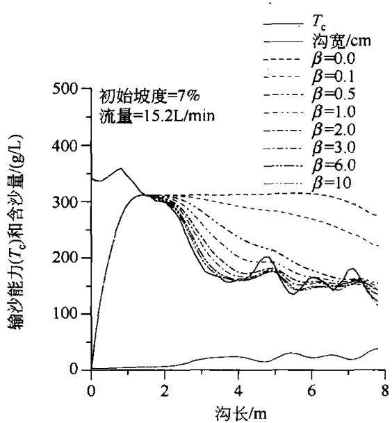  
图 5.2 不同 $\beta$ 值对含沙量的影响

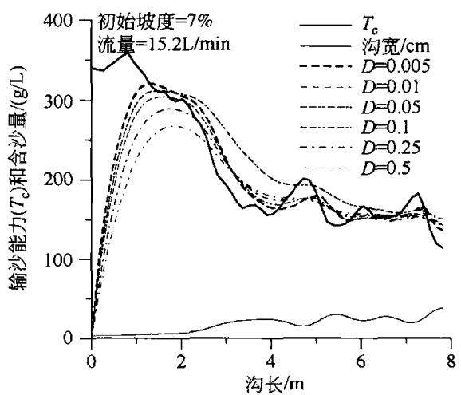  
图5.3 泥沙水动力扩散系数 $( D _ { \mathtt { H } } )$ 对泥沙含量的影响

## 5.3 细沟沟床的瞬态演变模拟结果与检验

## 5.3.1 细沟宽度和沟床坡度不随时间、空间变化

在此工况中，不存在土壤剥离、沟床形态变化和水力特性参数间的互反馈。这一工况是迄今为止土壤侵蚀模拟中一直采用的情况(Nearing et al.,1989; Nearing et al.,1990;Morgan et al.,1992;Morgan,1995)。当把流量恒定的水流引入细沟一段时间后，模拟的水深与流速均为常量并均匀分布。因此输沙能力也是均匀不变的，如图5.4所示。泥沙含量向坡下逐渐增加，最终趋于输沙能力，同时剥蚀率沿沟长随水流中泥沙含量的增加逐渐减少(图5.5)。这就说明，沿沟长剥蚀率不是均匀分布的，原因是由于如雷廷武等所讨论的水流含沙量及土壤剥离的互反馈影响，该关系为：输沙能力一定时剥蚀率与泥沙含量成反比。于是，一段时间后，细沟沟床上游被侵蚀的土壤比下游多，如图5.6所示。这显然不符合土壤侵蚀的实际情况。这就揭示了现有细沟侵蚀模型中不考虑沟床在侵蚀过程中随进程而演变的本质，这正是现有模型的缺陷与局限。

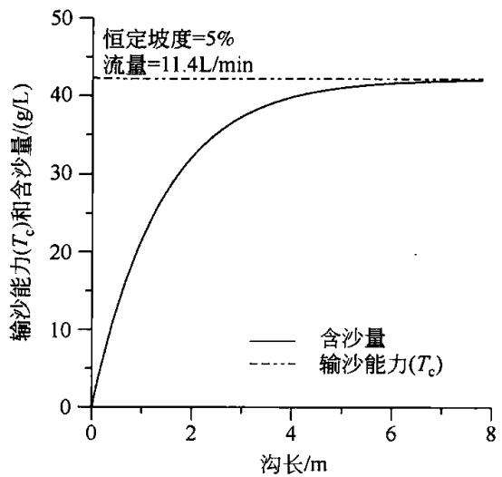  
图5.4 无反馈时输沙能力随沟长的关系

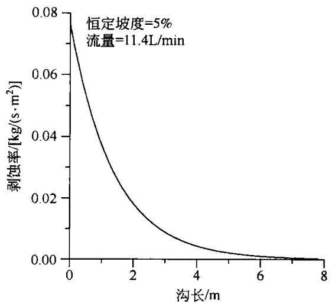  
图5.5 沟宽/沟坡均匀不变剥蚀率随沟长的变化

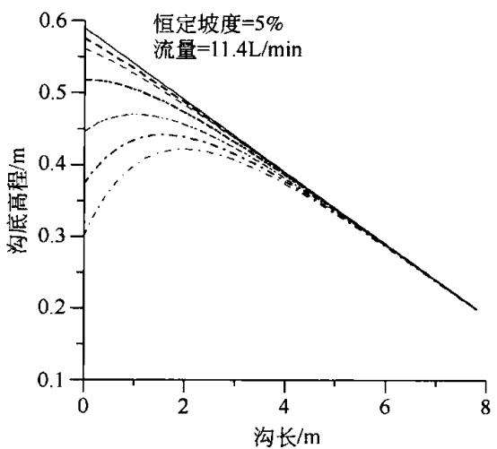  
图5.6 无反馈、沟宽/沟坡均匀不变时沟底高程随沟长及时间的变化

## 5.3.2 细沟宽度不随时间变化、空间均匀，坡度随时间变化、空间非均匀

该工况考虑了剥离沉积-沟床坡度-细沟水力特征-剥蚀率的相互连锁影响。然而，该工况并没有考虑水流宽度随时间和空间的变化。开始时，输沙能力、剥蚀率、沟床坡度与前一工况相同(图5.7)。输沙能力沿沟长为常量[图5.7(a)]，剥蚀率的最大值在引入清水的最上游端，随着坡长变化到沟尾时的值很小[图5.7(b)]，并且沟坡随时间、空间为非均匀变化[图5.7(c)]。随着侵蚀的发展，沟床在近上游端坡度逐渐变得平坦，并且这种坡度平坦范围随时间向下游延伸扩展。这就引起了水流水力特性的相应变化并同时使输沙能力[图5.7(a)]及土壤剥蚀率沿沟长发生了变化[图5.7(b)]。尽管在细沟侵蚀发生的初始阶段土壤的剥蚀率沿沟长有很大的差异，但83min后(此工况中)剥蚀率沿沟长变得较为均一。

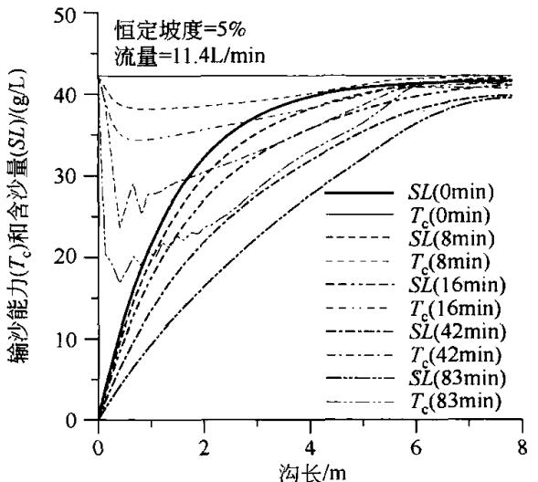  
(a) 输沙能力随沟长的变化

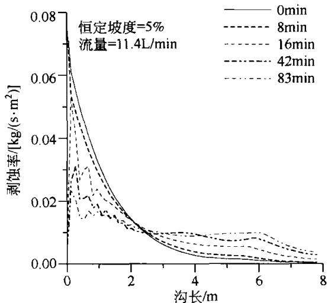  
(b) 剥蚀率与沟长的关系

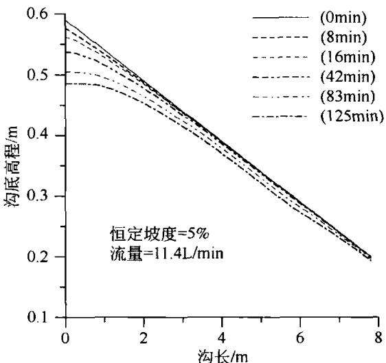  
(c) 沟底高程随沟长的演变  
图5.7 均匀不变沟宽、时变、非均匀坡度时输沙能力、剥蚀率、沟底高程随沟长及时间的变化

## 5.3.3 时间不变但空间非均匀宽度及时变与空间非均匀坡度

在此工况中，沟宽在时间上保持为常量，但空间上非均匀。采用试验测得的沟宽沿沟长的变化。这一工况用于说明细沟水流特性和细沟形态相对细沟侵蚀动态过程影响的复杂性以及细沟侵蚀空间变异的实际物理过程。由于沿沟长水流水力特性的变化，引起了侵蚀沿沟长的非均匀分布和随时间的变化，导致的沟床高程变化，细沟形态不断演变。可由剥离与沉积的结果来计算坡度的变化。

由3个坡度所得的结果分别见图5.8(流量：11.4L/min;坡度：3%)、图5.9(流量：11.4L/min;坡度：5%)、图5.10(流量：11.4L/min;坡度：7%)。输沙能力作为沟宽的函数初始时变化极大，随后随着沟宽及局部坡度变化而变化[图5.8(a)、图5.9(a)、图5.10(a)]。细沟窄的部分输沙能力较大，反之则相反。由5%坡度的结果可知，输沙能力在1.5\~2.0m的沟长范围内由大约 $2 1 0 \mathbf { k g } / \mathbf { m } ^ { 3 }$ 降低到 $7 0 \mathbf { k g } / \mathbf { m } ^ { 3 }$ (约为原来的1/3)

[图5.9(a)]。对于3%坡度的情况，变化更急剧(图5.8a)，但变化幅度则少于7%的坡度。

泥沙含量总是与输沙能力紧密相关，但有所滞后。泥沙含量曲线相对于输沙能力曲线有所衰减，泥沙含量变化不像输沙能力的变化那么快。原因是，剥离与沉积值是输沙能力与泥沙含量之间差异的一阶函数，沉积是要经过一段时间才能完成，还有一个因素是泥沙的扩散。尽管在5%坡度时，输沙能力在 $1 . 5 \sim 2 . 0 \mathrm { m }$ 的沟长范围内降低到原来的1/3.但是泥沙含量在大致相当的距离内仅由 $1 6 0 \mathbf { k g / m } ^ { 3 }$ 降低到 $1 2 0 \mathbf { k g } / \mathbf { m } ^ { 3 }$

与输沙能力和泥沙含量波动相联系的是，细沟侵蚀也在剥离与沉积之间交替转化$\left[ \begin{array} { l } { \left| \gtrapprox \right| 5 . 8 \left( \mathbf { a } \right) , 5 . 9 \left( \mathbf { a } \right) , 5 . 1 0 \left( \mathbf { a } \right) \right] } \end{array}$ 。在土槽试验中已经明显地观察到了这一现象。细沟窄的部分显然经历着冲刷，而较宽的部位则有沉积发生，两种现象沿沟长交替发生。沟宽为空间均匀时不存在这种现象，沿沟长也就不会有净沉积[图5.5及图5.7(b)]。

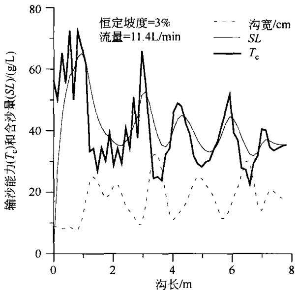  
(a) 输沙能力随沟长的变化

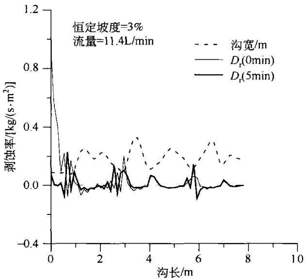  
(b) 剥蚀率与沟长的关系

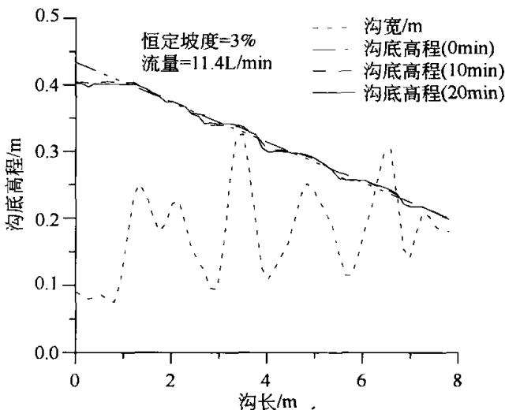  
(c)沟底高程随沟长的演变  
图5.8 时不变非均匀沟宽、时变非均匀坡度的输沙能力、剥蚀率、沟底随沟长及时间的变化

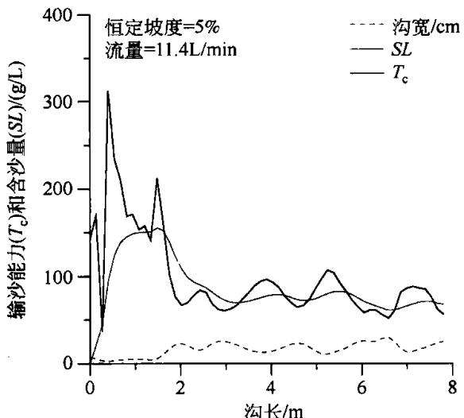  
(a) 输沙能力随沟长的变化

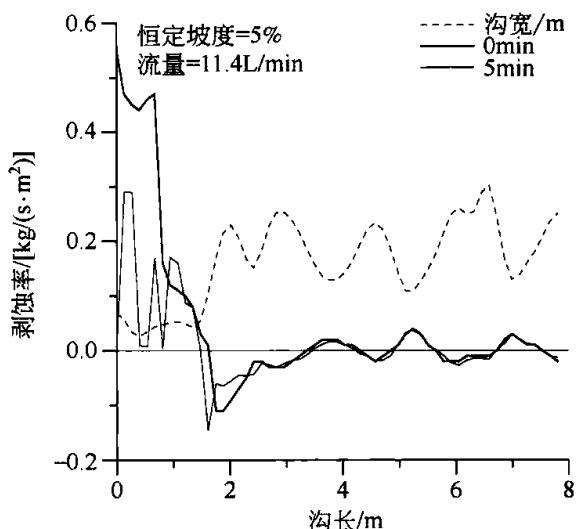  
(b) 剥蚀与沟长的关系

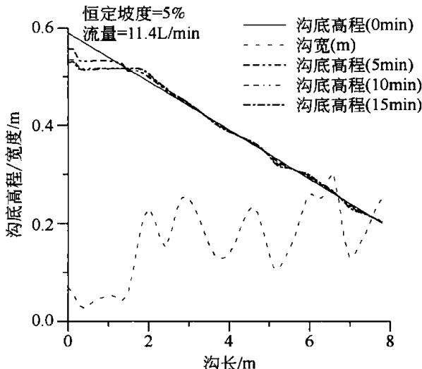  
(c) 沟底高程随沟长的演变  
图5.9时不变非均匀沟宽、时变非均匀坡度的输沙能力、剥蚀率、沟底随沟长及时间的变化

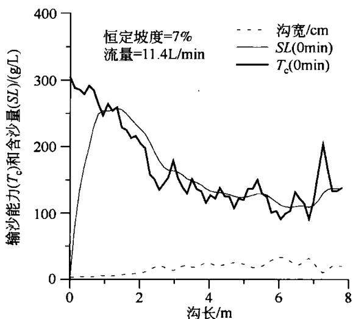  
(a) 输沙能力随沟长的变化

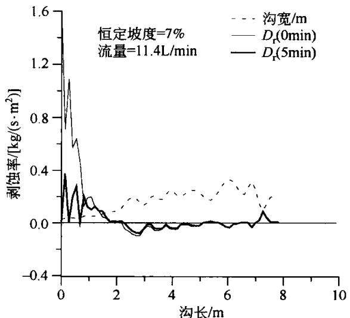  
(b) 剥蚀与沟长的关系

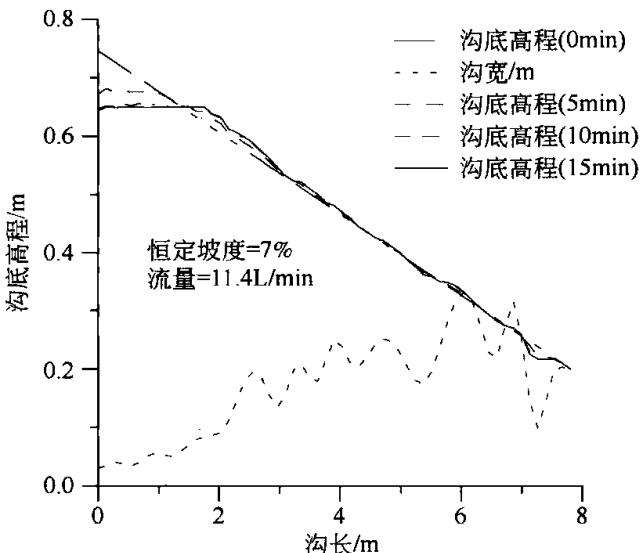  
(c)沟底高程随沟长的演变  
图5.10 时不变非均匀沟宽、时变非均匀坡度的输沙能力、剥蚀率、沟底随沟长及时间的变化

## 5.3.4 时变及空间非均匀变化的沟宽和沟床坡度

该工况考虑更为复杂的情况，沉积区段内泥沙沉积到沟床上致使细沟得以扩宽。泥沙的沉积会增加沟宽，进而降低流速、水流深度和输沙能力，接着沉积进一步加剧。换句话说，一旦沉积区段出现，就会产生一种“自传播”的现象，但最终受最小水深的限制。在此，尝试了模拟沟宽在泥沙沉积影响下的演变。结果示于图5.11(a)、(b)、(c)(分别为11.4L/min,3%、5%、7%的坡度)。初始沟宽为在上述工况中试验测得的值，然后随着泥沙沉积开始演变。在泥沙沉积段计算所得沟宽是增大的，从模拟计算上分析了沉积后细沟加宽这一观点。

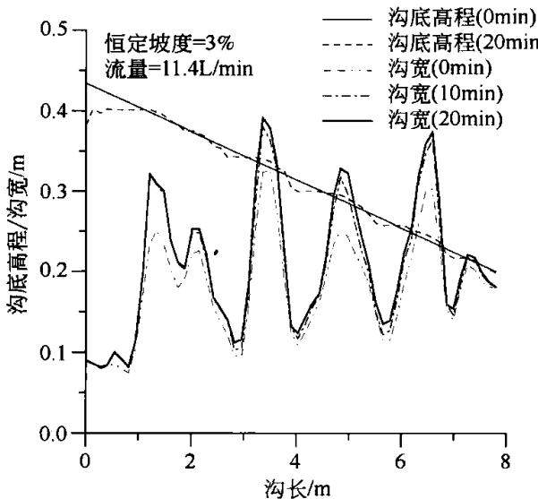  
(a) 沟底随沟长的演变

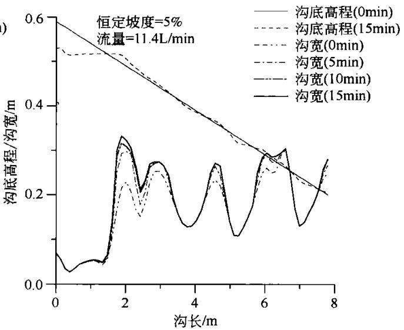  
(b) 沟底随沟长的演变

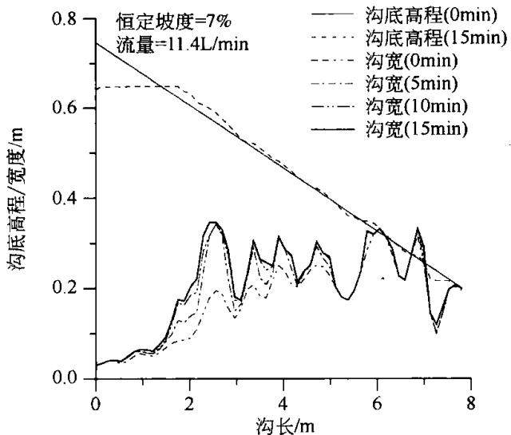  
(c)沟底高程随沟长的演变  
图5.11 时变非均匀沟宽不同初始坡度时沟宽和沟底高程随沟长及时间的演变

该模型中细沟加宽的原则限定于沉积区域的加宽现象，但得到的结果是令人鼓舞的。尚需做进一步深入的研究，以便更好地阐明细沟加宽的约束条件，特别是“细沟再生”的过程，从而描述沉积区域下游细沟的发展。

## 5.3.5 细沟沟床的瞬态演变模拟结果检验

只对时不变、非均匀沟宽、均匀坡度情况下的试验观测与模拟结果进行了对比。这样做的原因是，目前技术上仅能记录“瞬时”的试验结果。选择细沟产生后短时间内的数据进行比较，是因为此时的试验条件比较清晰和可以控制。

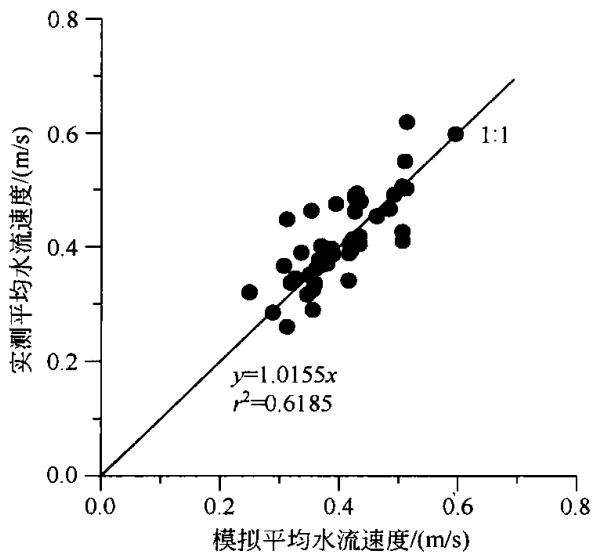  
图5.12 模拟与实测平均水流速度的比较

速度为5个长度相等的沟段内测得的平均值，泥沙含量为每个处理2\~3个样本的平均值。速度的模拟值和实测值对比结果如图5.12所示。回归分析得出，实测速度等于模拟速度的1.0155倍。也就是说，平均而言，测量得到的速度较模拟得到的速度高1.15%，确定系数 $\scriptstyle ( R ^ { 2 } )$ 为0.6185。

如表5.3所示，坡度越陡，出口处的泥沙含量越高，在3%坡度时 $\left( A = 0 . 0 1 \right)$ 明显低于5%坡度的值，同样5%坡度时显著地低于7%坡度的值。相同坡度下，各工况出口处(计算与测量所得)的泥沙含量随流量的增加而增加。下列工况下泥沙含量没有显著差异：①3%坡度时，11.4L/min与15.2L/min流

量之间；②5%坡度时，三种流量之间；③7%坡度时，11.4L/min与15.2L/min流量之间。这些结果无论对试验还是模拟都一样。这表明，坡度因素比流量因素对泥沙输送的影响更大，入口处流量对出口处泥沙含量没有决定性的影响。相反，细沟的下游段宽度变化的随机性决定着细沟内水流的水力特性参数(如水深、流速或单宽流量值)变化和泥沙的剥离与输送过程的交替，对出口处的泥沙含量有着决定性的影响。

对于泥沙含量，模拟数据与实测数据的相关性很好(图5.13)，确定系数为0.9539。然而，模拟得到的数据明显地低于实测量值。图5.13显示的输沙能力值是直接用水流功率函数求得的(雷廷武等，2004），模拟所得泥沙含量与输沙能力量值接近。产生这样问题的可能原因讨论如下。首先，在细沟较长的情况下，出口处的泥沙含量主要受

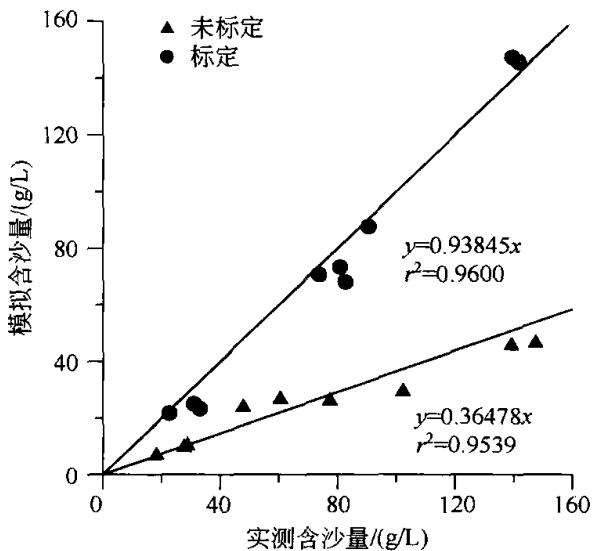  
图5.13 标定与未标定时泥沙含量与实测值的比较

到水流输沙能力的限制，但是由试验数据得到的对数函数形式的输沙能力变差很大，导致含沙量计算值与实测值间较大的差异。二是，所采用的输沙能力函数是以较短土槽(3m)试验数据计算得到的，较长的细沟在其下游段(或中间)剥蚀更宽，细沟的形态很不确定。在实际的细沟中分布有一些更细小、更深的跌坎，在这些局部细小的跌坎处，水深较整个宽度的平均值大一些，流速高于平均值，从而具有较高的输沙能力，所以水流能挟带比平均的水力变量函数所计算的值更多一些的泥沙。以上分析的两个因素是造成实测的泥沙量值较模拟值高的主要原因。因此，对于不同的土壤类型和沟长，输沙能力可能需要作相应的调整。

由于上述提到的原因，对输沙能力作了标定。采用标定后的输沙能力函数所得的模拟结果与实测结果的关系及回归直线也示于图5.13。该图显示两组数据吻合非常好。计算的泥沙含量为测量值的0.93845倍，确定系数为0.9600。这些结果证明，尽管这些试验的沟长不同于输沙能力函数推求时使用的沟长，但这些函数使用效果良好，说明该函数在一定程度上揭示了细沟剥离和输送的一些本质特性。

表5.3 标定与未标定时模拟泥沙含量与实测值的比较
<table><tr><td colspan="1" rowspan="1">流速 $\diagup ( \mathbf { m } \cdot \mathbf { s } )$ </td><td colspan="1" rowspan="1">坡度/%</td><td colspan="1" rowspan="1">未标定值 $\mathbf { c } / ( \mathbf { g } \cdot \mathbf { L } )$ </td><td colspan="1" rowspan="1">标定值 $\mathbf { c } / ( \mathbf { g } \cdot \mathrm { L } )$ </td><td colspan="1" rowspan="1">实测值 $\mathbf { c } / ( \mathbf { g } \cdot \mathbf { L } )$ </td></tr><tr><td colspan="1" rowspan="1">7.6</td><td colspan="1" rowspan="1">3</td><td colspan="1" rowspan="1">8.43</td><td colspan="1" rowspan="1">19.77</td><td colspan="1" rowspan="1">18.20</td></tr><tr><td colspan="1" rowspan="1">11.4</td><td colspan="1" rowspan="1">3</td><td colspan="1" rowspan="1">12.34</td><td colspan="1" rowspan="1">31.45</td><td colspan="1" rowspan="1">28.70</td></tr><tr><td colspan="1" rowspan="1">5.2</td><td colspan="1" rowspan="1">3</td><td colspan="1" rowspan="1">12.71</td><td colspan="1" rowspan="1">32.59</td><td colspan="1" rowspan="1">27.60</td></tr><tr><td colspan="1" rowspan="1">7.6</td><td colspan="1" rowspan="1">5</td><td colspan="1" rowspan="1">21.74</td><td colspan="1" rowspan="1">59.63</td><td colspan="1" rowspan="1">54.78</td></tr><tr><td colspan="1" rowspan="1">11.4</td><td colspan="1" rowspan="1">5</td><td colspan="1" rowspan="1">27.27</td><td colspan="1" rowspan="1">68.62</td><td colspan="1" rowspan="1">60.45</td></tr><tr><td colspan="1" rowspan="1">15.2</td><td colspan="1" rowspan="1">5</td><td colspan="1" rowspan="1">29.62</td><td colspan="1" rowspan="1">76.85</td><td colspan="1" rowspan="1">81.00</td></tr><tr><td colspan="1" rowspan="1">流速/(m·s)</td><td colspan="1" rowspan="1">坡度/%</td><td colspan="1" rowspan="1">未标定值c/(g·L)</td><td colspan="1" rowspan="1">标定值c/(g·L)</td><td colspan="1" rowspan="1">实测值 c/(g·L)</td></tr><tr><td colspan="1" rowspan="1">7.6</td><td colspan="1" rowspan="1">7</td><td colspan="1" rowspan="1">29.57</td><td colspan="1" rowspan="1">79.18</td><td colspan="1" rowspan="1">102.25</td></tr><tr><td colspan="1" rowspan="1">11.4</td><td colspan="1" rowspan="1">7</td><td colspan="1" rowspan="1">55.50</td><td colspan="1" rowspan="1">139.21</td><td colspan="1" rowspan="1">147.52</td></tr><tr><td colspan="1" rowspan="1">15.2</td><td colspan="1" rowspan="1">7</td><td colspan="1" rowspan="1">48.34</td><td colspan="1" rowspan="1">130.74</td><td colspan="1" rowspan="1">139.30</td></tr></table>

泥沙含量波动及其意义：受沟宽的影响，泥沙含量除随时间变化外，还会沿沟长波动。由(时不变/非均匀宽度细沟模拟所得的输沙能力一水流含沙量)图可见，即使在离细沟出口1\~2m范围内，泥沙含量的波动依然很容易达到30%。这就说明，细沟出口处的泥沙含量值不可避免地会有很大变差，很大程度上取决于出口部分细沟形态的随机性。这也意味着，要比较试验数据是很困难的。出口部分细沟的宽度在除坡度与流量这两个因素之外起着很重要的作用。

在细沟宽度和坡度均不随时间变化，且在空间上均匀分布条件下，输沙能力不随时间变化且随沟长是均匀的。泥沙含量随沟长增加，但增加速率逐渐下降。在细沟的上游端，土壤剥蚀率最高、高程变化也最大。结果导致，在实际中均匀坡度是无法保持下去的。当考虑到高程和坡度的演变时，输沙能力随时间降低，上游段减低幅度较下游段更甚。泥沙含量由于受输沙能力的限制，也相应地降低。剥蚀率的变化表现为上游段的量值下降，而下游段的量值增加。细沟上游段的累积剥蚀量较高，使得细沟沟坡变缓。上游段高程的变化速率下降，下游段变化速率增加。

当沟宽变化时，沟宽较窄的部分具有更大的输沙能力，在较宽的部分具有较小的输沙能力。泥沙含量总是紧紧跟踪输沙能力的变化趋势，可能高于输沙能力也可能低于输沙能力。当水流中的输沙能力降低时，沉积过程发生。同样沟宽时，处在细沟上游的一点将比处在下游的一点具有更高的剥蚀率。随着细沟的演化，将会有更为复杂的剥蚀发生。细沟窄的部分因剥离而高程降低，细沟宽处可能由于泥沙的沉积而增高。

由于沉积过程的作用，会发生沟宽的演变，继而引起进一步的沉积，导致细沟较宽的部分变得更宽。如何更好地模拟细沟的变宽和变窄，需进一步研究。

由不同细沟段平均得到的流速表明，模拟结果与实测结果吻合较好。模拟所得的泥沙含量与实测结果相关性很好，当标定后可以进行预报。模拟与实测结果都说明，沟床坡度对出口处的泥沙含量具有很大的影响，而较高的流量并不一定产生更高的出口含沙量，主要受水流输沙能力的制约。

## 第6章 细沟侵蚀传统实验方法及其局限

细沟是地面上的一条水流通道，同时兼备坡地上侵蚀产沙源和输沙通道的功能。细沟变化活跃的地方侵蚀量一般比较大(Ellison, 1947; Foster et al.,1984; Nearing et al.，1989;Nearing et al.,1997)。细沟中的集中水流是从地表剥离土粒的原动力，同时也是输沙的载体(Lei et al.,1998;Nearing et al.,1998)。细沟中水流深度通常为厘米量级或更浅，沟坡通常很陡。这就使得侵蚀细沟内的水力学特性与溪流、河流及洋流有很大的不同。

细沟侵蚀中常用的水力学参数为入流量(Meyer et al.,1975a,1975b)、剪切应力(Fos-ter,1984;Nearing et al.,1997)、水流功率(Rose et al.,1983a,1983b) 及单位水流功率(Moore and Burch，1986)。这些变量大多是从溪流和河流输沙研究中借用过来的。坡度对细沟中水流速度的影响一直是具有争议性的问题。Rauws(1988)的数据表明，在粗糙的表面上流速随坡度增加而增加，但增加的程度不如光滑的表面。Foster等(1984)及Abrahams等（1996)的非可蚀性、稳定细沟试验表明，流速随坡度增加。然而，Govers(1992)的研究表明，对于一条侵蚀细沟来说，流速不受沟坡影响，Govers认为坡度大时侵蚀增加土壤表面糙度相应地增加，从而流速并不随坡度增加而增大。

## 6.1 试验方法

为了研究细沟沟长、坡度和入流量对流速、沟宽、径流含沙量和输沙能力的影响，以及变量之间的函数关系，设计并分析了不同水动力条件下不同沟长细沟的侵蚀产沙规律。根据不同沟长所测得的产沙结果，估计水流含沙达到输沙能力的采样长度。由于试验中观察到沟宽具有周期变化的形态，研究了其变化特征，并将其用于进一步确认水流输沙能力的采样长度。总共进行了64次试验，试验土壤为砂壤土。试验所采用的水槽长约8m，宽0.6m，可精确地调节到所需坡度。试验所用土壤为Cecil土壤（一种砂壤土），颗粒分析结果为:砂粒含量65.6%，粉粒19.6%，黏粒14.8%。砂粒为石英混合物，在洗除粉粒和黏粒后平均直径约为0.33mm。土壤经风干过筛后均匀装人水槽，厚20cm。为了让水流(细沟)处于水槽的中间以尽可能降低槽壁对水流的影响，地表作成略带“V”形。试验前将土壤饱和24h。试验时，将水槽调节到所期望的坡度。在水槽的上游端放入给定流量的清洁水。细沟产生后，水流稳定时开始进行测量记录。

试验采用4种沟坡：1%,3%,5%及7%;4种入流量：3.8L/min，7.6L/min，11.4L/min及15.2L/min。在给定坡度及入流量条件下，试验由水槽全长(1/1)开始，然后将入水口向下游移到水槽的一半处(1/2)，进一步下移至1/4和1/8水槽长度处。

在水槽骨架上每间距30cm作上标记，分别标明数字1\~27。这些标记为测量沟宽及流速的长度坐标，用直尺测量沟宽。1/1水槽长度测量27个宽度，1/2长度测量15个宽度，1/4长度测量7个宽度，1/8长度测量4个宽度。流速测量：1/1长度测量5个连续段，1/2长度2\~3个,1/4和1/8长度1个，每段长为1.5m或当受到沟长限制时短一些。测量在标记1\~6,6\~11，11\~16，16\~21及21\~26之间进行。流速测量采用荧光染料(King and Norton,1992)。在水槽的出水口收集含泥沙水，用于确定泥沙含量。每次试验取样2\~3个。

## 6.2 试验结果

## 6.2.1 泥沙含量与坡度及入流量的关系

将出口处测得的泥沙含量，作为沟坡(S,%)及入流量(Q，L/min)的函数，采用多元回归的方法进行分析。所采用的回归函数为

$$
S _ { \mathrm { c } } ~ = ~ k S ^ { m } Q ^ { n }\tag{6-1}
$$

式中， $S _ { \mathrm { c } }$ 为泥沙含量， $( \pmb { \mathrm { g } } / \mathbf { L }$ 或 $\mathbf { k g } / \mathbf { m } ^ { 3 } ) ; k , m , n$ 为待估计的经验参数。

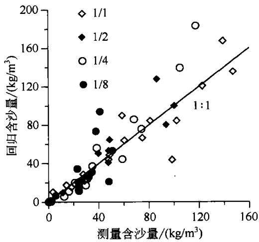  
图6.1 含沙量的测量值与回归值对比

对1/1.1/2,1/4,1/8水槽长度及所有不同长度的组合数据进行回归分析。m =1.7\~2.2,n$= 0 . 6 \sim 0 . 9 5$ (详细结果未列出)。测量的泥沙含量与由式(6-1)回归所得结果示于图6.1。

所有处理的相关系数都很高（从0.8到0.95).这表明式(6-1)适合于描述细沟侵蚀产沙。参数t-检验表明各处理m的置信水平大于99%，而各处理n的置信水平为95%或更高。这样高的参数显著度说明，细沟坡度S及入流量这两个变量在细沟侵蚀中都是很重要的。由回归结果来看，总体而言，侵蚀随坡度和入流量的增加而增加。泥沙含量几乎随坡度的增加成二次

增加 $\left( m \approx 2 \right)$ ，而随入流量略低于线性增长( $n < 1 \ )$ 。这就意味着坡度较入流量在侵蚀产沙量中起更重要的作用。

## 6.2.2 输沙能力与采样长度的关系

为了研究不同沟长条件下坡度和人流量对产沙的影响，将式(6-1)中的k设置为1后进行回归分析得出 $m = \ 1 . 7 \sim 2 . 2 , n = \ 0 . 3 \sim 0 . 5$ 。所有不同沟长水平的产沙量及所有沟长产沙量的组合都具有很高的相关系数，从0.82到0.93。此种情况下，所有各种沟长水平下的m值之间无显著差异，并显著地大于0，实际上再次得到约为2的结果。1/1及1/2长度的n值统计意义上是相同的。1/4及1/8长度沟的n值统计意义上显著不同，并目明显小于1/1及1/2长度的n值。m及n值的这种结果可作如下理解。对于该组试验中所使用的入流量及沟坡，细沟从1/2(4m)水槽长度增加到1/1(8m)水槽长度时，出口处的泥沙含量并无显著增加，这就隐含说明水流的含沙量在沟长小于1/2水槽长度时已达到最大值。该最大值可以当作水流的输沙能力对待。这就是说，1/2水槽长度(4m)就足以产生相当于水流输沙能力的含沙量。因为1/4(2m)及1/8(1m)水槽长度的细沟的n值明显地低于1/1或1/2水槽长度的细沟的n值，这就意味着1/4水槽长度的细沟用于确定水流的输沙能力似乎太短。总而言之，在所试验的入流量及坡度情况下，水流的输沙能力可用较1/4水槽长而较1/2水槽长度短(即2\~4m)的细沟来达到和确定。也就是说，在坡度1%\~7%、流量3.8\~15.2L/min时试验输沙能力的采样长度为2\~4m。

## 6.3 细沟沟宽与泥沙的波动

## 6.3.1 沟宽与坡度及入流量的关系

平均沟宽由沿沟长间隔30cm测得的数值确定。然后，采用几种不同的模型拟合沟宽与坡度及入流量间的定量关系，发现下列函数不仅简单，并且能很好地拟合试验数据。

$$
\pmb { W } = \pmb { a } + b \pmb { S } + c \pmb { Q }\tag{6-2}
$$

式中，W为平均沟宽(mm);a,b,c 为回归系数。

用式(6-2)对试验数据进行了回归。测量值与用式(6-2)回归的预测结果示于图6.2。所得结果表明式(6-2)能很好地拟合每一种沟长的宽度数据。1/1，1/2，1/4,1/8水槽长度的相关系数分别为0.92，0.90，0.88,0.83。t-检验表明参数b和c具有高度的显著性。这就表明，该函数适于预报平均细沟宽度；并且，由用该式回归所获得的参数可以认为坡度较入流量对沟宽的影响更大。

回归参数 $b = \mathrm { ~ - ~ } 3 8 \sim \mathrm { ~ - ~ } 1 3 , c = \mathrm { ~ 0 . ~ 3 ~ } \sim 0 . 5 _ { \mathrm { ~ c ~ } }$ 试验结果表明，随着坡度增加，平均沟宽减小；随着入流量的增加，沟宽增大。这与上述的产沙量结果相一致。因为产沙量随坡度呈二次增长，这就意味着坡越陡，剥离的土壤就越多。这就不可避免地产生更深更窄的细沟。而产沙量随入流量呈低于线性比例的增长，较大流量的人流将分布更广而产生较宽的细沟。

1/2 及1/4 水槽长度的 b 相同且不同于1/1及1/8长度的b值。1/1，1/2及1/4长度的c值相同，但不同于1/8沟长的值。这说明，由1/2(4m)到1/4(2m)沟长的细沟沟宽相同，能用相同的b和c进行预报。当沟长不在2 \~4 m之

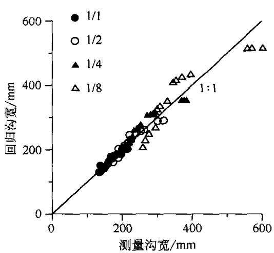  
图6.2 细沟宽度的测量值与回归值对比

间时，平均沟宽需用不同的参数预报。这与产沙量的结果相吻合。对于8m长的细沟(1/1水槽长度)，水流中的泥沙含量在上游的1/2或更短水槽长度达到水流的输沙能力，则在下游1/2或更长水槽长度内，土壤的剥离或者土粒的剥离与沉积交替发生。而在1/2\~1/4水槽长度内，主要为土粒的剥离过程。这可能就是不同沟长的细沟具有不同平均沟宽的原因。

## 6.3.2 细沟的周期性形态

试验中观察到细沟的宽度沿沟长呈某种周期宽窄变化。原因可能是侵蚀沟中土粒剥离与水流中过量泥沙沉积周期性变化的结果。提出了下列函数来模拟沟宽的这种变化：

$$
\begin{array} { c } { { W \dot { = } a _ { 0 } + a _ { 1 } x + a _ { 2 } x ^ { 2 } + a _ { 3 } \mathrm { s i n } ( T x ) + a _ { 4 } x \mathrm { s i n } ( T x ) } } \\ { { { } } } \\ { { + a _ { 5 } \mathrm { c o s } ( T x ) + a _ { 6 } x \mathrm { c o s } ( T x ) + a _ { 7 } \mathrm { s i n } ( 2 T x ) + a _ { 8 } \mathrm { c o s } ( 2 T x ) } } \end{array}\tag{6-3}
$$

式中，W为沿沟长固定位置的沟宽(mm)；x为由水流入口处开始指向坡下的距离(m)；$a _ { 0 } , a _ { 1 } , \cdots , a _ { 8 }$ 为待估参数；T为由一组试验数据用式(6-3)回归时使得相关系数最大的优化参数，同时也是与细沟周期性变化有关的参数。

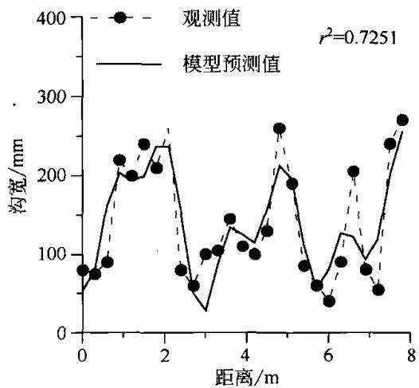  
图6.3 细沟沟宽形态：  
S =3% ,Q =3.8L/min

将全沟长的14组沟宽数据，即1%坡度与11.4及 15.2L/min(2 组);3%,5%,7%坡度与3.8L/min,7.6L/min, 11.4L/min, 15.2L/min(12组)，用于回归分析。每组数据包括26个沟宽数据点。由式(6-3)获得了回归系数 $a _ { 0 } , a _ { 1 } , \cdots , a _ { 8 }$ 并对参数进行了t-检验以检验其显著性，相关系数为0.6\~0.9。试验结果表明：①细沟的宽窄变化有一定的周期性；②所提出的函数能鉴别出这种周期性形态。典型的沟宽测量数据及由回归模型预报的结果如图6.3所示(3%，3.8L/min)。

式(6-3)中的T值决定了沟宽的周期性形式。回归优化过程中所得到的T值，由T值可以确定出沟宽重复其形态的长度

$$
\Delta x \ = { \frac { 2 \pi } { T } }\tag{6-4}
$$

由不同处理的T求得的 $\Delta \ v { x }$ 如表6.1所示。表 ${ \bf 6 . }$ 1说明，相同坡度条件下， $\Delta x$ 随人流量增加而增大；相同入流量条件下，Δx随坡度增大而增大。试验过程的确存在这种现象。更重要的是，这些现象揭示了确定测量水流输沙能力的采样长度的可能性。可以作出合理的假定，即沟宽的变化与发生在沟内的土壤剥离与沉积紧密相关。在该系列试验条件下，最大的可能是由于水流中泥沙的沉积使得沟变宽。而在沉积位置下游的土壤剥离则为细沟变窄的原因。如果含在水流中的泥沙开始沉积，则表明水流中的泥沙含量必定至少达到了水流的输沙能力。因此，沟宽重复其形态的长度可以解释为，就是在这一长度时，泥沙含量达到或超过了其最大可能值，或者说达到了水流的输沙能力。如此，长度 $\Delta \ v { x }$ 事实上代表了确定输沙能力的长度。根据上述讨论，在坡度1%\~7%、流量3.8\~15.2L/min时不同工况条件下的水流在2\~4m间达到了输沙能力。这再次说明，可以用一个4m长的水槽来测量水流的输沙能力。但是，随着沟坡变陡，可能需要更长的水槽。

表 6.1 沟宽周期性形态的 Δr 值
<table><tr><td>流量(L/min)</td><td>1%</td><td>3%</td><td>5%</td><td>7%</td></tr><tr><td>3.8</td><td>*</td><td>2.830</td><td>3.142</td><td>2.922</td></tr><tr><td>7.6</td><td>*</td><td>2.732</td><td>3.222</td><td>3.342</td></tr><tr><td>11.4</td><td>3.977</td><td>3.157</td><td>3.524</td><td>3.927</td></tr><tr><td>15.2</td><td>2.940</td><td>3.491</td><td>3.973</td><td>4.189</td></tr></table>

## 6.3.3 流速与坡度及流量的关系

平均速度由沿沟长观测到的5个数据(1/1长度)或3个数据(1/2长度)或2个数据(1/4长度)计算得到。对于4种坡度：1%，3%，5%，7%及4种入流量：3.8L/min，7.6L/min,11.4L/min,15.2L/min分别计算。用下面的回归模型进行流速回归分析(Chow, 1959)

$$
V = A S ^ { 1 . 2 } Q ^ { c }\tag{6-5}
$$

式中，V为平均速度(m/s)，A,C为回归系数。

将该模型的回归结果与下列模型进行比较：

$$
V = A _ { 1 } S ^ { B _ { 1 } } Q ^ { c _ { 1 } }\tag{6-6}
$$

式中 ${ \mathcal { A } } _ { 1 } , { \mathcal { B } } _ { 1 } , { \mathcal { C } } _ { 1 }$ 为平均速度的回归系数。

用式(6-5)及式(6-6)回归的相关系数对于不同处理分别为0.66\~0.78与0.65\~0.85。

回归参数表明由式(6-6)得到的 $B _ { 1 }$ 与式(6-5)中的1/2显著不同。实际上， $B _ { 1 }$ 的值约为1/2的一半。这表明与土壤侵蚀相关联的坡面浅水流与明渠流及河流有很大的差异。通常， $B _ { 1 }$ 随沟长增加而增加。但是其值似乎在1/2(4m)长度之前稳定下来。同时回归结果还表明，流速随沟长增长;坡度的影响在1/2(4m)长度之前开始减弱。侵蚀细沟中其上游段坡度对速度有影响，其影响随着沟长或水流中泥沙含量的增加而降低。这一结果某种意义上介于Abrahams等(1996)与Govers(1992)的结果之间。前者认为流速随坡度增加，而后者则得到流速不受沟床坡度影响的试验结果。 $C _ { 1 }$ 不断随沟长增长而变大表明流速一直随沟长增长而增大。这就说明，在该系列试验中一定流量下，流速在1/2长度(4m)前达到最大。受坡度和入流量影响的水流中泥沙含量也同时达到最大。但另一方面，在给定坡度下，水流受入流量的影响不断加速，不同长度的细沟水流最大流速不同。流速测量结果与回归结果的对比如图6.4所示。

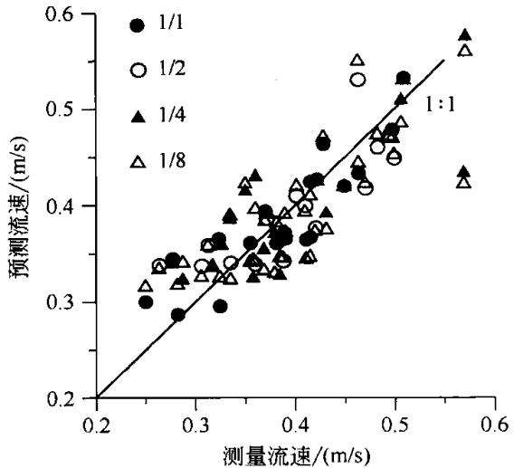  
图6.4 流速测量结果与回归结果对比

## 6.4 传统试验方法的局限性

进行了一系列(64个）试验，试验包括的坡度为1%，3%，5%，7%；入流量为：3.8L/min,7.6L/min,11.4L/min,15.2L/min；长度分别为一个8m长水槽的1/1,1/2，1/4,1/8。试验结果分析得出下列结论：①沟床坡度S及入流量Q在细沟侵蚀产沙中都很重要。产沙随入流量及坡度增加而增加，但坡度对产沙的影响比入流量更大。②泥沙含量在1/2水槽长度或更短时达到最大。在该试验的入流量与坡度范围内，确定出输沙能力的采样长度为1/2\~1/4水槽长度，即2\~4m。③平均沟宽随坡度增加而减小，随入流量增大而增加。原因是产沙随坡度的增长快于随入流量的增长。④细沟宽度形态变化分析表明沟宽沿沟长呈周期性的变化。沟宽形态重复其形态的长度随入流量的增加和坡度的增加而增长。⑤沟宽形态变化分析进一步揭示，输沙能力的采样长度为1/2\~1/4水槽长度，即2\~4m。⑥坡面上的浅水水流确实与明渠水流及河流水流不同。在该系列试验中,1/2\~1/4水槽长度时流速达到最大值(与水流中泥沙含量达到输沙能力的长度相同)，尽管该最大值可能因为入流量的不同而不同。

由细沟宽度形态变化分析表明沟宽沿沟长呈周期性变化，沟宽形态重复其形态的长度随入流量和坡度的增加而增长。由于细沟演变，泥沙剥蚀与沉积的不确定变化，造成水流剪切力和剥蚀率估计的困难和误差，因此应该采用限定性细沟、稳定水流的细沟侵蚀产沙过程估计长度为无限短的细沟剥蚀率，并以此作为最大土壤剥蚀率来估计土壤可蚀性参数是合理而有效的方法。

## 第7章 细沟侵蚀过程的系统实验方法

## 7.1 细沟侵蚀动态过程的概念

细沟侵蚀过程是细沟径流侵蚀力与细沟土壤可蚀性相互作用的一系列过程的集合。一般情况下，可以分为由侵蚀力造成的土壤颗粒剥蚀、输送与沉积过程。过程模型从概念上将坡面泥沙来源分为细沟侵蚀和细沟间侵蚀，并在此基础上开发了独立的细沟侵蚀方程和细沟间侵蚀方程。对于细沟间侵蚀，侵蚀主要由雨滴溅蚀引起，泥沙主要由雨滴扰动的浅层水流输运。对于细沟侵蚀，剥蚀和输送泥沙的主要动力是集中水流。

美国 WEPP 模型中的细沟侵蚀方程以 Foster和 Meyer(1972a,1972b)提出的剥蚀和输送耦合关系为基础，此关系式代表的物理意义是剥蚀或沉积率 $D _ { \mathrm { r } }$ 与输沙能力 $T _ { \mathrm { c } }$ 和输沙量 $\pmb { q _ { \mathrm { s } } }$ 的差值成正比，即

$$
\smash {  { D _ { \mathrm { r } } } =  { \alpha } ( T _ { \mathrm { c } } - q _ { \mathrm { s } } ) }\tag{7-1}
$$

式中， $\pmb { \alpha }$ 是常数。此关系式最初用于描述输沙量大于输沙能力时悬移泥沙的沉降过程，这意味着当水流中泥沙含量没有达到输沙能力时，水流将对细沟床面的泥沙产生冲刷。后来，Foster和Meyer将此关系式与土壤侵蚀直接联系起来，但是Foster于1982年提出因为缺乏设计合理的实验验证，此方程是否可以直接用于土壤侵蚀缺乏证实。

细沟侵蚀的剥蚀过程、输移过程以及沉降过程是相互独立又相互联系、相互依赖而又相互矛盾的过程。假定坡面流过程是一准恒定过程，那么坡面径流剥蚀土粒在水流中的变化过程也是一个准恒定过程，并且满足质量平衡和连续变化规律，可以用质量平衡和过程连续性得出的微分方程来描述坡面侵蚀过程

$$
\frac { \partial \big ( c q \big ) } { \partial x } + \frac { \partial \big ( c h \big ) } { \partial t } = D _ { \mathrm { r } } + D _ { i }\tag{7-2}
$$

式中， $\pmb { c }$ 为泥沙含量 $( \mathbf { k g } / \mathbf { m } ^ { 3 } )$ ；q为单位宽度径流流量 $( { \mathfrak { m } } ^ { 2 } / { \mathfrak { s } } ) \colon { \mathfrak { x } }$ 为径流流经的距离(m)：h 为径流深(m)；t 为时间(s)； $D _ { \mathbf { r } }$ 为单位时间、单位面积内的细沟侵蚀量 $\left[ \mathbf { k g } / ( \mathbf { s } \cdot \mathbf { m } ^ { 2 } ) \right]$ 即细沟剥蚀率； $D _ { i }$ 为单位时间、单位面积内的细沟间侵蚀量 $[ \mathbf { k g } / ( \mathbf { s } \cdot \mathbf { m } ^ { 2 } ) ]$ ，即细沟间剥蚀率。当坡面侵蚀以冲刷为主导因素，基于准恒定过程的假定，可以从坡面侵蚀泥沙连续方程式中除去时间因素，对距离进行积分可得到细沟侵蚀量方程。泥沙质量平衡方程是坡面水蚀物理模型发展的起点。如果省略了关于时间的偏微分项，那方程就用于稳定态(简称为定态)，反之，就是动态模型。

将 Foster提出的耦合关系式代入方程，将 $\smash { D _ { s } } ~ = ~ \alpha T _ { s }$ 定义为剥蚀能力，则方程变为

$$
\frac { \mathrm { d } q _ { \mathrm { s } } } { \mathrm { d } x } = D _ { \mathrm { c } } \big ( 1 - \frac { q _ { \mathrm { s } } } { T _ { \mathrm { c } } } \big ) + D _ { i }\tag{7-3}
$$

式中， $T _ { \mathrm { c } }$ 是输沙能力 $[ \mathbf { k g } / ( \mathbf { s } \cdot \mathbf { m } ) ] , q _ { \mathrm { s } } = c q$ 。从以上方程得知，当 $q _ { \mathrm { ~ s ~ } } = 0$ 时， $D _ { \mathrm { ~ r ~ } } = D _ { \mathrm { ~ c ~ } }$ ，且当 q. 增加时 $\pmb { q _ { \mathrm { s } } }$ $D _ { \mathfrak { r } }$ 减小。泥沙剥蚀耦合概念也就是泥沙反馈关系式，其表达形式如下：

$$
\frac { D _ { \mathrm { r } } } { D _ { \mathrm { c } } } + \frac { q _ { \mathrm { s } } } { T _ { \mathrm { c } } } = 1\tag{7-4}
$$

细沟剥蚀能力是指单位时间、单位长度细沟中径流剥蚀搬运土壤颗粒的能力。早在20世纪60年代，Meyer借鉴河流泥沙运动研究中的成果，认为土粒启动是受水流剪切力作用的结果，并提出了坡面水流剥蚀能力的计算公式

$$
\smash {  { D _ { \mathrm { c } } } = K _ { \mathrm { r } } ( \tau - \tau _ { \mathrm { c } } ) ^ { \alpha } }\tag{7-5}
$$

式中 $K _ { \mathrm { r } }$ 为细沟可蚀性参数，与土壤类型有关的参量，当土壤类型不同时有显著不同； $\boldsymbol { \tau }$ 为作用在单位面积上的水流剪切力；7。为床面泥沙启动的临界剪切力； ${ \mathrm { ~ \it ~  ~ } } _ { \mathrm { ~  ~ } }$ $\pmb { \alpha }$ 为一常数。随后，又有许多学者在此基础上对不同的土壤进行研究，探讨了公式中有关参数的变化，证实了水流剪切力与细沟剥蚀能力之间的关系基本符合Meyer提出的简化公式，且已有研究表明水流剪切力与细沟剥蚀能力之间符合简单的线性关系。在WEPP模型中，取 $\pmb { \alpha }$ 为1，细沟剥蚀能力近一步扩展并与水力剪切剥蚀概念结合

$$
\smash {  { D _ { \mathrm { c } } } = K _ { \mathrm { r } } ( \tau - \tau _ { \mathrm { c } } ) }\tag{7-6}
$$

则 WEPP模型中细沟侵蚀产沙方程变为

$$
D _ { \mathrm { r } } = K _ { \mathrm { r } } { \big ( } \tau - \tau _ { \mathrm { c } } { \big ) } { \Big ( } 1 - { \frac { q c } { T _ { \mathrm { c } } } } { \Big ) }\tag{7-7}
$$

此细沟侵蚀产沙方程包含有几个概念，首先它是以细沟单位面积为基础的微分方程，如果要以坡面为单元计算，就需要对方程进行积分，这就需要将细沟沟宽作为输入参数。对于限定性细沟，例如沟槽系统，此方程可以被直接应用；但是对于非限定性细沟，此方程的应用就受到了限制。

模型公式与野外实际情况的潜在差异在于与模型尺度融合的数据的尺度转换。多数侵蚀数据是时间和空间尺度上的积分，很少有侵蚀数据可以在尺度上和模型中的公式相兼容。也就是说，侵蚀方程可以计算沿坡面任意一点的剥蚀及泥沙输移率，但得到的田间数据多数情况下是田间或试验小区出口处泥沙的总和。坡面不同形式的侵蚀可以产生与出口处总泥沙输移量一样的泥沙量，但空间分布侵蚀模型只有用具有空间分布性质的泥沙数据来验证，或者用作为距离函数测量得到的输沙量来验证。

如果假定对于均一坡度上的恒定水流，与水流相关的输沙能力是一定值。如果入渗比起水流速率相对很小时，整个细流的输沙能力相对是一常数。假定α是与土壤性质有关的常数，对于清水进入细沟沟道，当 ${ \pmb x } \geqslant { \pmb 0 }$ 时， $D _ { i } \ = 0$ ，且在 $\pmb { x } = \pmb { 0 }$ 处， $q _ { \mathrm { ~ s ~ } } = 0$ ,则方程(7-5)简化形式的解析解为

$$
q _ { \mathrm { s } } ~ = ~ T _ { \mathrm { c } } ( 1 - \mathrm { e } ^ { - \alpha x } )\tag{7-8}
$$

从方程(7-8)可以看出，当x很小时，剥蚀速率即 $\mathbf { d } q _ { \mathrm { s } } / \mathbf { d } x$ 随着输沙能力 $T _ { \mathrm { { c } } }$ 的增大而增大；剥蚀速率随着x的增加而降低，且当x增加到某一值时 $\pmb { q _ { \mathrm { s } } }$ 逐渐趋近 $T _ { \mathrm { { c } } }$ 值 $^ \circ$ 细沟侵蚀从剥蚀为主变为输沙为主时的沟长定义为临界沟长， $L _ { \mathrm { c } }$ 。方程(7-8)表明， $\pmb { q } _ { \mathrm { s } }$ 是 $T _ { \mathrm { c } } \bullet \alpha$ 和 x的函数。当 $\pmb { \alpha }$ 和 x一定时， $\pmb { q } _ { \ast }$ 与 $\pmb { T _ { \mathrm { c } } }$ 成比例。如何确定 $T _ { \mathrm { { c } } }$ 和 $\pmb { \alpha }$ ,以验证方程(7-8)及细沟侵蚀中的剥蚀输沙耦合概念，是细沟侵蚀研究的重要内容。

由上述(7-7)得知，从概念上来讲，在稳定水流作用下，当细沟上端水流入口处泥沙含量为零时，水流具有最大的侵蚀剥离能力，即 $D _ { \mathfrak { r } }$ 取得最大值；随着细沟的增长，水流中的泥沙含量迅速增加，而水流的(净)剥离能力急剧下降。随着细沟不断增长，水流的(净)剥离能力将趋近于零，而水流中的泥沙含量将趋近于一个稳定的值。该稳定值对应于水流的输沙能力，代表了由剥离作用进入水流中的泥沙量与水流中泥沙的沉积量相对平衡、净剥离量为零的一种状态。由此，可以在给定稳定水流的条件下，测定(一系列)不同细沟长度水流的泥沙含量，得到泥沙含量与细沟长度的对应函数关系。当细沟长度达到某一长度、水流中的泥沙含量达到稳定或不再显著增加时，即可认为水流中的泥沙含量为对应于水流输沙能力的泥沙含量。而在某种沟坡条件下，即使细沟长度达到试验水槽长度时，水流中的泥沙含量仍未达到稳定。此时，可由试验测得的泥沙含量与细沟长度的对应关系，用一个恰当的数学表达式进行拟合。可用拟合得到的函数(在一定误差限下，如5%或10%)的极限值来作为水流输沙能力的估计值。

因此，试验的关键是测定(一定)不同沟长对应的泥沙含量，得到泥沙含量与沟长的对应关系。对于不同沟床坡度、入流量，重复上述实验，可得出水流输沙能力与坡度及流量的关系。

## 7.2 试验材料和方法

在土壤侵蚀试验室中可以模拟自然界罕见的暴雨，可以严格控制试验条件，加快试验进程(周佩华，1995)，所以室内土壤侵蚀试验是土壤侵蚀研究必不可少的一部分。为了精确地描述坡面细沟侵蚀产流产沙过程及因此造成的坡面形态变化过程，需要对某些具体问题进行抽象、简化并采用相应的理论模型进行概括分析。实质上，每当我们对一个现象进行描述时，就开始了建立一个模型的过程。模型可能是物理性的也可能是纯粹概念性的，一般都要通过几个假定和简化之后才能建成。但是，要模型能将其原型的每个细节都复制下来，几乎是不可能的；尽管如此，无论是物理模型，还是数学模型，只要进行精细修建，抓住主要的影响因子，就能保证原型的实质要点在模型中表达出来(林振山等，2003)。以往对细沟发育过程的描述主要停留在对现象的定性描述上，多将细沟在整个产沙过程中按静态处理，简化了细沟的发育过程，且缺少对过程的定量分析。为了对细沟的形成及发育机理进行深入研究，必须对研究对象抽象或简化，将影响坡面细沟侵蚀和发育的许多复杂因素尽可能地分离出来，在可控的条件下进行专门和系统的观测。在已有的侵蚀资料和野外调查的基础上，通过室内细沟侵蚀模拟试验，选取影响细沟侵蚀发生和发展的主要水动力因子，确定不同沟长对应的泥沙含量，找出泥沙含量与沟长的对应关系，并由此得出不同参数的计算方法。

## 7.2.1 试验水槽设计及土壤处理

据已有的细沟侵蚀研究可知，由于黄土结构疏松、渗透性能好，一般的小雨不会产生地表径流，严重的土壤侵蚀主要是由大雨或暴雨引起的，甚至一次降雨的土壤侵蚀量可能占年总侵蚀量的绝大部分，特别是坡耕地，一次最大暴雨的侵蚀量可占年总侵蚀量的80%以上(周佩华和王占礼，1992)。

影响细沟侵蚀分离、泥沙输移的因素很多，总体而言可分为水力参数、土壤参数和细沟特征三大类(张光辉，2000)。水力参数包括水流形态、水深、流速、流量、剪切力、温度和水流比重等。土壤参数包括土壤类型、土壤可蚀性因子、土壤容重、土壤黏结力、土壤颗粒组成及沉降速度等。细沟特征包括细沟长度、坡度、宽度、细沟数量和密度等。在过去的研究中应用最多的是水力参数，包括：水流剪切力、水流功率、达西阻力系数等。但不管哪一个水力参数，总是以水流速度、坡度比降和水深这些最基本的水力参数为基础的。因而通过坡度和水流深度的不同组合，进行试验室精细模拟，是研究坡面径流剥蚀土壤过程的有效方法，也是本次试验考虑的两个最主要的水动力条件。

据已有研究和野外坡耕地调查发现(郑粉莉，1989；胡世雄，1999)，细沟发生的临界坡度为2°.5°以上最发育：深度多不超过耕层(约20cm)，以5\~15cm居多。据中国科学院黄土高原综合科学考察队耕地坡度分级数据计算(彭珂珊，2000)，黄土高原耕地中平地(地面坡度小于3°的耕地）和平坡地（地面坡度在3°\~7°的耕地）占耕地总面积的50.76%，缓坡地(地面坡度7°\~15°)占21.4%，斜坡地(地面坡度在15°\~25°的耕地)占20.1%，陡坡坡地(地面坡度超过25°的耕地)占耕地总面积的7.8%。

据已有研究(陆兆熊和蔡强国，1990;蒋定生等，1995;胡世雄，1999;张科利和秋吉康宏.1998)得知黄十地区10min的降雨量可达23.44mm.细沟侵蚀主要是由短历时暴雨形成水流冲刷产生的，坡面细沟侵蚀主要受制于细沟中水流特性及土壤性质，受雨滴打击的影响很小，因此细沟水流的水力学特性可以通过水流冲刷试验来研究。由此，此次室内细沟侵蚀模拟试验选择水动力条件为冲刷，由已有研究得到的黄土高原坡耕地细沟侵蚀发生的临界流量，及黄土高原的临界侵蚀雨强(0.5\~0.6mm/min),拟定了本次试验的流量水平为:2L/min,4L/min,8L/min(即0.12m³/h,0.24m³/h,0.48m³/h),设计试验土层厚度为20cm，设计试验坡度共为5个水平：5°，10°，15°,20°,25°。在沟口处采样。在小坡度(5°，10°)小流量(2L/min,4L/min)的工况组合下，由于水流速度太小,不能形成稳定的细沟流，因此加大这一坡度的流量为8L/min,12L/min。

由于侵蚀与沉积的交替发生，细沟宽度不断变化，试验中观察到沟宽具有周期变化的形态(雷廷武和Nearing，2000b)，水流的输沙能力、剥蚀率、水流的剪切力也随着细沟形态不断变化，使得由径流小区出口处测得的水流含沙量也变化不定，且大大低于恒定水流下应有的量值，而且水流的剪切力无法估计。为了克服细沟随机性变宽或变窄而引起的水流动力变化无常的问题，试验采用了限定性的细沟，人为控制细沟的宽度。在不考虑土壤团粒结构的情况下，进行室内水槽试验。设计的水槽长8m、宽1m，用隔板将水槽分隔成宽10cm、长8m的细沟。隔板高53cm、长8m，固定在水槽中，试验水槽见图7.1。

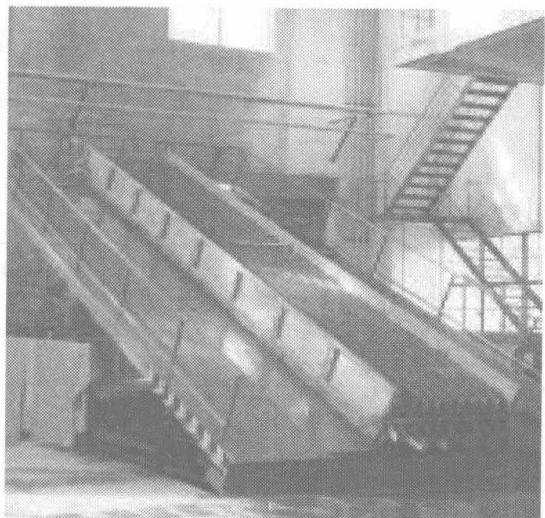  
(a)

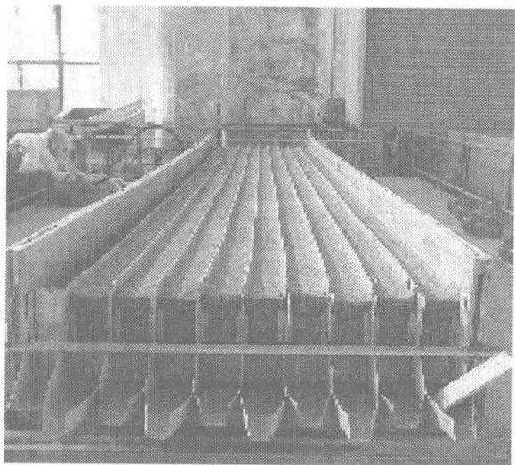  
(b)  
图 7.1 试验装置图

为尽量减小隔板边壁对水流及侵蚀过程的影响，对水槽隔板进行了处理：在隔板上黏上与供试土壤相同的土粒，使其尽可能接近试验土同样的糙度。水槽放置在坡度可调节的平台上，试验时可按需要调节水槽的坡度。设计了8个试验沟长水平：0.5m、1.0m、2.0m、3.0m、4.0m、5.0m、6.0m、8.0m。每一个处理有3个重复，总试验次数为405次。试验组合如表7.1所示。

表7.1 序号和试验组合对应表
<table><tr><td>序号</td><td>流量/(L/min)</td><td>坡度/(°)</td><td>沟长/m</td></tr><tr><td>1</td><td>8</td><td>5</td><td>0.5、1.0、2.0、3.0、4.0、5.0、6.0、7.0、8.0</td></tr><tr><td>2</td><td>12</td><td>5</td><td>0.5、1.0、2.0、3.0、4.0、5.0、6.0、7.0、8.0</td></tr><tr><td>3</td><td>8</td><td>10</td><td>0.5、1.0、2.0、3.0、4.0、5.0、6.0、7.0、8.0</td></tr><tr><td>4</td><td>12</td><td>10</td><td>0.5、1.0、2.0、3.0、4.0、5.0、6.0、7.0、8.0</td></tr><tr><td>5</td><td>2</td><td>15</td><td>0.5、1.0、2.0、3.0、4.0、5.0、6.0、7.0、8.0</td></tr><tr><td>6</td><td>4</td><td>15</td><td>0.5、1.0、2.0、3.0、4.0、5.0、6.0、7.0、8.0</td></tr><tr><td>7</td><td>8</td><td>15</td><td>0.5、1.0、2.0、3.0、4.0、5.0、6.0、7.0、8.0</td></tr><tr><td>8</td><td>2</td><td>20</td><td>0.5、1.0、2.0、3.0、4.0、5.0、6.0、7.0、8.0</td></tr><tr><td>9</td><td>4</td><td>20</td><td>0.5、1.0、2.0、3.0、4.0、5.0、6.0、7.0、8.0</td></tr><tr><td>10</td><td>8</td><td>20</td><td>0.5、1.0、2.0、3.0、4.0、5.0、6.0、7.0、8.0</td></tr><tr><td>11</td><td>2</td><td>25</td><td>0.5、1.0、2.0、3.0、4.0、5.0、6.0、7.0、8.0</td></tr><tr><td>12</td><td>4</td><td>25</td><td>0.5、1.0、2.0、3.0、4.0、5.0、6.0、7.0、8.0</td></tr><tr><td>13</td><td>8</td><td>25</td><td>0.5、1.0、2.0、3.0、4.0、5.0、6.0、7.0、8.0</td></tr></table>

本试验采用安塞的母质性黄绵土。试验前将供试土壤风干测其机械组成，土壤机械组成见表7.2,其中砂粒(>0.05mm)含量占20.18%，粉粒含量(0.05\~0.005mm)占63.9%,黏粒含量(<0.005mm)占15.92%，中值粒径为0.029mm。装填前将土过10mm筛孔，并测其容重。填土时，先在试验槽底部填入30cm厚的黏黄土（<0.01mm占56.05%)，边装填边压实，使其紧实程度接近犁底层，然后再填入供试土壤。将土均匀装入土槽，填土容重控制在 $1 . \ 1 \sim 1 . \ 2 { \mathrm { g } } / { \mathrm { c m } } ^ { 3 }$ ，厚度约为20cm。试验槽四周边部尽量压实，装土时注意一定的地表糙度，并在隔板处略有凸起，以尽可能避免边壁的影响。试验前将土壤充分饱和，并放置24h以上再开始试验，从而保证均匀一致的初始含水量及消除部分填装不均匀的影响。

表7.2 供试土壤颗粒机械组成(安塞黄绵土)
<table><tr><td rowspan=1 colspan=1>粒径/mm</td><td rowspan=1 colspan=1>1~0.25</td><td rowspan=1 colspan=1>0.25~0.05</td><td rowspan=1 colspan=1>0.05~0.01</td><td rowspan=1 colspan=1>0.01~0.005</td><td rowspan=1 colspan=1>0.005~0.001</td><td rowspan=1 colspan=1>&lt;0.001</td><td rowspan=1 colspan=1>&lt;0.01</td></tr><tr><td rowspan=1 colspan=1>颗粒含量百分数/%</td><td rowspan=1 colspan=1>0.01</td><td rowspan=1 colspan=1>20.17</td><td rowspan=1 colspan=1>56.09</td><td rowspan=1 colspan=1>7.81</td><td rowspan=1 colspan=1>3.1</td><td rowspan=1 colspan=1>12.82</td><td rowspan=1 colspan=1>23.88</td></tr></table>

## 7.2.2 供水及流量控制和试验量测

由自来水管及水箱加水泵供水，采用阀门控制流量，用水表计时标定流量和确定流量大小。试验采用的控制流量为2L/min、4L/min、8L/min(缓坡5°时流量为8L/min、12L/min)。三个水槽流量分别标定。为了使入水管水流均匀注入，在水管出水口采用9cm长的出水端口，其上布有许多均匀的小孔，并用纱布均匀缠绕该出水端口，保证水流在细沟内均匀分布，且尽可能地减小对出水口处土壤的局部扰动。

水流稳定时，记录水流通过一定沟长的时间，用以计算流速。由于细沟流速沿程变化的非均匀性，以及流动边界条件的影响，使得流速的测定比较困难。颜料示踪法是常用的测定流速的方法，但实际上，几乎所有情况下，颜料示踪法测得的都是最大表层流速，而不是平均表层流速(胡世雄，1999)。本次试验采用断面分段法，用有色试剂0 $\bf ( K M n O _ { 4 } )$ 测定表层平均流速，然后乘以系数0.75，来得到较为理想的水流平均流速。做一个出水口为10cm的集水槽，水流稳定后，用于收集冲刷试验过程中产生的水沙混合样，在各个出水口分别收集泥沙样3个。测量采集的泥沙样体积后，烘干称重，用于确定泥沙含量(g/mL或 $1 0 ^ { 3 } \mathrm { k g } / \mathrm { m } ^ { 3 } )$ o

## 7.3 试验数据及其表达

从动力学的角度，影响细沟侵蚀产沙量的动力因子主要是径流强度、坡面径流运动速度、水力比降和沟长。由于坡面径流运动速度，尤其是点速度尚难以观测，因而很难建立起径流侵蚀产沙与流速的关系，所以在试验设计时，主要考虑了径流强度(本试验主要考虑入口径流量)和坡度对侵蚀产沙量的影响。泥沙的侵蚀和输移变化实质是能量和含沙量随时间变化的函数，它必然反映在不同坡长的坡耕地上。在假定沿沟长土壤可蚀性相同的条件下，通过一系列不同沟长的侵蚀试验，得到了不同坡度和流量下侵蚀产沙量随沟长的变化规律(图7.2)。由图7.2不同坡度下产沙量在给定流量时随细沟沟长的变化趋势可以看出，尽管坡度和流量不同，侵蚀产沙量随沟长的变化却表现出了相似的趋势，即在一定坡度和流量下，产沙量随着沟长的增加而增加，但增加的幅度越来越小，且趋近一个稳定值；坡度越大，这种趋于稳定的趋势越快；同样，在同一坡度下，流量越大，这种趋于稳定的趋势也越快。也就是说，产沙量随沟长的变化并不因特定坡度下流量的变化而受到明显的影响，但侵蚀产沙达到饱和所需要的坡长随着坡度的增加明显变短。

图7.2的结果在试验中表现为：细沟的沟深随距入水口距离的增大而减小。

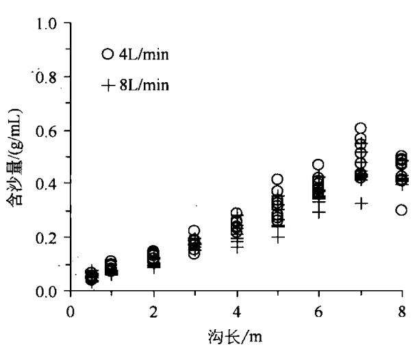  
(a)

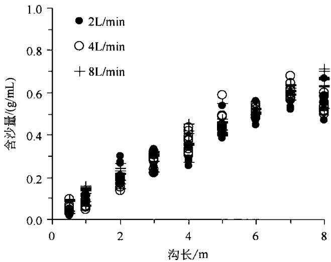  
(b)

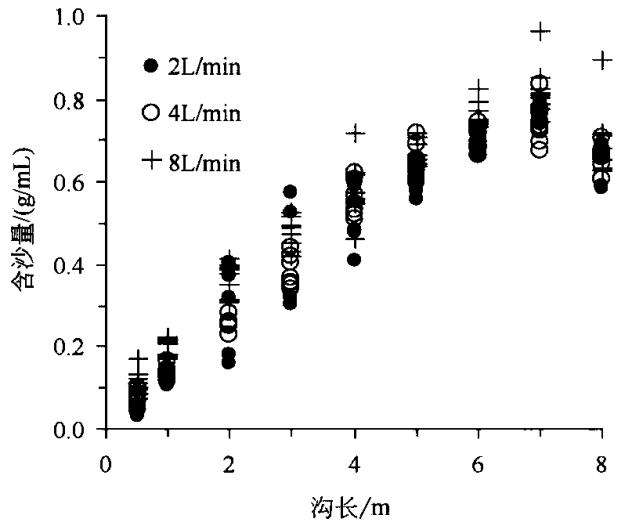  
(c)

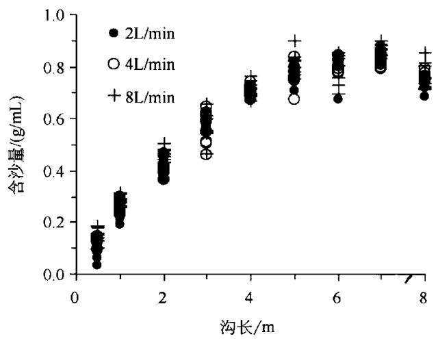  
(d)

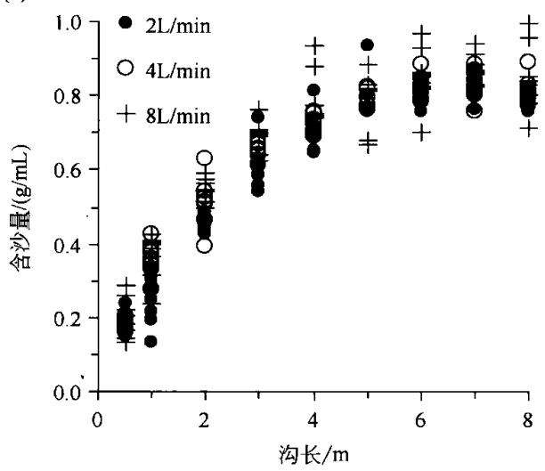  
(e)  
图7.2 产沙量在不同坡度及流量时沿细沟沟长的变化$( \mathbf { a } ) 5 ^ { \circ } ; ( \mathbf { b } ) 1 0 ^ { \circ } ; ( \mathbf { c } ) 1 5 ^ { \circ } ; ( \mathbf { d } ) 2 0 ^ { \circ } ; ( \mathbf { e } ) 2 5 ^ { \circ }$

## 第8章 细沟土壤剥蚀过程

## 8.1 细沟侵蚀剥蚀率及其计算方法

土壤剥蚀作用是指由侵蚀动力引起的土壤颗粒从土壤母质由团聚体的自然状态被剥蚀的过程(Ellison，1947)，是土壤物质被侵蚀的初始阶段，有别于侵蚀泥沙的输移过程和已沉积泥沙的再剥蚀过程。土壤剥蚀是细沟泥沙的主要来源，坡面上侵蚀量大的地方，土壤剥蚀总是很活跃。细沟流是坡面土壤颗粒被剥蚀的主要动力，土壤中易溶物质被水溶解悬浮于水流之中，一部分土粒或粒状结构完全剥蚀，剥蚀的土粒脱离地表随径流开始移动。同时，由于径流的剥蚀作用使土壤黏结力降低，土壤整体结构稳定性遭到破坏，土粒处于“孤立”或“半孤立”状态(吴普特，1997)，细沟流将坡面上剥蚀和孤立以及半孤立的土粒携带入水流中并进而冲刷坡面。细沟流还会通过土壤孔隙，产生入渗，使土壤中产生一个垂直方向的水分运动，结果引起土壤容重结构发生变化。更重要的是沿着水流方向的动力克服土壤表面的摩擦力，只要动力大于摩擦力，就会发生土壤颗粒的移动现象，移动的颗粒随之与水流混为一体。土壤颗粒的剥蚀程度取决于团聚力和地表径流作用力之间的相互作用(Nearing et al.，1991;Nearing and Parker，1994)。

剥蚀率是侵蚀过程预报模型的重要物理参数，如何确定土壤剥蚀率一直是土壤侵蚀特别是土壤侵蚀模拟与预报研究所关注的问题。细沟中的土壤剥蚀过程包括沟头的溯源侵蚀，沟底的下切侵蚀以及边壁的侧蚀冲刷。这些过程往往是同时发生的，使得细沟剥蚀率的计算变得很复杂。由于计算及测量手段的限制，一般只能在试验坡面的出口处取得含沙量和径流量的时间系列值，而对于任意坡面在任意时段的取样则比较困难，且容易破坏试验的自然进程，因此，土壤剥蚀率在土壤侵蚀研究中一直难以确定。WEPP模型中用质量守恒和过程连续微分方程来描述细沟侵蚀产沙过程(Nearing et al.,1989；Flanagan et al.,1995)，方程代表了细沟剥蚀率的泥沙反馈形式，是在土壤颗粒与水流相互作用下流体力学的基础上建立的。细沟侵蚀产沙过程所表述的意义为：细沟剥蚀率随着细沟中含沙量的增加而减少。清水时，剥蚀率最大；当输沙量小于水流输沙能力时，径流能量一部分用于剥蚀土壤颗粒，一部分用于输移泥沙。随着含沙量增加，土壤剥蚀率降低。当输沙量等于水流输沙能力时，剥蚀率为0，这意味着径流中的含沙量已达到了径流所能挟带的极限值。当输沙量大于水流输沙能力时，径流中的含沙量超过了径流所能挟带的含沙量，泥沙开始沉积。应该说明的是，该侵蚀产沙方程式虽然能够反映细沟侵蚀机制及泥沙输移过程，但是缺乏严密的数学推导以及合理的试验验证，且对于剥蚀率与含沙量之间的关系仍然存在争议。

尝试用试验方法和解析推导法来获取细沟侵蚀的剥蚀率，并分析侵蚀过程中含沙量对细沟剥蚀速率的影响。细沟剥蚀作用的大小由剥蚀率来表述，剥蚀率定义为径流单位时间(s)内由单位面积 ${ \bf \Xi } ( { \bf \Lambda } _ { \bf m } ^ { 2 } { \bf \Lambda } )$ 上剥蚀掉的土壤量 $\left( \mathbf { \ k g } \right)$ (Nearing et al.,1991 ;Nearing et al. ,1997;Merten et al. ,2001;Gimenez and Govers,2002)。估计剥蚀率的基本前提是：在坡面不同部位，对于一定的径流驱动力其剥蚀率是一样的，也就是说在一定的径流能量条件下，坡面不同部位的等长细沟，只要其起始位置距入水口距离相同，则其产沙量是相等的。用数学表达式表述为：设长度为 $\Delta x _ { 1 }$ 的细沟始于距入水口 $\pmb { x } _ { 1 }$ 位置，长度为 $\Delta x _ { 2 }$ 的细沟始于距入水口 $\pmb { x } _ { 2 }$ 位置，如果 $\mathbf { \boldsymbol { \mathsf { \varepsilon } } } _ { : } \mathbf { \boldsymbol { x } } _ { 1 } = \mathbf { \boldsymbol { x } } _ { 2 }$ ,且 $\Delta x _ { 1 } = \Delta x _ { 2 }$ ，则各段内含沙量的增量 $\left( \Delta c _ { 1 } , \Delta c _ { 2 } \right)$ 有如下关系 $\Delta c _ { 1 } \left( x _ { 1 } , \Delta x _ { 1 } \right) = \Delta c _ { 2 } \left( x _ { 2 } , \Delta x _ { 2 } \right)$ O

在这种前提下，如果细沟x处的水流含沙量为c，细沟 $\pmb { x } + \Delta \pmb { x }$ 处的水流含沙量为 $c +$ $\Delta c$ ,那么增加的含沙量 $\Delta c$ 被认为是沟长增加 $\Delta x$ 所剥蚀的土壤侵蚀量。由此，土壤剥蚀率可用下式来计算

$$
D _ { r } = \frac { \Delta c q } { \Delta x }\tag{8-1}
$$

## 8.2 水流含沙量对细沟剥蚀率的影响

径流水流中的能量一部分用来剥蚀土壤、一部分用来输移泥沙。由于剥蚀，细沟水流中的含沙量增加。随着径流中含沙量的增加，用于输送泥沙消耗的能量就会增大，反过来用于剥蚀土壤的能量就会减小，结果细沟中的剥蚀率就必然减小。根据泥沙剥蚀与输送相匹配的原理，细沟中水流剥蚀率正比于水流输沙能力与水流泥沙含量的差，水流输沙能力又与径流速度呈正比。因此，径流速度的大小和水流含沙量的多少决定着水流剥蚀能力的大小。对同一种土壤而言，径流速度的大小主要取决于流量的多少与坡度的大小。坡度也通过水流和土粒的重力分量来影响径流侵蚀力和泥沙的输移特征。因此，流量和坡度通过影响径流速度和含沙量，共同决定了土壤流失量的多少，所以可通过调节不同的坡度和流量来寻找剥蚀率和含沙量的关系。用式(8-1)对细沟水流的剥蚀率进行了计算，并点绘了剥蚀率与细沟水流含沙量的对应关系(图8.1)。

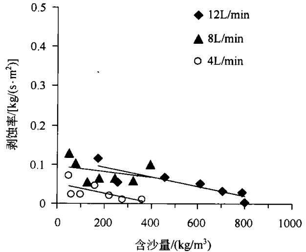  
(a)

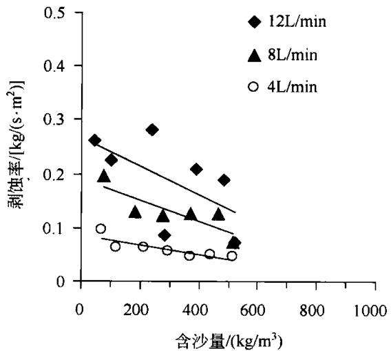  
(b)

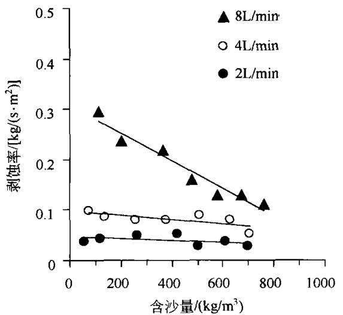  
(c)

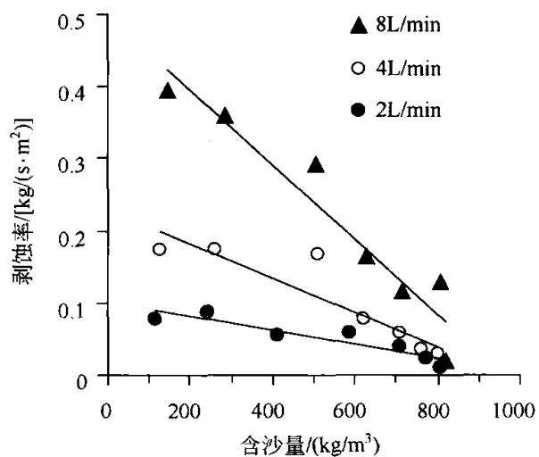  
(d)

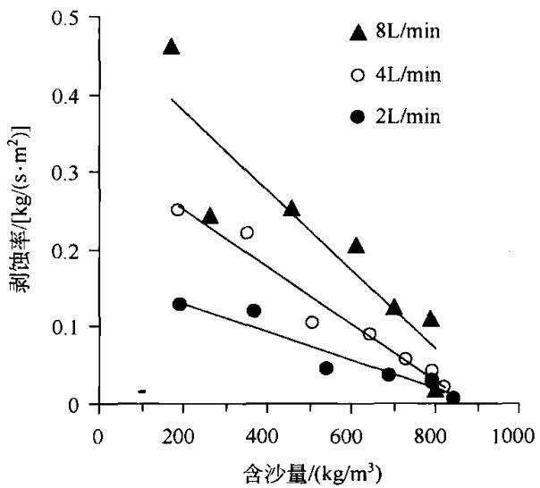  
(e)  
图8.1 不同工况条件下剥蚀率随含沙量的变化趋势(a)5°;(b)10°;(c)15°;(d)20°;(e)25°

从试验结果可以看出，剥蚀率与径流含沙量有直接的关系，且清水比挟沙水有更大的剥蚀率。在沟顶清水引入的地方剥蚀率D.最大，随着径流中含沙量的增加，剥蚀率开始减小。尤其在陡坡(15°,20°,25°)和大流量(8L/min)时，剥蚀率随含沙量的这种变化更明显。从试验结果还可以看出，坡度越陡剥蚀率越大，流量越大剥蚀率越大。对于黄土高原的粉壤土，剥蚀率随含沙量的增加(近似地)呈线性减小。

用下列线性函数对试验结果进行回归分析：

$$
\mathbf { \nabla } D _ { \tau } = \mathbf { a } + b c\tag{8-2}
$$

式中，a,b为回归系数；c为含沙量 $( \mathbf { \ k g / m ^ { 3 } } )$ 。回归得到的确定系数 $R ^ { 2 }$ 均很高，在陡坡条件下(20°,25°)剥蚀率随径流含沙量减小的趋势表现得更为显著，回归结果见表8.1。回归得到的系数b均为负值，这说明剥蚀率随径流中含沙量的增加呈线性减小。由回归结果得出，在同一坡度下，流量越大，剥蚀率随含沙量的增大递减越快。同时注意到，相同

流量下，坡度越陡剥蚀率递减越快。

表8.1 由试验数据得到的回归系数值
<table><tr><td>坡度/(°)</td><td>流量/(L/min)</td><td>a</td><td>6</td><td> $R ^ { 2 }$ </td><td> $A _ { 0 }$ </td><td> $\scriptstyle B _ { 0 }$ </td><td> $R ^ { 2 }$ </td></tr><tr><td>5</td><td>4</td><td>0.04</td><td>-0.04</td><td>0.11</td><td>0.03</td><td>0.06</td><td>0.13</td></tr><tr><td></td><td>8</td><td>0.06</td><td>-0.08</td><td>0.10</td><td>0.08</td><td>0.03</td><td>0.06</td></tr><tr><td>10</td><td>4</td><td>0.09</td><td>-0.09</td><td>0.70</td><td>0.08</td><td>0.10</td><td>0.75</td></tr><tr><td></td><td>8</td><td>0.19</td><td>-0.19</td><td>0.70</td><td>0.20</td><td>0.13</td><td>0.74</td></tr><tr><td>15</td><td>2</td><td>0.06</td><td>-0.05</td><td>0.69</td><td>0.07</td><td>0.22</td><td>0.61</td></tr><tr><td></td><td>4</td><td>0.10</td><td>-0.06</td><td>0.66</td><td>0.11</td><td>0.13</td><td>0.62</td></tr><tr><td></td><td>8</td><td>0.31</td><td>-0.28</td><td>0.96</td><td>0.30</td><td>0.18</td><td>0.96</td></tr><tr><td>20</td><td>2</td><td>0.10</td><td>-0.10</td><td>0.88</td><td>0.11</td><td>0.32</td><td>0.90</td></tr><tr><td></td><td>4</td><td>0.24</td><td>-0.25</td><td>0.86</td><td>0.29</td><td>0.48</td><td>0.95</td></tr><tr><td></td><td>8</td><td>0.50</td><td>-0.51</td><td>0.99</td><td>0.49</td><td>0.33</td><td>0.96</td></tr><tr><td>25</td><td>2</td><td>0.17</td><td>-0.20</td><td>0.91</td><td>0.16</td><td>0.48</td><td>0.90</td></tr><tr><td></td><td>4</td><td>0.33</td><td>-0.38</td><td>0.97</td><td>0.36</td><td>0.51</td><td>0.93</td></tr><tr><td></td><td>8</td><td>0.49</td><td>-0.53</td><td>0.86</td><td>0.67</td><td>0.46</td><td>0.88</td></tr></table>

## 8.3 细沟剥蚀率与细沟沟长的关系

随着沟长的增加，径流输送剥蚀产生的泥沙所需要的能量增大，用于剥蚀土粒的能量随之减小，因之剥蚀率沿着沟长逐渐减小。本试验中剥蚀率与沟长的关系见图8.2，图中趋势形象地说明了上述概念。

图8.2显示，在 $5 ^ { \circ } , 1 0 ^ { \circ } , 1 5 ^ { \circ } , 2 0 ^ { \circ } , 2 5 ^ { \circ }$ 五个不同坡度时剥蚀率与沟长具有良好的相关性，剥蚀率随沟长的增加(近似地)呈指数递减。从图8.2中可以看出，剥蚀率与沟长有直接关系，且清水比挟沙水有更大的剥蚀率。在沟顶清水引入的地方剥蚀率 $D _ { r }$ 最大，随着沟长的增加，剥蚀率开始减小。

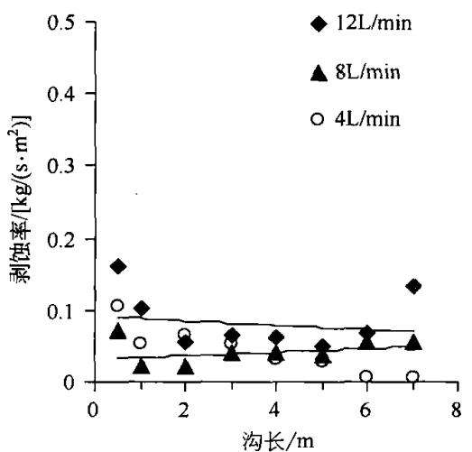  
(a)

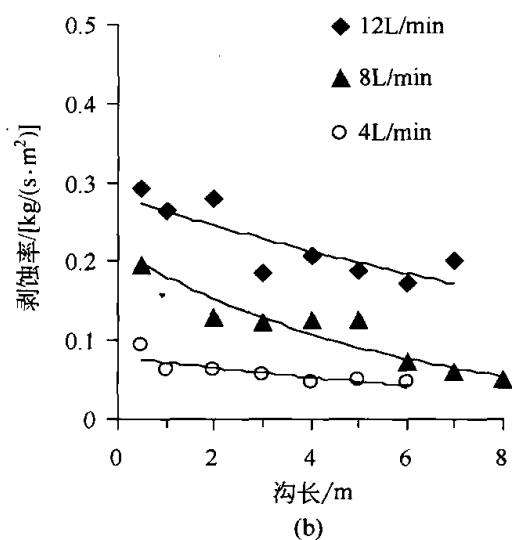

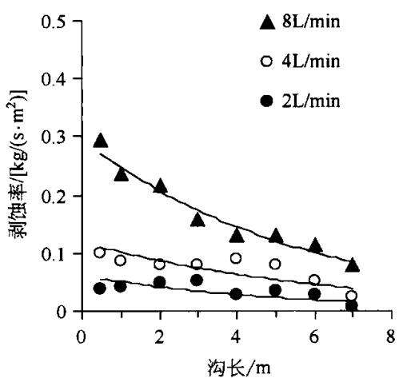  
(c)

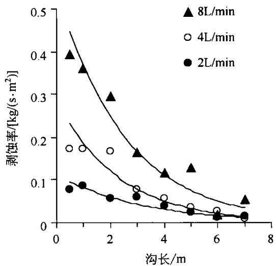  
(d)

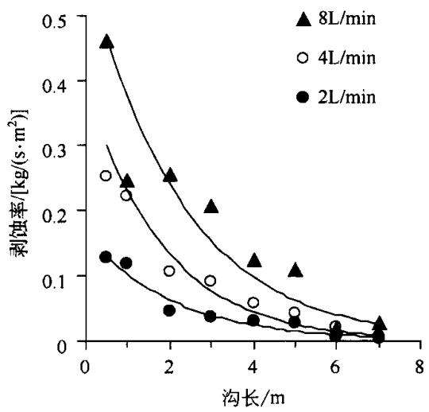  
(e)  
图8.2 不同工况条件下剥蚀率与沟长的关系(a)5°;(b)10°;(c)15°;(d)20°;(e)25°

用下列函数对试验结果进行了回归分析

$$
D _ { \mathrm { r } } = A _ { 0 } e ^ { ( \mathrm { \Phi } - B _ { 0 } x ) }\tag{8-3}
$$

式中， $D _ { \mathbf { r } }$ 为细沟流剥蚀率 $[ { \bf { k g } } / ( { \bf { s } } \cdot { \bf { m } } ^ { 2 } ) ] ; A _ { 0 } , B _ { 0 }$ 为回归系数；x为沟长坐标(m)。由式(8-3)得到的回归结果见表8.1。

由计算结果看出剥蚀率随沟长呈指数递减，即开始减小很快，随后减小幅度逐渐变缓。由计算结果还可看出：坡度越陡剥蚀率越大，流量越大剥蚀率越大。回归得到的确定系数 $R ^ { 2 }$ 除 $5 \textdegree$ 以外，其他坡度下的值均很高，在 $1 0 ^ { \circ } , 1 5 ^ { \circ } , 2 0 ^ { \circ } , 2 5 ^ { \circ }$ 时的 $R ^ { 2 }$ 的多在0.70以上，尤其是在20°时不同流量下 $R ^ { 2 }$ 均大于0.9,分别为0.90(2L/min)、0.95(4L/min)、0.96(8L/min)。从分析结果也可以看出，流量和坡度在径流能量中起着更重要的作用，影响着细沟剥蚀率的变化，这就说明削减坡度和减小洪峰流量在控制坡面侵蚀产沙，提高水土保持效益中的重要作用。

## 8.4 细沟剥蚀率的解析方法

本节从土壤剥蚀率的基本定义出发，推导了计算土壤剥蚀率的解析方法，并且将计算得到的细沟流剥蚀率与相应试验值进行了对比。

预报土壤侵蚀的物理模型法就是将复杂的土壤侵蚀条件概化为简单的土壤侵蚀模型，与数学模型不同之处是，它采用相似的物理模型去比拟侵蚀过程，通过研究物理模型来认识土壤侵蚀机理及规律。对于物理模型的求解方法，目前有两种，即解析法和数值模拟法。解析法就是用数学上的积分法和积分变换等方法直接求数学模型的解，其解称为解析解，它是数学模型的精确解。这种解的优点是把表征坡面土壤运动规律的变量和激发条件、时空变化包括在一个表达式内，这样就可以分析土壤侵蚀的过程及运动规律。

水流中泥沙含量来源于水流对土壤的剥蚀。土壤剥蚀率定义为：单位面积、单位时间内土壤的剥蚀量。与此概念相对应的定量表述如下。

土壤剥蚀率为(细沟中)单位宽度水流所含泥沙沿距离的变化率，或等价地说土壤剥蚀率为(细沟中)水流含沙量对距离的变化率与单宽流量之积。

该表述进一步说明如下:设泥沙含量为 $c ( { \bf k } \mathbf { g } / { \bf m } ^ { 3 } )$ ,流量 $Q ( \mathbf { m } ^ { 3 } / \mathbf { s } )$ ,沟宽 ${ \pmb w } ( { \pmb m } )$ ,单宽流量 $q ( \mathbf { m } ^ { 2 } / \mathbf { s } ) = Q / w$ ,土壤剥蚀率 $D _ { \mathrm { r } } [ \mathrm { k g } / ( \mathrm { m } ^ { 2 } \cdot \mathrm { s } ) ]$ ,距离为 ${ \pmb x } ( { \pmb m } ) _ { \circ }$ 根据土壤剥蚀率的定义，设在细沟水流作用下，细沟中的泥沙含量在x处为c，在 $\boldsymbol { x } + \Delta \boldsymbol { x }$ 处为 $c + \Delta c$ ，则相应地两处的水流总输沙量分别为 $\pmb { c Q }$ 及 $( c + \Delta c ) Q$ ,对应的沟宽为w及 ${ \pmb w } + \Delta { \pmb w }$ ，该部分细沟的面积按梯形计算为 $A = \left( w + w + \Delta w \right) \Delta x / 2 = \Delta x { \left( w + \Delta w / 2 \right) }$ 。泥沙含量的增加即是土壤由地表剥离的结果，则根据土壤剥蚀率的定义有

$$
D _ { \mathrm { r } } = \operatorname* { l i m } _ { \Delta x  0 } \bigg ( \frac { \big ( c + \Delta c - c \big ) Q } { \Delta x \big ( w + \Delta w / 2 \big ) } \bigg )\tag{8-4}
$$

当 $\Delta \boldsymbol { x }$ 趋于0时，忽略无穷小量 $\Delta w$ ,有

$$
D _ { \mathrm { r } } = \operatorname* { l i m } _ { \Delta x \to 0 } { \frac { \Delta c } { \Delta x } } \cdot { \frac { Q } { w } } = { \frac { \mathrm { d } c } { \mathrm { d } x } } q\tag{8-5}
$$

即细沟剥蚀率为水流含沙量对距离的变化率与单宽流量之积。

由室内细沟侵蚀模拟冲刷试验已得到的黄绵土细沟水流泥沙含量与细沟沟长(距离${ \pmb x } )$ 的关系

$$
c = A { \big ( } 1 - \mathbf { e } ^ { - \beta x } { \big ) } ^ { B }\tag{8-6}
$$

式中，c为含沙量；x为细沟沟长 $\ B$ 为衰减系数；A、B为回归系数。将产沙方程应用于解析式得

$$
D _ { \mathrm { r } } = \beta B A \left( 1 - \mathrm { e } ^ { - \beta x } \right) { } ^ { B - 1 } \mathrm { e } ^ { - \beta x }\tag{8-7}
$$

$$
D _ { \mathrm { r } } = \beta B q c { \frac { \mathrm { e } ^ { - \beta x } } { 1 - \mathrm { e } ^ { - \beta x } } } = \beta B q c ( ( A / c ) ^ { 1 / B } - 1 )\tag{8-8}
$$

式(8-7)为剥蚀率与细沟沟长的关系，而式(8-8)为剥蚀率与细沟水流含沙量的关系。也

就是说根据得到的解析式，只要有含沙量与沟长的对应关系，就可以得到细沟的剥蚀率。

## 8.5 细沟剥蚀率解析结果的检验

用黄绵土进行了室内细沟侵蚀水槽试验。测量得到了细沟水流中泥沙含量与细沟沟长的对应关系。对试验结果进行回归，得到了相关的参数。由解析式计算得到了不同水动力条件下剥蚀率，并将其 $2 0 ^ { \circ }$ 计算值与相应的试验值以及与坡长和含沙量的关系示于图8.3和图8.4。

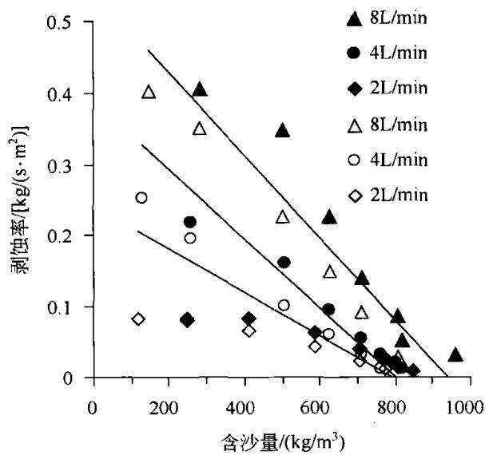  
图8.3 细沟水流剥蚀率解析值与试验值以及与含沙量的关系

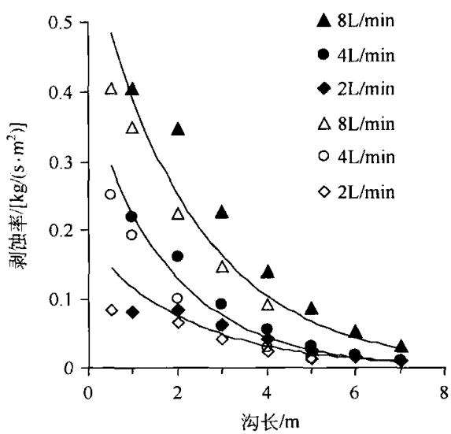  
图8.4 细沟水流剥蚀率解析值与试验值以及与沟长的关系

从图8.3和图8.4的结果中可以看出，细沟剥蚀率随含沙量的增加呈线性减小，且清水比挟沙水有更大的剥蚀率，剥蚀率随沟长呈指数递减，即开始减小很快，随后减小幅度逐渐变缓。在沟顶清水引入的地方剥蚀率最大，随着沟 $\mathsf { k }$ 和径流中含沙量的增加，剥蚀率开始减小。这种变化趋势尤其在陡坡和大流量下更加明显。剥蚀率在不同坡度和流 $^ { \cdot _ { \circ } } ,$ 量下随含沙量与细沟沟长的这种变化规律，可以用能量分配和耗散原理以及径流涡动机制来解释。冲刷、侵蚀、流失是一个连续的、不间断的过程，伴随的是能量和物质的转移。在此过程中，三者之间有十分密切的关系，是一个系统不同层次、不同结构、不同作用方式之间的连通体。首先它是径流及其携带的泥沙的位移过程，它自始至终皆离不开能量。同时也是一个连续系统中位能的变化过程，是能量传递消耗的过程(王兆印，1998；孙东坡，1999)。如果从系统的观点看，它实际是系统内各因子相互作用、相互影响导致系统总功能(侵蚀)的体现。也正是因为其局部系统物质、能量的不平衡，导致了系统间物质和能量的交换。剥蚀率随沟长和含沙量的变化是与能量在侵蚀产沙过程中的分配紧密联系的。在沟顶清水引入的地方，径流能量用于剥蚀土粒，此时的剥蚀率最大。剥蚀率大，则径流剥蚀的土粒就多，径流中的含沙量则会随之快速增大。反过来，随着径流中的含沙量的增大，径流必然要分出一部分能量来挟带径流中的泥沙，用于剥蚀泥沙的能量就相应减小，同时随着坡面被剥蚀，沟床变得粗糙，径流必然要有一部分能量耗散于克服粗糙床面阻力做功，用于剥蚀泥沙的能量就相应减小。同时随着径流过程的持续，便会在流路上开始出现一系列的水流跌坑，细沟水流作用下跌坑的形成及发育见图8.5所示。

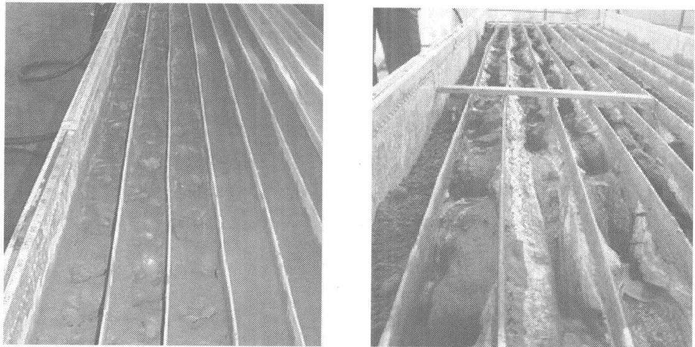  
图8.5 跌穴的形成及连通

跌坑出现后，流路纵断面上形成许多不连续的断点，每个断点都是侵蚀的最活跃点。由于跌坑的出现，使细沟流的水动力特性有它自身的特点，这主要表现在跌坑处细沟流发生跌水，水流在跌坑处进行了消能。随着坡面被剥蚀，形成跌穴后沟床变得粗糙，径流必然要有一部分能量耗散于克服粗糙床面阻力做功，用于剥蚀泥沙的能量就相应减小。坡度变陡时，水流的冲刷力和土体的下滑力增大；入流量增加时，冲刷土体的动能增大，结果使得径流中的含沙量迅速增加，由于能量不得不分配于输送径流中的泥沙，剥蚀土粒的能量则相应地随之迅速减小。这就使得剥蚀率随含沙量和沟长增加而递减的趋势在陡坡和大流量下表现得更加明显。

剥蚀率随含沙量和沟长增加而递减的原因与径流涡动机制和泥沙的屏蔽作用有关。涡流对于土壤剥蚀是非常重要的，Ellison(1947)认为含沙量越大，涡流强度就越小。尽管最近也有新的研究表明这种侵蚀机制并不能解释所有的细沟侵蚀现象(Nearing et al.，1991;Nearing and Parker,1994;Merten et al.,2001)。坡面表层土壤细颗粒的黏粒成分对径流侵蚀跌坑的形成，以及细沟的侵蚀发育都有较强的抑制作用，径流的侵蚀力只有首先突破表土细颗粒的胶力，才能形成进一步的下切侵蚀。Polyakov and Nearing(2003)认为径流中的泥沙对沟床表层土壤有屏蔽保护作用，这种屏蔽作用阻碍了径流对新土壤颗粒的剥蚀。

由式(8-4)得到的参数计算剥蚀率，将其与直接由试验数据计算所得剥蚀率进行了相关分析，分析结果示于图8.6。图8.6是解析法确定的土壤剥蚀率与试验值1:1的对比相关分析图，图中数据点越靠近斜率为1的直线说明两种计算方法得出的结果一致性越好。由图可以看出，解析式所得到的剥蚀率和试验数据直接得到的剥蚀率相关性很好，而且随着坡度的增加，数据点越靠近斜线，即随坡度增大一致性增加。经回归分析，得到确定系数值也很高，最高的拟合 $( 2 0 ^ { \circ } ) R ^ { 2 }$ 值可达到 $0 . 9 6 _ { \circ }$ 不同坡度下 $R ^ { 2 }$ 分别是为 $5 ^ { \circ }$ $0 . 6 9 , n = 1 8 ; 1 0 ^ { \circ } , 0 . 8 6 , n = 2 4 ; 1 5 ^ { \circ } , 0 . 9 3 , n = 2 4 ; 2 0 ^ { \circ } , 0 . 9 6 , n = 2 4 ; 2 5 ^ { \circ } , 0 . 9 4 , n = 2 4 _ { \circ }$ 由回归结果得到 $5 \%$ 时的回归直线斜率为1.22， $1 0 ^ { \circ }$ 时的直线斜率为1.45，也就是说在这两种坡度下，解析法确定的土壤剥蚀率比试验确定的土壤剥蚀率要小一些。坡度为 $1 5 ^ { \circ } \cdot 2 0 ^ { \circ }$ $2 5 ^ { \circ }$ 时的直线斜率分别为1.0、1.06和0.99，这说明在这三种坡度下由两种计算方法得出的剥蚀率很接近。5°时，由试验数据直接计算的剥蚀率随沟长的变化无明显趋势，从而解析法(是沟长的函数)计算结果也不理想。

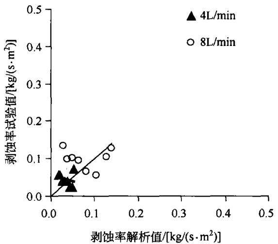  
(a)

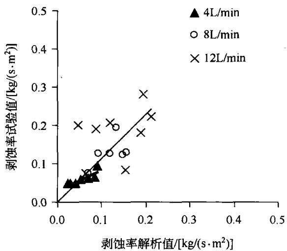  
(b)

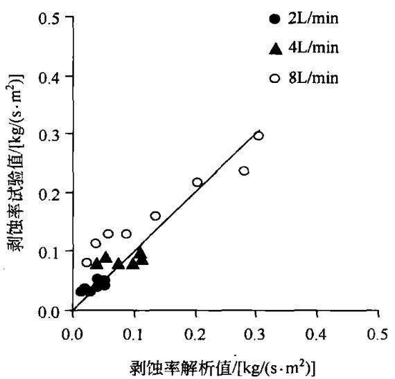  
(c)

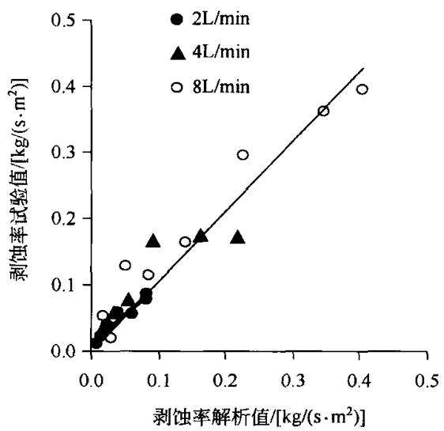  
(d)

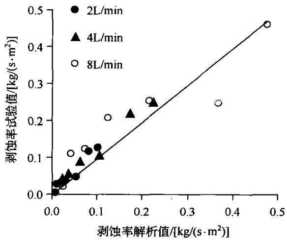  
(e)  
图8.6 解析法(沟长为自变量)确定的细沟水流剥蚀率与试验值对比$( \mathbf { a } ) 5 ^ { \circ } : ( \mathbf { b } ) 1 0 ^ { \circ } ; ( \mathbf { c } ) 1 5 ^ { \circ } ; ( \mathbf { d } ) 2 0 ^ { \circ } ; ( \mathbf { e } ) 2 5 ^ { \circ }$

将由式(8-5)计算得到的细沟水流剥蚀率，与直接由试验数据计算所得到的剥蚀率进行了相关分析，分析结果示于图8.7。可以看出由式(8-5)所得到的剥蚀率和试验值同样显示了良好的相关性。相关分析得到的 $R ^ { 2 }$ 分别为 $5 ^ { \circ } , 0 . 6 5 , n = 1 6 ; 1 0 ^ { \circ } , 0 . 8 2 , n = 2 1$ in$1 5 ^ { \circ } , 0 . 9 1 , n = 2 1 ; 2 0 ^ { \circ } , 0 . 9 5 , n = 2 1 ; 2 5 ^ { \circ } , 0 . 9 3 , n = 2 1 _ { \circ }$ 图8.7 中的物理意义和图8.6 是一样的，可以看出随着坡度的增加，数据点靠斜线越近，即相关性随坡度增大而增大。两种方法计算结果差别很小，总体来看，计算结果相互验证说明此解析方法是正确的，可以很好地用于集中水流作用下细沟水流剥蚀率的计算。

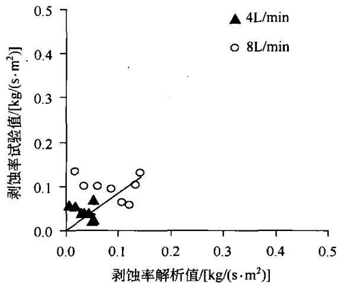

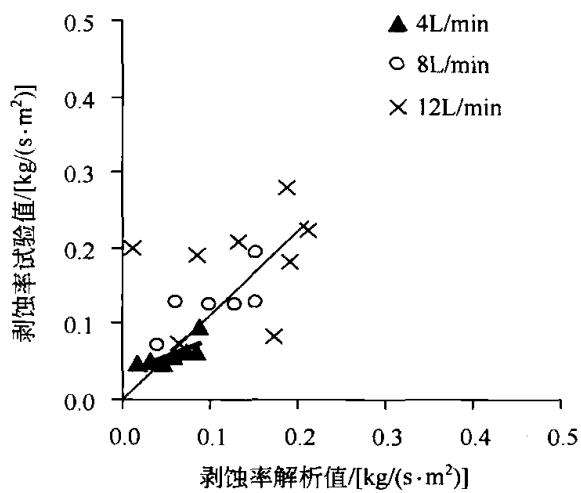

(a)  
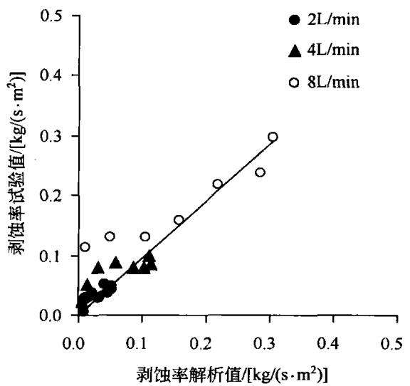  
(c)

(b)  
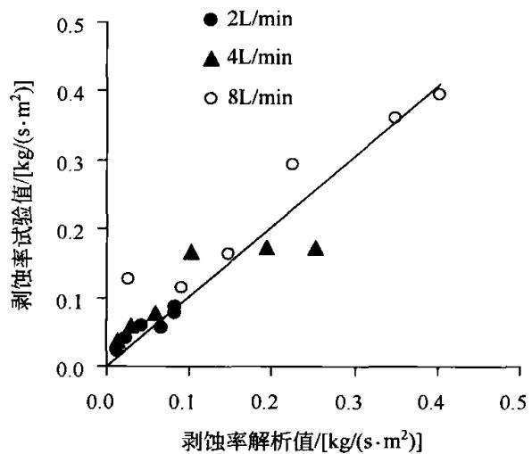  
(d)

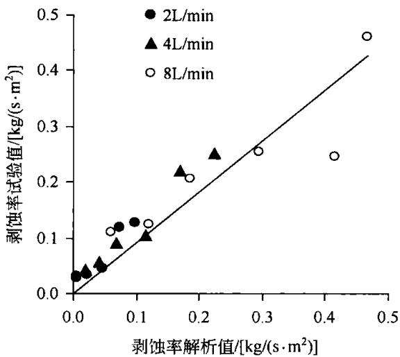  
(e)  
图8.7 解析法(含沙量为自变量)确定的细沟水流剥蚀率与试验值对比(a)5°;(b)10°;(c)15°;(d)20°;(e)25°

## 8.6 陡坡细沟侵蚀含沙量的解析方法

含沙量 $( \mathrm { \bf ~ k g } / \mathrm { \bf m } ^ { 3 } )$ 是指单位体积浑水内携带的泥沙的质量(沙玉清，1965)。估算细沟侵蚀含沙量是确定坡耕地采取水土保持措施区域的依据之一。传统的含沙量测量和估算方法是通过试验采集泥沙样，量测采样体积，然后在试验室烘干称重再算出其浓度(王辉，2003)。或用红外线法和酒精燃烧法，将泥沙中的水除去再称重计算泥沙浓度。另一种较为典型的方法是比重法，用比重计或其他简单的设备，用量筒测量总体积V，用天平测量总重量 $G ,$ 在根据水的密度 $\pmb { \rho } _ { \mathbf { w } }$ ，和泥沙的密度 $\pmb { \rho _ { \mathrm { s } } }$ ,计算含沙量 $c = ( \mathrm { ~ } G \rho _ { \mathrm { { s } } } ^ { \mathrm { ~ } } - V \rho _ { \mathrm { { w } } } \rho _ { \mathrm { { s } } } ^ { \mathrm { ~ } } ) /$ $( \rho _ { \mathrm { { s } } } G - \rho _ { \mathrm { { w } } } G )$ 。这种方法仅能得到某个时间或断面的离散数据，无法获得侵蚀的动态分布。本节由剥蚀率的解析式通过数学推导得到了较为合理的求解方法，可以通过确定几个必需的相关参数，然后由解析式求出任意一点的含沙量。

由细沟侵蚀模拟试验得到了土壤剥蚀率与水流含沙量的关系，对于黄土高原的粉壤土(黄绵土)，细沟水流剥蚀率随含沙量的增加(近似地)呈线性减小：

$$
D _ { \mathrm { r } } = a + b c\tag{8-9}
$$

式中， $D _ { \mathrm { r } }$ 为细沟水流剥蚀率 $\bf { \bar { k g } } / ( \lambda m ^ { 2 } \cdot \lambda s ) \epsilon ] ;  a , b (  a > 0 .  b > 0 )$ 为回归系数；c为水流的含沙量 $( \mathbf { k g } / \mathbf { m } ^ { 3 } )$ 。由细沟水流剥蚀率微分表达式(8-2)，再由式(8-6)得

$$
{ \frac { \mathrm { d } c } { \mathrm { d } x } } q = a + b c\tag{8-10}
$$

式中， $\pmb q = \pmb Q / w$ 为单宽流量 $( \mathbf { m } ^ { 2 } / \mathbf { s } )$ ;x 为细沟长度(m);边界条件。

$$
\mathbf { \nabla } _ { c } \big \vert _ { x = 0 } = 0\tag{8-10a}
$$

对式(8-10)积分，并运用边界条件式(8-10a)得到沟长做自变量的含沙量的函数式：

$$
c = - \frac { a } { b } ( 1 - \mathrm { e } ^ { \frac { b } { q } x } )\tag{8-11}
$$

由细沟发生的水动力学条件，根据能量转化原理以及细沟侵蚀发生的主要动力影响因子，设计了室内细沟冲刷模拟试验，得到了不同水动力条件下不细沟剥蚀率与含沙量的关系。由细沟侵蚀剥蚀率与水流含沙量的关系，给出了不同水动力条件下的 $a , b$ 值，将其代入含沙量与沟长的关系式(式(8-11))，得到了不同坡度和流量条件下的含沙量。将计算得到的含沙量与相应的试验值点绘于图8.8。

由图8.8可以看出，除 $5 ^ { \circ }$ 以外，由解析式得到的含沙量和由试验数据直接得到的含沙量均显示出了良好的吻合性。而且由不同坡度和流量时的含沙量随坡长变化的趋势可以看出，随着坡长的增加含沙量迅速增加，但增加的幅度(曲线斜率)逐渐变缓。含沙

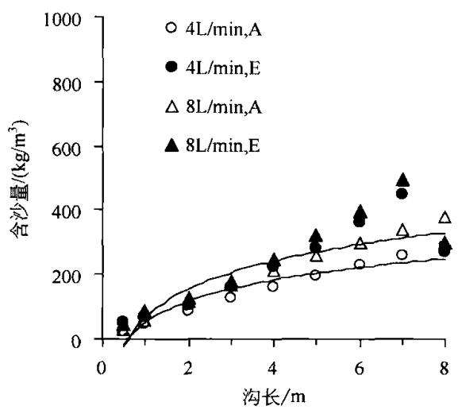  
(a)

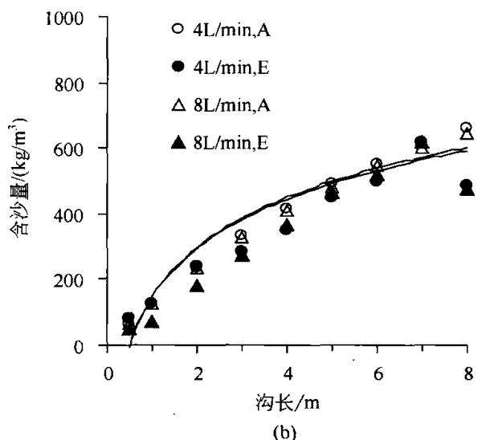

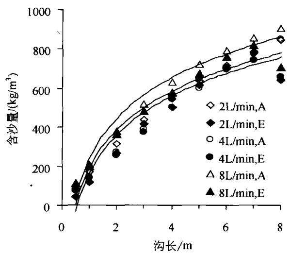  
(c)

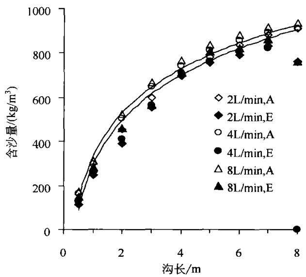  
(d)

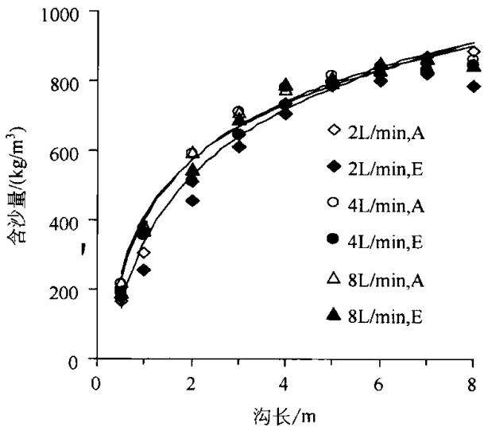  
(e)  
图8.8 解析法确定的含沙量与相应试验值随沟长的变化(a)5°;(b)10°;(c)15°;(d)20°;(e)25°  
A(analytic)表示由解析式得到的含沙量;E(experiment)为试验值

量随坡长的这种变化趋势(迅速增加，到一定值后又逐渐变缓)随坡度的增加表现的更加明显。由不同坡度和流量的分析计算结果和图中数据点的分布趋势来看，由式(8-11)得到的含沙量与试验值有很好的吻合性，直观的反映了此解析式的合理性。

为了定量判断计算结果的好坏，将式(8-11)得到的不同坡度及流量下含沙量与相应试验值进行了回归分析，见图8.9所示。

图中直线斜率为45°，即为1:1的函数直线，数据点距离1:1直线越近，说明解析法 $4 5 ^ { \circ }$ 计算值与由试验数据直接估算值一致性越好。

从图中可以看出不同坡度和流量下的数据点都较集中，且均在1:1斜线附近，这表明解析法结果与试验数据计算值吻合很好。对两种方法得到的结果进行相关性分析，除$5 ^ { \circ }$ 以外，其他坡度条件下的相关系数值均很高，不同水动力条件下的 $R ^ { 2 }$ 如表8.2所示。不同坡度下的拟合情况可以看出，由解析式得到的含沙量与试验数据直接估算值，随坡

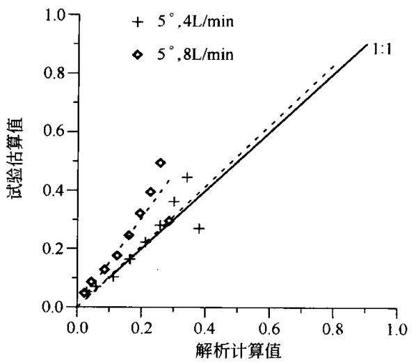  
(a)

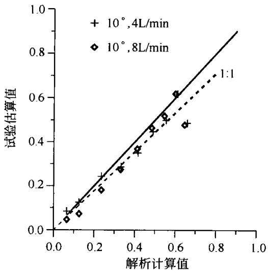  
(b)

  
(c)

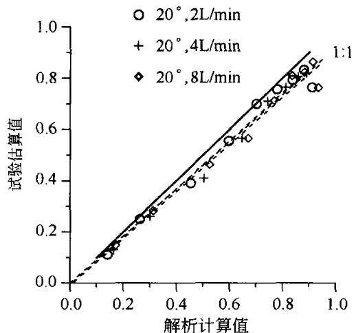  
(d)

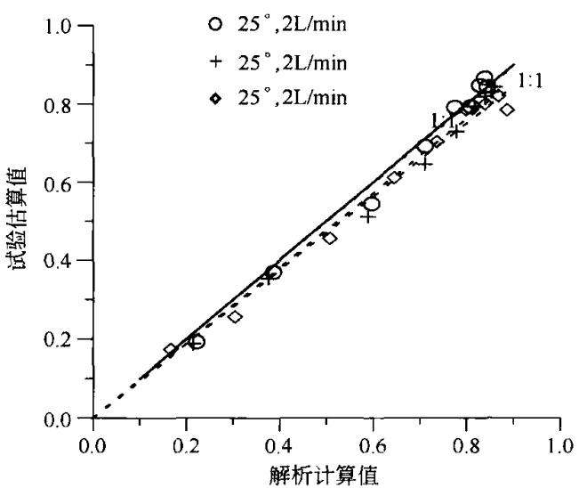  
(e)  
图8.9 解析法确定的输沙量与试验数据估算值相关性分析

度的增加两个值更接近。从各图的数据点分布可以看出，除坡度 $5 ^ { \circ }$ 时由解析式得到的含沙量比试验数据直接估算值要大一些外，在坡度 $1 0 ^ { \circ } , 1 5 ^ { \circ } , 2 0 ^ { \circ } , 2 5 ^ { \circ }$ 时由解析式得到的含沙量比试验数据直接估算值的偏差要小一些。总的来看，由解析式得到的含沙量与试验数据直接计算值基本一致，且表现出了良好的一致性。

表8.2 解析法确定的含沙量与试验值相关性分析结果
<table><tr><td>坡度</td><td>流量/(L/min)</td><td> $R ^ { 2 }$ </td><td>1:1 斜线</td></tr><tr><td rowspan="2"> ${ \mathfrak { s o } }$ </td><td>4</td><td>0.81</td><td> $Y = 1 . 0 4 0 7 x$ </td></tr><tr><td>8</td><td>0.81</td><td> $Y = 1 , 5 3 0 2 x$ </td></tr><tr><td rowspan="2"> $1 0 ^ { \circ }$ </td><td>4</td><td>0.93</td><td> $Y = 0 , 8 8 3 5 x$ </td></tr><tr><td>8</td><td>0.93</td><td> $Y = 0 , 8 9 2 8 x$ </td></tr><tr><td rowspan="3">15°</td><td>2</td><td>0.95</td><td>Y=0.9097x</td></tr><tr><td>4</td><td>0.93</td><td>Y =0.9452x</td></tr><tr><td>8</td><td>0.97</td><td>Y =0.9046x</td></tr><tr><td rowspan="3">20°</td><td>2</td><td>0.98</td><td>Y =0.9266x</td></tr><tr><td>4</td><td>0.99</td><td>Y=0.9185x</td></tr><tr><td>8</td><td>0.97</td><td>Y =0.9046x</td></tr><tr><td rowspan="3">25°</td><td>2</td><td>0.99</td><td>Y=0.996x</td></tr><tr><td>4</td><td>0.99</td><td>Y =0.9526x</td></tr><tr><td>8</td><td>0.99</td><td>Y=0.9382x</td></tr></table>

## 第9章 细沟侵蚀产沙输沙过程与输沙能力

WEPP模型中的细沟侵蚀泥沙连续方程的物理意义是当细沟中的水力剪切力大于土壤临界抗剪切力并且泥沙含量小于水流的输沙能力 $T _ { \mathrm { c } }$ 所能挟带的最大输沙量时出现剥蚀，当泥沙含量大于输送能力 $T _ { \mathrm { { c } } }$ 所能挟带的最大输沙量时出现沉积。水流的输沙能力是WEPP模型中的求解细沟侵蚀泥沙连续方程的关键参数。

水流输沙能力的概念是针对细沟中的泥沙输移已趋平衡且在细沟内不产生冲淤的理想状态而言的，它的表达形式与泥沙运动状况有关(沙玉清，1965；洪惜英，1990;钱宁和万兆惠，1993;倪晋仁和马蔼乃，1998)。Meyer建议的泥沙输沙能力是在单位细沟宽度的基础上，用下面简化的输沙方程计算：

$$
T _ { \mathrm { c } } = k _ { \mathrm { t } } \big ( \tau - \tau _ { \mathrm { c } } \big ) ^ { 3 / 2 }\tag{9-1}
$$

式中， $\mathbf { \nabla } _ { \mathbf { \mathbf { \mathbf { k } _ { t } } } } \mathbf { \nabla } _ { \mathbf { \mathbf { \mathbf { \mathbf { \mathbf { k } _ { t } } } } } }$ 为搬运系数 $[ ( \mathbf { \nabla } { \mathbf { m } } ^ { 0 . 5 } { \mathbf { \cdot } } \mathbf { s } ^ { 2 } ) / \mathbf { k } \mathbf { g } ^ { 0 . 5 } ]$ ，与土壤颗粒粒级有关。

求解细沟内侵蚀输沙的关键参数之一细沟侵蚀输沙量随时间和沟长的关系，以及输沙能力、土壤参数以及临界剪切力的估算。

## 9.1 输沙能力及其试验确定方法

细沟流是一个动态的反馈系统，遵循系统所具有的自组织平衡趋向性原理。细沟流系统的调整方向受细沟流熵变化规律的控制，主要表现在系统调整过程中能量分配呈空间均配的趋向性和能量耗散保持最小的趋向性。细沟与系统以外的环境不断有物质和能量的交换，细沟沿程所携带的含沙量总在变化；另一方面，细沟的自动调整作用又是朝着使变化停止或消失的方向发展。系统在固定流量和坡降时力求使输沙率达到最大，含沙量尽可能趋于饱和，直至达到细沟流输沙能力所能携带的最大输沙量后保持动态平衡。在一定水力侵蚀作用下，细沟侵蚀量的大小主要受制于输沙能力，也就是说，细沟是否冲刷并挟带泥沙向下坡移动，取决于水流输沙能力的大小。

细沟中水流输送泥沙的能力是泥沙沉降和输送平衡状态时的水流挟带泥沙能力的综合性指标。坡面上出现细沟以后，水流由面状漫流转为线状集中水流，流速、水深相应成倍增加，其流动特性和侵蚀输送过程都会发生本质的改变。细沟沿程的横断面与纵比降很不规则，且往往有连续的跌坎，形态演化迅速，使其流态、水力要素和水力特征明显不同于坡面漫流，也不同于一般的明渠流。因此，细沟输沙能力的确定极为复杂。

由于坡面侵蚀输沙理论还不成熟，目前对于细沟流水力特性的研究，仍是借鉴河流动力学的原理和方法。国内外许多学者根据各自的试验得到了计算坡面流输沙能力的不同公式，尽管他们的方法和结果不同，但是他们的共同之处在于通过试验发现影响输沙能力最重要的两个参数是坡度和流量，但对于剪切力和水流功率，哪一个能更好地预测输沙能力存在争议(Zingg,1940;Musgrave,1947; Wischmerier and Smith,1956; Young andMutcher,1969; Li et al.,1973;Komura,1983)。

由试验得到的信息，进一步分析细沟沟长与侵蚀产沙的关系。对5种试验坡度及3种不同流量下侵蚀产沙量随沟长的变化关系进行了回归分析，建立了细沟沟长影响径流侵蚀的非线性数学模型：

$$
c = A { \big ( } 1 - \mathbf { e } ^ { - \beta x } { \big ) } ^ { B }\tag{9-2}
$$

式中 $, c$ 为含沙量 $( \mathbf { g } / \mathbf { m L } ) : \beta$ 为衰减系数 ${ \bf ; } { \pmb x }$ 为细沟沟长(m);A和B为回归系数。上式所表达的物理意义和试验结果是相符的，即含沙量c随着沟长x的增加逐渐增加，但增加的幅度越来越小，逐渐趋近极限值A。A值实际上代表的是细沟水流达到饱和时的含沙量$\beta$ 和B是侵蚀产沙量随距离增加其增长幅度衰减的指数，其值大小与坡度和流量有关。用式(9-2)对试验数据进行拟合得到不同工况条件下的确定系数 $R ^ { 2 }$ 值均很高，最低为0.81,最好达0.96。

把含沙量在一定沟长以后不再有明显增加时的沟长定义为有效沟长或临界沟长。当水流中的泥沙含量与其极限值相差很小(如相差5%)时，即认为此时的泥沙含量为对应于水流输沙能力所能挟带的最大泥沙含量，则由

$$
\frac { A - \underset { x  \infty } { \mathrm { l i m } } ( c ) } { \underset { x  \infty } { \mathrm { l i m } } ( c ) } { \leqslant } 5 \% = 0 . 0 5\tag{9-3}
$$

可得出水流泥沙含量达到输沙能力时所对应的沟长。由上式及式(9-2)可得：

$$
\frac { A - \underset { x  \infty } { \mathrm { l i m } } A ( 1 - \mathrm { e } ^ { - \beta x } ) } { \underset { x  \infty } { \mathrm { l i m } } A ( 1 - \mathrm { e } ^ { - \beta x } ) } = \operatorname* { l i m } [ ( 1 - \mathrm { e } ^ { - \beta x } ) ^ { - 1 } - 1 ] \leqslant 0 . 0 5\tag{9-4}
$$

或

$$
\operatorname* { l i m } _ { x \to \infty } ( 1 - e ^ { - \beta x } ) \geqslant \frac { 1 } { 1 . 0 5 }\tag{9-5}
$$

$$
\ln ( 1 ~ - \mathrm { e } ^ { - \beta x } ) \geq \ln 0 . 9 5 2 3 8\tag{9-6}
$$

即

$$
1 \textrm { -- } \mathrm { e } ^ { - \beta x } \geqslant 0 . 9 5 2 3 8\tag{9-7}
$$

$$
\mathrm { e } ^ { - \beta x } \leqslant 0 . 0 4 7 6 2\tag{9-8}
$$

则得到有效(临界)沟长为

$$
x \geqslant { \frac { 3 . 0 4 4 5 } { \beta } }\tag{9-9}
$$

用式(9-9)可求出细沟水流达到饱和含沙量(输沙能力所能挟带的最大含沙量)时的沟长 $\pmb { x } _ { \textnormal { o } }$ 根据式(9-9)，对试验得到的结果进行了分析计算，结果见表9.1所示。从表中可以看出，侵蚀产沙随沟长的变化趋势受流量和坡度都很明显，坡度越陡流量越大侵蚀产沙量趋于稳定所需要的沟长越短。且坡度增加到一定值后，侵蚀产沙量达到稳定所需要的沟长不再随坡度的增加有明显的变化。试验坡度为 $5 ^ { \circ } \sharp \sharp$ ，侵蚀产沙量达到稳定所需的沟长为12.69m，即沟长达到该值后侵蚀产沙不再随沟长增加有明显增加。试验坡度为 $1 0 ^ { \circ } \mathrm { \iota }$ 时，侵蚀产沙量达到稳定所需的沟长为8.95m。试验坡度为 $1 5 ^ { \circ }$ 时，极限沟长约在8.23m左右。试验坡度自 $2 0 ^ { \circ }$ 增加到 $2 5 ^ { \circ }$ ，达到极限侵蚀产沙需要的沟长没有明显的改变，沟长约6m后侵蚀产沙不再随沟长增加明显增加，这说明对于供试土壤坡度 $2 0 ^ { \circ }$ 到25°之间存在土壤侵蚀的临界转折点。

表9.1 由室内细沟侵蚀模拟试验计算得到的有效坡长及输沙能力
<table><tr><td>坡度/(°)</td><td>流量/(L/min)</td><td>A</td><td> $T _ { \mathrm { c } } / ( \mathrm { k g } / { \mathrm { s } } \cdot \mathrm { m } )$ </td><td> $B$ </td><td> $\beta$ </td><td> $x / \mathbf { m }$ </td><td> $R ^ { 2 }$ </td></tr><tr><td>5</td><td>4</td><td>0.5</td><td>0.33</td><td>1.1</td><td>0.24</td><td>12.69</td><td>0.96</td></tr><tr><td rowspan="2"></td><td>8</td><td>0.5</td><td>0.67</td><td>1.07</td><td>0.26</td><td>11.71</td><td>0.95</td></tr><tr><td>4</td><td>0.61</td><td>0.41</td><td>1.16</td><td>0.34</td><td>8.95</td><td>0.83</td></tr><tr><td rowspan="2">10</td><td>8</td><td>0.61</td><td>0.81</td><td>1.52</td><td>0.34</td><td>8.95</td><td>0.81</td></tr><tr><td>2</td><td>0.78</td><td>0.26</td><td>1.73</td><td>0.4</td><td>7.61</td><td>0.87</td></tr><tr><td rowspan="2">15</td><td>4</td><td>0.76</td><td>0.51</td><td>1.39</td><td>0.37</td><td>8.23</td><td>0.85</td></tr><tr><td>8</td><td>0.76</td><td>1.01</td><td>1.25</td><td>0.45</td><td>6.77</td><td>0.89</td></tr><tr><td rowspan="3">20</td><td>2</td><td>0.85</td><td>0.27</td><td>1.50</td><td>0.52</td><td>5.85</td><td>0.92</td></tr><tr><td>4</td><td>0.80</td><td>0.53</td><td>0.92</td><td>0.51</td><td>5.97</td><td>0.96</td></tr><tr><td>8</td><td>0.85</td><td>1.13</td><td>1.18</td><td>0.51</td><td>5.97</td><td>0.94</td></tr><tr><td rowspan="3">25</td><td>2</td><td>0.82</td><td>0.28</td><td>1.09</td><td>0.5</td><td>6.09</td><td>0.94</td></tr><tr><td>4</td><td>0.85</td><td>0.57</td><td>1.00</td><td>0.51</td><td>5.97</td><td>0.95</td></tr><tr><td>8</td><td>0.87</td><td>1.17</td><td>1.04</td><td>0.55</td><td>5.54</td><td>0.96</td></tr></table>

对于整个坡面的径流输送泥沙，其输沙能力的最好反映指标就是径流含沙量。根据前面的分析，可以在集中稳定水流条件下测定(一系列)不同细沟长度水流的泥沙含量，得到泥沙含量与细沟长度的对应关系。当细沟长度达到某一长度、水流中的泥沙含量达到稳定或不再显著增加时，即可认为水流中的泥沙含量为对应于水流输沙能力的泥沙含量。而在某种沟坡条件下，即使细沟长度达到试验水槽长度时，水流中的泥沙含量仍未达到稳定时，可由试验测得的不同沟床坡度、入流量下泥沙含量与沟长的对应关系，用一个恰当的数学表达式进行拟合，用拟合得到的函数(在一定误差限下，如5%或10%)的极限值来作为水流输沙能力的估计值。

从不同坡度下侵蚀含沙量随沟长变化的趋势关系(图9.1），可以看出等值线在不同坡度下随沟长的增加，由密集变得稀疏，这标志着侵蚀含沙量随坡长的增加而增加，但增加幅度逐渐减小，开始增加很快，随后逐渐变缓。在坡度较大时，含沙量随沟长的增加迅速增加到一定值后，很快趋于平缓，最后逐渐出现一个平台。试验结果表明，产沙量随沟长的增加达到一定值后就不再增加，可以认为含沙量此时已达饱和。水流的饱和含沙量即为对应于水流输沙能力的含沙量，可由此确定一定坡度下的水流输沙能力以及与输沙能力相对应的细沟沟长。同时当坡度增大时，侵蚀加剧，并且水流中含沙量达到饱和的坡长变短。

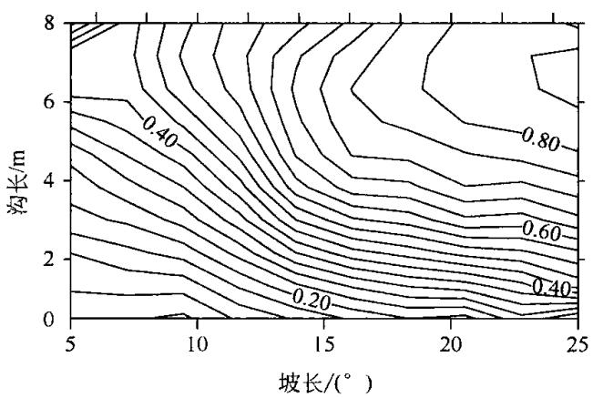  
图9.1 含沙量与坡度和沟长关系等值线图(流量8L/min)

由不同坡度和流量下含沙量随沟长的变化关系发现，在一定侵蚀动力(坡度和流量)条件下，泥沙含量随着沟长的增加而增加，但增加的幅度(含沙量曲线的斜率)由入口处开始逐渐减小，泥沙含量渐渐趋近一个稳定值。可以认为该稳定的极限含沙量即为细沟水流输沙能力所能挟带的最大含沙量。由此得到计算细沟流输沙能力的函数表达式 $( T _ { \mathrm { { c } } } )$

$$
T _ { \mathrm { ~ c ~ } } = A q\tag{9-10}
$$

计算结果列于表9.1。试验数据回归结果的相关系数 $R ^ { 2 }$ 值均很高，最低为0.809，最好达0.961。坡度变陡，A有明显的增加，即输沙能力随坡度变化明显。但坡度从 $2 0 ^ { \circ }$ 增加到25°，A却没有明显的改变，即输沙能力不变。这与前面讨论的结果一致。同时 $\beta$ 值与A值具有类似的变化趋势：同一坡度时，随流量变化不明显；但随坡度增加而明显增大；当坡度接近25°以后，该值基本稳定。

细沟主要是破坏土体间的连接力，同时由于水深加大引起细沟壁土体崩解剥蚀，崩解和剥蚀是同时作用的。当有细沟产生时，单位宽度坡面上流量增大，流速增加，径流能量集中，细沟中水流的剪切力增大，导致细沟流输沙能力大增。细沟水流不但是坡面土粒剥蚀的动力而且是输移剥蚀土粒的载体，输移能力的大小决定于径流的能量。当径流所携带的泥沙量超过输沙能力时，其含沙量就可能下降。由于细沟流相对集中，摩擦阻力减小，细沟流的输沙能力增强，致使一些粗颗粒甚至土块也可能携带下去。坡面细沟水蚀主要取决于两个典型因子，即降雨(径流)状况和下垫面条件。黄土地区属超渗产流区，坡面产流主要取决于雨强(对室内水流冲刷试验而言，其主要影响因子则是径流流量)。流量越大，细沟水流可以挟带的泥沙就越多，输沙能力就越大。在土壤质地和结构一致的情况下，影响下垫面的主要因子是坡度，坡度越陡，细沟水流可以挟带泥沙的动力就越大，输沙能力就越大，故坡度和流量就成了影响输沙能力的主要因子。由此可以确定，细沟水流的输沙能力是坡度、入流量的函数。

## 9.2 细沟输沙能力的解析方法

为了尝试把表征坡面细沟侵蚀过程的变量和激发条件、时空变化包括在一个表达式内，本节介绍用数学上的积分法和积分变换等方法直接求细沟输沙能力。在侵蚀产沙方程理论分析的基础上，由设计的细沟侵蚀精细模拟冲刷试验得到的结果，借助数学方法，探讨侵蚀产沙方程中输沙能力的解析确定方法，将由解析方法计算得到的输沙能力与由试验数据直接估算出来的结果进行对比，对解析结果进行验证。

坡面细沟水流剥蚀的土粒在水流中的变化满足质量守恒和连续变化规律，可以用质量守恒和过程连续微分方程来描述坡面侵蚀过程。细沟侵蚀量 $D _ { \textup { r } }$ 可以用质量守恒和过程连续微分方程计算。WEPP模型中侵蚀产沙方程的物理意义是：细沟内的土壤侵蚀量与“沟内水流输沙能力与沟内水流实际挟带的泥沙量之差值”成正比，这就意味着当水流中泥沙含量没有达到饱和时，水流会持续剥蚀土壤表面的土壤颗粒；当水流中泥沙含量达到饱和时，水流含沙量达到输沙能力所能携带的最大输沙量。

由试验数据得到了土壤剥蚀率与水流含沙量的关系，对于黄土高原的粉壤土(黄绵土），在集中水流作用下细沟水流剥蚀率随含沙量的增加(近似地)呈线性减小。当水流含沙量(c)达到饱和，即达到水流的输沙能力时，水流不再由沟床剥离泥沙，此时 $D _ { \mathrm { r } } = 0$ 从而由细沟水流剥蚀率与水流含沙量的关系： $D _ { \mathrm { r } } = a + b c = 0$ ,得

$$
\left. c \right| _ { D _ { \mathrm { r } } = 0 } = - \frac { a } { b }\tag{9-11}
$$

水流的输沙能力即可用含沙量达到饱和时细沟流携带的最大输沙量表示，即

$$
T _ { \mathrm { { c } } } ~ = - ~ { \frac { a } { b } } q\tag{9-12}
$$

细沟土壤剥蚀率为(细沟中)单位宽度水流所含泥沙沿距离的变化率，或等价地说土 壤剥蚀率为(细沟中)水流含沙量对距离的变化率与单宽流量之积

$$
D _ { \mathbf { r } } ( \mathbf { \boldsymbol { x } } ) \ = \ \frac { \mathrm { d } c ( \mathbf { \boldsymbol { x } } ) } { \mathrm { d } \boldsymbol { x } } q\tag{9-13}
$$

将式(9-13)代入剥蚀率与含沙量的线性方程，有

$$
{ \frac { \mathrm { d } c ( x ) } { \mathrm { d } x } } q = a + b c\tag{9-14a}
$$

求解式(9-14)的边界条件为

$$
\left. c \right| _ { x = 0 } = 0\tag{9-14b}
$$

根据确定的边界条件对式(9-14)积分，得到的含沙量与沟长的表达式如下：

$$
c \ = \ - \ \frac { a } { b } \{ 1 \ - \ \mathbf { e } ^ { [ \mathbf { \mu } \ \left( \frac { b } { q } \right) x ] } \ \}\tag{9-15}
$$

式(9-15)的隐含意义是：假定细沟足够长，那么随着沟长的增加，沿程水流不断剥蚀土粒，水流中的泥沙含量不断增加并最终达到最大值——输沙能力所能携带的输沙量。即在式(9-15)中当沟长趋于无穷大时，水流的饱和含沙量为

$$
\left. c \right| _ { x = \infty } = - \frac { a } { b }\tag{9-16}
$$

水流的输沙能力可用含沙量达到饱和时细沟流携带的最大输沙量表示，同样可得到计算输沙能力的表达式，即

$$
T _ { \mathrm { { c } } } ~ = - { \frac { a } { b } } q\tag{9-17}
$$

式(9-17)与式(9-12)表达形式完全一致，也就是说对试验数据拟合得到的剥蚀率与含沙量的函数表达式，或对剥蚀率微分方程进行推导，得到了相同计算输沙能力 $T _ { \mathrm { c } }$ 的表达式。这两者相互印证，从理论上说明了水流输沙能力解析法的正确性。由不同坡度及径流流量下的试验结果回归得到了参数a和b值，代入式(9-17)计算得到了输沙能力(图9.2)。

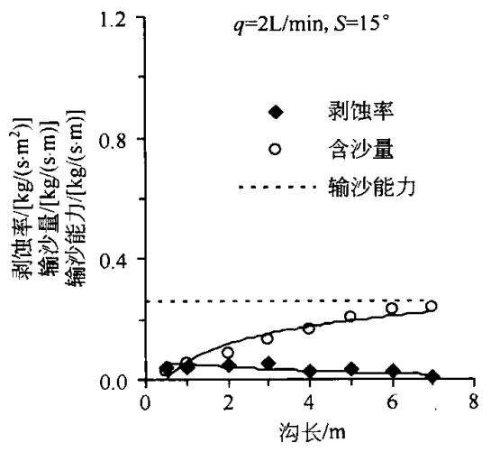  
(a)

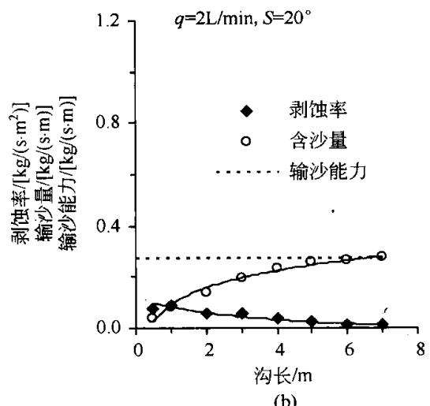  
(b)

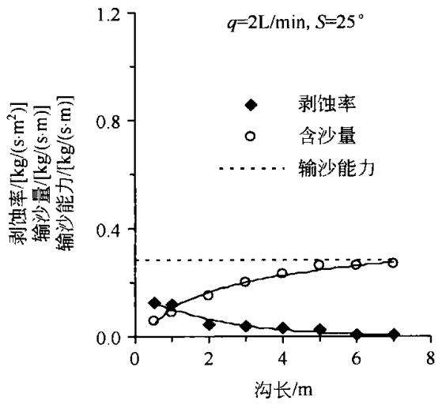  
(c)

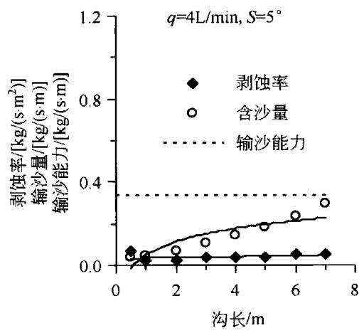  
(d)

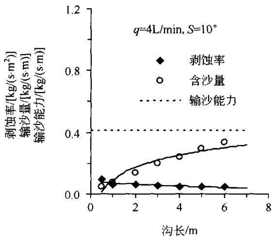  
(e)  
(f)

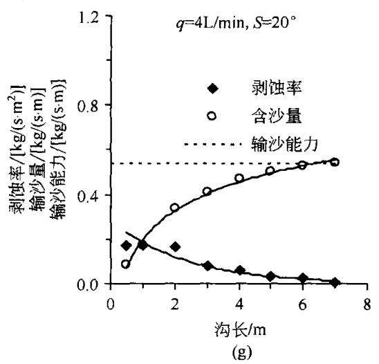

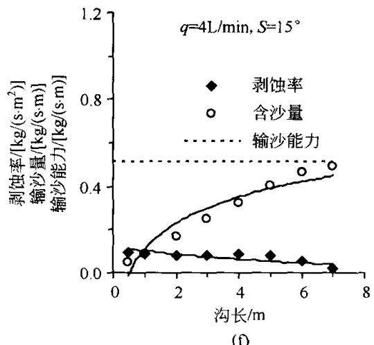

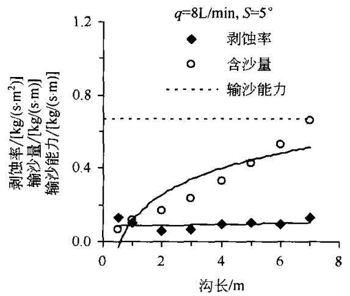

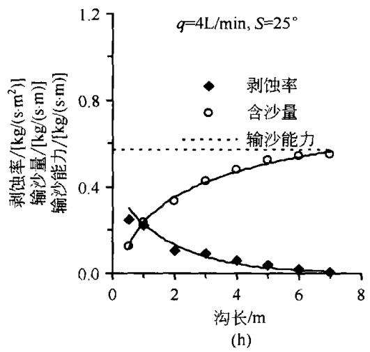

(i)  
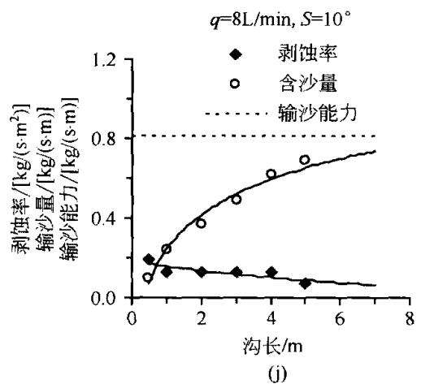

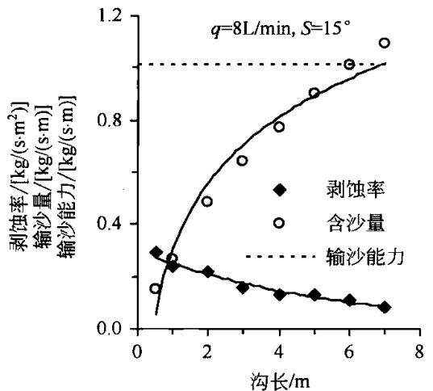  
(k)

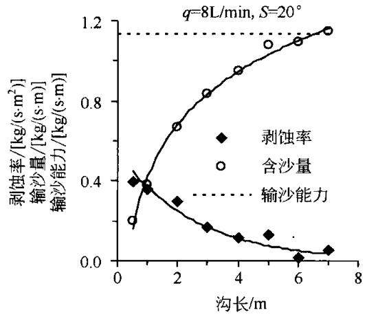  
(1)

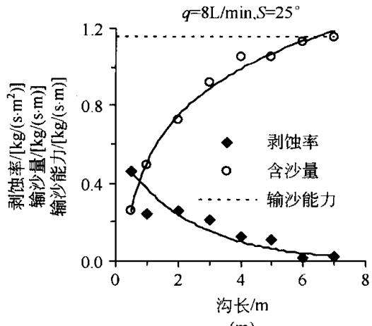  
(m)  
图9.2 由解析法计算得到不同工况下的输沙能力

式(9-15) 中指数系数 $( \mathbf { \nabla } - b / q )$ 与试验得到的侵蚀产沙量和沟长的函数关系式中的衰减系数 $\beta$ 有着一样的物理含义，均为表示侵蚀产沙量随细沟沟长增加快慢的系数。为进一步研究其相关性，将两者进行了比较，结果见图9.3所示。图中直线斜率为 $4 5 ^ { \circ }$ ,数据点越靠近此直线，说明两者相关性越好。两个系数的拟合曲线为 $\beta = \mathrm { ~ - ~ } 1 . 0 6 b / q$ ,确定系

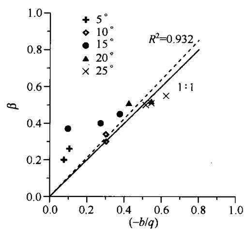  
图9.3 $- b / q$ 与衰减系数 $\beta$ 相关性分析

数 $R ^ { 2 }$ 值为0.93,残差均方为0.164,说明由解析式得到的衰减系数 $( \mathbf { \nabla } - b / q )$ 与直接由试验数据估算得出的系数 $\beta$ 有很好的一一对应关系，表明由解析方法推导细沟流输沙能力的含沙量函数式和由试验方法估算输沙能力的函数关系式有很好的相关性，间接的证明了此解析法的正确性。在 $2 5 ^ { \circ }$ 和$2 0 ^ { \circ }$ 时的值靠近1:1拟合曲线，在 $5 ^ { \circ } , 1 0 ^ { \circ } , 1 5 ^ { \circ }$ 时的值相对较分散，这表明所提出的解析式在陡坡时表现出了更好的结果。解析式克服了现有的坡面侵蚀预测预报模型选用的参数(特别是输沙能力)以及计算方法只适合于缓坡而不适合陡坡的情况。

## 9.3 输沙能力与坡度和流量的关系

土壤侵蚀过程实际是一个具有整体性和综合性作用的系统过程。整体性表现为土壤侵蚀作为一种过程，由动力学作用贯穿始终，诸因子的作用仅仅是对动力学过程的影响、辅助或参与;综合性表现为在动力学过程中，诸因子间存在互动耦合效应，即诸因子间有相互作用和影响。对研究土壤侵蚀来说，因子作用和效应关系是非常复杂的，建立合理的土壤侵蚀模型，首先需要对因子效应有合理的解释。

对土壤水力侵蚀而言，水动力学作用是直接原因，其他因子作用是一种间接效应。能量是对力的一种描述，是分析土壤侵蚀过程中力的作用和关系的良好指标，诸因子的作用可通过对侵蚀能量的分配和转换来描述。细沟流不但是坡面土粒剥蚀的动力，而且是输移剥蚀土粒的载体。输移能力的大小决定于径流的能量，而坡度和流量是影响细沟流能量的重要因素，也是影响细沟发育的主要条件。

细沟流输沙能力与流量和坡度的关系见图9.4和图9.5。坡度是构成地形的基本要素，它既是影响细沟发育的重要因素，其本身又是侵蚀在不断发展过程中塑造出的产物。因此，坡度和侵蚀两者之间存在着相互促进和相互制约的复杂关系。随坡度的增加，径流位能增大，径流的冲刷力增大，径流的输沙能力也随之增加。细沟破坏土体间的连接力，流量增大，细沟流携带泥沙的能力增大，同时由于水深加大引起细沟壁土体崩解剥蚀，输沙能力随之增大。若不考虑流动摩擦阻力，则径流在坡面以加速度的方式流动，其动能与流量的1次方和流速的2次方成正比。当有细沟产生时，单位宽度坡面上流量增大，流速增加，径流能量集中，细沟中水流的剪切力增大，导致径流更大的挟带和输移能力。由试验结果看出，输沙能力随流量和坡度的增大而增大，随着流量的增大输沙能力呈线性增加，坡度越陡斜线斜率越大，说明坡度越陡，流量对输沙能力的影响越明显；输沙能力随坡度的增大呈对数增大，且在流量较大时(8L/min)时更为明显。对坡度和流量对输沙能力的影响进行了相关性分析

$$
T _ { c } \ = \ a + b S + c Q\tag{9-18}
$$

式中，a，b和c为回归系数；S为坡度；Q为流量。且 $a = \mathrm { ~ - ~ } 0 . 3 1 0 9 , b = 0 . 0 1 7 1 8 , c =$ 0.12703，由t检验发现系数b和c在置信水平为0.05时非常显著，说明坡度和流量对细沟输沙能力有非常显著的影响。

通过研究坡度和流量对细沟输沙能力的影响，不但在理论上可以揭示坡面细沟发生发展过程及其形成机制，而且在实践中可为有效地进行坡地水土流失的治理规划设计和水土保持措施的优化配置提供科学依据。细沟侵蚀过程中物质的变化有峰值出现，由于峰值的出现必然引起侵蚀的剧增。所以，在防治坡面细沟侵蚀时，必须遏制或减小峰值的出现，植物活篱笆、林草间距或其他水土保持措施布设的间距应该小于细沟侵蚀达到输沙能力所对应的临界坡长，同时削减坡度和流量是减小细沟输沙能力的重要措施。

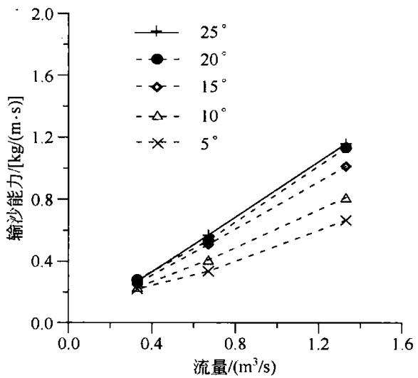  
图9.4 输沙能力和流量的关系

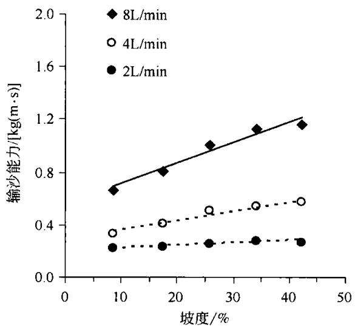  
图9.5 输沙能力与坡度的关系

## 9.4 输沙能力与水流功率的关系

坡面细沟流在重力分力作用下，沿着一定坡度由高处向低处流动，随之带动了地表颗粒，形成了泥沙运动。泥沙由水流携带而运动实质上是固液两相流运动，服从于两相流运动规律。对于一个分散的两相流耗散系统，系统的平衡有序结构需要通过能量耗散来实现，在向平衡有序结构发展的进程中，系统的能量耗散率只能减少。在熵理论中，细沟流系统处于平衡状态时的水流功率(能量耗散率)是最小的。Bagnold首先借鉴输沙研究中的溪流泥沙输送预测方程，提出了水流功率(stream power)的概念，后来许多学者在细沟侵蚀研究中计算输沙能力时引入了这个的概念，水流功率 $\omega ( \mathbf { k g } / \mathbf { s } ^ { 3 } )$ 即单位床面上的耗能率，被定义为

$$
\omega = \rho g S _ { x } q\tag{9-19}
$$

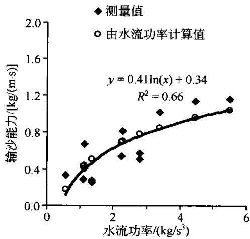  
图9.6 输沙能力和水流功率的关系

式中 $, \pmb { \rho }$ 为水的质量密度 $( \mathrm { \bf ~ k g } / \mathrm { \bf m } ^ { 3 } )$ ;g为重力加速度$( \mathbf { m } { \cdot } \mathbf { s } ^ { 2 } ) : S _ { \mathbf { x } }$ 为坡度(%);q 为单宽流量 $( \mathbf { m } ^ { 2 } / \mathbf { s } )$ 。经分析得到输沙能力和水流功率的关系如图9.6所示。可以看出，细沟流输沙能力随水流功率的增大呈对数增大，拟合对数方程为 $T _ { c } = 0 . 4 1 \log \omega + 0 . 3 4$ ,得到的回归平方和为0.83，残差平方和为0.428， $R ^ { 2 }$ 为0.66。

Nearing等(1997)根据大量室内细沟侵蚀试验数据，提出了细沟侵蚀输沙能力与水流功率之间的关系表达式，并由回归得到了方程参数。这一表达式为雷廷武和Nearing(1998)等证实，可以作为水流输沙能力方程使用。该表达式具有如下形式

$$
\log _ { 1 0 } \left( T _ { \mathrm { c } } \right) = A + \frac { B \mathrm { e } ^ { \left[ a + b \mathrm { l o g } \left( \omega \right) \right] } } { 1 + \mathrm { e } ^ { \left[ a + b \mathrm { l o g } \left( \omega \right) \right] } }\tag{9-20}
$$

式中， ${ \mathbf { } } , { \cal T } _ { \mathfrak { c } }$ 为输沙能力 $\left[ \mathbf { k g } / \left( \mathbf { m } \cdot \mathbf { s } \right) \right] ; a = 0 . 8 4 5 ; b = 0 . 4 1 2 ; A = - 3 4 . 4 7 ; B = 3 8 . 6 1$ 为回归参数。用Nearing提出的输沙能力方程对解析法计算得到的输沙能力进行了拟合，方程中的系数分别调整为： $a = 0 . 9 8 5 ; b = 0 . 0 8 7 ; A = \ - 2 9 . 4 7 ; B = 4 0 . 0 1$ 。将由水流功率代入Nearing输沙能力方程得到的结果和试验值进行了相关性分析，结果见图9.7所示。发现两者相关性很好，回归直线为 $\boldsymbol { y } = 0 , 9 5 5 \boldsymbol { x }$ ,残差平方和为0.433,残差平均平方为0.036，$R ^ { 2 }$ 为0.93。

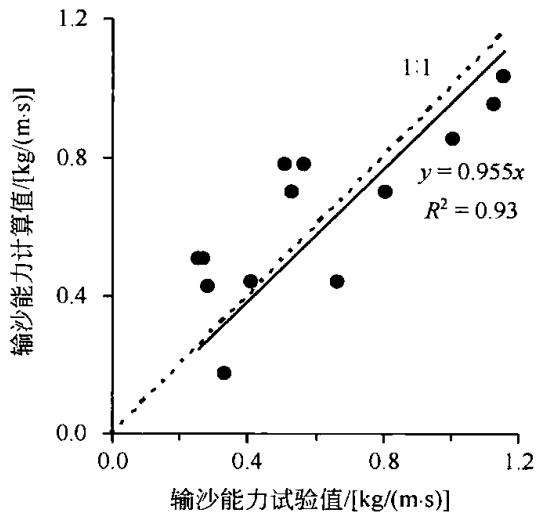  
图9.7 水流功率计算得到的输沙能力和试验值比较

由以上分析可知道，不管是直接将解析法计算得到的输沙能力与水流功率进行比较，还是用Nearing提出的输沙能力和水流功率的对数方程对计算结果进行分析，均表明水流功率是预测细沟输沙能力的很好指标。

细沟流输沙能力极为复杂，对于细沟流耗散系统，系统的平衡有序结构需要通过能量耗散来实现，细沟流处于平衡状态时的水流功率即能量耗散率是最小的，对于固定的流量和坡降，细沟流系统力求使输沙量最大，即含沙量尽可能的趋向于细沟流输沙能力所能携带的最大值，致使含沙量达到饱和。据此，从室内细沟侵蚀的精细模拟试验已得到的细沟侵蚀剥蚀率和含沙量的关系，推导得到了输沙能力的解析式。其计算结果与试验数据直接确定的输沙能力进行比较，不同坡度下相应的 $R ^ { 2 }$ 值及显著性检验结果表明此解析方法得到的结果与试验直接计算结果有很好的相关性。此解析方法的提出为黄土坡面尤其是陡坡条件下获得输沙能力提供了一种新的方法，同时可以简化室内模拟试验的试验步骤，最终可为坡面侵蚀过程的参数量化以及土壤侵蚀预报向完全物理模型转化和全方位验证提供工具。

细沟流不但是坡面土粒剥蚀的动力，而且是输移剥蚀土粒的载体，输移能力的大小决定于径流的能量，而坡度和流量是影响细沟流能量的重要因素。细沟流输沙能力受多种因素的影响，其中以流量和坡降最为明显。输沙能力随着坡度和流量的增加而增大，随坡度的增加呈对数增大，随流量的增加呈线性增大，在缓坡时，流量对输沙能力的影响很显著，陡坡时，流量对输沙能力的影响相对减小。由多元回归分析和t检验发现坡度和流量的系数在置信水平为0.05时非常显著，说明坡度和流量的确对细沟输沙能力有非常显著的影响。输沙能力随水流功率的增大呈对数增加；且由Nearing提出的输沙能力和水流功率对数方程计算得到的输沙能力和试验结果相关性很好。分析结果表明，可以利用水流功率来预测细沟流的输沙能力。

通过研究坡度和流量对细沟输沙能力的影响，不但在理论上可以揭示坡面细沟发生发展过程及其形成机制，而且在实践中可为有效地进行坡地水土流失治理的规划设计和水土保持措施的优化配置提供科学依据。细沟侵蚀过程中物质的变化有峰值出现，由于峰值的出现必然引起侵蚀的剧增。所以，在防治坡面细沟侵蚀时，必须遏制或减小峰值的出现，植物活篱笆或其他水土保持措施布设的间距应该小于细沟侵蚀达到输沙能力所对应的临界坡长，同时削减坡度和流量是减小细沟输沙能力的重要措施。

## 第 10 章 土壤可蚀性参数和临界抗剪切应力

## 10.1 WEPP 模型细沟可蚀性参数估计

美国开发的可以表征时空变化的WEPP土壤水蚀预报模型，以实际发生的水沙物理过程为基础，用数学方程描述并用一定的方法求解，进行概化和预报坡面、流域内的土壤侵蚀和泥沙输移过程。为使模型真正以物理过程为基础，模型中所用的物理参数必须具有明确的物理意义，而且可以直接由试验测量或计算。WEPP预报模型将坡面土壤可蚀性分为细沟可蚀性参数 $K _ { \mathrm { r } }$ 和细沟间可蚀性参数 $K _ { \mathrm { i } }$ ,细沟可蚀性参数 $K _ { \mathrm { r } }$ 和临界剪切力 $\tau _ { \mathrm { c } }$ 衡量土壤对细沟流侵蚀力的抵抗程度， $K _ { \mathrm { i } }$ 表示土壤对雨滴击溅和片流侵蚀的敏感性，这种精细划分有助于坡面水蚀过程的理解、准确预报和模拟。然而，由于实验方法和手段的限制，模型中细沟可蚀性参数 $K _ { \mathrm { r } }$ 值的测量与计算仍然存在一定的问题。它是在以一定长度、一定宽度的径流小区试验确定的细沟侵蚀产沙量，通过回归同时得到土壤的可蚀参数与土壤的临界抗剪切力 $\tau _ { \mathrm { c } }$ ，由于计算方法的限制，有时甚至可以出现负值。

细沟剥蚀能力从概念上表达为

$$
\smash {  { D _ { \mathrm { c } } } = K _ { \mathrm { r } } ( \tau - \tau _ { \mathrm { c } } ) }\tag{10-1}
$$

式中， $D _ { \mathrm { c } }$ 为细沟水流对土壤的最大剥蚀率(potential detachment rate);或称为剥蚀能力(detachment capacity), $[ \bf k g / ( \bf m ^ { 2 } \cdot \bf s ) ]$ ;τ与 $\tau _ { \mathfrak { c } }$ 分别为水流对土壤的剪切力与土壤的临界抗剪切力， $\mathrm { P a } ; K _ { \mathrm { r } }$ 为细沟土壤可蚀性参数，定义为每增加一个单位的剪切力所增加的剥蚀率 $\bf { \bar { k } } \bf { g } / ( \bf { m } ^ { 2 } \cdot \bf { s } \cdot \bf { P a } )$ 或 $\mathbf { s } / \mathbf { m } ]$ 。将方程(10-1)变形得

$$
\tau = \frac { D _ { \mathrm { c } } } { K _ { \mathrm { r } } } + \tau _ { \mathrm { c } }\tag{10-2}
$$

方程(10-2)中的截距就是土壤的临界抗剪切力，斜率的倒数就是细沟土壤可蚀性参数。

为了在美国不同地区应用WEPP预报土壤侵蚀量，科研工作者花费了大量人力、物力和财力，在全美国对有代表性的土壤进行试验研究，以确定其土壤可蚀性参数，并于1989年编印出版了参数手册和数据库。

Gilley等在1993年描述了确定土壤可蚀性参数的方法。他们所采用的试验与计算方法描述如下：研究地点选在具有同类土壤性质的均一坡耕地上，去除地表的残留物，在试验进行3到12月前对试验地犁耕，犁耕后运用耕作措施或除草剂以保持地面裸露。采用宽0.46m、长9m的田间径流小区进行人工模拟降雨后产生细沟，然后在所产生的细沟内做放水冲刷试验，通过收集径流泥沙量来估计土壤剥蚀率，用于确定式(10-2)中的 $D _ { e }$ 值；采用不同的流量以确定不同水流条件下的土壤剥蚀率，把由此得到的一系列数据采用式(10-2)进行回归，得到了全美国具有代表性的土壤的可蚀性参数和土壤临界抗剪切力，表10.1为由人工模拟降雨在田间径流小区(宽0.46m、长9m)产生的细沟，经放水试验得到的数据计算得到的可蚀性参数和土壤临界抗剪切力。

表10.1 由人工模拟降雨在田间径流小区（宽0.46m、长9m)  
计算得到的可蚀性参数和土壤临界抗剪切力
<table><tr><td rowspan="2">土壤类型</td><td rowspan="2">地点</td><td rowspan="2"></td><td rowspan="2">细沟均坡/%</td><td colspan="3">颗粒组成/%</td><td rowspan="2"> $\pmb { \tau _ { c } } / \mathbf { P } \mathbf { a }$ </td><td rowspan="2"> $K _ { \mathrm { r } } / ( \mathbb { s } / \mathbf { m } )$ </td><td rowspan="2"> $R ^ { 2 }$ </td></tr><tr><td>砂粒</td><td>粉粒</td><td>黏粒</td></tr><tr><td>Academy</td><td>加利福尼亚 Fresno</td><td>CA California</td><td>4.5</td><td>62.7</td><td>29.1</td><td>8.2</td><td>1.82</td><td>0.007</td><td>0.83</td></tr><tr><td>Amarillo</td><td>得克萨斯 Howard</td><td>TX Texas</td><td>3.6</td><td>85.0</td><td>7.7</td><td>7.3</td><td>1.92</td><td>0.048</td><td>0.63</td></tr><tr><td>Barnes-MN</td><td>明尼苏达 Stevens</td><td>MN Minnesota</td><td>8.3</td><td>48.6</td><td>34.4</td><td>17.0</td><td>5.70</td><td>0.013</td><td>0.64</td></tr><tr><td>Barnes-ND</td><td>北达科他 Sheridan</td><td>ND North Dakota</td><td>5.8</td><td>39.5</td><td>36.0</td><td>24.5</td><td>4.53</td><td>0.005</td><td>0.61</td></tr><tr><td>Caribou</td><td>缅因 Aroostook</td><td>ME Maine</td><td>8.8</td><td>47.0</td><td>40.3</td><td>12.7</td><td>7.07</td><td>0.003</td><td>0.61</td></tr><tr><td>Cecil</td><td>佐治亚 Oconee</td><td>GA Georgia</td><td>4.5</td><td>64.6</td><td>15.6</td><td>19.8</td><td>2.56</td><td>0.005</td><td>0.62</td></tr><tr><td>Collamer</td><td>纽约 Tompkins</td><td>NY New York</td><td>8.7</td><td>7.0</td><td>78.0</td><td>15.0</td><td>5.86</td><td>0.013</td><td>0.72</td></tr><tr><td>Frederick</td><td>马里兰 Washington</td><td>MD Maryland</td><td>12.8</td><td>25.1</td><td>58.3</td><td>16.6</td><td>9.54</td><td>0.004</td><td>0.64</td></tr><tr><td>Gaston</td><td>北卡罗来纳 Rown</td><td>NC NorthCarolina</td><td>6.4</td><td>35.5</td><td>25.4</td><td>39.1</td><td>2.54</td><td>0.003</td><td>0.61</td></tr><tr><td>(cenada</td><td>密西西比 Panola</td><td>MS Mississippi</td><td>8.7</td><td>2.0</td><td>77.8</td><td>20.2</td><td>6.39</td><td>0.007</td><td>0.61</td></tr><tr><td>Heiden</td><td>得克萨斯 Falls</td><td>TX Texas</td><td>3.9</td><td>8.6</td><td>38.3</td><td>53.1</td><td>1.94</td><td>0.008</td><td>0.68</td></tr><tr><td>Hersh</td><td>内布拉斯加 Valley</td><td>NE Nebraska</td><td>6.6</td><td>74.4</td><td>15.9</td><td>9.7</td><td>3.14</td><td>0.015</td><td>0.62</td></tr><tr><td>Hiwassee</td><td>佐治亚 Oconee</td><td>GA Georgia</td><td>4.0</td><td>63.7</td><td>21.6</td><td>14.7</td><td>1.94</td><td>0.009</td><td>0.73</td></tr><tr><td>Lewisburg</td><td>印第安纳 Whitley</td><td>IN Indiana</td><td>7.5</td><td>38.5</td><td>32.2</td><td>29.3</td><td>4.87</td><td>0.010</td><td>0.66</td></tr><tr><td>Manor</td><td>马里兰 Howard</td><td>MD Maryland</td><td>8.6</td><td>43.6</td><td>30.7</td><td>25.7</td><td>6.77</td><td>0.010</td><td>0.81</td></tr><tr><td>Mexico</td><td>密苏里 Boone</td><td>MO Missouri</td><td>3.9</td><td>5.3</td><td>68.7</td><td>26.0</td><td>1.90</td><td>0.043</td><td>0.65</td></tr><tr><td>Miami</td><td>印第安纳 Montgomery</td><td>IN Indiana</td><td>5.8</td><td>4.2</td><td>72.7</td><td>23.1</td><td>4.64</td><td>0.023</td><td>0.70</td></tr><tr><td>Miamian</td><td>俄亥俄 Montgomery</td><td>OH Ohio</td><td>8.9</td><td>30.6</td><td>44.1</td><td>25.3</td><td>7.22</td><td>0.011</td><td>0.63</td></tr><tr><td>Nansene</td><td>华盛顿 Whitman</td><td>WA Washington</td><td>6.1</td><td>20.1</td><td>68.8</td><td>11.1</td><td>3.58</td><td>0.020</td><td>0.61</td></tr><tr><td>Opequon</td><td>马里兰 Allegany</td><td>MD Maryland</td><td>12.0</td><td>37.7</td><td>31.2</td><td>31.1</td><td>10.6</td><td>0.011</td><td>0.61</td></tr><tr><td>Palouse</td><td>华盛顿 Whitman</td><td>WA Washington</td><td>6.5</td><td>9.8</td><td>70.1</td><td>20.1</td><td>4.35</td><td>0.009</td><td>0.74</td></tr><tr><td>Portneuf</td><td>爱达荷 Twin Falls</td><td>ID Idaho</td><td>5.6</td><td>21.5</td><td>67.4</td><td>11.1</td><td>4.30</td><td>0.021</td><td>0.70 0.67</td></tr><tr><td></td><td>Sharpsburg 内布拉斯加 Lancaster</td><td>NE Nebraska</td><td>5.7</td><td>4.8</td><td>55.4</td><td>39.8</td><td>4.46</td><td>0.005</td><td>0.61</td></tr><tr><td>Sverdrup</td><td>明尼苏达 Grant</td><td>MN Minnesota</td><td>4.2</td><td>75.3</td><td>16.8</td><td>7.9</td><td>1.73</td><td>0.009</td><td>0.64</td></tr><tr><td>Tifton</td><td>佐治亚 Worth</td><td>GA Georgia</td><td>4.6</td><td>86.4</td><td>10.8</td><td>2.8</td><td>2.20</td><td>0.007</td><td></td></tr><tr><td>Whitney</td><td>加利福尼亚 Fresno</td><td>CA California</td><td>7.4</td><td>71.0</td><td>21.8</td><td>7.2</td><td>2.65</td><td>0.018</td><td>0.73</td></tr><tr><td>Woodward</td><td>俄克拉荷马 Harper</td><td>OK Oklahoma</td><td>7.1</td><td>43.7</td><td>42.4</td><td>13.9</td><td>3.61</td><td>0.012</td><td>0.61</td></tr><tr><td>Zahl</td><td>蒙大拿 Roosevelt</td><td>MT Montana</td><td>7.6</td><td>46.3</td><td>29.7</td><td>24.0</td><td>4.51</td><td>0.019</td><td>0.64</td></tr></table>

## 10.2 (有理)实验法确定细沟可蚀性参数与临界抗剪切应力

把土壤可蚀性及临界剪切力的研究与侵蚀过程的研究结合起来，通过对WEPP模型中的产沙方程进行理论分析，利用室内细沟侵蚀模拟冲刷试验，推导出可蚀性参数及土壤临界抗剪切力的计算方法。临界剪切力和坡度的关系一直是一个有争议的问题，不同的学者得到了不同的结论，本节就试验结果与其他学者所得结论进行了比较。

## 10.2.1 理论分析及数学推导

细沟可蚀性参数 $K _ { \mathrm { r } }$ 和土壤临界剪切力 $\tau _ { \mathrm { c } }$ 是WEPP细沟侵蚀产沙方程中的两个主要参数，土壤侵蚀产沙数学模型如下式表述(Nearing et al.,1989;Foster et al.,1995; Flanaganet al.,1995)

$$
D _ { \mathrm { r } } = K _ { \mathrm { r } } \big ( \tau - \tau _ { \mathrm { c } } \big ) \Big ( 1 - \frac { q c } { T _ { \mathrm { c } } } \Big )\tag{10-3}
$$

式中， $D _ { \mathbf { r } }$ 为细沟剥蚀率 $[ \bf k g / ( \bf m ^ { 2 } \cdot \bf s ) ]$ ;K，为细沟土壤可蚀性参数，定义为每增加一个单位的剪切力所增加的剥蚀率 $[ { \bf k } { \bf g } / ( { \bf m } ^ { 2 } \cdot { \bf s } \cdot { \bf P a } )$ 或 $\mathbf { s } / \mathbf { m } ] : \tau$ 与 $\pmb { \tau _ { \mathrm { c } } }$ 分别为水流的剪切力及土壤临界剪切力(Pa或 $\mathbf { N } / \mathbf { m } ^ { 2 } )$ ;q 为流量 $( \mathbf { m } ^ { 2 } / \mathbf { s } )$ ;c 为泥沙含量 $( \mathrm { k g } / \mathrm { m } ^ { 3 } ) ; T _ { \mathrm { c } }$ 为水流的输沙能力 $\mathbf { \tilde { \mu } _ { k g } } / ( \mathbf { m \cdot s } ) ]$ 0

当清水时，即水流中的含沙量为0时 $( c = 0 )$ ，细沟侵蚀过程具有最大的剥蚀率 $( \mathbf { p 0 - }$ tential detachment)。此时，WEPP模型中的细沟侵蚀产沙方程式简化为

$$
D _ { \mathrm { r m a x } } ~ = ~ K _ { \mathrm { r } } ( \tau - \tau _ { \mathrm { c } } )\tag{10-4}
$$

式中， $D _ { \operatorname* { m a x } }$ 为细沟水流对土壤的最大剥蚀率。

在稳定水流冲刷(即细沟宽度、坡度沿沟长方向恒定)条件下，通过限定的细沟集中水流冲刷试验，证实了细沟侵蚀产沙输沙的关系为

$$
c = A { \bigl ( } 1 \ - \mathrm { e } ^ { - \beta x } { \bigr ) }\tag{10-5}
$$

式中 ${ \bf \nabla } _ { \bf { > } } \pmb { x }$ 为坡长(m);A和 $\beta$ 为回归系数；随水动力条件的不同而不同。此非线性函数关系表明含沙量随坡长的增加而增加，并逐渐趋于最大值A，即水流达到输沙能力时所能挟带的最大含沙量。含沙量随坡长的增加呈指数增加，即起初增加很快，但随着剥蚀到水流中的泥沙量增加，其增加幅度越来越小。由室内细沟模拟试验证明含沙水流剥蚀率随坡长逐渐减少的关系，并且发现长的细沟并不能很好的用来估计最大细沟剥蚀率。

将式(10-5)代入式(10-3)得

$$
D _ { \mathrm { r } } = K _ { \mathrm { r } } ( \tau - \tau _ { \mathrm { c } } ) \Big [ 1 - \frac { q A ( 1 - \mathrm { e } ^ { - \beta x } ) } { T _ { \mathrm { c } } } \Big ]\tag{10-6}
$$

由侵蚀理论和已经证实的侵蚀产沙函数关系知，对于稳定水流条件，水流中的含沙量随着细沟长度的增加而增加，当细沟达到一定长度后细沟水流中的泥沙含量不再增加，达

到最大值，此时相应的土壤剥蚀率为零。

即

$$
\operatorname* { l i m } _ { x \to \infty } ( D _ { \mathrm { r } } ) \ = \ \operatorname* { l i m } _ { x \to \infty } \Big [ K _ { \mathrm { r } } \big ( \tau - \tau _ { \mathrm { c } } \big ) \Big [ 1 \ - \ \frac { q A \big ( 1 \ - \mathrm { \ e } ^ { - \beta x } \big ) } { T _ { \mathrm { c } } } \Big ] \Big ] = 0\tag{10-7}
$$

由于 $K _ { \mathrm { r } } ( \tau - \tau _ { \mathrm { c } } ) \neq 0$ ,有

$$
T _ { \mathrm { c } } / q = \operatorname* { l i m } _ { x  \infty } ( { \it c } ) = \operatorname* { l i m } _ { x  \infty } ( A ( 1 - \mathrm { e } ^ { - \beta x } ) )\tag{10-8}
$$

或

$$
T _ { \mathrm { ~ c ~ } } = A q\tag{10-9}
$$

因此,由式(10-9)和式(10-7)得

$$
\smash { D _ { \mathrm { r } } = K _ { \mathrm { r } } ( \tau - \tau _ { \mathrm { c } } ) \mathrm { e } ^ { - \beta x } }\tag{10-10}
$$

式(10-10)与试验研究得到的含沙水流剥蚀率与沟长的表达式是一致的，推导如下

$$
\operatorname* { l i m } _ { x \to 0 } ( D _ { \mathrm { r } } ) \ = \ \operatorname* { l i m } _ { x \to 0 } ( K _ { \mathrm { r } } ( \tau - \tau _ { \mathrm { c } } ) { \mathrm e } ^ { - \beta x } ) \ = K _ { \mathrm { r } } ( \tau - \tau _ { \mathrm { c } } )\tag{10-11}
$$

令： $D _ { { \mathrm { r } } } ^ { 0 } \ = \ \operatorname* { l i m } _ { x \to 0 } ( D _ { \mathrm { r } } )$ ,有

$$
D _ { \mathrm { r } } ^ { 0 } \ = \ K _ { r } \tau - K _ { \mathrm { r } } \tau _ { \mathrm { c } }\tag{10-12}
$$

由式(10-12)和式(10-5)可以看出，实际上 ${ D } _ { { \mathrm { r } } } ^ { 0 }$ 与 $D _ { \mathrm { r m a x } }$ 是相等的，都表示为最大剥蚀率。两表达式说明，最大剥蚀率是土壤可蚀性及土壤抗剪切力的函数，其大小与水流的剪切力相关。只要求得不同水动力条件下 $D _ { _ { \mathrm { { r } } } } ^ { 0 }$ 和 $\pmb { \tau }$ ,代入式(10-12)进行回归分析，便可以确定出参数 $K _ { \mathrm { r } }$ 和 $\pmb { \tau _ { \mathrm { c } } }$ 值。

另一方面，水流中泥沙含量来源于水流对土壤的剥蚀。土壤剥蚀率定义为单位面积单位时间内土壤的剥蚀量，则坡面泥沙质量平衡基础方程是

$$
\frac { \partial \big ( c q \big ) } { \partial x } + \frac { \partial \big ( c h \big ) } { \partial t } = s\tag{10-13}
$$

式中，c为泥沙含量 $( \mathbf { \ k g / m } ^ { 3 } )$ ;q为单宽径流流量 $( \mathbf { m } ^ { 2 } / \mathbf { s } ) : x$ 为径流方向的距离(m);h为径流深 $( \mathbf { m } ) : t$ 为时间(s);s 为泥沙来源(sediment source) $( \mathbf { \lambda } \mathbf { k } \mathbf { g } / \mathbf { m } ^ { 2 } \mathbf { s } )$ 。针对单位坡面的面积，$\frac { \partial ( c h ) } { \partial t }$ 即为剥蚀率 $D _ { \textup r }$ 。由在一定的初始和边界条件下，通过求解微分方程而导出的计算剥蚀率的解析计算公式为(第8章)，

$$
D _ { \mathrm { r } } \ = \ \operatorname* { l i m } _ { \Delta x \to 0 } { \frac { \Delta c } { \Delta x } } \cdot { \frac { Q } { w } } \ = \ { \frac { \mathrm { d } ( q c ) } { \mathrm { d } x } }\tag{10-14}
$$

式中， $Q$ 为流量 $( \mathbf { m } ^ { 3 } / \mathbf { s } )$ ;w 为细沟宽度(m)。

式(10-14)要求水流沿细沟必须是均一的。沿程的泥沙变化过程，即含沙量和沟长的关系见式(10-5)所示。一旦确定了细沟侵蚀产沙输沙的关系，将式(10-5)代入式

(10-14)就可以得到细沟剥蚀率，即

$$
D _ { _ { \Gamma } } \ = \ q \beta A \mathrm { e } ^ { - \beta x } \ = \ T _ { \mathrm { c } } \beta \mathrm { e } ^ { - \beta x }\tag{10-15}
$$

式(10-15)表明细沟剥蚀率随沟长呈指数递减。Gilley应用逐步回归分析分析了临界剪切力和土壤性质的关系，发现临界剪切力和可水解性黏粒具有显著相关性。分析WEPP模型中的细沟侵蚀产沙方程发现只有在清水的情况下 $\left( c = 0 \right)$ 时，才有可能达到最大剥蚀率。同时，由于水流的剥蚀率随沟长的增加而减少，因此要获得最大剥蚀率，沟长必须很短。显然，Gilley等的试验条件与此相差甚远。长沟试验得到的最大剥蚀率与实际值相差很大。Huang等(1996)认识到在剥蚀输送模型中，为了获得最大剥蚀率，应该采用短的细沟。Zhang等采用短样本(直径10cm的圆形土样器)所作试验得到的剥蚀率也比Gilley的结果大得多，由此也说明采用长沟获取最大剥蚀率是不合适的。由于泥沙对含沙水流的影响，Nearing等于1991年和1994年用小样本(直径12.7cm)得到的细沟剥蚀率远远大于 Nearing 于1999年和 Laflen等于1991年用大样本得到的剥蚀率值，Cochrane和 Flanagan(1995)和 Merten等(2001)研究了含沙量对剥蚀的影响。

由式(10-15)发现，剥蚀率随沟长的缩减量随 $\beta$ 的不同而不同，当沟长 $\pmb { x } = 3 / \beta$ 时，剥蚀率减少到最大剥蚀量的 $5 \% ( \exp ( \ - 3 ) = 0 . 0 5 )$ ，因此，用长细沟的平均剥蚀率来估算最大剥蚀率大大地低估了实际的剥蚀能力值。这就解释了为什么Nearing(1991)和Par-ker(1994)用直径为12.7cm的小土壤样本计算得到的细沟剥蚀率远远大于其在1999年用长细沟得到的细沟剥蚀率。因此，用长细沟来估算剥蚀能力是不适当的，因为这样计算得到的土壤可蚀性参数比实际值小 $\setminus _ { \circ }$ 很明显由以上分析可知，理想的最大水流剥蚀率应该是用很短的细沟在清水冲刷下得到的。但是到底细沟多短才合适呢？数学上，细沟长度可以无限短。式(10-15)清楚地表明当x趋近于0时 $D _ { \mathfrak { r } }$ 达到最大值即达到其剥蚀能力

$$
D _ { \mathrm { m a x } } ~ = ~ q \beta A\tag{10-16}
$$

式(10-4)和式(10-16)合并得

$$
q \beta \dot { A } = K _ { \mathrm { r } } \tau - K _ { \mathrm { r } } \tau _ { \mathrm { c } }\tag{10-17}
$$

由式(10-16)可得到最大剥蚀率。只要计算得到水流剪切力，将最大剥蚀率和水流剪切力回归，可得到细沟可蚀性 $K _ { \mathrm { r } }$ 值和土壤临界抗剪切力 $\tau _ { \mathrm { { c } } }$

土壤侵蚀过程是土壤侵蚀力与土壤可蚀性之间一系列相互作用过程的集合。坡面径流是一种运动的水流，有一定的速度和能量，必将在水流方向产生一种动力，其结果 $\therefore \angle 2$ 然对下垫面及土体施加向上的扬动力和剪切力。当径流剪切力的作用超过土壤的临界抗剪切力时，就会剥蚀破坏土体颗粒并将之带走。根据水流连续理论(洪惜英，1990），在过水断面处任意取一微小面积 $\mathbf { d } A$ ，因微小流束过水断面上各点流速可以认为相等，令dA面上的流速为 $\pmb { u }$ ，故单位时间内通过过水断面dA的径流体积为

$$
\mathrm { d } Q = u \mathrm { d } A\tag{10-18}
$$

如果视过水断面上各点的流速相等，且取σ为断面处的平均流速，则通过过水断面A的流量可表示为

$$
Q = \int _ { Q } \mathrm { d } Q = \int _ { A } u \mathrm { d } A = v A\tag{10-19}
$$

为简便计算，视过水断面为矩形，则根据水流动力学原理，剪切力公式为

$$
\tau \ = \ \gamma s h \ = \ \gamma s \ \frac { Q } { v w }\tag{10-20}
$$

式中， $\gamma$ 为水容重，取值为 $9 8 0 0 \mathbf { N } / \mathbf { m } ^ { 3 }$ ;s 为水力坡度,取值为 sin(α);α 为地表坡度(°);h为水深 $( \mathbf { m } ) : Q$ 为流量 $( \mathbf { m } ^ { 3 } / \mathbf { s } )$ ;v 为速度 $( { \bf { m } } / { \bf { s } } ) : w$ 为沟宽(m)。

要计算水流剪切力，必须采用坡度和沟宽都限定的细沟，即必须在稳定水流、均匀坡度、沟宽不变的条件下进行。雷廷武和唐克丽(1998)、雷廷武和Nearing(2000a)用黄土(粉壤土.黏粒15.1%)在8m长、0.5m宽的水槽进行了一系列室内细沟侵蚀模拟试验，试验流量为3.8L/min、7.6L/min、11.4L/min和15.2L/min，试验坡度为1%、3%、5%和7%.试验发现细沟宽度在沟长3\~4.5m处出现周期性改变，且细沟宽度变化的周期性拐点随坡度和流量的不同在35\~300mm之间变化。这些结果表明用宽水槽进行细沟试验时，由于细沟宽度的随机波动性，细沟宽度实际上很难限定，因此，公式(10-20)水流剪切力不能用此类试验的数据来计算；而且，细沟宽度的增加意味着水流能量减小，输沙能力随之减小，泥沙会有沉积发生。所有这些因素的综合作用导致细沟出口处含沙量比实际值要小，所以，用宽水槽做试验得到的数据来计算平均剥蚀率远远小于其剥蚀能力。估计最大剥蚀率的方法对于估计土壤可蚀性参数具有极其重要的影响。

上述讨论表明，计算土壤可蚀性和土壤临界剪切力时，为了尽可能地减少估计误差，必须至少做到：①采用限定性细沟和稳定的水流，以使水流的剪切力和水流的输沙能力沿沟长无很大变化，从而可以较好地估计水流剪切力沿沟长的分布，在此基础上建立不同水动力条件下的侵蚀输沙产沙关系，②以清水对长度无限短的细沟产生的土壤剥蚀率作为最大土壤剥蚀率的估计值，用于计算可蚀性参数。

## 10.2.2 参数计算及分析

由坡面细沟产生的动力条件，设计了室内细沟侵蚀模拟冲刷试验。供试土壤为陕西省安塞县的黄绵土，试验设计了5个坡度： $5 ^ { \circ } , 1 0 ^ { \circ } , 1 5 ^ { \circ } , 2 0 ^ { \circ } , 2 5 ^ { \circ } ; 3$ 个细沟入口流量：2L/min、4L/min、8L/min;以及8个细沟沟长:0.5m、1m、2m、3m、4m、5m、6m、8m沟长。测量得到了水流中泥沙含量与沟长的对应关系及相应参数值。由前面分析可知，当细沟沟长趋近于0时，土壤剥蚀率最大，也就是初始土壤剥蚀率 $D _ { \mathrm { r m a x } }$ 是最大的，由式(10-5)和式(10-16)计算土壤剥蚀率最大值，由式(10-20)计算相应水动力学条件下的水流剪切力τ值，将两者之间的回归关系示于图10.1。可以看出最大土壤剥蚀率与水流剪切力之间呈显著线性关系。

图10.1中直线的斜率就是细沟可蚀性K，值，斜率越大，土壤可蚀性 $K _ { \mathfrak { r } }$ 值就越大。土壤剥蚀率为0时的水流剪切力即为土壤抗临界剪切力 $\tau _ { \mathrm { c } }$ ，即当 $D _ { \mathrm { r } } ^ { 0 } = K _ { \mathrm { r } } \tau - K _ { \mathrm { r } } \tau _ { \mathrm { c } } = 0$ 时，有 $\tau = \tau _ { \mathrm { c } } \mathfrak { c }$ ，可以看出，尽管坡度不同，直线的斜率却基本上是一致的，只是在不同坡度下斜线的截距不同。由前面分析及相应公式计算得到的不同坡度下细沟侵蚀可蚀性 $K _ { \mathrm { r } }$ 值和土壤抗临界剪切力 $\tau _ { \mathrm { { c } } }$ 如表10.2所示。

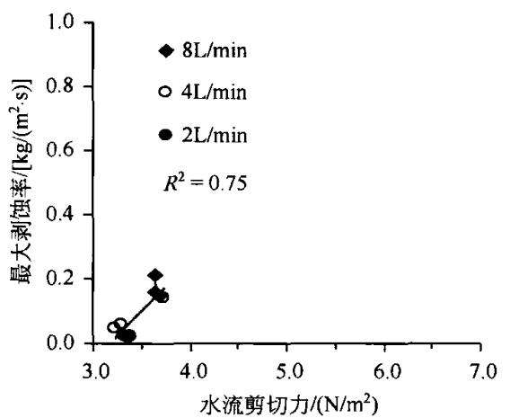  
(a)

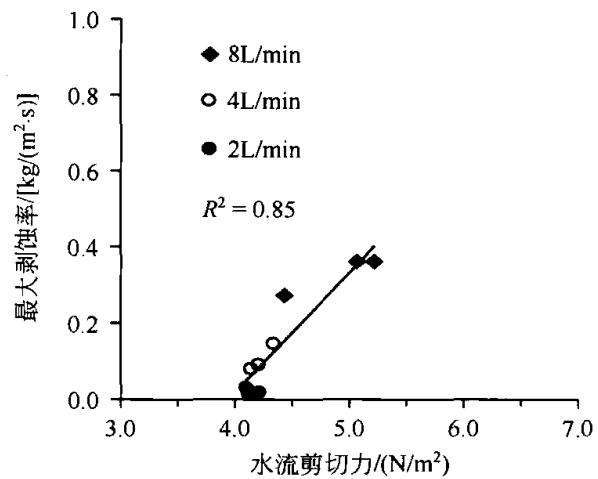  
(b)

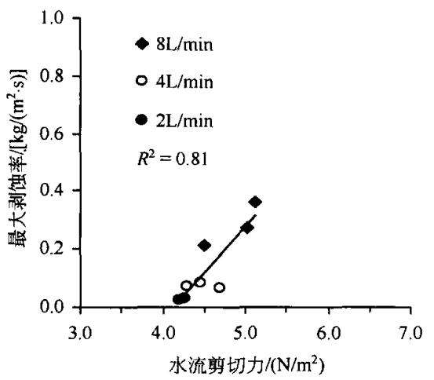  
(c)

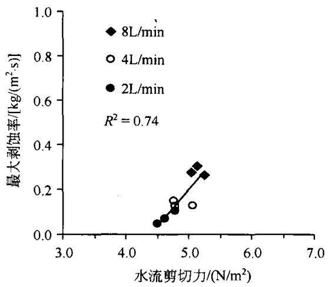  
(d)

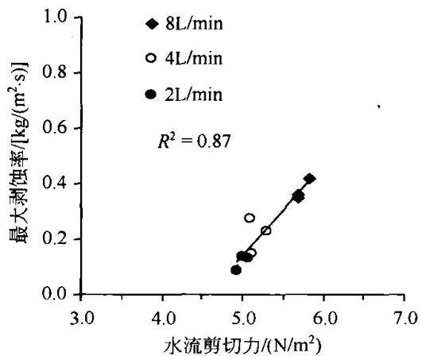  
(e)  
图10.1 最大剥蚀率和水流剪切力间的关系$( \mathbf { a } ) 5 ^ { \circ } ; ( \mathbf { b } ) 1 0 ^ { \circ } ; ( \mathbf { c } ) 1 5 ^ { \circ } ; ( \mathbf { d } ) 2 0 ^ { \circ } ; ( \mathbf { e } ) 2 5 ^ { \circ }$

表10.2 不同坡度下计算得到的 $\pmb { K } _ { \mathbf { r } }$ 和 $\pmb { \tau _ { c } }$
<table><tr><td>坡度/(°)</td><td> $K _ { \mathrm { r } } / ( \mathsf { s } / \mathsf { m } )$ </td><td> $\tau _ { \mathrm { c } } ( \mathbf { N } / \mathbf { m } ^ { 2 } )$ </td><td>n</td><td>回归方程</td><td> $R ^ { 2 }$ </td></tr><tr><td>5</td><td>0.3209</td><td>3.191</td><td>9</td><td> $Y = 0 , 3 2 0 9 x - 1 . 0 2 4 1$ </td><td>0.75</td></tr><tr><td>10</td><td>0.3211</td><td>3.937</td><td>9</td><td> $Y = 0 , 3 2 1 1 x - 1 , 2 6 4 1$ </td><td>0.85</td></tr><tr><td>15</td><td>0.321</td><td>4.127</td><td>9</td><td> $Y = 0 . 3 2 1 x - 1 . 3 2 4 8$ </td><td>0.81</td></tr><tr><td>20</td><td>0.3213</td><td>4.376</td><td>9</td><td> $Y = 0 , 3 2 1 3 x - 1 , 4 0 6$ </td><td>0.74</td></tr><tr><td>25</td><td>0.3214</td><td>4.624</td><td>9</td><td> $Y = 0 . 3 2 1 4 x - 1 . 4 9 8 5$ </td><td>0.87</td></tr></table>

由表10.2可以看出，对于同一种土壤，在不同的水动力学条件下，计算得到的土壤可蚀性参数基本是一致的。供试土壤为母质性黄绵土，其颗粒组成为砂粒 $\big ( \mathrm { \mathbf { \nabla } > 0 . 0 5 m m } \big )$ 含量占20.175%，粉粒含量（0.05\~0.005mm）占63.9%，黏粒含量 $( \mathbf { \nabla } < \mathbf { 0 } . 0 0 5 \mathbf { m m } )$ 占15.92%，中值粒径为0.029mm，属轻粉质壤土，供试土壤的可蚀性参数 $K _ { \mathfrak { r } }$ 均值为$0 . 3 2 1 1 \pm 0 . 0 0 0 3 \mathrm { s / m }$ 。从得到的土壤可蚀性值来看，试验用土是一种易受侵蚀动力破坏的土壤，对侵蚀介质的剥蚀和输送有很高的敏感性。在不同坡度条件下的回归系数值 $R ^ { 2 }$ 均大于等于0.74，也就是说这个回归分析可解释率为74%以上，不同水动力条件下试验所用样本为9个，重复试验样本为27个。需要指出的是，土壤可蚀性是一种土壤特性。尽管可蚀性K值可能会随着土壤状况、耕作状况、土壤覆被程度、土壤冻融情况和是否有前期降雨等条件的不同而不同，一般而言，土壤可蚀性会随着土壤黏粒含量和土壤有机质含量的增加而减小。已有研究表明，对于自然状态下的土壤，土壤可蚀性会随着土壤黏粒含量和土壤有机质含量的增加而减少，土壤可蚀性值因此会随坡度增大而增大。

本试验条件下得到的土壤可蚀性参数并不随坡度变化。土壤可蚀性反映的是土壤本身抵抗侵蚀能力的强弱，合理的土壤可蚀性指标遵循唯一性原则，即对某一种土壤而言，不管在什么条件下测定，可蚀性指标只能是一个值。如果因观测条件不同其值大小发生变化，则说明该指标不能很好地反映土壤性质对侵蚀的影响。相反，如果所选的可蚀性指标值大小不因观测条件而变化，只随土壤类别的不同而异，说明该指标值能客观地反映土壤性质的作用强弱。虽然在测定过程中，它与坡度、径流流量等因素有一定的交互作作用，但不随这些因素的变化而变化。

坡度对临界剪切力的影响一直是个有争议的问题。陆兆熊和陈浩发现(1990)土壤抗剪切应力的时间变化主要取决于土壤含水量，抗剪切应力的空间变化与土壤条件有关，缓坡的土壤抗剪切应力高于陡坡，其变化关系为

$$
\tau = a \mathrm { e } ^ { - b \theta }\tag{10-21}
$$

式中，τ为土壤抗剪切应力(kPa)； $\pmb \theta$ 为坡度(°)；a、b是常量，b的变化范围为0.014\~0.017。

蔡强国等(1998)由野外细沟调查得到了坡耕地细沟发生的临界坡度与土壤抗剪力的不同组合(表10.3)，认为细沟发生的临界坡度与临界抗剪力有如下关系

$$
A _ { \mathrm { r } } ~ = - ~ 1 6 . ~ 1 6 ~ + 2 . 8 4 K _ { \mathrm { a r } }\tag{10-22}
$$

式中，A，为细沟发生的临界坡度(°)； $K _ { \mathrm { a r } }$ 为临界土壤抗剪力(kPa)。

表10.3 发生细沟侵蚀的坡度与土壤抗剪切力的临界组合
<table><tr><td>坡度</td><td>1</td><td>5</td><td>10</td><td>15</td><td>20</td></tr><tr><td>临界土壤抗剪力/kPa</td><td>6</td><td>7.5</td><td>9.2</td><td>11</td><td>12.7</td></tr></table>

雷廷武和Nearing(2000b)通过测定疏松土壤上细沟发生和停止时的临界流量，计算出临界剪切力与坡度的关系

$$
\tau _ { \mathrm { c } } ~ = ~ A + B S\tag{10-23}
$$

式中 $, \pmb { \tau _ { c } }$ 为临界剪切力， $( \mathrm { P a } ) : S$ 为坡度， ${ \bigl ( } { \mathcal { I } } _ { 0 } { \bigr ) } ; A , B$ 为回归系数。通过回归试验数据表明， $\scriptstyle A = 0 , B > 0$ ，即随着坡度的增加，临界剪切力也增加。

从表10.2可以看出，本研究得到土壤抗临界剪切力 $\pmb { \tau _ { \mathrm { c } } }$ 值随坡度的增大稍有增大，在$5 ^ { \circ } , 1 0 ^ { \circ } , 1 5 ^ { \circ } , 2 0 ^ { \circ } , 2 5 ^ { \circ }$ 不同坡度下，临界剪切力 $\tau _ { \mathrm { ~ c ~ } }$ 的值分别为 $3 . 1 9 1 \mathrm { N } / \mathrm { m } ^ { 2 } , 3 . 9 3 7 \mathrm { N } / \mathrm { m } ^ { 2 }$ $4 . 1 2 7 \mathrm { N } / \mathrm { m } ^ { 2 } , 4 . 3 7 6 \mathrm { N } / \mathrm { m } ^ { 2 } , 4 . 6 2 4 \mathrm { N } / \mathrm { m } ^ { 2 }$ 。但土壤抗临界剪切力 $\tau _ { \mathfrak { c } }$ 值随坡度变化的内在机理仍需要进一步的研究。土壤剥蚀率和剪切力间的关系一直是一个有争议的研究热点，有些学者认为是线性关系(a linear relationship),有些则认为是对数关系(a log relationship)(Ghebreiyessus et al.,1984;Nearing et al.,1989; Gilly et al., 1993)。本研究分析了最大土壤剥蚀率与水流剪切力随坡度的变化关系，见图10.2和图10.3。发现，最大土壤剥蚀率与水流剪切力随坡度的增大而增大，且在同一坡度下，两个值均随流量的增大而增大。

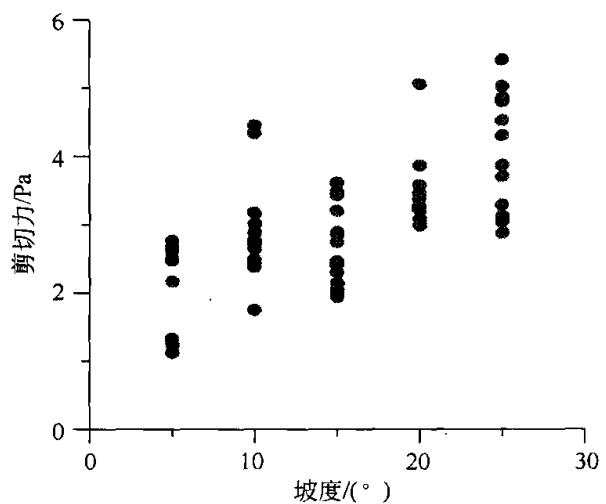  
图10.2 剪切力与坡度的关系

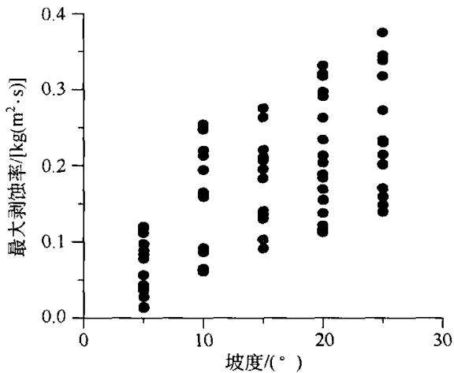  
图10.3 最大土壤剥蚀率与坡度的关系

最大土壤剥蚀率与水流剪切力随坡度的变化关系可以从能量和侵蚀的物理机制角度来分析。坡面土壤侵蚀的动力是径流的径流剪切力，阻力为侵蚀体与坡面之间的摩擦力以及土壤本身对径流冲刷的抵抗力。径流剪切力的作用表现在对土壤表层土粒的剥蚀和冲刷作用，引起表层土壤结构的破坏及移动。坡度和流量对径流剪切力都存在着正的影响。对于一定的水体来说坡面比降和流速随着坡度的增大而增大，水深和速度随着流量的增加而增加。坡度愈大坡面径流的重力顺坡分力及径流剪切力就愈大。坡度增加流量即水层厚度增加，径流剪切力增大导致径流产生更大的土壤剥蚀率。坡度还影响着径流入渗及水流的速度，随着坡度的增加入渗减少，地表径流增加，所以坡度直接影响径流剪切力。既是在超渗产流时，与水平面相比坡面水层流速大，侵蚀物质能被及时带走，利干下层土的冲刷，最大剥蚀率也会随之增加。

## 10.3 疏松土壤材料中细沟的冉生及其临界剪应力的实验研究

动态土壤侵蚀包括依赖于空间与时间的土壤剥离、细沟的形成、水流中过量泥沙的沉积、沉积泥沙中细沟的再生等物理过程。与泥沙从沉积区域再剥离相关联的细沟再生是细沟变窄加深过程中的一个重要的现象。本节介绍一种实验装置，用于测量类似于沉积土壤的疏松土壤材料细沟再生的力学参数。用一种砂壤土进行实验，测定了不同团聚体大小和坡度下细沟再生开始和停止所对应的临界水流量，计算与沟坡相关的临界剪切应力。这些结果有助于理解细沟的再生及其数量关系，以及临界剪切应力与坡度间的定量关系，对于发展由沉积土壤再生的细沟演化过程模型构建有促进作用。

当细沟水流中的泥沙含量超过水流的输沙能力时，水流中的泥沙开始向沟床表面沉积。结果细沟加宽，水流变得更浅，引发进一步得沉积，使得细沟变得更宽、更浅。通常，在泥沙沉积区域的上方有一个积水区域。当该积水区域的下方坡度达到某一临界条件时，水流开始在沉积的土壤上切出新的细沟。这种细沟的再生过程一直持续到侵蚀沟床坡度变得平坦，达到某一较小的坡度为止。Nearing等(1997)在室内细沟侵蚀水槽实验中，观察到了这种现象。

为了对这种现象进行数值模拟，必须获得与这种细沟再生相关的参数，即在给定水流量时，沉积泥沙区域细沟再生开始和停止的临界坡度；或者在坡度给定的情况下，细沟再生开始和停止的临界流量。

Gilley等(1993)建立了细沟产生与临界剪切应力之间的经验关系。该方法的理论基础是泥沙剥离能力方程(Laursen,1958;Foster,1982;Nearing et al.,1989)，这一方程表述为剥离能力与剪切应力和临界剪切应力的差值成正比。他们通过回归剥离能力值与水流剪切应力的试验数据直接计算了细沟产生的临界剪切应力。此项研究假定临界剪切应力为常数，即不随水力条件如沟坡和水流深度变化。

本节主要介绍一种直接测量疏松土壤上细沟再生参数的实验装置和实验方法，这种疏松土壤可用于比拟由细沟水流中沉积到沟床的泥沙，因而该方法实际上是为了测量沉积十壤上细沟再生的参数。进行了一系列室内实验，测量给定沟坡时细沟再生开始和停止的临界水流量。实验采用了不同大小的团聚体以确定土粒大小的影响。然后确定细沟再生的定量参数，以及与沟坡、流量、土粒大小之间的关系，同时研究临界剪切应力的计算。

## 10.3.1 材料与方法

实验采用风于的砂壤土。由于土壤团聚体大小对于土壤对水流的反应有影响(Nearing et al.,1991),因而将土壤材料筛分为0\~2mm,2\~5mm,5\~8mm三种土粒范围。未筛分的土壤材料则用作为混合材料。为了比拟局部性状，如局部沟坡及水力特征，在实际允许的情况下将土壤样品做得尽可能的小。本项实验中将所采用的土壤样品装入土盒内，土盒的表面为195mm×195mm，厚度为100mm

筛分(混合样品则为未筛分)的干土壤材料放入土盒内。土壤表面用直尺抹平。然后将盛土土盒浸泡在一水箱内，使盒内土壤由底部开始浸湿。土壤颗粒(团聚体)完全处于浸泡状态，以尽可能模拟沉积泥沙性状。实验即将开始前，将盛有土壤的土盒放在实验装置(后面详述)的样品架上，从而实验前土壤样品内不会有固结发生。研究中所采用的实验装置如图10.4所示。

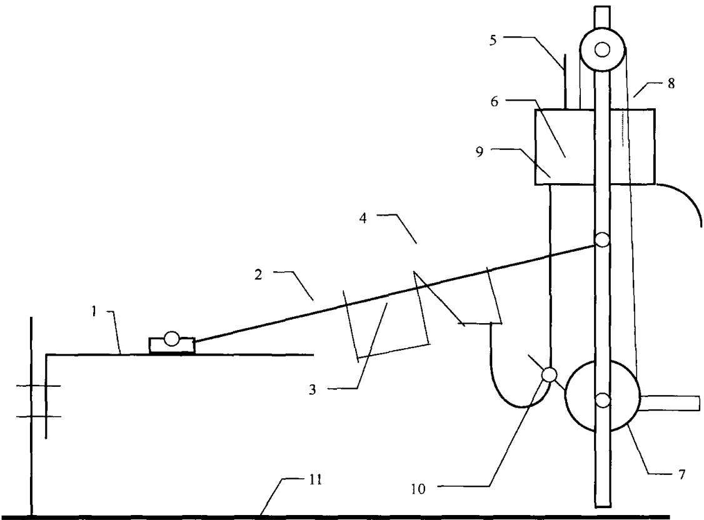  
图 10.4 实验装置示意图  
1. 调坡支架 $\therefore 2 .$ 土样支架；3. 土样盒 $\bullet 4 .$ (水)漫流刃 $\bullet 5 .$ 供水管;6. 供水箱；  
7. 绞盘手柄 $\phantom { 0 } { \phantom { 0 } } \bullet 8 .$ 钢缆 ${ \mathfrak { s } } .$ 进水管；10. 流量控制孔口 $\mathbf { ; } 1 1 .$ 主骨架

实验程序如下。调整支架1的位置使盛放土样的支架2的坡度为实验所需要的坡度。将一个预先制备好的(装在盒内的)土样3放在支架2上。盒内土样的表面与支架具有相同的坡度，并且与水的漫流刃4处在同一平面上。用一条供水管5将水由自来水水源供入供水箱 $6 _ { \circ }$ 供水箱由两个水室组成：一个用于定水头供水，另一个则用于排放过量的水。转动手柄7，通过钢缆8在绞盘上的收放来提高或降低供水箱的高度。用一条进水管9将水由供水箱引入进水箱4。该进水管上装有流量控制孔口 $1 0 _ { \circ }$ 用不同大小的孔口进行流量的粗调。流量的细调则由升降供水箱的高程来实现。装置的坡度、流量调整部件安装在主骨架11上。

在一个给定的实验中，首先调整坡度。流量控制孔口大小通过试用或前期的实验经验选定，原则是实验中临界水流量时供水箱的高程不超过支架的最大可能高度。不同坡度时，进水箱的水平面处于不同高程。然后，通过调节手柄，使得供水箱与进水箱内的水位处于同一水平面，水流量为 $\mathbf { 0 } _ { \mathrm { { \ell } } }$ 。此时供水箱所处的高程(位置)为水头计算的参照点。然后，转动手柄将供水箱缓慢而平滑地提升以逐步增大流量，直到土壤侵蚀过程开始发生，即细沟开始形成。而后，降低供水箱的高程，减少流量，直到土壤侵蚀过程停止。

流量的调整通过改变供水箱6的高程来实现。其调整与标定基于下列Bernoulli方程：

$$
Q \ = \ k A \ { \sqrt { 2 g \Delta h } }\tag{10-24}
$$

式中， $Q$ 为流量 $\left( \mathrm { ~ L ~ } / \mathrm { s } \right)$ ；A为流量控制孔口的横断面面积 $( \mathbf { \nabla } \mathbf { m } ^ { 2 } ) : \mathbf { g }$ 为重力加速度(9. $8 2 \pi / { \bf s } ^ { 2 } )$ i $\Delta h$ 为供水箱水位相对于进水箱(参照)水位的高程(m);k为比例系数。因为 $k , A , g$ 为常量，式(10-24)可简化为更简单的形式

$$
Q \ = \ K \ { \sqrt { \Delta h } }\tag{10-25}
$$

式中，K为流量控制孔口标定参数。标定如此进行：对于一个给定孔口，测量一个或数个不同相对高程 $\Delta h$ 时所对应的流量 $Q$ ,并由此计算 $K _ { c }$

每次实验中记录：团聚体大小、坡度、流量控制孔口大小，流量为0时供水箱的(参照)高程，细沟再生开始与结束时供水箱的高程、水流深度。然后，细沟再生过程开始与结束时的流量用式(10-25)进行计算。

实验采用的坡度为：0%、3%、7%、10%、15%、20%、25%、30%、35%、40%、50% $; 4$ 种团聚体大小 $\mathbf { \langle } 0 \sim 2 \mathbf { m } \mathbf { m } \mathbf { \rangle } 2 \sim 5 \mathbf { m } \mathbf { m } \mathbf { \sqrt { \mu } } \sim 8 \mathbf { m } \mathbf { m }$ 及上述三者的混合物。

## 10.3.2 坡度与单宽流量的关系

团聚体0\~2mm、2\~5mm、5\~8mm及混合材料的单宽流量与沟床坡度之间的关系分别如图 $1 0 . 5 ( \mathrm { a } ) \sim ( \mathrm { d } )$ 所示。图中给出了细沟再生开始与停止时的测量值及其相应的回归曲线。

细沟再生开始和结束时的流量与坡度关系的回归模型为

$$
\mathbf { l n } { \bigl ( } q { \bigr ) } = a + b \mathbf { l n } { \bigl ( } S { \bigr ) }\tag{10-26}
$$

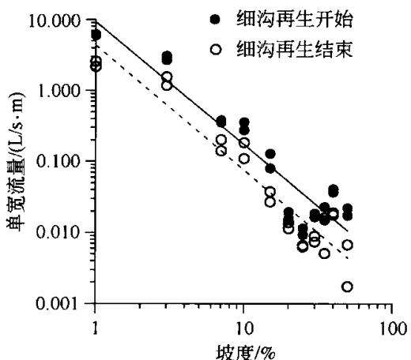  
(a) 0\~2mm团聚体

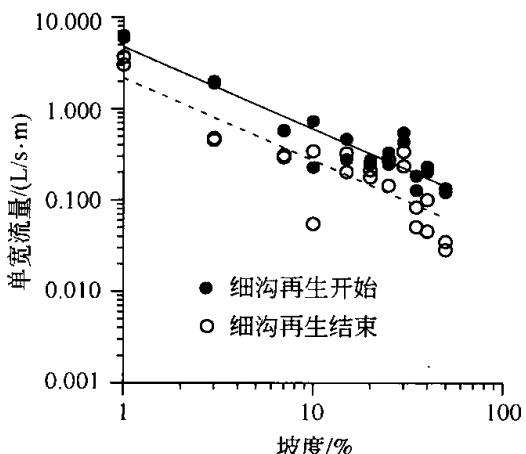  
(b) 2\~5mm团聚体

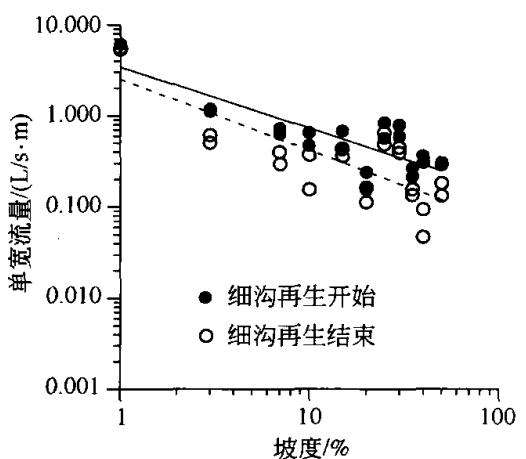  
(c) 5\~8mm团聚体

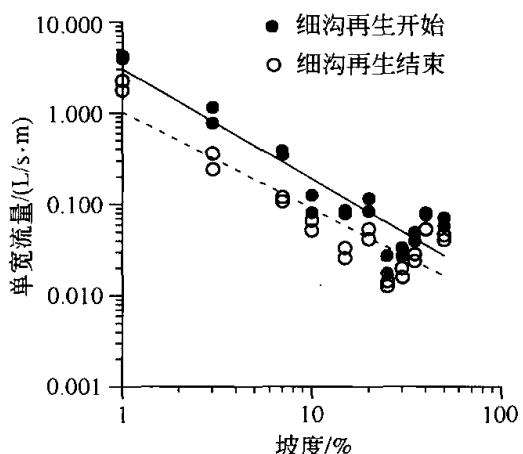  
(d) 混合材料  
图10.5 单宽流量-坡度关系

式中，q为单宽流量 $( \mathbf { L } \mathbf { s } \cdot \mathbf { m } )$ ;a和b为回归系数；S为坡度(%)。为了计算方便，坡度为0的工况时坡度设定为一个很小的值(此处设为1%)，从而在式(10-26)中可以进行对数计算。回归所得参数列入表10.4。对于每一种团聚体，回归参数a和b在统计意义上都是显著的。高度的统计显著性(对于每一种团聚体 $\mathbf { F } > 3 6 )$ 和高度的相关性(表10.4)表明，沟床坡度与细沟再生开始和结束时的单宽流量之间存在着高度相关的函数关系。细沟再生开始与停止所对应的临界单宽流量及其趋势表明，随着坡度由0增大到50%，其量值减小1\~2个数量级，分别如图10.5的实线与虚线所示。通常，对于4种团聚体的土壤材料，表征细沟再生开始与停止所对应的两条线相互平行。不同团聚体间，临界单宽流量显著不同。坡度小时，较小的团聚体组比较大团聚体组土壤材料所需的临界单宽流量大，从而较小的团聚体组回归参数a具有较大的值(表10.4)。另一方面，坡度较大时，较小团聚体组比较大团聚体组的临界单宽流量小，如图10.5。总之，团聚体小时，细沟再生开始和结束所对应的临界单宽流量受坡度的影响更大，由回归参数b的值可以说明这一点(表10.4)。

表10.4 单宽流量-坡度关系回归结果
<table><tr><td>团聚体大小/mm</td><td>细沟再生</td><td>a</td><td>b</td><td> $R ^ { 2 }$ </td></tr><tr><td>0~2</td><td>开始</td><td> $- 5 . 7 5 5 ^ { \circ }$ </td><td> $- 1 . 7 3 2 ^ { \mathrm { { A } * } }$ </td><td>0.891</td></tr><tr><td></td><td>停止 开始</td><td> $- 6 . 6 5 0 ^ { \mathrm { b } }$   $- 2 . 5 9 1 ^ { \mathrm { ~ c ~ } }$ </td><td> $- 1 . 7 6 2 ^ { \mathrm { { A } } }$   $- 0 . 9 0 0 ^ { 8 }$ </td><td>0.907 0.878</td></tr><tr><td>2~5</td><td>停止</td><td> $- 3 . 3 9 3 ^ { \mathrm { d } }$ </td><td> $\mathbf { - 0 . 9 0 5 ^ { B } }$ </td><td>0.731</td></tr><tr><td>5~8</td><td>开始</td><td> $- 1 . 8 7 3 ^ { \circ }$ </td><td> $- 0 . 6 7 4 ^ { \mathrm { C } }$ </td><td>0.726</td></tr><tr><td></td><td>停止</td><td> $- 2 . 6 7 1 ^ { \circ }$ </td><td> $\mathbf { - 0 . 7 8 1 ^ { C B } }$ </td><td>0.648</td></tr><tr><td>混合</td><td>开始</td><td> $- 4 . 4 3 7 ^ { \mathrm { f } }$ </td><td> $\mathbf { - 1 . 2 0 4 ^ { D } }$ </td><td>0.852</td></tr><tr><td></td><td>停止</td><td> $- 4 . 8 4 5 ^ { 6 }$ </td><td> $- 1 . 0 5 7 ^ { \mathrm { D B } }$ </td><td>0.795</td></tr></table>

\*表示由t-检验得出，同一列中具有相同字母的参数在P=90%时无显著差异。

混合材料的于质量加权平均直径为3.19mm。相应的，其他3组土壤材料团聚体(0\~2mm、2\~5mm、5\~8mm)干质量加权平均直径分别为0.92mm、3.22mm、5.98mm。因此，混合材料的加权平均直径与3组筛分团聚体中的中等大小团聚体组之值相近。然而.混合材料的行为与最小的团聚体组(0\~2mm)最接近。由实验观测到的这种临界流量与团聚体大小之间的函数关系的原因并不清楚，似平0\~2mm团聚体组的性状主导着混合材料的行为。关于团聚体大小与临界单宽流量的这种关系可能与土壤的表面糙度和土壤颗粒的排列有关。可以有理由推断(尽管此处没有测量），混合材料的表面糙度会与较小的团聚体组(0\~2mm)的相似。原因是，混合材料中，较小的土壤颗粒可以填充到土壤表面较大的团聚体之间的空间。并且，与水流速度梯度及颗粒的几何排列相关的扭转应力也是不同团聚体组之间具有这种差异的原因之一。由此，同样可以合理地认为，混合材料趋向与较小团聚体组(0\~2mm)的行为相同。

## 10.3.3 临界剪切应力与坡度的关系

水流作用于该表面的剪切应力可表示为

$$
\boldsymbol { \tau } = \gamma y \boldsymbol { S }\tag{10-27}
$$

式中 $\bullet \pmb { \tau }$ 为剪切应力(Pa);γ为水的比重 $( \mathsf { N } / \mathsf { m } ^ { 3 } ) : \mathsf { y }$ 为水流深度(m)。细沟再生开始和停止时，在土盒的上游端(水流漫流刃处)，用一直尺测量γ值。临界剪切应力 $\tau _ { c }$ 为土壤由地表剥离所需的最小剪切应力。基于这种概念，由实验数据求得的疏松土壤上细沟再生开始时的剪切应力实际上为临界剪切应力的一个度量。临界剪切应力与坡度S的关系可用下列模型表示。

$$
\tau _ { \mathrm { ~ c ~ } } = A + B S\tag{10-28}
$$

式中A和B为回归系数。

用式(10-28)初步回归试验数据表明，A值在统计意义上并不显著大于 ${ \bf 0 } _ { \circ }$ 因此，回归分析时设定 $A = 0$ 。在此情况下,0\~2mm、2\~5mm、5\~8mm团聚体组及混合材料的临界剪切应力与坡度间的确定系数分别为0.927.0.949、0.980及0.972。0\~2mm团聚体组与混合材料的回归系数B没有显著差异 $; 2 \sim 5 \mathrm { m m }$ 团聚体组与5\~8mm团聚体组的回归系数也没有显著差异，如表10.5所示 $\scriptstyle ( \alpha = 0 . 1 0 )$ 。0\~2mm团聚体组及混合材料回归所得的临界剪切应力及由测量数据计算所得的值如图10.6(a)所示;2\~5mm团聚体组及 $5 \sim 8 \mathrm { { m m } }$ 团聚体组回归所得的临界剪切应力及由测量数据计算所得的值如图10.6(b)所示。

表10.5 临界剪切应力与坡度的关系 $( \boldsymbol { \tau } _ { c } = \boldsymbol { B } \cdot \boldsymbol { S } )$
<table><tr><td>团聚体大小/mm</td><td>B</td><td> $R ^ { 2 }$ </td><td>系数的标准差</td></tr><tr><td>0~2</td><td> $2 4 . 9 ^ { \textrm { b * } }$ </td><td>0.927</td><td>0.008</td></tr><tr><td>2~5</td><td>32.5ª</td><td>0.949</td><td>0.009</td></tr><tr><td>5~8</td><td>34.4ª</td><td>0.980</td><td>0.006</td></tr><tr><td>混合</td><td>25.7b</td><td>0.972</td><td>0.005</td></tr></table>

\*表示由t-检验出的，具有相同字母的参数在P=90%时无显著差异

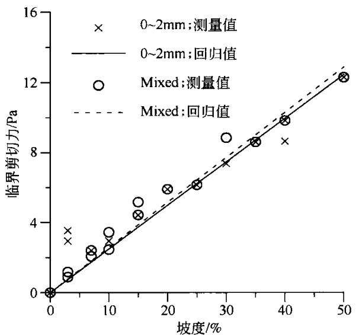  
(a) 0\~2mm团聚体及混合材料

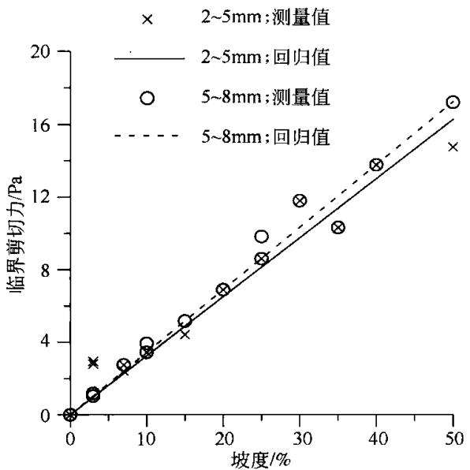  
(b) 2\~5mm及5\~8mm团聚体  
图10.6 临界剪切应力-坡度关系

这些结果具有下列意义：①由该方法计算得到的细沟再生开始时的临界剪切应力强烈地依赖于坡度。②较大团聚体组(2\~5mm和5\~8mm)的临界剪切应力(趋于)大于较小团聚体组(0\~2mm)的值。③混合材料的临界剪切应力与0\~2mm团聚体组的相同。这一结果与上述临界流量的结果一致，原因是混合材料中较小的颗粒控制着材料的性状，使之具有与0\~2mm团聚体相似的行为。④该实验方法可以直接确定临界剪切应力。

该种装置与方法也可用于测定其他材料的临界剪切应力。对砂壤土所进行的实验表明，较大团聚体的土壤材料比较小团聚体的同种土壤材料趋于具有较大的临界剪切应力。就临界剪切应力和临界单宽流量而论，不同团聚体的混合土壤材料与由该土壤经筛分得到的较小的团聚体材料趋于具有相同的性状。2\~5mm和5\~8mm团聚体材料的临界剪切应力基本一样。通常，每一种团聚体组的细沟再生开始和停止的临界单宽流量随坡度的增加而减小。细沟再生开始与停止具有不同的函数关系。团聚体大小对临界单宽流量与坡度关系函数的斜率与截距有影响。单宽流量与沟坡以及临界剪切应力与沟坡的关系，可能用于细沟演化模拟中沟宽的变宽与变窄的计算。

## 第11章 细沟侵蚀动态过程的稀土元素示踪法

尽管已有许多技术用来获取土壤侵蚀随时空变化的数据，但是现有的土壤流失量数据都是空间、时间上的平均值(Knaus，1989)。由于测量手段的限制，只能采用试验小区或流域出口处有限时间点的泥沙含量和径流量，通过对比土壤发生侵蚀前后的状态变化来鉴别侵蚀发生的强度，验证侵蚀预报模型。对于流域内部随时间和空间变化的流量和侵蚀产沙的分布是否与模拟结果一致，并不清楚。采用参数标定来改进模型，如果只考虑模型的预报结果是否与出口处的径流以及侵蚀产沙一致，在某种程度上掩盖了模型的不足，模型是否能真实地描述坡面土壤侵蚀过程并不确定，这样势必影响对坡面土壤侵蚀机理的理解。土壤侵蚀随时间和空间的动态变化数据在开发和验证土壤侵蚀预报模型、理解土壤侵蚀机理、评价泥沙影响、布局最好的控制土壤侵蚀管理措施等方面是非常重要的。

随着科学技术的发展和分析手段的提高，核示踪技术在土壤侵蚀动态监测方面呈现出了巨大的潜力。为了获得空间分布数据，已有多种示踪剂被开发和利用，利用较多的是137Cs 法(Ritchie and Mhenry,1990;Walling, 1999)。137Cs 与地表物质的紧密结合使其能有效地用于中长期土壤侵蚀示踪等研究中。测定研究区37Cs的含量和空间分布，并与该区137Cs沉降背景值比较，可以建立土壤侵蚀、沉积和137Cs含量间的定量关系。由于137Cs半衰期长，适用于计算多年土壤平均净侵蚀和沉积速率。常用的天然放射性示踪核元素包括210Pb、Be、226Ra、234Th(Wallbrink and Murray,1993)。这些核元素在土壤剖面中具有独特的垂直分布特征和分布深度，因此可以根据其分布特征应用单一核素或两到三种核素复合示踪泥沙来源。单一核素得到的结果相对比较粗糙，多核素复合示踪研究泥沙来源的精度比单一核素高，但其已有的研究大多限于定性描述，且需要校正由泥沙输移分选带来的影响；同时它们的沉降主要集中于表土，而有些地区由于强烈的侵蚀，表土已流失殆尽。以上问题限制了放射性元素在土壤侵蚀研究实际中的应用。

与放射性核元素不同，放射性离子因其容易被控制而被用于土壤侵蚀的研究。Toth和 Alderfer(1960)用Co标记来研究土壤团聚体：Wooldridge(1965)将56Fe喷洒在土壤表面来跟踪定位，研究土粒的移动。但这种方法的缺陷在于此示踪剂的放射性对研究人员和环境都是很危险的。为了克服此缺陷，有研究者采用荧光玻璃球和磁性塑料球来研究土壤侵蚀，但又带来了新的问题。这些示踪物大小面积不同，颗粒密度、形状和表面形状均不同，而且不能与土壤颗粒紧密结合，以至于不能随土粒同时移动，降低了其量化分析的敏感性。

研究土壤侵蚀和泥沙来源的理想示踪剂应克服以上局限性，能被土壤颗粒强烈吸附、难溶于水、植物富集有限、淋溶迁移不明显、对研究人员和生态环境无害、有较低的土壤背景值、且分析检测灵敏度高。稳定性稀土元素(rare earth elements,REE)可以克服上述缺陷，从而在侵蚀过程研究中显示特有的巨大功能(田均良等，1992；田均良，1997;Zhang et al.，2001;Zhang，2003)。REE 包括元素周期表中的 21号元素钪(Sc)、39号元素钇(Y)、61 号元素钷(Pm) 以及镧系 La,Ce, Dr, Nd,Sn,Eu,Gd, Tb,Dy,Ho,Er, Tm，Yb，Lu等14种元素，由于这些元素的化学与地球化学性质相似且密切伴生，故在地球化学研究中归为一类，通称为稀土元素。稀土元素与土壤有较好的结合力，且在黄土高原土壤中含量甚微，植物富集有限，同时它们是稳定性同位素，对环境无危害，且可以通过人为施放增强研究的目的性和精确度。仪器中子活化分析(instrument neutron activationanalysis,INAA)对大多数稀土元素分析灵敏度高，方法简便，为其应用提供了可靠的保证。

REE示踪法是20世纪80年代中后期发展起来的一门新技术，美国的Knaus(1989)首先用稳定性稀土元素示踪和中子活化分析技术，成功地测定了沼泽地的演变，其基本原理为稀土元素在土壤侵蚀研究开辟了新途径。田均良等曾将稀土元素示踪法应用于黄土区侵蚀的垂直分布及泥沙沉积研究(田均良等，1992；田均良，1997)，取得了重大进展，并通过野外全坡长坡面径流小区的试验、观测数据的分析，探讨了稀土元素示踪法对侵蚀泥沙在坡面运移和沉积的研究。石辉等(1996;1997)的室内模拟试验表明用多种稀土元素示踪能比较满意地解决小流域侵蚀产沙的空间分布问题，是一种研究小流域泥沙来源的有效方法。已有的室内模拟和野外试验均表明稀土元素示踪法具有较高的精确度和灵敏度，其相对误差均小于15%，可以为土壤侵蚀的发展及演变的研究提供可靠的分析手段(李雅琦等，1997;琚彤军等，1999;刘普灵等,2001)。Riebe(1993)用Eu标记监测土壤输移;Zhang等(2001)通过测定REE氧化物与土壤颗粒结合能力评价了REE示踪法研究土壤侵蚀的可能性。Zhang等(2003)等利用人工模拟降雨，在宽2m，长4m的试验土槽中进行了REE室内模拟试验，供试土壤为砂黄土，结果表明REE是一种鉴别试验槽内泥沙相对来源部位的有效方法，在泥沙输运过程中泥沙颗粒分选不明显，稀土示踪元素可以和砂黄土的任意大小的颗粒很好地结合，这一点对于泥沙示踪是非常重要的。之后 Polyakov和 Nearing(2003)在美国俄亥俄州(Ohio)又进行了野外田间模拟试验，结果表明REE可以有效地示踪田间侵蚀泥沙的输移。

由于其独特的性能，本章将示踪元素化合物与土壤均匀混合后布设于研究地区的不同地形部位，使之在冲刷过程中随径流泥沙一起移动，然后采集径流泥沙样品，利用中子活化分析方法测定侵蚀泥沙中示踪元素的含量，来探讨坡面细沟流的侵蚀动态变化过程以及细沟流剥蚀率的变化趋势。

## 11.1 REE 示踪元素的用法与用量的计算

## 11.1.1 REE 示踪元素的选取及坡面布置

用于土壤侵蚀研究的示踪元素，应具有和土壤有较好的结合能力、不溶于水、不易被植物吸收且不损害生态环境等特征。此外，从方法的精度及试验成本和推广前景考虑，示踪元素还应具有土壤含量甚微、施加量少且易于识别、精确探测等特征。为此，试验主要选取了Ho(钦),Tb(铽),Eu(铕),Yb(镱)，Dy(镝),Sm(钐),La(镧),Tm(铥),Ce(铈)，Nd(钕)十种稀土元素。相应的元素氧化物分别为 $\mathrm { H o _ { 2 } O _ { 3 } , T b _ { 4 } O _ { 7 } , \ E u _ { 2 } O _ { 3 } , \ Y b _ { 2 } O _ { 3 } }$ $\mathrm { D y } _ { 2 } \mathrm { O } _ { 3 } , \mathrm { S m } _ { 2 } \mathrm { O } _ { 3 } , \mathrm { L a } _ { 2 } \mathrm { O } _ { 3 } , \mathrm { T m } _ { 2 } \mathrm { O } _ { 3 } , \mathrm { C e O } _ { 2 } , \mathrm { N d } _ { 2 } \mathrm { O } _ { 3 }$ 0

试验采用8m长土槽，水槽分隔成0.1m×8m的细沟，再将每条细沟分成十等份，分段分别施放上述十种元素进行示踪。每个区段长0.8m，宽0.1m，深Hm(后文讨论)。自上坡到下坡的顺序将各区段编上从小到大的标号：1,2，……，10。在每一等份上施放一种元素。为了在测量显著的情况下节约用料，将购买价格较少的元素施放在上坡侵蚀量大处。各元素施放位置见图11.1，各元素物理性质和背景值见表11.1。

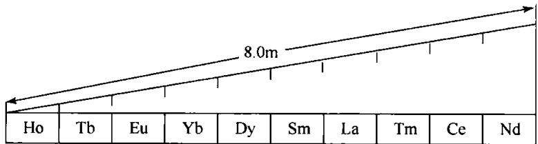  
图11.1 REE示踪元素的坡面布置示意图

表11.1 各元素物理性质、背景值及其在坡面的施放位置
<table><tr><td>序号</td><td>符号</td><td>熔点(℃)</td><td>沸点(℃)</td><td>原子量</td><td>分子式</td><td>背景值*/ppm</td><td>分子质量</td></tr><tr><td>1</td><td>Ho</td><td>1490</td><td>2330</td><td>164.93</td><td> $\mathbf { H o } _ { 2 } \mathbf { O } _ { 3 }$ </td><td>1.2</td><td>377.9</td></tr><tr><td>2</td><td>Tb</td><td>1336</td><td>2530</td><td>158.925</td><td> $\mathbf { { T b } _ { 4 } O _ { 7 } }$ </td><td>0.81</td><td>747.7</td></tr><tr><td>3</td><td>Eu</td><td>826±10</td><td>1490</td><td>151.96</td><td> $\mathbf { E u } _ { 2 } \mathbf { O } _ { 3 }$ </td><td>1.2</td><td>351.9</td></tr><tr><td>4</td><td>Yb</td><td>824 ±5</td><td>1530</td><td>173</td><td> $\mathbf { Y b } _ { 2 } \mathbf { O } _ { 3 }$ </td><td>2.64</td><td>394.0</td></tr><tr><td>5</td><td>Dy</td><td>1485 ± 20</td><td>2330</td><td>162.5</td><td> $\mathbf { D } \mathbf { y } _ { 2 } \mathbf { O } _ { 3 }$ </td><td>4.8</td><td>373.0</td></tr><tr><td>6</td><td>Sm</td><td>1052 ±5</td><td>1630</td><td>150.4</td><td> $\mathbf { S m } _ { 2 } \mathbf { 0 } _ { 3 }$ </td><td>6</td><td>348.8</td></tr><tr><td>7</td><td>La</td><td>920 ±5</td><td>4230</td><td>138.905</td><td> $\mathbf { L } { \mathbf { a } } _ { 2 } \mathbf { O } _ { 3 }$ </td><td>32</td><td>305.8</td></tr><tr><td>8</td><td>Tm</td><td>1500~1600</td><td>2130</td><td>168.93</td><td> $\mathrm { T m } _ { 2 } \mathrm { O } _ { 3 }$ </td><td>2.4</td><td>385.87</td></tr><tr><td>9</td><td>Ce</td><td>804 ± 5</td><td>2930</td><td>140.12</td><td> $\mathbf { C e O } _ { 2 }$ </td><td>60</td><td>172.1</td></tr><tr><td>10</td><td>Nd</td><td>1024 ±5</td><td>3180</td><td>144.2</td><td> $\mathbf { N d } _ { 2 } \mathbf { O } _ { 3 }$ </td><td>36</td><td>336.4</td></tr></table>

注：编号顺序从上坡面向下坡面排列，即10号元素(Nd)施放在最上坡，1号元素(Ho)施放在最下坡，依次排序。$\bf { * } \log \tt m = 1 0 ^ { - 6 }$ ,下同。

## 11.1.2 施放深度及浓度

施放深度应大于可能土壤侵蚀深度。设细沟侵蚀发生时坡上段侵蚀深度为20cm，坡下侵蚀深度0.5cm。根据前面的研究，细沟侵蚀土壤剥蚀率随细沟沟长(近似地)呈指数递减，而侵蚀深度与剥蚀率成正比，由此可以推知侵蚀深度随细沟沟长减小。同时考虑

到试验操作方便，设计了不同示踪元素的施放深度，见表11.2。

表11.2 元素施放浓度及施放量
<table><tr><td>元素符号</td><td>元素序号</td><td>施放序号</td><td>施放深度  $/ \mathrm { c m }$ </td><td>REE 施放浓度  $c _ { i } / { \bf p } { \bf m }$ </td><td>REE 施放量  $\pmb { A } _ { i } / \pmb { g }$ </td></tr><tr><td>Ho</td><td>67</td><td>1</td><td>10</td><td>47.04</td><td>22.31</td></tr><tr><td>Tb</td><td>65</td><td>2</td><td>5</td><td>66.53</td><td>16.2</td></tr><tr><td>Eu</td><td>63</td><td>3</td><td>5</td><td>100.13</td><td>24</td></tr><tr><td>Yb</td><td>70</td><td>4</td><td>5</td><td>224.00</td><td>52.8</td></tr><tr><td> $\mathbf { D } \mathbf { y }$ </td><td>66</td><td>5</td><td>5</td><td>323.27</td><td>76.8</td></tr><tr><td> $\mathtt { S m }$ </td><td>62</td><td>6</td><td>10</td><td>199.97</td><td>96</td></tr><tr><td> $\mathbf { L a }$ </td><td>57</td><td>7</td><td>10</td><td>781.95</td><td>384</td></tr><tr><td> $\mathbf { T m }$ </td><td>69</td><td>8</td><td>10</td><td>47.25</td><td>22.34</td></tr><tr><td> $\mathtt { C e }$ </td><td>58</td><td>9</td><td>15</td><td>757.65</td><td>577.97</td></tr><tr><td>Nd</td><td>60</td><td>10</td><td>15</td><td>127.77</td><td>92.55</td></tr></table>

REE的施放浓度讨论如下。设试验时段内土壤侵蚀总量为 $\boldsymbol { \ W } ,$ 对应于第i坡段的侵蚀量为 $\mathbb { W } _ { i } ( i = 1 , 2 , \cdots , 1 0 )$ 。施放的第i种REE在总的侵蚀土壤中的浓度 $c _ { i }$ ,可根据其施放浓度 $C _ { i }$ 计算为

$$
c _ { i } = \frac { M _ { i } } { W } = \frac { \left( \ W _ { i } C _ { i } + W C _ { i } ^ { 0 } \right) } { W } = w _ { i } C _ { i } + C _ { i } ^ { 0 }\tag{11-1}
$$

式中， $M _ { i }$ 为侵蚀土壤中第i种元素的质量； ${ \pmb w } _ { i }$ 为第i种 REE元素坡段的侵蚀土壤的权重；$\boldsymbol { C } _ { i } ^ { 0 }$ 为第i种元素的背景值。基本施放浓度是使得在总的土壤侵蚀量中某种元素的含量达到相应背景值的2倍以上，即

$$
\frac { c _ { i } } { C _ { i } ^ { 0 } } = \frac { \big ( w _ { i } C _ { i } + C _ { i } ^ { 0 } \big ) } { C _ { i } ^ { 0 } } = 1 + \frac { w _ { i } C _ { i } } { C _ { i } ^ { 0 } } \geqslant 3\tag{11-2}
$$

或

$$
\frac { { { w } _ { i } } { { C } _ { i } } } { { { C } _ { i } ^ { 0 } } } \textcircled { > 2 }\tag{11-3}
$$

从而施放倍数为

$$
\frac { C _ { i } } { C _ { i } ^ { 0 } } \geqslant \frac { 2 } { w _ { i } }\tag{11-4}
$$

取

$$
C _ { i } = \frac { 2 \sigma _ { i } } { w _ { i } } C _ { i } ^ { 0 }\tag{11-5}
$$

$\pmb { \sigma } _ { i }$ 为不同元素的施放倍数，则第i种元素的施放量 $A _ { i }$ 为

$$
A _ { i } \ = \ W _ { i } C _ { i } \ = \ W _ { i } \frac { 2 \sigma _ { i } } { w _ { i } } C _ { i } ^ { 0 } \ = \ 2 \sigma _ { i } W C _ { i } ^ { 0 }\tag{11-6}
$$

根据上述讨论算出的元素施放浓度和施放量，如表11.2所示。

## 11.1.3 示踪土样的配制

根据上述方法计算得到各种示踪元素的施放深度，由供试土壤容重求得土壤质量(kg)，由稀土元素施放量和元素的氧化物分子式和分子量换算出稀土元素氧化物施放量，然后称取各种元素氧化物用量的1/10与5g的烘干土混合，用碾钵充分碾磨使之尽可能混合均匀。将由此配制的高浓度示踪土样逐步进行稀释，将十种元素按不同倍数稀释，La 和 Ce 的稀释倍数为 2.5%，其余元素的稀释倍数为 1.25%，即 La 和 Ce 的配制浓度为25000ppm,其余元素为12500ppm，逐步稀释直到配足所需示踪土样。以上方案既考虑最大显著性(0.75倍REE背景值)又不使元素剩余太多。土样按试验的坡度分五次配制，每次为3个流量的3个重复(共9条细沟)统一配制，每次配土见表11.3。

表11.3 元素的浓缩土样和施放土样
<table><tr><td>坡段编号</td><td>1</td><td>2</td><td>3</td><td>4</td><td>5</td><td>6</td><td>7</td><td>8</td><td>9</td><td>10</td></tr><tr><td>REE</td><td>Ho</td><td>Tb</td><td>Eu</td><td>Yb</td><td>Dy</td><td>Sm</td><td>La</td><td>Tm</td><td>Ce</td><td>Nd</td></tr><tr><td>浓缩土样/kg</td><td>0.3569</td><td>0.2592</td><td>0.3839</td><td>0.844</td><td>1.228</td><td>1.53</td><td>3.07</td><td>0.357</td><td>4.6</td><td>1.47</td></tr><tr><td>施放土样/kg</td><td>82.8</td><td>41.4</td><td>41.4</td><td>41.4</td><td>41.4</td><td>82.8</td><td>82.8</td><td>82.8</td><td>124.2</td><td>124.2</td></tr></table>

## 11.1.4 冲刷试验设计

REE示踪冲刷试验与细沟室内模拟冲刷试验设计相同。试验设计了5种坡度(5°、10°、15°、20°、25°)和三种流量(4L/min,8L/min,12L/min),共15组细沟侵蚀模拟试验，每组3个重复。由自来水管及水箱加水泵供水，采用阀门控制流量，用水表计时标定流量。流速测量用有色试剂进行。当水流稳定时，记录染色剂通过一定沟长的时间，用于计算流速。采集每个处理3个重复的土壤侵蚀样品。水流稳定后，在各个出水口分别收集所有的泥沙样，定容并采用四分法采集泥沙样品、烘干称重，用于确定总的土壤侵蚀量。

## 11.2 计算方法

## 11.2.1 样品采集和土壤侵蚀量的计算

每一坡度取样如下：每个样品取5g干土样，以备中子活化分析，确定准确的REE浓度。配完土后，每一元素的混合土样再取样3个，计3×10=30个，以确定真实的施放浓度。试验中9条细沟每条取侵蚀土样3个，共9×3=27个，用于确定沿细沟沟长的土壤侵蚀量，即土壤侵蚀在空间上的分布。5个坡度所有试验的总样本量为：(30+27)×5=285个。（未混入REE的)试验土取样3个，以确定土壤的各种REE背景值。如此，总样品达288个。

每次试验完成后，收集汇流槽中全部径流泥沙，测量总的土壤侵蚀量和侵蚀泥沙中不同稀土元素的浓度 $c _ { i } ( i = 1 , 2 , \cdots , 1 0 )$ 。用此浓度值剔除该元素背景值后乘以全部侵蚀泥沙质量，得到各施放区REE的纯元素侵蚀量 $\boldsymbol { e } _ { i }$

$$
\boldsymbol { e } _ { i } = \big ( c _ { i } - C _ { i } ^ { 0 } \big ) \ : \mathbb { W }\tag{11-7}
$$

对应第i元素施放段的侵蚀量为 $\pmb { \mathbb { W } } _ { i }$ ,则下式成立：

$$
e _ { i } = \mathcal { W } _ { i } C _ { i }\tag{11-8}
$$

式(11-8)的意义为:从侵蚀泥沙中收集到的所施放的第i种 REE元素的量值 $\left( e _ { i } \right)$ 与第i段中失去的该种元素的量 $( \boldsymbol { W } _ { i } \ : \boldsymbol { C } _ { i } )$ 相等。由式(11-8)可得

$$
\pmb { { \cal W } } _ { i } = \frac { \pmb { \mathrm { e } } _ { i } } { \pmb { C } _ { i } }\tag{11-9}
$$

式(11-9)说明，用第i种REE元素的(扣除背景值以外的)元素侵蚀量除以相应区段该REE元素的施放浓度，就可得到此段的土壤侵蚀量。结合式(11-8)、式(11-9)得到

$$
\bar { W } _ { i } = \frac { \big ( c _ { i } - C _ { i } ^ { 0 } \big ) } { C _ { i } } \bar { W }\tag{11-10}
$$

即第i种元素所在区段的土壤侵蚀量 $\pmb { \mathbb { W } } _ { i }$ 等于此元素在总土壤侵蚀量W中浓度增量相对于施放浓度的百分数与总土壤侵蚀量W的乘积。

## 11.2.2 含沙量的计算

设试验时段为 $\Delta T$ ,流量q为恒定，对应于第i种REE的区段所产泥沙的含量在径流中的含量为 $\lambda _ { i } { _ { \mathfrak { c } } }$ 从而对于第i种REE元素所对应的i 区段的土壤侵蚀有

$$
\begin{array} { r } { \Psi _ { i } = \int \displaylimits _ { 0 } ^ { \Delta T } \lambda _ { i } q \mathrm { d } t = \lambda _ { i } q \Delta T } \end{array}\tag{11-11}
$$

或

$$
\lambda _ { i } = \frac { W _ { i } } { q \Delta T }\tag{11-12}
$$

自坡上开始(第1区段)到坡下，第j段末水流中的含沙量随细沟沟长的变化为 $\Delta \theta _ { j }$

$$
\theta _ { j } \ = \ \sum _ { \stackrel { i = 1 } { i \leqslant j } } ^ { i = j } \lambda _ { i } \ = \ \frac { 1 } { q \Delta T } \sum _ { \stackrel { i = 1 } { i \leqslant j } } ^ { i = j } W _ { i } ( j \ = 1 , 2 , \cdots , 1 0 )\tag{11-13}
$$

## 11.3 REE 示踪法估算细沟侵蚀产沙分布

## 11.3.1 不同水动力条件下细沟侵蚀产沙分布

每次试验完成后，收集汇流槽中全部径流泥沙，制备土样由中子活化技术分析得到不同工况条件下侵蚀泥沙中不同稀土元素的浓度，见表11.4。

表 11.4 中子活化技术分析侵蚀泥沙中 REE 施放 REE 浓度
<table><tr><td rowspan="2">REE*</td><td colspan="5">中子活化技术分析侵蚀泥沙中REE施放浓度/  $( \mathbf { m g / k g } )$ </td></tr><tr><td>8.74% 平均数值±标准差 平均数值±标准差</td><td>17.62%</td><td>26.78%  $\pi \operatorname { t } ^ { \sharp } \mathbin { \vrule h e t 1 \dag \varphi } \pi \operatorname { t } \operatorname { t } \frac { \ d H } { \ d t } \pm \frac { \ d H } { \ d t } \mathbin { \vrule h e t 2 \dag \varphi } \frac { \ d H } { \ d t } \ge 0$ </td><td>36.38%  $\pi + \pi + \alpha \ln \alpha \ln \alpha + \pi \ln \gamma \ln \alpha = - \alpha \ln$ </td><td>46.6%  $\pi + \pi \times 1 \Xi \pm \pi \times 2 \pi$ </td></tr><tr><td>Tb</td><td> $6 3 . 4 7 \pm 2 . 4 7$ </td><td> $6 8 . 7 0 \pm 1 . 8 5$ </td><td> $6 0 , 2 0 \pm 2 . 0 2$ </td><td> $6 6 . 5 7 \pm 3 . 5 2$ </td><td> $5 7 . 5 7 \pm 0 . 4 0$ </td></tr><tr><td>Eu</td><td> $9 3 . 4 0 \pm 7 . 3 7$ </td><td>91.10 ±2.91</td><td> $8 2 . 4 0 \pm 3 . 9 3 $ </td><td> $9 4 , 4 3 \pm 2 , 5 3$ </td><td> $8 1 . 9 3 \pm 8 . 3 3$ </td></tr><tr><td>Yb</td><td>210.80 ±2.69</td><td>200.67±4.47</td><td> $1 9 9 . 4 3 \pm 4 . 0 8$ </td><td> $1 8 1 . 7 3 \pm 1 0 . 2 0$ </td><td> $1 8 3 . 0 3 \pm 3 . 4 6$ </td></tr><tr><td>Dy</td><td>116.67 ±5.60</td><td>281.00±4.36</td><td>297.67 ± 17.90</td><td> $3 0 3 . 0 0 \pm 1 7 . 3 5$ </td><td> $2 3 7 , 6 7 \pm 3 , 2 1$ </td></tr><tr><td>Sm</td><td>195.03±4.01</td><td>203.17 ±9.25</td><td> $1 8 0 . 5 3 \pm 4 . 7 2 $ </td><td> $1 9 7 . 6 3 \pm 3 . 6 7$ </td><td> $2 1 1 . 9 0 \pm 8 . 3 7$ </td></tr><tr><td>La</td><td>478.30±0.35</td><td>736.23 ±17.57</td><td> $7 1 7 . 9 0 \pm 1 1 . 6 6$ </td><td> $6 9 8 . 2 3 \pm 3 8 . 4 5$ </td><td> $7 1 6 . 4 3 \pm 8 . 2 9$ </td></tr><tr><td> ${ \tt C e }$ </td><td>880.40±5.41</td><td>902.77±44.56</td><td> $8 0 6 . 7 0 \pm 6 4 . 1 4$ </td><td> $7 6 7 . 0 3 \pm 2 7 . 6 8$ </td><td> $7 4 4 , 4 0 \pm 5 9 , 4 8$ </td></tr><tr><td>Nd</td><td> $1 0 6 . 5 0 \pm 1 0 . 6 8$ </td><td>151.73 ±9.57</td><td> $\mathbf { 1 6 1 . 7 3 \pm 8 . 1 0 }$ </td><td> $1 4 5 , 7 3 \pm 1 , 9 2$ </td><td> $1 5 7 . 0 0 \pm 2 6 . 3 4$ </td></tr></table>

注：\*侵蚀泥沙中没有探测到Ho,Tm，细沟侵蚀速率是根据探测到的8中 $\tt R E E$ 浓度计算得到的。

采用侵蚀泥沙中REE施放浓度与泥沙量换算公式，计算得到了不同坡度和流量下，细沟侵蚀过程沿细沟分布的动态产沙特点。由图11.2(a)至图11.2(e)REE示踪法估算的产沙量沿细沟沟长的分布可以看出，坡度和流量是影响侵蚀产沙量的主要因素。产沙量随坡度和流量的增加而增大。不同坡度下产沙量在给定流量时随沟长的变化具有相似的趋势：细沟流顺坡运动，在距离坡顶很近时产沙量增加很快，随着距坡顶距离的增加其增加的幅度也越来越小，水流中的含沙量有趋于定值的趋势；坡度越陡、流量越大，这种趋于稳定的趋势也越快。

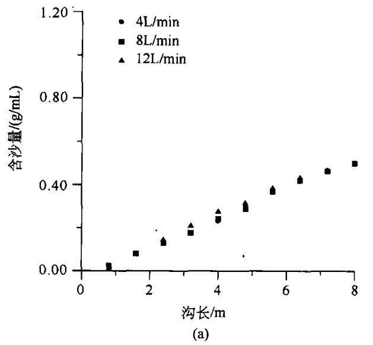

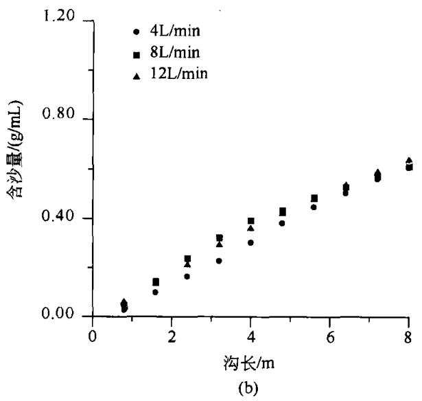

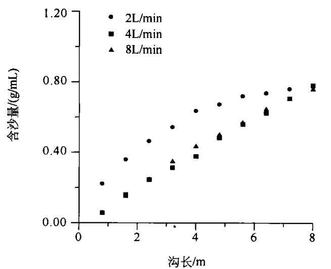  
(c)

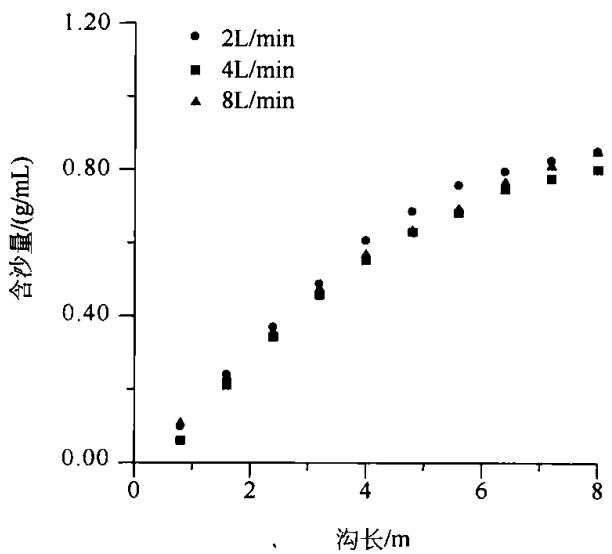  
(d)

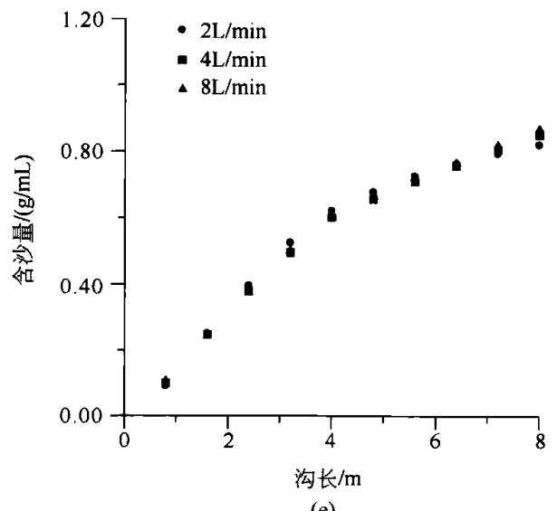  
(e)  
图11.2 REE示踪法估算的产沙量沿沟长的分布(a)5°;(b)10°;(c)15°;(d)20°;(e)25°

细沟侵蚀沿细沟沟长的变化规律可以用能量观点来解释。细沟侵蚀过程是细沟流在顺坡流动过程中，径流冲刷作用和坡面抗蚀作用以及下垫面物质补给能力之间消涨变化及对比协调的结果。细沟流的冲刷能力决定于径流本身所具有的能量及含沙量。在一定的坡度和流量时，细沟流所具有的能量是一定的，随着径流向下坡的运动，新土壤物质的补给，径流所携带的泥沙会逐渐达到一个饱和状态，即如试验结果所显示的一样，含沙量随细沟沟长的增加而增加，但逐渐趋于稳定。同时坡面细沟流向坡下运动时，由于水流在流动过程中要克服冲刷、携带输移土壤颗粒，其具有的能量就不可能完全用来剥蚀新的土粒，这样随着细沟流顺坡向下运动，新增加到径流内的泥沙会减少。且由于流体内部紊动、混掺消耗内能等而做功，其具有的能量会在流动过程中损失一部分。这都决定了细沟水流沿细沟沟长运动时，其含沙量不会无限增加。

## 11.3.2 测定精度

为了检验REE示踪法的精度，收集每次试验的全部浑水，利用定容及烘干称重法实测泥沙总量。在施加示踪元素前，在试验坡面取土样测其背景值，对于收集的全部泥沙，定容烘于后按四分法取样，测定其示踪元素含量。测量精度用REE测得的侵蚀量与实际的侵蚀量间的相对误差表示，其计算公式如下：

$$
\hat { \mathbf { \theta } } = \big ( \sum _ { \mathrm { i } = 1 } ^ { \mathsf { n } } \mathbf { w } _ { \mathrm { i } } / \mathbf { W } - 1 \big ) \mathbf { \theta } \times 1 0 0 \%\tag{11-14}
$$

式中，δ为试验相对误差(%);n为细沟划分的区段数或REE施放的种数；实测土壤侵蚀总量为 $\pmb { W } \colon \pmb { W } _ { i }$ 为第i种 REE 元素所对应坡段的侵蚀量 ${ \big ( } i = 1 , 2 , \cdots , 1 0 { \big ) }$ 。计算的误差列入表11.5。由表11.5看出，不同水动力条件下，REE示踪法计算侵蚀量的试验误差均小于15%，试验精度是令人满意的。

表11.5 不同水动力条件下 REE 示踪法计算侵蚀量的试验误差
<table><tr><td>坡度/(°)</td><td>流量/(L/min)</td><td> $\delta _ { 1 }$ </td><td> $\delta _ { 2 }$ </td><td> $\delta _ { 3 }$ </td></tr><tr><td rowspan="3">5</td><td>2</td><td>11.7</td><td>10.6</td><td>10.6</td></tr><tr><td>4</td><td>4.1</td><td>12.9</td><td>3.3</td></tr><tr><td>8</td><td>7.6</td><td>13.2</td><td>10.7</td></tr><tr><td rowspan="3">10</td><td>2</td><td>8.8</td><td>5.2</td><td>3</td></tr><tr><td>4</td><td>10</td><td>14.6</td><td>11.8</td></tr><tr><td>8</td><td>9</td><td>5.1</td><td>11.8</td></tr><tr><td rowspan="3">15</td><td>2</td><td>14.9</td><td>13.5</td><td>14.8</td></tr><tr><td>4</td><td>2.6</td><td>14.9</td><td>7.9</td></tr><tr><td>8</td><td>8.9</td><td>14.4</td><td>3.7</td></tr><tr><td rowspan="3">20 •</td><td>2</td><td>4.7</td><td>2.5</td><td>7.9</td></tr><tr><td>4</td><td>6.1</td><td>3.4</td><td>13.8</td></tr><tr><td>8</td><td>3.2</td><td>16.6</td><td>4.7</td></tr><tr><td rowspan="3">25</td><td>2</td><td></td><td></td><td></td></tr><tr><td>4</td><td>12.4</td><td>14.2</td><td>12.2</td></tr><tr><td>8</td><td>4.6 14.4</td><td>2.9 14.7</td><td>11.8 14.3</td></tr></table>

由REE示踪法计算得到的细沟侵蚀过程沿细沟分布的动态产沙特点，与由室内不同细沟长度细沟侵蚀模拟试验结果是一致的。为了比较两种方法的相关性，将REE法计算得到的含沙量与相应的试验值进行了比较，分析结果如图11.3所示。

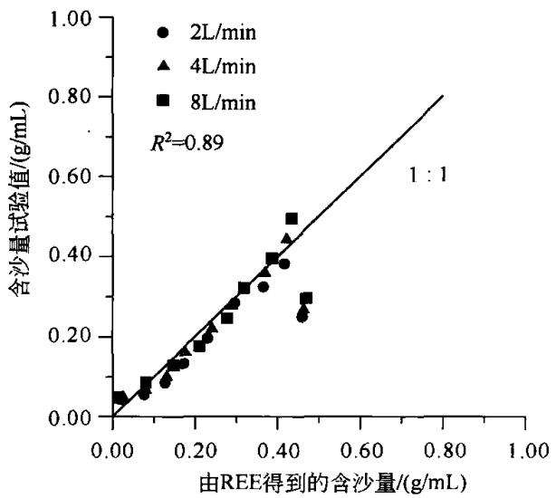  
(a)

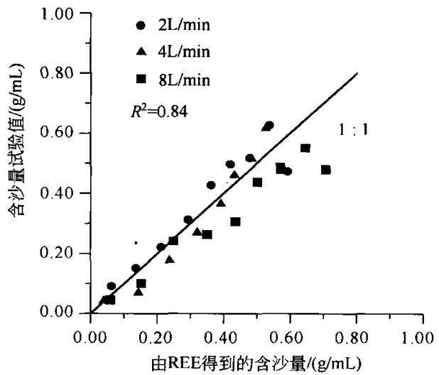  
(b)

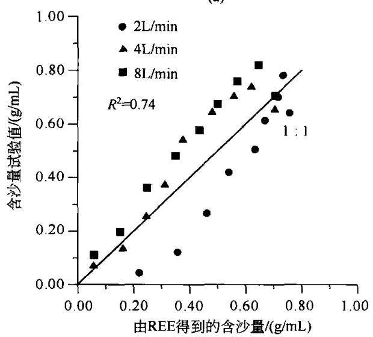  
(c)

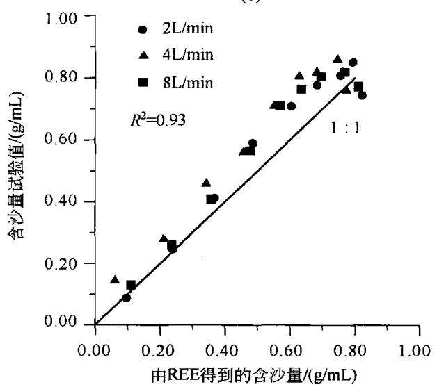  
(d)

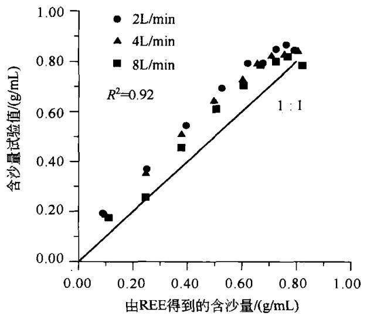  
(e)  
图11.3 REE 法计算得到的含沙量与试验值比较$( \mathbf { a } ) 5 ^ { \circ } ; ( \mathbf { b } ) 1 0 ^ { \circ } ; ( \mathbf { c } ) 1 5 ^ { \circ } ; ( \mathbf { d } ) 2 0 ^ { \circ } ; ( \mathbf { e } ) 2 5 ^ { \circ }$

分析结果表明REE法计算得到的含沙量与相应不同细沟长度的分段试验值间的相关性很好，确定系数 $R ^ { 2 }$ 很高。由不同沟长计算得到的出口含沙量，与由REE法不同元素段之和计算得到的出口含沙量的比较见图11.4。分析发现两组数据相关性很好，确定系数 $R ^ { 2 }$ 为0.98.两者的相对比例接近1，为1.035。两种相关性分析表明REE示踪法是研究细沟侵蚀泥沙分布过程的有力工具。

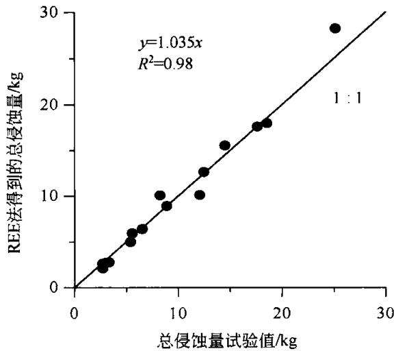  
图11.4 REE法计算得到的总侵蚀沙量与试验值比较

## 11.4 细沟流剥蚀率的 REE 示踪法研究

坡面上结合紧密的土壤颗粒由静止到启动再最终被径流输移主要经历如下两个阶段：通过径流产生沿坡面的剪切力使土粒之间的黏结力破坏，使土粒由有序变为疏散；然后克服土粒和土粒之间或土粒和地表之间的摩擦力使土粒启动。土壤颗粒从土壤母质被剥蚀、移动的过程是由侵蚀动力引起的，土壤剥蚀是细沟中泥沙的主要来源。由剥蚀率的定义：单位时间(s)内由单位面积 $( \mathbf { m } ^ { 2 } )$ 剥蚀的土壤的量 $( \mathbf { k } \mathbf { g } )$ 。用REE示踪法所得试验数据，计算得到了不同坡度和流量下不同坡段部位的细沟流剥蚀率。

设试验时段为 $\Delta T$ ，流量为恒定，产沙量在时段 $\Delta T$ 内不随时间变化，或认为是取时段内的平均值。对应于第i种REE的第i区段所产泥沙量在径流中的含量为 $\lambda _ { i }$ 。从而对于第i种 REE 元素所对应的i 区段的土壤侵蚀 $\pmb { \mathbb { W } } _ { i }$ ，可由不同坡段部位的含沙量计算不同水动力条件下自坡上开始(第1区段)到坡下第i段的细沟流剥蚀率 $D _ { r i }$

$$
D _ { n } = \frac { \lambda _ { i } } { \left( x _ { i } - x _ { i - 1 } \right) \overline { { w } } _ { i } } q = \frac { W _ { i } } { \Delta T \Delta x \overline { { w } } _ { i } } \quad \left( \mathrm { ~ i = 1 ~ , 2 , \cdots , 1 0 ~ } \right)\tag{11-15}
$$

式中， $D _ { r i }$ 为第i段细沟流剥蚀率 $\left[ { \bf { k } } { \bf { g } } / ( { \bf { m } } ^ { 2 } \cdot { \bf { s } } ) \right]$ i $\pmb { W } _ { i }$ 为第i坡段的侵蚀量 $( \mathbf { k g } ) : \Delta T$ 为试验时段 $( s ) \{ \Delta x$ 为施放某一种元素的细沟长度 $( m ) ; { \overline { { w } } } _ { i }$ 为第i坡段细沟平均宽度(m)。细沟侵蚀剥蚀率和含沙量的关系以及细沟侵蚀剥蚀率沿细沟的分布趋势分别见图11.5和图11. $6 _ { \circ }$

从图11.5看出，由稀土元素示踪法得到的细沟流剥蚀率随含沙量的变化趋势，与由不同沟长试验法得到的细沟流剥蚀率变化规律是一致的。在不同水动力条件下细沟流

剥蚀率随含沙量的增加呈线性递减，且这种递减趋势在陡坡和大流量时表现地更显著。  
不同水动力条件下细沟流剥蚀率随含沙量的变化的原因在前面已经做了详尽的描述。

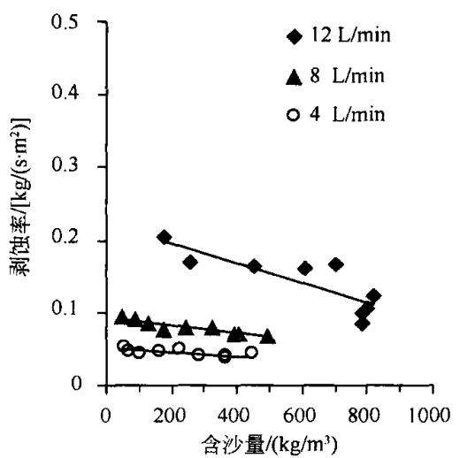  
(a)

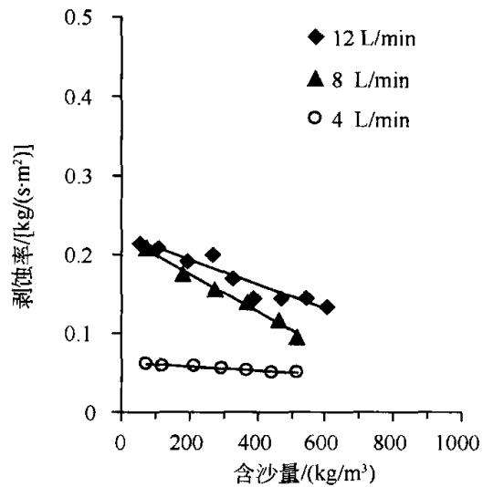  
(b)

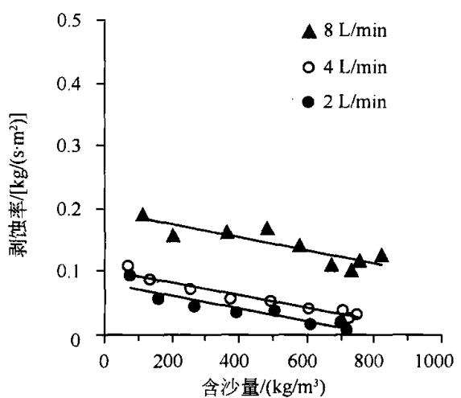  
(c)

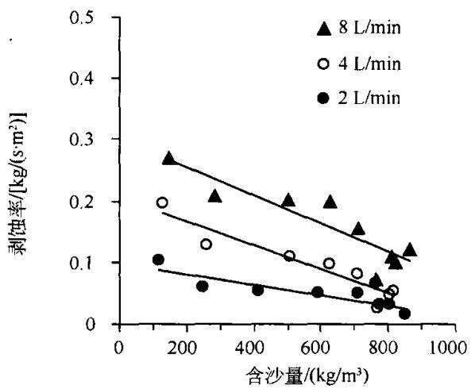  
(d)

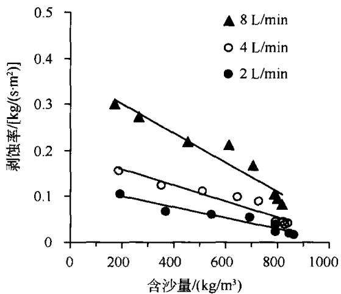  
(e)  
图11.5 不同水动力条件下细沟流剥蚀率随含沙量的变化(a)5°;(b) $1 0 ^ { \circ }$ ;(c)15°;(d)20°;(e)25°

细沟流侵蚀是一种复杂的做功消耗能量的过程，它在一定的边界条件下运动时，就一定遵循物质和能量守恒定律，可以用机械能守恒定律来分析细沟流侵蚀过程中的能耗问题。细沟流除满足质量及能量(或动量)守恒外，总是不断地调整着体系的各变量，以使体系的运动符合能耗率达到极值的规律。径流能量是坡度和流量的函数，坡度和流量一定时，细沟流具有的能量是一定的。剥蚀和输送是一个连续的、不间断的过程，伴随的是物质和能量的交换与转移。在侵蚀之初，势能更多的转化为剥蚀土粒的动能，流速迅速增大，径流能量尽可能大地来剥蚀新的土粒，此时用于输送泥沙所消耗的能量较小，细沟流剥蚀相对较大；径流在向下坡流动中，随着径流沿坡剥蚀土粒，径流中的含沙量增加.径流中的能量必然分出一部分来输送、携带已剥离的泥沙，细沟流剥蚀率会随看水流中含沙量的增加而逐渐减小。

从图11.6可以看出.由稀+元素示踪法得到的细沟流剥蚀率随细沟沟长的变化趋势，与由不同沟长试验法得到的细沟流剥蚀率变化规律也是一致的。在一定坡度和流量下.细沟剥蚀率随细沟沟长的增加呈幂指数逐渐减小。尤其是在坡度为 $2 0 ^ { \circ }$ 和 $2 5 ^ { \circ }$ 以及大流量时，这种趋势表现地更显著。不同水动力条件下细沟流剥蚀率随细沟沟长的变化的原因在前面章节已经做了详尽的描述。

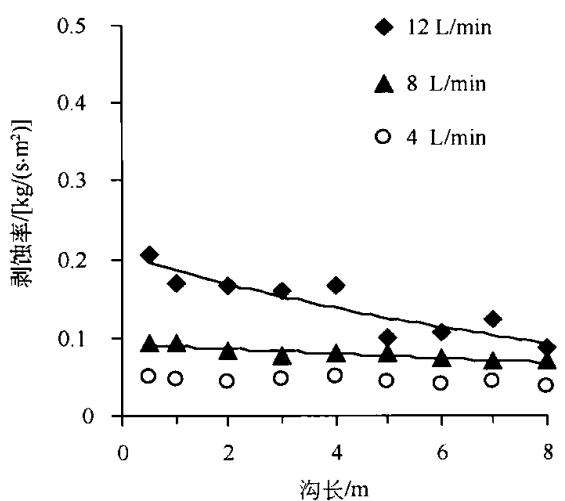  
(a)

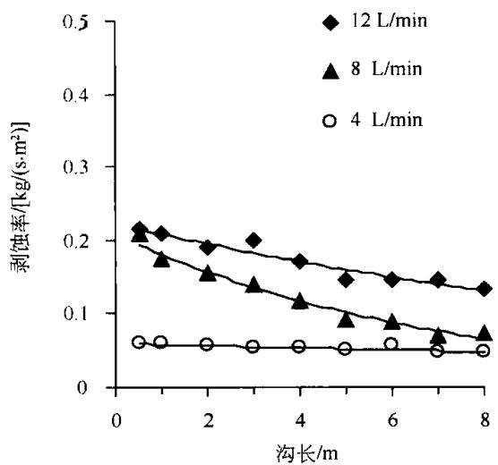  
(b)

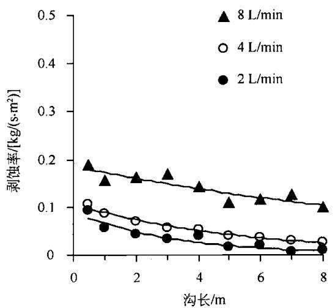  
(c)

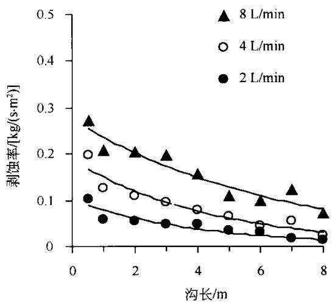  
(d)

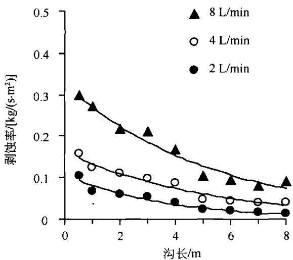  
(e)  
图11.6 不同水动力条件下细沟流剥蚀率随细沟沟长的变化(a)5°;(b)10°;(c)15°;(d)20°;(e)25°

从能量转换的观点来说，紊动动能是细沟流已经消耗的一部分能量，它是水流势能最后转化为热能过程中的一种过渡形式。细沟流由坡顶向坡下流动过程中，由于势能向动能转化，如果没有任何阻力，径流流速应越来越大；同时，由于细沟流的剥蚀作用，细沟流中含沙量沿坡面增加，坡面开始变得不再平整，径流的紊动作用也开始增加。这样细沟流在向下坡运动过程中要剥蚀新土粒和携带输移土壤颗粒而做功，同时要克服流体内部紊动、混掺以及坡面逐渐增大的阻力而消耗内能，其具有的能量会在流动过程中损失一部分，径流在向下坡流动的过程中势能转化为剥蚀土粒的动能部分减小，在某一坡段这种转化达到最大。细沟流的能量消耗是坡度、流量以及细沟沟长和流速(坡度和流量的函数)的函数，能耗随坡度和流量的增大而增加，在某一坡度和流量时，能耗与细沟沟长有关。从能量转化的观点来说，细沟流消耗的能量转化成了细沟流的紊动动能，消耗在细沟流剥蚀土粒的过程中。细沟流能耗越大，细沟剥蚀率越大，所以，细沟剥蚀率会随着坡度和流量的增大而增大，这和图11.6反映出的趋势是一致的。由图11.6可以看出，坡度和流量一定时，细沟流的能量消耗并不是无限止的，而是存在一个临界值，当能量消耗达到某一临界值后，剥蚀率出现最小值。最大剥蚀率出现的点应该和细沟发育的临界坡长，临界剪切力(坡度和流量的函数)是对应的，随着坡度和流量的增大，达到临界能耗所需要的坡长缩短。如果进一步分析临界径流能量消耗和剥蚀率的关系，可以找到细沟侵蚀发育存在的临界坡长，此项内容有待进一步研究。

将REE法计算得到的细沟土壤剥蚀率与相应的由不同沟长试验法试验值进行相关分析，结果表明，两组数据相关性很好，相关系数为0.70，在 $\pmb { \alpha } = \mathbf { 0 . \ 0 5 }$ 时相关关系拟合函数系数为0.87（图11.7）,均很靠近1:1的相关关系线。相关系数表明采集不同坡段泥沙来计算细沟土壤剥蚀速率的方法过高估计了真实的剥蚀速率，这可能是因为这种“时间代空间”的方法造成含沙水流对侵蚀的影响，而用REE示踪方法就可以消除这种由实验设计造成的影响。

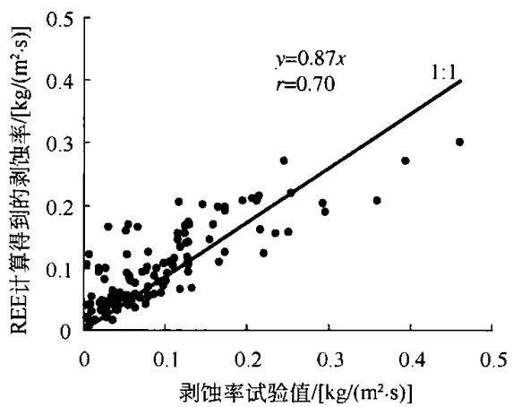  
图11.7 REE法计算得到的细沟土壤剥蚀率与试验值间的相关关系

REE示踪法具有较好的试验精度和特有的灵活性和实用性，可以示踪细沟侵蚀的动态过程，这对可反映坡面泥沙时空变化的土壤侵蚀预报模型的检验是非常有用的。细沟流剥蚀率随坡度和流量的增大而增大，同时细沟流剥蚀率也与坡长有关，随着坡度变陡、流量增大，剥蚀率达到临界值所需的坡长缩短，细沟流剥蚀率随含沙量的变化呈指数减小，随细沟沟长的增加呈对数减少。由能量守恒原理，剥蚀率是与细沟流临界能量消耗值是对应的，且临界能耗随着坡度和流量的增大而增大。这种能量的转化和消耗引起的细沟流剥蚀率随坡度、流量以及坡长的变化，是与细沟的发育过程紧密相连的，临界能量消耗值和剥蚀率的定量关系有待进一步研究，以期找到细沟侵蚀发生的临界坡长。

# 第 12 章 WEPP 模型细沟侵蚀产沙方程理论分析与实验验证

WEPP模型中用质量守恒和过程连续微分方程来描述细沟侵蚀产沙过程(Nearing etal. ,1989;Flanagan et al. ,1995),方程代表了细沟剥蚀率的泥沙反馈形式，是在土壤颗粒与水流相互作用下流体力学概念的基础上建立的

$$
D _ { \mathrm { r } } = K _ { \mathrm { r } } { \big ( } \tau - \tau _ { \mathrm { c } } { \big ) } \left( 1 - { \frac { q c } { T _ { \mathrm { c } } } } \right)\tag{12-1}
$$

但是，目前很少有研究能够设计合理且被广泛接受的试验来验证模型或验证模型中所采用的方程结构，且几乎没有文献对WEPP模型中采用的20世纪70年代提出的侵蚀过程概念的假设进行实验证明。

本章试图从理论上对WEPP细沟侵蚀产沙方程进行分析和数学推导，并将其分析结果与前面章节所提出的模型参数计算结果进行比较来验证侵蚀产沙方程。

## 12.1 试验结果及解析验证

根据前面不同流量和坡度下的剥蚀率与水流含沙量的关系为

$$
\mathbf { \nabla } D _ { \mathrm { { r } } } = \mathbf { a } + b c\tag{12-2}
$$

细沟剥蚀率与细沟沟长的关系为

$$
D _ { \mathrm { r } } = A _ { 0 } \mathrm { e } ^ { - B _ { 0 } { \alpha } }\tag{12-3}
$$

式中 $\mathbf { \nabla } _ { \mathbf { \cdot } } D _ { \mathbf { \ r } }$ 为细沟剥蚀率 $\left( \mathbf { k g } / \mathbf { m } ^ { 2 } \cdot \mathbf { s } \right) ; c$ 为细沟水流的含沙量 $( \mathbf { k g } / \mathbf { m } ^ { 3 } ) ; x$ 为沟长 $( \mathbf { m } ) ; a \setminus b , A _ { 0 } \setminus B _ { 0 }$ 为回归系数。用式(12-2)和式(12-3)回归得到的 $\pmb { a }$ 与 $b$ 值以及 $A _ { 0 }$ 与 $B _ { 0 }$ 值如表12.1所示。

表12.1 理论分析得到的不同坡度、流量下计算的 ${ \pmb a } ^ { \prime } \cdot { \pmb b } ^ { \prime }$ 值
<table><tr><td>坡度/(°)</td><td>流量/(L/min)</td><td> $\pmb { a } ^ { \prime }$ </td><td> ${ \pmb { b } } ^ { \prime }$ </td></tr><tr><td>5</td><td>4</td><td>0.07</td><td>-0.14</td></tr><tr><td></td><td>8</td><td>0.04</td><td>-0.08</td></tr><tr><td>10</td><td>4 8</td><td>0.07 0.04</td><td>-0.12 -0.10</td></tr><tr><td></td><td>2</td><td>0.21</td><td></td></tr><tr><td>15</td><td></td><td></td><td>-0.27</td></tr><tr><td></td><td>4</td><td>0.11</td><td>-0.15</td></tr><tr><td></td><td>8</td><td>0.21</td><td>-0.27</td></tr><tr><td rowspan="3">20</td><td>2</td><td>0.08</td><td>-0.10</td></tr><tr><td>4</td><td>0.25</td><td>-0.31</td></tr><tr><td>8</td><td>0.36</td><td>-0.43</td></tr><tr><td rowspan="3">25</td><td>2</td><td>0.27</td><td>-0.33</td></tr><tr><td>4</td><td>0.32</td><td>-0.38</td></tr><tr><td>8</td><td>0.31</td><td>-0.36</td></tr></table>

由细沟剥蚀率物理定义，得到计算细沟剥蚀率的解析表达式

$$
D _ { \mathrm { r } } = { \frac { \mathrm { d } c ( \boldsymbol { x } ) } { \mathrm { d } \boldsymbol { x } } } q\tag{12-4}
$$

式(12-4)与式(12-2)结合有

$$
D _ { \mathrm { r } } = { \frac { \mathrm { d } c } { \mathrm { d } x } } q = a + b c\tag{12-5a}
$$

边界条件

$$
\boldsymbol { c } ( \boldsymbol { x } ) \mid _ { \boldsymbol { x } = 0 } = 0\tag{12-5b}
$$

积分式(12-5)并整理得

$$
c = ~ - { \frac { a } { b } } + \mathrm { e } ^ { \frac { b } { q } x + C _ { 0 } } = ~ - { \frac { a } { b } } \Big [ 1 ~ { - } { \frac { b C } { a } } \mathrm { e } ^ { \frac { b } { q } x } \Big ]\tag{12-6}
$$

式中， $C _ { 0 }$ 和C为微分常数项。由式(12-5a)及式(12-6)得

$$
c = - \frac { a } { b } ( 1 - \mathrm { e } ^ { \frac { b } { q } x } )\tag{12-7}
$$

由式(12-4)及式(12-3)得

$$
D _ { \mathrm { r } } = { \frac { \mathrm { d } c } { \mathrm { d } x } } q = A _ { 0 } \mathrm { e } ^ { - B _ { 0 } x }\tag{12-8}
$$

式(12-8)即为由沟长与剥蚀率关系求细沟产沙量的微分表达式。其求解的边界条件与式(12-5a)相同。

积分式(12-8)得 $: c = - \frac { A _ { 0 } } { B _ { 0 } q } \mathrm { e } ^ { - B _ { 0 } x } + C$

将边界条件式(12-5a)代入上式得： $C = \frac { A _ { 0 } } { B _ { 0 } q }$ ,则

$$
c = \frac { A _ { 0 } } { B _ { 0 } q } \big ( 1 - { \mathrm e } ^ { - B _ { 0 } x } \big )\tag{12-9}
$$

由式(12-9)及式(12-7)给出的c为描述同一现象的参数，它们应该相等，得

$$
- \frac { a } { b } [ 1 - \mathrm { e } ^ { \frac { b } { q } x } ] = \frac { A _ { 0 } } { B _ { 0 } q } \big ( 1 - \mathrm { e } ^ { - B _ { 0 } x } \big )\tag{12-10}
$$

由式(12-10)得到： $\left\{ \begin{array} { l l } { a = A _ { 0 } } \\ { - b = B _ { 0 } q } \end{array} \right.$

由解析推导结果以及细沟侵蚀室内模拟试验得到的剥蚀率和沟长以及剥蚀率和含沙量的关系，对已得到的相关系数作了分析，计算了系数a和A。以及b和B0q的值，并分 $A _ { 0 }$ $B _ { 0 } q$ 析了它们间的相关性，结果如图12.1和图12.2。

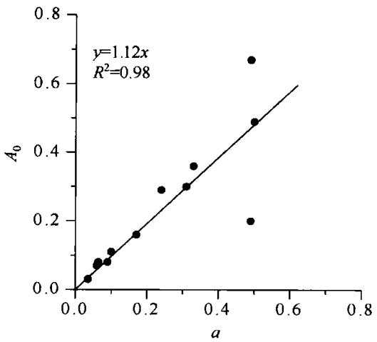  
图 12.1 系数 a 和系数 $A _ { 0 }$ 的相关性

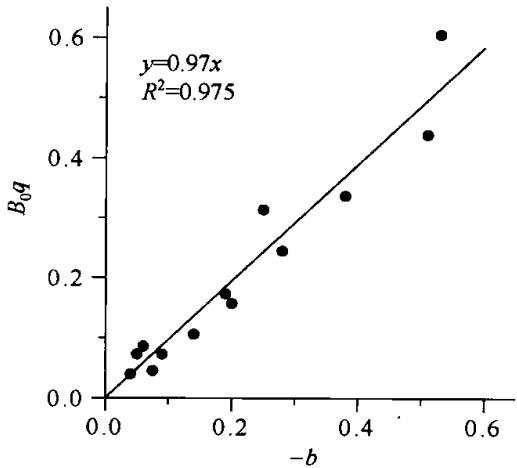  
图 12.2 系数 - b 和系数 $B _ { 0 } q$ 的相关性

由计算结果可以看出，不同坡度及流量下的系数α和 $A _ { 0 }$ 之间以及-b和 $B _ { 0 } q$ 之间呈现出了良好的相关性。系数 $\pmb { a }$ 和 $A _ { 0 }$ 的相关关系为 $A _ { 0 } = 1 . 1 2 3 a , R ^ { 2 } = 0 . 9 8$ ,残差平方和为0.024。系数 b 和 $B _ { 0 } q$ 的相关曲线为 $B _ { 0 } q = { \bf { \Psi } } - { \bf { 0 . 9 7 } } b { \bf { , } } R ^ { 2 } = 0 . 9 7$ ，残差平方和为0.025。计算结果得到的系数 $\pmb { a }$ 和 $A _ { 0 }$ 之间以及-b 和 $B _ { 0 } { \boldsymbol { q } }$ 之间良好的相关性表明，由细沟剥蚀率的解析式推导证明了剥蚀率与含沙量的关系即式(12-2)和剥蚀率与沟长间的关系即式(12-3)是一致的，或者说剥蚀率与含沙量的关系和剥蚀率与沟长间的关系与WEPP模型中剥蚀率与含沙量以及沟长的关系是一致的。

## 12.2 理论分析及试验验证

对于一定的坡度和给定的恒定水流条件，水流剪切力、临界剪切力、单位宽度径流流量均可以被看做常数：

$$
\left\{ \begin{array} { l l } { \tau = \frac { \log 3 } { \sqrt { 3 } } \frac { \log 3 } { 2 } \times \log } \\ { \tau _ { \mathrm { c } } = \frac { \log 3 } { \sqrt { 3 } } \frac { \log 3 } { 2 } \times \log } \\ { q = \frac { \log 3 } { \sqrt { 3 } } \frac { \log 3 } { 2 } \times \log } \end{array} \right.\tag{12-11}
$$

当给定土壤(质地与结构)、地形地貌(坡度)及其他条件(如植物根系、水分状况等)后，土壤可蚀性参数K，和临界剪切力τ。也可以被看做常数，即 $K _ { \mathrm { r } }$ $\tau _ { \mathfrak { c } }$

$$
\left\{ \begin{array} { l l } { K _ { r } = \Psi \Psi } \\ { \tau _ { c } = \Psi \Psi } \end{array} \right.\tag{12-12}
$$

从而,将式(12-11)、式(12-12)与WEPP侵蚀产沙方程式(12-1)结合，得到化简的、描述细沟侵蚀的产沙方程为

$$
D _ { \mathrm { r } } ( x ) = a ^ { \prime } + b ^ { \prime } c\tag{12-13}
$$

式中 $, a ^ { \prime } , b ^ { \prime }$ 为系数： $: c _ { . }$ 为含沙量;细沟剥蚀率 $D _ { \mathfrak { r } }$ 随水流含沙量c的增加呈线性变化。式(12-13)中，

$$
a ^ { \prime } = K _ { \mathrm { r } } \left( \tau - \tau _ { c } \right)\tag{12-14}
$$

$$
b ^ { \prime } = \ - K _ { \mathrm { r } } \big ( \tau - \tau _ { \mathrm { c } } \big ) \frac { q } { T _ { \mathrm { c } } } = \ - a ^ { \prime } \frac { q } { T _ { \mathrm { c } } }\tag{12-15}
$$

径流的水流动力机制是细沟剥蚀土粒的驱动力，水流剪切力常用来刻画径流剥蚀土粒的能力。方程用的水流剪切力直接由力平衡关系计算，理论公式为(洪惜英，1990)

$$
\tau = g \rho s h\tag{12-16}
$$

式中， $^ { , g }$ 为重力加速度 $( \mathbf { m } { \cdot } \mathbf { s } ^ { 2 } ) { \cdot } \rho$ 为水流密度 $( \mathbf { k g } / \mathbf { m } ^ { 3 } )$ ;s 为床面坡度;h 为径流深(m)。

水流的输沙能力由第 $9$ 章给出

$$
T _ { \mathrm { c } } = A q\tag{12-17}
$$

式中，系数A为含沙水流达到其输沙能力时所能携带的最大含沙量。将式(12-17)代入式(12-15)得到

$$
b ^ { \prime } = \ - K _ { \mathrm { r } } \big ( \tau - \tau _ { \mathrm { c } } \big ) \frac { 1 } { A } = \ - \frac { a ^ { \prime } } { A }\tag{12-18}
$$

$K _ { \mathrm { r } }$ $\cdot \tau _ { \mathrm { c } }$ 和A由前面章节给出，从而可以得到式(12-13)中的 $\bullet ^ { \prime } , b ^ { \prime }$ 值，计算结果列入表12.1。

因为式(12-13)与式(12-2)是由理论分析和试验得到的同一物理现象的两种不同表达。因此，由上述分析可知，如果WEPP的侵蚀产沙模型正确的话，那么由式(12-13)经理论计算得到的剥蚀率应该是水流含沙量的线性函数，且函数的系数 $( a ^ { \prime } , b ^ { \prime } )$ 应等于由试验数据用式(12-2)回归得到的a、b值。为此，将得到的 $\smash { a ^ { \prime } \setminus b ^ { \prime } }$ 值和由试验数据估计得到式(12-2)中的a,b值进行对比，结果见图12.3和图12.4,图中实线斜率为1,数据点越靠近此直线两者相关性越好。

图12.3和图12.4中可以看出数据点比较集中且均在斜线附近，系数 $^ { a }$ 的拟合曲线(图中虚线)为 $\pmb { a } ^ { \prime } = \pmb { 0 } . 7 7 8 \pmb { a }$ ;系数b的拟合曲线为 $b ^ { \prime } = 0 . 9 1 2 b$ 。对系数 $\pmb { a }$ ，回归分析得到的残差平方和为 $0 . 0 6 9 , R ^ { 2 }$ 为0.88。对系数b，回归分析得到的残差平方和为0.118， $R ^ { 2 }$ 为0.86，说明由理论分析计算得到的值与直接由试验数据估算得出的值有很好的一一对应关系。

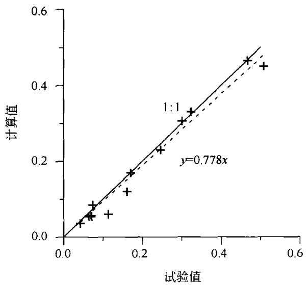

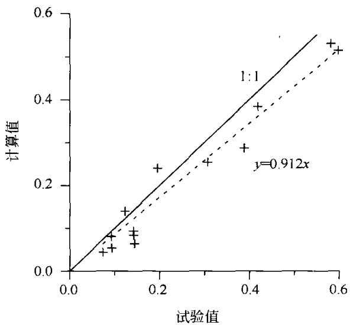  
图12.3 理论分析值和试验估算值的比较  
图12.4 理论分析值和试验估算值的比较

由式(12-4)细沟土壤剥蚀率解析式 $D _ { \mathrm { r } } ( x ) = { \frac { \mathrm { d } c ( x ) } { \mathrm { d } x } } q$ ，与理论分析得到的产沙方程简化式(12-13)结合有

$$
\frac { \mathrm { d } c ( \boldsymbol { x } ) } { \mathrm { d } \boldsymbol { x } } q = a ^ { \prime } + b ^ { \prime } c\tag{12-19}
$$

求解式(12-19)的边界条件为

$$
\left. c ( \pmb { x } ) \ \right| _ { \pmb { x } = \pmb { 0 } } = 0\tag{12-19a}
$$

采用式(12-19a)确定的边界条件对式(12-19)积分得： $\mathbf { \partial } _ { ; c } = - \frac { a ^ { \prime } } { b ^ { \prime } } [ 1 - \mathrm { e } ^ { \frac { b ^ { \prime } } { q } x } ]$

区 $A ^ { \prime } = \mathrm { } - \frac { a ^ { \prime } } { b ^ { \prime } } , \beta ^ { \prime } = \mathrm { } - \frac { b ^ { \prime } } { q }$ ,则

$$
c = A ^ { \prime } ( 1 - { \bf e } ^ { - \beta ^ { \prime } x } )\tag{12-20}
$$

方程式(12-20)即为含沙量随细沟沟长变化的函数关系。式中 $\beta ^ { \prime }$ 为衰减系数，方程的物理含义为产沙量c随着沟长x的增加逐渐增加，但增加的幅度越来越小，且渐进一个极限值 $A ^ { \prime }$ 。如果上述理论分析结果正确的话，那么由试验得到的含沙量和沟长的关系应该符合上述函数关系，且试验得到的函数系数与 $A ^ { \prime } \mathcal { B } ^ { \prime }$ 值相等或至少相关性很好。由 $a ^ { \prime } , b ^ { \prime } , q$ 计算得到的A'与 $\beta ^ { \prime }$ 列入表12.2。

由室内细沟侵蚀模拟试验结果知：一定水动力条件下产沙量随着沟长的增加而增加，但增加的幅度越来越小，且渐近一个稳定值。由试验水流泥沙含量与细沟沟长的关系为

$$
c = A { \big ( } 1 - \mathbf { e } ^ { - \beta x } { \big ) }\tag{12-21}
$$

式中， $, c$ 为水流的含沙量 $( \log ( m ^ { 3 } )$ ;x 为沟长(m);拟合系数 A 与 $\beta$ 如表12.2所示。

表12.2 由理论分析即式(6-20)计算得到的 $\mathbf { A ^ { \prime } }$ 与 $\beta ^ { \prime }$ 和由试验数据拟合得到的系数A与 $\pmb { \beta }$
<table><tr><td>坡度/(°)</td><td>流量  $\diagup ( \mathbf { L } { \big / } \mathbf { m i n } )$ </td><td> $A ^ { \prime }$ </td><td> $\beta ^ { \prime }$ </td><td>A</td><td> $\beta$ </td></tr><tr><td rowspan="2">5</td><td>4</td><td>0.5</td><td>0.21</td><td>0.5</td><td>0.24</td></tr><tr><td>8</td><td>0.5</td><td>0.06</td><td>0.5</td><td>0.26</td></tr><tr><td rowspan="2">10</td><td>4</td><td>0.58</td><td>0.18</td><td>0.61</td><td>0.34</td></tr><tr><td>8</td><td>0.4</td><td>0.08</td><td>0.61</td><td>0.34</td></tr><tr><td rowspan="3">15</td><td>2</td><td>0.78</td><td>0.82</td><td>0.78</td><td>0.4</td></tr><tr><td>4</td><td>0.73</td><td>0.22</td><td>0.76</td><td>0.37</td></tr><tr><td>8</td><td>0.78</td><td>0.21</td><td>0.76</td><td>0.45</td></tr><tr><td rowspan="3">20</td><td>2</td><td>0.8</td><td>0.29</td><td>0.85</td><td>0.52</td></tr><tr><td>4</td><td>0.81</td><td>0.46</td><td>0.80</td><td>0.51</td></tr><tr><td>8</td><td>0.84</td><td>0.32</td><td>0.85</td><td>0.51</td></tr><tr><td rowspan="3">25</td><td>2</td><td>0.82</td><td>0.99</td><td>0.82</td><td>0.5</td></tr><tr><td>4</td><td>0.84</td><td>0.57</td><td>0.85</td><td>0.51</td></tr><tr><td>8</td><td>0.86</td><td>0.27</td><td>0.87</td><td>0.55</td></tr></table>

因为式(12-20)与式(12-21)也是同一物理现象的两种不同表达。如果WEPP的侵蚀产沙模型正确的话，那么由式(12-20)经理论计算得到的含沙量和沟长的关系应该和由试验结果得到的式(12-21)是一致的，且函数的系数 $A ^ { \prime } \mathcal { B } ^ { \prime }$ 应等于由试验数据用式(12-21)回归得到的 $A \mathcal { \cdot } \beta$ 值。系数相关性分析见图12.5和图12. $^ 6$ o

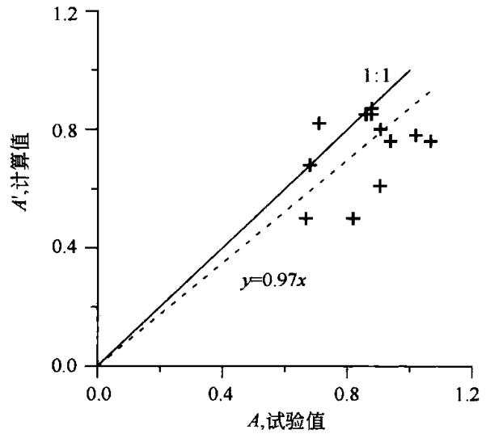  
图12.5 A 理论分析值和试验值的比较

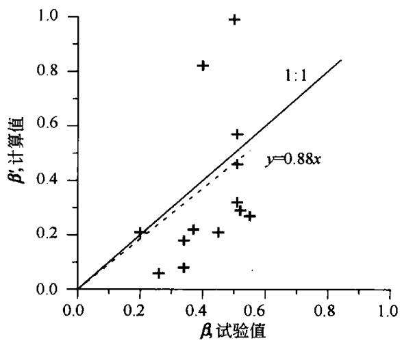  
图 12.6 $\beta$ 理论分析值和试验值的比较

图12.5和图12.6中实线斜率为1,数据点越靠近此直线，说明两者相关性越好。从图可以看出数据点比较集中且均在斜实线附近，说明由理论分析得到的值与直接由试验数据估算得出的值有很好的一一对应关系。系数A的相关性拟合曲线为 $A ^ { \prime } = 0 . 9 7 A$ 对于系数 $\beta$ 的相关性拟合曲线为 $\beta ^ { \prime } = 0 . 8 8 \ \beta _ { \mathrm { t } }$ 。对于系数A，回归分析得到的残差平方和为

0.042, $R ^ { 2 }$ 为0.99;对于系数 $\beta _ { i }$ ,回归分析得到的残差平方和为 $0 . 7 6 4 , R ^ { 2 }$ 为0.71。说明上述理论推导值与由试验数据直接得到的相应的值相关性很好，反过来说上述理论分析结果是正确的，即含沙量和沟长的关系符合函数式(12-3)。

WEPP土壤水蚀预报模型在概念上是以物理过程为基础的，目前由于缺乏合理的理论分析和严密的数学推导验证，限制了模型的应用和推广。本章从理论上分析了WEPP模型中的细沟侵蚀产沙方程，得到了剥蚀率与含沙量函数关系及关系式中的参数，将获得的参数与试验值进行比较。同时利用确定细沟剥蚀率的微分方程进行积分，得到了含沙量随沟长变化的函数关系，将此方程中的参数与由试验数据拟合方程得到的相应参数进行了比较。从比较结果可以看出由理论分析得到的值与试验值有很好的一一对应关系，即理论分析结果和试验拟合结果可以相互验证。分析结果表明径流含沙量对细沟剥蚀率的确有很显著的影响，而且符合线性函数关系，与WEPP模型中的细沟剥蚀率侵蚀产沙关系基本一致，WEPP模型中的细沟剥蚀率侵蚀产沙方程可以用来描述黄土区坡面细沟侵蚀产沙耦合过程，对土壤侵蚀研究及其预测预报向完整物理模型转化和全方位验证有重要的推动作用。

## 第 13 章 WEPP 模型中细沟可蚀性参数估计方法误差的理论分析

## 13.1 WEPP模型确定可蚀性参数的实验与计算方法

WEPP模型目前采用的可蚀性参数是以一定长度的细沟(或一定长宽的径流小区)实验得到的细沟侵蚀产沙量估算最大剥蚀率为基础获得的。WEPP模型将坡面土壤侵蚀分为细沟侵蚀和细沟间侵蚀两部分，以单位沟宽或单位坡面宽为基础进行计算。故坡面侵蚀过程的稳态泥沙连续方程描述如下(Foster et al.，1995)

$$
\frac { \mathrm { d } G } { \mathrm { d } x } = D _ { \mathrm { r } } + D _ { \mathrm { i } }\tag{13-1}
$$

式中， $\textit { G } = \boldsymbol { q } \cdot \boldsymbol { c }$ 为水流的输沙量 $[ \mathbf { k g } / ( \textbf { s } \cdot \textbf { m } ) ]$ ;x为入水口向坡下的距离 $( \mathbf { m } ) { \mathbf { ; } } D _ { \mathbf { r } }$ 为细沟侵蚀量 $[ { \bf k g } / ( { \bf m } ^ { 2 } \cdot { \bf s } ) ] ; D _ { \mathrm { i } }$ 为细沟间(inter-rill)向细沟内输运的泥沙量[ $\mathbf { \dot { k } } \mathbf { g } / ( \mathbf { m } ^ { 2 } \cdot \mathbf { s } )$ 1。

细沟侵蚀量从概念上表达为

$$
D _ { \mathrm { r } } = D _ { \mathrm { c } } \left[ 1 - \frac { G } { T _ { \mathrm { c } } } \right]\tag{13-2}
$$

$$
\smash { D _ { \mathrm { c } } = K _ { \mathrm { r } } ( \tau - \tau _ { \mathrm { c } } ) }\tag{13-3}
$$

式(13-2)、式(13-3)中， $D _ { \mathfrak { c } }$ 为细沟水流对土壤的最大剥蚀率（potential detachmentrate)，或称为剥蚀能力 $\mathrm { ( ~ d e t a c h m e n t ~ c a p a c i t y ) } \left[ \mathrm { ~ k g / ( ~ m ^ { 2 } ~ \cdot ~ s ) ~ } \right] ; T _ { \mathrm { c } }$ 为水流输运泥沙的能力$[ { \bf k g } / ( { \bf s } \cdot { \bf m } ) ] ; K _ { \mathrm { r } }$ 为细沟土壤可蚀性参数，被定义为每增加一个单位的剪切力所增加的剥蚀率 $[ \mathrm { \bf ~ k g } / ( \mathrm { \bf ~ m } ^ { 2 } \cdot \mathrm { \bf ~ s } \cdot \mathrm { \bf ~ P a } )$ 或 $\mathbf { s } / \mathbf { m } ] : \tau$ 与 $\pmb { \tau _ { \mathrm { c } } }$ 分别为水流对土壤的剪切力与土壤的临界抗剪切力(Pa)。式(13-2)表明了细沟水流中泥沙含量与土壤剥蚀的反馈耦合关系。

为了在美国不同地区应用WEPP预报土壤侵蚀量，科研工作者花费了大量人力、物力和财力，在美国对有代表性的土壤进行试验研究，以确定其土壤可蚀性参数，并于1989年编印出版了参数手册和数据库。将式(13-3)与式(13-2)比较表明，只有在清水的情况下 $\scriptstyle ( c = 0 )$ ，才有可能达到最大剥蚀率。同时，由于水流的剥蚀率随沟长的增加而减少见式(13-2)1，因此要获得最大剥蚀率，沟长 ${ \mathfrak { X } }$ 须很短。显然，Gilley等的试验条件与此相差甚远。长沟试验得到的最大剥蚀率与实际值相差很大。本章目的在于：分析细沟侵蚀产沙输沙动态过程；从理论上分析WEPP模型中计算细沟可蚀性参数的误差，提出减少误差的途径。

## 13.2 WEPP模型细沟土壤可蚀性参数估计误差来源

Huang等(1996)做出了放水冲刷稳定水流(即细沟宽度、坡度沿沟长方向恒定)条件下细沟产沙输沙的解析表达式。在放水冲刷的情况下，式(13-1)中的 $D _ { \mathrm { i } } = 0$ ，由式(13-1)、式(13-2)结合有

$$
\frac { \mathrm { d } G } { \mathrm { d } x } = D _ { \mathrm { c } } \left[ 1 - \frac { G } { T _ { \mathrm { c } } } \right]\tag{13-4}
$$

边界条件为

$$
\mathbf { \nabla } G \vert _ { \mathbf { \nabla } _ { \mathbf { x } = 0 } } = \mathbf { 0 }\tag{13-4a}
$$

则式(13-4)的解析解为

$$
G = q c = T _ { \mathrm { c } } \left( 1 \mathrm { ~ - ~ } \mathrm { e } ^ { - B x } \right)\tag{13-5}
$$

Lei等(1998)用数值模拟的方法得到了稳定水流、均匀坡度、沟宽不变条件下的类似结果。我们已于2002 年(Lei et al. ,2002)通过有限定的细沟流冲刷试验，首次证实了细沟侵蚀产沙输沙的关系为

$$
c = A { \big ( } 1 - e ^ { - B x } { \big ) }\tag{13-6}
$$

并证实下列关系成立：

$$
A q = T _ { c }\tag{13-7}
$$

将式(13-5)与式(13-6)、式(13-7)进行比较，可知结果是一致的。

根据室内细沟侵蚀模拟冲刷试验，坡度为 $2 0 ^ { \circ }$ 条件下水流含沙量与沟长的关系[见式(13-6)],如图13.1所示。

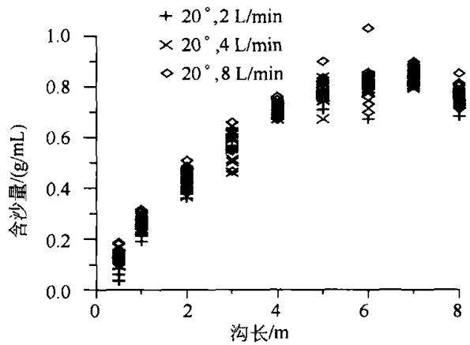  
图13.1 细沟流含沙量与沟长的关系

式(13-5)[或等价式(13-6)]中的B是与水流流速、沟坡坡度、土壤类型相关的变量。将式(13-5)中的水流输沙量 $( q c )$ 进行标准化转化 $( q c / T _ { \mathrm { { c } } } )$ 后发现，在各种条件下(B的取值不同)，水流的输沙量最终总是趋近于 $q c / T _ { \mathrm { c } } = 1$ ,即 $q c = T _ { \mathrm { { c } } }$ ，即水流中的输沙量最终趋近于水流的输沙能力(图13.1)。但是，受细沟坡度、水流流速、土壤类型的影响，B值不同，水流输沙量趋近于水流输沙能力的快慢程度是不一样的。B值越大， $q c$ 趋近于$\pmb { T _ { \mathrm { c } } }$ 的速度越快。

由于土壤的可蚀性参数 $K _ { \mathrm { r } }$ 与B值成正比，因此实际上 $K _ { \mathrm { r } }$ 值越大，水流输沙量趋近水流输沙能力的速度越快。这当然是合理的，因为 $K _ { \mathfrak { r } }$ 值越大，表明土壤越容易被剥离，随着单位长度细沟内被剥蚀进入水流的泥沙量越多，水流中的含沙量增加越快，水流趋于输沙能力所能携带的输沙量的速度也越快。当细沟长度达到一定值时，尽管水流的输沙量最终都会趋于水流的输沙能力，但其趋于该值的过程或速度却是不一样的，即细沟侵蚀的动态过程受 $K _ { r }$ 值的影响有很大程度的不同。由于受到观测手段的限制和对细沟侵蚀机理理解的局限性，以往采用细沟出口处或径流小区出口处的水流含沙量来评价模型预报好坏的做法是有局限性的，因为忽略了中间可能发生的完全不同的动态响应。因此，使得模型预报的结果也许在细沟或径流小区出口处的径流产沙量与实际相差不大，但对于土壤侵蚀沿细沟所发生的过程的预报则可能会很差。

当B值变化或沟长取值变化时，根据一定坡度和流量条件下细沟水流中的含沙量(或一定流量下的输沙量)随沟长的变化关系，由下式估计得到的最大剥蚀率产生很大的误差

$$
D _ { \mathrm { c } } \approx { \frac { \Delta G } { \Delta x } }\tag{13-8}
$$

于是以此为基础的可蚀性参数的估计值也将有很大的误差。

另外，根据Lei和Nearing(1999)实试验室试验的观测结果，在宽为0.5m，长为 ${ \& }$ (与Gilley等采用的宽0.5m，长9m的小区极为相近)的径流小区，由于侵蚀与沉积的交替发生，细沟宽度不断变化，细沟水流的输沙能力、剥蚀率、水流的剪切力也随着不断变化，使得由径流小区出口处测得的水流含沙量也变化不定，且大大低于恒定水流下应有的量值，而且水流的剪切力无法估计。根据这样的结果，采用式(13-8)计算得到的最大剥蚀率，用于估计可蚀性参数将会产生更大的误差。

以下是仅根据限定细沟的侵蚀产沙输沙的确定性关系分析WEPP可蚀性参数的估计误差。根据上述讨论，实际误差应该大于由此估计的误差。

## 13.3 WEPP模型细沟可蚀性参数误差的估算

根据以上分析可知，理想的最大水流剥蚀率应该是用很短的细沟在清水冲刷下得到的，而短细沟的理想值是长度趋于零的细沟。已经由室内细沟侵蚀模拟试验的研究结果，提供了用微分法，即极短细沟来估计最大水流剥蚀率的可能性，得到了细沟土壤剥蚀率与细沟输沙量的关系，为

$$
D _ { \mathrm { r } } = { \frac { \mathrm { d } c } { \mathrm { d } x } } q = { \frac { \mathrm { d } G } { \mathrm { d } x } }\tag{13-9}
$$

而最大剥蚀率是在沟长为零时取得，即

$$
D _ { \mathrm { r m a x } } = \operatorname* { l i m } _ { x  0 } \biggl ( \frac { \mathrm { d } c } { \mathrm { d } x } q \biggr )\tag{13-10}
$$

式(13-10)表明，细沟侵蚀的最大剥蚀率为水流输沙量与沟长的函数关系曲线在 $\boldsymbol { x } = 0$ 处的导数，或者说是该函数关系曲线在沟长为0时的斜率。将式(13-5)[或式(13-6)、式(13-7)]代入式(13-8)得到

$$
D _ { \mathrm { r m a x } } = D _ { \mathrm { c } } = T _ { \mathrm { c } } B\tag{13-11}
$$

式(13-11)为细沟侵蚀的最大剥蚀率的计算式。而由Gilley等(1993)的结果得到的最大剥蚀率(假设也是限定性细沟)为

$$
D _ { \mathrm { \ m a x } } ^ { \prime } = D _ { \mathrm { ~ c ~ } } ^ { \prime } = T _ { \mathrm { c } } \ \frac { 1 - { \mathrm e } ^ { - B X } } { X }\tag{13-12}
$$

式中，X为细沟的总长度(m)。

式(13-12)代表的几何意义为：细沟侵蚀的最大剥蚀率为水流输沙量与沟长的函数关系曲线由原点到细沟(径流小区)出口处水流输沙量值连线的斜率。显然，该量值大大小于曲线在原点处的斜率值。由式(13-3)得到

$$
K _ { \mathrm { r } } = \frac { D _ { \mathrm { c } } } { \tau - \tau _ { \mathrm { c } } }\tag{13-13}
$$

$$
\delta = \frac { \Delta \ K _ { \mathrm { r } } } { K _ { \mathrm { r } } } \times 1 0 0 \% \ = \frac { K _ { \mathrm { r } } - K _ { \mathrm { ~ r } } ^ { \prime } } { K _ { \mathrm { r } } } \times 1 0 0 \%\tag{13-14}
$$

式中，δ为估计可蚀性参数 $K _ { \mathrm { r } }$ 的相对误差。

将式(13-11)、式(13-12)、式(13-13)代入式(13-14)得

$$
\delta = \frac { \displaystyle \frac { 1 } { \tau - \tau _ { \mathrm { c } } } \Big [ T _ { \mathrm { c } } B - T _ { \mathrm { c } } \frac { 1 - { \mathrm e } ^ { - B X } } { X } \Big ] } { \displaystyle \frac { 1 } { \tau - \tau _ { \mathrm { c } } } T _ { \mathrm { c } } B } = 1 - \frac { 1 - { \mathrm e } ^ { - B X } } { B X }\tag{13-15}
$$

由式(13-15)所确定的误差是估计可蚀性参数的细沟长度及B值的函数。当用于估计最大剥蚀率的细沟长度趋于零时，式(13-15)所确定的误差也趋于零。式(13-15)所表达的函数关系直观地如图13.2所示。

由图13.3可见，可蚀性参数估计值的相对误差随获取输沙量细沟长度的增加而增大，并且当沟长一定时，误差大小随B值的增大而增大。这就表明，估计误差与沟长、水流、沟坡、土壤等因素密切相关。当选用细沟长度9m处的水流输沙量时，按式(13-12)估计最大剥蚀率来计算土壤的可蚀性参数，误差可达到：当 $B = 0 . 1$ 时，误差约为50%；当$B = 1 , 0$ 时，误差可达90%，即所估计的土壤剥蚀率约为实际值的10%，即当 $B = 1 , 0$ 时，按式(7-10)所估计的最大剥蚀率而计算得到的土壤剥蚀率可以达到Gilley等(1993)的估计方法所得数值的10倍左右。实际上，我们试验得到的黄绵土(粉壤土，黏粒15.1%)的可蚀性参数值(0.32s/m)约为Gilley等所得到的最大可蚀性参数的10倍。这表明，估计最大剥蚀率的方法对于估计土壤可蚀性参数具有极其重要的影响。Zhang等(2002)用小土样(直径10cm)试验数据估计得到的土壤(黏粒含量24.3%)的可蚀性参数值为0.204s/m。众所周知，土壤黏粒含量越高，抵抗侵蚀的能力越强，可蚀性参数越低。可见，Lei等的结果与Zhang等的结果具有可比性，说明估计结果在很大程度上是可信的，估计方法是可行的。而上述对于Gilley等估计WEPP细沟土壤可蚀性参数的误差分析也是合理的。从而说明，WEPP模型的细沟可蚀性参数数据库的有效性和可用性有必要重新加以考虑。

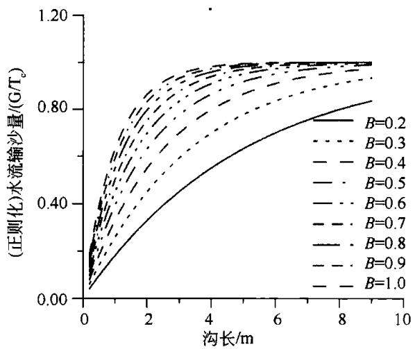  
图13.2 (正则化)水流输沙量与沟长的函数关系

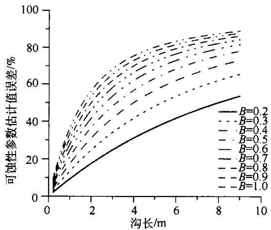  
图 13.3 不同 B 值时 WEPP 可蚀性参数估计值误差随沟长的变化

上述讨论同时表明，为了减少可蚀性参数的估计误差，至少必须做到以下两点：①采用限定性细沟和稳定的水流，以使水流的剪切力和水流的输沙能力沿沟长无很大变化，从而可以较好地估计水流剪切力及输沙能力沿沟长的分布；②以清水对长度无限短的细沟产生的土壤剥蚀率作为最大土壤剥蚀率的估计值，用于计算可蚀性参数。

## 第14章 模型参数及有限元模拟算法的检验

地表水文模型检验，一般是评价模型模拟一个或几个输出成分(通常是细沟流量、侵蚀量)的能力。如果模型的数值计算结果能够较好地模拟实验观测结果，则模型本身及其假定、算法、参数或系数值都被认为是检验过关(Freeze,1978;刘新仁,1989)。目前，坡面土壤侵蚀模型试验研究分为室内和野外两种(雷俊山等，2004)。野外主要用实地放水法和径流小区资料分析法等进行研究，这种方法的优点是试验土壤不受扰动，结果具有代表性，但由于野外试验影响因素较多，细沟形成与发展过程难于控制，要达到设计要求具有一定难度。室内试验是将实际过程进行简化，并在短时间内重现实际过程的有效途径。室内主要用人工模拟降雨法和放水冲刷法研究，以往对细沟侵蚀过程的室内试验的研究由于受试验条件和测量设备的限制，还主要停留在对细沟出口泥沙侵蚀量的观测分析基础上。对于细沟不同部位处侵蚀量的变化试验研究少有报道。在已有侵蚀资料和野外调查的基础上，设计了室内细沟侵蚀模拟试验，选取影响细沟侵蚀发生和发展的主要水动力因子，确定了不同沟长对应的侵蚀产沙量，找出泥沙含量与沟长的对应关系。该试验测量结果能够反应细沟水流中的泥沙在坡长上的变化过程，具有一定代表性。因此，本章引用细沟侵蚀室内冲刷模拟试验观测结果，对模型、模拟方法、模型参数进行验证。同时，采用不同的参数模拟侵蚀过程，探求细沟侵蚀产沙方程中关键参数(剥蚀率、土壤可蚀性参数、土壤临界剪切应力和水流输沙能力)对细沟土壤侵蚀影响的机理。

本章包括以下几个方面：①利用开发的C++数值计算程序，模拟无降雨、集中水流条件下细沟侵蚀动态过程；②将程序模拟结果与试验结果进行对比，验证模型和数值计算程序以及模型参数的正确性；③检验土壤可蚀性参数和输沙能力对细沟侵蚀过程的影响；④将程序中的输沙能力、土壤可蚀性参数的计算模块进行修改，采用不同的参数进行模拟，将试验结果与模拟结果对比，说明不同参数的正确性；⑤模拟细沟剥蚀过程，研究参数对剥蚀能力的影响。

## 14.1 初始及边界条件

根据实验设置条件，模拟过程边界条件如下

$$
\begin{array} { r } { \left\{ \begin{array} { l l } { V _ { x _ { 0 } } = V _ { 0 } } \\ { H _ { x _ { 0 } } = H _ { 0 } } \\ { c _ { x _ { 0 } } = 0 } \\ { \displaystyle \frac { \mathrm { d } c } { \mathrm { d } x _ { x _ { 0 } } } = K _ { r } \big [ \gamma s H _ { 0 } - \tau _ { c } \big ] } \end{array} \right. } \end{array}\tag{14-1}
$$

式中， $V _ { 0 }$ 和 $H _ { 0 }$ 为入口处的流速 $\left( \mathbf { m } { \big / } \mathbf { s } \right)$ 与水流深度(m)，它们受集中水流流量q的制约；c为泥沙含量 $( | \mathbf { k g } / \mathbf { m } ^ { 3 } \rangle$ ;γ 为水的容重,取 $9 8 0 0 ( \mathrm { N } / \mathrm { m } ^ { 3 } )$ ;s 为水力坡度，取值为 sinθ,θ为地表坡度(°); $\tau = \gamma s H _ { 0 }$ ,τ和 $\tau _ { \mathrm { c } }$ 为水流剪切应力和土壤临界抗剪切应力 $\left( \mathbf { P a } \right)$ 。关系式如下

$$
q = V _ { 0 } H _ { 0 } w _ { 0 }\tag{14-2}
$$

式中，w为细沟宽，取10cm。

初始条件为

$$
\left\{ \begin{array} { l l } { V _ { x i } { \big ( } x , t = 0 { \big ) } = V _ { i } } \\ { } \\ { H _ { x i } { \big ( } x , t = 0 { \big ) } = H _ { i } } \\ { } \\ { c _ { x i } { \big ( } x , t = 0 { \big ) } = 0 } \end{array} \right.\tag{14-3}
$$

$V _ { i } .$ 与 $H _ { i }$ 可以设定为大于零的任意值，由于水流深度要满足阻力坡度的计算，故 $H _ { i }$ 不能取零。

## 14.2 集中水流条件下细沟侵蚀随坡长变化过程的模拟

对细沟侵蚀中泥沙含量变化过程进行模拟，对限定性细沟，假设细沟宽度和坡度均不随时间变化，且在空间上均匀分布。这种模拟条件下，土壤剥离、沟床形态变化和水力特性参数间的无互反馈。模型计算结果为泥沙含量、水深和流速，为比较细沟水流输移泥沙的过程，本章用输沙量模拟值与实测值进行比较。通过下式计算输沙量：

$$
G = c \cdot q\tag{14-4}
$$

式中，G为输沙量 $[ \mathbf { k g } / ( \mathbf { m } \cdot \mathbf { s } ) ] ; c$ 为泥沙含量 $( \mathbf { k g } / \mathbf { m } ^ { 3 } )$ ;q 为单宽流量 $( \mathbf { m } ^ { 2 } / \mathbf { s } )$ 0

模拟程序分为输入初始信息部分，迭代计算，计算精度控制与模拟结果输出部分。模型中的流速、水深和泥沙含量依照前面章节给出的方法依次进行计算。地形因子与流量按照实验工况条件输入。本章采用黄绵土，土壤可蚀性参数、土壤临界剪切应力与水流输沙能力计算方法为前面章节提出的计算方法和室内模拟试验计算结果，如表14.1所示。如第4章所述迭代算法，给定任意的初始流速、水深和泥沙含量为模型初状态解，通过有限元模拟求得新一步的解值，然后对求得的解上一次的结果比较，进行误差检验，直至满足解的精度要求，结束计算过程。模拟程序流程见图14.1，Iteration为迭代次数。

表14.1 土壤可蚀性参数与临界剪切应力取值
<table><tr><td>坡度/(°)</td><td> $K _ { \mathrm { r } } / ( \mathrm { s } / \mathrm { m } )$ </td><td> $\tau _ { \mathrm { c } } / ( \mathbb { N } / \mathbf { m } ^ { 2 } )$ </td><td> $R ^ { 2 }$ </td></tr><tr><td>5</td><td>0.3209</td><td>3.191</td><td>0.75</td></tr><tr><td>10</td><td>0.3211</td><td>3.960</td><td>0.85</td></tr><tr><td>15</td><td>0.3214</td><td>4.130</td><td>0.81</td></tr><tr><td>20</td><td>0.3214</td><td>4.385</td><td>0.74</td></tr><tr><td>25</td><td>0.3216</td><td>4.565</td><td>0.87</td></tr></table>

## 14.2.1 模拟程序流程图

如图14.1所示。

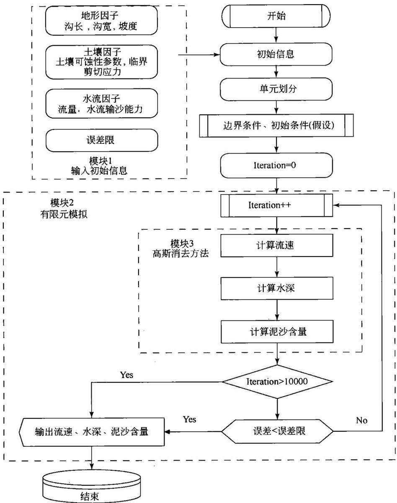  
图14.1 集中水流条件下细沟侵蚀随坡长变化过程模拟流程图

## 14.2.2 模拟工况

模拟工况对应第七章所叙述实验相同，选取不同流量、坡度进行模拟。采用流量为$2 \mathrm { L } / \mathrm { m i n } \sqrt { \mathrm { \Omega } } { 4 \mathrm { L } / \mathrm { m i n } }$ 和8L/min;坡度为 $5 ^ { \circ } , 1 0 ^ { \circ } , 1 5 ^ { \circ } , 2 0 ^ { \circ }$ 和25°。将模拟得到的水流含沙量过程结果与采用不同沟长(0.5m、1.0m、2.0m、3.0m、4.0m、5.0m、6.0m、7.0m、8.0m)测量得到的结果进行对比，说明模型与模型参数的正确性。在小坡度 $( 5 ^ { \circ } , 1 0 ^ { \circ } )$ 小流量(2L/min、4L/min)的工况组合下，由于水流速度太小，不能形成稳定的细沟流，因此加大这一坡度流量为8L/min、12L/min。工况如表14.2所示。

表14.2 模拟工况号与实验组合对应表
<table><tr><td>工况号</td><td>流量(L/min)</td><td>坡度/(°)</td><td>沟长/m</td></tr><tr><td>1</td><td>8</td><td>5</td><td>0.5、1.0、2.0、3.0、4.0、5.0、6.0、7.0、8.0</td></tr><tr><td>2</td><td>12</td><td>5</td><td>0.5、1.0、2.0、3.0、4.0、5.0、6.0、7.0、8.0</td></tr><tr><td>3</td><td>8</td><td>10</td><td>0.5、1.0、2.0、3.0、4.0、5.0、6.0、7.0、8.0</td></tr><tr><td>4</td><td>12</td><td>10</td><td>0.5、1.0、2.0、3.0、4.0、5.0、6.0、7.0、8.0</td></tr><tr><td>5</td><td>2</td><td>15</td><td>0.5、1.0、2.0、3.0、4.0、5.0、6.0、7.0、8.0</td></tr><tr><td>6</td><td>4</td><td>15</td><td>0.5、1.0、2.0、3.0、4.0、5.0、6.0、7.0、8.0</td></tr><tr><td>7</td><td>8</td><td>15</td><td>0.5、1.0、2.0、3.0、4.0、5.0、6.0、7.0、8.0</td></tr><tr><td>8</td><td>2</td><td>20</td><td>0.5、1.0、2.0、3.0、4.0、5.0、6.0、7.0、8.0</td></tr><tr><td>9</td><td>4</td><td>20</td><td>0.5、1.0、2.0、3.0、4.0、5.0、6.0、7.0、8.0</td></tr><tr><td>10</td><td>8</td><td>20</td><td>0.5、1.0、2.0、3.0、4.0、5.0、6.0、7.0、8.0</td></tr><tr><td>11</td><td>2</td><td>25</td><td>0.5、1.0、2.0、3.0、4.0、5.0、6.0、7.0、8.0</td></tr><tr><td>12</td><td>4</td><td>25</td><td>0.5、1.0、2.0、3.0、4.0、5.0、6.0、7.0、8.0</td></tr><tr><td>13</td><td>8</td><td>25</td><td>0.5、1.0、2.0、3.0、4.0、5.0、6.0、7.0、8.0</td></tr></table>

## 14.2.3 模型输入参数

模型输入的初始信息有四部分，分别是代表细沟地形特征的沟长、沟宽和坡度描述土壤侵蚀特性的土壤可蚀性参数和临界剪切应力与流量有关的集中水流流量和对应流量下的输沙能力；最后还需给出计算差限，取 $1 \times 1 0 ^ { - 3 }$ ，当误差小于给定差限时程序结束。

## 14.2.4 模拟结果

模型模拟计算了各工况输沙量沿沟长方向的变化过程，将实验结果与模拟结果对比，得图14.2(a)\~(m)和图14.3。

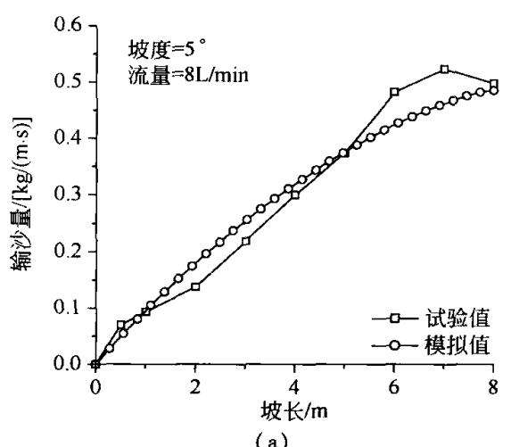  
(a)

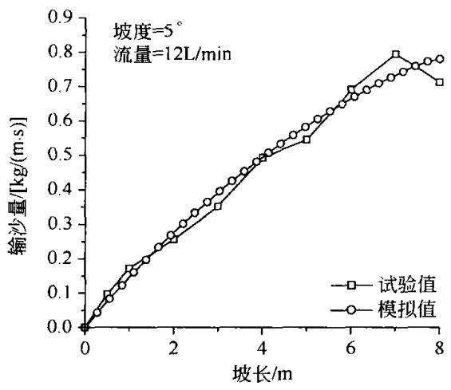  
(b)

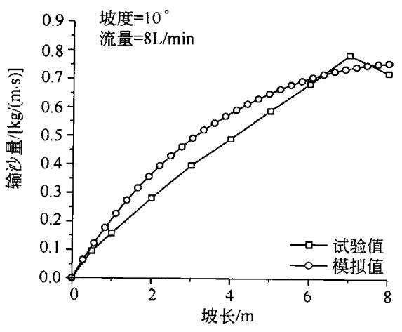  
(c)

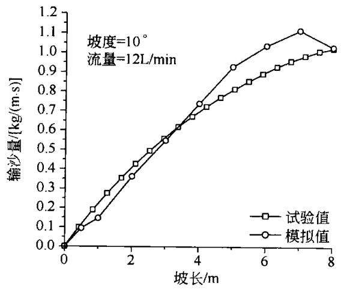  
(d)

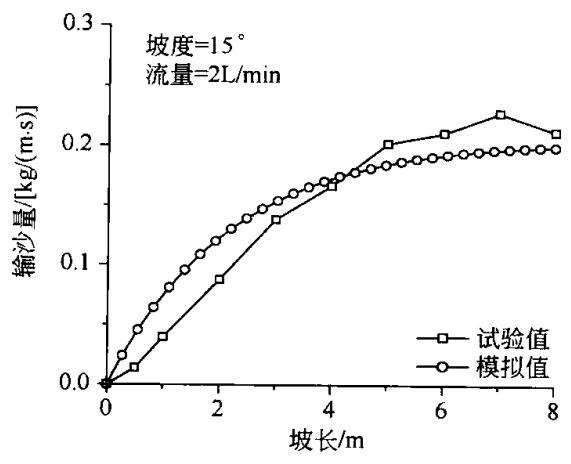  
(e)

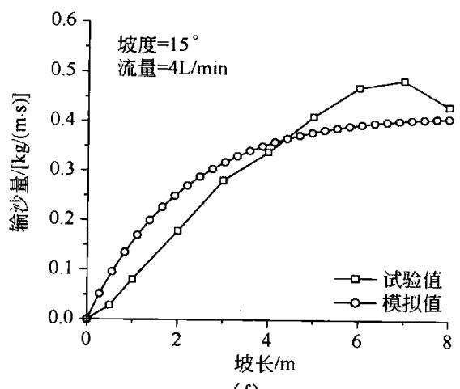  
(f)

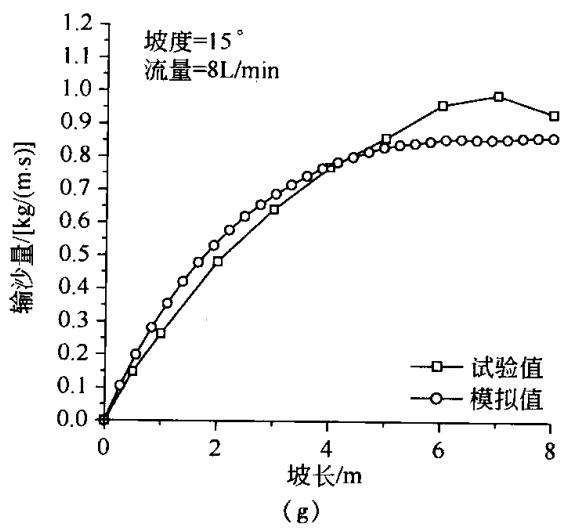

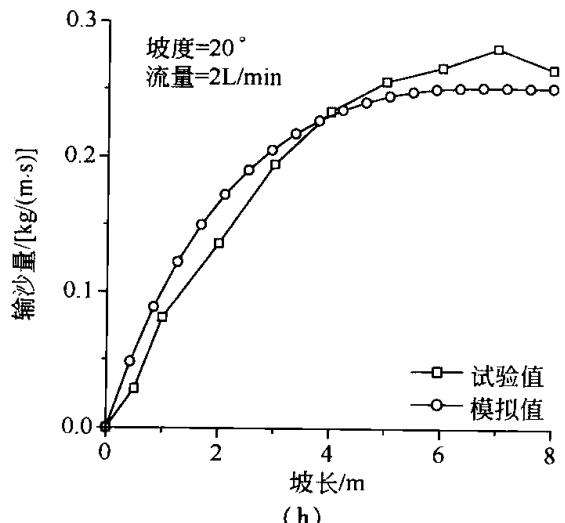  
(h)

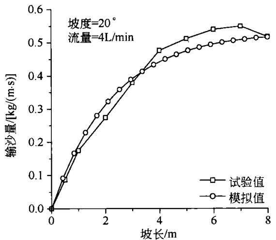  
(i)

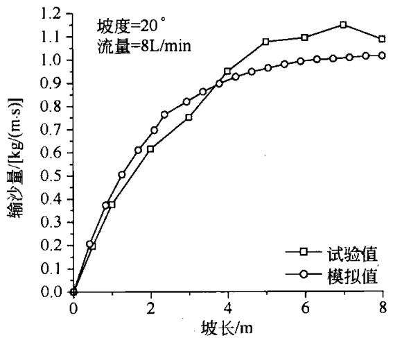  
(j)

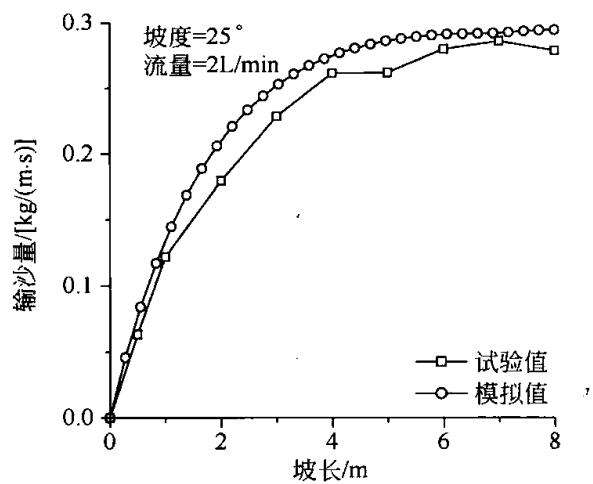  
(k)

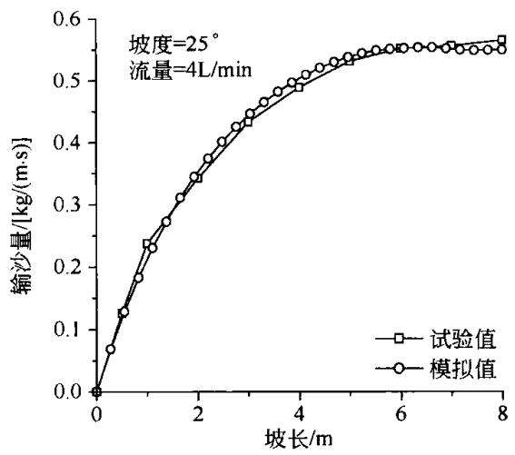  
(1)

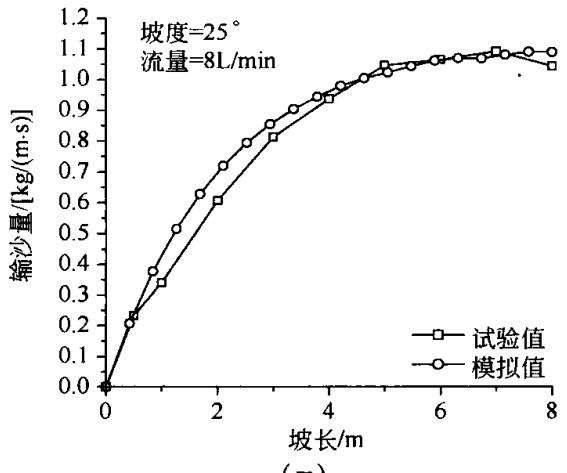  
(m)  
图14.2 各工况输沙量模拟值与实验值对比图

采用前面章节给出的输沙能力、土壤可蚀性参数和临界剪切应力作为模型参数，对不同坡度和流量条件下的输沙量随沟长变化的过程进行模拟。模拟结果如图14.2所示，从图中可以看出，输沙量随着沟长变化的模拟值与测量值在多数工况下表现得相当

一致，数值上符合良好。在细沟流上游部位，由于较大土壤剥蚀能力的存在，使得泥沙含量增长较快，在图中反映为输沙量增加的梯度较大；随着细沟沟长的增长，由于输沙能力的限制，水流所能携带泥沙的量逐渐趋近一个稳定值，可以认为该稳定的极限输沙量即为水流输沙能力，对应的沟长为该细沟的极限沟长。这一变化趋势与 Huang 等(1996)对输沙能力的研究相一致。模拟值与实测值在整个细沟长度上能够很好吻合，输沙量增加幅度的一致性说明模型的可蚀性参数与土壤临界剪切应力的选择是正确

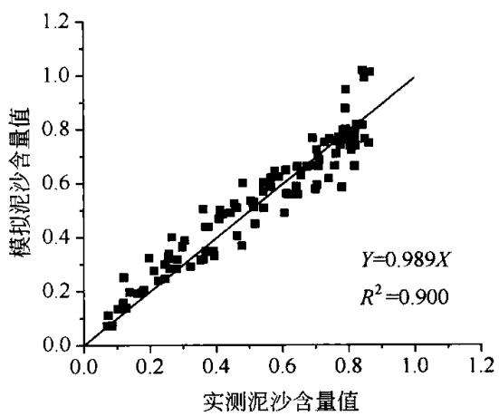  
图14.3 输沙量实测值与模拟值1:1对比相关分析图

的：同样，模拟值与实测值在细沟末端的重合证明了模型中输沙能力的合理性。模拟值在流量和坡度上的变化趋势也与实测量相同，在同一流量下，坡度越大，输沙量的稳定值也越大；同时，在同一坡度下，流量越大，这种趋于稳定的趋势也越快。

图14.3是所有实验工况117个点的输沙量模拟值与对应实测值的1:1对比相关分析图，由图可以看出两点：第一，模拟值与实测值确定系数很高，达到0.90，表明两者间具有良好的相关关系：第二，两者间回归方程系数为0.989，表明两者间存在着良好的一一对应关系。

结果表明，细沟出口处与中间任意部位泥沙含量模拟值与实验值能很好地一一对应，整套模型，即包括数学公式、有限元数值解法及计算程序都是正确的；同时还说明，模拟模型用的参数也是正确的，从而验证了所用参数 $( T _ { \mathrm { c } } , K _ { \mathrm { r } } , \tau _ { \mathrm { c } } )$ 计算方法的正确性。

## 14.3 传统输沙能力公式对细沟侵蚀产沙过程的影响

如引言中所述，传统的输沙能力关系表达式在使用前需要标定，为了进一步验证这一结论并说明输沙能力对侵蚀过程的影响作用，程序提供了采用传统方法(Nearingetal.，1997)计算输沙能力的模拟，可以在其他参数均不变的情况下重新对各工况进行模拟。

采用传统方法(Nearing et al. ,1997)确定的水流输沙能力公式，模拟了各工况下侵蚀产沙过程随沟长方向的变化过程。将实验结果与模拟结果进行对比，说明水流的输沙能力对细沟侵蚀输沙过程的影响和控制规律，所得结果如图14.4(a)\~(m)所示。

图14.4 中的输沙能力为由传统方法(Nearing et al. ,1997)计算得到的结果与实测测量结果。模拟结果与实验实测结果相比较后发现，如图14.4(a）\~（m)各工况中模拟得出的曲线，与输沙变化的规律一样，前段计算得到的含沙量过程线具有与实验值极为接近的增加趋势，但后段却明显受到输沙能力的限制，使计算的输沙量在较实测值低得多的水平上趋于稳定值，在细沟出口处的模拟值较实测值小很多。因此可见，采用传

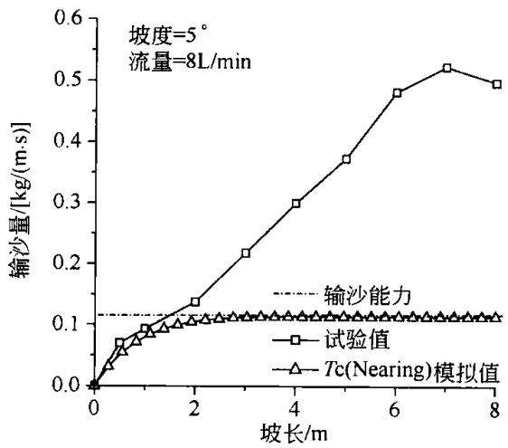  
(a)

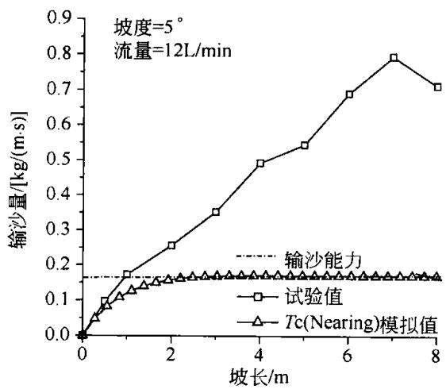  
(b)

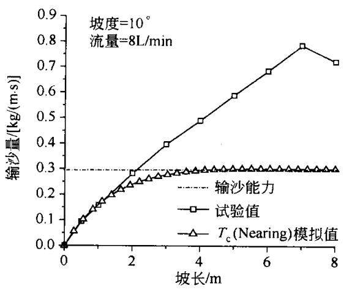  
(c)

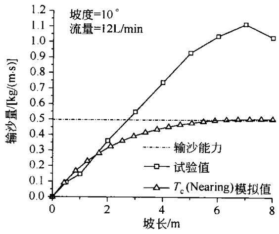  
(d)

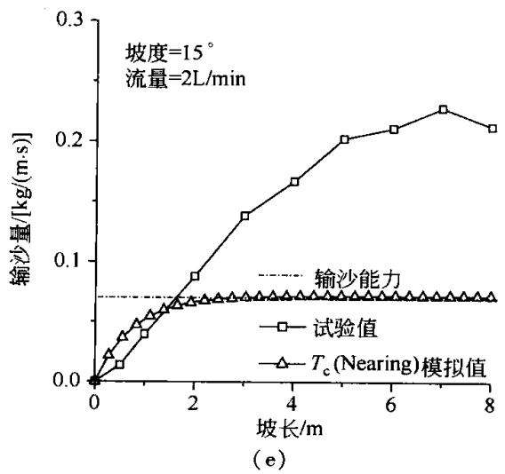

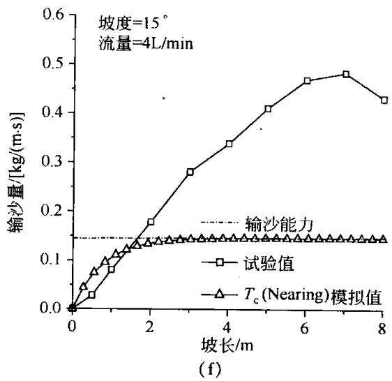

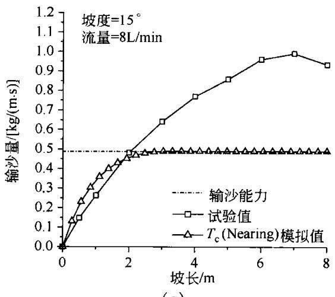  
(g)

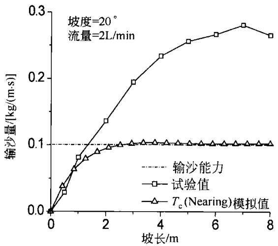  
(h)

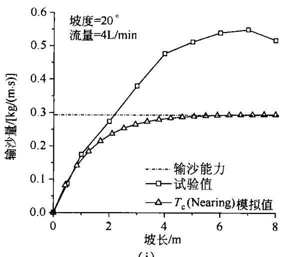  
(i)

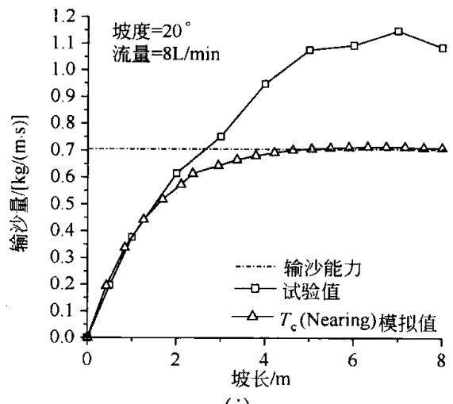  
(j)

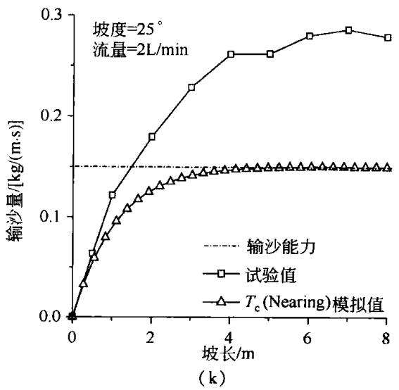

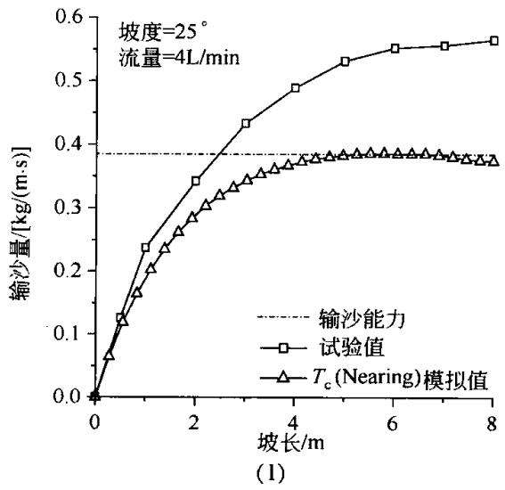

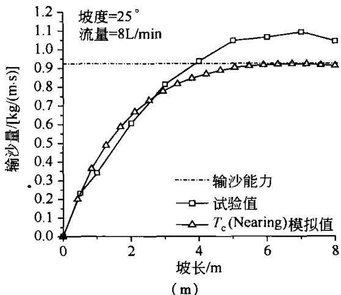  
图14.4 输沙能力对模拟结果的影响值

统的输沙能力关系由于受输沙能力的限制，模拟结果不能准确模拟实验结果。这一变化规律说明了输沙能力对水流携带泥沙量的控制作用和对模型模拟结果的深刻影响。实际上由于采用这种输沙能力计算方法不能模拟预报细沟侵蚀输沙的结果，即此计算方法本身的限制无法得到真实的输沙能力，故与Lei(1998)、Nearing和Parker(1994)证实的一样，由此方法得到的输沙能力需在标定以后才能得到较满意的结果。产生这一问题的根本原因与输沙能力公式有关，在使用时很容易引起结果的极大误差；其次，该公式是河流输沙得到的，与细沟侵蚀输沙也存在很大的差别。

## 14.4 传统土壤可蚀性参数对细沟侵蚀产沙过程的影响

根据前面章节对可蚀性参数计算方法的描述，得到WEPP模型方法得到的可蚀性参数(Nearing et al.,1989;Foster et al. ,1995; Flanagan et al. ,1995) $K _ { \mathbf { r w } }$ 与 Lei 等(2008)采用的方法得到的可蚀性参数 $K _ { \mathrm { r l } }$ 之间存在的关系如下：

$$
K _ { _ { \mathrm { r w } } } = { \frac { K _ { _ { \mathrm { r l } } } ( 1 - \mathrm { e } ^ { - \theta L } ) } { B L } }\tag{14-5}
$$

式中， $K _ { \mathbf { r w } }$ 为WEPP计算方法的可蚀性参数， $K _ { \mathrm { r l } }$ 为Lei等提出的改进的可蚀性参数计算方法。

由式(14-5)可知，WEPP计算方法得到的土壤可蚀性参数与参数B有着密切的关系。B是一个受细沟长度、坡度、水流流量和土壤性质等因素影响的参数。已知采用了第7章所述(张晴雯,2004)的实验工况、土壤可蚀性参数、水流输沙能力的情况下，求出对应此工况的B值。经计算，对此实验中不同的坡度，可选取B=0.2、0.3、0.4分别来计算 $K _ { \mathrm { r l } }$ ,再利用式(14-5)求出对应坡度的WEPP模型土壤可蚀性参数值，计算结果如表14.3所示。

表14.3 中数据表明同一工况条件下，由于B值的不同，由WEPP计算方法得到的土壤可蚀性参数会产生不同的水利条件和不同的侵蚀产沙过程而变化。为了进一步说明B值对 $K _ { \mathrm { r } }$ 及产沙过程的影响，以25°,4L/min工况为例，分别选取 $B = 0 . 3 , 0 . 5 , 0 . 8$ 和1,进行模拟，得到 $K _ { \mathrm { r } }$ 计算结果如表14.3所示。

表14.3 不同坡度、B值条件下 $\pmb { K } _ { \pmb { \mathrm { f } } }$ 与 ${ \pmb K } _ { \mathbf { r w } }$ 计算结果比较
<table><tr><td>坡度/(°)</td><td> $K _ { \mathrm { r l } } / ( \mathrm { \bf ~ s } / \mathrm { \bf ~ m } )$ </td><td> $K _ { _ { \mathrm { r w } } } / ( \mathrm { s } / \mathrm { m } ) \ \mathrm { ~ ( ~ } \tt { W E P P ) }$ </td></tr><tr><td>5</td><td> $0 . 3 2 0 9 ( B = 0 . 3 )$ </td><td>0.1109(B=0.3)</td></tr><tr><td>10</td><td> $0 . 3 2 1 1 \left( B = 0 . 2 \right)$ </td><td>0.1490(B=0.2)</td></tr><tr><td>15</td><td> $0 . 3 2 1 4 \big ( B = 0 . 3 \big )$ </td><td>0.1110(B=0.3)</td></tr><tr><td>20</td><td> $0 . 3 2 1 4 \left( B = 0 . 4 \right)$ </td><td>0.0869(B=0.4)</td></tr><tr><td>25</td><td> $0 . 3 2 1 6 ( B = 0 . 3 )$ </td><td>0.1112(B=0.3)</td></tr><tr><td></td><td></td><td>0.0707(B=0.5)</td></tr><tr><td></td><td></td><td>0.0447(B=0.8)</td></tr><tr><td></td><td></td><td>0.0358(B =1.0)</td></tr></table>

为研究土壤可蚀性参数对细沟侵蚀过程的影响，用WEPP方法得到的可蚀性参数进行侵蚀产沙过程的模拟计算。土壤可蚀性参数如表14.3中的 $K _ { \mathbf { r w } }$ 数据，其他参数保持不变，模拟结果如图14.5(a)\~(m)所示。

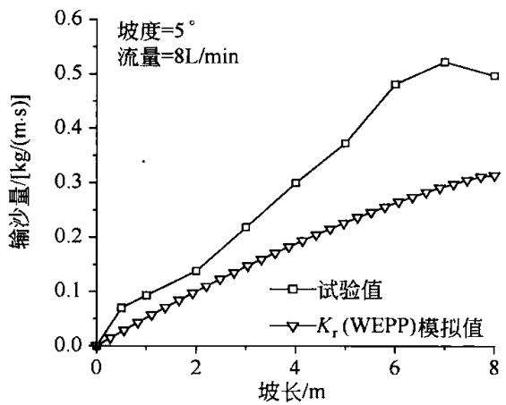  
(a)

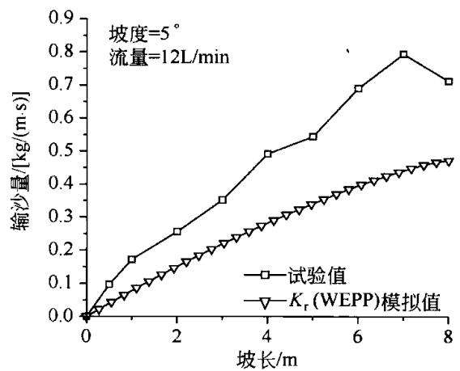  
(b)

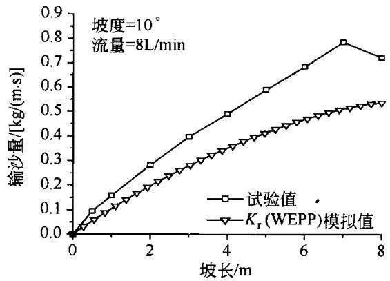  
(c)

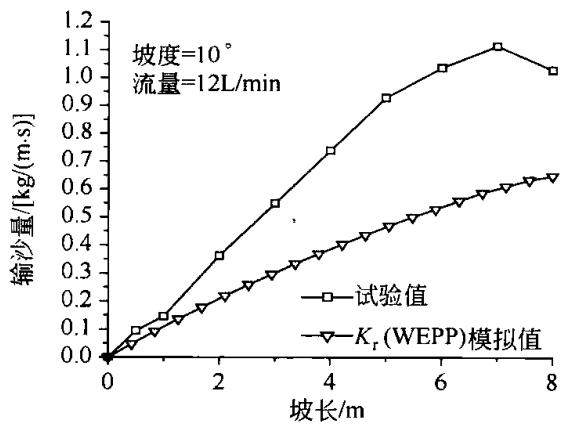  
(d)

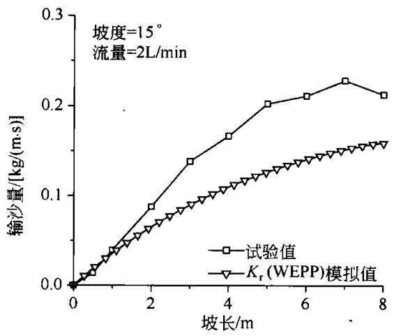  
(e)

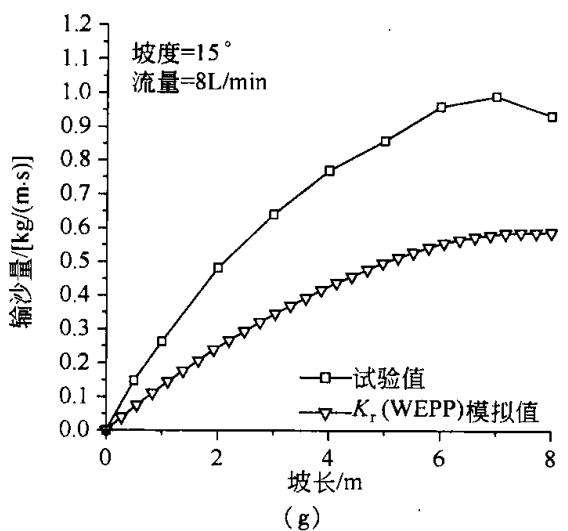

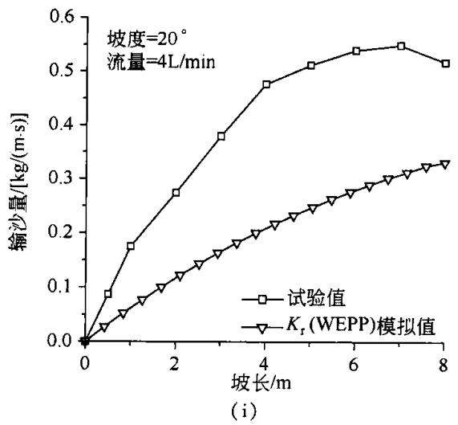

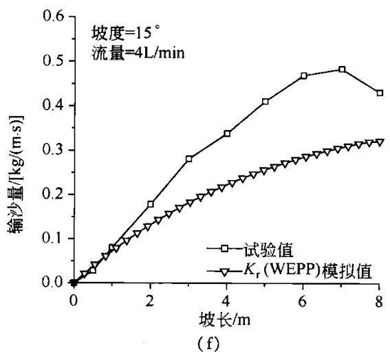

(h)  
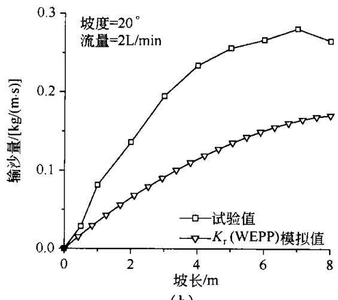

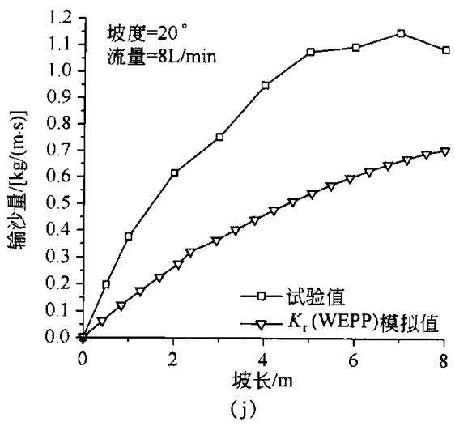

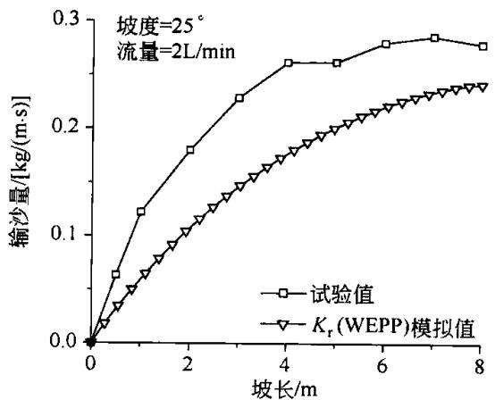  
(k)

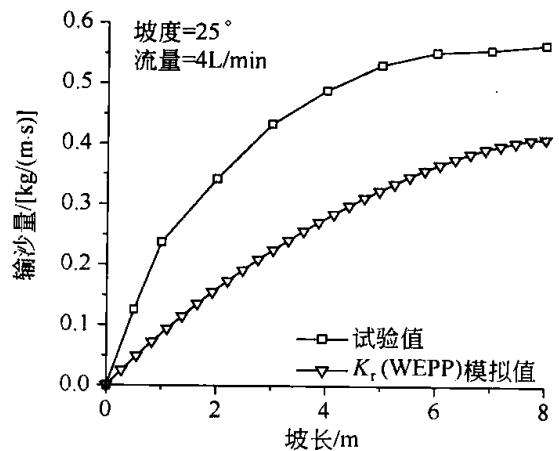  
(1)

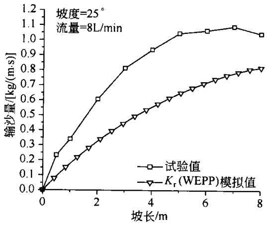  
(m)  
图14.5 各工况修改K 后输沙量模拟值与试验值对比图 $K _ { r }$

由图14.5中可以看出，用WEPP方法所确定的土壤可蚀性参数模拟的侵蚀产沙过程曲线从细沟起点到出口处都与实测值有显著差别。以图14.5(m)为例，模拟的含沙量过程曲线与实测值相比，在沟头处曲线的斜率明显较小。产生这一结果的直接原因与最大土壤剥蚀率的计算方法直接相关。理论上，最大剥蚀率为沟长趋于0时的剥蚀能力，而WEPP模型中的剥蚀率为整个细沟沟长上的平均剥蚀率，其值远小于最大剥蚀能力，使得对水流剥离土壤的能力估计明显偏低，进入径流中的泥沙较真实值少，水中输移的泥沙量随沟长的增长梯度也较小，增加幅度不足以在实验设计的细沟长度内使输沙量达到输沙能力，最终细沟

出口处的输沙量也可能远小于实验值。但可以判定，当增加沟长到一定程度时，虽产沙过程有所不同，但在沟口处的输沙量最终也可以达到输沙能力。

用不同的 B值计算得到的土壤可蚀性参数，得到模拟结果与实测结果及Lei 等(2008)采用的方法得到的可蚀性参数 $K _ { \mathbf { r w } }$ 模拟结果如图14.6所示。可以看出，B值越大估计得到的可蚀性参数越低，泥沙过程线越加平

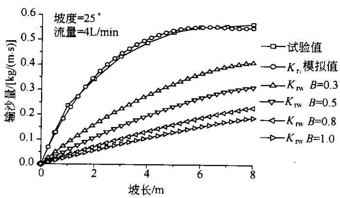  
图 14.6 不同 B 值对输沙过程的影响 $( \mathsf { S } = 2 5 ^ { \circ } , \mathsf { Q } = 4 \mathrm { L } / \mathsf { m i n } )$

缓，与实测值的差异越大，甚至在细沟出口处的水流含沙量值也远偏离真实值。由表14.3可知，当B取1时，WEPP方法计算的土壤可蚀性参数计算得到的出口处的含沙量较Lei等(2008)提出的方法得到的可蚀性参数模拟得到的结果或实测结果小90%，即计算得到的土壤可蚀性参数为实测值的十分之一，可见土壤可蚀性参数严重影响了细沟侵蚀的模拟结果。

## 14.5 输沙能力与土壤可蚀性参数的共同影响

在模型中模拟采用不同输沙能力计算公式得到的对细沟侵蚀产沙、输沙能力和修改后的土壤可蚀性参数进行模拟后，得到的模拟结果放入同一个图中与实验结果进行比较，直观地说明参数对细沟侵蚀过程的显著影响，结果如图14.7(a)\~(m)所示。

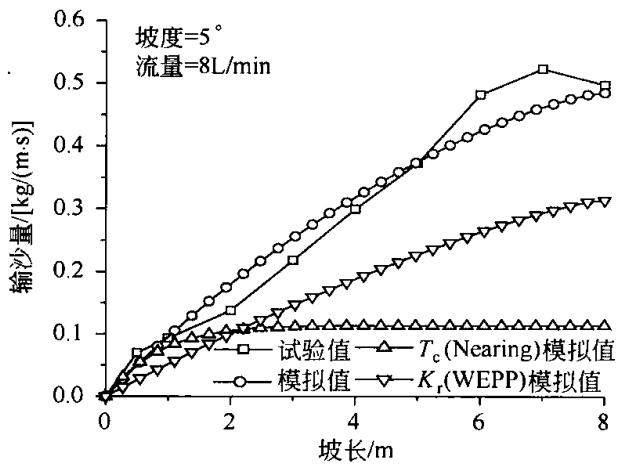  
(a)

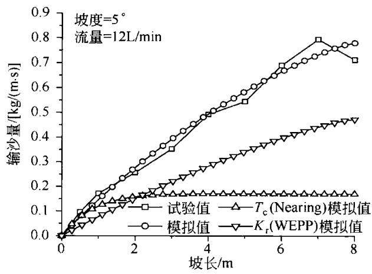  
(b)

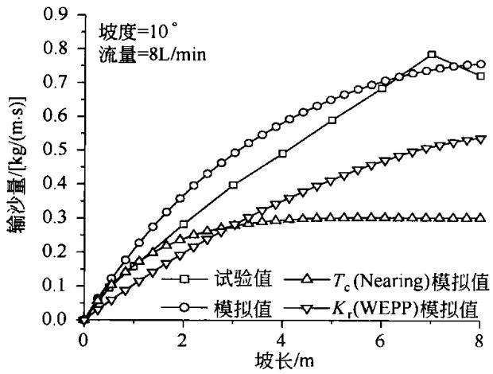  
(c)

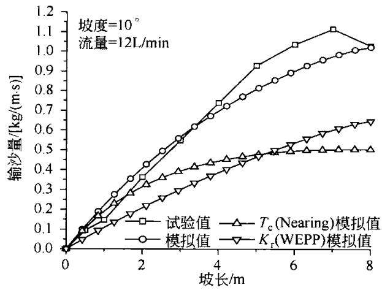  
(d)

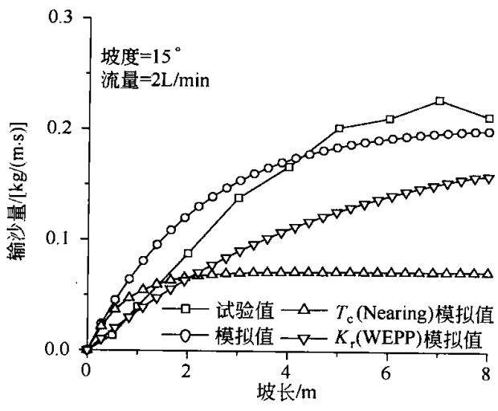  
(e)

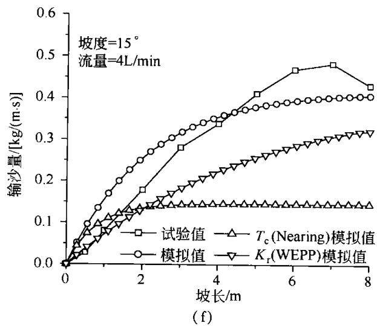

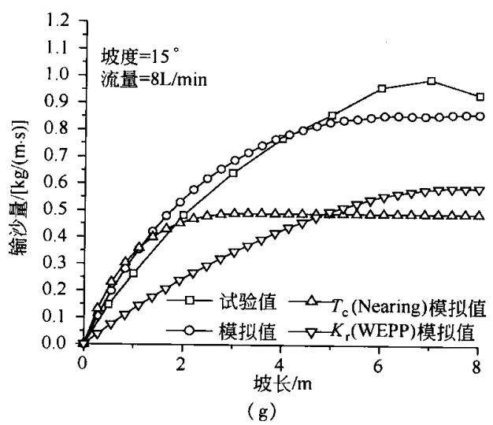

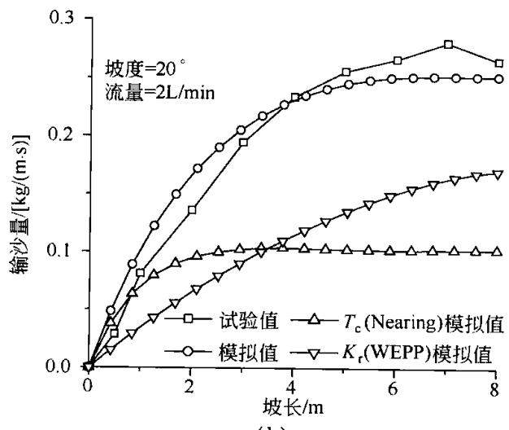  
(h)

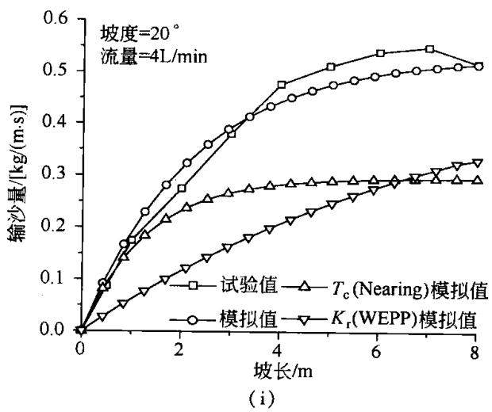

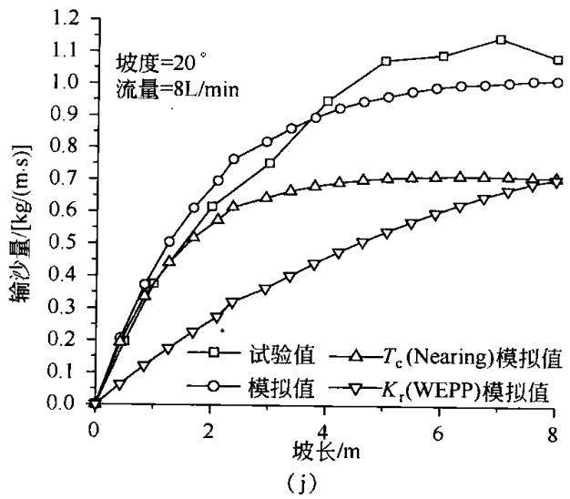

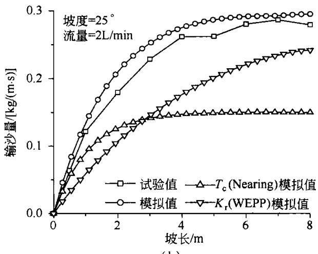  
(k)

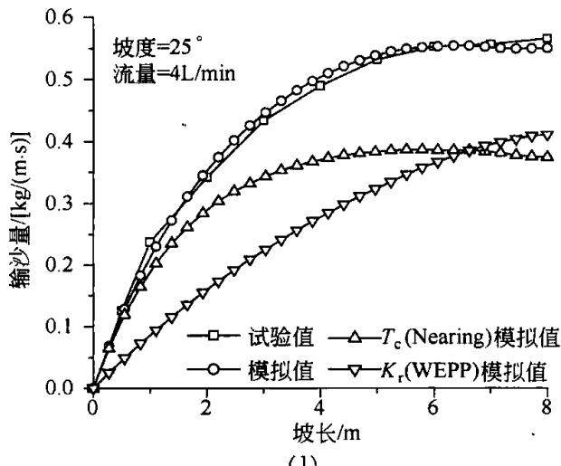  
(1)

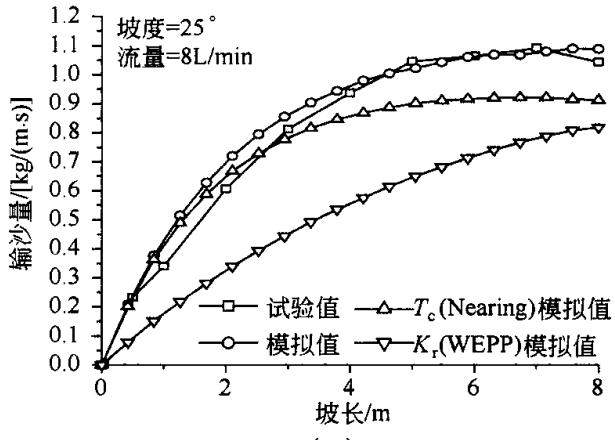  
(m)  
图14.7 各工况不同参数输沙量模拟值与试验值对比图

如图14.7(a)\~(m)中四条线所示，所有工况中用Lei等(2008)采用的方法得到的可蚀性参数和输沙能力得到本模型的模拟结果与实验结果均吻合得很好；当改变 $T _ { \mathrm { { c } } }$ 为Nearing所用方法估计结果时，输沙过程就表现为前段，尤其是初始沟坡的过程与实测值具有一致性，泥沙的变化快慢过程相同，但后段因为输沙能力的限制，水流含沙量逐渐偏离实际观测值。这是由于水流的输沙能力控制着水流的侵蚀产沙和输沙的最终结果所致。这一结果表明，即使水流具有相同的剥蚀土壤能力，但由于估计得到的水流携带泥沙能力的限制和水流中含沙量增长的速度也会造成最终结果的差别；当采用 $K _ { \mathrm { r } }$ 值为由WEPP模型方法确定的值，且保持 $T _ { \mathrm { c } }$ 值为由Lei等(2008)提出的方法确定的值不变时，细沟水流中的最终含沙量的稳定值可以接近实际的单宽水流输沙能力，但水流含沙量逼近水流输沙能力的中间过程却因为估计的剥蚀能力过低而远慢于实际过程而不尽相同，这就说明细沟剥蚀率控制着水流的侵蚀率和水流含沙量随沟长增加快慢程度， $K _ { \mathrm { r } }$ 是控制这一过程的关键参数。由于 $K _ { \mathrm { r } }$ 值小于真实值，水流含沙量趋于稳定值的速度明显较真实过程慢，从而导致水流含沙量达到输沙能力的极限沟长较实际值长。

## 14.6 细沟剥蚀过程

细沟剥蚀率反应了细沟水流剥蚀细沟土壤的作用大小。采用本模型的新参数和WEPP可蚀性参数模拟细沟剥蚀过程。由实验结果知，在陡坡(15°，20°，25°)时剥蚀率随沟长的变化更为明显，便于说明。因此，采用陡坡实验结果对模型进行验证。采用本模型对3个实验坡度15°，20°，25°及3个流量下的剥蚀率随细沟长度的变化过程进行模拟,结果如图14.8(a)\~(i)所示。

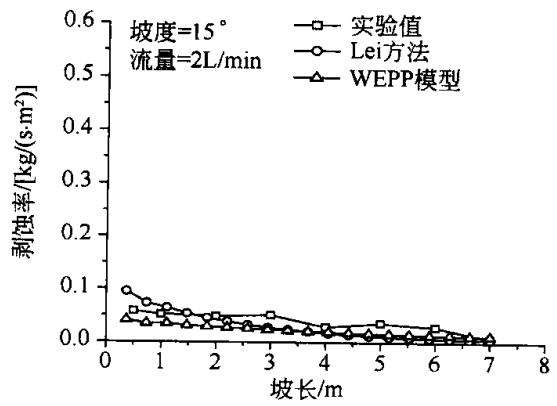  
(a)

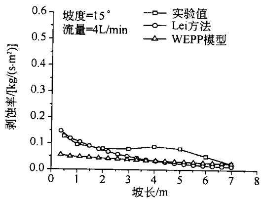  
(b)

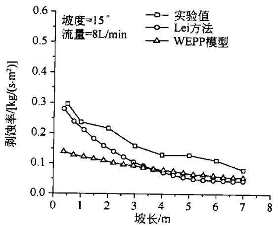  
(c)

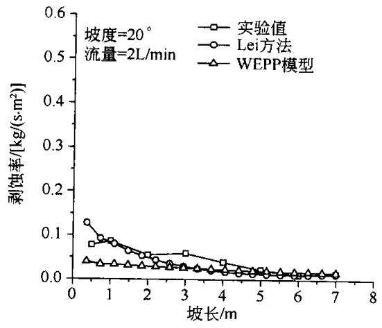  
(d)

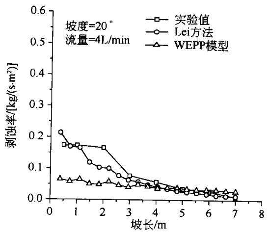  
(e)

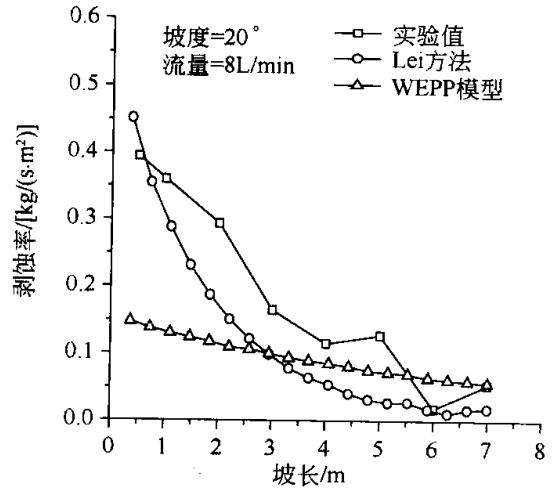  
(f)

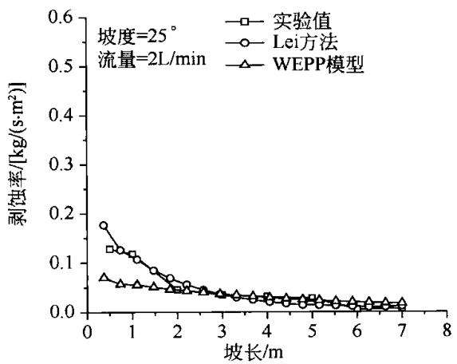  
(g)

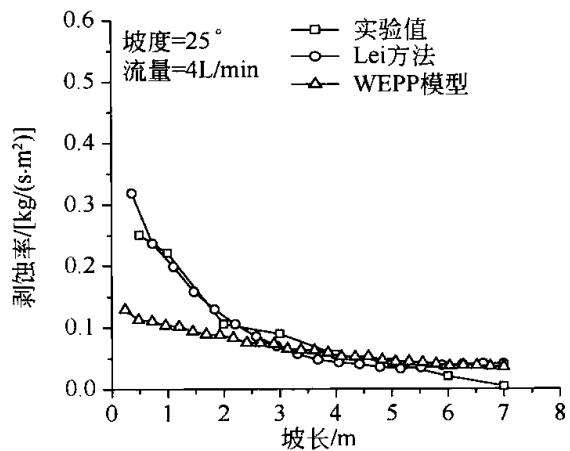  
(h)

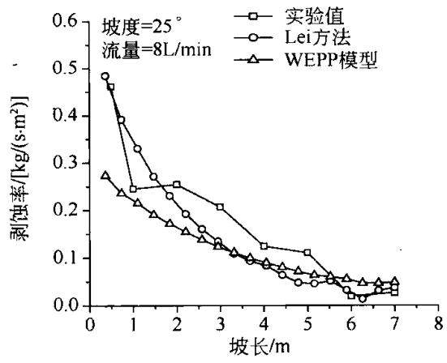  
(h)  
图14.8 各工况剥蚀率模拟值与实测值对比图

从图14.8(a)至图14.8(i)中各工况的模型计算结果与实测结果比较可以看出，采用Lei等的土壤可蚀性参数计算方法得到的结果与实验结果趋于一致，剥蚀率随沟长的增加而减小.坡度越陡剥蚀率越大，流量越大剥蚀率越大；同时，计算结果可以更准确有

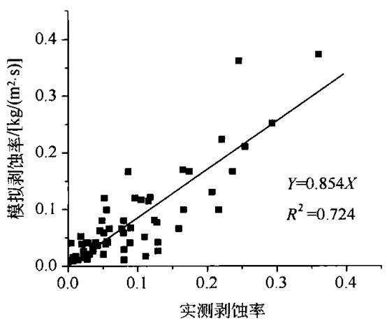  
图14.9 剥蚀率实测值与模拟值1:1对比相关分析图

效反映细沟侵蚀过程；在沟顶清水引入的地方剥蚀率 $D _ { \mathrm { r } }$ 最大，随着细沟径流中泥沙含量的增加，剥蚀率逐渐减小，表现出泥沙输对水流剥蚀过程的互反馈效应。

图14.9是所有实验工况剥蚀率实测值与模拟值的相关分析图。相关关分析得到的斜率为0.854，确定系数 $R ^ { 2 }$ 为0.724。总体来看，两者之间存在着良好的对应关系，说明此模拟方法得到的可蚀性参数结果是正确的，可以用于剥蚀


<!-- ===== 分片 p201-244（44页，源：ex20_雷廷武_细沟侵蚀物理模型（201-244页））===== -->

率的预测。

采用WEPP模型方法确定的土壤可蚀性参数模拟剥蚀率变化过程，其变化趋势与实测值相同，都是由沟头到沟底逐渐变小。细沟出口处的剥蚀率与实测值和本模型模拟值接近，说明三者在此处剥离土壤的能力相同，间接反映此处的输沙能力也相同。而在沟头部位，WEPP方法的模拟值明显较实测值和本模型模拟值小，进一步证实了模型参数对细沟侵蚀过程的重要影响。

## 第15章 降雨条件下细沟侵蚀的有限元模拟

## 15.1 有降雨条件下的细沟侵蚀实验

第14章讨论了在集中水流冲刷条件下.不同坡度、不同坡长细沟的侵蚀过程，通过模型模拟值与实验测量值的比较，认为模型结果能够很好地预报坡面细沟侵蚀产沙过程。但十壤侵蚀是水流和土壤相互作用的复杂物理过程，在这个过程中，降雨和径流是构成侵蚀的主导因素和基本出发点。实际中，降雨强度超过土壤入渗能力时，就会形成坡面流，由于水流和坡面微地貌的影响，坡面水流汇集而出现集中水流，集中水流侵蚀土壤形成细沟，水流由片流转变为细沟中的集中水流，但同时降雨并没有停止，细沟水流还受到继续降雨的影响。细沟流流量沿沟长方向因降雨对水流的增加而增大，同时，水流流态也会受到降雨的扰动作用(刘青泉等，2004；吴淑芳，2006)。因此，只对集中水流冲刷条件下的实验工况进行模拟并不能完全反映降雨条件下的细沟侵蚀，模型的模拟还要扩展到有降雨影响的细沟侵蚀。学术界普遍认为坡面侵蚀过程具有分带特性，并以分水岭作为雨滴侵蚀作用和径流作用的分界线(白清俊，1999；Horton，1945；承继成，1965)。在研究中考虑实际情况，认为降雨过程中分水岭以下坡段产生径流，逐渐汇流，水流冲刷形成细沟，对于细沟既有沟头上部汇入水流，又有降雨不断地打击和雨水径流的汇人，在此假设下设计了不同坡度、不同流量冲刷和不同雨强组合的降雨实验，同样，为避免细沟无规律发展，采用限定性细沟实验。实验得到了降雨与集中水流共同作用下细沟出口处侵蚀产沙量随时间的变化过程。

本章讨论将降雨因子加入模型模拟程序中，模拟细沟侵蚀的时间、空间变化过程，将实验结果与模拟结果对比;分析比较集中水流阶段模拟与实测结果的变化过程；分析降雨与集中水流叠加阶段的模拟与实验结果对比，分析差异及其来源；说明降雨扰动对细沟侵蚀过程的影响。

## 15.1.1 实验设计及数据表达

实验在黄土高原土壤侵蚀与旱地农业国家重点实验室人工降雨大厅进行。人工降雨装置为中国科学院水利部水土保持研究所研制的侧喷式降雨设备，实验时采用降雨系统由两组侧喷系统相互对喷。采用不同直径的孔板组合以获得设计的降雨强度。实验土槽安装在液压升降台上，土槽用金属材料构成，放置在上述坡度可调的平台上，调节平台的坡度可调节土槽到实验所需要的坡度，坡度变化范围5°\~30°。在土槽框架内用3mm厚PVC板将土槽分隔成3组共9个8m×10cm的小槽，每个小槽的下端连接一集流槽，供收集径流、采集泥沙样品用。实验土槽如图15.1所示。

为了便于与纯细沟侵蚀室内模拟冲刷实验结果进行比较，采用了与纯冲刷实验相同

的土壤，即由延安安塞(黄土高原)地表的典型的黄绵土。容重约为 $1 . 1 5 \mathrm { g / c m } ^ { 3 }$ 。具体安排如表15.1所示。

实验共有3个处理：坡度、雨强和流量。实验采用2个坡度（15°、25°，即26.8%、46.6%)；3个雨强（50mm/h、100mm/h、150mm/h，即0.83mm/min、1.67mm/min、2.5mm/min),3个流量（2L/min、4L/min、6L/min)相互交叉的18组实验，每组三个重复。模拟工况见表15.1。

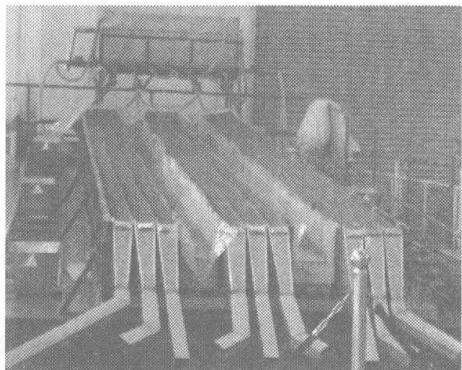  
图 15.1 实验装置图

表15.1 模拟工况和试验组合
<table><tr><td>序号</td><td>坡度/(°)</td><td>流量/(L/min)</td><td>前期雨强/(mm/h)</td></tr><tr><td>1</td><td>15</td><td>2</td><td>50</td></tr><tr><td>2</td><td>15</td><td>4</td><td>50</td></tr><tr><td>3</td><td>15</td><td>6</td><td>50</td></tr><tr><td>4</td><td>25</td><td>2</td><td>50</td></tr><tr><td>5</td><td>25</td><td>4</td><td>50</td></tr><tr><td>6</td><td>25</td><td>6</td><td>50</td></tr><tr><td>7</td><td>15</td><td>2</td><td>100</td></tr><tr><td>8</td><td>15</td><td>4</td><td>100</td></tr><tr><td>9</td><td>15</td><td>6</td><td>100</td></tr><tr><td>10</td><td>25</td><td>2</td><td>100</td></tr><tr><td>11</td><td>25</td><td>4</td><td>100</td></tr><tr><td>12</td><td>25</td><td>6</td><td>100</td></tr><tr><td>13</td><td>15</td><td></td><td></td></tr><tr><td>14</td><td>15</td><td>2</td><td>150</td></tr><tr><td>15</td><td>15</td><td>4 6</td><td>150</td></tr><tr><td>16</td><td>25</td><td>2</td><td>150 150</td></tr><tr><td>17</td><td>25</td><td>4</td><td>150</td></tr><tr><td>18</td><td>25</td><td>6</td><td>150</td></tr></table>

实验程序如下:选定实验坡度和雨强。每次降雨实验前进行雨强标定。为保证均匀

一致的初始含水量及部分消除填装不均匀的影响，实验前将土壤充分饱和，并放置24h以上再开始实验。为了形成比较，每次实验包括两个阶段：在相同坡度下，进行降雨集中水流叠加和只有集中水流作用的阶段实验。降雨集中水流叠加实验在开始降雨的同时放水冲刷，产生径流以后按20s的时间间隔连续收集6个径流泥沙样，经过120s后停止降雨，进入只有集中水流阶段，同样按20s的时间间隔连续收集6个径流泥沙样，结束实验。

降雨集中水流叠加实验所得到的实验结果是泥沙含量，以百分比(%)含沙量为单位，为更直观的与模拟结果做对比，需将单位换算处理成为泥沙含量 $( \mathbf { \nabla } _ { \mathbf { g } } / \mathbf { m L }$ 或$1 0 ^ { 3 } \mathrm { k g } / \mathrm { m } ^ { 3 } )$ 0

用A表示泥沙含量百分比，表示烘干后泥沙质量占总采样水与沙的质量的百分比，根据其定义可由下式表示：

$$
A = { \frac { m _ { \mathrm { c } } } { \displaystyle { \rho _ { \mathrm { w } } ( { \bf \nabla } V _ { \mathrm { T } } - { \frac { m _ { \mathrm { c } } } { \rho _ { \mathrm { s } } } } ) + m _ { \mathrm { c } } } } } \times 1 0 0 \%\tag{15-1}
$$

式中， $m _ { c }$ 为泥沙质量 $( \mathbf { k g } ) _ { \mathbf { \psi } } { \bf ; } \pmb { \rho } _ { \mathbf { w } }$ 为水的密度 $\scriptstyle ( { \bf g } / { \bf c m } ^ { 3 }$ 或 $\mathbf { k g } / \mathbf { m } ^ { 3 } )$ ，一般为 $1 0 0 0 ( \mathrm { k g } / \mathrm { m } ^ { 3 } )$ i $V _ { \mathrm { { T } } }$ 为采样水沙的总体积 $( \mathbf { m } ^ { 3 } ) { \ : } _ { \mathsf { { P } } _ { \ell } }$ 为土壤的密度，计算时采用平均近似密度值 $2 6 5 0 ( \mathrm { k g } / \mathrm { m } ^ { 3 } )$ 0上式变形为

$$
\big [ 1 0 0 0 ( { V _ { \mathrm { T } } } - \frac { m _ { \mathrm { c } } } { 2 6 5 0 } ) + m _ { \mathrm { c } } \big ] A = m _ { \mathrm { c } } \times 1 0 0 \%\tag{15-2}
$$

整理得

$$
{ \frac { m _ { \mathrm { c } } } { V _ { \mathrm { r } } } } = { \frac { 1 0 \times A } { 1 - 6 . 2 3 \times 1 0 ^ { - 3 } A } }\tag{15-3}
$$

设泥沙含量为 $c _ { \mathrm { ~ i ~ } }$ ，根据泥沙含量的定义有， $c = { \frac { m _ { \mathrm { c } } } { V _ { \mathrm { r } } } }$ ,即

$$
c = \frac { 1 0 \times A } { 1 - 6 . 2 3 \times 1 0 ^ { - 3 } A }\tag{15-4}
$$

根据上式将实验结果换算成为泥沙含量 $( \log / \mathbf { m } ^ { 3 } )$ 0

## 15.1.2 初始及边界条件

根据实验设置条件，模拟过程边界条件如下

$$
\begin{array} { r } { \left\{ \begin{array} { l l } { V _ { x _ { 0 } } = V _ { 0 } } \\ { H _ { x _ { 0 } } = H _ { 0 } } \\ { c _ { x _ { 0 } } = 0 } \\ { \displaystyle \frac { \mathrm { d } c } { \mathrm { d } x _ { x _ { 0 } } } = K _ { \mathrm { r } } [ \gamma s H _ { 0 } - \tau _ { \mathrm { c } } ] } \end{array} \right. } \end{array}\tag{15-5}
$$

式中 $, c$ 为泥沙含量 $( \mathrm { \ k g / m } ^ { 3 } ) : \gamma$ 为水的容重，取 $9 ~ 8 0 0 ( \mathrm { N } / \mathrm { m } ^ { 3 } )$ ;s 为水力坡度,取值为 sinθ，$\pmb \theta$ 为地表坡度 $( { } ^ { \circ } ) \ , \tau = \gamma s H _ { 0 } \ , \tau$ 和τ。为水流剪切应力和土壤临界抗剪切应力 $\pmb { \tau _ { \mathrm { c } } }$ $( \mathbf { P a } ) : V _ { 0 }$ 和$H _ { 0 }$ 为入口处的流速 $\mathbf { ( ~ m / s ) }$ 与水流深度 $\mathbf { \tau } ( \mathbf { m } )$ ，它们受集中水流流量与降雨量之和q的制约，关系式如下：

$$
q = V _ { 0 } H _ { 0 } w _ { 0 }\tag{15-6}
$$

式中,ω为细沟宽，取10cm;q为流量 $( \mathbf { m } ^ { 3 } / \mathbf { s } )$

初始条件为

$$
\left\{ \begin{array} { l l } { V _ { x i } { \big ( } x , t = 0 { \big ) } = V _ { i } } \\ { } \\ { H _ { x i } { \big ( } x , t = 0 { \big ) } = H _ { i } } \\ { } \\ { c _ { x i } { \big ( } x , t = 0 { \big ) } = 0 } \end{array} \right.\tag{15-7}
$$

式中， $V _  x i \setminus { \} } H _ { x i }$ 和C分别为初始时刻细沟任意长度上的流速、水流深度和泥沙含量；V与 $C _ { x i }$ $V _ { i }$ $H _ { i }$ 可以设定为大于零的任意值；x为细沟上任意一点，t为时间；由于水流深度要满足阻力坡 $_ x$ 度的计算，故 $H _ { i }$ 不能取零。

实验的第一阶段是集中水流叠加降雨，故初始时刻存在降雨汇入

$$
r _ { x i } \left( x , t = 0 \right) = r\tag{15-8}
$$

式中，r为降雨强度，按实验工况确定，分别取50mm/h、100mm/h、150mm/h，计算中换算 $, r$ 成国际单位 $\left( \mathbf { m } { \big / } \mathbf { s } \right)$

## 15.2 模型模拟结果与分析

对细沟侵蚀随时间和空间变化的过程进行了模拟。模拟程序分为输入初始条件和边界条件等信息的部分(模块1），降雨、叠加集中水流侵蚀过程模拟计算部分(模块2)和集中水流侵蚀过程模拟计算部分(模块3)，其中模块2和模块3中计算流速、水深和泥沙的子模块与第14章模拟细沟侵蚀时空变化计算过程一致。地形因子与水流因子按照实验工况条件输入。时间因子需要输入降雨开始时刻、结束时刻、总计算时间和时间步长。土壤因子中土壤可蚀性参数、土壤临界剪切应力因土壤采用前述计算结果，故取值为表14.1中内容。输沙能力公式仍采用与坡度、流量呈线性关系的公式，但本实验条件和工况与第14章实验有很大的不同，因此对输沙能力参数进行修正，采用公式为

$$
T _ { \mathrm { c } } = a + b S + c Q\tag{15-9}
$$

式中,S 为细沟坡度 $( ^ { \circ } ) { : } Q$ 为流量(L/min);a,b 和 c 为回归系数， $a = \mathrm { ~ - ~ } 0 . 1 3 7 , b = 0 . 0 0 6$ $^ { 1 8 , c = 0 , 1 0 8 , }$ 。根据实验中每个工况所对应的流量、坡度计算其输沙能力。

## 15.2.1 模拟流程图

模拟流程图见图15.2。

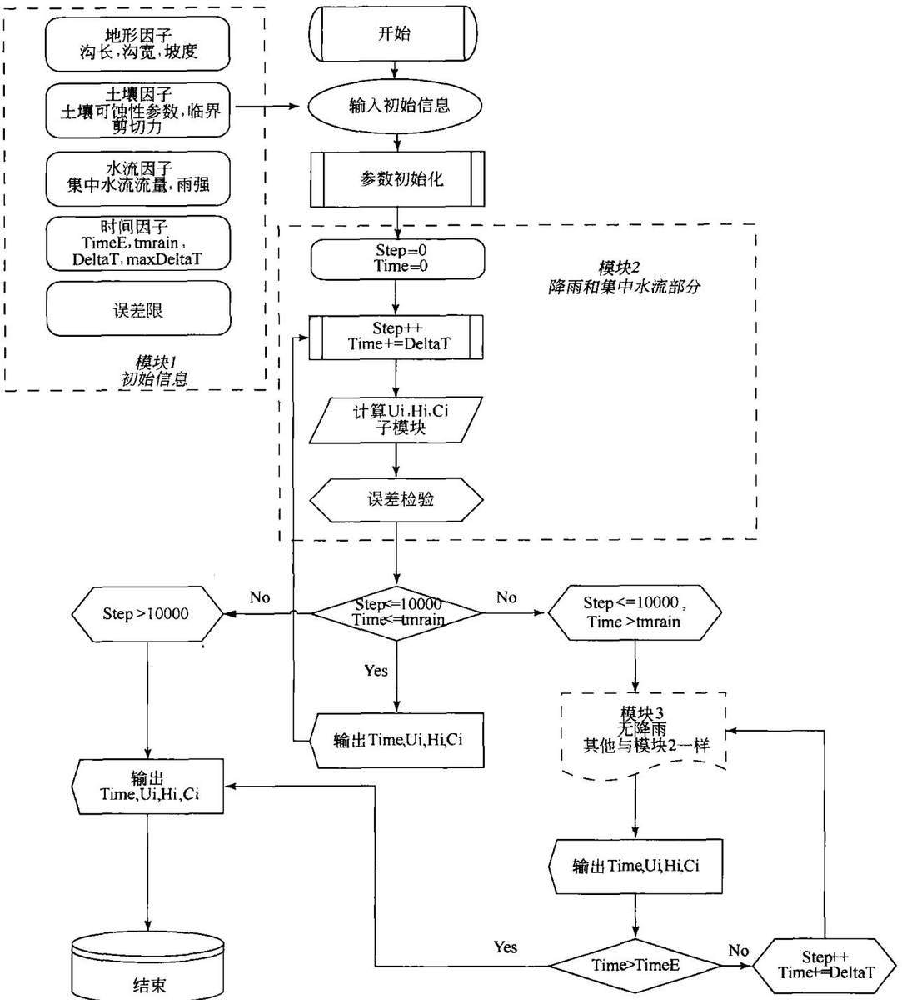  
图15.2 降雨叠加集中水流-集中水流实验模拟流程图

## 15.2.2 模拟结果

因模拟工况涉及降雨和集中水流两个因素，单宽流量在两个阶段有所不同，故用水流流量与泥沙含量的乘积输沙量作为比较对象，能够更直观地体现水流流量变化对输沙能力的影响。由于受观测手段的限制，试验中仅测得了细沟出口处的水流含沙量，因此模型仅模拟了各不同工况下细沟出口处输沙量随时间的变化过程。各工况的模拟结果与实测结果的对比见图15.3。

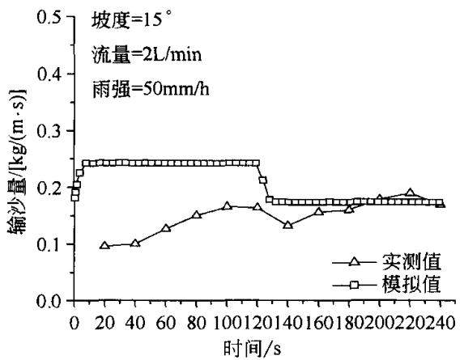  
(a)  
(b)

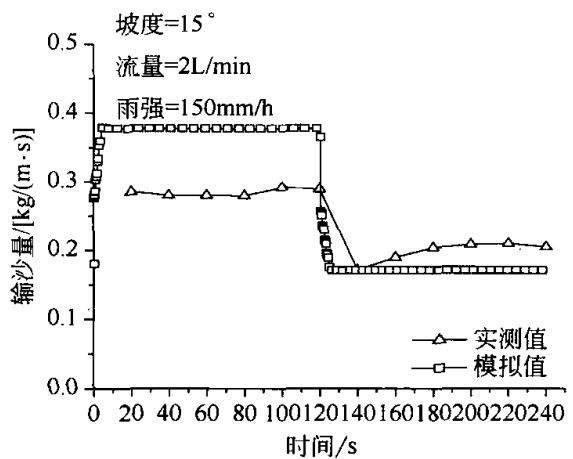  
(c)

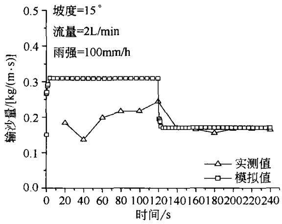

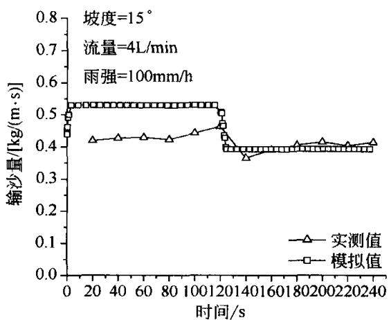

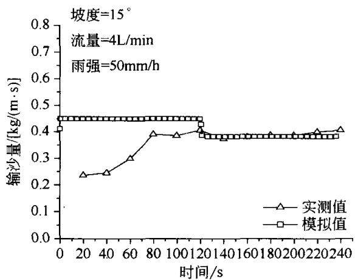  
(d)

(e)  
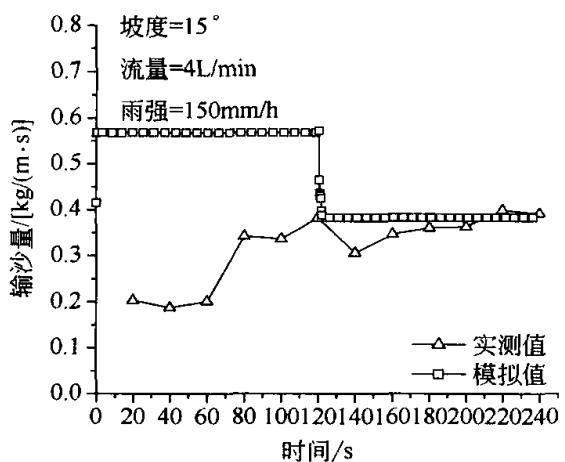  
(f)

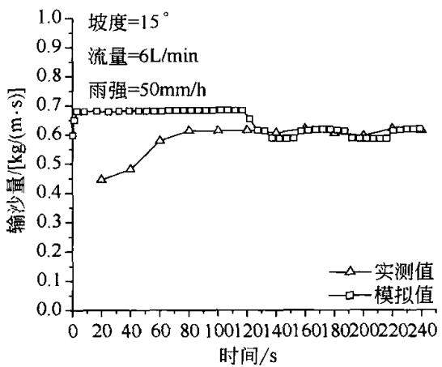  
(g)

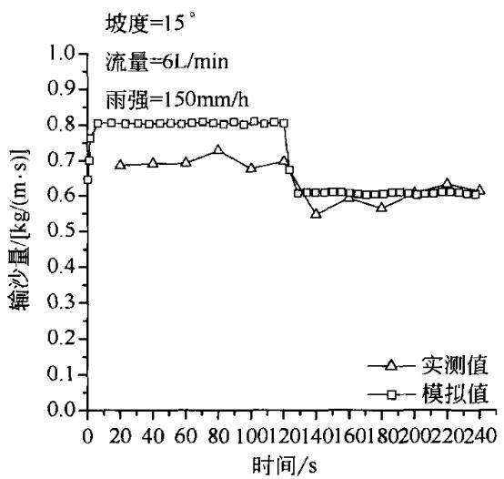  
(i)

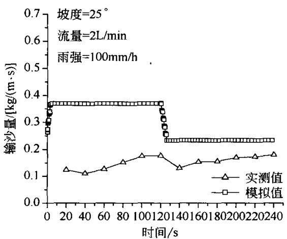  
(k)

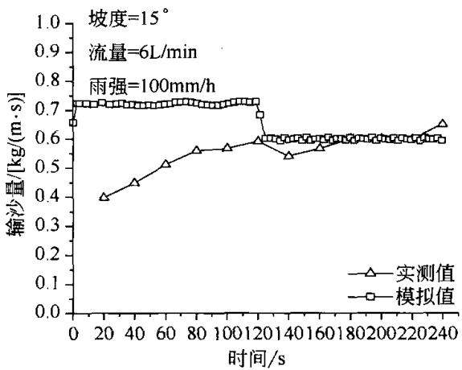  
(h)

(i)  
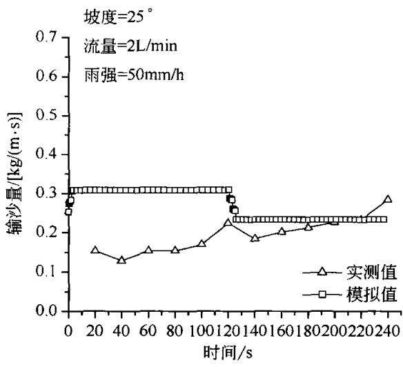

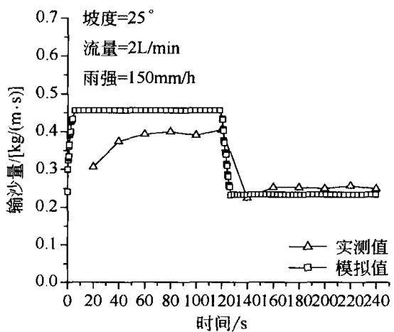  
(1)

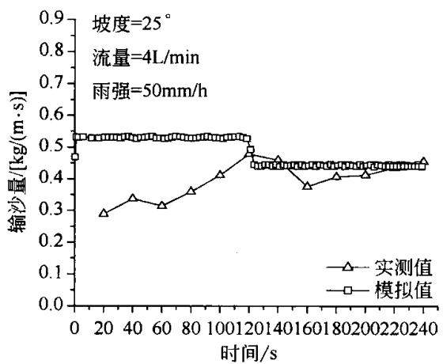  
(m)

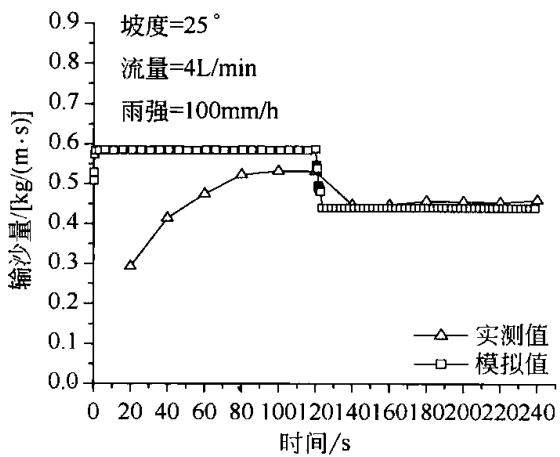  
(n)

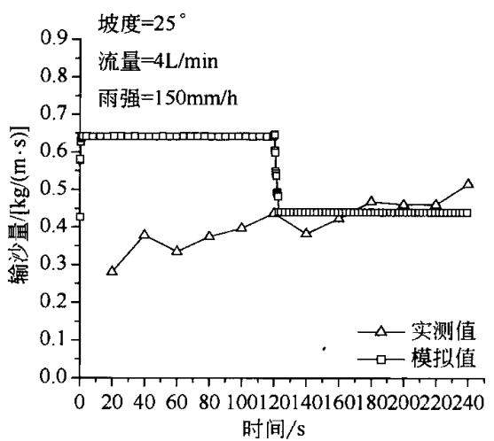  
(0)

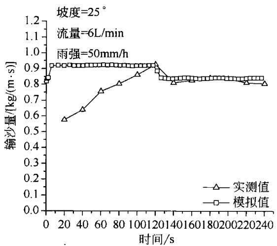  
(p)

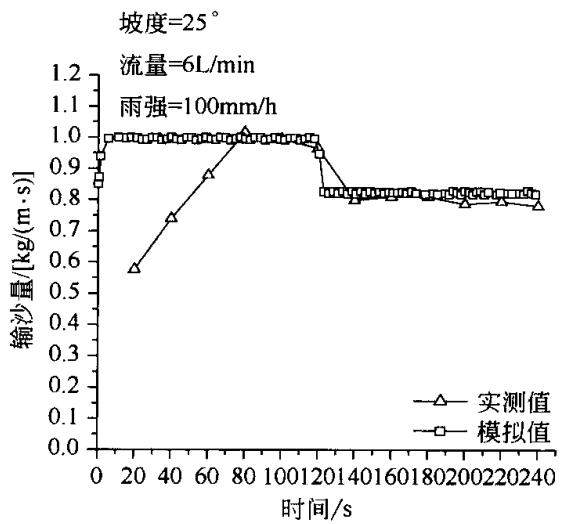  
(q)

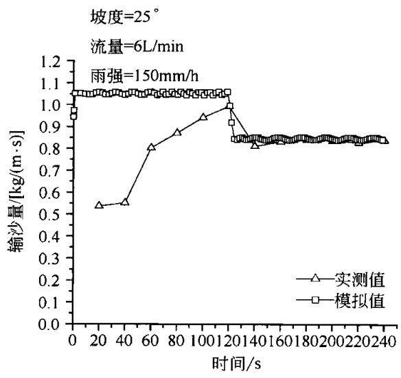  
(r)  
图15.3 降雨集中水流叠加-集中水流实验输沙过程模拟值与实测值对比

## 15.2.3 结果分析

如图15.3所示，细沟流输沙量随时间的变化过程的试验结果与模拟结果。结果明显的分为两个阶段，第一阶段是降雨和集中水流叠加阶段，经过120s的降雨之后，模拟进入第二阶段，即集中水流冲刷阶段。第一阶段中，水流输沙量的试验测量结果不断随时间增加，并逐渐趋于稳定。模拟得到的水流中的输沙量和试验得到的最终输沙量均大于第二阶段仅有集中水流的相应值。这说明降雨对水流量增加，会增大细沟水流输沙能力。无论在哪一阶段(降雨集中水流叠加阶段和集中水流阶段），坡度、集中水流流量和降雨强度大，总输沙量也相应大。将两个阶段分别进行研究。集中水流阶段无降雨影响，较为简单，模拟结果能够完全反应模型内容和目的，因此分析先从第二阶段开始，验证模型的正确性后再分析有降雨影响的阶段。

## (1)集中水流阶段

当降雨停止后，输沙量在经历一个短期过渡后，明显降低，进入仅有集中水流冲刷阶段。尽管模拟结果能给出水流输沙量随细沟长度的变化过程，但由于测量结果仅为细沟出口处的值，因此仅是比较细沟出口处的结果，由前面相关章节的讨论可知，在细沟出口处，输沙量接近或达到输沙能力这个稳定值，实测结果基本符合这一规律，各工况结果表明，在仅有集中水流阶段，实测结果多数达到稳定值或波动较小基本趋于稳定。实测水流输沙量与模拟结果的对比列于表15.2。

表15.2 集中水流阶段模拟值与实测值对照表
<table><tr><td>坡度 1(°)</td><td>流量 /(L/min)</td><td>前期雨强 /(mm/h)</td><td>实测值  $/ [ \mathbf { k g } / ( \mathbf { m } \cdot \mathbf { s } ) ]$ </td><td>模拟值  $/ [ \mathbf { k g } / ( \mathbf { m } \cdot \mathbf { s } ) ]$ </td><td>误差 1%</td></tr><tr><td>15</td><td>2</td><td>50</td><td>è 0.1640</td><td>0.1737</td><td>5.91</td></tr><tr><td>15</td><td>2</td><td>100</td><td>0.1652</td><td>0.1708</td><td>3.39</td></tr><tr><td>15</td><td>2</td><td>150</td><td>0.1979</td><td>0.1708</td><td>13.69</td></tr><tr><td>15</td><td>4</td><td>50</td><td>0.3891</td><td>0.3824</td><td>1.72</td></tr><tr><td>15</td><td>4</td><td>100</td><td>0.3988</td><td>0.3928</td><td>1.50</td></tr><tr><td>15</td><td>4</td><td>150</td><td>0.3610</td><td>0.3830</td><td>6.09</td></tr><tr><td>15</td><td>6</td><td>50</td><td>0.6089</td><td>0.6023</td><td>1.08</td></tr><tr><td>15</td><td>6</td><td>100</td><td>0.5925</td><td>0.5988</td><td>1.06</td></tr><tr><td>15</td><td>6</td><td>150</td><td>0.5919</td><td>0.6059</td><td>2.37</td></tr><tr><td>25</td><td>2</td><td>50</td><td>0.2232</td><td>0.2334</td><td>4.57</td></tr><tr><td>25</td><td>2</td><td>100</td><td>0.2352</td><td>0.2334</td><td>0.77</td></tr><tr><td>25</td><td>2</td><td>150</td><td>0.2477</td><td>0.2564</td><td>3.51</td></tr><tr><td>25</td><td>4</td><td>50</td><td>0.4243</td><td>0.4429</td><td>4.38</td></tr><tr><td>25</td><td>4</td><td>100</td><td>0.4539</td><td>0.4525</td><td>0.31</td></tr><tr><td>25</td><td>4</td><td>150</td><td>0.4518</td><td>0.4606</td><td>1.95</td></tr><tr><td>25</td><td>6</td><td>50</td><td>0.8219</td><td>0.8396</td><td>2.15</td></tr><tr><td>25</td><td>6</td><td>100</td><td>0.7959</td><td>0.8219</td><td>3.27</td></tr><tr><td>25</td><td>6</td><td>150</td><td>0.8309</td><td>0.8425</td><td>1.40</td></tr></table>

注：误差=模拟值-实测值/实测值。

表15.2表明模拟结果很好地验证水流输沙的概念，模拟的细沟出口的水流输沙量结果为一稳定值。比较模拟值与实测值后，可以看出两者非常接近，数值上符合良好。将实测结果的平均值与模拟值比较，结果如表15.2所示，模拟结果与实测结果误差大都小于10%，最小0.31%，最大13.69%。整体结果表明模拟结果与实测结果能够很好地一一对应。在同一坡度下，水流输沙随着径流流量的增加而增加，而对于同一流量，输沙又随着坡度的增加而增大，通过对集中水流阶段的验证结果，证明模型、模型参数和数值计算程序正确，能够预测细沟出口处的输沙动态过程。

## (2)降雨集中水流叠加阶段

降雨集中水流叠加阶段最大的特点就是水流在流动的过程中伴有雨滴的打击。雨滴打击对水流施加附加的扰动作用，从而构成了该种水流的复杂性与特殊性(吴普特，1997)。由试验观测得到的水流输沙量的发展趋势可知，有的工况已经基本稳定，有的虽在增长，后期增长较缓慢，目有达到稳定的趋势。这类现象的出现可能与水流在细沟中流动的瞬态特性有关。在细沟流建立达到稳定水流前经历着瞬态变化的过程。水流的流量和流速均经历一定的时间，逐步达到稳定。从而相应的水流侵蚀与输沙过程也同样经历着这种瞬态的变化过程。而模拟结果为稳定水流的侵蚀与输沙过程。因此，两者的合理比较是将试验达到稳态的输沙量值与相应的模拟结果进行比较。为得到稳定的输沙量对13种不同工况下的水流输沙量随时间的变化关系进行回归分析，建立了降雨冲刷时间影响径流侵蚀输沙的非线性数学模型：

$$
G = a ( 1 - { \mathrm e } ^ { - b t } )\tag{15-10}
$$

式中，G为输沙量 $[ \mathbf { k g } / ( \mathbf { m } \cdot \mathbf { s } ) ]$ ;t 为试验时间 ${ ( \mathsf { s } ) } : a$ 和b为回归系数。

上式所表达的物理意义是，输沙量G随着降雨和集中水流冲刷时间t的增加而逐渐增加，但由于增加幅度的减小，输沙量会趋近一个极限值 $a _ { \circ } \textbf { \em a }$ 值代表了细沟水流达到饱和时的输沙量，b是输沙量随时间增加的幅度衰减指数，这个值的大小与坡度，流量和雨强有关。各工况拟合公式如表15.3所示。

表15.3 降雨集中水流叠加阶段实测值拟合结果
<table><tr><td>坡度/(°)</td><td>流量/(L/min)</td><td>前期雨强/(mm/h)</td><td>拟合公式</td><td>a</td><td>b</td></tr><tr><td>15</td><td>2</td><td>50</td><td> $y = 0 . 1 6 6 3 7 ( 1 - { \mathrm e } ^ { - 0 . 0 2 9 2 6 x } )$ </td><td>0.1664</td><td>0.0293</td></tr><tr><td>15</td><td>2</td><td>100</td><td> $\mathtt { y } = 0 . 2 1 6 2 4 ( 1 - \mathtt { e } ^ { - 0 . 0 5 6 5 7 x } )$ </td><td>0.2162</td><td>0.0566</td></tr><tr><td>15</td><td>2</td><td>150</td><td> $y = 0 . 2 8 4 4 5 \left( 1 - { \tt e } ^ { - 0 . 7 4 7 1 3 x } \right)$ </td><td>0.2845</td><td>0.7471</td></tr><tr><td>15</td><td>4</td><td>50</td><td> $y = 0 . 4 0 7 7 6 ( 1 - { \mathrm e } ^ { - 0 . 0 2 9 2 4 x } )$ </td><td>0.4078</td><td>0.0292</td></tr><tr><td>15</td><td>4</td><td>100</td><td> $y = 0 . 4 3 7 7 2 ( 1 - { \bf e } ^ { - 0 . 1 5 6 4 5 x } )$ </td><td>0.4377</td><td>0.1565</td></tr><tr><td>15</td><td>4</td><td>150</td><td> $y = 0 . 4 1 9 6 4 ( 1 - \mathrm { e } ^ { - 0 . 0 1 7 1 2 x } )$ </td><td>0.4196</td><td>0.0171</td></tr><tr><td>15</td><td>6.</td><td>50</td><td> $\gamma = 0 . 6 0 5 4 7 \left( 1 - { \mathrm e } ^ { - 0 . 0 5 5 9 3 x } \right)$ </td><td>0.6055</td><td>0.0559</td></tr><tr><td>15</td><td>6</td><td>100</td><td> $y = 0 . 5 6 4 7 9 ( 1 - { \bf e } ^ { - 0 . 0 5 0 6 8 x } )$ </td><td>0.5648</td><td>0.0507</td></tr><tr><td>15</td><td>6</td><td>150</td><td> $y = 0 . 6 9 6 6 6 ( 1 - { \bf e } ^ { - 0 . 2 0 5 9 4 x } )$ </td><td>0.6967</td><td>0.2059</td></tr><tr><td>25</td><td>2</td><td>50</td><td> $y = 0 . 1 7 0 2 1 \left( 1 - \mathrm { e } ^ { - 0 . 0 8 2 5 3 x } \right)$ </td><td>0.1702</td><td>0.0826</td></tr><tr><td>25</td><td>2</td><td>100</td><td> $\gamma = 0 . 2 4 3 7 \left( 1 - \mathrm { e } ^ { - 0 . 1 0 0 7 x } \right)$ </td><td>0.2437</td><td>0.101</td></tr><tr><td>坡度/(°)</td><td>流量  $\gamma ( \mathbf { L } / \mathbf { m i n } )$ </td><td>前期雨强/(mm/h)</td><td>拟合公式</td><td>a</td><td>b</td></tr><tr><td>25</td><td>2</td><td>150</td><td> $y = 0 . 3 9 7 8 3 ( 1 - \mathrm { e } ^ { - 0 . 0 7 2 9 1 x } )$ </td><td>0.3978</td><td>0.0729</td></tr><tr><td>25</td><td>4</td><td>50</td><td> $y = 0 . 4 0 6 1 4 ( 1 - { \mathrm e } ^ { - 0 . 0 4 7 4 6 x } )$ </td><td>0.4061</td><td>0.0475</td></tr><tr><td>25</td><td>4</td><td>100</td><td> $\gamma = 0 . 5 4 1 2 5 \left( \mathrm { \textrm { 1 - e } } ^ { - 0 . 0 3 7 5 x } \right)$ </td><td>0.5413</td><td>0.0375</td></tr><tr><td>25</td><td>4</td><td>150</td><td> $\gamma = 0 . 3 9 4 7 6 ( 1 - { \bf e } ^ { - 0 . 0 6 0 6 8 x } )$ </td><td>0.3948</td><td>0.0607</td></tr><tr><td>25</td><td>6</td><td>50</td><td> $y = 0 . 8 6 4 9 3 ( 1 - \mathrm { e } ^ { - 0 . 0 4 2 2 6 x } )$ </td><td>0.8649</td><td>0.0423</td></tr><tr><td>25</td><td>6</td><td>100</td><td> $y = 1 . 0 0 3 5 9 ( 1 - \mathrm { e } ^ { - 0 . 0 3 8 4 7 x } )$ </td><td>1.0036</td><td>0.0385</td></tr><tr><td>25</td><td>6</td><td>150</td><td> $\gamma = 1 . 0 0 6 4 2 \big ( 1 - { \bf e } ^ { - 0 . 0 2 6 6 1 x } \big )$ </td><td>1.0064</td><td>0.0266</td></tr></table>

将模拟值与实测的稳定值a进行比较，总体上来看模拟值与实测稳定值之间存在显著差距，前者高于后者。产生这一差别的原因主要有两个，在实验实际测量过程中，可能会产生测量误差，这种误差不可避免：另一个重要原因雨滴打击作用。雨滴的打击，使得水流的输沙低于径流和降雨附加径流的输沙量。将径流和降雨径流作用所产生的输沙量之间的相互关系用以下逻辑计算公式表示：

$$
f ( A + B ) = f ( A ) + f ( B ) + f ( A B )\tag{15-11}
$$

式中， $f ( A )$ 为径流单独作用时的输沙量，也就是实验第二阶段的输沙量，用实测或模拟值给出(两者吻合良好)；f(B)为降雨单独作用时增加的水流的输沙量；当降雨和径流同时存在但不相互影响时，在理论上可以认为细沟水流的输沙量就是 $f ( A )$ 与 $f ( B )$ 二者之和，也就是说第一阶段模拟值为 $f ( A ) + f ( B ) ; f ( A + B )$ 为径流与降雨共同(存在交互作用时)作用时的输沙量，也就是第一阶段得到的实测值 $\mathsf { \Omega } _ { \mathsf { j } } ( A B )$ 为降雨对径流的扰动引起的附加的输沙量。

根据式(15-11)有：

$$
f ( A B ) = f ( A + B ) - \left[ f ( A ) + f ( B ) \right]\tag{15-12}
$$

通过上式可知，在有降雨状况下的径流与降雨共同作用下的细沟输沙量模拟值$( f ( A ) + f ( B ) )$ 大于实测值 $\left( f ( A + B ) \right)$ 的那部分正是降雨对水流的扰动作用引起的输沙量的改变，即细沟输沙量的表征降雨扰动作用部分 $f ( A B )$ 为有降雨叠加阶段的实测值$f ( A + B )$ 与模拟值 $f ( A ) + f ( B )$ 的差值。如表15.4所示。

表15.4 降雨扰动作用计算表
<table><tr><td>坡度/(°)</td><td>流量/(L/min)</td><td>前期雨强  $/ ( \mathbf { m m } / \mathbf { h } )$ </td><td> $f ( A + B )$   $\small \int [ \mathbf { k g } / ( \mathbf { m } \cdot \mathbf { s } ) ]$ </td><td>模拟值  $f ( A ) + f ( B )$   $/ [ \log ( \textbf { m } \cdot \textbf { s } ) ]$ </td><td>差值f(AB)  $\small \prime [ \textbf k g / ( \textbf m \cdot \textbf s ) ]$ </td></tr><tr><td>15</td><td>2</td><td>50</td><td>0.1664</td><td>0.2424</td><td>-0.0760</td></tr><tr><td>15</td><td>2</td><td>100</td><td>0.2162</td><td>0.3093</td><td>-0.0931</td></tr><tr><td>15</td><td>2</td><td>150</td><td>0.2845</td><td>0.3774</td><td>-0.0929</td></tr><tr><td>15</td><td>4</td><td>50</td><td>0.4078</td><td>0.4501</td><td>-0.0423</td></tr><tr><td>15</td><td>4</td><td>100</td><td>0.4377</td><td>0.5292</td><td>-0.0915</td></tr><tr><td>15</td><td>4</td><td>150</td><td>0.4196</td><td>0.5677</td><td>-0.1481</td></tr><tr><td>15</td><td>6</td><td>50</td><td>0.6055</td><td>0.6832</td><td>-0.0777</td></tr><tr><td>坡度/(°)</td><td>流量/(L/min)</td><td>前期雨強 /(mm/h)</td><td> $f ( A + B )$   $\small \int [ \mathbf { k g } / ( \mathbf { m } \cdot \mathbf { s } ) ]$ </td><td>模拟值f(A)+f(B)  $\small \int [ \mathbf { k g } / ( \mathbf { m } \cdot \mathbf { s } ) ]$ </td><td>差值f(AB) /[kg/(m·s)]</td></tr><tr><td>15</td><td>6</td><td>100</td><td>0.5648</td><td>0.7283</td><td>-0.1635</td></tr><tr><td>15</td><td>6</td><td>150</td><td>0.6967</td><td>0.8070</td><td>-0.1103</td></tr><tr><td>25</td><td>2</td><td>50</td><td>0.1702</td><td>0.3086</td><td>-0.1384</td></tr><tr><td>25</td><td>2</td><td>100</td><td>0.2437</td><td>0.3691</td><td>-0.1254</td></tr><tr><td>25</td><td>2</td><td>150</td><td>0.3978</td><td>0.4552</td><td>-0.0574</td></tr><tr><td>25</td><td>4</td><td>50</td><td>0.4061</td><td>0.5320</td><td>-0.1259</td></tr><tr><td>25</td><td>4</td><td>100</td><td>0.5413</td><td>0.5843</td><td>-0.043</td></tr><tr><td>25</td><td>4</td><td>150</td><td>0.3948</td><td>0.6421</td><td>-0.2473</td></tr><tr><td>25</td><td>6</td><td>50</td><td>0.8649</td><td>0.9191</td><td>-0.0542</td></tr><tr><td>25</td><td>6</td><td>100</td><td>1.0036</td><td>0.9948</td><td>0.0088</td></tr><tr><td>25</td><td>6</td><td>150</td><td>1.0064</td><td>1.0483</td><td>-0.0419</td></tr></table>

雨滴的打击作用可能扰动了水流，增加水流的湍动，使阻力增大，阻力的增加使水流流速减小，水流功率减小，输沙能力随之减小。换言之，此时的水流不能携带与其流量相对应的泥沙量，造成实际的输沙能力小于理论模拟值。为研究扰动作用与降雨之间的关系，比较各工况条件下f(AB)占实测值f(A+B)的百分数，以相同坡度和集中水流流量为一组，将每组的百分数平均(表15.5)。由表15.5可以发现，在同一坡度下，降雨对水流输沙影响的平均比例随着集中水流流量的增大而减小，这说明降雨对水流的扰动作用是随着流量的增加而减小的，这与降雨导致流量增加的比例随流量增加而减小的趋势(表15.6)是一样的，说明当降雨所占比例较大时，其扰动作用也较大，反之则相反。这一结果进一步证实了降雨对水流存在降低输沙能力的扰动作用。

表15.5 降雨集中水流叠加阶段各因素的比较
<table><tr><td>坡度/(°) 流量/(L/min)</td><td></td><td>前期雨強  $/ ( \mathrm { { \ m m / h } ) }$  /</td><td> $f ( A + B )$   $\bf { k g } ( \bf { m } \cdot { s } ) ]$ </td><td>f(AB)  $/ [ \log ( \textbf { m } \cdot \textbf { s } ) ]$ </td><td>f(AB) 占f(A + B) 的比例/%</td><td>平均比例/%</td></tr><tr><td>15</td><td>2</td><td>50</td><td>0.1664</td><td>-0.0760</td><td>45.68</td><td rowspan="3">40.47</td></tr><tr><td>15</td><td>2</td><td>100</td><td>0.2162</td><td>-0.0931</td><td>43.08</td></tr><tr><td>15</td><td>2</td><td>150</td><td>0.2845</td><td>-0.0929</td><td>32.65</td></tr><tr><td>15</td><td>4</td><td>50</td><td>0.4078</td><td>-0.0423</td><td>10.37</td><td rowspan="3">22.19</td></tr><tr><td>15</td><td>4</td><td>100</td><td>0.4377</td><td>-0.0915</td><td>20.90</td></tr><tr><td>15</td><td>4</td><td>150</td><td>0.4196</td><td>-0.1481</td><td>35.30</td></tr><tr><td>15</td><td>6</td><td>50</td><td>0.6055</td><td>-0.0777</td><td>12.83</td><td rowspan="3">19.20</td></tr><tr><td>15</td><td>6</td><td>100</td><td>0.5648</td><td>-0.1635</td><td>28.95</td></tr><tr><td>15</td><td>6</td><td>150</td><td>0.6967</td><td>-0.1103</td><td>15.83</td></tr><tr><td>25</td><td>2</td><td>50</td><td>0.1702</td><td>-0.1384</td><td>81.32</td><td rowspan="2">49.07</td></tr><tr><td>25</td><td>2</td><td>100</td><td>0.2437</td><td>-0.1254</td><td>51.46</td></tr><tr><td>25</td><td>2</td><td>150</td><td>0.3978</td><td>-0.0574</td><td>14.43</td><td rowspan="2"></td></tr><tr><td></td><td></td><td></td><td></td><td></td><td></td></tr><tr><td>坡度/(°) 流量/(L/min)</td><td></td><td>前期雨强 /(mm/h)</td><td> $f ( A + B )$   $\small { \cal { / [ k g / ( m \cdot s ) ] } }$ </td><td>f(AB)  $/ [ \log ( \textbf { m } \cdot \textbf { s } ) ]$ </td><td>f(AB)占f(A + B) 的比例/%</td><td>平均比例/%</td></tr><tr><td>25</td><td>4</td><td>50</td><td>0.4061</td><td>-0.1259</td><td>31.00</td><td></td></tr><tr><td>25</td><td>4</td><td>100</td><td>0.5413</td><td>-0.043</td><td>7.94</td><td>33.86</td></tr><tr><td>25</td><td>4</td><td>150</td><td>0.3948</td><td>-0.2473</td><td>62.64</td><td></td></tr><tr><td>25</td><td>6</td><td>50</td><td>0.8649</td><td>-0.0564</td><td>6.52</td><td></td></tr><tr><td>25</td><td>6</td><td>100</td><td>1.0036</td><td>0.0088</td><td>0.88</td><td>3.85</td></tr><tr><td>25</td><td>6</td><td>150</td><td>1.0064</td><td>-0.0419</td><td>4.16</td><td></td></tr></table>

表15.6 降雨导致流量增加比例
<table><tr><td>集中水流流量/(L/min)</td><td>雨强/(mm/h)</td><td>降雨导致流量增加比例/%</td><td>平均比例%</td></tr><tr><td>2</td><td>50</td><td>33.6%</td><td rowspan="3">65.8</td></tr><tr><td>2</td><td>100</td><td>64.0%</td></tr><tr><td>2</td><td>150</td><td>100.0%</td></tr><tr><td>4</td><td>50</td><td>16.8%</td><td rowspan="3">32.9</td></tr><tr><td>4</td><td>100</td><td>32.0%</td></tr><tr><td>4</td><td>150</td><td>50.0%</td></tr><tr><td>6</td><td>50</td><td>11.1%</td><td rowspan="2"></td></tr><tr><td>6</td><td>100</td><td>21.3%</td></tr><tr><td>6</td><td>150</td><td>33.3%</td><td>21.9</td></tr></table>

降雨对水流的输沙能力的影响表现在三个方面：第一，降雨进入径流，增加了径流量，输沙能力随之增大；第二，雨滴的打击作用扰动水流，增加水流的湍动，使阻力增大，相对降低水流流速，水流功率减小，输沙能力减小；第三，雨滴降落到径流中，向水流输入了一部分动量，使水流流速增大，水流功率增大，相应的输沙能力有所增大。

表 15.7 降雨综合作用各组成分析
<table><tr><td></td><td>总径流量</td><td>阻力</td><td>流速</td><td>水流功率</td><td>输沙能力</td></tr><tr><td>流量的增加</td><td>↑</td><td></td><td></td><td></td><td>↑</td></tr><tr><td>对流态的扰动</td><td></td><td>↑</td><td>↓</td><td>↓</td><td>↓</td></tr><tr><td>动量输人</td><td></td><td></td><td>↑</td><td>↑</td><td>↑</td></tr></table>

由表15.7可知，降雨与径流的综合作用是以上三种作用的强弱组合的结果，从第一阶段模拟值与实验值的差值判断，本实验降雨对水流的作用为负，并且随着径流量的增大减小，这说明降雨的增加和向水流输入的动量之和小于其负面影响，这使降雨的综合作用表现为减小了水流功率，降低水流的输沙能力，从而减少了水流的输沙量。

## 15.3 细沟侵蚀过程有限元模拟的可视化

进行细沟侵蚀模拟研究过程中，需要根据不同的工况输入一定参数、模拟计算、查看输出文件以及作图分析等，虽然在简单情况下输入参数数量或文件操作工作量可以接受，但随着研究的进一步深入，所涉及的数据将大量增加，另外由于图形分析须将输出文件中的部分结果转入其他数据格式(如Execl)可进行，所以模型后台分析工作量非常大。因此，有必要为后续研究工作开发针对研究人员及广大用户的窗口式操作环境、方便地进行参数调整。模拟计算等工作，并能自动地利用中间文件中的数据，以供用户进行图形分析，从而使得模拟模型的实用性和可操作性得到提高，为此研发了细沟侵蚀过程有限模拟可视化应用软件。

VC++是功能强大的可视化编程工具，为开发者提供了一种快捷方便的Windows应用程序开发工具。面向对象的程序设计技术立足创建软件重用代码，具备更好地模拟现实环境的能力，具备封装性、继承性和多态性等先进性能(李少华等,2000)。

## 15.3.1 系统组成简介

整个细沟侵蚀过程有限元模拟可视化系统包括三个部分，分别为前处理、模拟计算和后处理。前处理主要包括初始资料(如细沟形态、实验工况和时间因子)的输入。细沟形态部分需输入细沟起点、终点和沟宽，即沟长、沟宽信息。模型为有限元线性离散，因此需输入部分节点数；为减少输入参数量，程序直接以实验工况的选择来确定水流流量、坡度和土壤条件，当确定工况后，程序就可以自动调出并显示对应实验条件信息；时间因子的输入包括时间步长，最大时间步长、降雨结束时间和模拟结束时间；另外，可根据精度要求输入不同的误差限。在输入初始信息以后，点击确定，程序即转入后台操作，也就

是数模计算部分，程序根据已有流程进行计算，经过模拟求解后，用户可以在窗口下部的列表框和图形窗口中下部看到结果。

列表框包括时间、泥沙、流速和水深的计算结果，内容只能查看，不设编辑功能。图形的自动生成功能，使得用户无须将结果文件转入Excel后再选择数据域进行作图分析。可通过软件的自动作图表达出泥沙含量与坡长、输沙量与时间的关系。程序还可在指定目录下自动生成一个.txt文件，其中包含输入和输出的全部信息，窗口见图15.24。该程序在中文MicrosoftVisualC++环境下编译、运行，实现预期的功能和效果。它包括一个可执行文件Test. exe,两个框口控件，系统总容量约为8.20Mb。

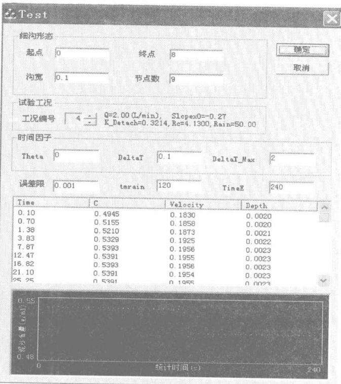  
图15.24 细沟侵蚀过程有限元模拟可视化窗口

## 15.3.2 系统主要优点

相对传统操作界面而言，可视化软件有以下几个优点：

(1)在程序调试过程中，通过其适时显示功能可进行动态检验，出现问题时能随时终止程序的运行，并及时进行程序或数据文件的修改，从而节省了大量的调试时间。

(2)可视化软件能生成泥沙含量、输沙量的过程变化图，有利于分析计算成果的合理性和进行不同实验工况优劣的对比，从而大大提高了利用过程模型解决实际问题的效率。

(3)克服了传统DOS计算结果显示不直观的缺陷，计算完成后，自动显示输出结果。

白清俊.1999.黄土坡面细沟侵蚀带产流产沙模型研究．杨凌：西北农林科技大学博士学位论文

白清俊.2000.黄土坡面细沟侵蚀带产流产沙模型研究.水土保持学报，14(1):93\~96

白清俊，马树升.2001.细沟侵蚀过程中水流跌坑的发生机理探讨.水土保持学报，15(6):62\~65

包为民.1995.小流域水沙耦合模拟概念模型.地理研究，14(2):28\~33

卜兆宏，席承藩，李士鸿，等.1990.水土流失量遥感监测的研究设想与初步进展.遥感技术动态，(4)：31\~36

蔡强国.1989.坡长在坡面侵蚀产沙过程中的作用.泥沙研究，(4):84\~91

蔡强国等.1995.黄土坡耕地上坡长对径流侵蚀产沙过程的影响.水土流失规律与坡地改良利用.北京：环境科学出版社.50\~58

蔡强国，刘纪根.2003. 关于我国土壤侵蚀模型研究进展.地理科学进展，22(3):242\~250

蔡强国，陈永宗，景可.1988.黄土高原现代侵蚀与治理.北京：科学出版社

蔡强国，陆兆熊，王贵平.1996.黄土丘陵沟壑区典型小流域侵蚀产沙过程模型.地理学报，51(2)：108\~117

蔡强国，王贵平，陈永宗.1998.黄土高原小流域侵蚀产沙过程与模拟.北京：科学出版社.92\~106

陈国祥.谢树楠，汤立群.1996.黄土高原水土保持.郑州：黄河水利出版社

陈浩.1992a.降雨特征和上坡来水对产沙的综合影响.水土保持学报，6(2):17\~23

陈浩.1992b. 上坡来水在坡面产沙中的作用.水土保持科学理论与实践.见：第二次全国水土保持学术讨论会论文集.北京:林业出版社.23\~27

陈力，刘青泉.2001.坡面流运动方程和有支流入汇的一维明渠流方程形式.力学与实践，23(4):21\~23

陈力.刘青泉.李家春.2001.坡面降雨产流特征的数值模拟研究.泥沙研究，4:61\~67

陈永宗.1983.黄土高原沟道流域产沙过程的初步分析.地理研究，2(1):35\~47

陈永宗.1987.黄土高原土壤侵蚀规律研究工作回顾.地理研究，6(1):76\~83

承继成.1963.坡地流水作用的分带性.中国地理学会编.北京：科学出版社

承继成.1965.坡地流水作用的分带性.中国地理学会一九六三年年会论文选集(地貌学).北京：科学出版社.99\~104

代全厚，张力，等.1998. 嫩江大堤植物根系固土护堤功能研究.中国水土保持，18(6):8\~11

段建南，李保国，石元春.1998.应用于土壤变化的坡面侵蚀过程模拟.土壤侵蚀与水土保持学报，4(1)：47\~53

范兴科，蒋定生，赵合理.1997.黄土高原浅层原状土抗剪切强度浅析.土壤侵蚀与水土保持学报，3(4)：69\~75

费详俊.1996.黄河下游河道高含沙水流的输沙能力分析.人民黄河，2:9\~15

费祥俊.2002.水石流的输沙浓度与流动速度.泥沙研究，4:8\~12

费详俊，舒安平.1998.多沙河流水流输沙能力的研究.水利学报，11:1\~7

郭同章，张建勋，傅金镒.1996.黄河上游水土流失预测模型.北京:科学出版社：98\~12

洪惜英.1990.水力学.北京：中国林业出版社.228\~229

胡世雄.1999.坡度、降雨和土壤条件对坡面流及坡面动力侵蚀过程的影响研究.博士论文

华绍祖.1982.黄河中游实验小流域的土壤侵蚀及水土保持效益.国际土壤学学术讨论会.28

江忠善，宋文经.1980.黄河中游黄土丘陵沟壑区小流域产沙量计算.见：中国水利学会.第一次河流泥沙国际学术讨论会论文集.北京：光华出版社

姜春云.1997.切实加大水土保持工作力度，为实施可持续发展战略作出新的贡献.中国水土保持，(6)：2\~6

蒋定生.1997.黄土高原水土流失与治理模式.北京：水利水电出版社.45\~64

蒋定生，范兴科，刘国斌.1995.黄土高原主要产沙河流输沙动态模拟.水土保持研究，20(4):44\~50

焦居仁.2002.贯彻秀美山川重要批示五年来的回顾.中国水土保持，5:1\~3

琚彤军.田均良.刘普灵，等.1999.REE示踪条带施放法研究坡面土壤侵蚀垂直分布规律.核农学报，13(6):347\~352

孔祥谦.1999.热应力有限单元法分析.上海：上海交通大学出版社.9,16

孔亚平，张科利.2003.黄土坡面侵蚀产沙沿程变化的模拟试验研究.泥沙研究，(1):33\~38

雷阿林，唐克丽.1995.土壤侵蚀模型试验中的降雨相似极其实现.科学通报，40(21):2004\~2006

雷阿林，唐克丽.1998.细沟侵蚀发生的临界动力条件.土壤侵蚀与水土保持学报，4(3):39\~43

雷俊山，杨勤科，郑粉莉.2004.黄土坡面细沟侵蚀试验研究及土壤抗冲性评价.水土保持通报，24(2)：1\~4

雷廷武，NearingM A.2000a. 确定侵蚀细沟水力学特征、侵蚀与形态的水槽试验研究.水力学报，11:49\~54

雷廷武，NearingM A.2000b.水流作用下疏松土壤材料中细沟的再生及其临界剪切力的实验研究.农业工程学报，16(1):26\~30

雷廷武，邵明安，李占斌.1999.土壤侵蚀预报模型和在中国发展的战略考虑.水土保持研究，(2)：162\~169

雷廷武，姚春梅，张晴雯等.2004.细沟侵蚀动态过程模拟数学模型和有限元计算方法.农业工程学报，4

雷廷武，张晴雯，赵军等.2001.陡坡细沟含沙水流剥蚀率的试验研究及其计算方法.农业工程学报，17(3):24\~27

雷廷武，张晴雯，赵军等.2002a.确定侵蚀细沟集中水流剥离速率的解析方法.土壤学报，(6):788\~793

雷廷武，张晴雯，赵军等.2002b.细沟侵蚀动力过程输沙能力试验研究.土壤学报,39(4):476\~482

李鄂荣.1999.我国古代黄河水利工程活动对环境的影响.地质力学学报，5(3):71\~75

李清河，李昌哲，齐实等.2000.黄土区小流域土壤侵蚀模型系统解析.水土保持通报,20(1):28\~31

李少华，秦胜英，贾嵘等.2000.可视化程序设计在塔里木河流域水盐平衡研究中的应用.陕西水力发电，16(1):20\~22

李雅琦，田均良，刘普灵等.1997.利用稀土元素示踪法研究黄土高原土壤侵蚀空间分布规律.核农学报，11(3):145\~150

林振山，袁林旺，吴得安.2003.地学建模.北京：气象出版社.1\~7

刘宝元，史培军.1998.WEPP水蚀预报流域模型.水土保持通报，18(5):6\~12

刘宝元，谢云，张科利.2001.土壤侵蚀预报模型.北京：中国科学技术出版社

刘宝元，张科利，焦菊英.1999.土壤可蚀性及其在侵蚀预报中的应用.自然资源学报，14(4)：345\~350

刘秉正，吴发启.1996.土壤侵蚀.西安:陕西人民出版社

刘尔烈，崔恩第，徐振铎.2004.有限单元法及程序设计.天津：天津大学出版社.25\~28

刘普灵，田均良，周佩华等.2001.土壤侵蚀稀土元素示踪法试验研究.稀土,22(2):37\~40

刘青泉，李家春，陈力等.2004.坡面流及土壤侵蚀动力学(1)——坡面流.力学进展,34(3):360\~370

刘新仁.1989.山坡水文学.哈尔滨:哈尔滨工业大学出版社.265\~269

刘元保，朱显谟.1988.黄土高原土壤侵蚀垂直分带性研究.中国科学院西北水保所集刊,7:5\~8

刘元保，朱显谟，周佩华等.1998.黄土高原坡面沟蚀的类型及其发生规律.中国科学院西北水土保持研究所集刊,6:9\~18

柳丽英，范荣生.1997.侵蚀产沙系统模型概述.水土保持通报，17(2):53\~58

龙江，吴亚帝，李适宇，等.2002.水动力与水质数值模拟中的有限元法.人民珠江，(6):4\~7

陆兆熊，蔡强国.1990.黄土的结皮强度和溅蚀试验研究.见：晋西黄土高原土壤侵蚀规律试验研究论文集.北京：水利电力出版社

吕悦来，李广毅.1983.地表粗糙度与土壤风蚀.土壤学进展，(2):38\~41

罗来兴.1958.甘肃华亭粮食沟坡侵蚀量的野外观测及其初步分析结果.地理学资料，(2):20

牟金泽，熊贵枢.1980.陕北小流域产沙量预报及水土保持措施拦沙计算.见：中国水利学会.第一次河流泥沙国际学术讨论会论文集.北京：光华出版社

倪晋仁，马蔼乃.1998.河流动力地貌学.北京：北京大学出版社.(6):55\~57

潘利君. BergsmaⅠE.1995. 利用土壤入海速率和土壤抗剪力确定土壤侵蚀等级.水土保持学报,9(2)

彭珂珊.2000. 黄土高原水土流失退耕还林草的基本思路.水土保持研究，(2):164\~171

彭琳，王继增，余存祖.1996.侵蚀旱作土壤氮素吸收利用与淋溶流失.土壤侵蚀与水土保持学报，2(2)：9\~16

戚隆溪，黄兴法.1997.坡面降雨径流和土壤侵蚀的数值模拟.力学学报,29(3):343\~347

戚隆溪，王柏懿.1995. 土壤侵蚀的流体力学机制(1)—水蚀.力学进展,25(4):501\~514

齐璞，茹玉英，张厚军，等.1995.黄河艾山以下河道输沙能力问题.人民黄河,5:6\~11

钱宁.1989.高含沙水流运动.北京：清华大学出版社

钱宁，万兆惠.1993.泥沙运动力学.北京:科学出版社.127

荣先成，王洪军，宋强，等.2007.有限元法.成都：西南交通大学出版社.1\~3

沙玉清.1965.泥沙运动学引论.北京：中国工业出版社.186\~188

邵学军.1998.一维坡面流动的基本理论及数值模拟研究.泥沙研究,3:91\~96

邵学军.2001.坡面细沟流速与坡度关系的数值模拟.水土保持学报，15(5):1\~5

邵学军.2002.坡面薄层流的数值模拟及在坡面流侵蚀研究中的应用.水利学报，5:15\~19

沈冰.1996.地表水文有限元模拟.西安:西北工业大学出版社.1\~43

沈冰，沈晋.1988.运动波模型及其在水文中的应用.陕西水力发电，4

沈玉昌，龚国元.1986.河流地貌学概论.北京：科学出版社.85\~88

石辉，田均良，刘普灵，等.1997.小流域侵蚀产沙空间分布的模拟试验研究.水土保持研究，4(2):75\~84

石辉，田均良，刘普灵.1996.利用REE示踪法研究小流域泥沙来源.中国科学E辑,26(5):474\~480

史培军，刘宝元，张科利等.1999.土壤侵蚀过程与模型研究.资源科学,21(5):9\~18

史学正，邓西海.1993.土壤可蚀性研究现状及展望.中国水土保持，5:25\~29

史学正，于东升，邢廷炎.1997.用田间实测法研究我国亚热带土壤的可蚀性k值.土壤学报，34(4)：299\~305

孙东坡.1999.河流系统能量分配耗散关系的分析.水利学报，3:1\~5

汤立群.1996.流域产沙模型的研究.水科学进展,7(1):47\~53

汤立群，陈国祥.1994.坡面土壤侵蚀公式的建立极其在流域产沙计算中的应用.水科学进展，5(2)：104\~110

汤立群，陈国祥.1997.小流域产流产沙动力学模型.水动力学研究与进展，12(2):164\~174

唐克丽.1984a.黄土高原水土流失与土壤退化的研究初报.环境科学,5(6):5\~10

唐克丽.1984b.杏子河流域的土壤侵蚀方式及其分布.水土保持通报，5:10\~19

唐克丽.2004.中国水土保持.北京：科学出版社.307\~309

唐克丽，席道勤，孙清芳，等.1983.杏子河流域坡耕地的水土流失及其防治.水土保持通报，3(5):43\~48

唐克丽，张科利，雷阿林.1998.黄土丘陵区退耕上限坡度的研究论证.科学通报，40(2):200\~203

唐克丽，郑粉莉，史德明.1989.土壤侵蚀研究的回顾与展望.土壤学报,26(3):226\~233

田均良.1997.侵蚀泥沙坡面沉积研究初报.水土保持研究，4(2):57\~63

田均良，周佩华，刘普灵，等.1992. 土壤侵蚀REE示踪法研究初报.水土保持学报，6(4):23\~27

王辉，径流含沙量机电一体化测控系统研究及应用.西北农林科技大学2003届硕士学位研究生毕业论文.2\~4

王礼先，吴长文.1994.陡坡林地坡面保土机理研究.北京林业大学学报，16(4):1\~7

王士强，陈骥，惠遇甲.1998.明槽水流的非均匀沙挟沙力研究.水利学报，(1):1\~9

王协康，敖汝庄，喻国良，等.1999.坡面雨滴溅蚀及其输沙能力的探讨.四川联合大学学报，3(2):7\~12

王勖成.2003.有限单元法.北京:清华大学出版社.255\~270

王兆印.1998.泥沙研究的发展趋势和新课题.地理学报,53(3):245\~254

韦直林.1990.河道水流泥沙问题的一种有限元解法.武汉水利电力学院学报，23(6)：77\~86

吴长文，陈法扬.1994.坡面土壤侵蚀及其模型研究综述.南昌水专学报，13(2):1\~11

吴持恭.1998.水力学(下).北京:高等教育出版社.94\~96

吴发启，赵晓光，刘秉正.1998.黄土高原南部坡耕地土壤侵蚀预报.土壤侵蚀与水土保持学报，4(2)：72\~76

吴普特.1997.动力水蚀实验研究.西安:陕西科学技术出版社.34\~68，175\~201

吴普特，周佩华.1994.雨滴击溅对薄层水流水力摩阻系数的影响.水土保持学报，8(2)：39\~42

吴淑芳.2006.坡面径流调控效应及其机理研究.杨凌：西北农林科技大学博士学位论文

向华.2002.复杂坡面的产流输沙规律研究.北京：中国科学院力学研究所硕士学位论文

徐国宾.1994.最小能耗率原理及其在河流动力学中的应用.西北水资源与水工程，(4):50\~58

颜云辉，谢里阳，韩清凯.2000.结构分析中的有限单元法及其应用.沈阳：东北大学出版社.57\~73

杨文治，余存祖.1992.黄土高原区域治理与评价.北京：科学出版社.56

杨武德，王兆骞，眭国平.1999.红壤坡度不同利用方式下土壤侵蚀模型研究.土壤侵蚀与水土保持学报，5(1):52\~58

杨志达.1992.力、能量、熵和能耗率.泥沙情报，(1):12\~22

杨子生.1999.滇东北山区坡耕地土壤流失方程研究.水土保持通报，9(1):1\~9

姚春梅.2006.坡面-细沟耦合水蚀过程的试验与模型研究.北京：中国农业大学博士学位论文

姚文艺.1996.坡面流阻力规律试验研究.泥沙研究，3:74\~82

姚文艺，汤立群.2001.水力侵蚀产沙国过程及模拟.郑州：黄河水利出版社.74\~207

伊武军.2001.资源、环境与可持续发展.北京：海洋出版社.1\~25

于东升，史学正.2000.低丘陵红壤区旱地土壤渗透性与可蚀性定量关系的研究.土壤学报，37(3)：316\~322

查小春，贺秀斌.1999. 土壤物理力学性质与土壤侵蚀关系研究进展.水土保持研究，6(1):98\~104

张光辉.2000.国外坡面径流分离土壤过程水动力学研究进展.水土保持学报，14(3):112\~115

张光业.1986.地貌学教程.郑州:河南大学出版社.7\~10

张科利.1991. 黄土坡面侵蚀产沙分配及其降雨特征关系的研究.泥沙研究，(4):39\~45

张科利.1999.黄土坡面发育的细沟水动力学特征的研究.泥沙研究，(1):56\~61

张科利，唐克丽.2000.土高原细沟侵蚀能力的水动力学试验研究.土壤学报,37(7):9\~15

张科利，蔡永明，刘宝元等.2001.土壤可蚀性动态变化规律研究.地理学报,56(6):673\~681

张科利，刘宝元，蔡永明.2000.土壤侵蚀预报研究中的标准小区问题论证.地理研究，19(3):297\~302

张科利，刘宝元，蔡永明.2001.黄土高原地区土壤可蚀性及其应用研究.生态学报,21(9):1297\~1320

张科利，秋吉康宏.1998.坡面细沟侵蚀发生的临界水力条件研究.土壤侵蚀与水土保持学报，4(1)：

41\~46

张晴雯.2001.细沟水蚀动力过程试验研究.中国科学院2001届硕士学位研究生学位论文

张晴雯.2004.细沟侵蚀物理模型参数研究及其动力学分析.北京：中国科学院研究生院博士学位论文

张晴雯，雷廷武，潘英华等.2004.细沟侵蚀可蚀性参数及土壤临界抗剪应力的有理(实验)求解方法.中国科学院研究生院学报，(4):468\~475

张晴雯，雷廷武，赵军等.2001.细沟股流剥蚀率与载沙量以及沟长的耦合关系.水土保持学报，15(2)：92\~95

张信宝，文安邦.1998.黄土昴破农地侵蚀与坡长的关系.中国水土保持SWCC,1:17\~18,25

张兴昌，刘国彬，刘文兆.2000.不同土壤颗粒组成在水蚀过程中的流失规律.西北农业学报，9(3)：55\~58

赵晓光.1999.黄土塬区坡面水蚀作用过程.博士论文

郑粉莉.1988.黄土高原坡耕地的细沟侵蚀及其防治途径.中国科学院西北水土保持研究所集刊，6：19\~25

郑粉莉.1989.发生地细沟侵蚀的临界坡长与坡度.中国水土保持，(8):23\~24

郑粉莉，康绍忠.1998a.黄土坡面不同侵蚀带侵蚀产沙关系及其机理.地理学报，53(5):422\~427

郑粉莉，康绍忠.1998b.黄土区坡耕地细沟间和侵蚀细沟侵蚀影响因素研究.土壤学报，(1):95\~103

郑粉莉，高学田.2000.黄土坡面土壤侵蚀过程与模拟.西安:陕西人民出版社.10\~12

郑粉莉，唐克丽，周佩华.1987.坡耕地细沟侵蚀的发生、发展和防治途径的探讨.水土保持学报，1(1)：36\~48

周佩华，王占礼.1992.黄土高原土壤侵蚀暴雨的研究.水土保持学报.6(3):2\~5

周佩华.1995.朱显谟院士与中国土壤侵蚀研究工作.水土保持研究,2(4):26\~28

朱伯芳.1998.有限单元法原理与应用.北京：中国水利电力出版社.20\~58

朱登铨.1996.治理开发农村“四荒”资源，进一步加强水土保持工作.水土保持科技情报，3:2\~4

朱显谟.1960.黄土地区植被因素对于水土流失的影响.土壤学报，8(2):110\~121

朱显谟.1981.黄土高原流水侵蚀的主要类型及有关因素.水土保持通报，3，4

朱显谟.1989.黄土高原土壤与农业.北京:农业出版社.410\~413

朱显谟.1993.试论中国水土保持工作中的实践与理论问题，对当前水土保持工作中的一些重大问题的见解.水土保持通报，1

1980. 日本地理学会访华团学术报告.论坡面上的细沟网.陈永宗译.水土保持译丛，(1)

1998. The European Soil Erosion Model (EuroSEM) : documentation and user guide. Silsoe College, Cranfield University. 33

2002. 中华人民共和国水利部.全国水土流失公告

2002.中国水土保持情况介绍.北京：第十二届国际水土保持大会

Abbott J C, Bathurst J A, Connell P E, et al. 1986. An introduction to the European hydrological system "SHE"2, structure of a physicallly based, distributed modelling system. J Hydrol, 87: 61 \~77

Abrahams A D, Parsons A J, Hirsh P J, et al. 1992. Field and Laboratory Studies of Resistance to Interrill Overland Flow on Semi-arid Hillslopes ,Southern Arizona. London: UCL Press. 1 \~ 23

Abrahams A D, Parsons A J, Luk S H. 1986. Field measurement of the velocity of overland flow using dye tracing. Earth Surface Processes and Landforms, 11 : 653 \~ 657

Akan A O. 1985. Predicting Overland Flow and Infiltraion. New York: ASCE. 79 \~83

Alberts E E, Nearing M A, et al. 1995. Chapter 7. Soil component. In: Technical Documentation, USDA-Water Erosion Prediction Project. West Lafayette: National Soil Erosion Research Laboratory

Alonso C V, Neibling W H, Foster G R. 1981. Estimating sediment transport capacity in watershed modeling Trans of the ASAE, 24(5) : 1211 \~1220

Alonso C, Neibling W, Foster G, et al. 1981. Estimating sediment transport capacity in watershed modeling. Transactions of the ASAE, 24: 1211 \~1220

Ascough J, Baffaut C, Nearing M A, et al. 1997. The WEPP water-shed model: hydrology and erosion. Transactions of the ASAE, 40(4) : 921 \~933

Bagnold R A. 1966. An approach to the sediment transport problem form general physics. New York: Am Soc Civ Eng. 231 \~291

Beasley D B, Huggins L F, Monke E J. 1980. Answers: a model for watershed planning. Trans ASAE, 23: 938\~944

Borah D K, Bordoloi P K. 1989. Nonuniform sediment transport model. American Society of Agricultural Engineers,32(5): 1631\~1636

Bradford J M, Foster G R. 1996. Interrill soil erosion and slope steepness factors. Soil Sci Soc Am J, 60:909 \~ 915

Bralts V F, Kelly S F, Shayya W H, et al. 1993. Finite element analysis of microirrigation hydraulics using a virtual emitter system. Transaction of ASAE, 36(3) : 717 \~721

Bryan R B, Poesen J. 1989. Laboratory experiments on the influence f slope length on runoff, percolation and rill development. Earth Surface Proceees and Landforms, 14: 211 \~231

Cesar M, Zhou D. 1995. A dynamic approach to sediment \~ laden turbulent flows. Water Resources Research, 31(12):3075\~3087

Chen L, Liu Q Q, Li J C, et al. 2001. Runoff generaion characteristics in typical erosion regions on the Loess Plateau. International Journal of Sediment Research, 16(4) : 473 \~485

Chow V T. 1959. Open-Channel Hydraulics. New York:McGraw-Hill, Inc

Cloug R W. 1960. The finite element method in plane stress analysis. 2nd ASCE conference on electronic computation. Pittsburgh, PA. 345 \~378

Cochrane T A , Flanagan D C. 1996. Detachment in a simulated rill. Transactions of the ASAE,40(1) : 111 \~ 119

Cochrane T A, Flanagan D C. 1997. Detachment in a simulated rill. Transactions of the ASAE, 40(11) : 111 \~ 119

Courant R. 1943. Variational method for solutions of problems of equilibrium and vibrations. Bull Am Math Soc,49:1\~23

Cundy T W, Tento S W. 1985. Solution to the kinematic wave approach to overland flow routing with rainfall excess given by Philips equation. Water Resour, Res, 21(8) : 1132 \~ 1140

David M R, David J T. 2001. Quantifying the relative importance of flow regulation and grain size regulation of suspended sediment transport α and tracking changes in grain size of bed sediment. Water Resources Research, 37(1):133\~146

Deletic A. 2001. Modelling of water and sediment transport over grassed areas. Journal of Hydrology, (248) : 168\~182

Einstein H A, Chien N. 1954. Second approximation to the solution of the suspended load theory. Fluid Mechanics Laboratory. University of California, Berkeley

Elliot W J. 1988. A process based rill erosion model. Iow a State Univ. Ames, IA

Elliot W J, Laflen J M. 1993. A process-based rill erosion model. Transaction of ASAE, 36(1) : 65 \~ 72

Elliot W J, Liebenow A M, Laflen J M, et al. 1989. A compendium of soil erodibility data from WEPP cropland soil field erodibility experiments 1987 and 88. NSERL Rep. No. 3, USDA-ARS, West Lafayette, IN, 317

Ellison W D. 1947a. Soil erosion studies. Part I. Agriculture Engineering, 28: 145 \~ 146

Ellison W D. 1947b. Soil erosion studies. Part VI. Soil detachment by surface flow. Agriculture Engineering, 28:402\~408

Ellison W D. 1947c. Soil erosion studies. Part VI. Soil transportation by surface flow. Agriculture Engineering, 28：442\~444450

Ellison W D. 1947d. Soil erosion studies-Part VI. Soil detachment by surface flow. Agric Eng Sept Issue, 28: 402 \~405.

Emmett W W. 1978. Overland flow. In: Kirkby M J. Hillsolpe Hydrology. New York: John-Wiely and Sons

Esteves M, Faucher X, Galls S, et al. 2000. Overland flow and infiltration modelling for small plots during unsteady rain: numerical results versus observed values. Journal of Hydrology, 228: 168 \~ 182

Ewing L K, Mitchell J K. 1986. Overland flow and sediment transport simulation on small plots. Trans ASAE, 29：1572\~1581

Finkner S, Nearing M, Foster G, et al. 1989. A simplified equation for modeling sediment transport capacity. Transactions of the ASAE, 32(5) : 1545 \~ 1550

Flanagan D C, Nearing M A. 2000. Sediment particle sorting on hillslope profiles. Transactions of the ASAE, 43(3):573\~583

Foster G R. 1982. Modeling the soil erosion process. Ch. 5. In: Haan C T et al. Hydrologic Modeling of Small Watersheds. ASAE, St. Joseph, MI

Foster G R, Flanagan D C, Nearing M A, et al. 1995. Hillslope erosion component. In: Flanagan D C, Nearing M A. USAD-Water Erosion Prediction Project Hillslope Profile and Watershed Model Document. Iowa, Soil and Water Conservation Society

Foster G R, Meyer L D. 1972a. A closed form erosion equation for upland areas. In: Shen H W. Sedimentation. Ft Collins. 210

Foster G R, Meyer L D. 1972b. Transport of soil particles by shallow flow. Transactions the ASAE, 15(1) : 99\~102

Foster G R, Huggins L F, Meyer L D, et al. 1984a. A laboratory study of rill hydraulics (1) : velocity relationships. Trans of the ASAE, 27: 790 \~ 796

Foster G R, Huggins L F, Meyer L P A. 1984b. Laboratory study of rill hydraulics. I. Shear stress relationship. Trans of ASAE, 797 \~ 804

Foster G R, Lane L J, Nearing M A, et al. 1989. Erosion component. USDA-Water Erosion Prediction Project : Hillslope Profile Model Documentation. W. Lafayette, In: Soil Erosion Res. Lab. ,Lab. Agric. Res. Service, US Dept. of Agriculture

Foster G R, Meyer L D, Onstad C A, et al. 1977. A runoff erosivity factor and variable slope length exponents for soil loss estimates. Transactions ASAE, 20(4) : 683 \~687

Foster J B, Huggins L F, Meyer L D, et al. 1968. Simulation of overland flow on the short field plots. Water Resources Research, 4:1179\~1188

Franti T G, Laflen J M, Watson D A. 1999. Predicting soil detachment from high-discharge concentrated flow. Transactions of the ASAE, 42(2) : 329 \~335

Freeze R A. 1978. Mathematical models of hillslope hydroloay. In: Kirkby M J. Hillslope Hydrology. New

York: Wiley interscience. 177\~225

Ghebreiyessus Y T, Gantzer C J, Alberts E E, et al. 1984. Soil erosion by concentrated flow: shear stress and bulk density. Trans of the ASAE, 37(6) :1791 \~ 1797

Gilly J E, Ellioti W J, Laflen J M, et al. 1993. Critical shear stress and critical flow rates for initiation of rilling. J of Hydrology, 142: 251 \~271

Gilley J E, Kottwitz E R, Simanton J R. 1990. Hydraulic characteristics of rills. Trans of the ASAE, 33: 1900 \~ 1906

Gimenez R, Govers G. 2002. Flow detachment by concentrated flow on smooth and irregular beds. Soil Science Society of America Journal, 66(5) : 1475

Govers G. 1990. Empirical relationships for the transport capacity of overland flow. Erosion, transport, and deposition process. Proc Jerusalem Workshop. Jerusalem, Israel. March-April 1987. IAHS Pub. no. 189: 45\~63

Govers G. 1992. Relationship between discharge, velocity, and flow area for rills eroding loose, non-layered materials. Earth Surface Processes and Landforms, 17: 515 \~ 528

Govers G, Rauws G. 1986. Transporting capacity of overland flow on plane and on irregular beds. Earth Surf Processes Landforms, 11:515 \~ 528

Govindaraju R S. 1988. On the diffusion wave model for overland flow. Water Resour Res, 24(5)

Govindaraju R S, Kavvas M L, Tayfur G, et al. 1992. A simplified model for two-dimensional overland flows. Advances in Water Resources, 15: 133 \~ 141

Guy B T. Dickinson W T, Rudra R P. 1987. The roles of rainfall and runoff in the sediment transport capacity of interrill flow. Transactions of the ASAE,30(5) : 1378 \~ 1386

Guy B T. Dickinson W T, Rudra R P, et al. 1992. Evaluation of fluvial sediment transport equations for overland flow. Transactions of the ASAE, 35 : 545 \~ 555

Hairsine P B, Rose C W. 1992a. Modeling water erosion due to overland flow using physical principles. 1. Sheet flow. Water Resour Res, 28: 237 \~243

Hairsine P B, Rose C W. 1992b. Modeling water erosion due to overland flow using physical principles. 2. Rill flow. Water Resour Res, 28, 245 \~ 250

Haug G H, Günther D, Peterson L C, et al. 2003. Climate and the collapse of Maya civilization, science, 299 (5613):1731\~1735

Helen S. 1992. Modelling Overland-flow Hydrology for Dynamic Hydraulics. London: UCL Press. 89 \~ 103

Hirschi M C, Barfield B J. 1988. KYERMO: a physically based research erosion model. 2. Model development. Trans ASAE, 31: 804 \~813

Horton R E. 1945. Erosional development of streams and their drainage basins ,hydrological approach to quant. tative morphology. Bull, Geol SOC Am, 56(3) : 275 \~ 370

http://big5. xinhuanet. com/gate/big5/news. xinhuanet. com/newscenter/2002-10/16/content\_599052. htm

Huang C H, Joe M B. 1993. Analyses of slope and runoff factors based one the WEPP erosion model. Soil Sci Soc Am J, 57: 1176 \~1183

Huang C H, Bradford J M, Laflen J M, et al. 1996. Evaluation of the detachment-transport coupling concept in the WEPP rill erosion equation. Soil Sci Soc Am J, 60: 734 \~ 739

Huang C, Wells L K, Norton L D, et al. 1998. Sediment transport capacity and erosion processes : model concepts and reality. Earth Surface Processes and Landforms, 24: 503 \~ 516

Huang Chi-Hua, Zheng Fen-Li. 2003. Research progress on soil erosion process and erosion prediction model

in the USA. 水土保持通报,23(3):1\~5

Jaber F H, Mohtar R H. 2002. Stability and accuracy of finite element schemes for the one-dimensional kinematic wave solution. Advances in Water Resources, 25(4) : 427 \~438

Jayawardena A W, White J K. 1977. A finite element distributed catchment model. I. Analytical basis. Journal of Hydrology, 34: 269 \~ 286

Julien P Y, Simons D B. 1985. Sediment transport capacity of overland flow. Trans of ASAE, 28(3) : 755 \~ 762

Khaleel R, Foster G R, Reddy K R, et al. 1979. A nonpoint source model for land areas receiving animal wastes. 3. A conceptual model for sediment and manure transport. Trans ASAE, 22: 1353 \~ 1361

Khanbilvardi R M, Rowski A S. 1986. Modeling soil erosion. Transport and Ecological Modeling, 33(2 \~4) : 255\~268

King K W, Norton L D. 1992. Methods for rill flow velocity dynamics. Paper No. 9222542, Am Soc Agric Engr, St, Joseph, MI: 49085 \~9659

Kinnell P I A. 2000. The effect of slope length on sediment concentration associated with side-slope erosion. Soil Sci Soc Am J, 64:1004 \~ 1008

Knaus R M. 1989. Accretion and canal impacts in a rapidly subsiding wetland. II. A new soil horizon maker method for measuring recent accretion. Estuaries, 12(4) : 269

Laflen J M, Elliot W J , Simanton R, et al. 1991. WEPP soil erodibility exper iments for rangeland and cropland soils. J Soil and Water Conservation, 46 (1) : 39 \~44

Lane L J, Foster G R, Nicks A D, et al. 1987. Use of fundamental erosion mechanics in erosion prediction. ASAE, St Joseph, MI: 87 \~2540

Laursen E M. 1958. The total sediment load of streams. J Hydraul Div, ASCE, 123(1) : 195 \~206

Lei T W, Nearing M A. 1999. Flume experiments for determining rill hydraulics , erosion and rill patterns. 10th ISCO Int Con, West Lafayette, IN, USA, May 21 \~ 28

Lei T W, Nearing M A, Haghighi K, et al. 1998. Rill erosion and morphological evolution: a simulation model. Water Resources Research, 34(11): 3157\~3168

Lei T W, Zhang Q W, Yan L J, et al. 2008. A rational method for estimating erodibility and critical shear stress of an eroding rill. Geoderma, doi:10. 1016/j

Lei T W, Zhang Q W, Zhao J, et al. 2001. A laboratory study of sediment transport capacity in the dynamic process of rill erosion. Transactions of the ASAE, 44(6) : 1537 \~ 1542

Lei T W, Zhang Q W, Zhao J, Xia W S, et al. 2002. Soil detachment rates for sediment loaded flow in rills. Trans. ASAE, 45(6) : 1897 \~1903

Lei T, Nearing M A , Haghighi K, et al. 1997. Finite element modeling of soil erosion in a rill. Management of Landscapes Distributed by Channel Incision, The Center for Computational Hydro science and Engineering, The University of Mississippi, May

Lei Tingwu, Zhang Qingwen, Xia Weisheng, et al. 2002. Analytic determination of soil erodibility and critical shear stress. Proceedings. 12th International Soil Conservation Organization Conference. Beijing: Tsinghua University Press. IV :27 \~32

Lewis S M, Barfield B J, Storm D E, et al. 1994a. Proril—an erosion model using probability distributions for rill flow and density. I. Model development. Transactions of the ASAE, 37(1) : 115 \~ 123

Lewis S, Barfield B, Storm D, 1994b. A method for developing probability distributions for rill flow and density. Transactions of the ASAE, 37: 1879 \~ 1887

Lewis S, Barfield B, Storm D, et al. 1994c. PRORIL-An erosion model using probability distributions for ril

flow and density. II. Model validation. Transactions of the ASAE, 37: 125 \~133

Li J C, Liu Q Q, Zhou J F, et al. 2003. Environmental mechanices research in China. Advances in Applied Mechanics, 39： 217\~306

Li Y, Frielinghaus M, Bork H R, et al. 1999. Determining the variability of soil erodibility for erosion prediction. Acta agricultural Nucleatae Sinica, 13(3) : 129 \~ 136

Lighthill M J, Whitham G B. 1955. On kinematic waves. 1. Flood movement in long rivers. Proceedings of the Royal Society of London. Series A, Mathematical and Physical Sciences, 229(1178) : 281 \~316

Lima J L M P. 1989. Overland flow under rainfall: some aspects related to modelling and conditioning factors. The Netherlands: Agricultural University Wageningen Ph D

Lindley M R, Barfield B J, Ascough II J C, ,et al. 1998. The surface impoundment element for WEPP. Transactions of the ASAE, 41 (3): 555 \~564

Liu Q Q, Chen L, Li, J C, et al. 2004. Two-dimensional kinematic wave modeling of overland-flow. Journal of Hydrology, 291: 28 \~41

Liu Q Q, Xiang H, Singh V P, et al. 2006. A simulation model for unified interrill eroison and rill erosion on hillslopes. Hydrological Processes, 20(3): 469 \~486

Lopez M T, Lopes V L, Stone J J, et al. 1993. Sensitivity analysis of the WEPP watershed model for rangeland applications. I. Hillslope processes. Transactions of the ASAE. 36(6) : 1659 \~ 1672

Lopez M T, Lopes V L, Stone J J, et al. 1994. Sensitivity analysis of the WEPP watershed model for rangeland applications. Ⅱ. Channel processes. Transactions of the ASAE, 37(1) : 151 \~ 158

Lu J Y, Cassol E A, Moldendhauer W C. 1989. Sediment transport relationships for sand and silt loam soils. Transactions of the ASAE, 32(6) : 1923 \~ 1931

Mancilla G A, Chen S. 2005. A field study on sediment transport capacity in rills. ASAE Annual International Meeting Sponsored by ASAE. Tampa, Florida

Mclean D G, Church M, Tassone B. 1999. Sediment transport along lower fraser river measurements and hydraulic computations. Water Resources Research. 35(8) : 2533 \~2548

Merten G H, Nearing M A, Borges A L O, et al. 2001. Effect of sediment load on soil detachment and deposition in rills. Soil Sci Soc Am J, 65: 861 \~868

Meyer L D, Foster G R, Nikolov S, et al. 1975a. Effect of flow rate and canopy on rill erosion. Trans of the ASAE,18:905\~911

Meyer L D, Forster G R, Romkens M J, et al. 1975b. Source of soil eroded by water from upland slopes. Present and Prospective Technology for Prediction Sediment Yield and Sources. 177 \~ 189

Meyer L D, Wischmeier W H. 1969. Mathematical simulation of the process of soil erosion by water. Trans ASAE, 12(6):754\~762

Milne-Thomson L M. 1960. Theoretical Hydrodynamics. New York: The Macmillan Company. 285 \~330

Misra R K, Rose C W. 1996. Application and sensitivity analysis of process based erosion model GUEST. Eurpean Journal of Soil Science, 47(4) : 593 \~604

Montgomery J A, Busacca A J, Frazier B E, et al. 1997. Evaluating soil movement using Cs-137 and the revised universal soil loss equation. Soil Sci Soc Am J, 61 :571 \~579

Moore I D, Burch G J. 1986. Sediment transport capacity of sheet and rill flow: application of unit stream power theory. Water Resources Research,22:1350 \~1360

Morgan R P C. 1995. The european soil erosion model: an update on its structure and research base. In: Rickson R J. Conserving Soil Resources, European Perspectives. CAB International, Oxon, UK: 286 \~ 299

Morgan R P C, Quinton J N, Rickson R J, et al. 1992. EuroSEM Documentation Manual. Bedford, UK: Silsoe College. 113 \~124

Morgan R P C, Quinton J N, Smith R E, et al. 1998. The european soil erosion model ( EuroSEM) : a dynamic approach for predicting sediment transport from fields and small catchments. Earth Surface Processes and Landforms, 23(6): 527\~544

Morris E M, Woolhiser D A. 1980. Unsteady one-dimensional flow over a plane:partial equilibrium and recession hydrographs. Warer Resour Res, 40: 31 \~47

Morrison J E, Jr Richardson C W, Laflen J M, et al. 1994. Rill erosion of a vertical with extended time since tillage. Transactionş of the ASAE,37(4) : 1187 \~1196

Nearing M A. 1991. A probabilistic model of soil detachment by shallow turbulent flow. Am Soc Agric Eng, 34(1):81\~85

Nearing M A, Parker S C. 1994. Detachment of soil by flowing water under turbulent and laminar conditions. Soil Sci Soc Am J, 58: 1612 \~ 1614

Nearing M A, Bradford J M, Parker S C, et al. 1991. Soil detachment by shallow flow at low slopes. Soil Science Society of America Journal, 55(2) : 339 \~344

Nearing M A, Foster G R, Lane L J, Finkner S C. 1989. A process-based soil erosion model for USDA-water erosion prediction project technology. Trans, ASAE, 32(5) : 1587 \~ 1593

Nearing M A, Lane L J , A lberts E E, et al. 1990. Prediction techno logy for soil erosion by water: status and research needs. Soil Sci Soc Am J, 54: 1702 \~ 1711

Nearing M A, Norton L D, Bulgakov D A. 1997. Hydraulics and erosion in eroding rills. Water Resources Research,33(4):865\~876

Nearing M A, Page D I, Simanton J R, et al. 1989. Determining erodibility parameters from rangeland field data for a process-based erosion model. Trans Am Soc Agricultural Eng, a, 32:919 \~924

Nearing M A , Parker S C, Bradford J M, et al. 1991. Tensile strength of thirty-three saturated repacked soils. Soil Sci Soc Am J, 55: 1546 \~ 1551

Nearing M A, Simanton J R, Norton L D, et al. 1999. Soil erosion by surface water flow on a stony, semiarid hill slope. Earth Surf Process Landforms, 24(8) : 677 \~ 686

Nicks A D, Lane L J, Gander G A. 1995. Chapter 2. Weather generator. In: Flanagan D C, Nearing M A, Laflen J M ed. USDA-Water Erosion Prediction Project: Hillslope Profile and Watershed Model Documentation. NSERL Report No. 10, USDA-ARS National Soil Erosion Research Laboratory, West Lafayette

Parlange J Y, Rose C W, Sander G, et al. 1981. Kinematic flonw approimation of runoff on a plane: an exact analytical solut. J Hydrol, 52: 171 \~ 176

Pinder G F, Gray W G. 1977. Fintie element simulation -in surface and subsurface hydrology. Academic, San Diego, Calif. 295

Polyakov V O, Nearing M A. 2003. Sediment transport in rill flow under deposition and detachment conditions. Catena,51(1):33\~43

Ponce V M, Li R M, Simons D B, et al. 1978. Applicability of kinematic and diffusion models. J Hydraul Div ASCE,104：353\~360

Powell D M, Reid I, Laronne J B. 2001. Evolution of bed load grain size distribution with increasing flow strength and the effect of flow duration on the caliber of bed load sediment yield in ephemeral gravel bed rivers. Water Resources Research. 37(5) : 1463 \~ 1474

Rafael G, Govers G. 2001. Interaction between bed roughness and flow hydraulics in eroding rills. Water Re-

sources Research, 37(3):791\~799

Rauws G. 1988. Laboratory experiments on resistance to overland flow due to composite roughness, J Hydrology,103:37\~52

Renard K G, Foster G R. 1991. Revised universal soil loss equation. J Soil Water Conserv, 46: 30 \~33

Riebe B. 1995. Monitoring the translocation soil particles using a neutron activated tracer. In: Hartge K H, Stewart B A. Soil Structure: Its Development and Function. Boca Raton. FL: CRC Press. 277 \~297

Risse L M, Nearing M A, Nicks A D, et al. 1993. Error assessment in the universal soil loss equation. Soil Sci Soc Am J,57:825 \~833

Ritchie J C, Mhenry J R. 1990. Application of radioactive fallout Cesium-137 for measuring soil erosion and sediment accumulation rates and patterns: a review. J Environ Qual,19:215 \~233

Rose C W, Williams J R, Sander G C, et al. 1983a. A mathematical model of soil erosion and deposition processes. I. Theory for a plane land element. Soil Sci Soc Am J , 47 : 991 \~995

Rose C W, Williams J R, Sander G C, et al. 1983b. A mathematical model of soil erosion and deposition processes. II. Application to data from an arid-zone catchment. Soil Sci Soc Am J , 47 : 996 \~ 1000

Ross B B, Contractor D N, Shanholts V O, et al. 1979. A finite element model of overland and channel flow for assessing the hydrologic impact of landuse change. J Hydrol, 41 : 11 \~ 30

Shames I H. 1992. Mechanics of Fluids. 3rd. New York: McGraw-Hill Book Company

Sharda V N, Nearing M A. 1999. Finite element modeling of erosion on agricultural lands. In: Stott D E, Mohtar R H, Steinhardt G C, et al. 10th International Soil Conservation Organization Meeting. Purdue University and the USDA-ARS National Soil Erosion Research Laboratory: Global Farm. 1008 \~ 1017

Sharda V H, Singh S R. 1994. A finite element model for simulating runoff and soil erosion from mechanically treated agricultural lands 1. Governing equations and solutions. Water Resources Research, 30(7) : 2287 \~ 2298

Sharda V N, Singh S R, Sastry G, et al. 1994. A finite element model for simulating runoff and soil erosion from mechanically treated agricultural lands. 2. Field validation and applications. Water Resources Research, 30(7): 2299\~2310

Shen H W, Li R M. 1973. Rainfall effect on sheet flow over smooth surface. Journal of the Hydraulics Division, ASCE, 99(5): 771\~792

Shreve R L. 1960. Mechanics of Fluids. New York: McGraw-Hill. 680

Singh S R, Kumar A. 1983. Analysis of soil water dynamics. 1. Modelling water uptake by plant roots. J. Agric. Eng, 20(3/4) : 9 \~100

Smart G M. 1984. Sediment transport formula for steep channels. Journal of Hydraulic Engineering, 110: 267\~277

Smith R E, Wollhiser D A. 1971. Overland flow on an infiltrating surface. Water Resources Research, 7: 899 \~ 913

Song C C S, Yang C T. 1982. Minimum energy and energy dissipation rate. Journal of the Hydraulics Division. 108(HY5):690\~706

Staricka J A, Benoit G R. 1995. Freeze-drying effects on wet and dry soil aggregate stability. Soil Sci Soc Am J,59:218\~223

Storm D E, Barfield B J, Altendorf C T. 1994. Creams/WEPP sediment deposition equation: a semitheoretical evaluation. Transactions of the ASAE,37(4) : 1105 \~1108

Tayfur G, Kavvas M L, Govindaraju R S, et al. 1993. Applicability of St Venant equation for two-dimensional

overland flows over rough infilitraion surfaces. Journal of Hydraulic Engineering, 119(1) : 51 \~63

Tiwari A K, Risse L M, Nearing M A. 2000. Evaluation of WEPP and its comparison with USLE and RUSLE. Transactions of the ASAE, 43(5) : 1129 \~1135

Toth S J, Alderfer R B. 1960. A procedure for tagging water stable soil aggregates with Co-60. Soil Sci, 89: 36,37

Turner M J, Clough R W, Martin H C, et al. 1956. Stiffness and deflection analysis of complex structures. J Aero Sci, 23: 805 \~823

Van Klaveren R W, McCool D K. 1998. Erodibility and critical shear of a previously frozen soil. Transactions of the ASAE, 41(5) : 1315 \~1321

Vanoni V, Namicos G N. 1960. Resistance properties of sediment-laden strains. Trans of the ASAE, 125：3055

Venkata R, Eldho T, Rao E, et al. 2007. A distributed kinematic wave - philip infiltration watershed model using FEM, GIS and remotely sensed data. Water Resources Management

Ventura E, Nearing M A, Amore E, et al. 2002. The study of detachment and deposition on a hillslope using a magnetic tracer. Catema, 48(3) :149 \~161

Wallbrink P J, Murray A S, Olley J M. 1993. Relating suspended sediment to its original soil depth using fallout radionuclides. Soil Sci Soc Am J, 63: 369 \~378

Walling D E. 1999. Improved models for estimating soil erosion rates from cesium-137 measurements. J Environ Qual, 28: 611 \~622

Wang G T, Chen S, Boll J, et al. 2002. Modelling overland flow based on Saint-Venant equations for a discretized hillslope system. Hydrological Processes, 16: 2409 \~ 2421

Wendt R C, Alberts E E, Hjemfelt A T. 1986. Variability of runoff and soil loss from fallow experimental plots. Soil Sci Soc Am J, 50: 730 \~735

Wischemeier W H. 1971. A soil erodibility nomograph for farmland and conservation sites. Journal Soil and Water Conservation, 26: 189 \~193

Wichmerier W H, Smith D D, Uhland R E, et al. 1958. Evaluation of factors in the soil loss equation. Agricultural Engineering, 39(8) : 458 \~462

Wischmeier W H, Smith D D, 1960. A universal soil-loss equation to guide conservation farm planning. Trans. Int Congr Soil Sci, 7: 418 \~ 425

Wischmeier W H, Smith D D. 1965. Predicting rainfall-erosion losses from cropland east of the rocky mountains. Agr. Handbook, U. S. Department of Agriculture

Wischmerier W H, Wight D, Smith D D, et al. 1978. Predicting rainfall ersion losses: a guide to conservation planning. U. S. Dept of Agriculture, 230

Wooldridge D D. 1965. Tracing soil particles movement with fluorescent glass particles. Soil Sci Soc Am Pro, 32:469\~472

Woolhiser D A. Liggett J A. 1967. Unsteady, one-dimensional flow over a plane-the rising hydrograph. Water Res Res, 3(3): 753 \~771

Woolhiser D A, Smith R E, Goodrich D C, et al. 1990. A kinematic runoff and erosion model : documentation and user manual. USDA Agricultural Research Service Publication NO. ARS: (77) : 130

Yalin Y S. 1963. An expression for bed-load transportation, J Hydaul Div, Am Soc Civ Eng, 89:221 \~ 250

Yang C T, Molinas A. 1982. Sediment transport and unit stream power function. Journal of the Hydraulics Division,108(HY6):774\~793

Yen B C, Wenzel H G. 1970. Dynamic equations for steady spatially varied flow. Journal of the hydraulics Division, ASCE, 96(3):801 \~814

Yoon Y N, Brater E F. 1962. Spatially varied flow from controlled rainfall. Journal of the Hydraulics Division, ASCE,97(9):1367\~1386

Yong Y N, Wenzel H G. 1971. Mechanics of sheet flow under simulated rainfall. Journal of the hydraulics Division,ASCE,97(9):386

Zhang G H, Liu B Y, Nearing M A, et al. 2002. Soil detachment by shallow flow. Trans ASAE, 45(2) : 351 \~ 357

Zhang X C, Friedrich J M, Nearing M A, et al. 2001. Potential use of rare earth oxides as tracers for soil erosion and aggregation studies. Soil Sci Soc Am J, 65: 1508 \~ 1515

Zhang X C, Nearing M A, Polyakov V O, et al. 2003. Using rare earth oxide tracers for studying soil erosion dynamics. Soil Sci Soc Am J, 67: 279 \~ 288

Zheng F L, Huang C, Norton L D. 2000. Vertical hydraulic gradient and run on water and sediment effects on erosion processes and sediment regimes. Soil Sci Soc Am J, 64(1) : 4 \~ 11

Zhu J C, Gantzer C J, Peyton R L, et al. 1995. Simulated small-channel bed scour and head cut erosion rates compared. Soil Sci Soc Am J, 59:211 \~218

Ziekiewicz O C, Taylor R L. 1991. The Finite Element Method Vol. 2. (4th Edition). Solid and Fluid Mechanics, Dynamics and Non-linearity. London: McGraw-Hill Book Company

Zienkiewicz O C, Taylor R L. Nithiarasu P, et al. 2005. The Finite Element Method for fluild dynamics, 6th Edition. Amsterdam: Elsevier/Butterworth-Heinemann

Zingg A W. 1940. Degree and length of land slope as it affects soil loss in runoff. Agricultural Engineering, (21):59\~64

## 附录 模型参数计算程序

## 矩阵相乘

```c
void MatrixMult(int 1, int m, int n, float A[ ], float B[ ], float C[ ])
// A − A vector for a matirx of l x m A 矩阵大小为 1 × m
// B − A vector for a matrix of m x n B 矩阵大小为 m × n
// C − A vector for a matrix of 1 x n C 矩阵大小为 1 × n
{
int i, j, k;
for (i =0; i <=1 −1; i++)
for (j = 0; j <= n − 1 ; j ++ )
C[i*n +j] =0.0;
for (i =0; i <=1 −1; i++ )
for (j = 0; j <= n − 1; j ++ )
for ( k = 0; k <= m − 1; k ++ )
C[i * n + j] + = A[i * m + k] * B[k * n + j];
return;
```

## 单元划分

```dart
void main()
{
float X0,XL,ddx; //定义起始点坐标值
long int N, i,j;
void ElemInformation(long int N, float XO, float dx[ ],
long int NodeI[ ], long int NodeJ[ ], float XI[ ] ,
float XJ[ ], float ElemL{ ]) ;
printf("请输入起点,终点坐标值：\n")；//输入X0,XL值
scanf(" % f, % f" , &X0, &XL) ;
printf("请输入节点总数：\n")；//N值
scanf( " % d" , &N) ;
long int ElemNum;
ElemNum = N − 1 ;
float * dx;
long int * NodeI, * NodeJ ;
float * ElemL, * XI, * XJ, * X;
dx = new float[ ElemNum ] ;
NodeI = new long int[ ElemNum ] ;
NodeJ = new long int[ ElemNum ] ;
ElemL = new float[ ElemNum ] ;
XI = new float[ N] ;
```

```matlab
XJ = new float[N];
X = new float[ N] ;
ddx = (XL − X0)/float(N − 1);
for (i = 0; i <= ElemNum − 1; i ++ )
dx[i] = ddx;
ElemInformation(N, XO, dx, NodeI, NodeJ, XI, XJ, ElemL) ;
for(i = 0;i <= N−2;i ++)
X[i] = XI[i];
X[ N −1] = XJ[ ElemNum − 1] ;
for (j = 0; j <= N −1; j ++ )
printf( "节点% d = % f\n" , j, X[ j]) ;
void ElemInformation( long int N, float XO, float dx[ ],
long int NodeI[ ], long int NodeJ[ ], float XI[ ],
float XJ[ ], float ElemL[ ])
一
long int i;
float xi;
xi = X0;
for (i = 0; i <= N − 2; i ++ )
{
if (i ! =0)
xi + = dx[i −1];
NodeI[i] = i;
NodeJ[i] =i + 1;
XI[i] = xi;
XJ[i] =xi + dx[i];
ElemL[i] = dx[i] ;
return;
```

## 高斯消去法求解方程

```c
#include" math. h"
#include" stdio. h"
#include" stdlib. h"
#include" malloc. h"
void main()
static float A[15] = {0,0,1,1,1,0,2,3,2,0,3,2,4,0,0} ;
static float B[6] = {6,6,14,14,19,18 } ;
int i,j;
int indexg;
int GaussE(float a[ ], float b[ ], int m, long int M, int BW) ;
printf( " array A: \n" ) ;
for(i = 0 ;i <= 14;i ++)
{
printf( " % 5. 2f" , A[i]) ;
```

\~   
printf(" \n") ;   
printf( " array B: \n");   
for(j =0;j <=5;j ++)   
printf( "% 5. 2f" ,B[ j]);   
1   
indexg = GaussE( A, B, 2, 3, 5) ;   
if (indexg ! = 0)   
printf( " \nDivided by 0, in Function Gauss at = % d \n" , indexg) ;   
return;   
for (i = 0; i <= 5; i ++)   
{   
printf( " Velocity = % f\n" , B[ i]) ;   
int GaussE(float a[ ], float b[ ], int m, long int M, int BW)   
long int i, j, kk, k2;   
int k, 1, HBW;   
float c, cl, s;   
11   
//消去过程   
11   
HBW =(BW - 1)/2;   
for (i = 0; i <= M − 1; i ++ )   
kk =i\* BW + HBW;   
if(fabs(a[ kk]) < 1.0e −30) return（ -1)；//取绝对值   
c =1.0 / a[kk];   
for (j = 1 ; j <= HBW; j ++ )   
if (j <= M −i −1)   
kk = (i + j) \* BW + HBW −j;   
c1 = a[ kk];   
cl = cl \* c;   
for (k = 0; k <= HBW; k ++)   
kk = (i + j) \* BW + HBW −j + k;   
k2 =i\* BW + HBW + k;   
a[kk] + = − cl \*a[k2];   
1   
for (1 = 0; 1 <= m −1; 1++ )   
kk = (i + j) \* m + 1;   
k2 =i\* m + 1;   
b[kk] + = − cl \* b[k2];

```lisp
1
11
//回代过程
11
for (1 = 0; 1 <= m − 1; 1 ++)
kk =(M−1) * m + 1;
k2 = (M − 1) * BW + HBW;
if (fabs(a[ k2]) < 1.0e −30) return ( −2);
b[kk]/= a[k2];
1
for (i = 1; i <= M − 1; i ++ )
for (1 = 0; 1 <= m -1; 1 ++)
1
s =0.0;
for (j = 1 ; j <= HBW; j ++ )
if (j <= i)
{
kk = (M−i−1) * BW + HBW +j;
k2 = (M −i + j −1) * m + 1;
s + = a[kk] *b[k2];
}
kk = (M−i−1) *m + 1;
k2 = (M −i −1) * BW + HBW;
if (fabs(a[ k2]) < 1.0e −30) return (  −3);
b[kk]=(b[kk]-s)/a[k2];
return 0;
}
```

## 引入边界条件

#include" math. h"   
#include" stdio. h"   
void main()   
{   
int is;   
int i;   
int NumKwnS;//已知的速度,水深,坡度的节点数   
double \*ValKwnS;//已知速度，水深，坡度的指针   
long int \* NodesKwnS;//已知速度，水深,坡度节点号的指针   
long int SubKwnBdyCd;   
double ValKwnBdyCd;   
void ModifyStiffMatrix (long int SubKwnBdyCd,double ValKwnBdyCd,   
double GSM[ ] ,double GFV[ ]);   
NumKwnS = 2;   
ValKwnS = new double[ NumKwnS];   
NodesKwnS = new long int[ NumKwnS] ;

ValKwnS[0] =20;   
NodesKwnS[0] =0;   
ValKwnS[1] =0;   
NodesKwnS[1] =4;   
double A[15] = {0,0.52, −0.5, − 0.5,1.53, − 1.00, − 1,1.37,0.33, − 0.33,0.73, − 0.33, –   
0.33,0.36,0};   
double B[5] = {0.04,0.28,0.32,0.24,0.00};   
for(i = 0;i <= 15 − 1 ;i ++)   
{ printf ( " A[ % d] = % f, " ,i,A[ i]);   
if((i+1)%3 = =0)   
printf( " \n") ; }   
printf( " \n") ;   
for(i =0;i <=4;i ++)   
printf( "B[ % d] = % f\n" ,i,B[i]);   
for (is = 0; is <= NumKwnS − 1; is ++ )   
SubKwnBdyCd = NodesKwnS[ is ] ;   
ValKwnBdyCd = ValKwnS[ is] ;   
ModifyStiffMatrix (SubKwnBdyCd, ValKwnBdyCd, A, B);   
for(i =0;i <=9 − 1 ;i ++)   
{ printf (" A[ % d] = % f, " ,i, A[ i]) ;   
if(i%3 = = 2)   
printf(" \n" ) ;}   
for(i = 0;i <=3;i ++)   
printf( " B[% d] = % f\n" ,i, B[ i]) ;   
void ModifyStiffMatrix ( long int SubKwnBdyCd ,double ValKwnBdyCd,   
double GSM[ ] ,double GFV[ ])   
int j, HalfBW ;   
long int 1,ib,m,n;   
double temp;   
int BandWidth;   
int NodeNum;   
NodeNum = 5 ;   
BandWidth = 3 ;   
HalfBW = ( BandWidth − 1)/2;   
l = ib \* BandWidth + HalfBW;   
temp = GSM[ 1] ;   
for (j = 1 ; j <= HalfBW; j ++ ) // j - row relative to ib   
m = ib + j; // m − row offset j from ib, m > ib   
n = ib − j; // n − row offset j from ib, n < ib   
if ( m <= NodeNum − 1) // for row m ( > ib)   
{   
1 = m \* BandWidth + HalfBW −j;   
GFV[ m] − = GSM[1] \* ValKwnBdyCd; // modify (m + j row) of the ib column   
GSM[1] =0.0;   
1

```c
if (n > =0) // for row n ( < ib)
{
l = n * BandWidth + HalfBW + j;
GFV[ n] − = GSM[1] * ValKwnBdyCd; // modify (n − j row) of the ib column
GSM[1] =0.0;
}
for (j = 0; j <= BandWidth − 1; j ++ ) // modify ith row
{
1 = ib * BandWidth + j;
GSM[1] =0.0;
GFV[ ib] = temp * ValKwnBdyCd ;
1 = ib * BandWidth + HalfBW;
GSM[ 1] = temp;
return;
// End of ModifyStiffMatrix
1
```

## 内容写入文件

```c
#include < stdio. h >
#define STRLEN 64
FILE * fp;
void GetInputFileName(char * inFile) ;
void main()
{
char inFile[ STRLEN ] ;
GetInputFileName(inFile);
fprintf( fp , " asgbasdfasdf") ; //xie
printf( " % s" , inFile) ;
void GetInputFileName(char * inFile)
{
bool ok;
do {
ok = true;
printf(" Enter Input Filename:" ) ;
scanf(" % s" , inFile) ;
fp = fopen(inFile, " r") ;
if(!fp){
printf( " Canot Open File\n\n");
ok = false ;
}
} while (! ok);
1
时间计算器
#include < time. h >
```

```c
#include < stdio. h >
/ * struct time
{
int hour;
int min;
int sec;
int hund;
};*/
int main()
{
struct tm * t0, * t1 ;
time_t tm;
int t;
tm = time( NULL) ;
/ * Obtain coordinated universal time: */
t0 = gmtime( &tm);
int a = 1 ,b =2;
tm = time(NULL);
t1 = gmtime( &tm) ;
int a0 = t0 −> tm_sec ;
int al = t1 -> tm_sec ;
printf( " % d\n" , t0 −> tm_sec) ;
printf( " % d" , t1 −> tm_sec) ;
t = (t1 −> tm_hour − t0 −> tm_hour) * 3600 + (t1 −> tm_min − t0 −> tm_min) * 60 + (t1 −> tm_sec − t0
−> tm_sec) ;
printf( " % d" ,t) ;
return 0;
```

## 水流质量守恒方程中的K项

```c
11
void HydroMatKh(long int elem, float Kh[ ])
{
int i, j;
long int il , i2;
float cc, ccl ;
float Uave, Wave, Uxave, Wxave, Lsegment;
11
// Uave-average of U in node[i] elem,
// Sigmaave-average of rainfall excess sigma in node[i] elem,
11
for (i =0; i <= 1; i ++ )
for (j = 0; j <= 1; j ++ )
Kh[i*2 + j] =0.0;
i1 = NodeI[ elem ] ;
i2 = NodeJ[ elem ] ;
Lsegment = ElemL[ elem ] ;
cc = 1.0 / Lsegment;
```

泥沙守恒方程中的K项   
void Make\_Sedi\_Kst(long int elem, float SediKst[ ])   
11   
// A function for calculating hydrolic force vector HForce2[ ] and HForce3[ ]   
// from the given matrices Ktemp[ ] and NN[ ]   
1   
long int i1, i2, index[2];

Uave = ( Velocityx. Arr[ il ] + Velocityx. Arr[ i2]) \* OneO2 ;   
Wave = ( Width. Arr[ i1 ] + Width. Arr[ i2]) \* OneO2;   
Uxave = ( − Velocityx. Arr[ i1 ] + Velocityx. Arr[ i2]) \* cc;   
Wxave = ( - Width. Arr[ il ] + Width. Arr[ i2]) \* cc;   
cc = Uave \* Wave \* OneO2 ;   
cc1 = (Uxave \* Wave + Uave \* Wxave) \* OneO6 \* Lsegment;   
Kh[0] = cc \* NNx[0] + cc1 \* NN[0] ;   
Kh[1] = cc \* NNx[ 1] + cc1 \* NN[1] ;   
Kh[2] = cc \* NNx[2] + cc1 \* NN[2] ;   
Kh[3] = cc \* NNx[3] + cc1 \* NN[3];   
return;

## 水流动量守恒方程中的K项

void HydroMatKu(long int Elem, float Ku[ ])   
{   
int i, j;   
long int il, i2;   
float cc, ccl, Uave, Sigmaave, Lsegment, Have;   
11   
// Uave-average of U in node[i] elem,   
// Sigmaave-average of rainfall excess sigma in node[i] elem,   
// Lsegment-Length of the element segment,   
11   
for (i =0; i <=1; i++)   
for (j = 0; j <= 1; j ++ )   
Ku[i\*2 + j] =0.0;   
Lsegment = ElemL[ Elem ] ;   
i1 = NodeI[ Elem] ;   
i2 = NodeJ[ Elem ] ;   
Uave = (Velocityx. Arr[ i1] + Velocityx. Arr[ i2]) \* OneO2;   
Sigmaave = (Sigma. Arr[ i1 ] + Sigma. Arr[ i2]) \* OneO2;   
Have = ( Hdepth. Arr[ i1 ] + Hdepth. Arr[ i2]) \* OneO2;   
cc = Uave \* OneO2 ;   
cc1 = Sigmaave \* OneO6 \* Lsegment / Have;   
for (i =0; i <=3; i++)   
Ku[i] = cc \* NNx[i] + cc1 \* NN[i] ;   
return;   
1

int i;   
float Lsegment, cc1, cc2, cc3, Re;   
float Uave, Have, Diffxave, Sigmaave;   
void Parameters(long int elem, float B[ ], float C[ ]);   
11   
11   
for (i =0; i <=3; i ++ )   
SediKst[ i] = 0.0;   
Lsegment = ElemL[ elem ] ;   
i1 = NodeI [ elem ] ;   
i2 = NodeJ[ elem ] ;   
index[0] = i1 ;   
index[ 1 ] = i2;   
for (i = 0; i <= 1; i ++ )   
1   
Re = Velocityx. Arr[ index[ i] ] \* Hdepth. Arr[ index[ i] ] ; //Re = VH/Ah   
//Ah = 10^4 cm^2/s-viscosity   
if (Re <= 1000.0)   
DiffCoeffx. Arr[ index[ i] ] = DHl;   
else   
DiffCoeffx. Arr[ index[ i ] ] = DHh;   
}   
Uave = (Velocityx. Arr[ i1 ] + Velocityx. Arr[ i2]) \* OneO2;   
Have = (Hdepth. Arr[ i1 ] + Hdepth. Arr[ i2]) \* OneO2;   
Diffxave = ( DiffCoeffx. Ar[ i1 ] + DiffCoeffx. Arr[ i2]) \* OneO2;   
Sigmaave = (Sigma. Arr[ i1 ] + Sigma. Arr[ i2]) \* OneO2;   
cc1 = Uave \* OneO2 ;   
cc2 = Diffxave / Lsegment ;   
cc3 = Sigmaave \* Lsegment \* OneO6 / Have;   
for (i = 0; i <= 3; i ++ )   
SediKst[ i] = cc1 \* NNx[ i] + cc2 \* NxNx[ i] + cc3 \* NN[i] ;   
return ;   
水流动量守恒方程中的f项   
void Make\_H\_Force2(long int elem, float HForce2[ ])   
11   
// A function for calculating hydrolic force vector HForce2[ ] and HForce3[ ]   
// from the given matrices Ktemp[ ] and NN[]   
11   
{   
long int il , i2;   
int i;   
float Ftemp[2], Htemp[2], Wtemp[2], DFtemp[2], temp;   
float Sxave, Sfxave, Uave, Wave, Have;   
float L, Cave;   
float Sx0;

void MatrixMult(int 1, int m, int n, float A[ ], float B[ ], float C[ ]);   
for (i = 0; i <= 1; i ++ )   
HForce2[i] = 0.0;   
Ftemp[i] =0.0;   
1   
L = ElemL[ elem ] ;   
i1 = NodeI[ elem ] ;   
i2 = NodeJ[ elem ] ;   
Htemp[0] = Hdepth. Arr[ i1 ] ;   
Htemp[ 1 ] = Hdepth. Arr[ i2 ] ;   
Wtemp[0] = Width. Arr[ i1];   
Wtemp[ 1] = Width. Arr[ i2] ;   
Sxave = OneO2 \* (Slopex. Arr[ i1] + Slopex. Arr[ i2]) ;   
Sx0 = 1.0 / sqrt(1.0 + Sxave \* Sxave);   
Uave = ( Velocityx. Arr[ i1 ] + Velocityx. Arr[ i2]) \* OneO2;   
Wave = (Width. Arr[ i1 ] + Width. Arr[ i2]) \* OneO2;   
Have = (Hdepth. Arr[ i1 ] + Hdepth. Arr[ i2]) \* OneO2;   
//cc = Uave \* Uave;   
Cave = OneO2 \* (ChezyC. Arr[ i1 ] + ChezyC. Arr[ i2]) ;   
Sfxave = Uave / Cave / Cave / Have;   
DFtemp[ 0] = Sx0 \* Slopex. Arr[ i1 ] + Sfxave \* Velocityx. Arr[ i1 ] ;   
DFtemp[ 1 ] = Sx0 \* Slopex. Arr[ i2] + Sfxave \* Velocityx. Arr[ i2] ;//ok   
temp = - g \* OneO2 ;   
HForce2[0] = temp \* (NNx[0] \* Htemp[0] + NNx[1] \* Htemp[1]);   
HForce2[1] = temp \* (NNx[2] \* Htemp[0] + NNx[3] \* Htemp[1]);   
temp = - g \* Have \* OneO2 \* OneO2 / Wave;   
HForce2[0] + = temp \* (NNx[0] \* Wtemp[0] + NNx[1] \* Wtemp[1]);   
HForce2[1] + = temp \* (NNx[2] \* Wtemp[0] + NNx[3] \* Wtemp[1]);   
temp = − L \* g \* OneO6;   
HForce2[0] + = temp \* (NN[0] \* DFtemp[0] + NN[1] \* DFtemp[1]) ;   
HForce2[1] + = temp \* (NN[2] \* DFtemp[0] + NN[3] \* DFtemp[1]);//ok   
return;   
1

泥沙守恒方程中的f项   
void Make\_Sedi\_Force(long int elem, float SediForce[ ])   
11   
// A function for calculating sediment transport force vector SediForce[ ]   
// from the given matrices NN[ ]   
11   
long int il, i2;   
int i;   
float ElemSource[2], Lsegment, cc, Have;   
void MatrixMult(int I, int m, int n, float A[ ], float B[ ], float C[ ]) ;   
Lsegment = ElemL[ elem ] ;   
i1 = NodeI[ elem ] ;

```matlab
i2 = NodeJ[ elem ] ;
ElemSource[ 0] = SediSource0. Arr[ i1 ] ;
ElemSource[ 1 ] = SediSource0. Arr[ i2] ;
Have = ( Hdepth. Arr[ i1 ] + Hdepth. Arr[ i2]) * OneO2 ;
for (i = 0; i <= 1; i ++ )
SediForce[i] = 0. 0;
MatrixMult(2, 2, 1, NN, ElemSource, SediForce) ;
cc = Lsegment * OneO6 / Have;
for (i =0; i <= 1; i ++)
SediForce[ i] = cc * SediForce[ i] ;
return ;
```

## 形成单元矩阵A、B

void Create\_Elem\_A\_B(float C[ ], float K [ ], float F[ ], float Phi[ ],  
float Deltat, float Theta, float A[ ], float B[ ])

11   
// A function for creating node[i] matrix A[ ] and vector B[ ]   
// elem - node[i]   
// C[ ] - local capacitor matrix   
// K[ ] -local stiffness matrix   
// F[] - local force vector   
// Phi[ ] – vector for the nodal values of the variable to be solved   
// at previous time step   
// Deltat – time step length   
// Theta – parameter for finite differencr of time domain   
// A[ ] - coefficient matrix of system of equations of node[i] elem   
// B[ ] - right hand side terms of the system of equations   
11   
{   
int i, j;   
float cc1, cc2, KC[4];   
void MatrixMult(int I, int m, int n, float A[ ], float B[ ], float C[ ])   
for (i = 0; i <= 1; i ++)   
{   
B[i] =0.0;   
for (j = 0; j <= 1; j ++ )   
A[i\*2 + j] =0.0;   
ccl = Theta \* Deltat ;   
cc2 = Deltat – cc1 ; // (1 − Theta) \* Deltat;   
for (i =0; i <=3; i++)   
A[i] = C[ i] + ccl \* K[ i] ;   
KC[i] = C[ i] − cc2 \* K[i];   
1   
MatrixMult(2, 2, 1, KC, Phi, B);

```c
for (i = 0; i <= 1; i ++ )
B[ i] + = Deltat * F[ i ] ;
return;
11
// End of Create_Elem_A_B
}
```

## 总体矩阵的装配

```lisp
void Assemble_G _Matrices(long int elem, float A[ ], float B[ ],
float GSM[ ], float GFV[ ])
11
// A function for assembling node[ i] matrix A[ ] * and vector B[ ]
// into the global stiffness matrix GSM and global force vector GFV
11
1
int ie, je, HBW;
long int Node[ 2];
long int i, j, k;
// GSM = (float *) farcalloc(A_Cells, sizeof(float));
// GFV = (float * ) farcalloc(NodeNum, sizeof(float));
HBW = ( BandWidth − 1) / 2;
Node[ 0 ] = NodeI[ elem ] ;
Node[ 1 ] = NodeJ[ elem ] ;
for (ie =0; ie <= 1; ie ++ )
{
i = Node[ ie] ;
for (je = 0; je <= 1; je ++ )
{
j = Node[ je] ;
k =i * BandWidth + (j -i) + HBW;
GSM[k] = GSM[k] + A[ie *2 + je];
}
GFV[ i] = GFV[ i] + B[ ie] ;
}
return ;
1
```

## 误差计算

float MaxErr(long int NodeNum, float A[ ], float AO[ ])   
11   
// A function for estimating error for the solution in differrent time step   
// A[ ] - Array for the new solutions   
// A0{] - Array for the old sulotions   
11   
{   
long int i;   
float temp;

temp = 0.0;   
for (i = 0; i <= NodeNum − 1; i ++ )   
{   
if( fabs( A[i] − AO[i]) > temp)   
temp = fabs( A[ i] − AO[ i ] ) ;   
}   
return temp;   
}

## 求平均数

float Average( long int NodeNum, float X[ ])   
11   
// A function for calculating averaged value of a array   
11   
{   
long int i;   
float sum;   
sum = 0.0;   
for (i = 0; i <= NodeNum − 1; i ++ )   
sum + =X[i];   
sum / = float(NodeNum) ;   
return sum;

## 输沙能力函数

float TransportCapacity(float Sx ,float Q)   
{   
float a = −0.3109;   
float b = 0.01718;   
float c =0. 12703;   
float TC;   
float Q1 = Q \*60 \* 1000;//单位 L/min   
if( Q1 < 0.0) return 0.0;   
float Sx1 = Sx \*180/pai;//单位:度   
TC = a + b \* Sx1 + c \* Q1 ;   
return Tc;

## 最大可蚀性参数

float Max\_Dr( float K, float Ss, float r)   
{   
float e , temp1 ;   
temp1 = Ss − r;   
e = K \* temp1 ;   
return e;   
1

"total\_pixels": 1533537216,

Images have been losslessly embedded. Information about the original file can be found in PDF attachments. Some stats (more in the PDF attachments):

"uncompressed\_size": 21989478,

"\u2567\u2555\u2563\u2561\u255f\u2553\u2569\u2524\u256c\u2229\u2514\u03c6\u2500\u00fa\u2568\u2550\_12246057",
