# ex25_卞正富_矿区土地复垦界面要素的演替规律及其调控研究

<!-- 由 MinerU 分片产物合并生成；共 2/2 片；源目录：md文件/ex25_卞正富_矿区土地复垦界面要素的演替规律及其调控研究/ -->


<!-- ===== 分片 p1-200（200页，源：ex25_卞正富_矿区土地复垦界面要素的演替规律及其调控研究（1-200页））===== -->


矿区土地复垦界面要素的演替规律及其调控研究

# Study on Succession Laws of Essential Factors of Mined Land Reclamation Interface and Governing Methods

卞正富


# 矿区土地复垦界面要素的演替规律及其调控研究

# Study on Succession Laws of Essential Factors of Mined Land Reclamation Interface and Governing Methods

卡正富

## 图书在版编目(CIP)数据

矿区土地复垦界面要素的演替规律及其调控研究/下正富.北京：高等教育出版社，2001.12

ISBN 7- 04-010281 ·1

Ⅰ. 矿... I. 卞... Ⅲ. 复土造田-研究N. TD88

中国版本图书馆CIP数据核字(2001)第045670号

矿区土地复垦界面要素的演替规律及其调控研究

卞正富

出版发行 高等教育出版社

社址 北京市东城区沙滩后街55号

邮政编码 100009

电话010-64054588

传真010—64014048

网址 http://www.hep.edu.cnhttp://www.hep.com.cn

经 销新华书店北京发行所

排版 高等教育出版社照排中心

印刷 高等教育出版社印刷厂

开 本 850×1168 1/32

版 次 2001 年12月第1版

印 张8.25

印 次 2001年 12 月第1 次印刷

字 数 200 000

定价 13.50元

插 页 1

本书如有缺页、倒页、脱页等质量问题，请到所购图书销售部门联系调换。

版权所有 侵权必完

## 作者简介


卞正富，男，1965年生，江苏建湖人1987年毕业于中国矿业大学矿山测量专业，获工学学士学位1989年和1998年分别获该校工程测董专业硕士和博士学位现为中国矿业大学后备学科带头人。环境与测绘学院土地管理系主任 1987—1989年攻读硕士学位，硕士论文题目是高潜水位矿区土地复垦模式研究华业后一直在中国矿业大学从事矿区环境与土地复垦方

面的教学和科研工作，曾赴波兰，美国和巴西等国作学术报告或进行学术交流主要成果有：采煤沉陷地非充填复垦与利用技术体系研究，1997年获得国家科技进步三等奖；采煤沉陷地复垦与综合利用技术的推广，1998年获得教育部科技进步二等奖；矿区土地资源复垦技术与利用研究，1999年获得国家环境保护瑟局科技进步二等奖代表作有：矿区土地复垦规划的理论与实践煤炭工业出版社，1996）矿区环境与土地复垦（中国矿业大学出版社，1997在国内外刊物上发表论文50余篇，主持和承担各类基金课题和省部级课题10余项曾获中国科学技术发展基金会孙越崎科技教育基金优秀青年科技奖(1995年1，国家“百千万人才工程”煤炭系统专业技术拔尖人才（1998年1第四届江苏省青年科技标兵11998年）霍英东教育基金会青年教师奖11999年1和第四届江苏省优秀科技工作者(2000)年)等称号

## 导师简介


张国良，男，1937年生，中共党员，江苏常州人，博士生导师。政府特殊津贴享受者1961年毕业于苏联国立莫斯科矿业大学，同年到中国矿业大学工作至今1987—1988年赴波兰克拉科夫矿业大学作高级访问学者曾任中国矿业大学采矿工程系党总支书记（兼）现任中国矿业大学环境与测绘学院国土资源研究所所长，国际矿山测量协会ISM专业委员会委员中国煤炭

学会矿山测量专业委员会副主任，中国土地学会土地复垦分会委员中国煤炭学会环境保护专业委员会委员长期从事教学和科研工作，指导博士生5人，硕士生10人 学科专长为矿山测量矿区土地复垦与生态重建，陀螺经纬仪定向主持和参加了国家重点科技项目，国家自然科学基金项目博士点基全项目，省部级科研课题30多项，获得国家及省部级科技进步奖8项 在国内外刊物上发表论文50余篇，出版著作6部，其中两部获部优秀教材奖主要论著有矿山测量学（上，下册1煤炭工业出版社，1979年1，陀螺经纬仪定向（中国矿业大学出版社，1988年)生产矿井测量（中国矿业大学出版社，1989年）矿区环境与土地复垦中国矿业大学出版社，1997年）矿山测量学中国矿业大学出版社2001年等

## 内容提要

本书是国务院学位委员会评选的1999\~2000年度全国优秀博士学位论文。是关于矿区土地复垦界面要素演替规律，及其调控手段研究的专著。主要内容包括：国内外矿区土地复垦理论研究现状的综述；我国矿区土地复里条件分区研究；矿区土地复垦界面生产力系统研究；矿区土地复星界面生态系统研究；矿区土地复垦与生态重建相结合的理论和方法等。

作者提出的矿区土地复垦界面及其整合的概念；提出的全国煤矿区依据复垦条件分为6大区12亚区的分区方案；提出的矿区土地复垦界面生产力系统的ESI三要素、三要素之间的关系，以及由此推导出的动力学方程DE和熵流模型EEM等，复垦土壤生产力指数的修正模型MPI，具有创新性。作者首次提出用土地多样性指数评价复垦用地结构的合理性，论证了生物多样性指数选择复垦方案和优选植物品种的可行性。结合矿区水土流失的形成机理研究，提出复垦区抗蚀设计方法。首次利用定参数和变参数分室模型(CPCM和VPCM)开展复杂系统物流动态研究。提出的矿区土地复垦与生态系统重建相结合的流域控制法等调控手段具有实用价值。

本书适合地矿、土地、环境、地学等相关专业技术人员阅读参考。

3. 复垦界面生态系统研究

## 摘 要

本文提出矿区土地复垦目标——包括土地生产力与生态平衡的恢复两方面，而我国法定土地复垦的概念仅以恢复土地利用为目标，因此，本文提出了土地复垦界面及其整合的概念。所谓土地复垦界面是指由一系列决定采矿影响区域土地生产力或生态平衡的诸要素组成的集合所形成的两个系统的边界，界面整合的目的则是消除两个系统间的明显界限。本文在较系统地综述了国内外土地复垦研究进展情况的基础上，重点开展了四方面的研究工作：

## 1. 矿区复垦条件类型分区研究

提出了复垦条件分区的加和模型与和积模型；将全国煤矿区复垦条件分为六个大区十二个亚区，对每个大区的煤炭开采特点、土地破坏类型、复垦条件作了介绍，提出了不同区域的复垦治理对策；还对矿区土地生产力破坏类型、生态系统破坏类型进行了划分。

2. 复垦界面生产力系统研究

提出了土地复垦界面生产力系统的ESI三要素和三要素之间的相互关系；将复垦土壤分为矿山土和有机土两种类型，通过试验提出了开采沉陷及有机土复垦对土壤特性的影响规律及矿山复垦时的重金属污染规律，并提出了防止矿山土酸性污染的掩埋法；考虑土壤因子的相关性和时空变异性，提出了复垦土壤生产力的机理模型，得出了复垦土壤生产力水平与基准生产力水平的关系；还提出了复垦土壤生产力指数的修正模型MPI;综合考虑ESI的作用，推导出了复垦土地生产力系统的动力学方程DE，提出了评价复垦土地生产力的熵流模型EEM。

提出用土地利用多样性指数评价复垦用地结构的合理性，并

进一步利用生物多样性指数对矸石排放场的植被恢复方案和植物品种选择进行了研究，结果证明生物多样性指数选择复垦方案和优选植物品种是可行的；分析了矿区水土流失的形式和形成机理，提出了复垦区抗侵蚀设计方法；首次利用定参数和变参数分室模型(CPCM和VPCM)开展了复杂系统物流动态研究，为掌握复垦系统投入量与库存量的关系、复垦系统演化趋势提供了有效的分析方法，并为非线性物(能)流系统提供了数学模型。

4. 矿区土地复垦与生态重建相结合的理论和方法

以并工矿山为例，讨论了矿区土地复垦与生态重建的阶段划分，将景观生态学原理用于矿区土地复垦与生态重建中，建立了矿区景观格局变化方程，利用该方程提出了矿区景观变化规律的调控参数与方法，提出了矿区土地复星与生态重建相结合的流域控制法，第一次将平原矿区与山区矿区复垦目标和方法及复垦原理统一起来；提出了考虑可持续发展准则的土地复垦与生态重建的评价标准。

关键词：土地复垦，生态重建，界面，演替，矿山环境，土地生产力

# STUDY ON SUCCESSION LAWS OF ESSENTIAL FACTORS OF MINED LAND RECLAMATION INTERFACE AND GOVERNING METHODS

Candidate: Bian Zhengfu

Supervisor: Professor Ma Weiming and Professor Zhang Guoliang (Dissertation of Ph. D degree submitted to China University of Mining and Technology)

## Abstract

Based on the concept of land reclamation in mine area defined by author, which objectives include restoration of land productivity and balance of mine ecosystem, this dissertation defined the concept of land reclamation interface as the boundary of two systems composed of all factors which depend on the land productivity and ecological balance of mine area. Under the prerequisite above stated, the dissertation lay the emphasis on following four parts:

1. Study on zoning of mined land reclamation conditions

In this part, plus model and multiplication model for zoning land reclamation condition are posed and the effectiveness of two models is compared. Author believes the multiplication model is a more practical and effective modeì. Considering the result of zoning of damage degree of land productivity and mine ecosystem from mining, all of coal mine areas in China are divided into six zones and

twelve subzones. After the features of coal mining, type of land damage and reclamation condition of six zones are introduced, land reclamation measures for six zones are posed respectively.

2. Study on land productivity interface of land reclamation system

Three important factors, environment, soil and input level, which have great effect on mined and reclaimed land productivity, are posed and the relationships of three factors are analyzed. In this part, reclaimed soils are divided into mine soil and organic soil. The rules of mining subsidence affecting soil and the rule of changes of reclaimed soil's features in China are firstly studied. Author also studied the rules of heavy metals contamination in reclaimed area by mine soil and posed the method of covering organic soil on mine soil to prevent acidic pollution. Considering relevancy and variability with time and location of the factor of reclaimed soil, the mechanism model for interpreting the charge rule of reclaimed land productivity is posed, by which the relationship of productivity levels between reclaimed soil and contrast farm soil is conducted, modified modei of reclaimed soil productivity index is also posed. By considering the interaction of factors of environment, soil and input level, the dynamic equation and the entropy exchange model of reclaimed land productivity are conducted.

3. Study on ecosystem interface of land reclamation system

The diversity index of land use is posed by author, which is firstly used for evaluating the structure of reclaimed land use. Further, biological diversity index is employed to select suitable plants and alternatives for planting on mining waste dump site. The case study fully proves it to be very practical and feasible. In this part, the form and mechanism of water and soil loss in coal mine area are

also analyzed, and then the methods for controiling erosion are posed. Another important achievement is gotten in this part, that is constant parameters' compartment model (CPCM) and variable parameters' compartment model (VPCM) for studying matter cycling in land reclamation system. CPCM and VPCM are firstly employed to analyze matter cycling in land reclamation system, which provide a reliable quantitative method for mastering the relationship between input and output, output and stock, and for analyzing nonlinear system of matter or energy exchange. The fact that Von Bertanffy model is a special case of compartment model is proved by author.

4. Study on principles and methods for combining land reclamation and ecological rehabilitation in coal mine

Taking underground mining as an example, the phases of land reclamation and ecological rehabilitation are distinguished. By employing principles of landscape ecology to study land reclamation and ecological rehabilitation, dynamic equations of landscape pattern are conducted, by means of which rules of landscape change are posed and furthermore the parameters and methods for monitoring landscape change are posed. ln this part, author also poses a method to consider land reclamation and ecołogical rehabilitation comprehensively, which is defined as valley control method. Valley control method makes it possible that the methods, principles and objectives for plain mine area and mountain mine area reach unanimity. At the last, author posed the criteria for evaluating land reclamation and ecological rehabilitation alternatives by considering sustainable development principles.

Key words: land reclamation, ecological rehabilitation, reclaimed land productivity, reclamation interface, reclaimed soil pro-

ductivity model, soil erosion control, mining subsidence, zoning of mined land reclamation

## 目 眾

第1章 绪论…  
1.1 国内外矿区土地复垦理论研究现状综述…  
1.1.1 矿区土地复垦的定义  
1.1.2 我国煤矿区土地复是对象与国外复垦对象  
的比较…… 3  
1.1.3 我国煤矿区土地复垦方法与国外复量方法  
的比较…… 4  
1.1.4 国内外矿区土地复整理论研究………… 9  
1.2 开展本课题研究的意义… 12  
1.2.1 国内外研究的木足… 12  
1.2.2 开展本论文研究的意义……… 15  
1.3 本文研究的内容、方法和技术路线…………… 17  
1.3.1 研究内容……… 17  
1.3.2 研究方法……… 18  
1.3.3 研究路线…… 19  
第2章 我国矿区土地复暴条件分区研究……………… …… 21  
2.1 概述 … 21  
2.1.1 分区(Zoning)的意义与可行性…… … 21  
2.1.2 复垦条件分区的理论基础 … 22  
2.1.3 复垦条件分区的原则…… 23  
2.2 我国煤炭资源分布与开发布局及其对复是的影响……25  
2.2.1 我国煤炭资源的分布…… …25  
2.2.2 我国煤炭资源的开发布局 27  
2.2.3 爆炭资源分布与开发布局对复垦的影响…………32  
2.3 影响复显条件分区的几个重要指标… … 34  
2.3.1 我国的综合自然区划概述… … 34  
2.3.2 影响复星分区的几个重要指标… … 34  
2.4 我国煤矿区复垦的生产力条件分区… 42  
2.4.1 研究现状……… 42  
2.4.2 矿区土地确环前生产力类型分区………  
2.4.3 采矿引起的土地生产力下降分类………… …47  
2.5 我国煤矿山的生态环境类型分区……… …. 50  
2.5.1 主要矿区分属的自然生态区类型……… ……50  
2.5.2 考虑当地社会经济条件的生态类型区划分………51  
2.5.3 采矿引起的生态破坏类型………… … 55  
2.6 我国复垦条件综合分区… ……63  
2.6.1 综合分区……… … 63  
2.6.2 复县条件区分述……………  
2.7 本章小结…… ……72  
官3章 矿区土地皇蟲界面生产力系统的研究… .……74  
3.1 矿区土地复是界面的定义…………… . 74  
3.1.1 问题的提出 …74  
3.1.2 土地复垦界面(Interface)的定义 ……75  
3.1.3 土地复垦界面的属性……… ……77  
3.1.4 土地复是界面的整合……… ………78  
3.2 土地复垦界面生产力系统的要素……………  
3.2.1 土地生产过程分析…………  
3.2.2 土地复垦界面生产力系统的要素类型………………80  
3.2.3 土地复垦界面生产力系统三要素之间的关系……84  
3.3 水位界面的分析与表达… 85  
3.3.1 潜水位埋深与土地生产力的关系………… …85  
3.3.2 开采沉陷对潜水位埋深的影响… ……86  
3.3.3 流域控制对滑木位埋深的影响…… …… 90  
3.4 复垦土壤界面的分析… 95  
3.4.1 概述… 95  
3.4.2 开采沉陷对土壤质量的影响… 95  
3.4.3 沉陷区原生扰动土复量时的特性与复垦土地  
的利用… …. 99  
3.4.4 矿山土特性. 102  
3.4.5 矿山土利用实例分析… 109  
3.5 复垦土壤生产力指數的修正模型……… 115  
3.5.1 方法简介 …… 115  
3.5.2 复量土壤生产力的机理模型…… 117  
3.5.3 重垦土壤生产力指數的修正模型  
(Modified Index of Reclaimed Land  
ProductivityMPI .... 119  
3.5.4 MPI 模型的应用…… 121  
3.5.5 土壤生产力指数评价重量质量需注意的几个  
问題 124  
3.6 土地复垦界面生产力系续的耗散结构模型……………124  
3.6.1 现有土地生产力模型簡介…… 124  
3.6.2 土地复垦养面耗散结构的形成条件… … 126  
3.6.3 土地复量界面生产力系统的变化动态与  
熵涼模型(EEM) 128  
3.7 本章小结 133  
4 章 矿区土地复星界面生态系統研究……… ……134  
4.】 矿区土地复展界面生态系统的研究目标和内容………134  
4.1.1 矿区土地复基界面生态系统研究的目标…………134  
4.1.2 矿区土地复基界面生态系统的研究内容…………135  
4.2 生物多样性指数在矿区土地复暴界面生态系统  
重建中的应用.. 136  
4.2.1 生物多样性的概念、层次和功能及其在复垦  
理论研究中的作用 136  
4.2.2 生物多样性指数与生物多样性标准. 138  
4.2.3 生物多样性指数在土地复垦中的应用 141  
4.3 复垦区水土流失及其控制 148  
4.3.1 矿区水土涼失表现形式.. 148  
4.3.2 复垦区水土流失机理… 150  
4.3.3 通用水土流失方程(USLE)及水土流失控制  
机理… 153  
4.3.4 夏垦区水土流失及其控制… 158  
4.4 夏垦界面生态系纹能(物)流的分室模型… 161  
4.4.1 复墨界面生态系統特证.. 161  
4.4.2 复基界面生态系統能(物)流的定参數分室  
模型… 161  
4.4.3 分室模型在魏庄复垦生态系统中的应用…………166  
4.4.4 夏垦界面生态系统能(物)流的变参数分室  
模型 179  
4.4.5 复垦界面生态系统物(能)流与翰出量的动  
态变化规律…. 183  
4.5 本章小结 184  
第 5 章 矿区土地复与生态重建相结合的理论和方法……186  
5.1 矿区土地复垦与生态重建的基础理论 … 186  
5.1.1 矿区土地复暴与生态重建的关系 186  
5.1.2 矿区生态重建的理论和方法……… … 188  
5.2 采矿、土地复垦与生态重建阶段的划分…………………191  
5.2.1 采矿阶段的划分以并工矿山为例……………191  
5.2.2 土地震垦阶段的划分 193  
5.2.3 矿区生态重建阶段的划分……… … 196  
5.2.4 矿区土地复垦与生态重建相结合的规划方法……197  
5.3 景观生态学原理在矿区生态重建与土地复垦  
中的应用以城矿为例… 198  
5.3.1 矿区景观要素的动态变化………… …198  
5.3.2 矿区景观要素间的相互作用………… … 202  
5.3.3 矿区景观的异质性和稳定性……… …204  
5.4 矿区土地复墨与生态重建相结合的流域控制法………210  
5.4.1 问题的提出… 210  
5.4.2 山区矿山复垦与生态重建的流域控制法…………211  
5.4.3 平原矿山复墨与生态重建的流域控制法…………214  
5.5 矿区土地复垦与生态重建相结合的可持续发展  
目标…… 219  
5.5.1 矿区可持续发展的框架 219  
5.5.2 区域可持续发展对矿区土地复垦与生态重建  
的要求…… 220  
5.5.3 煤炭清洁开采技术在矿区土地复垦与生态重建  
中的作用… · 222  
5.6 本章小结 225  
第6章 主要结论与研究展望…… 227  
主要参考文献………… 233  
致谢……… 244

## 第1绪 论

## 1.1 国内外矿区土地复垦理论研究现状综述

## 1.1.1 矿区土地复垦的定义

我国在1988年颁布的《土地复垦规定》第二条明确提出：“本规定所称土地复垦，是指对生产建设过程中，因挖损、塌陷、压占等造成破坏的土地，采取整治措施，使其恢复到可供利用状态的活动”。所以自《土地复垦规定》颁布以来，上述定义是得到社会普遍认同的一个概念，将其延伸至煤矿区范围内，许多理论研究者和复垦工程实践者认为矿区土地复垦即是对煤矿生产建设过程中，因挖损、塌陷、压占等造成破坏的土地，采取整治措施，使其恢复到可供利用状态的活动。作者曾将矿区土地复垦定义为“按照土地利用原理，结合矿山开采后土地破坏特点，对挖损、塌陷、压占土地采取工程和生物措施，恢复土地的生产力和矿区生态平衡的活动”(卞正富，1996)。作者认为矿区土地复垦工艺应当考虑采矿工程特点，对采前复垦来说，应尽量将土地复垦看成采矿工程的一个有机组成部分。对采后复垦来说，也要考虑原有的采矿工艺及其对土地破坏的特点选取复垦工艺。而就复垦的目标来说，不仅是将复垦对象恢复到可供利用的状态，还应包括：①恢复甚至提高土地的生产力；②恢复矿区生态平衡。形式上，作者对矿区土地复垦的界定与一般的定义仅在上述两点有所区别，本质上上述两定义在复垦的理论基础和复垦对象的认识等方面还存在着明显的区别。一般的定义所涉及的复垦对象仅限于土地物理形态方面，而按照作者的定义复垦对象要扩大至除物理形态之外的其他土地属性的整治。

英国矿业与环境委员会(the Commission on Mining and En-vironment)将土地复垦(Reclamation)定义为将废弃的场地改作某种用途，而美国 Ohio 州 在《Ohio Coal Mining and ReclamationLaw》中将土地复垦(Reclamation)定义为恢复采煤影响的土地作林地、草地、农地、娱乐场所、野生动物栖息地或其他高于或相当于采前生产力水平的用途，而采取的回填(backfilling)、平整(grad-ing)、土壤重构(resoiling)、植被恢复(planting)及其他工作。俄罗斯则将土地复垦()解释为恢复被破坏土地的生产效能及以改善环境条件为目标的各项工作之总和。澳大利亚与德国的文献中一般均将土地复垦称为“Land Rehabilitation”，更准确的译文应该为土地重建或土地修复，包括了土地物理形态的整治和土地的植被恢复等工作。

比较我国《土地复垦规定》关于土地复垦的界定与国外一些国家的定义，两者之间基本是一致的，没有本质的区别。但比较我国与国外在土地复垦上的做法，存在下述两个主要区别：一是土地复垦的目标，国外以恢复生态环境为主，我国则以珍惜和合理利用每寸土地为目标，这一点已明确反映在我国与国外立法目的方面的差异上；二是复垦工程措施，国外似乎不惜重金，要求严格，近乎呆板，而我国尤为注重因地制宜，灵活多样，但有时显得过于简单，标准偏低。上述两点是本文引用国内外文献指导本论文研究时，判定其学术或实用价值所认同的标准。

## 1.1.2 我国煤矿区土地复爆对象与国外复爆对象的比较

我国煤矿区土地复垦对象包括井工矿山开采沉陷地与矸石排放占压地、露天采矿场挖损地、露天采矿排土场压占地、洗选矸石占地、生产建设过程(如地质勘探、修路等)中其他类型挖损、压占的土地。面积较大的复垦对象为前四类，其比例构成如表1-1所示。

表1-1 我国煤矿区土地复壘对象比例构成
<table><tr><td rowspan=2 colspan=1>复垦对象</td><td rowspan=1 colspan=3>井工开采</td><td rowspan=1 colspan=3>露天开采</td><td rowspan=2 colspan=1>总计</td></tr><tr><td rowspan=1 colspan=1>开采沉陷研</td><td rowspan=1 colspan=1>石山压占</td><td rowspan=1 colspan=1>小计</td><td rowspan=1 colspan=1>果场</td><td rowspan=1 colspan=1>排土场</td><td rowspan=1 colspan=1>小计</td></tr><tr><td rowspan=1 colspan=1>面积 $/ \mathrm { { h m } } ^ { 2 }$ </td><td rowspan=1 colspan=1> $4 , 5 \times 1 0 ^ { 5 }$ </td><td rowspan=1 colspan=1>5000</td><td rowspan=1 colspan=1>4. $5 5 \times 1 0 ^ { 5 }$ </td><td rowspan=1 colspan=1>2 $2 5 \times 1 0 ^ { 4 }$ </td><td rowspan=1 colspan=1>2 $2 5 \times 1 0 ^ { 4 }$ </td><td rowspan=1 colspan=1> $4 . 5 \times 1 0 ^ { 4 }$ </td><td rowspan=1 colspan=1> ${ \bar { \mathfrak { s } } } \times 1 0 ^ { 5 }$ </td></tr><tr><td rowspan=1 colspan=1>比例/%</td><td rowspan=1 colspan=1>90</td><td rowspan=1 colspan=1>1</td><td rowspan=1 colspan=1>91</td><td rowspan=1 colspan=1>4.5</td><td rowspan=1 colspan=1>4.5</td><td rowspan=1 colspan=1>9.0</td><td rowspan=1 colspan=1>100</td></tr></table>

由表1-1看出：我国复垦任务最重的是开采沉陷地，这是我国煤矿山复垦与其他国家相比的一个重要特点。这一特点是由我国煤炭以井工开采为主决定的，我国煤炭产量95%以上为井工开采，世界主要采煤国家露天开采与井工开采比例构成如表1-2所示。

表 1-2 主要采煤国家并工开采与露天开采产量构成(1995 年)
<table><tr><td rowspan=1 colspan=2>国别</td><td rowspan=1 colspan=1>美国</td><td rowspan=1 colspan=1>澳大利亚</td><td rowspan=1 colspan=1>印度</td><td rowspan=1 colspan=1>德国</td><td rowspan=1 colspan=1>俄罗斯</td><td rowspan=1 colspan=1>南非</td><td rowspan=1 colspan=1>波兰</td></tr><tr><td rowspan=1 colspan=2>总产量/亿</td><td rowspan=1 colspan=1>9.34</td><td rowspan=1 colspan=1>2.78</td><td rowspan=1 colspan=1>2.54</td><td rowspan=1 colspan=1>2.52</td><td rowspan=1 colspan=1>2.49</td><td rowspan=1 colspan=1>2.06</td><td rowspan=1 colspan=1>2.00</td></tr><tr><td rowspan=1 colspan=1>露采</td><td rowspan=1 colspan=1>产量/亿t比例/%</td><td rowspan=1 colspan=1>5.7962.0</td><td rowspan=1 colspan=1>1.9871.2</td><td rowspan=1 colspan=1>1.7970.5</td><td rowspan=1 colspan=1>1.9376.6</td><td rowspan=1 colspan=1>1.4558.2</td><td rowspan=1 colspan=1>1.0952.9</td><td rowspan=1 colspan=1>0.6432.0</td></tr><tr><td rowspan=1 colspan=1>地采</td><td rowspan=1 colspan=1>产量/亿比例/%</td><td rowspan=1 colspan=1>3.5538.0</td><td rowspan=1 colspan=1>0.828.8</td><td rowspan=1 colspan=1>0.7529.5</td><td rowspan=1 colspan=1>0.5923.4</td><td rowspan=1 colspan=1>1.0441.8</td><td rowspan=1 colspan=1>0.9747.1</td><td rowspan=1 colspan=1>1.3668.0</td></tr><tr><td rowspan=1 colspan=2>产量世界排名</td><td rowspan=1 colspan=1>2</td><td rowspan=1 colspan=1>3</td><td rowspan=1 colspan=1>4</td><td rowspan=1 colspan=1>5</td><td rowspan=1 colspan=1>6</td><td rowspan=1 colspan=1>7</td><td rowspan=1 colspan=1>8</td></tr></table>

由表1-2看出：除波兰外，其他六大采煤国露采产量均在

50%以上，这一实际情况不仅反映在我国与这些主要采煤国家在复垦对象上明显的区别，还在复垦方法与复垦理论等方面存在较大的差异。一方面，由于井工开采与露天开采比例悬殊太大，无法利用露采剥离物回填开采沉陷盆地；另一方面，露天矿山与地下开采矿山的复垦土壤、地形与土地质量演替过程存在较大差别，因而植被恢复过程明显不同。

## 1.1.3 我国煤矿区土地复最方法与国外复最方法的比较

## 1. 煤矿露天开采复垦方法的比较

露天采矿迹地复垦包括采场和排土场两部分，根据采矿、排土与复垦相结合的方式可将复垦方法分为采排复统筹式和采排复独立式。所谓采排复统筹式是将采、排、复统筹考虑，或利用采场作为内排土场，并对内排土场进行复垦利用，或对外排土场采取边排边复的形式；而独立式则是采取外排土的方式，待外排土场废弃后再复垦利用，甚至长期废弃。我国老露天煤矿多属于后一种方式，只有从平朔露天矿规划设计起，才有计划有步骤地对新的露天煤矿采取统筹式复垦。由于我国煤层赋存条件的限制，单一近水平煤层较少，因此，可采取内排土方式复垦的矿山亦稀少，通常采取外排土方式，只有局部地段采用内排土方式，这就为我国露天煤矿复垦增加了难度。

我国露天煤矿土地复垦条件根据当地气候条件与原土地利用状况，可分为三种类型：

1）农业资源型。如抚顺西露天、阜新海州、元宝山、义马、小龙潭、可保等露天煤矿；

2）畜牧资源型。包括霍林河和伊敏河等露天煤矿；

3）水土资源贫瘠型。包括平朔、准格尔、公乌素、大峰沟等露天煤矿。我国大型露天煤矿大多数分布在西北和东北地区，这些地区年均降雨量小，蒸发量大，水土流失严重，生态环境脆弱。这种特殊的气候与环境条件使煤炭开采给当地的生态环境造成了几乎不可逆转的影响，为实现 $\ y ^ { 2 }$ 区可持续发展，我们应当更加关注这一地区的土地复垦与生态重建工作。

我国露天煤矿复垦工作开展较好的 $\pmb { \mathcal { H } }$ 山有平朔和抚顺等 $\pmb { \mathcal { P } }$ 区。平朔露天煤矿是我国新建的大型露天 $\pmb { \mathcal { P } }$ 之一，该矿将排土场的整形与采排工艺统筹考虑，提出了采运排复一条龙作业以及堆状地貌种植法等工程与生物复垦方法，有效地降低了复垦费用。在排土场复垦与植被恢复中，总结出平台上“分区成埂、分段成畦”、“大水排、小水蓄”的整形与水保措施，该矿的排土场复垦工作已基本规范化。抚顺西露天矿是我国老露天矿的典型，其采掘范围和采掘深度在国际上也很少见，该矿根据堆弃年代将外排土场分成六种类型，提出了六种类型造林的适种树种，该矿区利用地下采煤沉陷区作为排土场，并对其实施蔬莱和粮食作物种植复垦，还对停止排弃岩土的山谷排土场实施林果种植复垦，取得了十分显著的效果。其他露天煤 $\ y ^ { 2 }$ 复垦的经验还有：伊敏河矿在排土场复垦过程中，将电厂粉煤灰与露天矿剥离物进行混合排弃，开展了种草试验，在采掘过程中实行了腐殖土单采单放，在开采技术上提前实现了内排等；义马北露天 $\sqrt { \theta ^ { 2 } }$ 利用排土场建成一个农场，种植蔬菜$4 . 6 7 ~ \mathrm { h m } ^ { 2 }$ ,农作物 $2 0 ~ \mathrm { h m } ^ { 2 }$ ，造林 $1 6 . 6 7 \ h m ^ { 2 }$ ，当地农民无组织地平整土地，种植农作物和蔬菜约130余 $\mathrm { { h m } } ^ { 2 }$ ;鹊岗岭北露天矿、小龙潭露天矿等用露采剥离物作筑坝材料，将沟壑地段或露采场修筑成池塘蓄水，提供工业用水和饮用水或养鱼。

与国外相比，由于自然条件、环境保护与复垦意识、采掘工艺、复垦投人等方面的差异，我国露天煤矿土地复垦相对落后，国外较 $\overrightarrow { \overrightarrow { y } }$ 好的做法有：

1） 露天开采设计时，利用 CAD 或 GIS 技术设计出露采结束后的地形；

2）较多地使用了采掘空间作为排土场；

3）剥离岩土的分别堆放与腐殖土保护；

4)露天开采区水环境(包括地下水与地表水)的综合整治；

5）露天采矿区域的水土流失防治与生态恢复。

图1-1 为澳大利亚某矿利用 DTM模型绘制的采后地貌(M.Phillips,1991)，图|-2则为澳大利亚昆士兰州中部犹他开发

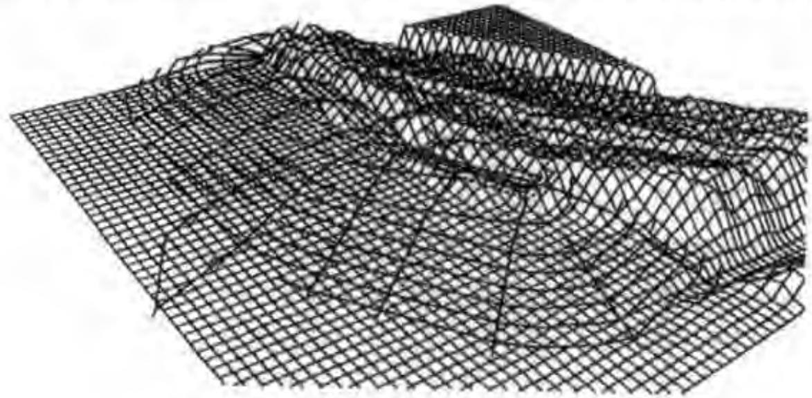  
图1-1 澳大利亚某矿用DTM绘制的采后地貌

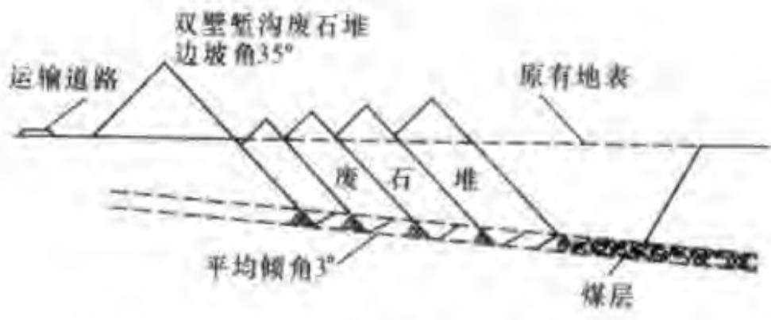  
图1-2 露天煤矿顺序剥采复田法

公司露天煤矿顺序剥采复田法示意图，初始剥离时、用铲斗容量为$5 0 \mathrm { ~ m ~ } ^ { \circ }$ 的索斗铲开挖双壁堑沟，将剥离的岩土堆置在地表，废石堆底部宽150m，高35m，开始采煤时，索斗铲剥离下一条堑沟，剥离的岩土堆置在第一条双壁堑沟的采空区中，废石堆的堆顶几乎接近原来的地表，随着壁沟的逐步加深，废石继续堆置于采空区中。废石堆的高度也逐步升高。显然，利用上述方法有效地减少了岩土外排占地，同时利用剥离的岩土回填了采空区，且采空区堆置的岩土堆有下列特征：第一个废石堆约在原地表以上35m，以后废石堆的堆顶接近于原有的地表面，废石堆的堆顶至两个废石堆之间的凹陷处的垂直距离为20m，废石堆顶之间的水平距离为50m。对上述剥离采矿形成的堆状地貌只需稍加平整并建立合理的排灌系统就可恢复植被了。

## 2. 井工开采复垦方法的比较

井工开采与露天开采相比，对矿区土地破坏的形式和对矿区生态系统的影响程度存在明显差异。就土地破坏形式来说，井工开采引起地表沉陷及矸石山排放压占土地是两种基本形式。地表沉陷可能引起地面附着物破坏，地表积水影响耕种，地表潜水环境发生改变而引起土壤次生盐渍化或土地沼泽化，或产生裂缝与附加坡度引起土壤侵蚀等，面矸石排放压占土地与露天开采相比可以说不是主要问题，加上近年来矸石利用量(用于烧制矸石砖，用作铺路材料等)增大，其占地数量相对较小。井工矿矸石山给矿区带来的主要不良影响在于矸石长期裸露引起粉尘污染严重；部分矿区矸石山自燃向空气排放有毒有害气体；矸石山还带来不良的视觉效果，造成景观破坏。

由于我国煤炭95%以上为井工开采，因此煤矿复垦的重点亦在并工矿区。我国于20世纪80年代初开始煤矿造地复田综合治理研究，提出了矸石充填复垦、粉煤灰充填复垦和挖深垫浅三种复垦技术，80年代至90年代初我国井工矿山复垦以这三种复垦形式为主，但由于充填复垦受充填料数量的限制，预计最大充填复垦率小于20%，目前使用充填复垦方法较好的淮北矿区也仅在11%左右。另一方面，复垦后土地利用方向也有较大的局限性，主要用于建设用地或娱乐场所，利用废弃物充填复垦成高产农田往往需要较高的投入，甚至由于二次污染等问题而不可行。90年代初，徐州矿区、大屯矿区、平顶山矿区、永夏矿区、峰峰矿区等先后开展疏排积水、土地平整、塌陷土地阶地化、梯田化等非充填复垦技术试验，这些技术很快得到了推广应用，并使这些矿区土地复垦率得到显著提高，如徐州矿区铜山县土地复垦率在80年代末不到10%，1996年已达50%，耕地恢复率在70%以上。在复垦土地利用方向上，我国的复垦土地利用形式有建设用地、水产养殖用地、农田(粮、菜、经济作物)、林业用地、娱乐场所用地、种养(加)结合的生态工程利用等多种形式，我国现有复垦技术应用、推广比例如表1-3所示。国内现有的复垦成果中，淮北矿区的粉煤灰充填塌陷区造林；淮北和唐山两地不设研石山，将矸石直接排往塌陷坑用作建设用地或种植用地；徐州铜山县疏排塌陷区积水恢复破坏土地作农用；徐州矿区矸石回填塌陷区建抗变形民宅；徐淮及开滦矿区挖深垫浅复垦法；开滦矿区利用研石充填塌陷区建焦化厂并种植紫穗槐、蔬菜、粮食作物等都具有代表性。

表1-3 我国現有土地复鳥利用技术推广应用比例
<table><tr><td rowspan=2 colspan=1>复垦技术</td><td rowspan=1 colspan=3>工程技术</td><td rowspan=1 colspan=7>复垦土地利用</td></tr><tr><td rowspan=1 colspan=1>充填复垦</td><td rowspan=1 colspan=1>非充填复垦</td><td rowspan=1 colspan=1>小计</td><td rowspan=1 colspan=1>建设</td><td rowspan=1 colspan=1>纯水产养殖</td><td rowspan=1 colspan=1>农田</td><td rowspan=1 colspan=1>林娱</td><td rowspan=1 colspan=1>乐性</td><td rowspan=1 colspan=1>态工程其</td><td rowspan=1 colspan=1>他</td></tr><tr><td rowspan=1 colspan=1>相对比例/%</td><td rowspan=1 colspan=1>15</td><td rowspan=1 colspan=1>85</td><td rowspan=1 colspan=1>100</td><td rowspan=1 colspan=1>10</td><td rowspan=1 colspan=1>25</td><td rowspan=1 colspan=1>36</td><td rowspan=1 colspan=1>7</td><td rowspan=1 colspan=1>5</td><td rowspan=1 colspan=1>7</td><td rowspan=1 colspan=1>10</td></tr></table>

主要采煤国家中，波兰并工开采比例达68%，其开采方法与我国类似，但波兰的人地矛盾没有我国突出，其复垦工作主要集中在露天矿和矸石山(朱超，1995)，复垦后土地主要用于种草和植树。世界第二大采煤国美国的并工开采比例占38%，因其过去井工开采以房柱式为主，所以其开采沉陷系数小，沉陷深度也小，近年来，美国在长壁开采方面取得了较大的进展，开采沉陷破坏也随之严重。美国东部矿区1986年开采沉陷地面积为5.8万hm²，预 $\hbar \mathrm { m } ^ { 2 }$ 计到2000年增到8.9万hm²。美国对开采沉陷地的处理有两种做法：一是复垦，二是作为湿地加以保护。复垦又有三种做法(R.G.Darmody,1992)，即：①挖沟降水；②回填；③挖沟与回填相结合。其回填材料包括采选矸石及客土回填，客土回填复垦的土地和挖沟平整回填的地区可用作农作物种植用地，而研石等废弃物回填复垦土地大多用于种草、植树或娱乐用地。捷克的奥斯特拉夫煤田与克拉金斯克煤田分布有井工开采矿山，捷克对井工开采沉陷地复垦的做法是：沉陷量较小时，采取局部回填或平整的做法，沉陷量较大时将塌陷坑留作蓄水池(史蒂斯，1990)，其充填复垦后农林用地比例在5:3\~5:4。

与上述主要采煤国家相比，我国煤矿井工开采土地复垦具有以下几个特点：

1）我国煤炭以井工开采为主，且多采用走向长壁全部跨落法管理顶板，因此下沉系数大，沉陷深度大。充填复垦以井工煤矸石(煤炭产量的15%左右)和坑口电厂的粉煤灰充填为主，绝大多数矿区无法利用露天矿剥离物回填塌陷区复垦。这就决定了我国煤矿井工开采充填复垦率有限。

2）根据我国国情和《土地复垦规定》要求，我国复垦土地的利用方向以农业利用为主，而国外复垦土地农用率要求较低。

3)尽管《土地复垦规定》要求土地复垦与采矿工艺相结合，但我国在今后相当长的一段时间内，不可能做到改变采矿工艺去保护土地。

4）我国地下开采矿区人口密集、地表大多数为高产粮田，因而矿区表现出的工农矛盾、人地矛盾十分突出。

## 1.1.4 国内外矿区土地复墨理论研究

我国矿区土地复垦理论研究源于20世纪80年代初，至今可分为两个阶段：第一阶段(1980—1989)以马恩霖等人编译的《露天矿土地复垦》，林家聪、陈于恒等翻译的前苏联的《矿区造地复田中的矿山测量工作》一书为标志，在这两篇译著中，译著者介绍引进了国外土地复垦的做法或经验。我国第一个正式立项的土地复垦科研课题“煤矿塌陷地造地复田综合治理研究”(由煤科总院唐山分院等单位完成)也是在这一阶段完成，该课题成果提出了适合于我国东部矿区特点的研石充填、粉煤灰充填和挖深垫浅工程复垦技术。中国矿业大学还培养了两名硕士研究生，论文题目分别是矿区土地复垦模式研究(祝国军，1988);高潜水位矿区土地复垦模式研究(卞正富，1989)。祝国军的论文以淮北矿区为例介绍了矿区复垦环境条件分类方法，并提出了适合淮北矿区特点的生态工程复垦模式。我国第一阶段的土地复垦理论研究成果可总结为如下两个方面：①借鉴国外的经验，结合国内的情况为制定《土地复垦规定》提供了理论基础，《土地复垦规定》中关于土地复垦的定义即为第一阶段中国土地学会土地复垦研究会举办的两次学术活动中有关专家智慧的结晶。②提出并开展了矿区土地复垦模式研究。最初提出的矿区土地复垦模式是指适用于不同类型破坏土地的复垦技术，且主要是指工程技术，不包括近年来提出的生物复垦技术及复垦土地经营管理模式。第一阶段的矿区土地复垦模式也都局限于东部矿区开采沉陷地。

我国土地复垦理论研究的第二阶段以《土地复星规定》的颁布为标志，研究队伍的专业化、多学科化和高层次化使土地复垦理论研究呈蓬勃发展的态势。目前，在长沙黑色矿山设计研究院、北京矿冶总院、煤科院唐山分院、中国矿业大学、山西农业大学、中国科学院地理研究所及生态环境研究中心、北京大学等单位均有专门的土地复垦研究室(或课题组)。参与土地复垦研究的人员中有采矿、地质、测量、农学、地理学、土壤学、环保、水利、生态学、土地规划与利用、林学等多专业，研究队伍的高层次化反映在从事土地复垦理论研究的人员中有不少是博士后或获得博士、硕士学位的专门人才。高素质的研究队伍使我国土地复垦理论研究在短短的几年时间里取得了长足的进展，主要研究成果或正在开展研究的课题有：矿区土地复垦规划理论和方法(张国良，1992;孙绍先，1992;胡振琪，1994；卞正富，1990，1994);高潜水位矿区生态工程复垦(卞正富，1992;李树志，1995;祝国军，1993);矿山土及复垦土壤的特性与改良(胡振琪，1991;林大仪，1992；赵景逵，1993；李永树，

1993；卞正富，1993;周树理，1995);矸石山植被恢复与复垦(HuZhengqi,1993;辛其昌，1993;林鹰，1990);开采沉陷对耕地的破坏机理与对策(胡振琪，1996);我国土地复垦政策与战略研究(张立诚，1995；佟元贞，1992；刘仁芙，1995；李根福，1992；严志才，1992);开采沉陷土地复垦工艺研究(胡振琪，1992;张绍良，1992；下正富，1995);露天矿复垦规划设计与复垦工艺(李根福，1992;金天，1992)等。

国际上，从有关国际学术组织的活动到有关资料文献的数量显示：20世纪80年代末至90年代以来，矿区土地复垦的理论研究亦处于高潮时期。最近十年来国际上该研究领域较之以前异常活跃，除国外一些组织召开专门的国际土地复垦会议外，在有关矿山环境、环境地质、矿山测量及矿山开采等国际会议中也经常将土地复垦列为主要的论题。近年来，较为活跃的研究领域及取得的主要研究成果包括：矿山开采对土地生态环境的影响机制与生态环境恢复研究(Runkle,1990;Singh.G,1993;S.K.Mukhopadhyay，1994;Darmody,1990;R. L. McNeamy,1995);CAD 与 GIS 在土地复垦中的应用(Darmnody，1993; Douglas Baker,1996;Phillips，1991);无覆土的生物复垦及抗侵蚀复垦工艺(Pelkki,1996;Kuoand West,1990;Evans,1991);矿山复垦与矿区水资源及其他环境因子的综合考虑（Runkle，1992；GurdeepSingh，1993；葛中华，1994);清洁采矿工艺与矿山生产的生态保护(Streltsov,1991);菌根技术在矿山复垦中的应用(Danielson，1985);矿山酸性水排放及其对土地环境的影响与修复；污染土地的修复等。

由于全球环境意识的提高和各国在推行可持续发展战略方面形成了共识，矿山复垦及矿山区域生态环境治理这一老课题必将在众多科研人员的推动之下焕发出新的生机和活力。

## 1.2 开展本课题研究的意义

## 1.2.1 国内外研究的不足

由上述的分析不难发现，国内外土地复垦理论研究存在以下不足：

1. 传统的土地复垦概念难以适应现实(包括技术、法规等方面)的需要，受技术、法规等多方面的影响。

现有的土地复垦定义将复垦对象定义为挖损、压占、塌陷造成破坏的土地，直观地理解这三类复垦对象均是工业生产过程中直接破坏的。那么工业生产间接破坏的土地，如地下水位的下降或上升、含水层的疏干与破坏、周边地区土壤的污染是否纳人复垦的范畴？现在的土地复垦概念似乎不包括这些类型，实际上，我们也确实没有将上述问题作为复垦的任务来考虑。其结果是在进行复垦研究与实践时，往往是就事论事，剐肉补疮，效果不好。如按照开采沉陷理论圈定的沉陷边界有时小于土地实际减产而给农民补偿的范围，在另外一些矿区土地补偿边界则小于开采沉陷边界，产生这一现象的原因在于土地自然综合体不仅包含其物理形态特征，还包括了物理形态特征之外的影响土地生产力的其他属性因子；又如某地复垦时遵循因地制宜的原则，采取挖深垫浅的方法复垦，复垦区内鱼塘星罗棋布，丰水年份整体效益尚好，但枯水年份部分鱼塘尚好，而大部分鱼塘则干枯，后来经论证发现，问题在于复垦时没有考虑地下水位的年际变化及本区砂砸土壤不保水的特性。

现有的复垦定义还受到来自政策法规方面的挑战。按照《中国21世纪议程》确立的行动方案，国家拟在矿区征收矿区生态环境恢复补偿费用，这一政策尚未出台，就受到不少企业和地区的反对，理由是企业已承担了土地复垦费用，认为该项费用为重复收费。但也有一些地区认为征收此项费用是合理的，理由是矿山企业在开采过程中对当地的生态环境破坏太严重，若不征收专项费用用于矿区的生态环境恢复与治理，这种破坏将威胁后代人的生存。我国采矿用地一直只征用开采绝产或减产部分的土地，而是否减产或绝产通常以开采沉陷规律或露天采矿破坏规律确定，显然对污染土地的补偿与因土地利用环境发生改变而破坏的土地赔偿缺乏理论与政策方面的指导。

从上述技术与政策两个层面分析，出现问题和争议的关键都在于对土地复垦的界定。狭义地说，复垦的空间边界是仅考虑采后地形变化的区域还是应考虑受影响的除地形以外的其他因子发生变化的范围？广义地说，土地复垦要素是否应包括生态环境因子，若包括的话，是否应该以所有受影响的生态环境因子构成的广义边界为复垦边界？若不包括的话，又应如何处理土地复垦与生态环境恢复问题？

## 2. 开采沉陷与复垦行为对耕地与植被的破坏和恢复机理尚没有搞清

开采沉陷规律研究是较为成熟的，但开采沉陷，具体地说开采沉陷引起的下沉、积水、附加坡度、裂缝等，对土壤理化特性的影响规律怎样，对地表不同植被的生长状况影响如何，对地下水位动态变化的影响规律等都是有待研究的。Darmody等人(1988，1989)曾在伊利诺伊斯研究过开采沉陷对谷物产量的影响，James等人(1991)曾在俄亥俄东部、西弗吉尼亚南部、宾州西南部地区研究过长壁开采对土壤湿度和树木生长的影响。Darmody的研究结果表明：伊利诺伊州的 Jefferson，Franklin和 Williamson县因开采沉陷使农田排水条件变差，土壤人渗减慢，土壤湿度过大而影响种子发芽，阻碍作物生长，因面使谷物产量平均下降4.7%。James的研究结果表明：在没有引起滑坡的山区(注：作者根据James文而加的条件)，开采沉陷对土壤湿度和树木生长影响不大。Darmody和James等的研究方法均是以定位观测为主，其结论也具有一定的局限性，尤其是研究者没有给出其研究结论的适用条件和范围。

我国近年来在开采沉陷对环境的影响，包括对耕地破坏的影响机理研究方面亦引起了许多研究者的关注(郭广礼，1992；胡振琪，1996)。从实践来说，一部分矿区开采沉陷后花费巨额资金都难以改善矿区环境状况和土地质量状况，而一部分矿区对沉陷后土地稍加治理就取得了明显的效果甚至获得了比沉陷前更为可观的效益和产量，原因何在？关键在于不同地区甚至不同地块开采沉陷对土地的影响机制并不完全相同。这一点需要通过理论研究加以证明。

## 3. 生物复垦方法及其对矿区生态系统和景观恢复的影响研究欠缺

生物复垦方法取决于土地破坏类型、所采用的工程复垦方法、矿区所在地的气候条件、水利条件和经济条件等方面（卞正富，1996)。近年来，生物复垦方法研究是国外热门研究课题，如生物细菌快速生物复星法，无覆土生物复垦法、基于城市污泥的水力播洒法(M. Gtazesski,1993)、侵蚀被法(先铺后种)(K.C. Kuo等，1990)，这些方法大多是针对电厂灰场、露天矿排土场和露天矿边坡等易扬尘、难植被的废弃场地提出的，这些方法在控制复垦区土壤侵蚀、快速恢复植被方面效果十分显著。《中国21世纪议程》在第十三章中也将无覆土生物复垦技术作为重要的行动之一。但这些复垦方法的适应性与持久性尚有待进一步监测论证，澳大利亚近期土地复垦研究课题的重点之一就是研究矿区地貌恢复后和生态系统重建后的有效性和稳定性①。国内在开采沉陷地的生物复垦与综合利用技术方面开展了一系列卓有成效的工作，如田-塘、田一场一塘生态工程复垦、基塘复垦利用、综合农林种植等，美国Illinois州在挖塘抬田方面也有同我国类似的实践(Darmody，1992)，但在复垦工艺和复垦地利用方式方面不如我国丰富多样，投入产出比等效益指标也不如我国。尽管如此，我们对现有复垦工艺的适应性、复垦土地的生产力水平与可持续利用能力、生物复垦对复垦区域土壤的影响过程以及复垦区域生态系统的稳定性、与邻近地区景观的协调一致性等方面均缺乏深人的研究，其结果是一些地区盲目仿效其他地区的做法，导致不良的复垦后果。

有关矿区土地复垦的名词术语混乱、土地复垦的学科归属和理论基础是什么、复垦资源动态调查方法及信息管理、土地复垦与相关学科的关系等均是有待讨论和研究的。矿区土地复垦是一个新的研究领域，存在的问题和有待研究的内容很多，上面列举的是作者认为目前亟待解决的三个方面，也是本文试图解决的三个问题。

## 1.2.2 开展本论文研究的意义

开展本论文研究的意义表现在以下三方面：

## 1. 为解决我国土地复垦实践中出现的问题提供理论依据

前面对我国土地复垦实践中出现的问题已作了一些论述，归纳起来，主要问题在于：

①现有的复垦经验或模式缺乏整体性，是一种“头痛医头、脚痛医脚”的消极处理方法；

②对成功的模式缺乏细致的分析研究，如其适用条件和复垦系统的稳定性如何等掌握不清；

③没有将矿区复垦与矿区生态重建结合起来，因而综合效益较差。

本文拟提出的界面整合思想正是基于解决上述问题而提出的。

2. 为实施《煤炭法》、《中国21世纪议程》和《土地复垦规定》等法规提供理论参考

我国正积极推行可持续发展战略，可持续发展战略的核心是实现资源环境与经济的协调发展。煤炭开采是发展经济的需要，不仅耗竭煤炭资源，同时还占用土地资源，影响植被资源和大气环境、水环境等，土地复垦作为恢复土地利用的一个措施，在实现矿区可持续发展的道路上显然具有重要的意义。

《煤炭法》将煤炭开发利用与保护环境相结合，将合理使用土地作为两项立法原则，并将煤矿征地、搬迁、补偿和复垦作为调整对象，对煤矿环境保护和矿区土地复垦作了明确规定。由于我国煤炭资源分布广，各地自然环境条件与煤炭开采条件存在较大的差异，因此在执法过程中急需针对各地条件提出实施细则。本文开展的复垦分区研究和复垦界面整合方法可为执法提供参考。

国务院《土地复垦规定》颁布实施以来，复垦标准成为亟待研究的问题，原国家土地管理局曾委托有关研究单位制定了土地复垦试行标准，并颁布试行，一些地方或企业也颁布了适合本地或本行业的复垦技术规程或《土地复垦规定》实施办法。这些标准、规程或实施办法对土地复垦工程的科学化、规范化起到了积极的作用，但由于缺乏工程与实验研究数据的支持，尤其是缺乏实践和时间方面的考验，一些条文缺乏可操作性，需要对此开展广泛的调查研究，针对不同的复垦条件提出相应的方法。

## 3. 为我国矿区土地复垦的理论研究拓展思路

尽管我国目前参与土地复垦理论研究的人员层次较高、涉及学科领域较广，但各自都有一些局限性，如地质采矿人员对土壤、植被恢复、农学知识欠缺，因而对生物复垦缺乏基础，而农林水土及生态、地理等专业的人员对采矿方法及采矿引起的土地破坏规律了解甚少，因而难以将生物复垦与工程复垦很好地结合起来，甚至在研究过程中出现厚此薄彼、以偏概全的现象。本文试图将采矿破坏的土地的空间特征与自然综合体属性结合起来，使复垦目标定位在一个较科学、现实的层次上。

本文拟将地理学中的地域分异原理、生态学中的系统生态学方法和分室模型、生态重建原理、土壤学和水文学的基本原理和实验方法结合起来，开展复垦界而整合研究，相信本文的研究可为我国矿区土地复垦理论研究拓展思路。

## 1.3 本文研究的内容、方法和技术路线

## 1.3.1 研究内容

## 1. 我国煤矿区复垦条件分区(类)研究

我国地域辽阔，煤矿区分布面广，而各地区的自然条件及煤炭资源赋存条件，开发强度等均存在明显的差异，因而导致土地破坏、生态环境退化不尽相同。开展复垦条件分区(类)研究，其目的就是针对不同的复垦条件选择复垦工艺、执行土地复垦标准及复垦政策；在建立矿区土地复垦理论或探索新的研究方法时，对不同复垦条件的矿区，既要区别其差异性，又要寻求统一的理论基础。

## 2. 复垦界面的整合研究

将复垦界面分为生产力系统和生态系统两方面进行研究。生产力系统主要研究影响复垦土地生产力的三要素及其相互关系，三要素为环境、土壤及投入，简称ESI;建立潜水位环境因子变化模型、土壤生产力指数修正模型、复垦土地生产力模型；研究采矿活动对土壤及其环境的影响规律；研究复垦土壤的类型及复垦土壤的利用与改良。生态系统主要研究复垦区域生态系统能流、物流动态；生物多样性指数在矿区生态恢复中的应用；复垦区域土壤侵蚀与控制。

## 3. 矿区土地复垦与生态重建相结合的理论和方法研究

包括矿区土地复垦与生态重建的理论基础研究；土地复垦与生态重建的阶段和时期划分；复垦景观要素及其格局变化研究；矿区土地复垦与生态重建相结合的流域控制法及控制目标研究；矿区土地复垦与生态重建相结合的可持续发展目标及方法。

上述三部分研究内容的关系如图1-3所示：

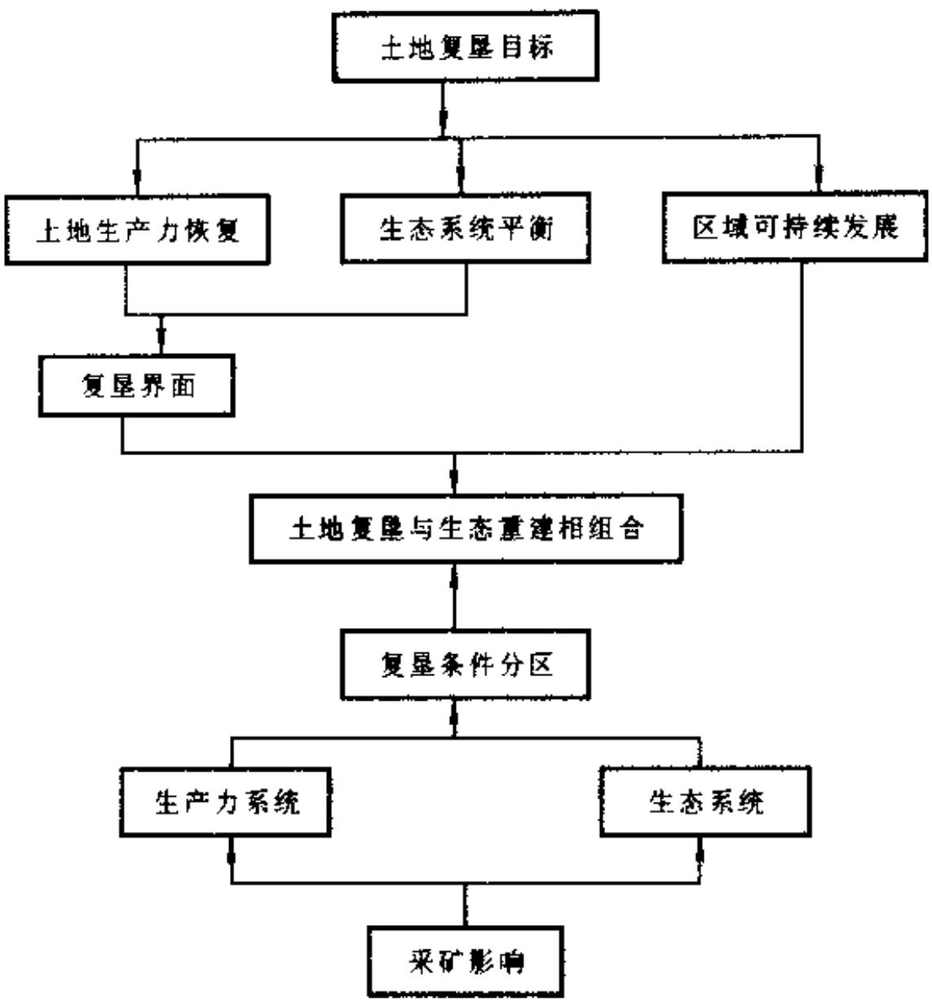  
图1-3 本文研究内容框架

## 1.3.2 研究方法

本文拟利用地理学中的地域分异原理、生态学中的系统生态学方法和分室模型、生态重建原理、土壤学和水文学的基本原理和实验方法结合起来，开展复垦界面整合研究，从而使土地复垦研究达到多学科的交叉渗透和融合，为我国矿区土地复垦理论研究拓展思路。具体方法包括：

## 1. 资料搜集与实地勘察

复垦条件分区(类)主要采取这种方法，该部分研究所需资料包括煤炭资源分布、煤炭开采方法与开发强度、气候、自然地理条件等多方面的数据、图件和文字资料。资料来源主要通过以下途径解决：①年鉴与有关统计数字；②实地调查获取的资料；③散布于有关文献的数据；④有关课题的研究资料(本人及他人的)。

## 2. 野外采样、勘测及实验室分析方法

该法主要用于包括野外生物调查、土壤采样及分析、复垦土壤环境(水、植被等)及有关的野外数据采集、理论模型的应用等方面。

## 3. 理论研究

理论研究包括几个模型的建立，如生态类型指数ETI、生态破坏指数EDI、生产力破坏指数PDI及潜水位环境因子变化模型、复垦土壤生产力机理模型、复垦土壤生产力指数修正模型(MPI)、复垦土地生产力动力学方程(ESIDE)、复垦土地生产力熵流模型(EEM)及排土场抗侵蚀边坡的数学方程、土地利用多样性指数构造、定参数和变参数物流分室模型及复垦景观格局动态模型等。

## 4. 计算机模拟

复垦界面土地生产力系统动态、生态系统物流动态等均可利用本文建立的理论模型进行计算机模拟。

## 1.3.3 研究路线

研究路线如图1-4所示。

本文在选题与写作过程中，查阅了国家图书馆、煤炭科技情报所、中国矿业大学图书馆等相关资料，借助Internet查阅了澳大利亚、美国、英国、德国等土地复垦先进国家的相关文献。在读期间，澳大利亚昆士兰大学土木工程系David教授、英国国家煤炭局Rainbow博士、德国柏林工业大学向中国矿业大学寻求合作的函与提供的合作背景资料，原国家土地管理局的出国考察报告与长沙黑色矿山设计研究院、杭州煤炭环保研究所、中国土地学会土地复垦分会等单位的文集或资料为本课题跟踪国内外土地复垦研究前沿提供了帮助，中国矿业大学陈玉和博士、左秀峰博士还无私地提供了部分开展本课题研究所必须的资料。访问了中国科学院生态环境中心的王如松教授、傅伯杰教授、高林教授、北京大学的蔡运龙教授、王仰麟博士、秦其明博士、中国科学院郭焕成教授、李文彦教授、张立城教授、北京煤炭科学研究总院刘天泉院士、原国家土地管理局科技宜教司张小华司长、孟昭鹏处长等，参加中国土地学会土地复垦分会露天开采复垦学组1996年烟台会议、中国测绘学会矿山测量学会1995年年会(太原)等会议得到许多国内同行的指导和帮助。本课题的研究与国家重点科技项目“矿区土地资源复垦技术与利用研究”同时进行，因此，大部分试验是在科研项目的试验点一铜山、唐山、淮北、太原四个矿区完成的，试验点的有关领导和同事给予了极大的支持和帮助。

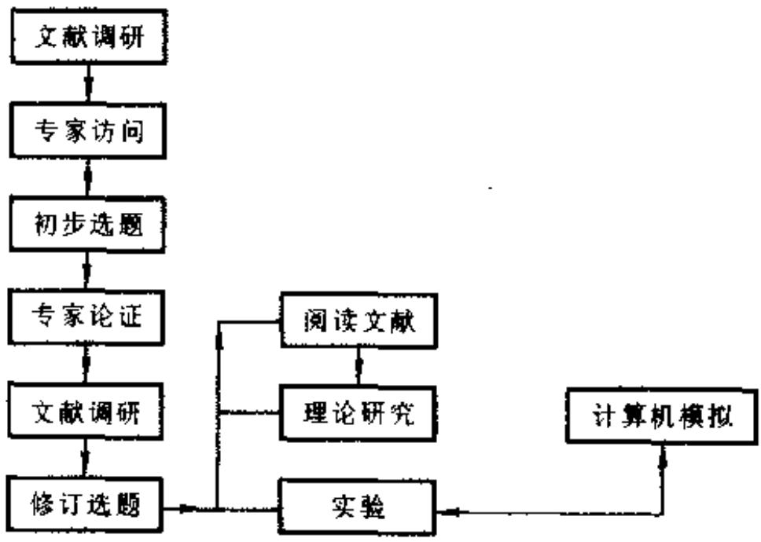  
图1-4 研究路线

# 第2葉我第矿区土地雙第条件分区第究

## 2.1 概 述

## 2.1.1 分区(Zoning)的意义与可行性

土地复垦的一个基本原则就是因地制宜。我国幅源辽阔，各地有各地的具体情况，复垦时应充分考虑本地的特点。事实上，这就从技术上说明对我国矿区土地复垦条件进行分区的重要性。一个特定的矿区属于哪种复垦类型，可以采用哪些成功的复垦模式，需要通过复垦条件分区来回答。

另一方面，在执行有关法规或制定各地区的实施细则和操作规程过程中，我们亦要实事求是，针对各地的实际情况采取灵活的政策，但这并不是说可以无限制的灵活，因此，从执法或政策层面分析，对我国矿区土地复垦条件进行分区亦是必要的。

过去，我国成功地开展过气候区划、土壤区划、植被区划、农业区划和自然综合区划等工作，为指导我国的农业生产、土壤改良和各地区的经济发展起到了积极的作用。我国煤炭工业作为一个产业部门，对资源分布与赋存情况依赖性很强，如煤层赋存条件好、煤质好可带来很高的级差收益，因此，客观上讲我国煤炭工业布局也存在着一个区划问题。上述区划和我国煤炭资源分布、煤炭开采布局区划为我们开展矿区复垦条件分区提供了有利的条件。

关于复垦类型区的划分，虽然没有开展过系统深人的研究，但实际工作中，我国常有高潜水位和低潜水位之分，还有东部、西部之分，南方、北方之分，丘陵山区与平原之分，千旱与半干旱之分。这些类型区的划分对我国开展复垦研究工作是非常有益的，但随着理论研究工作的深人和复垦工作在全国的全面实施以及矿区在实施生态环境综合整治工作方面的需要，这种分区已不能满足特定的需要，如高低潜水位的标准是什么？东西部的边界在哪里？不同区域的土地破坏特征和复垦做法有哪些差异，这些问题都是值得研究和讨论的。

## 2.1.2 复垦条件分区的理论基础

## 1. 地域分异原理

地域分异原理是我们进行复垦条件分区的基础。所谓地域分异是指不同地区之间复垦条件存在明显的差异，而在一定的区域之内又有普遍的相似性。正是这种差异和相似性才使分区工作显得有必要而又切实可行。

复垦条件的地域差异表现在：

①自然环境条件的差异。自然条件表现在气候类型、地貌类型、生态环境类型等方面。

②资源条件的差异。资源条件表现在煤层赋存条件、土地质量等方面。

③生产布局的差异。生产布局表现在煤炭开发规模、历史及农业生产布局等方面。

④社会经济条件。如产业结构、耕作方法和人地矛盾等方

面。

一定区域内的相似性可能表现在以下几方面：①煤炭资源赋存条件和开拓开采方法相似；②土地利用方式相似；③开采后破坏形式相似；④生态环境类型相似；⑤社会经济条件相似。

## 2. 类型的空间映射原理

类型的空间映射实质表明：复垦条件分区是客观事物的真实反映，这就要求不同复垦类型区在地理空间上不能重叠，但一个复垦类型区可能分布在不同的地理空间。

## 2.1.3 复垦条件分区的原则

## 1. 主导因子和综合因子相结合的原则

复垦条件由自然地理条件(包括气候、水文条件等)和开采对土地的破坏程度(简称为地质采矿条件)两部分组成。从国内外复垦实践看，自然地理条件是影响复垦方法选取和复垦效益高低的主导因子。例如东部矿区地下水位高、土壤条件好、地面水利设施齐全，开采沉陷后只要采取适当措施就可在较短的时间内恢复土地的用途，并获得较高的收益，而中西部矿区由于水资源贫乏，开采沉陷后，在较短的时间内很难使土地生产力提高到采前水平。理论分析也可证明自然地理条件是影响复垦工程的主导因子，对相同的地质采矿条件，若地表的自然条件存在明显的差异，开采引起的破坏形式会表现出明显的差异，而使复垦条件属于完全不同的类型。如丘陵山区有采动滑坡、裂缝、槽型塌陷等类型，而平原地区通常为平缓的下沉盆地。对自然地理条件相似的地区，如地质采矿条件存在差异，开采引起的破坏程度虽然也有差异，但其破坏形式几乎一致，因而不致使复垦条件截然不同。如同为平原矿区，甲矿区开采煤层总厚度15m，引起地表沉陷10 m，积水深7m,乙矿区开采煤层总厚度5m.引起地表沉陷4m，积水深1m，其对土地破坏的形式是一致的，只是程度不同而已。因此，影响复垦条件分区的主导因子是自然地理条件。

主导因子和综合因子相结合的原则，即是既要以自然地理条件为主进行分区，又要综合考虑地质采矿条件，使分区更切实际，更有指导意义。具体做法可以在划分大区时采取主导因子原则，在划分小区时采取综合因子原则，针对不同的分区目的，也可以反过来考虑。

## 2. 科学性与实用性相结合的原则

科学性要求分区尽量反映区内复垦条件的本来面貌，因此在分区时应尽量选择恰当的评价因子并采用恰当的划分方法分区。实用性要求分区结果对实际工作有指导作用，提出的建议或设想具可操作性。按照科学性原则，不能将两个复垦条件存在明显差异的矿区划为一种类型，按照实用性原则，应尽量将同一矿区或同一行政区的矿区划为一个类型区。显然，科学性与实用性的原则存在一定的矛盾，兼顾了实用性，可能会丧失科学性，严格的科学性可能使实用性变差，因此在复垦条件分区划分时，可以矿区为基本单位参与区划，必要时可打破省界或地区界。韦朝阳等(1995)将我国煤矿生态环境综合整治区划分为东北区、华北区等7个区在实用性方面似乎是不够的。

遵循实用性原则，应该视分区的目的选择分区的评价因子，如为制定土地复垦政策服务时，应重点考虑土地破坏程度，如为确定复垦技术模式服务时，则应重点考虑土地破坏形式，兼顾土地破坏程度。

## 3. 大区与小区划分相结合的原则

我国地域辽阔，煤炭资源分布广，除上海、香港，澳门外，全国其他省、市、自治区都有不同储量的煤炭资源。在全国2100多个县中，1200多个县有预测储量，其中已有煤矿进行开采的县就有1100多个。因此很难将全国煤矿复垦条件简单地划为几个区，但为使分区结果具有宏观指导意义，又不能将分区划得过细，这就要采取大区与小区划分相结合，即在将全国划分为几个大区后，再将大区划分成若干小区，甚至在小区内再进一步细分。

应该注意，进行大区与小区的划分时，重点考虑的因子及分区的方法是不同的，工作底图与分区图绘制的比例尺也不同。

## 4. 复垦条件与生态环境类型相结合的原则

复垦条件分区，必须与矿区生态重建工作结合起来，这样才能真正实现复垦的目标，即通过复垦带动区域性生态环境的整治和恢复，因此复垦条件类型区的划分，应将复垦条件与生态环境类型相结合。

## 2.2 我国煤炭资源分布与开发布局及其对复垦的影响

## 2.2.1 我国煤炭资源的分布

## 1. 我国聚煤区划分

我国具有重要工业开采价值的煤层，主要形成于石炭纪、二叠纪、早中侏罗世、晚侏罗世和第三纪。但由于我国不同地区的大地构造环境与古地理沉积环境存在重大差异，所以各个聚煤期聚煤作用的发生有一定的区域性，即是说不同区域的含煤岩系具有不同的特征。地质上，我国煤炭资源分为东北、华北、西北、华南(含台湾)及西南(滇藏)五大聚煤区(王煦曾，1992)。如图2-1所示。

东北聚煤区位于狼山以东，阴山山脉北缘一延吉南一线以北，包括黑龙江省全部、吉林省和内蒙古自治区的大部以及辽宁、河北两省北缘部分地区。地貌上包括内蒙古高原以及大、小兴安岭，并包括长白山及位于其间的三江平原和松辽平原。区内主要聚煤作用发生于晚侏罗世，其次为早、中侏罗世和第三纪。

华北聚煤区北与东北聚煤区毗邻，南以秦岭缝合带为界，西起贺兰山叠瓦逆冲带，东至郯庐断裂。范围包括山西的全部，甘肃、宁夏的东部，内蒙古、辽宁、吉林的南部，陕西、河北、山东的大部以及苏北、皖北等地区。主要聚煤时代为石炭纪、二叠纪和早、中侏罗世，其次为晚三叠世和第三纪。

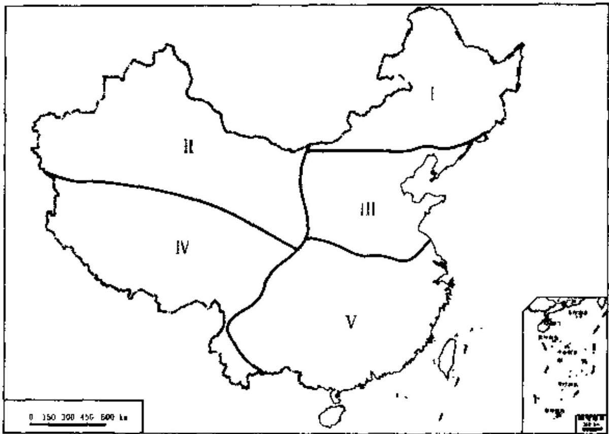  
图 2-1 我国聚煤区划分示意图(王煦曾，1992)  
1.东北晚侏罗世聚煤区；Ⅱ 西北早、中侏罗世肇煤区；.华北石炭二纪棄煤区；Ⅱ.西南中、新生代聚煤区；华南(含台湾)晚二叠世聚煤区

西北聚煤区位于昆仑一秦岭缝合带以北，贺兰山叠瓦逆冲带以西。主要聚煤时代为早中侏罗世。

华南聚煤区位于秦岭缝合带以南，龙门山一哀牢山一线以东，包括海南岛和台湾岛在内。主要聚煤作用发生于晚二叠世，早石炭世和晚三疊世聚煤作用亦有一定规模。第三纪聚煤作用主要发生在东南沿海、台湾及本区西缘和西南边缘，尤以云南第三纪煤田最负盛名。

西南聚煤区位于昆仑缝合带以南，龙门山一哀牢山以西。该区各时代煤田分布零散，含煤性差，唯有西藏境内晚三叠世和滇西第三纪煤层发育相对较好。

## 2. 我国煤炭保有储量及分布

我国已知含煤面积约55万km²，预测2 000m 以浅的总储量约4500亿t。截止到1991年底，我国煤炭累计探明储量为9 856.72亿t,保有储量为9667.05亿t,生产井、在建并已利用储量为2135.06亿t，尚未利用的精查储量927.97亿t,供进一步勘探的储量6604.58亿t。我国煤炭保有储量分布如图2-2所示。保有储量位于前12位的省份分别是山西、内蒙古、陕西、新疆、贵州、宁夏、安徽、云南、山东、河南、黑龙江、河北。这12个省区共有保有储量9189.75亿t，占全国保有储量的95.06%，其中晋陕蒙三省区占全国保有储量的63.51%。

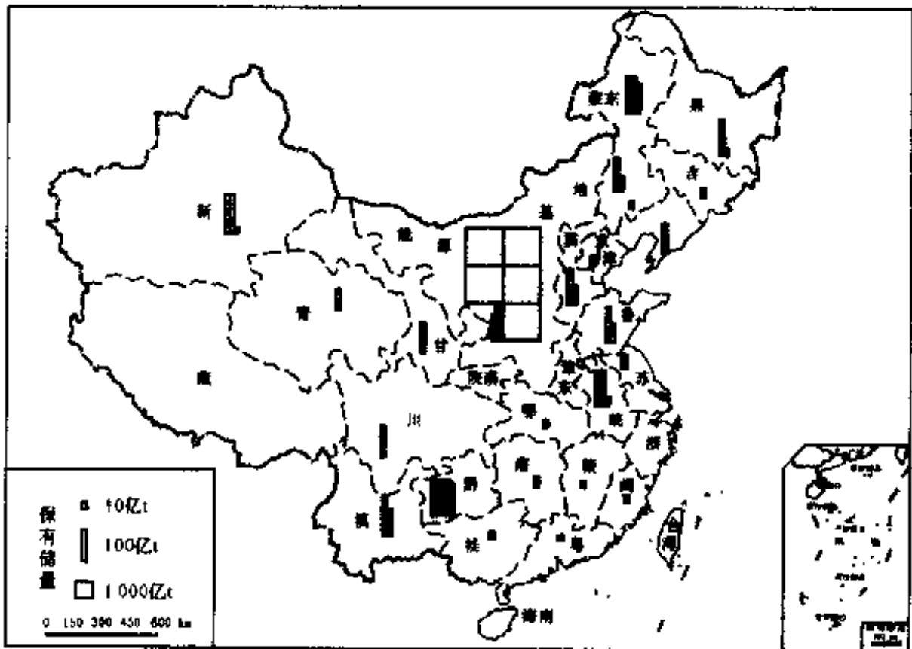  
图2-2 我国煤炭保有储量分布图(闫长乐、1994)

## 2.2.2 我国煤炭资源的开发布局

我国煤炭开采、利用历史悠久，但煤炭开采作为一个产业部门出现，只是19世纪末、20世纪初的事。1876年，清政府创办我国第一座采用机器生产的近代煤矿即台湾基隆煤矿，1878年又建立了开平矿务局(即开滦)。1907一1949年的42年间累计采出原煤10.52亿t，尚不到现在一年的产量。尽管如此，土地破坏是伴随煤炭开采而来的，只是解放前煤炭开采技术落后，一般矿井采空面积有限，因而造成的土地破坏也是局部的。解放后，我国煤炭工业发展迅速，开采规模逐步加大，年产原煤从1950年的4292万t增加到1996年的12亿t,46年间增长了近30倍，1950—1996年间累计采出原煤245亿t，采煤造成的土地破坏而积也相当可观，据估算，全国因采煤造成的土地破坏面积达50万hm²。我国不间历史时期的原煤产量如表2-1所示。

表2-1 我国不同历史时期的原煤产量  
单位：亿t
<table><tr><td rowspan=1 colspan=1>年     代</td><td rowspan=1 colspan=1>1097—1949</td><td rowspan=1 colspan=1>1950--1959</td><td rowspan=1 colspan=1>1960—1969</td><td rowspan=1 colspan=1>19701979</td><td rowspan=1 colspan=1>1980—19891</td><td rowspan=1 colspan=1>990—1996</td></tr><tr><td rowspan=1 colspan=1>原煤产量</td><td rowspan=1 colspan=1>10.52</td><td rowspan=1 colspan=1>12.94</td><td rowspan=1 colspan=1>25.01</td><td rowspan=1 colspan=1>47.57</td><td rowspan=1 colspan=1>81.54</td><td rowspan=1 colspan=1>81.7</td></tr></table>

1. 不同年代煤炭开发重点

(1)建国初期：建国初期，我国煤炭产量集中在华北地区的北京、河北、山西、内蒙古，占全国总产量的29.4%，东北地区的黑龙江、吉林、辽宁三省，占全国总产量的38.7%，两区煤炭总产量占全国总产量的68.1%，除上述两区外，华东、中南、西南、西北四个区的煤炭产量占总产量的比例分别为13.5%、7.1%、8.2%和3.1%。建国初期煤炭产量在100万t以上的省份如表2-2所示。

表2-2 建国初期煤炭产量在100万（以上的省份
<table><tr><td rowspan=1 colspan=1>产量</td><td rowspan=1 colspan=1>100-200万t</td><td rowspan=1 colspan=1>200~300万t</td><td rowspan=1 colspan=1>300~400万</td><td rowspan=1 colspan=1>400-500万</td><td rowspan=1 colspan=1>500万t以上</td></tr><tr><td rowspan=1 colspan=1>省份</td><td rowspan=1 colspan=1>北京(111)*山东(191)、安徽(114)、河南(114)</td><td rowspan=1 colspan=1>吉林(251)、四川(211)</td><td rowspan=1 colspan=1>山西(304)</td><td rowspan=1 colspan=1>河北(499).黑龙江(461)</td><td rowspan=1 colspan=1>辽宁(544)</td></tr></table>

\*表中( )内为该省区的原煤产量，单位万t。

至1957年，华北、东北两区煤炭产量仍占全国煤炭总产量的

66.0%，煤炭产量在500万t以上的省份如表2-3。

表 2-3 1957 年煤炭产量在 500 万t以上的省份
<table><tr><td rowspan=1 colspan=1>产量</td><td rowspan=1 colspan=1>500~1000万；</td><td rowspan=1 colspan=1>1000~2000万t</td><td rowspan=1 colspan=1>2000万t以上</td></tr><tr><td rowspan=1 colspan=1>省份</td><td rowspan=1 colspan=1>安徽(650)、河南(652)、吉林(805)、山东(838)、四川(958)</td><td rowspan=1 colspan=1>河北(1686)、嘉龙江(1659)</td><td rowspan=1 colspan=1>山西(2 203)、辽宁(2 643)</td></tr></table>

由表2-2和表2-3看出，建国初期我国煤炭生产集中在辽宁、河北、山西、黑龙江等9个省份，60到70年代东北地区煤炭产量所占比例有所下降，中南、西北等地区均有所增加。

## (2)20世纪80年代

由于60到70年代，我国一批重点煤矿的建设，重点是“大三线”的建设，至80年代，我国各地区煤炭产量分布有所改变。至1985年，华北地区产量占全国煤炭产量的比例增至32.3%，东北地区则下降为16.4%，两地区总计占48.7%，其他地区的比例分别为华东17.3%，中南15.2%，西南9.2%，西北9.6%。1985年煤炭产量在1500万t以上的省份如表2-4所示。

表2-4 1985年煤炭产量在1500万t以上的省份
<table><tr><td></td><td>产量1500~2000万t</td><td>2000~3000万t</td><td>3 000~4 000万t</td><td>5000万t以上</td></tr><tr><td>省份</td><td>吉林(1 527)、 江苏(1727)、 湖南(1 813)</td><td>陕西(2 201)、 安徽(2 639)、 内蒙古(2 733)</td><td>四川(3140)、 山东(3 610)、 辽宁(3 857). 黑龙江(3 921)</td><td>河南(5 450)、 山西(9 891)、 河北(5 131)</td></tr></table>

80年代各地区煤炭产量的变化表现在：除山西、河北仍为采煤大省外，河南的煤炭产量跃居全国第二位，东北地区黑龙江省的煤炭产量首次超过辽宁省，整个东北地区作为老工业基地，煤炭产量占全国的比例呈衰退趋势。

## (3)20世纪90年代

进人90年代，我国逐步实施煤炭西移战略，同时加强缺煤地区的资源勘探与开发工作，使得煤炭产量分布呈下述两个特点：一是能源基地的煤炭产量迅速增长，基地外的煤炭产量也稳步增长，全国煤炭产量由1980年的6.2亿t增长至1994年的12.3亿t。1994年煤炭产量在3000万t以上的省份如表2-5所示。

表2-5 1994年煤炭产量在3000万t以上的省份
<table><tr><td>产 量</td><td>3000- 5000万</td><td>5000~ 6000万t</td><td>6000~ 7000万</td><td>7000- 8000万t</td><td>8000- 9000万t</td><td>9000万t 以上</td></tr><tr><td>省 份</td><td>陕西 (3 632), 安徽 (3 936). 潮南 (4 758)</td><td>貴州 (5 128), 辽L宁 (5 506)</td><td>内蒙吉 (6 052), 河北 (6 471)</td><td>黑龙江 (7 517) 山东 (7 785)</td><td>四川 (8 796), 河南 (9 618)</td><td>山西 (32 249)</td></tr></table>

由表2-5看出，进入90年代，我国煤炭产量分布发生了一些变化，山西、河南两省的煤炭产量仍居全国前列，产量在3000万t以上的省份中，华北区三个，东北区二个，华东区二个，西南区二个，中南区二个，西北区一个。

90年代及今后煤炭资源开发的一个显著特点和趋势是：煤炭资源集中开采，开发强度加大。如1993年全国原煤产量超1000万t的有鹤岗(1 313.07万t)、双鸭山(1 001.55 万t)、鸡西(1164.42万t)、七台河(1006.01万t)、铁法(1024.1万t)、阜新(1069.87万t)、大同(3175.48万t)、平朔(1435.09万t)、阳泉(1047.69万t)、西山(1412.77万t)、晋城(1032.06万t)、开滦(1 760.5 万 t)、峰峰(1 037 万t)、平顶山(1 714.78 万 t)、兖州(1200.31万t)、新汶(1 008.9 万t)、徐州(1310.21 万t)、淮北(1423.21万t)及淮南(1149.85万t)等19 个矿区。另有抚顺、汾西、潞安等10余个矿区煤炭产量在500\~1000万t之间。

## 2. 未来煤炭开发重点

根据我国煤炭开发西移战略，我国“三西”(山西、陕西、蒙西)

将是我国唯一的煤炭调出区带。该区共有15个生产矿区和11个新开发矿区，在15个生产矿区中，增产型矿区有大同、阳泉、西山、潞安、晋城、汾西、平朔、霍州、海渤湾、韩城共10个矿区，稳产型矿区有澄台、蒲白、铜川、乌达4个矿区，衰老报废型只有包头1个矿区。已经开工的新矿区有准格尔、神木、东胜(南)区，规划将要开发的矿区还有乡宁、黄陵、离柳、彬长、东胜(北)、府谷、胜利、大保当矿区。

截止1991年底，该区探明保有储量 5573.38 亿 t，占全国的59.7%，其中山西省 2569.43 亿 t，占全国的 26.6%，陕西 1 560.54亿吨，占全国的16.1%，蒙西1643.4亿吨，占全国的17%，该区煤炭产量从50年代的2000余万t(占全国总产量的17%左右)，增加到1994年的近4亿t(占全国产量的32.5%左右)，随新矿区的开发，该区产量还将稳步增加，到2020年将增加到9.5亿t，占总预测产量的45.2%。

## 3. 开采方式及分布

我国煤炭开采分地下开采和露天开采两种方式，由于受地质条件的限制，我国煤炭产量以并工开采为主，约占97%。我国可供露天开采的煤炭储量集中分布在东北、晋陕蒙和云南、新疆等省份。其中内蒙古约占60%，主要分布在内蒙东部的扎赉诺尔、伊敏河、陈旗、霍林河、白彦花、胜利、元宝山和内蒙古中部的准格尔煤田。我国开采较早的露天矿有抚顺西露天矿，阜新海州露天矿、云南小龙潭露天矿、哈密三道岭露天矿、宁夏大峰露天矿和河南义马露天矿等。新开发的五大露天矿是内蒙古的霍林河、伊敏河、元宝山、准格尔露天矿及山西的平朔露天煤矿。

从管理角度分，全国煤炭生产分国家统配煤矿和地方煤矿两种形式。1950—1969年间地方煤矿的产量不足统配煤矿的一半，1970年地方煤矿产量首次达统配煤矿产量的56.1%，至1984年，地方煤炭产量与统配煤炭产量相当，1984年后地方煤炭产量一直高于统配煤矿产量，地方煤矿产量约占总产量的53%\~60%。地方煤矿产量和统配煤矿产量的变化(图2-3)，对土地破坏亦存在一定的影响。一方面地方煤矿开采技术相对落后，开采深度相对较浅，对土地造成的破坏较为严重，表现为一些地区的地表变形为非连续变形；另一方面一些地区的地方煤矿主要复采大矿的边角煤或煤柱，造成的地表破坏为二次破坏，这种二次破坏有的会使原来的地表破坏加剧，有的则影响不大。

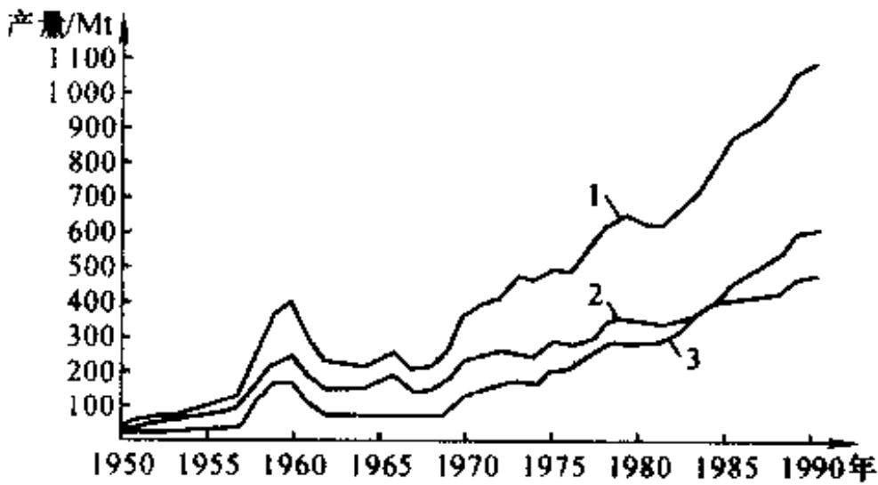  
图 2-3 我国地方煤矿、统配煤矿产量及总产量变化情况1. 全国总产量；2. 统配煤矿产量：3. 地方煤矿产量

## 2.2.3 煤炭资源分布与开发布局对复的影响

煤炭生产具有很强的地域性，有煤炭资源分布的地方才会有煤炭开采，有煤炭开采的地方才会破坏土地资源，因而才伴有矿山土地复垦与生态重建的问题。

分析煤炭资源分布与开发布局对复垦的影响需注意三个问题：一是煤炭资源开发强度和开发方式；二是煤炭开发对土地及生态环境破坏的滞后效应；三是煤炭资源分布及开采区域的初始环境特征。因此，根据前面对煤炭资源的分布及开发布局的介绍，可以得出以下结论：

(1)我国矿区土地复垦与生态重建的重点省份包括：山西、河南、河北、黑龙江、山东、四川、辽宁、内蒙古、贵州、安徽、陕西、湖南、江苏、吉林等14个省，复垦任务按上述排序由重到轻排列。

(2)我国矿区土地复垦与生态重建任务较为集中的地区为煤炭年产量在500万t以上的30余个矿区，尤其是年产量在1000万t以上的十几个矿区。且土地复垦任务重的集中在平原、开采前土地利用率较高的矿区，如徐州、开滦、两淮、鲁西南、平顶山等矿区，生态重建任务重的集中在东北和“三西”各大矿区。

(3)我国西南及中南地区的贵州、四川、湖南等省虽然煤炭总产量较高，但其矿点多，土地破坏也较分散，矿区生态环境破坏可划分为景观与土地广泛破坏型和矿井水污染型，因而生态环境恢复重建的任务也较重。

(4)我国煤矿区土地复垦主要为井工开采沉陷地与研石压占地的复垦，露天矿采场与排土场复垦集中于东北、云南、山西及蒙西、陕北地区。

(5)我国地方煤矿开采产量已超过国营统配煤炭产量，除个别地方和矿区，地方矿的开采较为集中、单个矿井的产量较大外，绝大部分地方矿开采矿点分散、产量低，开采煤层埋藏浅，技术手段落后，对区域性生态环境，包括土地资源破坏严重，过去对地方煤矿造成破坏的土地复垦较少开展系统的研究，今后需加强这方而的工作。地方煤矿分地方国营和乡镇村办煤矿，我国乡镇村办煤矿最为分散。据所采资源类型，可将地方煤矿分为复采型和首采型，复采型矿山复采大矿煤柱或浅层薄煤层，因此对复采矿山应作严格控制，防止威胁大矿生产安全，首采型地方煤矿应对开采规模和开采边界(包括深部边界)作总体规划，避免遍地开花，影响规模开采效益的发挥。

## 2.3 影响复垦条件分区的几个重要指标

## 2.3.1 我国的综合自然区划概述

1984年，全国农业区划委员会按照地表自然综合体的相似性和差异性，将我国的综合自然区划分为自然区域一自然带一自然区三级。一级区以干湿状况将全国分为东部季风区域、西北干旱区域(降水量一般在400 mm以下)和青藏高寒区域(海拔在3000m以上，≥0℃积温在3000℃以下)三大自然区域。二级区则依据气候，主要是温度(日平均气温>10℃期间的日数、最热月气温、最冷月气温和低温平均值指标)，将东部季风区分为9个温度带：寒温带、中温带、南温带、北亚热带、中亚热带、南亚热带、边缘热带、中热带、赤道热带。而西北于旱区域则分为于旱中温带和干旱暖温带两个二级区，青藏高寒区域分为高原寒带、高原亚寒带、高原温带三个二级区。三级区的划分则以干湿状况、大地形特征、土壤类型及水分状况的重大差异来划分，将综合自然条件基本相似、其改造利用措施大致相似的划为一个区，全国共划分为39个三级自然区。三大自然区域及二级自然带的温度指标和农业特征如表2-6所示，其分布如图2-4所示。

## 2.3.2 影响复垦分区的几个重要指标

## 1. 干湿类型

潮、湿、旱、干在农业气象上是四个不同的概念，其意义是：潮期，水、旱田均需排水防洪；湿期，水田水分适宜，旱田无需灌溉；旱期，水、旱田均需灌溉；干期，水、旱田不灌溉就没有收成。

在我国气候区划研究中，通常用干燥度或湿润度指标来划分，而于燥度与湿润度的计算方法有十余种，但基本上都是以降水量和蒸发力为基础计算的，即：

$$
K = \frac { E _ { 0 } } { r } \Re { \sf A } = \frac { 1 } { K }\tag{2-1}
$$

式中：K——干燥度；

表 2-6 我国自然区域与气候带的逼度指标和农业特征(丘宝剑，1987)
<table><tr><td>自然区域</td><td>气候带</td><td>地区符号</td><td>&gt;10℃积 温℃</td><td>最冷月气年极低平 温/t</td><td>均温/t</td><td>农业特征</td></tr><tr><td>1</td><td>1寒湿带 2中湿带 3暖温带 4北亚热带</td><td>(1) (2)−(4) (5)-(8) (9)~(10)</td><td>&lt;1 700 1700~ 3 500 3500~ 4 500 4500~</td><td>&lt; - 30 -30~ -10 -10~ 0 01~5</td><td>&lt; −45 -45- -25 - 25~ - 10 - 10~</td><td>一年一熟及早熟的喜 凉作物 一年一熟，春麦为主 两年三熟，冬麦为主， 苹果，梨</td></tr><tr><td>季 风 区 域</td><td>5中亚热带</td><td>(11)~(15)</td><td>5300 5300~ 6 500</td><td>5-10</td><td>-5 -5-0</td><td>稻麦两熟，有茶、竹 双季稻喜涼作物两年 五熟、柑橘、油菜</td></tr><tr><td></td><td>6南亚热带</td><td>(16)~(18)</td><td>6500~ 8000</td><td>10-15</td><td>0~5</td><td>双季稻喜涼作物一年</td></tr><tr><td>7边缘热带</td><td></td><td>(19)−(21)</td><td>8000~ 8 500</td><td>15-18</td><td>5~8</td><td>三熟，龙眼、荔枝 喜温作物全年都能生</td></tr><tr><td>8中热带</td><td></td><td>(22),(23)</td><td>&gt;8 500 &gt;9000</td><td>&gt;18</td><td>&gt;8</td><td>长，脚啡 木本作物为主，橡胶</td></tr><tr><td>Ⅱ 千区</td><td>9 赤道热带 10千早中 温带 11干早暖</td><td>(24) (25)~(29) (30),(31)</td><td>&lt;4 000</td><td>&gt;25 &lt; - 10</td><td>&gt;20 &lt; −20</td><td>可种各种热带作物 可种冬麦、早棉</td></tr><tr><td>城温带 匯高寨区域 寒带</td><td>12 高原寒带 13 高原亚 14 高原温带</td><td>(32) (33),(34) (35)~(39)</td><td>&gt;4 000 &gt;0℃积 温/℃ &lt;500 500- 1500</td><td>&gt; 10 最量月气 温/℃ &lt;6 6~10</td><td>&gt; -20可种长绒棉</td><td>“无人区” 只有牧业</td></tr></table>

$E _ { \theta }$ ——蒸发力,mm;

r———降水量，mm；

A———湿润度。

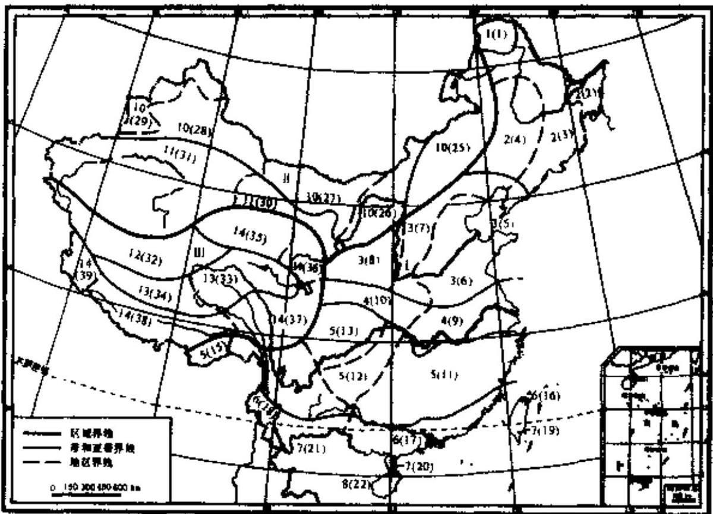  
图2-4 我国综合自然区划图(丘宝剑，卢其尧，1987)

1 季风区域：1. 寒温带(1) 大兴安岭北部地区;2. 中温带(2) 江平原地区：(3)兴安岭-长白山地区；(4)松辽平原地区;3. 温带(5) 辽东-山东半岛地区；(6)华北平原地区；(7) 华北山地地区：(8)黄土高原地区;4. 北亚热带(9)长江中下游地区；(10)汉江上中游地区：5. 中亚热带(11) 江南丘陵地区；(12) 贵州高原地区；(13)四川盆地地区；(14)云南高原地区；(15)喜马拉囊山南冀地区;6. 南亚热带 $\vdots 6$ (16)台北地区；(17) 闽粤丘陵地区；(18)滇南山原地区；7. 边缘热带(19) 台唐地区：(20)琼雷地区；(21)滇南河谷地区;8. 中热带(22)海南南部地区：(23)东、中、西沙群岛地区；9. 赤道热带(24) 南沙群岛地区；Ⅱ干旱区域：10. 干旱中温带(25)内蒙古东部地区；(26)内蒙古中部地区；(27)内蒙古西部地区；(28)北疆地区；(29)北疆西北山地地区；11. 干旱暖温带(30)河西走廊地区：(31)南磊地区；Ⅲ 高寒区域：12. 高原寒带(32)羌塘北部地区；13. 高原亚寒带(33)江河源头地区；(34)羌塘南部地区；14. 高原温带(35)柴达木盆地地区：(36)青海地区；

按 $E _ { \parallel }$ 的计算方法不同，所得的干燥度或湿润度也不一样。

张宝堃(1959)在《中国气候区划草案》中用式(2-2)计算蒸发力，将我国的干湿类型分为四级，如表2-7所示。

$$
\pmb { \mathrm { E } } _ { 0 } = \pmb { 0 } . 1 6 \pmb { \Sigma } t\tag{2−2}
$$

式中，∑t表示大于等于10℃时期的积温。

表 2-7 我国干燥度分级表(张宝堃，1959}
<table><tr><td rowspan=1 colspan=1>于湿类型</td><td rowspan=1 colspan=1>澧海</td><td rowspan=1 colspan=1>半豐润</td><td rowspan=1 colspan=1>半干早</td><td rowspan=1 colspan=1>干    畢</td></tr><tr><td rowspan=1 colspan=1>下燥度</td><td rowspan=1 colspan=1>&lt;0.10</td><td rowspan=1 colspan=1>10-1.5</td><td rowspan=1 colspan=1>1.5-4.0</td><td rowspan=1 colspan=1>&gt;4.0</td></tr><tr><td rowspan=1 colspan=1>农业措施</td><td rowspan=1 colspan=1>排水</td><td rowspan=1 colspan=1>防水不足</td><td rowspan=1 colspan=1>需要灌派</td><td rowspan=1 colspan=1>没有灌.，就没有农业</td></tr><tr><td rowspan=1 colspan=1>植被</td><td rowspan=1 colspan=1>森林</td><td rowspan=1 colspan=1>森林草原</td><td rowspan=1 colspan=1>草原</td><td rowspan=1 colspan=1>荒漢</td></tr><tr><td rowspan=1 colspan=1>年降水量/mm</td><td rowspan=1 colspan=1>&gt;1 000</td><td rowspan=1 colspan=1>500~1000</td><td rowspan=1 colspan=1>250~500</td><td rowspan=1 colspan=1>&lt;250</td></tr></table>

卢其尧等人则将全国的干湿区分为6个类型，6种类型及其意义如表2-8所示。

表2-8 卢其尧等人的干温区划分
<table><tr><td>类 型</td><td>农业意义</td></tr><tr><td>潮湿区</td><td>只有潮、糧期，没有早、干期</td></tr><tr><td>湿润区</td><td>只有潮、澀、旱期，无干期</td></tr><tr><td>半湿润区</td><td>只有湿、早期，没有潮、于期，或各期均有，但潮、湿期日数多于早、千期日数</td></tr><tr><td>半下旱区</td><td>有湿、早、干期，没有潮期，或各期均有，但潮、湿期日数少于早、干期日数</td></tr><tr><td>干旱区</td><td>只有早、干期，没有潮、湿期</td></tr><tr><td>干燥区</td><td>全年均为干期</td></tr></table>

上述分类方法均以干燥度指标分类的，这种方法综合考虑了降水和蒸发两因素，但不很直观，为方便起见，可用降水量作为辅助指标直观地划分干湿分区，表2-9为郑剑非等人的划分方法。

表2-9 以降水量为标准划分的干温类型区
<table><tr><td rowspan=1 colspan=1>降水量 $f ( \mathbf { m } \mathbf { n } ^ { * } \mathbf { a } ^ { - 1 } )$ </td><td rowspan=1 colspan=1>&lt; 250</td><td rowspan=1 colspan=1>250~400</td><td rowspan=1 colspan=1>400--800春早较重</td><td rowspan=1 colspan=1>400~800春早较轻</td><td rowspan=1 colspan=1>800~10001</td><td rowspan=1 colspan=1>000以上</td></tr><tr><td rowspan=1 colspan=1>类型</td><td rowspan=1 colspan=1>干早</td><td rowspan=1 colspan=1>半干旱</td><td rowspan=1 colspan=1>干半湿润</td><td rowspan=1 colspan=1>釐半湿润</td><td rowspan=1 colspan=1>湿润</td><td rowspan=1 colspan=1>潮漫</td></tr></table>

我国干湿气候区划如图2-5所示。

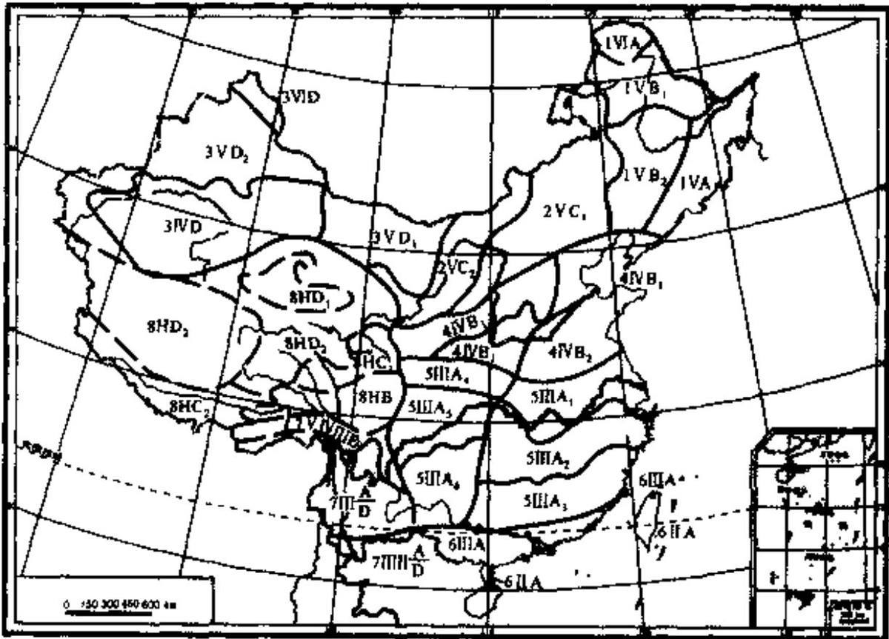  
图 2-5 我国干湿气候区划(丘宝剑，卢其尧，1987)  
1. 东北地区;2. 内蒙古地区；3. 甘新地区；4. 华北地区；5. 华中地区：6. 华南地区：7.康滇地区：8.青藏高原。Ⅰ赤道带；Ⅱ热带、直亚热带，Ⅳ暖温带、V暹带，寒湿带。H高原气候；A湿润；B半湿润;C半干旱；D干旱；六夏提冬干。A,B,C,D $\frac { A } { D }$ 右下角的阿拉伯数字，表示气候省。

## 2. 热量条件与种植制度

我国以 $\geqslant 0 1$ 积温为主导指标划分种植制度分区，其指标值范围和分区的农业意义如表2-10，各区分布如图2-6所示。

表 2-10 我国种植制度分区表(丘宝鲜，1987)
<table><tr><td rowspan="3">分区</td><td>主导指标</td><td colspan="3">辅助指标</td><td rowspan="3">农业意义</td></tr><tr><td>≥0℃积温 /℃</td><td>最热月平 均温度/℃</td><td>耿季低温出現极端最低 时间(稳定通多年平均) 过20℃终日）温度/℃</td><td></td></tr><tr><td>一熟区 &lt; 4 000</td><td></td><td></td><td>一年一熟</td></tr><tr><td>1(0)</td><td>&lt;1 500</td><td>&lt;10</td><td rowspan="6"></td><td rowspan="6"></td><td>高寒无农业区</td></tr><tr><td>1(1)</td><td>1500~2500</td><td>&gt;10</td><td>高寒农业区，可种植春麦、 青稞、马铃薯、林、牧 一熟喜凉作物区，春麦，马</td></tr><tr><td>1 (2)</td><td>&lt;2 500</td><td>&lt;22</td><td>铃薯、还可发展林、牧</td></tr><tr><td>1 (3)</td><td>2 500~400022~ 25 雅魯藏布</td><td>江河谷</td><td>可种一熟喜温的玉米、大 豆、高粱、水稻等</td></tr><tr><td></td><td>15℃左右</td><td></td><td>一年二熟</td></tr><tr><td>I(1)</td><td>二熟区4000-5800</td><td></td><td></td></tr><tr><td>I (2)</td><td>4 000-4800</td><td></td><td></td><td></td><td>冬小麦与早熟玉米连作 冬小麦与中、晚熟玉米连</td></tr><tr><td></td><td>4800~5500</td><td></td><td></td><td></td><td>作：永源较好的地区可稻、 麦两熟</td></tr><tr><td></td><td>(3)4000~5800</td><td></td><td></td><td></td><td>海拔低的地区为稻、麦两 熟，个别地区玉米、冬小麦 两熟</td></tr><tr><td>Ⅱ(4)</td><td>5 500~5800</td><td></td><td></td><td></td><td>水田比例大，为双季稻两熟区</td></tr><tr><td>三熟区</td><td>&gt;5 800</td><td></td><td>9月25日前</td><td>-4~-9</td><td>一年三熱 冬油菜或冬小麦、早稻中</td></tr><tr><td></td><td>Ⅲ(1)5 800~6 000</td><td></td><td>10月10日前-4--7</td><td></td><td>熟、晚稻中熟 冬油葉或冬小麦、早稻中 熱、晚稻迟熟、亚热带作物</td></tr><tr><td>Ⅲ(2)</td><td>6000~6700</td><td></td><td>10月10日</td><td></td><td>可基本轄冬</td></tr><tr><td>Ⅲ(3)</td><td>&gt;6 700</td><td></td><td>以后</td><td></td><td></td></tr><tr><td></td><td>Ⅲ(3.1)6700~8 000]</td><td></td><td></td><td>2--4</td><td>冬油葉或冬小麦、旱稻迟</td></tr><tr><td>(3.2)</td><td>&gt;8000</td><td></td><td></td><td>&gt;2</td><td>熱，晚稻迟熟 可冬种喜溫作物，水稻可三熟</td></tr></table>

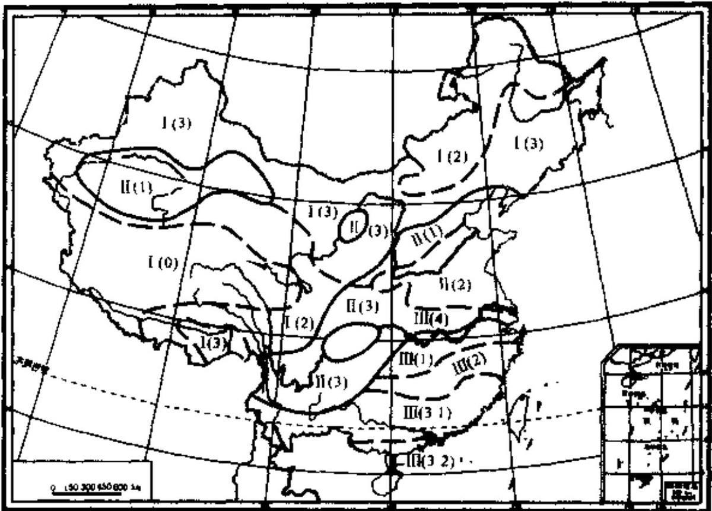  
图2-6 我国种植制度分区图(丘宝剑，卢其尧、1987)

I(0)：高寒无农业区；1(1)：高寒农业区；1(2)：一熟喜凉作物区；

I(3)：一熟喜温作物区，Ⅱ(1):冬小麦与早熟玉米连作区；

目(2)：冬小麦与中、晚熟玉米连作区；

(3)：海拔低的地区为群麦两熟，个别地区玉米、冬小麦两熟；

Ⅱ(4):双季稻两熟区；

Ⅲ(1)：冬油菜或冬小麦、早稻中熟、晚稻中熟区；

Ⅲ(2)：冬油菜或冬小麦、早稻中熟、晚稻迟熟区；

Ⅲ(31)：冬油菜或冬小麦、早稻迟熟、晚糟迟熟；

Ⅲ(3.2)：可冬种喜温作物，水稻可三熟。

## 3. 地形特征

地形特征分为平原、丘陵(相对高度在100 m左右)、低山(相对高度200\~500m)、山地(相对高度在500m以上)、高山及高原山地(顶部接近或超过雪线)。

## 4. 煤炭赋存条件与开发强度

影响复垦条件分区的煤炭赋存条件主要有累计可采厚度、煤层倾角、煤层埋深，开发强度可用年产量及年采空面积来表示。

累计可采厚度影响采后地形变化，这种影响可用下面的判别标准判断，设：

$$
H _ { \mathrm { s } } = H _ { \mathrm { 9 } } - \ W - H _ { \mathrm { p } }\tag{2-3}
$$

$$
\begin{array} { r } { \pmb { W } = \pmb { \Sigma } \pmb { q } , \pmb { m } _ { i } \cos \pmb { \alpha } _ { i } } \end{array}\tag{2-4}
$$

式中： ${ \cal H } .$ ——沉陷后地面标高与潜水位相对高差，m；

$\pmb { W }$ ——累计下沉值，可用式2-4计算，m；

$H _ { \parallel }$ ———沉陷前地面标高，m；

$H _ { p }$ ——潜水位标高，m。

$\pmb { q } _ { i }$ ——采i层煤的下沉复数；

$m$ ——i层煤厚度，m；

$\alpha ,$ —i层煤的倾角，(°);

又设 $h _ { k }$ 为作物保持正常生长的地下水位临界埋深， $h _ { w }$ 为沉陷积水时的积水深度，则：

(1) 当 $H _ { \mathrm { s } } \in \left( h _ { \mathrm { k } } , H _ { \mathrm { 0 } } - H _ { \mathrm { p } } \right]$ 时，对土地利用影响不大；

(2) 当 $H _ { s } \in ( 0 , h _ { \mathrm { ~ k ~ } } ]$ 时，土地存在沼泽化、盐渍化危险；

(3) 当 $H _ { \ast } \in [ h _ { \ast } , 0 ]$ 时，土地利用的生态类型将发生改变，土地利用方式的改变方向取决于h。的大小和复垦方式的选取。 $h _ { \star }$

上述(2)、(3)两种情况常发生在我国东部 $\sqrt { \theta }$ 区，且最深积水坑的 h在20m以内，徐州矿区h在6m左右，淮南h在10m $\hslash _ { \mathrm { ~ w ~ } }$ $\overrightarrow { \overrightarrow { y } }$ $h _ { \mathrm { \mathbf { \sigma } _ { \mathrm { w n u s } } } }$ $h _ { \mathrm { ~ m a x } }$ 左右，开滦 $h _ { \mathrm { w i n a x } }$ 在 10 m左右。

煤层埋深和开发强度影响沉陷的范围和沉陷变形的连续性。沉陷的影响范围可用式2-5表示：

$$
A _ { \mathrm { s } } = f ( A _ { \mathrm { z } } , H / \Sigma m _ { i } ) = r A _ { \mathrm { z } }\tag{2-5}
$$

式中： $A _ { s }$ ——沉陷影响的面积， $\mathbf { m } ^ { 2 }$ +

$\mathbf { A } _ { \mathfrak { m } }$ ——井下采空面积， ${ \mathfrak { m } } ^ { 2 }$

$H \cdot$ ——平均采深，m；

∑m，—累计采厚，m；

r—沉陷面积系数，是深厚比、地貌类型和岩性的函数，通常各矿区的沉陷面积系数符合统计规律。

f 为A与 $A _ { \mathfrak { m } }$ 、H/∑m，的函数关系，尽管这种函数关系可以利用开采沉陷规律推导出，但作者认为出于复垦条件分区的目的，只要考虑r和 $\pmb { A } _ { \mathfrak { n } }$ 即可。沉陷变形的连续性可按开采沉陷规律进行判断。沉陷变形的连续性对土地生产力的影响可按表2-11的标准判断。

表2-11 地表变形形式与土地破坏等级
<table><tr><td rowspan=1 colspan=1>地表变形形式</td><td rowspan=1 colspan=1>裂缝带出露地表</td><td rowspan=1 colspan=1>地表出现裂缝，但裂缝深度≤5m</td><td rowspan=1 colspan=1>平缓下沉盆地</td></tr><tr><td rowspan=1 colspan=1>破坏等级</td><td rowspan=1 colspan=1>极严重</td><td rowspan=1 colspan=1>中等</td><td rowspan=1 colspan=1>轻度</td></tr></table>

## 2.4 我国煤矿区复垦的生产力条件分区

## 2.4.1 研究现状

我国矿区复垦条件分类在有关文献中已有述及，但多数是对局部范围(一个矿区)的复垦对象所作的分类研究，全国范围内的分类与分区研究只有李根福(《土地复垦知识》1991)和中国科学院地理研究所在《我国煤矿开发后生态环境综合整治可行性总体方案与试验示范前期研究(总体方案部分))中有所述及。

李根福提出：矿区土地复垦的环境条件可以按采动影响范围内的人口密度、居民点人口、土地价格、矿区环境变化、开采矿床倾角、深厚比、涌水量和剥离岩土的适用性等指标来分类，并将矿区土地复垦的环境条件分为三类，可惜的是，文中未进行定位研究，即没有指出我国哪些矿区复星条件属于Ⅰ类，Ⅱ类或Ⅲ类。

中科院地理所按煤炭资源分布与区城自然、社会、经济环境一致性原则和煤炭开采对生态环境影响的区域特征性原则，将我国煤矿生态环境分为东北区(黑龙江、吉林、辽宁)、华北区(北京、河北、河南)、华东区(山东、安徽和江苏)、西北区(包括山西、陕西、内蒙古、宁夏、甘肃和青海)、西南区(云南、贵州、四川)、南方区(包括南方其他各省)及新藏区(包括新疆和西藏)。这种分区方案的缺点是：各区域之间的特征不明显，且没有细致考虑地质采矿条件和土地破坏特征等因素，更为重要的是，上述分区结果对煤矿区土地复垦工作缺乏指导意义。

中国煤炭学会等完成的《1991一2020中国煤炭开发战略研究》报告中，根据我国煤炭资源分布特点和各地区工业基础与经济发展状况，将全国煤炭开发划分为3个区带及7个规划区，即中部供煤区带，包括晋陕蒙(西)(简称：“三西”)规划区；东部调入区带，包括东北、京津冀、华东及中南等4个规划区；西部自给及后备区带，包括新甘宁青及西南两个规划区。7个规划区的行政范围如表2-12。

表 2-12 1991—2020 年中国煤炭开发规划区
<table><tr><td rowspan=1 colspan=1>区名</td><td rowspan=1 colspan=1>省区</td><td rowspan=1 colspan=1>主要矿区</td></tr><tr><td rowspan=1 colspan=1>晋陕蒙(西)山</td><td rowspan=1 colspan=1>西、陕西、蒙西五盟三市</td><td rowspan=1 colspan=1>大同、西山、阳泉、潞安、晋城、汾西、霍县、海渤湾、平朔、锏川、韩城、乌达、高柳、乡宁准格尔、神府、东胜、胜利</td></tr><tr><td rowspan=1 colspan=1>东北区</td><td rowspan=1 colspan=1>黑龙江、吉林、辽宁、内蒙古三盟·市（赤峰市、呼伦贝尔盟、铁兴安盟、哲里木盟）</td><td rowspan=1 colspan=1>鹤岗、鸡西、双鸭山、七台河、阜新、抚顺、法、沈阳、辽源、通化、舒兰、平注、霍林河、扎费贝尔、大雁、伊敏河、宝日希勒</td></tr><tr><td rowspan=1 colspan=1>京津冀</td><td rowspan=1 colspan=1>北京、天津、河北</td><td rowspan=1 colspan=1>开滦、峰峰、邢台、邯郸、北京、蔚县</td></tr><tr><td rowspan=1 colspan=1>华东</td><td rowspan=1 colspan=1>江苏、浙江、福建、江西、山东、徐安徽及河南永城</td><td rowspan=1 colspan=1>州、津南、淮北、兖州、枣庄、新汶、淄博、肥城、萍乡、大屯、龙口、永城</td></tr><tr><td rowspan=1 colspan=1>中南</td><td rowspan=1 colspan=1>河南、湖南、湖北、广东、广西、平海南</td><td rowspan=1 colspan=1>顶山、郑州、鹤壁、义马、焦作、涟邵、资兴、白沙</td></tr><tr><td rowspan=1 colspan=1>西南</td><td rowspan=1 colspan=1>云南、贵州、四川</td><td rowspan=1 colspan=1>攀枝花、盘江、水城、芙蓉、松藻、华夔山</td></tr><tr><td rowspan=1 colspan=1>新甘宁青</td><td rowspan=1 colspan=1>新疆、甘南、宁夏、青海</td><td rowspan=1 colspan=1>窑街、靖远、石炭井、石咀山、乌普木齐、哈密、艾维尔沟</td></tr></table>

\*在建或规划重点开发矿区

表中所列主要矿区为目前产量500万t以上的矿区及部分规划开发的重点 $\overrightarrow { A }$ 区和目前生态环境破坏在所在规划区里有代表性的矿区。

从本节起拟根据全国50余重点 $\overrightarrow { A }$ 区的地质条件、土地利用状况及破坏前生态类型和人地矛盾特点，将矿区土地破坏程度与复垦条件按破坏前生产力水平、生产力破坏程度、破坏前生态环境质量及采后生态恶化状况分为若于类型区，在此基础上，对全国复垦条件进行综合分区。

## 2.4.2 矿区土地破坏前生产力类型分区

土地生产力可用单位面积第一性生物物质(如作物、牧草、林产品)产量表示。不同类的生物产量折合成热量后，具可比性。

按矿区土地生产力水平的高低划分复垦类型区，旨在反映各矿区土地经济价值上的差异、矿山用地与农业用地矛盾的激烈程度，从而确定不同矿区复垦在经济意义上的差异。尽管土地生产力指标并不完全反映上面提到的诸目标，如一些地区土地生产力水平不高，但由于人均耕地量少，矿山用地与农业用地矛盾也会非常突出，但作者认为土地生产力指标是反映上述目标的最简洁且最有代表性的指标，而用生产力指标不能反映的其他一些因素，作者将尽量在其他指标中予以考虑。

土地生产力的决定因素包括土壤中N、P、K、有机质及各种微量元素的含量；地表水、地下水资源的供给能力；土层厚度、地形坡度等自然因子。还包括太阳能辐射资源、大气热量条件(如温度、霜冻等)、天然降水等人类难控因素。除此之外，人类对自然的改造活动及经济投入也是影响土地生产力的重要因素之一。考虑光强、温度与降水因素，土地气候生产潜力Y。可用下式估算 $\pmb { Y } _ { s }$

$$
Y _ { \mathrm { c } } = 7 . 5 ~ K K _ { \mathrm { T } } K _ { \mathrm { a } } \int _ { t _ { 1 } } ^ { t _ { 2 } } \frac { E ( t ) Q _ { p } ( \iota ) } { H } \mathrm { d } t\tag{2-6}
$$

式中： $\mathbf { Y } _ { \mathfrak { c } }$ ———土地气候生产潜力， $\mathtt { k g } / \mathrm { h } \ m ^ { 2 }$

$\kappa$ 经济系数(即籽粒与谷草比)，因作物类型而异，玉米为0.3,水稻、小麦为0.35\~0.5;

$K _ { T }$ ——温度订正系数， $\pmb { K } _ { \bar { t } }$ 可用温度T的分段函数表示；

$K _ { \omega }$ ——水分订正系数，可取降水量与蒸发力的比值；

$Q _ { p } ( t )$ ——t 时刻光合有效辐射量，4.186 8 $\int / \langle c m ^ { 2 } \cdot m \mathrm { i n } \rangle$

$Q _ { \mathrm { p } } = \alpha S + \ b D$ 或 $Q _ { \mathrm { p } } = k Q , a , b , k$ 为系数，S、D

Q分别为直达辐射量、散射辐射量及总辐射量；

E(t)—作物对光合有效辐射量的利用系数，与叶面积系数、植物将光能转化为化学能的效率、植物呼吸消耗量等有关；

t—计算时段单位：d;

$H \cdot$ —单位干物质的发热量，单位： $4 . 1 8 6 ~ 8 \times 1 0 ^ { 3 } ~ \mathrm { J / g }$ go

由式(2-3)知，土地气候生产潜力与当地的太阳辐射量、温度、降雨量与蒸发力等气候因子有关，还与作物品种及光热水资源可利用的时段有关。

矿区土地破坏前的生产力水平除与上述气候因素有关外，还与土壤条件、排灌条件等水土环境因子有关。设考虑土壤养分供给因子的土地生产潜力为 $\mathbf { { \mathit { Y } } _ { \bullet } }$ ,則

$$
Y _ { s } = \operatorname* { m i n } \left\{ { \frac { S _ { i } \times \hbar \times r \times 1 0 ^ { 7 } \times a _ { i } } { \phi _ { i } } } \right\} _ { { \mathrm { } } } ,\tag{2-7}
$$

式中： $S _ { \varepsilon }$ ——土壤中作物所需i种养分的含量，以质量分数表示， $\Re$ \*

$\pmb { h }$ ——有效土层厚度，m；

$\gamma \cdot$ —土壤的密度， $\pm / \mathbf { m } ^ { 3 }$

$\alpha _ { \iota }$ ——作物从土壤中吸取种养分的比例；

${ \pmb { \mathscr { p } } } ,$ —单位重量的作物中含i种元素的百分比。

$Y .$ 单位： $\mathbf { k g } / \mathbf { h m } ^ { 2 }$

排灌条件可在 $\mathbf { Y } _ { \mathfrak { s } }$ 的基础上，用式(2-8)考虑：

$$
Y _ { \mathrm { s + } \mathbf { r } } = K , K _ { \mathrm { d } } Y ,\tag{2-8}
$$

式中： $\boldsymbol { Y } _ { \ u { \textrm { * * } } }$ ——考虑水、土条件的土地生产力水平， $\mathbf { k } \otimes ^ { \prime } \mathbf { \hat { h } } \mathbf { m } ^ { 2 }$

$K _ { \cdot }$ —灌溉保证系数；

$\boldsymbol { K } _ { \downarrow }$ ——排水保证系数。

根据式2-6可将表2-12的70余重点矿区划分为表2-13。

表2-13
<table><tr><td rowspan=1 colspan=1>类型区</td><td rowspan=1 colspan=1>矿区名称</td></tr><tr><td rowspan=1 colspan=1>东北林农区</td><td rowspan=1 colspan=1>鹤岗、鸡西、双鸭山、七台河、阜新、抚顺、铁法、沈阳、辽源、通化、舒兰</td></tr><tr><td rowspan=1 colspan=1>内蒙古林牧区</td><td rowspan=1 colspan=1>平注、霍林河、伊敏河、扎责贝尔、大雁、宝日希勒</td></tr><tr><td rowspan=1 colspan=1>黄淮海农业区</td><td rowspan=1 colspan=1>徐州、淮南、淮北、永城、兖州、枣庄、新汶、播博、肥城、大屯、龙口、开滦、义马、平頂山、邯郸、峰峰、晋城、潞安、郑州、萬岗、义马、焦作</td></tr><tr><td rowspan=1 colspan=1>长江中下游农业区</td><td rowspan=1 colspan=1>硅邵、资兴、白抄、萍乡</td></tr><tr><td rowspan=1 colspan=1>西南农业区</td><td rowspan=1 colspan=1>攀枝花、盘江、水城、芙蓉、松藻、华聋山</td></tr><tr><td rowspan=1 colspan=1>黄土高原农林牧区</td><td rowspan=1 colspan=1>西山、阳泉、平朔、大同、铜川、韩城、神府、东胜、准格尔</td></tr><tr><td rowspan=1 colspan=1>新甘宁青农林牧区</td><td rowspan=1 colspan=1>窑街、靖远、石炭井、石咀山、华亭、乌鲁木齐、哈密、艾维尔沟</td></tr></table>

各区主要气候特征和生产力水平如表2-14所示。

表2-14
<table><tr><td>类型区</td><td>≥10℃积温/℃</td><td>干燥度</td><td>熟制</td><td>地貌类型</td><td>年太阳总辐射 /(4.18×10³J/c²·a)</td></tr><tr><td>东北</td><td>1 700~3 200</td><td>0.75~t.5</td><td>一年一熱</td><td>岗岭地、平原</td><td>120~140</td></tr><tr><td>内蒙古</td><td>2 000~3000</td><td>2-16</td><td>一年一热</td><td>高原</td><td>140~160</td></tr><tr><td>黃淮海</td><td></td><td></td><td>牧业基地</td><td></td><td></td></tr><tr><td></td><td>4 000~4500 3000~4300</td><td>1-1.5 1.5~4.0</td><td>一年两熟 一年一熟或高原</td><td>平原</td><td>130左右</td></tr><tr><td>黄土高原</td><td></td><td></td><td>两年三熟</td><td></td><td>120~150</td></tr><tr><td>西南</td><td>3 500~6000</td><td>0.5~1.0</td><td>两熟或三熟丘陵山区</td><td></td><td>90~110</td></tr><tr><td>新甘宁青</td><td>1000~4 500</td><td>1.0~16.0</td><td>一年一熟，高原与盆地</td><td></td><td>140-165</td></tr><tr><td></td><td></td><td></td><td>牧业基地</td><td></td><td></td></tr><tr><td>长江中 下游区</td><td>5 000~5 700</td><td>0.5左右</td><td>年两熟</td><td>江南丘殿</td><td>100-110</td></tr></table>

## 2.4.3 采矿引起的土地生产力下降分类

采矿对土地生产力的破坏形式表现在多方面，平原区主要是农田沉陷产生坡度、裂缝和积水等现象，丘陵山区主要是裂缝、滑坡和槽形塌陷等。不管其破坏形式如何，采矿引起的土地生产力下降与煤层的赋存条件和采矿方法有关。深厚比越小，越易出现不连续变形，潜水位愈浅、采厚愈大，地表越易积水。沉陷积水和不连续变形是采矿引起的土地生产力下降的最主要和最直接的原因，因此可构造土地生产力下降指数PDI为：

$$
P D I _ { 1 } = a _ { 1 } \times a _ { 2 }\tag{2-9}
$$

$$
P D I _ { 2 } = a _ { 1 } + a _ { 2 }\tag{2-10}
$$

式中： $P D l _ { 1 }$ 为乘积指数；

$P D I _ { 2 }$ 为加和指数；

$\alpha _ { 1 }$ 为表示地表积水状况的因子分值；

${ \pmb { a } } _ { 2 }$ 为反映地表变形连续性的因子分值。

将我国矿区土地生产力下降分为三级：Ⅰ、Ⅱ、Ⅲ级。Ⅰ级为大幅度下降，Ⅱ级为下降幅度中等，Ⅲ级为下降幅度较小。分级标准如表2-15所示。

表2-15 采矿引起土地生产力下降的分级标准
<table><tr><td>指标</td><td>1</td><td>Ⅱ</td><td>1</td></tr><tr><td> ${ \bf { u } } _ { 1 }$ </td><td>1</td><td>2</td><td>3</td></tr><tr><td>含义</td><td>积水率10%以上</td><td>积水率&lt;10%</td><td>无积水</td></tr><tr><td> $\pmb { a } _ { 2 }$ </td><td>1</td><td>2</td><td>3</td></tr><tr><td>含义</td><td>有大于5m深的裂缝</td><td>有小于5m深的裂縫</td><td>无裂縫</td></tr><tr><td> $P \mathcal { D } \boldsymbol { I } _ { \perp }$ </td><td>[1,3]</td><td>[4,5]</td><td>[6,9]</td></tr><tr><td> $P / \mathcal { D } \bar { \boldsymbol { \imath } } _ { 2 }$ </td><td>[1,3]</td><td>[4,5]</td><td>[5,6]</td></tr><tr><td>含义</td><td>大幅下降</td><td>中耦下降</td><td>下降较小</td></tr></table>

表2-16 我国主要矿区土地生产力下降的指标值
<table><tr><td>矿区名</td><td>双鴨山</td><td>七台河</td><td>熱 岗</td><td>鸡</td><td>西 舒</td><td>兰</td><td>辽 源</td><td>通</td><td>化 铁</td><td>法</td><td>阜 新</td></tr><tr><td> $a _ { 1 }$ </td><td>2</td><td>2</td><td>2</td><td>2</td><td></td><td>3</td><td>3</td><td>3</td><td>2</td><td></td><td>2</td></tr><tr><td> $\alpha _ { 2 }$ </td><td>2</td><td>2</td><td>2</td><td>2</td><td>2 6</td><td></td><td>2</td><td>2</td><td>3</td><td>1 2</td><td></td></tr><tr><td> $\vartheta _ { } \pmb { I } _ { } \pmb { \lambda } _ { 1 }$   $f ^ { \prime } \{ \mathcal { D } \} _ { 2 }$ </td><td>4 4</td><td>4 4</td><td>4 4</td><td>4 4</td><td>5</td><td></td><td>6 5</td><td>6 5</td><td>6 5</td><td>3</td><td></td></tr><tr><td>矿区名</td><td>抚 顺</td><td>沈 阳</td><td>平 庄</td><td>雷林河</td><td></td><td>伊敏河 大</td><td>雁</td><td>徐 州</td><td>淮</td><td>南 淮</td><td>北</td></tr><tr><td> $a _ { 1 }$ </td><td>2</td><td>2</td><td>3</td><td>3</td><td>3</td><td></td><td>3</td><td>1</td><td>1</td><td>1</td><td></td></tr><tr><td> $\boldsymbol { a } _ { 2 }$ </td><td>1</td><td>3</td><td>1</td><td>1</td><td>1</td><td></td><td>1</td><td>3</td><td>3</td><td></td><td></td></tr><tr><td> $P D I _ { 1 }$ </td><td>2</td><td>6</td><td>3</td><td>3</td><td></td><td>3</td><td>3</td><td>3</td><td>3</td><td></td><td>3 3</td></tr><tr><td> $P \bar { \imath } \pmb { { \jmath } } _ { 2 }$ </td><td>3</td><td>5</td><td>4</td><td>4</td><td></td><td>4</td><td>4</td><td>4</td><td>4</td><td></td><td>4</td></tr><tr><td>矿区名</td><td>永 城</td><td>兖 州</td><td>新 汶</td><td>枣</td><td>庄 泊</td><td>博 肥</td><td>城</td><td>大 屯</td><td>开</td><td>漆 邯</td><td>郸</td></tr><tr><td> $\alpha _ { 1 }$ </td><td>1</td><td>1</td><td>1</td><td>1</td><td></td><td>1</td><td>1</td><td>1</td><td>1</td><td></td><td>3</td></tr><tr><td> ${ \mathfrak { a } } _ { 2 }$ </td><td>3</td><td>3</td><td>3</td><td>3</td><td></td><td>3</td><td>3</td><td>3</td><td>3</td><td></td><td>2</td></tr><tr><td> $P D f _ { \downarrow }$ </td><td>3</td><td>3</td><td>3</td><td>3</td><td></td><td>3</td><td>3</td><td>3</td><td>3</td><td></td><td>6</td></tr><tr><td> $J ^ { \prime } | \mathcal { J } | _ { 2 }$ </td><td>4</td><td>4</td><td>4</td><td>4</td><td></td><td>4</td><td>4</td><td>4</td><td>4</td><td></td><td>5</td></tr><tr><td>矿区名</td><td>峰 峰</td><td>义 马</td><td>平顶山</td><td>焦</td><td>作 郑</td><td>州</td><td>西 山</td><td>阳 泉</td><td>大</td><td>同 平</td><td>朔</td></tr><tr><td> $\mathbf { \delta } _ { \mathbf { u } _ { 1 } }$ </td><td>3</td><td>3</td><td>2</td><td>3</td><td></td><td>2 3</td><td>3</td><td>3</td><td>3</td><td></td><td>3</td></tr><tr><td> ${ \pmb { \alpha } } _ { 2 }$ </td><td>2</td><td>1</td><td>3</td><td>2</td><td></td><td>6</td><td>1</td><td>1</td><td>1</td><td></td><td>1</td></tr><tr><td> $P D f _ { 1 }$   $\pmb { P } \pmb { J } \pmb { \mathcal { J } } _ { 2 }$ </td><td>6 5</td><td>3 4</td><td>6</td><td>6 5</td><td></td><td>5</td><td>3 4</td><td>3 4</td><td>3 4</td><td></td><td>3 4</td></tr><tr><td></td><td></td><td></td><td>5</td><td></td><td>城 神</td><td>府</td><td></td><td></td><td></td><td>窑</td><td>街</td></tr><tr><td>矿区名</td><td>晋 城</td><td>潞 安</td><td>州</td><td>府 韩</td><td></td><td></td><td>萍 乡</td><td>涟 儒</td><td>攀枝花</td><td></td><td></td></tr><tr><td> $\mathfrak { a } \mathfrak { g }$ </td><td>3 2</td><td>3</td><td>3</td><td>3</td><td></td><td>3 1</td><td>2</td><td>2</td><td>2</td><td>3 2</td><td></td></tr><tr><td> ${ \pmb { a } } _ { 2 }$   $P ( \mathcal { I } _ { 1 }$ </td><td>6</td><td>2</td><td>2</td><td>2</td><td></td><td>3</td><td>3</td><td>3</td><td>3</td><td></td><td></td></tr><tr><td></td><td></td><td>6</td><td>6</td><td>6</td><td></td><td></td><td>6</td><td>6</td><td>6</td><td>6</td><td></td></tr><tr><td> $P \boldsymbol { \Omega } \boldsymbol { \{ \mathbf { \mathit { 1 } } \mathbf { 2 } \mathbf { \mathit { 1 } } \mathbf { 2 } \mathbf { \mathit { 1 } } } $ </td><td>5</td><td>5</td><td>5</td><td>5</td><td></td><td>4</td><td>5</td><td>5</td><td>5</td><td>5</td><td></td></tr></table>

表2-16列出了我国主要矿区土地生产力下降的指标值。于是根据表2-15的分级标准，按PDI，的分级结果如表2-17所示,按 $P D I _ { 2 }$ 的分级结果如表2-18所示。

表 2-17 按 PDI；的分级结果
<table><tr><td>类型</td><td>矿区名</td><td>生产力下降 幅度参考值</td></tr><tr><td>I</td><td>皇新、抚顺、平庄、霍林河、伊敏河、大雁、徐州、淮南、淮北、永城、 兖州、新汶、枣庄、酒博、肥城、大屯、开滦、西山、阳泉、大同、平朔、 神府、义马</td><td>50%以上</td></tr><tr><td>Ⅱ</td><td>双鸭山、七台河、鹤岗、鸡西</td><td>30%~50%</td></tr><tr><td>Ⅲ</td><td>舒兰、辽源、通化、铁法、沈阳、邯郸、峰峰、平顶山、焦作、郑州、晋 城、潞安、锅川、韩城、萍乡、硅邵、攀枝花、窑街</td><td>30%以下</td></tr></table>

表 2-18 按 PDI2的分级结果
<table><tr><td>类型</td><td>矿区名</td><td>生产力 下降輻度</td></tr><tr><td>1 Ⅱ</td><td>阜新、抚顺 双鸭山、七台河、鹤岗、鸡西、平庄、霍林河、伊敏河、大雁、徐州、淮</td><td>50%以上</td></tr><tr><td></td><td>南、淮北、永城、兖州、新汶、枣庄、淄博、肥城、大屯、开滦、义马、西 山、阳泉、大同、平朔、神府</td><td>30%~50%</td></tr><tr><td>E</td><td>舒兰、辽源、通化、铁法、沈阳、邯郸、峰峰、平顶山、焦作、郑州、晋 城、潞安、铜川、韩斌、萍乡、涟邵、攀枝花、窑街</td><td>30%以下</td></tr></table>

表2-17和表2-18的分类结果存在的差异表现在Ⅰ级和Ⅱ级的划分上，Ⅲ级几乎无差异。乘积指数划分的结果Ⅰ级破坏矿区较多、加和指数划分的结果Ⅱ级破坏的矿区居多。根据实际情况，作者认为乘积模型分级的结果较为真实，且从乘积模型分级的结果可发现明显的规律，即沉陷积水严重的东部平原矿区和我国东北及“三西”能源基地采用露天开采的矿区对土地生产力破坏是相当严重的，而我国东北、中原(河南)、长江以南及“三西”能源基地非露采矿区采矿对土地生产力的破坏相对较轻。

## 2.5 我国煤矿山的生态环境类型分区

## 2.5.1 主要矿区分属的自然生态区类型

根据不同地理区域的水、土、气、热条件和植被分布状况，以气候带加植被类型的命名方式可将全国分为20个自然生态区，如山西大部分地区属暖温带森林草原、丛生禾草草原生态区。根据我国主要煤矿区的地理位置，其分属的自然生态区类型如表2-19所示。

表2-19的定位或者说生态区类型的名称并不重要，重要的是不同的类型区在气候及地貌类型、水土资源的供应程度方面存在明显的差异，这些差异导致土地利用方式、植被类型及发展农林牧业的限制因素等方面的显著差异。这些差异可归结为表2-20。

表2-19 主要煤矿区分鼻的自然生态区类型
<table><tr><td>区号</td><td>自然生态区类型</td><td>矿 区</td></tr><tr><td>1</td><td>(中)温带针叶林－落叶阔叶树混交林 生态区</td><td>双鸭山、七台河、鹤岗、鸡西、舒兰、辽 源、通化</td></tr><tr><td>Ⅱ</td><td>(中)温带森林草原生态区</td><td>铁法、阜新</td></tr><tr><td></td><td>(中)温带森林草原、丛生禾草草原生态区</td><td>扎责诺尔、平庄、霍林河</td></tr><tr><td>N</td><td>(干旱中)温带矮半乔木荒镇生态区</td><td>乌鲁木齐、哈密</td></tr><tr><td>V</td><td>暖温带森林草原、丛生禾草草原生态区</td><td>大同、西山、阳泉、平朔、汾西、畫县、铜 川、韩城、神府、准格尔、东胜、靖远、窑街</td></tr><tr><td></td><td>暖温带半荒馍、半灌木沙漢生态区</td><td>石嘴山、石炭井</td></tr><tr><td></td><td>北暖温带落叶阔叶林生态区</td><td>北京、抚順、沈阳、开滦、峰峰、邯郵、邢 台、壽安、晋城、焦作、鹤壁</td></tr><tr><td>1</td><td>南堰溫带落叶調叶林生态区</td><td>郑州、义马、平頂山、徐州、淮南、淮北、</td></tr><tr><td>X</td><td>东部亚热带常绿觸叶林生态区</td><td>兖州、枣庄、新汶、淄博、肥城 涟邵、白沙、资兴、萍乡、芙蓉、松藻、华 董山、盘江、水城、攀枝花</td></tr></table>

\*生态区类型名称中“()”为作者补加

表2-20 不同自然生态类型区的土地利用方式和生态特征
<table><tr><td rowspan=1 colspan=1>自然生态区类型</td><td rowspan=1 colspan=1>土地利用方式</td><td rowspan=1 colspan=1>农林牧业限制因素</td><td rowspan=1 colspan=1>发展方向</td></tr><tr><td rowspan=1 colspan=1>I</td><td rowspan=1 colspan=1>农林</td><td rowspan=1 colspan=1>热量不足，冷害频率高</td><td rowspan=1 colspan=1>坡耕地退耕还林，保护野生动植物资壽</td></tr><tr><td rowspan=1 colspan=1>Ⅱ</td><td rowspan=1 colspan=1>农林牧</td><td rowspan=1 colspan=1>春早</td><td rowspan=1 colspan=1>农林牧结合</td></tr><tr><td rowspan=1 colspan=1>Ⅲ</td><td rowspan=1 colspan=1>林牧</td><td rowspan=1 colspan=1>水漂不足</td><td rowspan=1 colspan=1>保护草场，发展防护林和水源涵养林</td></tr><tr><td rowspan=1 colspan=1>N</td><td rowspan=1 colspan=1>林牧</td><td rowspan=1 colspan=1>干旱</td><td rowspan=1 colspan=1>保护自然生物资源，林牧结合</td></tr><tr><td rowspan=1 colspan=1>y</td><td rowspan=1 colspan=1>农林牧</td><td rowspan=1 colspan=1>半干旱，易慢蚀</td><td rowspan=1 colspan=1>加强水土保持，控制荒漢化</td></tr><tr><td rowspan=1 colspan=1>V</td><td rowspan=1 colspan=1>林牧</td><td rowspan=1 colspan=1>水源不足</td><td rowspan=1 colspan=1>防风固沙，农区内农牧结合</td></tr><tr><td rowspan=1 colspan=1>M</td><td rowspan=1 colspan=1>农牧</td><td rowspan=1 colspan=1>黄海平原早涝盐碱灾北害</td><td rowspan=1 colspan=1>部农林结合，黃海平原改善排灌条件，发展农业</td></tr><tr><td rowspan=1 colspan=1></td><td rowspan=1 colspan=1>农业</td><td rowspan=1 colspan=1>早、涝、盐碱灾害</td><td rowspan=1 colspan=1>农林牧副渔综合发展</td></tr><tr><td rowspan=1 colspan=1>α</td><td rowspan=1 colspan=1>农林</td><td rowspan=1 colspan=1>水土流失、山洪、水域丘污染</td><td rowspan=1 colspan=1>陵山地榷树造林，农区农林牧副渔综合发展</td></tr></table>

## 2.5.2 考虑当地社会经济条件的生态类型区划分

上述生态类型区的划分主要考虑自然条件，事实上，受人类生活和人类活动干预(暂不考虑采矿活动的影响)，生态系统类型划分对矿山开发与矿山复垦更为重要。问题的关键是在人类生活和人类活动的诸因子中，选择哪些有代表性的因子来划分矿区所属类型。不妨将受人类活动与人类生活干预的生态系统类型区分为持续型、半持续型、非持续型三种类型，则可选择自然生态系统状况(环境因子)、人均耕地及耕地单产、人均水资源拥有量(人口、资源因子)与产值构成或人均收入(发展因子)来评价不同矿区所属的生态系统类型，这里已假定众多资源因子中水资源和土地资源是影响人类生存的关键资源条件，于是可建立一生态类型指数ETI

$$
E T I = f ( x _ { 1 } , x _ { 2 } , x _ { 3 } )\tag{2-11}
$$

式中： $x _ { 1 }$ ——环境因子；

$x _ { 2 }$ —人口与资源因子；

$\pmb { \mathcal { X } } _ { 3 }$ ——发展因子。

又设用自然生态系统状况中的干燥度 $f _ { 1 }$ 、植被覆盖度 $f _ { 2 }$ 来描述环境因子，人口与资源因子用人均耕地、耕地单产的综合因子—人均单产 $\pmb { f _ { 3 } }$ 及人均水资源拥有量 $\hat { f } _ { 4 }$ 来表示，发展因子则用产值构成状况，即农业与工业产值之比 $\pmb { f _ { 5 } }$ 和人均产值或人均收人$\pmb { f _ { 6 } }$ 来表示，则定义 ETI的和积式与单一加和式如式(2-12)和式(2−13):

$$
E T I _ { 1 } = ( f _ { 1 } + f _ { 2 } ) \cdot ( f _ { 3 } + f _ { 4 } ) \cdot ( f _ { 5 } + f _ { 6 } )\tag{2-12}
$$

$$
\ E T I _ { 2 } = f _ { \mathrm { { 1 } } } + f _ { \mathrm { { 2 } } } + f _ { \mathrm { { 3 } } } + f _ { \mathrm { { 4 } } } + f _ { \mathrm { { 5 } } } + f _ { \mathrm { { 6 } } }\tag{2-13}
$$

$E T I _ { \iota }$ 为生态类型划分的和积指数， $E T I _ { 2 }$ 则为加和指数。相对于持续型、半持续型和非持续型，各因子的评价标准如表2-21。

表2-21 各因子评价标准
<table><tr><td rowspan=1 colspan=1>因 $\gamma$ </td><td rowspan=1 colspan=1>分值</td><td rowspan=1 colspan=1> $f _ { 1 }$ </td><td rowspan=1 colspan=1> $f _ { 2 } / \%$ </td><td rowspan=1 colspan=1> $f _ { 3 } / k \cdot g$ </td><td rowspan=1 colspan=1> $f _ { \phi } { \dot { f } } _ { \mathbf { M } } { \dot { } } ^ { 3 }$ </td><td rowspan=1 colspan=1> $f _ { \mathfrak { s } }$ </td><td rowspan=1 colspan=1> $\hat { f } _ { \delta } l \vec { \pi }$ </td></tr><tr><td rowspan=1 colspan=1>持续型(S)</td><td rowspan=1 colspan=1>3</td><td rowspan=1 colspan=1> $\$ 1.5$ </td><td rowspan=1 colspan=1> $3 2 . 0 m _ { 1 }$ </td><td rowspan=1 colspan=1> $\cong \pmb { \mathbb { n } }$ </td><td rowspan=1 colspan=1> $\geq 1 . 5 ~ m _ { \ast }$ </td><td rowspan=1 colspan=1> $\geq 1 : 4$ </td><td rowspan=1 colspan=1> $\bf > 2 0 0 0$ </td></tr><tr><td rowspan=1 colspan=1>半持续型(SS)</td><td rowspan=1 colspan=1>2</td><td rowspan=1 colspan=1> $\ll 4 . 0$ </td><td rowspan=1 colspan=1> $1 . 0 { \sim } 2 . 0 m _ { 3 }$ </td><td rowspan=1 colspan=1>350-700</td><td rowspan=1 colspan=1> $1 . 0 { \sim } 1 . 5 m _ { \mathrm { w } }$ </td><td rowspan=1 colspan=1> $\mathbf { \sigma } = \mathbf { 4 } \sim \mathbf { 1 } { : } \mathbf { 6 }$ </td><td rowspan=1 colspan=1>1000~2000</td></tr><tr><td rowspan=1 colspan=1>非持续型(NS)</td><td rowspan=1 colspan=1>1</td><td rowspan=1 colspan=1>&gt;4.0</td><td rowspan=1 colspan=1> $< 1 . 0 ~ m _ { \mathrm { f } }$ </td><td rowspan=1 colspan=1>&lt;350</td><td rowspan=1 colspan=1> $< 1 . 0 m _ { \mathrm { * } }$ </td><td rowspan=1 colspan=1>&lt;1:6</td><td rowspan=1 colspan=1> $\$ 1000$ </td></tr></table>

$m _ { \ell }$ 表示全国平均森林覆盖率，为13.4%；。为人均水资源拥有量，全国为 $m _ { \ast }$ $2 5 0 0 ~ \mathrm { { m } }$

按 $E T I _ { 1 }$ 和 $E T I _ { 2 }$ 指数的分类标准，如表2-22所示。按式(2-12)、(2-13)和表2-21、2-22的标准，计算主要煤矿区的 $☉$ $E T I _ { \mathrm { ~ t ~ } }$ 和 $E T l _ { 2 }$ 指数如表2-23所示。

表2-22分类标准
<table><tr><td>指标</td><td>持续型(S)</td><td>半持续型(SS)</td><td>非持续型(NS)</td></tr><tr><td> $E T \uparrow _ { \textrm { i } }$ </td><td> $\geq 9 0$ </td><td>[50,90)</td><td>50 以下</td></tr><tr><td> ${ \pmb { F } } _ { \mathcal { T } } { \pmb { J } } _ { 2 }$ </td><td> $\mathtt { \beta 1 3 }$ </td><td>[10,13)</td><td>10 以下</td></tr></table>

由表2-22和表2-23，按 $E T I _ { 1 }$ 的分类结果如表2-24所示。按 $E T I _ { 2 }$ 的分类结果如表2-25所示。比较2-24和2-25可看出， $E T I _ { 1 }$ 和 $E T I _ { 2 }$ 两种指标分类的结果存在一定的差异。作者认为 $E T I _ { 1 }$ 的分类结果更为理想，这是因为和积法则使影响生态类型划分的主要限制因子起到了较好的放大作用。另一方面，两指标的分类结果虽有差异，但也存在一些共同特征，即：持续型的矿区主要集中在东部和南部的湿润-半湿润地区，而非持续型大多(个别除外)分布在干旱一半干旱地区，鸡西、抚顺、沈阳划分为半持续或非持续型的主要限制因子为人均粮食产量低，这是由老工业区的工业集中、农业基础相对薄弱引起的。

表 2-23 主要煤矿区 ETI₁及 ${ \pmb E } { \pmb T } _ { \pmb \mathfrak { I } } $ 指数计算
<table><tr><td>序号</td><td>矿区名称</td><td> $f _ { 1 }$ </td><td> ${ \boldsymbol { f } } _ { 3 }$ </td><td> $\pmb { f _ { 3 } }$ </td><td> $f _ { 4 }$ </td><td> $f _ { 5 }$ </td><td> ${ f } _ { \delta }$ </td><td> $E T I _ { 1 }$ </td><td>类型</td><td colspan="2"> $E T I _ { 2 }$ </td><td>类型</td></tr><tr><td>1</td><td>鹤岗</td><td>3</td><td>3</td><td>3</td><td>1</td><td>1</td><td>3</td><td>96</td><td>S</td><td colspan="2">14</td><td>S</td></tr><tr><td>2</td><td>双鴨山</td><td>3</td><td>3</td><td>3</td><td>1</td><td>1</td><td>3</td><td>96</td><td>S</td><td colspan="2">14</td><td>s</td></tr><tr><td>3</td><td>鸡西</td><td>3</td><td>3</td><td>1</td><td>1</td><td>1</td><td>3</td><td>48</td><td>NS</td><td colspan="2">12</td><td>SS</td></tr><tr><td>4</td><td>七台河</td><td>3</td><td>3</td><td>2</td><td>1</td><td>1</td><td>3</td><td>72</td><td>SS</td><td colspan="2">13</td><td>S</td></tr><tr><td>5</td><td>舒兰</td><td>3</td><td>3</td><td>1</td><td>1</td><td>2</td><td>3</td><td>90</td><td>S</td><td colspan="2">13</td><td>SS</td></tr><tr><td>6</td><td>辽源</td><td>3</td><td>3</td><td>2</td><td>1</td><td>2</td><td>3</td><td>90</td><td>S</td><td colspan="2">14</td><td>s</td></tr><tr><td>7</td><td>通化</td><td>3</td><td>3</td><td>1</td><td>1</td><td>2</td><td>3</td><td>90</td><td>S</td><td colspan="2">1$</td><td>S</td></tr><tr><td>8</td><td>铁法</td><td>3</td><td>3</td><td>2</td><td>1</td><td>1</td><td>3</td><td>72</td><td>SS</td><td colspan="2">13</td><td>S</td></tr><tr><td>9</td><td>阜新</td><td>3</td><td>3</td><td>2</td><td>1</td><td>1</td><td>3</td><td>72</td><td>SS</td><td colspan="2">13</td><td>S</td></tr><tr><td>10</td><td>抚顺</td><td>3</td><td>3</td><td>1</td><td>1</td><td>1</td><td>3</td><td>48</td><td>NS</td><td colspan="2">12</td><td>SS</td></tr><tr><td>11</td><td>沈阳</td><td>3</td><td>3</td><td>1</td><td>1</td><td>1</td><td>3</td><td>48</td><td>NS</td><td colspan="2">12</td><td>SS</td></tr><tr><td>12</td><td>伊敏河</td><td>3</td><td>3</td><td>t</td><td>1</td><td>3</td><td>3</td><td>40</td><td>NS</td><td colspan="2">11</td><td>SS</td></tr><tr><td colspan="1" rowspan="1">序号</td><td colspan="1" rowspan="1">矿区名称</td><td colspan="1" rowspan="1"> $\pmb { f } _ { 1 }$ </td><td colspan="1" rowspan="1"> $\pmb { f _ { 2 } }$ </td><td colspan="1" rowspan="1"> ${ f } _ { 3 }$ </td><td colspan="1" rowspan="1"> $\pmb { f } _ { \pmb { \xi } }$ </td><td colspan="1" rowspan="1"> $f _ { 5 }$ </td><td colspan="1" rowspan="1"> ${ f _ { \delta } }$ </td><td colspan="1" rowspan="1"> $E T I _ { 1 }$ </td><td colspan="1" rowspan="1">类型</td><td colspan="2" rowspan="1"> ${ \pmb E } { \pmb T } { \pmb I } _ { \pmb \ 2 }$ </td><td colspan="1" rowspan="1">类型</td></tr><tr><td colspan="1" rowspan="8">1314151617181920</td><td colspan="1" rowspan="7">霍林河平庄大同平朔阳泉西山晋城</td><td colspan="1" rowspan="6">222222</td><td colspan="1" rowspan="2">33</td><td colspan="1" rowspan="1">3</td><td colspan="1" rowspan="1">1</td><td colspan="1" rowspan="1">3</td><td colspan="1" rowspan="1">1</td><td colspan="1" rowspan="2">8080</td><td colspan="1" rowspan="2">SSSS</td><td colspan="2" rowspan="2">1313</td><td colspan="1" rowspan="2">SS</td></tr><tr><td colspan="1" rowspan="1">3</td><td colspan="1" rowspan="1">1</td><td colspan="1" rowspan="1">3</td><td colspan="1" rowspan="1">1</td></tr><tr><td colspan="1" rowspan="2">11</td><td colspan="1" rowspan="2">13</td><td colspan="1" rowspan="2">11</td><td colspan="1" rowspan="1">1</td><td colspan="1" rowspan="1">1</td><td colspan="1" rowspan="1">18</td><td colspan="1" rowspan="2">NSNS</td><td colspan="2" rowspan="2">811</td><td colspan="1" rowspan="2">NSSS</td></tr><tr><td colspan="1" rowspan="1">2</td><td colspan="1" rowspan="1">2</td><td colspan="1" rowspan="1">48</td></tr><tr><td colspan="1" rowspan="1">1</td><td colspan="1" rowspan="1">1</td><td colspan="1" rowspan="1">1</td><td colspan="1" rowspan="1">2</td><td colspan="1" rowspan="1">2</td><td colspan="1" rowspan="1">24</td><td colspan="1" rowspan="1">NS</td><td colspan="1" rowspan="1">9</td><td></td><td colspan="1" rowspan="1">NS</td></tr><tr><td colspan="1" rowspan="1">1</td><td colspan="1" rowspan="1">1</td><td colspan="1" rowspan="1">5</td><td colspan="1" rowspan="1">1</td><td colspan="1" rowspan="1">3</td><td colspan="1" rowspan="1">24</td><td colspan="1" rowspan="1">NS</td><td colspan="2" rowspan="1">9</td><td colspan="1" rowspan="1">NS</td></tr><tr><td colspan="1" rowspan="1">2</td><td colspan="1" rowspan="1">1</td><td colspan="1" rowspan="1">1</td><td colspan="1" rowspan="1">1</td><td colspan="1" rowspan="1">2</td><td colspan="1" rowspan="1">2</td><td colspan="1" rowspan="1">24</td><td colspan="1" rowspan="1">NS</td><td colspan="2" rowspan="1">9</td><td colspan="1" rowspan="1">NS</td></tr><tr><td colspan="1" rowspan="1">薨安</td><td colspan="1" rowspan="1">2</td><td colspan="1" rowspan="1">1</td><td colspan="1" rowspan="1">2</td><td colspan="1" rowspan="1">售</td><td colspan="1" rowspan="1">2</td><td colspan="1" rowspan="1">2</td><td colspan="1" rowspan="1">24</td><td colspan="1" rowspan="1">NS</td><td colspan="2" rowspan="1">10</td><td colspan="1" rowspan="1">SS</td></tr><tr><td colspan="1" rowspan="1">21</td><td colspan="1" rowspan="1">汾西</td><td colspan="1" rowspan="1">2</td><td colspan="1" rowspan="1">1</td><td colspan="1" rowspan="1">2</td><td colspan="1" rowspan="1">t</td><td colspan="1" rowspan="1">2</td><td colspan="1" rowspan="1">2</td><td colspan="1" rowspan="1">24</td><td colspan="1" rowspan="1">NS</td><td colspan="2" rowspan="1">10</td><td colspan="1" rowspan="1">sS</td></tr><tr><td colspan="1" rowspan="1">22</td><td colspan="1" rowspan="1">徐州</td><td colspan="1" rowspan="1">3</td><td colspan="1" rowspan="1">2</td><td colspan="1" rowspan="1">2</td><td colspan="1" rowspan="1">3</td><td colspan="1" rowspan="1">2</td><td colspan="1" rowspan="1">3</td><td colspan="1" rowspan="1">125</td><td colspan="1" rowspan="1">S</td><td colspan="2" rowspan="1">15</td><td colspan="1" rowspan="1">S</td></tr><tr><td colspan="1" rowspan="1">23</td><td colspan="1" rowspan="1">淮南</td><td colspan="1" rowspan="1">3</td><td colspan="1" rowspan="1">1</td><td colspan="1" rowspan="1">2</td><td colspan="1" rowspan="1">3</td><td colspan="1" rowspan="1">3</td><td colspan="1" rowspan="1">2</td><td colspan="1" rowspan="1">100</td><td colspan="1" rowspan="1">S</td><td colspan="2" rowspan="1">14</td><td colspan="1" rowspan="1">S</td></tr><tr><td colspan="1" rowspan="1">24</td><td colspan="1" rowspan="1">淮北</td><td colspan="1" rowspan="1">3</td><td colspan="1" rowspan="1">1</td><td colspan="1" rowspan="1">2</td><td colspan="1" rowspan="1">3</td><td colspan="1" rowspan="1">3</td><td colspan="1" rowspan="1">2</td><td colspan="1" rowspan="1">100</td><td colspan="1" rowspan="1">S</td><td colspan="2" rowspan="1">14</td><td colspan="1" rowspan="1">S</td></tr><tr><td colspan="1" rowspan="1">25</td><td colspan="1" rowspan="1">郑州</td><td colspan="1" rowspan="1">3</td><td colspan="1" rowspan="1">1</td><td colspan="1" rowspan="1">2</td><td colspan="1" rowspan="1">2</td><td colspan="1" rowspan="1">3</td><td colspan="1" rowspan="1">2</td><td colspan="1" rowspan="1">80</td><td colspan="1" rowspan="1">SS</td><td colspan="2" rowspan="1">13</td><td colspan="1" rowspan="1">s</td></tr><tr><td colspan="1" rowspan="1">26</td><td colspan="1" rowspan="1">义马</td><td colspan="1" rowspan="1">3</td><td colspan="1" rowspan="1">1</td><td colspan="1" rowspan="1">2</td><td colspan="1" rowspan="1">2</td><td colspan="1" rowspan="1">3</td><td colspan="1" rowspan="1">2</td><td colspan="1" rowspan="1">80</td><td colspan="1" rowspan="1">SS</td><td colspan="2" rowspan="1">13</td><td colspan="1" rowspan="1">S</td></tr><tr><td colspan="1" rowspan="1">27</td><td colspan="1" rowspan="1">平顶山</td><td colspan="1" rowspan="1">3</td><td colspan="1" rowspan="1">1</td><td colspan="1" rowspan="1">1</td><td colspan="1" rowspan="1">2</td><td colspan="1" rowspan="1">3</td><td colspan="1" rowspan="1">3</td><td colspan="1" rowspan="1">60</td><td colspan="1" rowspan="1">SS</td><td colspan="2" rowspan="1">12</td><td colspan="1" rowspan="1">SS</td></tr><tr><td colspan="1" rowspan="1">28</td><td colspan="1" rowspan="1">兖州</td><td colspan="1" rowspan="1">3</td><td colspan="1" rowspan="1">1</td><td colspan="1" rowspan="1">2</td><td colspan="1" rowspan="1">3</td><td colspan="1" rowspan="1">3</td><td colspan="1" rowspan="1">2</td><td colspan="1" rowspan="1">100</td><td colspan="1" rowspan="1">S</td><td colspan="2" rowspan="1">14</td><td colspan="1" rowspan="1">S</td></tr><tr><td colspan="1" rowspan="1">29</td><td colspan="1" rowspan="1">來庄</td><td colspan="1" rowspan="1">3</td><td colspan="1" rowspan="1">1</td><td colspan="1" rowspan="1">1</td><td colspan="1" rowspan="1">3</td><td colspan="1" rowspan="1">3</td><td colspan="1" rowspan="1">2</td><td colspan="1" rowspan="1">80</td><td colspan="1" rowspan="1">SS</td><td colspan="2" rowspan="1">13</td><td colspan="1" rowspan="1">S</td></tr><tr><td colspan="1" rowspan="1">30</td><td colspan="1" rowspan="1">新汶</td><td colspan="1" rowspan="1">3</td><td colspan="1" rowspan="1">1</td><td colspan="1" rowspan="1">2</td><td colspan="1" rowspan="1">3</td><td colspan="1" rowspan="1">3</td><td colspan="1" rowspan="1">2</td><td colspan="1" rowspan="1">100</td><td colspan="1" rowspan="1">s</td><td colspan="2" rowspan="1">13</td><td colspan="1" rowspan="1">S</td></tr><tr><td colspan="1" rowspan="1">31</td><td colspan="1" rowspan="1">淄博</td><td colspan="1" rowspan="1">3</td><td colspan="1" rowspan="1">1</td><td colspan="1" rowspan="1">t</td><td colspan="1" rowspan="1">3</td><td colspan="1" rowspan="1">3</td><td colspan="1" rowspan="1">2</td><td colspan="1" rowspan="1">80</td><td colspan="1" rowspan="1">SS</td><td colspan="2" rowspan="1">13</td><td colspan="1" rowspan="1">S</td></tr><tr><td colspan="1" rowspan="1">32</td><td colspan="1" rowspan="1">肥減</td><td colspan="1" rowspan="1">3</td><td colspan="1" rowspan="1">1</td><td colspan="1" rowspan="1">2</td><td colspan="1" rowspan="1">3</td><td colspan="1" rowspan="1">3</td><td colspan="1" rowspan="1">2</td><td colspan="1" rowspan="1">100</td><td colspan="1" rowspan="1">S</td><td colspan="2" rowspan="1">14</td><td colspan="1" rowspan="1">S</td></tr><tr><td colspan="1" rowspan="1">33</td><td colspan="1" rowspan="1">制川</td><td colspan="1" rowspan="1">2</td><td colspan="1" rowspan="1">1</td><td colspan="1" rowspan="1">1</td><td colspan="1" rowspan="1">1</td><td colspan="1" rowspan="1">3</td><td colspan="1" rowspan="1">1</td><td colspan="1" rowspan="1">24</td><td colspan="1" rowspan="1">NS</td><td colspan="2" rowspan="1">9</td><td colspan="1" rowspan="1">NS</td></tr><tr><td colspan="1" rowspan="1">34</td><td colspan="1" rowspan="1">韩城</td><td colspan="1" rowspan="1">2</td><td colspan="1" rowspan="1">1</td><td colspan="1" rowspan="1">1</td><td colspan="1" rowspan="1">1</td><td colspan="1" rowspan="1">3</td><td colspan="1" rowspan="1">1</td><td colspan="1" rowspan="1">24</td><td colspan="1" rowspan="1">NS</td><td colspan="2" rowspan="1">9</td><td colspan="1" rowspan="1">NS</td></tr><tr><td colspan="1" rowspan="1">35</td><td colspan="1" rowspan="1">神府</td><td colspan="1" rowspan="1">1</td><td colspan="1" rowspan="1">1</td><td colspan="1" rowspan="1">1</td><td colspan="1" rowspan="1">1</td><td colspan="1" rowspan="1">3</td><td colspan="1" rowspan="1">1</td><td colspan="1" rowspan="1">16</td><td colspan="1" rowspan="1">NS</td><td colspan="2" rowspan="1">8</td><td colspan="1" rowspan="1">NS</td></tr><tr><td colspan="1" rowspan="1">36</td><td colspan="1" rowspan="1">开漆</td><td colspan="1" rowspan="1">3</td><td colspan="1" rowspan="1">1</td><td colspan="1" rowspan="1">2</td><td colspan="1" rowspan="1">3</td><td colspan="1" rowspan="1">2</td><td colspan="1" rowspan="1">3</td><td colspan="1" rowspan="1">100</td><td colspan="1" rowspan="1">S</td><td colspan="2" rowspan="1">14</td><td colspan="1" rowspan="1">S</td></tr><tr><td colspan="1" rowspan="1">37</td><td colspan="1" rowspan="1">峰峰</td><td colspan="1" rowspan="1">2</td><td colspan="1" rowspan="1">1</td><td colspan="1" rowspan="1">1</td><td colspan="1" rowspan="1">2</td><td colspan="1" rowspan="1">3</td><td colspan="1" rowspan="1">2</td><td colspan="1" rowspan="1">45</td><td colspan="1" rowspan="1">NS</td><td colspan="2" rowspan="1">11</td><td colspan="1" rowspan="1">SS</td></tr><tr><td colspan="1" rowspan="1">38</td><td colspan="1" rowspan="1">靖远</td><td colspan="1" rowspan="1">1</td><td colspan="1" rowspan="1">1</td><td colspan="1" rowspan="1">2</td><td colspan="1" rowspan="1">1</td><td colspan="1" rowspan="1">3</td><td colspan="1" rowspan="1">1</td><td colspan="1" rowspan="1">24</td><td colspan="1" rowspan="1">NS</td><td colspan="2" rowspan="1">9</td><td colspan="1" rowspan="1">NS</td></tr><tr><td colspan="1" rowspan="1">39</td><td colspan="1" rowspan="1">窑街</td><td colspan="1" rowspan="1">1</td><td colspan="1" rowspan="1">1</td><td colspan="1" rowspan="1">t</td><td colspan="1" rowspan="1">1</td><td colspan="1" rowspan="1">3</td><td colspan="1" rowspan="1">1</td><td colspan="1" rowspan="1">16</td><td colspan="1" rowspan="1">NS</td><td colspan="2" rowspan="1">8</td><td colspan="1" rowspan="1">NS</td></tr><tr><td colspan="1" rowspan="1">40</td><td colspan="1" rowspan="1">涟邵</td><td colspan="1" rowspan="1">3</td><td colspan="1" rowspan="1">2</td><td colspan="1" rowspan="1">1</td><td colspan="1" rowspan="1">3</td><td colspan="1" rowspan="1">3</td><td colspan="1" rowspan="1">2</td><td colspan="1" rowspan="1">100</td><td colspan="1" rowspan="1">S</td><td colspan="2" rowspan="1">14</td><td colspan="1" rowspan="1">s</td></tr><tr><td colspan="1" rowspan="1">41</td><td colspan="1" rowspan="1">萍乡</td><td colspan="1" rowspan="1">3</td><td colspan="1" rowspan="1">2</td><td colspan="1" rowspan="1">1</td><td colspan="1" rowspan="1">3</td><td colspan="1" rowspan="1">2</td><td colspan="1" rowspan="1">2</td><td colspan="1" rowspan="1">80</td><td colspan="1" rowspan="1">SS</td><td colspan="2" rowspan="1">13</td><td colspan="1" rowspan="1">S</td></tr><tr><td colspan="1" rowspan="1">42</td><td colspan="1" rowspan="1">永荣</td><td colspan="1" rowspan="1">3</td><td colspan="1" rowspan="1">2</td><td colspan="1" rowspan="1">1</td><td colspan="1" rowspan="1">3</td><td colspan="1" rowspan="1">3</td><td colspan="1" rowspan="1">2</td><td colspan="1" rowspan="1">100</td><td colspan="1" rowspan="1">S</td><td colspan="2" rowspan="1">14</td><td colspan="1" rowspan="1">s</td></tr></table>

表 2-24 按 $\mathbf { E T I } ,$ 的分类結果
<table><tr><td>类型</td><td>矿区名</td></tr><tr><td>持续型</td><td>鹤岗、双鸭山、舒兰、辽源、遵化、徐州、淮南、淮北、兖州、新汶、肥城、开滦、 涟郡、永荣</td></tr><tr><td>半持续型</td><td>七台河、铁法、阜新、霍林河、平庄、郑州、义马、枣庄、蘸博、萍乡、平顶山 1</td></tr><tr><td>非持续型</td><td>鸡西、抚顺、沈阳、伊敏河、大间、平朔、阳泉、西山、晋城、潞安、汾西、铜川、 韩城、柿府、峰峰、靖远、窑街</td></tr></table>

表2-25 按 $\mathbf { E T I } _ { \mathbf { 3 } }$ 的分类結果
<table><tr><td>类型</td><td>矿区名</td></tr><tr><td>持续型</td><td>鹤岗、双鸭山、七台河、舒兰、辽源、通化、铁法、阜新、霍林河、平庄、徐州、淮 南、淮北、郑州、义马、兖州、枣庄、新汶、酒博、肥城、开漆、涟邵、萍乡、永荣</td></tr><tr><td></td><td>半持续型鸡西、抚烦、沈阳、伊敏、平朔、潞安、汾西、平顶山、峰峰</td></tr><tr><td></td><td>非持续型大同、阳泉、西山、晋城、榍川、韩城、神府、靖远、窑街</td></tr></table>

## 2.5.3 采矿引起的生态破坏类型

采矿引起生态破坏是众所周知的。但过去，人们似乎将此问题看得过于简单。作者认为要深人分析采矿引起的生态破坏类型，应以破坏程度作为分类标准，即将采前生态系统的状态，尤其是结构、功能及生态系统生产力诸方面作为基准，分析采矿引起生态系统状态相对于基准状态的变化程度。因此，对采矿引起的生态破坏进行分类必须区分采前生态系统类型和状态。前面我们已讨论过采前生态系统类型。

生态系统的状态通常可用生态因子、生态系统的结构和功能等表述。生态因子通常又分为非生物因子和生物因子两类。非生物因子如气候因子、土壤因子、地形因子等；生物因子包括生物间的捕食、竞争、合作和寄生等因素，作者认为在分析矿区生态系统时，可将人类活动列为第三类生态因子，这种第三类生态因子包括人类采矿作业活动、伴随采矿产生的其他产业及原生态系统中的人类活动。显然第三类生态因子与生物因子有类似的地方，表现为活动空间的竞争，经济、信息、技术等的合作共生等，而其与生物因子不同的地方在于人类采矿作业活动的时间域短暂，可控性受煤炭资源的空间分布及分布属性制约。

基于上述认识，我们以徐州矿区和西山矿区为例说明采矿对生态系统破坏的程度，在此基础上，划分我国部分主要矿区的生态破坏类型。

## 1. 土地利用现状及破坏程度的对比

徐州矿区与西山矿区土地利用现状及破坏程度对比分别如表 2-26和表2-27所示。由表2-26和表2-27可看出：

表2-26 徐州和西山两矿区土地利用现状对比
<table><tr><td rowspan="2">百分比 矿区</td><td rowspan="2">总计</td><td rowspan="2">未利用</td><td colspan="7">已利用</td></tr><tr><td>耕地</td><td>园地</td><td>林地</td><td>交通</td><td>居民点与 工矿用地</td><td>水域</td><td>小计</td></tr><tr><td>西山 其中，矿井</td><td>100</td><td>27.88</td><td>23.16</td><td>8.58</td><td>25.98</td><td>1.8</td><td>10.4</td><td>2.2</td><td>72.12</td></tr><tr><td>所在乡镇</td><td>100</td><td>74.99</td><td>11.86</td><td>0.91</td><td>0.23</td><td>1.7</td><td>8.81</td><td>1.5</td><td>25.01</td></tr><tr><td>徐州</td><td>100</td><td>5.6</td><td>58.4</td><td>1.4</td><td>5.5</td><td>2.7</td><td>13.3</td><td>13.1</td><td>94.4</td></tr><tr><td>其中，矿井 所在乡镇</td><td>100</td><td>4.1</td><td>47.8</td><td>0.5</td><td>9.7</td><td>1.8</td><td>31.6</td><td>4.5</td><td>95.9</td></tr></table>

表2-27 徐州和西山两矿区土地破坏氟律 单位：hm²/万t
<table><tr><td>用地类型</td><td>耕地</td><td>已利用土培</td><td>未利用土地</td><td>全部土地</td></tr><tr><td>西山</td><td>0.031</td><td>0.036</td><td>0.229</td><td>0.265</td></tr><tr><td>徐州</td><td>0.287</td><td>0.321</td><td>0.001</td><td>0.321</td></tr></table>

(1)徐州矿区土地利用率较西山矿区高，在已利用土地面积中，徐州矿区耕地面积、水域面积、交通用地而积和居民点面积大于西山矿区，而西山矿区园林地面积大于徐州矿区，两区均无牧场草地。从矿井所在乡镇的土地利用情况看：西山矿区未利用土地面积远大于已利用土地面积，在未利用土地面积中，一部分是原未利用的，一部分则是采后弃耕的，两矿区相比，矿井所在乡镇土地利用构成中，徐州矿区居民点和工矿用地面积大，说明人口密集、工矿企业较多。因此，从土地利用构成可以基本看出平原矿区与山区矿区生态环境的差异：平原矿区人口密集、交通便利、土地利用率高、水源较丰富；而山区相对来说，人口较稀、未利用土地或难利用土地面积大，水资源贫乏。

(2)两矿区土地破坏规律的对比表明：徐州矿区破坏耕地严重，西山矿区较轻，从破坏的总土地面积看，因徐州矿区累计采厚小于西山矿区，所以破坏的总面积也大于西山矿区，但从西山矿区破坏的总土地面积看，为 $\mathbf { 0 . 2 6 5 \ h m ^ { 2 } }$ /万t，也是一个不小的数字，该数值的大小反映了矿山开采对区域生态环境的破坏程度，因西山矿区破坏的已利用土地面积小，所以通常不为人们所重视，实际上破坏的总土地面积越大，导致原本难(或未)利用的土地更加难以利用，从面加速了区域性生态环境的恶化。

## 2. 生态因子、生态系统结构和功能的对比

(1)徐州矿区：徐州矿区地处黄淮冲积平原，为我国重要的能源基地和商品粮生产基地。20世纪50至60年代，徐州地区以农业生产为主，且以旱作为主，产业结构单一，且由于地处黄淮平原，盐、碱、旱、涝灾害频繁。20世纪70年代以来，徐州逐步推行旱改水，盐碱地得到了有效的改良，粮食产量稳步提高，不少乡村已建成吨粮田。采矿工业对这一农业生态系统的影响表现在生态因子、生态系统结构、生态系统功能的变化诸方面。

生态因子：非生物因子的变化集中表现在地形、水、土条件等方面。地形变化表现为在地表形成几十个面积从几公顷到数十公顷的沉陷积水坑，水文条件变化表现在地下水位下降，地表排水不畅，土壤环境变化表现在土壤被水浸泡、盐渍化或含水量升高。生物因子的变化表现为植被覆盖度的下降，生物种群的变化和生产量的下降等方面。第三类生态因子变化表现为一部分人从事矿业，一部分人继续从事农牧渔业，从徐州矿区人类活动的经济表现看，尽管从事农牧渔业生产的人数较采矿前有所下降，但农牧渔业产值要比采矿前高。

生态系统的结构：生态系统的结构变化表现为形态和营养结构变化两方面。形态结构变化包括生物种类、种群数量、种的空间配置与分布等方面，如沉陷积水区使原陆生植物不能生存，季节性积水的沉陷坡地及潜水埋深相对变浅的沉陷地沼泽化、盐渍化，原陆生植物被喜水植物或水生植物替代等。由于生态系统的组成成分发生变化，其营养结构也发生变化，这种变化表现在系统的第一性生产力下降，需要从外界输人食物、能源及其他辅助生产资料，系统输出的产品与破坏前农业生态系统相比亦有较大的变化。但从长远观点看，不能利用的土地面积比例不会显著增加。

生态系统的功能：生态系统的功能主要表现在生态系统有一定的能量流动、物质循环和信息联系。高潜水位矿区生态系统由于地形因子的变化，使土地利用结构发生改变，引起系统总的初级生产量下降，而由于开发矿产资源，使区内人口剧增，为维持系统的正常运转，即物质、能量、信息的正常传递，系统功能主要通过人工干预实现，这种人工干预在可预见的时间内可达到调节生态系统功能的目的。

(2)西山矿区：西山矿区地处黄土高原东部，为半干旱气候类型，是我国重要的能源化工基地。西山矿务局自1950年白家庄矿投产以来，累计采出原煤4亿t。采矿工业对西山矿区原有生态系统的影响亦可从对生态因子、生态系统的结构和生态系统功能的影响诸方面来分析。

生态因子：非生物因子中，地形变化不同于徐州矿区，主要变化形式为地表裂缝、山体滑坡、山顶和梁峁部位出现槽形塌陷等；水环境变化表现在地下水位下降，降水沿裂缝流失；土壤环境变化表现为土壤养分流失，表土层蓄水能力下降，因而导致部分植物干枯。生物因子变化主要表现为植被覆盖度的下降和生产量的下降，而短期内生物种群变化不大。第三类生态因子变化表现为从事农牧林业生产的人数急剧下降，从事采矿及运输业的人数增加，农牧林业产值显著下降。以白家庄村为例，人口516人，耕地$2 0 . 1 3 ~ \mathrm { { h m } } ^ { 2 }$ ,其中塌陷16.67hm²，村办小煤矿6个，总产量7万t，另有汽车运输队，年产值1600余万元。塌陷前谷子、玉米、高粱产量在4500 kg/hm²左右，塌陷后产量仅1500 kg/hm²。经调查，产量的下降一方面是由于开采破坏引起的，另一方面，与农业方面的人力、物力投人不足有很大的关系。

生态系统的结构：短期内系统的第一性生产力与采前相比下降不大，但由于外来人员的涌人，系统的消费水平急剧上升，因此系统表现为消费大于生产。已利用土地可能因采矿变成荒地，未利用土地可能因采矿而变得更加贫瘠，因此从长远角度看，若不加整治，可能使不能利用(难利用)土地的面积增加，而使生态系统恶化。

生态系统的功能：受采矿影响，西山矿区这一类型的生态系统亦要通过人工干预来实现系统的能量、物质和信息的正常活动。与徐州矿区不同的是，人工干预历时要长，且需要相当长一段时期改善生态系统的形态结构，调节生物与非生物因子的状况。

## 3. 生态破坏程度的定量研究

经上述对比，可将徐州矿区与西山矿区的生态破坏对比，如表2-28。由表2-28可看出，两矿区的生态破坏存在一定的差异，集中反映在生态因子、生态系统结构和功能诸方面，其中“☆”的因于大多是可以作定量研究的，而且这些因子也基本反映了矿区生态破坏的类型和程度。但值得注意的是采矿对生态因子的影响最为直观，而生态因子的变化带来了生态系统结构和功能的变化，为了评价采矿引起生态破坏的结果，可以选择生态系统结构和功能变化的因子作为评价因子，面不应将生态因子变化和结构、功能变化均作为评价因子，否则就会重复考虑某些因素的作用。因此可选择土地利用结构、难利用土地面积变化、第一性生产力、产品输出、农业从业人员数量变化及资金流向等6个指标来评价生态系

统破坏程度。

表2-28 徐州与西山矿区生态破坏对比
<table><tr><td rowspan=1 colspan=3>对比因素</td><td rowspan=1 colspan=1>西山矿区</td><td rowspan=1 colspan=1>徐州矿区</td></tr><tr><td rowspan=3 colspan=1>生态因子</td><td rowspan=1 colspan=1>非生物因子</td><td rowspan=1 colspan=1>☆地形☆水☆士</td><td rowspan=1 colspan=1>槽形場陷、滑坡、裂缝水位下降、水量流失养分流失、蓄水能力下降</td><td rowspan=1 colspan=1>坡地、积水坑、盆地水位下降、排水不畅被水浸泡、盐渍化、沼泽化、含水量升高</td></tr><tr><td rowspan=1 colspan=1>生物因子</td><td rowspan=1 colspan=1>植被覆盖度☆种群数生产量</td><td rowspan=1 colspan=1>下降变化不大下降</td><td rowspan=1 colspan=1>显著下降显著变化下降</td></tr><tr><td rowspan=1 colspan=1>第三类4态因子</td><td rowspan=1 colspan=1>产业结构☆农业产值</td><td rowspan=1 colspan=1>农+采+运显著下降</td><td rowspan=1 colspan=1>农+采+加没有下降</td></tr><tr><td rowspan=2 colspan=1>生态系统绡</td><td rowspan=1 colspan=1>形态结构</td><td rowspan=1 colspan=1>☆土地科用变结构☆难利用土增地面积</td><td rowspan=1 colspan=1>化不大多</td><td rowspan=1 colspan=1>变化大几乎没有增加</td></tr><tr><td rowspan=1 colspan=1>构哲养结构</td><td rowspan=1 colspan=1>☆第一性生下产力人口粮食供应副食供应</td><td rowspan=1 colspan=1>降，但不显著急剧增加外来外来</td><td rowspan=1 colspan=1>显著下降急剧增加外来本区供应+外来</td></tr><tr><td rowspan=3 colspan=1>生态系统功能</td><td rowspan=1 colspan=1>物质流动</td><td rowspan=1 colspan=1>☆厂业农业</td><td rowspan=1 colspan=1>主导产业、大量输出煤炭投入少</td><td rowspan=1 colspan=1>非主导产业，煤炭供给本区及邻近地区投入加大</td></tr><tr><td rowspan=1 colspan=1>能厨流动</td><td rowspan=1 colspan=1>☆人力资源☆资金流</td><td rowspan=1 colspan=1>从事工矿业，农业从业人员农显著下降流向工矿、运输业</td><td rowspan=1 colspan=1>业从业人员下降不大流向乡办企业、土地开发复量</td></tr><tr><td rowspan=1 colspan=1>信息流动</td><td rowspan=1 colspan=1>信息传递手段与速度人才</td><td rowspan=1 colspan=1>先进，但不能适应生产发展先之需要增加</td><td rowspan=1 colspan=1>进，但不能满足生产发展之需要增加</td></tr></table>

我们对上述6个因子赋权，并对不同破坏等级赋以不同的分值(表2-29)。构造生态破坏等级指数EDI

$$
E D t _ { \imath } \ = \ \Big ( \sum _ { \imath \ \cdot \ \mathrm { ~ l ~ } } ^ { \displaystyle 3 } p _ { \imath } g _ { \imath \mathrm { ~ \jmath ~ } } \Big ) \cdot \ \Big ( \sum _ { \imath \ = 4 } ^ { \displaystyle 6 } \ p _ { i } g _ { \imath \mathrm { ~ \jmath ~ } } \Big )\tag{2 -14}
$$

$$
\displaystyle E D I _ { 2 } = \sum _ { i = 1 } ^ { 6 } p _ { i } \mathbf { \boldsymbol { \mathbf { \mathit { g } } } } _ { i j }\tag{2 - 15}
$$

式中： ${ \pmb { \hat { p } } } ,$ ——为i参评因子的权重； ${ \pmb { \mathrm { f } } } _ { \pmb { \imath } }$ 为j $\sqrt { \alpha }$ 区i因子所属等级的分值；j—为参评矿区编号。

表2-29 矿区生态破坏等级划分标准
<table><tr><td rowspan=3 colspan=3>因子及权重等级与分值</td><td rowspan=1 colspan=1>土地利用结构变化</td><td rowspan=1 colspan=1>难利用土地面积变化</td><td rowspan=1 colspan=1>第 性生产力变化</td><td rowspan=1 colspan=1>产业结构{产品输出）</td><td rowspan=1 colspan=1>农业资从业向人员矿数量</td><td rowspan=1 colspan=1>金流工、运输业</td><td rowspan=3 colspan=1>EDI</td><td rowspan=3 colspan=1>EDI2</td></tr><tr><td rowspan=1 colspan=1> $f _ { \mathfrak { g } }$ </td><td rowspan=1 colspan=1> $f _ { 2 }$ </td><td rowspan=1 colspan=1>f3</td><td rowspan=1 colspan=1> $f _ { \bullet }$ </td><td rowspan=1 colspan=1> $f _ { \bar { \mathsf { S } } }$ </td><td rowspan=1 colspan=1> $f _ { \ S }$ </td></tr><tr><td rowspan=1 colspan=1>0.10</td><td rowspan=1 colspan=1>0.25</td><td rowspan=1 colspan=1>0.15</td><td rowspan=1 colspan=1>0.2</td><td rowspan=1 colspan=1>0.2</td><td rowspan=1 colspan=1>0.1</td></tr><tr><td rowspan=1 colspan=1>等极</td><td rowspan=1 colspan=1>严重</td><td rowspan=1 colspan=1>10</td><td rowspan=1 colspan=1>比例顺序全部发生了变化</td><td rowspan=1 colspan=1>增15%以上</td><td rowspan=1 colspan=1>降30%单以上</td><td rowspan=1 colspan=1>一，且以煤为主</td><td rowspan=1 colspan=1>减50%以上</td><td rowspan=1 colspan=1>90%以上</td><td rowspan=1 colspan=1>(17.5,25]</td><td rowspan=1 colspan=1>(7,10]</td></tr><tr><td rowspan=1 colspan=1>二等</td><td rowspan=1 colspan=1>严重</td><td rowspan=1 colspan=1>7</td><td rowspan=1 colspan=1>比例顺序部分发生变化</td><td rowspan=1 colspan=1>增8%-15%</td><td rowspan=1 colspan=1>降15%主~30%矿</td><td rowspan=1 colspan=1>以煤为，辖以产品加工、运输</td><td rowspan=1 colspan=1>减30~50%</td><td rowspan=1 colspan=1>%80%~90%</td><td rowspan=1 colspan=1>(7.17,5]</td><td rowspan=1 colspan=1>(4.7]</td></tr><tr><td rowspan=1 colspan=1>三等</td><td rowspan=1 colspan=1>不太严重</td><td rowspan=1 colspan=1>4</td><td rowspan=1 colspan=1>顺序无变化，但农业用地下降快</td><td rowspan=1 colspan=1>增2%--8%</td><td rowspan=1 colspan=1>降5%--15%</td><td rowspan=1 colspan=1>农工矿齐发展</td><td rowspan=1 colspan=1>减10-30%</td><td rowspan=1 colspan=1>%60%-80%</td><td rowspan=1 colspan=1>(1.7]</td><td rowspan=1 colspan=1>(1.4]</td></tr><tr><td rowspan=1 colspan=1>四等</td><td rowspan=1 colspan=1>轻微</td><td rowspan=1 colspan=1></td><td rowspan=1 colspan=1>变化不大</td><td rowspan=1 colspan=1>增2%以下</td><td rowspan=1 colspan=1>降5%农以下</td><td rowspan=1 colspan=1>工矿相互促进</td><td rowspan=1 colspan=1>减10%以下</td><td rowspan=1 colspan=1>60%以下</td><td rowspan=1 colspan=1>[0.25.1}</td><td rowspan=1 colspan=1>[0,1]</td></tr></table>

表2-30 我国部分矿区生态破坏等级划分及破坏类型
<table><tr><td rowspan="2">矿区名</td><td colspan="2"> ${ \hat { f } } _ { \downarrow }$  1  $\pmb { f } _ { 2 }$ </td><td rowspan="2"> $f _ { 3 }$ </td><td rowspan="2"> $f _ { 4 }$ </td><td colspan="2"> $f _ { 5 }$ </td><td colspan="2"> $f _ { \ell }$   $E D I _ { \textrm { \scriptsize \equiv } }$ </td><td colspan="2"> $E D I _ { 2 }$ </td><td rowspan="2">破坏 类型</td></tr><tr><td>0.100.25</td><td></td><td>0.15 0.2</td><td>0.2</td><td>0.1</td><td>EDI</td><td>等级</td><td> $E I ) I _ { 2 }$  等级</td></tr><tr><td>徐州</td><td>7</td><td>4</td><td>7</td><td>4</td><td>4</td><td>4</td><td>5.50</td><td>三等</td><td>4.75</td><td>二等</td><td>结构缺损</td></tr><tr><td>西山</td><td>1</td><td>7</td><td>4</td><td>7</td><td>7</td><td>7</td><td>8.575</td><td>二等</td><td>5.95</td><td>二等</td><td>功能缺损</td></tr><tr><td>淮北</td><td>7</td><td>4</td><td>7</td><td>4</td><td>4</td><td>4</td><td>5.50</td><td>三等</td><td>4.75</td><td>二等</td><td>结构缺损</td></tr><tr><td>淮南</td><td>7</td><td>7</td><td>7</td><td>4</td><td>4</td><td>4</td><td>7.0</td><td>二等</td><td>5.50</td><td>二等</td><td>结构缺损</td></tr><tr><td>厅澡</td><td>4</td><td>4</td><td>7</td><td>4</td><td>4</td><td>4</td><td>4.90</td><td>三等</td><td>4.45</td><td>二等</td><td>结构缺损</td></tr><tr><td>平顶山</td><td>4</td><td>1</td><td>4</td><td>4</td><td>4</td><td>4</td><td>2.50</td><td>三等</td><td>3.25</td><td>三等</td><td>结构一功能缺损</td></tr><tr><td>峰峰</td><td>4</td><td>1</td><td>4</td><td>4</td><td>7</td><td>7</td><td>3625</td><td>三等</td><td>4.15</td><td>二等</td><td>功能缺損</td></tr><tr><td rowspan="2">矿区名</td><td> $\boldsymbol { f } _ { 1 }$ </td><td> $f _ { 2 }$ </td><td> $\pmb { f _ { 3 } }$ </td><td> $f _ { 4 }$  t</td><td> $\hat { f } _ { 5 }$ </td><td> $\pmb { f _ { \delta } }$ </td><td colspan="2"> $E D l _ { 1 }$ </td><td colspan="2"> $E D I _ { 2 }$ </td><td rowspan="2">破坏 类型</td></tr><tr><td>0 10</td><td>0.25</td><td>0.15</td><td>0.2</td><td>0.2</td><td>0.1</td><td> $E \boldsymbol { \mathrm { I } } \boldsymbol { \mathrm { J } } \boldsymbol { \mathrm { I } } _ { 1 }$ </td><td>等级</td><td> $E D I _ { 2 }$ </td><td>等级</td></tr><tr><td>晋城</td><td>4</td><td>1</td><td>1</td><td>4</td><td>7</td><td>7</td><td>2.32</td><td>三等</td><td>3.70</td><td>三等</td><td>功能缺损</td></tr><tr><td>大同</td><td>4</td><td>4</td><td>4</td><td>7</td><td>7</td><td>7</td><td>7.0</td><td>二等</td><td>5.50</td><td>二等</td><td>功能缺损</td></tr><tr><td>鹤岗</td><td>4</td><td>4</td><td>4</td><td>4</td><td>4</td><td>4</td><td>4.0</td><td>三等</td><td>4.0</td><td>三尊</td><td>结构功能缺损</td></tr><tr><td>抚顺</td><td>7</td><td>10</td><td>10</td><td>4</td><td>7</td><td>4</td><td>12.22</td><td>二等</td><td>7.3</td><td>--等</td><td>结构缺损</td></tr><tr><td>双鸭山</td><td>4</td><td>4</td><td>7</td><td>7</td><td>4</td><td>4</td><td>6.37</td><td>三等</td><td>5.05</td><td>二等</td><td>结构-功能缺损</td></tr><tr><td>铜川</td><td>4</td><td>4</td><td>7</td><td>7</td><td>7</td><td>4</td><td>7.84</td><td>二等</td><td>5.65</td><td>二尊</td><td>功能缺损</td></tr><tr><td>铁法</td><td>4</td><td>4</td><td>4</td><td>4</td><td>4</td><td>4</td><td>4.0</td><td>三等</td><td>4.0</td><td>三等</td><td>结构-功能缺损</td></tr><tr><td>鸡西</td><td>4</td><td>4</td><td>4</td><td>7</td><td>4</td><td>4</td><td>52</td><td>三等</td><td>4.6</td><td>二等</td><td>功能缺损</td></tr><tr><td>萍乡</td><td>4</td><td>4</td><td>7</td><td>4</td><td>4</td><td>4</td><td>4.9</td><td>三等</td><td>4.45 1</td><td>二等</td><td>结构缺损</td></tr><tr><td>北京</td><td>4</td><td>4</td><td>4</td><td>7</td><td>7</td><td>4</td><td>6.4</td><td>三等</td><td>5.2</td><td>二等</td><td>功能缺損</td></tr><tr><td>兖州</td><td>7</td><td>4</td><td>4</td><td>4</td><td>7</td><td>4</td><td>5.98</td><td>三等</td><td>4.9</td><td>二等</td><td>功能缺损</td></tr><tr><td>平庄</td><td>4</td><td>7</td><td>7</td><td>7</td><td>4</td><td>4</td><td>8.32</td><td>二等</td><td>5.8</td><td>二等</td><td>结构缺损</td></tr><tr><td>涟邵</td><td>4</td><td>7</td><td>4</td><td>7</td><td>4</td><td>4</td><td>7.15</td><td>等</td><td>5.35</td><td></td><td>二等结构－功能缺损</td></tr></table>

我国部分 $\sqrt { \pi }$ 区生态破坏指数的计算与评级结果如表2-30所示。对照表2-30中EDI的计算结果和表2-29的评级标准，可得到表2-30的评价结果。表2-30的破坏类型根据主导因子的原则确定。由表2-30可看出：

(1) 对比 EDI1和 $E D I _ { 2 }$ 的分等结果发现， $E D I _ { 2 }$ 的分等结果规律性较差，所以作者认为加和指数不适宜生态破坏等级划分，而应用式(2-14)的和积指数。

(2) 据 $E D I _ { 1 }$ 可将表2-30所列矿区分为两个等级，生态破坏严重的矿区大部分分布于我国中西部或为露天开采矿区。

(3)在两个等级的生态破坏中，据破坏原因，又可进一步区分为结构缺损为主型、功能缺损为主型及结构－功能缺损并重型，划分标准如式(2-16)所示。我国东部矿区大多数属于结构缺损型，而中西部 $\overrightarrow { A C }$ 区大部分属于功能缺损型。而结构一功能缺损并重型主要分布在我国中南、东北地区。

$$
\begin{array} { r l } & { \displaystyle \sum _ { i = 1 } ^ { 3 } \boldsymbol { p } _ { i } \boldsymbol { g } _ { i { \mathrm { \scriptsize \uparrow } } } > \sum _ { r = 4 } ^ { 6 } \boldsymbol { p } _ { r } \boldsymbol { g } _ { r } , \qquad \frac { i \le t } { \le 4 } \boldsymbol { \dot { \nabla } } \boldsymbol { \dot { \mathbf { g } } } \boldsymbol { k } + \mathbb { H } \frac { \dot { \mathbf { g } } \dot { \mathbf { g } } } { \ge 4 } \boldsymbol { \ddot { \boldsymbol { \updownarrow } } } } \\ & { \displaystyle \sum _ { i = 1 } ^ { 3 } \boldsymbol { p } _ { r } \boldsymbol { g } _ { i { \mathrm { \scriptsize \downarrow } } } < \sum _ { r = 4 } ^ { 6 } \boldsymbol { \dot { p } } _ { r } \mathcal { E } _ { i { \mathrm { \scriptsize \downarrow } } } , \qquad \mathrm { ~ } \boldsymbol { \xi } \mathbf { J } \mathbf { \dot { \boldsymbol { \mu } } \dot { \in } \mathbb { H } \times H \times H } ^ { 4 } } \\ & { \displaystyle \sum _ { i = 1 } ^ { 3 } \boldsymbol { \dot { p } } _ { r } \boldsymbol { g } _ { i { \mathrm { \scriptsize \uparrow } } } \approx \sum _ { i = 4 } ^ { 6 } \boldsymbol { \dot { p } } _ { r } \mathcal { E } _ { i } , \qquad \frac { \dot { \boldsymbol { \mu } } \dot { \in } \mathbb { H } } { \frac { \dot { \mathbf { g } } \dot { \mathbf { g } } } { \ge 4 } } \boldsymbol { \dot { \boldsymbol { \updownarrow } } } \mathbf { \dot { \boldsymbol { \boldsymbol { \mu } } } - \boldsymbol { \boldsymbol { \updownarrow } } } \mathbf { \dot { \boldsymbol { \mu } } } \mathbf { \dot { \boldsymbol \mu } } \mathbf { \dot \dot { \mu } } \mathbf { \dot \dot { \mu } } } \end{array}\tag{2 - 16}
$$

## 2.6 我国复垦条件综合分区

## 2.6.1 综合分区

综合考虑各矿区开采破坏前生产力水平.生态类型及开采破坏引起土地生产力水平下降状况、生态破坏等级类型，可将我国煤矿区复垦条件分为以下几个大区和亚区，如表2-31所示。其分布如图2-7所示。

表2-31 我国煤矿区复墨条件综合分区表
<table><tr><td>大区</td><td>亚区</td><td>省份或地区</td><td>破坏类型</td><td>复垦 难度</td></tr><tr><td>I东北戴东区</td><td>I(1)东北亚区</td><td>黑龙江、吉林、辽宁</td><td>生产力下降型</td><td>中等</td></tr><tr><td rowspan="2">黄淮海区</td><td>I(2)蒙东亚区</td><td>伊敏河、霍林河、平庄、 扎责诺尔、大雁</td><td>生态破坏型</td><td>中等</td></tr><tr><td>Ⅱ(1)高潜水位区</td><td>淮南、淮北、徐州、开 滦、兖州、肥城等</td><td>生产力下降型</td><td>中等</td></tr><tr><td rowspan="2">Ⅲ晋陕蒙西区</td><td>Ⅱ(2)中低潜水位区</td><td>平顶山、郑州、焦作、峰 峰、鹤壁、邢台</td><td>生产力下降型</td><td>不大</td></tr><tr><td>Ⅲ(1)汾渭谷地亚区</td><td>铜川、痛白、澄合、韩 城、晋城、蹄安等</td><td>生态破坏型</td><td>较大</td></tr><tr><td></td><td>壤区</td><td>Ⅲ(2)晋北及晋陕蒙接大同、平朔、神府、东生态破坏型 胜、准格尔等</td><td></td><td>中等</td></tr><tr><td>大区</td><td>亚区</td><td>省份或地区</td><td>破坏类型</td><td>复屋 难度</td></tr><tr><td>Ⅱ华东南区</td><td>N(1)长江中下谢亚区</td><td>湖南、湖北、江西、苏环境污染型 南、浙江</td><td></td><td>不大</td></tr><tr><td rowspan="3">V西南区</td><td>V(2)华南亚区</td><td>广东、广西、福建</td><td>环境污染型</td><td>不大</td></tr><tr><td>V(1)云贵高原区</td><td>云南、贵州</td><td>生态破坏型</td><td>不大</td></tr><tr><td>V(2)四川盆地区</td><td>四川、重庆</td><td>生态破坏型</td><td>中等</td></tr><tr><td rowspan="2"></td><td>V新甘宁青藏区V(1)甘新宁亚区</td><td>甘本、新疆、宁夏</td><td>生态破坏型</td><td>较大</td></tr><tr><td>VI(2)青藏高原亚区</td><td>青海、西藏</td><td>生态破坏型</td><td>中等</td></tr></table>

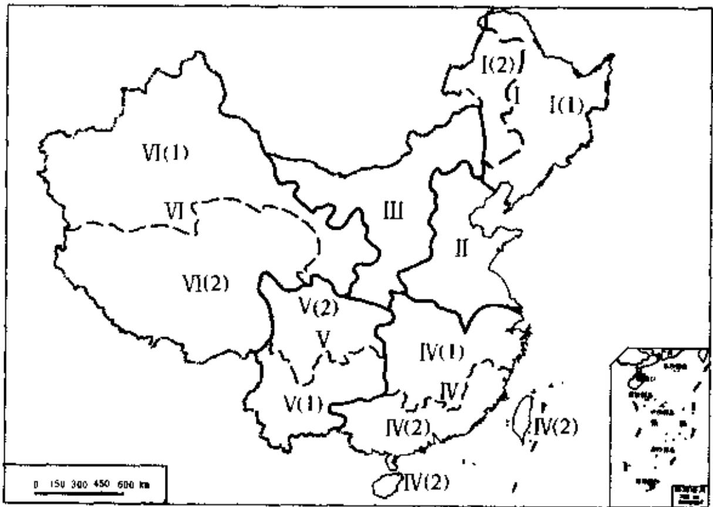  
图 2-7 我国复垦条件综台分区图  
.东北蒙东区；1.黄淮海区；Ⅲ.晋陕蒙西区；F华东南区：V.西南区： .新甘宁青藏区

各矿区的破坏类型，应该说生态破坏和生产力下降兼而有之，表中列出的是两者相比较较突出的一种类型。按上述分区方法，目前我国的煤炭产量分布、煤炭资源尚未利用的保有储量、2010

I -VI. 全国复垦条件综合分区

年规划产量分别如图2-8所示。

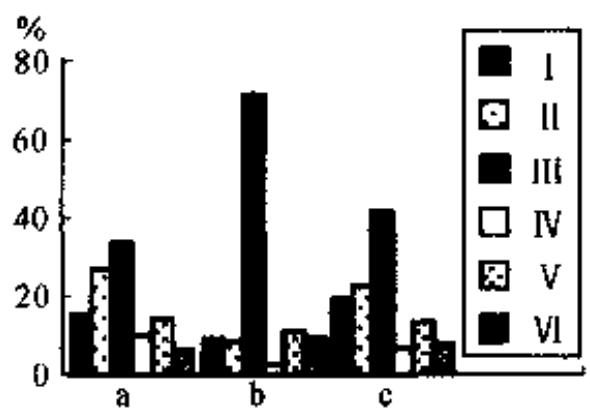

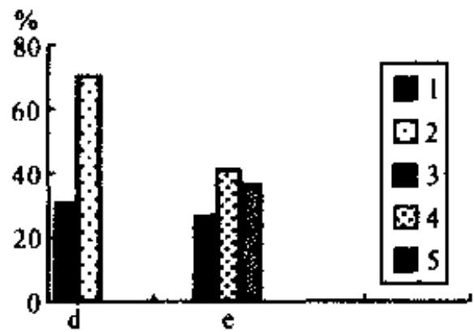  
图2-8 六个复垦条件区的基本情况

a. 月前产量(单位：%，全国产量为 12.3亿1);b. 未利用保有储量(单位；%，全国为7144.21亿t);c. 2010年规划产量(单位：%，全国为18.6亿t);d. 破坏类型；e. 复垦难度；

1 生产力破坏型；2. 生态破坏型；3 难度不大：4. 难度中等；5.难度较大.

## 2.6.2 复垦条件区分述

六大区十二亚区的划分不仅反映了各区破坏类型的一致性、复垦难度的相似性，还反映位于同一区或亚区的各矿区在土地复垦时可采取大体相同的工程与生物措施及复垦土地利用方向。6个大区12个亚区的共同点与相异之处具体表现在：

## 1. 东北蒙东区

东北蒙东区主要开采晚侏罗世煤田，晚侏罗世煤田储量占全区储量的78%，主要采煤矿区有鸡西、鹤岗、双鸭山、七台河、阜新、辽源、通化、舒兰、平庄、抚顺、铁法、霍林河、伊敏河、元宝山、宝日希勒、扎赉诺尔、大雁。

该区煤炭开采的特点是：①开采历史长，开发强度大。20世纪50年代到60年代该区产量占全国总产量的1/3，有些矿区已开采几十年甚至上百年。②有一定的露采产量，老的露天矿有抚顺西露天、阜新海州露天矿，目前露采产量占总产量的10%左右，

2010年随伊敏河、霍林河、元宝山、宝日希勒四大露天矿的进一步开发，规划露采产量将达总规划产量的22.8%。③黑龙江、蒙东是我国今后煤炭产量持续增长的重要基地。

东北蒙东区土地破坏大致可分为四类：①潜水位较高的平原地区，如沈南矿区，沉陷积水率大致与开滦矿区类似。此种类型面积较小；②潜水位较低的平原地区，如铁法矿区，积水面积不到3%；③丘陵地区，地表凹凸不平，开采沉陷后对地貌形态影响不大；④蒙东草原地带，地面沉陷或露采对牧草产量影响较大。

本区东北三省境内的土地破坏虽与黄淮海区土地破坏类似，但其土地复垦条件存在以下不同：①多数矿区为一年一熟制；②露天采矿占有一定的比例，可以考虑用井工开采沉陷地作为露采舍场；③本区丘陵地带水土流失严重，复垦时应以林业为主，即使未受采动影响的坡耕地也应尽量退耕还林；④蒙东亚区水资源相对贫乏，应以植树种草为主。

## 2. 黄淮海平原区

黄淮海平原区农业资源丰富，是我国重要的粮产区。本区煤炭资源并不丰富，但因国民经济发展需要，煤炭开采强度较大。本区以开采石炭二叠纪煤田为主，石炭二叠纪煤田占全国储量的80%以上。主要采煤矿区有开滦、峰峰、两淮、徐州、平顶山、兖州等。

该区煤炭开采的特点和复垦要求是：①开采历史长、开发强度大;②煤炭开采与农业生产矛盾突出；③本区许多矿区处于维持生产状况，增产潜力小。

黄淮海平原区土地破坏大致分为两种类型：高潜水位类型和中低潜水位类型。

本区土地复垦条件的特点是：①高潜水位地区采矿破坏后土壤盐渍化、土地沼泽化现象严重，是重要的破坏形式，中低潜水位区应防止坡地土壤侵蚀和地表细裂缝的水土流失；②是我国较早开展煤矿区土地复垦科研和实践的矿区，早在《土地复垦规定》颁布前就已总结出挖深垫浅、研石与粉煤灰回填塌陷坑等复垦技术，该三项技术已在该区得到了较好的推广应用：③《土地复垦规定》颁布后，该地区又探索出了以疏导积水、平整土地为主的非充填复垦技术；④本区复垦土地的利用方向以农业利用为主，尤其强调能复垦为耕地的尽量复垦为耕地。

## 3. 晋陕蒙西区

晋陕蒙西区地处黄土高原和黄河中段，生态环境脆弱，煤炭资源丰富，与黄淮海平原区同属华北聚煤区，以石炭二叠纪煤田分布为主。主要采煤矿区有大同、平朔、西山，阳泉、晋城、韩城、铜川、神府、东胜、准格尔等矿区。

该区煤炭开采的特点是：①开采条件好，外运条件较好，为我国今后一段时期内重要的煤产区；②煤炭开采受环境条件制约，尤其是水资源供应、运输条件的制约；③适于露天开采的储量较多，正在开采及规划开采的露天矿有平朔、准格尔、神府、东胜、胜利、河保偏，至2010年，规划露天开采产量为全国露采产量的50%，占本区规划产量的15.1%；④本区开采相对集中，表现在矿区集中且单个矿区生产能力大。目前大同矿区产量达3500多万吨，年产1000万t以上的还有晋城、潞安、西山、阳泉、平朔等。

本区土地破坏大致可分为两类：①汾渭谷地亚区，位于本区南部。有铜川、韩城、晋城等矿区，本亚区雨量较充沛，农业生产条件较晋北及晋陕蒙接壤区好；②晋北及晋陕蒙接壤亚区。气候条件差，开发强度大，水土流失严重，不毛之地多，位于沙漠边缘。

本区土地复垦条件的特点和复垦要求是：①本区对土地复垦的认识不足，因此需要广泛宣传，政策引导，提高认识，使生产者、决策者认识到土地复垦与区域生态环境重建或恢复是制约本区国民经济能否持续发展的制约因素之一。②以生态环境恢复为中心，以水土保持为重点，工程措施与生物措施相结合，开展以小流域为单位的综合复垦项目。③建立生态环境恢复补偿基金制度势在必行。国务院1988年9月1日曾批准发布《开发建设晋陕蒙接壤地区水土保持规定》，1988年底又颁布了《土地复垦规定》，国家环保总局曾提出建立生态环境恢复补偿基金制度(是针对全国各行各业的，实施起来比较困难，在晋陕蒙西地区实施起来也有一定困难)，这些规定和制度在该地区均未得到很好实施，原因是生态环境恢复补偿费与水土保持费、土地复垦费等有重复收费现象，建议本区建立生态环境恢复补偿基金制度后，只征收生态环境恢复补偿费，取消水土保持费和土地复垦费，而在计算生态环境恢复补偿费时考虑水土保持，土地复垦等项目。④汾渭河谷亚区复墨土地以农果为主；晋陕蒙接壤亚区以林牧果为主。

## 4. 华东南区

华东南区地处长江以南，降雨充沛，年均降雨量在1200\~2000mm之间，多数矿区位于丘陵山区。本区主要开采晚二叠世煤田，晚二叠世煤炭储量占全区储量的60%，其次为晚三叠世煤炭(如萍乡)。本区主要矿区有萍乡、涟邵、资兴等矿区。

该区煤炭开采的特点是；①煤层多为薄一中厚煤层，且不稳定，因此井型小，矿区分散，生产能力小；②本区水文地质条件复杂，含煤地层构造复杂，采煤成本高；③本区煤质差，含硫量高，矿井水pH值低，煤矸石露天氧化放出大量的SO2、CO和烟尘污染 ${ \bf S } ( ) _ { 2 }$ 大气，因此本区煤炭开采与利用引起的酸性污染是本区一大公害；④本区煤炭资源贫乏，多数矿区为衰竭型矿区。

根据本区土地复垦条件，复垦时的要求是：①加强对小煤矿的统一管理，合理规划，合理布局，禁止乱挖乱堆乱放，保护好自然地貌和自然环境；②复垦时综合考虑矿井水、煤研石等的融性污染，提高复垦质量；③加强矿区水土保持工作。

## 5. 西南区

西南区含煤地层主要是晚二叠世，晚三叠世和第三纪，以晚二叠世储量最多。本区雨量充沛，煤炭、水能资源丰富。人口1.8亿，人均国民生产总值比全国平均水平低45%。本区主要煤矿区有六枝、盘江、水城、攀枝花、芙蓉、松藻、南桐、广旺等矿区。

西南区煤炭资源分布与开采特点是：

①云贵煤炭资源保有储量及尚未利用的保有储量较四川多.但目前四川的煤炭产量比云贵两省之和还要大。因此四川煤炭牛产潜力小，贵州潜力大

滇东，黔西北和川南省接壤地带煤炭资源十分集中，占三省保有储量的 $7 5 ^ { 4 } 1 1 - 8 0 ^ { 4 } 1 1$ 。主要煤田或矿区有四川筠连筠高古叙；贵州盘江、水城六枝毕节；云南恩洪、老厂、昭通、小龙潭等三省接壤区是2000年以后本区煤炭开发基地。

除云南外，贵州、四川大部分煤田为高硫煤、且煤层薄，沼气含量高，多有煤与沼气突出危险。

④本区煤田地质构造复杂，加之有煤与沼气突出危险，限制了煤炭开采机械化程度和矿并产量。

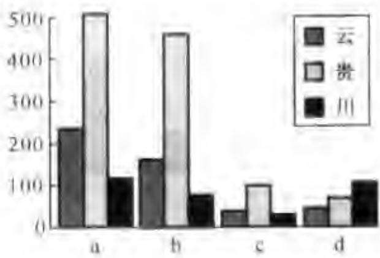  
图 $2 9$ 西南区煤炭产量及储量分布保有储歌，单位：亿未利用保有储量.单位=亿（精查储量、单负：亿id量，单位：102万

本区复垦条件分析：上地复垦应与酸性研石排放矿山酸性水排放等问题统筹考虑：2云贵高原土地利用垂直分异明显，矿区多位于山区，沟谷发育，切割深，排泄条件好，应充分利用当地水土热资源条件，发展当地适种的经济作物和林果，在复垦利用时还应消除开采产生的地表裂缝防止水土流失和山体滑坡；③四川盆地土地垦殖指数高、川中，川东丘陵山地水土流失严重，该区煤矿开采后一是污染严重，二是加剧了水土流失，因此该区复垦时在提高土地产出的同时。需加强生态环境恢复与整治

## 6. 新甘宁青藏区

新甘宁青藏位于我国西部，为边远内陆地区，地广人稀：新甘宁青主要为早中侏罗世煤田，西藏境内煤炭储量少，主要含煤时代为晚三叠世和第二纪主要矿区有宁夏石嘴山、石炭井甘肃靖远、窑街、新疆的哈密乌鲁木齐、艾维尔沟，青海的大通等。

本区煤炭资源分布与开采特点是：

①新甘宁青煤田构造简单到中等，可采层厚度大，且稳定；

②各省区煤炭资源分布与产量如图2-10：

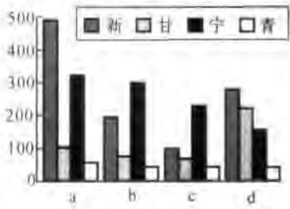  
图210 新日宁青藏区煤炭产量与储最分布0保有储量，单位。亿，未利用保有储量，单位亿精查储量、单位：1亿d.产量，单位：10万

③除石炭井年产量超过500方t石嘴山靖远、窑街乌鲁木齐，哈密五个矿区年产量在200一500万1之间，其他矿区产量均在100万：以下

## ④本区煤炭产量受制于水资源的供给和运输条件

本区地势分为青藏高原和新甘宁内陆两级阶梯，青藏高原气候高寒，新甘宁内陆干旱，均属不良类型。

本区复垦条件分省区特点如下：

①新疆10个煤田主要分布在准噶尔盆地、塔里木盆地边缘及天山、昆仑山间的中小型盆地内，矿区大部分属于干旱荒漠和荒漠草原。新疆深处内陆，降水稀少，由于雪山河流及开发地下水，形成了许多绿洲。全区冬季严寒，春季风沙大，空气湿度低，地表植被稀疏，生态环境脆弱。

②宁夏贺兰山含煤区位于宁夏北部，贺兰山之北，主要为山地，东面为黄河灌区，属银川平原。宁东煤田为南高北低的缓坡状半沙漠丘陵地区，地势较平坦，区内有较大面积的沙丘。各含煤区多分布于山区荒漠之中，为干旱和半干旱气候，除贺兰山外，其他地区供水均困难。该区生态环境脆弱，贺兰山含煤区已大量植树造林，对防止风沙和土地沙化起到了积极作用，宁东含煤区还要加强绿化工作，防止沙丘移动。

③甘肃西部矿区地处祁连山北坡及河西走廊荒漠中，除九条岭及天祝矿区地形复杂外，一般地势较平坦，属大陆性半干燥、干燥气候，大部分矿区水源较困难，目前生产矿区集中在中部地区，为大陆干燥气候。靖远矿区为低山丘陵和黄土丘陵区，无常年地表径流。窑街矿区在大通河谷地内，上游工业区已造成河水污染，矿区开采造成河谷耕地塌陷。阿干矿区为中山丘陵区，陇东地区的华亭矿区、安口－新窑矿区是本省今后开发的重点，地处六盘山麓东侧，为黄土高原。华亭矿区地形较平坦，安口－新窑矿区为丘陵区，属大陆性半干旱气候，冬季严寒多风干燥，夏季温热湿润。

④青海大通矿区为高山地形，海拔2450\~2700 m，北川河流经矿区东北部，属大陆性气候；热水、江仓、聚乎更、弧山位于大通河上游各地，属大陆性高寒气候，海拔高，热水为3343\~4324m,江仓为3800m，聚乎更及弧山为4050\~4200m，无绝对无霜期，年平均气温在0℃以下，有永久冻土，生存、生活环境严酷；大煤沟和鱼卡矿区为低山丘陵地形，大煤沟海拔3040m，鱼卡海拔3200 m，均属沙漠气候。

⑤青藏高原由于地形和气候条件的相互影响，农牧业生产受到严重限制，土地复垦利用方向以高原畜牧业为主，河谷地区以农业为主。甘新两区复垦利用方向以畜牧业和绿洲农业为主。

## 2.7 本章小结

1. 分析了开展矿区复垦条件分区的意义，提出了复垦条件分区的原则。介绍了我国煤炭资源分布与开发布局情况，分析了煤炭资源分布与开发布局对土地复垦的影响，得出了我国土地复里受煤炭资源分布与开发布局影响的五个特点：①我国矿区土地复垦与生态重建的重点集中在山西等14个省份；②土地复垦重点集中在平原矿区，生态重建重点集中在东北和“三西”各大矿区；③西南及中南地区土地破坏分散，属土地景观广泛破坏型和矿井水污染型；④我国井工矿山复垦任务重于露天矿山；⑤我国地方矿山土地破坏严重，但没有得到重视。

2. 提出了影响复垦条件分区的几个重要指标：干湿类型、热量条件与种植制度、地形特征、煤炭赋存条件与开发强度等。

3. 提出了复垦条件分区的加和指数模型和和积指数模型，对我国煤矿区复垦的生产力条件、生态类型、采矿破坏后的土地生产力水平与生态破坏类型分别进行了分区研究，应用证明和积指数模型优于加和指数模型。复垦区的生产力条件按综合自然条件分为黄淮海农业区等7个类型区；复垦区生态类型按ETI指数分为持续型、半持续型和非持续型，持续型矿区主要分布在我国东部和南部湿润-半湿润地区，非持续型大多分布在干旱-半干旱地区；采矿破坏后的土地生产力水平按PDI指数分为Ⅰ、Ⅱ、Ⅲ级，Ⅰ级下降幅度最大，主要分布在我国东部地区，Ⅲ级下降幅度最小，主要分布在东北、中原(河南)、长江以南及三西能源基地非露天采矿区；采矿引起的生态破坏类型区按EDI指数划分为两等三个类型，即破坏严重和不严重两个等级，结构缺损、功能缺损和功能一结构缺损并重三个类型，生态破坏严重的矿区大部分分布于中西部，或为露天采矿区，结构缺损型分布于我国东部，功能缺损型分布于我国中西部，中南、东北地区则属于结构一功能缺损并重型。

4. 综合各矿区开采破坏前生产力水平、生态类型及开采破坏引起土地生产力水平下降状况、生态破坏等级类型，将我国煤矿区复垦条件分为六个大区十二个亚区。并对每个大区的煤炭开采特点、土地破坏类型、复垦条件作了介绍，提出了不同区域的复垦治理对策。

# 第3矿区土進第章界面生产力系统地章究

## 3.1 矿区土地复垦界面的定义

## 3.1.1 问题的提出

问题1:图3-1(a)的土地减产减收边界大于塌陷边界；问题2:图3-1(b)的土地减产减收边界小于塌陷边界；问题3:图3-1(c)在塌陷边界附近出现增产增收现象。

图 3 -1中的塌陷边界是指下沉值大于10 mm的等值线围成的边界，土地减产减收边界通常是矿山企业征地或赔偿边界。

一般情况下，图3-1(b)是普遍现象，容易被人理解。出现图3-1(a)现象的原因较多，如土地沉陷后，地下水位的变化、土壤肥力的下降、耕作管理措施跟不上等。出现图3-1(c)现象的原因可以假设为土地沉陷对土壤环境有一定的改善作用，即开采沉陷在边界附近为正影响，因而使塌陷边界附近土地生产力有所提高。

上面的假设可以概括为图3-2所示的概念模型。图3-2中， $f _ { , \mathfrak { t } } ( \ v { x } _ { \cdot } , \ v { y } )$ 为 $( x , y )$ 点处j因子的初始值； $f , \left. x , y \right.$ 为 $\left( x , y \right)$ 点处j因子沉陷后的值； $\pmb { F } _ { 0 }$ 为 $\left( { \boldsymbol { \mathbf { \mathit { \Pi } } } } _ { \pmb { \mathcal { X } } } , { \boldsymbol { \mathbf { \mathit { y } } } } \right)$ 点影响土地生产力的初始因子值组成的集合； $\pmb { F }$ 为 $( x , y )$ 点沉陷后与 $\pmb { F } _ { \mathfrak { g } }$ 相对应的因子值组成的集合；P。为土地初始状态的生产力，P则为沉陷后土地的生产 $P _ { \mathrm { \Updownarrow } }$ $P$ 力。P可表示为：

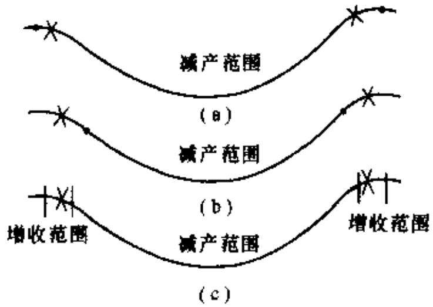

图3-1 土地产量增减边界与塌陷边界的关系×. 場陷边界；减产减收边界  
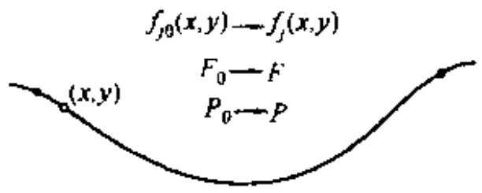  
图3-2 土地沉陷对土地生产力影响的概念模型

$$
P = \phi ( f , )\tag{3-1}
$$

式中， $\phi$ 为土地生产力函数。

## 3.1.2 土地复墨界面(Interface)的定义

土地复垦对象应是受采矿影响且生产力下降的土地。按前面的分析，受采矿影响，土地生产力下降存在一个边界，边界以内土地生产力下降，边界以外，土地生产力不变甚至有所提高。边界的位置与影响土地生产力大小的众多因素有关，这些因素中有的是几何量，肉眼可见的，有的则是无形的，这些有形的、无形的因素组成一个集合F。我们定义由一系列要素组成的类似F集合所决定的两个系统的边界为土地复垦界面。一类集合为影响土地生产力的因子集，由此集合决定的界面为土地复垦的生产力界面或土地复垦界面生产力系统；另一类集合为影响复垦区域生态系统特征的因素集，由此集合决定的界面为土地复垦的生态学界面或土地复垦界面生态系统。土地复垦的目的就是利用生物与工程措施改善集合F(包括土地生产力因素集和生态系统特征因素集两类集合)各元素的取值范围，达到恢复甚至提高土地生产力，促进生态系统达到平衡状态的目的。

“界面”的中文含义是指两种或两种以上的物质体系、能量体系、结构体系和功能体系的相交处，在这相交处或界面上，两个独立的体系存在着相互作用、相互联系。朗文字典将界面(Inter-face)定义为:“a place or area where different things meet and havean effect on each other。”地理学(牛文元,1990)将界面视为相对均衡要素之间的“突发转换”或“异常空间邻接”。物理学将界面定义为两个块体相之间的过渡区，它是不同于两块体相的第三相。作者之所以在这里列出一些关于“界面”的解释，目的是将作者研究的土地复垦界面阐明得更清楚些。根据上述定义，我们不难理解，土地复垦界面包括下述几种类型：

(1)影响土地生产力的诸要素为F集合，也是一个系统，复垦前后F。和F构成两个系统，两系统间形成一个界面； $F _ { \mathfrak { d } }$

(2)将构成复垦区生态系统的诸要素看成一个系统，复垦前后生态系统要素即形成两个系统，两系统间亦形成一个界面；

(3)在采动影响区内与影响区外无论是土地属性还是生态环境属性均可看成受影响和未受影响两个系统，在两个系统间也形

成一个界面。

从理论上说，上述三类界面对土地复垦是至关重要的。首先，只有认识一类界面的性质后，才能算是对复垦对象本身有了完全的认识，这一点无论是国内还是国外似乎都缺乏足够的研究，以至出现盲目的土地复原及许多无生命力的复垦技术方案。其次，如何评价一项复垦工程的成败，一直是复垦学家关心的问题，以至不少人试图建立一些评价指标或标准来完成这项工作，但效果都不佳，如我国试行的《土地复垦标准》至今没有得到各界的认同。作者这里提出复垦界面的设想虽也不一定能完全解决这一问题，但重要的是，在此，提出了一个解决问题的思路，即应该考虑两个系统之间的耦合和协调，以达到最佳的生产效能和生态效能。

除上述三类界面外，我们也可将某些特定的综合要素，作为一个子系统，复垦前后两个系统之间实际也存在一种界面，如土壤子系统，由土壤物理特性、养分状况、污染状况等组成，它从属于土地生产力系统。如有必要，可将土壤子系统界面单独研究，事实上，国外对这一类问题研究较多，只不过没有将它当作界面来处理。

## 3.1.3 土地复最界面的属性

从上面关子复垦界面的定义和三类界面的描述，我们不难总结土地复垦界面具有以下一些属性：

(1)要素的多维性。复垦界面由两个系统的多个要素决定，这些要素中有有形量，也有无形量。

(2)范围的有限性和不统一性。复垦界面虽具多维性，但其范围是有限的。有限范围的大小与界面类型有关，具有不统一性。

(3)效能的脆弱性和边际特性。土地复星界面在整合前后的生产效能和生态效能因受突发影响，而处于一种非均衡状态。系统要素处于动态变化之中，因而整个系统表现出脆弱的特性。另一方面，在两类系统演替过程中，也可能用恰当的人工干扰产生边际效应，即复垦后系统的效能优于复垦前的效能。因此，土地复垦

界面又具有边际特性。

(4)界面处竞争程度激烈。表现为工农竞争、不同用地类型的竞争、破坏与保护的矛盾、复垦与退化的矛盾等。

(5)可恢复原状的机会小、整体抗干扰能力弱。

(6)是土地利用系统、生态系统的非线性、非连续、突变的发生区。

## 3.1.4 土地复壘界面的整合

既然定义复垦界面为两个系统的交界面，那么理想的复垦效果应消除两个系统间的明显界限，这就是土地复垦界面整合的基本思想，即：通过恰当的工程、生物与经营管理等措施消除形成土地复垦界面的两个系统的明显界限，使复垦工程达到整体、协调、稳定、优化的效果。

土地复垦界面整合与土地复垦本身的区别在于土地复垦界面整合的对象是土地复垦界面，土地复垦的对象是生产建设过程中破坏的土地。土地复垦界面的范围要大于破坏的土地范围；土地复垦界面的要素可以由一系列亚系统组成，包括有形的和无形的，而破坏土地及其复垦的要素通常是有形的，如地貌形态的变化，因此土地复垦界面的要素比破坏土地的要素要广。土地复垦界面整合的手段包括工程技术(含采矿措施)、生物技术及管理措施，面土地复垦的手段主要是指工程技术和生物技术，且工程技术中通常不包括采矿措施。因此土地复垦界面整合是对土地复垦研究对象、研究手段的拓展，其目的是使土地复垦效果更明显、更好。

## 3.2土地复垦界面生产力系统的要素

## 3.2.1 土地生产过程分析

土地是由土壤、气候、地貌、岩石、植被和水文等因素组成的自然、历史综合体，是农业生产中最基本的生产资料(李发荣，1987)。土地之所以具有生产功能，不仅因为它以土壤为基础或养分库，还因为它具备了与作物生长相适宜的气候、水文等自然条件，同时还包含了人类劳动和物质输人的结果。影响土地生产功能的要素可概括为图3-3所示内容，值得注意的是土地生产力不仅取决于单一要素的作用，更重要的是取决于各个要素的综合作用。例如：土壤生产力水平很高，但劳动力投人不足或种植方式不当，可能导致土地生产力总体水平不高。李发荣(1987)称之为土地生产的平衡性与最小因素法则，即土地生产过程中，各因素是以相互联系相互制约的统一体发生作用的，因而各因素之间必须保持平衡，如果因素间比例不当，土地生产力会受最小因素或供给量最为不足的因素制约。另一方面，土地生产过程又是一动态过程，自然条件、人为因素会随时间而改变，土地生产力也会随时间而提高或衰减。但土地投入具有后效性和报酬递减规律，也就是说土地投人不是短期内能见效的，往往需经过一段时间甚至很长时间以后才从生产力水平上反映出来。而由于因素间平衡法则和作物生长的要求，对某一要素的过量投入会引起报酬递减。

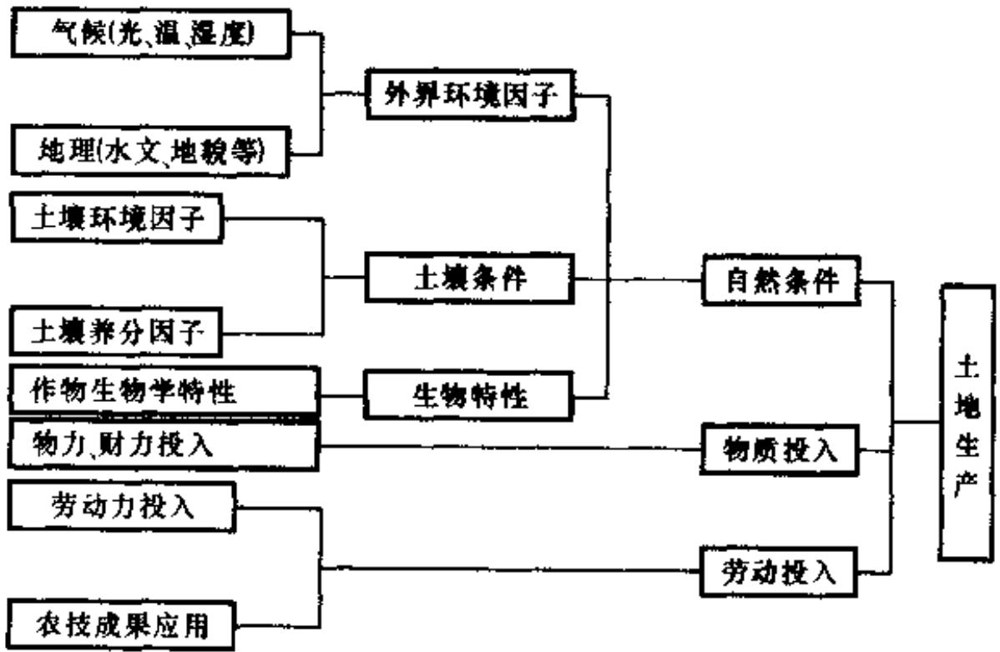  
图 3 -3 影响种植业土地生产力的要素

## 3.2.2 土地复垦界面生产力系统的要素类型

尽管影响复垦土地生产力的因素众多，但基本可概括为光、温、水、土及投人水平。不同的研究者根据不同的研究目的，可能把光、温、水、土及投人水平分成不同的因素组，如将光、温、水、土归为自然条件，或光、温、水归为气候因子，将投入水平又分为经济投入、技术条件和管理水平等。由于采矿过程对土地生产力的破坏表现为对土地利用环境的影响和对土壤的扰动，而复垦行为是通过投人对受影响因子进行改造而恢复土地生产力水平，因此，为分析采矿过程对土地生产力的破坏及复垦土地的生产力水平，我们不妨将影响复垦土地生产力水平的要素分为环境要素、土壤要素和投人要素三类。

## 1. 环境要素

Sweigard等(1986)研究了土地自然属性对土地利用的影响程度，如表3-1。Sweigard的土地自然属性与本文讨论的环境要素基本类似。表中列出了对农业利用影响最大的8个因子。

表3-1 土地自然翼性对土地利用的影响
<table><tr><td></td><td rowspan="3">土地利用 林</td><td rowspan="3">业 娱</td><td rowspan="3">乐 农业</td><td rowspan="3">居</td><td rowspan="3">住公共机构商业</td><td rowspan="3"></td><td rowspan="3">工业</td></tr><tr><td>自然属性</td><td></td></tr><tr><td>△地形起伏(平整度)</td><td>3</td></tr><tr><td></td><td>2</td><td></td><td>1</td><td>2</td><td>2</td><td>2</td><td>2</td></tr><tr><td>△坡度</td><td>1</td><td>3</td><td>1</td><td>2</td><td>1</td><td>1</td><td>1</td></tr><tr><td>标高</td><td>2</td><td>3</td><td>2</td><td>3</td><td>3</td><td>3</td><td>3</td></tr><tr><td>太阳辐射</td><td>2</td><td>3</td><td>2</td><td>3</td><td>3</td><td>3</td><td>3</td></tr><tr><td>△排水</td><td>1</td><td>3</td><td>1</td><td>1</td><td>1</td><td>1</td><td>1</td></tr><tr><td>Δ温度</td><td>1</td><td>2</td><td>1</td><td>3</td><td>3</td><td>3</td><td>3</td></tr><tr><td>△降雨</td><td>1</td><td>2</td><td>1</td><td>3</td><td>3</td><td>3</td><td>3</td></tr><tr><td>△覆岩</td><td>2</td><td>2</td><td>1</td><td>2</td><td>2</td><td>3</td><td>3</td></tr><tr><td>△土壤农业特性</td><td>2</td><td>2</td><td>1</td><td>3</td><td>3</td><td>3</td><td>3</td></tr><tr><td></td><td>土地利用</td><td rowspan="2">林业 娱</td><td rowspan="2">乐 农</td><td rowspan="2">业</td><td rowspan="2">居 住</td><td rowspan="2">公共机构商业</td><td rowspan="2"></td><td rowspan="2">工 业</td></tr><tr><td>自然属性</td><td></td></tr><tr><td>土壤工程特性</td><td></td><td>3</td><td>3</td><td>2</td><td>1</td><td>1</td><td>1</td><td>1</td></tr><tr><td>位置</td><td></td><td>3</td><td>1</td><td>2</td><td>1</td><td>1</td><td>1</td><td>1</td></tr><tr><td>通达度</td><td></td><td>3</td><td>2</td><td>3</td><td>1</td><td>1</td><td>1</td><td></td></tr><tr><td>△地块大小、形状</td><td></td><td>3</td><td>3</td><td>1</td><td>2</td><td>2</td><td>1</td><td>1</td></tr><tr><td>周圈土地利用情况</td><td></td><td>3</td><td>2</td><td>3</td><td>1</td><td>1</td><td>1</td><td>3</td></tr></table>

注：1. 表示影响最大，2. 表示中等影响，3. 表示影响最小。Δ. 对农业利用影响最大的因子。

理论上光、温、水、土，应属环境要素类，但由于针对某特定的复垦区，在复垦前后光、温、水等气候因子变化是不大的，可以认为对土地生产力的变化不产生影响，所以本文不考虑降雨和温度两因子，而土壤属性因子在复垦区较为重要，不仅采矿过程会对土壤属性产生影响，复垦过程更是直接对土壤采取各种工程与生物措施，因此，将覆岩和土壤农业特性因子作为土壤因素独立地进行分析。

无论对井工开采矿山还是露天开采矿山，地下水位状态都要受到开采影响，面地下水位状态对作物生长又是相当重要的，因此，复垦过程应该消除矿山开采对地下水位产生的消极影响。开采沉陷通常使地下水位下降，使潜水位埋深相对变浅，露天开采则通常使地下含水层疏于，因此地下水位的整合就是使潜水位埋深降至作物正常生长所要求的合理埋深，恢复露天采场复垦土地的地下水位，必要时在上层土内构筑防渗漏层达到表层土具有蓄水的能力。开采影响区地下水位状态变化与复垦区水位恢复问题，过去讨论较少，本章将作专题讨论。

复垦区地貌特征是指地表的高低起伏和地表变形连续性等，对土地生产力的影响表现为不同的作物对地貌条件的适应性存在差异，因而地貌特征对不同的土地利用方向产生不同的影响。开采沉陷使地表产生一定的附加坡度，露天排土场和矸石山形成堆积地貌，露天采空区和塌陷坑回填物料后形成回填地貌，这些特殊的地貌类型可用坡度、平整度及地块大小、形状等表示。剩下的平整度、坡度、排水、地块大小和形状4个因子均为环境要素要考虑的问题。作者认为，对复垦土地的农业利用而言，排灌同等重要，因此，用排灌因子代替Sweigard的排水因子。平整度、坡度、地块形状和大小可归结为地形地貌因子。被 Sweigard认为是中等影响的标高因子，对农业利用而言应该是非常重要的，因为地势低洼容易产生涝害，地势高则出现水分缺乏，这一因子看似地貌因子，实质与地下水位埋深有关，因此，作者认为应将地下水位状态作为环境要素中一因子进行考虑。归纳起来，环境因子包括地下水位状态、地形地貌特征(平整度、坡度、地块形状和大小)及排灌条件三方面。

开采影响区的排灌条件常发生以下变化：河流改道(露天矿区）、河道坡度及河堤标高变化、地势低洼引起排水不畅。灌溉渠道与设施破坏、地形坡度变化、水源不足等原因影响灌溉，复垦区排水系统一向被认为是必不可的，而灌溉问题则没有被重视，事实上复垦区灌溉既是非常重要的，也是具有特色的，因为复垦后农田较为分散且呈阶梯状分布，这就要求复里界面整合时，考虑这一特点，排灌结合，才能有效地提高复垦土地的生产力。排灌条件可以用排水能力、灌溉保证率表示，排水能力通常以达到排水设计标准的能力表示。

## 2. 土壤要素

土壤是供给植物生长发育所必需的水、肥、气、热的主要源泉，也是营养元素不断循环、不断更新的场所。土壤养分的输人、输出可用图3-4表示，由图3-4很容易写出土壤养分流平衡式：

$$
N _ { \varepsilon } = N _ { \mathfrak { g } } + O + I + S - C - F\tag{3-2}
$$

式中： $N _ { \ell } \longrightarrow - t$ 时刻的土壤有效养分含量；

$N _ { \mathfrak { d } }$ ——土壤有效养分初值；

O.I—有机态、无机态养分转化成有效养分的量；

S—施肥量或作物通过根、叶、茎参与土壤养分循环而使土壤有效养分增加量；

C——作物从土壤中吸取养分的量；

F——土壤有效养分流失量。

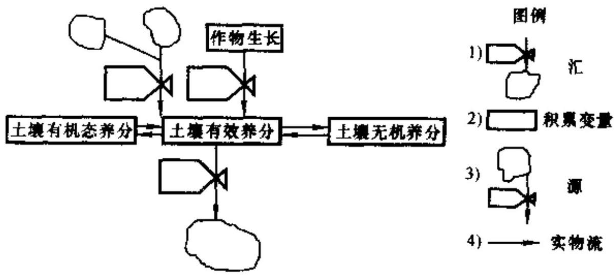  
图3-4 土壤养分输入输出的系统流图

由图3-4、式(3-2)不难发现采矿过程对土壤要素的影响，露天开采及复垦彻底改变了土壤养分的初始条件，且增加了养分流失的机会而减少了养分被作物吸收的流率。地下开采则首先改变了土壤环境条件，从而使作物生长量下降，即土壤养分流向作物的流率降低，同时又随坡度、裂缝的产生而增加了土壤养分的流失量。当土地处于绝产状态时或长期弃耕，就不存在作物的根茎叶参与土壤养分循环的可能，因而土壤养分输入量相对下降，这就使土壤处于不断退化状态。

土壤要素(或亚系统)的整合就是要改善土壤养分吸收储存环境，增加土壤养分输入、减少养分流失，提高作物生长量，并保证土壤养分有增无减，达到复垦土地持续利用的目的。

## 3. 投人要素

土地的产出过程离不开人类的投人，投人分为物质、资金和人力三方面，复垦土地的生产更是这样。物质投人包括种子、肥料、农药等的直接投人;资金是技术及物质的间接投人，如农业机械、电力、能源、技术服务费用等；人力主要是指劳动力的投人，农技人员的指导既可作为劳动力的投人，也可以技术服务费的形式称作资金投人。

比较复垦土地生产力与对照农田土地生产力时，应将物质、资金、人力投人折算成一中间量，如劳动日、货币量或能量单位，在复垦土地与对照农田投入这一中间量基本相当时，直接比较土地的生产力才有意义，否则应比较投人产出比，即比较单位面积土地内单位投人所获得的生产量或生产力水平。土地投人与土地生产力的关系，可用式(3-3)表达。

$$
y = a x _ { 1 } ^ { b } , x _ { 2 } ^ { b } x _ { 3 } ^ { b }\tag{3-3}
$$

式中： $\boldsymbol { y }$ 土地在特定时期的生产量；

$x _ { i }$ 土地的资金投入；

$x _ { \updownarrow }$ ——劳动力投入；

$x _ { 3 }$ ——物质投入；

a,b1,b2, $b _ { 3 }$ ——产出系数。

y, $x _ { 1 } \ldots x _ { 2 } , x _ { 3 }$ 均可转化成货币量单位分析。

## 3.2.3 土地复垦界面生产力系统三要素之间的关系

影响复垦土地生产力的三要素对土地生产力的影响可归纳成图3-5所示。投人要素是必要的输人，土壤要素是营养库和投入要素转化为生产力的场所，环境要素则起激励或抑制作用，作用于土壤要素，三要素共同作用的结果是土地具备生产功能，三要素缺一不可，且存在一最佳匹配状态，土地复垦界面的整合就是为了实现这-最佳匹配，最佳匹配或组合的结果可表示为：

$$
\mathbf { y } _ { \mathrm { o p t } } = f ( \cal I _ { \mathrm { \Omega } } , \cal S _ { \mathrm { o p t } } , \cal E _ { \mathrm { o p t } } )\tag{3-4}
$$

$$
y _ { \infty } \hat { \{ \mathrm { \Lambda _ { o p t } } = \mathrm { M a x } }\tag{3-5}
$$

式中：y—为理想的土地生产力水平，以(3-5)式为前提； $y _ { \infty }$

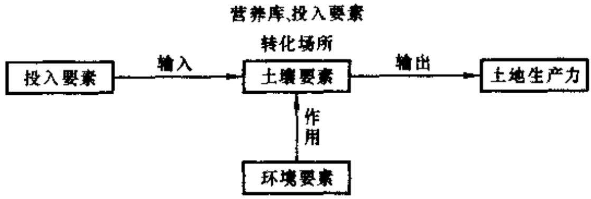  
图3-5 影响复垦土地生产力的三要素及其关系

$I _ { \infty }$ ——最佳的投入水平；

$S _ { \mathrm { o p t } }$ ——最佳的土壤条件；

$E _ { \omega \parallel }$ ——最佳的环境条件。

即：使 $y / l$ 达最大为理想状态，这时的投入水平为最佳投入水平，土地生 ${ \vec { \mathbf { \jmath } } } _ { } ^ { * }$ 力水平为理想的土地生产力水平。

## 3.3 水位界面的分析与表达

界面的描述取决于系统的描述，系统的描述则需用界面要素来表达，从本节起将分别对与土地生产力有关的一些界面要素作一简要的分析和表达。

## 3.3.1 潜水位埋深与土地生产力的关系

影响土地生产力和区域生态环境质量的水文要素较多，如地表径流、地表水、地下水质变化、水位动态变化等，但这些要素对土地生产力和生态系统的影响大多数都是间接的或者是可以通过适当的措施加以避免的。而潜水位埋深变化对作物生长状况的影响是最为直接的，因为保持作物正常生长要求地下水位埋深不低于某一固定值，这一固定值，称为地下水位临界埋深若要保证作物达到理想的生长状况，还要求地下水位埋深适当。开采沉陷对土地利用的影响表现之一就是地下水位相对埋深的变化，复垦土地标高的确定需要根据潜水位临界埋深来确定(卞正富，1996)。而潜水位埋深对土地生产力的影响表现则是通过最佳地下水位埋深来表达的，实际地下水位埋深小于最佳或最适宜的地下水位埋深，可能使作物根系处于过湿状态而使作物减产，当实际地下水位埋深大于最佳或最适宜的地下水位埋深时，可能使土壤干燥、作物根系供水不足，而使作物产量下降。设实际潜水位埋深为h，最佳潜水位埋深为 $\hslash _ { 0 }$ ，临界潜水位埋深为 $\pmb { h } _ { \mathbf { k } }$ ，则在其他条件相同的情况下，潜水位对土地生 $\vec { p } ^ { \mathbf { z } }$ 力的影响判别如式(3-6):

$$
\begin{array} { r } { h \left\{ \begin{array} { l l } { > h _ { 0 } } & { \pm \frac { \mu } { 2 } \hat { \sigma } \hat { \mathcal { H } } \mp \hat { \mathcal { H } } \mp } \\ { = h _ { 0 } } & { \pm \frac { \mu } { 2 } \hat { \sigma } \hat { \mathcal { H } } \times \hat { \mathcal { H } } \ q } \\ { < h _ { 0 } , \vert \Xi \vert > h _ { \ k } } & { \frac { \mu } { 2 } \hat { \mathcal { G } } \hat { \mathcal { H } } \times \hat { \mathcal { H } } \ q } \\ { < h _ { \ k } } & { \dagger \in \dot { \mathcal { W } } \mathcal { K } \oplus \mp \frac { \mu } { 2 } \hat { \mathcal { G } } \ q } \end{array} \right. } \end{array}\tag{3-6}
$$

## 3.3.2 开采沉陷对潜水位埋深的影响

如图3-6所示，设沉陷前地表面为近似水平而，隔水层与潜水面亦是近水平面，且设地表面、潜水面、隔水层的标高分别为$\mathcal { Z } , . Z _ { \mathfrak { s } } . Z ,$ ，则含水层厚度 $h _ { \mathbf { \nabla } \mathbf { \Psi } }$ ,潜水位埋深h及隔水层埋深 $\pmb { h } _ { \mathrm { i } }$ 分别为：

$$
h _ { \mathrm { \scriptsize ~ w } } = Z _ { \mathrm { p } } - Z _ { \mathrm { \scriptsize ~ \cdot ~ } }\tag{3-7}
$$

$$
h = z _ { * } - z _ { * }\tag{3-8}
$$

$$
h _ { \mathrm { i } } = Z , - Z _ { \mathrm { j } }\tag{3-9}
$$

显然，下沉前 $\hslash _ { \mathrm { \# } }$ 、h、 $h _ { i }$ 均为一定值。从图3-6可以看出，地下水位下沉形态与下沉盆地下沉形态是不一致的，而当隔水层位于整体弯曲带内时，隔水层下沉形态与下沉盆地的下沉形态可以认为是一致的。对于下沉范围，一般情况下，地下水位面的下沉范围要大于下沉盆地的范围，而隔水层范围要小于下沉范围。因此，设地表下沉值为W，，隔水层下沉值为W，潜水位下沉值为W，若将 $\mathbf { w } _ { \mathbf { \lambda } _ { \mathbf { \lambda } } }$ $\pmb { \ W } _ { i }$ $\smash { \ W _ { \perp } }$ 整个流域的地下水量视为一常数，不考虑其他流域或外界水分的输人与该流域水分的耗散，地下水位下沉量 $W _ { \mathfrak { p } } \left( x , y \right)$ 可由式(3-10)确定：

$$
\mathbb { S } h _ { \mathrm { ~ w ~ } } = \iint _ { \mathbb { S } } \big [ Z _ { \ p } - W _ { \ p } ( x , y ) - Z _ { \ i } + W _ { \ i } ( x , y ) \big ] \mathrm { d } x \mathrm { d } y\tag{3-10}
$$

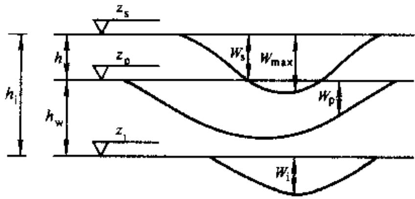  
图3-6 地表面、水位面与隔水层的下沉形态与范围

式中：S为地下水位的影响范围；

$W _ { \mathfrak { p } } ( x , y ) , W _ { \mathfrak { i } } ( x , y )$ 则为 S 范围内坐标为 $( x , y )$ 点的地下水位下降、隔水层下沉值；

$\ W _ { \cdot } \{ x , y \}$ 可由式(3-11)近似地表示，也可选取岩体内参数用概率积分法直接计算。

$$
\ W _ { \cdot } ( x , y ) = \left( 1 - \frac { 2 h _ { \cdot } } { L \tan \delta _ { 0 } } \right) \ W _ { \cdot } ( x , y )\tag{3-11}
$$

式中： $L$ ———走向主断面长度；

$\delta _ { \mathfrak { g } }$ ——走向边界角；

$W _ { \textrm { s } } ( x , y )$ ——地表下沉值，可用概率积分法计算。

式(3-10)的意义之一是可以在确定水位受影响的范围后，计算影响区内水位下沉值，另一用途是可以在实际测定水位变化后，确定水位受影响范围。

由(3-10)、(3-11)得到 $\boldsymbol { W } _ { \flat } ( \boldsymbol { x } , \boldsymbol { y } ) , \boldsymbol { W } , ( \boldsymbol { x } , \boldsymbol { y } )$ 后，任一点(x，$_ { y ) }$ 处的含水层厚度、地下水位埋深及隔水层埋深分别为：

$$
h _ { \mathrm { \ w } } ( \boldsymbol { x } , \boldsymbol { y } ) = h _ { \mathrm { \ w } } + W _ { \mathrm { \dot { \iota } } } ( \boldsymbol { x } , \boldsymbol { y } ) - W _ { \mathrm { \ p } } ( \boldsymbol { x } , \boldsymbol { y } )\tag{3-12}
$$

$$
\begin{array} { r } { h \left( x , y \right) = h + \mathbb { W } _ { \mathrm { p } } \left( x , y \right) - \mathbb { W } _ { * } \left( x , y \right) } \end{array}\tag{3-13}
$$

$$
\textit { \textbf { h } } ( \textit { \textbf { x } } , \textit { \textbf { y } } ) = \textit { \textbf { h } } _ { \mathrm { ! } } + \textit { \textbf { W } } _ { \mathrm { ! } } ( \textit { \textbf { x } } , \textit { \textbf { y } } ) - \textit { \textbf { W } } _ { \mathrm { ! } } ( \textit { \textbf { x } } , \textit { \textbf { y } } )\tag{3-14}
$$

由式(3-13)可分析潜水位受开采沉陷影响的几种情形，如式(3一15).

$$
h ( x , y ) \{ \begin{array} { l l } { \quad > h \quad } & { W _ { \mathrm { p } } \sim W _ { \mathrm { s } } > 0 \mathrm { ~ f i f ~ } , \lambda \mathrm { f i f ~ } \frac { \mathrm { d } y } { \mathrm { d } z } \frac { y \mathrm { d } \lambda } { \mathrm { d } z } \frac { \lambda } { \mathcal { K } } \qquad \quad } \\ { < h , > 0 \quad } &  \quad - h < W _ { \mathrm { p } } - W _ { \mathrm { s } } < 0 \mathrm { ~ f i f ~ } , \lambda \mathrm { f i f ~ } \frac { \mathrm { d } y } { \mathrm { d } z } \frac { y z } { \mathcal { K } } \frac { \lambda z } { \mathcal { K } } \frac { \lambda z } { \mathcal { K } } \frac { \lambda z } { \mathcal { K } } \frac { \lambda z } { \mathcal { K } } \frac { \lambda z } { \mathcal { K } } \frac { \lambda z } { \mathcal { K } } \frac { \lambda z } { \mathcal { K } } \frac { \lambda z } { \mathcal { K } } \frac { \lambda z } { \mathcal { K } } \frac { \lambda z } { \mathcal { K } } \frac { \lambda z } { \mathcal { K } } \frac { \lambda z } { \mathcal { K } } \frac { \lambda z } { \mathcal { K } } \frac { \lambda z } { \mathcal { K } } \frac { \lambda z } { \mathcal { K } } \frac { \lambda z } { \mathcal { K } } \frac { \lambda z } { \mathcal { K } } \frac { \lambda z } { \mathcal { K } } \frac { \lambda z } { \mathcal { K } } \frac { \lambda z } { \mathcal { K } } \frac { \lambda z } { \mathcal { K } } \frac { \lambda z } { \mathcal { K } } \frac { \lambda z } { \mathcal { K } } \frac { \lambda z } { \mathcal { K } } \frac { \lambda z } { \mathcal { K } } \frac { \lambda z } { \mathcal { K } } \frac { \lambda z } { \mathcal { K } } \frac { \lambda z } { \mathcal { K } } \frac { \lambda z } { \mathcal { K } } \frac { \lambda z } { \mathcal { K } } \frac { \lambda z } { \mathcal { K } } \frac { \lambda z } { \mathcal { K } } \frac { \lambda z } { \mathcal { K } } \frac { \lambda z } { \mathcal { K } } \frac { \lambda z }  \mathcal  \end{array}\tag{3-15}
$$

水位埋深增大通常出现在下沉盆地边缘部分，地表下沉值较小而水位下沉相对较大的地段；水位埋深变浅则出现在下沉值较大的地段；水位出露地表则出现在下沉盆地中央。水位出露地表后，明显改变了土地利用环境，使土地丧失种植能力；而水位埋深增大或变浅时又有式(3-1)所说几种情形，即 $h \left( \boldsymbol { x } , \boldsymbol { y } \right) > h _ { 0 }$ ,生产力下降； $h \left( x , y \right) = h _ { 0 }$ ，生产力最高； $h \left( \boldsymbol { x } , \boldsymbol { y } \right) < h _ { \mathrm { 0 } }$ ,但 $> h _ { k }$ 时，生产力下降； $h \left( x , y \right) < h _ { \mathrm { \Phi } _ { \mathrm { k } } }$ ，作物不能正常生长。同理还可类似地分析 $h _ { \Psi } \left( x , y \right)$ 与 $h _ { \mathrm { ~ w ~ } } , h _ { \mathrm { ~ i ~ } } ( \boldsymbol { \textbf { \em x } } , \boldsymbol { \textbf { \em y } } )$ 与h之间的关系与 $h \left( x , y \right)$ 与h之间的关系。

前面介绍的潜水位受开采沉陷的影响状况是一种理想状况，即基于流域范围足够大、流域内水量为一常数，不存在输入、输出的影响。事实上，水位变化大小和特点还取决于下沉盆地的深度、范围和几何尺寸，同时还与该区地表水系流域条件及地形地貌有关。首先就地形地貌而言，它决定了地表水流的条件，所以地表的下沉和变形、基岩的岩性、水文网络的发展、含水层的组成、地表水及地下水资源储量及利用情况、大气降雨量及强度、地表水的蒸发量及蒸发强度，都影响地下水位的变化。地下水位下沉范围及下沉量同流域中水系的主要循环范围以及地表下沉范围存在着不可分割的联系。也就是说在地表下沉值相同的情况下，由于流域范围不同，导致水位变化的结果也是截然不同的。下面我们再讨论两例特殊条件下的水位变化：

① $V _ { \ast } < V _ { \ast }$ 即含水层水源体积小于盆地体积时

如图3-7所示，设由于受含水层露头的限制、流域面积不大，且含水层水源较少，流域范围位于整个下沉盆地之内，则水位下沉值近似等于地表下沉值，即

$$
\pmb { W } _ { \ p } = \pmb { W } _ { s }\tag{3-16}
$$

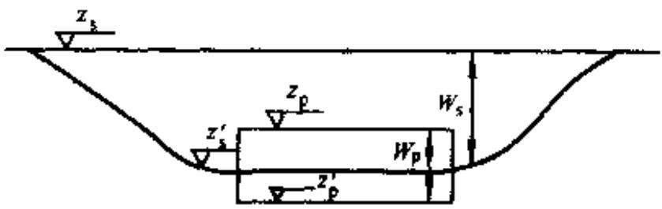  
图3-7 有限水源补给的地表水位下降情况

显然，这种情况下，地面沉降不会引起水位埋深的变化，因而除了其他物理形态，如附加坡度外，影响土地生产力的其他因子也不会受到影响。

② $\smash {  { V _ { s y } } \gg  { V _ { s } } }$ 时，即含水层水源体积远大于塌陷盆地体积时

如图3-8所示，由于有足量的水源体补充，沉陷后地下潜水位 $\smash { Z _ { \parallel } ^ { ' } = Z _ { p } }$ ，而地表面和隔水层标高分别由 $Z _ { \bullet } , Z _ { \bullet }$ 下降为 $Z _ { s } ^ { \prime } \cdot Z _ { 1 } ^ { \prime }$

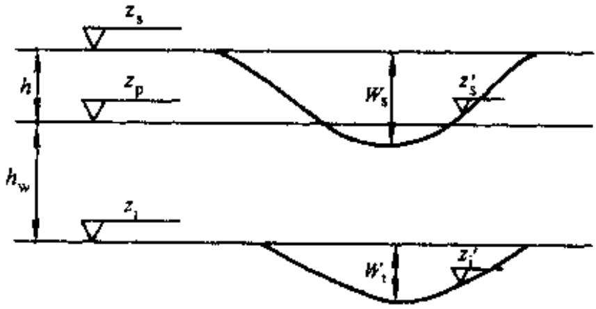  
图3-8 无限水源补给的地下水位下降情况

$$
Z _ { \ast } ^ { \prime } = Z , - W ,\tag{3-17}
$$

$$
\pmb { Z } _ { \ast } ^ { \prime } = \pmb { Z } _ { \ast } - \pmb { W } _ { \ast }\tag{3-18}
$$

于是水位埋深和含水层厚度h、hw变化为 $h ^ { \prime } \sqrt { 2 }$

$$
\begin{array} { r } { \dot { h ^ { \prime } } = Z _ { \mathrm { s } } - W _ { \mathrm { s } } - Z _ { \mathrm { p } } = h - W , } \end{array}\tag{3-19}
$$

$$
\pmb { \operatorname { \chi } } _ { \mathbb { W } } ^ { \prime } = \pmb { Z } _ { \mathbb { P } } - \pmb { \operatorname { \chi } } _ { \mathbb { i } } + \pmb { W } _ { \mathbb { \Gamma } _ { 1 } } = \pmb { h } _ { \mathbb { W } } + \pmb { W } _ { \mathbb { W } } ,\tag{3-20}
$$

由式(3-19)知，当 $h > W ,$ 时， $h ^ { \prime } > 0$ ,地表不会积水，而当h$\lneq \pmb { W }$ 时， $h ^ { \prime } < 0$ ，表明潜水位出露地表，地表出现积水坑。由式(3-20)知，因 $\Psi _ { \mathrm { \scriptscriptstyle 1 } } > 0$ ,所以 $h _ { \mathrm { \scriptsize ~ w } } ^ { \prime } > h _ { \mathrm { \scriptsize ~ w } }$ ，即沉陷范围内，含水层厚度增加了。

上述两例仍是人为假设的特例，事实上，这种特定的流域很少见，而往往是界于两者之间的情况比较常见。尽管如此，上述特例对于我们理解开采沉陷对地下水位的影响非常有帮助。

沉陷积水的水源来自地下水的渗入、灌溉退水、天然降水及地表径流汇人、矿井水、生活污水的排入甚至外河水的倒灌等多方面。一般情况下，出现外河水倒灌时，就必须采取分洪及加高河堤等强制措施，以保证矿井生产安全，所以不论沉陷区水位变化如何，地表积水状况如何，积水水源来自何方都与流域水文特征有关。

## 3.3.3 流域控制对潜水位埋深的影响

上述特例分析给我们一个启示，尽管开采沉陷改变了地下水位埋藏状态，但它可通过对流域水文特征进行调控来补偿地下水位的变化，使其达到理想的状态。这就是作者要提出的流域控制设想，下面我们讨论流域控制对潜水位埋深的影响。

流域控制包括水源控制、流域范围控制等方而。实施流域控制的步骤是首先采取防洪措施，防止洪水侵人，减小地表径流汇聚面积；其次是对地下水位埋深较浅的沉陷区域实施地下水位控制。地面流域控制与一般地区的流域控制类似，这里不作讨论，仅讨论地下水位的控制方法和原理。控制方法包括水源控制、水量控制

和流域范围控制。

## 1. 流域范围控制原理

间距为L的两条明沟构成一局部流域范围，此范围内的地下水位埋深由沟间距L、水沟深度D和水沟滞水深度W来控制，建立图3-9所示的坐标系，设水位面为抛物线形，则：

$$
\begin{array} { l } { \displaystyle \hbar \left( \mathbf { \Omega } _ { \mathcal { X } } \right) = D - W - \Delta \hbar \left( \mathbf { \Omega } _ { \mathcal { X } } \right) } \\ { \displaystyle = D - W - \frac { 4 \Delta \hbar _ { 0 } x } { L } \left( \mathbf { 1 } - \frac { x } { L } \right) } \end{array}\tag{3-21}
$$

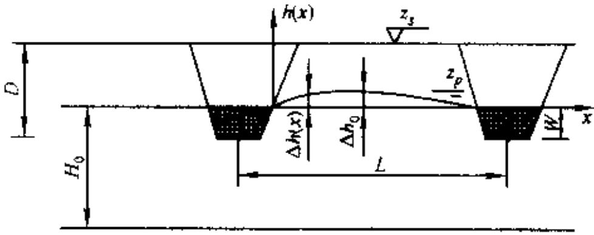  
图 3-9 水位控制原理

式中：h(r)为水位埋深；

$\Delta \hbar \left( x \right)$ 为图示剖面上水位线在图示坐标系中的抛物线函数；

$\Delta h _ { 0 }$ 为抛物线顶点，即 $x = \frac { L } { 2 }$ 处的水位相对于x轴的高度。

当隔水层位于有限深度且潜水为恒定流时， $\Delta h _ { \parallel }$ 由式(3-22)计算：

$$
4 k \Delta h _ { \mathrm { ~ 0 ~ } } ^ { 2 } + 8 k H _ { \mathrm { ~ 0 ~ } } \Delta h _ { \mathrm { ~ 0 ~ } } - \varepsilon L ^ { 2 } = 0\tag{3-22}
$$

式中：k土壤渗透系数，单位： $\mathbf { m } / \mathbf { d }$

$\boldsymbol { H } _ { \Uparrow }$ ——明沟水位至隔水层的距离，单位：m；

ε——降雨入渗强度，单位： ${ \bf m } / { \bf d } ,$ D

显然，其他参数一定时， $\Delta \hslash _ { \mathfrak { v } }$ 与L有关，L越大，即流域范围越大， $\Delta h _ { \mathfrak { n } }$ 越大，h(x)就越小，因此，可以调节L的大小，即流域

范围的大小来控制地下水位的埋深。

## 2. 水源控制原理

由图3-7的特例，我们很容易想到利用水源控制的办法将无限水源补给转变成有限水源补给，这样就可使沉陷对地下水位不产生任何影响或产生较小的影响。将无限水源补给转变成有限水源补给的方法之一是将一定的流域范围在含水层内建立类似隔水层性质的垂向挡水墙，这种办法实际上是难以做到的，但我们由地下水运动规律知，无限水源补给时，地下水首先进入控制流域(图3-9的两明沟间)，再排入明沟内，若不加控制，水沟内水位会上升至外界水源在本控制流域所应有的影响高度，从而使本区域内地下水位也上升。因此，我们只要采取一定措施控制明沟水位高度，即间接地控制了外界水源的补给，从而达到控制地下水位埋深的目的。(3-21)式已反映了这一水源控制的原理，即减小W，即可使h(x)相对变大。在有地表水源补给和天然降水补给时，保持W为定值，从而使h(x)在有源补给时保持恒定，则是水源控制的重要体现。当然除此之外，还可以加深水沟深度，即：使D变大，而使W一定，实现h(x)相对变深。

## 3. 水量控制原理

在流域含水层水源补给得到控制的情况下，设含水层总含水量为Q，流域面积为S，水位埋深为h，若采取抽水的方法抽出水量 $\Delta Q$ ,则水位埋深可降至h

$$
h ^ { \prime } = h \cdot \frac { \Delta Q } { S }\tag{3-23}
$$

通常欲完全控制地下水源补给是比较困难的，但只要抽水速率高于补给速率，同样可达到上述目的。实际上露天开采时疏干地下水即是在四周采用井排的方法实现的，而井灌区随地下水的抽出，地下水位往往会下降，也是减少地下水量使地下水位下降的原理，其原理如图3-10。

设流域内有几个任意分布的抽水井同时抽水，如图3-11所示、抽水量分别为 $\mathbf { Q } _ { 1 } , \mathbf { Q } _ { 2 } , \cdots , \mathbf { Q } _ { n }$ ，某水位计算点M距各抽水并的距离分别为 $r _ { 1 } , r _ { 3 } , \cdots , r _ { n }$ ，则M点处的水位降 $\Delta h _ { M }$ 由(3-24)式计算，抽水后M 点的地下水位埋深 $h _ { \textbf { M } } ^ { ' }$ 则由(3-25)式计算(桑燕珠，1991)。

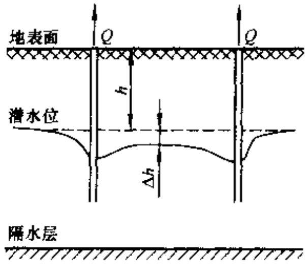  
图3-10 抽水井降低地下水位原理图

$$
\begin{array} { l } { \Delta \hslash _ { M } = \displaystyle \frac { 1 } { 4 \pi } \frac { \rho } { T } \sum _ { \prime \mathrm { ~ \neq ~ } } ^ { \prime } [ \mathbf { Q } _ { \rho , \omega } ( \boldsymbol { \mu } _ { \cdot } ) ] } \\ { \hslash _ { M } ^ { \prime } = \displaystyle h _ { M } - \Delta h _ { M } } \end{array}\tag{3-24}
$$

(3-25)

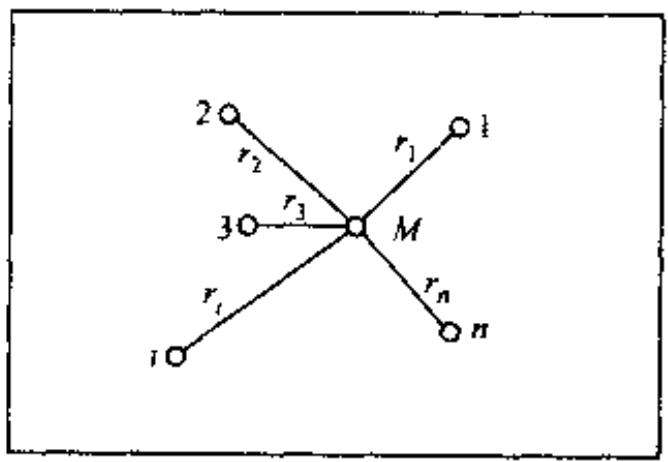  
图 3 -11 抽水井分布

式中：T——导水系数，当竖井为承压并时， $T = \kappa M$ ;当竖并为无

压潜水井时， $T = K { \overline { { H } } }$

K———含水层渗透系数，单位： $\mathbf { m } / \mathbf { d }$

M—承压含水层厚度，单位：m；

$\dot { H }$ —潜层水抽排前后的平均过水深度，单位：m；

$\omega ( u , )$ ———井函数，可查表 $3 - 1 , u _ { \star } = \frac { r _ { \star } } { 4 \alpha t }$

$r _ { \mathrm { { r } } }$ ——第；井距M点的距离，单位：m;

t——抽排时间，单位;d;

α——压力传导系数， $\alpha = \frac { \mathrm { T } } { \mu }$

$\mu$ —给水度。

表3-2 并函数 ω()表(桑燕珠，1991)
<table><tr><td></td><td rowspan=1 colspan=1>1</td><td rowspan=1 colspan=1>1.0</td><td rowspan=1 colspan=1>2.0</td><td rowspan=1 colspan=1>3.0</td><td rowspan=1 colspan=1>4.0</td><td rowspan=1 colspan=1>5.0</td><td rowspan=1 colspan=1>6.0</td><td rowspan=1 colspan=1>70</td><td rowspan=1 colspan=1>8.0</td><td rowspan=1 colspan=1>9.0</td></tr><tr><td rowspan=6 colspan=1></td><td rowspan=1 colspan=1></td><td rowspan=1 colspan=1>0.219</td><td rowspan=1 colspan=1>0.049</td><td rowspan=1 colspan=1>0.013</td><td rowspan=1 colspan=1>0.0038</td><td rowspan=1 colspan=1>0.0011</td><td rowspan=1 colspan=1>0.00036</td><td rowspan=1 colspan=1>0.00012</td><td rowspan=1 colspan=1>0.00004</td><td rowspan=1 colspan=1>0.00</td></tr><tr><td rowspan=1 colspan=1> $\times 1 0 ^ { - 1 }$ </td><td rowspan=1 colspan=1>1 82</td><td rowspan=1 colspan=1>122</td><td rowspan=1 colspan=1>0.91</td><td rowspan=1 colspan=1>0.70</td><td rowspan=1 colspan=1>0 56</td><td rowspan=1 colspan=1>0.45</td><td rowspan=1 colspan=1>0.37</td><td rowspan=1 colspan=1>0.31</td><td rowspan=1 colspan=1>0.26</td></tr><tr><td rowspan=1 colspan=1> $\times 1 0 ^ { - 2 }$ </td><td rowspan=1 colspan=1>4.04</td><td rowspan=1 colspan=1>3.35</td><td rowspan=1 colspan=1>2.96</td><td rowspan=1 colspan=1>2.68</td><td rowspan=1 colspan=1>247</td><td rowspan=1 colspan=1>2.30</td><td rowspan=1 colspan=1>2.15</td><td rowspan=1 colspan=1>2.03</td><td rowspan=1 colspan=1>1.92</td></tr><tr><td rowspan=1 colspan=1> $\times 1 0 ^ { - 3 }$ </td><td rowspan=1 colspan=1>6.33</td><td rowspan=1 colspan=1>5.64</td><td rowspan=1 colspan=1>5.23</td><td rowspan=1 colspan=1>4.95</td><td rowspan=1 colspan=1>4.73</td><td rowspan=1 colspan=1>4.54</td><td rowspan=1 colspan=1>4.39</td><td rowspan=1 colspan=1>4.26</td><td rowspan=1 colspan=1>4.14</td></tr><tr><td rowspan=1 colspan=1> $\bf \tilde { \alpha } 1 0 ^ { - 4 }$ </td><td rowspan=1 colspan=1>8.63</td><td rowspan=1 colspan=1>7.94</td><td rowspan=1 colspan=1>7.53</td><td rowspan=1 colspan=1>7.25</td><td rowspan=1 colspan=1>702</td><td rowspan=1 colspan=1>6.84</td><td rowspan=1 colspan=1>6.69</td><td rowspan=1 colspan=1>6.55</td><td rowspan=1 colspan=1>6.44</td></tr><tr><td rowspan=1 colspan=1> $\bf { y } _ { \textrm { \scriptsize i 0 } ^ { - 3 } }$ </td><td rowspan=1 colspan=1>10.94</td><td rowspan=1 colspan=1>10.24</td><td rowspan=1 colspan=1>9.84</td><td rowspan=1 colspan=1>9.55</td><td rowspan=1 colspan=1>9.33</td><td rowspan=1 colspan=1>9.14   3</td><td rowspan=1 colspan=1>8.99</td><td rowspan=1 colspan=1>8.86</td><td rowspan=1 colspan=1>8.74</td></tr><tr><td rowspan=2 colspan=1></td><td rowspan=2 colspan=1> $\times 1 0 ^ { - 6 }$  $\times 1 0 ^ { - 7 }$ </td><td rowspan=1 colspan=1>13.24</td><td rowspan=1 colspan=1>12.55</td><td rowspan=1 colspan=1>12.14</td><td rowspan=1 colspan=1>11.85</td><td rowspan=1 colspan=1>11.63</td><td rowspan=1 colspan=1>11.45</td><td rowspan=1 colspan=1>u.29</td><td rowspan=1 colspan=1>11.16</td><td rowspan=1 colspan=1>11.04</td></tr><tr><td rowspan=1 colspan=1>15.54</td><td rowspan=1 colspan=1>14.85</td><td rowspan=1 colspan=1>14.44</td><td rowspan=1 colspan=1>14.15</td><td rowspan=1 colspan=1>13.93</td><td rowspan=1 colspan=1>13.75</td><td rowspan=1 colspan=1>13.60</td><td rowspan=1 colspan=1>13.46</td><td rowspan=1 colspan=1>13.34</td></tr><tr><td rowspan=1 colspan=1></td><td rowspan=1 colspan=1> $\times 1 0 ^ { - 9 }$  1</td><td rowspan=1 colspan=1>7.84</td><td rowspan=1 colspan=1>17.15</td><td rowspan=1 colspan=1>16.74</td><td rowspan=1 colspan=1>16.461</td><td rowspan=1 colspan=1>6.23</td><td rowspan=1 colspan=1>16.05</td><td rowspan=1 colspan=1>15.90</td><td rowspan=1 colspan=1>15.76</td><td rowspan=1 colspan=1>15.65</td></tr><tr><td rowspan=1 colspan=2> $\times \left. 1 0 ^ { - 9 } \right.$ </td><td rowspan=1 colspan=1>20.15</td><td rowspan=1 colspan=1>19.45</td><td rowspan=1 colspan=1>19.05</td><td rowspan=1 colspan=1>18.76</td><td rowspan=1 colspan=1>18.54</td><td rowspan=1 colspan=1>18.35</td><td rowspan=1 colspan=1>18.20</td><td rowspan=1 colspan=1>18.07</td><td rowspan=1 colspan=1>17.95</td></tr><tr><td rowspan=1 colspan=2> $\times 1 0 ^ { - } ^ { \mathfrak { u } }$  2</td><td rowspan=1 colspan=1>2.45</td><td rowspan=1 colspan=1>21.76</td><td rowspan=1 colspan=1>21.35</td><td rowspan=1 colspan=1>21.06</td><td rowspan=1 colspan=1>20.84</td><td rowspan=1 colspan=1>20.66</td><td rowspan=1 colspan=1>20.50</td><td rowspan=1 colspan=1>20.37</td><td rowspan=1 colspan=1>20.25</td></tr><tr><td rowspan=1 colspan=2> $\times 1 0 ^ { - 1 1 }$ </td><td rowspan=1 colspan=1>24.75</td><td rowspan=1 colspan=1>24.06</td><td rowspan=1 colspan=1>23.65</td><td rowspan=1 colspan=1>23.36</td><td rowspan=1 colspan=1>23.14</td><td rowspan=1 colspan=1>22.96</td><td rowspan=1 colspan=1>22.81</td><td rowspan=1 colspan=1>22.67</td><td rowspan=2 colspan=1>22.5524.86</td></tr><tr><td rowspan=1 colspan=2> $\times { \mathfrak { i } } ( ) ^ { - 1 2 }$  2</td><td rowspan=1 colspan=1>7.05</td><td rowspan=1 colspan=1>26.36</td><td rowspan=1 colspan=1>25.96</td><td rowspan=1 colspan=1>25.67</td><td rowspan=1 colspan=1>25.44 25</td><td rowspan=1 colspan=1>26</td><td rowspan=1 colspan=1>25.11</td><td rowspan=1 colspan=1>24.97</td></tr><tr><td rowspan=1 colspan=2> $\times 1 0 ^ { \mathrm { ~ \ t ~ 3 ~ } }$ </td><td rowspan=1 colspan=1>29.36</td><td rowspan=1 colspan=1>28.66</td><td rowspan=1 colspan=1>28.26</td><td rowspan=1 colspan=1>27.972</td><td rowspan=1 colspan=1>7.75 27</td><td rowspan=1 colspan=1>56</td><td rowspan=1 colspan=1>27.41</td><td rowspan=1 colspan=1>27.28</td><td rowspan=1 colspan=1>27.16</td></tr><tr><td rowspan=1 colspan=2> $\times 1 0 ^ { - 1 4 }$ </td><td rowspan=1 colspan=1>31.663</td><td rowspan=1 colspan=1>0.97</td><td rowspan=1 colspan=1>30.55</td><td rowspan=1 colspan=1>30.27</td><td rowspan=1 colspan=1>30.05</td><td rowspan=1 colspan=1>29.87</td><td rowspan=1 colspan=1>29.71</td><td rowspan=1 colspan=1>29.58</td><td rowspan=1 colspan=1>29.46</td></tr><tr><td rowspan=1 colspan=2> $\times 1 0 ^ { \mathrm { ~ 1 5 ~ } }$ </td><td rowspan=1 colspan=1>33.96</td><td rowspan=1 colspan=1>33.27</td><td rowspan=1 colspan=1>32.86</td><td rowspan=1 colspan=1>32.58 32</td><td rowspan=1 colspan=1>35</td><td rowspan=1 colspan=1>32.17</td><td rowspan=1 colspan=1>32.02</td><td rowspan=1 colspan=1>31.88</td><td rowspan=1 colspan=1>31.76</td></tr></table>

## 4. 露采复垦区域水位的恢复

前述分析均是针对井工矿山沉陷区域潜水位相对上升而采取必要的降低水位的方法.对于露采复垦区域可能情况刚好相反，松

散的岩土回填(backfilling)到采空区后，不再具有分层现象，蓄水能力较差，因此在回填过程中，需要采取压实、土壤重构等措施提高露采复垦区域水位的恢复与水分的保持能力。

## 3.4 复垦土壤界面的分析

## 3.4.1 概述

矿山开采对环境的影响表现是多方面的，其中影响土地利用的一个重要方面是矿区土壤的退化。露天开采对土壤的影响规律，国内外均有较多的研究，而井工开采对土壤的影响则研究较少。复垦土壤的改良效果是复垦工程成败的一条重要评价标准。我国《土地复垦规定》颁布以来，土地复垦取得了长足的进展，主要成绩是工程复垦进展迅速，但不太重视复垦土壤的改良状况及生物复垦技术，随土地复垦工作的深人展开，容易形成一种错误的认识，即土地复垦就是土方工程，事实上，这一观念在一些地区比较盛行，为此，本节将煤炭开采对土壤环境的影响及复垦土壤质量的变化规律作为独立的专题进行研究，其目的是弄清开采对土壤的影响规律，不同复垦方法对土壤质量的影响规律及复垦土壤的适种性，从而使工程复垦、生物复垦、复垦土壤改良培肥成为整个土地复垦与利用的一个有机组成部分。研究之前，我们有必要对复垦土壤作一界定，本节所讨论的复垦土壤包括露天矿的排土场与采场复垦土壤、井工矿山矸石排放场复垦土壤、粉煤灰充填复垦区土壤及开采沉陷区非充填复垦土壤等，前三者可合称为矿山土，后者称为原生扰动土(简称扰动土)。本专题的研究内容包括：①开采沉陷对土壤质量的影响；②扰动土的复垦与利用；③矿山土的特性及复垦利用。

## 3.4.2 开采沉陷对土壤质量的影响

国内外关于开采沉陷区土壤特性及沉陷区复垦后的土壤特性

研究均较少，尤其是开采沉陷对土壤质量影响的研究更少。

## 1. 开采沉陷对土壤物理特性的影响

在中低潜水位矿区，我们可直观地发现开采沉陷后，地表产生附加坡度和裂缝，这种地表物理形态的改变会引起土壤侵蚀和水土流失，这是很容易为人们想到的危害，而高潜水位矿区，由于地下水位埋深相对较浅，土壤容易返盐，即产生次生盐渍化现象，季节性积水区域则在地表产生炭化层，出现沼泽化现象。除此之外，开采沉陷对土壤质量产生的其他不良影响，尚没有人通过实验来揭示，以下为我们在徐州矿区所做试验的基本情况：

实验地点：徐州矿务局诧城矿魏庄沉陷区(简称S)和大黄山 $\pi$ $S _ { \nu }$ 矿西翼沉陷区(简称 $S _ { 2 }$ )。

场地条件：两矿均属于高潜水位类型，试验地点均未积水，且 $\pmb { \mathcal { D } } ^ { \mathbf { \alpha } }$ 能耕种、但开采沉陷后有一定的坡度，S，坡度在 $S _ { 1 }$ $2 ^ { \circ } \sim 3 ^ { \circ }$ 左右， $\pmb { S } _ { 2 }$ 坡度在 $1 ^ { \circ } \sim 2 ^ { \circ }$ 左右。 $S _ { 1 } , S _ { 2 }$ 两场地均为稻麦两熟地，取样日期为6月初麦收后：估计 $S _ { \nu }$ 场地小麦产量 $3 ~ 7 5 0 ~ \mathrm { k g / h m ^ { 2 } }$ 左右， $S _ { z }$ 场地小麦产量 $1 ~ 5 0 0 ~ \mathrm { k g / h m } ^ { ? }$ 左右。 $S _ { 1 }$ 对照田产量约 4500\~5 250${ \bf k } \ g / { \bf h } { \bf m } ^ { 2 } , S _ { 2 } ^ { \mathrm { ~ } }$ 对照田产量在 $6 ~ 0 0 0 ~ \mathrm { k g / h m ^ { 2 } }$ 以上。

实验方法：含水量测定采用小铝盒法，容重测定采用环刀法，比重测定采用比重瓶法。取样地点分别为上坡和下坡及对照田，如图3-12所示。

实验结果：实验结果如表3-3所示，土壤含水率W，土壤容重d，土壤比重 D，土壤总孔隙度 P，分别用(3 -26)、(3-27)、(3 $d$

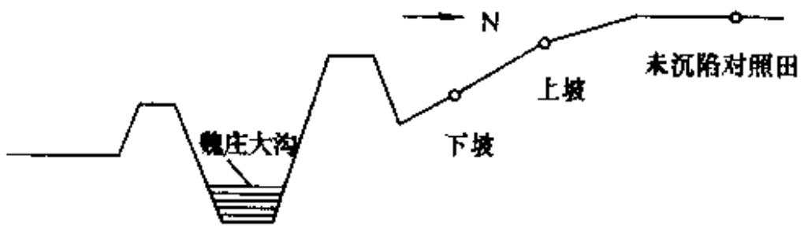  
图 3 -12 取样点位置

-28)、(3-29)计算：

$$
W = [ ( \frac { k  } { \hbar } \overleftrightarrow { \mathbb { E } } + \overleftrightarrow { \mathbb { k } } + \overleftrightarrow { \mathbb { k } } ) - ( \frac { k  } { \hbar } \overleftrightarrow { \mathbb { k } } + \overleftrightarrow { \mathbb { F } } \pm \overleftrightarrow { \mathbb { k } } ) ] / [ ( \frac { k  } { \hbar } \overleftrightarrow { \mathbb { k } } + \overleftrightarrow { \mathbb { F } } \pm \overleftrightarrow { \mathbb { k } } ) ]
$$

$$
- \frac { 5 0 } { 1 2 } \approx \frac { 2 0 } { 1 2 } ] \times 1 0 0 , \frac { 8 0 } { 1 2 } \approx \frac { 9 } { 1 2 }\tag{3-26}
$$

$$
d = ( M \times 1 0 0 ) / [ ( 1 0 0 + W ) \times V ] , \dot { \ P } \dot { \| } \dot { \chi } : \mathrm { g / c m } ^ { 3 }\tag{3-27}
$$

$$
D = ( \mathbf { \delta W _ { 2 } } - \mathbf { W _ { \delta \eta } } ) / [ \mathbf { \delta W _ { 4 } } + ( \mathbf { \delta W _ { 2 } } - \mathbf { W _ { \eta } } ) - \mathbf { W _ { \eta } } ] \times \gamma _ { \iota }\tag{3-28}
$$

$$
P = ( D - d ) / D \times 1 0 0 , \ncong \langle \dot { \downarrow } , \langle \dot { \downarrow } , \langle \begin{array} { c } { 0 \check { \delta } } \end{array} \rangle\tag{3-29}
$$

表 3-3 开采沉陷对土壤物理特性的影响
<table><tr><td></td><td>指</td><td>标</td><td> $W / \%$   $d / \{ g ^ { . } { \bf c m } ^ { . } { \bf \Phi } ^ { 3 } \}$ </td><td> $D / ( g \cdot c \mathsf { m } ^ { - 3 } )$ </td><td> $\pounds / \ P$ </td></tr><tr><td colspan="2">样 点</td><td></td><td>1.45</td><td>2.62</td><td>44.66</td></tr><tr><td rowspan="3"> $s _ { \mathfrak { g } }$ </td><td>上坡</td><td>31.5</td><td>1.63</td><td>2.63</td><td>38.02</td></tr><tr><td>下坡</td><td>42.5</td><td></td><td></td><td></td></tr><tr><td>对照田</td><td>31.3</td><td>1.44</td><td>2.64</td><td>45.45</td></tr><tr><td rowspan="3"> $S _ { 2 }$ </td><td>上 坡</td><td>39.5</td><td>1 27</td><td>2.64</td><td>51.89</td></tr><tr><td>下坡</td><td>50.5</td><td>1 32</td><td>2.62</td><td>49.62</td></tr><tr><td>对照田</td><td>30.4</td><td>1.31</td><td>2.68</td><td>51 12</td></tr></table>

式中：M———环刀中湿土重，g；

${ \pmb W }$ 土壤含水率，%；

V——环刀体积， $\mathrm { c m } ^ { 3 }$ ，实验用环刀体积 $V = 1 0 0 ~ \mathrm { c m } ^ { 3 }$

$\pmb { W } _ { 1 }$ ——比重瓶重，g；

$W _ { \textrm { \exists } }$ ———比重瓶内放入烘干土(过1rm土壤筛)后的重量，g；

$\mathbf { { W } } _ { 3 }$ ——称重 $\boldsymbol { \ W } _ { \mathit { 1 } }$ 后蒸馏水在砂浴上煮沸去除土和水中的空气，再加满蒸馏水，称取的重量，g；

$\pmb { W } _ { 4 }$ ——比重瓶中水与土倒出洗净，用同样室温的蒸馏水装满，称取的重量，g；

$\gamma _ { \iota }$ 一 $t \mathbb { C }$ 时水的比重， $\mathsf { g } / \mathrm { c m } ^ { 3 }$

结果分析：从土壤含水率看，上坡含水量明显小于下坡，这是由下坡地势低洼引起的。而将S、与S2的含水率对比知，S：土 $S _ { \ l _ { 1 } }$ $S _ { z }$ $S _ { \mathfrak { z } }$ 壤含水率过高或低洼积水是影响作物产量的主要因素；从土壤容重分析，下坡的容重亦大于上坡，尤其是 $S _ { \mathfrak { t } }$ 试验点的下坡容重显著大于上坡，其绝对值也是偏高的，应该说这是引起沉陷区与对照田产量差异的原因之一， $S _ { \mathrm { i } }$ 与 $S _ { z }$ 相比，试验场地 $S _ { \mathfrak { z } }$ 的土壤容重较试验点 $S _ { \imath }$ 为有利，这是由两试验点的土壤类型不一引起的， $S _ { \imath }$ 试验点为湖滨淤土， $S _ { 2 }$ 试验点则为两合土。两试验点的土壤比重差异不大，上坡下坡也不存在差异，而土壤总孔隙度由于受土壤比重、容重的影响，也存在相应的差异。

由上面的分析知，开采沉陷对土壤含水率.土壤容重及土壤总孔隙度存在明显的影响，事实上，土壤含水率的影响与地势低洼有关，或者说可能与地下水位相对埋深较浅有关，因此可与地下水位埋深结合起来考虑其影响。开采沉陷对土壤容重的影响是由坡度或排灌条件的变化引起的，之所以下坡方向土壤容重变大，是因为随地表径流或灌溉排水，上坡方向的微细颗粒流至下坡，填塞了土壤的孔隙，而使容重变大，孔隙度变小。

## 2. 对土壤养分水平的影响

上述实验过程中，我们同时对开采沉陷区土壤的养分水平进行了监测，实测的指标有N、P、K和速效N、P、K以及有机质含量，取样点包括两试验场的上坡、下坡及对照田。实验结果如表3-4

表3-4 开采沉陷对土壤养分水平的影响
<table><tr><td rowspan=2 colspan=2>指标样    点</td><td rowspan=1 colspan=3>全量/%</td><td rowspan=1 colspan=3>連效 $\scriptstyle \int \left\{ { \mathrm { ~ m g ~ } } ^ { \cdot } \left| k \pmb { \mathbb { g } } ^ { \cdot } { } ^ { \perp } \right. \right\}$ </td><td rowspan=1 colspan=1> $\%$ </td></tr><tr><td rowspan=1 colspan=1>氮</td><td rowspan=1 colspan=1>磷</td><td rowspan=1 colspan=1>钾</td><td rowspan=1 colspan=1>速效氨</td><td rowspan=1 colspan=1>速效磷</td><td rowspan=1 colspan=1>速效钾</td><td rowspan=1 colspan=1>有机质</td></tr><tr><td rowspan=1 colspan=1> $S _ { \uparrow }$ </td><td rowspan=1 colspan=1>1. 坡下坡对照田</td><td rowspan=1 colspan=1>0.0710.1030.137</td><td rowspan=1 colspan=1>0.0610.0630 074</td><td rowspan=1 colspan=1>111</td><td rowspan=1 colspan=1>22.88113.977.57</td><td rowspan=1 colspan=1>10.2816.8314.03</td><td rowspan=1 colspan=1>59.7589.1078.83</td><td rowspan=1 colspan=1>0.941.630.79</td></tr><tr><td rowspan=1 colspan=1> $S _ { 2 }$ </td><td rowspan=1 colspan=1>上坡下坡对照田</td><td rowspan=1 colspan=1>0.1580.1770.185</td><td rowspan=1 colspan=1>0.0700.0760.087</td><td rowspan=1 colspan=1>11i</td><td rowspan=1 colspan=1>63.13686282.80</td><td rowspan=1 colspan=1>4.387.7211.42</td><td rowspan=1 colspan=1>147.80228.51203.56</td><td rowspan=1 colspan=1>2.632.982.98</td></tr></table>

由表3-3看出，开采沉陷使平坦农田变成一坡地，坡地的上坡与下坡在养分含量方面存在明显的差异，通常下坡养分含量高于上坡养分含量，而上坡与对照田相比，养分含量也较低，但下坡与对照田养分含量无明显差异。尽管如此，徐淮地区由于下坡地下水位埋深浅，对作物生长影响较大，其产量明显低于上坡和对照农田。

## 3.4.3 沉陷区原生扰动土复墨时的特性与复墨土地的利用

## 1. 研究现状

这里所讨论的沉陷区复垦土壤主要指挖探垫浅、疏排法或用原位土回填、平整复垦所形成的种植土壤。关于此类复垦土壤的特性只有 Darmody(1993)和胡振琪(1993)等人开展过研究，胡振琪的研究结论是复垦土壤容重偏大，孔隙率偏小，土壤有机质与速效氮、磷、钾含量偏低，因此认为复垦时应预先剥离表土再将剥离的表土覆盖在平整的土地上。Darmody的研究结论则认为复垦土壤的容重、有机质、氮、磷、钾含量与对照田土壤不存在明显的差异，某些样点甚至稍高于对照田指标，只有穿透阻力(PenetrometerResistance)略高于对照田 0.19\~0.76 MPa,而造成复垦区谷物和大豆产量下降的主要原因是作物生长季节排水不畅。两研究者的研究场地和复垦方法有所区别，Darmody的研究场地为位于美国伊里诺（Illinois)州的 Jefferson县和 Franklin 县的长壁开采沉陷区，复垦方法为挖沟排水法、充填法或充填加排水的方法，充填深度为0.91 m，充填土来源于挖塘获得的土方或从地势较高的地方挖得的土方，挖土方的地方预先剥离表土，待复垦区平整后再回铺到平整的土地上。胡振琪的研究场地为位于平顶山、沛县的长壁开采沉陷区，复垦方法为泥浆泵与推土机挖塘抬田法，挖塘区域未预剥离表土，复垦区也未用腐殖土覆盖。由此看来，两者研究结论均有一定的适用条件。而徐州与淮北矿区是我国此类复垦土壤的代表区域，通常的复垦方法包括疏排法、泥浆泵与推土机挖塘抬田法及两者的综合方法，并很少剥离与回覆表土，而复垦区产量均能逐年提高，其依据何在？通过我们下述两方面的试验可说明：

## 2. 沉陷区复垦土壤的物理特性

我们分别对复垦后种植第一季、第三年、第五年、第十年的人工挖塘抬田区、泥浆泵挖塘抬田区、推土机挖塘抬田区并辅以疏排水措施的复垦土壤物理特性进行了取样测试，实验结果如表3-5.

表3-5 沉陷区复豐土壤物理特性
<table><tr><td></td><td></td><td></td><td></td><td rowspan=2 colspan=2>复垦时间及方法</td><td rowspan=1 colspan=2>第一季</td><td rowspan=1 colspan=2>第一年</td><td rowspan=1 colspan=1>第五年</td></tr><tr><td></td><td rowspan=1 colspan=1>泥浆泵推抬田 $\boldsymbol { \mathsf { S } } _ { 2 }$ </td><td rowspan=1 colspan=1>土机泥拾田 $S _ { \mathrm { 1 } }$ </td><td rowspan=1 colspan=1>浆泵抬田 $\mathfrak { s } _ { 2 }$ </td><td rowspan=1 colspan=1>产量水人平1 $\{ | \cos ^ { \circ } | \cos ^ { - 2 } \}$ </td><td rowspan=1 colspan=1>工抬产田区 $s _ { \imath }$ </td><td rowspan=1 colspan=1>量水 $\sum f$ (hghm-2)</td><td rowspan=1 colspan=1>沉浆梨 $\boldsymbol { s } _ { 2 }$ ghm</td><td rowspan=1 colspan=1>产量水 $\yen 1$ -2</td><td rowspan=1 colspan=1>人工 $S _ { 2 }$ (</td><td rowspan=1 colspan=1>产量水平gm−2}</td></tr><tr><td rowspan=1 colspan=1>土壤容重 $M ( \kappa \cdot \ c m ^ { - 3 } )$ </td><td rowspan=1 colspan=1>1.41</td><td rowspan=1 colspan=1>1.45</td><td rowspan=1 colspan=1>1.42</td><td rowspan=1 colspan=1>小麦4 800</td><td rowspan=1 colspan=1>1.27</td><td rowspan=1 colspan=1>小麦5 250</td><td rowspan=1 colspan=1>1.39</td><td rowspan=4 colspan=1>小麦6000水稻7500</td><td rowspan=1 colspan=1>1.43</td><td rowspan=4 colspan=1>小麦6000水稻6 000</td></tr><tr><td rowspan=1 colspan=1>土壤比重 $I ( \mathbf { g } \cdot \mathsf { c m } ^ { - \frac { 1 } { 3 } } )$ </td><td rowspan=1 colspan=1>2.65</td><td rowspan=1 colspan=1>2.66</td><td rowspan=1 colspan=1>2.60</td><td rowspan=2 colspan=1>水稻7 500</td><td rowspan=1 colspan=1>2.58</td><td rowspan=3 colspan=1>水稻6 750</td><td rowspan=1 colspan=1>262</td><td rowspan=1 colspan=1>267</td></tr><tr><td rowspan=1 colspan=1>总孔隙度/%</td><td rowspan=1 colspan=1>46.8</td><td rowspan=1 colspan=1>45.5</td><td rowspan=1 colspan=1>45.4</td><td rowspan=1 colspan=1>50.8</td><td rowspan=1 colspan=1>46.9</td><td rowspan=1 colspan=1>46.4</td></tr><tr><td rowspan=1 colspan=1>土壤含水率1%</td><td rowspan=1 colspan=1>35</td><td rowspan=1 colspan=1>23.1</td><td rowspan=1 colspan=1>20.5</td><td rowspan=1 colspan=1></td><td rowspan=1 colspan=1>20.6</td><td rowspan=1 colspan=1>19 5</td><td rowspan=1 colspan=1>210</td></tr></table>

$S _ { \parallel }$ .S2分别为诧城矿试验点和大黄山试验点，其对照田的指标如表3-3。 $S _ { \mathcal { Z } }$  
\* \* $S _ { 1 }$ 试验点对照田产量，小麦 $4 5 0 0 \cdots 5 2 5 0 k g / h \mathrm { m } ^ { 2 }$ .水稻6000\~7500 kg/ $\hbar { \mathfrak { n } } ^ { \underline { { 1 } } }$ 5，试验点对照田产量，小麦 $6 ~ 0 0 0 ~ \mathrm { k g } / \mathrm { h m } ^ { 2 }$ ,水稻 $6 ~ 0 0 0 - ~ 7 ~ \dot { 5 } 0 0 ~ \mathrm { k g / h m } ^ { 2 }$

由表3-5可看出，两个试验点无论是土壤物理特性指标，还是复垦地的产量水平均达到了当地对照农田的指标和产量水平，尤其是S试验点在第三年就达到了较高的产量水平。据调查，徐州、淮北两矿区大多数复垦点稻麦产量水平能于第二年达当地平均水平，淮北段园复垦点的水稻于第一季就可达到当地最高产量水平。

## 3. 沉陷区复垦土壤的养分水平

不同复垦方法、不同试验点、不同复垦年代的复垦土壤养分水平如表3-6。

表3-6 沉陷区复垦土壤的养分水平
<table><tr><td rowspan=2 colspan=2>指标样        点</td><td rowspan=1 colspan=3>全量/%</td><td rowspan=1 colspan=3>速效 $M ( m g \cdot k g \cdot 1 )$ </td><td rowspan=1 colspan=1>有机质/%</td></tr><tr><td rowspan=1 colspan=1>氯</td><td rowspan=1 colspan=1>磷</td><td rowspan=1 colspan=1>钾</td><td rowspan=1 colspan=1>氨</td><td rowspan=1 colspan=1>磷</td><td rowspan=1 colspan=1>钾</td><td rowspan=1 colspan=1></td></tr><tr><td rowspan=6 colspan=1>S1S2</td><td rowspan=1 colspan=1>第一季、推土机复垦</td><td rowspan=1 colspan=1>0.079</td><td rowspan=1 colspan=1>0.058</td><td rowspan=1 colspan=1></td><td rowspan=1 colspan=1>11.90</td><td rowspan=1 colspan=1>2.39</td><td rowspan=1 colspan=1>168.35</td><td rowspan=1 colspan=1>307</td></tr><tr><td rowspan=1 colspan=1>第1年，人工挖塘抬田</td><td rowspan=1 colspan=1>0.010</td><td rowspan=1 colspan=1>0.089</td><td rowspan=1 colspan=1></td><td rowspan=1 colspan=1>66.59</td><td rowspan=1 colspan=1>24.94</td><td rowspan=1 colspan=1>97.91</td><td rowspan=1 colspan=1>3.36</td></tr><tr><td rowspan=1 colspan=1>第一季，泥浆泵复垦</td><td rowspan=1 colspan=1>0.027</td><td rowspan=1 colspan=1>0 063</td><td rowspan=1 colspan=1></td><td rowspan=1 colspan=1>--:</td><td rowspan=1 colspan=1>24.36</td><td rowspan=1 colspan=1>77.36</td><td rowspan=1 colspan=1>0.41</td></tr><tr><td rowspan=2 colspan=1>第季、泥浆泵复星第十年，泥浆泵复垦</td><td rowspan=1 colspan=1>0.105</td><td rowspan=1 colspan=1>0.065v¬</td><td rowspan=1 colspan=1></td><td rowspan=1 colspan=1>5.49</td><td rowspan=1 colspan=1>27 78</td><td rowspan=1 colspan=1>59 75</td><td rowspan=1 colspan=1>0.57</td></tr><tr><td rowspan=1 colspan=1>0.114</td><td rowspan=1 colspan=1>0.080</td><td rowspan=1 colspan=1></td><td rowspan=1 colspan=1>57.18</td><td rowspan=1 colspan=1>24 04:</td><td rowspan=1 colspan=1>65.62</td><td rowspan=1 colspan=1>2.26</td></tr><tr><td rowspan=1 colspan=1>第十年，人1复垦   0</td><td rowspan=1 colspan=1>.078</td><td rowspan=1 colspan=1>0.059</td><td rowspan=1 colspan=1>28</td><td rowspan=1 colspan=1>37</td><td rowspan=1 colspan=1>0.821</td><td rowspan=1 colspan=1>38.99</td><td rowspan=1 colspan=1>1.26</td></tr><tr><td rowspan=5 colspan=1>S:1</td><td rowspan=1 colspan=1>第一季，泥浆泵复垦</td><td rowspan=1 colspan=1>0 044</td><td rowspan=1 colspan=1>0.065</td><td rowspan=1 colspan=1></td><td rowspan=1 colspan=1>11.89</td><td rowspan=1 colspan=1>11 41</td><td rowspan=1 colspan=1>109.65</td><td rowspan=1 colspan=1>0 52</td></tr><tr><td rowspan=1 colspan=1>第季，沈浆泵复展</td><td rowspan=1 colspan=1>0.0390</td><td rowspan=1 colspan=1>.065</td><td rowspan=1 colspan=1></td><td rowspan=1 colspan=1></td><td rowspan=1 colspan=1>9.07</td><td rowspan=1 colspan=1>71.49</td><td rowspan=1 colspan=1>0.43</td></tr><tr><td rowspan=1 colspan=1>5 m深处生土</td><td rowspan=1 colspan=1>0.024</td><td rowspan=1 colspan=1>0 055</td><td rowspan=1 colspan=1></td><td rowspan=1 colspan=1>-</td><td rowspan=1 colspan=1>3.52</td><td rowspan=1 colspan=1>53.88</td><td rowspan=1 colspan=1>0.33</td></tr><tr><td rowspan=1 colspan=1>30m深处生+</td><td rowspan=1 colspan=1>0.067</td><td rowspan=1 colspan=1>0.052</td><td rowspan=1 colspan=1></td><td rowspan=1 colspan=1>23.35</td><td rowspan=1 colspan=1>8.12</td><td rowspan=1 colspan=1>193.29</td><td rowspan=1 colspan=1>1.20</td></tr><tr><td rowspan=1 colspan=1>刘照表上</td><td rowspan=1 colspan=1>0.056</td><td rowspan=1 colspan=1>0.065</td><td rowspan=1 colspan=1></td><td rowspan=1 colspan=1>961</td><td rowspan=1 colspan=1>10.29</td><td rowspan=1 colspan=1>77.36</td><td rowspan=1 colspan=1>1.32</td></tr></table>

$S _ { 1 }$ $S _ { \widehat { \mathbf { \xi } } }$ 的对照田养分水平如表3-3的对照田。

$S _ { 3 }$ 试验点为淮北某复垦场地，该复垦场地采取泥浆泵挖深垫浅法，抬田区垫土2\~3m。复垦后第3季即达到当地平均产量水平，但前两年小麦单产要比当地平均水平低 $7 5 0 - 2 ~ 2 5 0 ~ \mathrm { k g / h m } ^ { 2 }$ 第三年后小麦单产可达到当地平均水平。

由表3-6与表3\~4对照看出， $S _ { 1 } , S _ { 2 }$ 两试验场地复垦土壤速效氮素水平均低于对照农田，面 $\boldsymbol { S } _ { \boldsymbol { \imath } }$ 场地复垦土壤速效P、K的含量与有机质的含量要高于对照农田， $S _ { ? }$ 场地除速效P外，其余养分含量均低于对照田，出现上述情形的原因与挖深垫浅时所挖深处生土的土壤质量及复垦后施肥管理有关。由S场地复垦土 $S _ { 3 }$ 壤养分水平与对照田土壤养分含量对比知，该场地3m深处生土的养分水平较高，而1.5m深处的生土养分含量较低。因此，徐淮地区采用挖深垫浅法复垦时，可以不预剥离表土，但一定要对下层土的养分含量进行测试分析，若下层土无高养分含量土层，仍需预剥离表土。

通过上面两方面的数据和复垦区产量与当地平均产量水平的对比知：淮北、徐州两矿区在采用挖深垫浅法复垦时，虽没有剥离表层腐殖土，同样可保证土壤物理特性和养分水平较适宜于农作物的生长，并在复垦后第三年即达到当地平均产量水平。其主要原因是徐淮地区为黄泛冲积平原，第四纪土层深厚，且下层土有机质含量、氮、磷、钾等养分水平较高。

## 3.4.4 矿山土特性

露天矿排弃的岩土、井工矿矸石及电厂粉煤灰排放场一旦用于种植，即为矿山土，它们存在以下问题：

## 1. 养分不足

矿山土潜在养分含量变化较大，其能否被植物吸收还与复垦土壤环境有关，如酸碱性、水分有效性等。图3-13显示了矿山土和有机土在不同的pH环境中作物对12种营养元素的吸收能力。植物生长所必需的元素有16种，即C、H、O、N、P、K、S、Mg、Ca、Mn、B、Cl、Zn、Cu、Mo。这16种元素中，C、H、O只需通过合理的排、灌和土壤物理条件的改善等措施就能保证作物正常获得，而不需其他措施，且C、H、在植物干物质组成中占94%，其主要来源是 $\mathrm { H } _ { \beth } ( \ b )$ 和空气中的 $\mathrm { C O } _ { 2 }$ 。其他13种元素可分为三类，N、P、K称为主要营养元素；S、Mg、Ca称为次要营养元素； $\mathtt { F e }$ 、Mn、B、Cl、Zn、Cu、Mo称为微营养元素(Jim Beuerlein etc,1995)。据国内外研究报道，露天 $\bigstar$ 山复垦土壤主要缺乏N和P。因此， $\bigstar$ 山土种植时施用N、P肥或种植豆科固氮植物是可取的(MJ Haigh，1995;L RHossner,1988;赵景逵，1993;周树理，1995)。

## 2. 酸碱度

酸性岩石的风化，特别是黄铁矿 $\{ \mathfrak { F e } _ { \mathfrak { z } } \mathfrak { S } \}$ 的氧化是造成复垦土壤酸性的主要原因，酸性土壤不仅会影响植物获得必要的营养元素(图3-13)，还会使土壤溶液中重金属浓度过高，产生重金属污染，甚至使植物不能正常生长。露天矿排土场矿山土的酸性与矸石风化程度有关，而风化程度又与酸性矸石埋藏深度有关，表37显示了不同深度矿山土的pH值：

表3-7 酸性研石不同埋藏深度的pH值
<table><tr><td rowspan=2 colspan=1>地点和深度</td><td rowspan=1 colspan=3>英国(Doubledlay,1969)</td><td rowspan=1 colspan=2>中国唐山(下正富，1996)</td></tr><tr><td rowspan=1 colspan=1>表面</td><td rowspan=1 colspan=1>0.1-0.2m</td><td rowspan=1 colspan=1>0.5 m 以下</td><td rowspan=1 colspan=1>表面</td><td rowspan=1 colspan=1>覆土0.3m以下</td></tr><tr><td rowspan=1 colspan=1>H</td><td rowspan=1 colspan=1>3.7</td><td rowspan=1 colspan=1>2.5</td><td rowspan=1 colspan=1>7.4</td><td rowspan=1 colspan=1>2.82</td><td rowspan=1 colspan=1>7.38</td></tr><tr><td rowspan=1 colspan=1>排弃或覆土作数</td><td rowspan=1 colspan=1>10年</td><td rowspan=1 colspan=1>10年</td><td rowspan=1 colspan=1>10年</td><td rowspan=1 colspan=1>5年</td><td rowspan=1 colspan=1>5年</td></tr></table>

由表3-6不难看出酸性矸石只有在风化时，才使土壤呈酸

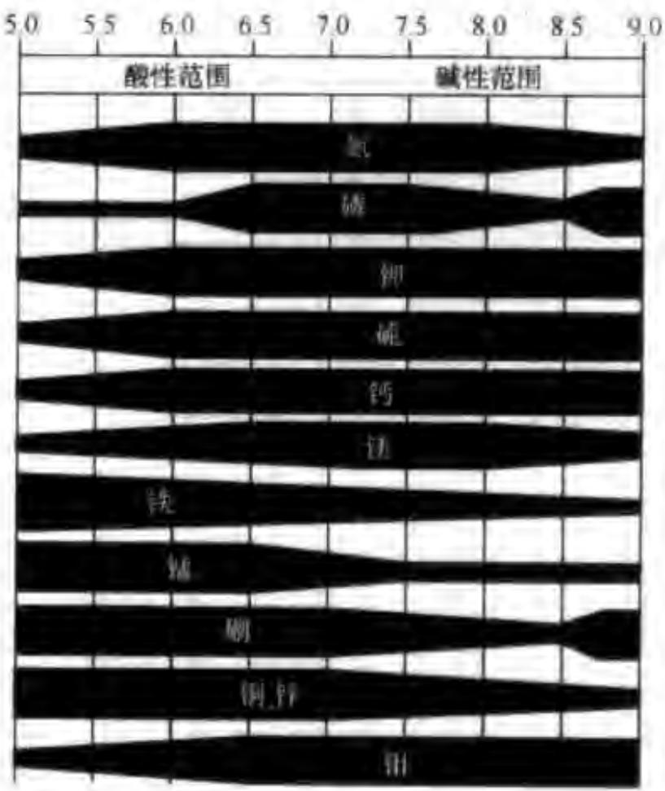  
( a )

pH 4.0 4.5 5.0 5.5 6.0 n5 7.0 75 8.0 8.5 9.0  
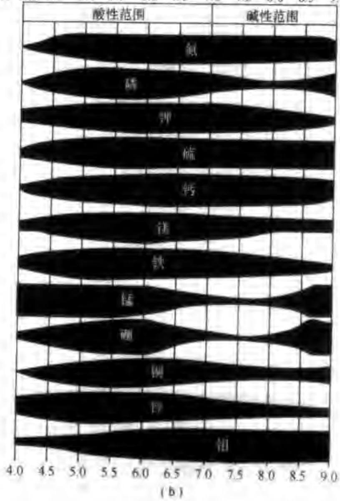  
图3-13 矿山土与有机土在不同的pH水平下对营养元素的吸收能力(a) 矿山土(b)有机土(Jim Beuerlein ew, 1995)

性，减少这种酸害的方法之一是传统的石灰中和法，但未必是很好的方法，因为中和法不仅需要用大量的石灰，也需要精确的计算，即准确计算酸性研石的堆积厚度与石灰中和范围，而这一工作通常是难以做到非常精确的。根据我们实验可知。酸性矸石掩埋或在其上覆盖一定厚度的土层防止其风化，同样可达到减轻酸害的目的。在没有阻止风化措施的矿山土中，考虑酸害问题，不仅要看其pH值，还要考虑可能风化的厚度、风化时间等因素。关于酸性等级划分，有一些参考标准如表3-8。

表3-8 矿山土酸性等级方法
<table><tr><td rowspan=2 colspan=1>等     级</td><td rowspan=1 colspan=2>Baize,1992(法国)</td><td rowspan=1 colspan=3>Brady,1984(美国)</td></tr><tr><td rowspan=1 colspan=1>极酸</td><td rowspan=1 colspan=1>強酸</td><td rowspan=1 colspan=1>极酸</td><td rowspan=1 colspan=1>強酸</td><td rowspan=1 colspan=1>強碱</td></tr><tr><td rowspan=1 colspan=1>pH</td><td rowspan=1 colspan=1>3.5 以下</td><td rowspan=1 colspan=1>3.5~4.2</td><td rowspan=1 colspan=1>4.5以下</td><td rowspan=1 colspan=1>4.5</td><td rowspan=1 colspan=1>8.7以上</td></tr></table>

Haigh(1995)则建议：成功的复垦应使复垦土壤在0\~150 cm表土范围的任一10 cm土层pH值保持在3\~9之间。

## 3. 土壤板结(Soil compaction)

矿山土板结的原因是重型机械的碾压、粘土或矿山固体废弃物风化的细粒混入表土层和心土层(Haigh，1995)，或因为化学毒性物质污染引起。矿山土板结的危害是土壤孔隙减少、植物根系难以扎入。矿山土板结还导致土壤持水能力下降，从而导致地表径流增大，土壤侵蚀加重(Kilmartin,1989)。

土壤容重是反映矿山土板结与否的最好指标（Ramsay，1986)。土壤容重定义为单位体积土壤的重量，土壤容重愈小，表明七壤结构愈好，反之容重愈大，则结构愈差。矿山土用于种植时，土壤容重对土地生产力的影响需考虑下面两个因素：

(1) 土壤容重临界值(Critical Bulk Density, CBD):所谓土壤容重临界值(CBD)是指植物根部停止生长的土壤容重。CBD随土壤含水量、土壤结构、土壤质地、植物种类及矿山土中有机岩屑、煤等成分的含量而变化。一般认为土壤容量影响植物根系穿透的上限为 $1 . 8 8 / \mathrm { c m } ^ { 3 }$ ，而当土壤容重达到 $1 . 6 ~ \mathrm { g / c m } ^ { 3 }$ 就成为限制因素。Haigh(1995)建议：成功的复垦应使复垦土壤的容重在0\~50cm 深内的任一 10 cm 土层不超过 $1 . 6 ~ \mathrm { g / c m } ^ { 3 }$ ，而在0\~100 cm深内的任一10 cm 土层土壤容重不超过 $1 . 8 ~ \mathrm { \pmb { g } / c m } ^ { 3 }$ 。赵景逵则认为上层土壤容重以小于1.2\~1.3g/cm³为宜。

(2)土壤容重随深度的变化：因土壤表层孔隙多于下层孔隙，所以土壤容重是随深度增加而增大的。一般对农作物种植来说，应要求土壤上松下紧，这样既保证作物根部正常生长发育，又保证土壤的持水保肥性能，因此要求下层土的土壤容重应适当大些，一般应压实到 $1 . 4 \sim 1 . 5 { \mathrm { g } } / { \mathrm { c m } } ^ { 3 }$ 以上(赵景逵，1993)。从这一观点看，Haigh 提出的 0\~100 cm 深内任一10 cm 土层土壤容重不超过1.8 g/cm³的标准似乎并不科学。

矿山土壤板结的处理方法有采取深耕措施(胡振琪，1991)，秸秆还田措施(卞正富，1993)，增施有机肥等方法，另应注意灌水可使土壤塌实、孔隙减少、容重增加。

## 4. 重金属污染

矿山土的重金属污染可能是由于矿山固体废弃物母质本身具有的，在种植过程中，重金属从母质中释放出来，影响植物生长，或被植物吸收进入食物链。矿山土的重金属污染也可能是外界输人的，如通过汽车、电厂排放的废气、废渣，及灌溉和土壤改良过程对土壤产生的污染。

值得注意的是，在对矿山土培肥过程中也会导致重金属污染，如磷酸盐岩肥中Cd、Cr、V的含量较高，猪粪肥中含较高的Cu，生活污水和城市污泥中含较高的 Pb、Zn、Cr、Ni和Cu(Haigh,1995)。

Haigh(1995)总结了一些国家对复垦土地规定的重金属含量允许范围，如表3-9。

表3-9 部分国家对复蟹土鎮重金具含量临界值的規定  
单位：mg/kg
<table><tr><td colspan="1" rowspan="1">国     名</td><td colspan="1" rowspan="1">奧地利</td><td colspan="1" rowspan="1">英    国</td><td colspan="1" rowspan="1">德     国</td><td colspan="1" rowspan="1">荷     兰</td><td colspan="1" rowspan="1">保加利亚</td></tr><tr><td colspan="1" rowspan="1"> $\mathtt { A s }$ </td><td colspan="1" rowspan="1">20.0</td><td colspan="1" rowspan="1">20~50</td><td colspan="1" rowspan="1">20</td><td colspan="1" rowspan="1">20</td><td colspan="1" rowspan="1">25</td></tr><tr><td colspan="1" rowspan="1">Cd</td><td colspan="1" rowspan="1">20</td><td colspan="1" rowspan="1">3~18</td><td colspan="1" rowspan="1">3</td><td colspan="1" rowspan="1">1</td><td colspan="1" rowspan="1">3</td></tr><tr><td colspan="1" rowspan="1">to</td><td colspan="1" rowspan="1">50</td><td colspan="1" rowspan="1">25~50</td><td colspan="1" rowspan="1">50</td><td colspan="1" rowspan="1">20</td><td colspan="1" rowspan="1">50</td></tr><tr><td colspan="1" rowspan="1">Cr</td><td colspan="1" rowspan="1">60</td><td colspan="1" rowspan="1">75~100</td><td colspan="1" rowspan="1">100</td><td colspan="1" rowspan="1">100</td><td colspan="1" rowspan="1">100</td></tr><tr><td colspan="1" rowspan="1">Cu</td><td colspan="1" rowspan="1">100.0</td><td colspan="1" rowspan="1">60~125</td><td colspan="1" rowspan="1">100</td><td colspan="1" rowspan="1">500</td><td colspan="1" rowspan="1">15-280</td></tr><tr><td colspan="1" rowspan="1">Ga</td><td colspan="1" rowspan="1"></td><td colspan="1" rowspan="1"></td><td colspan="1" rowspan="1">10</td><td colspan="1" rowspan="1"></td><td colspan="1" rowspan="1"></td></tr><tr><td colspan="1" rowspan="1">Hg</td><td colspan="1" rowspan="1">2.0</td><td colspan="1" rowspan="1">0.3-5.0</td><td colspan="1" rowspan="1">2</td><td colspan="1" rowspan="1">10</td><td colspan="1" rowspan="1"></td></tr><tr><td colspan="1" rowspan="1">Mn</td><td colspan="1" rowspan="1"></td><td colspan="1" rowspan="1">1500~3 000</td><td colspan="1" rowspan="1"></td><td colspan="1" rowspan="1"></td><td colspan="1" rowspan="1"></td></tr><tr><td colspan="1" rowspan="1">Mo</td><td colspan="1" rowspan="1">10.0</td><td colspan="1" rowspan="1">2.0-10.0</td><td colspan="1" rowspan="1">5</td><td colspan="1" rowspan="1">200</td><td colspan="1" rowspan="1">5</td></tr><tr><td colspan="1" rowspan="1">Ni</td><td colspan="1" rowspan="1">60.0</td><td colspan="1" rowspan="1">100.0</td><td colspan="1" rowspan="1">50</td><td colspan="1" rowspan="1">500</td><td colspan="1" rowspan="1">50</td></tr><tr><td colspan="1" rowspan="1">[b</td><td colspan="1" rowspan="1">100.0</td><td colspan="1" rowspan="1">5.0-10.0</td><td colspan="1" rowspan="1">100</td><td colspan="1" rowspan="1">600</td><td colspan="1" rowspan="1">20~80</td></tr><tr><td colspan="1" rowspan="1">Sb</td><td colspan="1" rowspan="1"></td><td colspan="1" rowspan="1">5.0-10.0</td><td colspan="1" rowspan="1">5</td><td colspan="1" rowspan="1"></td><td colspan="1" rowspan="1">5</td></tr><tr><td colspan="1" rowspan="1">Se</td><td colspan="1" rowspan="1"></td><td colspan="1" rowspan="1">5.0~10.0</td><td colspan="1" rowspan="1">10</td><td colspan="1" rowspan="1"></td><td colspan="1" rowspan="1">10</td></tr><tr><td colspan="1" rowspan="1">Sn</td><td colspan="1" rowspan="1"></td><td colspan="1" rowspan="1"></td><td colspan="1" rowspan="1">50</td><td colspan="1" rowspan="1">300</td><td colspan="1" rowspan="1"></td></tr><tr><td colspan="1" rowspan="1">T1</td><td colspan="1" rowspan="1"></td><td colspan="1" rowspan="1">1.0</td><td colspan="1" rowspan="1">1</td><td colspan="1" rowspan="1"></td><td colspan="1" rowspan="1"></td></tr><tr><td colspan="1" rowspan="1">U</td><td colspan="1" rowspan="1"></td><td colspan="1" rowspan="1"></td><td colspan="1" rowspan="1">5</td><td colspan="1" rowspan="1"></td><td colspan="1" rowspan="1"></td></tr><tr><td colspan="1" rowspan="1">V</td><td colspan="1" rowspan="1"></td><td colspan="1" rowspan="1">50~100</td><td colspan="1" rowspan="1">50</td><td colspan="1" rowspan="1"></td><td colspan="1" rowspan="1"></td></tr><tr><td colspan="1" rowspan="1">Zn</td><td colspan="1" rowspan="1">300</td><td colspan="1" rowspan="1">70-400</td><td colspan="1" rowspan="1">300</td><td colspan="1" rowspan="1">3 000</td><td colspan="1" rowspan="1">20-370</td></tr></table>

关于重金属污染问题，国内外研究均不是很深人，尤其是国内尚没有评价重金属污染的标准，一般是用检测的含量与本地区土壤中重金属背景值是否存在显著差异，比如是背景值的2\~3倍来衡量污染水平的。重金属对动植物生长的影响表现为：一是抑制动植物生长，甚至致死；二是重金属在动植物体内富集，进入食物链，食物中的重金属对捕食者肌体产生影响。

由于重金属污染的几个来源：矿山土母质及其风化过程中重金属的逸出、土地使用过程中的空气污染、重新耕作与改土培肥过程中的重金属污染具有同等重要性，因此，重金属污染的监测通常需进行10\~20年的跟踪监测。对有重金属污染的复垦土地种植的食物不能食用，应以植树营林、改善环境为主，必要时，应对重金属污染严重的矿山土采取覆盖或掩埋处理。通常认为覆盖和掩埋深度应在1.5\~2.0 m 以上(Haigh,1995)。

表3-10为开滦矿区范各庄矿矸石回填复垦场地表层风化的矿山土与掩埋的矿山土样品中的金属元素检出量。将表3-10与表3-9对照，表明：该复垦区矿山土不存在重金属污染问题，但表层矿山土与掩埋的矿山土对照可发现，表层矿山土除Mn的含量较低外，其他元素均高于掩埋矿山土的含量，这一现象似乎不能从矸石风化程度得到解释，但可以解释为表层矿山土除风化外，还受大气污染及人类耕作的影响，这一结论被我们的进一步实验得到证实。表3-11列出了同一复垦区不同深度原生扰动土中的金属元素含量，除个别元素外，表层土金属元素含量显著高于深部土壤中的金属元素含量，显然，这与耕作施肥及表层土受空气与粉尘污染有关。

表3-10 表层与掩增的矿山土样品中金属元囊检出量  
单位:mg/kg
<table><tr><td rowspan=1 colspan=1>元    素</td><td rowspan=1 colspan=1>Hg</td><td rowspan=1 colspan=1>Cu</td><td rowspan=1 colspan=1>Fe</td><td rowspan=1 colspan=1>Cr</td><td rowspan=1 colspan=1>Zn</td><td rowspan=1 colspan=1>Mn</td><td rowspan=1 colspan=1>Pb</td><td rowspan=1 colspan=1>F</td><td rowspan=1 colspan=1>Cd</td></tr><tr><td rowspan=1 colspan=1>表层</td><td rowspan=1 colspan=1>0.416</td><td rowspan=1 colspan=1>37.5630</td><td rowspan=1 colspan=1>697</td><td rowspan=1 colspan=1>67.23</td><td rowspan=1 colspan=1>68.27</td><td rowspan=1 colspan=1>81.20</td><td rowspan=1 colspan=1>47.05</td><td rowspan=1 colspan=1>202.92</td><td rowspan=1 colspan=1>053</td></tr><tr><td rowspan=1 colspan=1>掩埋30m深</td><td rowspan=1 colspan=1>0.316</td><td rowspan=1 colspan=1>22.06</td><td rowspan=1 colspan=1>17581</td><td rowspan=1 colspan=1>41.90</td><td rowspan=1 colspan=1>49.21</td><td rowspan=1 colspan=1>236.52</td><td rowspan=1 colspan=1>38.02</td><td rowspan=1 colspan=1>190.25</td><td rowspan=1 colspan=1>0.22</td></tr></table>

\*试验地点：开滦范各庄矿。  
“F污染类似于尊金属污染，常归为重金属污染。  
单位：mg/kg

表3-11 康生扰动土中不同深度的金属元囊含量

<table><tr><td colspan="2">元素 深度</td><td rowspan="2">Hg</td><td rowspan="2">Cu</td><td rowspan="2">Fe</td><td rowspan="2">Cr</td><td rowspan="2">Zn</td><td rowspan="2">Mn</td><td rowspan="2">Pb</td><td rowspan="2">F</td><td rowspan="2">Cd</td></tr><tr><td>表层</td><td>0.050</td></tr><tr><td rowspan="4">白菜地 12</td><td>30 cm</td><td></td><td>14.98</td><td>14 561</td><td>28.22</td><td>35.97</td><td>319.33</td><td>19.94</td><td>590.1790.15</td><td></td></tr><tr><td></td><td>0.017</td><td>11.88</td><td>94761</td><td>20.34</td><td>204.11</td><td>223.66</td><td>14.60</td><td>141.22</td><td>0.12</td></tr><tr><td>表层-30cmj</td><td>0.033</td><td>3.10</td><td>5 084.9</td><td>7.88</td><td>− 168. 14</td><td>95.67</td><td>5.34</td><td>448 96</td><td>0.13</td></tr><tr><td>表层</td><td>0.018</td><td>14.85</td><td>13 645</td><td>26.09</td><td>32.63</td><td>250.40</td><td>21.48</td><td>134.23</td><td>0.15</td></tr><tr><td rowspan="4">葡萄地 紫穗槐</td><td>30 cm</td><td>0.032</td><td>11.55</td><td>12 728</td><td>20.09</td><td>38.82</td><td>318.07</td><td>17.03</td><td>406 46</td><td>0.04</td></tr><tr><td>衣层-30cm</td><td>-0.014</td><td>3.30</td><td>917</td><td>6.00</td><td>-6.19</td><td>-67.67</td><td>4.45</td><td>-272.23</td><td>0.11</td></tr><tr><td>表层</td><td>0.142</td><td>29.24</td><td>19 321</td><td>36.61</td><td>103.75</td><td>323.03</td><td>43.46</td><td>174.640.24</td><td></td></tr><tr><td>30 cπm 表层- 30 m</td><td>0.04414.59 0.098</td><td>14.65</td><td>14 781 4 540</td><td>33.10 3.51</td><td>37.10 66.65</td><td>270.97 52.06</td><td>19.7] 23.75</td><td>176.63|0.04</td><td>-1.990.20</td></tr></table>

除上述四方面外，矿山土中土壤微生物甚少，夏季表面温度过高易灼伤幼苗等亦是影响植被恢复和植物生长的限制因素。

## 3.4.5 矿山土利用实例分析

## 1. 试验场地概况

开滦范各庄矿建于1958年，1964年正式投产，原设计能力180万 t/a,1990年改扩建后生产能力达400万t/a。采煤方法采用走向长壁开采，顶板管理方式为全部跨落法，30余年的开采使工业场南北两侧形成两个塌陷积水坑(如图3-14)，积水面积约 $3 0 0 ~ \mathrm { h m } ^ { 2 }$ ，试验点为南塌陷积水坑，水面约 $2 0 0 ~ \mathrm { \text h m } ^ { 2 }$ ，积水深度最大达7.1m，水面标高25.5m，平均积水深2.0 m以上。

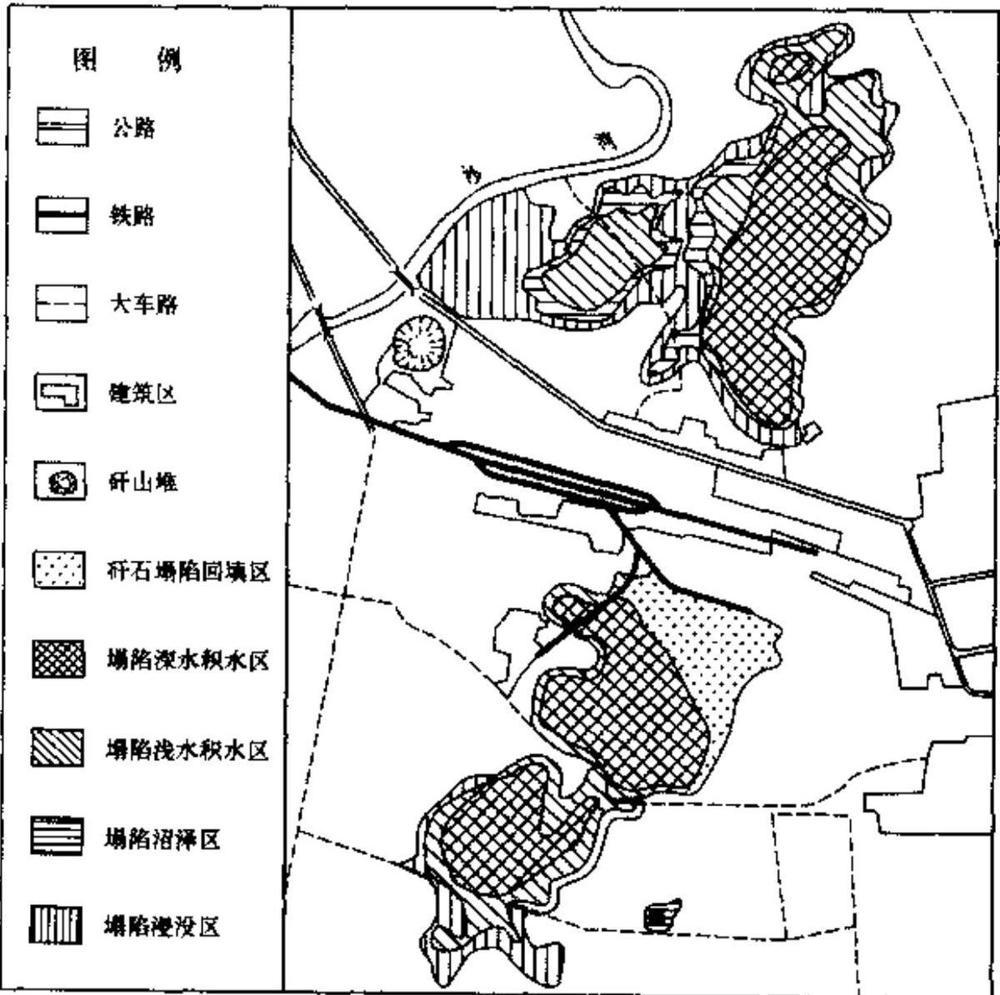  
图 3-14 范各庄矿塌陷积水坑分布情况

该矿的矿井矸石和洗煤厂选矸年排放量为100万t左右，自1979年开始铺设铁路用自翻车往南塌陷坑分东西两片排放，其中东部二条排矸线，西部一条排矸线，本试验点位于西片。

该试验点所用回填方式称之为全厚充填法，即一次充填至设计标高。矸石堆积深度达11m，充填后田面高出塌陷坑水面4\~6m，高出周围未沉陷土地2\~3m。

## 2. 试验研究过程简介

该试验点研究分两阶段，第一阶段1990年3月至1992年10月，开滦矿务局等单位在酸性研石充填复垦区进行先锋植物筛选及二次污染防治试验研究(张春霞，1992)；第二阶段1996年3月至1997年3月，我们与唐山市土地局对矸石充填区复垦土壤养分状况及酸性和重金属污染状况进行监测，利用监测数据对该试验点矿山土的适种性作了评价。

## 3. 试验结果和问题讨论

(1)强酸性研石充填区适宜的乔灌木与农作物品种：自1990年起，该复垦区种植各类树木242856株，其中乔木18156株，灌木224700株，大面积种植的树木有紫穗槐、桑条、洋槐、臭椿、山海关杨等品种。还进行了桃、梨、苹果、山楂、沙棘、泡桐、毛白杨、火炬树、葡萄等树种的筛选种植试验；试验种植的蔬菜和农作物品种有大豆、白薯、玉米、韭菜、西红柿、大葱、黄瓜、青椒、茄子、白菜等；试验种植的牧草有苏丹草、铁扫帚等。

几年来的种植试验表明：洋槐、臭椿、火炬树、泡桐、紫穗槐的成活率分别为85%、95%、100%、95%、100%，就其耐贫瘠、抗风寒性能分析，洋槐、臭椿、火炬树和紫穗槐为最适宜酸性矸石排放场的乔灌木品种。试种的蔬菜品种中，除青椒、茄子的重金属含量(Pb、Cd、Cu、Zn)超标外，其余均适宜种植。

(2)复土厚度与产量、成本的关系；对种植农作物和蔬菜来说，复土愈厚，愈有利于植物生长，但复垦成本将增加，因此存在一最佳复土厚度。

在第一阶段的试验研究中，西红柿种植时选择了100mm、200 mm、300 mm、500mm4种复土厚度，豆角种植时选择了0mm、200 mm、300mm,500mm4种厚度。不同复土厚度的产量如图3-15(a)(b)所示，不同厚度的复垦成本如图3-15(c)所示。

由图3-15(a)、(b)可看出，豆角和西红柿产量随复土厚度增大而增大，但豆角在复土厚度为300mm时产量达最大，西红柿在复土厚度为300\~500mm之间时，产量增加缓慢，而由图3-15(c)看出，复土成本随复土厚度增加而直线上升。

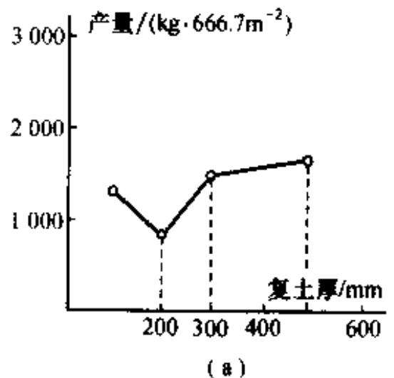

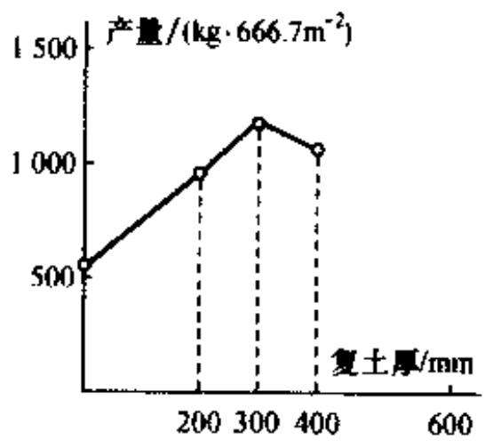  
(b)

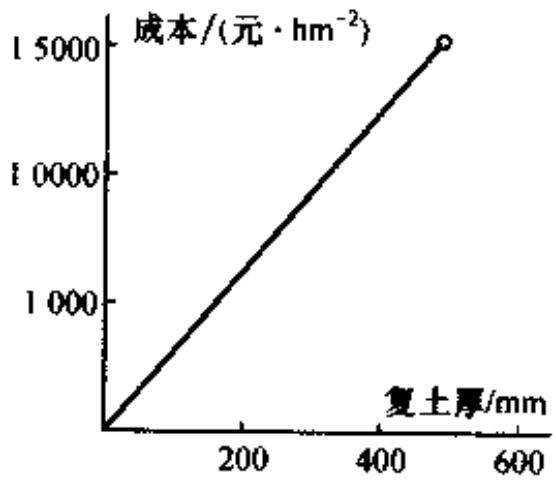  
(e)  
图3-15 复土厚度与产量、成本的关系(张春霞，1992)(a)西红柿产量-复土厚度曲线 (b) 豆角产量-复土厚度曲线(c) 成本-复土厚度曲线

综合考虑产量和成本两因素，最佳复土厚度可根据式(3-30)确定：

$$
\sum _ { t = 1 } ^ { n } \left[ ( E - ( \dot { c _ { a } } ) ( 1 + i ) \mathrm { \Omega } ^ { t } \right] - \mathrm { \Omega } C _ { 0 } = \mathrm { M A X }\tag{3 - 30}
$$

式中：E——复垦土地单位面积年收益，单位：元/年；

$C _ { u }$ ——复垦土地单位面积年管理或经营费用，单位：元/年；

$C _ { \Uparrow }$ —单位面积复土费用， $C _ { \mathfrak { d } }$ -kM,M 为复土厚度，为单位厚度单位面积的复土费用；

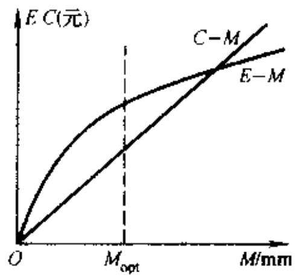  
———计算期；  
图 3- 16 最佳复土厚度的确定E—单位面积年收益  
(单位面积复上费用；

-———基准收益率。

M-复上厚度；

式(3-30)可用图 3-16直观地表示。

$M _ { \mathfrak { W } }$ ——最佳复土厚度。

根据图315、图3-16，并满足式(3-30)，本区复土厚度取值为：种植豆角时，取 300 mm，种植西红柿时取 330 mm。

(3) 不同复土方式对复垦土壤酸性和养分状况的影响：试验区土壤和研石养分本底值如表3-12所示。

表 3-12 土壤和矸石养分本底值表
<table><tr><td rowspan=2 colspan=1>项     日</td><td rowspan=1 colspan=3>全量/%</td><td rowspan=1 colspan=3>速敷/(mg·kg−1)</td><td rowspan=2 colspan=1>腐殖质/%</td></tr><tr><td rowspan=1 colspan=1>氮</td><td rowspan=1 colspan=1>購</td><td rowspan=1 colspan=1>钾</td><td rowspan=1 colspan=1>氮</td><td rowspan=1 colspan=1>磷</td><td rowspan=1 colspan=1>御</td></tr><tr><td rowspan=1 colspan=1>土    壤</td><td rowspan=1 colspan=1>0.07</td><td rowspan=1 colspan=1>0.04</td><td rowspan=1 colspan=1>0.031</td><td rowspan=1 colspan=1>37.6</td><td rowspan=1 colspan=1>1.58</td><td rowspan=1 colspan=1>45.6</td><td rowspan=1 colspan=1>0.5</td></tr><tr><td rowspan=1 colspan=1>矿     11</td><td rowspan=1 colspan=1>0.23</td><td rowspan=1 colspan=1>0.075</td><td rowspan=1 colspan=1>1.34</td><td rowspan=1 colspan=1>196</td><td rowspan=1 colspan=1>4.5</td><td rowspan=1 colspan=1>16.4</td><td rowspan=1 colspan=1>18.3</td></tr><tr><td rowspan=1 colspan=1>中等生产能力</td><td rowspan=1 colspan=1></td><td rowspan=1 colspan=1></td><td rowspan=1 colspan=1></td><td rowspan=1 colspan=1>50~100</td><td rowspan=1 colspan=1>7-20</td><td rowspan=1 colspan=1>60~100</td><td rowspan=1 colspan=1>1.0-1.4</td></tr></table>

据1996年10月对1990\~1993年复垦土地的监测，三种复土方式的土壤pH值和养分指标如表3-13所示。覆盖土来源为沉陷前表土。

表 3-13 不同复土方式的复皇土壤 pH值和养分指标
<table><tr><td rowspan=2 colspan=1>复土方式</td><td rowspan=2 colspan=1>土地利复用形式植</td><td rowspan=2 colspan=1>土种时间</td><td rowspan=2 colspan=1>pH</td><td rowspan=1 colspan=3>全量/%</td><td rowspan=1 colspan=3>速效 $I ( \Pi E ^ { \bullet } | k g ^ { \cdot 1 } )$ </td><td rowspan=2 colspan=1>腐殖质/%</td></tr><tr><td rowspan=1 colspan=1>氨</td><td rowspan=1 colspan=1>碘</td><td rowspan=1 colspan=1>钾</td><td rowspan=1 colspan=1>氮</td><td rowspan=1 colspan=1>磷</td><td rowspan=1 colspan=1>钾</td></tr><tr><td rowspan=1 colspan=1>穴植</td><td rowspan=1 colspan=1>祥槐1991</td><td rowspan=1 colspan=1>年</td><td rowspan=1 colspan=1>4.38</td><td rowspan=1 colspan=1>0.068</td><td rowspan=1 colspan=1>0.037</td><td rowspan=1 colspan=1>1.98</td><td rowspan=1 colspan=1>135.66</td><td rowspan=1 colspan=1>2.9</td><td rowspan=1 colspan=1>62.2</td><td rowspan=1 colspan=1>10.143</td></tr><tr><td rowspan=1 colspan=1>条带式</td><td rowspan=1 colspan=1>葡萄19紫穗槐1</td><td rowspan=1 colspan=1>91年993年</td><td rowspan=1 colspan=1>6.698.39</td><td rowspan=1 colspan=1>0.0250.149</td><td rowspan=1 colspan=1>0.0280.088</td><td rowspan=1 colspan=1>2.251.98</td><td rowspan=1 colspan=1>83.54224.91</td><td rowspan=1 colspan=1>6.36.8</td><td rowspan=1 colspan=1>59.5137.3</td><td rowspan=1 colspan=1>0.8635.887</td></tr><tr><td rowspan=2 colspan=1>全面复土</td><td rowspan=2 colspan=1>白菜19白暮19</td><td rowspan=2 colspan=1>92年91年</td><td rowspan=2 colspan=1>8.238.73</td><td rowspan=2 colspan=1>0.0460.045</td><td rowspan=1 colspan=1>0.072</td><td rowspan=2 colspan=1>2.232.10</td><td rowspan=2 colspan=1>42.84103.53</td><td rowspan=2 colspan=1>39.510.6</td><td rowspan=2 colspan=1>48.855.9</td><td rowspan=2 colspan=1>1.2471340</td></tr><tr><td rowspan=1 colspan=1>0.039</td></tr></table>

\*种植菜粮前都曾种过牧草或紫穗槐

由表3-11和表3\~12对比看出

1）矸石酸性通过条播和全面复土得到了较好的控制，而穴植对矸石酸性不能达到有效的控制。穴植区土壤呈酸性是由降雨淋溶及表层土壤水侧向渗透作用引起的。

2）研石充填区复垦利用后，经生物作用，其营养状况得到了明显的改善，尤其是速效氮和有机质两项指标已达到中等生产力水平。

3）复垦土壤养分的改善主要依靠初期种植牧草、紫穗槐等实现的，由表3-12看出初期种植牧草和紫穗槐的土地改种白菜、白薯后，养分状况有所下降，尤其是速效氮、速效钾和有机质含量显著下降，因此，此类复垦地尤其应注意采取养地措施。

(4)复垦土壤pH值和养分随复土年份的变化情况：表3-13为1993年、1995年两不同复土年份的复土区土壤pH值和养分状况。

由表3 -14 看出：1993年复土种植紫穗槐地块的土壤速效氮、磷、钾及有机质含量均较1995年复土地块高，说明紫穗槐在改良研石充填复垦区土壤养分状况方面起到了较好的作用。研石酸性可通过铺设隔离层和有效的复土方式得到迅速的控制，但隔离层厚度、中和物料用量及复土厚度、宽度等指标必须达到设计要求。通过本试验本地已积累了研石充填复垦区的种植经验，即回填后复土种植紫穗槐或牧草3\~4年后，再改种粮食作物或蔬菜，在种植粮食作物或蔬菜的过程中，还应采取间作等养地措施。

表 3 - 14 不同年份复土区土壤 pH 值和养分状况
<table><tr><td rowspan=2 colspan=1>复土年份</td><td rowspan=2 colspan=1>取样位置</td><td rowspan=2 colspan=1>用地形式</td><td rowspan=2 colspan=1>pH</td><td rowspan=1 colspan=3>含量/%</td><td rowspan=1 colspan=3>速效 $\pi _ { 2 } ( 1 + \frac { \pi } { 4 \pi } ^ { - 1 } )$ </td><td rowspan=2 colspan=1>有机质/%</td></tr><tr><td rowspan=1 colspan=1>N</td><td rowspan=1 colspan=1>P</td><td rowspan=1 colspan=1>K</td><td rowspan=1 colspan=1>N</td><td rowspan=1 colspan=1>P</td><td rowspan=1 colspan=1>K</td></tr><tr><td rowspan=1 colspan=1>1993</td><td rowspan=1 colspan=1>表土30 cm深</td><td rowspan=1 colspan=1>紫穗槐</td><td rowspan=1 colspan=1>8.395.57</td><td rowspan=1 colspan=1>0.1490.0490</td><td rowspan=1 colspan=1>0.088.033</td><td rowspan=1 colspan=1>1.9822.03</td><td rowspan=1 colspan=1>24.91]110.67</td><td rowspan=1 colspan=1>6.83.2</td><td rowspan=1 colspan=1>137.3161.72</td><td rowspan=1 colspan=1>5.8871.827</td></tr><tr><td rowspan=1 colspan=1>1995</td><td rowspan=1 colspan=1>表土30 cm深</td><td rowspan=1 colspan=1>紫穗槐</td><td rowspan=1 colspan=1>6.787.36</td><td rowspan=1 colspan=1>0.021[0.013</td><td rowspan=1 colspan=1>0.0210.019</td><td rowspan=1 colspan=1>2.582.49 1</td><td rowspan=1 colspan=1>53.5503.53</td><td rowspan=1 colspan=1>1.82.4</td><td rowspan=1 colspan=1>54.9643.18</td><td rowspan=1 colspan=1>5.2380.066</td></tr></table>

5)复星土壤重金属污染状况分析：表3-15列出了几种不同用地形式的土壤中重金属(包括F)的含量。

表3-15 复量土壤重金属污染状况 单位：mg/kg
<table><tr><td rowspan=1 colspan=1>用地形式</td><td rowspan=1 colspan=1>复土时间</td><td rowspan=1 colspan=1>Hg</td><td rowspan=1 colspan=1>Pb</td><td rowspan=1 colspan=1>Cd</td><td rowspan=1 colspan=1>F</td><td rowspan=1 colspan=1>Cr</td><td rowspan=1 colspan=1>Cu</td><td rowspan=1 colspan=1>Mn</td><td rowspan=1 colspan=1>Zn</td></tr><tr><td rowspan=1 colspan=1>白薯</td><td rowspan=1 colspan=1>1991年</td><td rowspan=1 colspan=1>0.107</td><td rowspan=1 colspan=1>26.32</td><td rowspan=1 colspan=1>0.022</td><td rowspan=1 colspan=1>04.03</td><td rowspan=1 colspan=1>27.56</td><td rowspan=1 colspan=1>13.95</td><td rowspan=1 colspan=1>268.95</td><td rowspan=1 colspan=1>39.95</td></tr><tr><td rowspan=1 colspan=1>白菜</td><td rowspan=1 colspan=1>1991年</td><td rowspan=1 colspan=1>[0.050</td><td rowspan=1 colspan=1>19.94</td><td rowspan=1 colspan=1>0.1514</td><td rowspan=1 colspan=1>1.222</td><td rowspan=1 colspan=1>8.22</td><td rowspan=1 colspan=1>14.98</td><td rowspan=1 colspan=1>319.33</td><td rowspan=1 colspan=1>35.97</td></tr><tr><td rowspan=1 colspan=1>紫穗槐</td><td rowspan=1 colspan=1>1993年</td><td rowspan=1 colspan=1>0.142</td><td rowspan=1 colspan=1>43.46</td><td rowspan=1 colspan=1>0.241</td><td rowspan=1 colspan=1>74.643</td><td rowspan=1 colspan=1>6.61</td><td rowspan=1 colspan=1>29.243</td><td rowspan=1 colspan=1>23.03</td><td rowspan=1 colspan=1>103.75</td></tr><tr><td rowspan=1 colspan=1>紫穗槐</td><td rowspan=1 colspan=1>1995年</td><td rowspan=1 colspan=1>0.013</td><td rowspan=1 colspan=1>13.44</td><td rowspan=1 colspan=1>0.046</td><td rowspan=1 colspan=1>04.73</td><td rowspan=1 colspan=1>29.60</td><td rowspan=1 colspan=1>11.49</td><td rowspan=1 colspan=1>305.71</td><td rowspan=1 colspan=1>26.71</td></tr><tr><td rowspan=1 colspan=1>葡萄地</td><td rowspan=1 colspan=1>1991年</td><td rowspan=1 colspan=1>0.0182</td><td rowspan=1 colspan=1>1.48</td><td rowspan=1 colspan=1>0.152</td><td rowspan=1 colspan=1>02.92</td><td rowspan=1 colspan=1>26.09</td><td rowspan=1 colspan=1>14.85</td><td rowspan=1 colspan=1>250.40</td><td rowspan=1 colspan=1>32.63</td></tr><tr><td rowspan=1 colspan=1>河北省本底</td><td rowspan=1 colspan=1></td><td rowspan=1 colspan=1>0.0422</td><td rowspan=1 colspan=1>7.91</td><td rowspan=1 colspan=1>1.053</td><td rowspan=1 colspan=1>27.5</td><td rowspan=1 colspan=1></td><td rowspan=1 colspan=1>1.50</td><td rowspan=1 colspan=1></td><td rowspan=1 colspan=1></td></tr></table>

对照表3-15和表3-9发现，复垦土壤的重金属含量均未超标。但值得注意的是：土壤的重金属含量未超标不等于种植的作物果实与可食部分的重金属含量也不超标，今后尚需对作物果实与可食部分作进一步跟踪监测。

## 3.5 复垦土壤生产力指数的修正模型

## 3.5.1 方法简介

复垦土壤生产力水平的评价是一个比较复杂的问题，因为土地的实际生产力与土壤条件、环境(包括水利、种植业结构等)条件及管理因子(劳动力、人力、物力投人及种植技术等)有关，而土壤生产力又难以从受上述因子综合影响的实际生产力表现中分离出来。现有的土壤生产力水平模型基本可分为两类，一类是统计模型，一类是指数模型。指数模型往往也需通过统计的方法得到土壤生产力指数与土地生产力之间的关系，因此究其实质是统计模型的一个进化模型。统计模型的实质是将作物产量y对某一养分含量x的响应模型用实验数据统计分析得到，常用的拟合方程有(沈思渊，1990)：

$$
y = a _ { 0 } + a _ { 1 } x + \cdots + a _ { n } x ^ { \pi }\tag{3-31}
$$

$$
y = { \frac { a x } { x + b } }\tag{3-32}
$$

$$
\frac { 1 } { y } = \frac { 1 } { a } + \frac { b } { a x }\tag{3-33}
$$

指数模型的代表是Neil提出的土地生产力系数(PI)值及胡振琪在 Neil基础上改进的模糊 PI 法(胡振琪，1996)。PI 法由式(3-34)表达：

$$
P I = \sum _ { i = 1 } ^ { m } ( \boldsymbol { A } _ { i } \times \boldsymbol { B } _ { i } \times \boldsymbol { C } _ { i } \times \boldsymbol { W } \boldsymbol { L } , )\tag{3-34}
$$

式中： $P I$ ——土壤生产力指数；

A.——第i土层潜在土壤持水量的适应性；

$B _ { i }$ ——第i土层土壤容重的适应性；

C,——第i土层 $\mathfrak { p H }$ 的适应性；

$W L$ ——第i土层的权重；

m——土层总数。

模糊PI则用式(3-35)表达：

$$
F P I = \sum _ { i = 1 } ^ { m } ( \omega _ { i } \times r _ { i } ) = \sum _ { i = 1 } ^ { m } \Big [ \omega _ { i } \cdot \sum _ { j , 1 } ^ { L _ { i } } ( R L _ { , \cdot } \cdot W L _ { , \cdot } ) \Big ]\tag{3-35}
$$

式中：FPI——土壤生 $\nVDash$ 力指数；

$\omega _ { s }$ —第i个土壤特性的权重， $\sum \limits _ { i = 1 } ^ { m } \omega _ { i } = 1$

$\pmb { n }$ ——土壤特性个数；

$r _ { \mathrm { { \ell } } }$ ——第i个土壤特性在整个土壤剖面上的加权平均适应程度；

$R L _ {  }$ ——第i个土壤特性第j土壤层的适应程度；

$\boldsymbol { W } \boldsymbol { I } _ { - } ,$ ——第j个土壤层的权重， $\sum _ { j \ = 1 } ^ { m } W L , \ = \ 1$ +#

$\scriptstyle { \cal L } _ { \epsilon }$ ——第个土壤特性的土壤层数。

利用指数模型评价土壤生产力水平时，需通过下述统计模型进行转换：

$$
y = f ( P I ) \times A T Y\tag{3 - 36}
$$

式中：v为当年产量值；

f(PI)为典型资料y 与 PI 间的统计函数；

ATY为该区域当年调整的目标产量。

从前述的介绍不难发现：① PI与FPI模型所考虑的土壤属性因子均为一类，即单个因子对产量的影响是独立的；②统计模型、PI与FPI模型均未考虑复垦区内土壤特性的空间变异性，实际上复垦土壤常常存在着空间变异现象；③统计模型、PI与FPI模型没有考虑复垦土壤特性随时间的变化，而事实上，某些复垦方法产生的复垦土壤可能随时间的推移而出现退化现象；④PI与FPI的区别仅在于后者考虑了不同土壤因子的权重并将土壤因子对土壤生产力影响的乘模型改为加权平均模型，理论上说乘模型和加权平均模型各有优缺点，因为对某些关键因子用乘模型，甚至用主因子来讨论问题更为符合实际，而对大多数不起决定性作用的因子用加权平均模型更合理。

## 3.5.2 复星土壤生产力的机理模型

影响复垦土壤生产力的土壤因子可分为两类，一类为环境因子，一类为养分因子。养分因子供给植物生长所需的营养物质，可用N、P、K与有机质含量表示；环境因子，主要指土壤的物理特性，它直接影响土壤养分被植物利用的程度，或者说物理因子提供了一个植物吸收土壤中养分的环境，因此称之为环境因子更为合适。环境因子对植物吸收土壤养分的影响方式又可分为两类，一类是环境因子直接作用于植物。如水分.过量的水会使作物根系处于缺氧状态而死亡，水分不足会使植物干枯而死。又如温度因子，过高会使植物灼伤，过低则影响植物吸收土壤中的养分。第二类环境因子通过改变或影响土壤中的养分状况而影响植物生长。如pH值，过酸或过碱都会影响土壤中养分的释放，又如容重，容重过大不仅会影响植物根系发育，也影响土壤中养分在土壤溶液中的运移，因而影响作物对土壤中养分的吸收。

根据上述分析，设复垦土地内某一点 $( x , y )$ 在/年的土壤生产力水平为 $y ( x , y , \ell )$ ，则：

$$
y ( x , y , t ) = f { \big [ } { \hat { e } } ^ { { \big ( } x , y , t { \big ) } , { \vec { n } } { \big ( } x , y , t { \big ) } { \big ] } }\tag{3-37}
$$

式中： $\ddot { e } ^ { \cdot ( \boldsymbol { \mathbf { \rho } } _ { x } , \boldsymbol { \mathbf { \rho } } _ { y } , t ) }$ 为 $( x , y )$ 点t年的土壤环境因子向量， $\vec { e } = \{ e _ { \ell } ,$ $\epsilon _ { 2 } \ldots _ { \ell _ { M } } )$

$\vec { n \left( \mathcal { x } , \mathbf { y } , t \right) }$ 为(x.y)点t年的土壤养分因子向量， $\vec { n } ( e _ { 1 } , e _ { 2 }$ $\cdots _ { \ell _ { N } } )$

M，N分别为土壤环境因子、养分因子的个数。

因此，t年单位面积的复垦土壤的生产力水平为：

$$
y ( t ) = \frac { 1 } { A } \iint _ { A } f \big [ \vec { e } \big ( x , y , t \big ) , \vec { n } \big ( x , y , t \big ) \big ] \mathrm { d } x \mathrm { d } y\tag{3-38}
$$

式中：A为复垦土地的面积或范围。

显然式(3-38)考虑了环境因子与养分因子的空间变异和时间变异，空间变异和时间变异分别用式(3-39)\~(3-40)、(3-41)-(3-42)表示：

$$
\tilde { e } \left( x , y , t _ { 0 } \right) = \vec { e } \left( t _ { 0 } \right) + \Delta \vec { e } \left( x , y , t _ { 0 } \right)\tag{3-39}
$$

$$
\ddot { n } \left( x , y , t _ { 0 } \right) = \vec { n } \left( t _ { 0 } \right) + \Delta \vec { n } \left( x , y , t _ { 0 } \right)\tag{3-40}
$$

$$
\begin{array} { r } { \vec { e } \left( x _ { 0 } , y _ { 0 } , t \right) = \vec { e } \left( x _ { 0 } , y _ { 0 } , t _ { \mathrm { f } } \right) + \Delta \vec { e } \left( x _ { 0 } , y _ { 0 } , t \right) } \end{array}\tag{3-41}
$$

$$
\vec { n } \left( x _ { 0 } , y _ { 0 } , t \right) = \vec { n } \left( x _ { 0 } , y _ { 0 } , t _ { 0 } \right) + \Delta \vec { n } \left( x _ { 0 } , y _ { 0 } , t \right)\tag{3-42}
$$

于是，考虑空间变异的 $\pmb { t _ { 0 } }$ 年单位面积的复垦土壤生产力水平为：

$$
y ( t _ { 0 } ) = \frac { 1 } { A } \biggl \{ \biggr \} _ { A } f [ \vec { e } \left( t _ { 0 } \right) + \tilde { e } \left( x , y , t _ { 0 } \right) , \vec { n } \left( t _ { 0 } \right) + \Delta \vec { n } \left( x , y , t _ { 0 } \right) ] \mathrm { d } x \mathrm { d } y\tag{3-43}
$$

式中： $\overrightarrow { e } \left( \textit { \textbf { i } } _ { 0 } \right) , \overrightarrow { n } \left( \textit { \textbf { i } } _ { 0 } \right)$ 为 ${ \pmb { t } } _ { 0 }$ 年 $\scriptstyle { \vec { e } }$ 、n因子的多点平均值；

$\Delta \hat { e } \left( x , y , t _ { 0 } \right) , \Delta \hat { n } \left( x , y , t _ { 0 } \right)$ 为 $\pmb { t _ { 0 } }$ 年 $( x , y )$ 点的e、n因子值相对于多点平均值的变差值。

如果用整体空间变异系数 $\vec { r } _ { e } ( t _ { 0 } ) , \vec { r } _ { \ n } ( t _ { 0 } )$ 代替 $\Delta \dot { e } \left( \boldsymbol { x } , \boldsymbol { y } , t _ { 0 } \right)$ $\Delta \dot { n } \left( x , y , t _ { \Theta } \right) , \left( 3 - 4 3 \right)$ 式即为：

$$
y ( \iota _ { 0 } ) = f \bigl [ \overrightarrow { e } ( t _ { 0 } ) + \overrightarrow { r } _ { e } ( t _ { 0 } ) , \overrightarrow { n } ( t _ { 0 } ) + \overrightarrow { r } _ { n } ( t _ { 0 } ) \bigr ]\tag{3-44}
$$

而考虑时间变异的复垦土壤生产力为：

$$
\begin{array} { c c } { { y \left( x _ { 0 } , y _ { 0 } , t \right) = f \left[ \vec { e } \left( x _ { 0 } , y _ { 0 } , t _ { \mathrm { \tiny { 6 } } } \right) + \Delta \vec { e } \left( x _ { 0 } , y _ { 0 } , t \right) , \vec { n } \left( x _ { 0 } , y _ { 0 } , t _ { \mathrm { \tiny { 6 } } } \right) + \right. } } \\ { { \left. \Delta \vec { n } \left( x _ { 0 } , y _ { 0 } , t \right) \right] } } & { { \left. \left( 3 - 4 5 \right) \right. } } \end{array}
$$

式中： $\dot { e ^ { \prime } } ( x _ { 0 } , y _ { \mathrm { 0 } } , \iota _ { \mathrm { 0 } } )$ 为某点 $( x _ { \mathfrak { g } } , y _ { \mathfrak { g } } )$ 初始年的土壤环境因子值；

$\dot { n ^ { \prime } } ( x _ { 0 } , y _ { \parallel } , t _ { 0 } )$ 为某点 $( x _ { 0 } , y _ { 0 } )$ 初始年的土壤养分因子值；

$\Delta \vec { e } \left( x _ { \uparrow \uparrow } , y _ { \uparrow \uparrow } , \iota \right)$ 为某点 $\{ \boldsymbol { x } _ { 0 } , \boldsymbol { y } _ { 0 } \}$ 于t年的土壤环境因子变差值；

$\Delta \vec { n } \left( \vphantom { x _ { 0 } } x _ { \bar { 0 } } , y _ { \bar { 0 } } , \vphantom { x _ { 0 } } \right)$ 为某点 $\{ \boldsymbol { x } _ { \mathfrak { d } } , \boldsymbol { y } _ { \mathfrak { d } } \}$ 子t年的土壤养分因子变差

值。

若考虑复垦地块单位面积的复垦土壤生产力，可设 $\overrightarrow { e } \left( \boldsymbol { \mathcal { x } } _ { 0 } , \boldsymbol { \mathcal { y } } _ { 0 } , \boldsymbol { \varepsilon } _ { 0 } \right)$ $ \vec { e } ( \tau _ { 0 } ) , \vec { n } ( x _ { 0 } , y _ { 0 } , t _ { 0 } ) = \vec { n } ( t _ { 0 } ) , \Delta \vec { e } ( x _ { 0 } , y _ { 0 } , t ) = \vec { r } _ { e } ( t ) , \Delta \vec { n } ( x _ { 0 } , y _ { 0 } , t ) = \vec { r } _ { e } ( t ) , \Delta \vec { n } ( x _ { 0 } , y _ { 0 } , t ) = \vec { r } _ { e } ( t ) , \Delta \vec { e } ( t _ { 0 } ) = \vec { r } _ { e } ( t ) , \Delta \vec { n } ( t _ { 0 } ) = \vec { r } _ { e } ( t )$ $y _ { 0 } , t ) = \vec { r } _ { n } ( t )$ ,则(3-45)为

$$
y ( \textit { t } ) = f \big [ \overrightarrow { e } \langle \textit { t } _ { 0 } \rangle + \overrightarrow { r } _ { \textit { e l } } \langle \textit { t } \rangle , \overrightarrow { n } \big ( \textit { t } _ { 0 } \big ) + \dot { r } _ { \textit { n t } } \big ( \textit { t } \big ) \big ]\tag{3-46}
$$

可见(3-44)、(3-46)在形式上是完全一致的，即复垦土壤的时空变异对土壤生产力的影响规律一致。以(3-46)为例， ${ \boldsymbol { y } } \left( \ t \right)$ 在$[ \vec { \pmb { \rho } } ( t _ { 0 } ) , \vec { n } ( t _ { 0 } )$ 的某一邻域内的泰勒展开式为：

$$
\begin{array} { r l r } { y ( t ) = f [ \vec { e } \left( t _ { 0 } \right) , \vec { n } \left( t _ { 0 } \right) ] + \left[ \vec { r } _ { \mathrm { e } } ( t ) \frac { \partial } { \partial \vec { r } _ { \mathrm { s } } } + \vec { r } _ { \mathrm { s e } } ( t ) \frac { \partial } { \partial \vec { r } _ { \mathrm { s } } } \right] f [ \vec { e } \left( t _ { 0 } \right) , \vec { n } \left( t _ { 0 } \right) ] } & \\ { + \frac { 1 } { 2 ! } \Big [ \vec { r } _ { \mathrm { e } } ( t ) \frac { \partial } { \partial \vec { r } _ { \mathrm { s } } } + \vec { r } _ { \mathrm { s e } } ( t ) \frac { \partial } { \partial \vec { r } _ { \mathrm { s } } } \Big ] ^ { ( 1 ) } f [ \vec { e } \left( t _ { 0 } \right) , \vec { n } \left( t _ { 0 } \right) ] + \cdots } & \\ { + \frac { 1 } { n ! } \Big [ \vec { r } _ { \mathrm { e } } ( t ) \frac { \partial } { \partial \vec { r } _ { \mathrm { s } } } + \vec { r } _ { \mathrm { s e } } ( t ) \frac { \partial } { \partial \vec { r } _ { \mathrm { s } } } \Big ] ^ { ( 1 ) } f [ \vec { e } \left( t _ { 0 } \right) , \vec { n } \left( t _ { 0 } \right) ] } & \\ { + \frac { 1 } { ( n + 1 ) ! } \Big [ \vec { r } _ { \mathrm { e } } ( t ) \frac { \partial } { \partial \vec { r } _ { \mathrm { s } } } + \vec { r } _ { \mathrm { s e } } ( t ) \frac { \partial } { \partial \vec { r } _ { \mathrm { s } } } \Big ] ^ { ( 1 ) } f [ \vec { e } \left( t _ { 0 } \right) , \vec { n } \left( t _ { 0 } \right) ] } & \\  + \frac { 1 } { ( n + 1 ) ! } \Big [ \vec { r } _ { \mathrm { e } } ( t ) \frac { \partial } { \partial \vec { r } _ { \mathrm { s } } } + \vec { r } _ { \mathrm { s e } } ( t )  \end{array}
$$

不难发现，略去高阶无穷小量，y(t)可简化为：

$$
y ( \mathbf { \Theta } _ { t } ) = \left[ 1 + r _ { s } \right] f \left[ \overrightarrow { e } \left( \mathbf { \Theta } _ { t _ { 0 } } \right) , \overrightarrow { n } \left( \mathbf { \Theta } _ { t _ { 0 } } \right) \right]\tag{3-48}
$$

$$
r _ { \mathrm { * } } = \overbar { \ } { \sum } r _ { \substack { \mathrm { * } \mathrm { * } \mathrm { \scriptsize ~ \frac { \partial } { \partial \vec { r } _ { \mathrm { * } } } } } } + \overbar { r } _ { \mathrm { \scriptsize ~ m } } \frac { \partial } { \partial \vec { r } _ { n } } \bigg ] + \frac { 1 } { 2 ! } \bigg [ \overrightarrow { r } _ { \mathrm { * } \mathrm { * } } \frac { \partial } { \partial \vec { r } _ { \mathrm { * } } } + \dot { r } _ { \mathrm { * } \mathrm { * } } \frac { \partial } { \partial \vec { r } _ { n } } \bigg ] ^ { ( 2 ) } + \cdots\tag{3-49}
$$

式(3-48)直观地表明，由于环境因于、养分因于的变异而带来土壤生产力偏离初始状态，偏离程度可用 $\boldsymbol { r } _ { y }$ 表示。

## 3.5.3 复星土壤生产力指数的修正模型(Modified Index of Reclaimed Land Productivity—MPI)

复垦土壤生产力的修正模型，简称MPI模型，满足下列基本

要求和基本假设：

1)以(3-44)、(3-46)、(3-48)为基础，即考虑土壤属性的空间变异性和时间变异性；

2) 考虑 $\dot { e }$ 与方两类因子的相关性；

3)吸取 PI和 FPI 用适应性表示生产力的优点，对其按照1)、2)的要求进行修正；

4）考虑不同土壤层的属性对土壤生产力的影响；

5）MPI与土壤生产力y呈正比，且是线性关系。

根据上述要求，容易写出MPI的形式为：

$$
M P I = ( \textsf { l } + \textsf { r } _ { M P I } ) M P I ( \overline { { \rho } } , \vec { n } )\tag{3-50}
$$

$$
\vec { \epsilon } = ( \bar { e } _ { 1 , } , \bar { e } _ { 2 , } , \cdots , e _ { \mathsf { M } _ { I } } ) \quad j = 1 \cdots 1\tag{3-51}
$$

$$
\vec { n } = ( \mathbf { \sigma } _ { n _ { \mathrm { ~ t ~ , ~ } } } ^ { - } , \mathbf { \sigma } _ { n _ { 2 , } } , \cdots , \mathbf { \sigma } _ { n _ { N _ { s } } } ) \quad \mathbf { \sigma } _ { j } = \mathrm { ~ I ~ } \cdots \mathrm { ~ I ~ }\tag{3-52}
$$

$$
M P I ( \vec { e } , \vec { \pi } ) = M P I ( \bar { e } _ { 1 } , \bar { e } _ { 2 } , \dots , \bar { e } _ { M } , \bar { n } _ { 1 } , \bar { n } _ { 2 } , \dots , n _ { N _ { p } } )
$$

$$
= \sum \limits _ { i = 1 } ^ { M } ( \omega _ { i } \sum \limits _ { i = 1 } ^ { i } W L _ { i } S _ { i _ { 1 } i } ) + \sum \limits _ { i = 1 } ^ { N } ( \omega _ { M + 1 } \sum \limits _ { i = 1 } ^ { i } W L _ { i } S _ { i _ { 1 } i _ { 1 } } )\tag{3-53}
$$

$$
r _ { \mathrm { \times H P I } } = \frac { 1 } { \mathit { l } \left( M + \ N \right) } \Big ( \sum _ { \mathrm { : } = \mathrm { : } \mathrm { ~ } \mathrm { ~ } , \mathrm { ~ } \sum _ { \mathrm { : } = \mathrm { ~ } } ^ { \mathrm { ~ d ~ } } } S _ { \ast \mathrm { ~ } _ { \mathrm { : } \mathrm { ~ } } } + \sum _ { \mathrm { : } = \mathrm { ~ } \mathrm { ~ } , \mathrm { ~ } \sum _ { \mathrm { ~ } = \mathrm { ~ i ~ } } } ^ { \mathrm { ~ } } S _ { \ast \mathrm { ~ } _ { \mathrm { : } } } \Big )\tag{3-54}
$$

式中：MPI—本修正模型得到的复垦土壤生产力指数；

$r _ { M P I }$ ——因时空变异而加的修正系数；

$\overrightarrow { e }$ ——不同土层的各个样点环境因子平均值向量；

$\scriptstyle { \overline { { n } } }$ ——不同土层的各个样点养分因子平均值向量；

——考虑的土层数；

$\omega _ { \ast }$ —土壤因子i的权重， $\sum \limits _ { i = 1 } ^ { M + N } w _ { i } = 1$

$W L$ ——第j层土的权重；

$\mathrm { S } _ { \boldsymbol { \nu } _ { \boldsymbol { r } _ { \eta } } }$ —j土层i环境因子平均值 $\bar { \boldsymbol { \varphi } } _ { t j }$ 对作物生长的适应性；

$S _ { \pi _ { y } }$ ——j土层i养分因子平均值 $\bar { \pmb { n } } _ { i j }$ 根据 $\bar { \pmb { \varrho } } _ { \pmb { \imath } _ { \pmb { \jmath } } }$ 修正后得到的

$\hat { \pmb { n } } _ { \pmb { \imath } }$ 对作物生长的适应性；

$S _ { \ast _ { _ { \eta } } }$ j土层i环境因子相对于平均值的变异系数使 $\ell _ { y }$ 适应性增减值；

$S _ { \textsc { \eta } _ { 3 , \textsc { \lambda } } }$ —j土层i养分因子相对于平均值的变异系数使 $n _ { \cdot y }$ 适应性增减值。

## 3.5.4 MPI 模型的应用

某块开采沉陷地复垦后，0\~20 cm、20\~40 cm两土层的 pH值、容重(d)、速效氮(availableN，aN)、速效磷 $( a P )$ 、速效钾(aK)及有机质(Organic Matter, OM)与对照农田的相应指标对比如表3-16。对照田种植绿豆的实际生产力水平为 $1 5 4 5 \mathrm { k g / h m } ^ { 2 }$ 0复垦田的实际验证产量为 $1 ~ 3 8 0 ~ \mathrm { k g / h m ^ { 2 } }$ 0

表3-16 某复量地与对照田的土环境因子、养分因子对比
<table><tr><td colspan="2">因子</td><td rowspan="2">环境因子</td><td colspan="2"></td><td colspan="3">养分因子</td></tr><tr><td colspan="2">土壤cm</td><td> $\mathsf { p H }$ </td><td> $| d ^ { \prime } | \{ g ^ { \cdot } \sigma \ n ^ { - 3 }$ </td><td>)aN/(mg·kg−&#x27;)</td><td> $\left. \omega \right. \left( \mathrm { m g } ^ { - 1 } \right)$ </td><td> $\pmb { a } \pmb { K }$ </td></tr><tr><td>复昂</td><td>0 - 20</td><td>6.8</td><td>1.41</td><td>30</td><td>6.0</td><td>117.5</td><td>OM/% 0.697</td></tr><tr><td rowspan="3">七壤 对照日</td><td>20-40</td><td>6.0</td><td>1.34</td><td>26</td><td>59</td><td>104</td><td>0.408</td></tr><tr><td>0 - 20</td><td>71</td><td>1.32</td><td>85</td><td>8.4</td><td>104</td><td>1.622</td></tr><tr><td>20-40</td><td>7.0</td><td>164</td><td>34</td><td>3.6</td><td>104</td><td>0.512</td></tr></table>

利用MPI评价复垦土壤生产力的步骤为：

1）确定不同因子的权重 $\boldsymbol { \ W } = \left( \omega , \right)$ 和不同土壤层的权重WL$\mathbf { \Omega } = \{ \mathbf { \Omega } W L , \mathbf { \Omega } \}$

2）选择不同因于对作物生长的适应性函数 $S \{ e _ { \mathfrak { r } } \}$ 和 $S ( \mathfrak { n } _ { \mathfrak { g } } )$

3）确定环境因子对养分因子的修正标准，并修正养分因子的取值；

4)利用环境因子 e和修正后的养分因子值n，根据适应性 $\boldsymbol { e } _ { y }$ $n _ { \mathrm { \Delta , \ g } } ^ { \mathrm { ' } }$ 函数对不同土层的不同评价因子进行适应性评定，得到 $\displaystyle \bar { S e } _ { \upsilon }$ $\boldsymbol { S n _ { \mathrm { ~  ~ } } ^ { \prime } }$

5) 按式(3-53)分别求取复垦土壤与对照土壤的 MPI;

6) 按式(3-54)分别求取复垦土壤与对照土壤的 $r _ { M P I }$ i

7) 按式(3-50)分别计算复垦土壤和对照土壤的 $M P I$

8)用式(3-55)计算复垦土壤生产力水平。

$$
{ \bf y } _ { r } = \frac { M P I _ { r } } { M P I _ { z } } \times { \bf y } _ { c }\tag{3-55}
$$

式中：y，——复垦土壤生产力水平，单位： $k g / \mathrm { h m } ^ { 2 }$

$M P I ,$ ———复星土壤的MPI 指数；

$M P I _ { c }$ ——对照田的 MPI 指数；

$\boldsymbol { y } _ { \epsilon }$ ——对照田的生产力水平， ${ \bf k } ( \bf { { z } } / { \bf { h } } { \bf { m } } ^ { 2 }$

$\omega _ { i }$ 和 $\scriptstyle { W L , }$ 的确定方法可以用多元统计分析法、层次分析法等方法得到，为便于和 FPI法对比，本例取W =(0.2,0.2,0.15，0.15,0.15,0.15), $W L _ { \prime } = \{ \mathbf { 0 } . 6 , \mathbf { 0 } . 4 \}$

不同因子对作物生长的适应性函数 $S \left( e _ { t _ { i } } \right)$ 和 $S ( \mathfrak { n } _ { : } )$ ,将两层土一致地取为 $\left( 3 \cdots 5 6 \right) \sim \left( 3 - 6 1 \right) , S _ { d } \ . S _ { t o M }$ 直接源于有关文献。

$$
S _ { \mathtt { p H } } = \left\{ \begin{array} { l l } { \displaystyle 1 } & { \displaystyle \mathrm { p H } \in [ 6 , 7 , 5 ] } \\ { \displaystyle 1 } \\ { \displaystyle \frac { 1 } { 3 } \mathsf { p H } - 1 } & { \displaystyle \mathsf { p H } \in [ 3 , 6 ) } \\ { \displaystyle - \frac { 2 } { 3 } \mathsf { p H } + 6 } & { \displaystyle \mathrm { p H } \in ( 7 . 5 , 9 ] } \end{array} \right.\tag{3-56}
$$

$$
S _ { d } = \left\{ \begin{array} { c l } { { 1 } } & { { d \leqslant 1 \ . 3 0 } } \\ { { 1 \ . 8 8 - 0 \ . 6 8 d } } & { { d \in ( 1 \ . 3 , 1 \ . 5 5 ] } } \\ { { 5 \ . 9 8 - 3 \ . 3 2 d } } & { { d \in ( 1 \ . 5 5 , 1 \ . 8 ] } } \end{array} \right.\tag{3 - 57}
$$

$$
\begin{array} { r } { S _ { a N } = \left\{ \begin{array} { c l } { 1 } & { \alpha N \ge 1 0 0 } \\ { 0 . 0 1 a N } & { a N \in \left[ 0 , 1 0 0 \right) } \end{array} \right. } \end{array}\tag{3-58}
$$

$$
S _ { a P } = \left\{ \begin{array} { c l } { { 1 } } & { { a P \ge 1 5 } } \\ { { 0 . 0 5 a P + 0 . 2 5 } } & { { a P \in [ 5 , 1 5 ) } } \\ { { 0 . 1 } } & { { a P } } \end{array} \right.\tag{3-59}
$$

$$
\begin{array} { c c } { { } } & { { { \bf 1 } } } \\ { { S _ { a K } = \{ 3 \times 1 0 \phantom { - } \ { } ^ { 1 } { } ^ { 1 } \ a K + 0 . 4  } } & { { a K \lesssim \mathrm { 2 0 0 } } } \\ { { 3 \times 1 0 \phantom { - } \ } } & { {  ( 3 \times 1 0 0 , 2 0 0 ) \ } } \\ { { 0 . 0 0 7 a K } } & { { a K \in [ 0 , 1 0 0 )  } } \\ { { 1 } } & { {   O M \geqslant 2  } } \\ { { S _ { o M } = \{ ( 0 . 5 8 8 2 \times O M - 0 . 1 7 6 \ { } 5 ) ^ { 0 . 3 7 6 2 }  } } & { { O M \in \{ 0 . 3 , 2 \} } } \\ { { \ } } & { { 0 } } & { { O M \lesssim 0 . 3 } } \end{array}\tag{60}
$$

(3-61)

复垦土壤与对照土壤养分的修正值如表3-17,本例养分因子只因pH值的取值而修正，修正标准如图3-13。对照土壤的修正值与原值一致。据修正值所作的适应性评定结果如表3-18。

表3-17 复垦土壤与对照土壤养分因子修正值
<table><tr><td rowspan=2 colspan=2>因   $\nexists$ 土壤 / cm</td><td rowspan=1 colspan=2>环境因子</td><td rowspan=1 colspan=4>养分因子</td></tr><tr><td rowspan=1 colspan=1> $\mathsf { p H }$ </td><td rowspan=1 colspan=1>[d/(g-cn−3)c</td><td rowspan=1 colspan=1>V/(mg·kg−1)</td><td rowspan=1 colspan=1> $\vert \mu P / ( m g \cdot k g ^ { - 1 } )$ </td><td rowspan=1 colspan=1> $\alpha \pmb { K }$ </td><td rowspan=1 colspan=1>OM/%</td></tr><tr><td rowspan=1 colspan=1>复垦</td><td rowspan=1 colspan=1>0~20</td><td rowspan=1 colspan=1>6.8</td><td rowspan=2 colspan=1>1.411.34</td><td rowspan=2 colspan=1>3026</td><td rowspan=2 colspan=1>602.36</td><td rowspan=2 colspan=1>117.5104</td><td rowspan=2 colspan=1>0.6970.3</td></tr><tr><td rowspan=1 colspan=1>土壤</td><td rowspan=1 colspan=1>20-40</td><td rowspan=1 colspan=1>6.0</td></tr><tr><td rowspan=1 colspan=1>对照田</td><td rowspan=1 colspan=1>0-20</td><td rowspan=1 colspan=1>7.1</td><td rowspan=1 colspan=1>1.32</td><td rowspan=2 colspan=1>8534</td><td rowspan=2 colspan=1>8.43.6</td><td rowspan=2 colspan=1>104104</td><td rowspan=2 colspan=1>1.6220.512</td></tr><tr><td rowspan=1 colspan=1>土壤</td><td rowspan=1 colspan=1>20~40</td><td rowspan=1 colspan=1>7.0</td><td rowspan=1 colspan=1>1.64</td></tr></table>

表3-18 不同土不同因子的适应性评定
<table><tr><td rowspan=2 colspan=2></td><td rowspan=1 colspan=1>因子</td><td rowspan=1 colspan=1> $\mathbf { p } \mathbf { H }$ </td><td rowspan=1 colspan=1> $\pmb { d }$ </td><td rowspan=1 colspan=1> $\mathbf { \mu } _ { a N }$ </td><td rowspan=1 colspan=1> $a P$ </td><td rowspan=1 colspan=1> $\alpha K$ </td><td rowspan=1 colspan=1>OM</td></tr><tr><td rowspan=1 colspan=1>权重</td><td rowspan=1 colspan=1>0.2</td><td rowspan=1 colspan=1>0.2</td><td rowspan=1 colspan=1>0.15</td><td rowspan=1 colspan=1>0.15</td><td rowspan=1 colspan=1>0.15</td><td rowspan=1 colspan=1>015</td></tr><tr><td rowspan=3 colspan=1>复垦土壤</td><td rowspan=1 colspan=1>0 - 20</td><td rowspan=1 colspan=1>0.6</td><td rowspan=1 colspan=1>1</td><td rowspan=1 colspan=1>0.9212</td><td rowspan=1 colspan=1>0.3</td><td rowspan=1 colspan=1>0.55</td><td rowspan=1 colspan=1>0.7525</td><td rowspan=1 colspan=1>0.5785</td></tr><tr><td rowspan=1 colspan=1>20)--40</td><td rowspan=1 colspan=1>0.4</td><td rowspan=1 colspan=1>1</td><td rowspan=1 colspan=1>0 9688</td><td rowspan=1 colspan=1>0.26</td><td rowspan=1 colspan=1>0.368</td><td rowspan=1 colspan=1>0.712</td><td rowspan=1 colspan=1>0</td></tr><tr><td rowspan=1 colspan=2>2WL, · Se(或 Sn&#x27;,)=1</td><td rowspan=1 colspan=1>1</td><td rowspan=1 colspan=1>0.9402</td><td rowspan=1 colspan=1>0 284</td><td rowspan=1 colspan=1>0 477 2</td><td rowspan=1 colspan=1>0.7363</td><td rowspan=1 colspan=1>0.347 1</td></tr><tr><td rowspan=3 colspan=1>对照土壤</td><td rowspan=1 colspan=1>0-20</td><td rowspan=1 colspan=1>0.6</td><td rowspan=1 colspan=1>1</td><td rowspan=1 colspan=1>0.982 4</td><td rowspan=1 colspan=1>0.85</td><td rowspan=1 colspan=1>0.67</td><td rowspan=1 colspan=1>0.712</td><td rowspan=1 colspan=1>0.9097</td></tr><tr><td rowspan=1 colspan=1>20-40</td><td rowspan=1 colspan=1>04</td><td rowspan=1 colspan=1>1</td><td rowspan=1 colspan=1>0.764 8</td><td rowspan=1 colspan=1>0.34</td><td rowspan=1 colspan=1>0.43</td><td rowspan=1 colspan=1>0.712</td><td rowspan=1 colspan=1>0.4569</td></tr><tr><td rowspan=1 colspan=2>2WI, ·Se,(或 Sn ,3后</td><td rowspan=1 colspan=1>1</td><td rowspan=1 colspan=1>0 895 4</td><td rowspan=1 colspan=1>0.646</td><td rowspan=1 colspan=1>0.574</td><td rowspan=1 colspan=1>0.712</td><td rowspan=1 colspan=1>0.5714</td></tr></table>

因本例为复垦初始年评价， $r _ { \mathrm { ~ \it ~ 1 ~ } } , r _ { \mathrm { ~ \it ~ n ~ } }$ 均为0,因此 $r _ { M P I } = 0$ 0

因此很容易计算得到 MPI. 为 0.664 7.MPI 为 0.754 6， ${ \mathfrak { y } } _ { r }$ 为 $1 3 6 0 . 9 ~ \mathrm { k g / h m } ^ { 2 }$ 。结果表明MPI法的评价结果与实际产量值非常接近，相差 $1 9 . 1 ~ \mathrm { k g / h m } ^ { 2 }$ ，说明本法具有一定的可信度。同时，本例还用FPI模型计算了复暴垦土壤与对照土壤的FPI值分别为 $F P I _ { r } = 0 . 6 9 6 ~ 6 , F P I _ { \cdot } = 0 . 7 5 4 ~ 6$ ，由FPI法评定的生产力水平值为 $1 ~ 4 2 6 ~ \mathrm { \bf k g / h m } ^ { 2 }$ ，比实际产量大 $4 6 ~ \mathrm { { k g / h m ^ { 2 } } }$ ,应该说 FPI、MPI法的评价结果都是较为客观的，但MPI考虑了因子之间的相关性和因子本身的变异性，更为符合土壤生产力机理模型的解释，预测结果也更为准确。当然本法的适用价值尚需用更多的实验点去验证。

## 3.5.5 土壤生产力指数评价复是质量需注意的几个问题

1. 通常情况下，应该用生产力恢复系数 $\pmb q$ (如式3-62)来评价。计算出的 $\mathbf { y } _ { \mathfrak { r } }$ 并非理论上的土壤生产力，不能用其比较不同复垦地块或不同复垦方案对土壤生产力恢复的程度。

$$
\displaystyle q = \frac { M P I , } { M P I , }\tag{3-62}
$$

2. 参评因子的选取很重要，一般应选择那些反映复垦土壤与对照土壤存在差异的且对作物生长起决定作用的土壤因子。比如对矿山土而言。土壤环境因子以pH值和土壤容重d较为合适， $d$ 沉陷区复垦土壤可能以盐碱度和土壤容重较为合适。

## 3.6 土地复垦界面生产力系统的耗散结构模型

## 3.6.1 现有土地生产力模型简介

现有的土地生产力模型主要包括两类，一类是逐级修正法，一类是模糊数学方法。

逐级修正法将作物生产分为4个水平(沈思渊，1990)，即①作物在养分和土壤水始终充足及温度适宜的条件下生长，生长速率取决于阳光辐射和作物的光能利用效率，生长期内的有效辐射量常常是限制生长速率的因子；②作物生长至少在部分时间内受低温的影响，当温度升至适宜时，作物生长速率就增大到由光合作用决定的最高速率；③作物生长至少在部分时间内受水分短缺的限制，当水分充足时生长速率就增至由气候条件决定的最大速率；④作物生长至少在部分时间内受到养分缺乏的限制，在剩下的生长期内受水分或气候条件的限制。逐级修正法的土地生产力模型可概括为：

$$
y = k _ { 1 } , k _ { 2 } k _ { 3 } B n\tag{3-63}
$$

式中：y—土地生产力；

$\dot { \boldsymbol { \mathscr { k } } } _ { \mathrm { \scriptsize ~ t } }$ —收获指数，即作物可利用部分(如籽粒)占总生物量的比例；

$\pmb { k } _ { 3 }$ ——光、温、水修正系数；

$k _ { \textrm { 3 } }$ ——土壤养分修正系数；

$B n$ —作物全生育期一定光温条件下的累积生物量。

模糊数学方法则通过建立反映土地生产力的资源、效能与结构模型，求出土地生产力的资源指数 $( C , )$ 、效能指数 $\left( C , \right)$ 和利用系数(K)，再将 $C _ { r } \cdot C _ { \epsilon } \cdot K$ 三指数用关系式(3-64)进行统计检验和计量经济检验，预测土地生产力(李发荣，1987)。

$$
\boldsymbol { y } = f ( \boldsymbol { \ell } ^ { \mathrm { { \prime } } } , \boldsymbol { \ell } ^ { \mathrm { { \prime } } } , \boldsymbol { K } )\tag{3-64}
$$

模糊数学方法的核心是将土地生产过程中自然(N)、经济(E)、技术(T)与管理(M)因子对土地生产力的影响或适宜程度，用模糊集合 $\smash { \{ \sum _ { i = 1 } ( \varepsilon ) , \sum _ { k = 1 } ( \varepsilon ) , \sum _ { i = 1 } ^ { N } ( \varepsilon ) , \sum _ { j = 1 } ^ { N } ( \varepsilon ) \} }$ 表示，并建立了三个生产力指数 $C , \bullet C , \bullet$ ，其表达式为：

$$
C _ { r } = \frac { 1 } { 4 } \sum _ { \prime = 1 } ^ { n } [ \mathcal { S } _ { 1 N } ( \tau _ { \prime } ) + \mathcal { S } _ { 1 E } ( \tau _ { \prime } ) + \mathcal { S } _ { 1 7 } ( \tau _ { \prime } ) + \mathcal { S } _ { 1 M } ( \tau _ { \prime } ) ]\tag{3-65}
$$

$$
C _ { \epsilon } = \sum _ { \epsilon  1 } ^ { \infty } [ \mathcal { S } _ { 2 N } ( \epsilon , ) \wedge \mathcal { S } _ { 2 \epsilon } ( \epsilon , ) \wedge \mathcal { S } _ { 2 \tau } ( \epsilon , ) \wedge \mathcal { S } _ { 2 M } ( \epsilon , ) ]\tag{3-66}
$$

$$
K \approx \frac { C _ { * } } { C _ { r } } \times 1 0 0 \%\tag{3-67}
$$

由前面的介绍不难发现：现有的两类土地生产力模型不能反映土地复垦界面生产力系统的三要素及其相互作用对土地生产力的影响；现有模型计算的结果是土地生产力的大小，不能反映土地复垦界面经过投入的整合效果和变化趋势。因此本节基于耗散结构理论(DST - Dissipative Structure Theory)为土地复垦界面生产力系统设计了…个反映土地生产力动态的熵流模型(EEM-Etropy Exchange Model)。

## 3.6.2 土地复垦界面耗散结构的形成条件

Prigogine把耗散结构定义为：在远离平衡的条件下，借助于外界的能流和物质流而维持的一种空间或时间的有序结构。耗散结构的形成必须具备以下条件：

## 1. 耗散结构只有在远离平衡的开放系统中才能形成

所谓开放系统是指与外界既有物质交换又有能量交换的系统。远离平衡态，首先要求是非平衡态，其次还要求处于非线性区，系统广义流与广义力存在式(3-68)的关系，远离平衡态时，式(3-68)的高阶项不可忽略。

$$
\begin{array} { l } { { \displaystyle { j _ { \star } = j _ { \star } \left( \mid X _ { i } \mid \right) = J _ { \star } ^ { 0 } ( \mid X _ { \iota } ^ { 0 } \mid ) + \sum _ { \iota } \left( \frac { \partial J _ { \star } } { \partial \bar { X } _ { \iota } } \right) _ { \emptyset } X _ { \iota } + } } } \\ { { \displaystyle { \phantom { \displaystyle { j _ { \star } \left( \mid X _ { \iota } \mid \right) = j _ { \star } \left( \frac { \partial ^ { 2 } J _ { \star } } { \partial \bar { X } _ { \iota } \partial \bar { X } _ { m } } \right) _ { 0 } X _ { \iota } X _ { m } + \cdots } } } } } \end{array}\tag{3-68}
$$

式中： $J _ { \star }$ ——系统的广义流；

$\pmb { \cal { X } } _ { i }$ ——系统的广义力， $\{ \mathbf { X } _ { t } \} = { X } _ { 1 } , { X } _ { 2 } , \cdots , { X } _ { n }$

0——表示各量在平衡态的取值。

## 2. 必须满足不稳定性阈值条件

热力学分支由稳定变为不稳定的临界点称之为不稳定性阈值条件，它是产生耗散结构不可缺少的条件，如图3-17所示。

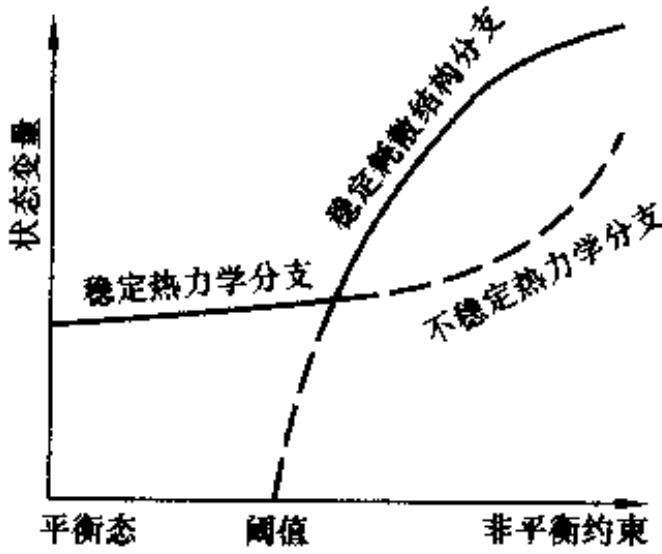  
图 3-17 耗散结构形成的阈值条件(仪垂祥，1995)

## 3. 非线性

线性系统只存在两种演变前途，即衰亡和无限增长，而非线性系统的演化结果具有多样性。在近平衡区，由于非线性项与线性项相比可看作无穷小量，而对系统不产生影响，这时只存在热力学分支单解，当系统处于远离平衡状态时，非线性项的作用十分明显，个非平衡约束就对应多重定态解，有的定态解是稳定的，有的是不稳定的，在不稳定分支附近的扰动随时间增长，最后演变到某一稳定的分支上。线性与非线性系统之间的一个明显区别就是叠加原理不适用于非线性系统，一个因素的微小变化可能导致用它的幅值无法衡量的结果。

## 4. 涨落导致有序

图3-17表明，在非线性系统中，当非平衡约束驱使系统远离平衡态进入非线性区时，热力学分支由稳定转为不稳定，系统会演化到一个稳定的耗散结构分支上。当存在两个稳定耗散结构分支时，系统究竟选择哪一个分支又如何进入这一分支是由涨落来完成的，即涨落导致有序。

现在我们来讨论土地复垦界面生产力系统的性质，首先假设土地生产力为该系统的状态变量，构成该系统的要素为状态参量。显然该系统如本章第二节所述，必须与外界进行不断的物质、能量和信息交换才具有生产功能，因此该系统是一开放系统，同时系统的状态参量是不均一的，状态参量与状态变量存在着明显的非线性作用机制，即：

$$
\mathbf { y } ( \mathbf { \Phi } _ { t } ) \neq \sum _ { \mathbf { i } } \left( \frac { \mathbf { \Phi } ^ { 3 } \mathbf { y } } { \partial \mathbf { X } _ { \mathrm { i } } } \right) _ { \mathrm { , } } \mathbf { X } _ { \mathrm { , } }\tag{3-69}
$$

所以该系统是一远离平衡态的开放系统。就该系统的投入产出面言，使系统的有序度处在动态变化之中，即系统的熵S处于变化之中，这种变化可表示为：

$$
\mathrm { d } \pmb { S } = \mathrm { d } \pmb { S } _ { \pmb { \imath } } + \mathrm { d } \pmb { S } _ { \pmb { \imath } }\tag{3-70}
$$

式中：dS——系统的熵变化；

dS——输入与输出该系统的熵的代数和，称为熵流；

dS.——系统内部熵产生。

其中dS，始终大于等于零，而dS，的值可正可负，因而整个系统的熵变取决于dS.和dS，的代数和。系统熵值越高越无序，反之系统越有序。

## 3.6.3 土地复垦界面生产力系统的变化动态与熵流模型(EEM)

1. 土地复垦界面生产力系统变化的动力学方程(DE)

土地复垦界面生产力系统状态变量用生产力y表示，y受三要素E，S，I控制，可表示为图3-18。

于是，该系统的变化可用以下动力学方程(简称ESIDE或DE)描述：

$$
\frac { \mathrm { d } y } { \mathrm { d } t } = \left( k _ { 2 } { E } + k _ { 4 } { S } + k _ { 6 } { I } \right) - \left( k _ { 1 } + k _ { 3 } + k _ { 5 } \right) y\tag{3-71}
$$

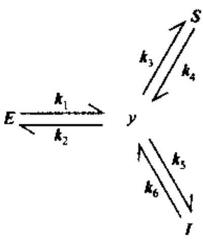

令

$$
\begin{array} { l l } { \pmb { \tau } = k _ { z } \pmb { E } + \pmb { k } _ { 4 } \pmb { S } + \pmb { k } _ { 6 } \pmb { I } } & { ( 3 - 7 2 ) } \\ { \pmb { \lambda } = \frac { \pmb { k } _ { 1 } + \pmb { k } _ { 3 } + \pmb { k } _ { 5 } } { \pmb { k } _ { 2 } \pmb { E } + \pmb { k } _ { 4 } \pmb { S } + \pmb { k } _ { 6 } \pmb { I } } } & { ( 3 - 7 3 ) } \end{array}
$$

则(3-71)变为

$$
\frac { \mathrm { d } \mathbf { y } } { \mathrm { d } t } = \pmb { \tau } - \pmb { \tau \lambda } \mathbf { y }\tag{3-74}
$$

式中：E、S、I为外部控制参量， ${ \pmb k } _ { 1 } \sim { \pmb k } _ { 6 }$ 为转化速率常数，λ称为控制参数。在平衡态时，$\mathbf { \delta E } = \mathbf { \delta E } _ { \odot }$ ，且有 $k _ { \mathrm { 1 } } y _ { \mathrm { 0 } } = k _ { \mathrm { 2 } } E _ { \mathrm { 0 } } , k _ { \mathrm { 3 } } y _ { \mathrm { 0 } } = k _ { \mathrm { 4 } } S _ { \mathrm { 0 } }$ 及$k _ { 5 } y _ { 0 } \approx k _ { 6 } \pmb { I } _ { 0 }$ 成立，因此平衡态时满足：

图3-18 三要素与生产力之间的关系

$$
{ \bf { S } } _ { 0 } = \frac { k _ { 2 } k _ { 3 } E _ { 0 } } { k _ { 1 } k _ { 4 } } \qquad ( 3 - 7 5 )
$$

$\pmb { \hbar } _ { 1 } \sim \pmb { k } _ { \ast }$ 为转化速率

$$
\mathbf { \xi } _ { \mathbf { { J } _ { \theta } } } = \frac { \mathbf { \xi } _ { \mathbf { { k } _ { \theta } } } \mathbf { k } _ { s } \mathbf { \xi } _ { E _ { 0 } } } { \mathbf { \xi } _ { \mathbf { { k } _ { \theta } } } \mathbf { \xi } _ { \mathbf { { k } _ { \theta } } } }\tag{3-76}
$$

此时有

$$
\lambda _ { \mathrm { f } } = \frac { k _ { 1 } \left( k _ { 1 } + k _ { 3 } + k _ { 5 } \right) } { k _ { 1 } k _ { 2 } E _ { 0 } + k _ { 2 } k _ { 3 } E _ { 0 } + k _ { 2 } k _ { 5 } E _ { 0 } } = \frac { k _ { 1 } } { k _ { 2 } E _ { 0 } }\tag{3-77}
$$

若λ值偏离 $\lambda _ { \Uparrow }$ 越大，则系统离平衡态越远，故可用控制参量λ的数值表示系统偏离平衡态的程度。(3-77)还表明初始状态由$k _ { 1 } , k _ { 2 } , E _ { 1 }$ 的取值和状态控制。

设 $E ( \mathbf { \Psi } _ { \ell } ) = E _ { 0 } + a \mathbf { \Psi } _ { \ell } , S ( \mathbf { \Psi } _ { \ell } ) = S _ { 0 } + b \mathbf { \Psi } _ { \ell } , I ( \mathbf { \Psi } _ { \ell } ) = I _ { 0 } + c \mathbf { \Psi } _ { \ell } , a \mathbf { \Psi } _ { \ell } , b \mathbf { \Psi } _ { \ell } ,$ 为E,S.I变化率，则(3-71)式可写成：

$$
\frac { \mathrm { d } y } { \mathrm { d } t } = ( k _ { 2 } E _ { 0 } + k _ { 4 } S _ { 0 } + k _ { 6 } I _ { 0 } + k _ { 2 } a t + k _ { 4 } b t + k _ { 6 } { e t } ) - ( k _ { 1 } + k _ { 3 } + k _ { 5 } ) y\tag{3-78}
$$

解上述微分方程有：

$$
\begin{array} { r l r } {  { y } } & { = \frac { 1 } { \lambda _ { 0 } } + \frac { k _ { 2 } a + k _ { 4 } b + k _ { 6 } c } { ( k _ { \parallel } + k _ { 3 } + k _ { 5 } ) ^ { 2 } } \big [ e ^ { - ( k _ { 1 } + k _ { 3 } + k _ { 5 } ) \prime } + \{ k _ { \parallel } + k _ { 3 } + k _ { 5 } ) t - 1 \big ] }  \\ & { } & \\ & { } & { = \frac { 1 } { \lambda _ { 0 } } + \frac { 1 } { \lambda } \bigg [ 1 + \frac { e ^ { - ( k _ { 1 } + k _ { 3 } + k _ { 5 } ) t } - 1 } { \big ( k _ { 1 } + k _ { 3 } + k _ { 5 } \big ) t } \bigg ] \qquad \mathrm ( 3 - 7 9 ) } \end{array}
$$

式(3-79)表明，当 $k _ { 1 } + k _ { 3 } + k _ { 5 } < 0$ 时，y的变化率比 ${ \pmb { k } } _ { 1 } + { \pmb { k } } _ { 3 } + { \pmb { k } } _ { 5 }$ ${ > } 0$ 时要大，且变化方向取决于 $k _ { z } a + k _ { z } b + k _ { \phi } c$ 的符号。

当系统的状态接近于平衡态时，即在非平衡态的线性区内，这时λ接近于 $\lambda _ { 0 }$ ，根据最小熵产原理将保证非平衡定态的稳定性，当有扰动产生时，系统将自发产生某过程而使系统回复到与外界条件相适应的定态。但当系统远离平衡态，即处于非平衡非线性区时，控制参数λ超过某临界值 $\lambda _ { c }$ 时，系统的非平衡态可能失稳，这时，任何微小的扰动都会使系统越来越远离原来的状态而发展到某种新的状态。

## 2. 土地复垦界面生产力系统的熵流模型(EEM)

(1) 已知投入产出比时，对系统状态的评价模型：式(3-70)给出了系统的熵平衡方程，根据该式，要提高系统的有序度，必须使系统熵减小，也就是必须增加负熵流。

下面不妨设生产力系统的负熵流为EE，这里可构造 $E E _ { 1 }$ 如下：

$$
\begin{array} { l } { E E _ { 1 } = \displaystyle \sum _ { t = 1 } ^ { 3 } \omega _ { \ast } S E _ { \ast } = \left( - \textbf { f } \right) ^ { \mathbf { \nu } } \displaystyle \frac { \left. E \left( t \right) - E \left( 0 \right) \right. } { E \left( 0 \right) } \omega _ { \ast } + } \\ { \displaystyle \left( - 1 \right) ^ { \mathbf { \nu } } \displaystyle \frac { ^ { \left. \right.} S \left( t \right) - S \left( 0 \right)  } { S \left( 0 \right) } \omega _ { \ast } + \left( 1 - \frac { y \left( t \right) / I \left( t \right) } { y \left( 0 \right) / I \left( 0 \right) } \right) \omega _ { \ast } } \end{array}\tag{3-80}
$$

式中： $( - 1 ) ^ { \pi }$ 为符号函数， $E ( t ) , S ( t )$ 好于初始状态，n取为1，否则取为2;

${ \boldsymbol { \omega } } _ { 1 } \sim { \boldsymbol { \omega } } _ { 3 }$ 为不同因子的影响程度；

E(0)、S(0)、I(0)、y(0)分别为环境、土壤、投入与产出的初始状态，可取对照农田或沉陷前土地的状态值；

$E ( \iota ) , S ( \iota ) , I ( \iota ) , y ( \iota )$ 则为不同状态(如不同复垦方案或不同年份)环境、土壤、投人与产出因子的取值。

不难得出系统初始熵 $E E _ { 1 } ( \mathbf { 0 } ) = \mathbf { 0 }$ ，且熵流各分量的符号符合熵流的物理意义，即：能量流入为正，流出为负，物质流出为正，物质流入为负。

设某沉陷地沉陷前、沉陷后及复垦后的各因子取值如表3-

19.按式(3-80)计算各种状态的EE，值得出：沉陷后土地熵流为正，系统较沉陷前为更无序，生产条件恶化，生产力水平更低，而复垦后土地 $\mathtt { E E } _ { 1 } = \mathtt { - 0 . 0 5 3 8 }$ ，系统熵值降低，因面系统较沉陷前、沉陷后更有序，生产力水平更高，更重要的是复垦后土地系统具有较高的生产潜力和持续生产能力。

表3-19 熵流计算示例
<table><tr><td rowspan=1 colspan=3>状       态閃  子</td><td rowspan=1 colspan=1>沉陷前</td><td rowspan=1 colspan=1>沉陷后</td><td rowspan=1 colspan=1>复垦后</td><td rowspan=1 colspan=1>理想值</td></tr><tr><td rowspan=6 colspan=1>环境因子(E)0.30.4</td><td rowspan=3 colspan=1>地貌01σī</td><td rowspan=1 colspan=1>坡度0.1/3</td><td rowspan=1 colspan=1>1.5</td><td rowspan=1 colspan=1>2.5</td><td rowspan=1 colspan=1>1.8</td><td rowspan=1 colspan=1>1.6 以下</td></tr><tr><td rowspan=1 colspan=1>地块形状和大小0.1/3</td><td rowspan=1 colspan=1>长方形， $\ddagger \ \mathrm { h m } ^ { 2 }$ </td><td rowspan=1 colspan=1>长方形， $\mathrm { ~ \tt ~ { ~ 0 ~ } ~ } 8 \mathrm { ~ h m } ^ { 2 }$ </td><td rowspan=1 colspan=1> $\mathbf { 0 . 9 h m ^ { 2 } }$ </td><td rowspan=1 colspan=1>0.6~1.1 $\mathbf { h } \mathbf { m } ^ { \hat { \mathbf { \imath } } }$ </td></tr><tr><td rowspan=1 colspan=1>平整度0.1/3</td><td rowspan=1 colspan=1>1</td><td rowspan=1 colspan=1>0.5</td><td rowspan=1 colspan=1>1</td><td rowspan=1 colspan=1>1</td></tr><tr><td rowspan=1 colspan=1>水位010.2</td><td rowspan=1 colspan=1>水位埋探0.10 2</td><td rowspan=1 colspan=1>2.1</td><td rowspan=1 colspan=1>1.5</td><td rowspan=1 colspan=1>1.8</td><td rowspan=1 colspan=1>1.5~2.5</td></tr><tr><td rowspan=2 colspan=1>排灌条件0.10.1</td><td rowspan=1 colspan=1>排0.1/2</td><td rowspan=1 colspan=1>1</td><td rowspan=1 colspan=1>0.5</td><td rowspan=1 colspan=1>1</td><td rowspan=1 colspan=1>1</td></tr><tr><td rowspan=1 colspan=1>道0.1/2</td><td rowspan=1 colspan=1>85 %</td><td rowspan=1 colspan=1>50%</td><td rowspan=1 colspan=1>95%</td><td rowspan=1 colspan=1>85%以上</td></tr><tr><td rowspan=5 colspan=1>土壤因子(S)0.30.4</td><td rowspan=1 colspan=2>0.06d0.08</td><td rowspan=1 colspan=1>1 21</td><td rowspan=1 colspan=1>1.35</td><td rowspan=1 colspan=1>1.25</td><td rowspan=1 colspan=1>1.3 以下</td></tr><tr><td rowspan=1 colspan=2>0.06OM0.08</td><td rowspan=1 colspan=1>2%</td><td rowspan=1 colspan=1>1.8%</td><td rowspan=1 colspan=1>1.8%</td><td rowspan=1 colspan=1>2%以上</td></tr><tr><td rowspan=1 colspan=2>0.06 $\mathbf { \Lambda } _ { \mathfrak { a d } } \mathbf { V }$ 0.08</td><td rowspan=1 colspan=1>100 mg/kg</td><td rowspan=1 colspan=1>90 mg/kg</td><td rowspan=1 colspan=1>100 mg/kg</td><td rowspan=1 colspan=1>100 mg/kg以上</td></tr><tr><td rowspan=1 colspan=2>0.06 ${ \_ { a P } }$ 0.08</td><td rowspan=1 colspan=1>14 mg/kg</td><td rowspan=1 colspan=1>12 mg/kg</td><td rowspan=1 colspan=1>16 mg/kg</td><td rowspan=1 colspan=1>15 mg/kg以上</td></tr><tr><td rowspan=1 colspan=2>0.06 $\pmb { a K }$ 0.08</td><td rowspan=1 colspan=1>150 mg/kg</td><td rowspan=1 colspan=1>120 mg/kg</td><td rowspan=1 colspan=1>160 mg/kg</td><td rowspan=1 colspan=1>200 mg/kg以上</td></tr><tr><td rowspan=1 colspan=1>产投比0.4</td><td rowspan=1 colspan=2>Y/1 0.4</td><td rowspan=1 colspan=1>4</td><td rowspan=1 colspan=1>2.5</td><td rowspan=1 colspan=1>4.5</td><td rowspan=1 colspan=1>5</td></tr><tr><td rowspan=1 colspan=3> $E E _ { 1 }$ </td><td rowspan=1 colspan=1>0</td><td rowspan=1 colspan=1>0.274 0</td><td rowspan=1 colspan=1>-0.053 8</td><td rowspan=1 colspan=1>-0.1176</td></tr><tr><td rowspan=1 colspan=1>投入 0.2</td><td rowspan=1 colspan=2>1 0.2</td><td rowspan=1 colspan=1>400</td><td rowspan=1 colspan=1>400/800</td><td rowspan=1 colspan=1>400</td><td rowspan=1 colspan=1></td></tr><tr><td rowspan=1 colspan=3> $E E _ { 2 }$ </td><td rowspan=1 colspan=1> $S E _ { 2 } = \mathbf { \theta }$ </td><td rowspan=1 colspan=1>0.194 3/-0.0057</td><td rowspan=1 colspan=1>- 0.005 34</td><td rowspan=1 colspan=1></td></tr></table>

注：表中 $\pmb { \frac { 0 . 3 } { 0 . 4 } }$ 其中0.3为计算 $\mathbf { E E } _ { \mathrm { i } }$ 的ω值，0.4 为计算 $E E _ { 2 }$ 的 $\pmb { \omega }$ 值，其他 $\pmb { \omega }$ 值相同或仪为 $E E _ { 1 }$ 或 $E { \pmb { E } } _ { 2 }$ 用。400/800:400为正常投入,800为复垦投人。

(2)投人产出比未知时，对系统状态的预测模型：投人产出比未知时，对系统状态评价的目的主要是预测一定投人水平下的生产能力，因此可用E、S、I三因子构造 $E E _ { 2 }$ 如下：

$$
\begin{array} { l } { E \dot { E } _ { 2 } = \displaystyle \sum _ { r = 1 } ^ { 3 } \omega _ { i } S E , = \left( - 1 \right) ^ { n } \frac { \left. E \left( t \right) - E \left( 0 \right) \right. } { \bar { E } \left( 0 \right) } \omega _ { 1 } + } \\ { \displaystyle \left( - 1 \right) ^ { n } \frac { \left. S \left( t \right) - S \left( 0 \right) \right. } { S \left( 0 \right) } \omega _ { 2 } + \frac { I \left( 0 \right) - I \left( t \right) } { I \left( 0 \right) } \omega _ { 3 } } \end{array}\tag{3-81}
$$

式(3-81)中的符号含义同式(3-80)，不同的是：① $\omega _ { 1 } \sim _ { \omega _ { 3 } }$ 取值与(3-80)不同。即各因子对熵流 $E E _ { 1 }$ 和 $E E _ { 2 }$ 的贡献是不同的；②计算方法不同。如计算沉陷后的熵流，应该用沉陷后的E、S值和正常投入水平(与沉陷前相近)进行计算；计算复垦后的熵流，则应该用沉陷后的E、S值与复垦投人水平(较高)预测复星后的系统状态，而复垦工程完成后的土地系统可用复垦后的E、S值及其正常投人水平计算。

根据上述原则，计算结果如表3-18。沉陷前 $E E _ { 2 } = 0$ ;沉陷后 $E E _ { \ z } = 0 \AA . 1 9 4 \ z$ ，因此系统生产力下降；每 $6 6 6 . 7 ~ \mathrm { m } ^ { 2 }$ 复星投人800元后，预测 $E E _ { ? } = \mathbf { - 0 . 0 0 5 7 }$ ，预计生产力水平将会上升；利用复垦后的E、S和正常投人水平计算得 $E E _ { 2 } = \mathbf { \nabla } \cdot \mathbf { 0 } . 0 0 5 \ 3 4$ ,说明实际生产力水平预测结果与复星后的实际情况基本一致，这两结果一致，说明所取 $\pmb { \omega }$ 值较为合理，因此我们可根据历史资料反复调整ω值，使两结果一致，再用使两结果一致时的ω值作为本区今 $\omega$ $\pmb { \omega }$ 后评价时的参数。需要说明的是ω虽类似于权重，但与生产力动 $\boldsymbol { \omega }$ 力学方程(DE)中参数 $k _ { 1 } \sim k _ { 6 }$ 的作用更为类似。

非常有意义的是 $E E _ { 1 }$ 和 $E E _ { 2 }$ 还可很好地解释本章第一节的土地减产减收边界与塌陷边界不一致的问题。计算方法是以对照田或平均产量水平为基准，将开采沉陷影响范围内的E、S、I因子值看成随点位 $( x , y )$ 而变化的函数，这样就可计算不同位置地块的EE值，将其与对照田比较，若受影响地块的EE值大于对照田EE值，说明开采沉陷影响为负面影响，反之为正面影响，且一般情况下.若塌陷边界处地块的EE值大于对照田EE值，则减产减收边界大于塌陷边界。

## 3.7 本章小结

1. 提出了复垦界面的概念，并分析了土地复垦界面的类型和特性；

2. 结合土地生产过程分析，提出了土地复垦界面生产力系统的ESI三要素及三要素之间的相互关系；

3. 分析了水位埋深与土地生产力的关系，并对开采沉陷对潜水位埋深的影响规律作了详细分析，指出了降低地下水位的流域控制法：

4. 将复垦土壤分为矿山土和原生扰动土进行研究，分析了矿山土的养分、酸碱性、土壤板结及重金属污染规律，提出了防止酸性污染的掩埋法及矿山土重金属污染主要源于土地利用及地面的污染的规律；分析了开采沉陷对土壤特性的影响，第一次提出了开采沉陷对土壤理化特性的影响规律，还进一步讨论了开采沉陷地原生扰动土复垦时土壤特性的变化规律，用实验数据说明徐准黄泛冲积地区在不剥离表土的情况下，可在两年内使复垦土地达到当地平均产量的原因；

5. 考虑了土壤因子的相关性和时空变异性，提出了复垦土壤生产力的机理模型，根据机理模型说明了时空变异规律的一致性，并得出了复垦土壤生产力水平与基准生产力水平的关系，还提出了复垦土壤生产力指数的修正模型MPI，结合实例说明了MPI的适用性；

6. 综合考虑ESI的作用，分析了土地复垦界面生产力系统形成耗散结构的条件，并推导出了生产力系统的动力学方程(DE)，提出了评价不同状态的土地生产力水平的熵流模型EEM，利用EEM模型可很好地解释土地减产减收边界与塌陷边界的不一致性。

# 第4通矿区土地夔童界童生态系統童究

## 4.1 矿区土地复垦界面生态系统的研究目标和内容

## 4.1.1 矿区土地复垦界面生态系统研究的目标

如第一章所述，矿区土地复垦目标包括恢复土地的生产力和矿区生态系统的平衡两方面，因此，矿区土地复垦界面生态系统研究的目标就是实现复垦区域生态系统平衡。复垦区域生态系统的平衡可以具体化为水土资源的持续利用、人地关系的协调、生物多样性的保护及生态系统内物质、能量的循环效率等多方面。

与研究一般的生态学问题一样，研究复垦区域生态系统的平衡问题，应将生态系统的平衡与生态系统的稳定性联系起来，生态系统的稳定性定义为阻力(Resistance)、恢复力(Resilience)或持续力(Persistence)。阻力是指系统抵抗外界干扰的能力，可用某一变量在受干扰后相对于其平衡值的变化程度表示；恢复力可用系统受干扰后恢复到其平衡态所需的时间表示；持续力是在考虑各种干扰的情况下，系统某一个或某一些状态变量能够持续在某一允许的上下界之间的趋势，亦可用时间表示。对复垦区域生态系统的问题，无疑需要考虑复垦系统的阻力、恢复力和持续力，同时应该注意：复垦区域生态系统是一个多变量系统，某些变量处于平衡值时，另一些变量则尚未达到平衡，而即使达到平衡的变量，也只是达到一种动态平衡，一旦条件改变，它将趋向另一新的平衡态。

## 4.1.2 矿区土地复垦界面生态系统的研究内容

与我国《土地复垦规定》不同，许多国家的采矿或复垦法规均将保护矿区生态环境、矿区生态平衡作为其立法目的，因此，国外关于复垦系统的生态学特征或生态学问题研究较为广泛，如复垦区的树木多样性研究(M.H.Pelkki等，1996)、复垦中的杂种种群(W. Clark Ashby,1995)、采后景观的土壤侵蚀预测(K.G. Evans，1991)等。

我国因土地复垦立法的限制性，加上开展此项工作的时间短，且较早接触此项工作的研究人员多为地质采矿人员，因此，对复垦区域生态系统的特征研究较为肤浅。本章试图在下述几方面对矿区土地复垦界面生态系统特征进行一些探索：

(1)生物多样性指数在矿区复垦界面生态系统研究中的应用；

(2) 复垦区域土壤侵蚀及其控制；

(3)复垦界面生态系统的物质能量循环模拟与分析。

## 4.2 生物多样性指数在矿区土地复垦界面生态系统重建中的应用

## 4.2.1 生物多样性的概念、层次和功能及其在复量理论研究中的作用

## 1. 概念

生物多样性(biodiversity)主要指在一定空间范围之内多种多样的活有机体和生境的丰富性及其变异性，主要涉及多度和丰度两个因素。生物多样性的研究始于20世纪40年代，最初由Fish-er等人在研究蝴蝶的物种数与其种群丰度之间的相关性时而提出的，并形成了衡量物种多样性的数学模型(ECPielon，1985)。经过50多年的研究，生物多样性已是自然资源中的一个重要组成成分，有关多样性的测定方法已形成了数十个数学模型和多样性指数(金鉴明，1991;白效明，1993)。1992年6月联合国环发大会除通过了《里约环境与发展宣言》、《21世纪议程》、《关于森林问题的原则声明》等文件外，还开放签署了联合国《生物多样性公约》和《气候变化框架公约》。我国已签署了《生物多样性公约》，并在编制执行该公约的国家行动计划。《中国21世纪议程》中将“生物多样性保护”列为单独的一章、作为我国实施可持续发展战略的一个重要组成部分，并提出了生物多样性保护的政策是“自然资源开发利用与保护增殖并重”，“谁开发，谁保护，谁利用，谁补偿，谁破坏，谁恢复"。

## 2. 生物多样性的层次和功能

我国将生物多样性分为三个层次，即遗传多样性(genetic di-versity)、物种多样性(species diversity)和生态系统多样性(ecosys-tem diversity)(金鉴明，1991,张建华等，1993)，M. H. Pelkki 将生物多样性分为四个层次，即遗传、物种、生态系统和景观(Land-scapediversity)四个方面。遗传多样性是指每一物种内基因与基因型的多样性，物种多样性是种与种之间的多样性，即物种分类上的多样性，而生态系统多样性则是指生物群落与生境类型的多样性。

生态系统多样性是物种、遗传多样性的保证。生态系统由生物群落和生物群落环境这两个基本要素组成，而生物群落是生态系统的核心。由于生物群落是由若干生物物种所组成，因而，丰富多彩的生态系统是物种多样性和遗传多样性存在的保证，物种多样性是人类生存和发展的基础。物种多样性是指动物、植物及微生物种类的丰富程度，物种资源是农林牧渔各业经营的主要对象，为人类的衣食住行提供了必要的物质基础。遗传多样性是改良生物品质的源泉。遗传多样性可认为是种内或种间表现在分子、细胞和个体三个水平上的遗传变异度，这种变异度是生命进化和适应环境的基础，变异越丰富，物种对环境的适应能力愈强，物种进化的潜力也越大。

## 3. 生物多样性在矿区复垦中的作用

(1)生物多样性保护与恢复是选择采矿与复垦方案的依据之一：既然生物多样性是自然资源的一个重要组成部分，因此分析采矿对环境的影响时，应该考虑采矿工程对生物多样性的影响，在制定复垦规划和实施复星工程时，除考虑土地使用价值的恢复外，还应将生物多样性的恢复作为目标之一。对稀有物种栖息地和重要的生境类型则应采取保护措施。国内许多赴德考察报告都提到，德国在矿区地形地貌、植被恢复方面要求甚严，要求恢复的地形地貌、植被等与开采前一致，以吸引采前在该地区生活的野生动物，这种做法虽然显得呆板，但从生境多样性保护的原则考虑是非常必要的。

(2)生物多样性指数是评价复垦质量的重要指标：过去，我们都认为土地复垦不仅可获得巨大的经济、社会效益，还可获得很好的生态环境效益，且有许多指标可用以评价经济与社会效益，但生态环境效益的评价指标似乎显得较为空洞或定量化指标较少。生物多样性指数为我们提供了非常有价值的定量化指标。

(3)生物多样性指数还是监测复垦区环境污染的方法之一：过去，我国曾成功地应用生物多样性指数对水域环境的污染进行过监测(周鸿，1987)。复垦土地，尤其是矿山土地复垦区域，存在着潜在的酸性、重金属污染，动植物生存环境具有一定的限制性，适生的动植物种群数量和个体数均受到限制，因此，可将生物多样性指数作为生物监测指标之一。

## 4.2.2 生物多样性指数与生物多样性标准

尽管生物多样性保护已为越来越多的人和越来越多的国家所接受，但无论是在理论上还是实践上都还没有解决生物多样性的标准问题(白效明，1993)。尤其是环境保护意义上的生物多样性，是指自然界中经过长期自然演化而形成的包括植物、动物和微生物在内的所有物种以及这些物种所栖息的生态系统和生态系统中的生态过程，这与传统生物学中的生物物种多样性存在一定的区别，生物学中的物种多样性是指生物群落中物种的丰度和不同种的相对多度，所以生物多样性标准和生物多样性指数是有待研究的问题。当今讲的生物多样性指数可分为三类：即多度指数、丰度指数和多度与丰度相结合的指数(张建华，1993，M. H. Pelkki，1996)。

## 1. 物种多度指数

多度指数主要测量一定范围内的物种数目以表达生物的丰富程度。

(1) 稀释度指数 $E \left( s \right)$

$$
E \left( s \right) = \sum \bigg \{ 1 - \bigg [ \left( \frac { N - N _ { \star } } { \pmb { n } } \right) \bigg / \left( \frac { N } { \pmb { n } } \right) \bigg ] \bigg \}\tag{4-1}
$$

式中：N——抽样所得的所有物种个体数；

$N ,$ ——i物种的个体数；

n——标准样方内的物种个体数。

E(s)用于调查的样方不总是一致及物种数不总是随样方的增大而增大的情况下。

(2) Margalef 指数和 Menhinick 指数

$$
{  { D _ { \mathrm { { M g } } } } } = (  { S } \cdots 1 ) / \mathrm { { l n } }  { N }\tag{4-2}
$$

$$
D _ { \mathbb { M } ^ { n } } = S / \sqrt { \textbf { N } }\tag{4-3}
$$

式中： $D _ { \mathsf { M g } } { \longrightarrow } \mathbf { M a r g a l e f }$ 生物多样性指数；

S——物种数；

$\mathbf { \Delta } _ { \mathbf { \lambda } ^ { \prime } } ^ { \mathbf { \Delta N } }$ 个体数；

$D _ { \mathsf { M } \mathsf { r } }$ ——Menhinick 生物多样性指数。

## 2. 物种丰度指数

丰度模型是根据种群丰度与物种数之间的关系来衡量物种多样性的。主要有对数正态分布模型，对数级数分布模型和随机分割分布模型。

(1) 对数正态分布模型

$$
S ( R ) = S _ { \parallel } \mathrm { e x p } ( { \bf \phi } - a ^ { 2 } R ^ { 2 } )\tag{4-4}
$$

式中：S(R)—正态分布对称曲线中左右两边R 组的物种数；

$S _ { \mathfrak { g } }$ ——标准组中的物种数；

$a$ ——分布曲线的倒置宽度；

$R$ —种群的数量等级或称为数量倍频程，由式(4-4-1)决定

$$
R _ { \mathrm { t } } = \log _ { 2 } \left\{ N _ { \mathrm { t } } / N _ { \mathrm { 0 } } \right\}\tag{4-4-1}
$$

该模型最适合较大的、较成熟和多样性较高的群落分析。

(2) 对数级数分布模型：

$$
\pmb { S } = \pmb { \alpha } \big [ - \ln \bigl ( 1 - \pmb { x } \bigr ) \big ]\tag{4-5}
$$

式中：S——物种数；

$\pmb { \alpha }$ ——多样性指数，由式(4-5-1)计算；

$_ { x }$ ——由式(4-5-2)计算。

$$
\alpha = N \{ 1 - \chi \} / x\tag{4-5-1}
$$

$$
\frac { \textbf { S } } { N } = \left[ ( 1 - \boldsymbol { x } ) / x \right] \cdot \left[ \mathbf { \nabla } - \ln ( 1 - \boldsymbol { x } ) \right]\tag{4-5-2}
$$

该模型适用于由少部分优势种和大部分稀有种组成的群落。

(3)随机分割分布模型：

$$
S ( \mathfrak { n } ) = \{ S ( S - 1 ) / N \} / ( 1 - \mathfrak { n } / N ) ^ { S \ 2 }\tag{4-6}
$$

式中：S(n)—种群个体数为n的物种数；

S——物种数；

N——物种个体数。

各物种种群丰度N，为

$$
\begin{array}{c} N _ { \iota } \ = \ N { / S } \sum _ { n \ = \ 1 } ^ { s } \mathbf { \mathbf { \mathbf { \mathbf { \mathbf { \mathbf { \mathbf { \mathbf { \mathbf \Phi } } } } } } } } \mathbf { \mathbf { \mathbf { \mathbf { \mathbf { \mathbf { \mathbf { \mathbf { \mathbf \Lambda } } } } } } } }  \end{array}\tag{4 − 6 - 1}
$$

随机分割分布模型适用于生境中或群落中每一物种对资源的需求都能得到充分满足的情况。

3. 多度和丰度相结合的多样性指数

(1) Shannon 指数：

$$
H = - \Sigma P , \ln \bar { P } ,\tag{4-7}
$$

式中：H为 Shannon 多样性指数；

$P ,$ 为i物种的个体数占所有物种个体数的比例，由式(4-7-1)估计。

$$
{ \tt P } , { \tt a } , { \tt / N }\tag{4-7-1}
$$

式中： ${ \pmb { n } } _ { \llangle }$ —i物种个体数；

N——所有物种个体数。

因 $P _ { \varepsilon }$ 用上式估计，所以H存在一定的误差。

(2) Hutcheson-Bowman 指数：

$$
H = \mathrm { ~ - ~ } \sum P , \ln P , \mathrm { ~ - ~ } \frac { S - 1 } { N } + \frac { 1 - \sum P _ { \mathrm { ~ \downarrow ~ } } ^ { \mathrm { ~ \downarrow ~ } } } { 1 2 N ^ { \mathrm { { ' ~ } } } } + \frac { \sum \left( P _ { \mathrm { ~ \downarrow ~ } } ^ { \mathrm { ~ \cdot ~ I ~ } } - P _ { \mathrm { ~ \cdot ~ } } ^ { \mathrm { ~ \cdot ~ } } \right) } { 1 2 N ^ { 3 } }\tag{4-8}
$$

该指数考虑了(4-7)的误差，为更精确的表达式。

(3) Brillouin 指数：

$$
H _ { 8 } = \frac { \ln N ! - \displaystyle \sum _ { i = 1 } ^ { s } \tan _ { i } ! } { N }\tag{4 - 9}
$$

式中： $H _ { \mathfrak { u } }$ 为 Brilouin 多样性指数。

(4) Simpson 指数：

$$
S I = 1 - \sum _ { i = 1 } ^ { s } \ { \frac { { { n } _ { i } } \left( { { n } _ { i } } \cdot \overbrace { 1 } \right) } { N \left( \overbar { N } \cdot \overbar { 1 } \right) } }\tag{4 - 10}
$$

式中：SI为 Simpson 多样性指数。

(5) Shannon-Weaver 指数：

$$
\mathbf { \Delta } _ { H _ { S W } } \ = \ \underbrace { \mathbf { \bar { \Gamma } } ^ { N \ln N } - \sum _ { t = 1 } ^ { S } n _ { \tau } \ln { n _ { t } } } _ { N }\tag{4 − 11}
$$

式中： $H _ { \mathbf { w } }$ 为 Shannon-Waver 指数。

(6) Brillouin 公平性(Brillouin Equitability)

$$
B E = { \frac { H _ { \tt B } } { \tt m a x { H } _ { \tt B } } }\tag{4-12}
$$

$$
\operatorname* { m a x } H _ { \mathrm { B } } = \frac { 1 } { N } \mathrm { i n } \frac { N ! } { \left[ \frac { N } { S } \right] ! ^ { S - r } \left( \left[ \frac { N } { S } \right] + 1 \right) ! ^ { r } }\tag{4-12-1}
$$

$$
r = N - S [ N / S ]\tag{4-12-2}
$$

式中： $\left[ \frac { N } { S } \right]$ 为N/S取整。

(7) Shannon-weaver 公平性(Shannon-weaver Equitability)指数

$$
S W E = \frac { H _ { S W } } { \mathrm { m a x } H _ { S W } }\tag{4-13}
$$

$$
\operatorname* { m a x } H _ { \mathrm { S W } } = \ln S\tag{4-13-1}
$$

## 4.2.3 生物多样性指数在土地复量中的应用

1. 土地利用结构变化及复垦用地结构的多样性表达

煤矿开采对土地生态系统影响的重要表现形式之一是采矿前后土地利用结构发生变化。设用地类型数有S类，各类用地在总面积中的百分比为 ${ \pmb { \hat { p } } } _ { \imath }$ ，则可构造下列多样性指数：

$$
H = - \sum _ { i = 1 } ^ { 5 } \Big ( \sum _ { \omega _ { i } , \vec { p } _ { i } } ^ { \omega _ { i } , \vec { p } _ { i } } - \Big ) \vert \mathfrak { n } \big [ w _ { i } \pmb { \mathscr { p } } _ { i } / \big ( \sum w _ { i } \pmb { \mathscr { p } } _ { i } \big ) \big ]\tag{4−14}
$$

式中： ${ \pmb w } _ { \pmb { i } }$ 为第i类土地的收益。

${ \pmb w } _ { \pmb { r } }$ 为考虑生物生产带来的经济收益，简便起见，可将已利用土地的收益看成是均等的，而将未利用的土地收益看成是0，也可首先对各类已利用土地的收益进行综合评估，再用(4-14)进行计算，这时可将居民点用地和交通用地等非生物性生产用地用其他生物性生产用地的平均收益表示。

仅有多样性指数是不够的，还应有一恰当的评价标准，这里我们作如下假设：在一定区域范围内，土地利用的类型与生态系统类型成正比，即生态系统类型的多样性由土地利用类型多样性决定，且未利用土地对多样性的贡献为0，则在土地利用为8大类的情况下，多样性指数 $H \in [ 0 , 1 , 9 4 5 \ 9 ]$ ，H值越大说明系统结构越合理，越稳定，生态系统类型越多。

表4-1给出了徐州矿区两个乡镇开采沉陷前后的用地结构，试比较开采沉陷对两乡镇土地破坏的程度。

表4-1 土地利用多样性评价的原始数据
<table><tr><td colspan="2" rowspan="1">用地类型</td><td colspan="1" rowspan="1">耕地</td><td colspan="1" rowspan="1">园地</td><td colspan="1" rowspan="1">林地</td><td colspan="1" rowspan="1">居民点及工矿用地</td><td colspan="1" rowspan="1">交通用地</td><td colspan="1" rowspan="1">水城</td><td colspan="1" rowspan="1">未利用土地</td></tr><tr><td colspan="1" rowspan="6">甲</td><td colspan="1" rowspan="1">沉陷前百分比/%</td><td colspan="1" rowspan="1">40.1</td><td colspan="1" rowspan="1">1.2</td><td colspan="1" rowspan="1">22.76</td><td colspan="1" rowspan="1">25.51</td><td colspan="1" rowspan="1">25</td><td colspan="1" rowspan="1">1.03</td><td colspan="1" rowspan="1">6.9</td></tr><tr><td colspan="1" rowspan="1">沉陷前收益/元</td><td colspan="1" rowspan="1">600</td><td colspan="1" rowspan="1">1600</td><td colspan="1" rowspan="1">400</td><td colspan="1" rowspan="1">350</td><td colspan="1" rowspan="1">350</td><td colspan="1" rowspan="1">150</td><td colspan="1" rowspan="1">0</td></tr><tr><td colspan="1" rowspan="1">沉陷后百分比/%</td><td colspan="1" rowspan="1">36.58</td><td colspan="1" rowspan="1">0.6</td><td colspan="1" rowspan="1">22.76</td><td colspan="1" rowspan="1">26.53</td><td colspan="1" rowspan="1">1.03</td><td colspan="1" rowspan="1">2.63</td><td colspan="1" rowspan="1">9.87</td></tr><tr><td colspan="1" rowspan="1">沉陷后收益/元</td><td colspan="1" rowspan="1">600</td><td colspan="1" rowspan="1">1 500</td><td colspan="1" rowspan="1">400</td><td colspan="1" rowspan="1">350</td><td colspan="1" rowspan="1">350</td><td colspan="1" rowspan="1">250</td><td colspan="1" rowspan="1">0</td></tr><tr><td colspan="1" rowspan="1">复垦后白分比/%</td><td colspan="1" rowspan="1">40.1</td><td colspan="1" rowspan="1">1.0</td><td colspan="1" rowspan="1">24.76</td><td colspan="1" rowspan="1">28.0</td><td colspan="1" rowspan="1">1.5</td><td colspan="1" rowspan="1">3.0</td><td colspan="1" rowspan="1">1.64</td></tr><tr><td colspan="1" rowspan="1">复尾后收益/元</td><td colspan="1" rowspan="1">600</td><td colspan="1" rowspan="1">1500</td><td colspan="1" rowspan="1">400</td><td colspan="1" rowspan="1">650</td><td colspan="1" rowspan="1">650</td><td colspan="1" rowspan="1">700</td><td colspan="1" rowspan="1">0</td></tr><tr><td colspan="1" rowspan="6">乙</td><td colspan="1" rowspan="1">沉陷前百分比/%</td><td colspan="1" rowspan="1">48.67</td><td colspan="1" rowspan="1">1.5</td><td colspan="1" rowspan="1">13.6</td><td colspan="1" rowspan="1">34.60</td><td colspan="1" rowspan="1">1.53</td><td colspan="1" rowspan="1">0.05</td><td colspan="1" rowspan="1">0.05</td></tr><tr><td colspan="1" rowspan="1">沉陷前收益/元</td><td colspan="1" rowspan="1">600</td><td colspan="1" rowspan="1">1600</td><td colspan="1" rowspan="1">400</td><td colspan="1" rowspan="1">350</td><td colspan="1" rowspan="1">350</td><td colspan="1" rowspan="1">150</td><td colspan="1" rowspan="1">0</td></tr><tr><td colspan="1" rowspan="1">沉陷后百分比/%</td><td colspan="1" rowspan="1">39.8</td><td colspan="1" rowspan="1">0.9</td><td colspan="1" rowspan="1">13.09</td><td colspan="1" rowspan="1">36.82</td><td colspan="1" rowspan="1">1.53</td><td colspan="1" rowspan="1">3.03</td><td colspan="1" rowspan="1">4.83</td></tr><tr><td colspan="1" rowspan="1">沉陷后收益/元</td><td colspan="1" rowspan="1">600</td><td colspan="1" rowspan="1">15004</td><td colspan="1" rowspan="1">00</td><td colspan="1" rowspan="1">350</td><td colspan="1" rowspan="1">350</td><td colspan="1" rowspan="1">250</td><td colspan="1" rowspan="1">0</td></tr><tr><td colspan="1" rowspan="1">复垦后百分比/%</td><td colspan="1" rowspan="1">46.66</td><td colspan="1" rowspan="1">1.9</td><td colspan="1" rowspan="1">13.09</td><td colspan="1" rowspan="1">36.82</td><td colspan="1" rowspan="1">1.53</td><td colspan="1" rowspan="1">0.0</td><td colspan="1" rowspan="1">1.10</td></tr><tr><td colspan="1" rowspan="1">复星后收益/元</td><td colspan="1" rowspan="1">600</td><td colspan="1" rowspan="1">1500</td><td colspan="1" rowspan="1">400</td><td colspan="1" rowspan="1">585</td><td colspan="1" rowspan="1">585</td><td colspan="1" rowspan="1">0</td><td colspan="1" rowspan="1">0</td></tr></table>

根据式(4-14)，分别计算了两乡镇的土地利用多样性指数，如表4-2所示。表中H为按表4-1所示收益数据的计算结果，

表4-2 开采沉陷对土地利用结构的影响评价
<table><tr><td rowspan=2 colspan=1></td><td rowspan=1 colspan=3>甲</td><td rowspan=1 colspan=3>乙</td></tr><tr><td rowspan=1 colspan=1> $\sum \limits _ { i } ^ { 1 } w _ { i } p , f \dot { \pi }$ </td><td rowspan=1 colspan=1>H</td><td rowspan=1 colspan=1>H</td><td rowspan=1 colspan=1> $\sum w _ { i } p _ { i } / \overline { { \mathcal { R } } }$ </td><td rowspan=1 colspan=1>H</td><td rowspan=1 colspan=1> $\pmb { H } ^ { \prime }$ </td></tr><tr><td rowspan=1 colspan=1>沉陷前</td><td rowspan=1 colspan=1>450.42</td><td rowspan=1 colspan=1>1.209 3</td><td rowspan=1 colspan=1>1.243 9</td><td rowspan=1 colspan=1>496.95</td><td rowspan=1 colspan=1>1.095 3</td><td rowspan=1 colspan=1>+ 1.119 8</td></tr><tr><td rowspan=1 colspan=1>沉陷后</td><td rowspan=1 colspan=1>422.555</td><td rowspan=1 colspan=1>1.191 3</td><td rowspan=1 colspan=1>1.230 3</td><td rowspan=1 colspan=1>449.49</td><td rowspan=1 colspan=1>1.1911</td><td rowspan=1 colspan=1>+ 1.213 0</td></tr><tr><td rowspan=1 colspan=1>复垦后</td><td rowspan=1 colspan=1>567.39</td><td rowspan=1 colspan=1>1.282 7</td><td rowspan=1 colspan=1>1.3211</td><td rowspan=1 colspan=1>584.81</td><td rowspan=1 colspan=1>1.147 8</td><td rowspan=1 colspan=1>1.1291</td></tr></table>

H为将已利用土地收益看作是均等的情况下的多样性指数。计算结果表明：①如果仅考虑收益的增减，开采沉陷后甲、乙两乡镇相比较开采沉陷前差；②利用生物多样性指数评价两乡镇土地利用结果的变化情况是，甲乡镇影响不大，乙乡镇有一定的影响，且是正面影响，即开采沉陷后较开采沉陷前好。③甲、乙两乡镇相比，乙乡镇的土地收益虽较高，但土地利用结构多样性较甲乡镇差，主要是由于乙乡镇土地利用以耕地和居民点及工矿用地为主决定的。类似徐州矿区自然与开采条件的矿区，沉陷后与复垦土地利用结构往往有利于形成较高的多样性指数，关键是应尽量提高各种类型土地的收益，从而提高整体收益和整体的多样性指数。④甲、乙两乡镇复垦土地均有较高的收益，但因甲乡镇复垦土地利用结构多样，因而多样性指数比沉陷前后都较高，可以认为复垦用地结构方案是较为合理的。而乙乡镇复垦土地结构多样性指数较差，甚至比沉陷后的土地利用结构还差，因此可以认为从土地生态类型角度评价，乙乡镇的复垦方案缺乏合理性。

从上面的分析我们可得出一个很重要的结论，即为保证复垦土地生态类型的多样性，不必将采矿形成的积水洼地全部填平为种植业用地，而可以对低洼地采取修整措施，使之适合水产养殖、水生植物种植或休闲游乐场所，尽量提高土地的生物量，从而保证土地利用结构有较高的多样性指数。

## 2. 适种植物品种及种植方案的选择

## (1)试验场地及试验方案

试验场地为一块被研石充填的采煤沉陷地，矸石充填厚度1.5\~2.0m，充填后的地表标高比周围的水稻田而略高。计划在矸石充填场地上进行种草试验，提出6种试验草种为：柽麻(Cro-talaria juncea L.)、高羊茅（Tell Featucearundonacea)、黑麦草(Lolium Perenne)、紫花苜蓿(Medicago Satica L.)、小冠花(Coro-nilla Varia L.)及红三叶( Trifolium Pratense L.)。4 个试验方案为：①裸矸上直接播种(种子与土混合)；②覆土20cm播种；③覆土5cm加牛粪播种；④覆土5cm加棉饼播种。播种时间为1997年6月26日（图4-1）。

<table><tr><td rowspan=1 colspan=1> $A , P _ { \ell }$ </td><td rowspan=1 colspan=1> $A , P _ { 2 }$ </td><td rowspan=1 colspan=1> $A , P _ { 3 }$ </td><td rowspan=1 colspan=1> $A , P _ { 4 }$ </td><td rowspan=1 colspan=1> $A _ { 1 } , P _ { 5 }$ </td><td rowspan=1 colspan=1> $\pmb { A } _ { 1 } \pmb { P } _ { 6 }$ </td></tr><tr><td rowspan=1 colspan=1> $A _ { 1 } P _ { 1 }$ </td><td rowspan=1 colspan=1> $\pmb { A } _ { 2 } \pmb { P } _ { 2 }$ </td><td rowspan=1 colspan=1> $A _ { 2 } P _ { 3 }$ </td><td rowspan=1 colspan=1> $A _ { 2 } P _ { 4 }$ </td><td rowspan=1 colspan=1> $\pmb { \Lambda } _ { 2 } \pmb { P } _ { 5 }$ </td><td rowspan=1 colspan=1> $\pmb { A } _ { 2 } \pmb { P } _ { 6 }$ </td></tr><tr><td rowspan=1 colspan=1> $\mathbb { A } _ { 3 } \mathbb { P } _ { 1 }$ </td><td rowspan=1 colspan=1> $\pmb { A } _ { 3 } \pmb { P _ { 2 } }$ </td><td rowspan=1 colspan=1> $A _ { 3 } P _ { 3 }$ </td><td rowspan=1 colspan=1> $A _ { 3 } P _ { 4 }$ </td><td rowspan=1 colspan=1> $A _ { 3 } P _ { 5 }$ </td><td rowspan=1 colspan=1> $A _ { 3 } P _ { 6 }$ </td></tr><tr><td rowspan=1 colspan=1> $\Lambda _ { \downarrow } P _ { \uparrow }$ </td><td rowspan=1 colspan=1> $A , P _ { 2 }$ </td><td rowspan=1 colspan=1> $A _ { \ast } P _ { \ast }$ </td><td rowspan=1 colspan=1> $A , P _ { 4 }$ </td><td rowspan=1 colspan=1> $A _ { 4 } P _ { 5 }$ </td><td rowspan=1 colspan=1> $A _ { 4 } P _ { 6 }$ </td></tr></table>

小冠花 $P _ { \textrm { j } }$ )高羊茅 $( \pmb { P _ { 2 } } .$ 黑麦草 $( P _ { 3 } )$ 苜蓿 $( P _ { 4 } )$ 轻麻 $( P _ { 5 } )$ 红三叶 $( P _ { \oint } )$

图4-1 矸石堆放场种草试验方案

## (2) 试验结果

1）播种一周后观察：6草种4种方案，除小冠花出苗较差外，其他出苗率均较高。

2)8月6日定位观测结果如表4-3所示。小冠花因受水渍与生长季节影响，成活较少，故表4-3中未包含小冠花的调查结果。

表4-3 矸石排放场种草试验結果(4c=n×轉cm)
<table><tr><td rowspan=1 colspan=1></td><td rowspan=1 colspan=4>红三叶</td><td rowspan=1 colspan=4>怪麻</td><td rowspan=1 colspan=4>舊蕾</td><td rowspan=1 colspan=4>黑麦車</td><td rowspan=1 colspan=4>高羊茅</td></tr><tr><td rowspan=1 colspan=1>方案</td><td rowspan=1 colspan=1>株数</td><td rowspan=1 colspan=1>高(σm)</td><td rowspan=1 colspan=1>杂草种</td><td rowspan=1 colspan=1>株数</td><td rowspan=1 colspan=1>株数</td><td rowspan=1 colspan=1>高(am)</td><td rowspan=1 colspan=1>杂草种</td><td rowspan=1 colspan=1>株数</td><td rowspan=1 colspan=1>株数</td><td rowspan=1 colspan=1>高一n(am)</td><td rowspan=1 colspan=1>杂草种</td><td rowspan=1 colspan=1>株数</td><td rowspan=1 colspan=1>株数</td><td rowspan=1 colspan=1>高(cm)</td><td rowspan=1 colspan=1>杂草种</td><td rowspan=1 colspan=1>株数</td><td rowspan=1 colspan=1>株数</td><td rowspan=1 colspan=1>高1(cm)</td><td rowspan=1 colspan=1>杂華种</td><td rowspan=1 colspan=1>株数</td></tr><tr><td rowspan=1 colspan=1>裸研</td><td rowspan=1 colspan=1>132</td><td rowspan=1 colspan=1>15</td><td rowspan=1 colspan=1>2</td><td rowspan=1 colspan=1>2</td><td rowspan=1 colspan=1>57</td><td rowspan=1 colspan=1>70</td><td rowspan=1 colspan=1>1</td><td rowspan=1 colspan=1>1</td><td rowspan=1 colspan=1>12</td><td rowspan=1 colspan=1>25</td><td rowspan=1 colspan=1>1</td><td rowspan=1 colspan=1>1</td><td rowspan=1 colspan=1>85</td><td rowspan=1 colspan=1>2-3</td><td rowspan=1 colspan=1>1</td><td rowspan=1 colspan=1>1</td><td rowspan=1 colspan=1>204</td><td rowspan=1 colspan=1>3-4</td><td rowspan=1 colspan=1>1</td><td rowspan=1 colspan=1>1</td></tr><tr><td rowspan=1 colspan=1>牛粪</td><td rowspan=1 colspan=1>160</td><td rowspan=1 colspan=1>20</td><td rowspan=1 colspan=1>3</td><td rowspan=1 colspan=1>4</td><td rowspan=1 colspan=1>32</td><td rowspan=1 colspan=1>108</td><td rowspan=1 colspan=1>1</td><td rowspan=1 colspan=1>1</td><td rowspan=1 colspan=1>53</td><td rowspan=1 colspan=1>35</td><td rowspan=1 colspan=1>4</td><td rowspan=1 colspan=1>4</td><td rowspan=1 colspan=1>95</td><td rowspan=1 colspan=1>2- 3</td><td rowspan=1 colspan=1>4</td><td rowspan=1 colspan=1>5</td><td rowspan=1 colspan=1>200</td><td rowspan=1 colspan=1>3-4</td><td rowspan=1 colspan=1>4</td><td rowspan=1 colspan=1>5</td></tr><tr><td rowspan=1 colspan=1>土</td><td rowspan=1 colspan=1>200</td><td rowspan=1 colspan=1>204</td><td rowspan=1 colspan=1>3</td><td rowspan=1 colspan=1>5</td><td rowspan=1 colspan=1>40</td><td rowspan=1 colspan=1>100</td><td rowspan=1 colspan=1>1</td><td rowspan=1 colspan=1>1</td><td rowspan=1 colspan=1>55</td><td rowspan=1 colspan=1>32</td><td rowspan=1 colspan=1>5</td><td rowspan=1 colspan=1>51</td><td rowspan=1 colspan=1>01]</td><td rowspan=1 colspan=1>2− 3</td><td rowspan=1 colspan=1>4</td><td rowspan=1 colspan=1>5</td><td rowspan=1 colspan=1>209</td><td rowspan=1 colspan=1>3-5</td><td rowspan=1 colspan=1>5</td><td rowspan=1 colspan=1>5</td></tr><tr><td rowspan=1 colspan=1>棉饼</td><td rowspan=1 colspan=1>140</td><td rowspan=1 colspan=1>18</td><td rowspan=1 colspan=1>3</td><td rowspan=1 colspan=1>5</td><td rowspan=1 colspan=1>25</td><td rowspan=1 colspan=1>95</td><td rowspan=1 colspan=1>1</td><td rowspan=1 colspan=1>1</td><td rowspan=1 colspan=1>51</td><td rowspan=1 colspan=1>30</td><td rowspan=1 colspan=1>4</td><td rowspan=1 colspan=1>4</td><td rowspan=1 colspan=1>762</td><td rowspan=1 colspan=1>-3</td><td rowspan=1 colspan=1>4</td><td rowspan=1 colspan=1>4</td><td rowspan=1 colspan=1>205</td><td rowspan=1 colspan=1>3-4</td><td rowspan=1 colspan=1>3</td><td rowspan=1 colspan=1>5</td></tr></table>

(3) 试验结果分析：

1）从总体长势看，柽麻最好，红三叶、苜蓿次之，黑麦草、高羊茅亦可，最差的是小冠花，原因是播种季节不佳，理想播种季节为春季或秋季，加上场地渍涝，小冠花耐旱耐寒，但不耐涝。图4-2为矸石排放场地上种植的柽麻。

2）在种植样麻的四个处理中，裸矸的株数最多，其他依次为土、牛粪及棉饼，而从柽麻的生长高度看，牛粪处理最高，其次为土、棉饼、裸矸。

3) 计算 4 个处理的 Shannon 多样性指数 H、Simpson 多样性指数 SI、Shannon-Weaver 多样性指数 $H _ { \mathbf { S } \mathbf { W } }$ (表4-4)。由多样性指数可看出：四个处理方案以覆土20cm为最佳，其次为覆土5cm土加牛粪播种，覆土5cm加棉饼较差，裸矸种植最差。

4）尽管裸矸的多样性指数较低，但从表4-3看出，人工种植的5种草，除苜蓿与红三叶外，其他3种草的生长株数及长势均较好，且怪麻的生长株数最多，初步估算播种40天后，柽麻的四种处理可获得的鲜草量如表4-5。

  
图4-2 研石排放场上的程麻长势

5）裸矸上生长的野草种较少，而覆土处理的地块上野草较多，说明矸石排放场的绿化需人工干预，才可加快其进程，因此为减少裸矸排放场对周围环境的影响，以采取人工种草的方式为好，根据本次试验，裸矸上适种的草种较多，以柽麻最好。

6)5种草种均适种于矸石堆放场，其至裸矸场地，条件是与徐州矿区矸石成分类似，气候条件类似的矿区。四种处理以覆土20cm最佳，但投入较大，实践证明裸矸种草是可行的。

7)研石排放场种草试验的成功对防止矿区水土流失具有重要意义，由于试验场地种植的绿草覆盖度较好，虽经徐州百年一遇大雨冲刷，地表亦无冲沟现象。

表4-4 不同处理的多样性指数
<table><tr><td>处理</td><td>5 N</td><td>H</td><td>57</td><td> $H _ { 5 } \mu$ </td></tr><tr><td rowspan="3">裸研 牛粪 土 棉饼</td><td>8 495</td><td>1:4262</td><td>0.7171</td><td>1.4137</td></tr><tr><td>10 559</td><td>1.581 8</td><td>0.750</td><td>1.5820</td></tr><tr><td>10 626 10 516</td><td>1.5824</td><td>0 790.5 0.735 9</td><td>1.582 3</td></tr></table>

表4-5 極麻40天鲜草收获量  
单位： ${ \bf k } \equiv \left\{ \hbar \mathbf { m } ^ { 2 } \right.$
<table><tr><td rowspan=1 colspan=1>处理</td><td rowspan=1 colspan=1>課研</td><td rowspan=1 colspan=1>牛粪</td><td rowspan=1 colspan=1>土</td><td rowspan=1 colspan=1>棉饼</td></tr><tr><td rowspan=1 colspan=1>收获量</td><td rowspan=1 colspan=1>89 062.5</td><td rowspan=1 colspan=1>100 000</td><td rowspan=1 colspan=1>100 000</td><td rowspan=1 colspan=1>62 500</td></tr></table>

(4)五种草种的特性及用途：上述五种适种草种除具有美化环境的作用外，还有如表4-6所列的用途。

表4-6 5种草的特性及用途
<table><tr><td colspan="1" rowspan="1">草种</td><td colspan="1" rowspan="1">科牌</td><td colspan="1" rowspan="1">特性</td><td colspan="1" rowspan="1">种植方式</td><td colspan="1" rowspan="1">用途</td></tr><tr><td colspan="1" rowspan="1">怪麻学名 $\mathbb { C } _ { \mathit { T C T } ^ { \dag } \ r a } \mathbb { I } _ { a \Gamma \mathbb { i } \widehat { \mathbf { q } } } \ \mathbb { J } \mathfrak { u } \mathfrak { n } -$ cea L. 英文名Sunn hemp</td><td colspan="1" rowspan="1">豆科猪屎豆属又称野百合属</td><td colspan="1" rowspan="1">喜温暖湿润气候，适宜生长温度为 20 -30℃，耐旱性强，生长快，适种土壤pH值范围4.5~9.0,耐盐分 0.3%以下.</td><td colspan="1" rowspan="1">以条播为好，播种时间为春夏，早秋播种，播种量 $\ 7 4 - 9 0 \log ( \log ^ { 2 }$ </td><td colspan="1" rowspan="1">1)绿肥。鲜草养分含量为：全氮0.53%， $\mathbb { P } _ { z } \mathbb { O } _ { 5 } 0 . 0 9 \%$  ${ \bf K } _ { \mathbf { \imath } } \mathbf { O 0 } . 3 \mathbf { \imath } \mathbf { \leqslant }$ 左右2)饲草。喂牛，可占牛饲料日料中的10%~20%左右3)利麻。出麻率3.5%~5.0%4)保持水土</td></tr><tr><td colspan="1" rowspan="1">紫花苜蓿学名Medicago satica1. 英文名 AlfalíaLurerme</td><td colspan="1" rowspan="1">豆科苜蓿属</td><td colspan="1" rowspan="1">喜溫喂半涅润气候，耐寒性较强，抗单能力强，根系深，不耐邊，年雨量超过1000mm的地区生长不良，适宜的pH值6.5-8.5.耐盐分0.3%以下.耐最低溫度-30℃</td><td colspan="1" rowspan="1">种植方式：条播撒播均可，坡地可点播，播种深度 2cm 左右，应均匀，播种量 $7 . 5 \sim 1 5 \mathrm { k g } / \mathrm { h m } ^ { 2 }$ </td><td colspan="1" rowspan="1">1)绿肥。鲜草含全氮0.5%， $\Gamma _ { z } \mathrm { O } _ { 5 } \emptyset . 1 8 \%$  $\mathbf { K _ { 2 } O 0 . 3 1 \otimes }$ 2)保持水土，根系深，覆盖度大，固土能力强3)牧草</td></tr><tr><td colspan="1" rowspan="1">卓种</td><td colspan="1" rowspan="1">科厲</td><td colspan="1" rowspan="1">特性</td><td colspan="1" rowspan="1">种植方式</td><td colspan="1" rowspan="1">用途</td></tr><tr><td colspan="1" rowspan="1">红三叶</td><td colspan="1" rowspan="1">豆科三叶草腐多年生草本植物</td><td colspan="1" rowspan="1">喜湿润气候，耐酸性土壤，适宜pH 范围 5.5~8.0.抗寒耐荫.</td><td colspan="1" rowspan="1">播种量 120-150kg/hm²，条播，点播，撒播均可.</td><td colspan="1" rowspan="1">)绿肥2)牧草3)观赏草坪</td></tr><tr><td colspan="1" rowspan="1">黑友草学名Lolum perenne英文名Ryegrass</td><td colspan="1" rowspan="1">禾本科黑麦草属</td><td colspan="1" rowspan="1">喜溫暖澄润气候，耐瘠薄和耐盐性均较强，但不耐早，在不低于-16℃时可正常越冬，暗绿色泽，根系稠密.</td><td colspan="1" rowspan="1">条播较好，播种量180-225kg/hm²,早春和秋季或雨季播种</td><td colspan="1" rowspan="1">1)绿肥2)草坪3)保持水土</td></tr><tr><td colspan="1" rowspan="1">高羊茅</td><td colspan="1" rowspan="1">禾本科，狐茅属多年生丛生型禾草.</td><td colspan="1" rowspan="1">耐贫瘠，耐热，耐旱，耐荫.</td><td colspan="1" rowspan="1">条播较好，播种量225 --270kg/hm²</td><td colspan="1" rowspan="1">1)草坪2)保持水土</td></tr></table>

## 4.3 复垦区水土流失及其控制

## 4.3.1 矿区水土流失表现形式

## 1. 矿区土地复垦与水土保持的关系

过去，我们注意到的矿区土地破坏形式有挖损、压占和塌陷，而将矿区水土流失忽略了，其原因是挖损、塌陷和压占是土地直接破坏形式，而水土流失往往是间接的，且主要由上述三种形式引起。但这里应该特别说明的是，矿区水土流失绝不仅仅是因上述二种破坏形式引起的，还包括土地利用不当，矿区地表、地下水文条件改变等原因引起的。既然矿区水土流失是一种重要的土地破坏形式，土地复垦时就应针对这一破坏形式采取相应的技术措施，所以防止水土流失是土地复垦的一个重要方面。

水土流失与其他三种土地破坏形式的共同点都是使土地生产力下降，不同点或者说水土流失对土地破坏的特征表现为不可逆转性，流失的水土资源难以再被收回，水土流失除对本区域产生影响外，还会对更大范围内的土地利用、水文条件产生影响。如大面积水土流失使区域性土地荒漠化或减产，流失的土石方淤积堵塞下游河道或使河床底板抬高，造成洪水泛滥等危害。因此，矿区土地复垦时考虑水土保持具有重要的意义。

我国1991年6月29日颁布了《中华人民共和国水土保持法》，该法对矿山开采引起的水土流失的预防、治理、管理、经费开支与法律责任等均有明确的规定。因此自该法颁布以来，各矿区都开展了卓有成效的水土保持工作，但执法过程中遇到的问题之一是土地复垦区的土地复垦费、水土保持费，及近两年某些地方试行的生态恢复补偿费等有重复收费现象，因而使企业负担过重。因此，作者认为理顺土地复垦、水土保持及生态恢复等项工作的关系是至关重要的，土地复垦区的水土保持、生态恢复均应在土地复垦过程中考虑，而不必独立考虑。复垦区以外的水土保持、生态恢复问题应以整个流域或一个规划区统一考虑。

## 2. 矿区水土流失的表现形式

矿区水土流失包括水文系统的破坏及土壤侵蚀两方面，水文系统破坏又包括地表径流的增加、垂直入渗的减小及水量循环的破坏、地表地下水文参数的破坏等方面。土壤侵蚀表现为水蚀、风蚀和重力侵蚀。

按场地类型划分，矿区水土流失的主要形式有：①露天开采剥离的岩土、井工开采的研石及生产建设过程中其他废弃物的堆积场地；②露天采矿和土建工程开挖及边坡等无植被或植被稀疏地段；③沉陷区坡地；④各类表土松散、植被稀疏的复垦场地。

按水土流失的危害形式划分，有以下几种形式：①土地减产型。水土流失造成土地贫瘠，土壤水分供应不足，因面造成土地减产，如沉陷区坡地、复垦地等。②淤塞河道型。采矿剥离的松散堆体在雨水冲刷下很容易淤塞下游河道而引起洪水泛滥，甚至泥石流。③矿、土贫化型。采矿过程在采出有用矿物的同时，不可避免扰动上覆岩土，若处理不当，产生水土流失，使矿、岩、土三者互相混合，即使有用矿物品位降低，又使肥沃土壤混入岩石，甚至有毒岩石，产生土壤贫化甚至污染现象(赵永安，1992)。这一类型在露天采矿场及井工矿山矸石堆放场附近极易发生。④土地荒漠化型。我国黄土高原地区露天矿排土场、井工矿山开采沉陷区极易引起土地荒漠化，原因是这一地区干旱少雨，本来植被稀少，矿山开采后使水土流失加剧，植被更加稀少，形成“植被稀少一水土流失一植被减少一水土流失”的恶性循环。⑤滑坡灾害型。采后形成的堆积地貌，坡角大、堆体松散，在水力冲刷下，极易产生滑坡崩坍和泥石流危险。滑坡产生的危害是多方面的，可能堵塞交通、影响周围土地利用及居民的生命财产安全。

矿山土侵蚀是矿区水土流失的一个重要方面。水力侵蚀是雨滴溅击和水流冲刷作用引起的，一般分为面蚀和沟蚀。风力侵蚀是在气候干旱植被稀少的条件下，地表岩土颗粒被较大风力吹移搬运的现象，重力侵蚀是在其他营力，特别是水力的共同作用下，以重力为直接原因引起的地面物质的运移方式，重力侵蚀有泻溜、陷穴、滑坍和滑坡等形式(赵景逵，1993)。

## 4.3.2 复皇区水土流失机理

我国土地复垦类型大致可分为充填式复垦和非充填式复垦两类。充填式复垦又包括堆垫地貌的复垦利用和矿山固体废弃物回填低洼地的复垦利用，即露天矿排土场和井工矸石堆放场的复垦利用。非充填式复垦主要有土地平整式、梯田式、疏排法复垦等形式。挖深垫浅是介于两者之间的一种复垦形式，亦可将其归为非充填式复垦。上述不同形式的复垦区域，其水土流失机理是不一样的。

## 1. 堆垫地的水土流失

堆垫地的弃土形式如图4-3所示。引起堆垫地水土流失的原因包括以下三方面：一是岩土松散，固结能力弱；二是高出四周

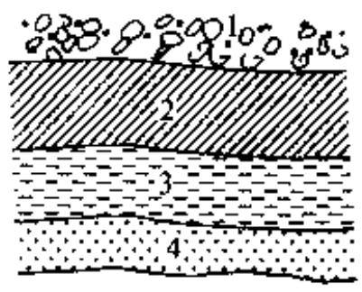  
(a)

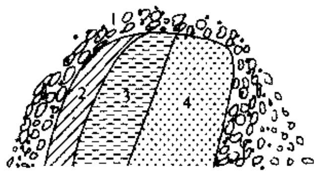  
(b)

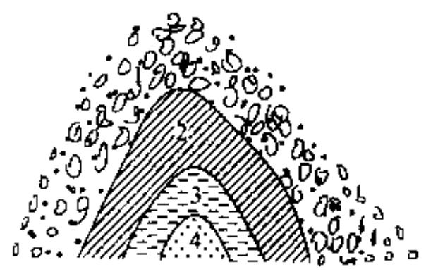  
(c)

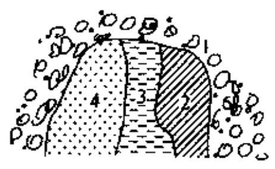  
(d)

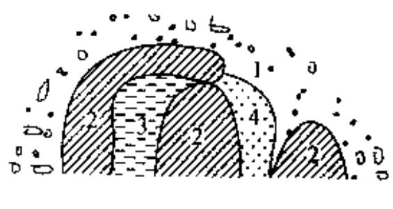  
(e)

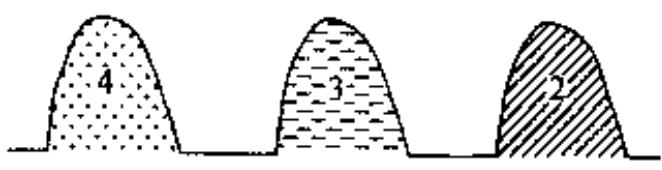  
(f)  
图4-3 堆垫地的弃土方式(赵永安，1992)  
(a)推土机与汽车水平堆土层序；(b)电铲、素斗铲带式堆土；(c)电铲、素斗铲定点弃土；  
(d) 干旱地区的顺序堆土：(e) 潮湿地区的分料堆土；(f) 无顺序随意弃土。  
1 表土：2. 心土；3. 底土；4. 母质

地表，并有坡面；三是无植被覆盖。

图4-3都是未考虑复垦利用而采取的不利的弃土形式，解决此类水土流失的最好办法是对弃土方式及堆垫地貌边坡及形状作合理的规划设计，其次是尽早恢复植被。

## 2. 回填洼地的水土流失

矿山固体废弃物回填洼地有三种截然不同的形式，如图4-4所示。三种回填方式引起的水土流失方式是不一样的。回填山谷的复垦场地的水土流失主要是受山洪威胁，在水力冲刷和堆体重力作用下，易形成滑坡和泥石流，即使不形成滑坡和泥石流，降水经松散堆体的渗滤，亦可能造成下游水体污染；回填塌陷盆地高出原地表的复垦场地，一方面表层土会受水力、风力作用侵蚀，另一方面表层蓄水力差，而使土壤含水率偏低，水肥也极易沿大孔隙向下渗漏掉；回填塌陷盆地与周围地表持平的复垦场地水土流失的主要形式是垂直渗漏。

防止回填洼地水土流失的主要措施应包括工程措施和生物措施两方面，而图4-4(a)应以工程措施为主，图4-4(b)、(c)以生物措施为主。

(a)  
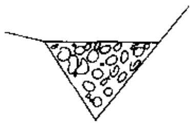

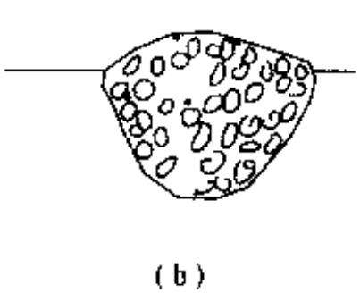  
图 4-4 回填洼地的形式

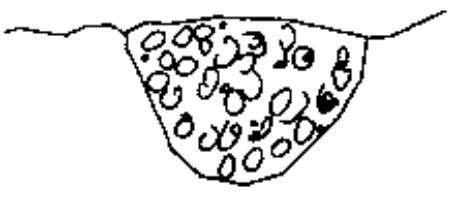  
(c)  
(a) 问填山谷(b)回填場陷盆地或低洼地，高出周围地表  
(c) 回填坝陷盆地或低洼地与周用地表持平

## 3. 非充填复垦区的水土流失

非充填复垦区在复垦之前往往是坡地或荒芜的洼地，由于多年弃耕及坡面侵蚀，表土层内植物根系少，土壤微生物少，有机质含量及土壤养分含量低，加上开采沉陷引起的地表拉应力的作用，地表往往还伴有微小裂缝存在，加剧了土壤侵蚀作用。复垦时人工覆盖的表土也极易遭受侵蚀。客观上矿区开发后大规模的道路及土木工程建设，也导致整个矿区植被覆盖度下降，使地表径流量加大，这也加剧了土壤侵蚀。因此非充填复垦区的水土流失可归结为坡面的作用、地表裂隙的存在和地表植被的稀疏及覆盖表土的松散。

非充填复垦区水土流失可通过有效的工程复垦与生物复垦措施，尤其是水利工程的合理布局得到控制。

## 4.3.3 通用水土流失方程(USLE)及水土流失控制机理

通用水土流失方程(Universal Soil Loss Equation)是 20 世纪50年代美国 Purdue大学研究出的用于估算土壤流失的经验公式，其表达式为：

$$
\pmb { A } = R K L S C P\tag{4- 15}
$$

式中：A——单位面积的土壤年侵蚀量， $\mathsf { t } / \{ \mathsf { h } \mathsf { m } ^ { 2 } \cdot \mathsf { a } \}$

R——降雨与径流因子；

K——土壤抗蚀性因子；

LS——地形因子，由坡长 L 和坡度 S 决定；

C———地表覆盖与管理因子；

P———水土保持措施因子。

自通用水土流失方程建立已来，USLE不仅在美国得到广泛应用，也在亚、非、欧洲等许多国家和地区得到推广。矿区水土流失与复垦区抗侵蚀设计也广泛应用 USLE(卞正富，1989,K.G.Evans，1991，K.C,Kuo,1990,郭继光，1996)。但迄今为止对矿区水土流失的性质、规律及抗侵蚀设计参数的选取尚没有统一的认识。

## 1. 降雨与径流因子 R

R与降雨量、降雨强度、雨滴大小及雨滴下降速度等降雨特征有关，Wishmeier用下式表示 R：

$$
R = E I _ { 3 0 } \ , \# \{ \vec { y } : ( \mathrm { J } ^ { \bullet } \mathrm { c m } ) / ( \mathrm { m } ^ { 2 } \cdot \mathtt { h } )\tag{4-16}
$$

$$
E = \sum \limits _ { i = 1 } ^ { n } e _ { i } P ,\tag{4-16-1}
$$

$$
e , = a + b \log I _ { \mathrm { \ell } }\tag{4-16-2}
$$

式中： $E$ —该次降雨总动能；

${ \cal I } _ { 3 0 }$ ——降雨过程中最大30min雨强；

$e ,$ 该次降雨过程中按强度变化划分的各时段(1，2，…，n)的单位降雨动能；

$P ,$ —与 $e ,$ 相应时段的雨量；

$I ,$ 与 $\pmb { \ell } _ { \pmb { \varepsilon } }$ 相应的降雨强度；

a、b——系数。

联合国粮农组织推荐的年降雨因子R为：

$$
R \ \simeq \ \sum _ { t = 1 } ^ { 1 2 } 1 . 7 3 5 \times 1 0 ^ { ( 1 \ 5 \mathrm { s g s } \gamma _ { P } ^ { 2 } \ 0 \ 8 1 8 \mathrm { \AA } ) }\tag{4 - 17}
$$

式中： $P$ ——该地区多年平均年降雨量，单位：mm；

$P ,$ —该地区多年平均1—12月逐月降雨量，单位：mm。

从宏观管理来说，式(4-17)计算方便，也能反映暴雨及汛期降雨强度增大而加剧水土流失的规律。

澳大利亚是较为重视防止水土流失的国家之一，Rosehthal等人利用联邦气象局的数据计算并绘制了昆土兰州的等蚀性图，从图中可用内插的方法查取有关矿山的 EI 值(K.G.Evans,1991)。我国中西部 $\sqrt { y ^ { 2 } }$ 山开发引起的水土流失严重，非常有必要制作等蚀性图以加强该地区对水土流失的宏观控制。

## 2. 土壤抗蚀性因子 K

土壤抗蚀性因子可通过坡长为22.13m，宽1.5m，坡度9%左右，没有植被覆盖的水土保持措施的标准试验地块确定。K值与土壤质地、土壤有机质含量、土壤结构和土壤透水性等有关。

农业土壤抗蚀性因子K值可由式(4-18)确定(唐德富，1991)。

$$
1 0 0 K = 2 . \mathrm { ~ I ~ } M ^ { 1 ~ 1 4 } \times 1 0 ~ ^ { 4 } \times ( 1 2 - a ) + 3 . 2 5 ( b - 2 ) +
$$

$$
2 . 5 \{ \mathfrak { c } - 3 \}\tag{4-18}
$$

式中：M——土壤级配参数；

M=(0.002\~0.1mm组分含量百分数)×(0.002\~0.1mm 组分含量百分数 +0.1-2.0mm组分含量百分数)

(4-18-1)

a——有机质含量百分数,0-6;

b—土壤结构分级，特细粒为1，细粒为2，中粒为3，块状或片状为4;

c—土壤透水性指数，砂土渗透速率11.25\~25.0cm/h，c取1,砂壤土渗透速率6.25\~11.25cm/h，c取 2,壤土渗透速率2.0\~6.25cm/h，c取3，粘壤土、粘土、重粘土依次取4、5.6。

农业土壤通常具有很好的同质性，而复垦土壤，尤其是矿山堆垫土为异质土，由不同沉积年代的岩石屑和岩石块组成，其结果是表层细粒岩屑垂直方向填至排土场内部孔隙，导致不均匀沉陷和土壤板结(K.G.Evans,1991)，因此，不同复垦形式的复垦土壤抗蚀性因子K值也是不同的。得到K值的最好方法是用标准试验地块测定，设标准试验地块实测的水土流失量为 $\mathbf { A } _ { \mathfrak { g } }$ ，则K值为：

$$
K = A _ { 0 } / R\tag{4-19}
$$

## 3. 地形因子 LS

地形因子由坡长和坡度两个因子合成，需要组合计算， $\left. \mathbf { W } \right. i \mathbf { s } \mathbf { . }$ chmeier和 Smith 的计算式为：

$$
L S = ( L / 2 2 ) ^ { 6 ~ 3 } ( \theta / 5 . 1 6 ) ^ { \nu }\tag{4-20}
$$

式中：L——坡长，单位：m

θ——坡度，单位：(°)。

或用式(4-21)计算

$$
L S = ( L / 2 2 . 1 ) ^ { m } ( 6 5 . 4 1 \sin ^ { 2 } \theta + 4 . 5 6 \sin \theta + 0 . 0 6 5 )\tag{4-21}
$$

式中m为指数，坡度大于等于5%时，取0.5,在3.5%\~4.5%之

间时，取0.4,坡度在1%\~3%时，取0.3,坡度小于1%时，取0.2。

由式(4-20)、(4-21)看出：坡度越大，坡长越长、LS值越大，相同条件下，土壤侵蚀量越大。

对自然地形来说，大多数地形剖面可以有较长的剖面，坡度可被看作是直线变化的，而矿山堆积物可以由人工设计成任意形状，Hannan和Bell认为：为保持坡面的长期稳定性，需将坡面设计成μ]形曲线，Toy和Hadley将理想的断面设计成图4-5所示形状。目前的处理方法，只能对这些不规则断面作分段处理，以计算LS值(K.G. Evans,1991)。

## 4. 覆盖与管理因子C

覆盖与管理因子是特定条件下，耕作地上的土壤流失量与连

续休闲地上的土壤流失量之比。作物在不同生长期的覆盖度是不样的，因而C值也随作物的生长期而变化，另一方面降雨因子也是随时间或季节而变化的，作物的生长期处在不同的季节对水土保持的作用也不同，因此，C值的选取

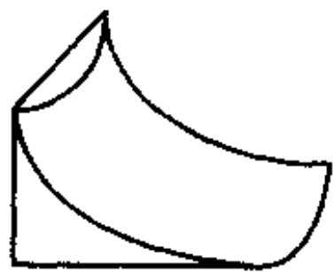  
图 4 5 最佳坡面设计(Toy,1987)

要综合考虑作物类型、作物的生长期及相应的降雨因子。

不同覆盖度的林草和几种主要作物不同生长期的C值如表4-7、表4-8。

表4-7 不同覆盖度的林草的 C值
<table><tr><td></td><td rowspan=1 colspan=6></td><td rowspan=2 colspan=1>林草类型</td></tr><tr><td></td><td rowspan=1 colspan=1>0</td><td rowspan=1 colspan=1>20</td><td rowspan=1 colspan=1>40</td><td rowspan=1 colspan=1>60</td><td rowspan=1 colspan=1>80</td><td rowspan=1 colspan=1>100</td></tr><tr><td rowspan=1 colspan=1>卓地</td><td rowspan=1 colspan=1>0.45</td><td rowspan=1 colspan=1>0.24</td><td rowspan=1 colspan=1>0.15</td><td rowspan=1 colspan=1>0.09</td><td rowspan=1 colspan=1>0.043</td><td rowspan=1 colspan=1>0.011</td></tr><tr><td rowspan=1 colspan=1>灌木</td><td rowspan=1 colspan=1>0.40</td><td rowspan=1 colspan=1>0.22</td><td rowspan=1 colspan=1>0 14</td><td rowspan=1 colspan=1>0.085</td><td rowspan=1 colspan=1>0.04</td><td rowspan=1 colspan=1>0.011</td></tr><tr><td rowspan=1 colspan=1>乔范木</td><td rowspan=1 colspan=1>0.39</td><td rowspan=1 colspan=1>0.20</td><td rowspan=1 colspan=1>0.11</td><td rowspan=1 colspan=1>0.06</td><td rowspan=1 colspan=1>0.027</td><td rowspan=1 colspan=1>0.007</td></tr><tr><td rowspan=1 colspan=1>森林</td><td rowspan=1 colspan=1>0.10</td><td rowspan=1 colspan=1>0.08</td><td rowspan=1 colspan=1>0.06</td><td rowspan=1 colspan=1>0.02</td><td rowspan=1 colspan=1>0.004</td><td rowspan=1 colspan=1>0.001</td></tr></table>

表4-8 几种主要作物不同生长期的C值
<table><tr><td rowspan=2 colspan=2>生长期作物类型</td><td rowspan=2 colspan=1>从翻地到耕种</td><td rowspan=2 colspan=1>播种期</td><td rowspan=2 colspan=1>成苗期</td><td rowspan=2 colspan=1>生长成熟期</td><td rowspan=1 colspan=2>残茬期</td></tr><tr><td rowspan=1 colspan=1>留在</td><td rowspan=1 colspan=1>不留花</td></tr><tr><td rowspan=1 colspan=1></td><td rowspan=1 colspan=1>玉米</td><td rowspan=1 colspan=1>0.15</td><td rowspan=1 colspan=1>0.40</td><td rowspan=1 colspan=1>0.33</td><td rowspan=1 colspan=1>0.15</td><td rowspan=1 colspan=1>0.22</td><td rowspan=1 colspan=1>0 45</td></tr><tr><td rowspan=2 colspan=1></td><td rowspan=1 colspan=1>小麦</td><td rowspan=1 colspan=1>0 30</td><td rowspan=1 colspan=1>0.45</td><td rowspan=1 colspan=1>0.35</td><td rowspan=1 colspan=1>0.08</td><td rowspan=1 colspan=1>0.20</td><td rowspan=1 colspan=1>0.40</td></tr><tr><td rowspan=1 colspan=1>大京</td><td rowspan=1 colspan=1>0.35</td><td rowspan=1 colspan=1>0.63</td><td rowspan=1 colspan=1>0.40</td><td rowspan=1 colspan=1>0.26</td><td rowspan=1 colspan=1>0.30</td><td rowspan=1 colspan=1>0 45</td></tr></table>

为考虑不同季节降雨因子对C值选取的影响，通常需制作R值的年累积曲线，图4-6即为徐州市的R值年累积曲线，从R值年累积曲线上查取作物不同生长时期的 $r ,$ 值，可按式(4-22)计算（值：

$$
C = \frac { \displaystyle \sum _ { i = 1 } ^ { m } \sum _ { j = 1 } ^ { n } C _ { i j } \cdot r _ { i j } } { R }\tag{4 − 22}
$$

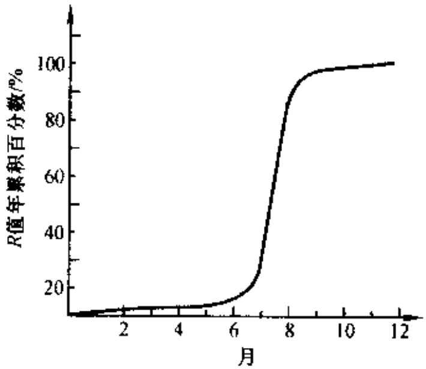  
图 4-6 徐州地区 R 值年累积曲线示例

式中： $C _ { \eta }$ 为j作物i生长期的C值；

$r _ { \prime \prime }$ 为j作物i生长期的降雨因子百分数；

R 为全年或轮作期降雨因子；

———作物的生长期；

—套茬作物数或种类。

## 5. 水土保持措施因子 P

P因子定义为采用专门措施(即等高耕作、梯田、等高带状耕作种形式)后的土壤流失量与顺坡耕作(up-and-down hill cul-ture)产生的土壤流失量之比。不同水保措施的P值如表4一9。

表4-9 不同水保措施的P值
<table><tr><td rowspan=2 colspan=1>玻度顺坡耕作</td><td rowspan=1 colspan=1>2-7</td><td rowspan=1 colspan=1>7.1-12</td><td rowspan=1 colspan=1>12.1~18</td><td rowspan=1 colspan=1>18.1-24</td><td rowspan=1 colspan=1>&gt;24</td></tr><tr><td rowspan=1 colspan=1>1</td><td rowspan=1 colspan=1>1</td><td rowspan=1 colspan=1>1</td><td rowspan=1 colspan=1>1</td><td rowspan=1 colspan=1>1</td></tr><tr><td rowspan=2 colspan=1>等高耕作等高带状耕作</td><td rowspan=1 colspan=1>0.5</td><td rowspan=1 colspan=1>06</td><td rowspan=1 colspan=1>0.8</td><td rowspan=1 colspan=1>0.9</td><td rowspan=1 colspan=1>1</td></tr><tr><td rowspan=1 colspan=1>0.25</td><td rowspan=1 colspan=1>0 30</td><td rowspan=1 colspan=1>0.40</td><td rowspan=1 colspan=1>0.45</td><td rowspan=1 colspan=1>0.50</td></tr><tr><td rowspan=1 colspan=1>梯田耕作</td><td rowspan=1 colspan=1>&#x27;0.75</td><td rowspan=1 colspan=1>0.80</td><td rowspan=1 colspan=1>0.90</td><td rowspan=1 colspan=1>0.95</td><td rowspan=1 colspan=1>1.0</td></tr></table>

## 4.3.4 复垦区水土流失及其控制

## 1. 复垦田块的抗侵蚀设计

(1)沉陷坡地的抗侵蚀设计：平原无积水的沉陷坡地如图4-7(a)所示。设沉陷前地表平坦，沉陷后的坡度为θ，沉陷坡长为L，沉陷后θ一般可达1°\~3°，将引起坡面土壤侵蚀。为控制沉陷

引起的土壤侵蚀，可对沉陷土地实施台田化处理，台田宽度为/，台田级数为n级，则：

$$
l = \frac { L \cos \theta } { n } ( 4 - 2 3 )
$$

相邻两级台田的平均落差h为：

$$
h = \frac { L \sin \theta } { n - 1 } ( 4 - 2 4 )
$$

由(4-23)、(4-24)式可以根据正常农业生产对台田宽度的要求，确定台田级数和台田高差，

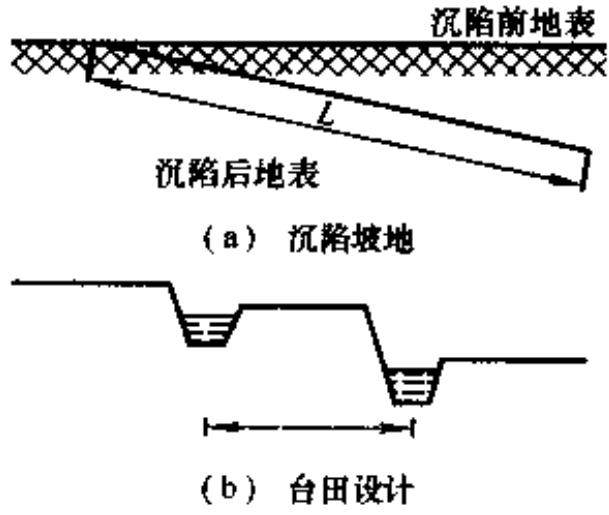  
图4-7 平原无积水沉降坡地的抗侵蚀设计

丘陵或原地形坡度较大的沉降坡地，可采取图4-8做法。上部设计成坡面内倾且设置汇水沟的梯田田面，底部留设蓄水池，既可用于养殖或作浇灌水源，又截蓄上部坡面流失的水土。

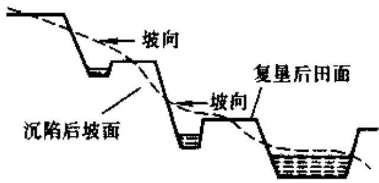  
图4 8 丘陵沉陷地的抗侵蚀设计

(2)排土场堆垫地貌设计：据地貌学原理知，山坡发育到较晚阶段，将形成一上凸下凹的山坡，如图4-9示(王飞燕，1991)。仿自然山坡的形状，建立图4-9示坐标系，设堆垫坡水平宽度为l，高度为h，可用指数形式表示坡的断面方程为：

$$
y = - 1 . 7 h \mathrm { e } ^ { \mathrm { ~ \tiny ~ { ~ 0 . 8 8 9 1 } ~ } ^ { - 2 } x ^ { 2 } } + 1 . 7 h\tag{4-25}
$$

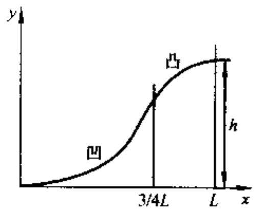  
图4-9 山坡发育的最晚阶段(王飞燕，1991)

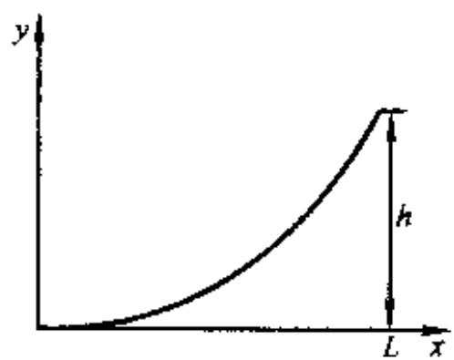  
图 4 -10 抛物线形坡面

图4-9 坡形也是澳大利亚煤矿排土场常采用的一种 S形坡形(代宏文，1995)，但据地貌学原理，当地壳处于长期稳定时，剥蚀作用将不断进行，最终形成一凹形山坡才是最为稳定的，即图4一

10所示，该坡面可用式(4-26)表示

$$
y = \frac { k } { L ^ { 2 } } \pi ^ { 2 }\tag{4-26}
$$

因此从地貌学原理分析，式(4-26)应该较(4-25)更合理，建议排土场抗侵蚀坡面设计采用式(4-26)的抛物线形式。

## 2. 复垦区抗侵蚀的工程与生物措施

(1)快速恢复植被法：非充填复垦区应做到不抛荒，合理安排作物的接茬，这样可很好地防止水土流失。充填复垦区，尤其是堆垫地可仿自然植被演替规律，先种草、再种灌木，最后植乔木或待土壤熟化后种植农作物。据我们在研石排放场试种的几种草种看，柽麻适应性强、覆盖度高，对防止排矸场初期水土流失可起到很好的效果，但其缺点是生长期短，且为一年生植物，可选择少雨季节收割后，再种其他多年生草种。

(2)涂层法：涂层法是国外广泛采用的方法之一。涂层材料包括沥青乳液和棉籽醇树脂乳液等粘性物质，其抗蚀原理是用粘性材料将松散易蚀的排土场表面作固结处理，可有效地防止风蚀和水蚀。使用涂层法需要注意三个问题：一是涂层材料应无毒，涂层后不影响今后的复垦种植，据俄罗斯研究表明，用棉籽醇树脂乳液(棉籽酸树脂5%\~30%，苛性钠0.8%\~1.0%与水69%\~94.2%配制)不仅不影响植被恢复，还有利于植被生长(H.Γ.O瓦利耶大，1994)。二是涂层对表面的固结应达到一定的强度，若达不到一定强度，将起到相反的效果，因为涂层后降雨垂直渗透减弱，地面径流加强，冲刷力增大，若表面没有一定的强度，势必加强侵蚀作用。三是涂层法只能作为一临时性措施，而不能作为永久措施，它适用于新排弃、尚不稳定的岩土表面。

(3)网席法：网席法是一种简便易行的临时方法，即：将易侵蚀的坡面用草席或纤维织网压草覆盖坡面，防止坡而侵蚀。

(4) 侵蚀被法(Erosion Control Mat or Blanket):侵蚀被是国外近年来在采矿区使用的一种新方法(K.C.Kuo等，1990)，与网席法类似，侵蚀被由一面能够光降解，一面能够生物降解的草与椰子纤维等材料织成，其规格约 $2 \mathrm { m } \times 2 5 \mathrm { m }$ ，重13.6kg，使用时将其铺于坡面，不回收，可在其上直接播种草籽。

## 4.4 复垦界面生态系统能(物)流的分室模型

## 4.4.1 复垦界面生态系统特征

复垦界面生态系统的一个显著特征就是不断地与外界进行物质、能量与信息交换，物质能量与信息交换的结果是系统的结构和功能发生变化。假设矿山开发之前为一典型的陆生农业生态系统，可用图4-11(a)表示。由图4-11不难看出，开采前生态系统结构简单，功能单一，开采后生态系统增加了矿产开采亚系统及由此形成的社区消费亚系统，这两个亚系统与原有农业生产系统相互作用，形成一个复杂的物质能量交换网络，其结果是系统形成农产品和矿产品生产两大功能，面矿产开采和社区两亚系统虽对农业生产系统有…定促进，更多的则是表现为干扰作用，干扰作用表现为空间的竞争和消费的增加。界面整合的目标就是实现各亚系统之间的互利共生，达到整个系统处于动态平衡状态。

## 4.4.2 复垦界面生态系统能(物)流的定参数分室模型

分室模型可较好地描述系统间的物质、能量交换(牛文元，1984)。我国学者曾较好地将其用于分析农业生态系统的物质循环(刘铁斌，韩纯儒，1988)。这里以图4-11(b)为例说明其建模方法。首先将图4-11(b)简化为图4-12所示的概念模型。图中外层大方框表示系统边界。设输入变量为Z，状态变量为X，输出系统外的能量为 $\pmb { F } _ { 0 }$ ,各环节(或分室)间能量流入流出代数和为 F(流入为 +，流出为-)，i分室流向j分室的物流为 $f _ { n }$ ，则：

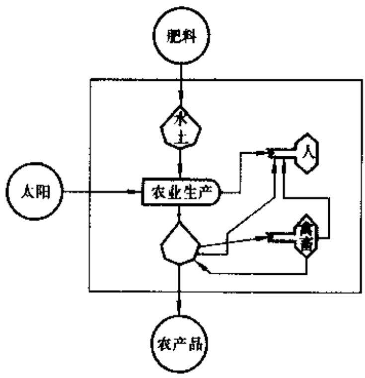  
(a)

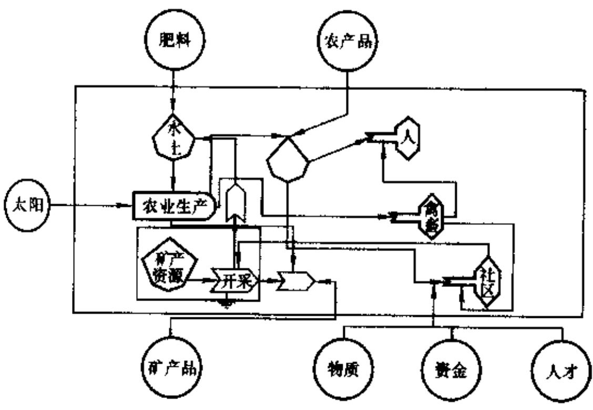  
(b)  
图 4 -11 开采前后生态系统能流图(a) 采前 (b) 采后

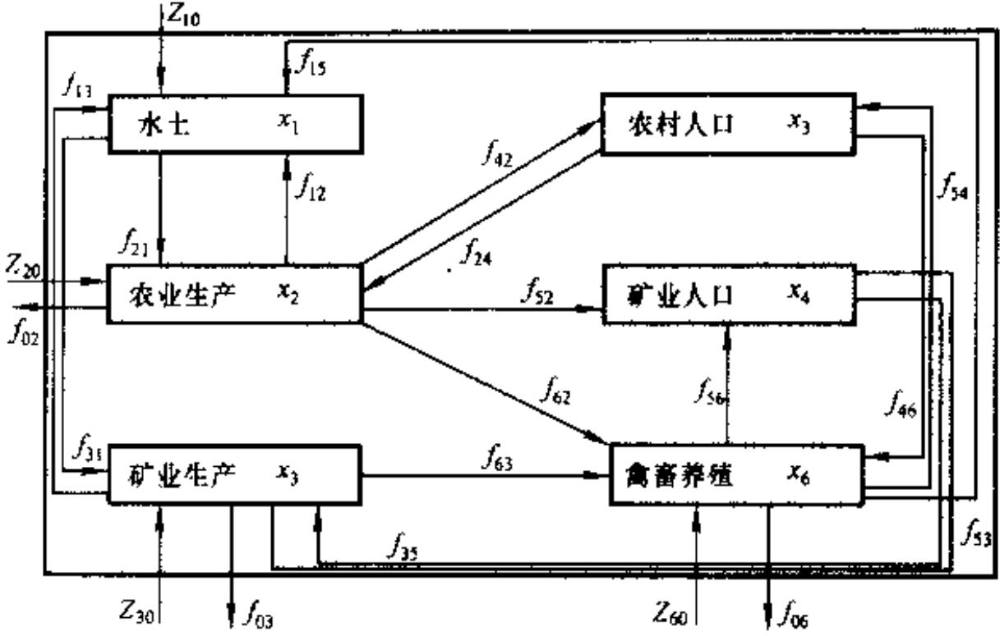  
图4 -12 采后生态系统能流的概念模型

$$
\frac { \mathrm { d } \pmb { X } } { \mathrm { d } t } = \pmb { F } - \pmb { F } _ { 0 } + \pmb { Z }\tag{4-27}
$$

具体地，据图4-12可写出各分室状态变量的变化率为：

$$
\left\{ \begin{array} { l l } { \displaystyle \frac { \mathrm { d } x _ { \perp } } { \mathrm { d } t } = f _ { \perp } + f _ { \perp } + f _ { \perp } + f _ { \perp } - f _ { \perp } - f _ { \perp } + Z _ { \perp \perp } } \\ { \displaystyle \frac { \mathrm { d } x _ { \perp } } { \mathrm { d } t } = f _ { \perp } + f _ { \perp \perp } - f _ { \perp } - f _ { \perp } - f _ { \perp } - f _ { \perp } - f _ { \perp \perp } + Z _ { 3 \perp } } \\ { \displaystyle \frac { \mathrm { d } x _ { \perp } } { \mathrm { d } t } = f _ { \perp } + f _ { \mathrm { 3 x } } - f _ { \mathrm { 9 x } } - f _ { \mathrm { 6 x } } - f _ { \mathrm { 1 y } } - f _ { \mathrm { 9 y } } + Z _ { \mathrm { 8 x } } } \\ { \displaystyle \frac { \mathrm { d } x _ { \perp } } { \mathrm { d } t } = f _ { \mathrm { 6 f } } + f _ { \mathrm { 6 y } } - f _ { \mathrm { 2 y } } - f _ { \mathrm { 6 y } } } \\ { \displaystyle \frac { \mathrm { d } x _ { \perp } } { \mathrm { d } t } = f _ { \mathrm { 6 f } } + f _ { \mathrm { 6 y } } - f _ { \mathrm { 3 x } } - f _ { \mathrm { 6 y } } } \\ { \displaystyle \frac { \mathrm { d } x _ { \perp } } { \mathrm { d } t } = f _ { \mathrm { 6 f } } + f _ { \mathrm { 6 y } } + f _ { \mathrm { 3 y } } - f _ { \mathrm { 1 y } } } \\ { \displaystyle \frac { \mathrm { d } x _ { \perp } } { \mathrm { d } t } = f _ { \mathrm { 6 f } } + f _ { \mathrm { 6 f } } - f _ { \mathrm { 6 x } } - f _ { \mathrm { 6 y } } - f _ { \mathrm { 6 y } } + Z _ { \mathrm { 6 y } } } \end{array} \right.\tag{4-28}
$$

能量流通率定义为单位库存量每年从j分室流向i分室的流量，记为 $a _ { i j }$

$$
a _ { i } ~ = ~ \left\{ \begin{array} { c c } { { \displaystyle \frac { f _ { y } } { x } } } & { { i \neq j } } \\ { { - \displaystyle \sum _ { k = 0 } ^ { n } \frac { f _ { k } } { x _ { i } } } } & { { i ~ = ~ j } } \end{array} \right.\tag{4−29}
$$

于是、方程组(4-28)变为：

$$
\left\{ \begin{array} { l l } { \displaystyle { \frac { d \lambda _ { 1 1 } } { d t } } = a _ { 1 1 } x _ { 2 } + a _ { 1 3 } x _ { 3 } + a _ { 1 6 } x _ { 5 } - a _ { 1 1 } x _ { 1 } + Z _ { \mathrm { f o r } } } \\ { \displaystyle { \cfrac { d \lambda _ { 2 2 } } { d t } } = a _ { 2 1 } x _ { 1 } + a _ { 2 3 } x _ { 4 } - a _ { 2 1 } x _ { 3 } + Z _ { 2 6 } } \\ { \displaystyle { \cfrac { d \lambda _ { 3 3 } } { d t } } = a _ { 3 1 } x _ { 1 } + a _ { 3 3 } x _ { 5 } - a _ { 3 1 } x _ { 3 } + Z _ { 3 6 } } \\ { \displaystyle { \cfrac { d \lambda _ { 4 4 } } { d t } } = a _ { 4 2 } x _ { 2 } + a _ { 4 6 } x _ { 4 } - a _ { 4 4 } x _ { 4 } } \\ { \displaystyle { \cfrac { d \lambda _ { 5 } } { d t } } = a _ { 5 1 } x _ { 2 } + a _ { 5 1 } x _ { 5 } + a _ { 5 3 } x _ { 3 } - a _ { 3 3 } x _ { 5 } } \\ { \displaystyle { \cfrac { d \lambda _ { 4 5 } } { d t } } = a _ { 6 3 } x _ { 2 } + a _ { 4 8 } x _ { 3 } + a _ { 4 4 } x _ { 4 } - a _ { 6 3 } x _ { 5 } + Z _ { 6 6 } } \end{array} \right.\tag{4-30}
$$

简写为：

$$
\frac { \mathrm { d } \pmb { X } } { \mathrm { d } t } = \pmb { A } \pmb { X } + \pmb { Z }\tag{4-31}
$$

式中：

$$
\begin{array} { l } { \displaystyle { \frac { \mathrm { d } \mathbf { X } } { \mathrm { d } t } = \left( \frac { \mathrm { d } x _ { 1 } } { \mathrm { d } t } , \frac { \mathrm { d } x _ { 2 } } { \mathrm { d } t } , \cdots , \frac { \mathrm { d } x _ { 6 } } { \mathrm { d } t } \right) ^ { \mathrm { \tiny { T } } } } } \\ { \displaystyle { X = ( x _ { 1 } , x _ { 2 } , \cdots , x _ { 6 } ) ^ { \mathrm { \tiny { T } } } } } \\ { \displaystyle { z = ( Z _ { 1 9 } , Z _ { 2 0 } , \cdots , Z _ { 6 0 } ) } } \end{array}
$$

$$
\mathbf { A } = \left[ \begin{array} { c c c c c c c } { - a _ { 1 1 } } & { a _ { 1 2 } } & { a _ { 1 3 } } & { 0 } & { 0 } & { a _ { 1 6 } } \\ { a _ { 2 4 } } & { - a _ { 2 2 } } & { 0 } & { a _ { 2 4 } } & { 0 } & { 0 } \\ { a _ { 3 1 } } & { 0 } & { - a _ { 1 3 } } & { 0 } & { a _ { 3 5 } } & { 0 } \\ { 0 } & { a _ { 4 2 } } & { 0 } & { - a _ { 4 4 } } & { 0 } & { a _ { 4 6 } } \\ { 0 } & { a _ { 5 2 } } & { a _ { 5 3 } } & { 0 } & { a _ { 5 5 } } & { a _ { 5 6 } } \\ { 0 } & { a _ { 6 2 } } & { a _ { 6 3 } } & { a _ { 6 4 } } & { 0 } & { - a _ { 6 6 } } \end{array} \right] .
$$

只要已知各分室状态变量的初始值 $\pmb { X } _ { 0 }$ 、各分室之间的能(物)量F及各分室向系统外的输出 $\pmb { F } _ { \parallel }$ 和由系统外的输人量Z，即可利用式(4-31)求解各状态变量随时间变化的基本规律，并可调节系统有关参数，使系统运行达到令人满意或人为预期的效果。且可由式(4·32)计算有关分室向系统外的输出量Y：

$$
\begin{array} { l } { { { \bf { \cal { Y } } } = \{ { y _ { 1 } } , { y _ { 2 } } , \cdots , { y _ { n } } \} } } \\ { { \ = \{ { \bf { \Gamma } } _ { { \alpha _ { 0 1 } } } , { \alpha _ { 0 2 } } , \cdots , { \alpha _ { \alpha _ { 1 n } } } \} ( { x _ { 1 } } , { x _ { 2 } } , \cdots , { x _ { n } } ) ^ { 1 } } } \\ { { \ = { \bf { \Gamma } } { \bf { C } } { \bf { \cal { X } } } ^ { \mathrm { { T } } } \mathrm { ~ } } } \end{array}\tag{4-32}
$$

又定义循环指数为某物质元素进人某一个分室，通过流经其他分室，再返回到本分室的百分比。则令 $\pmb { G } = ( \pmb { g } _ { y } ) _ { n \times \pmb { n } }$ ，有：

$$
\mathbf { g } _ { i j } ~ = ~ \left\{ \begin{array} { c c } { 0 } & { i ~ = ~ j } \\ { \displaystyle \frac { f _ { i j } } { \sum _ { i = 0 } ^ { n } f _ { i j } } } & { i ~ \neq ~ j } \end{array} \right.\tag{4-33}
$$

计算 $\mathbf { N } = { \mathop { \left[ \mathbf { \Gamma } \right]} \mathbf { I } - \mathbf { G }  }$ 得 $\mathbf { \boldsymbol { \mathsf { N } } } = \left( \mathbf { \boldsymbol { \mathsf { n } } } _ { \mathsf { \boldsymbol { \mathsf { r } } } _ { f } } \right) _ { \mathbf { \boldsymbol { \mathsf { r } } } } \times \mathbf { \boldsymbol { \mathsf { n } } }$ ，于是各组分循环效率

$$
R _ { \iota } = \frac { \mathfrak { n } _ { \iota } } { \mathfrak { n } _ { \iota } } \frac { - 1 } { \mathfrak { n } _ { \iota } }\tag{4-34}
$$

系统总循环流量T为：

$$
T = \sum _ { \mathfrak { r } = 1 } ^ { n } \Big [ \Big ( \sum _ { \mathfrak { r }  \Uparrow } ^ { \Uparrow } f _ { \star \mathfrak { r } } \Big ) \cdot R _ { \iota } \Big ]\tag{4-35}
$$

系统总循环指数 R 则为：

$$
R = \frac { T } { \displaystyle \sum _ { i = 1 } ^ { n } \Big ( \sum _ { k = 1 } ^ { n } f _ { k } , \Big ) }\tag{4- 36}
$$

根据式(4-33)\~(4-36)即可计算系统总循环指数R，据R可判定能量(或物质)在系统内的循环效率。

前面的模型可说明两个问题：是通过调节系统的输入Z向量可使X达到预定的状态X，二是通过观察分析某一时刻的输出向量Y，能够确定地分析出系统的初始状态 $\pmb { X } _ { \mathfrak { A } }$ .前者称为系统具有可控性，后者称为系统具有可测性。可控性与可测性分别以下述两个定理为充分必要条件。

定理1 系统具有可控性的充分必要条件是： $M = [ z , A z$ $\mathbf { 4 } ^ { : } \pmb { \chi } , \cdots , \pmb { \chi } ^ { n } \ ^ { 1 } \pmb { Z } ]$ 为满秩。

定理2系统具有可测性的充分必要条件是： $\pmb { P } = \pmb { \left\{ \begin{array} { l } { \pmb { C } ^ { \top } } \end{array} \right. }$ $\mathbf { A } ^ { \mathrm { ~ T ~ } } \mathbf { C } ^ { \mathrm { ~ l ~ } } , ( \mathbf { A } ^ { \mathrm { ~ l ~ } } ) ^ { 2 } \mathbf { C } ^ { \mathrm { ~ T ~ } } , \cdots , ( \mathbf { A } ^ { \mathrm { ~ T ~ } } ) ^ { \mathrm { ~ u ~ } ^ { \mathrm { ~ l ~ } } } \mathbf { C } ^ { \mathrm { ~ f ~ } } )$ 为满秩。

## 4.4.3 分室模型在魏庄复垦生态系统中的应用

## 1. 魏庄复垦区简介

魏庄复垦区位于铜山县柳新乡境内，破坏的土地为徐州诧城矿煤炭开采沉陷所致，平均下沉2\~3m，1994年起进行立项论证，1995年被列为国家级复垦示范工程，年投入500余万元，现已建成牛场一座，存栏200头，养猪场一座，存栏3000头，养鳖厂一座，年产鳖10万只，稻麦两熟地 $6 0 \mathrm { h m } ^ { \underline { { \mathbf { \jmath } } } }$ ，各类用地面积与规模如表$4 \cdot 1 0 _ { z }$ 现有种养殖规模的确定基本是根据资金投人情况和土地沉陷后上地复垦的适宜性确定的，没有考虑各环节物质、能量流动的合理性及物质能量在系统内循环利用的效率，下面我们利用分室模型分析该复垦系统的N、P、K等物质循环和利用情况。

表4-10 魏庄复垦区各类用地规模
<table><tr><td rowspan=1 colspan=1>类型</td><td rowspan=1 colspan=1>稻麦两熟地</td><td rowspan=1 colspan=1>牛场</td><td rowspan=1 colspan=1>緊场</td><td rowspan=1 colspan=1>猪场</td></tr><tr><td rowspan=1 colspan=1>面积 $\mathsf { \Omega } ^ { \mathsf { h } } \mathsf { r } \mathsf { n } ^ { \mathsf { \lambda } }$ </td><td rowspan=1 colspan=1>60</td><td rowspan=1 colspan=1>2</td><td rowspan=1 colspan=1>14</td><td rowspan=1 colspan=1>3.5</td></tr></table>

## 2. 系统物流模型

该复垦系统可简化为养牛场、养猪场、养鳖场、土壤、种植业五个分室，其物流模型如图4-13。系统的输入包括牛饲料、猪饲料、鳖饲料的输入和肥料、种子的输入五个方面，系统输出的产品有商品牛、商品猪、商品鳖及粮食四部分。系统内部牛粪、猪粪及鳖池底泥作为土壤的肥料供给，粮食作为牛、猪、鳖的饲料来源之一，土壤供给作物养分，作物的根茎叶等又部分返回土壤分室。

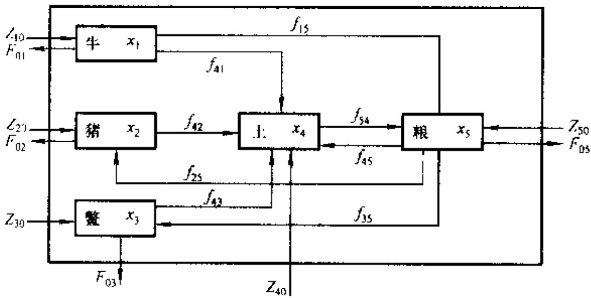  
图4-13 魏庄复垦系统物流模型

## 3. 参数的选取及说明

各参数的取值如表4-11，由该参数组成的方案以下称为原始方案 $\yen 123,45$ 为各分室的初始值， $f _ { \mathfrak { M } } \sim f _ { \mathfrak { M } }$ 为系统的产出， $Z _ { 1 0 }$ $\sim \smash { Z _ { \ s _ { 1 } } }$ 为系统的输人， $f _ { i , \ l }$ 为系统内部物流量。猪粪、牛粪的产量及氮、磷、钾含量按表4-12估算。牛、猪、鳖饲料需要有专门的配方，表4·11给出的比例可理解为将系统内的粮食折合成相应配方饲料的含量。

表4-11 系统参数选取及说明  
单位： $\mathbf { k } \mathbf { g } ^ { \prime } \mathrm {hbar } \mathbf { \hbar m } ^ { 2 }$
<table><tr><td rowspan=1 colspan=1></td><td rowspan=1 colspan=1>符制</td><td rowspan=1 colspan=1>氮</td><td rowspan=1 colspan=1>磷</td><td rowspan=1 colspan=1>钾</td><td rowspan=1 colspan=1>含               义</td></tr><tr><td rowspan=1 colspan=1></td><td rowspan=1 colspan=1>1</td><td rowspan=1 colspan=1>166.7</td><td rowspan=1 colspan=1>33.3</td><td rowspan=1 colspan=1>100</td><td rowspan=1 colspan=1>以年存栏牛的体重及其N、P、K含量分摊至 $\mathsf { \& } ( \mathsf { J } \mathsf { h } \mathsf { m } ^ { 2 }$ 土地</td></tr><tr><td rowspan=1 colspan=1></td><td rowspan=1 colspan=1> $r _ { 2 }$ </td><td rowspan=1 colspan=1>750</td><td rowspan=1 colspan=1>150</td><td rowspan=1 colspan=1>450</td><td rowspan=1 colspan=1>以年存栏猪的体重及其N、P、K含量分摊至 $6 0 \hbar \mathbf { m } ^ { 2 }$ 土地</td></tr><tr><td rowspan=1 colspan=1></td><td rowspan=1 colspan=1>214</td><td rowspan=1 colspan=1>17</td><td rowspan=1 colspan=1>8.3</td><td rowspan=1 colspan=1>25 0</td><td rowspan=1 colspan=1>以年养殖警的重量及其N、P、K含量分摊至 $\hbar 0 k m ^ { 2 }$ 土地</td></tr><tr><td></td><td rowspan=1 colspan=1>2.</td><td rowspan=1 colspan=1>27001</td><td rowspan=1 colspan=1>300 10</td><td rowspan=1 colspan=1>4 000]</td><td rowspan=1 colspan=1>以实测土壤全N、P、K含量计算每hm²,20cm表层土N、P.K量</td></tr><tr><td></td><td rowspan=1 colspan=1>T5</td><td rowspan=1 colspan=1>415</td><td rowspan=1 colspan=1>192.5</td><td rowspan=1 colspan=1>405</td><td rowspan=1 colspan=1>以全年产量 $1 5 \ \mathrm { \ t u p { 0 } } | \mathrm { \mathbf { k g } } / \mathrm { \mathbf { h } } \mathrm { \mathbf { m } } ^ { 2 }$ ,计算N、P、K的量</td></tr><tr><td></td><td rowspan=1 colspan=1>fm</td><td rowspan=1 colspan=1>677</td><td rowspan=1 colspan=1>26.7</td><td rowspan=1 colspan=1>53.3</td><td rowspan=1 colspan=1>买出牛的重量乘以单位体重的N.P、K量，分摊至60hm2土地上</td></tr><tr><td></td><td rowspan=1 colspan=1>fu</td><td rowspan=1 colspan=1>113.3</td><td rowspan=1 colspan=1>53.3</td><td rowspan=1 colspan=1>1333</td><td rowspan=1 colspan=1>年产牛粪中的N.P、K含量分摊至 $\boldsymbol { \mathsf { \delta } } \boldsymbol { \mathsf { 0 } } \mathsf { h } \boldsymbol { \mathsf { n } } ^ { 2 }$ 土地上</td></tr><tr><td></td><td rowspan=1 colspan=1>/42 1</td><td rowspan=1 colspan=1>080</td><td rowspan=1 colspan=1>456</td><td rowspan=1 colspan=1>1440</td><td rowspan=1 colspan=1>年产猪粪中的N.P、K含量分摊至 ${ \mathfrak { s o h } } _ { \mathbf { n } \mathbf { n } } { } ^ { 2 }$ 土地上</td></tr><tr><td></td><td rowspan=1 colspan=1>fu2</td><td rowspan=1 colspan=1>750</td><td rowspan=1 colspan=1>150</td><td rowspan=1 colspan=1>450</td><td rowspan=1 colspan=1>买出猪的重量乘以单位体重的N、P、K量分摊至 $\widehat { \mathsf { o o f n m } ^ { 2 } }$ 土地上</td></tr><tr><td></td><td rowspan=1 colspan=1>∫03</td><td rowspan=1 colspan=1>41 7</td><td rowspan=1 colspan=1>8.3</td><td rowspan=1 colspan=1>25.0</td><td rowspan=1 colspan=1>买出鳖的重量乘以单位重量中的N、P、K量分摊至 $\mathbf { \delta } 6 0 \mathrm { { h m } } ^ { 2 }$ 土地上</td></tr><tr><td></td><td rowspan=1 colspan=1>f43</td><td rowspan=1 colspan=1>541.7}</td><td rowspan=1 colspan=1>1301</td><td rowspan=1 colspan=1>451.7</td><td rowspan=1 colspan=1>整池底泥中的N、P、K分摊至 $\mathsf { \Omega } 6 0 \mathsf { h m } ^ { 2 }$ 土地，每年清淤5cm</td></tr><tr><td></td><td rowspan=1 colspan=1>fx</td><td rowspan=1 colspan=1>415</td><td rowspan=1 colspan=1>192.5</td><td rowspan=1 colspan=1>405</td><td rowspan=1 colspan=1>作物从土壤中吸取的N、P、K，以产量估算</td></tr><tr><td></td><td rowspan=1 colspan=1>1ns</td><td rowspan=1 colspan=1>99 5</td><td rowspan=1 colspan=1>44.0</td><td rowspan=1 colspan=1>95.6</td><td rowspan=1 colspan=1>以軸出的粮食和秸秆估算</td></tr><tr><td></td><td rowspan=1 colspan=1>∫1</td><td rowspan=1 colspan=1>31.3</td><td rowspan=1 colspan=1>10.5</td><td rowspan=1 colspan=1>26.0</td><td rowspan=1 colspan=1>供给牛饲料数量，以总饲料量的2/5计算</td></tr><tr><td></td><td rowspan=1 colspan=1>f25</td><td rowspan=1 colspan=1>234.5</td><td rowspan=1 colspan=1>78.5</td><td rowspan=1 colspan=1>195.3</td><td rowspan=1 colspan=1>供给猪饲料数量，以1/3计算</td></tr><tr><td></td><td rowspan=1 colspan=1>fu|</td><td rowspan=1 colspan=1>21.4</td><td rowspan=1 colspan=1>720</td><td rowspan=1 colspan=1>17.8</td><td rowspan=1 colspan=1>供给整饲料数量，以1/2计算</td></tr><tr><td></td><td rowspan=1 colspan=1>f4s</td><td rowspan=1 colspan=1>757</td><td rowspan=1 colspan=1>24.0</td><td rowspan=1 colspan=1>52.4</td><td rowspan=1 colspan=1>作物根茎叶返回土壤的量</td></tr><tr><td rowspan=1 colspan=2>Z10</td><td rowspan=1 colspan=1>47.0</td><td rowspan=1 colspan=1>15.8</td><td rowspan=1 colspan=1>39.0</td><td rowspan=1 colspan=1>投人的牛饲料，总饲料的3/5</td></tr><tr><td rowspan=1 colspan=2>Z20</td><td rowspan=1 colspan=1>7035</td><td rowspan=1 colspan=1>235.5</td><td rowspan=1 colspan=1>585.9</td><td rowspan=1 colspan=1>投人的猪饲料，总饲料的2/3</td></tr><tr><td rowspan=1 colspan=2>Z30</td><td rowspan=1 colspan=1>568.9</td><td rowspan=1 colspan=1>128.9</td><td rowspan=1 colspan=1>443.6</td><td rowspan=1 colspan=1>投入的整饲料，总饲料的1/2</td></tr><tr><td rowspan=1 colspan=2>Z 40</td><td rowspan=1 colspan=1>350</td><td rowspan=1 colspan=1>71.0</td><td rowspan=1 colspan=1>35.0</td><td rowspan=1 colspan=1>投人的化肥</td></tr><tr><td rowspan=1 colspan=2>Z5n</td><td rowspan=1 colspan=1>. 3.8</td><td rowspan=1 colspan=1>1.6</td><td rowspan=1 colspan=1>3.7</td><td rowspan=1 colspan=1>投人的种子</td></tr></table>

表4-12猪、牛粪产量及氨、磷、钾含量
<table><tr><td rowspan=1 colspan=1>指标</td><td rowspan=1 colspan=1>摄/%</td><td rowspan=1 colspan=1>購/%</td><td rowspan=1 colspan=1>钾/%</td><td rowspan=1 colspan=1>产量/(kg·头-1)</td></tr><tr><td rowspan=1 colspan=1>猪糞</td><td rowspan=1 colspan=1>0.45</td><td rowspan=1 colspan=1>0.19</td><td rowspan=1 colspan=1>0.60</td><td rowspan=1 colspan=1>1 600</td></tr><tr><td rowspan=1 colspan=1>牛糞</td><td rowspan=1 colspan=1>0.34</td><td rowspan=1 colspan=1>0.16</td><td rowspan=1 colspan=1>0.40</td><td rowspan=1 colspan=1>10 000</td></tr></table>

## 4. 分室模型的建立及其可控性与可测性判定

N、P、K在各分室之间的物流图如图4-14所示。根据图4-14数据和式(4-29)可得到分室模型中的系数矩阵：

$$
\mathbf { A } _ { \mathrm { N } } = { \left[ \begin{array} { l l l l l l } { - 1 . 0 8 5 8 } & { 0 } & { 0 } & { 0 } & { 0 } & { 0 . 0 7 5 4 } \\ { 0 } & { - 2 . 4 4 } & { 0 } & { 0 } & { 0 . 5 6 5 1 } \\ { 0 } & { 0 } & { - 1 3 . 9 9 0 4 } & { 0 } & { 0 . 0 5 1 6 } \\ { 0 . 6 7 9 7 } & { 1 . 4 4 } & { 1 2 . 9 9 0 4 } & { - 0 . 1 5 3 7 } & { 0 . 1 8 2 4 } \\ { 0 } & { 0 } & { 0 } & { 0 . 1 5 3 7 } & { - 1 . 1 1 4 2 } \end{array} \right] }
$$

$$
\begin{array} { r } { \begin{array} { l l l l l l } { \Gamma - 2 . 4 0 2 4 } & { 0 } & { 0 } & { 0 } & { 0 . 0 5 4 5 } \\ & {  =  } & {  - 4 . 0 4 } & { 0 } & { 0 } & { 0 . 4 0 7 8 } \\ { A _ { \mathrm { P } } = \begin{array} { l l l l l } { 1 0 } & { 0 } & { - 1 6 . 6 7 4 7 } & { 0 } & { 0 . 0 3 7 4 } \\ { 1 . 6 0 0 6 } & { 3 . 0 4 } & { 1 5 . 6 7 4 7 } & {  - 0 . 1 4 8 1 } & { 0 . 1 2 4 7 } \end{array} } \\ { \begin{array} { l l l l l l } { \mathrm { i } . 0 } & { 0 } & { 0 } & { 0 } & { - 0 . 8 5 3 0 . } \end{array} } \end{array} \} } \\ { \begin{array} { l } { \begin{array} { l l l l l l } { 0 } & { 0 } & { 0 } & { 0 . 1 4 8 1 } & { - 0 . 8 5 3 7 8 } \\ { 0 } & { 0 } & { 0 } & { 0 . 1 4 8 1 } & { 0 . 0 3 7 4 } \end{array} } \end{array} . } \end{array}
$$

$$
{ \tiny \begin{array} { l l l l l l } { - 1 . 8 6 6 } & { 0 } & { 0 } & { 0 } & { 0 . 0 6 4 2 } \\ { \left| 0 \right. } & { - 4 . 2 } & { 0 } & { 0 } & { 0 . 4 8 2 \ 2 } \\ { A _ { \texttt { k } } = \left| 0 \right. } & { 0 } & { - 1 9 . 0 6 8 } & { 0 } & { 0 . 0 4 4 \ 0 } \\ { \left. 1 . 3 3 3 \right\} & { 3 . 2 } & { 1 8 . 0 6 8 } & { - 0 . 0 0 3 \ 9 } & { 0 . 1 2 9 \ 4 } \\ { \left. 0 \right. } & { 0 } & { 0 } & { 0 . 0 0 3 \ 9 } & { - 0 . 9 5 5 \ 8 } \end{array} } }
$$

$$
C _ { \mathrm { s } } = ( \mathbf { 0 } . 4 0 6 \ 1 , 1 , 1 , \mathbf { 0 } , \mathbf { 0 } . 2 3 9 \ 8 )
$$

$$
C _ { \scriptscriptstyle \mathrm { P } } = ( \mathbf { 0 } . 8 \mathbf { 0 } ! \ \mathbf { 8 } , 1 , \mathbf { 1 } , \mathbf { 0 } , \mathbf { 0 } . 2 2 \mathbf { 8 } \ \mathbf { 6 } )
$$

$$
\mathbf { C _ { \kappa } } = ( 0 . 5 3 3 , 1 , 1 , 0 , 0 . 2 3 6 \ 0 )
$$

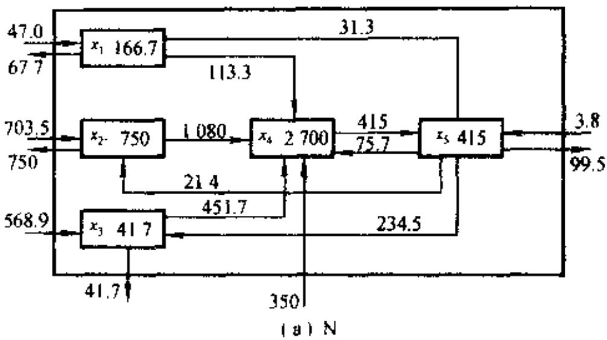

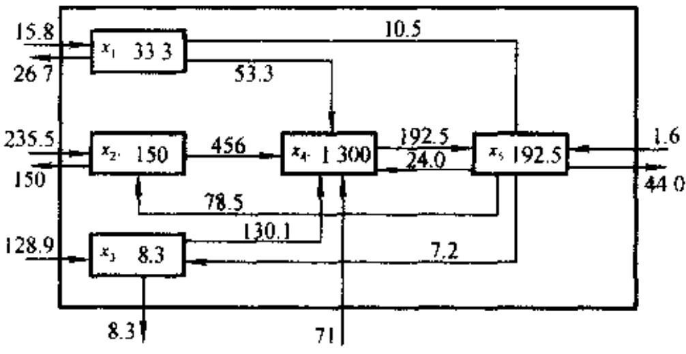  
(b) P

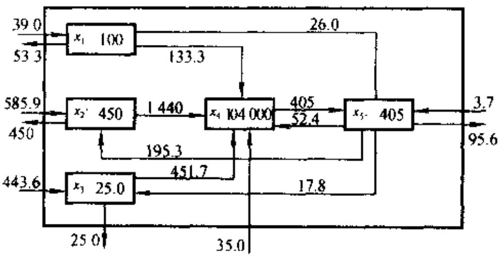  
(c)K  
图4-14 N、P、K在各分室的物流图

有了上述系数，将其代入式(4-31)即得到反映各分室氮、磷、钾随时间变化的动态模型。在使用该模型之前，首先对其可控性与可测性进行判别。根据定理1和定理2有：

$$
M _ { \setminus } = \left[ \begin{array} { l l l l l l } { 4 7 } & { - 5 0 . 7 5 } & { 5 8 . 8 4 } & { 0 . 7 0 } & { - 0 . 7 8 } \\ { 7 0 3 . 5 } & { - 1 7 1 4 . 3 9 } & { 4 2 1 1 . 1 3 } & { 8 . 5 0 } & { - 9 . 4 7 } \\ { 5 6 8 . 9 } & { - 7 9 5 8 . 9 4 } & { 1 1 1 } & { 3 5 1 . 4 } & { 3 . 3 0 } & { - 3 . 6 8 } \\ { 3 5 0 } & { 8 3 8 2 . 1 2 } & { - 1 0 7 1 7 2 . 4 } & { - 5 . 5 2 } & { 6 . 1 5 } \\ { 3 . 8 } & { 4 9 . 5 6 } & { 1 2 3 3 . 1 1 } & { - 5 . 3 7 } & { 5 . 9 9 } \end{array} \right]
$$

$$
\begin{array}{c} M _ { \mathfrak { p } } = \begin{array} { l l l l l } { \left[ 1 5 . 8 \right]} & { - 3 7 . 8 7 } & { 9 1 . 4 8 } & { 0 . 2 3 5 7 } & { - 0 . 1 9 6 \ 8 ^ { \circ } } \\ { 2 3 5 . 5 } & { - 9 5 0 . 7 7 } & { 3 \ 8 4 4 . 8 4 } & { 2 . 6 5 6 \ 0 } & { - 2 . 2 1 7 \ 8 } \\ { 1 2 8 . 9 } & { \cdot 2 \ 1 4 9 . 3 1 } & { 3 5 8 3 9 . 4 3 } & { 0 . 8 7 4 \ 9 } & { \cdot 0 . 7 3 0 \ 5 } \\ { \cdot 7 1 } & { 2 \ 7 5 1 . 3 6 } & { - 3 7 \ 0 4 7 . 0 5 } & { - 2 . 3 9 2 \ 2 } & { 1 . 9 9 7 \ 5 } \\ { \vdots 1 . 6 } & { 9 . 1 8 } & { 3 9 9 . 8 1 } & { - 0 . 9 5 6 \ 2 } & { 0 . 7 9 8 \ 4 } \end{array}   \end{array}
$$

$$
\begin{array} { r } { M _ { \mathrm { K } } \sim \left[ \begin{array} { l l l l l l } { 3 9 } & { - 7 2 . 5 4 } & { 1 3 5 . 1 3 5 } & { 0 . 6 4 0 \ 7 } & { - 0 . 6 1 2 \ 3 } \\ { 5 8 5 . 9 } & { - 2 \ 4 5 8 . 9 9 6 } & { 1 0 \ 3 2 6 . 1 4 } & { 8 . 7 9 2 \ 1 } & { - 8 . 4 0 3 \ 5 } \\ { 4 4 3 . 6 } & { - 8 \ 4 5 8 . 4 0 2 } & { 1 6 1 \ 2 8 4 . 7 } & { 3 . 1 1 5 \ 8 } & { - 2 . 9 7 8 \ 1 } \\ { 1 3 5 } & { 9 \ 9 4 2 . 1 7 4 } & { - 1 6 0 \ 8 3 1 . 1 } & { - 8 . 1 3 1 \ 8 } & { 7 . 7 7 2 \ 4 } \\ { \ 3 . 7 } & { - 3 . 4 0 0 } & { 4 2 . 0 2 4 } & { - 3 . 2 3 2 \ 5 } & { 3 . 0 8 9 \ 7 } \end{array} \right] } \end{array}
$$

$$
P _ { \times } = \left[ { \begin{array} { l l l l l l } { 0 . 4 0 6 \ 1 } & { - \ 0 . 4 4 0 \ 9 } & { 0 . 4 7 8 \ 8 } & { 5 \times 1 0 ^ { - 5 } } & { 5 \times 1 0 ^ { - 5 } } \\ { 1 } & { - \ 2 . 4 4 } & { 5 . 9 5 3 \ 6 } & { 5 \times 1 0 ^ { - 5 } } & { 5 \times 1 0 ^ { - 5 } } \\ { 1 } & { 1 3 . 9 9 0 \ 4 } & { 1 9 5 . 7 3 1 \ 3 } & { 5 \times 1 0 ^ { - 5 } } & { 5 \times 1 0 \ ^ { 5 } } \\ { 5 \times 1 0 ^ { - 5 } } & { 5 \times 1 0 \ ^ { 5 } } & { 5 \times 1 0 \ ^ { 5 } } & { 5 \times 1 0 \ ^ { 5 } } & { 5 \times 1 0 ^ { - 5 } } \\ { 0 . 2 3 9 \ 8 } & { - \ 0 . 2 6 7 \ 2 } & { 0 . 2 9 7 \ 7 } & { - \ 0 . 3 3 1 \ 7 } & { 0 . 3 6 9 \ 6 } \end{array} } \right]
$$

$$
\begin{array} { r } { P _ { \mathrm { { p } } } = \left[ \begin{array} { l l l l l l } { 0 . 8 0 1 ~ 8 } & { - 1 . 9 2 6 ~ 2 } & { 4 . 6 2 7 ~ 6 } & { 5 \times 1 0 ^ { - 5 } } & { 5 \times 1 0 ^ { - 5 } } \\ { 1 } & { - 4 . 0 4 } & { 1 6 . 3 2 1 ~ 6 } & { 5 \times 1 0 ^ { - 5 } } & { 5 \times 1 0 ^ { - 5 } } \\ { 1 } & { - 1 6 . 6 7 } & { 2 7 8 . 0 4 5 ~ 6 } & { 5 \times 1 0 ^ { ~ s } } & { 5 \times 1 0 ^ { ~ s } } \\ { 5 \times 1 0 ^ { - 5 } } & { 5 \times 1 0 ^ { ~ s } } & { 5 \times 1 0 ^ { ~ s } } & { 5 \times 1 0 ^ { - 5 } } & { 5 \times 1 0 ^ { - 5 } } \\ { 0 . 2 2 8 ~ 6 } & { - 0 . 1 9 0 ~ 9 } & { 0 . 1 5 9 ~ 4 } & { - 0 . 1 3 3 1 } & { 0 . 1 1 1 ~ 1 } \end{array} \right] } \end{array}
$$

$$
\begin{array} { r } { \pmb { P } _ { \mathrm { { s } } } = \left[ \begin{array} { l l l l l } { 0 . 5 3 3 } & { - 0 . 9 9 4 6 } & { 1 . 8 5 6 } & { 5 \times 1 0 ^ { \mathrm { ~ 5 ~ } } } & { 5 \times 1 0 ^ { - 5 } } \\ { 1 } & { - 4 . 2 } & { 1 7 . 6 4 } & { 5 \times 1 0 ^ { - 5 } } & { 5 \times 1 0 ^ { - 5 } } \\ { 1 } & { - 1 9 . 0 6 8 } & { 3 6 3 . 5 9 } & { 5 \times 1 0 ^ { \mathrm { ~ 5 ~ } } } & { 5 \times 1 0 ^ { - 5 } } \\ { 5 \times 1 0 ^ { - 5 } } & { 5 \times 1 0 ^ { - 5 } } & { 5 \times 1 0 ^ { - 5 } } & { 5 \times 1 0 ^ { \mathrm { ~ 5 ~ } } } & { 5 \times 1 0 ^ { - 5 } } \\ { 0 . 2 3 6 } & { - 0 . 2 2 5 6 } & { 0 . 2 1 5 6 } & { - 9 . 2 0 6 1 } & { 0 . 1 9 7 0 } \end{array} \right] } \end{array}
$$

由于 $\mid M _ { \mathrm { N } } \mid = 9 . 7 3 \times 1 0 ^ { 7 } \neq 0 , \mid M _ { \mathrm { P } } \mid = 7 7 8 \ \mathrm { ~ } \mathrm { ~ } \mathrm { ~ } \mathrm { } \mathrm { } \mathrm { } \mathrm { } \mathrm { } \mathrm { } \mathrm { } \{  6 \neq 0 , \mid M _ { \mathrm { K } } \mid =$ $9 , 0 1 \times 1 0 ^ { 7 } \neq 0$ ，因此系统具有可控性，而 $| P _ { \mathrm { \scriptsize ~ N } } | = - 2 . 9 \times 1 0 ^ { - 3 } \approx 0$ $| { \bf P } _ { \mathrm { { r } } } | = - 2 . 9 \times 1 0 ^ { 3 } \approx 0 , | { \bf P } _ { \mathrm { { K } } } | = - 6 . 4 \times 1 0 ^ { - 3 } \approx 0$ ,因此系统不具可测性，即无法通过实测的输出值判断状态变量的初始值。

## 5. 系统稳定性分析

(1)土壤分室养分动态：由于牛场、猪场畜粪及鳖池底泥的不断供给，土壤养分状况不断得到改善，到系统基本稳定后(94年后)，土壤素水平将提高7倍，P提高4.7倍，K提高1.7倍，其动态变化如图4-15。由图4-15看出，N、P的动态变化呈对数变化，而K元素则逐步提高，短期内不能稳定。

(2)其他各分室的产量动态：因受饲料投入和用地规模的限制，牛场、猪场和鳖场的产量有所下降，种植业产量则有所增加，不同年度各分室的库存量和各分室的产出如表4-13，由表4-13看出

表4-13 各分室库存量与产量动态 单位：kg/hm²  
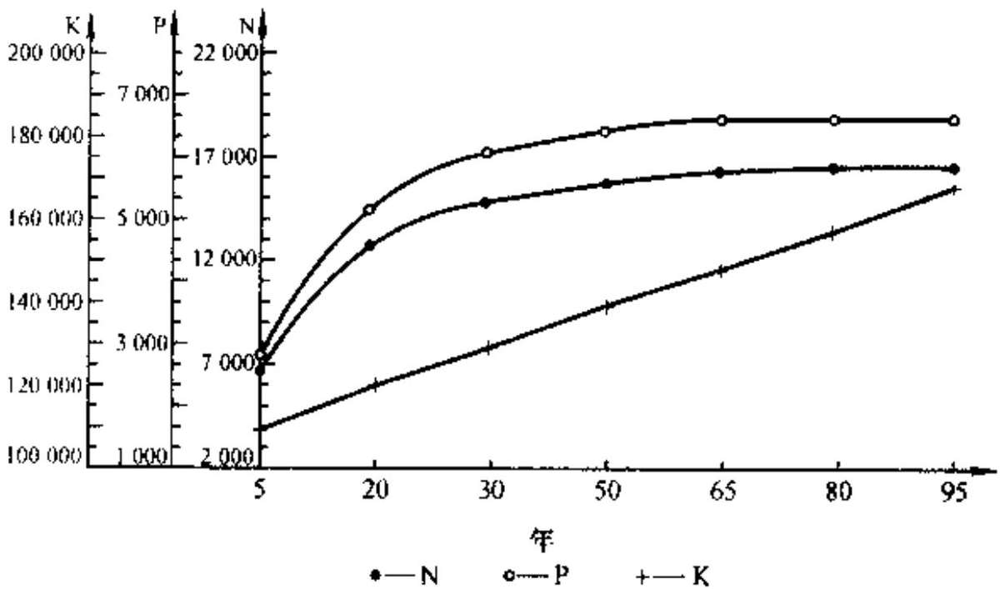  
图 4 15 土壤分室N、P、K库存动态变化图

<table><tr><td rowspan=1 colspan=1>时间/a</td><td rowspan=1 colspan=1>元案</td><td rowspan=1 colspan=1>λj</td><td rowspan=1 colspan=1> $\pmb { \tau } _ { 2 }$ </td><td rowspan=1 colspan=1> $_ { x _ { 3 } }$ </td><td rowspan=1 colspan=1> $\pmb { \chi } _ { 4 }$ </td><td rowspan=1 colspan=1> $\mathbf { \delta } _ { \mathbf { \lambda } ^ { \overline { { \mathbf { J } } } } \mathbf { \mathcal { I } } } \mathbf { \Xi } _ { 5 }$ </td><td rowspan=1 colspan=1> $y _ { \parallel }$ </td><td rowspan=1 colspan=1> $\mathbf { y } _ { 2 }$ </td><td rowspan=1 colspan=1> ${ \bf y } _ { 3 }$ </td><td rowspan=1 colspan=1> $\cdot ^ { \nu _ { 5 } }$ </td></tr><tr><td rowspan=3 colspan=1>0   4</td><td rowspan=1 colspan=1>N</td><td rowspan=1 colspan=1>166.7</td><td rowspan=1 colspan=1>750</td><td rowspan=1 colspan=1>41.7</td><td rowspan=1 colspan=1>2700</td><td rowspan=1 colspan=1>415</td><td rowspan=1 colspan=1>67.7</td><td rowspan=1 colspan=1>750</td><td rowspan=1 colspan=1>41.7</td><td rowspan=1 colspan=1>99.5</td></tr><tr><td rowspan=1 colspan=1>p</td><td rowspan=1 colspan=1>33 3</td><td rowspan=1 colspan=1>150</td><td rowspan=1 colspan=1>8.3</td><td rowspan=1 colspan=1>1300</td><td rowspan=1 colspan=1>192.5</td><td rowspan=1 colspan=1>26.7</td><td rowspan=1 colspan=1>150</td><td rowspan=1 colspan=1>8.3</td><td rowspan=1 colspan=1>44.0</td></tr><tr><td rowspan=1 colspan=1>K</td><td rowspan=1 colspan=1>100</td><td rowspan=1 colspan=1>450</td><td rowspan=1 colspan=1>25.0</td><td rowspan=1 colspan=1>104 000</td><td rowspan=1 colspan=1>405</td><td rowspan=1 colspan=1>53.3</td><td rowspan=1 colspan=1>450</td><td rowspan=1 colspan=1>25.0</td><td rowspan=1 colspan=1>95.6</td></tr><tr><td rowspan=3 colspan=1>15-1</td><td rowspan=1 colspan=1>N</td><td rowspan=1 colspan=1>157.74</td><td rowspan=1 colspan=1>681.29</td><td rowspan=1 colspan=1>46 881</td><td rowspan=1 colspan=1>2 821.84</td><td rowspan=1 colspan=1>1720.81</td><td rowspan=1 colspan=1>84.08</td><td rowspan=1 colspan=1>681.29</td><td rowspan=1 colspan=1>46.884</td><td rowspan=1 colspan=1>06.11</td></tr><tr><td rowspan=1 colspan=1>P</td><td rowspan=1 colspan=1>21.29</td><td rowspan=1 colspan=1>126.67</td><td rowspan=1 colspan=1>9.16</td><td rowspan=1 colspan=1>4 068.82</td><td rowspan=1 colspan=1>681.87</td><td rowspan=1 colspan=1>11.35</td><td rowspan=1 colspan=1>126 67</td><td rowspan=1 colspan=1>9.16</td><td rowspan=1 colspan=1>160.92</td></tr><tr><td rowspan=1 colspan=1>K</td><td rowspan=1 colspan=1>37.09</td><td rowspan=1 colspan=1>193.68</td><td rowspan=1 colspan=1>24.35115</td><td rowspan=1 colspan=1>677.6</td><td rowspan=1 colspan=1>472.64</td><td rowspan=1 colspan=1>19769</td><td rowspan=1 colspan=1>193.68</td><td rowspan=1 colspan=1>24.35</td><td rowspan=1 colspan=1>[111.54</td></tr><tr><td rowspan=3 colspan=1>302</td><td rowspan=1 colspan=1>V</td><td rowspan=1 colspan=1>199.6</td><td rowspan=1 colspan=1>813.01</td><td rowspan=1 colspan=1>48.93</td><td rowspan=1 colspan=1>16620.792</td><td rowspan=1 colspan=1>275.22</td><td rowspan=1 colspan=1>106.39</td><td rowspan=1 colspan=1>813.01</td><td rowspan=1 colspan=1>48.93</td><td rowspan=1 colspan=1>536.95</td></tr><tr><td rowspan=1 colspan=1>P</td><td rowspan=1 colspan=1>26.33</td><td rowspan=1 colspan=1>149.09</td><td rowspan=1 colspan=1>9.65</td><td rowspan=1 colspan=1>5257.47</td><td rowspan=1 colspan=1>903.99</td><td rowspan=1 colspan=1>14.03</td><td rowspan=1 colspan=1>149.09</td><td rowspan=1 colspan=1>9.65</td><td rowspan=1 colspan=1>213.34</td></tr><tr><td rowspan=1 colspan=1>K</td><td rowspan=1 colspan=1>38.66</td><td rowspan=1 colspan=1>198.93</td><td rowspan=1 colspan=1>24.46</td><td rowspan=1 colspan=1>126 865</td><td rowspan=1 colspan=1>518.34</td><td rowspan=1 colspan=1>20.61</td><td rowspan=1 colspan=1>198.93</td><td rowspan=1 colspan=1>24.46122</td><td rowspan=1 colspan=1>33</td></tr><tr><td rowspan=3 colspan=1>94</td><td rowspan=1 colspan=1>N</td><td rowspan=1 colspan=1>223.618</td><td rowspan=1 colspan=1>94.57</td><td rowspan=1 colspan=1>50 2</td><td rowspan=1 colspan=1>18 986.28</td><td rowspan=1 colspan=1>2620.88</td><td rowspan=1 colspan=1>119 18</td><td rowspan=1 colspan=1>894.57</td><td rowspan=1 colspan=1>50.2</td><td rowspan=1 colspan=1>618.53</td></tr><tr><td rowspan=1 colspan=1>P</td><td rowspan=1 colspan=1>30.04</td><td rowspan=1 colspan=1>165.59</td><td rowspan=1 colspan=1>10.02</td><td rowspan=1 colspan=1>6149.51</td><td rowspan=1 colspan=1>1067.44</td><td rowspan=1 colspan=1>16.011</td><td rowspan=1 colspan=1>165 59</td><td rowspan=1 colspan=1>10.02</td><td rowspan=1 colspan=1>251.92</td></tr><tr><td rowspan=1 colspan=1>K</td><td rowspan=1 colspan=1>45.03</td><td rowspan=1 colspan=1>220.04</td><td rowspan=1 colspan=1>24.88</td><td rowspan=1 colspan=1>171 849</td><td rowspan=1 colspan=1>702.2</td><td rowspan=1 colspan=1>24.0</td><td rowspan=1 colspan=1>220.04</td><td rowspan=1 colspan=1>24.88</td><td rowspan=1 colspan=1>165.72</td></tr></table>

在现有的投入水平和种养结构下，15年后种植业产出将提高1.17倍，30年后提高1.28倍，整个系统基本稳定后将提高1.73倍。养殖业中因投入不足，猪和牛的产量均有下降趋势，15年后将下降至现有水平的43%和37%，而鳖的产量基本稳定在现有的生产水平，略有下降。

(3) 提高养殖业产出的措施：

1）提高饲料投入水平 提高饲料投入水平是提高养殖业产出的有效途径，表4-14是在将 $Z _ { \{ \ell \} } \setminus Z _ { z \uparrow }$ 提高4倍， $\mathcal { Z } _ { \mathfrak { s } 1 ) }$ 提高1.5倍的情况下得出的。由表可看出，养殖业产出较初始状态稳步提高，而原有的投入水平则使养殖业产出逐年下降，因此可认为目前的投入水平是不合理的。又从N、P、K增长幅度看，N增长最快，P次之，K最慢。

表4-14 提高饲料投入水平的产出预测 $\mathbf { Z _ { 1 9 } }$ $\mathcal { \pmb { \chi } } _ { \pmb { \ v } }$ ×4. $\pmb { \chi } _ { \mathbf { \ 3 } \mathbf { \overline { { { \theta } } } } }$ ×1.5)
<table><tr><td rowspan=1 colspan=1>时间 $\mathbf { \chi } _ { i \in \mathcal { I } } ^ { \prime }$ </td><td rowspan=1 colspan=1>儿系</td><td rowspan=1 colspan=1> $\boldsymbol { \cdot } \boldsymbol { \ell } _ { \mathrm { ~ 1 ~ } }$ </td><td rowspan=1 colspan=1> $\textit { \textbf { z } }$ </td><td rowspan=1 colspan=1>4¬= $\pmb { \tau _ { 3 } }$ u</td><td rowspan=1 colspan=1> $x \ast$ </td><td rowspan=1 colspan=1> $\boldsymbol { \tau } _ { 5 }$ </td><td rowspan=1 colspan=1> $\smash { \boldsymbol { \mathbf { \mathit { x } } } _ { 1 } }$   ====</td><td rowspan=1 colspan=1> $\boldsymbol { \mathfrak { y } } _ { \ge }$    卜</td><td rowspan=1 colspan=1> $y _ { 3 }$   LVI</td><td rowspan=1 colspan=1>y5</td></tr><tr><td rowspan=3 colspan=1>0</td><td rowspan=1 colspan=1>N11</td><td rowspan=1 colspan=1>66 7</td><td rowspan=1 colspan=1>750</td><td rowspan=1 colspan=1>41.7</td><td rowspan=1 colspan=1>2700</td><td rowspan=1 colspan=1>415</td><td rowspan=1 colspan=1>67.71</td><td rowspan=1 colspan=1>750</td><td rowspan=1 colspan=1>41.7</td><td rowspan=1 colspan=1>99.5</td></tr><tr><td rowspan=1 colspan=1> $\boldsymbol { \mathsf { I } } ^ { \star }$ </td><td rowspan=1 colspan=1>33 3</td><td rowspan=1 colspan=1>150</td><td rowspan=1 colspan=1>8.3</td><td rowspan=1 colspan=1>1 300</td><td rowspan=1 colspan=1>192.5</td><td rowspan=1 colspan=1>267</td><td rowspan=1 colspan=1>150</td><td rowspan=1 colspan=1>8.3</td><td rowspan=1 colspan=1>44.0</td></tr><tr><td rowspan=1 colspan=1>K</td><td rowspan=1 colspan=1>100</td><td rowspan=1 colspan=1>450</td><td rowspan=1 colspan=1>250</td><td rowspan=1 colspan=1>104 000</td><td rowspan=1 colspan=1>405</td><td rowspan=1 colspan=1>53.3</td><td rowspan=1 colspan=1>450</td><td rowspan=1 colspan=1>250</td><td rowspan=1 colspan=1>95.6</td></tr><tr><td rowspan=3 colspan=1>15</td><td rowspan=1 colspan=1>V</td><td rowspan=1 colspan=1>409.55</td><td rowspan=1 colspan=1>409.551963.19</td><td rowspan=1 colspan=1>73.99</td><td rowspan=1 colspan=1>26687.583</td><td rowspan=1 colspan=1>558.372</td><td rowspan=1 colspan=1>18.29</td><td rowspan=1 colspan=1>1963.19</td><td rowspan=1 colspan=1>73.998</td><td rowspan=1 colspan=1>39.78</td></tr><tr><td rowspan=1 colspan=1>P</td><td rowspan=1 colspan=1>62.17</td><td rowspan=1 colspan=1>394 19</td><td rowspan=1 colspan=1>15.1t</td><td rowspan=1 colspan=1>9 743 1 [</td><td rowspan=1 colspan=1>1614.43</td><td rowspan=1 colspan=1>33.14</td><td rowspan=1 colspan=1>394 19</td><td rowspan=1 colspan=1>15.11</td><td rowspan=1 colspan=1>381.01</td></tr><tr><td rowspan=1 colspan=1>K</td><td rowspan=1 colspan=1>102.78</td><td rowspan=1 colspan=1>622.35</td><td rowspan=1 colspan=1>36.2</td><td rowspan=1 colspan=1>139 466.3</td><td rowspan=1 colspan=1>562.87</td><td rowspan=1 colspan=1>54.78</td><td rowspan=1 colspan=1>622.35</td><td rowspan=1 colspan=1>36 2</td><td rowspan=1 colspan=1>132.84</td></tr><tr><td rowspan=3 colspan=1>30</td><td rowspan=1 colspan=1>510</td><td rowspan=1 colspan=1>352</td><td rowspan=1 colspan=1>289.47</td><td rowspan=1 colspan=1>79.05</td><td rowspan=1 colspan=1>36063.574</td><td rowspan=1 colspan=1>928.432</td><td rowspan=1 colspan=1>72.02</td><td rowspan=1 colspan=1>2289.47</td><td rowspan=1 colspan=1>79.051</td><td rowspan=1 colspan=1>163.11</td></tr><tr><td rowspan=1 colspan=1>P</td><td rowspan=1 colspan=1>77.89</td><td rowspan=1 colspan=1>465.59</td><td rowspan=1 colspan=1>16.67</td><td rowspan=1 colspan=1>13 484.842</td><td rowspan=1 colspan=1>307.074</td><td rowspan=1 colspan=1>1.52</td><td rowspan=1 colspan=1>465.59</td><td rowspan=1 colspan=1>16.67</td><td rowspan=1 colspan=1>544.47</td></tr><tr><td rowspan=1 colspan=1>K</td><td rowspan=1 colspan=1>107.68</td><td rowspan=1 colspan=1>638.7</td><td rowspan=1 colspan=1>36.521</td><td rowspan=1 colspan=1>74269.6</td><td rowspan=1 colspan=1>705.13</td><td rowspan=1 colspan=1>57.39</td><td rowspan=1 colspan=1>638.7</td><td rowspan=1 colspan=1>36.521</td><td rowspan=1 colspan=1>66.41</td></tr></table>

2)改变系统的物流量改变系统内物流量的大小，亦是提高养殖业产出的一种途径，但它以减少种植业产品输出为代价。表4- 15为将种植业产出全部在系统内流通而不向系统外输出的养殖业产出预测结果，将原输出系统外的物流45%流向牛场，45%流向猪场，10%流向鳖场。从表4-15看出：改变系统内物流后，种植业向系统外输出为0，而养殖业仅牛场较原始方案有显著提高。同为15年后的牛、猪、鳖产出量，提高饲料投人水平后，分别为原始方案的2.77倍、2.88倍和1.48倍，而改变系统内物流量后分别为原始方案的1.8倍、0.95倍和1.02倍。可以断定，改变后的物流量对牛场的物质利用较为有利，而对猪场几乎无利，因此，从上述分析看，改变系统内物流的方法仅对部分分室的产出有利，对其他分室则无利。所以在改变物流时可采用向有利的分室增加物流，而对其他分室则不必考虑，本例即可采用向牛场增加适当的物流，而其他剩余的物质仍由种植业分室向系统外输出。

表4-15 改变系统内物流量的养殖业产出
<table><tr><td rowspan=1 colspan=1>时间la</td><td rowspan=1 colspan=1>元素</td><td rowspan=1 colspan=1> $x _ { 1 }$ </td><td rowspan=1 colspan=1> $x _ { 2 }$ </td><td rowspan=1 colspan=1>33</td><td rowspan=1 colspan=1>14</td><td rowspan=1 colspan=1> $x _ { 3 }$ </td><td rowspan=1 colspan=1>y1</td><td rowspan=1 colspan=1>y2</td><td rowspan=1 colspan=1>y1</td><td rowspan=1 colspan=1>y5</td></tr><tr><td rowspan=6 colspan=1>1530</td><td rowspan=1 colspan=1>N</td><td rowspan=1 colspan=1>358</td><td rowspan=1 colspan=1>813 61</td><td rowspan=1 colspan=1>50 86</td><td rowspan=1 colspan=1>14 534.1</td><td rowspan=1 colspan=1>1 938 03</td><td rowspan=1 colspan=1>190.814</td><td rowspan=1 colspan=1>813.61</td><td rowspan=1 colspan=1>50.86</td><td rowspan=1 colspan=1>0</td></tr><tr><td rowspan=1 colspan=1>P</td><td rowspan=1 colspan=1>38.36</td><td rowspan=1 colspan=1>120.35</td><td rowspan=1 colspan=1>9 35</td><td rowspan=1 colspan=1>2917.36</td><td rowspan=1 colspan=1>493.55</td><td rowspan=1 colspan=1>20.45</td><td rowspan=1 colspan=1>120.35</td><td rowspan=1 colspan=1>9.35</td><td rowspan=1 colspan=1>0</td></tr><tr><td rowspan=1 colspan=1>K</td><td rowspan=1 colspan=1>130.93</td><td rowspan=1 colspan=1>629.42</td><td rowspan=1 colspan=1>36.43</td><td rowspan=1 colspan=1>124 718.2</td><td rowspan=1 colspan=1>506.88</td><td rowspan=1 colspan=1>69.79</td><td rowspan=1 colspan=1>629.42</td><td rowspan=1 colspan=1>36.43</td><td rowspan=1 colspan=1>0</td></tr><tr><td rowspan=1 colspan=1>1N</td><td rowspan=1 colspan=1>510.321</td><td rowspan=1 colspan=1>057,63]</td><td rowspan=1 colspan=1>55.48</td><td rowspan=1 colspan=1>20 589.1</td><td rowspan=1 colspan=1>2806.03</td><td rowspan=1 colspan=1>272.0</td><td rowspan=1 colspan=1>1057.63</td><td rowspan=1 colspan=1>55.48</td><td rowspan=1 colspan=1>0</td></tr><tr><td rowspan=1 colspan=1>p</td><td rowspan=1 colspan=1>45.47</td><td rowspan=1 colspan=1>134.01</td><td rowspan=1 colspan=1>9.72</td><td rowspan=1 colspan=1>3489.56</td><td rowspan=1 colspan=1>601.34</td><td rowspan=1 colspan=1>24.24</td><td rowspan=1 colspan=1>134.01</td><td rowspan=1 colspan=1>9.72</td><td rowspan=1 colspan=1>0</td></tr><tr><td rowspan=1 colspan=1>K</td><td rowspan=1 colspan=1>13869</td><td rowspan=1 colspan=1>641.09</td><td rowspan=1 colspan=1>36.68</td><td rowspan=1 colspan=1>144 922.3</td><td rowspan=1 colspan=1>589.51</td><td rowspan=1 colspan=1>73.92</td><td rowspan=1 colspan=1>641.09</td><td rowspan=1 colspan=1>3668</td><td rowspan=1 colspan=1>0</td></tr></table>

(4)肥料投人对增产效果的影响：N、P、K肥的投人对作物增产效果存在明显差异。表4-16列出了不同N、P、K投人水平下的四个分室的输出情况，在改变某一元素投入水平时，其他两元素投入水平不变。

表4-16 不同肥料投入水平下分室的输出情况
<table><tr><td rowspan=1 colspan=1>时间3 $\therefore$ </td><td rowspan=1 colspan=1>元素</td><td rowspan=1 colspan=1>投入水平</td><td rowspan=1 colspan=1> ${ \boldsymbol { y } } _ { \boldsymbol { \downarrow } }$ </td><td rowspan=1 colspan=1> $\boldsymbol { y } _ { 2 }$ </td><td rowspan=1 colspan=1> $_ { y _ { 3 } }$ </td><td rowspan=1 colspan=1>y5</td></tr><tr><td rowspan=9 colspan=1>15</td><td rowspan=3 colspan=1>V</td><td rowspan=1 colspan=1>× I</td><td rowspan=1 colspan=1>84.08</td><td rowspan=1 colspan=1>681.29</td><td rowspan=1 colspan=1>46.88</td><td rowspan=1 colspan=1>406.11</td></tr><tr><td rowspan=1 colspan=1>×1.5</td><td rowspan=1 colspan=1>9164</td><td rowspan=1 colspan=1>727.43</td><td rowspan=1 colspan=1>47.64</td><td rowspan=1 colspan=1>454.31</td></tr><tr><td rowspan=1 colspan=1>×30</td><td rowspan=1 colspan=1>113.05</td><td rowspan=1 colspan=1>866 82</td><td rowspan=1 colspan=1>49.9</td><td rowspan=1 colspan=1>599.96</td></tr><tr><td rowspan=3 colspan=1>I</td><td rowspan=1 colspan=1>xI</td><td rowspan=1 colspan=1>11.35</td><td rowspan=1 colspan=1>126 67   i</td><td rowspan=1 colspan=1>9.16</td><td rowspan=1 colspan=1>160.92</td></tr><tr><td rowspan=1 colspan=1>×15</td><td rowspan=1 colspan=1>12.00</td><td rowspan=1 colspan=1>132.13</td><td rowspan=1 colspan=1>9.28</td><td rowspan=1 colspan=1>173.69</td></tr><tr><td rowspan=1 colspan=1>×3.0</td><td rowspan=1 colspan=1>13.94</td><td rowspan=1 colspan=1>147 99</td><td rowspan=1 colspan=1>9.64</td><td rowspan=1 colspan=1>211.57</td></tr><tr><td rowspan=3 colspan=1>K   4</td><td rowspan=1 colspan=1>YI</td><td rowspan=1 colspan=1>19.77</td><td rowspan=1 colspan=1>193 68</td><td rowspan=1 colspan=1>24.35</td><td rowspan=1 colspan=1>111.54</td></tr><tr><td rowspan=1 colspan=1>×15</td><td rowspan=1 colspan=1>19.78</td><td rowspan=1 colspan=1>193.79</td><td rowspan=1 colspan=1>24.35</td><td rowspan=1 colspan=1>111.78</td></tr><tr><td rowspan=1 colspan=1>×3.0</td><td rowspan=1 colspan=1>19.84</td><td rowspan=1 colspan=1>194.13</td><td rowspan=1 colspan=1>24.37</td><td rowspan=1 colspan=1>112.48</td></tr><tr><td rowspan=9 colspan=1>30</td><td rowspan=3 colspan=1>N</td><td rowspan=1 colspan=1>×1</td><td rowspan=1 colspan=1>106.39</td><td rowspan=1 colspan=1>813.01</td><td rowspan=1 colspan=1>48.93</td><td rowspan=1 colspan=1>536.95</td></tr><tr><td rowspan=1 colspan=1>× 1.5</td><td rowspan=1 colspan=1>117.18</td><td rowspan=1 colspan=1>880.55</td><td rowspan=1 colspan=1>50.01</td><td rowspan=1 colspan=1>605.77</td></tr><tr><td rowspan=1 colspan=1>×3.0</td><td rowspan=1 colspan=1>149.59</td><td rowspan=1 colspan=1>1 081 88</td><td rowspan=1 colspan=1>53.23</td><td rowspan=1 colspan=1>812.45</td></tr><tr><td rowspan=1 colspan=1></td><td rowspan=1 colspan=1>×1</td><td rowspan=1 colspan=1>14.03</td><td rowspan=1 colspan=1>149 09</td><td rowspan=1 colspan=1>9.65</td><td rowspan=1 colspan=1>213.34</td></tr><tr><td rowspan=2 colspan=1>P</td><td rowspan=1 colspan=1>×1.5</td><td rowspan=1 colspan=1>14.98</td><td rowspan=1 colspan=1>157.01</td><td rowspan=1 colspan=1>9.83</td><td rowspan=1 colspan=1>231.85</td></tr><tr><td rowspan=1 colspan=1>×30</td><td rowspan=1 colspan=1>17.90</td><td rowspan=1 colspan=1>181.35</td><td rowspan=1 colspan=1>10.37</td><td rowspan=1 colspan=1>288.77</td></tr><tr><td rowspan=3 colspan=1>K</td><td rowspan=1 colspan=1>× j</td><td rowspan=1 colspan=1>20.61</td><td rowspan=1 colspan=1>198.93</td><td rowspan=1 colspan=1>24.46</td><td rowspan=1 colspan=1>122.33</td></tr><tr><td rowspan=1 colspan=1>×1.5</td><td rowspan=1 colspan=1>20.64</td><td rowspan=1 colspan=1>199.16</td><td rowspan=1 colspan=1>24.47</td><td rowspan=1 colspan=1>122.81</td></tr><tr><td rowspan=1 colspan=1>×3.0</td><td rowspan=1 colspan=1>20.76</td><td rowspan=1 colspan=1>199.85</td><td rowspan=1 colspan=1>24 48</td><td rowspan=1 colspan=1>124.24</td></tr></table>

由表4-16看出，不同的N、P素投入水平，种植业输出有明显提高，而K素的投入对种植业输出影响不大，可总结如表4-17

表4-17 不同肥料投入水平下各分室输出水平的提高程度
<table><tr><td rowspan=3 colspan=1></td><td rowspan=1 colspan=1>肥料</td><td rowspan=1 colspan=4>N</td><td rowspan=1 colspan=4>P</td><td rowspan=1 colspan=4>K</td></tr><tr><td rowspan=1 colspan=1>年</td><td rowspan=1 colspan=2>15</td><td rowspan=1 colspan=2>30</td><td rowspan=1 colspan=2>15</td><td rowspan=1 colspan=2>30</td><td rowspan=1 colspan=2>15</td><td rowspan=1 colspan=2>30</td></tr><tr><td rowspan=1 colspan=1>投入水平</td><td rowspan=1 colspan=1>1.5</td><td rowspan=1 colspan=1>3.0</td><td rowspan=1 colspan=1>1.5</td><td rowspan=1 colspan=1>3.0</td><td rowspan=1 colspan=1>1.5</td><td rowspan=1 colspan=1>3.0</td><td rowspan=1 colspan=1>1.5</td><td rowspan=1 colspan=1>3.01</td><td rowspan=1 colspan=1>.5</td><td rowspan=1 colspan=1>3.0</td><td rowspan=1 colspan=1>1.5</td><td rowspan=1 colspan=1>3.0</td></tr><tr><td rowspan=1 colspan=1>种植业</td><td rowspan=1 colspan=1>y5</td><td rowspan=1 colspan=1>1.12</td><td rowspan=1 colspan=1>1.48</td><td rowspan=1 colspan=1>1.13</td><td rowspan=1 colspan=1>1.51</td><td rowspan=1 colspan=1>1.08</td><td rowspan=1 colspan=1>1.31</td><td rowspan=1 colspan=1>1.09</td><td rowspan=1 colspan=1>1 351</td><td rowspan=1 colspan=1>.00</td><td rowspan=1 colspan=1>1.01</td><td rowspan=1 colspan=1>1.00</td><td rowspan=1 colspan=1>1.02</td></tr><tr><td rowspan=1 colspan=1>牛场</td><td rowspan=1 colspan=1>yI</td><td rowspan=1 colspan=1>1.09</td><td rowspan=1 colspan=1>134</td><td rowspan=1 colspan=1>1.10</td><td rowspan=1 colspan=1>1.41</td><td rowspan=1 colspan=1>1.09</td><td rowspan=1 colspan=1>1.34</td><td rowspan=1 colspan=1>1.07</td><td rowspan=1 colspan=1>1.281</td><td rowspan=1 colspan=1>.00</td><td rowspan=1 colspan=1>1.00</td><td rowspan=1 colspan=1>1.00</td><td rowspan=1 colspan=1>1.01</td></tr><tr><td rowspan=1 colspan=1>猪场</td><td rowspan=1 colspan=1>y2</td><td rowspan=1 colspan=1>1.07</td><td rowspan=1 colspan=1>1.27</td><td rowspan=1 colspan=1>1.08</td><td rowspan=1 colspan=1>1.33</td><td rowspan=1 colspan=1>1.04</td><td rowspan=1 colspan=1>117</td><td rowspan=1 colspan=1>1.05</td><td rowspan=1 colspan=1>1.22</td><td rowspan=1 colspan=1>1.001</td><td rowspan=1 colspan=1>.001</td><td rowspan=1 colspan=1>.00</td><td rowspan=1 colspan=1>1.00</td></tr><tr><td rowspan=1 colspan=1>警场</td><td rowspan=1 colspan=1>yJ</td><td rowspan=1 colspan=1>1.02</td><td rowspan=1 colspan=1>106</td><td rowspan=1 colspan=1>1.02</td><td rowspan=1 colspan=1>1.09</td><td rowspan=1 colspan=1>1.01</td><td rowspan=1 colspan=1>1.041</td><td rowspan=1 colspan=1>.021</td><td rowspan=1 colspan=1>.071</td><td rowspan=1 colspan=1>.00</td><td rowspan=1 colspan=1>1.00</td><td rowspan=1 colspan=1>1.00</td><td rowspan=1 colspan=1>1.00</td></tr></table>

\*投入水平为原始方案投人水平的倍数。

(5)养殖业废弃物的不同处理对土壤和种植业分室的影响：在上述分析中，将牛场、猪场所产生的废弃物全部投人复垦区内${ \bf 6 0 } { \bf h m } ^ { \preceq }$ 土地上，而目前牛场、猪场对畜粪的处理方法是部分售出复垦区外，而没有全部投入到 $6 0 \mathrm { h m } ^ { 2 }$ 土地上。表4-18列出了牛场、猪场废弃物的不同处理方法对土壤库存和种植业输出产生的影响，处理一为畜粪全部投人复垦区，处理二为畜粪50%投人复垦区，50%售出。从表4-18看出，畜粪的不同处理方法对土壤养分库存和种植业产量影响较大，说明畜粪对土壤有很好的改良效果，对作物有很好的增产效果。

表4-18 膏粪的不同处理对土壤养分库存和种植业产出的影响
<table><tr><td colspan="1" rowspan="3">項日</td><td colspan="1" rowspan="1">元素</td><td colspan="6" rowspan="1">N</td></tr><tr><td colspan="1" rowspan="1">年</td><td colspan="3" rowspan="1">15</td><td colspan="3" rowspan="1">30</td></tr><tr><td colspan="1" rowspan="1">处理</td><td colspan="1" rowspan="1"></td><td colspan="1" rowspan="1">二</td><td colspan="1" rowspan="1">下降%</td><td colspan="1" rowspan="1"></td><td colspan="1" rowspan="1">二</td><td colspan="1" rowspan="1">下降/%</td></tr><tr><td colspan="1" rowspan="1">土壤库存</td><td colspan="1" rowspan="1">J4</td><td colspan="1" rowspan="1">12 821.8</td><td colspan="1" rowspan="1">9 248.8</td><td colspan="1" rowspan="1">27.9</td><td colspan="1" rowspan="1">16620.79</td><td colspan="1" rowspan="1">10 908</td><td colspan="1" rowspan="1">34 4</td></tr><tr><td colspan="1" rowspan="1">种植业产出</td><td colspan="1" rowspan="1">ys</td><td colspan="1" rowspan="1">406.11</td><td colspan="1" rowspan="1">295.4</td><td colspan="1" rowspan="1">27.3</td><td colspan="1" rowspan="1">536.9</td><td colspan="1" rowspan="1">354</td><td colspan="1" rowspan="1">34.1</td></tr><tr><td colspan="1" rowspan="3">项日</td><td colspan="1" rowspan="1">元素</td><td colspan="6" rowspan="1">P</td></tr><tr><td colspan="1" rowspan="1">年</td><td colspan="3" rowspan="1">15</td><td colspan="3" rowspan="1">30</td></tr><tr><td colspan="1" rowspan="1">处理</td><td colspan="1" rowspan="1"></td><td colspan="1" rowspan="1">二</td><td colspan="1" rowspan="1">下降/%</td><td colspan="1" rowspan="1"></td><td colspan="1" rowspan="1">二</td><td colspan="1" rowspan="1">下降/%</td></tr><tr><td colspan="1" rowspan="1">土壤库存</td><td colspan="1" rowspan="1">.T4</td><td colspan="1" rowspan="1">4 068.8</td><td colspan="1" rowspan="1">2 624.7</td><td colspan="1" rowspan="1">35.5</td><td colspan="1" rowspan="1">5 257.5</td><td colspan="1" rowspan="1">2 987.7</td><td colspan="1" rowspan="1">43.2</td></tr><tr><td colspan="1" rowspan="1">种植业产出</td><td colspan="1" rowspan="1">Y5</td><td colspan="1" rowspan="1">160.9</td><td colspan="1" rowspan="1">105.5</td><td colspan="1" rowspan="1">34.4</td><td colspan="1" rowspan="1">213.3</td><td colspan="1" rowspan="1">122.4</td><td colspan="1" rowspan="1">42.6</td></tr><tr><td colspan="1" rowspan="3">项目</td><td colspan="1" rowspan="1">元素</td><td colspan="6" rowspan="1">K</td></tr><tr><td colspan="1" rowspan="1">年</td><td colspan="3" rowspan="1">15</td><td colspan="3" rowspan="1">30</td></tr><tr><td colspan="1" rowspan="1">处理</td><td colspan="1" rowspan="1"></td><td colspan="1" rowspan="1">二</td><td colspan="1" rowspan="1">下降/%</td><td colspan="1" rowspan="1"></td><td colspan="1" rowspan="1">二</td><td colspan="1" rowspan="1">下降/%</td></tr><tr><td colspan="1" rowspan="1">七壤库存</td><td colspan="1" rowspan="1">.14</td><td colspan="1" rowspan="1">115 677 6</td><td colspan="1" rowspan="1">10 711.1</td><td colspan="1" rowspan="1">4.3</td><td colspan="1" rowspan="1">126 865</td><td colspan="1" rowspan="1">117 078.4</td><td colspan="1" rowspan="1">7.7</td></tr><tr><td colspan="1" rowspan="1">种柏业产出</td><td colspan="1" rowspan="1">y'5</td><td colspan="1" rowspan="1">111 5</td><td colspan="1" rowspan="1">107.1</td><td colspan="1" rowspan="1">3.9</td><td colspan="1" rowspan="1">122.3</td><td colspan="1" rowspan="1">113.2</td><td colspan="1" rowspan="1">7.4</td></tr></table>

## 6. 系统物质循环效率分析

表4-19列出了原始方案及改变系统内物流方案的不同年限的N、P、K循环指数。由表4-19看出，改进物流后，N、P、K在系统内的循环指数明显提高，由此说明改进物流量可以调节系统内的物质循环效率。从原始方案来看，起初物质循环指数较高，但随时间的推移，物质循环系数下降且稳定于一定的循环水平，N约下降39%，P约下降37%，K约下降47%左右。

表4-19 巍庄复量系統不同方寨的物质循环指數单位：%
<table><tr><td rowspan=2 colspan=2>循环指数</td><td rowspan=1 colspan=3>原始方案</td><td rowspan=1 colspan=2>改进的物流方案</td></tr><tr><td rowspan=1 colspan=1>0</td><td rowspan=1 colspan=1>30</td><td rowspan=1 colspan=1>94</td><td rowspan=1 colspan=1>0</td><td rowspan=1 colspan=1>30</td></tr><tr><td rowspan=6 colspan=1>K</td><td rowspan=1 colspan=1> $\pmb { R r } _ { 1 }$ </td><td rowspan=1 colspan=1>10.99</td><td rowspan=1 colspan=1>9.49</td><td rowspan=1 colspan=1>7.77</td><td rowspan=1 colspan=1>39.18</td><td rowspan=1 colspan=1>39.17</td></tr><tr><td rowspan=1 colspan=1> $\mathbb { R } x _ { ? }$ </td><td rowspan=1 colspan=1>49.71</td><td rowspan=1 colspan=1>45.65</td><td rowspan=1 colspan=1>40.28</td><td rowspan=1 colspan=1>69.93</td><td rowspan=1 colspan=1>69.92</td></tr><tr><td rowspan=1 colspan=1> $R x _ { 3 }$ </td><td rowspan=1 colspan=1>10.09</td><td rowspan=1 colspan=1>8.68</td><td rowspan=1 colspan=1>7.10</td><td rowspan=1 colspan=1>21.97</td><td rowspan=1 colspan=1>21.92</td></tr><tr><td rowspan=1 colspan=1> $\scriptstyle { R } _ { J _ { 4 } }$ </td><td rowspan=1 colspan=1>61.14</td><td rowspan=1 colspan=1>58.65</td><td rowspan=1 colspan=1>55.50</td><td rowspan=1 colspan=1>79.66</td><td rowspan=1 colspan=1>80.84</td></tr><tr><td rowspan=1 colspan=1> $R { \boldsymbol { r } } _ { 5 }$ </td><td rowspan=1 colspan=1>61.14</td><td rowspan=1 colspan=1>58.65</td><td rowspan=1 colspan=1>55.50</td><td rowspan=1 colspan=1>79.66</td><td rowspan=1 colspan=1>80.84</td></tr><tr><td rowspan=1 colspan=1> $R ,$ </td><td rowspan=1 colspan=1>51.80</td><td rowspan=1 colspan=1>46.76</td><td rowspan=1 colspan=1>47 54</td><td rowspan=1 colspan=1>69.66</td><td rowspan=1 colspan=1>72.63</td></tr><tr><td rowspan=6 colspan=1>P</td><td rowspan=1 colspan=1> $R _ { \mathcal { I } _ { 1 } }$ </td><td rowspan=1 colspan=1>9.40</td><td rowspan=1 colspan=1>2.87</td><td rowspan=1 colspan=1>2.48</td><td rowspan=1 colspan=1>36.58</td><td rowspan=1 colspan=1>36.57</td></tr><tr><td rowspan=1 colspan=1> ${ R x } _ { 2 }$ </td><td rowspan=1 colspan=1>46.72</td><td rowspan=1 colspan=1>19.97</td><td rowspan=1 colspan=1>17.67</td><td rowspan=1 colspan=1>67.79</td><td rowspan=1 colspan=1>67.77</td></tr><tr><td rowspan=1 colspan=1> ${ / k } _ { { \pmb { \tau } } _ { 3 } }$ </td><td rowspan=1 colspan=1>9.12</td><td rowspan=1 colspan=1>2.79</td><td rowspan=1 colspan=1>2.4</td><td rowspan=1 colspan=1>23.01</td><td rowspan=1 colspan=1>22.98</td></tr><tr><td rowspan=1 colspan=1> $R _ { \star }$ </td><td rowspan=1 colspan=1>58.97</td><td rowspan=1 colspan=1>43.95</td><td rowspan=1 colspan=1>42.8</td><td rowspan=1 colspan=1>78.55</td><td rowspan=1 colspan=1>83.62</td></tr><tr><td rowspan=1 colspan=1> $R . { \mathfrak { r } } _ { 5 }$ </td><td rowspan=1 colspan=1>58.97</td><td rowspan=1 colspan=1>43 95</td><td rowspan=1 colspan=1>42.8</td><td rowspan=1 colspan=1>78.55</td><td rowspan=1 colspan=1>83.62</td></tr><tr><td rowspan=1 colspan=1> $\scriptstyle { \mathbb { R } } ,$ </td><td rowspan=1 colspan=1>50.47</td><td rowspan=1 colspan=1>37.53</td><td rowspan=1 colspan=1>36.92</td><td rowspan=1 colspan=1>69 36</td><td rowspan=1 colspan=1>75.22</td></tr><tr><td rowspan=6 colspan=1>V</td><td rowspan=1 colspan=1> $\bar { R } \boldsymbol { x } _ { \mathrm { ~ 1 ~ } }$ </td><td rowspan=1 colspan=1>8.58</td><td rowspan=1 colspan=1>2.95</td><td rowspan=1 colspan=1>2.34</td><td rowspan=1 colspan=1>24.72</td><td rowspan=1 colspan=1>20.92</td></tr><tr><td rowspan=1 colspan=1> $\boldsymbol { \mathcal { R } } \boldsymbol { r } _ { 2 }$ </td><td rowspan=1 colspan=1>39.86</td><td rowspan=1 colspan=1>17.63</td><td rowspan=1 colspan=1>15.95</td><td rowspan=1 colspan=1>53.13</td><td rowspan=1 colspan=1>50.51</td></tr><tr><td rowspan=1 colspan=1> $R _ { \varepsilon _ { 3 } }$ </td><td rowspan=1 colspan=1>8.69</td><td rowspan=1 colspan=1>2.99</td><td rowspan=1 colspan=1>2.66</td><td rowspan=1 colspan=1>16.47</td><td rowspan=1 colspan=1>15.07</td></tr><tr><td rowspan=1 colspan=1> ${ \mathcal { R } } x _ { * }$ </td><td rowspan=1 colspan=1>54.84</td><td rowspan=1 colspan=1>47.85</td><td rowspan=1 colspan=1>47.26</td><td rowspan=1 colspan=1>68.55</td><td rowspan=1 colspan=1>82.01</td></tr><tr><td rowspan=1 colspan=1> ${ \tt R e } _ { 5 }$ </td><td rowspan=1 colspan=1>54.84</td><td rowspan=1 colspan=1>47.85</td><td rowspan=1 colspan=1>47.26</td><td rowspan=1 colspan=1>68.55</td><td rowspan=1 colspan=1>82.01</td></tr><tr><td rowspan=1 colspan=1> $\scriptstyle { \mathcal { R } } ,$ </td><td rowspan=1 colspan=1>44.11</td><td rowspan=1 colspan=1>39.08</td><td rowspan=1 colspan=1>38.96</td><td rowspan=1 colspan=1>84.33</td><td rowspan=1 colspan=1>72.14</td></tr></table>

## 4.4.4 复垦界面生态系统能(物)流的变参数分室模型

## 1. 定参数分室模型的缺陷

从以上应用发现：定参数分室模型在分析系统库存与 $j ^ { \alpha }$ 出动态及物质循环效率等方面起到了很好的效果，可以发现系统物流的一般规律，对选择各系统合理的投人水平有一定的帮助，但定参数分室模型的一个严重缺陷是在系统各分室库存及输出量逐年增加的情况下，投入及分室之间的物流量保持常数，这是不符合实际的，为此造成随时间的推移，一些分室，如牛场、猪场等的库存与产出量下降。实际生产过程中，各分室的输人及各分室之间的物流是随各分室的库存量和输出量而调整的，因此，建立变参数分室模型就十分必要。

## 2. 变参数分室模型的建立

设系统有n个分室，各分室的初始状态值为 $x \left( i , 0 \right)$ ，各分室的初始投入量为 ${ \mathfrak { z } } \left\{ { \mathfrak { i } } , 0 \right\} , { \mathfrak { t } }$ 年的状态值和投人量分别为 $x \left( \textit { i } , t \right)$ 和 $\boldsymbol { z } \left( \textit { i , t } \right) , f ( 0 , \textit { i , t } )$ 为i分室t年的输出量， $f ( i , j , t )$ 为 t 年j 分室流入：分室的物流量，则：

$$
a \left( i , j , t \right) = \left\{ \begin{array} { l l } { \displaystyle \frac { f ( i , j , t ) } { x ( j , t ) } } & { \mathrm { ~ ( ~ } i \ne j \mathrm { ~ ) ~ } } \\ { \displaystyle - \sum _ { k , 0 } ^ { n } f ( k , i , t ) / _ { . } x ( i , t ) } & { \mathrm { ~ ( ~ } i \ne j \mathrm { ~ ) ~ } } \end{array} \right.\tag{4-37}
$$

$$
\frac { \mathrm { d } . \ i \cdot ( \ i , t ) } { \mathrm { d } t } \ = \ \sum _ { i \prime = 1 } ^ { n } a \left( \ i , j , t \right) \ o x \left( , t \right) + \triangledown \tau ( i , t ) \ . \quad \left( \ i \ = \ 1 \ - \ \eta \right)\tag{4 - 38}
$$

$$
y ( i , t ) ~ = ~ f ( 0 , i , t ) ~ = ~ \sum _ { t = 1 } ^ { n } a \left( 0 , i , t \right) x ( i , t ) ~ \mathrm { ( } ~ i ~ = ~ 1 ~ \sim ~ n )\tag{4 − 39}
$$

$$
g ( i , j , t ) = \left\{ \begin{array} { l l } { 0 } & { ( \iota = j ) } \\ { \displaystyle { \frac { f ( i , j , t ) } { \sum _ { k = 0 } ^ { \eta } f ( k , j , t ) } } } & { ( i \neq j ) } \end{array} \right.\tag{4 -40}
$$

式中 $\pmb { \mathrm { \pmb { \mathrm { g } } } } \left( \mathrm { \pmb { \mathrm { \varepsilon } } } _ { i } , \mathrm { \pmb { j } } , \mathrm { \pmb { \mathrm { \varepsilon } } } _ { i } \right)$ 用于构造t年物质循环效率初始矩阵。

式 $( 4 - 3 7 ) \sim ( 4 - 4 0 )$ 即为变参数分室模型的数学表达式，只要将 $\smash { z \left( \ i , t \right) , t ^ { } ( 0 , i , t ) , f ( \ i , j , t ) }$ 与 $x ( i , t )$ 之间的数学关系式代入上述模型，就可用计算机模拟输出系统各有关参数。有了 $\mathbf { \pmb { g } } \left( \mathbf { \pmb { \mu } } \right)$

$j , t \rangle$ 后，计算物质循环指数的方法与定参数分室模型计算方法相同。

## 3. 变参数分室模型在魏庄复垦区的应用

作如下假设：

-41)

$$
\begin{array} { r } { z \left( i , t \right) = k _ { * } \left( i \right) x \left( i , t \right) \quad \quad \quad \quad \quad \left( 4 , t \right) } \\ { f ( i , j , t ) = \left\{ k _ { r } \left( i \right) x \left( i , t \right) \quad f ( i , j , t ) \right\} \sharp _ { \tau } \left( i , t \right) \sharp _ { \tau } ^ { * * } \left( i , t \right) } \\ { k _ { r } \left( i \right) _ { * } x \left( j , t \right) \quad f ( i , j , t ) \sharp _ { \tau } ( j , t ) \sharp _ { \tau } ^ { * * } \left( i , t \right) } \end{array}\tag{4-42}
$$

式中 $f ( i , j , t )$ 由 $x \left( \textit { i } , \pmb { \mathscr { t } } \right)$ 确定的有种植业分室流向牛场、猪场、鳖场分室及土壤分室流向种植业分室的物流， $\textstyle f ( \ i \ , j \ , t )$ 由 $x \left( j , t \right)$ 确定的有养殖场流向土壤分室及种植业分室流向土壤分室的物流。

表4-20 变参數分室模型模拟各分室库存量及输出量、投入量
<table><tr><td></td><td></td><td></td><td></td><td></td><td></td><td></td><td></td><td></td><td></td><td></td><td rowspan=1 colspan=16></td><td rowspan=1 colspan=1></td><td rowspan=1 colspan=1> $\scriptstyle \ Y _ { 1 }$ </td><td rowspan=1 colspan=1> $\tau _ { 2 }$ </td><td rowspan=1 colspan=1> $\mathbf { \nabla } _ { x }$ </td><td rowspan=1 colspan=1> $\pmb { x _ { 4 } }$ </td><td rowspan=1 colspan=1> $x _ { 5 }$ </td><td rowspan=1 colspan=1> $_ { y _ { 1 } }$ </td><td rowspan=1 colspan=1> $\mathbf { \nabla } \cdot \mathbf { \vec { \tau } } ^ { \nu _ { 2 } }$ </td><td rowspan=1 colspan=1> $\downarrow 3$ </td><td rowspan=1 colspan=1> $\mathbf { \Delta } _ { \mathbf { y } \mathbf { \epsilon } }$ </td><td rowspan=1 colspan=1> $\mathfrak { z } _ { 1 }$ </td></tr><tr><td rowspan=3 colspan=1>0</td><td rowspan=1 colspan=1>N</td><td></td><td></td><td></td><td></td><td></td><td></td><td></td><td></td><td></td><td rowspan=1 colspan=12> $\pmb { 4 7 }$ </td><td rowspan=1 colspan=1>70.5</td><td rowspan=1 colspan=1>568.9</td><td rowspan=1 colspan=1>350</td><td rowspan=1 colspan=1>3.8</td></tr><tr><td rowspan=1 colspan=1>P</td><td></td><td rowspan=1 colspan=1>150</td><td rowspan=1 colspan=1>8.3</td><td></td><td></td><td></td><td rowspan=1 colspan=1>150</td><td></td><td></td><td rowspan=1 colspan=12>15.8|</td><td rowspan=1 colspan=1>235.</td><td rowspan=1 colspan=1>128.9</td><td rowspan=1 colspan=1>71.0</td><td rowspan=1 colspan=1>1.6</td></tr><tr><td rowspan=1 colspan=1>K</td><td></td><td rowspan=1 colspan=1>450</td><td rowspan=1 colspan=1>25</td><td rowspan=1 colspan=1>104 000</td><td rowspan=1 colspan=1>405</td><td rowspan=1 colspan=1>53.3</td><td rowspan=1 colspan=1>450</td><td rowspan=1 colspan=1>25</td><td rowspan=1 colspan=1>113.5</td><td rowspan=1 colspan=12>39.05</td><td rowspan=1 colspan=1>85.9</td><td rowspan=1 colspan=1>443 6</td><td rowspan=1 colspan=1>35.0</td><td rowspan=1 colspan=1>3 7</td></tr><tr><td rowspan=6 colspan=1>1530</td><td rowspan=1 colspan=1>N</td><td></td><td rowspan=1 colspan=1>305.1</td><td rowspan=1 colspan=1>73.35</td><td rowspan=1 colspan=1>353.91</td><td rowspan=1 colspan=1>008.3</td><td rowspan=1 colspan=1>74.6</td><td rowspan=1 colspan=1>305.</td><td rowspan=1 colspan=1>73.3</td><td rowspan=1 colspan=1>656.7</td><td rowspan=1 colspan=12>51.82</td><td rowspan=1 colspan=1>86.2</td><td rowspan=1 colspan=1>1000.0</td><td rowspan=1 colspan=1>350</td><td rowspan=1 colspan=1>92</td></tr><tr><td rowspan=1 colspan=1>I</td><td></td><td rowspan=1 colspan=1>8914</td><td rowspan=1 colspan=1>28.3</td><td rowspan=1 colspan=1>2 417.5</td><td rowspan=1 colspan=1>401.6</td><td rowspan=1 colspan=1>26.2|</td><td rowspan=1 colspan=1>8912</td><td rowspan=1 colspan=1>8.3</td><td rowspan=1 colspan=1>20.1</td><td rowspan=1 colspan=12>15.5|</td><td rowspan=1 colspan=1>139.9</td><td rowspan=1 colspan=1>439.5</td><td rowspan=1 colspan=1>71 0</td><td rowspan=1 colspan=1>3.3</td></tr><tr><td rowspan=1 colspan=1>K</td><td rowspan=1 colspan=1>119.1</td><td rowspan=1 colspan=1>2319</td><td rowspan=1 colspan=1>68.7</td><td rowspan=1 colspan=1>107 23.4</td><td rowspan=1 colspan=1>899.1</td><td rowspan=1 colspan=1>63.55[</td><td rowspan=1 colspan=1>231.9</td><td rowspan=1 colspan=1>68.7]</td><td rowspan=1 colspan=1>62.3</td><td rowspan=1 colspan=12>46.4|</td><td rowspan=1 colspan=1>301.9</td><td rowspan=1 colspan=1>1219.0</td><td rowspan=1 colspan=1>35.0</td><td rowspan=1 colspan=1>8.2</td></tr><tr><td rowspan=1 colspan=1>N</td><td rowspan=1 colspan=1>22.2</td><td rowspan=1 colspan=1>157.0</td><td rowspan=1 colspan=1>93.7</td><td rowspan=1 colspan=1>8 093.8</td><td rowspan=1 colspan=1>1669.7</td><td rowspan=1 colspan=1>82.1</td><td rowspan=1 colspan=1>157.d</td><td rowspan=1 colspan=1>93.7</td><td rowspan=1 colspan=1>1229.85</td><td rowspan=1 colspan=12>7.01</td><td rowspan=1 colspan=1>47.3</td><td rowspan=1 colspan=1>1278.3</td><td rowspan=1 colspan=1>350</td><td rowspan=1 colspan=1>15.4</td></tr><tr><td rowspan=1 colspan=1>P</td><td rowspan=1 colspan=1>321</td><td rowspan=1 colspan=1>59.6</td><td rowspan=1 colspan=1>44.2</td><td rowspan=1 colspan=1>3795.5</td><td rowspan=1 colspan=1>69.95</td><td rowspan=1 colspan=1>25.7</td><td rowspan=1 colspan=1>.644</td><td rowspan=1 colspan=1>.2]</td><td rowspan=1 colspan=1>40.5</td><td rowspan=1 colspan=12>15.29</td><td rowspan=1 colspan=1>3.6</td><td rowspan=1 colspan=1>6864</td><td rowspan=1 colspan=1>7.0</td><td rowspan=1 colspan=1>5.31</td></tr><tr><td rowspan=1 colspan=1>K]</td><td rowspan=1 colspan=1>141.8</td><td rowspan=1 colspan=1>149.4</td><td rowspan=1 colspan=1>106.8</td><td rowspan=1 colspan=1>111 046.9</td><td rowspan=1 colspan=1>1462.9</td><td rowspan=1 colspan=1>|75.6</td><td rowspan=1 colspan=1>149.</td><td rowspan=1 colspan=1>416.8</td><td rowspan=1 colspan=1>1095.8</td><td rowspan=1 colspan=12>55.31</td><td rowspan=1 colspan=1>94.5</td><td rowspan=1 colspan=1>1895.1</td><td rowspan=1 colspan=1>35.0</td><td rowspan=1 colspan=1>13.3</td></tr></table>

$$
f ( \mathbf { 0 } , i , t ) = \left\{ \begin{array} { l l } { k _ { \mathrm { o l } } ( i ) x ( i , t ) } & { ( i = 1 \sim 4 ) } \\ { \displaystyle x ( 5 , t ) - \sum _ { k = 1 } ^ { 4 } f ( k , 5 , t ) } & { ( i = 5 ) } \end{array} \right.\tag{4 -43}
$$

式中 i =4时， $k _ { \mathrm { o d } } ( 4 ) = 0$ ，即土壤分室不向系统外输出。

由表4.20看出，在投人水平和物流量随库存量变化，而库存量又随时间变化的情况下，15年后牛场、鳖场及种植业四个分室的输出水平与投人水平较初始状态的变化情况如表4-21。与表4-13的定参数情况相比，牛场、鳖场、种植业由于投入增加，输出量也随之增加，结果较为理想，而猪场的投人下降，产出也下降，说明初始状态猪场的投人量与库存量比例不当，也正是目前制约猪场发展的因素之一。变参数分室模型的优点之一就是将库存量与投入量、产出量联系起来，能够较好地找出投入量与库存量的比例关系，由于我们在本例中是以线性关系表示投入量与库存量，输出量与库存量之间的关系的，从而导致投入量与输出量亦存在线性关系，若将投人量与库存量、输出量与库存量以非线性关系代人，同样可得到输出量与投人量间的非线性关系，本例种植业分室的输出与库存实际上就是一个非线性关系，因此变参数模型为解决非线性物(能)流系统提供了解决方案：

表4-21 15年后输出量与投入量增减情况
<table><tr><td rowspan=2 colspan=1></td><td rowspan=1 colspan=4>输出量</td><td rowspan=1 colspan=5>投入量</td></tr><tr><td rowspan=1 colspan=1> $\mathbf { y } _ { \perp }$ </td><td rowspan=1 colspan=1> $_ { y _ { 2 } }$ </td><td rowspan=1 colspan=1> $\mathbf { y } _ { 3 }$ </td><td rowspan=1 colspan=1> $_ { y , \mathrm { ~ ~ } }$ </td><td rowspan=1 colspan=1> ${ \pmb z } _ { 1 }$ </td><td rowspan=1 colspan=1> $z _ { 2 }$ </td><td rowspan=1 colspan=1> $\pmb { z } _ { 3 }$ </td><td rowspan=1 colspan=1> $\pmb { z } _ { \pmb { \ x } }$ </td><td rowspan=1 colspan=1> $z _ { 5 }$ </td></tr><tr><td rowspan=1 colspan=1>氮</td><td rowspan=1 colspan=1>1.10</td><td rowspan=1 colspan=1>041</td><td rowspan=1 colspan=1>1.76</td><td rowspan=1 colspan=1>12.6</td><td rowspan=1 colspan=1>1.1</td><td rowspan=1 colspan=1>0.41</td><td rowspan=1 colspan=1>1.76</td><td rowspan=1 colspan=1>1</td><td rowspan=1 colspan=1>2.42</td></tr><tr><td rowspan=1 colspan=1>磷</td><td rowspan=1 colspan=1>0.98</td><td rowspan=1 colspan=1>0.59</td><td rowspan=1 colspan=1>3.41</td><td rowspan=1 colspan=1>3.74</td><td rowspan=1 colspan=1>0.98</td><td rowspan=1 colspan=1>0.59</td><td rowspan=1 colspan=1>3.41</td><td rowspan=1 colspan=1>1</td><td rowspan=1 colspan=1>2.08</td></tr><tr><td rowspan=1 colspan=1>钾</td><td rowspan=1 colspan=1>1.19</td><td rowspan=1 colspan=1>0.52</td><td rowspan=1 colspan=1>2.75</td><td rowspan=1 colspan=1>5.31</td><td rowspan=1 colspan=1>1.19</td><td rowspan=1 colspan=1>0.52</td><td rowspan=1 colspan=1>2.75</td><td rowspan=1 colspan=1>1</td><td rowspan=1 colspan=1>2.22</td></tr></table>

通过上面的应用，将变参数分室模型的优点可归纳为：①能较为客观地反映系统的运行状态；②将库存量与投入量、产出量联系起来，便于找出投人量与库存量间的关系，从而为提出合理的投入水平提供依据；③为解决非线性物(能)流系统提供了可行的解决方案。


<!-- ===== 分片 p201-264（64页，源：ex25_卞正富_矿区土地复垦界面要素的演替规律及其调控研究（201-264页））===== -->

## 4.4.5 复垦界面生态系统物(能)流与输出量的动态变化规律

由式(4-38)可写出各分室库存量随时间变化的动态方程为

$$
x ( \textit { i , t + 1 } ) = x ( \textit { i , t } ) \ + \int _ { \cdot } ^ { \prime + 1 } \Big [ \sum _ { \prime \cdot 1 } ^ { \prime } a \left( \textit { i , j , t } \right) x \left( \ j , \textit { t } \right) + \textit { z } \left( \textit { i , t } \right) \Big ] \mathrm { d } t\tag{4−44}
$$

上述方程是很难求出解析解的，但用计算机模拟的方法完全可以

求出不同时间的各分室的库存动态值。事实上，表4-21正是用这种方法求解的。这里我们要讨论的是一类特殊情况，即图4-16所示，某分室的物流入量代数和为F，初始

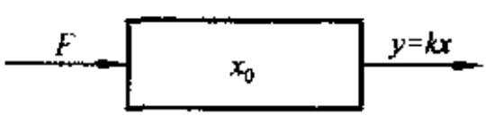  
图 4-16 土壤分室N、P、K库存动态变化图

状态值为 $. \boldsymbol { \mathfrak { X } } _ { \mathfrak { V } }$ ，输出量为kr，则该分室t时刻的库存量为：

$$
\frac { d \mathscr { L } } { d t } = F \cdot \mathscr { k } \mathscr { x }\tag{4-45}
$$

这时，很容易写出

$$
x ( \pmb { \mathscr { t } } ) = x _ { 0 } + \int _ { 0 } ^ { \pmb { \mathscr { t } } } \big ( \pmb { F } - \pmb { \mathscr { k } } x \big ) \mathrm { d } \pmb { \mathscr { t } }\tag{4-46}
$$

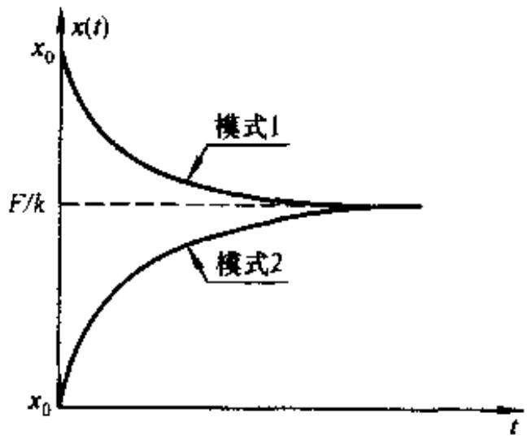  
图 4-17 分室模型库存量增长方式

即

$$
x \left( \begin{array} { l } { t } \end{array} \right) = \frac { F } { k } \left( \textbf { 1 } - \textbf { e } ^ { \textbf { \star t } } \right) + x _ { 0 } \textbf { e } ^ { \textbf { \star t } }\tag{4-47}
$$

式(4 -47) 正是生态学上重要的 Von Bertanffy 生长模式(H.T.Odum,1993)。因此可以认为 Von Bertanffy 生长模式是(4 - 44)方程的一个特例。方程(4-47)的图示式如图4-17，有两种增长模式，模式一渐近降至稳定状态，模式二渐近增至稳定状态，稳定状态值为 $F / k .$ 。一个分室库存的动态模式是模式一还是模式二，取决于 $x _ { \parallel }$ 与 $F / k$ 之间的关系，当 $x _ { 0 } > F / k$ 时，为模式一， $x _ { 0 } < F _ { 1 } ^ { j }$ k时，为模式二。讨论Von Bertanffy生长模式的意义在于，我们可用这一特例来判断分室模型的预期增长模式，即利用各分室初始状态的 x(i,0)与 $F ( \textit { i } , 0 ) / \mathbb { k } ( \textit { i } , 0 )$ 之间的关系，预测各分室是增长还是下降。

## 4.5 本章小结

1. 将生物多样性指数引人土地复垦界面生态系统的研究中，提出用土地利用多样性指数评价复垦用地结构的合理性。土地利用多样性指数不仅适用于对平原矿区复垦的评价，还适用于丘陵山区复垦的评价，同时使平原矿区和丘陵山区的评价具有统一性、可比性，为东部平原矿区挖深垫浅复垦方法和保留局部沉陷水域提供了生态学依据。本章还进一步利用生物多样性指数对研石排放场的植被恢复方案和植物品种选择进行了研究，通过试验研究证明：利用生物多样性指数选择复垦方案和优选植物品种是可行的

2. 分析了矿区水土流失的表现形式、矿区土地复垦与水土保持的关系；将复垦区分为堆垫地、回填洼地和非充填复垦三种形式，讨论了各自的水土流失机理，应用通用水土流失方程(USLE)，提出了沉陷坡地和排土场堆垫地貌的抗侵蚀设计方法，根据地貌学原理提出了排土场坡面应采用抛物线形式，而非过去澳大利亚等国学者提出的S形坡形：本章还提出了复垦区抗侵蚀的工程与生物措施：快速恢复植被法、涂层法、网席法及抗侵蚀被方法。

3. 首次利用定参数分室模型分析了复垦界面生态系统的物质(能量)流动状况，得出了魏庄复垦区生态系统土壤分室的N、P、K动态变化规律及种植、养殖分室的产量动态，并利用定参数分室模型，提出了改进各分室库存与产量动态和提高系统内物质循环效率的方法。针对定参数分室模型的缺陷，作者第一次提出了新的变参数分室模型，并将变参数分室模型用于魏庄复垦区生态系统的物质流动分析，结果表明：变参数分室模型可很好地将库存量、投入量与产出量联系起来，能够较好地找出投入量与库存量的比例关系，变参数分室模型的另外两个优点是：①能较为客观地反映系统的实际运行状况；②为解决非线性物(能)流系统提供了可行的解决方案。

本章还进一步证明了生态学中Von Bertantty生长模式是分室模型的特例，借助于Von Bertanffy 特例，可根据复垦系统各分室物流的初始值，判断各分室库存量是呈增长趋势还是呈下降趋势

## 第S矿区土地第第与生态第第相结合的理论和方法

## 5.1 矿区土地复垦与生态重建的基础理论

## 5.1.1 矿区土地复垦与生态量建的关系

## 1. 矿区生态重建的概念

随着经济的增长，对资源的需求也急剧增长。资源的超强度开采、利用必然导致资源危机及环境危害。加上人口的膨胀，使得人日一资源一环境日益成为经济发展的重要影响因素。人口一资源一环境与经济发展相协调则能保持经济持续增长，且不影响后代人的生存条件。反之则受到抑制，且对后代人的生存构成威胁。为此，近年来，走可持续发展道路日益为世界各国所接受。《中国21世纪议程》中将可持续的能源生产和消费、自然资源保护与可持续利用作为我国实施可持续发展战略的重要内容。其具体目标包括：加强少污染的煤炭开采技术与清洁煤技术的开发、应用、推广，促进传统的煤炭开采和加工方式向环境无害化方向转变(中国21世纪议程，13.42);提高对矿山“三度”的综合开发利用水平，努力做到矿山尾矿、废石及废水和废气的“资源化”和对周围环境的“无害化”，实现矿山闭坑后，矿山环境整治、复垦工作制度化(中国21世纪议程，14.80(C))。很明显，减小经济发展对环境的危害，加强经济发展中不可避免的对环境产生危害后的有效整治与恢复是实现可持续发展目标的两条重要措施。事实上，20世纪70年代以来，受害生态系统的恢复与重建就已成为生态学界研究的热点课题。而矿区生态恢复与重建问题则是20世纪90年代以来采矿工程、地质工程非常活跃的研究领域。俄罗斯在矿山生态管理、矿区生态制图、生态监测与评价、生态洁净采矿工艺等方面均取得了进展(V I Strelts,1991;B B C,1994;B T K, 1994)。澳大利亚、美国等国家在矿山景观生态恢复等方面取得了进展。德国则在矿区生态恢复规划方面取得了进展(HVCalls，1997；W jahn,1997;Peter Zenker,1995)。这一系列的研究成果表现在近年来矿区生态恢复与重建方面研究文献的显著增多，其研究目标都是为了恢复与重建矿区生态环境。那么什么是生态恢复与重建呢？矿区生态恢复与重建又有哪些特殊性？这些问题，不同的国家和地区似乎并没有统一的答案，我国更是没有对这些问题作过系统的研究。

生态恢复是指受人类活动损伤的生态系统经自然恢复和人类改造作用恢复到它原来的状态，这一过程可称为生态恢复；生态重建则是在自然恢复与人类改造作用下，受损伤的生态系统形成一种改进的与原来完全不同的状态。界于两者之间存在一中间状态，即新的生态系统既具原生态系统特征，又包括对人类有益的新特征状态，称之为中间态生态系统。若不加任何处理，受损的生态系统在自然力作用下也存在两种结果，一是中间态生态系统，一是恶化了的生态系统(邬建国，1990)。上述过程可用图5-1表示。

由图 5-1可见矿区生态恢复需要较高的投人和较长的自然恢复时间才能实现，而中间态生态系统与重建的全新生态系统可以按照人类的愿望加以改造，且相对来说可以做到投入较小，当然若人类对改造后的生态系统期望较高，投入也可能很高。总之矿区生态重建就是通过入类的改造和自然演替的共同作用，使矿区生态系统朝着入类预期的方向演化的过程，包括土地要素、水文要素、植被要素、景观要素等的重建。

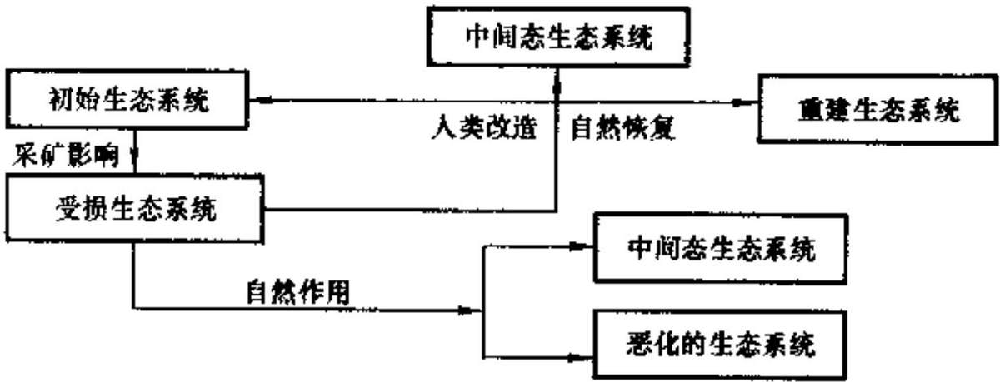  
图 5-1 矿区生态系统演变过程

## 2. 矿区土地复垦与生态重建的关系

据前面的定义，矿区土地复垦与生态重建的关系为：土地复垦是达到生态重建目标的人类改造措施之一。生态重建涵盖土地复垦的内容。而矿区土地复垦在矿区生态重建中起重要的作用。因此，矿区土地复垦应该考虑生态重建目标。这正是本章提出的观点之一：矿区土地复垦应该与生态重建相结合。

## 5.1.2 矿区生态重建的理论和方法

## 1. 生态演替原理

生态演替可以理解为生态系统特征随时间而变化的过程。H.T.Odum(1983)认为:生态系统利用它可获得的能量得以发展结构和过程的有组织过程称为演替，演替是生态系统的时间维。

演替可以通过生态系统主要参数的增长曲线来量度，如活生物量、养分库存量、总有机质、多样性、总代谢和总能量接受等。图5-2为两类典型的演替过程。

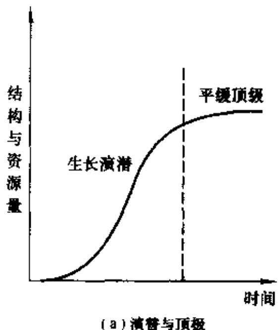  
(a) 演替与顶极

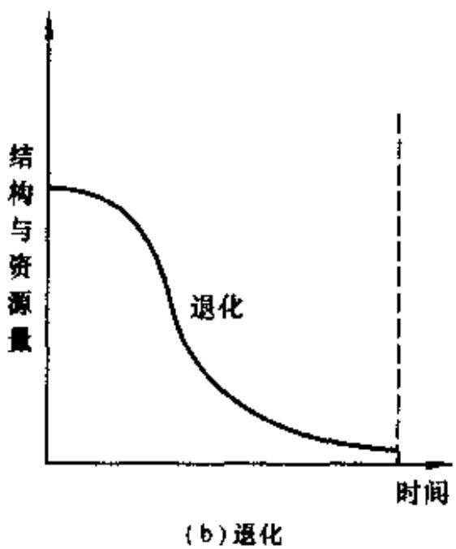  
图 5 2 两类演替过程

既然演替反映生态系统的动态特征，它就存在变化速率问题，无论是达到顶极还是退化，都有可能是快速的，也可能是缓慢的，这一过程可以通过人类干预作用来控制，而应该注意的是某些受胁迫的生态系统，人类干预作用容易实现，而另外一些则不容易实现，对间一生态系统来说，某些要素容易控制，而另外一些要素则不容易控制。

高林(1995)根据这一原理，提出在矿山生态恢复过程中：①首先选择耐旱、耐贫瘠、速生的作物或牧草，以便在矿山上迅速生长，并获得持久的植被；②在基质得到一定程度改良后，可采用混播草种使之迅速覆盖弃地，或与豆科作物轮作、套作的方式达到“种地、养地相结合”的目的；③根据土壤的元素组成和肥力，辅之一定的水肥(尤其是微生物肥)措施，建立可以维持的土壤生态系统；④发展多种作物与果树，因地制宜地开展农林牧副业，综合利用矿山废弃地，从而加速演替或改变演替方向。

讨论生态演替，尽管离不开讨论物质的循环与无机环境的改变，但更重要的是要讨论物种的变化动态。因此，迄今为止所提出的演替途径中，无论是Connell和 Slatyer的促进、抑制和忍耐模型，还是Whittaker和Liven描述的替代演替、直接演替、循环演替和镶嵌式演替都不回避讨论初始种对后来种的作用以及演替的方向性问题。因此，作者认为：生态演替理论为矿区土地复垦及生态重建时的植被恢复、建立合理的种群格局提供了很好的理论基础。

## 2. 景观生态学原理

景观生态学是地理学与生态学之间的交叉学科(景贵和，1990)，景观定义为一个空间异质性的区域，由相互作用的斑块(Patch)或生态系统组成，以相似的形式重复出现。景观是高于生态系统的自然系统，是生态系统的载体，生态系统是相对同质的系统，景观则是异质的。景观生态学最早由德国的C.Troll于1939年在利用航片研究东非土地利用问题之后提出的，但直到20世纪70年代以来，景观生态学才得到较大的发展，并成为异常活跃的研究领域。尽管如此，关于景观生态学的定义和研究内容似乎并没有统一的认识。Forman和Godron(1986)将景观生态学定义为研究由相互作用的生态系统组成的异质土地区的结构、功能及其变化的学问，而其他学者提出的景观生态学的定义不下十个。Forman等根据其定义提出了一系列景观生态学原理，如景观结构与功能原理、生物多样性原理、物种流动原理、养分再分布原理、能量流动原理、景观变化原理、景观稳定性原理、斑一廊一模关系原理，这些原理是目前应用较为广泛的，它所涉及的问题正是定义中所提出的景观结构、景观功能和景观变化三方面。景观结构主要是讨论景观要素：斑块(Patch)、廊道(Corridor)和模地(Matrix)各自的作用；景观变化讨论的则是功能与结构的变化，现在的结构可能是过去功能的产物，现在的功能则造就未来的结构，永不停止。

由前面对景观生态学的简要介绍可以发现，景观生态学原理

对矿区土地复垦和生态重建有较好的指导意义。具体表现为：

(1)用于评价采矿、复垦等人类行为对景观结构、功能的影响及在景观变化中的作用。

(2)用于土地复垦与生态重建规划。蔡运龙、王仰麟等(1996)在矿区废弃地景观生态设计等方面已作了一些有益的尝试。

(3)生态演替与景观生态学原理的关系。景观异质性与生态演替的关系极为密切。景观元素的动态变化会使生态系统朝着一定的方向演化，景观异质性的大小对生态系统的稳定性具有重要的意义。我们在应用上述原理指导矿区生态恢复与重建时，不应将生态演替原理与景观生态学原理割裂开来而简单地说某一原理更科学、更适用。

## 3. 系统论

尤论是土地复垦，还是生态重建本身都是一个较为复杂的系统工程问题，将两者结合起来研究正是遵循系统论的思想，应将二者综合为一个较大的系统来研究。鉴于系统工程问题的特点，土地复垦与生态重建系统的边界以两者中较大的边界为边界，通常生态重建的范围，无论是几何的还是属性方面，均较土地复垦为广，所以以生态重建边界为基准，这样土地复垦的着眼点就不能限于土地破坏边界，需要以生态重建边界为边界，作者认为生态重建的边界应以流域范围为边界。

## 5.2 采矿、土地复垦与生态重建阶段的划分

## 5.2.1 采矿阶段的划分——以井工矿山为例

采矿可划分为以下阶段：地质勘探、基本建设、投产到达产、达产后的稳定时期、产量衰减至报废等五个阶段，对应于五个阶段的煤炭产量如图5-3(a)所示。基本建设阶段的煤炭产量主要为开凿煤巷所获得的产量，从投产到报废所经历的时间为矿井服务年限，图示实曲线的稳产阶段没有经历较大的改扩建工程，虚线则表示改扩建后的产量增加曲线，这在我国是较为普遍的。

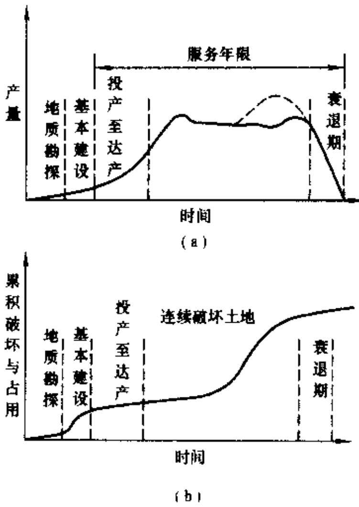  
图 5-3 采矿阶段划分及土地破坏与占用

对应于五个阶段的累积破坏与占用土地量曲线如图5-3(b).地质勘探阶段主要为钻探、勘测，占用或破坏少量土地，基本建设阶段用地类型包括工业广场与居民生活设施占用及排弃并巷工程的废弃研石占地两部分。投产至达产阶段用地量相对较小，主要为排研占地，达产后，土地逐步塌陷，开始呈逐年增加趋势，且经过一段时间(土地塌陷滞后井下采矿的时间)后，土地沉陷为矿区重要用地类型，每年破坏的量大致相等，即图5-3(b)所示的连续破坏土地阶段。随矿并进人衰退期，土地沉陷量逐年减小，最终至零，表现在土地破坏与用地面积累积曲线为平衡的直线。

对应于采矿的不同阶段，矿区生态系统特征变化为：地质勘探阶段变化不大，基本建设阶段道路、通讯等基本设施的建设对矿区生产生活条件起一定的改善作用，但人口的急剧增加及基建用地量的需求给矿区原有生态系统起到了很大的干扰作用，尤其是生活设施不完善，造成矿区生态系统功能不完善，处于消费水平急增的状况，这是矿区生态系统受到干扰的第一个高峰。投产至达产阶段对矿区生态系统干扰的表现形式仍是矿区从事矿业人口的增加，在此阶段矿区集镇逐步形成，矿区集镇系统包括一系列商业服务行业及新产品加工业等。稳产期，矿区生态系统逐渐成熟，这时生态系统的主要干扰形式是土地沉陷和“三废”污染，在此阶段，从事农业的人员下降，土地第一性生产力水平下降，与矿产品生产、加工有关的行业应运而生，如煤炭运输业、选矿业、机修、劳保等服务于矿山生产的行业增多，此阶段为矿区生态系统受到干扰的第二个高峰。衰退期，土地继续沉陷，但沉陷土地面积逐渐减小，本阶段生态系统的特点是从事矿业与农业的剩余人员都增多，从事矿业的人员需要有接替矿井或接替产业，从事农业的人员受可耕土地资源量下降的影响，需要通过复垦成兴办可吸纳较多剩余劳动力的农场或企业来解决，此阶段亦为矿区生态系统受到干扰面临选择的一个重要阶段。

## 5.2.2 土地复泰阶段的划分

从采矿阶段的划分及不同阶段对土地的破坏与占用情况分析，土地复垦可划分为以下三个阶段：第一阶段为预复垦阶段，从地质勘探起至矿井开采连续破坏土地之前，此阶段的主要目标是尽量减小土地破坏，有条件的矿井可采取预复垦措施，如预先剥离表土等；第二阶段为平衡复垦阶段，对应于连续破坏土地阶段，此阶段的目标是平衡复垦与破坏土地量及充分利用沉陷地；第三阶段为衰退期的大规模复垦阶段。

上述三阶段的划分，不是人为的，它符合采矿对土地破坏与占用的规律，即是说将土地复垦与采矿工程做到了有机结合。

预复垦阶段可以采取有效的采矿规划与采矿工艺措施达到减小土地占用与破坏的目的，如合理规划采区边界、开采规模、排研方式、开采顺序等。此阶段最有效的控制或管理措施是要求采矿规划设计书中应该有采后地形地貌图及采矿过程中地形地貌的动态变化图，并使采后地形以对复垦最为有利的方式出现，这一技术的实现可以依靠数字地图和DTM模型实现。事实上，在国外的露天开采实践中已广泛应用此方法设计采矿与土地复垦、景观恢复相结合的工艺措施了。我国在采矿工程的环评阶段也对开采沉陷进行预计并绘制地表移动与变形等值线图，只要将其与原地形图叠加就可得到采后的地貌图，考虑采后村庄搬迁、水系改造、道路建设等因素就可得到采后地形图。此阶段土地占用面积大于破坏面积，适宜复垦的面积几乎没有。

平衡复垦阶段可以有计划有步骤地对已沉陷稳定的土地实施复垦措施，对尚未稳定的沉陷地进行充分利用。根据采矿对土地的破坏规律，此阶段当年稳定的土地可以近似看作与当年破坏的土地量相当，这样复垦土地的最大数量与当年破坏土地数量平衡。对稳定沉陷地的复垦已有许多较为成熟的复垦方法，如平整法、疏排法、挖深垫浅法、充填法等；对不稳定沉陷地的利用程度在我国各矿区间差异较大，主要利用形式有粗放的农业利用、作为排矸场、排灰场等，对不稳定的季节积水区、长年积水区利用程度最低。

衰退期的大规模复垦阶段，绝大部分被破坏的土地均沉陷稳定并适宜于复垦，此阶段矿井生产处于萎缩阶段，复垦时可充分利用矿山企业的技术力量，闲置的机械设备进行复垦，并将复垦工程与矿并报废计划衔接起来。

下面以某一小型矿井为例说明土地破坏、采矿与土地复垦各阶段的对应关系。图5-4为该矿井历年煤炭产量与土地破坏情况。

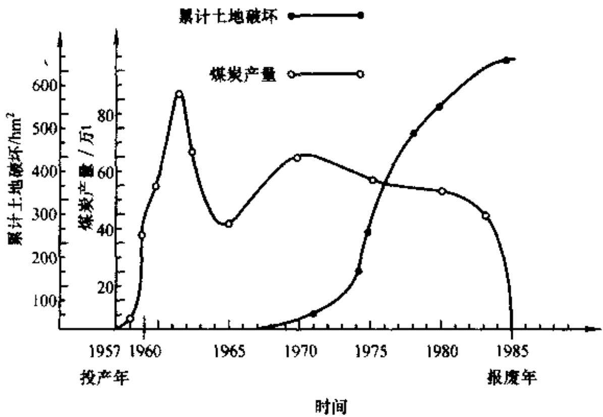  
图 5-4 某矿土地破坏与煤炭产量的关系(资料来源：祝国军，1988)

由图5-4可看出，该矿土地破坏滞后投产年1959年12年，自1971年土地破坏进人连续破坏阶段，面至衰退期，土地破坏基本不再增加，这一点与图5-3有所不同，原因是由于该矿衰退期短所致，1971年以前主要是土地占用，因缺乏统计数据，图中没有表示。所以真正意义上的复垦可从1971年起，对沉陷稳定的土地进行复垦。该 $\mathfrak { P }$ 累计采出煤炭 1 155万t计算，累计破坏土地$6 0 5 \mathsf { h m } ^ { 2 }$ ,采煤沉陷率 $0 . 5 2 \mathrm { h m } ^ { 2 }$ 万t。以1971年煤炭产量为54万t计算，从1972年起每年适宜复垦的土地面积为 $2 8 \hbar \mathtt { m } ^ { 2 }$ ，这样至1985年报废，可累计复垦 $3 9 2 \mathrm { h m } ^ { 2 }$ ，因此报废后尚有 $2 1 3 \mathsf { h m } ^ { 3 }$ 土地有待复垦，我们称矿井稳产期每年复垦 $2 8 \mathrm { { h m } } ^ { 2 }$ 为平衡复垦阶段，而报废后的 $2 1 3 \mathrm { h m } ^ { 2 }$ 土地的复垦则为采后的大规模复垦阶段。由此我们设平衡复垦阶段结束时的复垦率为r，则

$$
\gamma \equiv \frac { S _ { u } } { \bar { S } } _ { \bar { \cal M } } ^ { \bar { T } }\tag{5-1}
$$

式中 $\pmb { S _ { \alpha } }$ 为平衡复垦阶段的年复垦土地数量， $\tan ^ { 2 } / { \tt a }$

T为平衡复垦阶段历时，单位：a;

S 为矿并破坏土地总量，单位： $\mathbf { h } \mathbf { m } ^ { 2 }$

按(5-1)式计算，该矿平衡复垦阶段结束时的复垦率为64.8%。值得注意的是本例矿并为单一煤层开采的小型 $\overrightarrow { y }$ 井，与多煤层开层相比，开采过程中沉陷稳定适宣于复垦的土地面积较大，因而按(5-1)式求得的r较大，对于多煤层开采来说，r可能还要小。因此通过本例分析，我们可以得出两个结论：①并工矿山土地破坏滞后投产时间10年左右，因此除采取预复垦等预防措施外，复垦工程亦滞后采矿投产10年左右的时间；②矿井采矿过程中，最大土地复垦率不可能达到100%，理想状态为50%\~60%，实际只能达到30%一40%左右，但采矿过程中，可以对已稳定的塌陷地实施复垦措施，对未稳定的沉陷地加以利用。为反映采矿过程中未稳定沉陷地的利用程度，可以用沉陷土地的利用率 $\pmb { \mathscr { P } }$ 表示，即

$$
{ \pmb \beta } = \frac { S _ { r } + S _ { z } } { S }\tag{5-2}
$$

式中 $S _ { r }$ 为复垦的土地面积；

$S _ { \varkappa }$ 为已利用的沉陷地面积；

S 为沉陷破坏土地的总面积。

土地复垦管理中，应将复垦率，与利用率 $\pmb { \mathscr { P } }$ 加以 $\mathcal { F }$ 格区分，过去我们通常将两者混为一谈，从而使不同地区的复垦情况难以对比。

## 5.2.3 矿区生态重建阶段的划分

对应于矿区生态系统受干扰的两次高峰(基本建设阶段和稳产期)和一次重要选择衰退期，矿区生态重建亦可划分为三个阶段。第一阶段为规划期，自地质勘探起到矿并投产止，本阶段生态 $\sqrt { y ^ { 2 } }$ 重建的主要任务是规划矿区生态系统的类型、结构与功能及将来矿区生态系统的演化模式，同时要解决从事矿业人员急增带来的一系列社会与生活问题。第二阶段为整治期，主要任务是整治矿产开发带来的环境问题，如土地沉陷、水位下降、三废污染等。第三阶段为重建成熟期，本阶段的任务是综合治理，目标是使矿区土地利用结构合理，产业结构优化重组，人员重新得到安置。

矿区生态重建三个时期的划分与土地复垦三阶段是基本对应的规划期与预复垦阶段对 $\textcircled { 1 }$ 区生态重建和土地复垦都是非常重要的，它决定了整个矿区的发展方向和后两个阶段重建与复垦工作的难度。生态重建整治期与平衡复垦阶段，在采取的工程和生物措施方面可以很好地结合起来，以达到最佳效果。生态重建成熟期与大规模土地复垦阶段的目标也是一致的，亦需采取统一行动不同的是：生态重建需要考虑更广的范围和更长的时间效应。

## 5.2.4 矿区土地复量与生态重建相结合的规划方法

矿区土地复垦与生态重建相结合，规划是关键。规划阶段最好的方法是利用（IS方法进行规划，可达到省时、综合、适时的目的，并能模拟 $\pmb { \mathcal { P } }$ 区生态系统的动态变化过程。

利用GIS方法进行规划时，首先需要建立原始地形的DTM模型，在此基础上根据采矿规划，利用沉陷预计（或露天采矿剥离预计)模型预测采矿后的DTM模型，若采后DTM模型不利于生态重建和土地复垦，可以调整采矿规划，直到采后DTM达到预期状态。有了采后DTM模型，就可以计算土地复垦工程的土方量和土方运输路线，设计出复垦后的DTM模型，同时还可用采后DTM模型，建立空间位置与土壤、植被、人文要素、水文要素等的相关关系，评估采后生态破坏状况，如积水范围和积水量等，在此基础上，提出生态重建措施，再利用空间位置与生态要素之间的相关关系，评估生态重建措施对矿区生态系统的改善状况。下面以GIS在矿区土地利用结构调整方面的应用过程为例，说明GIS方 $\pi ^ { 2 }$ 法在土地复垦与生态重建中的作用。

土地利用结构变化是采矿对矿区生态系统产生影响的重要方面，因此，矿区生态重建需要合理调整用地结构，同时土地复垦规划亦需根据采后土地的适宜性安排复垦土地的利用方向，最终形成…个规划的复垦用地结构。所以矿区土地利用结构调整是土地复垦与矿区生态重建的共同任务。GIS完成这一任务的过程可用图5-5表示。图中大部分模型是已经建立的，故本文不作进一步讨论

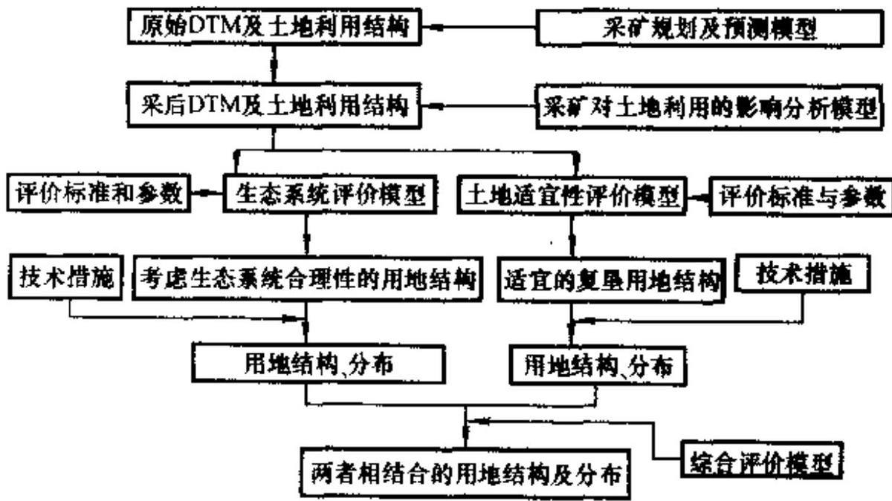  
图 5 - 5 GIS用于矿区土地利用结构规划的过程示意图

## 5.3 景观生态学原理在矿区生态重建与土地复垦中的应用—以诧城矿为例

## 5.3.1 矿区景观要素的动态变化

以徐州矿区诧城矿为例，其开采影响范围内的景观要素变化如图5-6所示。

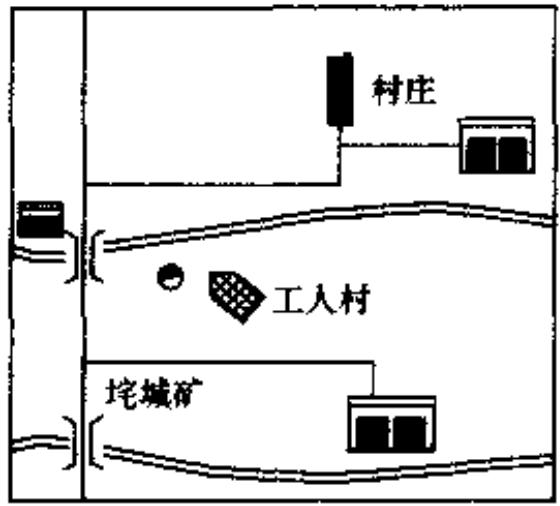  
(a)

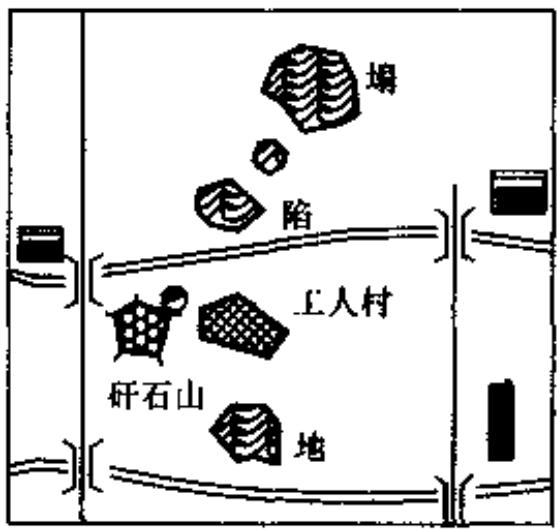  
(b)

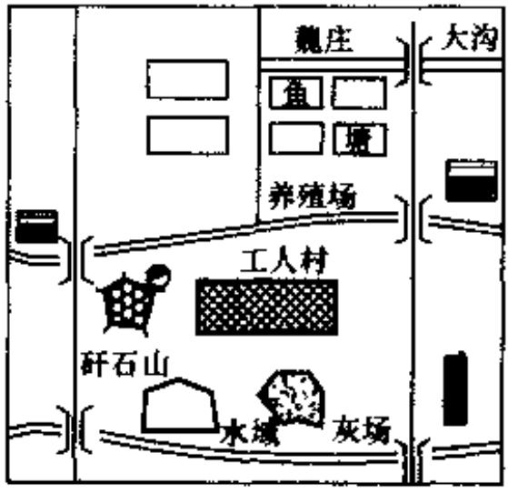  
(c)  
图 5-6 诧城矿开采影响范围内的景观要素变化  
(a)建 $\pmb { \mathcal { F } }$ 初期：(b)土地沉陷后；(c)土地复基后

## 1. $\pi$ 区景观生态系统中的模地

从图中可以断定：建并初期本区域内的模地为农业种植用地，采矿破坏后，尽管塌陷地数量猛增，其比例如表5-1所示，但农业种植用地仍具一定的规模和较好的连通性，还起模地的作用。

表5-1 诧城矿范围内采前、采后土地利用结构变化单位：%
<table><tr><td rowspan=1 colspan=1>方向</td><td rowspan=1 colspan=1> $5 . 8 ^ { \circ }$ </td><td rowspan=1 colspan=1>耕地</td><td rowspan=1 colspan=1>林地</td><td rowspan=1 colspan=1>阔地</td><td rowspan=1 colspan=1>道路</td><td rowspan=1 colspan=1>居民点</td><td rowspan=1 colspan=1>水域</td><td rowspan=1 colspan=1>填陷地</td><td rowspan=1 colspan=1>其它</td></tr><tr><td rowspan=1 colspan=1>采前</td><td rowspan=1 colspan=1>1</td><td rowspan=1 colspan=1>69.1</td><td rowspan=1 colspan=1>2</td><td rowspan=1 colspan=1>3.4</td><td rowspan=1 colspan=1>2.5</td><td rowspan=1 colspan=1>10.2</td><td rowspan=1 colspan=1>10.3</td><td rowspan=1 colspan=1>0</td><td rowspan=1 colspan=1>1.5</td></tr><tr><td rowspan=1 colspan=1>采后</td><td rowspan=1 colspan=1>7</td><td rowspan=1 colspan=1>25</td><td rowspan=1 colspan=1>2</td><td rowspan=1 colspan=1>34</td><td rowspan=1 colspan=1>31</td><td rowspan=1 colspan=1>9 2</td><td rowspan=1 colspan=1>14.3</td><td rowspan=1 colspan=1>35</td><td rowspan=1 colspan=1>1</td></tr></table>

## 2. $\overrightarrow { A C }$ 区景观生态系统中的斑块

由于采矿业的干扰，在原有景观格局中嵌入了工 $\bigstar$ 区工人村、塌陷坑和排研场等斑块。工人村属于引进斑块，在建井初期面积较小，随采 $\sqrt { y ^ { 2 } }$ 进入稳产期，其规模逐步稳定，而随采矿业的衰退，该斑块一般都不会消失，或维持原规模，或成为新的集镇并继续扩大塌陷坑和排矸场属于干扰斑块，塌陷坑斑块的嵌入导致生物量下降，形成局部水域，排矸场斑块一般为裸地，且是矿区污染源之一，对周围土地利用有一定影响，但影响范围不大。除上述斑块嵌入外，还有原村庄搬迁产生的斑块移动。在上述嵌入的斑块中，工人村一般具有较好的稳定性和持久性，而干扰斑块是最不稳定的，即使不采取复垦措施，这类斑块也会由抛荒到被杂草或水生动植物物种侵人，大面积塌陷积水坑，最终形成类似于自然湖泊的生态系统，排研场则被杂草覆盖。若采取复垦措施，这类斑块很快就被改造为人类期望的种植或养殖引进斑块形式。斑块特征可用斑块形状、面积及斑块间的相互作用等指标来描述(许慧等，1993)。

斑块形状指标如式(5-3)，斑块间相互作用指标如式(5-4)。

$$
\smash { D _ { t } = P _ { \varepsilon } / 2 \ \sqrt { A _ { \varepsilon } \pi } }\tag{5-3}
$$

$$
I _ { \imath } = \sum _ { \imath = 1 } ^ { \ n } \left. A _ { \jmath } / d _ { \imath } ^ { \imath } \right.\tag{5 - 4}
$$

式中：D——斑块i的形状指标；

$P _ { \mathrm { ~ i ~ } }$ ——斑块周长；

$\pmb { \varLambda } _ { \iota }$ ——斑块面积；

$I ,$ 斑块与相邻几个斑块间的相互作用强弱；

$A _ { \mathfrak { r } }$ ——任意的相邻斑块j的面积；

$d _ { r }$ ——斑块i与任一斑块j的边缘间距离。

当斑块形状为圆形时， $D _ { \mathrm { : } } = 1$ ，塌陷坑通常呈椭圆状或不规则长条形，塌陷坑愈狭长， $D _ { s }$ 愈大。若讨论多个塌陷坑间的相互作用，根据式(4-4)知，多个相邻的塌陷坑面积愈大，距离愈短，它们相互作用愈强，反之相互作用愈小。对土地复垦来说， $I ,$ 愈大，难度愈大，反之愈小，而对复垦后的斑块来说， $\pmb { I } _ { \iota }$ 愈大，相互作用愈强烈，系统各组分间联系愈紧密，对组织生产愈有利。如挖深垫浅复垦法复垦后的土地按基塘模式利用，这时“基”、“塘”成为独立的斑块，基与基之间、基与塘之间、塘与塘之间只有保持密切的相互作用，才有利于生产，否则既不利于安排生产，也不利于蓄水保土，这正是实施规模复垦的景观生态学依据之所在。

## 3. $\pmb { \emptyset } ^ { \pmb { \ ) } }$ 区生态系统中的廊道

矿区生态系统中的廊道主要由矿区专用铁路线、道路和分洪河道及排灌沟渠等组成。矿区专用铁路线及公路一般都是矿山基 $\sqrt { y ^ { 2 } }$ 建阶段建设的，它们人为地将原本连续的田块分割成两部分，随矿产资源的开采，部分道路受到破坏，同时又被修复，但道路两旁的植被则已受到影响，面原有河道由于开采沉陷，一方面纵坡发生变化，另一方面河面变宽，为防止河水漫出，有时需加固堤坝，所有这些，都使原有廊道性状发生改变。在土地复垦与环境治理过程中，沉陷区沟渠密度一般都要作加大处理，如图 $5 ^ { \mathrm { ~ - ~ } } 6 ( \epsilon )$ 中新开挖了魏庄大沟，该大沟将北侧的动态沉陷地与南侧的已稳定塌陷地分割开，阻止北侧坡地汇水流入南侧已治理的塌陷区，同时承担着南侧已治理区的排洪与供水作用。

值得注意的是，廊道的构建在矿区土地复垦与生态重建中起

十分重要的作用，对稳定沉陷地的治理，构建沟渠路虽然要占用一部分十地，但它可使被沟渠路分割的土地发挥更大的生产效能，同时我们亦不应忽略沟渠路旁的生物生产功能，完全可以建起防护林带或葡萄沟(如图5-7)。对不稳定沉陷地的治理，可有计划地将大块塌陷地采取围堰分割的办法使之变

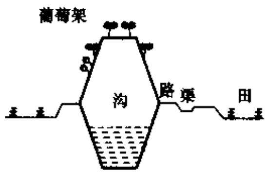  
图 5-7 葡萄沟示意图

小，以便于利用，这在平顶山矿区过去的实践中是很成功的。图5-6(c)的魏庄大沟实际也起这种作用。

## 4. 矿区景观的整体结构

矿区景观元素的相互连结，形成了矿区景观的整体结构。从宏观尺度分析，一个矿井开采影响范围内的生态系统在开采之前，可以近似看作是同质的，而在开采之后成为具有一定异质性的区域，但由于矿区采后景观的异质性没有形成良好的结构，主要体现在廊道不健全、斑块形状、大小不合理等，因此能流、物流没有很好的通道，所以导致矿区生态系统功能不完善。

## 5.3.2 矿区景观要素间的相互作用

## 1. 斑块与模地的相互作用

以农田为模地，塌陷地为斑块，很明显，通过降雨径流，农田中的养分流人塌陷洼地，而洼地积水后，又通过侧向人渗补给农田土壤水分，通常前者的作用是明显的，而后者的作用不明显，为加强两者之间的相互作用，通过挖深垫浅建成基塘利用区，无疑是有利的。

我们还注意到，图5-6(c)中的村庄斑块在开采与复垦后，几乎全部被搬迁至未受塌陷影响的周边地区，因而大大减小了人与模地的联系，这对于生产是非常不利的，因村庄布局对土地利用具有重要的影响，应将村庄、道路的规划纳人矿区土地复垦与生态重建规划中。

## 2. 斑块之间的相互作用

塌陷斑块愈分散，两者间距离越大，相互作用愈小，对复垦愈有利；复垦引进的斑块，如畜禽养殖场斑块与水产养殖场斑块愈集中，两者间距离愈小，相互作用愈强，对土地利用愈有利。

## 3. 廊道与斑块的相互作用

矿区生态系统中，廊道同时起分隔和连接作用。它既可将具有共同特征或需要有能流物流交换的两个斑块连接起来，也可将两个不同特性的斑块分割开来。如排水沟系可将相距一定距离的塌陷坑连接起来，将集水汇集起来排往承泄区，面截流沟同时也可将塌陷坡地与集水盆底或复垦区域分割开来，将坡地与盆底分面治之，分别利用。

## 4. 廊道与模地的相互作用

廊道的作用是为模地的生产创造更加良好的条件，模地的生产则依赖于廊道的合理构建。矿区土地复垦与生态重建时，廊道根据模地与斑块的需要面设置。

## 5. 矿区景观要素的功能

矿区景观要素中，工人村、塌陷地是主要的斑块类型，道路、河道是主要的廊道类型，模地为农田。工人村既是矿区从事矿业人口的聚居地，又是农副产品在此进行市场交易和消费的场所，随矿区开采年限的延长，其集镇功能越完善。塌陷地是采矿对环境产生影响的最重要的表现形式，其生物生产功能下降或完全丧失，成为沼泽地或积水坑，若不加利用，一些适生的野生动植物会在这里定居，道路承担着矿区工农业生产与外界进行物质、能量交换的功能，工农业产品通过道路运出矿区，生产资料、生活资料通过道路运进矿区，由于矿区人口多，道路质量和通达度成为矿区生活条件好坏的重要方面。河道为工农业的安全生产起重要的保障作用。土地复垦的主要任务是治理沉陷土地，使其恢复生物生产功能，但它与道路建设、河道的疏浚等其他要素的作用又密不可分，生态重建的主要任务是使矿区生态系统结构合理、功能完善，因而土地复垦是其重要组成部分。

## 5.3.3 矿区景观的异质性和稳定性

## 1. 景观的异质性

景观的异质性(Heterogenity)是指在一个区域里(景观或生态系统)对一个种或者更高生物组织的存在起决定作用的资源(或某种性状)在空间或时间上的变异程度(或强度)。景观异质性使人类居住的生态系统具有长期的稳定性和必要的抵御干扰的柔韧性(许慧等，1993)。因此，对矿区士地复垦与生态重建来说，其目标是应该提高矿区景观的异质性。

矿区景观异质性经历两个过程，如图5-8。原有景观异质性高表现为矿区土地适生的生物品种多，比如一块地既可作菜地，也可作果园或其他用地。而采后景观使原有用途较广的土地面积减少，增加了大面积的沉陷地，沉陷地在未加改造之前，适生的生物品种非常有限，而即使是未沉陷的土地，其用途也受到了限制，因为矿区总的可耕地资源变得非常有限，农村居民为满足口粮需要，不得不将其利用为口粮田。这时，矿区土地一部分用于粮食生产，一部分受采矿影响而抛荒，显然异质性大大降低。经过土地复垦后，复垦景观重又获得较高的异质性。如诧城庄矿境内的魏庄复垦区，将沉陷积水区改造成一个综合养殖场，包括养鳖场、养猪场、养牛场、养鸡场(待建)、养羊场及部分可耕地，使复垦景观异质性大大提高。当然景观异质性愈高，并非说明复垦景观就一定能发挥其预期的作用，异质性高只是一个前提，其功能还需要通过合理的规划加以实现，魏庄复垦区通过对廊道的合理设计、养殖场斑块与模地、养殖场与系统外的物质、能量交换及市场的分析，确定了合理的养殖规模，因而整个系统运行良好。

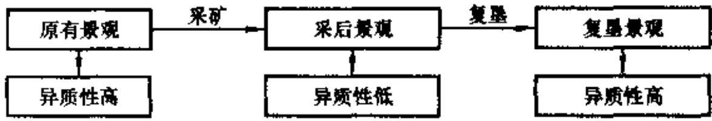  
图5-8 矿区景观异质性变化

## 2. 景观的稳定性

景观稳定性是用景观生态特征的参数随时间的变化来反映的，如果生态特征参数的变化表现为水平线，并且其水平线上下波动幅度和周期性符合统计规律，则称景观是稳定的。在评价景观稳定性时，通常是相对于干扰作用而言的，即在一定的干扰下，景观恢复到稳定状态的能力如何，若能恢复到稳定状态，则称景观稳定性好。

对于矿区景观来说，非常重要的生态特征是土地利用结构，采矿对景观的干扰表现为用地结构的变化，复垦对景观的重建亦表现为用地结构的变化。景观生态学上常用转换矩阵分析来反映土地利用这类景观格局的变化，以诧城 $\overrightarrow { A }$ 为例，有关的土地利用和斑块类型包括农田 $( P _ { 1 } )$ 、塌陷地 $\{ P _ { z } \}$ ,鱼塘 $\left( P _ { 3 } \right)$ 、养殖场 $( P _ { 4 } )$ 、工 $\bigstar$ 居民点用地 $( P _ { s } )$ 五类，随开采对土地的破坏及复垦工程的进展，景观转换矩阵为： $\hat { p } _ { 1 } , \hat { p } _ { 2 } , \hat { p } _ { 3 } , \hat { p } _ { 4 } , \hat { p }$

$$
\mathbf { p } = { \left\{ \begin{array} { l l l l l l } { \beta _ { 1 1 } } & { \beta _ { 1 2 } } & { \beta _ { 1 3 } } & { \beta _ { 1 4 } } & { \beta _ { 1 5 } } \\ { \beta _ { 2 1 } } & { \beta _ { 2 2 } } & { \beta _ { 2 3 } } & { \beta _ { 2 4 } } & { \beta _ { 2 5 } } \\ { \beta _ { 3 1 } } & { \beta _ { 3 2 } } & { \beta _ { 3 3 } } & { \beta _ { 3 4 } } & { \beta _ { 3 5 } } \\ { \beta _ { 4 1 } } & { \beta _ { 4 2 } } & { \beta _ { 4 3 } } & { \beta _ { 4 4 } } & { \beta _ { 4 5 } } \\ { \beta _ { 5 1 } } & { \beta _ { 5 2 } } & { \beta _ { 5 3 } } & { \beta _ { 5 4 } } & { \beta _ { 5 5 } } \end{array} \right\} } { \boldsymbol { \hat { p } } } _ { 3 }\tag{5-5}
$$

式中 ${ \pmb { \hat { p } } } _ { \imath } ^ { \phantom { \dagger } }$ 表示取代速率，即i种用途的土地被j用途取代的比例。根据转换矩阵，可对下述情况作出分析：

(1)采矿对土地的破坏结束后，已知 $\pmb { \mathscr { P } } _ { 2 1 } \cdot \pmb { \mathscr { P } } _ { 2 3 } \cdot \pmb { \mathscr { P } } _ { 2 3 } \cdot \pmb { \mathscr { P } } _ { 2 4 } \cdot \pmb { \mathscr { P } } _ { 2 5 }$ ,求

若干年后景观稳定状态下的各类用地面积。这时有

$$
\left\{ \begin{array} { l l } { P _ { 1 } ( t + 1 ) = P _ { 1 } ( t ) + p _ { 2 1 } \times P _ { 2 } ( t ) } \\ { P _ { 2 } ( t + 1 ) = p _ { 2 2 } \times P _ { 2 } ( t ) } \\ { P _ { 3 } ( t + 1 ) = P _ { 3 } ( t ) + p _ { 2 3 } \times P _ { 2 } ( t ) } \\ { P _ { 4 } ( t + 1 ) = P _ { 4 } ( t ) + p _ { 2 5 } \times P _ { 2 } ( t ) } \\ { P _ { 5 } ( t + 1 ) = P _ { 5 } ( t ) + p _ { 2 5 } \times P ( t ) } \\ { \displaystyle \sum _ { t > 1 } ^ { s } \hat { p } _ { 2 } , \ = \ 1 } \end{array} \right.\tag{5-6}
$$

设 $P _ { \mathrm { \ell } } \left( \mathbf { 0 } \right) { = } 3 3 3 . 3 3 \mathrm { h m } ^ { 2 } , P _ { \mathrm { \ell } } \left( \mathbf { 0 } \right) { = } 4 6 6 . 6 7 \mathrm { h m } ^ { 2 } . P _ { \mathrm { \ell } } \left( \mathbf { 0 } \right) { = } 0 \mathrm { h m } ^ { 2 }$ $P _ { 4 } \left( 0 \right) = 0 \mathrm { h m } ^ { 2 } , P _ { s } \left( 0 \right) = 9 3 . 3 3 \mathrm { h m } ^ { 2 } , \beta _ { 2 1 } = 0 . 3 0 , \beta _ { 2 2 } = 0 . 5 , \beta _ { 2 3 } = \beta _ { 2 4 }$ $= 0 . 0 9 , \boldsymbol { \beta } _ { 3 } = 0 . 0 2$ ，于是14年后， $P _ { \textrm { \scriptsize i } } ( 1 4 ) \approx 6 1 3 . 3 3 \mathrm { { h m } ^ { 2 } , } P _ { \scriptsize z } ( 1 4 ) \approx$ $0 , P _ { 3 } \left( 1 4 \right) \approx P _ { 4 } \left( 1 4 \right) \approx 4 2 \mathrm { h m } ^ { 2 } , P _ { 5 } \left( 1 4 \right) \approx 1 0 2 . 6 7 \mathrm { h m } ^ { 2 }$ 。说明以50%的复垦率复垦 $4 6 6 , 6 7 \mathrm { h m } ^ { 2 }$ 沉陷地，14年后可复垦完毕，同时14年后用地结构趋于稳定。

(2)采矿尚未结束，土地破坏速率为常数d，且破坏的土地全 $d$ 部为农田，复垦为农田、鱼塘、养殖场、居民点用地的速度为 $\phi _ { \hat { \mathbf { \Gamma } } }$ $\beta _ { 2 3 } \cdot \beta _ { 2 4 } \cdot \beta _ { 3 5 }$ ，则：

$$
\begin{array} { r l } & { ( P _ { \downarrow } ( t + 1 ) = P _ { \downarrow } ( t ) + p _ { \downarrow \downarrow } \times P _ { \uparrow } ( t ) - d  } \\ & {  [ P _ { 2 } ( t + 1 ) = P _ { 2 } ( t ) - \langle 1 - p _ { \uparrow \uparrow } ) \times P _ { \uparrow } ( t ) + d  } \\ & { \times  P _ { \downarrow } ( t + 1 ) = P _ { \downarrow } ( t ) + \dot { p } _ { \downarrow \downarrow } P _ { \downarrow } ( t )  } \\ & {   | P _ { \downarrow } ( t + 1 ) = P _ { \downarrow } ( t ) + p _ { \downarrow \downarrow } \times P _ { \downarrow } ( t )  } \\ & {   ( P _ { \downarrow } ( t + 1 ) = P _ { \uparrow } ( t ) + \dot { p } _ { \uparrow \uparrow } \times P _ { \uparrow } ( t )   } \end{array}\tag{5-7}
$$

设 $P _ { \mathrm { \ell } _ { \mathrm { f } } } \left( 0 \right) \sim P _ { \mathrm { \ell } _ { \mathrm { } } } \left( 0 \right) , \star _ { { \mathrm { } } _ { 2 1 } } \sim p _ { { \mathrm { } } _ { 2 3 } }$ 的值同上， $d = 3 0 \mathrm { { h m } } ^ { 2 } / \mathrm { { a } }$ ,于是：

$$
\begin{array} { r l } & { \left\| \rho _ { \mathrm { L } } ( x ) - \rho ( x ) \right\| _ { \infty } ^ { 3 } , } \\ & { = \left\| \rho _ { \mathrm { L } } ( x ) - \rho ( x ) \right\| _ { \infty } ^ { 3 } , } \\ & { \frac { \rho _ { \mathrm { L } } ^ { 3 } } { 2 } , } \\ & { = \left\| \rho _ { \mathrm { L } } ( x ) - \rho ( x ) \right\| _ { \infty } ^ { 3 } , } \\ & { \frac { \rho _ { \mathrm { L } } ^ { 3 } } { 2 } , } \\ & { \frac { \rho _ { \mathrm { L } } ( x ) - \rho _ { \mathrm { L } } ( x ) } { 2 } , } \\ &  \frac { \rho _ { \mathrm { L } } ( x ) - \rho _ { \mathrm { L } } ( x ) + \frac { \rho _ { \mathrm { L } } ( x ) } { 2 } , } { \rho _ { \mathrm { L } } ( x ) - \rho _ { \mathrm { L } } ( x ) - \frac { d } { 1 - \rho _ { \mathrm { L } } ( x ) } - \frac { \rho _ { \mathrm { L } } ( x ) } { 2 \cdot \rho _ { \mathrm { L } } ( x ) - \rho _ { \mathrm { L } } ( x ) } } \\ & { - \left\| \rho _ { \mathrm { L } } ( x ) - \rho _ { \mathrm { L } } ( x ) \right\| _ { \infty } ^ { 3 } , } \\ &  \frac { \rho _ { \mathrm { L } } ( x ) - \rho _ { \mathrm { L } } ( x ) + \frac { \rho _ { \mathrm { L } } ( x ) } { 2 } , } { \rho _ { \mathrm { L } } ( x ) - \rho _ { \mathrm { L } } ( x ) - \frac { d } { 1 - \rho _ { \mathrm { L } } ( x ) } - \frac { \rho _ { \mathrm { L } } ( x ) } { \rho _ { \mathrm { L } } ( x ) - \rho _ { \mathrm { L } } ( x ) - \rho _ { \mathrm { L } } ( x ) } } \\ &  \frac { \rho _ { \mathrm { L } } ( x ) - \rho _ { \mathrm { L } } ( x ) + \frac { \rho _ { \mathrm { L } } ( x ) } { 2 } , } \\ &  \frac  \rho _ \end{array}\tag{5-8}
$$

将已知数据代入式(5-8)得：

$$
\left\{ \begin{array} { l } { P _ { 1 } \left( t \right) = 5 7 7 . 3 - 1 2 \ t - 2 4 4 \ \mathrm { ~ e ~ } ^ { \mathrm { ~ 0 ~ 5 ~ } t } } \\ { P _ { 2 } \left( t \right) = 6 0 + 4 0 6 . 6 7 \ \mathrm { e ~ } ^ { - \mathrm { ~ 6 ~ 5 ~ } t } } \\ { P _ { 3 } \left( t \right) = 7 3 . 2 + 5 . 4 \ t - 7 3 . 2 \ \mathrm { e ~ } ^ { - \mathrm { ~ 6 ~ } . 5 t } } \\ { P _ { 4 } \left( t \right) = 7 3 . 2 + 5 . 4 \ t - 7 3 . 2 \ \mathrm { e ~ } ^ { \mathrm { ~ - ~ 6 ~ } . 5 t } } \\ { P _ { 5 } \left( t \right) = 1 0 9 . 6 + 1 . 2 \ t - 1 6 . 2 7 \ \mathrm { e ~ } ^ { \mathrm { ~ - ~ 6 ~ } . 5 t } } \end{array} \right.\tag{5-9}
$$

由式(5-8)、(5-9)可得出如下结论：

(1)若t的取值可无限大，则 $P _ { 1 } \sim P _ { s }$ 随时间变化的规律如图5-9所示。

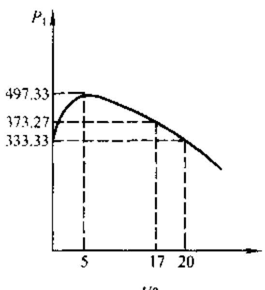

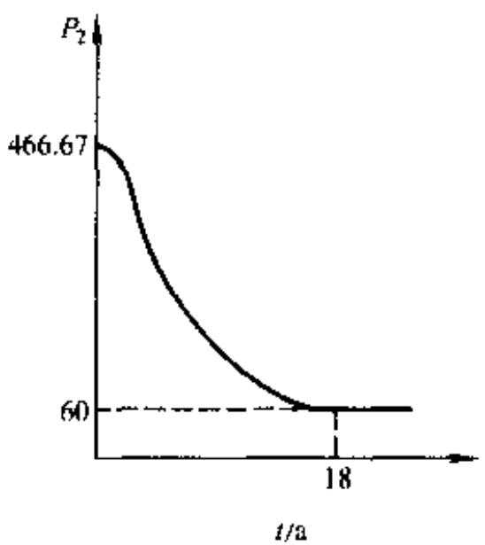

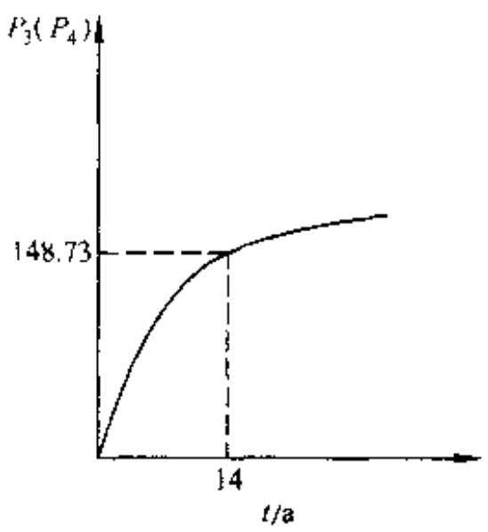

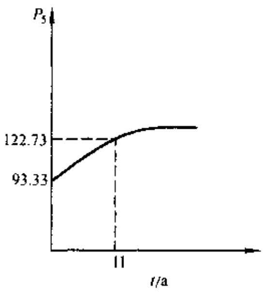  
图5-9 诧城矿景观格局变化规律

显然，由于采矿不断地破坏农田，因而导致农田数量最终呈下降趋势，在最初的几年中，由于复垦农田数大于土地破坏数，所以农田数量有所增加，在农田逐年下降的过程中，约20年后农田数量与初始状态持平，随后将呈直线下降，下降速度为 $1 2 \mathrm { h m } ^ { 2 } / \mathrm { a }$ 。沉陷土地面积数量的变化规律为起初复垦速度大于破坏速度，呈下降趋势，最终稳定于 ${ \bf 6 0 } { \bf { h m } } ^ { 2 }$ 左右。鱼塘和畜禽养殖场用地面积从零开始，逐年增加，到14年后增加到 $1 4 8 . 7 3 \mathrm { h m } ^ { 2 }$ ，随后呈直线增加，增加速率为 $5 . 4 \mathrm { h m } ^ { 2 } / \mathrm { a }$ ,工 $\overrightarrow { A }$ 居民点建设用地亦逐年增加，11年后增加到 $1 2 2 . 7 3 \mathrm { h m } ^ { 2 }$ ，随后呈直线增加，增加速率为 $1 . 2 \tan ^ { 2 } / a$

(2) 在 t 为有限取值范围内时， $P _ { \mathrm { ~ l ~ } } , P _ { \mathrm { ~ 2 ~ } \setminus } P _ { \mathrm { ~ 3 ~ } \setminus } P _ { \mathrm { ~ 4 ~ } \setminus } P _ { \mathrm { ~ 5 ~ } }$ 将稳定在某--定值，表5-2为t不同取值情况下的 $P _ { 1 } \sim P _ { 5 }$ 取值。由表5-2可看出，随时间的推移， $☉$ 区土地利用动态是农田数量逐年减少，而适宜于水产养殖与禽畜养殖的土地逐年增加， $P _ { 1 } \ 、 P _ { 3 } 、 P _ { 4 }$ $P _ { s }$ 总量为一常量，由此可预测 $\because$ 区未来景观格局。显然，当开采时间超过一定的时限，农田面积将小于鱼塘与养殖场的面积，而成为斑块，不再是模地。从式(5-9)可判断t约为29年时， $P _ { 1 } \approx P _ { 3 }$ $= { \cal P } _ { \ast }$ ，而不再为主要的土地利用方向。

表 5-2 诧城矿土地利用动态 单位：666.67m²
<table><tr><td rowspan=1 colspan=1> $\uparrow \downarrow _ { \uparrow \uparrow }$ </td><td rowspan=1 colspan=1> $\boldsymbol { P } _ { \ell }$ </td><td rowspan=1 colspan=1> ${ \pmb P } _ { 2 }$ </td><td rowspan=1 colspan=1> ${ \pmb { P } } _ { 3 }$ </td><td rowspan=1 colspan=1> $\pmb { \mathrm { p } } _ { \pmb { \mathscr { s } } }$ </td><td rowspan=1 colspan=1> $P _ { 5 }$ </td></tr><tr><td rowspan=1 colspan=1>20</td><td rowspan=1 colspan=1>5 060</td><td rowspan=1 colspan=1>900</td><td rowspan=1 colspan=1>2 718</td><td rowspan=1 colspan=1>2 718</td><td rowspan=1 colspan=1>2 004</td></tr><tr><td rowspan=1 colspan=1>30</td><td rowspan=1 colspan=1>3 260</td><td rowspan=1 colspan=1>900</td><td rowspan=1 colspan=1>3 528</td><td rowspan=1 colspan=1>3 528</td><td rowspan=1 colspan=1>2184</td></tr><tr><td rowspan=1 colspan=1>40</td><td rowspan=1 colspan=1>1460</td><td rowspan=1 colspan=1>900</td><td rowspan=1 colspan=1>4 338</td><td rowspan=1 colspan=1>4 338</td><td rowspan=1 colspan=1>2364</td></tr></table>

(3) 由式(5-8)知，景观格局的变化取决于参数 $d , p _ { 1 1 } , p _ { 2 2 }$ $p _ { 2 3 } \setminus p _ { 2 4 } \setminus p _ { 2 5 }$ ，而与各土地利用方向的初始值 $P _ { \mathrm { \uparrow } } \left( \mathbf { 0 } \right) \sim P _ { \mathrm { \uparrow } } \left( \mathbf { 0 } \right)$ 无关。事实上，

$$
p _ { 2 1 } + p _ { 2 3 } + p _ { 2 4 } + p _ { 2 5 } = r\tag{5-10}
$$

$$
p _ {  } = 1 - \ r\tag{5-11}
$$

式中：为复垦率，这里假设复垦率为常数，因沉陷地数量逐年下降，所以每年复垦的土地面积也减小，因此，欲调控矿区景观格局 $☉$ 变化，参数 $^ { d }$ 与 $p _ { 2 1 } \sim p _ { 2 3 }$ 或r起关键作用。如：沉陷地数量的稳定值为 $\frac { d } { 1 - } \frac { d } { p _ { 2 2 } } = \frac { d } { r }$ ，说明每年沉陷土地的数量越大，复星率越小，采矿结束时遗留沉陷地的数量越大，反之数量越小。又如：设 $d =$ $3 0 \mathrm { { h m } } ^ { 2 } / \mathrm { { a } } , r = 0 . 5$ ，复垦为工矿居民点建设用地的比例， ${ \pmb { p } } _ { 2 3 } = \mathbf { 0 } . \mathbf { 0 } 2$ ${ p _ { 2 3 } = p _ { 2 4 } }$ ，该矿于40年后开采结束，要求开采结束时，农田面积不 $☉$ 小于水产养殖用地面积，则可解下述方程组：

$$
\begin{array} { l } { \displaystyle \{ P _ { \mathrm { 1 } } ( \boldsymbol { 0 } ) + \frac { \hat { p } _ { \mathrm { 2 1 } } } { r } \bigg [ P _ { \mathrm { 2 } } ( \boldsymbol { 0 } ) - \frac { d \mathrm { ~ } } { r } \bigg ] + ( \frac { \hat { p } _ { \mathrm { 2 1 } } } { r } - 1 ) \mathrm { d } t = P _ { \mathrm { 3 } } ( \boldsymbol { 0 } ) + \frac { \hat { p } _ { \mathrm { 2 3 } } } { r } \times } \\ { \displaystyle \{ [ P _ { \mathrm { 2 } } ( \boldsymbol { 0 } ) - \frac { d \mathrm { ~ } } { r } ] + \frac { \hat { p } _ { \mathrm { 2 3 } } } { r } \mathrm { d } t  } \\ { \displaystyle  \hat { p } _ { \mathrm { 2 1 } } + \hat { p } _ { \mathrm { 2 3 } } + \hat { p } _ { \mathrm { 2 5 } } = 0 . 5  } \end{array}\tag{5-12}
$$

很容易确定： $p _ { 2 3 } = 0 . 0 6 4 \ 6 , \ p _ { 2 1 } = 0 . 3 5 0 \ 8$ ，即必须保证复垦时农田恢复率达到35.1%以上，才可达到控制景观变化的目标。

(4)对已报废或接近报废的矿山而言，矿区范围不再扩大，这时， $\sum _ { \prime \mathop { = } 1 } ^ { 5 } P _ { \prime } \ : = \ : \mathrm { C o n s t a n t }$ ，而对新建矿区而言，其范围逐步扩大，在分析景观格局变化时， $\sum _ { \iota = 1 } ^ { 3 } P _ { \iota } \left( 0 \right)$ 与 $\sum _ { i = 1 } ^ { 3 } P _ { i } \left( t \right)$ 相比，随t的推移，有较大的差值，上述景观转换矩阵的形式随之改变，但变化规律基本一致。

通过上面的分析，可以得出这样一个结论：矿区土地复垦时，因地制宜是一个基本原则，但从景观生态学角度出发，遵循因地制宜的原则不一定能获得理想的景观格局，为获取理想的景观格局，在遵循因地制宜原则的同时，应对复垦参数，如农田恢复率及其他类型用地的恢复率等进行控制。

## 5.4 矿区土地复垦与生态重建相结合的流域控制法

## 5.4.1 问题的提出

我国目前矿区土地复垦的重点仍是历史遗留下的废弃地，由于复垦速度缓慢，同时破坏速度却在增加，因此，按现有的复垦速度与破坏速度来测算，我国今后相当长一段时间复垦对象仍是破坏废弃多年的土地。因此带来的问题是大多数矿区采取的是头痛医头、脚痛医脚的方法，治表不治里，遇到自然灾害，复垦成果很快被毁，即使没有自然灾害，随时间的推移，复垦工程也逐步退化，最终完全失效。因此，矿区土地复垦与生态重建相结合的最好方法之一，就是采取流域控制法。

水文学中的流域是指一个水系的干流和支流所流经的整个地区，水土保持学中将小流域定义为一个完整的自然集水区，自然集水区由一系列分水系围成。这里所说的流域控制法就是要考虑复星工程的布局在流域中的位置，或者说矿区所处的流域位置不同，其承担的生态功能及复垦的方向应有所区别，这样才能使重建的矿区生态系统具有较高的稳定性，使土地复垦工程发挥其应有的效能。

## 5.4.2 山区矿山复垦与生态重建的流域控制法

山区矿山分布的特点是通常有几个矿井(山)分布于同一集水区，如山西大同矿务局十几对生产矿井分别分布在云岗沟和煤峪口沟两条山沟中，两条山沟即为两个相对独立的流域，个别情况下也有一个矿井位于一个独立的流域中的。对于前种分布类型，流域控制法的内容包括：

## 1. 以流域为单位编制土地复垦与生态重建规划

以流域为单位编制土地复垦与生态重建规划，要求同一流域内的各矿井(山)采取协调一致的行动，进行功能区划分。以提高整个流域的土地利用效率和生态环境质量为目标，而不应只顾局部地区的利益。主要规划内容包括：

(1)功能区划分。矿山流域内的土地具有以下功能：矿产开采加工、粮食种植、林果种植、生活居住等。功能区划分应考虑土地的适宜性及生产生活的便利性和生态系统的稳定性等原则。功能分区时，上、中、下游及山上、山腰与山下应有所区别。图5-10为山坡上林、中果、下粮的配置方式。

(2)固体废弃物排放规划：矿山流域的特点之一是固体废弃

物排放量大，矿山固体废弃物的大量排放产生两个严重危害，一是植被减少，二是废弃物易流失。植被减少和废弃物流失带来的后果是淤塞河道，容易产生山洪和泥石流等灾害。

矿山固体废弃物的淋溶水还导

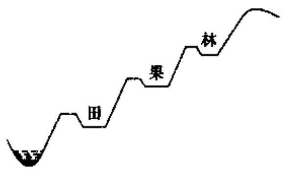  
图 5- 10 山坡功能区划分示意图

致下游水体遭到污染，因此山区矿山固体废弃物排放造成的危害比平原矿山大，规划时应避免矿山固体废弃物直接占用河道和易受水蚀的地段，同时尽量作压实处理，防止过于松散，能够恢复植被的尽快恢复植被。

(3)矿区水资源调蓄规划：山区矿区生态系统脆弱的表现之…就是水资源缺乏，它严重制约矿区生产和人民生活水平的提高。矿区水资源调蓄规划应处理好地下水地表水的合理利用、矿井水、生活污水的资源化，工业用水与生活用水、农业用水矛盾，上游用水与下游用水的矛盾等多方面，实际上，由于山区缺水，矿山有时不得不以水资源赋存量确定生产规模和人类定居规模。

(4)植被规划：山区矿区植被保护与恢复是矿区土地复垦与生态重建的重要内容，植被覆盖度大，不仅可防止水土流失，还可有效地改善矿区环境质量，如减小大气污染等。山区植被恢复的方法可分区域进行，上游以林果草为主，下游可适当发展粮食种植，山坡上以林果草为主，山坡下可适当发展粮食作物。

(5)矿山生态系统演替模式规划：矿山生态系统是受采矿、复垦等人为活动影响的动态系统，通常开采年限是有限的，编制矿区土地复垦与生态重建规划应该考虑矿区生态系统的未来演替模式，通常的演替模式分为三类：一是“衰亡型”，二是“转化一单一型”，二是“持续发展型”(赵宇空，1995)。衰亡型是指矿区随矿产资源的枯竭，矿业从业人员转移至新矿区，老矿区逐步恢复为采前水平;转化一单一型是指矿产资源枯竭后，矿业从业人员就地就业，矿业部门由矿产品生产加工转化为其他某种产业部门;持续发展型是指矿产资源枯竭后，矿区生态系统发展成为一个产业部门多样化、生态环境优良的人类适居地。显然，不同的演替模式不仅取决于当地的自然条件，也取决于矿区土地复垦与生态重建所采取的技术措施，更主要的取决于生态重建的投人水平。

## 2. 山区矿山流域控制法的技术措施

(1)工程技术：山区矿山流域控制法的工程技术包括疏水分洪工程、拦水蓄水工程、边坡治理工程、裂缝地的治理工程、研石排放场整形工程、土地复垦时的土方工程等。

(2)生物技术：生物技术包括乔灌草结合、裸地的快速生物复垦等

(3)综合治理技术：综合治理是矿区土地复垦与生态重建相结合的主要特点之一。综合治理技术包括流域内工矿业与农林牧副业协调发展，工程技术与生物技术相结合，蓄水与排水相结合，治沟与治坡相结合等多种技术途径。

## 3. 山区矿山流域控制的目标

矿山流域控制的总体目标是提高土地利用效率和区域内的生态环境质量，具体包括：

(1)土壤侵蚀模数控制指数：土壤侵蚀模数定义为每年单位面积土地流失的土壤量，常用 $\updownarrow / ( \ v { \mathrm { k m } } ^ { 2 } \cdot \ v { e } _ { a } )$ 表示。设治理前、治理后及未受开采影响区域的土壤侵蚀模数分别为 $S _ { b } \setminus S _ { \bullet }$ 和 $\scriptstyle { S _ { \mathfrak { d } } }$ ,则可定义土壤侵蚀模数控制指数 $r _ { s }$ 为：

$$
r , = \frac { S _ { a } - S _ { b } } { S _ { 0 } }\tag{5-13}
$$

而开采引起的土壤侵蚀加剧程度指数 $r _ { \omega }$ 为：

$$
r _ { \mathrm { * } d } \approx \frac { S _ { b } - S _ { 0 } } { S _ { 0 } }\tag{5-14}
$$

很明显，r、愈小，说明效果愈好，r，小于0时，治理后的效果优于 $r ,$ $r _ { \ast }$

未受开采影响区域，同样 $\boldsymbol { r } _ { \ r { \ r { d } } }$ 愈小说明采矿破坏程度愈小，反之愈大。

(2)植被恢复指数：设治理前、治理后及未受开采影响区域的植被覆盖率分别为 $P _ { \hbar } \ 、 P _ { \textrm { a } } \mathbf { \nabla } \cdot P _ { \textrm { 0 } }$ ，则可定义植被恢复指数 $r _ { \pmb { \geqslant } }$ 为：

$$
r _ { p } = \frac { P _ { \mathrm { * } } - P _ { \mathrm { * } } } { P _ { \mathrm { * } } }\tag{5-15}
$$

而开采引起的植被破坏指数 $r _ { p d }$ 为：

$$
r _ { p d } = \frac { P _ { h } - P _ { 0 } } { P _ { \Uparrow } }\tag{5-16}
$$

$r _ { p }$ 愈小，恢复愈好， $r _ { \rho d }$ 愈小，破坏愈小，反之则反。

(3)土地利用多样性指数与生物多样性指数：土地利用多样性指数与生物多样性指数的定义同第四章第二节。

## 5.4.3 平原矿山复是与生态重建的流域控制法

平原矿山复垦与生态重建时，采用流域控制法具有非常直接的效果。如徐州矿区东部煤田大黄山煤矿、旗山煤矿、权台煤矿、董庄煤矿、韩桥煤矿及青山泉煤矿(已报废)、西部煤田的诧城、柳新、庞庄、张小楼等矿同属大运河流域，如图5-11。大运河在流经矿区范围内，水位是梯级控制的，若将整个流域的土地复垦与生态重建统一考虑，完全可以达到预期的土地利用模式和景观格局。其方法是：根据梯级控制水位、各河段的水位标高和沉陷地表标高，选择适当的承泄区，对沉陷积水区采取疏排降的方法，恢复土地的利用价值。必要时可结合水利规划，改变大运河梯级控制水位，前提是改变梯级控制水位，必须有利于大范围的土地利用与土地复垦，否则得不偿失。平原矿山复垦与生态重建的流域控制法通常可采取以下具体措施：

## 1. 总体排水规划与土地复垦总体规划相结合

编制矿区土地复垦总体规划时，可将同一流域的不同矿井(山)划分为分属不同排水区段的若干个组。如徐州矿区，东部煤田几个矿为一组，西部煤田几个矿为一组，东部煤田的青山泉、韩桥又为一小组，旗山、董庄、权台为一小组，大黄山为一小组。依据是青山泉、韩桥两矿采用疏排法复垦时，将沉陷积水区的水排往屯头河，再由屯头河流入大运河，这两个矿为相邻的两个矿，可以统一布置排灌体系；而旗山、董庄、权台三矿排水直接以解台闸下游为承泄区，所以划为同一小组，大黄山矿则以解台闸上游的大运河段或房亭河为承泄区，所以单独为一组。经过总体排水规划，可以充分发挥复垦区排灌系统效益，服务于较大的复垦区域，减小盲目排水造成的水利工程浪费，且若不经过总体排水规划，某些沉陷积水区的治理甚至是不可能的。

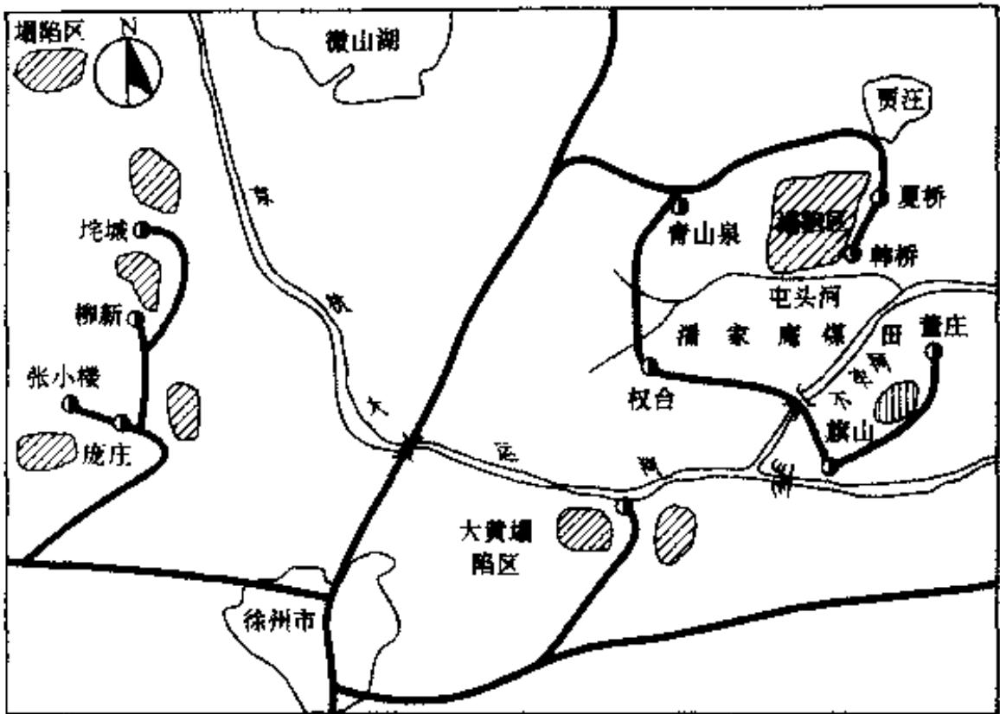  
图 5 -11 徐州矿区煤矿分布与水系分布

## 2. 矿井地面排水规划与矿井土地复垦规划相结合

平原矿井地而排水规划与矿并土地复垦规划相结合较山区矿并容易实现。因为通常平原矿井在建井初期，为防止洪水威胁井口安全，就已在井田范围内建立了排洪系统，且这一排洪系统是相对独立的。图5-12为徐州矿区大黄山煤矿地面排水系统示意图。只是在开采过程中，随土地沉陷，建井初期建立的排洪系统也受到不同程度的破坏，甚至失去排洪作用，制定土地复垦规划时，可有计划地对这一排洪系统进行改造，发挥其功能，并在两排洪道之间，增设一定密度的截流沟、降渍沟，必要时在排洪道与承泄区连接处建翻水站和水闸，就可排除沉陷区部分积水，甚至全部积水，从而实现多恢复农田的目的。利用上述方法，我们不仅在大黄山矿获得了成功，还在韩桥矿、诧城矿的土地复垦中获得了成功。

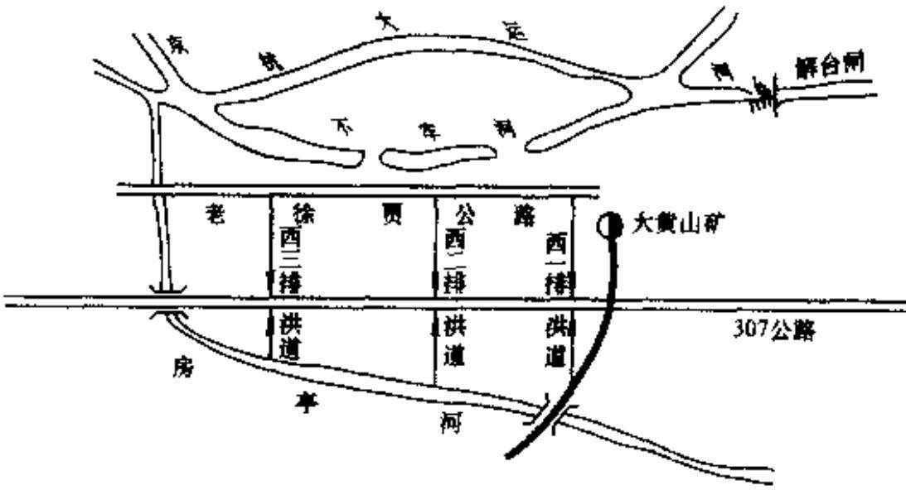  
图 5-12 大黄山矿地面排水系统示意图(卞正富，1996)

## 3. 平原矿山流域控制法实施要点

(1)矿区总体排水规划与矿井地而排水规划相结合，充分发挥排水系统在土地复垦与生态重建中的作用，提高土地受益面积，降低排水与复垦成本。

(2)在遵循总体规划的前提下，可采取分而治之的方法，在欲治理沉陷地的四周开挖截流沟，并通过与主排水沟相连的排水沟将欲治理区与承泄区联系起来，这样就可对欲治理区采取复垦措施，恢复土地的利用价值。

(3)排水系统由防洪、除涝、降渍系统组成，防洪系统由承泄区和排水枢纽组成，流域控制法能否实施的关键是能否找到合适的承泄区。防洪、除涝、降溃标准的选取直接影响排水与复垦成本，标准愈高，成本愈高。防洪、除涝、降溃标准的选取如表5-3。

表 5-3 平原矿山排水系统设计标准
<table><tr><td rowspan=3 colspan=1>系统类型</td><td rowspan=1 colspan=2>防洪</td><td rowspan=1 colspan=3>除涝</td><td rowspan=1 colspan=3>降渍</td></tr><tr><td rowspan=1 colspan=2>洪水位出现频率</td><td rowspan=2 colspan=1>暴雨频率</td><td rowspan=1 colspan=2>暴雨历时和排除时间</td><td rowspan=1 colspan=3>地下水位临界埋深</td></tr><tr><td rowspan=1 colspan=1>重要1矿区</td><td rowspan=1 colspan=1>一般T矿区</td><td rowspan=1 colspan=1>早作</td><td rowspan=1 colspan=1>水田</td><td rowspan=1 colspan=1>柏花</td><td rowspan=1 colspan=1>小麦</td><td rowspan=1 colspan=1>玉米</td></tr><tr><td rowspan=1 colspan=1>标准</td><td rowspan=1 colspan=1>50—100年一</td><td rowspan=1 colspan=1>10-20年一送</td><td rowspan=1 colspan=1>5或10年1-遇1—3</td><td rowspan=1 colspan=1>-3天暴雨一天排除—</td><td rowspan=1 colspan=1>3天暴兩5天排除</td><td rowspan=1 colspan=1>1.1~1.5m1</td><td rowspan=1 colspan=1>.0-1.2mll</td><td rowspan=1 colspan=1>2~1.5m</td></tr></table>

(4)实施流域控制法时，应将排水规划与灌溉规划相结合，非充填式复垦与充填式复垦相结合，土地复垦目标与生态重建目标相结合。

## 4. 平原矿山流域控制的目标

(1)土地复星目标：土地复垦目标包括两方面，一是复垦成本与效益，一是可复星面积。

设采用其他方法与流域控制法复垦土地的主要经济指标为：单位面积年收益分别为 $E _ { \ast } \left( o \right) , E _ { \sigma } \left( d \right)$ ，单位面积的年经营费用(包括排水系统运行费用)为 $C _ { a } \left( a \right) , C _ { a } \left( d \right)$ ，单位面积的初期复垦成本为 $\vec { C } , \left( o \right) , C , \left( d \right)$ ，基准收益率为i，计算期为t年，则选取流域控制法复垦的标准是：

$$
N P V ( d ) { \ni } N P V ( o )\tag{5-17}
$$

即：

$$
\begin{array} { r l r } {  { \sum _ { t ^ { \prime } = 1 } ^ { n } ! \big [ E _ { a } ( d ) - C _ { a } ( d ) \big ] ( 1 + i ) ^ { \cdot * } \mathrm { i } \ - \ C _ { a } ( d ) \geqslant \sum _ { t = 1 } ^ { a } \mathrm { i } \big [ E _ { a } ( o ) - \big < \big < \big < \big < \big < \big < \big < \big < \big < _ { b } ( o ) \ , } } \\ & { C _ { a } ( o ) \big ] ( 1 + i ) ^ { \cdot * } \mathrm { i } \ - C _ { * } ( o ) }  & { \ ( 5 - 1 8 ) } \end{array}
$$

又设采取流域控制法时有多个排水方案，其主要经济指标为 $E _ { \sigma } \left( d _ { i } \right)$ $C _ { \sigma } \left( d _ { i } \right) , C _ { s } \left( d _ { i } \right)$ ，则以下述标准选取排水方案：

$$
N P V ( d _ { * } ) = \sum _ { t = 1 } ^ { n } \{ [ E _ { a } ( d _ { * } ) - C _ { a } ( d _ { * } ) ] ( 1 + i ) ^ { - \tau } \} - C _ { * } ( d _ { * } ) = f _ { \mathrm { m a x } }\tag{5 - 19}
$$

式中NPV为净现值。

表5-4为两种排水与复垦方案的经济指标比较。由表5-4看出：方案一复垦成本低，排水系统的年运行费用较高，其年收益也较低，两个方案谁优谁劣，难以通过 $E _ { \ast } \cdot C _ { \sigma } ^ { \ast } \cdot C _ { s } ^ { \ast }$ 来确定。通过比较两方案的净现值知：在计算期小于26年的情况下，方案一的净现值总大于方案二的净现值，说明方案一较优，而在计算期大于26年时，方案二的净现值大于方案一的净现值，且计算期愈长，两者的差异越大，即方案二越优于方案一。由此可见，计算期对方案比较非常重要，对复垦来说，计算期为复垦项目的寿命或服务年限

表 5-4 两种重量方案的成本与效益对比  
单位： $1 0 ^ { - 4 } \pi / \mathrm { m } ^ { 2 }$
<table><tr><td rowspan="2">计算期</td><td colspan="3">方案一</td><td colspan="2"></td><td colspan="3">方案二</td></tr><tr><td> $E _ { \omega }$ </td><td> $\Sigma _ { \alpha }$ </td><td> $\Gamma _ { s }$ </td><td> $\operatorname { \ s p } \mathbf { \bar { \gamma } } V$ </td><td> $E _ { z }$ </td><td> $\boldsymbol { C } _ { \mathrm { \infty } }$ </td><td> $\Gamma _ { \ell }$ </td><td>NPV</td></tr><tr><td>0</td><td>0</td><td>0</td><td>23 500</td><td>- 23 500</td><td>0</td><td>0</td><td>30 000</td><td>-30 000</td></tr><tr><td>1</td><td>6000</td><td>750</td><td>0</td><td>4 687.5</td><td>6750</td><td>675</td><td>0</td><td>5424.1</td></tr><tr><td> $\frac { 2 } { 3 }$ </td><td>9 000</td><td>750</td><td>0</td><td>6 576.8</td><td>9 750</td><td>675</td><td>0</td><td>7 234.5</td></tr><tr><td></td><td>9000</td><td>750</td><td>0</td><td>5 872.2</td><td>9 750</td><td>675</td><td>0</td><td>6459.4</td></tr><tr><td>4</td><td>9 000</td><td>750</td><td>0</td><td>5243.0</td><td>9 750</td><td>675</td><td>0</td><td>5 767.3</td></tr><tr><td>5</td><td>9000</td><td>750</td><td>0</td><td>4 681.3</td><td>9750</td><td>675</td><td>0</td><td>5149.4</td></tr><tr><td>6</td><td>9 000</td><td>750</td><td>0</td><td>4179.7</td><td>9750</td><td>675</td><td>0</td><td>4 597.7</td></tr><tr><td> $\tau _ { t } \mathrm { ~ \bf ~ \cdot ~ } 6$ </td><td>NPV = 7 740.5</td><td></td><td></td><td></td><td> $\surd P V = 4 ~ 6 3 2 . 4$ </td><td></td><td></td><td></td></tr><tr><td> $\eta = 2 0$ </td><td> $N P V = 3 5 ~ 4 4 4 \ldots 3$ </td><td></td><td></td><td></td><td> $\Im P V = 3 5 \mathrm { \ } 1 0 6 . 5$ </td><td></td><td></td><td></td></tr><tr><td> ${ \mathfrak { n } } = 2 7$ </td><td> $\cdot \vee P V = 3 9 \ 3 4 7 \ . 5$ </td><td></td><td></td><td></td><td> $\langle \Psi \Psi = 3 9 \ 4 0 0 . 0$ </td><td></td><td></td><td></td></tr></table>

可复垦面积通常情况下利用流域控制法都要优于其他方法，因为通过排水，可使一些难以复垦利用的沉陷积水区域得到利用，而其他方法是难以做到的。若综合考虑单位面积的复垦成本与效益及可复垦面积的大小对复垦方案选择的影响，可将式(5-18)改写为：

$$
N P V ( a , ) = \sum _ { t = 1 } ^ { n } \{ [ E _ { a } ( a _ { t } ) \bullet A _ { \ast } - C _ { a } ( a , ) \bullet A , ] \bullet ( 1 + i ) ^ { - \varepsilon } | \}
$$

$$
- \ C _ { s } \left( a _ { i } \right) \bullet A _ { \prime } \ = \ \mathbf { M a x }\tag{5 - 20}
$$

式中 ${ \mathfrak { a } } _ { r }$ 表示方案，包括其他复垦方法及流域控制法的不同排水方案；

$A _ { i }$ 表示不同复垦与排水方案可复垦的面积。

(2)生态重建目标：平原矿区生态重建目标可用土地复垦与生态重建后的景观格局、土地持续利用能力、防洪抗涝能力、灌溉保证率等表示。按流域控制法的原理设计复垦区排水系统，防洪、抗涝、灌溉系统一般均能达到甚至超过矿区原生态系统的标准。土地复垦与生态重建后的景观格局可用土地利用结构、土地利用多样性、难以利用的土地数量等指标表示。一般情况下土地复垦与生态重建后的土地利用结构应能保障当地居民生活的基本要求，并有生产市场必需的农副产品的能力，因此，复垦为农田的数量必须达到一定的比例。如规定其面积不应低于水产养殖或其他任一利用方向的面积是合理的，当然根据矿区的自然条件与人口数量，这一比例也可有一变动范围。土地利用多样性指数的表示方法与山区表示方法一致，在满足景观格局变化的要求的前提下，多样性指数越高越好。难以利用的土地数量越大，土地复垦与生态重建的质量越差，流域控制法通常比其他方法更能减小难利用土地数量。

## 5.5 矿区土地复垦与生态重建相结合的可持续发展目标

## 5.5.1 矿区可持续发展的框架

矿区土地复垦与生态重建是实施矿区可持续发展的重要内容，因此开展矿区土地复垦与生态重建工作时应该将可持续发展目标作为这项工作的目标，而且还应将矿区土地复垦与生态重建同矿区可持续发展的其它途径结合起来。

按《中国21世纪议程》，矿区可持续发展应包括社会可持续发展、经济可持续发展与资源环境的合理利用与保护三方面。对矿山企业来说，矿区土地复垦与生态重建的内容应归为资源与环境的合理利用与保护方面，而对地方或区域经济发展而言，矿区土地复垦与生态重建对区域性的社会可持续发展、区域性的经济可持续发展及水土资源的合理利用与保护三方面均有直接的关系。因此不同的部门考虑问题的出发点不同，采取的措施和解决方案也不同，欲真正实现矿区可持续发展，必须由企业和地方政府共同参与。

## 5.5.2 区域可持续发展对矿区土地复量与生态重建的要求

## 1. 区域社会可持续发展对土地复垦与生态重建的要求

土地作为人类赖以生存的资源，是人类生存的基础，我国是一个人地矛盾非常突出的国家，而矿区人地矛盾、工农争地矛盾尤为突出。所以区域社会可持续发展对矿区土地复垦与生态重建的基本要求是减缓人地矛盾和工农争地矛盾。评价土地复垦与生态重建是否满足区域社会可持续发展的要求，可用PSR指标来衡量，即：

P(Pressure):以煤炭采出量和固体废弃物排放量表示；

S(State):用万吨沉陷率和年土地破坏与占用量表示；

R(Response):用土地复垦率.年土地复垦总量及复垦后的各类用地比例表示。

如果年土地复垦量大于年土地破坏量，可认为是持续发展的。另外，还可用人均土地拥有量或人均耕地拥有量及农业从业人员数量来表示区域社会发展的持续性。

## 2. 区域经济可持续发展对土地复垦与生态重建的要求

土地复垦是对土地的一种投人并获得产出的经济行为。在土地破坏严重的矿区，农村经济受到严重影响，而通过复垦，复垦的土地又成为农村经济发展的新的增长点。因此，评价土地复垦与生态重建是否满足区域经济可持续发展的要求，可用复垦土地的产值在农业总产值中的比例及农业总产值的变化来表示。设未受开采影响时矿区农业总产值为 $T ,$ ，采后未治理时的农业总产值为$T _ { i }$ ，治理后的农业总产值为 $\textstyle { \mathcal { T } } _ { a }$ ，其中复垦土地的农业产值为 ${ \mathfrak { T } } ,$ (不包括复垦为工业场地的产值)，则可构造下列指标：农业产值受开采影响的下降率 $r _ { T \notin }$ ，农业产值因复垦治理的增长率 $\gamma _ { \uparrow \downarrow }$ 和农业复垦产值占农业总产值的比例 $r _ { \tau } ,$

$$
r _ { T d } = \frac { T _ { \parallel } - T _ { b } } { T _ { 0 } }\tag{5-21}
$$

$$
r _ { \tau } = \frac { \tilde { \mathsf { T } _ { a } } \cdots \tilde { T _ { \mathrm { ~ p ~ } } } } { \tilde { \mathsf { T } _ { \mu } } }\tag{5-22}
$$

$$
r _ { \mathrm { { T r } } } = \frac { \displaystyle T _ { r } } { \displaystyle T _ { a } }\tag{5-23}
$$

$r _ { T \mathcal { A } }$ 越大，说明采 $\overrightarrow { y }$ 对农业生产影响越 $\overrightarrow { r }$ 重， $\boldsymbol { r } _ { \ u { \tau } _ { i } }$ 越大说明复垦治理效果越好，在扣除农业自然增长和科学进步因素后，若 ${ \boldsymbol { r } } _ { \mathtt { T } { \dot { \mathbf { f } } } }$ 为正增长，则矿区农业发展表现为持续发展。r本身的意义不大，若将 $\pmb { \wp } ^ { \pmb { \Sigma } }$ $r _ { T _ { \Gamma } }$ $r _ { \gamma _ { r } }$ 和复垦土地面积在农业利用的总土地面积中的比例结合起来考虑就可反映复垦效果，若复垦土地面积占农业利用土地总面积的比例为 $r _ { \ell }$ ,且 $r _ { \uparrow \ast } \cdot > r _ { i }$ ，即：单位复垦土地面积的产值高于非复垦土地，说明复垦效果较好，反之较差。

3. 区域资源与环境的利用与保护对土地复垦和生态重建的 $\Re$ 要求

区域资源与环境的利用与保护包括土地资源、土壤资源、水资源及大气环境、水环境及社区环境等的合理利用与保护。

土地资源与土壤资源除总量控制外，还应具有持续生产能力，因此可用土地退化率表示，设采矿与复垦后发生土地退化的面积 $\overrightarrow { A }$ 为 S，总土地面积为 S。,则土地退化率为r: $S _ { \ell }$ $\scriptstyle { \pmb { S } } _ { \pmb { \vartheta } }$ $\pmb { r _ { \bot } }$

$$
r _ { \mathrm { { t } } } \approx \frac { S _ { \mathrm { { t } } } } { S _ { \mathrm { { t } } } }\tag{5-24}
$$

这里需要对土地退化作一解释，凡是采 $\sqrt { \alpha }$ 与复垦后因坡度的改变、土壤侵蚀作用及复垦措施不当、水资源供应缺乏等原因造成土地生产能力下降的土地均归为退化范畴。

水资源的利用与保护包括地下水位及水量变化、地表水和地下水的水质变化等指标。对水质而言，若采 $\sqrt { \alpha }$ 与复垦引起的水质变化不影响人类生产、生活，即饮用水水源符合饮用水水质标准，灌溉水源符合灌溉水质标准，养殖水源符合渔业水质标准，可认为满足可持续发展要求。对水位与水量变化而言，若开采与复垦后与采前相比，居民生活与工农业生产水资源供给率不下降，且具备持续供水能力，地下水位能得到稳定，则认为满足可持续发展要求。

大气环境亦可用有关大气环境质量标准来衡量，即有毒有害气体与粉尘的排放量及其在大气环境中的浓度不超标，即可认为满足可持续发展要求。

社区环境质量，或人居环境质量是衡量 $\bigtriangledown$ 区持续发展的一个重要方面， $\sqrt { \alpha }$ 产资源的开采给区域环境带来了很大影响，其中 $\sqrt { \alpha }$ 山集镇的形成是主要影响形式之一。矿山集镇通常是伴随 $\bigstar$ 山开采而产生的，随矿产资源的衰竭，矿山集镇常成为永久集镇，由于起初矿山集镇是服务于矿山的，因此其功能有限；在矿产开采结束后，因为矿山集镇的功能不全，所以严重影响了社区环境质量，如就业机会少、商服网点不健全等，都给居民生活带来诸多不便。因此矿区生态重建时，需对 $\sqrt { \alpha }$ 山集镇进行很好的规划和建设，才能保证社区环境质量满足可持续发展要求。

## 5.5.3 煤炭清洁开采技术在矿区土地复星与生态重建中的作用

## 1. 煤炭清洁开采技术的概念

《中国21世纪议程》将推广少污染的煤炭开采技术和清洁煤技术作为可持续的能源和消费一章中的四个方案领域之一，其目的是促进中国以煤为主的能源系统向环境无害的可持续发展模式转变，煤炭的环境问题涉及开采、加工和利用消费的全过程。清洁煤技术是控制煤炭燃烧前后对环境污染的各项技术总和，发生于煤炭加工、利用、转化和燃烧过程中。

煤炭清洁开采技术则可定义为煤炭开采过程中减小煤炭开采对环境负影响的各项技术总和。煤炭开采对环境的负影响包括开采沉陷对水、土资源及地表建构筑物的破坏，固体废物的排放，矿山粉尘、废气、废水及振动噪声对环境的污染等方面。王玉浚、张小平等(1996)将清洁开采技术看成是清洁煤技术的扩展。由于我国煤炭开采量大面广、矿点多、矿山类型构成复杂，煤炭开采对环境产生的负面影响相当突出。以采煤造成的土地破坏为例，1949—1996年间，我国因采煤造成废弃的土地在40\~50万hm²，而欧共体成员国煤炭和钢铁工业造成的废弃地累计为4万hm²(Richards,1993)，我国是欧共体成员国的十倍以上，我国煤炭开采对其他环境要素的破坏也是相当严重的，因此，推广煤炭清洁开采技术是实施矿区可持续发展的重要行动之一。

## 2. 煤炭清洁开采技术组成

煤炭清洁开采技术由减少废弃物排放的开采技术，减轻地表沉陷的开采技术，露天煤矿“剥离一采煤一排土”与生态重建一体化技术，煤层气的开发，煤炭地下气化等技术组成。（王玉浚，张小平等，1996)

减小废弃物排放的开采技术包括：改革巷道布置与支护方案，研究井下研石处理工艺，井下抽放瓦斯，矿井水分类排放与回收利用等技术。

减轻地表沉陷的开采技术包括房柱式采煤方法，条带开采，充填法管理顶板，分层间歇开采等技术。

3. 煤炭清洁开采技术在矿区土地复垦与生态重建中的作用

(1)露天矿山：露天矿山考虑土地资源保护、复垦利用与生态重建的主要清洁开采技术为剥离一采煤一排土复垦一体化复垦工艺。…体化复垦工艺要求尽量实现内排土，同时在剥离过程中对岩、土分别堆放保存，防止土壤损失贫化，待采煤完毕，将新区段剥离的岩土回填采空区，再用预先剥离保存的表土覆盖已回填的采空区，实现采空区的复垦利用。在有露天开采和井工开采相结合的矿区，还可利用露天开采剥离物回填井工开采沉陷区，实现塌陷区的复垦利用，我国抚顺矿区20世纪90年代初就开展了这方面的试验与推广应用工作，效果十分显著。除此之外，露天矿山考虑土地资源保护与生态重建的清洁开采技术还应包括：确定合理的剥采比，剥采比不宜过大，过大势必造成土地挖损和排弃岩土大量毁地；复垦过程中采取必要的恢复地下水位的措施，并在复垦区域建立合理的排水系统，防止复垦区水土流失和矿山酸性水污染与土壤的重金属污染。

(2)井工矿山：井工矿山考虑土地资源保护、复垦与生态重建的清洁开采技术包括两个方面：一是减少“三废”的排放量，二是减轻开采对地表造成的破坏。减少固体废弃物排放不仅可少占地，还可通过井下局部排矸减小地面的下沉，一举两得。近年来，德国、俄罗斯在井下排矸工艺方面开展了大量研究工作，并开发研制了适合中厚、薄煤层开采的井下排矸工艺和综合机械化采煤机械。减少废水废气的排放，既可减小土地、水体、大气污染，也可保护矿区生物多样性，同时可使废水资源化。减轻开采沉陷的负面影响的技术措施包括部分开采和合理规划开采方案。部分开采，如房柱式开采、条带开采等，无疑可减轻开采沉陷量，从而达到地面保护的目的，事实上，开采沉陷对地面的影响可分为正面影响、负面影响和几乎无负面影响三种类型。合理规划开采方案的目的就是在保证井下采出煤炭资源的同时，使开采沉陷对地面无负面影响，甚至出现正面影响。如在水田下开采，可采取协调开采，碱小地表拉伸变形；在平整度要求较高的农田下采煤，尽量不留设煤柱，使地表均匀下沉等，均为减小开采沉陷负面影响的最好办法。另外，改革开采工艺，实现集中开采，缩短煤炭开采占用土地时间，对区域土地资源的利用和生态环境的恢复亦是有利的。目前我国采区生产能力低，致使一个矿井工作面布置分散，结果导致地面沉陷是遍地开花，且在短期内地面沉陷又难以稳定，尤其是多煤层开采时更是这样，这样使得开采沉陷占用土地时间太长，有的长达几十年，几十年内不能对其实施复垦措施，因此，今后应该提倡集中开采，使地面沉陷在短期内集中在较小的区域内。

## 5.6本章小结

1. 本章提出了矿区生态重建的概念，讨论了矿区土地复垦与生态重建的关系，将生态演替原理、景观生态学原理和系统论思想作为矿区土地复垦与生态重建相结合的理论基础。

2. 以井工矿山为例，讨论了矿区土地复垦与生态重建的阶段划分，将矿区土地复垦划分为预复垦、平衡复垦和规模复星三个阶段，将矿区生态重建划分为规划期、整治期和成熟期三个时期。并进一步讨论了土地复垦三阶段与生态重建三个时期间的对应关系。通过实例说明：矿井采矿过程中最大复垦率不超过50%\~60%，实际只能达到30%\~40%左右。

3. 将景观生态学原理用于矿区土地复垦与生态重建中，讨论了矿区景观要素间的相互作用规律，利用转换矩阵分析法建立了矿区景观格局变化方程组。利用景观格局变化方程说明了矿区景观格局的稳定性、变化趋势及控制景观格局变化的参数。参数包括土地破坏速度、土地复垦率等，景观格局变化与初始土地利用结构无直接关系。

4. 从景观生态学原理出发，说明矿区土地复垦遵循因地制宜原则不一定能获得理想的景观格局，为获得理想的景现格局，在遵循因地制宜原则的同时，应对影响景观变化趋势的有关参数进行人为调控。

5. 提出了矿区土地复垦与生态重建相结合的流域控制法，分山区矿山和平原矿山分别介绍了流域控制法的具体措施和控制目标。通过分析说明土地利用多样性指标是山区与平原矿山复垦与生态重建的共同目标，第一次将山区与平原矿山的土地复垦方法、土地复垦目标及生态重建的基本原理统一起来。

6. 讨论了矿区土地复垦、生态重建与区域可持续发展的关系，提出了考虑可持续发展准则的土地复垦与生态重建的评价标准，将合理规划开采方案，减小开采沉陷负面影响，实现集中开采，减小开采沉陷占用土地时间等技术纳入清洁开采技术范畴。

## 6 主第结论与爾究展望

我国土地复垦立法以十分珍惜与合理利用每寸土地为目的，特别强调恢复被破坏土地的利用价值，而对复垦区域生态系统的恢复无明确规定。而国外有关复垦法规则首先以恢复矿区生态环境为目的，对土地使用价值的恢复则无严格要求。作者认为我国矿区土地复垦应以恢复甚至提高土地生产力、重建矿区生态系统为目标，因此，作者提出了矿区土地复垦界面的概念，即由一系列决定采矿影响区域土地生产力或生态平衡的诺要素组成的集合所形成的两个系统的边界，从而将复垦土地生产力恢复与复垦区域生态系统恢复统一于土地复垦界面的整合中。以此为出发点，在综述了国内外矿区土地复垦研究进展情况的基础上，本文重点开展了全国煤矿区复垦条件分区、复垦界面生产力系统、复垦界而生态系统及矿区土地复垦与生态重建相结合的理论与方法研究四方面，取得了以下主要结论：

1. 分析了煤炭资源分布与开发布局对土地复垦的影响，得出了我国土地复垦受煤炭资源分布与开发布局影响的五个特点：①我国矿区土地复垦与生态重建的重点集中在山西等14个省份；②土地复垦重点集中在平原矿区，生态重建重点集中在东北和“三西”各大矿区；③西南及中南地区土地破坏分散，属土地景观广泛破坏型和矿并水污染型；④我国井工矿山复垦任务重于露天矿山；⑤我国地方矿山土地破坏严重，但没有得到重视。

2. 提出了影响复垦条件分区的几个重要指标：干湿类型、热量条件与种植制度、地形特征，煤炭赋存条件与开发强度等。在此基础上，提出了复垦条件分区的加和指数模型和和积指数模型，对我国煤矿区复垦的生产力条件、生态类型、采矿破坏后的土地生产力水平与生态破坏类型分别进行了分区研究，应用证明和积指数模型优于加和指数模型。复垦区的生产力条件按综合自然条件分为黄淮海农业区等7个类型区；复垦区生态类型按ETI指数分为持续型、半持续型和非持续型，持续型矿区主要分布在我国东部和南部湿润－半湿润地区，非持续型大多分布在干旱-半干旱地区；采矿破坏后的土地生产力水平按PDI指数分为Ⅰ、Ⅱ、Ⅲ级，Ⅰ级下降幅度最大，主要分布在我国东部地区，Ⅲ级下降幅度最小，主要分布在东北、中原(河南)、长江以南及“三西”能源基地非露天采矿区；采矿引起的生态破坏类型区按EDI指数划分为两等三个类型，即破坏严重和不严重两个等级，结构缺损、功能缺損和功能一结构缺损并重三个类型，生态破坏严重的矿区大部分分布于中西部，或为露天采矿区，结构缺损型分布于我国东部，功能缺损型分布于我国中西部，中南、东北地区则属于结构-功能缺损并重型。

3. 作者首次将我国煤矿区复垦条件分为6个大区 12个亚区，对每个大区的煤炭开采特点、土地破坏类型、复垦条件作了介绍，提出了不同区域的复垦治理对策。

4. 提出了复垦界面的概念，井分析了土地复垦界面的类型和特性。

5. 结合土地生产过程分析，提出了土地复垦界面生产力系统的ESI三要素及三要素之间的相互关系；综合考虑ESI的作用，分析了土地复垦界面生产力系统形成耗散结构的条件，并推导出了生产力系统的动力学方程(DE)，提出了评价不同状态的土地生产力水平的熵流模型EEM，利用EEM模型可很好地解释土地减产减收边界与塌陷边界的不一致性。

6. 分析了水位埋深与土地生产力的关系，并对开采沉陷对潜水位埋深的影响规律作了详细分析，指出了降低地下水位的流域挖制法。

7. 将复垦土壤分为矿山土和原生扰动土进行研究，分析了矿山土的养分、酸碱性、土壤板结及重金属污染规律，提出了防止酸性污染的掩埋法及矿山土重金属污染主要源于土地利用及地面的污染的规律；分析了开采沉陷对土壤特性的影响，提出了开采沉陷对土壤理化特性的影响规律，还进一步讨论了开采沉陷地有机土复垦时土壤特性的变化规律，用实验数据说明徐淮黄泛冲积地区在不剥离表土的情况下，可在两年内使复垦土地达到当地平均产量的原因。

8. 考虑了土壤因子的相关性和时空变异性，提出了复垦土壤生产力的机理模型，根据机理模型说明了时空变异规律的一致性，并得出了复垦土壤生产力水平与基准生产力水平的关系，还提出了复垦土壤生产力指数的修正模型MPI，结合实例说明了MPI的实用性。

9. 将生物多样性指数引入土地复垦界面生态系统的研究中，首次提出用土地利用多样性指数评价复垦用地结构的合理性。土地利用多样性指数不仅适用于对平原矿区复垦的评价，还适用于丘陵山区复垦的评价，同时使平原矿区和丘陵山区的评价具有统一性、可比性，为东部平原矿区挖深垫浅复垦方法和保留局部沉陷水域提供了生态学依据。还进一步利用生物多样性指数对研石排放场的植被恢复方案和植物品种选择进行了研究，通过试验研究证明利用生物多样性指数选择复垦方案和优选植物品种是可行的。

10. 分析了矿区水土流失的表现形式、矿区土地复垦与水土保持的关系；将复垦区分为堆垫地、回填洼地和非充填复垦三种形式，讨论了各自的水土流失机理，应用通用水土流失方程(USLE)，提出了沉陷坡地和排土场堆垫地貌的抗侵蚀设计方法，根据地貌学原理提出了排土场坡面应采用抛物线形式，而非过去澳大利亚等国学者提出的S形坡形。还提出了复垦区抗侵蚀的工程与生物措施：快速恢复植被法、涂层法、网席法及侵蚀被方法。

11. 首次利用定参数分室模型分析了复垦界而生态系统的物质(能量)流动状况，得出了魏庄复垦区生态系统土壤分室的N、P、K动态变化规律及种植、养殖分室的产量动态，并利用定参数分室模型，提出了改进各分室库存与产量动态和提高系统内物质循环效率的方法。针对定参数分室模型的缺陷，作者第一次提出了新的变参数分室模型，并将变参数分室模型用于魏庄复垦区生态系统的物质流动分析，结果表明：变参数分室模型可很好地将库存量、投人量与产出量联系起来，能够较好地找出投人量与库存量的比例关系，变参数分室模型的另外两个优点是：①能较为客观地反映系统的实际运行状况；②为解决非线性物(能)流系统提供了可能。作者还进一步证明了生态学中 Von Bertantty 生长模式是分室模型的特例，借助于Von Bertanffy 特例，可根据复垦系统各分室物流的初始值，判断各分室库存量是呈增长趋势还是呈下降趋势。

12. 提出了矿区生态重建的概念，讨论了矿区土地复垦与生态重建的关系，将生态演替原理、景观生态学原理和系统论思想作为矿区土地复垦与生态重建相结合的理论基础。以井工矿山为例，讨论了矿区土地复垦与生态重建的阶段划分，将矿区土地复垦划分为预复垦、平衡复垦和规模复垦三个阶段，将矿区生态重建划分为规划期、整治期和成熟期三个时期。并进一步讨论了土地复垦三阶段与生态重建三个时期间的对应关系。通过实例说明：矿井采矿过程中最大复垦率不超过50%\~60%，实际只能达到30%\~40%左右。

13. 将景观生态学原理用于矿区土地复垦与生态重建中，讨论了矿区景观要素间的相互作用规律，利用转换矩阵分析法建立了矿区景观格局变化方程组。利用景观格局变化方程说明了矿区景观格局的稳定性、变化趋势及控制景观格局变化的参数。参数包括土地破坏速度、土地复垦率等，景观格局变化与初始土地利用结构无直接关系。

14. 从景观生态学原理出发，说明矿区土地复垦遵循因地制宜原则不一定能获得理想的景观格局，为获得理想的景观格局，在遵循因地制宜原则的同时，应对影响景观变化趋势的有关参数进行人为调控。

15. 提出了矿区土地复垦与生态重建相结合的流域控制法，分山区矿山和平原矿山分别介绍了流域控制法的具体措施和控制日标。通过分析说明土地利用多样性指标是山区与平原矿山复垦与生态重建的共同目标，第一次将山区与平原矿山的土地复垦方法、土地复垦目标及生态重建的基本原理统一起来。

16. 讨论了矿区土地复垦、生态重建与区域可持续发展的关系，提出了考虑可持续发展准则的土地复垦与生态重建的评价标准，将合理规划开采方案，减小开采沉陷负面影响，实现集中开采，减小开采沉陷占用土地时间等技术纳入清洁开采技术范畴。

我国幅员辽阔，矿区复垦条件差异大，过去无人对复垦条件进行过系统的划分，本文提出了复垦条件分区的方法，虽有一定的指导意义，但尚需进一步完善；作者提出的复垦界面及有关分析模型与方法都是第一次提出，既有值得商榷的地方，又有待进一步应用验证，文中虽有实例验证，但应用实例毕竟有限。另外，本文只讨论了复垦界面土地生产力与生态系统的部分因子，尚有其他复垦界面要素，如人文、社会、经济等因素，是本文没有述及的，有持今后进一步研究。

就国内外矿区土地复垦理论研究而言，因其研究时间短，目前存在许多问题有持研究，本文只是对我国复垦方面急需研究的问题、如复垦目标与概念、复垦条件分区、复垦区域生态系统与土地生产力系统描述、矿区土地复垦与生态重建相结合的方法等进行了初步探讨。一方面上述问题还有待深化，另一方面许多本文没有涉及的课题有待解决，如土地复垦的理论基础、土地复垦与其他相关学科的关系、复垦区域生态系统演替规律、开采及复垦活动对生物圈的作用机制等，均是没有研究的课题。

由于作者水平所限，文中缺点、甚至错误在所难免，敬请专家、学者批评指正。

## 主要蠢考文献

1 夏玉成等.中国区域地质学.徐州：中国矿业大学出版社，1996

2 同长乐.中国能源发展报告.北京：经济管理出版社，1994

3 本书编写组.煤炭工业年鉴.北京：煤炭工业出版社，1996

4 丘宝剑，卢其尧.农业气候区划及其方法.北京：科学出版社，1987

5 韦朝阳，张立城等.试论我国煤矿生态环境现状及综合整治战略.中国人口、资源与环境，1995(4)

6 张国良，卞正富.矿区土地复垦规划的内容和方法.中国土地科学,1992(6)

7 芮素生.煤炭工业的持续发展与环境.北京：煤炭工业出版社，1994

8 牛文元. 自然地理新论.北京：科学出版社，1984

9 许慧，王家骥.景观生态学的理论与应用.北京：中国环境科学出版社，1984

10 赵宇空.中国矿业城市：持续发展与结构调整.长春：吉林科学技术出版社，1995

11吴德春，董继斌.晋陕蒙宁能源基地区产业规划与布局.北京：中国计划出版社，1991

12 朱震达.中国的沙漠化及其治理.北京:科学出版社，1989

13 卢金凯，杜国框.中国水资源.北京：地质出版社，1991

14 本书编辑委员会.中国自然地理总论.北京：科学出版社，1985

15 高林.矿山生态恢复的理论与实践技术.见：中国生态学会第五届全国会员代表大会及学术讨论会论文集：走向21世纪的中国生态学.珠海：1995(11) 7\~11

16 唐德富.水土保持.北京:水利电力出版社，1991

17 马世骏.现代生态学透视.北京：科学出版社，1990

18张建华，王献溥等.生物多样性研究进展.农村生态环境，1993(4)

19 李树志.煤矿塌陷区土地复垦技术与发展趋势，1993(4)6\~9

20 周纪伦，王如松.城市生态经济研究方法及实例.上海：复旦大学出版社，1990

21 奚旦立等.环境监测.北京：高等教育出版社，1994

22 HT奥德姆.系统生态学.蒋有绪等译.北京：科学出版社，1993

23 万方浩等.青年生态学者论丛.一. 北京：中国科学技术出版社,1991

24 谢惠民.复杂性与动力系统.上海：上海科技教育出版社，1994

25 劳家柽.土壤农业分析手册.北京：农业出版社，1988

26 本书编写组.土壤水分测定方法.北京：水力电力出版社，1986

27 仪垂祥.非线性科学及其在地学中的应用.北京：气象出版社，1995

28 曾丹苓.工程非平衡热动力学.北京：科学出版社，1991

29 赵景逵.矿区土地复垦技术与管理.北京：农业出版社，1993

30卞正富.矿区土地复垦规划的理论与实践.北京：煤炭工业出版社，1996

31 张国良.矿区环境与土地复垦.徐州：中国矿业大学出版社，1997

32 代宏文.澳大利亚矿山复垦现状.见：矿山度地复垦与绿化.周树理主编，北京：中国林业出版社，1995

33 李哈滨，伍业钢.景观生态学的理论发展.见：当代生态学博论.刘建国主编.北京：中国科学技术出版社，1992

34 邬建国等.生态演替理论与模型.见：当代生态学博论.刘建国主编.北京：中国科学技术出版社，1992

35 张春霞.范各庄矿南塌陷区的复垦实践.土地复星技术.1992(3\~4):27\~31

36 赵永安.矿山水土流失与水土保持.土地复星技术.1992(2):10\~15

37 张贵.准格尔项目建设水土保持措施.土地复垦技术.1992(2):7\~9

38 杨邦杰.我国土地复垦规定经过及主要内容.土地复垦技术.1990(2):5\~15

39 史蒂斯.被采矿破坏土地和复垦工作.第一讲\~五讲.土地复垦技术,1990(3)\~1991(3)

40 周树理.复星地林木吸收营养及有毒元素能力研究.土地复星技术.1991(1):31\~34

41 周锦华.动态沉陷区贮灰场复垦技术.土地复垦技术.1992，1：48\~50

42 郭继光.排土场复垦地形设计.煤矿环境保护.1996(1)

43 郭继光.关于矿区土地复垦目标的探讨.煤矿环境保护.1996(1)

44 胡振琪，采煤沉陷土地资源的管理与复垦.北京：煤炭工业出版社，1996

45 胡振琪.矸石山绿化造林的基本模式.煤矿环境保护.1995(6)

46 胡振琪等.煤矿塌陷区泥浆泵复田的理论基础研究.煤矿环境与治理：1992年中国煤炭学会学术年会论文集.郑州：1992(11)

47 K辛丁. 矿物开采中土地使用问题.CIM Bulletin. 1994(10\~11):77\~79

48 R C弗里亚斯.过去、现在和未来的环境法规管理.Mining Engineering,1995:(3)243\~246

49 O E 舍什科.露天矿土地破坏的调控方法. T . 1995(6):52

50 HΓO瓦利耶夫.用棉籽醇树脂乳液固结排土场扬尘表面. . 1994(1):38\~40

51 M E 佩夫兹纳. 矿区生态环境监测. T . 1994(6):48\~51

52 黄秉维.论地球系统科学与可持续发展战略科学基础(Ⅰ).地理学报.1996,51(4);350\~353

53 肖笃宁.景观生态学的发展和应用.生态学杂志.1988,7(6):43\~48

54 朱伍坤.矿山开发对水稻生长及农田生态环境影响分析.农村生态环境.1988(3):8\~12

55 吴晓春.土地综合评价原理与方法研究.地理学与国土研究.1987,3(2):39\~46

56 赵景逵.粗颗粒固体废弃物堆场的无覆盖复垦种植.土地复垦技术,1993(1):26\~28

57 丁永齐等.山西小煤窑的土地复垦.土地复垦技术.1993(1):6-10

58 王治国等.黄土高原土地破坏与复垦的流域管理.1993年全国土地复垦会议交流论文，1993，淮北：1993

59 谢英荷等.接种根瘤菌的三叶草在煤研石风化物中的效应.冶金矿山设计与建设.1994,4(3):39\~41

60下正富.测度煤炭工业发展持续性的标准问题.中国煤炭.1995(8)

61 李根福，田宝费.有关土地复垦术语与复垦费用的探讨.1996

年露天开采复垦学术讨论会交流论文.烟台：1996

62赵景逵.黄土区大型露天矿排土场水土流失特征及水保调控技术研究.土地复垦技术.1993(4):1\~7

63赵继新等.“剥离—采矿—复垦”一-体化复垦新工艺试验的初步探讨.土地复垦技术.1993(4):8\~11

64 杨选民.试论露天煤矿土地复垦与水土保持.煤矿环境保护.1997,11(4):7\~10

65 白效明.关于制定我国区域生物多样性中心评价标准的思考.农村生态环境.1993,4:50\~53

66 李发荣.土地生产力系统分析的方法与应用.农村生态环境.1987(4):53\~56

67孔令毅.城乡生态经济区划的原则、方法及其应用：第四讲.农村生态环境.1988(4):63\~66

68 金鉴明.我国生物多样性及其保护战略.农村生态环境.1991(2):1-5

69 刘铁斌，韩纯儒.农业生态系统物质循环的分室模型.农村生态环境，1988(4):52\~58

70《煤炭开发战略》研究课题组.1991一2020年中国煤炭开发战略研究：上中下.中国煤炭学会等，1992

71 李笃仁.实用土壤肥料手册.北京：中国农业出版社，1989

72王飞燕.地貌学与第四纪地质学.北京：高等教育出版社，1990

73 周树理.矿山废地复垦与绿化.北京：中国林业出版社，1995

74南京农业大学主编.土壤农化分析.北京：农业出版社，1992

75 南京大学等编.土壤学基础与土壤地理学.北京：高等教育出版社，1984

76郭继光.露天矿土地复垦理论分析与覆盖土改良的试验研究.中国矿业大学北京研究生部博士论文，1996

77 马恩霖等.露天开采复田.北京：中国建筑工业出版社，1982

78 祁兴久译.矿业与环境保护.北京：中国建筑工业出版社，1982

79 孙绍先.沉陷区土地复垦与重建村落环境.煤炭科学技术，1992(10)

80 祝国军.矿区土地复垦模式研究，中国矿业大学硕士论文，1988

81 张绍良.煤矸石充填复垦的相关问题研究.中国矿业大学硕士论文，1992

82 蒋志学.环境生物学.北京：中国环境科学出版社，1989

83 林培.土地资源学.北京：北京农业出版社，1991

84 李根福.土地复垦知识.北京：冶金工业出版社，1991

85 桑燕珠.灌溉排水与管理.北京：水利电力出版社，1991

86 Jim Beuerlein, etc. Ohio Agronomy Guide. 13t Edition. The Ohio State University Extension, 1995

87 E C Pielou. Mathmatical ecology. Wiley-interscience, 1985

88 S E Jeprgensen. Fundamentals of Ecological Modelling. Elsevier,1988

89 W Clark Ashby. Trees chosen for reclamation in Southern Illinois. USA:IJSM R&E,1996(10):167\~168

90 M H Pelkki. Woody plant biodiversity on a revegetated abandoned coal wash sediment pond. IJSM R&E,1996(10):161\~ 166

91 Martin J Haigh. Solì quality standards for reclaimed coal-mine disturbed lands: A discussion paper. IJSM R&E 1995(9):187 \~202

92 Douglas Baker. A methodology for integrating materials balance and land reclamation,1996(10):143\~146

93 D A Kost. Topsoil and fertilizer effects on ground cover growth on calcareous minesoils. IJSM R&E,1997(11):15\~19

94 R L Mc Nearny. Knight Mine reclamation: A study of revegetation difficuities in a semi-arid environment. IJSM R&E 1995

(9):113\~119

95 K G Evans. Erosion predicion models and factors affection the appliation of the Universal Soil Loss Equation to post-mining landscapes in central Queensland. In:Proceedings of Queensland coal symposium. Brisbane,1991,29\~30(8):123\~131

96 R G Darmody. Modelling agricultural impacts of longwall mine subsidence:A GIS approach. IJSM R&E,1995(9):63\~68

97 W Clark Ashby. Hybrid populus in reclamation. IJSM R&E, 1995(9):69\~71

98 M Phillips. Reclamation-The use of computer aided design to integrate reclamation and mine planning. In: Proceedins of Queensland coal symposium. Brisbane 1991,29 -30(8):133\~ 140

99 K C Kuo. Reclamation of a gob pile in Southwest Indiana, an innovative approach. In:Proceedings of 1990 National Symposium 40506-0108-May 14-18,1990:181\~189

100 S K Mukhopadhyay. Environmental ramifications in surface mining with respect to land degradation under Indian conext , Jonrnal of mines,metals fuels, Aug-Sep,1994:200\~205

101 R G Darmody. Coal mine subsidence: The effect of mitigation on crop yields. Proceedings of 3rd subsidence workshop due to underground mining,1993:182\~187

102 J R Runkle. Effect of longwall mining on surface soil moisture and tree growth. Proceedings of 3rd subsidence workshop due to underground mining,1993:173\~181

103 V I Streltsov. The importance of mine surveying to rational ecological management. Proceedings of VIII international congress & exhibition, International society for mine surveying (ISM), Lexington,kentucky, Sep,22\~27,1991

104 M M Singh, S Bhattacharya. Proposed criteria for assessing subsidence damage to renewable resource lands. Mining Engineering, March,1987:189\~193

105 R J Sweigard, R V Rammani. Site planning process: Application to land use potential evaluation for mined land. Mining Engineering,Jun,1986:427\~432

106 R J Sweigard, R V Rammani. Regional comparison of postming land use practices, Mining Engineering, Sep, 1986: 897 -904

107 C D Elifrits. Steep slope stabilization for reclaimed terrain. Mining Engineering, March, 1988:196\~199

108 Helmut Lingemann. The Mining industry in Wilfersheip-The present Stage of Recultivation and Future Measures to be Adopted. Braukohle, 1993(5) :9\~13

109 Helge Schmeisky. the landscape after mining operations. Braukohle,1993(7):22\~24

110 Uif Dworschak. The state of succession on the Sophienhohe Outside dump of Hambach opencast mine. Braukohle, 1992 (9):23\~26

111 N T Rempe Waste disposal in Underground mines-a technology partnership to protect the environment. Mining Engineeing,1997(3):49\~52

112 T Malterer B Mccarthy,R Adams. Use of peat in waste treatment. MiningEngineering,1996(1):53–55

113 C M Mcculloch , J P Nairn. Determining the impacts from mining on surface and ground water. Mining Engineering, 1996(1):57\~60

114 J M Usborne Self-sustainable reclamation: Shrab and tree establishment on saline mine wastes, IJSM R&E,10(1996) :91

--95

115 W Jahn ,N Tschirner. Brown coal Mining and Land rehabilitation in the schlabendorf Area. Braukohle, 1997,49(1):25\~ 32

116 H V Calles, Koln. Planning of the landscape in future. Braukohle,1997,49(1):33\~42

117 C Drebenstedt. Brown Coal Mining and Nature preservationrequirements, potentials and limitations as illustrated by the Lusatian Brown coal mining area. Braukohle,1996,48(5):517 -526

118 R Teholtern. The Application of compost during recultivation in the Rhineland Brown coał mining Area. Braukohle, 1996,48 (5):527\~531

119 E Stalljann. Potential uses of Montan Wax in recultivation and dust suppression in the mining industry. Braukohle, 1996,48 (5):533\~539

120 Peter Zenker. Land rehabilitation,Encroachment compensation and recultivation in connection with mining projects. Braukohole,1995(12):24\~29

121 Reiner Dahuert. Developmant of mining oriented to land rehabilitation as a basis for economic restructuring in Lusatie. Brankohle,1995(11):4\~6

122 Klaus-Dieter Bikenroth. Brown coal mining oriented to land rehabilitation as a means of transforming an industrial regionrelevant aims and problems in the Bitterfeld Area, Braukohle, 1995(9):8\~13

123 Peter Zenker. Mining oriented to land rehabilitation in the state of Brandenburg, Brankohie, 1995(5):17\~25

124 P Baker. Some Aspects of Rehabilitation at South Blackwater.

The Australian Coal Journal, 1993(41):17\~25

125 R Gordon. rehabilitation of Mined land in a Pastoral Zone. A case study-Hunter valleyMine,Ns W,1993(41):26\~35

126 L R Hossner. Reclamation of surface-Mined lands, Boca Raton. Florida: CRC Press Inc, 1988

127 I G Richards, Jppalmer PABarratt. The reclamnation of former Coal mines and steelworks-Stndies in Environmertal Science 56. Loudon:ELSEVIER,1993

128 Ohio coal mining and reclamation Law. (Revised 09/95) Canada mining regnlations,Feb. 24,1885

129 R V Ramani, R J Sweigard. Impacts of land use planning on mineral resources. Mining Engineering, 1984.4

130 Roy Haines-Yong. Landscape ecology and geographic information systers. London: Taylon & Francis Ltd, 1993

131 Joyce Quarrie. Earth Summit'92. London, The Regency Press corparation, 1992

132 Hu Zhengqi. The technique of reclaiming subsidence areas by use of a hydraulic dredge pump in Chinese coal mines. IJSM R&E,1994,4

133 S S Peng. Some basic problems in Coal Mining ground control discussed. Mining Engineering,1989(8):835\~838

134 G A Hazon. Methods for assessing effects of longwall mining on surface subsidence. Mining Engineering, 1988 (6): 451\~ 454

135 R J Sweigard. Physical model study of differential settlement on reclaimed land. Mining Engineering,1990(2):191\~194

136 Christian Pieri etc. Land Qnality Indicators. Washington: The World Bank, 1995

137 M J Haigh. Problems in the reclamation of coal mine disturbed

land in wales. Internation Journal of Mining and Reclamation, 1992,6

138 R J Sweigard. Reclamation of surface-mined land for agricultural use. IJSM R&E,1990,4

139 G Singh. Land reclamation and restoration of natural ecosystem:A case study from opencast mines of North Eastern Coal field of India. International Journal of Mining and Reclamation,1993,7

140   ,   . ,1994():34\~36

1. ,1994(6):36–37

142   ,   . Φ《 》  .  1993(12):36\~38

143   ,   . . , 1992() :57\~ 58

144   ,   . .  ,1992(7):5\~9

## 致

本文是在马伟民教授、张国良教授两位导师悉心指导下完成的，特别是张国良教授在过去的三年半中，自始至终在学业、生活和工作上给予作者无微不至的关怀，在毕业论文完成之际，谨向两位导师表示深深的谢意。

在选题过程中，还得到中国工程院刘天泉院土、中科院生态环境研究中心王如松教授、中科院地理所李文彦教授、张立城教授、郭焕成教授、北京大学蔡运龙教授以及本校郭达志教授、林家聪教授、邢永昌教授、王金庄教授、张雁秋副教授、汪云甲副教授、高井样副教授等的指导和帮助，在此特表感谢。

在论文试验研究阶段，得到了徐州市土肥站站长杨建海高级工程师、铜山县土地局姚焕民所长、唐山市土地局崔光华站长、淮北市土地局杜成信站长及本校张绍良硕士、张和生硕士、马昌忠工程师等的支持和帮助；论文写作过程中，中国矿大陈玉和博士、左秀峰副教授无私地提供了部分资料，张绍良硕士在编程时给予了热情帮助，齐淑娟老师为本文绘制了部分插图；在北京读书期间，得到北京大学秦其明博士、中国矿大北京研究生部王金庄教授等的热心指导和帮助。论文写作过程中，引用或参考了国内外许多专家学者的文献；论文出版过程中，高等教育出版社的靳剑辉编辑，本校的硕士研究生杨本志、路云阁同学在编辑、校对工作中付出了辛勤的劳动。对上述帮助，作者表示由衷的感谢。在此作者一并表示感谢。

本文的部分成果是国家重点科技项目《矿区土地资源复垦与利用技术研究》(ZX9515)的一部分，感谢原国家土地管理局科技宣教司的有关领导的关心和支持。

卞正富

2001年7月于彭城

Document generated by Anna's Archive around 2023-2024 as part of the DuXiu collection (https://annas-blog.org/duxiu-exclusive.html).

Images have been losslessly embedded. Information about the original file can be found in PDF attachments. Some stats (more in the Images have been losslessly embedded. Information about the original file can be found in PD PDF attachments): PDF attachments):

```json
"before_pdg2pic_conversion": {
"filename": "MTE2NTk0NjYuemlw",
"filename_decoded": "11659466.zip",
"filesize": 3186113,
"md5": "62a57a40f6edd84b169ea057a4fcf8e2",
"header_md5": "b67dad387fb576b37b002e04ed0f294c",
"sha1": "1775fc1e303a30c7f058522fc0a6b459e90192fd",
"sha256": "67bf873e573292ab3500b2f93c391993c2e73805af7efc8fdaa610cfa334e3d8",
"crc32": 2762007397,
"zip_password": "",
"uncompressed_size": 3171173,
"pdg_dir_name": "",
"pdg_main_pages_found": 245,
"pdg_main_pages_max": 245,
"total_pages": 263,
"total_pixels": 0
},
"after_pdg2pic_conversion": {
"filename": "MTE2NTk0NjYuemlw",
"filename_decoded": "11659466.zip",
"filesize": 10706715,
"md5": "1b49d064a3643a16882652c8541302b1",
"header_md5": "e17a28c801db8534ede41c3247695998",
"sha1": "ac3e8b5b5bc499f5893dc13aa8a36c9d63b93275",
"sha256": "7ce0a3b6e1b2db9a6208c682a5e4023e9ea56a019fa2471c6f3446299f243d8b",
"crc32": 1264009827,
"zip_password": "",
"uncompressed_size": 10774638,
"pdg_dir_name": "",
"pdg_main_pages_found": 245,
"pdg_main_pages_max": 245,
"total_pages": 263,
"total_pixels": 245747200
},
"pdf_generation_missing_pages": false
}
```
