# ex25_卞正富_矿区土地复垦规划的理论与实践

<!-- 由 MinerU 分片产物合并生成；共 2/2 片；源目录：md文件/ex25_卞正富_矿区土地复垦规划的理论与实践/ -->

<!-- ===== 分片 p1-200（200页，源：ex25_卞正富_矿区土地复垦规划的理论与实践（1-200页））===== -->

# 矿区土地复垦规划的理论与实践

卞正富 翟广忠 著

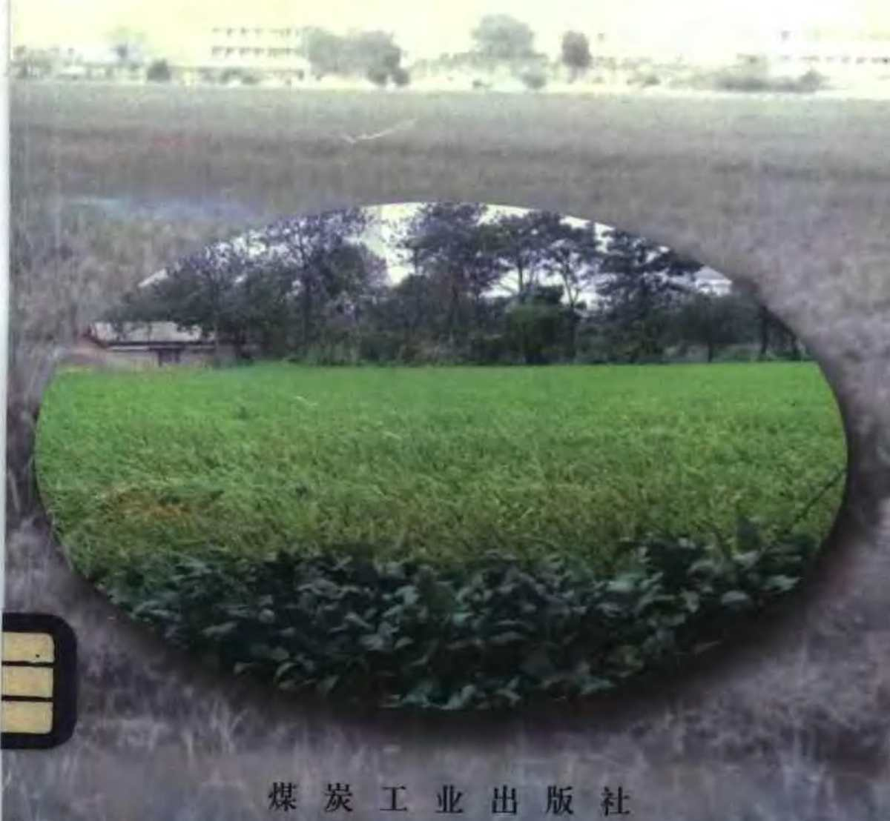

Theory of Land Reclamation Planning in Mine Area and Their Application

# 矿区土地复垦规划的理论与实践

卞正富 翟广忠 著

煤炭工业出版社

图书在版编目(CIP)数据

矿区土地复星规划的理论与实践/卞正富等著.一北京煤炭工业出版社，1996.11

ISBN 7-5020-1399-7

I. 矿… I. 卜… .复土造田-规划-基本知识 N.T D88

中国版本图书馆CIP数据核字(96)第22680号

矿区土地复垦规划的理论与实践

卞正富 翟广忠 著

责任编辑：牟金锁

煤炭工业出版社 出版发行

(北京安定门外和平甲北街21号）

北京房山宏伟印刷厂 印刷

开本 850×1168mm1/2 印张 67/8

字数172千字

印数1-1、300

1996年12月第1版

1996年12月第1次印刷

书号 4168

定价18.00元

## 内容提要

本书结合国内外矿区三地复垦实践，说明了矿区二地复垦规划的作用，针对矿区土地复垦规划的不同类型，提出了规划的程序、内容以及规划报告的编制方法；介绍了复垦区环境特征分析方法、复垦场地论证方法、复垦条件分类方法；对土地复垦决策与复垦工程设计方法作了.较为详细的介绍，包括复垦土地利用方向决策、复垦用地结构优化方法、土地复垦模式决策、规划设计方案选择、矿区最优水面率决策等决策方法，以及复垦土地标高设计、疏排法复垦设计、生态工程复垦设计、基增复垦设计、充填复垦设计、复土方式设计、梯田式复垦工程设计、歼石山复垦整形设计、复垦景观设计等设计方法；提出了矿区土地复垦项目评价指标及综合评价方法、矿区土地复垦费用构成与成本核算方法；介绍了矿区土地复垦可行性论证的内容和方法；结合轭山县实际情况介绍了矿区土地复垦规划设计的实施以及复垦规划方案的投资回收期与净现值率比较法。

本书可供从事环境保护、采矿工程、土地管理、国土整治等专业的工程技术人员与管理人员参考，也可作为相关专业的大学生，研究生教学参考书。

## 序 一

1988年，国务院颁布了《土地复垦规定》，短短几年指导我国上地复垦工作走过了发达国家儿十年甚至上百年所走的路程。矿区土地复垦量大面广，在我国最具代表性。1996年，国家土地管理局提出了“实现耕地总量动态平衡”的战略目标，矿区土地复垦是实现这一战略目标的最有效的措施之一。

《矿区土地复垦规划的理论与实践》一书，较为系统地介绍了矿区土地复垦规划的理论和方法，它借鉴了许多发达国家的做法.是我国矿区土地复垦规划方面的力作，为我国矿区土地复垦工作的规范化管理与技术示范提供了宝贵的经验，对我国矿区土地复垦向纵深发展具有很好的指导意义。该书理论与实际相结合，提供了丰富的研究实例，具有较高的理论水平和实用价值。这些理论在华东高潜水位矿区得到了广泛的应用，取得了显著的经济、社会与生态环境效益。

我相信，这本专著的出版可缩短我国与发达国家在土地复垦规划理论研究方面的差距，并对我国土地复垦工作起到较好的促进作用。

中国土地学会理事长 那玉川国家土地管理局局长

## 序 二

资源、环境与人口问题是困扰全球发展的三大因素。矿产资源的开采为国民经济的发展提供了重要的原材料和能源，同时也占用、破坏了大量农田。为减缓矿业开发与土地保护的矛盾，土地复垦是切实可行的办法。为使我国复垦工作走上规范化、法制化道路，我同意作者对土地复垦规划工作重要性的提法，切实制定并实施土地复垦规划可对我国实施可持续发展战略作出重要贡献。

通览全书，反映了作者在煤矿区土地复垦规划设计方面做了大量深入细致的工作，一些见解是精辟深刻的，提出的方法也是切实可行的。作者参阅了大量的国内外文献，对国内外土地复垦规划理论研究现状综述较为全面。作者能够紧紧抓住学科发展前沿，对一些理论问题进行深入研究，在复垦决策、复垦成本分析、生态工程复垦、复垦条件评价和复垦方案评价等方面都有独到的见解。该书是一部关于矿区土地复垦规划理论与技术方面的专著，它较为系统地介绍了矿区土地复垦规划方法，并结合实例说明了这些方法的应用，有理论，有实践。作者充分利用相关学科的最新研究成果来解决复垦领域中的难题，是可取的。只有这样，才能尽快缩短我国与发达国家在这个研究领域的差距。因此，我非常高兴地看到这部反映我国学者在土地复垦规划方面研究成果的著作问世。

中国工程院院土、教授

神天采

## 前 言

我国《土地复垦规定》颁布后，土地复垦工作取得了可喜的成就。但在规范化、科学化管理方面尚存在一些问题，如不少地方出现复垦工程遭到二次沉陷破坏的现象；还有一些地方复垦工程不配套，解决了排水问题，而没有顾及复垦后土地灌溉问题；有的地方则不顾地理位置和当地水土条件，复垦后土地利用方向安排欠佳，导致复垦效果不好，挫伤了复垦后土地使用者的积极性。诸如此类，都是我国在执行《土地复垦规定》和有关法规文件的过程中值得研究的课题。为此，自1989年以来，中国矿业大学与铜山县土地管理局密切协作，先后完成了《高与低潜水采煤塌陷区土地复垦模式研究——-铜山县土地复垦试验研究》（1990年）、《铜山县土地复垦技术研究》（1991年)、《大黄山煤矿西翼塌陷区土地复垦、综合治理规划设计》（1992年)、《铜山县万亩塌陷地高效复垦示范工程研究》(1994年)等研究课题和规划设计报告。通过几年来的摸索与实践，我们逐步形成了一套较为完整的复垦规划设计方法和规范化管理方法。本书正是我们对过去工作的系统的理论总结。

在我们开展上述课题研究的过程中，我们深刻认识到：我国《土地复垦规定》对制定土地复垦规划所提出的要求是非常正确的，尤其是制定《土地复垦规定》时将“制定规划，有计划、有步骤地进行土地复垦”作为一项重要的原则提出来(杨邦杰，1990年）是非常明智的。但在实践过程中，存在下面一些问题：一是《土地复垦规定》太粗，关于土地复垦规划设计的条文也是这样，在执行过程中随意性太大。二是在制定《土地复垦规定》时，对制定土地复垦规划的重要性认识还不足或不全面，制定土地复垦规划不仅可以节约复垦资金，合理利用土地，还可统筹安排生产，保证对复垦工程的监督管理，使复垦工程管理纳入上地计划管理与市场经营体制中去，从而加快复垦步伐，为实现国民经济发展计划服务，为带动地方经济腾飞服务；制定并实施好上地复垦规划，也是实现我国土地资源可持续利用发展战略的重要措施之。三是我国日前尚没有与实施《土地复垦规定》相配套的技术规程，土地复垦规划也是这样，制定土地复垦规划时应采取什么样的程序和方法，应该综合考虑哪些因素确定土地利用方向，复垦效果如何评价等等都是需要讨论或值得研究的。本书力图在上述问题中寻求一些解决途径，但限于作者水平，不尽满意，作者希望抛砖引玉，引起更多的研究者重视我国土地复垦规划工作并提出更好的方法。

另一方面，我国与国外，尤其是英、美、前苏联、德国、澳大利亚、波兰等复垦工作开展较早也较好的国家相比，土地复垦规划的理论与实践也存在一定的差距。美国内政部土地局设专门的办公室负责制定并向采矿者提供宏观的土地复垦规划、计划和目标、审查采矿者的采矿申请书及复垦规划并监督复垦资金落实。前苏联也有一整套的复垦法规和相应的技术规程或国家标准。在理论研究方面，美国1995年度采矿工程协会主席、宾州大学R.V. Ramani教授早在 70年代末到 80年代初就对美国露天煤矿土地复垦规划问题进行了深入研究，提出了合理的规划程序和评价方法。英国、美国、澳大利亚学者在采矿景观设计与边坡稳定性与抗侵蚀设计方面进行了大量的试验研究工作，提出了许多用于设计的经验公式。前苏联有色金属矿山则建立了“剥离一排土一复垦工程的经济数学模型”，该模型按剥离的发展动态选择排土和复垦工艺，编制生产和复垦工程计划，这项技术使复垦成本降低10%～15%。美、澳等国在计算机辅助矿区土地复垦规划设技方面是领先的，他们建立了许多适用的数学模型，研制了用于土地复垦规划的专门程序，如Scott等人研制的土地复垦规划系统可确定采后复垦土地的利用方向，确定并计算将矿山废弃地复垦成五种主要的土地用途中任何一种所需的复垦技术和费用。Hossner还提出了美国保持土地复垦规划潜在价值的适用草类及草本豆科植物品种。由此看出，土地复垦较先进的国家与其有成熟的土地复垦规划技术作指导是分不开的，土地复垦规划在土地复垦工程占有重要的地位和作用。

本书从复垦程序、复垦条件评价、复垦决策（即总体规划方法)、有关的复垦工程设计方法和复垦规划可行性研究等几方面介绍了复垦规划设计的基本原理、方法，并结合实际介绍了这些原理和方法的应用。作者需要说明的是，本书并没有包含土地复垦规划原理的所有方面，应用实例也主要限于地下开采矿山。

本书许多实例是中国矿业大学与铜山县土地管理局土地复垦联合课题组的共同成果。书中引用了一些单位和个人的文献资料，参阅了中国土地学会土地复垦分会几次会议的交流材料，作者在此对所引文献作者表示衷心的谢意。作者感谢国家土地管理局土地规划利用司和我国土地复垦专家张国良教授的支持和帮助。

作者还要特别感谢中国工程院院士刘天泉教授在百忙之中审阅了本书，并为本书作序，以及中国土地学会理事长、国家土地管理局邹玉川局长对矿区土地复垦工作的重视和为本书作序。

由于我国从事矿区土地复垦规划理论研究工作的人数不多，可参阅的资料有限，加上作者水平有限，书中缺点和错误在所难免，恳请读者批评指正。

作者

1996年10月于徐州

## Summary

This work expounds the role of mined land reclamation planning in the light of mined land reclamation practices at home and abroad. In accordance with the features of different mined land reclamation planning. the process and contents of planning and methods for working out planning report are presented. Methods for analysing environmental features in reclamation area. methods for evaluating reclamation site and methods for classifying reclamation conditions are posed. Principles and methods of mined land reclamation decision and mined land reclamation project design are dealed with in detail, including methods for selecting reclaimed land utilization alternatives, optimizing the structure of reclaimed land use, decision of mined land reclamation pattern, selecting alternatives of planning and design. optimizing the rate of puddle in reclaimed area. elevation design of reclaimed area, design of reclamation project by means of dredging waier in subsidence basin. dike-pond reclamation project design, reclamation project design based on ecological engineering theory, design of reclamotion project by filling subsidence basin with mining wastes. terraced fields design in subsidence basin, design of mining wastes hill reshaping and landscape design in reclamation area. The work also discusses the indexes’ system and comprehensive evaluation methods for evaluating mined land reclamation planning. and probes into the cost composition analysing and accounting of mined land reclamation and introduces the contents and methods for evaluating feasibili-

ty of mined land reclamation. At last. the work introduces the methods for putting mined land reclamation planning and design into practice and the methods for selecting planning alternatives by comparing investment recouping periods and the rates of net present value of different alternatives.

The major readers are expected to be engineers and technicians. administrative personnels engaged in 'environmental protection, mining engineering. land administration or territory realignment. The. work also can be used as reference book for university students and postgraduate students.

## 目 录

第一章 矿区土地复垦规划的基本程序………………  
第一节 矿区土地复垦规划在矿区土地复垦工程中的作用…………  
第节 矿区土地复垦规划的类型和基本程序………………………  
第三节 矿区土地复垦规划设计的内容和要求………………12  
第四节 矿区上地复垦规划设计报告的编制…………………………13  
第二章 复垦条件分析评价方法………………  
第…节 复垦区环境特征分析……………  
第二节 复垦场地论证…………  
第三节 矿区土地复垦条件分类……………… …40  
第四节 复垦区社会经济特征分析…………… 50  
第三章 矿区土地复垦决策方法…………… 53  
第一节概述…………  
第节 复垦上地适宜性评价的基本概念………… …55  
第.三节 复垦土地适宜性评价方法与复垦上地利用方间决策………69  
第四节 复基用地结构优化方法………………………80  
第丘节 矿区上地复垦模式的决策……………………  
第六节 复垦规划设计方案的选择………………………  
第七节 考虑沉陷积水区生态价值的矿区最优水面率的确定……10  
第四章 矿区土地复垦工程设计方法……………………112  
第一节 复垦上地标高的设计与十方工程量计算…………………112  
第二节 疏排法复垦设计的内容和方法…………………………120  
第三节 生态工程复垦设计 …… 128  
第四节 采煤塌陷地基塘复垦工程设让…………………………135  
第五节 充填复星设计… 112  
第六节 梯田式复垦工程设计………… 115  
第七节 研石山复垦整形设计……………………… ……151  
第八节 复垦景观设计… …157  
第五章 矿区土地复垦项目的评价论证与规划设计  
方案的实施……… · 161  
第一节 矿区土地复垦项目经济评价指标体系与  
综合评价方法…… … 161  
第节 矿区土地复垦费用构成与成本核算……… …168  
第三节 矿区土地复垦规划项目的可行性论证……… …176  
第四节 铜山县采煤塌陷地国家级高效农业复垦示范工程  
可行性研究实例……… 177  
第五节 大黄山煤矿西翼塌陷区上地复垦综合治理规划  
设计方案论证…… 188  
第六节 铜山县矿区土地复垦规划的实施…………  
参考文献 … 201

## Contents

Chapter 1 Basic process of land reclamation planning   
in mine areas   
Section 1 The role of mined land reclamation planning in   
land reclamation engineering …   
Section 2 Types and basic process of mined land reclamation   
Section 3 Contents and principles of land reclamation planning   
and design in mine areas 12   
Section 4 Compiling of lanc reclamation planning and   
design report in mine areas 15   
Chapter 2 The methods for evaluating reclamation   
condition ..... 19   
Section 1 The methods for analysing environmental features   
of reclaimed area 19   
Section 2 Evaluation of reclamation site 29   
Section 3 Classification of mined land reclamation conditions ……. 40   
Section 4 Methods for analysing social and economie features   
of reclaimed area 50   
Chapter 3 Decision methods of mined land reclamation ...... 53   
Section 1 Introduction 53   
Section 2 Fundamental conception of reclaimed land suitability   
evaluation 55   
Section 3 Methods for evaluating reclaimed land suitability and   
decision of reclaimed land utilization alternatives ….. 69   
Section 4 Methods for optimizing structure of reclaimed   
land use 80   
Section 5 Decision of mined land reclamation pattern 85   
Section 6 Selection of land reclamation plenning and   
design alternatives ……. 96   
Section 7 Methods for optimizing the rate of puddle in   
reclaimed area 101   
Chapter 4 Design methods of land reclamation project ...... 112   
Section 1 Elevation design of reclaumed land and computation   
of carthwork 112   
Secticn 2 – Cortents and methods of reclamation project design   
by means of dredging wattr in subsidence bastn …… 120   
Seetien 3 – Dike-pond reelamauon project design …128   
Section 1 Reclanation projeot destgn based on ecological   
engieering theory 135   
Section 5 Design cf reelaration project by filling subsidence   
hasin with mining wastes 142   
Section 6 Terraced fields design in subsidence basımn 145   
Seetion 7 Design of mining wastes hil reforming 151   
Section 8 Landscape design in reclamation area 157   
Chapter 5 Evaluation of land reclamation project and   
the measures to put planning and design   
alternatives into practice 16]   
Section 1 Indexes system and comprchensive evaluation methods   
for evaluating land reciamauon projeet … … 161   
Section 2 Cost composition and accounting of land reclamation   
: project in mine areas ……168   
Section 3 Feasibility evaluation of land reclamation planning … 176   
Section 4 Case study on reclamation project for demonstration   
in national level with high agriculturt effectiveness   
in subsided land from coal mining in   
Tongshan county … 177   
Seetion 5 Evaluation of planning and design alternatives on   
land reclamation and conprchensive treatment of   
west flank of Dahuangshan coal mine 188   
Secton 6 Measures to put land reclamation planning and   
design alter natives into practise 194   
References 20l

# 第一章 矿区土地复垦规划的基本程序

第一节 矿区土地复垦规划在矿区土地复垦工程中的作用

## 一、矿区土地复垦工程的概念

自1988年11月中华人民共和国国务院《土地复垦规定》颁布实施以来，矿区土地复垦工作日益为社会各界所重视。部分企事业单位专门成立了负责复垦工作的机构，如国家土地管理局土地规划利用司下设土地开发复垦处，大屯煤电公司地区处下设复垦科。部分科研院所专门成立了土地复垦研究中心（或室)，如长沙黑色矿山设计院土地复垦研究室、中国矿业大学土地复垦研究室、煤炭科学研究总院唐山分院与冶金设计研究总院都设有专门的土地复垦研究室。中国土地学会下设土地复垦分会。

由于社会实践的需要和社会各界的重视，矿区土地复垦工程这一新兴的学科应运而生。关于土地复垦的一般含义，《土地复垦规定》有如下定义：指对生产建设过程中，因挖损、塌陷、压占等造成破坏的土地采取整治措施，使其恢复到可供利用状态的活动1]。我们认为，矿区土地复垦工程是按照土地利用原理，结合矿山开采后土地破坏的特点，对挖损、塌陷、压占的土地采取工程和生物措施，恢复土地的生产力和矿区生态平衡的活动[2]。因此，矿区土地复垦工程的依据是土地利用原理和采矿工程技术原理，具体包括土地经济学、区域规划、土壤学、水利学、环境科学、开采沉陷学、地质学等原理和方法。矿区土地复垦工程分为工程复垦和生物复垦两个阶段。工程复垦是指利用工程机械或人工建立有利于动植物生长或人类生存的地表层，为有关部门利用采矿破坏的土地作前期准备，其工艺措施如堆置耕层表土、充填塌陷坑、修建排水网与道路等；生物复垦则根据复垦区土地利用方向，采取相应的生物措施以达到维持矿山生态平衡的目的，其工艺措施如肥化土壤、优选耕作方式和作物品种等。生物复垦与工程复垦相比具有长期性。矿区土地复垦工程的目标包括两个方面，即恢复土地的生产力和实现矿区生态平衡，两者司等重要。

以徐州矿区潘家庵煤田的复垦为例，采用了疏排法与挖深垫浅相结合的工程复垦措施，在复垦土池土营建了果基鱼塘、牧基鱼塘、大棚蔬菜基地。通过工程措施与生物措施的结合，有效地恢复了开采沉陷地的利用价值，并且明显改善了矿区景观生态环境[3]。

## 二、矿区土地复垦规划及其在矿区土地复垦工程中的作用

简言之，矿区土地复垦规划是指一段时期内，对土地复垦工程的总体安排，具体包括空间、时间、规模与方法等多方面。空间上的规划包括摸清破坏土地资源的分布与特征、确定复垦工程的位置等；时间上的规划是指确定各复垦工程的先后次序，亦称分期实施规划；规模规划即确定复垦工程的面积大小、投资规模等；方法规划包括确定复垦工程措施、复垦后土地利用方向以及复垦土地的经营管理方法等。

矿区土地复垦规划是土地利用总体规划的重要内容，又是土地利用的一个专项规划。对已造成土地破坏而矿山企业又无复垦规划的土地，各级土地管理部门应积极组织企业及其它有关部门制定土地复垦规划并逐步实施。对预计将来要破坏的土地，矿山企业在工程设计中应包括土地复垦规划的内容，且土地复垦规划应经土地管理部门审议，审议通过后方可实施。无论是采前还是采后土地复垦规划都应和土地利用总体规划相协调，并纳入土地利用总体规划中。有矿区土地复垦任务的企业和地方政府，应将复垦指标纳入企业生产目标和土地利用目标中。

由土地管理部门组织编制的矿区土地复垦规划通常以行政区划为依据，分为全国、省、市、县、乡等五级；由企业或行业管理部门组织编制的矿区土地复垦规划通常以矿藏分布为依据，分为区域（多个矿区）、矿区（多个煤田）、煤田（多个矿山）、矿山或某塌陷地块的复垦规划等几级[4]。以行政区划为依据编制的复垦规划，优点在于便于和上地利用总体规划衔接，缺点是缺乏整体性，不利于结合采矿业的特点，因为一个煤田，甚至一个矿井通常跨越多个行政区域。因此，较好的做法是先以矿藏分布为依据制定复垦规划得到总的复垦目标，再将复垦目标分解与各行政区域的土地利用目标协调，得到各行政区域的复垦指标。

矿区土地复垦规划是对矿区土地复垦工程进行有效管理的途径之一，也是矿区土地复垦工程得以科学、合理实施的重要保证。总结国内外矿区土地复垦工程的经验知：一项成功的复垦工程往往都有周密的复垦规划和计划，反之则耗资巨大而复垦效果不佳。德国莱茵褐煤区50年代开始认真制订了着眼于整体社会效益的褐煤开发计划，以复垦为手段，安排工、农、林、牧、渔各业和交通、军事、城镇居民点以及娱乐场所的用地，按现代化要求建设景观。经过几十年的努力，采煤逐渐向北推进，年产褐煤超过1亿t，南部已采区则按规划要求全部复垦。专家们由此得出了“工业原料和动力的需要可以在对环境没有严重破坏和危害的情况下得到满足”的结论[2]。

我国淮北等矿区电厂与煤矿合作，经过合理规划和论证，用煤矿塌陷坑作为电厂贮灰场，一改征地建平原灰场或山谷灰场的做法，减少征地78%，增加库容53.8%，节省灰场建设投资2587万元，塌陷区充灰后复土还田6000余亩，经济效益、社会效益与生态环境效益十分可观。位于徐州矿区的铜山县自B0年代以来，先后组织南京农业大学、中国矿业大学和中国科学院等研究单位与该县土地局、水利局、水产局、农业局等部门对该县采煤沉陷地复垦方案进行规划论证，提出高、中、低潜水位塌陷地不同的治理模式，以点带面开展了疏排法复垦、基塘复垦、生态工程复垦等多种复垦形式；全县制定有复垦总体规划，每个工程有详细设计和论证审批材料，该县复垦率逐年提高，全县采煤沉陷地复垦率高达近50%，还涌现了一批如石头阵生物链复垦工程、常宏复垦开发区等高效复垦典范。而我国华中某矿区对丘陵缓坡采煤塌陷地没有作复垦可行性论证，投入大量资金进行土方工程，复垦一年后复垦土地再次塌陷为高低不平的丘陵地形目地表到处裂缝，水土不保，无法耕种。

矿区土地复垦规划在矿区土地复垦工程中的作用表现在：

(1)合理确定复垦的规模和先后顺序，做到有计划、有步骤地复垦。复垦规模通常根据土地破坏数量与程度及土地利用总体规划对复垦的要求等确定，复垦顺序一般遵循先易后难的原则。

(2)合理确定复垦方法和复垦土地的用途，做到因地制宜，投入产出比最小。复垦方法的选择需综合考察复垦区域的地形条件、水利设施、土方来源、废弃物料排放状况及复垦土地的用途等多因素，复垦土地的用途则通过适宜性评价确定，宜农则农，宜林则林，宜渔则渔，宜建则建。

(3)使复垦工程体现“综合、协调、整体、优化”的思想。即：综合考虑各方面的因素、运用各专业学科的知识进行复垦规划；协调复垦工程中土地利用、生态重建、村庄搬迁、道路水系改造等各项工程的要求及企业与地方、地方各部门之间的关系；保证复垦土地利用的整体性及复垦工程从立项论证、规划设计、实施到监测的整体性；优化复垦方案，保证复垦工程经济、生态环境与社会效益的统一。

## 第二节 矿区土地复垦规划的类型和基本程序

不同类型的矿区土地复垦规划，其编制程序、编制方法与内容深度要求也不一样。

## 一、矿区土地复垦规划的类型[4]

矿区土地复垦规划的分类方法较多。按采矿方法不同，可分为井工开采土地复垦规划和露天开采土地复垦规划。按规划时间分，可分为采前土地复垦规划和采后土地复垦规划。采前规划是指新矿区开发或老矿区改扩建项目上马前就考虑复垦问题而进行的规划，采后规划是指矿区开发已经进行，因以前没有重视复垦问题而现在需要整治所作的规划，这在我国是较普遍的，按规划期的长短可分为长期、中期和近期复垦规划。一般中长期复垦规划的规划期应与国民经济发展规划及矿山企业发展规划的规划期一致，近期复垦规划则应着重在年度计划上。从规划的范围来说，可以是一个矿山或一个矿区、几个矿区甚至全国范围，依此，土地复垦规划可分为人范的总体规划和局部范围的规划设计。依矿山所处的地理位置不同，可分为“城郊-矿区”型和“农村一矿区”型规划，我国“农村一矿区”型规划居多。

## 二、矿区土地复垦规划的基本程序

虽然不同类型的土地复垦规划在规划程序上存在差异，但有许多步骤是共同的，这些共同部分可概括为图1一1所示的基本程序。

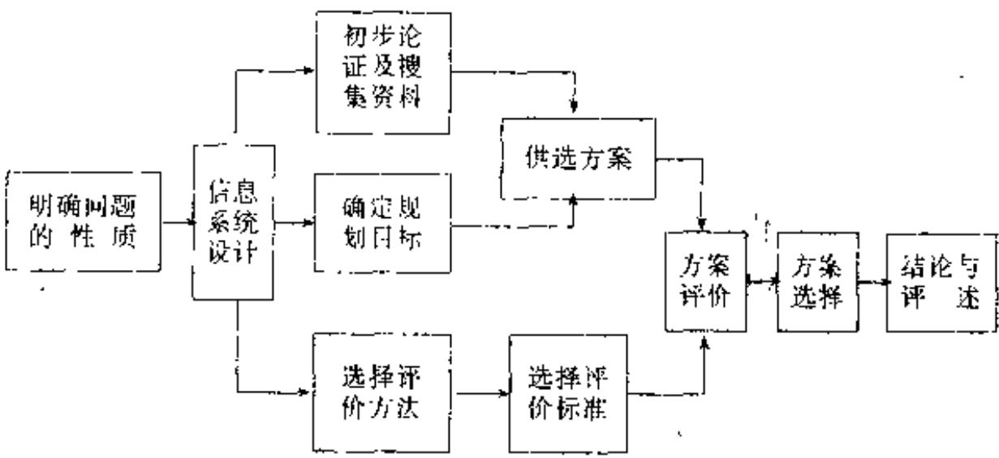  
图1—1 矿区土地复垦规划的基本程序  
Fig. 1—] General flow chart of land reciamiation planning in mine area (Sweigard and Ramani. 1986)

## 1. 明确问题的性质

本阶段对规划类型、规划范围、现划期限、规划的基本要求及规划中应遵循的基本原则或指导思想等问题，应有一明确的认识。

## 2. 信息系统设计.

土地复垦规划涉及大量的基础资料的分析处理，如预测采后地形变化，分析复垦区环境、经济特征，复垦土地适宜性评价等。通常供复垦规划用的基础资料及处理结果具有很高的保存价值，一旦基础资料中某些数据发生变化，我们利用设计的计算机处理系统就可很快得到新的处理结果以修改复垦规划方案。因此，复垦规划中设计合理完整的信息系统，借助计算机强大的存贮、分析、绘图等功能，可很好地保证复垦规划的现势性。

## 3. 确定复垦目标

本阶段具有战略意义，即初步确定复垦土地的利用方向。总的原则是遵循《土地复垦规定》的要求。复垦土地的利用方向与当地土地利用总体规划相协调，若当地无土地利用总体规划，或土地利用总体规划中对复垦土地的利用方向没有作明确规定，这时矿山企业应与当地土地管理部门共同商议，保证复垦土地与邻近区域土地利用相协调，以满足当地居民生活要求、保护自然生态环境为准则，确定复垦土地利用目标。

## 4. 初步论证和资料搜集

本阶段应提供形成土地复垦方案和方案评价所必需的背景资料，如地表水、地下水、覆岩、煤层、土壤、地形、气候、植被、野生动物及土地利用现状等。除此之外，规划人员还需搜集复垦区经济、人口、地理特征信息并对这些信息加以分析。地理特征调查要求得到公共设施分布图、交通运输网及居民区分布图、工农业生产布局图等。本阶段工作量较大，涉及较多的部门，若规划者熟知这些资料属于何部门掌握，将节省较多的时间。表1—1列出了部分资料来源。

## 5. 供选方案的提出

粗线条的复垦方向包括农业用地、林业用地、水产养殖用地、居民区用地、蔬菜基地、商业用地、娱乐用地、工业用地等多方面。将破坏的土地恢复原用途或暂不复垦亦可看作是两个可供选择的方案。而一般的供选复垦方案应指出采用何种工程和生物措施，复垦土地的用途与比例，不同用途土地的空间布局等。

表1-1 规划用基础资料及其来源  
Tab 1—1 Basic information for planning and its source
<table><tr><td>资料名称</td><td>资料来源</td></tr><tr><td>煤层赋存条件、开采现状与规划、水文地</td><td>矿山企业地测科、计划科、生产</td></tr><tr><td>质、覆岩等地质条件 十地利用现状与土地利用总体规划</td><td>科</td></tr><tr><td>水系分布与水文资料、水利规划</td><td>土地管理局 水利局</td></tr><tr><td>人口</td><td>计划生育办公室</td></tr><tr><td>环境污染、保护现状与规划</td><td>环保局</td></tr><tr><td>气候</td><td>象站</td></tr><tr><td>土壤与植被、农业区划</td><td>农业局、《土壤志》</td></tr><tr><td>社会、经济统计指标</td><td>科委、计委计划科</td></tr><tr><td>道路交通规划、居民点规划</td><td>交通局、城建局、规划办</td></tr></table>

## 6. 选择评价方法

方案评价包含三个方面，即经济、环境与社会影响分析。经济分析视评价要求分为土地潜在利用价值的概算和详细的复垦成本分析，复垦成本分析应考虑货币的时间价值。环境与社会影响分析除需说明采用的土地复垦方案对现有问题的解决可能外，还需说明复垦后可能出现的新的环境与社会问题。

## 7. 选择评价标准

评价标准的选择取决于评价方法，它应能综合衡量规划方案在经济、环境与社会三方面的优缺点。经济标准可以用最小的投入获取最大的收益来表示。环境标准要求规划方案满足各种法规和技术标准，且对环境产生最小的负影响。社会标准通常以复垦方案所能解决矿区社会问题的程度来表示，如增加就业人数和农副产品供应状况等，也可用投资收益分析等方法来定量分析。

## 8. 方案评价

利用选定的评价方法和评价标准对每一供选方案进行评价，评价过程如图1-2所示。

方案评价阶段应注意其每一步骤与前述几个步骤都是相互影响的（图1一2的虚线所示)，而方案评价的四个步骤中的每一步

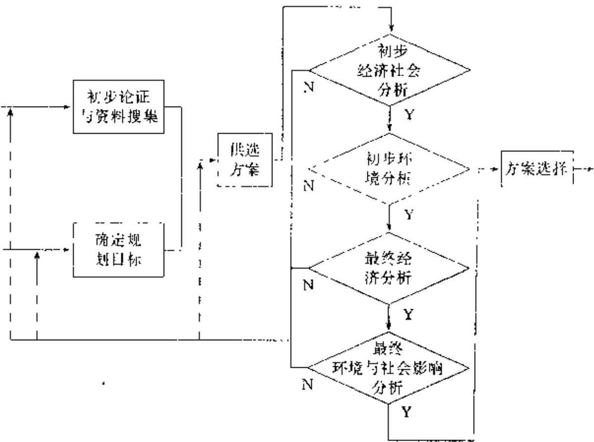  
图 1 -2 复垦方案评价  
Fig. 1-- 2 Process for the evaluation of land reclamation alternatives (Sweigard and Ramani, 1986)

都对供选方案进行了筛选，只有前一步评价结果可行时，才进行下一步的评价。

## 9. 选择方案

根据评价结果推荐可行的复垦规划方案。

## 10. 结论与评述

对选定方案的主要技术经济指标和工艺流程阐述，并对某些因素或条件的改变对复垦规划方案产生的影响进行说明，供土地管理与投资部门决策时参考。

## 三、几种典型复垦规划的编制程序

## 1. 露天矿山采前土地复垦规划编制程序

露天矿山采前土地复垦规划，可以将采矿工艺和复垦工艺很好地结合起来，达到减小复垦成本的目的6，其程序如图1-3所

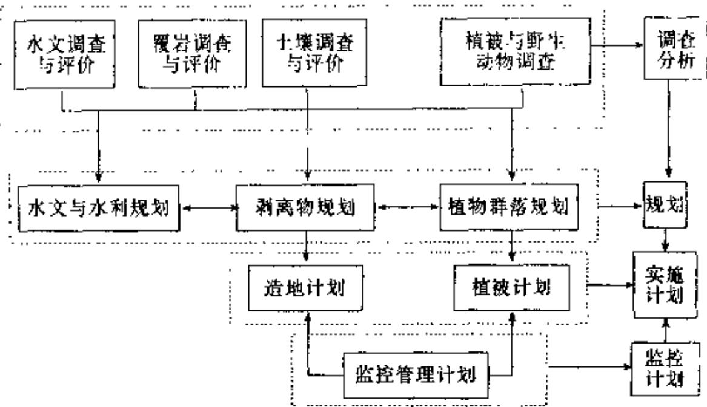  
图1—3 露天矿山采前土地复垦规划程序  
Fig. 1—3 Process for pre- mining land reclanation planning in open mine

示。

露天矿山采前土地复垦规划分为四个步骤，即调查分析，规划、实施计划、监控计划等。调查分析阶段应着重鉴定覆岩的土壤特性、分析可利用物料的数量和质量及不适宜植物生长的酸性与毒性物料的状况。规划阶段主要包括图示三方面的规划，而每一方面的规划内容又是相当丰富的，如剥离规划的内容有剥离方法、堆放场地、表土堆存方法、防止土壤侵蚀方法、防止剥离物污染地表与地下水体的方法、防止有毒元素进入食物链的方法等。三方面的规划之间又是相互依赖、相互补充的，如水文与水利规划和剥离物规划是植被规划的基础，植被规划又要考虑矿区开采后的水文条件和剥离物构成成分。实施计划是将规划付诸实施的措施，它直接影响复垦工程的进度和质量。监控管理计划具有长期性，是复垦管理的重要内容。

## 2. 井工矿山采后土地复垦规划编制程序

我国煤炭开采以井工开采为主，《土地复垦规定》颁布以前，开采沉陷废弃的土地复垦数量极少，因此我国煤矿区井工开采后土地复垦规划的任务较多。井工矿山采后土地复垦规划的程序如图1-4。

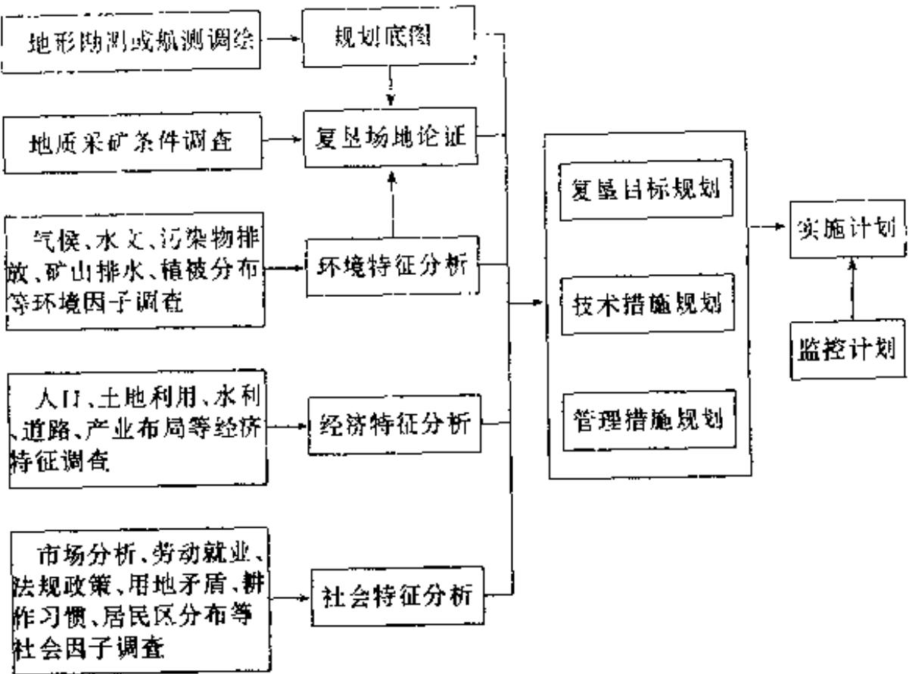  
图1-4 井工矿山采后土地复垦规划程序  
Fig. 1—4 Process for mined land reclamation planning in underground mine area

并工矿山采后土地复垦规划亦由四个步骤组成，对照图1一3和图1一4可看出它与露天矿山采前复垦规划的明显区别。根据我国的实际情况和我们从事土地复垦规划的经验，在做此类规划时，复垦场地论证是非常必要的。场地论证包括采后地貌较采前地貌变化的论证（包括标高、裂隙、坡度、积水等方面）、场地稳定性论证、供排水条件的论证等。

## 3. 井工矿山采前土地复垦规划编制程序

我国《土地复规定》明确要求土地复垦应当与生产建设统一规划，因此井工矿山采前土地复垦规划就成为建设项目设计时的一项重要内容。其规划程序如图1-5所示。

井工矿山采前复垦规划中采前沉陷预计和开采沉陷环境影响评价是非常重要的，不进行这两项工作就无法提出复垦方案。值得注意的是，开采沉陷预计和环境影响评价是在提出开采方案以后进行的，根据预计和评价结果可调整或修改开采方案直至预计和评价结果令人满意为止。而采后复垦规划方案在得到采矿管理部门认可后，尚需经过当地土地管理部门审批，审批通过后方可执行开采方案与土地复垦方案。当采前复垦方案未得到采矿管理部门认可或未经土地管理部门审批时，必须修改土地复垦方案，甚至修改矿山规划与开采工艺设计方案，直至令人满意为止。

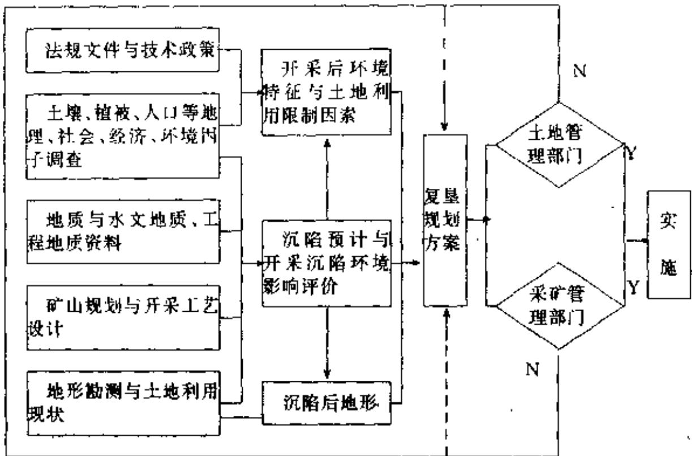  
图 1-5 井工矿山采前土地复垦规划程序  
Fig. 1—5 Process for pre- mining land reclarnation planning in underground mine atea

## 4. 区域（如矿区、县级）土地复垦规划编制程序

前述几种复垦规划是结合矿山部门的开采状况提出来的，与这些规划相比，区域性土地复垦规划是一项综合性规划。如县级土地复垦规划中可能既含露天开采又含井工开采破坏的土地，既有已破坏的，又有正在破坏的或将要破坏的土地。其规划程序简要地概况为图1-6所示的步骤。

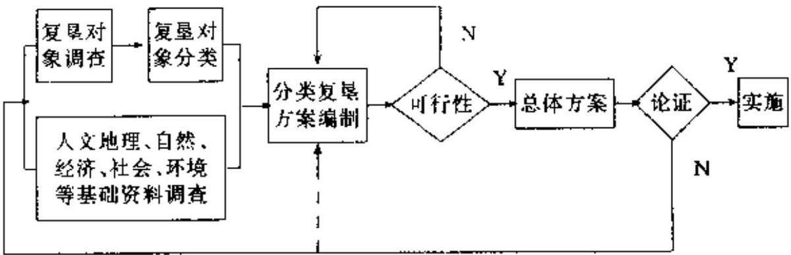  
图1-6 区域土地复垦规划程序(据卞正富，1990)  
Fig. 1—6 Process for regional land reclanation planning

区域土地复垦规划编制中，复垦对象分类与分类复垦方案编制通常工作量较大。分类本身需要做大量深入细致的调查工作，而每一类复垦方案的编制都有特定的程序和要求，可以说是一个相对独立的专题。区域土地复垦规划的总体方案编制也较复杂，往往需要协调多部门，如地方与矿山企业、地方各部门之间的利益，才能得到复垦目标和具体的方案、措施。

## 第三节 矿区土地复垦规划设计的内容和要求

## 一、矿区土地复垦规划设计的内容

一般地说，矿区土地复垦规划所涉及或跨越的时空范围较大，如一个矿区一段时期内复垦工程的安排，属于规划的内容，它具有战略性和控制意义。复垦工程设计则是在规划的基础上，对局部范围的复垦工程或某一复垦工程的具体施工工艺进行设计。虽然矿区土地复垦规划设计的内容随复垦对象不同而有差异，但亦有许多共同的地方，这些共同点如表1—2表示。

## 二、矿区土地复垦规划设计的依据和基本要求

## 1. 编制土地复垦规划设计的依据

(1)国务院颁布的《土地复垦规定》及当地土地复垦法规、政策和实施细则。

（2)有关土地利用的法律、法规，包括《中华入民共和国土地管理法》、《中华人民共和国矿产资源法》、《中华人民共和国环

表1-2 矿区土地复垦规划设计各阶段的内容和目标  
Tab 1—2 Contents and targets of planning and design in different stage
<table><tr><td rowspan=1 colspan=1>阶段</td><td rowspan=1 colspan=1>内              容</td><td rowspan=1 colspan=1>目标</td></tr><tr><td rowspan=1 colspan=1>勘测、调查与分析</td><td rowspan=1 colspan=1>地质采矿条件调查与评价；社会经济现状调查与评价：社会经济发展计划；自然资源调查与评价(包括土地破坏与土地利用现状，土壤条件、水资源、气候条件等)；环境污染现状调查与评价；地形勘测</td><td rowspan=1 colspan=1>明确复垦问题件质，为总体规划提供基础资料</td></tr><tr><td rowspan=1 colspan=1>总体裁划</td><td rowspan=1 colspan=1>结合井下开采范围，确定规划区域范围；说明规划时间；选择上地利用方向和复垦工程措施：制定分类（区）；、分期复垦方案；复垦规划方案的优化论证；投资效益预测；关于影响复垦规划实施的相关问题及解决方法的说明</td><td rowspan=1 colspan=1>和土地利用总体规划一起，为区域士地利用的合理性提供保证；为复垦工程设计提供依据</td></tr><tr><td rowspan=1 colspan=1>复星工程设计</td><td rowspan=1 colspan=1>明确复垦工程设计的对象（位置、范围，面积、特征等)；设计达到总体规划所提出的土地利用方向的工艺流程和工艺措施、机械设备选择、材料消耗、劳动用工等，实施计划安排（包括所需物料来源、资金来源、水源等)；施工起止日期的安排；工程投入与年经营费、年攻益的详细预算</td><td rowspan=1 colspan=1>供施工单位施工</td></tr></table>

境保护法》、《中华人民共和国城市规划法》等国家法律以及地方村镇规划、土地利用总体规划等实施条例。

(3) 有关行业的技术设计规程。

(4)当地国民经济和社会发展规划、计划，以及矿山企业规划和生产计划。 N i

(5) 国民经济统计资料。

(6)矿区地质勘探报告以及补充地质调查报告。

(7) 开采设计或已采区域的开采情况。

(8)土地复垦资源调查资料、图件和统计表。

(9)为编制土地复垦规划而设置的专项研究成果。

## 2.编制矿区土地复垦规划设计应遵循的原则

编制矿区土地复垦规划设计除需遵循有关法规政策外，为使规划设计切实可行，还应遵循下列一些基本原则41：

（1）先作总体规划，再作复垦工程设计或小区规划。

(2) 因地制宜，综合治理。

(3)近期效益与长远效益相结合。

(4）经济效益、生态环境效益与社会效益相结合。

(5)工程复垦规划与生物复垦规划统一考虑。

3. 编制矿区土地复垦规划设计的基本要求[1

## ）《土地复垦规定》对土地复垦规划设计的要求

(1)土地复垦规划应当与土地利用总体规划相协调。各有关行应管理部门在制定土地复垦规划时，应当根据经济合理的原则和自然条件以及土地破坏状态，确定复垦后的土地用途。在城市规划区内，复垦后的土地利用应当符合城市规划。

(2)土地复垦应当与生产建设统一规划。有土地复垦任务的企业应当把土地复垦指标纳入生产建设计划；建设项目可行性报告和设计任务书中应当包括土地复垦的内容；设计文件应当有土地复垦的章节，明确其复垦任务；工艺设计应当兼顾土地复垦的要求；可能时，地质勘探阶段就对土地资源及与土地复垦有关的其它资源进行详细调查。

(3)土地复垦规划应当考虑充分利用邻近的废弃物充填挖损区、塌陷区和地下采空区。利用废弃物作为土地复垦充填物，应当防止造成新的污染。

## 2) 复垦目标对土地复垦规划设计的要求

前已述及，矿区土地复垦工程的目标是恢复破坏土地的生产力和矿区生态系统的平衡。而土地是土壤、水、植物和动物群落等的综合体，这一概念已被广泛接受，因此，复垦不仅是地表的恢复或植被的恢复，而应是组成土地综合体的每一单元的恢复或重建。这就要求复垦规划应考虑多种因素进行综合规划，才能达到复垦工程的最终目标。正如美国国家科学研究委员会所论述的那样[6]：一种合适的复垦目标必须保证社会不会失去重要的土地利用机会，这种目标不一定要求严格复原采前土地特征和景观，而只是要求建立地质和水文条件稳定的、能保证生态系统自然结构的地形，这种地形能为将来的土地利用提供多种方案。

总之，无论哪种复垦形式，其主要目标应是重建永久稳定的景观地形，这种地形在美学上和环境上能与未被破坏的土地相协调，对其所在的更大范围的生态系统作出最大贡献，从而最有效地促进其所在的生态系统的稳定和土地生产能力的提高。

## 第四节 矿区土地复垦规划设计报告的编制

不同类型的矿区土地复垦规划设计，其报告编制的内容和要求也不同。

## 一、矿山企业设计时土地复垦规划报告的编制

从科学合理性角度来说，应当将土地复垦看成矿山企业生产建设的一个重要环节。具体地说，在矿山地质勘探、设计、建设直至报废诸阶段都应考虑土地复垦问题（如图1—7所示）。

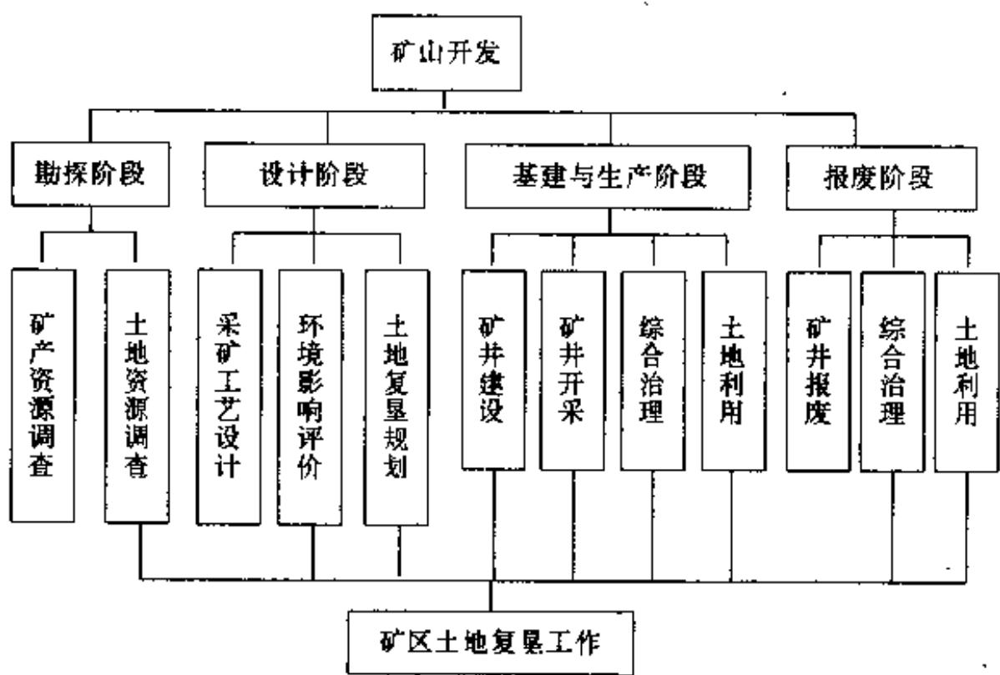  
图 1-7 矿山开发各阶段的土地复垦工作  
(据卞正富和林家聪，1992年)  
Fig. 1—7 Land reclamation in all the stages of mine development

因此，矿山设计阶段的土地复垦规划是根据地质勘探成果、建设项目的可行性研究报告和设计任务书、设计文件、工艺设计中对土地复垦的要求和生产建设过程中可能造成的土地破坏情况以

及经济合理性原则编制的。

矿山企业设计时土地复垦规划报告的内容与企业性质、开采矿产资源类型、开采方式，以及企业所处的地理位置等因素有关，治金工业部在《黑色冶金矿山企业初步设计的内容深度及编写规定》中，对上地复垦专门作了规定8。煤炭科学研究总院唐山分院曾受国家土地局委托起草过《煤矿（井工开采）土地复垦规划设计编制深度的规定》（征求意见稿）。根据上述规定和我国目前复垦规划报告编制现状，矿山企业设计时土地复垦规划报告一般应包括如下内容：

（1）前言。包括任务来源和编制依据，如委托书、合同书、国家有关法规、土地利用总体规划对土地复垦的要求、城市建设规划和环境规划的要求等：规划期限；规划范围；复垦承担单位和分工协作关系；需要说明的其它问题等。

(2)社会环境与自然环境概况。包括地理、交通、地形、区域经济、人文社会环境、土地利用现状。土壤类型与分布、气候特征、地表水系、农田水利系统、植被类型与分布、自然景观、历史文化遗迹及生态环境类型等。

(3)地质与矿床埋藏条件。地层、构造、水文条件等；煤层数、厚度、间距、埋深、倾角、分布状况、倾角等要素、成煤年代、煤质等。

(4)煤层开采计划与上地破坏预测。开采计划包括近期、中期及远期开采计划，为减少地面破坏（包括村庄、道路、河流、管线、耕地等）而采取的井下开采工艺计划，露天矿山为少占农用、剥离并保护耕殖土等而采取的开采工艺措施等；土地破坏预测需要选择预测模型和参数预测农田破坏数量、范围、程度以及地面附属设施的破坏程度、土壤产生盐渍化的可能性等多方而。

(5)土地复垦规划设计。规划设计的内容包括复垦目标规划；工艺措施与复垦方向的规划；矿山废弃物处理利用的可能性；利用采掘设备的可能性；复垦工程实施计划等。

(6)复垦效益与技术经济指标。复垦效益从社会、经济、生态环境三方面论述。主要技术经济指标包括工程量、投资与人员定员、年经营费用、年效益、复垦率等。

(7)附图。附图包括矿区交通位置图（1：1万\~1：5万）；地形图（1：2000\~1：1万）；开采计划与复垦规划图（1：2000～1：1万）；塌陷预测图（1：2000～1：1万）；地质剖面图；复垦进度实施计划图表等。

目前，我国对矿山设计时的复垦规划工作虽有原则性要求，但  
实际工作中还很不规范。随着人们环境意识的加强和有关法规贯  
彻的深人，采前复垦规划必将形成一种制度，得到各部门及地方  
政府的重视。一般情况下，设计阶段的复垦规划工作由矿山企业  
委托设计部门制定。A

## 二、矿山废弃地复垦规划报告的编制

我国《土地复垦规定》所指复垦对象为生产建设过程中因挖损、塌陷、压占等造成破坏的土地，通常即指废弃地。与欧洲“DerelictLand”一词基本同义，即工业或其它开发活动中破坏的，若不加治理就不能利用的土地[4]。据统计，1949\~1989年间，全国因各种原因造成的废弃地在200万ha以上，其中因采煤造成废弃的土地约50万ha。面据有关文献介绍，欧洲共同体成员国总计具有这样的废弃地约20万ha(其中煤炭和钢铁工业造成的废弃地为4万ha)。可见我国废弃地复垦的任务是很大的。

矿山废弃地复垦规划报告涉及的内容与规划的目的、土地破坏的原因、复垦对象、范围、现有技术水平、经济实力等因素有关。一般应包括下述内容：

(1)前言。任务来源和设计依据；规划设计的目的和指导思想；规划范围和面积；基本要求；其它要说明的问题。

(2)总论。土地利用现状及其周围的环境特征，如地物地貌、植被分布、气候特征、居民区分布、土壤类型与分布等；矿床开采方法及开采历史、开采计划；矿山企业的经营状况与用地需求；复垦的有利条件与不利条件分析；复垦区域与邻近区域的关系等。

(3)废弃地复垦的可行性分析。可行性分析从技术可行、经济合理、实践可能三个方面入手。具体包括以下内容：场地稳定性论证；成片复垦的可能性；已塌陷土地与将要破坏的土地综合考虑的可能性；复垦的难易程度评价；复垦利用的适宜性评价；与区域环境治理协调一致的可行性；总投入、总产出、单位投入的效益等经济指标分析；复垦工程实施的组织管理；复垦的资金来源；复垦后产生的社会、生态环境效益等。

(4)复垦工程规划设计。规划设计的内容包括复垦目标；复垦工艺措施设计；辅助复垦工程的设计，如道路、排水系统、灌溉系统等工程；专门问题设计及关键工艺流程，如表土堆放与回填、种植计划、田间试验等，

(5)分期实施规划。分期实施规划主要考虑以下因素：资金的分期投入量、复垦工程的难易程度、复垦项目收益的大小、复垦工程本身对时节的要求等。分期规划内容包括工程衔接表、各工程工期、用工量、投入量等。

(6)复垦工程概预算与复垦资金来源、偿还计划等。

(7)复垦计划的实施步骤和措施计划。

(8) 规划图表。

## 第二章 复垦条件分析评价方法

复垦规划的合理性很大程度上取决于复垦条件的评价结果。这就要求制定复垦规划前进行大量的调查、勘测，以掌握翔实的资料，并对资料进行恰当的分析评价，得出客观的结论，指导土地复垦规划方案的制定。通常这些分析评价工作包括复垦区环境特征分析、复垦区社会经济特征分析、复垦场地论证、复垦有利条件和制约因素的分析与复垦条件分类等。

## 第一节 复垦区环境特征分析

某种意义上说，矿区土地复垦既是破坏土地的再利用问题，又是矿区环境治理的重要任务。因此要求矿区土地复垦活动能从矿区环境特征出发，尽量消除矿产资源开发带来的环境破坏问题。

## 一、矿产资源开发带来的环境破坏

矿产资源开采方法分为露天开采和并下开采。两类开采方法造成的环境破坏特征有明显的区别。煤炭资源开发利用带来的环境问题又具有特殊性，下面分述之。

## 1. 矿产资源露天开采造成的环境破坏

露天开采对环境的影响表现在以下五个方面10（图2一1）：

(1)岩石圈：引起地形变化，采场为太坑、排土场则使地表抬高；地形变化导致光照度等气候条件变化；岩石剥离导致地层层位变化；地下含水层破坏等。

(2)大气层：地形变化、绿色植被破坏、光照变化、粉尘污染等均引起矿区局部气候改变：空气清洁度，能见度均变差。

(3) 水系：露天开采对地表承体和地下含水层均存在破坏作用。具体表现在矿区附近地表水体的污染、地表水体与水利设施的破坏、地表径流的变化、地下含水层的破坏等。

(4)表土层：露天矿采场和外排土场周围的土壤由于采矿扰动、疏干、湿度变化、被水淹没、岩石混入、酸生水排放、空气污染等而使土地质量下降；矿区建（构）筑物占用上地，同时也使原表土环境发生改变。

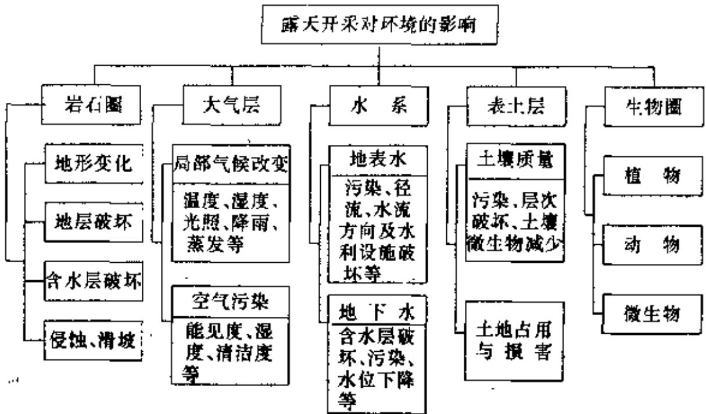  
图 2—] 露天开采对环境的影响(仿史蒂斯，1991)  
Fig. 2–1 Impact of open miníng on environment

(5)生物圈：生物圈的破坏发生在动物、植物和微生物三个方面。最引人注目的是矿区动植物种类的减少，而土壤及水体中微生物的减小、有毒有害元素进入食物链、粉尘及有害气体威胁人类身体健康、动植物生长的退化也是露天开采造成的严重破坏形式。

## 2. 矿产资源井工开采造成的环境碱坏

并工开采造成的环境破坏表现在以下几个方面（图2—2）：

(1)景观破坏：景观破坏的形式有工业广场井架高耸、管线密布；排矸场（矸石山、矸石堆）无观赏价值且污染大气、土壤和水体环境；地表下沉引起地表积水或地貌改变；建筑物倒塌、裂缝；地表污水横流、河水倒灌等。

(2)土地破坏：地表积水或潜水出露地表引起土地沼泽化、土壤盐渍化；地表裂缝不保水土；地形起伏影响耕作等等；土壤污染使土地质量下降；矿山工业设施与矸石排放占用土地。

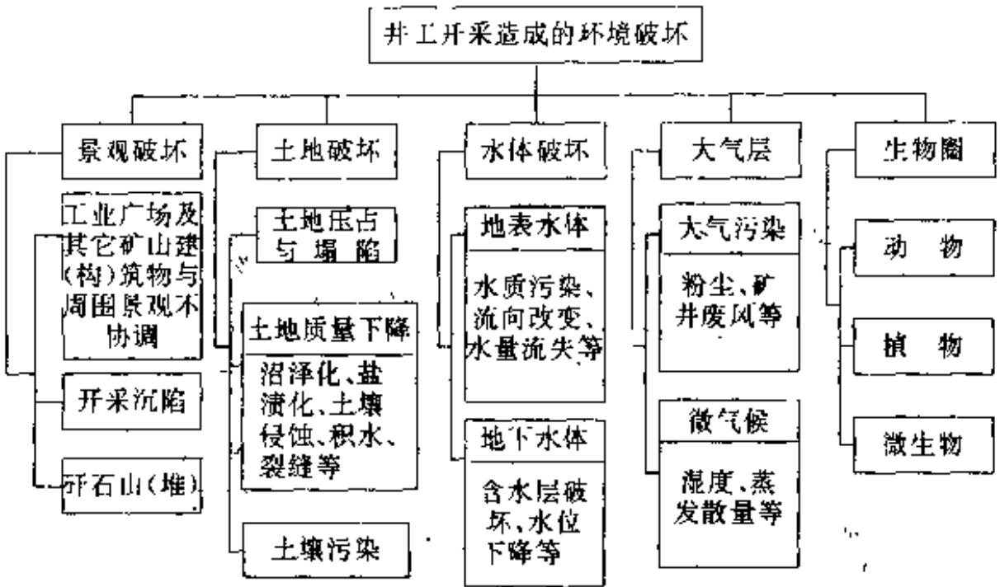  
图 2-2 井工开采造成的环境破坏  
Fig. 2 —2 Impect of underground mining on environment

(3)水体破坏：地表水体与水利设施破坏引起水流方向改变；矿井水排放、矸石淋溶等污染地表水体；地下水位下降，甚至使地下含水层互相勾通威胁井下安全生产。

(4)大气层：空气湿度、光照、太阳辐射、蒸发散量等局部气候特征发生改变；粉尘、燃煤污染及矿井废风排放污染大气环境使空气能见度、清洁度发生变化。

(5)生物圈：动物、植物和微生物的生存环境遭到破坏，使生物量下降、生物种类减少。

## 3. 煤炭开采利用造成的环境破坏

煤炭开采方法亦分为露天开采和井工开采。国外露天开采所占比重较大，而我国煤炭产量的95%以上为井工开采所获得。煤炭采出地而通常需经洗选才能被利用。与煤炭开采、洗选及利用有关的环境问题如图2—3所示[111。

煤炭工业对环境的影响主要有矿区废水污染、大气污染、占用并破坏土地、噪声污染和矿石堆（山）危害环境等几种形式。煤矿区废水污染源有矿井水排放、机修厂、火药厂、焦化厂、洗煤厂、煤堆、矸石山（堆）等，其主要污染物为固体悬浮物、油类、酚和氰化物、重金属、有机物等：煤矿大气污染的主要污染源有烟囱、出风井、研石山（堆）、煤堆及运输过程中的污染等，污染物有粉尘、CO、NO、SO等；煤矿噪声污染源有采掘机械、绞车房、风机、火泵房、运输设备等，其主要危害是影响听觉，影响安全生产和劳动效率；矸石山（堆）对环境的影响形式有占地、粉尘污染、自燃污染大气、淋溶污染水土环境、有滑坡危险等；煤矿占用或破坏土地的形式有建设用地、开采沉陷或挖损土地、研石排放占地、迁村用地等。

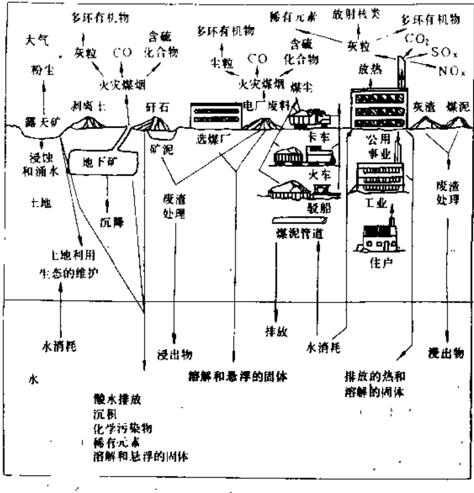  
图 2-3 煤炭开采利用对环境的影响  
Fig. 2—3 Evironmental disturbances from coaļ-related activities (R. V. Ramani, 1984) 7

## 二、复垦区环境资源与污染源调查[69.12]

复垦区环境资源与污染源调查的目的在于了解矿区环境的自净能力，掌握污染源分布规律和影响程度，从而在制定复垦方案时提出有效的治理对策。

## 1. 环境背景调查

环境背景调查的内容包括气象、水文、环境地质、土壤、生物、人文环境诸方面。气象调查包括风速、风向、降雨强度及分布、日照等资料；水文调查包括水体类型与分布、流量、流速、水位、水深、水质等；环境地质调查包括矿区有用矿物种类、岩体稳定性、岩层与地表移动观测成果、土地破坏类型等；土壤调查包括土壤的理化持性（如有机质含量、含水量、土壤质地、土力学特性等)、矿物组成、微生物特性等；生物调查包括植被种类、适种性、分布与习性等；人文环境调查包括人口及其构成、居民点分布、耕作习惯、产业结构、生产力水平等。

环境背景调查的成果是各种图件和环境背景数据。

## 2. 污染源调查

污染源调查包括工业污染源、生活污染源及交通运输污染源等的调查。工业污染源主要调查企业生产能力、工艺条件、经济效益、污染物排放与治理状况、污染物危害情况、企业生产与污染治理规划等；生活污染源主要调查居住环境、用水排放情况、民用燃料构成、生活垃圾及其处理情况、公共设施条件等；交通污染源主要调查道路网络分布、交通流量等。

污染源调查的成果可以按水体、大气、噪声及土壤污染现状及趋势对污染源进行汇总，制成图纸和表格。

## 3. 土地污染调查与取样方法

废弃物与矿井水排放，尤其是用矿山废弃物充填复垦，如煤研石与粉煤灰充填塌陷区及研石堆与排土场周围很容易引起土壤与地下水污染，从而直接或间接地对人类和环境造成危害。

为掌握土地污染规律，需要进行取样调查。常用的取样方法有经验法、系统法和随机法。经验法只对局部可能引起污染的区域进行取样，所以在对污染物分布规律有初步了解的情况下可采用此法。经验法取样点少，不能反映整个区域的污染状况。图2一4为五种典型的系统法取样点布置形式。

值得注意的是，当污染物分布规律很特殊，如呈图2一4a、c、$\pmb { d }$ 分布时，规则格网式、单一样条式和正交样条式取样就不适用了。但图2一4a、c、d三种方法的优点是便于取样定位，它们适用于污染物分布较均匀的条件下。而鱼脊式和辐射样条式可以反映污染物不均匀分布规律。随机法取样的做法是先在一张表上抽取随机数，然后将其与拟取样地区内的点联系起来，比如可在调查地区任选一坐标原点建立坐标系，然后按取样点的（x，y）坐标标出随机数，重复这种随机描点过程，直至所有取样点的位置都确定为止。图2-5a即为最简单的随机取样形式，其取样点随机地分布于整个调查区域，这种方法的缺点是由于取样的随机性，可能使污染物富集地段无取样点，这样取样结果就不能反映真实情况，因此要求样本容量应足够大。图2—56为分层随机取样形式，其实质是一种半随机取样方法，该方法是将调查区域首先划分成规则网格，然后在每个网格内随机确定一个取样点，这种方法克服了图2一5a方法的不足。 、也 i

取样样点数取决于取样目的（概查还是详查六取样方法、污染物分布规律等多种因素。鱼脊式取样法样点数可按下式确定：

$$
N _ { _ { \cdot } } { = } \frac { k A } { a }
$$

$$
( 2 ^ { ' } - \frac { 1 } { 1 } )
$$

式中 N—样点数；

A——调查区域总面积；

a——污染物富集区面积；

k——污染物分布形状系数，圆形k=1.08，羽毛状 $k =$ 1.25，椭圆形 $k = 1 . 8 0$

按式（2—1）确定的取样点数可保证有95%的概率测出污染物富集区。很显然，为利用式（2-1）确定取样点数，必须初步了解污染物富集区的形式和大致面积。荷兰勘测标准草案(DutchDraft Standard for Exploratory Surveys)中建议，系统法取样若对污染情况一无所知，样点数N按式（2一2）计算；若对污染情况有初步了解且污染物分布是均匀的，样点数按式（2一3）确定。

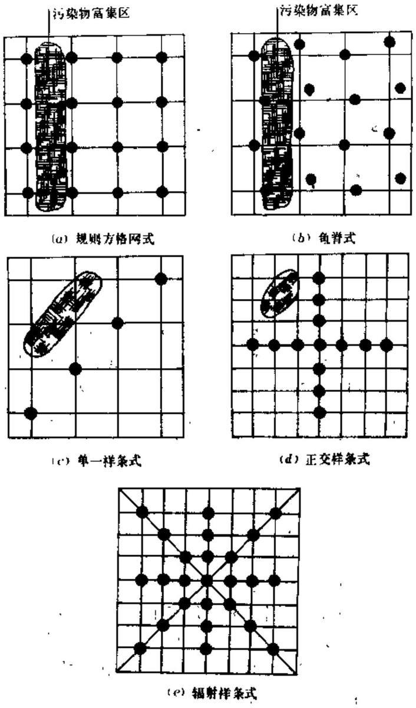  
图 2-4 系统法取样点布置形式  
Fig. 2—4 Sampling patterns of systematic methods for contaminated land (Richards, 1993 and Hossner, 1988)

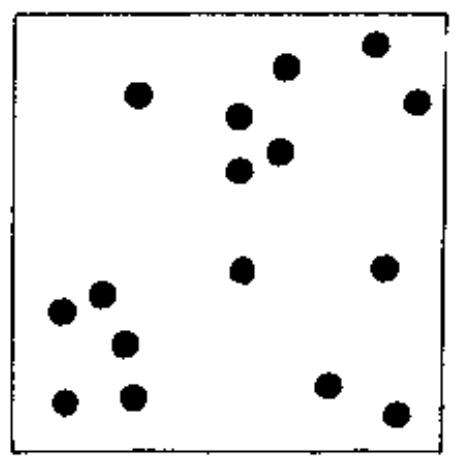  
a滴币想优求样形式

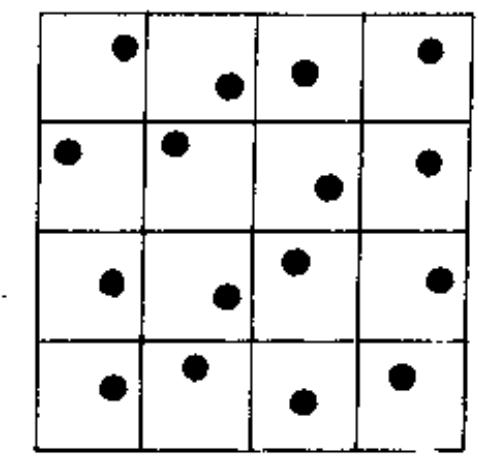  
1分机收扩非式  
图 2-5 随机取样法  
Fig. 2—5 Random sampling methods (Hossner, 1988)

$$
N = 1 0 + 1 0 A\tag{2−2}
$$

$$
N = 5 + A\tag{2-3}
$$

式中 A——-调查区域总面积，ha。

为掌握污染物富集随深度的变化规律，对取样深度有一定的要求。英国开发标准草案British Standard Draft forDevelopment）建议，每个取样点取三个不同深度的样品，个样品为表土，个为所关心的最大深度，另一个则为介于前两者之间的随机深度。荷兰勘测标准草案建议，在污染情况一无所知的情况下，不同深度（d）的取样数为：

$$
N = \left\{ \begin{array} { l l } { 1 0 + 1 0 A \quad } & { d = 0 . 5 \mathrm { m } } \\ { 3 + 3 A \quad } & { d = 0 . 5 \sim 2 . 0 \mathrm { m } } \\ { 1 + 1 A \quad } & { \mathrm { ~ i f ~ } \sharp \nearrow \mathrm { M } \{ \sf X \} \Zparrow \ H \ne \dag . } \end{array} \right.\tag{2−4}
$$

若对污染情况有所了解，这时可选取受污染土层及其邻近土层进

行取样。

## 三、复垦区环境与农业资源特征分析

## 1. 污染源与污染物的分析

由于矿区附属企业多、人口密集，往往存在多个污染源和多种污染物，在提出治理方案前，有必要确定主要污染源和主要污染物。确定方法可采用等标污染负荷法。

等标污染负荷的定义为：

$$
\phi _ { \varkappa } = \frac { C _ { \varkappa } } { | \mathcal { C } _ { \varkappa } | } \times Q , \times 1 0 ^ { \circ }\tag{2-5}
$$

式中 ${ \big . } { \big . } { \big . } { \big . } _ { { \big . } }$ —j污染源中i污染物的等标污染负荷；

$C _ { \mu }$ ——j污染源中i污染物浓度，mg/L;

$C _ { o i }$ ——i污染物评价标准，mg/L；

$\mathsf { Q } ,$ -—j污染源排放的废气或废水量，t/日。

设有m个污染源，j污染源中有 $\pmb { n } _ { j } .$ 种污染物，则i污染物的等标污染负荷 $( _ { \pmb { \mathscr { P } } } , )$ 和j污染源的等标污染负荷 $\langle { \pmb \phi } _ { j } \rangle$ 分别为：

$$
\pmb { \hat { p } _ { \check { \check { \check { \tau } } } } } = \sum _ { j \neq 1 } ^ { m } \pmb { \hat { p } _ { \check { \check { \tau } } } }\tag{2-6}
$$

$$
{ \mathbf { \varDelta } } _ { j } = \sum _ { 1 = 1 } ^ { n _ { j } } { \mathbf { \varDelta } } _ { j i }\tag{2-7}
$$

而整个评价区域的等标污染总负荷（P）为：

$$
P = \sum \limits _ { j = 1 } ^ { \infty } \vec { p } ,\tag{2-8}
$$

某污染物、某污染源的等标污染负荷与该区域总污染负荷之比称为等标污染负荷比K，即：

$$
K _ { i } \cong \phi _ { i } / P _ { \cdot } . .\tag{2-9}
$$

$$
K _ { \it _ { 3 } } = \phi _ { \it _ { 3 } } / P\tag{2 - 10}
$$

按 $K _ { j }$ 1 $\pmb { K } _ { i }$ 值的大小，很容易确定主要污染源和主要污染物。

## 2. 气候生产潜力分析

光、热、水是农业生产中的三个主要气候因子。光能的利用取决于太阳总辐射、光合有效辐射与太阳能利用率热量因子可用一些基本温度指标表示，如农作物生长过程中要求的最低温度、最适温度和最高温度、标志某些重要物候现象或农事活动开始与终止的界限温度、农作物完成整个发育过程所要求的积温等，作物温度生产潜力很大程度上取决于活动积温保证率及作物生长过程中的最高温度与最低温度；水分指标可用空气湿度、土壤水分、降雨量及其保证率等指标表示。

综合考虑光、热、水三个主要气候因子，作物气候生产潜力可用下式佔算[13]：

$$
y ( Q , T , P ) = 0 . 8 f _ { 1 } ( Q ) f _ { 2 } ( T ) f _ { 3 } ( P )\tag{2-11}
$$

式中 $_ { y ( Q , T , P ) }$ 气候生产力 $, \Im / \hbar a$

Q——太阳年总辐射， $\widetilde { \mathbf { J } } / \widetilde { \mathbf { c } } \mathbf { m } ^ { 2 }$ 年；

$T .$ ——温度；℃；

P——降水,mm；

$$
{ \vdots } \ \vdots
$$

$f _ { 1 } ( Q )$ ·光合潜力， $f _ { 1 } ( Q ) = 0 . 1 5 7 Q$

$f _ { z } ( T )$ —温度订正系数， $f _ { 2 } ( T ) = ( : 1 - \frac { Q ^ { \prime } } { Q } ) \times$ $\Big \{ \sum _ { i = 1 } ^ { \bullet } \frac { T _ { i d } } { 3 0 n } \Big \}$ ,Q为 $T \leqslant 0 \mathrm { C }$ 期间的太阳年总辐射 $, T _ { i d } = T _ { M } - \frac { 1 } { 4 } ( T _ { M } - T _ { m } ) , T _ { i d }$ 为白天的平均温度 $\mathbf { \nabla } _ { \mathbf { \mu } } T _ { \mathbf { \mu } \mathbf { \mu } }$ 为日最高 $\sum \limits _ { i = 1 } ^ { \infty }$ 温， $x _ { \ast }$ 为日最低气温 $\pmb { \nu } ^ { \pmb { \pi } }$ 为 $\overline { { T } } > 0 \mathrm { C }$ 的月数；

$f _ { 3 } ( P )$ 水分订正系数， $f _ { 3 } ( P ) = P / E _ { \boldsymbol { \mathrm { 0 } } } , E _ { \boldsymbol { \mathrm { 0 } } }$ 为蒸发量(mm),当 $\pmb { \mathcal { P } } \geqslant E _ { 0 }$ 时， ${ f _ { 3 } ( P ) = 1 }$ ，否则，$f _ { 3 } ( P ) = P / E _ { \mathrm { 0 } } { \mathrm { ; } }$

0.8气候年际变化、灾害引起的修正系数。

## 3. 降雨特征分析[14]

反映降雨规律的指标通常有年平均降雨量、最大1日（或3日、7日等）降雨量、逐月降雨分布、连续降雨天数等。

据一系列年降雨观测资料可推求一定重现期的年降雨量。设逐年年均降雨量为 $\pmb { x } _ { i }$ ，共观测了n年，则：

$$
x = \frac { 1 } { n } \sum _ { i = 1 } ^ { n } x _ { i }\tag{2-12}
$$

$$
C _ { \mathbf { r } } = { \sqrt { \frac { \displaystyle \sum _ { i = 1 } ^ { n } \left\{ { \frac { x _ { i } } { x } } - 1 \right\} ^ { 2 } } { x } } }\tag{2-13}
$$

$$
C _ { s } = \frac { \displaystyle \sum _ { \imath = \mathrm { \uparrow } } ^ { \mathrm { \uparrow \dagger } } \left( \frac { x _ { \imath } } { x } - 1 \right) ^ { \mathrm { \downarrow } } } { ( n - \mathrm { \large ~ 3 } ) C _ { \mathrm { \uparrow } } ^ { \mathrm { 3 } } }\tag{2-14}
$$

式中 x--—n 年降雨量平均值；

$C _ { \tau } ,$ ——变差系数；

$c ,$ -——偏态系数。

于是，一定重现期P%的年降的雨量R为：

$$
R = \mathbb { K } _ { \rho } x\tag{2-15}
$$

式中 $K _ { p }$ 为模比系数，可由 $C _ { \tau }$ 、C.与P%三参数在皮尔逊型曲线的 $K _ { \rho }$ 表中查得。其它一些降雨指标和水文参数也可用类似的方法分析。

除上述调查数据汇总与环境特征分析外；可参阅复垦区内有关建设项目的环境影响评价报告，从而对复垦区内的环境特征有一全面的了解。

## 第二节 复垦场地论证

复垦场地论证是复垦条件分析评价的重要内容，它直接为复垦方案的提出服务。论证内容包括场地稳定性论证；复垦区内道路、水利设施的可利用程度；复垦区的地貌特征；复垦区内居民点分布等等。

## 一、复垦场地论证的理论基础15.16]

对井工矿山复垦来说，论证的主要依据是开采沉陷理论；对露天矿山复垦来说，其理论基础是基于岩石力学的边坡稳定性理论。

## 1. 地表移动变形的连续性

对井工开采来说，随采深、采厚、采煤方法及矿层产状等因素的不同，地表移动和破坏的形式不完全相同。在采深和采厚之比（简称深厚比I1/m）较大的情况下，地表移动和变形在空间和时间上是连续的、渐变的；当深厚比较小（一般 $I I / m \leqslant 3 0 { } )$ 时，地表移动和变形具有不连续性。常见的地表移动变形的形式如图2—6所示。

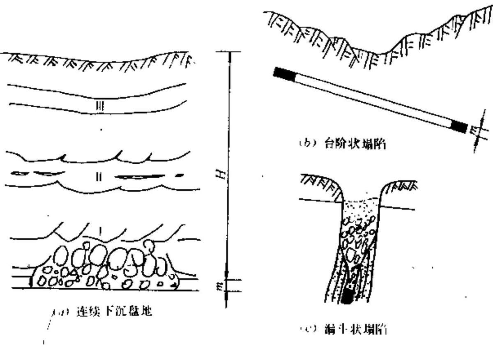  
图2—6 地表移动变形的基本形式（何国清，1991）  
Fig. 2—6 Threę types of surface movement and deformation  
I—冒落带：【—裂缝带；一弯曲带；H—采深；m一采厚

## 2. 地表移动变形的充分程度

当地下采空面积达一定范围后，采空区再继续扩大时，地表的影响范围相应扩大，但地表下沉值不再增加，地表移动盆地出现平底，此时的采动称为充分采动，地表下沉达到充分下沉。通常在采空区的长度和宽度均达到或超过 $1 . 2 { \sim } 1 . 4 H _ { 0 }$ 时，地表可达到充分采动，H。为平均开采深度。图2—7为充分采动的情况。 $H _ { \mathfrak { o } }$ 图2—8为非充分采动的两种形式。

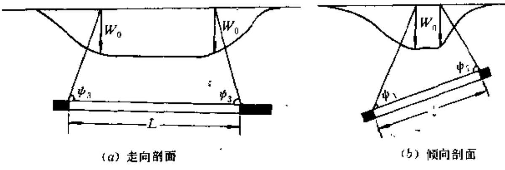  
图 2-7 充分采动示意图  
Fig. 2—7 Sketch map showmg full movement of mined surface  
$\mathcal { W } _ { \mathfrak { d } }$ 一最人下沉值， $W _ { \downarrow } = q r \imath { \cos } \alpha _ { \uparrow } q$ 为下沉系数，m为采厚，a为倾角 $1 \phi _ { 1 }$ 一下山充分采动角 $\dot { \psi } _ { z ^ { - } }$ 上山充分采动角；一走向充分采动角；L一采空区走向长；采空区倾向长

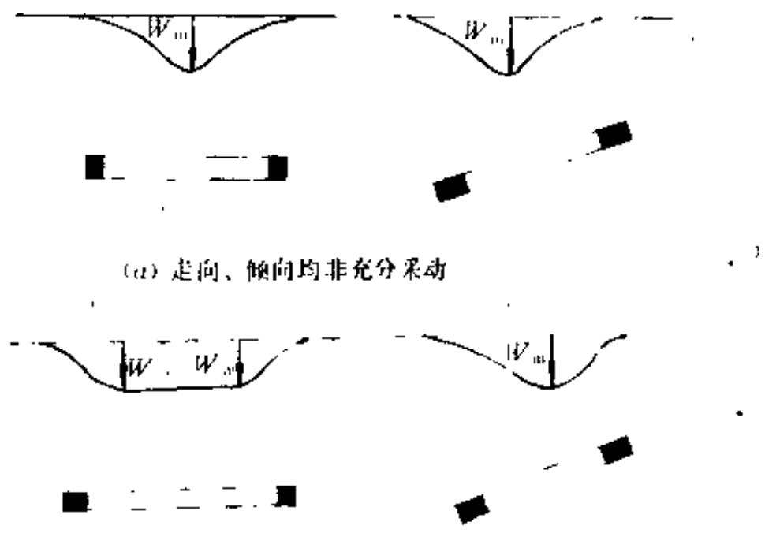  
走问允分采小向非允分采动  
图2-8 作充分采动示意图  
Fig. 2—8 Sketch map showing non-full movement of mined surface $\mathbb { W } _ { \mathfrak { w } } \mathrm { \sim } -$ 非充分采时的最大下沉值 $W _ { \ast } < W _ { \ast }$

## 3. 地表移动盆地的动态特征

地表移动盆地是在井下回采工作面推进过程中逐渐形成的。一般当回采工作面自开切眼开始向前推进的距离相当于1/4\~

$1 / 2 H _ { 0 }$ 时，开采影响波及到地表，引起地表下沉。随工作面向前推进，地表移动盆地逐渐形成并不断扩大。并下回采结束后，地表移动不会立即停止，还要持续一段时间，且移动盆地边界还将继续扩大直至稳定。地表移动盆地的形成过程如图2-9所示。

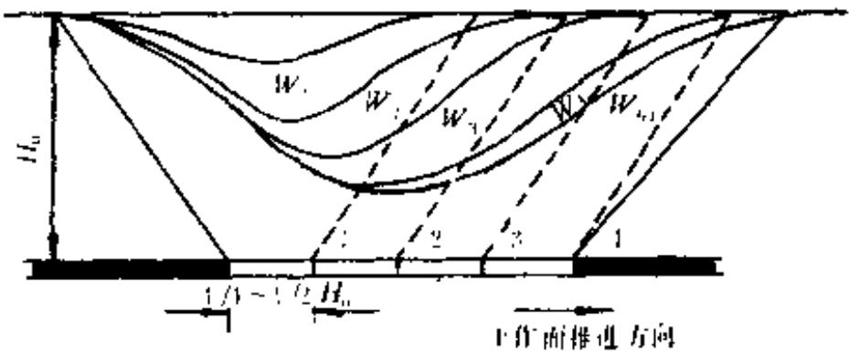  
图2-9 地表移动盆地的形成过程（何国清，1991）  
Fig- 2--9 Process of formation of surfsee basin  
1、2、3、4一工作面的位置； ${ \pmb W } _ { 1 }$ $\psi _ { z }$ $w _ { 3 }$ $\yen 12$ 相应工作面的移动盆地；  
$\bigstar _ { \mathfrak { u } }$ 一最终的静态移动盆地

地表移动的动态特征可用地表移动持续时间来表示。地表点的移动过程分为三个阶段，即开始阶段、活跃阶段和衰退阶段。三阶段的时间总和为地表移动持续时间，持续时间的长短取决于岩性、开采深度和工作面推进速度。在其它条件相同的情况下，开采深度越大，移动持续时间越长。当采深在100\~200m时，地表点移动的总时间为1\~2年。

## 4. 采动岩层内的三带

受采动岩体自下而上分为冒落带、裂缝带和弯曲带，通称“三带”，如图2-6a所示。冒落带的高度主要取决于采出厚度和上覆岩石的碎胀系数，通常为采出厚度的3\~5倍。实践中可用下式近似估算冒落带高度h：

$$
h = { \frac { m } { ( K - \operatorname { I } ) \operatorname { c o s } \alpha } }\tag{2−16}
$$

式中 m——采厚；

K-—冒落岩石碎胀系数，-般为1.10\~1.40;

α——煤层倾角。

裂缝带是指产生裂缝、离层及断裂但仍保持层状结构的那部分岩层。由于冒落带和裂隙带能够透水，因此又合称为导水裂缝带。导水裂缝带的高度 $\langle H _ { f } \rangle$ 与岩性有关，一般情况下，覆岩为软弱岩石时， $H _ { f }$ 为采厚的9\~12倍；覆岩为中硬岩石时， $H _ { f }$ 为采厚的12\~18倍；覆岩为坚硬岩石时， $H _ { f }$ 为采厚18\~28倍。导水裂缝带高度计算可参见表2—1计算公式。

表2-1 导水裂缝带高度计算[2]（刘天泉，1981）  
Tab 2—1 Formula for predicting the height of fissure and fall belts
<table><tr><td rowspan=2 colspan=1>覆岩岩性</td><td rowspan=1 colspan=2> $\alpha { = } 0 ^ { \circ } { \sim } 5 4 ^ { \circ }$ </td><td rowspan=2 colspan=1> $\alpha { = } 5 5 ^ { \circ } { \sim } 9 0 ^ { \circ }$ </td></tr><tr><td rowspan=1 colspan=1>经验公式之一</td><td rowspan=1 colspan=1>经验公式之二</td></tr><tr><td rowspan=1 colspan=1>坚硬</td><td rowspan=1 colspan=1> $H _ { f } = { \frac { 1 0 0 \Sigma m } { 1 . ~ 2 \Sigma m + 2 . ~ 0 } } \pm 8 . 9$ </td><td rowspan=1 colspan=1> $H _ { f } = 3 0 \sqrt { \sum _ { m } } + 1 0$ </td><td rowspan=1 colspan=1> $H _ { f } = \frac { 1 0 0 m \hbar } { 4 . 0 hbar + 1 3 3 } \pm 8 . 4$ </td></tr><tr><td rowspan=1 colspan=1>中硬</td><td rowspan=1 colspan=1> $H _ { f } = \frac { 1 0 0 \pm m } { 1 . \ 6 \Sigma m + 3 . 6 } \pm 5 . \ 6$ </td><td rowspan=1 colspan=1> $H _ { \mathrm { f } } = 2 0 \ \sqrt { \sum _ { m } } + 1 0$ </td><td rowspan=2 colspan=1> $H _ { f } = \frac { 1 0 0 m / h } { 7 . 5 h + 2 9 3 } \pm 7 . 3$ </td></tr><tr><td rowspan=1 colspan=1>軟弱</td><td rowspan=1 colspan=1> $H _ { f } = \frac { 1 0 0 \Sigma m } { 5 . \ 0 \Sigma m + 8 . \ 0 } \pm 3 . 0$ </td><td rowspan=1 colspan=1> $x _ { 1 } = 1 0 \sqrt { \sum m } + 5$ </td></tr></table>

注：Σm一属计采厚，m；h—回采阶段垂高，m。

弯曲带又称整体移动带，位于裂缝带之上直到地表。弯曲带内岩层的移动是连续而有规律的，一般具有较好的隔水性，但透水的松散层在弯曲带内起不到隔水作用。弯曲带高度与采深有关，当采深很大时，弯曲带的高度可大大超过导水裂缝带的高度。

## 5. 描述地表移动变形的指标

常用指标有下沉(ω)、倾斜(i)、曲率(k)、水平移动(u)、水平变形(ε)。如图2-10所示，地表2、3、4号点开采沉陷后移动至 $2 ^ { \prime }$ 3'、4'位置，移动向量 $\overline { { 2 2 ^ { \prime } } } \cdot \overline { { 3 3 ^ { \prime } } } \cdot \overline { { 4 4 ^ { \prime } } }$ 的垂直分量 $\overrightarrow { w _ { 2 } } \cdot \overrightarrow { w _ { 3 } } \cdot \overrightarrow { w _ { 4 } }$ 称之为下沉，水平方向上的分量 ${ \pmb u } _ { 2 } , { \pmb u } _ { 3 } , { \pmb u } _ { 4 }$ 称之为水平移动。倾斜、曲率及水平变形的定义则分别如式 $( 2 - \cdot 1 7 ) \sim ( 2 - 1 9 )$

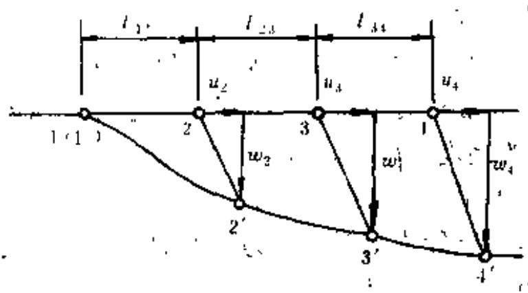  
图2-10 地表移动变形指标示意图  
Fig. 2—10 Sketch map -showing vomputation of surłace movemént: and deforination indexes

$$
i _ { 2 - 3 } = \frac { w _ { 3 } - w _ { 2 } } { l _ { 2 3 } }\tag{2-17}
$$

$$
\lim \limits _ { k _ { 2 - 3 - 4 } } = \frac { i _ { 3 - 4 } - i _ { 2 - 3 } } { \frac { 1 } { 2 } ( l _ { 2 3 } + l _ { 3 4 } ) }
$$

$$
( 2 ^ { \stackrel { ! } { - } 1 8 ) }
$$

$$
\varepsilon _ { \tilde { z } \tilde { z ^ { - } } \tilde { 3 } } = \frac { u _ { 3 } - u _ { 2 } } { l _ { 2 3 } ^ { \prime } } .\tag{2-19}
$$

式中 $i _ { 2 - 3 }$ —地表2号点与3号点间的倾斜值，mm/m；

$\bar { ? } - \bar { 3 } - \bar { 4 }$ 地表3号点附近的曲率，mm $/ \bar { \mathbf { m } } ^ { 2 } ;$

$\hat { \bf { t } } _ { 2 - 3 }$ ——地表2号点与3号点间的水平变形值，mm/m；

$\pmb { i } _ { \pmb { i } _ { \pmb { i } } }$ 地表2号点到3号点的水平距高 $\hat { \cdot } \tilde { \Psi } \hat { \mathbf { \frac { . } { 5 } } }$

$\sum \limits _ { i } ^ { r } \sum \limits _ { j } ^ { N }$ 下沉引起地表标高的变化；倾斜测引起地表产生附加坡度；地表曲率则反映了沉陷后地表的弯曲程度，地表下沉曲线上凸时曲率k为正下凹时k为负；水乎变形反映了地表沉陷后的拉伸或压缩状况，ε为正，表示地表呈拉伸变形状态 $\blacktriangle$ 为负，则表示地表受压缩变形。

## 6.地表移动盆地的边界

根据实际需要，通常可将地表移动盆地划分为塌陷影响边界、危险移动边界、裂缝边界、积水边界等。

下沉10mm的点构成塌陷影响边界； $i { \stackrel {  } { = } } 3 { \mathrm { m i n } } i  , i { \varepsilon } \gg 2 { \mathrm { m m } } i$ m，k≥0.2mm/m²时，地表移动和变形将对一般砖木结构建筑物产生有害影响，故由这组移动变形值圈定的边界称为危险移动边界；裂缝边界则是根据移动盆地最外侧的裂缝圈定的；积水边界取决于地下水位高低和下沉值的大小。

在征地迁村工作中常用的边界是危险移动边界和征地（或赔偿）边界。征地（或赔偿）边界既不是危险移动边界，也不是塌陷影响边界，通常根据地表下沉对耕种的实际影响程度确定。般情况下，征地（或赔偿）边界小于塌陷影响边界。

## 7. 露天矿排土场边坡稳定性

露天矿排土场复垦是露天矿复垦工作的一个重要组成部分。影响排土场复垦工作的因素较多，如废弃岩土性质、排土场占地面积和几何形状、堆置高度、排土场与采空区的相对位置和距离等，其中排土场边坡稳定性也是重要的影响因素之一。为确保安全和复垦后地形与周围的地形相一致，美国一些州规定露天矿排土场边坡角控制在20°～35°，或限制排土场台阶高度不大于6\~8m，并要求排土场分层压实。

影响排土场边坡稳定性的因素主要有：排弃岩石性质、排土场基底工程地质条件、水文地质条件、气象条件、排弃高度及排土工艺等，其中尤以排弃岩石的性质和排土场基底条件影响最大。根据滑动面的位置和排土场的变形特征，排土场的滑坡和变形可分为图2—11所示五类。 à

边坡稳定性分析方法分为三类，即极限平衡法有限单元法和概率分析法。在选用这些分析方法时，需要了解排土区域工程地质条件、基底岩层赋存情况、排土工艺等，从而确定可能引起的滑坡类型；测定岩土容重与抗剪强度指标；测定排土场的水位作为计算的参数；确定安全系数。 -:

## 二、复垦场地论证

## 1.复垦区稳定性论证

复垦区稳定性论证是复垦规划的一项重要内容。复垦区稳定性论证需要搜集矿区地表移动预计参数，复垦区域并下开采的历史资料、开采规划资料等。矿区地表移动参数包括下沉系数、拐点偏距、水平移动系数、移动角、主要影响角正切值等；复垦区域井下开采资料主要包括煤层赋存条件，如可采煤层数、煤厚、倾角、构造发育状况、顶底板条件等，开采情况，如采厚、采煤方法等，采空边界与计划开采进界等。

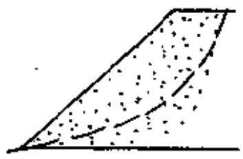  
(t7)排弃物内部滑动

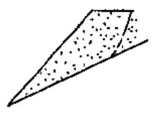  
(b)排弃物沿堪底 面滑动

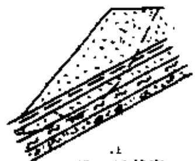  
(c)排七场堪底 滑动

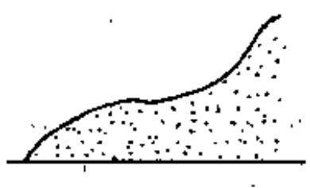  
(d) 汇动

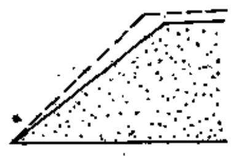  
(p) 沉降  
图2-11排土场滑坡类型（据周昌寿等，1990）  
Fig. 2—11 Types of landsip

稳定性论证的方法可用预测法和实测法。预测法即根据矿区地表移动规律和井下开采情况预计采动地表的稳定性，在采深不很大的情况下，井下停采两年后若井下不再回采，地表塌陷就已稳定。实测法将塌陷后实测的地形与按专门程序（如概率积分法)预计的地表下沉情况对比，若实测下沉值均已达到预计下沉值，地表塌陷就已稳定。

通常一个复垦区域既存在塌陷稳定的地块，也存在塌陷不稳定的地块，为制定复垦规划，需要圈定塌陷稳定边界。塌陷稳定边界圈定的最好方法是岩层与地表移动预计法。图2一12即为用概率积分法预计的稳定塌陷边界，图中还预计了不稳定边界内将

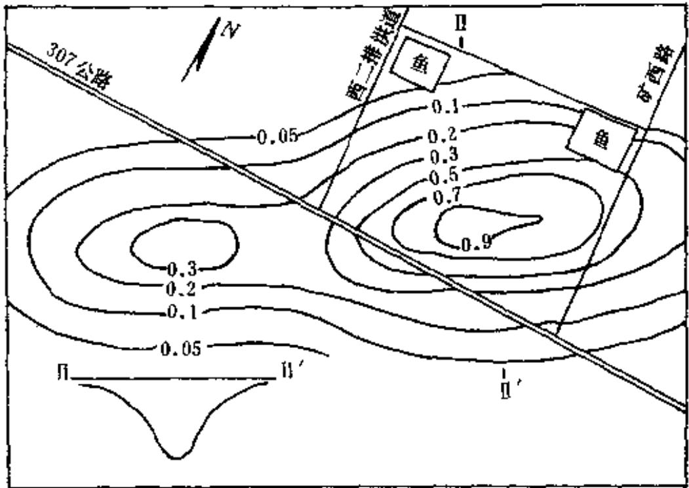  
图2-12 塌陷区域不稳定边界的圈定示例  
Fig.2-12 Example of demarcating the boundary of stable area and non-stable area  
要下沉的下沉值。

## 2. 复垦区域地形特征分析

地形包括地物和地貌两部分。地物是指村庄、桥涵、道路、河流、植被等，地貌是指地表的高低起伏。因此复垦区域地形特征分析内容较多，其中重要的是了解区内居民点分布、公共设施类型、水体分布与地貌特征，并分析开采沉陷对这些地形要素的影响。

开采沉陷对地形特征的影响，首先应判别开采沉陷引起的地表变形是连续的还是非连续的。非连续变形无论是对建筑物还是对农田均具有破坏性。其判别方法如前所述，主要看采深与采厚之比以及开采煤层的倾角。

当采深较大时，地表移动变形通常是连续的。这时，对于高潜水位平原矿区，若：

$$
H , \neg h \ : - \ : H , \leqslant h _ { k }\tag{2-20}
$$

式中 $H _ { \textrm { \textbf { y } } }$ 一-原地表标高，m；

$\hbar$ —一塌陷深度，m；

$H _ { q }$ ——地下潜水位标高，m：

$h _ { k }$ ——作物正常生长所要求的地下水位临界深度， ${ \mathfrak { m } } _ { \circ }$

作物将不能正常生长，且有土地沼泽化危险。当 $H _ { y } - h \leqslant H _ { q }$ 时，地表将形成积水坑，积水深度 $H _ { w }$ 为：

$$
H _ { \ast } = H _ { q } - H _ { \ast } + h\tag{2-21}
$$

$H _ { x } \mathrm { ~ - ~ } h - H _ { q } \geq h$ ，时， $\cdot h _ { j }$ 为建筑物正常使用所要求的地下水埋深，建筑物能正常使用，否则下沉将导致建筑物不能使用，村庄则需要搬迁或采取排水措施。

开采沉陷还会使地表产生一附加坡度，附加坡度的大小与采深、采厚、煤层倾角等因素有关，其值可用专门公式和程序，如概率积分法、负指数函数法、威布尔分布法等进行预计。附加坡度会破坏道路、管线，特别是对水塔、烟囱等底面积较小、高度又大的建筑物会产生较大的影响甚至倒塌，对排水沟道来说，附加坡度可能使水流方向改变，从而使沉陷区排水不畅产生大面积积水。

水平拉伸变形会使地表水体流失，一些国家水体下安全开采的最大拉伸变形值如表 $2 - 2 ^ { \left[ i \tau \right] }$ 所示。一般情况下，允许水平变形值取决于开采上方覆岩性质与地质条件。

表2-2 部分国家水体下安全开采的最大允许拉伸变形值  
Tab 2—2 Maxium value of strain permitted when mining under waterbody in some countries
<table><tr><td rowspan=1 colspan=1>国家</td><td rowspan=1 colspan=1>英国</td><td rowspan=1 colspan=1>日本</td><td rowspan=1 colspan=1>加拿大</td><td rowspan=1 colspan=1>智利</td><td rowspan=1 colspan=1>美国</td></tr><tr><td rowspan=2 colspan=1>允许拉伸变形值（mm/m）</td><td rowspan=1 colspan=1>10.0</td><td rowspan=1 colspan=1>8.0</td><td rowspan=1 colspan=1>7.5~7.7</td><td rowspan=1 colspan=1>5.0</td><td rowspan=1 colspan=1>5~10</td></tr><tr><td></td><td></td><td></td><td></td><td rowspan=1 colspan=1></td></tr></table>

3. 复垦区域地形图测绘时的要求

进行复垦条件评价与复垦方案制定都离不开复垦区域地形图。复垦区域地形图可以在矿山生产部门现有的地形图基础上，通过补测得到，也可以重新测绘得到，对地形图的内容和精度有如下具体要求：图上应反映主要污染源的分布情况；测量标志与重要标志物位置；各种建（构）筑物；道路及管线；各种界线，如地类界、行政界、井田边界等；排灌渠与水利设施；等高线；积水线；特殊地貌，如坎、冲沟等等。对图纸的基本要求是具有现势性。

图纸比例尺的大小反映了图纸的精度，比例尺越大，图纸反映地形的精度越高，反之精度较低。矿区土地复垦工程中灌排水系统规划施工、居民点搬迁规划、土壤改良规划实施、土地平整规划与施工等都对地形图的精度有一定要求，但相对说来土方量计算精度对地形图精度要求较高。而地形图比例尺越大，生产费用越高，生产期限也将延长，因此综合考虑土方量计算精度和经济因素，地形图比例尺应有一合适值8。一般情况下，土地复垦规划阶段对土方量计算精度要求不高，可采用1：2000\~1：5000地形图；土地复垦设计阶段对土方量计算精度要求较高，应采用不低于1：1000的地形图。

## 4. 复垦区域土地利用方式的调查与影响分析

矿区土地利用方式可在土地管理部门编制的土地利用现状图上查阅或通过实际调绘得到。一般农村土地利用方式是按耕地、水域、园地、居民区与工矿用地等八大类四十二个小类进行分类的。土地利用方式调查除得到土地利用现状图表外，还应对各类土地的生产力、面积等进行统计分析。

开采沉陷对工业与民用建筑、水利设施等影响的判别在有关书籍和规程中已有详细论述，这里仅就开采沉陷对农用土地影响的判别标准作一讨论。表2一3列出了开采沉陷对耕地、牧草地、林地等的影响判别标准[17]。根据表2一3的标准，可以得出：当地表坡度达20mm/m、水平变形达2mm/m以上时，耕地产量受开采沉陷影响较大，这时在制定复垦规划时，应对受影响耕地采取整治措施减小这一影响。

显然，不同的土地利用方式对土地的自然属性要求存在一定的差异，所以土地自然属性的变化对不同土地利用方向产生的影响也不一样，表2一4即反映了这种差异i5]。

表2-3 开采沉陷对耕地等的影响程度  
Tab 2—3 lmpact degree of mining subsidence on cultivated land (M. M. Singh, 1987)
<table><tr><td rowspan=2 colspan=1>上地利用</td><td rowspan=2 colspan=1>影响程度</td><td rowspan=1 colspan=2>水平变形(mm/m）</td><td rowspan=1 colspan=2>地表坡度（mm/m）</td></tr><tr><td rowspan=1 colspan=1>建议值</td><td rowspan=1 colspan=1>范围</td><td rowspan=1 colspan=1>建议值</td><td rowspan=1 colspan=1>范围</td></tr><tr><td rowspan=1 colspan=1>耕地</td><td rowspan=1 colspan=1>中等严重</td><td rowspan=1 colspan=1>2~35</td><td rowspan=1 colspan=1>5~10</td><td rowspan=1 colspan=1>20~3060</td><td rowspan=1 colspan=1>50~80</td></tr><tr><td rowspan=1 colspan=1>牧草地</td><td rowspan=1 colspan=1>严重</td><td rowspan=1 colspan=1>5</td><td rowspan=1 colspan=1>5~10</td><td rowspan=1 colspan=1>300</td><td rowspan=1 colspan=1>250~650</td></tr><tr><td rowspan=1 colspan=1>湿地</td><td rowspan=1 colspan=1>严重</td><td rowspan=1 colspan=1>5</td><td rowspan=1 colspan=1></td><td rowspan=1 colspan=1>250</td><td rowspan=1 colspan=1>250~350</td></tr></table>

表2-4 土地自然属性变化对土地利用方向的影响

Tab 2—4 lnfluence of land natural property changing on land use pattern (Sweigard and Ramani, 1986)
<table><tr><td colspan="2">土地利用</td><td rowspan="2">林业</td><td rowspan="2">娱乐</td><td rowspan="2">农业</td><td rowspan="2">居住</td><td rowspan="2">公共机构</td><td rowspan="2">商业</td><td rowspan="2">工业</td></tr><tr><td>自然属性</td><td></td></tr><tr><td>地形起伏</td><td></td><td>2</td><td>3</td><td>1</td><td>2</td><td>2</td><td>2</td><td>2</td></tr><tr><td>坡 度</td><td></td><td>1</td><td>3</td><td>1</td><td>2</td><td>1</td><td>1</td><td>1</td></tr><tr><td>标 高</td><td></td><td>2</td><td>3</td><td>2</td><td>3</td><td>3</td><td>3</td><td>3</td></tr><tr><td>太阳辐射</td><td></td><td>2</td><td>3</td><td>2</td><td>3</td><td>3 1</td><td>3</td><td>&#x27;3</td></tr><tr><td>排 水</td><td></td><td>1</td><td>3</td><td>1</td><td>1</td><td>1</td><td>1</td><td>1</td></tr><tr><td>温 度</td><td>-E</td><td>1</td><td>22</td><td>1</td><td>3</td><td>3</td><td>3</td><td>3</td></tr><tr><td>降 雨</td><td></td><td>1</td><td></td><td>1</td><td>3</td><td>3</td><td>3</td><td>3</td></tr><tr><td>覆 岩</td><td></td><td>2</td><td>2</td><td>1</td><td>2</td><td>2</td><td>3</td><td>3</td></tr><tr><td>土壤农业特性</td><td></td><td>2</td><td>2</td><td>1</td><td>3</td><td>3</td><td>3</td><td>3</td></tr><tr><td>土壤工程特性</td><td></td><td>3</td><td>3</td><td>2</td><td>1</td><td>1</td><td>1</td><td>王 &#x27;1</td></tr><tr><td>位置</td><td></td><td>3</td><td>1</td><td>2</td><td>1</td><td>1</td><td>1</td><td>1</td></tr><tr><td>通达度</td><td></td><td>3</td><td>2</td><td>3</td><td>1</td><td>1</td><td>1</td><td>1</td></tr><tr><td>地块大小、形状</td><td></td><td>3</td><td>3</td><td>1</td><td>2</td><td>21</td><td>1</td><td>1</td></tr><tr><td>周围土地利用情况</td><td></td><td>3</td><td>2</td><td>3</td><td>1</td><td></td><td>1</td><td>3</td></tr></table>

注：1一表示影响最大：2—表示中等影响：3一表示影响较小。

## 第三节 矿区土地复垦条件分类

采矿影响的明显、共同的特征是土地造成了破坏，生态环境、经济与社会条件失去了原有的平衡。但由于各矿区或各矿地质、采矿条件不同，加之外部条件千差万别，土地破坏程度不一，形态各异，复垦利用方向也就不同。为了对矿区废弃地的破坏特征有较全面的认识，从而保证在有限的资金和资源条件下，卓有成效地开展复垦工作，做到投资少，见效快和分类治理，在规划土地复垦工作时，有必要对矿区土地复垦条件进行分类。

## 一、矿区土地复垦的环境与地质采矿条件分类

矿区土地复垦的环境与地质采矿条件通常根据一些明显的指标和特征来划分，因此，分类的结果往往很直观、很明确。

矿区土地复垦的环境条件可以按采动影响范围内的人口密度、居民点人口、土地价格、矿区开发引起区域的和区域间的环境变化来确定，如表2-5。

表2-5 矿区土地复垦的环境条件分类（李根福，1991）  
Tab 2—5 Classification of environmental condition for land reclamation in mine areas
<table><tr><td>指 标 类别</td><td>人口密度 (人/km²)</td><td>居民点人口 (万人)</td><td>土地价格 5</td><td>对环境的破坏</td></tr><tr><td>I</td><td>&gt;400</td><td>&gt;20</td><td>昂贵</td><td>严重</td></tr><tr><td>1</td><td>100-400</td><td>5~20</td><td>一般</td><td>i 一殷</td></tr><tr><td>1</td><td>&lt;100</td><td>&lt;5</td><td>便宜</td><td>较轻</td></tr><tr><td></td><td></td><td></td><td></td><td></td></tr></table>

对矿区环境破坏程度影响较大的矿床地质与采矿条件有：矿床倾斜角、矿床的含水量及剥离岩土对复垦的适用性，除此之外，还包括矿床埋深、赋存厚度、露天开采还是井工开采，充填开采还是全部跨落法开采或是部分开采，这些因素都决定了土地破坏程度和复垦的难易程度。以地质条件为基础的复垦条件分类如表2一6。以采矿条件为基础的复垦条件分类如表2-7。

剥采比以现行采矿设计方法计算得到的经济剥采比为基准，即作为中值，偏大为Ⅰ类，偏低为类。

在上述类别中，复垦环境条件从1～■按由劣到优排列。

表2-6以地质条件为基础的复垦条件分类（李根福，1991）  
Tab 2 -6 Classification of reclamation condrfion based on geological data
<table><tr><td>指标 类别 I</td><td>倾角</td><td>深厚比</td><td>水量（万m/昼夜）</td><td>利离岩土的适用性</td></tr><tr><td rowspan="3">1 1 日</td><td>&gt;25</td><td>&lt;30</td><td>&gt;1.0</td><td>不适用</td></tr><tr><td>8~25</td><td>30~50</td><td>0.5~1.0</td><td>次适用</td></tr><tr><td>8以下</td><td>&gt;50</td><td>&lt;0.5</td><td>适用</td></tr></table>

表2-7 以采矿条件为基础的复垦条件分类

Tab 2—7 Classification of reclamation condttion based on mining method
<table><tr><td rowspan="2">类 別</td><td colspan="2">露天开采</td><td colspan="2">地下片采</td></tr><tr><td>刺采比</td><td>排土方式</td><td>回采率</td><td>顶板管理方式</td></tr><tr><td>1</td><td>大</td><td>全部外排</td><td>&gt;75%</td><td>全部跨落法</td></tr><tr><td>【</td><td>中</td><td>部分内排</td><td>50~75%</td><td>局部充填或注浆控制</td></tr><tr><td>I</td><td>小</td><td>全部内排</td><td>&lt;50%</td><td>充填法</td></tr></table>

## 二、矿区土地复垦条件的灰色聚类分类法-—以淮北为例20.21]

## 1. 分类原理和方法201

灰色聚类是以灰数的白化函数生成为基础，将聚类对象对于不同聚类指标所拥有的白化数，按几个灰类进行归纳，判断聚类对象属于哪一类。矿区土地复垦条件的灰色聚类实质就是按一定的标准，综合分析矿并或废弃地块等聚类对象的各个指标进行归类的过程。

设聚类对象有n个，记为 $\ddot { i } = 1 \sim n$ ，聚类指标或考虑的因素有m个，记为 $j = 1 \sim m$ ，划分的类型有s类，记为 $k = 1 \sim s , d ,$ 表示第i个聚类对象关于第i指标的白化数，则有白化数矩阵： $D =$ $( d _ { i , } ^ { \cdot } ) _ { n \times \operatorname { \dot { m } } \mathrm { ~ e ~ } }$ 又设 $f _ { \mu } ^ { \cdot }$ 为第j指标对第k个灰类的白化函数，白化函数有图2-13所示三种基本形式。

设各因子分类的临界值为 $S _ { k _ { i } }$ ，即j因子属于k类的标准值为

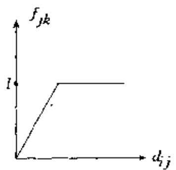  
(a)

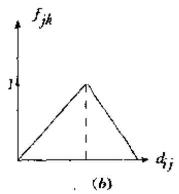  
图2-13 三种基本的白化函数

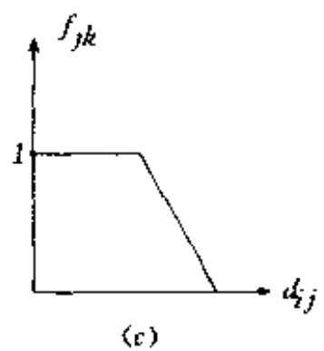  
Fig. 2—13 Three basic typesof, functions

$S _ { \star j }$ ，于是，i分类对象中j因子的聚类权 $\ w _ { \cdot j }$ 为：

$$
w _ { i j } = \frac { 1 \ : + \frac { d _ { i j } } { S _ { 1 j } } } { \displaystyle \sum _ { s } ^ { n } ( 1 \ : + \frac { d _ { i j } } { s _ { 1 j } } ) } \quad ( i = 1 \warrow \pi , j = 1  m ) ,\tag{2-22}
$$

第i个聚类对于第k个灰类的聚类系数 $\pmb { q } _ { \uparrow \pmb { k } }$ 为：

$$
\begin{array} { l l } { \mathit { q } _ { i k } = \displaystyle \sum _ { j = 1 } ^ { m } W _ { \# j } \cdot f _ { j k } \quad ( i = 1 \cdots n , k = 1 \cdots s ) } \end{array}\tag{2-23}
$$

设 ${ \mathfrak { q } } ( i ) = ( q _ { i k } ) _ { k + 1 \cdots } .$ 其中q(i)最大的元素所在列即为聚类元素i所属的灰类。 $\ddot { \uparrow } \stackrel {  } { : } \stackrel { \bullet } { \uparrow } \stackrel { \bullet } { \ . }$ ;l

## 2. 淮北矿区各矿土地复垦条件分类（刘永刚，1994）

## 1）淮北矿区概况

淮北矿区位于安徽省北部与江苏、河南等省交界，是我国重要的能源生产基地。含煤面积达 $\beta . 9 1 2 \mathrm { k m } ^ { 2 } \dot { \textrm { y } }$ 分属闸河、宿县、临涣、涡阳四个煤田，含煤4\~19层，可采煤层1\~10层，可采厚度2.47\~15m。-800m以上探明储量78:86亿t。从1958年建矿到1992年底，国家累计投资42亿元，先后建成31对大小矿井，7座洗煤厂，年产原煤1900多万t，其中淮北矿务局1400万t/年；还有装机容量75万kW的坑口电厂和20万kW的地方电厂各一座，另有一座坑口电厂和两座研石电厂正在筹建中。到1993年底，已生产原煤3亿多吨，发电440亿 $k \mathbf { W } \cdot \mathbf { h } _ { \circ } ^ { \prime }$ 1

建 $\pmb { \mathcal { P } }$ 之初，淮北市人均占有耕地3.9亩，到:1990年下降为

1.9亩。开采较早的闸河煤田，1990年农业人口20万，仅有耕地13万亩，人均0.64亩，其中烈山区仅为0.07亩。30多年来，淮北矿区累计塌陷土地1.1万ha，搬迁村庄173个，造成人均0.2亩耕地以下的农民达15.3万人，完全丧失耕地的农民达9.5万人。随煤炭的继续开采，塌陷土地以533\~666ha/年的速度增加，人口增加与土地减少的矛盾日益加剧，当地农民生活困难，煤矿企业征地负担加重，塌陷征迁费用在吨煤成本中所占比重仅次于材料消耗和工资，为第三位。

淮北矿务局60年代初就开始自发利用采煤塌陷地，80年代中后期又先后与多家科研单位联合开展土地复垦试验研究，取得了一定的成绩。研究表明：为推广成功的复垦经验，需针对不同煤田、不同矿井土地破坏的特点选择适用的复垦技术措施，因此有必要对全局分属四个煤田的11对生产矿井的复垦条件进行科学的分类。

## 2）分类指标与评价标准

选取塌陷深度、积水深度、万吨塌陷率、土地复垦率、浅塌陷率和充填复垦系数等六个评价指标：浅塌陷率是塌陷深度小于2m的塌陷面积与塌陷总面积的比率。在淮北矿区，一般情况下，塌陷深度小于2m，基本上不积水，所以选择塌陷深度2m作为浅塌陷率的标准。浅塌陷率越高，复垦难度越小。充填复垦系数指每年利用固体废弃物（研石、粉煤灰、城市垃圾等）充填塌陷区造地面积与当年塌陷面积的比率，它反应了充填复星能力。也决定了复垦土地的利用方向。

结合淮北矿区实际情况和复垦经验，将淮北矿务局生产矿井复垦条件分为三类，上述六个指标的分类评价标准如表2一8。

## 3） 分类

①淮北矿务局参加分类的11个矿的基础数据如表2-9。

②按式（2—22）计算聚类权，列于表2-10。

③构造白化函数如表2-11，计算白化函数值如表2一12。

④计算聚类系数，如表2-13。

表2-8 淮北矿区生产矿井复垦条件分类标准  
Tab 2—8 Stardards for reclamation condition classification of coal mines in Huaibei coal mine bureau
<table><tr><td>指 标 类 型</td><td>塌陷深度 (m)</td><td>积水深度 (m)</td><td>戊塌陷率</td><td>万吨塌陷率 (亩/万t)</td><td>允填复 垦系数</td><td>复星率</td></tr><tr><td>1</td><td>3.5</td><td>2.0</td><td>30</td><td>5.0</td><td>0.25</td><td>0.3</td></tr><tr><td>1</td><td>5.0</td><td>3.5</td><td>10</td><td>3.0</td><td>0.15</td><td>0.2</td></tr><tr><td>1</td><td>7.0</td><td>5.0</td><td>5</td><td>2.0</td><td>0.05</td><td>0.1</td></tr></table>

表 2-9 分类基础数据  
Tab 2—9 Fundermental data for classification
<table><tr><td colspan="2">指 标 矿矿 号 名</td><td>塌陷深度 (m)</td><td>积水深度 (m)</td><td>浅場 陷率</td><td>万吨塌陷率 (亩/万t)</td><td>充填复 垦系数</td><td>复垦率</td></tr><tr><td>1</td><td>袁庄</td><td>3.0</td><td>1.5</td><td>0.56</td><td>5.9</td><td>0.12</td><td>0.087</td></tr><tr><td>2</td><td>张庄</td><td>6.5</td><td>4.8</td><td>0.21</td><td>3.1</td><td>0.16</td><td>0.175</td></tr><tr><td>3</td><td>朱庄</td><td>6.9</td><td>5.2</td><td>0.05</td><td>3.7</td><td>0.42</td><td>0.308</td></tr><tr><td>4</td><td>相城</td><td>3.0</td><td>1.5</td><td>0.66</td><td>5.7</td><td>0.32</td><td>0.553</td></tr><tr><td>5</td><td>岱河</td><td>5.4</td><td>3.8</td><td>0.27</td><td>4.7</td><td>0.23</td><td>0.44</td></tr><tr><td>6</td><td>杨庄</td><td>5.0</td><td>4.4</td><td>0.14</td><td>3.1</td><td>0.11</td><td>0.421</td></tr><tr><td>7</td><td>沈庄</td><td>3.0</td><td>1.5</td><td>0.21</td><td>5.9</td><td>.0.07</td><td>0.247</td></tr><tr><td>8</td><td>芦岭</td><td>12.6</td><td>10.8</td><td>0.06</td><td>1.8</td><td>0.08</td><td>0.092</td></tr><tr><td>9</td><td>朔里</td><td>5.4</td><td>3.8</td><td>0.13</td><td>4.0</td><td>0.12</td><td>0.096</td></tr><tr><td>10</td><td>石台</td><td>3.2</td><td>1.6</td><td>0.08</td><td>4.7</td><td>0. 11</td><td>0.113</td></tr><tr><td>11</td><td>朱仙庄</td><td>10.2</td><td>8.4</td><td>0.04</td><td>3.8</td><td>0.06</td><td>0.045</td></tr></table>

表2-10聚类权表

Tab 2—10 Weight of factors for clasification in different mines
<table><tr><td>矿号</td><td>塌陷深度</td><td>积水深度</td><td>浅塌陷率</td><td>万吨塌陷率</td><td>充填复星系数</td><td>复星率</td></tr><tr><td>1</td><td>0.162</td><td>0.153</td><td>0.251</td><td>0.191</td><td>0.130</td><td>0.113</td></tr><tr><td>2</td><td>0.223</td><td>0.266</td><td>0.133</td><td>0.127</td><td>0.128</td><td>0.124</td></tr><tr><td>3</td><td>0.209</td><td>0.254</td><td>0.082</td><td>0.123</td><td>0.189</td><td>0.143</td></tr><tr><td>4</td><td>0.132</td><td>0.124</td><td>0.227</td><td>0.152</td><td>0.162</td><td>0.202</td></tr><tr><td>5</td><td>0.186</td><td>0.212</td><td>0.139</td><td>0.142</td><td>0.140</td><td>0.180</td></tr><tr><td colspan="1" rowspan="1"> $\overrightarrow { y } ^ { 2 } + \frac { 5 } { 7 }$ </td><td colspan="1" rowspan="1">塌陷深度</td><td colspan="1" rowspan="1">积水深度</td><td colspan="1" rowspan="1">浅塌陷率</td><td colspan="1" rowspan="1">万吨塌陷率</td><td colspan="1" rowspan="1">充填复垦系数</td><td colspan="1" rowspan="1">复垦率</td></tr><tr><td colspan="1" rowspan="1">6</td><td colspan="1" rowspan="1">0.211</td><td colspan="1" rowspan="1">0.249</td><td colspan="1" rowspan="1">0.114</td><td colspan="1" rowspan="1">0.126</td><td colspan="1" rowspan="1">0.112</td><td colspan="1" rowspan="1">0.187</td></tr><tr><td colspan="1" rowspan="1">7</td><td colspan="1" rowspan="1">0.175</td><td colspan="1" rowspan="1">0.165</td><td colspan="1" rowspan="1">0.161</td><td colspan="1" rowspan="1">0.206</td><td colspan="1" rowspan="1">0.121</td><td colspan="1" rowspan="1">0.172</td></tr><tr><td colspan="1" rowspan="1">8</td><td colspan="1" rowspan="1">C.284</td><td colspan="1" rowspan="1">0.395</td><td colspan="1" rowspan="1">0.074</td><td colspan="1" rowspan="1">0.084</td><td colspan="1" rowspan="1">0.082</td><td colspan="1" rowspan="1">0.081</td></tr><tr><td colspan="1" rowspan="1">9</td><td colspan="1" rowspan="1">0.222</td><td colspan="1" rowspan="1">0.253</td><td colspan="1" rowspan="1">0.125</td><td colspan="1" rowspan="1">0.157</td><td colspan="1" rowspan="1">0.129</td><td colspan="1" rowspan="1">0.115</td></tr><tr><td colspan="1" rowspan="1">10</td><td colspan="1" rowspan="1">0.196</td><td colspan="1" rowspan="1">0.184</td><td colspan="1" rowspan="1">0.133</td><td colspan="1" rowspan="1">0.199</td><td colspan="1" rowspan="1">0.147</td><td colspan="1" rowspan="1">0.141</td></tr><tr><td colspan="1" rowspan="1">11</td><td colspan="1" rowspan="1">0.272</td><td colspan="1" rowspan="1">0.361</td><td colspan="1" rowspan="1">0.079</td><td colspan="1" rowspan="1">0.122</td><td colspan="1" rowspan="1">0.086</td><td colspan="1" rowspan="1">0.G80</td></tr></table>

表 2-11 淮北矿区复垦条件分类白化函数表

Tab 2—11 Functions used for classifying reclamation conitions of Huaibei coal mine burau
<table><tr><td>公</td><td>白化函数</td><td></td><td>类子</td><td>白化函数</td></tr><tr><td rowspan="2">墨陷深度（凡）</td><td rowspan="2">［原图缺失］  $f _ { 1 2 } = \displaystyle \{ \frac { \frac { 0 } { x - 3 . 5 } } { 1 . 5 } $ </td><td rowspan="2"> $\mathfrak { x } \in [ 0 , 3 . 5 )$   $x \in \{ 3 . 5 , 5 \}$   $^ { x \in \{ 5 , \infty \} } _ { x \in [ 0 , 3 , 5 ) }$   $x \in [ 3 , 5 , 5 )$   $x \in [ 5 , 7 )$   $x \in [ 7 , \infty )$   $x \in [ 0 , 5 )$ </td><td rowspan="2">积水深度（）  $f _ { 2 2 } = \left\{ \begin{array} { l l } { \displaystyle \frac { x - 2 } { 1 . 5 } } \\ { \displaystyle 1 - \frac { x - 3 . 5 } { 1 . 5 } } \\ { 0 } \end{array} \right.$ </td><td> $\scriptstyle { \left| { j _ { 2 1 } = \left\{ \begin{array} { l l } { 1 } \\ { 1 - { \frac { x - 2 } { 1 \cdot 5 } } } \\ { 0 } \end{array} \right. } \right|}  $   $x \in [ 0 . 2 )$   $x \in \{ 2 , 3 , 5 \}$ </td></tr><tr><td> $x \in [ 3 , 5 , \infty )$   $x \in [ 2 , 3 , 5 )$ </td></tr><tr><td rowspan="5"> $y _ { 3 } = \left\{ \frac { 0 } { \frac { x - 5 } { 2 } } \right.$ </td><td rowspan="5"> $x \in [ 5 , 7 )$   $x \in [ 7 , \infty )$   $\mathscr { f } _ { 3 1 } = \left\{ \frac { 1 } { 0 . 2 } \qquad \right. \mathscr { f } _ { \left. \begin{array} { l } { \begin{array} { r } { \begin{array} { r } { \begin{array} { r } { \begin{array} { r } { \left[ \begin{array} {array} { l } { \end{array} } { r } \end{array} \right]} \\ { 0 } \end{array}  } \end{array} } } \end{array} } \right.} \\  \left. \qquad \{ \begin{array} { r l } { 0 } & { { } \begin{array} { r } { \begin{array} { r l } { \begin{array} { r l } { \begin{array} { r l } \end{array} } & { { } } \\ { 0 } \end{array} \} } \end{array} } \right. } \end{array}  \end{array} \end{array}$   $\scriptstyle \int _ { 3 2 } = { \left\{ \begin{array} { l l } { 0 } \\ { 1 - { \frac { x - 0 . 1 } { 0 . 2 } } } \\ { \left[ { \frac { x - 0 . 0 5 } { 0 . 0 5 } } \right. } \\ { 0 } \end{array} \right.}  $ </td><td rowspan="5"> $x ^ { 2 } \in [ 0 . \dot { 1 } , 0 . 9 )$ </td><td> $x \in [ 5 ; \infty )$   $\int \limits _ { 0 } ^ { \infty } f _ { 2 3 } = \{ \frac { x - 3 . 5 } { 1 . 5 }$ </td></tr><tr><td></td></tr><tr><td> $\bar { \iota } \in [ 0 , 3 . 5 )$ </td></tr><tr><td> $\pmb { x } \in [ 3 . 5 , 5 )$ </td></tr><tr><td> $x \in [ 5 , \infty )$ </td></tr><tr><td colspan="3"> $\pmb { \tau } \in [ 0 . 3 , 1 )$   $\begin{array} { r } { f _ { 4 1 } = \{ \displaystyle \frac { x - 3 } { 2 } \displaystyle \frac { 1 3 } { 2 } \frac { x - 3 } { 2 }  } \\ {  \quad \quad \quad \quad \quad \quad \quad \quad \quad \quad \quad \quad \quad \quad } \\ { \quad \quad \quad \quad \quad \cdot \quad \quad \cdot } \end{array}$   $\pmb { x } ^ { \prime } \in \{ 0 , 0 \pmb { : } 1 )$  万吨婿陷率一凡 x∈[0.3,1) x∈[0.1,0. 3)  $f _ { 4 2 } = \frac { \int \limits _ { 0 } ^ { \infty } 1 - \frac { x - 3 } { 2 } } { \int \limits _ { 0 } ^ { \infty } 1 - 2 }$   $x \in \left[ 0 , 0 5 , 0 . 1 \right)$   $\mathcal { \pmb { x } } \in \{ 0 , 0 . \emptyset { \pmb { \mathscr { 5 } } } \}$   ${ \pmb x } \in [ 0 , 1 , 1 )$   $f _ { 1 3 } = \left\{ \begin{array} { l l } { 0 } \\ { 1 - ( \chi - 2 ) } \\ { | } \end{array} \right.$ </td></tr><tr><td>分类 因字</td><td>白化函数</td><td></td><td>公</td><td>白化函数</td></tr><tr><td>充填复垦系數一 Fs V</td><td> $\bigg | f _ { 5 . } = \left\{ \begin{array} { l l } { 1 } \\ { \underline { { x } } - 0 . 1 5 } \\ { 0 } \end{array} \right.$  10  $V _ { 5 2 } = \left\{ \begin{array} { l } { { \vdots - { \frac { x - 0 . ~ 1 5 } { 0 . ~ 1 } } } } \\ { { { \frac { x - 0 . ~ 0 5 } { 0 . ~ 1 } } } } \end{array} \right.$  l0 10  $\left| f _ { 5 3 } = \prec \right. 1 - \frac { x - 0 . 0 5 } { 0 . 1 }$  1</td><td>x∈ [0.25,1) x€ [0.15,0. 23)  $\begin{array} { l } { x \in \{ 1 , \langle 1 , 3 , 1 5 \rangle } \\ { x \in \overline { { \therefore } } , \widehat { ( 3 , 2 5 , 1 ) } } \end{array}$  x∈ {0.15,0.25) c∈ [0, 05,0,15) x∈[0,0.05) ∈[0.15.1) x∈[0.05,0.15) x∈{0,0. 05)</td><td>复垦率</td><td> $\Big | f _ { 5 1 } - \left\{ \frac { 1 } { 0 . 1 } \frac { 2 } { 0 . 1 } \right.$  x∈[0.3.1} x∈ {0,2,0.3) x∈[0.0.2) 10 x∈[0.3.1)  $\scriptstyle \int _ { \ell \zeta = { \sqrt [ ] { \frac { x - 0 . \ell } { 0 . 1 } } } }$  x∈[0.2,0.3) x∈[0.1,0.2) x∈ [0,0.1)  $f _ { 5 3 } = \left\{ { \begin{array} { l } { 0 } \\ { 1 { - } { \frac { x - 0 . 1 } { 0 . 1 } } } \\ { 1 } \end{array} } \right.$  x∈[0.2,1) x∈[0.1,0.2) x∈ [0,0.1)</td></tr></table>

表2-12白化函数值表

Tab 2-12 Value of functions  
表 2-12-1 袁庄矿白化函数值表  
Tab 2-12-1 Yuanzhuang coalmine  
表 2-12—2 相城矿白化函数值表
<table><tr><td>类 型 因</td><td>1</td><td>1</td><td>1</td></tr><tr><td>f  ${ \bf { { F } } } _ { 1 }$ </td><td>1</td><td>0</td><td>I 0</td></tr><tr><td> ${ { \mathbf { } } _ { { \pm } } } { { \mathbf { } } _ { { \pm } } }$ </td><td>1</td><td>0</td><td>0</td></tr><tr><td> $\kappa _ { \downarrow }$ </td><td>1</td><td>0</td><td>0</td></tr><tr><td> $\pmb { F _ { \downarrow } }$ </td><td>1</td><td>0</td><td>0</td></tr><tr><td> $\pmb { F } _ { \tilde { \downarrow } }$ </td><td>0</td><td>0.7</td><td>0.3</td></tr><tr><td> $\scriptstyle { F _ { \ell } }$ </td><td>0</td><td>0</td><td>1</td></tr></table>

表 2-12-3 张庄矿白化函数值表  
Tab 2-12-3 Zhangzhuang coal mine

<table><tr><td rowspan=1 colspan=4>Tab 2—12—2 Xiangcheng coal mine</td></tr><tr><td rowspan=1 colspan=1>类型因子</td><td rowspan=1 colspan=1>1</td><td rowspan=1 colspan=1>1</td><td rowspan=1 colspan=1>1</td></tr><tr><td rowspan=2 colspan=1> $\mathbf { \delta } _ { \mathbf { \alpha } } \mathbf { \vec { r } _ { \mathrm { ~ l ~ } } }$  $\mathbf { \Delta } \mathbf { { F } } _ { \Xi }$ </td><td rowspan=1 colspan=1>11</td><td rowspan=1 colspan=1>00</td><td rowspan=1 colspan=1>00</td></tr><tr><td rowspan=3 colspan=1> $\pmb { F } _ { 1 }$  ${ \pmb F } _ { 5 }$ </td><td rowspan=1 colspan=1>1</td><td rowspan=1 colspan=1>0</td><td rowspan=1 colspan=1>m0</td></tr><tr><td rowspan=1 colspan=1>1</td><td rowspan=1 colspan=1>0</td><td rowspan=1 colspan=1>0</td></tr><tr><td rowspan=1 colspan=1>1</td><td rowspan=1 colspan=1>0</td><td rowspan=1 colspan=1>0</td></tr><tr><td rowspan=1 colspan=1> $\pmb { F } _ { 5 }$ </td><td rowspan=1 colspan=1>1</td><td rowspan=1 colspan=1>0</td><td rowspan=1 colspan=1>0</td></tr><tr><td rowspan=1 colspan=4></td></tr></table>

表2—12-4贷河矿白化函数值表  
Tab 2—12—4 Daihe coal mine

<table><tr><td>类 型 因 f</td><td>I</td><td>1</td><td>1</td></tr><tr><td> ${ { \pmb { F } } _ { 1 } }$ </td><td>0</td><td>0.25</td><td>0.75</td></tr><tr><td> ${ { F } _ { 3 } }$ </td><td>0</td><td>0.1333</td><td>0.8667</td></tr><tr><td> $\pmb { F } _ { 3 }$ </td><td>0.6</td><td>0.4</td><td>0</td></tr><tr><td> $\mathbf { \Delta } _ { F _ { \mathrm { : } } }$ </td><td>0.05</td><td>0.95</td><td>0</td></tr><tr><td> ${ \pmb F } _ { 5 }$ </td><td>0.1</td><td>0.9</td><td>0</td></tr><tr><td> $\underbrace { F _ { \mathrm { ~ s ~ } } } _ { \mathrm { ~ \normalfont ~  ~ } }$ </td><td>0</td><td>0.75</td><td>0.25</td></tr></table>

<table><tr><td>类 型 因 子</td><td>1</td><td>1</td><td>1</td></tr><tr><td> ${ \pmb F } _ { 1 }$ </td><td>0</td><td>0.80</td><td>0.20</td></tr><tr><td> $\boldsymbol { \dot { F } } _ { \xi }$ </td><td>0</td><td>0.80</td><td>0.20</td></tr><tr><td> ${ \pmb { F } } _ { 3 }$ </td><td>0.85</td><td>0.15</td><td>0</td></tr><tr><td> $\mathbf { f } _ { 4 }$ </td><td>0.85</td><td>0.15</td><td>0</td></tr><tr><td> $\pmb { F } _ { \uparrow }$ </td><td>0.80</td><td>0.20</td><td>0</td></tr><tr><td> $\scriptstyle { F _ { \mathfrak { s } } }$ </td><td>1</td><td>0</td><td>0</td></tr></table>

表2-12-5 朱庄矿白化函数值表  
Tab 2-2--5 Zhuzhuang coal mine
<table><tr><td>类 因 型</td><td></td><td>【</td><td>1</td></tr><tr><td>子</td><td>1</td><td></td><td></td></tr><tr><td> $\boldsymbol { \kappa } _ { 1 }$   ${ \pmb { F } } _ { 2 }$ </td><td>0 0</td><td>0.05 0</td><td>0.95 1</td></tr><tr><td> $\mathbf { { \mathit { F } } _ { 7 } }$ </td><td>0</td><td>0</td><td>1</td></tr><tr><td> ${ \pmb { F } } _ { \mathrm { s } }$ </td><td>0.35</td><td>0.65</td><td>0</td></tr><tr><td> $\pmb { F } _ { \bar { \ 3 } }$ </td><td>1</td><td>0</td><td>0</td></tr><tr><td> ${ \tilde { F } } _ { \ S }$ </td><td>1</td><td>0</td><td>0</td></tr></table>

表2-12-6 杨庄矿白化函数值表  
Tab 2—12—6 Yangzhuang coal mine

表2-12-7 沈庄矿白化函数值表  
Tab 2-12-7 Shenzhuang coal mine  
表2-12-8 石台矿白化函数值表
<table><tr><td>类 因 型 子</td><td>I</td><td>1</td><td>I</td></tr><tr><td rowspan="5"> $\mathbf { \delta } _ { F _ { 1 } }$   ${ \pmb { F } } _ { 2 }$   ${ \pmb { F } } _ { 3 }$   $\pmb { F } _ { 4 }$   ${ \pmb F } _ { 5 }$ </td><td>1</td><td>0</td><td>0</td></tr><tr><td>1</td><td>0</td><td>0</td></tr><tr><td>0.55</td><td>0.45</td><td>0</td></tr><tr><td>1</td><td>0</td><td>0</td></tr><tr><td>0</td><td>0.2</td><td>0.8</td></tr><tr><td> ${ \pmb { F } } _ { \pmb { \ S } }$ </td><td>0.47</td><td>0.53</td><td>0</td></tr></table>

表2—12-9 芦岭矿白化函数值表
<table><tr><td>类 因 型 子</td><td>1</td><td>I</td><td>■</td></tr><tr><td rowspan="5"> $\pmb { F } _ { 1 }$   $\boldsymbol { \mathscr { F } } _ { z }$   ${ \pmb { F } } _ { 3 }$   ${ { \pmb F } _ { 4 } }$   ${ \pmb { F } } _ { 5 }$ </td><td>0</td><td>0</td><td>1</td></tr><tr><td>0</td><td>0</td><td>1</td></tr><tr><td>0</td><td>0.2</td><td>0.8</td></tr><tr><td>0</td><td>0</td><td>1</td></tr><tr><td>0</td><td>0.30</td><td>0.70</td></tr><tr><td> $\pmb { \mathrm { F } } _ { \pmb { \mathrm { A } } }$ </td><td>- 0</td><td>-0</td><td>1</td></tr></table>

<table><tr><td rowspan=1 colspan=1>类因      型子</td><td rowspan=1 colspan=1></td><td rowspan=1 colspan=1>I</td><td rowspan=1 colspan=1>日</td><td rowspan=1 colspan=1>1</td></tr><tr><td rowspan=6 colspan=1> ${ { \pmb F } _ { 1 } }$  $\mathbf { { \mathit { F } } _ { 2 } }$  ${ \pmb { F } } _ { 3 }$  $\boldsymbol { F } _ { \uparrow }$  ${ \pmb F } _ { \mathrm { 3 } }$  $\pmb { F } _ { \hbar }$ </td><td rowspan=1 colspan=1></td><td rowspan=1 colspan=1>0</td><td rowspan=1 colspan=1>0.5</td><td rowspan=1 colspan=1>0.5</td></tr><tr><td rowspan=2 colspan=2>00.2</td><td rowspan=1 colspan=1>0.4</td><td rowspan=1 colspan=1>0.6</td></tr><tr><td rowspan=1 colspan=1>0.8</td><td rowspan=1 colspan=1>0</td></tr><tr><td rowspan=1 colspan=2>0.05</td><td rowspan=1 colspan=1>0.95</td><td rowspan=1 colspan=1>0</td></tr><tr><td rowspan=1 colspan=2>0</td><td rowspan=1 colspan=1>0.6</td><td rowspan=2 colspan=1>0.40</td></tr><tr><td rowspan=1 colspan=2>1</td><td rowspan=1 colspan=1>0</td></tr></table>

<table><tr><td>类 因 型 子</td><td>1</td><td>1</td><td>1</td></tr><tr><td rowspan="5"> ${ { \cal F } _ { 1 } }$   ${ \pmb F } _ { 1 }$   ${ { \pmb { F } } _ { 3 } }$   $F _ { 4 }$   ${ \pmb { F } } _ { 5 }$ </td><td>1</td><td>0</td><td>0</td></tr><tr><td>1</td><td>0</td><td>0</td></tr><tr><td>0</td><td>0.8</td><td>0.2</td></tr><tr><td>0.85</td><td>0.15</td><td>0</td></tr><tr><td>0 0</td><td>0.6 0.30</td><td>0.4 0.70.</td></tr></table>

表2-12-10朱仙庄矿白化函数值表  
Tab 2—12—10 Zhuxianzhuang coεl mine
<table><tr><td>类 因 型 子</td><td>Ⅰ</td><td>1</td><td>1</td></tr><tr><td rowspan="5"> ${ \pmb F } _ { 1 }$   ${ \pmb { F } } _ { 2 }$   ${ \pmb { F } } _ { 3 }$   ${ { \pmb { F } } _ { 4 } }$ </td><td>0</td><td>0</td><td>1</td></tr><tr><td>0</td><td>0</td><td>1</td></tr><tr><td>&#x27;0</td><td>0</td><td>1</td></tr><tr><td>0.4</td><td>0.6</td><td>0</td></tr><tr><td>0</td><td>0.1</td><td>0.9</td></tr><tr><td> ${ \pmb { F } } _ { 5 }$   $\underline { { \pmb { F } } } _ { \pmb { \beta } }$ </td><td>0</td><td>0</td><td>1</td></tr></table>

表2-12-11 朔星矿白化函数值表  
Tab 2—12-11 Shuli coal mine
<table><tr><td>类 因 型 子</td><td>1</td><td>1</td><td>1</td></tr><tr><td> $\pmb { F _ { 1 } }$ </td><td>0</td><td>0.8</td><td>0.2</td></tr><tr><td> ${ \pmb { F } } _ { ? }$ </td><td>0</td><td>0.8</td><td>0.2</td></tr><tr><td> ${ \pmb { F } } _ { 3 }$ </td><td>0.15</td><td>0.85</td><td>0</td></tr><tr><td> $\pmb { F _ { 4 } }$ </td><td>0.5</td><td>0.5</td><td>0</td></tr><tr><td> ${ \pmb { F } } _ { 5 }$ </td><td>0</td><td>0.70</td><td>0.30</td></tr><tr><td> ${ { \pmb F } _ { 6 } }$ </td><td>0</td><td>0</td><td>1</td></tr></table>

表2-13 聚类系数与聚类结果表  
Tab 2—13 Ratio of classification and classification result
<table><tr><td>聚类系数 名</td><td>1</td><td>Ⅱ</td><td>I</td><td>结果</td></tr><tr><td>1 袁庄</td><td>0.757</td><td>0.091</td><td>0.152</td><td>1</td></tr><tr><td>2 张庄</td><td>0.099</td><td>0.472</td><td>0.429</td><td>1</td></tr><tr><td>3 朱庄</td><td>0.375</td><td>0.090</td><td>0.535</td><td>1</td></tr><tr><td>1 相城</td><td>1.0</td><td>0</td><td>0</td><td>1</td></tr><tr><td>5 岱河</td><td>0.531</td><td>0.389</td><td>0.0do</td><td>1</td></tr><tr><td>6 场庄</td><td>0.216</td><td>0.484</td><td>0.300</td><td>I</td></tr><tr><td>7 沈庄</td><td>0.715</td><td>0.188</td><td>0.097</td><td>1</td></tr><tr><td>8芦岭</td><td>0</td><td>0.039</td><td>0.961</td><td>■</td></tr><tr><td>9 朔里</td><td>0.097</td><td>0.655</td><td>0.248</td><td>1</td></tr><tr><td>10 石台</td><td>0.549</td><td>0..267</td><td>0.184</td><td>1</td></tr><tr><td>11 朱仙庄</td><td>0.049</td><td>0.082</td><td>0.869</td><td>1</td></tr></table>

## 4）分类结果分析

分类结果统计如表2-14。第Ⅰ类属于复垦条件较好的矿井，在有限的资金条件下，应优先对第！类矿并采煤塌陷地进行复垦。在第Ⅰ类矿井中，相城、岱河的充填复垦系数较大，应充分利用矿区废弃物对这两个矿采取充填复垦，而忱庄、石台、袁庄三矿充填复垦系数相对较小，应采取挖深垫浅、疏排等综合措施提高复垦率，沈庄矿已在这方面取得许多成功的经验。第类矿井塌陷深度、积水深度、浅塌陷率均居中，充填复垦系数普遍较低，此类矿井采煤沉陷地可采取围堰分割的方法对中等积水深度的塌陷地分区、分块利用，提高水域的生产力。第类矿井复垦条件最差，积水深度较大，积水面积也较广，复垦利用的方向包括将大水面改造为水上游乐场、发展网箱养殖、改造为水库等。

从分类结果统计表还可看出，塌陷深度、积水深度和浅塌陷率是矿井复垦条件分类最为显著的指标。针对淮北矿区的条件，塌陷深度在3.5m以下，积水深度在2m以下时复垦最为有利；塌陷深度在6m以下，积水深度在4m以下时，复垦条件具有中等难度；塌陷深度在6m以上，积水深度在4m以上时复垦条件最差。

表2-14 分类结果统计表  
Tab 2--14 Statistics of classification result
<table><tr><td rowspan=1 colspan=1></td><td rowspan=1 colspan=1>矿  名</td><td rowspan=1 colspan=1>平均塌陷深度</td><td rowspan=1 colspan=1>平均积水深度</td><td rowspan=1 colspan=1>平均浅塌陷率</td><td rowspan=1 colspan=1>平均万吨塌陷率</td><td rowspan=1 colspan=1>平均允填复垦系数</td><td rowspan=1 colspan=1>平均复垦率</td></tr><tr><td rowspan=1 colspan=1>1</td><td rowspan=1 colspan=1>袁庄、相城、岱河、沈庄、石台</td><td rowspan=1 colspan=1>3.52</td><td rowspan=1 colspan=1>1.98</td><td rowspan=1 colspan=1>0.358</td><td rowspan=1 colspan=1>5.38</td><td rowspan=1 colspan=1>0.17</td><td rowspan=1 colspan=1>0.288</td></tr><tr><td rowspan=1 colspan=1>1</td><td rowspan=1 colspan=1>张压、杨庄、朔里</td><td rowspan=1 colspan=1>5.97</td><td rowspan=1 colspan=1>4.33</td><td rowspan=1 colspan=1>0.16</td><td rowspan=1 colspan=1>3.40</td><td rowspan=1 colspan=1>0.13</td><td rowspan=1 colspan=1>0.231</td></tr><tr><td rowspan=1 colspan=1>1</td><td rowspan=1 colspan=1>朱庄、芦岭、朱仙庄</td><td rowspan=1 colspan=1>9.90</td><td rowspan=1 colspan=1>8.13</td><td rowspan=1 colspan=1>0.05</td><td rowspan=1 colspan=1>3.10</td><td rowspan=1 colspan=1>0.19</td><td rowspan=1 colspan=1>0.148</td></tr></table>

## 第四节 复垦区社会经济特征分析

复垦区社会经济特征分析的内容包括产业结构特征、生产力水平、人均耕地占有量、劳动力就业状况、社会治安情况、居民物质文化生活水平等单项因子分析，也包括各社会，经济因子之间的相互作用关系分析。

单因子分析可采取纵横比较的方法，即对复垦区历年的统计指标进行分析，得出各困子的变化趋势，或将复垦区各因子统计指标与条件类似的地区进行横向比较，可发现本区的社会经济特

多因素的相关分析则是将复垦区社会经济问题看成一个统品分析各因素之间的内在联系，得出影响整个系统发履的主要围素丛面进一步分析复垦区的社会经济特征。回归分析与灰色关联分析方法是进行社会经济特征分析常用的方法。

下面继徐州矿区大泉乡塌陷地复垦规划为例，说明灰色关联分析方法在复星区社会经济特征分析中的应用[22]表2-15列出了该乡六个村1984\~1993年工业产值 $\textstyle ( \mathtt { r } ) $ 、农业产值（2z）、人均耕地（）、塌陷地数量 $( \neq _ { 4 } )$ 的统计数据。对影响本区经济发展的因素进行灰色关联分析，得到各村相关因素的灰色关联矩阵如表 $2 - 7 \Im _ { \cdot \infty } ^ { \cdot }$ 、.

表2-15复垦规划区内六村经济发展、土地塌陷、人均耕地基础数据  
Tab 2—15 Data of economic development, land subsidence and cultivated land area per personne! of six villages within planning area
<table><tr><td></td><td rowspan=1 colspan=2>年份指标</td><td rowspan=1 colspan=1>1984</td><td rowspan=1 colspan=1>1985</td><td rowspan=1 colspan=1>1986</td><td rowspan=1 colspan=1>:987</td><td rowspan=1 colspan=1>1988</td><td rowspan=1 colspan=1>1989</td><td rowspan=1 colspan=1>1990</td><td rowspan=1 colspan=1>1991</td><td rowspan=1 colspan=1>1992</td><td rowspan=1 colspan=1>1993</td></tr><tr><td rowspan=4 colspan=2>姚1生</td><td rowspan=1 colspan=1>人均耕地</td><td rowspan=1 colspan=1></td><td rowspan=1 colspan=1>1.83</td><td rowspan=1 colspan=1>1.66</td><td rowspan=1 colspan=1>1.44</td><td rowspan=1 colspan=1>1.47</td><td rowspan=1 colspan=1>1.31</td><td rowspan=1 colspan=1>1.21</td><td rowspan=1 colspan=1>1.08</td><td rowspan=1 colspan=1>1.04</td><td rowspan=1 colspan=1>1.00</td></tr><tr><td rowspan=1 colspan=1>工业产值</td><td rowspan=1 colspan=1></td><td rowspan=1 colspan=1>4.00</td><td rowspan=1 colspan=1>184. 89</td><td rowspan=1 colspan=1>551.68</td><td rowspan=1 colspan=1>75. 6</td><td rowspan=1 colspan=1>j1753.5</td><td rowspan=1 colspan=1>1576.0</td><td rowspan=1 colspan=1>1555.7</td><td rowspan=1 colspan=1>2495.0</td><td rowspan=1 colspan=1>2700.0</td></tr><tr><td rowspan=1 colspan=1>农业产花</td><td rowspan=1 colspan=1></td><td rowspan=1 colspan=1>187</td><td rowspan=1 colspan=1>132.0</td><td rowspan=1 colspan=1>109.0</td><td rowspan=1 colspan=1>98.6</td><td rowspan=1 colspan=1>198.4</td><td rowspan=1 colspan=1>250.0</td><td rowspan=1 colspan=1>185.3</td><td rowspan=1 colspan=1>246.0</td><td rowspan=1 colspan=1>307.0</td></tr><tr><td rowspan=1 colspan=1>塌陷地</td><td rowspan=1 colspan=1></td><td rowspan=1 colspan=1>370</td><td rowspan=1 colspan=1>400</td><td rowspan=1 colspan=1>746</td><td rowspan=1 colspan=1>806</td><td rowspan=1 colspan=1>866</td><td rowspan=1 colspan=1>936</td><td rowspan=1 colspan=1>114]</td><td rowspan=1 colspan=1>1278</td><td rowspan=1 colspan=1></td></tr><tr><td rowspan=4 colspan=2>四清</td><td rowspan=1 colspan=1>人均耕地</td><td rowspan=1 colspan=1></td><td rowspan=1 colspan=1>1.85</td><td rowspan=1 colspan=1>1.76</td><td rowspan=1 colspan=1>1.40</td><td rowspan=1 colspan=1>1.43</td><td rowspan=1 colspan=1>2.06</td><td rowspan=1 colspan=1>2.01</td><td rowspan=1 colspan=1>2.04</td><td rowspan=1 colspan=1>1.39</td><td rowspan=1 colspan=1></td></tr><tr><td rowspan=1 colspan=1>工业产值</td><td rowspan=1 colspan=1></td><td rowspan=1 colspan=1>251</td><td rowspan=1 colspan=1>374-2</td><td rowspan=1 colspan=1>564.41</td><td rowspan=1 colspan=1>147.11</td><td rowspan=1 colspan=1>502.61</td><td rowspan=1 colspan=1>299.1</td><td rowspan=1 colspan=1>1448.d</td><td rowspan=1 colspan=1>2330</td><td rowspan=1 colspan=1></td></tr><tr><td rowspan=1 colspan=1>浓业产值</td><td rowspan=1 colspan=1></td><td rowspan=1 colspan=1>117</td><td rowspan=1 colspan=1>86.0</td><td rowspan=1 colspan=1>57.0</td><td rowspan=1 colspan=1>62.0</td><td rowspan=1 colspan=1>116.0</td><td rowspan=1 colspan=1>133.0</td><td rowspan=1 colspan=1>122.0</td><td rowspan=1 colspan=1>138.0</td><td rowspan=1 colspan=1>147.0</td></tr><tr><td rowspan=1 colspan=1>場陷地</td><td rowspan=1 colspan=1></td><td rowspan=1 colspan=1>526</td><td rowspan=1 colspan=1>600</td><td rowspan=1 colspan=1>1031</td><td rowspan=1 colspan=1>1098</td><td rowspan=1 colspan=1>1276</td><td rowspan=1 colspan=1>134</td><td rowspan=1 colspan=1>1412</td><td rowspan=1 colspan=1>-1476</td><td rowspan=1 colspan=1></td></tr><tr><td rowspan=4 colspan=2>泉乐</td><td rowspan=1 colspan=1>人均耕地</td><td rowspan=1 colspan=1>20.60</td><td rowspan=1 colspan=1>0.56</td><td rowspan=1 colspan=1>0.53</td><td rowspan=1 colspan=1>0.52</td><td rowspan=1 colspan=1>0.49</td><td rowspan=1 colspan=1>047</td><td rowspan=1 colspan=1>1,46:.</td><td rowspan=1 colspan=1>0.44</td><td rowspan=1 colspan=1>a.42</td><td rowspan=1 colspan=1>0.41</td></tr><tr><td rowspan=1 colspan=1>工业产值</td><td rowspan=1 colspan=1>51</td><td rowspan=1 colspan=1>82.0</td><td rowspan=1 colspan=1>360.0</td><td rowspan=1 colspan=1>490.05</td><td rowspan=1 colspan=1>46.0.</td><td rowspan=1 colspan=1>1046</td><td rowspan=1 colspan=1>1010.01</td><td rowspan=1 colspan=1>188.0</td><td rowspan=1 colspan=1>1222.0</td><td rowspan=1 colspan=1>1097.0</td></tr><tr><td rowspan=1 colspan=1>农业产值</td><td rowspan=1 colspan=1>158.0</td><td rowspan=1 colspan=1>159.0</td><td rowspan=1 colspan=1>222.0]</td><td rowspan=1 colspan=1>360.0&#x2</td><td rowspan=1 colspan=1>7;320.0]</td><td rowspan=1 colspan=1>334.0</td><td rowspan=1 colspan=1>505.0</td><td rowspan=1 colspan=1>506.0</td><td rowspan=1 colspan=1>636.0</td><td rowspan=1 colspan=1>670. 0</td></tr><tr><td rowspan=1 colspan=1>塌陷地</td><td rowspan=1 colspan=1>210.0</td><td rowspan=1 colspan=1>270.0</td><td rowspan=1 colspan=1>320.0</td><td rowspan=1 colspan=1>370.0</td><td rowspan=1 colspan=1>510.0</td><td rowspan=1 colspan=1>660.0</td><td rowspan=1 colspan=1>770.0</td><td rowspan=1 colspan=1>810.0</td><td rowspan=1 colspan=1>863.0</td><td rowspan=1 colspan=1>940.0</td></tr><tr><td></td><td rowspan=4 colspan=1>東西</td><td rowspan=1 colspan=1>人均耕地</td><td rowspan=1 colspan=1>0.40</td><td rowspan=1 colspan=1>0.34</td><td rowspan=1 colspan=1>0.30</td><td rowspan=1 colspan=1>0.24</td><td rowspan=1 colspan=1>0.22</td><td rowspan=1 colspan=1>0.20</td><td rowspan=1 colspan=1>0.19</td><td rowspan=1 colspan=1>0.18</td><td rowspan=1 colspan=1>0.16</td><td rowspan=1 colspan=1>0.14</td></tr><tr><td></td><td rowspan=1 colspan=1>工业产值</td><td rowspan=1 colspan=1>98.0</td><td rowspan=1 colspan=1>107.0</td><td rowspan=1 colspan=1>214.0</td><td rowspan=1 colspan=1>291.0</td><td rowspan=1 colspan=1>383.0</td><td rowspan=1 colspan=1>403.0</td><td rowspan=1 colspan=1>450.05</td><td rowspan=1 colspan=1>00.0</td><td rowspan=1 colspan=1>55. 0</td><td rowspan=1 colspan=1>590.0</td></tr><tr><td></td><td rowspan=1 colspan=1>农业产值</td><td rowspan=1 colspan=1>110.0</td><td rowspan=1 colspan=1>118.0</td><td rowspan=1 colspan=1>12.0</td><td rowspan=1 colspan=1>123.0</td><td rowspan=1 colspan=1>134.0</td><td rowspan=1 colspan=1>133-.0</td><td rowspan=1 colspan=1>132.0</td><td rowspan=1 colspan=1>162.0</td><td rowspan=1 colspan=1>165.0</td><td rowspan=1 colspan=1>170.0</td></tr><tr><td></td><td rowspan=1 colspan=1>塌陷地</td><td rowspan=1 colspan=1>800</td><td rowspan=1 colspan=1>927</td><td rowspan=1 colspan=1>987.0</td><td rowspan=1 colspan=1>1173.01</td><td rowspan=1 colspan=1>214.0</td><td rowspan=1 colspan=1>1258.0</td><td rowspan=1 colspan=1>1283</td><td rowspan=1 colspan=1>1292.01</td><td rowspan=1 colspan=1>342.1</td><td rowspan=1 colspan=1>41428. 0</td></tr><tr><td rowspan=4 colspan=2>泉旺1.买</td><td rowspan=1 colspan=1>人均耕地</td><td rowspan=1 colspan=1>1:20</td><td rowspan=1 colspan=1>1:10</td><td rowspan=1 colspan=1>0.90</td><td rowspan=1 colspan=1>0. 90</td><td rowspan=1 colspan=1>0:80</td><td rowspan=1 colspan=1>0.70</td><td rowspan=1 colspan=1>0.60</td><td rowspan=1 colspan=1>060</td><td rowspan=1 colspan=1>0:56</td><td rowspan=1 colspan=1>0.45</td></tr><tr><td rowspan=1 colspan=1>工业产值</td><td rowspan=1 colspan=1>54.0</td><td rowspan=1 colspan=1>162-01</td><td rowspan=1 colspan=1>143.o</td><td rowspan=1 colspan=1>305.0</td><td rowspan=1 colspan=1>458.0</td><td rowspan=1 colspan=1>762.0a</td><td rowspan=1 colspan=1>2012</td><td rowspan=1 colspan=1>7019</td><td rowspan=1 colspan=1>35402</td><td rowspan=1 colspan=1>140.0</td></tr><tr><td rowspan=1 colspan=1>农业产值</td><td rowspan=1 colspan=1>103.0</td><td rowspan=1 colspan=1>129.0</td><td rowspan=1 colspan=1>164.0</td><td rowspan=1 colspan=1>109.</td><td rowspan=1 colspan=1>7.0</td><td rowspan=1 colspan=1>10820</td><td rowspan=1 colspan=1>12810</td><td rowspan=1 colspan=1>13月</td><td rowspan=1 colspan=1>98.年</td><td rowspan=1 colspan=1>1010</td></tr><tr><td rowspan=1 colspan=1>場陷地</td><td rowspan=1 colspan=1>1500.01</td><td rowspan=1 colspan=1>500.01</td><td rowspan=1 colspan=1>700.01</td><td rowspan=1 colspan=1>750.01</td><td rowspan=1 colspan=1>770.01</td><td rowspan=1 colspan=1>930.0q2</td><td rowspan=1 colspan=1>100.02</td><td rowspan=1 colspan=1>30002</td><td rowspan=1 colspan=1>500 02</td><td rowspan=1 colspan=1>610, 0</td></tr><tr><td rowspan=3 colspan=2>石头镇</td><td rowspan=1 colspan=1>工业产值</td><td rowspan=1 colspan=1>132..0</td><td rowspan=1 colspan=1>201. 0</td><td rowspan=1 colspan=1>263.0</td><td rowspan=1 colspan=1>379.0</td><td rowspan=1 colspan=1>1005.01</td><td rowspan=1 colspan=1>835. 02</td><td rowspan=1 colspan=1>008. 0</td><td rowspan=1 colspan=1>2317.0</td><td rowspan=1 colspan=1>2810.0</td><td rowspan=1 colspan=1></td></tr><tr><td rowspan=1 colspan=1>农业产值</td><td rowspan=1 colspan=1>81.0</td><td rowspan=1 colspan=1>99.0</td><td rowspan=1 colspan=1>101.0</td><td rowspan=1 colspan=1>104.0</td><td rowspan=1 colspan=1>106.0</td><td rowspan=1 colspan=1>104. 0</td><td rowspan=1 colspan=1>108.0</td><td rowspan=1 colspan=1>118.9</td><td rowspan=1 colspan=1>127.0</td><td rowspan=1 colspan=1>118.0</td></tr><tr><td rowspan=1 colspan=1>塌陷地</td><td rowspan=1 colspan=1>1378</td><td rowspan=1 colspan=1>1569</td><td rowspan=1 colspan=1>1676</td><td rowspan=1 colspan=1>1710</td><td rowspan=1 colspan=1>1788</td><td rowspan=1 colspan=1>1876</td><td rowspan=1 colspan=1>1973</td><td rowspan=1 colspan=1>1986</td><td rowspan=1 colspan=1>1992</td><td rowspan=1 colspan=1>2000</td></tr></table>

注：人均耕地，单位：亩/人；塌陷地面积，单位：亩；其它单位：万元。  
由灰色关联矩阵得出如下结论：

(1)六村塌陷地数量对农业生产影响都较大，影响最大的是

表2-16-6 四清灰色关联矩阵表 Tab 2—16—6 Siqing Village  
Tab 2 -16 Grey cognate matrix  
表2-16-1 泉旺头关联矩阵表  
Tab 2—15—1 Quan waagiou Village  
表2-16-2 石头阵关联矩阵表
<table><tr><td>泉旺头</td><td> $x _ { \ell }$ </td><td> ${ \boldsymbol { \cdot } } { \boldsymbol { \bar { \varepsilon } } } _ { \boldsymbol { \bar { \varepsilon } } }$ </td><td> $\scriptstyle { \mathfrak { x } } _ { 3 }$ </td><td> $\pmb { \tau _ { 4 } }$ </td></tr><tr><td>x1</td><td>1</td><td>0. 571</td><td>0.478</td><td>0.628</td></tr><tr><td> $\star z$ </td><td>0.557</td><td>1</td><td>0.723</td><td>0.792</td></tr><tr><td> $x ^ { * } 3$ </td><td>0.502</td><td>0.770</td><td>1</td><td>0.694</td></tr><tr><td> $\pmb { x _ { 4 } }$ </td><td>0.529</td><td>0.747</td><td>0.573</td><td>1</td></tr></table>

表2-16-3 泉东关联矩阵表  
Teb 2-16—3 Quandong Village

Tab 2—16--2 Shitouzhen Village
<table><tr><td>石头阵</td><td> $_ { x \mathbf { l } }$ </td><td> $x z$ </td><td> $x _ { 3 }$ </td></tr><tr><td> $x _ { 1 }$ </td><td>1</td><td>0.487</td><td>0. 196</td></tr><tr><td> $x _ { z }$ </td><td>C. 471</td><td>1</td><td>0.939</td></tr><tr><td> $x _ { 3 }$ </td><td>0.497</td><td>0.943</td><td>1</td></tr></table>

表2-16-4 姚庄灰色关联矩阵表  
Tab 2-16-4 Yaozhuang Village

<table><tr><td>泉东</td><td> $x _ { 1 }$ </td><td> $\scriptstyle { \mathcal { X } } _ { \mathfrak { Y } }$ </td><td> $x _ { 3 }$ </td><td> $\pmb { x } \pmb { \mathscr { s } }$ </td></tr><tr><td> $x _ { 1 }$ </td><td>1</td><td>0.737</td><td>0.486</td><td>0.775</td></tr><tr><td> $\pmb { \lambda } \mathbf { \hat { z } }$ </td><td>0.712</td><td>1</td><td>0.546</td><td>0.845</td></tr><tr><td> $\pmb { x } _ { 3 }$ </td><td>0.567</td><td>0.681</td><td>1</td><td>0.649</td></tr><tr><td> $\pmb { \bar { \ x } } _ { 4 }$ </td><td>0.748</td><td>[0.840]</td><td>0.504</td><td>1</td></tr></table>

表 2-16—5 泉西关联矩阵表  
Tab 2-16-5 Quanxi Village

<table><tr><td>姚庄</td><td> $_ { x _ { 1 } }$ </td><td> ${ \pmb x } _ { \pmb z }$ </td><td> $\pmb { \mathscr { x } } _ { 3 }$ </td><td> ${ \boldsymbol { \mathscr { x } } } _ { 4 }$ </td></tr><tr><td>x1</td><td>1</td><td>0.666</td><td>0.546</td><td>0.748</td></tr><tr><td> $\pmb { x } _ { 2 }$ </td><td>0.657</td><td>1</td><td>0.579</td><td>0.693</td></tr><tr><td> $\yen 3$ </td><td>0.548</td><td>0.591</td><td>1</td><td>0.678</td></tr><tr><td> $\pmb { \mathcal { T } } \pmb { \mathscr { s } }$ </td><td>0.729</td><td>0.679|0. 659</td><td></td><td>1</td></tr></table>

<table><tr><td>泉西</td><td>x1</td><td> $x _ { 8 }$ </td><td> $\pmb { x _ { 3 } }$ </td><td> $\pmb { \mathcal { X } } _ { 4 }$ </td></tr><tr><td> $\pmb { x } _ { 2 }$ </td><td>1</td><td>0.731</td><td>0.555</td><td>0.744</td></tr><tr><td> $x _ { 2 }$ </td><td>0.664</td><td>1</td><td>0.605</td><td>0.891</td></tr><tr><td> $\pmb { x _ { 3 } }$ </td><td>0.563</td><td>0.686</td><td>1</td><td>0.678</td></tr><tr><td> $\pmb { x } _ { 4 }$ </td><td>0.694</td><td>{0.887</td><td>0.611</td><td>1</td></tr></table>

<table><tr><td>姚庄</td><td> $\pmb { \hat { x _ { 1 } } }$ </td><td> $\pmb { x } _ { \pmb { z } }$ </td><td> $\pmb { \lambda } _ { 3 }$ </td><td> $\pmb { \hat { \sigma } _ { 4 } }$ </td></tr><tr><td> $\pmb { x } _ { 1 }$ </td><td>1</td><td>0.621</td><td>0.596</td><td>0.728</td></tr><tr><td> $\pmb { x } _ { 2 }$ </td><td>0.623</td><td>1</td><td>0.798</td><td>0.724</td></tr><tr><td> $\pmb { x _ { 3 } }$ </td><td>0.612</td><td>0.809</td><td>1</td><td>0.717</td></tr><tr><td> $\pmb { x } _ { 4 }$ </td><td>0.701</td><td>0.688</td><td>80. 662</td><td>1</td></tr></table>

泉西村，泉东村次之，影响最小的是姚庄村。

(2)除石头阵村外，其它五村塌陷地数量对工业发展也存在明显影响，影响最明显的是泉东村，姚庄村次之。这种影响主要表现为采煤塌陷土地刺激了乡镇企业的发展，该乡为徐州市乡镇工业较发达地区，但由于缺乏总体规划，部分村办工业发展不稳定，尤其是一些村的工业仍以小煤窑采煤为主，缺乏后劲。

上述两点结论已引起县乡政府的高度重视，并形成加快复垦采煤塌陷地；以复垦稳定农业生产，以复垦带动农副产品加工业的发展的共识。

# 第三章 矿区土地复垦决策方法

第一节 概 述

广义说，矿区十地复垦决策是规划的前提，属于总体规划的范畴。狭义的复垦决策则指规划设计中的方案选择。无论是广义的还是狭义的复垦决策都在复垦规划设计中起不可忽视的作用。正如史蒂斯博士所说：“复垦问题就其内容讲具有多学科的性质，它涉及到国民经济的许多领域（采矿工业、林业、农业、水利事业），社会学的范畴（人口学、经济学、社会学、业余时间的利用及其它）和各种学科（自然科学、技术科学、社会科学）。它不仅仅局限于解决一些科研和生产中的具体问题，而且应该在较大的范围内为综合性地解决复垦问题指明方向，包括几十年，甚至一百年内复垦发展的优化问题”10。

在总体规划阶段，需要决策的内容包括复垦方向的选择、复垦后土地利用结构调整等；在小区复垦规划和工程设计阶段，需要决策的主要内容是复垦方案的选择，具体涉及投资强度、投资方向等方面。

与小区复垦规划和工程设计阶段的决策相比，总体规划阶段的决策问题具有以下几个显著特点23]：

(1)战略性。这是由总体规划阶段规划范围大、考虑时间长远所决定的。要求决策时重视复垦活动对周围环境以及周围环境对复垦活动的影响，需着眼于长期效果和大系统的合理性。

(2)需要各部门参与。参与决策论证的部门包括矿山企业的地质、采矿、征迁部门与地方政府的土管、水利、交通、农业、水产、林业、环保等职能部门，必要时还需聘请有关专家进行论证。

(3)影响因素多。从地理位置、气候条件到社会经济条件、地

质采矿条件、水土资源条件等。

一般的复垦决策过程如图3—1所示。

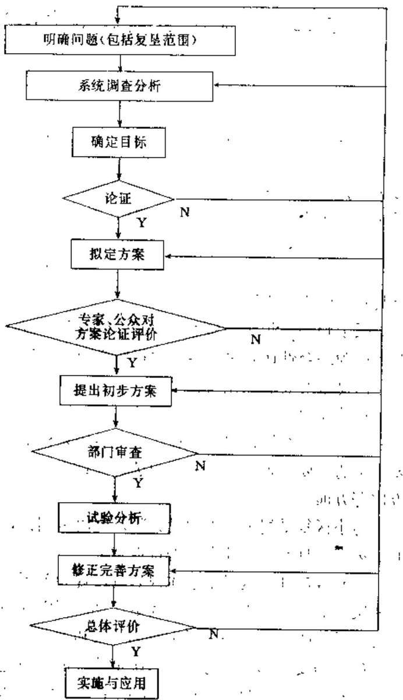  
图 3-1 决策过程图（卞正富，1991)  
Fig. 3-1 Process of reclamation declsion

## 第二节 复垦土地适宜性评价的基本概念

从矿山废弃地的自然属性与规划区域的资源条件出发，复垦后土地存在适宜的利用方向。复垦土地的利用方向决策通常需进行复垦土地适宜性评价。复垦土地适宜性评价是对矿山废弃地自然属性和社会经济因素进行综合鉴定，阐明其所具有的生产潜力和对农、林、牧、副、渔等各业生物生长及其它用途的适宜性、限制性及其程度的差异。

本节介绍复垦土地适宜性评价的基本准则和准备工作。

## 一、适宜性评价的原则[2.22.24.25」

## 1. 因地制宜的原则

土地的利用受周围环境多种条件制约。一种利用方向，必须有与之相适应的配套设施和环境。如在漏水严重的砂砸土地区进行零星水产养殖是不适宜的。因地制宜的原则还应考虑当地的经济实力和市场供需状况，当市场上水产品供需处于饱和状态或供大于求的情况下，大规模进行水产养殖也是不适宜的。一句话，“宜农则农，宜林则林，宜渔则渔，宜果则果，宜建则建，宜牧则牧”。

## 2. 主导因素的原则

复垦土地在再利用过程中，限制因素较多，如低洼积水，坡度、排灌条件、裂隙、土壤质地等。其中对土地利用起决定性作用的因素为主导因素，如在水源保证率较低的情况下，复垦后土地就难以利用为水田。在众多的限制因素中，部分限制因素是可以通过少量的投入加以改善的，这些因素不属于主导因素。

## 3. 综合分析的原则

综合分析土壤、水源、气候、地貌、植被等自然条件，以及种植习惯、农林产业结构调整、矿山生产安全等社会经济因素。如在开采深度较小、覆岩无隔水层的情况下，回采工作面上方地表不宜蓄水养鱼。

## 4. 最佳效益与整体效益的原则

对多宜的矿山度弃地应选择最佳效益的利用方向，即以最小的复垦投入取得最传的经济、社会和生态环境效益，同时应注意发挥整体效益，即发挥种植业与养殖业的整体效益，农业与工业的整体效益，经济、社会与环境的综合效益等。

## 5. 动态性与持续发展原则

矿山土地破坏是一个动态过程，复垦土地的适宜性亦随破坏等级与破坏过程而变化，具有动态性。遵循持续发展原则，应保证所选土地利用方向具有持续生产能力，防止掠夺式利用农业资源或二次污染等问题。

## 二、适宜性评价的依据

## 1. 复垦区域的基础条件

重点考虑破坏土地的土壤、地貌与水利条件三方面。

## 2. 土地生产力的大小

土地生产力大小是土地各组成要素的综合表现，是矿山废弃地复垦适宜性评价的重要依据，即以土地生产力的大小体现最佳效益原则。

## 3. 土地破坏程度

土地破坏改变了土地的原有利用方向或生产力水平，土地破坏程度不同，复垦利用的方向也不同。

## 4. 可选的土地复垦措施

尽管土地破坏程度不同，若针对不同情况选择适当的工程措施，可以复垦为同一方向，因此复垦工程措施的选择亦直接影响复星土地的利用方向。

## 三、矿山废弃地的分类与评价单元的划分

矿山废弃地的分类是复垦土地适宜性评价的基础工作，到目前为止，我国只将矿山废弃地划分为压占、挖损、塌陷三大类，而没有进一步的细分。各地在制定复垦规划时，往往根据自己的需要与当地的实际情况制定了一些当地的细分办法。表3-1为江苏铜山对采煤塌陷地所作的分类[26]。

为使我国的复垦工作规范化，笔者认为我国有必要也有可能建立一套较完整的全国矿山废弃地分类系统。表3—2是笔者对矿山废弃地所作的分类。

表3·1 江苏铜山县采煤塌陷地分类表  
Tab 3 —1 Classification of subsided land from coal mining in Tongshan, Jiangsu Province
<table><tr><td></td><td colspan="2" rowspan="1">级类型</td><td colspan="2" rowspan="1">级类型</td><td colspan="2" rowspan="1">三级类型</td><td colspan="2" rowspan="2">含        义</td></tr><tr><td></td><td colspan="1" rowspan="1">编号</td><td colspan="1" rowspan="1">名称</td><td colspan="1" rowspan="1">编号</td><td colspan="1" rowspan="1">名称</td><td colspan="1" rowspan="1">编号</td><td colspan="2" rowspan="1">名称</td></tr><tr><td colspan="2" rowspan="1">1</td><td colspan="1" rowspan="1">稳定塌陷地</td><td colspan="1" rowspan="1">111213</td><td colspan="1" rowspan="1">积水稳定塌陷地季节性积水稳定塌陷地无积水稳定塌陷地</td><td colspan="1" rowspan="1">111112113121122131132133</td><td colspan="1" rowspan="1">深积水稳定塌陷地中积水稳定坝陷地浅积水稳定塌隐地季节性积水稳定塌陷地常年湿地无积水稳定潮土塌陷地无积水稳定砂圖黑土塌陷地无积水稳定紫色土塌陷地</td><td colspan="2" rowspan="1">塌陷地面不EF沉处于相对稳定阶段塌陷处于稳定阶段日常年积水的土地常年积水在 3m以上的稳定塌陷地常年积水在3-1m的稳定塌陷地常年积水在1米以下的稳定塌陷地季节性积水或为常年湿地季节性积水稳定塌陷地稳定塌陷地常年为湿地地面下沉处于相对稳定阶段，地表无积水，土壤水分处于不饱和状态无积水稳定塌陷地，土壤为潮土无积水稳定塌陷地，土壤为砂爾黑土无积水稳定塌陷地，土壤为紫色土</td></tr><tr><td colspan="2" rowspan="1">2</td><td colspan="1" rowspan="1">不稳定場陷地</td><td colspan="1" rowspan="1">21</td><td colspan="1" rowspan="1">积水不稳定塌陷地</td><td colspan="1" rowspan="1">211212</td><td colspan="1" rowspan="1">深积水不稳定塌陷地中积水不稳定塌陷地</td><td colspan="2" rowspan="1">地表下沉处于不稳定阶段不稳定塌陷地，地面下沉后有不同程度的常年积水常年积水在3m以上的不稳定塌陷地常年积水在3~1m的不稳定塌陷地</td></tr><tr><td colspan="2">级类型</td><td colspan="4">级类型 级类型</td><td rowspan="2"></td><td rowspan="2">含 义</td></tr><tr><td>编号</td><td>名称</td><td>编号</td><td>名称</td><td></td><td>编号</td><td>名称</td></tr><tr><td rowspan="5"></td><td></td><td>22 23</td><td rowspan="2">李兰性积 水不稳定塌 陷地</td><td>213</td><td>浅积水不 稳定塌陷地</td><td>的不稳定塌陷地</td><td>常年积水在1m以下 不稳定塌陷地，地面有</td></tr><tr><td rowspan="5"></td><td rowspan="5"></td><td rowspan="5"></td><td>221</td><td>季节性深 积水不稳定 塌陷地</td><td>季节性积水或为湿地</td><td>季节性积水，但不稳定</td></tr><tr><td>无积水不 稳定塌陷地</td><td></td><td>尤积水潮</td><td>不稳定塌陷地、地面卜 沉后无积水或渍水发生 无积水不稳定塌陷区</td></tr><tr><td></td><td>231 陷地 232</td><td>土不稳定塌 无积水砂</td><td>的土壤为湖土 无积水不稳定塌陷区</td></tr><tr><td></td><td>233</td><td>僻黑土不稳 定塌陷地 无积水紫 色上不稳定</td><td>的上壤为砂点黑上 无积水不稳定的塌陷</td></tr><tr><td></td><td></td><td>塌陷地</td><td>区的上壤为紫色土</td></tr></table>

为反映各地区矿山废弃地的特点，可在表3-2分类的基础上作四级或五级分类。如在213无积水稳定塌陷地类下，可进-步按土壤类型划分为无积水潮土（或砂础黑土、紫色土等）稳定塌陷地等类型，这样对具级较小范围的矿山废弃地进行复垦适宜性评价或规划要求较细时，就可以最低一级分类在地形图上圈定图斑，并对图斑进行编号，再以圈定的图斑作为评价单元。在对较大范围作规划要求较粗时，就可以较高一级分类标准圈定的图斑为评价单元。当借助栅格数据结构的GIS进行评价时，以格网为评价单元，格网的大小根据评价精度而定，要求越准确，格网应越密，数据量越大。当以格网为评价单元时，上述分类数据即为GIS中的属性数据。

## 四、复垦土地适宜性评价等级体系

日前，我国复垦土地适宜性评价尚没有建立统一的等级体系。

表3-2 矿山废弃地分类表  
Tab 3—2 Classification of derelict land in mine areas
<table><tr><td rowspan=1 colspan=1></td><td rowspan=1 colspan=4>-级类型</td><td rowspan=1 colspan=4>级类型</td><td rowspan=1 colspan=4>级类型</td><td rowspan=2 colspan=1>含    义</td></tr><tr><td rowspan=2 colspan=3>1</td><td rowspan=1 colspan=1>代码</td><td rowspan=1 colspan=3>名称</td><td rowspan=1 colspan=1>代码</td><td rowspan=1 colspan=3>名称</td><td rowspan=1 colspan=1>代码</td><td rowspan=1 colspan=2>名称</td></tr><tr><td rowspan=1 colspan=2>挖损地</td><td rowspan=1 colspan=2>11121314</td><td rowspan=1 colspan=2>停采的露大采矿场在采的露天采矿场基建取土挖损地其它人为挖损地</td><td rowspan=1 colspan=2>111112121122131132</td><td rowspan=1 colspan=2>积水露天采场无积水露天采场边采边复式采后复垦式平整工业与民用建筑场地的取上坑修建道路等基建工程的取土坑</td><td rowspan=1 colspan=2>矿山区域内挖掘而炙弃的上地停止挖掘的露大采场积水的露天采场露犬采场停采后无积水尚未停止采掘作业的露天采场作为内排上场用或随采随填的露天采场全部采完后统一复垦的采场矿山基本建设取土面挖损的上地厂区，工人村建设时取1坑铺设排上等运输道路等基建工程的取土坑其它人为取上、采砂、采石而挖掘的上地</td></tr><tr><td rowspan=1 colspan=2>2</td><td rowspan=1 colspan=2>塌陷地</td><td rowspan=1 colspan=2>2122</td><td rowspan=1 colspan=2>稳定塌陷地不稳定塌陷地</td><td rowspan=1 colspan=2>211212213222222223</td><td rowspan=1 colspan=2>积水季节性积水尤积水积水季节性积水无积水</td><td rowspan=1 colspan=2>因地下采矿而塌陷的土地不再发生沉陷的塌陷地常年积水稳定塌陷地季节性积水的稳定塌陷地无积水的稳定塌陷地还将发生沉陷的塌陷地常年积水的不稳定塌陷地季节性积水的不稳定塌陷地无积水的不稳定塌陷地</td></tr></table>

续表
<table><tr><td colspan="2">一级类型</td><td colspan="2">二级类型</td><td colspan="2">三级类型</td><td rowspan="2">含义</td></tr><tr><td>代码</td><td>名称</td><td>代码</td><td>名称</td><td>代码</td><td>名称</td></tr><tr><td></td><td></td><td>23</td><td>待塌陷土 地</td><td>231 232</td><td>近期沉陷地 远期沉陷地</td><td>尚未发生沉陷，以后会 沉陷的土地 井下已布置工作面，近 期就要发生沉陷的土地 并田规划范围内将会 发生沉陷的土地</td></tr><tr><td rowspan="4">3 _1†</td><td>压占地</td><td>31</td><td>露天矿排 土场</td><td>311</td><td>有毒害舍场</td><td>矿山废弃物排放丽压 占废弃的土地 排弃露天开采剥离出 的岩土而占用的土地 废弃岩土为酸性或含 有有毒元素和有毒化合</td></tr><tr><td rowspan="3">32</td><td>杆石排放场</td><td>312 313 井工矿山</td><td>无毒害舍场 腐殖土堆放场</td><td>物 场所 锥形矸石山</td><td>废弃岩土无毒害 腐殖土的临时堆放场 排放井工开采矸石的 准备用作复垦充填料</td></tr><tr><td>33</td><td>尾矿池</td><td>321 322</td><td>研石山 矸石堆（坝）</td><td>或作其它用途的矸石临 时堆放场 排放洗选矸石或沉淀 物的场所</td></tr><tr><td>34</td><td>粉煤灰场</td><td>331 332 341</td><td>临时 永久</td><td>临时尾矿池 水久性尾矿池</td></tr><tr><td></td><td>35</td><td>其它废弃 物排放场</td><td>342</td><td>在用灰场 停用灰场</td><td>坑口电站的贮灰场 仍在排灰的灰场 停止排灰的灰场 生活垃圾、工业垃圾， 水工余土等压占的土地</td></tr></table>

平顶山市郊区土地管理局曾将评价等级体系分为纲一亚纲一类一级四级级序制[27]，其分级的设想较好，但从体系来说有点混乱，主要不足在于将适宜等级和破坏土地类型混为一体，层次性差。

作者对我国复垦土地适宜性评价等级体系的设想是分为纲一类一级一型四组。具体设想如表3—3所示。

表3-3是关于我国复垦土地适宜性评价等级体系的总体构

表3-3 我国复垦土地适宜性评价等级体系  
Tab 3- 3 Hierarchy system for suitability evaluation of reclaimed land in China
<table><tr><td rowspan=1 colspan=1>层次</td><td rowspan=1 colspan=1>下一层次</td><td rowspan=1 colspan=1>含       义</td></tr><tr><td rowspan=1 colspan=1>纳</td><td rowspan=1 colspan=1>适宜纲暂不适宜纲</td><td rowspan=1 colspan=1>指日前已具备复垦条件的矿山废弃地指田于正在破坏或受复垦技术条件等因素限制哲不适宜复垦的矿山废弃地</td></tr><tr><td rowspan=1 colspan=1>类</td><td rowspan=1 colspan=1>宜农类宜林果宜建类宜渔类宜牧类其它适宜类</td><td rowspan=1 colspan=1>适宜复垦为农业，主要是种植业用地适宜复垦为林木、果树载培用地适宜复垦为矿山或居民建设用地适宜复垦为水产养殖用地适宜复垦为放牧用地适宜其它用途的废弃地</td></tr><tr><td rowspan=1 colspan=1>级</td><td rowspan=1 colspan=1>-一级二级三级</td><td rowspan=1 colspan=1>在某适宜类下，士地自然属性最适宜其用途的在某适宜类下，土地自然属性中等适宜其用途的在某适宜类下，土地自然属性不太适宜其用途的</td></tr><tr><td rowspan=1 colspan=1>型</td><td rowspan=1 colspan=1>各种限制型</td><td rowspan=1 colspan=1>一级适宜类下基本不受限制，、三级适宜类下，土地复垦利用会受到某些因素限制，如裂缝限制型、坡度限制型，排水不畅限制型等</td></tr></table>

表3-4 根据今后在国民经济中的不同利用破坏土地按复垦方向的分类

Tab 3- 4 Classification of reclaimed land use based on the role of land use in national economy
<table><tr><td rowspan=1 colspan=1>破坏土地按复垦方向的类别</td><td rowspan=1 colspan=1>复垦土地的利用形式</td></tr><tr><td rowspan=1 colspan=1>进行农业复垦的土地进行林业复垦的土地进行水利复垦的土地进行休憩业复垦的土地</td><td rowspan=1 colspan=1>耕地、种草地、牧场、多年生造林普通农业和防护林、树苗场各种生活、工业用、灌溉和渔业水域休憩与运动区、公园与森林公园、疗养用水域、狩猎地、观光基地与运动场</td></tr><tr><td rowspan=1 colspan=1>进行自然保护勺卫生保健业复垦的土地</td><td rowspan=1 colspan=1>自然保护区：水上保持造林，育林封山区或涵养林区，用技术措施加固或封闭的地区，不宜专作农业或休憩业时，则辟为自然繁衍区</td></tr><tr><td rowspan=1 colspan=1>进行建筑业复垦的土地</td><td rowspan=1 colspan=1>工业与民用建筑场地，包括布置生产废料的堆场(矿山岩石、建筑垃圾和选矿的尾矿等)</td></tr></table>

leo -t  a   o h .
<table><tr><td rowspan=1 colspan=7>路  大  开 不破 环的土地</td></tr><tr><td rowspan=4 colspan=1>露天采场(坑)</td><td rowspan=1 colspan=1>基坑一浅挖地</td><td rowspan=1 colspan=1>水力开采泥煤矿床</td><td rowspan=1 colspan=1>底板、基坑间隔体</td><td rowspan=1 colspan=1>5~10</td><td rowspan=1 colspan=1>&gt;30</td><td rowspan=1 colspan=1>渔业水域、种草地、造林地和封闭自然保护区</td></tr><tr><td rowspan=1 colspan=1>堑沟一浅挖地</td><td rowspan=1 colspan=1>用定型机械开采泥煤矿床</td><td rowspan=1 colspan=1>底板、垂沟侧坡，堑沟间隔体</td><td rowspan=1 colspan=1>1~5-</td><td rowspan=1 colspan=1>&gt;45</td><td rowspan=1 colspan=1>水域，造林地和封闭自然保护区，狩猎地</td></tr><tr><td rowspan=1 colspan=1>平挖地</td><td rowspan=1 colspan=1>用泥煤切割机开采泥煤矿床                             </td><td rowspan=1 colspan=1>底板</td><td rowspan=1 colspan=1>1~5</td><td rowspan=1 colspan=1></td><td rowspan=1 colspan=1>耕地，种草地，牧场，各种造林地</td></tr><tr><td rowspan=1 colspan=1>多层阶地：很深的和超深的深的中深的</td><td rowspan=1 colspan=1>开采深理的倾斜（8~30°）或急倾斜（&gt;30°）向外排弃场运剥离物的矿体开采深理的倾斜或急倾斜并间外排弃场运剥离物的矿体用2~3个阶段开采水平和缓斜（&lt;8~10°）的中厚（&lt;30m）的矿体，无剥离物或很少</td><td rowspan=1 colspan=1>边帮上的阶段，底板，边坡同上底板，阶段</td><td rowspan=1 colspan=1>&gt;10030~10015~30</td><td rowspan=1 colspan=1>&gt;13&gt;45&gt;45</td><td rowspan=1 colspan=1>多水时可为多用水域；干燥时可为建筑或堆埋生产废物的场地；在边坡和边帮上可为造林地和封闭自然保护区同多水时可为多用水域和渔业；干燥时可为建筑和堆埋生产废物的场地；在放缓了的斜坡1可为种草地；阶段坡面上可为造林地和封闭自然保护区；休憩与运动场</td></tr></table>

<table><tr><td rowspan="2">破坏场地 分类</td><td rowspan="2">土地破坏后 地形特征</td><td rowspan="2">形成地形的因素</td><td rowspan="2">主要地形要素</td><td colspan="2">地形形态描述</td><td rowspan="2">rv</td><td rowspan="2">可供用途</td></tr><tr><td>对自然地表 的相对高度</td><td>阶段坡 角（度）</td></tr><tr><td rowspan="5">露天采场 (坑)</td><td>基坑形的阶 地： 中深的</td><td>只单阶段开采水平和缓 斜的中厚（&lt;30m）矿体， 无剥离物或很少</td><td>底板：边 坡</td><td>或深度（m） 15~30</td><td>&gt;45</td><td rowspan="2">多水时可为多用和渔业水域，干燥 时可为建筑和堆埋生产废物的场地； 在已放缓的斜坡上可为种氧地；阶段 的坡面上可为造林地和封闭自然保</td></tr><tr><td>不深的</td><td>单阶段开采水平或缓斜 的薄矿体(5~10m)，尤剂 坡</td><td>底板，边</td><td>5~15 &gt;30</td><td>护区；休憩与运动场 多水时可为灌溉、渔业和休憩地水 域；干燥时可为种卓地、放牧、多年</td></tr><tr><td>洼地</td><td>离物或很少 开采永平、缓斜的很薄 矿体（&lt;5m），无剥离物</td><td>底板，边 坡</td><td>5~0.5</td><td>&gt;45</td><td>生造林：休憩地造林：封闭自然保护 区；休憩与运动场；建筑基地 多水时可为自然保护和渔业水域、 干燥时可为耕地，种草地、牧场：各 种造林地</td></tr><tr><td>延深且高突 形阶地</td><td>开采高突而延深大的倾 斜和急斜的任何厚度且向 外排弃场运剥离物的矿体</td><td>边帮上的 阶段，底板</td><td>高突部 &gt;15m 延深部</td><td>&gt;45m</td><td>延深部可为自然保护与休憩水域； 高突部可为多年生造林，自然保护与 休憩地造林</td></tr><tr><td>高突阶地</td><td>同上，为多阶段高位矿 体</td><td>多阶段</td><td>&gt;15m &gt;30</td><td>&gt;45 林</td><td>多年生造林，自然保护与休憩地造</td></tr></table>

<table><tr><td rowspan=3 colspan=1>破坏场地分类</td><td rowspan=3 colspan=1>土地破坏后地形特征</td><td rowspan=3 colspan=1>形成地形的因素2</td><td rowspan=1 colspan=5></td></tr><tr><td rowspan=2 colspan=1>主要地形要素</td><td rowspan=1 colspan=2>地形形态描述</td><td rowspan=2 colspan=2>可供用途</td></tr><tr><td rowspan=1 colspan=1>对自然地表的相对高度或深度（m）</td><td rowspan=1 colspan=1>阶段坡角（度）</td></tr><tr><td rowspan=3 colspan=1>内排弃场</td><td rowspan=1 colspan=1>超出自然地形不大的高地</td><td rowspan=1 colspan=1>用运输系统开采缓斜延深型薄（&lt;20m）矿体，剥离厚度&lt;30m时的排弃场</td><td rowspan=1 colspan=1>高地</td><td rowspan=1 colspan=1>0~5</td><td rowspan=1 colspan=1>25~35</td><td rowspan=1 colspan=1>耕地、种草地、多年生造林，各种造林，高位建筑场地；沿斜坡造林，封闭自然保护区：休憩与运动区</td><td rowspan=1 colspan=1></td></tr><tr><td rowspan=1 colspan=1>多阶段高地</td><td rowspan=1 colspan=1>用运输系统开采缓斜延深矿体时的多层排弃场剥离厚度&gt;40m</td><td rowspan=1 colspan=1>高地，工作帮的多阶段</td><td rowspan=1 colspan=1>5~15</td><td rowspan=1 colspan=1>&gt;45</td><td rowspan=1 colspan=1>耕地、种草地、牧场、多年生林，各种用途的造林，高位建筑场地，在台地和斜坡上造林和设立封闭自然保护区：休憩与运动场区</td><td rowspan=1 colspan=1></td></tr><tr><td rowspan=1 colspan=1>脊形地</td><td rowspan=1 colspan=1>用挖掘机，排土机或运输排土桥倒运剥离物</td><td rowspan=1 colspan=1>脊状系统</td><td rowspan=1 colspan=1>脊堆高&lt;15</td><td rowspan=1 colspan=1>30~45</td><td rowspan=1 colspan=1>耕地、种草地、牧场、多年生林；整平后各种高地造林；造林和封闭自然保护区，休憩与运动场</td><td rowspan=1 colspan=1></td></tr><tr><td rowspan=2 colspan=1>外排弃场</td><td rowspan=1 colspan=1>较高的脊形地</td><td rowspan=1 colspan=1>用运输系统包括水力开采时的单层排弃场</td><td rowspan=1 colspan=1>高地，边坡</td><td rowspan=1 colspan=1>15~30</td><td rowspan=1 colspan=1>25~30</td><td rowspan=1 colspan=1>耕地、种草地、牧场、多年生造林，各种高地造林；造林和封闭自然保护区；斜坡上种草地：休憩与运动场</td><td rowspan=1 colspan=1></td></tr><tr><td rowspan=1 colspan=1>多阶段高地：较高的高的，很高的</td><td rowspan=1 colspan=1>用运输系统开采时的双层排弃场用运输系统开采时的多层排弃场</td><td rowspan=1 colspan=1>高地，阶式边坡同上</td><td rowspan=1 colspan=1>30~5050~100</td><td rowspan=1 colspan=1>&lt;45&lt;45</td><td rowspan=1 colspan=2>耕地、种草地、多年生林，各种高地造林；造林和封闭自然保护区；休憩与运动场种草地、多年生林，造林和封闭自然保护区：休憩与运动场</td></tr></table>

<table><tr><td rowspan=2 colspan=1>破坏场地分类</td><td rowspan=2 colspan=1>土地破坏后地形特征</td><td rowspan=2 colspan=1>形成地形的因素</td><td rowspan=2 colspan=1>主要地形要素</td><td rowspan=1 colspan=2>地形形态描述</td><td rowspan=2 colspan=1>可供用途</td><td rowspan=2 colspan=1></td></tr><tr><td rowspan=1 colspan=1>对自然地表的相对高度或深度（m）</td><td rowspan=1 colspan=1>阶段坡角（度）</td></tr><tr><td rowspan=1 colspan=1>外排弃场</td><td rowspan=1 colspan=1>脊形地阶式边坡的背形地</td><td rowspan=1 colspan=1>用无运输系统开采时的边帮排弃场用索斗挖掘机或定点排土机在多层排弃场加高堆弃</td><td rowspan=1 colspan=1>脊状系统，边坡选高的脊状系统，阶式边坡</td><td rowspan=1 colspan=1>&lt;3030~100</td><td rowspan=1 colspan=1>&lt;45&lt;45</td><td rowspan=1 colspan=1>种草地、多年生造林，造林和封闭自然保护区种草地、多年生造林，整平边坡后造林，在台地上造林和设立封闭自然保护区</td><td rowspan=1 colspan=1></td></tr><tr><td rowspan=1 colspan=1></td><td rowspan=1 colspan=1></td><td rowspan=1 colspan=1>地下开</td><td rowspan=1 colspan=1>采破坏</td><td rowspan=1 colspan=1>的土地</td><td rowspan=1 colspan=1>地</td><td rowspan=1 colspan=1></td><td rowspan=1 colspan=1></td></tr><tr><td rowspan=4 colspan=1>塌陷区</td><td rowspan=1 colspan=1>凹注地</td><td rowspan=1 colspan=1>崩落法开采急倾斜(&gt;45°)扁豆状矿体</td><td rowspan=1 colspan=1>塌坡</td><td rowspan=1 colspan=1>5~15</td><td rowspan=1 colspan=1>&gt;-45</td><td rowspan=1 colspan=1>回填后可造林与封闭自然保护区</td><td rowspan=1 colspan=1></td></tr><tr><td rowspan=1 colspan=1>深沟地</td><td rowspan=1 colspan=1>开采急倾斜中厚和厚(&gt;1.5m)的层状矿体</td><td rowspan=1 colspan=1>同上</td><td rowspan=1 colspan=1>5~15</td><td rowspan=1 colspan=1>&gt;30</td><td rowspan=1 colspan=1>同上</td><td rowspan=1 colspan=1></td></tr><tr><td rowspan=1 colspan=1>基坑形凹地</td><td rowspan=1 colspan=1>开采水平和缓倾斜(&lt;27°)的层状矿体</td><td rowspan=1 colspan=1>塌坡，坑底</td><td rowspan=1 colspan=1>1.5~5.0</td><td rowspan=1 colspan=1>5~15</td><td rowspan=1 colspan=1>造林和封闭自然保护区</td><td rowspan=1 colspan=1></td></tr><tr><td rowspan=1 colspan=1>阶地</td><td rowspan=1 colspan=1>白然地表呈斜坡状时开采缓倾斜层状矿体</td><td rowspan=1 colspan=1>阶地</td><td rowspan=1 colspan=1>未定</td><td rowspan=1 colspan=1>&gt;30</td><td rowspan=1 colspan=1>造林和封闭自然保护区</td><td rowspan=1 colspan=1></td></tr><tr><td rowspan=1 colspan=1>缓曲下沉地</td><td rowspan=1 colspan=1>浅洼地</td><td rowspan=1 colspan=1>崩落法开采薄和中厚的水平和层位起伏的及缓倾斜层状矿体</td><td rowspan=1 colspan=1>底板，塌坡</td><td rowspan=1 colspan=1>&lt;1.5</td><td rowspan=1 colspan=1>5~15</td><td rowspan=1 colspan=1>耕地、种草地、牧场、各种造林、白然繁衍区</td><td rowspan=1 colspan=1></td></tr><tr><td rowspan=1 colspan=1>排弃场</td><td rowspan=1 colspan=1>高地</td><td rowspan=1 colspan=1>采用汽车和铁路运输排弃的单层排弃场</td><td rowspan=1 colspan=1>商地、堆坡</td><td rowspan=1 colspan=1>&lt;30</td><td rowspan=1 colspan=1>&lt;45</td><td rowspan=1 colspan=2>造林和封闭自然保护区；休憩与运动场；建筑场地；用技术措施稳坡固表</td></tr></table>

<table><tr><td rowspan="2">波坏场地</td><td rowspan="2">土地破坏后 地形特征</td><td rowspan="2">形成地形的因素</td><td rowspan="2">主要地形要素</td><td colspan="2">地形形态描述</td><td rowspan="2">可供用途</td></tr><tr><td>对自然地表 的相对高度 或深度（m）</td><td>附段坡 角（度）</td></tr><tr><td rowspan="4">排弃场</td><td>阶式高地： 轻高的</td><td>采用汽车与铁路运输堆 弃的双层排弃场</td><td>阶式边 坡：高地</td><td>15~30</td><td>45</td><td>同上</td></tr><tr><td>高的 脊形地</td><td>采用汽车铁路运输的多 层排弃场 采用素道运输排弃岩石</td><td>阶式边 坡，高地 背狀系</td><td>30~100</td><td>15</td><td>造林与封闭自然保护区：用技术指 施稳坡固表</td></tr><tr><td>圓維堆</td><td>的排弃场 采用箕斗和翻转笼排</td><td>统：边坡 边坡</td><td>&lt;15</td><td>&lt;45 30~45</td><td>同上</td></tr><tr><td></td><td>弃岩石的排弃场</td><td>堆存工业、建筑及公用废料所破坏的土地</td><td>&gt;30</td><td></td><td>造林与封闭自然保护区；用技术措 施加固；休想与运动场</td></tr><tr><td colspan="7"></td></tr><tr><td rowspan="3">排年场</td><td>高地</td><td>采用运输工具排弃粉煤 灰、炉渣和尾矿的单层排 弃场（尾矿库、尾砂库、粉 煤堆）</td><td>高地</td><td>&lt;15</td><td>&lt;35</td><td>种草地，造林和均闲白然保护区： 用技术指施封存</td></tr><tr><td>阶式高地： 较高的</td><td>采州运输工具排弃粉煤 灰、炉渣、尾矿的双层排弃 场</td><td>边坡，高 地</td><td>15~50</td><td>&lt;.35</td><td>种草地、造林和封闭自然保护区： 用技术措施封存</td></tr><tr><td>高的</td><td>采附运输工.其排弃粉煤 灰、炉渣、尾矿的多层排弃 场</td><td>同上</td><td>&gt;50</td><td>&lt;35</td><td>同上</td></tr></table>

<table><tr><td rowspan=3 colspan=1>破坏场地分   类</td><td rowspan=2 colspan=1></td><td></td><td></td><td></td><td></td><td></td><td></td></tr><tr><td rowspan=2 colspan=2>土地破坏启地形特征</td><td rowspan=1 colspan=1></td><td rowspan=1 colspan=1></td><td rowspan=1 colspan=2>地形形态描述</td><td rowspan=2 colspan=1>可     供用    途</td></tr><tr><td rowspan=1 colspan=1>形成地形的因素</td><td rowspan=1 colspan=1>主要地形要素</td><td rowspan=1 colspan=1>对自然地表的相对高度或深度（m）</td><td rowspan=1 colspan=1>阶段坡角（度）</td></tr><tr><td rowspan=2 colspan=1>排弃场</td><td rowspan=1 colspan=2>脊形地</td><td rowspan=1 colspan=1>用索道排弃干选尾矿的排弃场</td><td rowspan=1 colspan=1>脊状系统、边坡</td><td rowspan=1 colspan=1>&lt;25</td><td rowspan=1 colspan=1>&lt;50</td><td rowspan=1 colspan=1>造林与封闲自然保护区；用技术排施封存与稳坡固表</td></tr><tr><td rowspan=1 colspan=2>圆锥堆</td><td rowspan=1 colspan=1>采用箕平与翻转作笼排弃于选尾矿的排弃场</td><td rowspan=1 colspan=1>边坡</td><td rowspan=1 colspan=1>&gt;30</td><td rowspan=1 colspan=1>30~60</td><td rowspan=1 colspan=1>造林与封闲自然保护区；休憩与运动场：用技术措施封存与稳坡固表</td></tr><tr><td rowspan=1 colspan=8>线路建设破坏的士地</td></tr></table>

<table><tr><td rowspan=3 colspan=1>挖方</td><td rowspan=2 colspan=1>取士坑</td><td></td><td></td><td></td><td></td><td></td></tr><tr><td rowspan=1 colspan=1>挖掘岩石填路基</td><td rowspan=1 colspan=1>底板，测坡</td><td rowspan=1 colspan=1>5~10</td><td rowspan=1 colspan=1>≤45</td><td rowspan=1 colspan=1>多水时可作自然保护区、灌溉和渔业水域，十燥时可为种草地，牧场，造林与封闭自然保护区</td></tr><tr><td rowspan=1 colspan=1>河槽、水沟</td><td rowspan=1 colspan=1>集水和排水设施工程</td><td rowspan=1 colspan=1>侧坡</td><td rowspan=1 colspan=1>&lt;5</td><td rowspan=1 colspan=1>&gt;30</td><td rowspan=1 colspan=1>多水时，可作自然保护水域；干燥时，林与封闭自然保护区</td></tr><tr><td rowspan=1 colspan=1>填厅</td><td rowspan=1 colspan=1>上堤、土坝</td><td rowspan=1 colspan=1>建设水利设施，填埋回采出的多余废石</td><td rowspan=1 colspan=1>同上</td><td rowspan=1 colspan=1>&lt;15</td><td rowspan=1 colspan=1>&gt;30</td><td rowspan=1 colspan=1>造林与封闭自然保护区</td></tr></table>

Ta  aer atn o e    stn  and
<table><tr><td rowspan=2 colspan=1>破坏土地分类</td><td rowspan=2 colspan=1>含水特性</td><td rowspan=2 colspan=1>决定含水性的主要因素</td><td rowspan=1 colspan=2>可  供   用途</td></tr><tr><td rowspan=1 colspan=1>未经水利改良和水土保持措施</td><td rowspan=1 colspan=1>采取水利改良和水土保持措施</td></tr><tr><td rowspan=4 colspan=1>露天采场与挖       方</td><td rowspan=1 colspan=1>干燥的</td><td rowspan=1 colspan=1>地下水埋藏深（相对采场底板），岩石渗水性强，大气降水不足</td><td rowspan=1 colspan=1>种草地，牧场，各种造林，建筑场地</td><td rowspan=1 colspan=1>除水域外的所有用途</td></tr><tr><td rowspan=1 colspan=1>适润的</td><td rowspan=1 colspan=1>大气降水充足且岩石渗水性不强。地下水位埋藏不深</td><td rowspan=1 colspan=1>除水域外的所有用途</td><td rowspan=1 colspan=1>不需进行水利改良与水利措施</td></tr><tr><td rowspan=1 colspan=1>过湿的</td><td rowspan=1 colspan=1>地上水赋存很浅(相对采场底板)，或大气降水量甚大且岩石渗水性弱</td><td rowspan=1 colspan=1>种草地、造林和封闭自然保护区</td><td rowspan=1 colspan=1>所有用途</td></tr><tr><td rowspan=1 colspan=1>富水的</td><td rowspan=1 colspan=1>地下水位尖灭，当岩石渗水性弱时形成地表水流</td><td rowspan=1 colspan=1>自然保护水域</td><td rowspan=1 colspan=1>多用水域</td></tr><tr><td rowspan=3 colspan=1>排弃场与填方</td><td rowspan=1 colspan=1>干燥的</td><td rowspan=1 colspan=1>大气降水不足，岩石渗水性强；地下水对排弃场底相对埋藏深</td><td rowspan=1 colspan=1>种草地、牧场、各种造林；建筑场地</td><td rowspan=1 colspan=1>除水域外的所有用途</td></tr><tr><td rowspan=1 colspan=1>适润的</td><td rowspan=1 colspan=1>大气降水充足，岩石渗水性不强，地下水位不深</td><td rowspan=1 colspan=1>除水域外的所有用途</td><td rowspan=1 colspan=1>不需采用水利改良与水利措施</td></tr><tr><td rowspan=1 colspan=1>过湿的</td><td rowspan=1 colspan=1>岩石渗水性弱，大气降水量甚大或心土水和地下水位对排弃场底相对浅</td><td rowspan=1 colspan=1>种草地，造林和封闭自然保护区</td><td rowspan=1 colspan=1>各种用途</td></tr></table>

思。针对特定的评价对象和评价范围，可采取较灵活的等级体系，如制定全国范围或区域性复垦规划时，可在表3-3的基础上根据各地区不同的土地破坏原因、自然气候条件、植被资源分布特征等因素加一适宜区以使复垦布局更为明了。在制定较小范围的复垦规划时，可选取表3-3中的部分层次进行。如我们在对徐州潘家庵煤田万亩塌陷地进行评价时，根据实际情况和需要，只选择了宜农类、宜林果类和宜基塘复垦类，并将宜农类分为一级和二级，其它类未作进一步分类]。

## 五、前苏联关于需复垦的矿山废弃地分类的国家标准28]

前面讨论了我国矿山废弃地分类与复垦适宜性评价的等级体系，这里列出前苏联农业部编制的关于需复垦的矿山废弃地分类的国家标准，如表3-4、表3—5和表3-6供参考。在前联国家标准委员会批准实施的这一标准中，有两点说明如下：

## 1. 本标准对复坠和不同形式利用的破坏土地按其适用性作出分类

本标准适用于被破坏土地的规划、统计、清查和绘制图件；部门和区域的复垦工程规划；已被经营开采和加工有益矿物和泥煤的企业、团体、机关所破坏的土地进行复垦时的设计与勘查工程，以及进行建设或施工造成土地破坏的企业；矿山和其工艺含土地破坏与复垦的企业设计中的附属复垦设计；线路、水利工程和施工时涉及破坏农业用地的其它设施的设计。

## 2. 破坏土地按复垦方向的详细分类（表 3一4）

破坏土地的复垦方向及其利用形式应同时参酌本标准的表2和表3(即表3—5和表3—6)以及系列国标(rocr17.5.1.03—78，17.5.1.01—83,17.5.1.04—83和25100-82)。

## 第三节 复垦土地适宜性评价方法与复垦土地利用方向决策

## 一、主导因子评价法

所谓主导因子评价法，即以某评价单元的主要限制因子和最佳利用条件，决定评价单元的适宜利用方向。如果评价单元为积水稳定塌陷地，不适宜复垦为耕地，宜复垦为水产养殖用地，即将该单元划为宜渔类。又如某评价单元耕作层较薄，下层土为砂土，既不宜恢复为高产农田，又不宜开挖鱼塘蓄水养殖，宜复垦为林果用地，即将该单元划为宜林果类。

主导因子评价法实质是将评价单元与评价标准进行直接比照，定性确定评价单元与适宜类之间匹配关系的方法。平顶山郊区土地局所做的工作即属此类。

## 二、多因素单方向评价法及实例

## 1. 评价模型

设复垦区域的立地条件由 $\vec { F } _ { 1 } \sim \vec { F } _ { 1 }$ 个因子组成，其相应的分值为 $\pmb { A } _ { 1 } \sim \pmb { A } _ { \pmb { x } }$ ，而某复垦方向对 $F _ { \mathrm { \uparrow } } \{ \sim F _ { \mathrm { \downarrow } }$ ，各因子有一定的要求，当 $F _ { \mathrm { ~ l ~ } }$ $\sim \mathbf { F } _ { n }$ 的分值为 $R _ { 1 } \sim R _ { r }$ 时，该复垦方向的士地生产力达理想状态，其生产力为 $P _ { \vartheta \bullet }$ 于是，立地条件 $F _ { i }$ 因子的供给率 $\dot { \pmb { r } } _ { i }$ 和复垦土地实际生产力P为：

$$
r _ { \ast } = \frac { \dot { A } _ { \ast } } { B _ { \ast } } \qquad ( i = 1 \sim \pi ) ^ { \cdot }\tag{3− 1}
$$

$$
\dot { P } = \frac { \Sigma A _ { i } } { \Sigma B _ { i } } \times P _ { \mathrm { ~ o ~ } } \qquad ( i = 1 \sim n )\tag{3-2}
$$

当 $\bar { P } \leqslant \bar { P } _ { \mathfrak { m u } }$ 时，表明评价单元的立地条件不适宜复垦为该方向用地， $P _ { \mathrm { { m u n } } }$ 为临界生产力值。

## 2. 多因素单方向评价法应用实例[29]

## 1）概况

我国淮北矿区利用电厂粉煤灰充填煤矿塌陷坑，是一项成功的复垦工程措施：既减少了电厂排灰场占地，又为恢复塌陷土地的利用价值提供了可能。由于粉煤灰充填造地后污染严重，主要是铝、镉、氟含量高，不宜于粮食生产，自1983年以来，淮北矿务局林业处陆续引进了大封的树种进行栽培试验，其中欧美杨无性系长势较好。孙浩鹏等对粉煤灰充填区欧美杨生长的适宜性和限制性作了适宜性评价，得出了一些有益的结论。

## 2）评价因子

Baker和Broadfoot认为，支配欧美杨生长的土壤因素有四.即：

（1）七壤物理性质。权重约为35%，包括土层深度、质地、紧实度、土壤结构、以往的土地利用和现在的植被。

(2)生长季水份可供给程度。权重约为35%，包括地下水位深度、人工或天然的硬磐、地形部位、微地形、结构、质地、洪水泛滥、土地利用。

(3)养分可供给程度。权重约为20%，包括土地以往的利用、A层有机质、表土厚度、土壤年龄、pH值。

(4)土壤通气性。权重约为10%，包括土壤结构、沼泽化、锈斑、土壤颜色等。

## 3）评价标准

上述评价因子的理想状态和欧美杨在理想状态下的生产力如表3-7所示。表中树高总和39m为在最理想的立地条件下，欧美

表3-7 欧美杨生长适宜性评价标准表（据孙浩鹏，1990年）  
Tab 3—7 Standards for evalnating suitability of Europe-America poplar
<table><tr><td colspan="2" rowspan="1">理想状态值因了</td><td colspan="1" rowspan="1">指标范围</td><td colspan="1" rowspan="1">分数</td><td colspan="1" rowspan="1">树高(m)</td></tr><tr><td colspan="1" rowspan="1">物理性质</td><td colspan="1" rowspan="1">土层厚度和硬磐质地紧实度（0~30cm）结构（根系区）土地利用</td><td colspan="1" rowspan="1">&gt;1.2m，无粉或壤质疏松，容重&lt;1.4g/cm³沙、壤质近原始</td><td colspan="1" rowspan="1">1611955</td><td colspan="1" rowspan="1">4.83.32.71.51.5</td></tr><tr><td colspan="1" rowspan="1">生长季节水份可供给程度</td><td colspan="1" rowspan="1">地下水位硬磐地形微地形结构（根系区）质地（根系区）洪水泛滥:地利用</td><td colspan="1" rowspan="1">0.6-1.8m无平原或河滩凹颗粒状况粉或壤质冬末存初近原始</td><td colspan="1" rowspan="1">109775422</td><td colspan="1" rowspan="1">3.02.72.12.11.51.20.60.6</td></tr><tr><td colspan="2" rowspan="1">理想状态值因子</td><td colspan="1" rowspan="1">指标范围</td><td colspan="1" rowspan="1">分数</td><td colspan="1" rowspan="1">树高(m)</td></tr><tr><td colspan="1" rowspan="1">养分可供給程度</td><td colspan="1" rowspan="1">土地利用有机质（4层）表土层土壤年龄pH值（根系区）地理起源</td><td colspan="1" rowspan="1">耕地&lt;5年&gt;2%&gt;15cm新成土5.5~7.5黄土、黑土</td><td colspan="1" rowspan="1">543338</td><td colspan="1" rowspan="1">1.51.20.90.90.92.4</td></tr><tr><td colspan="1" rowspan="1">通气性</td><td colspan="1" rowspan="1">土壤结构沼泽化诱斑土壤顏色</td><td colspan="1" rowspan="1">颗粒状仅在冬季湿45cm以上无黑、棕、红</td><td colspan="1" rowspan="1">3333.</td><td colspan="1" rowspan="1">0.90.910.90.9</td></tr><tr><td colspan="2" rowspan="1">合计</td><td colspan="1" rowspan="1"></td><td colspan="1" rowspan="1">130</td><td colspan="1" rowspan="1">39</td></tr></table>

杨的生长高度。Baker认为，欧美杨的临界高度为 $\bf { \dot { 2 } 4 m }$ ，即当 $P <$ 24m时所评价的立地条件，不适宜欧美杨生长。  
4）淮北矿区粉煤灰充填区欧美杨生长适宜性评价  
将粉煤灰充填区的立地条件与评价标准对比得到表3-8。

表 3-8 粉煤灰立地条件与评价标准对比表  
Tab 3—8 Comparison between conditions of fly ash pond and ideal conditions for poplar growth
<table><tr><td rowspan=1 colspan=1>评价因子</td><td rowspan=1 colspan=1>物理性质</td><td rowspan=1 colspan=1>生长季节水份的可给程度</td><td rowspan=1 colspan=1>养分可给程度</td><td rowspan=1 colspan=1>通气性</td><td rowspan=1 colspan=1>总和</td></tr><tr><td rowspan=1 colspan=1>实际分值</td><td rowspan=1 colspan=1>43</td><td rowspan=1 colspan=1>32</td><td rowspan=1 colspan=1>6</td><td rowspan=1 colspan=1>11</td><td rowspan=1 colspan=1>92</td></tr><tr><td rowspan=1 colspan=1>理想分值</td><td rowspan=1 colspan=1>46</td><td rowspan=1 colspan=1>46</td><td rowspan=1 colspan=1>26</td><td rowspan=1 colspan=1>12</td><td rowspan=1 colspan=1>130</td></tr><tr><td rowspan=1 colspan=1>供给率（%）</td><td rowspan=1 colspan=1>93.5</td><td rowspan=1 colspan=1>69.6</td><td rowspan=1 colspan=1>23.1</td><td rowspan=1 colspan=1>91.7</td><td rowspan=1 colspan=1></td></tr></table>

所以，淮北粉煤灰充填区欧美杨的预计生长高度P为：

$$
P = { \frac { \Sigma A } { \Sigma B } } \times P _ { \circ } = { \frac { 9 2 } { 1 3 0 } } \times 3 9 = 2 7 . 6 ( \mathrm { m } )
$$

评价结果表明：粉煤灰充填区立地条件较适宜欧美杨生长，主要表现在粉煤的物理性状好、通气性能好。但供水、供肥能力，尤

其是养分供给较差，因此，在粉煤灰充填区栽植欧美杨无性系，一方面应选抗旱、抗盐碱的速生品系，一方面要加强管理，提高水肥供给能力。

## 3. 多因素单方向评价法的应用潜力

本法虽是淮北矿区对已复垦利用的土地进行评价时所采用的，但对待利用土地的评价也完全可以应用该方法。利用上述方法可得到评价单元在指定利用方向下的生产潜力值，从而评价复垦地的适宜性并找出指定利用方向的限制因素，以便在复垦利用时注意克服。利用该法还可对评价单元进行多方向评价，通过比较多方向的生产潜力，从众多的利用方向中选出最适宜的利用方向。

## 三、多因素综合评价法[30.31]

## 1. 多因素综合评价法步骤

如图3—2所示。

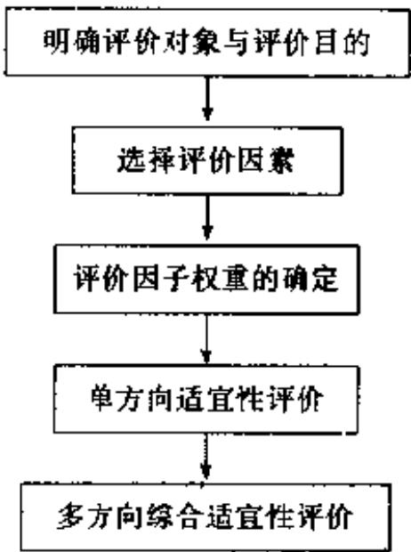  
图 3-2 多因素综合评价法步骤  
Fig. 3— 2 Process of comprehensive evaluation considering multi- factors

## 2. 评价因素的选择方法

(1)评价因素的选择原则。评价因素的个数应适当，以能反映评价单元或地块间差异为准则。个数太多，会掩盖主要因素的影响；个数过少又可能忽略某些因素的作用。选择能突出反映矿

山废弃地破坏程度的因子，有关参评因素的数据应在图纸或资料上便于获取。选择对土地复垦方向有直接影响的因子。

(2)评价因素的选择。不同的复垦利用方向，其影响因素也不尽相同，因素间的重要性也存在或大或小的差异，表3一9列出了几种主要复垦利用方向的评价因素。

表3-9 几种主要复垦利用方向的评价因素  
Tab 3—9 Factors for evaluating suitability of severol main land nse types
<table><tr><td rowspan=1 colspan=1>复星利用方向</td><td rowspan=1 colspan=1>适宜性评价因素    .</td></tr><tr><td rowspan=1 colspan=1>农业利用</td><td rowspan=1 colspan=1>积水状况，土地利用现状；排灌条件：区位条件：土壤条件；坡度等</td></tr><tr><td rowspan=1 colspan=1>林果利用</td><td rowspan=1 colspan=1>影响幼林生长的立地条件，地理位置：潜水位埋藏情况；气候条件对所选林果品种的适宜性，土壤养分状况等</td></tr><tr><td rowspan=1 colspan=1>建筑利用</td><td rowspan=1 colspan=1>地理位置；土地破坏类型；地下采空区活化的可能性，建筑用途、地基处理方式与经济合理性等</td></tr><tr><td rowspan=1 colspan=1>水产养殖用地</td><td rowspan=1 colspan=1>水源保证率；水源水质情况；排水条件；水产品市场供需状况，水产养殖技术与经验等</td></tr><tr><td rowspan=1 colspan=1>畜牧业用地</td><td rowspan=1 colspan=1>地方性病虫害，矿山污染源的影响，牲畜饲料供应情况：气候条件；市场供需状况等</td></tr></table>

对评价因素的筛选过去大多基于经验判断的方法。我们认为，在试验数据较充分的条件下，可以生产力为标准，用多元回归分析或主成份分析的方法进行筛选。

## 3. 评价因子权重的确定方法

常用的权重确定方法有等差指数法、因素成对比较法、层次分析法、多元线性回归分析等方法。

## 4. 单方向适宣性评价模型

设对某一复垦方向作适宜性分析，影响因素有m个，每个因素对应一个状态集V，

$$
V ^ { r } , = [ z \rangle , \imath , v _ { \imath } { } _ { 2 } , \imath \cdots \imath _ { \imath j } , \imath \cdots \imath _ { \imath n } ] ^ { - }\tag{3-3}
$$

$i = 1 , ~ 2 , ~ \cdots , ~ m$ ，表示影响因素序号； $j { = } 1 , \ 2 , \ \cdots , n$ ，表示适宜某一复垦方向的等级。

显然，每个因素状态集都是一个对指定复垦方向从优到劣的全序集，且满足：

$$
v _ { \iota \colon } > v _ { \iota \colon } > \cdots > v _ { \iota \iota }
$$

这些因素按其属性值的优劣，可用矩阵R表示：

$$
\begin{array}{c} \begin{array} { r l r } {  { \{ { a _ { 1 } \beta _ { I 1 } \quad \cdots \quad a , p _ { i } \quad \cdots \quad a , n \beta _ { i n } } \atop \cdots \cdots \cdots \cdots \cdots \cdots \cdots \cdots \cdots \cdots \cdots \cdots \cdots \cdots } \} } .  \\ & { } & { } \\ & { R = . } & { | { a _ { 1 } \beta _ { j i } \quad \cdots \quad a , p _ { n } \quad \cdots \quad a , p _ { j n } \atop \cdots \cdots \cdots \cdots \cdots \cdots \cdots \cdots \cdots } \} \quad ( i = 1 \sim m , j = 1 \sim n ) } \\ & { } & \\ & { } & { \{ \begin{array} { r l r } { a _ { 1 } \beta _ { n 1 } \quad \cdots \quad a , \ldots \quad a , p _ { n i } \quad \cdots \quad a , n \beta _ { n n } } \end{array} \} } \end{array} \quad ( i = 1 \sim m , j = 1 \sim n ) .  \end{array}\tag{3- 4}
$$

式中： ${ \pmb { a } } _ { i }$ 为第i个因子对某一复垦方向的权重值； $\beta _ { \mu }$ 为i因子对j等级的适宜分值（或贡献函数值）。 ${ \pmb { a } } _ { t }$ 可用层次分析法、特尔斐法或经验法确定； $\scriptstyle { \pmb { \hat { p } } } _ { \pmb { \eta } }$ 则可根据贡献函数方程或分值分配公式确定。

若研究区域采用栅格数据结构，则每个栅格单元对应的指数为：

$$
I D = \frac { 1 } { 1 0 0 } \sum _ { j = \ell } ^ { n } \sum _ { \ell ^ { \prime } = 1 } ^ { m } a , \phi _ { \ell ^ { \prime } } .\tag{3-5}
$$

$\Psi _ { \pmb { \xi } }$ 为j等级的理想分值， $\lambda _ { i j }$ 为i因子对j等级的理想分值，则：

$$
\stackrel { \cdot } { w } , = \cdot \sum _ { \prime = 1 } ^ { m } \lambda _ { i } , \quad ( j = \stackrel { \cdot } { 1 } ^ { \wedge } \sim n )\tag{3-6}
$$

双设 $D = . 1 - \lvert I D - \psi _ { j } / 1 0 0 \rvert$ ，D可称为栅格单元对于j等级的相容度。若某一等级的理想分值 ${ \pmb w } _ { \pmb { \jmath } }$ 使 $\pmb { \mathscr { P } }$ 值最大，则可将此栅格单元归入j等级。

## 5. 多方向综合适宜性决策模型

设备选复垦方向有k个，这时就需进行综合适宜性评价，建立多目标复垦布局决策模型。

设与k复垦方向有关的因素有r个，r个因素的实际属性值为$A = \{ a _ { 1 } , a _ { 2 } , \cdots a _ { r } \}$ ，对于k复垦方向最佳要求的指标值为 $\gamma = \epsilon _ { 1 }$ $\smash { \ell _ { 2 } , \ell _ { r } } \bigr )$ ，于是对于k复垦方向，可按下式求出欧氏距离 $d$

$$
d _ { k } = \sqrt { \frac { 1 } { r } \sum _ { i = 1 } ^ { r } ( \lambda _ { i } a _ { i } - t _ { i } a _ { i } ) ^ { 2 } }\tag{3-7}
$$

式中 $^ { a , }$ 为参评因子的权重。于是，比较k个备选复垦方向的欧氏距离，距离最小者即为最佳复垦方向。

## 四、多因素综合评价法应用实例

## 1. 评价区域概述

评价区域位于铜山县大泉、青山泉及紫庄乡境内，距徐州市38km，在贾汪区西南，如图3—3所示。评价区域的东部为徐贾公路；西南边界为老西排洪道以西的一条乡村路（去四清村）；南部和紫庄乡正在建设的成片复垦开发区相接。距青韩（又叫青洪）公路1.25km；北部以四清村和泉汪头鳖厂连线为界。总面积约750ha。本例评价750ha土地进行农业复垦、基塘复垦和林果复的适宜性。

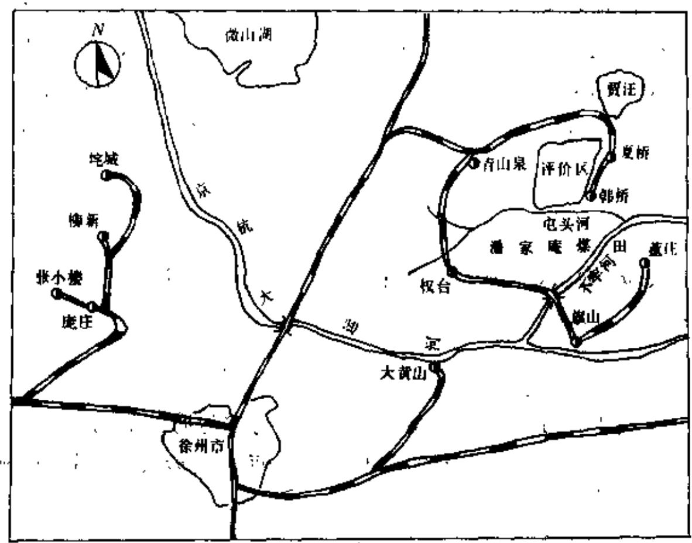  
图 3—3 评价区域地理位置图  
Fig. 3—3 Geographical location of region evaluated

## 2. 评价因子选择及其权重的确定

## 1）评价因子

农业复垦方向的参评因子有积水状况、土地利用现状、排灌条件、区位条件、土壤条件等因素。积水状况和土地利用现状两因素基本反映了上地塌陷破坏的程度以及土地的肥力、耕作条件等；排灌条件包括两方面，即涝能排、旱能灌，它直接影响上地生产潜力的发挥；区位条件是指塌陷地块距充填料及水源、道路的远近；上壤条件没有细分成土质、土壤结构等，因为治理区域内土壤条件变化不大，基本分为青韩公路北砂礓土和青韩公路南淤土两种类型。虽有许多因素如地形起伏等对农业用地的限制性较大，但因本区这些因素的取值或条件变化不大，因此没有考虑。

基塘复垦方向的参评因素有水源条件、积水状况、治理现状、其它外部条件，如是否能成片开发、政府与农民的积极性、水、电、路等通畅条件等。

林果复垦方向的参评因子有环境污染程度、治理现状、地表标高及区位条件等因素。

## 2）评价因子权重的确定

用层次分析法确定，结果如表3—10、表3-11和表3—12。

## 3）等级分值的确定

当参评因子的属性值在某复垦方向的一级适宜度的区间内或以上时，其分值为100；当参评因子的属性值在某复垦方向的末级适宜度以外或以下时，其分值为0；介于两者之间的其它适宜度的分值根据贡献函数方程确定，本例采用等差数列给出。

不同复垦方向的参评因子、权重及分值确定如表3—10、3-11和表3—12所示。

## 3. 综合适宜性评价结果

通过编程计算，得到综合适宜性评价结果，如表3-13所示。

表3-10农业复垦方向的参评因子、权重及分值确定  
Tab 3. 10 Factors, weight and grade considered in the process of evaluation when reclaimed land used for agriculure
<table><tr><td rowspan=2 colspan=1>等级</td><td rowspan=1 colspan=1>评价因子</td><td rowspan=1 colspan=1>积水状况</td><td rowspan=1 colspan=1>土地利用现状</td><td rowspan=1 colspan=1>区位条件</td><td rowspan=1 colspan=1>排灌条件</td><td rowspan=1 colspan=1>土壤条件</td></tr><tr><td rowspan=1 colspan=1>权重</td><td rowspan=1 colspan=1>0.12</td><td rowspan=1 colspan=1>0.25</td><td rowspan=1 colspan=1>0.21</td><td rowspan=1 colspan=1>0.24</td><td rowspan=1 colspan=1>0.18</td></tr><tr><td rowspan=2 colspan=1>1</td><td rowspan=1 colspan=1>分值</td><td rowspan=1 colspan=1>12    i</td><td rowspan=1 colspan=1>25</td><td rowspan=1 colspan=1>21</td><td rowspan=1 colspan=1>24</td><td rowspan=1 colspan=1>18</td></tr><tr><td rowspan=1 colspan=1>屈性</td><td rowspan=1 colspan=1>尤</td><td rowspan=1 colspan=1>水浇地、求地及稱麦两作地</td><td rowspan=1 colspan=1>距排水沟近、污染源远</td><td rowspan=1 colspan=1>起伏小、有排灌设施</td><td rowspan=1 colspan=1>淤上、1:层际</td></tr><tr><td rowspan=2 colspan=1>2</td><td rowspan=1 colspan=1>分值</td><td rowspan=1 colspan=1>8</td><td rowspan=1 colspan=1>17</td><td rowspan=1 colspan=1>14</td><td rowspan=1 colspan=1>16</td><td rowspan=1 colspan=1>12</td></tr><tr><td rowspan=1 colspan=1>属性</td><td rowspan=1 colspan=1>季节性积水</td><td rowspan=1 colspan=1>早地、可改造荒滩、草地</td><td rowspan=1 colspan=1>介下1、3级之间</td><td rowspan=1 colspan=1>稳作田间水利丁程</td><td rowspan=1 colspan=1>砂础、有植被生长</td></tr><tr><td rowspan=2 colspan=1>3</td><td rowspan=1 colspan=1>分值</td><td rowspan=1 colspan=1>4</td><td rowspan=1 colspan=1>8</td><td rowspan=1 colspan=1>7</td><td rowspan=1 colspan=1>8</td><td rowspan=1 colspan=1>6</td></tr><tr><td rowspan=1 colspan=1>属性</td><td rowspan=1 colspan=1>常年积水</td><td rowspan=1 colspan=1>鱼塘、水坑等</td><td rowspan=1 colspan=1>距排水沟远、污染源近</td><td rowspan=1 colspan=1>需作大量水利工程配套</td><td rowspan=1 colspan=1>砂磁、无植被生长</td></tr></table>

表3-11 基塘复垦方向的参评因子、权重及分值确定

Tab 3– 11 Factors, weight and grade considered in the process of evaluation when reclaimed land used for dike-pond pattern
<table><tr><td rowspan=2 colspan=1>等级</td><td rowspan=1 colspan=1>参评因子</td><td rowspan=1 colspan=1>水源条件</td><td rowspan=1 colspan=1>积水状况</td><td rowspan=1 colspan=1>治理现状</td><td rowspan=1 colspan=1>外部条件</td></tr><tr><td rowspan=1 colspan=1>权重</td><td rowspan=1 colspan=1>0.10</td><td rowspan=1 colspan=1>0.16</td><td rowspan=1 colspan=1>0.34</td><td rowspan=1 colspan=1>0.40</td></tr><tr><td rowspan=2 colspan=1>1</td><td rowspan=1 colspan=1>分值</td><td rowspan=1 colspan=1>10</td><td rowspan=1 colspan=1>16</td><td rowspan=1 colspan=1>34</td><td rowspan=1 colspan=1>40</td></tr><tr><td rowspan=1 colspan=1>属性.</td><td rowspan=1 colspan=1>好</td><td rowspan=1 colspan=1>常年积水面积不人或季节性积水</td><td rowspan=1 colspan=1>精养仙塘或浅滩区</td><td rowspan=1 colspan=1>距污染源远，有成片斤发可能</td></tr><tr><td rowspan=2 colspan=1>2</td><td rowspan=1 colspan=1>分值</td><td rowspan=1 colspan=1>5</td><td rowspan=1 colspan=1>8</td><td rowspan=1 colspan=1>17</td><td rowspan=1 colspan=1>20</td></tr><tr><td rowspan=1 colspan=1>属性</td><td rowspan=1 colspan=1>差</td><td rowspan=1 colspan=1>无积水或常年积水面大</td><td rowspan=1 colspan=1>种值用地或大水面雄利用</td><td rowspan=1 colspan=1>距污染源近，无成片开发可能</td></tr></table>

表3-12 林果复垦方向的参评因子、权重及分值确定

Tab 3—12 factors, weight and grade considered in the process of evaluation when reclaimed land used for forestry
<table><tr><td rowspan=2 colspan=1>等级</td><td rowspan=1 colspan=1>参评因子</td><td rowspan=1 colspan=1>地表标高</td><td rowspan=1 colspan=1>环境污染现状</td><td rowspan=1 colspan=1>治理现状</td><td rowspan=1 colspan=1>区位条件</td></tr><tr><td rowspan=1 colspan=1>权重</td><td rowspan=1 colspan=1>0.14</td><td rowspan=1 colspan=1>0.29</td><td rowspan=1 colspan=1>0.26</td><td rowspan=1 colspan=1>0.31</td></tr><tr><td rowspan=2 colspan=1>1</td><td rowspan=1 colspan=1>分值</td><td rowspan=1 colspan=1>14</td><td rowspan=1 colspan=1>29</td><td rowspan=1 colspan=1>26</td><td rowspan=1 colspan=1>31</td></tr><tr><td rowspan=1 colspan=1>属性</td><td rowspan=1 colspan=1>较高</td><td rowspan=1 colspan=1>严重</td><td rowspan=1 colspan=1>粉煤灰允填区，无植被</td><td rowspan=1 colspan=1>路周边</td></tr></table>

表3-13 综合适宜性评价结果表  
Tab 3-- 13 Result of comprehensive evaluation of suitability
<table><tr><td rowspan=2 colspan=1>复早方向</td><td rowspan=1 colspan=3>宣农地</td><td rowspan=1 colspan=2>宜花塘复垦地</td><td rowspan=1 colspan=1>宜林果地</td></tr><tr><td rowspan=1 colspan=1>级</td><td rowspan=1 colspan=1>级</td><td rowspan=1 colspan=1>级</td><td rowspan=1 colspan=1>--级</td><td rowspan=1 colspan=1>二级</td><td rowspan=1 colspan=1>--级</td></tr><tr><td rowspan=1 colspan=1>首积（面）</td><td rowspan=1 colspan=1>3810.75</td><td rowspan=1 colspan=1>1791.75</td><td rowspan=1 colspan=1>(1</td><td rowspan=1 colspan=1>2235</td><td rowspan=1 colspan=1>0</td><td rowspan=1 colspan=1>982.5</td></tr></table>

作为综合适宜性评价结果，计算机可输出各类复垦方向用地分布图，如图3一4。由图可以看出：

(1)-级宜农地主要分布在以下三个区域：

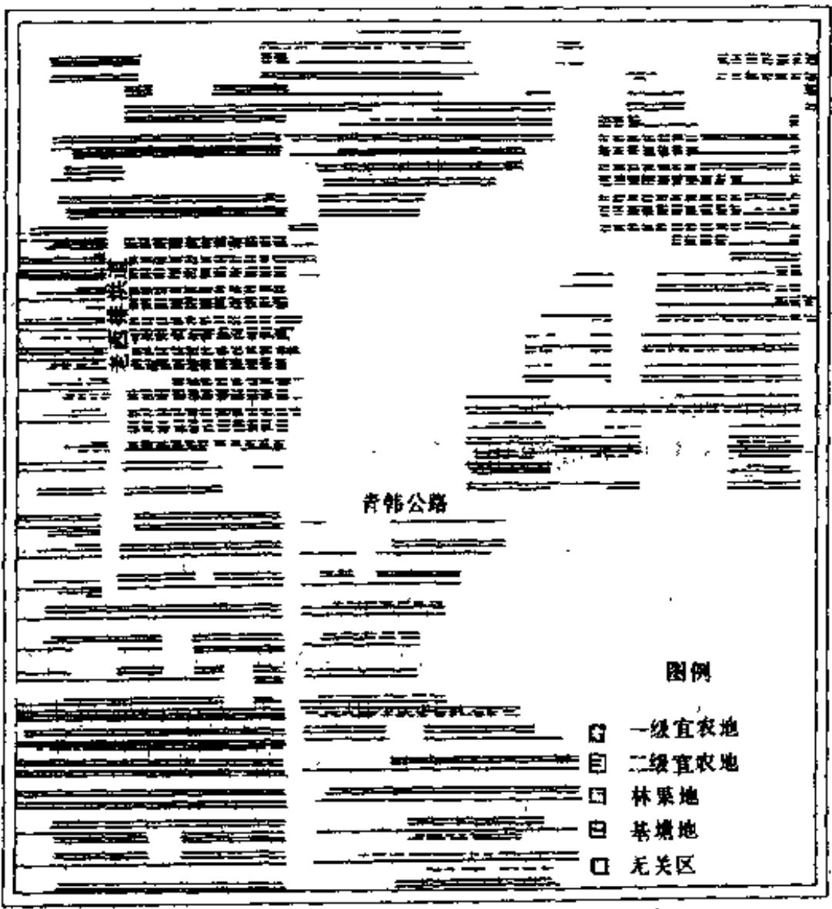  
图 3-4 综合适宜性评价结果图  
Fig. 3—4 Result of comprehensive evaluation of suitablity

①青韩公路以南，常宏复垦开发区以西至治理区边界。

②老西排洪道以西至治理区边界。

③治理区西北，老西排洪道以东至青山泉、大泉二乡交界处。

(2)级宜农地主要分布在石头阵商湖生态开发区以北至治理区边界；以及粉煤灰充填区以南，中央排洪道以西，青韩公路以北的区域。

(3)林果地主要分布在四清开发区以西，青韩公路以北，老西排洪道以东的区域，以及粉煤灰充填区；沟渠、道路两侧和厂矿四周。

(4)宜渔地主要分布在石头镇商湖生态开发区，四清开发区，常宏复垦开发区，军民共建开发区，以及泉汪头鳖厂以东，中央排洪道以西，粉煤灰充填区以北的区域。

## 第四节 复垦用地结构优化方法

通过复垦土地的适宜性评价得到了矿山废弃地各种复垦方向的土地面积构成，但这一用地结构没有综合考虑复垦的社会效益、生态环境效益和经济效益，如没有考虑投资强度和投资偿还能力等。因此合理的复垦用地结构需作进一步的决策。

## 一、各类复垦方向的用地面积预测

## 1. 复垦为耕地的面积预测

农业用地主要指粮食作物用地、经济作物用地和菜园地，即相当于八大类中的耕地类。其预测方法有三种：

(1)取土地利用总体规划中对复垦为耕地所提出的目标作为预测数。一般在地（市）、县土地利用总体规划中，都对土地复垦工作提出了具体的要求，多数土地利用总体规划提出开发复垦出的耕地面积应和各种建设新占耕地持平。这样扣除当地能开发的耕地数和其它废弃地能复垦的耕地数，即得矿山废弃地应复垦的耕地数。还有一种情况是土地利用总体规划中提出了耕地复垦率，即对复垦为耕地的面积占总复垦面积的比例提出了具体指标，这时只要将耕地复垦率乘以总复垦面积，即得到复垦为耕地的面积

预测数。

(2)按粮食需求量预测。将复垦区域所属行政单位作为预测基础，设总人口为 $P$ .年人均口粮(kg/年·人)，调出或上缴公粮$E _ { \scriptscriptstyle 1 } ( { \bf k } _ { \mathrm { E } } )$ .工业或饲料用粮 $E _ { z } ( \mathbf { k } \mathbf { g } )$ .矿区现有耕地A:(ha)，单产$\ p _ { \mathrm { \ell } _ { 1 } } ( \mathbf { k } \mathbf { g } ; \mathbf { h } \mathbf { a } )$ ，规划期内其它类型的后备土地资源可开发复垦为耕地的面积 $A _ { z } ( \mathsf { h a } )$ ，预计单产为 $\pmb { \mathscr { p } } _ { \ 3 } ( \mathbf { k } \mathbf { g } / \mathbf { h } \mathbf { a } )$ ，可调入粮食为 $I ( \mathbf { k g } ) , \overrightarrow { \mathfrak { P } } ^ { \mathrm { * } }$ 山废弃地复垦为耕地的单产为 $p \{ \mathbf { k g } / \mathbf { k a } \}$ ·则矿山废弃地应复垦为耕地的面积 $x _ { 1 }$ 为：

$$
x _ { 1 } \geqslant \frac { P \circ r + E _ { 1 } + E _ { 2 } - A _ { i } p _ { 1 } - A _ { 2 } p _ { 2 } - I } { P }\tag{3-8}
$$

(3)统计预测法。统计预测法可从两个角度预测，一种是根据过去的统计数据预测规划区内各种建设占用耕地量，以此作为复垦为耕地的预测数。种是直接根据粮食需求量增涨趋势，预测复垦为耕地的面积数。

## 2. 居民点占地预测

居民点占地预测包括两部分，一部分是区内人口增加或居民点改建而增减的面积，另一部分是因矿山开采影响而居民点需要迁入（或迁出）所占用（或腾空）的面积。

设规划区内现有人口为 $P _ { a }$ ，规划期内新增人口 $P _ { \beta }$ ，现有居民点面积 $S _ { \ r } { } _ { \ r { \eta } }$ ，人均居民点占地标准为a(ha/人)，迁人的居民点面积为 $S _ { r }$ ，迁出的居民点面积为 $\mathsf { S } _ { r }$ ，则预计居民点占地量 $x _ { 2 }$ 为：

$$
x _ { 2 } = \{ \begin{array} { l l } { S _ { r r } + P _ { \theta } a + S _ { r } - S _ { r e } \quad } & { \boxed { \overrightarrow { \mathrm { H } } } \boxed { \mathrm { E } } , \overrightarrow { \mathrm { K } } \overrightarrow { \mathrm { K } } \overrightarrow { \mathrm { K } } \overrightarrow { \mathrm { K } } \overrightarrow { \mathrm { K } } \overrightarrow { \mathrm { K } } \overrightarrow { \mathrm { H } } \overrightarrow { \mathrm { H } } \overrightarrow { \mathrm { H } } } \\ { ( P _ { s } + P _ { s } ) a + S _ { r i } - S _ { r e } \quad } & { \boxed { \overrightarrow { \mathrm { H } } } \boxed { \mathrm { E } } , \overleftarrow { \mathrm { K } } \overrightarrow { \mathrm { K } } \overrightarrow { \mathrm { K } } \overrightarrow { \mathrm { K } } \overrightarrow { \mathrm { K } } \overrightarrow { \mathrm { H } } } \end{array}\tag{3-9}
$$

## 3. 交通、水利用地需求量预测

复垦区域的交通、水利用地需求量分两部分，一部分为服务于大范围的交通水利设施占地，另一部分是只服务于复垦区域的交通水利设施。第一部分的用地需求量可从有关规划中直接查取，设为 $\mathcal { S } _ { t a }$ ，第二部分的用地需求量可用占地系数法预测，设服务于复垦区的交通水利设施占总面积的比例为c，总复垦面积为S，则

交通水利用地需求量 $\scriptstyle . 2 , 3$ 为：

$$
{ \bar { x _ { 3 } } } = S _ { { \bar { w } } } + c S\tag{3-10}
$$

4. 独立工矿用地预测

直接从有关工矿用地规划中查取。

## 二、复垦用地结构的线性规划模型决策法

复垦用地结构优化需考虑土地的适宜性、各类用地的需求量、复垦区内的自然资源、人力与资金资源条件以及市场需求、法规约束等，并且应保证在有限的资金资源条件下，获得最佳的生态环境、社会和经济效益。线性规划可较好地解决复垦用地结构的优化问题32。

$Z ( t )$ 为t年的总经济效果， $\varepsilon , \left( t \right)$ 为t年各类用地单位面积的经济效果， $x _ { j } \in \{ t \}$ 为t年各类用地的面积，则有

目标函数

$$
\mathrm { m a x } Z ( t ) = \sum _ { j = 1 } ^ { { \bullet _ { 1 } } } c _ { j } ( t ) x _ { i } ( t ) \cdot \underbrace { \cdot \mathrm {  ~ \sigma ~ } _ { \cdots } \mathrm {  ~ \sigma ~ } _ { \cdots } \mathrm {  ~ \sigma ~ } _ { \cdots } } _ { \substack { { \mathrm { ~  ~ \sigma ~ } , \mathrm { ~ \sigma ~ } ~ } _ { \cdots } \mathrm { ~  ~ \sigma ~ } _ { \cdots } \mathrm { ~  ~ \sigma ~ } _ { \cdots } } } \cdot ( 3 \cdot - 1 1 )
$$

约束条件

$$
\begin{array} { r }  \vdots \stackrel { { } , { } } { \hat { \ z } } _ { 1 } ^ { \prime } \stackrel { { } , { } , { } } { \hat { \ z } } _ { 1 } ^ { \prime } \cdot \hat { \ z } , \stackrel { { } , { } , { } , { } , { } , { } , { } , { } , { } , { } , { } , { } , { } , { } , { } , { } , { } , { } , { } , { } , { } , { } , { } , { } , { } , { } , { } , { } , { } , { } , { } , { } , { } , { } , { } , { } , { } , { } , { } , { } , { } , { } , { } , { } , { } , { } , { } , { } , { } , { } , { } } \\  \vdots \stackrel { { } } { \hat { \ z } } _ { 1 } ^ { \prime } \stackrel { { } } { \hat { \ z } } _ { 1 } ^ { \prime } \stackrel { { } } { \hat { \ z } } _ { 1 } ^ { \prime } \stackrel { { } } { \hat { \ z } } _ { 1 } ^ { \prime } \stackrel { { } } { \hat { \ z } } _ { 1 } ^ { \prime } \stackrel { { } } { \hat { \ z } } _ { 2 } ^ { \prime } \stackrel { { } } { \hat { \ z } } _ { 2 } ^ { \prime } \stackrel { { } } { \hat { \ z } } _ { 2 } ^ { \prime } \stackrel { { } } { \hat { \ z } } _ { 1 } ^ { \prime } \stackrel { { } } { \hat { \ z } } _ { 1 } ^ { \prime } \stackrel { { } } { \hat { \ z } } _ { 2 } ^ { \prime } \stackrel { { } } { \hat { \ z } } _ { 2 } ^ { \prime } \stackrel { { } } { \hat { \ z } } _ { 2 } ^ { \prime } \stackrel { { } } { \hat { \ z } } _ { 1 } ^ { \prime } \stackrel { { } } { \hat { \ z } } _ { 2 } ^ { \prime } \stackrel { { } } { \hat { \ z } } _ { 2 } ^ { \prime } \stackrel { { } } { \hat { \ z } } _  \end{array}
$$

$\therefore \}$ 若 $\overset { \cdot , } { \pmb { \xi } }$ 年的系数一定，上述模型将简化如下：

目标函数为 $\because \therefore \boldsymbol { \jmath } _ { i } \cdot \mathrm { m a x } \mathbf { Z } _ { i } \cdot \equiv \sum _ { j = 1 } ^ { \cdot } c _ { i } x ^ { \alpha _ { j } } i \cdot \underbrace { \dot { \cdot } \cdot \dot { \cdot } } _ { i } : \dot { \cdot } _ { i } : \dot { \cdot } _ { i } : \dot { \cdot } _ { i } : \dot { \cdot } _ { i } \dot { \cdot } _ { i } \dot { \cdot } _ { j } \leq \dot { \cdot } _ { i } - \dot { \cdot } _ { i } \dot { \cdot } _ { j } \dot { \cdot } _ { i } \dot { \cdot } _ { j }$ 约束条件为 $\left\{ \begin{array} { l l } { { \displaystyle \sum _ { j = 1 } ^ { n _ { 1 } } a _ { i j } x , \sum _ { i = } ^ { \ n } m _ { i } } } & { { i = 1 , 2 , \cdots , n _ { 2 } . } } \\ { { \displaystyle \qquad \sum _ { j = 0 } ^ { n } \sum _ { j = } ^ { j } m _ { j } } } & { { j = 1 , 2 , \cdots , n _ { 1 } } } \end{array} \right.$ ( 1

(3-14)

模型中， $\pmb { \eta } _ { 1 }$ 表示复垦方向数 $\ddot { \pmb { \mathscr { x } } } _ { 2 } ^ { \dagger }$ 表宗除非负约束外的约束条件数。为列立约束方程和寻求模型中的参数 $\cdot \cos \cdot \cos \cdot \sin \cdot \sin \cdot$ ，需作深入的调整研究和分析工作。复垦用地结构优化时常见的几类约束是：（1)供应量约束供应量约束包括土地资源总量约束 $\vdots \vdots$ 资金投入总量约束 $\therefore \dddot { \dot { \sqrt { \dot { \sqrt { \dot { \enspace } } } } } }$ 水资源总量约束、劳动力资源、充填料来源等。

（2）需求约束。即对各类用地面积的需求量约束。

(3)适宜性约束。即各类复垦方向的面积不能超过适宜下该方向的面积。

(4)比例约束。生态工程复垦时，某些复垦方向的用地面积应符合一定的比例。

(5)政策约束。各类复垦用地应符合国家政策或地方法规的要求，如对耕地复垦率、森林覆盖率等的要求。

(6) 非负约束。

## 三、复垦用地结构优化实例3]

## 1. 复垦区概况

规划区面积约860亩，规划区内人门约700余人，原来地势平坦，均为良出、适于种梢玉米、大豆、棉花、小麦、水稻、花生等粮食作物与经济作物。该区平均潜水位标高为+34.5m，最高时达+35.0m，丰水期积水率为30%以上。地面下沉等值线见图3-5所示。

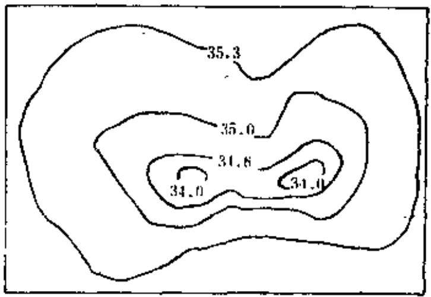  
图3-5 地面下沉等值线  
Fig. 3 --5 Isopleth of surface subsidence

该规划区离徐州市区较近，这是一个有利条件。据调查，农产品尤其是蔬菜、水产品需求量大。与规划区相邻接的较大范围的社会经济状况为：因煤矿开采耕地大面积塌陷，部分地方人均耕地仅有0.1亩。当地农民已经开挖了一些鱼塘养鱼，他们对新的耕作制度没有把握，缺乏应有的重视。

## 2. 模型建立

根据现有资源和生产需要，将约束条件分为四大类，即总量约束、配置约束、绝对量约束和非负约束。总量约束所需数据见表3-14。

表3-14总量约束数据  
Tab 3  I1 Constraint figures of total amount
<table><tr><td rowspan=1 colspan=1>利用方向</td><td rowspan=1 colspan=1>纯收益 $( \widetilde { J \downarrow } / \widetilde { \mpb { \mathscr { F } } } \cdot \dot { \mu } \dot { \mu } )$ </td><td rowspan=1 colspan=1>复员投资(元/亩)</td><td rowspan=1 colspan=1>劳力投入(人/年·亩)</td><td rowspan=1 colspan=1>服务用地(亩/亩)</td><td rowspan=1 colspan=1>各类用地面    积(亩)</td><td rowspan=1 colspan=1>土方量 $( \mathbf { m } ^ { 3 } / \overrightarrow { \mathbf { a } } )$ </td></tr><tr><td rowspan=1 colspan=1>1. 猪场</td><td rowspan=1 colspan=1>14000</td><td rowspan=1 colspan=1> ${ \hat { \mathbf { \rho } } } _ { 3 } 4 5 0 { \hat { \mathsf { p } } } \cdot \cdot \cdot$ </td><td rowspan=1 colspan=1>3</td><td rowspan=1 colspan=1>0.03</td><td rowspan=1 colspan=1>r</td><td rowspan=1 colspan=1> $- 2 0 0$ </td></tr><tr><td rowspan=1 colspan=1>2. 鸡场</td><td rowspan=1 colspan=1>10000</td><td rowspan=1 colspan=1> $2 1 1 8 0 ^ { \circ } { } ^ { \bullet }$ </td><td rowspan=1 colspan=1>4</td><td rowspan=1 colspan=1>0.03</td><td rowspan=1 colspan=1>rA</td><td rowspan=1 colspan=1>- 200</td></tr><tr><td rowspan=1 colspan=1>3. 养角</td><td rowspan=1 colspan=1>800</td><td rowspan=1 colspan=1>1500</td><td rowspan=1 colspan=1>0.1</td><td rowspan=1 colspan=1>0.01</td><td rowspan=1 colspan=1>任</td><td rowspan=1 colspan=1>700</td></tr><tr><td rowspan=1 colspan=1>4. 粮食作物</td><td rowspan=1 colspan=1>600</td><td rowspan=1 colspan=1>2000</td><td rowspan=1 colspan=1>0.1</td><td rowspan=1 colspan=1>0.01</td><td rowspan=1 colspan=1>T粮</td><td rowspan=1 colspan=1>-400</td></tr><tr><td rowspan=1 colspan=1>5. 林果园</td><td rowspan=1 colspan=1>800</td><td rowspan=1 colspan=1>1200</td><td rowspan=1 colspan=1>0.02</td><td rowspan=1 colspan=1>0.02</td><td rowspan=1 colspan=1>不林果</td><td rowspan=1 colspan=1>−200</td></tr><tr><td rowspan=1 colspan=1>6. 饲料地</td><td rowspan=1 colspan=1>167</td><td rowspan=1 colspan=1>1200</td><td rowspan=1 colspan=1>0.05</td><td rowspan=1 colspan=1>0. 005</td><td rowspan=1 colspan=1>J</td><td rowspan=1 colspan=1>-400</td></tr><tr><td rowspan=1 colspan=1>7. 服务用地</td><td rowspan=1 colspan=1>0</td><td rowspan=1 colspan=1>700</td><td rowspan=1 colspan=1>0</td><td rowspan=1 colspan=1>-1</td><td rowspan=1 colspan=1>r服芍</td><td rowspan=1 colspan=1>0</td></tr><tr><td rowspan=1 colspan=2> $\pmb { \Sigma } _ { \pmb { c } , \pmb { x } _ { j } }$ </td><td rowspan=1 colspan=1>≤1720000</td><td rowspan=1 colspan=1>≤30δ</td><td rowspan=1 colspan=1>≤0</td><td rowspan=1 colspan=1>=860</td><td rowspan=1 colspan=1> $\gapprox 0$ </td></tr></table>

\*猪场 $1 4 \mathrm m ^ { 2 }$ 每年养猪2头，年收益150元，每人年养猪40头；鸡场每1m²年养鸡10 $\mathbf { \lfloor m ^ { 2 } }$ 只，每只收益为1/5元，每人年养鸡1500只。  
\*\*该项投资中包括建猪、鸡舍的投资，猪舍接50元 $\scriptstyle { f _ { \mathbf { M } } } ^ { 2 }$ 、鸡会按30元 $/ \mathbf { m } ^ { 2 }$ 计算。

配置约束有：养鱼一亩配饲料地0.5亩，即 $_ { x _ { \mathrm { f f } } } { \geqslant } 0 . 5 x _ { \mathrm { f f } }$

绝对约束有：受技术水平、饲料来源等限制，猪场、鸡场所受约束为 $x _ { \nparallel } \leqslant 2 0 , x _ { \nparallel } \leqslant 4 0$ 。该区需粮20万kg，以亩产600kg计算，种植面积约束为 $x _ { \mho } { \geqslant } 3 3 3$

非负约束为 $x _ { 1 1 } , x _ { 2 3 } , x _ { 3 3 } , x _ { 2 3 } , x _ { 3 3 } , x _ { 4 3 } , \cdot x _ { 1 3 } , x _ { 3 3 } \geq 0 ,$

## 3. 优化结果与分析

利用LP程序对下述两种情况进行了解算：

(1）只考虑第3、4、5、6、7五种土地利用方向，考虑上述所有约束：

(2)考虑第1至第7七种土地利用方向，不考虑种粮面积约束并将复垦投资约束由总额172万元改为260万元。

计算结果表明：

(1)若考虑养鱼与种植作物和林果园.则有 $x _ { 1 \uparrow \downarrow } \overline { { \cdot \cdot } } 2 9 6 . 1$ 亩， $z _ { \uparrow \downarrow }$ $= 3 3 3$ 亩， $x _ { * * * } = 7 4 . 3$ 亩， ${ \mathcal { L } } _ { \bar { \mu } 1 } = \perp 4 8 . 1$ 亩、 $x ' _ { \ast } * _ { \ast } = 8 . 5$ 亩。需投资138.30万元，就业人数72人，土方量20.7万 $\mathfrak { m } ^ { 3 }$ ，挖填均衡，年纯收入最大值为52.09万元.以复利率 $i = 1 \zeta$ %计算，投资回收期3.2年，人均收入714元。

此方案的优点是将塌陷地充分开发用于粮食、林果种植和水产养殖，土方工程量均衡，充分利用了区内资金和资源条件。存在问题是就业人数少、人均收入低。即使这样，同未受塌陷影响的农村相比，效益也是可以的。

(2)除考虑上述利用方向外，还考虑饲养禽畜，则有 $x _ { \ m } = 2 0$ 亩， $x ^ { \cdot } _ { x _ { j } } = 4 0$ 亩， $x _ { \uparrow \uparrow } = 2 1 1 . 5$ 亩， $x _ { * * * } = 4 6 8 . 9$ 宙， $_ { \mathcal { X } \backslash \mathfrak { s } } = 1 0 5 . 8$ 亩.${ \mathfrak { r } } _ { \mathfrak { k } } _ { \mathfrak { k } } = 1 3 . 8$ 亩。需投资256.1万元，就业人数251人，土方量为14.8万 $\mathfrak { m } ^ { 3 }$ ，挖填均衡，年纯收益最大值约为124.20万元，以复利率i=10%计算，投资回收期为2.4年，人均收入1774.27元。

该方案的优点是将塌陷地充分开发用于林果种植、水产养殖及禽畜饲养，土方工程量较小，就业入数多，入均收入高。存在问题是仅靠区内提供的资金和资源条件是不够的。一方面需筹集资金，初期投资需256.1万元，表3—14中只有172万元，尚缺84.1万元；另一方面在约束条件中只考虑了满足养鱼的饲料来源，养猪、养鸡亦需大量的饲料，需从外地购进；再一个问题是当地居民的口粮没有解决。若能解决以上问题，该方案是较优的，若不能解决则选用第一方案。

(3)解决第二个方案的办法是通过总体布局进行协调，即大区域内若有适种的耕地，则将这些耕地建成粮食饲料基地，本规划区则按第二方案施行。

## 第五节 矿区土地复垦模式的决策

矿区土地复垦模式是指复垦时如何选择适当的工程措施、适宜的复垦利用方向与层次并使其成为最佳匹配34。实践证明， $\pmb { \mathcal { W } }$ 区土地复垦模式决策的正确与否是一个地区上地复垦下作成效的关键。矿区土地复垦的工程措施是实现复垦利用方向的基础和准备，土地复垦利用方向和层次又是确定工程措施的依据，两者相辅形成，必须兼顾。本节以徐州潘家庵煤田复垦模式决策为例，说明层次分析法的应用。

## 一、潘家庵煤田概况

潘家庵矿区位于徐州市东北，距市区约25km，为废黄河卜游平原区，地表水系发育，南部有大运河，北面有屯头河，不牢河斜贯整个矿区，三条河互相联结。其地理位置如图3—3。

矿区潜水位标高在28.5\~29.Qm间，原地表标高在30.5至32m间，下沉后地表标高在27.3\~28.8m间，积水率达34%。

矿区内有旗山、权台、董庄和韩桥四个煤矿，年产400万：原煤。可采煤层约4.5m，最大下沉值在3.0m以上，沉陷区地下水位接近地表或出露地表。区内有33个村庄，良田3.67万亩，人口2.1万，民用建筑52.5万m²，公用建筑2.9万m²，村办工厂144个，矿区面积44km²。

区内土壤多属潮土类的沙土，土壤肥力不高，适宜于造林固沙，发展适种的果树、肥茬作物和绿肥。部分土壤结构差，质地粘重，但有机质含量高，适宜于种植强根性作物如小麦、玉米和经济林木等。

矿区内人均耕地由原来的1. 5亩降至0.8亩，铜山县人均耕地在0.5亩以下的村民小组390个，共19万人，其中有89个村近4万人人均耕地在0.1亩以下，所以矿区内吃粮难、就业难是两大严重社会问题。

## 二、层次分析法（AHP）原理与决策步骤

## 1. 原理

层次分析法是系统工程中对非定量事件作定量分析的一种简便方法，也是对人们的主观判断作客观描述的有效办法。它对于解决大系统中的多层次、多目标决策问题行之有效，具有高度的逻辑性、灵活性和简洁性的特点。其原理如下：

层次分析法通过对复杂问题的分析判断将影响系统的各因素划分成条理化的有序层次，再对每层次各因素的相对重要性进行比较排序，以此作为决策者的依据。

设 $B _ { \ i } \sim B _ { \ n }$ 个因素的权重分别为 ${ \mathfrak { w } } _ { 1 } \sim { \mathfrak { w } } _ { v }$ ，则

$$
\begin{array} { r } { A = \left| \begin{array} { l l l l l } { w _ { 1 } } & { w _ { 1 } } & { \ldots } & { \underline { { w _ { 1 } } } } \\ { w _ { 1 } } & { w _ { 2 } } & { \ldots } & { w _ { n } } \\ { \vdots } & { \vdots } & & & { \vdots } \\ { w _ { 1 } } & { w _ { 2 } } & { \ldots } & { w _ { 2 } } \\ { w _ { 1 } } & { w _ { 2 } } & { \ldots } & { \underline { { w _ { 2 } } } } \\ { \vdots } & { \vdots } & & & { \vdots } \\ { w _ { n } } & { w _ { n } } & { \ldots } & { \underline { { w _ { n } } } } \end{array} \right| \underline { { \boldsymbol \triangle } } \left( \boldsymbol { a } _ { \rho } \right) _ { n \times n } } \end{array}\tag{3−15}
$$

A即为反映n个元素之间相对重要性的比较矩阵，显然有：

$$
A \vec { W } = n \vec { W }\tag{3-16}
$$

式中： $\vec { W } = ( w _ { 1 } , w _ { 2 } , \cdots , w _ { n } ) ^ { \prime }$ ，所以，n是A的一个特征根，因素的权重向量W是A对应于特征根n的特征向量。根据矩阵理论可知， $\vec { W }$ n是A唯一非零的最大特征根。

在解决实际问题时。 $\vec { W }$ 无法预先确知，但可以通过比较得到比较矩阵A。在矩阵A具有满意一致性的条件下求解：

$$
\sin ^ { \circ } = \lambda _ { \pi \times } \dot { W }
$$

得到 $\dot { \boldsymbol W }$ 和 $\lambda _ { \operatorname* { m a x } }$ ，从而确定每层元素的排序问题， $\lambda _ { \mathfrak { m a x } }$ 为矩阵 A的最大特征值。这里强调A必须具有满意一致性，否则得到的结论将是不合理的。

## 2. 决策步骤

层次分析法解决实际决策问题分五个步骤：

## 1）明确问题，建立层次决策模型

进行系统分析时，将系统包含的因素分组，每一组作为一个层次，从最高层到若干中间层到最低层用层次结构图表示出来。

## 2）构造判断矩阵

判断矩阵是AHP法的出发点，是系统分析决策的信息基础，

所以构造判断矩阵是AHP法关键的一步。若A层元素A；与下层元素 $B _ { 1 } \sim B _ { n }$ 有联系，判断矩阵的形式如表3—15所示。

表3-15判断矩阵形式  
Tab 3 15 Judgement Matrix
<table><tr><td> $A ,$ </td><td> $\displaystyle { { \it B } _ { 1 } }$ </td><td> $ \overrightarrow { \iota } _ { 2 }$ </td><td>…</td><td> $B , \scriptstyle$ </td></tr><tr><td> $\scriptstyle { \boldsymbol { B } } _ { 1 }$ </td><td> $\ell { \boldsymbol { \mathrm { 1 } } }$ </td><td> $\pmb { \dot { \theta } } _ { 1 2 }$ </td><td>·</td><td> $B _ { \mathfrak { n } }$ </td></tr><tr><td> $\beta _ { \zeta }$ </td><td> ${ \bf \delta } \{ \gamma _ { 3 1 }$ </td><td> $b _ {  2 }$ </td><td>“</td><td> $\boldsymbol { B } _ { 2 n }$ </td></tr><tr><td>:</td><td colspan="4"></td></tr><tr><td> ${ \mathit { 1 3 } } _ { \mathrm { s } }$ </td><td> ${ \cal B } _ { \nu 1 }$ </td><td> $B _ { { \scriptscriptstyle \Psi } 2 }$ </td><td>m</td><td> $B _ { w n }$ </td></tr></table>

$b _ { y }$ 通常用1\~9比率标度法给出，也可用0\~2三标度法比较，通过转换间接给出[5]。

## 3）层次单排序

层次单排序是指根据判断矩阵计算对于上一层某元素而言本层次与之有联系的各元素重要性次序的权值。它是对层次所有元素针对上一层次而言的重要性进行排序的基础。由 $\mathcal { A } \vec { \boldsymbol { W } } = \lambda _ { \mathrm { m a x } }$ w求得 $\lambda _ { \mathfrak { m a x } }$ 和对应的特征向量 $\vec { W }$ $\vec { \mathbb { W } }$ 的分量 ${ \pmb w } ,$ ，即是相应的元素单排序权值。

## 4）层次总排序 $\underline { { \cdot } } \underline { { \cdot } }$

利用同一层次所有单排序结果就可计算针对上 $\daleth ^ { \star }$ 层而言本层次所有元素重要性的权值，这就是层次的总排序。层次总排序需要由下到上逐层顺序进行，假定一层次所有元素 $A _ { 1 } \sim A _ { \infty }$ 单排序的权值分别为 $a _ { 1 } , a _ { 2 } , \ldots , a _ { n } ,$ 与 $\smash { \pmb { d } _ { s } ^ { 2 } }$ 对应的本层次元素 $B _ { 1 } \sim B _ { n }$ 单排序结果为 $b _ { 1 } ^ { \prime } , b _ { 2 } ^ { \prime } , \cdots , b _ { n } ^ { \prime }$ ，若 $B _ { j }$ 与 $A _ { i }$ 无关，计 $\partial _ { j } \overset { \cdot } {  } \boldsymbol { 0 } \mathrm { ~ }$ ，于是用表3一16计算层次总排序结果.

## 5)一致性检验

为进行一致性检验，引入三个指标：一致性指标C1；随机-致性指标RI；随机一致性比例CR。

表 3-16 层次总排序计算表  
Tab 3--16 Computation of herarchy order in total level
<table><tr><td> $\varLambda$   $\mathcal { L }$ </td><td> $\mathbf { \nabla } _ { \mathbf { \mathfrak { A } } } \mathbf { 1 } _ { \mathbf { \mathfrak { c } } }$   $\scriptstyle { t } ($ </td><td> $\lrcorner 1 .$   $\alpha _ { \ast }$ </td><td></td><td></td><td> $\therefore 1 _ { \Psi }$   $\tan \theta$ </td></tr><tr><td> $i \{ j _ { 1 }$ </td><td> $\left. t \right.$ </td><td> $\beta _ { I } ^ { 3 }$ </td><td></td><td> $\pmb { \hat { \mu } } _ { 1 } ^ { v v }$ </td><td> $\sum ^ { } { \langle \psi _ { 1 } ^ { \prime } \cdot \iota , \rangle }$ </td></tr><tr><td> $i \mathrm { \vec { s } } _ { \perp }$ </td><td> $\smash { \upsilon _ { - } ^ { 1 } }$ </td><td> $1 3 \frac { 1 } { 2 }$ </td><td></td><td> $f _ { \overrightarrow { v } } ^ { n }$ </td><td> $\sum \limits _ { i = 1 } ^ { \infty } ( d x _ { i } ^ { i } \cdot ( x _ { i } )$ </td></tr><tr><td></td><td></td><td></td><td></td><td></td><td></td></tr><tr><td> $\scriptstyle { B _ { \mathrm { v } } }$ </td><td> $\smash {  { b _ { \parallel } } ^ { 1 } }$ </td><td> $\hbar _ { u } ^ { 2 }$ </td><td></td><td> $\smash { \{ \psi _ { p } ^ { n } \} }$ </td><td> $\sum _ { i } ^ { \setminus \setminus } ( b _ { i } ^ { i } \cdot a , )$ </td></tr></table>

对于单排序：

$$
\mathbf { C l } = { \frac { \lambda _ { \operatorname* { m a x } } - n } { n - 1 } }\tag{3-19}
$$

$$
\mathrm { C R } = _ { \overline { { \mathbf { R } } } \mathbf { \mathbf { J } } } ^ { \mathrm { C I } }\tag{3-20}
$$

对于总排序：

$$
\dot { \mathrm { C R } } = \frac { \displaystyle \sum _ { \tau } a _ { i } \mathrm { C I } _ { i } } { \displaystyle \sum _ { i } a _ { i } \mathrm { R I } _ { \mathrm { , } } } .\tag{3-21}
$$

式中，n为判断矩阵阶数，RI取表3—17列数据。

表 3-17 随机一致性指标值  
Tab 3—17 Value of random consistency index
<table><tr><td rowspan=1 colspan=1>矩阵阶数</td><td rowspan=1 colspan=1>1</td><td rowspan=1 colspan=1>2</td><td rowspan=1 colspan=1>3</td><td rowspan=1 colspan=1>1..</td><td rowspan=1 colspan=1>5</td><td rowspan=1 colspan=1>6</td><td rowspan=1 colspan=1>7</td><td rowspan=1 colspan=1>8</td><td rowspan=1 colspan=1>3</td></tr><tr><td rowspan=1 colspan=1>Rl</td><td rowspan=1 colspan=1>0.00</td><td rowspan=1 colspan=1>0.00</td><td rowspan=1 colspan=1>0.58</td><td rowspan=1 colspan=1>0.90</td><td rowspan=1 colspan=1>1.12</td><td rowspan=1 colspan=1>1:24</td><td rowspan=1 colspan=1>1.32</td><td rowspan=1 colspan=1>1.41</td><td rowspan=1 colspan=1>1.45</td></tr></table>

## 三、土地复垦模式决策的层次分析模型

按照层次分析决策原理，结合潘家庵矿区土地破坏与复垦的实际情况，建立地面整治工程措施的层次分析模型如图3一6，建立复垦土地利用方向与层次决策的层次分析模型如图3—7。

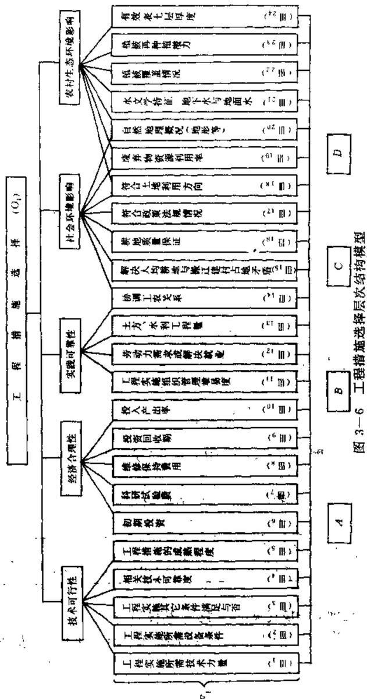  
FHie  Hn  u reg H res

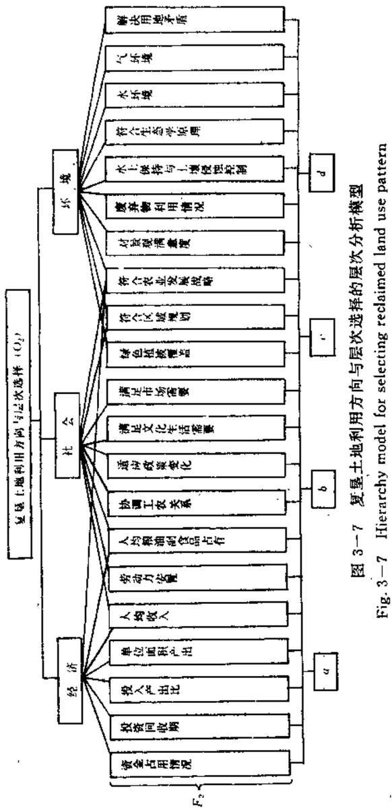

## 四、潘家庵煤田土地复垦模式的决策

## 1. 可供选择的复垦工程措施与排序

## 1）备选方案

根据塌陷地的实际情况，该区复垦时，四类可供选择的工程措施是：①矸石、粉煤灰等废弃物充填塌陷坑；②挖深垫浅、降低潜水位措施与废弃物允填相结合；③挖深垫浅；①挖深垫浅、降低潜水位措施与平整坡地相结合。

显然，选择了上述任一工程措施后必将限制塌陷地开发利用方向的选择，比如选择方案A，塌陷地复垦后将只能作建筑用地或种植用地，而不能养鱼等。

## 2）排序结果

总排序结果为：

$$
\begin{array} { r }  \bar { W } _ { 0 _ { 1 } } = \left[ \begin{array} { c } { w _ { A } } \\ { w _ { B } } \\ { w _ { C } } \\ { w _ { I } } \end{array} \right] = \left[ \begin{array} { c c c c c } { 0 . 1 6 9 7 } \\ { 0 . 2 1 2 4 } \\ { 0 . 3 3 7 1 } \\ { 0 . 2 7 9 0 } \end{array} \right] \quad \begin{array} { c } { \cdot } & { \cdot } & { } & { \cdot } \\ { \cdot } & { \cdot } & { \cdot } \\ { \mathrm { C I } = 0 . 0 2 5 < 0 . 1 0 } \\ { \cdot } & { \cdot } & { \cdot } \end{array} \end{array}
$$

即：方案C、D较A、B为优，所以潘家庵矿区采取治水方案是合理的。

被考虑的24个因子权重依次为：

$$
\begin{array} { r l } & { \overrightarrow { W } _ { \dot { F } _ { 1 } } ^ { T } = ( 0 , 0 1 3 7 , 0 . 0 1 3 7 , 0 . 0 1 3 7 , 0 . \dot { 0 } 8 2 2 , 0 . 0 8 \dot { 2 } 2 , 0 . 1 0 6 6 , } \\ & { \qquad 0 . 0 2 1 3 , 0 . 1 0 6 6 , 0 . 1 0 6 6 , 0 . \dot { 1 } 0 6 6 , 0 . 0 8 4 5 , 0 . 0 2 1 4 _ { 1 } , } \\ & { \qquad . \hphantom { 0 . 0 0 0 0 0 0 0 0 0 0 0 } . 0 0 5 4 , 0 . 0 2 6 8 , 0 . \hphantom { 0 . 0 0 0 0 0 0 0 0 0 } . \hphantom { 0 } 0 . \dot { 0 } 0 0 3 5 , 0 . \hphantom { 0 } \partial { 0 . 0 } \partial { 0 . 0 } 5 , } \\ &  \qquad - 0 . 0 1 3 4 , 0 . 0 0 3 5 , 0 . \ 0 4 3 9 , 0 . \ 0 0 6 0 , 0 . \ 0 6 6 6 , 0 . \ 0 6 6 6 , 0 . \ 0 6 6 6 \} \end{array}
$$

可以看出： $\mathbb { I } _ { \mathrm { ~ s ~ } } \mathbb { I } _ { \mathrm { ~ f ~ a ~ } } \mathbb { I } _ { \mathrm { ~ f ~ s ~ } } \mathbb { I } _ { \mathrm { ~ f ~ s ~ } } , \mathbb { I } _ { \mathrm { ~ f ~ s ~ } } \mathbb { I } _ { \mathrm { ~ g ~ s ~ } } \mathbb { I } _ { \mathrm { ~ l ~ } _ { 0 } \mathrm { ~ l ~ } } - \textbf { I } _ { 2 3 \mathrm { ~ s ~ } } \mathbb { I } _ { \mathrm { ~ Z ~ } 4 \mathrm { ~ f ~ l ~ } }$ 的权重较大。

## 3）排序结果分析

分别以 $\mathbb { H } _ { \mathrm { ~ i ~ v ~ } } \mathbb { H } _ { \mathrm { ~ f ~ a ~ s ~ } } \mathbb { H } _ { \mathrm { ~ f ~ a ~ v ~ } } \mathbb { H } _ { \mathrm { ~ f ~ v ~ } } \mathbb { H } _ { \mathrm { ~ p ~ v ~ } } \mathbb { H } _ { \mathrm { ~ l ~ 0 ~ v ~ } } \mathbb { H } _ { \mathrm { ~ Z ~ 3 ~ v ~ } } \mathbb { H } _ { \mathrm { ~ Z ~ 4 ~ } }$ 为准则，得到A、B、C、D的权重如表 $_ { 3 ^ { \cdot - 1 8 } }$ 所示。

表中第1列说明治水措施相关技术的可靠度高，易于被群众接受掌握；第2列说明几种工程措施本身是同等成熟的；第3列说明B、C初期投资较A、D少；第4列说明方案实施后A、D方

表3-18影响因素分析表  
Tab 3 -- 18 Evaluation of influence factors
<table><tr><td rowspan=2 colspan=1>准方  则：案   层层</td><td rowspan=1 colspan=1>11</td><td rowspan=1 colspan=1>1 -</td><td rowspan=1 colspan=1> $\boxed { \star } _ { s }$ </td><td rowspan=1 colspan=1>Id</td><td rowspan=1 colspan=1></td><td rowspan=1 colspan=1> $\textbf { \em u } _ { 1 1 }$ </td><td rowspan=1 colspan=1> $\mathbb { H } _ { \geq , 4 }$ </td><td rowspan=1 colspan=1>臣二</td></tr><tr><td rowspan=1 colspan=1>1</td><td rowspan=1 colspan=1>2</td><td rowspan=1 colspan=1>3</td><td rowspan=1 colspan=1>4</td><td rowspan=1 colspan=1>i</td><td rowspan=1 colspan=1>6</td><td rowspan=1 colspan=1>7</td><td rowspan=1 colspan=1>8</td></tr><tr><td rowspan=2 colspan=1>AB</td><td rowspan=1 colspan=1>0.135</td><td rowspan=1 colspan=1>0.25</td><td rowspan=1 colspan=1>0.183</td><td rowspan=1 colspan=1>0.4</td><td rowspan=1 colspan=1>0.053</td><td rowspan=1 colspan=1>0.1026</td><td rowspan=1 colspan=1>0.077</td><td rowspan=1 colspan=1>0.058</td></tr><tr><td rowspan=1 colspan=1>0.365</td><td rowspan=1 colspan=1>0.25</td><td rowspan=1 colspan=1>0.278</td><td rowspan=1 colspan=1>0.1</td><td rowspan=1 colspan=1>0.410</td><td rowspan=1 colspan=1>0.5158</td><td rowspan=1 colspan=1>0.507</td><td rowspan=1 colspan=1>0.409</td></tr><tr><td rowspan=1 colspan=1>C</td><td rowspan=1 colspan=1>0.365</td><td rowspan=1 colspan=1>0.25</td><td rowspan=1 colspan=1>0.417</td><td rowspan=1 colspan=1>0.1</td><td rowspan=1 colspan=1>0.215</td><td rowspan=1 colspan=1>0.0948</td><td rowspan=1 colspan=1>0.274</td><td rowspan=1 colspan=1>0.409</td></tr><tr><td rowspan=1 colspan=1>D</td><td rowspan=1 colspan=1>0.135</td><td rowspan=1 colspan=1>0.25</td><td rowspan=1 colspan=1>0.122</td><td rowspan=1 colspan=1>0.4</td><td rowspan=1 colspan=1>C. 292</td><td rowspan=1 colspan=1>0.2568</td><td rowspan=1 colspan=1>0.142</td><td rowspan=1 colspan=1>0.123</td></tr></table>

案所需的维护保持费用比B、C少；第5列说明B、D两方案的投资回收期短；第6列说明方案B、D的投入产产出率人；第7列说明方案B、C种植潜力大；第8列说明B、C有效表土层厚度大。

分析上面计算结果还可得出：方案（是最优方案，以下述条件为前提：

（1）优先考虑了相关技术可靠度、技术本身的熟练程度、初期投资、维护保持费用、投资回收期、投入产出率、种植潜力、有效表土层厚度等因子。

(2)假定几种方案在技术上都是成熟的，只要人财物具备即是可行的。

(3)潘家庵矿区利用废弃物充填进行农业复垦，代价是昂贵的；尤其是用老矸石山矸石进行充填复垦是不经济的。

2. 可供选择的复垦利用方向和层次及其排序

## 1）备选方案

在调查研究的基础上，根据市场需要和区域经济发展规划，确立以下四个塌陷地开发利用方向与层次，即：①只发展种植业；2只将一些水面改造成水产养殖基地，同时兼养鸡、鸭、鹅、猪、羊等：③进行立体生态开发，将塌陷地建成水产养殖、饲料种植、作物种植、林果蔬菜种植的综合性基地；(①除搞养殖业、种植业外，还进行加工业对外输出产品。

## 2）排序结果

总排序结果为：

$$
\begin{array} { r } { \dot { W } _ { 0 _ { 2 } } = \dot { \left| \begin{array} { l } { w _ { b } } \\ { w _ { b } } \\ { w _ { i } } \end{array} \right| } = \dot { \left| \begin{array} { l } { 0 . \ 0 6 4 0 } \\ { 0 . \ 1 8 4 2 } \\ { 0 . \ 3 7 3 6 } \\ { 0 . \ 3 7 8 2 . } \end{array} \right| } } \end{array}
$$

$$
\mathbb { C } \mathbb { I } \simeq 0 . 0 4 5 < 0 . 1 0
$$

从排序结看：方案c、d优于方案a、b。

被考虑的21个因子的单排序结果为：

$$
\begin{array} { r l } & { \ddot { W } _ { F _ { 2 } } ^ { T } = \ \langle 0 . \ 0 1 6 3 , 0 . 0 1 6 3 , 0 . 0 4 8 6 , 0 . 0 9 7 5 , 0 . \ 0 4 0 2 , 0 . \ 0 7 3 2 , } \\ & { \qquad 0 . \ 0 7 5 7 , 0 . \ 0 4 8 3 , 0 . \ 0 2 2 6 , 0 . \ 0 1 3 9 , 0 . \ 0 4 8 3 , 0 . \ 0 3 0 6 , } \\ & { \qquad 0 . \ 0 8 3 2 , 0 . \ 0 4 0 2 , 0 . \ 0 2 8 3 , 0 . \ 0 2 2 9 , 0 . \ 0 4 1 9 , 0 . \ 0 8 \dot { 2 } 7 , } \\ & { \qquad 0 . \ 0 8 2 7 . 0 . \ 0 3 0 7 , 0 . \ 0 5 6 7 ) ^ { T } } \end{array}
$$

## 3）结果分析

上述排序结果以下述条件为前提：

(1)将经济、社会、环境三因子看成同等重要，即它们的权重均为1/3。

(2)经济因子中重点考虑了单位面积产出、区域发展规划和投入产出比因子；在社会因子中重点考虑了劳动力就业和入均粮食与副食品占有两因素；环境因子中重点考虑了生态学标准及塌陷区水资源利用保护问题。

如果经济因子中重点考虑资金占用和人均收入等因 $\sharp$ ，则有下述总排序结果：

$$
\begin{array} { r } { \vec { W } ^ { \prime } o _ { z } = \left[ \begin{array} { l } { w _ { u } } \\ { w _ { b } } \\ { w _ { e } } \\ { w _ { e } } \end{array} \right] = \left[ \begin{array} { l } { 0 . 1 0 9 3 } \\ { 0 . 2 0 1 2 } \\ { 0 . 3 5 3 0 } \\ { . 0 _ { * } 3 3 6 5 5 } \end{array} \right] } \\ { \mathbf { C } i = 0 . 0 3 6 < 0 . 1 0 } \end{array}
$$

这时，方案c就优于方案d，c为最佳复垦方案。

## 3. 工程措施与复垦利用方向和层次的匹配

工程措施的排序结果表明：挖深垫浅是治理该塌陷地的最佳选择，其次是第四种工程措施。开发利用方向选择的排序结果表明：进行立体生态开发是一种较好的方案，其次是d方案。

如前所述，塌陷地开发利用方向与层次受到复垦工程措施的限制，本区复垦的工程措施与开发利用方向与层次的基本对应关系如图3—8所示。

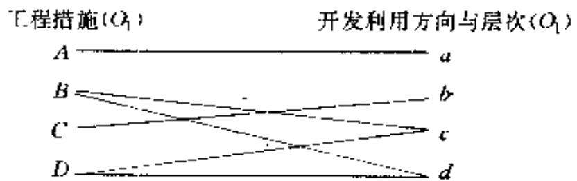  
图 3·8 工程措施和开发利用方向与层次的  
对应关系(卞正富，1993)  
Fig. 3—8 Match between engineering measures and land use pattern

至此，我们还不能得出两者的最佳匹配，对照图3一8，若选择挖深垫浅措施，只能选取方案b的利用方向与层次，而方案b的利用方向的排序结果 ${ w _ { i } } = 0 , 2 0 1 2$ ，显然不是最佳方案。这时，如果我们将工程措施的选择看成主要是投资的选择，将开发利用方向与层次的选择看成是效益的选择，令A为工程措施、开发利用方向与层次两因素模糊集，且这里假设A=(0.5，0.5)，R为评判矩 $R$ 阵，R可由层次分析法排序结果构成，即：

$$
\underline { { R } } = \left[ \begin{array} { l l l l l l } { w _ { A } } & { w _ { R } } & { w _ { B } } & { w _ { i } , } & { w _ { D } } & { w _ { I } } \\ { w _ { a } } & { w _ { i } } & { w _ { d } } & { w _ { b } } & { w _ { i } } & { w _ { d } } \end{array} \right] = \left[ r _ { i , j } \right]\tag{3-22}
$$

B为评判结果，则据模糊综合评判方法得出： $B = \begin{array} { l } { A } \\ { . } \end{array} \ast R =$ $\begin{array} { r l r } { \left\{ \operatorname* { m a x } \{ \alpha _ { 1 } r _ { 1 j } , u _ { 2 } r _ { 2 j } \} \right\} } & { { } = } & { \langle \boldsymbol { 0 } , \boldsymbol { 0 } 8 4 9 , \boldsymbol { 0 } , \mathbf { 1 } 7 6 5 , \boldsymbol { 0 } , \mathbf { 1 } 6 8 3 , \boldsymbol { 0 } , \mathbf { 1 } 6 8 6 , \boldsymbol { 0 } , \mathbf { 1 } 7 6 5 , \boldsymbol { \mathrm { 1 } } 8 8 6 , \boldsymbol { 0 } , \mathbf { 1 } 7 7 6 5 , \boldsymbol { 0 } , \mathbf { 1 } 8 8 6 , \boldsymbol { 0 } , \boldsymbol { 0 } , \mathbf { 1 } 7 7 7 6 5 , \boldsymbol { 0 } , \boldsymbol { 0 } , \mathbf { 1 } 8 8 6 , \boldsymbol { 0 } , \boldsymbol { 0 } , \mathbf { 1 } . } \end{array}$ 0.1683)

由此得到工程措施B 与开发利用方向c 及工程措施D与开发利用方向c两备选模式，又因 $w _ { B } < w _ { I 1 }$ ，故最终选择工程措施D)和开发利用方向c作为本区开发模式。

复垦规划设计方案的选择，需要综合考虑社会需要、经济条件、技术条件与实践的可能性等多种因素，而不是简单的经济指标的比较。一方面这些因素互相关联互相制约，如经济合理的方案在实践中不一定可行等，另一方面，这些因素中的某些因素往往难于作定量分析。本节提供两种选择方法，即层次分析决策法和灰色聚类决策法，分别结合实例说明决策步聚。

## 一、层次分析决策法——以孟店复垦区复垦设计方案选择为例£23

## 1. 复垦区简况及备选设计方案简介

现有华东一高潜水位矿区选择土地复垦工程措施的实例。欲治理区为塌陷坡子地及部分盆底，面积约0.25km²，位于一由外河围成的约3km²封闭区域内，外河水位34.5m。塌陷前地表标高为372ri，塌陷后最大下沉处地表标高约为34.3m，丰水季节坑内积水较深，最深处约2.2m，积水面积约0.12km²，显然，由采煤引起的塌陷已经影响作物生长。根据实际情况，提出了四种较为可行的方案： 7

方案一：将塌陷地平整至36.5m，工艺过程如图.3一9所示。

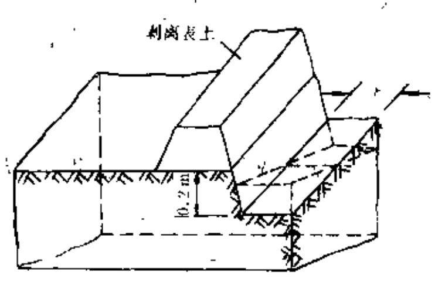  
图3-9 刺离、平整工程示意图  
Fig. 3—9 Sketch map of topsoil stripping and leveling

先用条带法剥离表土、剥离深度为0.2m，包括耕作层和亚耕层，剥离宽度为x，x为台推土机的推进宽度，然后削高补低（即平整)，再将剥离的表土覆盖其上，加上配套的水利工程即可恢复土地的原有价值。这种方案的削高与补低的上方基本平衡，不需其它土源。

方案二：基本同方案一，区别是不剥离表上，直接平整。

方案三：将塌陷地全部填垫至原标高37.2m。共需土方16.9万 $\mathbf { m } ^ { 3 }$ ，塌陷区内能解决2.0万 $\mathbf { m ^ { \mathfrak { I } } }$ ，尚短缺土方14.9万 $\mathfrak { m } ^ { \mathrm { 3 } }$ ，拟从塌陷区外河沟疏浚工程中获得。

方案四：不进行削高补低，将低于36.5m的地填至36.5m并作配套的水利工程。这种方案共需土方7.4万 $\mathbf { m } ^ { 3 }$ ，配套水利工程中可获得0.9万 $\dot { \mathtt { m } } ^ { 3 }$ 土方，尚短缺土方6.5万 $\mathfrak { m } ^ { 3 }$ ，拟从塌陷区外运进。

提出上述四种方案后，计算四种方案的费用和工程量（表3一19)。总的说来，四种方案各有利弊。方案一、二没有将地表恢复至原有状态，费用和工程量较小，土地利用方向需作适当调整。为保证粮食稳产高产，还需采取加强田间管理等措施；方案三工程量大、费用高，但地表基本恢复至原有状态，农民乐于接受；方案四虽然治理后收益小些，但治理工程量小，初期投资小。如何选择这几种方案不能一言而定，下面用层次分析法对此问题作一分析。

表3-19 四种方案概略比较  
Tab 3—19 Summary comparison of four alternatives
<table><tr><td rowspan=1 colspan=1>北较项目</td><td rowspan=1 colspan=1>方案一</td><td rowspan=1 colspan=1>方案二</td><td rowspan=1 colspan=1>方案三</td><td rowspan=1 colspan=1>方案四</td></tr><tr><td rowspan=1 colspan=1>土方工程量</td><td rowspan=1 colspan=1>共需土方7.4万 $\mathbf { m } ^ { \downarrow }$ ，区内挖高挖沟可得方8.2万 $\mathsf { m } ^ { \mathfrak { s } }$ 尚余上：方0.8万 $\mathbf { f } \mathbf { n } ^ { 3 } .$ ，用于其它塌陷地块回填。另需剥离表土并回复上方为4.9万 $\mathbf { m } ^ { 3 }$ </td><td rowspan=1 colspan=1>比方案少作1.9万m³表土剥离并回复工程</td><td rowspan=1 colspan=1>共需土方为16.9万m³，区内解决2.0万m，尚缺14.9万m³，需从塌陷区外运进</td><td rowspan=1 colspan=1>共需土方7.4万 $\mathbf { m } ^ { 3 }$ ，区内解决0.9万m³，尚缺6.5万m³，需从塌陷区外运进</td></tr><tr><td rowspan=1 colspan=1>初期投资(方元)</td><td rowspan=1 colspan=1>102.6</td><td rowspan=1 colspan=1>89.4</td><td rowspan=1 colspan=1>159.4</td><td rowspan=1 colspan=1>83.7</td></tr><tr><td rowspan=1 colspan=1>三年总收益（万元）</td><td rowspan=1 colspan=1>99.6</td><td rowspan=1 colspan=1>79.0</td><td rowspan=1 colspan=1>100.5</td><td rowspan=1 colspan=1>77.4</td></tr><tr><td rowspan=1 colspan=1>挖沟占地(km²)</td><td rowspan=1 colspan=1>0.016</td><td rowspan=1 colspan=1>0.016</td><td rowspan=1 colspan=1>0.014</td><td rowspan=1 colspan=1>0.012</td></tr></table>

## 2. 层次分析法决策步骤

## 1）概算及分析

概算包括初期投资、投资回收期、投入产出率、水面率等定量指标，同时对几种方案的技术可行性作论证，对实践中可能出现的问题及对社会环境、农村生态环境的影响作出评价分析。

## 2）建立选择土地复垦工程措施的层次结构模型

通过调查研究和对问题的分析，我们建立了选择土地复垦工程措施的层次结构模型，如图3—10所示。图中考虑了技术可行、经济合理、实践可靠、社会环境及农村生态环境五个方面共计20个因子。需要说明的是：同一层次中各因子并非同等重要，其重要性通过不等权表示出来。如据判断矩阵A（表3—20)，求得 $\dot { \overrightarrow { W } } _ { B }$ 为：

$$
\begin{array} { r l } & { \ddot { W } _ { B } = ( w _ { B 1 } , w _ { k 2 } , \cdots , w _ { B 5 } ) ^ { T } } \\ & { \phantom { = } \phantom { \frac { 1 } { 1 6 } } = ( 0 . 2 1 8 5 , \ 0 . 2 5 1 7 , \ 0 . 2 5 1 7 , \ 0 . \ 1 0 9 2 , \ 0 . \ 1 6 8 9 ) ^ { T } } \\ & { \phantom { = } \mathrm { C R } = 0 . \ 0 2 < 0 . \ 1 0 } \end{array}
$$

表3-20判断矩阵表  
Tab 3- 20 Jndgement matrix
<table><tr><td rowspan=1 colspan=1> $\pmb { A }$ </td><td rowspan=1 colspan=1> $\pmb { B } _ { 1 }$ </td><td rowspan=1 colspan=1> ${ \pmb { i } } 3 _ { \pmb { z } }$ </td><td rowspan=1 colspan=1> ${ \pmb { B _ { 3 } } }$ </td><td rowspan=1 colspan=1> $\scriptstyle B _ { 4 }$ </td><td rowspan=1 colspan=1> ${ \pmb { { \cal B } } } _ { 5 }$ </td></tr><tr><td rowspan=1 colspan=1> $\scriptstyle B _ { 1 }$ </td><td rowspan=1 colspan=1>I</td><td rowspan=1 colspan=1>1</td><td rowspan=1 colspan=1>1</td><td rowspan=1 colspan=1>2</td><td rowspan=1 colspan=1>1</td></tr><tr><td rowspan=1 colspan=1> $\pmb { \mathscr { B } } _ { \mathfrak { Z } }$ </td><td rowspan=1 colspan=1></td><td rowspan=1 colspan=1>1</td><td rowspan=1 colspan=1>1</td><td rowspan=1 colspan=1>2</td><td rowspan=1 colspan=1>-2</td></tr><tr><td rowspan=1 colspan=1> $\pmb { I } \pmb { \hat { s } _ { 3 } }$ </td><td rowspan=1 colspan=1></td><td rowspan=1 colspan=1></td><td rowspan=1 colspan=1>1</td><td rowspan=1 colspan=1>2</td><td rowspan=1 colspan=1>2</td></tr><tr><td rowspan=1 colspan=1> $\pmb { { \cal B } } _ { 1 }$ </td><td rowspan=1 colspan=1></td><td rowspan=1 colspan=1></td><td rowspan=1 colspan=1></td><td rowspan=1 colspan=1>1</td><td rowspan=1 colspan=1>-2</td></tr><tr><td rowspan=1 colspan=1> $\pmb { \mathscr { B } } _ { \tilde { \imath } }$ </td><td rowspan=1 colspan=1></td><td rowspan=1 colspan=1></td><td rowspan=1 colspan=1></td><td rowspan=1 colspan=1></td><td rowspan=1 colspan=1>1</td></tr></table>

注：知阵A为3标度法给出。

Filee  ns ts   v es  
图9  
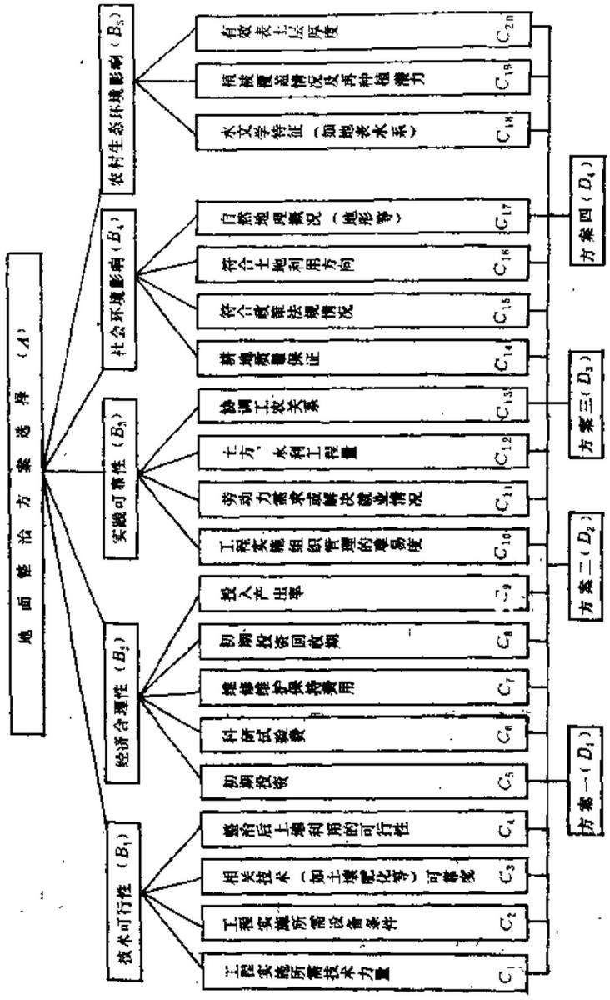

$B _ { 1 }$ $B _ { 2 }$ $B _ { 3 }$ $B _ { 4 }$ $\boldsymbol { B } _ { 5 }$ 为位于同一层的因子， $\dot { \bar { \mathcal { W } } } _ { \varepsilon }$ 表明了 $B , \sim$ $B _ { 5 }$ 各因子在选择方案时所占的权重。

## 3）判断矩阵的给定

判断矩阵主要根据当地政府的要求及调查中农民和矿方反映的意见、经济实力及政府的有关政策法规等给出。我们采用了直接给出的9标度法和间接给出的3标度法，对影响因素作了判断比较。

## 4）一致性检验

层次单排序和总排序的一致性检验结果均满意，即：随机一致性比例值 $\mathbf { \mathrm { C R } } { \leqslant } \mathbf { \mathrm { 0 } }$ . 10。

## 5）总排序结果和单排序结果

计算结果如下： $\vec { W } _ { \perp } = [ w _ { D 1 } , w _ { D 2 } , w _ { D 3 } , w _ { D 3 } ] ^ { T } = [ 0 , 3 2 4 9$ 0.2179,0.2436,0.2136]; $\begin{array} { r l r } { \vec { W } _ { \oplus } \cdot = } & { { } [ w _ { C 1 } , w _ { C 2 } , \cdots , w _ { C 2 0 } ] ^ { T } } & { : = } \end{array}$ (0.0666, 0.1176, 0.0171, 0.0171, 0.0765, 0.0116,0,0480,0.0579, 0.0579, 0.0265, 0.0139, 0,0877,0.1236, 0.0271,0.0229, 0.0216,0.0377,0.0724,0.0241, $0 . 0 \dot { 7 } 2 4 \dot { 7 } _ { \cdot \circ } \dot { W } _ { \lessgtr }$ 表示总排序结果，可以看出方案一的权最大，所以方案一最优，因此工程实施时，应按方案一进行； $\vec { W } _ { \Re }$ 为单排序结果，它给出了影响方案选择的 $2 0$ 个因子的权重，分别表示了它们对工程实施的影响程度。

## 二、灰色聚类决策法一—以淮北矿区征地与复垦方案选择为例[21]

## 1. 复垦区与复垦方案概述

淮北某 $\overrightarrow { \cdot }$ 有 $7 ^ { \# }$ 1 $8 ^ { \ast }$ 和 ${ \bf \nabla \cdot l 0 ^ { \sharp } }$ 三个可采煤层，一采区的 $7 ^ { \sharp }$ $8 ^ { \pi }$ 煤基本回采完毕， $\mathrm { \ " } \mathrm { \Omega } ^ { \mathrm { \bullet } }$ 煤也即将采完。该采区上方有331.7亩农田待复垦或征用。农田地势平坦，采前标高27.0m，丰水期潜水位26.6m，枯水期潜水位24.7m。由于煤系地层断层较多，采煤过程中残留煤柱较多，地表下沉不充分，累计下沉深度在2.0\~3.0m之间。现据实际情况提出了五种征用与复垦方案，五种方案的主要技术经济指标如表3-21。

表3-21 淮北某矿采煤塌陷地复垦与征用方案  
Tab 3--21 Land reclamation and requisition alternatives  
of a certain mine in Huaihei mine area
<table><tr><td rowspan=1 colspan=2>方    案</td><td rowspan=1 colspan=1></td><td rowspan=1 colspan=1>二</td><td rowspan=1 colspan=1>三</td><td rowspan=1 colspan=1>四</td><td rowspan=1 colspan=1>五</td></tr><tr><td rowspan=1 colspan=2>总费用（万元）</td><td rowspan=1 colspan=1>325,0</td><td rowspan=1 colspan=1>336.1</td><td rowspan=1 colspan=1>356.2</td><td rowspan=1 colspan=1>281.8</td><td rowspan=1 colspan=1>311.0</td></tr><tr><td rowspan=1 colspan=2>平均费用（万元/面）</td><td rowspan=1 colspan=1>0.9k</td><td rowspan=1 colspan=1>1.(0]</td><td rowspan=1 colspan=1>1.07</td><td rowspan=1 colspan=1>0.85</td><td rowspan=1 colspan=1>0.94</td></tr><tr><td rowspan=3 colspan=1>复垦</td><td rowspan=1 colspan=1>面积（亩）</td><td rowspan=1 colspan=1>331.7</td><td rowspan=1 colspan=1>227</td><td rowspan=1 colspan=1>150</td><td rowspan=1 colspan=1>255</td><td rowspan=1 colspan=1>255</td></tr><tr><td rowspan=1 colspan=1>工程量（万m³）</td><td rowspan=1 colspan=1>22.5</td><td rowspan=1 colspan=1>12.3</td><td rowspan=1 colspan=1>6.0</td><td rowspan=1 colspan=1>10.9</td><td rowspan=1 colspan=1>13.0</td></tr><tr><td rowspan=1 colspan=1>.费用（万元）</td><td rowspan=1 colspan=1>325.0</td><td rowspan=1 colspan=1>189.5</td><td rowspan=1 colspan=1> 101.8</td><td rowspan=1 colspan=1>174.4</td><td rowspan=1 colspan=1>203. 6</td></tr><tr><td rowspan=2 colspan=1>E用</td><td rowspan=1 colspan=1>面积（亩）</td><td rowspan=1 colspan=1>0</td><td rowspan=1 colspan=1>104.7</td><td rowspan=1 colspan=1>181.7</td><td rowspan=1 colspan=1>76.7</td><td rowspan=1 colspan=1>76.7</td></tr><tr><td rowspan=1 colspan=1>费用（万元）</td><td rowspan=1 colspan=1>1)</td><td rowspan=1 colspan=1>146.6</td><td rowspan=1 colspan=1>251.4</td><td rowspan=1 colspan=1>107.1</td><td rowspan=1 colspan=1>107.4</td></tr></table>

若纯考虑总费用，方案四对矿方较为有利，但煤矿征地与复垦方案选择过程中、人为因素影响较大，仅从表3一21中所列指标难以确定哪一个方案更可行、更切合实际，需要综合评价。

## -2. 灰色聚类决策.

## 1）聚类指标和标准

表3—22列出了五个聚类指标的评价标准，表3-23列出了五个方案的五个聚类指标值。

## 2）聚类权计算

表3—24列出了五个方案各指标的聚类权。

3）白化函数的构造和白化函数值的计算

表3一25构造了五个因子关于三个聚类结果的白化函数，表3一26为白化函数值计算结果。

表3-22聚类标准  
Tab 3 22 Standards for classification
<table><tr><td>标准 指标 类别</td><td>每市费用 (万亢亩)</td><td>工程量  $( \sin n ) )$ </td><td>农民接受 程 度</td><td>技术可行 程 度</td><td>复禁率</td></tr><tr><td>可行</td><td>0.85</td><td>8.0)</td><td>0.8</td><td>0.8</td><td>0.9</td></tr><tr><td>基本可行</td><td>C. 95</td><td>13.0)</td><td>0.5</td><td>0.5</td><td>0.7</td></tr><tr><td>不可行</td><td>1.05</td><td>18.0)</td><td>0.2</td><td>0.2</td><td>0. 3</td></tr></table>

## 4）聚类系数与聚类结果

据表3—24和表3-26数据：按式（2-11）计算得聚类系数如表3-27。

## 5）聚类结果分析

①)表3一27中聚类结果为方案三为可行方案。不难看出方案三征地面积最大，矿方费用最高，但它在淮北容易被地方政府和农民接受，因而成为可行方案，随煤矿用地政策的改变和地方政府观念的转变，复垦代征迁或以地换地的方法逐步实现，上述评价结果也会改变。

②在用灰色聚类决策时，若同时出现几个方案均可行，这时可比较这几个方案的聚类系数，聚类系数大者为最优方案。

表3-23 五个方案的聚类指标值  
Tab 3—22 Value of classificotion indexes of five alternatives
<table><tr><td rowspan=1 colspan=1>指标方案</td><td rowspan=1 colspan=1>每亩费用(万元/亩)</td><td rowspan=1 colspan=1>工程量 $( \textbf { \textit { F } } \mathbf { m } ^ { s } )$ </td><td rowspan=1 colspan=1>农民接受程    度</td><td rowspan=1 colspan=1>技术可行程    度</td><td rowspan=1 colspan=1>复垦率</td></tr><tr><td rowspan=1 colspan=1>一</td><td rowspan=1 colspan=1>0.98</td><td rowspan=1 colspan=1>22.3</td><td rowspan=1 colspan=1>0.8</td><td rowspan=1 colspan=1>. 0.2</td><td rowspan=1 colspan=1>1.0</td></tr><tr><td rowspan=1 colspan=1>二</td><td rowspan=1 colspan=1>1.01</td><td rowspan=1 colspan=1>12.3</td><td rowspan=1 colspan=1>0.8</td><td rowspan=1 colspan=1>0.5</td><td rowspan=1 colspan=1>0.684</td></tr><tr><td rowspan=1 colspan=1>三</td><td rowspan=1 colspan=1>1.07</td><td rowspan=1 colspan=1>6.0</td><td rowspan=1 colspan=1>0.8</td><td rowspan=1 colspan=1>0.8</td><td rowspan=1 colspan=1>0.452</td></tr><tr><td rowspan=1 colspan=1>四</td><td rowspan=1 colspan=1>0.85</td><td rowspan=1 colspan=1>1.09</td><td rowspan=1 colspan=1>0.4</td><td rowspan=1 colspan=1>0.5</td><td rowspan=1 colspan=1>0.769</td></tr><tr><td rowspan=1 colspan=1>五</td><td rowspan=1 colspan=1>0.94</td><td rowspan=1 colspan=1>1.30</td><td rowspan=1 colspan=1>0.8</td><td rowspan=1 colspan=1>0.5</td><td rowspan=1 colspan=1>0.769</td></tr></table>

表3-24聚类权表  
Tab 3—24 Weight of factors for classification
<table><tr><td rowspan=1 colspan=1>权  指标值方案</td><td rowspan=1 colspan=1>每亩费用</td><td rowspan=1 colspan=1>工程量</td><td rowspan=1 colspan=1>农民接受程    度</td><td rowspan=1 colspan=1>技术复杂程    度</td><td rowspan=1 colspan=1>复帛率</td></tr><tr><td rowspan=1 colspan=1>--</td><td rowspan=1 colspan=1>0.1905</td><td rowspan=1 colspan=1>0.3351</td><td rowspan=1 colspan=1>0.1770</td><td rowspan=1 colspan=1>0.1106</td><td rowspan=1 colspan=1>0.1868</td></tr><tr><td rowspan=1 colspan=1>二</td><td rowspan=1 colspan=1>0.2164</td><td rowspan=1 colspan=1>0.2510</td><td rowspan=1 colspan=1>0.1978</td><td rowspan=1 colspan=1>0.1607</td><td rowspan=1 colspan=1>0.1741</td></tr><tr><td rowspan=1 colspan=1>三</td><td rowspan=1 colspan=1>0.2375</td><td rowspan=1 colspan=1>0.1840</td><td rowspan=1 colspan=1>0.2103</td><td rowspan=1 colspan=1>0.2103</td><td rowspan=1 colspan=1>0.1579</td></tr><tr><td rowspan=1 colspan=1>四</td><td rowspan=1 colspan=1>0.2464</td><td rowspan=1 colspan=1>0.1400</td><td rowspan=1 colspan=1>0.1848</td><td rowspan=1 colspan=1>0. 2002</td><td rowspan=1 colspan=1>0.2286</td></tr><tr><td rowspan=1 colspan=1>在</td><td rowspan=1 colspan=1>C. 2407</td><td rowspan=1 colspan=1>0.1329</td><td rowspan=1 colspan=1>0.2286</td><td rowspan=1 colspan=1>0.1858</td><td rowspan=1 colspan=1>0.2120</td></tr></table>

表3-25白化函数表  
Tab : -25 Function used for Classifying
<table><tr><td>决策 F</td><td rowspan="11"></td><td>化函数</td><td></td><td>快策 因千</td><td colspan="2">自化数</td></tr><tr><td rowspan="10">每前费 川 へ F1 一 农民 接受</td><td> $\begin{array}{c} \boldsymbol { f } _ { : 1 } = \displaystyle \int _ { 0 } ^ { 1 } \lVert - \frac { c - ( 1 ) _ { * } } { ( \bar { \iota } _ { * } } \frac { 8 \bar { \varsigma } } { 1 } \rVert _ { r } \in [ 0 , 8 \bar { \varsigma } , \bar { \iota } _ { * } ) , ~ \bar { \mathfrak { G } } \bar { \mathfrak { G } } \rangle  \\ { \boldsymbol { \iota } _ { 0 } } & { \qquad \boldsymbol { r } \in [ 0 , \bar { \mathfrak { G } } _ { : * } , \boldsymbol { \mathscr { s } } , \boldsymbol { \mathscr { s } } , ) } \end{array}$ </td><td rowspan="10"></td><td rowspan="10">上程一）</td><td rowspan="10"> $H _ { 1 , i } = - \left\{ \begin{array} { l l } { 0 } \\ { 0 } \\ { \frac { 1 } { 5 } } \\ { 1 } \\ { 1 } \end{array} \right. , \frac { 1 } { \cdot } \frac { 1 3 } { \frac { 1 3 } { 3 } }$ </td><td> $H _ { 1 , t } = \frac { 1 } { t } _ { 1 } = \frac { 1 } { t } - \frac { 1 } { t } - \frac { 1 } { t } - \frac { u } { t }$  r∈.0.8) r6_8.13)</td></tr><tr><td></td><td>x∈ [13. · )</td></tr><tr><td></td><td>∈[1.8)</td></tr><tr><td> $\begin{array} { r } { f _ { 1 } , = \frac { \displaystyle \int \frac { 1 - ( t ) _ { * } \mathrm { \tiny ~ S } _ { * } ^ { - } } { ( t , \mathrm { \tiny ~ I } ) } ~ x \in [ 0 , 8 , 5 , 0 , 9 ; 5 ) } { \displaystyle \int } } \\ { \displaystyle \prod _ { i = \mathrm { \tiny ~ I } , \mathrm { \tiny ~ I } , \mathrm { \tiny ~ I } } \vartheta _ { * } ^ { - } \left( \vartheta , \vartheta , \vartheta , \vartheta ; 0 , \vartheta , \right) } \end{array}$ </td><td>1€8.13)</td></tr><tr><td></td><td></td></tr><tr><td></td><td>∈ 13,18</td></tr><tr><td>io x∈ [1. 05, )</td><td>∈18.)</td></tr><tr><td rowspan="3"> $f _ { 1 , i } = \cdot \sum \limits _ { i = 1 } ^ { 1 } \frac { 1 } { 1 - 1 ! } \frac { 1 5 } { 1 - 1 } \cdot \sum \limits _ { i = 1 } ^ { \infty } \frac { 1 } { 1 + 5 } \frac { 1 } { 1 - 1 } \cdot 0 5 )$ </td><td rowspan="8"> $f _ { 1 3 } = \left\{ \begin{array} { l } { 1 9 } \\ { \mathrm { { } } , } \\ { \mathrm { { } } , } \\ { \mathrm { { } } , } \end{array} \right. = \left\{ \begin{array} { l } { 1 9 } \\ { \mathrm { { } } , } \\ { \mathrm { { } } , } \\ { \mathrm { { } } - \frac { 1 } { 5 } \cdot \mathrm { { } } ^ { - 1 } - } \\ { \mathrm { { } } , } \\ { \mathrm { { } } , } \end{array} \right.$ </td><td>∈10.13)</td></tr><tr><td></td><td>x∈[13,18)</td></tr><tr><td>x∈ [0, 8.1)</td><td>d∈[1s)</td></tr><tr><td rowspan="7">程度 与技 术 行程 度 2  ${ \bf \nabla } _ { { \bf \vec { r } } _ { \textrm { 3 } } }$  j</td><td> $f _ { 1 1 } = \frac { 1 } { 3 } \frac { 1 } { 0 . 3 }$  c∈ [0,0. 5) 10</td><td>x∈ [0, 5.0.8) 反民率一</td><td> $f _ { i , 1 } - \left\{ \begin{array} { l l } { 1 } \\ { \frac { 2 - ( 1 _ { i } - 1 ) _ { i } } { 1 1 _ { i } } ] } \\ { 1 0 } \end{array} \right.$ </td><td>1€_0.9.1 1∈(0.7.0,9)</td></tr><tr><td>x∈ [0. 8,1)</td><td></td><td></td><td>r∈ [0,0.7) x ∈ [0. 9.D</td></tr><tr><td>r∈[0.5.0.8)</td><td></td><td> $X _ { i = 1 } = \left\{ \begin{array} { l l } { 0 } \\ { 1 - \frac { 1 - 0 . 7 } { ( 1 . 2 ) } } \\ { \frac { 1 - 0 . 5 } { ( 1 . 2 ) } } \\ { 0 } \end{array} \right.$ </td><td>x∈ 0.7.0.91</td></tr><tr><td> $f _ { \lambda _ { + } ^ { * } } = \left\{ \begin{array} { l l } { 1 - \frac { \lambda - 0 . 5 } { 0 . 1 } } \\ { 1 . 1 } \\ { 0 . 3 } \\ { 0 } \end{array} \right.$ </td><td>r∈ {0.2,0.5)</td><td></td><td>x∈{0. 5.0.7)</td></tr><tr><td></td><td>x∈ [0,0. 2)</td><td></td><td></td></tr><tr><td></td><td>一 x∈[0.5.1)</td><td></td><td>a ∈ [0.0. 5) r∈ [0.7.D</td></tr><tr><td colspan="2"> $f _ { 1 3 } = \left\{ \begin{array} { l l } { 0 } \\ { 1 - \frac { , r - ( 1 + \frac { 3 } { 4 } ) } { 0 . 3 } } \\ { 1 } \end{array} \right.$ </td><td>x∈ [0.2,0. 5)</td><td></td><td>∈ [0.3.0.7)</td></tr><tr><td colspan="2">F1 Y</td><td>x∈ [0,0. 2)</td><td> $f _ { i , i } = \left\{ \begin{array} { l l } { 0 } \\ { 1 - \frac { 1 } { \sqrt { 3 } \cdot 2 } \overline { { \widehat { \eta } } } . \overline { { \widehat { z } } } ^ { i } } \\ { 1 } \end{array} \right.$ </td><td>r∈0.0.5)</td></tr></table>

表3-26 白化函数值表  
表3-26-2 方案二

Tab 3—26 Value of elassification function  
表3-26-1 方案一
<table><tr><td rowspan=1 colspan=4>Tab 3-26-1Alternative 1</td></tr><tr><td rowspan=1 colspan=1>结论因丘</td><td rowspan=1 colspan=1>可行</td><td rowspan=1 colspan=1>基本可行</td><td rowspan=1 colspan=1>不可行</td></tr><tr><td rowspan=1 colspan=1> ${ \boldsymbol { \mathit { F } } } _ { 1 }$ </td><td rowspan=1 colspan=1>0</td><td rowspan=1 colspan=1>0.7</td><td rowspan=1 colspan=1>0.3</td></tr><tr><td rowspan=1 colspan=1> $\mathbf { } _ { t ^ { \prime } { } _ { t } }$ </td><td rowspan=1 colspan=1>0</td><td rowspan=1 colspan=1>0.7</td><td rowspan=1 colspan=1>1</td></tr><tr><td rowspan=1 colspan=1> ${ \pmb F } _ { 3 }$ </td><td rowspan=1 colspan=1>1</td><td rowspan=1 colspan=1>0</td><td rowspan=1 colspan=1>0</td></tr><tr><td rowspan=1 colspan=1> $F _ { \ P }$ </td><td rowspan=1 colspan=1>0</td><td rowspan=1 colspan=1>0</td><td rowspan=1 colspan=1>1</td></tr><tr><td rowspan=1 colspan=1> ${ \pmb { F } } _ { \mathrm { 5 } }$ </td><td rowspan=1 colspan=1>1</td><td rowspan=1 colspan=1>0</td><td rowspan=1 colspan=1>0</td></tr></table>

<table><tr><td rowspan=1 colspan=4>t   C</td></tr><tr><td rowspan=1 colspan=1>结论因F</td><td rowspan=1 colspan=1>可行</td><td rowspan=1 colspan=1>基本可行</td><td rowspan=1 colspan=1>不呵行</td></tr><tr><td rowspan=1 colspan=1> $\pmb { F _ { 1 } }$ </td><td rowspan=1 colspan=1>0</td><td rowspan=1 colspan=1>0.4</td><td rowspan=1 colspan=1>0.6</td></tr><tr><td rowspan=1 colspan=1> ${ \pmb { F } } _ { 2 }$ </td><td rowspan=1 colspan=1>0.14</td><td rowspan=1 colspan=1>0.86</td><td rowspan=1 colspan=1>1</td></tr><tr><td rowspan=1 colspan=1> ${ \pmb F } _ { 3 }$ </td><td rowspan=1 colspan=1>1</td><td rowspan=1 colspan=1>0</td><td rowspan=1 colspan=1>0</td></tr><tr><td rowspan=1 colspan=1> $\pmb { F } _ { 1 }$ </td><td rowspan=1 colspan=1>0</td><td rowspan=1 colspan=1>1</td><td rowspan=1 colspan=1>0</td></tr><tr><td rowspan=1 colspan=1> $\pmb { \mathrm { \mathcal { F } } } _ { 5 }$ </td><td rowspan=1 colspan=1>0</td><td rowspan=1 colspan=1>0.92</td><td rowspan=1 colspan=1>0.08</td></tr></table>

表3-26-3 方案三  
Tab 3-26—3 Alternative 3
<table><tr><td rowspan=1 colspan=1>结论因子</td><td rowspan=1 colspan=1>可行</td><td rowspan=1 colspan=1>基本可行</td><td rowspan=1 colspan=1>不可行</td></tr><tr><td rowspan=1 colspan=1> ${ { \pmb F } _ { 1 } }$ </td><td rowspan=1 colspan=1>0</td><td rowspan=1 colspan=1>0</td><td rowspan=1 colspan=1></td></tr><tr><td rowspan=1 colspan=1> $\boldsymbol { \xi } _ { 2 }$ </td><td rowspan=1 colspan=1>F</td><td rowspan=1 colspan=1>0</td><td rowspan=1 colspan=1>0</td></tr><tr><td rowspan=1 colspan=1> $\pmb { F } _ { \pmb { \downarrow } }$ </td><td rowspan=1 colspan=1>1</td><td rowspan=1 colspan=1>0</td><td rowspan=1 colspan=1>0</td></tr><tr><td rowspan=1 colspan=1> ${ \pmb F } _ { 5 }$ </td><td rowspan=1 colspan=1>1</td><td rowspan=1 colspan=1>0</td><td rowspan=1 colspan=1>0</td></tr><tr><td rowspan=1 colspan=1> $\mathbf { \vec { r } _ { \vec { \imath } } }$ </td><td rowspan=1 colspan=1>0</td><td rowspan=1 colspan=1>0</td><td rowspan=1 colspan=1>r</td></tr></table>

表3-26-4 方案四  
Tab 3—26-4 Alternative 4
<table><tr><td rowspan=1 colspan=1>结论因子</td><td rowspan=1 colspan=1>可行</td><td rowspan=1 colspan=1>基本可行</td><td rowspan=1 colspan=1>不可行</td></tr><tr><td rowspan=1 colspan=1> ${ \mathbf { } } ^ { \prime } { \mathbf { \overrightarrow { \mathbf { \nabla } } } } _ { \mathbf { \overrightarrow { \mathbf { \Gamma } } } }$ </td><td rowspan=1 colspan=1>1</td><td rowspan=1 colspan=1>0</td><td rowspan=1 colspan=1>0</td></tr><tr><td rowspan=1 colspan=1> $\xi _ { z }$ </td><td rowspan=1 colspan=1>1</td><td rowspan=1 colspan=1>0</td><td rowspan=1 colspan=1>0</td></tr><tr><td rowspan=1 colspan=1> ${ { \pmb { F } } _ { 3 } }$ </td><td rowspan=1 colspan=1>0</td><td rowspan=1 colspan=1>0.6667</td><td rowspan=1 colspan=1>0.3333</td></tr><tr><td rowspan=1 colspan=1> $\ v { r } _ { i }$ </td><td rowspan=1 colspan=1>0</td><td rowspan=1 colspan=1>1</td><td rowspan=1 colspan=1>0</td></tr><tr><td rowspan=1 colspan=1> $\boldsymbol { \tilde { { F } } _ { 5 } }$ </td><td rowspan=1 colspan=1>0.345</td><td rowspan=1 colspan=1>0.655</td><td rowspan=1 colspan=1>0</td></tr></table>

表3-26-5 方案五  
Tab 3-26-5 Alternative 5
<table><tr><td rowspan=1 colspan=1>结论区子</td><td rowspan=1 colspan=1>可行</td><td rowspan=1 colspan=1>基本可行</td><td rowspan=1 colspan=1>不可行</td></tr><tr><td rowspan=1 colspan=1> ${ \pmb F } _ { 1 }$ </td><td rowspan=1 colspan=1>0.1</td><td rowspan=1 colspan=1>0.9</td><td rowspan=1 colspan=1>0</td></tr><tr><td rowspan=1 colspan=1> ${ \pmb F } _ { \underline { { \imath } } }$ </td><td rowspan=1 colspan=1>1</td><td rowspan=1 colspan=1>0</td><td rowspan=1 colspan=1>à</td></tr><tr><td rowspan=1 colspan=1> ${ \pmb { \mathscr { F } } } _ { 3 }$ </td><td rowspan=1 colspan=1>1</td><td rowspan=1 colspan=1>0</td><td rowspan=1 colspan=1>0</td></tr><tr><td rowspan=1 colspan=1> ${ \pmb F } _ { \pmb q }$ </td><td rowspan=1 colspan=1>0</td><td rowspan=1 colspan=1>1</td><td rowspan=1 colspan=1>0 -</td></tr><tr><td rowspan=1 colspan=1> $\pmb { \tilde { f } } _ { \ 5 }$ </td><td rowspan=1 colspan=1>0.345</td><td rowspan=1 colspan=1>0. 655</td><td rowspan=1 colspan=1>0</td></tr></table>

表3-27 聚类分数和聚类结果

Tab 3—27 Ratio and result of classification
<table><tr><td rowspan=1 colspan=1>结论方案</td><td rowspan=1 colspan=1>可   行</td><td rowspan=1 colspan=1>基本可行</td><td rowspan=1 colspan=1>不可行</td><td rowspan=1 colspan=1>决策结果</td></tr><tr><td rowspan=1 colspan=1>一</td><td rowspan=1 colspan=1>0.3638</td><td rowspan=1 colspan=1>0.1334</td><td rowspan=1 colspan=1>0.5028</td><td rowspan=1 colspan=1>不可行</td></tr><tr><td rowspan=1 colspan=1>二</td><td rowspan=1 colspan=1>0.2329</td><td rowspan=1 colspan=1>0.6233</td><td rowspan=1 colspan=1>0.1438</td><td rowspan=1 colspan=1>基本可行</td></tr><tr><td rowspan=1 colspan=1>三</td><td rowspan=1 colspan=1>0.6046</td><td rowspan=1 colspan=1>F0. 11</td><td rowspan=1 colspan=1>u    0.3954</td><td rowspan=1 colspan=1>可行</td></tr><tr><td rowspan=1 colspan=1>四4</td><td rowspan=1 colspan=1>0.4653</td><td rowspan=1 colspan=1>0.4731</td><td rowspan=1 colspan=1>0.0616</td><td rowspan=1 colspan=1>基本可行</td></tr><tr><td rowspan=1 colspan=1>π</td><td rowspan=1 colspan=1>: .0.4587</td><td rowspan=1 colspan=1>r0.5413</td><td rowspan=1 colspan=1>0.</td><td rowspan=1 colspan=1>基本可行</td></tr></table>

## 第七节 考虑沉陷积水区生态价值的矿区最优水面率的确定

## 一、概述

高潜水位平原矿区开采沉陷后地表大面积积水，破坏了大片良田和地面建筑物，由此引发了系列社会、经济和生态环境问题、给农业持续发展和矿山生产都带来了严重影响。如-些煤矿的工业场地已经四面环水。成了水中孤岛，些村庄不得不迁村移民、远离故土。

对开采沉陷积水又的治理存在两种截然不同的观点：一是设法用充填料进行充填复垦，恢复土地的原有使用价值并保持地表原有景观；二是因地制宜，保留-定的沉陷积水水域，建立符合生态学标准的矿区生态系统。从可能性来说，由于高潜水位矿区普遍缺乏足够的充填料，因此第一种治理方法是难以实现的；从必要性来说，第二种治理方法完全是需要的，因为我国东部高潜水位矿区人多数又是缺水严重的矿区，且矿产开发后部分矿区地下含水层遭到破坏，地下水位普遍下降，因此保留一定的水域蓄洪灌溉对工农业生产显然是有利的。本节利用模糊层次综合评判法探讨，考虑沉陷积水区生态价值的矿区最优水面率问题61721。

## 二、影响矿区最优水面率确定的因素

## 1. 开采沉陷积水区水资源的收入与支出

开采沉陷积水区的水源主要是地下潜水的渗入、天然降水、矿井水的排入和灌溉退水等。有些矿区塌陷严重，外河水位高，若水系不当，外河水倒灌亦成为塌陷坑积水的水源。开采沉陷积水区水资源的支出包括蒸发、灌溉用水、水产养殖用水、水生作物用水、侧向流出与垂直渗漏等。这些收入与支出往往在不同季节的发生量差异很大，如雨季由于沉陷积水区地势低洼，沉陷积水区处于补水季节，支出主要是蒸发，而旱季则是开采沉陷积水区的耗水季节，水量支出类型多。

开采沉陷积水区水资源的收入与支出可概括为图3-11所示模式：

## 2. 影响矿区最优水面率确定的因素

影响矿区最优水面率的因素较多，主要包括地质采矿条件、开采沉陷规律、区域气象气候特征、水文环境特征、社会经济特征等，这些因素可以概括为图3一12所示的层次结构，该层次结构由一个目标四个方面17个因素组成。

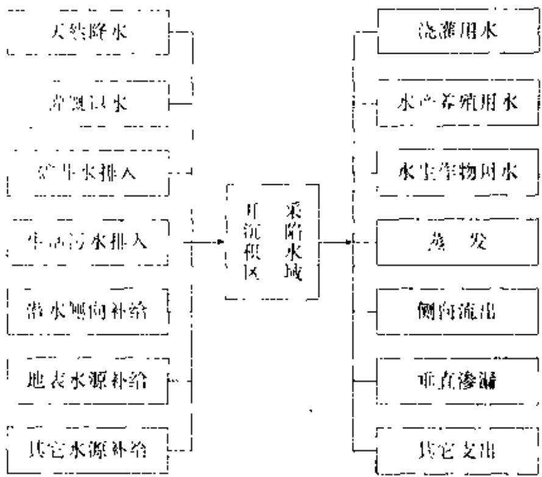  
图3-11开采沉陷积水区水资源的收入支

Fig. 3 -  Input and output of- water resource of waterlogged subsidence area  
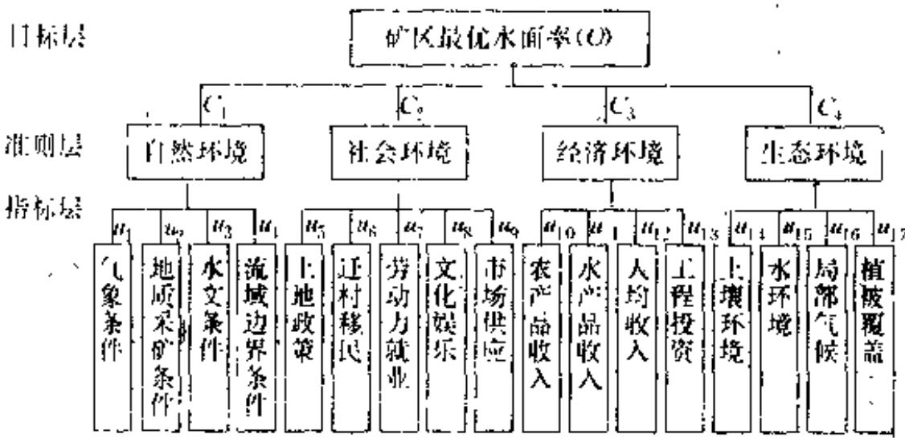  
图3一12确定矿区最优水面率的影响因素(据管建原，1992)  
Fig. 3 - 12 Factors affecting the decision of optinal rate of puddle in subsidence area

## 三、矿区水面率优化方法模糊层次综合评价法

影响矿区水面率优化的17个因子中，一部分可以定量评价另一部分则具有不确定性，将模糊综合评判与层次分析法结合起

来确定 $\mathbf { \xi } \mathbf { \bar { \xi } } ^ { \cdot } \left[ \mathbf { \xi } \cdot \mathbf { \bar { \xi } } \right] .$ 最优水面率是一种较好的方法。其原理如下：

## 1. 选择两个有限论域

（1）评价因素集，将图3-12所示层次分析模型的17个图素用 $l ^ { \star } ~ - ~ ! \iota \cdot \iota t \gets \iota \cdots \iota t , \cdots \iota t \mapsto \iota \iota _ { 1 } ;$ 表示，.表示不同的评价因素， $i -$ $| \sim | \mathit { \Pi } _ { 7 } ^ { - } |$

(2)评语集，据开采沉陷积水区面积及其充填复垦条件，将水而面积每隔定的数值、划分成暑干档次，组成评语集A。A由小到大排列为 $^ { \small i } _ { ( i ) } , \ldots , \ldots , \ldots , \ldots , ^ { \small i } _ { ( i ) } \ldots ( i _ { 1 } )$ 为充填复垦后剩余的最小水面面积. $\alpha ,$ 为沉陷积水区最大面积，取决 $\int \limits _ { 0 } ^ { \infty } u _ { n } , \frac { p - 1 } { 2 } d t$ 的差值和相邻两个a值间隔的大小。当 $u _ { 1 } , u _ { } ,$ 定时，只取决于 $\pmb { \mathcal { U } }$ 值间隔的大小。根据实际情况选择u值的间隔

## 2. 单因素评判矩阵的构造

单因素评价可根据实际指标值（因状态）和规范规定或不同部门、不同地区以及行业特点的标准值（或标准状态）相比较、求其隶属度 $r _ { r } , \cdot \ i$ 表示所评价的国 $\boldsymbol { \mathscr { f } } \cdot , j$ 表示评语等级。

经过单因素评价，得到单因素评判矩阵 $R$ .

$$
R = \left[ \begin{array} { l } { R _ { 1 } } \\ { \cdot } \\ { R _ { 2 } } \\ { \cdot } \\ { \vdots } \\ { R _ { 1 } } \end{array} \right] - [ \bar { r } r _ { \sigma } ] \quad ( \underline { { i } } \cdot \ast . 1 \sim 1 7 , \ast j - _ { \frac { 1 } { 4 } } \cdot n ) \ ( 3 - 2 ; 3 )
$$

## 3. 层次分析法确定各因素的权重

层次分析法总排字结果可表示为模糊集 $I ^ { \nu _ { \perp } }$ …即 $P = \{ p \cdot p$ $\cdots , \boldsymbol { \mathscr { p } } _ { 1 } , \boldsymbol { \mathscr { ) } }$

## 4. 模糊层次综合评价

综合评价结果为 $\boldsymbol { { \cal B } }$

$$
\begin{array} { r l } & { \qquad \Gamma _ { \left| i _ { 1 } \right. } \quad r _ { : } , \quad \cdots \quad r _ { : \ast _ { n } } \bigg ] } \\ { \quad } & { \qquad \quad R = - \left( P _ { 1 } , P _ { 2 } , \cdots \hat { P } _ { i } , \hat { r } \right) \left[ \begin{array} { l l l } { r _ { - 1 } } & { r _ { 2 } } & { \cdots } & { r _ { : n } } \\ { \cdots } & { r _ { - } } & { \cdots } & { r _ { : n } } \\ { \cdots } & { \cdots } & { \cdots } & { \cdots } \\ { r _ { - 1 } } & { r _ { - 1 } } & { \cdots } & { r _ { 1 , n } } \end{array} \right] = \left( \ell _ { 1 } , \delta _ { i _ { 2 } } , \cdots \hat { r } _ { i _ { n } } \right) } \end{array}\tag{3}
$$

上述模糊合成采用（+，·）法则，其表达式为：

$$
\dot { \psi } _ { j } = \sum _ { i } ^ { 1 \bar { \cdot } } \dot { p } , r _ { i j } \qquad \dot { \hat { \jmath } } = 1 \sim n
$$

取nax{bj}，j所对应的评语u，即为最优水面积，最优水面积与 $\alpha ,$ 开采沉陷区面积之比，即为最优水面率。

## 四、矿区复垦时水面率优化实例

## 1. 复垦区概况

某复垦区以一铁路和一公路为南、北白然隔水边界，东、西边界分别为两条南北向排水干渠。区域面积约2.6km²。该区原始地表标高为30.6\~31.7m，潜水位标高28.5\~29.0m，雨季河水位一般不低于28.5，而开采沉陷后地表标高降至27.6\~28.7m，因此，由于沉陷区地形相对低洼，地表径流将汇入沉陷区形成沉陷湖。若防洪堤坝不进行抬高加固，甚至会发生水倒灌现象：危及治理区耕地和建筑设施。即使不在雨季，潜水出露地表线接近地表，也会使土地盐渍化甚至沼泽化。

## 2. 沉陷积水区蓄水面积方案

沉陷积水区蓄水面积方案构成评语集如表3-28。

表 3-28 沉陷积水区蓄水面积方案  
Tab 3—28 Alternatives of waterlogged area reserved
<table><tr><td rowspan=1 colspan=1>评语（方案）</td><td rowspan=1 colspan=1> $\pmb { \mathscr { u } } _ { 1 }$ </td><td rowspan=1 colspan=1> $\alpha _ { 2 }$ </td><td rowspan=1 colspan=1> $\alpha ,$ </td><td rowspan=1 colspan=1> $\mathfrak { a } \mathfrak { q }$ </td><td rowspan=1 colspan=1> $\sim a \cdot$ </td><td rowspan=1 colspan=1> $\smash { \mathsf { d } _ { \mathsf { P } } }$   i3</td><td rowspan=1 colspan=1> $\alpha _ { i }$ </td><td rowspan=1 colspan=1> $\alpha _ { 8 }$ </td><td rowspan=1 colspan=1> $\boldsymbol { \mathscr { a } } \mathfrak { g }$ </td><td rowspan=1 colspan=1> ${ \pmb u } _ { 1 1 }$ </td></tr><tr><td rowspan=1 colspan=1>蓄水面积（亩）</td><td rowspan=1 colspan=1>300</td><td rowspan=1 colspan=1>400</td><td rowspan=1 colspan=1>500</td><td rowspan=1 colspan=1>600</td><td rowspan=1 colspan=1>716</td><td rowspan=1 colspan=1>901</td><td rowspan=1 colspan=1>1029</td><td rowspan=1 colspan=1>1131</td><td rowspan=1 colspan=1>1219</td><td rowspan=1 colspan=1>1300</td></tr></table>

## 3. 模糊层次单因素评价

按前述方法得到单因素评价结果，即得单因素评判矩阵 $R$ .如表3-29。

## 4. 影响因素权重的确定

运用层次分析法得到的总排序结果为： $\underset { ^ { \circ } } { \cal { P } } ( \boldsymbol { 0 } , \boldsymbol { 1 } + , \boldsymbol { 0 } , \boldsymbol { 0 } 4 , \boldsymbol { 0 } , 0 7$ 0.10, 0.12, 0.11, 0.06, 0.04. 0.02, 0.02, 0.05, 0. 10, 0.02. 0.05, 0.01, 0.03, 0.02)

表3-29单因素评判矩阵  
Tab 3— 29 Judgement matrix of single factor
<table><tr><td rowspan=1 colspan=2>评谐集均系</td><td rowspan=1 colspan=1></td><td rowspan=1 colspan=1>u?</td><td rowspan=1 colspan=1>a :</td><td rowspan=1 colspan=1>a1</td><td rowspan=1 colspan=1>d•</td><td rowspan=1 colspan=1>¿</td><td rowspan=1 colspan=1>u;</td><td rowspan=1 colspan=1>4.</td><td rowspan=1 colspan=1>t.</td><td rowspan=1 colspan=1>tt」.</td></tr><tr><td rowspan=4 colspan=1>自然环境1R.1)</td><td rowspan=1 colspan=1>气象条件</td><td rowspan=1 colspan=1>10.37</td><td rowspan=1 colspan=1>6. 10</td><td rowspan=1 colspan=1>0. 50</td><td rowspan=1 colspan=1>70</td><td rowspan=1 colspan=1>0. 901</td><td rowspan=1 colspan=1>1. 00</td><td rowspan=1 colspan=1>0. 8u</td><td rowspan=1 colspan=1>0.60</td><td rowspan=1 colspan=1>0. 10</td><td rowspan=1 colspan=1>0.211</td></tr><tr><td rowspan=1 colspan=1>地质采矿条件</td><td rowspan=1 colspan=1>1.0)</td><td rowspan=1 colspan=1>0.90</td><td rowspan=1 colspan=1>0.80</td><td rowspan=1 colspan=1>. 70</td><td rowspan=1 colspan=1>0.60</td><td rowspan=1 colspan=1>0. 50</td><td rowspan=1 colspan=1>0.40</td><td rowspan=1 colspan=1>0.30</td><td rowspan=1 colspan=1>0.20</td><td rowspan=1 colspan=1>0. 10</td></tr><tr><td rowspan=1 colspan=1>水文条件</td><td rowspan=1 colspan=1>0.10</td><td rowspan=1 colspan=1>420</td><td rowspan=1 colspan=1>0. 30</td><td rowspan=1 colspan=1>6.40</td><td rowspan=1 colspan=1>0.50</td><td rowspan=1 colspan=1>0. 60</td><td rowspan=1 colspan=1>0.70</td><td rowspan=1 colspan=1>0.80</td><td rowspan=1 colspan=1>0. 90</td><td rowspan=1 colspan=1>1.00</td></tr><tr><td rowspan=1 colspan=1>流域边界条件</td><td rowspan=1 colspan=1>0.20</td><td rowspan=1 colspan=1>0.30</td><td rowspan=1 colspan=1>0.50</td><td rowspan=1 colspan=1>01.70</td><td rowspan=1 colspan=1>0.90</td><td rowspan=1 colspan=1>1.00</td><td rowspan=1 colspan=1>0.80</td><td rowspan=1 colspan=1>0.60</td><td rowspan=1 colspan=1>0.40</td><td rowspan=1 colspan=1>0.20</td></tr><tr><td rowspan=5 colspan=1>社会环境(R2)</td><td rowspan=1 colspan=1>土地政策</td><td rowspan=1 colspan=1>1.00</td><td rowspan=1 colspan=1>0.671</td><td rowspan=1 colspan=1>0.60</td><td rowspan=1 colspan=1>0.500</td><td rowspan=1 colspan=1>.42</td><td rowspan=1 colspan=1>0.30</td><td rowspan=1 colspan=1>0.29</td><td rowspan=1 colspan=1>0.27</td><td rowspan=1 colspan=1>0.24</td><td rowspan=1 colspan=1>0.23</td></tr><tr><td rowspan=1 colspan=1>注村移民</td><td rowspan=1 colspan=1>0.50</td><td rowspan=1 colspan=1>0.60</td><td rowspan=1 colspan=1>0.70</td><td rowspan=1 colspan=1>0.85</td><td rowspan=1 colspan=1>1.00</td><td rowspan=1 colspan=1>0.80</td><td rowspan=1 colspan=1>0.60</td><td rowspan=1 colspan=1>0.40</td><td rowspan=1 colspan=1>0.20</td><td rowspan=1 colspan=1>{</td></tr><tr><td rowspan=1 colspan=1>劳动力就业</td><td rowspan=1 colspan=1>1.00</td><td rowspan=1 colspan=1>0.75</td><td rowspan=1 colspan=1>0.60</td><td rowspan=1 colspan=1>0.50</td><td rowspan=1 colspan=1>0.39</td><td rowspan=1 colspan=1>0.33</td><td rowspan=1 colspan=1>0.29</td><td rowspan=1 colspan=1>0.26</td><td rowspan=1 colspan=1>0.21</td><td rowspan=1 colspan=1>0.23</td></tr><tr><td rowspan=1 colspan=1>文忆娱乐</td><td rowspan=1 colspan=1>0.10</td><td rowspan=1 colspan=1>0.20</td><td rowspan=1 colspan=1>0.30</td><td rowspan=1 colspan=1>0.40</td><td rowspan=1 colspan=1>0.50</td><td rowspan=1 colspan=1>0.60</td><td rowspan=1 colspan=1>0.70</td><td rowspan=1 colspan=1>0.80</td><td rowspan=1 colspan=1>0. 90</td><td rowspan=1 colspan=1>1.10</td></tr><tr><td rowspan=1 colspan=1>市场供应</td><td rowspan=1 colspan=1>0.60</td><td rowspan=1 colspan=1>0. 80</td><td rowspan=1 colspan=1>1.C0</td><td rowspan=1 colspan=1>0.80</td><td rowspan=1 colspan=1>0.60</td><td rowspan=1 colspan=1>0.40</td><td rowspan=1 colspan=1>0.20</td><td rowspan=1 colspan=1>0.00</td><td rowspan=1 colspan=1>0.00</td><td rowspan=1 colspan=1>0.00</td></tr><tr><td rowspan=4 colspan=1>经济环境(R)</td><td rowspan=1 colspan=1>水产品收入</td><td rowspan=1 colspan=1>0.70</td><td rowspan=1 colspan=1>0. 80</td><td rowspan=1 colspan=1>0.90</td><td rowspan=1 colspan=1>1.00</td><td rowspan=1 colspan=1>0.90</td><td rowspan=1 colspan=1>0.80</td><td rowspan=1 colspan=1>0.70</td><td rowspan=1 colspan=1>0.50</td><td rowspan=1 colspan=1>0.30</td><td rowspan=1 colspan=1>0.10</td></tr><tr><td rowspan=1 colspan=1>1程投资</td><td rowspan=1 colspan=1>0. 10</td><td rowspan=1 colspan=1>0.20</td><td rowspan=1 colspan=1>0.30</td><td rowspan=1 colspan=1>0.40</td><td rowspan=1 colspan=1>0.50</td><td rowspan=1 colspan=1>0.60</td><td rowspan=1 colspan=1>0.70</td><td rowspan=1 colspan=1>0.80</td><td rowspan=1 colspan=1>0.90</td><td rowspan=1 colspan=1>1.00</td></tr><tr><td rowspan=1 colspan=1>农业收入</td><td rowspan=1 colspan=1>1.00</td><td rowspan=1 colspan=1>0.90</td><td rowspan=1 colspan=1>0.80</td><td rowspan=1 colspan=1>0.70</td><td rowspan=1 colspan=1>0.60</td><td rowspan=1 colspan=1>0.50</td><td rowspan=1 colspan=1>0.40</td><td rowspan=1 colspan=1>0.30</td><td rowspan=1 colspan=1>0.20</td><td rowspan=1 colspan=1>0.10</td></tr><tr><td rowspan=1 colspan=1>人均收入</td><td rowspan=1 colspan=1>0.20</td><td rowspan=1 colspan=1>0.40</td><td rowspan=1 colspan=1>0.60</td><td rowspan=1 colspan=1>0.80</td><td rowspan=1 colspan=1>1.000</td><td rowspan=1 colspan=1>.80</td><td rowspan=1 colspan=1>0. €0</td><td rowspan=1 colspan=1>0.40</td><td rowspan=1 colspan=1>0.20</td><td rowspan=1 colspan=1>0.00</td></tr><tr><td rowspan=4 colspan=1>生态环境(R1)</td><td rowspan=1 colspan=1>上地环境</td><td rowspan=1 colspan=1>0</td><td rowspan=1 colspan=1>0</td><td rowspan=1 colspan=1>0</td><td rowspan=1 colspan=1>0</td><td rowspan=1 colspan=1>0.201</td><td rowspan=1 colspan=1>0.50</td><td rowspan=1 colspan=1>1.00</td><td rowspan=1 colspan=1>0.80</td><td rowspan=1 colspan=1>0. 60</td><td rowspan=1 colspan=1>0.40</td></tr><tr><td rowspan=1 colspan=1>北环境</td><td rowspan=1 colspan=1>0.10</td><td rowspan=1 colspan=1>0.80</td><td rowspan=1 colspan=1>0.60</td><td rowspan=1 colspan=1>0.40</td><td rowspan=1 colspan=1>0.20</td><td rowspan=1 colspan=1>0.10</td><td rowspan=1 colspan=1>0.90</td><td rowspan=1 colspan=1>0.70</td><td rowspan=1 colspan=1>0.50</td><td rowspan=1 colspan=1>n.30</td></tr><tr><td rowspan=1 colspan=1>局部气候</td><td rowspan=1 colspan=1>1.cO</td><td rowspan=1 colspan=1>0.80</td><td rowspan=1 colspan=1>0.60</td><td rowspan=1 colspan=1>0.40</td><td rowspan=1 colspan=1>0.20</td><td rowspan=1 colspan=1>0.10</td><td rowspan=1 colspan=1>0.10</td><td rowspan=1 colspan=1>0.10</td><td rowspan=1 colspan=1>0.10</td><td rowspan=1 colspan=1>0.10</td></tr><tr><td rowspan=1 colspan=1>植被覆盖</td><td rowspan=1 colspan=1>1.00</td><td rowspan=1 colspan=1>0.90</td><td rowspan=1 colspan=1>0.80</td><td rowspan=1 colspan=1>0.70</td><td rowspan=1 colspan=1>0.60</td><td rowspan=1 colspan=1>0.50</td><td rowspan=1 colspan=1>0.30</td><td rowspan=1 colspan=1>0.10</td><td rowspan=1 colspan=1>0.00</td><td rowspan=1 colspan=1>0.00</td></tr></table>

运用层次分析法得准则层和指标层的排序结果见表3—30。

## 5. 多级模糊综合评判

多级模糊综合评判过程如图3—13所示。图中：

$$
\begin{array} { c } { { B _ { \mathrm { t } } = \underbrace { P _ { c _ { \mathrm { t } } } \cdot R _ { c _ { \mathrm { t } } } } _ { \sim } = ( 0 . 3 2 , 0 . 3 9 , 0 . 5 0 , 0 . 6 4 , 0 . 7 8 , } } \\ { { \phantom { R _ { \mathrm { t } } = R _ { c _ { \mathrm { t } } } \cdot R _ { c _ { \mathrm { t } } } } 0 . 8 6 . 0 . 7 3 , 0 . 6 0 , 0 . 4 8 , 0 . 3 5 ) } } \end{array}
$$

$$
\begin{array} { c } { { B _ { z } = P _ { c _ { z } ^ { \prime } } \cdot R _ { c _ { z } ^ { \prime } } = \left( 0 . 7 1 , 0 . 6 6 , 0 . 6 9 , 0 . 6 5 , 0 . 6 1 , \right. } } \\ { { \left. \qquad 0 . 4 8 , 0 . 3 8 , 0 . 2 8 , 0 . 2 2 , 0 . 1 7 \right) } } \end{array}
$$

$$
\begin{array} { c } { { B _ { \ast } = P _ { \ast } \ast R _ { \ast } \ _ { \ast } = \ ( 0 . \ 1 9 , 0 . \ 5 7 \bullet 0 . \ 6 4 , 0 . \ 7 1 \bullet 0 . \ 7 5 , } } \\ { { \qquad 0 . \ 6 8 , 0 . \ 6 0 , 0 . \ 5 0 , 0 . \ 4 0 , 0 . \ 3 0 ) } } \end{array}
$$

$$
\begin{array} { c }  { \tiny B _ { : } = P _ { - } \cdot \begin{array} { c } { { \cdot R _ { i } } } \end{array} = \begin{array} { c } { { ( 0 , 3 6 , 0 , 3 4 , 0 , 3 1 , 0 . 2 9 , 0 . 3 7 , } } \\ { { } } \end{array} } \\ { { ( ) . \begin{array} { c } { { ( 1 , \ 7 3 , 0 , 5 4 , 0 , 3 9 , 0 , 2 6 ) } } \end{array} } } \end{array}
$$

表 3-30 各层因子权重表  
Tab 3--30 Weıght of factors in different levls
<table><tr><td rowspan=3 colspan=1></td><td></td><td rowspan=1 colspan=8></td><td rowspan=3 colspan=5>Í权璽</td><td rowspan=1 colspan=4></td></tr><tr><td></td><td rowspan=2 colspan=8>自然环境 $\{ \mathbf { \vec { \mathbf { \zeta } } } ^ { \prime } \mathbf { \mathbf { \vec { \mathbf { \zeta } } } } ^ { \prime } \}$          1 $\ell ( !$       4            $\ell \ell :$ I</td><td rowspan=1 colspan=8>社会环境 $\{ \zeta _ { \zeta } ^ { - } \}$ </td></tr><tr><td></td><td rowspan=1 colspan=1> $\smash { t } ( \cdot )$ </td><td rowspan=1 colspan=2> $\boldsymbol { u } _ { \mathfrak { n } }$ </td><td rowspan=1 colspan=2>u]</td><td rowspan=1 colspan=2> $\eta _ { s }$ </td><td rowspan=1 colspan=1> $\pmb { \mathscr { u } } ( \pmb { \mathscr { r } } )$ </td></tr><tr><td></td><td rowspan=1 colspan=1>指标压在相应的准则基(P)</td><td rowspan=1 colspan=2>0.4)</td><td rowspan=1 colspan=2>0.120</td><td rowspan=1 colspan=2>=. 20</td><td rowspan=1 colspan=2>0.28</td><td rowspan=1 colspan=1>0.26</td><td rowspan=1 colspan=2>1.27</td><td rowspan=1 colspan=2>0.18</td><td rowspan=1 colspan=2>0.07</td><td rowspan=1 colspan=1>0.22</td></tr><tr><td></td><td rowspan=1 colspan=1>准则相对于目标层(P）)</td><td rowspan=1 colspan=8>11.28</td><td rowspan=1 colspan=8>0.26</td></tr><tr><td></td><td rowspan=1 colspan=1>指标总排</td><td rowspan=1 colspan=2>0.11</td><td rowspan=1 colspan=2>0.030</td><td rowspan=1 colspan=2>.06</td><td rowspan=1 colspan=2>0.08</td><td rowspan=1 colspan=1>0.06</td><td rowspan=1 colspan=2>0.07</td><td rowspan=1 colspan=2>0.0.</td><td rowspan=1 colspan=2>0.02</td><td rowspan=1 colspan=1>C. 06</td></tr><tr><td></td><td rowspan=3 colspan=1>1子权重指标层在相应的准则(P)</td><td rowspan=1 colspan=8>经济环境 $( \overrightarrow { C } _ { * } )$ </td><td rowspan=1 colspan=8>生态环境 $\displaystyle ( C , )$ </td></tr><tr><td></td><td rowspan=1 colspan=2> $\yen 123$ </td><td rowspan=1 colspan=2>ul1</td><td rowspan=1 colspan=2> $\boldsymbol { u } _ { 1 { \flat } }$ </td><td rowspan=1 colspan=2> $\pmb { \mathit { n } } ( 1 . 3$ </td><td rowspan=1 colspan=2>A11</td><td rowspan=1 colspan=2>115</td><td rowspan=1 colspan=2> $\pmb { \nu } _ { 1 6 }$ </td><td rowspan=1 colspan=2>u17</td></tr><tr><td></td><td rowspan=1 colspan=2>0.23</td><td rowspan=1 colspan=2>0.25</td><td rowspan=1 colspan=2>C. 25</td><td></td><td rowspan=1 colspan=2>0.27</td><td rowspan=1 colspan=2>0.55</td><td></td><td rowspan=1 colspan=2>0.10</td><td rowspan=1 colspan=2>0.10</td><td rowspan=1 colspan=2>0.23</td></tr><tr><td rowspan=1 colspan=2>准则层相行于目标层 $( I ^ { 2 } { } _ { \mathfrak { G } } )$ </td><td rowspan=1 colspan=8>0.20</td><td rowspan=1 colspan=8>0.26</td></tr><tr><td rowspan=1 colspan=2>指标总排序</td><td rowspan=1 colspan=2>0.05</td><td rowspan=1 colspan=2>0.05</td><td rowspan=1 colspan=2>0.05</td><td rowspan=1 colspan=2>0.05</td><td rowspan=1 colspan=2>0.14</td><td rowspan=1 colspan=2>0.03</td><td rowspan=1 colspan=2>0.03</td><td rowspan=1 colspan=2>0.06</td></tr></table>

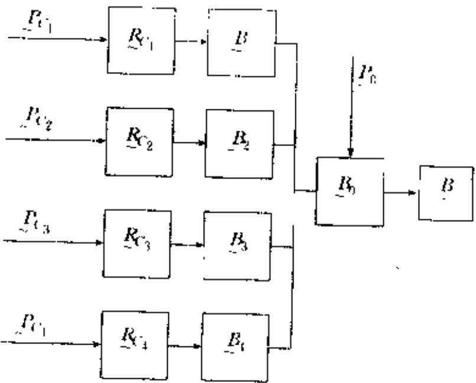  
图 3-13 多级模糊综合评判过程  
Fig. 3--13 The process of evaluation base on multi- levels fuzzy mwthod

于是，

$$
\begin{array} { r } { { P } _ { i } = \left[ \begin{array} { l } { P _ { i } , \cdots , R _ { i } , } \\ { \cdots , } \\ { \cdots , R _ { i } , } \\ { \cdots , } \\ { P _ { i } , \cdots , R _ { i } , } \\ { \cdots , } \end{array} \right] } \\ { \left[ \begin{array} { l } { P _ { i } , \cdots , R _ { i } , } \\ { \cdots , R _ { i } , } \\ { P _ { i } , \cdots , R _ { i } , } \end{array} \right] } \end{array}
$$

$$
\begin{array} { r } { B = P _ { \circ } \ R _ { \circ } = \ ( 1 ) , \ 4 7 , 0 . \ 4 8 , 0 , \ 4 2 , 0 , \ 5 7 , 0 , \ 6 2 , } \end{array}
$$

$$
0 . 6 3 , ( ) , 6 1 , 0 , 4 8 , 0 . 3 7 , 0 , 2 7 )
$$

评判结果 $b _ { n } = 0 , 6 3$ 最大，因此方案 $\alpha _ { \mathfrak { h } }$ ，即保留904亩水面为最优方案，又沉陷区总面积为3900亩，所以该复垦区最优水面率为23%。

## 第四章 矿区土地复垦工程设计方法

第一节 复垦土地标高的设计与土方工程量计算

复垦土地标高没计容易被人忽略。在许多缺乏规划的复垦工程中，复垦土地的标高或者太高而浪费人力、物力和财力，或者太低而影响上地的使用。从复垦费用来说，工程复垦费用明显高于生物复垦费用，而工程复垦费用中土方工程费用又占很大比例(下正富，1996)。因此准确地计算出挖填土方量和复垦后的标高，其意义表现在：准确的计算可保证挖填量均衡、土方工程量最小，并保证经费预算的正确性。对于实行承包制的工程，经费预算的正确性可为企业减轻负担或保证承包人免受损失8。更为重要的是：如果土方量计算不正确，可能导致复垦区因缺少土方来源而使规划方案不能实施。

## 一、疏排法复垦时农田最低标高的确定37

疏排法复垦通过开挖排水沟系，必要时建立强排水电站排除地表积水，实行分区治理、梯级控制，达到减少土方工程量，大范围恢复沉陷积水区土地利用的目的。

自排区域农田最低标高计算公式为：

$$
H _ { i } = H _ { i } + \sum _ { i } l _ { i } , + h _ { k }\tag{4−1}
$$

式中 $\pmb { f } \pmb { I } _ { t }$ —-最低农田标高，m；

$H ,$ ——外河洪水位：m；

$l ,$ --各级排水沟道长度，m；

$i , -$ ——各级排水沟道坡度：

${ \hslash } _ { k }$ 一作物保持正长生长的地下水位临界深度， $\displaystyle \mathbf { m } _ { \mathfrak { o } }$

强排区域农田最低标高计算公式为：

$$
H I _ { i } = I I _ { d } + \Sigma i , \div \tau \mathfrak { e }  h _ { i }\tag{4-2}
$$

式中 $I l _ { d }$ 主排水沟沟底标高，m：

ω —主排水沟水深，m。

## 二、充填法复垦时充填高度的设计

采煤沉陷区常可采用矸石、粉煤灰、城市垃圾等充填，达到土地再利用的目的。为保证充填区域自然沉降后保持平坦或达到设计要求的标高，充填高度应略大小于设计的田面标高，高出的部分称为充填超高。

设充填高度为.充填超高为 $\Delta h$ (图4-1)，则：

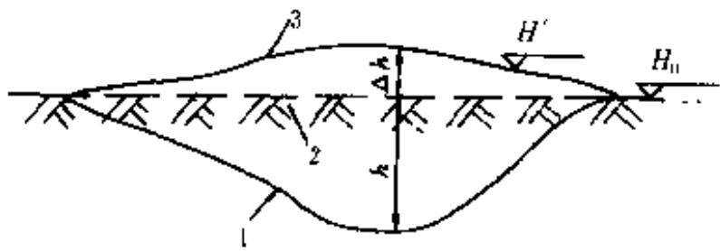  
图4—1 充填超高计算示意图  
Fig. 4—1 Sketch map showing computing super 11 height of filling  
1—开采沉陷后地表；2—充填沉降压实后的田面；3—充填后的地形

$$
\Delta { / } _ { \hat { \imath } } = \left\{ \frac { R } { R _ { 0 } } - 1 \right\} h\tag{4-3}
$$

或

$$
\Delta h = \left( { \frac { \displaystyle { \mathfrak { k } } \ + e _ { 1 } } { \displaystyle { 1 + e _ { 2 } } } } \ - 1 \right) h\tag{4 −4}
$$

式中 R——充填料沉降后相对压实度， $R = \frac { r } { r _ { \mathrm { m a x } } }$ ，r为充填料沉降压实后的实际密度， $r _ { \mathrm { t u a x } }$ 为标准压实的最大密度；

$R _ { ☉ }$ ——充填料初始相对压实度， $R = \frac { r _ { \circ } } { r _ { \mathrm { m a x } } } \ , \ r _ { \circ }$ 为充填料沉降压实前的密度；

$\ell _ { \cdot }$ -充填料沉降压实前的孔隙比；

$\boldsymbol { \mathscr { e } } _ { \xi }$ 一充填料沉降压实后的孔隙比。

孔隙比的计算公式为：

$$
\epsilon ^ { * } \stackrel { . . } { - } \frac { { \mathbb { Y } } _ { \omega } } { \mathfrak { r } _ { s } }\tag{4−5}
$$

式中 $\smash { \tau _ { r } ^ { \prime } }$ ——孔隙体积；

${ \bf { \vec { v } } _ { \vec { \mathbf { { \ s } } } } }$ —-固体颗粒体积。

例一：设充填高度 $h = 5 . 0 \mathrm { m } , R _ { \ R } = 8 6 \% , R = 9 5 \%$ ，则：

$$
\Delta t = \Big \{ \frac { 9 5 \% } { 8 6 \% } - 1 \Big \} \times 5 \approx 0 . 5 ( \mathrm { m } )
$$

例二：没充填高度 $h = 5 . 0 \ m$ ，压实前 $\pmb { \mathscr { e } } _ { 1 } ~ = = ~ 0 , ~ 4 2$ ，压实后 $\pmb { \ell } _ { \pmb { \mathrm { ~ \dots ~ } } } ^ { \star }$ $= 0 . 3 2$ ，则：

$$
\Delta h = \left\{ \frac { 1 + 0 . 4 2 } { 1 + 0 . 3 2 } - 1 \right\} \times 5 \approx 0 . 3 8 ( \mathbf { m } )
$$

因此，充填复垦时充填后的地形标高 $H ^ { \prime }$ 应为：

$$
H ^ { \prime } = H _ { \mathit { \hat { \cdot } } } + \Delta h\tag{4-6}
$$

式中 $H _ { y }$ ——充填压实后的田面设计标高。

当充填复垦用作种植用地时，通常要在充填料上覆盖表土，这时充填后的地形标高 $\dot { H } ^ { \prime }$ 应为：

$$
H ^ { \prime } = H _ { \mathrm { ~ 0 ~ } } + \Delta h - h _ { \mathrm { ~ 0 ~ } }\tag{4−7}
$$

式中 $\hslash _ { 3 }$ 一—覆土厚度。

值得注意的是，为保证复上沉降后田面能达到设计标高 $H _ { \ast }$ 实际覆土高度亦应考虑覆上后的沉降值，即实际覆土高度为：

$$
h ^ { \prime } { } _ { 1 } = h _ { 3 } + \Delta h _ { 0 }\tag{4−8}
$$

式中 $\Delta h _ { 0 }$ 一覆土部分的沉降值。

由上面的计算不难发现，充填复垦时充填高度的计算需要获取充填料沉降压实前后的密度或孔隙比等指标，当充填料块度不均匀时，很容易引起不均匀沉降，从而引起沉降后地表高低不平.影响使用，解决的办法是充填前对充填料作适当分选，充填后用堆土机作人工压实处理。

## 三、复垦场地平整时标高的确定

## 1. 复垦场地标高的基本要求

平整后复垦场地的标高应满足两个基本要求，即：

(1)满足生产需要。对于农用土地而言，必须保证农田最低标高应高出潜水位 $\hslash _ { k }$ ，即作物正常生长的临界深度以上；对于建筑场地而言，应保证建筑物不受潜水和洪水侵害，居住环境不受洪水威胁；复垦场地的坡度还应满足排水、运输等生产需要。

(2)在满足生产需要的基础上，保证挖填土方量最小。

## 2. 复垦场地标高设计方法8]

复垦场地标高设计方法较多，常用的有断面法、方格网法和最小二乘法。其中最小二乘法适用范围广、计算结果精度高，在计算机上也最容易实现。最小二乘法设计复垦场地标高的基本原理是在满足实际需要的同时，使挖填土方量最小。

图4-2为一待复垦土地的等高线图，在图上建立坐标系统和坐标格网。设坐标原点复垦后标高为H。，纵横向设计坡度分别为 $H _ { \mathfrak { d } }$ $\textit { i } _ { S } , ~ i _ { s }$ ，则任一点k的复垦后标高 $H _ { k }$ 为：

$$
H _ { s } = H _ { \parallel } + i _ { x } x _ { \star } + i , y _ { k }\tag{4-9}
$$

若k点的原标高为 $\smash { Z _ { \ell } }$ ，则施工高度 $\pmb { c } _ { \pmb { \ k } }$ 为：

$$
c _ { k } = H _ { k } - Z _ { k } = H _ { 0 } + i _ { , } x _ { y } + i _ { y } y _ { k } - Z _ { k }\tag{4−10}
$$

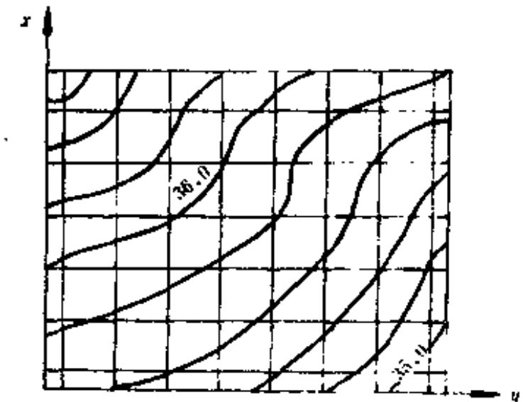  
图4—2 坐标格网建立示意图  
Fig. 4—2 Establishing coordinate grid

在微面积dxdy范围内的土方址 $\dot { \mathrm { d } } v _ { \star }$ 为：

$$
\mathrm { d } { v } _ { k } = c , \mathrm { d } { x } \mathrm { d } { y } - ( H _ { \diamond } + i _ { \cdot } x _ { k } + i _ { \cdot } y _ { k } \dots Z _ { k } ) \mathrm { d } { x } \mathrm { d } { y }\tag{4 - 11}
$$

欲使复垦区域内上方工程量最小，且保持挖填基本均衡，据最小二乘原理知，必须使

$$
\sum _ { k = 1 } ^ { n } \mathrm { d } \boldsymbol { v } _ { k } ^ { 2 }  \sum _ { k = 1 } ^ { \nu } \ l [ \ l ( \boldsymbol { H _ { 0 } } + i \ x _ { k } + i \ y _ { k } \dots Z _ { k } ) \mathrm { d } x \mathrm { d } y ] ^ { 2 } = \mathrm { r n i n }\tag{4-12}
$$

对式（4—12）分别求 $H _ { \scriptscriptstyle \{ 1 \} } , i , \sin ^ { i } ,$ 的偏导数并考虑方格交点高程值的权重 $p _ { k }$ (图4—3)，得到求解 $H _ { a } , i _ { } , \hphantom { \dag } ,$ 的法方程组如下：

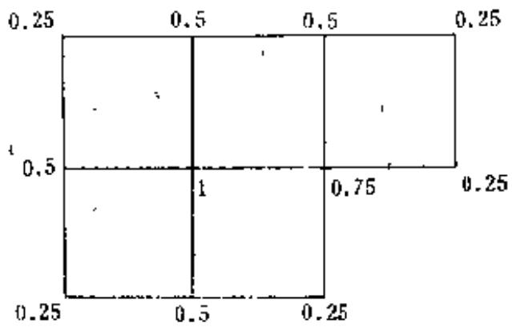  
图4-3 方格网交点权重示意图  
Fig. 4 3 Weight of grid intersect

$$
[ \zeta p ] H _ { 0 } + \zeta p x ] i _ { r } + \zeta p y ) i _ { y } = ( \zeta p 2 )\tag{4-13}
$$

$$
\{ ( p x ) \bar { I } I _ { \mathrm { p } } + [ p \dot { x } ^ { 2 } ] i , \dot { + } [ p x y ] i _ { y } = [ p x Z ]\tag{4- 14}
$$

$$
[ \mathbb { C } p y ] H _ { \mathfrak { d } } + \mathbb { C } p y x ] i _ { x } + \mathbb { E } p \dot { y } ^ { 2 } ] i _ { y } = \mathbb { C } p y Z ]\tag{4− 15}
$$

由式（4-13）～（4-15）可解出 $H _ { 0 } , i _ { r } , i _ { y }$ ，从而按式（4一9）和（4-10）求出方格网各交点的设计标高和施工高度。

最小二乘法可以求解以下几个问题：

(1) 设计坡度 $i \cdot , i _ { y }$ 和设计标高未知时；

(2)为满足排水或作物生长需要，必须保持 $\dot { \pmb { \imath } }$ 或 $i ,$ 为定值时；

(3)必须保持某一点复垦后的标高为定值时：

(4)当要求复垦后地面为水平面时。

## 四、场地平整时土方量的计算

场地平整时常用的土方量计算方法有方格网法、整体法、断面法、三角棱柱体法、四方棱柱体法等。方格网法与整体法适用于地形变化较小、断面法则适用于地形坡度变化较大时，三角梭柱体法和四方棱柱体法计算公式简单，地形坡度变化越小、方格网划分越细，计算精度越高。这里以三角棱柱体法计算土方量为例说明计算步骤：

(1）在图4-2计算场地平整标高的基础上，沿地形等高线将方格分成两个三角形。

(2) 根据方格网交点实际标高和场地平整的设计标高计算每个方格网交点的施工高度。4

(3)在图上绘出零线位置，即不挖不填的施工界线。

(4)按下面两种情况分别计算土方量：

①全部填方或全部挖方的完整三角形，如图4→4a所示，计算公式如下：

(a)  
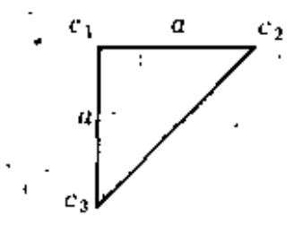

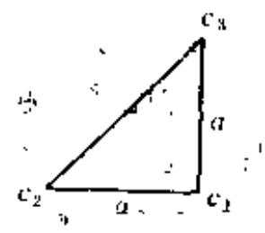

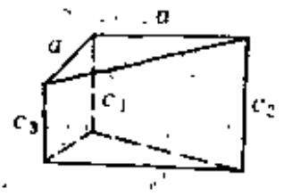

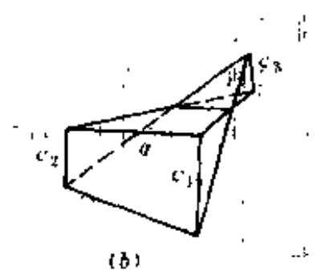  
图角棱杠1小异上方量示意图  
Fig. 4--4 Computation of earthwork ammount  
by means of triangular prism formula

$$
v _ { \pm ; \pm ; \ m } = \frac { a ^ { 2 } } { 6 } ( c _ { 1 } + c _ { 2 } + c _ { 3 } )\tag{4-16}
$$

②部分填方与部分挖方的不完整三角形，如图4一46所示，计算公式如下：

$$
v _ { \parallel \parallel ; ( \parallel \ddot { z } / \parallel 1 ) } = \frac { a ^ { 2 } c _ { 3 } ^ { 3 } } { 6 ( c _ { \parallel } + c _ { 3 } ) ( c _ { 2 } + c _ { 3 } ) }\tag{4−17}
$$

$$
v _ { \parallel ( \uparrow \uparrow / \downarrow ) } = \frac { u ^ { 2 } } { 6 } ( c _ { 1 } + c _ { 2 } - \dot { c } _ { \downarrow } ) + v _ { \parallel ( \downarrow \downarrow / \downarrow ) }\tag{4−18}
$$

式（4—18）中 $\because A E ( 1 \cdot E ^ { \prime } ) + H B$ 用绝对值代入。

对每个三角形按式（4—16）\~（4一18）计算挖/填土方量，最终有：

$$
V _ { \uparrow \hat { z } ( \mathfrak { M } ) \tilde { z } } = \Sigma v _ { \uparrow \hat { z } ( \mathfrak { M } ) }\tag{4- 19}
$$

五、土方量计算精度分析与土方量计算对规划设计用图纸比例尺的要求

影响土方量计算精度的主要因素有地形图比例尺和方格网间隔。矿区土地复垦规划设计离不开地形图，过去对规划用地形图比例尺的选取重视不够，因而造成规划方案难以实施。影响地形图比例尺选取的因素包括经济因素、技术因素、自然因素和生产因素等。经济因素表现为在满足复垦要求的情况下，比例尺越大，生产费用越高。同时比例尺越大，测图的生产周期也将延长。自然因素取决于塌陷区地物地貌的复杂程度。生产和技术因素主要表现为施工工程的种类及测图的方法。一般来说， $\pmb { \mathcal { H } }$ 区土地复垦工程包括灌排水系统规划施工、居民地搬迁规划、土壤改良规划实施、土地平整规划实施等，它们对地形图比例尺都有一定的要求，但相对说来土方量计算精度对地形图比例尺要求较高。综合考虑土方量计算精度的要求和经济因素，地形图比例尺应有一合适值。下面是根据测量误差理论分析地形图比例尺对土方量计算精度的影响过程。

以复垦后地面为水平面为例，则：

$$
\begin{array} { r } { I I _ { \circ } = \frac { [ f p Z ] } { [ f ] } } \end{array}\tag{4-20}
$$

于是有：

$$
m _ { t \prime _ { 1 } } ^ { 2 } = \frac { [ \phi ^ { 2 } ] } { [ \phi ] ^ { 2 } } m _ { \tilde { z } } ^ { 2 }\tag{4-21}
$$

当 $n \mathrm { \Gamma } \mathrm { \hat { \Omega } } \mathrm { c } \mathrm { c } .$ ，即方格无限细分时， $m _ { f \ell _ { 0 } } { \to } 0$ ，即利用最小二乘法求得的$H _ { 0 } , i , \ i _ { y }$ 可认为没有误差，于是：

$$
m _ { \tau _ { k } } ^ { 2 } = i _ { x } ^ { 2 } { m _ { r } ^ { 2 } } + i _ { y } ^ { 2 } { m _ { y } ^ { 2 } } + m _ { \tilde { \tau } _ { k } } ^ { 2 }\tag{4-22}
$$

若 $\scriptstyle { i _ { x } = i _ { y } = 0 }$ ，则

$$
m _ { \star } = m _ { z \star }\tag{4-23}
$$

由柯培公式知：

$$
m _ { \cdot , \cdot } = m _ { Z k } = m + n \mathrm { t g } \alpha\tag{4-24}
$$

式中：m、n为系数，α为地形坡度， $m _ { H _ { 0 } } , m _ { z } , m _ { i } , m _ { z } , m _ { y } , m _ { z _ { k } }$ 分别表示 $H _ { 0 } , Z , c _ { k } , x , y , Z _ { k }$ 各量的中误差。

大量的实际资料表明：1：1000比例尺的平坦或缓坡地区地形图 $m + n \mathrm { t g } \alpha \approx 1 2 . \mathrm { l c m } \ , \ 1 \ : \ 2 \ 0 0 0$ 的平坦或缓坡地区地形图 $\pmb { \mathcal { n } }$ $+ n \mathrm { t } g a \approx 2 2 . 6 \mathrm { c m }$ 口

为简化问题起见，以单三角棱柱体讨论土方量计算精度如下，由式（4-16）得：

$$
m _ { v } ^ { 2 } = \frac { a ^ { 2 } ( c _ { 1 } + c _ { 2 } + c _ { 3 } ) ^ { 2 } } { 9 } m _ { a } ^ { 2 } + \frac { a ^ { 4 } } { 1 2 } m _ { i } ^ { 2 }\tag{4-25}
$$

$$
\left( \frac { m _ { v } } { v } \right) ^ { 2 } = \frac { 4 } { a ^ { 2 } } m _ { a } ^ { 2 } + \frac { 3 m _ { c } ^ { 2 } } { ( c _ { 1 } + c _ { 2 } + c _ { 3 } ) ^ { 2 } }\tag{4-26}
$$

式中： ${ \pmb { m } } _ { \pmb { \mu } }$ $\pmb { m } _ { \mathbf { p } }$ 分别表示方格网间隔a和土方量v的中误差， $\frac { m _ { v } } { v }$ 则表示v的相对中误差。

一般情况下，绘图、用图量边中误差 $\pmb { \mathcal { M } } _ { \pmb { \mathcal { M } } }$ 为0.4mm，如果 ${ \pmb { a } } =$ 20m，比例尺为1：1000，则式（4—26）中的第一项将使v的相对中误差达到4%；若 $\pmb { a } = 2 0 \mathbf { m }$ ，比例尺为1：2000，将使v的相对中误差达到8%。又设 ${ \mathfrak { c } } _ { \mathfrak { z } } + { \mathfrak { c } } _ { \mathfrak { z } } + { \mathfrak { c } } _ { \mathfrak { z } } = { \mathfrak { z } } \ { \sqrt { \ { \mathfrak { z } } } } m$ ，则对于用1；1000地形图计算土方量，式（4-26）中的第二项将使v的相对中误差达4%，若比例尺为1：2000，将使υ的相对中误差达7.5%。

根据上述简要分析知：为使由测量图纸误差引起的土方量计算相对中误差不超过10%，最好应采用1：1000或更大比例尺的地形图，1：2000的地形图是难以达到准确计算土方量的日的的。

影响土方量计算精度的另一重要因素是方格网间隔a值。如果a值越大．将使土方量计算产生较大的代表性误差，即用平面表示不规则地表面的误差；若a值越小，计算工作量将增加。因此，在实际计算土方量时，必须首先确定好a值。确定a值的原 $\pmb { a }$ 则是使小范围内的地表面尽可能接近于平面或坡面。

为估算土方量计算的精度，这里我们给出预计公式如下：

$$
\Bigl \{ \begin{array} { l } { { \frac { m _ { \mathrm { s } } } { v } } \Bigr \} ^ { 2 } = { \frac { 2 m _ { \mathrm { s } } ^ { 2 } \left[ C _ { \mathrm { s } } ^ { \mathrm { s } } \right] } { 3 \left[ C _ { \mathrm { s } } \right] } } + { \frac { { a } ^ { 2 } m _ { \mathrm { s } } ^ { 2 } } { 2 \left[ C _ { \mathrm { s } } \right] } } \times \mathrm { I N T } \Bigl \{ \frac { 2 S } { a } \Bigr \} } \end{array}\tag{4-27}
$$

式中； $\tilde { c _ { i } }$ 为第i个三角形 $\Xi _ { \cdot }$ 个角点的施工高度的绝对值之和， $\dot { \ell } \ \stackrel { \cdot \cdot } { = }$ $1 \sim n , n = \mathrm { I N T } \Big \vert \frac { 2 S } { a } \Big \vert$ ，S为计算土方量的复垦区域总面积。

综合分析地形图比例尺和方格网间隔对土方量计算精度的影响，土方量计算用图比例尺不应低于1：1000，有可能时应用1：500的地形图。在总体规划时，对土方量计算精度要求不高时，可采用1：2000地形图。

## 第二节 疏排法复垦设计的内容和方法

疏排法复垦属于非充填复垦，是解决高潜水位矿区塌陷地大面积积水问题的有效办法[3]。疏排法复垦的关键是设计合理的排水系统，排水系统设计的关键是选择适当的承泄区和设计标准，标准过高造成浪费，标准太低达不到治理的目的，而没有适当的承泄区就谈不上用疏排法复垦。实践证明：疏排法复垦费用低，复垦后土地利用方式改变不大，深受农民欢迎。排水系统设计方法同样适用于中低潜水位矿区及其它复垦区疏排系统的设计。 19

## 一、塌陷区复垦要求和防洪除涝排水标准

塌陷区复垦为农业用地通常要求防止外围地表径流或洪水侵入，排除塌陷区内积水和降低地下潜水位，即通常所说的防洪、除涝、降渍。

塌陷区复垦防洪要求洪水季节承泄区河水及外围径流不倒灌或流入塌陷低注地，通常应采取整修堤坝和分洪的方法。复垦区防洪标准通常取决于承泄区的泄水能力和堤坝的尺寸，它是用实际年法（如某一年的洪水位）和频率法两种方法确定的。对于重要的工矿区取50\~100年一遇，一般工矿区取10\~20年一遇洪水位作为防洪设计标准。

除涝设计标准取决于排水面积和排水地区的具体条件，通常用暴雨频率、暴雨历时和排除时间表示。由于塌陷区范围通常较小，又采取截洪措施后，汇水面积更小，暴雨频率通常可采用20%，即5年一遇的暴雨作为设计标准。对排水条件较好的地区或有特殊要求的粮棉、蔬菜基地和城郊型塌陷地，也可选用10年一遇的暴雨作为设计标准。对于旱作农田，暴雨历时和排除时间选为1\~3天暴雨，1\~3天排除。徐州矿区选为1天暴雨，2天排除。对于水田，一般采用1\~3天暴雨，3\~5天排至水稻允许耐淹深度以下。

复垦区降渍的目的是使土壤内的水分和空气状况适合作物根系的生长。降渍标准包括作物的耐渍时间和耐渍深度。不同的作物及同一作物的不同生长期，耐渍时间和耐渍深度不一样。常见作物小麦生长期生长适宜地下水埋深为1.0\~1.2m，耐渍时间前期为15天，生长后期为8天；棉花的耐渍深度为1.10\~1.50m，耐渍时间开花结铃期为3\~4天，其它时期为:7天；玉米的耐渍深度为1.2\~1.5m，耐渍时间为3\~4天。对地下水矿化度较高的地区，地下水位还应降至临界深度以下，从而保证土壤不发生盐碱化及作物不受盐害的影响。地下水位临界深度与土壤质地、地下水矿化度有关，具体标准可参考当地耕作经验。

## 二、承泄区的选择

承泄区通常采用复垦区以外洪水位相对较低的河道，当用强排法复垦时，承泄区洪水位也可高于复垦区农田标高。选择合适

的承泄区是疏排法复垦的基础。选择承泄区的依据如下：

## 1. 距离的远近

承泄区距复垦区越近，排水费用越低，一般应就近排水。

## 2. 尽量自排，避免强排

自排可免除修建排水站费用，日常排水费用也很低，但自排要求承泄区水位必须满足式（4-28）：

$$
H , \leqslant H , - \dot { \Sigma } \dot { l } , i , - \dot { h } _ { k } - \Delta h\tag{4-28}
$$

式中 H—承泄区水位；

$H _ { t }$ ——复垦后农田标高；

$l .$ —各级排水沟长度；

$i _ { i }$ —各级排水沟坡度；

$\pmb { h } _ { \pmb { k } }$ ——保证作物正常生长的地下水临界深度；

$\Delta \hbar$ ——地下水位与排水沟水位之差。

## 3. 遵循经济合理、便于实施的原则

有时就近排水需要强排，适当开挖一段排水沟至下游承泄区，则可实现自排，如图4—5所示。图中A点水位较高，只能建强排站强排，但水闸下游B点水位较低，可实现自排，但需多开挖一段排水沟，这时就需按经济合理、便于实施的原则选择承泄区。所谓经济合理即对两种方案进行经济评价，选择初期投资和年经营费用现值P较低的方案，P按下式计算：

$$
P = P _ { \circ } + R \frac { ( 1 + i ) ^ { n } - 1 } { ( 1 + i ) ^ { n } \circ i }\tag{4-29}
$$

式中 $\pmb { P _ { \check { \theta } } }$ ——初期投资；

$\mathbf { \nabla } _ { i } ^ { \bullet } .$ 利率；

$\pmb { R }$ 年经营费用；

n——计算期。

所谓便于实施，是考虑行政区划和小流域治理规划而言的，因为塌陷区治理范围通常较小，若疏排法复垦方案与小流域治理规划一致，则既节约复垦投资，又容易实施；另外跨行政区划的疏排方案往往需要多方协调，与在同一行政区划内开挖排水沟系相

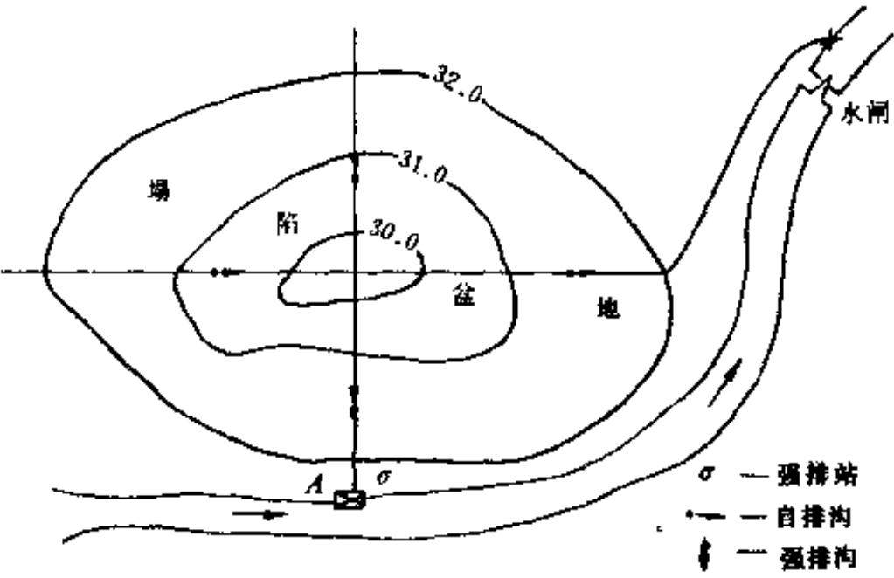  
图4-5 排水方案  
Fig.4—5 Drainage alternatives

比较难实施。

## 三、排水系统设计[39]

## 1. 防洪系统设计

疏排法复垦通常选择适宜的承泄区作为排洪用。承泄区是现有的河沟或湖泊，其断面与泄洪能力不必作专门设计，只作验算即可。但必须采取加高堤坝措施防止洪水溃入复垦区，堤坝高度设计按下式计算：

$$
H _ { d } = H , + h _ { 1 } + h _ { 2 }\tag{4−30}
$$

式中 $\pmb { H _ { d } }$ ——堤顶高程；

$H ,$ ——设计洪水位；

$h _ { i }$ ——波浪爬高；

$\pmb { h } _ { 2 }$ —安全超高。

$( h _ { 1 } + h _ { 2 } )$ 常取1.5\~2.0m。

## 2. 除涝系统设计

区除涝是疏排法复垦的重要任务之一，是在采取修堤、分洪等防洪措施之后，将有限汇水面积的塌陷区内积水通过自排或强排方式排至承泄区。无论是自排还是强排，通常以排除大部分地区积水为标准，对局部低洼地段积水可采取留坑蓄水或挖深垫浅、综合治理的方法。为减少塌陷坑排水工程量，在塌陷坑外围开挖封闭的截洪沟，如图4一6所示。

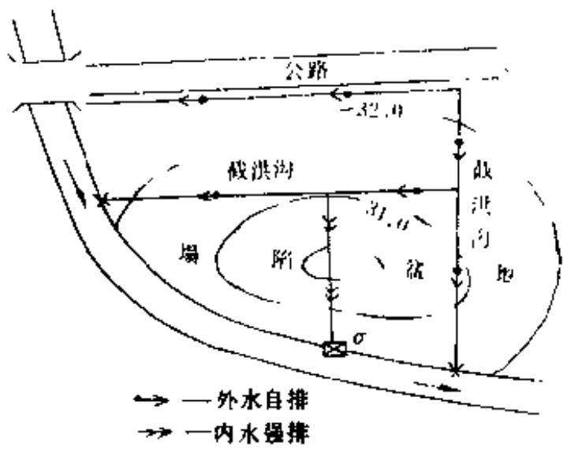  
图 4—6 截洪沟示意图  
Fig. 4—6 Sketch map showing damming flood

除涝系统由排水沟、排水闸、排水站等组成。其设计步骤如下：

## 1）计算设计排涝流量

为计算排涝流量，通常需先根据复垦区历年暴雨资料推求设计净雨深，再据设计净雨深计算设计排涝模数。设计排涝模数据汇水面积的大小有两种算法，当汇水面积 $F { \leqslant } 1 0 \mathbf { k m } ^ { 2 }$ 时，设计排涝模数计算式如下：

$$
M _ { ☉ } = \frac { R - V } { 8 6 . 4 T }\tag{4-31}
$$

$$
M _ { \mathrm { , k } } = { \frac { R - h } { 8 6 . 4 T } }\tag{4-32}
$$

式中 $M _ { ☉ }$ ——旱田设计排涝模数， $\mathbf { m } ^ { 3 } / \mathbf { s } \cdot \mathbf { k } \mathbf { m } ^ { 2 }$

$M _ { \ast }$ —水田的设计排涝模数， $\mathfrak { m } ^ { 3 } / \mathfrak { s } \ \cdot \ \mathfrak { k } \mathfrak { m } ^ { 2 }$

$R$ ——设计净雨深，mm；

V——排涝范围内单位面积上各种蓄水工程的蓄水量，mm;

T'——排涝历时，旱地取2天，水田取3\~5天；

h——水田滞蓄水深，等于耐淹水深减去适宜水深，mm。当汇水面积 $F > 1 0 \mathrm { k m } ^ { 2 }$ 时，可用下式计算：

$$
M = k R ^ { n } F ^ { n }\tag{4-33}
$$

式中 M——设计排涝模数；

R——设计净雨深；

$\pmb { F }$ ——流域面积；

—综合系数；

m—峰量指数；

n—排涝模数随面积增大而减小的指数。

通常因塌陷区排水范围较小，较多用式（4—31）和（4一32）计算。有了设计排涝模数，排涝流量Q可按下式计算： $\pmb { Q }$

$$
Q = M F\tag{4- 34}
$$

## 2）排渍流量计算

排渍流量计算需先计算排渍模数或根据当地水文手册选择排渍模数，然后按式（4一34）计算排渍流量。排渍流量是校核排水沟断面尺寸和水位的依据，它与降雨、土质、排水沟疏密等有关。

## 3）排水沟断面和水位设计

排水沟断面尺寸通常根据设计排涝流量确定，根据排渍流量；滞涝要求、引水灌溉要求等进行校核。排水沟水位则分排涝水位和排渍水位。排渍水位为日常水位，按下式式计算：

$$
H _ { \mathbb { d } } = H _ { \mathbb { d } } - D _ { \theta } + H _ { \varepsilon } - \Sigma l _ { i } i , - \Sigma \Delta H\tag{4-35}
$$

式中 $H _ { \mathbb { H } }$ ——日常水位；

$\pmb { I } \pmb { I } _ { \tilde { \imath } }$ ——排水量远点低洼地的平均高程；

$\smash { D _ { s } }$ ——农沟深度：

$H _ { \mathfrak { s } }$ —农沟水深；

$\ell ,$ —各级沟道长度；

$i ,$ -—各级沟道坡降；

$\Delta H$ ——沟道局部水位损失。

排涝水位的确定视排水方式而定。自排时与式（4一35）的计算类似，强排时水位可适当高些，具体高度视强排站排水能力而定。

## 4）排水闸设计

排水闸设计主要根据设闸的目的及各级排水沟水位衔接情况，确定闸底板高程、闸孔宽度、闸顶高程等。

## 5）强排站设计

强排站设计需根据排涝流量、排涝区条件确定站址、强排扬程及装机容量。仅为排涝服务的强排站一般选择在地势低洼处，且考虑交通方便、架线距离短及地基条件好等因素。排灌两用站可选在地势稍高处。设计扬程按下式计算：

$$
H _ { y } = H _ { \circ } - H _ { t } + \Delta h _ { s }\tag{4-36}
$$

式中 $H _ { y }$ —为设计扬程；

$H _ { \mathfrak { o } }$ ——设计外河水位；

$H _ { i }$ ———设计内河水位；

$\Delta \hslash ,$ —管路损失。

设计装机容量按下式计算：

$$
N = \frac { K r Q H _ { y } } { \mathfrak { N } _ { 1 } \eta _ { 2 } }\tag{4-37}
$$

式中 N——为设计装机容量， $\mathbf { k } \mathbf { \overline { { W } } }$

K——动力备用系数；

r——水容重， $r { = } 9 . 8 \mathbf { k } \mathbf { N } / \mathbf { m } ^ { 3 }$

Q——设计排涝流量， ${ \mathfrak { m } } ^ { 3 } / { \mathfrak { s } }$

$H _ { y }$ ——设计扬程，m；

$\pmb { \eta _ { 1 } }$ ——水泵效率；

$\pmb { \eta _ { 2 } }$ ——机械传动效率。

## 3. 降渍系统设计

降渍系统设计的目的是控制地下水位，防止渍害和土壤碱化。塌陷区治理通常采用明沟排水的方式降渍。其设计内容包括降渍

沟断面尺寸和降渍沟间距的确定。

## 1）降渍沟深度设计

降渍沟深度D按下式确定：

$$
D = h _ { s } + \Delta h + w\tag{4-38}
$$

式中 $\Delta h \cdot$ 两沟中心点地下水位降至 $h _ { k }$ 深度时，地下水位与排水沟水位之差，其大小取决于排水沟间距和土质，一般不小于0.2\~0.3m；

w——排水沟水深。

## 2）排水沟间距设计

下式为隔水层位于有限深度时恒定流计算排水沟间距的理论公式。

$$
\bar { L } = \sqrt { \frac { 4 k ( \Delta \dot { h } ^ { 2 } + 2 \dot { H } _ { \mathrm { o } } \Delta \dot { h } ) } { \varepsilon } }\tag{4-39}
$$

式中 $\pmb { I _ { \check { \check { \mathbf { \delta \delta \delta \delta \delta \mathcal } } } } }$ ——排水沟间距，m；

k—土壤渗透系数，m/d；

$\Delta h$ ——地下水位上升高度，m；

$H _ { \mathfrak { v } }$ ———降渍沟内水位至隔水层的距离，m；

ε——降雨入渗强度，m/d。

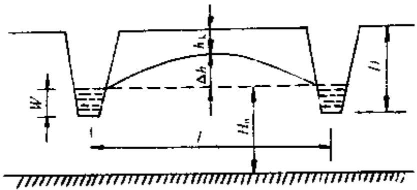  
图4—7 降渍沟降低地下水位原埋图  
Fig. 4—7 Principle of lowering level of phreatic water

根据徐州矿区塌陷地治理的经验，降渍系统设计宜采用经验数值，如徐州东部矿区排水沟间距选为200m左右较为合理，而用

理论公式计算往往偏大或偏小。

## 四、疏排法复垦设计中应结合考虑的问题

## 1. 以排为主，排灌结合

坚持“以排为主，排灌结合”，要求排水沟、闸、站设计均应考虑灌溉要求，如应按灌溉要求对断面尺寸进行校核；排水闸可分段设置，开闸排水、关闸蓄水；排蓄结合，保留部分坑塘兼养殖和蓄水两用。

## 2. 工程措施与生物措施相结合

实践证明：在实施疏排工程措施的同时，采取适当的生物措施，如提高绿色植被覆盖率、路堤、沟边植树等，可起到生物降低地下水位和防止水土流失的作用。

## 3. 疏排与平整土地相结合

前述设计中不少参数与排水最远点低洼地平均高程有关。采取平整土地或梯田式复垦、挖深垫浅式复垦，可将局部低洼地的标高适当提高，从而适当降低排水沟断面标准，节约排水费用。

## 第四节 生态工程复垦设计

生态工程复垦是矿区土地复垦的发展方向。通过生态工程复垦，可以有效地消除矿山开发引起的生态环境问题，如地表塌陷、植被减少、生物量下降、水体污染、土壤污染等，并能保证在尽量小的投入下，使系统的物质、能量、信息流输出大于或恢复至采前的水平。

生态工程复垦设计，主要依据食物链原理、养分循环原理、生态位原理和生物与环境协同进化原理，对复垦土地生态系统的营养结构、空间结构、时间结构进行设计，并用系统分析和系统优化的方法分辨系统的层次，对系统的结构进行优化。本节以徐州矿区铜山县稳定塌陷积水区的复垦为例，说明生态工程复垦的原理和方法[32.33]。

## 一、复垦目标

根据矿区土地破坏现状、土地利用总体规划要求以及对当地农副产品、粮食、文化娱乐场所等的需求预测，铜山县稳定塌陷波及地区治理目标是以发展蔬菜为主，同时按适当比例发展粮食生产，以满足本区居民对粮食和其它副食品的需要。稳定塌陷积水区通过挖深垫浅，建立以提高劳动就业和土地生产率为目标的以鱼为主，发展养鸡、鸭、鹅、牛、羊、藕等综合性副食品基地。

## 二、结构设计

## 1. 营养结构设计

营养结构如图4—8。

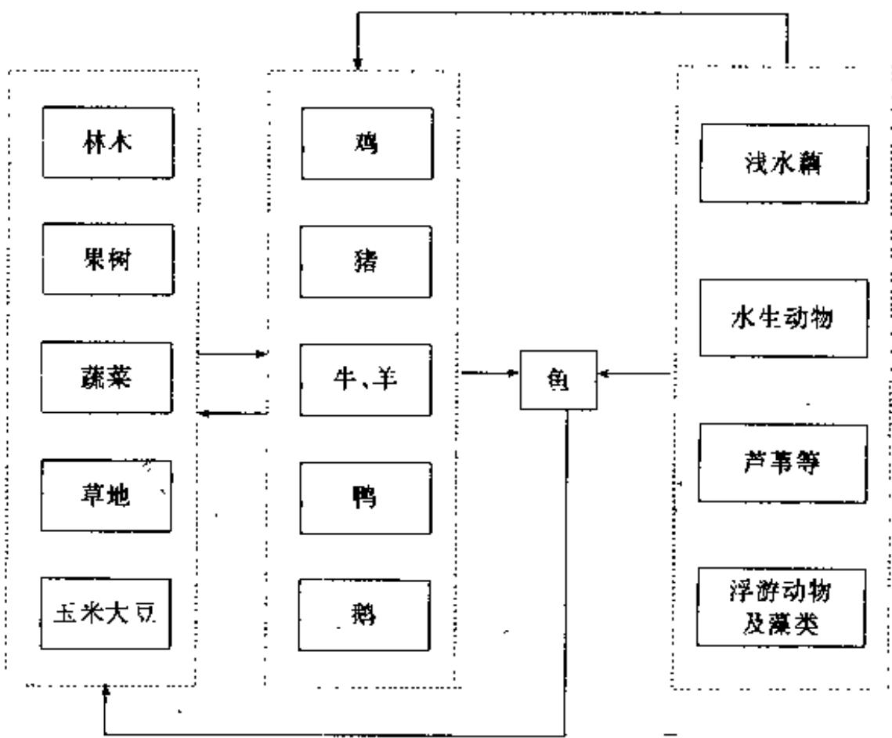  
图4-8 营养结构设计图  
Fig. 4 —8 Design of nutrition structure

## 2. 空间结构设计

空间结构如图4-9和图4—10。

## 3. 时间结构设计

时间结构设计包括两部分内容。第一是合理利用土地，逐步肥化土壤，比如矸石复垦区初始阶段不宜种植蔬菜和粮食，可以

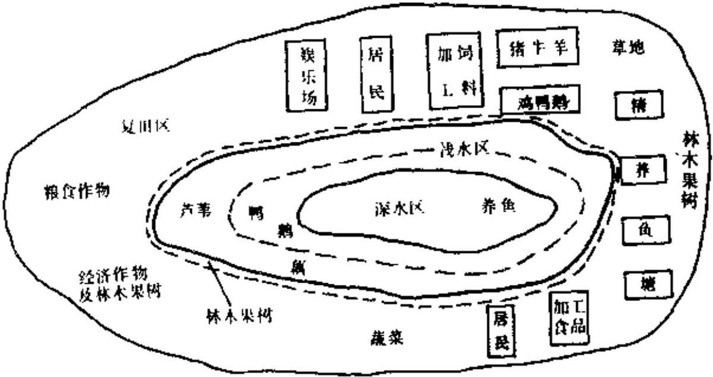  
图4-9 平面结构设计示意图

Fig.4—9 Sketoh map showing plan structure design  
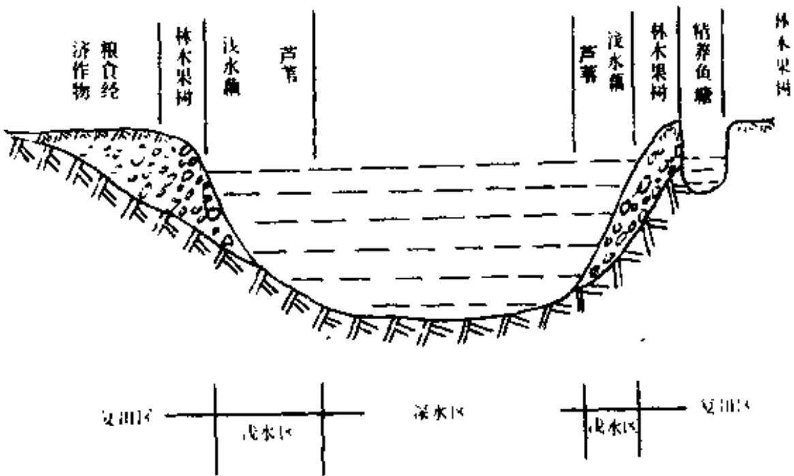  
图4—10 垂直结构设计示意图  
Fig.4— 10 Sketch map of vertical structure

先种豆科牧草，若干年后再改种其它作物；第二部分内容是在复垦区合理安排四季的作物生产，使土地得到最充分的利用。

## 三、营养结构优化设计

营养结构优化设计程序如图4—11所示。

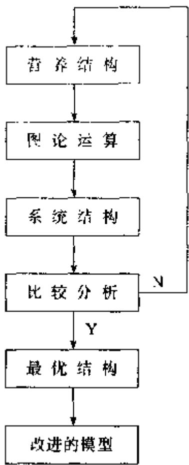  
图 4-11 营养结构模型的优化程序  
Fig. 4 -- 11 Optimization design of nutrition structure

图4-8的营养结构可简化为图4-12所示的营养结构。依据图4-13写出有向图的邻接矩阵A，并作如下运算 $C = A + I , R$ $\mathbf { \chi } = ( \zeta ^ { \star } ) ^ { T }$ ，于是有

$$
A = \left[ \begin{array} { l l l l l l l l l l } { 0 } & { 1 } & { 0 } & { 0 } & { 0 } & { 0 } & { 0 } & { 0 } & { 0 } \\ { 0 } & { 0 } & { 0 } & { 0 } & { 0 } & { 0 } & { 0 } & { 0 } \\ { 0 } & { 0 } & { 0 } & { 0 } & { 1 } & { 0 } & { 0 } & { 0 } \\ { 1 } & { 0 } & { 1 } & { 0 } & { 0 } & { 0 } & { 1 } & { 0 } \\ { 0 } & { 1 } & { 0 } & { 1 } & { 0 } & { 0 } & { 0 } & { 0 } \\ { 0 } & { 1 } & { 1 } & { 0 } & { 0 } & { 0 } & { 0 } & { 0 } \\ { 0 } & { 0 } & { 0 } & { 1 } & { 0 } & { 0 } & { 0 } & { 1 } & { 0 } \\  \left| \begin{array} { l l l l l l l l l l } { \Theta } & { 0 } & { 0 } & { 0 } & { 1 } & { 0 } & { 0 } & { 0 } & { 1 } & { 0 } \\ { 0 } & { 0 } & { 0 } & { 0 } & { 1 } & { 0 } & { 0 } & { 0 } & { 1 } \\ { 0 } & { 0 } & { 1 } & { 0 } & { 1 } & { 0 } & { 0 } & { 0 } & { 0 } \end{array} \right| \right] \end{array}
$$

$$
\begin{array} { r } { R = \left[ \begin{array} { l l l l l l l l l l } { 1 } & { 0 } & { 0 } & { 1 } & { 1 } & { 0 } & { 1 } & { 1 } & { 1 } \\ { 1 } & { 1 } & { 1 } & { 1 } & { 1 } & { 1 } & { 1 } & { 1 } \\ { 0 } & { 0 } & { 1 } & { 1 } & { 1 } & { 1 } & { 1 } & { 1 } \\ { 0 } & { 0 } & { 0 } & { 1 } & { 1 } & { 0 } & { 1 } & { 1 } & { 1 } \\ { 0 } & { 0 } & { 0 } & { 1 } & { 1 } & { 0 } & { 1 } & { 1 } & { 1 } \\ { 0 } & { 0 } & { 1 } & { 1 } & { 1 } & { 0 } & { 1 } & { 1 } & { 1 } \\ { 0 } & { 0 } & { 1 } & { 1 } & { 1 } & { 1 } & { 1 } & { 1 } & { 1 } \\ { 0 } & { 0 } & { 0 } & { 0 } & { 0 } & { 0 } & { 1 } & { 0 } & { 0 } \\ { 0 } & { 0 } & { 0 } & { 1 } & { 1 } & { 0 } & { 1 } & { 1 } & { 1 } \\ { 0 } & { 0 } & { 0 } & { 1 } & { 1 } & { 0 } & { 1 } & { 1 } & { 1 } \end{array} \right] } \end{array}
$$

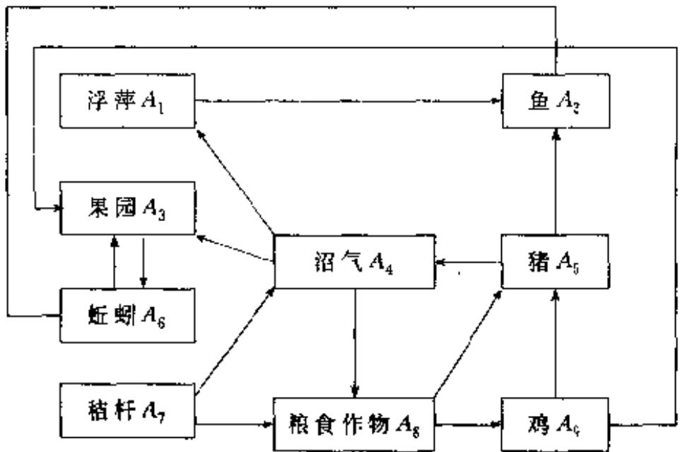  
图 4-12 营养结构设计  
Fig. 4 — 12 Nutrition structure design

依据R对设计的营养结构模型进行层次分析，见表4—1，经第一次运算得到第一层次也是最高层次为 $\boldsymbol { A } _ { 7 }$ 0

划掉C中A所在行和列的元素，再按上述方法运算得到第二层次各单元为 $A _ { 4 } \setminus A _ { 5 } \setminus A _ { 8 } \setminus A _ { 5 }$ ，依此还可得到第三层次各单元为 $A _ { 1 } , A _ { 3 } , A _ { 6 }$ ，第四层次各单元为 $\varLambda _ { 2 }$ 0

据可达矩阵可画出优化的结构模型图4-14。由结构模型图作出优化的营养结构模型图4-15。

有了优化的营养结构模型，就可在此基础上进行平面、空句、时间设计和工艺规划。下面对优化的营养结构模型作几点说明：

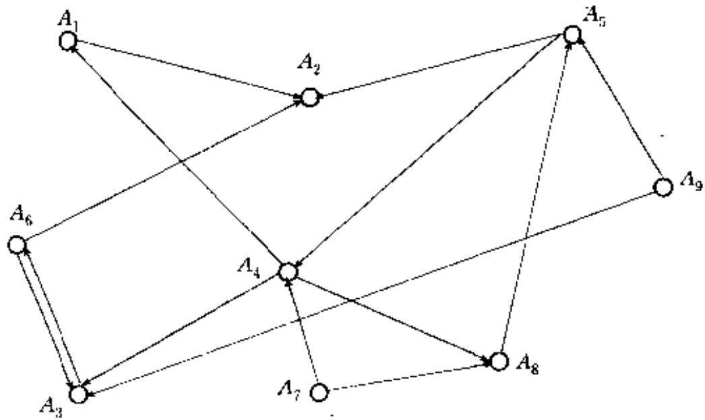  
图 4-13 有向图  
Fig. 4—13 Vector diagram

表4-1 营养结构模型层次分析  
Tab 4—1 Depth analysis of nutrition structure model
<table><tr><td colspan="2">单元</td><td>R (A,) I -</td><td>G(A)</td><td>R∩G</td></tr><tr><td>1</td><td>1, 4. 5. 7. 8, 9</td><td>1, 2</td><td>1</td><td></td></tr><tr><td>2</td><td>1, 2,3, 4,5. 6, 7,8. 9</td><td>2</td><td></td><td>2</td></tr><tr><td>3</td><td>3、4, 5, 6,7. 8. 9</td><td>2, 3. 6</td><td></td><td>3, 6</td></tr><tr><td>4</td><td>4,5,7, 8,9</td><td></td><td>1, 2, 3, 4, 5, 6, 8, 9</td><td>4,5,8,9</td></tr><tr><td>5</td><td>4, 5, 7, 8、 9</td><td></td><td>1, 2, 3, 4, 5, 6, 8, 9</td><td>4, 5.8,9</td></tr><tr><td>6</td><td>3, 4, 5, 6. 7,8, 9</td><td>2. 3, 6</td><td></td><td>3. 6</td></tr><tr><td>7</td><td>7</td><td></td><td>1, 2, 3, 4,5, 6, 7,8, 9</td><td>7</td></tr><tr><td>8</td><td>4, 5. 7, 8,9</td><td></td><td>1, 2. 3. 4, 5, 6, 8, 9</td><td>4, 5, 8, 9</td></tr><tr><td>9</td><td>1. 5,7,8,9</td><td></td><td>1, 2, 3.4, 5, 6, 8, 9</td><td>4. 5, 8, 9</td></tr><tr><td>1</td><td>1, 4, 5, 8; 9</td><td>1, 2 1</td><td></td><td>1 2</td></tr><tr><td>2</td><td>1, 2, 3, 4, 5, 6, 8, 9</td><td>2</td><td></td><td></td></tr><tr><td>3</td><td>3, 4, 5, 6. 8, 9</td><td>2,3, 6</td><td></td><td>3, 6</td></tr><tr><td>4</td><td>4, 5. 8. 9</td><td>1, 2. 3. 4, 5, 6, 8, 9</td><td></td><td>4. 5, 8. 9</td></tr><tr><td>5</td><td>4. 5, 8, 9</td><td>1, 2, 3, 4, 5, 6, 8, 9</td><td></td><td>4,5,8.9</td></tr><tr><td>6</td><td></td><td></td><td></td><td>3. 6</td></tr><tr><td></td><td>3, 4, 5, 6, 8,9</td><td>2, 3, 6</td><td>1, 2, 3, 4, 5, 6、 8, 9</td><td>4. 5,8,9</td></tr><tr><td>8 9 m</td><td>4,5,3, 9</td><td>1</td><td>1, 2, 3, 4, 5, 6. 8,9</td><td>4.5,8,9</td></tr><tr><td></td><td>4, 5,8, 9 1</td><td>1, 2</td><td></td><td>1</td></tr><tr><td></td><td></td><td>2</td><td></td><td>2</td></tr><tr><td>2</td><td>1, 2,.3, 6</td><td></td><td></td><td>3, 6</td></tr><tr><td>3</td><td>3, 6</td><td>3, 6</td><td></td><td>3, 6</td></tr><tr><td>G</td><td>3,6</td><td>3,6</td><td></td><td></td></tr></table>

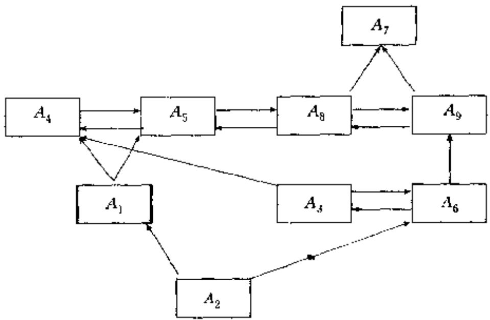  
图 4-14 优化的结构模型

Fig. 4—14 Optimal structure model  
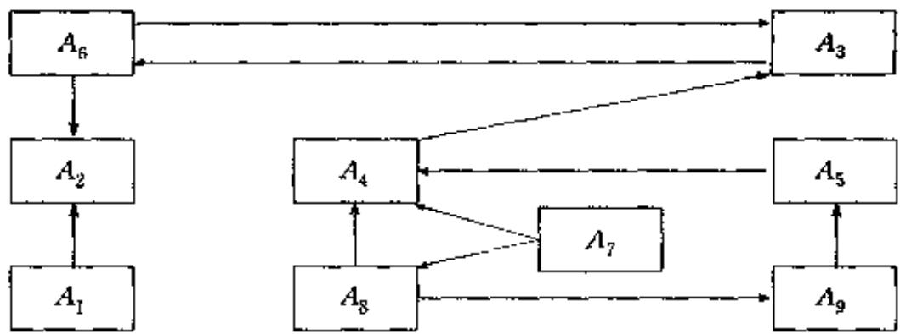  
图 4—15 优化的营养结构模型  
Fig. 4--15 Optimal nutrition structure model

(1)优化后的模型更符合能量多层次利用原理及食物链原理，做到了各层次能量的充分利用。第二层次的四个单元恰好形成了一个循环，为本系统能量循环利用的核心，其各环节占用的土地面积需按一定的比例做出安排，利用经济效果规划方法进行用地结构调整，没有考虑这种约束。

(2)将秸杆参与循环是肥田的需要。秸杆肥田有两种方式，一是直接还田，一是投入沼气池发酵。这是培肥土壤的一种有效途径，一方面给土壤增加有机质，一方面得到沼气、沼液和沼渣，气和沼液分别用作照明和鱼的饵料，沼渣和鱼塘底泥又可用于肥田。

(3)同经济效果规划方法相比，增加了沼气环节，为种植业和养殖业提供了纽带，从而充分利用了各个环节的废弃物，为开发塌陷地并充分有效地利用塌陷地提供了保证。

## 第三节 采煤塌陷地基塘复垦工程设计

## 一、概述

## 1. 概念

采煤塌陷地基塘复垦模式是指对采煤塌陷地采取挖深垫浅措施获得一定比例的旱田与水面，并按生态学原理对旱田和水面进行合理利用的复垦模式3]。由该模式形成的土地生态系统为水陆复合型生态系统。该模式是生态工程复垦的一种典型形式。徐州矿区铜山县几年来利用该模式复垦了数千亩塌陷地，取得了较好的经济效益、社会效益和生态环境效益，他们采用的基塘形式有牧基、菜基、果基、粮基鱼塘等形式[22,40]。

## 2. 基塘复垦模式土地利用的特征

基塘复垦模式强调的是复垦后土地利用方式，其主要特征包括：①旱田，即“基”与鱼塘按一定的比例配置；②根据基和塘的不同生态位条件配置生物种群，使可被利用的生态位尽量被不同的生物种群占据；③合理选择基塘系统中生物种群的组成，充分发挥种间互补的特性，并利用食物链原理减小系统废弃物的排放量；④考虑生物种群搭配的时间序列，使环境节律和生物机能节律有机配合，实现最大限度利用自然资源的目的。

## 二、基塘复垦工程场地选择与论证

基塘复垦模式适用于高潜水位矿区开采沉陷积水区域的治理。基塘复垦工程场地选择应遵循两个基本原则，即：①基塘系统与井下采空区域无水力联系；②基塘系统应有充足的水源保证。

按照上述两个原则，基塘复垦工程场地不宜选择在开采深度较小又无隔水层的工作面上方，煤层露头上方亦不宜建立基塘复垦系统。基塘复垦场地距水源地不能太远，水质应满足表4-2所示标准。基塘复垦面积需有一定规模。

表4-2 渔业水域水质标准]  
Tab 4–2 Standords of water quality for fishery
<table><tr><td colspan="1" rowspan="1">编号</td><td colspan="1" rowspan="1">项目</td><td colspan="1" rowspan="1">标        准</td></tr><tr><td colspan="1" rowspan="1">1</td><td colspan="1" rowspan="1">色、臭、味</td><td colspan="1" rowspan="1">不得使鱼虾贝藻类带异色、异臭、异味</td></tr><tr><td colspan="1" rowspan="1">2</td><td colspan="1" rowspan="1">漂浮物质</td><td colspan="1" rowspan="1">水面不得出现明显油膜或浮沫</td></tr><tr><td colspan="1" rowspan="1">3</td><td colspan="1" rowspan="1">悬浮物质</td><td colspan="1" rowspan="1">人为增加的量不得超过10mg/L，面且悬浮物质沉积于底部后，不得对鱼虾贝藻类产生有害影响</td></tr><tr><td colspan="1" rowspan="1">4</td><td colspan="1" rowspan="1">pH值</td><td colspan="1" rowspan="1">淡水6.5~8.5，海水7.9~8.5</td></tr><tr><td colspan="1" rowspan="1">5</td><td colspan="1" rowspan="1">生化需氧量(5 犬20C)</td><td colspan="1" rowspan="1">不超过5mg/L，冰封期不超过3mg/L</td></tr><tr><td colspan="1" rowspan="1">6</td><td colspan="1" rowspan="1">溶解氧</td><td colspan="1" rowspan="1">21小时中，6小时以上必须大于5mg/L；其余在任何时刻不得低于3mg/；鲤科鱼类栖息水域除冰期其余任何时候不得低于4mg/L</td></tr><tr><td colspan="1" rowspan="1">7</td><td colspan="1" rowspan="1">汞</td><td colspan="1" rowspan="1">不超过 0.0005mg/L</td></tr><tr><td colspan="1" rowspan="1">8</td><td colspan="1" rowspan="1">篇</td><td colspan="1" rowspan="1">不超过 0.0005mg/L</td></tr><tr><td colspan="1" rowspan="1">9</td><td colspan="1" rowspan="1">铅</td><td colspan="1" rowspan="1">不超过0.1mg/L</td></tr><tr><td colspan="1" rowspan="1">10</td><td colspan="1" rowspan="1">铬</td><td colspan="1" rowspan="1">不超过1.0mg/L</td></tr><tr><td colspan="1" rowspan="1">11</td><td colspan="1" rowspan="1">铜</td><td colspan="1" rowspan="1">不超过0.01mg/L</td></tr><tr><td colspan="1" rowspan="1">12</td><td colspan="1" rowspan="1">锌</td><td colspan="1" rowspan="1">不超过 0. Img/L.</td></tr><tr><td colspan="1" rowspan="1">13</td><td colspan="1" rowspan="1">镍</td><td colspan="1" rowspan="1">不超过0.1mg/L</td></tr><tr><td colspan="1" rowspan="1">14</td><td colspan="1" rowspan="1">砷</td><td colspan="1" rowspan="1">不超过0. lmg/L</td></tr><tr><td colspan="1" rowspan="1">15</td><td colspan="1" rowspan="1">氰化物</td><td colspan="1" rowspan="1">不超过0.02mg/L</td></tr><tr><td colspan="1" rowspan="1">16</td><td colspan="1" rowspan="1">硫化物</td><td colspan="1" rowspan="1">不超过1.0mg/L</td></tr><tr><td colspan="1" rowspan="1">17</td><td colspan="1" rowspan="1">氟化物</td><td colspan="1" rowspan="1">不超过l.0mg/L</td></tr><tr><td colspan="1" rowspan="1">18</td><td colspan="1" rowspan="1">挥发性酚</td><td colspan="1" rowspan="1">不超过0.005mg/L</td></tr><tr><td colspan="1" rowspan="1">19</td><td colspan="1" rowspan="1">黄磷</td><td colspan="1" rowspan="1">不超过0.002mg/L</td></tr><tr><td colspan="1" rowspan="1">20</td><td colspan="1" rowspan="1">石油类</td><td colspan="1" rowspan="1">不超过 0.05mg/L</td></tr><tr><td colspan="1" rowspan="1">21</td><td colspan="1" rowspan="1">丙烯腈</td><td colspan="1" rowspan="1">不超过 0.7mg/L</td></tr><tr><td colspan="1" rowspan="1">22</td><td colspan="1" rowspan="1">丙烯醛</td><td colspan="1" rowspan="1">不超过 0.02mg/L  t= :                  </td></tr><tr><td colspan="1" rowspan="1">23</td><td colspan="1" rowspan="1">六六六</td><td colspan="1" rowspan="1">不超过0.02mg/L</td></tr><tr><td colspan="1" rowspan="1">24</td><td colspan="1" rowspan="1">滴滴涕</td><td colspan="1" rowspan="1">不超过0.001mg/L</td></tr><tr><td colspan="1" rowspan="1">25</td><td colspan="1" rowspan="1">马拉硫磷</td><td colspan="1" rowspan="1">不超过 0.C05mg/L</td></tr><tr><td colspan="1" rowspan="1">26</td><td colspan="1" rowspan="1">五氯酚钠</td><td colspan="1" rowspan="1">不超过0.01mg/L</td></tr><tr><td colspan="1" rowspan="1">27</td><td colspan="1" rowspan="1">苯胺</td><td colspan="1" rowspan="1">不超过 0. 4mg/L</td></tr><tr><td colspan="1" rowspan="1">28</td><td colspan="1" rowspan="1">对硝基氯苯</td><td colspan="1" rowspan="1">不超过 0. 1mg/L</td></tr><tr><td colspan="1" rowspan="1">29</td><td colspan="1" rowspan="1">对氨基苯酚</td><td colspan="1" rowspan="1">不超过0.1mg/L</td></tr><tr><td colspan="1" rowspan="1">30</td><td colspan="1" rowspan="1">水合肼</td><td colspan="1" rowspan="1">不超过 0.01mg/L</td></tr><tr><td colspan="1" rowspan="1">31</td><td colspan="1" rowspan="1">邻米：印酸二厂酯</td><td colspan="1" rowspan="1">不超过0.05mg/L</td></tr><tr><td colspan="1" rowspan="1">32</td><td colspan="1" rowspan="1">松节袖</td><td colspan="1" rowspan="1">不超过0. 3mg/L</td></tr><tr><td colspan="1" rowspan="1">33</td><td colspan="1" rowspan="1">J. 2. 3.-三氯苯</td><td colspan="1" rowspan="1">不起过 0. 06mg'L</td></tr><tr><td colspan="1" rowspan="1">31</td><td colspan="1" rowspan="1">1,2.4.5—四氯苯</td><td colspan="1" rowspan="1">不超过0.02mg/L</td></tr></table>

## 三、基塘复垦工程基塘比设计

基塘比设计应综合考虑三方面因素，即：①挖垫土方量平衡；②基塘复垦系统的水平衡；③便于安排种植与养殖生产。

挖垫土方量平衡，要求保持挖鱼塘获得的土方与填垫成旱地所需的土方量均衡，设鱼塘平均挖深为 $\overline { h } _ { p }$ ，旱地平均需垫高 $\overline { { h } } _ { d }$ ，则基塘比r为：

$$
\begin{array} { r } { r = \frac { \overline { { h } } _ { \dot { r } } } { \overline { { h } } _ { d } } } \end{array}\tag{4−40}
$$

基塘复垦系统的水平衡是指基面、水塘及整个系统水分收入和支出的平衡。基塘复垦系统水分的主要收入来自灌溉、天然降水和潜水渗入，主要支出为蒸发散量和流出系统外的损失，其水平衡模式可用下式表示[12]：

$$
( S , + S _ { t } ) \cdot R + I + L = E , + E _ { t } + f + C _ { t } + C _ { z }\tag{4-41}
$$

式中 $S ,$ ——基地的面积；

$S _ { t }$ ——鱼塘的面积；

$R ^ { . }$ —单位面积降雨量；

I——灌溉水量；

$\boldsymbol { { \cal J } } ,$ ——基塘系统水分的侧向补给量；

$E _ { j }$ ——基地的蒸发散量；

${ \vec { E } } _ { t }$ —-鱼塘的蒸发散量；

$f -$ —流向基塘系统外的水分；

$\smash { C _ { \ : \perp } }$ 一 作物组成成分的水分：

$C _ { 2 }$ ——鱼塘生物体组成成分的水分。

根据上述水平衡模式知：基塘复垦系统基塘面积比对系统的水平衡起十分重要的作用：尤其是在用水紧张季节灌溉水源得不到保证的情况下，基地面积越大，径流量越大，鱼塘水源越能得到保证。另据徐州地区的实践，当基地植被覆盖较好时：也有利干整个系统水分的保持和增加，显然这对提高水分利用率是有好处的。除此之外，为促进基塘复垦系统的水平衡，扩大水源、减小基塘系统水分的外流也是重要的措施。

便于安排种植和养殖生产的含义包括农产品和水产品的生产规模适应市场需要；基塘复垦系统基面种植业便于机耕与收播，水面水产养殖业便于捕捞等。

## 四、鱼塘形状和大小的设计

## 1. 形状

一般为长方形，东西向，排列整齐，大小相近，长宽比为2：1\~4：1。这样的鱼塘遮阴少，水面光照时间长，有利于塘中浮游生物的光合作用和生产繁殖，也有利于拉网操作。为了充分利用土地，四周边角地带，根据地形也可安排一些边角塘。

## 2. 大小

鱼塘分为鱼苗、鱼种、成鱼、亲鱼和越冬鱼塘，不同类型鱼塘的参考尺寸如表4一3。

表4-3 各类鱼塘标准参考表1  
Tab 4–3 Reference size of different fish poμnd
<table><tr><td>鱼塘类型</td><td>面积 (亩)</td><td>保水深 (m)</td><td>长宽比 长宽</td><td>备注</td></tr><tr><td>鱼苗塘</td><td>1.5~2</td><td>1.5~2</td><td>2:1~3:1</td><td>兼作鱼种塘</td></tr><tr><td>鱼种塘</td><td>2~5</td><td>2~2.5</td><td>2:1~3:1</td><td></td></tr><tr><td>成鱼塘</td><td>7~15</td><td>2.5~3</td><td>2:1~4:1</td><td>可留宽埂</td></tr><tr><td>亲鱼塘</td><td>3-4</td><td>2.3~3</td><td>2:1~3:1</td><td>应靠近产卵池</td></tr><tr><td>越冬塘</td><td>5~10</td><td>3 左右</td><td>2:1~3:1</td><td>近水源</td></tr></table>

## 3. 鱼塘结构设计

鱼塘结构如图4—16所示43]。塘坡取决于土质，土质好，可取1：1.5\~1：2；土质差，可取1：3\~1：4。食场供投放饵料用，

宽度7\~8m为宜，太窄会使鱼群食饵时太拥挤，且应尽可能将食场设在鱼塘西侧向阳处，水暖溶氧充足，鱼舒适喜食，基面标高应高出最高水位0.5m左右，塘底标高应低于外河水位1m以上。

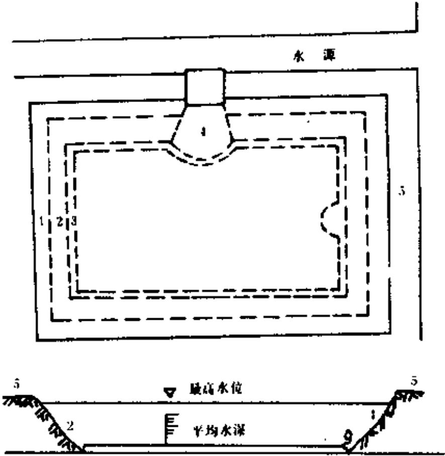  
图 16 鱼塘结构示意图  
Fig. 4—16 Structure of fish pond  
1—塘坡；2一滩脚；3—塘槽：4—食场：5—基面

## 五、基塘复垦形式及其时空结构设计

基塘复垦模式按基地利用形式分为牧基、林（果）基、菜基、花（草）基、粮基等多种形式，无论哪一种形式，提高土地利用率和产出率都是通过建立合理的时空结构实现的[3]。下面我们重点介绍铜山县在徐州矿区潘家庵煤田实施的牧基、菜基和果基鱼塘三种复垦形式的时空结构与改进意见。

## 1. 基地时空结构的建立

## 1）空间结构的建立

牧基鱼塘基地的第一层次为用材林木或果树，禽畜舍棚上架设葡萄架或藤科植物；第二层次为花草，既美化环境又为鱼提供饲草：第三层次为鸡、鸭、猪、奶牛等禽备。改进意见是将禽畜会棚在平面和空间上合理布置，既节约用地，又可将不同的动物安排在合适的生态位上，如图4-17所示。为提高废弃物利用率并为禽畜养殖提供能源，建议增加第四层次：沼气。

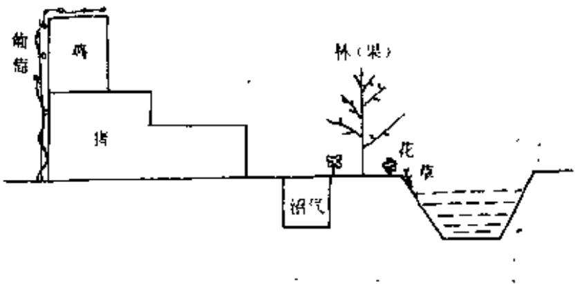  
1 17 牧基值塘的空间结构  
Fig. 4— 17 Spatial structure of anımal husbandry dike and fish pond

菜基鱼塘蔬菜为第一层次，猪、鸡为第二层次。第一层次的废弃物为第二层次消化利用。与牧基鱼塘相比，菜基鱼塘禽畜养殖退居次要的地位，其数量以能消耗废菜叶为基准。

果基鱼塘以山楂、桃树等果树为第-一层次，大豆、蔬菜或鸡为第二层次，蚯蚓为第三层次。蚯蚓既可松土，又为鱼提供饵料。其空间结构如图4—18。

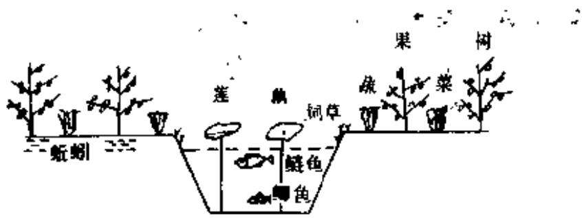  
图4-18 果基鱼塘的空间结构  
Fig. 4— 18 Spatial structure of orchard dike and fish pond

## 2）时间结构的建立

果基的时间结构：夏大果树下套种大豆，春、秋、冬大套种蔬菜。

菜基的时间结构：若用塑料大棚，一年四季均可进行正常的蔬菜生产；若不用塑料大棚，可采用地膜覆盖的方法，冬天种油菜，旱春种莴苣，初夏初秋分别种夏黄瓜、秋黄瓜，晚秋种菠菜、油菜等。总之过选择适当的蔬菜品种并采取一定的保温措施，可保证一年四季蔬菜生产收获不断。

牧基的时间结构：牧基的时间结构主要通过合理安排和管理禽畜出栏时间实现。

## 2. 鱼塘时空结构的建立

鱼塘养殖为混养、密养、分层养殖。上层放养水生植物和鲢、鳙鱼等，以蝙、鲤、鲫鱼等杂食性鱼类为中下层鱼，以甲鱼、螃蟹等为底层鱼类。采取密养方式时鱼塘需配备增氧设备。

鱼塘时间结构的建立主要通过“多级轮养”、“轮捕轮放”的养殖方式实现。具体做法有：

(1)一次放足鱼种；分期捕捞，边捕边放，捕大留小。

(2)大小规格不同的鱼种轮养、套养，分期捕捞。建立了合理的时间结构，可保证水产品四季均匀上市，鱼塘保持合理的养殖密度；从而提高鱼塘的产量。

## 六、基塘复垦模式设计中需要注意的问题

## 1.基塘连片开发

基塘复垦系统连片开发有利于基地与鱼塘间的水循环，保持系统内水分不外流，从丽促进整个系统水平衡状态的改善。这一点在徐州地区表现尤为明显，凡是连片开发的地方效益就好，零星开挖的鱼塘水源无保障。效益就差。基塘连片开发还可保证系统内养分不散失，也便于管理。

## 2加强水陆相互作用

基塘系统是一水陆并生生态系统，整体效益的高低既在于基地与鱼塘单个效益的发挥，又取决干基塘与鱼塘的水陆相互作用。加强水陆相互作用的措施有：

(1)每次清塘时，将塘泥挖出用以培肥基地的土壤。

（2)利用塘水浇灌基地作物，同时补充鱼塘水量，促进塘水的循环利用。

(3)当基地饲养禽畜或建有沼气池时，鱼塘中可适当多投放“肥水鱼”的尾数，也就是说鱼塘投放的鱼种应考虑基地所能供给的饵料类型。

## 第五节 充填复垦设计

塌陷区复垦技术可分为充填复垦和非充填复垦两大类。充填工艺设计直接影响充填复垦费用和充填复垦效果。充填复垦的充填料包括矸石、粉煤灰等矿山固体废充物，还有城市垃圾、河塘湖泥、客土充填等。本节主要介绍研石充填工艺设计和粉煤灰充填工艺设计。

## 一、矸石充填复垦时回填方式工艺设计

矸石充填塌陷坑按一次充填高度不同分为全厚充填和分层充填两种方式。全厚充填是指一次充填至设计标高；分层充填是指每层充填一定高度，上一分层充填压实后再充填下一分层直至设计标高。按运输方式分为汽车运输和有轨电机车运输。研石充填复垦时回填方式设计包括回填方式、自然沉降时间、分层厚度等的确定。

回填方式的选取取决于矸石回填地的用途和矸石类型。矸石回填地用于农用时，一般可采取全厚充填方式；当用作建设用地时，采取分层充填、分层压实的方式可以取得较好承载效果。但值得注意的是，即使用作农用，矸石地也应作压实处理，以免水肥流失。全厚充填作建设用地时需根据所建建筑物的高度与用途，采取适当的地基处理方式，如换土、强夯等。当用老矸石山的矸石回填塌陷坑时，可采取汽车和电机车两种方式；当用新出并的矸石回填塌陷坑时，铺设铁轨用电机车运输，成本较低。

全厚充填法一般应经一段时间自然沉降，并经机械压实后再覆盖表土，以免直接覆土后发生不均匀沉降而使地表坑坑洼洼影响使用。自然沉降时间取决于矸石充填厚度、矸石块度均匀性与矸石充填后所处的自然环境。有条件时可通过观测自然沉降量随时间的变化来确定。

分层充填厚度的大小取决于压实机械类型和对地基处理的要求。分层厚度越小，压实效果越好，但回填与压实费用将增加。经验表明44：用链轨推土机碾压时，分层充填厚度一般不大于0.3m，用压路机碾压分层厚度不应超过0.5m，用振动式压路机碾压分层厚度可适当大些。分层厚度的大小也可根据压实机械的尺寸、重量与研石的物理性质，用理论计算的方法确定[38。

## 二、粉煤灰充填塌陷坑复垦设计45]

## 1. 场地论证

塌陷稳定的塌陷坑充灰时，只需论证地表裂隙与井下有无水力联系；动态沉陷区充灰时，一方面需计算导水裂隙带高度和地表裂缝深度，论证灰水是否会因开采沉陷而溃入井下，另一方面还需对灰坝、输灰管道、回水泵房等建筑设施的抗变形能力进行设计与论证。

## 2. 塌陷坑库容量与服务年限设计

塌陷坑作灰场应满足两个条件：一是充灰后可覆土种植或作其它用地；二是必须具备一定的容量和服务年限。第一个条件要求充灰后灰场标高有一定限制，不能太高，这就限制了库容量的大小，面库容量太小会增加排灰成本，因此两个条件必须兼顾。库容量V的大小可按下式计算：

$$
V = V _ { \ p } + V _ { \dot { s } }\tag{4-42}
$$

式中： $V _ { \Re }$ 为已发生沉陷部分的实际库容量，据实际地形图计算；  
$V _ { \mathrm { o } }$ 为按计划开采将发生沉陷而增加的库容量，据沉陷预测计算。

设电厂年排灰量为v，则塌陷坑用作灰场的服务年限为：

$$
\iota = V / v\tag{4−43}
$$

## 三、覆土方式与复垦土壤剖面的构造

充填复垦按是否覆土分为覆土种植形式与不覆土种植形式。覆土种植又分为薄覆盖和厚覆盖，以及覆盖不加隔离层和覆盖加隔离层等形式（图4一19）。覆土与不覆土相比，复垦初期作物或树木易于成活，避免了矸石和粉煤灰裸露，环境较快得到了改善，但费用较高。不覆上形式的使用有一定条件，必须有足够厚度的矸石风化壳以及适种的树种。我国鹤岗矿区曾在研石堆无覆盖的情况下种植樟子松获得成功，徐州电业局曾在粉煤灰场上无覆土种植大豆、西红柿等获得成功。加隔离层的作月是蓄水保墒，隔离下层酸性或毒性岩石，保证作物正常生长。因此若下层存在酸性或毒性岩土，必须加隔离层；若下层无酸性或毒性岩石，根据作物生长需要决定加不加隔离层。

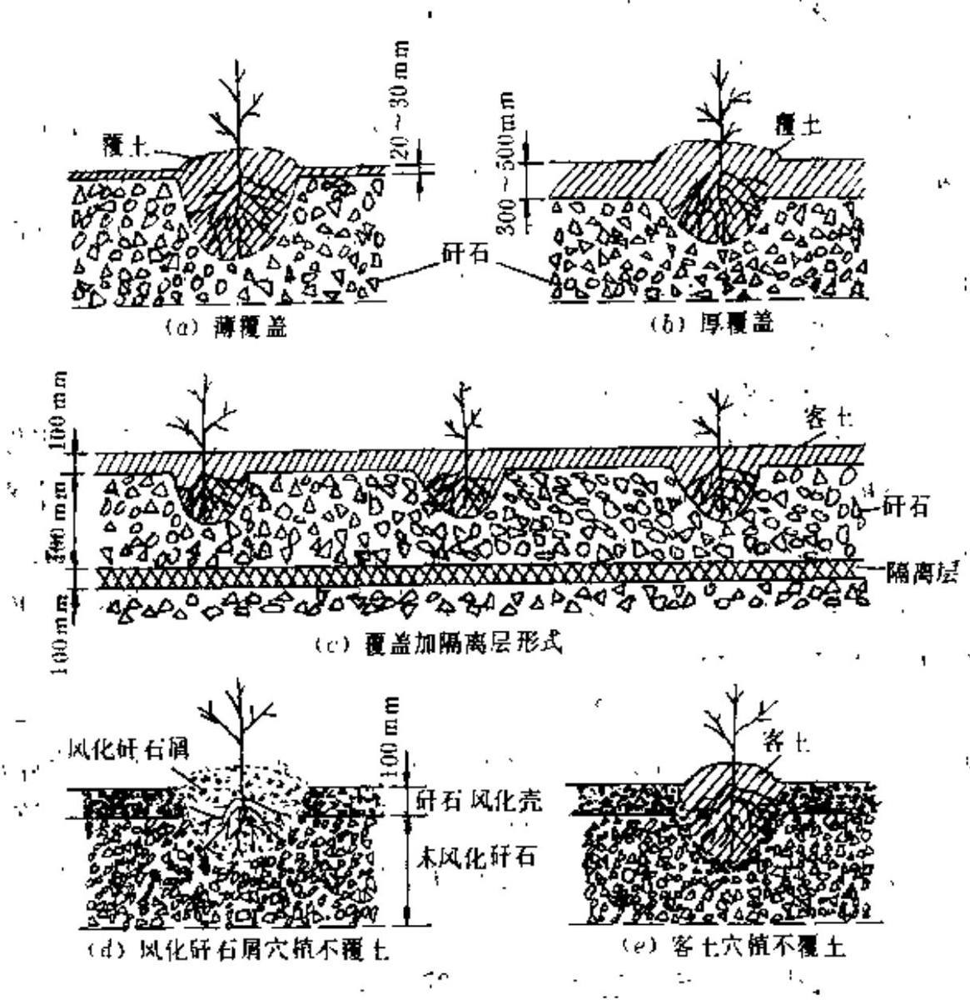  
图4-19 覆土形式示意图  
, Fig, 4 — 19 Types of soil covering

实践证明，覆土厚度增加至一定值，作物产量不再增加或增加微小，而覆土费用随厚度的增加直线上升，因此覆土厚度存在一最佳值。最佳覆土厚度可根据下列公式确定：

$$
\sum \limits _ { t = 1 } ^ { n } [ ( E - C _ { * } ) ( 1 + i ) ^ { - _ { t } } ] - C _ { 0 } = \operatorname* { m i x } ( 4 - 4 4 )
$$

式中 E —复垦土地单位面积年收益，元/年；

$C _ { \alpha }$ 一复垦土地单位面积年管理或经营费用，元/年；

$C _ { \vartheta }$ 一一单位面积覆土费用， $\dot { C } _ { \bar { 0 } , } = k h$ ，h为覆土厚度，k为单位厚度单位面积的覆上费用；

t——计算期；

i—·基准收益率。

式（4—44）可直观地用图4-20表示。

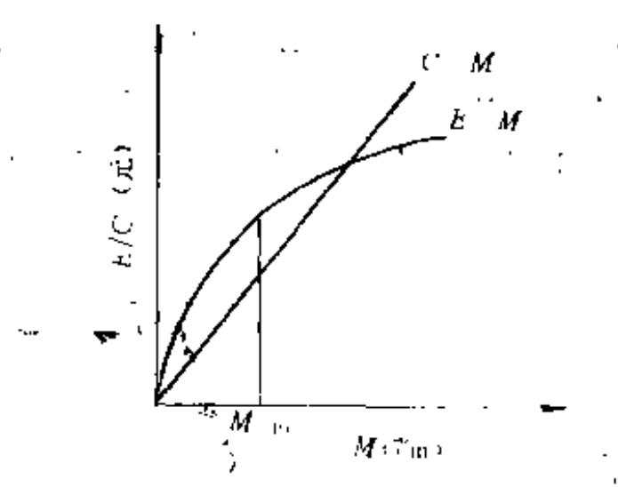  
图4—20 最作覆上厚度的确定  
Fig. 4– 20 Optimal thickness of covering oil  
E一单位面积年收益；C一单位面积覆土费用； $M _ { u p } , \frac { 1 } { \sum }$ 最佳覆土厚度

## 第六节 梯田式复垦工程设计

## 一、适用条件

对位于丘陵山区或中低潜水位采厚较大的矿区，耕地受损的特征是形成高低不平其至台阶状地貌。按照我国对地形特征的划分标准，地表坡度小于 $2 ^ { \circ }$ 为平原，大于 $6 ^ { \circ }$ 为山地， $2 ^ { \circ } \sim 6 ^ { \circ }$ 为丘陵，$2 5 \% l$ 上为高山[44]。采煤形成塌陷而产生的附加坡度一般都较小。塌陷后地表坡度在2°以内时，通过土地平整或不平整就能耕种，塌陷后地表坡度在 $2 ^ { \circ } \sim 6 ^ { \circ }$ 之间时，可沿地形等高线修整成梯田，并略向内倾以拦水保墒，土地利用时可布局成农林（果）相间，耕作时采用等高耕作，以利水土保持。因此梯田式复垦适用于地处丘陵山区的塌陷盆地，或中低潜水位矿区开采沉陷后地表坡度较大的情况下。我国山西大部分 $\pmb { \mathcal { W } }$ 区，河南、山东等地的一些矿区，不少塌陷地可采用此法复垦。利用此法复垦可解决充填法复垦充填料来源不足的问题。

## 二、梯田断面设计[6]

## 1. 梯田断面三要素

如图4一21所示，田面宽、田坎高和田块侧坡（分内侧坡和外侧坡)是梯田断面的三要素。梯田设计就是要根据塌陷后地形及土质条件与耕作要求等确定断面要素。断面要素设计合理，既可保证边坡稳定、耕作灌溉方便，同时又节省用地、用工，提高上地的利用率。

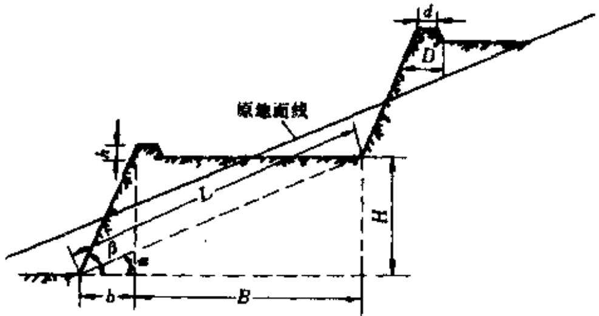  
图4-21 梯田断面示意图  
Fig. 4-21 Profile of terrace

B一田面宽；I一-田坎高：d一田坎占地宽：β一田坎侧坡；

a一地面坡度；D-地埂底宽：L一斜坡距离；b一地坎占地宽；h一地埂高

## 2. 断面要素间的相互关系与断面要素计算

田面宽度不宜太宽，也不宜太窄。太窄，耕作不方便，田坎占地又多；太宽，则土方工程量大，投入的人力物力也就多。因此，梯田宽的确定应综合考虑塌陷后的地形坡度、土层厚度、农业机械化程度和复垦后土地利用方向等因素。在地形坡度小于5°的情况下，田面宽选在30m左右为宜； $1 0 ^ { \circ }$ 以上丘陵陡坡田面宽以不小于8m为宜，最小不小于2m。平顶山矿区规定最窄不小于3m。

田坎高度与田面宽和塌陷后地形坡度等因素有关。在坡度一定的情况下，田面宽越大，田坎越高，反之田坎越低。田坎太高，修筑困难且易塌损，因而需根据土质情况、坡度大小等来选择田坎高，一般田坎高在0.9\~1.8m为宜。

田坎侧坡越缓，安全性越好，但占地、用工量大；反之田坎侧坡较陡，占地和用工量减小，但安全性差。因此田坎侧坡的确定，以能使田坎稳定而少占耕地为原则。边坡大小与田坎高度和筑埂材料有关，壤土取1：0.3\~1：0.4，沙土取1：0.5。

田面宽（B）、田坎高（H）和田坎侧坡 $( \beta )$ 之间的关系可用下式表示：

$$
\dot { b } = H ( \mathrm { c t g } \alpha - \mathrm { c t } _ { \mathbf { g } } \beta )\tag{4-45}
$$

田坎占地宽用式（4-46）计算。因此可得到田坎占地百分数(C%)，如式（4-47)。

$$
\pmb { b } = \dot { \pmb { H } } \mathbf { c } \mathfrak { t } \mathbf { g } \hat { \pmb { \beta } }\tag{4−46}
$$

$$
C \% = \frac { b + D } { b + B } \times 1 0 0 \%\tag{4−47}
$$

由上述公式知，当地形坡度 $\pmb { \alpha = 5 ^ { \circ } }$ ，田坎侧坡取1：0.3，田坎高取1m时，田面宽为11.1m。当D取0.4m时，b=0.3m，田坎占地百分数为6.1%。

## 3. 修筑梯田时土方量的估算

坡度变化不大，挖填土方量又大致相等时，每亩梯田的上方量可用下式估算：

$$
V = S L = \frac { H B } { 8 } \times \frac { 6 6 6 . 6 7 } { \cdot B } = . 8 3 . 3 H\tag{4−48}
$$

式中V——每亩梯田土方量，m/亩；

S-—梯田挖方或填方的断面积， $\mathbf { m } ^ { 2 }$ ，当挖填相等时， ${ \boldsymbol { \cdot } } _ { \mathbf { \lambda } } =$ HB/8;

L-—每亩梯田的旧面长度，m，I⎓666.67/B；

H—-田坎高，m；

B——梯田田面宽， $\boldsymbol { \mathsf { m } } _ { \mathsf { s } }$

按式（4一48）知：土方量是田坎高的函数。田坎越高，挖填土方量越大。

## 三、梯田施工工艺设计[46]

为保证梯田施工质量，在施工前需在实地测量定线。测量定线的内容包括，确定各台梯田的埂坎线以及在每台梯田上定出挖填分界线。测量定线的依据是梯田施工设计图。

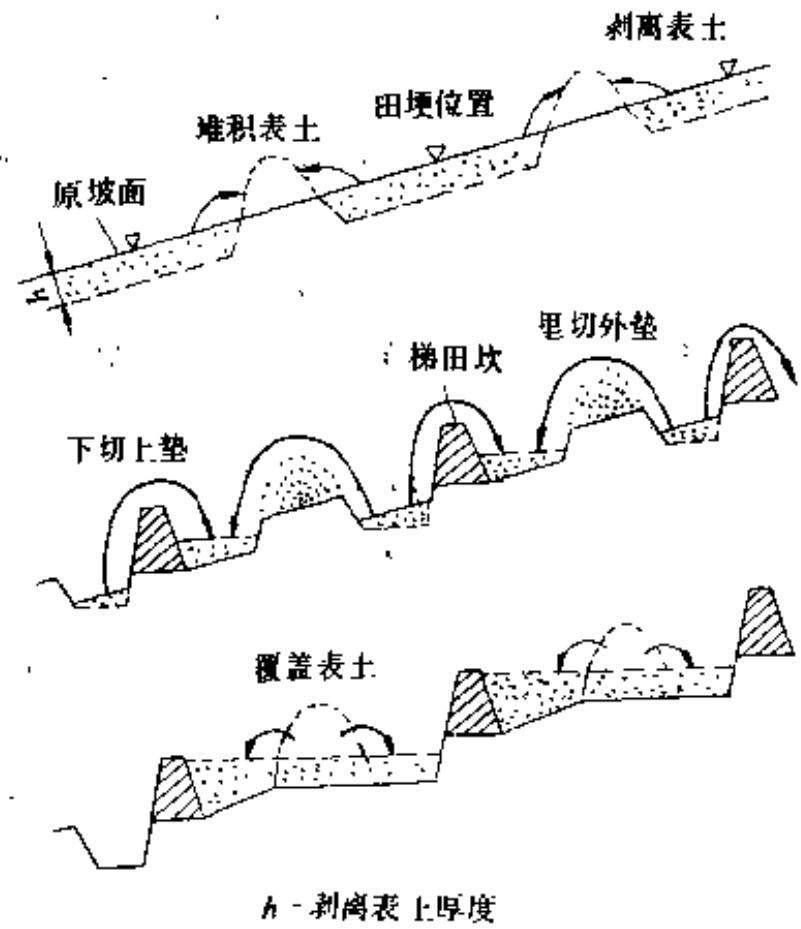  
图4 22 中间堆上法施工示意图  
Fig.4– 22 Sketch map showing the technique of hilling soil along intermediate zone

梯田施工主要包括表土处理、平整底土和田坎修筑等儿个环节。施工顺序是：清除地面障碍物—表土处理—平整底土—田坎修筑一一回铺表土。

表土处理和底上平整常用以下几种施工方法：中间堆土法、逐级下翻法和条带法。

图4—22为中间堆土法施工示意图。其主要C序包括堆积耕层土于设计的两田埂中间、切垫底层土及覆盖表土三个步骤。此法适于坡度大、田面窄的梯田施工。

图4一23为逐级下翻法施工示意图。该法自下而上修筑梯田，上一级梯田的表土作为下一级梯田的覆盖上源，最下一级梯田的表土首先堆存起来，或作为最上一级梯田的覆盖土源，也可留作2它用。此法也适用于坡陡、田面窄的梯田。

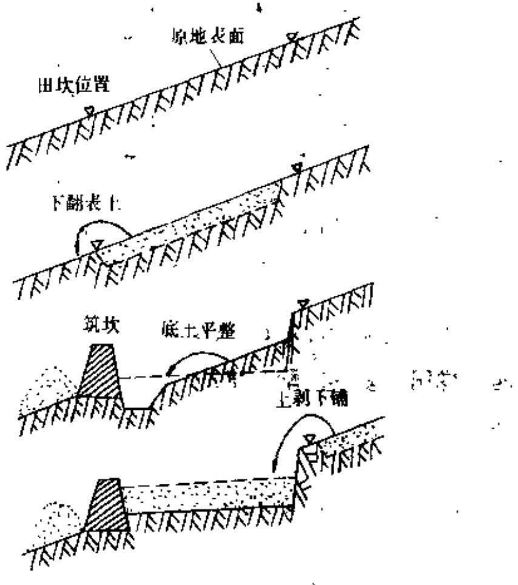  
图（—23 逐级下翻法施工示意图  
Fig. 4—23 Sketch map showing the technique of turning up the soil down strip by strip

条带法适用于坡缓、田面宽的梯田修筑，其施工示意图如图4一24。该法施工顺序为间隔条带剥离堆放表土，再进行底土平整(如图中1、3、5条带)，待底土平整完后将2、4条带堆存的表土覆于1、3、5条带上.依同样的方法可修筑2、4、6、…条带。

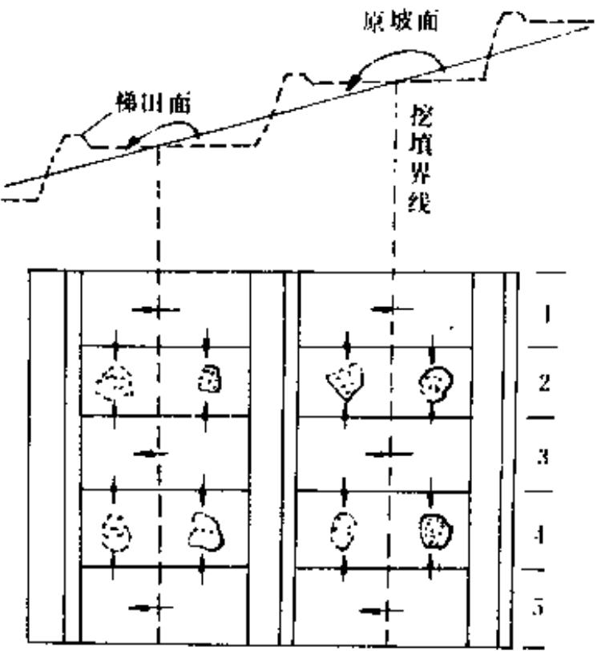  
图4-24 条带法施上示意图  
Fig. 4—24 Sketch map showing soil stripping

田坎修筑是保证梯田稳固的关键，一般采取夯实等加固措施。

## 四、梯田式复垦的配套措施

梯田式复垦是否成功，关键取决于灌溉是否能得到保证、田坎边坡稳定性、水土保持状况及土壤培肥效果等因素，为此，梯田式复垦的配套工程措施包括：

## 1. 灌溉措施

灌溉措施应着重多方面开辟灌溉水源。灌溉水源可以从外部引入，也可结合梯田复垦将塌陷盆地底部挖深蓄水，这样也可减轻水土流失造成的危害，因为养分随地表径流从梯田流入盆底，又用盆底蓄水浇灌梯田，正好实现了养分的循环利用。

## 2. 生物措施

生物措施有梯田采用农林（果）相间的利用方式，在每一梯田的田坎植树种果或豆科作物。这样做的好处是既防止水上流失，又起到提高田坎稳定性的作用。

## 3. 培肥和耕作措施

梯田施工过程中由于土方工程及机械碾压等，往往导致土壤层位破坏、物理性质发生变化。所以在土地利用过程中应采取培肥和耕作措施逐步解决上述问题，如深耕深翻、多施有机肥等。

## 第七节 矸石山复垦整形设计

## 一、问题的提出

我国井工开采煤矿矸石排放，长期以堆积成锥形的矸石山为主。近年来部分矿区开展了将新矸石直接排往塌陷坑的实践，取得了较好的经济、社会与环境效益。但这些矿区过去遗留下的研石山，以及仍以矸石堆积排放法为主的矿区的矸石山，形成了为我国煤矿开采企业一个独特的风景。由于一方面缺乏环保意识或对环境美学要求较低，煤矸石山长期裸露，对周围环境产生以下危害：研石淋溶污染周边土壤甚至地下水；粉尘污染严重；部分地区的研石山自燃污染大气；有些研石山存在滑坡危险。解决上述问题有两种途径4：一是彻底搬掉矸石山，将矸石运往塌陷坑或低洼地作充填复垦用或对研石进行回收利用，用作建筑材料；另种途径就是对研石山进行整形改造，整形改造后进行种植绿化使之达到消除危害、美化坏境，甚至获得一定的经济收益的目的。我国已有不少矿山采取了第二种途径治理矸石山，如兖州兴隆庄煤矿、潞安王庄矿以及新汶、鹤岗等矿区。国外，如波兰、前苏联等国是较早采取秆石山整形复垦的国家。

## 二、矸石山复垦整形设计的内容

## 1. 矸石山整形形式的选取

据矸石山整理后的几何形状，可将研石山整形形式分为梯田式、螺旋线式和微台阶式三种47，如图4—25所示。

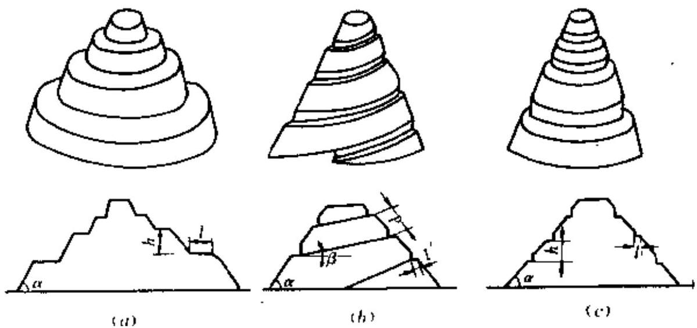  
图4—25 矸石山整形形式  
Fig. 4—25 Types of waste hill after reformed

梯田式整形方式的主要技术参数包括：边坡角α、梯田落差h梯田台阶宽。边坡角的大小主要考虑研石的岩石力学性质，以保持边坡稳定为准则。边坡角太小，矸石山占地多，整形工程量大；边坡角太大，边坡稳定性差。梯田落差的大小，取决于整形后矸石山占地面积的大小、设计抗侵蚀能力与水土流失量的大小，以及绿化的需要等因素。落差愈大，梯田台阶数愈少，矸石堆占地面积愈小，但斜坡愈长，水土流失量愈大，反之，落差愈小，矸石堆占地面积增大，而侵蚀量越小。梯田台阶宽决定了研石堆占地量和矸石山整形的工程量。台阶越宽，占地越多，工程量越大。

螺旋线式整形方式的主要技术参数包括：边坡角α、螺旋线沿边边坡方向的间隔d、螺旋线的切线方向与水平线间的夹角β(即螺旋线台阶面坡度)、螺旋线台阶面宽度l。边坡角与原矸石山边坡角相同，只有当原边坡角太大而使边坡不稳定时，才需削缓原边坡。螺旋线台阶面一般兼作上山人行道和运料道，所以其坡度应满足步行和运输要求。当台阶面坡度一定时，螺旋线间隔为变数，山脚方向间隔较大，山顶方向间隔较小。若要求螺旋线间隔一定，则螺旋台阶面坡度就是一个变数，设计时应根据矸石山等高线图，使螺旋线间隔不要太大而使台阶面坡度超过允许值。台阶面宽度l满足绿化和行人、运输要求即可。

微台阶式整形方式的主要技术参数包括：边坡角a、台阶落差h、台阶宽度l。边坡角与原矸石山边坡角相同，落差通常取2\~3m，台阶宽取0.3\~0.5m。微台阶方式实际是一种简易省工的方法，通常用手工和简单机械即可完成。

## 2. 矸石山整形时上山道路或阶梯的设计

矸石山整形与复垦时合理的施工顺序是自顶向下，为此必须首先修建一条自山脚向山顶的道路。根据矸石山的等高线图（图4一26)，等高线间隔Δh为5m，设计道路坡度为i，设计步骤如下：①选取上山道路起始点A；②计算相邻两等高线间道路平距/=Δh/i；③以A为圆心，l 为半径作圆弧，在45m等高线上截得两点；①以前一步截得的交点为圆心，以l为单位作圆弧在上一条等高线上截取交点，依此作至山顶等高线；⑤将相邻两等高线上的交点用平滑曲线连接起来即得设计道路的平面位置，图中有两条道路可供选择，可据实际施工条件和工程量选择线路。当不要求上山道路能通车时，也可将上山道路设计成“之”字形或直上直下的阶梯。

## 3. 矸石山排水系统设计

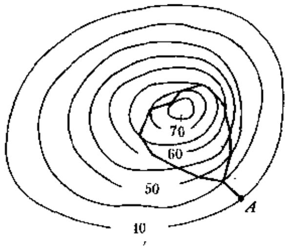  
图1 ·26 征石山环山线路设计  
Fig- 4—26 Design of road foward hilltop

为防止矸石山表面复土后受到侵蚀，产生水土流失，矸石山整形的同时应设置完善的排水系统。完善的排水系统还可防止雨水冲刷引起矸右山体滑坡。梯田式和螺旋式整形时的排水系统如图4—27所示。

图4—27的排水方式是将上部坡面与本台阶面的汇水汇入台阶面上的排水沟，再流向设在阶梯通道处的下山排水通道而汇入山脚排水沟，面螺旋线式排水线路亦呈螺旋线状。可以看出越向山脚方向，汇水面积越大，排水负担越重，可以在矸石山底部多设一些下山排水通道。

## 4. 研石山（排土场）边坡抗侵蚀设计

矸石山（排土场）边坡设计不仅关系到边坡的稳定性，也影响土壤侵蚀量。边坡设计包括边坡形状、坡度、坡长等方面。

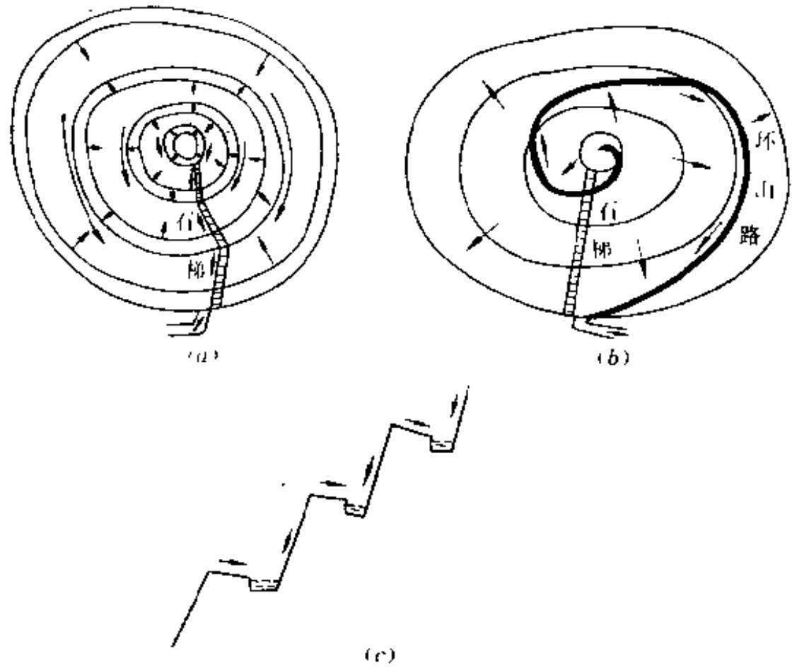  
图4—27 研石山排水系统图  
Fig. 4—27 Drainage system of wasre hill

## 1）边坡形状

澳大利亚学者从三维角度研究边坡，将边坡形状概况为图4—28九种形状[51]。

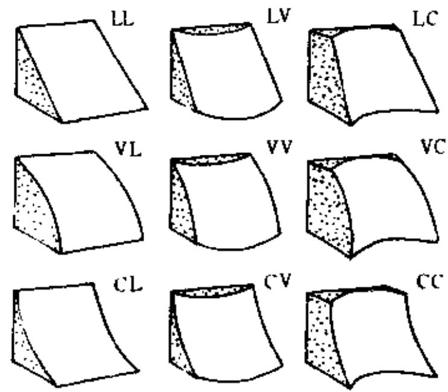  
图4-28 边坡的九种形式  
Fig. 4—28 Nine forms of slope (Toy and Hadley, 1987)

L一线状，V—凸状：C—凹状

LL,LV，LC，VL，VV，VC，CL，CV，CC的第一个字母表示边坡在竖直剖面内的形状，第二个字母表示边坡在水平断面内的形状。理想的边坡形状应该是水平断面凸状而竖直剖面为凹状或复合状（Toy and Hadley，1987)。Hanna则认为，为使边坡长期稳定，边坡在竖直剖面上的形状应为凹状。澳大和亚在露天煤矿排土场设计中通常采用图4→29（a）所示的S形斜坡，其凸状部分占总坡长的20%\~30%，下部凹状部分占总坡长的70%\~80%，这种斜坡具有较好的抗侵蚀能力。当S形斜坡难于延伸时，应尽可能避免凸状边坡，可采取图4-29(b)所示的线状边坡加台阶方案[52.53]。

## 2）坡度与坡长的抗侵蚀设计

在通用水土流失方程 $A = R K L S C P$ 中，A为土壤流失量(t/ha·年)，R为引起土壤侵蚀的降雨指数，K为土壤抗侵蚀因子，L为坡长，S为坡度，C为作物覆盖与管理因子，P为水土保持措施因子，坡长与坡度对土壤流失量的影响是两个独立的因子。

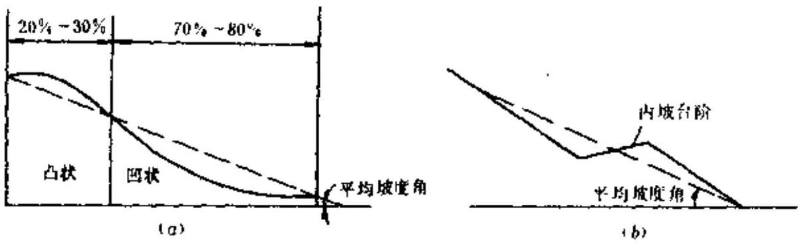  
图4-29 澳大利亚露天煤矿排土场边坡形状  
Fig. 4—29 Slope of waste dumps of Australia open coal mine

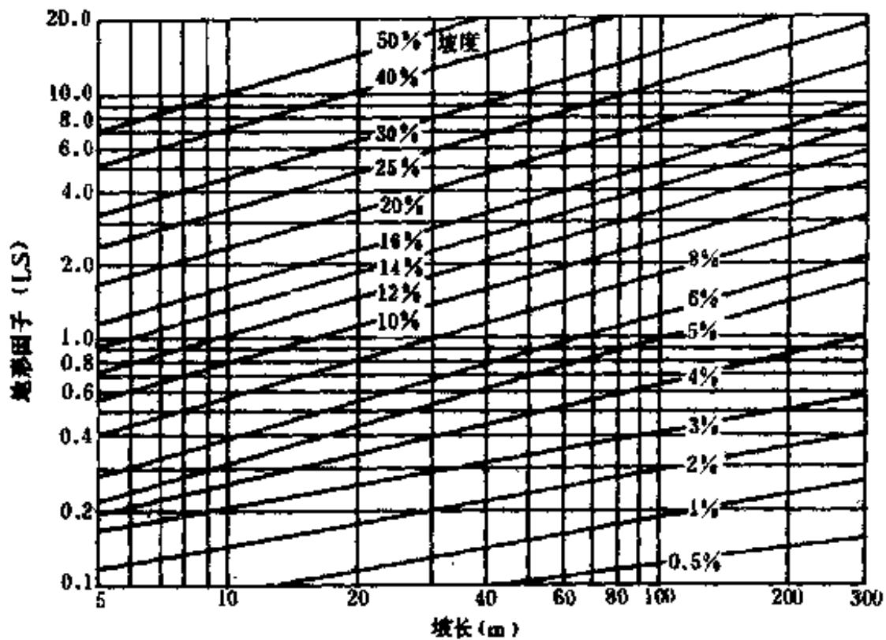  
图4-30 坡长与坡度设计用图  
Fig. 4—30 Slope-effect chart used to determine the  
topographic factor (LS) (After Wischmeier and Smith, 1978)

澳大利亚学者则认为将两者结合起来考虑更为方便，并将坡长和坡度总称为地形因子，地形因子可以通过反算的方法进行设计。设某区法定允许侵蚀量A一定，又已知R、K、P、C值，于是可得到地形因子LS的允许值，有了LS值，就可根据图4一30和实际需要选择坡度和坡长。如IS允许值为1.0，坡长为30m，坡度则不允许超过8%。

## 第八节 复垦景观设计

## 一、矿山景观破坏特点

提到矿山，人们自然地就会想到高耸的井架、裸露的矸石山或深凹的采剥场、大片的排土场，更为不良的印象是污水横流、粉尘弥漫、桥梁道路断裂以及土地荒芜等等。所有这些都构成了矿山独有的景观。在矿山景观诸要素中，一类属于采矿工业设施群形成的工业景观，这类景观可以通过合理的设计使自然景观与工业景观相得益彰；另一类景观则是采矿破坏造成的，无论是地下开采还是露天开采，均会造成原地形要素发生改变，导致植被减少，以及人口结构的变化甚至生活方式的改变，由此使得矿山景观在地文要素方面发生较大的改变，影响深远。

## 二、复垦景观设计原则

复垦景观设计的基本原则是消除矿山开采带来的不良视觉效果和环境危害，使矿山景观与周围自然景观协调一致，达到增加美感的效果。具体地说，需要遵循以下原则：

## 1. 规整地貌

采矿引起地形破碎，是景观破坏的重要形式之一。景观设计时通常需要采取高平低填，减缓急坡深沟，消除地裂缝等措施使采后地形与周围地形相协调。对露天矿来说，就是要使露天矿坑及排土场与周围的地形有机地溶为一体，避免形成不稳定的边坡和高排土场的山字形堆顶；对井工开采矿山来说，避免矸石排放一井一山的局面，淡化塌陷地形与原有地形界线。

## 2. 改善视觉效果

如前所述，目前我国矿山不良景观主要体现在视觉效果不良。复垦景观设计的任务就是要采取工程与生物措施，克服采矿引起的不良视觉影响。工程措施包括覆盖腐殖土、修筑屏障堤坝或装饰性建筑等，歪斜、倒塌、断裂的建筑物应及时清理和维修。生物措施主要指绿化，应针对不同的景观破坏采取不同的绿化措施，有噪声污染和地形变化较大的地段应栽植高大乔木，对平缓废石堆放场应快速种草覆盖，采矿形成的水域四周的陆地亦应布置绿化带，水域的浅滩部位应有规划地种植水生植物，避免杂卓从生的景象。绿化时还应注意乔灌草结合，某些地段则应布置四季常青树和四季常绿草。排水沟可以布置成暗沟，也可在明沟两侧搭起葡萄架形成葡萄沟。

## 3. 整体规划，功能分区

景观设计成功的关键是从整体考虑，进行整体规划。整体规划首先需要进行现场踏勘调查，在此基础上以整个规划范围的地形图为依据，必要时制作模型进行设计。踏勘调查阶段很重要的一项工作是确定判定视点[4]，所谓判定视点是指道路、停车场等立足点处能将矿山破败景观尽收眼底的地方。将判定视点标于设计图纸上，沿判定视线进行剖面设计，可起到很好的效果。功能分区是根据采矿破坏后的地形特点进行土地利用分区，土地利用分区界线可以沟渠路和规划的绿色屏障作为自然分界。

## 三、景观设计实例

## 1. 岱河矿文化体育中心[55

岱河煤矿南翼一、三采区上方塌陷坑平均下沉深度4.7m，积水深度2.5\~3.8m，位于岱河矿大门以南、岱河以北、徐淮公路两侧。由于地理位置特殊，土地塌陷后，景观破坏极其严重，方面交通不畅、排水不畅给人们生产生活带来了极大的不便，另一方面土地塌陷及研石堆积、粉尘污染严重使企业形象不佳。

80年代中期，岱河矿与煤炭科学研究总院唐山分院等单位合作制定复垦规划，现已建成以文化楼、游泳池、矿中学、幼儿园、东湖、西湖等为主体的文化体育活动中心。其平面布置如图4-

31。文化活动中心建成后彻底改变了岱河矿南门破败不堪的景观。

## 2. 澳大利亚露天煤矿景观设计

澳大利亚煤炭工业研究实验室（ACIRL）露天开采组1990年以来开发了用于露天矿山复垦景观设计的计算机软件，该软件的核心是 DTM 模型，利用DTM 模型可进行矿山开采长远景观设计，也可进行具体工程设计。澳大利亚的实践证明：计算机辅助复垦景观设计不仅可减小采剥与排土工程费用，还可很好地减小地形景观破坏，控制露采区域复垦上壤侵蚀。

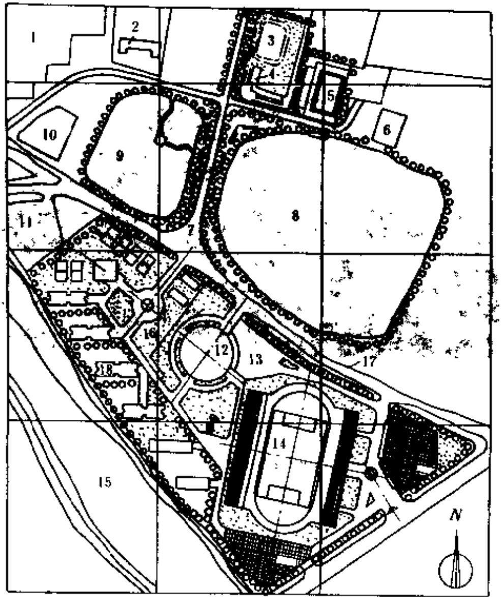  
图131倍河矿文体品动中心平而布置图  
Fig. 4--31 Plan of culture and sport centre of Daihe coal mine  
1—T.人村；2—幼儿；3-灯光球场；4—文化楼；5—游泳池；6-沉淀池；7-水泥马路：8—东湖：9—西湖；10—煤建公司：11--车库、油库：12--体有场；13—停车场：14—体育馆；15—-岱河：16--学；17一徐淮公路；18—教室、办公楼

## 3. 兴隆庄煤矿矸石山复垦

兴隆庄煤矿80年代中期对建矿初期矸石山进行复垦（图432)，在矸石山顶修观景亭一座，山顶建蓄水池，蓄水池掩映于绿荫丛中，研石山绿树环抱，环山道自山脚往山顶可通车，石砌台阶可行人。山脚下利用塌陷坑修水上公园一座，游泳池一座。

图4-32 兴隆庄矿开石山复垦

Fig. 4—32 Landscape of waste hil after reclaimed at Xingiongzhuang coal mine

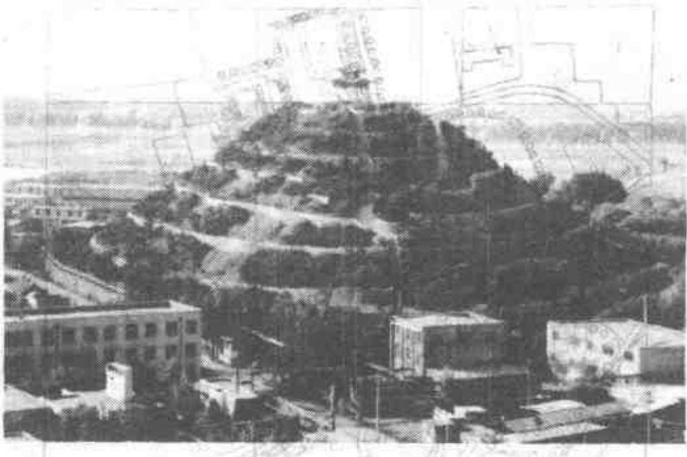

小地形景观破坏，控制露采区域复垦上壤侵蚀。

## 3. 兴隆庄煤矿研石山复垦

兴隆庄煤矿80年代中期对建矿初期矸石山进行复垦（图432)，在矸石山顶修观景亭一座，山顶建蓄水池，蓄水池掩映于绿荫丛中，研石山绿树环抱，环山道自山脚往山顶可通车，石砌台阶可行人。山脚下利用塌陷坑修水上公园一座，游泳池一座。

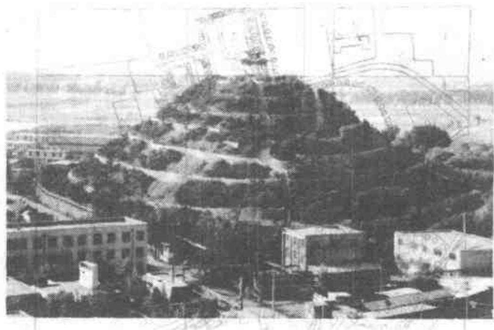  
图4-32 兴隆庄矿开石山复垦  
Fig. 4—32 Landscape of waste hilì after reclaimed at Xingiongzhuang coal mine

# 第五章 矿区土地复垦项目的评价论证与规划设计方案的实施

第一节 矿区土地复垦项目经济评价

指标体系与综合评价方法

## 一、复垦项目经济评价的意义

从经济学角度分析，矿区土地复垦项目既是对矿山建设项目造成环境破坏的治理，究其本身又是一项经济活动或投资行为。作为经济活动，就需对其经济合理性作出恰当的评价，即进行复垦项目经济评价。根据近年来我国矿区土地复垦的实践，无论是对矿区土地复垦规划、复垦投资效果，还是对已实施的复垦项目.都需对经济合理性作出评判。其作用具体表现在[57]：

## 1:作为复垦决策的依据

矿区土地复垦中，经常碰到的决策问题有：复垦工程措施和复垦方向的选择；征地迁村方案的选择；为了复垦的利益，是否需要采取采矿措施的决策等等。 i

## 2. 为筹措复垦资金提供依据

在我国现阶段，落实复垦资金是复垦项目能否上马以及能否高标准复垦的关键。通过费用构成分析与概预算，可预测资金需求量。通过费用效益或投入产出分析，可为开辟资金渠道提供依据，如经济效益好、偿还能力强，可采取贷款和集资的方法等。

## 3. 对复垦效果作出客观评价

复垦的最终目的是恢复土地的生产力和矿区的生态平衡。复垦项目实施后能否达到这一目标，以及实现这一目标的程度如何，需在复垦前通过经济评价作出客观分析。

## 4. 为分析土地复垦对采矿业成本的影响提供依据

一般矿山设计都已要求有土地复垦内容或专门章节，对矿山设计阶段的复垦设计作出客观的经济评价，可为分析土地复垦对采矿成本的影响提供依据，从而为矿山设计提供依据。

## 二、矿区土地复垦评价的指标体系

## 1. 动态分析指标

与国家建设项目类似，复垦项目经济评价也可分为财务评价和国民经济评价。过去在一些地方流传这样一种说法，“复垦种粮不如种菜，种菜不如养鱼来得快”，如果上升到理论高度，这种说法应该是对财务评价而言的，而《土地复垦规定》要求尽量复垦为耕地或其它农用地，鼓励种粮食，这则是从国民经济评价角度提出的。

建设项目经济评价中，常用财务内部收益率（FIRR）、投资回收期（P）、财务净现值（PNPV）、投资利润率、投资利税率、资本金利润率等指标评价项目财务盈利能力。用经济内部收益率(EIRR）和经济净现值（ENPV）来评价国民经济盈利能力。

对复垦项目进行经济评价时，需根据复垦资金来源、复垦方向以及复垦管理形式（如承包、租赁等）等因素选择评价指标。如果用银行贷款形式获得复垦费用的，需考虑以投资回收期作为主要评价指标，复垦后土地直接用于基本建设的，因其费用是从该基建项目投资中列支的，所以其经济评价应和该基建项目一起进行综合评价。

## 2. 静态分析指标

复垦经济评价的动态分析指标，实际上是一种较精确的方法。对于投资较少、投资回收期较短以及使用自有资金复垦的项目，也可用静态投资回收期、追加投资回收期、年计算费用及单位投资产品年增长量等作为评价指标。

## 3. 辅助分析指标

辅助分析指标包括复垦前后农业产品收益对比、复垦地和未受破坏的对照农田收益对比、劳动力就业指标等。

## 4. 复垦经济评价实例

今有甲、乙两复垦方案，甲方案一次投资250万元， $\angle$ 方案一次投资200万元，复垦后逐年收益如表5—1所示，以基准收益率为12%评价两复垦方案的优越性。

表5—1列出了P、FIRR、FNPV指标的计算结果。计算时均采用动态分析的方法，考虑资金的时间价值因素。 $P _ { \ell }$ 通过现值偿还插值方法得到，FIRR用线性插值方法得到 $\because ^ { \cdot \tilde { F } ^ { N P V } }$ 的计算期取20年。计算结果表明： $\zeta$ 方案的投资回收期 $P _ { \varepsilon }$ 和财务内部收益率略优于甲方案，而甲方案的财务净现值PNPV明显优于乙方案，所以综合考虑，财务评价结论是甲方案优于乙方案。

值得注意的是，上述评价结论是在甲乙两方案的计算期同为20年的情况下得到的，计算期实质是复垦项目的服务年限或寿命。若复垦项目的服务年限改变了，则评价结论可能完全相反。关于计算期的选取，下面我们要作专门的讨论。从上面的分析计算还可发现：投资回收期指标评价的着眼点在于尽早收回投资，本金收回后的情况不再考虑；而FNPV指标要考虑项目整个服务年限内的收益情况，可以说着眼点更长远些。

表 5—1 复垦方案经济评价计算表  
Tab 5—1 Economic evaluation of reclamation alternatives
<table><tr><td rowspan=1 colspan=2>年    度</td><td rowspan=1 colspan=1>0</td><td rowspan=1 colspan=1>1</td><td rowspan=1 colspan=1>2</td><td rowspan=1 colspan=1>3</td><td rowspan=1 colspan=1>4</td><td rowspan=1 colspan=1>5</td><td rowspan=1 colspan=1>6</td><td rowspan=1 colspan=1>7</td></tr><tr><td rowspan=2 colspan=1>甲案</td><td rowspan=1 colspan=1>现金流量</td><td rowspan=1 colspan=1>-250</td><td rowspan=1 colspan=1>40</td><td rowspan=1 colspan=1>60</td><td rowspan=1 colspan=1>80</td><td rowspan=1 colspan=1>80</td><td rowspan=1 colspan=1>80</td><td rowspan=1 colspan=1>80</td><td rowspan=1 colspan=1>80</td></tr><tr><td rowspan=1 colspan=1>现   值</td><td rowspan=1 colspan=1>-250</td><td rowspan=1 colspan=1>35.71</td><td rowspan=1 colspan=1>47.83</td><td rowspan=1 colspan=1>56.94</td><td rowspan=1 colspan=1>50.84</td><td rowspan=1 colspan=1>45.39</td><td rowspan=1 colspan=1>40.53</td><td rowspan=1 colspan=1>36,19</td></tr><tr><td rowspan=2 colspan=1>乙方案</td><td rowspan=1 colspan=1>现金流量</td><td rowspan=1 colspan=1>-200</td><td rowspan=1 colspan=1>10</td><td rowspan=1 colspan=1>60</td><td rowspan=1 colspan=1>60</td><td rowspan=1 colspan=1>60</td><td rowspan=1 colspan=1>60</td><td rowspan=1 colspan=1>60</td><td rowspan=1 colspan=1>60</td></tr><tr><td rowspan=1 colspan=1>现    值</td><td rowspan=1 colspan=1>-200</td><td rowspan=1 colspan=1>35.7</td><td rowspan=1 colspan=1>47.83.</td><td rowspan=1 colspan=1>42.71</td><td rowspan=1 colspan=1>38.13</td><td rowspan=1 colspan=1>34.05</td><td rowspan=1 colspan=1>30.40</td><td rowspan=1 colspan=1>27.14</td></tr><tr><td rowspan=1 colspan=2>年    度</td><td rowspan=1 colspan=1>8</td><td rowspan=1 colspan=1>9</td><td rowspan=1 colspan=1>10</td><td rowspan=1 colspan=1>11</td><td rowspan=1 colspan=1>12</td><td rowspan=1 colspan=1>13</td><td rowspan=1 colspan=1>14</td><td rowspan=1 colspan=1>15</td></tr><tr><td rowspan=2 colspan=1>甲方案</td><td rowspan=1 colspan=1>现金流量</td><td rowspan=1 colspan=1>80</td><td rowspan=1 colspan=1>80</td><td rowspan=1 colspan=1>80</td><td rowspan=1 colspan=1>80</td><td rowspan=1 colspan=1>80</td><td rowspan=1 colspan=1>80</td><td rowspan=1 colspan=1>80</td><td rowspan=1 colspan=1>80</td></tr><tr><td rowspan=1 colspan=1>现    值</td><td rowspan=1 colspan=1>32.31</td><td rowspan=1 colspan=1>28.85</td><td rowspan=1 colspan=1>25.76</td><td rowspan=1 colspan=1>23.00</td><td rowspan=1 colspan=1>20.53</td><td rowspan=1 colspan=1>18.33</td><td rowspan=1 colspan=1>16.375</td><td rowspan=1 colspan=1>14.62</td></tr><tr><td rowspan=2 colspan=1>乙方案</td><td rowspan=1 colspan=1>现金流量</td><td rowspan=1 colspan=1>60</td><td rowspan=1 colspan=1>60</td><td rowspan=1 colspan=1>60</td><td rowspan=1 colspan=1>60</td><td rowspan=1 colspan=1>60</td><td rowspan=1 colspan=1>60</td><td rowspan=1 colspan=1>60</td><td rowspan=1 colspan=1>60</td></tr><tr><td rowspan=1 colspan=1>现    值</td><td rowspan=1 colspan=1>24.23</td><td rowspan=1 colspan=1>21.64</td><td rowspan=1 colspan=1>19.32</td><td rowspan=1 colspan=1>17.25</td><td rowspan=1 colspan=1>15.4Q</td><td rowspan=1 colspan=1>13.75</td><td rowspan=1 colspan=1>12.28</td><td rowspan=1 colspan=1>10.96</td></tr><tr><td rowspan=1 colspan=2>年    度</td><td rowspan=1 colspan=1>16</td><td rowspan=1 colspan=1>17</td><td rowspan=1 colspan=1>18</td><td rowspan=1 colspan=1>19</td><td rowspan=1 colspan=1>20</td><td rowspan=1 colspan=1> $P _ { \bullet }$ </td><td rowspan=1 colspan=1>FIRR</td><td rowspan=1 colspan=1>FNPV</td></tr><tr><td rowspan=2 colspan=1>甲方案</td><td rowspan=1 colspan=1>现金流量</td><td rowspan=1 colspan=1>80</td><td rowspan=1 colspan=1>.80</td><td rowspan=1 colspan=1>80</td><td rowspan=1 colspan=1>80</td><td rowspan=1 colspan=1>80</td><td rowspan=2 colspan=1>5.3年</td><td rowspan=2 colspan=1>27%</td><td rowspan=2 colspan=1>295.88</td></tr><tr><td rowspan=1 colspan=1>现    值</td><td rowspan=1 colspan=1>13.05</td><td rowspan=1 colspan=1>11.65</td><td rowspan=1 colspan=1>10.40</td><td rowspan=1 colspan=1>.9.29</td><td rowspan=1 colspan=1>B-29</td></tr><tr><td rowspan=2 colspan=1>乙方案</td><td rowspan=1 colspan=1>现金流量</td><td rowspan=1 colspan=1>60</td><td rowspan=1 colspan=1>60</td><td rowspan=1 colspan=1>60</td><td rowspan=1 colspan=1>60</td><td rowspan=1 colspan=1>60</td><td rowspan=2 colspan=1>5.1年</td><td rowspan=2 colspan=1>27.6%</td><td rowspan=2 colspan=1>230. 31</td></tr><tr><td rowspan=1 colspan=1>现   值</td><td rowspan=1 colspan=1>9.79</td><td rowspan=1 colspan=1>8.74</td><td rowspan=1 colspan=1>7.80</td><td rowspan=1 colspan=1>6.97</td><td rowspan=1 colspan=1>6.22</td></tr></table>

注：表中现金流量、现值、FNPV的单位为万元。

## 三、复垦项目与建设项目经济评价的区别

上面介绍的复垦项目经济评价方法，借鉴了国家建设项目经济评价方法，但复垦项目与建设项目存在着明显的区别，是评价工作中应该特别注意的，这些区别和注意点可概括为：

## 1. 经费来源和偿还形式

建设项目的资金来源有国家财政拨款、银行贷款、集资和发行股票等方法。贷款、集资需要在一定的时间偿还本利，股票在企业盈利的情况下需分红。

复垦项目按“谁破坏，谁复垦”的原则，其资金来源有：生产过程中破坏的土地，土地复垦费用从企业更新改造资金和生产发展基金列支；复垦后直接用于基本建设的，土地复垦费用从该项基本建设投资中列支；由国家征用并能够以复垦后的收益形成偿付能力的，土地复垦费用可以用集资或贷款或承包等方式，但土地使用权和收益分配视复垦费用来源确定。对贷款和集资方式获得的复垦资金的偿还，需要用复垦后的收益偿还本利；而从基建投资中列支的复垦资金，无需用复垦后的收益偿还，应从基建项目的收益中偿还。

## 2. 投资的目的

基本建设项目投资的目的只有一个，就是赚钱；面复垦项目投资的目的是恢复土地生产能力及恢复矿区生态平衡，它既有经济目的，也有保护环境和解决社会问题的目的。这里所说的社会问题是指矿区农村剩余劳动力就业、口粮供应、工农争地矛盾等。因此：矿区土地复垦项目在用上述经济指标评价的同时，还可辅以劳动力就业指标、口粮供应指标、其它副食品供应量、复垦前后农产品产量收益对比、复垦地与未受破坏的对照农田产量收益

对比等指标综合评价。

## 3. 收益的表现形式

基本建设项目收益是以销售产品收入表现；复垦项目的收益则包括多方面：如销售农产品的收入、恢复道路交通和水利设施而产生的经济效益和社会效益、减小环境污染（如大气、水及固体废弃物污染）而产生的生态环境效益、恢复植被的生态效益、提供就业和口粮的社会效益等。关于复垦项目的社会效益和环境效益估算，有的可参考有关文献，有的则是有待研究的。

## 4. 项目计算期

无论是建设项目还是复垦项目经济评价，一般都要求以动态分析为主，静态分析为辅。建设项目的计算期包括建设期和生产经营期，建设期根据项目的实际情况确定，生产经营期一般不宜超过20年。复垦项目的计算期则可分为恢复期和正常生产期。恢复期是指复垦初期土地生产能力逐年上升时期。对恢复原用途的复垦项目，恢复期可计算至恢复到原生产水平或当地同类用途土地的平均生产水平为止；对恢复成其它用途的复垦项目，恢复期可计算至恢复到当地同类用途土地的平均生产水平或逐年上升渐趋稳定的年份为止。正常生产期则是指恢复期后土地投入正常使用的时期。对复垦项目来说，某些投资可以说是一劳永逸的，如复垦为耕地的土方投入，但为便于经济评价，正常生产期可以恢复期结束起计算至土地利用发生改变的年份为止。我国长期土地利用规划的期限是30年，因此复垦为农用的土地可用30年作为正常生产期。特殊情况下，也可选择成30年以下或高于30年的更长时间作为正常生产期。如在有二次塌陷可能的地方复垦，正常生产期可计算至二次塌陷发生时为止。根据动态分析，若复垦项目投资适中、收益较好，复垦后土地能正常使用15\~20年，即使发生二次塌陷，也是有复垦价值的。

## 5. 评价的目的和结论

建设项目经济评价的目的是根据国家经济和社会发展战略和行业、地区发展规划的要求，在做好产品（服务）市场需求预测及厂址选择、工艺技术选择等工程技术研究的基础上，计算项目的效益和费用，通过多方案比较，对拟建项目的财务可行性和经济合理性进行分析，做出全面的经济评价，为项目的科学决策提供依据。其结论可以是否定的，即否定项目的实施，也可以是肯定的，或提出修改建议后肯定项目的实施。

复垦项目经济评价的目的则是在一定的资金、资源条件下，对多个方案进行比较，选择最优方案或对已上马的复垦项目作出复垦效果的评价。其结论总是在复垦项目实施的前提下作出的，因为按照法规，矿山企业破坏的土地是必须采取复垦措施的，评价的结论总是哪一个复垦方案较好或某复垦方案实施后效果如何。

上述几点为两者的主要区别，还有一些次要的区别，如投资与收益的计算方法、评价过程等。

尽管两者存在以上区别，但也有许多共同之处。最重要的一点是两者都以投资为形式、以收益为目的，正因为此，才使得复垦项目经济评价可以借鉴建设项目的经济评价方法。

## 四、复垦项目综合评价方法

利用前述指标，只从经济角度对复垦项目进行了评价，通常复垦项目产生的效益是综合的。土地复垦综合效益评价方法有[2.32]：

## 1. 定性分析评价法

土地复垦规划实施后经济效益可能是不明显的，带来的社会、生态环境效益则是巨大的，通常用定性分析的方法来说明。定性分析时可以从两方面评价：一看自然环境的变化情况，包括绿色植物覆盖情况、野生动物生长情况，如果水清树绿、鸟语花香、空气清新，说明恢复得较好；二看人们对居住、生活环境的满意程度，比如农副产品品种是否繁多，娱乐场所有无增加，有无荒芜地带：是否存在吃粮难等问题。在作这些分析时须与以前的或未治理的矿区进行纵横比较才能说明问题，还可通过调查询问方式对治理效果作出评价，比如可以分成“满意”、“基本满意”、“不满意”和“很糟糕”几个等级。

## 2. 定量分析评价法

投资效果系数法、返本期法属于定量分析方法的一种。这里介绍一种综合的定量分析法-—土地生产函数法。

设土地生产函数为：

$$
y = f ( x _ { 1 } , x _ { 2 } , x _ { 3 } ) = a x _ { 1 } ^ { h } x _ { 2 } ^ { h _ { 2 } } x _ { 3 } ^ { h _ { 3 } }\tag{5 − 1}
$$

式中 $\check { \check { \mathbf { \alpha } } }$ 土地在特定时期的生产量；

$x _ { 1 }$ ——土地费用；

$x _ { 2 }$ —劳动力费用；

$\pmb { x } _ { 3 }$ ——物质费用。

a 是待定系数，b、 $b _ { 2 }$ $b _ { 3 }$ 分别是 $x _ { 1 }$ $\pmb { x } _ { 2 }$ r $x _ { 3 }$ 的产出系数，这些系数可以由统计资料求定。

于是可以通过费用和生产量的比较来确定土地复垦效果。

## 3. 定性定量分析相结合的评价方法

由于土地复垦是一个复杂的系统工程问题，不仅涉及经济因素，还涉及生态环境及社会因素，而且这些因素对矿区的经济发展都有直接或间接的影响，所以下面我们介绍一种定性定量相结合的评价方法——模糊综合评判法。

设 $\pmb { A }$ 为总因素，如经济效果、就业率、绿化情况、大气污染情况、解决村庄搬迁情况等，R为评判矩阵，B为评判结果，则：

$$
B ^ { \prime } = A \cdot \mathrm {  ~ \dot { } { \cal R } ~ }\tag{5-2}
$$

其步骤可简化为建立因素集→构造评判矩阵→单因素模型评判→模糊综合评判。

因素集的建立：根据 $\pi ^ { * }$ 区实际情况选取那些对当地经济发展和人民生活影响较为密切的因子。

评判矩阵的构造：根据各种因子的实际状况及评价标准对照确定。 111

若评价采前土地和复垦后土地质量，通过评价我们可以得到比较结果：好、坏或相当。当然，我们亦可用此法评价儿种可选复垦方案的效果。

## 第二节 矿区土地复垦费用构成与成本核算

## 一、意义

自1988年国务院《土地复垦规定》颁布以来，我国矿山土地复垦工作正逐步走上规范化、法制化道路。有复垦任务的行业部门先后制定了一些技术政策和复垦项目实施管理办法，如冶金工业部在《黑色冶金矿山企业初步设计的内容深度及编写规定》中，将土地复垦单独设为一章，其中重要的一项工作是需对复垦工程进行技术经济评价，而复垦费用计算和成本核算是复垦项目经济评价的基础，又由于对矿山企业来说，复垦费用的大小直接影响产品成本，从而影响企业的整体效益；对复垦投资者和复垦土地使用者来说，复垦费用直接影响复垦工程的进度和复垦工程的效益，所以复垦费用计算与成本核算可为分析土地复垦对采矿业和能源成本的影响提供依据，为复垦决策和复垦资金筹措提供依据。本节拟对复垦费用构成、影响复垦成本的因素及复垦成本的核算等问题作专门的讨论。

## 二、矿区土地复垦费用的构成与计算

土地复垦费用按其投入时间可分为一次性投入、经常性投入和不定期投入。如复垦机械、复垦土方、道路及水利配套设施等均为一次性投入；经常性投入如按土壤改良计划逐年投入的改土费用、沟渠清淤费用等；不定期投入如复垦机械维修费用等。

按资金投入工程阶段的不同，分为工程复垦费用、生物复垦费用以及其它费用。这里按此分类方法对矿山土地复垦费用的构成作一阐述。

## 1. 工程复垦费用

工程复垦费用是指工程复垦阶段发生的一切费用的总和。这包括复垦所使用机械设备费用，复垦区道路整修费用，土地平整、剥离和覆盖表土费用，修筑其它附属设施（如桥、涵、闸、站、管线等）费用，排灌工程费用等。复垦为建筑用地时，还包括采用特殊的地基处理方式和建筑结构措施而额外增加的工程费用。

## 2. 生物复垦费用

生物复垦费用是发生在生物复垦阶段一切费用的总和。它包括种植费用和复垦管理费用。种植费用又包括土壤改良、施肥、耕作、播种等费用。复垦管理费用是指生物复垦阶段各项管理费用之和，如耕作管理、除草、施肥、灌溉等管理措施所发生的费用。

严格地讲，一般地区的种植和管理也要发生费用，生物复垦费用应该是因采取复垦措施而额外增加的那部分种植和管理费用。但由于复垦恢复期（即复垦土地开始利用至达到当地平均产量的时间段）内，额外增加的这笔费用较一般土地上的投入大得多，可用全部种植和管理费用表示生物复垦费用；而在正常生产期（恢复至当地平均产量以后）内，就不应将全部费用计为复垦费用。

## 3. 其它费用

其它费用是指既没有发生在工程复垦阶段，也没有发生在生物复垦阶段的费用。它包括复垦工程实施前的规划设计费用、复垦工程实施后的科研试验费，以及其它不可预见费，如复垦区域兴修水利设施而使可耕种面积减少等。

## 4. 复垦费用的计算

复垦费用的计算问题看似简单，实际做起来并不是一件容易的事。美国许多研究者都曾对土地复垦费用进行过计算，但迄今为止，尚没有形成一个统一的计算标准，计算单位各种各样，费用分类形式各异。F. H. Persse等人把美国矿山局估算密西西比河西部九个州的13个露天煤矿的复垦费用分为设计、工程和管理，合同和许可证，回填与平整，重新植被四类，并作了比较。总复垦费用为0.21\~1.78美元 $/ \mathbf { m ^ { 2 } }$ ，或6\~84美分/t煤。这种复垦费用的分类方法与我们将复垦费用分为工程复垦费、生物复垦费和其它费用的方法基本是一致的。

表5-2 为我国华东地区某地下开采煤矿塌陷地非充填复垦费用的构成情况。复垦区总面积 $\textbf { 1 } 3 3 3 . 3 \times 1 0 ^ { 4 } \mathrm { m } ^ { 2 }$ ，复垦后 $2 0 0 \times$ $1 0 ^ { 4 } \mathrm { m } ^ { 2 }$ 用于渔业，其它除修建必要的道路和水利设施外，均为种植

表 5-2 非充填复垦费用构成情况分析  
Tab 5—2 Investments composition when using non-filling reclamation method
<table><tr><td rowspan=1 colspan=1>类别</td><td rowspan=1 colspan=1>项           H</td><td rowspan=1 colspan=1>费用(万元)</td><td rowspan=1 colspan=1>百分比(%)</td></tr><tr><td rowspan=1 colspan=1>1程复垦</td><td rowspan=1 colspan=1>疏排降工程（防洪、排涝、降渍）道路工程（十要生产路土石方）灌溉工程（灌溉渠系、电灌站）土方工程（土地平整、挖塘养鱼）附属设施（架线，桥涌闸等）小计</td><td rowspan=1 colspan=1>1301.3401.5480.02800.51205.56188.8</td><td rowspan=1 colspan=1>17.95.56-638-516.685.1</td></tr><tr><td rowspan=1 colspan=1>生物复垦</td><td rowspan=1 colspan=1>种植养殖管理（改变耕作习惯的增额）耕作管理费（各种复垦设施维修管理等）施肥改土费（增施氮肥、秸杆还田等）灌排水费（增加浇灌次数等）小计</td><td rowspan=1 colspan=1>200.0210.0200.0180.1790.1</td><td rowspan=1 colspan=1>2.752.92.752.510.9</td></tr><tr><td rowspan=1 colspan=1>其它</td><td rowspan=1 colspan=1>规划设计与科研试验费占地损失费小计</td><td rowspan=1 colspan=1>85.0205.0290.0r</td><td rowspan=1 colspan=1>1.22.84.0</td></tr><tr><td rowspan=1 colspan=1>总计</td><td rowspan=1 colspan=1>..复垦区总面积1333.3×104m²</td><td rowspan=1 colspan=1>7268.9</td><td rowspan=1 colspan=1>100</td></tr></table>

用地。

由表5-2可看出：煤矿塌陷地非充填复垦（采取疏排降、土地平整、挖深垫浅等措施)费用构成中工程复垦费用占85.1%，生物复垦费用仅占10.9%。这种比例构成不是一成不变的，与土地破坏程度、复垦区原有防洪排涝设施等相关条件有关。但就其一般规律而言。无论是露天矿山复垦还是地下开采矿山复垦，无论是采用充填法复垦（如用矿山固体废弃物、城市垃圾充填塌陷坑或露天采空区）还是本例非充填复垦，工程复垦费用总是占相对较大的比重。据美国的研究报导，剥离物地（即排土场）的重新整形约占总复垦费用的90%。因此，不少人提出了改革露天矿山开采与排土的工艺措施，以期减少这笔工程复垦费用；对地下开采矿山同样如此：改革地面排矸工艺、合理布置井下开采工作面，同样可减少这笔费用。如用粉煤灰充填塌陷坑，这笔费用可由电厂支付，节约了矿山企业复垦的土方费用，又节约了电厂征地贮灰费用；用露天矿剥离物充填地下开采引起的塌陷坑既节约了复垦土方费用，又节约了露天矿排上占地费用。实为一举两得。

## 三、矿区土地复垦成本类型与影响因素

## 1. 复垦成本的类型

按评价目的不同，矿区土地复垦成本分为两类：是从矿山企业角度评价，往往要核算因土地复垦而使每吨矿石成本增加的费用，我们称之为Ⅰ类成本：二是从土地生产力恢复角度评价，用单位面积单位农产品产量需要投入的复垦费用表示，我们称之为Ⅰ类成本。

Ⅰ类成本核算通常是矿山企业经济评价的重要内容，直接影响矿山企业的效益。因我国目前采矿破坏土地通常是采取征用或逐年赔偿的办法，国家对企业复垦的要求和收益分配还缺乏配套的政策措施，因此我国现阶段对这类成本的计算还不多，通常是采用开采每吨矿石的征迁补偿费估算的，如有关文献中提供的吨煤地面塌陷赔偿费为0.1元。实际上该值在我国随矿山的地理位置、开采矿床类型及矿床献存状况变化较大，高达5\~10元/t。国外对此成本核算较为详细，也有具体规定，如美国《露天采矿复垦与管理法》中规定：在美国国库帐册中设“废弃矿山复垦基金”.露天开采煤炭交35美分/t煤作为复垦费用，地下开采交15美分/t煤或售价的10%作为复垦费，褐煤交10美分/t煤或售价的2%作为复垦费。由于我国目前每吨矿石征迁补偿费和复垦成本还极不相符，使矿产品价格失真，因此今后有必要加强对1类成本的核算。

类成本是复垦投资者和复垦土地使用者关心的一项指标，直接影响复垦工程的效益。Ⅰ类成本又可分为单位复垦面积的成本，简称面积成本，以及单位农产品产量的复垦成本，简称产量成本。面积成本通常是指单位面积的复垦投入，不包括逐年经营投入，实际上是发生在复垦初期的一次性投资，相当于基建投资；而产量成本是将初期投资分摊至各年加上逐年的经营费用而得到的成本。面积成本不能作为比较方案优劣的依据，只有在复垦后单位面积产量及逐年经营费用相等的情况下，才可用面积成本作为方案比较或经济评价的依据。过去常用面积成本作为制定土地复垦规划的指标，实际上是不可取的、甚至是错误的。

## 2. 影响复垦成本的因素

影响复垦成本的因素较多，不同类型的成本，其影响因素也不完全“致。

(1)1类成本的影响因素主要有地质条件、采矿方法以及上地破坏前的用途、复垦区域排灌系统的基础条件等。

地下开采矿山Ⅰ类复垦成本的影响因素包括：采厚、采深、可采矿床的层数、下沉系数、采矿工艺（充填或不充填入、复垦方法、复垦充填料的来源、土地破坏后原公共设施（桥、涵、闸、站、路等）可供利用的程度等。上述因素在估算成本时，可以用-一些综合指标来表示，如用万吨沉陷率和塌陷深度来表示采矿造成土地破坏的程度。

露天开采矿山1类成本的影响因素包括：采厚、采深、覆岩理化特性、排土运输距离、机械化程度、工作组织、复垦后土地用途、覆土来源、当地农业气象条件（如降雨是否充沛）等。露天矿复垦成本还与复垦工程进展时间有关，当复垦工艺与采矿工艺同时并进时，复垦费用有时会比单独复垦减少一半。两者同时并进还有很多好处，如按岩性分排、分堆，便于构造复垦后新的土壤剖面；能充分利用采掘机械为复垦服务；用倒堆法开采可减少排土场占地，同时保证随采随排随时复垦等。

一般情况下，地下开采矿山类复垦成本低于露天开采矿山。

(2)1类成本的影响因素：面积成本与土地破坏程度成正比。这一点是与Ⅰ类成本有所区别的，对Ⅰ类成本来说，多采矿少占地可减少复垦成本，但其结果往往是破坏土地严重，如积水深度大等。除此之外，面积成本与Ⅰ类成本的影响因素类似。

产量成本和面积成本是相关的。因为在复垦条件相同的情况下，如复垦对象、复垦方法及复垦后土地利用方向相同时，面积成本越大，可能使复垦后产量较高，但产量成本视实际情况可能大也可能小，理论上应该有一个比较合适的面积成本使整个复过程中的投入较小、收益最好。般情况下，当初期投入适当增加可使产量迅速上升时，应该增加初期投入，即增加面积成本、最佳面积成本与产量成本的确定方法如式（5-8)。

## 四、复垦成本核算方法

## 1.  类成本核算

因为复垦工程往往是在采矿工程之后进行的，所以设复垦总费用为♪元，年均采 $\overrightarrow { f } \overrightarrow { b }$ 石 $T$ 吨，基准收益率为i时，1类成本（可由下式确定：

$$
\sum \limits _ { i = 1 } ^ { N } ( i \cdot i ^ { n } ) ^ { \cdot } ( 1 + i ) ^ { 2 } = - 1 ^ { 2 }\tag{5 - 3}
$$

式中  自采 $\hbar ^ { \gamma ^ { \varepsilon } }$ 开始至进行复星投资时的年数：

C，-单位为元/，

## 2. Ⅱ类成本核算

（1）面积成本核算：复量工程中常有一些工程项目不仅为复垦区域服务，还为复垦区域以外的土地服务，如水库、道路、排灌系统等，可采用面积分摊的方法计算面积成本，如下式：

$$
C : = \frac { P } { S _ { r } }\tag{5-4}
$$

式中 C一一第项公共工程（如道路）投资发生的面积成本，元$/ \mathbf { m } ^ { \it : }$

$I ^ { \star } ,$ —第：项公共工程的投资，元；

$S ,$ ——第，项工程服务的总面积， $\mathbf { m } ^ { 2 }$

只为复垦区域服务的工程投入，按下式计算面积成本：

$$
c ^ { * } , = { \frac { P _ { j } } { s 1 } }\tag{5 - 5}
$$

式中 $C _ { \delta }$ 第项工程发生的面积成本.元 $/ \mathbf { m } ^ { 2 }$

$P _ { \gamma }$ 一-第项工程的投资、元；

A——复垦区域面积. ${ \boldsymbol { \mathsf { \Pi } } } ^ { \because }$

于是，总面积成本为：

$$
c _ { i , \cdot } = \sum \limits _ { i = 1 } ^ { n } c _ { i , \cdot } ^ { \cdot } + \frac { \sum \limits _ { i = 1 } ^ { n } a _ { i , \cdot } ^ { \cdot } } { 2 } c _ { i , \cdot } ^ { \cdot } + i\tag{5 · 6}
$$

式中 $\mathbf { \Delta } C _ { \cdot } \mathbf { \Delta } \mathbf { - }$ 总面积成本。 $\mathrm {  ~ \cdot ~ } \mathrm {  ~ \cdot ~ } \mathrm {  ~ \cdot ~ } \mathrm {  ~ \cdot ~ }$

$^ { \star \pmb { \mathscr { n } } }$ 为公共工程项目个数；

$_ { \pmb { \mathscr { n } } } \cdot$ -纯为复垦区域服务的项目个数：

$\smash { \ell _ { \mathrm { ~ s ~ } } ^ { \star } }$ --其它费用（如土地而积损失）分摊在复垦范围A内 的成本. $\overline { { \pi } } / \mathbf { m } ^ { 2 }$

(2) $\beta ^ { \pm }$ 量成本核算包括两部分：初期投资按时间和 $\gamma ^ { \ast \intercal }$ 量的分摊量和年经营费用按产量的分摊量。所以产量成本可按下式计算：

$$
t ^ { \prime } = \frac { 1 } { 2 } s - [ \frac { 1 } { 2 } s ^ { 4 } ( 1 + i ) ] + ( \frac { 1 } { 2 } s ^ { 2 } + \ldots ^ { 4 } ( 5 - i ) ]
$$

式中：C. 一 产量成本，元/kg；

$\left. \varkappa \right| ^ { - }$ -初期投资分摊至各年的计算期；

$J ^ { \prime }$ 初期投资、元：

$\dot { \iota }$ 基准收益率；

$\mathbf { \vec { C } } _ { d } \mathbf { \vec { \Sigma } } ^ { \prime } - \mathbf { \vec { \Sigma } }$ -年经营总费用，元；

r一-平均年产量， $\mathbf { k } \mathbf { g } .$

(3)面积成本与年经营投入的优化及算例：初期投资合理，即面积成本合理，可保证复垦工程收益最大，合理的面积成本和年经营投入，应满足下式：

$$
N I ^ { \prime } V = \sum _ { i = 1 } ^ { n } \left[ ( E _ { i } - \ell _ { * } ^ { \prime } \cdot A ) \cdot ( 1 - i ) \mathbf { \ell } ^ { \prime } \right] - \ell _ { s } = \mathrm { n a x }\tag{5-8}
$$

式中 NPV-- -净现值·元；

${ \pmb E } _ { \alpha }$ --单位面积年收益，元；

其它符号的含义同前。

表-3列出两种复垦方案的 $c , c _ { u } \cdot 1 \cdot E _ { u }$ 及 NPV的计算结果。结果表明：在计算期为6年的情况下，方案2的初期投资虽较人：递年收益也高于方案1，但总的效益不如方案1。若计算期，即项日的寿命为20年时，方案1的NPV值为35444.3$\times 1 0 ^ { - \cdot 1 }$ 元 $/ \mathbf { m } ^ { 3 }$ ，方案2的NPV值为 $3 5 ~ 1 0 6 . 5 \times 1 0 ^ { - 4 }$ 元 $/ \mathfrak { m } ^ { \mathfrak { L } }$ ，所以方案1仍优于方案2。但当计算期达27年时，方案1的NPV值为$3 9 3 4 7 . 5 \times 1 0 ^ { 1 } \pi / \mathrm { m } ^ { 2 }$ ，方案2的NPV值为 $3 9 ~ 4 0 0 \times 1 0 ^ { - 4 } \overrightarrow { \Omega } / \mathrm { m } ^ { 3 }$ 这时方案2略优于方案1。随着计算期的增大，方案2将明显优于方案1，但按复垦项目经济评价的要求与复垦项目的实际寿命，计算期总是有一定限度的。关于计算期的选取，我们已在第一节作了论述。计算期最长为30年，一般为20年左右。从上面的分析知：复垦面积成本与年经营投入视实际情况有合适值，它与复垦项目寿命及复垦后土地收益有关。

(单位： $\tt { 1 0 ^ { - 4 } }$ 元/m²)  
表5-3 面积成本及年经营收人的优化算例  
Tab 5—3 Option about area cost and annual investment
<table><tr><td rowspan="3"></td><td colspan="4">方案1</td><td colspan="4">方案2</td></tr><tr><td> $\scriptstyle { E _ { * } }$ </td><td> $k _ { a }$  • A−1</td><td> $c _ { s }$ </td><td>现值</td><td> ${ \pmb { \mathscr { E } } } _ { \pmb { \sigma } }$ </td><td> $k _ { n } \cdot 4 ^ { - 1 }$ </td><td> ${ \bf \vec { C } } _ { \bf \vec { s } }$ </td><td>现值</td></tr><tr><td>0</td><td>0</td><td>0</td><td>23500</td><td>23500</td><td>0</td><td>0</td><td>30000</td><td>30000</td></tr><tr><td>1</td><td>6000</td><td>750</td><td>0</td><td>4687.5</td><td>6750</td><td>675</td><td>0</td><td>5424.1</td></tr><tr><td>2</td><td>9000</td><td>750</td><td>0</td><td>6576-8</td><td>9750</td><td>67,5</td><td>0</td><td>7234.5</td></tr><tr><td>3</td><td>9000</td><td>750</td><td>0</td><td>5872.2</td><td>9750</td><td>675</td><td>0</td><td>6459.4</td></tr><tr><td>4</td><td>9000</td><td>750</td><td>0</td><td>5243.0</td><td>9750</td><td>675</td><td>0</td><td>5767.3</td></tr><tr><td>5.</td><td>9000</td><td>750</td><td>0</td><td>4681.3</td><td>9750</td><td>675</td><td>0</td><td>5149.4</td></tr><tr><td>6</td><td>9000</td><td>750</td><td>0</td><td>4179.7</td><td>9750</td><td>675</td><td>0</td><td>4597.7</td></tr><tr><td> $\pmb { n } \pmb { = } \pmb { 6 }$ </td><td colspan="4">NPV=</td><td colspan="4">NPV= 4632.4</td></tr><tr><td> $\scriptstyle n = 2 0$ </td><td colspan="3">NPV=35444.3</td><td colspan="5"></td></tr><tr><td>n=27</td><td colspan="3"></td><td colspan="5">NPV=39347. 5</td></tr></table>

## 五、结论

(1)根据我国矿山复垦的实际，参考国外复垦经济评价方法，本节将复垦费用分为工程复垦费用、生物复垦费用与其它费用三类。通过实例分析说明复垦费用中工程复垦费用占较大比重。减少工程复垦费用是提高复垦工程效益的最有效途径，可通过将复垦工艺和采矿工艺相结合实现。

(2)按复垦经济评价目的不同，将复垦成本分为Ⅰ类成本和I类成本，1类成本又进一步分为面积成本和产量成本。对影响复垦成本的因素作了详细的分析，并介绍了各类成本核算的方法。

(3)本节提出了面积成本和复垦年经营投入存在合适值的概念，并给出了确定其合适值的方法，同时结合实例作了说明。

## 第三节 矿区土地复垦规划项目的可行性论证

## 一、规划项目可行性研究的意义

复垦项目投资大，可选方案多，为给投资决策提供科学依据，提高投资效益，就必须在规划的基础上从经济合理性、技术可行性和实践上的可能性三方面进行可行性论证。可行性研究的具体作用表现在：

(1)作为复垦项目投资决策和编制设计任务书的依据；

(2) 作为向银行申请贷款的依据；

(3)作为与复垦项目有关部门商谈合同、协议的依据；

(4)作为复垦项目开展初步设计的依据；

(5)作为对环境影响审查的依据；

(6)作为制订技术开发计划的依据。

## 二、可行性研究程序

为提高可行性研究效果，节约研究费用，可行性研究遵循由粗到细，由浅入深的原则，分三阶段进行：

## 1. 调研阶段

调研阶段根据复垦现场的复垦条件，以市场预测和概略估算为基础，对复垦项目的投资方向提出建议或初步设想。在提出建议的过程中，可对多个方案的成本与效益等进行概略比较，作为提出建议的依据。

## 2. 初步可行性研究阶段

初步可行性研究是对调研阶段提出的建议进行较详细的分析评价，对方案的有利条件和不利因素等作较周全的考虑，在分析评价过程中不宜选用太乐观的参数。

## 3. 可行性研究阶段

调研与初步可行性研究阶段认为复垦项目可行，方可转入本阶段研究。本阶段应对一切可行的方案进行全面的技术、经济论证，推荐一个最好的方案或提供决策者选择的几个方案，并详细阐明各方案的利弊以及在实施过程中应注意的问题和前提条件。

上述三阶段是按评价、论证的详细程度来划分的，并非每项工程都必须进行初步可行性研究阶段，对投资规模不大、技术难度较小的复垦项目可直接由调研阶段进入可行性研究阶段。

## 三、复垦项目可行性研究的基本内容

复垦项目可行性研究的基本内容包括复垦区域基本情况介绍、复垦场地论证、复垦目标论证、复垦规划方案介绍（必要时包括部分工程的初步设计方案）、投资结构、规模及其作用，投资收益分析等，最终给出可行性研究的结论、工程分期实施步骤、实施过程中注意的问题以及可能出现的问题与解决办法。

## 第四节 铜山县采煤塌陷地国家级高效农业复垦示范工程可行性研究实例

为实现耕地占用与复垦开发的动态平衡，促进矿区农业持续稳定发展，改善矿区农村生态环境质量，1995年国务院农业综合开发办公室与国家土地管理局在项目论证和可行性研究的基础上，对江苏铜山、安徽淮北和河北唐山三个县市的采煤塌陷地复垦分三年进行重点投资，拟建立三个高标准高效农业复垦示范工程，为我国华东高潜水位矿区采煤塌陷地复垦提供技术体系和管理经验方面的示范，为采矿业与农业协调发展提供示范，为土地复垦经济效益、社会效益与生态环境效益相结合提供示范。铜山县采煤塌陷地高效农业复垦工程是三个示范工程之一，位于该县柳新乡，塌陷土地为徐州矿务局宅城矿所致。目前由于该示范工程规划合理、论证充分、预算正确及实施管理得力；各项工程进展顺利，收效显著。本节结合该可行性研究实例，对示范工程可行性研究的基本内容作一简要介绍。

## 一、可行性研究的主要内容

(1)从示范工程区自然条件、塌陷现状、光热水土资源等方面论证了本区土地复垦的有利条件。具体有利条件有：示范区内水利框架基本形成；塌陷稳定和近期将稳定的土地近万亩，利于成片开发复垦；农业气候生产潜力较大；经济基础好；县乡村领导与群众复垦的积极性很高等。

(2)根据宅城矿地质采矿资料，利用开采沉陷学理论和先进的计算机技术，对复垦示范工程区地表塌陷稳定性进行了全面、科学的论证。得到了稳定边界和面积、近期稳定边界和面积以及下沉等值线图。

(3)按照国家建设工程项目可行性研究的步骤及示范工程总体指导思想，提出了三种复垦方案，然后对它们进行了全面、科学的技术经济可行性分析，得到了最优的复垦总体方案。同时利用最优化理论得到了各类复垦用地最优化面积。

(4)为采煤塌陷地复垦设计了一幅“种养加一条龙，农工商一体化”的宏伟蓝图。具体措施包括：沟渠路、桥涵闸配套；三大类五大区五个试验区并举。三大类即种植类、养殖类、种养结合类；五大区为蔬菜种植区、苗圃区、基塘复垦区（果基、菜基、粮基）、养殖区（特种水产养殖、禽畜养殖兼饲料种植）和外围粮食与经济作物种植区。五个试验分别为：复垦区农田高产优质高效技术体系试验、加速土壤熟化的工程与生物措施对比试验、基塘立体种养高产高效技术体系试验、塌陷区抗变形建筑试验、提高动态塌陷地土地利用率的技术体系试验。

(5)对复垦工程投资进行了详细预算。全部投资共7677.4万元，其中基础配套设施投资3313.4万元，耕地复垦投资1566万元。报告还对示范工程的投资效益进行了初步预测：动态投资回收期约4年。 r.

复垦区域稳定性论证与复垦方案的技术可行性论证，按本书前面有关章节介绍的方法进行，下面重点对示范工程的基本情况、.规划设计方案与投资收益分析作一介绍。

## 二、复垦示范区概况及示范工程特色

## 1. 地理位置

复垦示范区位于徐州市西北20km，该区北靠微山湖，东邻京杭大运河、南靠307国道，西以老桃园河为界。煤矿塌陷地位于桃园河（东西向）及桃园河支流（东北一西南向）、顺堤河三条河围成的三角形区域内，如图5一1所示。稳定的塌陷地六千余亩，近期将稳定的塌陷地近万亩，区内国有土地七千余亩，其它为集体所有土地。该区行政归属铜山县柳新乡，区内主要国营广矿企业有徐州矿务局宅城煤矿和垞城电厂。

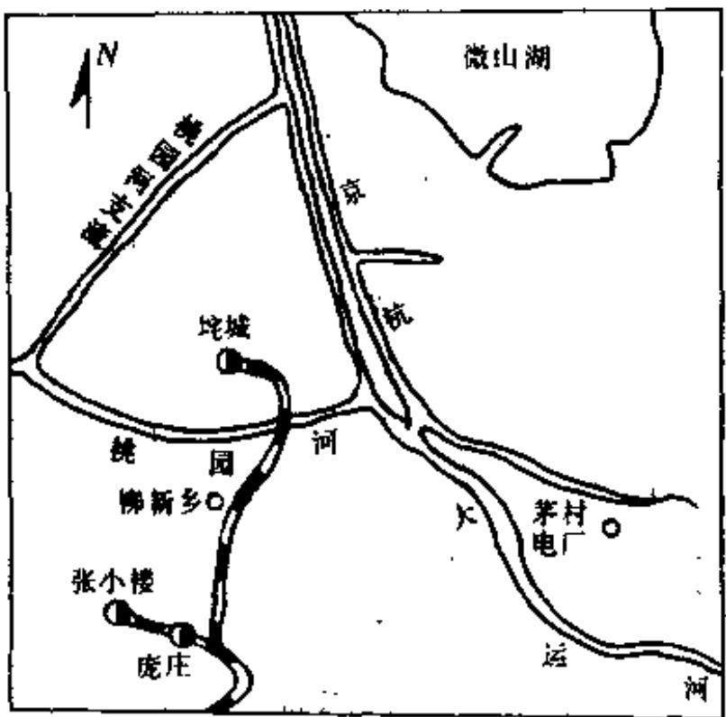  
图51示范区地理位置图  
Fig. 5—1 Geographical location demonstration project located

本区水陆交通便利，水运由京杭大运河北达山东，南下至江浙各地，陆上交通有宅城矿专用铁路线与陇海线相连，公路交通四通八达。该区另一优势是电力资源充足。

## 2. 示范区所在县乡土地塌陷情况

铜山县地处黄淮海平原，是我国重要的煤炭生产基地和商品粮基地。全县境内大小煤矿120余座，年产优质原煤2000多万t，为国家经济建设作出了重大贡献。同时，煤炭开采也带来了一系列社会、经济、生态环境等问题。据统计全县累计采煤塌陷土地20余万亩，21万人人均耕地在0.5亩以下，10万人无地可耕，矿区农村劳动力就业困难，而且桥涵断裂、房屋倒塌、道路沉陷、交通堵塞现象严重。

示范工程所在的柳新乡总人口6.12万，农用土地面积5.33万亩，人均0.866亩。全乡32个行政村，15个村不同程度受采煤影响，累计被国家征用塌陷地13060亩，其中绝产地9354亩。15个村分别是唐沟、小李庄、李崮城、黑璋、孙庄、魏庄、秦楼、新桥、垞城、刘家、祁楼、天齐庙、柳东、柳西、蒋楼，目前示范区范围内受采煤影响严重的村有魏庄、新桥、秦楼、小李庄、祁楼、天齐庙等，将要受影响的村有闫小庄、湖坑等。

这些村近年来由于土地塌陷，人均耕地急剧下降，其中祁楼村人均耕地仅1分多。农民主要收入依靠乡（村、办企业，村办企业产值占总产值的3/4左右(表5-)。近年来由于市场竞争激烈，乡村工业也受到冲击，加上近年来粮油价格的上涨，农民回归土地的愿望日益强烈，希望通过复垦塌陷地解决口粮问题。

## 3. 复垦区域地下开采情况

本区塌陷地主要为徐州矿务局宅城煤矿开采所致，南部局部地区受南通柳新煤矿和徐州矿务局庞庄矿东城并开采的影响。宅城矿建于1970年，1976年12月正式投产，设计能力45万t/年，实际生产能力每年60万t左右。到93年底共采出煤炭922万t左右，累计征用塌陷地6230.02亩（实际塌陷面积要大于此数），万吨征地率为6.8亩/万t，万吨塌陷率要高于该值，据估算约为7.5\~8.0亩/万t。目前该矿开采正进入青年期，预计服务年限仍有40\~45年左右。

表 5-4 有关村经济发展状况  
Tab 5—4 Data of economic development of related vilages
<table><tr><td rowspan=2 colspan=1>村庄</td><td rowspan=2 colspan=1>人口(人)</td><td rowspan=2 colspan=1>耕地(亩)</td><td rowspan=2 colspan=1>农业产值(万元)</td><td rowspan=2 colspan=1>工业产值(万元)</td><td rowspan=2 colspan=1>人均收入(元)</td><td rowspan=1 colspan=6>农业生产布局（亩）</td></tr><tr><td rowspan=1 colspan=2>稻麦</td><td rowspan=1 colspan=1>豆</td><td rowspan=1 colspan=1>鱼</td><td rowspan=1 colspan=1>果</td><td rowspan=1 colspan=1>菜</td></tr><tr><td rowspan=1 colspan=1>魏庄</td><td rowspan=1 colspan=1>2267</td><td rowspan=1 colspan=1>3192</td><td rowspan=1 colspan=1>230 </td><td rowspan=1 colspan=1>1009</td><td rowspan=1 colspan=1>1116</td><td rowspan=1 colspan=1>3192</td><td rowspan=1 colspan=1>2200</td><td rowspan=1 colspan=1>1</td><td rowspan=1 colspan=1>700</td><td rowspan=1 colspan=1>20</td><td rowspan=1 colspan=1>520</td></tr><tr><td rowspan=1 colspan=1>祁楼</td><td rowspan=1 colspan=1>1961</td><td rowspan=1 colspan=1>290</td><td rowspan=1 colspan=1>188  ，</td><td rowspan=1 colspan=1>1149r</td><td rowspan=1 colspan=1>1132.</td><td rowspan=1 colspan=1>290</td><td rowspan=1 colspan=1>1</td><td rowspan=1 colspan=1>1</td><td rowspan=1 colspan=1>350</td><td rowspan=1 colspan=1>2.7</td><td rowspan=1 colspan=1>200</td></tr><tr><td rowspan=1 colspan=1>新桥</td><td rowspan=1 colspan=1>1557</td><td rowspan=1 colspan=1>1100</td><td rowspan=1 colspan=1>247</td><td rowspan=1 colspan=1>1236</td><td rowspan=1 colspan=1>1378</td><td rowspan=1 colspan=1>1100</td><td rowspan=1 colspan=1>980</td><td rowspan=1 colspan=1>1</td><td rowspan=1 colspan=1>100</td><td rowspan=1 colspan=1>7.5</td><td rowspan=1 colspan=1>100</td></tr><tr><td rowspan=1 colspan=1>奏楼</td><td rowspan=1 colspan=1>680</td><td rowspan=1 colspan=1>800</td><td rowspan=1 colspan=1>99</td><td rowspan=1 colspan=1>183</td><td rowspan=1 colspan=1>900</td><td rowspan=1 colspan=1>800</td><td rowspan=1 colspan=1>600</td><td rowspan=1 colspan=1>120</td><td rowspan=1 colspan=1>120</td><td rowspan=1 colspan=1>15</td><td rowspan=1 colspan=1>40</td></tr><tr><td rowspan=1 colspan=1>天齐庙</td><td rowspan=1 colspan=1>2350</td><td rowspan=1 colspan=1>1900</td><td rowspan=1 colspan=1>370</td><td rowspan=1 colspan=1>1414</td><td rowspan=1 colspan=1>1214</td><td rowspan=1 colspan=1>1900]</td><td rowspan=1 colspan=1>[1850]</td><td rowspan=1 colspan=1>1</td><td rowspan=1 colspan=1>260</td><td rowspan=1 colspan=1>13</td><td rowspan=1 colspan=1>836</td></tr></table>

垞城矿在复垦区域下方布置有南翼一、二采区，北翼一、二、三、四采区。自1976年以来至1994年底，1”、2”、74、9四个煤层均已动采，20煤待采。按照矿井近期计划，示范区内尚有13个采面待采，在示范工程区地表塌陷稳定性论证部分，对这些待采面对地表塌陷的影响作了全面的论证。论证结果如表5—5。

表 5-5 示范工程区各类塌陷地预测表  
Tab 5- 5 Prediction of subsidence area in demonstration area
<table><tr><td>类型 区域</td><td>已稳定面积 (亩)</td><td>近期稳定面积 (亩)</td><td>小计 (亩)</td></tr><tr><td>南翼</td><td>2488</td><td>500</td><td>1 2988</td></tr><tr><td>北翼</td><td>3540</td><td>3125</td><td>6655</td></tr><tr><td>总计</td><td>6028</td><td>3625</td><td>9653</td></tr></table>

## 4. 示范工程特色

本复垦示范工程地处华东地区典型的高潜水位矿区，村庄密集，入均耕地少。土地塌陷后积水面积大，植被破坏严重；工农争地矛盾激烈，煤矿征地迁村负担重；农村剩余劳动力多，粮油供应缺乏。为此，复垦示范工程的特色或主要示范性如下：

(1)为高潜水位煤矿塌陷地高效农业复垦提供技术、管理体系方面的示范；

(2)为采矿业、农业协调发展，复垦区社会、经济、生态环境协调发展提供示范；

(3)为采煤塌陷地复垦走“种养加一条龙，农工商一体化”道 路提供示范。

## 三、复垦示范区有利条件分析

## 1. 地理位置得天独厚，农业资源丰富优越

该区近城靠矿，距徐州市区仅20km，柳新乡境内就有五座大矿、两座电厂和一口大型煤港，厂矿企业职工及家属10余万人，农副产品有极大的消费市场。充分合理复垦采煤塌陷地，增强为城市、为矿区服务功能，利国利民。

该区农业资源丰富，综合考虑本区光、热、水三个主要影响因素，本区气候生产潜力与其它地区对照如表5—6，因此，本区非常适合农业综合开发。

表 5-6 本区生产潜力与其它地区比较表  
Tab 5—6 Comparison of potential productivity between demonstration area and other cities
<table><tr><td rowspan=1 colspan=1>地区</td><td rowspan=1 colspan=1>本区</td><td rowspan=1 colspan=1>福州</td><td rowspan=1 colspan=1>上海</td><td rowspan=1 colspan=1>南京</td><td rowspan=1 colspan=1>济南</td><td rowspan=1 colspan=1>郑州</td><td rowspan=1 colspan=1>太原</td></tr><tr><td rowspan=1 colspan=1>生产潜力（t/ba）</td><td rowspan=1 colspan=1>53.4</td><td rowspan=1 colspan=1>63.2</td><td rowspan=1 colspan=1>49.7</td><td rowspan=1 colspan=1>50.2</td><td rowspan=1 colspan=1>41.7</td><td rowspan=1 colspan=1>38.1</td><td rowspan=1 colspan=1>26.8</td></tr></table>

2. 从需要和可能两方面来说，该区煤矿塌陷地急待复垦，也有利于复垦

从需要来说，本区煤矿开采前为优质高产粮食基地，现已累计塌陷土地近万亩，且随煤炭资源的进一步开发，本区及邻近地区尚有数万亩土地将受煤炭开采影响。这给当地居民生活带来了较大的困难，有些村多年来一直靠买粮吃，这对农民来说是一大困难，还有些村搬离自己祖祖辈辈赖以生存的土地，给农业生产、人民生活带来了极大的不方便。

从可能来说，本区含煤地层虽较多，宅城矿也有多层可采煤层，但在同一地段通常只有一个主采层，因而除塌陷地边缘地带外，绝大部分采后塌陷的土地不存在二次塌陷问题。也就是说现有的近万亩塌陷地中，有六千余亩土地塌陷已基本稳定，有三千余亩土地近期也将稳定。方面该区采深较深：上表土（第四系冲积层）较厚，井下开采后不太容易出现地表裂陈。

3. 本区排灌体系框架已基本形成，有利于建立稳产高产农业复垦示范

本区在建国后多次兴修水利、进行旱改水工程，已初步具备外围防洪排涝体系及内部排灌体系，对建立稳产高产农业复垦示范基地是极其有利的条件。只是近年来受采煤塌陷的影响，河道河堤失修严重，需作抬高河堤、疏通河道、维修桥涵、兴建部分蓄水拦水闸门及翻水站等。

## 4. 初步摸索了一些复垦经验

多年来，当地农民已摸索了一些复垦塌陷地的经验，并自发复垦了一部分土地，有些村还自已购买了推土机、泥浆泵、翻斗车等复垦设备，并配备了自已的农技员，这对示范工程的实施均是有利的条件。

## 5. 各级领导重视，矿社关系融洽

铜山县历届政府都把煤矿塌陷地复垦当作领导干部政绩考核指标来考核，并把土地复垦当作党和政府为人民群众办实事来抓。主管土地复垦的行政管理部门--铜山县土地局近年来高度重视煤矿塌陷地复垦工作，建立健全了一整套煤矿塌陷地复垦工程的实施管理办法，如验收标准、立项程序、《土地复垦规定》实施细则等，与中国科学院、南京农业大学、中国矿业大学、南京大学等单位进行了多项关于煤矿塌陷地复垦的科技攻关：取得了较为丰硕的研究成果，有效地推动了全县土地复垦工作的开展，也为进一步开展塌陷地复垦工作积累了经验。铜山县多次被评为全国土地复垦先进县。

徐州矿区矿社关系也较融洽，由铜山县土地局主持完成的多项复垦科研项目均得到了徐州矿务局有关矿的支持，徐州矿务局也从复垦中得到启示，即通过复垦可改善矿社关系。本示范区内民城矿还自己利用征用的煤矿塌陷地兴建了水上公园、灯光球场、招待所等公共设施，该矿一直是土地复垦先进单位、环境优美厂

<!-- ===== 分片 p201-223（23页，源：ex25_卞正富_矿区土地复垦规划的理论与实践（201-223页））===== -->

矿。

## 四、复垦示范区主要工程布局规划

复垦后农田标高的确定直接影响整个复垦工程量及复垦示范工程的可行性。按塌陷现状及排水条件，由南至北复垦后农田标高分别为苏北堤河南34.0\~33.5m，苏北堤河以北为33.5\~33.0m。

按照土地塌陷程度、土壤适种条件、地理位置等情况，整个示范工程分成三大类五个区。三大类是：以种植为主类、以养殖为主类和种养结合类，五个区分别为蔬菜种植区、苗圃培育区、外围粮区、基塘（菜基、果基、粮基）复垦区、魏庄秦楼养殖区(兼饲料与粮食种植)。

分区面积见表5-7，分区位置见图5一2。

表5-7分区面积表  
Tab 5—7 Area of different types of land use  
单位：亩
<table><tr><td rowspan=2 colspan=1>分区</td><td rowspan=1 colspan=4>种植类</td><td rowspan=1 colspan=4>养殖类</td><td rowspan=1 colspan=4>种养结合类</td><td rowspan=1 colspan=3>其它</td><td rowspan=2 colspan=1>总计</td></tr><tr><td rowspan=1 colspan=1>蔬菜</td><td rowspan=1 colspan=1>苗团</td><td rowspan=1 colspan=1>外围粮区</td><td rowspan=1 colspan=1>小计</td><td rowspan=1 colspan=1>水产养殖</td><td rowspan=1 colspan=1>禽畜养殖</td><td rowspan=1 colspan=1>粮饲用地</td><td rowspan=1 colspan=1>小计</td><td rowspan=1 colspan=1>菜基</td><td rowspan=1 colspan=1>果基</td><td rowspan=1 colspan=1>粮基</td><td rowspan=1 colspan=1>小计</td><td rowspan=1 colspan=1>灰场</td><td rowspan=1 colspan=1>F矿村庄</td><td rowspan=1 colspan=1>小计</td></tr><tr><td rowspan=1 colspan=1>面积13</td><td rowspan=1 colspan=1>178</td><td rowspan=1 colspan=1>1058</td><td rowspan=1 colspan=1>537</td><td rowspan=1 colspan=1>9801</td><td rowspan=1 colspan=1>200</td><td rowspan=1 colspan=1>700</td><td rowspan=1 colspan=1>3502</td><td rowspan=1 colspan=1>250</td><td rowspan=1 colspan=1>825</td><td rowspan=1 colspan=1>300</td><td rowspan=1 colspan=1>300|1</td><td rowspan=1 colspan=1>4251</td><td rowspan=1 colspan=1>2002</td><td rowspan=1 colspan=1>385|</td><td rowspan=1 colspan=1>3585</td><td rowspan=1 colspan=1>15240</td></tr></table>

## 五、复垦示范工程投资预算

复垦示范工程投资按基础工程和复垦利用工程两大类、17个小类进行了详细计算，计算结果汇总如表5—8。

## 对表5—8作如下说明：

(1)基础工程投资为服务于较大范围的水利与道路工作费用；复垦利用工程费用是服务于一个小区或某项土地利用工程的有关工程复垦与生物复垦费用。

(2)预算中建筑、水利工程预算参数按基建预算定额选取，其它有关参数以当地平均收费标准为准。

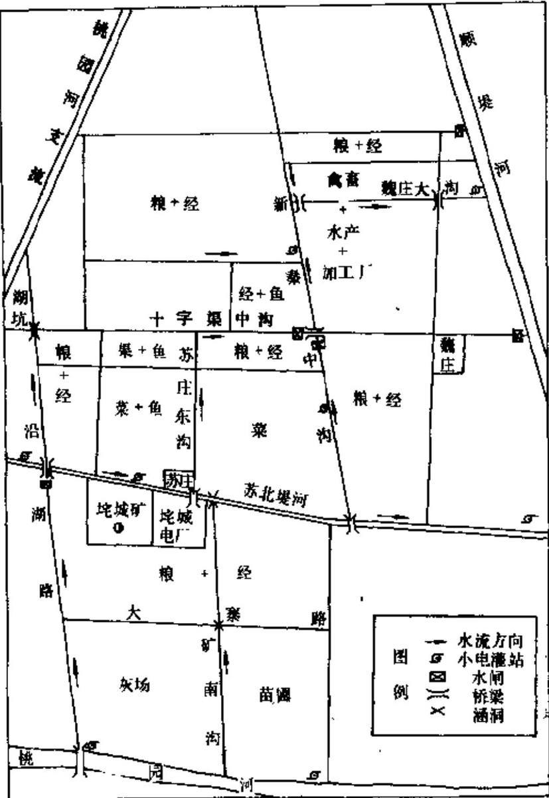  
图5-2 复垦示范区规划示意图  
Fig. 5—2 Sketch map of reclamation planing of Tongshan demonstration project

## 六、复垦示范工程投资效益分析

## 1. 经济效益分析

对不同复垦土地利用方向分别进行预测，然后进行总体评价，结果如表5-9。

表 5-8 示范工程各项投资汇总表  
Tab 5—8 Investmant prediction of demonstrotion project
<table><tr><td rowspan=1 colspan=2>工程类别</td><td rowspan=1 colspan=1>投资预算(万元)</td><td rowspan=1 colspan=2>说                  明</td><td rowspan=1 colspan=1>占总投资比例（%）</td></tr><tr><td rowspan=9 colspan=1>基础工程</td><td rowspan=1 colspan=1>防洪工程</td><td rowspan=1 colspan=1>79.8</td><td rowspan=1 colspan=2>包括两条人河塌陷破坏维修，河长4.38km，共计土方量约7.98万m³</td><td rowspan=1 colspan=1>1.04</td></tr><tr><td rowspan=1 colspan=1>排涝工程</td><td rowspan=1 colspan=1>541.33</td><td rowspan=1 colspan=2>两座28.4 个流量的翻水站建设</td><td rowspan=1 colspan=1>7.05</td></tr><tr><td rowspan=1 colspan=1>疏浚工程</td><td rowspan=1 colspan=1>80.0</td><td rowspan=1 colspan=2>5条大沟因塌陷破坏目前排水不畅，为节省投资、准备重新维修使用5条大沟累计土方约8.2万m³</td><td rowspan=1 colspan=1>1.04</td></tr><tr><td rowspan=1 colspan=1>新开挖排水工程</td><td rowspan=1 colspan=1>542.3</td><td rowspan=1 colspan=2>计开挖二条中沟、一条大沟及条公路河，累计土方约 541870m³</td><td rowspan=1 colspan=1>7.06</td></tr><tr><td rowspan=1 colspan=1>降渍工程</td><td rowspan=1 colspan=1>27.0</td><td rowspan=1 colspan=2>降渍沟累计长15km</td><td rowspan=1 colspan=1>0.35</td></tr><tr><td rowspan=1 colspan=1>桥梁、涵洞</td><td rowspan=1 colspan=1>1240.0</td><td rowspan=1 colspan=2>8 座大中型桥涵及 15 座小型桥涵</td><td rowspan=1 colspan=1>16.15</td></tr><tr><td rowspan=1 colspan=1>灌溉工程</td><td rowspan=1 colspan=1>460.0</td><td rowspan=1 colspan=2>6座小型电灌站、25km灌溉渠及5门水闸</td><td rowspan=1 colspan=1>5.99</td></tr><tr><td rowspan=1 colspan=1>道路工程</td><td rowspan=1 colspan=1>343.0</td><td rowspan=1 colspan=2>累计公路长43.5km，其中Ⅰ级公路3. 5km，二级公路14km，三级公路26km</td><td rowspan=1 colspan=1>4.47</td></tr><tr><td rowspan=1 colspan=1>小  计</td><td rowspan=1 colspan=1>3313.4</td><td rowspan=1 colspan=2></td><td rowspan=1 colspan=1>43.16</td></tr><tr><td rowspan=10 colspan=1>复鱼星利用工程</td><td rowspan=1 colspan=1>农业用地</td><td rowspan=1 colspan=1>1566</td><td rowspan=1 colspan=2>利用方向包括粮食作物，经济作物如药材、茭白，莲藕等面积约6003亩，土方量约261万m3</td><td rowspan=1 colspan=1>20.40</td></tr><tr><td rowspan=1 colspan=1>菜篮子工程</td><td rowspan=1 colspan=1>263.4</td><td rowspan=1 colspan=2>面积1730亩，土方量约43.9万m3</td><td rowspan=1 colspan=2>3.43</td></tr><tr><td rowspan=1 colspan=1>塘（含特种养殖）</td><td rowspan=1 colspan=1>1777.2</td><td rowspan=1 colspan=2>面积1912亩，土方量约21.5万m³</td><td rowspan=1 colspan=2>23.15</td></tr><tr><td rowspan=1 colspan=1>林果地</td><td rowspan=1 colspan=1>221.2</td><td rowspan=1 colspan=2>面积960亩，工程量约21.6万m³</td><td rowspan=1 colspan=2>2.88</td></tr><tr><td rowspan=1 colspan=1>畜牧业</td><td rowspan=1 colspan=1>221.0</td><td rowspan=1 colspan=2>包括12000m²的建筑、350亩饲料地平整等费用养鸡50000只、猪500头、奶牛350头</td><td rowspan=1 colspan=2>2.88</td></tr><tr><td rowspan=1 colspan=1>农副产品加工厂</td><td rowspan=1 colspan=1>34.0</td><td rowspan=1 colspan=2>包括8000m²的建筑。饲料加工厂的厂址平整费不包含在内</td><td rowspan=1 colspan=2>0.44</td></tr><tr><td rowspan=1 colspan=1>农贸市场</td><td rowspan=1 colspan=1>50.0</td><td rowspan=1 colspan=2>占地15亩</td><td rowspan=1 colspan=2>0.65</td></tr><tr><td rowspan=1 colspan=1>试验投入</td><td rowspan=1 colspan=1>262.8</td><td rowspan=1 colspan=2>包括400 余亩复垦费和试验研究费66.3万元</td><td rowspan=1 colspan=2>3.42</td></tr><tr><td rowspan=1 colspan=1>其它费用</td><td rowspan=1 colspan=1>60.0</td><td rowspan=1 colspan=1>包括资料、鉴定、讨论等不可预见费等</td><td rowspan=1 colspan=2>0.78</td></tr><tr><td rowspan=1 colspan=1>小计</td><td rowspan=1 colspan=1>4364.0</td><td rowspan=1 colspan=2></td><td rowspan=1 colspan=2>56.84</td></tr><tr><td rowspan=1 colspan=2>总计</td><td rowspan=1 colspan=1>7677.4</td><td rowspan=1 colspan=1></td><td rowspan=1 colspan=2>100</td></tr></table>

表5-9 复垦效益预测表  
Tab 5—9 Prediction of profit of reclaimed land
<table><tr><td rowspan=1 colspan=2>利用方向</td><td rowspan=1 colspan=1>农业种植</td><td rowspan=1 colspan=1>蔬菜基地</td><td rowspan=1 colspan=1>林果地</td><td rowspan=1 colspan=1>渔业</td><td rowspan=1 colspan=1>畜牧养殖及加工</td><td rowspan=1 colspan=1>总体</td></tr><tr><td rowspan=1 colspan=2>面积（亩）</td><td rowspan=1 colspan=1>6003</td><td rowspan=1 colspan=1>1730</td><td rowspan=1 colspan=1>960</td><td rowspan=1 colspan=1>1912</td><td rowspan=1 colspan=1>1050</td><td rowspan=1 colspan=1>11655</td></tr><tr><td rowspan=4 colspan=1>投资</td><td rowspan=1 colspan=1>次性投入</td><td rowspan=1 colspan=1>3472-6</td><td rowspan=1 colspan=1>775.2</td><td rowspan=1 colspan=1>412.5</td><td rowspan=1 colspan=1>2390.8</td><td rowspan=1 colspan=1>626.3</td><td rowspan=1 colspan=1>7677.4</td></tr><tr><td rowspan=1 colspan=1>年投入（元/亩）</td><td rowspan=1 colspan=1>250</td><td rowspan=1 colspan=1>500</td><td rowspan=1 colspan=1>500</td><td rowspan=1 colspan=1>1800</td><td rowspan=1 colspan=1>500</td><td rowspan=1 colspan=1>1050</td></tr><tr><td rowspan=1 colspan=1>单产值（元/亩）</td><td rowspan=1 colspan=1>1500</td><td rowspan=1 colspan=1>2500</td><td rowspan=1 colspan=1>2400</td><td rowspan=1 colspan=1>5600</td><td rowspan=1 colspan=1>9500</td><td rowspan=1 colspan=1>4400</td></tr><tr><td rowspan=1 colspan=1>单产值（万元）</td><td rowspan=1 colspan=1>903.45</td><td rowspan=1 colspan=1>432.5</td><td rowspan=1 colspan=1>278.4</td><td rowspan=1 colspan=1>1070.7</td><td rowspan=1 colspan=1>997.5</td><td rowspan=1 colspan=1>3679</td></tr><tr><td rowspan=1 colspan=2>纯收入（万元）</td><td rowspan=1 colspan=1>250.4</td><td rowspan=1 colspan=1>346</td><td rowspan=1 colspan=1>182.4</td><td rowspan=1 colspan=1>726.6</td><td rowspan=1 colspan=1>472.5</td><td rowspan=1 colspan=1>2683</td></tr><tr><td rowspan=1 colspan=2>服务年限（年）</td><td rowspan=1 colspan=1>20</td><td rowspan=1 colspan=1>20</td><td rowspan=1 colspan=1>20</td><td rowspan=1 colspan=1>20</td><td rowspan=1 colspan=1>20</td><td rowspan=1 colspan=1>20</td></tr><tr><td rowspan=1 colspan=2>投资回收期（年）</td><td rowspan=1 colspan=1>7</td><td rowspan=1 colspan=1>4</td><td rowspan=1 colspan=1>5</td><td rowspan=1 colspan=1>6</td><td rowspan=1 colspan=1>3</td><td rowspan=1 colspan=1>4</td></tr></table>

对表5-9说明如下：

(1)年投入费用与收入计算中所用参数为柳新乡1993年工农业生产情况统计数据；

(2)服务年限指规划格局保持基本不变的年限；

(3)投资回收期计算考虑了货币的时间价值，基准贴现率取12%。

上述分析结果表明：粮食种植利用方向投资回收期较长，但由于本工程有高产禽畜养殖与加工利用项目，总体投资回收期适中。另外，种植疏菜和水产养殖效益也十分显著。

## 2. 生态环境效益预测

矿区土地塌陷造成原有生态系统失调，自然景观破坏。复垦示范工程实施后，土地荒芜、旱涝频繁的农业生态环境可以得到彻底改善，当地农民还可在过去的废坑或茅草地上建起种养加、贸工商一体化的现代化农场。

## 3. 社会效益预测

工程实施后，累计增加农业用地面积6000亩，达全部复垦区的50%左右，满足了该区农村居民的强烈要求。尤其是农业高产高效，使该区的年产粮达900万kg，彻底改变了该区农村严重缺粮问题。

本区复垦期间动用近70万个劳工日，复垦完毕后，可解决近3000人的劳动就业问题，基本消除了该区农村剩余劳动力就业问题。农民有地可种，将安居乐业，缓和了工农业争地矛盾，密切了工农关系。

另外，示范区每年有大量菜、鲜鱼、水果及禽蛋等充实城乡市场。预测每年可提供865万kg蔬菜、130万kg鲜鱼，以及大量的蛋、奶、禽等。这完全满足了附近企业职工和居民的生活需要，丰富了城镇居民的菜篮子。其社会效益相当可观。

## 第五节 大黄山煤矿西翼塌陷区土地复垦综合治理规划设计方案论证

## 一、概述

## 1. 课题简况

铜山县《大黄山煤矿西翼塌陷区土地复垦综合治理规划设计》课题是铜山县复垦总体规划的一部分，1991年底完成。该课题在调查分析了大黄山煤矿西翼塌陷地的治理现状、耕地破坏程度、土地利用现状的基础上，对该片塌陷地进行了科学的分类和分区，提出了该区复垦的指导思想及排涝降渍方案、分区治理方案、分期实施规划，并对有关工程的技术经济指标和塌陷地的稳定性进行了详细论证和比较。1992年起，大黄山乡并始分期实施规划设计的复垦工程，工程全部实施后共复垦采煤塌陷地4980亩，总投人413:3万元，亩均复垦投入830元/亩。若不进行规划设计，每亩投入最小为3000元/亩，按此计算本区共节约复垦投资1080.7万元。经过规划的复垦土地用地结构合理，整体抗灾能力强，经济效益显著。该项目于1993年获国家土地管理局优秀成果一等奖、科技进步三等奖。本节简要介绍该课题中利用投资回收期与净现值率选择复垦方案的方法。

## 2. 复垦规划区概况

大黄山乡位于徐州市东20km，有徐州市东大门之称。该乡交通便利，通往贾汪、连云港的307公路横穿复垦区。复垦区位于大黄山矿井田西翼上方，东以矿区铁路专用线为界，西以西三排洪道为界，北至老徐贾公路，南至房亭河，总面积3.32km²，合4 980亩。

本区主要为大黄山煤矿开采西翼煤层所致，最大塌陷深度4.5m左右。可采煤层三层，大黄山矿主采3层(俗称夏桥系)，煤层平均厚度6m，小湖系和屯头系煤层为薄煤层，平均厚度1m左右，浅部为江都县小煤矿、佟台小煤矿、新沂杨台小煤矿所采。经稳定性论证知本区稳定塌陷地面积占60%，近期不能稳定的塌陷地占40%，不能稳定的塌陷地将来下沉量在1.0m以下。

## 二、复垦区排涝方案及论证

本区复垦的关键是消除地表积水，防止洪涝灾害，对塌陷引起的附加坡度，需进行平整或分区改造成具有一定落差的梯级农田。

本区治理的有利条件之一就是地表水系发达，如图5一3所示。本区南部边界房亭河已经改造成徐洪河（引洪泽湖水解决徐州地区用水紧张状况的引水河道）的一段，近期排涝水位为32.13m，远期排涝水位为32.63m。北部边界有不牢河和大运河穿过，复垦区正北部大运河段十年一遇洪水位为31.13m，解台闸下游十年一遇水位为28.5m，常年水位为27.0m，不牢河已废弃。复垦区范围内还有三条南北向排洪道可供使用。

根据水系分布与水文资料和当地地形条件，提出两种排涝方案，即：

方案一：改造不牢河，本区汇水经不牢河自排到大运河解台闸下游。

方案二：在西二排洪道与房亭河相连处建闸和翻水站，强排至房亭河。

方案一的优点有：①自流排水便于管理和维修，可节约电费、维修费和排水站建设费；②既能解决本区排水问题，尚有大运河与不牢河间2000亩低洼地和大黄山煤矿东翼塌陷地可从中获益；③疏浚不牢河可获得部分土方用于复垦工程。其缺点是：一次性投资大，总费用在1100万元左右。

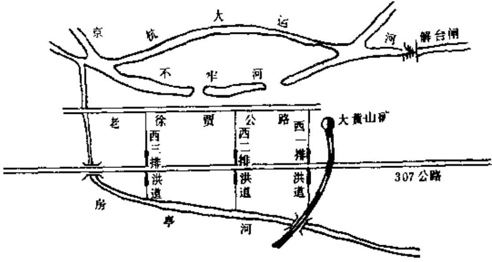  
图5-3 大黄山复垦区排水条件  
Fig. 5—3 Present drainage system tn reclamation area !

方案二的优点有：①一次性投资少，水利工程量也较小；②近期容易实施；③大黄山乡已在房亭河与西二排洪道连接处建闸一座，汛期用抽水机排水，这些设备可利用。缺点是：需要长期维修；只解决4980亩农田排水问题。

经概预算，我们将两方案的主要技术经济指标列于表5-10。  
表5-10的投资收益情况可概括为图5—4所示。

表 5-10 两种排涝方案的主要技术经济指标  
Tab 5—10 Main technological and economic indexes of two draibage alternatives
<table><tr><td>指标 方案</td><td>初期投资 (万元)</td><td>年运行费 用（万元) 三</td><td>收益土地 面积（亩）</td><td>年净增收 益（万元）</td><td>投资加收 期（年）</td><td>净现值率</td></tr><tr><td>方案</td><td>1600</td><td>2</td><td>10980</td><td>239.4</td><td>11.77</td><td>1.123</td></tr><tr><td>方案</td><td>413.5</td><td>2C</td><td>4980</td><td>149.4</td><td>4.04</td><td>2.004</td></tr></table>

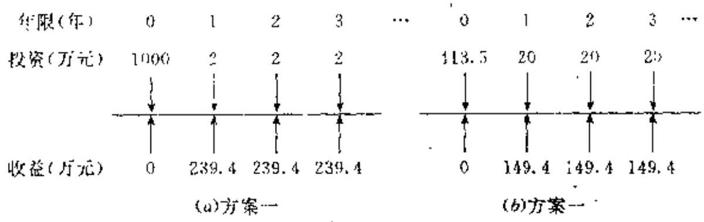  
图5-4 两种排涝方案的投资收益情况  
Fig. 5 -4 Investment and profit of two alternatives in different year

关于两种排涝方案主要技术经济指标的说明：

（1）初期投资中，方案一包括疏浚不牢河的投资与规划复垦的4980亩土地复垦工程投资；方案 $\fallingdotseq$ 包括建翻水站费用和4980亩土地复垦工程投资。

(2)年收益中，亩均净增收益按300元/亩计算。方案一的年净增收益包括4980亩土地的全部净增收益和其它6000亩土地净增收益的一半；方案二的年净增收益包括4980亩土地的全部净增收益。

(3)投资回收期计算考虑货币的时间价值，按下式用内插方法得到：

$$
\sum _ { i = 1 } ^ { P _ { r } } \mathcal { E } _ { a } ( 1 + i , ) ^ { - \varepsilon } = P _ { 0 } + \sum _ { i = 1 } ^ { P _ { r } } \mathcal { P } _ { a } ( 1 + i , ) ^ { - \varepsilon }\tag{5-9}
$$

式中 $P _ { \varepsilon }$ ——投资回收期，年；

$E _ { \ast }$ -——年增净收益，万元；

$i ,$ ——基准收益率，取10%；

$P _ { i j }$ ——初期投资，万元；

$\phi _ { \mathfrak { u } }$ -年运行费用，万元；

1年限、年。

(4)净现值率按下式计算：

$$
N P V R = \frac { N P V } { I _ { \ast } }\tag{5-10}
$$

式中 NPVR-——净现值率；

NPV净增收益贴现至基准年的现值，万元；

$I _ { P }$ 所有投资贴现至基准年的现值，万元。

从表5-10看出无论是投资回收期还是净现值率都是方案二优于方案一。最终选择方案二。

## 三、地面整治方案及论证

复垦规划区内可采煤层三层，即夏桥系、小湖系和电头系三组煤层。目前地表塌陷主要是受夏桥系煤层开采的影响，小湖系和屯头系浅部为小煤矿所采，深部尚未开采。若考虑大黄山煤矿将来开采小湖系煤层和屯头系煤层，复垦投资收益与用地结构将有较大的变化。因此针对两个未采煤层：地表整治有如下三种方案：

方案一；只考虑夏桥系煤层开采的影响。将复垦后地表最低标高定为29.6m。

方案二：考虑小湖系和屯头系煤层的影响。将受影响的土地一次抬高至30.5m，将来塌陷后标高不低于29.6m。

方案三：分期实施方案二。分期实施方案二的思想是；先按方案一治理规划区，待再次塌陷后，进行二次复垦达到方案二的要求，技术关键是在第一次复垦时，使鱼塘间距适当大些，以便二次复垦时扩塘取土抬高低洼地，达到土地重新利用的目的。

以上三种方案的用地结构与初期投资分别如表5—11。

方案一的投资回收期与净现值率已在前面计算过，这里主要讨论方案二与方案三的投资收益情况。方案二和方案三的投资收益情况如图5—5所示。

表5-11 三种地面整治方案的主要指标  
Tab 5—11 Comparison of three alternatives for surface preparation
<table><tr><td rowspan="2">指 方 标 案</td><td rowspan="2">初期投资 (万元)</td><td colspan="3">用地结构 (亩)</td><td rowspan="2">年增收益 (万元)</td></tr><tr><td>粮食种植</td><td>多种经营 (含鱼塘)</td><td>其它</td></tr><tr><td>方案一</td><td>413.5</td><td>3285.7</td><td>594.6</td><td>1099.7</td><td>149.4</td></tr><tr><td>方案二</td><td>840.0</td><td>2904.6</td><td>1021.1</td><td>1054.3</td><td>192.1</td></tr><tr><td>方案三</td><td>413.5</td><td>近期同方案一，远期同方案二</td><td></td><td></td><td>149.4</td></tr></table>

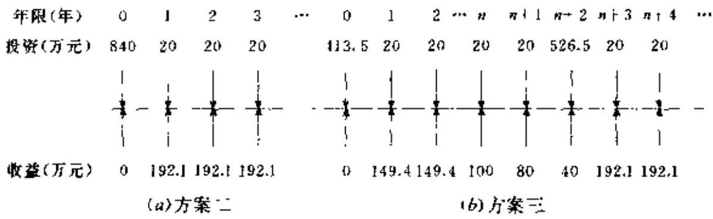  
图 5-5 地画整治方案的投资与收益情况  
Fig. 5 —5 Investment and profit of three alternatives in different year n一第一次复垦的n年后开采小湖系和屯头系煤层

按前述方法计算三个方案的投资回收期与净现值率，如表5-12。

表5-12 三个地面整治方案的投资回收期与净现值率  
Tab 5—12 NPVR and Ip of three alternatives
<table><tr><td rowspan=2 colspan=1>方        案指标</td><td rowspan=2 colspan=1>方案一</td><td rowspan=2 colspan=1>方案</td><td rowspan=1 colspan=3>方案三</td></tr><tr><td rowspan=1 colspan=1>n=5</td><td rowspan=1 colspan=1>=8</td><td rowspan=1 colspan=1>.n=10</td></tr><tr><td rowspan=1 colspan=1>净现值率NPVR</td><td rowspan=1 colspan=1>2.004</td><td rowspan=1 colspan=1>1.469</td><td rowspan=1 colspan=1>1.578</td><td rowspan=1 colspan=1>1.681</td><td rowspan=1 colspan=1>1.743</td></tr><tr><td rowspan=1 colspan=1>投资回收期 $I ^ { * } { } _ { i }$ (年)</td><td rowspan=1 colspan=1>4.04</td><td rowspan=1 colspan=1>7.03</td><td rowspan=1 colspan=3>4.04+3.5=7.54</td></tr></table>

表5—12中n=5表示第一次复垦工程实施5年后，开采小湖系和屯头系煤层。由表5一12看出，方案一只有当小湖系和屯头系两层煤不采时才可行，方案二与方案三相比，投资回收期相差不大，但方案三的净现值率明显优于方案二，因此最终选择方案三作为地面整治方案。

从本例还可得出两个结论，即：①在动态沉陷区进行复垦是可行的，条件是第-一次复垦到第二次开采沉陷影响发生的间隔时间应大于第一次复垦工程的投资回收期；②在开采沉陷区采取预治理措施，即一次复垦到位与分期实施相比哪种方案更优越需要通过经济评价确定，本例说明预治理是不可取的。

第六节 铜山县矿区土地复垦规划的实施

矿区土地复垦规划是实现矿区土地复垦规范化管理的重要手段，但规划的最终目标是实施复垦规划。根据我国复垦的实际情况，保障矿区土地复垦规划顺利实施的关键措施包括组织保障、资金保障、政策保障、技术保障等四方面，除此之外，建立科学的复垦立项审批管理制度也是十分必要的。

## 一、铜山县采煤塌陷地复垦规划概述

早在《土地复垦规定》颁布之前，铜山县土地局就会同有关单位对全县采煤塌陷地的开发利用进行了规划和可行性研究。在调查、勘测的基础上，铜山县采煤塌陷地复垦规划按地表稳定程度、地貌类型、土壤类型等因素，将全县塌陷地分为四个区两个类型，即塌陷稳定积水区、塌陷不稳定积水区、塌陷稳定不积水区、塌陷不稳定不积水区四个区和高潜水位平原区、中低潜水位丘陵地区塌陷地两种类型，对不同类型不同分区的塌陷地提出了治理措施和土地利用方向。《土地复垦规定》颁布之后，铜山县成立了以县长为组长，分管副县长为副组长的县土地复垦领导小组，进一步提出了“县乡规划、村组实施、突出造地、综合利用、重点扶持、政策优惠、每年万亩、三效丰收、振兴铜山”的复垦目标。在规划实施过程中，铜山县坚持规划与计划相结合，制定了一系列优惠政策，技术上严格把关，建立了复垦周转金制度和立项审批验收等制度，全县复垦率逐年提高，到1995年底，全县总复垦率达50%左右。

铜山县土地复垦规划实施管理程序可概括为图5—6所示模式。

## 二、土地复垦周转金制度—资金保障

落实土地复垦资金是土地复垦规划能否实施的关键。《土地复垦规定》中对各类废弃地复垦资金来源作了原则性规定，在中国土地学会土地复垦分会组织召开的几次全国性学术会议上，许多专家也曾提出过多种解决我国复垦资金渠道的建议，但这些规定和建议在实施过程中都必须有一系列配套政策加以保障。事实上到目前为止，我国尚没有建立一套完整的解决复垦资金来源与配套政策的办法，尤其是针对各地区特点的解决方法，如徐州矿区为老矿区，《土地复垦规定》颁布前废弃地数量较大，复垦资金难以落实，又如唐山等地土地破坏较为严重，单位面积的复垦投入较大，而开滦矿务局又是老企业，负担较重，复垦资金又如何解决？

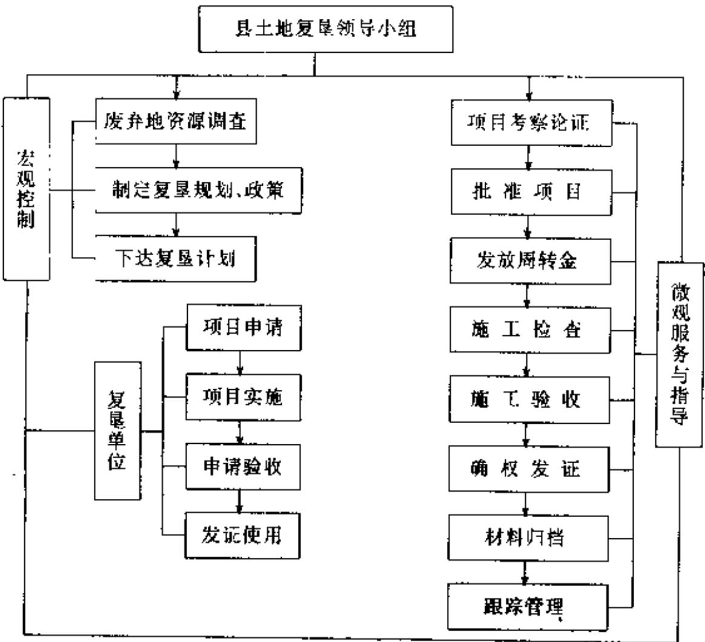  
图 5—6 矿区土地复垦规划实施管理程序  
Fig. 5—6 Practice and management process of mined land reclamation planning

铜山县土地局以《土地复垦规定》和江苏省《关于加强土地复垦工作的通知》和《江苏省土地复垦实施办法》等文件为基础，经过几年的摸索，建立了土地复垦周转金制度，行之有效。

所谓复垦周转金，就是复垦单位每复垦一亩废弃地，县财政提供无息周转金1000元，并从投放资金后的第六年开始归还，三年还清，投放资金时由复垦单位和土地管理部门签定经济合同书。该项资金来源有：①耕地占用税县、乡留成部分和向矿方收取的吨煤2元补贴留成中提取的50%用作土地复垦周转金；②按省、市有关部门规定收取的非农建设用地有偿使用费主要用于土地复垦；③徐州市政府90（2）号文规定收取的有关费用。

在县政府下达年度复垦计划时，还要求复垦单位自筹资金1000元/亩，这样对难度不大的废弃地复垦资金就有了保障。

## 三、土地复垦立项审批验收制度—技术保障

土地复垦立项审批验收制度是监督复垦规划实施和实行规范化管理的重要手段。

## 1. 主项条件

①必须属于《土地复垦规定》所界定的复垦对象，即生产建设过程中挖损、塌陷或压占的土地。

②必须具有可复垦价值。复垦单位申请立项前，应自行作规划、估算及可行性研究工作，论证复垦对象的可垦性和社会、经济价值。

③必须具备书面报告，包括立项申请表、复垦场地现状图和复垦工程规划图，即两图一表。

## 2. 主项审批

各乡镇根据县下达的年度复垦计划，分期排出切实可行的复垦项目，由承担复垦任务的单位写出书面报告。书面报告的内容包括基本情况、复垦理由、复垦规划、措施、投入人力、物力情况，复垦后的经济、社会与环境效益等，同时填写县土地管理局统一印制的土地复垦项目申报表，并附报两图一表。图纸比例尺一般应为1：500或1：1000，图上四至界限应清楚，高程、水位等与复垦工程量、复垦技术可行性有关的数据应准确无误。两图一表一式五份，经乡镇土地管理所审查、乡镇政府认可后报县土地管理局审批。

项目审批时，由县土地复垦领导小组组织专门技术人员，对复垦现场进行考察，综合分析现状与规划、投入与产出效果，论证复垦项目的可行性，最后由县土地管理部门行文批复。通过立项审批的项目方可进行实施，并在复垦项目实施前签定经济合同书，发放复垦周转金。

## 3. 项目的检查验收

对立项复垦的项目，县土地复垦领导小组有权随时检查复垦进度和质量。立项复垦的项目竣工后应在一个月内向项目批准单位提交书面报告申请验收，在申请验收报告中应提供如下材料：①上级批准的土地复垦文件及附件，即两图一表和有关论证材料；②复垦后土地的坐落、面积、范围示意图；③土地复垦协议书；④新复垦土地的利用计划及效益分析；⑤竣工决算书。

收到项目申请验收报告后，由县土地复垦领导小组组织财政、水利、农业、林业、计划、规划、资源、土地及项目所在乡镇等部门人员，按照申报项目的内容和验收标准逐项验收。验收标准包括：①申请验收所需的资料应完备；②新复垦土地的坐落、面积、范围、权属与批准文件应一致；③田间工程达到设计标准；④综合抗灾能力达到当地中上等地的水平；⑤复垦后的土地使用权明确、合法；⑥各类复垦用地应满足表5一13的要求。

按上述标准验收合格后，由铜山县人民政府颁发“土地复垦验收合格证”，作为地籍管理和落实有关优惠政策的依据，并作进一步跟踪服务和管理工作。

## 四、土地复垦任务作为指令性计划制度与土地复垦保证金制度—政策保障

县政府委托县土地管理局和计划委员会每年对各乡镇、有关企业下达复垦计划，并纳入指令性序列。对完不成复垦任务的乡镇，则停止审批三项建设用地，并由土地管理部门给予一定的经济处罚。对因建设、生产等挖废的耕地，责成用地单位把土地复垦任务列入总体规划，并在办理建设用地审批手续前，与土地管理部门签定土地复垦合同，同时每亩交纳1000元的保证金。项目复垦结束后，由土地管理部门按合同规定组织验收，符合要求的退回保证金；不符合要求的，限期完成。建设用地单位如不能履行复垦合同，则按《江苏省土地复垦实施办法》要求交纳土地荒芜费，并处以罚款。

表513 铜山县土地复垦验收标  
Tab 5- 13 Acceptarce standards of $\vdots \vdots \downarrow 1 ^ { 4 } \uparrow ^ { 4 } \downarrow ^ { 4 } 1 \uparrow 3 2 \downarrow ^ { 4 } \uparrow$ 二 engincering at Tongshan County
<table><tr><td rowspan=1 colspan=1>用地类型</td><td rowspan=1 colspan=1>验收指标与要水</td></tr><tr><td rowspan=1 colspan=1>耕地</td><td rowspan=1 colspan=1>地表平整，平整度≤10°；#作层30~50cm；有保水保能能力，有控制水土流失的工程和生物措施；田间工程配套，能灌能排</td></tr><tr><td rowspan=1 colspan=1>鱼塘</td><td rowspan=1 colspan=1>水深保持在2.5~3.0m；成色塘面积10亩左右，角种塘5市东右；塘堤宽度不小于10m；池底向侧倾斜成龟背形；水源充足，排灌配套；水质符合渔业水质标准：精养鱼塘距塌陷人水面50m以上11</td></tr><tr><td rowspan=1 colspan=1>果园</td><td rowspan=1 colspan=1>土层厚度6Q~100cm；地5水位1m以F；PH值：6~7：土质以沙壤土或两合士为宜；交通方便，防止污染；能排能灌</td></tr><tr><td rowspan=1 colspan=1>建设用地</td><td rowspan=1 colspan=1>覆土厚20cm以上；平整度 $\approx 2 0 ^ { \circ } ,$ 道路通畅；饮用水源符合卫生标准；地基处理经过论证并有严格的施工管理程序</td></tr></table>

实行土地复垦优惠政策；经县批准复垦的单位或个人，享有土地使用权，由土地管理部门颁发土地使用证。复垦后用于种植粮棉油作物、发展果林、禽畜养殖业的不增加粮棉油合同定购任务，所得收入从有收益之日起，五年内免缴农业税和农林土特产税。对连片开发复垦项目，给予少回收周转金奖励。其中当年复垦当年收益的项目，一般每亩少回收周转金300元；当年复垦项目第二年收益的少回收周转金100元；对于复垦后种植粮棉油作物的，可再度少回收周转金数量。

## 五、铜山县复垦土地经营管理模式

铜山县在废弃地复垦初期，由于土地权属界限不清，复垦土地的责权利不明，所在乡村集体和个人，往往出于解决当地人们生活困难的想法，只对废弃土地略加平整，顺势种植、养殖，大多停留在一种自发、粗放的状态，将复垦看作是增加收入的“拾边”，经营管理处于一种放任的、单纯的小农经济状况，因此，复垦进度缓慢，复垦质量低劣。

《土地复垦规定》颁布后，铜山县的废弃地复垦经营形式有了较大转化，大多以乡村投资，乡村复垦，无偿或低偿分给群众种植养殖。这种复垦经营管理形式，很好地解决了土地复垦的投资和质量问题，但复垦的效益仍很低，其原因是，改造后农田土壤结构较差，水面水质不肥，十分不利于初季的种植养殖，加上农民无改土种植经验，因而投入大、产出低。这样直接影响了群众复垦利用的积极性，有的干脆抛荒搁置。这种国家出优惠政策、集体出资金复垦、农民无偿使用的经营体制，实践证明效果不好。

1993年前后，铜山县分别在拾屯乡周屯村、刘集乡冯王村的塌陷地复垦上，对过去的复垦经营方式率先进行了改革，具体做法是：坚持土地集体所有制形式，集体做出实施规划，请有关部门论证后，统一标准，放手交给群众出资开发复垦，7\~8年免收任何费用，到期后收归集体使用。群众复垦的积极性被充分调动了起来，有一农户贷款开发复垦塌陷地10亩，复垦的耕地种粮种菜，复垦的水面养鳖、养鱼，又在田埂上建起了家禽饲养场，采取生物链形式种养，结果一年时间就获纯利润15000元，效果十分明显。受其启发，群众争先承包开发，复垦的局面迅速打开。实践证明，复垦经营体制的转换，必须充分考虑复垦经营者的自身利益。“谁复垦，谁收益”是我们应始终如一坚持的复垦原则。在这一原则指导下，铜山县还在全县探索了以下几种复垦经营模式：

(1)国家出资复垦、实行适度规模经营。这种模式适应于撤组转户后国有土地的复垦。其优势在于：便于统一规划，统一开发，统一配套，合理调整产业结构，便于运用先进科学技术，有利于资源的优化配置，能满足区域化、专业化、商品化的要求，其产品的市场竞争能力较强。采取此经营形式，徐州通运综合开发公司开发复垦土地1.3万亩。

(2)集体出资，招标复垦，招标经营。这种模式适应于集体经济实力雄厚的地区，其优点是有利于集体经济的积累。但应进一步完善双层经营体制，合理调整集体、承包人的利益分成，以利于调动各方复垦的积极性。此形式应用较为广泛。

(3)个人承包复垦经营和个人联合承包复垦经营。其优点是有利于复垦资金的筹集，复垦进度快，见效也快。此经营形式在柳新乡蒋楼村应用最为成功。

(4)企业、事业单位出资，集体复垦，联合经营。这是一条较为开放的复垦经营形式，此经营方式在柳新乡魏庄村等地应用较为成功。

(5)企业出资，集体复垦，集体或个人承包经营，这是在国家政策指导下，企业履行复垦责任和集体享有补偿的利益在复垦上的结合，此形式在铜山县采煤塌陷地复垦应用中也较为广泛。

另外，铜山还探索并鼓励外商独资或联合开发、股份制等筹集社会闲散资金开发复垦经营，以上这些经营形式的探索，调动了国家、集体、个人的能动性，为全县废弃地复垦的资金筹集和高质量、高效益复垦作出了贡献。

## 六、铜山县矿区土地复垦成果

铜山县采煤塌陷地总量为14.98万亩，近1万ha。到1995年底，全县有规划、有步骤复垦的塌陷地约3000ha，加上企业复垦为建设用地，娱乐用地，以及农民自发零星复垦的塌陷地2000ha，累计复垦采煤沉陷地5000ha左右，采煤塌陷地复垦率在50%以上。几年来，全县共开挖土石方5000多万m，投资1.4亿元，复垦利用后，年增产粮食2784万kg，水产品910万kg，农副业产值达2.5亿元，累计安排剩余劳动力4.6万人，不仅改变了矿区荒凉的面貌，还使塌陷地复垦成为农村经济发展的新的增长点，实现了基建用地与复垦土地的收支平衡。建立了柳新魏庄综合复垦示范区、石头阵生物链复垦示范区、常宏复垦开发区、大黄山综合复垦示范区等规模连片复垦示范工程，还涌现了土楼、苏庄、蒋楼等特色复垦典型。

## 参考文献

[1]国家上地管理局土地利用规划司，《土地复垦规定》问答，1989年2月

[2]卞正富、高潜水位矿区土地复垦模式研究，徐州：中国矿业大学硕士:论文，1989年12月

[3]下正富，采煤塌陷地基塘复垦模式及应用，矿山测量，1996年第1期

[4]张国良、卞正富，矿区土地复垦规划的内容及方法，中国土地科学，1992年第6期

[5] R. J. Sweigard and R. V. Ramani. Site planning process: Application to land use potential evalnation for mined land. Mining Engineering. June 1986

[6] L.R. Hossner. Reclamation of Surface-Mined lands. Boca Raton, Florida: CRC Press, lnc. 1988

[7] Bian Zhengfu. Land Realamation Engineering in Mine Areas. In: AKM Raibow ed. Reclamation, Treatment and Utilizatioa of coal Mining Wastes— Proceedings of the 3rd International Symposium, Glassgow, 1990, Rotterdam: AA Balkema, 1990. 77\~83

[8]赵景逵，矿区土地复垦技术与管理，北京：农业出版社，1993.年

[9] I. G. Richards, J P Palmer and PABarratt. The reclamation of former coal mines and Steelworks -- Studies in Environmental Science 56. London: ELSEVIER. 1993

[10]史蒂斯，被采矿破坏上地的复垦上作，土地复垦技术，1990年3、4期

[11] R. V. Ramani and R. J. Sweigard. lmpacts of Land use planning on mineral resources: Mining Engineering. April 1984. 362\~368

[12]顾强，环境质量评价与环境影响评价，中国矿业大学内部讲义，1988年

[13李广新、生态农业应用技术，合肥：中国科学技术大学出版社，1991：111

[14]郑濯清、水文水利计算，北泉：水利电力出版社，1991年

[15]何国清，矿山开采沉陷学，徐州：中国矿业大学出版社，1991年

[16]周昌寿，露天矿边坡稳定，徐州：中国矿业大学出版社，1990年

[17] M. M. Singh and S. Bhattacharya, Proposed criteria for assessing subsidence,damage to renewable resource lands. Mining Engineering. Match 1987: 189\~193.

[18]卞正富、张国良，矿区上地复垦时土方量的计算问题，土地复垦技术，1993年第3期

[19]李根福，土地复垦知识，北京：冶金工业出版社，1991年

[20]承泓良、林锦国，灰色系统决策与应用，南京：江苏科学技术出版社，1989年

2]]刘永刚，灰色系统理论在准北矿区土地复垦中应用研究（指导教师：张国良)，徐州：中国矿业大学硕士论文，1994年

[22]中国矿业人学土地复垦课题组，铜山县万亩塌陷地高效复垦示范工程研究报告，1994年

[23]卞止富、张国良，高潜水位矿区土地复垦的工程措施及其选择，中国矿业大学学报，1991年第3期

[24]李勤良等，县级土地复垦规划编制的几点探讨，见：土地复垦论文选编(一)，中国土地学会土地复垦分会秘书处，1992

[25]中国矿业大学土地复垦课题组，沛县煤矿塌陷地综合开发利用基地建设报告，1994

[26]中国矿业大学与铜山县土地局土地复垦联合课题组，铜出县五废地开发复垦与管理技术途径研究。1995

[27]河南省土地勘测规划队等，平顶山市郊区土地复垦可行性研究，见：上地复垦论文选编（一），中国土地学会土地复垦分会秘书处，1992

[28]前苏联农业部，国家标准一需复垦的破坏土地分类，译文见《土地复垦技术》，1993. 3

[29]孙浩鹏、秦德仁，淮北矿区粉煤灰复田欧美杨生长的利害因素及立地条件，连云港：第二次煤矿土地复垦学术讨论会交流论文，1990年

[30Bian Zhengfu, Computer aids reclamation plan in mine areas. In: Proceedings of International land reclamation and mine drainage conference. Pittsburgh, US. 1994

[31]卞正富，煤矿区土地复垦的适宜性评价方法研究，见：青年学术文集，中国煤炭学会青年工作委员会编，北京：煤炭工业出版社，1994年

[32]林家聪、下正富，矿山开发与土地复垦，中国矿业大学学报，1990年第2期

[33]卞正富、林家聪，煤矿区土地复垦的规划问题，煤炭学报，1992年第1期

[34]卞正富，煤矿区塌陷地农业开发模式及其选择方法，见：徐州市首届青年学术年会论文集，徐州市首届青年学术年会执行委员会编，徐州：中国矿业人学出版社，1993年

[35]左军，层次分析法中判断矩阵的间接给出法，系统工程，1988年第6期

[36]下正富，矿山上地复垦费用构成与成本分析，有色金属（季刊），1996年第1期

[37]下正富、张国良，采煤塌陷地疏排法复垦原理与实践，中国矿业大学学报，1996年第4期

[38]张绍良，煤矸石允填复垦相关问题的探讨（指导教师：张国良)，徐州：中国矿业大学硕上论文，1992年

[39]下正富、张国良，疏排法复垦设计的内容和方法，煤矿环境保护，1995年第5期

[40]笪建原、凌庚娣，开采沉陷区最优水面率及复垦规模初探，见：土地复垦论文选编（一），中国土地学会土地复垦分会秘书处编，1992年

[41]中国水产学会科普委员会，淡水养鱼实用技术手册，北京：科学普及出版社，1992年

[42]钟功甫等，基塘系统的水陆相互作用，北京：科学出版社，1993年

[43]王万茂，土地规划，南京：江苏科学技术出版社，1987年

[44]孙绍先，关于煤矿复垦的几个问题，见：土地复垦论文选编（一），中国上地学会土地复垦分会秘书处，1992年

[45]周锦华，动态沉陷区贮灰场及其复垦设计，见：同上

[46]许燮谟等，土地利用工程，北京：农业出版社，1987

[47] 11. ↓1. 波波夫，矿区复土中的矿山测量，王金庄译，北京：煤炭工业出版社，1990年

[48]林鹰，矸石山复垦造林技术的研究，见：矿山废地复垦与绿化，周树理编，北京：中国林业出版社，1995年

[49]胡振琪，煤矸石山水分特性及其对绿化造林的影响，见：同上

[50]于洪冰等，华丰矿研石山造林及生态效应的研究，见：同上

[51] K. G. Evans. Erosion Prediction models and factors affecting the application of the universal soil loss equation to post-mining landscapes in central Queensland. ln. Proceedings of Queensland coal symposium. Brisbane 29—30 Aug. 1991: 123\~132

[52]代宏文、澳大利亚矿山复呈现状，见：矿山废地复垦与绿化，周树理编，北京：中国林业出版社，1995

537郭继光，露天矿土地复垦理论分析与覆盖上改良的试验研究（指导教师：单忠健)，北京：中国矿业大学北京研究生部博士论文，1996年

[54]C. G. 道恩，矿业与环境保护、祁兴久译、北京：中国建筑工业出版社，1982年

[55]严志才，土地复垦，北京：学苑出版社，1990年

[56] M. Phillips, The use of computer aided design for mining spoit management and landscape reconstruction. In: Environmental Issues and Waste Management in Energy and Mineral Production, Singhal et al. (eds). Rotterdam, Balkema. 1992: 1307\~1317

[57]卞正富，矿区土地复垦经济评价指标体系，见：95'全国矿山测量学术会议论文集，中国测绘学会矿山测量专业委员会编，太原，1995

[58]中国矿业大学土地复垦课题组。铜山县万市采煤塌陷地高效农业复垦示范工程可行性研究报告，1991年

[59]董德显，土地利用规划，中国展望出版社，1990年

[60]中国矿业大学三下采煤与土地复垦课题组，徐州矿区小蔡庄村下采煤及塌陷区综合治理研究报告，1996年

61]笪建原，高潜水位平原矿区水面积优化与综合治理研究（指导教师：凌庚娣)，徐州：中国矿业大学硕上论文，1990年

[62]G. P. 琼斯，煤出研石山绿化，见：煤矸石复田处理利用国际会议论文集，煤炭部环保办编译，1985年

[63]J. 查尔斯，煤矸石作充填材料的一些土工技术问题，见：同上

[64]E. 布伦特，英国煤炭局八十年代的复田技术、见：同上

[65]K. 辛丁. 矿物开采中土地使用问题，国外金属矿山，1995年第6期

[66]R. C. 费里亚斯，过去、现在和未来的环境管理法规，国外金属矿山，1996年第1期

[67] C. II. 布雷金，复垦过程中废石场边坡的平整，国外金属矿山，1996年第4期

[68] S. K. Mukhopadhyay, Environmental ramifications in Surface mining with respeet to land degradation ·under Indian context, Journal of Mines, Minerals &. Fuels. Aug -Sep., 1994

[69]L. Holla. The impact of land subsidence due to underground coal mining on the Surface environment. ln: Environmental lssues and Waste Management in Energy and Minerals Production. Singha) et al. (eds) Rotterdam; Balkema, 1992

[70] K. C. Kuo and T. R. West. Reclamation of a gob pile in southwest lndiana, an innovative approach. ln: Proceedings of 1990 National Symposium on Mining. Kentucky. May, 1990

[71] A. K. M. Rabow Reclamation, Treatment and.Utilization of coal Mining Wasfes. ELSEVIER, 1987

[72]煤炭科学研究院北京开采所，煤矿地表移动与覆岩破坏规律及其应用，北京：煤炭工业出版社，1981

Document generated by Anna's Archive around 2023-2024 as part of the DuXiu collection (https://annas-blog.org/duxiu-exclusive.html).

Images have been losslessly embedded. Information about the original file can be found in PD   
PDF attachments):   
"before\_pdg2pic\_conversion": {   
"filename": "MTEwNTA3Mjcuemlw",   
"filename\_decoded": "11050727.zip",   
"filesize": 2796223,   
"md5": "a87502a7a678bfc8b4bbd4250a71c392",   
"header\_md5": "eeb3f368e48ad232392bf09055d7de15",   
"sha1": "63df65d4498ec154853b40ada36cc6f1ab4b4781",   
"sha256": "e7014597548604a1ecd7b1036a527cfa88a362fb21a9da95f9112ce0caaaeb0a",   
"crc32": 3140464691,   
"zip\_password": "",   
"uncompressed\_size": 2784697,   
"pdg\_dir\_name": "",   
"pdg\_main\_pages\_found": 205,   
"pdg\_main\_pages\_max": 205,   
"total\_pages": 220,   
"total\_pixels": 0   
},   
"after\_pdg2pic\_conversion": {   
"filename": "MTEwNTA3Mjcuemlw",   
"filename\_decoded": "11050727.zip",   
"filesize": 5485250,   
"md5": "69fa2a3869edae551284ac6d444c60a8",   
"headermd5": "53c03bc8e27418d3676756db7f9f9599",   
"sha1": "61c4c4a8fb25eabb7b1d94712f3f4e3a9caa1f2b",   
"sha256": "d4df0f2423b61c7999c0897a465e13f582eccb05306c66c645d2d9a2bd4645c1",   
"crc32": 4235849717,   
"zip\_password": "",   
"uncompressed\_size": 5482667,   
"pdg\_dir\_name": "",   
"pdg\_main\_pages\_found": 205,   
"pdg\_main\_pages\_max": 205,   
"total\_pages": 220,   
"total\_pixels": 211366016   
},   
"pdf\_generation\_missing\_pages": false   
一
