# 北京土壤流失方程

Beijing Soil Loss Equation

刘宝元 毕小刚 符素华 等著

## 北京土壤流失方程 Beijing Soil Loss Equation

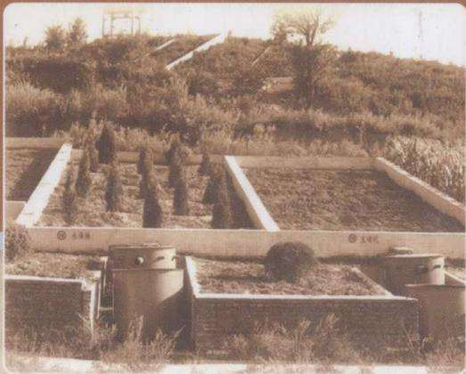

定价：50.00元

# 北京土壤流失方程

刘宝元 毕小刚 符素华等著

## 内容简介

本书包含北京土壤侵蚀研究的最新成果。全书以北京土壤流失方程为主线，系统地介绍了北京土壤流失量的预报方法，包含基本方程、各土壤侵蚀因子的计算公式、降雨侵蚀力、土壤可蚀性等基础数据库。全书共分9章，第一章主要介绍了土壤侵蚀基本概念：第二章重点介绍了土壤侵蚀模型的研究现状和北京土壤流失方程的基本形式；第三章介绍了降雨侵蚀力因子；第四意介绍了十壤可蚀性因子；第五章介绍了地形因子；第六章为覆盖与管理因子：第七章论述了水土保持工程措施因子；第八章主要介绍了容许土壤流失量与十壤流失方程应用：第九章重点介绍了北京土壤流失方程用户指南。

本书可供水土保持、水利、地理、资源、环境、生态等方面的管理者、科技工作者以及高等院校相关专业的师生参考阅读。

图书在版编目(CIP) 数据

北京土壤流失方程/刘宝元等著.一北京：科学出版社，2010.5

ISBN 978-7-03-027385-7

I. ①北… Ⅱ.①刘… Ⅲ.①土壤侵蚀-研究-北京市 Ⅳ.①S157.1

中国版本图书馆CIP数据核字（2010）第077570号

责任编辑：朱海燕韦沁孙艳冬/责任校对：郑金红

责任印制：钱玉芬/封面设计：王浩

科學出版社出版

北京东黄城根北街16号

邮政编码：100717

http://www.sciencep.com

中国科学院印刷厂印刷

科学出版社发行 各地新华书店经销

2010年5月第 一版开本：787×10921/16

2010年5月第一次印刷印张：121/4

印数：1—1500

字数：273000

定价：50.00元

(如有印装质量问题，我社负责调换)

## 前 言

土壤侵蚀是主要的环境问题之一，在长期的生产实践和研究中，人们对土壤侵蚀的认识越来越深入。美国水土保持之父Bennett曾指出：当人们举斧砍向森林，扶犁犁入土地时，土壤侵蚀就伴随着人类，造成危害甚至灾难。土壤侵蚀，即风和水对地表的分离和搬运，是一个随时随地发生的自然地表过程。土壤侵蚀主要是由于开垦农田、过度放牧、砍伐森林和不合理开发项目等造成的，其危害主要包括当地危害和异地危害两方面：当地危害主要是造成水土流失、生产力下降、土地沙化及侵蚀沟的出现，甚至彻底破坏土地资源：异地危害主要是淤积河渠，引发洪水、沙尘暴和水污染等。

北京市是国际性大都市，市政府在生态建设和环境保护方面做了大量工作，并取得了明显效果。但由于其人口众多、地位重要，土壤侵蚀的防治问题仍然不敢有半点松懈。北京山区，尤其是村镇居民点附近和果园地的土壤流失问题非常突出，不但给当地造成巨大损失，更直接威胁包括密云水库等重要饮用水源在内的下游地表水水质。要有效减少和控制这些危害就必须认识土壤侵蚀发生机理，定量评价土壤流失量，定量预报各种土地利用、田间管理和水土保持措施对土壤侵蚀的影响。土壤侵蚀预报方程就是这样一个技术工具。土壤侵蚀模型或土壤流失方程的发展需要大量的基础数据观测资料。北京从1986年起建立了11个坡地径流监测站、127个坡面径流小区，共积累了11.6万条径流和泥沙资料，为北京土壤流失方程的建立奠定了基础。近年来北京市水务局和有关高校及科研院所的合作研究取得了大量成果，这些研究成果为土壤侵蚀模型的建立提供了保障。

本书以北京土壤流失方程为核心，以技术手册的形式系统介绍了土壤流失量的计算程序与方法，包括基本模型、各参数的获取方法或子模型，参数和子模型包括降雨侵蚀力、土壤可蚀性、地形、覆盖与管理和水土保持工程措施等6个因子；此外对计算机模型的使用、容许土壤流失量和基础数据库也做了介绍。

北京土壤流失方程的建立以及本书的完成是北京市水务局和有关高校及科研单位多年努力的结果。北京市水土保持工作总站下属单位密云、怀柔、延庆、门头沟、房山等区县水土保持试验站在野外观测中做了大量工作。方岚、赵玉明、杨威、刘和平、刘英娜、郭中领、王向亮等在试验研究中作出了贡献，在此一并感谢！

## 目 录

前言  
第章引言…1  
1.1土壤侵概念………………………………………………………………………………………………………1  
1.2土壤侵蚀类型…………………………………………………………………………………………………1  
1.3土壤侵蚀危害……………………………………………………………………………………………………2  
1.4北京土壤侵蚀概况…………………………………………………………………2  
1.5 北京水土保持现状………………………………………………………5  
参考文献……  
第二章土壤流失方程简介………7  
2.1 国内外土壤侵蚀模型简介……7  
2.1.1 国外土壤侵蚀模型研究发展……………7  
2.1.2 国内土壤侵蚀模型研究进展…………………………………10  
2.1.3 计算机技术、遥感技术与GIS技术在土壤侵蚀模型中的应用…………………………13  
2.2 北京土壤流失方程……………………………………………………14  
参考文献…15  
第三章降雨侵蚀力因子………………………17  
3.1 降雨侵蚀力指标………………………………………………………………………17  
3.2 侵蚀性降雨标准……………………………………………………………………………18  
3. 2.1 降雨量标准…19  
3. 2.2 最大 30 min 雨强标准…………… 22  
3.3 降雨侵蚀力因子的计算方法………………………22  
3.3.1 次降雨侵蚀力计算……………………………………………………………………22  
3.3.2日降雨侵蚀力计算……………………………………………………………………………………26  
3.3.3 月降雨侵蚀力计算…………………………………………………………………………………28  
3. 3.4 年降雨侵蚀力计算………………………………………………………………………………28  
3.4 降雨侵蚀力季节变化…………………………………………………………30  
3.5 多年平均年降雨侵蚀力等值线图…………32  
参考文献34  
第四章土壤可蚀性因子………………………36  
4.1概述36  
4.2 北京土壤可蚀性因子……………………………………………………41  
4. 2.1 标准小法41  
4.2.2 人工降雨试验法…………42  
4. 2.3 公式估算法…46  
4. 2.4 诺谟图法47  
4.2.5 北京土壤可蚀性因子分布图……………………………………………………49  
参考文献…51  
第五章地形因子…………………………………………………………………………………………………………52  
5.1 坡度因子… 52  
5.1.1 玻度对土壤侵蚀的影响………………………………………………………………52  
5.1.2 坡度因子计算公式 …………………………………………………… 56  
5.2 坡长因子…… 56  
5.2.1 坡长对土壤侵蚀的影响……………………………………………………………………57  
5.2.2 坡长因子指数……57  
5.2.3坡长因子计算公式………60  
5.3地形因子值的计算………………………………………………………………………………60  
5.3.1直型坡全坡平均地形因子值……………………………………………………………61  
5.3.2 分段坡地形因子值的计算……………………………………………………………………63  
参考文献……  
第六章覆盖与管理因子………………70  
6.1概述70  
6.2农地覆盖与管理因子……72  
6.2.1冠层覆盖子因子……………………73  
6. 2.2地表覆盖子因子…………………………………………………………73  
6.3 草地覆盖与管理因子……………75  
6.4林地覆盖与管理因子…………76  
6.5多年平均覆盖与管理因子……………77  
参考文献…… 0  
第七章 水土保持工程措施因子………82  
7.1 梯田措施因子………………………………………………………………………………………………82  
7.2 水平条措施因子………………………………………………………………………83  
7.3鱼鳞坑措施因子……………………………………………………………………………………………85  
7.4 树盘措施因子……………………………………………………………87  
参考文献…… …88  
第八章 容许土壤流失量与土壤流失方程应用…………89  
8.1概述…… 9  
8.2 容许土壤流失量确定方法…………92  
8.2.1 专家经验法… 92  
8.2.2 土层厚度划分法……93  
8.2.3 成土速率平衡法…93  
8.2.4 侵蚀与生产力关系法 …94  
8.3 北京容许土壤流失量……………………96  
8.3.1 容许土壤流失量模型的建立…………………………………………………96  
8.3.2 北京主要土属的容许土壤流失量值……………………98  
8.4 土壤流失方程应用……… … 100  
8.4.1 土壤流失方程验证……………  
8.4.2 确定土地利用和工程措施类型…  
8.4.3 建设项目用地土壤流失量估算 …102  
参考文献……  
第九章 北京土壤流失方程用户指南……105  
9.1 总体设计 ………  
9.2 系统安装与运行…… … 107  
9.3 因子计算菜单…………………………………………………………………………………………………………109  
9.3.1 降雨侵蚀力因子子菜单……………………………………………110  
9.3.2 土壤可蚀性因子子菜单……………………………………………………………………123  
9.3.3 坡长坡度因子子菜单……………………………………………127  
9.3.4 覆盖与管理因子子菜单…………132  
9.3.5 水土保持工程措施因子子菜单………  
9.4土壤流失量计算菜单……  
9.4.1 新建预报表菜单  
9.4.2 打开预报表模块  
9.5 数据库模块…… … 146  
9.5.1 数据库设计  
9.5.2 数据库操作  
9.5.3 数据表组织  
9.6 地图功能模块

## 第一章 引 言

## 1.1 土壤侵蚀概念

在土壤侵蚀或水土保持科学的理论与实践中，经常使用以下3个术语：土壤侵蚀(soil erosion)、土壤流失（soil loss） 和水土流失（soil and water loss)。虽然这 3个术语有其自明性，但人们的理解各有不同。相关学者和书籍对它们的解释或用词会有所不同，但本质上都比较一致，符合其基本含义。

在进行土壤侵蚀的调查、计算和科学评价中，最常用的3个主要术语是：土壤侵蚀量、土壤流失量和产沙量。英国学者Kirkby和Morgan（1980）对这3个术语给出了较为清晰的定义：土壤侵蚀量是指雨滴和径流对土壤移动的总量，土壤流失量是指土壤被移出一个具体的坡面或田块的数量，产沙量是指泥沙被输送到一个特定点（断面）的数量；在很小的面积内，三者基本一致。一般情况下，产沙量或流失量为侵蚀量减去沉积量；产沙量是从河道和水库的角度，关心有多少泥沙进入其中；流失量是从田地的角度，关心某一特定田块上有多少土壤流走，造成土壤肥力和经济损失；土壤侵蚀量是一个理论值，一般不可能测量得到。水土流失是对土壤和水分损失的综合描述，有些中国学者则认为是水蚀过程中的水分和土壤损失，不包含风蚀；美国学者一般认为水土流失就是水分和土壤的损失，同时包括水蚀和风蚀造成的损失。水土流失实质是对自然界水分和土壤损失现象的通俗和综合描述。在科学调查中，一般只调查土壤流失量，水的损失则是通过蒸发、地表径流等进行水量平衡计算。

## 1.2 土壤侵蚀类型

土壤侵蚀按侵蚀营力划分，主要分为水力侵蚀（water erosion）和风力侵蚀（winderosion)。水力侵蚀按侵蚀形态划分，又可分为片状侵蚀（sheet erosion)、细沟侵蚀(rill erosion)、浅沟侵蚀（ephemeral gully erosion)和切沟侵蚀（gully erosion)。此外还有各种特殊的侵蚀形态，如台状侵蚀或鳞片状侵蚀（fish scale erosion)、洞穴侵蚀（tunnel erosion）等。最常出现在农田上的侵蚀，按其发生位置可分为细沟间侵蚀（in-terrill erosion）和细沟侵蚀（rill erosion)；按侵蚀营力可分为雨滴击溅侵蚀（溅蚀，raindrop splash erosion） 和径流冲刷侵蚀（runoff erosion)。

片状侵蚀是指在一个坡面上相对均匀地侵蚀掉一层土壤，侵蚀过后的坡面上没有明显差异；与之相区别的是细沟侵蚀，是指坡面上集中小股流的侵蚀现象。在一次或几次侵蚀后，坡面上会出现明显的小沟痕，这种小沟称为细沟（rill）。细沟的宽、深一般各为几厘米到十几厘米，一般的耕作器具能够将其消除。细沟间侵蚀是指发生在细沟与细沟之间的片状侵蚀或溅蚀。浅沟（ephemeralgully）是比细沟大、比切沟小的一种坡面小沟，一般的耕作器具可以通过，但犁耕后仍能看到痕迹，形成浅沟过程中造成的土壤侵蚀称为浅沟侵蚀。经过多次的侵蚀和耕作或其他过度放牧等活动，在坡面上形成垂直于等高线的凹形地，这种凹地再经历暴雨或融雪径流，就更容易形成浅沟侵蚀，甚至切沟侵蚀。切沟（gully）是在坡面上或古代侵蚀沟底部形成的、一般耕作工具不能通过的侵蚀沟，大多数切沟的深、宽各为几十厘米到几米，纵剖面多跌水，切沟在形成和发展过程中造成的侵蚀称为切沟侵蚀。台状侵蚀（鳞片状侵蚀）是指地面有局部保护、周围侵蚀明显的一种侵蚀现象；洞穴侵蚀在黄土高原尤为普遍，是地表以下的侵蚀现象。

## 1.3 土壤侵蚀危害

土壤侵蚀危害根据其影响地域分为当地（on-site）和异地（off-site）两种情况。对土壤流失发生区的影响称为当地影响，主要是指由于土壤流失造成的土地肥力和生产力的下降。例如，根据《2007年北京市水土保持公报》①，2007年北京山区土壤流失量为229万t，径流中流失的总氮239t，总磷97t，CODMn1625t。北京山区土壤土层厚度小于30cm的土地占山区总面积的40%以上，严重的土壤流失使得农业产量低而不稳，坡耕地产量仅为1500～3000 kg/hm²。

对土壤流失发生区下游的影响称为异地影响，主要是指土壤流失对水体质量的影响和造成的河道湖库的淤积。从河流湖库等水体中的污染物数量来看，源于土壤流失的最多，严重影响了水体水质。根据密云水库2001～2005年逐月水质监测结果（张晓岚等，2006），密云水库周边地区的水土流失造成了水库60.23%的氮污染问题，其中从农田流失的143.73t氮，是造成2001～2005年密云水库水体三氮浓度逐步上升的重要原因。目前，潮白河流域农田对所施化肥的利用率仅为30%～60%，其余的通过分解、渗漏和淋溶等方式流失，污染了水体，导致水库水体的富营养化。水土流失产生的大量泥沙进入河流湖库，造成河道堵塞、水库淤积，严重影响了航道和水库使用寿命，同时也降低了河道、水库的泄洪能力。据不完全统计，自1955年官厅水库建成蓄水到2000年以来，已淤积逾7亿m³的泥沙，官厅水库向下游输沙总量为4.25亿t（刘世海等，2008)。向下游输沙进一步造成永定河下游河床的淤积，目前永定河北京段河床比堤外高出了3\~5m，成了地上悬河。

## 1.4 北京土壤侵蚀概况

北京地处华北平原北端，燕山山脉和太行山山脉交汇处，总面积16410km²，其中山区面积10072km²，占总面积的61.4%，山高坡陡，坡度大于25°的面积占山区面积的46.7%。气候上北京属于温带半湿润季风气候，降雨主要集中于夏季的7～8月，来自东南方向太平洋的夏季暖湿气流，在遇到环绕北、西的山地后抬升，形成北京山区迎风坡的降雨丰沛地带。这一独特的降雨特征和地形条件导致北京山区严重的土壤侵蚀，其携带的面源污染物进入河流水库，是水库及城市污染严重的原因之一。新中国成立初期，全区土壤侵蚀面积 $6 6 4 0 ~ \mathrm { k m ^ { 2 } }$ ；到2000年，土壤侵蚀面积为 $4 0 8 9 \ \mathrm { k m ^ { 2 } }$ ，其中轻度侵蚀面积$2 9 7 5 ~ \mathrm { k m ^ { 2 } }$ ，中度侵蚀面积 $1 1 1 4 \ \mathrm { k m } ^ { 2 }$ 。土壤侵蚀类型主要包括水力侵蚀、重力侵蚀和局部地区的风力侵蚀；水力侵蚀又主要分为片状侵蚀和沟蚀，由于山区植被盖度低，荒草坡上主要是鳞片状侵蚀；重力侵蚀主要是泥石流，多集中在百花山、黑坨山、云蒙山、磨盘山和大石河低山河谷、清水河低山河谷、汤河的低山河谷等地区。根据《2007年北京市水土保持公报》①，山区坡地共形成地表径流31724万m³，土壤流失量229万t，总氮流失 $\downdownarrows$ $\mathrm { m } ^ { 3 }$ 239 t,总磷流失 97 t, $\mathrm { C O D } _ { \mathrm { M n } }$ 流失 1625 t，土壤侵蚀强度为 $2 0 0 \sim 1 0 0 0 ~ \mathrm { t / k m ^ { 2 } }$ 、1000\~$2 0 0 0 ~ \mathrm { { t / k m ^ { 2 } } }$ 和 $2 0 0 0 { \sim } 2 5 0 0 ~ \mathrm { t / k m ^ { 2 } }$ 的土地面积分别为 $1 8 8 6 ~ \mathrm { k m } ^ { 2 }$ $5 2 5 ~ \mathrm { k m } ^ { 2 }$ 和 $7 ~ \mathrm { k m } ^ { 2 }$ (图1.1）。土壤侵蚀主要发生在海拔低于1000m的荒草地、800m以下的林地（灌草坡）、低山村镇附近和山区与平原的交接带。海拔低于1000m的荒草地和800m以下的林地（灌草坡）多位于沟道山坡处，坡度较大，且多为人工林，侵蚀量仍然较大。低山村镇附近是人类生产、生活活动集中频繁的地区，坡耕地和经济林一般分布在该区域，植被覆盖较差，土壤侵蚀比较严重（图1.2）。山区与平原的交接带的人类开发建设活动强度大，人为破坏植被现象突出，土壤侵蚀相当严重，中度土壤侵蚀区多分布于此。

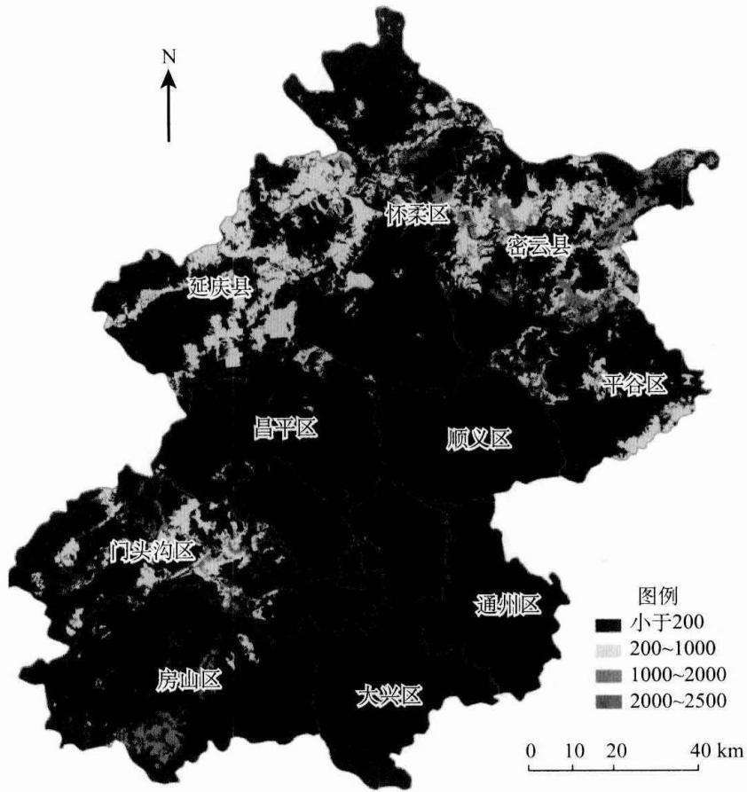  
图1.1 2007年北京土壤流失强度空间分布图（单位： $\mathrm { t } / \mathrm { k m } ^ { 2 } )$

b  
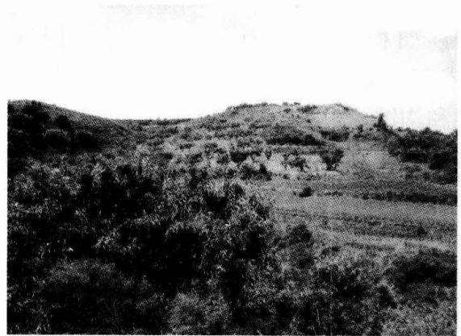

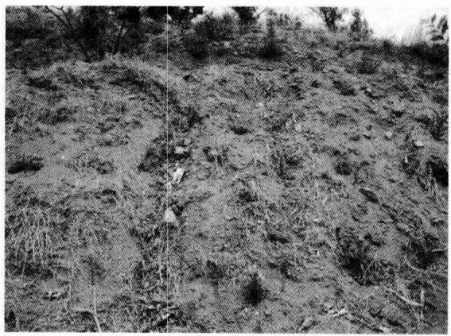  
图 1.2 北京土壤侵蚀景观  
a. 流域侵蚀景观；b. 坡面土壤侵蚀景观

为了有效地治理土壤侵蚀，北京市政府出台了《北京市人民政府关于划分水土流失重点防治区的通知》（京政发 $[ 2 0 0 0 ] 1 1$ 号)，把北京土壤侵蚀重点防治区划分为重点预防保护区、重点监督区和重点治理区（图1.3）。重点预防保护区是指目前土壤侵蚀强度较轻，林草覆盖度大，但存在潜在土壤侵蚀危险的区域，面积为4970km²；重点监督区是指资源开发和基本建设活动较集中和频繁，损坏原地貌并易造成土壤侵蚀，土壤侵蚀危害后果较为严重的区域，面积为1606km²；重点治理区是指原生的土壤侵蚀较为严重，对当地和下游造成严重土壤侵蚀危害的区域，面积为3496km²。

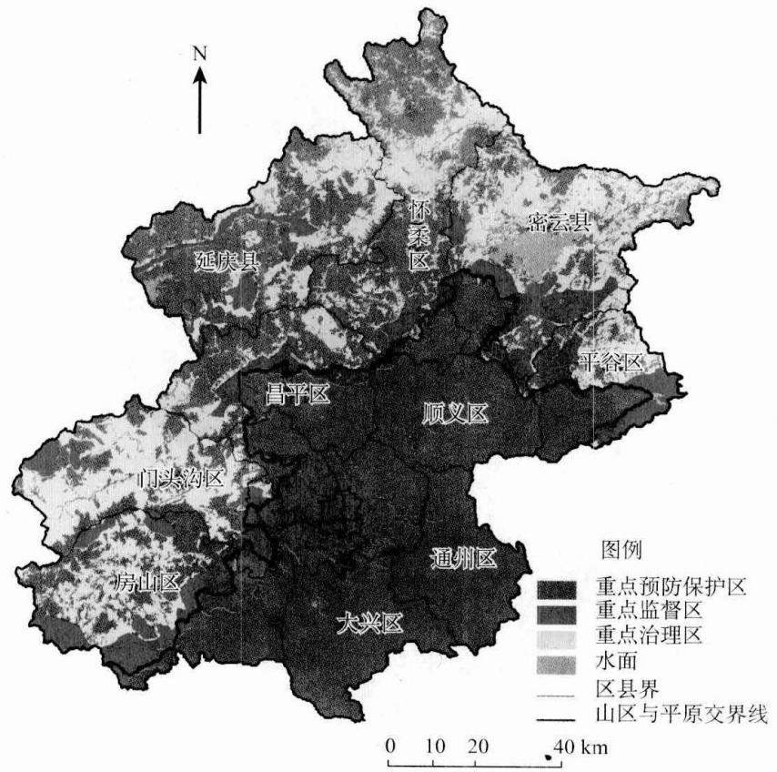  
图1.3 北京土壤侵蚀重点防治区划分布图  
资料来源：北京市水务局.2007.2007年北京市水土保持公报

## 1.5 北京水土保持现状

北京市政府一直十分重视山区的水土流失治理工作。到目前为止，北京山区的水土流失治理工作经历了6个阶段：1950～1958年为第一阶段，主要采用修梯田、垒坝阶、建护地坝、建护村坝等措施来恢复耕地，稳定粮食生产；1959～1969年为第二阶段，这一阶段开始出现了大规模开荒种地，植被遭到破坏，造成了新的水土流失，1963年以后，提出山区以水土保持、植树造林为中心的建设方针，水土保持工作得到恢复，并有了较大规模的发展；1970～1980年为第三阶段，主要是河滩造地，平整土地等农田基本建设；1981～1990年为第四阶段，主要进行水土流失综合治理，以小流域为单元，自上而下采取工程、生物和农业耕作措施，达到山、水、林、田、路综合治理；1991～2003年为第五阶段，以水土保持法为依据，以科技为先导，以预防监督和治理为手段，治山治水与脱贫致富相结合，由政府投资治理为主转向以农民承包租赁四荒（荒山、荒沟、荒滩、荒丘）为基础的户包治理，确定了农民的投资建设和经营四荒资源的主体地位，治理保开发，开发促治理，水土保持工作逐步走向法制化、规范化和投资多元化；2003年以来为第六阶段，确立了构筑“生态修复、生态治理、生态保护”三道防线，扎实推进生态清洁小流域建设的工作思路，并积极实践，探索出了一条水源地保护新途径。

北京山区主要的水土保持工程措施有梯田、水平条、鱼鳞坑和树盘，其中梯田面积200km²，水平条面积143km²，鱼鳞坑面积416km²。梯田主要是石埂水平梯田和土埂水平梯田两种，在坡度为15以下，土质较好、距村庄较近、交通便利的坡耕地、经济林用地宜修筑梯田；水平条与水平梯田类似，田面呈水平，但宽度较窄，各块水平条将坡面分割成整齐的台阶，适用于15°～25°的陡坡，水平条常用来种植水土保持林，根据所在地形条件，水平条宽度一般为1m或者2m；鱼鳞坑是工程措施和植物措施相结合的一种水土流失治理方法，主要用在地形破碎、土层较薄、不能采取带状整地工程的地方，其作用是保证树木的成活，由林木植被作为水土保持设施而长期发挥作用；树盘的半径为0.5～1.25m，适用于坡度为5°～15°，地形较为破碎的经济林地。

根据《2007年北京市水土保持公报》，各项水土保持措施共拦蓄水量3182万m³，减少土壤流失147万t，减少流失总氮76t、总磷47t，水土保持措施使密云水库入库泥沙量减少60%以上。总之，40多年来，北京市水土保持工作取得了一定成绩，治理效果较为显著，水土流失面积逐年减少；1949年北京山区水土流失面积为6640km²，1989年降到4830km²，1995年降到4396km²，2000年为4089km²；土壤侵蚀强度发展呈现出由强度→中度→弱度→微度的良好趋势，山区生态得到了改善。

## 参考文献

刘世海，胡春宏，李希霞，王净.2008.近50a来官厅水库上游流域泥沙输移平衡研究.水土保持通报，28（3）：128\~132, 172

张晓岚，陈哉君，温东辉.2006.密云水库水污染指标变化趋势分析.环境保护，9B（18）：63～65

Kirkby M J, Morgan R P C. 1980. Soil Erosion. New York: John Wiley and Sons Ltd, 51\~54

## 第二章 土壤流失方程简介

土壤流失方程是坡面土壤侵蚀模型中的一种表达方式，在水土保持建设中具有重要意义。一方面，土壤流失方程可以定量计算土壤流失量，评价研究区域土壤侵蚀发生的严重程度，为政府部门的正确决策提供基本的数据支撑；另一方面，土壤流失方程可用来比较不同治理措施的水土保持效益，为水土流失区提供科学的水土保持方案。因此，土壤流失方程是合理选择水土保持措施的有效工具，能够在水土流失治理过程的各阶段中都发挥重要作用。研究和开发北京土壤流失方程，对于治理北京山区水土流失、有效管理山区水土资源具有重要意义。

## 2.1 国内外土壤侵蚀模型简介

土壤侵蚀定量研究最早可追溯至19世纪末期，德国土壤学家Wollny于1882年通过布设径流小区，开始了土壤流失量的观测和侵蚀影响因子的定量研究，至今已有一个多世纪（Baver，1938）。随着国内外学者对土壤侵蚀规律认识的不断深入，以及水土保持工作的实际需求，土壤侵蚀模型研究受到越来越多的重视，并不断发展完善。根据建模手段和方法，可将土壤侵蚀模型分为经验统计模型和物理成因模型。经验统计模型通过试验资料和统计分析方法，确定出影响土壤侵蚀的因素，得出计算土壤流失量的方程式；物理成因模型以土壤侵蚀的物理过程为基础，利用水文学、水力学、土壤学、河流泥沙动力学以及其他相关学科的基本理论，根据已知降雨、径流条件描述土壤侵蚀过程，建立数学方程，从而预报给定时段内的土壤流失量。根据建模对象的不同，土壤侵蚀模型又有坡面土壤侵蚀模型和流域土壤侵蚀模型之分。

## 2.1.1 国外土壤侵蚀模型研究发展

在德国土壤学家Wollny于1882年定量观测土壤流失量的30年后，1912年美国科学家开始在犹他州中部过度放牧的牧草地上建立定量观测土壤流失量的径流小区①；随后在1917年，Miller在密苏里农业试验站建立了长90.75ft（27.66m）、宽6ft（1.83m）的径流试验小区（Miller，1926），现在所用的土壤侵蚀小区的概念正源于此；1920～1930年，美国农业部土壤局的土壤调查员Bennett（1939）开始意识到土壤侵蚀对人类生存所造成的威胁，并积极向政府和民众进行呼吁。在他的呼吁下，1929年美国国会拨款16万美元进行土壤侵蚀调查，并在10个土壤侵蚀严重区布设了水土保持试验站，在各个试验站修建了长72.6ft（22.13m）、宽6ft（1.83m）的径流试验小区（Meyer，1984），这些小区的建立标志着美国大规模水土保持研究工作的开始，Bennett因此被誉为“水土保持之父”。1936年，Cook提出了影响土壤侵蚀的7个主要因子：土壤可蚀性、侵蚀力、入渗能力、地表填洼能力、坡度、坡长和地表覆盖，为十壤侵蚀模型的发展提供了思路；1940年，Zingg首次建立了土壤侵蚀速率与坡度坡长的定量关系：一年后，在Zingg建立的关系式基础上，Smith（1941）增加了作物因子和水土保持措施因子对侵蚀的影响；Browning等（1947）又研究了土壤可蚀性以及轮作和经营管理因子对土壤侵蚀的影响；Musgrave（1947）综合分析了降雨、坡度、坡长、土壤可蚀性以及植被对土壤侵蚀的影响，建立了Musgrave方程；在美国农业部所属农业研究局、土壤保持局、公共道路局及国家气象局等单位领导的提议下，美国农业研究局于1954年在Purdue大学成立了国家水土流失资料中心，该中心主要负责收集、整理国内所有可得到的试验小区的降雨、径流和泥沙资料①，截至1955年，该中心收集了约8250个小区年和2500个流域年的资料（Wischmeier，1955）；到1978年，共收集了49个站点、10000多个小区近30年的资料②，Wischmeier和Smith②通过对这些资料的统计分析和系统研究，得到了经验性的通用土壤流失方程USLE（Uni-versal soil loss equation)。由于该方程基本上包括了影响坡面土壤侵蚀的主要因素，采用的资料范围较广，对变量进行了标准化处理，统一了模型形式，因此在世界各国得到了广泛应用。1985年，借助于计算机技术的发展，并利用最新研究成果，对USLE开始进行修正，于1997年完成，出版了修订版通用土壤流失方程RUSIE（Revised uni-versal soil loss equation）用户手册③。与 USLE相比，RUSLE最大的优点是用计算机软件编制成了计算机模型，同时利用了当时相关研究的最新研究成果，更仔细地考虑了影响土壤侵蚀的各个因子。例如，土壤可蚀性因子考虑了季节变化；植被覆盖与管理因子的计算采用了次因子法，通过估计各次因子的值，再相乘得到土壤流失率，不再使用基于观测数据的土壤流失率表；综合考虑降雨侵蚀力和作物覆盖的季节变化，把作物覆盖渐变的生长周期划分为若干个时间段，各个时间段的土壤流失率与相应降雨侵蚀力乘积的加权平均才是植被覆盖与管理因子值。尽管如此，该方程的通用性仍是有限的。例如，其中建立的坡度因子公式适用坡度范围为3%～18%①②③④，是否适用于其他坡度范围需要进一步研究。

1972年，美国颁布92-500号法令，提出保护和改善国家的水资源，并拨款对不同类型的非点源污染进行观测，以评价其影响。在这一背景下，美国先后建立了许多田块或流域尺度的土壤侵蚀模型，以下仅介绍几个比较有代表性的模型。Knisel①1980年建立了农业管理系统中化学物质径流和侵蚀模型 CREAMS（A field scale model for chemicals，runoff，and erosion from agricultural management systems)，主要对坡面田块尺度上的径流、土壤流失量以及因使用化肥和杀虫剂导致的化学污染物迁移进行预报，可用于评价不同农业管理措施下的非点源污染状况，以选择最优管理措施，模型包括径流、侵蚀产沙和化学污染物模拟3部分。径流计算采用曲线数（curve number）法或格林-安普特（Green-Ampt）下渗曲线法，具体选用哪种方法根据所能得到的资料情况而定；坡面土壤流失量计算采用USLE；汇沙计算采用Foster和Meyer（1975）提出的泥沙连续方程。由于其中的土壤流失方程包含了水土保持措施因子，因此可将模型应用于水土保持规划。流域尺度的流域环境响应的面源污染模型ANSWERS（Areal nonpointsource watershed environmental response simulation)(Beasley et al. , 1980) 是物理成因很强的分布式次降雨小流域土壤侵蚀模型，模拟时将小流域划分为若干网格单元，假设每个网格内的土壤、植被覆盖均匀分布，对每一个网格进行参数输入，然后计算每一网格上的径流、泥沙分散量、水流挟沙力以及流出网格单元的径流和泥沙量。该模型不仅可用于评价土地利用和农业管理措施等对土壤侵蚀和面源污染的影响，而且能够揭示土壤侵蚀的空间变化特征。Young等（1989）建立了次降雨农业非点源污染模型AGNPS（Agricultural nonpoint source)，也属流域模型，模拟时将流域划分为若干网格单元，在每一个网格单元上输入所需参数，单元格径流量计算采用曲线数法，土壤流失量计算采用USLE，模型中还包括养分随径流流失的预测。Arnold等（1990）研制的乡村流域水资源模型 SWRRB(Simulator for water resources in rural basins) 用来预报流域管理方案对流域水沙的影响，该模型以天为时间步长，能够模拟流域水文过程及其相关过程在很长时期内的连续变化，还考虑了气温、太阳辐射、蒸发和作物蒸腾等对水文循环的影响，虽然该模型为流域尺度的土壤侵蚀模型，但缺乏沟道的汇流汇沙计算。水土资源评价工具 SWAT(Soil and water assessment tool)②是在 SWRRB 基础上，进一步考虑了沟道汇流汇沙过程，并结合GIS技术建立的能适用于较大流域的土壤侵蚀模型，该模型也以天为时间步长。上述模型均涉及较多的因子，需要大量的输入参数，而这些参数并非在每个地方都能得到，从而会限制这些模型在资料缺乏地区的应用。1985年，美国农业部农业研究局、林业局、水土保持局及国家土地管理局开始组织建立水蚀预报机理模型 WEPP(Water erosion prediction project)③，以取代经验模型 USLE。该模型研究于1995年基本完成，是迄今为止最为复杂的描述与土壤水蚀相关物理过程的计算机模型，模型中涉及的过程包括降雨入渗、灌溉、地表径流、土壤分离、泥沙运移与沉积、植物生长和残茬分解等，能够模拟每天多层土壤含水量变化及作物的生长与残茬的分解，还能模拟耕作方式及土壤压实对土壤侵蚀的影响。该模型目前发布了坡面版、流域版和网格版3个版本，其中以坡面版最为完善。

土壤侵蚀模型在欧洲和非洲各国也得到较深入的研究。20世纪60年代初，Hudson通过对非洲侵蚀性降雨的深入研究，建立了土壤流失量与土壤类型、坡度、坡长、农业管理、水土保持措施和降雨等因素之间的关系（Kirkby andMorgan，1980）。Elwell（1980）建立的坡面土壤侵蚀模型，把土壤侵蚀环境分为气候、土壤、作物和地形4个自然系统，并将这4个系统有机地结合起来，构成一个完整的坡面土壤流失模型，该模型在南非地区得到广泛应用。澳大利亚Misra和Rose（1996）在Hairsine和Rose（1991，1992a，1992b）提出的坡面水流侵蚀理论及降雨溅蚀理论的基础上，提出了次降雨侵蚀产沙土壤侵蚀物理模型：格里菲思大学土壤侵蚀模型 GUEST(Griffith university erosion sys-tem template)。模型中考虑了有细沟和无细沟两种情况下的土壤侵蚀，较其他过程模型不同的是该模型还考虑了降雨和径流对新淤土层的二次分离、分散和搬运作用。Morgan等（1998） 建立的欧洲土壤侵蚀模型 EUROSEM（European soil erosion model)是物理成因很强的次降雨分布式土壤侵蚀模型，它将土壤侵蚀分为细沟间侵蚀和细沟侵蚀两部分，考虑了植被截流对下渗和降雨动能的影响，以及土壤表层岩石碎块覆盖对下渗、流速和溅蚀的影响，是现有物理成因模型中考虑土壤侵蚀影响因素最为详细的土壤侵蚀模型之一。荷兰的 De Roo（1996）建立的 Limburg土壤侵蚀模型LISEM（Lim-burg soil erosion model)也较详细地考虑了土壤侵蚀产沙的各个环节，能较好地模拟土壤侵蚀发生过程，并与GIS技术结合，是迄今为止最好的次降雨过程土壤侵蚀模型，但该模型中的许多参数不易获取，必须通过一系列野外观测试验才能获得，导致模型的运行费用较高。总的来说，国外的流域土壤侵蚀模型的框架结构已经比较成熟，但是由于国外土壤侵蚀主要发生在缓坡上，而我国在大于15°的陡坡耕地上土壤侵蚀严重，因此我国流域土壤侵蚀模型不能照搬国外模型。国外对流域土壤侵蚀模型的研究为建立我国流域土壤侵蚀模型提供了很好的思路。

## 2.1.2 国内土壤侵蚀模型研究进展

我国从20世纪40年代初开始对土壤侵蚀进行定量观测，并根据坡面径流试验小区资料建立了坡面侵蚀经验公式（刘善建，1953)。80年代初USLE被引进到我国，鉴于它是经验模型，必须对因子的取值方法重新进行研究，国内学者对USLE在中国的应用开展了广泛研究。例如，张宪奎等（1992）利用黑龙江省克山县、宾县和牡丹江市的坡面径流试验小区资料，分析确定了降雨侵蚀力计算公式、土壤可蚀性因子值、地形因子计算公式、玉米和大豆等农作物不同生育期以及年平均的覆盖与管理因子值、草原和森林的覆盖与管理因子值以及水平梯田和生物防冲带等工程措施的水土保持措施因子值；黄炎和等（1993）利用福建省东南安溪官桥径流试验场的资料，确定出该区的土壤可蚀性因子值、地形因子计算公式、大豆和绿豆不同作物生育期的覆盖与管理因子值；林素兰等（1997）利用辽宁省西丰县安民乡泉河小流域的坡面径流小区资料，确定了土壤可蚀性因子值、坡度因子计算公式、玉米大豆轮作的作物管理因子和等高垄作的耕作措施因子值：杨子生（1999）利用云南省的东北山区昭通市和东川市的坡面径流场资料，确定了降雨侵蚀力计算公式，土壤可蚀性因子值，地形因子计算公式，玉米、大豆和马铃薯不同生育期以及年平均的覆盖与管理因子值，水平梯田和生物防冲带的水土保持措施因子值；Liu等（2002）建立了中国土壤流失方程 CSLE（Chinese soil lossequation)，可计算坡面多年平均年土壤流失量，该模型确立了中国土壤侵蚀预报模型的基本形式，简单实用；史景汉（1991）利用陕西省绥德辛店沟、子州及山西省离石径流场的观测资料，定量分析了降雨、坡度、坡长和植被覆盖对土壤流失的影响；吴发启等（1998）在系统分析了淳化县泥河沟流域径流小区资料及彬县、黄龙、永寿、耀县和西峰部分径流小区试验资料基础上，建立了土壤流失量与 $P I _ { 3 0 }$ (侵蚀性降雨量P与最大30 min降雨强度 $I _ { 3 0 }$ 的乘积)，坡度和坡长的相关关系。

我国建立的小流域土壤侵蚀经验统计模型中，由于试验观测资料的差异，模型中所考虑的土壤侵蚀影响因素也有所不同。对于任何一个流域，影响土壤侵蚀的因素可归纳为降雨和下垫面两大类因素；对于某个特定的流域，可近似认为下垫面条件是一个常量，因此影响土壤侵蚀的因素只有降雨。有的学者从这一观点出发，研究了降雨因素对土壤侵蚀的影响。例如，王孟楼和张仁（1990）提出了有效降雨和有效降雨强度的概念，并用陕西省子洲岔巴沟小流域的观测资料分析了次暴雨产沙量与有效降雨和有效降雨强度的关系，建立了用有效降雨和有效降雨强度表示的次暴雨产沙经验模型；王治华和黄联捷（1993）及田永宏等（1997）也进行了类似的研究。有的学者选择具有相似降雨特征的几个小流域，研究下垫面因素对土壤侵蚀的影响。例如，白占国（1993）以窟野河流域的神府东胜煤田区为研究对象，从地貌空间结构特征入手，分析了地形相对高差、坡度及沟壑密度对土壤侵蚀的影响，并用回归方法建立了流域的年土壤侵蚀模数计算公式；金争平等（1991）用调查和分析小流域库坝淤积泥沙量与小流域产沙影响因子的研究方法，在内蒙古准格尔旗皇甫川小流域分析了沟壑密度、沟壑切割深度、平均坡度、披砂岩面积比、风沙土面积比和植被盖度等对土壤侵蚀的影响，建立了侵蚀模数与上述因子之间的多元回归关系。还有的学者同时考虑降雨因素和下垫面因素对土壤侵蚀的共同作用。例如，牟金泽和孟庆枚①根据河流动力学原理，认为水流挟沙力的大小决定于水流条件、河床特性以及泥沙性质等，而流域来沙量则与流域条件有关，同时考虑到黄土丘陵沟壑区的特点，决定用年径流模数、河道平均比降、泥沙粒径和流域长度来反映流域年侵蚀产沙量形成的流域条件和输沙机理，并根据实测断面资料建立了小流域年产沙量预报公式；尹国康（1989）用综合分析的方法，建立了产沙模数与年径流模数、流域高差比、沟壑密度、沟壑切割深度、土壤抗蚀性和渗透性因子以及治理面积与流域总面积之比等因子的函数关系；曹文洪等（1993）用黄河中游地区8个小流域的实测资料，分析了土壤可蚀性、主沟比降、沟壑密度、次暴雨径流深、平均降雨强度以及水土保持措施因子对土壤侵蚀的影响，分别建立了毛沟产沙量、支干沟产沙量和泥沙输移比的计算公式，从而建立起黄土地区小流域次暴雨产沙数学模型。以上3类建模方法都受到区域性的限制，前两类方法都没有全面考虑影响土壤侵蚀的因素，第三类方法尽管较为全面地考虑了影响土壤侵蚀的因素，但是由于所建立的公式没有得到其他地区资料的检验，公式的地区移用仍会受到限制。因此，尽管经验统计模型具有结构简单、使用方便的特点，但它们的移植性差，在做地区移用和设计条件延伸时，精度难以控制。

国内对基于物理成因的坡面土壤侵蚀模型也有研究。例如，王星宇（1987）将流域土壤侵蚀分为面蚀区和重力侵蚀区；在面蚀区，侵蚀产沙主要为推移质运动产沙，用Engelund推移质输沙率公式进行坡面单宽单位时间的推移质输沙率计算；重力侵蚀区主要发生在沟道，侵蚀产沙主要为悬移质产沙，用Bagnold悬移质输沙率公式进行沟蚀单宽输沙率计算；流域总产沙量为面蚀量与重力侵蚀产沙量之和。蔡强国（1988）考虑了黄土丘陵沟壑区小流域的复杂地形和其侵蚀产沙的垂直分带规律，将土壤侵蚀模型分为坡面子模型、沟坡子模型和沟道子模型3部分。坡面子模型中的侵蚀沙量由溅蚀和径流侵蚀组成，溅蚀考虑了地表结皮、坡度和植被盖度的影响，径流侵蚀与水流挟沙力都是径流侵蚀力的函数，径流侵蚀力则是次降雨径流深、汇流面积以及坡度的函数；在沟坡子模型中，根据沟坡不同部位的不同侵蚀过程和特征，将其分为黄土沟坡的水流侵蚀、活跃沟壁的重力侵蚀、沟头部分的洞穴侵蚀和红土沟坡的泻溜侵蚀4部分，并分别用相关资料建立了计算沟坡土壤流失量的表达式；沟道子模型用于研究水流通过沟道输送泥沙的过程和泥沙在沟道的冲淤变化规律，寻求计算泥沙输移比的方法，揭示流域侵蚀与产沙的定量关系。该模型首次较系统、全面地考虑了小流域侵蚀产沙的各个部分。史景汉等（1989）用Horton下渗理论建立了小流域产流模型，用滞后演算法建立了坡面汇流模型，用马斯京根分段连续演算法建立了河道汇流模型；在汇流过程的基础上，他们认为瞬时输沙量是瞬时流量、流域主沟道比降和流域坡面平均坡度的函数，用成因分析方法建立输沙过程模型，由此计算出流域出口的产沙量。谢树楠等①根据日本Komura教授的研究成果，从泥沙运动力学的基本理论出发，假定坡面流为一维流动，压强按静水压强分布，流动中的动量系数为常量，不考虑泥沙的黏性，假设单位面积、单位时间的产沙量为水流剪切力的函数。通过一系列推导和假定，最后得到坡面产沙量为降雨强度、坡长、坡度、径流系数和地表泥沙中数粒径的函数。在此基础上，考虑植被覆盖和不同土壤的抗侵蚀能力对土壤侵蚀的影响，得出流域产沙量的计算公式。该模型的不足之处在于，公式推导过程中一些参数的确定结合了具体的应用流域，使模型难以应用在与此流域地形地貌特征差异较大的地区。汤立群（1996）考虑了黄土地区的地形地貌和侵蚀产沙的垂直分带性特征，将沟道或小流域概化为墚峁上部、墚峁下部和沟谷坡3段，从分水线至沟边线进行水沙演算。在泥沙相计算中，仅计算坡面侵蚀；在沟道泥沙计算中，认为沟道的泥沙输移比近似为1。段建南等（1998）根据Morgan等（1984）提出的土壤侵蚀模拟思路，建立了坡耕地坡面土壤侵蚀模型 SLEMSEP(Soil loss estimation model for slope erosionprocess)。该模型分为水相和泥沙相，在水相中计算了降雨动能和径流量，在泥沙相中用降雨动能和土壤可蚀性指数计算击溅分散量，并认为径流搬运量是径流量和坡面坡度的函数，最终的土壤流失量是击溅分散量和径流搬运量中的较低值。模型以天为时间步长，基于日降雨量模拟耕地的坡面土壤侵蚀过程，可用于估算不同耕作管理措施条件下的土壤流失量，定量评价人类活动对土壤侵蚀的影响。由于模型中的土壤流失量是击溅分散量和径流搬运量中的较低值，因此没有考虑降雨与径流的交互作用。

## 2.1.3 计算机技术、遥感技术与GIS技术在土壤侵蚀模型中的应用

## (1) GIS 技术在土壤侵蚀模型中的应用

随着计算机技术、遥感技术和GIS技术的飞速发展，它们被广泛应用于土壤侵蚀模型中，特别是为土壤侵蚀分布模型的应用提供了技术支持。土壤侵蚀分布模型往往需要输入较多的参数，以前收集和处理这样大量的数据非常困难，且非常费时。应用GIS不仅可以方便地进行参数输入，而且能将模型计算结果用图形形式输出，更直观、形象地表示出计算结果，描述土壤侵蚀空间分布的差异性；用户还可以用GIS软件中的数据分析工具，根据所需目的进行数据的分析和查询。因此，GIS与土壤侵蚀模型相结合成为当今+壤侵蚀模型研究发展的一个重要趋势。GIS与土壤侵蚀模型的结合通常有3种方式。第一种方式是分散结合，主要用于土壤侵蚀模型与GIS软件各自开发的情况下，在这种结合中，模型和GIS分别独立运行：GIS软件为模型准备数据输入，并通过一定的格式转换使其成为模型所需的数据格式：进行模型计算后，计算结果又经过数据格式转换成为GIS数据格式，并利用GIS软件进行演示分析。这是GIS与土壤侵蚀模型结合的最简单方式。第二种方式是部分结合，在这种结合方式下，GIS和土壤侵蚀模型所用的数据库格式相同，不存在数据格式转换问题，侵蚀模型可直接调用数据进行计算，而GIS可直接调用计算结果数据进行分析和演示；这种结合方式需有一个用户界面，用来进行数据的输入和输出工作。这种方式是GIS和土壤侵蚀模型结合使用最多的一种方式。Engel在这方面做了大量的研究(Rewerts and Engel，1991；Engel and Brown，1993；Sriniva-san and Engel，1994)，1991 年集成的地理资源分析支持系统 GRASS(Geographic re-sources analysis support system）和 ANSWERS 采用了这种集成方式，他开发了一个界面作为整个土壤侵蚀模型的操作平台，首先通过平台调用GIS软件GRASS创建、处理、管理模型的输入数据，然后通过平台调用土壤侵蚀模型进行计算，最后直接调用GRASS显示分析计算结果；同年，他又用这种方式建立了GRASS与AGNPS的集成模型。Williams 等①将 SWRRB 与汇流计算模型 ROTO(Routing out puts to outlet)(Arnold et al.，1995）合并成为单一的土壤侵蚀模型 SWAT，其中的一个版本采用了部分结合的方式进行。DeRoo（1996）建立的LISEM也采用了这种结合方式；陈一兵和 Trouwborst（1997） 也用这种方式研究了 ARC/INFO 与 ANSWERS（Beasley etal.，1980）的集成。部分结合方式较分散结合在使用上更为方便，减少了数据转换的麻烦，但这种结合需要模型编写者对GIS软件的数据格式非常熟悉。第三种方式是完全结合，土壤侵蚀模型与GIS软件同在一个系统中，用GIS的函数命令编写计算模型，或将一个较为简单的GIS软件嵌入到一个复杂的计算模型中，为其提供数据输入和结果显示途径，二者共用一个数据库。目前尚没有这一类型的结合方法。

## (2) 神经网络技术在土壤侵蚀模型中的应用

随着计算机技术的发展，计算机神经网络技术也开始广泛应用于土壤侵蚀模型中。洪伟和吴承祯（1997）利用闽东南地区径流试验场观测资料，用3层神经网络反向传播（backpropagation，BP）人工神经网络算法，以USLE中的变量因子作为参数输入变量，计算径流场的土壤流失量，并与USLE的计算值进行比较，相关系数有所提高。王协康和方铎采用3层BP神经网络模型，以次降雨量、次降雨强度、降雨历时、前期降雨量和径流深作为模型的输入变量，以侵蚀产沙量作为模型的输出变量，并用四川某水土保持试验站径流小区的实测资料对模型进行了验证。神经网络技术在土壤侵蚀模型中的应用为侵蚀产沙预报提供了一种新的思路，但是，由于该模型自身的特点，很难考虑流域空间差异对产沙的影响。

综上所述，自土壤侵蚀定量研究开展的一个多世纪以来，在土壤侵蚀机理方面取得了重大进步，随着对土壤侵蚀机理认识的不断深入，目前国外已建立起较为成熟的物理成因土壤侵蚀模型。但正如Hudson（1995）所言：“没有任何一个模型是通用的，即使是物理过程模型也具有区域性。”国外大多数耕作农地为缓坡，其基本侵蚀观测数据与所建立的模型均以缓坡为基础。北京山区的土壤侵蚀主要发生在大于 $1 5 ^ { \circ }$ 的陡坡上；此外，土地利用方式的差异，也使模型中的一些参数不能照搬。因此，有必要建立北京土壤侵蚀模型，为土壤侵蚀调查、水土保持规划和效益评价及环境治理提供技术工具。

## 2.2 北京土壤流失方程

本书总结目前国内外土壤侵蚀模型研究的已有成果，并结合北京山区土壤侵蚀发生的特点，建立了用于评价坡面土壤流失量、评价水土保持措施效益及其环境影响的坡面土壤侵蚀模型——北京土壤流失方程 BJSLE（Beijing soil loss equation)，其基本形式为

$$
A = R K L S C P\tag{2.1}
$$

式中，A为多年平均年土壤流失量， $\mathbf { t } / ( \mathrm { h m } ^ { 2 } \cdot \mathsf { a } )$ ；R为降雨侵蚀力， $\mathrm { M J } \cdot \mathrm { m m } / ( \mathrm { h m } ^ { 2 }$ $\mathbf { h } \bullet \mathbf { \lambda } _ { \mathbf { a } } ) ( 1 ~ \mathbf { M } ] = 1 0 ^ { 6 } ~ \mathbf { J } )$ ；K为土壤可蚀性因子， $\mathrm {  ~ t ~ } \bullet \mathrm {  ~ h m } ^ { 2 } \bullet \mathrm {  ~ h / ( h m ^ { 2 } ~ } \bullet \mathrm {  ~ M J ~ } \bullet \mathrm {  ~ m m ) }$ ，是指标准小区上单位降雨侵蚀力作用下的土壤流失量，标准小区是指坡度9%、坡长22.13m的清耕休闲地，小区每年按传统方法准备成苗床，并按当地习惯适时中耕，保证没有明显的杂草生长（覆盖度以不超过5%为宜）；L为坡长因子，无量纲，是指其他条件一致，实际坡长下的土壤流失量与坡长22.13m坡面上的土壤流失量的比值；S为坡度因子，无量纲，是指其他条件一致，某一坡度的土壤流失量与坡度9%的土壤流失量的比值；C为覆盖与管理因子，无量纲，是指在特定覆盖与管理措施下的土壤流失量与同等条件下适时翻耕、连续休闲对照地上的土壤流失量之比；P为水土保持工程措施因子，无量纲，是指采取某种工程措施下的土壤流失量与同等条件下无工程措施的土壤流失量之比；各个因子的计算公式的建立及其方法将在以后各章中详细介绍。

## 参考文献

白占国.1993.从地貌空间结构特征预测土壤侵蚀的研究—以神府、东胜煤田区为例.中国水土保持，（12)：23\~24

蔡强国.1988. 坡面侵蚀产沙模型的研究. 地理研究，7（4)：95\~102

曹文洪，张启舜，姜乃森.1993. 黄土地区一次暴雨产沙数学模型的研究.泥沙研究，(1)：1\~13

陈一兵，Trouwborst K O. 1997. 土壤侵蚀建模中 ANSWERS 及地理信息系统 ARC/INFO 的应用研究. 土壤侵蚀与水土保持学报，3（2）：1\~13

段建南，李保国，石元春，严泰来，朱德海.1998.应用于土壤变化的坡面侵蚀过程模拟.土壤侵蚀与水土保持学报，4（1）：47\~53

洪伟，吴承祯.1997.闽东南土壤流失人工神经网络预报研究. 土壤侵蚀与水土保持学报，3（3)：52\~57

黄炎和，卢程隆，付勤，施悦忠，许建金.1993.闽东南土壤流失预报研究.水土保持学报，7（4）：13～18

金争平，赵焕勋，和泰，侯福昌，高志明，高德富，李怀清．1991.皇甫川区小流域土壤侵蚀量预报方程研究.水土保持学报，5（1）：8\~18

林素兰，黄毅，聂振刚，孙景华.1997.辽北低山丘陵区坡耕地土壤流失方程的建立.土壤通报，28（6）：251\~253

刘善建.1953. 天水水土流失测验的初步分析.科学通报，(12)：59\~65

史景汉. 1991. 黄丘一区坡面水土流失规律的研究. 中国水土保持，(7)：26\~31

史景汉，郝建忠，熊运阜，徐雪良.1989.黄丘一副区小流域暴雨洪水输沙过程预报模型.中国水土保持，（1)：32\~37

汤立群.1996.流域产沙模型的研究. 水科学进展，7（1）：47\~53

田永宏，郭玉梅，张庆伟，马小哲．1997. 黄丘一区一次降雨条件下的产流产沙计算.中国水土保持，(2)：14～18

王孟楼，张仁. 1990. 陕北岔巴沟流域次暴雨产沙模型的研究. 水土保持学报，4(2)：11～18

王协康，方铎.2000.土壤侵蚀产沙量的人工神经网络模拟.成都理工学院学报，27（2）：197\~201

王星宇. 1987. 黄土地区流域产沙的数学模型. 泥沙研究，(3)：55\~60

王治华，黄联捷，1993.降雨与流域产沙黄土高原产沙模型研究之一.见：孙亚梅，何建邦，彭望录编．黄土高原重点产沙区信息系统研究（续集). 北京：测绘出版社. 116\~124

吴发启，赵晓光，刘秉正. 1998.黄土高原南部坡耕地土壤侵蚀预报.土壤侵蚀与水土保持学报，4（2)：72～76

杨子生.1999.滇东北山区坡耕地土壤流失方程研究. 水土保持通报，9（1）：1～9

尹国康.1989. 黄土高原小流域特性指标与产沙统计模式. 地理学报，44（1）：47\~56

张宪奎，许靖华，卢秀琴，邓育江，高德武.1992.黑龙江省土壤流失方程的研究.水土保持通报，12（4)：1～18

Arnold J G, Williams J R, Nicks A D, Sammons, N B. 1990. SWRRB: A Basin Scale Simulation Model for Soil and Water Resources Management. Texas: A&M University Press

Arnold J G, Williams J R, Maidment D R. 1995. Continues-time water and sediment-routing model for large basins. Journal of Hydraulic Engineering, 121 (2): 171\~183

Baver L D. 1938. Ewald Wollny—a pioneer in soil and water conservation research. Soil Science Society of America Proceedings,3：330\~333

Beasley D B, Huggins L F, Monke E J. 1980. Answers: a model for watershed planning. Transactions of the ASAE, 23(4):938\~944

Bennett H H. 1939. Soil Conservation. New York: McCraw Hill

Browning G M, Parish C L, Glass J A. 1947. A method for determining the use and limitation of rotation and conser-

vation practices in control of soil erosion in Iowa. Journal of the American Society of Agronomy, 39 (1) : 65\~73 Cook H L. 1936. The nature and controlling variables of the water erosion process. Soil Science Society of America Proceedings, 1: 487\~493

De Roo A P J. 1996. The LISEM project: an introduction. Hydrological Processes, 10 (8): 1021\~1025

Elwell H A. 1980. Modelling soiì loss in southern Africa. Journal of Agricultural Engineering Research, 23 (1): 117\~127

Engel B A, Brown S J. 1993. A comparison of GIS simulated hydrologic response with actual storm event data. In: Wang S S Y. Advances in Hydro-Science and Engineering. Center for Computational Hydrosciene and Engineering, The University of Mississippi. 511\~517

Foster G R, Meyer L D. 1975. Mathematical simulation of upland erosion by fundamental erosion mechanics. In: Present and Prospective Technology for Predicting Sediment Yields and Sources, Proceedings of Sediment-Yield Workshop. Oxford: USDA Sedimentation Laboratory, Nov 28-30, 1972. USDA, Agricultural Research Service, ARS-S-40. 190\~207

Hairsine P B, Rose C W. 1991. Rainfall detachment and deposition: sediment transport in the absence of flow-driven processes. Soil Science Society of America Journal, 55 (2): 320\~324

Hairsine P B, Rose C W. 1992a. Modeling water erosion due to overland flow using physical principles. 1. Sheet flow. Water Resources Research, 28(1): 237\~243

Hairsine P B, Rose C W. 1992b. Modeling water erosion due to overland flow using physical principles. 2. Rill flow. Water Resources Research, 28(1): 245\~250

Hudson N W. 1995. Soil Conservation. Ames: Iowa State University Press

Kirkby M J, Morgan R P C. 1980. Soil Erosion. Chichester: A Wiley-interscience Publication. 19

Liu B Y, Zhang K L, Xie Y. 2002. An empirical soil loss equation. In: Proceedings of 12th International Soil Conservation Organization Conference, Volume Ⅱ. Beijing: Tsinghua University Press: 21\~25

Mever L D. 1984. Evaluation of the universal soil loss equation. Journal of Soil and Water Conservation, 39(2) : 99\~ 104

Miller M F. 1926. Waste through soil erosion. Journal of the American Society of Agronomy, 18 (2) : 153\~160

Misra R K, Rose C W. 1996. Application and sensitivity analysis of process-based erosion model—GUEST. European Journal Soil Science, 10 (4): 593\~604

Morgan R P C, Morgan D D V, Finney H J. 1984. A predictive model for the assessment of soil erosion risk. Journal of Agricultural Engineering Research, 30: 245\~253

Morgan R P C, Quinton JN, Smith R E et al. 1998. The European soil erosion model (EUROSEM) : a dynamic approach for predicting sediment transport from fields and small catchments. Earth Surface Processes and Landforms, 23 (6):527\~544

Musgrave G W. 1947. The quantitative evaluation of factors in water erosion—a first approximation. Journal of Soil and Water Conservation, 2 (3): 133\~138

Rewerts C C, Engel B A. 1991. Answers on Grass: integrating a watershed simulation with a GIS. American Socity of Agricultural Engineers Meeting Presentation: 1\~7

Smith D D. 1941. Interpretation of soil conservation data for field use. Agricultural Engineering, 22 (2): 173\~175

Srinivasan R, Engel B A. 1994. A spatial decision support system for assessing agricultural nonpoint source pollution. Water Resources Bulletin, 30 (3): 441\~451

Wischmeier W H. 1955. Punched cards record runoff and soil-loss data. Agricultural Engineering, 36 (10): 664\~666

Young R A, Onsad C A, Bosch D D, Anderson W P. 1989. AGNPS: a nonpoint source pollution model for evaluating agricultural watersheds. Soil and Water Conservation Society, 44 (2): 168\~173

Zingg A W. 1940. Degree and length of land slope as it affects soil loss in runoff. Agricultural Engineering, 21 (1): 59\~64

## 第三章 降雨侵蚀力因子

降雨侵蚀力是指降雨导致土壤侵蚀发生的潜在能力，它取决于雨滴降落速率和雨滴大小分布等降雨特征（Lal，1994）。 $E I _ { 3 0 }$ 是最为常用的降雨侵蚀力指标。本模型以 $E I _ { 3 0 }$ 作为有降雨过程资料地区的降雨侵蚀力计算公式，在此基础上，建立了基于不同类型降雨量资料的简易计算公式。

## 3.1 降雨侵蚀力指标

雨滴击溅和降雨产生的径流能够分离和搬运土粒，是土壤水蚀的动力。降雨侵蚀力描述的是造成土壤侵蚀的潜在能力，这种潜在能力的实际发挥水平取决于它与被侵蚀对象—土壤的结合，以及其他因子如地形（坡度和坡长）、地表覆盖、水土保持措施等的影响。

降雨对土壤侵蚀的影响研究最早始于20世纪40年代的美国。Laws（1941）和Ellison(1947）对降雨和雨滴的研究，使得人们认识到雨滴击溅对侵蚀过程的重要作用（Hud-son，1995)。Musgrave（1947）提出了降雨特性与土壤流失量之间的关系式，认为土壤流失量与最大 30 min降雨量密切相关。Wischmeier 和 Smith（1958）选择 4种土壤类型23年的降雨过程和小区土壤流失资料，研究降雨各种因子与土壤流失的关系，结果发现一次降雨总动能（E）与该次降雨最大30min雨强 $\left( I _ { 3 0 } \right)$ 的乘积与土壤流失量有着较高的相关性。降雨动能主要反映了雨滴对土壤颗粒的击溅分离作用，最大30min雨强则主要反映了降雨产生的径流对土壤颗粒的搬运作用①。Wischmeier（1959）分析了美国21个州8000多个小区的资料，明确提出将 $E I _ { 3 0 }$ 作为降雨侵蚀力指标，用于USLE和RUSLE中。Foster等（1982）对降雨量、雨强、径流量、降雨历时等各种降雨参数及其组合因子进行了系统的分析，得出以下结论：包含降雨量、雨强和径流量的综合指标明显比 $E I _ { 3 0 }$ 指标好。Williams②、Kinnell（1998）也提出包含径流因子的降雨侵蚀力指标比 $E I _ { 3 0 }$ 能更好地预报土壤流失量。尽管如此，由于径流数据难以获得，实际应用上述综合指标比较困难，因此 $E I _ { 3 0 }$ 仍是目前应用最为广泛的降雨侵蚀力指标。

我国学者针对 $E I _ { 3 0 }$ 是否适用于我国进行了验证。针对我国降雨特点，采用了一次降雨总动能与不同时段最大雨强的组合指标。因西北地区多为短历时、大雨强降雨，采用较短时段的最大雨强较好。例如，王万忠（1983a，1983b，1987）发现西北黄土高原地区用 $E I _ { 1 0 }$ 指标 $( I _ { 1 0 }$ 是最大10min雨强）最好；赵富海和赵宏夫（1995）在张家口地区的研究结果也有相同的结论；贾志军等（1987）、江忠善等（1988，1992）也提出黄土高原地区宜采用 $E I _ { 1 0 }$ 。我国南方地区多为长历时、小雨强降雨，采用较长时段的最大雨强较好。例如，黄炎和等（1992b）、吴素业（1994）、周伏建等（1995a）发现福建、安徽大别山区用 $E I _ { 6 0 }$ 指标（ ${ { I } _ { 6 0 } }$ 是最大60min雨强）更好。此外，张宪奎等（1992）、杨子生（1999a）研究发现黑龙江、云南采用 ${ { E } _ { 6 0 } } { { I } _ { 3 0 } }$ 指标 $( E _ { 6 0 }$ 是最大 60 min雨强对应的降雨动能）更好。因此，王万忠和焦菊英（1996）、章文波等（2002）认为兼顾全国不同地区降雨特性，采用 $E I _ { 3 0 }$ 作为中国降雨侵蚀力指标是适宜的。鉴于以往研究成果，考虑到与国际研究的可比性，本模型采用 $E I _ { 3 0 }$ 作为有降雨过程资料地区降雨侵蚀力因子的定量指标。

$E I _ { 3 0 }$ 指标应使用至少20年的降雨过程资料计算①，在实际应用中由于降雨过程资料获得难度大，许多研究者提出用易于获得的常规降雨观测资料计算降雨侵蚀力，并将这种算法称为简易算法。常规降雨观测资料主要是次降雨量（符素华等，2002）、日降雨量（Richardson et al.，1983；谢云等，2001)、逐年或多年平均的月降雨量和年降雨量(Ferro et al.，1991；黄炎和等，1992a，1992b；吴素业，1994)等资料在这些简易计算模型中，用到的数学形式主要有幂函数方程、一次线性方程、二次方程、三次方程等，其中幂函数形式的应用比较普遍，这是因为幂函数能够反映降雨量较小时降雨侵蚀力增加快的特点，与降雨特性比较符合：一般情况下，雨强随降雨历时增加而递减。短历时、大雨强降雨，往往总降雨量不大，但却具有较大的降雨动能和降雨侵蚀力。在各种简易算法中，一般没有给出与 $E I _ { 3 0 }$ 指标相比的估算误差是多少，而且大部分模型建立时使用的资料年限往往少于20年。实际应用的需要和前人的研究结果表明，建立不同详细程度降雨资料的简易降雨侵蚀力公式是十分必要的。

## 3.2 侵蚀性降雨标准

并非所有的降雨事件都能引起土壤流失，只有能够产生足够径流来搬运泥沙的降雨事件才能导致土壤流失。根据王万忠（1983b）的研究，黄土地区每年引起土壤流失的降雨次数平均为6次，占年总降雨次数的7%，占汛期降雨次数的14%；每年引起土壤流失的降雨量平均为140mm，占年总降雨量的26.4%，占汛期雨量的38.6%。可见，许多降雨量小的降雨事件并不引起土壤流失。因此，有必要区分降雨能否引起土壤流失，这就需要确定一个标准，即侵蚀性降雨标准；该指标的确定可以大大减少降雨侵蚀力计算的工作量。拟定侵蚀性降雨标准需要解决两个关键问题：一个是样本序列大小的确定；另一个是侵蚀性降雨指标的选择。国内外在拟定侵蚀性降雨标准时，所用资料的样本序列长短各异：杨子生（1999a，1999b）在拟定云南省侵蚀性降雨标准时，用了

1995～1997年共56次降雨资料；Wischmeier和 Smith①在拟定侵蚀性降雨标准时，则利用了全美国4000个小区年的资料；金建君等（2001）利用8年的资料分析认为，选取5年的样本序列即可得到稳定的侵蚀性降雨的降雨量标准。不同学者确定的侵蚀性降雨标准差异较大：Wischmeier和Smith①采用的侵蚀性降雨标准为降雨量小于12.7mm，但如果15 min内降雨量达到6.4 mm，则该次降雨也为侵蚀性降雨；Elwell和 Stocking（1975）采用日降雨量25 mm和最大雨强 25 mm/h同时作为标准来估算罗德西亚地区的年土壤流失量和径流深；在中国，王万忠（1983a）在考虑了土壤流失和降雨特性之间的关系后，提出分别以降雨量、平均雨强和瞬时雨强作为侵蚀性降雨标准；Xie等（2002）利用黄河流域子洲径流实验站的资料通过分析得出，以最大30min雨强作为侵蚀性降雨的标准要优于降雨量和平均雨强。可见不同的学者确定侵蚀性降雨标准时用的资料长短不同，所确定的侵蚀性降雨标准也因地区的不同有所差异。

北京属于暖温带半湿润大陆性季风气候，降雨的季节分布不均，年际变率大，加上西、北所环绕的山地地形影响，增加了降雨特性及其空间分布特征的复杂性，确定侵蚀性降雨标准十分重要。刘和平等（2007）利用北京市水土保持工作总站下属的密云县石匣水土保持实验站坡耕地、休闲地两个径流小区1993～1999年、2001～2003年的降雨径流泥沙观测资料，拟定了北京市侵蚀性降雨的降雨量标准和最大30min雨强标准。其中，坡耕地小区土壤类型为粗骨褐土，坡度16.5%，水平投影坡长10m，面积50m²，阳坡，种植玉米；休闲地小区土壤也是粗骨褐土，坡度14.4%，水平投影坡长10m，面积50m²，半阳坡，裸地。他们确定侵蚀性降雨标准时基于以下原则：所有高于侵蚀性降雨标准降雨事件的降雨侵蚀力之和应该等于所有实际引起土壤侵蚀降雨事件的降雨侵蚀力之和，考虑到降雨事件的离散性，很少会发生两者完全相等的情况，因此取两者最为接近时降雨事件的相应指标为所确定的侵蚀性降雨标准。

## 3.2.1 降雨量标准

为了研究样本资料年限长度变化对侵蚀性降雨量标准的影响，对1993～1999年、2001～2003年共10年的降雨资料进行如下处理：首先分别计算1993年、1994年、1995年、1996年、1997年、1998年、1999年、2001年、2002年、2003年每一年的侵蚀性降雨量标准；然后计算1993～1994年、1994～1995年、1995～1996年、1996～1997年、1997～1998年、1998～1999年、1999年和2001年、2001～2002年、2002～2003年每两年的侵蚀性降雨量标准，依此类推，直至计算1993～1999年、2001～2003年10年的侵蚀性降雨量标准，得到不同年限长度下的降雨量标准。表3.1和表3.2分别列出了坡耕地和休闲地小区不同年限长度对应的侵蚀性降雨的降雨量标准。表3.3和表3.4是坡耕地小区和休闲地小区不同年限长度的侵蚀性降雨量标准的相对误差、合格率与变差系数。合格率为某一年限长度下的侵蚀性降雨标准的相对误差满足给定水平的程度，规定当拟定的侵蚀性降雨标准的相对误差小于或等于10%时，该标准是合格的，于是合格率为某一年限长度下侵蚀性降雨标准的相对误差小于或等于10%的个数，占该年限长度下的总降雨事件次数的比例。由表3.1～表3.4可以看出，资料序列长度对拟定的侵蚀性降雨标准影响很大。当年限较少时，侵蚀性降雨的降雨量标准差异较大，相对误差和变差系数很高，合格率很低。例如，当样本数N=1时，降雨量标准的最大值为68mm，最小值为12.8mm，两者相差4倍多。坡耕地小区的平均相对误差高达69.3%，变差系数62.5%；休闲地小区的平均相对误差高达69.6%，变差系数62.5%；两个小区的合格率均仅为10.0%。随着样本年限的延长，降雨量标准的差异逐渐减小，变差系数和相对误差逐渐减小，合格率也随之升高，侵蚀性降雨的降雨量标准趋于稳定（表3.1～表3.4）。例如，N=9时，坡耕地小区降雨量标准相差1.5mm，平均误差为3.9%，变差系数5.4%；休闲地小区降雨量标准相差1.1mm，平均误差为2.9%，变差系数4.0%。当N=7时，两个小区降雨量标准的合格率均达到100%，因此，认为7年的降雨资料足以满足拟定侵蚀性降雨量标准的要求。

由表3.1和表3.2还可以看出，10年观测资料情况下的坡耕地小区和休闲地小区侵蚀性降雨量标准分别为19.0mm和18.9mm，两个小区的侵蚀性降雨量标准差异不大，估算的降雨侵蚀力与实际降雨侵蚀力的相对误差不到0.3%。

表3.1 坡耕地小区不同年限长度的侵蚀性降雨量标准
<table><tr><td>序列长度</td><td colspan="11">侵蚀性降雨量标准/mm</td></tr><tr><td>N=1</td><td>12.8</td><td>30.7</td><td>51.3</td><td>18.9</td><td>68.0</td><td>16.9</td><td>28.9</td><td>15.6</td><td>14.3</td><td>31.2</td></tr><tr><td>N=2</td><td>20.5</td><td>30.7</td><td>23.8</td><td>26.1</td><td>20.0</td><td>15.0</td><td>15.6</td><td>15.6</td><td>24.4</td><td></td></tr><tr><td>N=3</td><td>21.0</td><td>27.6</td><td>27.6</td><td>20.0</td><td>20.0</td><td>15.6</td><td>15.6</td><td>16.9</td><td></td><td></td></tr><tr><td>N=4</td><td>21.0</td><td>27.0</td><td>21.0</td><td>18.9</td><td>18.8</td><td>15.6</td><td>16.9</td><td></td><td></td><td></td></tr><tr><td>N=5</td><td>21.8</td><td>23.8</td><td>21.0</td><td>18.8</td><td>18.8</td><td>16.9</td><td></td><td></td><td></td><td></td></tr><tr><td>N=6</td><td>20.5</td><td>23.8</td><td>18.9</td><td>18.8</td><td>18.8</td><td></td><td></td><td></td><td></td><td></td></tr><tr><td>N=7</td><td>20.5</td><td>20.5</td><td>18.9</td><td>18.8</td><td></td><td></td><td></td><td></td><td></td><td></td></tr><tr><td>N=8</td><td>19.0</td><td>20.0</td><td>18.9</td><td></td><td></td><td></td><td></td><td></td><td></td><td></td></tr><tr><td>N=9</td><td>19.0</td><td>20.5</td><td></td><td></td><td></td><td></td><td></td><td></td><td></td><td></td></tr><tr><td>N=10</td><td>19.0</td><td></td><td></td><td></td><td></td><td></td><td></td><td></td><td></td><td></td></tr></table>

表3.2 休闲地小区不同年限长度的侵蚀性降雨量标准
<table><tr><td>序列长度</td><td colspan="11">侵蚀性降雨量标准/mm</td></tr><tr><td>N=1</td><td>12.8</td><td>30.7</td><td>51.3</td><td>18.9</td><td>68.0</td><td>16.9</td><td>28.9</td><td>15.6</td><td>14.3</td><td>31.2</td></tr><tr><td>N=2</td><td>20.5</td><td>27.6</td><td>21.5</td><td>26.1</td><td>23.0</td><td>15.0</td><td>15.6</td><td>15.6</td><td>24.4</td><td></td></tr><tr><td>N=3</td><td>21.0</td><td>27.0</td><td>27.6</td><td>20.0</td><td>20.0</td><td>15.6</td><td>15.6</td><td>16.9</td><td></td><td></td></tr><tr><td>N=4</td><td>20.5</td><td>27.0</td><td>21.0</td><td>20.0</td><td>18.8</td><td>15.6</td><td>16.9</td><td></td><td></td><td></td></tr><tr><td>N=5</td><td>21.5</td><td>23.0</td><td>21.0</td><td>18.8</td><td>18.8</td><td>16.9</td><td></td><td></td><td></td><td></td></tr><tr><td>N=6</td><td>20.5</td><td>23.0</td><td>18.8</td><td>18.8</td><td>16.9</td><td></td><td></td><td></td><td></td><td></td></tr><tr><td>N=7</td><td>20.5</td><td>20.0</td><td>18.8</td><td>18.8</td><td></td><td></td><td></td><td></td><td></td><td></td></tr><tr><td>N=8</td><td>18.9</td><td>20.0</td><td>18.9</td><td></td><td></td><td></td><td></td><td></td><td></td><td></td></tr><tr><td>N=9</td><td>18.9</td><td>20.0</td><td></td><td></td><td></td><td></td><td></td><td></td><td></td><td></td></tr><tr><td>N=10</td><td>18.9</td><td></td><td></td><td></td><td></td><td></td><td></td><td></td><td></td><td></td></tr></table>

表3.3坡耕地小区不同年限长度的侵蚀性降雨量标准的相对误差、合格率与变差系数
<table><tr><td>序列长度</td><td colspan="4"></td><td colspan="2">相对误差/%</td><td colspan="5">合格率/%变差系数/%</td></tr><tr><td>N=1</td><td>32.6</td><td>61.6</td><td>170.0</td><td>0.5</td><td>257.9</td><td>11.1</td><td>52.1</td><td>17.9 24.7</td><td>64.2</td><td>10.0</td><td>62.5</td></tr><tr><td>N=2</td><td>7.9</td><td>61.6</td><td>25.3</td><td>37.4</td><td>5.3</td><td>21.1</td><td>17.9</td><td>17.9 28.4</td><td></td><td>22.2</td><td>25.4</td></tr><tr><td>N=3</td><td>10.5</td><td>45.3</td><td>45.3</td><td>5.3</td><td>5.3</td><td>17.9</td><td>17.9</td><td>11.1</td><td></td><td>25.0</td><td>23.5</td></tr><tr><td>N=4</td><td>10.5</td><td>42.1</td><td>10.5</td><td>0.5</td><td>1.1</td><td>17.9</td><td>11.1</td><td></td><td></td><td>28.6</td><td>18.7</td></tr><tr><td>N=5</td><td>14.7</td><td>25.3</td><td>10.5</td><td>1.1</td><td>1.1</td><td>11.1</td><td></td><td></td><td></td><td>33.3</td><td>12.3</td></tr><tr><td>N=6</td><td>7.9</td><td>25.3</td><td>0.5</td><td>1.1</td><td>1.1</td><td></td><td></td><td></td><td></td><td>80.0</td><td>10.7</td></tr><tr><td>N=7</td><td>7.9</td><td>7.9</td><td>0.5</td><td>1.1</td><td></td><td></td><td></td><td></td><td></td><td>100.0</td><td>4.8</td></tr><tr><td>N=8</td><td>0</td><td>5.3</td><td>0.5</td><td></td><td></td><td></td><td></td><td></td><td></td><td>100.0</td><td>3.2</td></tr><tr><td>N=9</td><td>0</td><td>7.9</td><td></td><td></td><td></td><td></td><td></td><td></td><td></td><td>100.0</td><td>5.4</td></tr><tr><td>N=10</td><td>0</td><td></td><td></td><td></td><td></td><td></td><td></td><td></td><td></td><td>100.0</td><td>0.0</td></tr></table>

表3.4 休闲地小区不同年限长度的侵蚀性降雨量标准的相对误差、合格率与变差系数
<table><tr><td>序列长度</td><td></td><td></td><td></td><td></td><td>相对误差/%</td><td></td><td></td><td></td><td></td><td></td><td>合格率/%变差系数/%</td><td></td></tr><tr><td>N=1</td><td>32.3</td><td>62.4</td><td>171.4</td><td>0</td><td>259.8</td><td>10.6</td><td>52.9</td><td>17.5</td><td>24.3</td><td>65.1</td><td>10.0</td><td>62.5</td></tr><tr><td>N=2</td><td>8.5</td><td>46.0</td><td>13.8</td><td>38.1</td><td>21.7</td><td>20.6</td><td>17.5</td><td>17.5</td><td>29.1</td><td></td><td>11.1</td><td>22.5</td></tr><tr><td>N=3</td><td>11.1</td><td>42.9</td><td>46.0</td><td>5.8</td><td>5.8</td><td>17.5</td><td>17.5</td><td>10.6</td><td></td><td></td><td>25.0</td><td>23.0</td></tr><tr><td>N=4</td><td>8.5</td><td>42.9</td><td>11.1</td><td>5.8</td><td>0.5</td><td>17.5</td><td>10.6</td><td></td><td></td><td></td><td>42.9</td><td>18.4</td></tr><tr><td>N=5</td><td>13.8</td><td>21.7</td><td>11.1</td><td>0.5</td><td>0.5</td><td>10.6</td><td></td><td></td><td></td><td></td><td>33.3</td><td>11.1</td></tr><tr><td>N=6</td><td>8.5</td><td>21.7</td><td>0.5</td><td>0.5</td><td>10.6</td><td></td><td></td><td></td><td></td><td></td><td>80.0</td><td>11.7</td></tr><tr><td>N=7</td><td>8.5</td><td>5.8</td><td>0.5</td><td>0.5</td><td></td><td></td><td></td><td></td><td></td><td></td><td>100.0</td><td>4.4</td></tr><tr><td>N=8</td><td>0</td><td>5.8</td><td>0</td><td></td><td></td><td></td><td></td><td></td><td></td><td></td><td>100.0</td><td>3.3</td></tr><tr><td>N=9</td><td>0</td><td>5.8</td><td></td><td></td><td></td><td></td><td></td><td></td><td></td><td></td><td>100.0</td><td>4.0</td></tr><tr><td>N=10</td><td>0</td><td></td><td></td><td></td><td></td><td></td><td></td><td></td><td></td><td></td><td>100.0</td><td>0.0</td></tr></table>

Wischmeier 和 $\operatorname { S m i t h } ^ { \textregistered }$ 所用的降雨量标准为12.7mm，王万忠（1984）拟定的侵蚀性降雨的一般标准为9.9mm，张宪奎等（1992）拟定的黑龙江省侵蚀性降雨的基本降雨量标准为9.8mm，杨子生（1999a，1999b）利用云南省东北山区标准小区资料确定的标准为9.2 mm，Xie等（2002）利用黄河流域子洲实验站资料推荐的标准为12mm。相比之下，本书得出的结果偏高，这可能与北京地区的降雨特征、植被覆盖以及土壤性质等有关。北京市位于暖温带半湿润大陆性季风气候区，90%以上的降水量集中在4～9月，其中6～8月的降雨量占全年的75%。此期同时又是玉米生长季，玉米的覆盖度在7月下旬达到最大，使得雨季大量的降雨动能消耗于植被冠层，而不能直接作用于地表，从而提高了玉米地小区的侵蚀性降雨量标准。这方面的工作有待进一步研究。鉴于此，本模型采用以往研究成果中的较高值12.7mm，作为侵蚀性降雨的降雨量标准。

## 3.2.2 最大 30 min 雨强标准

如果选用最大30min雨强为拟定指标，坡耕地小区和休闲地小区10年观测资料确定的标准均为17.8mm/h，估算的降雨侵蚀力与实际降雨侵蚀力的相对误差仅0.1%。不同学者研究确定我国不同地区侵蚀性降雨的最大30 min雨强标准见表3.5。由表3.5第四列可以计算出，西北地区最大30 min雨强标准最大值为15.0mm/h，东北地区标准为16.0mm/h，西南地区标准为21.4mm/h；谢云等（2000）利用黄河流域子洲实验站资料拟定的标准为13.3mm/h。与以上结果相比，由密云县石匣水土保持试验站坡耕地和休闲地小区资料确定的最大30min雨强标准适中。

表 3.5 中国不同地区的侵蚀性降雨最大 30 min 雨强 $( I _ { 3 0 } )$ 标准（王万忠、焦菊英，1996）
<table><tr><td>地区</td><td>代表性土壤</td><td>地点</td><td> $I _ { 3 0 }$  标准/mm</td><td>研究者</td></tr><tr><td>西北</td><td>黄土</td><td>陕北子洲</td><td>7.2</td><td>王万忠</td></tr><tr><td></td><td>黄土</td><td>甘肃西峰</td><td>7.5</td><td>江忠善</td></tr><tr><td></td><td>黃土</td><td>陕北子洲</td><td>7.1</td><td>刘元保</td></tr><tr><td>东北</td><td>黑土</td><td>黑龙江宾县</td><td>8.0</td><td>高峰</td></tr><tr><td>西南</td><td>紫色土</td><td>四川资阳</td><td>10.7</td><td>张奇</td></tr></table>

注： $\pmb { I } _ { 3 0 } .$ 标准为30 min最大降雨时段的降雨量标准。

## 3.3 降雨侵蚀力因子的计算方法

根据不同的预报目的，降雨侵蚀力计算包括：①次降雨侵蚀力，用于预报次降雨造成的土壤流失量或计算降雨侵蚀力季节分布；②日降雨侵蚀力，用于预报日降雨造成的土壤流失量或计算降雨侵蚀力季节分布；③月、年降雨侵蚀力和多年平均年降雨侵蚀力，用于预报月或年降雨造成的土壤流失量。

## 3.3.1 次降雨侵蚀力计算

根据资料占有情况不同，次降雨侵蚀力计算主要有3种方法：①在有降雨过程资料的情况下，求出断点雨强，直接计算次降雨侵蚀力 $E I _ { 3 0 }$ ；②在有次降雨量（P）和次最大 30 min 雨强 $( I _ { 3 0 } )$ 的情况下，计算 $P _ { \mathrm { ~ r ~ } } I _ { 3 0 }$ ，然后通过转换公式计算次降雨侵蚀力；③在只有次降雨量资料的情况下，采用次降雨量的幂函数形式计算次降雨侵蚀力。3种方法所需资料越来越容易获得，前面两种方法精度较高，第三种方法的精度较低。具体分述如下：

## (1) 利用降雨过程资料计算次降雨侵蚀力

降雨过程资料是指由自记雨量计记录的降雨累积曲线读取的降雨资料，或记录间隔

不大于10min的等间隔自动降雨量记录。利用这些资料可将一次降雨过程划分为若于连续的、段内雨强相同的时段（或降雨累积曲线斜率相等的时段），每一时段的雨强称为断点雨强。利用断点雨强计算 $E I _ { 3 0 }$ 的公式为

$$
R _ { \mathrm { e } } = E I _ { 3 0 }\tag{3.1}
$$

式中，R。为次降雨侵蚀力， $\mathrm { M J } \cdot \mathrm { m m } / ( \mathrm { h m } ^ { 2 } \cdot \mathrm { h } )$ $I _ { 3 0 }$ 为次降雨的最大 30 min 雨强，mm/h；E为次降雨总动能， $ { \mathrm { M J } } /  { \mathrm { h m } } ^ { 2 }$ ，计算公式为

$$
E = \sum _ { i = 1 } ^ { n } \left( e _ { i } { P _ { \mathrm { r } } } _ { i } \right)
$$

$$
e _ { i } = 0 . 1 1 9 + 0 . 0 8 7 3 1 { \mathrm { g } } i _ { i } \qquad i _ { i } \leqslant 7 6 \ { \mathrm { m m / h } }\tag{3.2a}
$$

$$
e _ { i } = 0 . 2 8 3 \mathrm { ~ i } _ { i } > 7 6 \mathrm { ~ m m } / \mathrm { h }\tag{3.2b}
$$

式（3.2a）也可由式（3.2c）代替①：

$$
e _ { i } = 0 . 2 9 ( 1 - 0 . 7 2 \mathrm { e } ^ { - 0 . 0 5 i _ { i } } )\tag{3.2c}
$$

式中， $i _ { i }$ 为断点雨强，mm/h，脚标i=1，2，…，n，表示一次降雨过程按雨强分为n段； $e _ { i }$ 为每一时段的单位降雨动能， $\mathrm { M J / ( h m ^ { 2 } \cdot \ m m ) }$ ; $P _ { r i }$ 为每一时段的降雨量，mm。

式（3.2c）与式（3.2a）和式（3.2b）相比，有两点明显改进：①弥补了原公式函数不连续和雨强大于某一临界值后，单位降雨动能恒为常数的不足；②计算结果恒为正值，物理意义明确。因此本模型建议利用新公式（3.2c）计算单位降雨动能。

## (2) 利用次降雨量和雨强资料计算次降雨侵蚀力

国内外的许多研究已经表明（Foster et al.，1982；王万忠、焦菊英，1996；章文波、谢云，2002)，在难以获得降雨过程资料的情况下，次降雨量和雨强的组合是计算降雨侵蚀力的有效指标。我们摘录了北京10个雨量站1980～2004年25年间所有侵蚀性降雨的过程资料（图3.1）。10个雨量站中，5个站的资料用于建立降雨侵蚀力简易计算模型，另外5个站的数据用来检验模型，估计计算误差。

利用北京番字牌、卢沟桥、雁翅、蒲洼、凤河营5个雨量站1980～2004年共计1365次降雨过程资料（表3.6），建立了用 $P _ { \mathrm { { r } } } I _ { 3 0 }$ 指标计算次降雨侵蚀力的回归方程（图3.2a):

$$
R _ { \mathrm { e } } = 0 . 2 4 6 3 P _ { \mathrm { r } } I _ { 3 0 } , \qquad r ^ { 2 } = 0 . 9 8 8 3\tag{3.3}
$$

式中， $P _ { \mathrm { ~ r ~ } }$ 为次降雨量，mm；r为回归方程决定系数。

进一步利用北京苏庄、通县、榆林庄、南各庄、三家店5个雨量站1980～2004年共计1268次侵蚀性降雨资料（表3.6）对式（3.3）进行了检验，估计值与实测值的回归系数为1.00，决定系数达到0.9824（图3.2b)。从图3.2b也可以看出，当用 $P _ { \mathrm { ~ r ~ } } I _ { 3 0 }$ 进行降雨侵蚀力估算时，计算值与实测值很接近， $r ^ { 2 }$ 达到0.9824，因此可直接用 $P _ { \mathrm { ~ r ~ } } I _ { 3 0 }$ 替代 $E I _ { 3 0 }$ ，这样可以大幅度减少计算降雨侵蚀力时对资料的限制和计算工作量。

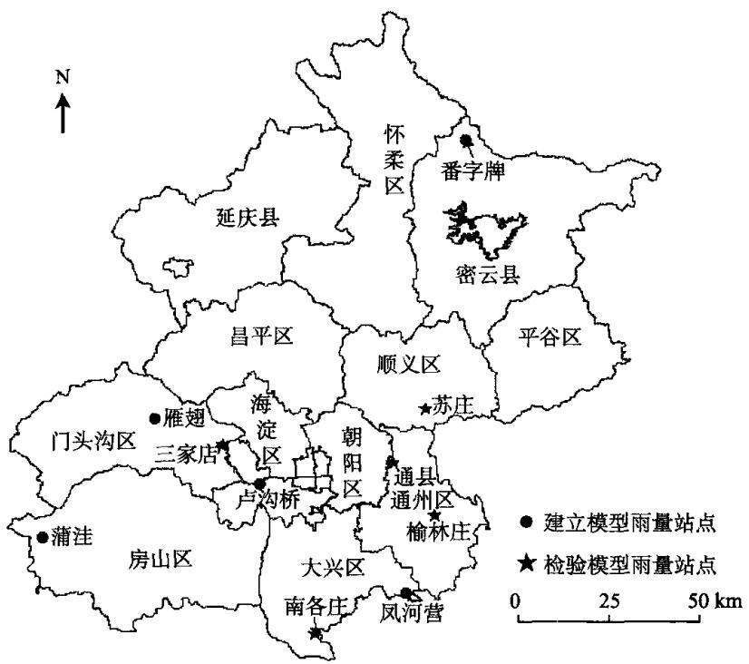  
图 3.1 雨量站分布图

表3.6 降雨过程资料站点基本情况
<table><tr><td rowspan="2">建立模型 雨量站点</td><td rowspan="2">资料年限</td><td colspan="2">地理坐标</td></tr><tr><td>经度</td><td>纬度</td></tr><tr><td>卢沟桥</td><td>1980~2004</td><td>116°13&#x27;</td><td>39°52′</td></tr><tr><td>凤河营</td><td>1980~2004</td><td>116°41&#x27;</td><td>39°36′</td></tr><tr><td>蒲洼</td><td>1980~2004</td><td>115°30′</td><td>39°44′</td></tr><tr><td>雁翅</td><td>1980~2004</td><td>115°53′</td><td>40°02′</td></tr><tr><td>番字牌</td><td>1980~2004</td><td>116°53&#x27;</td><td>40°44′</td></tr><tr><td>南各庄</td><td>1980~2004*</td><td>116°24′</td><td>39°30′</td></tr><tr><td>三家店</td><td>1980~2004</td><td>116°06&#x27;</td><td>39°58′</td></tr><tr><td>苏庄</td><td>1980~2004</td><td>116°45&#x27;</td><td>40°04′</td></tr><tr><td>通县</td><td>1980~2004</td><td>116°39′</td><td>39°56′</td></tr><tr><td>榆林庄</td><td>1980~2004</td><td>116°47′</td><td>39°48′</td></tr></table>

×缺失1989年和1994\~1997年资料。

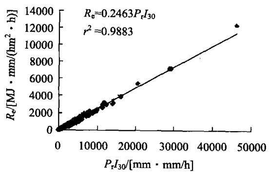

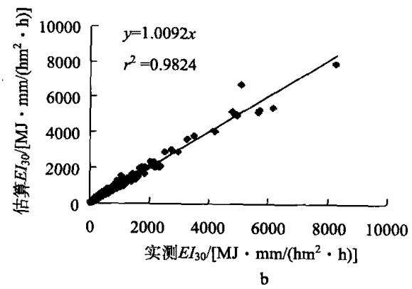  
图3.2 $R _ { \mathrm { e } }$ 与 $P _ { \mathrm { { r } } } I _ { 3 0 }$ 的回归关系（a）与检验（b）

## (3) 利用次降雨量资料计算次降雨侵蚀力

虽然估算次降雨侵蚀力时，含有雨强指标的估算结果要远好于只利用降雨量进行估算的结果，但考虑到雨强资料一般也难以获得，因此利用表3.6中番字牌、卢沟桥、雁翅、蒲洼、凤河营5个雨量站1365次降雨过程资料，建立了用次降雨量估算次降雨侵蚀力的幂函数模型如下：

$$
R _ { \mathrm { e } } = 0 . 3 3 8 5 P _ { \mathrm { r } } ^ { 1 . 7 7 0 4 } , \qquad r ^ { 2 } = 0 . 6 3 4 3\tag{3.4}
$$

回归方程的决定系数只有0.6343，估计误差大于式（3.3）。利用表3.6中苏庄、通县、榆林庄、南各庄、三家店5个雨量站1268次侵蚀性降雨资料的检验结果也说明了这一点，估计值与实测值的回归系数仅为0.6761；模型检验决定系数只有0.5791。相对于式（3.3），式（3.4）的回归系数明显降低。从图3.3b也可以看出，估算的降雨侵蚀力与实测值的相关系数的平方为0.5791，仅根据降雨量预测的降雨侵蚀力值个别点计算值与实测值相差较大。这主要是由高雨强小降雨量或者低雨强大降雨量事件造成。因此，如果预报次土壤流失量，建议尽可能获得雨强资料，采用式（3.1）或式(3.3) 计算次降雨侵蚀力。

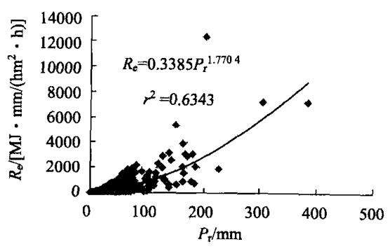

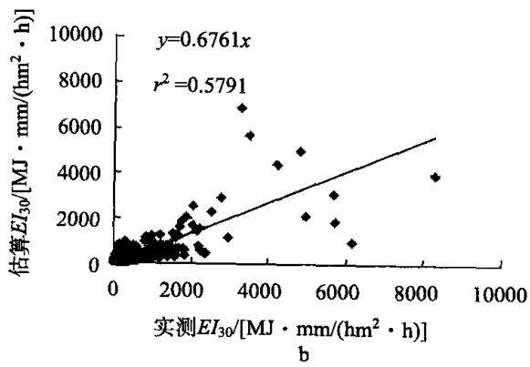  
图 3.3 Re与 P的回归关系（a）与检验（b） $R _ { \mathrm { e } }$ $P _ { \tau }$

## 3.3.2 日降雨侵蚀力计算

根据资料占有情况不同，计算日降雨侵蚀力主要有3种方法：①根据降雨过程资料，直接计算日降雨侵蚀力；②采用日降雨量与日最大30min雨强的组合指标计算日降雨侵蚀力；③只采用日降雨量资料计算日降雨侵蚀力。

## (1)利用降雨过程资料计算日降雨侵蚀力

如有降雨过程资料，日降雨侵蚀力的计算和次降雨侵蚀力的计算方法完全一致，只是需要划分日界线，我国一般采用早八点（水文站）或晚八点（气象站）为日界线。此外次降雨和日降雨会出现3种对应关系：一日仅有一次降雨，则次降雨侵蚀力与日降雨侵蚀力相等；一次降雨跨多日，则次降雨侵蚀力分解为多日日降雨侵蚀力；一日有多次降雨，则日降雨侵蚀力为多次次降雨侵蚀力之和。

## (2) 利用日降雨量和雨强资料计算日降雨侵蚀力

将表3.6中10个雨量站1980～2004年共计2894次降雨侵蚀力指标 $( E I _ { 3 0 } )$ 计算得到相应的日降雨侵蚀力 $( R _ { \mathrm { d } } )$ ，共计3171日。利用表3.6中番字牌、卢沟桥、雁翅、蒲洼、凤河营5个雨量站共计1528日的降雨过程资料，建立了日降雨量和雨强$( P _ { \mathrm { { d } } } I _ { 3 0 \mathrm { { d } } } )$ 组合指标计算日降雨侵蚀力的公式为（图3.4a）

$$
R _ { \mathrm { d } } = 0 . 2 4 1 1 P _ { \mathrm { d } } I _ { 3 0 \mathrm { d } } , \qquad r ^ { 2 } = 0 . 9 8 4 3\tag{3.5}
$$

式中， $R _ { \mathrm { d } }$ 为日降雨侵蚀力， $\mathbf { M } \mathbf { J } \cdot \mathbf { m } \mathbf { m } / ( \mathbf { h } \mathbf { m } ^ { 2 } \cdot \mathbf { h } )$ $I _ { 3 0 \mathbf { d } }$ 为日最大 30 min 雨强， $\mathrm { { \ m m / h } }$ $P _ { \textrm { d } }$ 为日降雨量，mm。

由回归系数可知，用组合指标日降雨量和日最大30min雨强的乘积 $( P _ { \mathrm { { d } } } I _ { 3 0 \mathrm { { d } } } )$ ，可以很好地代表实测降雨侵蚀力指标 $( E I _ { 3 0 } )$ 。由苏庄、通县、榆林庄、南各庄、三家店5个雨量站（表3.6）共1325日的侵蚀性降雨过程资料的检验结果表明：式（3.5）很好地估算了日降雨侵蚀力（图3.4b)，预测值与实测值很接近，二者的 $r ^ { 2 }$ 为0.9852。

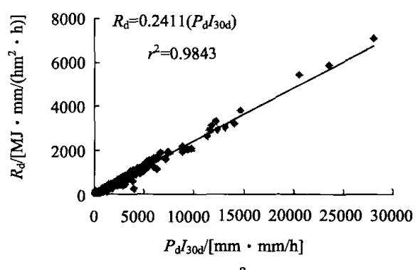

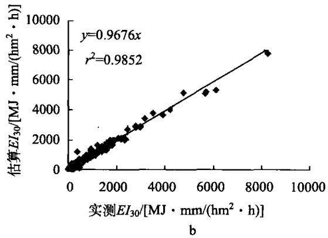  
图3.4 $R _ { \mathrm { d } }$ 与 $P _ { \mathrm { { d } } } I _ { 3 0 \mathrm { { d } } }$ 的回归关系（a）与检验（b）

## (3) 利用日降雨量资料计算日降雨侵蚀力

进一步利用表3.6中番字牌、卢沟桥、雁翅、蒲洼、凤河营5个雨量站共计1528日的降雨过程资料，建立了用日降雨量 $( P _ { \mathtt { d } } )$ 计算日降雨侵蚀力的公式为（图3.5a）

$$
R _ { \mathrm { d } } = 0 . 3 9 5 4 P _ { \mathrm { d } } { } ^ { 1 . 6 7 0 9 } , \qquad r ^ { 2 } = 0 . 6 5 4 5\tag{3.6}
$$

由苏庄、通县、榆林庄、南各庄、三家店5个雨量站共计1325日的侵蚀性降雨过程资料的检验结果表明，利用日降雨量估算日降雨侵蚀力的效果不如用日降雨量和雨强的组合指标 $( P _ { \mathrm { { d } } } I _ { 3 0 \mathrm { { d } } } )$ 好。

日降雨量模型计算的日降雨侵蚀力与日 $E I _ { 3 0 }$ 值相比，计算值的相对误差绝对值小于20%的仅占20.7%，其余79.3%的计算值相对误差绝对值大于20%。其中主要是对 $E I _ { 3 0 }$ 值小情况下的日降雨侵蚀力估算偏高，对 $E I _ { 3 0 }$ 值大情况下的日降雨侵蚀力估算偏低，对中间情形下的日降雨侵蚀力估算结果相对较好（图3.5b）。当日 $E I _ { 3 0 }$ 值较小时，式（3.6）的估算值偏高，其误差主要由两种类型的降雨造成：①历时短，但雨强大；②历时相对较长，雨强小。因此仅依靠降雨量估算降雨侵蚀力会造成较大的误差，需要深入研究。当 $E I _ { 3 0 }$ 值偏大时，日降雨量模型估算偏低，这主要出现在大降雨量大雨强事件中。例如，三家店2000年7月4日降雨量为241.6mm， $I _ { 3 0 }$ 为 $1 3 3 \ \mathrm { m m / h }$ ，日$E I _ { 3 0 }$ 值为 $8 2 7 1 ~ \mathrm { M J } \cdot \mathrm { m m } / ( \mathrm { h m } ^ { 2 } \cdot \mathrm { h } )$ ，而根据日降雨量模型估算的日降雨侵蚀力仅有$4 0 8 6 \ \mathrm { M J \bullet \ m m / ( h m ^ { 2 } \bullet h ) }$ ；苏庄1987年7月1日的降雨量211mm， $I _ { 3 0 }$ 达 204 mm/h，日 $E I _ { 3 0 }$ 值为 $9 2 3 7 ~ \mathrm { { ‰ } }$ ，日降雨量模型估算的日降雨侵蚀力仅为$3 2 9 9 \ \mathrm { M J \bullet \ m m / ( h m ^ { 2 } \bullet h ) }$ ，比日 $E I _ { 3 0 }$ 值小 $5 9 3 8 \ \mathrm { M J \bullet \ m m / ( h m ^ { 2 } \bullet h ) }$ 。对于大降雨量小雨强降雨事件而言，日降雨量模型估计值会比 $E I _ { 3 0 }$ 值偏高。例如，榆林庄1994年7月12日降雨量 $2 9 8 \ \mathrm { m m } , I _ { 3 0 }$ 为 $5 2 ~ \mathrm { m m / h }$ ，日 $E I _ { 3 0 }$ 值为 $3 4 9 2 \ \mathrm { M J } \cdot \mathrm { m m } / ( \mathrm { h m } ^ { 2 } \cdot \mathrm { h } )$ ，日降雨量模型估计值为 $5 4 5 7 \ \mathrm { M J } \cdot \mathrm { m m } / ( \mathrm { h m } ^ { 2 } \cdot \mathrm { h } )$ ，比实际值高估出 $1 9 6 5 \mathrm { ~ M J ~ } \cdot \mathrm { { \ m m } } / ( \mathrm { { h m } } ^ { 2 } \cdot \mathrm { { \ h } } )$ 。上述类型的降雨事件发生频率虽然不多，但对估算结果影响较大。此类降雨侵蚀力的准确估计还有待深入研究。因此如果预报日土壤流失量，建议尽可能获得雨强资料，利用式(3.5)计算日降雨侵蚀力。

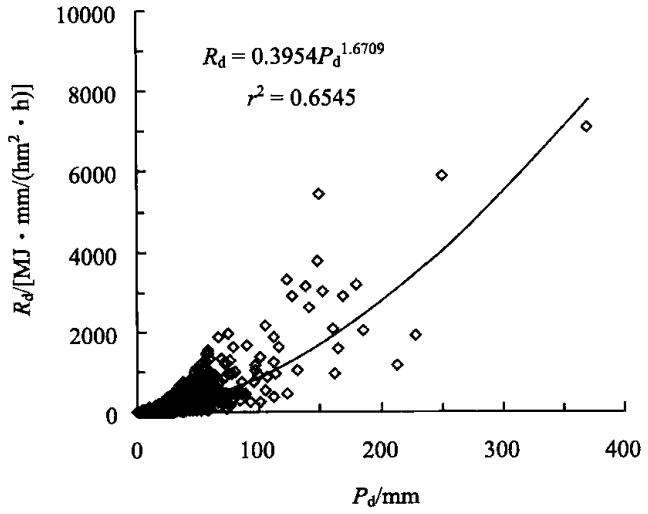  
a

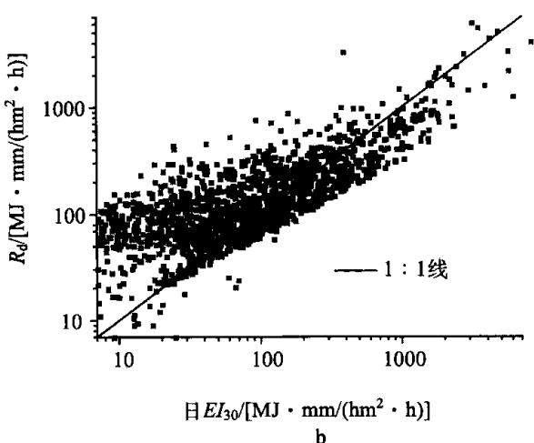  
图3.5 $R _ { \mathrm { d } }$ 与 $P _ { \mathrm { ~ d ~ } }$ 的回归关系（a）与检验（b）

## 3.3.3 月降雨侵蚀力计算

月降雨量资料较日降雨量资料更容易获取，因此在预报月或年土壤流失量时，可用月降雨量资料。利用月降雨量计算月降雨侵蚀力的估算公式为

$$
R _ { \mathrm { m } } = 0 . 6 8 9 P _ { \mathrm { m } } ^ { 1 . 4 7 4 } , \qquad r ^ { 2 } = 0 . 7 2 0\tag{3.7}
$$

式中， $R _ { \mathrm { m } }$ 为月降雨侵蚀力， $\mathrm { M J } \cdot \mathrm { m m } / ( \mathrm { h m } ^ { 2 } \cdot \mathrm { h } ) ; P _ { \mathrm { m } }$ 为月降雨量， $\mathbf { m m } _ { e }$

估算月降雨侵蚀力可以同时使用日降雨量模型[式（3.6)]和月降雨量模型[式(3.7)]，前者通过累加得到月值。月降雨侵蚀力的估计值误差较日降雨侵蚀力估计值的误差小，用日降雨量模型估计的月降雨侵蚀力相对误差绝对值小于20%的占23.2%，用月降雨量模型估计的相对误差绝对值小于20%的占17.8%。两个模型相比，用日降雨量模型时，容易高估，尤其在月 $E I _ { 3 0 }$ 值偏小的情况下，明显较月降雨量模型估计偏高（图3.6）。

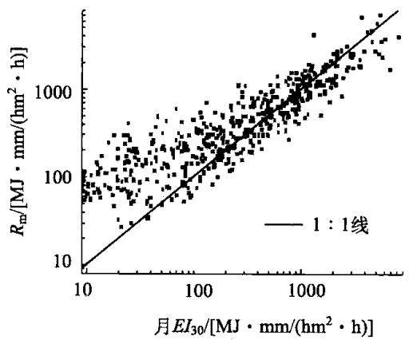

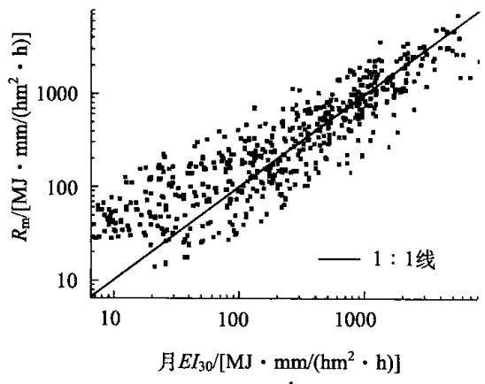  
图3.6 日、月降雨量模型估算月降雨侵蚀力比较  
a. 日降雨量模型；b. 月降雨量模型

## 3.3.4 年降雨侵蚀力计算

在预报年土壤流失量时，需要计算年降雨侵蚀力。考虑到年降雨量资料比较容易获得，建立了用年降雨量计算年降雨侵蚀力的估算公式为

$$
R _ { \mathrm { y } } = 0 . 4 4 P _ { \mathrm { y } } ^ { 1 . 4 6 3 } , \qquad r ^ { 2 } = 0 . 5 7 7\tag{3.8}
$$

式中， $R _ { \mathrm { y } }$ 为年降雨侵蚀力，MJ $\cdot \ \mathrm { m m } / ( \mathrm { h m } ^ { 2 } \cdot \mathrm { h } )$ ; $P _ { \mathrm { ~ y ~ } }$ 为年降雨量，mm。

估算年降雨侵蚀力可同时使用日降雨量模型[式（3.6)]、月降雨量模型[式(3.7)]和年降雨量模型[式（3.8)]3种。如果采用日、月降雨量模型，需分别累加日、月降雨侵蚀力获得年降雨侵蚀力。总体而言，3种模型估计的年降雨侵蚀力值都好于日、月降雨侵蚀力估计值（图3.7）。日、月、年3种模型在估计年降雨侵蚀力值时，估计值与年EI30值相比，相对误差小于20%的分别占总样本数的45.6%、42.3%和 $E I _ { 3 0 }$ 46.7%。考虑到当降雨量趋于0时，降雨侵蚀力也应趋于0，因此估计值与相应的 $E I _ { 3 0 }$ 值之间的回归直线应通过原点。表3.7给出了3种模型估算年降雨侵蚀力时（见图3.7)，估计值与年EI30值之间通过原点的回归方程和决定系数。 $E I _ { 3 0 }$

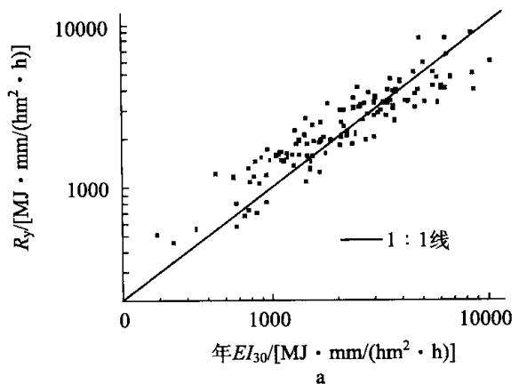

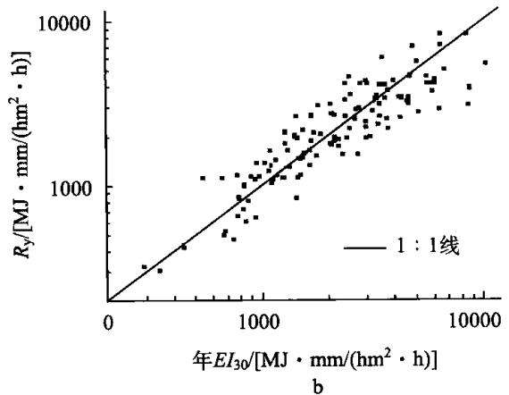

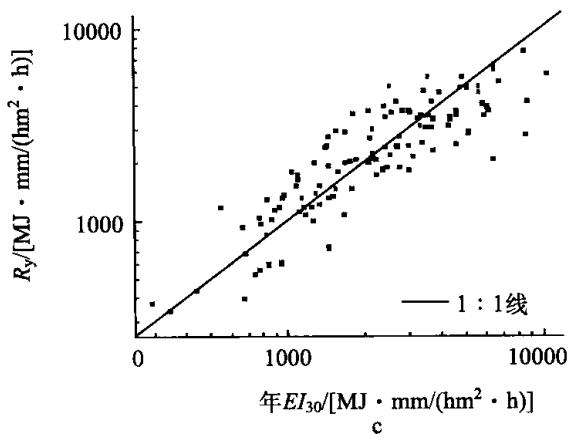  
图3.7日、月、年降雨量模型估算的年降雨侵蚀力比较  
a. 日降雨量模型；b. 月降雨量模型；c. 年降雨量模型

表3.7 各种模型计算年降雨侵蚀力的回归分析结果
<table><tr><td>简易模型</td><td>平均相对误差/%</td><td>平均相对误差的 标准差</td><td>回归方程</td><td>决定系数</td></tr><tr><td>日降雨量模型</td><td>11.3</td><td>33.26</td><td> $R _ { \mathrm { y } } { = } 0 . 8 7 ~ ( E I _ { 3 0 } ) ,$  4</td><td>0.60</td></tr><tr><td>月降雨量模型</td><td>1.1</td><td>33.27</td><td> $R _ { \mathbf { y } } { = } 0 . 8 1 ~ ( E I _ { 3 0 } ) _ { \mathbf { y } }$ </td><td>0.54</td></tr><tr><td>年降雨量模型</td><td>3.9</td><td>36.44</td><td> $R _ { y } { = } 0 . 8 0 ~ ( E I _ { 3 0 } ) _ { y }$ </td><td>0.49</td></tr></table>

注： $( E I _ { 3 0 } ) _ { \bf y }$ 为年 $E I _ { 3 0 }$ 值。

3种模型估计年降雨侵蚀力时，估计的相对误差差异不是十分明显。日、月、年降雨量模型的平均相对误差分别为11.3%、1.1%和3.9%，决定系数依次为0.60、0.54和0.49（表3.7）。

用日、月、年降雨量模型估算了多年平均年降雨侵蚀力，其相对误差绝对值均小于20%，平均相对误差分别为一0.8%、-6.9%和一6.6%（表3.8），仍以日降雨量模型估算精度最高。与日、月降雨侵蚀力的估计值偏高相反，年降雨侵蚀力估计值略微偏低，这是因为小降雨侵蚀力值在年值中所占比例小，主要由大值决定，估计较大值的降雨侵蚀力时，由于没有考虑雨强的影响，估计结果会偏低（图3.7c）。

表3.8 各种模型计算多年平均年降雨侵蚀力的误差
<table><tr><td>简易模型</td><td>相对误差范围/%</td><td>平均相对误差/%</td></tr><tr><td>日降雨量模型</td><td>-7.5~-2.7</td><td>-0.8</td></tr><tr><td>月降雨量模型</td><td>-12.7~0.4</td><td>-6.9</td></tr><tr><td>年降雨量模型</td><td>-15.7~0.7</td><td>-6.6</td></tr></table>

## 3.4 降雨侵蚀力季节变化

为了反映降雨季节分配对土壤侵蚀的影响，在计算植被覆盖与管理因子时，需要乘以降雨侵蚀力的季节分配权重系数，即某时段降雨侵蚀力占年降雨侵蚀力的百分比。时段的选择主要取决于植被的季节变化，如 $\mathrm { U S L E ^ { \mathrm { ( 1 ) } } }$ 开始采用不同农耕期或月为时段，以后考虑到植被覆盖变化的时间跨度小于月，又缩短为半月②。我国学者也计算了以月为步长的降雨侵蚀力季节分布（黄炎和等，1992a；吴素业，1994；周伏建等，1995a，1995b；王万忠、焦菊英，1996)。本模型采用半月步长表征降雨侵蚀力的季节变化，半月的具体划分方法是：每个月的第一日至第十五日为一个半月，该月剩下的天数作为另一个半月，另一个半月天数变动于13天、14天、15天、16天，全年依次划分为24个半月。

根据降雨资料占有情况的不同，依次提供以下半月降雨侵蚀力计算方法，计算精度逐渐降低。

①利用降雨过程资料计算半月降雨侵蚀力：该方法需要利用降雨过程资料生成最大 30 min 雨强 $\left( { { I } _ { 3 0 } } \right)$ 、断点雨强 $( i _ { i } )$ 或次降雨量 $( P _ { \mathrm { r } } )$ ，根据式（3.1）计算每次降雨的 $E I _ { 3 0 }$ ，然后将次降雨侵蚀力累加成半月值。如果一场降雨跨了两个半月，则认为该场降雨落在其最大30min雨强所处的半月内。

②利用次降雨量和雨强资料计算半月降雨侵蚀力：如果同时有次降雨量和最大30min雨强资料，则利用式（3.3）计算日降雨侵蚀力 $( R _ { \mathrm { d } } )$ ，然后累加成半月值。

③利用次降雨量资料计算半月降雨侵蚀力：如果只有次降雨量资料，则利用式(3.4）计算次降雨侵蚀力（R)，然后累加成半月值。

④利用日降雨量和雨强资料计算半月降雨侵蚀力：如果同时有日降雨量和日最大30min雨强资料，则利用式（3.5）计算日降雨侵蚀力 $( R _ { \mathrm { d } } )$ ，然后累加成半月值。

⑤利用日降雨量资料计算半月降雨侵蚀力：如果只有日降雨量资料，则利用式(3.6) 计算日降雨侵蚀力 $( R _ { \mathrm { d } } )$ ，然后累加成半月值。

根据北京34个雨量站1980～2004年日降雨量资料，得到了各站半月降雨侵蚀力占年降雨侵蚀力的累积百分比（表3.9）。北京市降雨侵蚀力的季节分配非常不均匀，各地7\~8月降雨侵蚀力之和占年降雨侵蚀力的57.0%～85.4%。

：
<table><tr><td rowspan=2 colspan=15>1月        2月        3月        4月        5月站名t1    t2   t3   t4   t5   t6   t7   t8   t9   t10</td><td rowspan=1 colspan=2>6月</td><td rowspan=1 colspan=2>7月</td><td rowspan=1 colspan=2>8月</td><td rowspan=1 colspan=2>9月</td><td rowspan=1 colspan=4>10月       11月</td><td rowspan=1 colspan=2>12月</td></tr><tr><td rowspan=1 colspan=2>t11  t12</td><td rowspan=1 colspan=2>t13  t14</td><td rowspan=1 colspan=2>t15  t16</td><td rowspan=1 colspan=2>t17  t18</td><td rowspan=1 colspan=4>t19  t20  t21  t22</td><td rowspan=1 colspan=2>t23  t24</td></tr><tr><td rowspan=1 colspan=2>凤河营</td><td rowspan=1 colspan=3>0    0</td><td rowspan=1 colspan=10>0    0    0    0    0    0   0.1  0.3</td><td rowspan=1 colspan=1>1.5</td><td rowspan=1 colspan=1>12.3</td><td rowspan=1 colspan=1>22.7</td><td rowspan=1 colspan=1>50.3</td><td rowspan=1 colspan=1>90.0</td><td rowspan=1 colspan=1>97.5</td><td rowspan=1 colspan=1>98.5</td><td rowspan=1 colspan=1>99.5</td><td rowspan=1 colspan=1>99.6</td><td rowspan=1 colspan=1>100.01</td><td rowspan=1 colspan=1>00.01</td><td rowspan=1 colspan=1>00.0</td><td rowspan=1 colspan=1>100.01</td><td rowspan=1 colspan=1>00.0</td></tr><tr><td rowspan=1 colspan=2>蒲洼</td><td rowspan=1 colspan=1>0</td><td rowspan=1 colspan=2>0</td><td rowspan=1 colspan=7>0     0     0     0    0     0.</td><td rowspan=1 colspan=2>21.0</td><td rowspan=1 colspan=1>10.8</td><td rowspan=1 colspan=1>14.5</td><td rowspan=1 colspan=1>25.4</td><td rowspan=1 colspan=1>44.8</td><td rowspan=1 colspan=1>65.7</td><td rowspan=1 colspan=1>84.1</td><td rowspan=1 colspan=1>91.9</td><td rowspan=1 colspan=1>97.9</td><td rowspan=1 colspan=1>99.21</td><td rowspan=1 colspan=1>00.0</td><td rowspan=1 colspan=1>100.0</td><td rowspan=1 colspan=1>100.0100.0</td><td rowspan=1 colspan=1>1</td><td rowspan=1 colspan=1>00.0</td><td rowspan=1 colspan=1>100.0</td></tr><tr><td rowspan=1 colspan=2>卢沟桥</td><td rowspan=1 colspan=1>0</td><td rowspan=1 colspan=2>0</td><td rowspan=1 colspan=7>0     0     0     0     0.1  0.1</td><td rowspan=1 colspan=2>0.3</td><td rowspan=1 colspan=1>1.7</td><td rowspan=1 colspan=1>4.6</td><td rowspan=1 colspan=1>14.8</td><td rowspan=1 colspan=2>37.959.6</td><td rowspan=1 colspan=1>83.3</td><td rowspan=1 colspan=1>96.2</td><td rowspan=1 colspan=1>97.9</td><td rowspan=1 colspan=1>99.61</td><td rowspan=1 colspan=1>00.0</td><td rowspan=1 colspan=1>100..0 1</td><td rowspan=1 colspan=1>00.0.01</td><td rowspan=1 colspan=1>00.01</td><td rowspan=1 colspan=1>00.01</td><td rowspan=1 colspan=1>00.0</td></tr><tr><td rowspan=1 colspan=2>三家店</td><td rowspan=1 colspan=1>0</td><td rowspan=1 colspan=2>0</td><td rowspan=1 colspan=6>0     0    0    0    0</td><td rowspan=1 colspan=3>0.30.6</td><td rowspan=1 colspan=1>3.8</td><td rowspan=1 colspan=1>7.7</td><td rowspan=1 colspan=1>13.8</td><td rowspan=1 colspan=1>38.7</td><td rowspan=1 colspan=1>59.9</td><td rowspan=1 colspan=1>92.1</td><td rowspan=1 colspan=1>98.2</td><td rowspan=1 colspan=1>98.9</td><td rowspan=1 colspan=1>99.8</td><td rowspan=1 colspan=1>99.9</td><td rowspan=1 colspan=1>100.0</td><td rowspan=1 colspan=1>100.01</td><td rowspan=1 colspan=1>00.01</td><td rowspan=1 colspan=1>00.01</td><td rowspan=1 colspan=1>00.0</td></tr><tr><td rowspan=1 colspan=2>榆林庄</td><td rowspan=1 colspan=1>0</td><td rowspan=1 colspan=2>0</td><td rowspan=1 colspan=6>0     0     0     0    0</td><td rowspan=1 colspan=1>0.1</td><td></td><td rowspan=1 colspan=1>1.5</td><td rowspan=1 colspan=1>2.7</td><td rowspan=1 colspan=1>4.6</td><td rowspan=1 colspan=1>12.5</td><td rowspan=1 colspan=1>30.0</td><td rowspan=1 colspan=1>51.0</td><td rowspan=1 colspan=1>85.3</td><td rowspan=1 colspan=1>91.5</td><td rowspan=1 colspan=1>97.1</td><td rowspan=1 colspan=1>98.5</td><td rowspan=1 colspan=1>98.7</td><td rowspan=1 colspan=1>100.0</td><td rowspan=1 colspan=1>100.0</td><td rowspan=1 colspan=1>1</td><td rowspan=1 colspan=1>00.0</td><td rowspan=1 colspan=1>100.0</td></tr><tr><td rowspan=1 colspan=2>雁翅</td><td rowspan=1 colspan=1>0</td><td rowspan=1 colspan=2>0</td><td rowspan=1 colspan=7>0    0    0    0    0     0</td><td></td><td rowspan=1 colspan=1>0</td><td rowspan=1 colspan=1>2.7</td><td rowspan=1 colspan=1>6.7</td><td rowspan=1 colspan=1>15.5</td><td rowspan=1 colspan=1>55.6</td><td rowspan=1 colspan=1>70.0</td><td rowspan=1 colspan=1>87.3</td><td rowspan=1 colspan=1>95.9</td><td rowspan=1 colspan=1>97.7</td><td rowspan=1 colspan=1>99.51</td><td rowspan=1 colspan=1>00..0</td><td rowspan=1 colspan=1>100.0</td><td rowspan=1 colspan=1>100.0</td><td rowspan=1 colspan=1>100.0</td><td rowspan=1 colspan=1>100.01</td><td rowspan=1 colspan=1>00.0</td></tr><tr><td rowspan=1 colspan=2>番字牌</td><td rowspan=1 colspan=1>0</td><td rowspan=1 colspan=9>0    0    0    0     0    0     0.1</td><td></td><td rowspan=1 colspan=1>0.2</td><td rowspan=1 colspan=1>1.3</td><td rowspan=1 colspan=1>10.3</td><td rowspan=1 colspan=1>14.7</td><td rowspan=1 colspan=1>29.4</td><td rowspan=1 colspan=1>67.6</td><td rowspan=1 colspan=1>82.5</td><td rowspan=1 colspan=1>96.3</td><td rowspan=1 colspan=1>99.0</td><td rowspan=1 colspan=1>99.81</td><td rowspan=1 colspan=1>00.0</td><td rowspan=1 colspan=1>100.0</td><td rowspan=1 colspan=1>100.01</td><td rowspan=1 colspan=1>00.01</td><td rowspan=1 colspan=1>00.0</td><td rowspan=1 colspan=1>100.0</td></tr><tr><td rowspan=1 colspan=1></td><td rowspan=1 colspan=1>南各庄</td><td rowspan=1 colspan=1>0</td><td rowspan=1 colspan=2>0</td><td rowspan=1 colspan=3>0     0</td><td rowspan=1 colspan=2>0     0</td><td rowspan=1 colspan=1>0</td><td rowspan=1 colspan=1>0</td><td></td><td rowspan=1 colspan=1>0.4</td><td rowspan=1 colspan=1>1.5</td><td rowspan=1 colspan=1>4.3</td><td rowspan=1 colspan=1>15.9</td><td rowspan=1 colspan=1>32.3</td><td rowspan=1 colspan=1>51.1</td><td rowspan=1 colspan=1>79.1</td><td rowspan=1 colspan=1>94.0</td><td rowspan=1 colspan=1>96.6</td><td rowspan=1 colspan=1>97.5</td><td rowspan=1 colspan=1>99.5</td><td rowspan=1 colspan=1>100.01</td><td rowspan=1 colspan=1>00.01</td><td rowspan=1 colspan=1>00.0</td><td rowspan=1 colspan=1>100.01</td><td rowspan=1 colspan=1>00.0</td></tr><tr><td rowspan=1 colspan=1></td><td rowspan=1 colspan=1>苏庄</td><td rowspan=1 colspan=1>0</td><td rowspan=1 colspan=2>0</td><td rowspan=1 colspan=3>0    0</td><td rowspan=1 colspan=2>0    0</td><td rowspan=1 colspan=1>0</td><td rowspan=1 colspan=1>0.1</td><td></td><td rowspan=1 colspan=1>0.3.</td><td rowspan=1 colspan=1>0.8</td><td rowspan=1 colspan=1>1.7</td><td rowspan=1 colspan=1>11.3</td><td rowspan=1 colspan=1>37.7</td><td rowspan=1 colspan=1>61.5</td><td rowspan=1 colspan=1>90.4</td><td rowspan=1 colspan=1>96.7</td><td rowspan=1 colspan=1>98.5</td><td rowspan=1 colspan=1>99.5</td><td rowspan=1 colspan=1>99.9</td><td rowspan=1 colspan=1>100.0 1</td><td rowspan=1 colspan=1>00.0 1</td><td rowspan=1 colspan=1>00.0</td><td rowspan=1 colspan=1>100.01</td><td rowspan=1 colspan=1>00.0</td></tr><tr><td rowspan=1 colspan=1></td><td rowspan=1 colspan=1>通县</td><td rowspan=1 colspan=1>0</td><td rowspan=1 colspan=2>0</td><td rowspan=1 colspan=3>0     0</td><td rowspan=1 colspan=2>0     0</td><td rowspan=1 colspan=1>0</td><td rowspan=1 colspan=1>0.5</td><td></td><td rowspan=1 colspan=1>1.1</td><td rowspan=1 colspan=1>4.7</td><td rowspan=1 colspan=1>6.1</td><td rowspan=1 colspan=1>22.1</td><td rowspan=1 colspan=1>42.3</td><td rowspan=1 colspan=1>64.3</td><td rowspan=1 colspan=1>84.3</td><td rowspan=1 colspan=1>95.8</td><td rowspan=1 colspan=1>97.0</td><td rowspan=1 colspan=1>99.1</td><td rowspan=1 colspan=1>99.8</td><td rowspan=1 colspan=1>100.0</td><td rowspan=1 colspan=1>100.0</td><td rowspan=1 colspan=1>100.0</td><td rowspan=1 colspan=1>100.0</td><td rowspan=1 colspan=1>100.0</td></tr><tr><td rowspan=1 colspan=1></td><td rowspan=1 colspan=1>大庄科</td><td rowspan=1 colspan=1>0</td><td rowspan=1 colspan=2>0</td><td></td><td rowspan=1 colspan=2>0     0</td><td rowspan=1 colspan=1>0</td><td rowspan=1 colspan=1>0.1</td><td rowspan=1 colspan=1>0.7</td><td rowspan=1 colspan=1>2.4</td><td></td><td rowspan=1 colspan=1>4.1</td><td rowspan=1 colspan=1>7.9</td><td rowspan=1 colspan=1>15.4</td><td rowspan=1 colspan=1>24.1</td><td rowspan=1 colspan=1>50.6</td><td rowspan=1 colspan=1>67.1</td><td rowspan=1 colspan=1>81.6</td><td rowspan=1 colspan=1>90.5</td><td rowspan=1 colspan=1>93.2</td><td rowspan=1 colspan=1>97.1</td><td rowspan=1 colspan=1>98.5</td><td rowspan=1 colspan=1>99.3</td><td rowspan=1 colspan=1>99.7</td><td rowspan=1 colspan=1>99.9</td><td rowspan=1 colspan=1>100.0</td><td rowspan=1 colspan=1>100.0</td></tr><tr><td rowspan=1 colspan=1></td><td rowspan=1 colspan=1>顺义</td><td rowspan=1 colspan=1>0</td><td rowspan=1 colspan=2>0</td><td></td><td rowspan=1 colspan=2>0    0.2</td><td rowspan=1 colspan=1>0.2</td><td rowspan=1 colspan=1>0.5</td><td rowspan=1 colspan=1>0.8</td><td rowspan=1 colspan=1>2.7</td><td></td><td rowspan=1 colspan=1>4.1</td><td rowspan=1 colspan=1>7.0</td><td rowspan=1 colspan=1>10.2</td><td rowspan=1 colspan=1>18.6</td><td rowspan=1 colspan=1>39.5</td><td rowspan=1 colspan=1>58.7</td><td rowspan=1 colspan=1>80.0</td><td rowspan=1 colspan=1>90.0</td><td rowspan=1 colspan=1>94.3</td><td rowspan=1 colspan=1>97.1</td><td rowspan=1 colspan=1>98.6</td><td rowspan=1 colspan=1>99.6</td><td rowspan=1 colspan=1>99.9.9</td><td rowspan=1 colspan=1>100.01</td><td rowspan=1 colspan=1>00.01</td><td rowspan=1 colspan=1>00.0</td></tr><tr><td rowspan=1 colspan=1></td><td rowspan=1 colspan=1>赵村</td><td rowspan=1 colspan=1>0</td><td rowspan=1 colspan=2>0</td><td rowspan=1 colspan=3>0     0.1</td><td rowspan=1 colspan=1>0.2</td><td rowspan=1 colspan=1>0.6</td><td rowspan=1 colspan=1>0.9</td><td rowspan=1 colspan=1>3.4</td><td></td><td rowspan=1 colspan=1>4.8</td><td rowspan=1 colspan=1>8.1</td><td rowspan=1 colspan=1>10.9</td><td rowspan=1 colspan=1>20.3</td><td rowspan=1 colspan=1>39.3</td><td rowspan=1 colspan=1>56.6</td><td rowspan=1 colspan=1>83.3</td><td rowspan=1 colspan=1>91.5</td><td rowspan=1 colspan=1>95.1</td><td rowspan=1 colspan=1>96.4</td><td rowspan=1 colspan=1>98.1</td><td rowspan=1 colspan=1>99.4</td><td rowspan=1 colspan=1>100.0</td><td rowspan=1 colspan=1>100.0</td><td rowspan=1 colspan=1>100.0</td><td rowspan=1 colspan=1>100.0</td></tr><tr><td rowspan=1 colspan=1></td><td rowspan=1 colspan=1>汤河口</td><td rowspan=1 colspan=1>0</td><td rowspan=1 colspan=2>0</td><td rowspan=1 colspan=3>0     0.1</td><td rowspan=1 colspan=1>0.2</td><td rowspan=1 colspan=1>0.5</td><td rowspan=1 colspan=1>0.9</td><td rowspan=1 colspan=1>2.9</td><td></td><td rowspan=1 colspan=1>4.5</td><td rowspan=1 colspan=1>8.0</td><td rowspan=1 colspan=1>16.8</td><td rowspan=1 colspan=1>24.9</td><td rowspan=1 colspan=1>45.6</td><td rowspan=1 colspan=1>62.5</td><td rowspan=1 colspan=1>77.0</td><td rowspan=1 colspan=1>87.4</td><td rowspan=1 colspan=1>92.5</td><td rowspan=1 colspan=1>97.8</td><td rowspan=1 colspan=1>99.0</td><td rowspan=1 colspan=1>99.6</td><td rowspan=1 colspan=1>99.8</td><td rowspan=1 colspan=1>100.0</td><td rowspan=1 colspan=1>100.01</td><td rowspan=1 colspan=1>00.0</td></tr><tr><td rowspan=1 colspan=1></td><td rowspan=1 colspan=1>张家坟</td><td rowspan=1 colspan=1>0</td><td rowspan=1 colspan=2>0</td><td rowspan=1 colspan=3>0     0.1</td><td rowspan=1 colspan=1>0.1</td><td rowspan=1 colspan=1>0.1</td><td rowspan=1 colspan=1>0.4</td><td rowspan=1 colspan=1>1.7</td><td></td><td rowspan=1 colspan=1>3.0</td><td rowspan=1 colspan=1>5.8</td><td rowspan=1 colspan=1>15.8</td><td rowspan=1 colspan=1>20.8</td><td rowspan=1 colspan=1>38.8</td><td rowspan=1 colspan=1>61.9</td><td rowspan=1 colspan=1>79.2</td><td rowspan=1 colspan=1>90.0</td><td rowspan=1 colspan=1>94.1</td><td rowspan=1 colspan=1>97.5</td><td rowspan=1 colspan=1>99.1</td><td rowspan=1 colspan=1>99.7</td><td rowspan=1 colspan=1>99.91</td><td rowspan=1 colspan=1>00.01</td><td rowspan=1 colspan=1>00.01</td><td rowspan=1 colspan=1>00.0</td></tr><tr><td rowspan=1 colspan=1></td><td rowspan=1 colspan=1>怀柔</td><td rowspan=1 colspan=1>0</td><td rowspan=1 colspan=2>0</td><td rowspan=1 colspan=3>0     0.1</td><td rowspan=1 colspan=2>0.1  0.2</td><td rowspan=1 colspan=1>0.4</td><td rowspan=1 colspan=3>1.93.5</td><td rowspan=1 colspan=1>6.2</td><td rowspan=1 colspan=1>9.9</td><td rowspan=1 colspan=1>16.3</td><td rowspan=1 colspan=1>34.5</td><td rowspan=1 colspan=1>54.5</td><td rowspan=1 colspan=1>75.4</td><td rowspan=1 colspan=1>88.0</td><td rowspan=1 colspan=1>94.7</td><td rowspan=1 colspan=1>97.9</td><td rowspan=1 colspan=1>98.5</td><td rowspan=1 colspan=1>99.6</td><td rowspan=1 colspan=1>99.81</td><td rowspan=1 colspan=1>00.0</td><td rowspan=1 colspan=1>100.0</td><td rowspan=1 colspan=1>100.0</td></tr><tr><td rowspan=1 colspan=1></td><td rowspan=1 colspan=1>延 庆</td><td rowspan=1 colspan=1>0</td><td rowspan=1 colspan=2>0</td><td rowspan=1 colspan=3>0    0</td><td rowspan=1 colspan=2>0     0.4</td><td rowspan=1 colspan=1>0.8</td><td rowspan=1 colspan=3>2.85.3</td><td rowspan=1 colspan=1>13.7</td><td rowspan=1 colspan=1>19.3</td><td rowspan=1 colspan=1>27.8</td><td rowspan=1 colspan=1>49.6</td><td rowspan=1 colspan=1>65.9</td><td rowspan=1 colspan=1>79.8</td><td rowspan=1 colspan=1>86.7</td><td rowspan=1 colspan=1>91.5</td><td rowspan=1 colspan=1>96.8</td><td rowspan=1 colspan=1>98.2</td><td rowspan=1 colspan=1>99.3</td><td rowspan=1 colspan=1>99.7</td><td rowspan=1 colspan=1>99.9</td><td rowspan=1 colspan=1>100.0</td><td rowspan=1 colspan=1>100.0</td></tr><tr><td rowspan=1 colspan=1></td><td rowspan=1 colspan=1>张山营</td><td rowspan=1 colspan=1>0</td><td rowspan=1 colspan=2>0</td><td rowspan=1 colspan=3>0     0.2</td><td rowspan=1 colspan=1>0.2</td><td rowspan=1 colspan=1>0.9</td><td rowspan=1 colspan=1>1.3</td><td rowspan=1 colspan=3>3.76.2</td><td rowspan=1 colspan=1>11.3</td><td rowspan=1 colspan=1>17.6</td><td rowspan=1 colspan=1>29.3</td><td rowspan=1 colspan=1>46.9</td><td rowspan=1 colspan=1>64.4</td><td rowspan=1 colspan=1>78.1</td><td rowspan=1 colspan=1>86.3</td><td rowspan=1 colspan=1>92.1</td><td rowspan=1 colspan=1>96.5</td><td rowspan=1 colspan=1>97.6</td><td rowspan=1 colspan=1>98.8</td><td rowspan=1 colspan=1>99.6</td><td rowspan=1 colspan=1>100.0</td><td rowspan=1 colspan=1>100.0</td><td rowspan=1 colspan=1>100.0</td></tr><tr><td rowspan=1 colspan=1></td><td rowspan=1 colspan=1>下会</td><td rowspan=1 colspan=1>0</td><td rowspan=1 colspan=2>0</td><td rowspan=1 colspan=3>0     0.1</td><td rowspan=1 colspan=1>0.1</td><td rowspan=1 colspan=1>0.3</td><td rowspan=1 colspan=1>0.9</td><td rowspan=1 colspan=3>2.34.0</td><td rowspan=1 colspan=1>7.2</td><td rowspan=1 colspan=1>11.7</td><td rowspan=1 colspan=1>17.6</td><td rowspan=1 colspan=1>34.9</td><td rowspan=1 colspan=1>55.3</td><td rowspan=1 colspan=1>75.8</td><td rowspan=1 colspan=1>84.7</td><td rowspan=1 colspan=1>89.8</td><td rowspan=1 colspan=1>93.0</td><td rowspan=1 colspan=1>98.7</td><td rowspan=1 colspan=1>99.5</td><td rowspan=1 colspan=1>99.81</td><td rowspan=1 colspan=1>00.0</td><td rowspan=1 colspan=1>100.0</td><td rowspan=1 colspan=1>100.0</td></tr><tr><td rowspan=1 colspan=1></td><td rowspan=1 colspan=1>遥桥峪</td><td rowspan=1 colspan=1>0</td><td rowspan=1 colspan=2>0</td><td rowspan=1 colspan=3>0     0.1</td><td rowspan=1 colspan=1>0.1</td><td rowspan=1 colspan=1>0.4</td><td rowspan=1 colspan=1>1.2</td><td rowspan=1 colspan=3>3.45.7</td><td rowspan=1 colspan=1>10.1</td><td rowspan=1 colspan=1>15.9</td><td rowspan=1 colspan=1>23.4</td><td rowspan=1 colspan=1>41.2</td><td rowspan=1 colspan=1>62.7</td><td rowspan=1 colspan=1>80.7</td><td rowspan=1 colspan=1>88.2</td><td rowspan=1 colspan=1>93.6</td><td rowspan=1 colspan=1>96.5</td><td rowspan=1 colspan=1>98.4</td><td rowspan=1 colspan=1>99.7</td><td rowspan=1 colspan=1>99.8</td><td rowspan=1 colspan=1>99.9</td><td rowspan=1 colspan=1>100.01</td><td rowspan=1 colspan=1>00.0</td></tr><tr><td rowspan=1 colspan=1></td><td rowspan=1 colspan=1>将军关</td><td rowspan=1 colspan=1>0</td><td rowspan=1 colspan=2>0</td><td rowspan=1 colspan=3>0    0</td><td rowspan=1 colspan=1>0.1</td><td rowspan=1 colspan=1>0.5</td><td rowspan=1 colspan=1>0.5</td><td rowspan=1 colspan=2>1.9</td><td rowspan=1 colspan=1>3.5</td><td rowspan=1 colspan=1>5.6</td><td rowspan=1 colspan=1>10.6</td><td rowspan=1 colspan=1>16.8</td><td rowspan=1 colspan=1>33.2</td><td rowspan=1 colspan=1>54.9</td><td rowspan=1 colspan=1>79.1</td><td rowspan=1 colspan=1>88.9</td><td rowspan=1 colspan=1>95.4</td><td rowspan=1 colspan=1>97.4</td><td rowspan=1 colspan=1>98.9</td><td rowspan=1 colspan=1>99.6</td><td rowspan=1 colspan=1>99.91</td><td rowspan=1 colspan=1>00.01</td><td rowspan=1 colspan=1>00.0</td><td rowspan=1 colspan=1>100.0</td></tr><tr><td rowspan=1 colspan=1></td><td rowspan=1 colspan=1>平谷</td><td rowspan=1 colspan=1>0</td><td rowspan=1 colspan=1>.1</td><td rowspan=1 colspan=1>0.1</td><td rowspan=1 colspan=3>0.1  0.1</td><td rowspan=1 colspan=1>0.1</td><td rowspan=1 colspan=1>0.3</td><td rowspan=1 colspan=1>0.6</td><td rowspan=1 colspan=2>2.3</td><td rowspan=1 colspan=1>4.2</td><td rowspan=1 colspan=1>7.3</td><td rowspan=1 colspan=1>11.5</td><td rowspan=1 colspan=1>18.5</td><td rowspan=1 colspan=1>37.9</td><td rowspan=1 colspan=1>55.0</td><td rowspan=1 colspan=1>79.1</td><td rowspan=1 colspan=1>89.9</td><td rowspan=1 colspan=1>95.4</td><td rowspan=1 colspan=1>96.7</td><td rowspan=1 colspan=1>98.5</td><td rowspan=1 colspan=1>99.3</td><td rowspan=1 colspan=1>99.8</td><td rowspan=1 colspan=1>100.0</td><td rowspan=1 colspan=1>100.01</td><td rowspan=1 colspan=1>00.0</td></tr><tr><td rowspan=1 colspan=1></td><td rowspan=1 colspan=1>西峪</td><td rowspan=1 colspan=2>0</td><td rowspan=1 colspan=1>0</td><td rowspan=1 colspan=3>0    0</td><td rowspan=1 colspan=1>0</td><td rowspan=1 colspan=1>0.2</td><td rowspan=1 colspan=1>0.5</td><td rowspan=1 colspan=2>1.8</td><td rowspan=1 colspan=1>3.8</td><td rowspan=1 colspan=1>6.3</td><td rowspan=1 colspan=1>9.3</td><td rowspan=1 colspan=1>16.2</td><td rowspan=1 colspan=1>35.5</td><td rowspan=1 colspan=1>57.5</td><td rowspan=1 colspan=1>81.2</td><td rowspan=1 colspan=1>89.9</td><td rowspan=1 colspan=1>94.5</td><td rowspan=1 colspan=1>97.2</td><td rowspan=1 colspan=1>98.4</td><td rowspan=1 colspan=1>99.4</td><td rowspan=1 colspan=1>99.9</td><td rowspan=1 colspan=1>100.0</td><td rowspan=1 colspan=1>100.01</td><td rowspan=1 colspan=1>00.0</td></tr><tr><td rowspan=1 colspan=1></td><td rowspan=1 colspan=1>喇叭沟门</td><td rowspan=1 colspan=6>0     0     0     0</td><td rowspan=1 colspan=1>0</td><td rowspan=1 colspan=1>0.1</td><td rowspan=1 colspan=1>0.5</td><td rowspan=1 colspan=3>2.44.9</td><td rowspan=1 colspan=1>8.9</td><td rowspan=1 colspan=1>17.7</td><td rowspan=1 colspan=1>27.4</td><td rowspan=1 colspan=1>46.0</td><td rowspan=1 colspan=1>64.0</td><td rowspan=1 colspan=1>77.9</td><td rowspan=1 colspan=1>88.0</td><td rowspan=1 colspan=1>92.9</td><td rowspan=1 colspan=1>97.6</td><td rowspan=1 colspan=1>98.7</td><td rowspan=1 colspan=1>99.4</td><td rowspan=1 colspan=1>99.6</td><td rowspan=1 colspan=1>100.0</td><td rowspan=1 colspan=1>100.0</td><td rowspan=1 colspan=1>100.0</td></tr><tr><td rowspan=1 colspan=1></td><td rowspan=1 colspan=1>王家园</td><td rowspan=1 colspan=1>0</td><td rowspan=1 colspan=1></td><td rowspan=1 colspan=1>0</td><td rowspan=1 colspan=1></td><td rowspan=1 colspan=2>0     0.1</td><td rowspan=1 colspan=1>0.2</td><td rowspan=1 colspan=1>0.6</td><td rowspan=1 colspan=1>0.9</td><td rowspan=1 colspan=3>2.94.9</td><td rowspan=1 colspan=1>7.9</td><td rowspan=1 colspan=1>13.4</td><td rowspan=1 colspan=1>24.8</td><td rowspan=1 colspan=1>50.9</td><td rowspan=1 colspan=1>71.1</td><td rowspan=1 colspan=1>84.8</td><td rowspan=1 colspan=1>91.1</td><td rowspan=1 colspan=1>94.6</td><td rowspan=1 colspan=1>97.6</td><td rowspan=1 colspan=1>98.9</td><td rowspan=1 colspan=1>99.5</td><td rowspan=1 colspan=1>99.81</td><td rowspan=1 colspan=1>00.0</td><td rowspan=1 colspan=1>100.0</td><td rowspan=1 colspan=1>100.0</td></tr><tr><td rowspan=1 colspan=1></td><td rowspan=1 colspan=1>十三陵</td><td rowspan=1 colspan=5>0    0    0</td><td rowspan=1 colspan=1>0</td><td rowspan=1 colspan=1>0</td><td rowspan=1 colspan=1>0.1</td><td rowspan=1 colspan=1>0.2</td><td rowspan=1 colspan=3>1.83.2</td><td rowspan=1 colspan=1>6.6</td><td rowspan=1 colspan=1>13.4</td><td rowspan=1 colspan=1>20.9</td><td rowspan=1 colspan=1>42.6</td><td rowspan=1 colspan=1>63.7</td><td rowspan=1 colspan=1>81.2</td><td rowspan=1 colspan=1>92.9</td><td rowspan=1 colspan=1>96.0</td><td rowspan=1 colspan=1>98.1</td><td rowspan=1 colspan=1>98.6</td><td rowspan=1 colspan=1>99.7</td><td rowspan=1 colspan=1>99.91</td><td rowspan=1 colspan=1>00.01</td><td rowspan=1 colspan=1>00.0</td><td rowspan=1 colspan=1>100.0</td></tr><tr><td rowspan=1 colspan=1></td><td rowspan=1 colspan=1>四海</td><td rowspan=1 colspan=5>0    0    0</td><td rowspan=1 colspan=1>0.2</td><td rowspan=1 colspan=1>0.3</td><td rowspan=1 colspan=1>0.5</td><td rowspan=1 colspan=1>0.9</td><td rowspan=1 colspan=3>2.85.3</td><td rowspan=1 colspan=1>9.1</td><td rowspan=1 colspan=1>16.9</td><td rowspan=1 colspan=1>25.4</td><td rowspan=1 colspan=1>49.4</td><td rowspan=1 colspan=1>65.3</td><td rowspan=1 colspan=1>78.9</td><td rowspan=1 colspan=1>88.8</td><td rowspan=1 colspan=1>93.2</td><td rowspan=1 colspan=1>96.1</td><td rowspan=1 colspan=1>98.5</td><td rowspan=1 colspan=1>99.4</td><td rowspan=1 colspan=1>99.71</td><td rowspan=1 colspan=1>00.01</td><td rowspan=1 colspan=1>00.0</td><td rowspan=1 colspan=1>100.0</td></tr><tr><td rowspan=1 colspan=1></td><td rowspan=1 colspan=1>白河堡</td><td rowspan=1 colspan=2>0</td><td rowspan=1 colspan=1>0</td><td rowspan=1 colspan=2>0</td><td rowspan=1 colspan=1>0.1</td><td rowspan=1 colspan=1>0.1</td><td rowspan=1 colspan=1>0.2</td><td rowspan=1 colspan=1>0.5</td><td rowspan=1 colspan=2>2.4</td><td rowspan=1 colspan=1>5.1</td><td rowspan=1 colspan=1>9.0</td><td rowspan=1 colspan=1>15.6</td><td rowspan=1 colspan=1>23.7</td><td rowspan=1 colspan=1>45.7</td><td rowspan=1 colspan=1>65.7</td><td rowspan=1 colspan=1>80.2</td><td rowspan=1 colspan=1>88.3</td><td rowspan=1 colspan=1>93.0</td><td rowspan=1 colspan=1>97.5</td><td rowspan=1 colspan=1>98.9</td><td rowspan=1 colspan=1>99.5</td><td rowspan=1 colspan=1>99.81</td><td rowspan=1 colspan=1>00.01</td><td rowspan=1 colspan=1>00.0</td><td rowspan=1 colspan=1>100.0</td></tr><tr><td rowspan=1 colspan=1></td><td rowspan=1 colspan=1>松林闸</td><td rowspan=1 colspan=2>0</td><td rowspan=1 colspan=3>0    0</td><td rowspan=1 colspan=1>0.1</td><td rowspan=1 colspan=1>0.1</td><td rowspan=1 colspan=1>0.4</td><td rowspan=1 colspan=1>1.0</td><td rowspan=1 colspan=2>3.2</td><td rowspan=1 colspan=1>4.5</td><td rowspan=1 colspan=1>7.3</td><td rowspan=1 colspan=1>10.3</td><td rowspan=1 colspan=1>21.2</td><td rowspan=1 colspan=1>41.2</td><td rowspan=1 colspan=1>59.2</td><td rowspan=1 colspan=1>81.4</td><td rowspan=1 colspan=1>91.8</td><td rowspan=1 colspan=1>95.0</td><td rowspan=1 colspan=1>97.3</td><td rowspan=1 colspan=1>98.8</td><td rowspan=1 colspan=1>99.5</td><td rowspan=1 colspan=1>99.8</td><td rowspan=1 colspan=1>100.0</td><td rowspan=1 colspan=1>100.0</td><td rowspan=1 colspan=1>100.0</td></tr><tr><td rowspan=1 colspan=1></td><td rowspan=1 colspan=1>斋堂</td><td rowspan=1 colspan=5>0    0     0</td><td rowspan=1 colspan=1>0.1</td><td rowspan=1 colspan=1>0.2</td><td rowspan=1 colspan=1>0.5</td><td rowspan=1 colspan=1>1.6</td><td rowspan=1 colspan=2>3.5</td><td rowspan=1 colspan=1>5.0</td><td rowspan=1 colspan=1>11.0</td><td rowspan=1 colspan=1>16.2</td><td rowspan=1 colspan=1>27.7</td><td rowspan=1 colspan=1>51.6</td><td rowspan=1 colspan=1>64.5</td><td rowspan=1 colspan=1>79.8</td><td rowspan=1 colspan=1>89.6</td><td rowspan=1 colspan=1>94.0</td><td rowspan=1 colspan=1>96.9</td><td rowspan=1 colspan=1>98.6</td><td rowspan=1 colspan=1>99.5</td><td rowspan=1 colspan=1>99.9</td><td rowspan=1 colspan=1>100.0</td><td rowspan=1 colspan=1>100.0</td><td rowspan=1 colspan=1>100.0</td></tr><tr><td rowspan=1 colspan=1></td><td rowspan=1 colspan=1>霞云岭</td><td rowspan=1 colspan=5>0     0     0</td><td rowspan=1 colspan=1>0.2</td><td rowspan=1 colspan=1>0.2</td><td rowspan=1 colspan=1>0.7</td><td rowspan=1 colspan=1>1.1</td><td rowspan=1 colspan=3>2.94.3</td><td rowspan=1 colspan=1>7.5</td><td rowspan=1 colspan=1>11.8</td><td rowspan=1 colspan=1>19.5</td><td rowspan=1 colspan=1>43.5</td><td rowspan=1 colspan=1>62.3</td><td rowspan=1 colspan=1>82.4</td><td rowspan=1 colspan=1>91.4</td><td rowspan=1 colspan=1>96.2</td><td rowspan=1 colspan=1>98.0</td><td rowspan=1 colspan=1>99.1</td><td rowspan=1 colspan=1>99.6</td><td rowspan=1 colspan=1>99.9</td><td rowspan=1 colspan=1>100.0</td><td rowspan=1 colspan=1>100.0</td><td rowspan=1 colspan=1>100.0</td></tr><tr><td rowspan=1 colspan=1></td><td rowspan=1 colspan=1>大安山</td><td rowspan=1 colspan=2>0</td><td rowspan=1 colspan=3>0    0</td><td rowspan=1 colspan=1>0.1</td><td rowspan=1 colspan=1>0.1</td><td rowspan=1 colspan=1>0.5</td><td rowspan=1 colspan=1>0.8</td><td rowspan=1 colspan=3>2.13.5</td><td rowspan=1 colspan=1>6.9</td><td rowspan=1 colspan=1>11.5</td><td rowspan=1 colspan=1>18.4</td><td rowspan=1 colspan=1>42.7</td><td rowspan=1 colspan=1>64.7</td><td rowspan=1 colspan=1>79.9</td><td rowspan=1 colspan=1>89.7</td><td rowspan=1 colspan=1>93.8</td><td rowspan=1 colspan=1>97.6</td><td rowspan=1 colspan=1>99.4</td><td rowspan=1 colspan=1>99.5</td><td rowspan=1 colspan=1>99.7</td><td rowspan=1 colspan=1>99.9</td><td rowspan=1 colspan=1>99.9</td><td rowspan=1 colspan=1>100.0</td></tr><tr><td rowspan=1 colspan=1></td><td rowspan=1 colspan=1>琉璃河</td><td rowspan=1 colspan=5>0.1  0.1  0.1</td><td rowspan=1 colspan=1>0.3</td><td rowspan=1 colspan=1>0.4</td><td rowspan=1 colspan=1>1.1</td><td rowspan=1 colspan=1>1.4</td><td rowspan=1 colspan=3>3.44.4</td><td rowspan=1 colspan=1>8.4</td><td rowspan=1 colspan=1>11.3</td><td rowspan=1 colspan=1>22.3</td><td rowspan=1 colspan=1>44.1</td><td rowspan=1 colspan=1>61.3</td><td rowspan=1 colspan=1>82.6</td><td rowspan=1 colspan=1>90.3</td><td rowspan=1 colspan=1>94.3</td><td rowspan=1 colspan=1>96.0</td><td rowspan=1 colspan=1>98.2</td><td rowspan=1 colspan=1>99.2</td><td rowspan=1 colspan=1>99.8</td><td rowspan=1 colspan=1>100.0</td><td rowspan=1 colspan=1>100.0</td><td rowspan=1 colspan=1>100.0</td></tr><tr><td rowspan=1 colspan=2>良乡</td><td rowspan=1 colspan=6>0    0    0     0.2</td><td rowspan=1 colspan=2>0.3 1</td><td rowspan=1 colspan=1>1.7</td><td rowspan=1 colspan=3>3.74.9</td><td rowspan=1 colspan=2>8.110.7</td><td rowspan=1 colspan=2>20.141.8</td><td rowspan=1 colspan=1>58.5、</td><td rowspan=1 colspan=1>81.5</td><td rowspan=1 colspan=1>90.2</td><td rowspan=1 colspan=1>94.1</td><td rowspan=1 colspan=1>96.6</td><td rowspan=1 colspan=1>98.2</td><td rowspan=1 colspan=1>99.4</td><td rowspan=1 colspan=2>99.8100.0 1</td><td rowspan=1 colspan=1>00.0</td><td rowspan=1 colspan=1>100.0</td></tr></table>

## 3.5 多年平均年降雨侵蚀力等值线图

利用模型直接预报年土壤流失量时，采用的降雨侵蚀力是多年平均年降雨侵蚀力$( \bar { R } )$ ，计算的资料年限越长越好。根据资料占有情况不同，可分别采用以下方法，计算精度依次降低。

## (1) 以次降雨侵蚀力 $( R _ { e } )$ 为基础，计算多年平均年降雨侵蚀力(R)

将采用前述方法计算得到的次降雨侵蚀力累加成年值，再求出时间序列的平均值，即得到多年平均年降雨侵蚀力（R），公式如下：

$$
\overline { { R } } = \frac { 1 } { n } \sum _ { j = 1 } ^ { n } \Big [ \sum _ { k = 1 } ^ { m } R _ { \ast k } \Big ]\tag{3.9}
$$

式中， $\vec { R }$ 为多年平均年降雨侵蚀力， $\mathrm { M J } \bullet \mathrm { m m } / ( \mathrm { h m } ^ { 2 } \bullet \mathrm { h } \bullet \mathrm { a } ) ; j = 1 , 2 , \cdots , n ,$ 为年数；k=1，2，…，m，为每年的侵蚀性降雨次数； $R _ { \mathfrak { e } k }$ 为根据式（3.1）、式（3.3）或式（3.4）计算的次降雨侵蚀力， $\mathrm { M J } \cdot \mathrm { m m } / ( \mathrm { h m } ^ { 2 } \cdot \mathrm { h } )$ ，具体采用哪个公式取决于资料情况。

## (2) 以日降雨侵蚀力 $\left( R _ { \mathrm { d } } \right)$ 为基础，计算多年平均年降雨侵蚀力(R)

将采用前述方法计算得到的日降雨侵蚀力累加成年值，再求出时间序列的平均值，即得到多年平均年降雨侵蚀力 $( \overrightarrow { R } )$ ，公式如下：

$$
\overline { { R } } = \frac { 1 } { n } \sum _ { j = 1 } ^ { n } \Big [ \sum _ { k = 1 } ^ { m } R _ { \mathrm { d } k } \Big ]\tag{3.10}
$$

式中， $R _ { \mathrm { d } k }$ 为根据式（3.5）或式（3.6）计算的日降雨侵蚀力， $\mathrm { M J } \cdot \mathrm { m m } / ( \mathrm { h m } ^ { 2 } \cdot \mathrm { h } )$ 具体采用哪个公式取决于资料情况。

## (3) 以月降雨侵蚀力 $( R _ { \mathbf { m } } )$ 为基础，计算多年平均年降雨侵蚀力(R)

将采用式（3.7）计算得到的月降雨侵蚀力 $( R _ { \mathrm { m } } )$ 累加成年值，再求出时间序列的平均值，即得到多年平均年降雨侵蚀力（R)，公式如下：

$$
\displaystyle \overleftarrow { R } = \frac { 1 } { n } \sum _ { j = 1 } ^ { n } \Big [ \sum _ { k = 1 } ^ { 1 2 } R _ { \mathrm { m } k } \Big ]\tag{3.11}
$$

式中， $R _ { \mathrm { m } \mathscr { k } }$ 为根据式（3.7）计算的月降雨侵蚀力， $\mathrm { M J } \cdot \mathrm { m m } / ( \mathrm { h m } ^ { 2 } \cdot \mathrm { h } )$

## (4) 利用年降雨侵蚀力 $\left( R _ { \mathrm { y } } \right)$ 计算多年平均年降雨侵蚀力(R)

将采用式（3.8）计算得到的年降雨侵蚀力 $( R _ { \mathbf { y } } )$ 按时间序列求平均值，即得到多年平均年降雨侵蚀力（R），公式如下：

$$
\overline { { R } } = \frac { 1 } { n } \sum _ { j = 1 } ^ { n } R _ { \mathrm { y } j }\tag{3.12}
$$

式中， $R _ { \mathbf { y } j }$ 为根据式（3.8）计算的年降雨侵蚀力， $\mathrm { M J } \cdot \mathrm { m m } / ( \mathrm { h } \mathrm { m } ^ { 2 } \cdot \mathrm { h } \cdot \mathrm { a } )$

考虑到有些地区没有降雨资料，无法计算多年平均年降雨侵蚀力R，在北京市34个雨量站1980～2004年共计25年的日降雨量资料基础上，计算了各站多年平均年降雨侵蚀力，并利用克里格空间插值方法绘制出降雨侵蚀力等值线图（图3.8)，描述了北京市多年平均年降雨侵蚀力的空间分布，对于无降雨资料地区，用户可直接从等值线图上读取R。

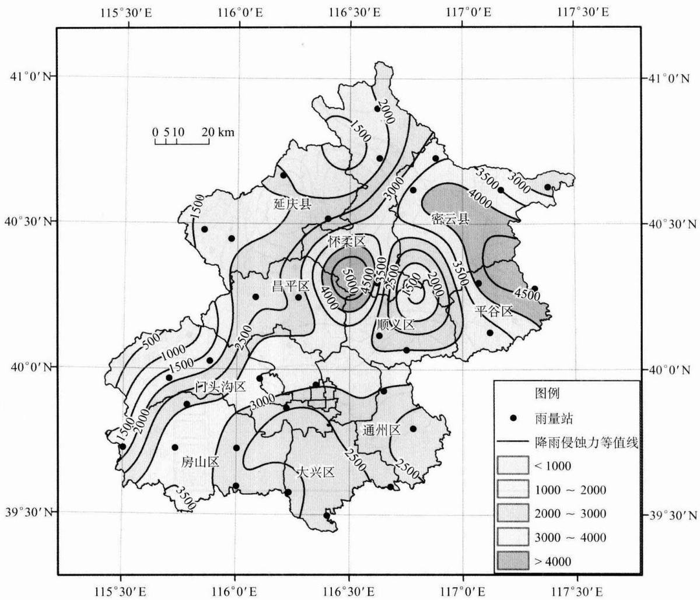  
图3.8 北京多年平均年降雨侵蚀力等值线图单位： $\mathrm { M J \cdot \ m m / ( \ h m ^ { 2 } \cdot \ h \cdot \ a ) } \ I$

多年平均年降雨侵蚀力由东南平原区向西北山区增加，在北部块状山地和西部条状山地组成的北东-南西走向的弧形山区山前迎风坡，形成了几个高值中心，然后又从山前区继续向西北方向的山后雨影区递减，在西北延庆县和门头沟区西部的盆地区形成低值中心。北京市R主体变化于 $\mathrm { 1 5 0 0 { \sim } 3 5 0 0 ~ M J \bullet \ m m / ( h m ^ { 2 } \bullet h \bullet a ) }$ ；高值分布在东北平谷将军关、大华山一带，多为 $3 0 0 0 \ \mathrm { M J } \cdot \mathrm { m m } / ( \mathrm { h m } ^ { 2 } \cdot \mathrm { h } \cdot { \mathrm { a } } )$ 以上，甚至达到 $4 0 0 0 \ \mathrm { M J } \cdot \mathrm { m m } / ( \mathrm { h m } ^ { 2 } \cdot \mathrm { h } \cdot \mathrm { a } )$ 以上；最低值位于西北延庆县和门头沟区西部，多为 $\mathbf { \Gamma } ^ { } 2 0 0 0 \mathrm { ~ M J } \cdot \mathbf { m m } / ( \mathrm { h m } ^ { 2 } \cdot \mathrm { h } \cdot \mathrm { a } )$ 以下。

北京地区多年平均年降雨侵蚀力的空间分布特征与多年平均年降水量分布基本一致(图3.9)。需要指出的是，图3.9中的降雨量仅包含日降雨量大于12 mm的降雨。

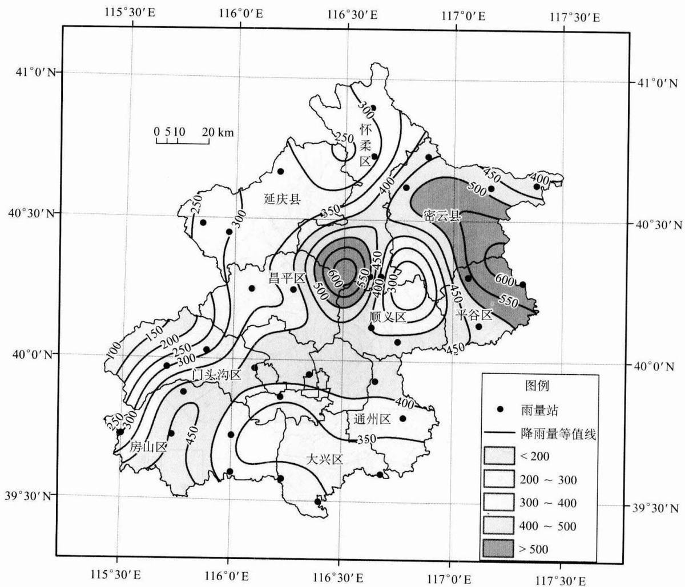  
图3.9 北京多年平均年侵蚀性降雨量等值线图（单位：mm)

## 参考文献

符素华，段淑怀，吴敬东，刘宝元.2002.北京山区次降雨侵蚀力.水土保持学报，16（1）：37\~39，57

黄炎和，卢程隆，郑添发，付勤，许建金.1992a.闽东南降雨侵蚀力指标R值的研究.土保持学报，6（4）：1～5

黄炎和，卢程隆，郑添发，付勤，许建金.1992b.闽东南天然降雨雨滴特征的研究.水土保持通报，12（3)：29\~33

贾志军，王小平，李俊义.1987.晋西黄土丘陵沟壑区降雨侵蚀力指标R值的确定.中国水土保持，(6)：18\~20

江忠善，李秀英.1988. 黄土高原土壤流失方程中降雨侵蚀力和地形因子的研究.中国科学院西北水土保持研究所集刊，（7)：40\~45

江忠善，宋文经，李秀英.1983.黄土地区天然降雨雨滴特性研究.中国水土保持，(3)：32\~36

江忠善，贾志伟，刘志.1992.降雨和地形因素与坡地水土流失关系的研究.黄土高原小流域综合治理与发展.北京：科学技术文献出版社.300\~309

金建君，谢云，张科利.2001.不同样本序列下侵蚀性雨量标准的研究.水土保持通报，21（2）：31\~33

刘和平，袁爱萍，路炳军，邸超.2007.北京侵蚀性降雨标准.水土保持研究，17（1）：215\~217，220

王万忠.1983a.黄土地区降雨特性与土壤流失关系的研究.水土保持通报，3（4)：7～13

王万忠. 1983b. 黄土地区降雨特性与水土流失关系的研究降雨侵蚀力指标R值的探讨. 水土保持通报，3(5)：62\~64

王万忠.1984. 黄土地区降雨特性与土壤流失关系的研究II关于侵蚀性降雨标准的问题. 水土保持通报，4 (2):58\~62

王万忠.1987. 黄土地区降雨侵蚀力R指标的研究. 中国水土保持，(12)：34～40

王万忠，焦菊英.1996.中国的土壤侵蚀因子定量评价研究.水土保持通报，16（5）：1\~20

吴素业. 1994. 安徽大别山区降雨侵蚀力简易算法与时空分布规律研究. 中国水土保持，(4)：12\~13

谢云，刘宝元，章文波.2000.侵蚀性降雨标准研究. 土壤侵蚀与水土保持学报，14（4）：6～11

谢云，章文波，刘宝元. 2001. 用日雨量和雨强计算降雨侵蚀力. 水土保持通报，21（6)：53～56

杨子生.1999a. 滇东北山区坡耕地土壤流失方程研究. 水土保持通报，19（1）：1～9

杨子生. 1999b. 滇东北山区坡耕地降雨侵蚀力研究. 地理科学，19(3)：265\~270

张宪奎，许谨华，卢秀琴，邓育江，高德武.1992.黑龙江省土壤流失方程的研究．水土保持通报，12（4）：1～9

章文波，谢云. 2002. 利用日雨量计算降雨侵蚀力的方法研究. 地理科学，22(6)：705～711

章文波，谢云，刘宝元. 2002. 用雨量和雨强计算次降雨侵蚀力. 地理研究，21（3）：384\~390

赵富海，赵宏夫. 1995. 编制张家口市降雨侵蚀力R值图的研究. 见：蔡强国主编．永定河上游张家口市水土流失规律与土地改良利用.北京：环境科学出版社.16\~22

周伏建，陈明华，林福兴，黄炎和，卢程隆.1995a.福建省天然降雨雨滴特征的研究.水土保持学报，9（1）：8\~12

周伏建，陈明华，林福兴，黄炎和，卢程隆.1995b.福建省降雨侵蚀力指标R值.水土保持学报，9（1）：13～18

周佩华，王占礼. 1987.黄土高原土壤侵蚀暴雨标准. 水土保持通报，7（1)：38～44

Ellison W D. 1947. Studies of raindrop erosion. Agricultural Engineering, 28 (4): 145, 146, 197\~201

Elwell H A, Stocking M A. 1975. Parameters for estimating annual runoff and soil loss from agricultural lands in Rhodesia. Water Resources Research, 11 (4): 601\~605

Ferro V, Giordano G, Iovino M. 1991. Isoerosibity and erosion risk map for Sicilv. Hydrological Sciences Journal, 36 (6): 549\~564

Foster G R, Lombardi F, Moldenhauer W C. 1982. Evaluation of rainfall-runoff erosivity factors for individual storms. Transactions of the ASAE, 25 (1); 124\~129

Hudson N W. 1995. Soil Conservation. Ames: Iowa State University Press

Kinnell P I. 1998. USLE-M: empirical modelling rainfall erosion through runoff and sediment concentration. Soil Science Society of America Journal, 62 (6): 1667\~1672

Lal R. 1994. Soil Erosion Research Methods. 2nd edition. Delray Beach: Soil Water Conservation Society, St Lucie Press

Laws J O. 1941. Measurements of fall-velocity of water-drops and raindrops. Transactions of the American Geophysical Union, 22 (3): 709\~721

Musgrave G W. 1947. The quantitative evaluation of factors in water erosion—a first approximation. Journal of Soil and Water Conservation, 2 (3): 133\~138

Richardson C W, Foster G R, Wright D A. 1983. Estimation of erosion index from daily rainfall amount. Transactions of the ASAE, 26 (1): 153\~156

Wischmeier W H. 1959. A rainfall erosion index for a universal soil-loss equation. Soil Science Society of America Journal, 23 (3):246\~249

Wischmeier W H, Smith D D. 1958. Rainfall Energy and its Relationship to Soil Loss. Transactions of the American Geophysical Union, 39 (2): 285\~291

Xie Y, Liu B, Nearing M K. 2002. Practical thresholds for separating erosive and non-erosive storms. Transactions of the ASAE, 45 (6): 1843\~1847

## 第四章 土壤可蚀性因子

土壤可蚀性表征土壤对侵蚀力的敏感性。土壤可蚀性大，说明土壤对外来侵蚀力的抵抗能力差，容易遭受侵蚀；反之，土壤不易遭受侵蚀。土壤可蚀性因子是土壤可蚀性的定量评价指标，Wischmeier和Smith①②把土壤可蚀性定义为：标准小区条件下，单位降雨侵蚀力引起的土壤流失率，单位是 $\mathrm {  ~ t ~ } \bullet \mathrm {  ~ \ h m ~ } ^ { 2 } \bullet \mathrm {  ~ h ~ } / ( \mathrm { h m } ^ { 2 } \bullet \mathrm {  ~ M J ~ } \bullet \mathrm {  ~ m m } )$ 。标准小区是指水平投影坡长为22.13m、坡度为9%（5.14°)，保持连续休闲状态并且实施顺坡耕作的小区（图4.1）。

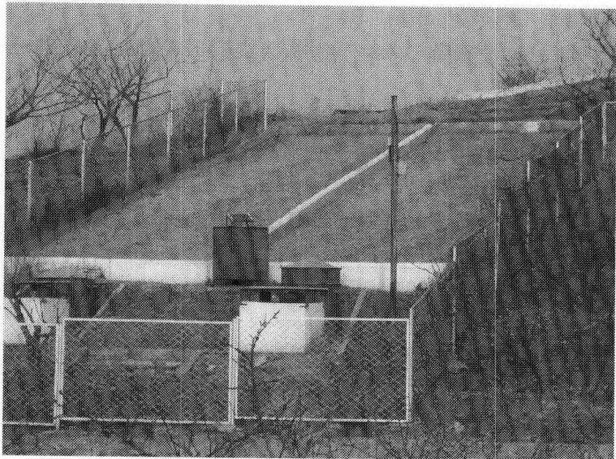  
图4.1 位于密云县石匣水土保持试验站的标准小区

## 4.1 概 述

土壤是侵蚀的对象，也是河流泥沙的主要物质来源。土壤本身的性质差异，通过影响入渗、雨滴和径流对土壤颗粒的分离和搬运等，对侵蚀发生的强弱及其产沙量的多少产生重要影响。土壤可蚀性描述了土壤性质对降雨径流侵蚀作用的响应程度，是反映土壤在雨滴击溅和径流冲刷两者共同作用下，是否容易被分离和搬运的定量指标。许多学者采用了不同的指标评价土壤性质抵抗侵蚀的能力。本模型所指的土壤可蚀性因子是指标准小区条件下，单位降雨侵蚀力引起的土壤流失率，单位是 $\mathrm {  ~ t ~ } \bullet \mathrm {  ~ h m } ^ { 2 } \bullet \mathrm {  ~ h / } ( \mathrm { h m } ^ { 2 } \bullet \mathrm {  ~ M J ~ } \bullet \mathrm {  ~ \Omega ~ } )$ mm)。土壤可蚀性因子估算的准确性将直接影响土壤流失量的预报精度。目前应用较多的土壤可蚀性因子计算方法主要有4种：①标准小区法；②人工模拟降雨试验法；③公式估算法；④诺谟图法。

标准小区法是通过对标准小区土壤流失量及其相应的降雨量观测，利用观测资料确定土壤可蚀性因子的实测方法。标准小区是指水平投影坡长为22.13m、坡度为9%(5.14°)，保持连续休闲状态并且实施顺坡耕作的小区。它是确定土壤侵蚀可蚀性因子最为准确和基本的方法，由Olson和Wischmeier（1963）年提出，计算公式为

$$
K = \frac { A } { \overline { { R } } }\tag{4.1}
$$

这种方法要求径流小区必须是裸地，且按农耕活动进行处理，但可以改变坡度和坡长，在计算土壤可蚀性因子之前，需首先将观测资料修正到坡度9%或坡长22.13m的情况下，然后利用式（4.1）计算。例如，金争平等（1992）用内蒙古准格尔旗皇甫川流域的小区观测资料，以坡度 $6 ^ { \circ }$ 的小区为标准小区，计算了黄土、栗钙土、风沙土等土类的可蚀性因子；牟金泽和孟庆枚（1983）用甘肃省天水站的小区观测资料用坡度5.07°的小区为标准小区，计算了中壤土和轻黏土的土壤可蚀性因子；张宪奎等（1992）用黑龙江省克山县、宾县等地的小区资料，计算了东北白浆土、黑土和暗棕壤的土壤可蚀性因子。在用标准小区法研究土壤可蚀性因子时，每个小区只能代表一种土壤，且需要大量的天然降雨径流资料。例如，Wischmeier（1976）对美国东部地区的研究资料分析表明，观测时段不应短于20～22年，因此这种方法往往需要较长的观测周期。由于经济和时间两方面的原因，野外坡面径流小区的长期观测常常难以维持。例如，北京市每年产流次数只有10次左右，累积时间序列足够长的观测资料显然需要进行长期的观测和维护，从而限制了该方法的广泛使用，由此促进了人工模拟降雨试验法的发展。

人工模拟降雨试验法利用人工模拟降雨试验得到的土壤流失量及其相应的降雨侵蚀力，计算土壤可蚀性因子。代表成果有：陈明华等（1995）用人工降雨试验及天然对照小区的实测资料，在福建研究了红壤、紫色土、石灰土和黄壤的土壤可蚀性因子，并提出了用土壤性质指标值计算土壤可蚀性因子的相关关系式；史学正等（1995）用设在中国科学院江西省鹰潭红壤生态站的微小区（小区面积为 $1 2 ~ \mathrm { m } ^ { 2 } )$ 人工模拟降雨试验资料，计算了江西红壤区不同土壤类型的土壤可蚀性因子的相对大小，并比较了小区实测值与诺谟图计算值的差异。由于人工模拟降雨与天然降雨不同，利用该方法得到的土壤可蚀性因子会和天然降雨实测值存在差别，需要利用标准小区观测值进行修正。目前尚需要对人工模拟降雨试验法确定土壤可蚀性因子进行深入研究。

公式估算法是以标准小区及人工模拟降雨试验观测结果为基础，根据土壤性质指标估算土壤可蚀性因子的方法。它可解决无资料地区的土壤可蚀性因子计算问题：首先，通过分析大量的标准小区实测资料、人工模拟降雨资料测得的土壤可蚀性因子及其与士壤基本理化性质的关系，建立土壤可蚀性因子与土壤理化性质之间的回归关系；然后，用所得方程估算没有实测资料地区的土壤可蚀性因子。该方法的优点是土壤理化性质的测定比较方便，费用少，方法成熟，并且所得的土壤可蚀性因子稳定，多数情况下趋于多次降雨试验的平均值。Wischmeier和Mannering（1969）用5年时间采用人工降雨试验法测定了美国55种土壤的土壤可蚀性因子，选定13个土壤特性指标，采用24个统计量与+壤可蚀性因子求回归，得到一个含有24个变量的关系式，但是该关系式不论在理解认识上，还是在实际使用中都存在很大的不便。为了便于用户使用，Wischmeier等（1971）对Wischmeier和Mannering（1969）提出的关系式进行简化，最后概括成4个主要影响土壤可蚀性因子的土壤性质数值指标：土壤质地、有机质含量、土壤结构系数、土壤剖面渗透性等级。其计算公式为

$$
K _ { \mathrm { m } } = { \frac { [ 2 . 1 \times 1 0 ^ { - 4 } ( 1 2 - 0 { \bf M } ) M ^ { 1 . 1 4 } + 3 . 2 5 \times ( s _ { \mathrm { t } } - 2 ) + 2 . 5 \times ( p - 3 ) ] } { 7 5 9 } }\tag{4.2}
$$

式中， $K _ { \mathrm { n m } }$ 为诺谟图计算的土壤可蚀性因子， $\mathrm { \bf t } \bullet \mathrm { \bf h m } ^ { 2 } \bullet \mathrm { \bf h } / ( \mathrm { \bf h m } ^ { 2 } \bullet \mathrm { \bf \ M J } \bullet \mathrm { \bf \ m m } )$ ；M为土壤质地的参数，M=粉粒含量（0.05\~0.002mm)+极细砂含量 $( 0 . 0 5 { \sim } 0 . 1 \ \mathrm { m m } ) ] \ \times$ [100一黏粒含量（<0.002 mm)]，%；OM为土壤有机质含量， $\% : \ s _ { \mathrm { t } }$ 为结构等级； $\boldsymbol { \mathbf { \mathit { \phi } } }$ 为渗透等级。结构等级 $( s _ { \mathrm { t } } )$ 分为4级，分别为：①团粒结构<1mm；②团粒结构1\~2mm；③团粒结构2\~10 mm；④团粒结构>10 mm、片状结构、块状结构、棱柱和柱状结构。渗透等级根据土壤饱和导水率大小分为6级（表4.1）。

表 4.1 渗透等级分级标准①
<table><tr><td>渗透等级</td><td>饱和导水率/(mm/h)</td><td>土壤质地</td><td>基本描述</td></tr><tr><td>1</td><td>&gt;150</td><td>砂土</td><td>下渗速率很快</td></tr><tr><td>2</td><td>50~150</td><td>壤砂土、砂壤土</td><td>下渗速率中等偏快</td></tr><tr><td>3</td><td>15~50</td><td>壤土、粉壤土</td><td>下渗速率中等</td></tr><tr><td>4</td><td>5~15</td><td>砂黏壤土、黏壤土</td><td>下渗速率中等偏慢</td></tr><tr><td>5</td><td>1~5</td><td>粉黏壤土、黏壤土</td><td>下渗速率慢</td></tr><tr><td>6</td><td>&lt;1</td><td>粉黏土、黏土</td><td>下渗速率很慢</td></tr></table>

北京土壤饱和导水率用以下公式估算：

$$
K _ { \mathrm { s } } = 3 . 3 6 C _ { \mathrm { l } } + 0 . 9 6 S _ { \mathrm { a } } + 1 3 . 8 6 \mathrm { O M } - 4 1 . 5 8\tag{4.3}
$$

式中， $K _ { s }$ 为饱和导水率， $\mathrm { { m m / h } } ; \ C _ { 1 }$ 为黏粒 $( < 0 . 0 0 2 \ \mathrm { m m } )$ 含量，%； $S _ { \mathfrak { a } }$ 为砂粒(0.05\~2.00 mm)含量，%。

特别需要指出的是：式（4.2）所适用的土壤，其粉粒含量不得超过70%，有机质含量不得超过4%。

Williams等（1984）建立的侵蚀-生产力影响模型 EPIC（Erosion productivity im-pact calculator）中，土壤可蚀性因子采用土壤有机碳和粒径组成估算：

$$
K _ { \mathrm { E P C } } = [ 0 . 2 + 0 . 3 \mathrm { e } ^ { - 0 . 0 2 5 6 5 \mathrm { a n N } \left( 1 . \frac { \mathrm { s u } } { \mathrm { I 0 } } \right) } ] \times \left( \frac { \mathrm { S I L } } { \mathrm { C L A } + \mathrm { S I L } } \right) ^ { 0 . 3 } \times \left( 1 . 0 - \frac { 0 . 2 5 C _ { \mathrm { a } } } { C _ { \mathrm { a } } + \mathrm { e } ^ { 3 . 7 2 - 2 . 9 5 \mathrm { s } _ { \mathrm { a } } } } \right)
$$

$$
\times \left( 1 . 0 - { \frac { 0 . 7 { \mathrm { S N } } 1 } { { \mathrm { S N } } 1 + { \mathrm { e } } ^ { - 5 . 5 1 + 2 2 . 9 { \mathrm { S N } } 1 } } } \right) / 7 . 5 9\tag{4.4}
$$

式中， $K _ { \mathrm { e p c } }$ 为EPIC模型计算的土壤可蚀性因子， $\mathrm {  ~ t ~ } \bullet \mathrm {  ~ \ h m ~ } ^ { 2 } \bullet \mathrm {  ~ h / ( ~ h m ^ { 2 } ~ } \bullet \mathrm {  ~ M J ~ } \bullet \mathrm {  ~ m m ) } ;$ SAN、SIL和CLA分别为美制土壤粒级分类标准中的砂粒、粉粒和黏粒含量， $\mathrm { S N 1 = }$ $1 { - } \mathrm { S A N } / 1 0 0 ; \ C _ { \mathrm { a } }$ 为有机碳含量，%。

使用式（4.2）和式（4.4）估算土壤可蚀性因子时，需要粒径组成、有机质、土壤入渗等多种资料，Römkens等（1986）应用世界范围的天然小区资料和人工降雨试验资料(225种土壤)，通过分析发现，从颗粒组成分类来看，考虑过土壤砾石（>2mm）的资料不足整个资料的10%。如果把这些土壤的平均土壤可蚀性因子与相应的平均几何粒径进行回归分析，可得

$$
K _ { \mathrm { R } } = \Big \{ 0 . \ 0 0 3 4 + 0 . \ 0 4 0 5 \mathrm { e x p } \Big [ - \frac { 1 } { 2 } \Big ( \frac { \log B _ { \mathrm { g } } + 1 . \ 6 5 9 } { 0 . 7 1 0 1 } \Big ) ^ { 2 } \Big ] \Big \}\tag{4.5}
$$

$$
D _ { \mathrm { g } } = \mathrm { e x p } \big ( 0 . 0 1 \sum f _ { s i } \mathrm { l n } m _ { i } \big ) \qquad r ^ { 2 } = 0 . 9 8 3\tag{4.6}
$$

式中， $K _ { \mathrm { R } }$ 为 Römkens 计算的土壤可蚀性因子， $\mathrm {  ~ t ~ } \bullet \mathrm {  ~ h m } ^ { 2 } \bullet \mathrm {  ~ h / ( h m ^ { 2 } ~ } \bullet \mathrm {  ~ M J ~ } \bullet \mathrm {  ~ m m ) }$ ； $D _ { \mathbf { g } }$ 为平均几何粒径，mm； $f _ { \mathrm { s } i }$ 为原土粒径组成百分比， $\%$ ； $m _ { i }$ 为相应粒径组的算术平均值，mm。对于美国的138种土壤，也得出了类似的关系式

$$
K _ { \mathrm { R } } = \Big \{ 0 . 0 0 1 7 + 0 . 0 4 9 4 \mathrm { e x p } \Big [ - \frac { 1 } { 2 } \Big ( \frac { \log D _ { g } + 1 . 6 7 5 } { 0 . 6 9 8 6 } \Big ) ^ { 2 } \Big ] \Big \}\tag{4.7}
$$

式（4.5）和式（4.7）适宜于资料不足、但知道不同分级系统下粒径组成的土壤的可蚀性因子的计算，也能用于不能使用诺谟图计算土壤可蚀性因子的情况，如质地良好且团聚体含量高的土壤。以上公式的建立都是基于国外特定下垫面条件得到的，有一定的区域性限制，在我国是否适用尚需要进行验证。

根据诺谟图（图4.2）确定土壤可蚀性因子是应用较为广泛的一种方法。诺谟图是Wischmeier等（1971）在Wischmeier和 Mannering（1969）提出土壤可蚀性因子估算关系式基础上总结得到的。诺谟图包括了5个土壤参数：粉砂+极细砂含量（0.002～0.1mm)、砂粒含量（0.1～2mm)、有机质含量、土壤结构等级和土壤渗透等级，并分为左右两个图区，左图区查初估值，右图区进行结构和等级渗透性校正。利用诺谟图查土壤可蚀性因子程序如下：

①准备好相应的基本参数数据：粉砂+极细砂含量（0.002～0.1mm）、砂粒含量(0.1～2mm)、有机质含量、土壤结构等级和土壤渗透等级，并在左图的纵坐标上找出粉粒+极细砂含量值。

②从粉粒+极细砂含量值向右绘一条平行于横坐标的水平线，该线与砂粒含量曲线簇相交。根据砂粒含量找出代表该百分数的曲线，并找到该曲线与水平线的交点。

③绘制一条通过上述交点且平行于纵坐标的垂线，该垂线与OM曲线簇相交。根据目标有机质含量找出代表该百分数的曲线，并找到该曲线与垂线的交点。

④从交点处开始向右绘一条平行于横坐标的水平线，该水平线与左图右纵坐标的交点为土壤可蚀性因子的初估值，大部分地区土壤的可蚀性因子是这个值。如果土壤结构和入渗性能差别较大，则再对初估值进行校正，方法为⑤和⑥。

⑤根据土壤结构等级找出相应的曲线，并找到该曲线与④中所绘水平线的交点。

⑥从交点处垂直向下绘制一条垂线，垂线与渗透等级曲线簇相交。根据目标渗透等级找出代表该等级的曲线，并找到该曲线与垂线的交点。

⑦从交点处开始向左绘一条平行于横坐标的水平线，该线与右图纵坐标的交点，即是土壤可蚀性因子。需要注意的是，该图上得到的土壤可蚀性因子单位是美制单位，$\mathrm { ~ t ~ } \bullet \ \mathrm { a c r e } \bullet \ \mathrm { h } / ( 1 0 0 \mathrm { a c r e } \bullet \ \mathrm { f t - t o n f } \bullet \ \mathrm { i n } ) \mathbb { D }$ ，需要除以7.59转换为国际制单位， $\operatorname { t } \cdot \operatorname { h m } ^ { 2 } \cdot \operatorname { h } /$ $( \mathrm { h } \mathrm { m } ^ { 2 } \cdot \mathrm { M J } \cdot \mathrm { m } \mathrm { m } )$

图4.2中虚线为一算例：粉粒和极细砂65%，砂粒5%，OM为2.8%，结构等级为2，渗透等级为4，查图4.2得K值为 $0 . 3 1 \ \mathrm { { t \bullet \ a c r e \bullet \ h / ( 1 0 0 a c r e \bullet f t { - t o n f \bullet \ i n } ) } }$ ，即为$0 . 0 4 1 { \mathrm { ~ t } } \bullet { \mathrm { ~ h m } } ^ { 2 } \bullet { \mathrm { ~ h } } / ( { \mathrm { h m } } ^ { 2 } \bullet { \mathrm { ~ M J } } \bullet { \mathrm { ~ m m } } )$ 。诺谟图是根据美国中西部地区人工降雨试验资料推导得到的，试验大多是在中等质地的表层土壤中进行的，其中60%土类的团粒系数小于$0 . 3 \textcircled { 2 }$ ，因此诺谟图很适合应用于美国中西部地区低团粒、中等质地的土壤。有些研究者试图把诺谟图应用到其他地区的土壤。例如，张宪奎等（1992）用设在黑龙江省克山县、宾县等地的小区资料，计算了东北白浆土、黑土和暗棕壤的可蚀性因子，通过比较小区实测值与诺谟图查算值后指出，土壤可蚀性因子诺谟图查算值比实测值偏小30%左右。

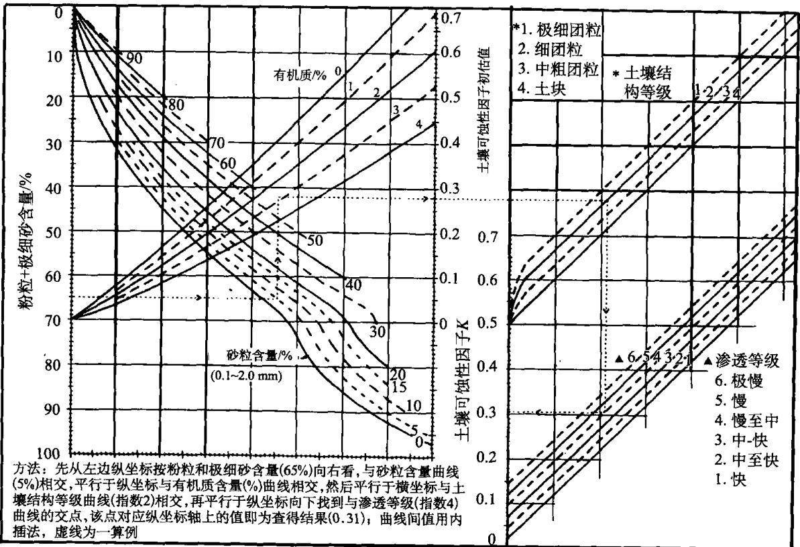  
图 4.2 土壤可蚀性因子诺谟图

## 4.2 北京土壤可蚀性因子

北京属褐土地带，中山以上分布有山地草甸土和山地棕壤；中山以下至高位平原广阔的地段内，分布着大面积的褐土；平原主要分布着潮土。褐土分布区域内，由于地形、碳酸钙淋溶程度以及心土黏化程度不同，分别形成淋溶褐土、普通褐土和碳酸盐褐土；低山阳坡土壤侵蚀严重，形成粗骨性褐土。北京土壤流失方程中的土壤可蚀性因子计算包括标准小区法、人工降雨试验法、公式估算法和诺谟图法4种方法。在采集土壤样品，分析其主要物理化学指标基础上，建立了北京山区土壤可蚀性因子的估算公式，利用公式计算结果，并结合土壤分布，绘制出以土属为基本单位的土壤可蚀性因子空间分布图。

## 4.2.1 标准小区法

采用位于北京山区的密云县石匣、怀柔区汤河口、延庆县上辛庄和门头沟区担礼的标准小区降雨径流泥沙观测资料，根据式（4.8）计算各标准小区的土壤可蚀性因子。

$$
K = { \frac { A } { { \overrightarrow { R L S } } } }\tag{4.8}
$$

由于所建小区并非坡度为9%、坡长为22.13 m的标准小区，计算时需要对坡度和坡长进行修正。坡度修正公式为（Liu et al.，1994）

$$
S = 2 1 . 9 1 \mathrm { s i n } \theta - 0 . 9 6\tag{4.9}
$$

式中，S、θ为坡度，(°)。

坡长修正公式为①

$$
L = \left( { \frac { \lambda } { 2 2 . 1 3 } } \right) ^ { m }\tag{4.10}
$$

式中，λ为水平投影坡长，m；m为坡长指数，取 $\mathrm { { \it m } } = 0 . 5$

降雨侵蚀力根据式（3.1）和式（3.2c）计算。4组小区观测的K值变化于$0 . \ 0 0 8 9 4 { \sim } 0 . \ 0 2 0 0 3 \ \mathrm { t } \bullet \ \mathrm { h m } ^ { 2 } \bullet \ \mathrm { h } / ( \mathrm { h m } ^ { 2 } \bullet \ \mathrm { M J } \bullet \ \mathrm { m m } )$ (表4.2)。

表4.2 北京山区水土保持试验站标准小区实测K值
<table><tr><td rowspan="2">小区位置</td><td rowspan="2">坡度 1(°)</td><td rowspan="2">坡长 /m</td><td rowspan="2">土地利用</td><td rowspan="2">土壤类型</td><td rowspan="2">资料年限</td><td rowspan="2">K  $/ [ \mathsf { t } \cdot \mathsf { h m } ^ { 2 } \cdot \mathsf { h } / ( \mathsf { h m } ^ { 2 } \cdot \mathsf { M J } \cdot \mathsf { m m } ) ]$ </td></tr><tr><td></td></tr><tr><td>怀柔</td><td>15.0</td><td>20.0</td><td>裸地休闲</td><td>普通褐土</td><td>2001~2004</td><td>0.01950</td></tr><tr><td>延庆</td><td>15.0</td><td>20.0</td><td>裸地休闲</td><td>普通褐土</td><td>2003~2004</td><td>0.02003</td></tr><tr><td>密云</td><td>14.4</td><td>20.0</td><td>裸地休闲</td><td>粗骨褐土</td><td>2000~2004</td><td>0.00894</td></tr><tr><td>门头沟</td><td>15.0</td><td>10.0</td><td>裸地休闲</td><td>普通褐土</td><td>2005~2006</td><td>0.01080</td></tr></table>

由表4.2可以看出，虽然地点不同，但同一种土壤亚类的土壤可蚀性因子是接近的。粗骨褐土的土壤可蚀性因子远小于普通褐土，其原因可能是粗骨褐土中含有大量的砾石，土壤中砾石的存在可以增加入渗，降低径流和水流挟沙力，从而使得粗骨褐土的土壤可蚀性降低。此外，粗骨褐土标准小区的土壤由于水土流失，地表粗化现象逐年严重，土壤可蚀性因子值有降低的趋势（图4.3)。密云县石匣标准小区于1999年修建，2000年开始观测，到2004年，标准小区土壤表层已有大量砾石存在（图4.4)。而该小区的 K 值也由 2000 年的 $0 . 0 0 9 9 \mathrm { ~ t ~ ^ { \bullet } ~ h m ^ { 2 } ~ ^ { \bullet } ~ h / ( h m ^ { 2 } ~ \bullet ~ M J ~ ^ { \bullet } ~ m m ) }$ 降低到 $0 . 0 0 1 1 \ \mathrm { t } \cdot \mathrm { h m } ^ { 2 } \cdot \mathrm { h } /$ $( \mathrm { h m ^ { 2 } \cdot M J \cdot m m ) }$ ，降低了89%，可见土壤粗化对土壤可蚀性有十分强烈的影响。

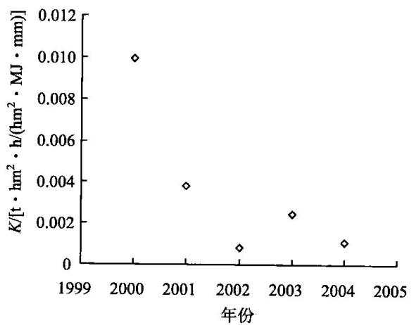  
图4.3 密云县石匣标准小区土壤  
可蚀性因子随年份的变化

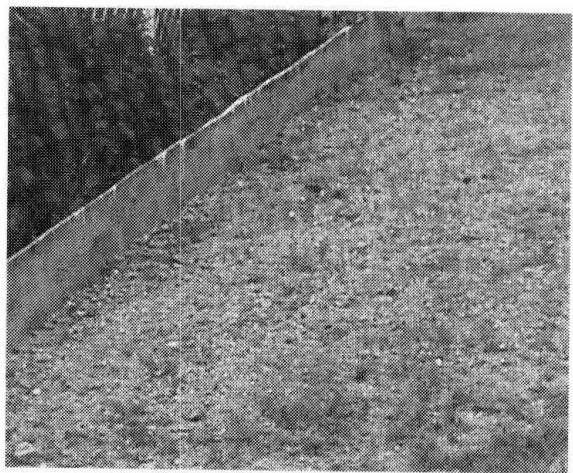  
图 4.4 2004 年密云县石匣标准  
小区地表砾石覆盖

## 4.2.2 人工降雨试验法

采集北京山区有代表性的山地草甸土、生草棕壤、山地棕壤、粗骨棕壤、淋溶褐土、碳酸盐褐土、普通褐土（延庆）、普通褐土（怀柔）和粗骨褐土8个土壤亚类、共9种土壤进行了人工降雨试验。试验土盘（图4.5）的长、宽和深分别为100cm、50 cm和40 cm，坡度为15°。土盘底部打有小孔，最底部铺约20 cm深的砾石以保证土壤中的水分垂直下渗，砾石上铺一层能透水的毛毯，以防细颗粒土随水分下渗，最上部20 cm 填充试验土壤。

试验设计考虑了以下因素：第一，由于人工降雨是模拟天然降雨过程，而天然降雨多变，为此，模拟降雨过程时采用变雨强。雨强设计基于北京1947\~2000年最大30min雨强观测资料的统计结果，分别设计为90 mm/h、67mm/h和30mm/h代表了该地区的大、中和小雨强。本试验取大、中、小3种雨强，干、湿两种运行状态，以模拟天然降雨下的复杂状况（表4.3)。干、湿运行间隔5h，按照USLE第二版划分次降雨的方法：如果降雨间歇不足6h，则视为一次降雨过程。因此整个模拟降雨过程作为一次降雨。第二，前期土壤含水量是影响土壤侵蚀过程的一个重要因素，为了消除前期土壤含水量对土壤可蚀性因子的影响，试验前测定土盘中的土壤含水量，用加水法或晾晒法使得前期含水量保持一致，同时要求试验土壤的容重与野外实际测得的土壤容重基本一致。

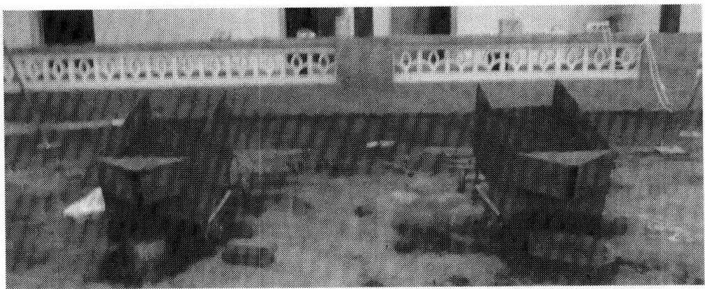  
图4.5 土壤可蚀性因子人工降雨试验土槽

表4.3 试验雨强设计
<table><tr><td rowspan="2">参数</td><td colspan="5">土壤含水量状态</td></tr><tr><td>干</td><td></td><td></td><td>湿</td><td></td></tr><tr><td>模拟雨强/(mm/h)</td><td>67</td><td>67</td><td>90</td><td>67</td><td>30</td></tr><tr><td>降雨时间/min</td><td>60</td><td>30</td><td>20</td><td>20</td><td>20</td></tr><tr><td>降雨量/mm</td><td>67.0</td><td>33.5</td><td>30.0</td><td>23.5</td><td>10.0</td></tr></table>

根据人工降雨试验得到不同土壤类型的土壤流失量，按照式（4.8）计算出土壤可蚀性因子。其中，降雨侵蚀力用式（3.1）和式（3.2c）计算，坡度坡长因子分别用式（4.9）和式（4.10）计算。为了考虑前期土壤含水量的影响，分别计算出干（低土壤含水量）、湿（高土壤含水量）两种运行状态下的土壤可蚀性因子（图4.6）。

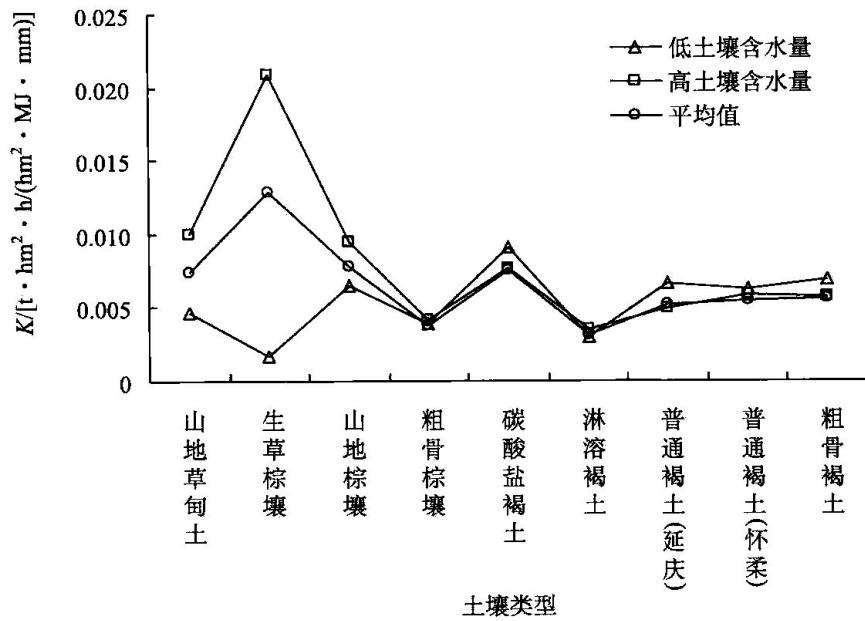  
图4.6 不同土壤含水量下的土壤可蚀性因子

由图4.6可以看出，前期土壤含水量对低山区褐土类土粗骨褐土、普遍褐土（怀柔）、普通褐土（延庆）、淋溶褐土和碳酸盐褐土]和粗骨棕壤的土壤可蚀性因子影响不大，但对高山区山地草甸土和山地棕壤的土壤可蚀性因子有较显著的影响。含水量高时的土壤可蚀性因子明显高于低含水量时的值，对生草棕壤尤为明显。对试验过程进行观察发现，降雨后，褐土类土和粗骨棕壤的土壤表层很快出现地表结皮现象，这可能有效降低了这几种土壤的土壤流失量，从而使前期土壤含水量大小对土壤流失量的影响并不明显（图4.7）。消除降雨侵蚀力的影响后，前期土壤含水量对土壤可蚀性因子的影响更不明显。而山地草甸土和山地棕壤的土壤结皮较弱，由于土壤颗粒间的剪切力随土壤含水量增加而减弱，当水流挟沙力增大后，土壤流失量增大，尤其是生草棕壤，在试验过程中甚至出现了细沟，表明前期土壤含水量对土壤流失量的影响较大。

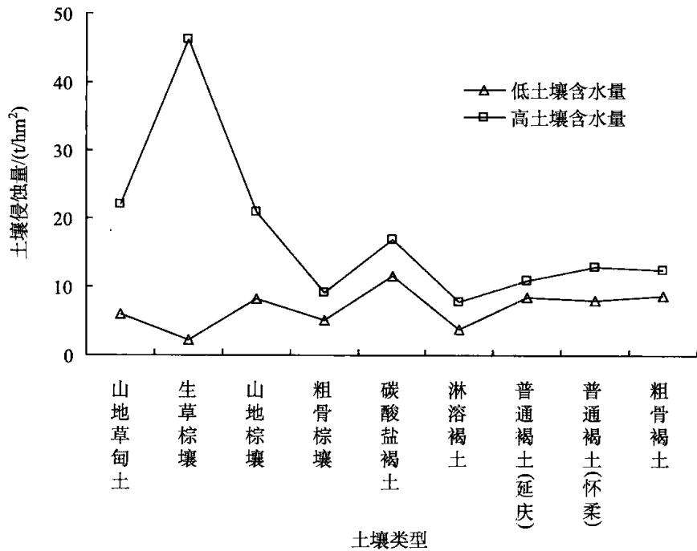  
图4.7 不同前期土壤含水量下的土壤流失量

由于干、湿两种运行状态下的人工降雨时间间隔较短，且发生在同一天，可将两次降雨视为一次降雨，由此可得到人工降雨条件下的土壤可蚀性因子（表4.4)。由表4.4可以看出，试验土壤类型在人工降雨条件下的K变化于 $0 . \ 0 0 3 1 { \sim } 0 . \ 0 1 2 8 \ \mathrm { ~ t ~ } \bullet \ \mathrm { h m } ^ { 2 } \ \bullet \ \mathrm { h } /$ $( \mathrm { h m } ^ { 2 } \cdot \mathrm { M J } \cdot \mathrm { m m } )$ ，其中山地草甸土、棕壤类土和褐土类土的K分别为 $0 . 0 0 7 4 ~ \mathrm { t } \cdot \mathrm { b } \mathrm { m } ^ { 2 } \cdot$ $\mathrm { h / ( h m ^ { 2 } \bullet M J \bullet m m ) _ { \setminus } ~ 0 . 0 0 8 1 ~ t \bullet ~ h m ^ { 2 } \bullet h / ( h m ^ { 2 } \bullet M J \bullet m m ) }$ 和 $0 . 0 0 5 4 ~ \mathrm { t } \bullet \mathrm { h m } ^ { 2 } \bullet \mathrm { h } / ( \mathrm { h m } ^ { 2 } )$ $\mathrm { M J } \cdot \mathrm { m m } )$ 。土壤可蚀性因子受土壤容重和有机质的影响很明显：随土壤容重增加而减小(图4.8)，随土壤有机质含量的增加而增大（图4.9)。比较人工降雨和天然降雨的试验结果（表4.5）发现，不同类型土壤两种降雨条件得到的结果有一定差异，普通褐土人工降雨的土壤可蚀性因子值约为天然降雨的1/4，远低于天然降雨观测值，因此不能将人工降雨测得的土壤可蚀性因子直接应用于土壤侵蚀量预报，需要进行修正；而粗骨褐土的人工降雨试验结果与天然降雨观测结果比较接近，4.2.1节中指出天然降雨条件下径流小区由于土壤粗化，导致土壤表层有大量砾石存在，降低了土壤可蚀性，而人工降雨试验的土壤粗化现象远不如天然降雨小区剧烈，使人工降雨测得的土壤可蚀性因子偏高。无论是人工降雨试验还是天然降雨小区观测，不同地点的普通褐土土壤可蚀性因子基本接近：天然降雨条件下的土壤可蚀性因子约为人工降雨条件下的3.7倍。

表4.4 人工降雨试验测定的土壤可蚀性因子
<table><tr><td rowspan="2">土壤类型（地区）</td><td rowspan="2">土壤容重  $/ ( \mathbf { g } / \mathbf { c m } ^ { 3 } )$ </td><td rowspan="2">有机质含量  $/ ( \mathbf { g } / \mathbf { k g } )$ </td><td rowspan="2">土壤质地</td><td rowspan="2">流失量  $/ ( { \mathrm { t } } / { \mathrm { h m } ^ { 2 } } )$ </td><td rowspan="2">K  $/ [ \mathsf { t } \bullet \mathsf { h m } ^ { 2 } \bullet \mathsf { h } / ( \mathsf { h m } ^ { 2 } \bullet \mathsf { M } \mathsf { J } \bullet \mathsf { m m } ) ]$ </td></tr><tr><td></td></tr><tr><td>山地草甸土</td><td>0.90</td><td>75.50</td><td>粉壤土</td><td>28.446</td><td>0.0074</td></tr><tr><td>生草棕壤</td><td>0.74</td><td>93.40</td><td>粉土土</td><td>48.624</td><td>0.0128</td></tr><tr><td>山地棕壤</td><td>0.88</td><td>42.90</td><td>粉壤土</td><td>29.532</td><td>0.0077</td></tr><tr><td>粗骨棕壤</td><td>一</td><td>34.10</td><td>粉壤土</td><td>17.767</td><td>0.0037</td></tr><tr><td>淋溶褐土</td><td>1.12</td><td>25.30</td><td>壤土土</td><td>12.092</td><td>0.0031</td></tr><tr><td>碳酸盐褐土</td><td>1.06</td><td>25.60</td><td>粉壤土</td><td>29.406</td><td>0.0075</td></tr><tr><td>普通褐土(怀柔)</td><td>1.04</td><td>7.69</td><td>粉壤土</td><td>21.582</td><td>0.0055</td></tr><tr><td>普通褐土(延庆)</td><td>1.04</td><td>7.69</td><td>粉壤土</td><td>20.470</td><td>0.0051</td></tr><tr><td>粗骨褐土</td><td>1.22</td><td>19.30</td><td>壤砂土</td><td>21.984</td><td>0.0056</td></tr></table>

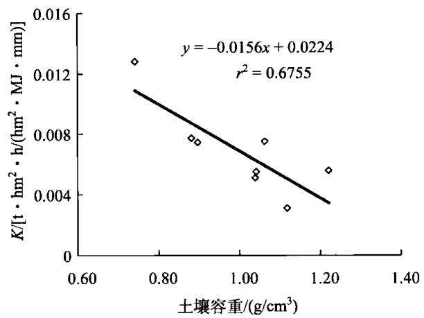  
图4.8 土壤可蚀性因子随土壤容重的变化

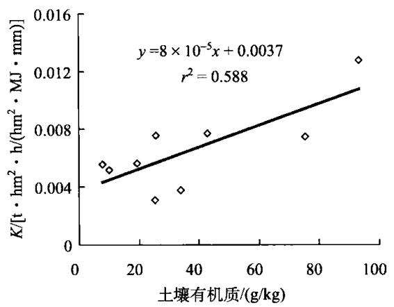  
图4.9 土壤可蚀性因子随土壤有机质的变化

表4.5 人工降雨试验与天然降雨条件下土壤可蚀性因子比较
<table><tr><td rowspan="2">土壤类型（地区）</td><td colspan="2"> $K / [ \mathsf { t } \cdot \mathsf { h m } ^ { 2 } \bullet \mathsf { h } / ( \mathsf { h m } ^ { 2 } \bullet \mathsf { M } \mathsf { J } \cdot \mathsf { m m } ) ]$ </td></tr><tr><td>天然降雨</td><td>人工降雨</td></tr><tr><td>普通褐土（怀柔）</td><td>0.01950</td><td>0.0051</td></tr><tr><td>普通褐土（延庆）</td><td>0.02003</td><td>0.0055</td></tr><tr><td>粗骨褐土</td><td>0.00894</td><td>0.0056</td></tr></table>

## 4.2.3 公式估算法

式（4.4）仅需要土壤颗粒级配资料和有机碳资料，相对于诺谟图法所需的资料更容易获取，也更便于应用。因此在北京山区密云县石匣、怀柔区汤河口、延庆县上辛庄和门头沟区担礼和房山区蒲洼各水土保持试验站的标准小区采集土壤样品，并分析了土壤有机碳和土壤颗粒级配，用式（4.4）计算了各标准小区的土壤可蚀性因子。计算的土壤可蚀性因子变化于 $0 . \ 0 2 6 2 7 { \sim } 0 . \ 0 5 6 3 1 \ \mathrm { t } \bullet \ \mathrm { h m ^ { 2 } } \ \bullet \ \mathrm { h / ( h m ^ { 2 } } \ \bullet \ \mathrm { M J } \bullet \ \mathrm { m m ) }$ (表4.6)，明显大于小区观测值，但二者之间存在较好的相关关系（图4.10）：

$$
K = 0 . 5 5 0 7 K _ { \mathrm { c a l } } - 0 . 0 1 0 2\tag{4.11}
$$

式中， $K _ { \mathrm { c a l } }$ 为式（4.4）的计算值， $\mathrm { \bf t } \bullet \mathrm { \bf h m } ^ { 2 } \bullet \mathrm { \bf h } / ( \mathrm { h m } ^ { 2 } \bullet \mathrm { \bf \ M J } \bullet \mathrm { \bf \ m m } )$ 。利用式（4.11）可将式（4.4）的计算值修正为标准小区条件下的土壤可蚀性因子，于是北京市土壤可蚀性因子估算公式为

$$
\begin{array} { l } { K = 0 . 0 7 2 6 \times \left[ 0 . 2 + 0 . 3 \mathrm { e } ^ { - 0 . 0 2 5 6 5 \mathrm { A M N } ( 1 \cdot \frac { \mathrm { S U } } { 1 0 0 } ) } \right] \times \left( \frac { \mathrm { S I L } } { \mathrm { C I A } + \mathrm { S I I } } \right) ^ { 0 . 3 } \times \left( 1 . 0 - \frac { 0 . 2 5 \mathrm { C a } } { C _ { \mathrm { s } } + \mathrm { e } ^ { 3 . 7 2 2 \cdot 9 5 \mathrm { C a } } } \right) } \\ { \times \left( 1 . 0 - \frac { 0 . 7 5 \mathrm { N } 1 } { \mathrm { S N } 1 + \mathrm { e } ^ { - 5 . 5 1 + 2 2 . 9 5 \mathrm { N } } } \right) - 0 . 0 1 0 2 \qquad } & { ( 4 . 1 2 ) } \end{array}
$$

表 4.6 各水土保持试验站标准小区实测K值与 ${ \pmb K } _ { { \bf E P I C } }$ 值
<table><tr><td rowspan="2">小区位置</td><td rowspan="2">有机碳 1%</td><td rowspan="2">黏粒 1%</td><td rowspan="2">粉粒 1%</td><td rowspan="2">砂粒 1%</td><td rowspan="2">K</td><td rowspan="2"> $K _ { \mathrm { E P K } }$  /[t·hm²·h/(hm²·MJ·mm)]</td></tr><tr><td>/t·hm²·h/(hm²·MJ·mm)]</td></tr><tr><td>怀柔</td><td>0.45</td><td>12.75</td><td>56.18</td><td>31.07</td><td>0.01950</td><td>0.05050</td></tr><tr><td>延庆</td><td>0.45</td><td>14.66</td><td>67.34</td><td>18.01</td><td>0.02003</td><td>0.05631</td></tr><tr><td>密云</td><td>1.12</td><td>3.80</td><td>21.15</td><td>75.05</td><td>0.00894</td><td>0.02627</td></tr><tr><td>门头沟</td><td>1.60</td><td>23.11</td><td>44.45</td><td>32.44</td><td>0.01080</td><td>0.04307</td></tr><tr><td>房山</td><td>1.50</td><td>16.65</td><td>42.42</td><td>40.93</td><td>0.01190</td><td>0.03267</td></tr></table>

下面举例说明如何应用式（4.12）。

例如，某土的土壤颗粒级配分析结果如下：1～2mm，7.32%；0.5～1mm，5.63%; 0.25\~0.5 mm, 3.66 %; 0.1\~0.25 mm, 3.21 %; 0.05\~0.1 mm,11.08 %;0.02\~0.05 mm, 38.21 %; 0.005\~0.02 mm, 14.63 %; 0.002\~0.005mm，3.48%；<0.002mm，12.78%；有机碳含量为0.46%，用式（4.12）计算该土壤的土壤可蚀性因子。

第一步：计算土壤的黏粒（<0.002mm）含量为CLA=12.78 %；

第二步：计算土壤的砂粒（0.05～2mm）含量为 $\mathrm { S A N } { = } 7 . 3 2 + 5 . 6 3 + 3 . 6 6 +$ $3 . 2 1 + 1 1 . 0 8 { = } 3 0 . 9 ( \% )$ ;

第三步：计算土壤的粉粒含量为 ${ \mathrm { S I L } } { = } 3 . 4 8 { + } 1 4 . 6 3 { + } 3 8 . 2 1 { = } 5 6 . 3 2 ( \% )$

第四步：根据式（4.12）计算土壤可蚀性因子

$$
\begin{array} { r l } & { K = 0 . 0 7 2 6 \times \{ 0 . 2 + 0 . 3 \mathrm { e } ^ { - 0 . 0 2 5 6 \times 3 0 . 9 \times ( 1 - 5 6 . 3 2 / 1 0 0 ) } \} \times \left( \frac { 5 6 . 3 2 } { 1 2 . 7 8 + 5 6 . 3 2 } \right) ^ { 0 . 3 } } \\ & { \qquad \times \left( 1 . 0 - \frac { 0 . 2 5 \cdot 0 . 4 6 } { 0 . 4 6 + \mathrm { e } ^ { 3 . 7 2 - 2 . 9 5 0 . 4 6 } } \right) \left( 1 . 0 - \frac { 0 . 7 5 \mathrm { N l } } { ( 1 \cdots 3 0 . 9 / 1 0 0 ) + \mathrm { e } ^ { - 5 . 5 1 + 2 2 . 5 ( 1 - 3 0 . 9 / 1 0 0 ) } } \right) - 0 . 0 1 0 2 } \\ & { \qquad \approx 0 . 0 1 7 6 [ \mathrm { t \cdot h \ m ^ { 2 } \cdot h / ( h m ^ { 2 } \cdot M J \cdot m m ) } ] _ { \circ } } \end{array}
$$

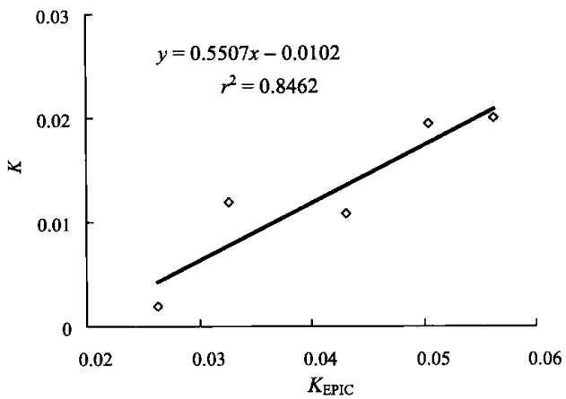  
图 4.10 标准小区实测 K 值与 $K _ { \mathrm { E P F } }$ 值关系图单位： $\mathrm {  ~ t ~ } \bullet \mathrm {  ~ h m } ^ { 2 } \bullet \mathrm {  ~ h / } ( \mathrm { h m } ^ { 2 } \bullet \mathrm {  ~ M J ~ } \bullet \mathrm {  ~ m m } )$

## 4.2.4 诺谟图法

在有土壤有机质含量、土壤颗粒级配、渗透等级以及结构等级资料的情况下，可利用式（4.2）计算出土壤可蚀性因子K。值得注意的是，该公式仅适用于粉粒含量小于70%、有机质含量小于4%的土壤。下面举例说明如何应用式（4.2）进行计算。

例如，某土壤的颗粒级配分析结果如下：1\~2mm，7.32%；0.5\~1mm，5.63%；0.25\~0.5 mm, 3.66 %; 0.1\~0.25 mm, 3.21 %; 0.05\~0.1 mm, 11.08 %; 0.02\~0.05 mm, 38.21 %; 0.005 \~ 0.02 mm, 14.63 %; 0.002\~ 0.005 mm, 3.48 %;<0.002mm,12.78 %；有机质含量为0.7%；结构等级为3。试求该土壤的土壤可蚀性因子K。

第一步：该土的粉粒含量为 $3 . 4 8 + 1 4 . 6 3 + 3 8 . 2 1 = 5 6 . 3 2 ( \% )$ ，由于其粉粒(0.002～0.05mm）含量小于70%，有机质含量小于4%，因此可用诺谟图计算K。

第二步：计算饱和导水率，并确定渗透等级。黏粒 $( < 0 . 0 0 2 \ \mathrm { m m } )$ 含量 ${ \mathrm { C } } _ { 1 } =$ 12.78%，砂粒（0.05\~2mm）含量 $S _ { \mathrm { a } } = 7 . 3 2 + 5 . 6 3 + 3 . 6 6 + 3 . 2 1 + 1 1 . 0 8 = 3 0 . 9 ( \% )$ 根据式（4.3）求出土壤的饱和导水率

$$
\begin{array} { r l } & { K _ { \mathrm { s } } = 0 . 0 5 6 \times 1 2 . 7 8 + 0 . 0 1 6 \times 3 0 . 9 + 0 . 0 2 3 1 \times 0 . 7 \mathrm { - } 0 . 6 9 3 } \\ & { ~ \approx 0 . 5 3 3 ( \mathrm { m m / m i n } ) \approx 7 7 ( \mathrm { c m / d } ) , } \end{array}
$$

查表4.1求出该土的渗透等级为2。

第三步：计算土壤质地参数M。M=（粉粒含量+极细砂含量）×（100一黏粒含量）= （56.32+11.08）×（100—12.78）=5879（%)。

第四步：利用式（4.2）计算土壤可蚀性因子， $K _ { \mathrm { n m } } = \mathrm { \small { ~ \left[ 2 . 1 \times 1 0 ^ { - 4 } ~ ( 1 2 - 0 . 7 ) ~ \right] ~ } } \times$ $5 8 7 9 ^ { 1 . 1 4 } \div 3 . 2 5 \times ( 2 - 2 ) + 2 . 5 \times ( 3 - 3 ) ] ~ / 7 5 9 \approx 0 . 0 6 2 ~ [ \mathrm { ~ t ~ } \cdot \mathrm { h m ~ ^ { 2 } ~ } \cdot \mathrm { h / ( h m ~ ^ { 2 } ~ \cdot ~ M J ~ } \cdot \mathrm { h / ( h m ~ ^ { 2 } ~ \cdot ~ M ) ~ } \cdot \mathrm { h / ( h m ~ ^ { 2 } ~ \cdot ~ M ) ~ } ]$ mm)]。

根据位于北京怀柔区、延庆县、密云县和门头沟区的4个标准小区土壤有机质含量、颗粒级配、渗透等级以及结构等级资料，计算了它们的土壤可蚀性因子（表4.7）。与标准小区法计算结果相比，诺谟图法估算的土壤可蚀性因子偏大（表4.7）。怀柔和延庆两个点诺谟图 $K _ { \mathfrak { m } }$ 是其标准小区K的3倍多，密云诺谟图 $K _ { \mathrm { r m } }$ 是其标准小区K的13倍多。但标准小区K与诺谟图 $K _ { \mathfrak { m } }$ 有较好的相关（图4.11），其回归方程的决定系数 $r ^ { 2 }$ 为0.95，因此可用下式将诺谟图 $K _ { \mathfrak { n } \mathfrak { m } }$ 转换为标准小区条件下土壤可蚀性因子：

$$
K = 0 . 3 6 4 K _ { \mathrm { n m } } - 0 . 0 0 7 2\tag{4.13}
$$

表4.7 标准小区法与诺谟图法计算的土壤可蚀性因子比较
<table><tr><td rowspan="2">土壤类型</td><td rowspan="2">小区所在地</td><td>K</td><td> $K _ { \mathrm { n m } }$ </td></tr><tr><td></td><td> $/ [ \mathbf { t } \bullet \mathbf { h } \mathbf { m } ^ { 2 } \bullet \mathbf { h } / ( \mathbf { h } \mathbf { m } ^ { 2 } \bullet \mathbf { M } \mathbf { J } \bullet \mathbf { m } \mathbf { m } ) ] \qquad / [ \mathbf { t } \bullet \mathbf { h } \mathbf { m } ^ { 2 } \bullet \mathbf { h } / ( \mathbf { h } \mathbf { m } ^ { 2 } \bullet \mathbf { M } \mathbf { J } \bullet \mathbf { m } \mathbf { m } ) ]$ </td></tr><tr><td>普通褐土</td><td>怀柔</td><td>0.01950</td><td>0.06593</td></tr><tr><td>普通褐土</td><td>延庆</td><td>0.02003</td><td>0.07967</td></tr><tr><td>粗骨褐土</td><td>密云</td><td>0.00896</td><td>0.02630</td></tr><tr><td>普通褐土</td><td>门头沟</td><td>0.01080</td><td>0.05100</td></tr></table>

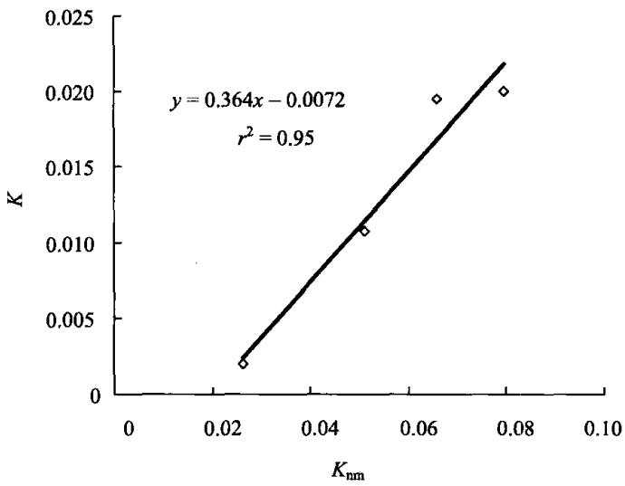  
图 4.11 标准小区 K 值与诺谟图 $K _ { \mathrm { m } }$ 值关系图单位： $\mathrm {  ~ t ~ } \bullet \mathrm {  ~ h m } ^ { 2 } \bullet \mathrm {  ~ h / ( h m ^ { 2 } ~ } \bullet \mathrm {  ~ M J ~ } \bullet \mathrm {  ~ m m ) }$

## 4.2.5 北京土壤可蚀性因子分布图

北京土壤可蚀性的资料相对较少，观测值和诺谟图法计算值相差较大，有待进一步研究，鉴于目前可利用的资料状况，应用式（4.12）计算了北京市主要土属的土壤可蚀性因子。如果仅能获得土壤有机质，缺乏有机碳资料，可用式（4.14）将有机质含量转换为有机碳含量：

$$
C _ { \mathrm { a } } = { \frac { \mathrm { ( ) } \mathrm { M } } { 1 . 7 2 4 } }\tag{4.14}
$$

结合北京土壤类型及其分布特征，对28个土属进行了野外调查，并分析了土壤的机械组成和有机碳含量，又通过查阅全国土壤普查资料，收集了另外15个土属的机械组成和有机碳含量资料，共计获得43个土属的机械组成和有机碳含量资料。应用式（4.12）计算了这43个土属的土壤可蚀性因子，同时规定：当计算值小于0.004t·$\mathrm { h m ^ { 2 } \bullet h / ( h m ^ { 2 } \bullet M J \bullet m m ) }$ 时，设定为 $0 . 0 0 4 \textrm { t } \bullet \mathrm { h m } ^ { 2 } \bullet \mathrm { h } / ( \mathrm { h m } ^ { 2 } \bullet \mathrm { M J } \bullet \mathrm { m m } )$ 。结合北京市1：100000土壤图，建立了以土属为基本单元的北京土壤可蚀性因子K值数据库（表4.8)，并绘制其空间分布图（图4.12)。

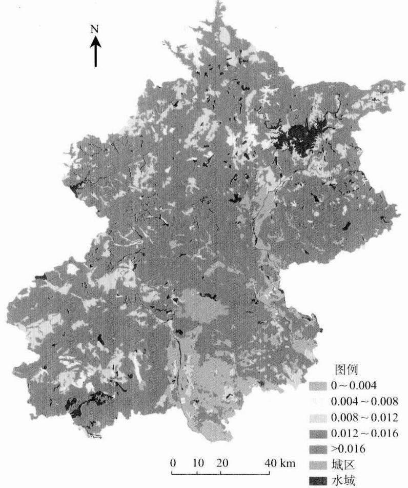  
图4.12 北京主要土属的土壤可蚀性因子K值空间分布图单位：t·hm²·h/(hm²·MJ·mm)

表 4.8 北京主要土属土壤可蚀性因子K
<table><tr><td>序号</td><td>土类</td><td>亚类</td><td>土属</td><td>有机质</td><td>砂粒</td><td>粉粒</td><td>黏粒</td><td>K /t· hm²·h/</td></tr><tr><td></td><td></td><td></td><td>硅质岩类山地草甸土</td><td>1%</td><td>1%</td><td>1%</td><td>1%</td><td>(hm²·MJ·mm)</td></tr><tr><td>1</td><td>山地草甸土</td><td>山地草甸土</td><td>酸性岩类山地草甸土</td><td>8.86 11.16</td><td>27.58 18.37</td><td>62.42 57.71</td><td>10.00 23.92</td><td>0.012 0.012</td></tr><tr><td>2*</td><td></td><td>山地棕壤</td><td>基性岩类山地棕壤</td><td>3.68</td><td>26.18</td><td>59.02</td><td>14.81</td><td>0.012</td></tr><tr><td>3 4*</td><td></td><td></td><td>碳酸盐岩类山地棕壤</td><td>9.03</td><td>15.47</td><td>59.71</td><td>24.82</td><td>0.012</td></tr><tr><td>5</td><td>棕壤</td><td></td><td>山地生草棕壤基性岩类山地生草棕壤</td><td>8.30</td><td>23.41</td><td>69.22</td><td>7.38</td><td>0.014</td></tr><tr><td>6</td><td></td><td>粗骨棕壤</td><td>硅质岩类粗骨棕壤</td><td>5.86</td><td>36.12</td><td>39.09</td><td>17.26</td><td>0.008</td></tr><tr><td>7</td><td></td><td></td><td>酸性岩类粗骨棕壤</td><td>3.91</td><td>57.13</td><td>26.76</td><td>15.27</td><td>0.004</td></tr><tr><td>8</td><td></td><td></td><td>基性岩类粗骨棕壤</td><td>3.41</td><td>27.17</td><td>57.21</td><td>15.62</td><td>0.012</td></tr><tr><td>9</td><td></td><td>淋溶褐土</td><td>酸性岩类淋溶褐土</td><td>3.25</td><td>41.09</td><td>44.63</td><td>14.28</td><td>0.009</td></tr><tr><td>10</td><td></td><td></td><td>硅质岩类淋溶褐土</td><td>1.89</td><td>51.23</td><td>33.68</td><td>15.09</td><td>0.009</td></tr><tr><td>11</td><td></td><td></td><td>泥质岩类淋溶褐土</td><td>1.07</td><td>58.14</td><td>24.34</td><td>15.30</td><td>0.008</td></tr><tr><td>12</td><td></td><td></td><td>基性岩类淋溶褐土</td><td>5.05</td><td>56.35</td><td>34.60</td><td>9.05</td><td>0.006</td></tr><tr><td>13</td><td></td><td></td><td>碳酸盐岩类淋溶褐土</td><td>2.93</td><td>35.75</td><td>54.40</td><td>9.85</td><td>0.011</td></tr><tr><td>14</td><td></td><td>普通褐土</td><td>洪积冲积物普通褐土</td><td>0.38</td><td>39.22</td><td>48.67</td><td>12.11</td><td>0.015</td></tr><tr><td>15</td><td></td><td></td><td>洪积物普通褐土</td><td>1.44</td><td>32.91</td><td>50.06</td><td>16.02</td><td>0.015</td></tr><tr><td>16</td><td></td><td></td><td>黄土质普通褐土</td><td>1.82</td><td>40.29</td><td>47.41</td><td>12.30</td><td>0.013</td></tr><tr><td>17</td><td></td><td></td><td>红黄土质普通褐土</td><td>0.92</td><td>34.93</td><td>48.62</td><td>16.45</td><td>0.015</td></tr><tr><td>18</td><td></td><td></td><td>复碳酸盐岩类普通褐土</td><td>1.45</td><td>40.60</td><td>42.69</td><td>16.71</td><td>0.013</td></tr><tr><td>19</td><td></td><td></td><td>红黏土质普通褐土</td><td>0.93</td><td>66.55</td><td>24.47</td><td>8.98</td><td>0.008</td></tr><tr><td>20</td><td></td><td></td><td>酸性岩类普通褐土</td><td>1.17</td><td>84.15</td><td>10.46</td><td>5.40</td><td>0.005</td></tr><tr><td>21</td><td></td><td></td><td>硅质岩类普通褐土</td><td>1.04</td><td>36.99</td><td>48.24</td><td>14.77</td><td>0.015</td></tr><tr><td>22</td><td>褐土</td><td></td><td>泥质岩类普通褐土</td><td>2.98</td><td>77.76</td><td>13.83</td><td>8.41</td><td>0.002</td></tr><tr><td>23</td><td></td><td></td><td>碳酸盐岩类普通褐土</td><td>2.10</td><td>35.90</td><td>42.37</td><td>17.99</td><td>0.011</td></tr><tr><td>24</td><td></td><td>粗骨褐土</td><td>硅质岩类粗骨褐土</td><td>1.93</td><td>75.50</td><td>21.15</td><td>3.08</td><td>0.006</td></tr><tr><td>25</td><td></td><td></td><td>酸性岩类粗骨褐土</td><td>2.45</td><td>22.34</td><td>50.18</td><td>22.60</td><td>0.013</td></tr><tr><td>26</td><td></td><td></td><td>碳酸盐岩类粗骨褐土</td><td>1.52</td><td>24.31</td><td>52.53</td><td>21.08</td><td>0.016</td></tr><tr><td>27</td><td></td><td>碳酸盐褐土</td><td>泥质岩类碳酸盐褐土</td><td>1.30</td><td>47.94</td><td>43.11</td><td>8.95</td><td>0.013</td></tr><tr><td>28*</td><td></td><td></td><td>基性岩类碳酸盐褐土</td><td>1.94</td><td>22.79</td><td>56.16</td><td>21.05</td><td>0.015</td></tr><tr><td>29*</td><td></td><td></td><td>碳酸盐岩类碳酸盐褐土</td><td>1.29</td><td>40.03</td><td>43.73</td><td>16.24</td><td>0.013</td></tr><tr><td>30</td><td></td><td>褐土性土</td><td>冲积物褐土性土</td><td>1.08</td><td>66.64</td><td>19.00</td><td>13.26</td><td>0.006</td></tr><tr><td>31</td><td></td><td></td><td>堆垫物褐土性土</td><td>1.27</td><td>41.93</td><td>37.72</td><td>18.58</td><td>0.012</td></tr><tr><td>32</td><td></td><td></td><td>洪积冲积物褐土性土</td><td>6.59</td><td>31.39</td><td>47.01</td><td>21.19</td><td>0.009</td></tr><tr><td>33*</td><td></td><td>潮褐土</td><td>轻壤质潮褐土</td><td>1.29</td><td>40.03</td><td>43.73</td><td>16.24</td><td>0.013</td></tr><tr><td>34*</td><td></td><td></td><td>菜园潮褐土</td><td>3.91</td><td>44.16</td><td>41.51</td><td>14.32</td><td>0.008</td></tr><tr><td>35*</td><td></td><td>褐潮土</td><td>冲积物褐潮土</td><td>1.14</td><td>25.90</td><td>53.60</td><td>20.50</td><td>0.017</td></tr><tr><td>36*</td><td></td><td></td><td>菜园褐潮土</td><td>1.20</td><td>14.58</td><td>48.47</td><td>36.95</td><td>0.016</td></tr><tr><td></td><td>37*潮土</td><td>潮土</td><td>砂质冲积物潮土</td><td>0.14</td><td>6.20</td><td>2.66</td><td>91.14</td><td>0.001</td></tr><tr><td>38*</td><td></td><td></td><td>壤质冲积物潮土</td><td>0.89</td><td>13.70</td><td>30.50</td><td>55.8</td><td>0.013</td></tr><tr><td>39*</td><td></td><td></td><td>黏质冲积物潮土</td><td>1.77</td><td>27.00</td><td>38.02</td><td>34.98</td><td>0.011</td></tr><tr><td>40*</td><td></td><td>湿潮土</td><td>湿潮土</td><td></td><td>22.10</td><td>39.65</td><td>38.25</td><td></td></tr><tr><td></td><td></td><td></td><td></td><td>2.12</td><td></td><td></td><td></td><td>0.011</td></tr><tr><td>41*</td><td>水稻土</td><td>盐潮土</td><td>苏打盐潮土</td><td>0.37</td><td>7.40</td><td>7.43</td><td>85.17</td><td>0.005</td></tr><tr><td>42*</td><td></td><td>潴育水稻土</td><td>潮土性潴育水稻土</td><td>3.25</td><td>17.46</td><td>62.36</td><td>20.18</td><td>0.013</td></tr><tr><td>43*</td><td>风砂土</td><td>风砂土</td><td>风砂土</td><td>0.50</td><td>9.50</td><td>0.75</td><td>89.75</td><td>0.004</td></tr></table>

\*摘自北京市农业区划办公室，北京市农业局和北京市农林科学院.1984. 北京土壤。

## 参考文献

陈明华，周福建，黄炎和，卢程隆，林福兴.1995.土壤可蚀性因子的研究.水土保持学报，9（1）：19～24

金争平，史培军，侯福昌． 1992. 黄河皇甫川流域土壤侵蚀系统模型和治理模式.北京：海洋出版社

牟金泽，孟庆枚.1983.降雨侵蚀土壤流失预报方程的初步研究.中国水土保持，(6)：23～26

史学正，于东升，吕喜玺.1995.用人工模拟降雨仪研究我国热带土壤可蚀性.水土保持学报，9（3)：38～42

张宪奎，许靖华，卢秀琴，邓育江，高德武.1992.黑龙江省土壤流失方程的研究．水土保持通报，12（4）：1～9

Liu B Y, Nearing M A, Risse L M. 1994. Slope gradiment effects on soil loss for slops. Transactions of the ASAE, 37 (6):1835\~1840

Olson T C, Wischmeier W H. 1963. Soil erodibility evaluation for soils on the runoff and erosion stations. Soil Science Society of American Proceedings, 27 (5): 590\~592

Römkens M J M, Prasad S N, Poesen J W A. 1986. Soil erodibility and properties. In: Proceechings of 13th Corgress of the International Society of Soil Science. 492\~504

Williams J R, Jones C A, Dyke P T. 1984. A modeling approach to determining the relationship between erosion and soil productivity . Transactions of the ASAE, 27 (2): 129\~144

Wischmeier W H. 1976. Use and misuse of the universal soil loss equation. Journal of Soil and Water Conservation, 31 (1):5\~9

Wischmeier W H, Mannering J V. 1969. Relation of soil properties to its erodibility. Soil Science Society of American Journal, 33 (1): 131\~137

Wischmeier W H, Johnson C B, Cross B V. 1971. A soil erodibility nomograph for farmland and construction cites. Journal of Soil and Water Conservation, 26 (5): 189\~193

## 第五章地形因子

地形是影响土壤侵蚀的重要因素。北京土壤流失方程中主要考虑地形要素中的坡度和坡长对土壤侵蚀产生的影响，并分别用坡度和坡长因子公式计算。

## 5.1坡度因子

坡度因子是坡度影响土壤流失的定量指标，目前常用的是Wischmeier和 $\mathrm { S m i t h } { \mathfrak { D } } { \mathfrak { Q } }$ 提出的定义：在其他条件（坡向、坡长、降雨条件、土壤、土地利用和水土保持措施等）都一致的情况下，某一坡度坡面的土壤流失量与坡度为9%的坡面的土壤流失量的比值。

## 5.1.1 坡度对土壤侵蚀的影响

坡度是影响+壤侵蚀的重要因素，早在1882年德国学者Wollny（Baver，1938）就对天然降雨微小区（80cm×80cm）进行了观测，分析了坡度与土壤侵蚀的关系。1936年Cook将坡度列为控制水蚀过程的7个基本变量之一。第一个较为系统的研究一般被认为是Zingg（1940）提出的模型，他通过对3组资料的分析，建立了土壤流失量与坡度之间的指数关系（Zingg，1940；Smith and Wischmeier，1957)。第一组资料为Duley和Hays在堪萨斯州进行的人工模拟降雨试验资料，小区分别为宽0.61m、长3.05m和宽1m、长7.6m，坡度为0\~20%，土壤为堪萨斯州粉黏壤和砂壤；第二组资料是Diseker和Yoder在亚拉巴马州进行的人工降雨试验资料，小区宽4.6m、长15m，试验坡度为0～20%土壤为Cecil黏土；第三组资料是 Zingg在密苏里州进行的人工降雨试验资料，小区宽1.07m、长2.44m，坡度为4%、8%和12%，土壤为Shelby壤土。所建立的方程基本形式为

$$
\mathrm { \cal A } _ { \mathrm { u } } = c s ^ { m ^ { \prime } }\tag{5.1}
$$

式中， $A _ { \mathfrak { u } }$ 为单位面积上的土壤流失量， $\mathrm { t } / \mathrm { h m } ^ { 2 } ; \ c$ 为常数；s为坡度，%； $m ^ { \prime }$ 为坡度指数，第一组和第二组资料得到的指数 $m ^ { \prime } = 1 . 4 9$ ，第三组资料得到的指数 $m ^ { \prime } = 1 . 3 7$ Zingg 推荐采用1.4。

如果将式（5.1）标准化到9%的坡度上，则坡度因子公式为

$$
S = 0 . 0 5 3 s ^ { 1 . 4 }\tag{5.2}
$$

Musgrave（1947）综合了众多资料（McCool et al.，1987a)，采用与 Zingg 相同的方程形式，得出了土壤流失量与坡度的1.35次方成正比，即指数 $m ^ { \prime } { = } 1 . 3 5$ 。Smith 和Whitt（1947）认为 Zingg 和 Musgrave的公式在 4 %～12 %的坡度范围内预报效果较好。当坡度小于4%时，上述公式的坡度因子值随坡度减少递减得太快，于是提出以下公式，

$$
A _ { \mathrm { u } } = a + b s ^ { n }\tag{5.3}
$$

式中，a、b、n为常数。

Smith和 Whitt进一步用Neal（1938）的资料得出常数项a、b、n，并标准化到3%的坡度上，

$$
S = 0 . 1 0 + 0 . 2 1 s ^ { \frac { 4 } { 3 } }\tag{5.4}
$$

将式（5.4）标准化到9%的坡度上的坡度因子公式为

$$
S = 0 . 0 2 5 + 0 . 0 5 2 s ^ { 1 . 3 3 }\tag{5.5}
$$

Neal的资料来自实验室内的人工降雨试验，小区宽1.1 m、长 3.7 m（McCoolet al.，1987a)。Smith和 Wischmeier（1957）利用4组资料，建立了土壤流失量与坡度的二次多项式关系。这4 组资料分别是：位于威斯康星州 La Crosse坡度为 3%～18%的4个坡度小区资料，Zingg（1940）在密苏里州进行的人工降雨试验资料(4 %、8 %和 12 %)，位于伊利诺伊州 Dixon Springs 和俄亥俄州 Zenesville（8 %和12%）的坡度小区资料，

$$
\mathrm { A _ { u } } = 0 . 4 3 + 0 . 3 0 s + 0 . 0 0 4 3 s ^ { 2 }\tag{5.6}
$$

将式（5.6）标准化到9%的坡度上的坡度因子公式为

$$
S = 0 . 0 0 6 5 s ^ { 2 } + 0 . 0 4 5 3 s + 0 . 0 6 5\tag{5.7}
$$

式(5.7)被应用于1965年出版的通用土壤流失方程（USLE）中，与Smith和Whitt（1947）采用的公式形式不同，式（5.7）采用了二次多项式。由于多项式的外推能力差，所以该公式在大于20%的坡度情况下，预报效果很差。Wischmeier和Smith①在通用土壤流失方程1978年版中，将式（5.7）中的坡度百分比改用坡度的正弦值（sinθ），使公式在陡坡上的表现稍好，但对陡坡的土壤流失量预报仍然过高。修改后的公式为

$$
\begin{array} { r } { S = 6 5 . 4 \mathrm { s i n } ^ { 2 } \theta + 4 . 5 6 \mathrm { s i n } \theta + 0 . 0 6 5 4 } \end{array}\tag{5.8}
$$

McCool等（1987a）对La Crosse的资料进行了分析，发现顺坡耕作和等高耕作有明显的差异。顺坡情况下，土壤流失量与坡度的关系与式（5.8）基本相同，建议用顺坡资料来确定坡度影响公式，而应将横坡的影响归入覆盖与管理因子中。McCool等(1987a) 根据Nichols 和 Sexton（1932)、Diseker 和 $\mathbf { Y } _ { \mathrm { O d e r } } \mathbb { \mathrm { { \mathbb { D } } } }$ 的资料以及 Meyer和Harmon（1985）的研究成果指出：土壤流失量随坡度的变化在陡坡上比在缓坡上明显。在此基础上，McCool利用 La Crosse的资料分析得到坡度大于8%的土壤流失量与坡度的关系式为（标准化到9%的坡度上）

$$
S = 1 6 . 8 \mathrm { s i n } \theta ^ { \_ } 0 . 5\tag{5.9}
$$

在小于9%的坡度上，McCool 采用了Murphree 和 Mutchler（1981）的人工降雨试验资料。该资料是缓坡情况下记录最为完整和系列最长的资料，其试验小区长22.9 m、宽3.7 m，坡度范围为 0.1%～3 %。Murphree 和 Mutchler（1981）利用该资料分析得到的土壤流失量与坡度的关系式 $( r ^ { 2 } { = } 0 . 9 7 )$ 为

$$
A _ { \mathrm { s } } = 1 3 3 2 0 \mathrm { s i n } \theta + 3 5 . 4\tag{5.10}
$$

式中， $A _ { s }$ 为土壤侵蚀量， $\mathbf { k g } .$

为了将式（5.10）应用于通用土壤流失方程，McCool等（1987a）将其土壤流失量标准化到9%的坡度上，于是式（5.10）改写为

$$
S = 1 0 . 8 \mathrm { s i n } \theta + 0 . 0 3\tag{5.11}
$$

式（5.9）和式（5.11）后来在RUSLE中得到了应用。但是由于以上方程的资料都来源于坡长大于4m的小区资料，在坡长小于4m的坡面上几乎没有细沟侵蚀发生，因此上述公式不适用于坡长小于 4 m 的情况（Foster et al.，1981）。Foster（1982b）利用Lattanzi等（1974）在0.61m坡长小区的人工模拟降雨试验资料，分析得出坡长小于4m的短坡情况下坡度因子公式为

$$
S = 3 . 0 { \sin ^ { 0 . 8 } \theta } + 0 . 5 6\tag{5.12}
$$

McCool等（1987a）用 Singer 和 Blackard（1982）、Evett 和 Dutt（1985）以及Rubio-Montoya和Brown（1984）的试验资料，对式（5.12）进行了验证，结果表明该公式是合理的。因此在RUSLE中，采用式（5.12）为短坡情况下的坡度因子公式。另外，McCool等（1987b）在美国太平洋沿岸西北部小麦和草地区，采用冰雪融化形成的地表径流产生的细沟侵蚀资料，分析得到了融雪细沟流失量与坡度之间的关系

$$
S = \left( { \frac { \sin \theta } { 0 . 0 8 9 6 } } \right) ^ { 0 . 6 }\tag{5.13}
$$

式（5.13）主要利用的是坡度为9%～48%的资料。

我国学者利用不同坡度的小区资料，建立了坡度因子公式（表5.1）。

表 5.1 我国主要坡度因子公式
<table><tr><td>资料来源</td><td>公式</td><td>试验条件</td></tr><tr><td>牟金泽和 孟庆枚（1983）</td><td> $S = \left( \frac { \theta } { 5 . 1 6 } \right) ^ { 1 . 3 }$ </td><td>选用天水4°左右、  $6 ^ { \circ } \sim 8 ^ { \circ } , 1 3 ^ { \circ } \sim 1 5 ^ { \circ } , 1 7 ^ { \circ } \sim 1 8 ^ { \circ } |$  四 级坡度，每级坡度上3个小区，共12个小区，均 采用三年四熟农家制，即扁豆一冬麦一荞麦一玉 米黄豆间作方式进行</td></tr><tr><td>江忠善和 李秀英（1988）</td><td> $\textstyle S = { \bigl ( } { \frac { \theta } { 1 0 } } { \bigr ) } ^ { 1 . 4 5 }$ </td><td>天水和绥德不同坡度的土壤侵蚀资料。坡长为  $2 0 ~ \mathrm { { m } , }$  宽为5m、坡度为10°的裸露休闲地小区作 为标准小区</td></tr><tr><td>张宪奎等（1992）</td><td> $\begin{array} { r } { S = \left( \frac { s } { 8 . 7 5 } \right) ^ { 1 . 3 } } \end{array}$ </td><td>宾县和克山县试验区的有关资料。坡长为  $2 0 \ \mathrm { m } ,$  宽为2m，坡度为9%，无植被，无水土保持措施 的径流试验小区为标准小区</td></tr><tr><td>黄炎和等（1993）</td><td> $S \propto \theta ^ { 0 . 6 6 }$ </td><td>安溪官桥径流试验场的资料。坡长为20m，坡宽 为  $5 \textrm { m } ,$  坡度为10°的小区为标准小区</td></tr><tr><td>林素兰等（1997）</td><td> $\begin{array} { r } { S = 0 . 0 5 + 3 . 6 0 { \tan } \theta + 5 1 . 6 0 { \tan } ^ { 2 } \theta } \end{array}$ </td><td>辽宁西丰的小区资料。坡长为20m，坡宽为5m， 坡度为6的空白试验区为标准小区</td></tr><tr><td>杨子生（1999）</td><td> $\begin{array} { r } { S = \left( \frac { \theta } { 5 A } \right) ^ { 1 . 3 2 } } \end{array}$ </td><td>云南昭通市乐居村和东川市播卡村18个小区的资 料。坡长为20m，宽为2m，坡度为5°，无植被，</td></tr><tr><td>周伏建等（1995）</td><td> $S = \left( { \frac { \theta } { 1 0 } } \right) ^ { 0 . 7 8 }$ </td><td>无任何水土保持措施的径流试验小区为标准小区</td></tr></table>

由表5.1可以看出，不同研究者得到的坡度因子指数存在一定的差异，这主要是对标准小区的选择和研究方法的不同造成的。考虑到我国陡坡耕地较多，且目前的坡度因子公式主要基于缓坡小区的观测资料建立，Liu等（1994）采用位于黄土高原的天水、安塞和绥德3个水土保持试验站的径流小区观测资料，分析陡坡情况下坡度与土壤流失量的关系。为了便于不同地区土壤流失量的比较，首先将土壤流失量进行标准化处理，方法如下：考虑到每个站都有坡度接近于25%的试验小区，且该值为观测坡度的中间值，因此将坡度为25%的土壤流失量作为标准化的基础，分别在3个站点用坡度最接近25%的土壤流失量，建立其与坡度之间的回归方程。结果表明，二者之间存在较好的线性关系，绥德、安塞和天水的线性相关系数分别为0.97、0.99和0.94。首先根据所得到的线性回归方程，分别计算出绥德、安塞和天水坡度为25%的小区的土壤流失量分别为 $1 7 . 2 5 \mathrm { t / h m } ^ { 2 }$ $6 8 . \ 9 3 \ \mathrm { \ t / h m ^ { 2 } }$ 和 $2 5 . \ 3 7 \ \mathrm { t } / \mathrm { h m } ^ { 2 }$ ，将各站所有坡度土壤流失量观测值除以其对应的坡度为25%的小区的土壤流失量，即为标准化到坡度为25%的土壤流失量；然后以坡度的正弦值为自变量，建立了标准化土壤流失量与坡度正弦值之间的回归方程。考虑到国际上普遍采用9%的标准小区坡度，进一步将所得回归方程通过数学变换，将坡度转换到USLE和RUSLE常用的9%的坡度上，最终建立的适用于陡坡的坡度因子公式为

$$
S = 2 1 . 9 1 \mathrm { s i n } \theta - 0 . 9 6\tag{5.14}
$$

总之，国内外学者对坡度与土壤侵蚀的关系进行了大量研究，预报效果越来越好，但前提是必须选择正确的坡度公式，否则会带来很大的误差。Zingg公式对陡坡土壤流失量预报值偏大；Smith和Whitt公式在坡度小于10%或大于40%情况下的土壤流失量预报值比 Zingg公式好，但在坡度10 %～40 %的预报效果不如 Zingg 公式；Smith和Wischmeier（1957）的公式在大于20%的坡度上预报值过高；USLE第二版①的坡度因子公式使用了坡度正弦（sinθ）代替坡度百分比，在陡坡情况下预报稍好一些，但仍然很不理想；RUSLE采用了McCool等（1987a）建立的坡度正弦为自变量的线性关系，在大于20%的坡度上预报值明显偏低。这些都表明，选用哪种坡度因子公式一定要慎重。

## 5.1.2 坡度因子计算公式

根据以上对国内外坡度因子研究成果的分析，本模型针对北京山区地形特点，选择的坡度因子公式为

$$
S = 1 0 . 8 \mathrm { s i n } \theta + 0 . 0 3 , \qquad \theta \leqslant 5 ^ { \circ }\tag{5.15}
$$

$$
S = 1 6 . 8 \mathrm { s i n } \theta - 0 . 5 0 , \qquad 5 ^ { \circ } < \theta < 1 0 ^ { \circ }\tag{5.16}
$$

$$
S = 2 1 . 9 1 \mathrm { s i n } \theta \mathrm { - } 0 . 9 6 , \theta \mathrm { \geq 1 0 } ^ { \circ }\tag{5.17}
$$

上述公式仅适用于坡长大于5m的坡面。

对于坡长小于5m的短坡，采用下式计算（McCool et al.，1987a)，

$$
S = 3 . 0 { \sin ^ { 0 . 8 } \theta } + 0 . 5 6\tag{5.18}
$$

## 5.2坡长因子

坡长是指从坡面径流起点至坡面洼地或沟道间的水平距离，径流起点一般是山脊线上的一点。地表径流通常流经约120m后就形成了集中流，或是流向了沟道，因此120m可作为大多数情况下的极限坡长。坡长因子是指其他条件（降雨、坡度、土壤、土地利用和水土保持工程措施等）一致的情况下，某一坡长的土壤流失量与坡长为22.13m的土壤流失量之比。坡长因子描述了坡长与土壤流失量之间的定量关系。

## 5.2.1 坡长对土壤侵蚀的影响

坡长是决定坡面能量沿程变化，影响坡面径流与水流产沙过程的重要地貌因素之一。早在1936年Cook就提出坡长是影响土壤侵蚀的重要因素，Zingg（1940）最早提出的土壤侵蚀模型也考虑了坡长的作用。各国学者就坡长对土壤侵蚀的影响展开了深人的研究，但所得到结论有很大的不同。陈永宗等（1988）认为大致存在以下3种观点：第一种观点认为随坡长增加，水中的含沙量增加，水流能量多消耗于挟运泥沙，结果导致土壤侵蚀反而减弱；第二种观点认为随坡长增加，径流量增加，侵蚀随之增加，由于侵蚀增加以后，水流含沙量也增加，水体搬运泥沙所消耗的能量加大，反而导致土壤侵蚀减弱，两者相互消长，结果从上坡到下坡土壤侵蚀没有很大的差异；第三种观点认为从上坡到下坡，随着水深逐渐增加，土壤侵蚀相应增大。琚彤军等（1999）的研究结果表明，即使对于同一坡段，在不同的降雨情况下，土壤侵蚀随坡长变化也存在不同的变化规律。琚彤军等用REE元素作为示踪物质，将斜坡长度为113m的小区自上而下分为6段，在每段的下2/3处布设了20cm的示踪带，研究不同坡段的土壤侵蚀强度。结果表明，侵蚀强度随坡长变化存在3种模式：第一种为增长型，随坡长增大，产沙强度持续增强；第二种为增长递减型，产沙强度先随坡长增加而增加，而后又随坡长增加呈递减趋势；第三种为波动型，产沙强度随坡长增加出现两次增长和两次减小过程。总之，坡长对土壤侵蚀的影响比较复杂。

## 5.2.2 坡长因子指数

Zingg（1940）最早给出了坡长与土壤流失量之间的定量关系式

$$
L ^ { \prime } = a \lambda ^ { m }\tag{5.19}
$$

式中， $L ^ { \prime }$ 为单位面积单位时间上的土壤流失量， $\mathbf { t } / ( \mathrm { { h m } } ^ { 2 } \cdot \mathrm { { a } ) }$ $\mathrm { U S L E ^ { \mathbb { \odot } } }$ 和 RUSLE②中采用了标准化到22.13m的坡长上的坡长因子，其表达式为

$$
L = \left( { \frac { \lambda } { 2 2 . 1 3 } } \right) ^ { m }\tag{4.10}
$$

不同的研究者得到的坡长因子指数也存在差别。Zingg（1940）对蒙大拿州Bethany 站、艾奥瓦州 Clarinda 站、威斯康星州 La Crosse 站、俄克拉何马州 Guthrie站、得克萨斯州 Tyler站的径流小区资料以及 Bethany站的野外径流小区人工降雨试验资料的分析得出，土壤流失量与坡长呈幂函数关系，且两种不同来源资料分析得出的坡长因子指数都为0.6。Musgrave（1947）分析得出的平均坡长因子指数为

0.35。1956年7月在Purdue大学召开的坡面水土保持措施研究工作会议上，根据对美国9个州15个站观测资料的分析，建议在美国中北部地区采用坡长因子指数为0.5±0.1（Wischmeier et al.，1958）。Wischmeier等（1958） 对美国上述 9 个州15个站点的观测资料的进一步分析表明，坡长因子指数在不同地点变化较大，取值范围为0～0.74。但是，在10%的显著水平下，中北部和东北部的10个站点的平均坡长因子指数没有显著差异。他们的分析结果也表明，1956年7月Purdue大学工作会议上建议的坡长因子指数取值合理。大量的小区资料分析表明，坡长因子指数不仅受坡度和坡长交互作用的影响，同时受土壤特性、地表植被类型和田间管理措施的影响（Wischmeier et al.，1958）。因此，在USLE第一版中，建议平均坡长因子指数采用0.5；当坡度大于10%时，坡长因子指数取0.6；在得克萨斯高原沟灌区域，坡度小于0.5%的长坡情况下，坡长因子指数取0.3①。在USLE第二版中，对坡长因子指数进行了修正，针对不同坡度范围，采用不同的坡长因子指数：当坡度小于1%、1%～3%、3.5%～4.5%、大于或等于5%时，坡长因子指数分别为0.2、0.3、0.4和0.5②。Mutchler 和 Greer（1980）在密西西比东北部的 Branch 实验站，用人工模拟降雨试验方法研究了缓坡条件下的坡长因子指数，他们采用的径流试验小区坡度为0.2%，坡长分别为23m、46m、91m、813m。研究结果表明，当坡度小于0.5 %时，坡长因子指数为0.15。Foster和 Wischmeier（1974）从土壤侵蚀过程出发，用数学方法推导了不规则坡土壤分离为限制因素时坡长因子指数的计算方法。Meyer等（1975）从土壤侵蚀的基本理论出发，把土壤侵蚀过程分为细沟侵蚀和细沟间侵蚀，Foster和Meyer（1975）在此基础上提出坡长因子指数与细沟侵蚀量和细沟间侵蚀量的比值 $\beta$ 有关，其表达式为

$$
m = \frac { \beta } { \beta + 1 }\tag{5.20}
$$

式中， $\beta$ 为细沟侵蚀量与细沟间侵蚀量的比值，该比值越大，坡长因子指数也越大。

McCool等（1989）在上述研究的基础上，对USLE中坡长因子指数进行了修正，他们根据Foster（1982a，1982b）的细沟间和细沟侵蚀公式，推导出标准小区上细沟侵蚀和细沟间侵蚀相等时 $\beta$ 的计算公式：

$$
\beta = \frac { \frac { \sin \theta } { 0 . 0 8 9 6 } } { 3 . 0 \sin ^ { 0 . 8 } \theta + 0 . 5 6 }\tag{5.21}
$$

如前所述，USLE中的坡长因子公式都是基于坡长大于4m的野外径流小区观测和人工模拟降雨试验资料，方程形式是基于细沟侵蚀和细沟间侵蚀的概念建立的，因此USLE中的坡长公式不适宜用于坡长小于4m的短坡。为了研究短坡情况下坡长对土壤侵蚀的影响规律，Evett和 Dutt（1985）比较了坡长为3 m和6 m的土壤侵蚀差异，结果表明，两种坡长下单位面积土壤流失量仅有很小的差异。Meyer和Harmon（1989）通过室内模拟试验，研究了不同雨强、不同土壤类型下坡长对土壤侵蚀的影响，采用的坡长为150～600mm，试验坡度为5%～30%，实验结果表明，有细沟产生时，坡长对+壤侵蚀的影响十分明显，随坡长增加，侵蚀量也增加；没有细沟产生时，坡长对土壤侵蚀的影响不明显。Kinnell（2000）通过野外和室内人工模拟降雨试验研究了坡长对水流含沙量的影响，坡长也为150～600mm，试验坡度为5%～30%，结果表明，如果坡度较大，即使在没有细沟发生的情况下，土壤侵蚀速率随坡长的增加也增加。McCool等（1989）假定在短坡情况下，坡长对细沟间侵蚀没有影响，因而建议对于短坡度情况可采用恒定坡长4m。RUSLE中当坡长小于4.6m时，采用恒定坡长4.6 m①。

我国学者对坡长因子进行了研究，由于所用资料及研究方法不同，结果存在一些差异。例如，牟金泽和孟庆枚（1983）提出坡长因子L与坡地斜坡长度的0.3次方成正比，孙保平等（1990）和张宪奎等（1992）根据黑龙江省宾县和克山径流小区资料，分析得出坡长因子与坡长的0.18次方成正比；黄炎和等（1993）根据福建省东南安溪县官桥径流实验场的资料，分析得到坡长因子与坡长的0.35次方成正比；周伏建等（1995）则采用了坡长因子与坡长的0.78次方成正比；林素兰等（1997）根据辽宁省西丰的小区资料分析，认为陡坡情况下的坡长因子指数为0.5；杨子生（1999）根据云南省昭通市乐居村和东川市播卡村18个小区的资料，分析得出坡长因子与坡长的0.24次方成比例；江忠善等（1996）得出坡长因子与坡长的0.286次方成正比；Liu等（2000）为建立陡坡情况下的坡长因子计算公式，采用了黄土高原安塞、子洲和绥德3个水土保持实验站坡度大于或等于30%的小区天然降雨径流泥沙观测资料（表5.2），除坡长不同外，小区的其他条件均相同。为了使不同地区的数据具有可比性，消除土壤侵蚀的区域差异，将各实验站所有小区的土壤流失量均标准化到USLE和RUSLE规定的标准小区坡长—22.13m的坡长上。方法如下：由于采用的实测资料缺乏坡长为22.13m的实测土壤流失量，而Zingg的研究结果表明，土壤流失量是坡长的指数函数。因此，在每个站点首先进行土壤流失量与坡长的回归分析，并根据回归结果计算出各站在坡长为22.13m的小区上的土壤流失量，将其作为土壤流失量标准化的基础；然后将各站所有坡长下土壤流失量均标准化到22.13m的坡长上，并与坡长进行回归分析，得到回归方程（5.22） $( r ^ { 2 } = 0 . 9 5 )$

$$
L = { \bigg ( } { \frac { \lambda } { 2 2 . 1 3 } } { \bigg ) } ^ { 0 . 4 4 }\tag{5.22}
$$

黄土高原陡坡情况下的平均坡长因子指数为0.44，而美国不同研究地区资料得到的 10 个坡长因子指数的平均坡长指数为 0.46(McCool et al.，1989)，二者非常接近。该结果与McCool等（1993）利用平均坡度为28.4%，最大坡度为56%的小区资料得到的结果也非常接近。如果采用RUSLE中的坡长因子公式，其计算值与实测值相差较大。因此，在陡坡情况下将坡长因子指数取为0.5是合理的。

表5.2 黄土高原3个试验站小区的年平均径流量和年平均土壤流失量
<table><tr><td rowspan="2">小区号</td><td rowspan="2">/m</td><td rowspan="2">坡长</td><td rowspan="2">坡度 1%</td><td rowspan="2">年平均径流量 /mm</td><td colspan="2">年平均土壤流失量/(mg/hm²)</td></tr><tr><td>观测值</td><td>标准化到 22.13m</td></tr><tr><td rowspan="4">安 塞</td><td>1</td><td>10</td><td>57.7</td><td>46.8</td><td>92.66</td><td>0.72</td></tr><tr><td>2</td><td>20</td><td>57.7</td><td>43.1</td><td>128.56</td><td>1.00</td></tr><tr><td>3</td><td>30</td><td>57.7</td><td>38.7</td><td>142.20</td><td>1.10</td></tr><tr><td>4</td><td>40</td><td>57.7</td><td>39.5</td><td>162.85</td><td>1.26</td></tr><tr><td rowspan="3">绥 德</td><td>12</td><td>10</td><td>40.0</td><td>20.6</td><td>15.59</td><td>0.70</td></tr><tr><td>29</td><td>40</td><td>42.8</td><td>17.9</td><td>28.00</td><td>1.26</td></tr><tr><td>34</td><td>60</td><td>40.4</td><td>14.0</td><td>36.59</td><td>1.64</td></tr><tr><td rowspan="3">子 洲</td><td>4</td><td>20</td><td>40.4</td><td>23.9</td><td>91.84</td><td>0.90</td></tr><tr><td>2</td><td>40</td><td>40.4</td><td>27.5</td><td>153.14</td><td>1.51</td></tr><tr><td>3</td><td>60</td><td>40.4</td><td>24.1</td><td>143.11</td><td>1.41</td></tr></table>

国内外研究都表明，土壤流失量与坡长呈指数规律关系，但各种方法中的坡长因子指数差异较大。美国RUSLE模型认为坡度因子指数随坡度的增加而增加，Liu等（2000）分析了陡坡条件下的土壤侵蚀资料，发现并非如此，因此建议采用USLE模型中的坡长公式，预报效果更好。

## 5.2.3 坡长因子计算公式

根据国内外已有研究成果，在北京山区采用式（4.2）的坡长因子修正公式：

$$
L = \left( { \frac { \lambda } { 2 2 . 1 3 } } \right) ^ { m }
$$

式中，m随坡度发生变化，取值如下： $m = 0 . 2 , \ \theta < 0 . 5 ^ { \circ } ; \ m = 0 . 3 , \ 0 . 5 ^ { \circ } \leqslant \theta < 1 . 5 ^ { \circ }$ ; m$= 0 . 4 , 1 . 5 ^ { \circ } \leqslant \theta < 3 ^ { \circ } ; m = 0 . 5 , 3 ^ { \circ } \leqslant \theta$

## 5.3 地形因子值的计算

地形因子是坡度和坡长因子的总称，实际应用时，往往同时计算LS值。L和S因子的组合表示给定坡长和坡度情况下的土壤流失量比率，即某种实际地形条件下的土壤流失量，与坡长22.13m、坡度9%、其他所有条件都一致时的土壤流失量的比率。本模型将坡面形态分为两种类型予以考虑：一种是规则的直型坡，全坡面的坡度一致；另一种是由不同坡度坡面组成的凸型坡或凹型坡等不规则坡，此时需要将坡面进行分段，每段按直型坡计算地形因子值，但同时需要考虑上坡对下坡的影响。以下分别详加阐述。

## 5.3.1 直型坡全坡平均地形因子值

直型坡的坡度、坡长因子直接用式（5.15）～式（5.18）和式（4.10）计算，计算结果如表5.3所示。考虑到不同坡度和坡长情况的计算公式各不相同，对于可能出现的情况给出以下具体计算公式。

当全坡面坡长 $\lambda { \geqslant } 5 \mathrm { ~ m ~ }$ 、坡度 $\theta { < } 5 ^ { \circ }$ 时，该坡段LS的计算公式为

$$
L S = { \left( \frac { \lambda } { 2 2 . 1 3 } \right) } ^ { m } ( 1 0 . 8 \mathrm { s i n } \theta + 0 . 0 3 )\tag{5.23}
$$

当全坡面坡长 $\lambda { \gtrsim } 5 \mathrm { ~ m ~ }$ ，坡度 $5 ^ { \circ } \leqslant \theta < 1 0 ^ { \circ }$ 时，该坡段LS的计算公式为

$$
L S = { \left( \frac { \lambda } { 2 2 . 1 3 } \right) } ^ { m } ( 1 6 . 8 \mathrm { s i n } \theta - 0 . 5 )\tag{5.24}
$$

当全坡面坡长 $\lambda { \geqslant } 5 \mathrm { ~ m ~ }$ ，坡度 $\theta \mathrm { \gtrsim } 1 0 ^ { \circ }$ 时，该坡段LS的计算公式为

$$
L S = \left( \frac { \lambda } { 2 2 . 1 3 } \right) ^ { m } ( 2 1 . 9 1 \mathrm { s i n } \theta - 0 . 9 6 )\tag{5.25}
$$

当全坡面坡长 $\lambda { \leqslant } 1$ m时，坡度 $\theta { < } 5 ^ { \circ }$ 时，坡长公式中的坡长取5m，该坡段LS的计算公式为

$$
L S = { \bigg ( } { \frac { 5 } { 2 2 . 1 3 } } { \bigg ) } ^ { m } ( 1 0 . 8 \mathrm { s i n } \theta + 0 . 0 3 )\tag{5.26}
$$

当全坡面坡长 $\lambda { \leqslant } 1 \mathrm { ~ m ~ }$ 时，坡度 $\theta { \geq } 5 ^ { \circ }$ 时，坡长公式中的坡长取5m，该坡段LS的计算公式为

$$
L S = { \left( \frac { 5 } { 2 2 . 1 3 } \right) } ^ { m } ( 3 \sin ^ { 0 . 8 } \theta + 0 . 5 6 )\tag{5.27}
$$

当全坡面坡长1 $\mathrm { \ m } { < } \lambda { < } 5 \mathrm { \ m }$ ，坡度 $\theta { < } 5 ^ { \circ }$ 时，坡长始终取5 m，该坡段LS的计算公式采用式（5.26）。

当全坡面坡长 $1 \mathrm { m } { < } \lambda { < } 5 \mathrm { m }$ ，坡度 $\theta \geq 5 ^ { \circ }$ 时，该条件下的LS通过插值得到。对于给定坡度、任一坡长下的LS值，通过坡长为1m和坡长为5 m时相应的LS值进行线性内插（基于坡长的对数值），具体方法如下：

第一步：根据坡度，用式（5.24）或式（5.25）计算坡长为5m时的LS（5，θ）。

第二步：用式（5.27）计算坡长为1m时的LS（1，θ）。

第三步：用以下公式插值得到需要计算的LS因子值，

$$
L S = \frac { L S ( 5 , \theta ) - L S ( 1 , \theta ) } { \ln 5 - \ln 1 } ( \ln \lambda - \ln 1 ) + L S ( 1 , \theta )\tag{5.28}
$$

例如，求坡度为 $1 5 ^ { \circ }$ ，坡长为2m时的 $L S$ 8

第一步：选择m值，因为坡度为 $1 5 ^ { \circ }$ ，根据式（4.10）， $\scriptstyle { m = 0 , 5 }$ 0

第二步：计算坡长为5m时的LS，

$$
L S ( 5 , 1 5 ) = \left( { \frac { 5 } { 2 2 . 1 3 } } \right) ^ { 0 . 5 } ( 2 1 . 9 1 \times \mathrm { s i n } 1 5 ^ { \circ } - 0 . 9 6 ) \approx 2 . 2 4 _ { \circ }
$$

热热热
<table><tr><td rowspan="2">坡度 1(°)</td><td rowspan="2">1</td><td colspan="10"></td><td colspan="7"></td></tr><tr><td>2</td><td>3</td><td>4</td><td>5</td><td>10</td><td>15</td><td>20</td><td>25</td><td>30</td><td>40</td><td>50</td><td>60</td><td></td><td>70</td><td>80 90</td><td>100</td></tr><tr><td>0.5</td><td>0.08</td><td>0.08</td><td>0.08</td><td>0.08</td><td>0.08</td><td>0.10</td><td>0.11</td><td>0.12</td><td>0.13</td><td>0.13</td><td>0.14</td><td>0.15</td><td>0.15</td><td>0.16</td><td>0.16</td><td>0.16</td><td>0.17</td></tr><tr><td>1</td><td>0.14</td><td>0.14</td><td>0.14</td><td>0.14</td><td>0.14</td><td>0.17</td><td>0.19</td><td>0.21</td><td>0.23</td><td>0.24</td><td>0.26</td><td>0.28</td><td>0.29</td><td>0.31</td><td>0.32</td><td>0.33</td><td>0.34</td></tr><tr><td>1.5</td><td>0.20</td><td>0.20</td><td>0.20</td><td>0.20</td><td>0.20</td><td>0.25</td><td>0.28</td><td>0.30</td><td>0.32</td><td>0.34</td><td>0.37</td><td>0.40</td><td>0.42</td><td>0.44</td><td>0.46</td><td>0.48</td><td>0.49</td></tr><tr><td>2</td><td>0.22</td><td>0.22</td><td>0.22</td><td>0.22</td><td>0.22</td><td>0.32</td><td>0.36</td><td>0.39</td><td>0.42</td><td>0.45</td><td>0.49</td><td>0.52</td><td>0.55</td><td>0.57</td><td>0.60</td><td>0.62</td><td>0.64</td></tr><tr><td>2.5</td><td>0.24</td><td>0.24</td><td>0.24</td><td>0.24</td><td>0.24</td><td>0.34</td><td>0.41</td><td>0.48</td><td>0.53</td><td>0.57</td><td>0.63</td><td>0.69</td><td>0.75</td><td>0.79</td><td>0.84</td><td>0.88</td><td>0.92</td></tr><tr><td>3</td><td>0.28</td><td>0.28</td><td>0.28</td><td>0.28</td><td>0.28</td><td>0.40</td><td>0.49</td><td>0.57</td><td>0.63</td><td>0.69</td><td>0.80</td><td>0.89</td><td>0.98</td><td>1.06</td><td>1.13</td><td>1.20</td><td>1.27</td></tr><tr><td>4</td><td>0.37</td><td>0.37</td><td>0.37</td><td>0.37</td><td>0.37</td><td>0.53</td><td>0.64</td><td>0.74</td><td>0.83</td><td>0.91</td><td>1.05</td><td>1.18</td><td>1.29</td><td>1.39</td><td>1.49</td><td>1.58</td><td>1.67</td></tr><tr><td>5</td><td>0.46</td><td>0.46</td><td>0.46</td><td>0.46</td><td>0.46</td><td>0.65</td><td>0.80</td><td>0.92</td><td>1.03</td><td>1.13</td><td>1.31</td><td>1.46</td><td>1.60</td><td>1.73</td><td>1.85</td><td>1.96</td><td>2.06</td></tr><tr><td>6</td><td>0.50</td><td>0.54</td><td>0.57</td><td>0.59</td><td>0.60</td><td>0.84</td><td>1.03</td><td>1.19</td><td>1.34</td><td>1.46</td><td>1.69</td><td>1.89</td><td>2.07</td><td>2.23</td><td>2.39</td><td>2.53</td><td>2.67</td></tr><tr><td>7</td><td>0.53</td><td>0.62</td><td>0.67</td><td>0.71</td><td>0.74</td><td>1.04</td><td>1.27</td><td>1.47</td><td>1.64</td><td>1.80</td><td>2.08</td><td>2.33</td><td>2.55</td><td>2.75</td><td>2.94</td><td>3.12</td><td>3.29</td></tr><tr><td>8</td><td>0.56</td><td>0.69</td><td>0.77</td><td>0.83</td><td>0.87</td><td>1.24</td><td>1.51</td><td>1.75</td><td>1.95</td><td>2.14</td><td>2.47</td><td>2.76</td><td>3.03</td><td>3.27</td><td>3.49</td><td>3.71</td><td>3.91</td></tr><tr><td>9</td><td>0.59</td><td>0.77</td><td>0.88</td><td>0.95</td><td>1.01</td><td>1.43</td><td>1.75</td><td>2.02</td><td>2.26</td><td>2.48</td><td>2.86</td><td>3.20</td><td>3.50</td><td>3.78</td><td>4.05</td><td>4.29</td><td>4.52</td></tr><tr><td>10</td><td>0.62</td><td>0.85</td><td>0.98</td><td>1.08</td><td>1.15</td><td>1.62</td><td>1.99</td><td>2.30</td><td>2.57</td><td>2.81</td><td>3.25</td><td>3.63</td><td>3.98</td><td>4.30</td><td>4.60</td><td>4.87</td><td>5.14</td></tr><tr><td>11</td><td>0.64</td><td>0.96</td><td>1.14</td><td>1.27</td><td>1.37</td><td>1.93</td><td>2.37</td><td>2.73</td><td>3.06</td><td>3.35</td><td>3.87</td><td>4.32</td><td>4.73</td><td>5.11</td><td>5.47</td><td>5.80</td><td>6.11</td></tr><tr><td>12</td><td>0.67</td><td>1.06</td><td>1.29</td><td>1.45</td><td>1.58</td><td>2.24</td><td>2.74</td><td>3.17</td><td>3.54</td><td>3.88</td><td>4.48</td><td>5.01</td><td>5.49</td><td>5.93</td><td>6.34</td><td>6.72</td><td>7.09</td></tr><tr><td>13</td><td>0.70</td><td>1.17</td><td>1.45</td><td>1.65</td><td>1.80</td><td>2.55</td><td>3.12</td><td>3.60</td><td>4.03</td><td>4.41</td><td>5.10</td><td>5.70</td><td>6.24</td><td>6.74</td><td>7.21</td><td>7.65</td><td>8.06</td></tr><tr><td>14</td><td>0.72</td><td>1.28</td><td>1.61</td><td>1.84</td><td>2.02</td><td>2.86</td><td>3.50</td><td>4.04</td><td>4.52</td><td>4.95</td><td>5.71</td><td>6.39</td><td>7.00</td><td>7.56</td><td>8.08</td><td>8.57</td><td>9.03</td></tr><tr><td>15</td><td>0.75</td><td>1.39</td><td>1.77</td><td>2.03</td><td>2.24</td><td>3.16</td><td>3.88</td><td>4.48</td><td>5.00</td><td>5.48</td><td>6.33</td><td>7.08</td><td>7.75</td><td>8.37</td><td>8.95</td><td>9.49</td><td>10.01</td></tr><tr><td>16</td><td>0.77</td><td>1.48</td><td>1.89</td><td>2.18</td><td>2.41</td><td>3.41</td><td>4.18</td><td>4.83</td><td>5.40</td><td>5.91</td><td>6.82</td><td>7.63</td><td>8.36</td><td>9.03</td><td>9.65</td><td>10.24</td><td>10.79</td></tr><tr><td>17</td><td>0.80</td><td>1.57</td><td>2.02</td><td>2.34</td><td>2.59</td><td>3.66</td><td>4.48</td><td>5.17</td><td>5.79</td><td>6.34</td><td>7.32</td><td>8.18</td><td>8.96</td><td>9.68</td><td>10.35</td><td>10.98</td><td>11.57</td></tr><tr><td>18</td><td>0.82</td><td>1.66</td><td>2.15</td><td>2.49</td><td>2.76</td><td>3.90</td><td>4.78</td><td>5.52</td><td>6.17</td><td>6.76</td><td>7.81</td><td>8.73</td><td>9.56</td><td>10.33</td><td>11.04</td><td>11.71</td><td>12.35</td></tr></table>

第三步：计算坡长为1m时的LS，

$$
L S ( 1 , 1 5 ) = { \bigg ( } { \frac { 5 } { 2 2 . 1 3 } } { \bigg ) } ^ { 0 . 5 } \times ( 3 \times \mathrm { s i n } ^ { 0 . 8 } 1 5 ^ { \circ } + 0 . 5 6 ) \approx 0 . 7 5 _ { \circ }
$$

第四步：计算坡长为2m时的LS，

$$
L S ( 2 , 1 5 ) = { \frac { 2 . 2 4 - 0 . 7 5 } { \ln 5 - \ln 1 } } \times ( \ln 2 - \ln 1 ) + 0 . 7 5 \approx 1 . 3 9 _ { \circ }
$$

## 5.3.2 分段坡地形因子值的计算

土壤侵蚀在一个完整坡面上从上到下各不相同，坡面不规则时差异更大。精确的水土保持规划，需要计算各坡段的土壤流失量。总体而言，用表5.3中的LS值会低估凸形坡的土壤流失量，或高估凹形坡的土壤流失量。因此，在计算坡面不同坡段土壤流失量和不规则坡的平均LS值时，首先需要将坡面分成若干均匀的坡段。由于上、下坡之间存在径流联系，不能单独计算每一子坡段的土壤流失量。

## (1) 不同坡段的权重系数

表5.3给出的是整个坡面的平均LS值，但土壤侵蚀并非沿坡面均匀分布，坡下方的土壤流失量比坡上方大，因此，即使是均匀坡，坡面上不同坡位对下坡土壤流失量的贡献也不相同。计算不同坡位的土壤流失量时，可通过计算不同坡段的土壤流失量权重系数得到，计算方法如下。

假设一均匀坡从坡顶至坡底分成n段，则坡上第i段的产沙量为

$$
A _ { s i } = \frac { R K _ { i } C _ { i } P _ { i } S _ { i } ( \lambda _ { i } ^ { m + 1 } - \lambda _ { i - 1 } ^ { m + 1 } ) } { 2 2 . 1 3 ^ { m } }\tag{5.29}
$$

式中， $A _ { s i }$ 为第i坡段的产沙量，t； $K _ { i }$ 为第i坡段的土壤可蚀性因子， $\mathbf { t } \bullet \mathrm { h m } ^ { 2 } \bullet \mathrm { h } / ( \mathrm { h m } ^ { 2 }$ $\mathbf { M J } \cdot \mathbf { m m } )$ $C _ { i }$ 为第i坡段的覆盖因子； $P _ { i }$ 为第i坡段的工程措施因子； $S _ { i }$ 为第i坡段的坡度因子； $\lambda _ { i ^ { - } }$ -1和 $\lambda _ { i }$ 分别为第i一1段和第i段的坡长，m。

如果将均匀坡分为坡长相等的n个坡段，则式（5.29）可写为

$$
A _ { s i } = \frac { R K _ { i } C _ { i } P _ { i } S _ { i } \left\{ ( i x ) ^ { m + 1 } - \left[ ( i - 1 ) x \right] ^ { m + 1 } \right\} } { 2 2 . 1 3 ^ { m } }\tag{5.30}
$$

式中， $_ { \mathcal { X } }$ 为子坡段的坡长， ${ \bf m } .$ 9

由于是均匀坡面，各坡段因子值相同，于是整个均匀坡的产沙量为

$$
A _ { s } = \frac { R _ { i } K _ { i } C _ { i } P _ { i } S _ { i } ( n x ) ^ { m + 1 } } { 2 2 . 1 3 ^ { m } }\tag{5.31}
$$

于是根据式（5.30）和式（5.31），第i坡段的产沙量占整个均匀坡总产沙量的权重系数为

$$
\frac { A _ { s i } } { A _ { s } } { = } \frac { ( i x ) ^ { m + 1 } - [ ( i - 1 ) x ] ^ { m + 1 } } { ( n x ) ^ { m + 1 } } { = } \frac { i ^ { m + 1 } - ( i - 1 ) ^ { m + 1 } } { n ^ { m + 1 } }\tag{5.32}
$$

表5.4是根据上述公式计算的查算表，表中列出了总坡段数最大为5的各分段坡的权重系数。坡段排列顺序依次从坡顶向坡脚延伸，因此第一段坡是指从坡顶开始的那一段坡，以下为第二、第三坡段等。从表5.4中可以发现下坡的权重系数比上坡要大。

表 5.4 分段坡不同坡段相对于均匀坡的权重系数
<table><tr><td rowspan="2">总坡段数 序号</td><td colspan="2">权重系数</td></tr><tr><td>m=0.3 m=0.4</td><td>m=0.5</td></tr><tr><td rowspan="2">1 2</td><td>0.41 0.38</td><td>0.35</td></tr><tr><td>2 0.59 0.62</td><td>0.65</td></tr><tr><td rowspan="3">3</td><td>1 0.24 0.21</td><td>0.19</td></tr><tr><td>2 0.35 0.35</td><td>0.35</td></tr><tr><td>3 0.41 0.43</td><td>0.46</td></tr><tr><td rowspan="4">4</td><td>1 0.16</td><td>0.14 0.13</td></tr><tr><td>2 0.24</td><td>0.24 0.23</td></tr><tr><td>3 0.28</td><td>0.29 0.30</td></tr><tr><td>4 0.31</td><td>0.33 0.35</td></tr><tr><td rowspan="5">5</td><td>1 0.12</td><td>0.11 0.09</td></tr><tr><td>2 0.18</td><td>0.17 0.16</td></tr><tr><td>3 0.21</td><td>0.21 0.21</td></tr><tr><td>4 0.23</td><td>0.24 0.25</td></tr><tr><td>5 0.25</td><td>0.27 0.28</td></tr></table>

注：序号为指从坡顶向坡脚的分段坡的编号；m为坡长因子指数。

## (2) 直形坡不同坡段的地形因子 LS

受分段坡权重系数的影响，直形坡分段后，各坡段的地形因子LS值也会不同。根据表5.4中的权重系数，可以直接计算出直形坡不同坡段的地形因子值。表5.5拟计算坡度为5°、坡长为122m的直形坡，在分成3个坡段后，各坡段的地形因子LS值。其中，列1和列2分别为坡段序号和坡面坡度，列3为坡长为122m时的地形因子值，列4为根据表5.4查得的权重系数。将同一坡段的列3和列4的值相乘，得到相应坡段的地形因子LS，即为列5。由表5.5不难看出，受权重系数的影响，同一坡面由上至下坡段的地形因子值逐渐增加。

表 5.5 122 m 直形坡分段 LS 值计算过程示例
<table><tr><td>坡段</td><td>坡度/(°)</td><td>LS值（L=122 m）</td><td>权重系数</td><td>坡段 LS 值列3×列 4</td></tr><tr><td>1</td><td>5</td><td>2.26</td><td>0.19</td><td>0.43</td></tr><tr><td>2</td><td>5</td><td>2.26</td><td>0.35</td><td>0.79</td></tr><tr><td>3</td><td>5</td><td>2.26</td><td>0.46</td><td>1.04</td></tr><tr><td>全坡段</td><td></td><td></td><td></td><td>.2.26</td></tr></table>

## (3) 不规则坡

进行不规则坡段土壤流失量计算和坡段划分时，需要遵循以下两个原则：①坡度的变化不能导致上坡淤积；②不规则坡可以划分为若干等长的坡段，并且每一坡段内的坡度均一。不同坡段地形因子的权重系数可以通过表5.4得到，在此基础上计算出不规则坡的地形因子值。具体方法如下：

第一步，将坡面按上述原则划分成若干坡段；

第二步，按坡顶至坡脚的顺序对坡段进行编号；

第三步，根据每一坡段的坡度和整个坡的坡长查表5.3 或计算出每一坡段的LS值；

第四步，根据所划分的总坡段数，查表5.4得到每一坡段的LS权重系数；

第五步，对每一坡段，用LS值乘以相应的权重系数得到每一坡段新的LS值；

第六步，对所有坡段的LS值求和，得到不规则坡总的LS值。

下面举例说明如何计算分坡段LS值。

表5.6是全坡长为122m的凸形不规则坡LS值计算示例，列1和列2分别表示从坡上到坡下依次出现的坡段号和分段坡度：

第一步，根据坡段1的坡度 $3 ^ { \circ }$ ，用坡度式（5.15）计算坡度因子S，得到S为0.59;

第二步，根据坡段1的坡度3°，由式（4.10）可知坡长指数m取0.5，用坡长122m和坡长因子指数0.5代入式（4.10），计算坡长因子L为2.34；

第三步，将坡长因子和坡度因子值相乘得到1.38，此为坡度为3°、坡长为122m时的全坡段的LS值，列入表5.6的列3中；

第四步，根据坡段1的坡度 $3 ^ { \circ }$ 和其相应的坡长指数0.5，由表5.4可查得或式(5.32) 计算出分坡段权重系数 $f _ { i }$ 为0.19，列入表5.6的列4中；

第五步，表5.6的列3和列4的数据相乘，得到各坡段的地形因子值（LS)；，列入列5中；

第六步，对列5的各坡段LS 值的求和，得到全坡段LS 值为2.72。

表 5.6 坡长 122 m 的凸形不规则坡 LS 值计算过程示例
<table><tr><td>坡段</td><td>坡度/(°)</td><td>LS值</td><td>权重系数</td><td>坡段LS值列3×列4</td></tr><tr><td>1</td><td>3</td><td>1.38</td><td>0.19</td><td>0.26</td></tr><tr><td>2</td><td>5</td><td>2.26</td><td>0.35</td><td>0.79</td></tr><tr><td>3</td><td>7</td><td>3.63</td><td>0.46</td><td>1.67</td></tr><tr><td>不规则坡全坡段</td><td>一</td><td></td><td></td><td>2.72</td></tr></table>

表5.7是全坡长122m的凹形不规则坡LS值计算示例。按照与上述一样的步骤，得到分坡段LS值，以及全坡段LS值为2.11。

表 5.7 坡长 122 m 的凹形不规则坡 LS 值计算过程示例
<table><tr><td>坡段</td><td>坡度/(°)</td><td>LS值</td><td>表 5.4的权重系数 fi</td><td>坡段 LS 值列 3×列4</td></tr><tr><td>1</td><td>7</td><td>3.63</td><td>0.19</td><td>0.69</td></tr><tr><td>2</td><td>5</td><td>2.26</td><td>0.35</td><td>0.79</td></tr><tr><td>3</td><td>3</td><td>1.38</td><td>0.46</td><td>0.63</td></tr><tr><td>不规则坡全坡段</td><td></td><td></td><td></td><td>2.11</td></tr></table>

比较表5.5、表5.6和表5.7可以发现：①其他条件相同的情况下，凸型坡的土壤流失量比直型坡大19%，比凹型坡大42.5%，直型坡土壤流失量比凹型坡大11%；②从不同坡段的情况看，凸型坡的最大土壤流失量出现在坡的最底端，而凹型坡的最大土壤流失量出现在坡的中段。

## (4) 土壤类型和植被覆盖沿坡面的变化

不规则坡的计算过程还包括对土壤类型、植被覆盖以及水土保持工程措施等沿坡面变化对土壤流失量的影响。如考虑土壤类型随坡面的变化，可先将表5.6或表5.7中列5的值乘以相应的土壤可蚀性因子K，然后再求和，该过程如表5.8所示。表5.8中列6的值为列3、列4和列5的乘积，它反映了各坡段土壤类型与坡度不同对土壤流失量的共同影响。将列6各坡段的值求和，便是凸型坡上的平均土壤流失量，它比直型坡（表5.5）土壤可蚀性因子值取 $0 . 0 4 2 \textrm { t } \bullet \textrm { h m } ^ { 2 } \bullet \textrm { h } / ( \mathrm { h m } ^ { 2 } \bullet \textrm { M J } \bullet \textrm { m m } )$ 时的土壤流失量$( 0 . 0 9 5 ~ \mathrm { t / h m ^ { 2 } } )$ 大31%，而且表5.8最后一个坡段土壤流失量是第一个坡段流失量的10倍。当土壤可蚀性因子K沿坡面一致，其他条件相同时，最后一个坡段土壤流失量是第一个坡段土壤流失量的8倍（表5.6）。这个例子说明，凸型坡面如果易蚀性土壤分布在坡的下段，土壤流失量会增加。

表 5.8 坡长 122 m 的凸形坡农地不同坡段 KLS 的变化
<table><tr><td rowspan="2"></td><td rowspan="2"></td><td rowspan="2"></td><td rowspan="2">坡段坡度/(°)LS值表5.4的权重系数fi</td><td rowspan="2">土壤可蚀性K</td><td rowspan="2">坡段 KLS值</td></tr><tr><td> $/ \big [ \mathbf { t } \bullet \mathbf { h } \mathbf { m } ^ { 2 } \bullet \mathbf { h } / ( \mathbf { h } \mathbf { m } ^ { 2 } \bullet \mathbf { M } \mathbf { J } \bullet \mathbf { m } \mathbf { m } ) \big ] \quad / \big [ \mathbf { t } \bullet \mathbf { h } \mathbf { m } ^ { 2 } \bullet \mathbf { h } / ( \mathbf { h } \mathbf { m } ^ { 2 } \bullet \mathbf { M } \mathbf { J } \bullet \mathbf { m } \mathbf { m } ) \big ]$ </td></tr><tr><td>1</td><td>3</td><td>1.18</td><td>0.19</td><td>0.036</td><td>0.008</td></tr><tr><td>2</td><td>5</td><td>2.26</td><td>0.35</td><td>0.042</td><td>0.033</td></tr><tr><td>3</td><td>7</td><td>3.63</td><td>0.46</td><td>0.049</td><td>0.082</td></tr><tr><td>全坡段</td><td></td><td></td><td></td><td></td><td>0.123</td></tr></table>

在一定条件下，上述方法可用于计算覆盖因子（C）和水土保持因子（P）沿坡不同的情况，注意只能针对发生侵蚀的坡段，而不适用于发生沉积的坡段。本模型不能估算土壤沉积量。

每个坡段的土壤流失量都可以用如前所述的不规则坡方法（表5.6和表5.7中的列5是坡段LS值）估算。这个值可以与相应的RKCP同时使用，估算某一坡段的平均土壤流失量；同样表5.8的列6是KLS值，可与RCP同时使用，估算某一坡段的平均土壤流失量。

## 参考文献

陈永宗，景可，蔡强国. 1988.黄土高原现代侵蚀与治理. 北京：科学出版社

黄炎和，卢程隆，付勤，施悦忠，许建金.1993.闽东南土壤流失预报研究.水土保持学报，7（4)：13\~18

江忠善，李秀英. 1988.黄土高原土壤流失方程中降雨侵蚀力和地形因子的研究.中国科学院西北水土保持研究所集刊，7：40\~45

江忠善，王志强，刘志.1996. 黄土丘陵区小流域土壤侵蚀空间变化定量研究. 土壤侵蚀与水土保持学报，2（1）：1\~10

琚彤军，田均良，刘普灵，李雅琦，张梅花. 1999. REE示踪条带施放法研究坡面土壤侵蚀垂直分布规律．核农学报，13(6)：347\~352

林素兰，黄毅，聂振刚，孙景华.1997.辽北低山丘陵区坡耕地土壤流失方程的建立.土壤通报，28(6):251\~253

牟金泽，孟庆枚. 1983.降雨侵蚀土壤流失预报方程的初步研究. 中国水土保持，(6)：23\~26

孙保平，照廷宁，齐实. 1990. USLE在西吉县黄土丘陵沟壑区的应用. 中国科学院西北水土保持研究所集刊，12：50\~58

杨子生.1999.滇东北山区坡耕地土壤流失方程研究. 水土保持通报，19（1）：1\~9

张宪奎，许靖华，卢秀琴，邓育江，高德武.1992.黑龙江省土壤流失方程的研究.水土保持通报，12（4)：1～9

周伏建，陈明华，林福兴，黄炎和，卢程隆．1995.福建省土壤流失预报方程研究.水土保持学报，9（1）：25～30

Baver L D. 1938. Ewald wollny—a pioneer in soil and water conservation research. Soil Science Society Proceedings, 3: 330\~333

Cook H L. 1936. The nature and controlling variables of the water erosion process. Soil Science Society Proceeding, 487\~493

Evett S R, Dutt G R. 1985. Effect of slope and rainfall intensity on erosion from sodium dispersed, compacted earth microcatchments. Soil Science Society of America Journal, 49 (1): 202\~206

Foster G R. 1982a. Modeling the erosion process. In: Haan C T et al eds. Hydrologic Modeling of Small Watersheds. MI: ASAE

Foster G R. 1982b. Relation of USLE factors to erosion on rangeland. In: Proceedings of Workshop on Estimating

Erosion and Sediment Yield from Rangelands. USDA-ARS ARM-W-26 Tucson, Arizona. 17\~35

Foster G R, Meyer L D. 1975. Mathematical simulation of upland erosion by fundamental erosion mechanics. In: Present and Prospective Technology for Predicting Sediment Yields and Sources, Proceedings of the Sediment-Yield Workshop. Oxford: USDA Sedimentation Laboratory, Nov. 28\~30, 1972. USDA, Agricultural Research Service, ARS-S-40. 190\~207

Foster G R, Wischmeier W H. 1974. Evaluating irregular slopes for soil loss prediction. Transaction of the ASAE, 17：305\~309

Foster G R, Simanton J R, Renard K G, Lane L J, Osborn H B. 1981. Discussion of application of the universal soil loss equation to rangeland on per-storm basis. Journal of Range Management, 34 (2): 161\~165

Kinnell P I A. 2000. The effect of slope length on sediment concentrations associated with side-slope erosion. Soil Science Society of America Journal, 64 (3): 1004\~1008

Lattanzi A R, Meyer L D, Baunmgardner M F. 1974. Influence of mulch rate and slope steepness on interrill erosion. Soil Science Society of America Proceedings, 38 (6): 946\~950

Liu B Y, Nearing M A, Risse L M. 1994. Slop gradiment effects on soil loss for slops. Transactions of the ASAE, 37 (6):1835\~1840

Liu B Y, Nearing M A, Shi P J, Jia Z W. 2000. Slope length effects on soil loss for steep slopes. Soil Science Society of America Journal, 64 (5): 1759\~1763

McCool D K, Brown L C, Foster G R, Mutchler C K, Meyer L D. 1987a. Revised slope steepness factor for the universal soil loss equation. Transactions of the ASAE, 30 (5): 1387\~1396

McCool D K, Zuzel J F, Istok J D, Formanek G E, Molnau M, Saxton K E, Elliott L F. 1987b. Erosion process and prediction for Pacific Northwest. In: Elliott L F. Proceedings of STEEP-soil conservation Concepts and Accomp lishments. May 20-21, 1986, Spokane, WA. 187\~204

McCool D K, Foster G R, Mutchler C K, Meyer L D. 1989. Revised slope length factor for the universal soil loss equation. Transactions of the ASAE, 32 (5): 1571\~1576

McCool D K, George G O, Freckleton M, Papendick R I, Douglas C L Jr. 1993. Topographic effect on erosion from cropland in the northwestern wheat region. Transactions of the ASAE, 36 (4): 1067\~1071

Meyer L D, Harmon, W C. 1985. Sediment losses from cropland furrows of different gradients. Transaction of the ASAE, 28(2): 448\~461

Meyer L D, Harmon W C. 1989. How row-side slope length and steepness affect sideslope erosion. Transaction of the ASAE,32(2):639\~644

Meyer L D, Foster G R, Romkens M J M. 1975. Source of soil eroded by water from upland slopes. In: Present and Prospective Technology for Predicting Sediment Yields and Sources, Proceedings of the Sediment-Yield Workshop. Oxford: USDA Sedimentation Laboratory, Nov. 28\~ 30, 1972. USDA, Agricultural Research Service, ARS-S-40.177\~189

Murphree C E, Mutchler C K. 1981. Verfication of the slope factor in the universal soil loss equation for low slope. Journal of Soil and Water Conservation, 36 (5): 300\~302

Musgrave G W. 1947. The quantitative evaluation of factors in water erosiona first approximation. Journal of Soil and Water Conservation, 2 (3): 133\~138

Mutchler C K, Greer J D. 1980. Effect of slope length on erosion from low slopes. Transaction of the ASAE, 23 (4) : 866\~869

Neal J H. 1938. Effect of degree of slope and rainfall characteristics on runoff and soil erosion. Agricultural Engineering, 19 (5): 213\~217

Nichols M L, Sexton H D. 1932. A method of studying soil erosion. Agric Engng, 13: 101\~103

Rubio-Montoya D, Brown K W. 1984. Erodibility of strip-mine spoils. Soil Science, 138 (5): 365\~373

Singer M J, Blackard J. 1982. Slope angle-interril soil loss relationships for slope up to 50%. Soil Science Society of

America Journal, 46 (6): 1270\~1273

Smith D D, Whitt D M. 1947. Estimating soil losses from field areas of claypan soil. Soil Science Society of America Proceedings,12：485\~490

Smith D D, Wischmeier W H. 1957. Factors affecting sheet and rill erosion. Transactions of the American Geophysical Union, 38 (6): 889\~896

Wischmeier W H, Smith D D, Uhland R E. 1958. Evaluation of factors in the soil-loss equation. Agricultural Engineering,39：458\~462

Zingg A W. 1940. Degree and length of land slope as it affects soil loss in runoff. Agricultural Engineering, 21 (2): 59\~64

## 第六章 覆盖与管理因子

覆盖与管理因子是指在特定地表覆盖和管理措施下的土壤流失量与同等条件下适时翻耕、连续休闲对照地上的土壤流失量之比。它是一个无量纲数，其值变化于0～1。它评价的是所有与覆盖有关的变量对土壤侵蚀的综合作用，时间长度可以是一次降雨历时、一个农作期、一个作物年、一年或一个轮作期。

## 6.1概 述

地表覆盖包括植物冠层覆盖，地面残茬、枯落物和砾石覆盖等，覆盖对土壤侵蚀有很大影响。早在1936年，Cook就把植被覆盖作为土壤侵蚀的一个影响因素；Smith（1941）第一次把植被的影响引入土壤流失量估算方程；此后，Browning等（1947）在植被因子的基础上引入了管理因子，考虑的因素更为全面；到了20世纪50年代初，VanDoron和Bartelli（1956）在量化植被影响时，分别考虑了作物轮作因子和管理水平因子对土壤侵蚀的作用；1956年Purdue大学召开的土壤侵蚀联合工作会议上，专家们提出了形如 ${ A { = } C M _ { \mathrm { a } } S L P K E _ { \mathrm { e } } }$ 的土壤流失方程，其中C是作物轮作因子， $M _ { \mathrm { a } }$ 是管理因子，S、L是坡度、坡长因子，P是水土保持措施因子，K是土壤可蚀性因子， $E _ { \mathrm { e } }$ 是前期土壤侵蚀因子。在这个土壤流失方程中，将农作物的影响分为作物轮作因子和管理因子两部分分别考虑（Meyer，1984），但在随后的应用中发现，作物轮作因子和管理因子相互作用，无法截然分开。因此，Wischmeier（1960）建议把轮作因子和管理因子合并，于是在后来发展完善的通用土壤流失方程USLE中，只用一个覆盖与管理因子表征作物覆盖及田间管理活动对土壤侵蚀的影响（即C因子）。

C因子反映的是覆盖和管理对土壤侵蚀的作用，定义为一定条件下有植被覆盖坡地的土壤流失量与同等条件下适时翻耕、连续休闲对照地上的土壤流失量之比。C因子是一个无量纲数，其值变化于0～1，评价的时间长度可以是一次降雨历时，一个农作期、一个作物年、一年或一个轮作期。随着通用土壤流失方程的应用和发展，对覆盖与管理因子的研究不断发展和完善。尽管USLE系列模型中对C因子命名有所差异，但本质含义未变，其值大小主要取决于具体的作物覆盖、轮作顺序、管理措施的综合作用以及作物不同生长期侵蚀性降雨的分布状况。C因子易受人类活动影响而发生变化，在通用土壤流失方程的各因子中，C因子取值变化幅度最大（可相差2～3个数量级），被认为是USLE中的一个关键性因子。

对农作物C值的研究开展得最早、最广泛，然后扩展到草地、灌木及林地等。为了把覆盖和管理各因素与侵蚀性降雨的年内分布状况综合起来考虑，必须把作物覆盖渐变的生长发育周期划分为若干个时段计算C因子：

$$
C = { \frac { \displaystyle \sum _ { i = 1 } ^ { n } \mathrm { S L R } _ { i } E I _ { i } } { E I } }\tag{6.1}
$$

式中，SLR为第i个时段内研究地块与对照裸露地的土壤流失比率； $E I _ { i }$ 为第i时段内的降雨侵蚀力占降雨侵蚀力的百分比；n为时段数；EI为全年内 $E I _ { i }$ 之和。

1965年版USLE①按照时间跨度划分了5个农作期，并假设在每个农作期内作物覆盖和管理对土壤侵蚀的影响基本一致，5个农作期分别为：休闲期、苗床期、定苗期、生长和成熟期、残茬期。1978年版的USLE②依据冠层覆盖度划分了6个农作期，分别为：休闲期、苗床期、定苗期、发育期、成熟期、残茬期。RUSLE大致以15天为步长计算土壤流失比率③，全年划分为24个农作期。确定步长的原则有两条：①是在每半个月结束时，认为各种条件已发生实质性变化；②是田间活动和气候变化对土壤、植被、植物残体产生影响，需要计算新的土壤流失比率。USLE中的SLR根据小区试验观测数据计算，而RUSLE中 SLR采用次因子计算：

$$
\mathrm { S L R } = \mathrm { P L U } \cdot \mathrm { C C } \cdot \mathrm { S C } \cdot \mathrm { S R } \cdot \mathrm { S M }\tag{6.2}
$$

式中，PLU为对应时段的前期土地利用子因子；CC为冠层覆盖子因子；SC为地面覆盖子因子；SR为表面糙度子因子；SM为土壤水分子因子。每个子因子又都有具体的计算公式或估算方法，涉及植物残体、根量、土壤属性等大量参数。

我国由于耕作制度、作物类型以及区域气候差异等，直接应用国外有关C因子的研究成果存在很多问题。国内目前关于C因子的研究，主要包括利用小区降雨侵蚀资料估算C值，利用植被覆盖度估算C值，以及利用遥感数据估算C值等。

张宪奎等（1992）利用黑龙江4年小区试验资料，采用USLE的方法，计算了4种农地不同作物生育期的C值和年平均C值，取值为0.07～0.33。林素兰（1997）等用小区观测资料，计算了辽北地区不同坡度下玉米、大豆轮作制的C值，其值变化于0.47～0.53。于东升等（1998）采用人工降雨方法，依据USLE方法，通过测量和估计R、K、L、S、P各因子，求出了6种土地利用方式下的C值，其变化范围在0～0.310。杨子生（1999）利用滇东北3年小区试验资料，同样依据USLE方法计算了4种农地不同作物生育期C值和年平均C值，变化于0.199～0.352。张岩等（2001）利用黄土高原的试验资料，计算了7种主要作物6个农作期的土壤流失比率表，并计算了7种作物的C值，为0.23～0.74，以后又利用黄土高原195个小区年的资料，计算得出林地的 C值为 0.004\~0.164，草地的 C值为 0.071～0.377（Zhang et al.，2003)。这些研究都是基于局部区域数据进行的，获取观测数据的小区布置、实验设计及C值计算方法等都不尽一致，没有统一的标准或方法，因而难以在时间和空间上进行推广使用。

与美国相比，世界其他国家有关基于作物各个生长阶段土壤流失比率计算C值的详细资料一般都相对缺乏。通过侵蚀实验小区测定各种作物轮作系统的C值十分费时费力，而符合要求的林草地和灌木地的小区资料就更少，一些学者试图利用植被覆盖度来估算C值或类似指标。金争平等（1992）在黄河皇甫川流域将覆盖度为1.9%的小区作为对照裸地小区估算牧草地C值，建立了利用覆盖度估算C值的回归公式。江忠善等（1996）则定义了土壤流失系数为“研究小区侵蚀模数与对照裸露农地小区侵蚀模数的比值”，对陕西安塞人工草地小区及林地小区资料进行统计分析，分别针对草地及林地得到了幂函数形式的土壤流失系数与植被覆盖度之间的关系式。卜兆宏等（1993）在张家口水保站及红壤生态实验站，建立了C值与植被覆盖度的3个线性方程，植被覆盖度分别指7月、8月和年平均的植被覆盖度。刘秉正等（1999）定义了植被保土作用系数为“有植被覆盖的土壤侵蚀量/相同情况下无植被覆盖的土壤侵蚀量”，并根据收集整理的西峰、淳化两地作物径流小区有关侵蚀及植被覆盖资料，建立了利用覆盖度估算作物保土作用系数的对数函数形式的回归公式，植被保土作用系数与USLE中C因子近似，取值相当于（1一C）。

遥感技术是获取大范围的植被覆盖信息最有效的手段，根据遥感数据提取植被覆盖度信息估算C值成为一种可选途径。例如，马超飞等（2001）在四川岷江流域采用混合像元分解技术计算植被覆盖度，然后根据C值与植被覆盖度的关系式计算C值；高素华等（2001） 以美国国家海洋和大气局（the U. S. National Oceanic and AtmosphericAdministration，NOAA）卫星资料解译了中国北方地区植被覆盖度，并推算出水土保持作用系数；汪明冲等（2007）对1998年和2004年两期人造卫星定位及跟踪卫星(satellite positioning and tracking，SPOT)、专题绘图仪(thematic mapper，TM) 遥感影像进行分类，运用类似公式推算了甘肃省庆城县西部的蒲河流域的C因子。

北京市覆盖与管理措施按类型分主要有农地、草地和林地。农地主要作物是玉米和少量的大豆；草地包括天然草地和割草地；林地包括有林地（自然林和经济林）和灌木林地（主要指灌从林地）。下面分别介绍它们的覆盖与管理因子值。

## 6.2 农地覆盖与管理因子

农地的覆盖与管理因子值受作物高度、地表覆盖等因素的影响。每一个影响因素都可以作为决定覆盖与管理因子的一个子因子。每一个子因子值在数值上等于其他条件都一致时，有、无考虑影响因素时的土壤流失量的比值。而覆盖与管理因子是所有子因子的乘积。

本书中主要考虑了地表作物高度、冠层覆盖度以及地表覆盖对农地覆盖与管理因子的影响。由于作物高度和冠层覆盖度具有交互作用，因此，将作物高度的影响合并在冠层覆盖对土壤侵蚀的影响中。这样，农地覆盖与管理因子（C）分解为两个子因子：冠层覆盖子因子 $( C _ { \mathfrak { c } } )$ 和地表覆盖子因子 $( C _ { \mathsf { s } } )$ ，计算公式为

$$
C = C _ { \mathrm { c } } C _ { \mathrm { s } }\tag{6.3}
$$

## 6.2.1 冠层覆盖子因子

构成作物冠层的叶片及枝条对土壤侵蚀的影响主要通过拦截降雨，降低了雨滴直接打击地表的降雨动能，其影响程度与作物冠层高度和冠层的覆盖度直接相关。为了定量分析冠层覆盖对土壤侵蚀的影响，在北京市延庆县进行了野外人工降雨试验，试验小区长3m、宽2m、坡度为5°，小区植被覆盖情况如表6.1所示，其中的玉米、大豆和马铃薯小区用于研究作物冠层对土壤侵蚀的影响，裸地小区是对照小区。

表6.1 延庆县人工降雨试验小区的植被类型
<table><tr><td>年份</td><td>小区编号</td><td>植被类型</td><td>年份</td><td>小区编号</td><td>植被类型</td></tr><tr><td>2004</td><td>01</td><td>紫花苜蓿</td><td>2005</td><td>01</td><td>紫花苜蓿</td></tr><tr><td>2004</td><td>02</td><td>紫花苜蓿</td><td>2005</td><td>02</td><td>紫花苜蓿</td></tr><tr><td>2004</td><td>03</td><td>玉米</td><td>2005</td><td>03</td><td>裸地/荒草</td></tr><tr><td>2004</td><td>04</td><td>玉米</td><td>2005</td><td>04</td><td>荒草</td></tr><tr><td>2004</td><td>05</td><td>裸地</td><td>2005</td><td>05</td><td>玉米</td></tr><tr><td>2004</td><td>06</td><td>玉米</td><td>2005</td><td>06</td><td>玉米</td></tr><tr><td>2004</td><td>11</td><td>马铃薯</td><td>2005</td><td>11</td><td>荒草</td></tr><tr><td>2004</td><td>12</td><td>马铃薯</td><td>2005</td><td>12</td><td>荒草</td></tr><tr><td>2004</td><td>13</td><td>马铃薯</td><td>2005</td><td>13</td><td>荒草/裸地</td></tr><tr><td>2004</td><td>14</td><td>裸地</td><td>2005</td><td>14</td><td>荒草/裸地</td></tr><tr><td>2004</td><td>15</td><td>玉米</td><td>2005</td><td>15</td><td>黄豆</td></tr><tr><td>2004</td><td>16</td><td>玉米</td><td>2005</td><td>16</td><td>黄豆</td></tr></table>

人工降雨试验在2004～2005年进行，2004年试验时，雨强统一为66.4mm/h，降雨历时为30 min；2005年试验时，采用变雨强：在60min降雨历时内的不同时段雨强发生变化，以便更为真实地模拟天然降雨过程。人工降雨前用照相法测量作物覆盖度，并测量冠层高度，获取的数码图像采用快速植被覆盖度测量系统软件PCOVER自动提取计算，分别计算玉米、大豆和马铃薯小区的土壤流失量与裸地小区土壤流失量的比值，得到的冠层子因子 $( C _ { \mathfrak { c } } )$ ，再以其为因变量，以对应的植被冠层覆盖度和冠层高度为自变量，进行非线性回归，得到用冠层覆盖度和冠层高度估算冠层子因子 $( C _ { \mathrm { c } } )$ 的公式：

$$
C _ { \mathrm { c } } = 1 - ( 0 . 0 1 V _ { \mathrm { c } } + 0 . 0 8 5 9 ) \mathrm { e } ^ { - 0 . 0 0 3 3 h } , \quad r ^ { 2 } = 0 . 8 5 2\tag{6.4}
$$

式中，冠层覆盖 $V _ { \mathrm { c } }$ 为作物冠层覆盖度，%；h为冠层高度，cm，是指冠层截留雨滴的平均下落高度。

## 6.2.2 地表覆盖子因子

地表覆盖包括地表枯枝落叶、作物残茬以及地表砾石。需要特别指出的是，在北京石质山区，土壤表层常含有大量的砾石（土壤中直径大于或等于2mm的矿物颗粒），如荒草地类型下粗骨褐土，土壤表层的砾石含量高达22%以上（符素华，2001）。由于土壤侵蚀进一步导致某些地区出现严重的土壤粗化问题（章明奎，1999）。砾石或覆盖在土壤表层，或混合于土壤中；存在于土壤表层的砾石可保护其下的土壤，减少溅蚀量，并增加入渗能力，减小径流；而混合于土壤中的砾石则影响土壤结构和土壤孔隙，也会对下渗和侵蚀产生影响。为了表达砾石的这些影响，一种观点是把砾石覆盖包括在覆盖与管理因子中，另一种观点是将其考虑在土壤可蚀性因子中。RUSLE①模型中将地表砾石覆盖的影响放在地面覆盖次因子中加以考虑。

针对北京山区石质农用地土壤侵蚀严重，致使土壤粗化现象严重，地表有大量砾石存在的现象，本模型将土壤砾石的影响分成两个部分：①表层覆盖，该情况下砾石的作用和地表其他覆盖如作物残茬的作用类似；②土壤质地的组成部分，在土壤可蚀性因子中考虑。将含有大量砾石的土壤认为是沙土或壤沙土，调整其渗透等级，改变土壤可蚀性因子。本章所指砾石覆盖是指前者。

地表覆盖减小土壤侵蚀比植物冠层覆盖更为有效，因为地表覆盖拦截了雨滴，更有效地降低了雨滴的落地速度和动能。同时，地表覆盖使其下的土壤免受雨滴的直接打击，增加了土壤的抗蚀能力。此外地表覆盖还增加了降雨入渗，减小了地表径流、径流流速和水流挟沙力。

## (1) 枯落物覆盖

为了分析枯落物覆盖对土壤流失的影响，在北京市延庆县裸地小区上以干枯稻草模拟残茬或枯落物进行了人工降雨试验。雨强统一设为66.4 mm/h，降雨历时30 min。

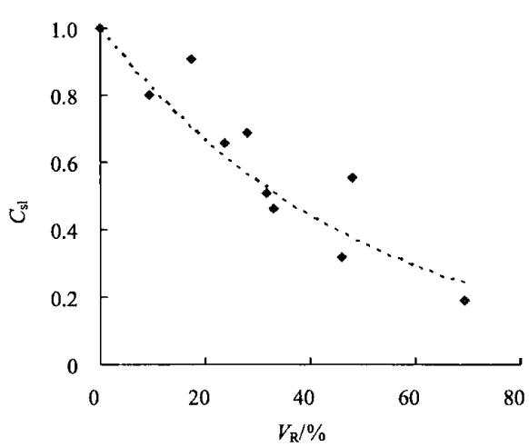  
图6.1 地表枯落物子因子与地表枯落物覆盖度回归关系

人工降雨前采用照相法测量于枯稻草的盖度，代表残茬及枯落物覆盖。将有枯落物覆盖度下的土壤流失量与其他条件相同时裸地土壤流失量的比值作为枯落物子因子$( C _ { \mathrm { { s l } } } )$ ，建立了 $C _ { \mathrm { s l } }$ 值与枯落物覆盖度间的回归关系（图6.1），随地表枯落物覆盖度增加， $C _ { \mathrm { s l } }$ 值呈指数关系递减：

$$
C _ { \mathrm { s l } } = { \mathrm e } ^ { - 0 . 0 2 0 6 V _ { \mathrm { R } } } , \quad r ^ { 2 } = 0 . 9 1\tag{6.5}
$$

式中， $C _ { \mathrm { s l } }$ 为地表枯落物子因子，无量纲；  
$V _ { \mathrm { R } }$ 为地表枯落物覆盖度，%。

## (2) 地表砾石覆盖

用人工降雨试验研究了地表砾石覆盖

对土壤侵蚀的影响。试验土盘长1m、宽0.5m、深0.5m，土盘底部有间距为5cm、直径约为1 cm的许多小孔，以使入渗水自由排放，紧靠土盘底部铺一层厚30 cm的砾石，其上再铺一层透水性好的厚布，布的上层再铺20cm厚的土壤。试验土壤为褐土，试验雨强为67mm/h，降雨历时1h，试验坡度为7°和 $2 0 ^ { \circ }$ 。试验结果表明，随着地表砾石覆盖度的增加，土壤流失量逐渐减少（图6.2）。这是由于随砾石覆盖度的增加，径流量减小，水流流速降低，导致相应的水流挟沙力降低；同时随砾石覆盖度的增加，地表可供水流携带的松散土壤颗粒也减小。坡度对土壤流失量与砾石覆盖度之间的关系影响不明显。

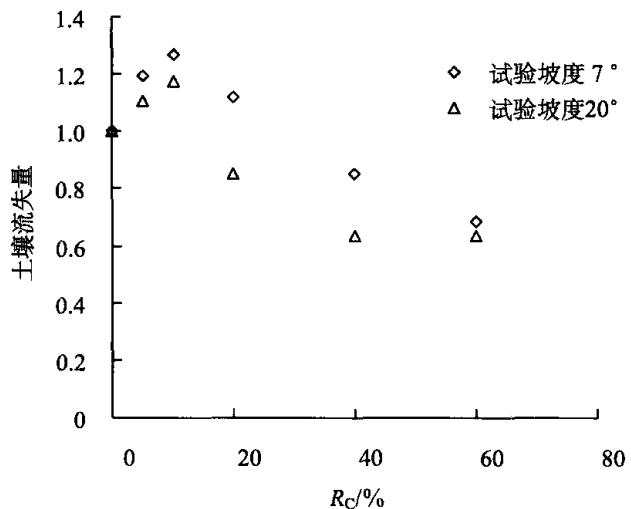  
图6.2 砾石覆盖度与土壤流失量相关图

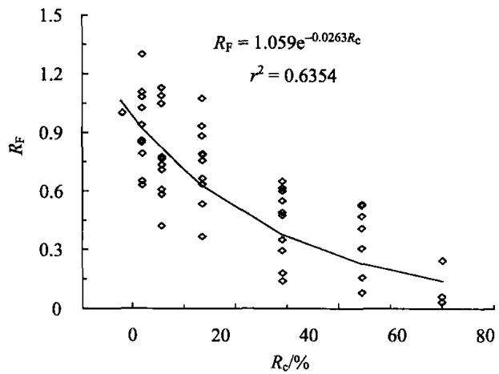  
图6.3 地表砾石覆盖子因子与砾石覆盖度的回归关系

将一定砾石覆盖度下的土壤流失量与其他条件相同时裸地土壤流失量之比作为砾石覆盖子因子 $R _ { \mathtt { F } }$ ，建立了其与砾石覆盖度之间回归关系（图6.3)，地表覆盖子因子随砾石覆盖度的增加而减小，二者之间为负指数关系：

$$
R _ { \mathrm { F } } = 1 . 0 5 9 \mathrm { e } ^ { - 0 . 0 2 6 3 R _ { \mathrm { c } } }\tag{6.6}
$$

式中， $R _ { \mathrm { F } }$ 为地表砾石覆盖子因子，无量纲； $R _ { \mathrm { c } }$ 为砾石覆盖度，%。

## (3) 地表覆盖子因子估算公式

比较式（6.5）和式（6.6）可以发现：用残茬覆盖和砾石覆盖得到的地表覆盖子因子公式中的系数和指数都非常接近，建议将其合并为一个公式，仍采用指数函数形式，其系数和指数分别取式（6.5）和式（6.6）中系数和指数的平均值，分别为1.029和0.0235。于是本模型的地表覆盖子因子 $C _ { \mathrm { s } }$ 公式为

$$
C _ { \mathrm { s } } = 1 . 0 2 9 \mathrm { e } ^ { - 0 . 0 2 3 5 V _ { \mathrm { R } } }\tag{6.7}
$$

## 6.3 草地覆盖与管理因子

草地覆盖与管理因子考虑冠层高度、冠层覆盖度以及地表覆盖的影响，将草地覆盖与管理因子（C）分解为两个子因子：冠层覆盖子因子 $( C _ { \mathrm { { c } } } )$ 和地表覆盖子因子 $( C _ { \mathrm { { s } } } )$ 冠层覆盖子因子 $( C _ { \mathrm { { c } } } )$ 用式（6.4）计算，地表覆盖子因子 $\left( { C _ { \mathrm { s } } } \right)$ 根据是枯落物覆盖还是砾石覆盖，分别用式（6.5）和式（6.6）计算。如果是人工草地，植被均被收割， $C _ { \mathfrak { s } }$ 设为1：如果只有一年平均的植被盖度资料，直接计算年平均覆盖与管理因子（C）；如果有不同季节的植被盖度资料，可首先计算各个季节的C因子，最后利用降雨侵蚀力的年内季节分布进行加权[式（6.1)]，得到全年平均C值。

## 6.4 林地覆盖与管理因子

根据北京主要的林地类型，对天然林和人工林两种林地类型分别考虑其覆盖与管理因子。天然林不受人类活动影响，土壤表层通常覆盖有较厚的枯枝落叶层，土壤有机质含量高，土壤入渗率高；同时土壤表层的枯枝落叶层也能降低雨滴动能，并通过增加入渗减少地表径流对土壤的直接冲刷，从而有效减小土壤流失量。由于目前尚缺少对天然林的土壤流失量观测资料，其覆盖与管理因子采用USLE①中提供的数据（表6.2）。

表 6.2 天然林地的C因子值
<table><tr><td>植被冠层覆盖度/%</td><td>厚度大于0.5m的 枯枝落叶层覆盖度/%</td><td>C因子值</td></tr><tr><td>100~75</td><td>100~90</td><td>0.0001~0.001</td></tr><tr><td>70~45</td><td>85~75</td><td>0.002~0.004</td></tr><tr><td>40~20</td><td>70~40</td><td>0.003~0.009</td></tr></table>

人工林覆盖与管理因子值计算方法与农地一样，分解为地表覆盖子因子 $C _ { \mathrm { s } }$ 和冠层覆盖子因子 $C _ { \mathrm { c } }$ ，其中 $C _ { s }$ 计算方法与农地相同。冠层覆盖子因子值利用北京市延庆县上辛庄水土保持科技示范园区内的坡面径流小区的实测资料分析得到。该示范园区内有7种不同植被覆盖度的灌丛林小区（表6.3），对小区覆盖度进行控制，每隔15天用照相法观测植被盖度。7个小区的植被盖度常年控制在0、5%、10%、30%、50%、70%和90%，利用快速植被覆盖度测量系统PCOVER（章文波等，2001），进行垂直照相，获取数码植被图像，并处理得到植被盖度。经检验该系统的测量误差为0.6%～4.3%，将坡度统一修正到 $2 0 ^ { \circ }$ 后，得到各种覆盖度小区的土壤流失量及其对应的 $C _ { \mathfrak { c } }$ 因子（表6.3）。

表6.3 北京延庆县上辛庄灌丛林地小区试验结果
<table><tr><td rowspan="2">小区号</td><td rowspan="2">坡度 /(°)</td><td rowspan="2">坡长  $/ \mathbf { m }$ </td><td rowspan="2">设计植被 盖度/%</td><td colspan="4">土壤流失量/  $( \mathsf { t } / \mathsf { k m } ^ { 2 } )$ </td><td rowspan="2">冠层覆盖与 管理因子  $C _ { \mathrm { c } }$ </td></tr><tr><td>2003年</td><td>2004年</td><td>平均</td><td>坡度修正后</td></tr><tr><td>5</td><td>23</td><td>10</td><td>0</td><td>1537</td><td>3324</td><td>2430.3</td><td>2089.0</td><td>1.00</td></tr><tr><td>10</td><td>20</td><td>10</td><td>5</td><td>1056</td><td>1154</td><td>1105.1</td><td>1105.1</td><td>0.53</td></tr><tr><td>8</td><td>23</td><td>10</td><td>10</td><td>453</td><td>1276</td><td>864.3</td><td>743.0</td><td>0.36</td></tr><tr><td>3</td><td>20</td><td>10</td><td>30</td><td>87</td><td>61</td><td>74.2</td><td>74.2</td><td>0.04</td></tr><tr><td>4</td><td>20</td><td>10</td><td>50</td><td>40</td><td>23</td><td>31.4</td><td>31.4</td><td>0.02</td></tr><tr><td>9</td><td>20</td><td>10.</td><td>70</td><td>84</td><td>15</td><td>49.4</td><td>49.4</td><td>0.02</td></tr><tr><td>6</td><td>25</td><td>10</td><td>90</td><td>47</td><td>9</td><td>28.0</td><td>22.0</td><td>0.01</td></tr></table>

$C _ { \mathrm { c } }$ 因子与植被覆盖度的回归分析表明(图6.4)，随植被覆盖度增加， $C _ { \mathfrak { c } }$ 因子呈指数形式递减。当植被覆盖度达到30%时，减沙效益达到90%以上，此时土壤流失量已小于北方土石山区的容许土壤流失量 $2 0 0 \mathbf { t } / \mathbf { k } \mathbf { m } ^ { 2 }$ 。所建立的灌丛林地 $C _ { \mathfrak { c } }$ 因子随覆盖度变化的回归关系为

$$
C _ { \mathsf { c } } = 0 . 9 8 8 \mathrm { e } ^ { - 0 . 1 1 V } , \quad r ^ { 2 } = 0 . 9 9
$$

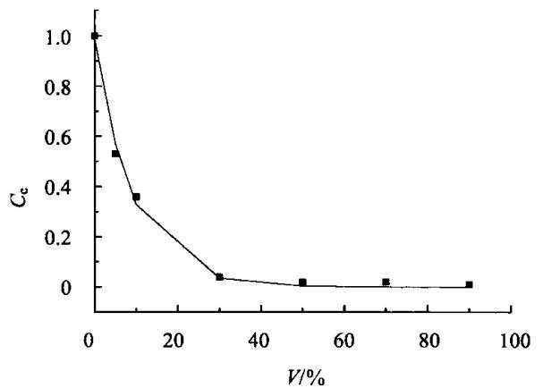

(6.8)

式中， $V$ 为植被覆盖度，%。

图6.4 北京延庆县上辛庄灌丛林地

冠层覆盖子因子与植被覆盖度回归关系

## 6.5 多年平均覆盖与管理因子

由覆盖度计算的覆盖与管理因子可以很好地描述植被在某一生长状态时的水土保持作用，但在进行水土保持规划时，常需要多年平均的覆盖与管理因子值。因此利用北京山区坡面径流小区的资料，分析了农地、灌丛林地和人工林地的多年平均覆盖与管理因子值。

所采用的农地小区资料包括（表6.4）：2001～2006年延庆县上辛庄坡耕地玉米和休闲地小区的天然降雨实测资料，2006～2007年门头沟区担礼坡耕地玉米、大豆和休闲地小区的天然降雨观测资料。同等条件下的休闲地小区作为对照小区，计算二者间的比值，得到农地多年平均覆盖与管理因子（表6.5）。

表 6.4 农地坡面径流小区基本情况
<table><tr><td>小区位置</td><td>小区类型</td><td>坡度/（°）</td><td>坡长  $/ \mathbf { m }$ </td><td>观测年份</td></tr><tr><td>延庆县上辛庄</td><td>休闲地</td><td>15</td><td>10</td><td>2001~2006</td></tr><tr><td>延庆县上辛庄</td><td>玉米</td><td>15</td><td>10</td><td>2001~2006</td></tr><tr><td>门头沟区担礼</td><td>大豆</td><td>15</td><td>10</td><td>2005~2007</td></tr><tr><td>门头沟区担礼</td><td>休闲地</td><td>15</td><td>10</td><td>2005~2007</td></tr><tr><td>门头沟区担礼</td><td>玉米</td><td>15</td><td>10</td><td>2005~2007</td></tr></table>

表 6.5 农地多年平均覆盖与管理因子值
<table><tr><td>农地类型</td><td>C因子</td><td>资料来源</td></tr><tr><td>玉米</td><td>0.39</td><td>延庆县上辛庄</td></tr><tr><td>玉米</td><td>0.53</td><td>门头沟区担礼</td></tr><tr><td>大豆</td><td>0.64</td><td>门头沟区担礼</td></tr></table>

符素华等（2002）选用中山区房山区蒲洼、低山区怀柔区东台沟以及丘陵区密云县石匣草地和林地的试验观测资料（表6.6)，计算了林地和草地的多年平均覆盖与管理因子。具体资料情况包括：1992～1995年房山区蒲洼坡面径流试验小区的年均土壤流失量，1988～1995年怀柔区东台沟的年均土壤流失量，1993～1999年密云县石匣的年均土壤流失量，2001～2006年延庆县的小区资料。

表6.6 不同地区草地和林地坡面径流小区概况
<table><tr><td>地区</td><td>小区</td><td>坡度 1(°)</td><td>坡长  $/ \mathbf { m }$ </td><td>坡宽  $/ \mathbf { m }$ </td><td>坡向</td><td>土壤</td><td>水保措施及土地利用</td></tr><tr><td></td><td>1</td><td>15.0</td><td>10</td><td>5</td><td>阴</td><td>棕壤</td><td>标准小区*</td></tr><tr><td></td><td>2</td><td>15.0</td><td>10</td><td>5</td><td>阴</td><td>棕壤</td><td>自然坡**</td></tr><tr><td>中山区</td><td>5</td><td>23.0</td><td>10</td><td>5</td><td>阴</td><td>棕壤</td><td>林地（小水平条）</td></tr><tr><td>房山区</td><td>7</td><td>20.0</td><td>10</td><td>5</td><td>半阴半阳</td><td>棕壤</td><td>林地（大水平条）</td></tr><tr><td>蒲洼</td><td>8</td><td>20.0</td><td>10</td><td>5</td><td>半阴半阳</td><td>棕壤</td><td>自然坡**</td></tr><tr><td></td><td>9</td><td>22.0</td><td>10</td><td>5</td><td>阴</td><td>棕壤</td><td>草地（水平沟垄）</td></tr><tr><td></td><td>10</td><td>22.0</td><td>10</td><td>5</td><td>阴</td><td>棕壤</td><td>自然坡**</td></tr><tr><td></td><td>1</td><td>23.0</td><td>10</td><td>5</td><td>阳</td><td>黃壤土</td><td>自然坡**</td></tr><tr><td></td><td>5</td><td>27.7</td><td>10</td><td>5</td><td>阳</td><td>黄砂土</td><td>自然坡**</td></tr><tr><td>低山区</td><td>6</td><td>27.7</td><td>10</td><td>5</td><td>阳</td><td>黄砂土</td><td>洋槐（鱼鳞坑）</td></tr><tr><td>怀柔区</td><td>7</td><td>26.2</td><td>10</td><td>5</td><td>阳</td><td>黄砂土</td><td>自然坡**</td></tr><tr><td>东台沟</td><td>8</td><td>26.2</td><td>10</td><td>5</td><td>阳</td><td>黄砂土</td><td>洋槐（水平条）</td></tr><tr><td></td><td>9</td><td>20.5</td><td>10</td><td>5</td><td>阴</td><td>黃壤土</td><td>自然坡**</td></tr><tr><td></td><td>10</td><td>20.5</td><td>10</td><td>5</td><td>阴</td><td>黄壤土</td><td>洋槐（鱼鳞坑）</td></tr><tr><td></td><td>2</td><td>16.8</td><td>10</td><td>5</td><td>阳</td><td>粗骨褐土</td><td>栗树（大水平条）</td></tr><tr><td></td><td>3</td><td>16.8</td><td>10</td><td>5</td><td>阳</td><td>粗骨褐土</td><td>栗树（大水平条，土埂草）</td></tr><tr><td></td><td>4</td><td>14.6</td><td>10</td><td>5</td><td>半阳</td><td>粗骨褐土</td><td>标准小区***</td></tr><tr><td></td><td>5</td><td>14.6</td><td>10</td><td>5</td><td>半阳</td><td>粗骨褐土</td><td>自然坡**</td></tr><tr><td></td><td>6</td><td>11.6</td><td>10</td><td>5</td><td>半阴</td><td>粗骨褐土</td><td>山楂（大水平条）</td></tr><tr><td></td><td>7</td><td>9.6</td><td>10</td><td>5</td><td>半阴</td><td>粗骨褐土</td><td>山楂（大水平条，土埂草）</td></tr><tr><td></td><td>8</td><td>27.0</td><td>10</td><td>5</td><td>阴</td><td>粗骨褐土</td><td>自然坡**</td></tr><tr><td>丘陵区</td><td>9</td><td>27.0</td><td>10</td><td>5</td><td>阴</td><td>粗骨褐土</td><td>沙打旺（小水平条）</td></tr><tr><td>密云县 石匣</td><td>10</td><td>27.0</td><td>10</td><td>5</td><td>阴</td><td>粗骨褐土</td><td>刺槐（鱼鳞坑）</td></tr><tr><td></td><td>11</td><td>19.5</td><td>5</td><td>5</td><td>半阴</td><td>粗骨褐土</td><td>自然坡**</td></tr><tr><td></td><td>12</td><td>17.2</td><td>10</td><td>5</td><td>半阴</td><td>粗骨褐土</td><td>油松、刺槐（鱼鳞坑）</td></tr><tr><td></td><td>13</td><td>18.9</td><td>10</td><td>5</td><td>半阴</td><td>粗骨褐土</td><td>自然坡**</td></tr><tr><td></td><td>14</td><td>19.3</td><td>15</td><td>5</td><td>半阴</td><td>粗骨褐土</td><td>自然坡**</td></tr><tr><td></td><td>15</td><td>19.0</td><td>10</td><td>5</td><td>半阴</td><td>粗骨褐土</td><td>刺槐（鱼鳞坑）</td></tr><tr><td></td><td>16</td><td>19.0</td><td>10</td><td>5</td><td>半阴</td><td>粗骨褐土</td><td>栗树（小水平条）</td></tr><tr><td></td><td>19</td><td>6.0</td><td>10</td><td>5</td><td>半阳</td><td>粗骨褐土</td><td>自然坡**</td></tr></table>

\*标准小区处理方式为每年春季进行翻耕，准备成苗床状态，用拔草方法将地表植被覆盖控制在一定范围内；\*\*植被覆盖度在80%以上；\*\*\*该标准小区的处理方式为第一年春季翻耕，准备成苗床状态，以后不再翻耕，用拔草方法将地表植被覆盖控制一定范围内。

分析时首先对试验资料进行标准化处理，将观测的土壤流失量转换到同一坡度(15°），并求出不同土地利用类型下的相对土壤流失率（表6.7）。该相对流失率是以坡耕地玉米的土壤流失量为标准值得出的。由于覆盖与管理因子是在同等条件下某种土地利用下的土壤流失量与裸地土壤流失量的比值，需要将表6.7不同土地利用类型的相对土壤流失率转换成覆盖与管理因子。在转换时，引用了中间变量水土保持效益值，它是玉米覆盖与管理因子值与相对土壤流失率的乘积，对于无工程措施的林地或草地，水土保持效益值等于植被覆盖与管理因子；对于有工程措施的林地或草地，将水土保持效益值除以工程措施因子，得到林地或草地的植被覆盖与管理因子。前面分析得到延庆县上辛庄和门头沟区担礼玉米覆盖与管理因子的平均值为0.460，其他土地利用的水土保持效益值为该基准值和相对土壤流失率的乘积。对于有工程措施的林地和人工草地，将水土保持效益值除以鱼鳞坑或水平条的工程措施因子0.08或0.09，得到相应土地利用覆盖与管理因子的近似值，计算结果见表6.7，并对表6.7中的覆盖与管理因子值按土地利用进行分类汇总，计算得到不同土地利用类型的多年平均覆盖与管理因子见表6.8。

表6.7 不同土地利用下的相对土壤流失率
<table><tr><td>地区</td><td>类型</td><td>土地利用</td><td>小区号</td><td>坡向</td><td>土壤</td><td>坡度 /(°)</td><td>相对于坡 耕地玉米 的土壤流 失率E</td><td>水土保持 效益值P</td><td colspan="14">覆盖与管 理因子C</td></tr><tr><td rowspan="7">中山区房 山区蒲洼</td><td></td><td>自然坡</td><td>2</td><td>阴</td><td>棕壤</td><td>15</td><td>0.015</td><td>0.007</td><td colspan="14">0.007</td></tr><tr><td>灌丛林地</td><td>自然坡</td><td>8</td><td>半阴半阳</td><td>棕壤</td><td>20</td><td>0.062</td><td>0.029</td><td colspan="14">0.029</td></tr><tr><td></td><td>自然坡</td><td>10</td><td>阴</td><td>棕壤</td><td>22</td><td>0.017</td><td>0.008</td><td colspan="14">0.008</td></tr><tr><td>人工草地</td><td>草地（水平沟垄）</td><td>9</td><td>阴</td><td>棕壤</td><td>22</td><td>0.008</td><td>0.004</td><td colspan="14">0.040</td></tr><tr><td>人工林地</td><td>板栗（大水平条）</td><td>7</td><td>半阴半阳</td><td>棕壤</td><td>20</td><td>0.024</td><td>0.011</td><td colspan="14">0.120</td></tr><tr><td rowspan="2">灌丛林地</td><td>自然坡</td><td>1</td><td>阳</td><td>黄壤土 黄砂土</td><td>23 27.7</td><td>0.191</td><td>0.088</td><td colspan="14">0.088</td></tr><tr><td>自然坡 自然坡</td><td>5 7</td><td>阳 阳</td><td>黄砂土</td><td>26.2</td><td>0.029 0.004</td><td>0.013 0.002</td><td colspan="14">0.013 0.002</td></tr><tr><td rowspan="4">低山区怀 柔区东台沟</td><td>林地</td><td>自然坡</td><td>9</td><td>阴</td><td>黃壤土</td><td>20.5</td><td>0.001</td><td>0.000</td><td colspan="14">0.000</td></tr><tr><td></td><td>洋槐（鱼鳞坑）</td><td>6</td><td>阳</td><td>黄砂土</td><td>27.7</td><td>0.025</td><td>0.012</td><td colspan="14">0.140</td></tr><tr><td>洋槐（大水平条）</td><td></td><td>8</td><td>阳</td><td>黄砂土</td><td>26.2</td><td>0.046</td><td>0.021</td><td colspan="14">0.240</td></tr><tr><td>洋槐（鱼鳞坑）</td><td>10</td><td>阴</td><td>黄壤土</td><td>20.5</td><td></td><td>0.036</td><td>0.017</td><td colspan="14">0.210</td></tr><tr><td>地区</td><td>类型</td><td>土地利用</td><td>小区号</td><td>坡向</td><td>土壤</td><td>坡度 /(°)</td><td>相对于坡 耕地玉米 的土壤流</td><td>水土保持 效益值P</td><td>覆盖与管 理因子C</td></tr><tr><td colspan="16" rowspan="19">灌丛林地 丘陵区密 云县石匣</td></tr><tr><td></td><td></td><td>失率E</td><td></td></tr><tr><td>5 半阳</td><td>阴</td><td>粗骨褐土 14.6 粗骨褐土</td><td>27</td><td>0.100</td><td>0.046 0.046 0.054</td></tr><tr><td>自然坡</td><td>8</td><td>粗骨褐土</td><td>18.9</td><td>0.118</td><td>0.054</td></tr><tr><td>自然坡</td><td>13 19</td><td>半阴 半阳 粗骨褐土</td><td>6</td><td>0.007 0.155</td><td>0.003 0.003 0.071</td></tr><tr><td>自然坡 人工草地 沙打旺（小水平条）</td><td>9</td><td>阴</td><td>粗骨褐土 27</td><td>0.133</td><td>0.071 0.061 0.680</td></tr><tr><td>栗树（大水平条）</td><td>2</td><td>阳</td><td>粗骨褐土 16.8</td><td>0.045</td><td>0.021 0.230</td></tr><tr><td>栗树（大水平 条，土埂草)</td><td>3</td><td>阳</td><td>粗骨褐土 16.8</td><td>0.071</td><td>0.033 0.360</td></tr><tr><td>山楂（大水平条）</td><td>6</td><td>半阴</td><td>粗骨褐土 11.6</td><td>0.104</td><td>0.048 0.530</td></tr><tr><td>山楂（大水平 人工林地 条，土埂草)</td><td>7</td><td>半阴</td><td>粗骨褐土 9.6</td><td>0.033</td><td>0.015 0.170</td></tr><tr><td>栗树（小水平条）</td><td>16</td><td>半阴</td><td>粗骨褐土 19</td><td>0.011</td><td>0.005 0.060</td></tr><tr><td>刺槐（鱼鳞坑）</td><td>10</td><td>阴</td><td>粗骨褐土 27</td><td>0.086</td><td>0.040 0.490</td></tr><tr><td>油松、刺槐 (鱼鳞坑)</td><td>12</td><td>半阴</td><td>粗骨褐土 17.2</td><td>0.019</td><td>0.009 0.110</td></tr><tr><td></td><td></td><td></td><td></td><td></td><td></td></tr><tr><td></td><td>刺槐（鱼鳞坑）</td><td>15 半阴</td><td>粗骨褐土</td><td>19</td><td>0.014</td><td>0.006 0.080</td></tr></table>

表6.8 北京主要植被类型的覆盖与管理因子多年平均值
<table><tr><td>人工草地</td><td>灌木林地</td><td>山楂</td><td>板栗</td><td>侧柏</td><td>刺槐</td></tr><tr><td>0.360</td><td>0.029</td><td>0.310</td><td>0.230</td><td>0.410</td><td>0.230</td></tr></table>

## 参考文献

卜兆宏，赵宏夫，刘绍清.1993.用于土壤流失量遥感监测的植被因子算法的初步研究. 遥感技术与应用，8（4）：16\~22

符素华，段淑怀，刘宝元. 2001. 密云石匣小流域土地利用对土壤粗化的影响.地理研究，20(6)：697\~702

符素华，段淑怀，李永贵，刘汉柱，吴敬东，刘宝元. 2002.北京山区土地利用对土壤侵蚀的影响.自然科学进展，12（1）：108\~112

高素华，郭建平，刘玲.2001. 中国北方地区植被覆盖度的遥感解译及水土保持作用系数推算研究.水土保持学报，15(3)：65\~67

江忠善，王志强，刘志.1996. 黄土丘陵区小流域土壤侵蚀空间变化定量研究.土壤侵蚀与水土保持学报，2（1）：1\~9

金争平，史培军，侯福昌，赵焕勋.1992.黄河皇甫川流域土壤侵蚀系统模型和治理模式. 北京：海洋出版社

林素兰，黄毅，聂振刚，孙景华.1997.辽北低山丘陵区坡耕地土壤流失方程的建立.土壤通报，28（6）：251\~253

刘秉正，刘世海，郑随定.1999. 作物植被的保土作用及作用系数.水土保持研究，6（2)：32\~36

马超飞，马建文，布和敖斯尔. 2001. USLE模型中植被覆盖因子的遥感数据定量估算.水土保持通报，21（4)：6\~9

汪明冲，潘竟虎，赵军. 2007. 基于GIS与RS的土壤侵蚀变化定量监测以黄土高原水保二期世行贷款庆城项目区为例．干旱地区农业研究，25（6）：116～121

杨子生.1999. 滇东北山区坡耕地土壤侵蚀的作物经营因子. 山地学报，17（增)：19\~21

于东升，史学正，吕喜玺. 1998. 低丘红壤区不同土地利用方式C值及可持续性评价. 土壤侵蚀与水土保持学报，4(1)：71\~76

张宪奎，许靖华，卢秀琴，邓育江，高德武.1992. 黑龙江省土壤流失方程的研究．水土保持通报，12（4）：1\~18

张岩，刘宝元，史培军，江忠善.2001. 黄土高原土壤侵蚀作物覆盖因子计算.生态学报，21（7)：1050～1056

章明奎. 1999. 浙江省丘陵沙化土壤的特性和复退性的研究. 土壤侵蚀与水土保持学报，5（2)：75\~79

章文波，符素华，刘宝元. 2001. 目估法测量植被覆盖度的精度分析北京师范大学学报（自然科学版），37（3）：402\~408

Browning G M, Parish C L, Glass J A. 1947. A method for determining the use and limitation of rotation and conservation practices in control of soil erosion in Iowa. Soil Science Society of America Proceedings, 23 : 249\~264

Cook H L. 1936. The nature and controlling variables of the water erosion process. Soil Science Society of America Proceedings,1：487\~493

Meyer L D. 1984. Evolution of the universal soil loss equation. Journal of soil and Water Conservation, 39 (2): 99\~ 104

Smith D D. 1941. Interpretation of soil Conservation data for field use. Agricultural Engineering, 22: 173\~175

Van Doren C A, Bartelli L J. 1956. A method of forecasting soil losses. Agricultural Engineering, 37: 335\~341

Wischmeier W H. 1960. Cropping-management factor evaluations for a universal soil-loss equation. Soil Science Society of America Proceedings, 24 (4): 322\~326

Zhang Y, Liu B Y, Zhang Q C, Xie Y. 2003. Effect of different vegetation types on soil erosion by water. Acta Botanica Sinica, 45(10)： 1204\~1209

## 第七章 水土保持工程措施因子

水土保持工程措施因子是反映水土保持工程措施对土壤侵蚀影响的定量指标，根据Wischmeier和Smith①②的定义：它是指采取某种工程措施时的土壤流失量与同等条件下无工程措施的土壤流失量之比。水土保持工程措施主要通过改变地形和汇流方式增加地表入渗，减小径流量、水流流速和水流挟沙力，达到减小土壤侵蚀的目的。北京山区实施的主要水土保持工程措施有梯田、水平条、鱼鳞坑和树盘（图7.1）。

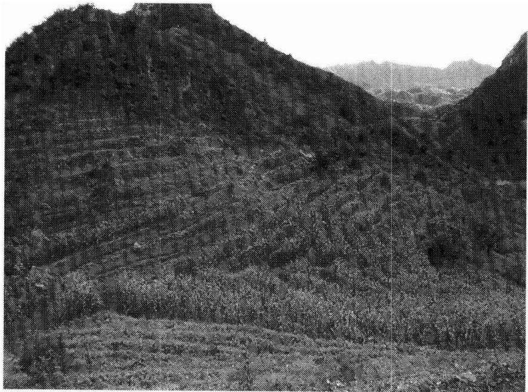  
图 7.1 北京山区水平条景观

## 7.1 梯田措施因子

梯田广泛分布于世界许多地区，包括北非、法国、中美洲、日本、印度、韩国及东南亚等。我国的梯田建设有悠久历史，相传在3000年前的长江流域就有水平梯田分布，2000年前的黄河流域出现了旱作梯田（唐克丽，2004)。梯田的种类很多，可按不同的指标分类：从田面平整程度划分，有水平梯田、隔坡梯田、坡式梯田和软埝；从田埂建筑材料划分，有土埂梯田、石埂梯田和生物埂梯田。梯田通过将长坡分成几个短坡，减小了径流量和坡面坡度，从而减小片蚀和细沟侵蚀，并使侵蚀的泥沙在梯田之间淤积，尤其是当梯田水平或当梯田坡度很小时，水土保持效益更为显著，因此它是一种被广泛应用的水土保持工程措施。

北京山区的梯田主要有石埂水平梯田和土埂水平梯田两种。早在1988年，北京市水利局就在怀柔区汤河口修建了土埂梯田坡面径流小区，研究其对土壤侵蚀的影响，2005年又在门头沟区担礼修建了石埂梯田坡面径流小区。符素华等（2002）利用1993～1999年密云县石匣、1988\~1995年怀柔区汤河口土埂水平梯田的坡面径流小区实测资料，以及2006\~2007年门头沟区担礼石埂水平梯田的坡面径流小区实测资料，分别计算了土埂水平梯田和石埂水平梯田的水土保持工程措施因子（P）（表7.1）。

表7.1 北京山区土埂和石埂水平梯田小区概况及其水土保持工程措施因子
<table><tr><td>小区位置</td><td>小区类型</td><td>梯田水平宽/m</td><td>坡度/(°)</td><td>坡长/m</td><td>水土保持工程 因子值P</td></tr><tr><td>密云县石匣</td><td>土埂梯田</td><td>4</td><td>3.8</td><td>10</td><td>0.143</td></tr><tr><td>怀柔区汤河口</td><td>土埂梯田</td><td>4</td><td>33.2</td><td>10</td><td>0.109</td></tr><tr><td>门头沟区担礼</td><td>石埂梯田</td><td>4</td><td>15</td><td>10</td><td>0.154</td></tr><tr><td>门头沟区担礼</td><td>石埂梯田</td><td>4</td><td>15</td><td>20</td><td>0.044</td></tr></table>

从表7.1可以看出，同为石埂梯田，坡长对梯田措施因子有影响：坡长为10m时的措施因子约是坡长为20m时的3.5倍。这主要是由于坡长对裸地小区的土壤流失量影响很大，20m坡长小区的土壤流失量约为10m坡长小区土壤流失量的2倍（表7.2)。而坡长对梯田小区的土壤流失量影响不大，坡长为20 m和10 m梯田小区的土壤流失量分别为 1027 t/km² 和 1586 t/km²。

表7.2 门头沟区担礼石埂梯田及其对比小区概况与实测值
<table><tr><td rowspan="2">小区号</td><td rowspan="2">土地利用 (工程措施)</td><td rowspan="2">坡度/(°)</td><td rowspan="2">坡长/m</td><td colspan="2">径流深/mm</td><td colspan="2">土壤流失量/(t/km²)</td></tr><tr><td>2006年</td><td>2007年</td><td>2006年</td><td>2007年</td></tr><tr><td>10</td><td>裸地</td><td>15</td><td>20</td><td>173</td><td>33</td><td>23533</td><td>68</td></tr><tr><td>14</td><td>裸地（石埂梯田）</td><td>15</td><td>20</td><td>99</td><td>24</td><td>1027</td><td>1</td></tr><tr><td>19</td><td>裸地</td><td>15</td><td>10</td><td>158</td><td>36</td><td>10300</td><td>48</td></tr><tr><td>18</td><td>裸地（石埂梯田）</td><td>15</td><td>10</td><td>93</td><td>21</td><td>1586</td><td>3</td></tr></table>

## 7.2 水平条措施因子

水平条与水平梯田类似，田面呈水平，但宽度较水平梯田窄，一般为2m，各块水平条将坡面分割成整齐的台阶，适用于15°～25°的陡坡，水平条常用来种植经济林。在北京山区，根据所在地形条件，水平条修建宽度一般为1m或者2m。

延庆县上辛庄2000年修建了水平条径流小区。对2001～2006年58次侵蚀性降雨的观测资料进行分析，并以休闲地小区作为对照小区，得到水平条多年平均水土保持工程措施因子值为0.09（表7.3）。参照黄锡荃等（1993）的暴雨标准分类方法，将降雨分成小雨 $\mathrm { ( \leqslant 1 0 ~ m m / d ) }$ 、中雨（10\~30mm/d）、大雨（30～50mm/d）和暴雨（50～100mm/d)。58次降雨中，出现小雨、中雨、大雨和暴雨的次数分别为11次、34次、9次和4次，相应的出现概率分别为19.0%、58.6%、15.5%和6.9%。按照不同的降雨类型，水平条措施因子受降雨量影响明显（表7.3）：小雨和中雨情况下的因子较大，大雨和暴雨情况下的因子较小。工程措施因子随降雨量的变化与水平条本身的设计水平和地埂状况有关系。降雨过程中是否出现地埂溢流，会直接影响水平条的减水减沙效益及其工程措施因子。

表7.3 延庆县上辛庄水平条小区不同降雨量及其多年平均工程措施因子
<table><tr><td rowspan="2">降雨类型</td><td rowspan="2">降雨量 /mm</td><td rowspan="2">雨强  $I _ { 3 0 }$  /(mm/h)</td><td colspan="2">土壤侵蚀模数/(t/km²)</td><td rowspan="2">水平条P</td></tr><tr><td>休闲地</td><td>水平条</td></tr><tr><td>小雨</td><td>≤10</td><td>2.0~22.8</td><td>109</td><td>57</td><td>0.52</td></tr><tr><td>中雨</td><td>10~30</td><td>10.6~67.0</td><td>8743</td><td>1141</td><td>0.13</td></tr><tr><td>大雨</td><td>30~50</td><td>29.4~56.1</td><td>6246</td><td>255</td><td>0.04</td></tr><tr><td>暴雨</td><td>50~100</td><td>30.2~70.0</td><td>8356</td><td>759</td><td>0.09</td></tr><tr><td>多年平均</td><td></td><td></td><td>3909</td><td>369</td><td>0.09</td></tr></table>

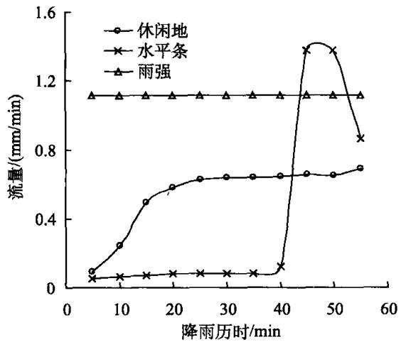  
图7.2 人工模拟降雨干运行时水平条与休闲地流量过程线比较

为了进一步分析水平条工程措施因子与降雨量的关系，专门在延庆县上辛庄的休闲地和水平条坡面径流小区上进行了人工模拟降雨试验。试验分干运行和湿运行，干运行时的雨强为 67 mm/h，降雨历时1 h。干运行结束2h后进行湿运行，降雨历时为1.30h，且采用变雨强，雨强依次为 67 mm/h、90 mm/h、67 mm/h和 30 mm/h，相应的降雨历时为 30 min、20 min、20 min 和 20min。图7.2和图7.3反映了干运行情况下，休闲地小区和水平条小区流量和输沙率的变化。在水平条地埂出现溢流之前，水平条小区能充分发挥作用，其流量和输沙率都远小

于休闲地小区（降雨历时40min后），但在水平条地埂溢流后（降雨历时40min后），小区流量明显增加，远大于休闲地小区（图7.2），说明地埂的存在有效地降低了水流流速和水流挟沙力。当水平条地埂被破坏，溢流出现后，输沙率虽有所增加，但不明显，仍远小于休闲地小区（图7.3）。

比较人工降雨和天然降雨两种情况下，水土保持工程措施因子随降雨量的变化，其规律基本相同，随雨量增加，因子值增大（图7.4）。但实测资料中的天然降雨大多数是小隆雨量事件，缺乏大暴雨事件，因此现有天然降雨资料中无法得到大暴雨事件的工程措施因子。水土保持工程措施的设计，往往需要依据大暴雨事件，现有野外天然降雨径流小区观测资料无法满足设计需要，因此将人工降雨试验结果加以修正，可反映天然降雨水平条措施因子随降雨量的变化，具体修正公式如下：

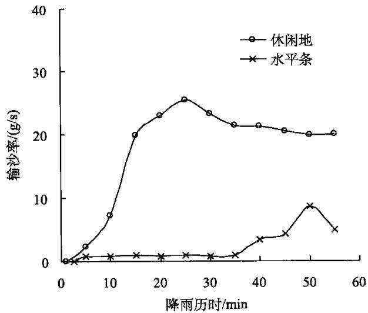  
图7.3 人工模拟降雨干运行时水平条和休闲地输沙率过程线比较

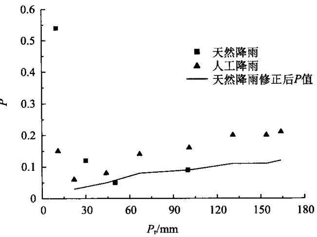  
图7.4 天然降雨与人工模拟降雨试验不同降雨量的水平条措施因子

$$
P _ { \mathcal { K B } } = \frac { P _ { \mathcal { K B \& H } } } { P _ { \mathcal { K \& } \mathcal { H } } } P _ { \mathcal { K } \mathcal { L } }\tag{7.1}
$$

式中， $P _ { \mathcal { K } \mathbb { A } }$ 为天然降雨条件下某降雨量的工程措施因子； $P _ { \mathrm { \tiny \wedge r } }$ 为人工模拟降雨试验条件下某降雨量的工程措施因子； $P _ { \mathcal { K } }$ 为天然降雨条件下多年平均的工程措施因子；$P _ { \curlywedge \underline { { \mathrm { T } } } \sharp \sharp } \sharp$ 为人工模拟降雨试验条件下总降雨量的工程措施因子。

根据修正后的工程措施因子值（P），用大于20mm的降雨量（P）及其相应的工程措施因子值建立回归关系，得到不同降雨量下的水平条工程措施因子值随降雨量的关系式为

$$
P = 0 . 0 0 3 9 P _ { \mathrm { r } } ^ { 0 . 6 7 7 2 } , \qquad r ^ { 2 } = 0 . 9 7 4 2 \ ( P _ { \mathrm { r } } > 2 0 \ \mathrm { m m } )\tag{7.2}
$$

利用式（7.2）可以计算不同设计频率降雨量下的水平条工程措施因子。

## 7.3 鱼鳞坑措施因子

鱼鳞坑是干旱、半干旱地区蓄水保土的主要工程措施之一，具体做法是在坡面上挖掘有一定蓄水容量、交错排列、类似鱼鳞状的土坑。坑为半圆形，外高内低，坑长0.8\~1.5m，坑宽0.5\~0.8m，坑深0.3\~0.5m，沿等高线布设，上、下两行坑口呈“品”字形错开排列，坑两端挖宽、深各0.2～0.3m、倒“八”字形的截水沟，形状多为曲线形。

鱼鳞坑虽然属坡面工程，有拦蓄坡面径流、沉淀泥沙的作用，但其主要作用是造林整地。鱼鳞坑造林是工程措施和植物措施相结合的一种水土流失治理方法，鱼鳞坑的作用是保证树木的成活，由林木植被作为水土保持设施而长期发挥作用。

根据北京市延庆县上辛庄布设的休闲地和鱼鳞坑坡面径流试验小区2001～2006年的实测资料，分析得到鱼鳞坑的多年平均水土保持工程因子（表7.4）。

表7.4 北京市延庆县上辛庄鱼鳞坑小区不同降雨量及其多年平均水土保持工程措施因子
<table><tr><td rowspan="2">雨型</td><td rowspan="2">降雨量 /mm</td><td colspan="2">土壤侵蚀模数/(t/km²)</td><td rowspan="2">鱼鳞坑P</td></tr><tr><td>休闲地</td><td>鱼鳞坑</td></tr><tr><td>小雨</td><td>≤10</td><td>109</td><td>48</td><td>0.44</td></tr><tr><td>中雨</td><td>10~30</td><td>8743</td><td>759</td><td>0.09</td></tr><tr><td>大雨</td><td>30~50</td><td>6246</td><td>123</td><td>0.02</td></tr><tr><td>暴雨</td><td>50~100</td><td>8356</td><td>851</td><td>0.10</td></tr><tr><td>多年平均</td><td></td><td>3909</td><td>297</td><td>0.08</td></tr></table>

仍按黄锡荃等（1993）的暴雨标准进行分类，分析鱼鳞坑措施因子随降雨量的变化(表7.4)：当降雨量从小雨向大雨过渡时，鱼鳞坑措施因子逐渐减小；当降雨量从大雨向暴雨转变时，鱼鳞坑措施因子又有增加。鱼鳞坑措施因子随降雨量的这种变化与鱼鳞坑本身的设计水平、地埂状况有关系。降雨过程中是否出现地埂溢流，直接影响鱼鳞坑的减沙效益及其水土保持工程措施因子。

为了进一步分析降雨过程中水平条措施因子随降雨量的变化，在延庆县上辛庄的休闲地和鱼鳞坑坡面径流小区进行了人工模拟降雨试验，方法与前述水平条人工模拟降雨试验方法相同。图7.5和图7.6分别是降雨历时60min内，定雨强条件下休闲地小区和鱼鳞坑小区流量和输沙率的变化。在鱼鳞坑小区出现地埂溢流之前，其流量和输沙率都远小于休闲地小区，表明鱼鳞坑能充分发挥水土保持作用，但在出现地埂溢流后（约30min以后），鱼鳞坑小区流量明显增加，且随着地埂被严重破坏，其流量甚至大于休闲地小区的流量（图7.5）。由于地埂有效地降低了水流流速和水流挟沙力，鱼鳞坑小区的输沙率始终保持较低水平（图7.6）。

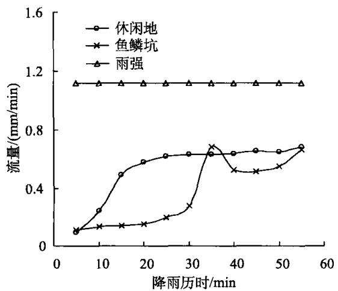  
图7.5 人工模拟降雨时鱼鳞坑  
与休闲地流量过程线比较

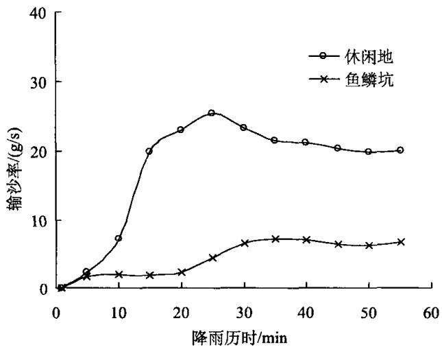  
图 7.6 人工模拟降雨时鱼鳞坑  
和休闲地输沙率过程线比较

与水平条类似，人工降雨和天然降雨情况下的鱼鳞坑措施因子随降雨量的变化规律也呈现出基本一致的特征（图7.7)，因此用与水平条相同的方法建立了鱼鳞坑水土保持措施因子的回归方程：

$$
\begin{array} { c } { { P = 0 . 0 6 9 3 P _ { \mathrm { r } } ^ { 0 . 1 3 0 1 } , } } \\ { { { } } } \\ { { r ^ { 2 } = 0 . 6 3 2 2 ( P _ { \mathrm { r } } > 2 0 ~ \mathrm { m m } ) } } \end{array}\tag{7.3}
$$

根据式（7.3），可以计算不同设计频率降雨量的鱼鳞坑措施因子。

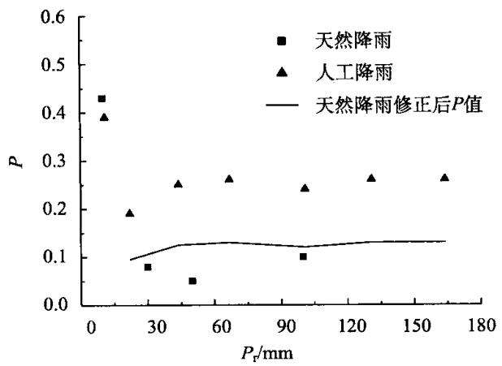  
图7.7 天然降雨与人工模拟降  
雨试验不同降雨量的鱼鳞坑措施因子

## 7.4 树盘措施因子

树盘的俯视图呈方形，宽1.6\~2.0m，坑深0.3～0.5m，沿等高线布设，上、下两行坑口呈“田”字形排列。

北京延庆县上辛庄和门头沟区担礼都布设了树盘坡面径流小区，上辛庄的树盘小区修建于2000年，种植板栗幼苗，2001～2003年板栗林的覆盖度较小，因此忽略树盘中因种植板栗对土壤侵蚀的影响。担礼的树盘小区为裸地。利用上辛庄2001～2003年和担礼2006\~2007年休闲地小区和树盘小区的实测资料，计算出树盘多年平均的水土保持工程措施因子（P）（表7.5）。

表7.5 树盘小区概况及其多年平均水土保持工程措施因子值
<table><tr><td>小区位置</td><td>土壤</td><td>小区类型</td><td>坡度  $/ ( ^ { \circ } )$ </td><td>坡长  $\cdot / \mathbf { m }$ </td><td>观测年份</td><td>P</td></tr><tr><td>延庆县上辛庄</td><td>普通褐土</td><td>树盘</td><td>12</td><td>10</td><td>2001~2003</td><td>0.04</td></tr><tr><td>门头沟区担礼</td><td>普通褐土</td><td>树盘</td><td>15</td><td>20</td><td>2006~2007</td><td>0.08</td></tr></table>

树盘措施因子随降雨量而变化（表7.6）。按照黄锡荃等（1993）的暴雨标准分类，28次隆雨中，出现小雨、中雨、大雨和暴雨的次数分别为7次、11次、7次和3次。相应的出现概率为25.0%、39.3%、25.0%和10.7%。当降雨量从小雨向大雨过渡时，随降雨量的增大，树盘措施因子逐渐减小；当降雨量从大雨到暴雨转变时，树盘措施因子又增加。

与前两种工程措施相同，在延庆县上辛庄休闲地和树盘坡面径流小区，进行了人工模拟降雨实验，表明人工模拟降雨试验和天然降雨条件下，树盘措施因子值随降雨量的变化趋势一致（图7.8），并进一步建立树盘措施因子与降雨量之间的回归方程为

$$
P = 0 . 0 1 9 7 P _ { \mathrm { r } } ^ { 0 . 2 3 6 6 } , \quad r ^ { 2 } = 0 . 8 0 1 8 \ ( P _ { \mathrm { r } } > 2 0 \ \mathrm { m m } )\tag{7.4}
$$

利用式（7.4），可以计算不同频率降雨量的树盘措施因子值。实际应用中，可根据降雨量大小选用不同的P值。

表7.6 延庆县上辛庄树盘小区不同降雨量及其工程措施因子值
<table><tr><td rowspan="2">雨型</td><td rowspan="2">降雨量 /mm</td><td rowspan="2">降雨次数</td><td rowspan="2">雨强  $/ ( \mathrm { { m m } / \mathrm { { h } ) } }$ </td><td colspan="2">土壤侵蚀模数  $/ ( { \mathsf { t } } / { \mathsf { k } } { \mathsf { m } } ^ { 2 } )$ </td><td rowspan="2">树盘P</td></tr><tr><td>休闲地</td><td>树盘</td></tr><tr><td>小雨</td><td>≤10</td><td>7</td><td>2~22.8</td><td>101</td><td>20</td><td>0.20</td></tr><tr><td>中雨</td><td>10~30</td><td>11</td><td>10.6~67</td><td>5296</td><td>132</td><td>0.02</td></tr><tr><td>大雨</td><td>30~50</td><td>7</td><td>29.4~56.1</td><td>6156</td><td>199</td><td>0.03</td></tr><tr><td>暴雨</td><td>50~100</td><td>3</td><td>30.2~70</td><td>8316</td><td>447</td><td>0.05</td></tr><tr><td>三年平均</td><td></td><td></td><td></td><td>6623</td><td>266</td><td>0.04</td></tr></table>

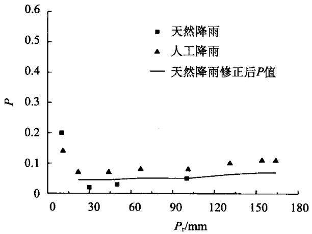  
图7.8 不同降雨量下树盘的工程措施因子值

## 参考文献

符素华，段淑怀，李永贵，刘汉柱，吴敬东，刘宝元.2002.北京山区土地利用对土壤侵蚀的影响．自然科学进展，12 (1)：108\~112

黄锡荃，李惠明，金伯欣.1993.水文学.北京：高等教育出版社

唐克丽. 2004. 中国水土保持. 北京：科学出版社

# 第八章 容许土壤流失量与土壤流失方程应用

8.1 概 述

容许土壤流失量（T）（soil loss tolerance）是指为了维持长期高水平农作物经济生产力所容许的最大土壤流失量，用年土壤流失量 $\left[ { \bf t } / ( \mathrm { h m } ^ { 2 } \cdot { \bf \dot { a } } ) \right]$ 表示①。这一概念最早在20世纪40年代由美国学者提出（Smith，1941），用来作为判断土壤侵蚀治理程度是否满足要求的一个数量标准。随着对土壤侵蚀研究的深入，对其危害深度和广度认识的加深，逐渐将容许土壤流失量与土壤侵蚀造成的异地危害，如河道、水库、湖泊淤积、水体污染等联系起来（Schertz，1983；Johnson，1987)，但尚未被实质性引入和应用，因此上述从维持可持续生产力出发提出的概念一直沿用至今②③。

T值最初的应用始于美国的土壤侵蚀模型研究，通过控制T值大小，指导人们选择合理的耕作制度和水土保持措施，力争将土壤流失量减少到T值以下。从其基本概念出发，确定T值所采用的主要指标是影响作物生长或生产力的土壤性质，如土层厚度、土壤类型、土壤形成速率等（表8.1、表8.2)。Hays和Clark④最早提出的容许土壤流失量为 $6 . 7 ~ \mathrm { t / ( h m ^ { 2 } \cdot { \dot { a } } ) }$ ，它基于50年侵蚀的土层厚度为 2.5 cm，则20 cm耕作层在400年内侵蚀完，对此农民能够接受。此后，Browning等（1947）发现不同土壤类型的剖面差异显著，土地生产力对土壤侵蚀影响的反应程度不同，应有不同的容许土壤流失量。例如，有黏盘或亚表层贫瘠的土壤与剖面结构均匀、其厚度较大土壤相比，在相同的土壤侵蚀速率下，前者土地生产力的丧失速度更快。他们给出了12种土壤的T值，变化于 $4 . 5 { \sim } 1 3 . 5 \ \mathrm { t / ( h m ^ { 2 } \ \cdot \ a ) }$ 。随着土壤侵蚀影响生产力研究成果的积累，许多学者根据减少单位厚度土层降低的作物产量或土层厚度差异，提出不同的T值范围为1.1～15.7 t/(hm²· a)（McCormack et al.，1982)。在 1959～1962 年，美国农业部召开了6次区域工作会议，与会的土壤学家、水土保持学家、农学家、工程师、地质学家和联邦及各州的研究人员共同商议确定了美国大部分土系的T值变化于2.20～11.20t/(hm²·a)①②③。对于土层深厚、质地中等、透水性好、适宜植物生长的土壤来说，其T值要大于根层浅或表面碎砾石含量高的土壤T值。到20世纪60年代，Klingebiel④研究认为当土壤流失量超过 $1 1 . 2 \mathrm { ~ t } / ( \mathrm { h m } ^ { 2 } \cdot \mathrm { ~ a } )$ 时，农地会出现切沟，容许土壤流失量的最大值不宜超过该值。1973年美国土壤保持局发布了确定T值的指标(McCormack et al.，1982；Schertz，1983)，1977 年又对 1973 年提出的 T值指标进行了细化（Logan，1982），该标准一直沿用至今。80年代提出的侵蚀-生产力模型，如生产力指数(productivity index，PI) (Pierce et al.，1983)、EPIC (Williams et al.,1983）等，促进了对 T值的研究。1983 年美国土壤保持局（Soil Conservation Service，SCS）指定Klaus组织一个委员会，该委员会重新定义了T值，并区分出不同的概念⑤：容许土壤流失量（T）、容许土壤输移量（D{）（soil delivery tolerance）和侵蚀极限（E）（erosion limit）。T是进行土壤保护的指标， $D _ { \mathrm { t } }$ 是进行环境保护的指标， $E _ { \mathrm { l } }$ 是进行水土保持规划的指标；水土保持的根本目标是使 $E _ { 1 } { \leqslant } T$ 或 $D _ { \mathfrak { t } }$ ，因此 $E _ { \mathrm { l } }$ 可被认为是执行目标。McCormack等（1982）和 Schertz（1983）总结了T值的主要影响因素包括：①土壤类型；②土层厚度，包括整个土壤剖面厚度、表层（A层）土壤厚度、作物根层厚度等；③土壤形成或更新速率，包括风化层的形成、土壤剖面的形成、表层（A层）土壤的形成等；④土壤侵蚀导致的土壤肥力损失，主要是有机质、氮、磷、土壤有效水分损失等；⑤侵蚀单位厚度土壤导致的作物产量降低；⑥侵蚀导致切沟出现。

表 8.1 美国不同时期主要的 T值标准
<table><tr><td>确定者</td><td>年份</td><td>确定方法</td><td>土壤类型</td><td>T/  $\left[ { \bf t } / ( \mathrm { { h m } } ^ { 2 } \cdot { \bf \vec { a } } ) \right]$ </td><td>参考文献</td></tr><tr><td>Smith</td><td>1941</td><td>肥力损失</td><td>Shebly soil</td><td>9</td><td>Smith, 1941</td></tr><tr><td>Hays 和 Clarke</td><td>1941</td><td>成土速率</td><td>Fayette soil</td><td>6.7</td><td>Hays and Clarke, 1941⑥</td></tr><tr><td>Browning 等</td><td>1947</td><td>生产力损失</td><td>多种类型</td><td>4.5~13.5</td><td>Browning et al. , 1947</td></tr><tr><td>SCS</td><td>1956</td><td>养分损失</td><td>多种类型</td><td>&lt;11.2</td><td>Paschall, 1956⑦</td></tr><tr><td>SCS</td><td>1962</td><td>切沟的控制</td><td>多种类型</td><td>&lt;11.2</td><td>Bender, 1962⑧</td></tr><tr><td>SCS（表8.2）</td><td>1973</td><td>有效根生厚度</td><td>多种类型</td><td>&lt;11.2</td><td>McCormack et al. , 1982</td></tr></table>

表 8.2 不同根系层厚度土壤 T值的参考表（McCormack et al. ，1982）
<table><tr><td>根系层厚度/cm</td><td>可更新土壤*/  $\left[ { \bf t } / ( \mathrm { h m } ^ { 2 } \cdot \mathrm { a } ) \right]$ </td><td>不可更新土壤**/  $\left[ \mathsf { t } / ( \mathsf { h m } ^ { 2 } \cdot \mathsf { a } ) \right]$ </td></tr><tr><td>0~25</td><td>2.20</td><td>2.20</td></tr><tr><td>25~50</td><td>4.50</td><td>2.20</td></tr><tr><td>50~100</td><td>6.70</td><td>4.50</td></tr><tr><td>100~150</td><td>9.00</td><td>6.70</td></tr><tr><td>&gt;150</td><td>11.20</td><td>11.20</td></tr></table>

\*可更新土壤是指有良好底土层，可通过耕作、施肥等管理措施更新土层的土壤；\*\*不可更新土壤是指底土层结构不好(如硬盘，脆盘等)，无法通过管理措施进行更新的土壤。

自从 1962 年美国农业部土壤保持局(Agricultural Research Service-Soil Conserva-tionService，ARS-SCS）公布了全美大多数土壤类型的容许土壤流失量后，世界其他一些国家陆续对T值进行了研究，根据各自水土流失特点和水土保持目标确定了不同的容许土壤流失量（表8.3）。目前使用的T值主要是根据专家对容许土壤流失量的影响因素分析，经验确定，缺乏定量依据。

表8.3 部分国家的容许土壤流失量标准
<table><tr><td>国家和地区</td><td>T值 1  $\left[ { \bf t } / ( \mathrm { \bf h m } ^ { 2 } \cdot { \bf a } ) \right]$ </td><td>确定依据</td><td>资料来源</td></tr><tr><td>中国</td><td>2.00~10.00</td><td>土壤厚度</td><td>中华人民共和国水利部，1997</td></tr><tr><td>美国</td><td>2.20~11.20</td><td>有效根系层厚度</td><td>McCormack et al. , 1982</td></tr><tr><td>原苏联</td><td>3.40~10.90</td><td></td><td>王礼先，1985</td></tr><tr><td>巴西</td><td>4.20~15.00</td><td></td><td>Lombardi Neto and Bertoni, 1975</td></tr><tr><td>印度</td><td>4.50~11.20</td><td>土壤厚度</td><td>Kirkby and Morgan, 1980</td></tr><tr><td>英国</td><td>1.00</td><td>成土速率</td><td>Kirkby and Morgan, 1980</td></tr><tr><td>波多黎各</td><td>0.50~3.00</td><td>肥力损失</td><td>Smith and Stamey, 1965</td></tr><tr><td>摩洛哥</td><td>2.00~11.00</td><td>有效根系层厚度</td><td>Arnoldus, 1977</td></tr><tr><td>中国台湾</td><td>1.00~25.00</td><td>土壤厚度</td><td>吴嘉俊等，1997</td></tr><tr><td>冰岛</td><td>0.50~1.50</td><td></td><td>Morgan and Davidson, 1986①</td></tr></table>

我国对容许土壤流失量的研究还比较薄弱，水利部1997年颁布的中华人民共和国行业标准SL190—96《土壤侵蚀分类分级标准》中，首次以“指令性标准”形式提出了容许土壤流失量的定义，并给出5个水力侵蚀类型区的容许土壤流失量标准（表8.4）。该标准主要参考了国外（主要是美国）标准而定。

我国台湾省吴嘉俊等（1997）在不考虑土壤侵蚀对作物产量及水质影响的情况下，参考马来西亚制定的 $2 5 ~ \mathrm { t } / ( \mathrm { h m } ^ { 2 } \cdot \mathrm { a } )$ 的容许土壤流失量，以土系为单元，考虑年降雨量等级（RA）、土壤有效深度（DP）、母岩质地等级（PM）、排水能力等级（DR）等因素，用一个简易方程式 $T { = } \mathrm { D P } { \times } \mathrm { R A } / ( 6 \mathrm { P M } { + } 4 \mathrm { D R } )$ ，计算出台湾省各县不同土系的

表8.4中国5个水力侵蚀类型区容许土壤流失量（中华人民共和国水利部，1997)
<table><tr><td>类型区</td><td>容许土壤流失量/  $\left[ { \bf t } / ( \mathrm { { h m } } ^ { 2 } \cdot { \bf { a } } ) \right]$ </td></tr><tr><td>西北黄土高原区</td><td>10.0</td></tr><tr><td>东北黑土区</td><td>2.0</td></tr><tr><td>北方土石山区</td><td>2.0</td></tr><tr><td>南方红壤丘陵区</td><td>5.0</td></tr><tr><td>西南土石山区</td><td>5.0</td></tr></table>

T值，变化于 $2 \sim 3 6 \ t / ( \mathrm { h m } ^ { 2 } \cdot \mathrm { a } )$ 。陈齐伯等（2003）综合考虑黄土成土速率、坡耕地表土养分平衡、保持坡耕地土地生产力基本稳定、黄河河道的容许来沙量等因素，确定以 $2 . 0 0 \ t / ( \mathrm { h m } ^ { 2 } \cdot \mathrm { a } )$ 作为半干旱黄土丘陵区坡耕地的容许土壤流失量。总之，我国目前对容许土壤流失量的研究还较少，但水土流失治理需要确定该指标作为治理是否符合要求的依据，因此有必要对容许土壤流失量进行深入研究。

## 8.2 容许土壤流失量确定方法

目前确定T值的方法主要有以下4种：专家经验法、土层厚度划分法、成土速率平衡法以及侵蚀与生产力关系法。下面分别加以介绍。

## 8.2.1 专家经验法

美国迄今使用的T值，主要是基于专家学者积累的经验，通过会议研讨而确定，是粗略估计的值，为 $2 { \sim } 5 \ \mathrm { t } / ( \mathrm { h m } ^ { 2 } \ { \cdot } \ \mathrm { a } )$ ，缺乏科学定量依据（Smith and Wischmeier，1962; Smith and Stamey, 1965; McCormark et al. , 1982; Williams et al. , 1983).

受科技水平和对土壤侵蚀规律认识的限制，当时的专家、学者已经充分利用了他们的知识，对缺乏或没有研究的领域不得不进行假设。T值的确定既考虑了由于土壤侵蚀导致的土地生产力的损失，同时也考虑了由母质形成土壤的速率、表土成土速度、营养物质的损失和为补偿它们的花费、导致切沟侵蚀开始发生的侵蚀速率以及农民最可能实施的水土保持措施等诸多因素。现有的T值科学性不强、需要继续深入研究的观点已成共识。尽管如此，美国从20世纪40年代至今的水土保持实践历史，已经证明了T值在水土保持措施规划与实施应用方面所产生的良好效益，较好地保持了水土资源。在可供选择的水土保持方案中，基本目标是对每一种土壤实现一定程度的侵蚀控制，不论是否达到T值，都有意义地减少了侵蚀的发生（Burch，1988)。在实施的过程中，许多人甚至感到现有T值标准过于严格，美国在实际实施T值标准时，按照2倍的T值要求执行，但农民则要求提高到4倍的T值（Hudson，1995）。因而，1978年美国土壤保持局曾出于经济因素的考虑，计划将土层厚度超过2m的土壤T值标准增大一倍，结果由于受到普遍反对而取消，土壤保持局也承认，T值的确定是基于专家经验，主观性较强，从而在技术上存在缺陷，但在没有充分的科学依据建立之前，难以期望近期会对T值有很大改变。

## 8.2.2 土层厚度划分法

1964年Stamey和 Smith提出了推导T值数学方程式（8.1)，T值研究开始有了定量方法。

$$
I _ { \mathrm { s } } ( x , y ) - \int _ { t _ { 0 } } ^ { + \infty } \left[ E _ { \mathrm { s } } ( x , y , t ) - R _ { \mathrm { s } } ( x , y , t ) \right] \mathrm { d } t \geqslant M _ { \mathrm { s } } ( x , y )\tag{8.1}
$$

式中， $I _ { s } ( x , \ y )$ 为地点函数，是 $t _ { 0 }$ 时刻土壤性质的测量值； $M _ { \mathrm { s } } ( x , \ y )$ 为点 $( x , \ y )$ 处该土壤的最小容许流失量； $\boldsymbol { E } _ { s } ~ \left( \boldsymbol { x } , ~ \boldsymbol { y } , ~ t \right)$ 为点 $( x , \ y )$ 处的土壤流失速率； $R _ { \mathrm { ~ s ~ } } \left( x , \right.$ y，t)为点 $( x , \ y )$ 处的土壤形成速率。

由于难以定量表示式中的各个变量，无法用式（8.1）确定T值。后来Skidmore(1982)进一步改进了该方程式，但是由于土壤形成速率难以确定，仍没有得到广泛应用。

1973 年美国土壤保持局提出确定 T值的简易方法标准（Advisory Notice Soil-6)，要求各州根据这个标准修正 T值（McCormark et al.，1982；Schertz，1983）。该方法根据底土情况将土壤划分为两类：①可更新土壤，指底土通过耕作、施肥、添加有机质或其他管理措施容易被改良的土壤；②不可更新土壤，指底土是岩石或石砾等不易用经济方法改良的土壤。可更新土壤的T值比不可更新土壤的T值高一级，但它们的上、下限值一致。1977年的美国土壤保持局再次细化1973年标准（表8.5），将底土分为黏磐、母岩、脆磐、砂土或砂砾4个类型，根据底土以上的土层厚度确定T值(Logan, 1982)。

土层厚度划分法属于半定量的方法，按土壤层厚度把土壤机械地划分开，没有说明某个厚度土壤确定为某个T值的直接原因，但这一划分方法表达了随着土壤侵蚀过程的进行，土壤层厚度由厚变薄后、土壤T值应逐渐趋小的思想，已经受到严重侵蚀土壤的T值应该相对较小。

表 8.5 根据根系层深度确定的 T值
<table><tr><td rowspan="2">根系层深度/cm</td><td colspan="2"> $T \smash { \big | \overleftrightarrow { \bigstar } \big / \ \big [ \mathrm { t } / ( \mathrm { h m } ^ { 2 } \cdot \mathsf { a } ) \big ] }$ </td></tr><tr><td>可更新土壤</td><td>不可更新土壤</td></tr><tr><td>0~25</td><td>2.20</td><td>2.20</td></tr><tr><td>25~50</td><td>4.50</td><td>2.20</td></tr><tr><td>50~100</td><td>6.70</td><td>4.50</td></tr><tr><td>100~150</td><td>9.00</td><td>6.70</td></tr><tr><td>&gt;150</td><td>11.20</td><td>11.20</td></tr></table>

## 8.2.3 成土速率平衡法

研究T值时关注最多的是土壤的形成速度，特别是A层土壤的熟化速度。多数科学家认为，要保持土壤肥力和土地生产力的稳定，必须要保持土壤流失速率与土壤形成速率的动态平衡。土壤流失导致的腐殖质损失与土地生产力的关系最为密切，因此，腐殖质积累速度与土壤养分流失速度的平衡是决定T值的关键。

由于土壤形成过程比较复杂，不同研究者从不同的角度研究得到的土壤形成速度值不尽一致。美国最权威的芝加哥大学地质系主任Chamberlin①认为，自冰期以来，土壤形成的平均速度至少为330年形成1 cm厚土层。土壤学家 Bennett（1939）在研究了全美各种土壤类型的成土历史后认为，一旦表土被损失掉，土壤从其母质中再生的速度非常缓慢，在最优越的条件下，包括覆盖很好的森林覆被、草地或其他植被，重新形成1 cm的土壤，要花120～400年，而第二个1 cm土壤的成土速率比表层的更慢。

土壤学家Hudson（1995）认为，在理想的管理情况下，土壤的形成速率可以达到大约0.8mm/a，相当于11.2t/(hm²·a）的成土速度。虽然到目前为止，还没有关于土壤形成速度的精确测量，但根据薄层土壤由于未采取任何保护措施，导致大量土地沙砾化严重而被迫弃耕的事实，人们已经认识到，成土速率是研究T值的基础所在。

## 8.2.4 侵蚀与生产力关系法

EPIC模型是能够模拟土壤侵蚀发生过程，并据此预测土壤性质对作物产量影响的计算机模型。该模型综合了与土壤侵蚀和作物生长发育相关的许多过程，包括水文、气象、水蚀和风蚀、氮磷元素、土壤温度、作物生长状况、耕作与作物残茬处理、土壤排灌与施肥等9方面因素。模拟时，土壤剖面在垂直方向上被分成了10层（表层厚度设为10mm，以估算养分流失，其他层厚度可以变化)。当土壤侵蚀发生后，第二层的土壤厚度随侵蚀的厚度量而减少，表土性质通过内插进行调整（根据进入第二层的深度）；当第二层厚度变为0，表土进入第三层，依次类推；EPIC模型规定当剖面厚度剩余150 mm或表层 300 mm土壤含砾石超过50 %时结束。由于模型比较复杂且需要大量的土壤学理论（Thompson et al.，1992)，使用者需要了解土壤侵蚀、土壤厚度与产量之间关系的相关知识，以提高模型模拟结果的有效性和准确性（Christensen and McElyea，1988)。由模型中嵌有天气发生器，可模拟100年乃至更长时期土壤侵蚀与生产力的关系，如为了实现100～500年土地生产力损失不超过5%的理想目标，就可以应用这一计算机技术，帮助我们确定如何实现这一目标，以保证将具有可持续生产力的土地资源传给后代人(Benson et al.，1989)。

Neill②、Kiniry等③、Pierce等（1983）研究的 PI模型也是描述土壤性质对作物生长影响的模型，但比EPIC模型更为简单，其基本假设如下：①根系生长依赖于根际土壤质量；②作物产量与根系生长成正比；③养分由于可通过施入而不限制作物根系生长。由于土壤侵蚀能改变影响根系生长的土壤环境，于是将土壤侵蚀与生产力联系起来，根系土壤环境质量用简单的无量纲适宜指数的乘积形式表达，以估算土壤剖面环境对作物根系生长是否适宜。用根系权重系数描述土壤中的根系分布，表层权重最大，随深度增加，权重逐渐减少。该模型最早由Neill提出，后经Pierce等（1983）改进，并应用于评价美国中北部75种主要土壤的潜在生产力水平。该模型简单，可实现对大量土壤的快速计算。

Pierce等（1983）改进后的PI模型公式如下：

$$
\mathrm { P I } = \sum _ { i = 1 } ^ { n } { ( A _ { i } C _ { i } ^ { \prime } D _ { i } \mathbf { W } \mathbf { F } _ { i } ) }\tag{8.2}
$$

式中，PI为生产力指数； $A _ { i }$ 为土壤有效持水能力适宜指数； $C _ { i } ^ { \prime }$ 为土壤容重适应指数；$D _ { i }$ 为土壤 $\mathrm { p H }$ 适宜指数； $\mathrm { W F } _ { i }$ 为根系权重系数；n为自表层到根系最深层（每10 cm为一层）的个数； $A _ { i } , ~ C _ { i } ^ { ' } , ~ D _ { i }$ 各指数根据其对作物生长的影响函数形式，均标准化为0.0\~1.0的无量纲值。将1m土体作为足够作物根系生长的厚度，每10cm划分一层，共10层，每一层的根系权重系数为

$$
\mathrm { W F } = 0 . 3 5 0 \mathrm { - } 0 . 1 5 2 1 \mathrm { g } ( \mathrm { S D + } \sqrt { \mathrm { S D } ^ { 2 } + 6 . 4 5 } )\tag{8.3}
$$

式中，SD为土层厚度，cm，取值10 cm。

根据式（8.3）所计算出的PI随土层深度和土壤性质不同而变化，通常PI随土壤厚度增加而增加。Pierce等（1983）、Gantzer和 McCarty（1985，1987）和 Schumacher等(1994)曾将PI模型用于区域和特定田块的玉米产量影响因素研究。Thompson等（1992）在墨西哥用PI模型研究了PI值与土壤表层到黏盘层的厚度及玉米产量的关系：在灌溉和有雨水情况下，玉米产量均随PI值及土壤表层到黏盘层厚度的增加而呈线性递增。灌溉使玉米增产24%，相当于土层厚度增加0.38m，亦相当于PI值增加0.3。Larson等（1988）用PI值作为分级指标之一，进行了土地分级。

尽管PI模型在过程考虑和模拟精确性上有可能不如复杂的EPIC模型，但其所选变量少，数据容易获取，因而成为一个很有吸引力的预测土壤侵蚀对生产力影响的方法(Lindstrom et al.，1992)。Rhoton 和 Linbo(1997) 及 Lindstrom 等（1992) 对 PI 模型进行了评价，认为PI模型比其他模型需要数据量少，只要输入数据准确，其模拟精确性是可信的。

由于PI模型能够模拟土壤侵蚀对土地生产力的影响，尤其能够反映不同土壤厚度和剖面特性对作物生长的影响，成为定量确定T值合理而科学的方法。Pierce等(1983）首次提出土壤侵蚀敏感性指数的概念，是指侵蚀单位厚度土壤导致的土壤生产力指数PI值的变化，并利用这一概念，计算出不同土系的容许土壤流失量T值。Runge等（1986）利用PI模型，假设100年的生产力指数PI下降水平为5%、2.5%、1%、0.01%情况下，分别计算由此导致的土层厚度变化以及T值。显然，侵蚀-生产力模型为T值的定量研究提供了又一科学定量方法。

综上所述，专家经验法确定的容许土壤流失量由于主观性较强，因而具有历史局限性，但同时不能否认其积极作用的一面：虽然粗略，却在水土保持实践中有意义地指导减少了土壤流失量。土层厚度划分法是半定量方法，仍有经验性成分。成土速度平衡法目前只是概念模式，不可能精确定量，尚不可取。侵蚀与生产力关系法是定量方法，利用了专业调查得到的土壤剖面数据，计算其生产力指数以及土壤侵蚀对该指数的影响，通过确定要维持的生产力水平目标，确定容许土壤流失量，是科学合理的方法，也是今后确定容许土壤流失量使用的主导方法。正如Smith和Stamey（1965）所言，要确定容许土壤流失量，必须掌握以下4个方面的准确信息：①现有土壤资源的数量和质量状况；②对未来的土壤资源寄予什么样的要求；③土壤资源流失（或退化）随时间变化的状况；④土壤资源随时间更新或增加的状况。

## 8.3 北京容许土壤流失量

## 8.3.1 容许土壤流失量模型的建立

综合目前国内外研究成果，本模型以土壤生产力指数（PI）模型和土层厚度指标为基础，建立容许土壤流失量计算模型。具体步骤如下：

## (1)建立以土壤生产力指数为指标的容许土壤流失量模型

Pierce等（1983）提出土壤侵蚀敏感性指数的概念，表示土壤生产力指数随侵蚀厚度的变化。以此为基础提出容许土壤流失量的计算模型为

$$
T = \frac { \Delta \mathrm { P I } \times \mathrm { P I } _ { \circ } \times W } { V \times t }\tag{8.4}
$$

式中，T为容许土壤流失量， $\mathrm { t } / ( \mathrm { k m } ^ { 2 } \cdot \mathrm { a } )$ ；W为单位面积单位厚度土壤重量，取值$1 . 2 5 { \times } 1 0 ^ { 4 } \ \mathrm { t } / ( \mathrm { k m } ^ { 2 } \cdot \mathrm { c m } )$ （按土壤容重为1.25 $\mathrm { { g / c m ^ { 3 } } }$ 计算)；t为规划时间，取100年；$\mathrm { P I } _ { 0 }$ 为当前土壤生产力指数； $\Delta \mathrm { P I }$ 为规划时间内由于侵蚀导致的可以容许的生产力指数下降百分率，计算公式为

$$
\Delta \mathrm { P I } = \frac { \mathrm { P I } _ { 0 } - \mathrm { P I } _ { t } } { \mathrm { P I } _ { 0 } } \times 1 0 0\tag{8.5}
$$

式中， $\mathrm { P I } _ { t }$ 为规划时间末的土壤生产力指数，由于该数值不易确定，一般根据当前生产力指数水平，假设经过t时段后，土壤生产力指数下降不超过1%、2.5%、5%、10%等，即 $\Delta \mathrm { P I } { = } 1$ %、2.5%、5%、10%等，本模型中采用1%。V为土壤侵蚀敏感性指数， $\mathrm { c m } ^ { - 1 }$ ，计算公式为

$$
V = \frac { \Delta \mathrm { P I } } { \Delta d } \times 1 0 0\tag{8.6}
$$

式中， $\Delta \mathbf { P } \mathbf { I }$ 为土壤生产力指数随土壤厚度的变化； $\Delta d$ 为侵蚀厚度，规定取值 $5 0 ~ \mathrm { c m }$ 9显然计算土壤生产力指数是确定容许土壤流失量的基础。

## (2) 土壤生产力指数模型

土壤生产力指数模型最早由Neil提出，后经 Pierce等（1983）改进，其计算公

式为

$$
\mathrm { P I } = \sum _ { i = 1 } ^ { n } \left( A _ { i } C _ { i } ^ { \prime } D _ { i } \mathbf { W } \mathbf { F } _ { i } \right)\tag{8.2}
$$

各适宜指数均为标准化无量纲变量，介于0～1，表示该指标对作物生产力的影响。取值为1时，表示适宜；取值为0时，表示致死。随指数增大，影响程度减小。参考相关研究结果，各指标适宜指数计算公式如下：

$$
A _ { i } = 4 \mathrm { P A W C } _ { i } + 0 . 2\tag{8.7}
$$

$$
C _ { i } ^ { \prime } = \left\{ \begin{array} { l r } { 1 } & { \mathrm { B D } _ { i } \leqslant 1 . 3 0 } \\ { 1 . 8 8 - 0 . 6 8 \mathrm { B D } _ { i } } & { 1 . 3 0 < \mathrm { B D } _ { i } \leqslant 1 . 5 5 } \\ { 5 . 9 8 - 3 . 3 2 \mathrm { B D } _ { i } } & { 1 . 5 5 \leqslant \mathrm { B D } _ { i } } \end{array} \right.\tag{8.8}
$$

$$
D _ { i } = \left\{ \begin{array} { l r } { 1 } & { 5 . 0 \leqslant \mathrm { p H } _ { i } < 6 . 5 } \\ { 0 . 0 6 8 - 0 . 1 6 7 \mathrm { p H } _ { i } } & { 6 . 5 \leqslant \mathrm { p H } _ { i } < 8 . 0 } \\ { 0 . 7 5 } & { 8 . 0 \leqslant \mathrm { p H } _ { i } \leqslant 1 4 } \end{array} \right.\tag{8.9}
$$

$$
\mathbf { W F } _ { i } = 0 . 3 5 0 \mathrm { - 0 . 1 5 2 1 g ( S D } _ { i } \mathrm { + } \sqrt { \mathbf { S D } _ { i } ^ { 2 } + 6 . 4 5 } )\tag{8.10}
$$

式中， $\mathrm { P W A C } _ { i }$ 为第i土层的土壤体积含水量，mm/mm； $\mathrm { B D } _ { i }$ 为第i土层的土壤容重，$\mathrm { { g } } / \mathrm { { c m } } ^ { 3 }$ ；pH；为第i土层的土壤酸碱度； $\mathrm { S D } _ { i }$ 为第i 土层土层厚度，cm，取值10cm。

## (3)建立以土壤厚度为指标的容许土壤流失量模型

北京山区主要土壤类型包括山地棕壤、淋溶褐土、普通褐土、碳酸盐褐土4个土类，占山区土壤面积的80%以上。结合北京土壤普查资料和北京1：10万土壤图，本书选择了山地草甸土中的1个土属、棕壤中的2个土属、褐土中的13个土属，作为利用PI指标计算容许土壤流失量的典型剖面。根据PI模型的需要，进行野外土壤样品采集和室内理化性质分析。样品按土壤剖面发生层采集，剖面挖掘至障碍层，最深到达

150cm。在每个剖面的每个发生层取3个环刀样，测定土壤田间持水量和土壤容重，取1～2 kg的土壤样品用于理化性质分析。土壤容重测定采用环刀法；土壤酸碱度测定用电位法，将土样风干后，过2mm 筛子，用0.01 mol/L $\mathrm { C a C l } _ { 2 }$ 作为浸提剂测定pH。土壤最大有效含水量是田间持水量与永久凋萎含水率的差值，田间持水量用环刀法测定（刘光崧等，1996），永久凋萎系数取田间持水量的65%（刘昌明、王会肖，1999)。

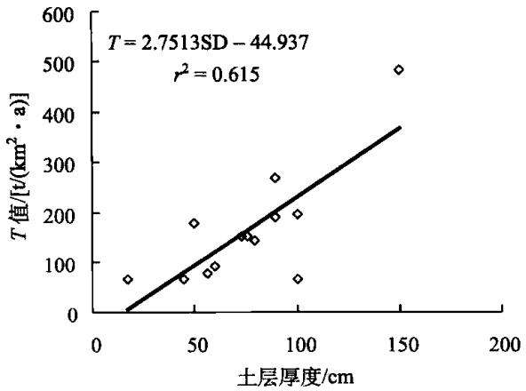  
图8.1 北京山区13个典型土壤剖面容许土壤流失量与土壤厚度的关系

利用式（8.4）一式（8.10）计算了上述13个土壤剖面的容许土壤流失量，然后建立容许土壤流失量与土壤剖面厚度的回归关系如下（图8.1）：

$$
T = 2 . 7 5 1 3 \mathrm { S D } - 4 4 . 9 3 7\tag{8.11}
$$

## 8.3.2 北京主要土属的容许土壤流失量值

从《北京土壤》普查资料及北京市各郊区县的土壤普查资料中，摘录北京土壤各土属的剖面土壤厚度数据，共计3个土类、9个亚类、54个土属。利用式（8.11）计算了它们的T值（表8.6)。如果计算值小于 $5 0 ~ \mathrm { t } / ( \mathrm { k m } ^ { 2 } \cdot \mathrm { a } )$ ，规定T值为 $5 0 \mathrm { { t } / ( \mathrm { { k m } ^ { 2 } \cdot \mathrm { { a } ) } } }$ 平原区土壤T值取计算结果的最大值。应用GIS软件在北京市1：10万土壤图的基础上，绘制北京容许土壤流失量空间分布图（图8.2）。

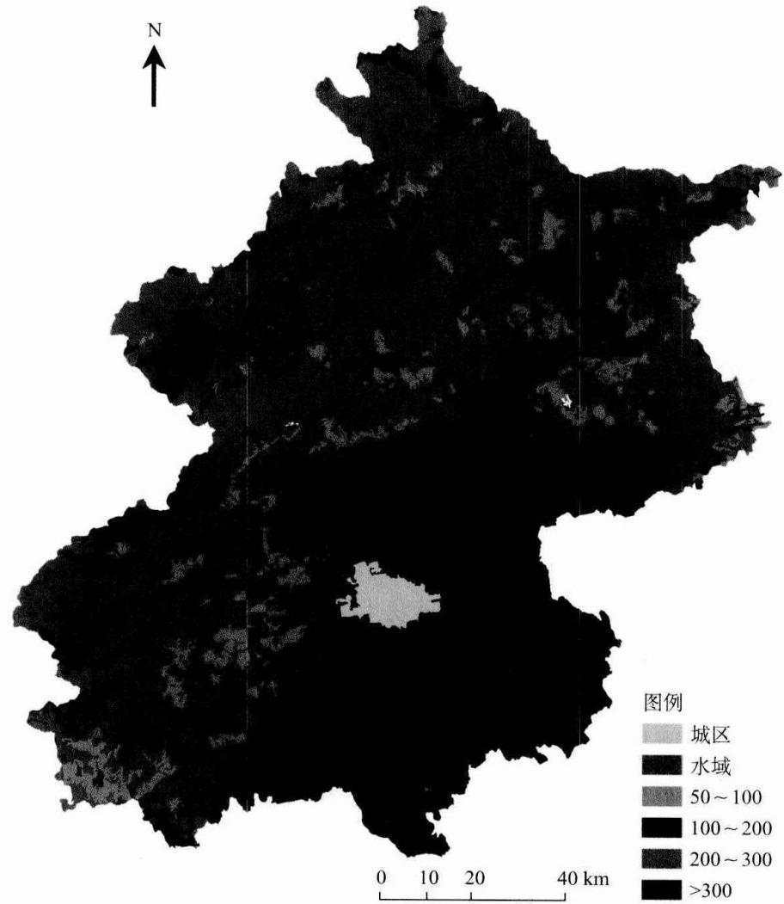  
图8.2 北京容许土壤流失量空间分布图单位： $\mathrm { t / ( k m ^ { 2 } \cdot { a } ) } \bar { } _ { - }$ 一

表8.6 北京主要土属的容许土壤流失量
<table><tr><td rowspan="2">土类</td><td rowspan="2">亚类</td><td rowspan="2">土属</td><td rowspan="2">占全市面积/%</td><td>T值</td></tr><tr><td>1  $\left[ { \bf t } / ( { \bf k } m ^ { 2 } \cdot { \bf \Gamma } { } a ) \right]$ </td></tr><tr><td rowspan="3">山地草甸土</td><td>山地草甸土</td><td>基性岩类土地草甸土</td><td>0.004</td><td>285</td></tr><tr><td></td><td>硅质岩类土地草甸土</td><td>0.030</td><td>161</td></tr><tr><td></td><td>酸性岩类土地草甸土</td><td>0.010</td><td>175</td></tr><tr><td rowspan="14">棕壤</td><td rowspan="8">山地棕壤</td><td>酸性岩类土地棕壤</td><td>2.457</td><td>113</td></tr><tr><td>硅质岩类土地棕壤</td><td>0.631</td><td>171</td></tr><tr><td>泥质岩类土地棕壤</td><td>0.349</td><td>115</td></tr><tr><td>基性岩类土地棕壤</td><td>0.670</td><td>158</td></tr><tr><td>碳酸盐岩类土地棕壤</td><td>2.615</td><td>140</td></tr><tr><td>硅质岩类生草棕壤</td><td>0.120</td><td>214</td></tr><tr><td>基性岩类生草棕壤</td><td>0.452</td><td>189</td></tr><tr><td>酸性岩类生草棕壤</td><td>0.039</td><td>211</td></tr><tr><td rowspan="6">山地粗骨棕壤</td><td>泥质岩类生草棕壤 碳酸盐岩类生草棕壤</td><td>0.030</td><td>237</td></tr><tr><td>酸性岩类土地粗骨棕壤</td><td>0.290</td><td>203</td></tr><tr><td></td><td>0.540</td><td>55</td></tr><tr><td>硅质岩类土地粗骨棕壤</td><td>0.380</td><td>55</td></tr><tr><td>泥质岩类土地粗骨棕壤 基性岩类土地粗骨棕壤</td><td>0.105</td><td>55</td></tr><tr><td>碳酸盐岩类土地粗骨棕壤</td><td>0.113</td><td>55</td></tr><tr><td rowspan="9"></td><td>山地淋溶褐土</td><td></td><td>0.639</td><td>55</td></tr><tr><td></td><td>酸性岩类山地淋溶褐土 硅质岩类山地淋溶褐土</td><td>11.460</td><td>133</td></tr><tr><td></td><td>泥质岩类山地淋溶褐土</td><td>6.240 1.320</td><td>136</td></tr><tr><td></td><td>基性岩类山地淋溶褐土</td><td></td><td>79</td></tr><tr><td></td><td>碳酸盐岩类山地淋溶褐土</td><td>4.000 12.230</td><td>67</td></tr><tr><td></td><td>红黄土质山地淋溶褐土</td><td>*</td><td>109 230</td></tr><tr><td>普通褐土</td><td>黄土质山地淋溶褐土</td><td>*</td><td>230</td></tr><tr><td rowspan="7"></td><td>泥质岩类普通褐土</td><td>0.100</td><td>73</td></tr><tr><td>基性岩类普通褐土</td><td>0.300</td><td>65</td></tr><tr><td>酸性岩类普通褐土</td><td>1.750</td><td>90</td></tr><tr><td>硅质岩类普通褐土</td><td>0.860</td><td>93</td></tr><tr><td>碳酸盐岩类普通褐土</td><td>0.975</td><td>131</td></tr><tr><td>冲积物普通褐土</td><td>2.360</td><td>96</td></tr><tr><td>洪积冲积物普通褐土</td><td>4.650</td><td>189</td></tr><tr><td rowspan="9">粗骨褐土</td><td>黄土质普通褐土</td><td></td><td></td><td></td></tr><tr><td>红黄土质普通褐土</td><td></td><td>0.350</td><td>214</td></tr><tr><td>复碳酸盐岩类普通褐土</td><td></td><td>1.480 1.240</td><td>252 313</td></tr><tr><td></td><td>红黏土质普通褐土</td><td>0.050</td><td>230</td></tr><tr><td></td><td>泥质岩类粗骨褐土</td><td>0.150</td><td>50</td></tr><tr><td></td><td>基性岩类粗骨褐土</td><td>0.250</td><td>50</td></tr><tr><td>酸性岩类粗骨褐土</td><td></td><td>0.910</td><td>50</td></tr><tr><td>硅质岩类粗骨褐土</td><td></td><td>0.700</td><td>50</td></tr><tr><td>碳酸盐岩类粗骨褐土</td><td></td><td>1.570</td><td>50</td></tr><tr><td>土类</td><td>亚类</td><td>土属</td><td>占全市面积/%</td><td>T值 /[t/(km²·a)]</td></tr><tr><td rowspan="9">褐土</td><td>碳酸盐褐土</td><td>碳酸盐岩类碳酸盐褐土</td><td>0.360</td><td>71</td></tr><tr><td></td><td>泥质岩类碳酸盐褐土</td><td>0.050</td><td>76</td></tr><tr><td></td><td>基性岩类碳酸盐褐土</td><td>0.030</td><td>50</td></tr><tr><td></td><td>酸性岩类碳酸盐褐土</td><td>头</td><td>50</td></tr><tr><td></td><td>硅质岩类碳酸盐褐土</td><td>*</td><td>50</td></tr><tr><td></td><td>洪积物碳酸盐褐土</td><td>0.450</td><td>168</td></tr><tr><td></td><td>洪积冲积物碳酸盐褐土</td><td>1.090</td><td>202</td></tr><tr><td></td><td>黄土质碳酸盐褐土</td><td>0.770</td><td>247</td></tr><tr><td></td><td>菜园褐土</td><td>0.100</td><td>230</td></tr><tr><td rowspan="2"></td><td>褐土性土</td><td>冲积物褐土性土</td><td>0.940</td><td>230</td></tr><tr><td>堆垫褐土性土</td><td>洪积冲积物褐土性土</td><td>2.440 0.640</td><td>172 115</td></tr></table>

\*土属所占全县面积比很小。

## 8.4 土壤流失方程应用

## 8.4.1 土壤流失方程验证

北京土壤流失方程主要用于预报北京地区不同降雨、不同土壤类型、不同地形以及不同土地利用类型下长期平均的年土壤流失量。

为了对模型进行验证，选择北京密云县石匣22个径流小区2001年观测的径流泥沙资料，用计算机模型计算其土壤流失量，将模拟结果与观测结果进行比较。密云具石匣径流场有多种不同坡长、坡度、土地利用及水土保持措施的径流小区，并有径流小区的植被类型、田间管理、工程措施等必要的记录，所选小区基本情况见表

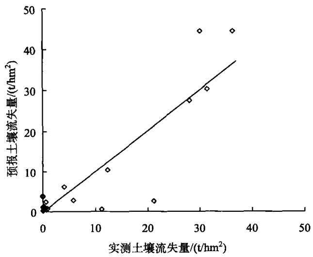  
图8.3 模拟土壤流失量与实测土壤流失量的比较

8.7。模拟结果表明，2001年密云县石匣19个径流小区年平均土壤流失量的预报值与实测值平均误差为3.95 t/hm²，最大差值为 $1 8 . 6 6 ~ \mathrm { t / h m ^ { 2 } }$ 最小差值为 $0 . ~ 4 6 ~ \mathrm { \Omega } \mathrm { t } / \mathrm { h m } ^ { 2 }$ 。其中，78.95 %的小区模拟误差在 5 t/hm²以内，84.21%的小区模拟误差在10t/hm²以内。总体上看，预报值与实测值的相关性很高，模型的有效性系数达到0.805（图8.3）。模拟误差较大的小区主要是水平条和鱼鳞坑两种水土保持措施的小区，主要由降雨

量差异较大，导致水土保持措施效益不同：当降雨量较小时，水土保持效益明显；一旦降雨量较大，水土保持措施被暴雨冲毁，径流会携带走更多的泥沙，产生较强烈的土壤侵蚀，从而导致实测结果远高于预测结果。

表8.7 用于验证模型的径流小区基本情况
<table><tr><td rowspan="2">小区</td><td rowspan="2">坡度 1(°)</td><td rowspan="2">坡长 /m</td><td rowspan="2">土地利用</td><td rowspan="2">RK</td><td rowspan="2">LS</td><td colspan="2">C</td><td rowspan="2"> $P$ </td><td colspan="2" rowspan="2">实测侵蚀量  $/ ( \mathfrak { t } / \mathrm { h m } ^ { 2 } )$ </td><td rowspan="2">计算侵蚀量  $/ ( { \mathfrak { t } } / { \mathfrak { h m } } ^ { 2 } )$ </td></tr><tr><td> $C _ { \mathrm { c } }$ </td><td> $C _ { \mathrm { { s } } }$ </td></tr><tr><td>1</td><td>16.8</td><td>10</td><td>坡耕玉米</td><td>26.21</td><td>3.61</td><td>0.470</td><td>0.62</td><td>1.00</td><td>28.03</td><td>27.57</td></tr><tr><td>2</td><td>16.8</td><td>10</td><td>水平条栗树</td><td>26.21</td><td>3.61</td><td>0.230</td><td>1.00</td><td>0.11</td><td>0.60</td><td>2.39</td></tr><tr><td>4</td><td>14.6</td><td>10</td><td>标准小区</td><td>26.21</td><td>3.04</td><td>1.000</td><td>0.38</td><td>1.00</td><td>31.40</td><td>30.28</td></tr><tr><td>5</td><td>14.6</td><td>10</td><td>自然坡</td><td>26.21</td><td>3.04</td><td>0.025</td><td>0.38</td><td>1.00</td><td>0.90</td><td>0.76</td></tr><tr><td>7</td><td>9.6</td><td>10</td><td>水平条山楂</td><td>26.21</td><td>1.55</td><td>0.230</td><td>1.00</td><td>0.11</td><td>0.08</td><td>1.03</td></tr><tr><td>8</td><td>27</td><td>10</td><td>自然坡</td><td>26.21</td><td>6.04</td><td>0.025</td><td>1.00</td><td>1.00</td><td>0.00</td><td>3.96</td></tr><tr><td>9</td><td>27</td><td>10</td><td>水平条沙打旺</td><td>26.21</td><td>6.04</td><td>0.033</td><td>1.00</td><td>0.11</td><td>11.13</td><td>0.57</td></tr><tr><td>10</td><td>27</td><td>10</td><td>鱼鳞坑刺槐</td><td>26.21</td><td>6.04</td><td>0.230</td><td>1.00</td><td>0.10</td><td>0.00</td><td>3.64</td></tr><tr><td>11</td><td>19.5</td><td>5</td><td>自然坡</td><td>26.21</td><td>4.27</td><td>0.025</td><td>0.38</td><td>1.00</td><td>0.05</td><td>1.06</td></tr><tr><td>13</td><td>18.9</td><td>10</td><td>自然坡</td><td>26.21</td><td>4.13</td><td>0.025</td><td>0.38</td><td>1.00</td><td>0.01</td><td>1.03</td></tr><tr><td>14</td><td>19.3</td><td>15</td><td>自然坡</td><td>26.21</td><td>5.17</td><td>0.025</td><td>0.38</td><td>1.00</td><td>0.08</td><td>1.29</td></tr><tr><td>15</td><td>19</td><td>10</td><td>鱼鳞坑刺槐</td><td>26.21</td><td>4.15</td><td>0.230</td><td>1.00</td><td>0.10</td><td>21.16</td><td>2.50</td></tr><tr><td>16</td><td>19</td><td>10</td><td>水平条栗树</td><td>26.21</td><td>4.15</td><td>0.230</td><td>1.00</td><td>0.11</td><td>5.85</td><td>2.75</td></tr><tr><td>17</td><td>3.8</td><td>10</td><td>梯田玉米</td><td>26.21</td><td>0.50</td><td>0.470</td><td>1.00</td><td>0.10</td><td>0.10</td><td>0.59</td></tr><tr><td>18</td><td>3.8</td><td>10</td><td>坡耕玉米</td><td>26.21</td><td>0.50</td><td>0.470</td><td>1.00</td><td>1.00</td><td>4.00</td><td>6.16</td></tr><tr><td>19</td><td>6</td><td>10</td><td>自然坡</td><td>26.21</td><td>0.84</td><td>0.025</td><td>0.38</td><td>1.00</td><td>0.04</td><td>0.21</td></tr><tr><td>20</td><td>6</td><td>10</td><td>豆科</td><td>26.21</td><td>0.84</td><td>0.470</td><td>1.00</td><td>1.00</td><td>12.40</td><td>10.35</td></tr><tr><td>21</td><td>15</td><td>20</td><td>休闲地</td><td>26.21</td><td>4.47</td><td>1.000</td><td>0.38</td><td>1.00</td><td>36.31</td><td>44.52</td></tr><tr><td>22</td><td>15</td><td>20</td><td>休闲地</td><td>26.21</td><td>4.47</td><td>1.000</td><td>0.38</td><td>1.00</td><td>30.13</td><td>44.52</td></tr></table>

## 8.4.2 确定土地利用和工程措施类型

土壤流失方程与容许土壤流失量结合应用，可为土地利用管理者提供极为有效的决策工具。土地利用管理的目标之一是将土壤侵蚀降到最低，因此针对一个具体的地块，可以通过改变地块的坡长因子、覆盖因子和工程措施因子实现减小土壤侵蚀的目的。在进行土地利用规划时，可以先根据该地块的土壤类型或者土层厚度查表8.6或者用式(8.11）计算出该地块的容许土壤流失量值，然后将土壤流失方程中的A替代为T，则土壤流失方程改写为

$$
C P = \frac { T } { R K L S }\tag{8.12}
$$

式（8.12）中的R、K、L、S可根据地块的气象资料、土壤资料和地形资料计算出来，于是可以得到C、P的结合值。通过选择不同的C、P组合，最终确定出理想的土地利用方式和工程措施。

例如，某地土壤类型为普通褐土，其相应的容许土壤流失量为 $0 . 7 3 \mathrm { ~ t ~ / ~ } \mathrm { ( h m ^ { 2 } \cdot a ) }$ ，土壤可蚀性因子值为 $0 . 0 1 9 7 \mathrm { ~ t } \bullet \mathrm { ~ h m } ^ { 2 } \bullet \mathrm { h } / ( \mathrm { h m } ^ { 2 } \bullet \mathrm { M J } \bullet \mathrm { m m } )$ ，R为 $2 0 0 0 \ \mathrm { M J } \cdot \mathrm { m m } / ( \mathrm { h m } ^ { 2 } \cdot \mathrm { h } \cdot \mathrm { a } )$ 直形坡，坡长为150m，坡度为 $1 7 ^ { \circ }$ 。试对其土地利用进行合理规划。

第一步：求坡度因子S，

$$
S = 2 1 . 9 1 \mathrm { s i n } \theta - 0 . 9 6 = 2 1 . 9 1 \times \mathrm { s i n } 1 7 ^ { \circ } - 0 . 9 6 \approx 5 . 4 5 ;
$$

第二步：求坡长因子L，

$$
L = { \left( { \frac { 1 5 0 } { 2 2 . 1 3 } } \right) } ^ { 0 . 5 } \approx 2 . 6 0 ;
$$

第三步：求水土保持措施复合因子CP，

$$
C P = { \frac { T } { R K L S } } = { \frac { 0 . 7 3 } { 2 0 0 0 \times 0 . 0 1 9 7 \times 5 . 4 5 \times 2 . 6 0 } } \approx 0 . 0 0 1 3 ;
$$

第四步：分析土地利用要求，根据该地块的容许土壤流失量，水土保持措施复合因子CP的最大容许值为0.0013。如果不采取任何工程措施，则 $P { = } 1 , \ C { = } 0 . 0 0 1 3$ ，根据灌木林地的覆盖与管理因子与覆盖度的关系式：

$$
\begin{array} { r } { C = 0 . 9 8 8 \mathrm { e } ^ { - 0 . 1 1 V } } \end{array}
$$

可计算出来：当地表覆盖为60%时，C=0.0013。

显然，除非是灌木林地，其他土地利用很难满足此条件，还可结合工程措施选择不同的土地利用，在满足容许土壤流失量的前提下，考虑经济效益及其他因素，选择合适的土地利用方式和工程措施类型。

## 8.4.3 建设项目用地土壤流失量估算

前面所述确定土地利用和工程措施类型的方法和数据也适用于建设项目，如公路建设、居民区以及商业区开发过程的管理。通过估算土壤流失量，评价哪一种方案所导致的土壤流失量最小，建设期间，开发者采取何种保护措施才能使因项目建设引起的土壤流失对附近水域的影响最小等。评价建设项目用地的土壤流失量方法与农地一致，各个因子的具体计算思路如下。

## (1) R因子

如果建设项目需要施工几年，可以直接采用项目地的多年平均降雨侵蚀力值。如果建设项目施工期短于一年，可以根据施工期所在的具体月份，采用这几个月的多年平均降雨侵蚀力值。

## (2) K因子

建设项目施工期，地表不受保护甚至遭受破坏，其土壤可蚀性因子值大于农地土壤可蚀性因子值，此时特别适宜用诺谟图或者经验公式（4.12）估算K因子。因为施工过程中，土壤扰动很大，以前位于土壤剖面较下的可能被翻至表层，改变表层土壤的理化特性，通过分析测试土壤理化性质，可以很方便地用诺谟图或者经验公式（4.12）估算出土壤可蚀性因子。一些亚表层土壤比表土层土壤更容易被侵蚀，而另一些则相反。因此，进行项目规划时，可查阅当地的土壤普查资料，得到土壤剖面的土壤理化性质，计算出每个土壤层的土壤可蚀性因子。如果不同土壤层的土壤被放在坡度相似的表土层，则土壤流失量直接与各层土壤可蚀性因子成正比。因此，不同土壤层的土壤可蚀性因子不能够预测不同土壤层遭受侵蚀的难易程度，同时也可指示亚表层土能否被回填到表土层。

## (3) LS 因子

均匀坡的LS因子可以直接查阅表5.3或用式（5.15）～式（5.18）和式（5.20）计算。如果是不规则坡，需要采用不规则坡的LS计算方法。

进行项目规划时，可以考虑减小坡度、坡长或者坡形的方法，实现减小土壤流失量的目的。当坡底端为凹形时，可以减小整个坡段的土壤流失量；当为凸形时，则会增加土壤流失量。具体的减少量或增加量可参见前面不规则坡土壤流失量计算。

## (4) C因子

从第六章中挑选相应的C因子值或者计算公式。

## (5) P因子

在开发项目建设中，前述P因子值不适用，通常不考虑该因子，取值为1。

## (6) 规划方案的选择

确定前面6个因子后，计算出R因子覆盖期间内的平均土壤流失量。如果有多个规划方案，可计算出不同规划方案下的土壤流失量，通过对计算结果的比较，选择一个合理的方案。

## 参考文献

陈奇伯，王克勤，齐石，孙立达，吴晓伟.2003.半于旱黄土丘陵区坡耕地土壤容许流失量研究.水土保持通报，23(4)：1\~ 4

刘昌明，王会肖．1999.土壤-作物-大气界面水分过程与节水调控.北京：科学出版社.101

刘光崧，蒋能慧，张连第.1996.土壤理化分析与剖面描述.北京：中国标准出版社

吴嘉俊，庐光辉，林俐玲.1997.土壤流失量估算手册.屏东：国立屏东技术学院.137～167

中华人民共和国水利部.1997. 土壤侵蚀分类分级标准．北京：中国水利水电出版社

扎斯拉夫斯基.1985.是允许侵蚀量还是破坏土壤肥力的侵蚀量. 王礼先译.水土保持科技情报，(2)：1\~7

Arnoldus H M. 1977. Predicting soil loss due to sheet and rill erosion. FAO Conservation Guide, 1: 99\~124

Bennett H H. 1939. Soil Conservation. New York: McGraw Hill

Benson V W, Rice O W, Dyke P T, Williams J R, Jones C A. 1989. Conservation impacts on crop productivity for the life of a soil. Journal of Soil and Water Conservation, 44 (6): 600\~604

Browning G M, Parish C L, Lass J G. 1947. A method for determining the use and limitations of rotations and conservation practices in the control of erosion in Iowa. Journal of the American Society of Agronomy, 39 (4) : 65\~73

Burch M W. 1988. Applying a soil loss standard on the farm. Journal of Soil and Water Conservation, 43 (1): 38\~ 39

Christensen L A, McElyea D E. 1988. Toward a general method of estimating productivity-soil depth response relationships. Journal of Soil and Water Conservation, 43 (2): 199\~202

Gantzer C J, McCarty T R. 1985. Corn yield prediction for a claypan soil using a productivity index. In: Erosion and Soil Productivity. Proceeding National Symposium. New Orieans, LA ASAE St Joseph MO. 170\~181

Gantzer C J, McCarty T R. 1987. Predicting corn yield on a claypan soil using a productivity index. Transations of the ASAE,30 (5): 1347\~1352

Hudson N. 1995. Soil Conservation. Ames: Iowa State University Press. 40\~42

Johnson L C. 1987. Soil loss tolerance Fact or myth? Journal of Soil and Water Conservation, 42 (3): 155\~160.

Kirkby M J, Morgan R P C. 1980. Soil Erosion. Chichester: John Wiley and Sons Ltd

Larson G A, Roloff G, Larson W E. 1988. A new approach to marginal agricultural land classification. Journal of Soil and Water Conservation, 43 (1): 103\~106

Lindstrom M J, Schumacher T E, Jones A J, Gantzer C. 1992. Productivity index model comparison for selected soils in North Central Unite States. Journal of Soil and Water Conservation, 47 (6): 491\~494

Logan T J. 1982. Improved criteria for developing soil loss tolerance levels for cropland. In: Schmidt B L, Allmaras R A, Mannering J V, Papendick R I eds. Determinants of Soil Loss Tolerance. ASA Special Publication No 45, Madison, Wisconsin. 131\~138

Lombardi N F, Bertoni J. 1975. Tolerancia de perdas de terra para solos do estado de sao paulos. Bol Tech Inst Agron,28 (1):1\~12

McCormack D E, Young K K, Kimberlin L W. 1982. Currentncriteria forndetermining soil loss tolerance. In: Schmidt B L, Allmaras R A, Mannering J V, Papendick R I eds. Determinants of Soil Loss Tolerance. ASA Special Publication No. 45, Madison, Wisconsin. 95\~112

Pierce F J, Larson W E, Dowdy R H, Graham W A P. 1983. Productivity of soils: assessing long-term changes due to erosion. Journal of Soil and Water Conservation, 38 (1): 39\~44

Rhoton F E, Lindbo D L. 1997. A soil depth approach to soil quality assessment. Journal of Soil and Water Conservation, 52 (1):66\~72

Runge C F, Larson W E, Roloff G. 1986. Using productivity measures to target conservation programs: a comparative analysis. Journal of Soil and Water Conservation, 41 (1): 45\~49

Schertz D L. 1983. The basis for soil loss tolerances. Journal of Soil and Water Conservation, 38 (1): 10\~14

Schumacher T E, Lindstrom M J, Mokma D L, Nelson W W. 1994. Corn yield: erosion relationships of representative loess and till soils in the North Central United States. Journal of Soil and Water Conservation, 49 (1) : 77\~ 81

Skidmore E L. 1982. Soil loss tolerance. In: Schmidt B L, Allmaras R A, Mannering J V, Papendick R I eds. Determinants of Soil Loss Tolerance. ASA Special Publication No 45, Madison, Wisconsin. 87\~93

Smith D D. 1941. Interpretation of soil conservation data for field use. Agricultural Engineering, 22: 173\~175

Smith D D, Wischmeier W H. 1962. Rainfall erosion. Advances in Agronomy, 14: 109\~148

Smith R M, Stamey W L. 1965. Determining the range of tolerable erosion. Soil Science, 100 (6): 414\~424

Stamey W L, Smith R M. 1964. A conservation definition of erosion tolerance. Soil Science, 97 (3) : 183\~186

Thompson A L, Gantzer C J, Hammer R D. 1992. Productivity of claypan soil under rain-fed and irrigated conditions. Journal of Soil and Water Conservation, 47 (5): 405\~410

Williams J R, Renard K G, Dyke P T. 1983. EPIC a new method for assessing erosion's effects on soil productivity. Journal of Soil and Water Conservation, 38 (5): 381\~383

# 第九章 北京土壤流失方程用户指南

9.1总体设计

## (1) 模型结构

北京土壤流失方程（BJSIE）计算机系统是以用户应用为中心，用户根据不同需求预测土壤流失量，并选择合适的水土保持措施。系统包括数据平台和应用平台两部分，数据平台为整个系统运行提供数据支撑，应用平台提供技术支撑。用户在这两个平台上选择所需运算功能，并通过输入或选择各类参数来实现计算目标。模型系统主要包括基本参数的输入或选择、土壤流失量计算及结果输出和数据库等功能，具体结构框架图见图9.1。

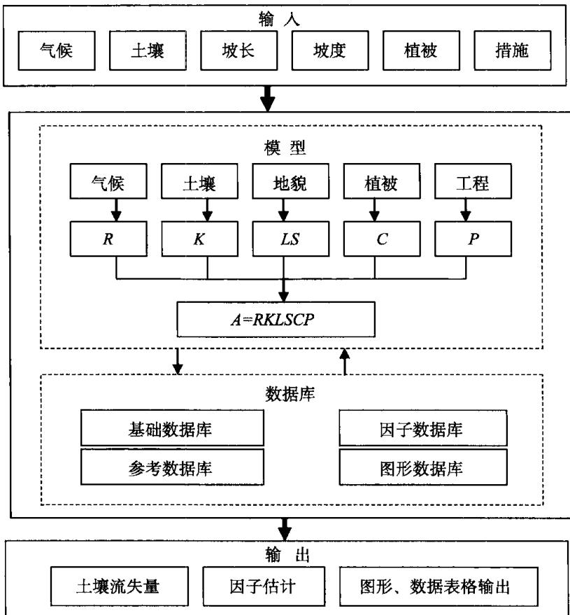  
图9.1 北京土壤流失方程系统结构框架图

## (2) 系统功能

北京土壤流失方程计算机系统主要包括：预报因子计算、土壤流失量计算、数据库查询和维护以及地图功能四大功能模块。方程的基本形式为A=RKLSCP。

系统主要功能列于表9.1。

表 9.1 北京土壤流失方程系统功能表
<table><tr><td colspan="1" rowspan="1">模块</td><td colspan="1" rowspan="1">功能</td><td colspan="1" rowspan="1">输入</td><td colspan="1" rowspan="1">输出</td></tr><tr><td colspan="1" rowspan="24">因子计算</td><td colspan="1" rowspan="20">1. 降雨侵蚀力因子计算</td><td colspan="1" rowspan="1">1. 次降雨过程</td><td colspan="1" rowspan="3">1. 次降雨侵蚀力</td></tr><tr><td colspan="1" rowspan="1">2. 次降雨量和雨强</td></tr><tr><td colspan="1" rowspan="1">3. 次降雨量</td></tr><tr><td colspan="1" rowspan="1">1. 日降雨过程</td><td colspan="1" rowspan="3">2. 日降雨侵蚀力</td></tr><tr><td colspan="1" rowspan="1">2. 次降雨量和雨强</td></tr><tr><td colspan="1" rowspan="1">3. 次降雨量</td></tr><tr><td colspan="1" rowspan="1">1. 次降雨侵蚀力</td><td colspan="1" rowspan="2">3. 季旬降雨侵蚀力</td></tr><tr><td colspan="1" rowspan="1">2. 日降雨侵蚀力</td></tr><tr><td colspan="1" rowspan="1">1. 次降雨侵蚀力</td><td colspan="1" rowspan="3">4. 月降雨侵蚀力</td></tr><tr><td colspan="1" rowspan="1">2. 日降雨侵蚀力</td></tr><tr><td colspan="1" rowspan="1">3. 月降雨量</td></tr><tr><td colspan="1" rowspan="1">1. 次降雨侵蚀力</td><td colspan="1" rowspan="4">5. 年降雨侵蚀力</td></tr><tr><td colspan="1" rowspan="1">2. 日降雨侵蚀力</td></tr><tr><td colspan="1" rowspan="1">3. 月降雨侵蚀力</td></tr><tr><td colspan="1" rowspan="1">4. 年降雨量</td></tr><tr><td colspan="1" rowspan="1">1. 次降雨侵蚀力</td><td colspan="1" rowspan="5">6. 多年平均年降雨侵蚀力</td></tr><tr><td colspan="1" rowspan="1">2. 日降雨侵蚀力</td></tr><tr><td colspan="1" rowspan="1">3. 月降雨侵蚀力</td></tr><tr><td colspan="1" rowspan="1">4. 年降雨侵蚀力</td></tr><tr><td colspan="1" rowspan="1">5. 多年平均降雨侵蚀量</td></tr><tr><td colspan="1" rowspan="4">2. 土壤可蚀性因子计算</td><td colspan="1" rowspan="1">1. 土壤粒级含量</td><td colspan="1" rowspan="4">可蚀性因子值</td></tr><tr><td colspan="1" rowspan="1">2. 土壤有机质含量</td></tr><tr><td colspan="1" rowspan="1">3. 土壤结构等级</td></tr><tr><td colspan="1" rowspan="1">4. 土壤渗透等级</td></tr><tr><td colspan="1" rowspan="9">因子计算</td><td colspan="1" rowspan="2">3. 坡长、坡度因子计算</td><td colspan="1" rowspan="1">1. 各段坡长</td><td colspan="1" rowspan="1">1. 坡长因子</td></tr><tr><td colspan="1" rowspan="1">2. 各段坡度</td><td colspan="1" rowspan="1">2. 坡度因子</td></tr><tr><td colspan="1" rowspan="5">4. 覆盖与管理因子计算</td><td colspan="1" rowspan="1">1. 植物类型</td><td colspan="1" rowspan="5">植被覆盖因子值</td></tr><tr><td colspan="1" rowspan="1">2. 农地作物类型</td></tr><tr><td colspan="1" rowspan="1">3. 冠层覆盖度</td></tr><tr><td colspan="1" rowspan="1">4. 残茬覆盖度</td></tr><tr><td colspan="1" rowspan="1">5. 砾石覆盖度</td></tr><tr><td colspan="1" rowspan="2">5. 工程措施因子计算</td><td colspan="1" rowspan="1">1. 工程措施</td><td colspan="1" rowspan="2">工程措施因子值</td></tr><tr><td colspan="1" rowspan="1">2. 降雨量</td></tr><tr><td colspan="1" rowspan="2">流失量计算</td><td colspan="1" rowspan="1">1. 坡面流失量计算</td><td colspan="1" rowspan="1">各因子计算所需输入</td><td colspan="1" rowspan="1">土壤流失量</td></tr><tr><td colspan="1" rowspan="1">2. 打开流失量预报表</td><td colspan="1" rowspan="1">一</td><td colspan="1" rowspan="1">土壤流失预报表</td></tr><tr><td colspan="1" rowspan="4">数据库</td><td colspan="1" rowspan="1">1. 基础数据库查询</td><td colspan="1" rowspan="1">一</td><td colspan="1" rowspan="1">各种基础数据库数据表</td></tr><tr><td colspan="1" rowspan="1">2. 参考数据库查询</td><td colspan="1" rowspan="1">二</td><td colspan="1" rowspan="1">参考数据库数据表</td></tr><tr><td colspan="1" rowspan="1">3. 各因子数据库查询</td><td colspan="1" rowspan="1">一</td><td colspan="1" rowspan="1">因子数据表</td></tr><tr><td colspan="1" rowspan="1">4. 数据库排序查询</td><td colspan="1" rowspan="1">_</td><td colspan="1" rowspan="1"></td></tr><tr><td colspan="1" rowspan="5">地图功能</td><td colspan="1" rowspan="1">1. 基础底图查询</td><td colspan="1" rowspan="1">一</td><td colspan="1" rowspan="1">各种基础底图</td></tr><tr><td colspan="1" rowspan="1">2. 各因子图查询</td><td colspan="1" rowspan="1"></td><td colspan="1" rowspan="1">各种因子图</td></tr><tr><td colspan="1" rowspan="2">3. 空间内插</td><td colspan="1" rowspan="1">1. 降雨资料</td><td colspan="1" rowspan="2">降雨侵蚀力空间分布图</td></tr><tr><td colspan="1" rowspan="1">2. 选择插值方法</td></tr><tr><td colspan="1" rowspan="1">4. 提取等值线</td><td colspan="1" rowspan="1">降雨资料</td><td colspan="1" rowspan="1">降雨等值线</td></tr></table>

## 9.2 系统安装与运行

## (1) 系统基本配置

系统软件运行环境为 Windows 2000 Server、Windows XP 或 Windows Server 2003的视窗操作系统。系统运行硬件环境要求：处理器英特尔奔腾M处理器，1.6GHz以上；内存DDR，256M以上；系统需硬盘空间大约200MB（包括模型样例数据和部分北京市基础地图)，因此硬盘空间不小于40 GB。BJSLE是在 Borland C十+Builder6.0平台开发下完成的，系统运行速度快，操作方便，用户只需具有Windows操作经验就可以上手。

## (2) 系统安装

BJSLE以软件包形式发布。用户装入光盘，点击Setup. exe进行安装，安装完成后，在用户选择的安装目录下，安装程序会自动生成\Database、\MapData 和\Result 3个子目录。其中，子目录\Database存放系统所必需的各种属性数据，子目录\MapData存放与系统有关的北京市基础地图以及降雨量、降雨侵蚀力等值线图等数据。子目录\Result存放模型的所有计算结果，包括中间过程结果与最终计算结果等。需要指出的是，其中子目录\Database和\MapData存放的系统数据，必须由系统进行维护，用户自行对这些文件进行修改可能会导致系统运行不正常。

## (3) 系统运行

启动北京土壤流失方程（BJSLE）是系统操作的第一步，用户可以通过以下方法运行模型系统：

• 单击Windows任务栏上的开始按钮；

• 将鼠标指向程序；

• 指向 BJSLE，如图9.2所示操作步骤；

• 单击BJSLE，弹出系统启动界面如图9.3所示。

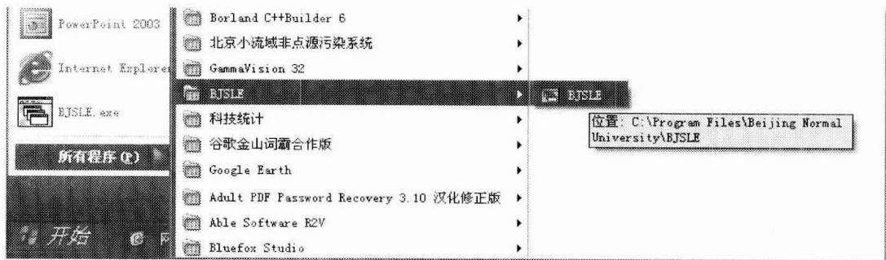  
图 9.2 启动路径

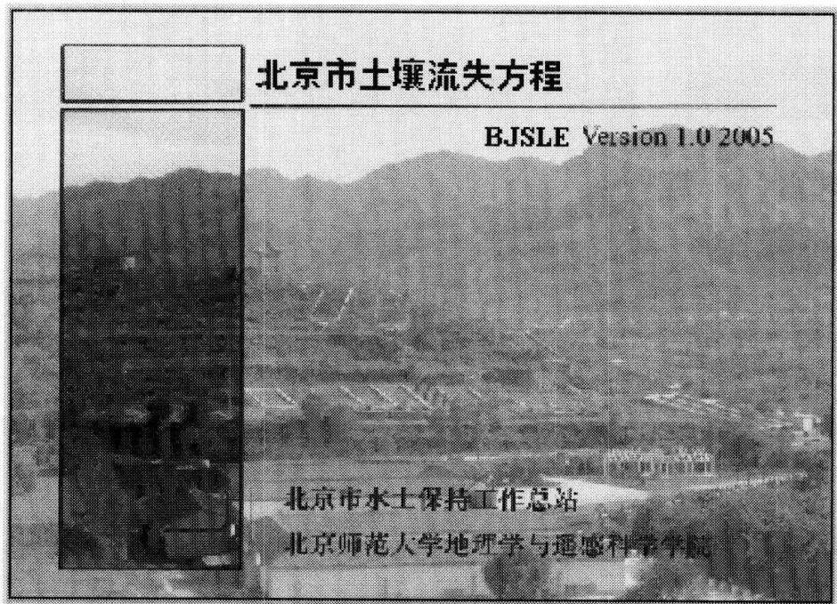  
图 9.3 启动界面

每个BJSLE任务，一次只能打开一个任务窗口进行运算与浏览，用户可以通过启动多个BJSLE窗口来同时操作。

## (4) 系统界面

系统打开后可以看到如图9.4所示的模型主界面。系统主界面主要包含以下几部分内容：

· 系统标识(logo)，位于模型主界面最上方；

·菜单栏，用于选择操作命令，BJSLE拥有自己独特的菜单条，其中有“因子计算”、“流失量计算”、“数据库”和“地图功能”等菜单；

工具栏，位于菜单栏下方，用于系统常用命令快捷操作；

·信息显示区域，位于窗口中心区域，用于显示菜单子窗体、分析结果和查询结果等；

• 状态栏，位于窗口最下方，用于显示操作状态。

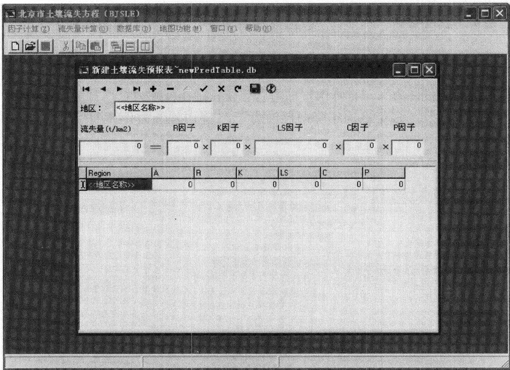  
图 9.4 模型主界面

## 9.3 因子计算菜单

因子计算菜单根据北京土壤流失方程的形式设计了各子菜单，其中包含降雨侵蚀力因子、土壤可蚀性因子、坡长、坡度因子、覆盖与管理因子以及工程措施因子5个子菜单。用鼠标左键单击某一菜单命令时即弹出该子菜单，可进一步选择具体命令完成相应

的任务。因子计算各功能键具体功能见表9.2。

表9.2 因子计算菜单命令说明
<table><tr><td>菜单命令</td><td>功能</td></tr><tr><td>降雨侵蚀力(R)</td><td>计算或选择次、日、月、季旬、年、多年平均降雨侵蚀力因子值</td></tr><tr><td>土壤可蚀性（K）</td><td>计算或选择土壤可蚀性因子值</td></tr><tr><td>坡长、坡度(L、S)</td><td>计算坡度坡长因子值</td></tr><tr><td>覆盖与管理（C）</td><td>计算或选择不同土地利用的覆盖与管理因子值</td></tr><tr><td>水土保持工程措施（P）</td><td>计算或选择水土保持工程措施因子值</td></tr></table>

## 9.3.1 降雨侵蚀力因子子菜单

## (1) 菜单使用方法

降雨侵蚀力因子定义为由降雨引起土壤侵蚀的潜在能力。BJSLE提供了两种获得降雨侵蚀力因子的方法，分别是“降雨侵蚀力计算”菜单和“降雨侵蚀力数据库获取”菜单。

“降雨侵蚀力计算”菜单根据用户需求，提供了6种计算降雨侵蚀力的子模块，分别计算“次降雨侵蚀力”、“日降雨侵蚀力”、“季旬降雨侵蚀力”、“月降雨侵蚀力”、“年降雨侵蚀力”以及“多年平均年降雨侵蚀力”。“降雨侵蚀力计算”模块的操作步骤为(图9.5)：

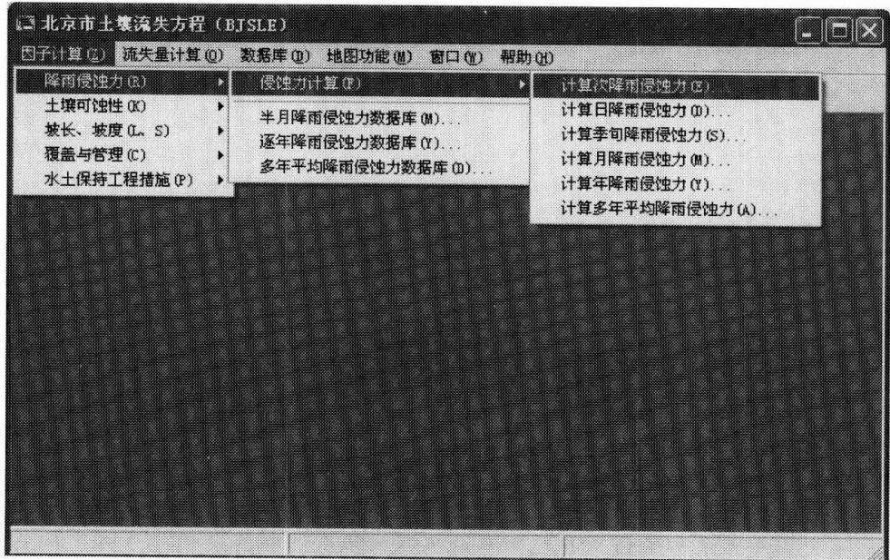  
图 9.5 获取降雨侵蚀力模块

· 鼠标左键单击模型系统界面菜单栏的“因子计算”；

• 鼠标左键单击“降雨侵蚀力”子菜单；

·鼠标左键选择“侵蚀力计算”，如图9.5所示，“侵蚀力计算”菜单下列出了6种计算降雨侵蚀力子菜单，用户可根据具体需求，选择不同的子菜单。

## 1）计算次降雨侵蚀力

如选择计算次降雨侵蚀力按钮，弹出窗口如图9.6所示，该模块功能是通过已有的次降雨过程资料、次降雨量和雨强以及次降雨量3种详细程度不同的降雨资料，用不同的计算方法计算次降雨侵蚀力。其中用降雨过程资料计算的降雨侵蚀力精度最高，用次降雨量计算的降雨侵蚀力精度最低。计算次降雨侵蚀力的操作步骤如下：

·用户根据当前已有资料，选择输入数据，在窗口（图9.6）中“选择输入已有资料”选项栏中的所选资料前单击鼠标左键。

·鼠标左键单击窗口（图9.6）中“选择输入文件…”按钮，弹出打开窗口（图9.7)，找到与计算次降雨侵蚀力窗口“选择输入已有资料”选项栏中相对应的已有资料，如北京土壤流失方程系统安装目录下/Database/次降雨过程、次降雨量和雨强、次降雨量，选中文件后点击当前窗口（图9.7）的“Open”按钮。以上过程完成输入文件操作，此时在窗口（图9.6）中“选择输入文件…”按钮下的文本框中会显示所选文件的路径及名称。输入的数据格式包含两种类型：一种是文本文件（\*.prn)，另一种是dBase4的数据库文件（\*.dbf)，这两种格式可在北京市土壤流失方程系统中生成，也可用Excel或记事本程序生成，以下降雨侵蚀力计算模块的输入数据格式与此相同，其数据表格式将在后面的数据组织中详细介绍。

• 鼠标左键单击窗口（图9.6）中的“保存次降雨侵蚀力…”按钮，弹出储存窗口界面（图9.8)，选择保存路径及文件名称后，单击窗口“Save”按钮，以上操作完成

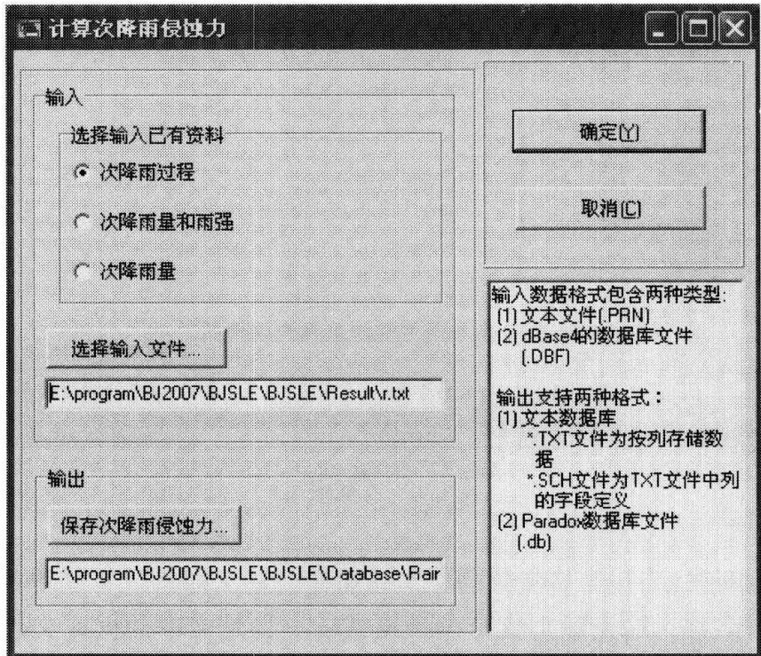  
图 9.6 计算次降雨侵蚀力 R因子值

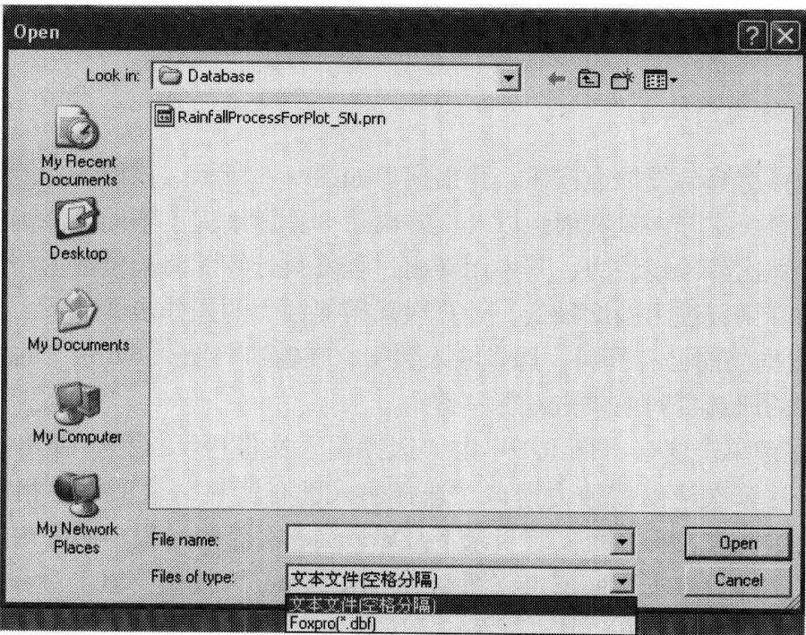  
图 9.7 打开窗口

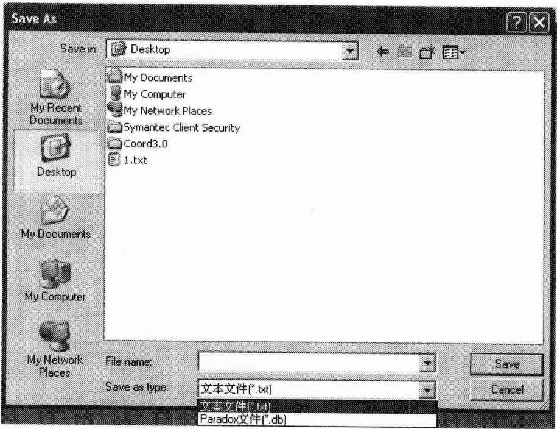  
图 9.8 存储窗口

后，“保存次降雨侵蚀力…”按钮下的文本框同样会显示即将计算获得的次降雨侵蚀力数据存储路径与名称。输出数据支持两种格式：一种是文本数据库文件\*.txt数据存储格式，另一种是Paradox数据库文件（\*.db)，这两种输出格式可在模型中打开，也可用Excel或记事本程序单独打开。其他降雨侵蚀力模块的输出数据格式也与此相同，其数据表格式将在后面的数据组织中详细介绍。

·以上操作完成并确定无误后，用鼠标左键单击图9.6所示窗口中的“确定”按钮，进行计算，计算结束后会根据用户需求自动保存，并自动关闭计算次降雨侵蚀力窗口。

## 2）计算日降雨侵蚀力

如选择计算日降雨侵蚀力按钮，弹出窗口如图9.9所示，该模块功能是通过输入已有的日降雨过程资料、日降雨量和雨强以及日降雨量3种不同资料，根据不同的计算方法获得日降雨侵蚀力。计算日降雨侵蚀力模块的操作步骤如下：

·用户根据当前已有资料，选择输入数据，在窗口（图9.9）中“选择输入已有资料”选项栏中的所选资料前单击鼠标左键；

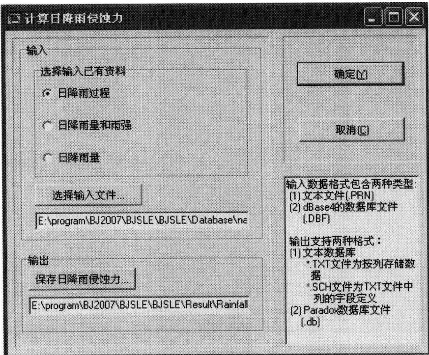  
图9.9 计算日降雨侵蚀力R因子值

·鼠标左键单击窗口（图9.9）中“选择输入文件…”按钮，弹出打开窗口（图9.7)，找到与计算日降雨侵蚀力窗口（图9.9）“选择输入已有资料”选项栏中相对应的已有资料，如北京土壤流失方程系统安装目录下/Database/日降雨过程、日降雨量和雨强、日降雨量，选中文件后点击“Open”按钮，以上过程完成输入文件操作，此时在窗口（图9.9）中“选择输入文件…”按钮下的文本框中会显示所选文件的路径及名称；

·鼠标左键单击窗口（图9.9）中的“保存日降雨侵蚀力…”按钮，弹出储存窗口界面（图9.8)，选择保存路径及名称后，单击窗口“Save”按钮，以上操作完成后，“保存日降雨侵蚀力…”按钮下的文本框同样会显示即将计算获得的次降雨侵蚀力数据

存储路径与名称；

·用鼠标左键单击图9.9所示窗口中的“确定”按钮，进行计算，计算结束后会根据用户需求自动保存，并自动关闭计算日降雨侵蚀力窗口。

## 3）计算月降雨侵蚀力

如选择计算月降雨侵蚀力模块，弹出窗口如图9.10所示，该模块是通过已计算得到的次降雨侵蚀力、日降雨侵蚀力以及已生成的月降雨量3种不同资料，用不同的计算方法获得月降雨侵蚀力。计算月降雨侵蚀力模块的操作步骤如下：

·用户根据当前已有资料，选择输入数据，在窗口（图9.10）中“选择输入已有资料”选项栏中的所选资料前单击鼠标左键；

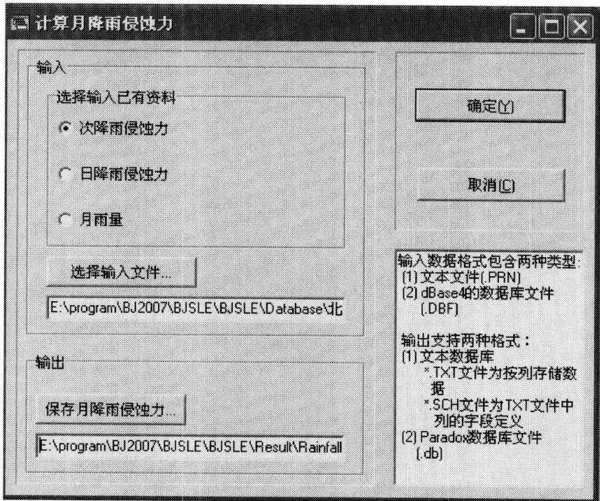  
图9.10 计算月降雨侵蚀力 R因子值

·鼠标左键单击窗口（图9.10）中“选择输入文件…”按钮，弹出打开窗口（图9.7)，找到与计算月降雨侵蚀力窗口（图9.10）中“选择输入已有资料”选项栏中相对应的已有资料，如北京土壤流失方程系统安装目录下/Result/次降雨侵蚀力、日降雨侵蚀力或者/Database/月降雨量，选中文件后点击“Open”按钮。此时在图9.10中“选择输入文件…”按钮下的文本框中会显示所选文件的路径及名称；

·鼠标左键单击窗口（图9.10）中“保存月降雨侵蚀力…”按钮，弹出储存窗口界面（图9.8)，选择保存路径及文件名称后，单击窗口中“Save”按钮，以上操作完成后，“保存月降雨侵蚀力…”按钮下的文本框同样会显示即将计算获得的月降雨侵蚀力数据存储路径与名称；

·鼠标左键单击图9.10所示窗口中的“确定”按钮，进行计算，结果计算后会根

据用户需求自动保存，并自动关闭计算月降雨侵蚀力窗口。

## 4）计算季旬降雨侵蚀力

如选择计算季旬降雨侵蚀力模块，弹出窗口如图9.11所示，该模块是通过已计算获得的次降雨侵蚀力累加或日降雨侵蚀力累加两种方法计算季旬降雨侵蚀力。计算季旬降雨侵蚀力模块的操作步骤如下：

·用户根据当前已有资料，选择输入数据，在窗口（图9.11）中“选择输入已有资料”选项栏中的所选资料前单击鼠标左键。

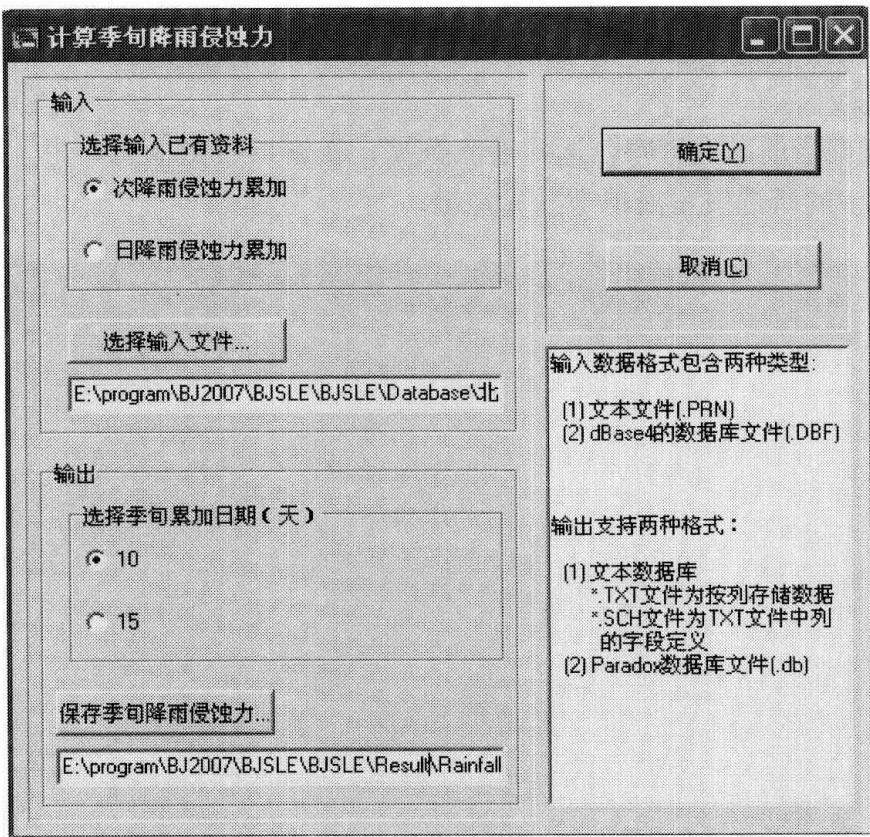  
图9.11 计算季旬降雨侵蚀力R因子值

·用鼠标左键单击窗口图9.11中“选择输入文件…”按钮，弹出打开窗口（图9.7)，找到与计算季旬降雨侵蚀力窗口图9.11中“选择输入已有资料”选项栏中相对应的已有资料，如北京土壤流失方程系统安装目录下/Result/次降雨侵蚀力、日降雨侵蚀力，选中文件后点击“Open”按钮，以上过程即完成选择输入文件操作。如之前未进行过计算次降雨侵蚀力或日降雨侵蚀力计算操作，也没有次或日降雨侵蚀力资料，则需生成次或日降雨侵蚀力后，才能进行季旬降雨侵蚀力计算。

·在输出框中，先选择累加天数，即单击可供选择的日期10天或15天。用户也可通过以上两个子模块计算所得的次降雨侵蚀力和日降雨侵蚀力手动累加计算5天、20天或任意天数的季旬降雨侵蚀力。

·用鼠标左键单击“保存季旬降雨侵蚀力…”按钮，弹出储存窗口界面（图9.8)，选择保存路径及文件名称后，单击窗口“Save”按钮，以上操作完成后，“保存季旬降雨侵蚀力…”按钮下的文本框同样会显示即将计算获得的季旬降雨侵蚀力数据存储路径与名称。

·用鼠标左键单击图9.11所示窗口中的“确定”按钮，进行计算，计算结束后会根据用户需求自动保存，并自动关闭计算季旬降雨侵蚀力窗口。

## 5）计算年降雨侵蚀力

如选择计算年降雨侵蚀力模块，则弹出图9.12所示窗口，该模块是通过输入已计算生成的次降雨侵蚀力、日降雨侵蚀力、月降雨侵蚀力以及已生成的年降水量4种不同详细程度的降雨量资料，根据不同的计算方法获得年降雨侵蚀力。计算年降雨侵蚀力模块的操作步骤如下：

·用户根据当前已有资料，选择输入数据，在窗口（图9.12）中“选择输入已有资料”选项栏中的所选资料前单击鼠标左键；

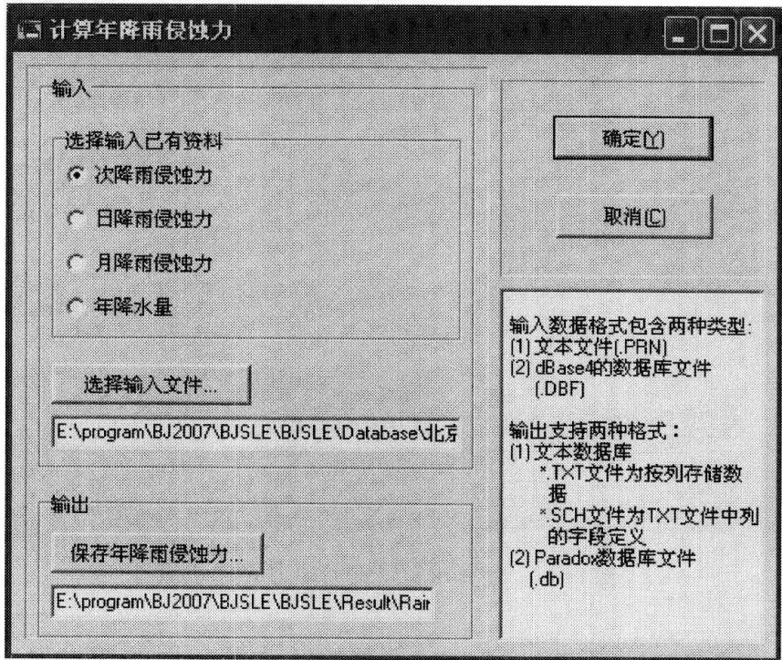  
图 9.12 计算年降雨侵蚀力 R 因子值

·用鼠标左键单击窗口图9.12中“选择输入文件…”按钮，弹出打开窗口（图9.7)，找到与计算年降雨侵蚀力窗口（图9.12）中“选择输入已有资料”选项栏中相对应的已有资料，如北京市土壤流失方程系统安装目录下/Result/次降雨侵蚀力、日降雨侵蚀力、月降雨侵蚀力或者/Database/年降雨量，选中文件后点击“打开”按钮，则该文件会显示在图9.12中“选择输入文件…”按钮下的文本框中；

· 用鼠标左键单击“保存年降雨侵蚀力…”按钮，弹出储存窗口界面（图9.8)，选择保存路径及名称后，单击窗口中“保存”按钮，则“保存年降雨侵蚀力…”按钮下的文本框中同样会显示即将计算获得的年降雨侵蚀力数据存储路径与名称；

·用鼠标左键单击图9.12所示窗口中的“确定”按钮，进行计算，计算结束后会根据用户需求自动保存，并自动关闭计算年降雨侵蚀力窗口。

## 6）计算多年平均年降雨侵蚀力

如选择计算多年平均年降雨侵蚀力模块，会弹出窗口如图9.13所示。该模块是通过输入已计算生成的次降雨侵蚀力、日降雨侵蚀力、月降雨侵蚀力、年降雨侵蚀力以及已生成的多年平均降雨量5种不同资料，用不同的计算方法获得多年平均年降雨侵蚀力。计算多年平均降雨年侵蚀力模块的操作步骤如下：

·用户根据当前已有资料，选择输入数据。在窗口（图9.13）中“选择输入已有资料”选项栏中的所选资料前单击鼠标左键。

·用鼠标左键单击窗口图9.13中“选择输入文件…”按钮，弹出打开窗口（图9.7)，找到与计算多年平均降雨侵蚀力窗口图9.13中“选择输入已有资料”选项栏中相对应的已有资料，如北京土壤流失方程系统安装目录下/Result/次降雨侵蚀力、日降雨侵蚀力、月降雨侵蚀力、年降雨侵蚀力或/Database/北京市多年平均降雨量，选中文件后点击“打开”按钮，此时在“选择输入文件…”按钮下的文本框中会显示所选文件的路径及名称，如图9.13所示。

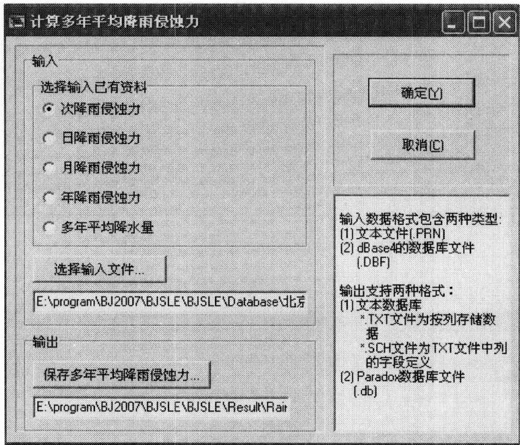  
图9.13 计算多年平均年降雨侵蚀力R因子值

·用鼠标左键单击窗口（图9.13）中“保存多年平均年降雨侵蚀力…”按钮，弹出储存窗口界面（图9.8），选择保存路径及名称后，单击窗口“保存”按钮，则窗口图9.13中“保存多年平均年降雨侵蚀力…”按钮下的文本框同样会显示即将计算获得的多年平均年降雨侵蚀力数据存储路径与名称。

·以上操作完成并确定无误后，用鼠标左键单击图9.13所示窗口中的“确定”按钮，进行计算，计算结束后会根据用户需求自动保存，并自动关闭计算多年平均降雨侵蚀力窗口。

“降雨侵蚀力”模块中降雨侵蚀力除了可以通过“侵蚀力计算”模块获取之外，还可直接从数据库获取（图9.14）。数据库中存放了用北京市多年降雨资料计算的不同时段的降雨侵蚀力，包括“季旬降雨侵蚀力数据库…”（图9.15)、“逐年降雨侵蚀力数据库…”（图9.16）和“多年平均年降雨侵蚀力数据库…”（图9.17)。用户可以从相应的数据库中直接获得北京地区降雨侵蚀力值，并可对数据进行排序、查询操作。以上数据库中降雨侵蚀力因子值计算所采用的资料是北京市34个雨量站1980～2004年日降雨量，其数据表格及数据库操作方法将在后面数据组织中详细介绍。通过系统数据库获取北京降雨侵蚀力因子的操作步骤如下：

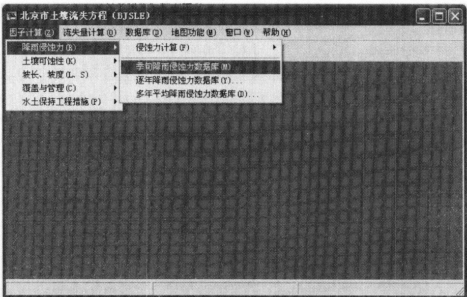  
图9.14 获取季旬降雨侵蚀力数据库

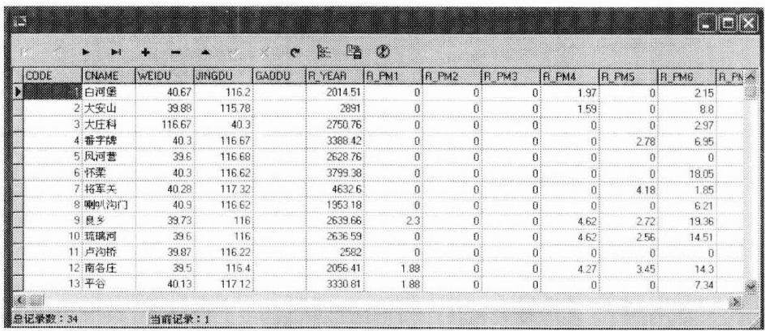  
图9.15 季旬降雨侵蚀力数据库

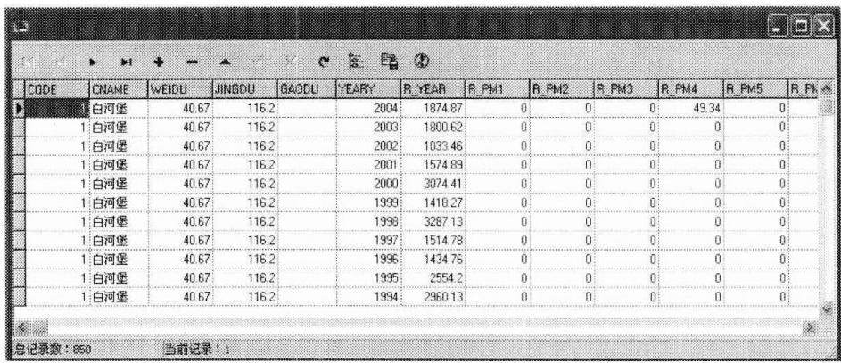  
图9.16 逐年降雨侵蚀力数据库

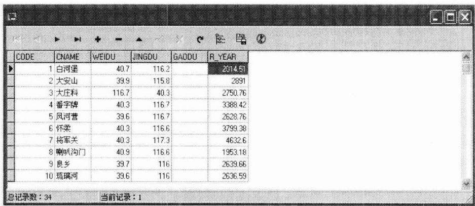  
图9.17 多年平均年降雨侵蚀力数据库

· 选择模型系统界面（图9.14）菜单栏的“因子计算”；

·选择“降雨侵蚀力”子菜单；

·单击“季旬降雨侵蚀力数据库”、“逐年降雨侵蚀力数据库”或“多年平均年降雨侵蚀力数据库”菜单来打开相应的数据库列表；

· 选择所需站点的降雨侵蚀力值。

## (2) 计算流程

北京次、日、月、季旬、年和多年平均年降雨侵蚀力的计算步骤如下：

## 1）选择降雨侵蚀力计算类型

用户根据需求，选择待要计算的降雨侵蚀力类型。计算次降雨侵蚀力转第二步；计算日降雨侵蚀力转第三步；计算季旬降雨侵蚀力，如有次或日降雨资料则转第四步，否则转第二或第三步；计算月降雨侵蚀力，如有次或日降雨资料则转第五步，否则先进行第二或第三步；计算年降雨侵蚀力，如有次、日或月降雨资料则转第六步，否则先进行第二、第三或第四步计算。

## 2）计算次降雨侵蚀力

次降雨侵蚀力的计算依据拥有降雨资料的详细程度有以下3种计算方法。

A. 用降雨过程资料计算

$$
R _ { \mathrm { e } } = E I _ { 3 0 }\tag{3.1}
$$

$$
\begin{array} { c } { E = \displaystyle \sum _ { i = 1 } ^ { n } ( e _ { i } P _ { \mathrm { r } i } ) } \\ { e _ { i } = 0 . 2 9 ( 1 - 0 . 7 2 \mathrm { e } ^ { - 0 . 0 5 i _ { i } } ) } \end{array}\tag{3.2c}
$$

B. 用次降雨量（P）和最大30min雨强 $( I _ { 3 0 } )$ 资料计算

$$
R _ { \mathrm { e } } = 0 . 2 4 6 3 P _ { \mathrm { r } } I _ { 3 0 }\tag{3.3}
$$

C. 用次降雨量 $( P _ { \mathbf { r } } )$ 资料计算

$$
R _ { \mathrm { e } } = 0 . 3 3 8 5 P _ { \mathrm { r } } ^ { 1 . 7 7 0 7 }\tag{3.4}
$$

## 3）计算日降雨侵蚀力

日降雨侵蚀力的计算按拥有的降雨资料详细程度有以下3种计算方法。

A. 用降雨过程资料计算

与计算次降雨侵蚀力的方法相同，按日进行累加。

B. 用日降雨量 $( P _ { \mathrm { { d } } } )$ 和日最大 30 min 雨强 $( I _ { 3 0 \mathrm { d } } )$ 资料计算

$$
R _ { \mathrm { d } } = 0 . 2 4 1 P _ { \mathrm { d } } I _ { 3 0 \mathrm { d } }\tag{3.5}
$$

C. 用日降雨量 $( P _ { \mathrm { d } } )$ 资料计算

$$
R _ { \mathrm { d } } = 0 . 3 9 5 4 P _ { \mathrm { d } } ^ { 1 . 6 7 0 9 }\tag{3.6}
$$

## 4）计算季旬降雨侵蚀力

季旬降雨侵蚀力用次或日降雨侵蚀力按季或旬累加。如果有次降雨侵蚀力，则统计季或旬内的次降雨侵蚀力总次数，将其进行累加，得到季旬降雨侵蚀力，计算公式为

$$
R _ { \mathfrak { q } } = \sum _ { d = 1 } ^ { 1 0 \& . 1 5 } R _ { \mathfrak { e } }\tag{9.1}
$$

如果有日降雨侵蚀力，则直接累加季或旬内的日降雨侵蚀力值，得到季旬降雨侵蚀力，计算公式为

$$
R _ { \mathfrak { q } } = \sum _ { d = 1 } ^ { 1 0 \& 1 5 } ( R _ { \mathfrak { d } } )\tag{9.2}
$$

## 5）计算月降雨侵蚀力

月降雨侵蚀力可在次降雨侵蚀力、日降雨侵蚀力或月降雨量资料的基础上分别用式（9.3）、式（9.4）和式（3.7）进行计算。

$$
{ \dot { R } } _ { \mathrm { m } } = \sum _ { d = 1 } ^ { n } \left( R _ { \mathrm { e } } \right)\tag{9.3}
$$

$$
R _ { \mathrm { m } } = \sum _ { d = 1 } ^ { n } \left( R _ { \mathrm { d } } \right)\tag{9.4}
$$

$$
R _ { \mathrm { m } } = 0 . 6 8 9 P _ { \mathrm { m } } ^ { 1 . 1 7 4 }\tag{3.7}
$$

## 6）计算年降雨侵蚀力

年降雨侵蚀力可用次降雨侵蚀力、日降雨侵蚀力、月降雨侵蚀力或年降雨量资料分别用式（9.5）～式（9.7）及式（3.8）进行计算。

$$
R _ { \mathrm { y } } = \sum _ { d = 1 } ^ { n } ( R _ { \mathrm { e } } )\tag{9.5}
$$

$$
R _ { \mathrm { y } } = \sum _ { d = 1 } ^ { n } R _ { \mathrm { d } }\tag{9.6}
$$

$$
R _ { \mathrm { y } } = \sum _ { d = 1 } ^ { n } R _ { \mathrm { m } }\tag{9.7}
$$

$$
R _ { \mathrm { y } } = 0 . 4 4 P _ { \mathrm { y } } ^ { 1 . 4 6 3 }\tag{3.8}
$$

图9.18、图9.19和图9.20分别为次降雨侵蚀力，日降雨侵蚀力，季旬、月、年降雨侵蚀力以及多年平均年降雨侵蚀力计算的流程图。

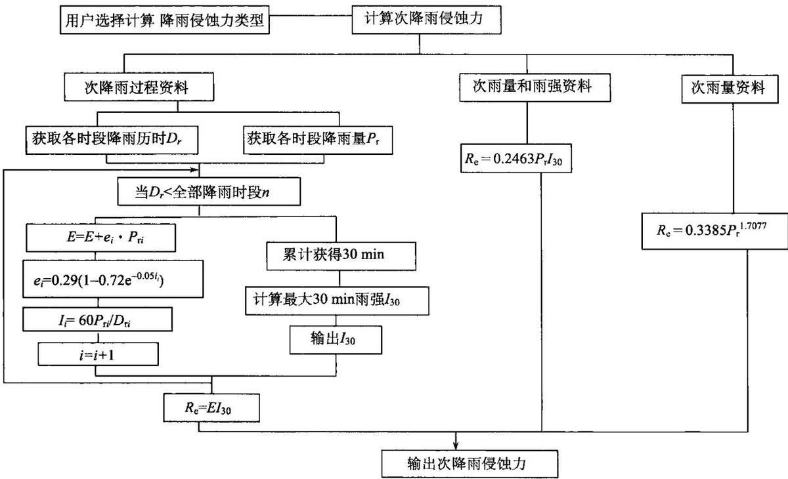  
图 9.18 次降雨侵蚀力计算流程图

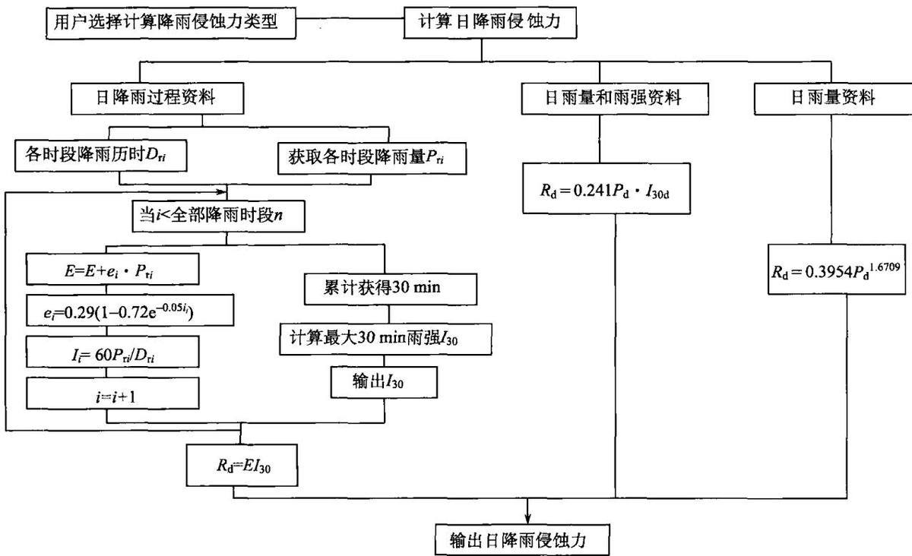  
图9.19 日降雨侵蚀力计算流程图

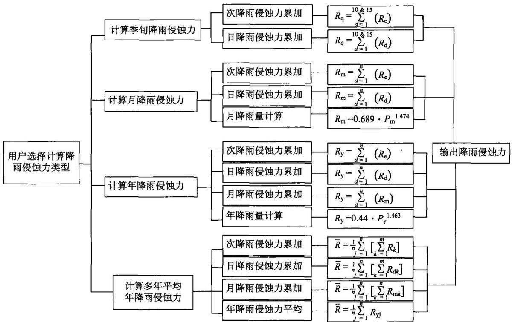  
图9.20 季旬、月、年以及多年平均年降雨侵蚀力计算流程图

## 9.3.2 土壤可蚀性因子子菜单

## (1) 菜单使用方法

北京土壤流失方程模型系统提供了两种获取土壤可蚀性因子的方法，分别是“土壤可蚀性计算”子菜单和“数据库获取”子菜单。“土壤可蚀性计算”子菜单提供了两种计算子模块，分别为“修正EPIC法计算”子模块和“修正诺谟图法计算”子模块。这两种方法都是在已有公式基础上，利用北京野外径流小区的实测资料进行修正后得到的，修正后的公式计算精度有明显提高。两个公式所需的基本资料不同，用户可根据实际拥有资料情况，选择不同的计算公式。“土壤可蚀性计算”模块的操作步骤为（图9.21):

·用鼠标左键单击模型系统界面菜单栏的“因子计算”；

·用鼠标左键单击“土壤可蚀性”子菜单；

·用鼠标左键单击“土壤可蚀性计算”，如图9.21所示，“土壤可蚀性计算”菜单下列出了两种计算土壤可蚀性因子的子菜单，用户可根据已有数据，选择合适的计算方法。

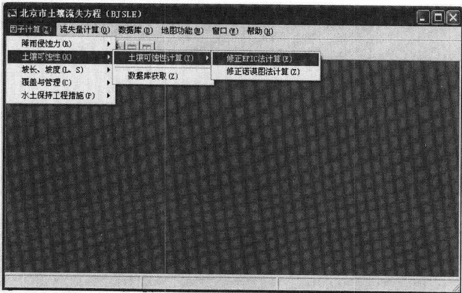  
图9.21 获取土壤可蚀性因子模块

## 1）修正EPIC法计算土壤可蚀性因子

如果用户有土壤颗粒级配以及土壤有机碳的基本资料，则可用修正EPIC法来计算土壤可蚀性因子。即在图9.21所示菜单中单击“修正EPIC法计算”子菜单，则弹出窗口图9.22。用户提供菜单中所需要的土壤属性值来计算土壤可蚀性因子（K）。具体操作步骤如下：

• 输入土壤粒级<0.002 mm的黏粒百分含量，单位为%；

• 输入土壤粒级 0.002\~0.05 mm的粉粒百分比含量，单位为 %；

· 输入土壤粒级0.05\~2 mm的砂粒百分比含量，单位为%；

· 输入土壤有机碳含量，单位为 %；

·确定填写无误后，选择是否保存，点击“保存文件”按钮，即可对所输入土壤属性进行保存；

·点击“确定”按钮，窗口中的文本框中会显示计算结果。

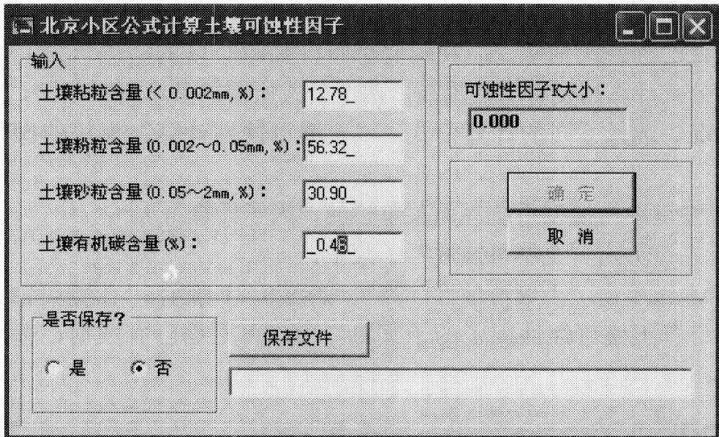  
图9.22 修正EPIC法计算土壤可蚀性因子模块

## 2）修正诺谟图法计算土壤可蚀性因子

如果用户有土壤颗粒级配组成、有机质含量、土壤渗透性和土壤结构资料，则用户可用修正诺谟图法来计算土壤可蚀性因子。在图9.21所示菜单中单击“修正诺谟图法计算”。弹出窗口如图9.23所示，此命令通过用户提供的土壤属性特征，计算土壤可蚀性K因子值。通过修正诺谟图法计算土壤可蚀性因子的操作步骤如下：

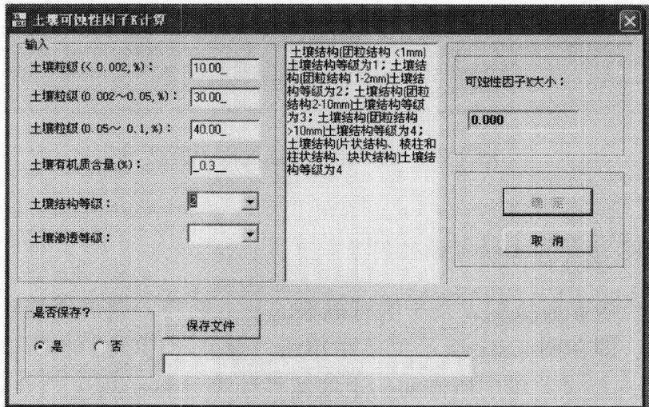  
图9.23 修正诺谟图法计算土壤可蚀性因子模块

• 输入土壤粒级<0.002 mm的黏粒百分含量，单位为%。

· 输入土壤粒级0.002\~0.05mm的粉粒百分比含量，单位为%。

· 输入土壤粒级0.05\~0.1 mm的砂粒百分比含量，单位为 %。

· 输入土壤有机质含量，单位为 %。

· 点击土壤结构等级旁的下拉条，选择土壤结构等级，可参考旁边文本框中的文字说明窗口进行选择。系统提供了土壤结构等级选取标准的文字说明如下：团粒结构<1mm，土壤结构等级为1；团粒结构1\~2mm，土壤结构等级为2；团粒结构2\~10mm，土壤结构等级为3；团粒结构>10mm，土壤结构等级为4；片状结构、棱柱和柱状结构、块状结构，土壤结构等级为4。用户可根据以上标准对比土壤样品，选择正确的土壤结构等级。

·点击土壤渗透等级旁的下拉条，选择土壤渗透等级，同样可参考右边文本框中提供的文字说明进行土壤渗透等级选择。系统提供了土壤渗透等级选取标准的文字说明如下：粉砂质黏土，黏土土壤渗透等级为6；粉砂黏壤土，砂黏土土壤渗透等级为5；砂粘壤土、粘壤土土壤渗透等级为4；砂土、粉壤土土壤渗透等级为3；壤砂土、砂壤土土壤渗透等级为2；砂土土壤渗透等级为1。用户需对比相应的土壤样品选择正确的渗透等级。

·确定填写无误后，选择是否保存，如选择“是”，点击“保存文件”按钮，即可对输入的土壤属性进行保存。

· 点击“确定”按钮，窗口图9.23中的土壤可蚀性因子值文本框中会显示计算结果。

“土壤可蚀性”模块中除了可以通过“土壤可蚀性计算”获取之外，还可从系统自带数据库中直接获取北京市典型土壤类型的土壤可蚀性因子值（图9.24)。数据库中的土壤可蚀性因子值是通过小区观测与人工降雨试验观测计算得到，其数据表格及数据库操作方法将在后面数据组织中详细介绍。进入土壤可蚀性因子数据库的操作步骤如下：

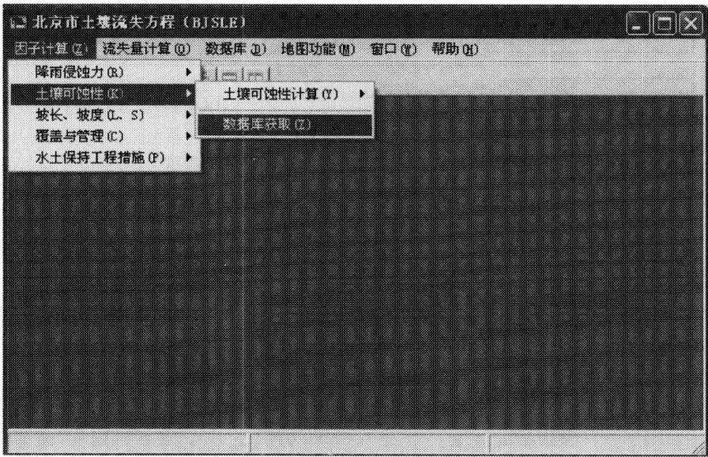  
图9.24 获取土壤可蚀性因子数据库

·选择模型系统界面（图9.24）菜单栏的“因子计算”菜单；

·点击“土壤可蚀性”按钮；

·点击“数据库获取”按钮，弹出数据库列表如图9.25所示；

· 根据所计算的土壤亚类和土属选择合适的土壤可蚀性因子值。

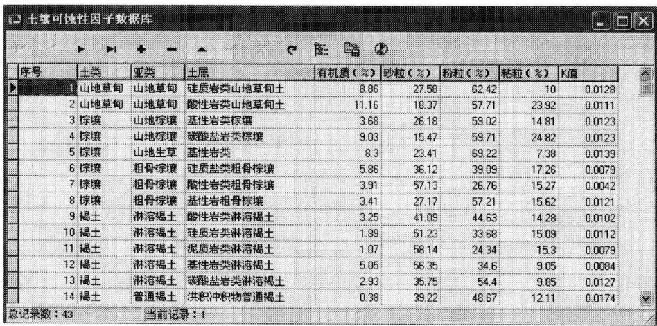  
图9.25 土壤可蚀性因子数据库

## (2) 计算流程

土壤可蚀性因子的具体计算流程如下（图9.26）：

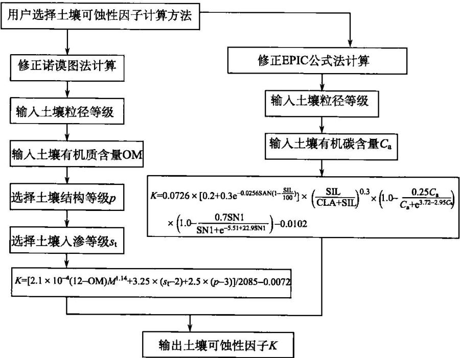  
图9.26 土壤可蚀性因子计算流程图

第一步，用户根据已有土壤属性资料，选择土壤可蚀性因子的计算方法，选修正EPIC法计算方法转第二步，选修正诺谟图法则转至第三步；

第二步，用户输入土壤粒级<0.002 mm的黏粒百分含量、0.002～0.05 mm的粉粒百分比含量、0.05～2mm的砂粒百分比含量与土壤有机碳含量，以上输入的含量单位均为%，计算土壤可蚀性因子公式如下：

$$
\begin{array} { r l r } {  { K = 0 . 0 7 2 6 \times [ 0 . 2 + 0 . 3 \mathrm { e } ^ { - 0 . 9 5 5 8 \mathrm { s h } ( 1 . \frac { \mathrm { s H } } { \mathrm { s h } \mathrm { o } } ) } ] \times \Big ( \frac { \mathrm { S I L } } { \mathrm { C L A } + \mathrm { S I L } } \Big ) ^ { 0 . 3 } \times \Big ( 1 . 0 - \frac { 0 . 2 5 C _ { s } } { C _ { a } + \mathrm { e } ^ { 3 . 7 2 - 2 . 9 5 C _ { a } } } \Big ) \times } } \\ & { } & \\ & { } & { \Big ( 1 . 0 - \frac { 0 . 7 \mathrm { S N } 1 } { \mathrm { S N } 1 + \mathrm { e } ^ { - 5 . 5 1 + 2 2 . 5 8 \mathrm { s h } } } \Big ) - 0 . 0 1 0 2 } \end{array}
$$

第三步，用户输入土壤粒级<0.002 mm的黏粒百分含量、0.002～0.05 mm的粉粒百分比含量、0.05～2mm的砂粒百分比含量，单位均为%，同时还需输入土壤有机质含量，单位为%，再选择土壤结构等级和土壤渗透等级级数，修正诺谟图法计算土壤可蚀性因子的公式如下：

$$
K = { \frac { [ 2 . 1 \times 1 0 ^ { - 4 } ( 1 2 - 0 { \bf M } ) M ^ { 1 . 1 4 } + 3 . 2 5 \times ( s _ { \mathrm { t } } - 2 ) + 2 . 5 \times ( p - 3 ) ] } { 2 0 8 5 } } - 0 . 0 0 7 2\tag{9.8}
$$

$$
\mathrm { { O M } = 1 . 7 2 C _ { a } }
$$

## 9.3.3 坡长坡度因子子菜单

## (1) 菜单使用方法

在北京土壤流失方程中，用坡长（L）和坡度（S）因子计算地形对土壤侵蚀的影响。“因子计算”菜单（图9.27）中的“坡长、坡度”子模块提供了两种不同类型坡形的坡长坡度因子计算方法：“规则坡型”和“不规则坡型”。“规则坡型”是指坡面顺直、坡面坡度变化小的情况；“不规则坡型”是指坡面上不同坡段的坡度差异较大的情况。在应用菜单时，用户需先选择将要参与运算的坡面坡型，然后计算。“坡长、坡度”模块的操作步骤为：

·用鼠标左键单击模型系统界面（图9.27）菜单栏的“因子计算”菜单；

• 用鼠标左键单击“坡长、坡度”按钮；

• 根据实际坡型选择计算方法。

## 1）规则坡型坡长坡度因子计算

• 如计算的坡面是直型坡，则在图9.27中的菜单中选择“规则坡型”命令，点击后会出现窗口如图9.28所示。

· 在坡长后的文本框中输入坡面实际坡长，然后选择坡长单位。系统提供了两种度量单位，“米”与“英尺”，用户可根据需要选择合适的坡长单位，系统默认的坡长单位为“米”。

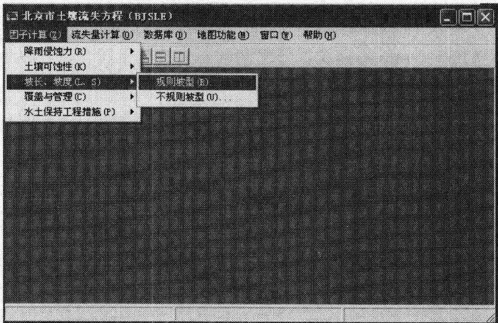  
图9.27 坡长、坡度因子获取模块

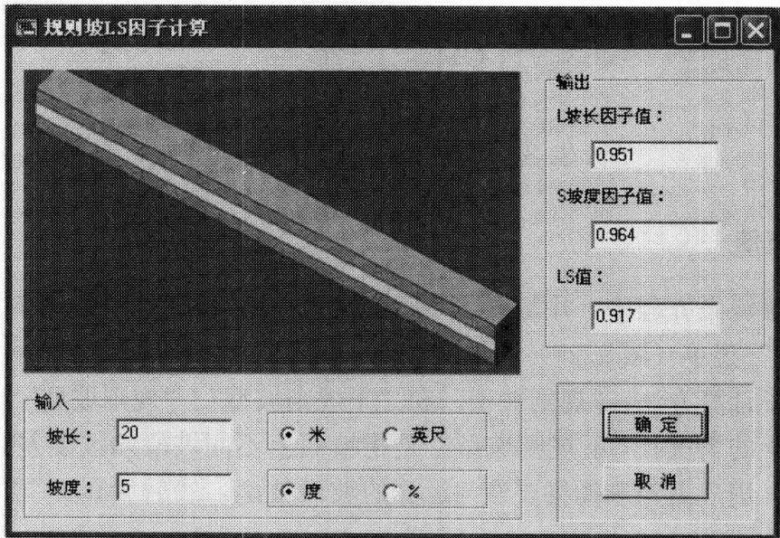  
图9.28 规则坡形坡长坡度因子LS计算模块

· 在坡度后文本框中输入坡度值，并选择坡度单位。系统提供的坡度单位是“度”和“%”，系统默认的坡度单位为“度”。

•确定输入无误后，点击“确定”按钮，即可获得该规则坡型的坡长因子L、坡度因子S和坡长坡度因子LS。

## 2）不规则坡型坡长坡度因子计算

• 如计算的坡面不是直型坡，则选择“不规则坡型”命令，弹出窗口如图9.29所示。不规则坡型的坡长坡度因子计算较为复杂，要准确输入所需的参数。

· 系统能够进行运算的不规则坡型范围包括3坡段、4坡段和5坡段3种，用户可根据实际需求用鼠标左键单击“3坡段”、“4坡段”或“5坡段”字样的按钮，即选择相应的坡段进行运算。

· 选择好分段坡的段数后，在相应界面下的总坡长后的文本框中输入坡段总坡长，并选择坡长单位“米”或“英尺”。

·在各坡段坡度后的文本框中输入该段坡面的坡度，并确认坡度的单位。需要注意的是“第一段”、“第二段”以及“第三段”坡段的排列顺序是以坡面顶部至坡脚排列，即靠近坡顶处为第一段，向坡底延伸至第三段，因此第一段坡的坡度是输入坡顶开始的那一段坡的坡度，依次类推。

·确认输入无误后，点击“确定”按钮，窗口输出显示的结果为不同坡段的LS值以及全坡段的LS值。

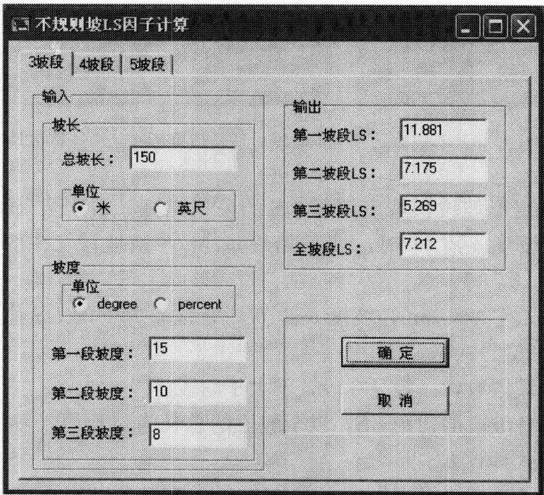  
图9.29 不规则坡形（3坡段）坡长坡度因子LS计算模块

• 如用户选择坡段总数为4段，同样点击“不规则坡LS因子计算”窗口中的“4坡段”按钮，窗口即切换为该坡段的窗口界面，如图9.30所示，其操作过程同上。不规则坡5坡段的LS因子计算方法与以上介绍过程相同，此处不再赘述。

## (2) 计算流程

坡长坡度因子的具体计算流程如下（图9.31）。

第一步：确定坡面是直形坡还是不规则坡，如果是直形坡转第二步，否则转第三步。

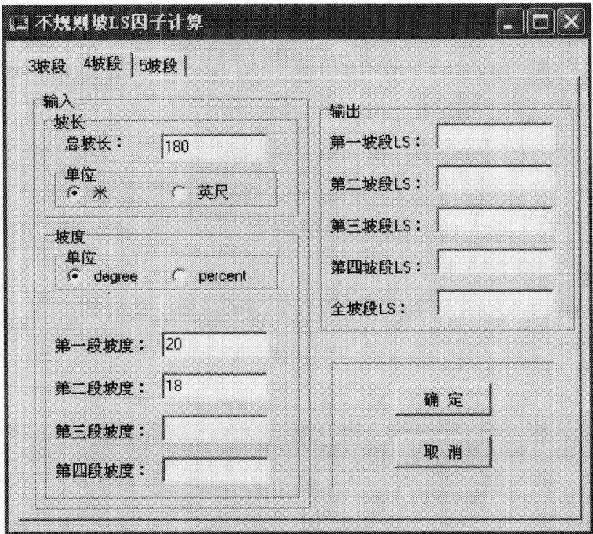  
图9.30 不规则坡形（4坡段）坡长坡度因子LS计算模块

第二步：计算直形坡坡长坡度因子LS的公式见（5.24）至（5.27）全坡面坡长$1 \mathrm { m } < \lambda < 5 \mathrm { m }$ ，坡度 $\theta < 5 ^ { \circ }$ 时，坡长始终取 $5 \mathrm { m }$ ，该坡段LS的计算公式采用式(5.26)。

全坡面坡长 $1 \mathrm { m } < \lambda < 5 \mathrm { m }$ ，坡度 $\theta \geq 5 ^ { \circ }$ 时，该条件下的LS值通过插值来得到，插值公式为式（5.28)。

第三步：划分坡段数，一般分3段，不大于5段。

第四步：计算各坡段的初始LS，以全坡段的总长为坡长值，各坡段的坡度为坡度值，按照第二步公式计算LS。

第五步：计算各坡段土壤流失量权重系数 $f _ { i }$ ，如式（9.9）和式（9.10）：

$$
f _ { i } = \frac { i ^ { m + 1 } - ( i - 1 ) ^ { m + 1 } } { n ^ { m + 1 } }\tag{9.9}
$$

$$
\sum _ { i = 1 } ^ { n } f _ { i } = 1\tag{9.10}
$$

式中， $f _ { i }$ 为坡段土壤流失量权重系数；i为坡段号；n为坡段总数。

第六步：各坡段初始LS值乘以各坡段土壤流失量权重系数 $f _ { i }$ ，等于各坡段实际LS值。

第七步：求各坡段LS的和即为全坡段值LS。

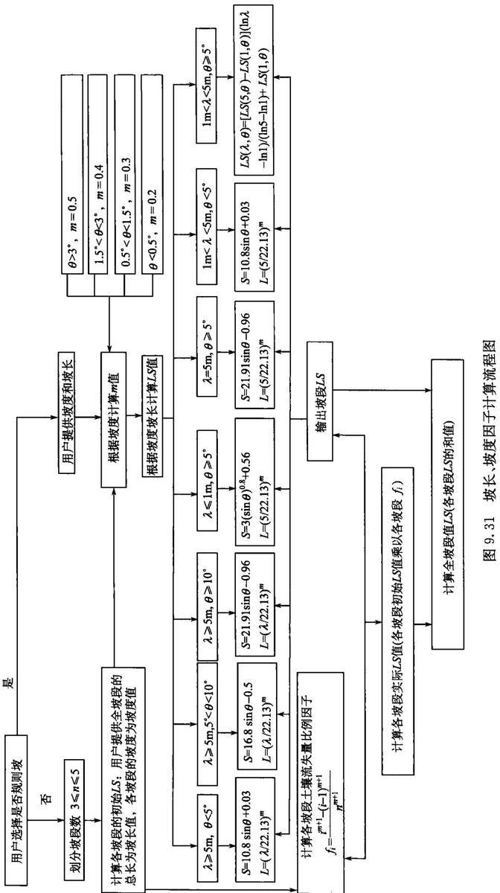

## 9.3.4 覆盖与管理因子子菜单

## (1) 菜单使用方法

“因子计算”菜单中的“覆盖与管理”模块（图9.32）提供了“公式计算”和“数据库获取”两种方法得到覆盖与管理因子（C)，系统根据北京市土地利用情况，提供了林地、草地农地3种土地利用类型的C值计算方法和多年实测平均值数据库。用户可根据资料拥有情况和不同目的，选择不同的方法。当用户已测得冠层、残茬以及砾石覆盖度参数时，建议采用“公式计算”方法获得C因子值，因为用此方法计算的结果优于数据库中多年观测资料获得的C因子值。“公式计算”模块操作步骤如下：

·用鼠标左键单击模型系统界面（图9.32）菜单栏的“因子计算”菜单；

· 鼠标左键单击“覆盖与管理”按钮；

·鼠标左键单击“公式计算”按钮，弹出窗口如图9.33所示，根据林地、草地和农地3种土地利用方式计算C因子。

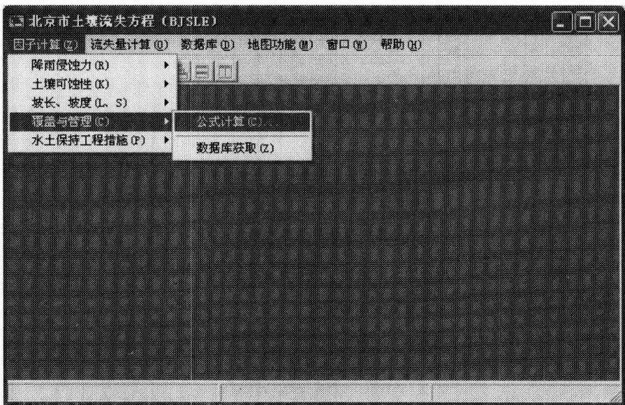  
图9.32 覆盖与管理因子获取模块

## 1）林地覆盖与管理因子计算

用“公式计算”模块（图9.32）获取林地覆盖与管理因子值（C）（图9.33）的操作步骤是：

·首先在“输入”栏中的“选择土地利用类型”复选框中选择林地，林地包含自然林和经济林，计算林地覆盖与管理因子值时，需已知冠层覆盖度及地表残茬与枯落物覆盖度；

·在冠层覆盖度后的文本编辑框内填写已测得的冠层覆盖度值，单位为%，数值输入范围为5\~90；

· 在残茬覆盖度后的文本编辑框内填写已测得的地表残茬及枯落物覆盖度值，单位为%，输入数值范围同样为5\~90；

·完成以上输入即可，窗口（图9.33）中其他选项为灰，即不需用户填写，点击“确定”按钮后即可获得C因子计算结果。

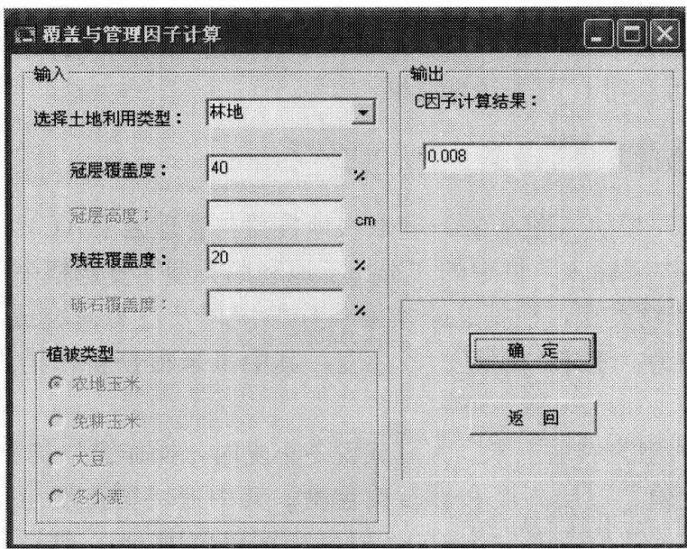  
图9.33 林地覆盖与管理C因子计算

## 2）草地覆盖与管理因子计算

用“公式计算”模块（图9.32）获取草地C因子值的操作步骤是：

·在图9.34中“输入”栏中的“选择土地利用类型”复选框中选择草地，草地包含了荒草地和人工草地，草地计算覆盖与管理因子值时同林地相同，需已知冠层覆盖度

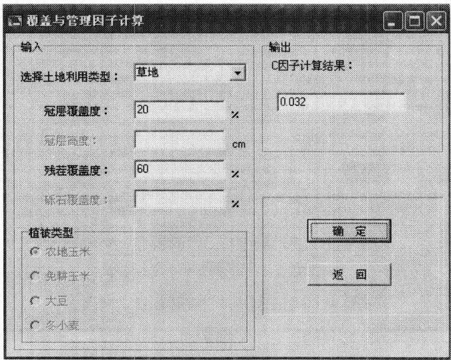  
图 9.34 草地覆盖与管理C因子计算

与地表残茬与枯落物覆盖度；

·在冠层覆盖度后的文本编辑框内填写已测得的冠层覆盖度值，单位为%，数值输入范围为5\~90；

· 在残茬覆盖度后的文本编辑框内填写已测得的地表残茬及枯落物覆盖度值，单位为%，输入数值范围同样为5\~90；

·完成以上输入即可，窗口（图9.34）中其他选项为灰，即不需用户填写，点击“确定”按钮后即可获得C因子计算结果。

## 3）农地覆盖与管理因子计算

用“公式计算”模块（图9.32）获取农地覆盖与管理因子（C）的操作步骤是：

·在图9.35中“输入”栏中的“选择土地利用类型”复选框中选择耕地。

·选择耕地作物类型，根据北京实际耕作情况以及已有研究成果，模型提供了3种作物类型，分别为：玉米、大豆、冬小麦，其中玉米根据耕作措施分为农地和免耕两种。

·如选择的类型为农地玉米、大豆或者冬小麦时，操作窗口如图9.35所示，需输入植被冠层覆盖度值、冠层高度和砾石覆盖度。其中冠层覆盖度与砾石覆盖度单位为%，冠层覆盖度输入数值范围为5～90，冠层高度单位为cm，砾石覆盖度输入数值范围为5\~80。

· 如选择的植被类型为免耕玉米时，操作窗口如图9.36所示，需输入植被冠层覆盖度、地表残茬及枯落物覆盖度值、冠层高度以及砾石覆盖度。其中地表残茬及枯落物覆盖度数值范围为5\~90，单位%，其他输入单位等与其他作物类型相同。

• 完成输入后点击“确定”按钮，即可获得C因子计算结果。

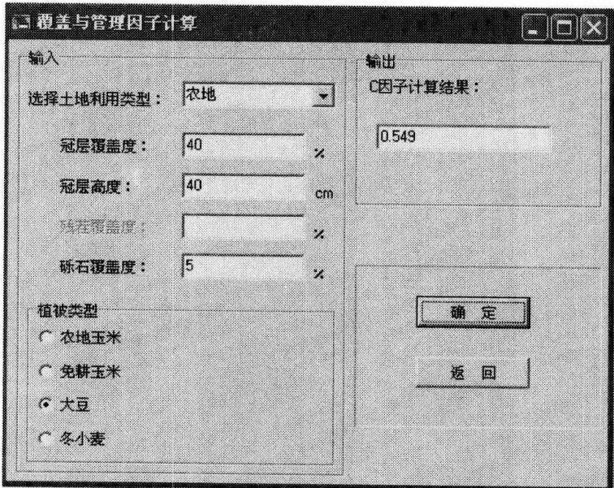  
图9.35 农地覆盖与管理C因子计算

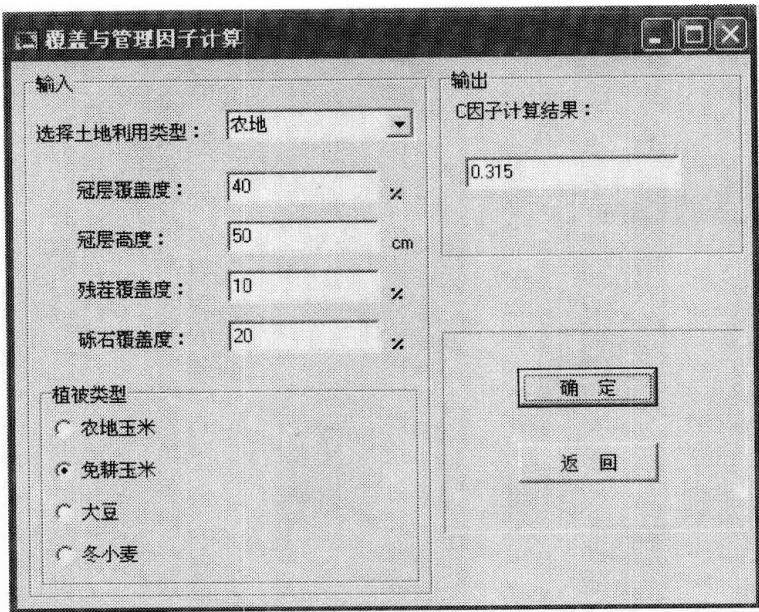  
图9.36 免耕玉米覆盖与管理C因子计算

“覆盖与管理”模块中除了可以通过“公式计算”获取因子值之外，还可从系统自带数据库中直接获取北京主要土地利用类型的覆盖与管理因子值（图9.37）。数据库中的覆盖与管理因子值是通过北京不同径流试验小区多年观测数据计算得到，其数据表格及数据库操作方法将在后面的数据组织中详细介绍。进入覆盖与管理因子数据库的操作步骤如下：

·选择模型系统界面（图9.37）菜单栏的“因子计算”菜单；

·用鼠标左键点击“覆盖与管理”按钮；

·用鼠标左键点击“数据库获取”按钮，弹出数据库列表如图9.38所示。

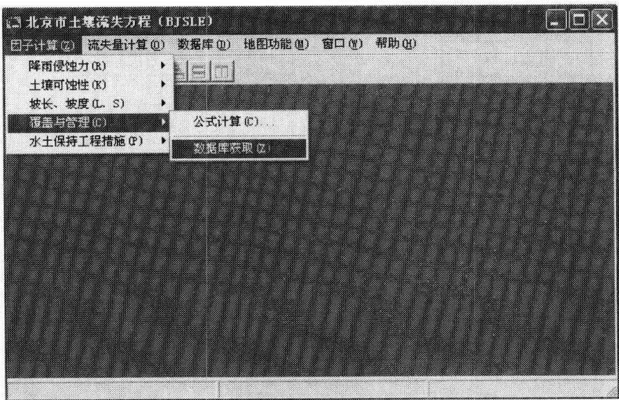  
图9.37 覆盖与管理因子数据库获取

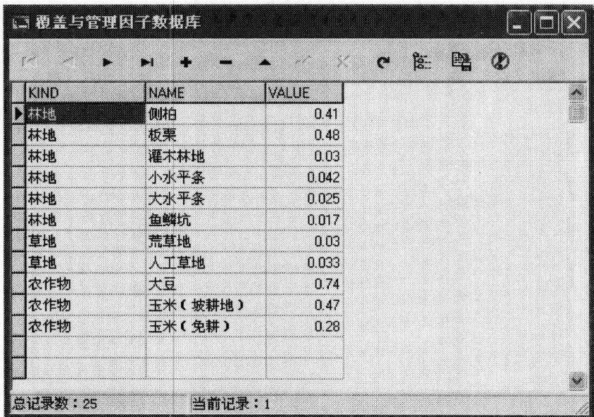  
图9.38 覆盖与管理因子数据库

## (2) 计算流程

覆盖与管理因子的具体计算流程如下（图9.39）。

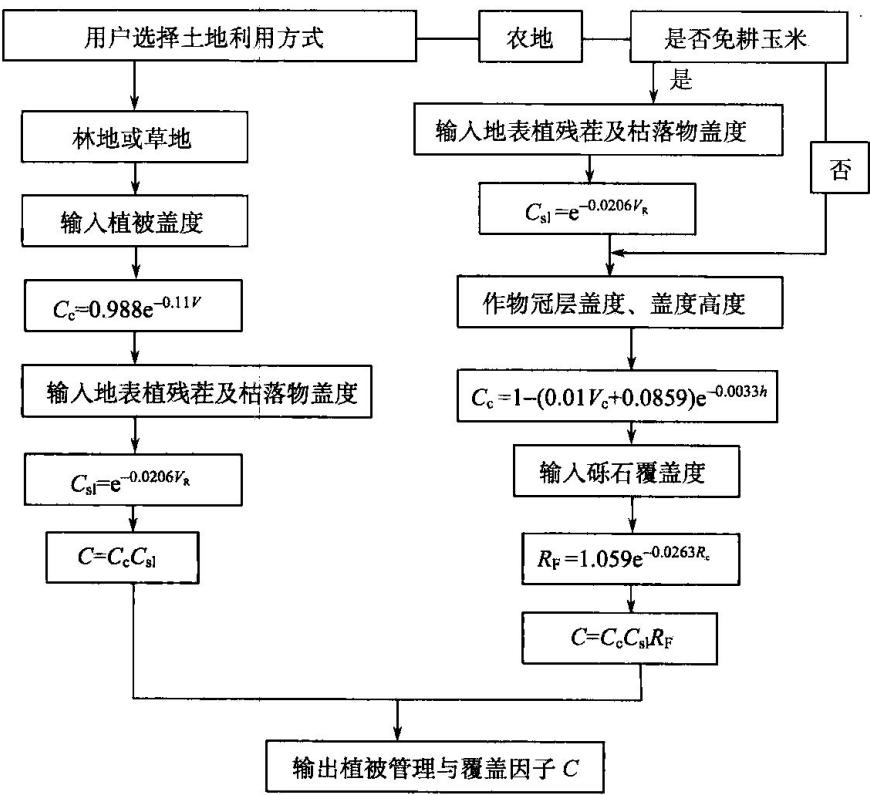  
图9.39 覆盖与管理因子计算流程图

第一步：用户选择土地利用方式，如为林地或草地，进行第二步；如为农地，进行第三步。

第二步：用户输入植被盖度和地表植残茬及枯落物盖度数值，计算林、草地覆盖与管理因子值。林地和草地的覆盖与管理因子（C）与农地的C因子计算方法有所差别，林草地的C因子可认为是两个次因子植被冠层覆盖次因子 $( C _ { \mathrm { { c } } } )$ 和地表残茬及枯落物覆盖因子 $( C _ { \mathrm { { s } } } )$ 的乘积，即为

$$
C = C _ { \mathrm { c } } C _ { \mathrm { s } }\tag{6.3}
$$

其中植被冠层覆盖子因子 $( C _ { \mathrm { { c } } } )$ 的计算公式如关系式（6.8）：

$$
C _ { \mathrm { c } } = 0 . 9 8 8 \mathrm { e } ^ { - 0 . 1 1 V }\tag{6.8}
$$

估算地表枯落物因子 $( C _ { \mathrm { { s l } } } )$ 的公式如式（6.5）：

$$
C _ { \mathrm { s l } } = \mathrm { e } ^ { - 0 . 0 2 0 6 V } \mathrm { R }\tag{6.5}
$$

第三步：用户选择植被类型，如为免耕玉米，则进行第四步，否则第五步。

第四步：用户输入作物冠层盖度、盖度高度、地表植残茬及枯落物盖度和砾石覆盖度，计算免耕玉米地覆盖与管理因子值。农地的覆盖与管理因子（C）可认为是植被冠层覆盖子因子 $( C _ { \mathrm { c } } )$ 、地表枯落物覆盖子因子 $( C _ { \mathrm { { s l } } } )$ 和地表砾石覆盖因子 $( R _ { \mathtt { F } } )$ 三者的乘积，即为

$$
C = C _ { \mathrm { c } } C _ { \mathrm { s } }\tag{9.11}
$$

农地的植被观测覆盖因子 $( C _ { \mathrm { { c } } } )$ 的计算公式与林草地的不同，是通过冠层盖度和冠层高度回归得到，计算公式为

$$
C _ { \mathfrak { c } } = 1 - ( 0 . 0 1 V _ { \mathfrak { c } } + 0 . 0 8 5 9 ) \mathrm { e } ^ { - 0 . 0 0 3 3 }\tag{6.4}
$$

农地地表枯落物因子 $( C _ { \mathrm { { s l } } } )$ 的公式与林草地的估算公式相同，见式（6.5）。砾石覆盖因子反映地表砾石覆盖对土壤侵蚀的影响，是通过人工降雨模拟试验建立的，其计算公式为

$$
R _ { \mathrm { F } } = 1 . 0 5 9 \mathrm { e } ^ { - 0 . 0 2 6 3 R _ { \mathrm { c } } }\tag{6.6}
$$

第五步：用户输入作物冠层盖度、冠层高度和砾石覆盖度，计算其他农地覆盖与管理因子值。

## 9.3.5 水土保持工程措施因子子菜单

## (1) 菜单使用方法

“因子计算”中的“水土保持工程措施”模块（图9.40）提供了“公式计算”和“数据库获取”两种获得水土保持工程措施因子（P）的方法。值得注意的是，数据库中提供的工程措施值是小区测量的多年平均值，当降雨量大于20mm时，建议采用“公式计算”方法。“公式计算”模块操作步骤如下：

· 用鼠标左键单击模型系统界面（图9.40）菜单栏的“因子计算”按钮；

·用鼠标左键单击“水土保持工程措施”按钮；

·鼠标左键单击“公式计算”按钮，弹出窗口如图9.41所示，“水土保持工程措施因子计算”是根据不同工程措施以及和降雨量的关系来计算P因子值。

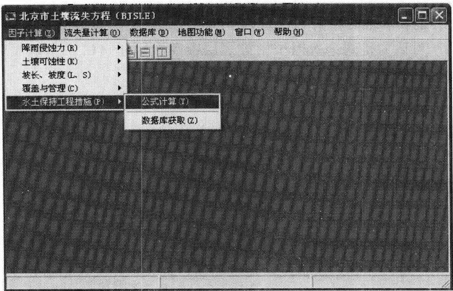  
图9.40 水土保持工程措施因子获取模块

“公式计算”模块（图9.41）的操作步骤是：

·首先在图9.41所示菜单“输入”栏内的“工程措施选择”复选框中选择待计算的工程措施，根据北京市的水土保持工程措施实际情况以及现有研究数据，模型可选择5种工程措施，分别为鱼鳞坑、水平条、树盘、梯田以及免耕玉米；

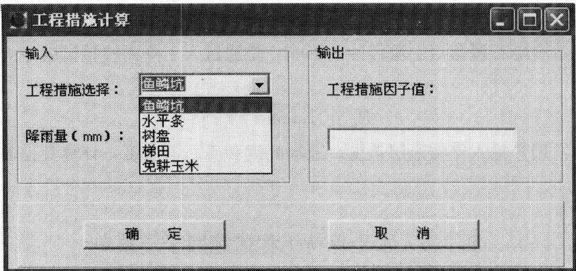  
图9.41 工程措施因子计算

·如工程措施为鱼鳞坑、水平条、树盘时，需要用户提供次降雨量，在“降雨量”后的文本编辑框内输入次降雨量，单位为mm；

·如工程措施为梯田和免耕玉米，则降雨量输入框为灰，则表示用户无需输入数值；

• 点击“确定”按钮，即可得到计算后的P因子值。

还可从系统自带的数据库中获得工程措施因子值（图9.42)，这些值大多是基于北京市径流试验小区天然降雨观测和人工降雨试验数据得到的，是小区观测资料的多年平均值。其数据表格及数据库操作方法将在后面的数据组织中详细介绍。进入水土保持工程措施因子数据库的操作步骤如下：

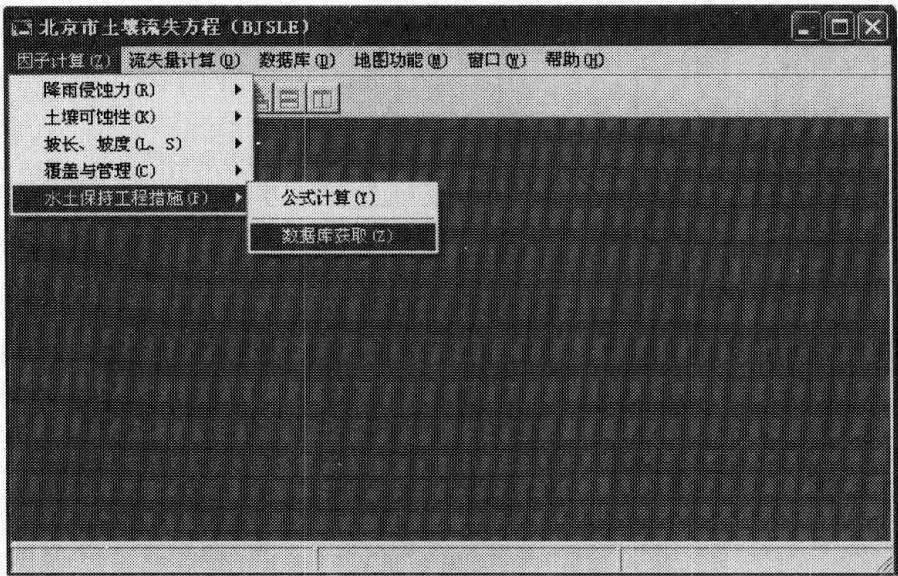  
图9.42 水土保持工程措施因子数据库获取

·用鼠标左键单击模型系统界面（图9.42）菜单栏的“因子计算”按钮；

·用鼠标左键单击“水土保持工程措施”按钮；

·用鼠标左键单击“数据库获取”按钮，弹出数据库列表如图9.43所示。

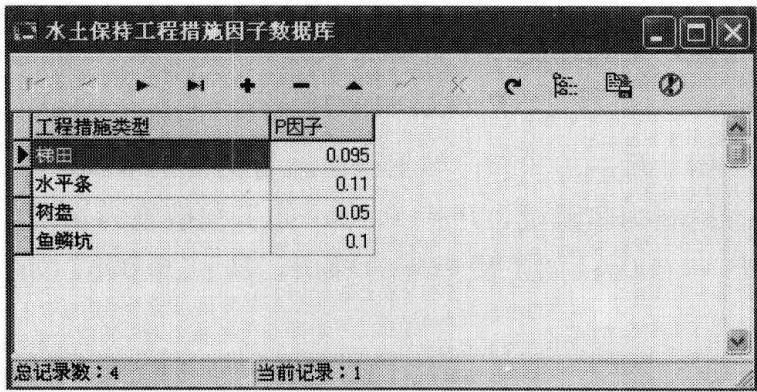  
图9.43 水土保持工程措施因子数据库

## (2) 计算流程

水土保持工程措施因子（P）的计算流程如下（图9.44）。

第一步：用户选择工程措施，输入降雨量 $( P _ { \mathrm { { r } } } )$ 。如降雨量大于20 mm转第二步，否则转第三步。

第二步：如工程措施为鱼鳞坑，工程措施因子计算公式为

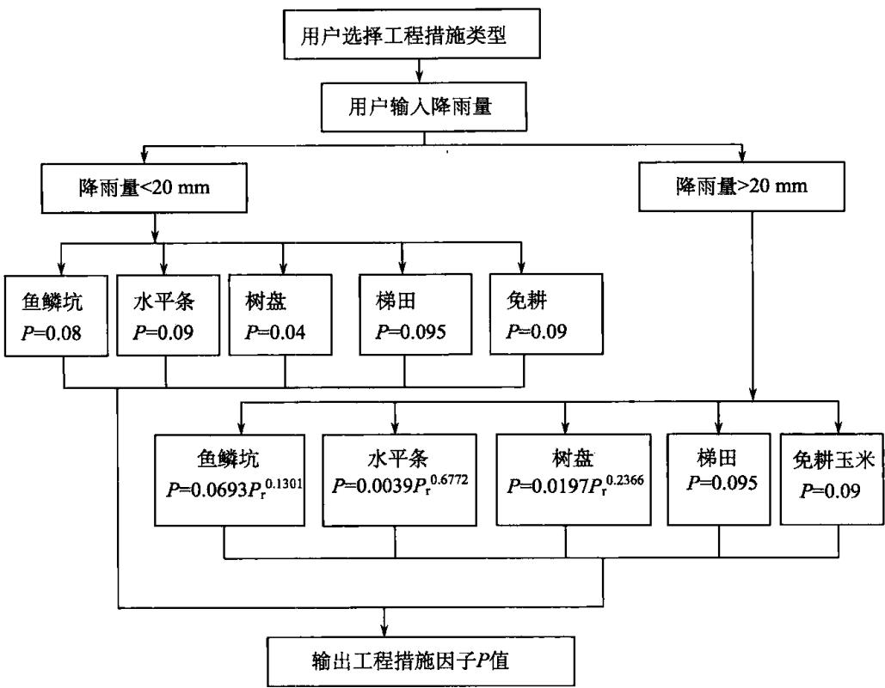  
图9.44 水土保持管理因子计算流程图

$$
P = 0 . 0 6 9 3 P _ { \mathrm { r } } ^ { 0 . 1 3 0 1 }\tag{7.3}
$$

如工程措施为水平条，工程措施因子计算公式为

$$
P = 0 . 0 0 3 9 P _ { \mathrm { { r } } } ^ { 0 . 6 7 7 2 }\tag{7.2}
$$

如工程措施为树盘，工程措施因子计算公式为

$$
P = 0 . 0 1 9 7 P _ { \mathrm { ~ r ~ } } ^ { 0 . 2 3 6 6 }\tag{7.4}
$$

如工程措施为梯田， $P = 0 . 0 9 5$ ；如工程措施为免耕玉米， $P = 0 . 0 9$ 0

第三步：如工程措施为鱼鳞坑， $P = 0 . 0 8$ ；如工程措施为水平条， $P = 0 . 0 9$ ；如工程措施为树盘， $P = 0 . 0 4$ ；如工程措施为梯田， $P = 0 . 0 9 5$ ；如工程措施为免耕玉米， $P = 0 . 0 9$

## 9.4 土壤流失量计算菜单

## 9.4.1 新建预报表菜单

北京土壤流失方程的核心功能是预报坡面土壤流失量，该功能由“流失量计算”模块（图9.45）完成。该模块包含两个运行模块：“新建预报表”和“打开预报表”。

按鼠标左键单击图9.45中的“流失量计算”菜单下的“新建预报表”按钮，弹出“新建土壤流失预报表”（图9.46）。“新建土壤流失预报表”模块的功能是系统调用每

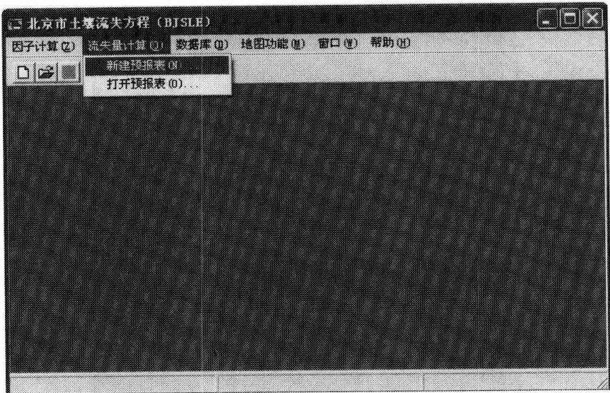  
图9.45 流失量计算模块

个因子模块、分析计算各因子值，同时计算坡面土壤流失量，并将预报结果存放到数据库中。该模块的操作步骤如下：

## 1）输入名称

首先在窗口（图9.46）中的“地区”文本编辑框内输入地区或者坡面名称。

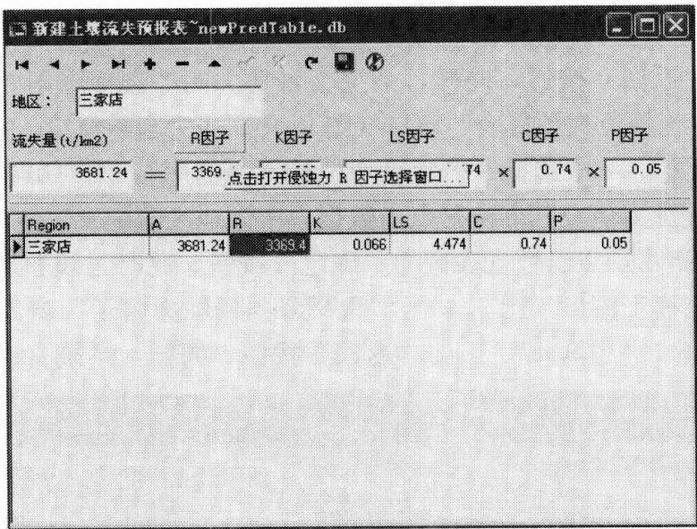  
图9.46 新建土壤流失预报表

## 2）返回R 因子值

· 单击窗口（图9.46）中的“R因子”按钮，或双击“R因子”按钮下的文本框，弹出窗口如图9.47所示的“选择降雨侵蚀力因子”窗口。

·在“选择降雨侵蚀力因子”窗口（图9.47）中选择因子获取方法，然后点击“确定”按钮，如选择“次降雨侵蚀力因子计算”，则弹出窗口如图9.48所示；如选择“多年平均侵蚀力数据库”，则弹出窗口“多年平均年降雨侵蚀力数据库”（图9.49)。

  
图9.47 选择降雨侵蚀力因子

·“侵蚀力计算”窗口（图9.48）的操作方法是点击“次降雨过程输入…”按钮，选择待计算的已有的次降雨过程数据后，点击“获取…”按钮，此时会在窗口（图9.48）中的“R因子值”后显示计算得到的R值，并且系统自动关闭“侵蚀力计算”窗口（图9.48)，“选择降雨侵蚀力因子”窗口（图9.47）变为当前窗口。点击窗口(图9.47)中的“返回”按钮，同样，系统会自动关闭“选择降雨侵蚀力因子”窗口(图9.47)，“新建土壤流失预报表”窗口（图9.46）变为当前窗口，并返回R因子值。

·如在窗口图9.47中选择“多年平均侵蚀力数据库”，用户可在此数据库中挑选待测地点的降雨侵蚀力值。其方法是点击数据表中该地区的记录，使其被选中，即颜色变深，如图9.49所示，点击数据表旁的“确定”按钮。此时系统自动关闭“多年平均年降雨侵蚀力数据库”窗口（图9.49)，“选择降雨侵蚀力因子”窗口（图9.47）变为当前窗口。点击窗口（图9.47）中的“返回”按钮，同样，系统自动关闭“选择降雨侵蚀力因子”窗口（图9.47)，“新建土壤流失预报表”（图9.46）变为当前窗口，并返回 R因子值。

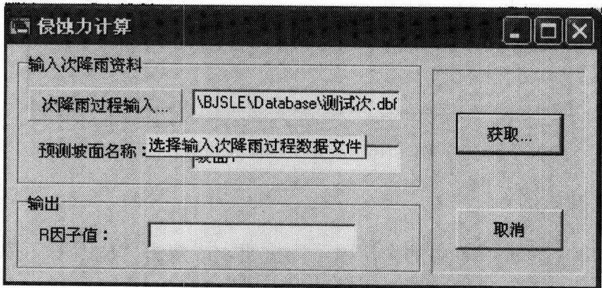  
图9.48 次降雨侵蚀力因子计算

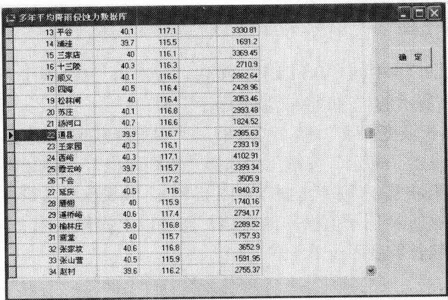  
图9.49 多年平均年降雨侵蚀力数据库

## 3）返回K因子值

• 单击窗口图9.46中的“K因子”按钮，或双击“K因子”按钮下的文本框，弹出窗口如图9.50所示的“选择土壤可蚀性因子”窗口。

·在“选择土壤可蚀性因子”窗口（图9.50）中选择因子获取方法，然后点击“确定”按钮。如选择“修正EPIC法计算”，则弹出如图9.22所示的窗口；如选择“修正诺谟图法计算”，则弹出如图9.23所示的窗口；若选择“土壤可蚀性因子数据库”，则弹出窗口“土壤可蚀性因子数据库”（图9.25)。具体的操作方法可参考前文中的介绍。通过以上操作，图9.46中的“新建土壤流失预报表”中会返回土壤可蚀性因子K值。

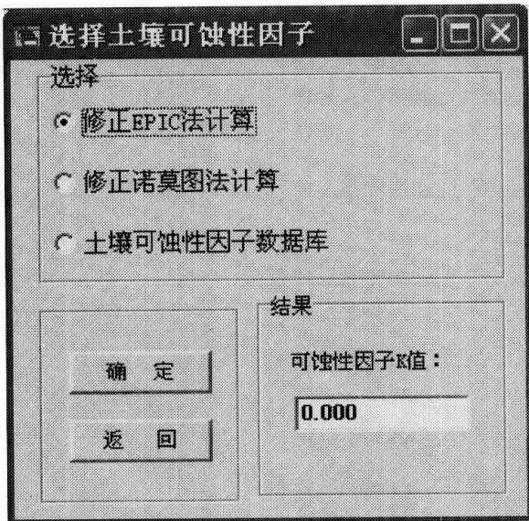  
图9.50 选择土壤可蚀性因子

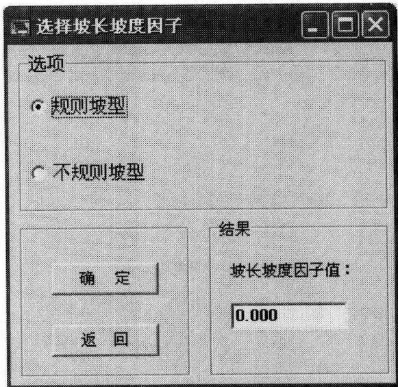  
图9.51 选择坡长坡度因子

## 4）返回LS因子值

·单击窗口图9.46中的“LS因子”按钮，或双击“LS因子”按钮下的文本框，弹出窗口如图9.51所示的“选择坡长坡度因子”窗口。

·在“选择坡长坡度因子”窗口（图9.51）中选择获取规则坡还是不规则坡的坡长坡度因子，然后点击“确定”按钮。如选择“规则坡型”，则弹出如图9.28所示的窗口；如选择“不规则坡型”，则弹出窗口（图9.29)。其操作方法可参考前面LS因子获取操作介绍与以上返回R因子值操作的介绍。通过以上操作，图9.46“新建土壤流失预报表”中会返回坡长坡度因子LS值。

## 5）返回C因子值

· 单击窗口（图9.46）中的“C因子”按钮，或双击“C因子”按钮下的文本框，弹出窗口如图9.52所示的“选择覆盖与管理因子”窗口。

·在“选择覆盖与管理因子”窗口（图9.52）中选择因子获取方法，然后点击“确定”按钮。如选择“公式计算”，则弹出图9.33所示的窗口；若选择“覆盖与管理因子数据库”，则弹出窗口“覆盖与管理因子数据库”（图9.38)。其操作方法可参考前面覆盖与管理因子获取操作的介绍与以上返回R因子值操作的介绍。通过以上操作，图9.46中的“新建土壤流失预报表”中会返回覆盖与管理因子C值。

## 6）返回 P 因子值

· 单击窗口（图9.46）中的“P因子”按钮，或双击“P因子”按钮下的文本框，弹出窗口如图9.53所示的“选择工程措施因子”窗口。

·在“选择工程措施因子”窗口（图9.53）中选择因子获取方法，并点击“确定”按钮。如选择“公式法计算”，则弹出图9.41所示“公式计算”窗口；若选择“工程措施因子数据库”，则弹出窗口“水土保持工程措施因子数据库”（图9.43)。其具体操作

  
图9.52 选择覆盖与管理因子

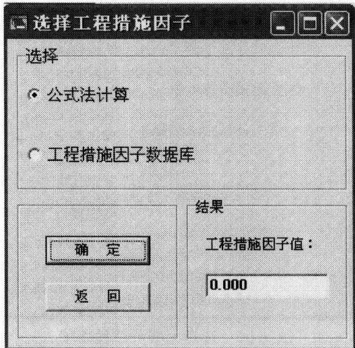  
图9.53 选择水土保持工程措施因子

方法同样可参考前面水土保持工程措施因子获取操作的介绍与以上返回R因子值操作的介绍。通过以上操作，图9.46“新建土壤流失预报表”中会返回水土保持工程措施因子P值。

## 7）返回流失量值

完成以上全部因子取值后，系统会自行计算相应的土壤流失量，单位为t/km²，如图9.46所示。此时，完成系统会自动将此次计算的土壤流失量和各因子值添加到数据表中，并开始下一次计算。

## 8）保存数据表

完成上述操作后，点击窗口（图9.46）工具条中的“保存记录表”按钮可存储新建立或修改后的数据表，数据表存储支持两种格式，文本数据库\*.txt文件与Paradox数据库文件（\*.db）。

利用鼠标左键单击窗口（图9.46）中的工具条（图9.54）上的按钮可进行数据表的添加、删除、编辑和保存等操作。工具条（图9.54）中每个按钮的作用从左至右依次是：首记录、前一条记录，后一条记录、尾记录、添加记录、删除记录、编辑、保存编辑、取消编辑、刷新记录、保存预报表、退出功能。

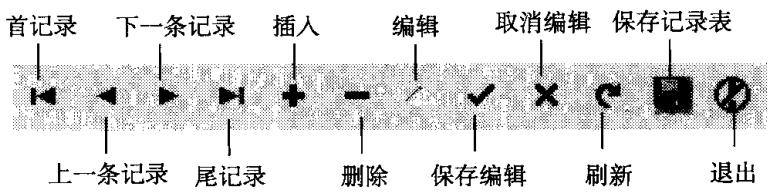  
图9.54 数据库窗口工具条

## 9.4.2 打开预报表模块

“流失量计算”模块中的另一子模块“打开预报表”的功能是用户可通过此模块，导入通过“新建预报表”模块建立的土壤流失量数据库，或者以其他方式建立的已有的数据库，并对导入的数据库进行删除、添加、修改等操作。“打开预报表”的操作步骤如下：

· 用鼠标左键单击模型系统界面（图9.55）菜单栏的“流失量计算”；

·用鼠标左键单击“打开预报表”子菜单，弹出“打开”窗口如图9.56所示；

· 选择待打开的已有的符合侵蚀预报表结构的土壤流失量数据表，点击窗口（图9.56）中“打开”按钮，用户可对打开的侵蚀预报表重新分析或计算影响土壤流失量的各因子值。

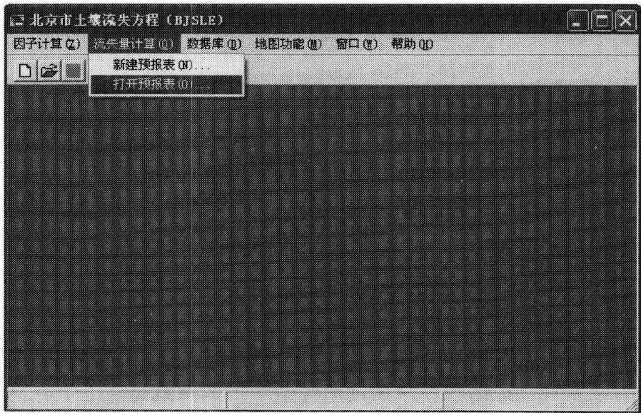  
图 9.55 打开数据表窗口

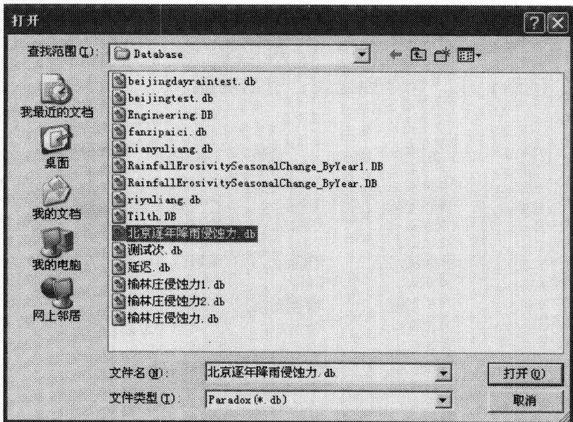  
图 9.56 打开文件窗口

## 9.5 数据库模块

## 9.5.1 数据库设计

北京土壤流失方程的数据库建设是基于数据库需求分析和可获得资料分析进行的，建设流程见图9.57。数据库需求主要在模型运算需求、用户咨询需求以及科研需求三方面分析的基础上设计，并综合分析可获得资料，包括数据资料、基础图件资料以及研究成果资料，归类整理为所需数据元格式。

数据库框架结构主要分为二级（图9.58）：一级子数据库包括基础资料、模型支持以及用户服务数据库；二级子数据库包括土壤流失方程因子计算所需各类数据库以及展示给用户的最终数据表格。

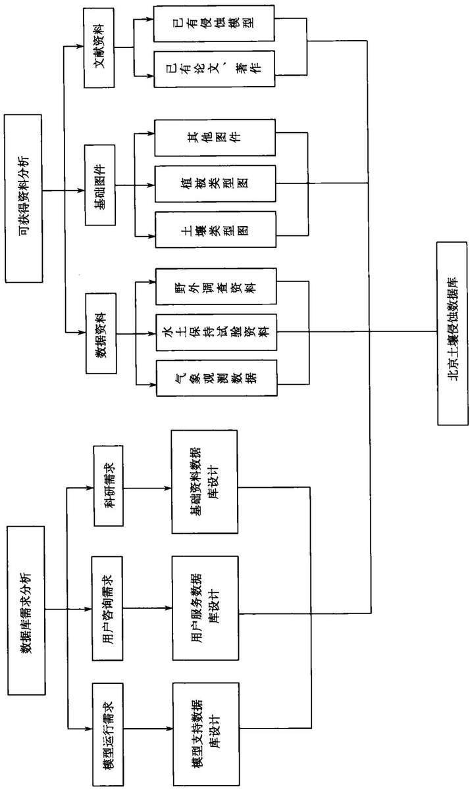  
图关垫梁带使垫

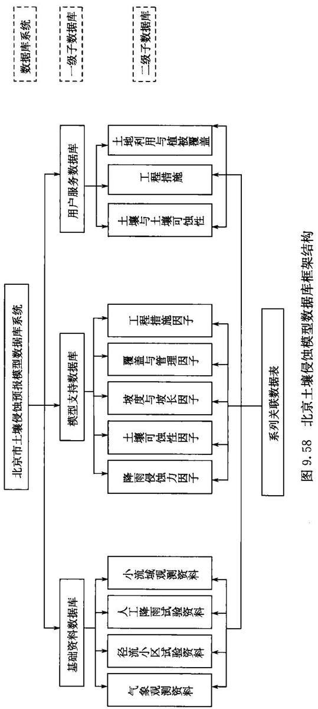

北京土壤流失方程的运行需要各种类型的资料，这些数据存放在不同的数据表文件中。根据资料类型，采用的数据划分成六大类：①降雨量数据；②降雨侵蚀力数据；③土壤可蚀性因子数据；④水土保持措施数据；⑤土壤侵蚀预报表；⑥图数据。其中前5种类型又可以归为属性数据。数据文件一般采用dBase4数据库格式（\*.dbf)，部分采用了文本文件（\*.txt）和Paradox数据格式（\*db）。

## 9.5.2 数据库操作

“数据库”模块主要是模型提供的可展示给用户的各种数据库，包括北京市的各种因子数据库以及因子计算所需的基础数据库、参数数据库，用户可通过数据库模块对数据库进行查询、排序、添加和删除等操作。

## (1) 降雨侵蚀力

## 1）次降雨侵蚀力数据库操作

通过数据库模块进行次降雨侵蚀力数据库（图9.59）的操作步骤如卜：

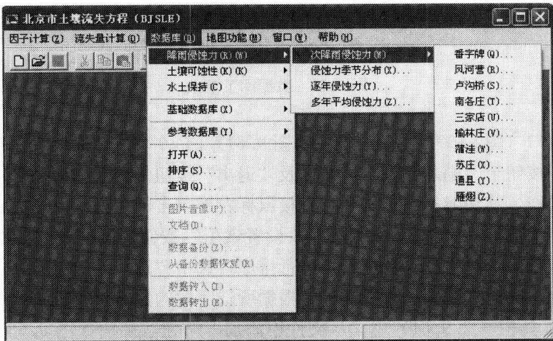  
图9.59 获取次降雨侵蚀力数据库模块

·用鼠标左键单击模型系统界面菜单栏的“数据库”；

·用鼠标左键单击“降雨侵蚀力”子菜单；

·用鼠标左键单击“次降雨侵蚀力”，此时可以看到子菜单栏中列出了北京市10个雨量站点的站名；

·点击其中某一站点，弹出该站点1980～2004年的次降雨过程数据窗口（图9.60)，用户可以通过窗口的工具栏对该数据表进行查看、插入、删除和排序数据等操作，工具栏中各图标按钮的功能如图9.61所示。

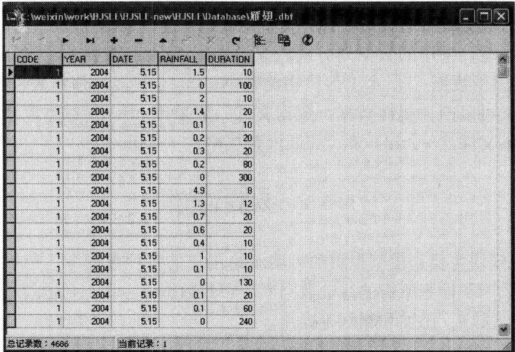  
图 9.60 降雨过程数据库

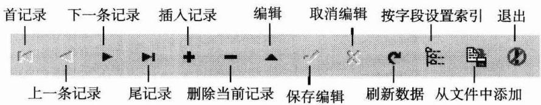  
图 9.61 数据库工具条

数据表窗口（图9.60）中的工具栏（图9.61）前10个按钮以及最后一个按钮，即从“首记录”按钮至“刷新数据”按钮以及“退出”按钮的功能主要是针对数据表格中的记录进行操作，其功能如图中所标，直接鼠标左键单击即可操作。

• 点击工具栏（图9.61）中“按字段设置索引”按钮，弹出窗口如图9.62所示。该窗口的功能是可选择字段对数据表格进行排序，选中“选择索引字段”文本框内所列的字段，点击“确定”按钮，数据文件将根据所选字段的数值大小重新排序显示。

•点击工具栏（图9.61）中“从文件中添加”按钮，弹出如图9.63所示的窗口，该窗口的主要作用是可以将另外数据表格追加到目前打开的数据表格中。点击“数据来源”按钮，从打开窗口中选择要添加的新数据表格，单击“确定”按钮，数据进行追加操作。注意要追加进数据库的文件格式必须与打开的数据库格式一致，避免出错。

## 2）降雨侵蚀力季节分布数据库

通过数据库模块进行季节降雨侵蚀力数据库（图9.64）的操作步骤如下：

•用鼠标左键单击模型系统界面菜单栏的“数据库”菜单；

· 用鼠标左键单击“降雨侵蚀力”按钮；

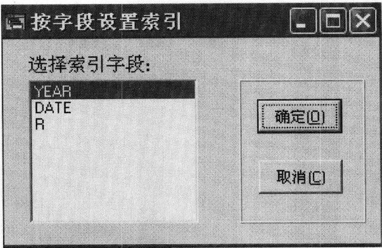  
图9.62 工具条按钮（按字段设置索引）

  
图9.63 工具条按钮（从文件中添加）

·用鼠标左键单击“侵蚀力季节分布”菜单，弹出“降雨侵蚀力季节分布数据库编辑（多年平均)”窗口（图9.65)，该窗口（图9.65）的功能是显示多年平均年降雨侵蚀力值以及其逐月分布情况，还能对降雨侵蚀力数据进行简单的统计运算；

·用户可以通过窗口（图9.65）中的工具栏对该数据表进行查看、插入、删除和排序数据等操作，工具栏中各图标按钮的功能如图9.66所示。

“降雨侵蚀力季节分布数据库编辑（多年平均）”窗口（图9.65）中的工具栏（图9.66）前8个按钮以及最后一个按钮的功能主要是针对数据表格中的记录进行操作，其功能如图9.66中所标，直接鼠标左键单击即可操作。

·当鼠标点击工具栏（图9.66）中“数据浏览”按钮，弹出数据表格窗口如图9.67所示，该数据表为“降雨侵蚀力季节分布数据库编辑（多年平均）”窗口（图9.65）所显示的后台多年平均年降雨侵蚀力数据。

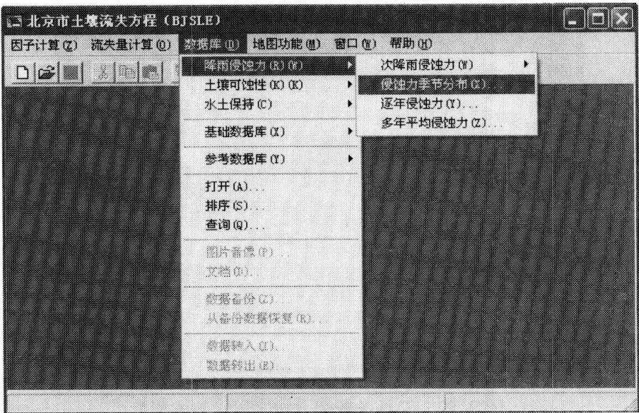  
图9.64 降雨侵蚀力季节分布数据库获取

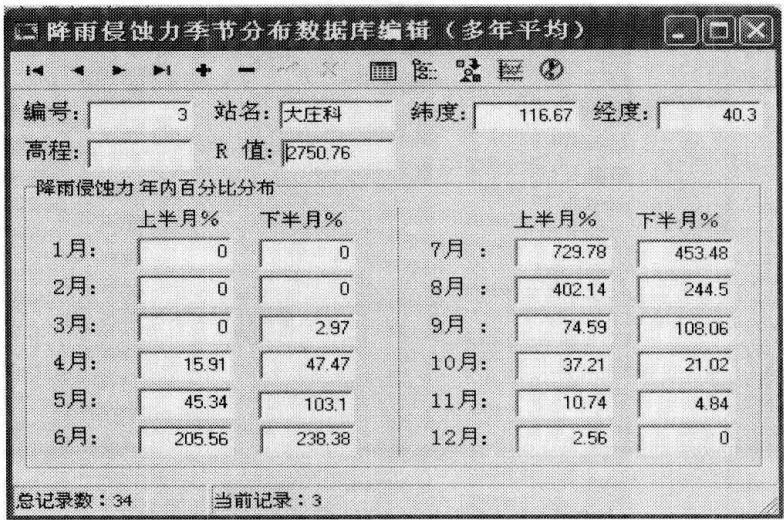  
图9.65 降雨侵蚀力季节分布数据编辑窗口

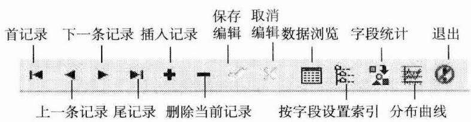  
图9.66 数据编辑窗口工具条

·点击工具栏（图9.66）中“按字段设置索引”按钮，弹出窗口如图9.68所示。该窗口的功能以及操作与图9.62中所示的索引窗口一致。

·点击工具栏（图9.66）中“字段统计”按钮，弹出窗口如图9.69所示，该窗口的功能是对后台数据进行简单的统计运算。点击“选择统计字段”后的下拉列表，选择其中的某一字段，点击“确定”按钮。下面文本框中会显示统计结果，如图9.69所示，选择“降雨侵蚀力季节分布数据库编辑（多年平均)”窗口的后台多年平均年降雨侵蚀力数据中的字段“R值”进行统计，可得统计结果如最大值、最小值、平均值、总和、方差以及标准差结果，返回数据表可点击关闭按钮。

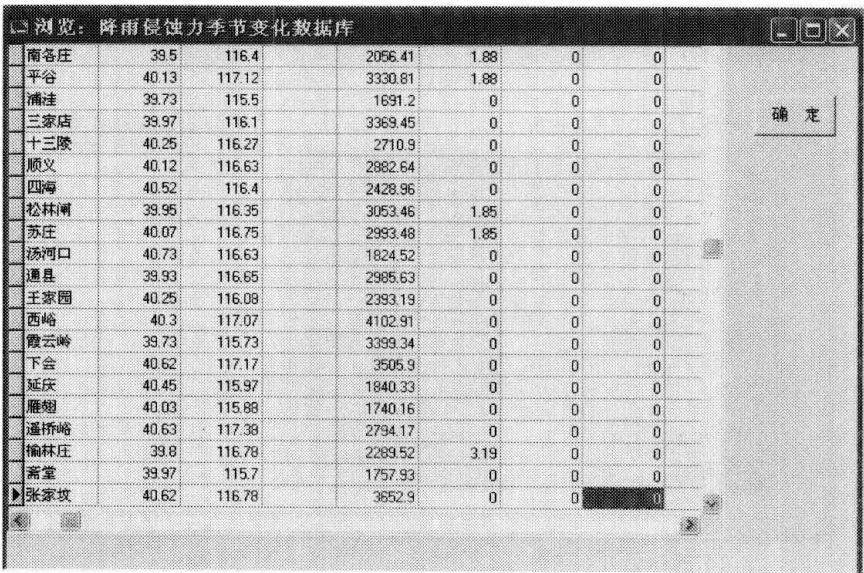

图9.67 降雨侵蚀力季节分布数据表  
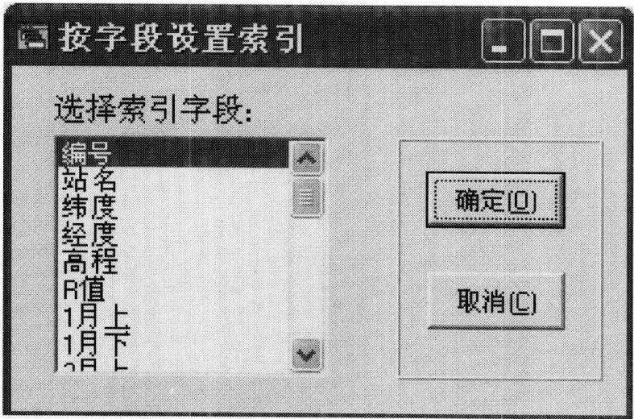  
图9.68 工具条按钮（按字段设置索引）

•点击工具栏（图9.66）中“分布曲线”按钮，弹出窗口如图9.70所示，图中给出的是降雨侵蚀力百分比的半月分布情况。

## 3）逐年降雨侵蚀力数据库操作

通过数据库模块进行逐年降雨侵蚀力数据库（图9.71）的操作步骤如下：

• 打开系统界面菜单栏的“数据库”菜单；

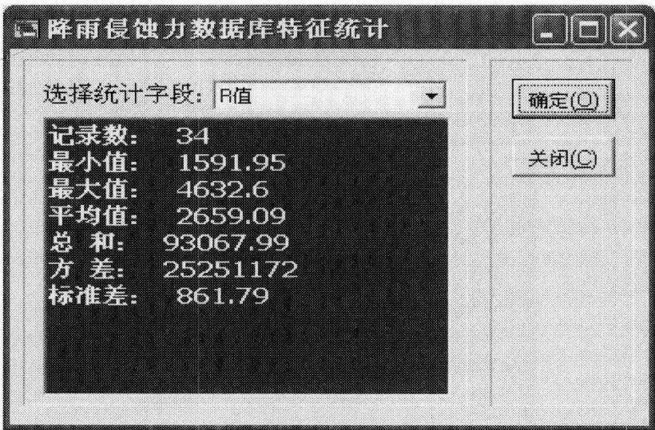  
图9.69 工具条按钮（字段统计）

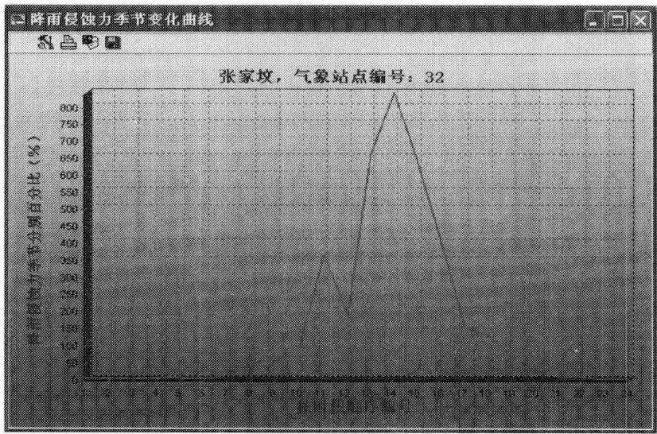  
图9.70 工具条按钮（分布曲线）

·用鼠标左键单击“降雨侵蚀力”按钮；

·用鼠标左键单击“逐年侵蚀力”按钮，弹出“逐年降雨侵蚀力数据库编辑”窗口（图9.72)。该窗口的功能是显示逐年降雨侵蚀力值，以及对降雨侵蚀力数据进行简单的统计运算。“逐年降雨侵蚀力数据库编辑”窗口与“降雨侵蚀力季节分布数据库编辑（多年平均)”窗口的窗口界面以及功能相同，可参考之前介绍。

## 4）多年平均年降雨侵蚀力数据库操作

通过数据库模块进行多年平均年降雨侵蚀力数据库（图9.73）的操作步骤如下：

· 打开系统界面菜单栏的“数据库”菜单；

•用鼠标左键单击“降雨侵蚀力”按钮；

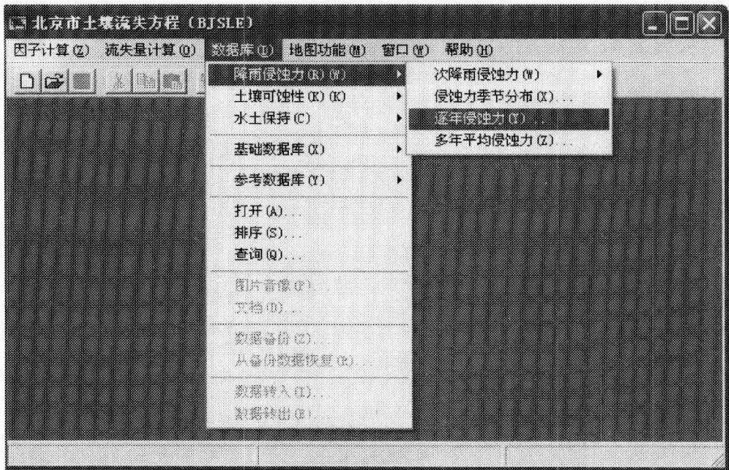  
图9.71 获取逐年降雨侵蚀力数据库模块

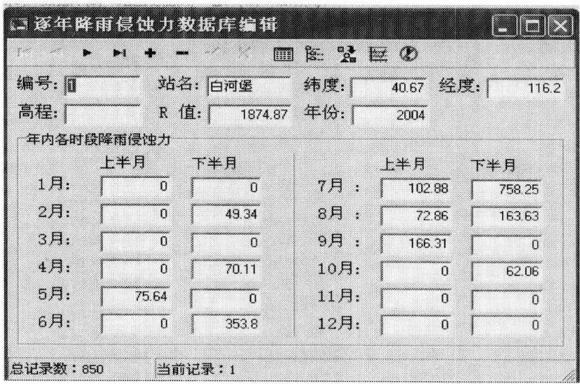  
图9.72 逐年降雨侵蚀力数据编辑窗口

·用鼠标左键单击“多年平均侵蚀力”按钮，弹出“多年平均侵蚀力数据库”窗口（图9.74)。该窗口的功能是逐条显示多年平均年降雨侵蚀力值。“逐年降雨侵蚀力数据库编辑”窗口与之前介绍的“降雨侵蚀力季节分布数据库编辑（多年平均)”窗口的工具条功能相同，可参考之前介绍。

## (2) 土壤可蚀性

土壤可蚀性因子数据库（图9.75）的操作步骤如下：

·用鼠标左键单击模型系统界面菜单栏中的“数据库”菜单；

·用鼠标左键单击“土壤可蚀性”按钮，弹出数据窗口如图9.76所示，数据表中

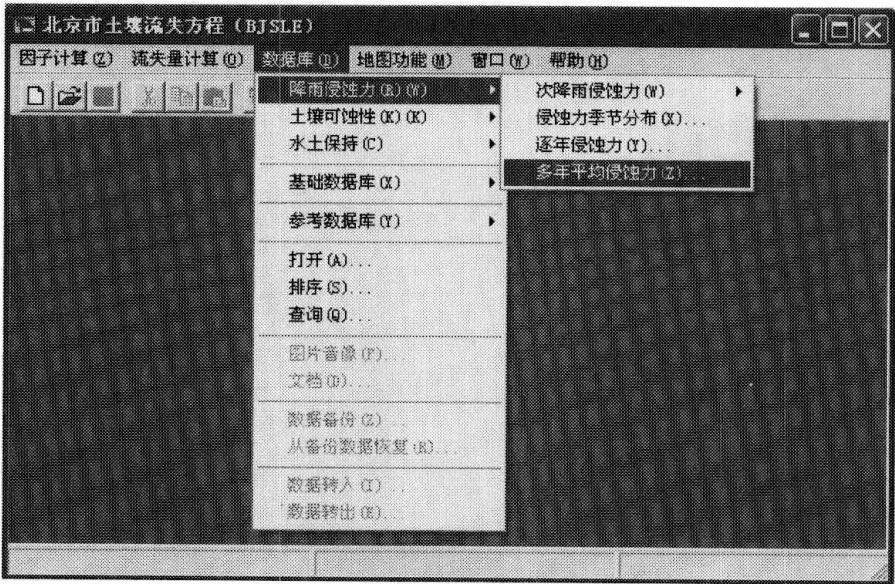  
图9.73 获取多年平均年降雨侵蚀力数据库

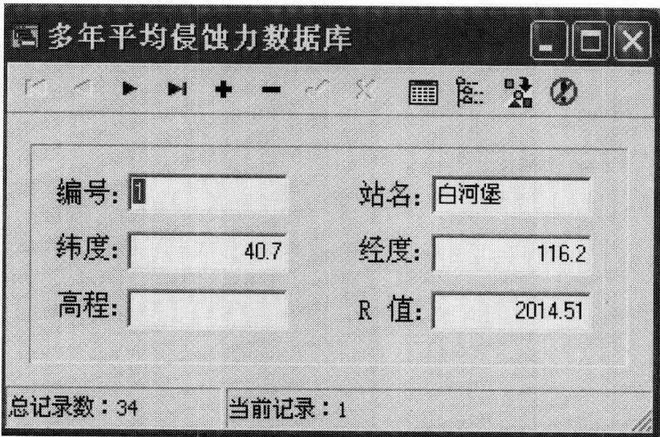  
图9.74 多年平均年降雨侵蚀力数据编辑窗口

列出了北京主要土壤的土壤属性如土壤粒径等级含量、土壤有机质含量和土壤结构等级等参数与可蚀性因子值，可针对数据表中给出的参数进行查询。

## (3) 水土保持措施

## 1）覆盖与管理因子数据库操作

数据库模块中提供了两种水土保持措施数据库：“覆盖与管理措施因子数据库”和“水土保持工程措施因子数据库”。其中“覆盖与管理措施因子数据库”（图9.77）操作步骤如下：

·鼠标左键单击“数据库”菜单中的“水土保持”按钮；

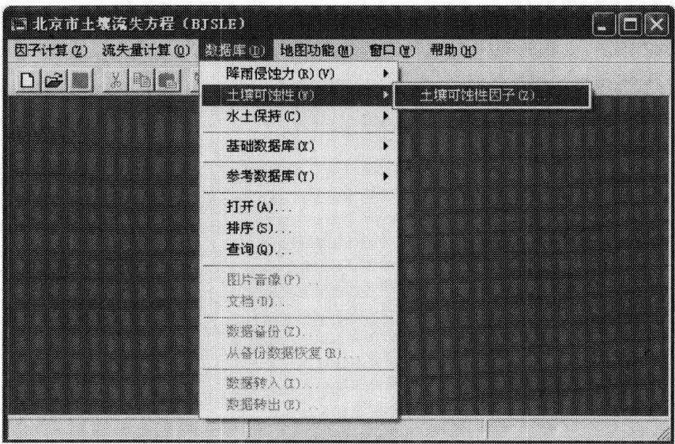  
图9.75 土壤可蚀性因子数据库获取

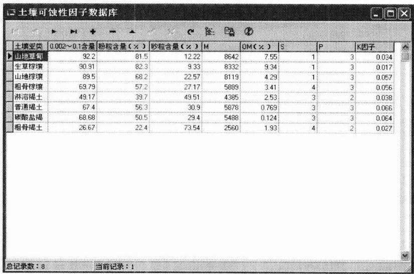  
图9.76 土壤可蚀性因子数据库

· 鼠标左键单击“覆盖与管理因子”按钮，弹出数据窗口如图9.78所示，数据表中列出了北京地区主要的生物类型和覆盖与管理因子值，其中“KIND”为土地利用类型，“NAME”为植被类型，“VALUE”为C因子值。用户可进行查询检索等操作。

## 2）水土保持工程措施因子数据库操作

“水土保持工程措施因子数据库”（图9.79）操作步骤如下：

·鼠标左键单击“数据库”菜单中的“水土保持”按钮；

• 鼠标左键单击“水土保持工程措施因子”子菜单，弹出数据窗口如图9.80所示，数据表中列出了北京地区主要的水土保持工程措施因子值，用户可进行查询检索等操作。

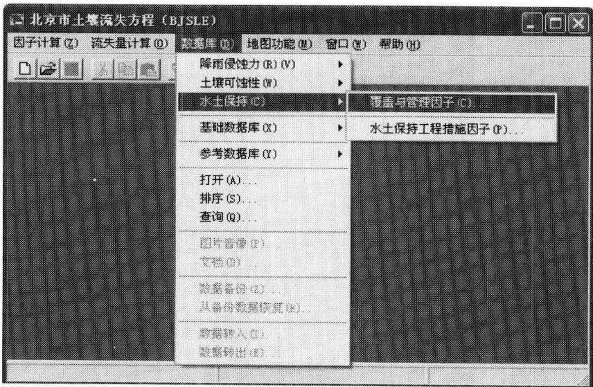  
图9.77 覆盖与管理因子数据库获取

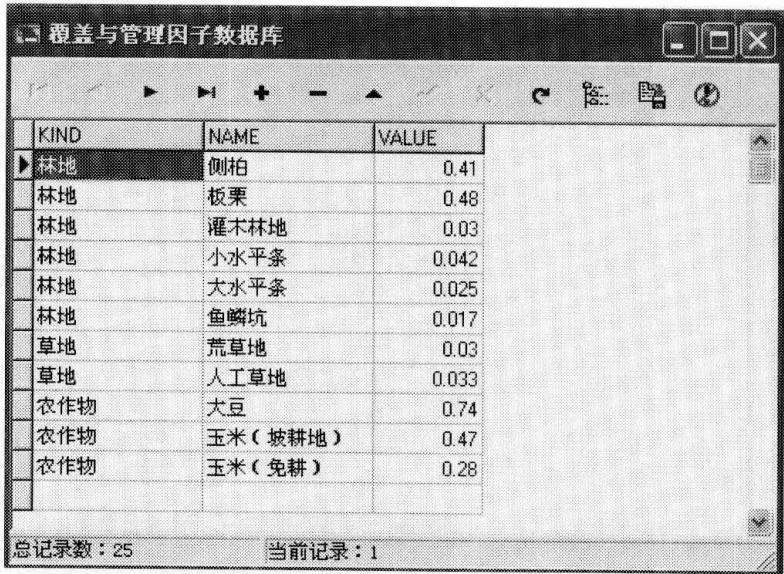  
图9.78覆盖与管理因子数据库

## (4) 基础数据库

“基础数据库”模块集中了北京土壤流失方程中各因子计算所需的各种数据库，如雨量站降雨观测资料、北京土壤资料以及待录入的小区径流观测资料等。

## 1）雨量站降雨过程数据库操作

通过“基础数据库”模块进行雨量站降雨过程数据库（图9.81）的操作步骤如下：

•打开模型系统界面菜单栏的“数据库”菜单；

• 鼠标左键单击“基础数据库”按钮；

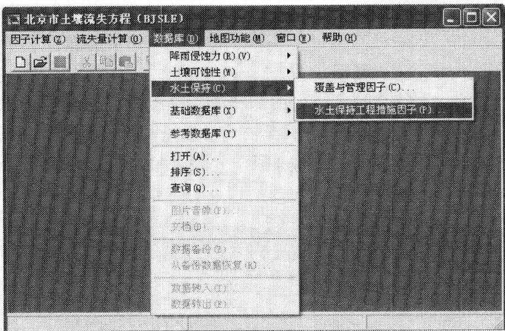

图9.79 水土保持工程措施因子数据库获取  
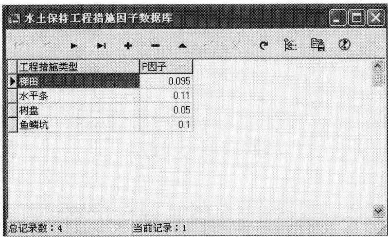  
图9.80 水土保持工程措施因子数据库

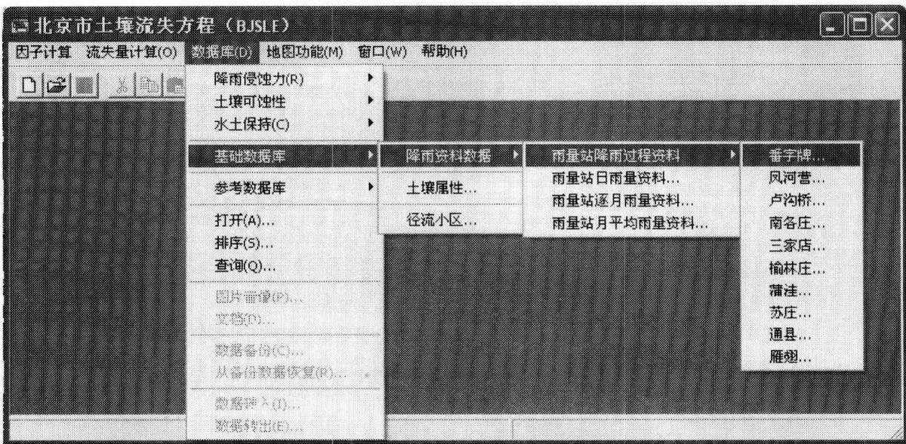  
图9.81 降雨过程数据库获取

· 鼠标左键单击“降雨资料数据”按钮；

·鼠标左键单击“雨量站降雨过程资料”按钮，可以看到菜单栏中列出了北京市10个雨量站站点的次降雨过程数据；

·点击某一站点，弹出数据窗口如图9.82所示，数据表中主要给出了该雨量站点编号(CODE)、次降雨年（YEAR）、月日（DATE)、时段降雨量（RAINFALL）以及时段降雨历时（DURATION），可根据前面介绍的窗口工具栏按钮操作进行数据库操作。

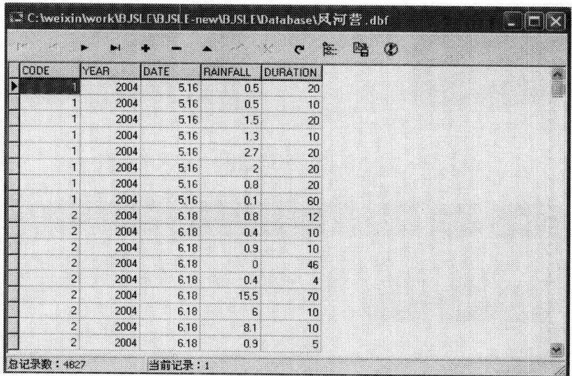  
图 9.82 降雨过程数据表

  
图9.83 雨量站日降雨量数据库获取

## 2）雨量站日降雨量数据库操作

“基础数据库”模块提供了雨量站日降雨量数据库（图9.83)，其操作步骤如下：

·鼠标左键单击模型系统界面菜单栏的“数据库”菜单中的“基础数据库”按钮；

· 鼠标左键单击“降雨量资料数据”按钮；

·鼠标左键单击“雨量站日降雨量资料”按钮，弹出数据窗口如图9.84所示，数据表列出了北京市34个雨量站点的1985\~2004年的日降雨量资料，可根据前面介绍的窗口工具栏按钮操作进行日降雨量数据库查询、检索、更新和添加等操作。

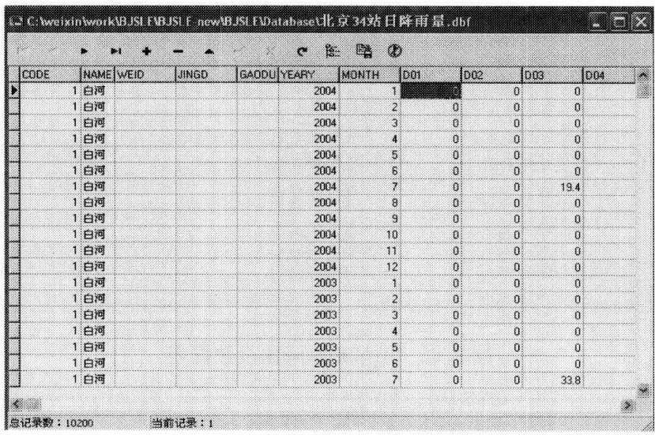  
图9.84 日降雨量数据表

## 3）雨量站月降雨量数据库操作

“基础数据库”模块提供了雨量站月降雨量数据库（图9.85），其操作步骤如下：

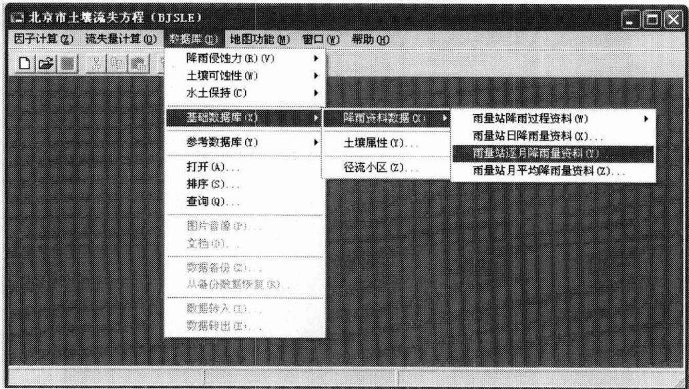  
图9.85 雨量站月降雨量数据库获取

·鼠标左键单击模型系统界面菜单栏的“数据库”菜单中的“基础数据库”按钮；

· 鼠标左键单击“降雨资料数据”按钮；

•鼠标左键单击“雨量站月降雨量资料”按钮，弹出数据窗口如图9.86所示，数据表列出了北京34个雨量站点的1985\~2004年的月降雨量资料，其数据库窗口同其他数据库窗口格式相同，操作功能也相同。

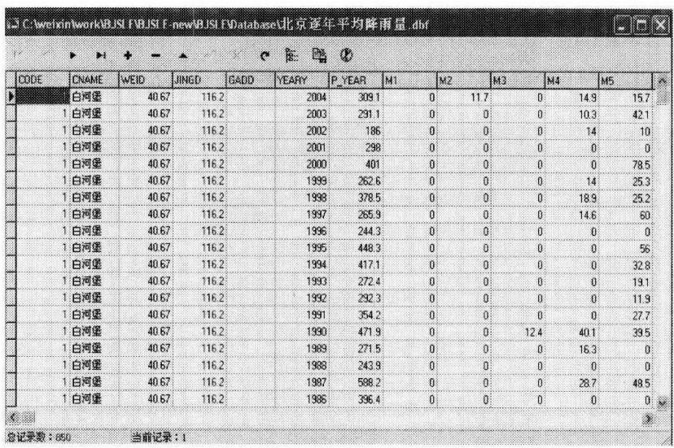  
图9.86 雨量站月降雨量数据表

## 4）北京土壤属性数据库

“基础数据库”模块提供了北京市土壤属性数据库（图9.87)，其操作步骤如下：

·鼠标左键单击模型系统界面菜单栏的“数据库”菜单中的“基础数据库”按钮；

• 鼠标左键单击“土壤属性”按钮，弹出数据窗口如图9.88所示，数据表中列出了北京43个土属的土壤属性。

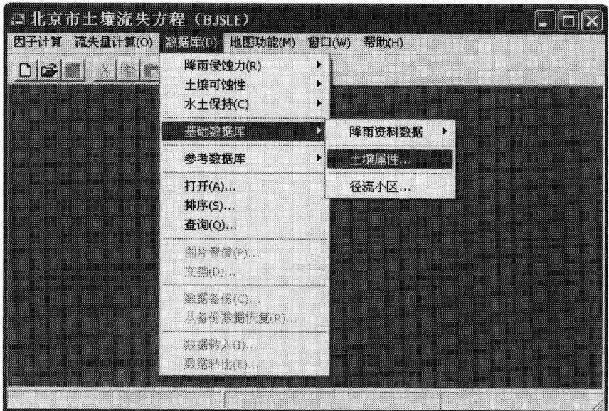  
图 9.87 土壤属性数据库获取

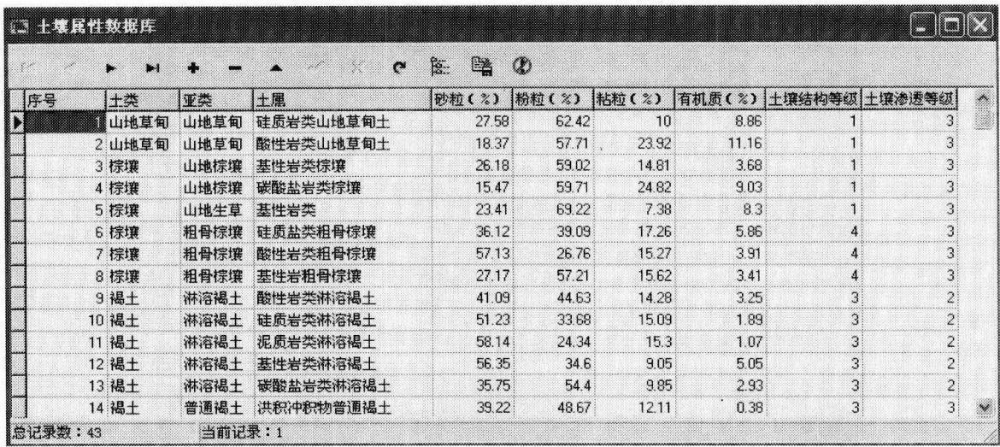  
图9.88 土壤属性数据库

## (5) 参考数据库

“数据库”菜单中的“参考数据库”模块给出了方程中各因子计算所需的各种参考数据库，目前列出的有土壤结构等级数据库以及渗透等级数据库。其操作步骤如下：

·鼠标左键单击模型系统界面菜单栏的“数据库”菜单中的“基础数据库”按钮(图 9.89);

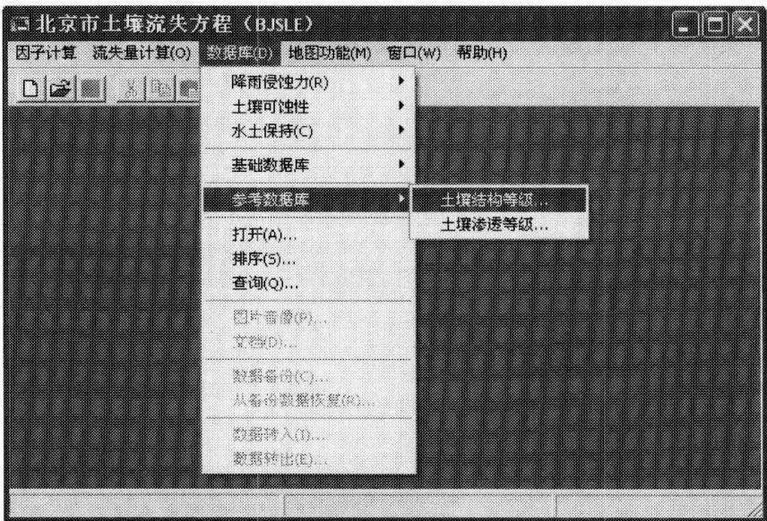  
图9.89 土壤结构等级数据库获取

·鼠标左键单击“土壤结构等级”按钮，弹出窗口如图9.90所示，用户可根据表中列出土壤粒径大小进行土壤结构等级划分；

·鼠标左键单击“土壤渗透等级”按钮（图9.91)，弹出窗口如图9.92所示，作为用户选择土壤渗透等级的参考。

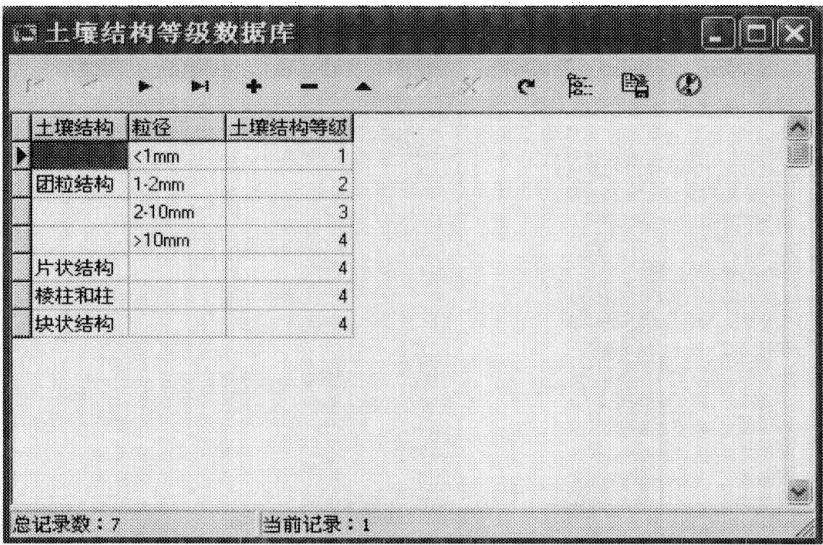

图9.90 土壤结构等级数据库  
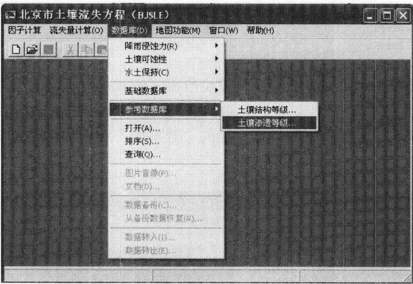

图9.91 土壤渗透等级数据库获取  
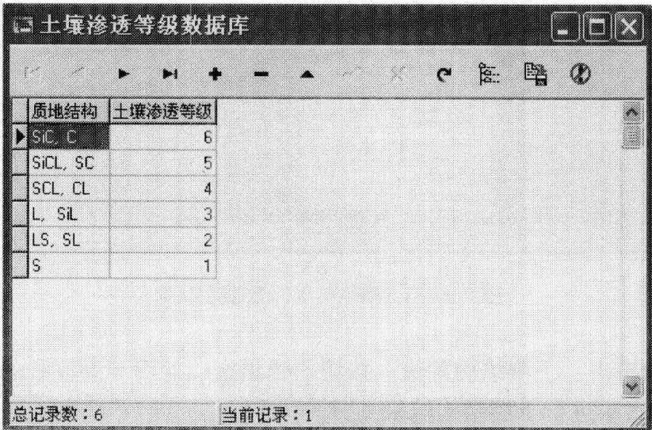  
图9.92 土壤渗透等级数据库

## (6) 数据库排序与查询

“数据库”模块不仅包含北京市土壤流失方程所需的各种数据库，同时还提供了一些数据库操作功能模块，如打开数据库、数据库排序和数据库查询。

## 1）数据库“打开”操作

“数据库”模块提供的“打开”功能是打开查看适用于本系统的各种数据表，其操作步骤如下：

· 鼠标左键单击模型系统界面菜单栏的“数据库”（图9.93)；

·鼠标左键单击“打开”子菜单，弹出文件打开窗口如图9.94所示，在此窗口内，用户可以根据自己的需要打开已有的数据表格，其系统支持的数据格式为“\*.dbf”、“\*.db”、“\*.txt”等多种数据格式。

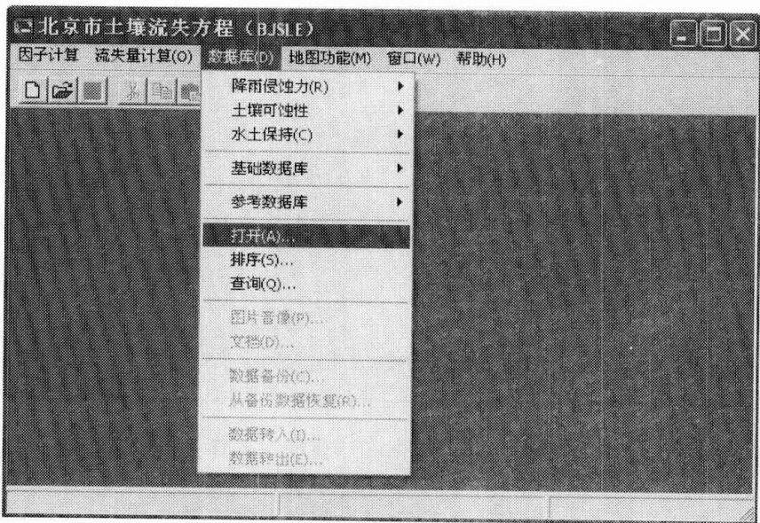

图9.93数据库“打开”操作  
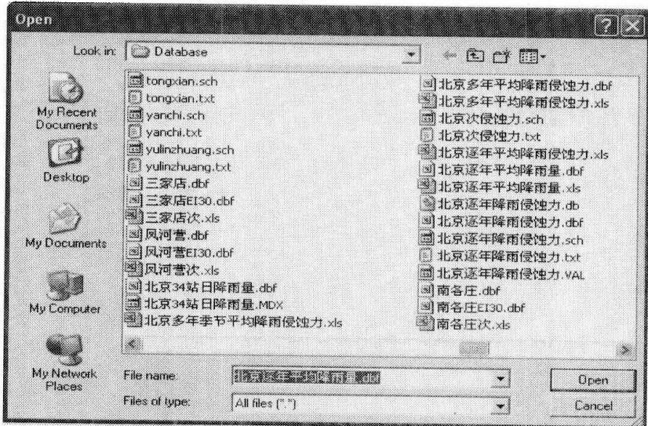  
图9.94 数据库打开文件窗口

## 2）数据库“排序”操作

排序也是数据库管理的一个基本功能。其操作步骤如下：

·鼠标左键单击模型系统界面菜单栏的“数据库”菜单（图9.95）；

·鼠标左键单击“排序”按钮，弹出数据库排序操作窗口（图9.96），用户根据图9.96中所给出的操作步骤顺序标号进行数据库排序操作；

·首先选择被排序的数据源表，在“选择源数据表”的下拉菜单中，选择数据表，如图9.96 中标号①所示；

• 选择排序字段，如图9.96 中标号②所示；

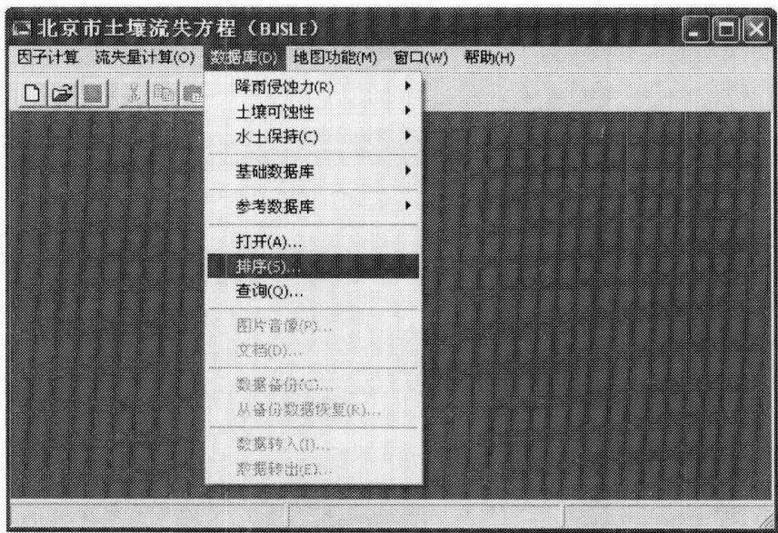

图9.95数据库“排序”操作  
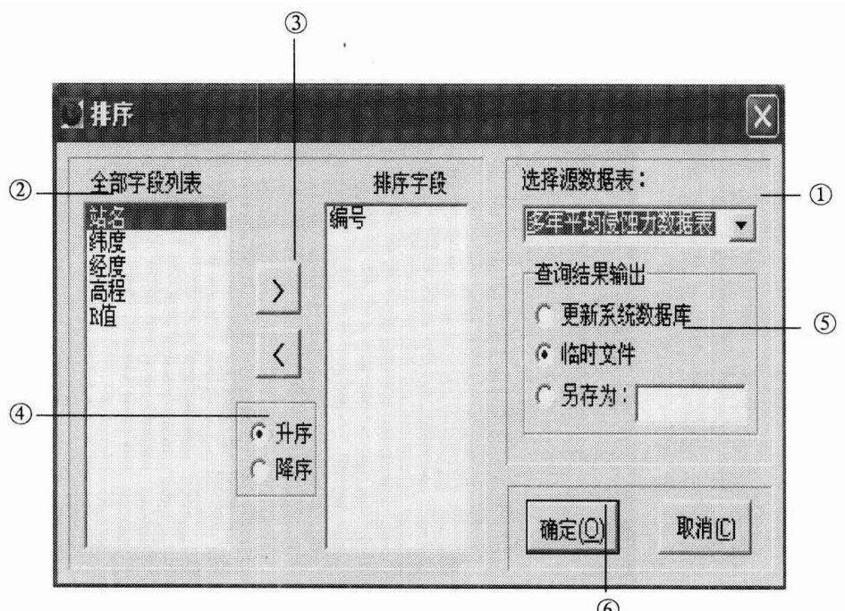  
图 9.96 数据表排序窗口

· 点击“>”按钮，添加进入排序字段文本框中，如图9.96中标号③所示；

· 选择排序方法，升序或降序，如图9.96中标号④所示；

·选择查询结果以哪一种类型进行输出，更新系统数据库、临时文件或选择另存，选择另存路径，如果选择临时文件输出，关闭查询显示的窗口后，系统自动删除该输出文件，如图9.96中标号⑤所示；

· 完成以上7个步骤操作后，选择确定按钮（图9.96中标号⑥)，图9.97为多年平均年降雨侵蚀力数据表根据降雨侵蚀力R值升序排列结果。

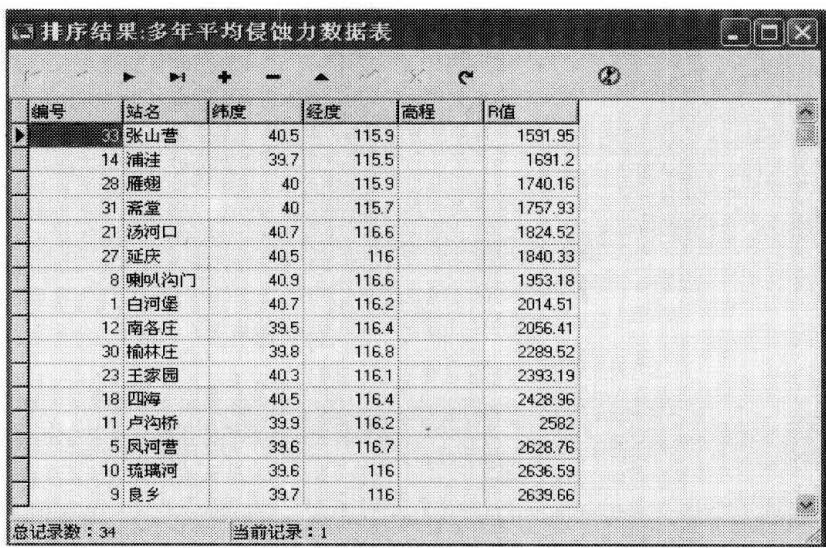  
图9.97 数据表排序输出结果

## (7)数据库“查询”操作

查询操作同排序一样，也是数据库管理的一个基本功能，查询窗口的操作步骤如下：

· 鼠标左键单击模型系统界面菜单栏的“数据库”菜单（图9.98)；

·鼠标左键单击“查询”按钮，弹出数据库查询操作窗口（图9.99），用户根据图9.99中所给出的操作步骤顺序标号进行数据库查询操作；

·选择要查询的数据源表，在“选择源数据表”的下拉菜单中，选择数据表，如图9.99 中标号①所示；

· 选择要查询的字段，如图9.99 中标号②所示；

·选择查询条件，如“=”、“>”和“<”等，如图9.99中标号③所示；

· 在完成第一和第二步骤后，在查询条件的文本框中会显示刚刚设定的查询条件，需要用户输入条件中的数值部分，如图9.99中标号④所示；

· 排序字段为可选项，用户可输入排序字段，如图9.99中标号⑤所示；

·双击查询结果输出的文本框，会弹出保存窗口，选择保存路径与保存名称，如图9.99中标号⑥所示；

• 完成以上8个步骤操作后，选择确定按钮（图9.99中标号⑦），输出数据表的

查询结果。

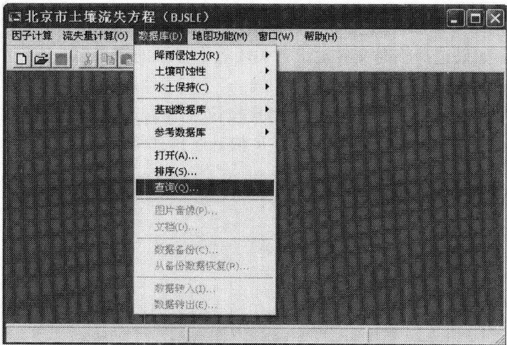

图9.98 数据库“查询”操作  
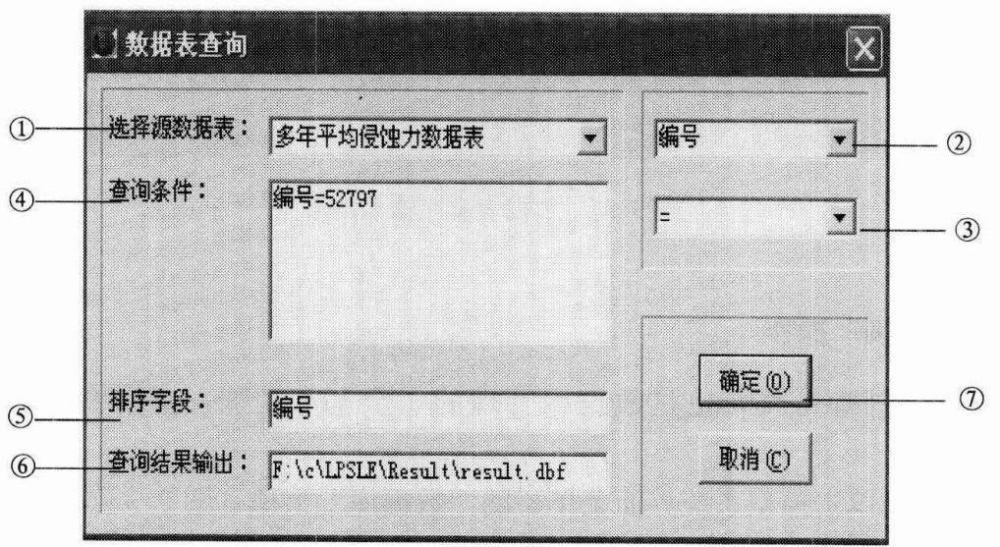  
图 9.99 数据表查询窗口

## 9.5.3 数据表组织

系统数据库根据需要将数据表分为降雨量数据表、降雨侵蚀力数据表、土壤可蚀性数据表以及水土保持措施数据表四大类。这四类数据表中既包含参与因子值与土壤流失量计算的基础数据，同时也包含了较为成熟的北京市因子数据。用户可根据系统提供的基础数据进行因子与土壤流失量计算，也可自行生成与系统计算相匹配的数据表格。系统数据库中的各种数据表的组织格式固定，其文件格式基本为“\*.dbf”，“\*.dbf”格式的数据库表格较为常见，可通过一些常用的数据库软件生成，也可通过MicrosoftOffice中的Excel软件另存生成，由于此软件较为常见，此处不详细介绍。下面将详细

介绍每个数据表格的组织形式。

## (1) 降雨量

降雨量数据根据来源和类型可细分为：

• 次降雨过程数据

· 次降雨量和雨强数据

• 次降雨量数据

• 日降雨过程数据

• 日降雨量和雨强数据

• 日降雨量数据

• 月降雨量数据

• 逐年降雨量数据

• 多年平均降雨量数据

## 1）次降雨过程数据

系统中已有的次降雨过程数据是北京10个雨量站点观测的降雨过程资料，如用户需用系统提供基础数据库以外的次降雨过程资料计算次降雨侵蚀力，可根据表9.3中的数据格式另行存储待参与运算的次降雨过程数据，其规定格式为“\*.dbf”文件格式，其数据表文件结构见表9.3，图9.100为系统次降雨过程资料数据表的存储格式示例。

表 9.3 次降雨过程数据 dbf 格式
<table><tr><td>序号</td><td>字段意义</td><td>单位</td><td>字段名</td><td>类型</td><td>宽度</td><td>小数点位数</td></tr><tr><td>1</td><td>次降雨编号</td><td>一</td><td>CODE</td><td>数值型</td><td>9</td><td>0</td></tr><tr><td>2</td><td>年份</td><td>一</td><td>YEAR</td><td>数值型</td><td>4</td><td>0</td></tr><tr><td>3</td><td>日期</td><td>一</td><td>DATE</td><td>数值型</td><td>9</td><td>2</td></tr><tr><td>4</td><td>时段降雨量</td><td>mm</td><td>RAINFALL</td><td>数值型</td><td>5</td><td>1</td></tr><tr><td>5</td><td>时段长</td><td>min</td><td>DURATION</td><td>数值型</td><td>4</td><td>0</td></tr></table>

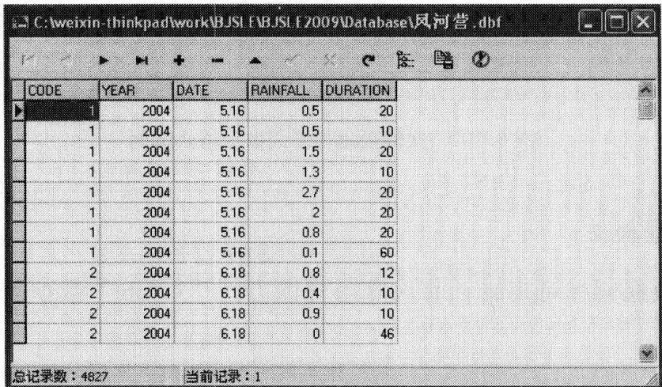  
图9.100 次降雨过程数据示例

## 2）次降雨量与雨强数据

次降雨量和雨强数据可用来计算次降雨侵蚀力，绘制侵蚀力等值线图。“\*.dbf”数据表文件格式如表9.4所示，数据格式示例见图9.101。

表 9.4 次降雨量与雨强数据“\*. dbf”格式
<table><tr><td>序号</td><td>字段意义</td><td>单位</td><td>字段名</td><td>类型</td><td>宽度</td><td>小数点位数</td></tr><tr><td>1</td><td>雨量站编码</td><td>一</td><td>CODE</td><td>数值型</td><td>5</td><td>0</td></tr><tr><td>2</td><td>雨量站名</td><td>一</td><td>CNAME</td><td>字符型</td><td>16</td><td>一</td></tr><tr><td>3</td><td>雨量站纬度</td><td>(°)</td><td>WEID</td><td>数值型</td><td>5</td><td>2</td></tr><tr><td>4</td><td>雨量站经度</td><td>(°)</td><td>JINGD</td><td>数值型</td><td>5</td><td>2</td></tr><tr><td>5</td><td>雨量站高程</td><td>m</td><td>GAOD</td><td>数值型</td><td>4</td><td>0</td></tr><tr><td>6</td><td>年份</td><td>一</td><td>YEARY</td><td>数值型</td><td>4</td><td>0</td></tr><tr><td>7</td><td>日期</td><td>一</td><td>DATE</td><td>数值型</td><td>9</td><td>2</td></tr><tr><td>8</td><td>次降雨量</td><td>mm</td><td>RAINFALL</td><td>数值型</td><td>5</td><td>1</td></tr><tr><td>9</td><td>雨强</td><td>mm/h</td><td>130</td><td>数值型</td><td>4</td><td>0</td></tr></table>

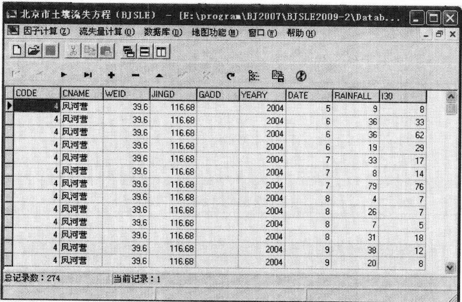  
图 9.101 次降雨量与雨强数据格式示例

## 3）次降雨量数据

次降雨量数据同样可用来计算次降雨侵蚀力，“\*.dbf”数据表文件格式如表9.5所示。

表9.5 次降雨量数据“×.dfb”格式
<table><tr><td>序号</td><td>字段意义</td><td>单位</td><td>字段名</td><td>类型</td><td>宽度</td><td>小数点位数</td></tr><tr><td>1</td><td>雨量站编码</td><td>一</td><td>CODE</td><td>数值型</td><td>5</td><td>0</td></tr><tr><td>2</td><td>雨量站名</td><td>一</td><td>NAME</td><td>字符型</td><td>16</td><td>一</td></tr><tr><td>3</td><td>雨量站纬度</td><td>(°)</td><td>WEID</td><td>数值型</td><td>5</td><td>2</td></tr><tr><td>4</td><td>雨量站经度</td><td>(°)</td><td>JINGD</td><td>数值型</td><td>5</td><td>2</td></tr><tr><td>5</td><td>雨量站高程</td><td>m</td><td>GAOD</td><td>数值型</td><td>4</td><td>0</td></tr><tr><td>6</td><td>年份</td><td>一</td><td>YEAR</td><td>数值型</td><td>4</td><td>0</td></tr><tr><td>7</td><td>日期</td><td>一</td><td>DATE</td><td>数值型</td><td>9</td><td>2</td></tr><tr><td>8</td><td>次降雨量</td><td>mm</td><td>RAINFALL</td><td>数值型</td><td>5</td><td>1</td></tr></table>

## 4）日降雨过程数据

日降雨过程数据可用来计算日降雨侵蚀力，其数据格式与次降雨过程数据格式相同。dbf数据表文件格式如表9.6所示，数据格式示例见图9.102。

表 9.6 日降雨过程数据“.dbf”格式
<table><tr><td>序号</td><td>字段意义</td><td>单位</td><td>字段名</td><td>类型</td><td>宽度</td><td>小数点位数</td></tr><tr><td>1</td><td>日降雨编号</td><td>一</td><td>CODE</td><td>数值型</td><td>9</td><td>0</td></tr><tr><td>2</td><td>年份</td><td>一</td><td>YEAR</td><td>数值型</td><td>4</td><td>0</td></tr><tr><td>3</td><td>日期</td><td>一</td><td>DATE</td><td>数值型</td><td>9</td><td>2</td></tr><tr><td>4</td><td>时段降雨量</td><td>mm</td><td>RAINFALL</td><td>数值型</td><td>5</td><td>1</td></tr><tr><td>5</td><td>时段长</td><td>min</td><td>DURATION</td><td>数值型</td><td>4</td><td>0</td></tr></table>

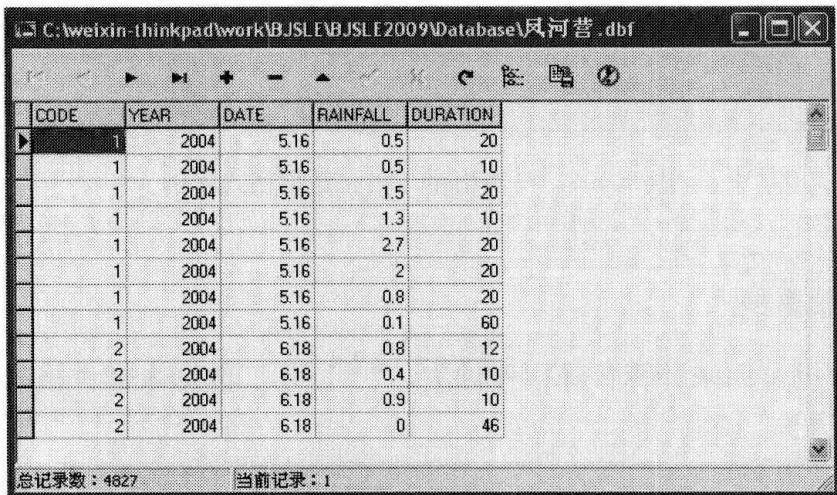  
图9.102 日降雨过程数据格式示例

## 5）日降雨量与雨强数据

日降雨量和雨强数据可用来计算日降雨侵蚀力，其数据格式与次降雨量和雨强数据

格式基本相同。“\*.dbf”数据表文件格式如表9.7所示，数据格式示例见图9.103。

表 9.7 日降雨量与雨强数据“\*.dbf”格式
<table><tr><td>序号</td><td>字段意义</td><td>单位</td><td>字段名</td><td>类型</td><td>宽度</td><td>小数点位数</td></tr><tr><td>1</td><td>雨量站编码</td><td>一</td><td>CODE</td><td>数值型</td><td>5</td><td>0</td></tr><tr><td>2</td><td>雨量站名</td><td>一</td><td>CNAME</td><td>字符型</td><td>16</td><td>一</td></tr><tr><td>3</td><td>雨量站纬度</td><td>(°)</td><td>WEID</td><td>数值型</td><td>5</td><td>2</td></tr><tr><td>4</td><td>雨量站经度</td><td>(°)</td><td>JINGD</td><td>数值型</td><td>5</td><td>2</td></tr><tr><td>5</td><td>雨量站高程</td><td>m</td><td>GAOD</td><td>数值型</td><td>4</td><td>0</td></tr><tr><td>6</td><td>年份</td><td>一</td><td>YEARY</td><td>数值型</td><td>4</td><td>0</td></tr><tr><td>7</td><td>日期</td><td>一</td><td>DATE</td><td>数值型</td><td>9</td><td>2</td></tr><tr><td>8</td><td>日降雨量</td><td>mm</td><td>RAINFALL</td><td>数值型</td><td>5</td><td>1</td></tr><tr><td>9</td><td>日雨强  ${ { I } _ { 3 0 } }$ </td><td>mm/h</td><td>I30</td><td>数值型</td><td>4</td><td>0</td></tr></table>

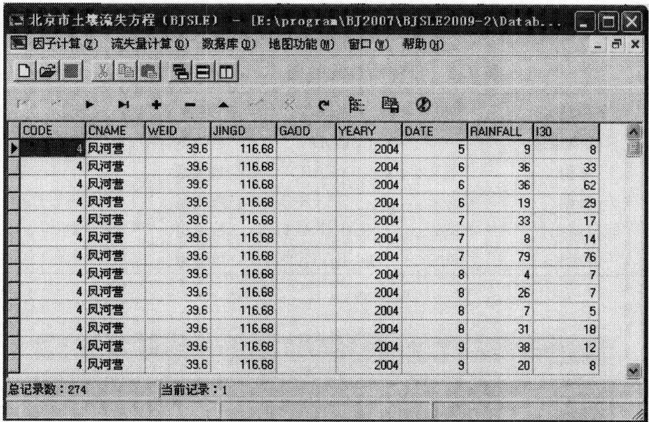  
图9.103 日降雨量与雨强数据格式示例

## 6）日降雨量数据

日降雨量数据可用来计算日降雨侵蚀力，“\*.dbf”数据表文件格式如表9.8所示，数据格式示例见图9.104。

表9.8 雨量站日降雨量数据“\*. $\mathbf { d } \mathbf { b } \mathbf { f } ^ { \flat }$ 格式
<table><tr><td>序号</td><td>字段意义</td><td>单位</td><td>字段名</td><td>类型</td><td>宽度</td><td>小数点位数</td></tr><tr><td>1</td><td>雨量站编码</td><td>一</td><td>CODE</td><td>数值型</td><td>5</td><td>0</td></tr><tr><td>2</td><td>雨量站名</td><td>一</td><td>NAME</td><td>字符型</td><td>16</td><td>一</td></tr><tr><td>3</td><td>雨量站纬度</td><td>(°)</td><td>WEID</td><td>数值型</td><td>5</td><td>2</td></tr><tr><td>4</td><td>雨量站经度</td><td>(°)</td><td>JINGD</td><td>数值型</td><td>5</td><td>2</td></tr><tr><td>5</td><td>雨量站高程</td><td>m</td><td>GAOD</td><td>数值型</td><td>4</td><td>0</td></tr><tr><td>6</td><td>年份</td><td>一</td><td>YEARY</td><td>数值型</td><td>4</td><td>0</td></tr><tr><td>7</td><td>月份</td><td>一</td><td>MONTH</td><td>数值型</td><td>2</td><td>0</td></tr><tr><td>8</td><td>月第1天降雨量</td><td>mm</td><td>D01</td><td>数值型</td><td>5</td><td>1</td></tr><tr><td>9</td><td>月第2天降雨量</td><td>mm</td><td>D02</td><td>数值型</td><td>5</td><td>1</td></tr><tr><td>10</td><td>月第3天降雨量</td><td>mm</td><td>D03</td><td>数值型</td><td>5</td><td>1</td></tr><tr><td>11</td><td>月第4天降雨量</td><td>mm</td><td>D04</td><td>数值型</td><td>5</td><td>1</td></tr><tr><td>12</td><td>月第5天降雨量</td><td>mm</td><td>D05</td><td>数值型</td><td>5</td><td>1</td></tr><tr><td>13</td><td>月第6天降雨量</td><td>mm</td><td>D06</td><td>数值型</td><td>5</td><td>1</td></tr><tr><td>14</td><td>月第7天降雨量</td><td>mm</td><td>D07</td><td>数值型</td><td>5</td><td>1</td></tr><tr><td>15</td><td>月第8天降雨量</td><td>mm</td><td>D08</td><td>数值型</td><td>5</td><td>1</td></tr><tr><td>16</td><td>月第9天降雨量</td><td>mm</td><td>D09</td><td>数值型</td><td>5</td><td>1</td></tr><tr><td>17</td><td>月第10天降雨量</td><td>mm</td><td>D10</td><td>数值型</td><td>5</td><td>1</td></tr><tr><td>18</td><td>月第11天降雨量</td><td>mm</td><td>D11</td><td>数值型</td><td>5</td><td>1</td></tr><tr><td>19</td><td>月第12天降雨量</td><td>mm</td><td>D12</td><td>数值型</td><td>5</td><td>1</td></tr><tr><td>20</td><td>月第13 天降雨量</td><td>mm</td><td>D13</td><td>数值型</td><td>5</td><td>1</td></tr><tr><td>21</td><td>月第14天降雨量</td><td>mm</td><td>D14</td><td>数值型</td><td>5</td><td>1</td></tr><tr><td>22</td><td>月第15天降雨量</td><td>mm</td><td>D15</td><td>数值型</td><td>5</td><td>1</td></tr><tr><td>23</td><td>月第16天降雨量</td><td>mm</td><td>D16</td><td>数值型</td><td>5</td><td>1</td></tr><tr><td>24</td><td>月第17天降雨量</td><td>mm</td><td>D17</td><td>数值型</td><td>5</td><td>1</td></tr><tr><td>25</td><td>月第18天降雨量</td><td>mm</td><td>D18</td><td>数值型</td><td>5</td><td>1</td></tr><tr><td>26</td><td>月第19天降雨量</td><td>mm</td><td>D19</td><td>数值型</td><td>5</td><td>1</td></tr><tr><td>27</td><td>月第20天降雨量</td><td>mm</td><td>D20</td><td>数值型</td><td>5</td><td>1</td></tr><tr><td>28</td><td>月第21 天降雨量</td><td>mm</td><td>D21</td><td>数值型</td><td>5</td><td>1</td></tr><tr><td>29</td><td>月第22 天降雨量</td><td>mm</td><td>D22</td><td>数值型</td><td>5</td><td>1</td></tr><tr><td>30</td><td>月第23 天降雨量</td><td>mm</td><td>D23</td><td>数值型</td><td>5</td><td>1</td></tr><tr><td>31</td><td>月第24天降雨量</td><td>mm</td><td>D24</td><td>数值型</td><td>5</td><td>1</td></tr><tr><td>32</td><td>月第25 天降雨量</td><td>mm</td><td>D25</td><td>数值型</td><td>5</td><td>1</td></tr><tr><td>33</td><td>月第26天降雨量</td><td>mm</td><td>D26</td><td>数值型</td><td>5</td><td>1</td></tr><tr><td>34</td><td>月第 27 天降雨量</td><td>mm</td><td>D27</td><td>数值型</td><td>5</td><td>1</td></tr><tr><td>35</td><td>月第28 天降雨量</td><td>mm</td><td>D28</td><td>数值型</td><td>5</td><td>1</td></tr><tr><td>36</td><td>月第29 天降雨量</td><td>mm</td><td>D29</td><td>数值型</td><td>5</td><td>1</td></tr><tr><td>37</td><td>月第30天降雨量</td><td>mm</td><td>D30</td><td>数值型</td><td>5</td><td>1</td></tr><tr><td>38</td><td>月第31天降雨量</td><td>mm</td><td>D31</td><td>数值型</td><td>5</td><td>1</td></tr><tr><td>39</td><td>月降雨量</td><td>mm</td><td>MON_P</td><td>数值型</td><td>6</td><td>1</td></tr></table>

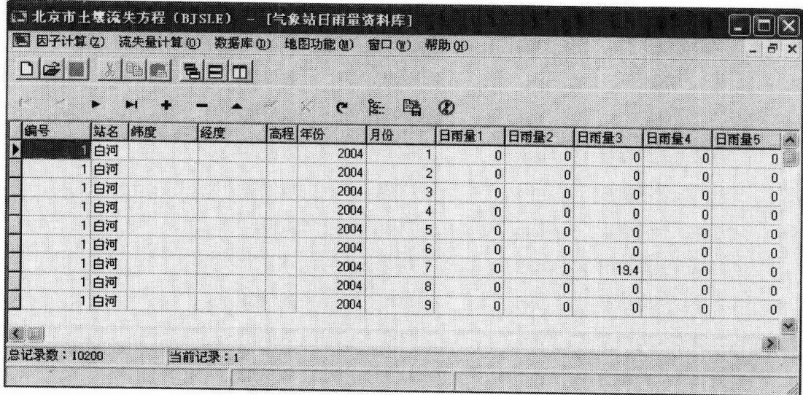  
图9.104 日降雨量数据格式示例

## 7）月降雨量数据

月降雨量数据可用来计算月降雨侵蚀力，“\*.dbf”数据表文件格式如表9.9所示，数据格式示例见图9.105。

表 9.9 雨量站月降雨量数据“×.dbf”格式
<table><tr><td>序号</td><td>字段意义</td><td>单位</td><td>字段名</td><td>类型</td><td>宽度</td><td>小数点位数</td></tr><tr><td>1</td><td>雨量站编码</td><td>一</td><td>CODE</td><td>数值型</td><td>5</td><td>0</td></tr><tr><td>2</td><td>雨量站名</td><td>一</td><td>CNAME</td><td>字符型</td><td>16</td><td>一</td></tr><tr><td>3</td><td>雨量站纬度</td><td>(°)</td><td>WEID</td><td>数值型</td><td>5</td><td>2</td></tr><tr><td>4</td><td>雨量站经度</td><td>(°)</td><td>JINGD</td><td>数值型</td><td>5</td><td>2</td></tr><tr><td>5</td><td>雨量站高程</td><td>m</td><td>GAOD</td><td>数值型</td><td>4</td><td>0</td></tr><tr><td>6</td><td>年份</td><td>一</td><td>YEARY</td><td>数值型</td><td>4</td><td>0</td></tr><tr><td>7</td><td>1月降雨量</td><td>mm</td><td>M1</td><td>数值型</td><td>7</td><td>1</td></tr><tr><td>8</td><td>2月降雨量</td><td>mm</td><td>M2</td><td>数值型</td><td>7</td><td>1</td></tr><tr><td>9</td><td>3月降雨量</td><td>mm</td><td>M3</td><td>数值型</td><td>7</td><td>1</td></tr><tr><td>10</td><td>4月降雨量</td><td>mm</td><td>M4</td><td>数值型</td><td>7</td><td>1</td></tr><tr><td>11</td><td>5月降雨量</td><td>mm</td><td>M5</td><td>数值型</td><td>7</td><td>1</td></tr><tr><td>12</td><td>6月降雨量</td><td>mm</td><td>M6</td><td>数值型</td><td>7</td><td>1</td></tr><tr><td>13</td><td>7月降雨量</td><td>mm</td><td>M7</td><td>数值型</td><td>7</td><td>1</td></tr><tr><td>14</td><td>8月降雨量</td><td>mm</td><td>M8</td><td>数值型</td><td>7</td><td>1</td></tr><tr><td>15</td><td>9月降雨量</td><td>mm</td><td>M9</td><td>数值型</td><td>7</td><td>1</td></tr><tr><td>16</td><td>10月降雨量</td><td>mm</td><td>M10</td><td>数值型</td><td>7</td><td>1</td></tr><tr><td>17</td><td>11月降雨量</td><td>mm</td><td>M11</td><td>数值型</td><td>7</td><td>1</td></tr><tr><td>18</td><td>12月降雨量</td><td>mm</td><td>M12</td><td>数值型</td><td>7</td><td>1</td></tr></table>

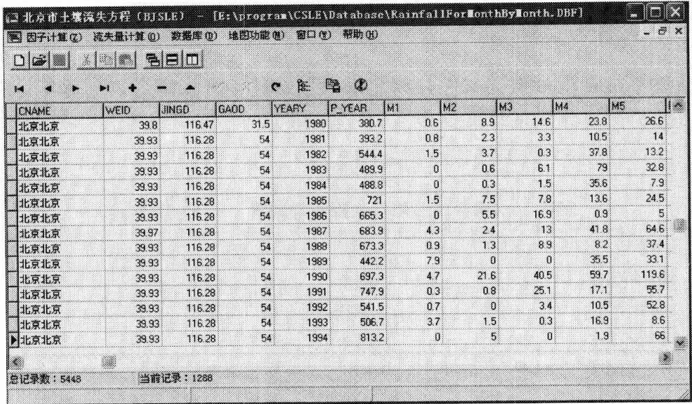  
图9.105 月降雨量数据格式示例

## 8）逐年降雨量数据

逐年降雨量数据可用来计算年降雨侵蚀力，“\*.dbf”数据表文件格式如表9.10所示，数据格式示例见图9.106。

表9.10 雨量站逐年降雨量数据“×.dbf”格式
<table><tr><td>序号</td><td>字段意义</td><td>单位</td><td>字段名</td><td>类型</td><td>宽度</td><td>小数点位数</td></tr><tr><td>1</td><td>雨量站编码</td><td>一</td><td>CODE</td><td>数值型</td><td>5</td><td>0</td></tr><tr><td>2</td><td>雨量站名</td><td>一</td><td>CNAME</td><td>字符型</td><td>16</td><td>一</td></tr><tr><td>3</td><td>雨量站纬度</td><td>(°)</td><td>WEID</td><td>数值型</td><td>5</td><td>2</td></tr><tr><td>4</td><td>雨量站经度</td><td>(°)</td><td>JINGD</td><td>数值型</td><td>5</td><td>2</td></tr><tr><td>5</td><td>雨量站高程</td><td>m</td><td>GAOD</td><td>数值型</td><td>4</td><td>0</td></tr><tr><td>6</td><td>年份</td><td>一</td><td>YEARY</td><td>数值型</td><td>4</td><td>0</td></tr><tr><td>7</td><td>年降雨量</td><td>mm</td><td>P_YEAR</td><td>数值型</td><td>8</td><td>1</td></tr></table>

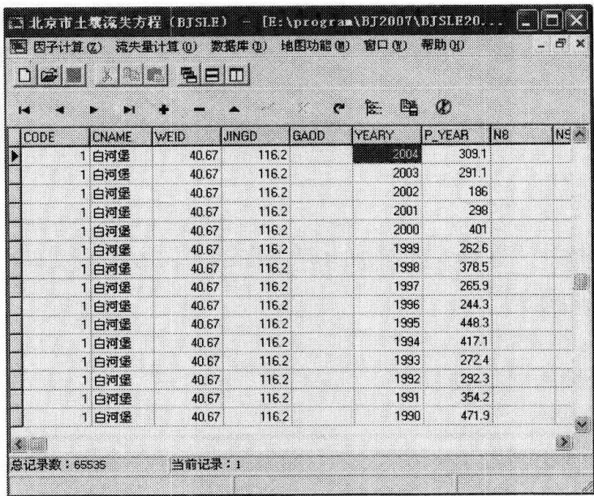  
图9.106 逐年降雨量数据格式示例

## 9）多年平均降雨量数据

雨量站逐年月降雨量数据文件存放北京雨量站逐年月降雨量，用逐年月降雨量和年降雨量的侵蚀力简易算法估算降雨侵蚀力，绘制侵蚀力等值线图。“\*.dbf”数据表文件格式如表9.11所示，数据格式示例见图9.107。

表 9.11 雨量站多年平均降雨量数据“.dbf”格式
<table><tr><td>序号</td><td>字段意义</td><td>单位</td><td>字段名</td><td>类型</td><td>宽度</td><td>小数点位数</td></tr><tr><td>1</td><td>雨量站编码</td><td>一</td><td>CODE</td><td>数值型</td><td>5</td><td>0</td></tr><tr><td>2</td><td>雨量站名</td><td>一</td><td>CNAME</td><td>字符型</td><td>16</td><td>一</td></tr><tr><td>3</td><td>雨量站纬度</td><td>(°)</td><td>WEID</td><td>数值型</td><td>5</td><td>2</td></tr><tr><td>4</td><td>雨量站经度</td><td>(°)</td><td>JINGD</td><td>数值型</td><td>5</td><td>2</td></tr><tr><td>5</td><td>雨量站高程</td><td>m</td><td>GAOD</td><td>数值型</td><td>4</td><td>0</td></tr><tr><td>6</td><td>多年平均降雨量</td><td>mm</td><td>P_YEAR</td><td>数值型</td><td>8</td><td>1</td></tr></table>

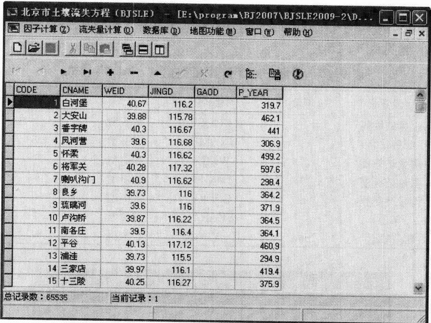  
图9.107 多年平均降雨量数据格式示例

## (2) 降雨侵蚀力

不同类型降雨资料计算得到的侵蚀力存储在不同的数据表文件中，其中包括：

• 次降雨侵蚀力数据表

• 日降雨侵蚀力数据表

· 季旬降雨侵蚀力数据表

• 月降雨侵蚀力数据表

• 逐年降雨侵蚀力数据表

· 多年平均降雨侵蚀力数据表

用户可根据需要在系统数据库中打开已有的降雨侵蚀力数据表，进行查询等操作，也可根据系统提供的次或日降雨侵蚀力数据表自行生成用户所需的季旬、月或年降雨侵蚀力等。数据文件依次以“\*.dbf”数据表格式存储（表9.12～表9.18)，其中季旬降雨侵蚀力、逐年降雨侵蚀力以及多年平均年降雨侵蚀力存储示例见前面降雨侵蚀力因子模块中的图9.15～图9.17。

表9.12 次降雨侵蚀力数据“\*. $\mathbf { d } \mathbf { b } \mathbf { f } ^ { \mathbf { J } }$ 格式
<table><tr><td>序号</td><td>字段意义</td><td>单位</td><td>字段名</td><td>类型</td><td>宽度</td><td>小数点位数</td></tr><tr><td>1</td><td>年份</td><td>一</td><td>YEAR</td><td>数值型</td><td>系统提供</td><td>系统提供</td></tr><tr><td>2</td><td>月日</td><td></td><td>DATE</td><td>数值型</td><td>系统提供</td><td>系统提供</td></tr><tr><td>3</td><td>次降雨侵蚀力</td><td> $\mathrm { M J } \cdot \mathrm { m m } / ( \mathrm { h m ^ { 2 } } \cdot \mathrm { h } )$ </td><td>R</td><td>数值型</td><td>系统提供</td><td>系统提供</td></tr></table>

表 9.13 日降雨侵蚀力数据“. $\mathbf { d } \mathbf { b } \mathbf { f } ^ { \prime \prime }$ 格式
<table><tr><td>序号</td><td>字段意义</td><td>单位</td><td>字段名</td><td>类型</td><td>宽度</td><td>小数点位数</td></tr><tr><td>1</td><td>雨量站编码</td><td>—</td><td>CODE</td><td>数值型</td><td>5</td><td>0</td></tr><tr><td>2</td><td>雨量站名</td><td>一</td><td>CNAME</td><td>字符型</td><td>16</td><td>一</td></tr><tr><td>3</td><td>雨量站纬度</td><td>(°)</td><td>WEIDU</td><td>数值型</td><td>7</td><td>3</td></tr><tr><td>4</td><td>雨量站经度</td><td>(°)</td><td>JINGDU</td><td>数值型</td><td>7</td><td>3</td></tr><tr><td>5</td><td>雨量站高程</td><td>m</td><td>GAODU</td><td>数值型</td><td>8</td><td>2</td></tr><tr><td>6</td><td>年份</td><td>!</td><td>YEAR</td><td>数值型</td><td>7</td><td>0</td></tr><tr><td>7</td><td>月</td><td>一-</td><td>MONTH</td><td>数值型</td><td>7</td><td>0</td></tr><tr><td>8</td><td>日</td><td>一</td><td>DAY</td><td>数值型</td><td>7</td><td>0</td></tr><tr><td>9</td><td>日降雨侵蚀力</td><td> $\mathrm { M J } \cdot \mathrm { m m } / ( \mathrm { h m } ^ { 2 } \cdot \mathrm { h } )$ </td><td>R_DAY</td><td>数值型</td><td>9</td><td>2</td></tr></table>

表9.14季旬（15天）降雨侵蚀力数据“. $\mathbf { d } \mathbf { b } \mathbf { f } ^ { \prime \prime }$ 格式
<table><tr><td>序号</td><td>字段意义</td><td>单位</td><td>字段名</td><td>类型</td><td>宽度</td><td>小数点位数</td></tr><tr><td>1</td><td>雨量站编码</td><td>一</td><td>CODE</td><td>数值型</td><td>5</td><td>0</td></tr><tr><td>2</td><td>雨量站名</td><td></td><td>CNAME</td><td>字符型</td><td>16</td><td>1</td></tr><tr><td>3</td><td>雨量站纬度</td><td>(°)</td><td>WEIDU</td><td>数值型</td><td>5</td><td>2</td></tr><tr><td>4</td><td>雨量站经度</td><td>(°)</td><td>JINGDU</td><td>数值型</td><td>5</td><td>2</td></tr><tr><td>5</td><td>雨量站高程</td><td>m</td><td>GAODU</td><td>数值型</td><td>4</td><td>0</td></tr><tr><td>6</td><td>年份</td><td>一</td><td>R_YEAR</td><td>数值型</td><td>4</td><td>0</td></tr><tr><td>7</td><td>第1个半月侵蚀力</td><td> $\mathrm { M J } \cdot \mathrm { m m } / ( \mathrm { h m } ^ { 2 } \cdot \mathrm { h } )$ </td><td>R_PM1</td><td>数值型</td><td>5</td><td>2</td></tr><tr><td>8</td><td>第2个半月侵蚀力</td><td> $\mathrm { M J } \cdot \mathrm { m m } / ( \mathrm { h m } ^ { 2 } \cdot \mathrm { h } )$ </td><td>R_PM2</td><td>数值型</td><td>5</td><td>2</td></tr><tr><td>9</td><td>第3个半月侵蚀力</td><td> $\mathrm { M J } \cdot \mathrm { m m } / ( \mathrm { h m } ^ { 2 } \cdot \mathrm { h } )$ </td><td>R_PM3</td><td>数值型</td><td>5</td><td>2</td></tr><tr><td>10</td><td>第4个半月侵蚀力</td><td> $\mathrm { M J } \cdot \mathrm { m m } / ( \mathrm { h m } ^ { 2 } \cdot \mathrm { h } )$ </td><td>R_PM4</td><td>数值型</td><td>5</td><td>2</td></tr><tr><td>11</td><td>第5个半月侵蚀力</td><td> $\mathrm { M J } \cdot \mathrm { m m } / ( \mathrm { h m } ^ { 2 } \cdot \mathrm { h } )$ </td><td>R_PM5</td><td>数值型</td><td>5</td><td>2</td></tr><tr><td>12</td><td>第6个半月侵蚀力</td><td> $\mathrm { M J } \cdot \mathrm { m m } / ( \mathrm { h m } ^ { 2 } \cdot \mathrm { h } )$ </td><td>R_PM6</td><td>数值型</td><td>5</td><td>2</td></tr><tr><td>13</td><td>第7个半月侵蚀力</td><td> $\mathbf { M J } \cdot \mathbf { m m } / ( \mathbf { h m } ^ { 2 } \cdot \mathbf { h } )$ </td><td>R_PM7</td><td>数值型</td><td>5</td><td>2</td></tr><tr><td>14</td><td>第8个半月侵蚀力</td><td> $\mathrm { M J } \cdot \mathrm { m m } / ( \mathrm { h m } ^ { 2 } \cdot \mathrm { h } )$ </td><td>R_PM8</td><td>数值型</td><td>5</td><td>2</td></tr><tr><td>15</td><td>第9个半月侵蚀力</td><td> $\mathrm { M J } \cdot \mathrm { m m } / ( \mathrm { h } \mathrm { m } ^ { 2 } \cdot \mathrm { h } )$ </td><td>R_PM9</td><td>数值型</td><td>5</td><td>2</td></tr><tr><td>16</td><td>第10个半月侵蚀力</td><td> $\mathrm { M J } \cdot \mathrm { m m } / ( \mathrm { h m } ^ { 2 } \cdot \mathrm { h } )$ </td><td>R_PM10</td><td>数值型</td><td>5</td><td>2</td></tr><tr><td>17</td><td>第11个半月侵蚀力</td><td>MJ·mm/(hm²·h)</td><td>R_PM11</td><td>数值型</td><td>5</td><td>2</td></tr><tr><td>18</td><td>第12个半月侵蚀力</td><td>MJ·mm/(hm²·h)</td><td>R_PM12</td><td>数值型</td><td>5</td><td>2</td></tr><tr><td>19</td><td>第13个半月侵蚀力</td><td>MJ·mm/(hm²·h)</td><td>R_PM13</td><td>数值型</td><td>5</td><td>2</td></tr><tr><td>20</td><td>第14个半月侵蚀力</td><td>MJ·mm/(hm²·h)</td><td>R_PM14</td><td>数值型</td><td>5</td><td>2</td></tr><tr><td>21</td><td>第15个半月侵蚀力</td><td>MJ·mm/(hm²·h)</td><td>R_PM15</td><td>数值型</td><td>5</td><td>2</td></tr><tr><td>22</td><td>第16个半月侵蚀力</td><td>MJ·mm/(hm²·h)</td><td>R_PM16</td><td>数值型</td><td>5</td><td>2</td></tr><tr><td>23</td><td>第17个半月侵蚀力</td><td>MJ·mm/(hm²·h)</td><td>R_PM17</td><td>数值型</td><td>5</td><td>2</td></tr><tr><td>24</td><td>第18个半月侵蚀力</td><td>MJ·mm/(hm²·h)</td><td>R_PM18</td><td>数值型</td><td>5</td><td>2</td></tr><tr><td>25</td><td>第19个半月侵蚀力</td><td>MJ·mm/(hm²·h)</td><td>R_PM19</td><td>数值型</td><td>5</td><td>2</td></tr><tr><td>26</td><td>第20个半月侵蚀力</td><td>MJ·mm/(hm²·h)</td><td>R_PM20</td><td>数值型</td><td>5</td><td>2</td></tr><tr><td>27</td><td>第21个半月侵蚀力</td><td>MJ·mm/(hm²·h)</td><td>R_PM21</td><td>数值型</td><td>5</td><td>2</td></tr><tr><td>28</td><td>第22个半月侵蚀力</td><td>MJ·mm/(hm²·h)</td><td>RPM22</td><td>数值型</td><td>5</td><td>2</td></tr><tr><td>29</td><td>第23个半月侵蚀力</td><td>MJ·mm/(hm²·h)</td><td>R_PM23</td><td>数值型</td><td>5</td><td>2</td></tr><tr><td>30</td><td>第24个半月侵蚀力</td><td>MJ·mm/(hm²·h)</td><td>R_PM24</td><td>数值型</td><td>5</td><td>2</td></tr></table>

表9.15 季旬（10天）降雨侵蚀力数据“\*.dbf”格式
<table><tr><td>序号</td><td>字段意义</td><td>单位</td><td>字段名</td><td>类型</td><td>宽度</td><td>小数点位数</td></tr><tr><td>1</td><td>雨量站编码</td><td>一</td><td>CODE</td><td>数值型</td><td>5</td><td>0</td></tr><tr><td>2</td><td>雨量站名</td><td>一</td><td>CNAME</td><td>字符型</td><td>16</td><td>一</td></tr><tr><td>3</td><td>雨量站纬度</td><td>(°)</td><td>WEIDU</td><td>数值型</td><td>5</td><td>2</td></tr><tr><td>4</td><td>雨量站经度</td><td>(°)</td><td>JINGDU</td><td>数值型</td><td>5</td><td>2</td></tr><tr><td>5</td><td>雨量站高程</td><td>m</td><td>GAODU</td><td>数值型</td><td>4</td><td>0</td></tr><tr><td>6</td><td>年份</td><td>一</td><td>R_YEAR</td><td>数值型</td><td>4</td><td>0</td></tr><tr><td>7</td><td>第1个10天侵蚀力</td><td>MJ·mm/(hm²·h)</td><td>R_PM1</td><td>数值型</td><td>5</td><td>2</td></tr><tr><td>8</td><td>第2个10天侵蚀力</td><td>MJ·mm/(hm²·h)</td><td>R_PM2</td><td>数值型</td><td>5</td><td>2</td></tr><tr><td>9</td><td>第3个10天侵蚀力</td><td>MJ·mm/(hm²·h)</td><td>R_PM3</td><td>数值型</td><td>5</td><td>2</td></tr><tr><td>10</td><td>第4个10天侵蚀力</td><td>MJ·mm/(hm²·h)</td><td>R_PM4</td><td>数值型</td><td>5</td><td>2</td></tr><tr><td>11</td><td>第5个10天侵蚀力</td><td>MJ·mm/(hm²·h)</td><td>R_PM5</td><td>数值型</td><td>5</td><td>2</td></tr><tr><td>12</td><td>第6个10天侵蚀力</td><td>MJ·mm/(hm²·h)</td><td>R_PM6</td><td>数值型</td><td>5</td><td>2</td></tr><tr><td>13</td><td>第7个10天侵蚀力</td><td>MJ·mm/(hm²·h)</td><td>R_PM7</td><td>数值型</td><td>5</td><td>2</td></tr><tr><td>14</td><td>第8个10天侵蚀力</td><td>MJ·mm/(hm²·h)</td><td>R_PM8</td><td>数值型</td><td>5</td><td>2</td></tr><tr><td>15</td><td>第9个10天侵蚀力</td><td>MJ·mm/(hm²·h)</td><td>R_PM9</td><td>数值型</td><td>5</td><td>2</td></tr><tr><td>16</td><td>第10个10天侵蚀力</td><td>MJ·mm/(hm²·h)</td><td>R_PM10</td><td>数值型</td><td>5</td><td>2</td></tr><tr><td>17</td><td>第11个10天侵蚀力</td><td>MJ·mm/(hm²·h)</td><td>R_PM11</td><td>数值型</td><td>5</td><td>2</td></tr><tr><td>18</td><td>第12个10天侵蚀力</td><td>MJ·mm/(hm²·h)</td><td>R_PM12</td><td>数值型</td><td>5</td><td>2</td></tr><tr><td>19</td><td>第13个10天侵蚀力</td><td>MJ·mm/(hm²·h)</td><td>R_PM13</td><td>数值型</td><td>5</td><td>2</td></tr><tr><td>20</td><td>第14个10天侵蚀力</td><td>MJ·mm/(hm²·h)</td><td>R_PM14</td><td>数值型</td><td>5</td><td>2</td></tr><tr><td>21</td><td>第15个10天侵蚀力</td><td>MJ·mm/(hm²·h)</td><td>R_PM15</td><td>数值型</td><td>5</td><td>2</td></tr><tr><td>22</td><td>第16个10天侵蚀力</td><td>MJ·mm/(hm²·h)</td><td>R_PM16</td><td>数值型</td><td>5</td><td>2</td></tr><tr><td>23</td><td>第17个10天侵蚀力</td><td>MJ·mm/(hm²·h)</td><td>R_PM17</td><td>数值型</td><td>5</td><td>2</td></tr><tr><td>24</td><td>第18个10天侵蚀力</td><td>MJ·mm/(hm²·h)</td><td>R_PM18</td><td>数值型</td><td>5</td><td>2</td></tr><tr><td>25</td><td>第19个10天侵蚀力</td><td>MJ·mm/(hm²·h)</td><td>R_PM19</td><td>数值型</td><td>5</td><td>2</td></tr><tr><td>26</td><td>第20个10天侵蚀力</td><td>MJ·mm/(hm²·h)</td><td>R_PM20</td><td>数值型</td><td>5</td><td>2</td></tr><tr><td>27</td><td>第21个10天侵蚀力</td><td>MJ·mm/(hm²·h)</td><td>R_PM21</td><td>数值型</td><td>5</td><td>2</td></tr><tr><td>28</td><td>第22个10天侵蚀力</td><td>MJ·mm/(hm²·h)</td><td>R_PM22</td><td>数值型</td><td>5</td><td>2</td></tr><tr><td>29</td><td>第23个10天侵蚀力</td><td>MJ·mm/(hm²·h)</td><td>R_PM23</td><td>数值型</td><td>5</td><td>2</td></tr><tr><td>30</td><td>第24个10天侵蚀力</td><td>MJ·mm/(hm²·h)</td><td>R_PM24</td><td>数值型</td><td>5</td><td>2</td></tr><tr><td>31</td><td>第25个10天侵蚀力</td><td>MJ·mm/(hm²·h)</td><td>R_PM25</td><td>数值型</td><td>5</td><td>2</td></tr><tr><td>32</td><td>第26个10天侵蚀力</td><td>MJ·mm/(hm²·h)</td><td>R_PM26</td><td>数值型</td><td>5</td><td>2</td></tr><tr><td>33</td><td>第27个10天侵蚀力</td><td>MJ·mm/(hm²·h)</td><td>R_PM27</td><td>数值型</td><td>5</td><td>2</td></tr><tr><td>34</td><td>第28个10天侵蚀力</td><td>MJ·mm/(hm²·h)</td><td>R_PM28</td><td>数值型</td><td>5</td><td>2</td></tr><tr><td>35</td><td>第29个10天侵蚀力</td><td>MJ·mm/(hm²·h)</td><td>R_PM29</td><td>数值型</td><td>5</td><td>2</td></tr><tr><td>36</td><td>第30个10天侵蚀力</td><td>MJ·mm/(hm²·h)</td><td>R_PM30</td><td>数值型</td><td>5</td><td>2</td></tr><tr><td>37</td><td>第31个10天侵蚀力</td><td>MJ·mm/(hm²·h)</td><td>R_PM31</td><td>数值型</td><td>5</td><td>2</td></tr><tr><td>38</td><td>第32个10天侵蚀力</td><td>MJ·mm/(hm²·h)</td><td>R_PM32</td><td>数值型</td><td>5</td><td>2</td></tr><tr><td>39</td><td>第33个10天侵蚀力</td><td>MJ·mm/(hm²·h)</td><td>R_PM33</td><td>数值型</td><td>5</td><td>2</td></tr><tr><td>40</td><td>第34个10天侵蚀力</td><td>MJ·mm/(hm²·h)</td><td>R_PM34</td><td>数值型</td><td>5</td><td>2</td></tr><tr><td>41</td><td>第35个10天侵蚀力</td><td>MJ·mm/(hm²·h)</td><td>R_PM35</td><td>数值型</td><td>5</td><td>2</td></tr><tr><td>42</td><td>第36个10天侵蚀力</td><td>MJ·mm/(hm²·h)</td><td>R_PM36</td><td>数值型</td><td>5</td><td>2</td></tr></table>

表 9.16 月降雨侵蚀力数据“\*.dbf”格式
<table><tr><td>序号</td><td>字段意义</td><td>单位</td><td>字段名</td><td>类型</td><td>宽度</td><td>小数点位数</td></tr><tr><td>1</td><td>雨量站编码</td><td>一</td><td>CODE</td><td>数值型</td><td>5</td><td>0</td></tr><tr><td>2</td><td>雨量站名</td><td>一</td><td>NAME</td><td>字符型</td><td>16</td><td>一</td></tr><tr><td>3</td><td>雨量站纬度</td><td>(°)</td><td>WEIDU</td><td>数值型</td><td>5</td><td>2</td></tr><tr><td>4</td><td>雨量站经度</td><td>(°)</td><td>JINGDU</td><td>数值型</td><td>5</td><td>2</td></tr><tr><td>5</td><td>雨量站高程</td><td>m</td><td>GAODU</td><td>数值型</td><td>4</td><td>0</td></tr><tr><td>6</td><td>年份</td><td>一</td><td>YEARY</td><td>数值型</td><td>4</td><td>0</td></tr><tr><td>7</td><td>1月侵蚀力</td><td>MJ·mm/(hm²·h)</td><td>R_M1</td><td>数值型</td><td>5</td><td>2</td></tr><tr><td>8</td><td>2月侵蚀力</td><td>MJ·mm/(hm²·h)</td><td>R_M2</td><td>数值型</td><td>5</td><td>2</td></tr><tr><td>9</td><td>3月侵蚀力</td><td>MJ·mm/(hm²·h)</td><td>RM3</td><td>数值型</td><td>5</td><td>2</td></tr><tr><td>10</td><td>4月侵蚀力</td><td>MJ·mm/(hm²·h)</td><td>R_M4</td><td>数值型</td><td>5</td><td>2</td></tr><tr><td>11</td><td>5月侵蚀力</td><td>MJ·mm/(hm²·h)</td><td>RM5</td><td>数值型</td><td>5</td><td>2</td></tr><tr><td>12</td><td>6月侵蚀力</td><td>MJ·mm/(hm²·h)</td><td>R_M6</td><td>数值型</td><td>5</td><td>2</td></tr><tr><td>13</td><td>7月侵蚀力</td><td>MJ·mm/(hm²·h)</td><td>R_M7</td><td>数值型</td><td>5</td><td>2</td></tr><tr><td>14</td><td>8月侵蚀力</td><td>MJ·mm/(hm²·h)</td><td>R_M8</td><td>数值型</td><td>5</td><td>2</td></tr><tr><td>15</td><td>9月侵蚀力</td><td>MJ·mm/(hm²·h)</td><td>R_M9</td><td>数值型</td><td>5</td><td>2</td></tr><tr><td>16</td><td>10月侵蚀力</td><td>MJ·mm/(hm²·h)</td><td>R_M10</td><td>数值型</td><td>5</td><td>2</td></tr><tr><td>17</td><td>11月侵蚀力</td><td>MJ·mm/(hm²·h)</td><td>R_M11</td><td>数值型</td><td>5</td><td>2</td></tr><tr><td>18</td><td>12月侵蚀力</td><td>MJ·mm/(hm²·h)</td><td>R_M12</td><td>数值型</td><td>5</td><td>2</td></tr></table>

表 9.17 年降雨侵蚀力数据“×.dbf”格式
<table><tr><td>序号</td><td>字段意义</td><td>单位</td><td>字段名</td><td>类型</td><td>宽度</td><td>小数点位数</td></tr><tr><td>1</td><td>雨量站编码</td><td>一</td><td>CODE</td><td>数值型</td><td>5</td><td>0</td></tr><tr><td>2</td><td>雨量站名</td><td>一</td><td>CNAME</td><td>字符型</td><td>16</td><td>一</td></tr><tr><td>3</td><td>雨量站纬度</td><td>(°)</td><td>WEIDU</td><td>数值型</td><td>5</td><td>2</td></tr><tr><td>4</td><td>雨量站经度</td><td>(°)</td><td>JINGDU</td><td>数值型</td><td>5</td><td>2</td></tr><tr><td>5</td><td>雨量站高程</td><td>m</td><td>GAODU</td><td>数值型</td><td>4</td><td>0</td></tr><tr><td>6</td><td>年份</td><td>一</td><td>YEARY</td><td>数值型</td><td>4</td><td>0</td></tr><tr><td>7</td><td>年降雨侵蚀力</td><td> $\mathbf { M J } \cdot \mathbf { m m } / ( \mathbf { \hat { h } m ^ { 2 } } \cdot \mathbf { h } )$ </td><td>R_YEAR</td><td>数值型</td><td>9</td><td>2</td></tr></table>

表9.18 多年平均年降雨侵蚀力数据“\*. $\pmb { \mathrm { d } } \mathbf { b } \mathbf { f } ^ { \pmb { \imath } }$ 格式
<table><tr><td>序号</td><td>字段意义</td><td>单位</td><td>字段名</td><td>类型</td><td>宽度</td><td>小数点位数</td></tr><tr><td>1</td><td>雨量站编码</td><td>一</td><td>CODE</td><td>数值型</td><td>5</td><td>0</td></tr><tr><td>2</td><td>雨量站名</td><td>一</td><td>CNAME</td><td>字符型</td><td>16</td><td>一</td></tr><tr><td>3</td><td>雨量站纬度</td><td>(°)</td><td>WEIDU</td><td>数值型</td><td>7</td><td>3</td></tr><tr><td>4</td><td>雨量站经度</td><td>(°)</td><td>JINGDU</td><td>数值型</td><td>7</td><td>3</td></tr><tr><td>5</td><td>雨量站高程</td><td>m</td><td>GAODU</td><td>数值型</td><td>8</td><td>2</td></tr><tr><td>6</td><td>多年平均侵蚀力</td><td> $\mathsf { M J } \cdot \mathsf { m m } / ( \mathsf { h m } ^ { 2 } \cdot \mathsf { h } )$ </td><td>R_YEAR</td><td>数值型</td><td>9</td><td>2</td></tr></table>

## (3) 土壤可蚀性

与土壤可蚀性因子有关的系统数据表有两种：一种是土壤属性数据表（表9.19），用来计算土壤可蚀性因子（K）；另一种是土壤可蚀性因子数据表，存储各种土壤类型的K因子值。其中土壤可蚀性因子数据表根据土壤可蚀性因子的不同算法，又分为修正法EPIC的K因子（表9.20，图9.22）和修正诺谟图的K因子（表9.21，图9.23）两种数据表，以上数据表皆以\*.dbf数据表文件格式存储，数据表格示例见图9.88和图9.25。

表 9.19 土壤属性数据表“\*. $\mathbf { d } \mathbf { b } \mathbf { f } ^ { \prime \prime }$ 格式
<table><tr><td>序号</td><td>字段意义</td><td>单位</td><td>字段名</td><td>类型</td><td>宽度</td><td>小数点位数</td></tr><tr><td>1</td><td>序号</td><td>一</td><td>CODE</td><td>数值型</td><td>5</td><td>0</td></tr><tr><td>2</td><td>土类</td><td>---</td><td>SOILTYPE</td><td>字符型</td><td>12</td><td>一</td></tr><tr><td>3</td><td>亚类</td><td>一</td><td>REGION</td><td>字符型</td><td>20</td><td>一</td></tr><tr><td>4</td><td>土属</td><td>一</td><td>SOILGENUS</td><td>字符型</td><td>20</td><td>一</td></tr><tr><td>5</td><td>砂粒含量</td><td>%</td><td>QUALITY1</td><td>数值型</td><td>5</td><td>2</td></tr><tr><td>6</td><td>粉粒含量</td><td>%</td><td>QUALITY2</td><td>数值型</td><td>5</td><td>2</td></tr><tr><td>7</td><td>黏粒含量</td><td>%</td><td>QUALITY3</td><td>数值型</td><td>5</td><td>2</td></tr><tr><td>8</td><td>有机质含量</td><td>%</td><td>ORGANIC</td><td>数值型</td><td>5</td><td>3</td></tr><tr><td>9</td><td>土壤结构等级</td><td>一</td><td>STRUCTURE</td><td>数值型</td><td>1</td><td>0</td></tr><tr><td>10</td><td>土壤渗透等级</td><td>一</td><td>INFILTRATE</td><td>数值型</td><td>1</td><td>0</td></tr></table>

表9.20 修正 EPIC法K因子数据表“\*.dbf”格式
<table><tr><td>序号</td><td>字段意义</td><td>单位</td><td>字段名</td><td>类型</td><td>宽度</td><td>小数点位数</td></tr><tr><td>1</td><td>序号</td><td>一</td><td>CODE</td><td>数值型</td><td>5</td><td>0</td></tr><tr><td>2</td><td>土类</td><td>一</td><td>SOILTYPE</td><td>字符型</td><td>12</td><td>…</td></tr><tr><td>3</td><td>亚类</td><td>一</td><td>REGION</td><td>字符型</td><td>20</td><td>--</td></tr><tr><td>4</td><td>土属</td><td>一</td><td>SOILGENUS</td><td>字符型</td><td>20</td><td>一</td></tr><tr><td>5</td><td>有机质含量</td><td>%</td><td>ORGANIC</td><td>数值型</td><td>5</td><td>2</td></tr><tr><td>6</td><td>砂粒含量</td><td>%</td><td>QUALITYI</td><td>数值型</td><td>5</td><td>2</td></tr><tr><td>7</td><td>粉粒含量</td><td>%</td><td>QUALITY2</td><td>数值型</td><td>5</td><td>2</td></tr><tr><td>8</td><td>黏粒含量</td><td>%</td><td>QUALITY3</td><td>数值型</td><td>5</td><td>2</td></tr><tr><td>9</td><td>K因子值</td><td>t · hm²·h /(hm²·MJ·mm)</td><td>KVALUE</td><td>数值型</td><td>6</td><td>4</td></tr></table>

表9.21 修正诺谟图K因子数据表“. $\mathbf { d } \mathbf { b } \mathbf { f } ^ { \prime }$ 格式
<table><tr><td>序号</td><td>字段意义</td><td>单位</td><td>字段名</td><td>类型</td><td>宽度</td><td>小数点位数</td></tr><tr><td>1</td><td>序号</td><td>一</td><td>CODE</td><td>数值型</td><td>5</td><td>0</td></tr><tr><td>2</td><td>土类</td><td>一</td><td>SOILTYPE</td><td>字符型</td><td>12</td><td>一</td></tr><tr><td>3</td><td>亚类</td><td>一</td><td>REGION</td><td>字符型</td><td>20</td><td>一</td></tr><tr><td>4</td><td>土属</td><td>一</td><td>SOILGENUS</td><td>字符型</td><td>20</td><td>一</td></tr><tr><td>5</td><td>砂粒含量</td><td>%</td><td>QUALITYI</td><td>数值型</td><td>5</td><td>2</td></tr><tr><td>6</td><td>粉粒含量</td><td>%</td><td>QUALITY2</td><td>数值型</td><td>5</td><td>2</td></tr><tr><td>7</td><td>黏粒含量</td><td>%</td><td>QUALITY3</td><td>数值型</td><td>5</td><td>2</td></tr><tr><td>8</td><td>有机质含量</td><td>%</td><td>ORGANIC</td><td>数值型</td><td>5</td><td>3</td></tr><tr><td>9</td><td>土壤结构等级</td><td>一</td><td>STRUCTURE</td><td>数值型</td><td>1</td><td>0</td></tr><tr><td>10</td><td>土壤渗透等级</td><td>一</td><td>INFILTRATE</td><td>数值型</td><td>1</td><td>0</td></tr><tr><td>11</td><td colspan="4">t· hm2· h K因子值 KVALUE /(hm²·MJ·mm)</td><td>6</td><td>4</td></tr></table>

## (4) 水土保持措施

与水土保持措施有关的系统数据表有：①覆盖与管理因子数据表（表9.22）；②工程措施因子数据表（表9.23)。覆盖与管理因子和工程措施因子数据表文件存储格式为“\*.dbf”，数据表格示例见图9.38和图9.38。

表 9.22 覆盖与管理因子数据表“.dbf”格式
<table><tr><td>序号</td><td>字段意义</td><td>单位</td><td>字段名</td><td>类型</td><td>宽度</td><td>小数点位数</td></tr><tr><td>1</td><td>土地利用类型</td><td>一</td><td>KIND</td><td>字符型</td><td>16</td><td>一</td></tr><tr><td>2</td><td>植被名称</td><td>一</td><td>NAME</td><td>字符型</td><td>16</td><td>一</td></tr><tr><td>3</td><td>C因子值</td><td>一</td><td>VALUE</td><td>数值型</td><td>5</td><td>3</td></tr></table>

表 9.23 工程措施因子数据表“\*.dbf”格式
<table><tr><td>序号</td><td>字段意义</td><td>单位</td><td>字段名</td><td>类型</td><td>宽度</td><td>小数点位数</td></tr><tr><td>1</td><td>措施类型</td><td>一</td><td>KIND</td><td>字符型</td><td>24</td><td>一</td></tr><tr><td>2</td><td>P因子值</td><td>二</td><td>VALUET</td><td>数值型</td><td>5</td><td>3</td></tr></table>

## 9.6 地图功能模块

北京土壤流失方程中的“地图功能”模块包含了“图层显示”和“空间插值”两个重要模块。“图层显示”模块的基本功能是北京土壤流失方程中的基本图层数据的存储与显示，系统的基本图层数据包括两种图层：①基础底图，包括北京市水系图、政区图、重要城镇图等；②北京土壤侵蚀因子的空间分布图等。

## (1) 图层显示

通过“地图功能”模块进行图层显示功能的操作步骤如下：

· 鼠标左键单击模型系统界面菜单栏的“地图功能”（图9.108)；

·鼠标左键单击菜单中的某一图层，如单击“多年平均降雨量图”，弹出地图窗口(图9.109)，用户可根据地图窗口中的工具进行图层操作。

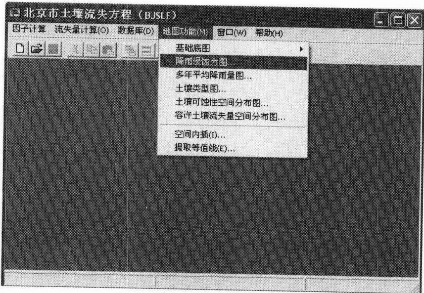  
图 9.108 获取地图功能模块

## (2) 空间插值

土壤侵蚀是在一定空间发生的，影响土壤侵蚀的因素也具有明显的空间差异。GIS就是处理空间数据、进行空间分析的工具，因此目前建立的土壤侵蚀计算机模型有与GIS相结合的趋势。尽管BJSLE模型目前是一个坡面模型，BJSLE还是结合了GIS技术，用来反映影响土壤侵蚀的因素的空间分布。当BJSLE模型得到进一步发展应用到流域时，BJSLE就可方便地进行修正，更好地反映土壤侵蚀的空间分布规律。基于目前的研究进展和可得数据，BJSLE的空间分析只针对降雨因素，即分析显示降雨量和降雨侵蚀力的空间分布，模型空间分析的功能包括空间内插和提取等值线。

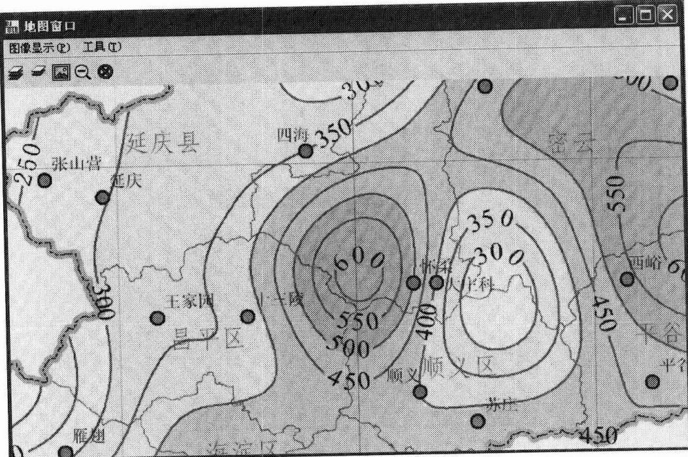  
图 9.109 地图窗口

通常我们只有离散、局部的样点属性值，但这些属性具有空间分布规律，因此可以将离散样点内插为连续的空间数据表面。空间插值模块提供两种空间插值算法：①克里金（Kriging）插值，采用线性方差和球体方差模型两种；②距离倒数插值。模块能对降雨量或侵蚀力的特征数据字段进行空间内插，生成空间内插的网格数据文件。空间插值模块能完成降雨量或降雨侵蚀力的空间插值。进行空间插值前，首先要求输入必要的参数，包括选择空间插值方法、用于空间插值的数据类型、网格分辨率以及插值结果是否需要进行空间平滑滤波等。系统得到用户输入的插值参数后，访问数据库，得到空间插值的样点数据。空间插值结束后，模块自动获取底图。“空间内插”功能的操作步骤如下：

• 鼠标左键单击模型系统界面菜单栏的“地图功能”菜单（图9.110)；

· 鼠标左键单击“空间内插”子菜单，弹出空间插值窗口（图9.111）；

·首先在“插值数据来源”选框中选择待进行插值运算的降雨侵蚀力数据表；

·在“插值数据类型”下拉菜单中选择字段，如“R值”；

·在“插值方法”的复选框中选择插值方法，可选择的插值方法有：克里金-线性半方差模型插值、克里金-球体半方差模型插值、距离倒数插值；

· 选择插值运算的网格大小，可选择的网格大小有 $^ { 6 6 } 0 . 1 \times 0 . 1$ (度)”、 $^ { 6 6 } 0 . 2 \times 0 . 2$ (度)”、“0.3×0.3（度)”、“0.4×0.4（度)”以及“0.5×0.5（度)”，单位“度”的含义是地理经纬度坐标的单位；

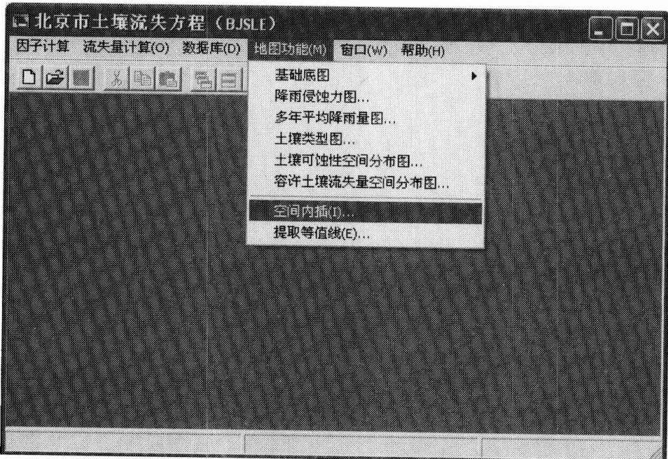  
图9.110 降雨侵蚀力空间插值窗口

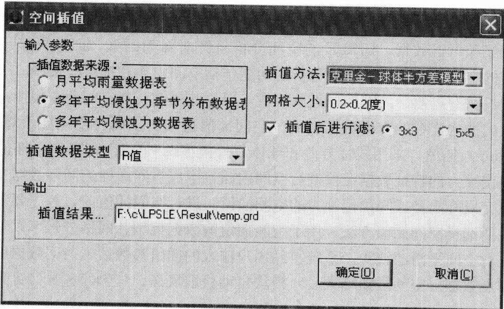  
图9.111 降雨侵蚀力空间插值子菜单

·如需进行插值滤波，则在“插值后进行滤波”前的选择框单击鼠标，“√”表示选中，选择参与滤波的数值个数；否则，选择框为空，即为不需滤波；

·点击“输出”栏中的“插值结果”按钮，弹出保存窗口的界面，选择保存路径与名称，输出文件格式为“\*.grd”格式，用户可用 3D绘图软件 surfer 7.0 & 8.0进行插值图层的显示操作；

·完成以上操作后点击“确定”按钮，即完成数据的空间内插的操作。

Document generated by Anna's Archive around 2023-2024 as part of the DuXiu collection   
(https://annas-blog.org/duxiu-exclusive.html).   
Images have been losslessly embedded. Information about the original file can be found in PDF attachments. Some stats (more in the   
PDF attachments):   
"filename": "MTI1NzQyMTguemlw",   
"filename\_decoded": "12574218.zip",   
"filesize": 66495878.   
"md5": "f3cf0b3520811f04553f315af416df13",   
"header\_md5": "0ca5356c330d0548dee1bdc3c72cf013",   
"sha1": "a810bf8b091cc312f15c7949a8789ab3eea37f5c",   
"sha256": "4f1056965b8eb1675d1275fd260e1e29c687bd4b3d953ce0b193c8dae30902aa",   
"crc32": 272445585,   
"zip\_password": "",   
"uncompressed\_size": 71220995,   
"pdg\_dir\_name": "\u00ed\u2562\u2592\u2592\u255b\u2310\u2550\u2534\u255a\u2514\u2534\u2248\u2569\u00ba\u2556\u255c\u25   
02\u2560\u00ed\u2556\_12574218",   
"pdg\_main\_pages\_found": 184,   
"pdg\_main\_pages\_max": 184,   
"total\_pages": 192,   
"total\_pixels": 1249351680,   
"pdf\_generation\_missing\_pages": false   
一