# 工程水文学

## 高等学校教材（第三版）

河海大学 詹道江 盒编武汉大学叶守泽

## 高等学校教材

# 工程水文学

(第三版)

河海大学 詹道江 合编

武汉大学叶守泽

中國水利水电出版社

## 内容提要

本书阐述工程水文学的基本原理与方法，包括：水文信息采集，径流形成，产流汇流计算，水文预报，水文模型，水文统计，设计径流与径流随机模拟，设计洪水，古洪水与可能最大洪水，水污染及水质模型等内容。

本书为高等学校水利水电类专业国家级重点教材，也可供从事水利工程和市政工程的技术人员参考。

## 图书在版编目（CIP）数据

工程水文学/詹道江，叶守泽合编.一3版.一北京：中国水利水电出版社，2000

高等学校教材

ISBN 7-5084-0281-2

I. 工… Ⅱ. ①詹…②叶… Ⅱ. 工程水文学-高等学校-教材 Ⅳ. TV12中国版本图书馆CIP数据核字（2000）第04561号

<table><tr><td>书名 作者 出版 发行 经售</td><td>高等学校教材 工程水文学（第三版） 河海大学詹道江 合编 武汉大学 叶守泽 中国水利水电出版社（北京市三里河路6号 100044） 网址：www.waterpub.com.cn E-mail; sale@waterpub. com. cn 电话：（010）63202266（总机）、68331835（发行部） 新华书店北京发行所 全国各地新华书店</td></tr><tr><td>排版 印刷 规格 版灰 印数</td><td>中国水利水电出版社微机排版中心 北京密云新升印刷厂 787×1092 毫米 16 开本.21 印张 491千宇 1987年6月第一版1992年11月第二版 2000年10月第三版2000年 10月北京第六次印刷 36191—41290册</td></tr></table>

兄购买我社图书，如有缺页、倒页、脱页的，本社发行部负责调换版权所有·便权必究

## 第三版前言

本书根据“高等学校水利水电类专业教学指导委员会第四轮教材规划”及编写组拟定的编写大纲编写，并经原国家教育委员会立项，定为“九五”普通高等教育国家级重点教材。

《工程水文学》是水利水电类专业的主要专业基础课，课内讲授60学时，另习题作业10学时，实习一周。其主要任务是讲述水文学的基本理论和基本计算方法。

根据课程的任务，编写本书遵循的原则为：加强学科的基础知识和基本技能的内容，充分反映90年代的水文科学水平，使其成为一部培养跨世纪复合型人才的和与国际学术接轨人才的，并有中国特色的教材。在此原则下，对本书第二版从体系到内容进行了必要的扬弃更新：

(1)加强了气象和水文基础知识，增强了降水、蒸散发、下渗与地下水、径流形成等部分的内容。

(2)年径流分析计算，增加了随机模拟。

(3)水文计算，重点安排了设计洪水的内容，其中：水文统计介绍了国内外常用的频率曲线线型和我国近来推荐的皮尔逊Ⅱ型频率曲线参数估计方法。汇流计算增加了地貌单位线的应用，对产流计算的体系也作了相应的改变。为国内外所瞩目的、并已在我国大型工程中应用的古洪水研究，也在书中予以介绍。对PMP/PMF计算也作了全面更新，以便与国际接轨。

(4)水文信息的采集，增加了水文遥感、水文信息等先进量测手段的内容。

(5)水文预报，增加了洪水实时预报的具体方法。

(6)增加了一些新章节，如水文模型中增加了城市降雨径流模型和水污染及河流水质模型等。

本书由河海大学詹道江和武汉大学叶守泽主编。詹道江主持编写第一、二、三、四、八、十、十一章，叶守泽主持编写第五、六、七、九、十二、十三章。此外，还特约了一些有独到专长的教师和工程师参加编写。各章的编写人为：詹道江（第一、十一章)，朱颖元（第二、四章)，谢悦波（第三章)，宋星原（第五章)，夏军（第六章)，叶守泽（第七、九、十二、十三章），王维第、孙汉贤、陈元芳（第八章），陈元芳（第十章）。

全书由詹道江统稿，沈晋主审。

高等学校水利水电类教学指导委员会于1998年3月10日至12日，在南京河海大学为本书特别召开编审会议。参加人员除本书主编、主审和各编写人员外，还有各方面的专家及出版社的责任编辑共20余人，对本书初稿进行认真的评审，提出许多修改意见，使本书质量得以全面提高。本书的编写工作及编审会议的召开，都得到了河海大学的大力支持和经费资助；各参编单位也给予了很大的帮助。在此，编者谨向他们一并表示衷心的感谢。

本书较前两版的内容增多，请各校斟酌选用。书中错误之处，请函告：210098，南京河海大学水文水资源系詹道江。

編者

1999年7月3日

## 第一版前言

本教材是根据水利电力部“1983\~1987年高等学校水利电力类专业教材编审出版规划”及编写组拟定的“《工程水文学》教材编写大纲”编写的。

全书共十二章，按64学时编写；另列有附录《水文模型》供学生课外参考。本书是水利水电建筑、农田水利工程和河流力学及治河工程三个专业的通用教材，各专业可根据教学要求酌情取舍。

本教材以水循环及径流形成过程、水文统计的基本知识及方法、设计年径流及设计洪水的推求、降雨径流分析、水文预报为主要内容；同时，扼要讲述水文测验及水文资料的收集、可能最大暴雨、河流泥沙等方面的知识。

本教材由吴明远、詹道江、叶守泽合编，廖松参编，另约吴正平、丁晶编写部分章节。吴明远负责全书的汇总工作。

本教材由沈晋主审。沈晋、吴明远、丁晶、詹道江、林一冬、叶守泽、袁作新、肖琳、廖松、陈传诗、贺编许、孔令文出席了1984年4月在武汉水利电力学院召开的审稿会议，对本书初稿进行了认真的审查，提出了修改意见，对提高教材质量帮助很大。本书有些材料引自有关院校和生产、科研单位编写的教材及技术资料，编者在此一并致谢。

最后，我们诚恳地希望读者对本书的缺点和错误提出批评意见，请将意见寄交成都科技大学水利系吴明远为感。

編者

1985年3月

## 第二版前言

本教材是水利部“1990\~1995年高等学校水利水电类专业本科教材选题和编审出版规划”中，为水利水电工程建筑专业及施工专业编写的通用教材。

本教材采用先阐明水文学原理，再讲述水利水电工程规划设计施工所需要的水文预报及水文分析计算方法的体系，并力图结合工程实际问题，反映工程水文学的新进展。

全书共分十一章。第一章、第二章1\~5节、第九章、第十章由王燕生编写；第二章6\~8节、第三章、第十一章由毛荣生编写；第四章、第六章、第七章由芮孝芳编写；第五章由潘久根编写；第八章由丁晶编写；全书由王燕生主编。

本教材由袁作新主审。主审对本书进行了非常认真的审查，并给予热心的指导和帮助。本书有些材料引自有关院校和生产科研单位编写的教材及文章，编者在此一并致谢。

最后，我们诚恳地希望读者对本书的缺点和错误提出批评意见，请将意见寄交清华大学水电系王燕生，以便今后改正。

編者

1991年11月

## 目 录

第三版前言  
第一版前言  
第二版前言  
第章绪论1  
第一节 水文学1  
第二节 工程水文学的研究方法4  
第三节水文学的发展4  
第二章 水文循环与径流形成………………………………………………7  
第一节 水文循环与水量平衡……7  
第二节河流与流域9  
第三节降水12  
第四节 土壤水、下渗与地下水………………30  
第五节蒸散发37  
第六节径流43  
第三章 水文信息采集与处理……………………………………49  
第一节测站与站网49  
第二节水位观51  
第三节流量验52  
第四节 泥沙测验与计算…………………………… 58  
第五节水质监62  
第六节 水文调查与水文遥感………65  
第七节水文数据处理68  
第四章流域产汇流计算……74  
第一节 降雨径流要素计算……74  
第二节流域产流分析80  
第三节产流计算84  
第四节流域汇流计算…95  
习题1  
第五章水文预报119  
第节概述119  
第二节短期洪水预报120  
第三节 洪水实时预报方法128  
第四节水文预报精度评定………136  
第五节 中长期水文预报简介138  
第六节 施工水文预报141  
习题…144  
第六章 水文模型………………145  
第一节概述145  
第二节 水文系统理论模型 ………… 146  
第三节 水文概念性模型……155  
第七章水文统计173  
第一节概述173  
第二节 概率的基本概念…………… 173  
第三节 随机变量及其概率分布………175  
第四节 水文频率曲线线型 ………………181  
第五节 频率曲线参数估计方法……………………………………………188  
第六节 水文频率计算适线法 ……………………………194  
第七节相关分析200  
习题… 210  
第八章 设计年径流及径流随机模拟……………………………………………211  
第一节 设计年径流分析计算的目的和内容 …………………………………… 211  
第二节 有较长资料时设计年径流频率分析计算……………………………212  
第三节 短缺资料时设计年径流的频率分析计算…………………………………214  
第四节设计年径流的时程分配…………219  
第五节 年际连续枯水段径流分析………220  
第六节 径流随机模拟……222  
第七节 设计枯水流量分析计算…………230  
习题……… 231  
第九章 由流量资料推求设计洪水………………………………………………………234  
第一节概述…………… 234  
第二节 设计洪峰流量及设计洪量的推求……………………………………235  
第三节 设计洪水过程线的推求……………………………………………243  
第四节分期设计洪水246  
第五节人库设计洪水247  
第六节 设计洪水的地区组成…250  
习题………… 21  
第十章由暴雨资料推求设计洪水……………………………………………………252  
第节概述252  
第二节 直接法推求设计面暴雨量……252  
第三节 间接法推求设计面暴雨量………………………………256  
第四节设计暴雨时空分配的计算………………………257  
第五节 由设计暴雨推求设计洪水……………259  
第六节 小流域设计洪水的计算………262  
习题…………… 271  
第十一章 古洪水与可能最大降水/可能最大洪水……………………………………272  
第一节 洪水频率计算问题272  
第二节 古洪水水文学273  
第三节古洪水流量…276  
第四节 古洪水研究的应用…277  
第五节 可能最大降水与可能最大洪水(PMP/PMF)………………………………………280  
第六节 可能最大降水的估算方法…281  
第七节 流域MP计算…285  
第八节可能最大洪水……287  
第九节讨论288  
第十二章水污染及水质模型………………………………291  
第节概述291  
第二节河流水体的污染与自净……………………………………291  
第三节 河流水质模型的基本方程…………………………292  
第四节 河流水质 BODDO 模型…………………294  
第五节模型参数的估计…………298  
第六节河口水质数学模型………………303  
第七节 湖泊水质数学模型304  
习题06  
第十三章河流泥沙计算……………………………………307  
第节概述07  
第二节 多年平均输沙量的估算……………307  
第三节 输沙量的变化310  
第四节 悬移质的颗粒级配………312  
附录14  
主要参考文献327

## 第一章 绪 论

## 第一节 水 文 学

## 一、水文学

## (一) 地球上各种水体的数量与分布

大气中的水汽，地面上的江河、湖沼、海洋和地下水等，统称为水体。水文学(Hydrology)研究各种水体的存在、循环和分布，物理与化学特性，以及水体对环境的影响和作用，包括对生物特别是对人类的影响。地球上各种水体的数量和分布如表1-1所示。

表 1-1  
水文循环各环节中的近似水量及其更新所需时间
<table><tr><td>环 节</td><td>总量 (10³km³)</td><td>占总量 (%)</td><td>占淡水 (%)</td><td>年循环量 (km³)</td><td>更新所需时间</td></tr><tr><td>海洋 直至 2000 m 深的地下水 其中淡水</td><td>1338000 23400</td><td>96.5 1.7</td><td></td><td>505000 16700</td><td>2650年 1400年</td></tr><tr><td>土壤水</td><td>10530 16.5</td><td>0.76 0.001</td><td>30.1 0.05</td><td>16500</td><td>1年</td></tr><tr><td>冰川与永久雪 其中南极</td><td>24064.1 21600</td><td>1.74 1.56</td><td>68.7 61.7</td><td></td><td></td></tr><tr><td>格駿兰</td><td>2340</td><td>0.17</td><td>6.68</td><td>2477</td><td>9700年</td></tr><tr><td>北极岛屿</td><td>83.5</td><td>0.006</td><td>0.24</td><td></td><td></td></tr><tr><td>其他山区</td><td>40.6</td><td>0.003</td><td>0.12</td><td>25</td><td>1600年</td></tr><tr><td>地面冰（永冻）</td><td>300</td><td>0.022</td><td>0.86</td><td>30</td><td>10000年</td></tr><tr><td>湖泊</td><td>176.4</td><td>0.013</td><td></td><td>10376</td><td>17年</td></tr><tr><td>其中淡水湖</td><td>91</td><td>0.007</td><td>0.26</td><td></td><td></td></tr><tr><td>威水湖</td><td>85.4</td><td>0.006</td><td></td><td></td><td></td></tr><tr><td>沼泽</td><td>11.47</td><td>0.0008</td><td>0.03</td><td></td><td></td></tr><tr><td>河流</td><td>2.12</td><td></td><td></td><td></td><td>5年</td></tr><tr><td></td><td>12.9</td><td>0.00002</td><td>0.006</td><td>49400</td><td>16 日</td></tr><tr><td>大气水</td><td></td><td>0.001</td><td>0.04</td><td>577000</td><td>8日</td></tr><tr><td>生物水</td><td>1.12</td><td>0. 0001</td><td>0.0023</td><td></td><td>数小时</td></tr><tr><td>总水量</td><td>1385981.61</td><td>100</td><td></td><td></td><td></td></tr><tr><td>总淡水量</td><td>35029.21</td><td>2.53</td><td>100</td><td></td><td></td></tr></table>

## (二) 全球的水储量

某一时刻储存于地球表面(5.1亿 $\mathbf { k m } ^ { 2 } )$ 上的水量，约为13.68亿km³(1km³=10亿 $\mathbf { m } ^ { 3 } )$ 其中分布在海洋的水量约为13.38亿 $\mathbf { k m } ^ { 3 }$ ，占总水量的96.5%，分布在陆地上的水量约为0.48亿 $\mathbf { k m } ^ { 3 }$ ，占总水量的3.5%。而陆地水中有1.7%存在于极地冰雪，1.7%存在于地下水中，仅有0.1%存在于地面和大气中。其中大气水量很小（仅 $1 2 9 0 0 ~ \mathrm { k m } ^ { 3 } )$ ，但地球上的水分循环不已，每年通过大气的水量是很大的，年循环达 $\mathbf { 6 0 0 0 0 0 } \ \mathbf { k m ^ { 3 } }$ 。地球上的水量平衡如表1-2所示（a代表年）。

水体通过水循环得到更新，更新所需时间 $\pmb { t _ { r } }$ 9可由式（1-1）计算：

$$
{ \pmb { t } } _ { r } = { \pmb { s } } / { \pmb q }\tag{1-1}
$$

式中，5为水体的储量， $\pmb q$ 为流量。

【例1-1】大气中的水量s为 $1 2 9 0 0 ~ \mathrm { k m } ^ { 3 }$ (见表1-1)，流量q（年降水量为458000+$1 1 9 0 0 0 { = } 5 7 7 0 0 0 \ \mathrm { k m ^ { 3 } / a }$ ，见表1-2)。

$$
t _ { r } = 1 2 9 0 0 / 5 7 7 0 0 0 = 0 . 0 2 2 \mathrm { ~ a } = 8 . 2 \mathrm { ~ d }
$$

## 二、水资源（Water Resources）

地球表层可供人类利用的水称为水资源。水资源包括水量、水质、水能资源和水域。

对人类最为实用的水资源，是陆地上每年可以更新的降水量、江河流水量和浅层地

表1-2 全球年水量平衡
<table><tr><td>水</td><td>情</td><td>海洋</td><td>陆地</td></tr><tr><td>面积</td><td> $( \times 1 0 ^ { 3 } \mathrm { k m } ^ { 2 } )$ </td><td>361000</td><td>149000</td></tr><tr><td>降水</td><td> $( k m ^ { 3 } / { \tt a } )$ </td><td>458000</td><td>119000</td></tr><tr><td></td><td>(mm/a)</td><td>1270</td><td>800</td></tr><tr><td>蒸发</td><td> $( k m ^ { 3 } / { \tt a } )$ </td><td>505000</td><td>72000</td></tr><tr><td></td><td>(mm/a)</td><td>1400</td><td>485</td></tr><tr><td>径流（人海）</td><td></td><td></td><td></td></tr><tr><td>地面</td><td> $( k m ^ { 3 } / { \mathsf { a } } )$ </td><td></td><td>44700</td></tr><tr><td rowspan="3"></td><td>(mm/a)</td><td></td><td>300</td></tr><tr><td>地下(km³/a)</td><td></td><td>2200</td></tr><tr><td>(mm/a)</td><td></td><td>15</td></tr><tr><td>总径流</td><td> $( \mathbb { k } \mathbb { m } ^ { 3 } / \mathbb { a } )$ </td><td></td><td>46900</td></tr><tr><td></td><td>(mm/a)</td><td></td><td>315</td></tr></table>

注本表引自刘国纬《水文循环的大气过程》，科学出版社，1997。

下水的淡水量。降水可以直接为人类利用，同时，它又是江河径流和浅层地下淡水的来源。全球陆地上多年平均年降水量为800mm，中国为628mm（在整个国土上平均每年的降水量为6.0万亿 $\mathbf { m } ^ { 3 } )$ ，比全世界平均少22%。江河径流是人类最重要和最经常利用的水资源。人类可从江河引水，供城市、工矿、农业灌溉利用。在全球46.8万亿 $\mathbf { m ^ { 3 } }$ 的江河年径流量中，中国占2.72万亿 $\mathbf { m } ^ { 3 }$ ，折合水深284mm。我国水资源量与世界各国比较，仅次于巴西、前苏联、加拿大、美国及印尼，居世界第六位。但因为人口众多，人均占有 $2 4 0 0 ~ \mathrm { m } ^ { 3 }$ ，只有世界人均占有量的1/4，排在世界百位以后。耕地平均分摊水量只有世界平均数的3/4。

中国降水量的地区分布也很不均匀，南部和东南沿海平均年降水量大于1600mm。台湾省的平均年降水量为2540mm，是全国最湿润地区。华北和东北年降水量为400\~800mm。西北的大部地区，只有200\~400mm，一些沙漠边缘地区少于100mm，新疆塔里木盆地和青海柴达木盆地平均年降水量小于25mm，是全国最干旱的地区。中国境内江河年径流深的分布趋势，大致与年降水量分布相似，自东南向西北逐渐递减。东南沿海年径流深大于900mm，而西北部的沙漠边缘年径流小于10mm。由于降水径流与耕地间的不相适应，造成我国水土资源不平衡，需要跨流域调度水资源。

各地的降水量和江河径流量，在各年之间和年内各月之间都不均衡，这就使水资源利用困难，并造成洪涝和干旱灾害。

水能资源，全球的理论蕴藏量为44.28万亿 $\mathbf { k } \ W \cdot \mathbf { h } / \mathbf { a }$ ，其中技术上可开发的水能资源为19.39万亿 ${ \bf k } \overline { { \bf W } } \cdot { \bf h } / { \bf a }$ 。我国径流丰沛，地形有利，在可开发容量和可开发年发电量方面，均居世界第一位。根据1997\~1998年全国水力资源普查成果：全国水能蕴藏量为6.67亿kW(包括台湾省为6.91亿kW),其中可开发的装机容量为3.78亿kW(包括台湾省为3.83亿kW)。我国大量的水能资源可以进行长期持续开发利用。

## 三、工程水文学（Engineering Hydrology）及其任务

从水文学的研究对象来看，水文学是地球物理科学的一部分。进入20世纪特别是第一次世界大战以后，大量兴起的防洪、灌溉、水电、航运工程和农业、林业及城市建设，向水文科学提出了许多新课题。解决这些新课题的方法也由经验的、零碎的知识逐渐理论化和系统化，水文科学的应用特色也逐渐显现出来，并率先形成最重要的分支学科—工程水文学。

工程水文学包括水文计算、水利计算和水文预报等内容。由于天然来水过程与国民经济的需要不相适应，修建水利工程就是解决这一矛盾的技术措施。

每一水利工程在其实施过程中，都可划分为规划设计、施工及管理运营三个阶段。

规划设计阶段，水文计算的主要任务是确定工程的规模。规模过大，造成工程投资上的浪费；过小，又使水资源不能充分利用，也是一种浪费。对于防洪措施如标准过低，还可能导致工程失事，造成工程本身和下游人民生命财产的巨大损失。在多沙河流兴建水利工程还需估算蓄水引水工程的泥沙淤积量，以便考虑延长工程寿命的措施。水利工程的使用期限一般为几十年甚至百年以上，规划设计时，必须知道控制水体在使用期间的水文情势。水文计算就是研究这类问题的学科。

施工阶段，其任务即将规划设计的工程付诸实施。因而在施工期间必须对水文情势有所了解。水利工程工期一般较长，往往需要一个季度甚至长达几年。对水文情势的了解应包括两个方面：一是为了临时性建筑物如围堰、引水隧洞或渠道等，须预报整个施工期的天然来水情势，而通常的水文和气象预报，往往不能提供如此长期的预报，仍需通过水文计算来解决这个问题。另一方面，为了安排日常工作也必须了解近期更为确切的水情，这就需要提供短期（如几天之内）的水文预告。水文预报是为解决这一类问题服务的。

管理运营阶段，其主要任务在于使建成的工程充分发挥作用。为此需要未来一定时期的水文情况，以便确定最经济合理的调度方案。此时需要由水文分析得到的长期平均情势结合水文预报的短期水情，从而提出最佳的调度运用方案。

规划设计水利工程大体可分为两大环节。水文计算为第一个环节，其输人为基本水文气象资料，输出是当地可能出现的水文情势。水文计算的输出则是后继环节——水利计算的输入；水利计算由当地的水文情势、自然情况和国民经济对水资源开发的需求，研究各种设计方案的经济效益，从中选出最优方案，如图1-1所示。

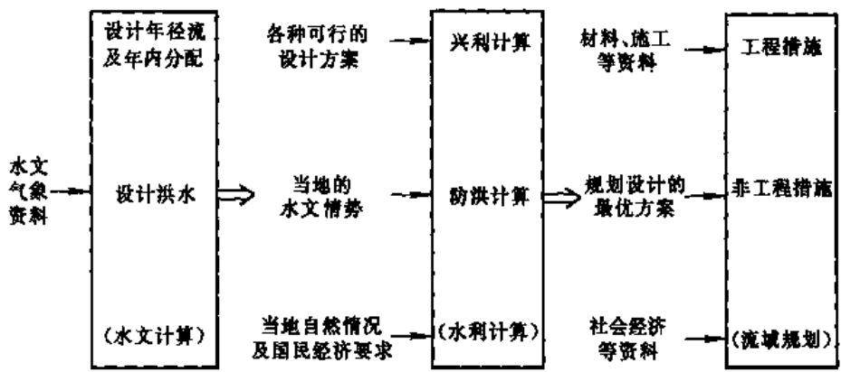  
图 1-1 流域规划工作流程图

## 第二节 工程水文学的研究方法

水文现象异常复杂，不易完全了解。但通常可以借系统概念作简化处理。所谓系统，是由许多互相关联部分组成的总体。系统大的可以包括整个地球水循环，小的可以只涉及地球上的一个小部分（如流域）面积上的几个水文过程。

【例1-2】试定出流域上的降雨径流水文系统。

解 如图1-2，流域是指汇集于一条河流的集水区域。分水岭是流域汇水的分界线。沿流域分水岭的界面在向上向下与顶面和底面包围成一个水文系统（图1-2）。

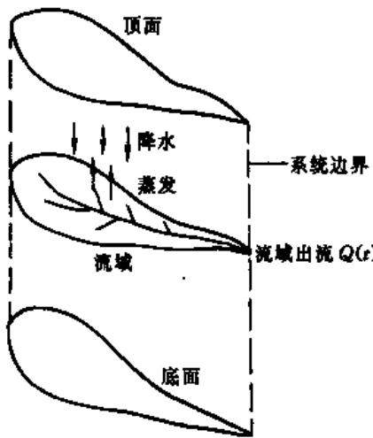  
图 1-2 流域水文系统

此系统可以降雨作为输入，河流出口的水流作为输出，蒸发也是输出，但降雨时蒸发甚小，可以不计。这是一个非常复杂的系统：降雨在流域面上随时随地发生变化，汇流过程中也不断发生时空变化。这样一个变化复杂的水文现象若以严格的物理数学方程来描述是不可能的。实用上只能以联系输入与输出的模型来代表。水文系统模型的用途是由输入预测输出。模型的输入输出是可测量的水文变量。其中心结构是联系输入输出的方程式，设输入输出以时间函数I（t)和Q(t)表示，则系统由输人变换为输出的方程为式（1-2）：

$$
Q ( t ) = \Omega I ( t )\tag{1-2}
$$

式中，Ω称为变换函数，它可以是代数式，也可以是微分方程式。

水文系统是一种自然现象，存在两种基本规律：动态物理规律（成因规律）和统计规律。工程水文学中的水文计算与水文预报都有预报性质的任务，但因预见期长短的不同而采用不同的方法。水文预报通常只能预报几天的来水情况，往往是根据现象的前一过程预报后一过程（未来）情况，此时必然性起主要作用，往往采用动态规律。例如可以由上游的洪水通过洪水的传播规律预报下游的未来情况。随着预见期的加长，所研究的水文现象影响因素更为复杂，此时必然性退居次要地位，偶然性显示其重要性，因此要求预见期较长的水文计算多采用统计方法进行概率预报。概率预报不同于实时预报，只能预报水文事件出现的概率，而不能预报该事件出现的时间。

在工程水文学应用中，这两种方法相辅相成，是不能截然分开的。

## 第三节水文学的发展

水文学经历了由萌芽到成熟、由定性到定量、由经验到理论的发展过程。

## 一、萌芽时期（1400年以前）

在一些古文明国家和地区，从历代古籍、文献、碑刻古迹和发掘的文物中，可以发现水文科学萌发的一系列史实：古埃及在公元前3500\~300年因灌溉引水开始观测尼罗河水位，至今还保存有公元前2200年所刻水尺的崖壁。中国古代的一些水利工程如都江堰、灵渠等建成后能较长时期地发挥效益，都与运用水文知识有关，尤其是2000年前建成的都江堰，至今仍在发挥巨大的效益。中国西汉四年（公元4年）张戎最先提出的“以水攻沙”，对当时和后世治理黄河的影响甚大。中国的测雨可追溯到公元前11世纪以前的商代，甲骨文中有细雨、大雨和骤雨的分类。宋秦九韶在《数书九章》记有当时全国都有天池盆测雨量及测雪量的计算方法。北魏郦道元的《水经注》（公元527年）记述干支河流达1252条之多，比欧洲同类水平的著作约早1000年，是一部水文地理巨著。《吕氏春秋》(公元前239年）完整地提出了水循环概念“云气西行云云然，冬夏不辍；水泉东流，日夜不休；上不竭，下不满，小为大，重为轻，圜道也。”《吕氏春秋》最先提出水文循环，至今尚为世界学术界所称道。

总的说来，这一时期中国的水文知识居于世界领先地位。

## 二、奠基时期（1400\~1900年）

14\~16世纪欧洲文艺复兴和18\~19世纪工业革命给自然科学的发展以很大影响。此时期水文方面雨量器、蒸发器和流速仪等一系列观测仪器的发明，为水文现象的实地观测、定量研究和科学实验提供了必要的条件。水文循环在观测和实验基础上得到验证，水文现象由概念描述深入到定量表达，为水文科学的建立奠定基础。这一时期，水文学首先在西欧发展，后在北美兴起，并应用于实际。

1424年中国开始全国统一制作和使用标准测雨器。1610年意大利B. 卡斯泰利提出流量测量方法。英国雷恩发明自记雨量计。1790年法国R. 活尔特曼发明了转子式流速仪。1870年美国T.G. 埃利斯发明了旋桨式流速仪。1885年美国 W.G. 普赖斯发明了旋杯式流速仪，为水文定量观测和水文科学提供了有力的工具。

在欧洲，由于实测水文资料增加和许多实验研究，揭示了一系列水文基本规律。在中国，徐霞客经过28年的野外考察，他的游记关于岩溶地貌和水文地理的记述，早于国外同类著作近300年。18\~19世纪西欧产业革命促进城市、交通和工业发展，大量的水利建设要求解决各种设计中的水力计算问题，使水力学理论得到较大进步，由此又为一些水文规律的理论研究提供了有力的工具。水文学基本理论和方法逐步完善，使水文计算和水文预报水平得到提高，在工程建设中和防洪中的效果日益显著，从而形成以水文计算和水文预报为主的新分支学科应用水文学。但在这一时期总的说来，中国水文科学进展则比较缓慢。

## 三、应用水文学的兴起（1900～1950年）

进入20世纪，特别是经过两次世界大战的破坏后，各国都致力于经济恢复和发展，迫切需要解决城市建设、动力开发、交通运输、工农业用水和防洪等水利工程中的一系列水文问题，促进了水文科学的迅速发展。此时期水文站网扩大，实测资料积累丰富，为水文分析研究提供了前所未有的条件，应用水文学取得了许多新进展。美国在这一时期取得的成果较多，处于领先地位。1900年美国J.A. 塞登提出了著名的塞登定律，为天然河道洪水演进提供了理论。1935年美国的G.T. 麦卡锡提出的马斯京根方法简化了河道的洪水演进计算。为适应工程设计和防洪要求，水文计算和水文预报方面得出了许多新的概念和方法：1914年，黑曾首先用正态概率格纸选配流量频率曲线。1924年H.A. 福斯特完整地提出了

P-Ⅱ频率曲线的分析方法。W. 韦伯尔提出了经验频率计算公式。这些学者把概率论和数理统计引进了水文学。1932年美国L.R.K. 谢尔曼提出的单位过程线被誉为水文学进展的里程碑。1937年美国M. 贝纳德和R.K.Jr. 林斯雷等提出可能最大降水/洪水方法。这些水文计算方法在实际应用中得到迅速推广，丰富了应用水文学。1936年美国的W.G. 霍伊特提出随机过程引人水文计算，形成了随机水文学。此外，许多应用水文学著作的出版，标志着水文学进入了成熟阶段。

这一时期中国在停滞了数个世纪之后，开始从西方引进了新的水文科学，从事于中国江河水文学的研究。

## 四、水文学的现代特色与发展（1950年以后）

20世纪后期水文科学的发展，出现了新的形势：首先，由于新技术特别是计算机的应用，使水文信息（实时资料）的获取、传递和处理大为方便迅速，节省了大量人力和时间。其次，由于工农业和城市建设的需要，应用水文学发展迅速。其三，由于生产和生活用水的增长，环境污染日趋严重，出现了水资源紧张局面，迫使水文学特别侧重于水资源研究，不仅注重水量还要注重水质；不仅注重洪水，还要注重枯水；不仅研究一条河流、一个流域的水文特性，还要研究跨流域、跨地区的水资源联合调度问题；不仅要研究短期、近期的水文预报（forecast），还要研究长期的水文趋势预估（predication）。从此，水文科学进人了一个现代化的新时代。

美国1971年建立了水文资料库，能够在各州终端上获得全美任一地点的资料。80年代前期先后发射4颗陆地卫星，取得了许多水文研究成果，并为国际服务。美、英和挪威等国采用测深仪直接绘制断面图。这一时期，中国水文站网发展迅速，全国基本站达21600处，可以基本掌握全国各主要河流的水文情势；在长江、黄河等流域开始应用卫星图片和遥感技术研究水文和水资源问题。

50年代，随着电子计算技术的发展，出现了许多水文数学模型，为水文科学的进一步发展开创了新途径。

1966年美国林斯雷和N.H. 克劳福法提出的斯坦福流域模型和美籍华人周文德在60\~70年代提出的流域水文模型以及一系列的水文随机模型、水系统模型等，推动了水文预报和水资源系统分析。中国水文预报自50年代初开始，也提出了具有中国特色的洪水预报方法。

调查、考证和分析历史洪水资料，以弥补实际资料的不足，除广泛调查历史洪水外，90年代又发展古洪水研究，利用放射性同位素碳十四获得全新世（约距今10000年）以来的古洪水资料，在长江三峡、黄河小浪底等水利枢纽工程的洪水计算中取得了有巨大意义的成果。70年代以来，中国还相继编绘出版了《全国可能最大降水等值线图》和《全国暴雨参数等值线图》等，为中国的暴雨洪水研究和计算作出了贡献。

70年代中期开展的国际水文合作，兴起了全球性的水文科学研究和国际水文十年(IHD)、世界气象组织（WMO）的业务水文计划(OHP)、联合国教科文组织国际水文计划（IHP）等。广泛的国际合作，促进了全球水文、水资源知识的交流，推动了水文科学的发展。

## 第二章 水文循环与径流形成

第一节 水文循环与水量平衡

## 一、自然界的水文循环

地球上的水以液态、固态和气态的形式分布于海洋、陆地、大气和生物机体中，这些水体构成了地球的水圈。水圈中的各种水体在太阳的辐射下不断地蒸发变成水汽进入大气，并随气流的运动输送到各地，在一定条件下凝结形成降水。降落的雨水，一部分被植物截留并蒸发。落到地面的雨水，一部分渗入地下，另一部分形成地面径流沿江河回归大海。渗入地下的水，有的被土壤或植物根系吸收，然后通过蒸发或散发返回大气；有的渗透到较深的土层形成地下水，并以泉水或地下水流的形式渗入河流回归大海。水圈中的各种水体通过这种不断蒸发、水汽输送、凝结、降落、下渗、地面和地下径流的往复循环过程，称为水文循环，也称为水循环。水文循环的范围贯穿整个水圈，向上延伸到10km左右，下至地表以下平均1km深处。

按水文循环的规模与过程，可分为大循环和小循环。从海洋蒸发的水汽，被气流输送到大陆形成降水，其中一部分以地面和地下径流的形式从河流汇归海洋；另一部分重新蒸发返回大气。这种海陆间的水分交换过程，称为大循环或外循环。在大循环运动中，水一方面在地面和上空通过降水和蒸发进行纵向交换，另一方面通过河流在海洋和陆地之间进行横向交换。海洋从空中向大陆输送大量水汽，陆地则通过河流把水输送到海洋里。陆地也向海洋输送水汽，但与海洋向陆地输送的水汽相比，其量很少，约占海洋蒸发量的8%，所以，海洋是陆地降水的主要水汽来源。海洋上蒸发的水汽在海洋上空凝结后，以降水的形式落到海洋里，或陆地上的水经蒸发凝结又降落到陆地上，这种局部的水文循环称为小循环或内循环。前者称为海洋小循环，后者称为内陆小循环。内陆小循环对内陆地区降水有着重要作用。因为内陆地区距离海洋很远，从海洋直接输送到内陆的水汽不多，通过内陆局部地区的水文循环，使水汽逐步向内陆输送，这是内陆地区主要的水汽来源。由于水汽在向内陆输送过程中，沿途会逐渐损耗，故内陆距海洋越远，输送的水汽量越少，降水量越小。水文循环中的各种现象如图2-1所示。

水文循环是地球上最重要、最活跃的物质循环之一。在水文循环过程中，水的物理状态、水质、水量等都在不断地变化，水通过蒸发、水汽输送、降水和径流四个环节进行着交换。由干大气环流机制和海陆分布决定了地球上水汽的运行规律，加之不同的地区地质构造、地貌、岩石土壤性质、植物覆盖、湖泊、沼泽等条件不同，水在自然界循环的路径和过程极其复杂且多变。有的地区湿润多雨，水量丰沛，有的则干旱少雨，河湖干涸。同一地区，有时大雨滂沱，江河横溢。有时却久旱不雨，江河枯竭。正是由于自然界的水文循环，才形成这种永无终止千变万化的水文现象。

水在自然界中的循环运动，为人类带来了取之不尽、用之不竭的水资源，对人类的生活和生产活动有着重大的影响。研究水文循环的目的，在于认识它的基本规律，揭示其内在联系，这对合理开发和利用水资源，抗御洪旱灾害，改造自然，利用自然都有十分重要的意义。

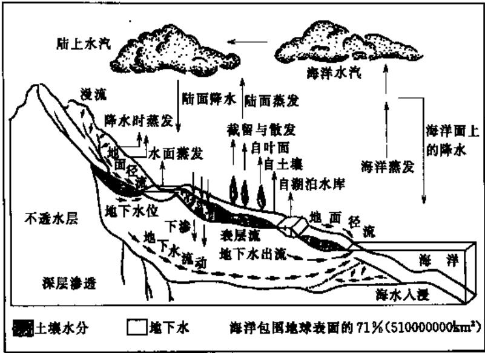  
图 2-1 水文循环示意图

## 二、地球上的水量平衡

在水文循环过程中，对任一区域、任一时段进入水量与输出水量之差额必等于其蓄水量的变化量，这就是水量平衡原理。水量平衡原理是水文学的基本原理，水量平衡法是分析研究水文现象，建立水文要素之间定性或定量关系，了解其时空变化规律等的主要方法之一。

根据水量平衡原理，可列出水量平衡方程。对某一区域，有式（2-1)：

$$
I - O = \Delta S\tag{2-1}
$$

式中I、O—给定时段内输人、输出该区域的总水量；

$\pmb { \Delta S }$ 时段内区域蓄水量的变化量，可正可负。

上式为水量平衡方程的通用式，对不同的研究对象，需具体分析其输人输出量的组成，写出相应的水量平衡方程式。

若以地球的整个大陆作为研究范围，其水量平衡方程为式(2-2)：

$$
P _ { \varepsilon } - R - E _ { \varepsilon } = \Delta S _ { \varepsilon }\tag{2-2}
$$

若以海洋为研究对象，其水量平衡方程为式(2-3)：

$$
P _ { o } + R - E _ { o } = \Delta S _ { o }\tag{2-3}
$$

式中 $\mathcal { P } _ { \epsilon }$ $P _ { \circ }$ ——大陆和海洋上的降水量；

$E _ { c }$ $\scriptstyle { \pmb { \mathscr { E } } _ { o } }$ 大陆和海洋上的蒸发量；

$\pmb { R }$ —流人海洋的径流量（包括地面和地下径流量）；

$\Delta S _ { \epsilon }$ ${ \Delta S _ { \theta } }$ 大陆和海洋上在研究时段内蓄水量的变化量。

在短时段内，△S和△S。可正可负，但对多年平均情况，正负可以相互抵消，蓄水量的 ${ \underline { { \Delta S _ { c } } } }$ ${ \sf A S } _ { \circ }$ 变化量趋于零。因此，对多年平均情况，有式（2-4）和式（2-5）：

大陆

$$
\overline { { P } } _ { c } \ : - \ : \overline { { R } } = \overline { { E } } _ { c }\tag{2-4}
$$

海洋

$$
\overline { { P } } _ { o } + \overline { { R } } = \overline { { E } } _ { o }\tag{2-5}
$$

式中 $\overline { { \mathcal { P } } } _ { \mathfrak { c } }$ $\overline { { P } } _ { o }$ —大陆和海洋多年平均降水量；

$\overline { { E } } _ { c }$ $\overline { { \pmb { { E } } } } _ { o }$ —一大陆和海洋多年平均蒸发量；

$\overline { { R } } \cdot$ ——多年平均流入海洋的径流量（包括地面和地下径流量）。

合并式（2-4）和式（2-5)，得多年平均全球水量平衡方程为式（2-6）或式（2-7）：

$$
\overline { { P } } _ { c } + \overline { { P } } _ { o } = \overline { { E } } _ { c } + \overline { { E } } _ { o }\tag{2-6}
$$

或

$$
{ \overline { { P } } } = { \overline { { E } } }\tag{2-7}
$$

式（2-7）表明，全球多年平均降水量P与多年平均蒸发量E相等，为1130mm。 $\cdot \overline { { \mathcal { P } } }$

## 第二节 河流与流域

## 一、河流

## (一)河流的形成与分段

降落到地面的雨水，除下渗、蒸发等损失外，在重力的作用下沿着一定的方向和路径流动，这种水流称为地面径流。地面径流长期侵蚀地面，冲成沟壑，形成溪流，最后汇集成河流。河流流经的谷地称为河谷，河谷底部有水流的部分称为河床或河槽。面向下游，左边的河岸称为左岸，右边的河岸称为右岸。河流是水文循环的一条主要路径。地球上的各种水体中，河流的水面面积和水量最小，但它和人类的关系却最为密切。

一条河流沿水流方向，自高向低可分为河源、上游、中游、下游和河口五段。河源是河流的发源地，多为泉水、溪润、冰川、湖泊或沼泽等。上游紧接河源，多处于深山峡谷中，坡陡流急，河谷下切强烈，常有急滩或瀑布。中游河段坡度渐缓，河槽变宽，两岸常有滩地，冲淤变化不明显，河床较稳定。下游是河流的最下段，一般处于平原区，河槽宽阔，河床坡度和流速都较小，淤积明显，浅滩和河湾较多。河口是河流的终点，即河流注人海洋或内陆湖泊的地方。这一段因流速骤减，泥沙大量淤积，往往形成三角洲。注人海洋的河流，称为外流河，如长江、黄河等；流入内陆湖泊或消失于沙漠中的河流，称为内流河或内陆河，如新疆的塔里木河和青海的格尔木河等。

## （二)河流基本特征

## 1. 河流的长度

自河源沿主河道至河口的距离称为河流长度，简称河长，以km计。可在适当比例尺的地形图上量得。

## 2. 河流断面

河流断面有横断面和纵断面。垂直于水流方向的断面称为横断面，简称断面，其一般形状如图2-2所示。断面内自由水面高出某一水准基面的高程称为水位。枯水期水流所占部分为基本河床，或称为主槽，洪水泛滥所及部分为洪水河床，或称为滩地。只有主槽而无滩地的断面称为单式断面，有主槽又有滩地的断面称为复式断面。河流横断面能表明河床的横向变化。断面内通过水流的部分称为过水断面，其面积称为过水断面面积，以 ${ \mathfrak { m } } ^ { 2 }$ 计，它的大小随断面形状和水位而变。

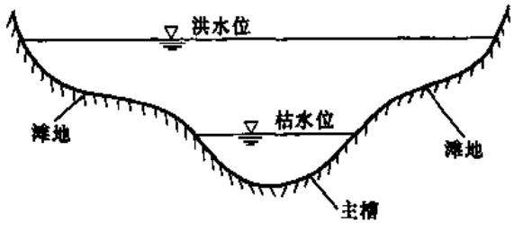  
图 2-2 河流横断面的一般形状

河流中沿水流方向各断面最大水深点的连线称为中泓线，沿中泓线的断面称为河流的纵断面。河流纵断面能反映河床的沿程变化。

## 3. 河道纵比降

任意河段两端（水面或河底）的高差△h称为落差，单位河长的落差称为河道纵比降，简称比降，用小数或千分数表示。常用的比降有水面比降和河底比降。河流沿程各河段的比降都不相同，一般自河源向河口逐渐减小。水面比降随水位的变化而变化，河底比降则较稳

定。当河段纵断面近于直线时，比降按式(2-8)计算：

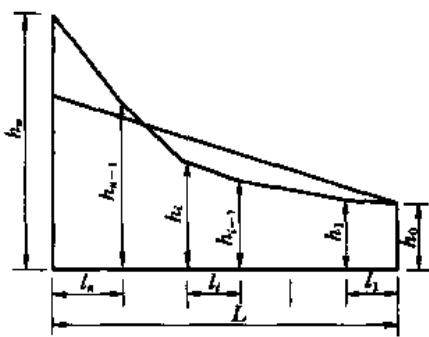  
图 2-3 河道纵断面示意图

$$
J = \frac { h _ { 1 } - h _ { 0 } } { l } = \frac { \Delta h } { l }\tag{2-8}
$$

式中 J——河段的比降；

$\pmb { h } _ { 1 }$ $\scriptstyle \hbar _ { 0 } ^ { } { \mathrm { . } }$ 河段上、下断面水面或河底高程，m；

——河段长度， $\mathbf { m }$

当河底高程沿程变化时，可在纵断面图（如图2-3)上从下断面河床处作一斜线，使斜线以下的面积与原河底线以下面积相等，该斜线的坡度即为河道的平均比降，其计算式为：

$$
J = \frac { ( h _ { 0 } + h _ { 1 } ) l _ { 1 } + ( h _ { 1 } + h _ { 2 } ) l _ { 2 } + \cdots + ( h _ { n - 1 } + h _ { n } ) l _ { n } - 2 h _ { 0 } L } { L ^ { 2 } }\tag{2-9}
$$

式中 $h _ { 0 }$ t $\bullet \bullet \bullet$ $h _ { n }$ 自下游到上游沿程各点河底高程，m；

$l _ { 1 }$ $\bigcirc \bigcirc \bigcirc$ $l _ { \pi }$ 相邻两点间的距离，m；

$\pmb { I _ { \alpha } }$ —河段的全长， $\pmb { \mathrm { m } }$

## 二、水系及河流地貌定律

脉络相通的大小河流所构成的系统称为水系、河系或河网，如图2-4所示。水系中直接流人海洋、湖泊的河流称为干流，流入干流的河流称为支流。为了区别干支流，常采用斯特拉勒

(Strahler)河流分级法进行分级。该法可表述为 $\textcircled{1}$ 直接发源于河源的小河流为一级河流 $\textcircled{2}$ 两条同级别的河流汇合而成的河流级别比原来高一级 $\bullet$ 两条不同级别的河流汇合而成的河流的级别为两条河流中的较高者。以此类推至干流，于流是水系中最高级别的河流。

人们发现，自然界的水系在发育过程中遵循一定的规律，并归纳成一些河流地貌定律，如霍顿(Horton)提出的河数律、河长律、面积律和河流比降律等。

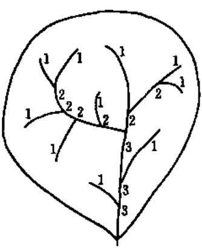

河数律指水系中任一级河流数与该级河流的级别呈反几何级数关系，级数首项为1，公比近似于分叉比，即：

$$
N _ { i } = R _ { B } ^ { \ a - i } i = 2 , 3 , \cdots , \Omega\tag{2-10}
$$

图 2-4 流域与水系示意图

式中 $N _ { i }$ 第i级河流数；

1、2、3—河流的级别

$R _ { B }$ —分叉比，即某一级河流数与高一级河流数之比， $R _ { B } { = } N _ { i - 1 } / N _ { i }$

$\pmb { \Omega } \cdot$ —水系中最高的河流级别。

河长律指水系中各级河流的平均河长与该河流级别近似于正几何级数关系，级数的首项为第一级河流的平均河长，公比为河长比，即：

$$
\overline { { L } } _ { i } = \overline { { L } } _ { 1 } R _ { L } ^ { i - 1 } \quad i = 2 , 3 , \cdots , \Omega\tag{2-11}
$$

式中 $\smash { \widetilde { I } _ { 2 3 } , \ \widetilde { L } _ { 1 } }$ —第i级和第一级河流的平均河长；

$R _ { L } \cdot$ 河长比，即某一级河流的平均长度与低一级河流的平均长度之比， $R _ { L } =$ $\overline { { L } } _ { i } / \overline { { L } } _ { i - 1 }$

根据河长律，可导出面积律如下：

$$
\overline { { F } } _ { i } = \overline { { F } } _ { 1 } R _ { F } ^ { i - 1 } \quad i = 2 , 3 , \cdots , \Omega\tag{2-12}
$$

式中 $\overline { { \pmb { F } } } _ { i }$ $\overline { { F } } _ { 1 }$ ——第i级和第一级河流的平均流域面积；

$R _ { F }$ 面积比，即某级河流的平均流域面积与低一级河流的平均流域面积之比，$R _ { F } { = } \overline { { F } } _ { i } / \overline { { F } } _ { i - 1 }$

河流的比降律是指水系中任一级河流的平均比降与该河流级别呈正几何级数关系，级数的首项为第一级河流的平均比降，公比为河流比降比，即：

$$
\overline { { J } } _ { i } = \overline { { J } } _ { 1 } R _ { J } ^ { i 2 - i } \quad i = 2 , 3 , \cdots , \Omega\tag{2-13}
$$

式中 $\smash { \overline { { J } } _ { i , \mathrm { ~ } } \overline { { J } } _ { \mathrm { ~ l ~ } } }$ ——第i级和第一级河流的平均比降；

$R _ { J } \cdot$ —河流比降比，即任一级河流的平均比降与高一级河流的平均比降之比，R=Ji-1/Ji。

一般说来，不同级别的河流的分叉比、河长比、面积比、比降比并不相同，应用时可取各级河流的平均值。实践证明，霍顿的地貌律理论符合天然河流河系组成的基本规律。

## 三、流域

## (一) 流域

汇集地面水和地下水的区域称为流域，也就是分水线包围的区域。分水线有地面、地下之分。当地面分水线与地下分水线相重合，称为闭合流域，否则为不闭合流域，如图2-5所示。在实际工作中，除有石灰岩溶洞等特殊的地质情况外，对于一般流域，当对所论问题无太大影响时，多按闭合流域考虑。

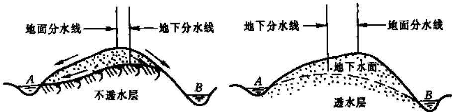  
图 2-5 地面分水线与地下分水线示意图

流域是相对于某一出口断面的，当不指明断面时，流域即指对河口断面以上区域。

## (二)流域基本特征

## 1. 流域面积

流域分水线包围区域的平面投影面积，称为流域面积，记为F，以km²计。可在适当比例尺的地形图上勾绘出流域分水线，量出其流域面积。

## 2. 河网密度

流域内河流干支流总长度与流域面积的比值称为河网密度，以km/km²计。

## 3. 流域的长度和平均宽度

流域长度就是流域轴长。以流域出口为中心向河源方向作一组不同半径的同心圆，在每个圆与流域分水线相交处作割线，各割线中点的连线的长度即为流域的长度，以km计。流域面积与流域长度之比称为流域平均宽度，以km计。

## 4. 流域形状系数

流域平均宽度与流域长度之比称为流域形状系数。扇形流域的形状系数较大，狭长形流域则较小，所以流域形状系数在一定程度上以定量的方式反映流域的形状。

## 5. 流域的平均高度和平均坡度

将流域地形图划分为100个以上的正方格，依次定出每个方格交叉点上的高程以及与等高线正交方向的坡度，取其平均值即为流域的平均高度和平均坡度。

## 6. 流域自然地理特征

包括流域的地理位置、气候特征、下垫面条件等。

(1)流域的地理位置。流域的地理位置以流域所处的经纬度来表示，它可以反映流域所处的气候带，说明流域距离海洋的远近，反映水文循环的强弱。

(2)流域的气候特征。包括降水、蒸发、湿度、气温、气压、风等要素。它们是河流形成和发展的主要影响因素，也是决定流域水文特征的重要因素。

(3)流域的下垫面条件。下垫面指流域的地形、地质构造、土壤和岩石性质、植被、湖泊、沼泽等情况，这些要素以及上述河道特征、流域特征都反映了每一水系形成过程的具体条件，并影响径流的变化规律。在天然情况下，水文循环中的水量，水质在时间上和地区上的分布与人类的需求是不相适应的。为了解决这一矛盾，长期以来人类采取了许多措施，如兴修水利、植树造林、水土保持、城市化等措施来改造自然以满足人类的需要。人类的这些活动，在一定程度上改变了流域的下垫面条件从而引起水文特征的变化。因此，当研究河流及径流的动态特性时，需对流域的自然地理特征及其变化状况进行专门的研究。

## 第三节 降 水

降水是指液态或固态的水汽凝结物从云中降落到地面的现象，如雨、雪、霰、截、露、霜等等，其中以雨、雪为主。降水是水文循环中最活跃的因子，它是一种水文要素，也是一种气象要素。因此，降水现象是水文学和气象学共同研究的对象。我国大部分地区，一年内降水以雨水为主，雪仅占少部分，所以，这里降水主要指降雨。

降水的特征常用几个基本要素来表示，如降水量、降水历时、降水强度、降水面积及暴雨中心等。降水量指一定时段内降落在某一点或某一面积上的总水量，用深度表示，以mm计。如一场降水的降水量指该次降水过程的降水总量。日降水量指一日内降水总量等等。降水量一般分为7级，如表2-1。凡日降水量达到和超过50mm的降水称为暴雨。暴雨又分为暴雨、大暴雨和特大暴雨三个等级。降水持续的时间称为降水历时，以min、h或d计。单位时间的降水量称为降水强度或雨率，以mm/min或mm/h计。降水笼罩的平面面积为降水面积，以km²计。暴雨集中的较小的局部地区，称为暴雨中心。降水的特征不同，它所形成的洪水的特性也不同。

<table><tr><td rowspan=1 colspan=1>24 h雨量（mm）</td><td rowspan=1 colspan=1>&lt;0.1</td><td rowspan=1 colspan=1>0.1~10</td><td rowspan=1 colspan=1>10~25</td><td rowspan=1 colspan=1>25~50</td><td rowspan=1 colspan=1>50~100</td><td rowspan=1 colspan=1>100~200</td><td rowspan=1 colspan=1>&gt;200</td></tr><tr><td rowspan=1 colspan=1>等   级</td><td rowspan=1 colspan=1>微量</td><td rowspan=1 colspan=1>小雨</td><td rowspan=1 colspan=1>中雨</td><td rowspan=1 colspan=1>大雨</td><td rowspan=1 colspan=1>暴雨</td><td rowspan=1 colspan=1>大暴雨</td><td rowspan=1 colspan=1>特大暴雨</td></tr></table>

## 一、与降水有关的气象因素

降水现象是发生在大气中的对流层内。对流层是地球大气中最低的一层，云、雾、雨、雪等主要天气现象都出现在这一层。对流层有三个显著的特征：①气温随高度增加而降低。②对流层主要从地面获得热能，使它具有强烈的上升和下降的气流，即气流的对流运动。对流运动的强弱，因纬度和季节的不同而不同。一般低纬较强，高纬较弱；夏季较强，冬季较弱。因而，对流层的厚度也随纬度和季节而变，约为8\~18km。对流层虽不及整个大气厚度的1%，但由于地球引力的作用，这一层集中了整个大气3/4的质量和几乎全部的水汽。③由于地表性质差异很大，所以深受地表影响的对流层中温度、湿度的水平分布不均匀，彼此相邻的各团空气之间，冷、暖，干、湿差异很大。但在地表性质差不多的地区，还是可以找到在水平方向上温度、湿度比较均匀的大块空气，这样的空气块称为气团。气团的水平范围从几百到几千公里，垂直高度几公里，有时达到对流层顶。气团按其性质可分为冷气团和暖气团。若按气团源地的地理位置，则分为冰洋气团、极地气团、热带气团和赤道气团四种基本类型。在对流层中，气团在不断地移动着，并随下垫面条件的改变，性质也随之发生变化，通常称为气团变性，如变性极地气团等。

按气流和天气现象分布特点，对流层又可分为三部分：自地面起至1.5km高度，称为下层，又称摩擦层或扰动层。该层大气受地面的热辐射和扰动影响显著。1.5\~6km的高空范围为中层。大气中的云和降水大都产生在这一层。从6km到对流层顶部，叫上层。上层水汽含

量很少，气温常在0℃以下。对流层内与降水有关的主要气象因素有：气温、气压、风、湿度、云、蒸发等。

## 1. 气温

表示空气冷热程度的物理量称为气温，以℃计。气温的高低取决于空气吸收太阳辐射热能的多少。但大气直接吸收太阳辐射的能力很差，空气的受热过程，主要是地表吸收太阳的短波辐射热，再向大气发出长波辐射，通过水汽、二氧化碳等气体的吸收使大气增温，再产生指向地面的逆辐射使地面增温。在对流层内，接近地表的大气温度较高，距地面越高，气温越低，平均每升高100m，气温约下降0.65℃，称为气温直减率，记为γ。气温随高度的变化可用气温层结曲线来表示，如图2-6所示。

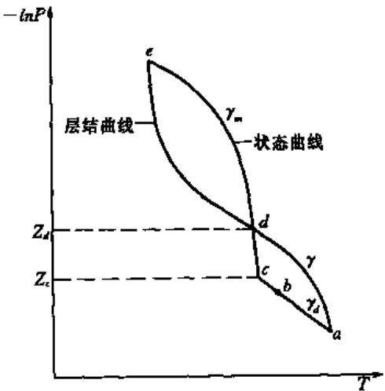  
图 2-6 大气温度的层结曲线与  
气块上升运动的状态曲线

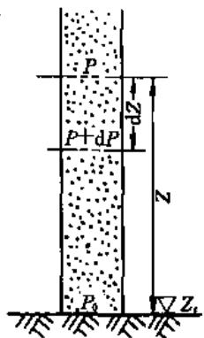  
图 2-7 气压与高度关系示意图

## 2. 气压

单位面积上所受大气的重力称为气压，以hPa计。某高度上的气压就是单位面积上所承受的该高度以上空气柱的重量，所以气压随高度增加而减小，如图2-7所示。气压与高度的关系可用大气静力方程来表示，即：

$$
\mathrm { d } P = - \rho g \mathrm { d } Z\tag{2-14}
$$

式中 $\pmb { \rho } \cdot$ 一空气密度， $\scriptstyle { \mathfrak { g } } / \cos ^ { 3 }$

$\pmb { g }$ —重力加速度， $\mathsf { c m } / \mathsf { s } ^ { 2 } ;$

$\mathbf { d } { \mathbf { Z } } ^ { . }$ —微气块厚度， $\mathbf { c m } ;$

$\mathtt { d } P$ 气块上、下面气压差， $\mathbf { h } \mathbf { P a }$

由于空气密度不是常数，所以气压与高度不是线性关系。

气压的空间分布叫作气压场。空间上气压相等的点组成的曲面，称为等压面，如图2-8所示。等压面上各点的高度是不相同的，气象上用位势高度，即单位质量抬升1m所作的功，来表示位势大小的物理量，单位为位势米。因此，某等压面上的等位势高度线（称为

等高线）的分布，可以反映等压面空间起伏的情况，如图2-8中高位势区与高压区相对应，低位势区与低压区相对应，且等高线的分布与等压线分布完全一致。这种图称为高空图，如850、700、500、200hPa高空图等等。

地面气压场则用地面天气图表示。地面天气图是将各观测站在同一时刻测得的气压，经换算到海平面上的数值，再勾绘等压线来表示各地气压高低的情况。气压分布的基本型式，概括起来约有五类，如图2-9所示。闭合等压线，如越往中心气压越高，

叫高气压；越往中心气压越低，称低气压。

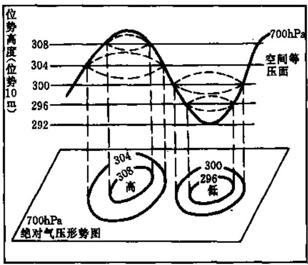  
图 2-8 等压面上位势高度分布图

气压中间高两侧低，等压线不闭合，叫高压脊，各条等压线曲率最大点的连线，称为脊线。气压中间低两侧高，等压线不闭合，叫低压槽，各条等压线曲率最大点的连线，称为槽线。两高气压和两低气压相对组成的中间区域，叫鞍形气压区。上述五种气压分布的基本型式，统称为气压系统。在不同的气压系统中，天气情况是不同的。如高气压区天气晴朗，而低气压、低压槽和鞍形气压区都可能有降水。气压系统在不断地运动着，一个地方的天气变化，是由大气中一个个移动的大大小小的气压系统引起的，这些系统称为天气系统。天气系统彼此之间相互联系、相互制约，并在大气的运动中不断地演变，从而形成了复杂多变的天气。

## 3. 风

大气的运动一般有两类：一为垂直运动，称为对流；另一为近乎水平的运动，在高空称平流，在低空称风。风是矢量，用风向风速表示。风向指气流的来向，按十六方位定名，

如北风、西南风等。风速以m/s计。风速越大，风力也越大。风速与风力的关系见表 2-2 蒲福风级表。

大气的水平运动主要是由于气压不同引起的。在自由大气中同一水平面上，由于气压不均一，空气受水平气压梯度力G的推动，开始循气压梯度方向运动，即空气从高气压流向低气压，有了速度，形成风，见图2-10(a)。但在自西向东旋转着的地球上，所有运动着的物体都受到地转偏向力的影响。在北半球，地转偏向力A指向运动方向的右侧。因此，有了速度的空气在地转偏向力的作用下将向气压梯度方向的右侧偏转，并在气压梯度力的作用下继续加速，但它始终受到

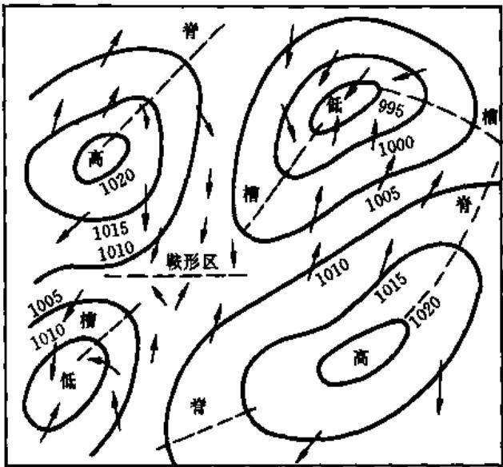  
图 2-9 气压分布型式示意图

地转偏向力的作用而越来越向右偏离，如图2-10（a)。最后，当地转偏向力增大到与气压梯度力大小相等、方向相反时，两力平衡，此时空气便沿等压线（或等高线）作等速运动，

表 2-2  
蒲福（Beaufort）风级表
<table><tr><td rowspan=1 colspan=1>级   別</td><td rowspan=1 colspan=2>0</td><td rowspan=1 colspan=2>1</td><td rowspan=1 colspan=2>2</td><td rowspan=1 colspan=2>3</td><td rowspan=1 colspan=2>4</td><td rowspan=1 colspan=2>5</td></tr><tr><td rowspan=1 colspan=1>风速（m/s）</td><td rowspan=1 colspan=2>0~0.2</td><td rowspan=1 colspan=2>0.3~1.5</td><td rowspan=1 colspan=2>1.6~3.3</td><td rowspan=1 colspan=2>3.4~5.4</td><td rowspan=1 colspan=2>5.5~7.9</td><td rowspan=1 colspan=2>8.0~10.7</td></tr><tr><td rowspan=1 colspan=1>级   别</td><td rowspan=1 colspan=1>6</td><td rowspan=1 colspan=2>7</td><td rowspan=1 colspan=2>8</td><td rowspan=1 colspan=2>9</td><td rowspan=1 colspan=2>10</td><td rowspan=1 colspan=2>11</td><td rowspan=1 colspan=1>12</td></tr><tr><td rowspan=1 colspan=1>风速（m/s）</td><td rowspan=1 colspan=1>10.8~13.8</td><td rowspan=1 colspan=2>13.9~17.1</td><td rowspan=1 colspan=2>17.2~20.7</td><td rowspan=1 colspan=2>20.8~24.4</td><td rowspan=1 colspan=2>24-5~28.4</td><td rowspan=1 colspan=2>28.5~32.6</td><td rowspan=1 colspan=1>&gt;32.6</td></tr></table>

这种情况下空气的水平运动称为地转风 $V _ { g }$ ，如图2-10(b)。但在近地面，由于受地面摩擦力的影响、这时作用于空气的力除了气压梯度力G、地转偏向力A外，还有摩擦力R，三力平衡、故实际风V较地转风小，且风向也发生转向，与等压线呈一夹角，风穿越等压线偏向低压一侧，见图2-10(c)。所以在低气压区，气流作逆时针方向流动，同时穿越等压线向低压中心汇聚，这种现象称为辐合，其流场称为气旋性流场，在高空则称为涡。在高气压区，气流呈顺时针方向流动，同时稍偏外，从高压中心向外流出，这种现象称为辐散，

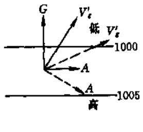  
(a)

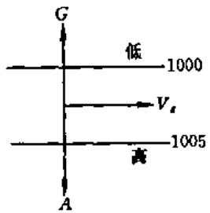  
(6)

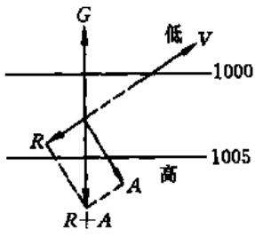  
(c)  
图2-10 地转风形成和受摩擦力影响的实际风示意图

其流场称为反气旋性流场，如图2-9所示。

在中纬度和热带地区，对流层的上层常出现风速大于 $3 0 ~ \mathrm { m / s }$ 的强风带，称为高空急流。在对流层的下层，也常存在一支较狭窄的强风带，称为低空急流。低空急流能源源不断地为雨区输送水汽，所以它与暴雨的关系十分密切。

影响我国降水的风，最重要的是季风。夏季，风自海洋吹人大陆；冬季，风则由大陆吹向海洋，这种随季节变化的风叫季风。季风使我国的降水具有明显的季节性。夏季，海洋上比大陆上凉爽，洋面上的气压高于大陆，西南风或东南风将洋面上暖湿空气源源不断地输往大陆，引起夏季的暴雨洪水；冬季则相反，风由大陆吹向海洋，我国绝大部分地区受来自西伯利亚和蒙古干冷气团的影响，盛行西北风或东北风，形成寒冷少雨天气。

## 4. 湿度

大气中水汽的含量叫作大气的湿度。表示大气湿度的方法很多，主要如下。

(1) 水汽压e：指空气中水汽压力，以 $\mathbf { h P a }$ 计。在一定温度下，空气中所含水汽量的最大值，称为饱和水汽压 $\scriptstyle { \pmb { E } } _ { \diamond }$ 饱和水汽压随气温而变，温度越高，空气中饱和水汽压越大，反之则越小。饱和水汽压与温度的关系如式（2-15）所示：

$$
E = E _ { 0 } \times 1 0 ^ { \frac { a \ell } { b + \ell } }\tag{2-15}
$$

式中 $E _ { \circ } { \mathrm { - } } \mathbf { \bar { \Sigma } }$ 时水面的饱和水汽压， $E _ { 0 } { = } 6 . 1 1 \ \mathrm { h P a }$ 1

a、b—常数，由实验得出，在冰面上 $a = 9 . 5 , b = 2 6 5 . 0$ ，在水面上 $\iota = 7 , 4 5 , b = 2 3 7 . 0$ t——温度，C；

$E { \mathrm { - } } \mathrm { - } t { \mathrm { \bar { C } } }$ 时的饱和水汽压， $\bf h P a$

在一定温度下，饱和水汽压E与空气中的实际水汽压e之差 $\pmb { { \cal E } } { - } e$ ，称为饱和差。若实际水汽压超过了饱和水汽压，空气中多余的水汽就会发生凝结。

(2) 绝对湿度a 和相对湿度 ${ f } :$ 单位体积空气中所含水汽质量称为绝对湿度，也就是空气中水汽的密度，以 $\scriptstyle { \mathbf { g } } / { \mathbf { m } } ^ { 3 }$ 计。空气中水汽含量越多，绝对湿度就越大。空气中的水汽压与同温度下的饱和水汽压的比值称为相对湿度，即 $f { = } e / E { \times } 1 0 0$ %。相对湿度的大小可以反映空气中水汽距饱和的相对程度。

(3) 露点 $T _ { d } ,$ 水汽量不变，在气压一定的条件下，气温下降，空气达到饱和水汽压时的温度称为露点温度。露点高，实际水汽压大；露点低，实际水汽压小。若气温与露点不等，说明实际水汽压与饱和水汽压不相等。

(4) 比湿 ${ \pmb q } \mathrm { _ { \mathrm { ~ i ~ } } }$ 指在一团湿空气中，水汽质量与该团空气的总质量之比，以 $\pmb { \ 8 } / \pmb { \ 8 }$ 或 $\tilde { \mathbf { g } } / \mathbf { k } \mathbf { g }$ 计。比湿与气压、水汽压之间的关系为式（2-16）：

$$
q = 0 . 6 2 2 { \frac { e } { P } } \left( \mathbf { g } / \mathbf { g } \right) = 6 2 2 { \frac { e } { P } } \left( \mathbf { g } / \mathbf { k g } \right)\tag{2-16}
$$

式中 $P - E$ 压， $\mathbf { h P a }$

水汽是降水的必要条件，尤其是大暴雨，必须具备充沛的水汽条件。据分析，我国发生大暴雨时，在700hPa高度上，比湿大多数大于 $8 ~ \tt g / k g$ ，比湿小于 $5 ~ \mathbf { g } / \mathbf { k g }$ ，一次暴雨也没出现过。

## 5. 云

云是由大气中的水汽凝结或凝华产生的。云的生成和演变与降水有着密切的关系，并对温度、湿度，空气的能见度以及日照的变化都有重要的影响。云的形状千变万化，若按云底高度和性状分类有：高云族，包括卷云、卷层云、卷积云。全部由小冰晶组成，云底高度通常在6000m以上。高云一般不会降水。中云族，包括高层云、高积云，多由水滴、过冷却水滴和冰晶混合组成，云底高度通常在2500\~6000m之间。其中高层云常有雨、雪产生。低云族，包括层积云、雨层云、层云。云底高度通常在2500m以下。大部分低云由水滴组成，低云都可能会下雨。其中雨层云常常有连续性雨、雪。直展云族，包括积云、积雨云。云底与低云齐，通常在1000\~1500m，云顶可达到高云的高度。其中积雨云是垂直发展非常旺盛的积云，常发生雷阵雨，有时伴有狂风、冰雹。

## 6. 蒸发

水汽是产生降水的必要条件，而水汽是由蒸发形成的。因此，蒸发对降水有着重要的意义。有关蒸发的内容将在第五节中介绍。

## 二、降水的形成与分类

## (一)降水的形成

自海洋、河湖、水库、潮湿土壤及植物叶面等蒸发出来的水汽进人大气后，由于分子本身的扩散和气流的传输作用分散于大气中。空气中的水汽含量有一定的限度，在一定温度下空气中最大的水汽含量称为饱和湿度。如果空气中的水汽量达到了饱和或过饱和，多余的水汽就要发生凝结。如果地面有团湿热未饱和空气，在某种外力作用下上升，上升高度越高，气压越低。因此，在上升过程中，这团空气的体积就要膨胀，在与外界没有发生热量交换、即绝热条件下，体积膨胀的结果必然导致气团温度下降。这种现象称为动力冷却。当气团上升到一定高度，温度降到其露点温度时，这团空气就达到了饱和状态，再上升就会过饱和而发生凝结形成云滴。云滴在上升过程中不断凝聚，相互碰撞，合并增大。一旦云滴不能被上升气流所顶托时，在重力作用下降落到地面成为降水。

由上述可知，水汽、上升运动和冷却凝结是形成降水的三个因素。在水汽条件具备的情况下，只有空气冷却，水汽才能凝结形成降水，面促使水汽冷却凝结的主要条件是空气的垂直上升运动。当湿空气在某种外力作用下被抬升后就会促使空气冷却，导致降水。但上升运动能否继续发展，与大气层结的稳定度有关。气象学上把任一气块与外界无热量交换时的状态变化过程，称为绝热过程。若上升气块内部既没有发生水相变化，又没有与外界发生热量交换的过程，称为干绝热过程。干空气或未饱和湿空气在绝热上升过程中，每上升100m，温度约降低1C，称此为干绝热直减率，以γ表示。饱和湿空气在绝热上升过 $\gamma _ { \mathrm { \scriptscriptstyle d } }$ 程中的降温率，则称为湿绝热直减率，记为γm。饱和湿空气在上升过程中因冷却，水汽发 $\gamma _ { \ast }$ 生凝结，释放凝结潜热，又因绝热与外界无热量交换，潜热加热气块，所以 $\gamma _ { \mathrm { _ { s } } } { < } \gamma _ { \mathrm { _ { d } } }$ ，且 $\gamma _ { m }$ 不是常数，而随气温气压而变。气块中的水汽凝结后，如凝结的水滴或冰晶仍保留在气块中，随气块作垂直运动，气象上称为湿绝热过程。如凝结物全部脱离气块降落于地面成为降水，则称为假绝热过程。实际大气中水汽凝结成水滴或冰晶后大部分形成降水，因此，大气中降水的天气过程，接近于假绝热过程。

如图2-6，若未饱和湿空气在某种外力的扰动下，气块自a点被抬升到b点（图中ade为四周空气温度层结曲线)，且水相没有发生变化。此时，该气块温度按干绝热直减率γ而 $\gamma _ { d }$ 变化，显然γ>γ，该气块比四周空气冷而趋于下沉，此时，大气层结是稳定的。若该气块 $\gamma _ { d } > \gamma$ 被抬升到c点，在该高度上温度低到可使该气块达到饱和，此时，气块中的水汽就要发生凝结，这个高度称为凝结高度 $\smash { \ z _ { c } }$ 。由于水汽凝结释放潜热加热气块，因此，气块温度将按湿绝热直减率 $\pmb { \gamma _ { \ast } }$ 变化。若外力足以将气块抬升到自由对流高度 $Z _ { d }$ 对应的d点以上，在该高度上气块温度高于四周空气的温度，即使没有外力作用，它仍能自加速上升直到e点。称这种情况下大气层结是不稳定的。abcde称为大气的状态曲线。层结不稳定大气，很容易发生强烈的上升运动。

## (二)降水的分类

降水通常按空气抬升形成动力冷却的原因分为对流雨、地形雨、锋面雨和气旋雨。

## 1. 对流雨

因地表局部受热，气温向上递减率过大，大气稳定性降低，下层空气膨胀上升与上层空气形成对流运动。上升的空气形成动力冷却而致雨称为对流雨。因对流上升速度快，形成的云多为垂直发展的积状云，降雨强度大，历时短，雨区较小。

## 2. 地形雨

空气在运移过程中，遇山脉的阻挡，气流被迫沿迎风坡上升，由于动力冷却而成云致雨称为地形雨。此外，山脉的形状对降雨也有影响，如喇叭口、马蹄形的地形，若它们的开口朝向气流来向，则易使气流辐合上升，产生较大的降雨，如图2-11所示。地形雨的降雨特性，因空气本身温湿特性，运行速度以及地形特点而异，差别较大。

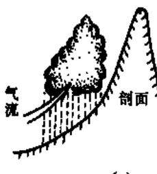  
(a)

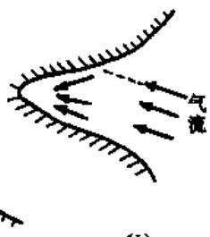  
(b)

  
(c)  
图 2-11 地形对气流的影响示意图  
(a)地形抬升；(b) 喇叭口地形内气流辐合；(c) 马蹄形地形内气流辐合

## 3. 锋面雨

两个温湿特性不同的气团相遇时，在其接触区由于性质不同来不及混合而形成一个不连续面，称为锋面。所谓不连续面实际上是一个过渡带，所以又称为锋区。锋面与地面的交线称为锋线，习惯上把锋线简称为锋。锋面的长度从几百公里到几千公里不等，伸展高度，低的离地1\~2km，高的可达10km以上。由于冷暖空气密度不同，暖空气总是位于冷空气上方。在地转偏向力的作用下，锋面向冷空气一侧倾斜，冷气团总是摸入暖气团下部，暖空气沿锋面上升。由于锋面两侧温度、湿度、气压等气象要素有明显的差别，因此，锋面附近常伴有云、雨、大风等天气现象。锋面活动产生的降水统称锋面雨。

由于在地球的不同地带会产生性质互异的气团，这些气团之间常存在锋面，称为行星锋带，其位置和强弱随时间而变。在四种主要气团（冰洋气团、极地气团、热带气团和赤道气团）之间，存在三种主要的行星锋带：极锋、副热带锋和赤道锋。其中，极锋和副热带锋的活动对我国的天气及降水影响最大。它们南进北退，决定着各地雨季的起始和终止。

赤道锋两侧的气团都是高温高湿的海洋气团，一般锋的温湿特征不明显，只有风的辐合，故称为赤道辐合带，亦称为热带辐合带。影响我国东南沿海的热带风暴和台风，多发生在热带辐合带上。

锋面随冷暖气团的移动而移动。若按运动学观点分类，可分为冷锋、暖锋、静止锋和铟囚锋。

(1)冷锋：冷气团起主导作用，推动锋面向暖气团一侧移动，这种锋称为冷锋，如图2-12（u）所示。根据移动的快慢，冷锋又分为两类：移动慢的称为第一型冷锋或缓行冷锋；移动快的称为第二型冷锋或急行冷锋。这两种冷锋天气有明显的差异。缓行冷锋锋面坡度小，约为1/100，移动缓慢，锋后冷空气迫使暖空气沿锋面稳定滑升，雨区出现在锋后，多为稳定性降水，雨区稍窄，在300km以内。如果锋前暖空气不稳定，在地面锋线附近也常出现积雨云和雷阵雨天气。急行冷锋坡度大，约1/40\~1/80，锋后冷空气移动快，迫使暖空气产生强烈的上升运动。因此，急行冷锋过境时，往往乌云翻滚，狂风大作，电闪雷鸣，大雨倾盆。降雨强度大，历时较短，雨区窄，一般仅数10km。

(c)  
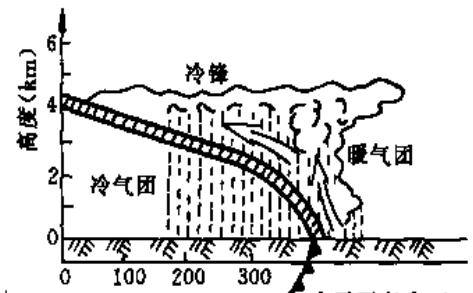

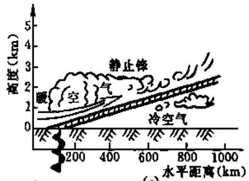

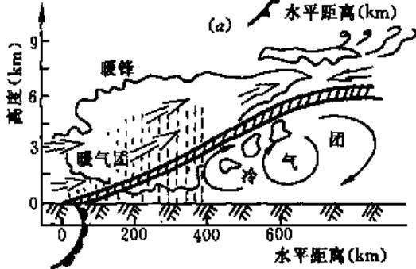  
(b)

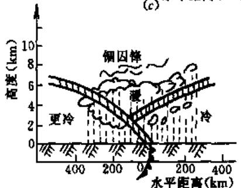  
(d)  
图 2-12 锋面类型示意图

(2)暖锋：暖气团起主导作用，推动锋面向冷气团一侧移动，这种锋称为暖锋。暖锋锋面坡度较小，约为1/50，暖空气沿锋面缓慢上升，在上升过程中绝热冷却，水汽凝结致雨，如图2-12(6)。暖锋的雨区出现在锋线前，宽度常在300\~400km，沿锋线分布较广。降雨强度不大，但历时较长。在夏季，当暖气团不稳定时，也可出现积雨云和雷阵雨天气。

(3)静止锋：冷暖气团势均力敌，在某一地区停滞少动或来回摆动的锋称为准静止锋，简称静止锋，如图2-12（c)。静止锋坡度小，约为1/200，有时甚至小到1/300，沿锋面上滑的暖空气可以一直伸展到距地面锋线很远的地方，所以云、雨区范围很广。降雨强度小，但持续时间长，可达10天或半月，甚至一个月。

(4)锢囚锋：当三种热力性质不同的气团相遇，如冷锋追上暖锋，或两条冷锋相遇，暖空气被拾离地面，锢囚在高空，称为锢囚锋，如图2-12(d)。由于锢囚锋是两条移动的锋相遇合并而成，所以它不仅保留了原来锋面的降水特性，而且锢囚后暖空气被抬升到锢囚点以上，上升运动进一步发展，使云层变厚，降水量增加，雨区扩大。

## 4. 气旋雨

气旋是中心气压低于四周的大气旋涡。在北半球，气旋内的空气作逆时针旋转，并向中心辐合，引起大规模的上升运动，水汽因动力冷却而致雨，称为气旋雨。按热力学性质分类，气旋可分为温带气旋和热带气旋两类，相应产生的降水称为温带气旋雨和热带气旋雨。

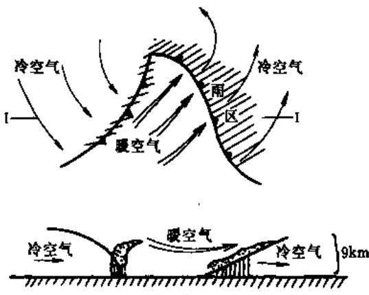  
图 2-13 气旋模式

(1)温带气旋雨：温带地区的气旋多由锋面波动产生的，称为锋面气旋，如图2-13所示。自气旋中心向前伸展出一条暖锋，向后伸展出一条冷锋。冷暖锋之间是暖气团，以北是冷气团。气旋是气流辐合上升系统，锋面上气流上升更为强烈，往往产生云、雨，甚至造成暴雨、雷雨、大风天气。一个发展成熟的锋面气旋天气为：气旋前方是暖锋云系及伴随的连续性降水天气，气旋后方是狭窄的冷锋云系和降水天气，气旋中部是暖气团天气，有层云或毛毛雨。

## (2) 热带气旋雨：热带气旋指发生在低纬度

海洋上的强大而深厚的气旋性旋涡。气象部门根据热带气旋地面中心附近风速的大小，将其分为四类：近中心最大风力6\~8级为热带低压；8\~9级为热带风暴；10\~11级为强热带风暴；大于12级为台风。一个发展成熟的台风，其低空风场的水平结构可分为三个区域，如图2-14所示。自台风边缘向内到最大风速区外缘为外圈，风速向中心急增，风力在6级以上，半径约为200\~300km；从最大风速区外缘向内到台风眼壁为中圈，是台风中对流和风雨最强烈的区域，半径约为100km；内圈为台风眼区，风速迅速减小或静风，半径约5\~30km。台风大多产生在对流性云团中，由于上升气流不断加强，云区常可发展为宽几十公里，高10公里的垂直云墙。云墙外有几条螺旋状积雨云带向中心汇合，螺旋状云带外面往往是由塔状对流云组成的外辐合云带。台风眼区由于有气流下沉，多晴空无云。台风区内水汽充沛，气流上升强烈，往往造成大量降雨，强度很大，分布不均匀。台风登陆后若受地形和冷空气的影响，往往使暴雨加剧，导致洪水泛滥。

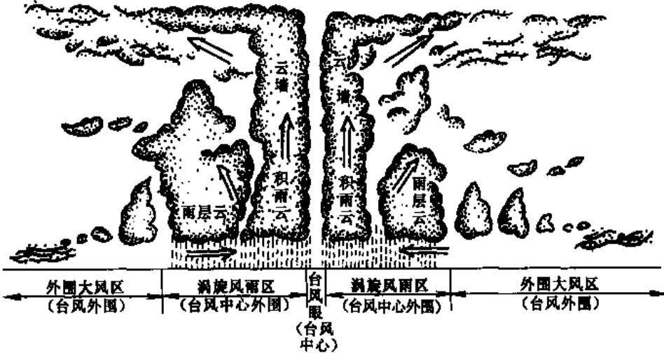  
图 2-14 台风天气模式

## 三、大气环流

地球上大范围的大气运动现象称为大气环流。假如地球表面均匀，且无自转运动，那么由于温度的差异，赤道地区温度高形成低压带，受热空气上升从高层流向两极。两极温度低形成高压区，冷空气下沉沿低层流向赤道，形成赤道与极地之间沿经向的大气环流。由于地球的自转，在北半球，从赤道上升到高层流向极地的气流在地转偏向力的作用下向右偏转，大约到30°N上空变成了与纬向平行的西风。西风的形成阻碍了低纬高层大气继续北流，便在30°N上空堆积，气压升高形成高压带，称为副热带高压带。副热带高压空气下沉，并从低层分别流向南方和北方。向南气流在地转偏向力的作用下向右偏，成为低纬近地层的东北风，返回赤道辐合带。这样在低纬形成一环流圈，称为信风环流圈。向北的气流也向右偏变成中纬低层的偏西风。同理，北极下沉的冷空气在近地层南流过程中右偏为东北风，这支东北风与中纬的偏西风在60°N附近相遇，气流辐合上升，形成副极地低压带。副极地低压带上升气流到高空后也向南北分流。北支流向北极，补偿极地南流的空气，这样在高纬也形成一个环流圈，称为极地环流圈。副极地低压和副热带高压之间的中纬地区，从地面到高空都是偏西气流，称为西风带。副热带高压下沉向北气流和副极地低压上升向南气流在中纬地区形成一个环流圈，称为中纬环流圈。这样，在北半球有三个环流圈，如图2-15所示。低纬和高纬上空分别为逆时针环流圈，中纬上空为一顺时针环流圈。在三个环流圈形成过程中，在近地层相应形成了四个气压带和三个风带（图2-16）：赤道低压带、副热带高压带、副极地低压带、极地高压带和东北信风带、盛行西风带、极地东风带。

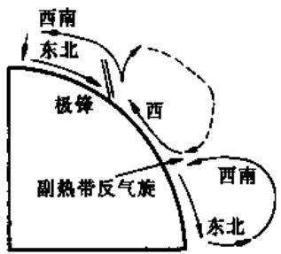  
图 2-15 北半球大气环流模式

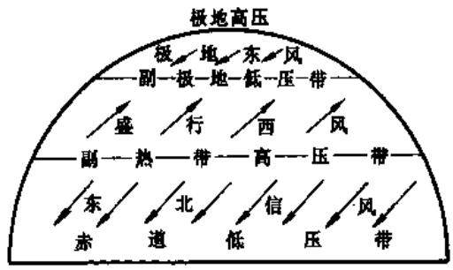  
图 2-16 近地面的风带与气压带示意图

事实上，地球表面并非均质，既有大片的陆地，又有广阔的海洋，而且海陆分布非常复杂：同时，海陆之间存在明显的热力差异，影响到海陆之间的气压分布，导致海陆之间大气的流动，使得大气环流变得更为复杂。再加上太阳辐射的季节性变化，上述大气环流性状也随之变化，从而决定了气候的四季变化。

## 四、影响我国降水（暴雨）的主要天气系统

大气环流的变化主要是通过环流系统的状态、强度和位置的改变来体现的。各种天气系统在大气环流的背景下，相互作用，不断地运动和演变着，从而形成各种各样的天气现象。我国地处中低纬度地区，西有青藏高原，东临太平洋，既受中纬度西风带天气系统的影响，又受低纬度天气系统的作用。影响我国降水（暴雨）的主要天气系统如下：

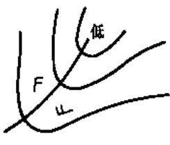  
图 2-17 高空槽和槽线示意图

## 1. 高空槽

高空槽是指活动在西风带上的槽，如图2-17所示。高空槽自西向东移动，槽前盛行暖湿西南气流，槽后是干冷西北气流，气流呈气旋性弯曲，造成空气辐合，因此，槽前常有降水。一次高空槽活动，反映了不同纬度间冷暖空气的一次交换过程，给中高纬地区造成阴雨大风天气。高空槽一年四季都出现，尤以春季最为频繁。活动于我国的高空槽有西北槽、印缅槽。它们大多从西方上游地区移来，产生于我国很少。

若环流形势平稳，高空槽接连不断地东移发展，可造成断断续续阴雨天气。如移动过程中受高压阻挡，将减速或停滞，也可造成某地区的持续性降水。

## 2. 锋面气旋

锋面气旋（或气旋波）是锋面上的产物，因此与锋面活动有密切关系。锋面活动显示出一定的地理分布规律。影响我国的锋面气旋主要活动路径分为南北两支：北支活动于蒙古到我国东北一带，如蒙古气旋、黄河气旋，二者东移后可形成东北低压，这是我国发展最强的一类气旋，其范围可达1000\~2000km。蒙古气旋一年四季均可发生，以春秋季为最多，其天气以大风为主。黄河气旋在盛夏可产生暴雨。南支活动于长江中下游及淮河流域，如江淮气旋和东海气旋。江淮气旋春、夏出现最多，以5\~7三个月活动最盛。江淮气旋是造成江淮地区暴雨最重要的天气系统，也是长江流域梅雨天气的主要型式。

## 3. 低涡

低涡是指低空或高空的闭合低压环流，是影响我国降水的重要天气系统。低涡有两种：一种存在于2\~3km以下低空，如西南涡、西北涡、高原涡，它们的形成与青藏高原的影响是分不开的，以西南涡最为典型。另一种从低空到高空都有表现，为较深厚的系统，如东北冷涡、华北冷涡等，以东北冷涡为代表。西南涡一般指形成于四川西部，在700hPa或850hPa高空图上具有气旋性环流的闭合小低压，其直径一般在300\~400km。西南涡在原地时，可产生阴雨天气，当低涡移出时，无论低涡是否发展或是否有地面锋面配合，绝大多数都有降水。当西南涡发展东移时，雨区也不断扩大东移，降雨强度逐渐增强，一般到两湖盆地，降雨量大大增加，甚至形成暴雨。同时，西南涡的东移和发展，往往引起地面气旋波的发生发展，从而出现大风、低云、能见度低等天气现象。东北冷涡指我国东北附近，具有一定强度，且深厚的冷空气、高度至少能达300\~400hPa的高空涡旋。东北冷涡一年四季都可发生，以5、6月份最多，其天气具有不稳定的特点。冬季，可以有很大的阵雪，可影响到内蒙古、河北北部到山东半岛。夏季，常造成东北、华北和内蒙古的雷阵雨天气，甚至暴雨。

## 4. 切变线

在850 hPa或700hPa高空图上，往往出现某一条线两侧风向和风速发生突变，这种现象称为切变。风场上具有气旋式切变的不连续线称为切变线，如图2-18所示。切变线附近气压场较弱，有时分析不出等高线来，但风场却表现得很明显。我国切变线多为东北一西南向或东西向，从气压场上看就是低空东西向横槽，少数为南北向。切变线是我国主要的降水天气系统之一，它在四季都能发生，尤以夏季最多。春季，切变线一般在华南活动，称为华南切变线，6月到7月初，切变线多位于江淮流域，称为江淮切变线，7月中到8月，切变线常出现在华北地区，称为华北切变线。切变线一般能造成较强的降水，如一次江淮切变线过程，有时会带来连续5\~7天的暴雨天气。

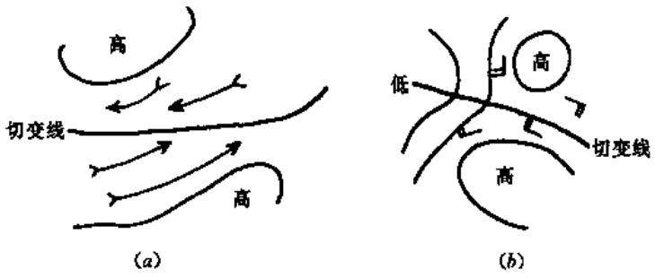  
图 2-18 切变线示意图

## 5. 静止锋

静止锋有两种，一种是以地形为主造成的，如天山静止锋、昆明准静止锋等；另一种是温压场结构变化形成的，如南海静止锋、华南静止锋、江淮静止锋、华北静止锋等。后一种对降水，特别是夏季暴雨影响最大。春夏两季因暖空气活跃，静止锋多活动于南岭以北至江淮地区，所以与我国南方汛期降水关系密切。例如，春夏之交我国江淮流域常出现准静止锋，在锋区附近阴雨连绵，江河暴涨，即所谓的“梅雨”。

## 6. 锋区与降水

上述西风带的主要降水天气系统：高空槽、锋面气旋、低涡、切变线、静止锋等，无一不和高空锋区相联系，由此可见，锋区对大范围降水的重要性。一般影响我国降水的锋区有南北两支。北支锋区，即极锋锋区，虽然具有较强的上升运动，但锋区的气团是变性的大陆气团和极地气团，水汽较少，降水量不大，多大风天气。而南支锋区，即副热带锋区，虽然形成的天气系统不够强大，但副热带锋区是由热带海洋气团和变性大陆冷气团构成的，水汽丰沛。低层丰富的水汽不仅成为暴雨的水汽来源，而且造成了对流不稳定，从而出现强烈的对流运动，常引起大范围的暴雨。所以，我国主要雨带的活动都和副热带锋区的活动密切相关。5月中旬到6月上旬，副热带锋区位于华南，造成华南雨季，即华南前汛期。6月中旬到7月上旬位于长江流域，形成江淮梅雨。7月中旬至8月下旬位于华北、东北、造成华北、东北雨季。秋季，随冷空气南侵，副热带锋也南撒到南海上空，我国雨季即告结束。

## 7. 副热带高压

在南、北半球副热带地区，经常维持着沿纬圈不连续分布的高压带，称为副热带高压，简称副高。在北半球，不连续高压单体经常有5\~6个，其中位于太平洋上的副高是最突出的一个。其闭合中心，有时只有一个，位干夏威夷附近，有时（夏季）分裂为两个，分别位于东、西太平洋上。西太平洋高压单体称为西太平洋副热带高压，其西端的脊可伸达我国沿海，夏季可伸人大陆，如图2-19所示。副高内部炎热微风，晴空少云，本身不是降水天气系统，但它是制约大气环流变化的重要的天气系统之一，对我国天气变化具有重大影响。

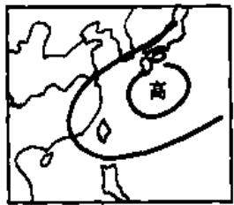  
图 2-19 西太平洋副热带高压示意图

我国降水的水汽来源，主要靠副高西北缘的西南气流从印度洋输送而来。副高北侧的暖湿空气与中纬度南下冷空气相互交汇，衍生出锋面、气旋等天气系统，往往形成大范围的阴雨天气。副高南侧，若有台风等热带天气系统活动时，会产生大风、暴雨天气。副高的短期西伸东撤，对我国天气也有影响。当副高西伸前，其西部地区往往为低压或槽所控制，脊刚西伸时，常有热雷暴产生；当脊东撤时，在其西部常伴有低槽东移，如果空气潮湿且不稳定，就会造成大范围的雷阵雨天气。

副高脊线的季节性活动与我国大陆主要雨带的变化、雨季的出现和结束有密切的关系。通常雨带位于副高脊线以北约5\~8个纬度。每年2\~6月，副高脊线稳定在18°N\~20°N之间，我国华南地区出现连续低温阴雨天气。6月，副高脊线越过20°N，稳定在20°N\~25°N时，雨带位于长江下游，梅雨季节开始。7月，副高脊线再次北跳，雨带移到黄淮流域，长江中下游梅雨结束。从7月底到8月初，副高脊线进一步越过30°N，雨带也北移，华北、东北雨季开始。9月上旬，副高脊线开始回跳至25°N附近，我国大陆雨季结束。

## 8. 热带风暴（台风）

热带风暴是影响我国降水，特别是造成大风与暴雨的最重要的天气系统之一。我国东临西北太平洋，受西北太平洋热带风暴影响十分严重。全球八大洋区热带风暴，约36%集中在西北太平洋，而西北太平洋热带风暴，约有35%在我国登陆。我国除新疆、西藏、青海、甘肃、宁夏、四川没有热带风暴或热带风暴减弱后变成的低气压入境外，其余省区均可受热带风暴袭击。我国南起北部湾，北至渤海辽东湾，沿海是台风特大暴雨带，强度从沿海向内陆迅速递减。

广东、广西、海南、台湾、福建、浙江是台风登陆最多的省区，因此也是台风暴雨强度最高和发生次数最多的地区。在我国登陆北上的台风，多数在30°N\~35°N转向沿副高脊线北侧移动出海，在转向时移速减慢，加上中纬度西风带天气系统的影响，容易在山东、江苏一带沿海产生特大暴雨和风暴潮。一些台风，登陆时降雨并不大，但深人内地时，受山脉阻挡在迎风坡产生大暴雨。

据统计，每年5\~11月，西北太平洋台风都有可能在我国登陆，平均每年6\~7个，最多11个，最少3个。其中7\~9月是活动高峰，占全年登陆总数的80%。台风暴雨也随台风活动季节的变化及移动路径而变。其特点为：5\~6月在南岭以南，7\~8月范围最广，南起海南岛，北至东北均可发生暴雨和风暴潮，9月暴雨出现在淮河以南，10月则退至长江以南。

## 五、我国降水量及时空分布

## (一)年降水量特性

## 1. 年降水量地理分布

我国大部分地区受东南和西南季风的影响，形成东南多雨，西北干旱的特点。全国多年平均降水量648mm，低于全球陆面平均降水量800mm，也小于亚洲陆面平均降水量740mm。按年降水量的多少，全国大致可分为五个带。

(1）十分湿润带：年降水量超过1600mm，年降水日数平均在160天以上。包括：广东、海南、福建、台湾、浙江大部、广西东部、云南西南部、西藏东南部、江西和湖南山区、四川西部山区。

(2)湿润带：年降水量800\~1600mm，年降水日数平均120\~160d。包括：秦岭一淮河以南的长江中下游地区、云南、贵州、四川和广西大部分地区。

(3)半湿润带：年降水量400\~800mm，年降水日数平均80\~100d。包括：华北平原、东北、山西、陕西大部、甘肃、青海东南部、新疆北部、四川西北和西藏东部。

（4）半干旱带：年降水量200～400mm，年降水日数平均60～80d。包括：东北西部、内蒙、宁夏、甘肃大部、新疆西部。

(5)于旱带：年降水量少于200mm，年降水日数低于60d。包括：内蒙、宁夏、甘肃沙漠区、青海柴达木盆地、新疆塔里木盆地和准噶尔盆地、藏北羌塘地区。

## 2. 降水量年内分配

我国大部分地区降水的季节分配不均匀，主要集中在春夏季。长江以南地区，雨季较长，为3\~6月或4\~7月，雨量约占全年的50%～60%。华北和东北地区，雨季为6\~9月，雨量约占全年的70%\~80%，其中华北雨季最短，大部分集中在7\~8两月。西南地区降水，主要受西南季风的影响，旱季雨季分明，一般5\~10月为雨季，11\~4月为早季。四川、云南和青藏高原东部，6\~9月雨量占全年的70%～80%，冬季则不到5%。新疆西部终年在西风气流控制下，降水量不大，但四季分配较均匀。台湾的东北端，受东北季风的影响，冬季降水量约占全年的30%，也是我国降水量年内分配较均匀的地区。

## 3. 降水量年际变化

我国降水量年际间变化很大，且发现常有连续几年雨量偏多或连续偏少的现象。年降水量越小的地区，年际变化越大。以历年年降水量最大值与最小值之比K来表示年际变化。西北地区K可达8以上；华北为3\~6；东北为3\~4；南方一般为2\~3，个别地方达4；西南最小，一般在2以下。

月降水量年际之间变化更大。有的地区汛期最大一个月降水量常是不同年份同月降水量的几倍，几十倍甚至百倍以上。可见季节性降水量的年际变幅比年降水量大得多。

## (二)我国东部汛期雨带变化

我国大部分地区降水主要集中在夏季数月。假定汛期内各旬平均降水量均匀分配，那么，每旬降水量占4\~9月总降水量的百分率应为5.6%。因此，把旬降水百分率大于7%的等值线所包围的区域作为雨带范围，也就是说，这个地区降水比较集中，并把降水百分率最大值的连线称为雨带轴线。据此研究雨带的季节变动，雨带位置实际上也反映了暴雨的发生区域。图2-20（a）～（d）为多年平均各旬雨带特征分布选例，图2-21为雨带轴线的季节位移。从这几张图可以得出雨带变化特征如下。

(1)4月上旬到5月上旬雨带轴线在长江以南、南岭、武夷山一带摆动。4月中旬，大于7%的等值线所包围的区域大致位于两湖盆地和南岭山脉之间。5月上旬，降水强度加大，在鄱阳湖周围和浙赣山区出现了大范围的大于11%的等值线中心，大于7%的等值线笼罩了长江以南和南岭以北的广大地区，见图2-20(a)，这就是所谓的“江南春雨”。此时，南岭以南和长江以北降水稀少。

(2)从5月上旬起至6月上旬，雨带位置逐渐南退，见图2-21。6月上旬，正是华南前汛期暴雨季节，雨带局限于南岭以南、华南沿海。南岭以北旬降水百分率均小于7%。

(3)6月中旬起，雨带开始向北推进，降水强度进一步加大，雨带轴线大致位于武夷山西北坡、赣南、湘南一带。6月下旬雨带跃到长江中下游，范围扩大，雨带轴线近乎东西向，在两湖盆地一带出现了大于13%\~15%的闭合等值线，见图2-20(b)，这就是江淮流域的“梅雨”。

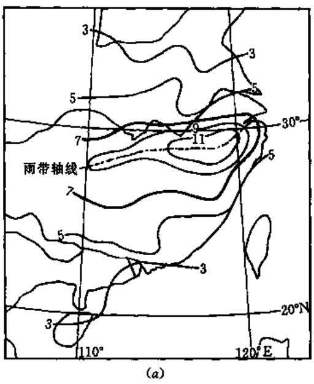

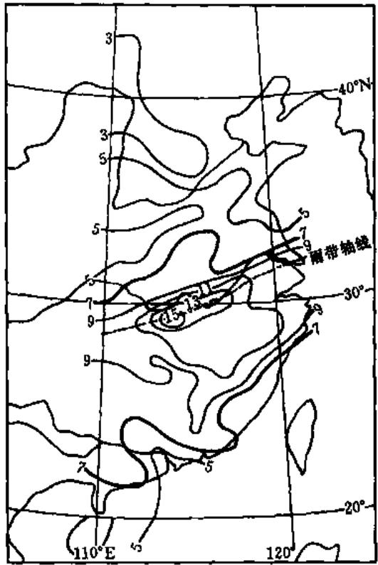  
(b)

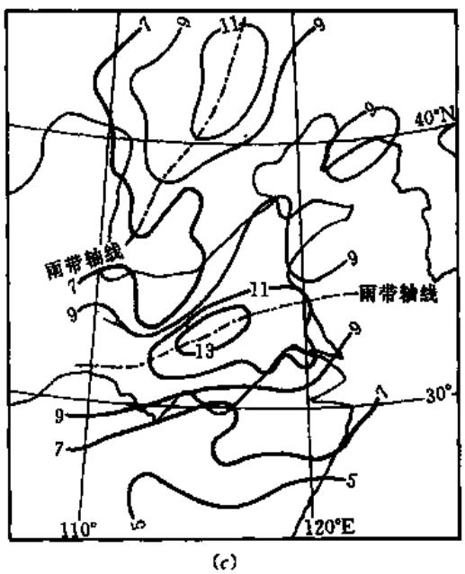

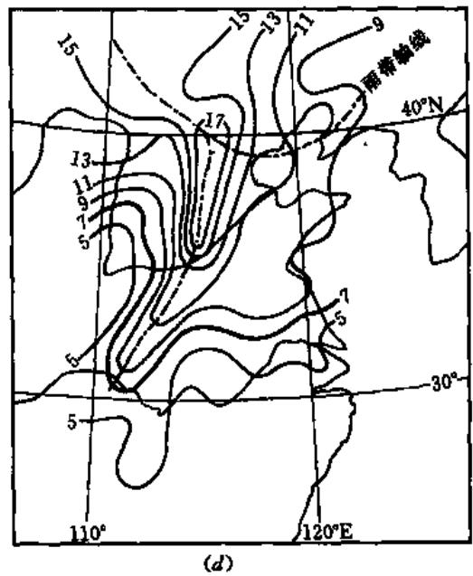  
图 2-20 多年平均雨带分布选例  
(a)5月上旬；(b)6月下旬：（c)7月上旬；(d)8月上旬  
(实线为降水百分率线，锁线为雨带轴线)

7月上旬，雨带轴线仍在淮河流域，极值中心达16%，同时华北降水明显增加。在太行山东侧和内蒙古东部地区出现了一条近于南北向的雨带轴线，见图2-20(c)。在28°N以南地区，由于副热带高压的北移和控制，降水很少，开始进人盛夏李节。

(4)7月中旬，雨带迅速北移，轴线越过黄河。8月上旬雨带到达最北位置，此时正是华北雨季。华北平原雨量最为集中，出现了17%以上的等值线，见图2-20(d)，而且雨带轴线分为两支：一支呈东西向；一支近乎南北向。这是华北盛夏雨带分布的典型特征，因为华北夏季往往是经向型暴雨。此时长江以南广大地区进人了伏旱少雨季节，但华南沿海却出现了新的雨带。8月中旬以后，雨带开始南退，北方雨季也随之结束。

## （三)我国大暴雨时空分布

我国是暴雨较多的国家，暴雨分布受季风环流、地理纬度、距海远近、地势与地形的影响十分显著。不同的地理条件和气候区，暴雨类型、极值、强度、持续时间以及发生季节都不同。

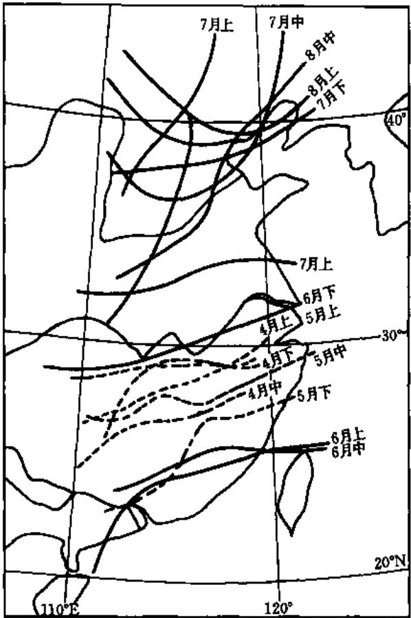  
图 2-21 多年平均旬雨量百分率  
最大轴线的季节位移

4\~6月，东亚季风初登东亚大陆，大暴雨主要出现在长江以南地区，是华南前汛期和江南梅雨期暴雨出现的季节。在此期间出现的大暴雨，其量级有明显从南向北递减的趋势。华南沿海出现的特大暴雨，大多是锋面和低空急流作用的产物。华南沿海山地和南岭山脉对大暴雨的分布有十分明显的影响。江淮梅雨期暴雨，多为静止锋、涡切变型暴雨，降雨持续时间长，但强度相对较小。两湖盆地四周山地的迎风坡，是梅雨期暴雨相对高值区，而南岭以北和武夷山以东的背风坡则为相对低值区。江南丘陵地区大暴雨的量级，明显较华南地区为小。

7\~8月，西南和东南季风最为强盛，随西太平洋副高北抬西伸，江南梅雨结束，大暴雨移到川西、华北一带。同时，受台风影响，东南沿海多台风暴雨。在此期间，大暴雨分布范围很广，苏北、华南、黄河流域的太行山前、伏牛山东麓，都出现过特大暴雨。个别年份台风深入内陆，或在转向北上过程中，受高压阻挡停滞少动或打转，若再遇中纬度冷锋、低槽等天气系统的影响，以及地形强迫抬升作用，常造成特大暴雨。例如1975年8月5\~7日，7503号台风在福建登陆后深入河南，由于在台风北面有一条高压坝，使台风停滞、徘徊达20多小时之久，林庄站24 h降雨量达1060.3 mm，其中6h降雨量830.1mm，是我国大陆强度最大的降雨记录。川西、川东北、华中、华北一带在此期间常受西南涡的影响，也已发生过多次特大暴雨。例如1963年8月2\~8日，华北海河流域连受3次低涡的影响，在太行山东侧山丘区，连降7天？夜大暴雨，獐狐站降雨总量达2051mm，其中最大24 h降雨量950 mm。在此期间，北方黄土高原及干旱地区，夏季受东移低涡、低槽等天气系统的影响，也曾多次出现历时短，强度特大，但范围较小的强雷暴暴雨。例如1977年8月1日，内蒙、陕西交界的乌审召出现强雷暴，据调查，有四处在8\~10h内降雨量超过1000mm，最大一处超过1400mm，强度之大为世界罕见。

9\~11月，北方冷空气增强，雨区南移，但东南沿海、海南，台湾一带受台风和南下冷空气的影响而出现大暴雨。例如台湾新寮1967年10月17\~19日曾出现24h降雨1672mm，3日总雨量达2749mm的特大暴雨，是我国最大的暴雨记录。

## 六、降水量观测

降水量可采用器测法、雷达探测或利用气象卫星云图估算。器测法用来测量降水量，雷达探测和卫星云图一般用来预报降水量。

## (一) 器测法

器测法是观测降水量最常用的方法，观测仪器有雨量器和自记雨量计。

## 1. 雨量器

雨量器是直接观测降水量的器具，它由承雨器、漏斗、储水瓶和雨量杯组成，如图2-22所示。承雨器口径为200mm，安装时器口一般距地面700mm，筒口保持水平。分辨率为

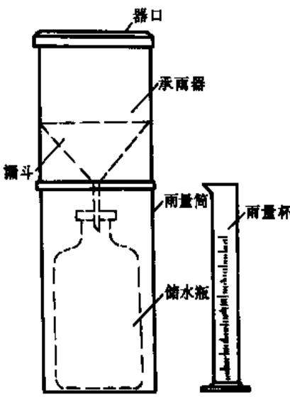  
图 2-22 雨量器示意图

0.1mm。一般采用2段制进行观测，即每日8时及20时各观测一次。雨季增加观测段次，如4段制或8段制，雨大时还需加测。观测时用空的储水瓶将雨量器内储水瓶换出，用雨量杯量出降水量。当降雪时，仅用外筒作为承雪器具，待雪融化后计算降水量。每日8时至次日8时降水量为当日降水量。

## 2. 自记雨量计

自记雨量计是观测降雨过程的自记仪器。常用的自记雨量计有三种类型：称重式、虹吸式（浮子式）和翻斗式。称重式能够测量各种类型的降水，其余两种基本上只限于观测降雨。按记录周期分，有日记、周记、月记和年记。在传递方式上，已研制出有线远传和无线远传（遥测）的雨量计。

储积在其内的降水的重量。记录方式可以用机械发条装置或平衡锤系统，降水时全部降水量的重量如数记录下来。这种仪器的优点在于能够记录雪、冰雹及雨雪混合降水。

(2)虹吸式：日记型虹吸式雨量计如图2-23所示。承雨器将承接的雨量导人浮子室，浮子随着注人雨水的增加而上升，并带动自记笔在附有时钟的转筒上的记录纸上画出曲线。记录纸上纵坐标记录雨量，横坐标由自记钟驱动，表示时间。当雨量达到10mm时，浮子室内水面上升到与浮子室连通的虹吸管顶端即自行虹吸，将浮子室内的雨水排入储水瓶，同时自记笔在记录纸上垂直下跌至零线位置，以后随雨水的增加而上升，如此往返持续记录降雨过程。记录纸上记录下来的曲线是累积曲线，既表示雨量的大小，又表示降雨过程的变化情况，曲线的坡度表示降雨强度。虹吸式雨量计分辨率为0.1mm，降雨强度适应范围0.01\~4.0mm/min。

(3)翻斗式：这类雨量计由感应器及信号记录器组成，如图2-24所示。其工作原理为：雨水经承雨器进入对称的翻斗的一侧，当接满0.1mm雨量时，翻斗倾于一侧，另一侧翻斗则处于进水状态。每一次翻斗倾倒，都使开关接通电路，向记录器输送一个脉冲信号，记录器控制自记笔将雨量记录下来，如此往复即可将降雨过程测量下来。自记笔记录100次后，将自动从上到下落到自记纸的零线位置，再重新开始记录。翻斗式雨量计分辨率为0.1mm，降雨强度适用范围在4.0 mm/min 以内。

称重式、虹吸式和翻斗式雨量计的记录系统可以将机械记录装置的运动变换成电讯号，用导线或无线电将信号传到控制中心的接收器，实现有线远传或无线遥测。

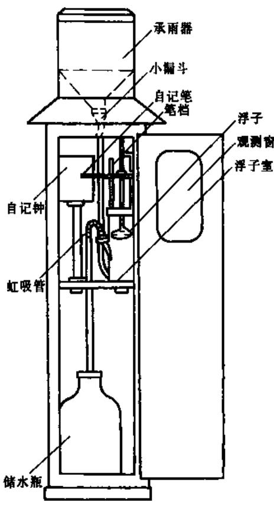  
图 2-23 虹吸式自记雨量计示意图

## (二) 雷达探测

气象雷达是利用云、雨、雪等对无线电波的反射现象来发现目标的。用于水文方面的

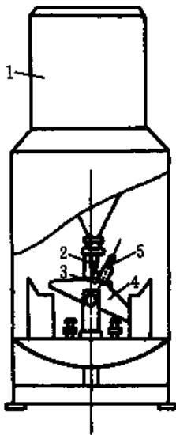

雷达，有效范围一般是40\~200km。雷达的回波可在雷达显示器上显示出来，不同形状的回波反映着不同性质的天气系统、云和降水等等。根据雷达探测到的降水回波位置、移动方向、移动速度和变化趋势等资料，即可预报出探测范围内的降水、强度以及开始和终止时刻。

## (三)气象卫星云图

气象卫星按其运行轨道分为极轨卫星和地球静止卫星两类。目前地球静止卫星发回的高分辨数字云图资料有两种：一种是可见光云图，另一种是红外云图。可见光云图的亮度反映云的反照率。反照率强的云，云图上的亮度就大，颜色较白；反照率弱的云，亮度弱，色调灰暗。红外云图能反映云顶的温度和高度，云层的温度越高，云层的高度越低，发出的红外辐射越强。在卫星云图上，一些天气系统也可以根据特征云型分辨出来。

图 2-24 翻斗式自记雨量计示意图1—承雨器；2—浮球；3—小钩；4一翻斗；5一舌賽管

用卫星资料估计降水的方法很多，目前投人水文业务应用的是利用地球静止卫星短时间间隔云图图像资料，再用某种模型估算。这种方法可引人人一机交互系统，自动进行数据采集、云图识别、降雨量计算、雨区移动预测等项工作。

## 第四节 土壤水、下渗与地下水

地表水、土壤水、地下水是陆地上普遍存在的三种水体。在水文循环中，地表土层对降雨起着再分配的作用。降雨落到地表之后，一部分渗入土壤中，另一部分形成地表(面）水，地表水主要指河川径流，将在后面章节中介绍。渗入土层的水量，一部分被土壤吸收成为土壤水，而后通过直接蒸发或植物散发返回大气；另一部分渗人地下补给地下水，再以地下径流的形式进人河流。下渗和土壤水的运动是径流形成的重要环节，它们的变化直接影响径流的形成过程。本节着重阐述它们的形成、储存、运动等概念，并扼要介绍分析计算方法。

## 一、包气带和饱和带

地表土层为多扎介质，能吸收、储存和同任何方间输送水分柱结构，如图2-25所示。以地下水面为界，土层可分为两个不同的土壤含水带。在地下水面以下，土壤处于饱和含水状态，是土壤颗粒和水分组成的二相系统，称为饱和带或饱水带；地下水面以上，土壤含水量未达饱和，是土壤颗粒、水分和空气同时存在的三相系统，称为包气带。在包气带中，水压力小于大气压，饱和带则相反。在地下水面处，水压力等于大气压。

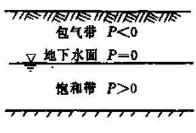  
图 2-25 包气带和饱和带示意图

## 二、土壤水

水文学中把存于包气带中的水称为土壤水，而将饱和带中的

水称为地下水，包括潜水和承压水。包气带的上界直接与大气接触，它既是大气降水的承受面，又是土壤蒸散发水分的逸出面。因此，包气带是土壤水分剧烈变化的土壤带。土壤含水量的大小直接影响到蒸发、下渗的大小，并决定了降雨量中产生径流（包括地面径流、表层流径流和地下径流）的比例，把降雨、下渗、蒸发及径流等水文要素在径流形成过程中有机地联系起来。因此，研究土壤水的运动和变化，对认识水文现象有重要意义。

## (一) 土壤水分存在形式

土壤水是指吸附于土壤颗粒和存在于土壤孔隙中的水。当水分进人土壤后，在分子力、毛管力或重力的作用下，形成不同类型的土壤水。

## 1. 吸湿水

土粒表面的分子对水分子的吸引力称为分子力。由分子力所吸附的水分子称为吸湿水。吸湿水被紧紧地束缚在土粒表面，不能流动也不能被植物利用。

## 2. 薄膜水

由土粒剩余分子力所吸附在吸湿水层外的水膜称为薄膜水。薄膜水受分子吸力作用，不受重力的影响，但能从水膜厚的土粒（分子引力小）向水膜薄的土粒（分子引力大）缓慢移动。

## 3. 毛管水

土壤孔隙中由毛管力所持有的水分称为毛管水。毛管水又分为支持毛管水和毛管悬 着水。

(1）支持毛管水（毛管上升水）：是地下水面以上由毛管力所支持而存在于土壤孔隙中的水分。由于孔隙大小分布不均匀，毛管水上升高度也不相同。孔隙越细，毛管水上升高度越大。

(2) 毛管悬着水：在土壤孔隙中，由于毛管孔径不同，毛管力的大小就不同。如果向上的毛管力大于向下的毛管力，其合力就能支持一部分水悬吊于孔隙之中而不与地下水面接触，称为毛管悬着水。

## 4. 重力水

当土壤水的含量超过土壤颗粒分子力和毛管力作用范围而不能被土壤所保持时，在重力作用下将沿土壤孔隙流动，这部分水称为重力水。重力水能传递压力，在任何方向只要有静水压力差存在，就会产生水流运动。渗入土中的重力水，当到达不透水层时，就会聚集使一定厚度的土层饱和形成饱和带。当它到达地下水面时，补充了地下水使地下水面升高。重力水在水文学中有重要的意义。

## (二)土壤含水量和水分常数

土壤中的水分与周围介质中的水分不断地发生交换，土壤内部的水分也时刻处于运动中。这种水分的交换和变化不仅受土壤物理性质的制约，还受到降雨、下渗、蒸散发和其他水分运动的影响。为描述土壤水分随时间和空间的这种动态变化，通常用土壤含水量来表示它们的大小，另用某些特征条件下的土壤含水量来反映它们的变化特性。这些特征土壤含水量称为土壤水分常数，它们是土壤水分的形态和性质发生明显变化时土壤含水量的特征值。

## 1. 土壤含水量（率）

土壤含水量（率）又称为土壤湿度，它表示一定量的土壤中所含水分的数量。在实际工作中，为了便于同降雨、径流及蒸发量进行比较与计算，将某个土层所含的水量以相应水层深度来表示土壤含水量，以mm计。此外，还可用土壤重量含水率和土壤容积含水率表示土壤含水量。

## 2. 土壤水分常数

水文学中常用的土壤水分常数有以下几种：

(1)最大吸湿量：在饱和空气中，土壤能够吸附的最大水汽量称为最大吸湿量。它表示土壤吸附气态水的能力。

(2)最大分子持水量：由土粒分子力所结合的水分的最大量称为最大分子持水量。薄膜水厚度此时达到最大值。

(3）凋萎含水量（凋萎系数)：植物根系无法从土壤中吸收水分，开始凋萎，即开始枯死时的土壤含水量称为凋萎含水量。植物根系的吸力约为15个大气压，所以，当土壤对水分的吸力等于15个大气压时的土壤含水量就是凋萎含水量。显然，只有大于凋萎含水量的水分才是参加水分交换的有效水量。

(4)毛管断裂含水量：毛管悬着水的连续状态开始断裂时的含水量。当土壤含水量大于此值时，悬着水就能向土壤水分的消失点或消失面（被植物吸收或蒸发）运行。低于此值时，连续供水状态遭到破坏，这时，土壤水分只有吸湿水和薄膜水，水分交换将以薄膜水和水汽的形式进行。

(5)田间持水量：指土壤中所能保持的最大毛管悬着水量。当土壤含水量超过这一限度时，多余的水分不能被土壤所保持，将以自由重力水的形式向下渗透。田间持水量是划分土壤持水量与向下渗透水量的重要依据，对水文学有重要意义。

(6)饱和含水量：指土壤中所有孔隙都被水充满时的土壤含水量，它取决于土壤孔隙的大小。介于田间持水量到饱和含水量之间的水量，就是在重力作用下向下运动的自由重力水分。

## （三) 土壤水分布特征

土壤水蕴藏于包气带中，包气带按其水分分布特征，可分为三个明显不同的水分带：毛管悬着水带、中间带和毛管水上升带，如图2-26所示。

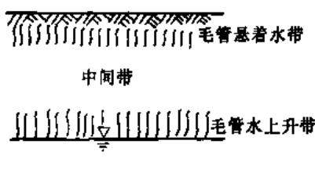  
图 2-26 包气带的分带示意图

包气带上部靠近地表面的土壤，具有吸附空气中的水汽和液态水分子的性能，称为毛管悬着水带，简称悬着水带。它的特点之一是直接或间接与外界进行水分交换。在降水和下渗过程中，土壤在分子力作用下首先吸附水分产生吸湿水和薄膜水，然后形成毛管悬着水。土壤孔隙中的毛管水在毛管力作用下可作垂直运动，当毛管悬着水达到饱和(即达到田间持水量)，过剩的水分在重力作用下沿孔

隙向下渗透。重力水在渗透过程中，若包气带中有局部相对不透水层，则下渗的水流可在层面上聚积，形成侧向水流溢出地表，形成表层流或称壤中流；重力水在下渗过程中，若遇到第一个不透水层，则可在其上聚积形成具有自由水面的潜水；当重力水埋藏于两个不透水层之间，并具有压力水头时即为承压水。在一般情况下，土壤水分的增长主要来源于降水的下渗，而土壤水分的消退主要耗于土壤蒸发和植物散发。在特殊情况下，即当悬着水带与地下水有水力联系时，饱和带参与水分的增长与消退活动。水文上，通常称悬着水带为影响土层，因为它直接参与和影响径流循环。

在地下水面以上，由于土壤毛管力的作用，一部分水分沿着土壤孔隙侵人地下水面以上的土壤中，形成一个水分带称为毛管水上升带或支持毛管水带，简称毛管水带。毛管水带内的水分分布具有独有的特征：一般在毛管水带最大活动范围内，土壤含水量自下而上逐渐减小，由饱和含水量减至与中间包气带下端相衔接的含水量。对干旱的土壤则以最大分子持水量为下限。而且对给定的土壤，这种分布具有相对稳定的性质。由于毛管水带下端与地下水面相接，有充分的水分来源，故其分布较稳定。但它的位置却随地下水位的升降而变化，由此决定了包气带的厚度和变化。

中间带是处于悬着水带和毛管水带之间的水分过渡带，它本身不直接与外界进行水分交换，而是水分蓄存及输送带。它的水分沿深度变化小，且时程上也具有相对稳定的性质。在地下水埋藏很深，年降水量较少地区，中间带的含水量一般在毛管断裂含水量及最大分子持水量附近；中等降水，透水性较好的土壤层，中间带的水分大致在毛管断裂含水量与田间持水量之间。当地下水面较浅时，中间带往往消失。

## 三、下渗

下渗是指降落到地面上的雨水从地表渗入土壤内的运动过程。下渗不仅直接决定地面径流量的大小，同时也影响土壤水分的增长，以及表层流与地下径流的形成。因此，分析

下渗的物理过程和规律，对认识径流形成的物理机制有重要的意义。

## (一) 下渗的物理过程

当降雨持续不断地落在干燥土层表面时，雨水将从包气带上界不断地渗入土壤。渗入土中的水分，在分子力、毛管力和重力的作用下发生运动。按水分所受的力和运动特征，下渗可分为三个阶段。

## 1. 渗润阶段

下渗的水分主要受分子力的作用，被土壤颗粒吸收而成薄膜水。若土壤十分干燥，这一阶段十分明显。当土壤含水量达到最大分子持水量时，分子力不再起作用，这一阶段结束。

## 2. 渗漏阶段

下渗水分主要在毛管力、重力作用下，沿土壤孔隙向下作不稳定流动，并逐步充填土壤孔隙直至饱和，此时毛管力消失。

## 3. 渗透阶段

当土壤孔隙充满水达到饱和时，水分在重力作用下呈稳定流动。

一般将前两个阶段统称渗漏阶段。渗漏属于非饱和水流运动，而渗透则属于饱和水流的稳定运动。在实际下渗过程中，这两个阶段并无明显分界，各阶段是相互交错进行的。

## （二)下渗率和下渗能力

单位时间内渗入单位面积土壤中的水量称为下渗率或下渗强度，记为 $f ,$ 以mm/min或nm/h计。在充分供水条件下的下渗率则称为下渗能力。通常用下渗率或下渗能力随时间的变化过程来定量描述土壤下渗规律，如图2-27所示的下渗能力随时间的变化过程线，称为下渗能力曲线，简称下渗曲线，并以f(t)\~t表示，图中 $\pmb { f _ { \Updownarrow } }$ 为起始下渗率。下渗最初阶段，下渗的水分被土壤颗粒吸收以及充填土壤孔隙，下渗率很大。随时间的增长，下渗水量越来越多，土壤含水量也逐渐增大，下渗率逐渐递减。当土壤孔隙充满水，下渗趋于稳

定，此时的下渗率称为稳定下渗率，记为 $f _ { e }$ 。这样把下渗曲线划分为不稳定下渗(渗漏阶段)和稳定下渗阶段(渗透阶段)。这种变化规律与下渗物理过程的机制是一致的。下渗的水量用累积下渗量F随时间的增长曲线来表示，如图2-27中 $\pmb { F } ( t ) \sim - t$ 曲线。累积曲线上任一点切线的斜率即为该时刻的下渗率。

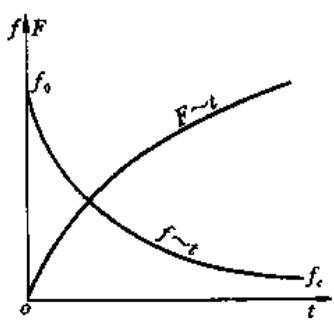

上述下渗率的变化规律，可用数学模式来表示，如霍顿(Horton)公式。霍顿根据均质单元土柱的下渗试验资料，认为当降雨持续进行时，下渗率逐渐减小，下渗过程是一个消退的过程，消退的速率与剩余量成正比。在下渗过程中，任一时刻t的下渗率 $f \left( t \right)$ 最终将变到稳定的下渗率 $f _ { c }$ ，故在t时刻有待消退

图 2-27 下渗曲线和下渗累积曲线

的量，即剩余量为 $\textit { f } \left( t \right) \ - f _ { c }$ 。而消退速率为 df (t) /dt，由于在下渗过程中 f(t)随时间减小，所以df（t）/dt是负值。根据以上假定，得：

$$
- \frac { \mathrm { d } f ( t ) } { \mathrm { d } t } = \beta [ f ( t ) - f _ { c } ]\tag{2-17}
$$

式中 $\beta ^ { . }$ 系数。

对上式积分，且当t=0时， $f ~ ( 0 ) ~ { = } f _ { \circ }$ ，最后得：

$$
f ( t ) = f _ { c } + ( f _ { \circ } - f _ { c } ) \mathtt { e } ^ { - \beta }\tag{2-18}
$$

式中，fo、f和β与土壤性质有关，需根据实测资料或实验资料分析确定。 $\pmb { f _ { \vartheta } }$ $\pmb { f _ { c } }$ $\beta$

## (三)自然条件下的下渗

## 1. 下渗与雨强的关系

在天然情况下，满足土壤下渗能力的必要条件是任一时刻的降雨强度i要大于或等于该时刻的下渗能力f，即i≥f，这时的下渗过程线就是下渗能力曲线。但天然状态下的降 $\pmb { f _ { \phi } }$ $i \geq f _ { P }$ 雨复杂且多变，实际降雨强度并不一定大于下渗能力，可能有如下三种情况：①当 $\boldsymbol { i } _ { 1 } \geqslant \boldsymbol { f } _ { \mathrm { } } $ 时，此时相当于充分供水条件，各时刻均按下渗能力下渗，其过程如图2-28中A线所示。

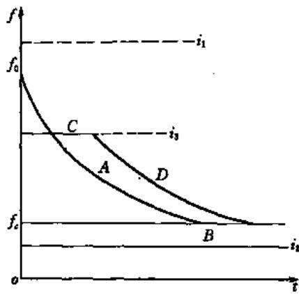  
图 2-28 天然降雨条件下的下渗过程

②当 $i _ { 2 } { \leqslant } f _ { c }$ ，此时下渗率取决于降雨强度，下渗过程与降雨过程完全相同，如图中B线。③当 $f _ { c } { < } i _ { s } { < } f _ { \rho }$ ，这种情况开始时，雨强小于下渗能力，全部降雨渗人土壤，如图中C线。随着下渗水量增加，土壤含水量也增加，下渗率随之递减，到某时刻，雨强大于下渗率，此时将按下渗能力下渗，如图中D线。

以上为降雨强度均匀的理想情况，天然状态下的降雨过程千变万化，实际的下渗随降雨强度及该时刻的下渗能力而变。不同的降雨过程，其下渗过程和下渗总水量也不同，但任何雨型的下渗总水量都要比雨强均匀且i≥$f _ { p }$ 时的下渗总水量要小。

## 2. 下渗的空间分布

对一个流域而言，其下渗过程要比单点复杂得多。首先，流域中土壤性质的空间分布不同，沿垂向的分布也常呈现非均匀结构，即使同类土壤，其地表坡度、植被和土地开发利用等情况也有差异；其次，降雨开始时流域内土壤含水量空间分布也不同；第三，一场降雨在空间和时间上分布是不均匀的；最后，流域内各处地下水位高低不一。以上这些因素，导致了流域的下渗在空间上分布的不均一性。因此，一个流域的实际下渗过程是十分复杂的，在实际工作中又不可能设立许多观测点进行观测，所以多采用概化的方法来描述下渗的空间变化。

## (四)下渗实验与分析

天然条件下的下渗，可通过野外现场实验来确定。通常有两种途径：一是直接测定法，即在流域内选定若于具有代表性的场地，直接测定下渗过程；二是分析法，利用径流试验场或小流域实测的降雨径流资料分析下渗过程。前一种方法得到的结果是流域某些单点的下渗特性及定量规律，后一种方法的结果综合反映流域的平均下渗特性及定量规律。

## 1. 直接测定法

本法一般只限于在极小面积上进行实验。按供水方式，可分为注水法和人工降雨法。

(1)注水法：注水法一般采用同心环下渗仪。同心环下渗仪是由直径30cm和60 cm的两个内外无底金属环组成，环高15\~20cm。实验时，将两环打入土中，然后向两环注水，内外两环保持相同的水深。内环控制实验的面积，外环的作用是防止内环下渗水流向旁侧渗透。注水后因下渗，水面降低，需继续加水，维持固定水深，注水的速率即为下渗率。求出各个时刻的下渗率即可求得下渗过程。

(2)人工降雨法：此法需要一套模拟降雨的专门设备和一个小型试验场地，并配有测流设备。人工降雨设备应能模拟各种不同强度的降雨，雨滴分布均匀，雨滴能量与天然雨滴相似。试验时，按设计雨强控制人工降雨，并连续记录出流过程，直到流量出现稳定情势后即可停止供水，但流量需观测到出流停止时为止。选择不同的雨强和初始边界条件，即可模拟出不同的下渗情况。

从降雨开始到t时刻、累积下渗量为：

$$
F ( t ) = P ( t ) - R ( t )\tag{2-19}
$$

对上式求导数即为下渗率：

$$
f ( t ) = i ( t ) - r ( t )\tag{2-20}
$$

式中 F（t) 降雨开始至t时刻的累积下渗量，mm；

P (t) ——降雨开始至t 时刻的累积降雨量，mm；

R (t) ——降雨开始至t 时刻的累积径流量，mm；

f (t) ——t时刻下渗率，mm/min；

i(t) ——t 时刻降雨强度，mm/min;

r (t) ——t 时刻径流率，mm/min。

直接测定法的成果反映一定条件下单点的下渗特性，对了解不同土壤、植被条件和各种降雨强度下的下渗特性有重要作用。

## 2. 水文分析法

利用径流试验站或小流域实测的降雨及流量资料，根据流域水量平衡方程分析平均下渗过程。水量平衡方程为：

$$
F ( t ) = P ( t ) - R ( t ) - ( S _ { \iota } + S _ { \mathfrak { v } } + S _ { d } )\tag{2-21}
$$

式中 $s ,$ ———河槽蓄水量，mm；

$\pmb { S } _ { \mathbf { v } }$ —坡面滞蓄量，mm；

${ \mathfrak { S } } _ { d }$ —填洼量，mm。

记S $( t ) ~ { = } S _ { s } { + } S _ { v } { + } S _ { d }$ ，表示t时刻流域平均滞蓄水量，对上式求导数，得下渗率：

$$
f ( t ) = i ( t ) - r ( t ) - { \frac { \mathrm { d } S ( t ) } { \mathrm { d } t } }\tag{2-22}
$$

在进行计算时，P(t)、R(t) 为实测值，S(t) 需要用间接方法确定。

## 四、地下水

## (一) 地下水类型

广义上的地下水指埋藏在地表以下各种状态的水。以地下水埋藏条件为依据，地下水可划分为三个基本类型，参阅图2-34。

## 1. 包气带水

埋藏于地表以下、地下水面以上的包气带中，包括吸湿水、薄膜水、毛管水、渗透的重力水等，已在土壤水中介绍。

## 2. 潜水

埋藏于饱和带中，处于地表以下第一个不透水层上，具有自由水面的地下水，称为潜水，水文中称为浅层地下水。

## 3. 承压水

埋藏于饱和带中，处于两个不透水层之间，具有压力水头的地下水，水文中称为深层地下水。

## (二)地下水的特征

## 1. 潜水

由于潜水具有自由水面，通过包气带与大气连通，所以不承受静水压力。潜水面与地面之间的距离为潜水埋藏深度，潜水面与第一个不透水层层顶之间的距离称为潜水含水层厚度。潜水埋藏的深度及贮量取决于地质、地貌、土壤、气候等条件。一般山区潜水埋藏较深，平原区较浅，有的甚至仅几米深。

潜水补给的主要来源是降水和地表水等，干旱地区还有凝结水补给。当大河下游水位高于潜水位时，河水也可以成为潜水的补给源。干旱地区冲积、洪积平原中的潜水，主要靠山前河流补给，河水通过透水性强的河床垂直下渗大量补给潜水，有时水量较小的溪流甚至可全部潜入地下。潜水排泄有侧向和垂向两种方式。侧向排泄是指潜水在重力作用下沿水力坡度方向补给河流或其他水体，或者露出地表成为泉水；垂向排泄主要是潜水蒸发。

潜水与地表水之间相互补给和排泄的关系称为水力联系。以潜水与河水之间的关系为例，潜水可以补给河水，河水也可以补给潜水，两者之间的水力联系有下列几种类型，如图 2-29 所示。

(1)无水力联系：在山区，基岩地区潜水含水层很薄，当潜水悬于崖壁上，或因潜水底部隔水层高于河流最高水位时，常以悬挂泉的形式出露地表，其潜水量虽不大，但稳定，

<table><tr><td rowspan=2 colspan=1>潜水与河水间的水力联系</td><td rowspan=1 colspan=2>无水力联系</td><td rowspan=1 colspan=1>具有间歇性水力联系</td><td rowspan=1 colspan=1>具有周期性水力联系</td><td rowspan=1 colspan=1>具有单向水力联系</td></tr><tr><td rowspan=1 colspan=2>洪水位A枯水位</td><td rowspan=1 colspan=1>洪水位之枯水位</td><td rowspan=1 colspan=1>洪水位枯水</td><td rowspan=1 colspan=1>洪水位V枯水位</td></tr><tr><td rowspan=1 colspan=1>近岸区潜水位与河水位的变化</td><td rowspan=1 colspan=2>(w)H            地表水地下水</td><td rowspan=1 colspan=1>地表水地下水t</td><td rowspan=1 colspan=1>地表水地下水2</td><td rowspan=1 colspan=1>(w)H              地表水地下水</td></tr><tr><td rowspan=1 colspan=1>潜水径流补给情势</td><td rowspan=1 colspan=1>1十0</td><td rowspan=1 colspan=1>Q(m³/s)t</td><td rowspan=1 colspan=1>1Q(m³/s)0t-A   T</td><td rowspan=1 colspan=1>1Q(m³/s),+A0A</td><td rowspan=1 colspan=1>1Q(m³/s)</td></tr></table>

图 2-29 潜水与河水间水力联系及潜水径流补给情势  
T一雨洪期：A—雨洪期潜水径流量

对山溪性河流是一种可靠的补给来源。

(2)间歇性水力联系：在丘陵及低山区，潜水含水层较厚，当隔水层介于河流洪枯水位之间，则潜水与河水存在间歇性水力联系。洪水期二者有水力联系，河水成为潜水的间歇性补给源；枯水期两者脱离接触，成为无水力联系。

(3)周期性水力联系：大中河流的中下游段，第四纪沉积物较厚，隔水层低于槽底。洪水期河水补给潜水，部分洪水贮存于河岸，削减了河槽洪水；枯水期潜水补给河水，原存蓄在河岸里的水量返回河中，起着调节径流的作用，这种作用的结果使得潜水的排泄量呈正负交替变化。

(4)单向水力联系：常见于山前冲积扇地区、河网灌区或干旱沙漠地区。河流水位始终高于潜水位，河水入渗补给地下。潜水的排泄量总是呈负值。

## 2. 承压水

承压水的主要特性是处在两个不透水层之间，具有压力水头，一般不直接受气象、水文因素的影响，具有动态变化较稳定的特点。承压水的水质不易遭受污染，水量较稳定，是河川枯水期水量的主要来源。

承压水含水层按水文地质特征可分为三个组成部分：补给区、承压区和排泄区，如图2-30所示。含水层出露于地表较高的部分为补给区，直接承受大气降水和地表水体的补给，实际上该区地下水仍具有潜水的性质，并主要由下渗补给。另一部分含水层位置较低，出露地表，为排泄区。在这两层之间的含水层为承压区。该区是指含水层被上覆盖隔水层所覆盖的地段，其主要特征是承受静水压力，具有压力水头。承压含水层的贮量，

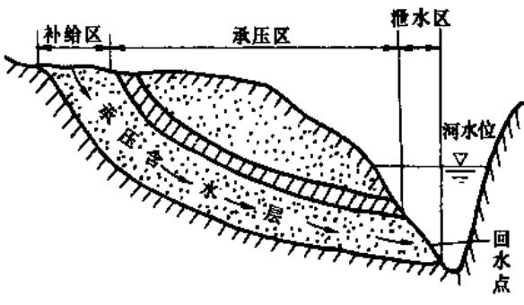  
图 2-30 承压水含水层的补给与排泄示意图

主要与承压区分布的范围，含水层的厚度和透水性、贮水区构造、补给区大小及补给量的多少有关。

## 第五节 蒸 散 发

蒸散发是水文循环中自降水到达地面后由液态或固态转化为水汽返回大气的阶段。陆地上一年的降水约66%通过蒸散发返回大气，由此可见蒸散发是水文循环的重要环节。而对径流形成来说，蒸散发则是一种损失。蒸散发在水量平衡研究和水利工程规划中是不可忽视的影响因素。

## 一、概述

水由液态或固态转化为气态的过程称为蒸发，被植物根系吸收的水分，经由植物的茎叶散逸到大气中的过程称为散发或蒸腾。蒸散发是发生在具有水分子的物体表面上的一种分子运动现象。具有水分子的物体表面称为蒸发面，自然界的蒸发面有各种形态，性质各不相同，因而蒸散发也分为不同的类型。蒸发面为水面时称为水面蒸发；蒸发面为土壤表面时称为土壤蒸发；蒸发面是植物茎叶则称为植物散发……。因为植物是生长在土壤中，植物散发与植物所生长的土壤上的蒸发总是同时存在的，通常将二者合称为陆面蒸发。流域的表面一般包括水面、土壤和植物覆盖等，当把流域作为一个整体，则发生在这一蒸发面上的蒸发称为流域总蒸发，或流域蒸散发，它是流域内各类蒸发的总和。

单位时间内的蒸发量称为蒸发率。蒸发面通常分为充分供水和不充分供水两种情况。在充分供水条件下，某一蒸发面的蒸发量，就是在同一气象条件下可能达到的最大蒸发率，称为可能最大蒸发率或蒸发能力，记为EM。一般情况下，蒸发面上的蒸发量只能小于或等于蒸发能力。

## 二、水面蒸发

## (一) 水面蒸发的物理过程

水面蒸发是指在自然条件下，水面的水分从液态转化为气态逸出水面的物理过程，可概括为水分汽化和水分扩散两个阶段。 i

由物理学可知，水体内部的水分子总是在不断地运动着，当水面的某些水分子具有的动能大于水分子之间的内聚力时，就能克服内聚力脱离水面变成水汽，进人空气中，这种现象就是蒸发。温度越高，水分子的动能越大，逸出水面的水分子就越多。它们在和空气分子一起作不规则运动时，部分水分子可能远离水面进人大气，也有部分水分子由于分子间的吸引力，或因本身降温，运动速度降低而进人水面，重新成为液态分子，这种现象称为凝结。从水面跃出的水分子量与返回蒸发面的水分子量之差值，就是实际的蒸发量。蒸发量用相应于水面上的水层深度来度量，记为E，以mm计。

在自然条件下，由于蒸发，水面上附近空气中的水汽含量较多，水汽压也较大，所以水汽将向水汽压低的地方扩散。但水汽的扩散作用很缓慢，特别是水面上空气中水汽较多，水汽压大，饱和差小，一旦空气中的水汽含量达到饱和，蒸发就会停止。所以，蒸发的发展，更主要是由于空气的对流和紊动作用。对流是由于接近水面的温度高于上层空气的温度，下层暖湿空气因密度小而上升，上层干冷空气则因密度小而下沉，这种对流现象使蒸发得以继续进行。尽管对流作用输送水汽比扩散作用输送水汽来得快且有效，但蒸发量仍不大，时间也较短。促进蒸发的最主要作用是大气湍流，当湍涡发展，水分子就随风飘离，湍涡越强，风速越大，跃离水面的水分子越容易被风刮走，因而使水面上空气的水汽含量变小，从而有利于蒸发继续进行。所以在自然条件下，蒸发量不仅与温度、水汽压的饱和差有关，还与水分子的扩散、空气的对流和紊动有关。

## (二) 水面蒸发观测

水面蒸发是在充分供水条件下的蒸发。确定水面蒸发量的大小，通常有两种途径：器测法和间接计算法。

## 1. 器测法

器测法是应用蒸发器或蒸发池直接观测水面蒸发量。我国水文和气象部门采用的水面蒸发器有：φ-20型、φ-80套盆式、E501型蒸发器，以及水面面积为 $\mathbf { E } _ { \mathfrak { s o l } }$ $2 0 ~ \mathrm { { m } } ^ { 2 }$ 和 $1 0 0 ~ \mathbf { m } ^ { 2 }$ 的大型蒸发池。其中E01型蒸发器是埋在地表下带套盆的蒸发器，其内盆面积300cm²，如图2-31。 $\Xi _ { \mathfrak { s o l } }$ $3 0 0 ~ \mathrm { c m } ^ { 2 }$ 这种蒸发器稳定性较好，是目前水文部门普遍采用的观测仪器。每日8时观测一次，得蒸发器一日（今日8时至明日8时）的蒸发水深，即日水面蒸发量。一月中每日蒸发量之和

为月蒸发量，一年中每日的蒸发量总和为年蒸发量。

由于蒸发器的蒸发面积远较天然水体为小，其受热条件与大水体有显著的差异，所以，蒸发器观测的数值不能直接作为如水库这样的大水体的水面蒸发值。据研究，当蒸发池的直径大于3.5m时，其蒸发量与天然大水体较为接近，因此，可用 $2 0 ~ \mathrm { m } ^ { 2 }$ 或 $1 0 0 ~ \mathrm { { m } } ^ { 2 }$ 的大型蒸发池的蒸发量$\pmb { { \cal E } } _ { \pmb { \mathrm { \imath } } }$ 与蒸发器的蒸发量 $\pmb { { \cal E } } _ { \sharp }$ 之比K作为折算系数，即：

$$
K = E _ { \mathbb { { M } } } / E _ { \mathbb { { M } } }\tag{2-23}
$$

实际资料分析表明，折算系数K随蒸发器直径而变，也与蒸发器类型、自然环境、季节变化等因素有关。实际工作中，应根据当地实测资料分析。

## 2. 间接计算法

间接计算法是利用气象或水文观测资料间接推算蒸发量，方法有：水汽输送法、热量平衡法、彭曼法、水量平衡法、经验公式等等。如彭曼(H.L. Penman)的水面蒸发公式为：

式中 $Q _ { n }$ ——净辐射量；

$E _ { a }$ 水面温度等于气温时的水面蒸发；

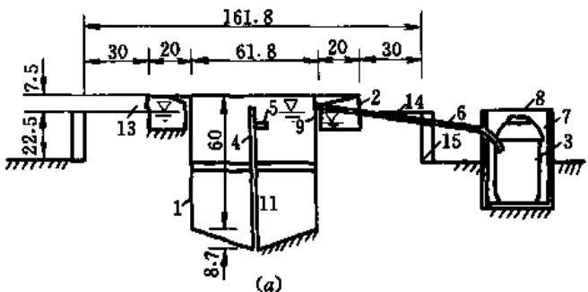

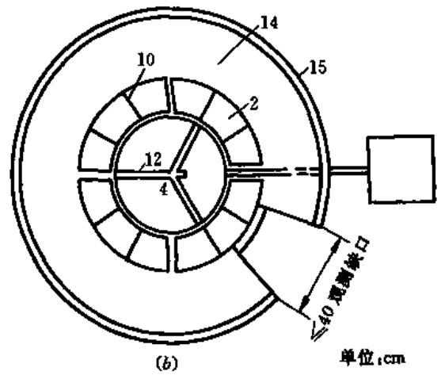  
图 2-31 ${ \pmb { \cal E } } _ { \mathfrak { s o l } }$ 型蒸发器  
(a) 剖面图；(6) 平面图

$$
E = { \frac { 1 } { \Delta + r } } ( Q _ { \circ } \Delta + r E _ { a } )\tag{2-24}
$$

$\pmb { \Delta }$ —气温与饱和水汽压关系曲线的坡度；

1—蒸发器；2-—水圈；3—溢流桶；4—测针桩；5—器内水面指示针；6一溢流用胶管；7—放溢流桶的箱；8一箱盖：9—溢流嘴：10一水国外缘的撑挡；11—直管：12一直管支撑；13一排水孔，14—土圈，15—土圈外围的防坍设施

r——湿度计常数。

这种方法需要专门的气象或水文观测资料，在实际工作中往往难以获得，因而除专门研究外，较少采用。

## 三、土壤蒸发

土壤蒸发是土壤中所含水分以水汽的形式逸人大气的现象，土壤蒸发过程是土壤失去水分或干化过程。土壤是一种有孔介质，具有吸收、保持和输送水分的能力，因此，土壤蒸发还受到土壤水分运动的影响。由此可知，土壤蒸发比水面蒸发复杂。

## (一) 土壤蒸发过程

湿润的土壤，其蒸发过程一般可分为三个阶段，如图2-32所示。第一阶段，土壤十分湿润，土壤中存在自由重力水，并且土层中毛细管也上下沟通，水分从表面蒸发后，能得到下层的充分供应。这一阶段，土壤蒸发主要发生在表层，蒸发速度稳定，蒸发量E等于或接近相同气象条件下的蒸发能力EM。这一阶段，气象条件是影响蒸发的主要原因。由于蒸发耗水，土壤含水量不断减少，当土壤含水量降到田间持水量 $\mathbb { W } _ { \mathbb { M } }$ 以下时，土壤中毛细管的连续状态将逐渐被破坏，从土层内部由毛细管作用上升到土壤表面的水分也将逐渐减少，这时进人第二阶段。在这一阶段内，随土壤含水量的减少，供水条件越来越差，土壤蒸发率也就越来越小。此时，土壤蒸发不仅与气象因素有关，而且随土壤含水量的减少而减少。土壤蒸发率与土壤

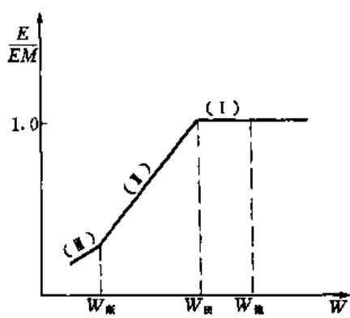

图 2-32 土壤燕发过程示意图

含水量W大体成正比，即 $\ E { = } \frac { W } { W _ { \perp } } E M .$ 。当土壤含水量减至毛管断裂含水量 $\mathtt { W _ { \mathtt { M } } }$ ，毛管水完全不能到达地表后，进人第三阶段。在这一阶段，毛管向土壤表面输送水分的机制完全遭到破坏，水分只能以薄膜水或气态水的形式向地表移动，运动十分缓慢，蒸发率微小。在这种情况下，不论是气象因素还是土壤含水量对土壤蒸发均不起明显作用。

## (二) 土壤蒸发观测

土壤蒸发量的确定一般有两种途径：器测法和间接计算法。

## 1. 器测法

土壤蒸发器种类很多，如图2-33所示为目前常用的ΓFI-500型土壤蒸发器。蒸发器有内外两个铁筒。内筒用来切割土样和装填土样，内径25.2 cm，面积 ${ \mathfrak { s o o } } \mathrm { c m } ^ { 2 }$ ，高50cm，简下有一个多孔活动底，以便装填土样。外简内径26.7cm，高60cm，简底封闭，埋入地面以下，供置人内筒用。内简下有一集水器承受蒸发器内土样渗漏的水量。内筒上接一排水管与径流筒相通，以接纳蒸发器上面所产生的径流量。另设地面雨量器，器口面积${ \mathfrak { s o o } } \mathrm { c m } ^ { 2 }$ ，以观测降雨量。定期对土样称重，再按下式推算时段蒸发量：

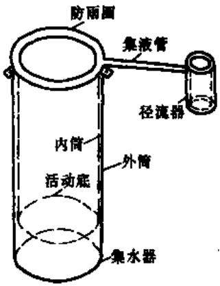  
图 2-33 I-500 型土壤蒸发器

$$
E = 0 , 0 2 ( G _ { \mathrm { t } } - G _ { \mathrm { 2 } } ) - ( R + q ) + P\tag{2-25}
$$

式中 E——观测时段内土壤蒸发量，mm；

$G _ { 1 }$ $G _ { 2 }$ ——时段初和时段末简内土样的重量，g；

${ \pmb P }$ ———观测时段内的降雨量，mm；

R——观测时段内产生的径流量，mm；

q—观测时段内渗漏的水量，mm；

0.02——蒸发器单位换算系数。

由于器测时土壤本身的热力条件与天然情况不同，其水分交换与实际情况差别较大，并且器测法只适用于单点，所以，观测结果只能在某些条件下应用或参考。对于较大面积的情况，因流域下垫面条件复杂，难以分清土壤蒸发和植物散发，所以器测法很少在生产上具体应用，多用于蒸发规律的研究。

## 2. 间接计算法

间接计算法是从土壤蒸发的物理概念出发，以水量平衡、热量平衡、乱流扩散等理论为基础，建立包括影响蒸发的一些主要因素在内的理论、半理论半经验或经验公式来估算土壤的蒸发量。

## 四、植物散发

植物散发指在植物生长期，水分从叶面和枝干蒸发进入大气的过程，又称蒸腾。植物散发比水面蒸发及土壤蒸发更为复杂，它与土壤环境、植物的生理结构以及大气状况有密切的关系。

## (一)植物的散发过程

植物根细胞液的浓度和土壤水的浓度存在较大的差异，由此可产生高达10多个大气压的渗压差，促使土壤水通过根膜液渗入根细胞内。进人根系的水分，受到根细胞生理作用产生的根压和蒸腾拉力的作用通过茎干输送到叶面。叶面上有许多气孔，当叶面气孔打开，水分通过开放的气孔逸出，这就是散发过程。叶面气孔能随外界条件变化而收缩，控制散发的强弱，甚至关闭气孔。但气孔的这种调节作用，只有在气温 $\mathsf { 4 0 7 } \mathrm { \overline { { 4 } } \mathrm { 0 } }$ 以内才具有这种能力，当气温达40℃以上时便失去了这种能力，此时气孔全开，植物由于散发消耗大量水分，加上天气炎热，空气极端干燥，植物就会枯萎死亡。由此可知，植物本身参与了散发过程，因此，散发过程不是单纯的物理过程，而是一种生物物理过程。植物散发的水分很大，吸收的水分约90%耗于散发。

## （二）植物散发的测定和估算

## 1. 器测法

在天然条件下，由于无法对大面积的植物散发进行观测，只能在实验条件下对小样本进行测定分析，过程如下：用一个不漏水圆筒，里面装满足够植物生长的土块，种上植物，土壤表面密封以防土壤蒸发，水分只能通过植物叶面逸出。视植物生长需水情况，随时淹水、试验期内，测定时段始末植物及容器重量和注水重量，按式（2-26）求散发量：

$$
E = G + ( G _ { 1 } - G _ { 2 } )\tag{2-26}
$$

式中 $\pmb { \mathscr { E } } ^ { \bot }$ 时段散发量， $\mathbf { m } ^ { 3 }$

G——时段注水量， $\boldsymbol { \mathfrak { m } } ^ { 3 }$

$G _ { 1 }$ $G _ { 2 }$ ——时段初和时段末圆筒内土壤的水量， $\mathbf { m } ^ { 3 }$ 0

器测法不可能模拟天然条件下的植物散发，所以上述方法只能在理论研究时应用，实际工作中难以直接引用。

## 2. 水量平衡法

根据水量平衡原理，测定出一块样地或流域的整片植物群落生长期始末的土壤含水量、土壤蒸发量、降雨量、径流量和渗漏量，再用水量平衡方程即可推算出植物生长期的散发量。

此外，还可以用热量平衡法或数学模型进行估算。

## 五、流域总蒸发

流域总蒸发（流域蒸散发）包括水面蒸发、土壤蒸发、植物截留蒸发及植物散发。确定的方法一般有两种：一是先分别计算流域内各个单项的蒸散发量，然后加权求出总蒸发量。但由于一个流域的下垫面极其复杂，有河流、湖泊、土壤岩石和不同的植被等等，分项计算不仅因难，也欠准确，所以这种方法目前还难以实现。实用的方法是先对流域进行综合研究，再用水量平衡法或经验公式，或根据流域总蒸发规律拟定计算模式，确定流域的总蒸发量。常用的方法有水量平衡法和模式计算法。

## （一)水量平衡法

首先建立流域的水量平衡方程。一定时段内，进入某流域的水量有：降水量P、凝结量 $\pmb { P }$ $\pmb { { \cal E } } _ { t } .$ 、地面径流入流量RS、地下径流人流量RG、流域起始蓄水量S；流出的水量有：总蒸 $R S _ { I }$ $R G _ { I } ,$ ${ \pmb S } _ { \bf I }$ 发量 ${ \pmb E } _ { 0 }$ 、地面径流流出量 $R \bar { S } _ { \mathcal { O } }$ 、地下径流流出量 $R G _ { o }$ 、时段内引用水量 ${ \pmb q } \cdot { \pmb q } .$ 时段末流域蓄水量 $s _ { z }$ 。根据水量平衡原理，流域的水量平衡方程为：

$$
P + E _ { I } + R S _ { I } + R G _ { I } + S _ { 1 } = E _ { 0 } + R S _ { O } + R G _ { O } + q + S _ { 2 }\tag{2-27}
$$

式中各项均以mm计。若该流域为闭合流域，则 $R S _ { I } { = } 0 , R G _ { I } { = } 0$ ，并令 $R { = } E S _ { o } { + } R G _ { o }$ 表示流域出口断面总径流量， ${ \pmb E } = { \pmb E } _ { 0 } - { \pmb E } _ { t }$ 表示净蒸散发量， $\Delta S { = } S _ { 2 } { - } S _ { 1 }$ 表示时段内该流域的蓄水变量，并设 $\scriptstyle q = 0$ ，则闭合流域水量平衡方程为：

$$
P - E - R = \Delta S\tag{2-28}
$$

对多年平均情况，式中蓄水变量多年平均值趋于零，因而水量平衡方程可简化为：

$$
\overline { { \boldsymbol { P } } } = \overline { { \boldsymbol { R } } } + \overline { { \boldsymbol { E } } }\tag{2-29}
$$

式中， ${ \overline { { P } } } .$ $\overline { { \pmb { R } } } .$ $\overline { { \pmb { E } } }$ 分别为流域多年平均降水量、多年平均径流量和多年平均蒸发量。

上式就是流域水量平衡方程。将上式改写为：

$$
\overline { { E } } = \overline { { P } } - \overline { { R } }\tag{2-30}
$$

利用式（2-30），就可推算出流域的总蒸发量。

我国利用中小流域的降水量与径流量观测资料，用水量平衡公式推算出全国各地的总蒸发量，并绘制了全国多年平均蒸发量等值线图，可供使用。

## (二) 模式计算法

由流域蒸散发基本规律可知，流域的蒸散发量与蒸散发能力及土壤含水量有着密切的联系。在不考虑蒸散发在流域面上不均匀的情况下，根据土壤含水量的垂直分布，可采用下列模式进行计算。

## 1. 一层模式

把流域蒸散发层作为一个整体，并认为蒸散发量同该层土壤含水量及流域蒸散发能力成正比。但此模式的结构和土壤含水量的垂直分布不完全与实际情况相符，对久旱之后下的一场小雨且土壤水分较少时，这种情况计算的结果会产生较大误差。

## 2. 二层模式

此模式结构把流域可蒸发层分为上、下两层，并认为降雨补给土壤和蒸散发消耗土壤水分都是先上层后下层，两层遵循各自的蒸发规律：上层以蒸散发能力蒸发，直到上层水分耗尽，才蒸发下层；下层土壤蒸散发量与剩余蒸散发能力（流域蒸散发能力与上层蒸散发量之差）及下层土壤实际含水量成正比。但此模式没有考虑当下层土壤水分蒸发完之后，深层水分对蒸散发的补给。

## 3. 三层模式

此模式在两层模式的基础上加人深层蒸发，把可蒸散发层分为上、下层和深层，降雨

时先补给上层，后满足下层，最后才是深层。蒸散发量的计算方法：上、下层与二层模式相同，当下层土壤水分耗尽，深层开始蒸发，其量小且稳定，常采用较小数值，如0.3\~1.0mm/d 或采用蒸散发能力的1/5\~1/10。

## 六、我国蒸发量概况

## (一)年总蒸发量地理分布

我国年总蒸发量为364mm，地理分布与年降水量地区分布大体相当，总的趋势由东南向西北递减。淮河以南，云贵高原以东广大地区年蒸发量大都为700\~800mm；海南岛东部和西藏东南隅年蒸发量可达1000mm以上，是中国年蒸发量最大的地区；华北平原大部分地区年蒸发量为400\~600mm；东北平原为400mm左右；大兴安岭以西地区、内蒙古高原、鄂尔多斯高原、阿拉善高原以及西北广大地区，都小于300mm，是中国大陆蒸发量最小的地区，其中塔里木盆地，柴达木盆地和新疆若羌以东地区，年总蒸发量不到25mm。

蒸发量还受地形、地质、土壤、植被、降水等因素的影响而出现差异。多年平均降水量相近的地区，多年平均蒸发量可能不同。在山区，气温低，降雨后产流不易停留，迅速形成径流，减少了蒸发的机会；而平原地区则相反。例如，多年平均降水量同为750mm左右，淮北平原的年蒸发量达700mm，而豫西山区却只有550mm。蒸发量与流域的高程也有一定的关系。在山区，蒸发量随高程的增加而减少，到达某高程后，递减率趋于稳定。在北方及西北干旱地区，因供水不足，开始蒸发量随高程增加而增加，达到一定高程后，又趋于减少。

## (二)年总蒸发量年内变化

年总蒸发量的年内变化与气象要素及太阳辐射的年内变化趋势一致。全年最小蒸发量一般出现在12月及1月，以后随太阳辐射量的增加而增加，夏季明显增强，蒸发量最大的月份因地而异，云贵高原东南部常在4\~5月；华北地区和西南地区西北部常在5\~6月；长江中下游及东南沿海地区常在7\~8月。蒸发量峰值期间若少雨，即形成旱期，例如，华北和西南多春旱，长江中下游多伏旱等。一年中连续最大四个月蒸发量约占全年总蒸发量的50%\~60%。

## 第六节 径 流

径流是指降水所形成的，沿着流域地面和地下向河川、湖泊、水库、洼地等流动的水流。其中，沿着地面流动的水流称为地面径流，或地表径流；沿土壤岩石孔隙流动的水流称为地下径流；汇集到河流后，在重力作用下沿河床流动的水流称为河川径流。径流因降水形式和补给来源的不同，可分为降雨径流和融雪径流，我国大部分河流以降雨径流为主。

径流过程是地球上水文循环中的重要一环。在水文循环过程中，大陆上降水的34%转化为地面径流和地下径流汇人海洋。径流过程又是一个复杂多变的过程，与人类同洪旱灾害进行斗争，以及水资源的开发利用和水环境保护等生产经济活动密切相关。因此，揭示和了解径流的变化与规律，分析它与其他水文要素以及各影响因素之间的相互关系，掌握径流形成的基本理论与分析计算方法是十分重要的。

## 一、径流的形成过程

流域内，自降雨开始到水流汇集到流域出口断面的整个物理过程，称为径流形成过程。径流的形成是一个相当复杂的过程，为了便于分析，一般把它概括为产流过程和汇流过程两个阶段。

## (一) 产流过程

降落到流域内的雨水，一部分会损失掉，剩下的部分形成径流。降雨扣除损失后的雨量称为净雨。显然，净雨和它形成的径流在数量上是相等的，但二者的过程却完全不同，净雨是径流的来源，而径流则是净雨汇流的结果；净雨在降雨结束时就停止了，而径流却要延长很长时间。我们把降雨扣除损失成为净雨的过程称为产流过程，净雨量也称为产流量。降雨不能产生径流的那部分降雨量称为损失量。在前期十分干旱情况下，降雨产流过程中的损失量称为最大损失量，记为IM。流域的损失过程，如图2-34所示。

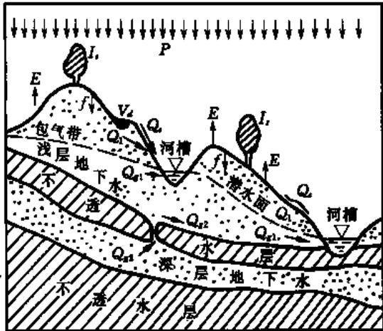  
图 2-34 径流形成过程示意图

降雨开始后，除少量直接降落在河面上形成径流外，一部分滞留在植物枝叶上，称为植物截留，截留量最终耗于蒸发。落到地面的雨水将向土中下渗，当降雨强度小于下渗强度时，雨水将全部渗人土中；当降雨强度大于下渗强度时，雨水按下渗能力下渗，超出下渗的雨水称为超渗雨。超渗雨会形成地面积水，积蓄于地面上大大小小的坑洼，称为填洼。填洼水量最终消耗于蒸发和下渗。随着降雨持续进行，满足了填洼的地方开始产生地面径流。形成地面径流的净雨，称为地面净雨。下渗到土中的水分，首先被土壤吸收，使包气带土壤含水量不断增加，当达到田间持水量后，下渗趋于稳定。继续下渗的雨水，

沿着土壤孔隙流动，一部分会从坡侧土壤孔隙流出，注入河槽形成径流，称为表层流或壤中流。形成表层流的净雨称为表层流净雨。另一部分会继续向深处下渗，到达地下水面后，以地下水的形式补给河流，称为地下径流。形成地下径流的净雨称为地下净雨，包括浅层地下水（潜水）和深层地下水（承压水）。

必须着重指出：就目前的水文科学水平，要正确划分地面径流、表层流和地下径流是非常因难的，所以实用上一般只把实测的总径流过程划分为地面径流和地下径流，相应地，净雨也只划分为地面净雨和地下净雨。表层流与地面径流的性质相近，通常把它归并到地面径流中，表层流净雨也自然地归入地面净雨中。

流域产流过程又称为流域蓄渗过程。在这一阶段，流域对降雨进行了一次再分配。

## (二) 汇流过程

净雨沿坡面从地面和地下汇入河网，然后再沿着河网汇集到流域出口断面，这一完整的过程称为流域汇流过程。前者称为坡地汇流，后者称为河网汇流。

## 1. 坡地汇流过程

坡地汇流分为三种情况：一是超渗雨满足了填洼后产生的地面净雨沿坡面流到附近河网的过程，称为坡面漫流。坡面漫流是由无数股彼此时分时合的细小水流所组成，通常没有明显的固定沟槽，雨强很大时可形成片流。坡面漫流的流程较短，一般不超过数百米，历时亦短。地面净雨经坡面漫流注人河网，形成地面径流。大雨时地面径流是构成河流流量的主要来源。二是表层流净雨沿坡面侧向表层土壤孔隙流人河网，形成表层流径流。表层流流动比地面径流慢，到达河槽也较迟，但对历时较长的暴雨，数量可能很大，成为河流流量的主要组成部分。表层流与地面径流有时能相互转化，例如，在坡地上部渗人土中流动的表层流，可在坡地下部流出，以地面径流形式流入河槽；部分地面径流也可能在坡面漫流过程中渗入土壤中流动成为表层流。这就是实际工作中把表层流归入地面径流的原因。第三是地下净雨向下渗透到地下潜水面或深层地下水体后，沿水力坡度最大的方向流入河网，称为坡地地下汇流。深层地下水汇流很慢，所以降雨以后，地下水流可以维持很长时间，较大河流可以终年不断，是河川的基本径流，所以常称为基流。

在径流形成过程中，坡地汇流过程对净雨在时程上进行的第一次再分配。降雨结束后，坡地汇流仍将持续一定时间。

## 2. 河网汇流过程

各种成分径流经坡地汇流注人河网，从支流到干流，从上游向下游，最后流出流域出口断面，这个过程称为河网汇流或河槽集流过程。坡地水流进人河网后，使河槽水量增加，水位升高，这就是河流洪水的涨水阶段。在涨水段，由于河槽贮蓄一部分水量，所以对任一河段，下断面流量总小于上断面流量。随降雨和坡地漫流量的逐渐减少直至完全停止，河槽水量减少，水位降低，这就是退水阶段。这种现象称为河槽调蓄作用。河槽调蓄是对净雨在时程上进行的第二次再分配。

一次降雨过程，经植物截留、下渗、填洼、蒸发等损失，进入河网的水量显然比降雨量少，且经过坡地汇流和河网汇流，使出口断面的径流过程远比降雨过程变化缓慢，历时亦长，时间滞后，图2-35清楚地显示了这种关系。

必须指出，降雨、产流和汇流，是从降雨开始到水流流出流域出口断面经历的全过程，它们在时间上并无截然的分界，而是同时交错进行的。

上面只是对径流的形成过程作简单的定性分析，在第四章，将详细介绍定量分析计算方法。

## 二、径流的表示方法和度量单位

河川径流在一年内和多年期间的变化特性，称为径流情势，前者称为年内变化或年内分配，后者称为年际变化。河川径流情势，常用流量、径流量、径流深、流量模数、径流系数的大小来表示。

## 1. 流量

单位时间内通过河流某一断面的水量称为流量，记为 $\pmb { Q }$ ，以 ${ \mathfrak { m } } ^ { 3 } / s$ 计。流量随时间的变化过程，用流量过程线表示，如图2-35中$Q \sim t$ ，图中各时刻的流量是瞬时值。流量过

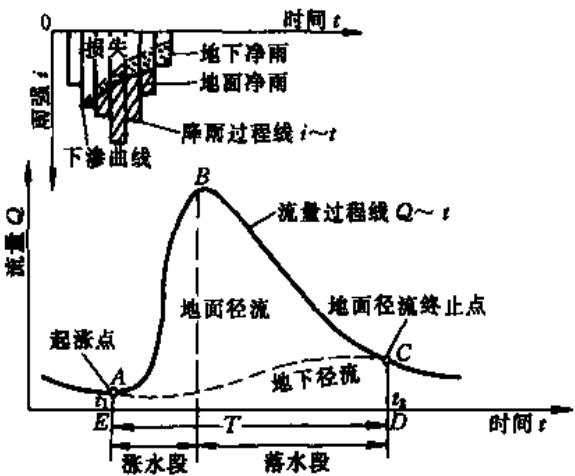  
图 2-35 流城降雨一净雨—径流关系

程线上升部分为涨水段，下降部分为退水段，最高点称为洪峰流量，简称洪峰，记为Q。 $Q _ { m }$

水文中常用的流量还有：日平均流量、月平均流量、年平均流量、多年平均流量及指定时段的平均流量。

## 2. 径流量

径流量指时段T内通过河流某一断面的总水量，记为 $W$ ，以 $\mathbf { m } ^ { 3 } , \mathcal { F } \thinspace \mathbf { m } ^ { 3 }$ 或亿 $\mathbf { m } ^ { 3 }$ 计，有时也用时段平均流量与时段的乘积为单位，如 $( \mathbf { m } ^ { 3 } / \mathbf { s } ) \cdot \mathbf { d } , ( \mathbf { m } ^ { 3 } / \mathbf { s } ) \cdot \mathbf { M }$ 等。如图2-35 中$\pmb { T }$ 时段内的径流量 $\pmb { W }$ 为 ABCDEA 包围的面积，即：

$$
W = \int _ { t _ { 1 } } ^ { t _ { 2 } } Q ( t ) \mathrm { d } t = \overline { { Q } } T\tag{2-31}
$$

式中 $\textbf { \textit { Q } } ( { \boldsymbol { \mathbf { \mathit { t } } } } )$ —t时刻流量， $\pi ^ { \mathfrak { s } } / { \mathfrak { s } }$

$t _ { 1 }$ $\mathbf { f } _ { 2 }$ —时段始、末时刻；

$\pmb { T } \cdot$ —计算时段， $\scriptstyle { \pmb { T } } = { \pmb { t } } _ { 2 } - { \pmb { t } } _ { 1 } , \ { \pmb { \mathscr { s } } } _ { 3 }$

Q——计算时段内平均流量， $\pi ^ { 3 } / { \mathfrak { s } }$ 0

## 3. 径流深

将径流量平铺在整个流域面积上所得的水层深度，记为R，以mm计。按式（2-32）计算：

$$
R = { \frac { W } { 1 0 0 0 F } } = { \frac { \overleftrightarrow { Q } T } { 1 0 0 0 F } }\tag{2-32}
$$

式中 $W ^ { . }$ 时段T内径流量， $\mathfrak { m } ^ { 3 }$

${ \overline { { \mathbf { Q } } } } \cdot$ —时段T内平均流量， $\mathbf { m } ^ { 3 } / \mathbf { s } ,$

$\pmb { T } \cdot$ —计算时段，s；

$\pmb { F } \cdot$ ——流域面积， $\mathbf { k m ^ { 2 } }$

## 4. 径流模数

流域出口断面流量与流域面积之比值称为径流模数，记为M，以 $\mathbf { L } / ~ ( \mathsf { s } \cdot \mathbf { k } \mathsf { m } ^ { 2 } )$ 计。按式（2-33）计算：

$$
M = { \frac { 1 0 0 0 Q } { F } }\tag{2-33}
$$

随着对 $\boldsymbol { \mathsf { Q } }$ 赋予的不同意义，径流模数也有不同的含义，如 $\alpha$ 为洪峰流量，相应的M为洪峰流量模数， $\alpha$ 为多年平均流量，相应的M为多年平均流量模数等等。

## 5. 径流系数

某一时段的径流深R与相应时段内流域平均降雨深度P之比值称为径流系数，记为 ${ \pmb { \alpha } } .$ 按式（2-34）计算：

$$
\alpha = { \frac { R } { P } }\tag{2-34}
$$

因 $R { < } P$ ，故 $\pmb { \alpha } < 1$

【例2-1】某水文站流域面积 $\pmb { F = 5 4 5 0 0 } \mathrm { \ k m } ^ { 2 }$ ，多年平均降雨量 $\cdot \overline { { P } } { = } 1 6 5 0 ~ \mathrm { m m }$ ，多年平均流 $\underbrace { \equiv } \overline { { Q } } = 1 6 8 0 ~ \mathrm { m } ^ { 3 } / \mathrm { s }$ 。根据这些资料可算得：

(1) 多年平均径流量 $\overline { { W } } = \overline { { Q } } T = 1 6 8 0 \times 3 6 5 \times 8 6 4 0 0 = 5 3 0 \ : \dot { 1 } \mathrm { Z } \mathrm { m } ^ { 3 } ,$

(2) 多年平均径流深 ${ \overline { { R } } } = { \frac { \widetilde W } { 1 0 0 0 { \overline { { F } } } } } = { \frac { 5 3 0 \times 1 0 ^ { 8 } } { 1 0 0 0 \times 5 4 5 0 0 } } = 9 7 2 { \mathrm { ~ m m } } _ { \circ }$

(3) 多年平均径流模数 $\overline { { M } } = \frac { 1 0 0 0 } { F } = \frac { 1 0 0 0 \times 1 6 8 0 } { 5 4 5 0 0 } = 3 0 . 8 \mathrm { L / ( s \cdot k m ^ { 2 } ) } .$

(4) 多年平均径流系数 $\alpha = { \frac { \overline { { R } } } { \overline { { P } } } } = { \frac { 9 7 2 } { 1 6 5 0 } } = 0 . 5 9 { \mathrm { , } }$

## 三、我国河川径流分布概况

我国年径流分布和年降水量分布一样，总的趋势由南向北和由东向西递减；新疆、甘肃交界以西，则由西向东递减，具有明显的地域性分布规律。同时，由于我国地形错综复杂，加上下垫面条件的差异，使得年径流的分布更为复杂，呈现多种非地域性变化。年径流不仅地区上变化明显，年内各月，年际之间亦有明显的不同。

## (一) 年径流的地理分布

我国多年平均年径流总量27115亿 $\mathtt { m } ^ { 3 }$ ，平均径流深284mm，即年降水总量的43.8%转化为河川径流。年径流地理分布总趋势由东南向西北递减。100mm年径流深等值线大致与400mm年降水量等值线相当，走向一致，等值线以东为半湿润区和湿润区，等值线以西为半干旱区或干旱区。按径流深的大小，可划分为丰水、多水、过渡、少水、干涸五个明显不同的地带。

## 1. 丰水带

年径流深大于800mm，包括东南和华南沿海地区、台湾、海南、云南西南部及西藏东南部。年径流深最大值在台湾中央山地和藏东南雅鲁藏布江下游靠近中印边界一带，可达4000\~5000mm。东南沿海主要山地1600\~2000mm。年径流系数一般在0.5以上，部分山地超过0.8。

## 2. 多水带

年径流深在200\~800mm之间，包括长江流域大部、淮河流域南部、西江上游、云南大部，以及黄河中上游一小部分地区。部分山地年径流深可达1000\~2000mm。年径流系数一般为0.4\~0.6。

## 3. 过渡带

年径流深在50\~200mm之间，包括大兴安岭、松嫩平原一部分、三江平原、辽河下游平原、华北平原大部、燕山和太行山、青藏高原中部、祁连山山区及新疆西部山区。此带内平原地区年径流深大部分为50\~100mm，年径流系数0.1左右。山区年径流深100\~200mm，年径流系数0.2\~0.4。

## 4. 少水带

年径流深在10\~50mm之间，包括松辽平原中部、辽河上游地区，内蒙古高原南部、黄土高原大部、青藏高原北部及西部部分丘陵低山区。本带内平原地区年径流深一般为10～25mm，黄土高原10\~50mm，部分山区可达50mm以上。年径流系数一般为0.1左右，个别地区小于0.05。

## 5. 干涸带

年径流深小于10mm，包括内蒙古高原、河西走廊、柴达木盆地、准噶尔盆地、塔里木盆地、吐鲁番盆地。本带内不少地区基本不产流，年径流系数只有0.01\~0.03。

## (二)年径流的年内变化

径流的年内变化主要取决于河流的补给条件。我国大部分地区河川径流靠雨水补给，季节性变化剧烈，有明显的汛期和枯水期。汛期河水暴涨，容易泛滥成灾；枯水期水量很小，水源不足。汛期连续最大4个月径流量占年总径流量60%以上，其中长江以南、云贵高原以东和西南大部分地区为60%\~70%，松辽平原、华北平原、淮河流域大部分地区为70%\~80%，广大西部地区为60%左右。以冰雪融水补给为主的河流，由于流域内热量的变化比雨量变化小，所以年内分配比较均匀。地下水补给比例大的河流，其年内变化也较小。大江大河因接纳不同地区径流的汇人和地下径流的补给，径流的年内分配也较均匀。

## (三)年径流的年际变化

径流的年际变化，较降水更为剧烈，北方大于南方，水量越贫乏的地区，丰枯年间的水量相差越大。以历年最大最小年径流量的比值为指标，长江以南各河一般小于3倍；淮河、海滦河各支流可达10\~20倍，部分平原河流甚至更大。年径流的变化，不仅有时枯时丰的情况，而日存在连续枯水和连续丰水的情况。如黄河在近60年中出现过从1922\~1932年共11年的少水期，该段时间年径流的平均值比正常年份少24%；也出现过1943\~1951年连续9年的丰水期，该段年径流平均值比正常年份多19%。松花江在近80年中也出现过1898\~1908年连续11年和1916\~1928年连续13年的少水期，平均年径流量比正常值少40%；也出现过1960\~1966年连续7年的丰水期，平均年径流量比正常值大32%。海河近60年来连早、连丰更频繁，如1919\~1923年、1927\~1931年、1941\~1943年、1946\~1948年、1965\~1968年、1971～1972年等连续2\~3年甚至5年的于旱；也出现过1954\~1956年、1963\~1964年等连续2\~3年的洪涝。

## 第三章 水文信息采集与处理

水文信息采集与处理是研究各种水文信息的测量、计算与数据处理的原理和方法的一门科学，是水文学与水资源学的重要组成部分。水文信息的采集有两种情况：一种是对水文事件当时发生情况下实际观测的信息；另一种是对水文事件发生后进行调查所得的信息。获取水文信息的方法多种多样。现代科学技术的不断发展，新技术、新仪器的不断出现，更促进了获取水文信息手段不断更新。

## 第一节测站与站网

## 一、测站

在流域内一定地点（或断面）按统一标准对所需要的水文要素作系统观测以获取信息并进行处理为即时观测信息。这些指定的地点称为测站。

水文测站所观测的项目有水位、流量、泥沙、降水、蒸发、水温、冰凌、水质、地下水位等。只观测上述项目中的一项或少数几项的测站，则按其主要观测项目而分别称为水位站、流量站（也称水文站）、雨量站、蒸发站等。

根据测站的性质，河流水文测站又可分为基本站、专用站两大类。基本站是水文主管部门为全国各地的水文情况而设立的，是为国民经济各方面的需要服务的。专用站是为某种专门目的或用途由各部门自行设立的。这两类测站是相辅相成的，专用站在面上辅助基本站，而基本站在时间系列上辅助了专用站。

## 二、水文站网

因为单个测站观测到的水文要素其信息只代表了站址处的水文情况，而流域上的水文情况则须在流域内的一些适当地点布站观测，这些测站在地理上的分布网称为站网。广义的站网是指测站及其管理机构所组成的信息采集与处理体系。布站的原则是通过所设站网采集到的水文信息经过整理分析后，达到可以内插流域内任何地点水文要素的特征值，这也就是水文站网的作用。所以，研究测站在地区上分布的科学性、合理性、最优化等问题，就是水文站网规划的任务。

按站网规划的原则布设测站，例如河道流量站的布设，当流域面积超过3000\~5000km²，应考虑能够利用设站地点的资料，把干流上没有测站地点的径流特性插补出来。预计将修建水利工程的地段，一般应布站观测。对于较小流域，虽然不可能全部设站观测，但应在水文特征分区的基础上，选择有代表性的河流进行观测。在中、小河流上布站时还应当考虑暴雨洪水分析的需要，如对小河应按地质、土壤、植被、河网密集程度等下垫面因素分类布站。布站时还应注意雨量站与流量站的配合。对于平原水网区和建有水利工程的地区，应注意按水量平衡的原则布站。也可以根据实际需要，安排部分测站每年只在部分时期（如汛期或枯水期）进行观测。又如水质监测站的布设，应以监测目标、人类活动对水环境的影响程度和经济条件这三个因素作为考虑的基础。

我国水文站网于1956年开始统一规划布站，经过多次调整，布局已比较合理，对国民经济发展起积极作用。但随着我国水利水电发展的情况，大规模人类活动的影响，不断改变着天然河流产汇流、蓄水及来水量等条件，因此对水文站网要进行适当调整、补充。

## 三、水文测站的设立

建站包括选择测验河段和布设观测断面。

在站网规划规定的范围内，具体选择测验河段时，主要考虑在满足设站目的要求的前提下，保证工作安全和测验精度，并有利于简化水文要素的观测和信息的整理分析工作。具体地说，就是测站的水位与流量之间呈良好的稳定关系（单一关系)。该关系往往受一断面或一个河段的水力因素控制，前者称为断面控制，后者称为河槽控制。断面控制的原理是在天然河道中，由于地质或人工的原因，造成河段中局部地形突起，如石梁、卡口等，使得水面曲线发生明显转折，形成临界流，出现临界水深 $\pmb { h } _ { k }$ ，从而构成断面控制。当水位流量关系要靠一段河槽所发生的阻力作用来控制，如该河段的底坡、断面形状、糙率等因素比较稳定，则水位流量关系也比较稳定。这就属于河槽控制。在河流上设立水文测站，平原地区应尽量选择河道顺直、稳定、水流集中，便于布设测验的河段，且尽量避开变动回水、急剧冲淤变化、分流、斜流、严重漫滩等以及妨碍测验工作的地貌、地物。结冰河流，还应避开容易发生冰塞、冰坝的地方。山区河流应在有石梁、急滩、卡口、弯道上游附近规整的河段上选站。

水文测站一般应布设基线、水准点和各种断面，即基本水尺断面、流速仪测流断面、浮标测流断面及比降断面。基本水尺断面上设立基本水尺，用来进行经常的水位观测。测流断面应与基本水尺断面重合，且与断面平均流向垂直。若不能重合时，亦不能相距过远。浮标测流断面有上、中、下三个断面，一般中断面应与流速仪测流断面重合。上、下断面之间的间距不宜太短，其距离应为断面最大流速的50\~80倍。比降断面设立比降水尺，用来观测河流的水面比降和分析河床的糙率。上、下比降断面间的河底和水面比降，不应有明显的转折，其间距应使得所测比降的误差能在±15%以内。水准点分为基本水准点和校核水准点，均应设在基岩或稳定的永久性建筑物上，也可埋设于土中的石柱或混凝土桩上。前者是测定测站上各种高程的基本依据，后者是经常用来校核水尺零点的高程。基线通常与

测流断面垂直，起点在测流断面线上。

其用途是用经纬仪或六分仪测角交会法推求垂线在断面上的位置。基线的长度视河宽B而定，一般应为0.6B。当受地形限制的情况下，基线长度最短也应为0.3B。基线长度的丈量误差不得大于1/1000，见图3-1所示。

## 四、收集水文信息的基本途径

上述在河流或流域内的固定点上对水文要素所进行的观测称驻测。这是我国收集水文信息的最基本方式。但存

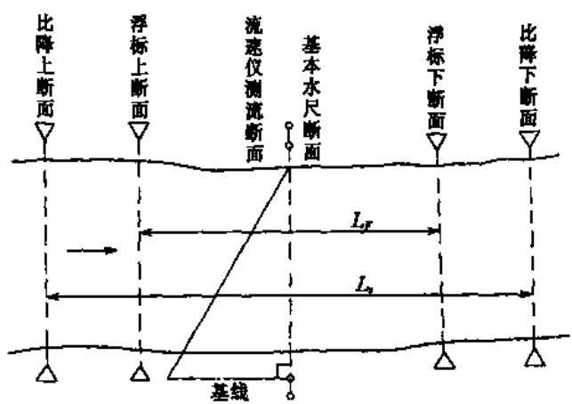  
图 3-1 水文测站基线与断面布设示意图

在着用人多、站点不足、效益低等缺点。为了更好提高水文信息采集的社会效益和经济效益，经过20多年的实践，采取驻测、巡测、间测及水文调查相结合的方式收集水文信息，可更好地满足生产的要求。

巡测是观测人员以巡回流动的方式定期或不定期地对一地区或流域内各观测点进行流量等水文要素的观测。间测是中小河流水文站有10年以上资料分析证明其历年水位流量关系稳定，或其变化在允许误差范围内，对其中一要素（如流量）停测一时期再施测的测停相间的测验方式。停测期间，其值由另一要素（水位）的实测值来推算。水文调查是为弥补水文基本站网定位观测的不足或其他特定目的，采用勘测、调查、考证等手段进行收集水文信息的工作。

## 第二节 水位观测

水位，是指河流、湖泊、水库及海洋等水体的自由水面离开固定基面的高程，以m计。水位与高程数值一样，要指明其所用基面才有意义。目前全国统一采用黄海基面，但各流域由于历史的原因，多沿用以往使用的大沽基面、吴淞基面、珠江基面，也有使用假定基面、测站基面或冻结基面的。使用水位资料时一定要查清其基面。

水位观测的作用一是直接为水利、水运、防洪、防涝提供具有单独使用价值的资料，如堤防、坝高、桥梁及涵洞、公路路面标高的确定，二是为推求其他水文数据而提供间接运用资料如 ${ \sf Q } { = } f \ ( Z ) , S { = } \ ( Z _ { \tau } { - } Z _ { 1 } ) \ / L$ ，水资源计算，水文预报中的上、下游水位相关法等。其中Q为流量，以 $\pi ^ { 3 } / { \tt s }$ 计；S为比降，以千分率或万分率表示； ${ \bf Z } _ { 2 } , { \bf Z } _ { 1 }$ 分别为上、下比降断面的水位；L为上、下比降断面的间距，单位均以m计。

水位观测的常用设备有水尺和自记水位计两类。

按水尺的构造形式不同，可分为直立式、倾斜式、矮桩式与悬锤式等。观测时，水面在水尺上的读数加上水尺零点的高程即为当时的水位值。可见水尺零点高程是一个重要的数据，要定期根据测站的校核水准点对各水尺的零点高程进行校核。

自记水位计能将水位变化的连续过程自动记录下来，有的还能将所观测的数据以数字或图像的形式远传室内，使水位观测工作趋于自动化和远传化。在荷兰水文信息服务中心，从计算机屏幕上可直接调看或用电话直接询问全国范围内各测站当时的水位，而这些又几乎都是无人驻守测站。

水位的观测包括基本水尺和比降水尺的水位。基本水尺的观测，当水位变化缓慢时(日变幅在0.12m以内)，每日8时和20时各观测一次（称2段制观测，8时是基本时)；枯水期日变幅在0.06m以内，用1段制观测；日变幅在0.12\~0.24m时，用4段制观测；依次8段、12段制等。有峰谷出现时，还要加测。比降水尺观测的目的是计算水面比降，分析河床糙率等。其观测次数，视需要而定。

水位观测数据整理工作的内容包括日平均水位、月平均水位、年平均水位的计算。日平均水位的计算方法有二：若一日内水位变化缓慢，或水位变化较大，但系等时距人工观测或从自记水位计上摘录，采用算术平均法计算；若一日内水位变化较大、且系不等时距观测或摘录，则采用面积包围法，即将当日0\~24小时内水位过程线所包围的面积，除以

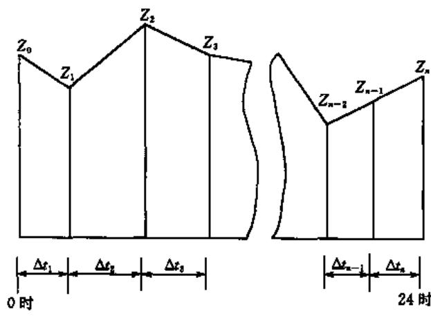  
图 3-2 面积包圈法示意图

一日时间求得（见图3-2)，其计算公式为：

$$
\begin{array} { r l } & { \bar { Z } { = } \frac { 1 } { 4 8 } [ Z _ { 0 } \Delta t _ { 1 } + Z _ { 1 } ( \Delta t _ { 1 } + \Delta t _ { 2 } ) } \\ & { \quad \quad + Z _ { 2 } ( \Delta t _ { 2 } + \Delta t _ { 3 } ) + \cdots } \\ & { \quad \quad { + } Z _ { n - 1 } ( \Delta t _ { n - 1 } + \Delta t _ { n } ) + Z _ { n } ( \Delta t _ { n } ) ] } \end{array}\tag{3-1}
$$

如0时或24时无实测数据，则根据前后相邻水位直线内插求得。

根据逐日平均水位可算出月平均水位和年平均水位及保证率水位。这些经过整理分析处理后的水位资料即可提供各生产单位应用。如刊布的水文年鉴中，均载有各站的日平均水位表，表中附有月、

年平均水位，年及各月的最高、最低水位。汛期内水位详细变化过程则载于水文年鉴中的汛期水文要素摘录表内。

## 第三节流量测验

## 一、概述

流量是单位时间内流过江河某一横断面的水量，以 $\pi ^ { 3 } / { \mathsf { s } }$ 计。它是反映水资源和江河、湖泊、水库等水体水量变化的基本数据，也是河流最重要的水文特征值。

流量是根据河流水情变化的特点，在水文站上用各种测流方法进行流量测验取得实测数据，经过分析、计算和整理而得的资料，用于江河流量变化的规律，为国民经济各部门服务。

测流方法很多，按其工作原理，可分为下列几种类型。

(1）流速面积法。有流速仪法、航空法、比降面积法、积宽法（动车法、动船法和缆道积宽法）、浮标法（按浮标的形式可分为水面浮标法、小浮标法、深水浮标法等）。

(2) 水力学法。包括量水建筑物和水工建筑物测流。

(3)化学法。又称溶液法、稀释法、混合法。

(4) 物理法。有超声波法、电磁法和光学法。

(5)直接法。有容积法和重量法，适用于流量极小的沟润。本节主要介绍流速仪法测流。

## 二、流速仪法测流

## (一) 测流原理

由于河流过水断面的形态、河床表面特性、河底纵坡、河道弯曲情况以及冰情等，都对断面内各点流速产生影响，因此在过水断面上，流速随水平及垂直方向的位置不同而变化，即 $v = f \ ( \ b , \ h )$ 。其中v为断面上某一点的流速，b为该点至水边的水平距离，h为该点至水面的垂直距离。因此，通过全断面的流量 $\alpha$ 为：

$$
Q = \int _ { 0 } ^ { A } v \cdot \mathrm { d } A = \int _ { 0 } ^ { B } \cdot \int _ { 0 } ^ { H } f ( b , h ) \mathrm { d } h \cdot \mathrm { d } b\tag{3-2}
$$

式中 A——水道断面面积，dA 则为 A 内的单元面积（其宽为 db，高为 dh)， $\mathbf { m } ^ { 2 }$ th

v——垂直于 dA的流速，m/s；

$B ^ { \prime }$ —水面宽度，m；

$\pmb { H }$ ——水深，m。

因为 $f \ ( \pmb { b } , \pmb { h } )$ 的关系复杂，目前尚不能用数学公式表达，实际工作中把上述积分式变成有限差分的形式来推求流量。流速仪法测流，就是将水道断面划分为若干部分，用普通测量方法测算出各部分断面的面积，用流速仪施测流速并计算出各部分面积上的平均流速，两者的乘积，称为部分流量，各部分流量的和为全断面的流量，即：

$$
Q = \sum _ { i = 1 } ^ { n } q _ { i }\tag{3-3}
$$

式中 $\pmb { q } _ { i }$ —第i个部分的部分流量， ${ \mathfrak { m } } ^ { 3 } / { \mathfrak { s } }$

## n——部分的个数。

需要注意的是，实际测流时不可能将部分面积分成无限多，而是分成有限个部分，所以实测值只是逼近真值；河道测流需时间较长，不能在瞬时完成，因此实测流量是时段的平均值。

由此可见，测流工作实质上是测量横断面及流速两部分工作。

## (二) 断面测量

河道水道断面的测量，是在断面上布设一定数量的测深垂线，施测各条测深垂线的起点距和水深并观测水位，用施测时的水位减去水深，即得各测深垂线处的河底高程。

测深垂线的位置，应根据断面情况布设于河床变化的转折处，并且主槽较密，滩地较稀。测深垂线的起点距是指该测深垂线至基线上的起点桩之间的水平距离。测定起点距的方法有多种。中小河流可在断面上架设过河索道，并直接读出起点距，称此法为断面索法；大河上常用仪器测角交会法。常用仪器为经纬仪，平板仪、六分仪等。如用经纬仪测量，在基线的另一端（起点距是一端）架设经纬仪，观测测深垂线与基线之间的夹角。因基线长度已知，即可算出起点距：目前最先进的是用全球定位系统(GPS）定位的方法，它是利用全球定位仪接收天空中的三颗人造定点卫星的特定信号来确定其在地球上所处位置的坐标，优点是不受任何天气气候的干扰，24小时均可连续施测，且快速、方便、准确。水深一般用测深杆、测深锤或测深铅鱼等直接测量。超声波回声测声仪也可施测水深，它是利用超声波具有定向反射的特性，根据声波在水中的传播速度和超声波从发射到回收往返所经过的时间计算出水深，具有精度好、工效高、适应性强、劳动强度小，且不易受天气、潮汐和流速大小限制等优点。

河道水道断面扩展至历年最高洪水位以上0.5\~1.0m的断面称为大断面。它是用于研究测站断面变化的情况以及在测流时不施测断面可供借用断面。大断面的面积分为水上、水下两部分。水上部分面积采用水准仪测量的方法进行：水下部分面积测量称水道断面测量。由于测水深工作困难，水上地形测量较易，所以大断面测量多在枯水季节施测，汛前或汛后复测一次。但对断面变化显著的测站，大断面测量一般每年除汛前或汛后施测一次外，在每次大洪水之后应及时施测过水断面的面积。

## (三)流速测量

天然河道中一般采用流速仪法测定水流的流速。它是国内外广泛使用的测流速方法，是评定各种测流新方法精度的衡量标准。图3-3为旋杯式流速仪，图3-4为旋桨式流速仪。

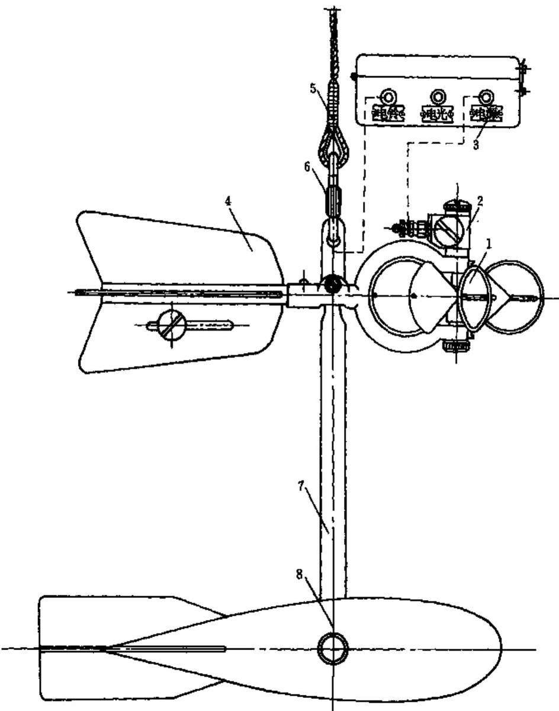  
图 3-3 旋杯式流速仪  
(水深大于2. 8m的一般河流用本法安装测量)  
1—旋杯；2—传讯盒；3—电铃计数器；4—尾翼；5—锅丝绳；6—绳钩；7—悬杆；8一铅鱼

根据测速方法的不同，流速仪法测流可分为积点法、积深法和积宽法。最常用的积点法测速是指在断面的各条垂线上将流速仪放至不同的水深点测速。测速垂线的数目及每条测速垂线上测点的多少是根据流速精度的要求、水深、悬吊流速仪的方式、节省人力和时

表 3-1各种测速垂线数对流量的标准差
<table><tr><td rowspan=1 colspan=1>测速垂线数</td><td rowspan=1 colspan=1>8~11</td><td rowspan=1 colspan=1>12~15|</td><td rowspan=1 colspan=1>16~20}</td><td rowspan=1 colspan=1>21~25</td><td rowspan=1 colspan=1>26~30</td><td rowspan=1 colspan=1>31~35|1</td><td rowspan=1 colspan=1>04</td></tr><tr><td rowspan=1 colspan=1>标准差</td><td rowspan=1 colspan=1>4.2</td><td rowspan=1 colspan=1>4.1</td><td rowspan=1 colspan=1>2.1</td><td rowspan=1 colspan=1>2.0</td><td rowspan=1 colspan=1>1.6</td><td rowspan=1 colspan=1>1.6</td><td rowspan=1 colspan=1>0</td></tr></table>

间等情况而定。国外多采用多线少点测速。国际标准建议测速垂线不少于20条，任一部分流量不得超过10%总流量。表3-1是美国在127条不同河流上的测站，每站断面上布设100条以上的测速垂线，对不同测速垂线数目所推求的流量，进行流量误差的统计分析。表3-1说明：测速垂线数愈多，流量的误差愈小。

畅流期用精测法测流时，如采用悬杆悬吊，当水深大于1.0m可用五点法测流，即在相对水深（测点水深与所在垂线水深之比值）分别为0.0、0.2、0.6、0.8和1.0处施测。

为了消除流速的脉动影响，各测点的测速历时，可在60\~100秒之间选用。但当受测流所需总时间的限制时，则可选用少线少点、30秒的测流方案。

## (四)流量计算

流量的计算方法有图解法、流速等值线法和分析法。前两种方法在理论上比较严格，但比较繁琐，这里主要介绍常用的分析法。具体步骤及内容如下(图 3-5)。

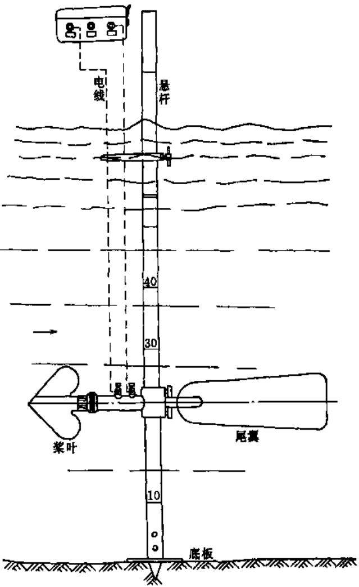

## 1. 垂线平均流速的计算

视垂线上布置的测点情况，分别按下列公式进行计算：

一点法 $V _ { \ast } = V _ { \ast , \ast }$

(3-4)

二点法 $V _ { \mathbf { \eta } \mathbf { z } } = \frac { 1 } { 2 } ( V _ { \mathbf { \eta } \mathbf { 0 } , \mathbf { : } } + V _ { \mathbf { \eta } \mathbf { 0 } , \mathbf { : } } )$

图 3-4 旋桨式流速仪

(3-5)

三点法 $V _ { \mathrm { { m } } } = \frac { 1 } { 3 } ( V _ { \mathrm { { 0 , 2 } } } + V _ { \mathrm { { 0 , 6 } } } + V _ { \mathrm { { 0 . 8 } } } )$

(3-6)

五点法

$$
V _ { \overline { { { \mathbf { \alpha } } } } } = \frac { 1 } { 1 0 } ( V _ { 0 . 0 } + 3 V _ { \circ . 2 } + 3 V _ { \circ . 6 } + 2 V _ { \circ . 8 } + V _ { 1 . 0 } )\tag{3-7}
$$

式中， $V _ { \mathbf { \overline { { ~ m ~ } } } }$ 为垂线平均流速； $V _ { 0 , 0 \setminus } \ V _ { 0 , 2 \setminus } \ V _ { 0 , 6 \setminus } \ V _ { 0 , 8 \setminus } \ V _ { 1 , 4 }$ 均为与脚标数值相应的相对水深处的测点流速。

## 2. 部分平均流速的计算

岸边部分：由距岸第一条测速垂线所构成的岸边部分（两个，左岸和右岸，多为三角形)，按下列公式计算：

$$
V _ { 1 } = a V _ { \bowtie 1 }\tag{3-8}
$$

$$
V _ { n + 1 } = \alpha V _ { \mathrm { m n } }\tag{3-9}
$$

式中， $\pmb { \alpha }$ 称岸边流速系数，其值视岸边情况而定。斜坡岸边 $\alpha { = } 0 . 6 7 { \sim } 0 . 7 5$ ，一般取0.70，陡岸 $\alpha { = } 0 . 8 0 { \sim } 0 . 9 0$ ，死水边 $\pmb { \alpha = 0 . 6 0 }$

中间部分：由相邻两条测速垂线与河底及水面所组成的部分，部分平均流速为相邻两

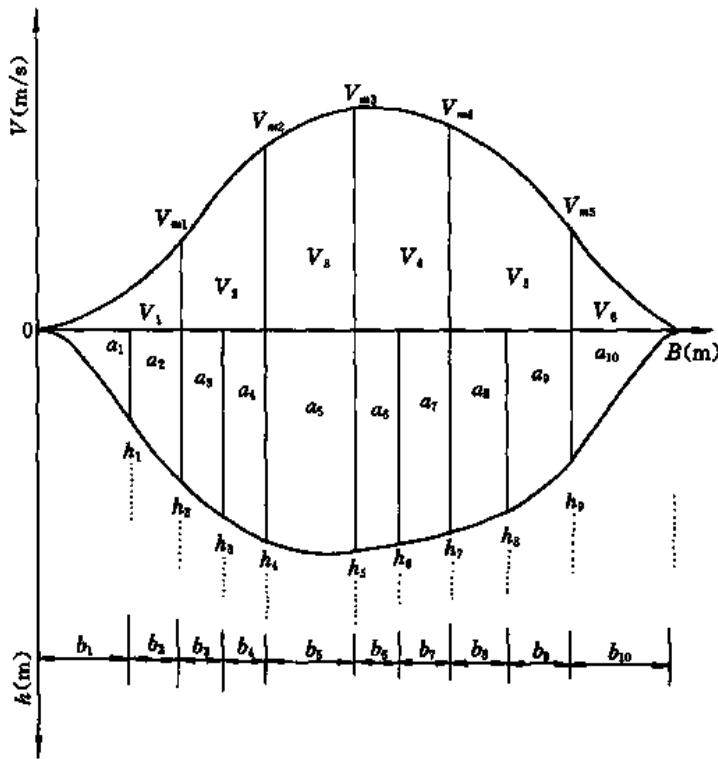  
图 3-5 部分面积 $\blacktriangle _ { i } ,$ 部分流速V及部分流量 $\pmb q _ { i }$ 计算示意图

$$
\begin{array} { c l } { { a _ { 1 } = \displaystyle \frac { 1 } { 2 } h _ { 1 } b _ { 1 } , a _ { 1 0 } = \displaystyle \frac { 1 } { 2 } h _ { 9 } b _ { 1 0 } , a _ { i } = \displaystyle \frac { 1 } { 2 } ( h _ { i - 1 } + h _ { i } ) b _ { i } , i = 2 , 3 , \cdots , 9 } } \\ { { \ } } & { { A _ { 1 } = a _ { 1 } + a _ { 2 } , A _ { 2 } = a _ { 3 } + a _ { 4 } , A _ { 8 } = a _ { 5 } , A _ { 4 } = a _ { 6 } + a _ { 7 } , A _ { 5 } = a _ { 8 } + a _ { 8 } , } } \\ { { \ } } & { { A _ { 6 } = a _ { 1 0 } , V _ { 1 } = a V _ { \mathrm { s t } } , V _ { 8 } = a V _ { \mathrm { m 5 } } , V _ { i } = \displaystyle \frac { 1 } { 2 } \langle V _ { \mathrm { s t } i - 1 } + V _ { \mathrm { s t } i } \rangle , } } \\ { { \ } } & { { \ } } \\ { { i = 2 , 3 , \cdots , 5 , q _ { i } = V _ { i } q _ { i } , i = \displaystyle \dot { 1 } , 2 , \cdots , 6 , Q = \displaystyle \sum _ { i = 1 } ^ { 6 } q _ { i } } } \end{array}
$$

垂线平均流速的平均值，按下式计算：

$$
V _ { i } = \frac { 1 } { 2 } ( V _ { m i - 1 } + V _ { m i } )\tag{3-10}
$$

## 3. 部分面积的计算

因为断面上布设的测深垂线数目比测速垂线的数目多，故首先计算测深垂线间的断面面积。计算方法是距岸边第一条测深垂线与岸边构成三角形，按三角形面积公式计算（左右岸各一个)：其余相邻两条测深垂线间的断面面积按梯形面积公式计算。其次以测速垂线划分部分，将各个部分内的测深垂线间的断面积相加得出各个部分的部分面积。若两条测速垂线（同时也是测深垂线）间无另外的测深垂线，则该部分面积就是这两条测深（同时是测速垂线）间的面积。

## 4. 部分流量的计算

由各部分的部分平均流速与部分面积之积得到部分流量，即

$$
{ \mathfrak { q } } _ { i } = V _ { i } A _ { i }\tag{3-11}
$$

式中， $\pmb { q _ { i } }$ r $V _ { \dot { \mathbf { { i } } } }$ $\pmb { A } _ { i }$ 分别为第i个部分的流量、平均流速和断面积。

5. 断面流量及其他水力要素的计算

断面流量

$$
Q = \sum _ { i = 1 } ^ { n } q _ { i }\tag{3-12}
$$

$$
1 7 \sqrt { 5 } \sqrt { 2 } + 1 7 \sqrt { 3 } \sqrt { 2 } \sqrt { 5 } = Q / A\tag{3-13}
$$

$$
\pmb { \mathbb { f } } \operatorname { \mathbb { f } } \operatorname { \mathbb { f } } \operatorname { \mathbb { f } } \operatorname { \pmb { \operatorname { \Sigma } } } \operatorname { \pmb { \operatorname { \Sigma } } } \operatorname { \pmb { \operatorname { \Sigma } } } \operatorname { \pmb { \operatorname { \Sigma } } } \operatorname { \pmb { \operatorname { \Sigma } } } \operatorname { \pmb { \operatorname { \Sigma } } } \operatorname { \pmb { \operatorname { \Sigma } } } \operatorname { \pmb { \operatorname { \Sigma } } } \operatorname { \pmb { \operatorname { \Sigma } } } \operatorname { \pmb { \operatorname { \Sigma } } } \operatorname { \pmb { \operatorname { \Sigma } } } \operatorname { \pmb { \operatorname { \Sigma } } } \operatorname { \pmb { \operatorname { \Sigma } } } \operatorname { \pmb { \operatorname { \Sigma } } } \operatorname { \pmb { \operatorname { \Sigma } } } \operatorname { \pmb { \operatorname { \Sigma } } } \operatorname { \pmb { \operatorname { \Sigma } } } \operatorname { \pmb { \operatorname { \Sigma } } } \operatorname { \pmb { \operatorname { \Sigma } } } \operatorname { \pmb { \operatorname { \Sigma } } } \operatorname { \pmb { \operatorname { \Sigma } } } \operatorname { \pmb { \operatorname { \Sigma } } } \operatorname { \pmb { \operatorname { \Sigma } } } \operatorname { \pmb { \Sigma } } \operatorname { \pmb \pmb { \operatorname { \Sigma } } }\tag{3-14}
$$

在一次测流过程中，与该次实测流量值相等的、某一瞬时流量所对应的水位称相应水位。根据测流时水位涨落不同情况可分别采用平均或加权平均计算。

## (五)冰期测流

冰期施测流量时，测流断面情况如图3-6所示，其计算方法和畅流期的计算方法基本相同，其有关特点如下。

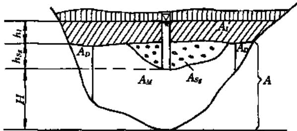  
图 3-6 封冰期测流断面示意图  
A—水道断面面积 $\mathbf { \delta } _ { \mathbf { \alpha } _ { \mathbf { \beta } } \mathbf { \delta } _ { \mathbf { \alpha } } } A \mathbf { \delta } _ { \mathbf { \alpha } \mathbf { \alpha } }$ 流水断面面积 $\pmb { A _ { D } } -$ 死水面积：A—水浸冰面积 $\mathfrak { s } A _ { \mathbb { S } _ { \widetilde { g } } \mathfrak { r } }$ 一冰花面积 $\star h _ { I } -$ 水漫冰厚；

$\hbar _ { S _ { E } } .$ 一冰花厚；H—有效水深

## 1. 垂线平均流速的计算

六点法

$$
V = \frac { 1 } { 1 0 } ( V _ { \circ , \circ } + 2 V _ { \circ , 2 } + 2 V _ { \circ , 4 } + 2 V _ { \circ , 6 } + 2 V _ { \circ , 8 } + V _ { \iota \circ } )\tag{3-15}
$$

三点法

$$
V _ { \mathfrak { n } } = \frac { 1 } { 3 } ( V _ { \mathfrak { o . 1 5 } } + V _ { \mathfrak { o . s } } + V _ { \mathfrak { o . s 5 } } )\tag{3-16}
$$

二点法

$$
V _ { \mathbf { \mathfrak { s } } } = \frac { 1 } { 2 } ( V _ { \mathfrak { s } . \mathfrak { s } } + V _ { \mathfrak { s } . \mathfrak { s } } )\tag{3-17}
$$

一点法

$$
V _ { \ast } = K V _ { \ast s }\tag{3-18}
$$

式中测点流速的脚标，分别为各测点对于所在测线有效水深（自冰底或冰花底至河底的垂直距离）的相对深度。K为冰期半深流速系数，根据六点法或三点法测速资料分析确定，一般约为0.88\~0.90。

## 2. 部分面积的计算

与畅流期相同，但冰期的水深h，应为在有水浸冰的垂线上的有效水深。在有岸冰或清沟存在时，盖面冰与畅流期交界处同一垂线上的水深用两种数值：当计算盖面冰以下的那一部分面积时，采用有效水深；当计算畅流部分的面积时，采用实际水深（水面算起的水深)。

## 3. 流量的计算

亦是先求各部分流量后再求和。但此时应将断面总面积、水浸冰面积、冰花面积与水道断面面积一并算出。在有岸冰或清沟时，可区分计算。这些面积，一般均先分区按梯形公式计算出部分面积，再求总和即可。

## 三、浮标法测流

当使用流速仪测流有困难时，使用浮标测流是切实可行的办法。浮标随水流漂移，其速度与水流速度之间有较密切的关系，故可利用浮标漂移速度（称浮标虚流速）与水道断面积来推算断面流量。用水面浮标法测流时，应先测绘出测流断面上水面浮标速度分布图。将其与水道断面相配合，便可计算出断面虚流量。断面虚流量乘以浮标系数，即得断面流量。

水面浮标常用木板、稻草等材料做成十字形、井字形，下坠石块，上插小旗以便观测。在夜间或雾天测流时，可用油浸棉花团点火代替小旗以便识别。为减少受风面积，保证精度，在满足观测的条件下浮标尺寸应尽可能做得小些。在上游浮标投放断面（参见图3-1），沿断面均匀投放浮标，投放的浮标数目大致与流速仪测流时的测速垂线数目相当。如遇特大洪水，可只在中泓投放浮标直接选用天然漂浮物作浮标。用秒表观测各浮标流径浮标上、下断面间的运行历时 $\pmb { T _ { i } }$ ，用经纬仪测定各浮标流径浮标中断面（测流断面）的位置（定起点距)，上、下浮标断面的距离L除以 $\pmb { T _ { j } }$ 即得水面浮标流速沿河宽的分布图。当不能实测断面，可借用最近施测的断面。从水面虚流速分布图上内插出相应各测深垂线处的水面虚流速；再按式（3-9）至式（3-13），求得断面虚流量 $Q _ { f }$ 乘以浮标系数 $K _ { f }$ ，即得断面流量 $\alpha$ a

$K _ { f }$ 值的确定有实验比测法、经验公式法和水位流量关系曲线法。在未取得浮标系数试验数据之前，可根据下列范围选用浮标系数：一般湿润地区可取0.85\~0.90；小河取0.75\~0.85；干旱地区大、中河流可取0.80\~0.85，小河取0.70\~0.80。

## 第四节 泥沙测验与计算

河流泥沙对于河流的水情及河流的变迁有重大的影响。泥沙资料也是一项重要的水文资料。河流中的泥沙，按其运动形式可分为悬移质、推移质和河床质三类。悬移质泥沙悬浮于水中并随之运动；推移质泥沙受水流冲击沿河底移动或滚动；河床质泥沙则相对静止而停留在河床上。三者随水流条件的变化而相互转化。三者特性不同，测验及计算方法也各异，但全国现有推移质取样测站仅20多个，河床质只根据需要才取，故仅介绍悬移质测验。 口

## 一、悬移质测验与计算

描述河流中悬移质的情况，常用的两个定量指标是含沙量和输沙率。单位体积内所含干沙的质量，称为含沙量，用 $C _ { s }$ 表示，单位为 $\mathbf { k g } / \mathbf { m } ^ { 3 }$ 。单位时间流过河流某断面的干沙质量，称为输沙率，以 $\pmb { Q } ,$ 表示，单位为 ${ \bf { k } } \otimes \mathrm { { / s } }$ 。断面输沙率是通过断面上含沙量测验配合断面流量测量来推求的。

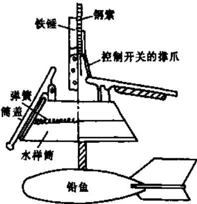

## (一) 含沙量的测验

含沙量测验，一般需用采样器从水流中采取水样。常用的有横式采样器（图3-7）与瓶式采样器（图3-8）。如

图 3-7 横式采样器

果水样是取自固定测点，称为积点式取样；如取样时，取样瓶在测线上由上到下（或上、下往返）匀速移动，称为积深式取样，该水样代表测线的平均情况。

不论用何种方式取得的水样，都要经过量积、沉淀、过滤、烘干、称重等手续，才能

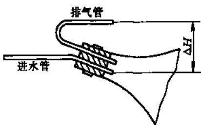  
图 3-8 瓶式采样器

得出一定体积浑水中的干沙重量。水样的含沙量可按式

(3-19) 计算：

$$
C _ { \eta } = \frac { W _ { s } } { V }\tag{3-19}
$$

式中 $\pmb { C _ { s } }$ ——水样含沙量， $\pmb { \mathrm { g } } / \mathbf { L }$ 或 $\mathbf { k } g / \mathbf { m } ^ { 3 }$

$W _ { \pmb { \mathscr { s } } }$ 水样中的干沙重量， $\pmb { \ 8 }$ 或 ${ \bf k } _ { \mathbf { \delta g } }$

$\pmb { V } \cdot$ ——水样体积，L或 $\mathbf { m } ^ { 3 }$ 8

当含沙量较大时，也可使用同位素测沙仪测量含沙量。该仪器主要由铅鱼、探头和晶体管计数器等部分组成。应用时只要将仪器的探头放至测点，即可根据计数器显示的数字由工作曲线上查出测点的含沙量。它具有准确、及时、不取水样等突出的优点，但应经常对工作曲线进行校正。

## （二) 输沙率测验

上述输沙率测验是由含沙量测定与流量测验两部分工作组成的，测流方法前已介绍。为了测出含沙量在断面上的变化情况，需在断面上布置适当数量的取样垂线。一般取样垂线数目不少于规范规定流速仪精测法测速垂线数的一半。当水位、含沙量变化急剧时，或积累相当资料经过精简分析后，垂线数目可适当减少。但是，不论何种情况，当河宽大于50m时，取样垂线不少于5条；水面宽小于50m时，不应少于3条。垂线上测点的分布，视水深大小以及要求的精度而不同，可有一点法、二点法、三点法、五点法等。

根据测点的水样，得出各测点的含沙量之后，可用流速加权计算垂线平均含沙量。例如畅流期的垂线平均含沙量的计算式为：

五点法

$$
\begin{array} { c } { { C _ { s m } = \displaystyle \frac { 1 } { 1 0 V _ { m } } ( C _ { s 0 . \vartheta } V _ { 0 . \vartheta } + 3 C _ { s 0 . 2 } V _ { 0 . 2 } + 3 C _ { s 0 . \vartheta } V _ { 0 . \vartheta } } } \\ { { + \left. 2 C _ { s 0 . \vartheta } V _ { 0 . \vartheta } + C _ { s 1 . \vartheta } V _ { 1 . \vartheta } \right) } } \end{array}\tag{3-20}
$$

三点法

$$
C _ { s n } = \frac { 1 } { 3 V _ { n } } ( C _ { s 0 , 2 } V _ { 0 , 2 } + C _ { r 0 , 6 } V _ { 0 , 6 } + C _ { r 0 , 8 } V _ { 0 , 8 } )\tag{3-21}
$$

式中 $C _ { m }$ ——垂线平均含沙量， $\mathbf { k } \mathbf { g } / \mathbf { m } ^ { 3 }$

$C _ { s j }$ ——测点含沙量，脚标j为该点的相对水深， $\mathbf { k \ g / m ^ { 3 } }$ 1

$\bar { V _ { i } }$ ——测点流速， $\ m / { \mathfrak { s } }$ ，脚标j的含意同上；

$V _ { m }$ ——垂线平均流速， $\mathbf { m } / { \mathsf { s } }$

如果是用积深法取得的水样，其含沙量即为垂线平均含沙量。

根据各条垂线的平均含沙量 $C _ { s m j }$ ，配合测流计算的部分流量，即可算得断面输沙率Q.（t/s)为：

$$
Q _ { a } = { \frac { 1 } { 1 0 0 0 } } \Big ( C _ { m 1 } q _ { 1 } + { \frac { 1 } { 2 } } ( C _ { m 1 } + C _ { m 2 } ) q _ { 2 } + \cdots + { \frac { 1 } { 2 } } ( C _ { s m - 1 } + C _ { m n } ) q _ { n } + C _ { m n } q _ { n } \Big )\tag{3-22}
$$

式中 ${ \pmb q } _ { i }$ —第i根垂线与第i—1根垂线间的部分流量， $\mathbf { m } ^ { 3 } / { \mathsf { s } }$

$C _ { s m i }$ ——第i根垂线的平均含沙量， ${ \bf k } \otimes / { \bf m } ^ { 3 }$

断面平均含沙量

$$
\bar { C } _ { s } = \frac { Q _ { s } } { Q } \times 1 0 0 0\tag{3-23}
$$

## (三)单位水样含沙量与单沙断沙关系

上面求得的悬移质输沙率，是测验当时的输沙情况。而工程上往往需要一定时段内的输沙总量及输沙过程。如果要用上述测验方法来求出输沙的过程是很困难的。人们从不断的实践中发现，当断面比较稳定，主流摆动不大时断面平均含沙量与断面上某一垂线平均含沙量之间有稳定关系。通过多次实测资料的分析，建立其相关关系。这种与断面平均含沙量有稳定关系的断面上有代表性的垂线和测点含沙量，称单样含沙量，简称单沙；相应地把断面平均含沙量简称断沙。经常性的泥沙取样工作可只在此选定的垂线（或其上的一个测点）上进行。这样便大大地简化了测验工作。

根据多次实测的断面平均含沙量和单样含沙量的成果，可以单沙为纵坐标，以相应断沙为横坐标，点绘单沙与断沙的关系点，并通过点群中心绘出单沙与断沙的关系线（图3-9）。

单沙的测次，平水期一般每日定时取样1次；含沙量变化小时，可5\~10日取样1次；含沙量有明显变化时，每日应取2次以上。洪水时期，每次较大洪峰过程，取样次数不应少于7\~10次。

## 二、泥沙颗粒分析及级配曲线

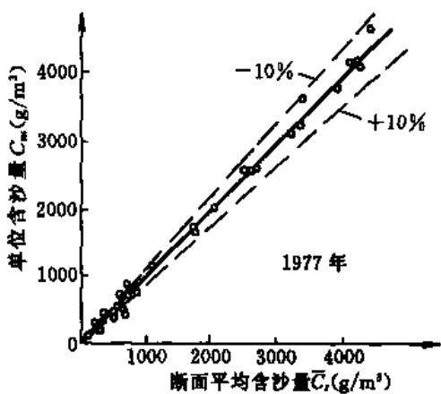

颗粒分析的目的是为开发利用水沙资源和进行水利及有关工程建设服务，取得泥沙颗粒级配的断面分析和变化过程的资料。

图 3-9.沱江李家湾水文站

1977年单沙与断沙关系

泥沙颗粒分析的具体内容，就是将有代表性的沙样，按颗粒大小分级，分别求出小于各级粒径的泥沙重量百分数。其成果可绘在半对数纸上，并用曲线表示即为泥沙颗粒级配曲线。

泥沙颗粒分析方法，应根据泥沙粒径大小、取样多少，进行选择。目前常使用的有筛分析法、粒径计法、移液管法等。这些方法也可相互配合使用。

筛分析法适用于粒径大于0.1mm的泥沙颗粒分析。先取适量沙样烘干称重。根据沙样中最大粒径，准备好粗细筛数只，按大孔径在上、小孔径在下的顺序叠置。将沙样倒人粗筛最上层，加盖后放在振筛机上振动。然后从最下层筛开始，直至最上一层筛为止，依次称量各层筛的净沙重。根据称量结果，可按式（3-24）计算小于某粒径沙重百分数P（%）：

$$
P = \frac { A } { W _ { g } } \times 1 0 0 \%\tag{3-24}
$$

式中 A——小于某粒径的沙重，g；

$\Psi _ { g }$ ——总沙重， ${ \pmb { \ 8 } }$ 8

粒径计法、移液管法属于水分析法。它们都是以不同粒径的泥沙颗粒，在静水中具有不同的沉速这一特性为依据。颗粒沉降速度及水分析颗粒直径的计算，按颗粒大小，分别选用下列公式：

粒径等于或小于0.1mm时，采用司托克斯公式：

$$
\omega = { \frac { r _ { s } - r _ { w } } { 1 8 0 0 \mu } } D ^ { 2 }\tag{3-25}
$$

粒径在0.15\~1.5mm之间时，采用冈查洛夫第三公式：

$$
\omega = 6 . 7 7 \frac { r _ { \ast } - r _ { w } } { r _ { w } } D + \frac { r _ { \ast } - r _ { w } } { 1 . 9 2 r _ { w } } \Big ( \frac { T } { 2 6 } - 1 \Big )\tag{3-26}
$$

式中 $\omega ^ { - }$ 沉降速度， $\mathrm { c m } / { \mathsf { s } }$ 4A

$D -$ —顆粒直径，mm；

$\pmb { \mu }$ ——水的动力粘滞系数， $( \pmb { \mathscr { g } } \cdot \mathbb { s } ) ~ / \mathbb { c } \pmb { \mathscr { m } } ^ { 2 }$

$\pmb { r } _ { \pmb { \ y } }$ ——泥沙的比重；

$\scriptstyle { r _ { w } }$ ——水的比重；

$\pmb { T }$ ——温度，℃。

粒径在0.1\~0.15mm之间时，可将式（3-25）与式（3-26）的粒径与沉速关系曲线顺势直接连接查用。

粒径计法适用于粒径为0.5\~0.01mm，分析水样的于沙重为 $0 . 3 { \sim } 5 . 0 _ { 8 }$ 的泥沙颗粒分析工作。粒径计管是长约103cm的玻璃管。将它垂直安装在分析架上。在管顶用加沙器加入沙样，直接测定不同历时后通过粒径计管下沉的泥沙重量。由于下沉的距离已知，由下沉历时可推出相应沉速，沉速与粒径之间的关系可由前述公式确定。测出不同时段内下沉的泥沙重量，可推求出泥沙的颗粒级配情况。

移液管法是按规定的时刻，用一移液管插入量筒中，在规定的深度L处，抽取 ${ 2 0 \sim }$ $2 5 \mathrm { c m } ^ { 3 }$ 的悬液作为试样。粒径 $\pmb { d }$ 仍由沉降历时t与沉降距离L根据沉速公式推算。从试样的含沙量，可以推知在全部沙样中，粒径等于及小于 $\pmb { d }$ 的泥沙的沙重百分比。进行一系列观测后，即可推算出该沙样的颗粒级配情况。

悬移质泥沙颗粒分析所用沙样若按积深法采得，则颗分成果即为垂线平均颗粒级配。如沙样是用积点法取得，则只能代表测点上的颗粒级配，此时应用输沙率加权法计算垂线平均颗粒级配。例如畅流期三点法的计算式为：

$$
P _ { n } = \frac { P _ { 0 . 2 } C _ { s 0 . 2 } V _ { 0 . 2 } + P _ { 0 . 5 } C _ { s 0 . 6 } V _ { 0 . 6 } + P _ { 0 . 6 } C _ { s 0 . 6 } V _ { 0 . 8 } } { C _ { s 0 . 2 } V _ { 0 . 2 } + C _ { s 0 . 6 } V _ { 0 . 6 } + C _ { s 0 . 8 } V _ { 0 . 8 } }\tag{3-27}
$$

式中 $\pmb { P _ { m } }$ 垂线平均小于某粒径的重量百分数，%；

$P _ { 0 , 2 }$ 0.2水深处的测点小于某粒径的沙重百分数， $\%$ ，余类推；

$C _ { s 0 , 2 }$ ——0. 2 水深处的测点含沙量， ${ \bf k } \mathbf { g } / \mathbf { m } ^ { 3 }$ 或 $\widetilde { \mathbf { z } } / \mathbf { m } ^ { 3 }$ ，余类推；

$V _ { \circ , 2 }$ —0.2水深处的测点流速， ${ \mathfrak { m } } / { \mathfrak { s } }$ ，余类推。

凡用全断面混合法取样作颗粒分析，其成果即作为断面平均颗粒级配。否则，应用输沙率加权法计算断面平均颗粒级配。计算公式如下：

$$
\bar { P } = \frac { ( 2 q _ { o } + q _ { s 1 } ) P _ { m 1 } + ( q _ { s 1 } + q _ { s 2 } ) P _ { m 2 } + \cdots + ( q _ { s ( a - 1 ) } + 2 q _ { s n } ) P _ { m } } { ( 2 q _ { o } + q _ { s 1 } ) + ( q _ { a 1 } + q _ { s 2 } ) + \cdots + ( q _ { s ( n - 1 ) } + 2 q _ { s n } ) }\tag{3-28}
$$

式中

$\bar { \pmb P }$ 断面平均小于某颗粒粒径的沙重百分数，%；

$\{ \mathfrak { s o } , q _ { s 1 } , \cdots , q _ { s n }$ —-以取样垂线分界的部分输沙率， ${ \bf { k } } _ { \bf { \delta g } } / { \bf { s } }$ 或 $\tau / \ s$ 4

$P _ { m 1 } , P _ { m 2 } , \cdots , P _ { m n }$ 各取样垂线的垂线平均小于某粒径沙重百分数，%。

断面平均颗粒级配，简称断颗。断颗测验与分析都比较费事。常利用单样顙粒级配(简称单颗)与断颗之间的关系，通过观测单颗变化过程来推求断颗的变化过程。

断面平均粒径可根据级配曲线分组，用沙重百分数加权求得。计算公式如下：

$$
\bar { D } = \frac { \varepsilon \Delta P _ { i } P _ { i } } { 1 0 0 }\tag{3-29}
$$

$$
D _ { i } = \frac { D _ { \mathrm { { k } } } + D _ { \mathrm { { F } } } + \sqrt { D _ { \mathrm { { k } } } D _ { \mathrm { { F } } } } } { 3 }\tag{3-30}
$$

式中 D——断面平均粒径，mm；

$\Delta \mathcal { P } _ { i }$ 某组沙重百分数，%；

$D _ { i }$ —某组平均粒径，mm；

$D _ { \Sigma }$ $D _ { T }$ 某组上限、下限粒径，mm。

水是人类赖以生存的主要物质，根据其用途，不仅有量的要求，而且必须有质的要求。随着社会经济的发展和人口的增加，人类对水资源需求量不断增加的同时，又将大量的生活污水、工业废水、农业回流水及其他未经处理直接排向各种水体，造成江、河、湖、库及地下水资源的污染，引起水质恶化，从而影响水资源的利用及人体健康。因此，必须充分合理地保护、使用和改善水资源，使其不受污染，这就是水质监测的目的。

## 一、水质监测的任务

水质监测以江、河、湖、库及地下水等水体和工业废水、生活污水等排放口为对象进行监测，检查水的质量是否符合国家规定的有关水的质量标准，为控制水污染，保护水源提供依据。其具体任务如下。

(1）提供水体质和量的当前状况数据，判断水的质量是否符合国家制订的质量标准。

(2)确定水体污染物的时、空分布及其发展、迁移和转化的情况。

(3)追踪污染物的来源、途径。

(4)收集水环境本底及其变化趋势数据，累积长期监测资料，为制定和修改水质标准及制定水环境保护的方法提供依据。

## 二、水质监测站网

水质监测站是定期采集实验室分析水样和对某些水质项目进行现场测定的基本单位。它可以由若干个水质监测断面组成。根据设站的目的和任务，水质监测站可分为长期掌握水系水质变化动态，搜集和积累水质基本信息而设的基本站；为配合基本站，进一步掌握污染状况而设的辅助站；为某种专门用途而设的专用站；以及为确定水系自然基本底值(即未受人为直接污染影响的水体质量状况）而设的背景站（又叫本底站)。

水质监测站网规划的过程是依据有关情报资料确定需要收集的水质信息，并根据收集信息的要求及建站条件确定监测站或水质信息收集体系的地理位置。其总目的是为了获取对河流水质有代表性的信息，以服务于水资源的利用和水环境质量的控制。

水污染流动监测站是将检测仪器、采样装置以及用于数据处理的微机等安装在适当的运载工具上的流动性监测设施，如水污染监测车（或船)。它具有灵活机动、且监测项目比较齐全的优点。

## 三、地面水采样

## (一) 采样断面和采样点的设置

布点前要做调查研究和收集资料工作，主要收集水文、气候、地质、地貌、水体沿岸城市工业分布、污染源和排污情况、水资源的用途及沿岸资源等资料。再根据监测目的、监测项目和样品类型，结合调查的有关资料综合分析确定采样断面和采样点。

采样断面和采样点布设总原则：以最小的断面、测点数，取得科学合理的水质状况的信息。关键是取得有代表性的水样。为此，布设采样断面、采样点的原则主要考虑：

(1)在大量废水排人河流的主要居民区，工业区的上、下游；

(2)湖泊、水库、河口的主要出入口；

(3)河流主流、河口、湖泊水库的代表性位置，如主要的用水地区等；

(4)主要支流汇人主流、河流或沿海水域的汇合口。

在一河段一般应设置对照断面，消减断面各一，并根据具体情况设若于监测断面。

## （二）采样垂线与采样点位置的确定

各种水质参数的浓度在水体中分布的不均匀性，与纳污口的位置、水流状况、水生物的分布，水质参数特性有关。因此，布置时应考虑这些因素。

(1)河流上采样垂线的布置。在污染物完全混合的河段中，断面上的任一位置，都是理想的采样点；若各水质参数在采样断面上，各点之间有较好的相关关系，可选取一适当的采样点，据此推算断面上其他各点的水质参数值，并由此获得水质参数在断面上的分布数据及断面的平均值；更一般的情况则按表3-2的规定布设。

(2)湖泊(水库)采样垂线的分布。我国《水质监测规范》规定的湖泊中应设采样垂线的数量是以湖泊的面积为依据的，见表3-3。

(3)采样垂线上采样点的布置。垂线上水质参数浓度分布决定于水深、水流情况及水质参数的特性等因素。具体布置规定见表3-4。为避免采集到漂浮的固体和河底沉积物，规定在至少水面以下、河底以上50cm处采样。

## (三)采样时间和采样频率

采集的水样要具有代表性，并能同时反映出空间和时间上的变化规律。因此，要掌握时间上的周期性变化或非周期性变化以确定合理的采样频率。

表3-2 江河采样垂线布设
<table><tr><td rowspan=1 colspan=1>水面宽(m)</td><td rowspan=1 colspan=1>一般情况</td><td rowspan=1 colspan=1>岸边有污染带</td><td rowspan=1 colspan=1>说明</td></tr><tr><td rowspan=1 colspan=1>&lt;100</td><td rowspan=1 colspan=1>一条（中涨）</td><td rowspan=1 colspan=1>三条（增加岸边两条）</td><td rowspan=1 colspan=1>如一边有污染带增设一条垂线</td></tr><tr><td rowspan=1 colspan=1>100~1000</td><td rowspan=1 colspan=1>三条（左、中、右），左右两条设在有明显水流处</td><td rowspan=1 colspan=1>三条（左、右应设在污染带中部）</td><td rowspan=1 colspan=1>如水质良好，且横向一致，可设一条中泓线</td></tr><tr><td rowspan=1 colspan=1>&gt;1000</td><td rowspan=1 colspan=1>三条（左、中、右），左右两条设在有明显水流处</td><td rowspan=1 colspan=1>五条（增加岸边两条)</td><td rowspan=1 colspan=1>岸边垂线，指岸边污染带中部</td></tr></table>

表 3-3湖泊（水库）采样垂战设置表
<table><tr><td>湖泊面积 (km²)</td><td>采样垂线 (条数)</td><td>湖泊面积 (km²)</td><td>采样垂线 (条数)</td></tr><tr><td>&lt;20</td><td>10</td><td>500~1000</td><td>30左右</td></tr><tr><td>20~50</td><td>15 左右</td><td>1000~2000</td><td>40左右</td></tr><tr><td>50~100</td><td>20左右</td><td>2000~3000</td><td>50左右</td></tr><tr><td>100~500</td><td>25左右</td><td>&gt;3000</td><td>60左右</td></tr></table>

表3-4垂线上采样点布置
<table><tr><td>水深 (m)</td><td>层次</td></tr><tr><td>&lt;5</td><td>上层</td></tr><tr><td>5~15</td><td>上、下两层</td></tr><tr><td>&gt;15</td><td>上、中、下三层</td></tr></table>

为便于进行资料分析，同一江河（湖、库）应力求同步采样，但不宜在大雨时采样。在工业区或城镇附近的河段应在汛前一次大雨和久旱后第一次大雨产流后，增加一次采样。具体测次应根据不同水体、水情变化和污染情况等确定。

## (四)采样准备工作

(1)采样容器材质的选择。因容器材质对水样在贮存期间的稳定性影响很大，要求容器材质具有化学稳定性好、可保证水样的各组成成分在贮存期间不发生变化；抗极端温度性能好，抗震，大小、形状和重量适宜，能严密封口，且容易打开；材料易得价格低；容易清洗目可反复使用。如高压低密聚乙烯塑料和硼硅玻璃可满足上述要求。

(2)采样器的准备。根据监测要求不同，选用不同采样器。若采集表层水样，可用桶、瓶等直接采取，通常情况下选用常用采水器；当采样地段流量大、水层深时应选用急流采水器；当采集具有溶解气体的水样时应选用双瓶溶解气体采水器。

按容器材质所需要的洗涤方法将选定合适的采水器洗净待用。

(3)水上交通工具的准备。一般河流、湖泊、水库采样可用小船。小船经济、灵活，可达到任一采样位置。最好有专用的监测船或采样船。

## (五) 采样方法

(1)自来水的采集。先放水数分钟，使积累在水管中的杂质及陈旧水排除后再取样。采样器须用采集水样洗涤3次。

(2)河湖水库水的采集。考虑其水深和流量。表层水样可直接将采样器放人水面下0.3\~0.5m处采样，采样后立即加盖塞紧，避免接触空气。深层水可用抽吸泵采样，并利用船等乘具行驶至特定采样点，将采水管沉降至所规定的深度，用泵抽取水样即可。采集底层水样时，切勿搅动沉积层。

(3)工业废水和生活污水的采集。常用采样方法有：瞬时个别水样法；平均水样法；比例组合水样法。采集的水样，有条件在现场测定的项目应尽量在现场测定，如水温、pH值、电导率等；不能在现场处理的，在水样采集后的运输和实验室管理过程中，为保证水样的完整性、代表性，使之不受污染、损坏和丢失以及由于微生物新陈代谢活动和化学作用影响引起水样组分的变化，必须遵守各项保证措施。

## 四、水体污染源调查

向水体排放污染物的场所、设备、装置和途径等称为水体污染源。水体污染物按污染源释放有害物种类分类及其来源归纳于表3-5。

表 3-5  
水体中主要污染物分类和来源
<table><tr><td rowspan=1 colspan=1>种类</td><td rowspan=1 colspan=2>名称</td><td rowspan=1 colspan=1>主要来源</td></tr><tr><td rowspan=2 colspan=1>物理性污染物</td><td rowspan=1 colspan=2>热</td><td rowspan=1 colspan=1>热电站、核电站、冶金和石油化工等工厂排水</td></tr><tr><td rowspan=1 colspan=2>放射性物质（如轴及裂变、衰变产生）</td><td rowspan=1 colspan=1>核生产废物、核试验沉降物、核医疗和核研究单位的排水</td></tr><tr><td rowspan=11 colspan=1>化学性污染物</td><td rowspan=8 colspan=1>无机物</td><td rowspan=1 colspan=1>铬</td><td rowspan=1 colspan=1>铬矿冶炼、镀铬、颜料等工厂的排水</td></tr><tr><td rowspan=1 colspan=1>汞</td><td rowspan=1 colspan=1>汞的开采和冶炼、仪表、水银法电解以及化工等工厂的排水</td></tr><tr><td rowspan=1 colspan=1>铅</td><td rowspan=1 colspan=1>冶金、铅蓄电池、颜料等工厂的排水</td></tr><tr><td rowspan=1 colspan=1>镉</td><td rowspan=1 colspan=1>冶金、电镀和化工等工厂的排水</td></tr><tr><td rowspan=1 colspan=1>砷</td><td rowspan=1 colspan=1>含砷矿石处理、制药、农药和化肥等工厂的排水</td></tr><tr><td rowspan=1 colspan=1>氰化物</td><td rowspan=1 colspan=1>电镀、冶金、煤气洗涤、塑料、化学纤维等工厂的排水</td></tr><tr><td rowspan=1 colspan=1>氮和磷</td><td rowspan=1 colspan=1>农田排水；粪便污水；化肥、制革、食品、毛纺等工厂的排水</td></tr><tr><td rowspan=1 colspan=1>酸碱和盐</td><td rowspan=1 colspan=1>矿山排水；石油化工、化学纤维、化肥造纸、电镀、酸洗和给水处理等工厂的排水、酸雨</td></tr><tr><td rowspan=3 colspan=1>有机物</td><td rowspan=1 colspan=1>酚类化合物</td><td rowspan=1 colspan=1>炼油、焦化、煤气、树脂等化工厂的排水</td></tr><tr><td rowspan=1 colspan=1>苯类化合物</td><td rowspan=1 colspan=1>石油化工、焦化、农药、塑料、染料等化工厂的排水</td></tr><tr><td rowspan=1 colspan=1>油类</td><td rowspan=1 colspan=1>采油、炼油、船舶以及机械、化工等工厂的排水</td></tr><tr><td rowspan=2 colspan=1>生物性污染物</td><td rowspan=1 colspan=2>病源体</td><td rowspan=1 colspan=1>粪便、医院污水；屠宰、畜牧、制革、生物制品等工厂的排水；灌溉和爾水造成的径流</td></tr><tr><td rowspan=1 colspan=2>霉毒</td><td rowspan=1 colspan=1>制药、酿造、制革等工厂的排水</td></tr></table>

水体污染源的调查就是根据控制污染、改善环境质量的要求，对某一地区水体污染造成的原因进行调查，建立各类污染源档案；在综合分析的基础上选定评价标准，估量并比较各污染源对环境的危害程度及其潜在危险，确定该地区的重点控制对象（主要污染源和主要污染物）和控制方法的过程。

## （一)水体污染源调查的主要内容

(1)水体污染源所在单位周围的环境状况。包括地理位置、地形、河流、植被、有关的气象资料、附近地区地下水资源情况、地下水道布置；各种环境功能区如商业区、居民区、文化区、工业区、农业区、林业区、养殖区等的分布。应尽可能详细说明，并在地图上标明。

(2)污染源所在单位的生产生活。如对城市生活污水调查包括不同水平下的人均耗水量；随着生活水平的提高，水体污染物种类及浓度的变化；商业中心区的饭店、餐馆污水与居民污水的量与质两方面的差异；所调查地区的人口总数、人口密度、居住条件和生活设施等。

(3)污水量及其所含污染物质的量。包括其随时间变化的过程。

(4)污染治理情况。如污水处理设施对污水中所含成分及污水量处理的能力、效果；污水处理过程中产生的污泥、干渣等的处理方式；设施停止运行期间污水的去向及监测设施和监测结果等。

(5)污水排放方式和去向以及纳污水体的性状。包括污水排放通道及其排放路径、排污口的位置及排入纳污水体的方式（岸边自流、喷排及其他方式)；排污口所在河段的水文水力学特征、水质状况，附近水域的环境功能，污水对地下水水质的影响等。

(6)污染危害。包括污染物对污染源所在单位和社会的危害。单位内主要是工作人员的健康状况；社会上指接触或使用污水后的人群的身体健康；有关生物群落的组成程度，生物体内有毒有害物质积累的情况；发生污染事故的情况，发生的原因、时间，造成的危害等。

(7) 污染发展趋势。

## (二)水体污染源调查的方法

(1)表格普查法：由调查的主管部门设计调查表格，发至被调查单位或地区，请他们如实填写后收取。优点是花费少，调查信息量大。

(2)现场调查法：对污染源有关资料的实地调查，包括现场勘测，设点采样和分析等。现场调查可以是大规模的，也可以是区域性的、行业性的或个别污染源的所在单位调查。优点是就该次现场调查结果，比其他调查方法都准确，但缺陷是短时间的，存在着对总体代表性的问题，以及花费大。

(3)经验估算法：用由典型调查和研究中所得到的某种函数关系对污染源的排放量进行估算的办法。当要求不高或无法直接获取数据时，不失为一种有效的办法。

## 第六节 水文调查与水文遥感

目前收集水文资料的主要途径是定位观测，由于定位观测受到时间、空间的限制，收集的资料往往不能满足生产需要，因此必须通过水文调查来补充定位观测的不足，使水文

资料更加系统完整，更好满足水资源开发利用、水利水电建设及其他国民经济建设的需要。

水文调查的内容可分为：流域调查、水量调查、洪水与暴雨调查、其他专项调查四大类。本节主要介绍洪水与暴雨调查。

## 一、洪水调查

洪水调查中，对历史上大洪水的调查，有计划组织调查；当年特大洪水，应及时组织调查；对河道决口、水库溃坝等灾害性洪水，力争在情况发生时或情况发生后较短时间内，进行有关调查。

洪水调查工作，包括调查洪水痕迹、洪水发生的时间、灾情测量、洪水痕迹的高程；了解调查河段的河槽情况；了解流域自然地理情况；测量调查河段的纵横断面；必要时应在调查河段进行简易地形测量；对调查成果进行分析，推算洪水总量、洪峰流量、洪水过程及重现期，最后写出调查报告。

计算洪峰流量时，若调查的洪痕靠近某一水文站，可先求水文站基本水尺断面处的洪水位高程，通过延长该站的水位流量关系曲线，推求洪峰流量。

在新调查的河段无水文站情况下，洪水调查的洪峰流量，可采用下列公式估算。

(一)用比降法计算洪峰流量

(1) 匀直河段洪峰流量计算：

$$
Q = K S ^ { \frac { 1 } { 2 } }\tag{3-31}
$$

式中 Q——洪峰流量， ${ \mathfrak { m } } ^ { 3 } / { \mathfrak { s } }$

S——水面比降，%；

K——河段平均输水率， $\scriptstyle { K = { \frac { 1 } { n } } A R ^ { \frac { 2 } { 3 } } }$ ，n为糙率，A为河段平均断面积， $\mathbf { m } ^ { 2 }$ ，R为河段平均水力半径，m。

(2) 非匀直河段洪峰流量计算：

$$
Q = K S _ { e } ^ { \frac { 1 } { 2 } }\tag{3-32}
$$

$$
S _ { \epsilon } = \frac { h _ { f } } { L } = \frac { h + \Bigl ( \frac { \bar { V } _ { \mathrm { \scriptsize ~ E } } ^ { 2 } } { 2 g } - \frac { \bar { V } _ { \mathrm { \scriptsize ~ F } } ^ { 2 } } { 2 g } \Bigr ) } { L }\tag{3-33}
$$

式中 $s _ { \bullet }$ ——能面比降；

$h _ { f }$ ——两断面间的摩阻损失，h为上、下两断面的水面落差，m； $\vec { \pmb { V } } _ { \pmb { \Sigma } }$ $\bar { \nu } _ { \bar { \star } }$ 分别为上、下两断面的平均流速， $m / 8$

$\pmb { L }$ —两断面间距，m。

(3) 若考虑扩散及弯曲损失时洪峰流量推算：

$$
Q = K \sqrt { \frac { h + ( 1 - \alpha ) \Big ( \frac { \bar { V } _ { \pm } ^ { 2 } } { 2 g } - \frac { \bar { V } _ { \tilde { \tau } } ^ { 2 } } { 2 g } \Big ) } { L } }\tag{3-34}
$$

式中α——扩散、弯道损失系数，一般取0.5。

视不同情况，选用以上公式估算洪峰流量。

糙率n确定，可根据实测成果绘水位糙率曲线备查，或查糙率表，或参考附近水文站

的糙率资料；对复式断面，可分别计算主槽和滩地的流量再取其和。

## (二)用水面曲线推算洪峰流量

当所调查的河段较长且洪痕较少，各河段河底坡降及断面变化、洪水水面曲线比较曲折时，不宜用比降法计算，可用水面曲线法推求洪峰流量。

水面曲线法的工作原理是：假定一流量Q，由所估定的各段河道糙率n，自下游一已知的洪水水面点起，向上游逐段推算水面线，然后检查该水面线与各洪痕的符合程度。如大部分符合，表明所假定流量正确；否则，重新修定Q值，再推算水面线直至大部分洪痕符合为止。

## 二、暴雨调查

以降雨为洪水成因的地区，洪水的大小与暴雨大小密切相关，暴雨调查资料对洪水调查成果起旁证作用。洪水过程线的绘制、洪水的地区组成，也需要组合面上暴雨资料进行分析。

暴雨调查的主要内容有：暴雨成因、暴雨量、暴雨起迄时间、暴雨变化过程及前期雨量情况、暴雨走向及当时主要风向风力变化等。

对历史暴雨的调查，一般通过群众对当时雨势的回忆或与近期发生的某次大暴雨对比，得出定性概念；也可通过群众对当时地面坑塘积水、露天水缸或其他器皿承接雨量作定量估计，并对一些雨量记录进行复核，对降雨的时、空分布作出估计。

## 三、水文遥感

遥感技术，特别是航天遥感的发展，使人们能从宇宙空间的高度上，大范围、快速、周期性的探测地球上各种现象及其变化。遥感技术在水文科学领域的应用称为水文遥感。水文遥感具有以下特点：如动态遥感，从定性描述发展到定量分析，遥感遥测遥控的综合应用，遥感与地理信息系统相结合。

近20多年来，遥感技术在水文水资源领域得到广泛应用并已成为收集水文信息的一种重要手段，尤其在水资源水文调查的应用，更为显著。概括起来，列举如下几方面。

1）流域调查：根据卫星像片可以准确查清流域范围、流域面积、流域覆盖类型、河长、河网密度、河流弯曲度等。

2）水资源调查：使用不同波段、不同类型的遥感资料，容易判读各类地表水，如河流、湖泊、水库、沼泽、冰川、冻土和积雪的分布；还可分析饱和土壤面积、含水层分布以估算地下水储量。

3）水质监测：遥感资料进行水质监测可包括分析识别热水污染、油污染、工业废水及生活污水污染、农药化肥污染以及悬移质泥沙、藻类繁殖等情况。

4）洪涝灾害的监测：包括洪水淹没范围的确定，决口、滞洪、积涝的情况，泥石流及滑波的情况。

5）河口、湖泊、水库的泥沙淤积及河床演变，古河道的变迁等。

6)降水量的测定及水情预报：通过气象卫星传播器获取的高温和湿度间接推求降水量或根据卫片的灰度定量估算降水量；根据卫星云图与天气图配合预报洪水及旱情监测。

此外，还可利用遥感资料分析处理测定某些水文要素如水深、悬移质含沙量等。利用卫星传输地面自动遥测水文站资料，具有投资低，维护量少，使用方便的优点，且在恶劣

各种水文测站测得的原始数据，都要按科学的方法和统一的格式整理、分析、统计、提炼成为系统、完整，有一定精度的水文资料，供水文水资源计算、科学和有关国民经济部门应用。这个水文数据的加工、处理过程，称为水文数据处理。

水文数据处理的工作内容包括：收集校核原始数据；编制实测成果表；确定关系曲线，推求逐时、逐日值；编制逐日表及洪水水文要素摘录表；合理性检查；编制处理说明书。

水位数据处理较简单，在第二节已述，本节主要介绍流量资料整编，简要介绍泥沙数据处理。对上述处理工作内容，重点介绍关系曲线的确定及逐时、逐日值的推求。

## 一、水位流量关系曲线的确定

## (一)稳定的水位流量关系曲线

稳定的水位流量关系，是指在一定条件下水位和流量之间呈单值函数关系，简称为单一关系。在普通方格纸上，纵坐标是水位，横坐标是流量，点绘的水位流量关系点据密集，分布成一带状，75%以上的中高水流速仪测流点据与平均关系线的偏离不超过±5%，75%的低水点或浮标测流点据偏离不超过士8%(流量很小时可适当放宽)，且关系点没有明显的系统偏离，这时即可通过点群中心定一条单一线（供推流）。点图时在同一张图纸上依次点绘水位流量、水位面积、水位流速关系曲线，并用同一水位下的面积与流速的乘积，校核水位流量关系曲线中的流量，使误差控制在±2%\~±3%。以上三条曲线比例尺的选择，应使它们与横轴的夹角分别近似为45°、60°、60°，且互不相交（图3-10）。

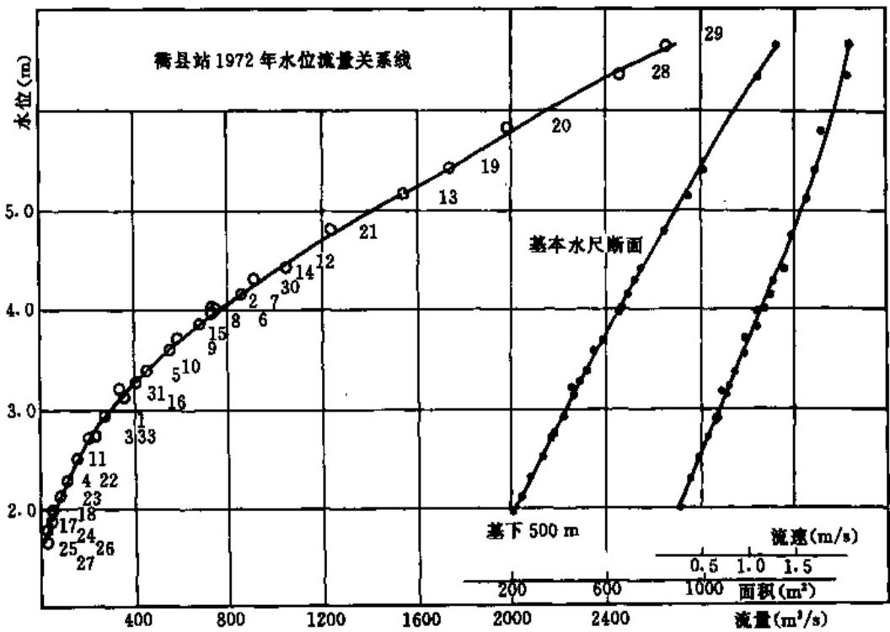  
图3-10 衢江衢县水文站1972年水位流量关系

所定的单一水位流量关系还要进行符号检验、适线检验、偏离数值检验，进行检验均通过才能用此单一曲线推流。此外，两条曲线（或两列数组）需要合并定线时，还要进行t检验。

## (二)不稳定的水位流量关系

不稳定的水位流量关系，是指测验河段受断面冲淤、洪水涨落、变动回水或其他因素的个别或综合影响，使水位与流量间的关系不呈单值函数关系，见图3-11\~图3-13。

表3-6给出了各种整编方法及其适用情况。这些方法归纳起来分为两种类型。一种是水力因素型，这一类型的方法均可表示为 $Q = f ( z , x )$

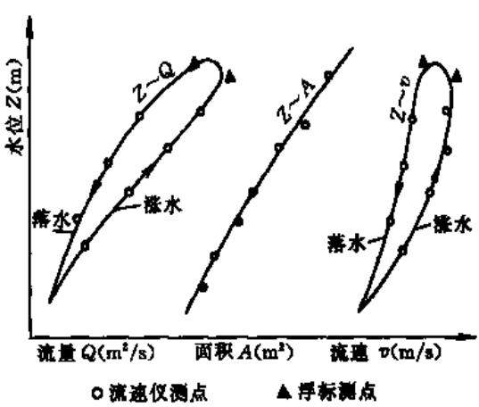  
图 3-11 受洪水涨落影响的水位流量关系

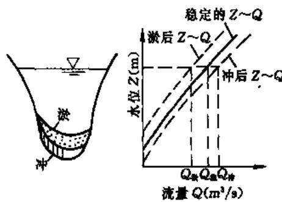

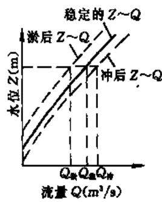  
图 3-12 受冲淤影响的水位流量关系

的形式，x为某一水力因素。其方法的原理都来自于水力学的推导，故理论性强，所要求的测点少，且适于计算机作单值化处理。另一类型称时序型，表示为 $\pmb { Q } \mathbf { = }$ f(Z，t)，t为时间。时序型的方法其原理是以水流的连续性为基础，因而要求测点多且准确，能控制流量的变化转折。方法适用范围较广，但有时间性。

当满足时序型的要求条件时，连时序法是按实测流量点子的时间顺序来连接水位流量关系曲线，故应用范围较广。连线时，应参照水位过程线起伏变动的情

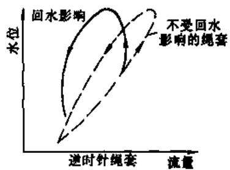

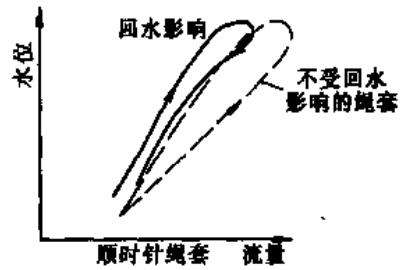

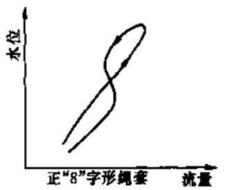

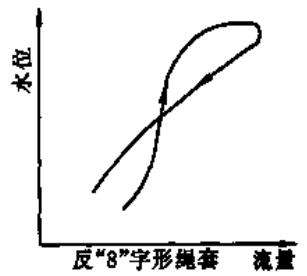  
图 3-13 受变动回水影响的水位流量关系

况定线，有时还应参照其他的辅助曲线如落差过程线、冲淤过程线等定线。受洪水涨落影响的水位流量关系线用连时序法定线往往成逆时针绳套形。绳套的顶部必须与洪峰水位相切，绳套的底部应与水位过程线中相应的低谷点相切。受断面冲淤或结冰影响时，还应参

考用连时序法绘出的水位面积关系变化趋势，帮助绘制水位流量关系曲线（图3-14）。

## 二、水位流量关系曲线的延长

测站测流时，由于施测条件限制或其他种种原因，致使最高水位或最低水位的流量缺测或漏测。为取得全年完整的流量过程，必须进行高低水时水位流量关系的延长。

高水延长的结果，对洪水期流量过程的主要部分，包括洪峰流量在内，有重大的影响。低水流量虽小，但如延长不当，相对误差可能较大且影响历时较长。因此延长均需慎重。高水部分的延长幅度一般不应超过当年实测流量所占水位变幅的30%，低水部分延长的幅度一般不应超过10%。

对稳定的水位流量关系进行高低水延长

表3-6 流量数据处理适用情况
<table><tr><td rowspan=1 colspan=1>影响因素适用情况处理方法</td><td rowspan=1 colspan=1>稳定</td><td rowspan=1 colspan=1>洪水涨落</td><td rowspan=1 colspan=1>变动回水</td><td rowspan=1 colspan=1>冲淤</td><td rowspan=1 colspan=1>水草</td><td rowspan=1 colspan=1>结冰</td><td rowspan=1 colspan=1>混合</td><td rowspan=1 colspan=1>类型</td></tr><tr><td rowspan=1 colspan=1>校正因素法</td><td rowspan=1 colspan=1></td><td rowspan=1 colspan=1>√</td><td rowspan=1 colspan=1></td><td rowspan=1 colspan=1></td><td rowspan=1 colspan=1></td><td rowspan=1 colspan=1></td><td rowspan=1 colspan=1></td><td rowspan=1 colspan=1>1</td></tr><tr><td rowspan=1 colspan=1>涨落比例法</td><td rowspan=1 colspan=1></td><td rowspan=1 colspan=1>√</td><td rowspan=1 colspan=1></td><td rowspan=1 colspan=1></td><td rowspan=1 colspan=1></td><td rowspan=1 colspan=1></td><td rowspan=1 colspan=1></td><td rowspan=1 colspan=1>1</td></tr><tr><td rowspan=1 colspan=1>抵偿河长法</td><td rowspan=1 colspan=1></td><td rowspan=1 colspan=1>√</td><td rowspan=1 colspan=1></td><td rowspan=1 colspan=1></td><td rowspan=1 colspan=1></td><td rowspan=1 colspan=1></td><td rowspan=1 colspan=1></td><td rowspan=1 colspan=1>1</td></tr><tr><td rowspan=1 colspan=1>落差法(等、正常、定)</td><td rowspan=1 colspan=1></td><td rowspan=1 colspan=1></td><td rowspan=1 colspan=1>√</td><td rowspan=1 colspan=1></td><td rowspan=1 colspan=1></td><td rowspan=1 colspan=1></td><td rowspan=1 colspan=1></td><td rowspan=1 colspan=1>1</td></tr><tr><td rowspan=1 colspan=1>落差指数法</td><td rowspan=1 colspan=1></td><td rowspan=1 colspan=1>√</td><td rowspan=1 colspan=1>√</td><td rowspan=1 colspan=1></td><td rowspan=1 colspan=1></td><td rowspan=1 colspan=1></td><td rowspan=1 colspan=1>√</td><td rowspan=1 colspan=1>1</td></tr><tr><td rowspan=1 colspan=1>临时曲线法</td><td rowspan=1 colspan=1></td><td rowspan=1 colspan=1></td><td rowspan=1 colspan=1></td><td rowspan=1 colspan=1>√</td><td rowspan=1 colspan=1>J</td><td rowspan=1 colspan=1>√</td><td rowspan=1 colspan=1></td><td rowspan=1 colspan=1>2</td></tr><tr><td rowspan=1 colspan=1>改正水位法</td><td rowspan=1 colspan=1></td><td rowspan=1 colspan=1></td><td rowspan=1 colspan=1></td><td rowspan=1 colspan=1>√</td><td rowspan=1 colspan=1>√</td><td rowspan=1 colspan=1>√</td><td rowspan=1 colspan=1>√</td><td rowspan=1 colspan=1>2</td></tr><tr><td rowspan=1 colspan=1>连时序法</td><td rowspan=1 colspan=1></td><td rowspan=1 colspan=1>√</td><td rowspan=1 colspan=1>√</td><td rowspan=1 colspan=1>√</td><td rowspan=1 colspan=1>√</td><td rowspan=1 colspan=1>√</td><td rowspan=1 colspan=1>√</td><td rowspan=1 colspan=1>2</td></tr><tr><td rowspan=1 colspan=1>连实测流量过程线法</td><td rowspan=1 colspan=1></td><td rowspan=1 colspan=1></td><td rowspan=1 colspan=1></td><td rowspan=1 colspan=1>J</td><td rowspan=1 colspan=1></td><td rowspan=1 colspan=1>√</td><td rowspan=1 colspan=1>√</td><td rowspan=1 colspan=1>2</td></tr><tr><td rowspan=1 colspan=1>改正系数法</td><td rowspan=1 colspan=1></td><td rowspan=1 colspan=1></td><td rowspan=1 colspan=1></td><td rowspan=1 colspan=1>√</td><td rowspan=1 colspan=1></td><td rowspan=1 colspan=1>√</td><td rowspan=1 colspan=1></td><td rowspan=1 colspan=1>2</td></tr><tr><td rowspan=1 colspan=1>单一线法</td><td rowspan=1 colspan=1>√</td><td rowspan=1 colspan=1></td><td rowspan=1 colspan=1></td><td rowspan=1 colspan=1></td><td rowspan=1 colspan=1></td><td rowspan=1 colspan=1></td><td rowspan=1 colspan=1></td><td rowspan=1 colspan=1>1</td></tr></table>

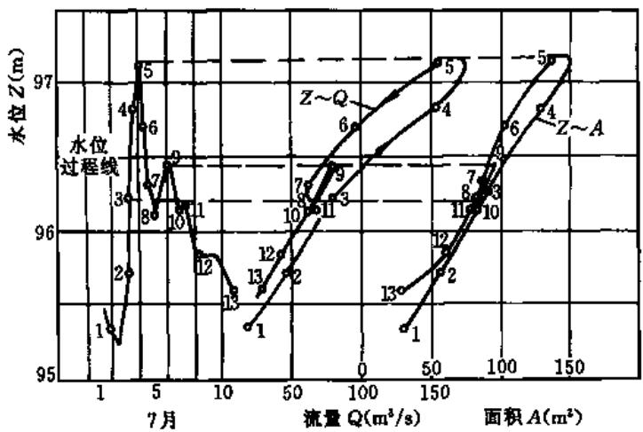  
图 3-14 连时序法的水位流量关系

常用的方法有以下几种。

(一) 水位面积与水位流速关系高水延长

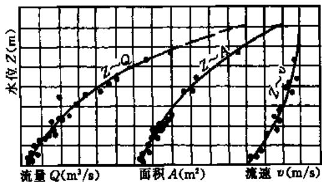  
图 3-15 水位面积与水位流速关系高水延长

适用于河床稳定，水位面积、水位流速关系点集中，曲线趋势明显的测站。其中，高水时的水位面积关系曲线可以根据实测大断面资料确定，高水时水位流速关系曲线常趋近于常数，可按趋势延长。可是，某一高水位下的流量，便可由该水位的断面面积和流速的乘积来确定。这样，可延长水位流量关系曲线，见图3-15。

## (二)用水力学公式高水延长

此法可避免水位面积与水位流速关系高水延长中水位流速顺趋势延长的任意性，用水力学公式计算出外延部分的流速值来辅助定线。

## (1) 曼宁公式外延：

根据曼宁公式

$$
{ \pmb v } = \frac { 1 } { n } R ^ { 2 / 3 } S ^ { 1 / 2 }\tag{3-35}
$$

延长时，用上式计算流速，用实测大断面资料延长水位面积关系曲线，从而达到延长水位流量关系的目的。

计算流速时，因水力半径R可用大断面资料求得，故关键在于确定水面比降S和糙率n值。根据实际资料，如S、n均有资料时，直接由公式计算并延长；当二者缺一时，通过点绘 $Z \sim n$ (或Z\~S)关系曲线并延长之，再算出来；如两者都没有时，则将 ${ \frac { 1 } { n } } S ^ { 1 / 2 }$ 看成一个未知数，因 $\frac { 1 } { n } S ^ { 1 / 2 } { = } Q / \ ( A R ^ { 3 / 3 } )$ ，依据实测资料的流量、面积、水力半径计算出 $\frac { 1 } { n } { \pmb S } ^ { 1 / 2 }$ 点绘 $Z \sim { \frac { 1 } { n } } S ^ { 1 / 2 }$ 曲线，因高水部分 $\frac { 1 } { n } S ^ { \iota / 2 }$ 接近于常数，故可按趋势延长，见图3-16。

## (2） 斯蒂文斯（Stevens）法：

由谢才流速公式导出流量为

$$
\begin{array} { r } { \ Q = C A \ \sqrt { R S } } \end{array}
$$

式中 C——谢才系数；

(3-36)

其余符号同前。

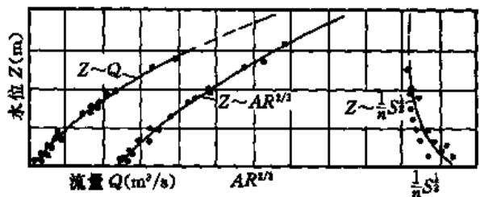

对断面无明显冲淤、水深不大但水面较宽的河槽，以断面平均水深 $\pmb { h }$ 代替R，则式(3-36) 可改写为：

图 3-16 曼宁公式法延长高水 $z \sim Q$ 关系曲线

$$
Q = C A \ \sqrt { R } \bar { S } = K A \bar { h } ^ { 1 / 2 }
$$

式中， $\scriptstyle { K = C } { \sqrt { s } }$ ，高水时其值接近常数。故高水时 $Q \sim { \tilde { A } } { \tilde { h } } ^ { 1 / 2 }$ 呈线性关系，据此外延。由大断面资料计算 $\pmb { A } \sqrt { \overline { { \hbar } } }$ 并点绘不同高水位 Z 在 $z \sim A \sqrt { h }$ 曲线上查得 $A \sqrt { \overline { { h } } }$ 值，并以 $Q \sim$ $\sqrt { \bar { h } }$ 曲线上查得 $\pmb { Q }$ 值，根据对应的（Z，Q）点据，便可实现水位与流量关系曲线的高水延长。见图3-17。

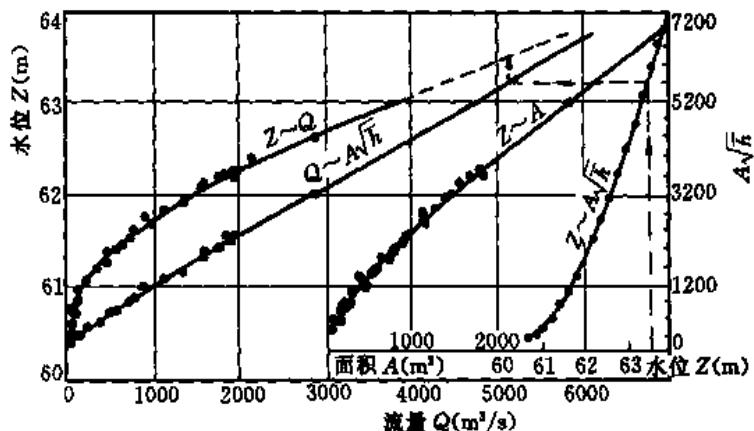  
图 3-17 斯蒂文斯法外延 $z \sim Q$ 关系曲线

## (三)水位流量关系曲线的低水延长法

低水延长一般是以断流水位作控制进行水位流量关系曲线向断流水位方向所作的延长。断流水位是指流量为零时的相应水位。假定关系曲线的低水部分用以下的方程式来表示：

$$
Q = K ( Z - Z _ { \circ } ) ^ { \mathfrak { n } }\tag{3-37}
$$

式中 $\scriptstyle { Z _ { 0 } }$ ——断流水位；

n，K分别为固定的指数和系数。

在水位流量曲线的中、低水弯曲部分，依次选取a、b、c三点，它们的水位和流量分别为 $\pmb { Z _ { a } }$ , $\pmb { Z } _ { \delta }$ ， $\pmb { Z _ { c } }$ 及 $Q _ { a } , Q _ { b } , Q _ { c }$ 。若 $Q _ { b } { = } Q _ { a } Q _ { c }$ ，代人式（3-21），求解得断流水位为：

$$
Z _ { \circ } = \frac { Z _ { a } Z _ { c } - Z _ { b } ^ { 2 } } { Z _ { a } + Z _ { c } - 2 Z _ { b } }\tag{3-38}
$$

求得断流水位 $\scriptstyle { Z _ { \mathfrak { d } } }$ 后，以坐标 $( Z _ { 0 } , \mathbb { 0 } )$ 为控制点，将关系曲线向下延长至当年最低水位即可。

## 三、水位流量关系曲线的移用

规划设计工作中，常常遇到设计断面处缺乏实测数据。这时就需要将邻近水文站的水位流量关系移用到设计断面上。

当设计断面与水文站相距不远且两断面间的区间流域面积不大，河段内无明显的出流与人流的情况下，在设计断面设立临时水尺，与水文站同步观测水位。因两断面中、低水时同一时刻的流量大致相等，所以可用设计断面的水位与水文站断面同时刻水位所得的流量点绘关系曲线，再将高水部分进行延长，即得设计断面的水位流量关系曲线。

当设计断面距水文站较远，且区间入流、出流近乎为零，则必须采用水位变化中位相相同的水位来移用。

若设计断面的水位观测数据不足，或甚至等不及设立临时水尺进行观测后再推求其水位流量关系，则用计算水面曲线的方法来移用。方法是在设计断面和水文站之间选择若干个计算断面，假定若干个流量，分别从水文站基本水尺断面起计算水面曲线，从而求出各个计算流量相对应的设计断面水位。

而当设计断面与水文站的河道有出流或人流时，则主要依靠水力学的办法来推算设计断面的水位流量关系。

## 四、日平均流量计算及合理性检查

逐日平均流量的计算：当流量变化平稳时，可用日平均水位在水位流量关系线上推求日平均流量：当一日内流量变化较大时，则用逐时水位推求得逐时流量，再按算术平均法或面积包围法求得日平均流量。据此计算逐月平均流量和年平均流量。

合理性检查：单站检查可用历年水位流量关系对照检查；综合性检查以水量平衡为基础，对上、下游或干、支流上的测站与本站流量数据处理成果进行对照分析，以提高流量数据处理成果的可靠性。本站成果经检查确认无误后，才能作为正式资料提供使用。

## 五、悬移质输沙率资料整编

在整编悬移质输沙率资料时，应对实测资料进行分析。通常是着重进行单断沙关系的分析。经过分析，如果查明突出点的原因属于测验或计算方面的错误，可以适当改正或酌

情处理。

有了单断沙关系曲线，便可根据经常观测的单沙成果计算出逐日断面平均含沙量，再与相应的平均流量相乘，即得各日的平均输沙率。这种算法比较简便，当一日内流量变化不大时是完全可以的。如在洪水时期，一日内流量、含沙量的变化都较大时，应先由各测次的单沙推出断沙，乘以相应的断面流量，得出各次的断面输沙率。根据日内输沙率过程求得日输沙总量，再除以一日的秒数，即可得日平均输沙率。

将全年逐日平均输沙率之和除以全年的天数，即得年输沙量。

## 六、水文数据处理成果的刊布

水文资料的来源，主要是由国家水文站网按全国统一规定对观测的数据进行处理后的资料，即由主管单位分流域、于支流及上下游，每年刊布一次的水文年鉴。1986年起陆续实行计算机存贮、检索。

年鉴中载有：测站分布图，水文站说明表及位置图，各站的水位、流量、泥沙、水温、冰凌、水化学、地下水、降水量、蒸发量等资料。

当需要使用近期尚未刊布的资料，或需查阅更详细的原始记录时，可向各有关机构收集。水文年鉴中不刊布专用站和实验站的观测数据及处理、分析成果，需要时可向有关部门收集。

水文年鉴仅刊布各水文测站的基本资料。各地区水文部门编制的水文手册和水文图集，以及历史洪水调查、暴雨调查、历史枯水调查等调查资料，是在分析研究该地区所有水文站的数据基础上编制出来的。它载有该地区的各种水文特征值等值线图及计算各种径流特征值的经验公式。利用水文手册和水文图集便可以估算无水文观测数据地区的水文特征值。由于编制各种水文特征的等值线图及各径流特征的经验公式时，依据的小河数据少，当利用手册及图集估算小流域的径流特征值时，应根据实际情况作必要的修正。

当上述年鉴、手册、图集所载资料不能满足要求时，可向其他单位收集。例如，有关水质方面更详细的资料，可向环境监测部门收集，有关水文气象方面的资料，可向气象台站收集。

## 第四章 流域产汇流计算

第二章已对径流的形成过程作了定性的描述，本章将进一步从定量上阐述降雨形成径流的原理和计算方法。它是工程水文学中最基本的概念和方法之一，是以后学习由暴雨资料推求设计洪水，降雨径流预报，流域水文模型等内容的基础。

流域内降雨形成流域出口断面的径流过程分为两个阶段：一是降雨经植物截留、下渗、填洼等损失过程。降雨扣除这些损失后，剩余的部分称为净雨。净雨在数量上等于它所形成的径流量。降雨转化为净雨的过程称为产流过程，净雨量的计算称为产流计算。二是净雨沿地面和地下汇人河网，并经河网汇集形成流域出口断面的径流过程，称为流域汇流过程，与之相应的计算称为汇流计算。二者合称流域产汇流计算。

就径流的来源而论，流域出口断面的流量过程是由地面径流、表层流径流（壤中流）、浅层和深层地下径流组成的。深层地下径流（基流）数量很少，且较稳定，又非本次降雨所形成，计算时一般从次径流中分割出去。地面径流和表层流径流直接进入河网，计算中常合并考虑，称为直接径流，通常仍称为地面径流。

## 第一节降雨径流要素计算

流域产汇流计算一般需要先对实测暴雨、径流和蒸发等资料做一定的整理分析，以便在定量上研究它们之间的因果关系和规律。本节介绍这些要素以及分析计算方法。

## 一、流域降雨分析

降雨包括降雨量、降雨强度、降雨历时、降雨过程、降雨分布、笼罩面积及暴雨中心位置等等。降雨量指与洪水过程相应的一次降雨过程的总量，它可以指某个雨量站的降雨

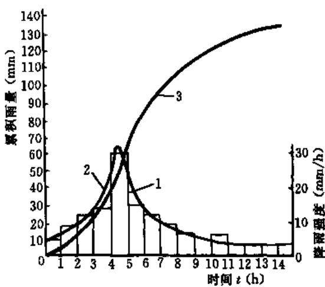  
图 4-1 某水文站一次降雨过程  
1—时段平均雨强过程线；2一瞬时雨强过程线；3一累积雨量过程线

量，若对一个流域而言，则指流域的面平均雨量。

## (一)单站降雨特性分析

## 1. 降雨强度过程线

降雨强度过程线就是降雨强度随时间的变化过程线。通常以时段平均雨强i为纵坐标，时间为横坐标的柱状图表示，也常称为降雨量过程线，如图4-1中的1线。当时段取得很小并趋于零，1线变为光滑曲线，即为瞬时雨强i过程线，如图中2线所示。

## 2. 降雨量累积曲线

自降雨开始起至各时刻降雨量的累积值P随时间的变化过程线，称为降雨量累积曲线，如

图4-1中3线所示。实际上，降雨量的累积曲线就是降雨强度过程线对时间的积分曲线，即$P ( t ) = \int _ { 0 } ^ { t } i ( t ) \mathrm { d } t$ 。因此，曲线上任意一点的坡度就是该时刻的瞬时降雨强度i，即 $i = { \frac { \mathrm { d } P } { \mathrm { d } t } }$ 而曲线上任一时段的平均坡度就是该时段的平均降雨强度i，即 $\bar { i } = \frac { \Delta P } { \Delta t }$

## 3. 降雨强度～历时曲线

统计降雨强度过程线中各种不同历时的最大平均雨强，如图4-2（a）所示。最大平均雨强与历时的关系即为降雨强度\~历时曲线，如图4-2(6)所示。由图中可以看出，同一场降雨的雨强随历时增长而减小。不同场降雨因降雨过程不同，因而雨强\~历时曲线也不同，如图4-2（c）所示。

## (二)流域降雨特性分析

流域降雨特性包括降雨量在时间上的变化过程和空间上的分布情况，常用下列方法表示。

## 1. 流域平均降雨量

由雨量站实测雨量记录，计算流域的平均降雨量，常用的方法有三种。

(1)算术平均法：当流域内雨量站分布较均匀、地形起伏变化不大时，可根据各站同时段观测的降雨量用算术平均法推求。计算公式如下：

$$
\overline { { P } } = \frac { P _ { \downarrow } + P _ { 2 } + \cdots + P _ { n } } { n } = \frac { 1 } { n } \sum _ { i = 1 } ^ { n } P _ { i }\tag{4-1}
$$

式中 ${ \overline { { P } } } \cdot$ —流域某时段平均降雨量，mm；

$P _ { i }$ —流域内第i个雨量站同时段降雨量， mm;

n——流域内雨量站数。

(a)  
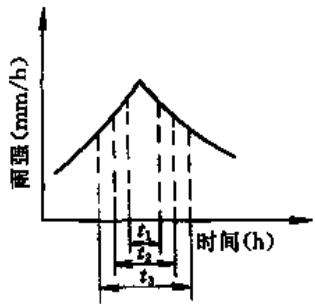

(6)  
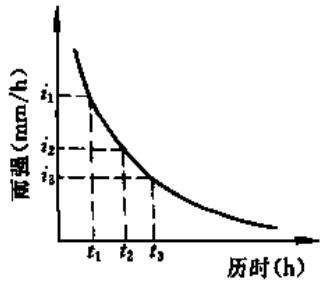

(2)垂直平分法：垂直平分法或称为泰森多边形法，如图4-3（a）所示。先用直线连接相邻雨量站（包括流域周边外的雨量站），构成若干个三角

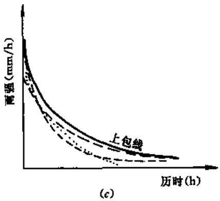  
图 4-2 降雨强度\~历时曲线

形，再作每个三角形各边的垂直平分线，这些垂直平分线将流域分成n个多边形，流域边界处的多边形以流域边界为界。每个多边形内有一个雨量站，以每个多边形内雨量站的雨量代表该多边形面积上的降雨量，最后按面积加权推求流域平均降雨量。计算公式如下：

$$
\overline { { P } } = \frac { P _ { 1 } f _ { 1 } + P _ { 2 } f _ { 2 } + \cdots + P _ { n } f _ { n } } { F } = \sum _ { i = 1 } ^ { n } P _ { i } \frac { f _ { i } } { F }\tag{4-2}
$$

式中 $f _ { i }$ ——第i个雨量站所在多边形的面积， $\mathbf { k m } ^ { 2 }$

${ \pmb F }$ 流域面积， $\mathrm { k m } ^ { 2 } .$

其余符号同前，式中 $\frac { f _ { i } } { F }$ 称为面积权重。

(3)等雨量线法：当流域内雨量站分布较密时，可根据各雨量站同时段观测的雨量绘

制等雨量线图，如图4-3(6)所示，然后用等雨量线图推算流域平均降雨量。计算公式如下：

$$
\overline { { \pmb { P } } } = \frac { 1 } { \pmb { F } } \sum _ { i = 1 } ^ { \mathsf { s } } \pmb { P } _ { i } \pmb { f } _ { i }\tag{4-3}
$$

式中 $f _ { i }$ ——相邻两条等雨量线间的面积， $\mathbf { k m ^ { 2 } }$

$\scriptstyle { P _ { i } }$ —相应于 $f _ { i }$ 上的平均雨深，一般采用相邻两条等雨量线的平均值，mm;

其余符号同前。

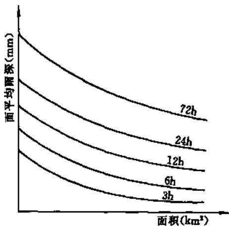  
图 4-4 面平均雨深\~面积\~历时曲线

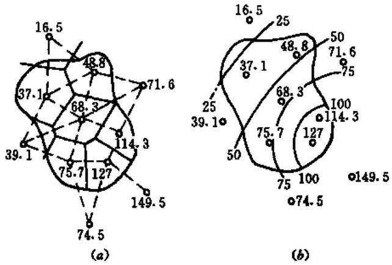  
图 4-3 流域平均降雨量计算

## 2. 时～面～深关系曲线

首先绘制某种历时的等雨量线，并从最大雨深处(暴雨中心)向外量取不同等雨量线包围的面积，并求出各面积上的平均降雨量。各包围面积与相应面平均雨量之间的关系称为雨深\~面积关系。对一场降雨，可选取各种历时（如1、3、6、12、24、72h）的等雨量线图，分别作雨深\~面积关系曲线，并绘于同一张图上，即为时～面～深曲线，如图4-4所示。

## 3. 点～面关系曲线

流域上降雨量分布是不均匀的。记某种历时暴雨中心雨量为 $\pmb { P _ { \xi } }$ ，各条等雨量线包围面积内的面平均雨量为 $\mathcal { P } _ { i }$ ，令 $\alpha _ { i } { = } \frac { P _ { i } } { P _ { c } ^ { + } } , \alpha _ { i }$ 与对应等雨量线包围的面积

的关系即为点～面关系，如图4-5所示。不同场降雨的点\~面关系并不一样，一般取其平均情况作为流域该历时的点～面关系。点～面关系反映降雨在空间上的变化特性。

## 二、径流量计算

一次洪水流量过程除包括本次洪水所形成的地面径流、表层流径流和地下径流外，往往还包括前期洪水尚未退完的部分水量及非本次降雨补给的深层地下径流。因此，在计算本次洪水径流时，首先应把上述后两项水量从洪水过程线中分割出去。其次，洪水中不同的水源成分其水流运动规律是不相同的。因此，需对洪水流量过程中的不同水源成分进行划分，以便进行汇流计算。

## 1. 径流过程线分析

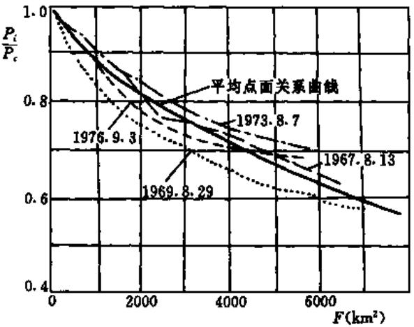  
图 4-5 暴雨点\~面关系曲线

图 4-6 中 ABCHI 为流域出口断面实测洪水过程。图中A点为洪水开始起涨时刻，该时刻的流量 AG 是由上一次洪水尚未退完的浅层地下径流 AE 和深层地下径流 EG 组成的。假如在A点之前没有降雨，则上次洪水没退完的浅层地下径流将从A点沿虚线至F点退尽，显然，AEF非本次降雨形成的。在C点，因有后续降雨，洪水又上涨。假定在C点无降雨，则洪水将从C点沿虚线退至D点。因此，

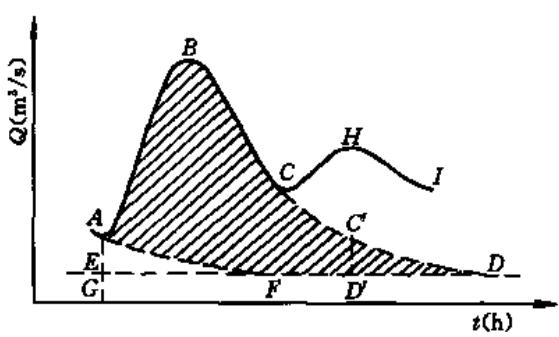  
图 4-6 流量过程线分割示意图

本次降雨形成的径流过程为ABCDFA，径流总量为图中阴影部分面积。

## 2. 流量过程的分割

流量过程的分割有两项工作：一是将上述非本次降雨形成的径流割去，求出本次洪水的径流总量。二是由于不同水源的水流运动规律不同，所以还需将本次洪水径流总量划分为不同的水源，包括地面径流、表层流径流和地下径流。一般把地面径流和表层流径流合并为直接径流，通常仍称为地面径流。地下径流包括浅层地下径流和深层地下径流。深层地下径流非本次降雨形成的，需从流量过程线中分割去。所以，地下径流一般指本次降雨形成的浅层地下径流。深层地下径流比较稳定，流量也较小，是河川的基本流量，所以又称为基流。分割的方法一般取历年最枯流量的平均值或本年汛前最枯流量用水平线分割，如图 4-6 中ED线。虚线AF表示上次洪水浅层地下径流的退水过程，虚线CD为本次洪水的退水过程。由于C点的位置较高，所以CD综合反映C点以后直接径流和地下径流的退水过程。

不同的水源，其退水规律是不一样的。地面径流消退快，先退尽，表层流径流次之，浅层地下径流消退较慢，后退尽，深层地下径流小且稳定。实测得到的退水过程是上述各种水源的组合过程。由于地面径流和表层流径流合并为直接径流，且深层地下径流已用水平线分割去，所以，径流的划分只需划分直接径流和地下径流。

流量过程线的分割及不同水源的划分常采用退水曲线。退水曲线是流域蓄水量的消退过程线。对某一流域而言，地下径流退水过程比较稳定，所以，可取多次实测洪水过程的退水部分，绘在透明纸上，然后沿时间轴平移，使它们的尾部重合，最后作光滑的下包线，就是流域地下水退水曲线，如图4-7。有了退水曲线，就可以在图4-6的流量过程线上作出

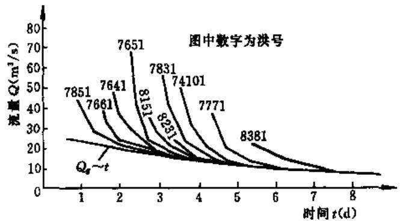  
图 4-7 流域地下水退水曲线

AF和CD段，将非本次降雨形成的径流割去。

流域退水曲线可用下式来描述：

$$
Q ( t ) = Q ( 0 ) \mathrm { e } ^ { - t / \kappa _ { \varepsilon } }\tag{4-4}
$$

式中 Q(t)—t时刻流量；

Q(0)——t=0时的流量；

$\pmb { K _ { \pmb { \sigma } } } .$ 地下水退水参数或地下水蓄水常数，具有时间因次。

$K _ { \kappa }$ 大表示地下水退水慢，反之则快。 $K _ { g }$ 的值可利用流域退水曲线来确定。由式（4-4)，有： $\begin{array} { r } { Q ( t + \Delta t ) = Q ( 0 ) \mathrm { e } ^ { - ( t + \Delta t ) / K } \varepsilon = Q ( t ) \mathrm { e } ^ { - \Delta t / K } \varepsilon } \end{array}$ ，可得：

$$
K _ { \varepsilon } = \frac { \Delta t } { \ln Q ( t ) - \ln Q ( t + \Delta t ) }\tag{4-5}
$$

在流域退水曲线上，每隔一个 $\pmb { \Delta } t$ 摘出流量值，任意两个相邻的流量按式(4-5)即可算出 $K _ { \kappa }$ 对某个流域而言， ${ \pmb { K } } _ { \pmb { \imath } }$ 一般较稳定，可取平均值作为该流域的 $\pmb { K _ { g } }$ 值。

## 3. 径流量计算

实测流量过程线割去非本次降雨形成的径流后，本次降雨形成的径流量为图4-6中阴影部分面积，计算公式如下：

$$
R = { \frac { 3 . 6 \sum Q \Delta t } { F } }\tag{4-6}
$$

式中 R——次洪径流深，mm；

$\mathbf { Q }$ ——每隔一个 $\pmb { \Delta } t$ 的流量值， $\mathbf { m } ^ { \mathfrak { s } } / \mathfrak { s }$

$\Delta t$ —计算时段，h；

$\pmb { F } \mathrm { \cdot }$ —流域面积， $\mathrm { k m } ^ { 2 }$

3.6——单位换算系数。

在退水规律比较一致的流域，可在CD段上找与A点流量相等的 $C ^ { \prime }$ 点， $A E F$ 的面积与$C ^ { \prime } D ^ { \prime } D$ 的面积近似相等，因此，本次降雨形成的径流总量为 $A B C C ^ { \prime } D ^ { \prime } E A$ 包围的面积，仍按式（4-6）计算。

## 4. 水源的划分

由于直接径流和地下径流有不同的汇流特性，所以求得次径流总量之后，还需划分直

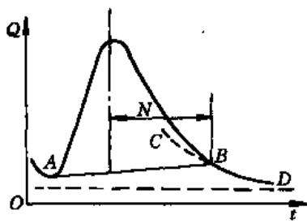  
图 4-8 地下径流分割示意图

接径流和地下径流。简便的方法是斜线分割法，如图4-8所示。从起涨点A到直接径流终止点B之间连一直线，AB以上为直接径流，以下和基流以上部分即为地下径流。B点用流域退水曲线来确定，使退水曲线CBD的尾部与流量过程线退水段尾部重合，分离点即为B点。也可用经验公式确定出洪峰流量出现时刻至直接径流终止点的时距N（日数），就可以定出B点。经验公式如下：

$$
\pmb { N } = 0 , 8 4 \pmb { F } ^ { 0 . 2 }\tag{4-7}
$$

式中 ${ \pmb F } \mathrm { \cdot }$ —流域面积， $\mathbf { k m } ^ { 2 }$

## 三、前期影响雨量

降雨开始时，流域内包气带土壤含水量的大小是影响降雨形成径流过程的一个重要因素。土壤含水量的实测资料很少，即使有也只能代表点的情况，不能代表土壤含水量在流城分布的复杂规律。因此，水文学上用间接的方法来表示流域的土壤含水量。目前，常用的方法有两种，一种是前期影响雨量 $\pmb { P _ { a } }$ ，另一种是流域的蓄水量 $\pmb { W }$ 。后一种将在第三节介绍，这里介绍前期影响雨量。

## (一)前期影响雨量 $P _ { a }$ 的计算公式

如果流域内前后两天无雨，前期影响雨量 $\pmb { \mathcal { P } _ { a } }$ 的定义为：

$$
P _ { a , t + 1 } = K P _ { a , t }\tag{4-8}
$$

式中 $P _ { a , t }$ ——第t日的前期影响雨量，mm；

$P _ { \alpha , t + 1 }$ ——第t+1 日的前期影响雨量，mm;

K——土壤含水量的日消退系数或折减系数。

如果第t日内有降雨 $P _ { \ell }$ ，但未产流，则：

$$
P _ { a , t + 1 } = K ( P _ { a , t } + P _ { t } )\tag{4-9}
$$

如果第t日内有降雨 $P _ { \ell }$ 并产生径流 $R _ { t }$ ，则：

$$
P _ { \alpha , t + 1 } = K ( P _ { \alpha , t } + P _ { t } - R _ { t } )\tag{4-10}
$$

但在实际应用中，由于 $R _ { t }$ 不易求得，所以一般仍按式（4-9）计算，但 $P _ { \bullet }$ 值不应大于流域最大蓄水量WM，所以当计算出的 $\scriptstyle { P _ { a } }$ 值大于WM时，取WM作为该日的 $\pmb { \bar { P } _ { a } }$ 值。

若流域较大， $P _ { \alpha }$ 值应按雨量站分块计算，全流域的 $\pmb { P _ { \bullet } }$ 值由各块 $\scriptstyle { P _ { \alpha } }$ 值加权平均。

## (二)流域最大蓄水量WM和消退系数 K

## 1. 流域最大蓄水量 WM

流域最大蓄水量又称为流域蓄水容量，包括植物截留、填洼以及包气带或影响土层的蓄水容量，相当于田间持水量与凋萎系数的差值。

WM是流域综合平均指标，一般用实测雨洪资料分析确定。选取久旱无雨后一次降雨量较大且全流域产流的雨洪资料，计算流域平均降雨量P及产流量R。因久旱无雨，可认为降雨开始时 $P _ { \bullet } { \approx } 0$ ，所以：

$$
W M = P - R - E\tag{4-11}
$$

式中，E为雨期蒸发量。

一个流域的最大蓄水量是反映该流域蓄水能力的基本特征，我国大部分地区的经验表明，WM一般为80\~120mm，例如：广东95\~100mm，福建100\~130mm，湖北70\~110mm，陕西55\~100mm，黑龙江140mm等等。流域的实际蓄水量在0\~WM之间变化。

## 2. 消退系数 K

消退系数K综合反映流域蓄水量因流域蒸散发而减少的特性，因此，可以直接用水文气象资料分析确定。流域蒸散发一方面取决于蒸散发能力，另一方面取决于供水条件，即流域蓄水量的大小。实用中一般假定流域蒸散发量E与流域蓄水量W成正比，即：

$$
\frac { E _ { t } } { E M } = \frac { W _ { t } } { W M } ☉ E _ { t } = \frac { E M } { W M } W _ { t }\tag{4-12}
$$

若第t日无雨，则该日流域前期影响雨量的减少全部转化为流域蒸散发，故：

$$
E _ { t } = P _ { a , t } - P _ { a , t + 1 } = ( 1 - K ) P _ { a , t }
$$

又 $P _ { a , t } { = } W _ { t }$ ，将上式代入式（4-12），即可求得：

$$
K = 1 - { \frac { E M } { W M } }\tag{4-13}
$$

式中，EM为流域日蒸散发能力，无法进行实测。根据试验可知，可用 $\mathbf { E } _ { \mathfrak { s o l } }$ 型蒸发器观测的水面蒸发值作为近似值。这项蒸发值随地区、季节、晴雨等条件而变，所以，一般按晴天和雨天或按月份分别选用相应的月平均值计算K值。

$P _ { \mathrm { ~ a ~ } }$ 值虽然可用式(4-9)计算，但仍需事先确定其起算值。一般前期较长一段时间无雨，

土壤已很干燥，可令 $P _ { e } = 0 ~ ;$ 而在一场大雨或连续几次大雨之后，土壤含水量已近最大，此时可取 $\scriptstyle P _ { a } = W M$ ，以此为起点往后算。

$$
W M { = } 1 0 0 \mathrm { m m } , \ 6 , \ 7
$$

$$
\pmb { P _ { \vartheta } }
$$

<table><tr><td colspan="5">P</td><td rowspan="2"> $\pmb { P _ { \pmb { \mathscr { o } } } }$   $\mathbf { \omega } ( \mathbf { m m } )$ </td></tr><tr><td>月</td><td>日 25</td><td> $\left( \mathtt { m m } \right)$  60.3</td><td>EM  $\cos ( \sqrt { \alpha } )$  5.6</td><td>K 0.944</td></tr><tr><td>6 6 6 6 6</td><td>25 27 28 29 30</td><td>78.8 14.7</td><td></td><td>0.944 0.944 0.944 0.944 0.944</td><td>100 100 94.4 89.1</td></tr><tr><td>6 7</td><td>1 2</td><td>20.2</td><td>6.8</td><td>0.932</td><td>83.0</td></tr><tr><td>7 7</td><td>3</td><td>21.9</td><td></td><td>0.932 0.932</td><td>77.4 90.9</td></tr><tr><td>7</td><td>4</td><td>2.2</td><td></td><td>0.932</td><td>100</td></tr><tr><td>7</td><td>5</td><td></td><td></td><td>0.932</td><td>95.3</td></tr></table>

结果见表4-1。

月份平均 EM 分别为 5. 6mm/d 和 6.8$\mathtt { m m } / { \mathsf { d } }$ 。试计算表4-1中6月25日～7月5日的逐日 $P _ { \bullet }$ 值。

根据式（4-13），有：

$$
K _ { 6 } = 1 - \frac { 5 . 6 } { 1 0 0 } = 0 . 9 4 4
$$

$$
K _ { 7 } = 1 - \frac { 6 . 8 } { 1 0 0 } = 0 . 9 3 2
$$

由表4-1 所列资料可知，6月25日～27日雨量很大，并产生了径流，故6月27日 $\pmb { P _ { q } }$ 可达WM，于是该日 ${ \pmb P } _ { a }$ 值取100mm。按式（4-9)，6月28日， $P _ { \alpha } { = } 0 . 9 4 4 \times ( 1 0 0 { + } 1 4 . 7 ) =$ $1 0 8 . 3 > 1 0 0$ ,故 28 日 $\pmb { P _ { a } }$ 值取100mm；29日，$P _ { * } = 0 . 9 4 4 \times 1 0 0 = 9 4 . 4 \mathrm { { m m } }$ 其余各日计算

## 第二节流域产流分析

所谓产流，是指流域中各种径流成分的生成过程，其实质是水分在下垫面垂直运行中，在各种因素综合作用下的发展过程，也是流域下垫面（包括地面和包气带）对降雨的再分配过程。不同的下垫面条件具有不同的产流机制，不同的产流机制又影响着整个产流过程的发展，呈现不同的径流特征。本节介绍自然界两种基本的产流形式，并建立产流理论的基本概念。

## 一、包气带对降雨的再分配作用

包气带是由不同土壤构成的有孔介质，它具有吸收、储存和输送水分的功能，这种功能导致包气带对降雨起着调节和再分配的作用。这种作用与土壤性质、水分带的分布特性、水分的交换及变化状况有着密切的关系。

## (一)包气带地面对降雨的再分配作用

包气带的上界即地面。以流域内某一单元土柱为例，设某时刻地面的下渗能力为 $f _ { \phi } ,$ 降雨强度为i。若 $i \textgreater f _ { \phi }$ ，则实际下渗率为 $f _ { \phi }$ ，其余部分 $( i - f _ { \flat } )$ 形成地面径流。当 $i \leqslant f _ { \widehat { \ast } }$ ，则全部降雨都渗人土壤中。因此，按i和 $f _ { \phi }$ 的大小，包气带地面把其所承受的降雨划分为下渗的水量和地面径流两部分。

对一场总降雨量为P的降雨过程来说，雨强时大时小，有时 $i > f _ { \mathrm { \uparrow } }$ ，有时 $i \leqslant f ,$ ，下海到包气带土层中的水量Ⅰ为：

$$
I = \int _ { i > f _ { p } } f _ { \rho } \mathrm { d } t + \int _ { i  f _ { p } } i \mathrm { d } t
$$

而形成的地面径流 RS 为：

$$
R S = \int _ { i \geq j _ { \phi } } ( i - f _ { \phi } ) \mathrm { d } t
$$

根据水量平衡原理，显然有：

$$
P = I + R S\tag{4-14}
$$

## (二)包气带土层对下渗水量的再分配作用

下渗到包气带土层的水量I，一部分首先被土壤颗粒吸收，成为土壤含水量的增量，一部分以蒸散发E的形式逸出地面，返回大气。下面讨论剩余的那部分下渗水量。

称包气带达到田间持水量时的蓄水量为包气带蓄水容量，记为 $\bar { \boldsymbol { W } } _ { \mathrm { ~ \scriptsize ~ m ~ } } ^ { t }$ ，另令 $\mathbf { \boldsymbol { W } ^ { \prime } } _ { \mathfrak { g } }$ 表示降雨开始时包气带的起始蓄水量。显然， $( W _ { \mathrm { ~ } \ast } ^ { \prime } - W _ { \mathrm { ~ } 0 } ^ { \prime } )$ 为包气带的缺水量。当出现 $\begin{array} { r } { J - E { \geqslant } W ^ { t } , } \end{array}$ π$- \mathbb { W } _ { \mathfrak { g } } ^ { \prime }$ 时，表示降雨结束时包气带达到田间持水量，下渗水量中的 $[ I - E - ~ ( W ^ { t } { } _ { \ast } - W ^ { t } { } _ { 0 } ) ]$ 部分在重力作用下成为可以在包气带中自由运动的重力水 $R G _ { \circ }$ 按第二章的概念，RG包括表层流径流，即壤中流和地下径流。因此：

$$
I = E + ( W \prime _ { n } - W \prime _ { \circ } ) + R G\tag{4-15}
$$

当出现 $\bar { i } - E { < } W ^ { \prime } { _ { \ast } } - W ^ { \prime } { _ { \circ } }$ 时，表示降雨结束时包气带的蓄水量 $W ^ { \prime }$ 未达到田间持水量，下渗水量I一E全部被包气带土壤吸收，成为包气带蓄水量的增量，因此：

$$
I = E + ( W ^ { \prime } { } _ { e } - W ^ { \prime } { } _ { 0 } )\tag{4-16}
$$

从以上分析中可以看出，在包气带土层对下渗水量的再分配过程中，就是否产生重力水 RG 而言， $\bar { \pmb { W } } ^ { \prime }$ 起着控制的作用，当出现 $I { - } E { + } W ^ { \prime } { _ { 0 } } { > } W ^ { \prime } { _ { m } }$ 时，包气带土层有自由重力水RG 形成，否则不产生 RG。

## （三）蓄满产流和超渗产流

根据水量平衡方程，合并式（4-14）和式（4-15），得雨末包气带达到田间持水量，包气带的水量平衡方程：

$$
P = E + ( W _ { \mathrm { ~ s ~ } } ^ { t } - W _ { \mathrm { ~ ~ 0 ~ } } ^ { t } ) + R S + R G\tag{4-17}
$$

合并式（4-14）和式（4-16），得雨末包气带未达到田间持水量，包气带的水量平衡方程：

$$
P = E + ( W \prime _ { e } - W \prime _ { \circ } ) + R S\tag{4-18}
$$

式（4-17）和式（4-18）适用于某时段，也适用于一场降雨的总历时。

式（4-17）和式（4-18）反映了自然界两种基本的产流方式。式（4-17）表明，只有当包气带达到田间持水量后才产生RG，这种产流方式称为“蓄满产流”。而在式（4-18)中，因包气带未达到田间持水量，故不产生RG，这种产流方式称为“超渗产流”。

在我国的湿润地区，如江淮流域及其以南地区，年降雨量在800mm以上，植被良好，包气带常年潮湿，缺水量小，一般很容易在一次降雨过程中得到满足，故以蓄满产流方式为主。我国干旱地区，如陕北黄土高原地区，雨量稀少，年降雨量不足200mm，植被极差，包气带缺水量很大，几乎没有可能在一次降雨过程中得到满足。相反，可能出现超过地面下渗能力的局地性高强度、短历时暴雨，故一般以超渗产流为主。对于年降雨量介于200\~400mm之间的半干旱地区和 $4 0 0 { \sim } 8 0 0 \mathrm { m m }$ 之间的半湿润地区，产流方式较为复杂，需根据流域下垫面的具体条件作分析。

需要说明的是，对某个具体的流域，这两种产流方式是相对的。湿润地区以蓄满产流为主的流域，在长期干旱后，若遇到雨强大于下渗能力的降雨，既使此时包气带未蓄满，也会产生超渗的地面径流。同样，在于旱地区，以超渗产流为主的流域，在多雨的季节也可能在流域的局部甚至全部出现蓄满产流现象。

## 二、产流面积的变化

在降雨过程中，流域上产生径流的区域称为产流区，其面积称为产流面积。以上讨论的仅是流域内单点的产流情况，对整个流域而言，由于流域下垫面因素并不均一，如包气带厚薄、土壤性质、植被、降雨开始时的土壤含水量等情况并非处处相同，而且降雨量、降雨强度及其空间分布也不一致，因此，流域产流面积的变化十分复杂。

## (一)蓄满产流情况下产流面积的变化

由于流域内各处下垫面条件不一样，因此，流域内各点包气带的蓄水容量 $\pmb { W } ^ { t }$ 是不同的。将全流域各点的 $\mathbb { W } _ { \ : \ m ^ { \prime } } ^ { \prime }$ 从小到大排列，计算小于或等于某一 $\bar { W } ^ { \prime }$ 值各点的面积之和 $\pmb { F } _ { R }$ 占全流域面积的比重 $\alpha { \bigg ( } = { \frac { F _ { R } } { F } } { \bigg ) }$ ，则可绘出 $\bar { W } _ { \star } ^ { \prime } \sim \alpha$ 关系曲线，如图4-9（a）所示。该曲线即为流域蓄水容量面积分布曲线，简称为流域蓄水容量曲线。图中 $\mathbf { \boldsymbol { W } } _ { \mathbf { \lambda } _ { \mathtt { m m } } } ^ { \prime }$ 为流域中最大的点蓄水容量。按上述蓄满产流的概念，当包气带达到田间持水量即可产流，故可知α为产流面积(以相对数值表示)。

流域蓄水容量曲线是一条单增曲线，可以用下列函数关系来表示：

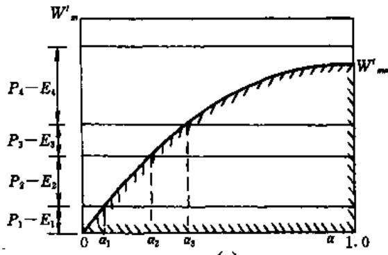  
(a)

$$
\pmb { \alpha } = \varphi ( W _ { \textrm { \tiny m } } ^ { \prime } )\tag{4-19}
$$

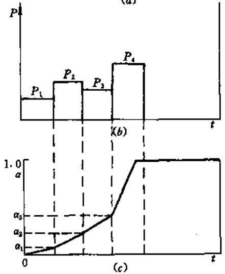  
图4-9 流域蓄水容量曲线及产流面积的变化(a) 流城蓄水容量曲线；(b) 降雨柱状图；(c) 产流面积的变化

一个流域最小的 $\bar { \boldsymbol { W } } _ { \mathrm { ~ \scriptsize ~ s ~ } } ^ { \prime }$ ，一般为零，也可以异于零，最大的 $\mathbf { \boldsymbol { W } ^ { \prime } } _ { \mathbf { \lambda } ^ { m } }$ ，一般为有限值，即 $\mathbf { \delta } \mathbf { \overrightarrow { W } } _ { \mathbf { \delta m a s } } ^ { \prime } .$ 曲线以下包围的面积就是流域的最大蓄水量，或称为流域的蓄水容量WM，即：

$$
W M = \int _ { 0 } ^ { \overline { { W } } ^ { \prime } \ J _ { \mathrm { ~ m ~ } } } [ 1 - \varphi ( W ^ { \prime } \ J _ { \mathrm { ~ m ~ } } ) ] \mathrm { d } W ^ { \prime } \ : _ { \mathrm { ~ m ~ } }\tag{4-20}
$$

由上述可知，蓄水容量就是包气带达到田间持水量时的蓄水量与最干旱时的蓄水量的差值。这样，蓄水容量在数值上等于包气带最于旱时的缺水量，即最大缺水量。 $\pmb { W } ^ { t }$ 在数值上等于包气带最大的点缺水量，WM等于全流域包气带平均最大缺水量，其数值也与流域最大损失量IM相等。流域的蓄水容量曲线也就是包气带最大缺水量分布曲线。

蓄满产流方式取决于包气带是否达到了田间持水量。当流域某处包气带达到了田间持水量，该处就产流，否则不产流。下面分析在蓄满产流情况下，降雨时产流面积的变化。设一场降雨共四个时段，各时段降雨量如图4-9(6)所示。并设降雨起始时刻，全流域干燥， $\bar { W } _ { \vartheta }$ =0。在降雨空间分布均匀的情况下，产流面积的变化如图4-9（a）（c）所示。图中E为雨期蒸散发。由图可以看出，蓄满产流情况下产流面积的变化有如下特点：①随着降雨量的增加，产流面积也随之增加；②产流面积的变化与降雨强度无关。

## (二)超渗产流情况下产流面积的变化

首先建立流域下渗容量面积分布曲线。对流域某一起始蓄水容量 $\scriptstyle { W _ { 0 } }$ ，流域内各点的下渗能力 $f _ { \hbar }$ 是不同的。将全流域各点的 $f _ { p }$ 从小到大排列，以 $f _ { \pmb { \mathscr { p } } }$ 为纵坐标，以小于或等于该 $f _ { p }$ 各点的面积之和 $\pmb { F } _ { R }$ 占全流域面积的比重 $\alpha { \biggl \{ } = - { \frac { F _ { R } } { F } } { \biggr \} }$ 为横坐标，则可得流域下渗容量面积分布曲线，如图4-10所示。对于不同次降雨，降雨开始时流域起始蓄水量 $\smash { W _ { \vartheta } }$ 是不一样的。所以，即使是同一点，其 $\Psi _ { \mathfrak { d } }$ 也不同，下渗能力 $f _ { p }$ 也就不同。因此，对不同的流域起始蓄水量，有其对应的下渗容量面积分布曲线。所以，下渗容量面积分布曲线是一组以 $\Psi _ { \mathfrak { d } }$ 为参数， $\mathbb { W } _ { \mathfrak { d } } { = } \mathfrak { d }$ 为上包线， $W _ { \circ } { = } W M$ 为下包线的曲线族，见图4-10。同理，α也为产流面积（以相对数值表示）。

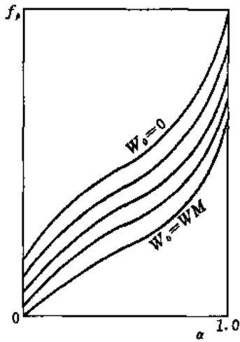  
图 4-10 流域下渗容量面积分布曲线

其次，考察在超渗情况下，降雨时产流面积的变化。设降雨开始时，流域蓄水量为 $W _ { \vartheta }$ 从图 4-10 中选出 $\mathbf { \delta W _ { \mathfrak { o } } }$ 相应的下渗容量面积分布曲线，如图4-11(a)，设第一时段平均雨强为 $\overline { { \dot { i } } } _ { 1 }$ ，则在图上可求得时段末产流面积 ${ \pmb { \alpha } } _ { 1 }$ ，下渗水量 ${ { I } _ { 1 } }$ ，时段末流域蓄水量为 $W _ { 0 } { + } I _ { 1 }$ 。第二时段初流域蓄水量变为 $W _ { 0 } { + } I _ { 1 }$ ，从图4-10中选出相应的流域下渗容量面积分布曲线，如图 4-11 (b)，若第二时段平均雨强 $\bar { i } _ { 2 }$ ，则第二时段末的产流面积为 ${ \pmb { a } } _ { \pmb { 2 } }$ ，下渗水量为 $I _ { z }$ ，时段末流域蓄水量为 $W _ { 0 } { + } I _ { 1 } { + } I _ { 2 }$ 。此值即为第三时段初的流域蓄水量，从图4-10中选出相应的流域下渗容量面积分布曲线，如图4-11(c)，若第三时段平均雨强为 $\vec { i } _ { 3 }$ ，则该时段末的产流面积为 ${ \pmb { \alpha } } _ { 3 }$ ，下渗水量为 ${ \cal I } _ { 3 }$ 。如此逐时段计算下去，就可求得一场空间分布均匀的降雨，在超渗产流情况下产流面积的变化过程。由图可以看出超渗产流情况下产流面积的变化有如下特点：①随降雨历时的增长，产流面积时大时小；②产流面积的大小与时段初流域蓄水量及降雨强度有关。

上面讨论的是降雨空间分布均匀的情况，当降雨空间分布不均匀时，可按雨量站控制的面积分析其产流面积的变化，然后用面积加权求全流域的产流面积。

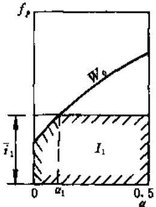  
(a)

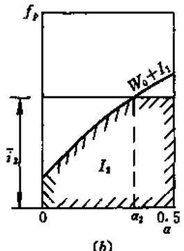  
(b)

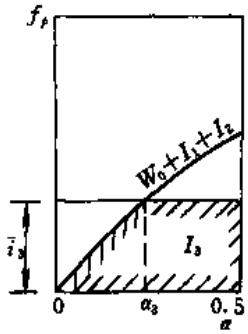  
(c)  
图4-11 超渗产流情况下产流面积的变化

## 三、降雨径流关系

对蓄满产流方式，根据流域蓄水容量曲线，可求出降雨～径流关系。如果降雨开始时，流域蓄水量 $W _ { \circ } { = } 0$ ，若降雨量为P，雨期蒸散发量为E，则由图4-12（a)，可求得产流面积 $\alpha _ { d }$ ，产流量为 $\Delta d g o$ 的面积。在 $( 1 - \pmb { \alpha } _ { d } )$ 面积上不产流，损失量为 $o d f c o$ 的面积。不同的降雨量 $P$ ，都有其相应的产流量R。根据这一关系，便可得到一条 $W _ { 0 } { = } 0$ 的 $P { \sim } R$ 关系曲线，如图4-12（b)所示。当流域起始蓄水量 ${ \mathbb { W } } _ { \mathfrak { d } } { = } { \mathbb { W } }$ ，见图 ${ { \bf 4 - 1 } 2 { \bf \Delta } \left( { \pmb a } \right) }$ ，则蓄水量的分布为oabco，ab线以上蓄水容量曲线以下包围的面积为缺水量，降雨量P产生的径流量R为图中阴影部分面积。不同的P，可得对应的R值，即可得一条 $\mathbb { W } _ { 0 } = \mathbb { W }$ 的 $\scriptstyle P \sim R$ 关系曲线。在0${ \sim } W M$ 范围内，取不同的 $W _ { 0 }$ 值，便可得一族以 $\bar { W } _ { \mathfrak { g } }$ 为参数的 $\scriptstyle P \sim R$ 关系曲线，如图4-12(b)所示，该图即为降雨径流关系曲线。降雨径流关系曲线的形态取决于流域蓄水容量曲线。

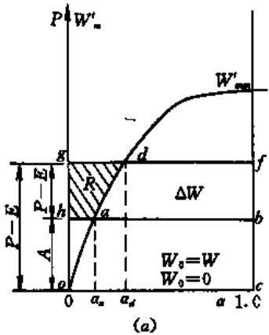

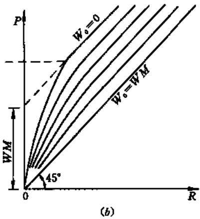  
图4-12 流域蓄水容量曲线与降雨径流关系示意图  
(a) 流域著水容量曲线；(b) 降厢径流关系曲线

对于超渗产流方式的降雨径流关系，原则上可以依据流域下渗容量面积分布曲线，按同样的原理求出。

## 第三节 产 流 计算

## 一、降商径流相关法

降雨径流相关是在成因分析与统计相关相结合的基础上，用每场降雨过程流域的面平均雨量和相应产生的径流量，以及影响径流形成的主要因素建立起来的一种定量的经验关系。这种方法简单，又有一定的精度，所以实际工作中应用较为广泛。

影响降雨径流关系的主要因素有：前期影响雨量 $\pmb { \mathscr { P } _ { g } }$ 或流域起始蓄水量 $\mathbb { W } _ { \mathfrak { d } } ,$ 降雨历时、降雨强度、暴雨中心位置等等，可根据流域的具体情况选用。我国湿润和半湿润地区最常用的是 $\bar { P } { \sim } \bar { P } _ { \circ } { \sim } \bar { R }$ 三变量相关图法，如图4-13所示。该图利用本章第一节中介绍的方法计算出降雨径流要素，以次降雨量P为纵坐标，相应的次洪径流深R为横坐标，降雨开始时的 $\pmb { P _ { \bullet } }$ 为参数建立起来的降雨径流相关图。从降雨径流成因分析，该图应符合以下规律：①P相同时， $\pmb { P _ { \pmb { \alpha } } }$ 越大，损失越小，R越大，故P。等值线的数值自左向右增大； $\textcircled{2} P _ { a }$ 相同时，$P$ 越大，损失相对于P越小，径流系数越大， $\scriptstyle P \sim R$ 线的坡度随P的增大而减缓，但不应

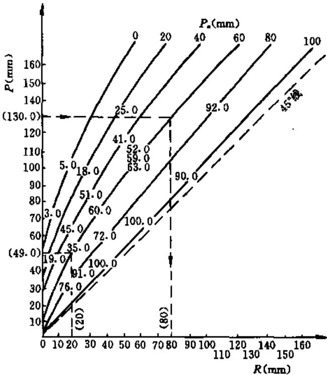  
图 4-13 降雨径流相关图

小于 $4 5 ^ { \circ }$ 。在湿润地区，随P的增大，降雨径流相关图的上段表现为一组平行等距离直线，这一特点有利于曲线的外延。相关图作好后，应从总体上进行评定。若有些点据较分散，应反复检查分析各种可能原因，调整计算参数，对点据进行校正，直至该图达到精度要求为止。

$P { \sim } P _ { \ a } { \sim } R$ 相关图作好后，就可以根据降雨过程及降雨开始时的 $\pmb { P _ { s } }$ 在图上求出净雨过程。例如：有一场两个时段的降雨，第一时段雨量49.0mm，第二时段雨量81.0mm，降雨开始时 $\pmb { P _ { a } }$ 为60.0mm。在图 $4 – 1 3 P _ { e } { = } 6 0 , 0 0 0 \mathbf { m m }$ 的线上，由 $P _ { 1 } = 4 9 . 0 \mathrm { m m }$ 查得 $\pmb { R } _ { 1 } =$ 20.0mm，再由 $( P _ { 1 } + P _ { 2 } ) \ = \ ( 4 9 . 0 +$ $\mathbf { 8 1 . 0 } ) \ = 1 3 0 . 0 \mathbf { m m }$ 查得 $( R _ { 1 } + R _ { 2 } ) \ =$ 80.0mm，则第二时段净雨 $R _ { 2 } = ( R _ { 1 } +$

$R _ { z } ) \ - R _ { \mathrm { l } } = 8 0 . 0 \ - 2 0 . 0 = 6 0 . 0 \mathrm { m m }$ 。对于多时段降雨过程，依此类推就可求出净雨过程，即产流量过程。若降雨开始时 $\pmb { P _ { \alpha } }$ 不在等值线上，可用内插方法查算。

降雨径流关系也可简化为 $R = f ~ ( P + P _ { \alpha } )$ 的形式，以 $\pmb { P } \mathrm { + } \pmb { P } _ { e }$ 为纵坐标，R为横坐标，如图4-14所示。作法和用法与图4-13 相同。

必须指出，建立这种经验相关图，必须有足够多的实测资料，才能反映不同降雨特性和流域特征的综合经验关系。对于没有实测暴雨洪水资料的区域，可利用地形、土壤、植被、气候等条件相似的邻近地区的降雨径流相关图来估算降雨的产流量。

## 二、蓄满产流的产流量计算

从60年代初开始，赵人俊等人经过长期对湿润地区暴雨径流关系的研究，提出了蓄满产流模型，建立了 $\scriptstyle P \sim W _ { 0 } \sim R$ 关系用以计算净雨过程，以及确定稳定下渗率和划分地面、地

下净雨的方法。该法现已成为我国湿润地区产流计算的一种重要方法。

## （一)概述

“蓄满产流”是指包气带土壤含水量达到田间持水量之前不产流，这时称为“未蓄满”，此前的降雨全部被土壤吸收，补充包气带缺水量。包气带土壤含水量达到田间持水量时，称为“蓄满”，蓄满后开始产流，此后的降雨扣除雨期蒸散发后全部形成净雨。因为只有在蓄满的地方才产流，所以产流期的下渗为稳定下渗率f。下渗的雨量形成地下径流，超渗的雨量成为地面径流。这种产流模式称为蓄满产流。我国湿润地区雨量充沛，地下水位高，包气带不厚，上层因蒸散发有时含水量较小，但下层常达田间持水量，包气带缺水量不大。而且，湿润地区或半湿润地区，植被较好，土壤覆盖层的下渗能力较大，当包气带土壤缺水量未满足时，所有的降雨基本上被土壤吸收，不容易超渗产流。

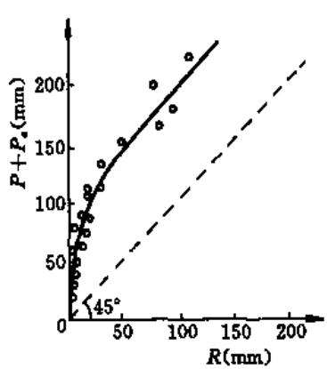  
图 4-14 简化的降雨径流相关图

## （二)蓄满产流的产流量计算

## 1. 产流量计算公式

蓄满产流以满足包气带缺水量为产流的控制条件，包气带缺水量的分布用流域蓄水容量曲线来表示。流域蓄水容量在流域内的实际分布是很复杂的，要想用直接测定土壤含水量的办法来建立蓄水容量曲线是困难的。通常的做法是由实测的降雨径流资料选配线型，间接确定蓄水容量曲线。多数地区经验表明，蓄水容量曲线可用B次抛物线来表示，即将式(4-19) 写为：

$$
\alpha = \varphi ( W _ { \ast } ^ { \prime } ) = 1 - \left( 1 - \frac { W _ { \ast } ^ { \prime } } { W _ { \ast m } ^ { \prime } } \right) ^ { B }\tag{4-21}
$$

式中， $\pmb { B }$ 和 $\ W _ { \mathrm { ~ \tiny ~ \mathfrak ~ { m m } ~ } } ^ { t }$ 为待定参数。B值反映流域中蓄水容量的不均匀性，主要取决于流域的地形地质土壤状况， $\mathbf { W } _ { \mathbf { \alpha } \mathbf { m } } ^ { \prime }$ 则取决于流域的气候和植被等特征。一般B值约为 $0 . 2 \sim 0 . 4 , W ^ { \prime } { } _ { m m }$ 南方湿润地区约为100\~150mm。

流域蓄水容量曲线用B次抛物线表示后，由式（4-20）和式（4-21），流域的蓄水容量WM为：

$$
W M = \int _ { 0 } ^ { | U ^ { \prime } | } [ 1 - \varphi ( W _ { \cdot n } ^ { \prime } ) ] \mathrm { d } W _ { \cdot n } ^ { \prime } = \int _ { 0 } ^ { \Psi _ { = n } ^ { \prime } } \Bigl \{ 1 - \frac { W _ { \cdot n } ^ { \prime } } { W _ { \cdot n n } ^ { \prime } } \Bigr \} ^ { 8 } \mathrm { d } W _ { \cdot n } = \frac { W _ { \cdot n n } ^ { \prime } } { 1 + B }\tag{4-22}
$$

若起始流域蓄水量 $W _ { \circ } { = } W$ ，见图4-12（a），相应A值可由下式求出：

$$
W _ { 0 } = \int _ { 0 } ^ { A } [ 1 - \varphi ( W ^ { \prime } _ { \textrm { m } } ) ] \mathrm { d } W ^ { \prime } _ { \textrm { m } } = \int _ { 0 } ^ { A } \Big \{ 1 - \frac { W ^ { \prime } _ { \textrm { m } } } { W ^ { \prime } _ { \textrm { m e n } } } \Big | ^ { B } \mathrm { d } W ^ { \prime } _ { \textrm { m } } = \frac { W ^ { \prime } _ { \textrm { m } } } { 1 + B } \Big [ 1 - \Big ( 1 - \frac { A } { W ^ { \prime } _ { \textrm { m e n } } } \Big ) ^ { 1 + B } \Big ]
$$

将式（4-22）代人上式，整理后得：

$$
A = W ^ { \prime } { } _ { \mathrm { s m } } \biggl [ 1 - \biggl \{ 1 - \frac { W _ { 0 } } { W M } \biggr \} ^ { \frac { 1 } { 1 + B } } \biggr ]\tag{4-23}
$$

下面计算产流量。假设降雨起始时刻流域蓄水量为 $\mathbf { \nabla } W _ { \circ } = \mathbf { \nabla } W$ ，即图 $4 - 1 2 ( a )$ 上oabco的面积，可以看出，a点左边蓄满，蓄满的面积为 $\pmb { \alpha _ { \alpha } }$ ，右边未蓄满，未蓄满的面积为（1一$\pmb { \alpha _ { a } } )$ 。在这种情况下，若全流域降雨量为P，蒸散发量为 ${ \pmb E } , \pmb { P } - { \pmb E }$ 产生的总水量为矩形 $B ^ { \prime } \delta h B$ 的面积。因为横坐标是用相对数值1.0表示流域面积，所以 $\pmb { P } - \pmb { E }$ 产生的总水量数值上仍等于 $\pmb { P } - \pmb { E }$ 。在蓄水容量曲线 $^ { a d }$ 段右边为未蓄满部分， $a b f d a$ 的面积表示相应于P流域蓄水量的增量 $\Delta W$ ，即损失量。ad段左边为蓄满部分，根据水量平衡方程，阴影部分 $\pmb { g h a d g }$ 的面积为产流量，即：

当 $A + P - E < W ^ { \prime } { } _ { m a }$ 时，

$$
\begin{array} { r l r } {  { R = ( P - E ) - \Delta W = ( P - E ) - \sum _ { A } ^ { A + P - E } [ 1 - \varphi ( W _ { \mathbf { \Omega } ^ { \prime } \mathbf { \bar { \rho } } _ { \mathbf { \infty } } } ^ { \prime } ) ] \mathrm { d } W _ { \mathbf { \Omega } ^ { \prime } \mathbf { \bar { \rho } } _ { \mathbf { \infty } } } ^ { \prime } } } \\ & { } & { = ( P - E ) - ( W M - W _ { 0 } ) + W M ( 1 - \frac { A + P - E } { W _ { \mathbf { \Omega } ^ { \prime } \mathbf { \bar { \rho } } _ { \mathbf { \infty } } } ^ { \prime } } ) ^ { 1 + B } } \end{array}\tag{4-24}
$$

当 $A + P - E \geqslant W ^ { \prime } { } _ { \mathrm { m m } }$ 时，

$$
R = ( P - E ) - ( W M - W _ { \circ } ) ^ { \bullet }\tag{4-25}
$$

式（4-24）和式（4-25）即为产流量计算公式。若假定不同的W。，就可算出如图4-12（6） $\smash { \mathbf { \rho } _ { W _ { \perp } } }$ 的降雨径流关系。

上两式中的两个参数B和 $W _ { \ m e n } ^ { \prime }$ (或WM)，可用实测降雨径流资料优选。

产流量计算公式可用来计算一场降雨的总产流量，也可用于推求产流过程。将一场暴雨过程划分为若干时段，然后逐时段计算其产流量，即得产流量过程，也就是净雨过程。

## 2. 流域蓄水量计算

产流计算过程中，需确定出各时段时段初的流域蓄水量。设一场暴雨起始流域蓄水量为 $\smash { \boldsymbol { W } _ { \perp } }$ ，它就是第一时段初的流域蓄水量，第一时段末的流域蓄水量就是第二时段初的流域蓄水量，依此类推，即可求出流域的蓄水过程。时段末流域蓄水量计算公式如下：

$$
W _ { t + \omega } = W _ { t } + P _ { \omega } - E _ { \omega } - R _ { \omega }\tag{4-26}
$$

式中 $\smash { \boldsymbol { W } _ { s } }$ $\mathbb { W } _ { t + \Delta t }$ —时段初、末流域蓄水量，mm；

$\pmb { P } _ { \pmb { \simeq } }$ —时段内流域的面平均降雨量，mm；

$\pmb { { \cal E } } _ { \pmb { \omega } }$ ——时段内流域的蒸散发量，mm；

$R _ { \simeq }$ —时段内的产流量，mm。

上式中的蒸散发量 $\pmb { { \cal E } } _ { \Delta t }$ ，按第二章第五节流域蒸散发的概念，常采用以下三种模型进行计算。

(1)一层模型。该模型假定流域蒸散发量与流域蓄水量成正比，即 $\frac { E _ { \Delta t } } { E M _ { \Delta t } } { = } \frac { W _ { t } } { W M }$ ，因此有：

$$
\pmb { { \cal E } } _ { \pmb { \alpha } } = \pmb { { \cal E } } { \pmb { M } } _ { \pmb { \alpha } } \frac { { \pmb { W } } _ { \iota } } { W M }\tag{4-27}
$$

式中 $\pmb { W M }$ ——流域的蓄水容量，mm；

$E M _ { \simeq }$ —时段内流域的蒸散发能力，mm。

一层模型虽然简单，但这种模型没有考虑土壤水分在垂直剖面中的分布情况。比如久旱之后， $W _ { \ell }$ 已很小，若这时下了一些雨，这些雨实际上分布在表土，很容易蒸发。但按一层模型，由于 $\smash { \bar { W } _ { p } }$ 小，计算的蒸散发量很小，与实际不符，要解决这个问题，宜用二层模型。

(2)二层模型。该模型把流域蓄水容量WM分为上下二层，WUM和WLM， $\pmb { W } \pmb { M } =$ $W [ \zeta M + W L M$ ，实际蓄水量也相应分为上下二层， $\textstyle { \ W U } _ { t }$ 和 $\scriptstyle { W L _ { t } , \ W _ { t } = W U _ { t } + W L _ { t } }$ 。并假定：下雨时，先补充上层缺水量 $( W U M - W U _ { s } )$ ，满足上层后再补充下层。蒸散发则先消耗上层的 $W U ,$ ，蒸发完了再消耗下层的 $\overrightarrow { W L } _ { t }$ 。上层按蒸散发能力蒸发，下层的蒸散发量假定与下层蓄水量成正比，即：

当 $P _ { \simeq } + W U _ { \iota } \geqslant E M _ { \simeq }$ 时：

$$
E U _ { \alpha } = E M _ { \alpha } , E L _ { \alpha } = 0 , E _ { \alpha } = E U _ { \alpha } + E L _ { \alpha }\tag{4-28}
$$

当 $P _ { \alpha } + W U _ { \ell } < E M _ { \alpha }$ 时：

$$
E U _ { \Delta t } = P _ { \Delta } + W U _ { i } , E L _ { \Delta } = \left( E M _ { \Delta t } - E U _ { \Delta t } \right) \frac { W L _ { t } } { W L M } , E _ { \Delta } = E U _ { \Delta t } + E L _ { \Delta t }\tag{4-29}
$$

二层模型仍存在一个问题，即久旱以后， $\mathbb { W } L _ { * }$ 已很小，算出的 $E L _ { \Delta t }$ 很小，这可能不符合实际情况，因为这时植物根系仍可将深层水分供给蒸散发，此时宜改用三层模型。

(3)三层模型。该模型把流域蓄水容量WM分为上、下和深三层， $W M { = } W U M { + } W L M$

+WDM，实际蓄水量也分为三层， $\boldsymbol { W _ { t } } \mathrm { = } \boldsymbol { W } \boldsymbol { U _ { t } } \mathrm { + } \boldsymbol { W } \boldsymbol { L _ { t } } \mathrm { + } \boldsymbol { W } \boldsymbol { D _ { t } }$ 。前两层蒸散发与二层模型相同，但只能用到 $E L _ { \Delta } { > } C ~ ( E M _ { \Delta } { - } E U _ { \Delta } )$ 的情况，这里C是与深层蒸散发有关的系数。由二层模型，即式（4-29），有：

$$
E L _ { \simeq } = \left( E M _ { \simeq } - E U _ { \simeq } \right) \frac { W L _ { \iota } } { W L M }
$$

当 $E L _ { \Delta } \geqslant C ( E M _ { \Delta * } - E U _ { \Delta } )$ ,即 $\frac { W L _ { \epsilon } } { W L M } \geqslant C$ 时，用二层模型。

当 $E L _ { \Delta t } < C ( E M _ { \Delta t } - E U _ { \Delta t } )$ ,即 $\frac { W L _ { \varepsilon } } { W L M } < C$ 时：

$$
E L _ { \omega } = C ( E M _ { \omega } - E U _ { \omega } ) , ~ E D _ { \omega } = 0\tag{4-30a}
$$

当 $E L _ { \Delta } < C ( E M _ { \Delta } - E U _ { \Delta } )$ 且 $\mathcal { W } L _ { \iota } < C ( E M _ { \triangle \iota } - E U _ { \triangle \iota } )$ 时：

$$
E L _ { \alpha } = W L _ { t } , ~ E D _ { \alpha } = C ( E M _ { \alpha } - E U _ { \alpha } ) - E L _ { \alpha }\tag{4-306}
$$

$$
E _ { \omega } = E U _ { \omega } + E L _ { \omega } + E D _ { \omega }\tag{4-31}
$$

C值在北方半湿润地区约为0.09\~0.12，南方湿润地区一般为0.15\~0.20（均为日数值)，也可用实测资料与 $B , \ W _ { \mathbf { \alpha } \mathbf { \infty } } ^ { \prime }$ 同时优选。

## 3. 产流过程（净雨过程）计算

设降雨总历时为T，先确定计算时段Δt，将T每隔一个△t划分为一个时段。按所划分 $\mathbf { \nabla } T$ 的时段可得降雨过程 $P _ { \Delta t } \sim t .$ 。用 $\mathbb { E } _ { \mathfrak { s o 1 } }$ 型蒸发器实测水面蒸发值（或作修正）作为蒸发能力，则 $\pmb { \cal E } M _ { \Delta t } \sim t$ 已知。起始流域蓄水量 $W _ { 0 } { = } P _ { { \infty } , 0 }$ ，按式（4-9）计算。B、WM(WUM、WLM、WDM)、C由实测资料预先分析确定，均为已知值。根据上述已知条件，按图4-15框图进行计算即可得产流过程。

【例4-2】湿润地区某流域，已知流域参数为： $W M { = } 1 3 0 \mathrm { m m }$ ，其中， $W U M = 2 0 \mathrm { m m }$ 4$W L M { = } 7 0 \mathrm { m m } , \ W D M { = } 4 0 \mathrm { m m } , \ B { = } 0 . 4 , \ C { = } 1 / 8$ 。流域起始蓄水量 $\alpha _ { \circ } { = } 4 1 . 3 \mathrm { m m }$ ，其中，$\mathtt { W } \mathtt { U } _ { \circ } = 0 \mathtt { m m }$ $W L _ { 0 } { = } 1$ . 3mm, $W D _ { 0 } = 4 0$ .0mm。逐时段降雨量及蒸散发能力见表4-2。流域蒸散发采用三层模型，计算时段 $\Delta t = 1 \mathsf { d }$ 。试计算产流量。

按图 4-15 的框图，计算结果见表 4-2。

表 4-2  
产流量计算表（三层蒸散发模型）  
单位：mm
<table><tr><td rowspan=1 colspan=1>时间(月.日)</td><td rowspan=1 colspan=1>P</td><td rowspan=1 colspan=1>EM</td><td rowspan=1 colspan=1>P-E</td><td rowspan=1 colspan=1>R</td><td rowspan=1 colspan=1>EU</td><td rowspan=1 colspan=2>EL</td><td rowspan=1 colspan=1>ED</td><td rowspan=1 colspan=1>E</td><td rowspan=1 colspan=1>WU</td><td rowspan=1 colspan=1>WL</td><td rowspan=1 colspan=1>WD</td><td rowspan=1 colspan=1>W</td></tr><tr><td rowspan=5 colspan=1>4.114.124.134.144.154.164.174.184.194.20</td><td rowspan=4 colspan=1>14.88.5</td><td rowspan=4 colspan=1>3.52.74.21.51.94.34.55.45.0</td><td rowspan=4 colspan=1>13.34.2</td><td rowspan=4 colspan=1>1.40.5</td><td rowspan=4 colspan=1>0001.51.94.34.55.43.8</td><td rowspan=1 colspan=2>0.40.30.50</td><td rowspan=2 colspan=1>0000000</td><td rowspan=2 colspan=1>0.40.30.51.51.94.34.5</td><td rowspan=1 colspan=1>000011.9</td><td rowspan=1 colspan=1>1.30.90.60.10.1</td><td rowspan=1 colspan=1>40.040.040.040.040.0</td><td rowspan=1 colspan=1>41.340.940.640.152.0</td></tr><tr><td rowspan=1 colspan=2>000</td><td rowspan=3 colspan=1>10.013.79.23.80</td><td rowspan=3 colspan=1>0.10.10.10.10</td><td rowspan=3 colspan=1>40.040.040.040.039.9</td><td rowspan=3 colspan=1>50.153.849.343.939.9</td></tr><tr><td rowspan=2 colspan=2>00.1</td><td rowspan=2 colspan=1>00.1</td><td></td></tr><tr><td rowspan=1 colspan=1>5.44.0</td></tr><tr><td rowspan=1 colspan=1></td><td rowspan=1 colspan=1>4.7</td><td rowspan=1 colspan=1></td><td rowspan=1 colspan=1></td><td rowspan=1 colspan=1>0</td><td rowspan=1 colspan=2>0</td><td rowspan=1 colspan=1>0.5</td><td rowspan=1 colspan=1>0.6</td><td rowspan=1 colspan=1>0</td><td rowspan=1 colspan=1>0</td><td rowspan=4 colspan=1>39.338.738.038.038.0</td><td rowspan=1 colspan=1>39.3</td></tr><tr><td rowspan=1 colspan=1>4.21</td><td rowspan=2 colspan=1></td><td rowspan=2 colspan=1>4.65.7</td><td rowspan=2 colspan=1></td><td rowspan=2 colspan=1></td><td rowspan=1 colspan=1>0</td><td rowspan=2 colspan=2>00</td><td rowspan=1 colspan=1>0.6</td><td rowspan=1 colspan=1>0.6</td><td rowspan=1 colspan=1>0</td><td rowspan=2 colspan=1>00</td><td rowspan=3 colspan=1>38.738.070.969.6</td></tr><tr><td rowspan=2 colspan=1>4.224.234.24</td><td rowspan=2 colspan=1>39.0</td><td rowspan=1 colspan=1>0</td><td rowspan=1 colspan=1></td><td rowspan=1 colspan=1>0.7</td><td rowspan=1 colspan=1>0.7</td><td rowspan=1 colspan=1>0</td></tr><tr><td rowspan=1 colspan=1>1.21.3</td><td rowspan=1 colspan=1>37.8</td><td rowspan=1 colspan=1>4.9</td><td rowspan=1 colspan=1>1.21.3</td><td rowspan=1 colspan=2>00</td><td rowspan=1 colspan=1>00</td><td rowspan=1 colspan=1>1.21.3</td><td rowspan=1 colspan=1>20.018.7</td><td rowspan=1 colspan=1>12.912.9</td></tr></table>

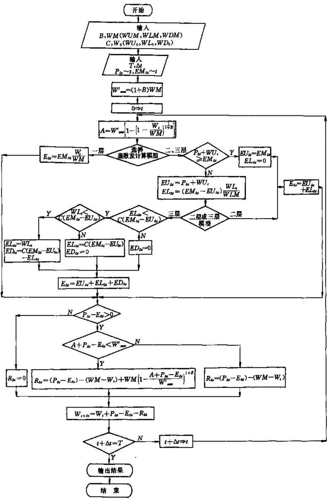  
图 4-15 蓄满产流计算框图

## 4. 地面地下径流（净雨）的划分

上述求得的径流量是时段总径流量，由式（4-17）可知，总径流量包括地面径流和地下径流，即：

$$
R = R S + R G\tag{4-32}
$$

由于地面径流和地下径流的汇流特性不同，因此需要将总径流量R划分为地面径流RS和地下径流RG，以便分别进行汇流计算。 $\pmb { R G }$

按蓄满产流模型，只有当包气带达到田间持水量，即包气带蓄满后才产流，此时的下渗率为稳定下渗率 $f _ { c }$ 。当雨强 $i > f _ { \epsilon }$ 时， $( i - f _ { c } )$ 形成地面径流， $f _ { c }$ 形成地下径流。设 $\pmb { \Delta } \pmb { t }$ 时段内降雨量为P&，蒸散发量为E，产流面积为Fr。由于只有在产流面积上才发生稳定下 $\pmb { P } _ { \pmb { \alpha } }$ $\pmb { { \cal E } } _ { \pmb { \Delta } \pmb { \ell } }$ $\pmb { F _ { R } }$ 渗，所以时段内所产生的地下径流量 $R G _ { \alpha } = \frac { F _ { \mathrm { } \mathrm { } } } { F } f _ { r } \Delta t$ ，而时段的总产流量 ${ \cal R } _ { \Delta t } = \frac { F _ { R } } { F } ( P _ { \Delta t } -$ $\pmb { { \cal E } } _ { \pmb { \Delta } } )$ ，由此可得 $\frac { F _ { R } } { F } = \frac { R _ { \Delta t } } { P _ { \Delta t } - E _ { \Delta t } }$ ，即产流面积等于径流系数，所以：

当 $P _ { \alpha } - E _ { \alpha } \geqslant f _ { c } \Delta t$ 时， $\nvDash$ 生地面径流，下渗的水量 $f _ { \varepsilon } \Delta t$ 在产流面积上形成的地下径流 $R G _ { \simeq }$ 为：

$$
R G _ { \alpha } = \frac { R _ { \alpha } } { P _ { \alpha } - E _ { \alpha } } f _ { \epsilon } \Delta t\tag{4-33}
$$

当 $P _ { \alpha } - E _ { \alpha } < f _ { c }$ △时，不产生地面径流， $( \mathcal { P } _ { \omega } - \mathcal { E } _ { \omega } )$ 全部下渗，在产流面积上形成的地下径流 $R G _ { \simeq }$ 为：

$$
R G _ { \simeq } = \frac { F _ { R } } { F } ( P _ { \simeq } - E _ { \simeq } ) = R _ { \simeq }\tag{4-34}
$$

对一场降雨过程，产生的地下径流总量为：

$$
\sum R G _ { \Delta t } = \sum _ { P _ { \Delta t } = E _ { \Delta t } \geqslant f _ { c } \Delta t } \frac { R _ { \Delta t } } { P _ { \Delta t } - E _ { \Delta t } } f _ { c } \Delta t + \sum _ { P _ { \Delta t } = E _ { \Delta t } < f _ { c } \Delta t }\tag{4-35}
$$

因此，只要知道流域的f，就可以利用式（4-33）和式（4-34）把时段产流量划分为地 $⨏ _ { \zeta }$ 面、地下径流两部分。

$f _ { \varepsilon }$ 可以利用实测的降雨径流资料，按本章第一节介绍的方法求出地下径流总量 $\Sigma R G _ { \simeq }$ 及相应的降雨过程 $\pmb { P } _ { \pmb { \Delta } } \sim \pmb { t }$ ，蒸散发过程 $\pmb { \mathcal { E } } _ { \pmb { \Delta } \pmb { t } } \sim \pmb { \mathcal { t } }$ ，并计算相应的产流量过程 $R _ { \Delta t } { \sim } t$ ，再利用式(4-35）反推。需要指出的是，只有当整个计算时段△t内雨强都超过f时，式（4-33)和 $\Delta t$ $f _ { \epsilon }$ 式（4-34）才是正确的，如果时段内实际降雨历时不足△t，则应按实际降雨历时计算。 $\pmb { \Delta } \pmb { t }$

【例4-3】 某流域一次降雨过程，已求得各时段产流量如表4-3，并按第一节的方法求得地下径流量38.1mm，试推求稳定下渗率 $f _ { \epsilon }$

表 4-3  
穗定下渗率∫计算表
<table><tr><td rowspan="2">时段 序号</td><td rowspan="2">降爾 历时 (h)</td><td rowspan="2"> $P _ { \Delta t } - E _ { \Delta t }$   $\left. \mathtt { m m } \right.$ </td><td rowspan="2"> $\pmb { R } _ { \pmb { \Delta \mu } }$   $\bf ( m m )$ </td><td rowspan="2"> $\alpha = \frac { R _ { \Delta i } } { P _ { \Delta i } - E _ { \Delta i } }$ </td><td colspan="2"> $f _ { c } \Delta t \ \left( \mathrm { m m } \right)$ </td><td colspan="2"> $R G _ { \Delta t } ( \mathrm { r m m } )$ </td></tr><tr><td> $\pmb { f _ { c } } = \pmb { 2 _ { \nu } } 0$ </td><td> $f _ { \epsilon } { = } 1 , 6$ </td><td> $f _ { c } { = } 2 . 0$ </td><td> $f _ { \ell } = 1 , \ell$ </td></tr><tr><td>12</td><td>6</td><td>14.5</td><td>7.6</td><td>0.524</td><td>12.0</td><td>9.6</td><td>6.3</td><td>5.0</td></tr><tr><td></td><td>4</td><td>4.6</td><td>3.7</td><td>0.804</td><td>8.0</td><td>6.4</td><td>3.7</td><td>3.7</td></tr><tr><td>3</td><td>6</td><td>44.4 46.5</td><td>44.4 46.5</td><td>1.000 1.000</td><td>12.0</td><td>9.6</td><td>12.0</td><td>9.6</td></tr><tr><td>4 </td><td>6 6</td><td>14.8</td><td>14.8</td><td>1.000</td><td>12.0</td><td>9.6</td><td>12.0</td><td>9.6</td></tr><tr><td>6</td><td>1</td><td>1.1</td><td>1.1</td><td>1.000</td><td>12.0 2.0</td><td>9.6 1.6</td><td>12.0 1.1</td><td>9.6 1.1</td></tr><tr><td>∑</td><td></td><td></td><td></td><td></td><td></td><td></td><td></td><td></td></tr><tr><td></td><td></td><td></td><td>118.1</td><td></td><td></td><td></td><td>47.1</td><td>38.6</td></tr></table>

设 $f _ { \varepsilon } { = } 2 . 0 \mathrm { m m / h }$ ，根据表4-3所列数据，按式（4-35），有：

$$
\begin{array} { r l r } {  { \sum R G _ { \Delta t } = \sum _ { \substack { P _ { \Delta t } - E _ { \Delta } \gg f _ { \mathrm { c a } } } } \frac { R _ { \Delta t } } { P _ { \Delta } - E _ { \Delta } } f _ { \mathrm { c } } \Delta t + \sum _ { \substack { P _ { \Delta t } - E _ { \Delta } < f _ { \mathrm { c } } \omega } } } } \\ & { = ( 0 . 5 2 4 + 1 . 0 0 0 + 1 . 0 0 0 + 1 . 0 0 0 ) \times 2 . 0 \times 6 + ( 3 . 7 + 1 . 1 ) } \\ & { = 4 7 . 1 \ \mathrm { m m } } \end{array}
$$

不等于已知的38.1mm，故所设 $f _ { c } { = } 2 . 0 { \bf { m m } } / \mathrm { { h \Omega } }$ 非所求。再设 $f _ { \epsilon } { = } 1 . 6 \mathrm { { m m } / \mathrm { { h } } }$ ，由式（4-35）：

$$
\Sigma R G _ { u } = ( 0 . 5 2 4 + 1 . 0 0 0 + 1 . 0 0 0 + 1 . 0 0 0 ) \times 1 . 6 \times 6 + ( 3 . 7 + 1 . 1 ) = 3 8 . 6 \ \mathrm { m m } .
$$

与38.1mm相差很小，因此，该次洪水的 $f _ { c } { = } 1 . 6 \mathbf { m m } / \mathrm { h }$ a

## 三、超渗产流的产流量计算

## （一）概述

在干旱和半干旱地区，地下水埋藏很深，流域的包气带很厚，缺水量大，降雨过程中下渗的水量不易使整个包气带达到田间持水量，所以不产生地下径流，并且只有当降雨强度大于下渗强度时才产生地面径流，这种产流方式称为超渗产流。显然，这种产流方式的关键是确定流域下渗的变化规律。

流域的下渗规律用下渗曲线来表示。流域的下渗曲线是从土壤完全干燥开始，在充分供水条件下的流域下渗能力过程，即下渗强度与下渗历时之间的关系曲线，如图4-16中的$f _ { p } \ ( t ) \sim t$ 曲线。从流域起始蓄水量 $\smash { \mathbf { W } _ { 0 } }$ 对应处开始，一次降雨的下渗过程可分为初渗、不稳定下渗和稳定下渗三个阶段。在初渗阶段，下渗水分主要在土壤分子力的作用下被土壤吸收，下渗率很大。如果雨强i小于下渗率，则降雨量满足初损量 ${ \pmb I } _ { 0 }$ 以前不产流，相应历时记为 $\pmb { t _ { 0 } } ,$ 然后进入不稳定下渗阶段。这一阶段下渗主要受毛管力和重力的作用。随下渗水量的增加，土壤含水量逐渐增大并趋近于田间持水量，下渗率也随之递减趋于稳定。这一阶段的下渗量 $\pmb { I _ { d } }$ 称为不稳定下渗量，相应的历时为 $\pmb { \hat { \tau } } _ { d } .$ 。此后，进入第三阶段，下渗受重力作用支配，逐渐稳定，下渗率为 ${ f _ { c } }$ ，相应历时为 $\pmb { t _ { c } }$ ，下渗水量 $f _ { c } \bullet _ { t _ { c } }$ 称为稳定下渗量。由此可见，初损量 $\scriptstyle { I _ { 0 } }$ 的大小，完全由降雨强度所决定，不同的雨强过程有不同的初损量。

综上所述，判别降雨是否产流的标准是雨强i是否超过下渗能力 $f _ { \pmb { \mathscr { p } } }$ 。因此，用实测的雨强过程i(t) \~t 扣除下渗过程 $f _ { p } \ ( t ) \sim t$ ，就可得净雨过程，即产流量过程 $R \ ( t ) \sim t$

如图4-16中阴影部分。这种计算产流量的方法称为下渗曲线法。

## (二)由损失累积曲线推求下渗曲线

下渗曲线 $f _ { p } ( t ) \sim _ { t }$ 用霍顿下渗公式（2-18)表示，从0\~t积分有：

$$
F _ { \rho } ( t ) = f _ { c } t + \frac { 1 } { \beta } ( f _ { 0 } - f _ { c } ) - \frac { 1 } { \beta } ( f _ { 0 } - f _ { c } ) \mathrm { e } ^ { - \beta }
$$

式中， $F _ { \pmb { \mathscr { P } } } \left( \pmb { \mathscr { t } } \right)$ 为t时刻累积下渗水量，即累积损失量。这部分水量完全被包气带土壤吸收，所以${ \vec { F } } _ { \pmb { \mathscr { P } } } \left( t \right)$ 也就是该时刻流域的土壤含水量 $\smash { \mathbb { W } _ { \ell } }$ 0

当 $\smash { \mathbb { W } _ { \ell } }$ 不变，令 $\frac { 1 } { \beta } ~ ( f _ { 0 } \sim f _ { e } ) = a , ~ f _ { e } = b$ ，则：

$$
F _ { \rho } ( t ) = a + b t - a \ e ^ { - \mu }\tag{4-36}
$$

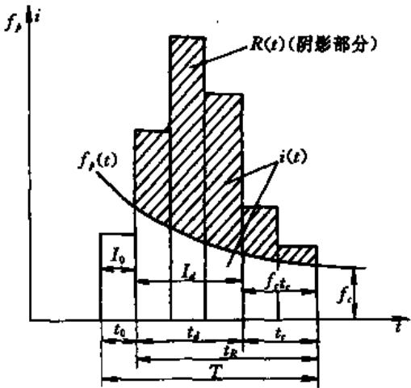  
图 4-16 下渗曲线示意图

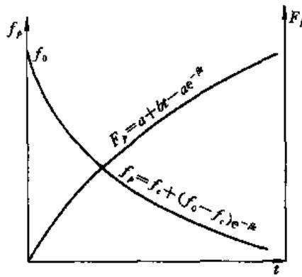  
图 4-17 下渗曲线及下渗累积曲线示意图

每次实际雨洪后的流域土壤含水量 $\pmb { F } _ { \pmb { \phi } } \left( t \right) = \pmb { W } _ { 0 } + \pmb { P }$ 一R（超渗产流降雨历时一般不长，雨期蒸散发可忽略）及相应的下渗历时t必是式（4-36）上的一点，如图4-17所示。因此，根据历年降雨径流资料可以得出 ${ \cal F } _ { \mathrm { \mathrm { { } ^ { * } } } } \left( t \right) \sim$ t的经验关系曲线，并可拟合成如式（4-36）型式的经验公式，经验公式的微分曲线即为下渗曲线。

【例4-4】试利用表4-4大凌河上窝堡水文站降雨径流资料推求下渗曲线。

用表中 $F _ { p } \left( t \right)$ 和t点绘出 $F _ { \phi } \ ( t ) \sim t$ 关系曲线，拟合曲线方程为 $\begin{array} { r } { F _ { \rho } \ ( t ) = 5 2 . 4 \sl + 2 t - 5 2 . 4 \mathrm { e } ^ { - 0 . 2 5 t } } \end{array}$ ，对t求导数，得流域平均下渗曲线方程 $f _ { p } ( t ) \ = 2 \substack { + 1 3 \mathrm { e } ^ { - 0 . 2 5 t } }$

## 上窝堡水文站降雨径流资料表

表4-4
<table><tr><td>时间 (年，月.日)</td><td>P (mm)</td><td>R (mm)</td><td> $\mathbf { { W _ { 0 } } }$  (mm)</td><td>1 (h)</td><td> $\pmb { F } _ { \pmb { \rho } } ( \pmb { \imath } ) = \pmb { W } _ { 0 }$   $+ \mathcal { P } - \mathcal { R }$  (mm)</td><td>时间 (年.月.日)</td><td>P (mm)</td><td>R (mm)</td><td> $\mathfrak { W } _ { \mathfrak { d } }$  (mm)</td><td>t (h)</td><td> $\pmb { F } _ { p } ( t ) = \pmb { W } _ { 0 }$   $+ \beta - R$  (mm)</td></tr><tr><td>1956.7.25</td><td>27.8</td><td>10.0</td><td>19.7</td><td>5</td><td>37.5</td><td>1959.8.7</td><td>45.4</td><td>5.8</td><td>9.2</td><td>12</td><td>48.8</td></tr><tr><td>1956.8.4</td><td>111.0</td><td>40.0</td><td>5.0</td><td>15</td><td>76.0</td><td>1959.8.8</td><td>48.8</td><td>11.5</td><td>24.2</td><td>12</td><td>61.5</td></tr><tr><td>1957.×.×</td><td>23.4</td><td>2.7</td><td>10.0</td><td>3</td><td>30.7</td><td>1960.9.3</td><td>23.6</td><td>1.2</td><td>11.0</td><td>4</td><td>33.4</td></tr><tr><td>1959.6.1</td><td>23.4</td><td>2.5</td><td>9.5</td><td>3</td><td>30.4</td><td>1961.7.1</td><td>41.6</td><td>3.3</td><td>16.0</td><td>8</td><td>54.3</td></tr><tr><td>1959.6.4</td><td>86.6</td><td>17.8</td><td>10.9</td><td>21</td><td>79.7</td><td>1961.7.2</td><td>35.0</td><td>0.5</td><td>19.0</td><td>9</td><td>53.5</td></tr><tr><td>1959.7.3</td><td>11.8</td><td>1.4</td><td>14.6</td><td>3</td><td>25.0</td><td>1962.7.2</td><td>68.5</td><td>2.6</td><td>8.1</td><td>15</td><td>74.0</td></tr><tr><td>1959.8.5</td><td>14.4</td><td>1.4</td><td>12.9</td><td>3</td><td>25.9</td><td>1962.7.25</td><td>184.0</td><td>68.2</td><td>26.9</td><td>45</td><td>142.7</td></tr></table>

图 4-17 中的 $f _ { p } \ ( t ) \sim _ { t }$ 与 $\pmb { F } _ { \pmb { \phi } } \left( t \right) \sim _ { t }$ 曲线可以转换为 $f _ { \phi } { \sim } F _ { \ P }$ 的形式，如图4-18所示。由于累积下渗量 ${ \pmb F } _ { p }$ 就是该时刻的土壤含水量 $\pmb { W }$ ，所以 $f _ { p } \sim F _ { p }$ 曲线实际上就是 $f _ { \bullet } \sim \pmb { W }$ 曲线，该曲线反映了流域土壤含水量对下渗容量的影响，其作用与以W为参数的一组 $f _ { \rho } \sim t$ 曲线相同。

## (三)超渗产流的产流量计算

1. 应用 $f _ { \mathrm { p } } \sim \smash { t }$ 和 $f _ { p } \sim W$ 关系推求产流量

将降雨过程划分为不同的计算时段，时段长可以不等，根据雨强变化情况而定。然后

(1) 以降雨开始时流域的土壤含水量 $\bar { W } _ { \circ } \ : ( = \dot { P } _ { a , 0 } )$ ，查图$4 { - } 1 8 f _ { p } { \sim } W$ 曲线，得本次降雨的起始下渗率 $f _ { 0 } , W _ { 0 } , f _ { 0 }$ 即为第一时段初流域的土壤含水量和下渗率。

(2) 求第一时段产流量 $\pmb { R _ { \lambda } }$ 、下渗水量 ${ { I } _ { 1 } }$ 及时段末流域土壤含水量 $W _ { 1 }$ 。将第一时段平均雨强 $\overline { { \dot { \iota } } } _ { 1 }$ 与 $\pmb { f _ { 0 } }$ 比较：

1) 当 $\bar { \bf i } _ { 1 } \leqslant f _ { 0 }$ ，本时段不产流。时段内的降雨全部下渗，下渗水量 $I _ { 1 } = \vec { \pm } _ { 1 } \Delta t _ { 1 }$ ，时段末流域土壤含水量 $\mathbb { W } _ { 1 } = \mathbb { W } _ { \mathfrak { d } }$ $+ I _ { 1 }$

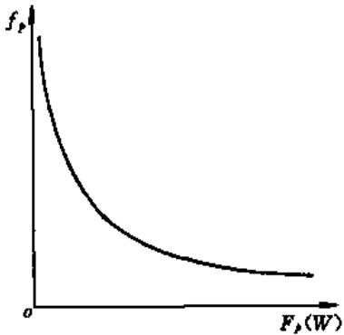  
图4-18 $f _ { \ P } \sim F _ { \ P }$ 关系曲线

2) 当 $\bar { i } _ { 1 } > f _ { 0 } ,$ 本时段产流。以时段初下渗率 $\scriptstyle f _ { 0 }$ 在图 $4 { \cdot } 1 7 f _ { \cdot } { \sim } t$ 曲线上找出对应历时 $\pmb { t _ { 0 } }$ 4再以 $\pmb { t } _ { 0 } + \Delta t _ { 1 } = \pmb { t } _ { 1 }$ 在 $f _ { \hat { P } } \sim \varepsilon$ 曲线上查出时段末的下渗率 $f _ { 1 }$ 。又以 $f _ { 1 }$ 在 $f _ { p } \sim W$ 上查得时段末土壤含水量 ${ \bf W } _ { 1 }$ 。本时段下渗水量 $\bar { I } _ { 1 } { = } \bar { W } _ { 1 } { - } \bar { W } _ { \ell }$ ，则第一时段的产流量 $\pmb { R } _ { 1 } = \mp _ { 1 } \pmb { \Delta } t _ { 1 } - \pmb { I } _ { 1 }$ a

(3)进行第二时段计算。第一时段末的下渗率和土壤含水量即为第二时段初的数值。其余步骤同（2）。

计算中，如遇时段平均雨强小于时段初下渗率，但两者数值相近，时段平均雨强可能会大于时段末的下渗率，不能肯定该时段是否不产流。此时可按步骤（2）先求得时段下渗量I，若 $\pmb { I } { < } \bar { \pmb { i } } \Delta \pmb { t }$ 产流； $\pmb { I } \geqslant \bar { \pmb { i } } \Delta \pmb { t }$ 不产流。

【例4-5】 某流域一场降雨过程总降雨量81.0mm，各时段降雨量见表4-5。降雨开始时前期影响雨量 $P _ { a , 0 } { = } 5 1$ .4mm，并已知流域的 $f _ { p } \sim _ { t } , \ f _ { p } \sim _ { \mathcal { W } }$ 关系曲线，试推求产流量。计算结果见表4-5。

表4-5  
应用 ${ f _ { \mathrm { p } } } \sim \pmb { \mathrm { \ell } }$ 和 ${ f _ { \mathrm { * } } } \mathord { \sim } \pmb { W }$ 关系推求产流量计算表
<table><tr><td rowspan=1 colspan=1>时间 $( \mathbf { \dot { b } } \cdot \mathbf { m i n } )$ </td><td rowspan=1 colspan=1> $\pmb { \Delta } \pmb { t }$  $\bf ( m i n )$ </td><td rowspan=1 colspan=1> $\pmb { P }$  $\bf ( m m )$ </td><td rowspan=1 colspan=1>i $( \mathbf { m m } / \mathbf { m i n } )$ </td><td rowspan=1 colspan=1> $\pmb { w }$  $\tan \ b = \ b \mathrm { ) }$ </td><td rowspan=1 colspan=1>1 $\mathrm { { ( m m ) } }$ </td><td rowspan=1 colspan=1>f $( \mathbf { m } \mathbf { m } / \mathbf { m } \mathbf { i } \mathbf { n } )$ </td><td rowspan=1 colspan=1>R $\left( \mathfrak { m m } \right)$ </td></tr><tr><td rowspan=1 colspan=1> $1 0 : 2 3$ </td><td rowspan=1 colspan=1></td><td rowspan=1 colspan=1></td><td rowspan=1 colspan=1></td><td rowspan=1 colspan=1>51.4</td><td rowspan=1 colspan=1></td><td rowspan=1 colspan=1>0.190</td><td rowspan=4 colspan=1>4.000</td></tr><tr><td rowspan=1 colspan=1> $1 0 : 5 0$ </td><td rowspan=1 colspan=1>27</td><td rowspan=1 colspan=1>8.8</td><td rowspan=1 colspan=1>0.326</td><td rowspan=1 colspan=1>56.2</td><td rowspan=1 colspan=1>4.8</td><td rowspan=3 colspan=1>0.1680.1540.144</td></tr><tr><td rowspan=1 colspan=1> $1 2 : 0 0$ </td><td rowspan=1 colspan=1>70</td><td rowspan=1 colspan=1>4.6</td><td rowspan=1 colspan=1>0.066</td><td rowspan=1 colspan=1>60.8</td><td rowspan=1 colspan=1>4.6</td></tr><tr><td rowspan=1 colspan=1> $1 3 : 0 0$ </td><td rowspan=1 colspan=1>60</td><td rowspan=1 colspan=1>4.8</td><td rowspan=1 colspan=1>0.080</td><td rowspan=1 colspan=1>65.6</td><td rowspan=1 colspan=1>4.8</td></tr><tr><td rowspan=1 colspan=1> $1 4 : 0 0$ </td><td rowspan=1 colspan=1>60</td><td rowspan=1 colspan=1>10.5</td><td rowspan=1 colspan=1>0.175</td><td rowspan=1 colspan=1>73.9</td><td rowspan=1 colspan=1>8.3</td><td rowspan=1 colspan=1>0.132</td><td rowspan=1 colspan=1>2.2</td></tr><tr><td rowspan=1 colspan=1> $1 5 : 0 0$ </td><td rowspan=1 colspan=1>60</td><td rowspan=1 colspan=1>17.1</td><td rowspan=1 colspan=1>0.285</td><td rowspan=1 colspan=1>81.8</td><td rowspan=1 colspan=1>7.9</td><td rowspan=1 colspan=1>0.130</td><td rowspan=1 colspan=1>9.2</td></tr><tr><td rowspan=1 colspan=1> $1 6 : 0 0$ </td><td rowspan=1 colspan=1>60</td><td rowspan=1 colspan=1>19.6</td><td rowspan=1 colspan=1>0.327</td><td rowspan=1 colspan=1>89.6</td><td rowspan=1 colspan=1>7.8</td><td rowspan=1 colspan=1>0.130</td><td rowspan=1 colspan=1>11.8</td></tr><tr><td rowspan=1 colspan=1> $1 7 : 0 0$ </td><td rowspan=1 colspan=1>60</td><td rowspan=1 colspan=1>11.2</td><td rowspan=1 colspan=1>0.187</td><td rowspan=1 colspan=1>97.4</td><td rowspan=1 colspan=1>7.8</td><td rowspan=1 colspan=1>0.130</td><td rowspan=1 colspan=1>3.4</td></tr><tr><td rowspan=1 colspan=1> $2 0 : 0 0$ </td><td rowspan=1 colspan=1>180</td><td rowspan=1 colspan=1>4.4</td><td rowspan=1 colspan=1>0.024</td><td rowspan=1 colspan=1>101.8</td><td rowspan=1 colspan=1>4.1</td><td rowspan=1 colspan=1>0.130</td><td rowspan=1 colspan=1>0</td></tr></table>

## 2. 图解法

将流域下渗累积曲线 $F _ { \mathrm { { \diamond } } } { \sim } t$ 和雨量累积曲线∑ $\scriptstyle { \mathcal { P } } \sim t$ 绘在同一张图上，如图4-19所示，然后用图解法推求产流量。根据降雨开始时的流域土壤含水量W。，在F，\~t曲线上找出对 $\smash { W _ { \vartheta } }$ $\widetilde { F } _ { \mathrm { } } \widetilde { \sim } t$ 应的A点，自A点绘降雨量累积曲线 $\scriptstyle \sum P \sim t _ { \circ } \ F _ { \beta } \sim t$ 和∑ $P { \sim } t$ 曲线的斜率分别表示下渗强度和雨强，比较两曲线斜率即可判断出是否产流。例如，在图4-19中，AB段 $i { < } f _ { \ P }$ ，不产

流，i全部补充土壤含水量。将BC段平移至 $B ^ { \prime } C ^ { \prime }$ ,该段$i > f _ { p }$ ，故该时段产流，从 $C ^ { \prime }$ 点到 $\mathbf { } \mathbf { } \mathbf { } \mathbf { } \mathbf { } \pmb { \mathcal { F } } _ { \pmb { \mathcal { P } } } { \sim } \mathbf { \Delta } \mathbf { \varepsilon }$ 曲线的垂直距离 $C ^ { \prime } C ^ { \prime }$ 即为产流量。再将CD段平移至 $C ^ { \prime \prime } D ^ { \prime }$ ，该时段$i < f _ { \ P }$ ，不产流。如此逐时段比较下去，就能求得一场降雨的产流过程。

## 3. 初损后损法

这是下渗曲线法的一种简化方法。它把实际的下渗过程简化为初损和后损两个阶段，如图4-20所示。 $\mathcal { F }$ 流以前的总损失水量称为初损，记为I。，包括植物截 ${ \pmb I } _ { 0 }$ 留、填洼及产流前下渗的水量，后损是流域产流以后下渗的水量，以平均下渗率了表示。

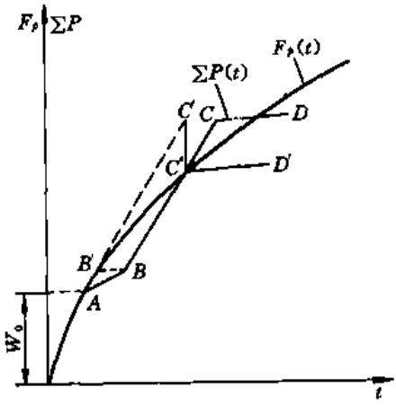  
图 4-19 图解法推求产流量示意图

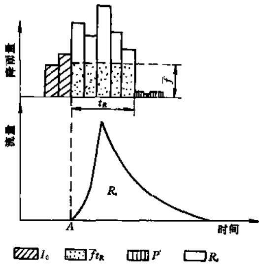  
图 4-20 初损后损法

4-22所示的以月份为参数的初损相关图。

(2) 平均后损率 $\bar { \pmb f }$ 的确定：一次降雨形成的径流深R（即R）为：

$$
R = P - I _ { 0 } - \bar { f } t _ { R } - P ^ { \prime }\tag{4-37}
$$

因此：

$$
{ \begin{array} { r } { { \bar { f } } = { \frac { P - R - I _ { 0 } - P ^ { t } } { t _ { k } } } } \\ { = { \frac { P - R - I _ { 0 } - P ^ { t } } { t - t _ { 0 } - t ^ { t } } } } \end{array} }\tag{4-38}
$$

式中 $\bar { f }$ ——平均后损率， $\mathrm { { \ m m / h } }$

$P$ —次降雨量，mm；

$P ^ { \prime }$ ——后期不产流的雨量，mm；

$\pmb { t _ { R } }$ 超渗历时，即 $\nVDash$ 流历时，h；

t、 $\pmb { t _ { 0 } }$ $\pmb { t } ^ { \prime }$ —分别为降雨总历时、初损历时和后期不产流降雨的降雨历时， $\mathbf { h } .$ e

(1)初损量 ${ { I } _ { 0 } }$ 的确定：对于小流域，由于汇流时间短，出口断面的起涨点大体可以作为产流开始时刻，因而，起涨点以前雨量的累积值可作为初损的近似值，如图4-20。对较大的流域，需考虑流域内各雨量站至流域出口断面汇流时间不同的问题。此时可分雨量站按各自的汇流时间定出各自的产流开始时刻，并取该时刻以前各站累积雨量的平均值或其中最大值作为流域的初损量 $\pmb { I _ { 0 } }$ 。利用实测雨洪资料，分析各场洪水的 ${ { \cal I } _ { 0 } }$ 及相应的流域起始蓄水量 $W _ { \circ } ( P _ { \bullet , \bullet } )$ ，初损期的平均雨强 $\tilde { i } _ { \tilde { 0 } } ,$ ，并建立相关图备用，如图4-21。此外，由于植被和土地利用具有季节性变化特点，初损量 ${ { I } _ { \circ } }$ 还受到季节的影响。因此，也可以建立如图

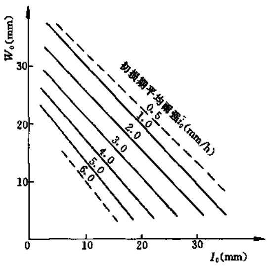

一次降雨过程中，由于后损是初损的延续，初损量越大，土壤含水量越大，则后损能

图4-21 湟水西宁\~民和区间初损关系曲线  
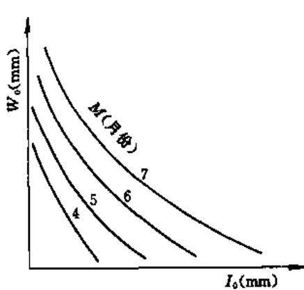  
图4-22为水宁乡以上流域初损曲线.

力越低， $\bar { \pmb f }$ 就越小。所以后损下渗率 $\bar { \pmb f }$ 不仅与流域起始土壤含水量 $\mathbf { \delta W _ { \circ } }$ 有关，而且与初期降雨特性有关，初期降雨特性用初损期平均雨强 $\bar { i _ { 0 } }$ 表示。因此，可以根据实测雨洪资料，分析建立 $\bar { \pmb f }$ 与 ${ \pmb t } _ { R }$ 及 $\bar { i } _ { \emptyset }$ 的关系备用，如图4-23所示。

(3)产流量计算：有了初损 $\mathbb { W } _ { 0 } \sim \bar { i } _ { 0 } \sim I _ { 0 }$ 和后损 $\bar { \boldsymbol { f } } \sim$ $\vec { i } _ { 0 } \sim t _ { R }$ 关系图后，根据已知的降雨过程就可推求产流量(净雨)过程。具体步骤见例4-6。

【例4-6】 已知湟水西宁～民和区间初损和后损关系曲线如图4-21和图4-23。实测降雨过程见表4-6。降雨开始时 $\ P _ { \mathrm {  a , 0 } } { = } 1 8 . 1 \mathrm { m m }$ ，计算时段 $\Delta t { = } 1 \mathrm { h }$ 。试推求产流量过程。

从降雨起始时刻开始，先设 $\pmb { t _ { 0 } = 2 \mathrm { h } }$ ,则$I _ { 0 } { = } 2 . 5 + 3 . 8 { = } 6 . 3 \mathrm { m m } , \bar { i } _ { 0 } { = } I _ { 0 } / t _ { 0 } { = } 6 . 3 / 2$ $= 3 . 1 5 \mathrm { m m / h }$ 。由 $W _ { \circ } { = } P _ { a , 0 } { = } 1 8 . 1 { \mathrm { m m } } , i$ $\mathbf { = 3 . \ i 5 m m / h }$ 查图4-21，得 $\pmb { I } ^ { \prime } \circ = 1 3 . 5 \mathbf { m m }$ 显然 $\bar { I ^ { \prime } } _ { 0 } \neq \bar { I } _ { 0 } ,$ 再设 $\iota _ { 0 } { = } 3 \mathrm { h } , I _ { 0 } { = } 2 . 5 { + } 3 . 8 +$ $4 . 6 = 1 0 . \ 9 \mathrm { { m m } , \ \bar { \ i } _ { 0 } = 1 0 . \ 9 / 3 = 3 . \ 6 3 \mathrm { { m m / h } } }$ 由 $W _ { 0 } { = } 1 8 . \ \mathrm { { l m m } , \ \ \bar { \ell } _ { 0 } { = } 3 . \ 6 3 { m m / h } }$ 查图4-21，得 $I ^ { \prime } { } _ { \circ } { = } 1 0 . 9 \mathrm { m m } _ { \circ } I ^ { \prime } { } _ { \circ } { = } I _ { \circ }$ ，所以初损量$\pmb { I _ { 0 } } \mathrm { = } 1 0 , 9 \mathrm { m m }$ ，从第4个时段开始产流。设产流历时 $t _ { R } = 4 h$ 。由 $\bar { i } _ { 0 } = 3 . \ 6 3 \mathrm { m m / h } , \ t _ { R } =$ 4h 查图 4-23，得 $\overline { { f } } = 1 . 7 5 \mathbf { m m } / \mathbf { h }$ 。查表4-6中降雨过程，第8时段 $i = 3 , \uparrow \mathrm { m m / h } , i >$

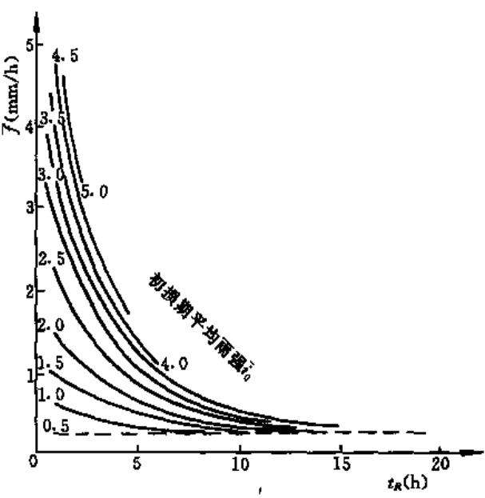  
图 4-23 湟水西宁\~民和区间后损关系曲线

$\bar { \boldsymbol { f } } .$ 该时段可以产流，故重新设 $t _ { R } = 5 h$ ，重复上述步骤最后得 $\bar { \boldsymbol { f } } { = } 1 { \cdot } 3 \mathbf { m m } / \mathrm { h }$ 。各时段产流量$\scriptstyle R = P - { \bar { f } } \Delta t$ 。产流过程见表4-6中最后一栏，该过程为地面径流（净雨）过程。

初损后损法产流量计算表
<table><tr><td>时段</td><td> $\pmb { P }$   $\mathrm { ( m m ) }$ </td><td> ${ \pmb I _ { 0 } }$   $\tan \ b { \mathbf { n } } )$ </td><td> $\bar { f } \Delta t$  (mm)</td><td> $\pmb { R }$   $\left\{ \pmb { \operatorname { m m } } \right\}$ </td><td>时段</td><td> $\pmb { P }$   $\left( \mathtt { m m } \right)$ </td><td> ${ \pmb I } _ { \pmb { 0 } }$   $\left( \mathfrak { m m } \right)$ </td><td> $\bar { \ b { f } } \Delta \ b { t }$  (mm)</td><td>R (mm)</td></tr><tr><td>1</td><td>2.5</td><td>2.5</td><td></td><td></td><td>6</td><td>4.6</td><td></td><td>1.3</td><td>3.3</td></tr><tr><td>2</td><td>3.8</td><td>3.8 4.6</td><td></td><td></td><td>7</td><td>4.0 3.1</td><td></td><td>1.3 1.3</td><td>2.7</td></tr><tr><td>3</td><td>4.6</td><td></td><td>1.3</td><td>9.9</td><td>8 9</td><td>0</td><td></td><td>0</td><td>1.8 0</td></tr><tr><td>4</td><td>11.2</td><td></td><td>1.3</td><td>6.5</td><td>∑</td><td>41.6</td><td>10.9</td><td>6.5</td><td>24.2</td></tr><tr><td>5</td><td>7.8</td><td></td><td></td><td></td><td></td><td></td><td></td><td></td><td></td></tr></table>

## 第四节流域汇流计算

降落在流域上的雨水，从流域各处向流域出口断面汇集的过程称为流域汇流，包括坡地汇流和河网汇流两个阶段。

在坡地汇流阶段，雨水经过产流阶段扣除损失后形成净雨，净雨在坡地汇流过程中，有的沿着坡面注人河网成为地面径流；有的下渗形成表层流（壤中流）和地下径流后再流入河网。地面径流流速较大且流程短，因而汇流时间较短；地下径流要通过土层中各种孔隙再汇人河网，流速小，汇流时间较长；表层流则介于二者之间。值得一提的是，地面径流在坡面流动过程中，有一部分会渗人土层中成为表层流；而表层流在流动过程中，部分水流又会回归地面成为地面径流。各种水源的径流进人河网后，即开始河网汇流阶段。在这一阶段，各种水源的径流汇集在一起，从低一级河流汇人高一级河流，从上游到下游，最后汇集到流域出口断面。因此，这一阶段不同水源的径流在汇流时间上就不再存在差异。河网中水流的汇流速度比坡地大得多，但因汇流路径长，所以，汇流时间也较长。上述两个汇流阶段，在实际降雨过程中并无截然的分界，而是交错进行的。

在水文学中，并不强求掌握水流在流域空间上和时程上变化的全部发展过程，实际所需要的是由降雨所形成的流域出口断面的流量过程。因此，流域汇流是研究流域上的地面净雨、表层流净雨和地下净雨如何转化为流域出口断面的流量过程。由于地面径流和表层流具有一些共同的特性，且不易划分，实际工作中常把二者合并为直接径流，一般仍称为地面径流。所以，流域汇流过程分为地面径流汇流过程和地下径流汇流过程，计算时由地面净雨和地下净雨分别进行汇流计算，求得流域出口断面各自的流量过程，二者叠加，即为流域出口断面的流量过程。

## 一、流域出口断面流量的组成

同一时刻在流域各处形成的净雨距流域出口断面有远有近，流速也不一定相同，所以不可能全部在同一时刻到达流域出口断面，距离流域出口断面较远和流速较慢的雨水必然暂时滞留在流域内，引起流域蓄水量的变化。但是，不同时刻在流域内不同地点产生的净雨，却可以在同一时刻流达流域的出口断面。如图4-24，设图中黑点表示在这些点上同一时刻产生的净雨能够在同一时刻流达流域出口断面，流达时间称为汇流时间，记为τ。所有黑点面积的总和称为等流时面积，记为 $\mathrm { ~ \bf ~ d } \pmb { F } \left( \tau \right)$ 。等流时面积上t—τ时刻形成的净雨i(t一τ)正好在t时刻到达流域出口断面，所形成的出口断面的流量为：

$$
\mathrm { d } Q ( t ) = i ( t - \tau ) \mathrm { d } F ( \tau )
$$

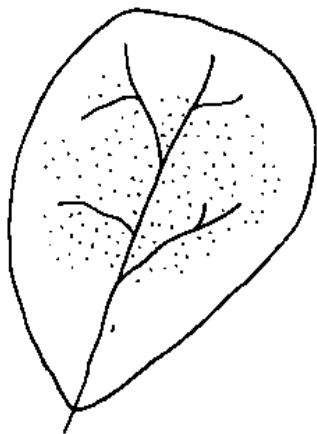  
图 4-24 等流时面积分布示意图

而流域出口断面t时刻的流量 $\textbf { \em Q } ( t )$ ，是各种不同的等流时面积上在t时刻到达出口断面的流量之和，即：

$$
Q ( t ) = \int _ { 0 } ^ { t } \mathrm { d } Q ( t ) = \int _ { 0 } ^ { t } i ( t - \tau ) \mathrm { d } F ( \tau )\tag{4-39}
$$

又因为等流时面积是汇流时间τ的函数，因此有 $\mathrm { d } \boldsymbol { F } \ \left( \tau \right) \ =$ $\frac { \partial \mathbf { F } \left( \tau \right) } { \partial \tau } \mathrm { d } \tau$ ，代人上式得：

$$
Q ( t ) = \int _ { 0 } ^ { t } i ( t - \tau ) \ \frac { \partial F ( \tau ) } { \partial \tau } \mathrm { d } \tau\tag{4-40}
$$

上式即为流量成因公式。式中， $\frac { \partial \pmb { F } \left( \tau \right) } { \partial \tau }$ 称为流域的汇流曲线，记$\frac { \partial \mathcal { F } \left( \tau \right) } { \partial \tau } = \pmb { u } \left( \tau \right)$ ，则式（4-40）可以写为：

$$
Q ( t ) = \int _ { 0 } ^ { t } i ( t - \tau ) u ( \tau ) \mathrm { d } \tau = \int _ { 0 } ^ { t } i ( \tau ) u ( t - \tau ) \mathrm { d } \tau\tag{4-41}
$$

式（4-40）和式（4-41）也称为卷积公式。由这两式可知，流域出口断面的流量过程取决于流域内的产流过程和汇流曲线。当已知流域内降雨形成的净雨过程，则汇流计算的关键就是确定流城的汇流曲线。式（4-40)或式（4-41）中的净雨过程i $( \pmb { \mathscr { t } } - \pmb { \tau } )$ 或i(τ)已在第三节产流量计算中介绍过了，因此，只要确定出流域的汇流曲线，就可以推求流域出口断面的流量过程。实际工作中常用的汇流曲线有等流时线、单位线、瞬时单位线、地貌单位线等。

## 二、单位线法

## (一) 单位线的基本概念

在给定的流域上，单位时段内均匀分布的单位地面（直接）净雨量，在流域出口断面形成的地面（直接）径流过程线，称为单位线，如图4-25（a）所示。单位净雨量（径流深）一般取10mm，单位时段可取1、3、6、12、24h等等，依流域大小而定。

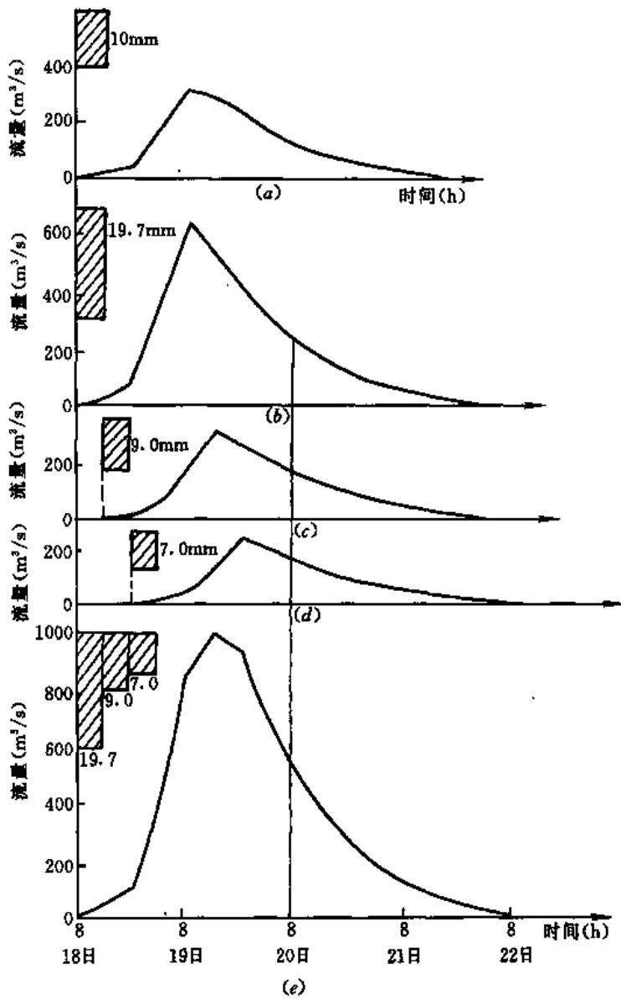  
图 4-25 单位线及推流计算示意图  
(a) 单位线：(b) 第一时段地面净雨形成的部分流量过程线；(c) 第二时段地面净雨形成的部分流量过程线；(d)第三时段地面净雨形成的部分流量过程线：(e)本次降雨形成的出口断面地面径流流量过程线

由于实际的净雨量不一定正好是一个单位和一个时段，所以分析使用时有如下两条假定。

## 1. 倍比假定

如果单位时段内的净雨不是一个单位而是k个单位，则形成的流量过程是单位线纵标的k倍。

## 2. 叠加假定

如果净雨不是一个时段而是m个时段，则形成的流量过程是各时段净雨形成的部分流量过程错开时段叠加。

根据上述假定，将式（4-41）积分式写为如下和式，即流域出口断面流量过程线的表达式：

$$
\begin{array} { r } { Q _ { i } = \displaystyle \sum _ { j = 1 } ^ { n } \frac { h _ { j } } { 1 0 } q _ { i - j + 1 } \left\{ \begin{array} { l l } { i = 1 , 2 , \cdots , l } \\ { \qquad \quad } \\ { j = 1 , 2 , \cdots , m } \\ { \qquad \quad } \\ { i - j + 1 = 1 , 2 , \cdots , n } \end{array} \right. } \end{array}\tag{4-42}
$$

式中 $\ Q _ { i }$ ——流域出口断面各时刻流量值， $\mathbf { m } ^ { 3 } / { \mathbf { s } }$

$h _ { j }$ ——各时段净雨量，mm；

$q _ { i - j + 1 }$ ——单位线各时刻纵坐标， ${ \mathfrak { m } } ^ { 3 } / { \mathfrak { s } }$

l——流域出口断面流量过程线时段数；

$\pmb { m }$ 净雨时段数；

n——单位线时段数。

由此可见，单位线就是以流量过程线形式所表示的流域的汇流曲线。

## （二)单位线的推求

单位线可利用实测的降雨径流资料来推求。一般选择时空分布较均匀，历时较短的降雨形成的单峰洪水来分析。在分析之前，要先求出出口断面的地面径流过程和净雨过程。若流域为蓄满产流型，可按图4-8的方法，从实测流量过程线割去地下径流即得地面（直接）径流流量过程线；若流域为超渗产流型，实测流量过程线即为地面径流流量过程线。再利用降雨资料，按第三节的方法推求出地面净雨过程，推算的净雨量应与实测地面径流量相等。根据地面净雨过程及对应的地面径流流量过程线，就可推算单位线。常用的方法有分析法、最小二乘法等。

## 1. 分析法

设出口断面的地面流量过程为 $Q _ { 1 } , Q _ { 2 } , \cdots , Q _ { i }$ ，流域的净雨过程为 $h _ { 1 } , h _ { 2 } , \cdots , h _ { m }$ ，由式（4-42）构成一个以 $q _ { 1 } , q _ { 2 } , \cdots , q _ { n }$ 为未知数的线性代数方程组，解之即可得单位线，这就是单位线的直接分析法。由式（4-42）得：

$$
q _ { i } = \frac { Q _ { i } - \underset { j = 2 } { \overset { m } { \sum } } \frac { h _ { j } } { 1 0 } q _ { i - j + 1 } } { \underset { 1 0 } { \overset { h _ { 1 } } { \sum } } } \ : \ : \left. \begin{array} { l } { i = 1 , 2 , \cdots , n } \\ { j = 2 , \cdots , m } \end{array} \right.\tag{4-43}
$$

式中，n为单位线的时段数， $\scriptstyle n = l - m + 1$

【例4-7】 某流域实测流量资料分割地下径流后的地面径流过程以及推算出的地面净雨过程见表4-7，试分析单位线。

本例净雨时段数 $\scriptstyle { m = 2 }$ ，地面流量过程时段数 $\pmb { l } = \pmb { 2 0 }$ ，计算时段 $\Delta t { = } 1 2 \mathrm { h }$ 。由式（4-43）：

表4-7  
单位线分析计算表
<table><tr><td rowspan=1 colspan=1>时间(月，日.时)</td><td rowspan=1 colspan=1>地面径流量Q $( \mathbf { m } ^ { 3 } / \mathsf { s } )$ </td><td rowspan=1 colspan=1>净雨h(mm)</td><td rowspan=1 colspan=1>净雨15.7mm产生的径流量 $( \mathbf { m } ^ { 3 } / \mathbf { s } )$ </td><td rowspan=1 colspan=1>净雨5.9mm产生的径流量 $( \pi ^ { 3 } / \mathfrak { s } )$ </td><td rowspan=1 colspan=1>单位线纵标q $( \mathbf { m } ^ { 3 } / \mathbf { s } )$ </td><td rowspan=1 colspan=2>修正后单位线纵标q $( \pi ^ { 3 } / { \tt s } )$ </td><td rowspan=1 colspan=1>单位线时段数 $( \Delta t = 1 2 \ h )$ </td></tr><tr><td rowspan=18 colspan=1>9.24.99.24.219.25.99.25.219.26.99.26-219.27.99.27.219.28.99.28.219.29.99.29.219.30.99.30.2110.1.910.1.2110.2.910.2.2110.3.910.3.2110.4.9</td><td rowspan=1 colspan=1>0120275737</td><td rowspan=1 colspan=1>15.75.9</td><td rowspan=1 colspan=1>0120230651</td><td rowspan=3 colspan=1>04586244308</td><td rowspan=3 colspan=1>076146415523339</td><td rowspan=3 colspan=2>076146415523345</td><td rowspan=7 colspan=1>123456789</td></tr><tr><td rowspan=1 colspan=1>1065</td><td rowspan=1 colspan=1></td><td rowspan=1 colspan=1>821</td></tr><tr><td rowspan=1 colspan=1>840</td><td rowspan=1 colspan=1></td><td rowspan=1 colspan=1>532</td><td rowspan=1 colspan=1>34</td></tr><tr><td rowspan=1 colspan=1>575</td><td rowspan=1 colspan=1></td><td rowspan=1 colspan=1>376</td><td rowspan=2 colspan=1>199</td><td rowspan=2 colspan=1>240158</td><td rowspan=3 colspan=2>241157110</td></tr><tr><td rowspan=1 colspan=1>389</td><td rowspan=1 colspan=1></td><td rowspan=1 colspan=1>248</td><td rowspan=1 colspan=1>141</td></tr><tr><td rowspan=1 colspan=1>261</td><td rowspan=1 colspan=1></td><td rowspan=1 colspan=1>168</td><td rowspan=1 colspan=1>93</td><td rowspan=1 colspan=1>107</td></tr><tr><td rowspan=1 colspan=1>180</td><td rowspan=1 colspan=1></td><td rowspan=1 colspan=1>117</td><td rowspan=1 colspan=1>63</td><td rowspan=1 colspan=1>75</td><td rowspan=1 colspan=2>73</td></tr><tr><td rowspan=1 colspan=1>128</td><td rowspan=1 colspan=1></td><td rowspan=1 colspan=1>84</td><td rowspan=1 colspan=1>44</td><td rowspan=1 colspan=1>53</td><td rowspan=1 colspan=2>52</td><td rowspan=2 colspan=1>1011</td></tr><tr><td rowspan=1 colspan=1>95</td><td rowspan=1 colspan=1></td><td rowspan=1 colspan=1>63</td><td rowspan=1 colspan=1>32</td><td rowspan=1 colspan=1>40</td><td rowspan=1 colspan=2>42</td></tr><tr><td rowspan=1 colspan=1>73</td><td rowspan=1 colspan=1></td><td rowspan=1 colspan=1>49</td><td rowspan=1 colspan=1>24</td><td rowspan=1 colspan=1>31</td><td rowspan=1 colspan=2>37</td><td rowspan=1 colspan=1>12</td></tr><tr><td rowspan=1 colspan=1>55</td><td rowspan=1 colspan=1></td><td rowspan=1 colspan=1>37</td><td rowspan=1 colspan=1>18</td><td rowspan=1 colspan=1>24</td><td rowspan=1 colspan=2>31</td><td rowspan=1 colspan=1>13</td></tr><tr><td rowspan=1 colspan=1>40</td><td rowspan=1 colspan=1></td><td rowspan=1 colspan=1>26</td><td rowspan=1 colspan=1>14</td><td rowspan=1 colspan=1>17</td><td rowspan=1 colspan=2>26</td><td rowspan=2 colspan=1>1415</td></tr><tr><td rowspan=1 colspan=1>29</td><td rowspan=1 colspan=1></td><td rowspan=1 colspan=1>19</td><td rowspan=1 colspan=1>10</td><td rowspan=1 colspan=1>12</td><td rowspan=1 colspan=2>21</td></tr><tr><td rowspan=1 colspan=1>19</td><td rowspan=1 colspan=1></td><td rowspan=1 colspan=1>12</td><td rowspan=1 colspan=1>7</td><td rowspan=1 colspan=1>8</td><td rowspan=5 colspan=2>161050</td><td rowspan=5 colspan=1>1617181920</td></tr><tr><td rowspan=1 colspan=1>12</td><td rowspan=1 colspan=1></td><td rowspan=1 colspan=1>7</td><td rowspan=1 colspan=1>5</td><td rowspan=1 colspan=1>5</td></tr><tr><td rowspan=1 colspan=1>6</td><td rowspan=1 colspan=1></td><td rowspan=1 colspan=1>3</td><td rowspan=1 colspan=1>3</td><td rowspan=3 colspan=1>20</td></tr><tr><td rowspan=1 colspan=1>1</td><td rowspan=1 colspan=1></td><td rowspan=1 colspan=1>0</td><td rowspan=2 colspan=1>10</td></tr><tr><td rowspan=1 colspan=1>0</td><td rowspan=1 colspan=1></td><td rowspan=1 colspan=1></td></tr><tr><td rowspan=1 colspan=1>∑</td><td rowspan=1 colspan=1></td><td rowspan=1 colspan=1></td><td rowspan=1 colspan=1></td><td rowspan=1 colspan=1></td><td rowspan=1 colspan=1>2271</td><td rowspan=1 colspan=2>2326</td><td rowspan=1 colspan=1></td></tr></table>

$$
q _ { 1 } = { \frac { Q _ { 1 } } { h _ { 1 } / 1 0 } } = { \frac { 1 2 0 } { 1 5 . 7 / 1 0 } } = 7 6 . 4 \mathrm { m } ^ { 3 } / 8
$$

$$
q _ { 2 } = { \frac { Q _ { 2 } - { \frac { h _ { 2 } } { 1 0 } } q _ { 1 } } { h _ { 1 } / 1 0 } } = { \frac { 2 7 5 - { \frac { 5 . 9 } { 1 0 } } \times 7 6 . 4 } { 1 5 . 7 / 1 0 } } = 1 4 6 \mathrm { m } ^ { 3 } / 8
$$

$$
q _ { 3 } = \frac { Q _ { 3 } - \frac { h _ { 2 } } { 1 0 } q _ { 2 } } { h _ { 1 } / 1 0 } = \frac { 7 3 7 - \frac { 5 . 9 } { 1 0 } \times 1 4 6 } { 1 5 . 7 / 1 0 } = 4 1 5 \mathrm { m } ^ { 3 } / 8
$$

即可推出单位线纵标，见表4-7。

实际上，流域汇流并非严格遵循倍比和叠加假定，实测资料及推算的净雨量也具有一定的误差，所以，分析法求出的单位线纵标有时会呈现锯齿状，甚至出现负值。此时可从后向前逆时序推算，或对推算出的单位线作光滑修正，但应保持单位线的总量为10mm。该流域 $\scriptstyle { F = 1 0 0 4 8 \mathbf { k m } ^ { 2 } }$ ，修正前单位线径流深 $h = \frac { 1 } { F } \sum q \Delta t = \frac { 1 0 0 0 } { 1 0 0 4 8 \times 1 0 0 0 ^ { 2 } } \times 2 2 7 1 \times 1 2 \times 3 6 0 0 =$ 9.8mm。修正后单位线见表4-7，径流深 $h { = } \frac { 1 0 0 0 } { 1 0 0 4 8 \times 1 0 0 0 ^ { 2 } } \times 2 3 2 6 \times 1 2 \times 3 6 0 0 { = } 1 0 0 0 \mathrm { m m }$

## 2. 最小二乘法

令实测地面流量为 $\mathbf { Q } ,$ 由单位线推算的流量为 $\pmb { Q } ^ { \prime }$ ，记误差 $\pmb { \varepsilon } = \pmb { Q } - \pmb { Q } ^ { \prime }$ 。若取 $\textstyle \sum \varepsilon ^ { 2 } =$ $\scriptstyle \sum \ ( Q - Q ^ { \prime } ) ^ { z } = \mathrm { m i n }$ ，可将式（4-42）变为方程个数与待求变量个数相等的正规方程组，然

后解在最小二乘意义下 $\pmb q$ 的最优估计值。

将式（4-42）写成矩阵的形式：

$\hbar \pmb q = \pmb { Q }$ (为书写方便单位净雨深取1mm)

$$
\begin{array} { r } { h = \left[ \begin{array} { l l l l } { h _ { 1 } } & & \\ { h _ { 2 } } & & \\ { \vdots } & { h _ { 2 } } \\ { h _ { m } } & & { \vdots } \\ & & { h _ { m } } \end{array} \right] , \quad q = \left[ \begin{array} { l } { q _ { 1 } } \\ { q _ { 2 } } \\ { \vdots } \\ { \vdots } \\ { q _ { n } } \end{array} \right] , \quad Q = \left[ \begin{array} { l } { Q _ { 1 } } \\ { Q _ { 2 } } \\ { \vdots } \\ { \vdots } \\ { Q _ { l } } \end{array} \right] \circ } \end{array}\tag{4-42′}
$$

式中，

由上式可知，单位线的时段数n为：

$$
n = l - m + 1
$$

所以，只有当 $\pmb { m } = 1$ 时， $n = l$ ，可由上式直接解得各 $q$ 值。若 $\pmb { m } > 1$ ，则 $n { < } l$ ，上式所列方程数就多于待求未知数 $\pmb q$ 的个数，成为矛盾方程组。

为使上述矛盾方程成为正规方程，以转置矩阵 $\pmb { h } ^ { T }$ 左乘式（4-42'）两端，移项得：

$$
\pmb { q } = ( \pmb { h } ^ { T } \pmb { h } ) ^ { - 1 } \pmb { h } ^ { T } \pmb { Q }\tag{4-44}
$$

将已知的 $h _ { 1 } , h _ { 2 } , \ldots , h _ { n }$ 及 $\mathsf Q _ { 1 } , \mathsf Q _ { 2 } , \cdots , \mathsf Q _ { i }$ 代人式（4-44），就可解出在最小二乘意义下的最优解 $q _ { 1 } , q _ { 2 } , \cdots , q _ { { \mathrm n } } $

以 $m = 3 , \ l = 6$ 为例说明如下：

根据式 $( 4 - 4 2 ^ { \prime } )$ ，且 $\scriptstyle n = l - m + 1 = 6 - 3 + 1 = 4$ ，有：

$$
\begin{array} { r l r } & { h _ { 1 } q _ { 1 } } & { = Q _ { 1 } } \\ & { h _ { 2 } q _ { 1 } + h _ { 1 } q _ { 2 } } & { = Q _ { 2 } } \\ & { h _ { 3 } q _ { 1 } + h _ { 2 } q _ { 2 } + h _ { 1 } q _ { 3 } } & { = Q _ { 3 } } \\ & { h _ { 3 } q _ { 2 } + h _ { 2 } q _ { 3 } + h _ { 1 } q _ { 4 } = Q _ { 4 } } \\ & { } & { h _ { 3 } q _ { 3 } + h _ { 2 } q _ { 4 } = Q _ { 5 } } \\ & { } & { h _ { 3 } q _ { 4 } = Q _ { 6 } } \end{array}
$$

按最小二乘法，有：

$$
\begin{array} { r l } & { \sum \varepsilon ^ { 2 } = ( Q _ { 1 } - h _ { 1 } q _ { 1 } ) ^ { 2 } + ( Q _ { 2 } - h _ { 2 } q _ { 1 } - h _ { 1 } q _ { 2 } ) ^ { 2 } + ( Q _ { 3 } - h _ { 3 } q _ { 1 } - h _ { 2 } q _ { 2 } - h _ { 1 } q _ { 3 } ) ^ { 2 } } \\ & { \qquad + ( Q _ { 4 } - h _ { 3 } q _ { 2 } - h _ { 2 } q _ { 3 } - h _ { 1 } q _ { 4 } ) ^ { 2 } + ( Q _ { 5 } - h _ { 3 } q _ { 3 } - h _ { 2 } q _ { 4 } ) ^ { 2 } + ( Q _ { 6 } - h _ { 3 } q _ { 4 } ) ^ { 2 } } \\ & { \qquad = \mathrm { m i n } } \end{array}
$$

$\frac { \partial ( \sum \bar { \epsilon } ^ { 2 } ) } { \partial q _ { 1 } } = 0$ ，整理后得：

$q _ { 1 } ~ ( h _ { 1 } ^ { 2 } + h _ { 2 } ^ { 2 } + h _ { 3 } ^ { 2 } ) ~ + q _ { 2 } ~ ( h _ { 1 } h _ { 2 } + h _ { 3 } h _ { 3 } ) ~ + q _ { 3 } ~ ( h _ { 1 } h _ { 3 } ) ~ = Q _ { 1 } h _ { 1 } + Q _ { 2 } h _ { 2 } + Q _ { 3 } h _ { 3 }$ 。同理，对 $q _ { 2 } , \ q _ { 3 } , \ q _ { 4 }$ 求偏导数并令等于零，共得四个方程组，该方程组即正规方程组，写成矩阵的形式如下：

$$
\left. \begin{array} { l l l l } { \left[ h _ { 1 } ^ { 2 } + h _ { 2 } ^ { 2 } + h _ { 3 } ^ { 2 } } & { h _ { 1 } h _ { 2 } + h _ { 3 } h _ { 3 } \right. } & { h _ { 1 } h _ { 3 } } & { 0 } \\ { h _ { 1 } h _ { 2 } + h _ { 2 } h _ { 3 } } & { h _ { 1 } ^ { 2 } + h _ { 2 } ^ { 2 } + h _ { 3 } ^ { 2 } } & { h _ { 1 } h _ { 2 } + h _ { 2 } h _ { 3 } } & { h _ { 1 } h _ { 3 } } \\ { h _ { 1 } h _ { 3 } } & { h _ { 1 } h _ { 2 } + h _ { 2 } h _ { 3 } } & { h _ { 1 } ^ { 2 } + h _ { 2 } ^ { 2 } + h _ { 3 } ^ { 2 } } & { h _ { 1 } h _ { 2 } + h _ { 2 } h _ { 3 } } \\ { 0 } & { h _ { 1 } h _ { 3 } } & { h _ { 1 } h _ { 2 } + h _ { 2 } h _ { 3 } } & { h _ { 1 } ^ { 2 } + h _ { 2 } ^ { 2 } + h _ { 3 } ^ { 2 } } \end{array} \right] \left[ \begin{array} { l } { q _ { 1 } } \\ { q _ { 2 } } \\ { q _ { 3 } } \\ { q _ { 4 } } \end{array} \right] = \left[ \begin{array} { l } { Q _ { 1 } h _ { 1 } + Q _ { 2 } h _ { 2 } + Q _ { 3 } h _ { 3 } } \\ { Q _ { 2 } h _ { 1 } + Q _ { 3 } h _ { 2 } + Q _ { 4 } h _ { 3 } } \\ { Q _ { 3 } h _ { 1 } + Q _ { 4 } h _ { 2 } + Q _ { 5 } h _ { 3 } } \\ { Q _ { 4 } h _ { 1 } + Q _ { 5 } h _ { 2 } + Q _ { 6 } h _ { 3 } } \end{array} \right]
$$

上式展开为：

$$
\begin{array} { r }  [ \begin{array} { l l l l l l l l } { h _ { 1 } } & { h _ { 2 } } & { h _ { 3 } } & { 0 } & { 0 } & { 0 } & { [ ^ { h _ { 1 } } } & { 0 } & { 0 } & { 0 ] } \\ { h _ { 1 } } & { h _ { 2 } } & { h _ { 3 } } & { 0 } & { 0 } & { 0 } & { 0 } \\ { 0 } & { h _ { 1 } } & { h _ { 2 } } & { h _ { 3 } } & { 0 } & { 0 } \\ { 0 } & { 0 } & { h _ { 1 } } & { h _ { 2 } } & { h _ { 3 } } & { 0 } \\ { 0 } & { 0 } & { 0 } & { h _ { 1 } } & { h _ { 2 } } & { h _ { 3 } } \\ { 0 } & { 0 } & { 0 } & { h _ { 1 } } & { h _ { 2 } } & { 0 } & { 0 } \\ { 0 } & { 0 } & { 0 } & { 0 } & { h _ { 1 } } & { h _ { 2 } } & { 0 } \end{array} ] [ \begin{array} { l l l l l } { h _ { 1 } } & { 0 } & { 0 } & { 0 } & { 0 } \\ { h _ { 2 } } & { h _ { 1 } } & { 0 } & { 0 } \\ { h _ { 3 } } & { h _ { 2 } } & { h _ { 1 } } & { 0 } \\ { 0 } & { h _ { 3 } } & { h _ { 1 } } & { h _ { 1 } } \\ { 0 } & { 0 } & { h _ { 3 } } & { h _ { 2 } } \end{array} ] [ \begin{array} { l } { h _ { 1 } } \\ { q _ { 1 } } \\ { q _ { 2 } } \\ { q _ { 3 } } \\ { q _ { 4 } } \end{array} ] = [ \begin{array} { l l l l l l l } { h _ { 1 } } & { h _ { 2 } } & { h _ { 3 } } & { 0 } & { 0 } & { 0 } & { 0 } \\ { 0 } & { h _ { 1 } } & { h _ { 2 } } & { h _ { 3 } } & { 0 } & { 0 } \\ { 0 } & { 0 } &  h _   \end{array} \end{array}
$$

移项即为式（4-44）。

用上述方法求解单位线应用了一次雨洪的全部流量资料，原理上比较完善，但所得的结果有时仍会出现锯齿状振荡或负值。为此，可在此基础上加一些约束条件再行求解，例如推求单位线的约束线性系统模型等等。

## （三)单位线的时段转换

单位线应用时，往往因实际降雨历时和已知单位线的时段长不相符合，不能任意移用；另外，在对不同流域的单位线进行地区综合时，各流域的单位线也应取相同的时段长才能综合。解决上述问题的方法就是进行单位线的时段转换。具体方法如下。

假定流域上净雨持续不断，且每一时段净雨均为一个单位，在流域出口断面形成的流量过程线，如图4-26（a)中虚线。该曲线称为S曲线。显然，S曲线在某时刻的纵坐标就等于连续若干个10mm净雨所形成的单位线在该时刻的纵坐标值之和，或者说，S曲线的纵坐标就是单位线纵坐标沿时程的累积曲线，即：

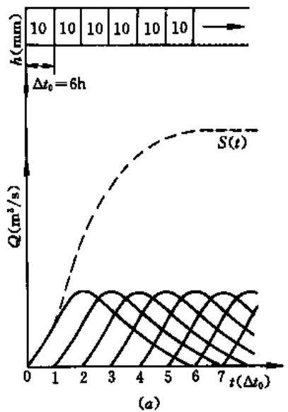

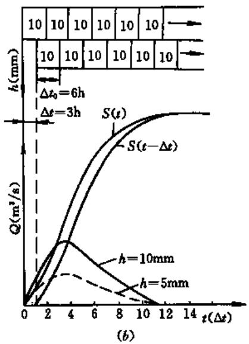  
图 4-26 单位线的时段转换

$$
{ \cal S } ( t ) = \sum _ { j = 0 } ^ { k } q _ { j } ( \Delta t , t )\tag{4-45}
$$

式中 S (t) ——第 k 个时段末 $( t = k \Delta t )$ S曲线的纵坐标， ${ \mathfrak { m } } ^ { 3 } / { \mathfrak { s } }$

${ \pmb q } _ { j } \cdot \mathrm { \hbar }$ 时段为 Δt的单位线第j个时段末的纵坐标， $\mathbf { m } ^ { \mathfrak { s } } / \mathbf { s }$

$\Delta t ^ { . }$ ——单位线时段，h。

若已有某时段的单位线，就可以用式（4-45）求S曲线，见表4-8示例。

表 4-8  
单位线时段转换计算表
<table><tr><td rowspan="2">时间 1</td><td colspan="2">原单位线  $( \Delta t _ { 0 } = 6 \hbar )$ </td><td rowspan="2">S (t)</td><td rowspan="2"> ${ \mathfrak { S } } ( t { - } 3 )$ </td><td rowspan="2">S(t) -S(t-3)</td><td colspan="2">单位线  $( \Delta t = 3 h )$ </td><td rowspan="2"> ${ \mathfrak { S } } ( t - { \mathfrak { g } } )$ </td><td rowspan="2"> $\pmb { S } ( t ) - \pmb { S }$  (t-9)</td><td colspan="2">单位线  $( \Delta t = 9 h )$ </td></tr><tr><td>时序 q (e)</td><td>(含内插)</td><td>时序</td><td>q (t)</td><td>时序</td><td>q (t)</td></tr><tr><td>0</td><td>0</td><td>0</td><td>0</td><td></td><td>0</td><td>0</td><td>0</td><td></td><td></td><td>0</td><td>0</td></tr><tr><td>3</td><td></td><td>76</td><td>25 76</td><td>0 25</td><td>25 51</td><td>1 2</td><td>50 102</td><td></td><td></td><td></td><td></td></tr><tr><td>6</td><td>1</td><td></td><td>155</td><td>76</td><td>79</td><td>3</td><td>158</td><td>0</td><td>155</td><td>1</td><td>103</td></tr><tr><td>9</td><td></td><td>209</td><td>285</td><td>155</td><td>130</td><td>4</td><td>260</td><td></td><td></td><td></td><td></td></tr><tr><td>12</td><td>2</td><td></td><td>500</td><td>285</td><td>215</td><td>5</td><td>430</td><td></td><td></td><td></td><td></td></tr><tr><td>15</td><td>3</td><td>616</td><td>901</td><td>500</td><td>401</td><td>6</td><td>802</td><td>155</td><td>746</td><td>2</td><td>497</td></tr><tr><td>18</td><td></td><td></td><td>1161</td><td>901</td><td>260</td><td>7</td><td>520</td><td></td><td></td><td></td><td></td></tr><tr><td>21</td><td></td><td>489</td><td>1390</td><td>1161</td><td>229</td><td>8</td><td>458</td><td></td><td></td><td></td><td></td></tr><tr><td>2.1</td><td>4</td><td></td><td>1585</td><td>1390</td><td>195</td><td>9</td><td>390</td><td>901</td><td>684</td><td>3</td><td>456</td></tr><tr><td>27</td><td></td><td>356</td><td>1746</td><td>1585</td><td>161</td><td>10</td><td>322</td><td></td><td></td><td></td><td></td></tr><tr><td>30</td><td>5</td><td></td><td>1883</td><td>1746</td><td>137</td><td>11</td><td>274</td><td></td><td></td><td></td><td></td></tr><tr><td>33</td><td></td><td>235</td><td>1981</td><td>1883</td><td>98</td><td>12</td><td>196</td><td>1585</td><td>396</td><td>4</td><td>264</td></tr><tr><td>36</td><td>6</td><td></td><td>2066</td><td>1981</td><td>85</td><td>13</td><td>170</td><td></td><td></td><td></td><td></td></tr><tr><td>39</td><td></td><td>160</td><td>2141</td><td>2066</td><td>75</td><td>14</td><td>150</td><td></td><td></td><td></td><td></td></tr><tr><td>42</td><td>7</td><td></td><td>2204</td><td></td><td>63</td><td></td><td>126</td><td>1981</td><td>223</td><td>5</td><td>149</td></tr><tr><td>45</td><td></td><td>110</td><td></td><td>2141</td><td></td><td>15</td><td></td><td></td><td></td><td></td><td></td></tr><tr><td>48</td><td>8</td><td></td><td>2251</td><td>2204</td><td>47</td><td>15</td><td>94</td><td></td><td></td><td></td><td></td></tr><tr><td>51</td><td></td><td>78</td><td>2296</td><td>2251</td><td>45</td><td>17</td><td>90</td><td>2204</td><td>125</td><td>6</td><td>83</td></tr><tr><td>54</td><td>9</td><td></td><td>2329</td><td>2296</td><td>33</td><td>18</td><td>66</td><td></td><td></td><td></td><td></td></tr><tr><td>57</td><td></td><td></td><td>2358</td><td>2329</td><td>29</td><td>19</td><td>58</td><td></td><td></td><td></td><td></td></tr><tr><td>6v</td><td>10</td><td>50</td><td>2379</td><td>2358</td><td>21</td><td>20</td><td>42</td><td>2329</td><td>71</td><td>7</td><td>47</td></tr><tr><td>63</td><td></td><td>35</td><td>2400</td><td>2379</td><td>21</td><td>21</td><td>42</td><td></td><td></td><td></td><td></td></tr><tr><td>66</td><td>11</td><td></td><td>2414</td><td>2400</td><td>14</td><td>22</td><td>28</td><td></td><td></td><td></td><td></td></tr><tr><td>69</td><td></td><td>23</td><td>2428</td><td>2414</td><td>14</td><td>23</td><td>28</td><td>2400</td><td>37</td><td>8</td><td>25</td></tr><tr><td>72</td><td>12</td><td></td><td>2437</td><td>2428</td><td>9</td><td>24</td><td>18</td><td></td><td></td><td></td><td></td></tr><tr><td>75</td><td></td><td></td><td>2445</td><td>2437</td><td>8</td><td>25</td><td>16</td><td></td><td></td><td></td><td></td></tr><tr><td>78</td><td>13</td><td>12</td><td>2449</td><td>2445</td><td>4</td><td>26</td><td>8</td><td>2437</td><td>12</td><td>9</td><td>8</td></tr><tr><td>81</td><td></td><td>0</td><td>2449</td><td>2449</td><td>0</td><td>27</td><td>0</td><td></td><td></td><td></td><td></td></tr><tr><td>84</td><td>14</td><td></td><td>2449</td><td>2449</td><td>0</td><td></td><td></td><td></td><td></td><td></td><td></td></tr><tr><td>87</td><td></td><td></td><td>2449</td><td></td><td></td><td></td><td></td><td></td><td></td><td></td><td></td></tr><tr><td>90</td><td></td><td></td><td>2449</td><td></td><td></td><td></td><td></td><td>2449</td><td>0</td><td>10</td><td>0</td></tr></table>

有了S曲线，就可以进行单位线不同时段的转换。例如，要将已知时段为Δt。的单位线 $\Delta t _ { 0 }$ $\textbf { \textit { q } } ( \Delta { \boldsymbol { t } } _ { 0 } , \textbf { \textit { t } } )$ 转换成时段为Δt的单位线 $q \ \left( \Delta t , \ t \right)$ ，只需要将S(t)曲线向右平移Δt，得另一条起始时刻迟Δt的 S（t-Δt)曲线，如图 4-26（b)所示。这两条S曲线的纵坐标差$\textit { S } \left( t \right) \ - \boldsymbol { S } \ \left( t - \Delta t \right)$ ，代表时段内强度为 $\frac { 1 0 } { \Delta t _ { 0 } }$ 的净雨所形成的流量过程线。由单位线的倍比假定，有：

$$
\begin{array} { r } { \frac { q ( \Delta t , t ) } { S ( t ) - S ( t - \Delta t ) } = \frac { 1 0 / \Delta t } { 1 0 / \Delta t _ { 0 } } } \end{array}
$$

所以，转换后的单位线为：

$$
q ( \Delta t , t ) = \frac { \Delta t _ { 0 } } { \Delta t } [ S ( t ) - S ( t - \Delta t ) ]\tag{4-46}
$$

式中 q(Δt，t) ——转换后时段为 t的单位线；

$\Delta t _ { 0 }$ ——原单位线时段长；

S (t)——时段为 $\Delta t _ { 0 }$ 的S曲线；

S (t—t)——后移 Δt 的 S 曲线。

【例 4-8】 试将表 4-8 时段为 6h 的单位线转换为 3h 和 9h 的单位线。

计算过程见表4-8，先根据已知单位线推求S曲线，再进行不同时段的转换。转换时，若 $\Delta t / \Delta t _ { 0 }$ 不是整数时，S（t）值可由内插求得。

## (四) 单位线的应用

一个流域根据多次实测雨洪资料求得多条单位线后，经过分类综合，就可以确定出该流域实用的单位线，即汇流计算方案。当流域内降了一场雨后，先用第三节介绍的产流计算方法推求净雨过程，再用单位线推求出流过程。

【例4-9】某流域一场降雨产生三个时段净雨，且已知流域 $\Delta t = 6 \mathbf { h }$ 的单位线，见表4-9。试推求流域出口断面流量过程。

表4-9  
单位线法推流计算表（F=3391km²）
<table><tr><td rowspan=2 colspan=1>时间(日，时)</td><td rowspan=2 colspan=1>地面净雨h(mm)</td><td rowspan=2 colspan=1>单位线 $\textbf { \textit { q } } ( t )$  $( \mathbf { m } ^ { 3 } / \mathsf { s } )$ </td><td rowspan=1 colspan=5>部分地面径流 $\frac { \hbar } { 1 0 } \pmb { q }$ (t)</td><td rowspan=2 colspan=1>地面径流 $Q _ { s } \ ( t )$  $\mathbf { ( m ^ { 3 } / s ) }$ </td><td rowspan=2 colspan=1>地下径流 $Q _ { g } ( t )$  $\langle \mathbf { m } ^ { 3 } / { \mathsf { s } } \rangle$ </td><td rowspan=2 colspan=1>出口断面流量过程Q(t) $( m ^ { 3 } / { \mathsf { s } } )$ </td></tr><tr><td rowspan=1 colspan=3> ${ \pmb { h } } _ { 1 } = { \pmb { 1 9 } } _ { \ast } \ { \pmb { 7 } }$ </td><td rowspan=1 colspan=1> $h _ { 2 } = 9 . 0$ </td><td rowspan=1 colspan=1> $h _ { 3 } = 7 . 0$ </td></tr><tr><td rowspan=9 colspan=1>23.823.1423.2024.224.824.1424.2025.225.825.1425.2026.226.826.1426.2027.227.827.14</td><td rowspan=9 colspan=1>19.79.07.0</td><td rowspan=9 colspan=1>0441823332812261561218360402311640</td><td rowspan=3 colspan=3>08735865********07</td><td rowspan=9 colspan=1>0401643002532031401097554362110540</td><td rowspan=9 colspan=1>03112723319715810985584228168430</td><td rowspan=4 colspan=1>087398851981931707536</td><td rowspan=9 colspan=1>202424243030302626262624242422222020</td><td rowspan=9 colspan=1>201114228751011961737562408304217147956243302320</td></tr><tr><td rowspan=1 colspan=2></td></tr><tr><td rowspan=1 colspan=1></td></tr><tr><td rowspan=1 colspan=3>238</td></tr><tr><td rowspan=1 colspan=3>164</td><td rowspan=3 colspan=1>382278191</td></tr><tr><td rowspan=1 colspan=3>118</td></tr><tr><td rowspan=1 colspan=3>79</td></tr><tr><td rowspan=1 colspan=3>45</td><td rowspan=1 colspan=1>123</td></tr><tr><td rowspan=1 colspan=3>221280</td><td rowspan=1 colspan=1>713821830</td></tr></table>

按式（4-42）进行推流，结果见表4-9及图4-25（b）～（e）。地面径流过程与地下径流过程之和即为流域出口断面流量过程。

## (五)单位线存在的问题及处理方法

单位线假定流域汇流符合倍比和叠加原理，事实上这并不完全符合实际。因此，一个

流域不同次洪水分析的单位线常有些不同，有时差别还比较大，主要原因如下：

## 1. 洪水大小的影响

大洪水一般流速大，汇流较快。因此，用大洪水资料求得的单位线尖瘦，峰高且峰现时间早。小洪水则相反，求得的单位线过程平缓，峰低且峰现时间迟。

## 2. 暴雨中心位置的影响

单位线假定降雨在流域内分布均匀。事实上，全流域均匀降雨产流的情况是较少见的。流域越大，降雨在流域内分布不均匀状况就越突出。暴雨中心在上游的洪水，汇流路径长，受流域调蓄作用也大，洪水过程较平缓，由此洪水求得的单位线也平缓，峰低且峰现时间偏后。反之，若暴雨中心在下游，由此类洪水推出的单位线过程尖瘦，峰高且峰现时间早。

遇到上述情况，一般按洪水的大小和暴雨中心位置分别确定单位线，在实际工作中根据具体情况选用。

此外，不同水源比例组成的洪水求出的单位线的形状也不同。在划分地面、地下径流成份时，如有较大误差，也会使推算出的单位线具有较大的误差。

## 三、瞬时单位线法

## (一)瞬时单位线的数学方程

瞬时单位线是纳希（J.E.Nash)于1957年提出来的。所谓瞬时单位线是指流域上分布均匀，历时趋于无穷小，强度趋于无穷大，总量为一个单位的地面净雨在流域出口断面形成的地面径流过程线。

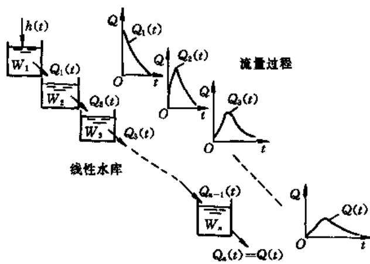

纳希假设流域对地面净雨的调蓄作用，可用一系列串联的线性水库的调节作用来模拟，如图4-27所示。设净雨过程为h（t)或h，用流量表示，它就是流域的人流量，相当于第一个水库的入流。记第一个水库的出流为 $\mathbf { \boldsymbol { Q } } _ { 1 } \left( t \right)$ 或 $\boldsymbol { Q } _ { 1 }$ ，水库入流量与出流量之差即为蓄水量的变率 $\frac { \mathrm { d } \overline { { \mathbb { W } } } _ { 1 } } { \mathrm { d } t }$ 。因此，连续方程为：

$$
\hbar - Q _ { 1 } = \frac { \mathrm { d } W _ { 1 } } { \mathrm { d } t }
$$

图 4-27 纳希流域汇流模型示意图

(4-47)

又因为假设流域对地面净雨的调蓄作用为“线性水库”，故其蓄水量与出流量成

正比，即：

$$
\mathbb { W } _ { 1 } = K _ { 1 } \mathbb { Q } _ { 1 }\tag{4-48}
$$

式中 $W _ { 1 }$ ——第一个水库的蓄水量；

$\pmb { K } _ { 1 }$ ——第一个水库的蓄泄系数。

联解式（4-47）和式（4-48），并以微分算子D表示 $\frac { \mathrm { d } } { \mathrm { d } t }$ ，可得：

$$
Q _ { 1 } = \frac { 1 } { 1 + K _ { 1 } D } h
$$

同理，对于第二个水库而言，第一个水库的出流Q；即为其人流，记第二个水库的出流 $Q _ { 1 }$ 为 $\boldsymbol { Q } _ { 2 }$ ，则：

$$
Q _ { 2 } = \frac { 1 } { 1 + K _ { 2 } D } Q _ { 1 } = \frac { 1 } { 1 + K _ { 2 } D } \times \frac { 1 } { 1 + K _ { 1 } D } h
$$

依此类推，经过n个水库的调节后，出口断面的流量过程为：

$$
Q _ { n } ( t ) = \frac { 1 } { 1 + K _ { 1 } \bar { D } } \times \frac { 1 } { 1 ^ { ' } + K _ { 2 } D } \times \dots \times \frac { 1 } { 1 + K _ { n } D } h ( t )
$$

若假定这n个线性水库的蓄泄系数相等，即 $K _ { 1 } = K _ { 2 } = \cdots = K _ { n } = K$ ，则出口断面的流量过程为：

$$
Q _ { n } ( t ) = \frac { 1 } { ( 1 + K D ) ^ { \ast } } h ( t )\tag{4-49}
$$

按瞬时单位线的定义，当时段趋于无穷小，h(t)为瞬时单位净雨量， $Q _ { \alpha } \ ( \pmb { t } )$ 即为瞬时单位线 $\textbf { \textit { u } } ( 0 , \textbf { \textit { t } } )$ ，应用脉冲感应原理，以脉冲响应函数 $\delta ( t )$ 代替h（t），则式（4-49）可写为：

$$
{ \pmb u } ( 0 , t ) = \frac { 1 } { ( 1 + \mathcal { K } D ) ^ { n } } \delta ( t )
$$

应用拉普拉斯变换，有：

$$
{ \cal L } \big [ u ( 0 , t ) \big ] = \frac { 1 } { ( 1 + K S ) ^ { \star } } { \cal L } \big [ \hat { \sigma } ( t ) \big ] \stackrel { } { _ { \cdot } } = \frac { 1 } { ( 1 + K S ) ^ { \star } }
$$

其中， $L \ [ \delta \ ( t ) ] = 1$ ，又因为 $\frac { 1 } { ( 1 + K S ) ^ { \circ } }$ 的原函数为 $\frac { 1 } { K T \ ( n ) } \bigg ( \frac { t } { K } \bigg ) ^ { n - 1 } \mathrm { e } ^ { - \frac { t } { K } }$ ，最后得：

$$
u ( 0 , t ) = \frac { 1 } { K T ( n ) } \bigg ( \frac { t } { K } \bigg ) ^ { n - 1 } \mathrm { e } ^ { - \frac { t } { K } }\tag{4-50}
$$

式中 $L \cdot$ 拉普拉斯算符；

$s { \mathrm { . } }$ —拉普拉斯变数；

$\pmb { \Gamma } \cdot$ 伽玛函数；

n—反映流域调蓄能力的参数，相当于线性水库的个数或水库的调节次数；

$\kappa \cdot$ —线性水库的蓄泄系数，相当于流域汇流时间的参数，具有时间因次。

上式就是纳希瞬时单位线方程式，其中n、K为参数。当n、K一定时，便可绘出瞬时单位线，如图4-28所示，它表示流域上在瞬时 $( \Delta t {  } 0 )$ 降1个水量的净雨在出口断面形成的流量过程线。其横坐标代表时间，具有时间因次，纵坐标代表流量，具有抽象的因次1/dt。按水量平衡原理，瞬时单位线和时间轴所包围的面积应等于1个水量，即：

$$
\int _ { 0 } ^ { \infty } u ( 0 , t ) \mathrm { d } t = 1 . 0\tag{4-51}
$$

式（4-50）中n、K是瞬时单位线的两个参数。n、K对瞬时单位线形状的影响见图4-29。从图中可以看出，n、K对u(0，t)形状的影响是相似的。当n、K减小时，“(0，t)的洪峰增高，峰现时间提前；而当n、K增大时，u(0，t)的峰降低，峰现时间推后。

## (二)瞬时单位线的时段转换

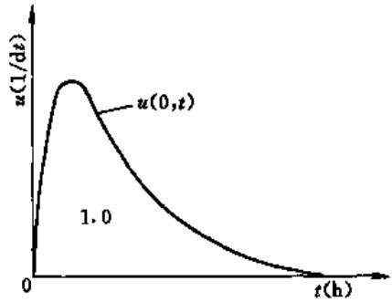  
图 4-28 瞬时单位线示意图

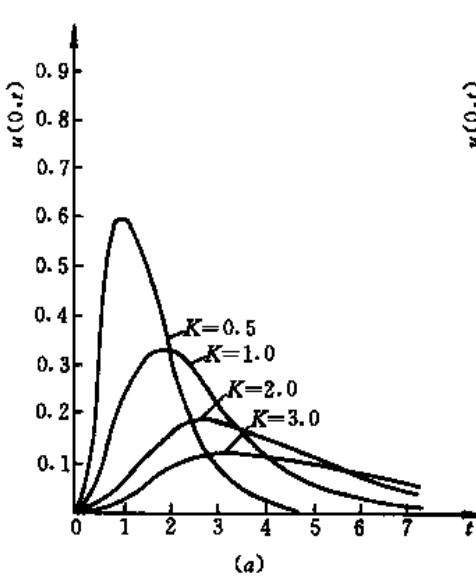

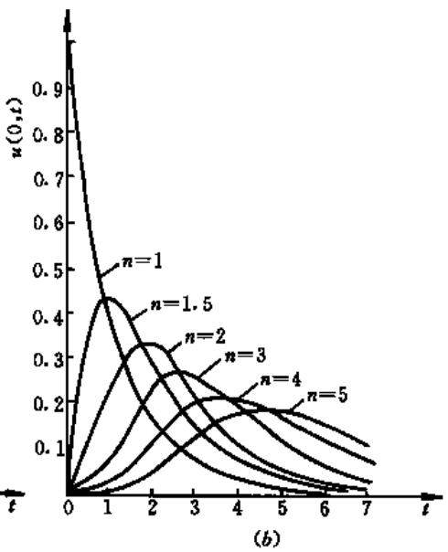  
图 4-29 参数 n、K 对瞬时单位线的影响

式（4-50）或图4-28的单位线所对应的净雨是瞬时的，实用中还需将瞬时单位线转换为时段单位线才能使用。时段的转换仍采用S曲线，按 $s$ 曲线的定义，有：

$$
S ( t ) = \int _ { 0 } ^ { t } u ( 0 , t ) \mathrm { d } t = \int _ { 0 } ^ { t / K } { \frac { 1 } { \Gamma ( n ) } } { \left( { \frac { t } { K } } \right) } ^ { n - 1 } \mathrm { e } ^ { - { \frac { i } { K } } } \mathrm { d } { \left( { \frac { t } { K } } \right) }
$$

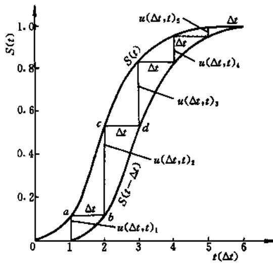  
图 4-30 瞬时单位线的 S 曲线

生的水量（10×F）在出口断面形成的地面径流流量过程线 ${ \mathfrak { q } } \left( \Delta t , t \right)$ ，由单位线的倍比假定，有：

所以：

$$
\begin{array} { c } { \displaystyle \frac { q ( \Delta t , t ) } { u ( \Delta t , t ) } = \frac { 1 0 \times F } { \Delta t \times 1 } } \\ { \displaystyle q ( \Delta t , t ) = \frac { 1 0 F } { \Delta t } u ( \Delta t , t ) } \end{array}\tag{4-54}
$$

当单位线的纵坐标 $q \ ( \Delta t , t )$ 以 $\pi ^ { 9 } / 5$ 计，净雨时段 $\Delta t$ 以h计，流域面积以 $\mathbf { k m } ^ { 2 }$ 计时，上式可写为：

(4-52)

当 $\pmb { \mathscr { n } }$ 、K已知，以不同的t代人上式积分，就可得到如图4-30的S曲线。将以 $\pmb { t = 0 }$ 为起点的S（t） 曲线向后平移一个 $\pmb { \Delta } t$ 时段，即可得 $\pmb { S } \left( \pmb { t } - \right.$ $\Delta t )$ 曲线，两条S曲线的纵坐标差：

$$
\boldsymbol { u } ( \Delta t , t ) = \boldsymbol { \bar { S } } ( t ) - \boldsymbol { \bar { S } } ( t - \Delta t )\tag{4-53}
$$

即为时段为 $\pmb { \Delta } \pmb { t }$ 的无因次时段单位线，如图4-31所示。它代表 $\pmb { \Delta } \pmb { t }$ 内流域上净雨强度为1产生的水量 $( \Delta \pmb { t } \times 1 )$ 在出口断面形成的流量过程线。实用时还需将无因次单位线换算成净雨为10mm的时段单位线，即 $\pmb { \Delta } t$ 内流域上降10mm净雨产

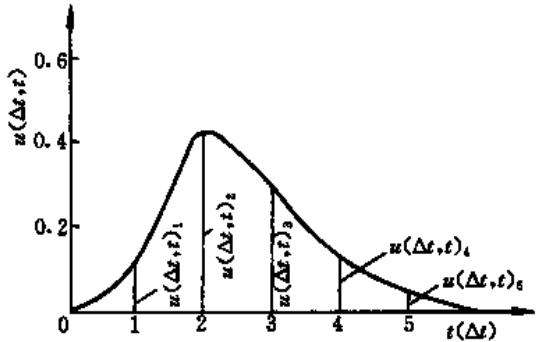  
图 4-31 无因次时段单位线

$$
q ( \Delta t , t ) = \frac { 1 0 F } { 3 . 6 \Delta t } u ( \Delta t , t ) = \frac { 1 0 F } { 3 . 6 \Delta t } \big [ S ( t ) - S ( t - \Delta t ) \big ]\tag{4-55}
$$

即为时段为 $\Delta t$ ，净雨为10mm的时段单位线。

为了实用上方便，已根据式（4-52）制成以n、t/K为参数的S曲线查用表，见附表4。若已知n、K，查该表即可得S曲线。

## (三)参数n、K的确定

瞬时单位线的数学模型由式（4-50）表示，要求某一流域的瞬时单位线就变成推求该流域的n、K值。纳希利用统计数学中矩的概念，推导出由实测净雨过程h（t）和出口断面地面径流过程Q（t）确定n、K的公式如下：

$$
K = \frac { M _ { 0 } ^ { ( 2 ) } - M _ { h } ^ { ( 2 ) } } { M _ { Q } ^ { ( 1 ) } - M _ { h } ^ { ( 1 ) } } - ( M _ { 0 } ^ { ( 1 ) } + M _ { h } ^ { ( 1 ) } )\tag{4-56}
$$

$$
n = \frac { M _ { 2 } ^ { ( 1 ) } - M _ { h } ^ { ( 1 ) } } { K }\tag{4-57}
$$

式中 $M _ { ☉ } ^ { ( 1 ) }$ $M _ { 0 } ^ { ( 2 ) }$ ——一地面径流过程的一阶和二阶原点矩；

$M _ { h } ^ { ( 1 ) }$ $M _ { h } ^ { ( 2 ) }$ ——地面净雨过程的一阶和二阶原点矩。

各阶原点矩由实测降雨推算的净雨过程和对应的地面径流的出流过程（见图4-32）用差分公式计算，公式如下：

$$
M _ { h } ^ { ( 1 ) } = \frac { \sum h _ { i } t _ { i } } { \sum h _ { i } }\tag{4-58}
$$

$$
M _ { h } ^ { ( 2 ) } = \frac { \sum h _ { i } ( t _ { i } ) ^ { 2 } } { \sum h _ { i } }
$$

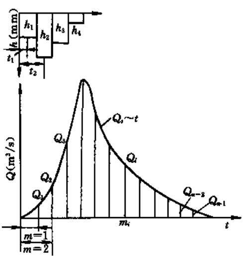

(4-59)

$$
M _ { \mathrm { Q } } ^ { \langle 1 \rangle } = \frac { \sum \mathcal { Q } _ { i } m _ { i } } { \sum \mathcal { Q } _ { i } } \Delta t\tag{4-60}
$$

图 4-32 矩值计算示意图

$$
M _ { Q } ^ { ( 2 ) } = \frac { \sum Q _ { i } m _ { i } ^ { 2 } } { \sum Q _ { i } } ( \Delta t ) ^ { 2 }\tag{4-61}
$$

式中， $\pmb { t } _ { i } = \left( m _ { i } - \frac { 1 } { 2 } \right) \Delta t , m _ { i } = 1 , 2 , \cdots , n { - } 1$

将式（4-58）\~式（4-61）计算的结果代人式（4-56）和式（4-57），就可求出K、n。计算出的K、n值还需代回原来的资料作还原验证，若还原的精度不能令人满意，则需对K、n作适当调整，直至满意为止。除了上述矩法外，还可采用优选法确定n、K。

瞬时单位线参数计算步骤如下：

1）选取流域上分布均匀，强度大的暴雨形成的单峰洪水过程线作为分析的对象。

2）计算本次暴雨产生的净雨量和相应的地面径流量，二者应相等。

3）计算净雨过程和地面径流过程的一阶和二阶原点矩，并推算n、K。

【例 4-10】某流域 $\pmb { F = 3 4 9 \mathrm { k m } ^ { 2 } }$ ，试由一次实测暴雨洪水资料推求瞬时单位线的n、K及 $\Delta t = 3 \mathbf { h }$ 的单位线。

首先按第二节和第三节的方法推求出净雨过程和地面径流过程，如表4-10和表4-11所示，并由表中数值计算一阶和二阶原点矩及n、K如下：

表 4-10  
凈兩原点矩 $\pmb { M } _ { \mathbf { k } } ^ { \Omega } ( \mathbf { \lambda } )$ $M _ { k } ^ { ( 2 ) }$ 计算表
<table><tr><td>时间 (月，日.时)</td><td>地面净雨h (mm)</td><td>t (h)</td><td> $\hbar { a } t _ { j }$   $( \tt m m \cdot h )$ </td><td> $\hbar _ { i } t _ { i } ^ { 2 }$   $( \tt m m \cdot h ^ { 2 } )$ </td><td>备注</td></tr><tr><td>8.7.20</td><td></td><td></td><td></td><td></td><td> $M _ { \mathrm { b } } ^ { ( 1 ) } = \frac { \sum h _ { i } \pm t _ { i } } { \sum h _ { i } } = \frac { 1 1 5 9 . 8 0 } { 1 3 8 . 6 }$ </td></tr><tr><td>8.7.23</td><td>11.9</td><td>1.5</td><td>17.85 107.10</td><td>26.78</td><td>=8.37 (h)</td></tr><tr><td>8.8.2 8.8.5</td><td>23.8 50.9</td><td>4.5 7.5</td><td>381.75</td><td>481.95 2863.13</td><td></td></tr><tr><td>8.8.8</td><td>31.2</td><td>10.5</td><td>327.60</td><td>3439.80</td><td> $M _ { b } ^ { ( 2 ) } = \frac { \sum h _ { i } t _ { i } ^ { 2 } } { \sum h _ { i } } = \frac { 1 2 0 2 4 . 4 7 } { 1 3 8 . 6 }$ </td></tr><tr><td>8.8.11</td><td>10.4</td><td>13.5</td><td>140.40</td><td>1895.40</td><td></td></tr><tr><td>8.8.14</td><td>5.9</td><td>16.5</td><td>97.35</td><td>1606.28</td><td></td></tr><tr><td>8.8.17</td><td>4.5</td><td>19.5</td><td>87.75</td><td>1711.13</td><td></td></tr><tr><td>∑</td><td>138.6</td><td></td><td>1159.80</td><td>12024.47</td><td></td></tr></table>

表 4-11  
流量原点矩 ${ \pmb M } _ { \pmb q } ^ { ( 1 ) }$ $M _ { Q } ^ { ( 3 ) }$ 计算表
<table><tr><td rowspan=1 colspan=2>时间(月.日.时)</td><td rowspan=1 colspan=1> $\ Q _ { 1 } \ Q _ { 1 }$  $\cos ^ { 3 } / { \mathfrak { s } } )$ </td><td rowspan=1 colspan=1>m</td><td rowspan=1 colspan=2> $\mathbf { Q } _ { i m _ { i } }$  $( m ^ { 3 } / { \mathfrak { s } } )$ </td><td rowspan=1 colspan=1> $\scriptstyle { Q _ { i } m _ { i } ^ { 2 } }$  $( \mathbf { m } ^ { 3 } / \mathsf { s } )$ </td><td rowspan=1 colspan=1>备注</td></tr><tr><td rowspan=1 colspan=2>8.7.208.7.238.8.28.8.5</td><td rowspan=1 colspan=1>069269624</td><td rowspan=1 colspan=1>123</td><td rowspan=6 colspan=2>69538187236363905321627442328</td><td rowspan=16 colspan=1>69107656161454419525192961920818624162001430012342102247943509624751280578324</td><td rowspan=16 colspan=1> $\begin{array} { c } { { M _ { \mathrm { { Q } } } ^ { ( 1 ) } = \displaystyle \frac { \sum { Q _ { i } m _ { i } } } { \sum { Q _ { i } } } \Delta t = \displaystyle \frac { 2 4 7 8 4 } { 4 4 7 9 } \times 3 } } \\ { { = 1 6 . 6 0 ~ \mathrm { { ( b ) } } } } \end{array}$  $\begin{array} { c } { { M _ { Q } ^ { ( 2 ) } { = } { \displaystyle { \frac { \sum { Q _ { i } m _ { i } ^ { 2 } } } { \sum { Q _ { i } } } } { ( \Delta { i } ) ^ { \perp } } } } } \\ { { { } } } \\ { { { = } { \displaystyle { \frac { 1 6 8 7 2 0 } { 4 4 7 9 } } { \times } 3 ^ { 2 } } } } \\ { { { } } } \\ { { { { } = } { \bf { 3 } } { \bf { 3 } } { \bf { 9 } } . \mathrm { { 0 2 } } { ( { \bf { h } } ^ { \sharp } ) } } } \end{array}$ </td></tr><tr><td></td><td rowspan=1 colspan=1>8.8.8</td><td rowspan=1 colspan=1>909</td><td rowspan=1 colspan=1>4</td></tr><tr><td></td><td rowspan=1 colspan=1>8.8.11</td><td rowspan=1 colspan=1>781</td><td rowspan=1 colspan=1>5</td></tr><tr><td></td><td rowspan=1 colspan=1>8.8.14</td><td rowspan=1 colspan=1>536</td><td rowspan=1 colspan=1>6</td></tr><tr><td></td><td rowspan=1 colspan=1>8.8.17</td><td rowspan=1 colspan=1>392</td><td rowspan=1 colspan=1>7</td><td rowspan=1 colspan=1></td></tr><tr><td rowspan=1 colspan=2>8.8.20</td><td rowspan=1 colspan=1>291</td><td rowspan=1 colspan=1>8</td><td rowspan=1 colspan=1></td></tr><tr><td rowspan=1 colspan=2>8.8.23</td><td rowspan=1 colspan=1>200</td><td rowspan=1 colspan=1>9</td><td rowspan=1 colspan=2>1800</td></tr><tr><td rowspan=1 colspan=2>8.9.2</td><td rowspan=1 colspan=1>143</td><td rowspan=1 colspan=1>10</td><td rowspan=1 colspan=2>1430</td></tr><tr><td rowspan=2 colspan=2>8.9.58.9.8</td><td rowspan=1 colspan=1>102</td><td rowspan=1 colspan=1>11</td><td rowspan=1 colspan=2>1122</td></tr><tr><td rowspan=1 colspan=1>71</td><td rowspan=1 colspan=1>12</td><td rowspan=4 colspan=2>852611364165</td></tr><tr><td rowspan=1 colspan=2>8.9.11</td><td rowspan=1 colspan=1>47</td><td rowspan=1 colspan=1>13</td></tr><tr><td rowspan=1 colspan=2>8.9.14</td><td rowspan=1 colspan=1>26</td><td rowspan=1 colspan=1>14</td></tr><tr><td rowspan=2 colspan=2>8.9.178.9.20</td><td rowspan=1 colspan=1>11</td><td rowspan=1 colspan=1>15</td></tr><tr><td rowspan=1 colspan=1>5</td><td rowspan=1 colspan=1>16</td><td rowspan=3 colspan=2>803418</td></tr><tr><td rowspan=2 colspan=2>8.9.238.10.28.10.5</td><td rowspan=1 colspan=1>2</td><td rowspan=2 colspan=1>1718</td></tr><tr><td rowspan=1 colspan=1>10</td></tr><tr><td></td><td rowspan=1 colspan=1>∑</td><td rowspan=1 colspan=1>4479</td><td rowspan=1 colspan=1></td><td rowspan=1 colspan=2>24784</td><td rowspan=1 colspan=1>168720</td><td rowspan=1 colspan=1></td></tr></table>

$$
\begin{array} { r l } & { K { = } \frac { M _ { Q } ^ { ( 2 ) } - M _ { k } ^ { ( 2 ) } } { M _ { Q } ^ { ( 1 ) } - M _ { k } ^ { ( 1 ) } } - ( M _ { Q } ^ { ( 1 ) } + M _ { k } ^ { ( 1 ) } ) } \\ & { ~ { = } \frac { 3 3 9 . 0 2 - 8 6 . 7 6 } { 1 6 . 6 0 - 8 . 3 7 } - ( 1 6 . 6 0 + 8 . 7 3 ) } \\ & { ~ { = } 5 . 6 8 ~ \mathrm { ( h ) } } \\ & { n { = } \frac { M _ { Q } ^ { ( 1 ) } - M _ { k } ^ { ( 1 ) } } { K } = \frac { 1 6 . 6 0 - 8 . 3 7 } { 5 . 6 8 } { = } 1 . 4 5 } \end{array}
$$

取 $n = 1 . 5 , K = 5 . 6 8$ ；查附表4可得S曲线，转换为 $\Delta t = 3 \mathrm { h }$ 的单位线见表4-12。验证结果见图4-33。由图可知，所求n、K值令人满意。

表4-12  
由瞬时单位线推求时段单位线计算表
<table><tr><td>时间t  $( \mathbf { h } )$ </td><td> $\pmb { t } / \pmb { K }$ </td><td> $s ( t )$ </td><td> $s ( \pmb { \imath } - \Delta \pmb { \imath } )$ </td><td> $u ( \Delta t , t )$ </td><td> $q ( \Delta t , t )$   $\langle \mathtt { m } ^ { 3 } / { \mathfrak { s } } \rangle$ </td><td>时间 (h)</td><td> $\pmb { \imath } / \pmb { K }$ </td><td> $\pmb { S } ( \pmb { \imath } )$ </td><td> $\pmb { S } ( t - \Delta t )$ </td><td> ${ \pmb u } ( \Delta { \pmb t } , { \pmb t } )$ </td><td> ${ \pmb q } ( \Delta { \pmb u } , t )$   $\langle \mathbf { m } ^ { 3 } / { \mathsf { s } } \rangle$ </td></tr><tr><td>0</td><td>0</td><td>0</td><td></td><td>0</td><td>0</td><td>30</td><td>5.282</td><td>0.986</td><td>0.977</td><td>0.009</td><td>2.9</td></tr><tr><td>3</td><td>0.528</td><td>0.209</td><td>0</td><td>0.209</td><td>67.5</td><td>33</td><td>5.810</td><td>0.991</td><td>0.986</td><td>0.005</td><td>1.6</td></tr><tr><td>6</td><td>1.056</td><td>0.450</td><td>0.209</td><td>0.241</td><td>77.8</td><td>36</td><td>6.338</td><td>0.994</td><td>0.991</td><td>0.003</td><td>1.0</td></tr><tr><td>9</td><td>1.585</td><td>0.634</td><td>0.450</td><td>0.184</td><td>59.4</td><td>39</td><td>6.866</td><td>0.997</td><td>0.994</td><td>0.003</td><td>1.0</td></tr><tr><td>12</td><td>2.113</td><td>0.761</td><td>0.634</td><td>0.127</td><td>41.0</td><td>42</td><td>7.394</td><td>0.998</td><td>0.997</td><td>0.001</td><td>0.3</td></tr><tr><td>15</td><td>2.641</td><td>0.847</td><td>0.761</td><td>0.086</td><td>27.8</td><td>45</td><td>7.923</td><td>0.999 1.000</td><td>0.998</td><td>0.001</td><td>0.3</td></tr><tr><td>18</td><td>3.169</td><td>0.904</td><td>0.847</td><td>0.057</td><td>18.4 11.7</td><td>48</td><td>8.451</td><td></td><td>0.999</td><td>0.001</td><td>0.3</td></tr><tr><td>21</td><td>3.697</td><td>0.940</td><td>0.904 0.940</td><td>0.036 0.023</td><td>7.5</td><td>51</td><td>8.979</td><td>1.000</td><td>1.000</td><td>0</td><td>0</td></tr><tr><td>24 27</td><td>4.225 4.754</td><td>0.963 0.977</td><td>0.963</td><td>0.014</td><td>4.5</td><td>Σ</td><td></td><td></td><td></td><td>1.000</td><td>323 合10mm</td></tr></table>

## (四)瞬时单位线参数的非线性改正

与时段单位线类似，由每场暴雨洪水资料分析出的参数n、K并不完全相同，而是随净雨强度的大小而变化，不符合倍比假定，水文学上把这种现象称为非线性。目前一般的处理方法是在分析出来的n、K的基础上，寻求它们随净雨强度变化的规律，以便在使用时按照具体的雨情选择相应的n、K。另外，流域降雨不均匀也会引起n、K的非线性，这时可采用与时段单位线类似的处理方法，即根据不同暴雨中心位置对n、K的影响进行分类处理。

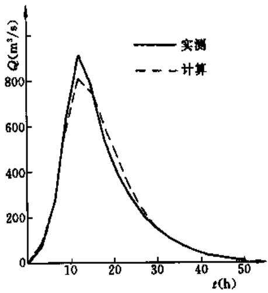

## 四、地貌瞬时单位线法

## (一) 概述

河流是水的产物，河网的特征集中地反映了一个

图 4-33 实测与计算流量过程线比较

流域的水文情势，同时，水的汇集与流动又受到河网的约束。因此，借助某种数学模型，将地貌信息转化为水文信息，然后结合降雨特性，就能推求流域出口断面的流量过程。基于流域地貌特征和概率方法的地貌瞬时单位线，是近十几年来发展起来的一种有物理根据的流域汇流随机模型。

设有大量大小相同且互不相干的水滴在瞬间注入流域。水滴需经过一定的滞留时间才到达流域出口断面。不同的水滴有其各自的滞留时间，但具有相同的分布函数。根据水量平衡原理及概率论中的大数定律，认为流域的瞬时单位线u(t)等同于水滴在流域内滞留时间的概率密度函数fB(t)。在天然流域上，随机降落的雨滴沿着一定的路径，经坡地和 $f _ { B }$ 河槽到达出口断面。任一水滴行经的路径在所有各种可能路径中的可能性，就是路径的函数概率。路径函数概率借助于第二章第二节斯特拉勒（Strahler）的河流级别数序概念和霍顿（Horton）的地貌定律来确定。雨滴沿每一路径的随机滞留时间的概率密度函数，乘以各该路径的函数概率，并对所有各种可能路径的上述乘积求总和，就是流域滞留时间的概率密度函数 $f _ { B } \ ( t )$ 。通过把流域的几何特征对汇流过程的影响有机地联系起来，即可导出瞬时单位线。

## （二）地貌瞬时单位线的表达式

设流域内输入瞬时单位雨深。令 $C _ { i } \ ( 1 { \leqslant } i { \leqslant } 0 )$ 代表河流状态， $r _ { i } ( 1 \leqslant i \leqslant \Omega )$ 代表坡地状态， $\pmb { \mathscr { a } }$ 为河流级别。任一雨滴降落在任意 $\pmb { r _ { i } }$ 处，它将按下列规则移动：

规则1： $r _ { i } {  } C _ { i } \qquad ( 1 { \leqslant } i { \leqslant } \Omega )$

规则 $\begin{array} { r l } { { 2 } \colon C _ { i } {  } C _ { j } } & { { } ( j { > } i , \ i { = } 1 , \ 2 , \ \cdots , \ \Omega ) } \end{array}$

规则3： $c _ { \mathfrak { s } + }$ 为出口断面，水滴不能愈越 $C _ { n + 1 }$ 状态。

以三级流域为例，见图4-34，水滴移动的“路径” $s { = }$ $( s _ { 1 } \cdot \ s _ { 2 } \cdot \ s _ { 3 } \cdot \ s _ { 4 } )$ (见图4-35)为：

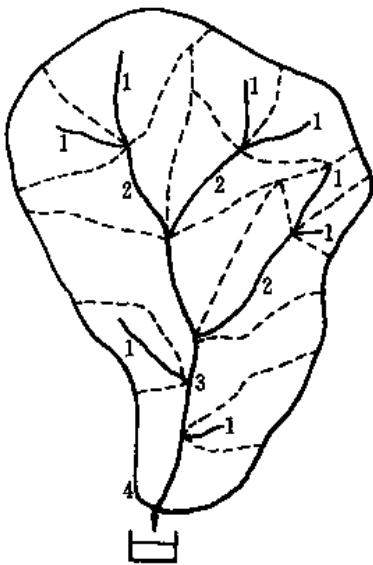

$$
\begin{array} { l } { { s _ { 1 } : \ r _ { 1 } { \to } C _ { 1 } { \to } C _ { 2 } { \to } C _ { 3 } { \to } C _ { 4 } } } \\ { { \ } } \\ { { s _ { 2 } : \ r _ { 1 } { \to } C _ { 1 } { \to } C _ { 3 } { \to } C _ { 4 } } } \\ { { \ } } \\ { { s _ { 3 } : \ r _ { 2 } { \to } C _ { 2 } { \to } C _ { 3 } { \to } C _ { 4 } } } \\ { { \ } } \\ { { s _ { 4 } : \ r _ { 3 } { \to } C _ { 3 } { \to } C _ { 4 } } } \end{array}
$$

图 4-34 三级流域示意图

$s _ { i } ( i { = } 1 , ~ 2 , ~ 3 , ~ 4 )$ 表示净雨滴汇集的第i条路径，本例共4条。以第一条路径 ${ \pmb S } _ { \mathbf { l } }$ 为例， $r _ { 1 }$ $ C _ { 1 } {  } C _ { 2 } {  } C _ { 3 } {  } C _ { 4 }$ 表示降落在一级河流坡面上的净雨滴 $r _ { 1 }$ ，首先汇集到一级河流 $C _ { 1 }$ ，然后由 $C _ { 1 }$ 汇集到二级河流 $C _ { z }$ ，再由 $C _ { 2 }$ 汇集到三级河流 $c _ { 3 }$ ，最后由 $C _ { 3 }$ 汇集到流域出口断面 $C _ { 4 }$ 即收集状态。

水滴沿“路径”运动过程中，每一状态都消耗了一定的时间，称为滞留时间。水滴在$\pmb { x }$ 状态下 $( x = r _ { i }$ 或 $C _ { i } )$ 的滞留时间 $\pmb { T } _ { \pmb { x } }$ 是一个随机变量。令 $\mathbb { \Pi } _ { r _ { i } } .$ 代表 $\pmb { r _ { i } }$ 坡地面积占总流域面积的百分数， $\bar { P } _ { c , c _ { i } }$ 代表i级河流注人 $\pmb { j }$ 级河流的概率，由定义可知， $P _ { c _ { i } c _ { i + 1 } } { = } 1 , \ P _ { r _ { i } c _ { i } } { = } 1$ 0

对任一移动路径s $( s \in S ) , \ s = \ ( x _ { 1 } , \ \cdots , \ x _ { k } ) \ \in \ ( C _ { 1 } , \ \cdots , \ C _ { a } , \ r _ { 1 } , \ \cdots , \ r _ { n } )$ ，则移动路径概率函数P（s）为：

$$
P ( s ) = \Pi _ { r _ { i } } P _ { x _ { 1 } x _ { 2 } } P _ { x _ { 2 } x _ { 3 } } { \cdots } P _ { x _ { k - 1 } x _ { k } }\tag{4-62}
$$

它可以根据流域地貌特征确定。

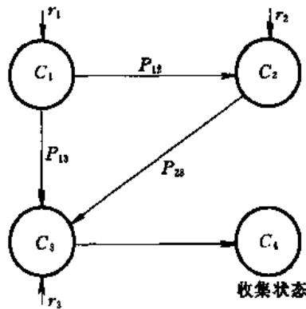  
图 4-35 净雨滴状态的转移

则得：

$$
T _ { s } = T _ { z _ { l } } + T _ { z _ { l } } + \cdots + T _ { z _ { l } }\tag{4-63}
$$

以 $f _ { x } , \pmb { F } _ { x }$ 分别代表 $\pmb { T _ { z } }$ 的概率密度函数和概率分布函数，注意到 $\pmb { T _ { B } }$ 是水滴在流域内的滞留时间，可把 $\pmb { T _ { B } }$ 写为：

$$
T _ { \mathcal { B } } = \sum _ { s \in S } T _ { s } I _ { s }\tag{4-64}
$$

式中，如水滴沿s流动， $\pmb { I _ { s } = 1 }$ ；否则 ${ \cal I } , = 0$

由于所有移动路径S均不相同，由式（4-64）可得：

$$
P ( T _ { B } < t ) = \underset { s \in S } { \sum } P ( T , < t ) \ \cdot \ P ( s )
$$

$$
= \sum _ { s \in S } F _ { x _ { 1 } } * F _ { x _ { 2 } } \times \cdots * F _ { x _ { k } } ( t ) \cdot P ( s ) , \quad ( s = ( x _ { 1 } , x _ { 2 } , \cdots , x _ { k } ) )\tag{4-65}
$$

式中，\*表示卷积相乘。对t求导，得：

$$
\begin{array} { r } { u ( t ) = \underset { s \in S } { \sum } f _ { x _ { 1 } } * f _ { x _ { 2 } } * \cdots * f _ { x _ { k } } ( t ) \cdot P ( s ) , \quad ( s = ( x _ { 1 } , x _ { 2 } , \cdots , x _ { k } ) ) } \end{array}\tag{4-66}
$$

上式即为地貌单位线的表达式。

上述推导可展延到连续降雨 $\textit { i } \left( \tau \right) \left( \tau \right) > 0 )$ 。考虑到时段间隔 $( \pmb { \tau } , \pmb { \tau } \pmb { \bot } \pmb { \Delta } \pmb { \tau } )$ 很小，则$\textit { i } \left( \tau \right) \cdot \Delta \tau$ 代表 $\Delta \pmb { \tau }$ 时段内注人流域内的水滴数，故在 $\complement \sim \tau$ 时段内的降雨在 $t ( t > \tau )$ 时刻到达出口断面的水滴百分数为：

$$
f _ { B } ( t - \tau ) \cdot i ( \tau ) \cdot \Delta \tau = u ( t - \tau ) \cdot i ( \tau ) \cdot \Delta \tau\tag{4-67}
$$

式中 $f _ { B } { \mathrm { -- } } T _ { B }$ 的概率密度函数。

考虑到水滴间的相互独立性，在t时刻从 ${ 0 } \sim \tau$ 时段内降落的水滴所形成的流量为：

$$
Q ( t ) = \int _ { 0 } ^ { t } u ( t - \tau ) i ( \tau ) d \tau\tag{4-68}
$$

上式即为线性的流量卷积公式，与式（4-41）完全相同。

以下推求 $\textbf { \em u } \left( t \right)$ 。以三级河流流域为例，水滴移动路径如前述 ${ \boldsymbol { S } } = \ ( \mathbf { { \sigma } } _ { s _ { 1 } } , \ \mathbf { { \sigma } } _ { s _ { 2 } } , \ s _ { 3 } , \ \mathbf { { \sigma } } _ { s _ { 4 } } )$ 。对任一路径 $s _ { i } ( s _ { i } \in S , \ i = 1 , \ 2 , \ 3 , \ 4 )$ ，根据式（4-62），其路径概率函数 $\textbf { \textit { p } } ( { \boldsymbol { \mathsf { s } } } )$ 为：

$$
\left. \begin{array} { l } { { P ( s _ { 1 } ) = \theta _ { 1 } ( 0 ) \cdot P _ { 1 2 } } } \\ { {  } } \\ { { P ( s _ { 2 } ) = \theta _ { 1 } ( 0 ) \cdot P _ { 1 3 } } } \\ { {  } } \\ { { P ( s _ { 3 } ) = \theta _ { 2 } ( 0 ) } } \\ { {  } } \\ { { P ( s _ { 4 } ) = \theta _ { 3 } ( 0 ) } } \end{array} \right\}\tag{4-69}
$$

式中 $P _ { i j }$ —水滴转移概率；

θ.(0)——水滴初始概率。

又根据式（4-66），地貌单位线为：

$$
\begin{array} { r l } & { u ( t ) = P ( s _ { 1 } ) \cdot f _ { r _ { 1 } } ( t ) \ast f _ { c _ { 1 } } ( t ) \ast f _ { c _ { 2 } } ( t ) \ast f _ { c _ { 3 } } ( t ) + P ( s _ { 2 } ) \cdot f _ { r _ { 1 } } ( t ) \ast f _ { c _ { 1 } } ( t ) \ast f _ { c _ { 3 } } ( t ) } \\ & { \phantom { u s p a c e } + P ( s _ { 3 } ) \cdot f _ { r _ { 2 } } ( t ) \ast f _ { c _ { 2 } } ( t ) \ast f _ { c _ { 3 } } ( t ) + P ( s _ { 4 } ) \cdot f _ { r _ { 3 } } ( t ) \ast f _ { c _ { 3 } } ( t ) } \end{array}\tag{4-70}
$$

假设坡面汇流时间可忽略不计，且全河网滞留时间的概率密度函数为指数分布，即：

$$
f _ { c _ { i } } ( t ) = \lambda _ { i } \mathrm { e } ^ { - \lambda _ { i } t }\tag{4-71}
$$

式中 $\lambda _ { i }$ —第i级河流的平均滞留时间的倒数。

对式（4-70）进行拉普拉斯变换，最后得：

$$
\begin{array} { c } { { u ( t ) = \theta _ { 1 } ( 0 ) \Big [ \frac { { \lambda _ { 2 } \lambda _ { 3 } } ( \lambda _ { 2 } - \lambda _ { 1 } P _ { 1 3 } ) } { ( \lambda _ { 2 } - \lambda _ { 1 } ) ( \lambda _ { 3 } - \lambda _ { 1 } ) } \mathrm { e } ^ { - \lambda _ { 1 } t } + \frac { { \lambda _ { 1 } \lambda _ { 2 } \lambda _ { 3 } P _ { 1 2 } } } { ( \lambda _ { 1 } - \lambda _ { 2 } ) ( \lambda _ { 3 } - \lambda _ { 2 } ) } \mathrm { e } ^ { - \lambda _ { z } t } } } \\ { { + \frac { { \lambda _ { 1 } \lambda _ { 3 } } ( \lambda _ { 2 } - \lambda _ { 3 } P _ { 1 3 } ) } { ( \lambda _ { 1 } - \lambda _ { 3 } ) ( \lambda _ { 2 } - \lambda _ { 3 } ) } \mathrm { e } ^ { - \lambda _ { y } t } \Big ] + \theta _ { 2 } ( 0 ) \Big [ \frac { { \lambda _ { 2 } \lambda _ { 3 } } } { \lambda _ { 3 } - \lambda _ { 2 } } \mathrm { e } ^ { - \lambda _ { z } t } } } \\ { { + \frac { { \lambda _ { 2 } \lambda _ { 3 } } } { { \lambda _ { 2 } } - { \lambda _ { 3 } } } \mathrm { e } ^ { - \lambda _ { z } t } \Big ] + \theta _ { 3 } ( 0 ) \lambda _ { 3 } \mathrm { e } ^ { - \lambda _ { z } t } } } \end{array}\tag{4-72}
$$

由此可知，地貌单位线u（t）是由三个参数，即转移概率 $P _ { i j } \ ( i \neq j )$ ，初始状态概率$\theta _ { i }$ (0) 和平均滞留时间的倒数 $\lambda$ 所组成的。

## (三)参数的确定

1. 转移概率 $\bar { P } _ { i j }$ 7

$P _ { i j }$ 是指i级河流中流人j级河流的河流数占i级河流总数的比率，即：

$$
P _ { i j } = \frac { \hbar \lambda - j \frac { 4 \alpha } { 2 \lambda } \Im a \Im a \left( \beta \right) + j \frac { 4 \alpha } { 3 \lambda } \Im a \Im a } { i \frac { \hbar \lambda } { 2 \lambda } \Re \left\{ \left. \begin{array} { l } { { \partial \Omega } , } \\ { { \partial \{ \lambda , \alpha \} } } \end{array} \right| _ { j = i + 1 , i + 2 , \cdots , 0 + 1 } ^ { \infty } \right| } _ { j = i + 1 , i + 2 , \cdots , 0 + 1 } ,\tag{4-73}
$$

对于三级河流有：

$$
\left. \begin{array} { c } { { P _ { \mathrm { { l } z } } = \displaystyle \frac { R _ { B } ^ { 2 } + 2 R _ { B } - 2 } { 2 R _ { B } ^ { 2 } - R _ { B } } } } \\ { { } } \\ { { P _ { \mathrm { { l } 3 } } = \displaystyle \frac { R _ { B } ^ { 2 } - 3 R _ { B } + 2 } { 2 R _ { B } ^ { 2 } - R _ { B } } } } \end{array} \right\}\tag{4-74}
$$

式中， $R _ { B }$ 为河数比，即分叉比。

## 2. 初始状态概率 $\pmb \theta _ { i }$ (0)

由雨滴起始状态概率定义可知：

$$
\theta _ { i } ( 0 ) = \frac { \sqrt [ 4 ] { 9 } + 4 \sqrt [ 4 ] { 9 } \times 1 9 } { 9 \times 1 0 0 } \frac { \sqrt [ 3 ] { 1 2 } \times 1 0 } { 1 0 0 } \sqrt [ 3 ] { 9 }\tag{4-75}
$$

对于三级河流有：

$$
\left. \begin{array} { l } { { \theta _ { 1 } ( 0 ) = R _ { B } ^ { _ { 2 } } R _ { F } ^ { _ { - } 2 } } } \\ { { \theta _ { 2 } ( 0 ) = \displaystyle \frac { R _ { B } } { R _ { F } } - \frac { R _ { B } ^ { _ { 3 } } + 2 R _ { B } ^ { _ { 2 } } - 2 R _ { B } } { R _ { F } ^ { _ { + } } ( 2 R _ { B } - 1 ) } } } \\ { { \theta _ { 3 } ( 0 ) = 1 - \displaystyle \frac { R _ { B } } { R _ { F } } - \frac { R _ { B } } { R _ { F } ^ { _ { 2 } } } \Big ( \frac { R _ { B } ^ { _ { 2 } } - 3 R _ { B } + 2 } { 2 R _ { B } - 1 } \Big ) } } \end{array} \right\}\tag{4-76}
$$

式中， $R _ { F }$ 为面积比。

3. 平均滞留时间的倒数λ

$\lambda _ { * } ^ { - 1 }$ 是雨滴耗费在i状态的平均时间，根据河长律定义，并假定全流域的流速可取为常数，于是得：

$$
\lambda = \frac { V } { \tilde { L } _ { i } } \quad ( i = 1 , 2 , \cdots , \varOmega )\tag{4-77}
$$

式中 $V \cdot$ ——河流的平均流速；

$\bar { L } _ { i }$ ——第i级河流平均河长。

对于三级河流流域有：

$$
\left. \begin{array} { l } { { \lambda _ { 1 } = \frac { V } { L _ { 1 } } } } \\ { { { \lambda _ { 2 } } = \lambda _ { 1 } R _ { L } ^ { - 1 } } } \\ { { { \lambda _ { 3 } } = \lambda _ { 1 } R _ { L } ^ { - 2 } } } \end{array} \right\}\tag{4-78}
$$

式中， $R _ { L }$ 为河长比。

上述公式中的分叉比 $R _ { B }$ ，面积比 $R _ { F }$ 及河长比 $R _ { L }$ 按第二章第二节方法确定。

同理可推得四级、五级及更多级河流的地貌瞬时单位线。

## (四) 算例

【例4-11】浙江省钱塘江水系密赛流域，流域面积 $\pmb { F } = 7 9 8 \mathbf { k m } ^ { 2 }$ ，河流级别Ω为3级。

## 1. 流域地貌参数

在地形图上量算地貌参数如表4-13。

表 4-13  
密賽流域地貌参数及θ（0）和 $\mathcal { P } _ { i j }$ 值表
<table><tr><td rowspan=1 colspan=1>河流级别</td><td rowspan=1 colspan=1> $\mathbf { { N } } ,$ (条)</td><td rowspan=1 colspan=1> $\scriptstyle { \overline { { L } } } _ { t }$  $\left( \mathsf { k m } \right)$ </td><td rowspan=1 colspan=1> ${ \pmb { F } } _ { \ast }$  $( \tt k m ^ { 2 } )$ </td><td rowspan=1 colspan=1> $\mathbb { R } _ { B }$ </td><td rowspan=1 colspan=1> $\scriptstyle R _ { L }$ </td><td rowspan=1 colspan=1> $R _ { F }$ </td><td rowspan=1 colspan=1> $\pmb { \theta } _ { 1 } ( \pmb { 0 } )$ </td><td rowspan=1 colspan=1> $\theta _ { 2 } ( 0 )$ </td><td rowspan=1 colspan=1> $\pmb { \theta _ { 3 } } ( 0 )$ </td><td rowspan=1 colspan=1> ${ \cal P } _ { 1 2 }$ </td><td rowspan=1 colspan=1> $P _ { 1 3 }$ </td></tr><tr><td rowspan=1 colspan=1>1</td><td rowspan=1 colspan=1>11</td><td rowspan=1 colspan=1>1.50</td><td rowspan=1 colspan=1>39.2</td><td rowspan=3 colspan=1>3.30</td><td rowspan=3 colspan=1>2.76</td><td rowspan=3 colspan=1>4.54</td><td rowspan=3 colspan=1>0.5283</td><td rowspan=3 colspan=1>0.2840</td><td rowspan=3 colspan=1>0.1877</td><td rowspan=3 colspan=1>0.8382</td><td rowspan=3 colspan=1>0.1618</td></tr><tr><td rowspan=1 colspan=1>2</td><td rowspan=1 colspan=1>3</td><td rowspan=1 colspan=1>9.50</td><td rowspan=1 colspan=1>116.3</td></tr><tr><td rowspan=1 colspan=1>3</td><td rowspan=1 colspan=1>1</td><td rowspan=1 colspan=1>35.2</td><td rowspan=1 colspan=1>797.6</td></tr></table>

## 2. 流速确定

由密赛水文站水位\~断面平均流速关系，取若于次洪水的洪峰流量相应流速的平均值，得 $V { = } 2 . 9 0 \mathrm { m } / \mathrm { s }$

3. 初始状态概率 (0) 和转移概率 $P _ { i j }$

将地貌参数代入式（4-74）和式（4-76），计算出 $P _ { i j }$ 和θ(0)，结果见表4-13。

## 4. 产汇流计算

采用蓄满产流模型进行产流计算。汇流方案采用地貌瞬时单位线，将地貌参数和平均流速值代入三级河流流域的地貌瞬时单位线公式（4-72)，并转化为 $\Delta t = 3 \mathrm { h }$ 的时段单位线，如表4-14。计算和实测洪水过程线比较见图4-36。

表 4-14  
密赛流域地貌单位线（Δt=3h）
<table><tr><td rowspan=1 colspan=1>时段数</td><td rowspan=1 colspan=1>0</td><td rowspan=1 colspan=1>1</td><td rowspan=1 colspan=1>2</td><td rowspan=1 colspan=1>3</td><td rowspan=1 colspan=1>4</td><td rowspan=1 colspan=1>5</td><td rowspan=1 colspan=1>6</td><td rowspan=1 colspan=1>7</td><td rowspan=1 colspan=1>8</td><td rowspan=1 colspan=1>9</td><td rowspan=1 colspan=1>10</td><td rowspan=1 colspan=1>11</td><td rowspan=1 colspan=1>12</td></tr><tr><td rowspan=1 colspan=1>地貌单位线</td><td rowspan=1 colspan=1>0</td><td rowspan=1 colspan=1>0.1436</td><td rowspan=1 colspan=1>0.2525</td><td rowspan=1 colspan=1>0.3005</td><td rowspan=1 colspan=1>0.1766</td><td rowspan=1 colspan=1>0.0755</td><td rowspan=1 colspan=1>0.0307</td><td rowspan=1 colspan=1>0.0123</td><td rowspan=1 colspan=1>0.0050</td><td rowspan=1 colspan=1>[0.0020</td><td rowspan=1 colspan=1>0.0008</td><td rowspan=1 colspan=1>0.0004</td><td rowspan=1 colspan=1>0.0001</td></tr></table>

## 五、地下径流汇流计算

下渗的雨水有一部分渗透到地下潜水面，然后沿水力坡度最大的方向流入河网，最后汇至流域出口断面，形成地下径流过程。许多资料分析表明，地下水的贮水结构可视为一个线性水库，即地下水的蓄量与其出流量的关系为线性函数。下渗的净雨量为其入流量，经地下水库调节后的出流量就是流域出口断面的地下径流出流量。因此，联立求解地下水蓄泄方程与

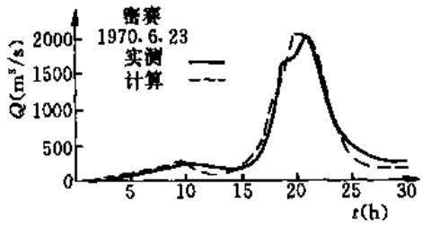  
图4-36 计算和实测流量过程线对比图

地下水的水量平衡方程，就可求出地下径流的汇流过程，即联立求解以下方程组：

$$
\left. \begin{array} { l } { I _ { s } - Q _ { s } = \displaystyle \frac { \mathrm { d } W _ { s } } { \mathrm { d } t } \right\} } \\ { W _ { s } = K _ { s } Q _ { s } } \end{array}\tag{4-79}
$$

式中 $\tilde { I } _ { g }$ 地下径流的人流率，即降雨对地下水的补给强度；

$Q _ { g }$ ——地下径流的出流量；

$W _ { g }$ ——地下水蓄量；

$K _ { g }$ ——地下水蓄水常数。

实际计算时，可将上式写为有限差形式的演算式。对某时段 $\pmb { \Delta } \pmb { t }$ ，有：

$$
Q _ { s _ { 2 } } = \frac { \Delta t } { K _ { \varepsilon } + 0 . 5 \Delta t } \bar { I } _ { \varepsilon } + \frac { K _ { \varepsilon } - 0 . 5 \Delta t } { K _ { \varepsilon } + 0 . 5 \Delta t } Q _ { s _ { 1 } }\tag{4-80}
$$

式中 $Q _ { { \bar { g } } _ { 1 } } , Q _ { { \bar { g } } _ { 2 } }$ ——时段初、末地下径流出流量， $\mathbf { m } ^ { 3 } / \mathbf { s }$ 。若上次洪水的地面径流已退尽，本次洪水开始时的起涨流量即为第一时段初的地下径流出流量；

$\daleth _ { g }$ —时段内地下径流的入流率， $\mathbf { m } ^ { 3 } / { \mathsf { s } }$ $\boldsymbol { T } _ { s } = \frac { 1 0 0 0 \times R G \times F } { 3 6 0 0 \times \Delta t } = \frac { 0 . 2 7 8 R G \times F } { \Delta t }$

${ \pmb F } \mathrm { . }$ —流域面积， $\mathrm { k m } ^ { 2 }$

$R G .$ ——时段内的地下净雨量，mm；

$\Delta \pmb { t }$ ——计算时段，h。

地下水的蓄水常数 $K _ { g }$ ，以h计，可根据实测退水资料按式（4-5）推算。根据上式逐时段进行计算，就可以求出地下径流的出流过程。

对蓄满产流的情况，应分别推求出地面径流过程和地下径流过程，二者同时刻叠加即为流域出口断面的流量过程。

【例4-12】湿润地区某流域，流域面积 $\pmb { F } = 5 2 9 0 \mathbf { k m } ^ { 2 }$ 。由多次退水过程分析得 。由多次退水过程分析得 $K _ { \pmb { g } } =$

表 4-15 地下径流汇流计算表
<table><tr><td rowspan=1 colspan=1>时间(月，日，时)</td><td rowspan=1 colspan=1>地下净雨RG(mm)</td><td rowspan=1 colspan=1>6.366RG $( \mathbf { m } ^ { 3 } / \mathsf { s } )$ </td><td rowspan=1 colspan=1> $0 . 9 7 4 Q _ { \mu 1 }$  ${ ( \pmb { \ m } ^ { 3 } / \mathsf { s } ) }$ </td><td rowspan=1 colspan=1> $\ Q _ { \alpha 2 }$  $\cos ^ { 3 } / 3 )$ </td></tr><tr><td rowspan=3 colspan=1>4.16.144.16.204.17.2</td><td rowspan=2 colspan=1>3.3</td><td rowspan=1 colspan=1></td><td rowspan=2 colspan=1>49</td><td rowspan=2 colspan=1>5070</td></tr><tr><td rowspan=1 colspan=1>21</td></tr><tr><td rowspan=1 colspan=1>8.1</td><td rowspan=1 colspan=1>52</td><td rowspan=1 colspan=1>68</td><td rowspan=1 colspan=1>120</td></tr><tr><td rowspan=1 colspan=1>4.17.8</td><td rowspan=1 colspan=1>8.1</td><td rowspan=1 colspan=1>52</td><td rowspan=1 colspan=1>117</td><td rowspan=1 colspan=1>169</td></tr><tr><td rowspan=1 colspan=1>4.17.14</td><td rowspan=1 colspan=1>3.2</td><td rowspan=1 colspan=1>20</td><td rowspan=1 colspan=1>165</td><td rowspan=1 colspan=1>185</td></tr><tr><td rowspan=3 colspan=1>4.17.204.18.2</td><td rowspan=1 colspan=1></td><td rowspan=1 colspan=1></td><td rowspan=1 colspan=1>180</td><td rowspan=1 colspan=1>180</td></tr><tr><td rowspan=2 colspan=1></td><td rowspan=1 colspan=1></td><td rowspan=1 colspan=1>175</td><td rowspan=1 colspan=1>175</td></tr><tr><td rowspan=1 colspan=1></td><td rowspan=1 colspan=1>1</td><td rowspan=1 colspan=1>：</td></tr></table>

228h。1985年4月该流域发生一场洪水，起涨流量 $5 0 m ^ { 3 } / { \mathsf { s } }$ ，计算时段 $\Delta t { = } 6 \mathbf { h }$ 。通过产流计算求得该次暴雨产生的地下净雨过程RG如表4-15。试计算该次洪水地下径流的出流过程。

将 $F = 5 2 9 0 \mathrm { k m } ^ { 2 } , k _ { g } = 2 2 8 \mathrm { h } , \Delta t = 6 \mathrm { h }$ 代人式（4-80），得该流域地下径流的演算式为：

$$
\begin{array} { c } { { Q _ { \varepsilon _ { 2 } } { = } \displaystyle \frac { 0 . 2 7 8 \times 5 2 9 0 } { 2 2 8 + 0 . 5 \times 6 } R G + \frac { 2 2 8 + 0 . 5 \times 6 } { 2 2 8 + 0 . 5 \times 6 } Q _ { \varepsilon _ { 1 } } } } \\ { { { = } \ : 6 . 3 6 6 R G + 0 . 9 7 4 Q _ { \varepsilon _ { 1 } } } } \end{array}
$$

取第一时段起始流量 $Q _ { \bar { \varepsilon } _ { 1 } } { = } 5 0 \mathbf { m } ^ { 3 } / \mathbf { s }$ ，逐时段连续演算，结果见表4-15。

## 习 題

4-1 姜湾流域如图 4-37 所示。流域面积 $2 0 . 0 \mathrm { k m } ^ { 2 }$ ，流域内有10个雨量站，各站控制面积

已按垂直平分法求得，并与一次实测降雨过程列于表4-16中。求：(1)绘制泰森多边形；(2)计算本次降雨的流域平均降雨过程及总雨量；(3)绘制时段平均雨强过程线和累积降雨过程线。

4-2 某雨量站的汛期降雨资料（摘录）如表4-17。求：（1）最大一日降雨量、最大24h降雨量和连续最大三日降雨量；(2)连续最大1、3、6、12、24h的平均降雨强度并绘制降雨强度与历时的关系曲线。

表4-16  
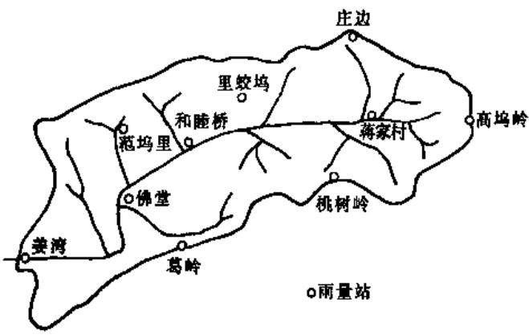  
图 4-37 姜湾流域及雨量站的分布图

美湾流域一次实測降雨量表
<table><tr><td rowspan=3 colspan=1>雨量站</td><td rowspan=3 colspan=1>控制面积 $f _ { t }$ (km²)</td><td rowspan=3 colspan=1>权重a $( = f _ { \prime } / F )$ </td><td rowspan=1 colspan=8>时段雨量(mm)</td></tr><tr><td rowspan=1 colspan=2>13~14时</td><td rowspan=1 colspan=2>14~15时</td><td rowspan=1 colspan=2>15~16时</td><td rowspan=1 colspan=2>16~17时</td></tr><tr><td rowspan=1 colspan=1> $\scriptstyle { P _ { \ell } }$ </td><td rowspan=1 colspan=1> $\scriptstyle \alpha _ { i } P _ { i }$ </td><td rowspan=1 colspan=1> $P _ { j }$ </td><td rowspan=1 colspan=1> $\alpha , P \mathrm { : }$ </td><td rowspan=1 colspan=1> $P _ { i }$ </td><td rowspan=1 colspan=1> $a , P ,$ </td><td rowspan=1 colspan=1> $\pmb { P } _ { j }$ </td><td rowspan=1 colspan=1> $\mathbf { \alpha } _ { \alpha } , P _ { \mathbf { \beta } }$ </td></tr><tr><td rowspan=1 colspan=1>高坞岭蒋家村和睦桥姜清庄边桃树岭里蛟坞范坞里佛堂葛岭全流域</td><td rowspan=1 colspan=1>1.202.792.581.600.941.742.742.342.841.2320.00</td><td rowspan=1 colspan=1></td><td rowspan=1 colspan=1>3.45.07.5011.514.18.50.10.114.5</td><td rowspan=1 colspan=1></td><td rowspan=1 colspan=1>81.160.030.521.546.565.945.736.827.140.9</td><td rowspan=1 colspan=1></td><td rowspan=1 colspan=1>9.711.021.39.715.017.09.87.812.79.4</td><td rowspan=1 colspan=1></td><td rowspan=1 colspan=1>1.40.70.91.81.71.600.90.80.7</td><td rowspan=1 colspan=1></td></tr></table>

表4-17  
某站汛期降雨量摘录表
<table><tr><td rowspan=2 colspan=1>时间(日，时)</td><td rowspan=2 colspan=1>雨盘(mm)</td><td rowspan=2 colspan=1>时间(日，时)</td><td rowspan=1 colspan=1>雨量</td><td rowspan=1 colspan=1>时间</td><td rowspan=1 colspan=1>雨量</td><td rowspan=2 colspan=1>时间(日，时)</td><td rowspan=1 colspan=1>雨量</td></tr><tr><td rowspan=1 colspan=1>(mm)</td><td rowspan=1 colspan=1>(日.时)</td><td rowspan=1 colspan=1>(mm)</td><td rowspan=1 colspan=1>(mm)</td></tr><tr><td rowspan=1 colspan=1>9.2~5</td><td rowspan=1 colspan=1>4.7</td><td rowspan=1 colspan=1>9.19~20</td><td rowspan=1 colspan=1>45.9</td><td rowspan=1 colspan=1>10.6~7</td><td rowspan=1 colspan=1>6.0</td><td rowspan=4 colspan=1>11.11~1411.14~1711.17~2011.20~21</td><td rowspan=4 colspan=1>6.67.01.10.2</td></tr><tr><td rowspan=1 colspan=1>9.5~89.10~119.11~14</td><td rowspan=1 colspan=1>2.71.71.7</td><td rowspan=1 colspan=1>9.20~219.21~2310.23~2</td><td rowspan=2 colspan=1>17.10.51.75.7</td><td rowspan=2 colspan=1>10.7~810.8~910.9~1010.10~11</td><td rowspan=2 colspan=1>28.09.54.53.6</td></tr><tr><td rowspan=1 colspan=1>9.17~18</td><td rowspan=1 colspan=1>0.2</td><td rowspan=1 colspan=1>10.2~5</td></tr><tr><td rowspan=1 colspan=1>9.18~19</td><td rowspan=1 colspan=1>21.3</td><td rowspan=1 colspan=1>10.5~6</td><td rowspan=1 colspan=1>32.0</td><td rowspan=1 colspan=1>10.11~14</td><td rowspan=1 colspan=1>1.2</td></tr></table>

4-3 某流域面积1600km²，多年平均降水量1050mm，多年平均流量 $2 2 . 3  { \mathrm { m } } ^ { 3 } / \mathrm { s }$ 。问该流域多年平均蒸发量是多少？若流域出口断面修建一水库，水库平均水面面积 $1 5 \mathrm { k m } ^ { 2 }$ 。当地实测水面蒸发量的多年平均值970mm，蒸发器折算系数0.87。问建库后该流域多年平均径流量有何变化？变化多少？

4-4某流域1989年7月12日至25日的逐日平均降雨量、流域的蓄水容量WM及7月份流域蒸发能力EM等资料如表4-18所示。试推求7月17～25日逐日的$P _ { \bullet }$ 值。

表4-18 某流域1989年7月P、EM、WM资料表
<table><tr><td>日期 (月.日)</td><td>雨量P (mm)</td><td> $\pmb { P _ { \pmb { \mathscr { o } } } }$   $\mathbf { \Omega } ( \mathbf { m } \mathbf { m } )$ </td><td>备注</td></tr><tr><td>7.12 7.13 7.14 7.15 7.16 7.17 7.18</td><td>6.0 12.0 29.0 35.6 22.0</td><td>80.0</td><td>①7月份EM= 4. 0mm/d  $\textcircled { 2 } \mathbf { W } \mathbf { M } = 8 0 , 0 \mathbf { m } \mathbf { m }$  ③7月16日前连</td></tr><tr><td>7.19 7.20 7.21</td><td>0.3</td><td></td><td>续降雨，该日开始时 的流域蓄水量可达 WM</td></tr><tr><td>7.22 7.23 7.24 7.25</td><td>48.0</td><td></td><td></td></tr></table>

表 4-19

4-5 某流域已求得 44 次暴雨洪水相应的流域平均降雨量P、前期影响雨量 $\pmb { P _ { a } }$ 、次洪径流深R，如表4-19所示。求：（1）绘制降雨径流 $P { \sim } P _ { \alpha } { \sim } R$ 相关图及简化的 $( P +$ $P _ { a } ) \sim R$ 相关图；(2)该流域6月11日和12日一次降雨过程，雨量分别为84.5mm和25.0mm，起始 $\pmb { \mathcal { P } _ { a } }$ 值为65.0mm。试求这场降雨的产流量。

某流域各场雨洪的P、 $\pmb { P _ { \bullet } } .$ R值表  
单位：mm
<table><tr><td rowspan=1 colspan=1>洪号</td><td rowspan=1 colspan=1>P</td><td rowspan=1 colspan=1> $P _ { * }$ </td><td rowspan=1 colspan=1>R</td><td rowspan=1 colspan=2> $\pmb { P } _ { \alpha }$ </td><td rowspan=1 colspan=1>洪号</td><td rowspan=1 colspan=2> $\pmb { P }$ </td><td rowspan=1 colspan=1> $\pmb { P } _ { \pmb { \mathrm { \uparrow } } }$ </td><td rowspan=1 colspan=1>R</td><td rowspan=1 colspan=1> $\pmb { P } \mathrm { \neq }$ </td></tr><tr><td rowspan=6 colspan=1>12345</td><td rowspan=5 colspan=1>129.9129.367.837.9</td><td rowspan=1 colspan=1>52.6</td><td rowspan=1 colspan=1>77.8</td><td rowspan=1 colspan=2>182.5</td><td rowspan=1 colspan=1>23</td><td rowspan=1 colspan=2>61.2</td><td rowspan=1 colspan=1>76.4</td><td rowspan=1 colspan=1>50.3</td><td rowspan=1 colspan=1>137.6</td></tr><tr><td rowspan=4 colspan=1>70.080.080.0</td><td rowspan=3 colspan=1>90.048.0</td><td rowspan=3 colspan=2>199.3147.8</td><td rowspan=1 colspan=1>24</td><td rowspan=2 colspan=2>69.9</td><td rowspan=1 colspan=1>54.2</td><td rowspan=1 colspan=1>29.5</td><td rowspan=1 colspan=1>124.1</td></tr><tr><td rowspan=2 colspan=1>1.8</td><td rowspan=2 colspan=1>25</td><td rowspan=2 colspan=1>47</td><td rowspan=2 colspan=1>.4</td><td rowspan=2 colspan=1>76.4</td><td rowspan=2 colspan=1>36.1</td><td rowspan=2 colspan=1>123.8</td></tr><tr><td rowspan=2 colspan=2>75.2</td></tr><tr><td rowspan=1 colspan=1>34.3</td><td rowspan=1 colspan=2>117.9</td><td rowspan=1 colspan=1>26</td><td rowspan=1 colspan=1>66.6</td><td rowspan=1 colspan=1>46.2</td><td rowspan=1 colspan=1>141.8</td></tr><tr><td rowspan=1 colspan=1>54.3</td><td rowspan=1 colspan=1>79.2</td><td rowspan=1 colspan=1>36.0</td><td rowspan=1 colspan=2>133.5</td><td rowspan=1 colspan=1>27</td><td rowspan=1 colspan=2>197.0</td><td rowspan=1 colspan=1>76.3</td><td rowspan=1 colspan=1>169.0</td><td rowspan=1 colspan=1>273.3</td></tr><tr><td rowspan=1 colspan=1>6</td><td rowspan=1 colspan=1>101.9</td><td rowspan=1 colspan=1>37.8</td><td rowspan=1 colspan=1>35.0</td><td rowspan=1 colspan=2>139.7</td><td rowspan=1 colspan=1>28</td><td rowspan=1 colspan=2>95.9</td><td rowspan=1 colspan=1>73.3</td><td rowspan=1 colspan=1>72.5</td><td rowspan=1 colspan=1>169.2</td></tr><tr><td rowspan=1 colspan=1>7</td><td rowspan=1 colspan=1>72.4</td><td rowspan=1 colspan=1>68.0</td><td rowspan=1 colspan=1>38.3</td><td rowspan=1 colspan=2>140.4</td><td rowspan=1 colspan=1>29</td><td rowspan=1 colspan=2>66.4</td><td rowspan=1 colspan=1>18.3</td><td rowspan=1 colspan=1>3.1</td><td rowspan=1 colspan=1>84.7</td></tr><tr><td rowspan=1 colspan=1>8</td><td rowspan=1 colspan=1>25.8</td><td rowspan=1 colspan=1>57.8</td><td rowspan=1 colspan=1>14.1</td><td rowspan=1 colspan=2>83.6</td><td rowspan=1 colspan=1>30</td><td rowspan=1 colspan=2>38.0</td><td rowspan=1 colspan=1>31.7</td><td rowspan=1 colspan=1>1.9</td><td rowspan=1 colspan=1>89.7</td></tr><tr><td rowspan=1 colspan=1>9</td><td rowspan=1 colspan=1>30.3</td><td rowspan=1 colspan=1>72.3</td><td rowspan=1 colspan=1>15.2</td><td rowspan=1 colspan=2>102.6</td><td rowspan=1 colspan=1>31</td><td rowspan=1 colspan=2>46.9</td><td rowspan=1 colspan=1>60.6</td><td rowspan=1 colspan=1>14.0</td><td rowspan=1 colspan=1>107.5</td></tr><tr><td rowspan=1 colspan=1>10</td><td rowspan=1 colspan=1>43.8</td><td rowspan=1 colspan=1>20.4</td><td rowspan=1 colspan=1>2.3</td><td rowspan=1 colspan=2>67.2</td><td rowspan=1 colspan=1>32</td><td rowspan=1 colspan=2>113.5</td><td rowspan=1 colspan=1>62.0</td><td rowspan=1 colspan=1>73.0</td><td rowspan=1 colspan=1>175.5</td></tr><tr><td rowspan=1 colspan=1>11</td><td rowspan=1 colspan=1>22.6</td><td rowspan=1 colspan=1>39.5</td><td rowspan=1 colspan=1>3.4</td><td rowspan=1 colspan=2>62.1</td><td rowspan=1 colspan=1>33</td><td rowspan=1 colspan=2>48.0</td><td rowspan=1 colspan=1>80.0</td><td rowspan=1 colspan=1>44.0</td><td rowspan=1 colspan=1>128.0</td></tr><tr><td rowspan=1 colspan=1>12</td><td rowspan=1 colspan=1>106.9</td><td rowspan=1 colspan=1>33.7</td><td rowspan=1 colspan=1>37.3</td><td rowspan=1 colspan=2>140.6</td><td rowspan=1 colspan=1>34</td><td rowspan=1 colspan=2>65.8</td><td rowspan=1 colspan=1>76.8</td><td rowspan=1 colspan=1>55.0</td><td rowspan=1 colspan=1>142.6</td></tr><tr><td rowspan=1 colspan=1>13</td><td rowspan=1 colspan=1>51.4</td><td rowspan=1 colspan=1>23.5</td><td rowspan=1 colspan=1>5.0</td><td rowspan=1 colspan=2>74.9</td><td rowspan=1 colspan=1>35</td><td rowspan=1 colspan=2>54.3</td><td rowspan=1 colspan=1>25.0</td><td rowspan=1 colspan=1>46.0</td><td rowspan=1 colspan=1>128.3</td></tr><tr><td rowspan=1 colspan=1>14</td><td rowspan=1 colspan=1>26.9</td><td rowspan=1 colspan=1>52.0</td><td rowspan=1 colspan=1>7.5</td><td rowspan=1 colspan=2>78.9</td><td rowspan=1 colspan=1>36</td><td rowspan=1 colspan=2>47.3</td><td rowspan=1 colspan=1>74.4</td><td rowspan=1 colspan=1>27.0</td><td rowspan=1 colspan=1>121.7</td></tr><tr><td rowspan=1 colspan=1>15</td><td rowspan=1 colspan=1>90.6</td><td rowspan=1 colspan=1>73.0</td><td rowspan=1 colspan=1>72.8</td><td rowspan=1 colspan=2>163.6</td><td rowspan=1 colspan=1>37</td><td rowspan=1 colspan=2>86.2</td><td rowspan=1 colspan=1>72.3</td><td rowspan=1 colspan=1>54.0</td><td rowspan=1 colspan=1>158.5</td></tr><tr><td rowspan=1 colspan=1>16</td><td rowspan=1 colspan=1>61.4</td><td rowspan=1 colspan=1>68.6</td><td rowspan=1 colspan=1>37.4</td><td rowspan=1 colspan=2>130.0</td><td rowspan=1 colspan=1>38</td><td rowspan=1 colspan=2>77.9</td><td rowspan=1 colspan=1>50.8</td><td rowspan=1 colspan=1>37.0</td><td rowspan=1 colspan=1>128.7</td></tr><tr><td rowspan=1 colspan=1>17</td><td rowspan=1 colspan=1>113.6</td><td rowspan=1 colspan=1>59.5</td><td rowspan=1 colspan=1>84.6</td><td rowspan=1 colspan=2>173.1</td><td rowspan=1 colspan=1>39</td><td rowspan=1 colspan=2>64.6</td><td rowspan=1 colspan=1>43.1</td><td rowspan=1 colspan=1>27.0</td><td rowspan=1 colspan=1>107.7</td></tr><tr><td rowspan=1 colspan=1>18</td><td rowspan=1 colspan=1>124.1</td><td rowspan=1 colspan=1>53.7</td><td rowspan=1 colspan=1>79.6</td><td rowspan=1 colspan=2>177.8</td><td rowspan=1 colspan=1>40</td><td rowspan=1 colspan=2>72.4</td><td rowspan=1 colspan=1>59.0</td><td rowspan=1 colspan=1>35.0</td><td rowspan=1 colspan=1>131.4</td></tr><tr><td rowspan=1 colspan=1>19</td><td rowspan=1 colspan=1>88.1</td><td rowspan=1 colspan=1>59.4</td><td rowspan=1 colspan=1>49.0</td><td rowspan=1 colspan=2>146.5</td><td rowspan=1 colspan=1>41</td><td rowspan=1 colspan=2>104.1</td><td rowspan=1 colspan=1>7.3</td><td rowspan=1 colspan=1>22.0</td><td rowspan=1 colspan=1>111.4</td></tr><tr><td rowspan=1 colspan=1>20</td><td rowspan=1 colspan=1>87.0</td><td rowspan=1 colspan=1>36.4</td><td rowspan=1 colspan=1>35.4</td><td rowspan=1 colspan=2>103.4</td><td rowspan=1 colspan=1>42</td><td rowspan=1 colspan=2>137.1</td><td rowspan=1 colspan=1>70.6</td><td rowspan=1 colspan=1>109.2</td><td rowspan=1 colspan=1>207.7</td></tr><tr><td rowspan=1 colspan=1>21</td><td rowspan=1 colspan=1>46.1</td><td rowspan=1 colspan=1>50.8</td><td rowspan=1 colspan=1>8.5</td><td rowspan=1 colspan=2>96.9</td><td rowspan=1 colspan=1>43</td><td rowspan=1 colspan=2>77.7</td><td rowspan=1 colspan=1>25.4</td><td rowspan=1 colspan=1>12.3</td><td rowspan=1 colspan=1>103.1</td></tr><tr><td rowspan=1 colspan=1>22</td><td rowspan=1 colspan=1>45.1</td><td rowspan=1 colspan=1>73.1</td><td rowspan=1 colspan=1>37.2</td><td rowspan=1 colspan=2>118.2</td><td rowspan=1 colspan=1>44</td><td rowspan=1 colspan=2>78.8</td><td rowspan=1 colspan=1>66.1</td><td rowspan=1 colspan=1>48.0</td><td rowspan=1 colspan=1>144.9</td></tr></table>

4-6 某流域面积 $5 9 4 \mathrm { k m } ^ { 2 }$ ，流域蓄水容量面积分布曲线为抛物线型，参数 $W M = 8 0 \mathrm { m m }$ $\mathcal { B } { = } 0 , 3$ 。1984年9月1\~20日，流域平均日雨量和日蒸散发能力如表4-20所示。求：（1）绘制流域蓄水容量面积分布曲线；(2)计算逐日产流量。蒸散发按二层模型计算，其中WUM$\mathbf { \lambda } = 2 0 \mathbf { m m }$ , V $V L M { = } 6 0 \mathbf { m m }$ 。已知9月1日流域蓄水容量 $W _ { \mathrm { 0 } } { = } 3 7 . \ \mathrm { 0 m m }$ ，其中 $W U _ { \circ } { = } 7 . 0 \ m m$ $\mathtt { W } L _ { 0 } = 3 0 . 0 \mathrm { m m }$

某流域9月1日～20日逐日平均雨量和蒸散发能力表
<table><tr><td rowspan=1 colspan=1>日期</td><td rowspan=1 colspan=1>1</td><td rowspan=1 colspan=1>2</td><td rowspan=1 colspan=1>3</td><td rowspan=1 colspan=1>4</td><td rowspan=1 colspan=1>5</td><td rowspan=1 colspan=1>6</td><td rowspan=1 colspan=1>7</td><td rowspan=1 colspan=1>8</td><td rowspan=1 colspan=1>9</td><td rowspan=1 colspan=1>10</td><td rowspan=1 colspan=1>11</td><td rowspan=1 colspan=1>12</td><td rowspan=1 colspan=1>13</td><td rowspan=1 colspan=1>14</td><td rowspan=1 colspan=1>15</td><td rowspan=1 colspan=1>16</td><td rowspan=1 colspan=1>17</td><td rowspan=1 colspan=1>18</td><td rowspan=1 colspan=1>19</td><td rowspan=1 colspan=1>20</td></tr><tr><td rowspan=1 colspan=1>P(mm)</td><td rowspan=1 colspan=1></td><td rowspan=1 colspan=1></td><td rowspan=1 colspan=1></td><td rowspan=1 colspan=1></td><td rowspan=1 colspan=1></td><td rowspan=1 colspan=1>0.7</td><td rowspan=1 colspan=1>0.9</td><td rowspan=1 colspan=1></td><td rowspan=1 colspan=1>0.1</td><td rowspan=1 colspan=1>1.6</td><td rowspan=1 colspan=1>4.5</td><td rowspan=1 colspan=1></td><td rowspan=1 colspan=1>35.7</td><td rowspan=1 colspan=1>3.9</td><td rowspan=1 colspan=1></td><td rowspan=1 colspan=1>13.6</td><td rowspan=1 colspan=1>24.3</td><td rowspan=1 colspan=1>5.9</td><td rowspan=1 colspan=1>26.8</td><td rowspan=1 colspan=1>4.6</td></tr><tr><td rowspan=1 colspan=1>EM(mm)</td><td rowspan=1 colspan=1>4.2</td><td rowspan=1 colspan=1>4.0</td><td rowspan=1 colspan=1>4.2</td><td rowspan=1 colspan=1>3.8</td><td rowspan=1 colspan=1>2.2</td><td rowspan=1 colspan=1>2.5</td><td rowspan=1 colspan=1>2.4</td><td rowspan=1 colspan=1>3.4</td><td rowspan=1 colspan=1>3.7</td><td rowspan=1 colspan=1>2.2</td><td rowspan=1 colspan=1>1.7</td><td rowspan=1 colspan=1>2.2</td><td rowspan=1 colspan=1>3.6</td><td rowspan=1 colspan=1>0.8</td><td rowspan=1 colspan=1>2.4</td><td rowspan=1 colspan=1>1.2</td><td rowspan=1 colspan=1>0.8</td><td rowspan=1 colspan=1>0.8</td><td rowspan=1 colspan=1>0</td><td rowspan=1 colspan=1>0.9</td></tr></table>

4-7 南河开峰峪水文站控制流域面积 $5 2 5 3  { \mathrm { k m } } ^ { 2 }$ 。1981年5月2日和3日流域上降了一场暴雨，逐时段流域平均P一E列于表4-21。根据流域的降雨径流关系，求得各时段净雨深也列于表4-21中。已分析得本流域稳定下渗率 $f _ { \epsilon } = 0 . 4 \mathbf { m m } / \mathrm { h }$ ，试划分地面、地下净雨。

4-8 某小流域下渗曲线及一次降雨过程资料列于表4-22 和表4-23 中。已知降雨开始时流域蓄水量为15.9mm，若雨期蒸散发可忽略不计，试推求该次降雨的地面产流量。

表 4-21 开峰峪水文站以上流域降雨及径流资料表
<table><tr><td rowspan=1 colspan=1>时间(日，时)</td><td rowspan=1 colspan=1>2.14~2.20</td><td rowspan=1 colspan=1>2.20~3.2</td><td rowspan=1 colspan=1>3.2~3.8</td><td rowspan=1 colspan=1>3.8~3.14</td><td rowspan=1 colspan=1>3.14~3.20</td></tr><tr><td rowspan=1 colspan=1>P-E(mm)</td><td rowspan=1 colspan=1>12.6</td><td rowspan=1 colspan=1>17.4</td><td rowspan=1 colspan=1>16.9</td><td rowspan=1 colspan=1>3.3</td><td rowspan=1 colspan=1>1.4</td></tr><tr><td rowspan=1 colspan=1>R(mm)</td><td rowspan=1 colspan=1>7.9</td><td rowspan=1 colspan=1>11.7</td><td rowspan=1 colspan=1>16.7</td><td rowspan=1 colspan=1>3.3</td><td rowspan=1 colspan=1>1.4</td></tr></table>

表 4-22 某小流域下渗曲线表
<table><tr><td rowspan=1 colspan=1>时间(min)</td><td rowspan=1 colspan=1>0</td><td rowspan=1 colspan=1>4.7</td><td rowspan=1 colspan=1>11.7</td><td rowspan=1 colspan=1>22.1</td><td rowspan=1 colspan=1>37.7</td><td rowspan=1 colspan=1>59.3</td><td rowspan=1 colspan=1>84.5</td></tr><tr><td rowspan=1 colspan=1>∫(mm/min)</td><td rowspan=1 colspan=1>2.601</td><td rowspan=1 colspan=1>.701</td><td rowspan=1 colspan=1>.14</td><td rowspan=1 colspan=1>0.77</td><td rowspan=1 colspan=1>0.510</td><td rowspan=1 colspan=1>.40</td><td rowspan=1 colspan=1>0.40</td></tr></table>

表 4-23  
某小流域一次降雨过程
<table><tr><td rowspan=1 colspan=1>时间（min）</td><td rowspan=1 colspan=1>36~37</td><td rowspan=1 colspan=1>37~38</td><td rowspan=1 colspan=1>38~39</td><td rowspan=1 colspan=1>39~40</td><td rowspan=1 colspan=1>40~41</td><td rowspan=1 colspan=1>41~42</td><td rowspan=1 colspan=1>42~43</td></tr><tr><td rowspan=1 colspan=1>P (mm)</td><td rowspan=1 colspan=1>2.0</td><td rowspan=1 colspan=1>2.6</td><td rowspan=1 colspan=1>2.0</td><td rowspan=1 colspan=1>1.2</td><td rowspan=1 colspan=1>0.9</td><td rowspan=1 colspan=1>0.7</td><td rowspan=1 colspan=1>0.8</td></tr><tr><td rowspan=1 colspan=1>时间（min）</td><td rowspan=1 colspan=1>43~44</td><td rowspan=1 colspan=1>44~45</td><td rowspan=1 colspan=1>45~46</td><td rowspan=1 colspan=1>46~47</td><td rowspan=1 colspan=1>47~48</td><td rowspan=1 colspan=1>48~49</td><td rowspan=1 colspan=1>49~50</td></tr><tr><td rowspan=1 colspan=1>P (mm)</td><td rowspan=1 colspan=1>1.8</td><td rowspan=1 colspan=1>0.7</td><td rowspan=1 colspan=1>1.4</td><td rowspan=1 colspan=1>1.3</td><td rowspan=1 colspan=1>1.3</td><td rowspan=1 colspan=1>1.5</td><td rowspan=1 colspan=1>1.1</td></tr></table>

4-9 某水文站流域面积 $4 4 1 \mathrm { k m } ^ { 2 }$ ，该流域1992年6月23日发生一次暴雨，实测降雨和洪水流量资料如表4-24。该次洪水的地面径流终止点在27日1时。试分析该次暴雨的初损量 ${ { I } _ { \circ } }$ 及平均后损率 $\bar { \pmb f } .$ ，并计算地面净雨过程。

表4-24  
某水文站一次实测降兩及洪水过程资料表
<table><tr><td>时间 (月.日.时)</td><td>P (mm)</td><td>Q  $( \mathbf { m } ^ { 3 } / \mathbf { s } )$ </td><td>时间  $( A \cdot A \cdot B )$ </td><td> $\pmb { P }$   $\left( \mathtt { m m } \right)$ </td><td> $\pmb { Q }$   $\langle \mathbf { m } ^ { 3 } / \mathbf { s } \rangle$ </td><td>时 间  $( A \cdot A \cdot A )$ </td><td> $\pmb { P }$   $\left( \mathtt { m m } \right)$ </td><td>Q  $\langle { m ^ { 3 } } / { \mathfrak { s } } \rangle$ </td></tr><tr><td>6.23.1</td><td>5.3</td><td>10</td><td>6.24.19</td><td></td><td>80</td><td>6.26.13</td><td></td><td>17</td></tr><tr><td>6.23.7</td><td>38.3</td><td>9</td><td>6.25.1</td><td></td><td>55</td><td>6.26.19</td><td></td><td>15</td></tr><tr><td>6.23.13</td><td>13.1</td><td>30</td><td>6.257</td><td></td><td>41</td><td>26.27.1</td><td></td><td>13</td></tr><tr><td>6.23.19</td><td>2.8</td><td>106</td><td>6.2513</td><td></td><td>34</td><td>26.27.7</td><td></td><td>12</td></tr><tr><td>6.24.1 6.24.7</td><td></td><td>324 190</td><td>6.25.19 26.26.1</td><td></td><td>28 23</td><td>6.27.13 6.27.19</td><td></td><td>11 10</td></tr><tr><td>6.24.13</td><td></td><td>117</td><td>26.26.7</td><td></td><td>20</td><td>26.28.1</td><td></td><td>9</td></tr></table>

4-10 某流域面积 $\mathbf { \varepsilon } = 8 8 1 \mathbf { k m } ^ { 2 }$ ，一次实测洪水过程见表4-25。根据产流方案，求得本次洪水的产流历时为两个时段，净雨量分别为14.5mm和9.3mm。（1）试用分析法推求本次洪水的单位线；(2)将所求的单位线转换为6h单位线；(3)根据所求的单位线及表4-26的净雨过程，推算出流域出口断面的地面径流流量过程线。

表 4-25  
单位线分析表
<table><tr><td rowspan=2 colspan=1>日期（月.日.时）</td><td rowspan=2 colspan=1>净雨量h(mm)</td><td rowspan=2 colspan=1>实测流量Q $\bf ( m ^ { 3 } / s )$ </td><td rowspan=2 colspan=1>地下径流量 $\cdot \alpha _ { B }$  $\bf ( m ^ { 3 } / s )$ </td><td rowspan=2 colspan=1>地面径流量 $\cdot \alpha _ { \parallel }$  $\bf ( m ^ { 3 } / s )$ </td><td rowspan=1 colspan=2>部分径流过程</td><td rowspan=2 colspan=1>单位线9 $\bf ( m ^ { 3 } / { \mathfrak { s } } )$ </td><td rowspan=2 colspan=1>修正后单位线q $\cos ^ { 3 } / \sin ^ { 3 } )$ </td></tr><tr><td rowspan=1 colspan=1>h1=14.5</td><td rowspan=1 colspan=1>h2=9.3</td></tr><tr><td rowspan=1 colspan=1>5.10.165.10.195.10.225.11.15.11.45.11.75.11.105, 11.135.11.165.11.195.11.225.12.15.12.45.12.75.12.105.12.135.12.165.12.195.12.225.13.15.13.4</td><td rowspan=1 colspan=1>14.59.3</td><td rowspan=1 colspan=1>18762403662962482101721441189878706252403633313028</td><td rowspan=1 colspan=1>181920202121222324242525252625262627272828</td><td rowspan=1 colspan=1></td><td rowspan=1 colspan=1></td><td rowspan=1 colspan=1></td><td rowspan=1 colspan=1></td><td rowspan=1 colspan=1></td></tr></table>

表 4-26 某流域一次净雨过程
<table><tr><td rowspan=1 colspan=1>时间(h）</td><td rowspan=1 colspan=1>0~6</td><td rowspan=1 colspan=1>6~12</td><td rowspan=1 colspan=1>12~18</td><td rowspan=1 colspan=1>18~24</td></tr><tr><td rowspan=1 colspan=1>净雨量（mm）</td><td rowspan=1 colspan=1>15.3</td><td rowspan=1 colspan=1>21.8</td><td rowspan=1 colspan=1>0</td><td rowspan=1 colspan=1>4.2</td></tr></table>

4-11 利用表4-25 资料推求瞬时单位线的参数n、K，并转化为6h单位线，并根据表4-26的资料推求流域出口断面的地面径流流量过程线。

4-12 某流域出口断面一次退水过程见表4-27。试推求地下水蓄水常数 $K _ { s }$  
表 4-27  
某流域一次退水过程
<table><tr><td rowspan=1 colspan=1>时间(月.日)</td><td rowspan=1 colspan=1>8.2</td><td rowspan=1 colspan=1>8.3</td><td rowspan=1 colspan=1>8.4</td><td rowspan=1 colspan=1>8.5</td><td rowspan=1 colspan=1>8.6</td><td rowspan=1 colspan=1>8.7</td><td rowspan=1 colspan=1>8.8</td><td rowspan=1 colspan=1>8.9</td><td rowspan=1 colspan=1>8.10</td><td rowspan=1 colspan=1>8.11</td><td rowspan=1 colspan=1>8.12</td><td rowspan=1 colspan=1>8.13</td><td rowspan=1 colspan=1>8.14</td></tr><tr><td rowspan=1 colspan=1>Q(m³/s)</td><td rowspan=1 colspan=1>34300</td><td rowspan=1 colspan=1>25000</td><td rowspan=1 colspan=1>14000</td><td rowspan=1 colspan=1>8960</td><td rowspan=1 colspan=1>5740</td><td rowspan=1 colspan=1>4300</td><td rowspan=1 colspan=1>3230</td><td rowspan=1 colspan=1>2760</td><td rowspan=1 colspan=1>2390</td><td rowspan=1 colspan=1>2060</td><td rowspan=1 colspan=1>1770</td><td rowspan=1 colspan=1>1520</td><td rowspan=1 colspan=1>1320</td></tr></table>

# 第五章 水 文 预 报

## 第一节概 述

水文预报是根据水文现象的客观规律，利用实测的水文气象资料，对水文要素未来变化进行预报的一门水文学科，它是水文学的一个重要组成部分。在防范水旱灾害和充分利用水资源的实践中，水文预报的理论有了很大提高和充实，应用也更为广泛。

## 一、水文预报的重要作用

在防洪斗争中，水文预报能事先提供洪水的发生和发展变化的信息，以便在洪水到来之前作好防汛抢险的准备，必要时有计划地采取蓄洪、分洪措施，使洪水灾害减到最低程度。

在水利、水电工程的管理运用中，根据水文预报合理安排调度运用方式，较好地处理防洪和兴利的矛盾，可以大大提高工程的综合效益。我国许多大型水电站和综合利用的水库如白山水电厂、柘溪水电站、丹江口水库等，由于采用预报调度方式，其发电效益和综合利用效益比不利用预报信息的调度方式显著提高。

## 二、水文预报的分类

水文预报按其预报的项目可分径流预报、冰情预报、沙情预报与水质预报。径流预报又可分洪水预报和枯水预报两种，预报的要素主要是水位和流量。水位预报指的是水位高程及其出现时间；流量预报则是流量的大小、涨落时间及其过程。冰情预报是利用影响河流冰情的前期气象因子，预报流凌开始、封冻与开冻日期，冰厚、冰坝及凌汛最高水位等。沙情预报则是根据河流的水沙相关关系，结合流域下垫面因素，预报年、月和一次洪水的含沙量及其过程。

水文预报按其预见期的长短，可分为短期水文预报与中长期水文预报。预报的预见期是指发布预报与预报要素出现的时间间距。在水文预报中，预见期的长与短并没有明确的时间界限，习惯上把主要由水文要素作出的预报称为短期预报；把包括气象预报性质在内的水文预报称为中长期预报。

## 三、水文预报工作的基本程序

水文预报工作大体上分为两大步骤。

(1)制定预报方案：根据预报项目的任务，收集水文、气象等有关资料，探索、分析预报要素的形成规律，建立由过去的观测资料推算水文预报要素大小和出现时间的一整套计算方法，即水文预报方案，并对制定的方案按规范要求的允许误差进行评定和检验。只有质量优良和合格的方案才能付诸应用，否则，应分析原因，加以改进。

(2)进行作业预报：将现时发生的水文气象信息，通过报汛设备迅速传送到预报中心，随即经过预报方案算出即将发生的水文预报要素大小和出现时间，及时将信息发布出去，供有关的部门应用、这个过程称为作业预报。若现时水文气象信息是通过自动化采集、自动传送到预报中心的计算机内，由计算机直接按存储的水文预报模型程序计算出预报结果。这

样的作业预报称为联机作业实时水文预报。

## 第二节短期洪水预报

短期洪水预报包括河段洪水预报和降雨径流预报。河段洪水预报方法是以河槽洪水波运动理论为基础，由河段上游断面的水位、流量过程预报下游断面的水位和流量过程。降雨径流预报方法则是按降雨径流形成过程的原理，利用流域内的降雨资料预报出流域出口断面的洪水过程。

## 一、河段中的洪水波运动

流域上大量降水后，产生的净雨迅速汇集，注人河槽，引起流量的剧增，使河道沿程水面发生高低起伏的一种波动，称为洪水波。

天然河道里洪水波主要受重力和惯性力作用，属于重力波，它是一种徐变的不稳定流。假定图 5-1所示河段为棱柱形河槽，则稳定流水面比降 $\dot { \pmb { \imath } } _ { 0 }$ 与河道坡降相同，而洪水波的水面比降i与 $\dot { \iota _ { \mathfrak { d } } }$ 是不相同的。波前部分 $i \mathop { \sum } i _ { 0 }$ ，波后部分 ${ \dot { t } } < { \dot { t } } _ { 0 }$ 。洪水波水面比降i与同水位的稳定流比降 $i _ { 0 }$ 之差，称为附加比降 $i _ { \Delta } ,$ 即 $\scriptstyle { i _ { \Delta } = i - i _ { 0 } }$ 。附加比降是洪水波的主要特征之一，当水流稳定时， $\mathfrak { i } _ { \Delta } = 0 ;$ 涨洪时， $\pmb { i } _ { \pmb { \Delta } } > 0$ ；落洪时， ${ i _ { \Delta } } { < } 0$

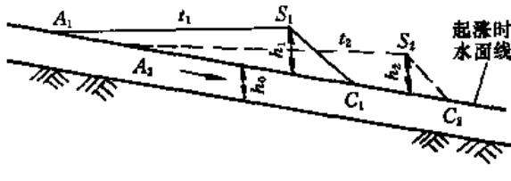  
图 5-1 河道中洪水波变形示意图

洪水波沿河道向下游传播过程中，不断发生变形，图5-1所示的洪水波变形有两种形态，即洪水波的展开和扭曲。在图中从 $\pmb { t } _ { 1 }$ 到 $\pmb { t _ { 2 } }$ 时刻，洪水波的位置自 $\pmb { A } _ { 1 } \pmb { S } _ { 1 } \pmb { C } _ { 1 }$ 传播到 $A _ { 2 } S _ { 2 } C _ { 2 }$ 由于洪水波波前(SC部分)的附加比降大于波后（AS部分）的附加比降，波前的水流运动速

度也就大于波后的，使洪水波在传播过程中，波长不断加大，波高却不断减小，即 $A _ { 2 } C _ { 2 } >$ $A _ { 1 } C _ { 1 }$ $h _ { 2 } < h _ { 1 }$ ，这种现象称为洪水波的展开。

同时，洪水波上各处的水深不同，也使洪水波发生变形。波峰 $\pmb { S } _ { 1 }$ 处水深最大，其运动速度亦大：波的开始点 $C _ { 1 }$ 处水深最小，其运动速度亦小。因此，随着洪水波向下游传播，波峰向它的起点逼近，波前长度不断减小，即 $S _ { 2 } C _ { 2 } { < } S _ { 1 } C _ { 1 }$ ，附加比降不断加大，而波后的长度不断增加，即 $A _ { 2 } S _ { 2 } { > } A _ { 1 } S _ { 1 }$ ，附加比降不断减小。因而波前水量不断向波后转移，这种现象称为洪水波的扭曲。这两种现象是并存与同时发生的，其出现的原因正是因为附加比降的影响。

河道断面边界条件的差异对洪水波变形也有显著影响。若河段下断面面积比上断面面积大得多，则洪水波的展开就更为显著。又如洪水漫滩时，洪水波的展开量将大大增加，致使洪峰降低，洪水历时增长。

此外，河段有区间入流时，由于有旁侧入流的加人，改变了洪水波的流量和速度，从而使洪水波的变形更为复杂。

## 二、相应水位（流量）法

根据河段洪水波运动和变形规律，利用河段上断面的实测水位（流量)，预报河段下断面未来水位（流量）的方法，称为相应水位（流量）法。用相应水位（流量）法制作预报

方案时，一般不直接去研究洪水波的变形问题，而是用断面实测水位（流量）过程资料，建立上下游站同次洪水水位（流量）间的相关关系，综合反映该河段洪水波变形的各项因素。

## (一) 基本原理

相应水位是指河段上下站同次洪水过程线上同位相的水位。如图5-2所示某次洪水过程线上的各个特征点，例如上游a点洪峰水位经过河段传播时间τ，在下游站a'点的洪峰水 ${ \pmb { \alpha } } ^ { \prime }$ 位，就是同位相的水位。处于同一位相点上下站的流量称为相应流量。

河段相应水位与相应流量有直接关系，要研究河道中水位的变化规律，就应当研究形成该水位的流量变化规律。

设河段上下游两站的距离为L，t时刻的上游站流量为 $\mathsf { \Omega } _ { \mathsf { L } _ { \mathsf { L } } } .$ ，经过时间τ的传播，下游站的相应流量为 $Q _ { \tilde { \tilde { \tilde { \tilde { \tilde { \tilde { \tilde { \tilde { \tilde { \tilde { \tilde { \tilde { \tilde { \tilde } } } } } } } } } } } } } }$ ，若无区间人流，两者的关系为：

$$
\smash { Q _ { \tt F , t + \tau } = Q _ { \tt L } , \tt - \Delta \Delta Q _ { L } }\tag{5-1}
$$

式中 $\Delta Q _ { L }$ 上下游站相应流量的差值，称为洪 水波展开量，与附加比降有关。

若在τ时间内，河段有区间人流q，则下游站t+τ时刻形成的流量为：

$$
Q _ { \mathrm { { F } , \mathrm { { t + r } } } } = Q _ { \mathrm { { E } , \mathrm { { t } } } } - \Delta Q _ { L } + q\tag{5-2}
$$

式（5-2）是相应水位（流量）法的基本方程。

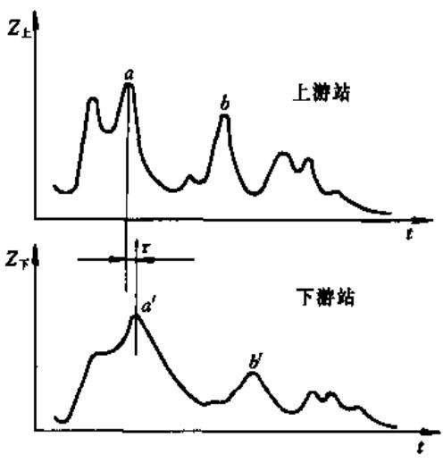  
图 5-2 上下游站相应水位过程线示意图

## (二) 无支流河段的相应水位预报

在制定相应水位法的预报方案时，要从实测资料中找出相应水位及其传播时间是比较困难的。一般采取水位过程线上的特征点，如洪峰、波谷等，作出该特征点的相应水位关系曲线与传播时间曲线，代表该河段的相应水位关系。

## 1. 简单的相应水位法

在无支流汇入的河段上，若河段冲淤变化不大，无回水顶托，且区间人流较小时，影响洪水波传播的因素比较单纯。此时，可根据上游站和下游站的实测水位过程线，摘录相应的特征点即洪峰水位值及其出现时间（见表5-1），并绘制相应洪峰水位相关曲线及其传

表 5-1 上下游站相应洪水位及传播时间
<table><tr><td rowspan=1 colspan=2>上游站洪峰水位</td><td rowspan=1 colspan=2>下游站洪峰水位</td><td rowspan=1 colspan=1>传播时间</td></tr><tr><td rowspan=1 colspan=1>月.日，时</td><td rowspan=1 colspan=1>水位 $z _ { \mathbf { \Phi } \mathbf { \Phi } \mathbf { \Phi } }$  $\mathbf { \omega } ( \mathbf { m } )$ </td><td rowspan=1 colspan=1>月.日.时</td><td rowspan=1 colspan=1>水位 $z _ { \uparrow , \downarrow + \varepsilon }$  $\bf ( m )$ </td><td rowspan=1 colspan=1>τ(h)</td></tr><tr><td rowspan=2 colspan=1>6.13.26.22.147.31.108.12.15：</td><td rowspan=2 colspan=1>112.40116.74123.78137.21：</td><td rowspan=2 colspan=1>6.14.86.23.178.1.178.13.8</td><td rowspan=1 colspan=1>54.0857.2062.7671.43</td><td rowspan=2 colspan=1>30273117：</td></tr><tr><td rowspan=1 colspan=1></td></tr></table>

播时间曲线（图5-3），即：

$$
Z _ { \mathfrak { F } , \iota + \tau } = f ( Z _ { \iota , \iota } )\tag{5-3}
$$

$$
\tau = f ( Z _ { \perp , i } )\tag{5-4}
$$

作为预报方案。在作业预报时，按t时上游出现的洪峰水位 $\pmb { Z } _ { \pm , \imath } ,$ 在 $\pmb { \mathcal { Z } } _ { \pm , \pm } { \sim } \pmb { \mathcal { Z } } _ { \pm , \pm + \tau }$ 曲线上查得 $Z _ { F , t + \varepsilon } ,$ 在 $z _ { \mathrm { \pm } , \ast } \sim \tau$ 曲线上查得τ，从而预报出 ${ \pmb t } + { \pmb \tau }$ 时下游将要出现的洪峰水位$Z _ { \pm , \pm \ell ^ { \prime } \bullet }$ 例如已知某日5时上游站洪峰水位为132.24 m，查图 5-3 得到下游站洪水位为68.30 m，洪水传播时间为21h，即预报下游站次日2时将出现洪峰水位68.30m。

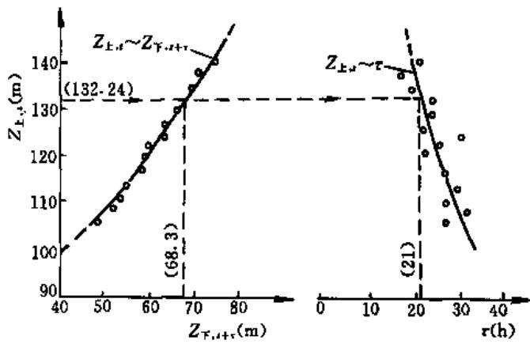  
图 5-3 相应洪峰水位及传播时间关系曲线图

这种简单的相应洪峰水位预报方法，通常只对无支流汇人的山区性河段才比较好。在中、下游地区，由于附加比降相对影响较大，一般预报精度不高。改进的方法是采用以下游站同时水位 $Z _ { \tilde { \star } , }$ 为参数的预报方法，便能在一定程度上考虑这种影响。

## 2. 以下游站同时水位为参数的相应水位法

下游站同时水位 $Z _ { \mathsf { F } }$ 就是上游站

水位 $Z _ { \pm , \iota }$ 出现时刻的下游水位，它与 $z _ { \pm , \bullet ^ { - } }$ 起能反映t时刻的水面比降变化，同时也间接地反映区间入流和断面冲淤以及回水顶托等因素的影响。此时，相应水位的关系式为：

$$
Z _ { \uparrow , \imath + \imath } = f ( Z _ { \mathrm { \pm } , \imath } , Z _ { \bar { \imath } , \imath } )\tag{5-5}
$$

$$
\tau = f ( Z _ { \pm , \pm } , Z _ { \vec { \mathsf { r } } , \pm } )\tag{5-6}
$$

依上式制作预报方案时，以下游站同时水位 $Z _ { \mathsf { F } } ,$ 为参数作等值线，分别绘制 $\pmb { Z } _ { \pm , \pm } \sim \pmb { Z } _ { \ F } .$ ${ \sim } 2 _ { \pi . . . + 1 }$ 和 $\pmb { Z } _ { \pm , \pm } { \sim } \pmb { Z } _ { \mp , \pm } { \sim } \pmb { \tau }$ 相关曲线，如图5-4所示。预报时，t时刻的 $Z _ { \mathbf { k } } .$ 及 $Z _ { \ F }$ 为已知，即可按图 5-4 上的箭头方向查得 $Z _ { \mathsf { F } , \pm + \varepsilon }$ 和 $\tau _ { i }$ 8

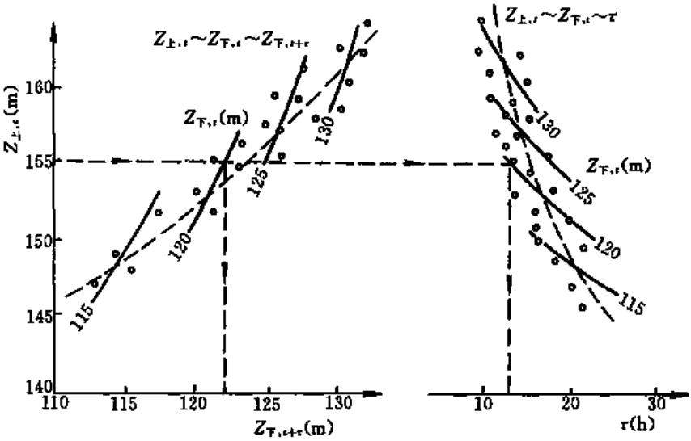  
图 5-4 以下游站同时水位为参数的相应水位及传播时间关系曲线图

## 3. 以上游站涨差为参数的水位相关法

上述各种洪峰水位预报方案，可近似地用来预报下游站的洪水过程。但由于它们没有反映洪水过程中附加比降的变化等因素，使预报的洪水过程常常有比较大的系统误差。为克服这种缺点，可用以上游站水位涨差为参数的水位相关法。

洪水波通过某一断面时，波前的附加比降为正，水面比降大，使涨水过程的涨率 ${ \mathsf { d } } Z _ { \pm }$ $/ d t \left( \mathrm { d } \mathsf { Q } _ { \perp } / \mathrm { d } t \right)$ 为正；波后的附加比降为负，水面比降小，使落水过程的涨率为负。因此，

水位（流量）过程线的涨（落）率在很大程度上反映了附加比降和水面比降的大小。

水位（流量）涨率在实用上可取有限差形式，即 $\Delta z _ { \mathrm { \perp } } / \Delta t$ ，且取 $\pmb { \Delta } \pmb { t }$ 为平均河段洪水传播时间 $\bar { \pmb { \tau } }$ ，则涨差 $\Delta Z _ { \perp }$ (或 $\Delta Q _ { \pm } )$ 就反映了涨率的变化，于是可以得到以上游站洪水涨差为参数的水位预报方程为：

$$
Z _ { \mathrm { \tiny ~ F } , \imath + \overline { { \imath } } } = f ( Z , \Delta Z _ { \mathrm { \tiny ~ E } } )\tag{5-7}
$$

$$
\Delta Z _ { \scriptscriptstyle \perp } = Z _ { \scriptscriptstyle \perp , \iota } - Z _ { \scriptscriptstyle \perp , \iota - { \overline { { \iota } } } }\tag{5-8}
$$

或

$$
Z _ { \mathbb { F } , \iota + \tilde { \tau } } = f ( Z , \Delta Q _ { \mathtt { k } } )\tag{5-9}
$$

$$
\Delta Q _ { \mathrm { { t } } } = Q _ { \mathrm { { t } } , t } - Q _ { \mathrm { { t } } , t - \overline { { { \tau } } } }\tag{5-10}
$$

式中， $\textstyle Z _ { i }$ 可以取 $Z _ { \mathrm { \perp } \cdot t }$ ，也可以取 ${ \pmb Z } _ { { \sf F } , { \pmb \varepsilon } }$ ，都在一定程度上反映了涨水中的底水影响。图 $\mathord { \mathfrak { s } } \mathrm { - } 5$ 是长江万县水文站一宜昌水文站河段以$\Delta \mathsf { Q } _ { \mathtt { L } }$ 为参数的水位预报方案。预报时，t时刻的 $Z _ { \pm }$ (或 $z _ { \mathsf { T } _ { \mathsf { \overline { { \Gamma } } } \mathrm { ~ , ~ } } } )$ $\Delta Z _ { \perp }$ (或 $\Delta Q _ { \mathrm { L } } )$ 为已知，故可在图上查出预报的下游水位 $Z _ { \mathsf { F } , \mathsf { t } + \mathsf { r } }$ ，预见期为 $\overline { { \tau } } _ { \mathfrak { c } }$ 1

## 三、合成流量法

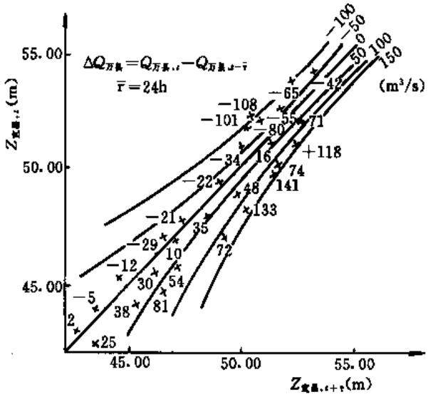  
图 5-5 长江万县水文站一宜昌水文站以上游站涨差为参数的水位预报方案

在有支流汇人的河段，下游站的洪水是

上游站、支流站洪水复合的结果，可采用合成流量法制定预报方案。该法预报下游站流量的关系式为：

$$
Q _ { \tilde { \mathbf { r } } , \varepsilon } = f ( \tilde { \sum _ { i = 1 } ^ { n } } Q _ { \mathbf { \varepsilon } , i , t - \tau _ { i } } )\tag{5-11}
$$

式中 $\mathbf { Q _ { \mathbf { L } } } . . . . . . _ { \mathbf { r _ { i } } }$ 上游干、支流各站相应流量， $\mathbf { m } ^ { 3 } / \mathbf { s }$ às

$\pmb { \tau } _ { i }$ 上游于、支流各站到下游站的洪水传播时间，h；

n上游干、支流的测站数目。

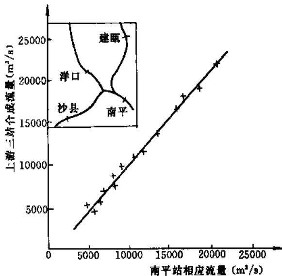  
图 5-6 合成流量法预报示意图

根据式(5-11)的关系，按照上游于、支流各站的传播时间，把各站同时刻到达下游站的流量叠加起来得合成流量，然后建立合成流量与下游站相应流量的关系曲线（见图5-6）进行预报的方法称为合成流量法。该法的预见期取决于上游各站中传播时间最短的一个。一般情况下，上游各站中以干流站的流量为最大，从预报精度的要求出发，常常用它的传播时间τ作为预报方案的预见期。预报时，以上游的干流站当时实测流量，加上其余各支流站错开.传播时间后的流量得合成流量，即可预报下游站的流量。如果支流站的传播时间小于干流站的传播时间，求合成流量时，还需对该支流站

的相应流量作出预报。

如果附加比降和底水影响较大，则在相关图中加入下游站同时水位为参数。

## 四、流量演算法

天然河道里的洪水波运动属于不稳定流，洪水波的演进与变形可用圣维南(SaintVenant）方程组描述。但是求解这些方程组比较烦琐，而且需要详细的河道地形和糙率资料。因此，水文上采用的流量演算法是把连续方程简化为河段水量平衡方程，把动力方程简化为槽蓄方程，然后联立求解，将河段的入流过程演算为出流过程的方法。

## （一) 基本原理

在无区间人流的情况下，河段流量演算可由以下两个基本公式组成，即：

$$
\frac { \Delta t } { 2 } ( Q _ { \pm , \bot } + Q _ { \bot , 2 } ) - \frac { \Delta t } { 2 } ( Q _ { \uparrow , \bot } + Q _ { \uparrow , \cdot 2 } ) = S _ { 2 } - S _ { 1 }\tag{5-12}
$$

$$
S = f ( Q )\tag{5-13}
$$

式中 $Q _ { \mathtt { l } , 1 }$ $\mathbf { Q } _ { \pm , 2 }$ ——时段始、末上断面的入流量， $\mathbf { m } ^ { 3 } / \mathbf { s }$

$Q _ { \tilde { \mathbf { r } } , 1 }$ $\ Q _ { \mathsf { F } , \mathsf { 2 } }$ 时段始、末下断面的出流量， $\mathbf { m } ^ { 3 } / \mathsf { s }$

$\pmb { \Delta } \pmb { t } \cdot \pmb { \Delta } \pmb { t } \cdot \pmb { \Delta } \pmb { t } \cdot \pmb { \Delta } \pmb { t } \cdot \pmb { \Delta } \pmb { t } \cdot \pmb { \Delta } \pmb { t } \cdot \pmb { \Delta } \pmb { t } \pmb { \Delta } \pmb { t } \cdot \pmb { \Delta } \pmb { t } \pmb { \Delta } \pmb { t } \cdot \pmb { \Delta } \pmb { t } \pmb { \Delta } \pmb { t } \pmb { \Delta } \pmb { t } \pmb { \Delta }$ —计算时段， $\mathbf { h } _ { \parallel }$ 4

$S _ { \nu }$ ${ \pmb S } _ { 2 }$ 时段始、末河段蓄水量， ${ \hslash } \cdot { \mho } ^ { 3 } / { \tt s }$

式（5-12）是河段水量平衡方程式，其相互关系如图5-7所示。图中阴影部分为 $\Delta S =$ $\pmb { S _ { 2 } } - \pmb { S _ { 1 } }$ 。式（5-13）表示河段蓄水量与流量间的关系，称为槽蓄方程，按此式制作的关系曲线称为槽蓄曲线。

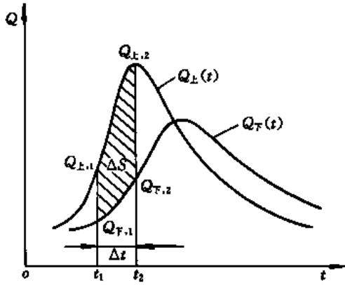  
图 5-7 河段时段水量平衡示意图

水量平衡方程（5-12）式中，当河段有区间入流时，在式的左边应增加内的区间人量 $( q _ { 1 } + q _ { 2 } ) \Delta t / 2$ 一项。其中 $\pmb { q } _ { 1 }$ 、 ${ \pmb q } _ { 2 }$ 为时段始末的区间人流量。

求解上述两式的关键，在于能否建立反映客观实际的槽蓄曲线。若河段的槽蓄方程已经建立，人流过程和初始条件 $\mathsf { Q } _ { \mathsf { F } , 1 } , \mathsf { S } _ { 1 }$ 已知时，联解算式（5-12）和式（5-13），求得出流过程。

## (二)马斯京根法及其槽蓄曲线方程

G. T. 麦卡锡(G. T. Mccarthy) 于 1938 年提出流量演算法，此法最早在美国马斯京根河流域上使用，因而称为马斯京根法。该法主要是建立马斯京根

槽蓄曲线方程，并与水量平衡方程联立求解，进行河段洪水演算。

在洪水波经过河段时，由于存在附加比降，洪水涨落时的河槽蓄水量情况如图5-8所示。在马斯京根槽蓄曲线方程中，河段槽蓄量由两部分组成：①柱蓄，即同一下断面水位 $Z _ { \mathsf { F } }$ 稳定流水面线以下的蓄量；②楔蓄，即稳定流水面线与实际水面线之间的蓄量，如图5-8中的阴影部分。河段中的槽蓄量等于柱蓄与楔蓄的总和。

令 $_ { x }$ 为流量比重因素， $\pmb { S _ { Q \pm } }$ $s _ { \pmb { \circ } \mathbf {  } }$ 分别为上下断面在稳定流情况下的蓄量，S为河段内的总蓄量。在图5-8（a）中，包括柱蓄和楔蓄两部分，于是可以建立蓄量关系：

$$
S = S _ { \mathbf { q } \mathtt { F } } + x ( S _ { \mathbf { Q } , \mathtt { L } } - S _ { \mathbf { Q } \mathtt { F } } )
$$

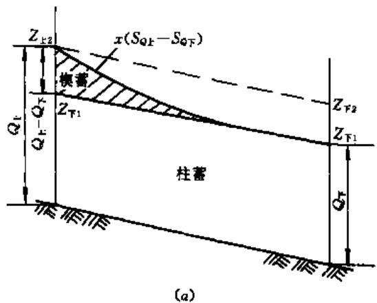

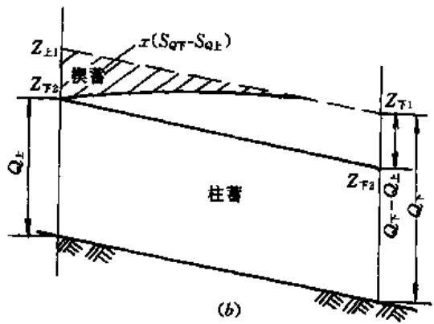  
图 5-8 河段槽蓄量示意图  
(a) 涨水情况；(b) 落水情况

同理，在图5-8（6)中，建立蓄量关系：

$$
S = S _ { \pm \nu } - x ( S _ { \mathbf { Q } \mathrm { F } } - S _ { \mathbf { Q } \mathrm { L } } )
$$

上述两式相同，均为：

$$
\bar { S } = x \bar { S } _ { \scriptscriptstyle { Q , \pm } } + ( 1 - x ) S _ { \scriptscriptstyle { Q , \mp } }\tag{5-14}
$$

一般情况下，天然河道中的断面流量与相应的槽蓄量近似地按稳定流对待，即具有单值关系：

$$
S _ { \pmb { \alpha } \mathrm { { t } } } = K Q _ { \pmb { \mathrm { { t } } } } \qquad S _ { \pmb { \alpha } \mathrm { { t } } } = K Q _ { \mp }
$$

式中，K为稳定流情况下的河段传播时间。将上面两式代人式（5-14），可得：

$$
S = K [ x Q _ { \pm } + ( 1 - x ) Q _ { \mathsf { F } } ]\tag{5-15}
$$

$$
Q ^ { \prime } = x Q _ { \mathrm { { t } } } + ( 1 - x ) Q _ { \mathrm { { F } } }\tag{5-16}
$$

$\mathbf { \nabla } _ { \mathbf { Q } ^ { \prime } }$ 称为示储流量，得：

$$
S = K Q ^ { \prime }\tag{5-17}
$$

式（5-15）或式（5-17）就是马斯京根槽蓄曲线方程。

## (三)马斯京根流量演算方程

通过联解水量平衡方程式（5-12）和马斯京根槽蓄曲线方程式（5-15)，可得马斯京根流量演算方程：

$$
Q _ { \mathbb { F } , 2 } = C _ { 0 } Q _ { \pm , \ : , \ : } + C _ { 1 } Q _ { \pm , 1 } + C _ { 2 } Q _ { \mathbb { F } , 1 }
$$

其中：

(5-18)

$$
\left. \begin{array} { l } { C _ { \circ } = \displaystyle \frac { 0 . 5 \Delta t - K x } { K - K x + 0 . 5 \Delta t } \Bigg \downarrow } \\ { C _ { \mathrm { 1 } } = \displaystyle \frac { 0 . 5 \Delta t + K x } { K - K x + 0 . 5 \Delta t } \Bigg \downarrow } \\ { C _ { \circ } = \displaystyle \frac { K - K x - 0 . 5 \Delta t } { K - K x + 0 . 5 \Delta t } \Bigg \downarrow } \end{array} \right.\tag{5-19}
$$

式中， $C _ { 0 } , C _ { 1 } , C _ { 2 }$ 都是 $K , x$ 和 $\pmb { \Delta \alpha }$ 的函数。对于某一河段而言，只要确定了K和 $\pmb { x }$ 值， $C _ { 0 }$ $c _ { 1 } , \ c _ { 2 }$ 即可求得，从而由人流过程和初始条件，通过式（5-18）逐时段演算，求得出流过程。

由式（5-19）可以证明 $C _ { \circ } + C _ { \iota } + C _ { \iota } = 1 . 0$ ，可供推求系数时作校核用。

应用马斯京根法的关键是如何合理地确定x和K值。目前，一般采用试算法，由实测资料通过试算求解x、K值，也就是对某一次洪水，假定不同的x值，按式(5-16)计算Q′， $\pmb { Q } ^ { \prime }$ 作出 $S { \sim } f \ ( Q ^ { \prime } )$ 关系曲线，其中能使二者关系成为单一直线的x值即为此次洪水所求的x值，而该直线的斜率即为所求的K值。取多次洪水作相同的计算和分析，就可以确定该河段的x、K值。

【例5-1】根据某河段一次实测洪水资料（表5-2），用马斯京根法进行河段洪水演算。

1）根据河段和资料情况，确定 $\pmb { \Delta } \pmb { t }$ 值。现取时段长 $\Delta t { = } 1 2 \mathrm { ~ h ~ }$

2）将河段实测洪水资料列于表中的第（2）～（4）栏。若区间无实测值，则应将河段入流总量与出流总量差值作为区间入流总量，其流量过程近似地按入流过程的比值分配到各时段中去。

表 5-2  
马斯京根法S 与 $\pmb { \mathcal { Q } }$ 值计算表
<table><tr><td rowspan=2 colspan=1>时间(月，日.时)</td><td rowspan=2 colspan=1> $\pmb { Q } _ { \pmb { \mathrm { ~ \pmb ~ { ~ \varepsilon ~ } ~ } } }$  $( \mathbf { m } ^ { 3 } / \mathfrak { s } )$ </td><td rowspan=2 colspan=1> $\pmb { Q } _ { \mathsf { F } }$  ${ \bf ( m ^ { 3 } / s ) }$ </td><td rowspan=2 colspan=1> $\pmb { q } _ { \pmb { \kappa } }$  $\bf ( m ^ { 3 } / s )$ </td><td rowspan=2 colspan=1> $Q _ { 1 } + q _ { \boxtimes }$  $\mathbf { ( m ^ { 3 } / s ) }$ </td><td rowspan=2 colspan=1> $\pmb { \mathcal { Q } } _ { \Sigma } \dag \pmb { \mathfrak { q } } _ { \overline { { \mathbf { \delta \mathbf { \Lambda } } } } } \pmb { \mathcal { Q } } _ { \overline { { \mathbf { \Lambda } } } }$  $\langle \mathbf { m } ^ { 3 } / { \mathsf { s } } \rangle$ </td><td rowspan=2 colspan=1>ΔS $( \mathbf { m } ^ { 3 } / \mathfrak { s } ) { \cdot } 1 2 \ \mathbf { h }$ </td><td rowspan=1 colspan=1>S</td><td rowspan=1 colspan=2> $\textbf { \textit { Q } } ( \mathbf { m } ^ { 3 } / \mathbf { s } )$ </td></tr><tr><td rowspan=1 colspan=1> $( \mathbf { m } ^ { 3 } / \mathbf { s } ) { \boldsymbol { \cdot } } 1 2 \ \mathrm { h }$ </td><td rowspan=1 colspan=1> $\scriptstyle x = 0 , 2$ </td><td rowspan=1 colspan=1> $\pmb { x = 0 . 3 }$ </td></tr><tr><td rowspan=1 colspan=1>(1)</td><td rowspan=1 colspan=1>(2)</td><td rowspan=1 colspan=1>(3)</td><td rowspan=1 colspan=1>(4)</td><td rowspan=1 colspan=1>(5)</td><td rowspan=1 colspan=1>(6)</td><td rowspan=1 colspan=1>(7)</td><td rowspan=1 colspan=1>(8)</td><td rowspan=1 colspan=1>(9)</td><td rowspan=1 colspan=1>(10)</td></tr><tr><td rowspan=1 colspan=1>7.1.0</td><td rowspan=1 colspan=1>75</td><td rowspan=1 colspan=1>75</td><td rowspan=1 colspan=1>0</td><td rowspan=1 colspan=1>75</td><td rowspan=1 colspan=1>0</td><td rowspan=2 colspan=1>164</td><td rowspan=1 colspan=1>0</td><td rowspan=1 colspan=1>75</td><td rowspan=1 colspan=1>75</td></tr><tr><td rowspan=2 colspan=1>7.1.12</td><td rowspan=2 colspan=1>370</td><td rowspan=2 colspan=1>80</td><td rowspan=2 colspan=1>37</td><td rowspan=2 colspan=1>407</td><td rowspan=2 colspan=1>327</td><td rowspan=2 colspan=1>164</td><td rowspan=2 colspan=1>145</td><td rowspan=2 colspan=1>178</td></tr><tr><td rowspan=2 colspan=1>790</td></tr><tr><td rowspan=2 colspan=1>7.2.0</td><td rowspan=2 colspan=1>1620</td><td rowspan=2 colspan=1>440</td><td rowspan=2 colspan=1>73</td><td rowspan=2 colspan=1>1693</td><td rowspan=2 colspan=1>1253</td><td rowspan=2 colspan=1>954</td><td rowspan=2 colspan=1>691</td><td rowspan=2 colspan=1>816</td></tr><tr><td rowspan=2 colspan=1>947</td></tr><tr><td rowspan=2 colspan=1>7.2.12</td><td rowspan=2 colspan=1>2210</td><td rowspan=2 colspan=1>1680</td><td rowspan=2 colspan=1>110</td><td rowspan=2 colspan=1>2320</td><td rowspan=2 colspan=1>640</td><td rowspan=2 colspan=1>1901</td><td rowspan=2 colspan=1>1810</td><td rowspan=2 colspan=1>1870</td></tr><tr><td rowspan=2 colspan=1>427</td></tr><tr><td rowspan=2 colspan=1>7.3.0</td><td rowspan=2 colspan=1>2290</td><td rowspan=2 colspan=1>2150</td><td rowspan=2 colspan=1>73</td><td rowspan=2 colspan=1>2363</td><td rowspan=2 colspan=1>213</td><td rowspan=2 colspan=1>2328</td><td rowspan=2 colspan=1>2190</td><td rowspan=2 colspan=1>2210</td></tr><tr><td rowspan=2 colspan=1>-100</td></tr><tr><td rowspan=2 colspan=1>7.3.12</td><td rowspan=2 colspan=1>1830</td><td rowspan=2 colspan=1>2280</td><td rowspan=2 colspan=1>37</td><td rowspan=2 colspan=1>1867</td><td rowspan=2 colspan=1>-413</td><td rowspan=2 colspan=1>2228</td><td rowspan=2 colspan=1>2200</td><td rowspan=2 colspan=1>2160</td></tr><tr><td rowspan=2 colspan=1>-437</td></tr><tr><td rowspan=2 colspan=1>7.4.0</td><td rowspan=2 colspan=1>1220</td><td rowspan=2 colspan=1>1680</td><td rowspan=2 colspan=1>0</td><td rowspan=2 colspan=1>1220</td><td rowspan=2 colspan=1>-460</td><td rowspan=2 colspan=1>1791</td><td rowspan=2 colspan=1>1590</td><td rowspan=2 colspan=1>1540</td></tr><tr><td rowspan=2 colspan=1>-450</td></tr><tr><td rowspan=2 colspan=1>7.4.12</td><td rowspan=2 colspan=1>830</td><td rowspan=2 colspan=1>1270</td><td rowspan=2 colspan=1></td><td rowspan=2 colspan=1>830</td><td rowspan=2 colspan=1>-440</td><td rowspan=2 colspan=1>1341</td><td rowspan=2 colspan=1>1180</td><td rowspan=2 colspan=1>1140</td></tr><tr><td rowspan=2 colspan=1>-355</td></tr><tr><td rowspan=2 colspan=1>7.5.0</td><td rowspan=2 colspan=1>610</td><td rowspan=2 colspan=1>880</td><td rowspan=2 colspan=1></td><td rowspan=2 colspan=1>610</td><td rowspan=2 colspan=1>-270</td><td rowspan=2 colspan=1>986</td><td rowspan=2 colspan=1>826</td><td rowspan=2 colspan=1>799</td></tr><tr><td rowspan=2 colspan=1>-235</td></tr><tr><td rowspan=2 colspan=1>7.5.12</td><td rowspan=2 colspan=1>480</td><td rowspan=2 colspan=1>680</td><td rowspan=2 colspan=1></td><td rowspan=2 colspan=1>480</td><td rowspan=2 colspan=1>-200</td><td rowspan=2 colspan=1>751</td><td rowspan=2 colspan=1>640</td><td rowspan=2 colspan=1>620</td></tr><tr><td rowspan=2 colspan=1>-180</td></tr><tr><td rowspan=2 colspan=1>7.6.0</td><td rowspan=2 colspan=1>390</td><td rowspan=2 colspan=1>550</td><td rowspan=2 colspan=1></td><td rowspan=2 colspan=1>390</td><td rowspan=2 colspan=1>-160</td><td rowspan=2 colspan=1>571</td><td rowspan=2 colspan=1>518</td><td rowspan=2 colspan=1>502</td></tr><tr><td rowspan=2 colspan=1>-140</td></tr><tr><td rowspan=2 colspan=1>7.6.12</td><td rowspan=2 colspan=1>330</td><td rowspan=2 colspan=1>450</td><td rowspan=2 colspan=1></td><td rowspan=2 colspan=1>330</td><td rowspan=2 colspan=1>-120</td><td rowspan=2 colspan=1>431</td><td rowspan=2 colspan=1>426</td><td rowspan=2 colspan=1>414</td></tr><tr><td rowspan=2 colspan=1>-110</td></tr><tr><td rowspan=2 colspan=1>7.7.0</td><td rowspan=2 colspan=1>300</td><td rowspan=2 colspan=1>400</td><td rowspan=2 colspan=1></td><td rowspan=2 colspan=1>300</td><td rowspan=2 colspan=1>-100</td><td rowspan=2 colspan=1>321</td><td rowspan=2 colspan=1>380</td><td rowspan=2 colspan=1>370</td></tr><tr><td rowspan=2 colspan=1>-90</td></tr><tr><td rowspan=2 colspan=1>7.7.12</td><td rowspan=2 colspan=1>260</td><td rowspan=2 colspan=1>340</td><td rowspan=2 colspan=1></td><td rowspan=2 colspan=1>260</td><td rowspan=2 colspan=1>-80</td><td rowspan=2 colspan=1>231</td><td rowspan=2 colspan=1>324</td><td rowspan=2 colspan=1>316</td></tr><tr><td rowspan=2 colspan=1>-70</td></tr><tr><td rowspan=2 colspan=1>7.8.0</td><td rowspan=2 colspan=1>230</td><td rowspan=2 colspan=1>290</td><td rowspan=2 colspan=1></td><td rowspan=2 colspan=1>230</td><td rowspan=2 colspan=1>-60</td><td rowspan=2 colspan=1>161</td><td rowspan=2 colspan=1>278</td><td rowspan=2 colspan=1>272</td></tr><tr><td rowspan=2 colspan=1>-55</td></tr><tr><td rowspan=2 colspan=1>7.8.12</td><td rowspan=2 colspan=1>200</td><td rowspan=2 colspan=1>250</td><td rowspan=2 colspan=1></td><td rowspan=2 colspan=1>200</td><td rowspan=2 colspan=1>-50</td><td rowspan=2 colspan=1>106</td><td rowspan=2 colspan=1>240</td><td rowspan=2 colspan=1>235</td></tr><tr><td rowspan=2 colspan=1>-45</td></tr><tr><td rowspan=2 colspan=1>7.9.0</td><td rowspan=2 colspan=1>180</td><td rowspan=2 colspan=1>220</td><td rowspan=2 colspan=1></td><td rowspan=2 colspan=1>180</td><td rowspan=2 colspan=1>-40</td><td rowspan=2 colspan=1>61</td><td rowspan=2 colspan=1>212</td><td rowspan=2 colspan=1>208</td></tr><tr><td rowspan=2 colspan=1>-40</td></tr><tr><td rowspan=1 colspan=1>7.9.12</td><td rowspan=1 colspan=1>160</td><td rowspan=1 colspan=1>200</td><td rowspan=1 colspan=1></td><td rowspan=1 colspan=1>160</td><td rowspan=1 colspan=1>-40</td><td rowspan=1 colspan=1>21</td><td rowspan=1 colspan=1>192</td><td rowspan=1 colspan=1>188</td></tr></table>

3）按水量平衡方程式，分别计算各时段槽蓄量△S（表中第（7）栏），然后逐时段累加△S得槽蓄量S（表中第（8）栏）。

4）假定x值，按 $Q ^ { \prime } = x Q _ { \mathrm { { E } } } + ( 1 - x ) Q _ { \mathrm { { F } } }$ 计算 $\pmb { Q } ^ { \prime }$ 值。本例分别假设 $x = 0 . 2$ 和 $\jmath = 0 . 3$

计算结果列于表中第（9）、（10）栏。

5）按第（9）、（10）两栏的数据，分别点绘两条 $s { \sim } Q ^ { \prime }$ 关系线，其中以x=0.2的关系线近似于直线（见图5-9），该x值即为所求。该直线的斜率 $K { = } \Delta S / \Delta Q ^ { \prime } { = } 8 0 0 \times 1 2 / 8 0 0 { = } 1 2 \ : \mathrm { h }$

按上述步骤分别求出各次洪水的x、K值。如果各次洪水的x、K值比较接近，则取平均值作为本河段的选定值；如变化较大，则需作进一步分析。

6）假定本河段的x、K值已选定，即 $_ { \pmb { x } } { = }$   
0.2,K=12h 以及 $\Delta t { = } 1 2 \mathrm { ~ h ~ }$ ，代入式(5-19)得：

$$
C _ { 0 } = 0 . 2 3 1 , C _ { 1 } = 0 . 5 3 8 , C _ { 2 } = 0 . 2 3 1
$$

而且 $C _ { \circ } + C _ { 1 } + C _ { 2 } = 1 . \ : 0$ ，计算无误。因此，该河段的洪水演算方程为

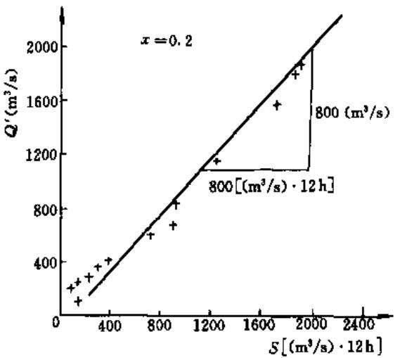  
图 5-9 马斯京根法 S\~Q关系曲线图

$$
Q _ { \mathbb { F } , 2 } = 0 . 2 3 1 Q _ { \pm , 2 } + 0 . 5 3 8 Q _ { \pm , 1 } + 0 . 2 3 1 Q _ { \mathbb { F } , 1 }
$$

7）根据本河段另一场洪水的上断面流量资料（见表5-3中第（2）栏），用上述洪水演算方程，可算出河段下断面的流量（见表5-3第（6）栏）。

表 5-3 马斯京根法洪水演算表单位： $\mathbf { m } ^ { 3 } / { \mathfrak { s } }$
<table><tr><td rowspan=1 colspan=2>时间(月，日，时)</td><td rowspan=1 colspan=1> $\mathsf { Q } _ { \mathtt { L } }$ </td><td rowspan=1 colspan=1> $C _ { 0 } Q _ { \pm , 2 }$ </td><td rowspan=1 colspan=1> $C _ { 1 } Q _ { \pm , 1 }$ </td><td rowspan=1 colspan=1> $C _ { 8 } Q _ { \uparrow } , _ { 1 }$ </td><td rowspan=1 colspan=1> $\ Q _ { \tilde { \tilde { \mathbf { \alpha } } } , 2 }$ </td></tr><tr><td rowspan=1 colspan=2>(1)</td><td rowspan=1 colspan=1>(2)</td><td rowspan=1 colspan=1>(3)</td><td rowspan=1 colspan=1>(4)</td><td rowspan=1 colspan=1>(5)</td><td rowspan=1 colspan=1>(6)</td></tr><tr><td rowspan=1 colspan=2>6.10.126.11.0</td><td rowspan=1 colspan=1>250310</td><td rowspan=1 colspan=1>72</td><td rowspan=1 colspan=1>135</td><td rowspan=1 colspan=1>58</td><td rowspan=1 colspan=1>250265</td></tr><tr><td rowspan=1 colspan=2>6.11.12</td><td rowspan=1 colspan=1>500</td><td rowspan=1 colspan=1>116</td><td rowspan=1 colspan=1>167</td><td rowspan=1 colspan=1>61</td><td rowspan=1 colspan=1>344</td></tr><tr><td rowspan=1 colspan=2>6.12.0</td><td rowspan=1 colspan=1>1560</td><td rowspan=1 colspan=1>360</td><td rowspan=1 colspan=1>269</td><td rowspan=1 colspan=1>79</td><td rowspan=1 colspan=1>708</td></tr><tr><td rowspan=1 colspan=2>6.12.12</td><td rowspan=1 colspan=1>1680</td><td rowspan=1 colspan=1>388</td><td rowspan=1 colspan=1>839</td><td rowspan=1 colspan=1>164</td><td rowspan=1 colspan=1>1391</td></tr><tr><td rowspan=1 colspan=2>6.13.0</td><td rowspan=1 colspan=1>1360</td><td rowspan=1 colspan=1>314</td><td rowspan=1 colspan=1>904</td><td rowspan=1 colspan=1>321</td><td rowspan=1 colspan=1>1539</td></tr><tr><td rowspan=1 colspan=2>6.13.12</td><td rowspan=1 colspan=1>1090</td><td rowspan=1 colspan=1>252</td><td rowspan=1 colspan=1>732</td><td rowspan=1 colspan=1>356</td><td rowspan=1 colspan=1>1340</td></tr><tr><td rowspan=1 colspan=2>6.14.0</td><td rowspan=1 colspan=1>870</td><td rowspan=1 colspan=1>201</td><td rowspan=1 colspan=1>586</td><td rowspan=1 colspan=1>310</td><td rowspan=1 colspan=1>1097</td></tr><tr><td rowspan=1 colspan=2>6.14.12</td><td rowspan=1 colspan=1>730</td><td rowspan=1 colspan=1>169</td><td rowspan=1 colspan=1>468</td><td rowspan=1 colspan=1>253</td><td rowspan=1 colspan=1>890</td></tr><tr><td rowspan=1 colspan=2>6.15.0</td><td rowspan=1 colspan=1>640</td><td rowspan=1 colspan=1>148</td><td rowspan=1 colspan=1>393</td><td rowspan=1 colspan=1>206</td><td rowspan=1 colspan=1>747</td></tr><tr><td rowspan=1 colspan=2>6-15.12</td><td rowspan=1 colspan=1>560</td><td rowspan=1 colspan=1>129</td><td rowspan=1 colspan=1>344</td><td rowspan=1 colspan=1>173</td><td rowspan=1 colspan=1>646</td></tr><tr><td rowspan=1 colspan=1></td><td rowspan=1 colspan=1>6.16.0</td><td rowspan=1 colspan=1>500</td><td rowspan=1 colspan=1>116</td><td rowspan=1 colspan=1>301</td><td rowspan=1 colspan=1>149</td><td rowspan=1 colspan=1>566</td></tr></table>

## (四) 马斯京根法中几个问题的分析

(1) K 值的综合：从 $\pmb { K } = \pmb { S } / \pmb { Q } ^ { \prime }$ 可知，K具有时间的因次，它基本上反映河道稳定流时河段的传播时间。在不稳定流情况下，流速随水位高低和涨落洪过程而不同，所以河段传播时间也不相同，K不是常数，不少实测资料表明也是如此。因而，当各次洪水分析的K值变化较大时，可根据点据分布情况按流量分级定成折线。应用时，根据不同的流量取不同的K值。

(2)x值的综合：流量比重因素x除反映楔蓄对流量的作用外，还反映河段的调蓄能力。对于一定的河段，x在洪水涨落过程中基本稳定，但也有随流量增加而减小的趋势。实

用中，当发现x随流量变化较大时，可建立 $\ X \sim \ Q$ 关系线，对不同的流量取不同的x。天然河道的x，一般从上游向下游逐渐减小，介于0.2\~0.45之间，特殊情况下也有小于零的。

(3) 计算时段 $\pmb { \triangle } \pmb { t }$ 的选择： $\pmb { \Delta } \pmb { t }$ 的选取涉及到马斯京根法演算的精度。为使摘录的洪水数值能比较真实地反映洪水的变化过程，首先不能取得太长，以保证流量过程线在 $\Delta \pmb { t }$ 内近于直线；其次为在计算中不漏掉洪峰，选取的 $\pmb { \Delta } \pmb { t }$ 最好等于河段传播时间 $\pmb { \tau _ { \diamond } }$ 这样上游在时段初出现的洪峰， $\pmb { \Delta } \pmb { t }$ 后就正好出现在下游站，而不会卡在河段中，使河段的水面线呈上凸曲线。当演算的河段较长时，为了照顾前面的要求，也可取 $\pmb { \Delta } \pmb { t }$ 等于τ的1/3或1/2，这样计算洪峰的精度差一些，但能保证不漏掉洪峰。若使二者都得到照顾，则可把河段划分为许多子河段，使 $\pmb { \Delta } \pmb { t }$ 等于子河段的传播时间，然后从上到下进行多河段连续演算，推算出下游站的流量过程。

(4)预见期问题：马斯京根流量演算公式中，只有知道了时段末的流量 $\ Q _ { \pm , 2 }$ 才能推算$\ Q _ { \mathsf { F } , \mathsf { 2 } }$ ，因此，该法用于预报时是没有预见期的。如果取 $\Delta t { = } 2 K x$ ，则 $C _ { \circ } { = } 0 , \ Q _ { \mathsf { F } , \mathsf { z } } { = } C _ { 1 } Q _ { \mathsf { k } } ,$ 1$+ C _ { 2 } Q _ { \mathsf { F } , 1 }$ 就可以有一个时段的预见期了。如果上断面的人流是由降雨径流预报等方法先预报出来，该法推算出的下断面出流，可以得到一定的预见期。因此，该法在预报中仍得到了广泛的应用。

## 五、降雨径流预报

降雨径流预报是利用流域降雨量经过产流计算和汇流计算，预报出流域出口断面的径流过程。因此，降雨径流预报主要包括两方面的内容：第一是由降雨量推求净雨量；第二是由净雨过程推求流域出口断面的径流过程。有关这两个问题的计算原理和计算方法，已在第四章作了详细介绍，这里只结合预报问题，作进一步说明。

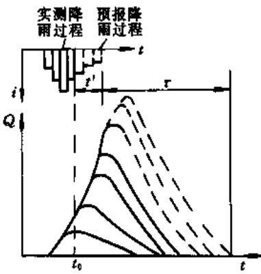  
图 5-10 降雨径流法预报洪水过程示意图

(1)编制降雨径流方案：根据流域自然地理特征和实测资料条件，运用第四章学习的产汇流原理和方法，建立流域产、汇流计算方案，如降雨径流相关图、单位线等。并对方案的预报精度进行评定和检验。

(2)作业预报：在作业预报中，当 $\scriptstyle t _ { 0 }$ 时刻发布预报时，所依据的降雨量常包括两部分，一部分是 $\scriptstyle t _ { 0 }$ 以前的实测降雨量；另一部分是 $\scriptstyle t _ { 0 }$ 以后 $\pmb { \ell } ^ { \prime }$ 时段内的预报降雨量。然后应用产汇流方案，计算出 $\pmb { t _ { 0 } }$ 至 $\pmb { t _ { 0 } } + \pmb { t ^ { \prime } } + \pmb { \tau }$ 时段内预报的洪水过程（图${ \tt5 } { \tt - } 1 0 )$ ，τ为流域汇流历时。但由于 ${ \pmb { t } } _ { 0 }$ 时刻以后的雨量是预报值，有一定的误差，再加上预报方案的误差，两者都影响预报的精度。因此，在作业预报时，应根据实测时段降雨量或实测流量对预报的径流进行逐时段修正。

## 第三节洪水实时预报方法

## 一、洪水实时预报的意义

自然界的水文现象及其要素（流量、水位等）都遵循其内在的运动规律，每时每刻都处于运动和变化之中，当人们认识和掌握了这些水文变化规律时，就可以以基本物质运动原理为基础，建立各种水文预报方法或水文模型，模拟或预测未来的水文现象及其运动特征值。然而，水文现象受到自然界中众多因素的影响，这些影响因素又大多具有不确定性的时变特征，给人们在认识和掌握水文现象运动规律时造成困难。因此，人们在水文预报中所采用的各种方法或模型都不可能将复杂的水文现象模拟得十分确切，水文预报估计值与实际出现值的偏离，即预报误差是不可避免的。实时预报就是利用在作业预报过程中，不断得到的预报误差信息，运用现代系统理论方法及时地校正、改善预报估计值或水文预报模型中的参数，使以后阶段的预报误差尽可能减小，预报结果更接近实测值。

随着现代科学技术的迅猛发展，电子计算机、遥感、遥测以及现代通讯新技术在水文领域中广泛应用，使得水文预报中能迅速得到反馈的实测信息，从而为水文预报的实时校正提供了依据。目前，常用的预报方法或水文模型中，一般都只能根据已知的输入进行计算或模拟，没有处理反馈信息的结构。而采用实时校正的方法和技术就能使其成为联机实时预报系统的组成部分，因此，洪水实时预报方法是现代水文预报技术发展的一个重要方面。

## 二、洪水实时预报方法的分类

## (一) 水文预报误差的来源

水文预报实时校正方法所依据的基本资料是水文预报方案的预报值与实测值的差值，即预报误差，亦称新息。预报误差的来源大致有如下几个方面。

## 1. 模型结构误差

预报方案采用的预报方法或水文模型都是对实际流域进行概化后建立的，例如将空间分布的水文气象要素表示成流域上的平均值的处理；将水文循环过程进行人为分离并用不同程度简化的模型予以描述等，如此不完善性的处理引起的误差称为模型结构误差。

## 2. 模型参数估计误差

水文模型中的参数不论采用何种方法来优选率定（称为参数估计)，其估计的模型参数对其真值来讲，总是存在着误差的。另外，根据各场洪水优选的模型参数，它是综合各场洪水的最优值，而对某一特定场次的洪水，它并非就是最合适的。

## 3. 模型的输入误差

进行水文预报所输人的资料通常是降雨、流量和流域蒸散发，这些资料或由实测获得，或根据天气预报估算得到。前者存在着测验和时段统计平均误差，后者则存在着相当大的预报误差。

## (二)实时预报校正方法的分类

为了提高洪水预报精度，就必须尽量地减少上述误差。根据不同预报误差的来源，实时预报校正方法可分为以下三种。

## 1. 对模型参数实时校正

采用这类方法认为水文预报方法或模型的结构是有效的，只是由于存在数据的观测误差，导致率定的模型参数不准确，或是率定的模型参数对具体场次洪水并非最优。因此，在实际作业预报过程中，根据实际的预报误差不断的修正模型参数，以提高此后的预报精度。对模型参数进行实时校正的方法有最小二乘估计等方法。

## 2. 对模型预报误差进行预测

对已出现的预报误差时序过程进行分析，寻求其变化规律，建立合适的预报误差的模型。通过推求未来的误差值以校正尚未出现的预报值，从而提高洪水预报的精度。

## 3. 对状态变量进行估计

一个预报模型中能控制当前及以后时刻系统状态和行为的变量，称为状态变量。对状态变量的估计是认为预报误差来源于状态估计的偏差和实际观测的误差，通过实时修正状态变量来校正以后的预报值，从而提高预报的精度。卡尔曼滤波就是对状态变量进行实时校正的一种算法。

## 三、洪水实时预报的最小二乘方法

在水文预报模型参数的估计中，最小二乘法是一种常用的估计方法。由最小二乘法获得的估计，在一定条件下具有最佳的统计特性。估计是一致的，无偏的和有效的。这种方法可用于线性系统模型，也可用于非线性系统模型；可用在利用历史资料进行模型参数识别的离线估计，也可用在利用现实观测资料进行模型参数识别的在线估计。在洪水预报中，衰减记忆递推最小二乘法可以充分利用新息，实时跟踪模型参数的变化，不断对预报误差进行修正，提高洪水预报精度。

## (一)最小二乘估计的基本算法

通过最小二乘估计可以获得一个在最小方差意义上与实测数据拟合最好的模型。假定变量 y 与一个n维变量 $X { = } \ ( \ b { x } _ { 1 } , \ \ b { x } _ { 2 } , \ \cdots , \ \ b { x } _ { n } )$ 的线性关系为：

$$
y = \theta _ { 1 } x _ { 1 } + \theta _ { 2 } x _ { 2 } + \cdots + \theta _ { n } x _ { n }\tag{5-20}
$$

其中， $\boldsymbol { \theta } = ( \theta _ { 1 } , \theta _ { 2 } , \cdots , \theta _ { n } ) ^ { T }$ 是一个待定的参数向量，我们可以通过不同时刻对y及X的观测值估计出它们的数值。

设 y (i) 和 $x _ { 1 } \ ( i ) , \ x _ { 2 } \ ( i ) , \ \cdots , \ x _ { n } \ ( i )$ 为在i时刻所观测得的数据， $i = 1 , \ 2 , \ \cdots , \ m ,$ 可以用m个方程表示这些数据的关系为：

$$
\begin{array} { c } { y ( i ) = \theta _ { 1 } x _ { 1 } ( i ) + \theta _ { 2 } x _ { 2 } ( i ) + \cdots + \theta _ { n } x _ { n } ( i ) } \\ { \qquad i = 1 , 2 , \cdots , m \ . } \end{array}\tag{5-21}
$$

式（5-12）可用矩阵形式表示成：

$$
Y = X \pmb \theta\tag{5-22}
$$

其中：

$$
\begin{array} { r } { Y = \left[ \begin{array} { c } { y ( 1 ) } \\ { y ( 2 ) } \\ { \vdots } \\ { \vdots } \\ { y ( m ) } \end{array} \right] ; \quad X = \left[ \begin{array} { c } { x _ { 1 } ( 1 ) , x _ { 2 } ( 1 ) , \cdots , x _ { a } ( 1 ) } \\ { x _ { 1 } ( 2 ) , x _ { 2 } ( 2 ) , \cdots , x _ { a } ( 2 ) } \\ { \vdots \qquad \vdots \qquad \vdots } \\ { x _ { 1 } ( m ) , x _ { 2 } ( m ) , \cdots , x _ { n } ( m ) } \end{array} \right] , \quad \theta = \left[ \begin{array} { c } { \theta _ { 1 } } \\ { \theta _ { 2 } } \\ { \vdots } \\ { \theta _ { n } } \end{array} \right] . } \end{array}
$$

当 ${ \pmb m } = { \pmb n }$ 时，若X的逆矩阵存在时，式（5-22）可以得到唯一的解。由于测量的数据不可避免地存在误差，用n组数据估计n个参数，必然带来较大的估计误差。为了获得更可靠的结果，增加测量次数，使 $m > n _ { \circ } \ m$ 超过一般方程组所需的定解条件数n，这种情况在水文问题中经常遇到。最小二乘原理指出，最可信赖的参数值θ应在使残余误差平方和最小的条件下求出。

设估计误差向量 $V = ( v _ { 1 } , v _ { 2 } , \cdots , v _ { n } ) ^ { T }$ ，并令：

$$
V = Y - X \theta\tag{5-23}
$$

目标函数：

即：

$$
\begin{array} { c } { { J = \displaystyle \sum _ { i = 1 } ^ { \infty } v _ { i } ^ { 2 } = V ^ { T } V = \mathrm { m i n } } } \\ { { J = V ^ { T } V = ( Y - X \theta ) ^ { T } ( Y - X \theta ) = ( Y ^ { T } - \theta ^ { T } X ^ { T } ) ( Y - X \theta ) } } \\ { { = Y ^ { T } Y - \theta ^ { T } X ^ { T } Y - Y ^ { T } X \theta + \theta ^ { T } X ^ { T } X \theta } } \end{array}\tag{5-24}
$$

将J对θ求偏微分，并令其等于零，则可求得使J趋于最小的估计值θ，即： $\widehat { \pmb { \theta } }$

$$
\left. \frac { \partial J } { \partial \theta } \right| _ { \theta = \enspace \widehat { \theta } } \ = - \ 2 X ^ { T } Y + 2 X ^ { T } X \widehat { \theta } \ = 0
$$

由此可得：

$$
X ^ { \tau } X \hat { \pmb { \theta } } ^ { \prime } = X ^ { \tau } Y\tag{5-25}
$$

解得 $\hat { \pmb \theta }$ 为：

$$
{ \begin{array} { r l } { { \widehat { \pmb { \theta } } } } & { = ( X ^ { \tau } X ) ^ { - 1 } X ^ { \tau \mathbf { v } } } \end{array} }\tag{5-26}
$$

这个结果就称为θ的最小二乘估计。

## (二)最小二乘估计的递推算法

最小二乘估计的基本算法是利用已获得的所有观测数进行整批运算处理，又称为最小二乘的整批算法。整批算法适用于模型参数的离线估计。当每新增加观测数据时，若采用整批算法就需重新求解矩阵式（5-26)。当新增的数据愈来愈多时，矩阵X将逐次扩大，使得完成矩阵 $X ^ { T } X$ 的求逆运算很费计算机机时。同时，保存全部观测数据的X要求有很大的计算机存储量。最小二乘的递推算法就是在每次取得新的观测数据后，在前次估计结果的基础上，利用新加入的观测数据对前次估计的结果进行修正，从而递推地估算出新的参数估计值。这样随着新的观测数据的逐次加入，一步一步地进行参数修正，实现参数的在线估计。

矩阵方程式（5-22）是一个包含m个方程的方程组。现在引入m作为Y及X的下标：

$$
Y _ { \ast } = X _ { \ast } \theta\tag{5-27}
$$

同时方程（5-22）中的 $\hat { \pmb \theta }$ 也就相应改为 $\widehat { \theta } ( m )$ ，表示是由m组观测值所估计的参数。

$$
\widehat { \pmb { \theta } } ( \pmb { m } ) = ( X _ { m } ^ { T } X _ { m } ) ^ { - 1 } X _ { m } ^ { T } Y _ { m }\tag{5-28}
$$

假定又获得了一个新的方程，它就是第 $\pmb { \mathscr { m } } + 1$ 个：

$$
y ( m + 1 ) = \theta _ { 1 } x _ { 1 } ( m + 1 ) + \theta _ { 2 } x _ { 2 } ( m + 1 ) + \cdots + \theta _ { n } x _ { n } ( m + 1 )
$$

若定义 $X ^ { T } ( m + 1 ) \ = \ ( x _ { 1 } ( m + 1 ) , x _ { 2 } ( m + 1 ) , \cdots , x _ { n } ( m + 1 ) )$ ，则有：

$$
y ( m + 1 ) = X ^ { T } ( m + 1 ) \theta\tag{5-29}
$$

现在m+1个方程的方程组可写为：

$$
Y _ { m + 1 } = X _ { n + 1 } \pmb { \theta }\tag{5-30}
$$

其中：

$$
\begin{array} { r l } & { Y _ { n + 1 } = \left[ \begin{array} { c } { { { \bf \sigma } ^ { \left( 1 \right) } } } \\ { \vdots } \\ { { { \bf \sigma } ^ { \left( m \right) } } } \\ { y { \left( m + 1 \right) } } \end{array} \right] = \left[ \begin{array} { c } { { \cal Y } _ { n } } \\ { { \bf \sigma } ( m + 1 ) } \end{array} \right] } \\ & { \quad \quad \quad \quad \quad \quad \quad \quad \quad \quad \quad \quad \quad } \\ & { \quad \quad \quad \quad \quad \quad \quad \quad \quad \quad \quad \quad \quad \quad \times \left( 1 \right) } \\ & { X _ { n + 1 } = \left[ \begin{array} { c c c } { { { \bf \sigma } ^ { \left[ 1 \right) } } } & { { { \bf \sigma } ^ { \left[ 1 \right] } } } & { { { \bf \sigma } ^ { \left[ 2 \right] } } } \\ { { { \bf \sigma } ^ { \left[ 1 \right] } } } & { { \vdots } } & { { \bf \sigma } } \\ { { \bf \sigma } _ { 1 } ( m ) } & { { \cdots } } & { { \bf \sigma } _ { n } ( m ) } \end{array} \right] = \left[ \begin{array} { c } { { \cal X } _ { n } } \\ { { \cal X } ^ { \tau } ( m + 1 ) } \end{array} \right] } \\ & { \quad \quad \quad \quad \quad \quad \quad \quad \quad \quad } \\ & { \quad \quad \quad \quad \quad \quad \quad \quad \quad \quad \quad \quad \quad \quad \quad \quad \quad \quad \quad \quad \quad } \end{array}
$$

新的最小二乘估计是：

$$
\widehat { \pmb { \theta } } ( \pmb { m } + 1 ) = ( X _ { m + 1 } ^ { T } X _ { m + 1 } ) ^ { - 1 } X _ { m + 1 } ^ { T } Y _ { m + 1 }\tag{5-31}
$$

定义矩阵：

$$
P ( m ) = ( X _ { \mathsf { m } } ^ { T } X _ { \mathsf { m } } ) ^ { - 1 }\tag{5-32}
$$

则：

$$
\begin{array} { r l } &  P ( m + 1 ) { = } \thinspace ( X _ { m + 1 } ^ { T } X _ { m + 1 } ) ^ { - 1 } { = } \left\{ \large [ X _ { m } ^ { T } \quad X ( m + 1 ) \large ] \begin{array} { c } { X _ { m } } \\ { X _ { ( m + 1 ) } ^ { T } \bigg ] \right\} ^ { - 1 } } \\ { { = } \thinspace \large [ X _ { m } ^ { T } X _ { m } + X ( m + 1 ) X ^ { T } ( m + 1 ) \large ] ^ { - 1 } } \\ { { = } \large [ P ^ { - 1 } ( m ) + X ( m + 1 ) X ^ { T } ( m + 1 ) \large ] ^ { - 1 } } \end{array} \end{array}\tag{5-33}
$$

式（5-33）中矩阵求逆运算，可以利用矩阵求逆引理将 $P ( m + 1 )$ 转化为不必求逆的递推计算形式。求逆引理为：若 $A \cdot A { + } B C ^ { \tau }$ 和 $I { + } C ^ { \tau } A ^ { - 1 } \bar { B }$ 都是满秩矩阵，则有如下恒等式：

$$
( A + B C ^ { T } ) ^ { - 1 } = A ^ { - 1 } - A ^ { - 1 } B ( I + C ^ { T } A ^ { - 1 } B ) ^ { - 1 } C ^ { T } A ^ { - 1 }\tag{5-34}
$$

由此，式（5-33）可转化成：

$$
\begin{array} { r l } { P ( m + 1 ) { = } [ P ^ { - 1 } ( m ) + X ( m + 1 ) X ^ { T } ( m + 1 ) ] ^ { - 1 } { = } } & { { } } \\ { { = } P ( m ) - P ( m ) X ( m + 1 ) [ I + X ^ { T } ( m + 1 ) } & { { } } \\ { \times P ( m ) X ( m + 1 ) ] ^ { - 1 } X ^ { T } ( m + 1 ) P ( m ) } & { { } } \end{array}\tag{5-35}
$$

注意到式中 $[ I + X ^ { T } \ ( m + 1 ) \ P \ ( m ) \ X \ ( m + 1 ) ] ^ { - 1 }$ 是一个标量，它的求逆只是一个简单的除法，为此令：

$$
r ( m + 1 ) = [ I + X ^ { T } ( m + 1 ) P ( m ) X ( m + 1 ) ] ^ { - 1 }
$$

于是：

$$
\begin{array} { c } { P ( m + 1 ) { = } P ( m ) - r ( m + 1 ) P ( m ) X ( m + 1 ) X ^ { T } ( m + 1 ) P ( m ) } \\ { { = } [ I - r ( m + 1 ) P ( m ) X ( m + 1 ) X ^ { T } ( m + 1 ) ] P ( m ) } \end{array}\tag{5-36}
$$

则：

$$
\begin{array} { r l } { \widehat { \theta } } & { ( m + 1 ) = P ( m + 1 ) X _ { m + 1 } ^ { T } Y _ { m + 1 } } \\ & { \qquad = P ( m + 1 ) [ X _ { m } ^ { T } X ( m + 1 ) ] \left[ \begin{array} { c } { Y _ { m } } \\ { y ( m + 1 ) } \end{array} \right] } \\ & { \qquad = P ( m + 1 ) [ X _ { m } ^ { T } Y _ { m } + X ( m + 1 ) y ( m + 1 ) ] } \end{array}
$$

由式（5-28）和式（5-33）有：

$$
X _ { m } ^ { T } Y _ { m } = P ^ { - 1 } ( m ) \hat { \theta } \langle m \rangle = \left[ P ^ { - 1 } ( m + 1 ) - X ( m + 1 ) X ^ { T } ( m + 1 ) \right] \hat { \theta } \langle m \rangle
$$

所以：

$$
\begin{array} { r l r } { \hat { \theta } } & { ( m + 1 ) { = } P ( m + 1 ) \{ [ P ^ { - 1 } ( m + 1 ) - X ( m + 1 ) X ^ { T } ( m + 1 ) ] \hat { \theta } \ ( m ) } & \\ & { + \ X ( m + 1 ) y ( m + 1 ) \} } & \\ & { { = } \hat { \theta } \ ( m ) + P ( m + 1 ) X ( m + 1 ) [ y ( m + 1 ) - X ^ { T } ( m + 1 ) \hat { \theta } \ ( m ) ] } & \\ & { { = } \hat { \theta } \ ( m ) + K ( m + 1 ) [ y ( m + 1 ) - X ^ { T } ( m + 1 ) \hat { \theta } \ ( m ) ] } & { \quad { \scriptstyle ( 5 ) } } \end{array}\tag{-37}
$$

其中：

$$
\begin{array} { r l r } {  { K ( m + 1 ) { = } P ( m + 1 ) X ( m + 1 ) } } \\ & { } & { { = } [ P ( m ) - r ( m + 1 ) P ( m ) X ( m + 1 ) X ^ { T } ( m + 1 ) P ( m ) ] X ( m + 1 ) } \\ & { } & { { = } P ( m ) X ( m + 1 ) [ I - r ( m + 1 ) X ^ { T } ( m + 1 ) P ( m ) X ( m + 1 ) ] } \\ & { } & { { = } P ( m ) X ( m + 1 ) r ( m + 1 ) \bigg [ \frac { 1 } { r ( m + 1 ) } - X ^ { T } ( m + 1 ) P ( m ) X ( m + 1 ) \bigg ] } \\ & { } & { { = } r ( m + 1 ) P ( m ) X ( m + 1 ) } \\ & { } & { { = } \frac { P ( m ) X ( m + 1 ) } { 1 + X ^ { T } ( m + 1 ) P ( m ) X ( m + 1 ) } \qquad ( 5 \cdots \frac { P ( m + 1 ) } { r ( m + 1 ) P ( m ) X ( m + 1 ) } } \end{array}\tag{38}
$$

因此，式（5-36）进一步可写为：

$$
P ( m + 1 ) = [ I - K ( m + 1 ) X ^ { T } ( m + 1 ) ] P ( m )\tag{5-39}
$$

由式（5-37）、式（5-38）和式（5-39）就构成了最小二乘的递推算法。在这种算法中，根据 $P \textbf { ( } m \mathbf { ) }$ 以及新的观测数据可以直接计算矩阵 $\pmb { K } \ ( \pmb { m } { + } 1 )$ ，从而再根据 $\hat { \pmb { \theta } } \mathrm { ( } \pmb { m } )$ 计算出$\hat { \boldsymbol { \theta } } ( \boldsymbol { m } + 1 )$ ，下一次递推计算所需的 $\pmb { P } \ ( \pmb { m } { + } 1 )$ 可以根据 $\textbf { \textit { P } } ( m )$ 和 $\textbf { \textit { K } } ( \pmb { \mathscr { m } } + 1 )$ 计算出来。这种算法的优点在于估计模型参数时，不需进行矩阵求逆的运算。

## （三)衰减记忆的最小二乘递推算法

上述的最小二乘递推算法是假定模拟的对象为定常的线性系统，最新的测量数据与老的数据对参数值的估计都提供同样好的信息。因此，在递推运算的过程中，全部参入计算的观测数据都给予同样的重视。如若模拟的对象为时变的线性系统时，系统动态特征将随时间面变化，最新的观测数据较之老的数据更能反映对象的现时动态特性。衰减记忆最小二乘递推算法就是在递推估计中，通过人为地给数据加权，将过时的老的数据逐渐“遗忘”掉，而突出当前数据的作用。

具体作法是，每当取得一个新的观测数据时，就将以前的所有数据乘上一个小于1的加权因子，即 $\ u \leq \lambda < 1 . 0$ 。在m次观测的基础上，当又增加一次新的观测时，则：

$$
Y _ { m + 1 } = \left[ { 3 } { \cal { Y } } _ { m } \right] , X _ { m + 1 } = \left[ { 3 } { \cal { X } } _ { m } \right]\tag{5-40}
$$

将以上关系代入到最小二乘参数估计的递推公式中，有：

$$
\begin{array} { r l } & { P ( m + 1 ) { = } \left( X _ { m + 1 } ^ { T } X _ { m + 1 } \right) ^ { - 1 } } \\ & { \qquad = \left\{ \left[ \lambda X _ { m } ^ { T } X ( m + 1 ) \right] \Biggl [ X ^ { T } ( m + 1 ) \Biggr ] \right\} ^ { - 1 } } \\ & { \qquad = \left[ \lambda ^ { 2 } X _ { m } ^ { T } X _ { m } + X ( m + 1 ) X ^ { T } ( m + 1 ) \right] ^ { - 1 } } \\ & { \qquad = \left[ \lambda ^ { 2 } P ^ { - 1 } ( m ) + X ( m + 1 ) X ^ { T } ( m + 1 ) \right] ^ { - 1 } } \end{array}
$$

根据矩阵求逆引理，有：

$$
\begin{array} { l } { { P ( m + 1 ) { = } \displaystyle \frac { 1 } { { \lambda } ^ { 2 } } P ( m ) - \frac { 1 } { { \lambda } ^ { 2 } } P ( m ) X ( m + 1 ) [ I + X ^ { T } ( m + 1 ) \frac { 1 } { { \lambda } ^ { 2 } } } } \\ { { { \mathrm { } \times } P ( m ) X ( m + 1 ) ] ^ { - 1 } X ^ { T } ( m + 1 ) P ( m ) } } \\ { { { } = \displaystyle \frac { 1 } { { \lambda } ^ { 2 } } \{ I - P ( m ) X ( m + 1 ) [ { \lambda } ^ { 2 } + X ^ { T } ( m + 1 ) P ( m ) X ( m + 1 ) ] ^ { - 1 } } }  \\  { { \mathrm { } \times X ^ { T } ( m + 1 ) \} P ( m ) } } \end{array}\tag{5-41}
$$

对于 $X _ { m + 1 } ^ { T } \bar { Y } _ { m  1 }$ 有：

$$
\begin{array} { r l } & { X _ { m + 1 } ^ { T } Y _ { m + 1 } = \binom { \lambda X _ { m } } { X ^ { T } ( m + 1 ) } ^ { T } \bigg [ \lambda Y _ { m } } \\ & { \qquad =  \lbrace \lambda X _ { m } ^ { T } X ( m + 1 )  ] \bigg [ _ { y ( m + 1 ) } \bigg ] } \\ & { \qquad = \lambda ^ { 2 } X _ { m } ^ { T } Y _ { m } + X ( m + 1 ) y ( m + 1 ) } \\ & { \qquad = \lambda ^ { 2 } X _ { m } ^ { T } Y _ { m } + X ( m + 1 ) y ( m + 1 ) } \\ & { \qquad = \lambda ^ { 2 } P ^ { - 1 } ( m ) \widehat { \theta } ( m ) + X ( m + 1 ) Y ( m + 1 ) } \end{array}\tag{5-42}
$$

将 $\bar { P } ( m { + } 1 )$ 和 $X _ { m + 1 } ^ { T } Y _ { m + 1 }$ 代人到下式：

$$
{ \hat { \theta } } ( \ m + 1 ) { = } P ( m \ + \ 1 ) X _ { n + 1 } ^ { T } Y _ { n + 1 } { = } P ( m \ + 1 ) \big [ \lambda ^ { 2 } P ^ { - 1 } ( m ) \ { \hat { \theta } } ( \ m ) + X ( m \ + 1 ) y ( m + 1 ) \big ]
$$

$$
\begin{array} { r l } & { = P ( m + 1 ) \left\{ \left[ P ^ { - 1 } ( m + 1 ) - X ( m + 1 ) X ^ { T } ( m + 1 ) \right] \hat { \theta } ~ ( m ) \right. } \\ & { ~ + X ( m + 1 ) y ( m + 1 ) \} } \\ & { = \hat { \theta } ~ ( m ) + P ( m + 1 ) X ( m + 1 ) \left[ y ( m + 1 ) - X ^ { T } ( m + 1 ) \hat { \theta } ~ ( m ) \right] } \\ & { = \hat { \theta } ~ ( m ) + K ( m + 1 ) \left[ y ( m + 1 ) - X ^ { T } ( m + 1 ) \hat { \theta } ~ ( m ) \right] } \end{array}
$$

其中：

(5-43)

$$
\begin{array} { l } { { { \cal K } ( m + 1 ) = P ( m + 1 ) { \cal X } ( m + 1 ) } } \\ { { \mathrm { } ~ = ~ \frac { 1 } { \lambda ^ { 2 } } \{ P ( m ) - P ( m ) { \cal X } ( m + 1 ) [ \lambda ^ { 2 } + { \cal X } ^ { T } ( m + 1 ) P ( m ) { \cal X } ( m + 1 ) ] ^ { - 1 } } } \\ { { \mathrm { } ~ \times { \cal X } ^ { T } ( m + 1 ) P ( m ) \} { \cal X } ( m + 1 ) } } \\ { { \mathrm { } ~ = ~ P ( m ) { \cal X } ( m + 1 ) \big [ \lambda ^ { 2 } + { \cal X } ^ { T } ( m + 1 ) P ( m ) { \cal X } ( m + 1 ) \big ] ^ { - 1 } } } \end{array}\tag{-44}
$$

将式（5-44）代人式（5-41）中，得：

$$
P ( m + 1 ) = \frac { 1 } { \lambda ^ { 2 } } [ I - K ( m + 1 ) X ^ { T } ( m + 1 ) ] P ( m )\tag{5-45}
$$

令： $\mu { = } \lambda ^ { 2 } , 0 { < } \mu { < } 1 { . } 0 ,$

选择不同的 $\pmb { \mu }$ 就可得到不同的加权效果，μ值愈小，表示对过去数据“遗忘”得愈快，所以称 $\mu$ 为“遗忘因子”。由式（5-43）～式（5-45）组成的一组算式称为衰减记忆的最小二乘递推算法。

应用上述推导的衰减记忆最小二乘递推算式进行实时洪水预报时，首先必须确定遗忘因子 $\pmb { \mu }$ 值和递推计算的初值 ${ \bf \hat { \boldsymbol { \theta } } ( 0 ) }$ 和 ${ \pmb P } \left( 0 \right)$ 。遗忘因子选择是根据参数估计值 $\hat { \pmb \theta }$ 跟踪其真值θ的程度，由实时预报的效果，对 $\pmb { \mu }$ 值进行优选确定的。对初值 ${ \bf \hat { \boldsymbol { \theta } } ( 0 ) }$ 和 $P _ { \mathrm { ~ \tiny ~ ( ~ 0 ~ ) ~ } }$ 的选取，有两种方法：①整批计算，由最初的 $\pmb { \mathscr { m } }$ 个数据直接用最小二乘的整批算法求出 $\mathbf { \hat { \theta } } ( m )$ 和$P ( m )$ ，以此作为递推计算的初值，从 $m + 1$ 个数据开始，逐步进行递推计算。②预设初值，直接设定递推算法的初值 ${ \bf \hat { \boldsymbol { \theta } } } ( 0 ) , P \left( 0 \right) = \alpha { \boldsymbol { I } }$ ，其中 $\pmb { \alpha }$ 为一个充分大的正数，I为单位矩阵。在进行递推计算中，尽管开头 $\mathfrak { R }$ 步误差较大，但经过多次递推计算后， $\mathbf { \hat { \pmb { \theta } } }$ 将逐步逼近真值。

应用递推最小二乘方法作实时洪水预报，是一个预报、校正、再预报、再校正，……，连续不断的预报校正过程。即每一时刻的模型参数估计值，可以用该时刻的观测值进行校正，并将校正后的模型参数，用于下一时刻的模型预报之中。以下结合算例，说明洪水实时预报中的衰减记忆最小二乘递推算法。

【例5-2】某河道断面的洪水流量过程，经分析可采用如下的自回归模型来预报：

$$
Q ( t + 1 ) = \theta _ { 1 } Q ( t ) + \theta _ { 2 } Q ( t - 1 ) + \theta _ { 3 } Q ( t - 2 )
$$

式中 $\pmb { \theta } = ( \mathbf { Q } _ { 1 } , \mathbf { Q } _ { 2 } , \mathbf { Q } _ { 3 } )$ 为模型参数。该断面1985年4月 ${ 8 \sim 1 6 }$ 日发生一次洪水过程，应用衰减记忆最小二乘递推算法进行洪水实时预报的步骤如下。

(1)将选定的水文预报模型写成递推最小二乘的规范形式，有：

$$
y ( t + 1 ) = X ^ { T } ( t + 1 ) \widehat { \theta } ( t )\tag{5-46}
$$

式中：

$$
\begin{array} { c } { y ( t + 1 ) = Q ( t + 1 ) } \\ { { \qquad \ } } \\ { { X ^ { \mathsf { T } } ( t + 1 ) = \left[ Q ( t ) , Q ( t - 1 ) , Q ( t - 2 ) \right] } } \\ { { \widehat { \theta } ( t ) = \left[ Q _ { 1 } ( t ) , Q _ { 2 } ( t ) , Q _ { 3 } ( t ) \right] ^ { \tau } \ } } \end{array}
$$

(2)根据该河段以往的洪水流量资料，经综合分析选取遗忘因子 $\mu { = } 0 . 9 5$ $\hat { \theta } ( \mathrm { ~ 0 ~ } ) =$

$$
( 2 . 2 9 8 , - 1 . 8 2 1 , 0 . 5 9 8 ) ^ { T } , P ( 0 ) = 1 0 ^ { - 6 } I _ { \circ }
$$

(3)设4月8日20时为计算初始时间，其计算时段序号t=0，由初始条件 $\widehat { \theta } ( 0 ) , P ( 0 )$ 以及 $X ^ { r } ( 1 ) = ( 5 2 3 5 7 0 6 4 0 )$ ，应用预报模型式(5-46)预报4月9日2时的流量：

$$
{ \hat { \textbf { \textit { y } } } } ( 1 ) = X ^ { T } ( 1 ) { \hat { \boldsymbol { \theta } } } ( 0 ) = ( 5 2 3 ~ 5 7 0 ~ 6 4 0 ) ( 2 . 2 9 8 - 1 . 8 2 1 ~ 0 . 5 9 8 ) ^ { T } = 5 4 7 ~ \mathrm { m ^ { 3 } / s }
$$

(4)在4月9日2时，获得实测流量 $Q ~ ( 1 ) ~ { = } 5 1 0 ~ \mathrm { m } ^ { 3 } / \mathrm { s }$ 时，需对模型参数进行校正，应用式（5-44）和式（5-43），有：

$$
\begin{array} { r l } & { K ( 1 ) = P \left( 0 \right) X ( 1 ) \left[ \mu + X ^ { T } \left( 1 \right) P \left( 0 \right) X ( 1 ) \right] ^ { - 1 } } \\ & { \qquad \left[ 1 0 ^ { - 4 } \qquad \hat { 0 } \right] \left[ \frac { 5 2 3 \hat { 0 } } { 5 7 0 } \right] \left( \begin{array} { l l l } { 0 } & { 0 } & { 0 } \\ { 0 } & { 1 0 ^ { - 6 } } & { 0 } \\ { 0 } & { 0 } & { 1 0 ^ { - 6 } } \end{array} \right] \left[ \frac { 5 2 3 \hat { 0 } } { 5 7 0 } \right] \Biggr | _ { 0 } ^ { - 5 } } \\ & { \qquad = \left\{ \begin{array} { l l l } { 0 } & { 0 } & { 1 0 ^ { - 6 } } \\ { 0 } & { 0 } & { 0 } & { 1 0 ^ { - 6 } } \end{array} \right\} \left[ \frac { 5 4 9 0 } { 5 7 0 } \right] \Biggr \{ 0 . 9 5 + 5 \atop 0 } + ( 5 2 3 5 7 0 \thinspace 6 4 0 ) \left[ \begin{array} { l l l } { 1 0 ^ { - 6 } } & { 0 } & { 0 } \\ { 0 } & { 1 0 ^ { - 6 } } & { 0 } \\ { 0 } & { 0 } & { 1 0 ^ { - 6 } } \end{array} \right] \left[ \frac { 5 2 3 1 } { 5 7 0 } \right] \Biggr | _ { 0 } ^ { - 5 }  \\ & { \qquad = ( 0 , 0 0 2 6 7 ) \thinspace \hat { 0 } , \ 0 0 0 2 9 1 \thinspace \hat { 0 } , \ 0 0 0 3 2 7 ) ^ { T } } \\ & { \qquad \quad \hat { \theta } ( 1 ) = \hat { \theta } \left( 0 \right) + K ( 1 ) \left[ 0 0 \right) - X ^ { T } ( 0 ) \thinspace \hat { 0 } \thinspace 0 \right] \hat { 0 } \left( 0 \right) \hat { 1 } } \\ &  \qquad = \left[ \begin{array} { l } { 2 . 2 8 8 } \\ { - 1 . 8 9 1 } \\ { - 0 . 5 5 8 } \\ { 0 . 5 9 8 } \end{array} \right] + \left[ \begin{array} { l } { 0 . 0 0 0 2 6 7 } \\  0 . 0 0 0 2 8 \end{array} \end{array}
$$

(5）应用K（1） 和实测流量 $\alpha$ (1)，便可进行下一步递推计算，有：

$$
\begin{array} { r l } & { P ( 1 ) { = } \frac { 1 } { \mu } [ I - K ( 1 ) X ^ { T } ( 1 ) ] P ( 0 ) = 1 0 ^ { - \tau } \left[ \begin{array} { r r r r } { 9 . 0 6 } & { - 1 . 6 0 } & { - 1 . 8 0 } \\ { - 1 . 6 0 } & { 8 . 7 8 } & { - 1 . 9 6 } \\ { - 1 . 8 0 } & { - 1 . 9 6 } & { 8 . 3 2 } \end{array} \right] } \\ & { \qquad \hat { y } \ ( 2 ) { = } X ^ { T } ( 2 ) \hat { \theta } \quad ( 1 ) } \\ & { \qquad = ( 5 1 0 \ 5 2 3 \ 5 7 0 ) ( 2 . 2 8 9 \ - 1 . 8 3 1 \ 0 . 5 8 7 ) ^ { T } } \\ & { \qquad = 5 4 9 \ \mathrm { m } ^ { 3 } / { \bf s } } \end{array}
$$

(6)依上述步骤逐步递推计算，可计算得洪水实时预报过程，如表5-4第（4)栏所示。若在第（2）步初值选取时 ${ \hat { \pmb \theta } } ( 0 )$ 未知，可设 ${ \bf { \hat { \theta } } } \left( 0 \right) = ( 0 , 0 , 0 ) ^ { T } , P ( 0 ) = 1 0 ^ { 6 } I$ ，经同样步骤递推计算，其结果如表5-4中第（5）栏所示，可以看到预报开始时段误差较大，但经过几个时段的计算之后，也可以获得好的预报结果。

表 5-4  
某河流断面实时洪水预报结果  
单位： $\mathbf { m ^ { 3 } } / \mathbf { s }$
<table><tr><td>时序</td><td>时间  $\left| ( \boldsymbol { \mathsf { A } } \cdot \boldsymbol { \mathsf { A } } \cdot \boldsymbol { \mathsf { B } } \cdot \boldsymbol { \mathsf { B } } \mathsf { ) } \right|$ </td><td>实测流量</td><td>预报流量</td><td>预报流量</td><td>时序</td><td>时间 (月，日.时)</td><td>实测流量</td><td>预报流量</td><td>预报流量</td></tr><tr><td>(1)</td><td>(2)</td><td>(3)</td><td>(4)</td><td>(5)</td><td>(1)</td><td>(2)</td><td>(3)</td><td>(4)</td><td>(5)</td></tr><tr><td></td><td>4.8.8 4.8.14</td><td>640 570</td><td>0 0</td><td>0 0</td><td>6 7</td><td>4.10.8 4.10.14</td><td>1230 1240</td><td>1202 1455</td><td>1936 1540</td></tr><tr><td>0</td><td>4.8.20</td><td>523</td><td>0</td><td>0</td><td>8</td><td>4.10.20</td><td>1110</td><td>1127</td><td>1460</td></tr><tr><td>1</td><td>4.9.2</td><td>510</td><td>547</td><td>0</td><td>9</td><td>4.11.2</td><td>954</td><td>941</td><td>1220</td></tr><tr><td>2</td><td>4.9.8</td><td>547</td><td>549</td><td>473</td><td>10</td><td>4.11.8</td><td>850</td><td>839</td><td>933</td></tr><tr><td>3</td><td>4.9.14</td><td>579</td><td>621</td><td>655</td><td>11</td><td>4.11.14</td><td>1070</td><td>818</td><td>851</td></tr><tr><td>4</td><td>4.9.20</td><td>796</td><td>613</td><td>290</td><td>12</td><td>4.11.20</td><td>1470</td><td>1442</td><td>1550</td></tr><tr><td>5</td><td>4.10.2</td><td>1010</td><td>1118</td><td>789</td><td>13</td><td>4.12.2</td><td>2360</td><td>1862</td><td>1820</td></tr><tr><td>时序</td><td>时间 （月，日，时)</td><td>实测流量</td><td>预报流量</td><td>预报流量</td><td>时序</td><td>时间 (月，日，时）</td><td>实测流量</td><td>预报流量</td><td>预报流量</td></tr><tr><td>(1)</td><td>(2)</td><td>(3)</td><td>(4)</td><td>(5)</td><td>(1)</td><td>(2)</td><td>(3)</td><td>(4)</td><td>(5)</td></tr><tr><td>14</td><td>4.12.8</td><td>3200</td><td>3510</td><td>3710</td><td>23</td><td>4.14.14</td><td>1730</td><td>1612</td><td>1615</td></tr><tr><td>15 16</td><td>4.12.14 4.12.20</td><td>3440 2970</td><td>3882 3254</td><td>3790 3018</td><td>24 25</td><td>4.14.20 4.15.2</td><td>1790 1600</td><td>1885 1779</td><td>1892 1778</td></tr><tr><td>17</td><td>4.13.2</td><td>2430</td><td>2245</td><td>2238</td><td>26</td><td>4.15.8</td><td>1400</td><td>1310</td><td>1307</td></tr><tr><td>18</td><td>4.13.8</td><td>2020</td><td>2286</td><td>2598</td><td>27</td><td>4.15.14</td><td>1190</td><td>1270</td><td>1274</td></tr><tr><td>19</td><td>4.13.14</td><td>1860</td><td>1939</td><td>2026</td><td>28</td><td>4.15.20</td><td>948</td><td>1051</td><td>1054</td></tr><tr><td>20</td><td>4.13.20</td><td>1740</td><td>1965</td><td>2012</td><td>29</td><td>4.16.2</td><td>696</td><td>774</td><td>776</td></tr><tr><td>21</td><td>4.14.2</td><td>1660</td><td>1689</td><td>1696</td><td>30</td><td>4.16.8</td><td>535</td><td>529</td><td>531</td></tr><tr><td>22</td><td>4-14.8</td><td>1620</td><td>1629</td><td>1634</td><td></td><td></td><td></td><td></td><td></td></tr></table>

## 第四节水文预报精度评定

由于影响水文要素的因素众多且情况比较复杂，在水文要素的观测，资料整理，以及从有限的实际资料分析得到的水文规律都存在着误差，再加上现行的预报方法多是在物理成因基础上作出某些简化甚至假定，使预报方法本身也存在一定的误差，从而使得预报的水文特征值与实际的水文特征值之间总存在一定的差别，这种差别称为预报误差。预报误差的大小反映了预报精度，是评定预报质量的基本依据。很明显，精度不高的预报其作用不大，精度太差的预报，反而会带来损失和危害。因此，在发布水文预报时，对预报精度必须进行评定。

精度评定的目的在于，使人们在应用预报方案时了解预报值的可靠性以及预报值的精确程度；同时通过精度评定，分析存在的问题，及时对预报方案进行改进，以促进水文预报技术和理论的发展。

评定和检验都应采取统一的许可误差和有效性标准。评定是对编制方案的全部点，按其偏离程度确定方案的有效性。检验是用没有参加方案编制的预留资料系列，按方案作检验“预报”，按预报的误差情况对方案的有效性作出评定。而对于每次作业预报效果的评定，要根据误差值与许可误差作对比来确定。

我国1985年水利电力部颁布SD的138一85《水文情报预报规范》采用以下误差评定方法。

## 一、评定标准

## 1. 确定性系数 ${ \sf d } y$

对水文预报方案的有效性评定采用下列确定性系数 $\mathbf { d } _ { \mathbf { J } }$ 进行。 $\mathbf { d } _ { \mathbf { \mathcal { Y } } }$ 越大，方案的有效性越高。

$$
{ \mathrm { d } } y = 1 - { \frac { \tilde { S } _ { e } ^ { z } } { \sigma _ { y } ^ { 2 } } }\tag{5-47}
$$

$$
S _ { * } = { \sqrt { \frac { \sum _ { i = 1 } ^ { n } ( y _ { i } - y ) ^ { 2 } } { n } } }\tag{5-48}
$$

$$
\sigma _ { s } = \sqrt { \frac { \tilde { \sum _ { i = 1 } ^ { n } ( y _ { i } - \overline { { y } } ) ^ { 2 } } } { n } }\tag{5-49}
$$

## 式中 $s _ { \star }$ ——预报误差的均方差；

$\sigma _ { y } .$ ——预报要素值的均方差；

$y _ { i }$ ——实测值；

y——预报值；

y——实测值系列的均值；

n——实测系列的点据数。

## 2. 许可误差

许可误差是人们在评定预报精度的一种标准。按预报方法和预报要素的不同，其许可误差有以下几种。

（1）河道水位（流量）预报：这类预报精度与预见期内水位（流量）值的变幅有关。变幅的均方差 $\pmb { \sigma _ { \pmb { \mathscr { s } } } }$ 反映变幅对其均值的偏离程度。 1

$$
\sigma _ { \Delta } = \sqrt { \frac { \sum _ { i = 1 } ^ { n } ( \Delta _ { i } - \overline { { \Delta } } ) ^ { 2 } } { n } }\tag{5-50}
$$

式中 ${ \pmb { \sigma } } _ { \pmb { \Delta } }$ 预见期内预报要素变幅的均方差；

$\Delta _ { i }$ 预报要素在预见期内的变幅， $\Delta _ { i } = y _ { t + \Delta t } - y _ { i }$

$\overline { { \Delta } } \cdot$ 变幅的均值；

n——编制方案用的点据数。

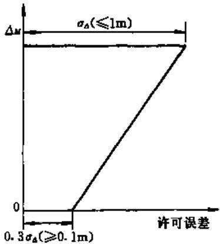

预见期内最大变幅的许可误差采用变幅均方差 $\pmb { \sigma _ { \Delta } }$ 变幅为零的许可误差采用 $0 . 3 \sigma _ { \Delta }$ ，其余变幅的许可误差按上述两值用直线内插法求出(见图5-11)。对于水位，许可误差以1.0m为

图 5-11 许可误差与变幅示意图

上限，0.1m为下限。对于流量，当计算出的许可误差小于测验误差时，以测验误差为下限。

预报洪峰出现时间的许可误差，采用以预报根据时间至实测洪峰出现时间间距的30%，并以3h为下限。

(2)降雨径流预报：净雨深的许可误差采用实测值的20%，许可误差大于20mm时，以20mm为上限；许可误差小于3mm时，以3mm为下限。

洪峰流量的许可误差取实测值的20%，并以流量测验误差为下限。

洪峰流量出现时间的许可误差，取预报根据时间至实测峰现时间间距的30%，并以3h或一个计算时段为下限。

## 二、预报方案的评定

1. 按确定性系数评定有效性

评定（检验）方案的有效性时按下列标准进行。

<table><tr><td rowspan=1 colspan=1>方案的有效性</td><td rowspan=1 colspan=1>甲等</td><td rowspan=1 colspan=1>乙等</td><td rowspan=1 colspan=1>丙等</td></tr><tr><td rowspan=1 colspan=1> ${ \bf d } _ { \mathbf { \mathcal { I } } }$ </td><td rowspan=1 colspan=1>&gt;0.90</td><td rowspan=1 colspan=1>0.70~0.90</td><td rowspan=1 colspan=1>0.5~0.69</td></tr></table>

2. 按许可误差评定合格率

占全部次数（n）的百分率 $( m / n \times 1 0 0 )$ 。按其合格率可将预报方案划分为以下3个等级。 其合格率可将预报方案划分为以下3个等级。

预报方案合格率是评定（检验）中计算值与实测值之差不超过许可误差的次数(m)

预报方案经评定达到上述甲、乙两个等级者，即可用于作业预报；达到丙等的方案用于参考性预报；丙等以下的方案不能用于作

<table><tr><td rowspan=1 colspan=1>等级</td><td rowspan=1 colspan=1>甲等</td><td rowspan=1 colspan=1>乙等</td><td rowspan=1 colspan=1>丙等</td></tr><tr><td rowspan=1 colspan=1>合格率（%）</td><td rowspan=1 colspan=1>≥85</td><td rowspan=1 colspan=1>70~84</td><td rowspan=1 colspan=1>60~69</td></tr></table>

业预报，只能作参考性估报。

## 三、作业预报的评定

作业预报按每次预报误差σ与允许误差$\sigma _ { \# }$ 比值百分率 $( \sigma / \sigma _ { \dot { \mu } } \times 1 0 0 )$ 的大小，分以下四个等级，评定时按此标准进行。

<table><tr><td rowspan=1 colspan=1>预报误差 (σ)/许可误差（σ许）</td><td rowspan=1 colspan=1>&lt;25</td><td rowspan=1 colspan=1>25~50</td><td rowspan=1 colspan=1>50~100</td><td rowspan=1 colspan=1>&gt;100</td></tr><tr><td rowspan=1 colspan=1>作业预报等级</td><td rowspan=1 colspan=1>优</td><td rowspan=1 colspan=1>良</td><td rowspan=1 colspan=1>合格</td><td rowspan=1 colspan=1>不合格</td></tr></table>

## 第五节 中长期水文预报简介

短期水文预报虽然能在河道防汛抢险和水库洪水调度中发挥重要的作用，但由于其预见期太短，往往难以满足国民经济各部门对水文预报提出的要求。中长期水文预报由于具有较长的预见期，使人们在解决防洪与抗旱、蓄水及弃水以及各部门用水之间矛盾时，能够及早采取措施进行统筹安排，以便获取最大的效益。因此，积极开展中长期水文预报是非常必要的。但是，随着预见期的增加，许多影响因素变化的不确定性增强以及目前科学技术水平的限制，中长期水文预报还处于探索、发展阶段。我国在这方面做了一定的工作，取得了一些经验和成果，为今后普遍开展中长期预报工作创造了有利条件。

## 一、预报方法与途径

中长期水文预报的预见期一般长达一旬至一年，所使用的途径和方法与短期水文预报相比有明显差异。目前用于中长期水文预报的主要方法有：

(1)天气学方法：径流的变化主要取决于降水，而降水又是由一定的环流形势与天气过程决定的。因此，径流的长期变化应与大型天气过程的演变有密切关系。天气学方法就是基于这一成因概念，根据前期大气环流特征以及表示这些特征的各种高空气象要素，直接与后期的水文要素建立起定量的关系进行预报的一种方法。

(2)天文地球物理因素方法：近代研究结果表明地球自转速度的变化、海温状况、火山爆发、臭氧的多少以及行星运动位置、太阳活动等对大气运动与水文过程都有一定的影响。分析这些因素与水文过程的对应关系后，就可以对后期水文要素可能发生的变化情况作出预测。

(3)统计学方法：从大量历史资料中应用数理统计方法去寻找分析水文要素变化与预报因子之间的统计规律和关系，然后应用这些规律来进行预报。按制作预报方案时考虑因子的方法特点，该方法又可分为单要素法和多要素综合法。单要素方法，在于通过分析预报对象自身随时间变化的规律来作为预报的依据，例如历史演变法、时间序列分析法等。多要素综合法是从分析影响预报对象的因子中挑选出一批预报因子，建立其统计规律来作为预报的依据，例如多元线性回归分析法。

以上各类方法中，统计学方法使用较为普遍，本节着重介绍其中的多元线性回归分析法。

## 二、多元线性回归分析法

通过成因分析找出影响预报对象的影响因素（因子)，应用数理统计中的多元线性回归方法建立预报方案。

## 1. 预报因子的挑选

预报因子是影响预报对象的前期因素，在多元回归方程中为自变量，因此对它的挑选是预报成败的关键。挑选预报因子首先考察它对预报对象之间在物理成因上的联系程度。例如，降水与大气环流有密切联系，可以把反映前期环流的各种特征数，如环流指数、副热带高压位置与强度等作为可能挑选的因子。此外，前后期对应相关关系较好的各种水文气象要素，也可作为可能选择的因子。

其次，要进行统计处理，使挑选出的因子与预报对象相关显著，且各因子之间相关系数要小，以避免采用作重复的因子。由于相关系数可反映变量之间的相关程度，因而可用来作为挑选预报因子的标准。但是相关系数的计算值存在统计误差，需经过统计的显著性检验来决定选取与否。

## 2. 预报方程的建立

将上述选取的预报因子与预报对象进行线性拟合，建立多元线性回归方程：

$$
{ \begin{array} { r l } { { \hat { y } } } & { = b _ { 0 } + b _ { 1 } x _ { 1 } + b _ { 2 } x _ { 2 } + \dotsb + b _ { m } x _ { m } } \end{array} }\tag{5-51}
$$

式中 b0，b1， ${ \pmb b } _ { \pmb q }$ ,…, $b _ { m }$ —回归系数；

x1, X2, …, $x _ { m }$ —预报因子。

回归系数可根据历史资料按最小二乘方法确定。对上式应用最小二乘方法可导出如下方程组：

$$
\begin{array} { r l } & { n b _ { 0 } + b _ { 1 } \overset { n } { \underset { i = 1 } { \sum } } x _ { 1 i } + b _ { 2 } \overset { n } { \underset { i = 1 } { \sum } } x _ { 2 i } + \cdots + b _ { m } \overset { n } { \underset { i = 1 } { \sum } } x _ { m i } = \overset { n } { \underset { i = 1 } { \sum } } y _ { i } } \\ & { b _ { 0 } \overset { n } { \underset { i = 1 } { \sum } } x _ { 1 i } + b _ { 1 } \overset { n } { \underset { i = 1 } { \sum } } x _ { 1 i } ^ { 2 } + b _ { 2 } \overset { n } { \underset { i = 1 } { \sum } } x _ { 1 i } x _ { 2 i } + \cdots + b _ { m } \overset { n } { \underset { i = 1 } { \sum } } x _ { 1 i } x _ { m i } = \overset { n } { \underset { i = 1 } { \sum } } x _ { 1 i } y _ { i } } \\ & { b _ { 0 } \overset { n } { \underset { i = 1 } { \sum } } x _ { 2 i } + b _ { 1 } \overset { n } { \underset { i = 1 } { \sum } } x _ { 1 i } x _ { 2 i } + b _ { 2 } \overset { n } { \underset { i = 1 } { \sum } } x _ { 2 i } ^ { 2 } + \cdots + b _ { m } \overset { n } { \underset { i = 1 } { \sum } } x _ { 2 i } x _ { m i } = \overset { n } { \underset { i = 1 } { \sum } } x _ { 2 i } y _ { i } } \\ & { \cdots \cdots } \\ & { b _ { 0 } \overset { n } { \underset { i = 1 } { \sum } } x _ { m i } + b _ { 1 } \overset { n } { \underset { i = 1 } { \sum } } x _ { 1 i } x _ { m i } + b _ { 2 } \overset { n } { \underset { i = 1 } { \sum } } x _ { 2 i } x _ { m i } + \cdots + b _ { m } \overset { n } { \underset { i = 1 } { \sum } } x _ { m i } ^ { 2 } = \overset { n } { \underset { i = 1 } { \sum } } x _ { m i } y _ { i } \Biggr \} } \end{array}\tag{5-52}
$$

式中 $\scriptstyle { \mathcal { X } } _ { 1 \cdot i }$ ——第 j个预报因子的第i次观测值， $j = 1 , \ 2 , \ \cdots , \ m , \ i = 1 , \ 2 , \ \cdots , \ n$ +h

${ \mathfrak { y } } _ { i }$ —预报对象的第i次观测值，i=1，2，…，n；

$\pmb { n }$ ——观测资料项数；

$\pmb { \mathscr { n } }$ —预报因子总个数。

## 3. 回归效果检验

回归方程求得之后，必须对它的回归效果进行检验。由于预报对象y值是一个随机变量，对每个y的观测值来说，变差大小由该次观测值y与其均值y的离差表示，其n次观 ${ \pmb y } _ { i }$ $\overline { { \pmb { y } } }$ $\pmb { \mathscr { n } }$ 测值的总变差为：

$$
S _ { y y } = \sum _ { i = 1 } ^ { n } ( y _ { i } - { \overline { { y } } } ) ^ { 2 }\tag{5-53}
$$

式中， $\overline { { \boldsymbol { y } } }$ 为预报对象n次观测值的均值。

设 $\hat { \bf { y } } _ { i }$ 为预报对象估计值，则每个观测点的离差 $y _ { i } - { \overline { { y } } }$ 可分解为：

$$
y _ { i } - { \overline { { y } } } = \mho _ { i } - { \hat { y } } _ { i } ) + \ m ( { \hat { y } } _ { i } - { \overline { { y } } } )\tag{5-54}
$$

将式（5-54）代入式（5-53），则有：

$$
\begin{array} { l } { { S _ { y y } = \displaystyle \sum _ { i = 1 } ^ { n } ( y _ { i } - \overline { { y } } ) ^ { 2 } = \displaystyle \sum _ { i = 1 } ^ { n } [ ( y _ { i } - \widehat { \mathfrak { x } } ) + ( \widehat { \mathfrak { x } } - \overline { { y } } ) ] ^ { 2 } \hfill } } \\ { { \quad = \displaystyle \sum _ { i = 1 } ^ { n } ( y _ { i } - \widehat { \mathfrak { x } } ) ^ { 2 } + \displaystyle \sum _ { i = 1 } ^ { n } ( \widehat { \mathfrak { x } } - \overline { { y } } ) ^ { 2 } + 2 \displaystyle \sum _ { i = 1 } ^ { n } ( y _ { i } - \widehat { \mathfrak { x } } ) ( \widehat { \mathfrak { x } } - \overline { { y } } ) } } \end{array}
$$

上式中右端最后一项为零，由此 $\pmb { S } _ { \mathbf { y } \mathbf { y } }$ 可分解为两部分：

$$
S _ { y y } = \sum _ { i = 1 } ^ { n } ( y _ { i } - \hat { y } ) ^ { i } + \sum _ { i = 1 } ^ { n } ( \hat { y } - \overline { { y } } ) ^ { i }\tag{5-55}
$$

上式右端第一项表示观测值 $\pmb { y _ { i } }$ 与估计值 $\hat { \bf { \Phi } } _ { \bf { \hat { x } } }$ 之差的平方和，称为残差平方和(记为Q)，它反映排除自变量x的作用之外的其它因素对 $\pmb { y }$ 的影响。右端第二项是估计值 $\hat { \bf { y } } _ { i }$ 与均值 $\overline { { \pmb { y } } }$ 之差的平方和，称为回归平方和(记为U)，它反映出由于因子 $\pmb { x }$ 的变化而引起 $\pmb { y }$ 变化的部分。式(5-55)可记为：

$$
S _ { y y } = Q + U
$$

对于给定的一组观测资料， $\pmb { S _ { y y . } }$ 是不变的，即 $_ { Q + U }$ 是一个常数，若 $\alpha$ 大则U小，若 $\pmb { Q }$ 小则U大。因此，Q与U都可以衡量回归的效果，为消除 $\pmb { Q }$ 和 $\pmb { U }$ 的因次，采用下述指标：

$$
r _ { \texttt { X } } = \sqrt { \frac { U } { S _ { y y } } } = \sqrt { { 1 - \frac { Q } { S _ { y y } } } }\tag{5-56}
$$

$\pmb { r } _ { 1 } _ { \pmb { \mathbb { L } } }$ 称为复相关系数，其值变化范围为 $0 \leqslant r _ { \pmb { \mu } } \leqslant 1$ 。显然 $\pmb { r } _ { \pmb { \mathbb { L } } }$ 越接近于1，回归效果就越好。

【例5-3】 应用新安江水库1955年至1973年 ${ \tt 4 } \sim 7$ 月份的月平均流量和的资料，以及

表 5-5 新安江水库 4\~7 月流量预报因子表
<table><tr><td>年份</td><td>4~7月 月平均 流量和  $\pmb { y }$   $( \mathfrak { m } ^ { 3 } / \mathfrak { s } )$ </td><td> $\pmb { x } _ { 1 }$  (C)</td><td> $\pmb { x _ { 2 } }$   ${ \bf ( { \bf { \sigma } } _ { B } / { \bf { \sigma } } _ { m } } ^ { 3 } )$ </td><td> $\$ 3$   $( \hbar \pmb { P } \pmb { \mathsf { a } } )$ </td><td> $\pmb { x } _ { 4 }$   $( \hbar \mathbb { P } \mathsf { a } )$ </td></tr><tr><td>1955</td><td>3467</td><td>26.4</td><td>29.1</td><td>4.1</td><td>5.8</td></tr><tr><td>1956</td><td>2622</td><td>27.6</td><td>28.8</td><td>12.3</td><td>6.0</td></tr><tr><td>1957</td><td>1880</td><td>29.1</td><td>30.0</td><td>5.8</td><td>8.0</td></tr><tr><td>1958</td><td>1997</td><td>29.0</td><td>28.7</td><td>7.3</td><td>7.8</td></tr><tr><td>1959</td><td>2615</td><td>29.4</td><td>27.8</td><td>11.1</td><td>5.3</td></tr><tr><td>1960</td><td>2091</td><td>28.2</td><td>29.3</td><td>8.7</td><td>6.9</td></tr><tr><td>1961</td><td>1503</td><td>28.4</td><td>28.6</td><td>8.2</td><td>10.0</td></tr><tr><td>1962</td><td>1993</td><td>29.9</td><td>26.7</td><td>9.9</td><td>7.0</td></tr><tr><td>1963</td><td>1616</td><td>28.6</td><td>30.9</td><td>10.0</td><td>7.3</td></tr><tr><td>1964</td><td>1938</td><td>28.5</td><td>29.7</td><td>9.1</td><td>9.0</td></tr><tr><td>1965</td><td>1725</td><td>28.4</td><td>29.5</td><td>8.2</td><td>10.5</td></tr><tr><td>1966</td><td>2680</td><td>28.0</td><td>29.6</td><td>7.0</td><td>7.9</td></tr><tr><td>1967</td><td>2327</td><td>28.1</td><td>29.9</td><td>7.5</td><td>8.8</td></tr><tr><td>1968</td><td>1701</td><td>28.4</td><td>29.6</td><td>11.5</td><td>6.6</td></tr><tr><td>1969</td><td>3634</td><td>27.6</td><td>28.2</td><td>7.0</td><td>7.1</td></tr><tr><td>1970</td><td>3375</td><td>27.3</td><td>29.6</td><td>5.4</td><td>8.5</td></tr><tr><td>1971</td><td>2397</td><td>26.7</td><td>28.5</td><td>9.7</td><td>7.4</td></tr><tr><td>1972</td><td>992</td><td>30.0</td><td>29.9</td><td>8.8</td><td>7.5</td></tr><tr><td>1973</td><td>4345</td><td>47.7</td><td>28.0</td><td>8.0</td><td>5.4</td></tr><tr><td>合计</td><td>44894</td><td>537.3</td><td>554.4</td><td>159.6</td><td>142.8</td></tr><tr><td>平均</td><td>2363</td><td>28.3</td><td>29.2</td><td>8.4</td><td>7.5</td></tr></table>

注 $\pmb { \mathscr { x } } _ { 3 }$ 和 $x _ { 4 }$ 为实际气压数值减去1000 hPa。

屯溪气象站相应的气象资料，建立该水库长期流量预报方程，并对1974年 $4 \sim 7$ 月的人库流量进行预报。

(1)根据成因分析，并通过计算，挑选出下列4个预报因子：

$\pmb { x } _ { 1 }$ ：屯溪气象站前一年7月份月平均气温， $r _ { x _ { 1 } y } = - 0 . 6 3 9 2$

$\pmb { x _ { 2 } }$ ：屯溪气象站前一年7月份月平均绝对湿度， $r _ { x _ { 2 } y } = - 0 . 5 1 3 2$

$\pmb { x } _ { 3 }$ ：屯溪气象站前一年7月份月平均气压， $r _ { x _ { 3 } y } = - 0 . 3 6 3 2$ t.

$\pmb { x } _ { 4 } \pmb { : \mathrm { } }$ 屯溪气象站前一年1月份平均气压，$r _ { x _ { 4 } y } = - 0 . 4 9 2 6$

以上 $\pmb { r } _ { \mathbf { w } \mathbf { y } }$ 为第 m 个预报因子 $\pmb { \mathcal { X } } _ { \pmb { \mathcal { M } } }$ 与预报流量y之间的相关关系， $m = 1 , \ 2 , \ \cdots , \ 4 ,$

所用的历史资料列于表5-5。

(2)根据表中的资料，代人根据最小二乘原理建立的正规方程组(5-52)，可以求得$b _ { 0 } = 2 4 9 0 0 , \ b _ { 1 } = - 4 2 7 , \ b _ { 2 } = - 2 6 1 , \ b _ { 3 } =$ $- 1 2 9 , b _ { 4 } = - 2 3 6$ ，由此预报方程为：

$$
\hat { y } = 2 4 9 0 0 - 4 2 7 x _ { 1 } - 2 6 1 x _ { 2 } - 1 2 9 x _ { 3 } - 2 3 6 x _ { 4 }
$$

（3）应用式（5-56）计算得 $r _ { \pmb { \mathscr { x } } } = 0 , 8 5 4 7 ,$ 本例样本资料容量 $n = 1 9$ ，预报因子个数m$\lneq 4$ 。若取信度 $\pmb { \alpha } { = } 0 . 0 1$ ，查复相关系数显著性检验值 $r _ { \alpha } { = } 0 . 7 8 5$ 。本例的 $r _ { \bigstar } > r _ { \bigstar }$ ，因此，在$\alpha { = } 0 . 0 1$ 的水平下，回归效果是显著的。

(4) 将1973年已出现的预报因子数值 $\scriptstyle x _ { 1 } = 2 7 . \ 0 , \ x _ { 2 } = 3 0 . \ 1 , \ x _ { 3 } = 7 . \ 7 , \ x _ { 4 } = 8 . \ 3$ 代人预报方程，求得1974年 $4 \sim 7$ 月月平均流量和为：

$$
{ \begin{array} { r l } & { { \hat { \boldsymbol { y } } } \ = 2 4 9 0 0 - 4 2 7 \times 2 7 . 0 - 2 6 1 \times 3 0 . 1 - 1 2 9 \times 7 . 7 - 2 3 6 \times 8 . 3 } \\ & { \quad = 2 5 6 0 \ \mathrm { m } ^ { 3 } / 5 } \end{array} }
$$

1974年 $4 { \sim } 7$ 月实测值是 $2 5 9 0 ~ \mathrm { m } ^ { 3 } / \mathrm { s }$ ，误差为 $3 0 ~ \mathrm { m } ^ { 3 } / { \mathsf { s } }$

## 第六节施工水文预报

水利水电工程施工以河槽为主要工作环境，凡在施工时受到施工回水影响的河段，称为施工区。对于大型或较大型水利水电工程，其施工期一般跨越几个季度甚至多年。在这样长的施工期间，会遇到各种不同的来水情况，同时，随着工程施工的不同阶段采用不同的导流方式，极大地改变了天然河道的水力条件。因此，做好施工期河流水情预报，对于工程施工的进度和安全至关重要。

水利水电施工区以上河道，可能原来就有测站，或临时设立的入库站，这些测站以上河段仍是天然情况。因而，入库站的水情预报可以采用前几节介绍的方法，对施工的各个阶段时期进行不同要求的水文预报。施工区的水文预报是以人库站为上游计算断面，预报下游施工区的水情变化。根据施工区各个阶段的实际情况，对水文预报有不同的要求。

## 一、围堰水情预报

在修筑围堰及导流建筑物阶段，要求预报围堰前的水位流量预报，以防止进入施工区的河水漫人工区。

## 1. 预报坝址处的流量

修筑围堰后，由于缩窄了河道，改变了天然河道的槽蓄特性，此时，可以采用马斯京根流量演算法预报坝址处的流量。由于围堰上、下游两端距离很短，推算的流量可作为围堰上、下游的流量。

围堰修建以后，天然情况下的马斯京根槽蓄曲线已不适用了，可先采用水力学方法计算各级稳定流量 $\pmb { Q } _ { i }$ 相应的水面曲线，进而计算出上游为人库站，下游为坝址的槽蓄量 $\mathbb { W } _ { i }$ 8假定修筑围堰后，原马斯京根参数x值不变(修围堰后x值最好以实测资料分析而得)，计算出示储流量 $\pmb { Q } ^ { \prime }$ ，点绘 $\overrightarrow { W } \sim \overrightarrow { \mathbf { Q } } ^ { \prime }$ 关系，推求出K值。从而求得修筑围堰后的演算公式，由此可预报坝址流量 $\alpha$ a

## 2. 围堰上、下游水位预报

修筑围堰后，水位壅高，围堰上游天然情况下的水位\~流量关系发生了变化，此时应重新建立上游水位\~流量关系曲线。

根据坝址流量，推求束窄河段水位的壅高值 $\Delta Z$ ，可用下列公式近似计算：

$$
\Delta Z = Z _ { \pm } - Z _ { \mathsf { F } } = \frac { \alpha V _ { \epsilon } ^ { 2 } } { 2 g } - \frac { \alpha V _ { \pm } ^ { 2 } } { 2 g }\tag{5-57}
$$

$$
\smash { V _ { c } = 2 / A _ { c } }\tag{5-58}
$$

$$
V _ { \textrm { \scriptsize x } } = \ Q / A _ { \pm }
$$

式中 $z _ { \textrm { \tiny \textrm { \textrm { E } } } } , z _ { \textrm { \tiny \textrm { F } } } - \textrm { E }$ 、下游断面水位，m；

(5-59)

$ { \boldsymbol { V } } _ { \mathrm { \perp } }$ $\pmb { V _ { c } }$ ——上游及束窄断面平均流速， $\mathbf { m } / { \mathbf { s } } _ { \mathfrak { F } }$

$A _ { \mathrm { { L } } }$ $\pmb { A } _ { c }$ ——上游及束窄处断面面积， $\mathbf { m } ^ { 2 } ;$

Q———稳定流量， $\mathbf { m } ^ { 3 } / \mathbf { s }$

α——动能修正系数，一般可取1.0\~1.1；

g——重力加速度， ${ \bf m } / { \bf s ^ { 2 } } .$

在计算时，要求具备有下游断面的水位～流量关系 $Q = f ~ ( Z _ { \ F } )$ ，上游及束窄断面的水位\~面积曲线 $A _ { \mathrm { { k } } } { = } f _ { \mathrm { { 1 } } } ~ ( Z _ { \mathrm { { k } } } ) , ~ A _ { \mathrm { { c } } } { = } f _ { \mathrm { { 2 } } } ~ ( Z _ { \mathrm { { F } } } )$ 。用试算法计算 $\blacktriangle z$ 值，其步骤如下。

1）拟定过水流量Q，查 $Q = f \ ( Z _ { \mathsf { T } } )$ 曲线得 $X _ { \mathfrak { F } }$

2) 由 $Z _ { \mathsf { F } }$ 值查 $A _ { \mathfrak { c } } { = } f _ { \mathfrak { z } } \ ( \bar { z } _ { \mathfrak { T } } )$ 曲线得 $\pmb { A } _ { \pmb { c } }$ ，由此计算出 $\boldsymbol { V _ { \epsilon } }$ ，并算出 $\pmb { \alpha V _ { c } ^ { 2 } } / 2 g$ 4.

3）假定壅水高度 $\Delta Z ^ { 2 }$ ，则得上游水位 $z _ { \mathrm { \scriptscriptstyle + } } = \bar { z } _ { \bar { \tau } } + \Delta z$ ，由 $A _ { \boldsymbol { \Sigma } } = f ^ { } ( \boldsymbol { Z } _ { \boldsymbol { \Sigma } } )$ ，曲线查得 $\pmb { A } _ { \pmb { \bot } }$ 计算出 $\boldsymbol { V } _ { \perp }$ ，并计算出 $\alpha V _ { \perp } ^ { z } / 2 g$

4）按式（5-57）计算壅水高度ΔZ，若计算出的ΔZ与假定的 $\Delta \boldsymbol { Z } ^ { \prime }$ 相符，则试算完毕，否则重新试算。

计算出各级流量的壅水高度，即可建立上游壅高后的水位\~流量关系曲线 $Q = f ( Z _ { \uparrow } + \Delta Z ) = f ( Z _ { \downarrow } )$ ，见图 5-12。围堰下游的水位～流量关系仍是天然情况下的，即 $Q = f ( Z _ { \Gamma } )$ 。有了围堰上、下游水位～流量关系，便可利用前面预报的流量 $\alpha \cdot$ 推求出上游水位 $z _ { \mathrm { \pm } }$ 和下游水位 $Z _ { \mathsf { F } }$ ，完成围堰上、下游的水位预报。

## 二、截流期水情预报

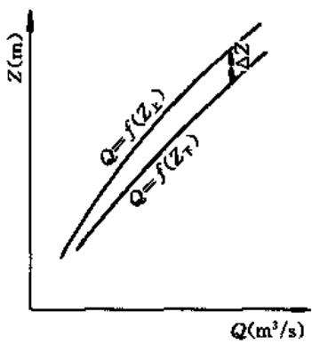

水利水电工程施工的截流一般是在枯季进行，枯季河水流量小，流速慢给截流施工创造了有利条件。只有预先掌握了截流期河道流量的大小，采取相应措施，施工截流才能顺利的进行。因此，截流期水情预报是施工截流中不可缺少的工作。

图 5-12 围堰上、下游水位～流量关系曲线

若截流期上游流域有降水，此时应采用前述的降雨径流方法进行水情预报。若截流期无雨或少雨，此时河川径流主要由流域蓄水补给，其流量过程一般具有较为稳定的消退规律，因而可以根据径流的退水规律进行径流预报。

## I. 退水曲线法

流域退水的规律十分复杂，常用的是退水曲线。反映退水规律的一般形式是地下水的退水曲线方程式：

$$
\mathcal { Q } _ { i } = Q _ { 0 } \mathrm { e } ^ { - i / K } = Q _ { 0 } \mathrm { e } ^ { - \beta t }\tag{·(5-60}
$$

式中 $Q _ { 0 }$ $Q _ { i }$ ——开始退水及退水开始后t时刻的流量， $\pi ^ { 3 } / { \mathfrak { s } }$ t.

$\beta$ ——退水系数， $\beta = - 1 / { \cal K }$

e——自然对数的底。

对于有实测资料的流域，可以根据无雨期退水流量资料求得退水曲线。把各次退水曲线按同一比例绘制在图上，用一透明纸在图上沿水平方向移动，绘制退水过程。使各条退水曲线下端在透明纸上互相重合、连接，取其下包线，即可得到所求的退水曲线(图 5-13)。

$\beta$ 及K是反映流域汇流时间的系数，它们的变化直接影响退水曲线的变化，掌握了它们的变化规律就掌握了退水曲线的规律。根据退水公式 $; \beta = ~ ( \mathrm { l n } Q _ { 0 } - \mathrm { l n } Q _ { t } )$ $/ t$ 可以计算出由0至t时刻 $\beta$ 的平均值。有了 $\beta$ 值以及开松项圾流的切松估

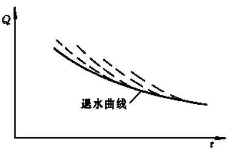  
图 5-13 退水曲线示意图

始预报流量的初始值 $\ Q _ { \odot }$ ，便可预报出枯水期河川径流过程 $\alpha _ { l }$

## 2. 前后期径流相关法

该法实质上是退水曲线的另一种形式，它是通过建立前后期径流相关图，从已知的前期径流量预报未来后期径流的一种方法。

对退水曲线式（5-60）积分，可得到从退水时刻至t时刻的蓄水量 $s _ { \circ \sim \iota } .$ ，有：

$$
S _ { \theta \sim t } = \int _ { 0 } ^ { t } Q _ { \circ } \mathrm { e } ^ { - \beta t } \mathrm { d } t = { \frac { Q _ { 0 } } { \beta } } ( 1 - \mathrm { e } ^ { - \beta t } )\tag{5-61}
$$

设 $s _ { \circ \sim \iota _ { 1 } }$ 与 $s _ { 0 \cdots _ { z } }$ 分别为开始退水时刻到 $t _ { 1 }$ 及 $\pmb { t _ { 2 } }$ 时刻内的蓄水量， $S _ { \mathfrak { c } _ { 1 } \cdots \mathfrak { c } _ { 2 } }$ 为从 $\pmb { t _ { 1 } }$ 到 $t _ { 2 }$ 时刻内的蓄水量，则：

$$
\frac { S _ { \iota _ { 1 } \sim \iota _ { 2 } } } { S _ { 0 \sim \iota _ { 1 } } } = \frac { \mathsf { e } ^ { - \beta \iota _ { 1 } } - \mathsf { e } ^ { - \beta \iota _ { 2 } } } { 1 - \mathsf { e } ^ { - \beta \iota _ { 1 } } }\tag{5-62}
$$

当 $\beta$ 为常数时， $S _ { \iota _ { 1 } \sim \iota _ { 2 } } / S _ { 0 \sim \iota _ { 1 } } =$ 常数，即前后期径流量为线性关系。

枯水期降水少，当河道中径流量主要由流域地下水补给时，前期径流量能较好地反映流域地下水蓄量的大小。因此，可以根据上述原理建立前后期（旬、月或季）流量相关图，进行枯水期流量的预报。图5-14为某站10月与11月平均流量相关图。这种方法简便，相关关系一般较好，是枯季径流预报常用的方法之一。当枯季降雨较大时，则可以预见期内降雨量为参数，建立如图5-15的相关图。

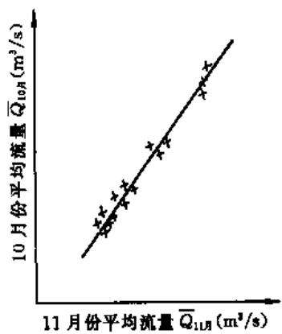  
图 5-14 $\overline { { \ u { Q } } } _ { 1 1 , \sharp } = f ^ { \mathrm { ~ ~ } } ( \overline { { \ u { Q } } } _ { 1 0 , \sharp } )$ 关系曲线

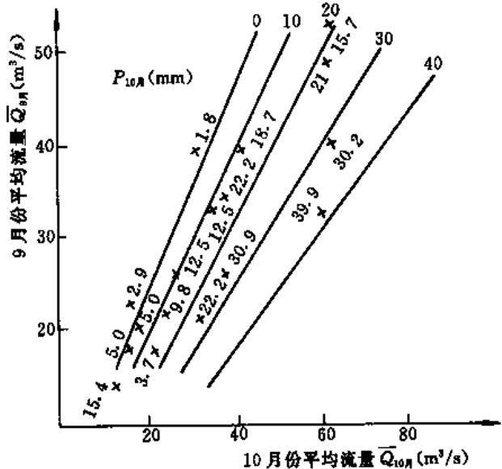  
图 5-15 $\overline { { \pmb { Q } } } _ { \mathbf { 1 0 } , \vec { \mathrm { A } } } = \pmb { f }$ $( Q _ { \tt S B }$ 9 $P _ { \tt I O A } )$ 关系曲线

## 习 题

5-1由实测资料摘录到某河段上、下游站相应洪峰水位及传播时间，如表5-6所示。要求：

(1)点绘相应洪峰水位及传播时间关系曲线；

(2)当已知该河段8月10日8时上游站洪峰水位 $z _ { \mathrm { { \scriptsize . } } } { = } 2 6 . 0 0 \ \mathrm { m }$ 时，求下游站的洪峰水位及其出现时间。

5-2 某河段上下游站一次实测洪水资料如表 5-7 所示，要求：

(1)用马斯京根法求出流量演算方程；

(2)用流量演算方程，由表5-7中上游站洪水过程以及下游站7月22日0时的流量690$\mathbf { m } ^ { 3 } / \mathbf { s }$ ，计算下游站洪水过程。

表 5-6某河段上、下游站相应洪峰水位及传播时间摘录
<table><tr><td colspan="4"></td><td colspan="4"></td></tr><tr><td colspan="4">上游站洪峰水位</td><td colspan="4">下游站洪峰水位</td><td rowspan="2">传播</td></tr><tr><td colspan="3">日 期</td><td rowspan="2">水位 (m)</td><td colspan="3">日 期</td><td rowspan="2">水位 (m)</td><td rowspan="2">时间 r (b)</td></tr><tr><td>月</td><td>日</td><td>时：分</td><td>月</td><td>日</td><td>时：分</td><td></td></tr><tr><td>4</td><td>28</td><td>17:30</td><td>22.28</td><td>4</td><td>29</td><td>4:00</td><td>8.74</td><td></td><td>10.50</td></tr><tr><td>6</td><td>2</td><td>1:30</td><td>27.38</td><td>6</td><td>2</td><td>8:00</td><td>10.10</td><td></td><td>6.50</td></tr><tr><td>5</td><td>7</td><td>7130</td><td>24.27</td><td>6</td><td>7</td><td>1600</td><td></td><td>9.22</td><td>9.00</td></tr><tr><td>6</td><td>16</td><td>14:15</td><td>23.33</td><td>6</td><td>16</td><td>22:00</td><td></td><td>8.98</td><td>7.75</td></tr><tr><td>6</td><td>22</td><td>0:00</td><td>25.16</td><td>6</td><td>22</td><td>6:00</td><td></td><td>9.35</td><td>6.00</td></tr><tr><td>6</td><td>28</td><td>1645</td><td>22.59</td><td>6</td><td>29</td><td>2:00</td><td></td><td>8.72</td><td>9.25</td></tr><tr><td>7</td><td>14</td><td>11:15</td><td>23.11</td><td>7</td><td>14</td><td>9:00</td><td></td><td>8.89</td><td>7.75</td></tr></table>

表 5-7 某河段某次洪水记录 单位： ${ \pmb { \mathrm { m } } } ^ { \mathbf { 3 } } / { \pmb { \mathrm { s } } }$
<table><tr><td>时间 (月、日.时)</td><td>上游站实 测流量  $\pmb { Q } _ { \pmb { \Sigma } }$ </td><td>下游站实 测流量  $Q _ { \tilde { \Gamma } }$ </td><td>区间流量 9</td></tr><tr><td>7.22.0</td><td>750</td><td>690</td><td>70</td></tr><tr><td>7.22.6</td><td>840</td><td>770</td><td>140</td></tr><tr><td>7.22.12</td><td>2810</td><td>940</td><td>200</td></tr><tr><td>7.22.18</td><td>3900</td><td>2320</td><td>140</td></tr><tr><td>7.23.0</td><td>2380</td><td>3300</td><td>60</td></tr><tr><td>7.23.6</td><td>1580</td><td>2750</td><td></td></tr><tr><td>7.23.12</td><td>1200</td><td>1830</td><td></td></tr><tr><td>7.23.18</td><td>1000</td><td>1460</td><td></td></tr><tr><td>7.24.0</td><td>890</td><td>1230</td><td></td></tr><tr><td>7.24.6</td><td>800</td><td>1060</td><td></td></tr><tr><td>7.24.12</td><td>750</td><td>940</td><td></td></tr><tr><td>7.24.18</td><td>720</td><td>840</td><td></td></tr><tr><td>7.25.0</td><td>700</td><td>800</td><td></td></tr></table>

# 第六章 水 文 模 型

第一节 概 述

20世纪后半叶，由于电子计算机的出现，各种新的观测技术应用和系统科学及数学的发展，提出了水文模型的概念与方法。它们在解决水文实际问题与进行水文规律研究上都起到显著作用。

模型一词是指比原型简单的系统，它可以呈现原型系统的某些重要部分而不是全部的特性。水文模型包括模拟原型的某些物理性质的水文物理模型，以及用数学物理方法或系统理论描述原型各种变量之间关系的水文数学模型。

水文物理模型最简单的是比尺模型，这类模型和一般水工模型类似，是以几何和力学的相似原理为基础的。其次是比拟模型，这类模型是以另一现象的物理性质比拟水文现象的物理性质、或者用某一种量来取代原型的性质，如根据渗流的达西定律与电流的欧姆定律之间的相似性进行比拟的电模拟模型。在径流形成过程的研究中，水文物理模型一般在实验室和试验场地进行，但受到试验条件的限制，发展上有一定的局限性。

水文数学模型就是运用数学的语言和方式描述水文原型的主要特征关系和过程，高速电子计算机的应用促进了这类模型的发展。目前世界各国已广泛应用数学模型解决水文领域的各种问题。习惯上，水文模型指的是水文数学模型。

水文模型可分为确定性模型和随机性模型。描述水文现象必然性规律的数学关系称为确定性模型。从系统的观点，确定性模型的因果关系是唯一、完全对应的。相反，描述水文现象随机性规律的数学关系称为随机性模型，在一组已知的不变条件下，每次产生的水文现象可能都是不同的，没有唯一的因果对应关系，对这种不确定事件只能作出概率预告。本章仅介绍确定性的水文模型。

一般讲，建立一个恰当的水文模型依赖于研制者对水文规律认识的程度、模型使用的目标和可以建立起模型所需要的资料条件。针对不同的要求和资料条件，可以选择不同类别的水文模型。目前，一种常用的划分是指系统理论模型和概念性水文模型。无论是哪一类，建立的水文模型过程一般都涉及下列几个步骤。

1）以框图或流程图形式，表达水文过程整体和径流形成各个环节之间的相互关系。

2）建立模型各个部分的数学表达式或它们的逻辑计算关系。

3）根据观测的水文资料和经验，通过拟定的识别准则或目标，去率定模型中所包含的所有待定参数或函数。

4）依据未参加建立模型的观测资料和对水文现象规律的逻辑判断，进行必要的模型检验。只有认为模型达到希望精度（如效率），才能应用。水文模型应用的领域较广，最常用的有水文预报、水文计算、水资源评价等。

为了对水文模型的应用进行评定，需要采用一定的准则或标准。20世纪70年代后，国际上常选用由纳希（].E.Nash）等提出的模型效率标准，它类似于我国在水文预报方案评

定所使用的确定性系数。

模型效率的含义是：对于一个实际流域，如果不使用模型的最简单情况下作流量过程预报，从数理统计的观点出发，自然是采用流域出口断面流量的多年平均值Y作预报了。实 $\overline { { \pmb { Y } } }$ 测值Y（k)与均值 $\overrightharpoon { \mathbf { Y } }$ 的离差平方和，就是没有模型条件下的预报方差。我们把它定义为初始方差 $\pmb { F } _ { \emptyset }$ ，即：

$$
{ \pmb F } _ { 0 } = \sum _ { { \pmb \mathrm { \beta } } } [ { \pmb Y } ( { \pmb k } ) - { \pmb \overline { { { \pmb \ Y } } } } ] ^ { 2 }
$$

$\pmb { F } _ { 0 }$ 相当于设置一个供参考的信息，即基准值。

对有模型使用的情况下，则模型计算值 $\hat { Y } ( k )$ 与实际值Y（k）的离差平方和定义为预报方差 ${ \pmb F } _ { 1 }$ ，即：

$$
F _ { 1 } = \underset { \bf k } { \sum } [ Y ( k ) - \hat { Y } ( k ) ] ^ { 2 }
$$

我们把模型在减少利用均值作预报方差的信息增益值称为模型的效率（亦称Nash效率系数)，记为 $\pmb { D } \pmb { C }$ 。它由下式定义：

$$
D C = \left( 1 - \frac { { \pmb { F } } _ { 1 } } { { \pmb { F } } _ { 0 } } \right) \times 1 0 0 \%\tag{6-1}
$$

显然，当模型的方差 ${ \pmb F } _ { 1 }$ 仅达到初始方差 ${ \pmb F } _ { 0 }$ 时，说明该模型相对均值预报不提供任何新的信息，这时 $D C { = } 0$ 。当模型方差 ${ \pmb F } _ { 1 }$ 为零，则说明模型计算值与实测值完全吻合，效率达最大， $\begin{array} { r } { D C = 1 0 0 ; } \end{array}$ %。一般情况下 $D C { < } 1 0 0$ %。DC愈大，表示模型减少初值方差的模拟能力愈强，因而效率愈高。

对于两个不同水文模型应用，可采用相对比增益的指数 $r ^ { 2 }$ 进行度量，即：

$$
r ^ { 2 } = \frac { D C _ { 2 } - D C _ { 1 } } { 1 0 0 - D C _ { 1 } } \times 1 0 0 \%\tag{6-2}
$$

$r ^ { z } > 0$ ，表示模型2优于模型1，为优的模型相对效率增值为 $r ^ { 2 } \%$

我国在对水文预报精度的评定，有专门的规范，其中有关的指标（如次洪产流量合格率，峰现时间合格率包括确定性系数DC等）可以做为检验水文模型的参考依据。

本章将介绍国内外几种有代表性的水文系统理论模型和概念性模型。

## 第二节水文系统理论模型

## 一、水文系统的概念

水文系统是指研究对象中由相互作用和相互依赖的若干水文要素组成的具有水文循环功能的整体，如一组河网的水体汇集运动，流域的降雨径流过程等。

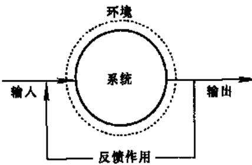  
图 6-1 基本的系统模型

水文系统至少包括三个部分，即系统输人、输出和系统的功能，如图6-1所示。对河网汇流系统而言，上游的人流可视为输人，下游的出流可视为输出；对流域降雨\~径流系统而言，降水可视为系统输入，流域出口断面径流量可视为输出等等。系统在特定环境下对输入的作用产生响应，转化为输出。把输人变为输出，这就是所谓的系统功能。水文系统功能是与系统所处的地理位置、流域或河系的地貌、植被特性以及人类活动作用相联系。例如我国南方地区的洪水过程变化比较缓慢，而北方干旱或半干旱地区则为暴涨暴落。

基于系统的观点，水文系统的功能特征可以从不同的方面加以区分，如线性与非线性、时变与非时变、集总与分散的概念。

当系统的输入与输出之间的转化关系满足线性叠加原理（齐次性和叠加性），这个系统称为线性系统，反之，即为非线性系统。从数学观点看，线性系统是服从线性方程的系统，例如，某流域的平均降雨 $\textit { \textbf { x } } ( t )$ 与出口断面流量 $\alpha$ (t)，假定服从下列线性微分方程：

$$
{ \frac { \mathrm { d } Q } { \mathrm { d } t } } + a Q = b x\tag{6-3}
$$

式中， $\pmb { a }$ 和b模型参数，我们说它是一个线性水文系统。这是因为可以证明上式适用线性叠加原理。假设有两个不同输入 $x _ { 1 } ~ \left( t \right)$ 和 $x _ { 2 } ( t )$ 分别激励出响应 ${ Q _ { 1 } } \left( \varepsilon \right)$ 和 $Q _ { 2 } ( t )$ ，则：

$$
\begin{array} { r l } & { \frac { \mathrm { d } Q _ { 1 } } { \mathrm { d } t } + a Q _ { 1 } = b x _ { 1 } } \\ & { } \\ & { \frac { \mathrm { d } Q _ { 2 } } { \mathrm { d } t } + a Q _ { 2 } = b x _ { 2 } } \end{array}
$$

将上两式相加直接得：

$$
\frac { \mathrm { d } ( Q _ { 1 } + Q _ { 2 } ) } { \mathrm { d } t } + a ( Q _ { 1 } + Q _ { 2 } ) = b ( x _ { 1 } + x _ { 2 } )
$$

上式说明：系统对输入 ${ \pmb x } _ { 1 } \ ( t ) + { \pmb x } _ { 2 } \ ( t )$ 的响应等于单个输人响应之和 $Q _ { 1 } ( t ) + Q _ { 2 } ( t )$ 。然而，如果 $x \ \left( t \right) \ \sim Q \ \left( t \right)$ 之间的转化是服从下列非线性微分方程：

$$
{ \frac { \mathrm { d } Q } { \mathrm { d } t } } + a Q ^ { 2 } = b x
$$

则就得不到上述线性系统的叠加性结论。

具有随时间而变的参数系统称为时变系统。反之，参数为定常的系统称之为时不变系统。式(6-3）的模型参数a和6均为常数，它描述的是时不变系统。如果至少有一个参数是时间的函数，这样的系统就是时变系统。

系统的输入、输出或其参数不存在空间变化称其为集总系统。反之，为分布系统。分布系统可以看作由许多子系统组成，每个子系统可以是一个集总系统。中小流域的降雨\~径流关系可近似视为集总系统。但对大、中流域，由于存在明显的降水空间分布，一般需要概化成为输入分布式系统。

对于一个真实的流域系统，由于径流形成过程要受到降水、蒸发、下垫面地形地貌、土壤植被及人类活动多种因素的制约和影响，从系统观点看，它多半是非线性、时变和分布式的。但为了模型可以应用，实际模拟计算中又常常进行一定的简化或假定。这需要在模型的复杂性和实用性两方面，选择一种合理的折衷与平衡。

## 二、总径流线性响应模型(SLM模型）

流域上降雨产生径流的过程可视为一种水文系统关系。从水文学的观念看，一般需要通过流域产流（扣除损失）和流域汇流几个环节加以描述。流域产生的径流可以划分为地面径流、壤中流和地下径流几个不同的部分。然而，要建立它们的系统关系，除了降雨和径流资料之外，还需要流域的蒸发以及土壤含水量和地下水位变化等观测资料。在许多实际流域，往往缺乏这些重要的水文资料，而仅仅有降雨和径流过程观测。我们把流域上直接观测的落地雨称为总降雨，把流域出口断面观测的径流过程称为总径流。如果应用的目的是设法由总降雨推求总径流过程，如水文预报作业等，则可运用水文系统理论方法，建立总径流系统模型，其中最简单的是总径流线性响应模型（SLM模型）。

## (一)总径流线性响应模型的系统方程

记流域的总降雨过程为x(t)、流域出口观测的总径流过程为 ${ \textbf { \textit y } } ( t )$ ，流域就可视为一个水文系统。它将总降雨x(t)经过系统的作用，转化为总径流过程输出y(t)。我们把系统的作用函数称为流域的响应函数(Response function)，记为h(t)。如果假定流域是一个线性、时不变、集总的确定性水文系统，则总径流线性响应模型的系统方程，可由下列线性卷积方程表达：

$$
y ( t ) = \int _ { 0 } ^ { t } h ( \tau ) x ( t - \tau ) \mathrm { d } \tau\tag{6-4}
$$

式中，τ是积分变量。

为什么t时刻的水文径流y(t)需要用一个卷积方程表达呢？这是因为水文流域的作用是一个有“忆滞”功能的系统，即t时刻的出口断面流量不仅仅与t时刻的降雨作用有关，而且还与从 $\scriptstyle { \tau = 0 }$ 到τ=t的整个记忆时段[0，t]内所有降雨作用有关，这种关系与第四章所述的等流时线概念相仿，是一种卷积关系。事实上，求解一个线性系统微分方程，其输出y（t）的表达式就是一个与式（6-4）相似的积分方程，区别仅在于响应函数h（t）的具体表达关系不同罢了。

我们称式（6-4）为线性水文系统是因为它满足线性叠加原理。所谓线性叠加原理就是说系统具备了齐次性和叠加性的性质。齐次性亦称倍比性，即若输入为x(t)时、输出为${ \textbf { \textit { y } } } ( t )$ ，即应当输入为 $\pmb { \alpha } \pmb { x } ^ { \mathrm { ~ } } \left( t \right)$ 时，输出也应为 $\boldsymbol { a } \mathbf { y } \ \left( t \right) \mathrm { \dot { } }$ ，其中 $\pmb { a }$ 是任意常数。由式（6-4），显然下列关系成立：

$$
\int _ { 0 } ^ { t } h ( \tau ) \big [ a x ( t - \tau ) \big ] \mathrm { d } t = a \int _ { 0 } ^ { t } h ( \tau ) x ( t - \tau ) \mathrm { d } \tau = a y ( t )
$$

所谓叠加性是指如果输人 ${ \pmb x } _ { 1 } ( t )$ 对应的输出为 ${ \bf { y } } _ { \uparrow } ( t )$ ,输人 $x _ { 2 } ( t )$ 的输出为 $y _ { 2 } ( t )$ ,那么对于输入 ${ \pmb x } _ { 1 } ( t ) + { \pmb x } _ { 2 } ( t )$ ，应该也有对应的输出 ${ \bf y } _ { 1 } ( t ) + { \bf y } _ { 2 } ( t )$ ，同样，可以证明式(6-4)是满足叠加性，即：

$$
\begin{array} { l } { \displaystyle { \int _ { 0 } ^ { t } h ( \tau ) \big [ x _ { 1 } ( t - \tau ) + x _ { 2 } ( t - \tau ) \big ] \mathrm { d } t = \int _ { 0 } ^ { t } h ( \tau ) x _ { 1 } ( t - \tau ) \mathrm { d } \tau + \int _ { 0 } ^ { t } h ( \tau ) x _ { 2 } ( t - \tau ) \mathrm { d } \tau } } \\ { \displaystyle { \qquad = y _ { 1 } ( t ) + y _ { 2 } ( t ) } } \end{array}
$$

时不变系统反映在（6-4）中是指系统的响应函数h（·）并不随时间t而变化，它仅仅是积分变量τ或者差值t-τ的函数。换言之，h（τ)是固定的一条曲线。

所以，简单的总径流线性响应模型式（6-4）仅有三个变量过程，即总雨量 $\textbf { \textit { x } } ( t )$ 、总径流y(t）和系统响应函数h(t)。实际应用中，常常把它们离散化，以便与实际观测的 $\Delta t$ 时段水文资料一致。总径流线性响应模型亦称简单的线性模型(Simple Linear Model)，简记为SLM，离散化的系统方程表达为：

$$
Y ( k ) = \sum _ { i = 1 } ^ { m } H ( i ) X ( k - i + 1 )\tag{6-5}
$$

式中，m是流域的记忆长度，即任一输入X的作用效应只持续m个Δt时段，X（k一i+1）是离散化第（k—i+1）个Δt时段流域平均降雨（mm)，Y(k）是离散化后的第k个Δt时段末出口断面径流 $( \mathbf { m } ^ { 3 } / \mathsf { s } )$ 或者(mm），H(i）是第i个 $\Delta t$ 时段的系统响应函数，其因次取决于降雨径流的关系。实际应用中，通常先把径流统一转化为与降雨相同的单位(mm)，则h(i)就是无因次变量。

## (二)总径流线性响应函数的推求

对式（6-4）或式（6-5）表达的SLM模型而言，仅仅给出了水文系统模型的表达关系。我们知道，水文预报的应用之一就是由降雨X（k）推求总径流Y（k)。显然，其中的前提就是已知系统的响应函数H(i)。然而，在未完全建立SLM模型之前，响应函数是有待确定的。我们把由历史上（或实时方式）观测的输入、输出信息[X(k)、Y（k)]用来辨识水文系统模型中未知或待定的部分[如式（6-5）中的响应函数H（i)]，称之为水文系统识别。它是水文系统方法中重要的内容之一。只有把系统模型中待定的部分都确定了，才能应用到实际的水文预报或水文计算。对总径流线性响应模型，系统识别的问题归为水文模型响应函数的推求。为了保证建立模型的可靠性，一般依据6\~10年连续观测的日（或小时）降雨和径流序列资料来估计最优的响应函数。采用最多的是矩阵最小二乘法，简介如下：

考虑到所用资料有误差，或对系统所作的线性假定不完善，式（6-6）可做如下表达：

$$
Y ( k ) = \sum _ { i = 1 } ^ { m } X ( k - i + 1 ) H ( i ) + e ( k )\tag{6-6}
$$

式中，e（k)为随机误差项。

随着水文时间序列的变化，即当k=1，2，…，n时，式（6-6）可逐行写为：

$$
\begin{array} { l } { { Y ( 1 ) = X ( 1 ) H ( 1 ) + e ( 1 ) } } \\ { { \ } } \\ { { Y ( 2 ) = X ( 1 ) H ( 2 ) + X ( 2 ) H ( 1 ) + e ( 2 ) } } \\ { { \ } } \\ { { \vdots } } \\ { { Y ( m ) = X ( 1 ) H ( m ) + X ( 2 ) H ( m - 1 ) + \cdots + X ( m ) H ( 1 ) + e ( m ) } } \\ { { \ } } \\ { { \vdots } } \\ { { Y ( n ) = X ( n - m + 1 ) H ( m ) + X ( n - m + 2 ) H ( m - 1 ) + \cdots + X ( n ) H ( 1 ) + e ( n ) } } \end{array}
$$

它们可以用矩阵方程形式表达：

$$
\begin{array} { r } { \left[ Y ( m ) \right. } \\ { \left. \begin{array} { c } { Y ( 1 ) } \\ { Y ( 2 ) } \\ { \vdots } \\ { Y ( m ) } \\ { Y ( m + 1 ) } \\ { \vdots } \\ { Y ( n ) } \end{array} \right] = \left[ \begin{array} { c c c c c } { \phantom { - } X ( 1 ) } & { 0 } & { \cdots } & { 0 } \\ { \phantom { - } X ( 1 ) } & { X ( 2 ) } & { \cdots } & { 0 } \\ { \vdots } & { \vdots } & { \vdots } \\ { \phantom { - } X ( 1 ) } & { X ( 2 ) } & { \cdots } & { X ( m ) } \\ { \phantom { - } X ( 2 ) } & { X ( 3 ) } & { \cdots } & { X ( m + 1 ) } \\ { \vdots } & { \vdots } & { \ddots } & { \vdots } \end{array} \right] \left[ \begin{array} { c } { H ( 1 ) } \\ { H ( 2 ) } \\ { H ( 2 ) } \\ { \vdots } \\ { H ( m ) } \end{array} \right] + \left[ \begin{array} { c } { e ( 1 ) } \\ { e ( 2 ) } \\ { \vdots } \\ { \vdots } \\ { e ( n ) } \end{array} \right] } \\ { \left[ \begin{array} { c } { X ( 2 ) } \\ { X ( n ) } \end{array} \right] } \end{array}
$$

简记为：

$$
Y _ { n \times 1 } = X _ { n \times \pi } H _ { n \times 1 } + E _ { n \times \ell }\tag{6-7}
$$

式中，n代表水文资料的总长度，m是响应函数的记忆长度。在日径流模拟中，一般n取6${ \sim } 1 0$ 年的日数，它要大于系统记忆长度m值。

由于 $\pmb { n } > \pmb { m }$ ，式（6-7）是一个超定方程组，其中的响应函数向量 $H _ { n \times 1 } = [ h \left( 1 \right) , h \ \left( 2 \right)$ $\cdots , \textit { h } \left( m \right)$ 可采用最小二乘准则识别。目标函数记为：

$$
\begin{array} { r l } & { J ( H ) = \underset { i = 1 } { \overset { n } { \sum } } e ^ { 2 } ( k ) = E ^ { T } E = ( Y - X H ) ^ { T } ( Y - X H ) } \\ & { \qquad = Y ^ { T } Y - 2 H ^ { T } X ^ { T } Y + H ^ { T } X ^ { T } X H } \end{array}\tag{6-8}
$$

由目标函数极小化，即min{J（H)}，不难导出响应函数的最小二乘解向量为：

$$
\hat { H } = [ X ^ { \tau } X ] ^ { - 1 } [ X ^ { \tau } Y ]\tag{6-9}
$$

式中， $[ X ^ { T } X ] ^ { - 1 }$ 为 $[ X ^ { \tau } X ]$ 的逆矩阵。一般需要编制程序，在计算机上完成求解。

## (三)总径流线性响应模型的水文概念

从水量平衡的观点，总降雨量∑X（k）和总径流量∑Y（k）一般是不相同的，二者的差额就是降雨的损失。我们把总径流量∑Y（k）与总降雨量∑X（k）之比，称为流域的平均径流系数 ${ \pmb { \alpha } } _ { Y / X }$ 。另一方面，在系统方法中，我们称式（6-9）中响应函数H（i）之和，即$G _ { a } = \sum _ { i = 1 } ^ { n } H ( i )$ ，为系统的增益因子(Gainfactor)。可以证明：总径流线性响应模型的增益因子恰好等于流域的平均径流系数，它反映了流域产流特点。事实上，对式（6-9）的Y(k)求和，当时间序列足够长时，可推导有：

$$
\Sigma Y ( k ) = \Sigma H ( i ) \Sigma X ( k )\tag{6-10}
$$

所以，

$$
G _ { a } = \Sigma H ( i ) = \frac { \Sigma Y ( k ) } { \sum X ( k ) } = \alpha _ { Y / X }\tag{6-11}
$$

上式可作为总径流线性响应模型的径流体积约束条件之一。

进一步，我们把标准化的响应函数记为Z（i)，即：

$$
Z ( i ) = H ( i ) / G _ { a }\tag{6-12}
$$

或者

$$
H ( i ) = Z ( i ) G _ { a }\tag{6-13}
$$

不难导出：

$$
\sum _ { i = 1 } ^ { m } Z ( i ) = \sum _ { i = 1 } ^ { m } H ( i ) / G _ { a } = 1 . 0\tag{6-14}
$$

将式（6-13)代入总径流线性响应模型式(6-5)，整理有：

$$
\begin{array} { c } { { Y ( k ) = \displaystyle \sum _ { i = 1 } ^ { m } Z ( i ) G _ { a } X ( k - i + 1 ) } } \\ { { = \displaystyle \sum _ { i = 1 } ^ { m } Z ( i ) R ( k - i + 1 ) } } \end{array}\tag{6-15}
$$

式中，R（k—i+1）可视为扣损了的“净雨”过程。

所以，总径流线性响应模型式（6-5）或式（6-15）说明了一种简单的水文概念，即它用流域平均径流系数G乘以毛雨量X(k)，求得“净雨”R(k)；然后进行汇流卷积计算， $G _ { \alpha }$ 推求总径流过程Y（k)。对式（6-9）描述的是总降雨～总径流的转化关系。它的等价式(6-15)则表达了水文传统的汇流质量守衡系统，即：

$$
\begin{array} { c } { { \displaystyle \sum _ { i = 1 } ^ { m } Z ( i ) = 1 . 0 } } \\ { { \sum Y ( k ) = \sum R ( k ) } } \end{array}
$$

总径流响应模型一种概念性的解释如图6-2所示。

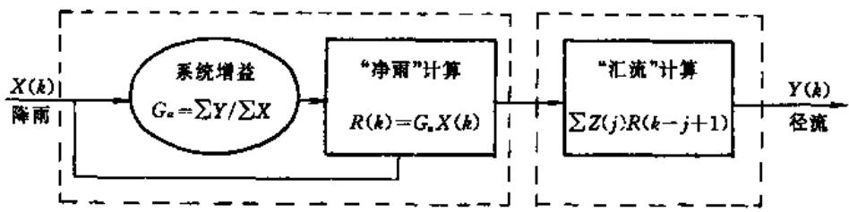  
图 6-2 总径流线性响应模型的一种概念解释

## （四）计算实例

长江支流清江流域面积 $1 5 3 0 0 ~ \mathrm { k m } ^ { 2 }$ ，流域内有25个雨量站，出口控制断面有水文站，收集有1973\~1980年8年连续日径流量资料和流域平均日降水序列资料。作为日径流预报分析方案之一，选取1973\~1978年连续6年降雨～径流资料建立总径流响应模型(SLM)，留余下两年资料（1979\~1980年）做模型预报检验。精度评定采用纳希建议的模型效率准则DC。

水文线性识别的响应函数过程见图6-3；其中系统记忆长度m取15天。流域系统的增益因子 $G _ { \alpha }$ 为0.6878，它相当于6年平均的日径流系数。

模型率定期评定的效率为 $\pmb { D } \pmb { C } =$ 79.31%，1973年日径流过程模拟如图6-4（a）所示。结果表明；水文过程的模拟比较满意，但是洪峰值存在系统偏差。这说明总径流线性响应模型还不能考虑洪峰非线性变化的影响。模型预报应用检验评定的效率 $\pmb { D } \pmb { C } =$ 83.04%。1979年的日径流过程如图6-4（b）所示。同样，洪峰预报的误差还比较明显。目前，依据国内外流域应

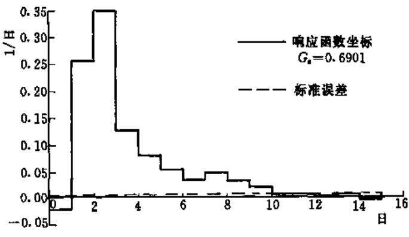  
图 6-3 清江流域日径流线性响应出数

用的部分经验；对大江大河的日径流预报、线性水文系统方法，可达到一定的预报精度，但对中小流域和干旱、半干旱的水文地区，需要考虑水文非线性的影响及其模拟方法。

## 三、线性扰动模型（LPM）

降雨～径流序列中包含了各种水文信息，如日径流序列季节性变化均值。由实测水文资料计算的季节均值定义为：

$$
Q _ { d } = { \frac { 1 } { n } } ( Q _ { d , 1 } + Q _ { d , 2 } + \cdots + Q _ { d , n } )\tag{6-16}
$$

式中 $, Q _ { d } ,$ 表示第i年第d天的水文变量(流量、雨量等)，n是资料年份数 $\mathcal { Q } _ { d }$ 为季节均值。

图6-4是上节实例中清江流域日径流序列直接由样本计算(未平滑)的季节均值和经数学方法平滑了的季节均值。从图中可看到，4月份到9月份为汛期，径流量值大，洪峰出现在5\~9月份为多，其他月份为非汛期径流变化。如果能将这些有用的水文季节信息 $( Q _ { d } )$ 纳入到水文模型中，则可望水文模拟及预报的精度有所改进。由于现行的考虑土壤含水量的概念性模型，很难利用季节均值这类水文信息，因此，纳希（J.E.Nash）等建议了线性扰动模型(Linear Perturbation Model，简记 LPM)。

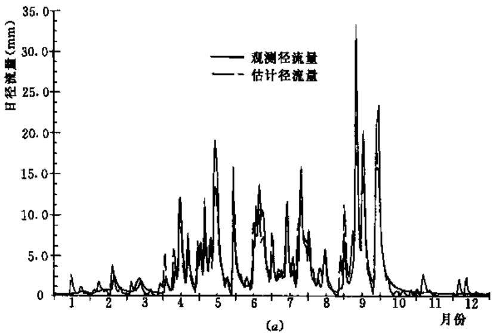

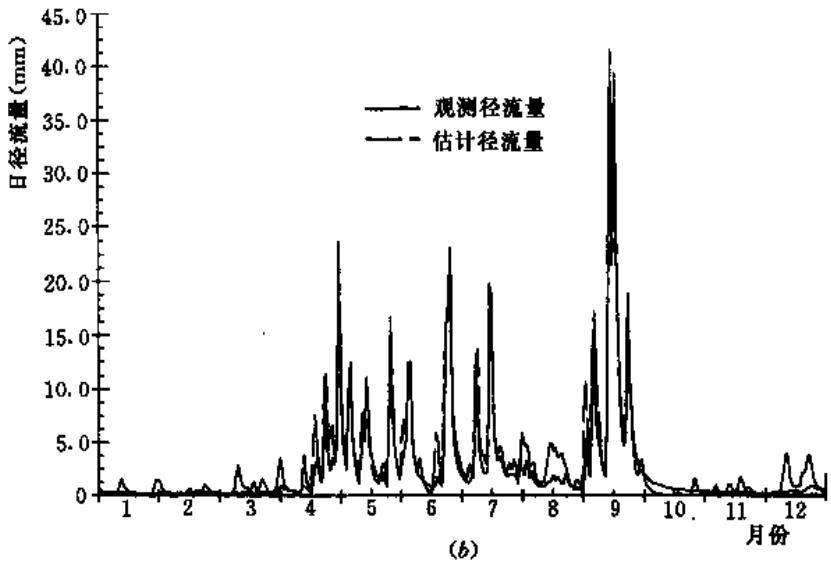  
图6-4 清江流域日径流模拟与预报检验总径流线性响应模型  
(a）率定期（1973年）日径流模拟；（b）预报期（1979年）日径流检验

## (一)线性扰动模型的结构及基本假定

线性扰动模型建立的思想是：依据观测的降雨\~径流（或河道输入\~输出）资料记为{I(k)，Q(k)}，计算季节均值及其平滑值，分别记为 $\pmb { I _ { d } }$ 和 $Q _ { d }$ 。关于 $I _ { d } \sim Q _ { d }$ 之间复杂关系不作任何假定。然后，分别计算系统输人、输出变量相对它们季节均值的扰动项，即：

$$
X ( k ) = I ( k ) - I _ { d }\tag{6-17}
$$

$$
Y ( k ) = Q ( k ) - Q _ { d }\tag{6-18}
$$

由于一个水文输入\~输出序列中季节均值占有主导部分，为简化模型假定：输入的扰动项 $X ( k ) = I ( k ) - I _ { d }$ 与输出的扰动项 $Y ( k ) { = } Q ( k ) { - } Q _ { d }$ 之间存在线性关系，即：

$$
Y ( k ) = \sum _ { j = 1 } ^ { m } H ( j ) X ( k - j + 1 ) + e ( k )\tag{6-19}
$$

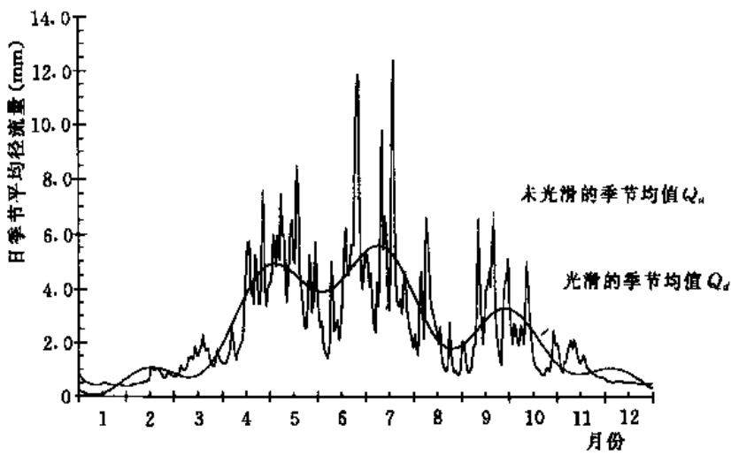  
图 6-5 清江流域日径流季节均值过程

式中，H（j）称为线性扰动系统响应函数，e（k）为误差，则我们把由式（6-17）、(6-18）和式（6-19）组合的系统模型，称为线性扰动模型（LPM）。它的结构关系如图6-6所示。

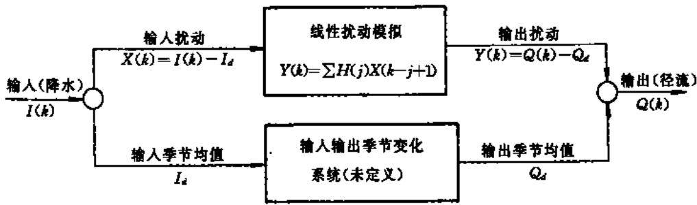  
图 6-6 LPM 模型的结构

从LPM模型结构可看出，尽管扰动项X(k)\~Y(k)之间假定为线性的，但季节均值$\phantom { - } I _ { d } \sim Q _ { d }$ 之间的关系并未作任何假定。就实际的输入{I(k)}～输出{Q(k)}而言，它们并不一定就是线性系统。因为计算的输出Y(k)是季节均值 $( Q _ { d } )$ 与扰动项Y(k)之和。因此，也有人把LPM模型称为考虑季节均值变化的非线性系统或准线性系统方法。

## (二)线性扰动模型建立的具体步骤

LPM模型的建立主要由计算平滑了的季节均值 $\{ \boldsymbol { I } _ { d } , ~ \boldsymbol { Q } _ { d } \}$ 和识别LPM 模型的响应函数两部分组成。基本步骤如下。

1）由观测的资料和式（6-16）分别计算水文系统输入～输出序列样本的季节均值I和 ${ \pmb I } _ { d }$ $Q _ { d } , \ d = 1 , \ 2 , \ \cdots , \ 3 6 5$ D

2）季节均值是流域的基本水文属性之一，它应当是比较平稳的过程。实际中因据以计算季节均值的资料年限较短（例如一般采用6年率定期序列），求得的季节均值不可避免带有随机噪音而出现振荡（如图6-5所示）。因此，需要采用一定的数学方法使季节均值光滑。目前，常用的方法是富氏级数，数学方程为：

$$
\begin{array} { c } { { Q _ { d } = \overline { { { Q } } } _ { d } + \displaystyle \sum _ { j = 1 } ^ { L } \biggl [ A _ { j } \mathrm { c o s } \biggl ( \frac { 2 \pi j d } { 3 6 5 } \biggr ) + B _ { j } \mathrm { s i n } \biggl ( \frac { 2 \pi j d } { 3 6 5 } \biggr ) \biggr ] } } \\ { { ( d = 1 , 2 , \cdots , 3 6 5 ) } } \end{array}\tag{6-20}
$$

式中，为均值，A和B为富氏系数，j为调和函数的序数，即： $\overline { { \alpha } }$ $A _ { j }$ $B ,$

$$
\overline { { Q } } _ { d } = \frac { 1 } { 3 6 5 } \sum _ { j = 1 } ^ { 3 6 5 } Q _ { d }\tag{6-21}
$$

$$
A _ { j } = \frac { 2 } { 3 6 5 } \sum _ { d = 1 } ^ { 3 6 5 } Q _ { d } \mathrm { c o s } \bigg \{ \frac { 2 \pi j d } { 3 6 5 } \bigg \}\tag{6-22}
$$

$$
B _ { j } = \frac { 2 } { 3 6 5 } \sum _ { d = 1 } ^ { 3 6 5 } Q _ { d } \mathrm { s i n } \bigg ( \frac { 2 \pi j d } { 3 6 5 } \bigg )\tag{6-23}
$$

当式（6-20）中的调和函数只取几项时，就得到Q的光滑过程。实际中，一般取 $Q _ { d }$ $L { = } 4$ 或5个调和系数。

3)利用式(6-17)和式(6-18)计算输入扰动项X(k)和输出扰动项Y(k)，形成式(6-19) $Y ( k )$ 的线性系统方程。

4）采用与线性总径流模型相同方法，即式（6-7）～式（6-9），由最小二乘法识别LPM模型的响应函数 $\hat { \boldsymbol { H } } ( \boldsymbol { j } )$

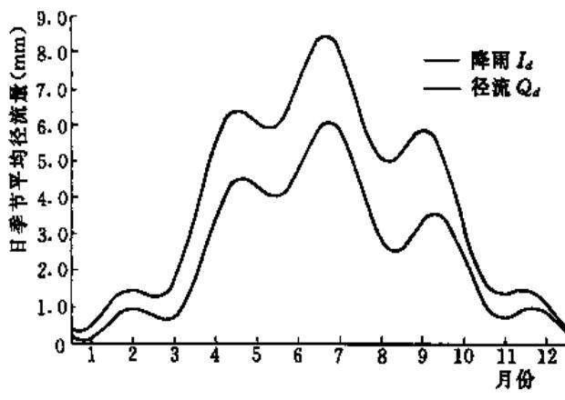  
图 6-7 清江流域日降水与日径流季节均值 $\pmb { I _ { d } } \sim \pmb { Q _ { d } }$ 的比较

5）一旦响应函数已经求得，便可利用式（6-19）由降雨（或上流入流）的扰动值X(k) 推求相应的出流扰动 $\hat { \mathbf { Y } } ( k )$

6）由此计算（或预报）出流系列Q(k）$- \mathsf { Q } _ { d } + \hat { \mathbb { Y } } ( \pmb { \mathscr { k } } )$ 。实际作业中，需编制电算程序由计算机完成。

## (三)计算举例

仍以长江支流的清江流域日降雨一径流预报为例，对收集的1973\~1980年序列，取前6年资料建模，后2年留作预报检验。

的日径流季节均值与未平滑季节均值的比较，见图6-5。平滑的日降雨季节均值与日径流季节均值比较，见图6-7。降雨～径流资料计算的调和系数列入表6-1。从图6-7可知，清

江流域降雨一径流的季节均值关系有很好的对应性。进一步由计算的降雨一径流扰动项识别的LPM模型响应函数如图6-8所示，计算的系统增益因子 $G _ { \mathrm { { s } } } = 0 . 8 2 8 5$ ，较总径流线性响应系统的增益因子为大，这说明两个系统之间所求的响应函数概念是不一样的，模型之间有差别。由于LPM模型吸收了季节变化信息，模型率定期评定的

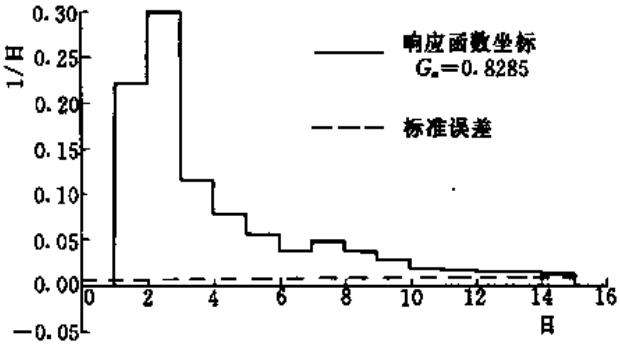  
图 6-8 清江流域 LPM 模型响应函数

效率DC达81.10%，较总径流线性响应模型为高。预报检验期评定的效率DC为83.89%，也有改善。总径流线性响应模型（SLM）与线性扰动模型的比较，列人表6-2，其中白河是长江支流汉江上的一个流域。

表 6-1  
清江流域日降雨径流季节均值平滑的富氏调和系数
<table><tr><td rowspan=1 colspan=1>序  列</td><td rowspan=1 colspan=1> $\pmb { A } _ { 1 }$ </td><td rowspan=1 colspan=1> $\pmb { A } _ { 2 }$ </td><td rowspan=1 colspan=1> $\pmb { A } _ { 3 }$ </td><td rowspan=1 colspan=1> $\blacktriangle _ { 4 }$ </td><td rowspan=1 colspan=1> $\pmb { A } _ { 5 }$ </td><td rowspan=1 colspan=1> $\scriptstyle B _ { I }$ </td><td rowspan=1 colspan=1> $\scriptstyle B _ { 2 }$ </td><td rowspan=1 colspan=1> ${ \pmb { \beta } } _ { 3 }$ </td><td rowspan=1 colspan=1> $\scriptstyle B _ { \ell }$ </td><td rowspan=1 colspan=1> ${ \boldsymbol { \mathit { B } } } _ { 5 }$ </td></tr><tr><td rowspan=1 colspan=1>日降雨序列</td><td rowspan=1 colspan=1>-3.13</td><td rowspan=1 colspan=1>-0.16</td><td rowspan=1 colspan=1>0.06</td><td rowspan=1 colspan=1>0.43</td><td rowspan=1 colspan=1>-0.62</td><td rowspan=1 colspan=1>-0.09</td><td rowspan=1 colspan=1>-0.46</td><td rowspan=1 colspan=1>0.24</td><td rowspan=1 colspan=1>0.42</td><td rowspan=1 colspan=1>-0.51</td></tr><tr><td rowspan=1 colspan=1>日径流序列</td><td rowspan=1 colspan=1>-2.11</td><td rowspan=1 colspan=1>0.13</td><td rowspan=1 colspan=1>-0.07</td><td rowspan=1 colspan=1>0.27</td><td rowspan=1 colspan=1>-0.35</td><td rowspan=1 colspan=1>0.12</td><td rowspan=1 colspan=1>-0.55</td><td rowspan=1 colspan=1>0.18</td><td rowspan=1 colspan=1>0.41</td><td rowspan=1 colspan=1>-0.65</td></tr></table>

表6-2线性扰动模型（LPM）与总径流线性响应模型（SLM）在日降雨径流模拟应用的比较
<table><tr><td rowspan=3 colspan=1>流域名称</td><td rowspan=3 colspan=1>流城面积(km²)</td><td rowspan=1 colspan=3>率定期</td><td rowspan=1 colspan=3>预报检验期</td></tr><tr><td rowspan=1 colspan=2>DC</td><td rowspan=1 colspan=1>r%</td><td rowspan=1 colspan=2>DC</td><td rowspan=1 colspan=1>r2%</td></tr><tr><td rowspan=1 colspan=1>SLM</td><td rowspan=1 colspan=1>LPM</td><td rowspan=1 colspan=1>LPM 对 SLM的改善</td><td rowspan=1 colspan=1>SLM</td><td rowspan=1 colspan=1>LPM</td><td rowspan=1 colspan=1>LPM 对 SLM的改善</td></tr><tr><td rowspan=1 colspan=1>清江</td><td rowspan=1 colspan=1>15300</td><td rowspan=1 colspan=1>79.31</td><td rowspan=1 colspan=1>81.10</td><td rowspan=1 colspan=1>8.65</td><td rowspan=1 colspan=1>83.04</td><td rowspan=1 colspan=1>83.89</td><td rowspan=1 colspan=1>5.01</td></tr><tr><td rowspan=1 colspan=1>白河</td><td rowspan=1 colspan=1>61780</td><td rowspan=1 colspan=1>70.49</td><td rowspan=1 colspan=1>74.48</td><td rowspan=1 colspan=1>13.52</td><td rowspan=1 colspan=1>70.50</td><td rowspan=1 colspan=1>74.65</td><td rowspan=1 colspan=1>14.1</td></tr></table>

## 第三节水文概念性模型

根据水文循环概念，采用概化和推理的方法对流域水文现象进行数学模拟，以建立有水文逻辑关系的一系列数学方程组，用以计算流域系统的径流输出，这样的模型称为水文概念性模型。下面介绍几类国内外有代表性、且不是很复杂的概念性模型。

## 一、新安江（三水源）流域水文模型

该模型是河海大学（原华东水利学院）赵人俊等1973年对新安江水库作人库流量预报工作中提出来的降雨径流流域模型，简称新安江模型。它的特点是认为湿润地区主要产流方式为蓄满产流，所提出的流域蓄水容量曲线是模型的核心。近几十年，新安江模型不断改进，已成为有我国特色应用较广泛的一个流域水文模型。

## (一) 模型的结构

新安江模型是分散性模型，把全流域按泰森多边形法（或其他方法）分块（如以一个雨量站为中心划一块)，每一块称为单元流域。对每个单元流域作产汇流计算，得出单元流域的出口流量过程。再进行出口以下的河道洪水演算，求得流域出口的流量过程。把每个单元流域的出流过程相加，求出流域出口的总出流过程。每单元流域的计算流程见图6-9，其中方框内写的是状态变量，方框外写的是模型参数。

## 1. 产流量的计算

新安江模型的产流量计算采用蓄满产流假定，详见第四章。所谓蓄满，是指包气带的土壤含水量达到田间持水量，不是饱和。蓄满产流是指：在土壤湿度满足田间持水量这个门坎值以前不产流，所有的降雨都被土壤吸收成为张力水。而在土壤湿度满足田间持水量以后，所有的降雨（减去同期的蒸散发）都产流。

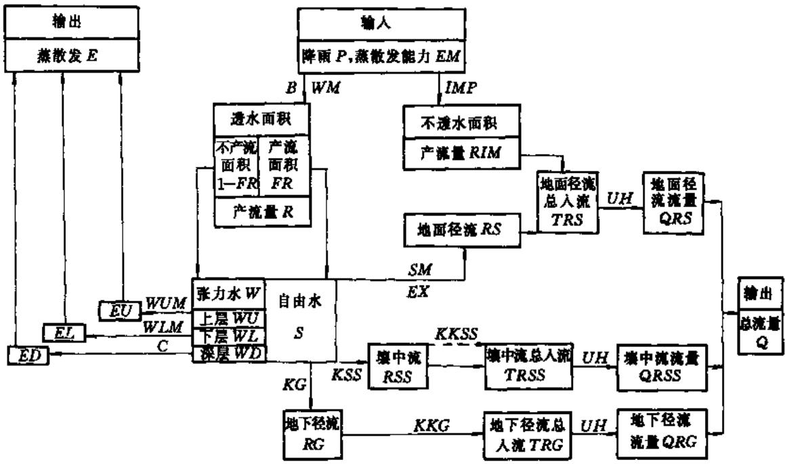  
图6-9新安江（三水源）模型流程图

上面的概念是对流域上某一点而言。一般讲，流域内各点的蓄水容量并不相同。新安江（三水源）模型把流域内各点的蓄水容量概化成一条抛物曲线（图 $4 - 9 ( a ) )$ 。用 $\pmb { W } ^ { t }$ 表示流域内最大的点蓄水容量， $\pmb { W } _ { \ast }$ 表示流域内某一点的蓄水容量，f表示蓄水能力不大于$\pmb { \mathcal { W } } _ { \mparallel }$ 值的流域面积，F表示全流域面积，α为 $f / { \pmb F }$ 之比，B表示抛物线指数，蓄水量公式为：

$$
\frac { f } { F } = 1 - \left. 1 - \frac { W _ { \ast } } { W _ { \ast \ast } ^ { \prime } } \right. ^ { g }\tag{6-24}
$$

可推导出流域平均蓄水容量为：

$$
W _ { \mathrm { s } } = \int _ { 0 } ^ { w _ { \mathrm { m s } } } \Bigl ( 1 - \frac { f } { F } \Bigr ) \mathrm { d } W _ { \mathrm { s } } ^ { \prime } = \frac { W _ { \mathrm { m s } } ^ { \prime } } { B + 1 }\tag{6-25}
$$

在实际的新安江模型中（图6-9），增加了一个参数IMP，它是流域不透水面积占全流域面积之比。这个参数在半湿润地区还比较重要，这时，式（6-25）改变为：

$$
W _ { \mathrm { r m } } ^ { \prime } = \frac { 1 + B } { 1 - I M \bar { P } } W _ { \mathrm { m } }\tag{6-26}
$$

流域初始平均蓄水量 $( W _ { \mathfrak { d } } )$ 相应的纵坐标（A）为：

$$
A = W _ { \mathrm { s m } } \Big [ 1 - \Big ( 1 - \frac { W _ { \mathrm { 0 } } } { W _ { \mathrm { s t } } } \Big ) ^ { \frac { 1 } { B + 1 } } \Big ]\tag{6-27}
$$

如果记 $\scriptstyle P E$ 为降水量与蒸发量之差，即 $P { \cal \dot { E } } { = } { \cal \bar { P } } { - } { \cal \bar { E } }$ ，模型计算判别条件为：当 $P E { > } 0$ ，则产流；否则不产流。

产流时，当 $P E + A { < } W _ { \mathrm { { s o s } } } ^ { ' }$ 有：

$$
R = P E - W M + W _ { \mathrm { { e } } } + W M \left\{ 1 - \frac { P E + A } { W } \right\} ^ { B + 1 }\tag{6-28}
$$

当 $P E + A \geq W _ { m n } ^ { i }$ ,有：

$$
R = P E - ( W M - W _ { \circ } )\tag{6-29}
$$

作产流计算时，模型的输人为PE，参数包括流域平均蓄水容量WM和抛物线指数B；输出 $\mathcal { P } \pmb { \mathcal { E } }$ $B ;$ 为流域产流量R 及流域时段末平均含水量W。

## 2. 蒸散发计算

新安江模型中的蒸散发计算多采用三层蒸发计算模式。它的输入是蒸发器实测水面蒸发和流域蒸散发能力的折算系数K，模型参数为上层、下层和深层的蓄水容量，分别记为WUM、WLM、WDM以及深层蒸发系数C。蓄水容量间的关系为 $W M { = } W U M { + } W L M { + }$ WDM。输出是上、下、深各层的流域蒸散发量EU、EL、ED，它们之间关系为 $E { = } E U +$ $E L + E D$ 。计算中包括有三个时变参数，即各层土壤含水量WU、WL、WD $( W = W U + W L$ +WD)。WM、E、W分别表示总的土壤蓄水容量，蒸散发量和土壤含水量。

各层蒸散发的计算思路是：上层按蒸散发能力蒸发；上层含水量不够蒸发时，剩余蒸散发能力从下层蒸发；下层蒸发与剩余蒸散发能力及下层含水量成正比，与下层蓄水容量成反比。要求计算的下层蒸发量与剩余蒸散发能力之比不小于深层蒸散发系数C，否则，不足部分由下层含水量补给，当下层水量不够补给时，用深层含水量补。三层蒸散发计算程序框图见图6-10。

## 3. 水源划分

水源划分是新安江模型结构最重要的几个部分之一。二水源新安江模型主要通过调试稳定人渗FC参数划分水源，而三水源新安江模型去掉了参数 $\pmb { F C }$ ，采用一个自由水蓄水库进行水源划分方式。自由水蓄水库的结构见图6-11或图6-9。其中自由水蓄水库设置两个出口，其出流系数分别记为KSS和KG，产流量R进入自由水水库内，通过两个出流系数和溢流的方式把它分成地面径流（RS）、壤中流（RSS）和地下径流(RG)。图 6-11中地下径流（RG）再经过地下水库调蓄，可得到地下水对河网的总入流TRG，壤中流（RSS）可以认为已是对河网的总人流TRSS，图6-11中另设置了一个壤中流水库，可再作一次调蓄计算，它为了备用，一般可以不用它。需要说明：自由水的蓄水能力在产流面积（FR）上的分布也是不均匀的。为描述这种现象，也假定自由水蓄水能力在产流面积上的分布服从一条抛物线(见图6-12)，其中用SMMF表示产流面积上最大一点的自由水蓄水容量，SMF表示产流面积上的自由水平均蓄水容量深， $\mathcal { S } M \mathcal { F ^ { \prime } }$ 表示产流面积上某一点的自由水容量， $\pmb { F S }$ 表示自由水蓄水能力 ${ \leqslant } S M F ^ { \prime }$ 值的流域面积占产流面积(FR)的百分数。S表示自由水在产流面积上的平均蓄水深，EX表示流城自由水蓄水容量曲线的指数，产流面积上各点的自由水蓄水容量关系可表达为：

$$
\frac { F S } { F R } = 1 - \left( 1 - \frac { S M F ^ { \prime } } { S M M F } \right) ^ { E X }\tag{6-30}
$$

产流面积上的平均蓄水容量深（SMF）为：

$$
\displaystyle S M F = { \frac { S M M F } { 1 + E X } }\tag{6-31}
$$

与S对应的纵坐标（AU）为：

$$
A U = S M M F { \Bigg [ } 1 - { \Big ( } 1 - { \frac { S } { S M F } } { \Big ) } ^ { \frac { 1 } { ( 1 + E X ) } } { \Bigg ] }\tag{6-32}
$$

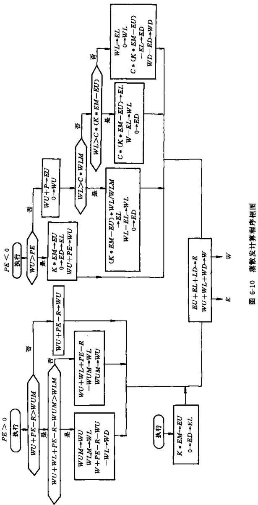

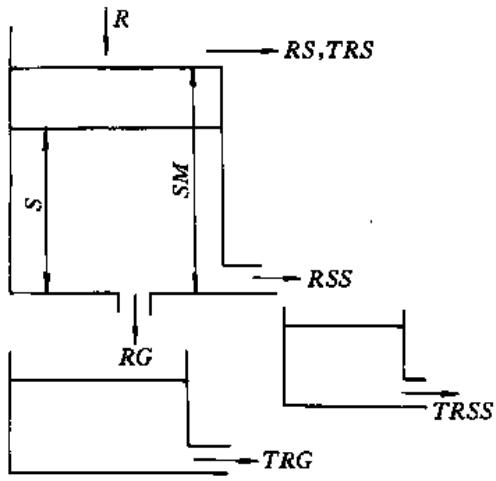

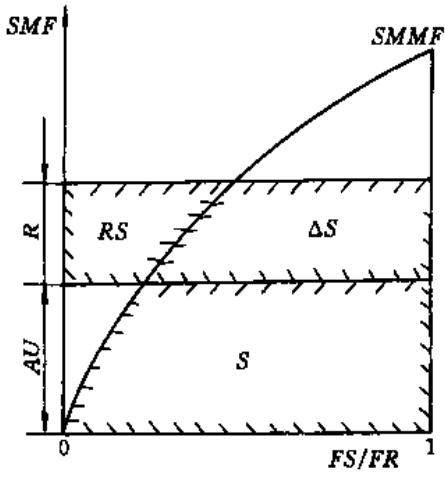  
图 6-11 自由水蓄水库的结构  
图 6-12 流域自由水蓄水容量曲线

通过推导整理，模型计算判别条件及公式可归纳为：

当 $P E + A L { < } S M M F$ 时，地面径流量（RS）为：

$$
R S = F R \Big \{ P E - S M F + S + S M F \Big [ 1 - \frac { ( P E + A U ) } { S M M F } \Big ] ^ { E X + 1 } \Big \}\tag{6-33}
$$

当 $P E + A U \geqslant S M M F$ ，有：

$$
R S = F R ( P E + S - S M F )\tag{6-34}
$$

不难看到 SMMF和 SMF都是产流面积（FR）的函数。因此，假定SMMF与产流面积（FR）及全流域上最大点的自由水蓄水容量（SMM）的关系仍为抛物线分布：

$$
F R = 1 - \left\{ 1 - \frac { S M M F } { S M M } \right\} ^ { \varepsilon x }\tag{6-35}
$$

可得到：

$$
S M M F = \big [ 1 - ( 1 - F R ) \frac { 1 } { E \bar { x } } \big ] S M M\tag{6-36}
$$

$$
S M M = S M ( 1 + E X )\tag{6-37}
$$

在用式（6-30）～式（6-34）进行计算时，必须首先用式（6-36）和式（6-37）计算出SMMF来。新安江模型中的平均自由水容量SM和EX，对一个流域来说是固定的，归为模型参数，需由资料率定。

已知上时段的产流面积 $( F R _ { 0 } )$ 和产流面积上的平均自由水深 $( S _ { \mathfrak { d } } )$ ，根据时段产流量(R)，计算时段地面径流、壤中流、地下径流及本时段产流面积(FR)和FR上的平均自由水深（S）的步骤为：

$$
\begin{array} { l } { F R = R / P E } \\ { S = S _ { 0 } F R _ { 0 } / F R } \\ { S M M = S M ( 1 + E X ) } \\ { S M M F = S M M [ 1 - ( 1 - F R ) ^ { 1 / E X } ] } \\ { S M F = S M M F / ( 1 + E X ) } \\ { A U = S M M F [ 1 - ( 1 - S / S M F ) ^ { 1 / ( 1 + E X ) } ] } \end{array}
$$

1)当 $P E + A U ^ { \prime } { \leqslant } 0$ 时：

$$
\begin{array} { l l } { { R S = 0 , } } & { { R S S = 0 } } \\ { { R G = 0 , } } & { { S = 0 } } \end{array}
$$

2)当 $P E + A L { \approx } S M M F$ 时：

$$
R S = ( P E + S - S M F ) F R
$$

$$
R S S = \bar { S } M F \cdot K S S \cdot F R
$$

$$
R G = S M F \cdot K G \cdot F R
$$

$$
S = S M F - \frac { R S S + R G } { F R }
$$

3）当 $0 { < } P E { + } A U { < } S M M F$ 时：

$$
\begin{array} { c } { { R S = \left\{ P E - S M F + S + S M F \right\} _ { 1 } - \frac { P E + S + M U } { S M M F } \Bigg ] ^ { \mathrm { e } X + 1 } \Bigg \} F R } } \\ { { R S S = ( P E + S - \frac { R S } { F R } ) K S S \cdot F R } } \\ { { R G = \left\{ P E + S - \frac { R S } { F R } \right\} K G \cdot F R } } \\ { { S = S + P E - \frac { R S + R S S + R G } { F R } } } \end{array}
$$

在自由水蓄水库的计算中，存在差分计算的误差问题。为了消除这些影响，可采用5mm净雨分一段，进一步分段计算等处理方法。

## 4. 汇流计算

三水源新安江模型的流域汇流计算包括坡地和河网两个汇流阶段。

(1)坡地汇流计算。三水源新安江模型中把经过水源划分得到的地面径流直接进人河网，成为地面径流对河网的总人流(TRS)。壤中流（RSS）流人壤中流水库，经过壤中流蓄水库的调蓄(记壤中流水库的消退系数为KKSS)，成为地下水对河网的总入流(TRG)。其计算公式为：

$$
T R S ( t ) = R S ( t ) \cdot U\tag{6-38}
$$

$$
T R S S ( t ) = T R S S ( t - 1 ) \cdot K K S S + R S S ( t ) \cdot ( 1 - K K S S ) \cdot U\tag{6-39}
$$

$$
T R G ( t ) = T R G ( t - 1 ) \cdot K K G + R G ( t ) \cdot ( 1 - K K G ) \cdot U\tag{6-40}
$$

$$
T R ( t ) = T R S ( t ) + T R S S ( t ) + T R G ( t )\tag{6-41}
$$

式中，U为单位转换系数，可将径流深转化成流量， $U = \frac { F } { 3 . 6 \Delta t }$ ，其中F为流域面积$( \mathrm { k m } ^ { 2 } )$ j $\pmb { \Delta } \pmb { t }$ 为时段长(h)；TR 为河网总入流 $\bf ( m ^ { 3 } / s )$

(2)河网汇流计算。三水源新安江模型采用了无因次单位线模拟水体从进人河槽到单元出口的河网汇流。单位线的分析方法是：先在本流域或邻近流域，找一个有资料的、面积与单元流域大体相近的流域，然后分析出地面径流单位线，可作初值应用。

计算公式为：

$$
Q ( t ) = \sum _ { i = 1 } ^ { N } U H ( i ) T R ( t - i + 1 )\tag{6-42}
$$

式中， ${ \textbf { \em Q } } ( t )$ 为单元出口处t时刻的流量值；UH为无因次时段单位线；N为单位线的历时时段数。其他符号意义同前。

可见，流域汇流计算的输入是单元上的地面径流（RS）、壤中流（RSS）、地下径流(RG)及计算开始时的单元面积上的壤中流流量和地下径流流量值。参数包括壤中流水库的日消退系数（KKSS)、地下水蓄水库日消退系数(KKG)及单位线转换系数(U)、无因次单位线（UH）和历时（N）。输出为单元出口的流量过程。

新安江模型的河道洪水演算采用马斯京根方法或者分段连续演算法。

将前述各个部分子模型结合在一起，便构成应用于流域降雨一径流计算的新安江（三水源）模型。

## (二）模型的参数及调试

新安江模型的参数有以下几个。

1) $\kappa :$ 流域蒸散发能力 $\pmb { { \cal E } } _ { \ast }$ 与实测水面蒸发值 $\pmb { E _ { i } }$ 之比，简称蒸发折算系数。

2) $I M P :$ 不透水面积占全流域面积之比。

3）B：蓄水容量曲线的方次。它反映流域上蓄水容量分布的不均匀性。一般经验，流域愈大，各种地形地质组合愈多样，B值也愈大。在山丘区，很小面积（数平方公里）的B为0.1左右，中等面积（300平方公里以内）的B值为0.2\~0.3左右，较大面积（数千平方公里）的B为0.3\~0.4左右，可供选初值参考。

4）WM：流域平均蓄水容量(mm)。为了较精确计算土壤蒸散发量，常将WM分为三层，即 $W M { = } W U M { + } W L M { + } W D M$ ，其中WUM为上层蓄水容量（模型参数），它包括植物截留量，在植被与土壤颇差的流域，约为5\~10mm。WLM是下层蓄水容量（模型参数），可取60\~90mm。WDM是深层蓄水容量（模型参数），由WM-WUM一WLM求出。

5)C：深层蒸散发系数。它决定于深根植物占流域面积之比，同时与WUM+WLM有关。一般经验，在江南湿润地区C值在0.15\~0.2左右，而在华北半湿润地区C值在0.09\~0.12左右。

6）SM：自由水蓄水容量（mm），它反映了水源比例的变化，需优选确定。

7）EX：自由水蓄水容量曲线指数。

8）KG：地下水出流系数。

9）KSS：壤中流出流系数。

10）KKG：地下径流的消退系数。

11）KKSS：壤中流的消退系数。

12）UH：单元流域上地面径流的单位线（无因次）。

13）KE；单元河段的马斯京根模型参数K值。

14）XE：单元河段的马斯京根模型参数X值。

所以，三水源的新安江模型共有16个参数(WM中WUM和WLM视为2个参数)，其中产流计算参数11个(K，IMP，B,WM，WUM，WLM，C，SM，EX，KG，KSS),汇流计算参数4个(KKG，KKSS，KE，XE)，再加上无因次单位线UH(i)。

新安江模型的参数有明确的水文概念，原则上它们可以单独确定。常用的办法是先按实测值或类似经验定好的参数作为初始值，然后分部分进行人工调试，最后协调各部分进行优选。目前经验有：多年总径流量决定K。年径流、季径流、久旱后的径流决定WM、WLM与C。次洪径流总量决定WM、B、IMP。地下径流决定KKSS和KKG。地面径流过程线决定UH、KE和XE。最后，应以流量过程线作为最客观统一的优选目标。

一般情况下，模型的出流系数和消退系数都是按日模型给定的。但是，进行实时洪水预报时，计算时段t都小于24h。另外，在模型计算中，为了消除非线性的影响，减少计 $\pmb { \Delta } \pmb { t }$ 算时段取的过长所引起的误差，模型的水源划分中又用5mm净雨作一个量级，进一步作分步长计算。那么，模型的出流系数和消退系数都必须作相应的变化。

设模型计算所取时段长为 $\pmb { \Delta } t$ (h)，R为 $\pmb { \Delta } \pmb { t }$ 内的净雨，则：

$$
\begin{array} { c } { M = \frac { 2 4 } { \Delta t } } \\ { N = \frac { 2 4 } { \Delta t } \bigg [ \mathrm { I N T } ( \frac { R } { 5 } ) + 1 \bigg ] } \end{array}
$$

计算步长内的壤中流蓄水库的消退系数（KKSSD）和地下水蓄水库的消退系数(KKGD）分别与其相应的日模型消退系数（KKSS）和（KKG）的关系为：

$$
\begin{array} { c } { { K K S S D = K K S S ^ { \frac { 1 } { M } } } } \\ { { K K G D = K K G ^ { \frac { 1 } { M } } } } \end{array}
$$

计算步长内流域自由水蓄水库的壤中流出流系数（KSSD）和地下水出流系数(KGD）与其日模型的出流系数（KSS）和（KG）的关系为：

$$
\displaystyle K S S D = \frac { 1 - [ 1 - ( K G + K S S ) ] \frac { 1 } { N } } { 1 + \frac { K G } { K S S } }\tag{6-43}
$$

(6-44)

(三) 算例

(1)资料：湖北省境内半湿润地区清江流域1973\~1980年的逐日降雨，径流和蒸发器$( \mathbb { E } _ { \mathfrak { s o } _ { \mathfrak { i } } } )$ 观测资料。清江流域水文站控制面积 $1 5 3 0 0 ~ \mathrm { { k m } ^ { 2 } }$ 。流域内有25个雨量站，2个蒸发站和水文站。流域内植被良好，水文资料丰富，利用1973\~1980年观测资料求出的流域平均日降雨、径流及蒸发的季节性变化对应关系（平滑后)，见图6-13，它表明蒸发量在7\~8月份达到高峰，且蒸发量呈上升趋势变化时，多数情况下日径流量呈下降趋势变化。因此，

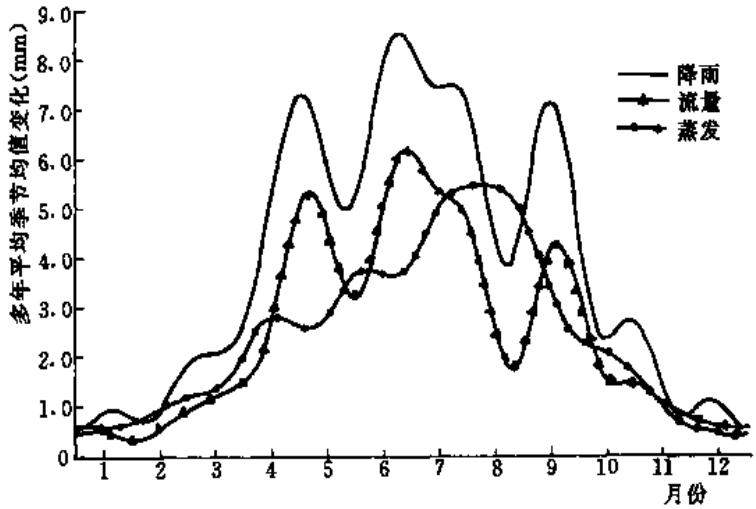  
图6-13 清江流域日降雨一径流一蒸发季节均值平滑的过程

降雨径流对应关系有较好的一致性。

水文模拟的长度仍取1973\~1978年6年资料，主要目的是率定新安江模型参数，评价水文模拟的效率DC，余下两年未参加建立模型的资料（1979\~1980年）则用于进行水文预报的检验。

表 6-3 清江流域三水源新安江模型产流参数一览表  
(1973\~1978年水文资料率定=1d)
<table><tr><td rowspan=1 colspan=1>参数</td><td rowspan=1 colspan=1>WM(mm)</td><td rowspan=1 colspan=1>WUM(mm)</td><td rowspan=1 colspan=1>WLM(mm)</td><td rowspan=1 colspan=1>K</td><td rowspan=1 colspan=1>B</td><td rowspan=1 colspan=1>SM</td><td rowspan=1 colspan=1>EX</td><td rowspan=1 colspan=1>IMP</td></tr><tr><td rowspan=1 colspan=1>数值</td><td rowspan=1 colspan=1>120</td><td rowspan=1 colspan=1>20</td><td rowspan=1 colspan=1>75</td><td rowspan=1 colspan=1>0.57</td><td rowspan=1 colspan=1>0.4</td><td rowspan=1 colspan=1>20</td><td rowspan=1 colspan=1>1.5</td><td rowspan=1 colspan=1>0.03</td></tr><tr><td rowspan=1 colspan=1>参数</td><td rowspan=1 colspan=1>KSS</td><td rowspan=1 colspan=1>KG</td><td rowspan=1 colspan=1>C</td><td rowspan=1 colspan=1>KKG</td><td rowspan=1 colspan=1>KKSS</td><td rowspan=1 colspan=1></td><td rowspan=1 colspan=1></td><td rowspan=1 colspan=1></td></tr><tr><td rowspan=1 colspan=1>数值</td><td rowspan=1 colspan=1>0.635</td><td rowspan=1 colspan=1>0.304</td><td rowspan=1 colspan=1>0.09</td><td rowspan=1 colspan=1>0.980</td><td rowspan=1 colspan=1>0.80</td><td rowspan=1 colspan=1></td><td rowspan=1 colspan=1></td><td rowspan=1 colspan=1></td></tr></table>

(2) 新安江模型参数采用人工调试并最后由流量过程目标函数优选来完成。确定的三水源新安江模型产流部分的参数列入表6-3，模型的汇流单位线过程见图6-14。经分析参数均在水文物理概念合理范围之内。

(3)分析评价：利用实测资料率定参数后，可进行逐日降雨一径流过程的模拟，并采用模型效率系数DC进行评价。结果表明：

6年资料的模型率定期效率DC达86%，较水文系统理论模型SLM和LPM有一定提高。率

定期1973年的流量过程和模拟误差过程见图6-15(a)示意。日径流过程模拟还是很好的，只是在洪峰处有一定幅度误差。清江流域两年模型做预报的检验期效率DC为87%，也较系统理论模型SLM和LPM 为高。预报期1979年的日流量过程和误差分布见图 6-15(6) 所示意，它也显示在洪峰预报存在一定范围误差。

## 二、SCS 模型

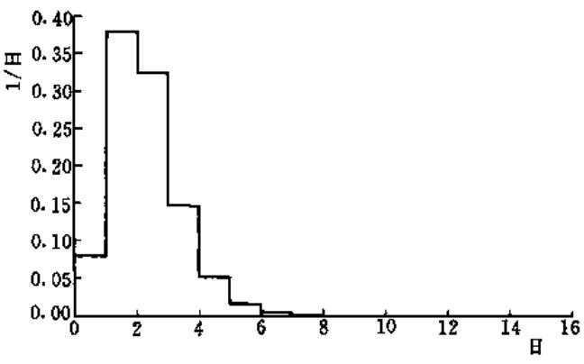  
图 6-14 新安江模型单元流城汇流单位线

SCS 模型是美国农业部水土保持局(Soil Conservation Service，简称 SCS)提出的。在美国及其他一些国家得到较广泛的应用。SCS模型有如下几方面特点。

1）在降雨径流关系上，SCS模型考虑了流域下垫面的特点，如土壤、坡度、植被、土地利用等。水文工作者都认为下垫面条件是影响降雨径流关系的重要因素，但很少有人把它如此显著而有效地列人水文模型的定量计算之中。

2）它可应用于无资料流域。

3）它能考虑人类活动对径流的影响，也就是说它能针对未来土地利用情况的变化，预估降雨径流关系的可能变化。

4）模型结构简单，使用方便。例如产流方面就只有一个参数。

因此，SCS模型比较适用于中小流域以及城市水文学计算和防洪规划设计。

## (一) SCS 模型的产流计算

水土保持局通过大量资料分析，得出SCS模型的降雨—径流基本关系为：

$$
{ \frac { F } { S } } = { \frac { R } { P - I _ { a } } }\tag{6-45}
$$

式中 P——降雨量，mm；

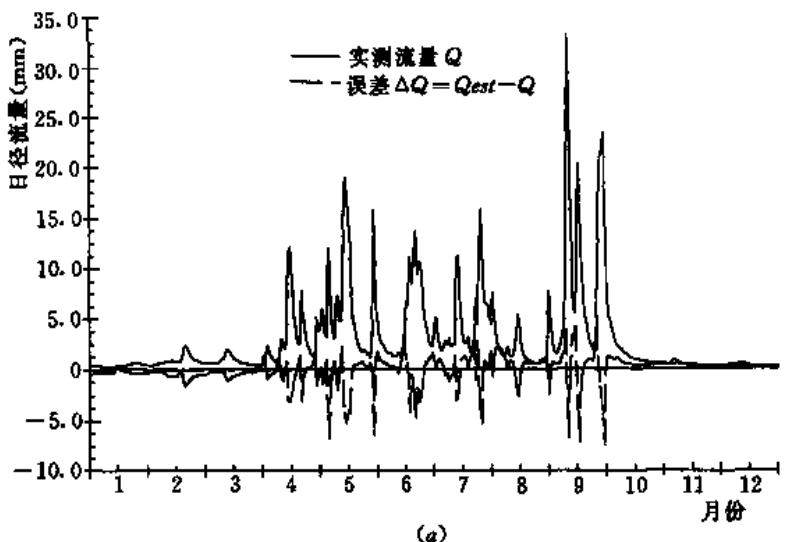

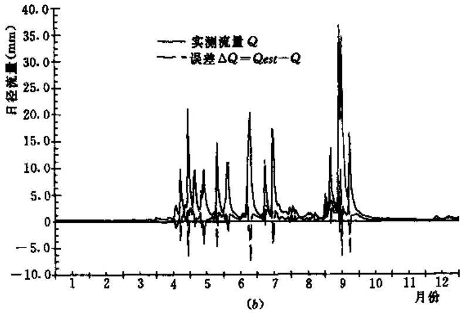  
图6-15 三水源新安江模型在清江流域日降雨径流模拟与预报检验示意(a)率定期的1973年日径流过程及模拟误差：(b) 预报期的1979年日径流过程及模拟误差

R——径流量，mm；

${ \pmb I } _ { \pmb a } .$ —初损，mm；

$\mathbf { \nabla } _ { F } .$ —后损，mm；

S——流域当时的最大可能滞留量，mm，它是后损的上限。

按水量平衡原理有：

$$
P = I _ { a } + F + R\tag{6-46}
$$

把式（6-45）和式（6-46）相结合，消去 ${ \pmb F } .$ ，考虑到初损未满足时不产流，得：

$$
\left. \begin{array} { l l } { { R = \displaystyle \frac { ( P - I _ { a } ) ^ { 2 } } { P + S - I _ { a } } , ~ P \geqslant I _ { a } } } \\ { { R = 0 , ~ P < I _ { a } } } \end{array} \right\}\tag{6-47}
$$

上式就是SCS模型的产流计算公式。因为I不易求得，为了使计算简化，消去一个变量， ${ \pmb I } _ { \pmb { \alpha } }$ 该局引进一个经验关系：

$$
I _ { a } = 0 . 2 S\tag{6-48}
$$

将上式代入式（6-47），得：

$$
\left. \begin{array} { l } { R = \frac { ( P - 0 . 2 S ) ^ { 2 } } { P + 0 . 8 S } , P \gtrless 0 . 2 S } \\ { R = 0 , P < 0 . 2 S } \end{array} \right\}\tag{6-49}
$$

S值的变化幅度很大，从实用出发该局引入一个无因次参数CN，称为曲线号码（Curvenumber）与S建立经验关系，即：

$$
S = { \frac { 2 5 4 0 0 } { C N } } - 2 5 4\tag{6-50}
$$

CN是反映降雨前流域特征的一个综合参数，它与流域前期土壤湿润程度（AMC）、坡度、植被、土壤类型和土地利用状况有关。SCS 模型把前期土壤湿润程度以此次降雨前5 天雨量为依据分为3级，见表6-4，并按不同的 AMC 等级给出 CN值查算表，表 6-5 中给出的是AMCI条件下的CN值。当流域湿

表 6-4前期土壤湿润程度等级划分
<table><tr><td rowspan=2 colspan=1>前期土壤湿润程度等级(AMC 等级)</td><td rowspan=1 colspan=2>前5天总雨量</td></tr><tr><td rowspan=1 colspan=1>休眠季节</td><td rowspan=1 colspan=1>生长季节</td></tr><tr><td rowspan=1 colspan=1>AMC 1</td><td rowspan=1 colspan=1>&lt;12.7</td><td rowspan=1 colspan=1>&lt;35.56</td></tr><tr><td rowspan=1 colspan=1>AMC I</td><td rowspan=1 colspan=1>12.7~27.943</td><td rowspan=1 colspan=1>5.56~53.34</td></tr><tr><td rowspan=1 colspan=1>AMC1</td><td rowspan=1 colspan=1>&gt;27.94</td><td rowspan=1 colspan=1>&gt;53.34</td></tr></table>

润情况不是AMCI时可先从表 6-5求得CN值，然后按表 6-6 换算为AMCI或AMC条件下的CN值。表6-5中的“水文条件”指的是土地管理水平，分成差、中、好三类。表6-5中土壤分类A、B、C、D是在美国调查了4000多处土壤后得出的结果。它与一般土壤学上的土壤分类不同，习惯称为SCS土壤分类。SCS土壤分类的定义见表6-6。此外，还可以按土壤的最小下渗率来做SCS 土壤分类，见表6-7。

表6-5  
CN值查算表CAM（H，I=0.2S）
<table><tr><td rowspan=2 colspan=3>土地利用方式</td><td rowspan=2 colspan=1>处理情况</td><td rowspan=2 colspan=1>水文条件</td><td rowspan=1 colspan=4>土壤类别</td></tr><tr><td rowspan=1 colspan=1>A</td><td rowspan=1 colspan=1>B</td><td rowspan=1 colspan=1>C</td><td rowspan=1 colspan=1>D</td></tr><tr><td rowspan=1 colspan=1>住宅区</td><td rowspan=1 colspan=1>住宅平均面积(英亩)</td><td rowspan=1 colspan=1> $\leqslant \frac { 1 } { 8 }$  $\frac { 1 } { 4 }$  $\frac { 1 } { 3 }$  $\frac { 1 } { 2 }$ 1</td><td rowspan=1 colspan=1>不透水面积占总面积的百分比②（%）</td><td rowspan=1 colspan=1>6538302520</td><td rowspan=1 colspan=1>7761575451</td><td rowspan=1 colspan=1>8575727068</td><td rowspan=1 colspan=1>9083818079</td><td rowspan=1 colspan=1>9287868584</td></tr><tr><td rowspan=3 colspan=3>街道与道路</td><td rowspan=1 colspan=2>铺面并有路缘石和雨水沟</td><td rowspan=1 colspan=1>98</td><td rowspan=1 colspan=1>98</td><td rowspan=1 colspan=1>98</td><td rowspan=1 colspan=1>98</td></tr><tr><td rowspan=1 colspan=2>卵石和砾石路</td><td rowspan=1 colspan=1>76</td><td rowspan=1 colspan=1>85</td><td rowspan=1 colspan=1>89</td><td rowspan=1 colspan=1>91</td></tr><tr><td rowspan=1 colspan=2>泥路，天然土路</td><td rowspan=1 colspan=1>72</td><td rowspan=1 colspan=1>82</td><td rowspan=1 colspan=1>87</td><td rowspan=1 colspan=1>89</td></tr><tr><td rowspan=2 colspan=3>露天地区，草坪，公园，高尔夫球场，水泥地等</td><td rowspan=1 colspan=2>条件良好，草的覆盖率不小于75%</td><td rowspan=1 colspan=1>36</td><td rowspan=1 colspan=1>61</td><td rowspan=1 colspan=1>74</td><td rowspan=1 colspan=1>80</td></tr><tr><td rowspan=1 colspan=2>一般条件，草的覆盖率为50%~70%</td><td rowspan=1 colspan=1>49</td><td rowspan=1 colspan=1>69</td><td rowspan=1 colspan=1>79</td><td rowspan=1 colspan=1>84</td></tr><tr><td rowspan=1 colspan=5>铺面的停车场，屋顶，车道等</td><td rowspan=1 colspan=1>98</td><td rowspan=1 colspan=1>98</td><td rowspan=1 colspan=1>98</td><td rowspan=1 colspan=1>98</td></tr></table>

续表
<table><tr><td rowspan="2">土地利用方式</td><td rowspan="2">处理情况</td><td rowspan="2">水文条件</td><td colspan="4">土壤类別</td></tr><tr><td>A</td><td>B</td><td>C</td><td>D</td></tr><tr><td colspan="3">商业区，不透水面积占总面积的85%</td><td>89</td><td>92</td><td>94</td><td>95</td></tr><tr><td>工业区，不透水面积占总面积的72%</td><td></td><td></td><td>81</td><td>82</td><td>91</td><td>93</td></tr><tr><td>休耕地</td><td>直行形</td><td></td><td>77</td><td>86</td><td>91</td><td>94</td></tr><tr><td>草地草甸</td><td></td><td>好</td><td>30</td><td>58</td><td>71</td><td>78</td></tr><tr><td>林地</td><td></td><td>差</td><td>45</td><td>66</td><td>77</td><td>83</td></tr><tr><td rowspan="6"></td><td rowspan="2"></td><td>中</td><td>36</td><td>60</td><td>73</td><td>79</td></tr><tr><td>好</td><td>25</td><td>55</td><td>70</td><td>77</td></tr><tr><td rowspan="2">直行种植</td><td>差</td><td>72</td><td>81</td><td>88</td><td>91</td></tr><tr><td>好</td><td>67</td><td>78</td><td>85</td><td>89</td></tr><tr><td rowspan="2">等高耕作</td><td>差</td><td>70</td><td>79</td><td>84</td><td>88</td></tr><tr><td>好</td><td>65</td><td>75</td><td>82</td><td>86</td></tr><tr><td rowspan="2"></td><td rowspan="2">阶状等高耕作</td><td>差</td><td>66</td><td>74</td><td>80</td><td>82</td></tr><tr><td>好</td><td>62</td><td>71</td><td>78</td><td>81</td></tr><tr><td rowspan="6">小粒谷类作物地</td><td rowspan="2">直行种植</td><td>差</td><td>65</td><td>76</td><td>84</td><td>8B</td></tr><tr><td>好</td><td>63</td><td>75</td><td>83</td><td>87</td></tr><tr><td rowspan="2">等高耕作</td><td>差</td><td>63</td><td>74</td><td>82</td><td>85</td></tr><tr><td>好</td><td>61</td><td>73</td><td>81</td><td>84</td></tr><tr><td rowspan="2">阶状等高耕作</td><td>差</td><td>61</td><td>72</td><td>79</td><td>82</td></tr><tr><td>好</td><td>59</td><td>70</td><td>78</td><td>81</td></tr><tr><td rowspan="6">密种作物地 (豆科作物或轮种性草地)</td><td rowspan="2">直行种植</td><td>差</td><td>66</td><td>77</td><td>85</td><td>89</td></tr><tr><td>好</td><td>58</td><td>72</td><td>81</td><td>85</td></tr><tr><td rowspan="2">等高耕作</td><td>差</td><td>64</td><td>75</td><td>83</td><td>85</td></tr><tr><td>好</td><td>55</td><td>69</td><td>78</td><td>83</td></tr><tr><td rowspan="2">阶状等高耕作</td><td>差</td><td>63</td><td>73</td><td>80</td><td>83</td></tr><tr><td>好</td><td>51</td><td>67</td><td>71</td><td>80</td></tr><tr><td rowspan="4">草原或牧场</td><td rowspan="2">散播</td><td>差 中</td><td>68 49</td><td>79 69</td><td>86</td><td>89 84</td></tr><tr><td>好</td><td>39</td><td>61</td><td>79 74</td><td>80</td></tr><tr><td rowspan="2">等高条播</td><td>差</td><td>47</td><td>67</td><td>81</td><td>88</td></tr><tr><td>中 好</td><td>25</td><td>59</td><td>75</td><td>83</td></tr><tr><td></td><td colspan="2"></td><td>6</td><td>35</td><td>70</td><td>79</td></tr><tr><td>农庄</td><td colspan="2"></td><td></td><td>59 74</td><td>82</td><td>86</td></tr></table>

注 1英亩=4047m²。  
①求CN值时，认为由房顶和车道产生的径流直接流到街道上去，只有极少量的水从房顶落人草坪，产生下渗。  
②求CN值时，认为其中的透水面积（草坪）处于良好的牧场水文条件。  
③在美国国内的某些温暖气候区，CN值取95。  
④密集条播或散播。

<table><tr><td>AMC1时 的CN值</td><td>相应的AMCI时 的CN值</td><td>相应的AMC时 的CN值</td><td>AMC1时 的CN值</td><td>相应的 AMCI时 的CN值</td><td>相应的AMC时 的CN值</td></tr><tr><td>100</td><td>100</td><td>100</td><td>45 40</td><td>27</td><td>65</td></tr><tr><td>95</td><td rowspan="4">87 78 70</td><td rowspan="4">99 98 97</td><td rowspan="4"></td><td>23 19</td><td>60</td></tr><tr><td>90</td><td>35</td><td>55 15</td></tr><tr><td>85</td><td>30</td><td>50</td></tr><tr><td>80</td><td>25</td><td>45</td></tr><tr><td>75</td><td>63 57</td><td>94 91</td><td>20</td><td>12 9</td><td>39</td></tr><tr><td>70</td><td>51</td><td>87 83</td><td>15 10</td><td>7</td><td>33</td></tr><tr><td>65</td><td>45</td><td></td><td>5</td><td>4</td><td>26</td></tr><tr><td>60</td><td>40 35</td><td>79 75</td><td>0</td><td>2</td><td>17</td></tr><tr><td>55</td><td></td><td>70</td><td></td><td>0</td><td>0</td></tr><tr><td>50</td><td>31</td><td></td><td></td><td></td><td></td></tr></table>

表 6-8 按最小下渗率作 SCS 土填分类

表6-7 SCS 土壤分类定义
<table><tr><td rowspan=1 colspan=1> $\pmb { \mathscr { A } }$ </td><td rowspan=1 colspan=1>厚层沙，厚层黄土，团粒化粉沙土</td></tr><tr><td rowspan=1 colspan=1> $\pmb { B }$ </td><td rowspan=1 colspan=1>薄层黄土，沙壤土</td></tr><tr><td rowspan=1 colspan=1> $\mathbf { \vec { C } }$ </td><td rowspan=1 colspan=1>粘壤土，薄层沙壤土，有机质含量低的土壤，粘质含量高的土壤</td></tr><tr><td rowspan=1 colspan=1> $\pmb { D }$ </td><td rowspan=1 colspan=1>吸水后显著膨胀的土壤，塑性大的粘土，某些盐渍土</td></tr></table>

<table><tr><td>土壤分类</td><td>最小下渗率 (mm/h)</td></tr><tr><td>A</td><td>7.26~11.43</td></tr><tr><td>B</td><td>3.81~7.26</td></tr><tr><td>C</td><td>1.27~3.81</td></tr><tr><td>D</td><td>0~1.27</td></tr></table>

当每次降雨之后，已知降雨量 $P$ ，根据所在流域的土地利用方式、处理情况、水文条件以及土壤类别，查表6-2得CN值，代人式（6-50）算出S值，再用式（6-49）计算产流量(净雨量)。若要分时段计算净雨量，采用式(6-49)计算由降雨开始到 $t _ { 1 }$ 时刻为止的降雨量 $P _ { 1 }$ 的净雨量 $R _ { 1 }$ ，再计算由降雨开始到 $\pmb { t _ { 2 } }$ 时刻为止的降雨量 $P _ { 2 }$ 的净雨量 $R _ { z }$ ，则时段 $\pmb { \ t } _ { 1 }$ 至

$$
t _ { 2 }
$$

$$
R _ { 2 } - R _ { 1 }
$$

## (二) SCS 横型的汇流计算

在汇流计算中，SCS模型是用一条统一的无因次单位线来计算出流过程线的。无因次单位线的纵标为 $q / q _ { \rho }$ ，横标为$t / t _ { \beta }$ ，如图6-16所示。模型用下述经验公式求单位线洪峰流量：

$$
q _ { \phi } = \frac { 0 . 2 0 8 F R } { t _ { \phi } }\tag{6-51}
$$

式中 ${ \pmb q } _ { \pmb { \nu } }$ ——净雨为 25.4 mm 的单位线洪峰流量， $\mathbf { m } ^ { 3 } / \mathbf { s }$

$R ^ { \cdot }$ ——净雨量(R=25.4mm，该式由1英寸单位净雨的英制公式转换而来，故仍沿用该数值)；

$F \cdot$ —流域面积， $\mathbf { k m } ^ { 2 } ;$

$t _ { p }$ 峰现时间，h。

$t _ { \uparrow }$ 与汇流时间 $\scriptstyle \mathbf { \pmb { t } } _ { r }$ 建立如下关系：

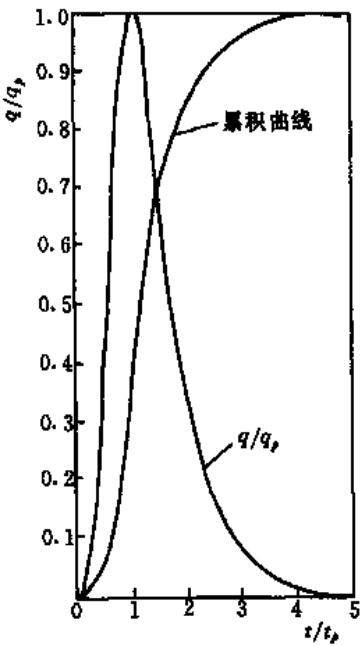  
图 6-16 无因次单位线

$$
t _ { \rho } = \frac { 2 } { 3 } t _ { c }\tag{6-52}
$$

t. 通过滞时L的关系求出，L的计算公式为：

$$
L = \frac { l ^ { 0 . 8 } ( S + 2 5 . 4 ) ^ { 0 . 7 } } { 7 0 6 9 y ^ { 0 . 5 } }\tag{6-53}
$$

$$
t _ { c } = \frac { 5 } { 3 } L\tag{6-54}
$$

式中 $\boldsymbol { L }$ 滞时，h；

$t .$ ——汇流时间，h；

l——水流长度，m；

$y \cdot$ ——流域平均坡度，%；

S——流域当时的最大可能滞留量，mm。

无因次单位线时段D用下式计算：

$$
D = 0 . 1 3 3 t _ { c }\tag{6-55}
$$

由上述各式求得 $q _ { f } , \textbf { \em t } _ { P }$ 和D之后，便可将无因次单位线转化为时段单位线，再利用产流计算公式求出每一时段D内的径流量，与单位线相乘，按叠加定理可得出流过程。

## (三)计算举例

某城区面积为3.9 $\mathrm { k m } ^ { 2 }$ ，土壤类型为D，由表6-5求得城区内土地利用方式不同的各部分C值，用加权平均求得全地区的 $C N { = } 9 4$ 。按式（6-50）计算 $\pmb { S = } 1 6 . 2 1 \ \mathbf { m m }$

表 6-9 某城镇设计暴雨的 SCS 模型产流计算举例表
<table><tr><td rowspan=1 colspan=1>时段 $\scriptstyle ( \Delta t = \ h )$ </td><td rowspan=1 colspan=1>1</td><td rowspan=1 colspan=1>2</td><td rowspan=1 colspan=1>3</td><td rowspan=1 colspan=1>4</td><td rowspan=1 colspan=1>5</td></tr><tr><td rowspan=1 colspan=1>设计暴雨量 $\pmb { P } ( \mathbf { m m } )$ </td><td rowspan=1 colspan=1>5.7</td><td rowspan=1 colspan=1>17.1</td><td rowspan=1 colspan=1>45</td><td rowspan=1 colspan=1>45</td><td rowspan=1 colspan=1>12.6</td></tr><tr><td rowspan=1 colspan=1>累积暴雨量∑ $\scriptstyle P ( { \mathrm { m m } } )$ </td><td rowspan=1 colspan=1>5.7</td><td rowspan=1 colspan=1>22.8</td><td rowspan=1 colspan=1>67.8</td><td rowspan=1 colspan=1>112.8</td><td rowspan=1 colspan=1>125.4</td></tr><tr><td rowspan=1 colspan=1>累积产流量∑R(mm)</td><td rowspan=1 colspan=1>0.9</td><td rowspan=1 colspan=1>10.7</td><td rowspan=1 colspan=1>51.6</td><td rowspan=1 colspan=1>95.4</td><td rowspan=1 colspan=1>107.8</td></tr><tr><td rowspan=1 colspan=1>时段净雨量R(mm)</td><td rowspan=1 colspan=1>0.9</td><td rowspan=1 colspan=1>9.8</td><td rowspan=1 colspan=1>40.9</td><td rowspan=1 colspan=1>43.8</td><td rowspan=1 colspan=1>12.4</td></tr></table>

假定该城区某一设计频率的暴雨及累积值计算过程如表6-9第二、三行所示，按SCS模型产流公式可求得每个 $\pmb { t _ { i } }$ 时段累积暴雨产生的累积净雨量，时段净雨量的计算结果见表6-9第四、五行，其净雨总量为107.8mm。如果已知城区洪水汇集的水流长度l(km)和流域平均坡度y（%）和面积 $\pmb { F } \left( \mathrm { k m } ^ { 2 } \right)$ ，可按式（6-5）～式（6-55），分别算出汇流模型中

的参数 $L _ { ☉ }$ $\scriptstyle t _ { r } ,$ $\pmb { D }$ 和 $q _ { \rho }$ 。例如，对应 $\scriptstyle { l = 3 . 2 \ \mathbf { k m } }$ $y = 6 7 . 3 \%$ $F { = } 3 . 9 ~ \mathrm { k m } ^ { 2 }$ 的一组值见表6-10. 将其中的 ${ q } _ { \mathfrak { s } }$ 和 $t _ { P }$ 分别乘无因次单位线的纵标，可得到时段单位线。将其与设计净雨过

程相配合，作汇流计算，可得到地区地表径流过程。如果城区管网排水系统发达，还可将其作用设想为N个等效串联管道模型，采用马斯京根方法进行演算，最终求得城区雨洪汇流的出水过程，一种概念化的流程见图6-17所示。

表 6-10 某城镇设计净雨的 SCS 模型汇流参数计算结果
<table><tr><td rowspan=1 colspan=1>L (b)</td><td rowspan=1 colspan=1> $\pmb { t } _ { L }$ (h)</td><td rowspan=1 colspan=1> $D ^ { \prime } \ \mathrm { \{ \{ m i n }  ) $ </td><td rowspan=1 colspan=1> $\pmb { t _ { p } }$ (h)  <e</td><td rowspan=1 colspan=1>q>g _ { P }</eq> $\lbrace \mathbf { m } ^ { 3 } / \mathbf { s } \rbrace$ </td></tr><tr><td rowspan=1 colspan=1>0.149</td><td rowspan=1 colspan=1>0.249</td><td rowspan=1 colspan=1>1.987</td><td rowspan=1 colspan=1>0.166</td><td rowspan=1 colspan=1>526.8</td></tr></table>

## 三、水箱（Tank）模型

水箱模型（Tank Model)，是由日本国立防灾科学研究中心菅原正已博士于1961年提出的，由于该模型概念简单，弹性较大，在国内外已有不少应用。

## (一) 水箱模型的结构

水箱模型以水箱中水深作参数来计算流域内降雨一径流关系及汇流过程。简单的水箱模型包括一系列垂直串联水箱，每个水箱有边孔与底孔，如图6-18所示，边孔出流代表径流，底孔出代表下渗，同时它又是下一层水箱的人流。该层有3个参数：一是边孔高度Z，二是边孔出流系数C， 三是底孔出流系数K。设P代表时段降雨量，E代表时段蒸发量，H代表蓄水深，Y代表时段径流量，S代表时段下渗量，对于t时段来说，则有：

$$
\begin{array} { c } { { Y ( t ) = C [ H ( t ) - Z ] } } \\ { { S ( t ) = K H ( t ) } } \end{array}
$$

时段内水箱蓄量的变化为：

$$
\Delta H = P ( t ) - E ( t ) - Y ( t ) - S ( t )
$$

在湿润地区，简单地用一套二、三、四个垂直水箱系列就能够模拟流域的降雨径流关系，如图6-19。可以认为顶层水箱相应于地表结构和边孔出流代表了地面径流；第二层相应于土壤非饱和带，边孔出流代表了壤中流；第三、四层相应于潜水（或地下水）结构，其边孔出流代表了浅层（深层）地下径流。

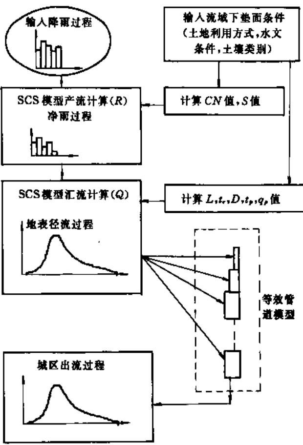  
图 6-17 城区排水系统模拟的 SCS 模型计算流程示意

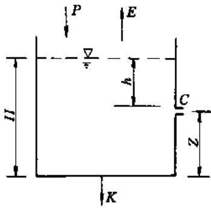  
图 6-18 水箱的基本结构

在干旱或半干旱地区，或在湿润地区的干旱季节，考虑土壤水的作用可在水箱中增设一个土壤水层，即将土壤水层分为两部分—主土壤水层（上层）和次土壤水层（下层）。当有降水时，雨水首先供给上层直到上层饱和，然后剩余降雨作为第一层水箱的自由水，其中一部分下渗到第二层水箱，另一部分作为地表径流流出，而上层的水分逐渐缓慢地供给下层。如果干旱，第一层水箱的自由水耗尽时，则由上层的水分供给蒸发，当上层的水分耗尽时，则蒸发水分由下层土壤水和第二层水箱的自由水供给。上层水分渗入下层含水层中，设输送速度 $\pmb { T _ { 2 } }$ 是第二层土的线性函数，则：

壤含水层（下层）储量X，的线性函数，则：

$$
\begin{array} { r } { T _ { \mathrm { 2 } } = C _ { \mathrm { 0 } } + C \Big ( \mathrm { 1 } - \frac { X _ { s } } { C _ { s } } \Big ) } \end{array}\tag{6-56}
$$

式中， $C _ { \mathfrak { d } }$ ，C是常数，C，是下层含水层的饱和容量。

上式意义是当第二土壤层（下层）全干时，每天输送量是 $C _ { 0 } { + } C$ 当第二土壤层（下层）接近饱和时，则输送量接近C。

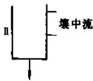

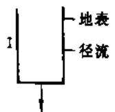

当第一土壤含水层（上层)未达饱和，下一层水箱有自由水时，由于毛管作用，水分上升，补充到上层中来。输送速率T1假定与第一土壤含水层储 $\pmb { T } _ { 1 }$ 量 $\pmb { X } _ { \pmb { \phi } }$ 成线性函数，则：

$$
T _ { 1 } = b _ { 0 } + b \Big ( 1 - \frac { X _ { \rho } } { C _ { \rho } } \Big )\tag{6-57}
$$

式中， $b _ { 0 }$ 、b为常数。

$C _ { \ P }$ 为上层含水量层的饱和容量。例如有的流域取 $C _ { \hat { P } } { \approx } 5 0 \ \left( \mathrm { m m } \right) , \ b _ { 0 } { = } b$ $\mathbf { \mu } = 3 ( \mathbf { m m } / \mathbf { d } )$ à

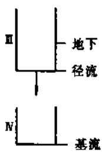  
图 6-19 串联水箱模型示意

在非湿润流域，一部分地区湿润，其余地区则干旱。只有在湿润面积上才产生地表径流，而在干旱面积上的所有的雨量被土壤所吸收成为土壤含水量。当雨季开始时，湿润面积由河沿小块而逐渐扩大。为了近似估计湿润面积的连续变化，把流域分成 ${ \cal S } _ { 1 } , { \cal S } _ { 2 } , { \cal S } _ { 3 } \cdots , { \cal S } _ { n }$ 个带子，如图6-20。这类似于用阶梯函数来代替光滑曲线来近似。分成m个带之后，每个带用一个顶层水箱具有土壤含水量的结构的单位水箱模型来进行模拟，这样就构成一组并联水箱模型，由n×m个水箱组成（TankI），如图6-21所示。

## (二)水箱模型的径流量与下渗量计算

水箱中各孔的出流Y和下渗量S与水箱内的蓄水深度H成比例关系。现以一至三层水箱模型来说明水箱模型的径流量、下渗量的计算方法。三层直列串联水箱如图6-22。该模型有边孔4个，下渗孔3个，边孔出流系数 $c _ { 1 } , c _ { 2 } , c _ { 3 } , c _ { 4 }$ 共4个，下渗系数 $K _ { 1 } , \ K _ { 2 }$ $K _ { 3 }$ 共3个，边孔的孔口高 $Z _ { 1 } , Z _ { 2 } , Z _ { 3 } , Z _ { 4 }$ 共4个，共计11个参数。一般水箱模型计算时，均以时段初的蓄水高等各状态参数代人计算。为了遵守水量平衡现可用时段平均值来推算出流量（径流和人渗）。

对于t时间内，边孔出流Y为：Y = Σq = h1C1 + h2C2 + h3C3 + h4C4式中， $h _ { i }$ 是 $\pmb { \Delta } \pmb { t }$ 时间内第i层水箱的水源离边孔的水头，即 $h _ { 1 } = H _ { 1 } - Z _ { 1 } , h _ { 2 } = H _ { 1 } - Z _ { 2 }$ 9$h _ { 3 } = H _ { 2 } - Z _ { 3 } , \ h _ { 4 } = H _ { 3 } - Z _ { 4 }$ ；各层水箱的下渗量为： $\pmb { S } _ { 1 } { = } \pmb { H } _ { 1 } \pmb { K } _ { 1 }$ ，即第二层水箱的流入量； ${ \hat { S } } _ { 2 } { = } { \cal H } _ { 2 } { \cal K } _ { 2 }$ ，即第三层水箱的流入量； ${ \cal S } _ { 3 } = H _ { 3 } K _ { 3 }$ ，即深层地下水的损失量。

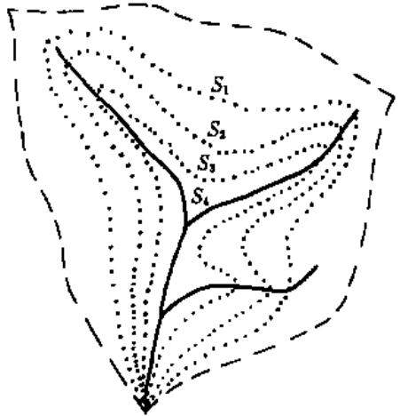  
图 6-20 流域的分带

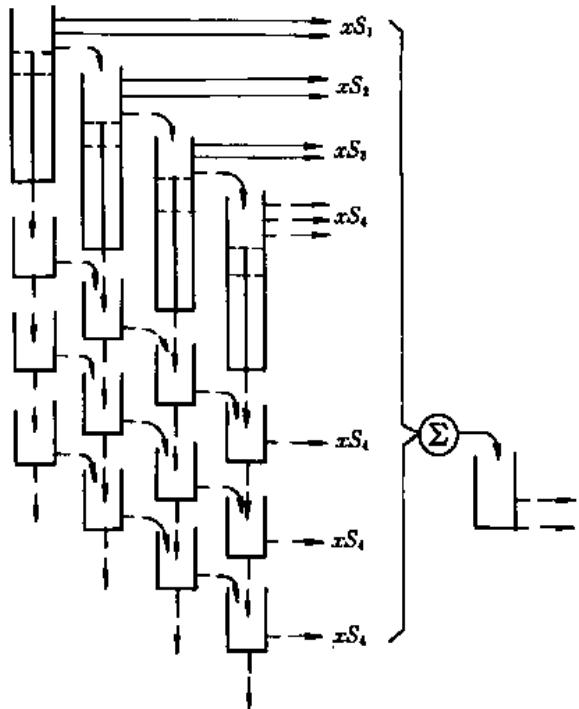  
图 6-21 n×m 型坦克模型（TankⅡ）

若第一层水箱 $\Delta t$ 时间内降雨量为 $\pmb { P }$ ，任意时刻t时蓄水深为$H _ { 1 } ( 1 ) , ( t + \Delta t )$ 时刻的蓄水深 $H _ { 1 } ( 2 )$ ，若不考虑蒸发，为

$$
H _ { 1 } ( 2 ) = H _ { 1 } ( 1 ) + P - ( Y _ { 1 } + Y _ { 2 } ) - S _ { 1 }\tag{6-58}
$$

第二层水箱时段末的蓄水深为：

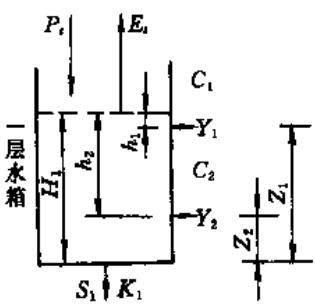

$$
H _ { 2 } ( 2 ) = H _ { 2 } ( 1 ) + S _ { 1 } - Y _ { 3 } - S _ { 2 }\tag{6-59}
$$

第三层水箱时段末的蓄水深为：

$$
H _ { 3 } ( 2 ) = H _ { 3 } ( 1 ) + S _ { 2 } - Y _ { 4 } - S _ { 3 }\tag{6-60}
$$

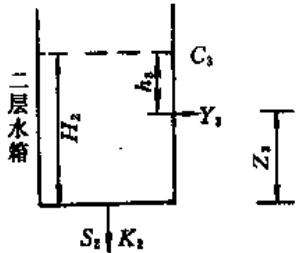

若考虑蒸散发E，当第一层水箱不能满足蒸散量时，由第二层水箱来满足，若第二层水箱不能满足，必须由第三层水箱来满足。以 $\Delta t$ 为计算时段，水头均取时段初、末的平均值，以第一层水箱为例，有：

<table><tr><td rowspan=1 colspan=1>时刻</td><td rowspan=1 colspan=1>蓄水量</td><td rowspan=1 colspan=1>第一个有效水头</td><td rowspan=1 colspan=1>第2个有效水头</td></tr><tr><td rowspan=1 colspan=1>Δ</td><td rowspan=1 colspan=1> ${ \pmb { H } } _ { 1 }$ (1)</td><td rowspan=1 colspan=1> $\pmb { h _ { 1 } } \pmb { \langle 1 \rangle }$ </td><td rowspan=1 colspan=1> $h _ { 2 } ( 1 )$ </td></tr><tr><td rowspan=1 colspan=1>t+Δ</td><td rowspan=1 colspan=1> $H _ { 1 }$ (2)</td><td rowspan=1 colspan=1> $h _ { i }$ (2)</td><td rowspan=1 colspan=1> $h _ { 2 }$ (2)</td></tr></table>

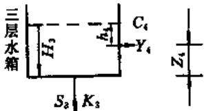  
图 6-22 一个三层直列串联水箱模型

第一边孔的平均水头：

$$
\begin{array} { l } { { \displaystyle h _ { 1 } = \frac { 1 } { 2 } \big [ h _ { 1 } ( 1 ) + h _ { 1 } ( 2 ) \big ] = \frac { 1 } { 2 } \big [ H _ { 1 } ( 1 ) - Z _ { 1 } + H _ { 1 } ( 2 ) - Z _ { 1 } \big ] } } \\ { { \displaystyle \quad = \frac { 1 } { 2 } H _ { 1 } ( 1 ) + \frac { 1 } { 2 } H _ { 1 } ( 2 ) - Z _ { 1 } } } \end{array}
$$

第二边孔的平均水头：

$$
\begin{array} { l } { { \displaystyle h _ { z } = \frac { 1 } { 2 } \big [ h _ { z } ( 1 ) + h _ { z } ( 2 ) \big ] = \frac { 1 } { 2 } \big [ H _ { 1 } ( 1 ) - Z _ { z } + H _ { 1 } ( 2 ) - Z _ { z } \big ] } } \\ { { \displaystyle \quad = \frac { 1 } { \pi } H _ { 1 } ( 1 ) + \frac { 1 } { 2 } H _ { 1 } ( 2 ) - Z _ { z } } } \end{array}
$$

第一边孔的流出量：

$$
Y _ { 1 } = C _ { 1 } \frac { H _ { 1 } ( 1 ) } { 2 } + C _ { 1 } \frac { H _ { 1 } ( 2 ) } { 2 } - Z _ { 1 } C _ { 1 }
$$

第二边孔的流出量：

$$
Y _ { \imath } = C _ { \imath } \frac { H _ { \imath } ( 1 ) } { 2 } + C _ { \imath } \frac { H _ { \imath } ( 2 ) } { 2 } - Z _ { \imath } C _ { \imath }
$$

人渗量：

$$
{ \cal S } _ { 1 } = K _ { 1 } \frac { H _ { 1 } ( 1 ) + H _ { 1 } ( 2 ) } { 2 }
$$

同理，可导出第二层和第三层的边孔出流量 $\pmb { Y } _ { 3 }$ 、 $\pmb { Y _ { 4 } }$ 和人渗量 $S _ { 2 }$ 、 ${ \pmb S } _ { 3 }$ 关系，即：

$$
\begin{array} { c } { { Y _ { \bar { \imath } } = C _ { \bar { \imath } } \biggl [ ( H _ { \bar { \imath } } ( 1 ) + H _ { \imath } ( 2 ) ) \times \frac 1 2 - Z _ { \bar { \imath } } \biggr ] } } \\ { { S _ { \bar { \imath } } = K _ { \imath } [ H _ { \imath } ( 1 ) + H _ { \imath } ( 2 ) ] \times \frac 1 2 } } \end{array}
$$

$$
\begin{array} { c } { { Y _ { \scriptscriptstyle 4 } = C _ { \scriptscriptstyle 4 } \big [ ( H _ { \scriptscriptstyle 3 } ( 1 ) + H _ { \scriptscriptstyle 3 } ( 2 ) ) \times \frac { 1 } { 2 } - Z _ { \scriptscriptstyle 4 } \big ] } } \\ { { { } } } \\ { { S _ { \scriptscriptstyle 3 } = K _ { \scriptscriptstyle 3 } \big [ H _ { \scriptscriptstyle 3 } ( 1 ) + H _ { \scriptscriptstyle 3 } ( 2 ) \big ] \times \frac { 1 } { 2 } } } \end{array}
$$

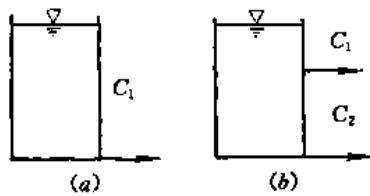  
图 6-23 水箱滞蓄的一类水箱结构

下渗量 $S _ { 1 }$ 增加到某个饱和点 $( S _ { \mathfrak { d } } )$ 后 $\mathbf { \nabla } _ { \mathbf { \mu } } \mathcal { S } _ { \mathfrak { g } }$ 为常数。若考虑河网的变形，简单的表示方法如图6-23，其中图 $\left( a \right)$ 和图(b)是一种一阶延迟系统，时间常数为T，当蓄量较小时 $( Z { \leqslant } H )$ 时， $\scriptstyle { \pmb { T } } = 1 { \big / }$ C，当蓄量较大 $( Z { > } H )$ 时 $\scriptstyle { \mathcal { T } } = 1 / ( C _ { 1 } + C _ { 2 } )$

## (三)水箱模型的特点和参数调试问题

水箱模型具有以下特点。

1）模型结构简单，计算方便。如果手工操作，对各层水

箱的参数确定后，可事先制作查算表，计算洪水过程，只需列表可快速查算。在微机上计算，很容易实现连续演算或实时作业预报。

2）模型弹性大。可根据流域的特点，选不同类型（指数函数型、溢水型、蓄水型及带有土壤层结构等)，分层水箱可多可少，侧孔可多可少。既可作洪水预报，又可作枯水或融雪预报。

3）模型是非线性结构，考虑分层汇流计算，出流系数从下层到上层依次增大，降雨越大，最上层蓄水箱水深增加，出流也加速加大，这种非线性汇流特性可以提高计算精度。

然而，水箱模型的难点就是模型参数的调试优选。因为该模型是一种隐式的非线性结构，目前还没有直接估算的数值计算方法，需要采用试错的调试方法。

例如，对于图6-18所示的最简单的水箱模型， $( K { + } C )$ 的大小决定了流量过程线的形状，加大 $( K { + } C )$ ，可使过程线尖瘦；减小(K+C)，可使过程线矮胖，C/K的大小决定了出流总量。C大，出流量大，下渗量小；K大，结果则相反。因此，在调试参数时，若发现总量符合，过程线形状拟合欠佳，则可调整 $( C + K )$ ；反之，应当调整 $C / \kappa$

根据一般的经验，一、二层水箱模型可用于模拟次洪水；二、三、四层水箱可用于模拟年或多年的流量过程线。就目前国内外应用该模型总的情况看，水箱模型使用的效果是好的。

# 第七章 水 文 统 计

## 第一节 概 述

水文现象是一种自然现象，它具有必然性的一面，也具有偶然性的一面。

必然现象是指事物在发展、变化中必然会出现的现象。例如，流域上的降水或融雪必然沿着流域的不同路径，流人河流、湖泊或海洋，形成径流。这是一种必然的结果。

偶然现象是指事物在发展、变化中可能出现也可能不出现的现象。如上所述，降水必然形成径流，但是，河流上任一断面的流量每年每月都不相同，属于偶然现象，或称随机现象。统计学的任务就是要从偶然现象中揭露事物的规律。这种规律需要从大量的随机现象中统计出来，称为统计规律。

数学中研究随机现象统计规律的学科称为概率论，而由随机现象的一部分试验资料去研究总体现象的数字特征和规律的学科称为数理统计学。概率论与数理统计学是密切相联的，数理统计学必须以概率论为基础，概率论往往把由数理统计所揭露的事实提高到理论认识。

水文统计的任务就是研究和分析水文随机现象的统计变化特性，并以此为基础对水文现象未来可能的长期变化作出在概率意义下的定量预估，以满足工程规划、设计、施工以及运营期间的需要。

## 第二节 概率的基本概念

## 一、事件

在概率论中，对随机现象的观测叫做随机试验，随机试验的结果称为事件。事件可以是数量性质的，例如某河某断面处最大洪峰流量值；也可以是属性性质的，例如刮风、下雨等。事件可以分为三种：

(1）必然事件。在每次试验中一定会出现的事件叫做必然事件。例如，长江汉口站年最大洪峰大于零，这是必然事件。

(2) 不可能事件。在任何一次试验中都不会出现的事件叫做不可能事件。例如，流域内普遍连续降雨而河道出口处水位下降，这是不可能事件。

(3)随机事件。在一次随机试验中可能出现也可能不出现的事件叫做随机事件。例如，某河某断面每年出现的最大洪峰可能大于某一个数值，也可能小于某一个数值，事先不能确定，这是随机事件。

## 二、概率

在同等可能的条件下，随机事件在试验的结果中可能出现也可能不出现，但其出现或不出现的可能性大小则不相同。为了比较随机事件出现的可能性大小，必须要有个数量标准，这个数量标准就是随机事件的概率。

随机事件的概率可由下式计算：

$$
P ( A ) = { \frac { k } { n } }\tag{7-1}
$$

式中 P（A）——在一定条件组合下，出现随机事件A的概率；

k ——出现随机事件 A 的结果数；

n——在试验中所有可能出现的结果数。

显然，必然事件的概率等于1，不可能事件的概率等于0，随机事件的概率介于0与1之间。

式（7-1）只适用于古典型随机试验，即试验的所有可能结果都是等可能的，且试验可能结果的总数是有限的。事实上，水文事件不一定具备这种性质。为了计算在一般情况下随机事件的概率，下面提出随机事件频率的概念。

## 三、频率

设随机事件 A在重复n次试验中出现了m次，则称

$$
{ \pmb { \hat { p } } } ( A ) = { \frac { m } { n } }\tag{7-2}
$$

为事件A 在n 次试验中出现的频率。

当试验次数n不大时，事件的频率有明显的随机性，但当试验次数足够大时，随机事件A出现的频率具有一定的稳定性。随着试验的无限增大，随机事件的频率稳定在某一个数附近，此时频率趋于概率。正因如此，对于水文现象，可以频率作为概率的近似值。

## 四、概率加法定理和乘法定理

在多种事件中，若同时只能出现一种事件，而其他事件均不能发生者称为互斥事件。例如，掷一颗骰子，掷一次只能得一种点子，其余五种点子都不可能出现。如两个事件彼此互斥，则其出现的概率等于这两个事件的概率的和，即

$$
P ( A + B ) = P ( A ) + P ( B )\tag{7-3}
$$

式中 $P \ ( A + B )$ —实现事件 A 或事件 B的概率；

P（A）——事件A的概率；

P（B）—事件B的概率。

例如，一颗骰子投掷一次，出现1点或2点的概率为：

$$
\begin{array} { r }  P \end{array} \left( 1 \underset { \mathrm { \normalfont ~ A } } { \overleftarrow { \mathrm { \Lambda } } } \frac { 1 } { \ast \vert \overrightarrow { \mathrm { \Lambda } } \vert } 2 \underset { \mathrm { \normalfont ~ A } } { \overleftarrow { \mathrm { \Lambda } } } \right) = P \begin{array} { r } { \left( 1 \underset { \mathrm { \normalfont ~ A } } { \overleftarrow { \mathrm { \Lambda } } } \right) \ + P \ \left( 2 \underset { \mathrm { \normalfont ~ A } } { \overleftarrow { \mathrm { \Lambda } } } \right) } \\ { = \displaystyle \frac { 1 } { 6 } + \frac { 1 } { 6 } = \frac { 1 } { 3 } } \end{array}
$$

若A、B是随机试验S的两个事件，在事件A发生的前提下，事件B发生的概率称为事件B在条件A下事件B条件概率，记作 $\textbf { \textit { P } } ( \boldsymbol { B } | A )$

例如，在上游某支流发生洪峰的条件下，要预报下游站发生最大洪峰的可能性，便是条件概率问题。

由此可以推证，两事件积的概率，等于其中一事件的概率乘以另一事件在已知前一事件发生条件下的条件概率，即

$$
\begin{array} { r } { P \ ( A B ) \ = P \ ( A ) \ \cdot \ P \ ( B | A ) , \ P \ ( A ) \ \ne 0 } \\ { P \ ( A B ) \ = P \ ( B ) \ \cdot \ P \ ( A | B ) , \ P \ ( B ) \ \ne 0 } \end{array}
$$

例如，设100件产品中，有5件次品，任意从中抽取一件不放回，再从中抽取一件，求解两次抽取都是合格产品的概率。

设A为第一次抽得合格产品的事件，B为第二次抽得合格产品的事件，则

$$
{ \cal P } \ ( A ) = { \frac { 9 5 } { 1 0 0 } }
$$

由于第一次抽得的一件合格产品未放回，故第二次抽取时产品总数应该是100—1=99，合格产品数应该是95—1=94，故

$$
P \ ( B | A ) \ = { \frac { 9 4 } { 9 9 } }
$$

则

$$
P \ ( A B ) \ = P \ ( A ) \ \cdot \ P \ ( B | A ) \ = { \frac { 9 5 } { 1 0 0 } } \times { \frac { 9 4 } { 9 9 } } = 0 . 9 0 2
$$

上面是就条件概率来说的，如果两个事件是相互独立的，即任一事件的发生不影响另一事件发生的概率，则

或

$$
\begin{array} { l l } { { P \ ( A | B ) \ = P \ ( A ) } } \\ { { P \ ( B | A ) \ = P \ ( B ) } } \end{array}
$$

由此推得，两个独立事件共同出现的概率P(AB)等于这些事件各自出现概率的乘积，即

$$
P ( A B ) = P ( A ) P ( B )\tag{7-4}
$$

例如，一颗骰子连掷2次，均得1点的概率为：

$$
\begin{array}{c} \begin{array} { l } { P \end{array} \begin{array} { l } { ( \sharp \sharp \mathrm { \sf ~ / \sharp ~ 2 ~ / \sharp ~ 1 ~ 1 ~ / \sharp ~ ) ~ } = P \mathrm { \Lambda } ( \mathrm { \sf ~ 1 ~ / \sharp ~ } ) \ P \mathrm { \Lambda } ( \mathrm { \mathbb ~ 1 ~ / \sharp ~ } ) } \\ { = \frac { 1 } { 6 } \times \frac { 1 } { 6 } = \frac { 1 } { 3 6 } } \end{array} } \end{array}
$$

## 第三节 随机变量及其概率分布

概率论的重要基本概念，除事件、概率外，还有随机变量。

## 一、随机变量

随机试验的结果可以是一个数量，也有些虽然不是数量，但可以用数量来表示。这样的量随着试验的重复可以取得不同的数值，而且带有随机性，我们称这样的变量为随机变量。简言之，随机变量是在随机试验中测量到的数量。水文现象中的随机变量一般是指某种水文特征值，如某水文站的年径流、洪峰流量等。

随机变量可分为两大类型：

## 1. 离散型随机变量

若随机变量仅能取得一个有限区间内的某些间断的离散数值，则称为离散型随机变量。例如，掷一颗骰子，出现的点数只可能取得1，2，3，4，5，6共六种数值，不能取得相邻两数值间的任何值，这些“出现点数”就是随机变量。

## 2. 连续型随机变量

若随机变量可以取得一个有限区间的任何数值，则称此随机变量为连续型随机变量。例

如，河流水文站的流量和水位，可以在0和极限值之间变化，因而它们可以是0与极限值之间的任何数值。

## 二、随机变量的概率分布

随机变量可以取得所有可能值中的任何一个值。例如，随机变量X可能取 $\pmb { x } _ { 1 }$ 值，也可能取 $\pmb { x } _ { \ 3 }$ 值、 ${ \pmb x } _ { 3 }$ 值、…，但是取某一可能值的机会是不同的，有的机会大，有的机会小。所以，随机变量的取值与其概率有一定的对应关系，一般将这种关系称为随机变量的概率分布。对离散型随机变量，其概率分布一般以分布列表示，即：

<table><tr><td rowspan=1 colspan=1>X</td><td rowspan=1 colspan=1>x1</td><td rowspan=1 colspan=1>x2</td><td rowspan=1 colspan=1>…</td><td rowspan=1 colspan=1>五</td><td rowspan=1 colspan=1>…</td></tr><tr><td rowspan=1 colspan=1> $\textit { P } \left( X { = } _ { , x _ { n } } \right)$ </td><td rowspan=1 colspan=1>p1</td><td rowspan=1 colspan=1>p2</td><td rowspan=1 colspan=1>…</td><td rowspan=1 colspan=1>Pn</td><td rowspan=1 colspan=1>I</td></tr></table>

其中， $\scriptstyle { \pmb { \mathscr { P } } } _ { \pmb { \pi } }$ 为随机变量X取值 $x _ { n } ( n { = } 1 , ~ 2 , ~ \cdots )$ 的概率。它满足下列两个条件：

(1) ${ p _ { n } } { \geq } 0 ( n { = } 1 , ~ 2 , ~ \cdots )$

(2) $\Sigma \hbar _ { \mathsf { \pm } } = 1$

对连续型随机变量而言，由于它的所有可能取值有无限多个，而取个别值的概率为零。因此，无法研究个别值的概率，只能研究某个区间的概率，或研究事件 $\pmb { X } \geq \pmb { x }$ 的概率、 $\scriptstyle \chi \leqslant$ x的概率。两者是可以相互转换的，只需研究一种就够了。水文学习惯研究事件 $\pmb { X } \geqslant \pmb { x }$ 的概率及其分布。

事件 $\pmb { X } \geq \pmb { x }$ 的概率 $P \left( X { \geqslant } x \right)$ 随随机变量取值x而变化，所以 $P \left( X { \geqslant } x \right)$ 是x的函数，这个函数称为随机变量X的分布函数，记为 $\textbf { \textit { F } } ( { \boldsymbol { x } } )$ ，即

$$
F ( x ) = P ( X \geqslant x )\tag{7-5}
$$

${ \textbf { \textit { F } } } ( x )$ 代表随机变量X大于等于某一取值x的概率。其几何图形如图7-1(6)所示，图中纵坐标表示变量x，横坐标表示概率分布函数值 $\pmb { F } \left( \pmb { x } \right)$ ，在数学上称此为随机变量的概率分布曲线，而在水文学上通常称为随机变量的累积频率曲线，简称频率曲线。

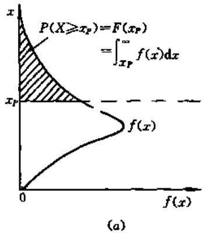

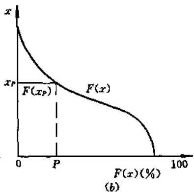  
图7-1 随机变盘的概率密度函数和概率分布函数  
(a)概率密度函数：（b)概率分布函数

在图7-1（b)中，当 $\pmb { x } = \pmb { x } _ { \pmb { \rho } }$ 时，由分布曲线上查得 $F \ ( x ) \ { = } P \ ( X { \geqslant } x _ { \rho } ) \ { = } P$ ，这说明随机变量大于 $x _ { \ P }$ 的可能性是P（%）。

由概率加法定理，随机变量X落在区间 $( x , x + \Delta x )$ 内的概率，可用下式表示

$$
P ( x + \Delta x > X > x ) = F ( x ) - F ( x + \Delta x )\tag{7-6}
$$

从式（7-6）可知，随机变量X落入区间 $( x , x { + } \Delta x )$ 的概率与区间长度 $( \Delta \ v { x } )$ 之比

值为 $\frac { F \left( x \right) - F \left( x + \Delta x \right) } { \Delta x }$

表示X落入区间 $( x , \ x { + } \Delta x )$ 的平均概率，而

$$
\operatorname* { l i m } _ { \Delta x \to 0 } { \frac { F ( x ) - F ( x + \Delta x ) } { \Delta x } } = - \operatorname* { l i m } _ { \Delta x \to 0 } { \frac { F ( x + \Delta x ) - F ( x ) } { \Delta x } } = - \ F ^ { \prime } ( x )\tag{7-7}
$$

$\pmb { F } ^ { \prime } \quad ( x )$ 为分布函数F（x）的一阶导数。

$$
f ( x ) = - \ F ^ { \prime } \left( x \right) = { \frac { - \ \mathrm { d } F ( x ) } { \mathrm { d } x } }\tag{7-8}
$$

$f \ ( x )$ 为分布函数导数的负值，刻划了密度的性质，叫做概率密度函数，或简称密度函数。  
密度函数 ${ f \textbf { \textit { f } } } ( x )$ 的几何曲线称为密度曲线，如图7-1（a）所示。

实际上，分布函数与密度函数是微分与积分的关系。因此，如果已知 $\boldsymbol { f } \left( \boldsymbol { x } \right)$ ，便可通过积分求出 ${ \pmb F } ^ { \prime } \left( x \right)$ ，即

$$
F ( x ) = P ( X \geqslant x ) = \int _ { x } ^ { \infty } f ( x ) \mathrm { d } x\tag{7-9}
$$

其对应关系如图7-1 所示。

## 三、随机变量的统计参数

从统计数学的观点来看，随机变量的概率分布曲线或分布函数较完整地描述了随机现象，然而在许多实际问题中，随机变量的分布函数不易确定，或有时不一定都需要用完整的形式来说明随机变量，而只要知道个别代表性的数值，能说明随机变量的主要特征就够了。例如，某地的年降水量是一个随机变量，各年的降水量不同，具有一定的概率分布曲线，若要了解该地年降水量的概括情况，就可以用多年平均年降水量这个数量指标来反映。这种能说明随机变量的统计规律的某些数字特征，称为随机变量的统计参数。

水文现象的统计参数反映其基本的统计规律，能概括水文现象的基本特性和分布特点，也是频率曲线估计的基础。

统计参数有总体统计参数与样本统计参数之分。所谓总体是某随机变量所有取值的全体，样本则是从总体中任意抽取的一个部分，样本中所包括的项数则称为样本容量。水文现象的总体通常是无限的，它是指自古迄今以至未来长远岁月所有的水文系列。显然，水文随机变量的总体是不知道的，只能靠有限的样本观测资料去估计总体的统计参数或总体的分布规律。也就是说，由样本统计参数来估计总体统计参数。水文计算中常用的样本统计参数有：

## (一) 均值

设某水文变量的观测系列（样本）为 $x _ { 1 } , \ x _ { 2 } , \ \cdots , \ x _ { n }$ ，则其均值为：

$$
\overline { { x } } = \frac { x _ { 1 } + x _ { 2 } + \cdots + x _ { n } } { n } = \frac { 1 } { n } \sum \limits _ { i = 1 } ^ { n } x _ { i }\tag{7-10}
$$

均值表示系列的平均情况，可以说明这一系列总水平的高低。例如，甲河多年平均流量 $\overline { { Q } } _ { \perp } = 2 4 6 0 m ^ { 3 } / s$ $\textsf { Z }$ 河多年平均流量 $\mathfrak { \widehat { Q } } _ { z } = 2 0 , \ 1 \ \mathrm { m } ^ { 3 } / \mathrm { s }$ ，说明甲河的水资源比乙河丰富。均值不但是频率曲线方程中的一个重要参数，而且是水文现象的一个重要特征值。式（7-10)两边同除以 $\overbar { \boldsymbol { x } }$ ，则得

$$
\frac { 1 } { n } \sum _ { i = 1 } ^ { n } \frac { x _ { i } } { x } { = 1 }
$$

式中 $\frac { x _ { i } } { x } .$ ——模比参数，常用 $\pmb { K _ { i } }$ 表示。

由此可得

$$
\mathcal { \overline { { K } } = } \frac { K _ { 1 } + K _ { 2 } + \cdots + K _ { n } } { n } \mathrm { = } \frac { 1 } { n } \sum _ { i = 1 } ^ { n } K _ { i } \mathrm { = } 1\tag{7-11}
$$

式（7-11）说明，当我们把变量x的系列用其相对值即用模比系数K的系列表示时，则其均值等于1，这是水文统计中的一个重要特征，即对于以模比系数K所表示的随机变量，在其频率曲线的方程中，可以减少一个均值（）参数。

## (二)均方差

从以上分析可知，均值能反映系列中各变量的平均情况，但不能反映系列中各变量值集中或离散的程度。例如，有两个系列：

第一系列 5，10，15；

第二系列 1，10，19。

这两个系列的均值相同，都等于10，但其离散程度很不相同。直观地看，第一系列只变化于5\~15之间，而第二系列的变化范围则增大到1\~19之间。

研究离散程度是以均值为中心来考查的。因此，离散特征参数可用相对于分布中心的离差来计算。设以平均数代表分布中心，随机变量与分布中心的离差为 $\pmb { x } - \overline { { \pmb { x } } } .$ 因为随机变量的取值有些是大于 $\overline { { x } }$ 的，有些是小于 $\overline { { x } }$ 的，故离差有正有负，其平均值为零。为了使离差的正值和负值不致相互抵消，一般取 $( x - { \overline { { x } } } ) ^ { 2 }$ 的平均值的开方作为离散程度的计量标准，并称为均方差，即

$$
\sigma = { \sqrt { \frac { \displaystyle \sum _ { i = 1 } ^ { n } { \ ( x _ { i } - { \overline { { x } } } ) ^ { 2 } } } { n } } }\tag{7-12}
$$

均方差取正号，它的单位与 $\pmb { x }$ 相同。不难看出，如果各变量取值 $\pmb { x _ { i } }$ 距离 $\lneqq$ 较远，则 $\pmb { \sigma }$ 大，即此变量分布较分散，如果 $\pmb { x } _ { i }$ 离 $\overline { { \pmb { x } } }$ 较近，则 $\pmb { \sigma }$ 小，变量分布比较集中。

按式（7-12）计算出上述两个系列的均方差为：

$$
\begin{array} { l } { \displaystyle \sigma _ { 1 } = \sqrt { \frac { ( 5 - 1 0 ) ^ { 2 } + ~ ( 1 0 - 1 0 ) ^ { 2 } + ~ ( 1 5 - 1 0 ) ^ { 2 } } { 3 } } = 4 . ~ 0 8 } \\ { \displaystyle \sigma _ { 2 } = \sqrt { \frac { ( 1 - 1 0 ) ^ { 2 } + ~ ( 1 0 - 1 0 ) ^ { 2 } + ~ ( 1 9 - 1 0 ) ^ { 2 } } { 3 } } = 7 . ~ 3 5 } \end{array}
$$

显然，第一系列的离散程度小，第二系列的离散程度大。

## (三)变差系数

均方差虽然能说明系列的离散程度，但对均值不相同的两个系列，用均方差来比较其离散程度就不合适了。例如，有两个系列

第一系列：5，10，15，x=10;

第二系列：995，1000，1005，x=1000。

按式（7-12)计算它们的均方差σ都等于4.08，说明这两系列的绝对离散程度是相同的，但 $\pmb { \sigma }$ 因其均值一个是10，另一个是1000，它们对均值的相对离散程度就很不相同了。可以看出，第一系列中的最大值和最小值与均值之差都是5，这相当于均值 $5 / 1 0 { = } 1 / 2 ;$ 而在第二系列

中，最大值和最小值与均值之差虽然也都是5，但只相当于均值的 $5 / 1 0 0 0 { = } 1 / 2 0 0$ ，在近似计算中，这种差距甚至可以忽略不计。

为了克服以均方差衡量系列离散程度的这种缺点，数理统计中用均方差与均值之比作为衡量系列相对离差程度的一个参数，称为变差系数 $( C _ { v } )$ ，又称离差系数或离势系数。变差系数为一无因次的数，用小数表示，其计算式为：

$$
C _ { v } { = } \frac { \sigma } { x } { = } \sqrt { \frac { \displaystyle \sum _ { i = 1 } ^ { n } ~ ( K _ { i } { - } 1 ) ^ { 2 } } { n } }\tag{7-13}
$$

从式(7-13)可以看出，变差系数 $C _ { v }$ 可以理解为变量 $_ x$ 换算成模比系数K以后的均方差。在上述两系列中，第一系列的 $C _ { v } = \frac { 4 . 0 8 } { 1 0 } = 0 . 4 0 8$ ，第二系列的 $C _ { v } = 4 . 0 8 / 1 0 0 0 =$ 0.00408，这就说明第一系列的变化程度远比第二系列为大。

对水文现象来说，C。的大小反映了河川径流在多年中的变化情况。例如，由于南方河流水量充沛，丰水年和枯水年的年径流相对来说变化较小，所以南方河流的 $C _ { \mathfrak { v } }$ 比北方河流一般要小。

## (四)偏态系数

变差系数只能反映系列的离散程度，它不能反映系列在均值两边的对称程度。在水文统计中，主要采用偏态系数 $C _ { s }$ 作为衡量系列不对称（偏态）程度的参数，其计算式为：

$$
C _ { \iota } = { \frac { \displaystyle { \sum _ { i = 1 } ^ { n } ( x _ { i } - { \overline { { x } } } ) ^ { \bar { s } } } } { \displaystyle { n } } } = { \frac { \displaystyle { \sum _ { i = 1 } ^ { n } ( x _ { i } - { \overline { { x } } } ) ^ { \bar { s } } } } { \displaystyle { n \sigma ^ { 3 } } } }\tag{7-14}
$$

式（7-14）右端的分子、分母同除以 $\overline { { x } } ^ { 3 }$ ，得

$$
C _ { s } = \frac { \underset { i = 1 } { \overset { \circ } { \sum } } ( K _ { i } - 1 ) ^ { 3 } } { n C _ { v } ^ { 3 } }\tag{7-15}
$$

偏态系数也为一无因次数。当系列对于 $\overline { { x } }$ 对称时， $\mathtt { C } , = 0$ ，此时随机变量大于均值与小于均值的出现机会相等，亦即均值所对应的频率为50%。当系列对于 $\overline { { x } }$ 不对称时， $\curvearrowrightleftharpoons 0$ 其中，若正离差的立方占优势时， $C _ { s > 0 }$ ，称为正偏；若负离差的立方占优势时， $c _ { \mathscr { s } } { < } 0$ ，称为负偏。正偏情况下，随机变量大于均值比小于均值出现的机会小，亦即均值所对应的频率小于50%，负偏情况下则刚好相反。

例如，有一个系列：300，200，185，165，150，其均值 $\scriptstyle { \overline { { x } } } = 2 0 0$ ，均方差 $\pmb { \sigma } = 5 2 , 8$ ，按式（7-15）计算得 $C _ { s } { = } 1 . 5 9 > 0$ ，属正偏情况。从该系列可以看出，大于均值的只有1项，小于均值的则有3项，但 $C _ { s }$ 却大于0，这是因为大于均值的项数虽少，其值却比均值大得

多，离差的三次方就更大；而小于均值的各项离差的绝对值都比较小，三次方所起的作用不大。

有关上述概念如从总体分布的密度曲线来看，就会更加清楚。如图7-2所示，曲线下的面积以均值 $\bar { \mathbf { x } }$ 为界，对 $c , = 0$ ，左边等于右边；对 $C _ { \mathfrak { s } } { > } 0$ ，左边大于右边；对 $C _ { s }$ $< 0$ ，左边则小于右边。

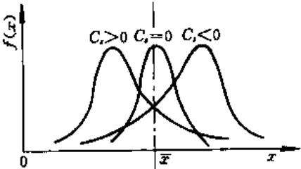  
图 7-2 C. 对密度曲线的影响

## (五) 矩

以上所述参数，有些可以用矩来表示。矩的概念及其计算在工程水文计算中经常遇到，所以这里有必要作概括的介绍。

矩在力学中广泛地用来描述质量的分布（静力矩、惯性矩），而在统计学中常用矩来描述随机变量的分布特征。矩可分为原点矩和中心矩两种。

## 1. 原点矩

随机变量X对原点离差的τ次幂的数学期望E（X)，称为随机变量X的r阶原点矩，以符号 $m ,$ 表示，即

$$
m _ { r } { = } E ( X ^ { r } ) ( r { = } 0 , \ 1 , \ 2 , \ \cdots , \ n )
$$

对离散型随机变量，r阶原点矩为：

$$
m _ { r } = E ( X ^ { r } ) = \sum _ { i = 1 } ^ { \mathsf { n } } x _ { i } ^ { r } { \pmb { \phi } } _ { i }\tag{7-16}
$$

对连续型随机变量，r阶原点矩为：

$$
m _ { r } = E ( X ^ { r } ) = \int _ { - \infty } ^ { x } x ^ { r } f ( x ) \mathrm { d } x\tag{7-17}
$$

当 $r { = } 0$ 时， $m _ { 0 } { = } E \ ( X ^ { 0 } ) \ { = } \tilde { \sum _ { i = 1 } ^ { n } } \phi _ { i } { = } 1$ ，即零阶原点矩就是随机变量所有可能取值的概率之和，其值等于1。

当 $\scriptstyle r = 1$ 时， ${ \pmb m } _ { 1 } { = } { \pmb E } ^ { \mathrm { ~ } } ( { \pmb X } ^ { 1 } )$ ，即一阶原点矩就是数学期望，也就是算术平均数。

## 2. 中心矩

随机变量X对分布中心E（X）离差的r次幂的数学期望 $E \mathrm { ~ \left\{ ~ \left[ X - E \left( X \right) \right. \right. }$ ]}，称为X的r阶中心矩，以符号 $\pmb { \mu }$ 表示，即

$$
\mu _ { r } = E \{ [ X - E ( X ) ] ^ { r } \}
$$

对离散型随机变量，r阶中心矩为：

$$
\mu _ { r } = E \{ [ X - E ( X ) ] ^ { r } \} = \sum _ { i = 1 } ^ { n } \left[ { \mathcal { x } } _ { i } - E ( X ) \right] ^ { r } { \mathcal { P } } _ { i }\tag{7-18}
$$

对连续型随机变量，r阶中心矩为：

$$
\mu , = E \{ [ X - E ( X ) ] ^ { r } \} = \int _ { - \infty } ^ { \infty } [ X - E ( X ) ] ^ { r } f ( x ) \mathrm { d } x\tag{7-19}
$$

显然，零阶中心矩为1，一阶中心矩为零，即

$$
\mu _ { 0 } = \intop _ { - \infty } ^ { \infty } [ x - E ( X ) ] ^ { \circ } f ( x ) \mathrm { d } x = \intop _ { - \infty } ^ { \infty } f ( x ) \mathrm { d } x = 1
$$

及

$$
\begin{array} { l } { \displaystyle \mu _ { 1 } = \int _ { - \infty } ^ { \infty } { \left[ x - E ( X ) \right] f ( x ) \mathrm { d } x } } \\ { \displaystyle = \int _ { - \infty } ^ { \infty } { x f ( x ) \mathrm { d } x - E ( X ) \int _ { - \infty } ^ { \infty } { f ( x ) \mathrm { d } x } } } \\ { \displaystyle = E \left( X \right) - E \left( X \right) = 0 } \end{array}
$$

当 $r { \bf { \equiv } } { \bf { \equiv } } 2$ 时，由式（7-12）可知，随机变量X的二阶中心矩就是标准差的平方（称为方差)，即

$$
\mu _ { 2 } = E \{ [ X - E ( X ) ] ^ { 2 } \} = \sigma ^ { 2 }
$$

当 $\scriptstyle r = 3$ 时， $\scriptstyle \mu _ { 3 } = E \ \{ \ \ [ X - E \ ( X ) ] ^ { 3 } \}$ 。由式（7-15）可知， $C _ { 5 } = \mu _ { 3 } / \sigma ^ { 3 }$ à

这样，我们就非常清楚地看到，算术平均数、离势系数和偏态系数都可用各种矩表示。

必须说明，在统计分析时，有时需要由原点矩推求中心矩，或由中心矩推求原点矩。它们之间的关系可以按照基本定义推求出来。现列出二阶矩和三阶矩的关系，供查用。

$$
\mu _ { 2 } = m _ { 2 } - m _ { 1 } ^ { 2 }\tag{7-20}
$$

$$
\mu _ { 3 } = m _ { 3 } - 3 m _ { 2 } m _ { 1 } + 2 m _ { 1 } ^ { 3 }\tag{7-21}
$$

## 第四节水文频率曲线线型

连续型随机变量的分布是以概率密度曲线和分布曲线表示的，这些分布在数学上有很多类型，国内外水文计算中使用的概率分布曲线俗称水文频率曲线，大体上可分为三种类型，即：

(1)正态分布型。包括正态分布、对数正态分布及三参数对数正态分布。

(2) 极值分布型。包括耿贝尔（E. J. Gumbel) 分布、通用极值分布(GEV) 及韦布尔（W. Weibull）分布。

(3)皮尔逊（K.Pearson)型分布型。包括皮尔逊Ⅱ型分布、对数皮尔逊Ⅱ型分布。

我国水文频率计算一般采用皮尔逊Ⅱ型频率曲线。SL44一93《水利水电工程设计洪水计算规范》规定，频率曲线的线型一般应采用皮尔逊型，特殊情况，经分析论证后也可采用其他线型。为此，本节以论述皮尔逊Ⅱ型频率曲线为主，并扼要介绍其他类型的代表线型。

## 一、正态分布

自然界中许多随机变量如水文测量误差、抽样误差等一般服从或近似服从正态分布。

正态分布具有如下形式的概率密度函数：

$$
f ( x ) = { \frac { 1 } { \sigma { \sqrt { 2 \pi } } } } \mathrm { e } ^ { - { \frac { ( x - { \frac { \cdot } { x } } ) ^ { 2 } } { 2 \sigma ^ { 2 } } } } \quad ( - \infty < x < + \infty )\tag{7-22}
$$

式中 ${ \overline { { x } } } \cdot$ ——平均数；

${ \pmb { \sigma } } ^ { \prime }$ 标准差；

e—自然对数的底。

正态分布的密度曲线有下面几个特点：

(1) 单峰；

(2) 对于均值x 对称，即 ${ C _ { s } = } 0 \mathrm { { ; } }$

(3)曲线两端趋于无限，并以x轴为渐近线。

式（7-22）只包含两个参数，即均值和均方差σ。因此，若某个随机变量服从正态分 $\overline { { x } }$ ${ \pmb { \sigma } } _ { \pmb { \imath } }$ 布，只要求出它的和σ值，则分布便可确定。

可以证明，正态分布曲线在 $\overline { { x } } \pm \sigma$ 处出现拐点，并且

$$
\begin{array} { r } { P _ { \sigma } = \frac { 1 } { \sqrt { 2 } \pi \sigma _ { \frac { - } { \chi - \sigma } } } \overset { \widetilde { x } + \sigma } { \underset { \sigma } { \sum } } \overset { ( x - \frac { 1 } { \chi } - \overline { { x } } ) ^ { 2 } } { \underset { 2 \sigma } { \sum } } \mathrm { d } x = 0 , 6 8 3 } \end{array}\tag{7-23}
$$

$$
P _ { 3 \sigma } = \frac { 1 } { \sqrt { 2 \pi } \sigma } \underset { \overline { { z } } = 3 \sigma } { \overset { \overline { { z } } + 3 \sigma } { \sim } } { \mathrm { e } } ^ { - \frac { ( x - \overline { { x } } ) ^ { 2 } } { 2 \sigma ^ { 2 } } } \mathrm { d } x = 0 . 9 9 7\tag{7-24}
$$

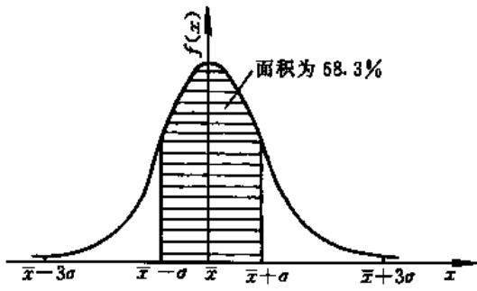  
图 7-3 正态分布密度曲线

正态分布的密度曲线与x轴所围成的面积应等于1。由式(7-23)和式(7-24)可以看出，x±σ区间所对应的面积占全面积的68.3%，元±3σ区间所对应的面积占全面积的99.7%(见图7-3)。

正态频率曲线在普通格纸上是一条规则的S形曲线，它在 $P = 5 0$ %前后的曲线方向虽然相反，但形状完全一样。水文计算中常用的一种“频率格纸”其横坐标的分划就是按把标准正态频率曲线拉成一条直线的原理计算出来的。这种频率格纸

的纵坐标仍是普通分格，但横坐标的分格是不相等的，中间分隔较密，越往两端分格越稀，其间距在 $P = 5 0$ %的两端是对称的。现以横坐标轴的一半（0\~50%）为例，说明频率格纸间距的确定。通过积分或查有关表格，可在普通格纸上绘出标准正态频率曲线（见图7-4中①线）。由①线知， $P = 5 0 ~ .$ %时， ${ \boldsymbol { x } } = 0 ; \ { \boldsymbol { P } } = 0 , 0 1$ %时， $\scriptstyle x = 3 , 7 2$ 。根据前述概念，在普通格纸上通过（50%，0）和（0.01%，3.72）两点的直线即为频率格纸上对应的标准正态频率曲线（见图7-4中②线)。由①线和②线即可确定频率格纸上横坐标的分格。为醒目起见，我们将它画在横线上。例如，在普通分格（横轴）的 $P { = } 1$ %处引垂线交S形曲线（①线）于A点，作水平线交直线（②线）于B点，再引垂线交 $O ^ { \prime } P ^ { \prime }$ 轴于C点，C点即为频率格纸上${ \pmb P } = 1$ %的位置。同理可确定频率格纸上其他横坐标分格 $( P = 5 \%$ ，10%，20%，…)的位置。

把频率曲线画在普通方格纸上，因频率曲线的两端特别陡峭，又因图幅的限制，对于特小频率或特大频率，尤其是特大频率的点子很难点在图上。现在，有了这种频率格纸，就能较好地解决这个问题，所以在频率计算时，一般都是把频率曲线点绘在频率格纸上。

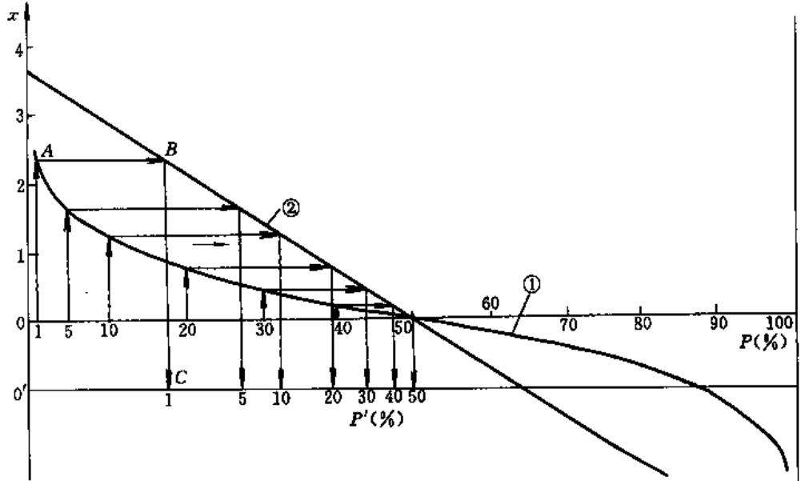  
图 7-4 频率格纸横坐标的分划

## 二、对数正态分布

当随机变量x的对数值服从正态分布时，称x的分布为对数正态分布。对于两参数对数正态分布而言，变量x的对数

$$
\scriptstyle y = \ln x
$$

服从正态分布时，y的概率密度函数为

$$
g ( y ) = \frac { 1 } { \sigma _ { y } ~ \sqrt { 2 \pi } } \mathrm { e x p } \bigg [ - \frac { ( y - a _ { y } ) ^ { 2 } } { 2 \sigma _ { y } ^ { 2 } } \bigg ] ( - \infty < y < \infty )\tag{7-25}
$$

式中 $\pmb { a } _ { \mathbf { y } }$ ——随机变量 y的数学期望；

$\pmb { \sigma } _ { y } ^ { 2 } ,$ ———随机变量 y 的方差。

根据随机变量的概率密度公式

$$
f ( x ) = g ( y ) \left| { \frac { \mathrm { d } y } { \mathrm { d } x } } \right|\tag{7-26}
$$

其中

$$
\left| { \frac { \mathrm { d } _ { y } } { \mathrm { d } x } } \right| = { \frac { 1 } { x } } \quad ( x > 0 )
$$

即得随机变量x的概率密度函数：

$$
f ( x ) = \frac { 1 } { x \sigma _ { y } \ \sqrt { 2 \pi } } \mathrm { e x p } \biggl [ - \frac { ( \mathrm { l n } x - a _ { y } ) ^ { 2 } } { 2 \sigma _ { y } ^ { 2 } } \biggr ] \quad ( x > 0 )\tag{7-27}
$$

式（7-27）的概率密度函数包含了 ${ \pmb { a } } _ { \pmb { y } }$ 和 $\pmb { \sigma _ { y } }$ 两个参数，故称为两参数对数正态曲线。因为 ${ \pmb x } = { \pmb e } ^ { \pmb { y } }$ ，故式（7-27）又可写成：

$$
f ( x ) = \frac { 1 } { \mathrm { e } ^ { x } \sigma _ { y } \ \sqrt { 2 \pi } } \mathrm { e x p } \Big [ - \frac { ( y - \overline { { y } } ) } { 2 \sigma _ { y } ^ { 2 } } \Big ]\tag{7-28}
$$

两参数对数正态分布的r阶原点矩为：

$$
m _ { r } = \exp \Bigl ( r a _ { y } + \frac { r ^ { 2 } \sigma _ { y } ^ { 2 } } { 2 } \Bigr ) \quad r = 0 , 1 , 2 , \cdots\tag{7-29}
$$

而且

$$
m _ { 1 } = a _ { x } = \exp \ ( a _ { y } + \frac { \sigma _ { y } ^ { 2 } } { 2 } )\tag{7-30}
$$

$$
m _ { 2 } = \exp ( 2 a _ { y } + 2 \sigma _ { y } ^ { 2 } )\tag{7-31}
$$

$$
m _ { 3 } = \exp ( 3 a , + 4 . 5 \sigma _ { y } ^ { 2 } )\tag{7-32}
$$

由此可得r阶中心矩为：

$$
\mu _ { 2 } = . \big [ \mathrm { e x p } ( \sigma _ { y } ^ { 2 } ) - 1 \big ] \mathrm { e x p } ( 2 a _ { y } + \sigma _ { y } ^ { 2 } )\tag{7-33}
$$

$$
\mu _ { 3 } = \exp \biggl ( 3 a _ { s } + \frac { 3 \sigma _ { y } ^ { 2 } } { 2 } \biggr ) \bigl [ \exp ( \sigma _ { y } ^ { 2 } ) - 1 \bigr ] ^ { 2 } \bigl [ \exp ( \sigma _ { y } ^ { 2 } ) + 2 \bigr ]\tag{7-34}
$$

于是可以得到各个统计参数，即

$$
\overline { { x } } = \exp \Bigl ( a _ { y } + \frac { 1 } { 2 } \sigma _ { y } ^ { 2 } \Bigr )\tag{7-35}
$$

$$
C _ { \mathfrak { v } } = \lceil \mathfrak { e } \mathbf { x } \mathfrak { p } ( \sigma _ { \mathfrak { y } } ^ { 2 } ) - 1  ^ { 1 / 2 }\tag{7-36}
$$

$$
C _ { s } = [ \exp { ( a _ { s } ^ { 2 } ) } - 1 ] ^ { 1 / 2 } [ \exp { ( \sigma _ { s } ^ { 2 } ) } + 2 ] > 0\tag{7-37}
$$

所以，两参数对数正态分布是正偏的。由上述诸式还可得到C，与 $C _ { v }$ 的关系，即

$$
C _ { s } = 3 C _ { v } + C _ { v } ^ { 3 }\tag{7-38}
$$

$$
\frac { C _ { \mathfrak { s } } } { C _ { v } } = 3 + C _ { \mathfrak { s } } ^ { 2 } > 3\tag{7-39}
$$

## 三、皮尔逊Ⅲ型分布

英国生物学家皮尔逊通过很多资料的分析研究，提出一种概括性的曲线族，包括13种分布曲线，其中第Ⅱ型曲线被引入水文计算中，成为当前水文计算中常用的频率曲线。

皮尔逊Ⅱ型曲线是一条一端有限一端无限的不对称单峰、正偏曲线（见图7-5），数学上称为伽玛分布，其概率密度函数为：

$$
f ( x ) = { \frac { \beta ^ { \circ } } { \Gamma ( \alpha ) } } ( x - a _ { 0 } ) ^ { \alpha - 1 } \mathrm { e } ^ { - \beta ( x - a _ { 0 } ) }
$$

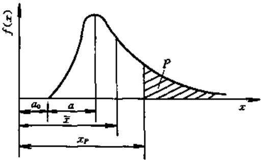

(7-40)

图 7-5 皮尔逊Ⅱ型概率密度曲线

式中 Γ（α) —α 的伽玛函数；

α、 $\beta .$ $\alpha _ { 0 }$ —分别为皮尔逊Ⅱ型分布的形状、尺度和位置参数， $\alpha > 0 , \ \beta > 0$

显然， ${ \pmb \alpha } .$ 1 $\pmb \beta .$ e $\pmb { \alpha _ { 0 } }$ 确定以后，该密度函数也随之确定。可以推证，这三个参数与总体的三个统计参数 ${ \overline { { \pmb { x } } } } .$ 1 $C _ { v }$ 一 $C _ { s }$ 具有下列关系

$$
\left. \begin{array} { l } { \displaystyle \alpha = \frac { 4 } { C _ { s } ^ { 2 } } } \\ { \displaystyle \beta = \frac { 2 } { \overline { { C _ { s } } } C _ { s } C _ { s } } } \\ { \displaystyle a _ { 0 } = \overline { { x } } \left( 1 - \frac { 2 C _ { v } } { C _ { s } } \right) \Bigg [ } \end{array} \right\}\tag{7-41}
$$

皮尔逊Ⅱ型密度曲线的形状主要决定于参数 $c ,$ (或 ${ \pmb { \alpha } } )$ ，从图7-6可以区分为以下四种形状：

(1)当 $0 < \alpha < 1$ ，即 $2 < C _ { s } < \infty$ 时，密度曲线呈乙形，以x轴和 $\scriptstyle { \pmb { x } } = { \pmb { b } }$ 直线为渐近线，

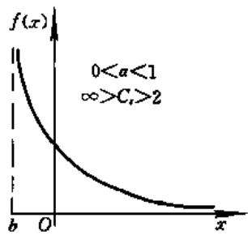

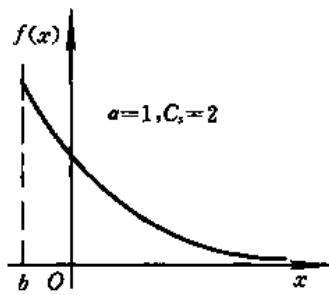

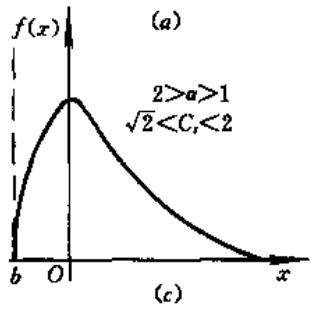

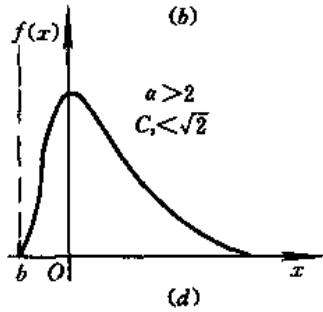  
图7-6 皮尔逊Ⅱ型密度曲线形状变化图

如图7-6（a）所示。

(2)当 $\pmb { \alpha } = 1$ ，即 $c _ { s } = 2$ 时，密度曲线退化为指数曲线，仍呈乙形，但左端截止在曲线起点，右端仍伸到无限，如图7-6（b）所示。

(3)当 $1 { < } \alpha { < } 2$ ，即 $\sqrt { 2 } < C _ { s } < 2$ 时，密度曲线呈铃形，左端截止在曲线起点，且在该处与直线 $\scriptstyle { \pmb { x } } = { \pmb { b } }$ 相切，右端无限，如图7-6（c）所示。

(4) 当 $\pmb { \alpha } \mathrm { > } 2$ ，即 $C _ { s } { < } \sqrt { 2 }$ 时，密度曲线呈铃形，起点处曲线与x轴相切，右端无限，如图7-6（d）所示。

以上各种形状的曲线都是对正偏而言的。

水文计算中，一般需求出指定频率P所相应的随机变量取值xp，这要分析密度曲线，通 $\pmb { x } \pmb { p }$ 过对密度曲线进行积分，求出等于及大于xp的累积频率P值，则 $\pmb { x } \mathbf { p }$

$$
P = P ( x \geqslant x _ { P } ) = { \frac { \beta ^ { \alpha } } { \Gamma ( \alpha ) } } { \int _ { x _ { P } } ^ { \infty } ( x - a _ { 0 } ) ^ { \alpha - 1 } \operatorname { e } ^ { - \beta ( x - a _ { 0 } ) } } \mathrm { d } x\tag{7-42}
$$

直接由式（7-42）计算P值非常麻烦，实际做法是通过变量转换，根据拟定的C，值进 $C _ { \prime }$ 行积分，并将成果制成专用表格，从而使计算工作大大简化。

$$
\bar { \Phi } { = } \frac { x - \overline { { x } } } { \overline { { x } } \overline { { C _ { \textup { v } } } } }\tag{7-43}
$$

则有

$$
\scriptstyle x = { \overline { { x } } } ( 1 + C , { \bar { \phi } } )
$$

$$
\mathrm { d } x = \overline { { x } } C _ { \mathrm { v } } \mathrm { d } \bar { \Phi }\tag{7-44}
$$

(7-45)

$\pmb { \varPhi }$ 是标准化变量，称为离均系数，Φ的均值为零，标准差为1。这样经标准化变换后， $\Phi$ 将式（7-44）、式（7-45）代入式（7-42），简化后可得：

$$
P ( \Phi > \Phi _ { P } ) = \int _ { \Phi _ { p } } ^ { \infty } f ( \Phi , C _ { s } ) \mathrm { d } \Phi\tag{7-46}
$$

式（7-46）中被积函数只含有一个待定参数C，其他两个参数x和C。都包括在Φ中，因而 $c ,$ $\bar { \bf x }$ $c _ { \mathfrak { v } }$ $\pmb { \phi }$ 只要假定一个C值，便可从式（7-46）通过积分求出P与Φ之间的关系。C、P与ΦP的 $C _ { s }$ $\pmb { P }$ $\pmb { \phi }$ $c ,$ $P$ $\phi _ { P }$ 对应数值表见附表1。

在进行频率计算时，由已知的C，值，查Φ值表得出不同 $P$ 的 $\tilde { \Phi } _ { P }$ 值，然后利用已知的${ \overline { { x } } } .$ $C _ { \mathfrak { r } }$ 值，通过式（7-44）即可求出与各种 $P$ 相应的 $\pmb { x } \pmb { p }$ 值，从而可绘出频率曲线。必须指出，计算时如何求得皮尔逊Ⅱ型分布曲线的参数、 $C _ { \pi }$ 和 $c ,$ ，对于设计年径流和设计洪水均有不同的要求，这些将分别在第八章和第九章中介绍。

## 四、耿贝尔分布

耿贝尔(E. J. Gumbel)分布又称双指数型分布，它的分布曲线是从极值分布律得来的。极值分布是指样本极大值或极小值的分布函数。对于耿贝尔极大值分布，随机变量 $\pmb { x }$ 的密度函数具有如下形式：

$$
f ( x ) = \alpha { \exp } \lbrack - \ a ( x - x _ { 0 } ) - \mathrm { e } ^ { - \alpha ( x - x _ { 0 } ) } \rbrack , ( - \infty < x < + \infty )\tag{7-47}
$$

式中 $\pmb { \alpha }$ e $\pmb { \mathscr { x } } _ { \emptyset }$ ——分别为两个分布参数。

先使

$$
\begin{array} { l } { { { \frac { \mathrm { d } } { \mathrm { d } x } } f \ ( x ) \ = \alpha \mathrm { e x p } \left[ - \alpha \ ( x { - } x _ { 0 } ) \ - \mathrm { e } ^ { - \alpha ( x - x _ { 0 } ) } \right] \ } } \\ { { \mathrm { } \times \ [ - \alpha - \mathrm { e } ^ { - \alpha ( x - x _ { 0 } ) } ( - \alpha ) ] = 0 \ } } \end{array}
$$

则得

$$
\pmb { x } { = } \pmb { x } _ { 0 }
$$

因此， $\pmb { x _ { \Updownarrow } }$ 是分布的众值。

分布函数为：

$$
F ( x ) = \int _ { - \infty } ^ { x } f ( x ) \mathrm { d } x = \alpha \int _ { - \infty } ^ { x } \exp \big [ - \alpha ( x - x _ { 0 } ) - \mathrm { e } ^ { - \alpha ( x - x _ { 0 } ) } \big ] \mathrm { d } x\tag{7-48}
$$

则

$$
\begin{array}{c} \begin{array} { l } { F } \end{array} ( x ) \ = \alpha { \int _ { - \infty } ^ { t } t \mathrm { e } ^ { - t } \bigg ( - \frac { 1 } { \alpha t } \bigg ) \mathrm { d } t } = \int _ { - \infty } ^ { t } \mathrm { e } ^ { - t } \mathrm { d } ( - t )  \\ { = \exp \big [ - \mathrm { e } ^ { - \alpha ( x - x _ { 0 } ) } \big ] } \end{array}\tag{7-49}
$$

写成超过概率（即频率曲线），则

$$
P { = } 1 { - } F \left( x \right) = 1 { - } { \exp } \left[ { - } { \ e } ^ { - { \ e } ( x - { x _ { 0 } } ) } \right]\tag{7-50}
$$

耿贝尔分布的参数与各阶矩可以导出如下：

一阶原点矩(均值)

二阶中心矩

三阶中心矩

$$
{ \left. \begin{array} { l } { \displaystyle \mu ^ { \prime } _ { 1 } = x _ { 0 } + { \frac { \gamma } { \alpha } } = x _ { 0 } + { \frac { 0 . 5 7 7 2 1 5 6 } { \alpha } } } \\ { \displaystyle \mu _ { 2 } = { \frac { \pi ^ { 2 } } { 6 \alpha ^ { 2 } } } = { \frac { 1 . 6 4 4 9 3 4 1 } { \alpha ^ { 2 } } } } \\ { \displaystyle \mu _ { 3 } = { \frac { 2 . 4 0 4 1 1 3 8 } { \alpha ^ { 3 } } } } \end{array} \right\} }\tag{7-51}
$$

式中 γ——欧拉常数。

由此可得

均方差

变差系数

偏态系数

$$
\left. { \begin{array} { l } { { \displaystyle \sigma = \sqrt { \mu _ { 2 } } = \frac { \pi } { \sqrt { 6 } \alpha } = \frac { 1 . 2 8 2 5 4 9 8 } { \alpha } } } \\ { { \displaystyle C _ { \ast } = \frac { \pi / \sqrt { 6 } } { \alpha x _ { 0 } + 0 . 5 7 7 2 1 5 6 } = \frac { 1 . 2 8 2 5 4 9 8 } { \alpha x _ { 0 } + 0 . 5 7 7 2 1 5 6 } \left\{ \begin{array} { l } { { \begin{array} { l } { { \frac { \alpha } { \sqrt { 6 } } } } \\ { { \sqrt { 6 } } } \end{array} } } \end{array} \right. } } \\ { { \displaystyle C _ { \ast } = \frac { 2 S _ { 3 } } { \left( \frac { \pi } { \sqrt { 6 } } \right) ^ { 3 } } = 1 . 1 3 9 5 4 7 1 ( \frac { \varkappa + \frac { \varkappa } { \sqrt { 6 } } } { \alpha } ) } } \end{array} } \right\}\tag{7-52}
$$

若用 $\pmb { \alpha }$ 和 $\pmb { x } _ { 0 }$ 表示分布参数，则

$$
\left. \begin{array} { l } { \alpha = \cfrac { \pi } { \sqrt { 6 } \sigma } = \cfrac { 1 \cdot 2 8 2 5 4 9 8 } { \sigma } } \\ { x _ { 0 } = \mu _ { 1 } ^ { \prime } - \cfrac { \sqrt { 6 } \sigma \gamma } { \pi } = \mu _ { 1 } ^ { \prime } - 0 . 4 5 0 0 5 3 2 \sigma } \end{array} \right\}\tag{7-53}
$$

实用上，对耿贝尔分布也可以用标准化变量来计算。将式（7-53）代入式（7-50)，得：

于是有

$$
\begin{array} { r l } { P = 1 - \exp \left\{ - \exp \left[ - \frac { \pi } { \sqrt { 6 } } \left( x - \mu _ { 1 } ^ { \prime } + \frac { \sqrt { 6 } \rho \gamma } { \pi } \right) \right] \right\} } & { } \\ { \quad } & { = 1 - \exp \left\{ - \exp \left[ - \frac { \pi } { \sqrt { 6 } } \left( \frac { x - \mu _ { 1 } ^ { \prime } } { \sigma } \right) - \gamma \right] \right\} } \\ { \quad } & { \qquad \phi _ { \circ } = \frac { x _ { \rho } - \mu _ { \star } ^ { \prime } } { \sigma } } \\ { \quad } & { \qquad \frac { \pi } { \sqrt { 6 } } \phi + \gamma = - \ln [ - \ln ( 1 - P ) ] } \\ { \quad } & { \qquad \phi = - \frac { \sqrt { 6 } } { \pi } \left\{ \gamma + \ln [ - \ln ( 1 - P ) ] \right\} } \\ { \quad } & { = 0 . 4 0 0 5 3 2 - 0 . 7 7 9 5 9 5 9 \mathrm { s i n } [ - \exp [ - \ln ( 1 - P ) ] ] } \\ { \quad } & { \qquad x _ { \rho } = \mu _ { \star } + 9 . \rho _ { \star } } \end{array}\tag{7-54}
$$

(7-55)

同时

由此可见，P值只有一个Φ与之相对应。因此，根据式（7-55）就可制成超过概率P对应的标准化变量（即离均系数）Φ值表（见表7-1），从而求得 ${ \pmb x } _ { { \pmb P } } .$

当 $\Phi { = } 0$ ，即 ${ \pmb x } = { \pmb \mu } _ { 1 } ^ { \prime }$ ，由式（7-54）得 $P = 1 - \exp ( - \ e ^ { - r } ) = 0 . 4 2 9 6$ ，这说明数学期望值固定在P=42.96%处。

【例7-1】已知随机变量 x的 $\mu _ { 1 } ^ { \prime } =$ $1 5 0 0 , C _ { \varepsilon } = 0 . 5$ ，求耿贝尔极大值分布函数及对应于 $P { = } 1$ %的 $\pmb { x } \pmb { P }$ 值。

解 ${ \pmb { \sigma } } { = } { \pmb { \mu } } _ { 1 } ^ { \prime } { C _ { \mathrm { v } } } { = } 1 5 0 0 \times 0 . 5 { = } 7 5 0$

由式（7-53）得

$$
\begin{array} { c } { { x _ { 0 } = \mu _ { \ 1 } ^ { \prime } - 0 . 4 5 0 0 5 3 2 \sigma } } \\ { { = 1 5 0 0 - 0 . 4 5 0 0 5 3 2 \times 7 5 0 } } \\ { { = 1 1 6 2 . 4 } } \end{array}
$$

$$
\scriptstyle \alpha = { \frac { 1 \cdot 2 8 2 5 4 9 8 } { \sigma } } = { \frac { 1 \cdot 2 8 2 5 5 } { 7 5 0 } } = 0 . 0 0 1 7 1
$$

根据式（7-49），求得分布函数为：

$$
\begin{array} { r } { F ( x ) = \exp [ -  \mathrm { e } ^ { - 0 . 0 0 1 7 1 ( x - 1 1 6 2 . 4 ) } ] } \end{array}
$$

超过概率为：

表 7-1耿贝尔曲线的离均系数Φ表
<table><tr><td> $P ( \% )$ </td><td>φ</td><td> $P ( \% )$ </td><td>Φ</td></tr><tr><td>0.001</td><td>8.53</td><td>30</td><td>0.35</td></tr><tr><td>0.01</td><td>6.73</td><td>40</td><td>0.07</td></tr><tr><td>0.05</td><td>5.48</td><td>50</td><td>-0.16</td></tr><tr><td>0.1</td><td>4.94</td><td>60</td><td>-0.38</td></tr><tr><td>0.5</td><td>3.68</td><td>70</td><td>-0.59</td></tr><tr><td>1</td><td>3.14</td><td>80</td><td>-0.82</td></tr><tr><td>2</td><td>2.59</td><td>90</td><td>-1.10</td></tr><tr><td>3</td><td>2.27</td><td>95</td><td>-1.31</td></tr><tr><td>5</td><td>1.87</td><td>97</td><td>-1.43</td></tr><tr><td>10</td><td>1.30</td><td>99</td><td>-1.64</td></tr><tr><td>20</td><td>0.72</td><td>99.9</td><td>-1.96</td></tr></table>

$$
P = 1 - \exp \left[ - \mathrm { e } ^ { - 0 . 0 0 1 7 1 ( x - 1 1 6 2 . 4 ) } \right]
$$

由表 7-1 可查得 $P { = } 1$ %时， $\Phi { = } 3 . 1 4$

于是对应于P=1%的 $\pmb { x } \pmb { P }$ 值为：

$$
x _ { 1 \% } = \sigma \textcircled { 1 } + \mu _ { 1 } ^ { \prime } = 7 5 0 \times 3 . 1 4 + 1 5 0 0 = 3 8 5 5
$$

## 五、经验频率曲线

上述各种频率曲线是用数学方程式来表示的，属于理论频率曲线。在水文计算中还有一种经验频率曲线，是由实测资料绘制而成的，它是水文频率计算的基础，具有一定的实用性。

设某水文要素的实测系列共有n项，按由大到小的次序排列为 $x _ { 1 } , x _ { 2 } , \cdots , x _ { m } , \cdots , x _ { n }$ 经验频率就是在系列中大于及等于样本x的出现次数与样本容量之比值，计算式为： $\pmb { x } _ { i }$

$$
P = \frac { m } { n } \times 1 0 0 \%
$$

式中 P——等于和大于 $x _ { m }$ 的经验频率；

$\varkappa ^ { \star }$ \_ $x _ { m }$ 的序号，即等于和大于 $x _ { m }$ 的项数；

n—样本容量，即观测资料的总项数。

例如，在上面系列中大于及等于x2的项数为2，其经验频率应为2/n。如果n项实测资 $x _ { z }$ $2 / n$ 料是总体，则上述计算经验频率的公式是合理的，但水文实测资料都是样本资料，欲从这些有限资料来估计总体，就不太合理。例如，当m=n时，最末项x的频率 $m = n$ $\pmb { x } _ { m }$ $P { = } m / n { = } 1 0 0 \%$ 即样本的末项x就是总体中的最小值，显然不符合实际情况，因为随着观测年数的增多， $\pmb { \mathcal { X } } _ { \pmb { \pi } }$ 总会有更小的数值出现。为了修正由样本推算总体出现的不合理估算，目前有如下几个经验频率公式可供选择：

数学期望公式

$$
P = \frac { m } { n + 1 } \times 1 0 0 \%
$$

切哥达也夫公式

$$
P = \frac { m - 0 . 3 } { n + 0 . 4 } \times 1 0 0 \%
$$

海森公式

$$
P = \frac { m - 0 . 5 } { n } \times 1 0 0 \%
$$

目前我国水文计算采用数学期望公式，它是建立在期望样本中某一项的频率是许多样本中同序号概率的均值的条件下推导出来的。

## 第五节 频率曲线参数估计方法

在概率分布函数中都含有一些表示分布特征的参数，例如皮尔逊Ⅱ型分布曲线中就包含有 $\overline { { x } } , C _ { v \setminus } C ,$ 三个参数。水文频率曲线线型选定之后，为了具体确定出概率分布函数，就得估计出这些参数。由于水文现象的总体通常是无限的，我们无法取得，这就需要用有限的样本观测资料去估计总体分布线型中的参数，故称为参数估计。

由样本估计总体参数的方法很多，例如矩法、极大似然法、概率权重矩法、权函数法、数值积分双权函数法以及适线法等。我国一般采用皮尔逊Ⅱ型频率曲线，故本节只论述皮尔逊Ⅱ型频率曲线参数估计的一些主要方法。

## 一、矩法

矩法是用样本矩估计总体矩，并通过矩和参数之间的关系，来估计频率曲线参数的一种方法。该法计算简便，事先不用选定频率曲线线型，因此，是频率分析计算中广泛使用的一种方法。

设随机变量x的分布函数为 $\textbf { \textit { F } } ( { \boldsymbol { x } } )$ ，则x的r阶原点矩和中心矩分别为：

$$
m _ { r } = \int _ { - \infty } ^ { + \infty } x ^ { r } f ( x ) \mathrm { d } x\tag{7-56}
$$

和

$$
\mu _ { r } = \int _ { - x } ^ { + \infty } [ x - E ( x ) ] ^ { r } f ( x ) \mathrm { d } x\tag{7-57}
$$

式中 E（x） —随机变量 x的数学期望；

f (x) ——随机变量 x 的概率密度函数。

由于各阶原点矩和中心矩都与统计参数之间有一定的关系，因此，可以用矩来表示参数。对于样本，r阶样本原点矩 $\hat { m } _ { \tau }$ 和r阶样本中心矩 $\hat { \mu } _ { r }$ 分别为：

$$
\hat { m } _ { r } = \frac { 1 } { n } \sum _ { i = 1 } ^ { \bullet } x _ { i } ^ { r } \quad r = 1 , 2 , \cdots\tag{7-58}
$$

和

$$
{ \hat { \boldsymbol { \mu } } } _ { r } = { \frac { 1 } { n } } \sum _ { i = 1 } ^ { n } ( x _ { i } - { \overline { { x } } } ) ^ { r } \quad r = 2 , 3 , \cdots\tag{7-59}
$$

式中 n——样本容量。

常用的由前三阶样本矩表示的样本统计参数见式（7-10）、式（7-13）和式（7-15）。这些只是样本统计参数的计算式，它们与相应的总体同名参数不一定相等。但是，我们希望由样本系列计算出来的统计参数与总体更接近些，因此需将上述公式加以修正。

我们知道样本特征值的数学期望与总体同一特征值比较接近，如n足够大时，其差别更微小。经过证明，样本原点矩m,的数学期望正好是总体原点矩 $m ,$ ，但样本中心矩 $\hat { \mu } _ { r }$ 的数学期望不恰是总体的中心矩 $\pmb { \mu } _ { 1 }$ ，要把 $\hat { \mu }$ 经过修正后，再求其数学期望，则可得到 $\pmb { \mu } _ { r }$ 。这个修正的数值称为该参数的无偏估计量，然后应用它作为参数估计值。

于是均值的无偏估计仍为样本估计值，即

$$
\begin{array} { r } { \overline { { \boldsymbol { x } } } = \frac { 1 } { n } \sum _ { i = 1 } ^ { n } x _ { i } } \end{array}
$$

样本二阶中心矩的数学期望为：

$$
E ( \hat { \mu } _ { 2 } ) = \frac { \pi - 1 } { n } \mu _ { 2 }
$$

或

$$
E { \Big \{ } { \frac { n } { n - 1 } } { \hat { \mu } } _ { 2 } { \Big \} } = \mu _ { 2 }
$$

因此， $\textstyle C _ { \mathfrak { z } }$ 的无偏估计量为；

$$
\begin{array} { c } { { C _ { \circ } = \sqrt { \displaystyle \frac { n } { n - 1 } } \sqrt { \displaystyle \frac { \sum _ { i = 1 } ^ { n } ( K _ { i } - 1 ) ^ { 2 } } { n } } } } \\ { { = \sqrt { \displaystyle \frac { \sum _ { i = 1 } ^ { n } ( K _ { i } - 1 ) ^ { 2 } } { n - 1 } } } } \end{array}\tag{7-60}
$$

样本三阶中心矩的数学期望为：

或

$$
\begin{array} { l } { { E ( \hat { \mu } _ { 3 } ) = \displaystyle \frac { ( n - 1 ) ( n - 2 ) } { n ^ { 2 } } \mu _ { 3 } \nonumber } } \\ { { E \biggl [ \frac { n ^ { 2 } } { ( n - 1 ) ( n - 2 ) } \hat { \mu } _ { 3 } \biggr ] = \mu _ { 3 } \nonumber } } \end{array}
$$

因此， $c ,$ 的无偏估计量为：

$$
C _ { \varepsilon } = \frac { n ^ { 2 } } { ( n - 1 ) ( n - 2 ) } \frac { \underset { i = 1 } { \overset { n } { \sum } } ( K _ { i } - 1 ) ^ { 3 } } { n C _ { v } ^ { 3 } }\tag{7-61}
$$

必须指出，用上述无偏估值公式算出来的参数作为总体参数时，只能说有很多个同容量的样本资料，用上述公式计算出来的统计参数的均值，可望等于总体的同名参数。在现行水文频率计算中，当用矩法估计参数时，一般都是用上述公式估算频率曲线的分布参数，作为适线法的参考数值。

由有限的样本资料算出的统计参数，去估计总体的统计参数总会出现一定的误差，这种误差称为抽样误差。

例如，样本平均数x是一种随机变量，它本身具有一定的概率分布，称为样本平均数的抽样分布。抽样分布愈分散，表示抽样误差愈大，反之亦然。由于总体的 $\overline { { \pmb { x } } } _ { \pmb { \perp } }$ 是未知的，对某一特定的样本，其样本平均值的抽样误差无法准确地求得，只能在概率意义下作出某种估计。样本平均数的抽样误差可以用表征抽样分布离散程度的均方差 $\pmb { \sigma } _ { \pmb { z } } ^ { - }$ 来度量。为了着重说明度量的是误差，一般将 ${ \pmb { \sigma } } _ { \pmb { x } }$ 改称为样本平均数的均方误。一般来说，当样本容量较大时，抽样分布通常为正态分布。这样，我们有下列关系：

$$
\begin{array} { c } { { P ( \overline { { x } } - \sigma _ { \overline { { x } } } \leqslant \overline { { x } } _ { \mathbb { A } } \leqslant \overline { { x } } + \sigma _ { \overline { { x } } } ) = 6 8 . 3 \% } } \\ { { P ( \overline { { x } } - 3 \sigma _ { \overline { { x } } } \leqslant \overline { { x } } _ { \mathbb { A } } \leqslant \overline { { x } } + 3 \sigma _ { \overline { { z } } } ) = 9 9 . 7 \% } } \end{array}
$$

和

这就是说，如果随机抽取一个样本，以此样本的均值作总体均值的估计值时，有68.3%的可能性，其误差不超过σ；有99.7%的可能性，其误差不超过 $\pmb { \sigma } _ { z } ^ { } $ $3 \sigma _ { \overline { { x } } } ^ { - }$

上述对样本平均数抽样误差的分析，可以适用于其他样本参数。C。和C，的抽样误差可以 $C _ { v }$ $C _ { s }$ 用C。的抽样均方误σc和C的抽样均方误σc来度量。根据数理统计理论，可推导出各参数均 $C _ { v }$ $\pmb { \sigma _ { \pmb { C _ { \ p } } } }$ $C _ { s }$ $\pmb { \sigma _ { C _ { \lambda } } }$ 方误的公式。当总体为皮尔逊Ⅱ型分布 $( C ,$ 为 $C _ { v }$ 的任意倍数)时，样本参数的均方误公式为：

$$
\sigma _ { \bar { z } } = \frac { \sigma } { \sqrt { \eta } }\tag{7-62}
$$

$$
\pmb { \sigma _ { e } } = \frac { \pmb { \sigma } } { \sqrt { 2 \pmb { n } } } \sqrt { 1 + \frac { 3 } { 4 } C _ { s } ^ { 2 } }\tag{7-63}
$$

$$
\sigma _ { c _ { v } } = \frac { C _ { v } } { \sqrt { 2 n } } \sqrt { 1 + 2 C _ { v } ^ { 2 } + \frac { 3 } { 4 } C _ { s } ^ { 2 } - 2 C _ { v } C _ { s } }\tag{7-64}
$$

$$
\sigma _ { C _ { s } } = \sqrt { \frac { 6 } { n } \Big ( 1 + \frac { 3 } { 2 } C _ { s } ^ { 2 } + \frac { 5 } { 1 6 } C _ { s } ^ { 4 } \Big ) }\tag{7-65}
$$

## 二、权函数法

当样本容量较小时，用矩法估计的参数将产生误差，其中尤以 $c .$ 的计算误差最大，为了提高 $C _ { s }$ 的计算精度，马秀峰于1984年提出用权函数法来解决皮尔逊型频率曲线参数$c .$ 的计算问题，该法已成为我国估算皮尔逊Ⅱ型频率曲线参数的方法之一。

对皮尔逊Ⅱ型密度函数式（7-40)两端取对数，得

$$
\ln f ( x ) = \ln { \frac { \beta ^ { \alpha } } { \Gamma ( \alpha ) } } + ( \alpha - 1 ) \mathrm { l n } ( x - a _ { 0 } ) - \beta ( x - a _ { 0 } )
$$

对上式两边求导，并利用式（7-41）推出的关系 $\scriptstyle { \frac { \alpha } { \beta } } = { \overline { { x } } } - a _ { 0 }$ ，化简得

$$
{ \frac { f ^ { \prime } ( x ) } { f ( x ) } } = { \frac { \alpha - 1 - \beta ( x - a _ { 0 } ) } { x - a _ { 0 } } } = - { \frac { 1 + \beta ( x - { \overline { { x } } } ) } { x - a _ { 0 } } }\tag{7-66}
$$

或

$$
( x - a _ { 0 } ) f ^ { \prime } ( x ) = - [ 1 + \beta ( x - \overline { { x } } ) ] f ( x )\tag{7-67}
$$

为了引人一个权函数，式（7-67）两边乘以权函数 ${ \pmb \varphi } \left( { \pmb x } \right)$ ，再积分，则有

$$
\int _ { a _ { 0 } } ^ { \infty } ( x - a _ { 0 } ) \varphi ( x ) f ^ { \prime } ( x ) \mathrm { d } x = - \int _ { a _ { 0 } } ^ { \infty } [ 1 + \beta ( x - \overline { { x } } ) ] \varphi ( x ) f ( x ) \mathrm { d } x\tag{7-68}
$$

将式（7-68）的左边分部积分，并利用皮尔逊Ⅱ型曲线的性质。

$$
\operatorname* { l i m } _ { x \to a _ { 0 } } f ( x ) = \operatorname* { l i m } _ { x \to \infty } f ( x ) = 0
$$

则式（7-68）可化为：

$$
\begin{array} { r l } {  { a _ { 0 } \int _ { a _ { 0 } } ^ { \infty } \mathcal { I } ( x ) f ( x ) \mathrm { d } x + \beta \int _ { a _ { 0 } } ^ { \infty } ( x - \overline { { x } } ) \varphi ( x ) f ( x ) \mathrm { d } x } } \\ & { = \displaystyle \int _ { a _ { 0 } } ^ { \infty } x \varphi ^ { \prime } ( x ) f ( x ) \mathrm { d } x } \end{array}\tag{7-69}
$$

利用式（7-41），则可由式（7-69）解出 $C _ { s }$ ，即

$$
C _ { s } = \frac { 2 } { \sigma } \frac { \displaystyle \int _ { a _ { 0 } } ^ { \infty } ( x - \overline { { x } } ) \varphi ( x ) f ( x ) \mathrm { d } x - \sigma ^ { 2 } \int _ { a _ { 0 } } ^ { \infty } \varphi ^ { \prime } ( x ) f ( x ) \mathrm { d } x } { \displaystyle \int _ { a _ { 0 } } ^ { \infty } ( x - \overline { { x } } ) \varphi ( x ) f ( x ) \mathrm { d } x }\tag{7-70}
$$

这就是说，如果随机抽取一个样本，以此样本的均值作总体均值的估计值时，有68.3%的可能性，其误差不超过σ；有99.7%的可能性，其误差不超过 $\pmb { \sigma } _ { z } ^ { } $ $3 \sigma _ { \overline { { x } } } ^ { - }$

上述对样本平均数抽样误差的分析，可以适用于其他样本参数。C。和C，的抽样误差可以 $C _ { v }$ $C _ { s }$ 用C。的抽样均方误σc和C的抽样均方误σc来度量。根据数理统计理论，可推导出各参数均 $C _ { v }$ $\pmb { \sigma _ { \pmb { C _ { \ p } } } }$ $C _ { s }$ $\pmb { \sigma _ { C _ { \lambda } } }$ 方误的公式。当总体为皮尔逊Ⅱ型分布 $( C ,$ 为 $C _ { v }$ 的任意倍数)时，样本参数的均方误公式为：

$$
\sigma _ { \bar { z } } = \frac { \sigma } { \sqrt { \eta } }\tag{7-62}
$$

$$
\pmb { \sigma _ { e } } = \frac { \pmb { \sigma } } { \sqrt { 2 \pmb { n } } } \sqrt { 1 + \frac { 3 } { 4 } C _ { s } ^ { 2 } }\tag{7-63}
$$

$$
\sigma _ { c _ { v } } = \frac { C _ { v } } { \sqrt { 2 n } } \sqrt { 1 + 2 C _ { v } ^ { 2 } + \frac { 3 } { 4 } C _ { s } ^ { 2 } - 2 C _ { v } C _ { s } }\tag{7-64}
$$

$$
\sigma _ { C _ { s } } = \sqrt { \frac { 6 } { n } \Big ( 1 + \frac { 3 } { 2 } C _ { s } ^ { 2 } + \frac { 5 } { 1 6 } C _ { s } ^ { 4 } \Big ) }\tag{7-65}
$$

## 二、权函数法

当样本容量较小时，用矩法估计的参数将产生误差，其中尤以 $c .$ 的计算误差最大，为了提高 $C _ { s }$ 的计算精度，马秀峰于1984年提出用权函数法来解决皮尔逊型频率曲线参数$c .$ 的计算问题，该法已成为我国估算皮尔逊Ⅱ型频率曲线参数的方法之一。

对皮尔逊Ⅱ型密度函数式（7-40)两端取对数，得

$$
\ln f ( x ) = \ln { \frac { \beta ^ { \alpha } } { \Gamma ( \alpha ) } } + ( \alpha - 1 ) \mathrm { l n } ( x - a _ { 0 } ) - \beta ( x - a _ { 0 } )
$$

对上式两边求导，并利用式（7-41）推出的关系 $\scriptstyle { \frac { \alpha } { \beta } } = { \overline { { x } } } - a _ { 0 }$ ，化简得

$$
{ \frac { f ^ { \prime } ( x ) } { f ( x ) } } = { \frac { \alpha - 1 - \beta ( x - a _ { 0 } ) } { x - a _ { 0 } } } = - { \frac { 1 + \beta ( x - { \overline { { x } } } ) } { x - a _ { 0 } } }\tag{7-66}
$$

或

$$
( x - a _ { 0 } ) f ^ { \prime } ( x ) = - [ 1 + \beta ( x - \overline { { x } } ) ] f ( x )\tag{7-67}
$$

为了引人一个权函数，式（7-67）两边乘以权函数 ${ \pmb \varphi } \left( { \pmb x } \right)$ ，再积分，则有

$$
\int _ { a _ { 0 } } ^ { \infty } ( x - a _ { 0 } ) \varphi ( x ) f ^ { \prime } ( x ) \mathrm { d } x = - \int _ { a _ { 0 } } ^ { \infty } [ 1 + \beta ( x - \overline { { x } } ) ] \varphi ( x ) f ( x ) \mathrm { d } x\tag{7-68}
$$

将式（7-68）的左边分部积分，并利用皮尔逊Ⅱ型曲线的性质。

$$
\operatorname* { l i m } _ { x \to a _ { 0 } } f ( x ) = \operatorname* { l i m } _ { x \to \infty } f ( x ) = 0
$$

则式（7-68）可化为：

$$
\begin{array} { r l } {  { a _ { 0 } \int _ { a _ { 0 } } ^ { \infty } \mathcal { I } ( x ) f ( x ) \mathrm { d } x + \beta \int _ { a _ { 0 } } ^ { \infty } ( x - \overline { { x } } ) \varphi ( x ) f ( x ) \mathrm { d } x } } \\ & { = \displaystyle \int _ { a _ { 0 } } ^ { \infty } x \varphi ^ { \prime } ( x ) f ( x ) \mathrm { d } x } \end{array}\tag{7-69}
$$

利用式（7-41），则可由式（7-69）解出 $C _ { s }$ ，即

$$
C _ { s } = \frac { 2 } { \sigma } \frac { \displaystyle \int _ { a _ { 0 } } ^ { \infty } ( x - \overline { { x } } ) \varphi ( x ) f ( x ) \mathrm { d } x - \sigma ^ { 2 } \int _ { a _ { 0 } } ^ { \infty } \varphi ^ { \prime } ( x ) f ( x ) \mathrm { d } x } { \displaystyle \int _ { a _ { 0 } } ^ { \infty } ( x - \overline { { x } } ) \varphi ( x ) f ( x ) \mathrm { d } x }\tag{7-70}
$$

1990年在权函数的基础上提出数值积分双权函数法，通过引人第二个权重函数来提高变差系数 $C _ { \nu }$ 的精度，同时提出采用数值积分公式计算权重函数矩，以提高计算精度。该法是对权函数法的一大改进。但计算比较麻烦，可参考《水利水电工程设计洪水计算手册》。

## 三、概率权重矩法

概率权重矩法是格林伍德（J. A. Greenwood)等人于1979年提出的参数估计方法。设 ${ \textbf { \textit { F } } } ( { \boldsymbol { x } } )$ 为随机变量x的概率分布函数，则概率权重矩定义为：

$$
\begin{array} { l } { { M _ { l j k } = E \{ x ^ { l } [ F ( x ) ] ^ { j } [ 1 - F ( x ) ] ^ { \star } \} } } \\ { { \ \qquad = \displaystyle \int _ { 0 } ^ { 1 } x ^ { l } F ^ { j } ( 1 - F ) ^ { k } \mathsf { d } F } } \end{array}\tag{7-78}
$$

$F { = } F \left( x \right) = P \left( X { \leqslant } x \right)$ 为随机变量x的分布函数，l、j、k为实数。

为了避免观测值的高次方造成的较大抽样误差，一般取l=1，并令 $\scriptstyle { j = 0 }$ 或 $\pmb { k } = 0$ ，可得

$$
M _ { 1 , 0 , \bar { \epsilon } } = \int _ { 0 } ^ { 1 } \ d x ( 1 - F ) ^ { \star } \mathrm { d } F\tag{7-79}
$$

$$
M _ { \mathrm { 1 } , j , \mathrm { 0 } } = \int _ { \mathrm { 0 } } ^ { \mathrm { 1 } } \pmb { x } \pmb { F } ^ { j } \mathrm { d } F\tag{7-80}
$$

式（7-79）或式（7-80）可用来估计概率分布函数，并通过分布参数与概率权重矩的关系，由样本矩推求总体参数值。但是，上述概率权重矩适用于分布函数的反函数为显示表示的分布，如耿贝尔分布；对于皮尔逊分布函数则不能给出显式的反函数表达式。

针对上述情况，宋德敦、丁晶于1988年导出了皮尔逊Ⅱ型分布参数与概率权重矩的关系式，表明了“分布函数的反函数必须为显函数”并非应用概率权重矩法的必要条件，从而将概率权重矩法应用于皮尔逊型分布的参数估计。

为计算方便，取j阶不及概率权重矩 $M _ { l , j , 0 } ,$ 来表达皮尔逊Ⅱ型分布的概率权重矩，由于皮尔逊Ⅱ型分布仅有三个统计参数，故只需计算三阶矩即可。取 $j { = } 1$ ，2，3，将 $\mathbf { d } F =$ f（x）dx代入式（7-80），得

$$
M _ { 1 , 0 , 0 } = \int _ { 0 } ^ { 1 } x \mathrm { d } F = \int _ { 0 } ^ { \infty } x f ( x ) \mathrm { d } x\tag{7-81}
$$

$$
M _ { \mathrm { 1 } , 1 , 0 } = \int _ { 0 } ^ { 1 } \boldsymbol { x } F \mathrm { d } \boldsymbol { F } = \int _ { 0 } ^ { \infty } \boldsymbol { x } \biggl [ \int _ { 0 } ^ { x } f ( t ) \mathrm { d } t \biggr ] f ( x ) \mathrm { d } x\tag{7-82}
$$

$$
M _ { \mathrm { 1 . 2 . 0 } } = \int _ { 0 } ^ { 1 } { x F ^ { 2 } \mathrm { d } F } = \int _ { 0 } ^ { \infty } { x \biggl [ \int _ { 0 } ^ { z } { f ( t ) d t } \biggr ] ^ { 2 } f ( x ) \mathrm { d } x }\tag{7-83}
$$

式中 $f \ ( x ) , f \ ( t )$ 均为皮尔逊型分布的概率密度函数。将皮尔逊Ⅱ型概率密度代人上述诸式，得

$$
M _ { 0 } = M _ { 1 , 0 , 0 } = { \frac { \alpha } { \beta } } + a _ { 0 }\tag{7-84}
$$

$$
M _ { 1 } = M _ { 1 , 1 , 0 } = \frac { 1 } { \beta } S _ { 1 } ( \alpha ) + \frac { \alpha _ { 0 } } { 2 }\tag{7-85}
$$

$$
M _ { 2 } = M _ { 1 , 2 , 0 } = \frac { 1 } { \beta } S _ { 2 } ( \alpha ) + \frac { a _ { 0 } } { 3 }\tag{7-86}
$$

其中

$$
S _ { 1 } ( \alpha ) = \int _ { 0 } ^ { \infty } \biggl [ \int _ { 0 } ^ { z } \frac { 1 } { { \cal T } ( \alpha ) } t ^ { \ast - 1 } \mathrm { e } ^ { - \iota } \mathrm { d } t \biggr ] \frac { 1 } { { \cal T } ( \alpha ) } x ^ { \alpha } \mathrm { e } ^ { - z } \mathrm { d } x\tag{7-87}
$$

$$
S _ { 2 } ( \alpha ) = \int _ { 0 } ^ { \infty } \biggl [ \int _ { 0 } ^ { x } \frac { 1 } { { \cal T } ( \alpha ) } t ^ { \circ - 1 } \mathrm { e } ^ { - \iota } \mathrm { d } t \biggr ] ^ { 2 } \frac { 1 } { { \cal T } ( \alpha ) } x ^ { \alpha } \mathrm { e } ^ { - x } \mathrm { d } x\tag{7-88}
$$

经过进一步推导，有

$$
\overline { { x } } = M _ { 0 }
$$

$$
C _ { v } = H \Big \{ \frac { M _ { 1 } } { M _ { 0 } } - \frac { 1 } { 2 } \Big \}\tag{7-89}
$$

(7-90)

$$
R = \frac { M _ { 2 } - M _ { 0 } / 3 } { M _ { 1 } - M _ { 0 } / 2 }\tag{7-91}
$$

H和R都与 $c _ { \mathfrak { s } }$ 有关，见表7-2。由此可见，只要估计了 $M _ { \mathfrak { o } }$ r $M _ { \mathrm { i } }$ 和 $M _ { 2 }$ ，就可利用上述公式和表7-2估计出皮尔逊Ⅱ型频率曲线的 $\overline { { x } }$ $C _ { \nu }$ 和 $C _ { s }$

表7-2  
皮尔逊型分布频率权重矩估计参数的 $\pmb { C } _ { \pmb { r } } \mathrm { \sim } \pmb { R } \mathrm { \sim } \pmb { H }$
<table><tr><td rowspan=1 colspan=2> $C _ { * }$ </td><td rowspan=1 colspan=1>R</td><td rowspan=1 colspan=1>H</td><td rowspan=1 colspan=1> $c _ { s }$ </td><td rowspan=1 colspan=1>R</td><td rowspan=1 colspan=2> $\pmb { H }$ </td><td rowspan=1 colspan=2>C.</td><td rowspan=1 colspan=1>R</td><td rowspan=1 colspan=1>H</td><td rowspan=1 colspan=2>C,</td><td rowspan=1 colspan=1>R</td><td rowspan=1 colspan=1>H</td></tr><tr><td rowspan=1 colspan=2>0.00</td><td rowspan=1 colspan=1>1. 00000</td><td rowspan=1 colspan=1>3.54491</td><td rowspan=1 colspan=1>0.72</td><td rowspan=1 colspan=1>1.03933</td><td rowspan=1 colspan=2>3.60277</td><td rowspan=1 colspan=2>1.44</td><td rowspan=1 colspan=1>1.07965</td><td rowspan=1 colspan=1>3.77967</td><td rowspan=4 colspan=2>2.402.452.502.55</td><td rowspan=4 colspan=1>1.132821.135461.138081-14067</td><td rowspan=6 colspan=1>4.198064.225014.252404.280224.308474.33714</td></tr><tr><td rowspan=1 colspan=2>0.02</td><td rowspan=1 colspan=1>1.00109</td><td rowspan=1 colspan=1>3.54501</td><td rowspan=1 colspan=1>0.74</td><td rowspan=1 colspan=1>1.04043</td><td rowspan=2 colspan=2>3.60603</td><td rowspan=3 colspan=2>1.461.481.50</td><td rowspan=1 colspan=1>46</td><td rowspan=1 colspan=1>1.08078</td><td rowspan=3 colspan=2>3.786333.793053.79988</td></tr><tr><td rowspan=1 colspan=2>0.04</td><td rowspan=1 colspan=1>1.00217</td><td rowspan=1 colspan=1>3.54509</td><td rowspan=1 colspan=1>0.76</td><td rowspan=2 colspan=1>1.041541.04265</td><td rowspan=1 colspan=1>3.</td><td rowspan=1 colspan=1>3.60943</td><td rowspan=2 colspan=1>1.081911.08304</td><td></td></tr><tr><td rowspan=1 colspan=2>0.06</td><td rowspan=1 colspan=1>1.00326</td><td rowspan=1 colspan=1>3.54531</td><td rowspan=1 colspan=1>0.78</td><td rowspan=1 colspan=2>3.61291</td><td></td></tr><tr><td rowspan=1 colspan=2>0.08</td><td rowspan=1 colspan=1>1.00434</td><td rowspan=1 colspan=1>3.54561</td><td rowspan=1 colspan=1>0.80</td><td rowspan=1 colspan=1>1.04375</td><td rowspan=1 colspan=2>3.61644</td><td rowspan=1 colspan=2>1.52</td><td rowspan=1 colspan=1>1.08417</td><td rowspan=1 colspan=1>3.80684</td><td rowspan=1 colspan=1>2.60</td><td rowspan=2 colspan=2>2.65</td><td rowspan=2 colspan=1>1.143241.14580</td></tr><tr><td rowspan=1 colspan=2>0.10</td><td rowspan=1 colspan=1>1.00543</td><td rowspan=1 colspan=1>3.54601</td><td rowspan=1 colspan=1>0.82</td><td rowspan=1 colspan=1>1.04487</td><td rowspan=1 colspan=2>3.62007</td><td rowspan=1 colspan=2>1.54</td><td rowspan=1 colspan=1>1.08530</td><td rowspan=1 colspan=1>3.81383</td><td></td></tr><tr><td rowspan=1 colspan=1></td><td rowspan=1 colspan=1>0.12</td><td rowspan=1 colspan=1>1.00652</td><td rowspan=1 colspan=1>3.54651</td><td rowspan=1 colspan=1>0.84</td><td rowspan=1 colspan=1>1.04597</td><td rowspan=1 colspan=2>3.62386</td><td rowspan=1 colspan=2>1.56</td><td rowspan=1 colspan=1>1.08643</td><td rowspan=1 colspan=1>3.82092</td><td rowspan=1 colspan=2>2.70</td><td rowspan=1 colspan=1>1.14832</td><td rowspan=1 colspan=1>4.66250</td></tr><tr><td rowspan=1 colspan=1></td><td rowspan=1 colspan=1>0.14</td><td rowspan=1 colspan=1>1.00760</td><td rowspan=1 colspan=1>3.54708</td><td rowspan=1 colspan=1>0.86</td><td rowspan=1 colspan=1>1.04708</td><td rowspan=1 colspan=2>3.62768</td><td rowspan=1 colspan=2>1.58</td><td rowspan=1 colspan=1>1.08756</td><td rowspan=1 colspan=1>3.82811</td><td rowspan=2 colspan=2>2.752.80</td><td rowspan=2 colspan=1>1.150821.15330</td><td rowspan=2 colspan=1>4.395794.42571</td></tr><tr><td rowspan=1 colspan=1></td><td rowspan=1 colspan=1>0.16</td><td rowspan=1 colspan=1>1.00869</td><td rowspan=1 colspan=1>3.54773</td><td rowspan=1 colspan=1>0.88</td><td rowspan=1 colspan=1>1.04819</td><td rowspan=1 colspan=2>3.63158</td><td rowspan=1 colspan=2>1.60</td><td rowspan=1 colspan=1>1.08869</td><td rowspan=1 colspan=1>3.83546</td></tr><tr><td rowspan=1 colspan=2>0.18</td><td rowspan=1 colspan=1>1.00978</td><td rowspan=1 colspan=1>3.54849</td><td rowspan=1 colspan=1>0.90</td><td rowspan=1 colspan=1>1.04931</td><td rowspan=1 colspan=2>3.63564</td><td rowspan=1 colspan=2>1.62</td><td rowspan=1 colspan=1>1.08982</td><td rowspan=1 colspan=1>3.84279</td><td rowspan=1 colspan=2>2.85</td><td rowspan=1 colspan=1>1.15576</td><td rowspan=1 colspan=1>4.45603</td></tr><tr><td rowspan=1 colspan=2>0.20</td><td rowspan=1 colspan=1>1.01086</td><td rowspan=1 colspan=1>3.54934</td><td rowspan=1 colspan=1>0.92</td><td rowspan=1 colspan=1>1.05043</td><td rowspan=1 colspan=2>3.63976</td><td rowspan=1 colspan=2>1.64</td><td rowspan=1 colspan=1>1.09094</td><td rowspan=1 colspan=1>3.85029</td><td rowspan=1 colspan=2>2.90</td><td rowspan=1 colspan=1>1.15818</td><td rowspan=1 colspan=1>4.48672</td></tr><tr><td rowspan=1 colspan=1></td><td rowspan=1 colspan=1>0.22</td><td rowspan=1 colspan=1>1.01195</td><td rowspan=1 colspan=1>3. 55028</td><td rowspan=1 colspan=1>0.94</td><td rowspan=1 colspan=1>1.05154</td><td rowspan=1 colspan=2>3.64396</td><td rowspan=1 colspan=2>1.66</td><td rowspan=1 colspan=1>1.09207</td><td rowspan=1 colspan=1>3.85783</td><td rowspan=1 colspan=2>2.95</td><td rowspan=1 colspan=1>1.16058</td><td rowspan=1 colspan=1>4.51779</td></tr><tr><td rowspan=1 colspan=1></td><td rowspan=1 colspan=1>0.24</td><td rowspan=1 colspan=1>1.01304</td><td rowspan=1 colspan=1>3. 55126</td><td rowspan=1 colspan=1>0.96</td><td rowspan=1 colspan=1>1.05265</td><td rowspan=1 colspan=2>3.64824</td><td rowspan=1 colspan=2>1.68</td><td rowspan=1 colspan=1>1.09320</td><td rowspan=1 colspan=1>3.86550</td><td rowspan=1 colspan=2>3.00</td><td rowspan=1 colspan=1>1.16296</td><td rowspan=1 colspan=1>4.54922</td></tr><tr><td rowspan=1 colspan=1></td><td rowspan=1 colspan=1>0.26</td><td rowspan=1 colspan=1>1.01413</td><td rowspan=1 colspan=1>3.55238</td><td rowspan=1 colspan=1>0.98</td><td rowspan=1 colspan=1>1.05377</td><td rowspan=1 colspan=2>3.65266</td><td rowspan=1 colspan=2>1.70</td><td rowspan=1 colspan=1>1.09433</td><td rowspan=1 colspan=1>3.87326</td><td rowspan=1 colspan=2>3.05</td><td rowspan=1 colspan=1>1.16530</td><td rowspan=1 colspan=1>4-54922</td></tr><tr><td rowspan=1 colspan=1></td><td rowspan=1 colspan=1>0.28</td><td rowspan=1 colspan=1>1.01522</td><td rowspan=1 colspan=1>3.55359</td><td rowspan=1 colspan=1>1.00</td><td rowspan=1 colspan=1>1.05489</td><td rowspan=1 colspan=2>3.65714</td><td rowspan=1 colspan=2>1.72</td><td rowspan=1 colspan=1>1.09545</td><td rowspan=1 colspan=1>3.88106</td><td rowspan=1 colspan=2>3.10</td><td rowspan=1 colspan=1>1.16762</td><td rowspan=1 colspan=1>4-61318</td></tr><tr><td rowspan=1 colspan=1></td><td rowspan=1 colspan=1>0.30</td><td rowspan=1 colspan=1>1.01630</td><td rowspan=1 colspan=1>3.55481</td><td rowspan=1 colspan=1>1.02</td><td rowspan=1 colspan=1>1.05600</td><td rowspan=1 colspan=2>3.66172</td><td rowspan=1 colspan=2>1.74</td><td rowspan=1 colspan=1>1.09658</td><td rowspan=1 colspan=1>3. 88897</td><td rowspan=1 colspan=2>3.15</td><td rowspan=1 colspan=1>1.16991</td><td rowspan=1 colspan=1>4.64569</td></tr><tr><td rowspan=1 colspan=1></td><td rowspan=1 colspan=1>0.32</td><td rowspan=1 colspan=1>1.01739</td><td rowspan=1 colspan=1>3.55622</td><td rowspan=1 colspan=1>1.04</td><td rowspan=1 colspan=1>1.05712</td><td rowspan=1 colspan=2>3.66643</td><td rowspan=1 colspan=2>1.76</td><td rowspan=1 colspan=1>1.09771</td><td rowspan=1 colspan=1>3.89701</td><td rowspan=1 colspan=2>3.20</td><td rowspan=1 colspan=1>1.17217</td><td rowspan=1 colspan=1>4-67851</td></tr><tr><td rowspan=1 colspan=1></td><td rowspan=1 colspan=1>0.34</td><td rowspan=1 colspan=1>1.01849</td><td rowspan=1 colspan=1>3.55776</td><td rowspan=1 colspan=1>1.06</td><td rowspan=1 colspan=1>1.05824</td><td rowspan=1 colspan=2>3.67116</td><td rowspan=1 colspan=2>1.78</td><td rowspan=1 colspan=1>1.09883</td><td rowspan=1 colspan=1>3.90511</td><td rowspan=1 colspan=2>3.25</td><td rowspan=1 colspan=1>1.17441</td><td rowspan=1 colspan=1>4.71171</td></tr><tr><td rowspan=1 colspan=1></td><td rowspan=1 colspan=1>0.36</td><td rowspan=1 colspan=1>1.01958</td><td rowspan=1 colspan=1>3.55932</td><td rowspan=1 colspan=1>1.08</td><td rowspan=1 colspan=1>1.05936</td><td rowspan=1 colspan=2>3.67705</td><td rowspan=1 colspan=2>1.80</td><td rowspan=1 colspan=1>1.09995</td><td rowspan=1 colspan=1>3.91332</td><td rowspan=1 colspan=2>3.30</td><td rowspan=1 colspan=1>1.17661</td><td rowspan=1 colspan=1>4.74520</td></tr><tr><td rowspan=1 colspan=1></td><td rowspan=1 colspan=1>0.38</td><td rowspan=1 colspan=1>1.02067</td><td rowspan=1 colspan=1>3.56102</td><td rowspan=1 colspan=1>1.10</td><td rowspan=1 colspan=1>1.06018</td><td rowspan=1 colspan=2>3.68100</td><td rowspan=1 colspan=2>1.82</td><td rowspan=1 colspan=1>1-10107</td><td rowspan=1 colspan=1>3.92160</td><td rowspan=1 colspan=2>3.35</td><td rowspan=1 colspan=1>1.17879</td><td rowspan=1 colspan=1>4.77902</td></tr><tr><td rowspan=1 colspan=1></td><td rowspan=1 colspan=1>0.40</td><td rowspan=1 colspan=1>1.02176</td><td rowspan=1 colspan=1>3.56265</td><td rowspan=1 colspan=1>1.12</td><td rowspan=1 colspan=1>1.06161</td><td rowspan=1 colspan=2>3.68606</td><td rowspan=1 colspan=2>1.84</td><td rowspan=1 colspan=1>1.10219</td><td rowspan=1 colspan=1>3.92997</td><td rowspan=1 colspan=2>3.40</td><td rowspan=1 colspan=1>1.18094</td><td rowspan=1 colspan=1>4.81314</td></tr><tr><td rowspan=1 colspan=1></td><td rowspan=1 colspan=1>0.42</td><td rowspan=1 colspan=1>1.02285</td><td rowspan=1 colspan=1>3.56447</td><td rowspan=1 colspan=1>1.14</td><td rowspan=1 colspan=1>1.06273</td><td rowspan=1 colspan=2>3.69119</td><td rowspan=1 colspan=2>1.86</td><td rowspan=1 colspan=1>1.10332</td><td rowspan=1 colspan=1>3.93841</td><td rowspan=1 colspan=2>3.45</td><td rowspan=1 colspan=1>1.18306</td><td rowspan=1 colspan=1>4.84754</td></tr><tr><td rowspan=1 colspan=1></td><td rowspan=1 colspan=1>0.44</td><td rowspan=1 colspan=1>1.02394</td><td rowspan=1 colspan=1>3.56637</td><td rowspan=1 colspan=1>1.16</td><td rowspan=1 colspan=1>1.06386</td><td rowspan=1 colspan=2>3.69643</td><td rowspan=1 colspan=2>1.88</td><td rowspan=1 colspan=1>1.10443</td><td rowspan=1 colspan=1>3.94695</td><td rowspan=1 colspan=2>3.50</td><td rowspan=1 colspan=1>1.18515</td><td rowspan=1 colspan=1>4.88226</td></tr><tr><td rowspan=1 colspan=1></td><td rowspan=1 colspan=1>0.46</td><td rowspan=1 colspan=1>1.02504</td><td rowspan=1 colspan=1>3.56841</td><td rowspan=1 colspan=1>1.18</td><td rowspan=1 colspan=1>1.06498</td><td rowspan=1 colspan=2>3.70179</td><td rowspan=1 colspan=2>1.90</td><td rowspan=1 colspan=1>1.10555</td><td rowspan=1 colspan=1>3.95557</td><td rowspan=1 colspan=2>3.55</td><td rowspan=1 colspan=1>1.18721</td><td rowspan=1 colspan=1>4.91727</td></tr><tr><td rowspan=1 colspan=1></td><td rowspan=1 colspan=1>0.48</td><td rowspan=1 colspan=1>1.02613</td><td rowspan=1 colspan=1>3.57051</td><td rowspan=1 colspan=1>1.20</td><td rowspan=1 colspan=1>1.06610</td><td rowspan=1 colspan=2>3.70720</td><td rowspan=1 colspan=2>1.92</td><td rowspan=1 colspan=1>1.10666</td><td rowspan=1 colspan=1>3.96429</td><td rowspan=1 colspan=2>3.60</td><td rowspan=1 colspan=1>1.18925</td><td rowspan=1 colspan=1>4.95252</td></tr><tr><td rowspan=1 colspan=1></td><td rowspan=1 colspan=1>0.50</td><td rowspan=1 colspan=1>1.02723</td><td rowspan=1 colspan=1>3.57270</td><td rowspan=1 colspan=1>1.22</td><td rowspan=1 colspan=1>1.06723</td><td rowspan=1 colspan=2>3.71275</td><td rowspan=1 colspan=2>1.94</td><td rowspan=1 colspan=1>1.10778</td><td rowspan=1 colspan=1>3.97309</td><td rowspan=1 colspan=2>3.65</td><td rowspan=1 colspan=1>1.19125</td><td rowspan=1 colspan=1>4.98808</td></tr><tr><td rowspan=1 colspan=1></td><td rowspan=1 colspan=1>0.52</td><td rowspan=1 colspan=1>1.02832</td><td rowspan=1 colspan=1>3.57497</td><td rowspan=1 colspan=1>1.24</td><td rowspan=1 colspan=1>1.06836</td><td rowspan=1 colspan=2>3.71833</td><td rowspan=1 colspan=2>1.96</td><td rowspan=1 colspan=1>1.10889</td><td rowspan=1 colspan=1>3.98199</td><td rowspan=1 colspan=2>3.70</td><td rowspan=1 colspan=1>1.19322</td><td rowspan=1 colspan=1>5.02392</td></tr><tr><td rowspan=1 colspan=1></td><td rowspan=1 colspan=1>0.54</td><td rowspan=1 colspan=1>1.02942</td><td rowspan=1 colspan=1>3.57734</td><td rowspan=1 colspan=1>1.26</td><td rowspan=1 colspan=1>1.06948</td><td rowspan=1 colspan=2>3.72409</td><td rowspan=1 colspan=2>1.98</td><td rowspan=1 colspan=1>1.11000</td><td rowspan=1 colspan=1>3.99094</td><td rowspan=1 colspan=2>3.75</td><td rowspan=1 colspan=1>1.19517</td><td rowspan=1 colspan=1>5.05999</td></tr><tr><td rowspan=1 colspan=1></td><td rowspan=1 colspan=1>0.56</td><td rowspan=1 colspan=1>1.03052</td><td rowspan=1 colspan=1>3. 57979</td><td rowspan=1 colspan=1>1.28</td><td rowspan=1 colspan=1>1.07061</td><td rowspan=1 colspan=2>3.72983</td><td rowspan=1 colspan=2>2.00</td><td rowspan=1 colspan=1>1.11111</td><td rowspan=1 colspan=1>4.00000</td><td rowspan=1 colspan=2>3.80</td><td rowspan=1 colspan=1>1.19709</td><td rowspan=1 colspan=1>5.09633</td></tr><tr><td rowspan=1 colspan=1></td><td rowspan=1 colspan=1>0.58</td><td rowspan=1 colspan=1>1.03162</td><td rowspan=1 colspan=1>3. 58235</td><td rowspan=1 colspan=1>1.30</td><td rowspan=1 colspan=1>1.07174</td><td rowspan=1 colspan=2>3.73576</td><td rowspan=1 colspan=2>2.05</td><td rowspan=1 colspan=1>1.11388</td><td rowspan=1 colspan=1>4.02304</td><td rowspan=3 colspan=2>3.853.903.95</td><td rowspan=1 colspan=1>1.19898</td><td rowspan=7 colspan=1>5.132915.169755.206825.24412</td></tr><tr><td rowspan=1 colspan=1></td><td rowspan=1 colspan=1>0.60</td><td rowspan=1 colspan=1>1.03271</td><td rowspan=1 colspan=1>3.58500</td><td rowspan=1 colspan=1>1.32</td><td rowspan=1 colspan=1>1.07287</td><td rowspan=1 colspan=2>3.74173</td><td rowspan=1 colspan=2>2.10</td><td rowspan=1 colspan=1>1.11663</td><td rowspan=2 colspan=1>4.046504.07053</td><td rowspan=2 colspan=1>1.200841.20268</td></tr><tr><td rowspan=1 colspan=1></td><td rowspan=1 colspan=1>0.62</td><td rowspan=1 colspan=1>1.03381</td><td rowspan=1 colspan=1>3.58772</td><td rowspan=1 colspan=1>1.34</td><td rowspan=1 colspan=1>1.07400</td><td rowspan=1 colspan=2>3.74784</td><td rowspan=1 colspan=2>2.15</td><td rowspan=1 colspan=1>1.11937</td></tr><tr><td rowspan=1 colspan=1></td><td rowspan=1 colspan=1>0.64</td><td rowspan=1 colspan=1>1.03491</td><td rowspan=1 colspan=1>3.59055</td><td rowspan=1 colspan=1>1.36</td><td rowspan=1 colspan=1>1.07513</td><td rowspan=1 colspan=2>3.75403</td><td rowspan=1 colspan=2>2.20</td><td rowspan=1 colspan=1>1.12209</td><td rowspan=4 colspan=1>4.095064.120124.145634.17165</td><td rowspan=4 colspan=2>4.00</td><td rowspan=4 colspan=1>1.20449</td></tr><tr><td rowspan=1 colspan=1></td><td rowspan=1 colspan=1>0.66</td><td rowspan=1 colspan=1>1.03602</td><td rowspan=1 colspan=1>3.59346</td><td rowspan=1 colspan=1>1.38</td><td rowspan=1 colspan=1>1.07626</td><td rowspan=2 colspan=2>3.760283.76665</td><td rowspan=2 colspan=2>2.252.30</td><td rowspan=2 colspan=1>1.124801.12749</td></tr><tr><td rowspan=1 colspan=1></td><td rowspan=1 colspan=1>0.68</td><td rowspan=1 colspan=1>1.03712</td><td rowspan=1 colspan=1>3.59647</td><td rowspan=1 colspan=1>1.40</td><td rowspan=1 colspan=1>1.07739</td></tr><tr><td rowspan=1 colspan=2>0.70</td><td rowspan=1 colspan=1>1.03823</td><td rowspan=1 colspan=1>3.59957</td><td rowspan=1 colspan=1>1.42</td><td rowspan=1 colspan=1>1.07852</td><td rowspan=1 colspan=2>3.77311</td><td rowspan=1 colspan=2>2.35</td><td rowspan=1 colspan=1>1.13017</td></tr></table>

注 本表摘自 SONG DEDUM and DING JING. J. Hydrol.， 1988(101)： 47\~61。

## 第六节 水文频率计算适线法

适线法（或称配线法）是以经验频率点据为基础，在一定的适线准则下，求解与经验点据拟合最优的频率曲线参数，这是一种较好的能满足水文频率分析要求的估计方法。适线法一直是我国估计洪水频率曲线统计参数的主要方法。

适线法主要有两大类，即目估适线法和优化适线法。

## 一、目估适线法

目估适线法估计频率曲线参数的具体步骤如下：

(1)将实测资料由大到小排列，计算各项的经验频率，在频率格纸上点绘经验点据(纵坐标为变量的取值，横坐标为对应的经验频率)。

(2)选定水文频率分布线型（一般选用皮尔逊型）。

(3) 假定一组参数 ${ \overline { { x } } } .$ $C _ { v }$ 和 $C _ { s }$ 。为了使假定值大致接近实际，可用矩法或权函数法求出3个参数的值，作为第一次的 ${ \overline { { \mathbf { x } } } } .$ $C _ { \mathbf { y } }$ 和 $C _ { s }$ 的假定值。当用矩法估计时，因 $C _ { s }$ 的抽样误差太大，一般不计算 $c _ { s }$ ，而且根据经验假定 $C _ { s }$ 为 $c _ { \nu }$ 的某一倍数。

(4) 根据假定的 $\bar { x }$ 一 $C _ { \tau }$ 和 $c _ { \mathfrak { s } }$ ，查附表Ⅰ或附表2，计算 $\pmb { x _ { P } }$ 值，以 ${ \pmb x } _ { P }$ 为纵坐标，P为横坐标，即可得到频率曲线。将此线画在绘有经验点据的图上，看与经验点据配合的情况，若不理想，则修改参数（主要调整 $C _ { \nu }$ 以及 $C _ { s } )$ 再次进行计算。

(5)最后根据频率曲线与经验点据的配合情况，从中选择一条与经验点据配合较好的曲线作为采用曲线。相应于该曲线的参数便看作是总体参数的估值。

(6)求指定频率的水文变量设计值。

由此可见，适线法层次清楚，图像显明，方法灵活，操作容易，所以在水文计算中广泛采用。

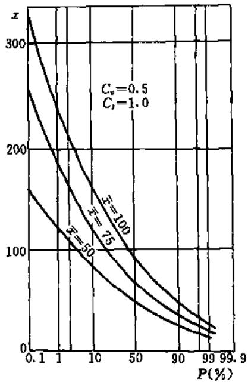  
图 7-7 ${ \mathrm { C } } _ { \overline { { \mathbf { \Gamma } } } } { = } 0 . 5 ,$ $c , = 1 . 0$ 时，  
不同 $\overline { { \pmb { x } } }$ 对频率曲线的影响

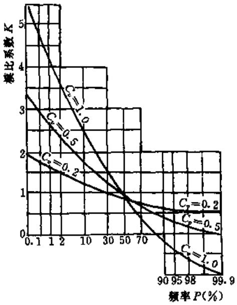  
图 7-8 $c . = 1 . 0$ 时，各种 $\mathbf { C } _ { \mathbf { v } }$ 对频率曲线的影响

为了避免上述配线时修改参数的盲目性，需要了解统计参数对频率曲线的影响。

## 1. 均值 $\overline { { x } }$ 对频率曲线的影响

当皮尔逊Ⅱ型频率曲线的另外两个参数C。和C，不变时，由于均值的不同，可以使频 $C _ { v }$ $C _ { s }$ $\bar { \boldsymbol { x } }$ 率曲线发生很大的变化，我们把 $C _ { v } { = } 0 , 5 , \ C _ { s } { = } 1 . \ 0$ ，而 $\tilde { x }$ 分别为50、75、100的3条皮尔逊Ⅱ型频率曲线同绘于图7-7中，从图中可以看出下列规律：

(1)C。和C，相同时，由于均值不同，频率曲线的位置也就不同，均值大的频率曲线位 $C _ { v }$ 于均值小的频率曲线之上。

(2)均值大的频率曲线比均值小的频率曲线陡。

## 2. 变差系数 $C _ { v }$ 对频率曲线的影响

为了消除均值的影响，我们以模比系数K为变量绘制频率曲线，如图7-8所示（图中$C _ { s } { = } 1 , 0 \rangle$ 。当 ${ C _ { v } } = 0$ 时，说明随机变量的取值都等于均值，故频率曲线即为K=1的一条水 一平线。C越大，说明随机变量相对于均值越离散，因而频率曲线将越偏离K=1的水平线。 $C _ { \mathbf { r } }$ 随着 $C _ { \mathfrak { r } }$ 的增大，频率曲线的偏离程度也随之增大，显得越来越陡。

## 3. 偏态系数 $C _ { \vartheta }$ 对频率曲线的影响

图 7-9 为 $C _ { \mathfrak { v } } { = } 0 . 1$ 时各种不同的 $c _ { s }$ 对频率曲线的影响情况。从图中可以看出，正偏情况下， $C _ { s }$ 愈大时，均值（即图中 $K { = } 1 )$ 对应的频率愈小，频率曲线的中部愈向左偏，且上段愈陡，下段愈平缓。

【例7-2】某枢纽处实测21年的年最大洪峰流量资料列于表7-3中第（1)、(2)栏，试根据该资料用矩法初选参数配线，并推求百年一遇的洪峰流量。

具体步骤如下：

## 1. 点绘经验频率曲线

将原始资料按由大到小次序排列，列人表7-3中第(4)栏，用公式 $P { = } \frac { m } { n { + } 1 } { \times } 1 0 0$ %计算经验频率，列人表7-3中第（8）栏，并将第(4)栏与第（8)栏的数值对应绘出经验频率点于频率格纸上（见图7-10）。

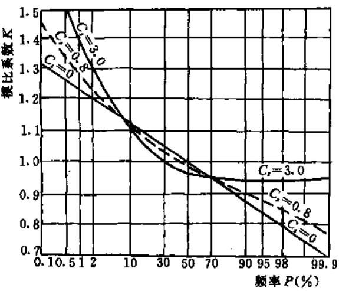  
图7-9 C=0.1时，

## 2. 按无偏估值公式计算统计参数

(1) 计算年最大洪峰流量的均值

各种 C, 对频率曲线的影响

$$
{ \overline { { \mathsf { Q } } } } = { \frac { \overset { \underset { \mathrm { ~ r ~ } } { } } { \sum } Q _ { i } } { n } } = { \frac { 2 6 1 7 0 } { 2 1 } } = 1 2 4 6 \ { \mathrm { m } } ^ { 3 } / { \mathrm { s } }
$$

其中， $\sum _ { 1 } ^ { n } Q _ { i } = 2 6 1 7 0 ~ \mathrm { m } ^ { 3 } / s$ 为表7-3中第（4）栏的总和。

## (2) 计算变差系数

$$
C _ { v } = { \sqrt { \frac { \sum _ { i = 1 } ^ { n } ( K _ { i } - 1 ) ^ { 2 } } { n - 1 } } } = { \sqrt { \frac { 4 \cdot 2 4 2 3 } { 2 1 - 1 } } } = 0 . 4 6
$$

表7-3  
某枢纽处年最大洪峰流量频率计算表
<table><tr><td>年份</td><td>洪峰流量Q (m³/s)</td><td>序号</td><td>由大到小排列Q (m³/s)</td><td>模比系数  $\pmb { \kappa } _ { i }$ </td><td> $\kappa , - 1$ </td><td> $( K , - 1 ) ^ { \mathfrak { E } }$ </td><td> $P { = } \frac { m } { n { + } 1 } { \times } 1 0 0 \% $ </td></tr><tr><td>(1)</td><td>(2)</td><td>(3)</td><td>(4)</td><td>(5)</td><td>(6)</td><td>(7)</td><td>(8)</td></tr><tr><td>1945</td><td>1540 980</td><td>1 2</td><td>2750 2390</td><td>2.20 1.92</td><td>1.20</td><td>1.44 0.846</td><td>4.6</td></tr><tr><td>1945 1947</td><td>1090</td><td>3</td><td>1860</td><td>1.49</td><td>0.92 0.49</td><td>0.240</td><td>9.0 13.6</td></tr><tr><td>1948</td><td>1050</td><td>4 5</td><td>1740 1540</td><td>1.40</td><td>0.40</td><td>0.160 0.0576</td><td>18.2</td></tr><tr><td>1949</td><td>1860</td><td>6</td><td>1520</td><td>1.24 1.22</td><td>0.24 0.22</td><td>0.0484</td><td>22.7 27.3</td></tr><tr><td>1950 1951</td><td>1140 790</td><td>7</td><td>1270</td><td>1.02</td><td>0.02</td><td>0.0004</td><td>31.8</td></tr><tr><td>1952</td><td>2750</td><td>8</td><td>1260</td><td>1.01</td><td>0.01</td><td>0.0001</td><td>36.4</td></tr><tr><td>1953</td><td>762</td><td>9</td><td>1210</td><td>0.971</td><td>-0.029</td><td>0. 0008</td><td>40.9</td></tr><tr><td>1954</td><td>2390</td><td>10</td><td>1200</td><td>0.963</td><td>-0.037</td><td>0.0014</td><td>45.4</td></tr><tr><td>1955</td><td>1210</td><td>11</td><td>1140</td><td>0.915</td><td>-0.085</td><td>0.0072</td><td>50.5</td></tr><tr><td>1956</td><td>1270</td><td>12</td><td>1090</td><td>0.875</td><td>-0.125</td><td>0.0156</td><td>54.6</td></tr><tr><td>1957</td><td>1200</td><td>13</td><td>1050</td><td>0.843</td><td>-0.157</td><td>0.0246</td><td>59.1</td></tr><tr><td>1958</td><td>1740</td><td>14</td><td>1050</td><td>0.843</td><td>-0.157</td><td>0.0246</td><td>63.6</td></tr><tr><td>1959</td><td>883</td><td>15</td><td>980</td><td>0.786</td><td>-0.214</td><td>0.0458</td><td>68.2</td></tr><tr><td>1960</td><td>1260</td><td>16</td><td>883</td><td>0.708</td><td>-0.292</td><td>0.0853</td><td>72.7</td></tr><tr><td>1961</td><td>408</td><td>17</td><td>794</td><td>0.637</td><td>-0.363</td><td>0.1318</td><td>77.3</td></tr><tr><td>1962</td><td>1050</td><td>18</td><td>790</td><td>0.634</td><td>-0.366</td><td>0.1340</td><td>81.8</td></tr><tr><td>1963</td><td>1520</td><td>19</td><td>762</td><td>0.611</td><td>-0.389</td><td>0.1513</td><td>86.4</td></tr><tr><td>1964</td><td>483</td><td>20</td><td>483</td><td>0.388</td><td>-0.612</td><td>0.3745</td><td>90.9</td></tr><tr><td>1965</td><td>794</td><td>21</td><td>408</td><td>0.327</td><td>-0.673</td><td>0.4529</td><td>95.4</td></tr><tr><td>总计</td><td>26170</td><td></td><td>26170</td><td>21.001</td><td>+3.500 -3.499</td><td>4.2423</td><td></td></tr></table>

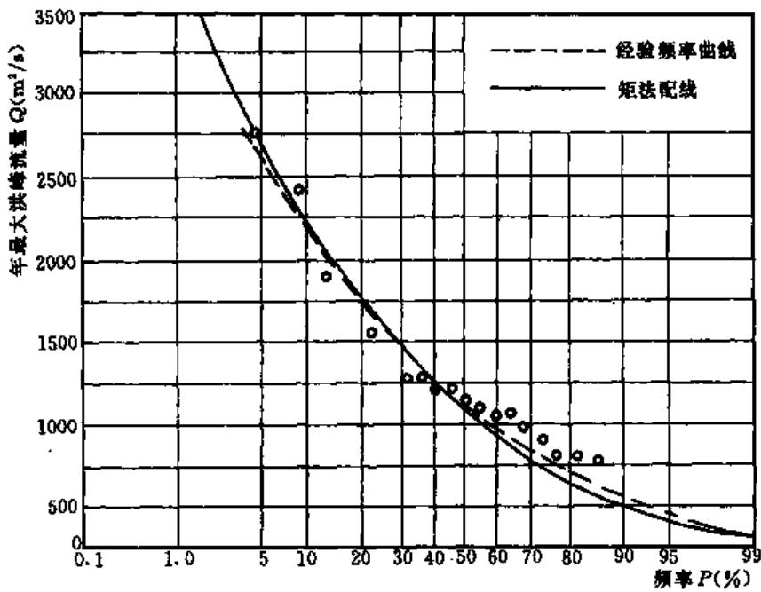  
图 7-10 某枢纽处年最大洪峰流量频率曲线

其中， $K _ { i } { = } \frac { Q _ { i } } { Q }$ 为各项的模比系数，列于表7-3中第（5）栏， $\sum _ { i = 1 } ^ { n } ( K _ { i } - 1 ) ^ { 2 } = 4 ,$ 2423 为第(7) 栏的总和。

## 3. 选配皮尔逊Ⅱ型频率曲线

(1 $) \overline { { Q } } = 1 2 4 6 \mathrm { m } ^ { 3 } / \mathrm { s }$ ,取 $c _ { v } = 0 . 5$ 并假定 $c ,$ $= 2 C _ { \imath } { \mathrm { . } } = 1 . 0$ ，查附表2，得出相应于不同频率 $P$ 的 $K _ { i ^ { \prime } }$ 值，列入表7-4中第(2)栏，乘以Q得相应的 $\mathbf { Q } _ { P }$ 值，列入表7-4中第(3)栏。

将表7-4中第(1)、(3)两栏的对应数值点绘成曲线，发现所选频率曲线的中段与经验频率点据配合较好，但头部偏于经验频率点据的下方，而尾部又偏于经验频率点的上方。

(2) 改变参数，重新配线。由第一次配线结果表明，需要增大 $C _ { v }$ 值。现取 $C _ { \bf v } { = } 0 , 6$ $C _ { s } { = } 2 C _ { s } { = } 1 . 2$ ，再查附表 $\mathfrak { L }$ ，得相应于不同P的 $K _ { P }$ 值，并计算各 $Q _ { P }$ 值，列于表7-4中第(4)、(5)栏，经与经验点据配合，发现头部配合较好，但尾部与经验点据偏低较多。

表 7-4 洪峰频率曲线选配计算表
<table><tr><td rowspan=3 colspan=1>频率 $P ( \% )$ </td><td rowspan=1 colspan=2>第一次配线</td><td rowspan=1 colspan=2>第二次配线</td><td rowspan=1 colspan=2>第三次配线</td></tr><tr><td rowspan=1 colspan=2> $\overline { { Q } } = 1 2 4 5$  $C _ { v } = 0 . 5$  $C _ { s } { = } 2 C _ { v } { = } 1 . 0$ </td><td rowspan=1 colspan=2> $\pmb { \mathcal { Q } } = 1 2 4 8$  $c _ { \mathfrak { v } } { = } 0 . 6$  $C _ { s } = 2 C _ { v } = 1 . 2$ </td><td rowspan=1 colspan=2> $\pmb { { \cal Q } } = 12 4 5$  $c , = 0 , 6$  $C _ { \iota } { = } 2 , 5 C _ { \circ } { = } 1 , 5$ </td></tr><tr><td rowspan=1 colspan=1> $K _ { P }$ </td><td rowspan=1 colspan=1> $Q _ { P }$ </td><td rowspan=1 colspan=1> $K _ { P }$ </td><td rowspan=1 colspan=1> $\ Q _ { P }$ </td><td rowspan=1 colspan=1> $\pmb { K } _ { P }$ </td><td rowspan=1 colspan=1> $\ Q _ { P }$ </td></tr><tr><td rowspan=1 colspan=1>(1)</td><td rowspan=1 colspan=1>(2)</td><td rowspan=1 colspan=1>(3)</td><td rowspan=1 colspan=1>(4)</td><td rowspan=1 colspan=1>(5)</td><td rowspan=1 colspan=1>(6)</td><td rowspan=1 colspan=1>(7)</td></tr><tr><td rowspan=1 colspan=1>1</td><td rowspan=1 colspan=1>2.51</td><td rowspan=1 colspan=1>3127</td><td rowspan=1 colspan=1>2.89</td><td rowspan=1 colspan=1>3600</td><td rowspan=1 colspan=1>3.00</td><td rowspan=1 colspan=1>3738</td></tr><tr><td rowspan=1 colspan=1>5</td><td rowspan=1 colspan=1>1.94</td><td rowspan=1 colspan=1>2417</td><td rowspan=1 colspan=1>2.15</td><td rowspan=1 colspan=1>2680</td><td rowspan=1 colspan=1>2.17</td><td rowspan=1 colspan=1>2704</td></tr><tr><td rowspan=1 colspan=1>10</td><td rowspan=1 colspan=1>1.67</td><td rowspan=1 colspan=1>2080</td><td rowspan=1 colspan=1>1.80</td><td rowspan=1 colspan=1>2243</td><td rowspan=1 colspan=1>1.80</td><td rowspan=1 colspan=1>2243</td></tr><tr><td rowspan=1 colspan=1>20</td><td rowspan=1 colspan=1>1.38</td><td rowspan=1 colspan=1>1720</td><td rowspan=1 colspan=1>1.44</td><td rowspan=1 colspan=1>1794</td><td rowspan=1 colspan=1>1.42</td><td rowspan=1 colspan=1>1770</td></tr><tr><td rowspan=1 colspan=1>50</td><td rowspan=1 colspan=1>0.92</td><td rowspan=1 colspan=1>1146</td><td rowspan=1 colspan=1>0.89</td><td rowspan=1 colspan=1>1109</td><td rowspan=1 colspan=1>0.86</td><td rowspan=1 colspan=1>1071</td></tr><tr><td rowspan=1 colspan=1>75</td><td rowspan=1 colspan=1>0.64</td><td rowspan=1 colspan=1>797</td><td rowspan=1 colspan=1>0.56</td><td rowspan=1 colspan=1>698</td><td rowspan=1 colspan=1>0.56</td><td rowspan=1 colspan=1>698</td></tr><tr><td rowspan=1 colspan=1>90</td><td rowspan=1 colspan=1>0.44</td><td rowspan=1 colspan=1>548</td><td rowspan=1 colspan=1>0.35</td><td rowspan=1 colspan=1>436</td><td rowspan=1 colspan=1>0.39</td><td rowspan=1 colspan=1>486</td></tr><tr><td rowspan=1 colspan=1>95</td><td rowspan=1 colspan=1>0.34</td><td rowspan=1 colspan=1>424</td><td rowspan=1 colspan=1>0.26</td><td rowspan=1 colspan=1>324</td><td rowspan=1 colspan=1>0.32</td><td rowspan=1 colspan=1>399</td></tr><tr><td rowspan=1 colspan=1>99</td><td rowspan=1 colspan=1>0.21</td><td rowspan=1 colspan=1>262</td><td rowspan=1 colspan=1>0.13</td><td rowspan=1 colspan=1>162</td><td rowspan=1 colspan=1>0.24</td><td rowspan=1 colspan=1>299</td></tr></table>

(3)再次改变参数，第三次配线。在第二次配线的基础上，为使尾部抬高与经验点据相配合，需增大C，值。因此，取 $C _ { v } { = } 0 . \ 6 , C _ { s } { = } 2 . 5 C _ { v } { = } 1 . 5$ 。再次计算皮尔逊Ⅱ型频率曲线，与经验点据配合较为合适，即作为采用的皮尔逊型频率曲线（见图7-10)。

4. 推求百年一遇设计洪峰流量

由表7-4第(6)、（7)栏，查得 $P { = } 1$ %对应的流量为 $Q _ { P } { = } 3 7 3 8 \ \mathbf { m } ^ { 3 } / s$

【例7-3】采用例1的资料，按权函数法估计的参数进行配线。

具体步骤如下：

(1) 按矩法先估计参数 $\smash { \mathcal { \tilde { Q } } _ { 3 } C _ { \upsilon } } ,$ 。根据例1的结果，选取 $\overrightarrow { Q } = 1 2 4 6 \ \mathrm { m } ^ { 3 } / \mathrm { s } , \ C _ { v } = 0 . \ 6 0$ ，由此可算出 $\sigma { = } \infty , 0 0 { = } 7 4 7 . 6$

(2) 按权函数法计算 $C _ { s }$

1）计算权函数值，以 $\pmb { Q _ { i } }$ 取代式（7-74）中的 $\pmb { x } ,$ 得

$$
\varphi ( Q _ { i } ) = { \frac { 1 } { \sigma { \sqrt { 2 \pi } } } } \mathrm { e } ^ { - { \frac { 1 } { 2 } } \left( { \frac { Q _ { i } - { \overline { { \alpha } } } } { \sigma } } \right) { } ^ { 2 } }
$$

并列于表7-5中第（3）栏。

2）由表7-3中第（6）、（7）两栏的数值，计算 $( K _ { i } { \sim } 1 ) \ \varphi \ ( \ Q _ { i } )$ 和 $( K _ { i } - 1 ) ^ { 2 } \varphi \left( \mathcal { Q } _ { i } \right)$ 值，并分别列于表7-5中第（4）、（5）栏。

3）计算 $c .$ 。因为

$$
E = { \frac { 1 } { n } } { \stackrel { n } { \sum _ { i = 1 } ^ { n } } } ( Q _ { i } - { \overline { { Q } } } ) \varphi ( Q _ { i } ) = { \frac { { \overline { { Q } } } } { n } } { \stackrel { n } { \sum _ { i = 1 } ^ { n } } } ( K _ { i } - 1 ) \varphi ( Q _ { i } )
$$

$$
G = { \frac { 1 } { n } } \sum _ { i = 1 } ^ { n } ( Q _ { i } - { \overline { { \Omega } } } ) ^ { i } \varphi ( Q _ { i } ) = { \frac { { \overline { { Q } } } ^ { 2 } } { n } } \sum _ { i = 1 } ^ { n } ( K _ { i } - 1 ) ^ { 2 } \varphi ( Q _ { i } )
$$

<table><tr><td rowspan=1 colspan=1>序号</td><td rowspan=1 colspan=1>由大到小排列的Q $\bf ( m ^ { 3 } / s )$ </td><td rowspan=1 colspan=1> $\varphi _ { \mathrm { ~ } } ( Q _ { \varepsilon } ) \ = \frac { 1 } { \sqrt { 2 \pi } \overline { { x } } C _ { \nu } } \mathrm { e } ^ { - \frac { \overline { { \kappa } } _ { i } \overline { { - 1 \imath } } ^ { 2 } } { 2 \overline { { c } } _ { \nu } ^ { 2 } } }$  $\times 1 0 ^ { - 5 }$ </td><td rowspan=1 colspan=1> $( K _ { t } { - } 1 ) \ \varphi \ \{ Q _ { i } \} \ \times 1 0 ^ { - 5 }$ </td><td rowspan=1 colspan=1> $\left( K _ { t } - 1 \right) ^ { 1 } \varphi ~ \left( Q _ { 1 } \right) ~ \times 1 0 ^ { - 5 }$ </td></tr><tr><td rowspan=1 colspan=1>(1)</td><td rowspan=1 colspan=1>(2)</td><td rowspan=1 colspan=1>(3)</td><td rowspan=1 colspan=1>(4)</td><td rowspan=1 colspan=1>(5)</td></tr><tr><td rowspan=1 colspan=1>1234</td><td rowspan=1 colspan=1>2750239018601740</td><td rowspan=2 colspan=1>7.0516.5538.1042.9149.11</td><td rowspan=2 colspan=1>8.4615.2318.6717.1611.86</td><td rowspan=7 colspan=1>10.1514.009.146.872.852.420.020.010.040.07</td></tr><tr><td rowspan=1 colspan=1>I5</td><td rowspan=1 colspan=1>1540</td></tr><tr><td rowspan=1 colspan=1>6</td><td rowspan=1 colspan=1>1520</td><td rowspan=1 colspan=1>49.91</td><td rowspan=1 colspan=1>10.98</td></tr><tr><td rowspan=1 colspan=1>t</td><td rowspan=1 colspan=1>1270</td><td rowspan=1 colspan=1>53.35</td><td rowspan=1 colspan=1>1.07</td></tr><tr><td rowspan=1 colspan=1>8</td><td rowspan=1 colspan=1>1260</td><td rowspan=1 colspan=1>53.37</td><td rowspan=1 colspan=1>0.53</td></tr><tr><td rowspan=1 colspan=1>9</td><td rowspan=1 colspan=1>1210</td><td rowspan=1 colspan=1>53.32</td><td rowspan=1 colspan=1>-1.55</td></tr><tr><td rowspan=1 colspan=1>10</td><td rowspan=1 colspan=1>1200</td><td rowspan=1 colspan=1>53.28</td><td rowspan=1 colspan=1>-1.97</td></tr><tr><td rowspan=1 colspan=1>11</td><td rowspan=1 colspan=1>1140</td><td rowspan=1 colspan=1>52.85</td><td rowspan=1 colspan=1>-4.49</td><td rowspan=11 colspan=1>0.380.811.271.272.304.055.865.946.5511.8812.90</td></tr><tr><td rowspan=1 colspan=1>12</td><td rowspan=1 colspan=1>1090</td><td rowspan=1 colspan=1>52.23</td><td rowspan=1 colspan=1>-6.53</td></tr><tr><td rowspan=1 colspan=1>13</td><td rowspan=1 colspan=1>1050</td><td rowspan=1 colspan=1>51.58</td><td rowspan=1 colspan=1>-8.10</td></tr><tr><td rowspan=1 colspan=1>14</td><td rowspan=1 colspan=1>1050</td><td rowspan=1 colspan=1>51.58</td><td rowspan=1 colspan=1>-8.10</td></tr><tr><td rowspan=1 colspan=1>15</td><td rowspan=1 colspan=1>980</td><td rowspan=1 colspan=1>50.11</td><td rowspan=1 colspan=1>-10.72</td></tr><tr><td rowspan=2 colspan=1>1617</td><td rowspan=1 colspan=1>883</td><td rowspan=1 colspan=1>47.44</td><td rowspan=1 colspan=1>-13.85</td></tr><tr><td rowspan=1 colspan=1>794</td><td rowspan=1 colspan=1>44.46</td><td rowspan=1 colspan=1>-16.14</td></tr><tr><td rowspan=1 colspan=1>18</td><td rowspan=1 colspan=1>790</td><td rowspan=1 colspan=1>44.32</td><td rowspan=1 colspan=1>-16.22</td></tr><tr><td rowspan=3 colspan=1>192021</td><td rowspan=1 colspan=1>762</td><td rowspan=1 colspan=1>43.29</td><td rowspan=1 colspan=1>-16.84</td></tr><tr><td rowspan=1 colspan=1>483</td><td rowspan=1 colspan=1>31.71</td><td rowspan=1 colspan=1>-19.41</td></tr><tr><td rowspan=1 colspan=1>408</td><td rowspan=1 colspan=1>28.48</td><td rowspan=1 colspan=1>-19.17</td></tr><tr><td rowspan=1 colspan=1>∑</td><td rowspan=1 colspan=1>26170</td><td rowspan=1 colspan=1></td><td rowspan=1 colspan=1>-59.13</td><td rowspan=1 colspan=1>98.78</td></tr></table>

所以

$$
C _ { s } = - 4 \overline { { Q } } C _ { s } \frac { E } { G } = - 4 C _ { s } \frac { \sum _ { i = 1 } ^ { n } ~ ( K _ { i } - 1 ) ~ \varphi ~ ( Q _ { i } ) } { \sum _ { i = 1 } ^ { n } ~ ( K _ { i } - 1 ) ^ { 2 } \varphi ~ ( Q _ { i } ) } = - 4 \times 0 . 6 0 \times \frac { - 5 9 . 1 3 \times 1 0 ^ { - 5 } } { 9 8 . 7 8 \times 1 0 ^ { - 5 } } = 1 . 4 4
$$

(3)配线。根据 $\overline { { \boldsymbol { \mathcal { Q } } } } = 1 2 4 6 \mathrm { \ m } ^ { 3 } / \mathrm { s } , \mathrm { \ } \boldsymbol { C } _ { v } =$ $0 . 6 0 , C _ { s } { = } 1 . 4 4$ 进行配线。先由 ${ C _ { s } } { = } 1$ .44查附表 1得不同 P 值对应的 $\Phi _ { P }$ 值，再由 $\Phi _ { P } = $ $\frac { Q _ { p } - Q } { \sigma }$ ，将 $\phi _ { P }$ 转化成相应的 $Q _ { P }$ 值（见表7-6)，据此可绘出频率曲线，如图7-11所示。由图7-11可知，该曲线与经验点据配合尚好，故作为最后的曲线。

由例2、例3可知，矩法估计的 $c ,$ 与最后配线的成果出人很大，而权函数法估计的

(Q=1246,C,=0.6,C,=1.44)
<table><tr><td rowspan=1 colspan=1> $\mathbf { \Delta } _ { P }$ </td><td rowspan=1 colspan=1> $\phi _ { P }$ </td><td rowspan=1 colspan=1> $\ Q _ { P }$ </td><td rowspan=1 colspan=1> $P$ </td><td rowspan=1 colspan=1></td><td rowspan=1 colspan=1> $\phi _ { P }$ </td><td rowspan=1 colspan=1> $\ Q _ { P }$ </td></tr><tr><td rowspan=1 colspan=1>(1)</td><td rowspan=1 colspan=1>(2)</td><td rowspan=1 colspan=1>(3)</td><td rowspan=1 colspan=1>(1)</td><td rowspan=1 colspan=1></td><td rowspan=1 colspan=1>(2)</td><td rowspan=1 colspan=1>(3)</td></tr><tr><td rowspan=5 colspan=1>1251020</td><td rowspan=3 colspan=1>3.2942.7221.944</td><td rowspan=3 colspan=1>370832812700</td><td rowspan=1 colspan=2>50</td><td rowspan=1 colspan=1>-0.23</td><td rowspan=2 colspan=1>1074700</td></tr><tr><td rowspan=1 colspan=2>75</td><td rowspan=1 colspan=1>-0.73</td></tr><tr><td rowspan=1 colspan=2>90</td><td rowspan=1 colspan=1>-1.03</td><td rowspan=1 colspan=1>476</td></tr><tr><td rowspan=1 colspan=1>1.330</td><td rowspan=1 colspan=1>2240</td><td rowspan=1 colspan=2>95</td><td rowspan=1 colspan=1>-1.15</td><td rowspan=1 colspan=1>386</td></tr><tr><td rowspan=1 colspan=1>0.702</td><td rowspan=1 colspan=1>1771</td><td rowspan=1 colspan=2>99</td><td rowspan=1 colspan=1>-1.296</td><td rowspan=1 colspan=1>277</td></tr></table>

C.精度较高，这正是权函数法的优点，但权函数法本身不能计算、 $\overline { { x } } , C _ { v }$ ，需要配合其他方法(如矩法）使用，且C的精度受x、C.估算精度的影响，这是它的缺陷。 $C _ { \pm }$

## 二、优化适线法

优化适线法是在一定的适线准则（即目标函数）下，求解与经验点据拟合最优的频率曲线的统计参数的方法。随着计算机的推广普及，带有一定准则的计算机优化适线法也常为许多设计单位使用，优化适线法按不同的适线准则分为三种：离差平方和最小准则(OLS)、离差绝对值和最小准则（ABS)、相对离差平方和最小准则(WLS)。本节只简要介绍离差平方和最小准则，使读者对该法有一个概略的了解，但不作为教学上的要求。

离差平方和准则的适线法又称最小二乘估计法。频率曲线统计参数的最小二乘估计是使经验点据和同频率的频率曲线纵坐标之差的平方和达到极小。对于皮尔逊Ⅱ型曲线，使下列目标函数

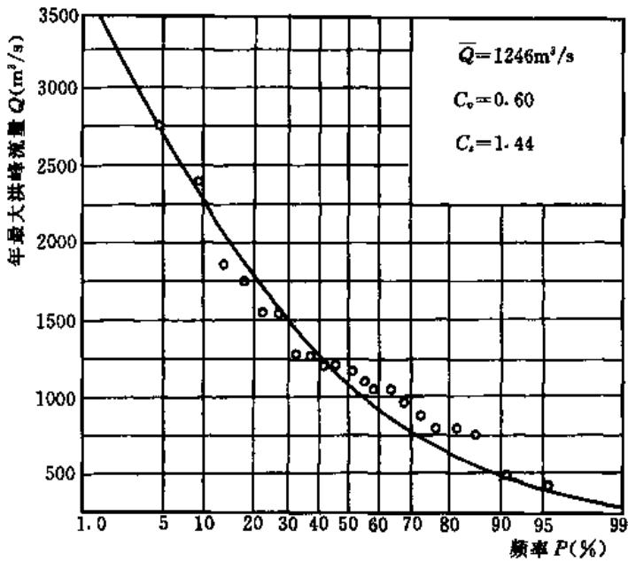  
图 7-11 某枢纽处年最大洪峰流量频率曲线（权函数法配线）

$$
S ~ \left( Q \right) ~ = \sum _ { i = 1 } ^ { n } { \mathit { \Sigma } } \left[ x _ { i } { - } f { \mathit { \Sigma } } ( P _ { i } , \ Q ) \right] ^ { 2 } ~ i { = } 1 , \ 2 , \ { \cdots } , \ n\tag{7-92}
$$

取极小值，即

$$
\textit { S } ( \hat { \textbf { Q } } ) = \mathrm { m i n } S \textbf { } ( Q )\tag{7-93}
$$

式中 $\pmb { Q } \mathrm { . }$ 参数 $( \overline { { x } } , C _ { v } , C _ { s } )$ i

$\hat { \boldsymbol { Q } }$ 参数Q的最小二乘估计；

$P _ { i }$ —一频率；

$\pmb { n } ^ { \prime }$ —系列长度；

$\textbf { \textit { f } } ( P _ { i } , \textbf { \textit { Q } } )$ ——频率曲线纵坐标，一般可写成 $ { f } ( P _ { i } , \ Q ) \ = \overline { { x } } \ [ 1 + C _ { \circ } \bar { \phi } ]$ 14

Φ离均系数，为频率 $\pmb { P _ { j } }$ 和 $c ,$ 的函数，有表可查。

在参数优选时，一般采用两参数优选，即认为按矩法计算的均值误差较小，可作为均值 $\overline { { x } }$ 的最后估计值，不再优选，因而只须计算 $\mathbf { C _ { \eta } }$ 和 $c _ { s }$

欲使式（7-92）的S（Q）为最小，可将S对 $\pmb { Q }$ 求偏导数，并使之等于0，即

$$
\frac { \partial \bar { \bf S } ( \hat { \textbf { Q } } ) } { \partial { \cal Q } } = 0\tag{7-94}
$$

求解上述正规方程组一般采用优选搜索的方法，即设若干个 $c ,$ 分别计算S值，代人式(7-94)，得相应的C。值，如果算出的S值尚未达到最小（指事先拟定的精度指标)，则需继

续搜索，直到取得最小值为止。

必须指出，不论用哪一类适线法，都有它的局限性，故必须结合洪水的特性作合理性分析，才能最终取用。

## 第七节 相 关 分析

## 一、相关关系的概念

自然界中的许多现象之间有着一定的联系，它们之间既不是函数关系，也不是完全无关。例如，降水与径流之间、上下游洪水之间、水位与流量之间等等都存在着这样的联系。相关分析就是要研究两个或多个随机变量之间的联系。

在水文计算中，我们经常遇到某一水文要素的实测资料系列很短，而与其有关的另一要素的资料却比较长，这样我们就可以通过相关分析把短期系列延长。此外，在水文预报中，也经常采用相关分析的方法。

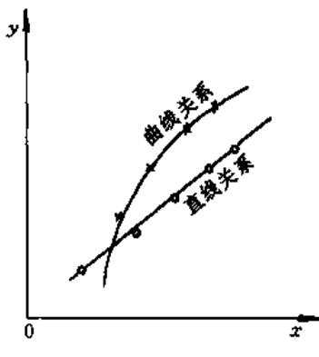

但是在相关分析时，必须先分析它们在成因上是否确有联系，如果把毫无关联的现象，只凭其数字上的偶然巧合，硬凑出它们之间的相关关系，那是毫无意义的。

两种现象（变量）之间的关系一般可以有三种情况：

1. 完全相关（函数关系）

两个变量x与y之间，如果每给定一个x值，就有一个完全确定的y值与之相应，则这两个变量之间的关系就是完全相关（或称函数关系）。其函数关系的形式可以是直线，也可以是曲线（见图7-12）。

图 7-12 完全相关示意图

2. 零相关（没有关系）

若两变量之间毫无联系或相互独立，则称为零相关或没有关系（见图7-13)。

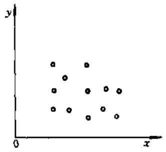  
图 7-13 零相关示意图

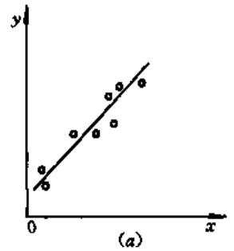

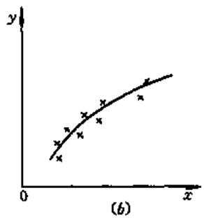  
图 7-14 相关关系示意图  
(a) 直线相关；(6) 曲线相关

## 3. 相关关系

若两个变量之间的关系界于完全相关和零相关之间，则称为相关关系。在水文计算中，由于影响水文现象的因素错综复杂，有时为简便起见，只考虑其中最主要的一个因素而略去其次要因素。例如，径流与相应的降雨量之间的关系，或同一断面的流量与相应水位之间的关系等。如果把它们的对应数值点绘在方格纸上，便可看出这些点子虽有些散乱，但其关系有一个明显的趋势，这种趋势可以用一定的曲线(包括直线)来配合，如图7-14所示。

以上研究两个变量（现象）的相关关系，一般称为简单相关。若研究3个或3个以上变量（现象）的相关关系，则称为复相关，在相关关系的图形上可分为直线相关和非直线相关两类。在水文计算中常用简单相关，水文预报中常用复相关。本节以研究简单相关中的直线相关为主，并简述复相关。

## 二、简单直线相关

## (一) 相关图解法

设 $\pmb { x } ,$ ${ \mathfrak { y } } _ { \mathfrak { i } }$ 代表两系列的观测值，共有n对，把对应值点绘于方格纸上，如果点据的平均趋势近似于直线，则可用直线来近似地代表这种相关关系。若点据分布较集中，可以直接利用作图的方法求出相关直线，叫做相关图解法。此法是先目估通过点群中间及$( \widehat { x } , \widetilde { y } )$ 点，绘出一条直线，然后在图上量得直线的斜率6，直线与纵轴的截距 $\pmb { a }$ ，则直线

表 7-7某站年降雨量和年径流量资料
<table><tr><td>年份</td><td>年降雨量 x (mm)</td><td>年径流量 y (mm)</td><td>年份</td><td>年降兩量 r (mm)</td><td>年径流量 y (mm)</td></tr><tr><td>1954</td><td>2014</td><td>1362</td><td>1960</td><td>1306</td><td>778</td></tr><tr><td>1955</td><td>1211</td><td>728</td><td>1961</td><td>1029</td><td>337</td></tr><tr><td>1956</td><td>1728</td><td>1369</td><td>1962</td><td>1316</td><td>809</td></tr><tr><td>1957</td><td>1157</td><td>695</td><td>1963</td><td>1356</td><td>929</td></tr><tr><td>1958</td><td>1257</td><td>720</td><td>1964</td><td>1266</td><td>796</td></tr><tr><td>1959</td><td>1029</td><td>534</td><td>1965</td><td>1052</td><td>383</td></tr></table>

方程式 $y = a + b x$ 即为所求的相关方程。该法简便实用，一般情况下精度尚可。

现以某站年降雨量和年径流量资料的相关分析为例，说明相关图的绘制。

该站年降雨量x和年径流量 $\pmb { y }$ 的同期资料如表7-7所示。

根据设计要求，需要延长该站的年径流量 ${ \pmb y } .$ 。从物理成因上分析，同一站的年降雨量和年径流量确有联系，根据过去水文分析计算的经验可知，它们之间的关系可近似为直线关系，又从《水文年鉴》上看，该站年降雨量资料较长，因此可以作相关分析，用年降雨量资料延长年径流量资料。现以年降雨量x为横坐标，以年径流量y为纵坐标，将表7-7中各年数值点绘于图7-15，得12个相关点。从图7-15可以看出，这些相关点分布基本上呈直线趋势。因此，可以通过点群中间按趋势目估绘出相关直线（如图7-15中的①线）。因为我们的目的是由较长期的年降雨量资料x延长较短期的年径流量资料y，所以，在定线时要尽量使各相关点距离所定直线的纵向离差 $( \Delta _ { \mathbf { y } _ { i } } )$ 的平方和 $( \sum \Delta y _ { i } ^ { 2 } )$ 最小。

## (二)相关分析法

如果相关点据分布较散，目估定线存在一定的任意性，为了精确起见，最好采用分析法来确定相关线的方程。设直线方程的形式为：

$$
y = a + b x\tag{7-95}
$$

式中 x——自变量；

y——倚变量；

$\pmb { \alpha } \cdot \pmb { \alpha }$ 5 $b .$ —待定常数。

从图7-15可以看出，观测点与配合的直线在纵轴方向的离差为：

$$
\Delta y _ { i } = y _ { i } - { \hat { y } } _ { i } = y _ { i } - a - b x _ { i }
$$

要使直线拟合“最佳”，须使离差 $\Delta { y } _ { i }$ 的平方和为“最小”，即使

$$
\sum _ { i = 1 } ^ { n } ( \Delta y _ { i } ) ^ { 2 } = \sum _ { i = 1 } ^ { n } ( y _ { i } - \hat { y _ { i } } ) ^ { 2 } = \sum _ { i = 1 } ^ { n } ( y _ { i } - a - b x _ { i } ) ^ { 2 }\tag{7-96}
$$

为极小值。

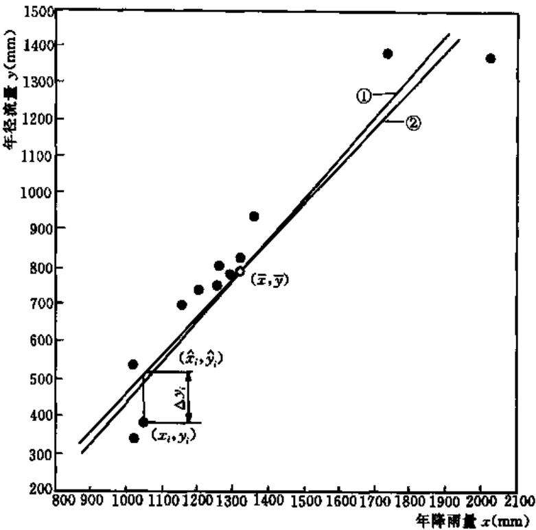  
图 7-15 某站年降雨量和年径流量相关图  
①一目估定线；②一计算的回归线

欲使式（7-96）取得极小值，可分别对a及b求一阶导数，并使其等于零，即令

$$
\left. \begin{array} { l } { { \displaystyle \partial \sum _ { i = 1 } ^ { n } ( y _ { i } - a - b x _ { i } ) ^ { 2 } } } \\ { { \displaystyle \partial a } } \\ { { \displaystyle \partial \sum _ { i = 1 } ^ { n } ( y _ { i } - a - b x _ { i } ) ^ { 2 } } } \\ { { \displaystyle \partial b } } \end{array} \right\}
$$

解方程组，可得

(7-97)

$$
\begin{array} { r l } & { b = \frac { \frac { \sqrt { 5 } } { 2 } ( x _ { 1 } - \overline { { x } } ) ( y _ { 1 } - \overline { { y } } ) } { \sum _ { i = 1 } ^ { 5 } ( x _ { i } - \overline { { x } } ) ^ { 2 } } = r \frac { \sigma _ { i } } { \sigma _ { i } } } \\ & { a = \overline { { y } } - b \overline { { x } } - \overline { { y } } - \sigma _ { a } \overline { { x } } } \\ & { r = \frac { \frac { 5 } { 2 } ( x _ { 1 } - \overline { { x } } ) ( y _ { i } - \overline { { y } } ) } { \sqrt { \frac { 5 } { 2 } ( x _ { 1 } - \overline { { x } } ) ^ { 2 } \overset { 4 } { \leq } ( y _ { i } - \overline { { y } } ) ^ { 2 } } } } \\ & { \quad = \frac { \frac { 5 } { 2 } ( x _ { 1 } - 1 ) ( x _ { 1 } - 1 ) ( x _ { 1 } - 1 ) } { \sqrt { \frac { 5 } { 2 } ( x _ { 1 } - 1 ) ^ { 2 } \overset { 4 } { \leq } ( x _ { i } - 1 ) ^ { 2 } } } } \end{array}\tag{7-98}
$$

(7-99)

式中 ${ \pmb \sigma } _ { \pmb { \mathscr { x } } }$ $\pmb { \sigma _ { y } } .$ ——x、y系列的均方差；

$\pmb { x } _ { \star }$ ${ \boldsymbol { \mathsf { y } } } { \boldsymbol { \cdot } }$ —x、y 系列的均值；

r——相关系数，表示 x、y间关系的密切程度。

将式（7-97）、式（7-98）代人式（7-95），得

$$
\scriptstyle y - { \overline { { y } } } = r { \frac { \sigma _ { y } } { \sigma _ { x } } } ( x - { \overline { { x } } } )\tag{7-100}
$$

式（7-100）称为y倚x的回归方程式，它的图形称为 $\pmb { y }$ 倚 $\pmb { \mathcal { x } }$ 的回归线，如图7-15 中的②线所示。

r $\frac { \sigma _ { y } } { \sigma _ { x } }$ 是回归线的斜率，一般称为y倚 $\pmb { x }$ 的回归系数，并记为 $R _ { y / x }$ ，即

$$
R _ { y / \varepsilon } = r \frac { \sigma _ { y } } { \sigma _ { z } }\tag{7-101}
$$

必须注意，由回归方程所定的回归线只是观测资料平均关系的配合线，观测点不会完全落在此线上，而是分布于两侧，说明回归线只是在一定标准情况下与实测点的最佳配合线。

以上讲的是 $_ y$ 倚x的回归方程，即x为自变量，y为倚变量，应用于由 $\pmb { x }$ 求y。若由y求x，则要应用x倚y的回归方程。同理，可推得x倚y的回归方程为：

$$
x - \overline { { x } } = R _ { x / y } ( y - \overline { { y } } )\tag{7-102}
$$

其中

$$
R _ { z / y } = r \frac { \pmb { \sigma } _ { z } } { \pmb { \sigma } _ { y } }\tag{7-103}
$$

## (三)相关分析的误差

## 1. 回归线的误差

回归线仅是观测点据的最佳配合线，因此回归线只反映两变量间的平均关系，利用回归线来插补延长系列时，总有一定的误差。这种误差有的大，有的小，根据误差理论，其分布一般服从正态分布。为了衡量这种误差的大小，常采用均方误来表示，如用 $\pmb { S } _ { \pmb { y } }$ 表示 $\pmb { y }$ 倚x回归线的均方误， ${ \mathfrak { p } } _ { \mathfrak { i } }$ 为观测点据的纵坐标， $\hat { y } _ { i }$ 为由 $\pmb { x } _ { \mathrm { i } }$ 通过回归线求得的纵坐标，n为观测项数，则

$$
S _ { y } = \sqrt { \frac { \sum ( y _ { i } - \hat { y } _ { i } ) ^ { 2 } } { n - 2 } }\tag{7-104}
$$

同样， $\pmb { x }$ 倚 y 回归线的均方误 $\pmb { S } _ { \pmb { z } }$ 为：

$$
S _ { x } = { \sqrt { \frac { \sum ( x _ { i } - { \hat { x } } _ { i } ) ^ { 2 } } { n - 2 } } }\tag{7-105}
$$

式（7-104)、式（7-105）皆为无偏估值公式。

回归线的均方误 $s ,$ 与变量的均方差 $\pmb { \sigma _ { y } }$ 从性质上讲是不同的。前者由观测点与回归线之间的离差求得，而后者由观测点与它的均值之间的离差求得。根据统计学上的推理，可以证明两者具有下列关系：

$$
S _ { y } = \sigma _ { y } \sqrt { 1 - r ^ { 2 } }\tag{7-106}
$$

$$
S _ { x } = \sigma _ { x } \ \sqrt { 1 - r ^ { 2 } }\tag{7-107}
$$

如上所述，由回归方程式算出的y值，仅仅是许多y的一个“最佳”拟合或平均趋势 $\hat { \bf { y } } _ { i }$ ${ \pmb y } _ { i }$ 值。按照误差原理，这些可能的取值y落在回归线两侧一个均方误范围内的概率为 $\pmb { y _ { i } }$ 68.27%；落在3个均方误范围内的概率为99.7%，如图7-16所示。

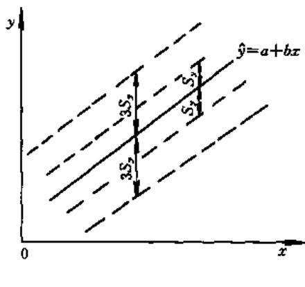  
图 7-16 y 倚 x 回归线的误差范围

必须指出，在讨论上述误差时，没有考虑样本的抽样误差。事实上，只要用样本资料来估计回归方程中的参数，抽样误差就必然存在。可以证明，这种抽样误差在回归线的中段较小，而在上下段较大。使用回归线时，对此必须给予注意。

## 2. 相关系数及其误差

式（7-106）和式（7-107）给出了S与 $\sigma , r$ 的关系。令y倚x时的相关系数记为 $r _ { y / \pm } , \pmb { \mathscr { x } }$ 倚 $\pmb { y }$ 时的相关系数记为 $r _ { z / y }$ ，则有

$$
r _ { y / x } = \pm \sqrt { 1 - \frac { S _ { y } ^ { 2 } } { \sigma _ { y } ^ { 2 } } }\tag{7-108}
$$

$$
r _ { z / y } = \pm \sqrt { 1 - \frac { S _ { z } ^ { 2 } } { \sigma _ { x } ^ { 2 } } }\tag{7-109}
$$

相关系数的两种情况是相等的，即

且

$$
r = r _ { y / x } = r _ { x / y } = { \frac { \sum ( x _ { i } - { \overline { { x } } } ) ( y _ { i } - { \overline { { y } } } ) } { \sqrt { \sum ( x _ { i } - { \overline { { x } } } ) ^ { 2 } \sum ( y _ { i } - { \overline { { y } } } ) ^ { 2 } } } }\tag{7-110}
$$

相关程度密切与否，一般用 $r ^ { 2 }$ 的大小来判定，称 $r ^ { 2 }$ 为相关平方系数。由式（7-106）和式（7-107）可知：

(1) 若 $r ^ { 2 } { = } 1$ ，则均方误 $s _ { y }$ (或 $\mathfrak { S } _ { \mathfrak { x } } ) = 0$ ，表示对应值 $\pmb { x _ { i } }$ ${ \pmb y } _ { i }$ 均落于回归线上，两变量间具有函数关系，亦即前面说的完全相关。

(2) 若 $\scriptstyle r ^ { 2 } = 0$ ，则 $\pmb { S _ { y } = } \pmb { \sigma _ { y } }$ 或 ${ \pmb S } _ { \pmb x } { = } \pmb \sigma _ { \pmb x }$ ，此时误差值达到最大值，说明以直线代表点据的误差达到最大，这两种变量没有关系，亦即前面说的零相关，也可能是非直线相关。

(3) 若 $\textstyle { \mathfrak { Q } } < r ^ { 2 } < 1$ ，介于上述两种情况之间时，其相关程度密切与否，视 $\pmb { r }$ 的大小而定。r值越大，均方误 $\mathfrak { s } _ { \mathfrak { s } }$ （或S）越小。当r愈接近于1，点据愈靠近于回归直线， $x \ , \ y$ 间的关系愈密切。 $\pmb { r }$ 为正值时，表示正相关；r为负值时，表示负相关。

在水文计算中，要求同期观测资料不能太少，n值应在12以上。资料短，计算成果不可靠。一般要求相关系数 $| r | \geq 0 . 8$ 。且回归线的均方误 $\pmb { S } _ { s }$ 不大于均值 $\overline { { \pmb { y } } }$ 的15%。

从以上分析可知，在直线相关的情况下，r可以表示两变量相关的密切程度，所以将作为直线相关密切程度的指标。但是相关系数r不是从物理成因推导出来的，而是从直线拟合点据的离差概念推导出来的，因此当r=0（或接近于零）时，只表示两变量间无直线关系存在，但仍可能存在非直线关系，此时应根据相关图上点据的趋势另拟相关曲线。

在相关分析计算中，相关系数是根据有限的实际资料（样本）计算出来的，必然会有抽样误差，一般通过相关系数的均方误来判断样本相关系数的可靠性，按统计原理，相关系数的均方误为：

$$
\sigma _ { r } = \frac { 1 - r ^ { 2 } } { \sqrt { n } }\tag{7-111}
$$

【例7-4】以表7-8中某站的年降雨量与年径流量资料为例，说明回归方程的建立与

某站年降雨量与年径流量相关计算表
<table><tr><td rowspan=1 colspan=1>年份</td><td rowspan=1 colspan=1>年降雨量x (mm)</td><td rowspan=1 colspan=1>年径流量y (mm)</td><td rowspan=1 colspan=1> $\pmb { \kappa } _ { \pmb { \kappa } }$ </td><td rowspan=1 colspan=1> $\kappa _ { s }$ </td><td rowspan=1 colspan=1> ${ \pmb { \kappa } } _ { \pmb { \kappa } } { - \pmb { 1 } }$ </td><td rowspan=1 colspan=1> $\kappa _ { s } - 1$ </td><td rowspan=1 colspan=1> $( K _ { z } - 1 ) ^ { 2 }$ </td><td rowspan=1 colspan=1> $\{ \pmb { K } _ { \pmb { y } } - 1 \} ^ { 2 }$ </td><td rowspan=1 colspan=2> $( K _ { x } { - } 1 )$  $\textbf { \textsf { X } } \{ { \pmb { K } } _ { \pmb { y } } - 1 \}$ </td></tr><tr><td rowspan=12 colspan=1>195419551956195719581959196019611962196319641965</td><td rowspan=8 colspan=1>20141211172811571257102913061029</td><td rowspan=7 colspan=1>13627281369695720534778</td><td rowspan=3 colspan=1>1.540.921.32</td><td rowspan=1 colspan=1>1.73</td><td rowspan=1 colspan=1>0.54</td><td rowspan=1 colspan=1>0.73</td><td rowspan=1 colspan=1>0.292</td><td rowspan=1 colspan=1>0.533</td><td rowspan=1 colspan=2>0.394</td></tr><tr><td rowspan=2 colspan=1>0.921.74</td><td rowspan=1 colspan=1>-0.08</td><td rowspan=1 colspan=1>-0.08</td><td rowspan=1 colspan=1>0.006</td><td rowspan=1 colspan=1>0.006</td><td rowspan=1 colspan=2>0.006</td></tr><tr><td rowspan=1 colspan=1>0.32</td><td rowspan=1 colspan=1>0.74</td><td rowspan=1 colspan=1>0.101</td><td rowspan=1 colspan=1>0.548</td><td rowspan=1 colspan=2>0.237</td></tr><tr><td rowspan=1 colspan=1>0.88</td><td rowspan=1 colspan=1>0.88</td><td rowspan=1 colspan=1>-0.12</td><td rowspan=1 colspan=1>-0.12</td><td rowspan=1 colspan=1>0.014</td><td rowspan=1 colspan=1>0.014</td><td rowspan=1 colspan=2>0.014</td></tr><tr><td rowspan=1 colspan=1>0.96</td><td rowspan=1 colspan=1>0.91</td><td rowspan=1 colspan=1>-0.04</td><td rowspan=1 colspan=1>-0.09</td><td rowspan=1 colspan=1>0.001</td><td rowspan=1 colspan=1>0.008</td><td rowspan=1 colspan=2>0.004</td></tr><tr><td rowspan=2 colspan=1>0.791.00</td><td rowspan=1 colspan=1>0.68</td><td rowspan=1 colspan=1>-0.21</td><td rowspan=1 colspan=1>-0.32</td><td rowspan=1 colspan=1>0.044</td><td rowspan=1 colspan=1>0.102</td><td rowspan=2 colspan=2>0.0670</td></tr><tr><td rowspan=1 colspan=1>0.99</td><td rowspan=1 colspan=1>0.00</td><td rowspan=1 colspan=1>-0.01</td><td rowspan=1 colspan=1>0</td><td rowspan=1 colspan=1>0</td></tr><tr><td rowspan=1 colspan=1>337</td><td rowspan=1 colspan=1>0.79</td><td rowspan=1 colspan=1>0.44</td><td rowspan=1 colspan=1>-0.21</td><td rowspan=1 colspan=1>-0.56</td><td rowspan=1 colspan=1>0.044</td><td rowspan=1 colspan=1>0.314</td><td rowspan=1 colspan=2>0.118</td></tr><tr><td rowspan=1 colspan=1>1310</td><td rowspan=1 colspan=1>809</td><td rowspan=1 colspan=1>1.00</td><td rowspan=1 colspan=1>1.03</td><td rowspan=1 colspan=1>0</td><td rowspan=1 colspan=1>0.03</td><td rowspan=1 colspan=1>0</td><td rowspan=1 colspan=1>0.001</td><td rowspan=4 colspan=2>00.005</td></tr><tr><td rowspan=1 colspan=1>1356</td><td rowspan=1 colspan=1>929</td><td rowspan=1 colspan=1>1.03</td><td rowspan=1 colspan=1>1.18</td><td rowspan=1 colspan=1>0.03</td><td rowspan=1 colspan=1>0.18</td><td rowspan=1 colspan=1>0.001</td><td rowspan=1 colspan=1>0.032</td></tr><tr><td rowspan=1 colspan=1>1266</td><td rowspan=1 colspan=1>796</td><td rowspan=1 colspan=1>0.97</td><td rowspan=1 colspan=1>1.01</td><td rowspan=1 colspan=1>-0.03</td><td rowspan=1 colspan=1>0.01</td><td rowspan=1 colspan=1>0.001</td><td rowspan=1 colspan=1>0</td><td rowspan=1 colspan=1></td></tr><tr><td rowspan=1 colspan=1>1052</td><td rowspan=1 colspan=1>383</td><td rowspan=1 colspan=1>0.80</td><td rowspan=1 colspan=1>0.49</td><td rowspan=1 colspan=1>-0.20</td><td rowspan=1 colspan=1>-0.51</td><td rowspan=1 colspan=1>0.040</td><td rowspan=1 colspan=1>0.260</td><td rowspan=1 colspan=1>0.102</td></tr><tr><td rowspan=1 colspan=1>合计</td><td rowspan=1 colspan=1>15715</td><td rowspan=1 colspan=1>9440</td><td rowspan=1 colspan=1>12.00</td><td rowspan=1 colspan=1>12.00</td><td rowspan=1 colspan=1>0</td><td rowspan=1 colspan=1>0</td><td rowspan=1 colspan=1>0.544</td><td rowspan=1 colspan=1>1.818</td><td rowspan=1 colspan=1>0.947</td><td rowspan=1 colspan=1></td></tr><tr><td rowspan=1 colspan=1>平均</td><td rowspan=1 colspan=1>五=1310</td><td rowspan=1 colspan=1>y=787</td><td rowspan=1 colspan=1></td><td rowspan=1 colspan=1></td><td rowspan=1 colspan=1></td><td rowspan=1 colspan=1></td><td rowspan=1 colspan=1></td><td rowspan=1 colspan=1></td><td rowspan=1 colspan=1></td><td rowspan=1 colspan=1></td></tr></table>

应用。

相关分析的目的是以较长期的年降雨量资料延长较短的年径流资料，所以这里以年降雨量为自变量x，年径流量为倚变量 $\mathbf { y } _ { \circ }$ 为了便于相关计算，有关计算数据列于表7-8，由表7-8的计算成果，可进一步算出以下各值：

(1) 均值。

$$
{ \overline { { x } } } = { \frac { 1 5 7 1 5 } { 1 2 } } = 1 3 1 0 { \mathrm { ~ m m } } , { \overline { { y } } } = { \frac { 9 4 4 0 } { 1 2 } } = 7 8 7 { \mathrm { ~ m m } }
$$

(2) 均方差。

$$
\begin{array} { r } { \sigma _ { x } = \overline { { x } } \sqrt { \frac { \displaystyle \sum _ { i = 1 } ^ { n } ( K _ { x _ { i } } - 1 ) ^ { 2 } } { n - 1 } } = 1 3 1 0 \sqrt { \frac { 0 . 5 4 4 } { 1 2 - 1 } } = 2 9 1 \mathrm { ~ m m } } \\ { \sigma _ { y } = \overline { { y } } \sqrt { \frac { \displaystyle \sum _ { i = 1 } ^ { n } ( K _ { y _ { i } } - 1 ) ^ { 2 } } { \displaystyle n - 1 } } = 7 8 7 \sqrt { \frac { 1 . 8 1 8 } { 1 2 - 1 } } = 3 2 0 \mathrm { ~ m m } } \end{array}
$$

(3)相关系数。

$$
\begin{array} { c } { { r = \frac { \displaystyle \sum _ { i = 1 } ^ { n } ( K _ { x _ { i } } - 1 ) ( K _ { y _ { i } } - 1 ) } { \displaystyle \sqrt { \displaystyle \sum _ { i = 1 } ^ { n } ( K _ { x _ { i } } - 1 ) ^ { 2 } \sum _ { i = 1 } ^ { n } ( K _ { y _ { i } } - 1 ) ^ { 2 } } } } } \\ { { = \frac { \displaystyle 0 . 9 4 7 } { \displaystyle \sqrt { \displaystyle 0 . 5 4 4 \times 1 . 8 1 8 } } = 0 . 9 5 2 } } \end{array}
$$

(4) 回归系数。

$$
R _ { y / x } = r \frac { \sigma _ { y } } { \sigma _ { z } } = 0 . 9 5 2 \times \frac { 3 2 0 } { 2 9 1 } = 1 . 0 4 6
$$

(5) y 倚 x 的回归方程。

$$
y = \overline { { y } } + R _ { y / x } ( x - \overline { { x } } ) = 1 , 0 4 6 x - 5 8 3
$$

(6) 回归直线的均方误。

$$
S _ { y } = \sigma _ { y } ~ \sqrt { 1 - r ^ { 2 } } = 3 2 0 ~ \sqrt { 1 - ( 0 . 9 5 2 ) ^ { 2 } } = 9 8 ~ \mathrm { m m }
$$

表 7-9 某站年径流量展延成果表
<table><tr><td rowspan=1 colspan=1>年份</td><td rowspan=1 colspan=1>年降雨量(mm)</td><td rowspan=1 colspan=1>年径流量(mm)</td><td rowspan=1 colspan=1>年份</td><td rowspan=1 colspan=1>年降雨量(mm)</td><td rowspan=1 colspan=1>年径流量(mm)</td></tr><tr><td rowspan=2 colspan=1>19321933</td><td rowspan=2 colspan=1>9821080</td><td rowspan=2 colspan=1>444547</td><td rowspan=1 colspan=1>1949</td><td rowspan=2 colspan=1>9221460</td><td rowspan=1 colspan=1>383</td></tr><tr><td rowspan=1 colspan=1>1950</td><td rowspan=1 colspan=1>947</td></tr><tr><td rowspan=1 colspan=1>1934</td><td rowspan=1 colspan=1>1320</td><td rowspan=1 colspan=1>797</td><td rowspan=1 colspan=1>1951</td><td rowspan=1 colspan=1>1195</td><td rowspan=2 colspan=1>668809</td></tr><tr><td rowspan=1 colspan=1>1935</td><td rowspan=1 colspan=1>880</td><td rowspan=1 colspan=1>338</td><td rowspan=1 colspan=1>1952</td><td rowspan=1 colspan=1>1330</td></tr><tr><td rowspan=1 colspan=1>1936</td><td rowspan=1 colspan=1>1159</td><td rowspan=1 colspan=1>629</td><td rowspan=1 colspan=1>1953</td><td rowspan=1 colspan=1>995</td><td rowspan=1 colspan=1>457</td></tr><tr><td rowspan=1 colspan=1>1937</td><td rowspan=1 colspan=1>1410</td><td rowspan=1 colspan=1>894</td><td rowspan=1 colspan=1>1954</td><td rowspan=1 colspan=1>2014</td><td rowspan=1 colspan=1>1362</td></tr><tr><td rowspan=1 colspan=1>1938</td><td rowspan=1 colspan=1>1360</td><td rowspan=1 colspan=1>840</td><td rowspan=1 colspan=1>1955</td><td rowspan=1 colspan=1>1211</td><td rowspan=1 colspan=1>728</td></tr><tr><td rowspan=1 colspan=1>1939</td><td rowspan=1 colspan=1>1010</td><td rowspan=1 colspan=1>475</td><td rowspan=1 colspan=1>1956</td><td rowspan=1 colspan=1>1728</td><td rowspan=4 colspan=1>1369695720534</td></tr><tr><td rowspan=1 colspan=1>1940</td><td rowspan=1 colspan=1>870</td><td rowspan=1 colspan=1>328</td><td rowspan=1 colspan=1>1957</td><td rowspan=1 colspan=1>1157</td></tr><tr><td rowspan=1 colspan=1>1941</td><td rowspan=1 colspan=1>1170</td><td rowspan=1 colspan=1>641</td><td rowspan=1 colspan=1>1958</td><td rowspan=1 colspan=1>1257</td></tr><tr><td rowspan=1 colspan=1>1942</td><td rowspan=1 colspan=1>930</td><td rowspan=1 colspan=1>391</td><td rowspan=1 colspan=1>1959</td><td rowspan=1 colspan=1>1029</td></tr><tr><td rowspan=1 colspan=1>1943</td><td rowspan=1 colspan=1>1040</td><td rowspan=1 colspan=1>505</td><td rowspan=1 colspan=1>1960</td><td rowspan=1 colspan=1>1306</td><td rowspan=1 colspan=1>778</td></tr><tr><td rowspan=1 colspan=1>1944</td><td rowspan=1 colspan=1>885</td><td rowspan=1 colspan=1>343</td><td rowspan=1 colspan=1>1961</td><td rowspan=1 colspan=1>1029</td><td rowspan=1 colspan=1>337</td></tr><tr><td rowspan=1 colspan=1>1945</td><td rowspan=1 colspan=1>1265</td><td rowspan=1 colspan=1>741</td><td rowspan=1 colspan=1>1962</td><td rowspan=1 colspan=1>1316</td><td rowspan=1 colspan=1>809</td></tr><tr><td rowspan=1 colspan=1>1946</td><td rowspan=1 colspan=1>1165</td><td rowspan=1 colspan=1>636</td><td rowspan=1 colspan=1>1963</td><td rowspan=1 colspan=1>1356</td><td rowspan=1 colspan=1>929</td></tr><tr><td rowspan=1 colspan=1>1947</td><td rowspan=1 colspan=1>1070</td><td rowspan=1 colspan=1>536</td><td rowspan=1 colspan=1>1964</td><td rowspan=1 colspan=1>1266</td><td rowspan=1 colspan=1>796</td></tr><tr><td rowspan=1 colspan=1>1948</td><td rowspan=1 colspan=1>1360</td><td rowspan=1 colspan=1>839</td><td rowspan=1 colspan=1>1965</td><td rowspan=1 colspan=1>1052</td><td rowspan=1 colspan=1>383</td></tr></table>

即占 $\overline { { y } }$ 的12.4%（小于15%）。

(7) 相关系数的误差。

$$
\sigma _ { r } = \frac { 1 - r ^ { 2 } } { \sqrt { n } } = \frac { 1 - ( 0 . 9 5 2 ) ^ { 2 } } { \sqrt { 1 2 } } = 0 . 0 2 7
$$

说明两变量间的相关关系尚好。

算出 $_ y$ 倚x的回归方程之后，便可由已知的自变量x值，代人回归方程算出相应的倚变量y值。

如例4中某站虽然只有1954\~1965年共12年的年径流和年降雨同期观测资料，但降雨资料却比较长，是从1932年开始的。把1932\~1953年的各年降雨量代入回归方程中，就可以将该站年径流量资料展延至34年(1932\~1965年)，如表7-9所示。表7-9中

1932\~1953年的各年年径流量就是通过这种相关计算的方法得到的。

## 三、曲线选配

在水文计算中常常会碰到两变量不是直线关系，而是某种形式的曲线相关，如水位一流量关系、流域面积一洪峰流量关系等。遇此情况，水文计算上多采用曲线选配方法，将某些简单的曲线形式，通过函数变换，使其成为直线关系。水文上常用的有幂函数和指数函数。

## 1. 幂函数选配

幂函数的一般形式为：

$$
y = a x ^ { n }\tag{7-112}
$$

式中 ${ \pmb a } _ { \Im }$ n——待定常数。

对式（7-112）两边取对数，并令

$$
\lg y = Y , \lg a = A , \lg x = X
$$

则有

$$
\pmb { Y } = \pmb { A } + \pmb { n } \pmb { X }\tag{7-113}
$$

对X和Y而言就是直线关系。因此，如果将随机变量各点取对数，在方格纸上点绘 $( \mathbf { l } _ { \mathbf { { \overline { { E } } } } } { \boldsymbol { x } } _ { 1 }$ $\mathbf { l } _ { \pmb { \mathrm { \pmb { \mathrm { g } } } } \pmb { \mathrm { y } } _ { 1 } } )$ $( \mathbf { l } _ { \mathbf { g } } x _ { 2 } , \mathbf { l } _ { \mathbf { g } } y _ { 2 } )$ 、…各点，或者在双对数格纸上点绘 $( x _ { 1 } , y _ { 1 } ) , ( x _ { 2 } , y _ { 2 } )$ 、…各点，这样，就可照上面所讲述的方法，作直线相关分析。

## 2. 指数函数选配

指数函数的一般形式为：

$$
\pmb { y } = a \mathbf { e } ^ { b \pmb { x } }\tag{7-114}
$$

式中 a、b——待定常数。

对式（7-114）两边取对数，且知1ge=0.4343，则有

$$
\mathtt { l g } y = \mathtt { l g } a + 0 . 4 3 4 3 b x\tag{7-115}
$$

因此，在半对数格纸上以y为对数纵坐标，x为普通横坐标，式（7-115）在图纸上呈直线形式，也可作直线相关分析。

## 四、复相关

研究3个或3个以上变量的相关，称为复相关，又称多元相关。在简单相关中，只研究一种现象受另一种主要现象的影响，而将其他因素忽略。但是，如果主要影响因素不只一个，且其中任何一个都不宜忽视，此时就不能用简单相关，而要应用复相关了。

复相关的计算，在工程上多用图解法选配相关线，例如图7-17中，倚变量 z 受自变量x 和y两变量的影响。可以根据实测资料点绘出z 和 x的对应值于方格纸上，并在点旁注明 $\pmb { y }$ 值，然后在图上绘出一组以y为参数的直线，这样点绘出来的图，就是复直线相关关系图，它与简单相关图的区别在于多了一个自变量，即z值不单是

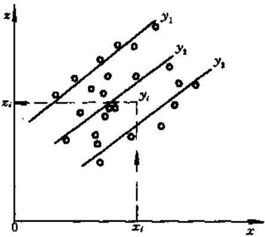  
图 7-17 复相关示意图

倚x而变，同时还倚y而变。因此，在使用图7-17插补延长z值时，应先在x轴上找出 $\pmb { x } _ { i }$ 值，并向上引垂线至相应的 $\pmb { y _ { i } }$ 值，其交点的纵标便为相应的 $\pmb { z _ { i } }$ 值，见图7-17的虚线。除图7-17所示的复直线相关图外，还有复曲线相关图。这些复相关图形（直线和曲线）在水文计算和水文预报中经常会遇到，如降雨径流相关图。

复相关计算除用图解法以外，还可用分析法，或称为多元回归分析法。

设随机变量y与多个变量 $x _ { 1 } , \ x _ { 2 } , \ \cdots , \ x _ { n }$ 有关系，可以列出多元线性回归函数。

$$
\hat { y } { = } \beta _ { 0 } { + } \beta _ { 1 } x _ { 1 } { + } \cdots { + } \beta _ { n } x _ { n } { + } \varepsilon\tag{7-116}
$$

式中 $\beta _ { 0 } , \beta _ { 1 } , \cdots , \beta _ { n }$ —未知回归系数；

ε——随机项，是服从正态分布 $\smash { N \ \{ 0 , \sigma ^ { 2 } \} }$ 的随机变量。

为了从样本数据求出参数 $\beta _ { 0 } , \beta _ { 1 } , \cdots , \beta _ { n }$ 的估计量 $b _ { 0 } , \ b _ { 1 } , \ \cdots , \ b _ { s }$ ，可以用最小二乘估计法，给出多元回归函数的估计为：

$$
\scriptstyle { \hat { y } } = b _ { 0 } + b _ { 1 } x _ { 1 } + \cdots + b _ { n } x _ { n }\tag{7-117}
$$

该式称为 $\pmb { y }$ 对 $x _ { 1 } , \ x _ { 2 } , \ \cdots , \ x _ { n }$ 的多元回归方程，其中 $b _ { 0 } , \ b _ { 1 } , \ \cdots , \ b _ { n }$ 为回归系数。

为便于学习，下面介绍三个变量线性回归方程的求解方法。

设有三个变量 $\pmb { y }$ $\pmb { x } _ { 1 }$ 和 $\pmb { x _ { 2 } }$ 具有直线相关关系，且 $\pmb { y }$ 倚 $\pmb { x } _ { 1 }$ 及 $\pmb { \mathscr { x } } _ { 2 }$ 相关，其回归方程的估计为：

$$
\hat { y } = b _ { 0 } + b _ { 1 } x _ { 1 } + b _ { 2 } x _ { 2 }\tag{7-118}
$$

式中 $b _ { 0 }$ $\pmb { \ b } _ { 1 }$ $b _ { 2 }$ ——待定系数。

同简单相关的原理一样，可用最小二乘法求解式（7-118）中的系数，即观测值与拟合平面上相应点值间离差平方和为最小，即

$\scriptstyle \pmb { \ b } _ { 0 }$ $b _ { 1 }$ $\pmb { b } _ { 2 }$ 应满足方程组

$$
\begin{array} { r l } & { Q = \sum _ { i = 1 } ^ { n } \mathrm { e } _ { i } ^ { 2 } = \sum ( y - \hat { y } ) ^ { 2 } } \\ & { \quad = \sum ( y - b _ { 0 } - b _ { 1 } x _ { 1 } - b _ { 2 } x _ { 2 } ) ^ { 2 } = \sharp \chi / \mathrm { l } \wedge \langle \sharp } \end{array}\tag{7-119}
$$

$$
\begin{array} { r } { \frac { \partial Q } { \partial b _ { 0 } } = 0 } \\ { \frac { \partial Q } { \partial b _ { 1 } } = 0 \mathrm { { ) } } } \\ { \frac { \partial Q } { \partial b _ { 2 } } = 0 \mathrm { { ) } } } \end{array}\tag{7-120}
$$

由式（7-120），得

$$
\left. \begin{array} { l } { { 2 \sum _ { i } ^ { \prime } \bigl [ y _ { i } - ( b _ { 0 } + b _ { 1 } x _ { 1 } + b _ { 2 } x _ { 2 } ) \bigr ] ( - 1 ) = 0 } } \\ { { 2 \sum _ { i } ^ { \prime } \bigl [ y _ { i } - ( b _ { 0 } + b _ { 1 } x _ { 1 } + b _ { 2 } x _ { 2 } ) \bigr ] ( - x _ { 1 } ) = 0 } } \\ { { 2 \sum _ { i } ^ { \prime } \bigl [ y _ { i } - ( b _ { 0 } + b _ { 1 } x _ { 1 } + b _ { 2 } x _ { 2 } ) \bigr ] ( - x _ { 2 } ) = 0 } } \end{array} \right\}\tag{7-121}
$$

整理后，得

$$
\left. \begin{array} { l } { b _ { 0 } N + b _ { 1 } ( \sum x _ { 1 } ) + b _ { 2 } ( \sum x _ { 2 } ) = \sum y } \\ { b _ { 0 } ( \sum x _ { 1 } ) + b _ { 1 } ( \sum x _ { 1 } ^ { 2 } ) + b _ { 2 } ( \sum x _ { 1 } x _ { 2 } ) = \sum x _ { 1 } y } \\ { b _ { 0 } ( \sum x _ { 2 } ) + b _ { 1 } ( \sum x _ { 1 } x _ { 2 } ) + b _ { 2 } ( \sum x _ { 2 } ^ { 2 } ) = \sum x _ { 2 } y } \end{array} \right\}\tag{7-122}
$$

式中 N——观测次数。

方程（7-122）为确定回归系数的正规方程组。对方程组进行求解，即可求得 $b _ { 0 }$ $\scriptstyle { b _ { 1 } }$ r $\pmb { \delta } _ { 2 }$ 值。b1表示当x2固定时，y 倚x1的偏回归系数；b2表示当x1固定时，y 倚x2的偏回归系 $\pmb { \ b } _ { 1 }$ $\pmb { x _ { 2 } }$ $\pmb { y }$ $\pmb { x } _ { 1 }$ ${ \pmb b } _ { 2 }$ $x _ { 1 }$ $\pmb { y }$ $\pmb { x _ { 2 } }$ 数。前者记以符号 $R _ { y / x _ { 1 } ( x _ { 2 } ) }$ ，后者记以符号 $R _ { y / x _ { 2 } ( x _ { 1 } ) }$

经过推导，得回归方程为：

$$
y - { \overline { { y } } } = R _ { y / z _ { 1 } ( x _ { 2 } ) } ( x _ { 1 } - { \overline { { x } } } _ { 1 } ) + R _ { y / x _ { 2 } ( x _ { 1 } ) } ( x _ { 2 } - { \overline { { x } } } _ { 2 } )\tag{7-123}
$$

或

$$
y - \overline { { y } } = \frac { r _ { y _ { 1 } } - r _ { x _ { 1 } } \overline { { r } } _ { z } r _ { x _ { 2 } y } } { 1 - r _ { x _ { 1 } x _ { 2 } } ^ { 2 } } \frac { \sigma _ { y } } { \sigma _ { x _ { 1 } } } ( x _ { 1 } - \overline { { x } } _ { 1 } ) + \frac { r _ { x _ { 2 } y } - r _ { x _ { 1 } x _ { 2 } } r _ { y x _ { 1 } } } { 1 - r _ { x _ { 1 } x _ { 2 } } ^ { 2 } } \frac { \sigma _ { y } } { \sigma _ { x _ { 2 } } } ( x _ { 2 } - \overline { { x } } _ { 2 } )\tag{7-124}
$$

式中 $r _ { y x _ { 1 } }$ ， $\pmb { r } _ { \pmb { x } _ { 1 } \pmb { x } _ { 2 } }$ $\boldsymbol { r } _ { x _ { g } y }$ 分别为 $\pmb { y }$ 和 $\pmb { x } _ { 1 }$ $\pmb { x } _ { 1 }$ 和 $x _ { 2 }$ $\pmb { x _ { 2 } }$ 和 $_ y$ 的相关系数。

表 7-10 多元回归计算表

y倚 $\pmb { x } _ { 1 }$ 和 $\pmb { \mathscr { x } } _ { 2 }$ 的复相关系数为：

<table><tr><td rowspan=1 colspan=1>序号</td><td rowspan=1 colspan=1> $x _ { 1 } ,$ </td><td rowspan=1 colspan=1> $\pmb { \bar { x } } _ { \pmb { \bar { y } } _ { j } }$ </td><td rowspan=1 colspan=1> ${ \pmb y } _ { 2 }$ </td><td rowspan=1 colspan=1> $\pmb { x } \pmb { \beta } _ { j }$ </td><td rowspan=1 colspan=1> $\scriptstyle \mu _ { 1 } , x _ { 2 } ,$ </td><td rowspan=1 colspan=1> $\scriptstyle { \pmb { x } } _ { 2 } ^ { 2 } ,$ </td><td rowspan=1 colspan=1>x1i</td><td rowspan=1 colspan=1> $\pmb { x } _ { 2 , j } \pmb { y } _ { j }$ </td></tr><tr><td rowspan=1 colspan=1>(1)</td><td rowspan=1 colspan=1>(2)</td><td rowspan=1 colspan=1>(3)</td><td rowspan=1 colspan=1>(4)</td><td rowspan=1 colspan=1>(5)</td><td rowspan=1 colspan=1>(6)</td><td rowspan=1 colspan=1>(7)</td><td rowspan=1 colspan=1>(8)</td><td rowspan=1 colspan=1>(9)</td></tr><tr><td rowspan=5 colspan=1>12345678</td><td rowspan=4 colspan=1>358614</td><td rowspan=1 colspan=1>62</td><td rowspan=2 colspan=1>7.58.311.510.3</td><td rowspan=2 colspan=1>9256436</td><td rowspan=2 colspan=1>1810824</td><td rowspan=1 colspan=1>364</td><td rowspan=1 colspan=1>22.541.5</td><td rowspan=1 colspan=1>45.016.6</td></tr><tr><td rowspan=1 colspan=1>14</td><td rowspan=1 colspan=1>116</td><td rowspan=2 colspan=1>92.061.86.3</td><td rowspan=2 colspan=1>11.541.256.7</td></tr><tr><td rowspan=1 colspan=1>9</td><td rowspan=1 colspan=1>6.3</td><td rowspan=1 colspan=1>1</td><td rowspan=1 colspan=1>9</td><td rowspan=1 colspan=1>81</td></tr><tr><td rowspan=1 colspan=1>7</td><td rowspan=1 colspan=1>9.1</td><td rowspan=1 colspan=1>16</td><td rowspan=1 colspan=1>28</td><td rowspan=1 colspan=1>49</td><td rowspan=1 colspan=1>36.4</td><td rowspan=1 colspan=1>63.7</td></tr><tr><td rowspan=1 colspan=1>92</td><td rowspan=1 colspan=1>83</td><td rowspan=1 colspan=1>15.55.1</td><td rowspan=1 colspan=1>814</td><td rowspan=1 colspan=1>726</td><td rowspan=1 colspan=1>649</td><td rowspan=1 colspan=1>139.510.2</td><td rowspan=1 colspan=1>124.015.3</td></tr><tr><td rowspan=1 colspan=1>∑</td><td rowspan=1 colspan=1>38</td><td rowspan=1 colspan=1>40</td><td rowspan=1 colspan=1>73.6</td><td rowspan=1 colspan=1>236</td><td rowspan=1 colspan=1>175</td><td rowspan=1 colspan=1>260</td><td rowspan=1 colspan=1>410.2</td><td rowspan=1 colspan=1>373.0</td></tr></table>

$$
r _ { y / x _ { 1 } x _ { 2 } } = \sqrt { \frac { r _ { y x _ { 1 } } ^ { 2 } + r _ { y x _ { 2 } } ^ { 2 } - 2 r _ { y x _ { 1 } } r _ { y x _ { 2 } } r _ { x _ { 1 } x _ { 2 } } } { 1 - r _ { x _ { 1 } x _ { 2 } } ^ { 2 } } }\tag{7-125}
$$

【例 7-5】 某变量 y 与变量 $\pmb { x } _ { 1 }$ $\pmb { x _ { 2 } }$ 有关系，通过观测获得一组数据，如表7-10中第（2）～（4）栏所列，试建立 $\pmb { y }$ 倚 $\pmb { x } _ { 1 }$ $\pmb { \mathscr { x } } _ { 2 }$ 的线性回归方程。

解：设拟求的回归方程为

$$
y = b _ { 0 } + b _ { 1 } x _ { 1 } + b _ { 2 } x _ { 2 }
$$

按表7-10所列方程式进行多元回归计算，并按式（7-122）写出正规方程组

$$
\left. \begin{array} { l } { 8 b _ { \circ } + 3 8 b _ { 1 } + 4 0 b _ { 2 } = 7 3 . 6 } \\ { 3 8 b _ { \circ } + 2 3 6 b _ { 1 } + 1 7 5 b _ { 2 } = 4 1 0 . 2 } \\ { 4 0 b _ { \circ } + 1 7 5 b _ { 1 } + 2 6 0 b _ { 2 } = 3 7 3 . 0 } \end{array} \right\}
$$

联立求解方程组，得

$$
b _ { 0 } = 1 . 6 1 , b _ { \mathrm { t } } = 1 . 2 0 , b _ { \mathrm { z } } = 0 . 3 8
$$

从而得回归方程

$$
y = 1 . 6 1 + 1 . 2 x _ { 1 } + 0 . 3 8 x _ { 2 }
$$

复相关系数计算如下（见表7-11）：

表 7-11  
复相关计算表
<table><tr><td>序号</td><td>x1</td><td>I2</td><td>y</td><td> $\pmb { K } _ { x _ { 1 } }$ </td><td> $\kappa _ { z }$ </td><td></td><td></td><td> $\begin{array} { r l } { K _ { s } } & { { } \Big | ( K _ { x _ { 1 } } - 1 ) ^ { \sharp } \big | ( K _ { x _ { 2 } } - 1 ) ^ { \sharp } \Big | ( K _ { y } - 1 ) ^ { \sharp } } \end{array}$ </td><td></td><td> $( K _ { x _ { 1 } } - 1 )$   $\textbf { \textsf { X } } ( K _ { z _ { 2 } } - 1 )$ </td><td> $( K _ { x _ { 1 } } - 1 )$   $\begin{array} { r l } { \mathbf { \nabla } \times } & { { } ( \pmb { K } _ { \mathbf { y } } - 1 ) } \end{array}$ </td><td> $( K _ { z _ { 2 } } - 1 )$   $\textbf { \textsf { X } } ( K _ { \mathbf { y } } - 1 )$ </td></tr><tr><td>1</td><td>3</td><td>6</td><td>7.5</td><td>0.63</td><td>1.2</td><td>0.82</td><td>0.1369</td><td>0.0400</td><td>0.0384</td><td>-0.0740</td><td>0.0666</td><td>-0.0360</td></tr><tr><td>2</td><td>5</td><td>2</td><td>8.3</td><td>1.05</td><td>0.4</td><td>0.90</td><td>0.0025</td><td>0.3600</td><td>0.0100</td><td>-0.0300</td><td>-0.0050</td><td>0.0600</td></tr><tr><td>3</td><td>8</td><td>1</td><td>11.5</td><td>1.68</td><td>0.2</td><td>1.25</td><td>0.4624</td><td>0.6400</td><td>0.0625</td><td>-0.5440</td><td>0.1700</td><td>-0.2000</td></tr><tr><td>4</td><td>6</td><td>4</td><td>10.3</td><td>1.26</td><td>0.8</td><td>1.12</td><td>0.0676</td><td>0.0400</td><td>0.0144</td><td>-0.0520</td><td>0.0312</td><td>-0.0240</td></tr><tr><td>5</td><td>1</td><td>9</td><td>6.3</td><td>0.21</td><td>1.8</td><td>0.68</td><td>0.6241</td><td>0.6400</td><td>0.1024</td><td>-0.6320</td><td>0.2528</td><td>-0.2560</td></tr><tr><td>6</td><td>4</td><td>7</td><td>9.1</td><td>0.84</td><td>1.4</td><td>0.99</td><td>0.0256</td><td>0.1600</td><td>0.000]</td><td>-0.0640</td><td>0.0016</td><td>-0.0040</td></tr><tr><td>7</td><td>9</td><td>8</td><td>15.5</td><td>1.89</td><td>1.6</td><td>1.68</td><td>0.7921</td><td>0.3600</td><td>0.4624</td><td>0.5340</td><td>0.6052</td><td>0.4080</td></tr><tr><td>8</td><td>2</td><td>3</td><td>5.1</td><td>0.42</td><td>0.6</td><td>0.55</td><td>0.3364</td><td>0.1600</td><td>0.2025</td><td>0.1800</td><td>0.2610</td><td>0.1800</td></tr><tr><td>Σ</td><td>38</td><td>40</td><td>73.6</td><td>7.98</td><td>8</td><td>7.99</td><td>2.4476</td><td>2.4000</td><td>0.8867</td><td>–0.6300</td><td>1.3834</td><td>0.1200</td></tr><tr><td>均值</td><td>4.75</td><td>5</td><td>9.2</td><td></td><td></td><td></td><td></td><td></td><td></td><td></td><td></td><td></td></tr></table>

均方差

$$
\sigma _ { x _ { 1 } } = \overline { { x } } _ { 1 } \sqrt { \frac { \sum ( K _ { x _ { 1 } } - 1 ) ^ { 2 } } { n - 1 } } = 4 . 7 5 \sqrt { \frac { 2 . 4 4 7 6 } { 7 } } = 2 . 8 1
$$

$$
\sigma _ { x _ { 3 } } = \overline { { x } } _ { 2 } \sqrt { \frac { \sum ( K _ { x _ { 3 } } - 1 ) ^ { 2 } } { n - 1 } } = 5 \sqrt { \frac { 2 \cdot 4 } { 7 } } = 2 , 9
$$

$$
\sigma , = \overline { { y } } \sqrt { \frac { \sum ( K _ { y } - 1 ) ^ { 2 } } { n - 1 } } = 9 . 2 \sqrt { \frac { 0 . 8 8 6 7 } { 7 } } = 3 . 2 7
$$

相关系数

$$
r _ { x _ { 1 } x _ { 2 } } = \frac { \sum ( K _ { x _ { 1 } } - 1 ) ( K _ { x _ { 2 } } - 1 ) } { \sqrt { \sum ( K _ { x _ { 1 } } - 1 ) ^ { 2 } \sum ( K _ { x _ { 2 } } - 1 ) ^ { 2 } } } = \frac { - \ 0 . 6 3 0 0 } { \sqrt { 2 . 4 4 7 6 \times 2 . 4 0 0 0 } } = - \ 0 . 2 6
$$

$$
r _ { y x _ { 1 } } = \frac { \sum ( K _ { x _ { 1 } } - 1 ) ( K _ { y } - 1 ) } { \sqrt { \sum ( K _ { z _ { 1 } } - 1 ) ^ { 2 } \sum ( K _ { y } - 1 ) ^ { 2 } } } = \frac { 1 . 3 8 3 4 } { \sqrt { 2 . 4 4 7 6 \times 0 . 8 8 6 7 } } = 0 . 9 4
$$

$$
r _ { y x _ { 2 } } = \frac { \sum ( K _ { x _ { 2 } } - 1 ) ( K _ { y } - 1 ) } { \sqrt { \sum ( K _ { x _ { 2 } } - 1 ) ^ { 2 } \sum ( K _ { y } - 1 ) ^ { 2 } } } = \frac { 0 . 1 2 0 0 } { \sqrt { 2 . 4 \times 0 . 8 8 6 7 } } = 0 . 0 8
$$

复相关系数

$$
\begin{array} { c } { { r _ { y / x _ { 1 } x _ { 2 } } = \sqrt { \frac { r _ { y x _ { 1 } } ^ { 2 } + r _ { y z _ { 2 } } ^ { 2 } - 2 r _ { y x _ { 1 } } r _ { y x _ { 2 } } r _ { x _ { 1 } x _ { 2 } } } { 1 - r _ { x _ { 1 } x _ { 2 } } ^ { 2 } } } } } \\ { { = \sqrt { \frac { ( 0 . 9 4 ) ^ { 2 } + ( 0 . 0 8 ) ^ { 2 } - 2 ( 0 . 9 4 ) ( 0 . 0 8 ) ( - 0 . 2 6 ) } { 1 - ( - 0 . 2 6 ) ^ { 2 } } } } } \\ { { = 0 . 9 9 8 } } \end{array}
$$

对复相关系数亦须作统计检验，其原理与简相关系数检验大致相同，可参考有关统计书籍。

## 习 題

7-1 某站只有 24年的实测年径流资料，见表 7-12，试分别用矩法求 $\overline { { x } } , \ C _ { v }$ 和权函数法求 $C _ { s } .$

7-2已知某河甲、乙两站的年径流模数M（见表7-13），甲、乙两站的年径流量在成因上具有联系。试用相关分析法推求回归方程及相关系数。

表 7-12 某站实测年径流资料
<table><tr><td rowspan=1 colspan=1>年份</td><td rowspan=1 colspan=1>年径流深(mm)</td><td rowspan=1 colspan=1>年份</td><td rowspan=1 colspan=1>年径流深(mm)</td></tr><tr><td rowspan=1 colspan=1>19521953</td><td rowspan=1 colspan=1>538.3624.9</td><td rowspan=1 colspan=1>19641965</td><td rowspan=3 colspan=1>769.2615.5417.1789.3</td></tr><tr><td rowspan=1 colspan=1>1954</td><td rowspan=1 colspan=1>663.2</td><td rowspan=1 colspan=1>1966</td></tr><tr><td rowspan=1 colspan=1>1955</td><td rowspan=1 colspan=1>591.7</td><td rowspan=1 colspan=1>1967</td></tr><tr><td rowspan=1 colspan=1>1956</td><td rowspan=1 colspan=1>557.2</td><td rowspan=1 colspan=1>1968</td><td rowspan=1 colspan=1>732.9</td></tr><tr><td rowspan=1 colspan=1>1957</td><td rowspan=1 colspan=1>998.0</td><td rowspan=1 colspan=1>1969</td><td rowspan=1 colspan=1>1064.5</td></tr><tr><td rowspan=1 colspan=1>1958</td><td rowspan=1 colspan=1>541.5</td><td rowspan=1 colspan=1>1970</td><td rowspan=1 colspan=1>606.7</td></tr><tr><td rowspan=1 colspan=1>1959</td><td rowspan=1 colspan=1>341.1</td><td rowspan=1 colspan=1>1971</td><td rowspan=1 colspan=1>586.7</td></tr><tr><td rowspan=1 colspan=1>1960</td><td rowspan=1 colspan=1>964.2</td><td rowspan=1 colspan=1>1972</td><td rowspan=1 colspan=1>567.4</td></tr><tr><td rowspan=1 colspan=1>1961</td><td rowspan=1 colspan=1>687.3</td><td rowspan=1 colspan=1>1973</td><td rowspan=1 colspan=1>587.7</td></tr><tr><td rowspan=1 colspan=1>1962</td><td rowspan=1 colspan=1>546.7</td><td rowspan=1 colspan=1>1974</td><td rowspan=1 colspan=1>709.0</td></tr><tr><td rowspan=1 colspan=1>1963</td><td rowspan=1 colspan=1>509.9</td><td rowspan=1 colspan=1>1975</td><td rowspan=1 colspan=1>883.5</td></tr></table>

表7-13某河甲、乙两站的年径流模数M
<table><tr><td>年份</td><td>甲站年径流模数  $[ 1 0 ^ { - 3 } \mathrm { m } ^ { 3 } / \ ( \mathrm { s } \cdot \mathrm { k m } ^ { 2 } ) ]$ </td><td>乙站年径流模数  $[ 1 0 ^ { - 8 } \mathbf { m } ^ { 8 } / \ ( \mathbf { s } \cdot \mathbf { k } \mathbf { m } ^ { 2 } ) ]$ </td></tr><tr><td>1975</td><td>3.5</td><td>5.4</td></tr><tr><td>1976</td><td>4.6</td><td>6.5</td></tr><tr><td>1977</td><td>3.3</td><td>5.0</td></tr><tr><td>1978</td><td>2.9</td><td>4.0</td></tr><tr><td>1979</td><td>3.1</td><td>4.9</td></tr><tr><td>1980</td><td>3.8</td><td>5.6</td></tr><tr><td>1981</td><td>3.0</td><td>4.5</td></tr><tr><td>1982</td><td>2.8</td><td>4.2</td></tr><tr><td>1983</td><td>3.0</td><td>4.6</td></tr><tr><td>1984</td><td>4.0</td><td>6.1</td></tr><tr><td>1985</td><td>3.9</td><td></td></tr><tr><td>1986</td><td>2.6</td><td></td></tr><tr><td>1987</td><td>4.8</td><td></td></tr><tr><td>1988</td><td>5.0</td><td></td></tr></table>

# 第八章 设计年径流及径流随机模拟

## 第一节 设计年径流分析计算的目的和内容

在一定时段内，通过河流某一断面的累积水量称径流量，记作 $W \ : ( \mathbf { m } ^ { 3 } )$ ；也可以用时段平均流量 $\overline { { { Q } } } ( \mathbf { m } ^ { 3 } / \mathbf { s } )$ 或流域径流深R（mm）来表示。径流量与流量的关系为：

$$
W = { \widetilde { Q } } \Delta T\tag{8-1}
$$

式中 ΔT——计算时段，s。

根据工程设计的需要， $\Delta T$ 可分别采用年、季或月，则其相应的径流分别称为年径流、季径流或月径流。其中年径流及其时程分配形式对水利水电工程的规划设计尤为重要。本章重点介绍年径流的分析计算，较短时段径流的分析计算，可以参照进行。

## 一、径流特性

河川径流具有如下的一些特性：

## 1. 径流的季节分配

河川径流的主要来源为大气降水。降水在年内分配是不均匀的，有多雨季节和少雨季节，径流也随之呈现出丰水期和枯水期，或汛期与非汛期。最大日径流量较之最小日径流量，有时可达几倍到几十倍。

## 2. 径流的地区分布

河川径流的地区性差异非常明显，这也和雨量分布密切相关。多雨地区径流丰沛，少雨地区径流较少。我国的丰水带，包括东南和华南沿海，云南西部和西藏东部，年径流深在1000mm以上。我国的少水带，包括东北西部，内蒙古、宁夏、甘肃大部和新疆西北部，年径流深在10\~50mm之间；而许多沙漠地区为干涸带，年径流深不足10mm。

## 3. 径流的周期性

绝大多数河流以年为周期的特性非常明显。在一年之内，丰水期和枯水期交替出现，周而复始。又因特殊的自然地理环境或人为影响，在一年的主周期中，也会产生一些较短的特殊周期现象。例如，冰冻地区在冰雪融解期间，白昼升温，融解速度加快，径流较大；夜间相反，呈现出以锯齿形为特征的径流日周期现象。又如担任调峰任务的水电站下游，在电力负荷高峰期间，加大下泄流量，峰期过后，减小下泄流量，也会出现以日为周期的径流波动现象。

在实测年径流系列中，往往发现连续丰水段或连续枯水段交替出现的现象，连续2\~3年年径流偏丰或偏枯的现象极为常见：连续3\~5年也不罕见，有的甚至超过10年以上。这种连续丰水段或连续枯水段的交替出现，会形成从十几年到几十年的较长周期，需要通过周期分析加以识别。

## 二、年径流分析计算的目的和内容

## (一) 目的

年径流分析计算是水资源利用工程中最重要的工作之一。设计年径流是衡量工程规模

和确定水资源利用程度的重要指标。

水资源利用工程包括水库蓄水工程、供水工程、水力发电工程和航运工程等，其设计标准，用保证率表示，反映对水利资源利用的保证程度，即工程规划设计的既定目标不被破坏的年数占运用年数的百分比。例如，一项水资源利用工程，有90%的年份可以满足其规划设计确定的目标，则其保证率为90%，依此类推。推求不同保证率的年径流量及其分配过程，就是设计年径流分析计算的主要目的。水资源利用程度，在分析枯水径流和时段最小流量时，还可用破坏率，即破坏年数占运用年数的百分比来表示，在概念上更为直观。事实上，保证率和破坏率是事物的两个侧面，互为补充，并可进行简单的换算。设保证概率为p，破坏概率为q，则p=1一q。

## (二)年径流分析计算的内容

年径流分析计算的内容如下：

(1)基本资料信息的搜集和复查。进行年径流分析的基本资料和信息，包括设计流域和参证流域的自然地理概况、流域河道特征、有明显人类活动影响的工程措施、水文气象资料，以及前人分析的有关成果。其中水文资料，特别是径流资料为搜集的重点。对搜集到的水文资料，应有重点地进行复查，着重从观测精度、设计代表站的水位流量关系以及上下游的水量平衡等方面，对资料的可靠性作出评定。发现问题应找出原因，必要时应会同资料整编单位，作进一步审查和必要的修正。

(2)年径流量的频率分析计算。对年径流系列较长且较完整的资料，可直接据以进行频率分析，确定所需的设计年径流量。对短缺资料的流域，应尽量设法延长其径流系列，或用间接方法，经过合理的论证和修正、移用参证流域的设计成果，详见第二节和第三节。

(3)提供设计年径流的时程分配。在设计年径流量确定以后，参照本流域或参证流域代表年的径流分配过程，确定年径流在年内的分配过程，详见本章第四节。

(4)根据需要进行年际连续枯水段的分析、径流随机模拟和枯水流量分析计算，详见本章第五～七节。

(5)对分析成果进行合理性检查。包括检查分析计算的主要环节，与以往已有设计成果和地区性综合成果进行对比等手段，对设计成果的合理性作出论证。

## 第二节 有较长资料时设计年径流频率分析计算

所谓较长年径流系列是指设计代表站断面或参证流域断面有实测径流系列，其长度不小于规范规定的年数，即不应小于20年。如实测系列小于20年，应设法将系列加以延长；如系列中有缺测资料，应设法予以插补；如有较明显的人类活动影响，应进行径流资料的还原工作。

## 一、年径流系列的一致性和代表性分析

## (一)年径流系列的一致性分析

应用数理统计法进行年径流的分析计算时，一个重要的前提是年径流系列应具有一致性。就是说组成该系列的流量资料，都是在同样的气候条件、同样的下垫面条件和同一测流断面上获得的。其中气候条件变化极为缓慢，一般可以不加考虑。人类活动影响下垫面的改变，有时却很显著，为影响资料一致性的主要因素，需要重点进行考虑。测量断面位置有时可能发生变动，当对径流量产生影响时，需要改正至同一断面的数值。

影响径流的人类活动，主要是蓄水、供水、水土保持以及跨流域引水等工程的大量兴建。大坝蓄水工程，主要是对径流进行调节，将丰水期的部分水量存蓄起来，在枯水期有计划地下泄，满足下游用水的需要。一般情况下，水库对年径流量的影响较小，而对径流的年内分配影响很大。供水工程主要向农业、工业及城市用水提供水量，其中尤以灌溉用水占很大比重。但供水中的一部分水量，仍流回原河流，称回归水，分析时应予注意。水土保持是根治水土流失的群众性工程，面广量大，70年代后发展很快。一些重点治理的流域，河川径流和泥沙已发生了显著变化，而且这种趋势还将长期持续下去。

可见在工程水文中，很多情况下需要考虑人类活动的影响，特别是在年径流分析计算中，需要考虑径流的还原计算，把全部系列建立在同一基础上。

## (二)年径流系列的代表性分析

年径流系列的代表性，是指该样本对年径流总体的接近程度，如接近程度较高，则系列的代表性较好，频率分析成果的精度较高，反之较低。因此，在进行年径流频率分析之前，还应进行系列的代表性分析。

样本对总体代表性的高低，可通过对二者统计参数的比较加以判断。但总体分布是未知的，无法直接进行对比，只能根据人们对径流规律的认识以及与更长径流、降水等系列对比，进行合理性分析与判断。常用的方法如下：

## 1. 进行年径流的周期性分析

对干一个较长的年径流系列，应着重检验它是否包括了一个比较完整的水文周期，即包括了丰水段（年组）、平水段和枯水段，而且丰、枯水段又大致是对称分布的。一般说来，径流系列愈长，其代表性就愈好，但也不尽然。如系列中的丰水段数多于枯水段数，则年径流可能偏丰，反之可能偏低。去掉一个丰水段或枯水段径流资料，其代表性可能更好。又如，有的测站，1949年以前的观测精度较低，50年代初期，曾大量使用这些资料，但随着观测期的不断增长，可能已不再使用这些资料，且代表性可能更好一些。但是对去掉部分资料的情况，应特别慎重对待，须经充分论证后决定取舍。

一个较长的水文周期，往往需要几十年的时间，在条件许可时，可以在水文相似区内，进行综合性年径流或年降水周期分析工作，并结合历史旱涝分析文献，做出合理的判断。

## 2. 与更长系列参证变量进行比较

参证变量系指与设计断面径流关系密切的水文气象要素，如水文相似区内其他测站观测期更长，并被论证有较好代表性的年径流或年降水系列。设参证变量的系列长度为N，设计代表站年径流系列长度为n，且n为二者的同步观测期。如果参证变量的N年统计特征(主要是均值和变差系数)与其自身n年的统计特征接近，说明参证变量的n年系列在N年系列中具有较好的代表性。又因设计断面年径流与参证变量有较密切的关系，从而也间接说明设计断面n年的年径流系列也具有较好的代表性。

## 二、年径流的频率分析

水文要素频率分析的通用方法，在第七章中已有详细阐述，此处重点针对年径流的特点，补充介绍一些应予注意的事项。

## （一) 选择

当年径流资料经过审查、插补延长、还原计算和资料一致性和代表性论证以后，应按逐年逐月统计其径流量，组成年径流系列和月径流系列。这些数据绝大部分可自《水文年鉴》上直接引用，但须注意《水文年鉴》上刊布的数字是按日历年分界的，即每年1\~12月为一个完整的年份。

在水资源利用工程中，为便于水资源的调度运用，常采用另一种分界的方法，称水利年度。它不是从1月份开始，而是将水库调节库容的最低点（汛前某一月份，各地根据入汛的迟早具体确定）作为一个水利年度的起始点，周而复始加以统计，建立起一个新的年径流系列。当年径流系列较长时，用上述两种系列做出的频率分析成果是很接近的。

## （二）线型与参数估算

经验表明，我国大多数河流的年径流频率分析，可以采用P一型频率分布曲线，但规范同时指出，经分析论证亦可采用其他线型。

P一Ⅱ型年径流频率曲线有三个参数，其中均值（）一般直接采用矩法计算值；变差系数 $( C _ { \mathfrak { r } } )$ 可先用矩法估算，并根据适线拟合最优的准则进行调整；偏态系数 $( C _ { \bullet } )$ 一般不进行计算，而直接采用C。的倍比，我国绝大多数河流可采用 $\mathrm { C } _ { s } { = } 2 { \sim } 3 C _ { v }$ 。在进行频率适线和参数调整时，可侧重考虑平、枯水年份年径流点群的趋势。

## (三) 其他注意事项

## 1. 参数的定量应注意参照地区综合分析成果

对中小流域设计断面径流系列计算的统计参数，有时也会带有偶然性。因此在有条件时，应注意和地区综合分析的统计参数成果进行合理性比较，特别是在系列较短时尤应注意。我国已制定有全国和各地区的中小河流年径流深和 $c _ { \mathfrak { v } }$ 的等值线图，可以作为重要的参考资料。

## 2. 历史枯水年径流的考证和引用

如果在实测年径流系列以外，还能考证到历史上曾经发生过更枯的年径流时，应进一步考证其发生的重现期，并点绘到年径流频率图上，可以起到控制频率曲线合理外延的作用。

## 第三节 短缺资料时设计年径流的频率分析计算

短缺径流资料的情况可分为两种：一种是设计代表站只有短系列径流实测资料 $( n < 2 0$ 年)，其长度不能满足规范的要求：一种是设计断面附近完全没有径流实测资料。对于前一种情况，工作重点是设法展延径流系列的长度；对于后一种情况，主要是利用年径流统计参数的地理分布规律，间接地进行年径流估算。

## 一、有较短年径流系列时设计年径流频率分析计算

本法的关键是展延年径流系列的长度。方法的实质是寻求与设计断面径流有密切关系并有较长观测系列的参证变量，通过设计断面年径流与其参证变量的相关关系，将设计断面年径流系列适当地加以延长至规范要求的长度。当年径流系列适当延长以后，其频率分析方法与本章第二节所述完全一样。

最常采用的参证变量有：设计断面的水位、上下游测站或邻近河流测站的径流量、流域的降水量。参证变量应具备下列条件：

(1)参证变量与设计断面径流量在成因上有密切关系。

(2)参证变量与设计断面径流量有较多的同步观测资料。

(3)参证变量的系列较长，并有较好的代表性。

## （一）利用本站的水位资料延长年径流系列

有些测站开始只观测水位，后来增加了流量测验。可根据其水位一流量关系，将水位资料转化成径流资料。

## (二)利用上下游站或邻近河流测站实测径流资料，延长设计断面的径流系列

同一河流上下游的水量存在着有机联系，因此，当设计断面上下游不太远处有实测径流资料时，常是很好的参证变量，可通过建立二者的径流相关加以论证。同一水文气候区内的邻近河流，当流域面积与设计流域面积相差不太悬殊时，其径流资料也可试选为参证变量。下面是一个实例。

设有甲乙2个水文站，设计断面位于甲站附近，但只有1971\~1980年实测径流资料。其下游的乙站却有1961\~1980年实测径流资料，见表8-1（表8-1引自参考文献[1]）。将二者10年同步年径流观测资料对应点绘，发现关系较好，如图8-1（图8-1引自参考文献[1])。根据二者的相关线，可将甲站1961\~1970年缺测的年径流查出，延长年径流系列，进行年径流的频率分析计算。

表 8-1  
某河流甲乙两站年径流资料  
单位：m³/s
<table><tr><td rowspan=1 colspan=1>年份站名</td><td rowspan=1 colspan=1>1961</td><td rowspan=1 colspan=1>1962</td><td rowspan=1 colspan=1>1963</td><td rowspan=1 colspan=1>1964</td><td rowspan=1 colspan=1>1965</td><td rowspan=1 colspan=1>1966</td><td rowspan=1 colspan=1>1967</td><td rowspan=1 colspan=1>1968</td><td rowspan=1 colspan=1>1969</td><td rowspan=1 colspan=1>1970</td></tr><tr><td rowspan=1 colspan=1>乙站</td><td rowspan=1 colspan=1>1400</td><td rowspan=1 colspan=1>1050</td><td rowspan=1 colspan=1>1370</td><td rowspan=1 colspan=1>1360</td><td rowspan=1 colspan=1>1710</td><td rowspan=1 colspan=1>1440</td><td rowspan=1 colspan=1>1640</td><td rowspan=1 colspan=1>1520</td><td rowspan=1 colspan=1>1810</td><td rowspan=1 colspan=1>1410</td></tr><tr><td rowspan=1 colspan=1>甲站</td><td rowspan=1 colspan=1>(1120)</td><td rowspan=1 colspan=1>(800)</td><td rowspan=1 colspan=1>(1100)</td><td rowspan=1 colspan=1>(1080)</td><td rowspan=1 colspan=1>(1510)</td><td rowspan=1 colspan=1>(1180)</td><td rowspan=1 colspan=1>(1430)</td><td rowspan=1 colspan=1>(1230)</td><td rowspan=1 colspan=1>(1610)</td><td rowspan=1 colspan=1>(1150)</td></tr><tr><td rowspan=1 colspan=1>年份站名</td><td rowspan=1 colspan=1>1971</td><td rowspan=1 colspan=1>1972</td><td rowspan=1 colspan=1>1973</td><td rowspan=1 colspan=1>1974</td><td rowspan=1 colspan=1>1975</td><td rowspan=1 colspan=1>1976</td><td rowspan=1 colspan=1>1977</td><td rowspan=1 colspan=1>1978</td><td rowspan=1 colspan=1>1979</td><td rowspan=1 colspan=1>1980</td></tr><tr><td rowspan=1 colspan=1>乙站</td><td rowspan=1 colspan=1>1430</td><td rowspan=1 colspan=1>1560</td><td rowspan=1 colspan=1>1440</td><td rowspan=1 colspan=1>1730</td><td rowspan=1 colspan=1>1630</td><td rowspan=1 colspan=1>1440</td><td rowspan=1 colspan=1>1480</td><td rowspan=1 colspan=1>1420</td><td rowspan=1 colspan=1>1350</td><td rowspan=1 colspan=1>1630</td></tr><tr><td rowspan=1 colspan=1>甲站</td><td rowspan=1 colspan=1>1230</td><td rowspan=1 colspan=1>1350</td><td rowspan=1 colspan=1>1160</td><td rowspan=1 colspan=1>1450</td><td rowspan=1 colspan=1>1510</td><td rowspan=1 colspan=1>1200</td><td rowspan=1 colspan=1>1240</td><td rowspan=1 colspan=1>1150</td><td rowspan=1 colspan=1>1000</td><td rowspan=1 colspan=1>1450</td></tr></table>

注括号内数字为插补值。

## (三)利用年降水资料延长设计断面的年径流系列

径流是降水的产物。流域的年径流量与流域的年降水量往往有良好的相关关系。又因降水观测系列在许多情况下较径流观测系列长，因此降水系列常被用来作为延长径流系列的参证变量。从理论上讲，这个参证变量应取流域降水的面平均值，有条件时应尽量这样做，但实际上，流域内往往只有少数甚至只有一处降水量观测点的系列较长，这时也可试用此少数点的年降水量与设计断面的年径流建立相关关系，如关系较好，亦可据以延长年径流系列。在一些小流域内，有时流域内没有长系列降水量观测，而在流域以外不远处有长系列降水量观测，也可以试用上述办法。总之以降水与径流相关关系较好作为采用的原则。

## (四)注意事项

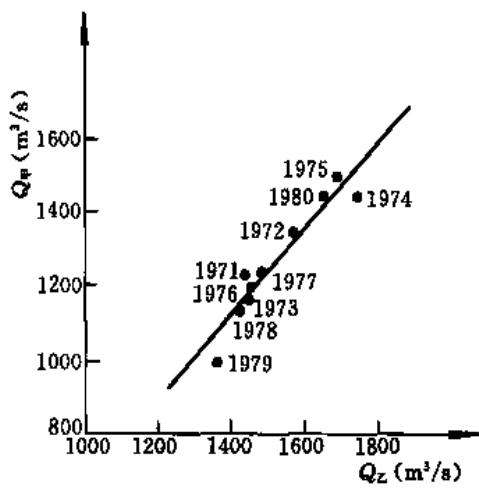  
图 8-1 某河流甲乙二站年径流相关图（点旁注字表示年份）

利用参证变量延长设计断面的年径流系列时，应特别注意下列问题：一是尽量避免远距离测验资料的辗转相关。如设计断面 $C _ { ☉ }$ 与一参证断面 $c _ { \cl }$ 相距很远，它们的年径流之间，虽有一定相关关系，但相关系数较小。如在它们之间还有两个（或几个）测流断面$C _ { 1 \setminus C _ { 2 } }$ ，系列均较短，不符合参证站条件，但 $C _ { \ell }$ 与 $C _ { \# }$ $C _ { 1 }$ 与 $C _ { 2 }$ 以及 $C _ { ☉ }$ 与 $C _ { 1 }$ 年径流的相关关系均较好，可以通过辗转相关，把 $c _ { * }$ 的信息传递到 $C _ { ☉ }$ 上来。表面看来各相邻断面，年径流的相关程度虽均较高，但随着每次相关误差的累积和传播，最终延长 $c _ { i \alpha }$ 年径流系列的精度并不会因之提高，因此这种做法不宜提倡。二是系列外延的幅度不宜过大，一般以控制在不超过实测系列的50%为宜。

## 二、缺乏实测径流资料时设计年径流量的估算

在部分中小设计流域内，有时只有零星的径流观测资料，且无法延长其系列，甚至完全没有径流观测资料，则只能利用一些间接的方法，对其设计径流量进行估算。采用这类方法的前提是设计流域所在的区域内，有水文特征值的综合分析成果，或在水文相似区内有径流系列较长的参证站可资利用。

## (一)参数等值线图法

我国已绘制了全国和分省（区）的水文特征值等值线图和表，其中年径流深等值线图及 $C _ { \mathrm { { r } } }$ 等值线图，可供中小流域设计年径流量估算时直接采用。

## 1. 年径流均值的估算

根据年径流深均值等值线图，可以查得设计流域年径流深的均值，然后乘以流域面积，即得设计流域的年径流量。

如果设计流域内通过多条年径流深等值线，可以用面积加权法推求流域的平均径流深，见图8-2。计算公式为：

$$
R { = } \sum _ { i = 1 } ^ { n } R _ { i } A _ { i } / \sum _ { i = 1 } ^ { n } A _ { i }\tag{8-2}
$$

式中 $R _ { i }$ ——分块面积的平均径流深，mm；

$\mathbf { A } _ { i }$ ——分块面积， $\mathbf { k m } ^ { 2 }$

R——流域平均径流深，mm。

其中流域顶端的分块，可能会在流域以外的一条等值线之间，如图8-2中的 ${ \pmb R } _ { \pmb { \mathscr { A } } _ { \Re } }$

在小流域中，流域内通过的等值线很少，甚至没有一条等值线通过，可按通过流域重心的直线距离比例内插法，计算流域平均径流深，见图8-3。

首先绘出通过流域长短轴的两条垂线，其交点即近似地位于流域的重心位置。通过O点作大致垂直于700、800mm两条等值线的直线，交点分别为A、B，则流域的平均径流深为：

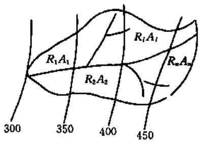  
图 8-2 用面积加权法求流域

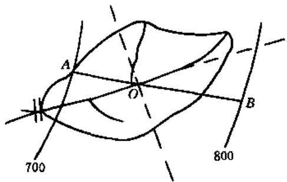  
平均径流深（单位：mm）  
图 8-3 用直线内插法推求

流域平均径流深（单位：mm）

$$
R { = } 7 0 0 + ~ ( 8 0 0 { - } 7 0 0 ) ~ \frac { O A } { A B } ~ ( \mathrm { m m } )
$$

上述两种计算流域年径流深均值的方法，都不是很严格的，但作为径流深均值的估值，已经可以满足要求了。

年径流深均值确定以后，可通过下列关系确定年径流量：

$$
W { = } K R A\tag{8-3}
$$

式中 W——年径流量， $\mathbf { m } ^ { 3 }$

$R \cdot$ —年径流深，mm；

A——流域面积， $\mathbf { k } \mathbf { m } ^ { 2 }$

$K \cdot$ —单位换算系数，采用上述各单位时， $K = 1 0 0 0$

## 2. 年径流 $c _ { \mathfrak { v } }$ 值的估算

年径流深的 $C _ { v }$ 值，也有等值线图可供查算，方法与年径流均值估算方法类似，但可更简单一点，即按比例内插出流域重心的 $c _ { v }$ 值就可以了。

## 3. 年径流 C： 值的估算

年径流的 $\mathbf { C } _ { \pmb { \imath } }$ 值，一般采用C。的倍比。按照规范规定，一般可采用 $C _ { s } { = } 2 { \sim } 3 C _ { v }$ a

在确定了年径流的均值、 $C _ { v } , C ,$ 后，便可借助于查用P一Ⅱ型频率曲线表，绘制出年径流的频率曲线，确定设计频率的年径流值。

## (二) 经验公式法

年径流的地区综合，也常以经验公式表示。这类公式主要是与年径流影响因素建立关系。例如，多年径流均值的经验公式有如下类型：

$$
\overline { { \ u { \mathbb { Q } } } } = \pmb { \ b } _ { 1 } A \pmb { n } _ { 1 }\tag{8-4}
$$

或

$$
\overline { { Q } } = b _ { 2 } A n _ { 2 } \overline { { P } } { ^ { \circ } }\tag{8-5}
$$

式中

$\overline { { \mathbf { Q } } } \cdot \overline { { \mathbf { Q } } } \cdot$ —多年平均流量， $\mathbf { m } ^ { 3 } / \mathbf { s }$

$\pmb { A }$ ——流域面积， $\scriptstyle \mathbf { k } \mathbf { m } ^ { 2 }$

$\pmb { \mathcal { P } }$ —多年平均降水量，mm；

$b _ { 1 }$ 、 ${ \pmb b } _ { 2 }$ 、 ${ \pmb n } _ { 1 }$ 、 $\pmb { n _ { 2 } }$ 、m—参数，通过实测资料分析确定，或按已有分析成果采用。

不同设计频率的年平均流量 $Q _ { P }$ ，也可以建立类似的关系，只是其参数的定量亦各有不同。

这类方法的精度，一般较等值线图法低。但在进行流域初步规划，需要快速估算流域的地表水资源量及水力蕴藏量时，有实用价值。

## (三)水文比拟法

水文比拟法是无资料流域移置（经过修正）水文相似区内相似流域的实测水文特征的常用方法，特别适用于年径流的分析估算。当设计断面缺乏实测径流资料，但其上下游或水文相似区内有实测水文资料可以选作参证站时，可采用本法估算设计年径流。

本法的要点是将参证站的径流特征值，经过适当的修正后移用于设计断面。进行修正的参变量，常用流域面积和多年平均降水量，其中流域面积为主要参变量，二者应比较接近，通常以不超过15%为宜；如径流的相似性较好，也可以适当放宽上述限制。当设计流域无降水资料时，亦可不采用降水参变量。年径流移置的形式如下：

$$
\overline { { \mathsf { Q } } } = K _ { 1 } K _ { 2 } \overline { { \mathsf { Q } } } _ { C }\tag{8-6}
$$

式中 $\overline { { \alpha } }$ $\overline { { Q } } _ { C }$ ——分别为设计流域和参证流域的多年平均流量， $\mathbf { m } ^ { 3 } / { \mathsf { s } }$

$K _ { i }$ $\kappa _ { \mathfrak { T } }$ 分别为流域面积和年降水量的修正系数， $K _ { 1 } { = } A / A _ { C } , \ K _ { 2 } { = } \overline { { P } } / \overline { { P } } _ { C }$ i

A. $\pmb { A } _ { \pmb { C } } ,$ ——分别为设计流域和参证流域的流域面积， $\mathbf { k } \mathbf { m } ^ { 2 }$

P. $\overline { { P } } _ { \bullet }$ ——分别为设计流域和参证流域的多年平均降水量，mm。

年径流的 $c _ { \mathfrak { p } }$ 值可以直接采用，一般无须进行修正，并取用 $c , = 2 \sim 3 C _ { \circ }$

如果参证站已有年径流分析成果，也可以用下列公式，将参证站的设计年径流直接移用于设计流域。

$$
Q _ { P } = K , K _ { 2 } Q _ { P , C }\tag{8-7}
$$

下标P代表频率，其他符号的意义同前。

水文比拟法成果的精度，取决于设计流域和参证流域的相似程度，特别是流域下垫面的情况要比较接近。

当设计断面有不完整的径流资料时，如只有少数几年的年径流资料，或只有若干年的汛期或枯水期的径流资料，虽不足据以延长年径流系列至所需长度，但仍应充分加以利用，如与参证站的同步径流资料点绘，可以进一步论证二者的径流相似程度。

## 三、流量历时曲线的绘制

在有部分径流资料的情况下，还可以用绘制流量历时曲线的方法，满足某些工程，如小型水电站、航运和漂木等在规划设计中确定对水资源利用保证率的初步需要。在一些有径流频率分析计算成果的大中型水利水电工程中，为了专项设计任务的需要，有时也可以

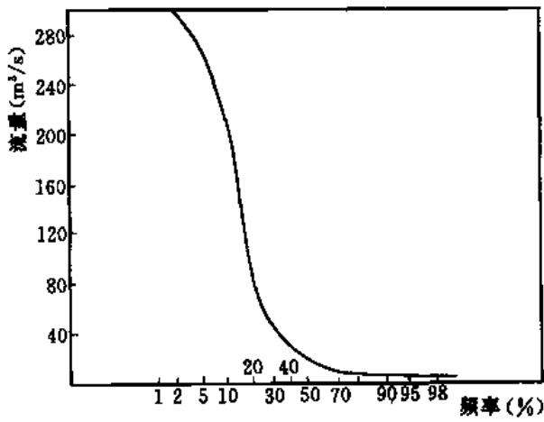  
图 8-4 某水文站日平均流量历时曲线

绘制这种曲线，作为深人分析研究的辅助手段。在我国的小型水力发电站水文计算规范中，已将此法列为一项重要的工作内容。

流量历时曲线是累积径流发生时间的曲线，表示等于或超过某一流量的时间百分数。径流统计时段，可按工程的要求选定，常采用日或旬为单位。当资料年数较多时，为简化计算，也可以按典型年（详见下节）或丰平枯代表年绘制流量历时曲线。当资料年数较少时，也可采用全部完整年份的流量资料绘制流量历时曲线。

现以代表年日平均流量历时曲线为例，说明曲线的制作方法和步骤。将代表年365个日平均流量分为n级 $( n { = } 2 0 { \sim } 5 0 )$ ，取每组资料的平均值，从大到小排队，与累积时间百分数对应点绘，即得代表年的日平均流量历时曲线。对应于某一流量，可以从曲线上查得年内出现等于或大于该值历时的百分数，如为80%，即一年内有80%的时间，流量将不小于该指定值。这对小水电站的保证出力计算、河流可通航天数和漂木天数的估算，具有重要的实际意义。图8-4给出了某水文站日平均流量历时曲线的一个示例。

## 第四节 设计年径流的时程分配

河川年径流的时程分配，一般按其各月的径流分配比来表示。年径流的时程分配与工程规模和水资源利用程度关系很大。无径流调节设施的灌溉工程，完全利用天然河川径流，主要依赖灌溉期径流的大小，决定对水资源的利用程度。灌溉期径流比重较大的河流，径

流利用程度较高；反之较低。对水库蓄水工程来说，非汛期径流比重愈小，所需的调节库容愈大；反之则小。如图 8-5所示[图 8-5（a）、(6) 表示两个不同来水年份的情况]。设来水总量相同，汛期与非汛期的来水比例不同，但需水过程相同，图 $( a )$ 中枯季径流较小，为满足需水要求，所需调节库容 $\pmb { V } _ { 1 }$ 较

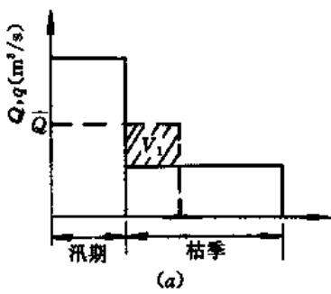

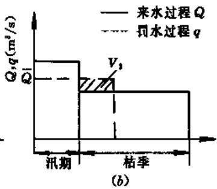  
图8-5 径流年内分配对调节库容的影响示意图

大；图（b)中枯季径流较大，所需调节库容 $V _ { z }$ 较小。

因此，当设计径流量确定以后，还须根据工程的目的与要求，提供与之配套的设计径流时程分配成果，以满足工程规划设计的需要。但是径流年内分配的随机性很强，即使年径流总量相同或接近时，其在年内按月分配的过程，也可能有很大的差异。如何确定一个合理的设计年径流分配过程，常用下列几种方法。

## 一、代表年法

在工程水文中，常采用按比例缩放代表年径流过程的方法，来确定设计年径流的时程分配。代表年法比较直观和简便，采用较广。

## (一)代表年的选择

(1)根据设计标准，查年径流频率曲线，确定设计年径流量 $\overrightarrow { W } _ { P }$ 或 $\overline { { Q } } _ { P }$ 。为了检验工程在不同来水年份的运行情况，又常选出丰平枯三个年份（如频率 $P = 2 0$ %、50%、80%或P=25%、50%、75%）为代表年。对水资源综合利用工程，其中分项任务（城市供水、发电、灌溉等）设计标准各有不同，应选出相应于各个分项任务设计标准的代表年。

(2) 在实测年径流资料 $\pmb { W } _ { \pmb { \Sigma } }$ (或 $\overline { { Q } } _ { \mathfrak { X } } )$ 中，选出年径流量接近 $\overrightarrow { W } _ { P }$ (或 $\overline { { \mathbf { Q } } } _ { \mathcal { P } } )$ 的年份。这种年份有时可能不只一个，可选出供水期径流较小的年份为代表年。

## (二)年径流时程分配计算

当代表年选定以后，统计出实测年径流 $W _ { ☉ }$ (或 $\overline { { \ u { Q } } } _ { \ast } )$ ，并求出设计年径流 $\smash { \mathbb { W } _ { P } }$ (或 $\overline { { Q } } _ { P } )$ 与实测年径流的比例系数K。

$$
K = W _ { P } / W _ { ☉ }\tag{8-8a}
$$

或

$$
K = \overline { { Q } } _ { P } / \overline { { Q } } _ { \pm }\tag{8-86}
$$

用此系数遍乘代表年各月的实测径流过程，即得设计年径流的按月时程分配。

## 二、虚拟年法

在水资源利用规划阶段，有时并不针对某项具体工程的具体标准，而只作水资源利用的宏观分析或评估，则年径流的时程分配可采用一种多年平均情况，即年和各月的径流均采用多年平均值，并列出丰、平、枯三种代表年的年径流及按月时程分配。目前许多大中河流均有年、月径流的多年均值及其不同频率的相应计算值可供采用。这种年径流的时程分配型式，不是来自某些代表年份，而是代表多年的统计特征，是一种虚拟的年份，故称虚拟年法。

## 三、全系列法

评价一项水资源利用工程的性能和效益，最严密的办法是将全部年、月径流资料，按工程运行设计进行全面的操作运算，以检验有多少年份设计任务不遭到破坏，从而较准确地评定出工程的保证率或破坏率。显然，这种方法较之上述两种方法更为客观和完善。它的缺点是计算较繁，特别是当年、月径流系列较长时，工作量很大，手工操作比较困难。但是，由于电子计算机的迅速推广和普及，上述困难不难克服。因而全系列法已越来越多地引起重视和被采用。

## 四、水文比拟法

$$
\cdot ^ { \frac { 1 } { - } }
$$

对缺乏实测径流资料的设计流域，其设计年径流的时程分配，主要采用水文比拟法推求，即将水文相似区内参证站各种代表年的径流分配过程，经修正后移用于设计流域。先求出参证站各月的径流分配比α，遍乘设计站的年径流，即得设计年径流的时程分配。月径流分配比按下式推求：

$$
\pmb { \alpha _ { i } } = \pmb { y _ { i } } / \pmb { Y }\tag{8-9}
$$

式中 ${ \pmb { \alpha } } _ { \pmb { \alpha } }$ 参证站第i月的径流分配比，%；

$\pmb { y } _ { i } \cdot$ ——参证站第i月的径流量， $\mathbf { m } ^ { 3 }$

$Y$ 参证站年径流量， $\mathtt { m } ^ { 3 }$ a

如果找不到合适的参证站，但设计流域有降水量资料时，也可以将月降水量分配比，近似地移用于年径流的分配，但此法精度较差，使用时应予注意。在小流域中，其近似性较好，中等以上流域，一般不宜采用此法。

## 第五节 年际连续枯水段径流分析

前面介绍的年径流分析计算，是以年为设计时段的，但有些大型蓄水工程，特别是具有多年调节性能的大型水库工程，在规划、设计和运行中，不仅要考虑年径流设计值，而且还要考虑年际连续枯水段出现的情况。

年际连续枯水段是设计断面连续多年发生年径流偏枯的现象，为河川径流的一种特性，在我国许多河流上均有发现，见表8-2。

在水资源利用工程中需要考虑的问题主要有：①对已出现的某一连续枯水段的重现期如何确定？②连续枯水段的频率曲线如何分析计算？

## 一、连续枯水段的定义与选样

## 1. 连续枯水段定义

描述年径流丰枯程度的指标很多，其中较常用的一种指标是以年径流系列均值进行界定的：凡低于年径流均值的年份，均作为枯水年份。连续发生几个枯水年份，称枯水段。国际上在进行水文干旱持续性分析时，也常采用这一指标。

## 2. 连续枯水段选样

根据上述定义，可将全部年径流系列N年中长度为n（n=2、3、4年、…，根据工程设计需要而定）的连续枯水段一一选出，

表 8-2 中国一些大河流上持续年数  
较长的连续枯水段
<table><tr><td rowspan=2 colspan=1>流域</td><td rowspan=2 colspan=1>控制断面</td><td rowspan=2 colspan=1>多年平均流量(m³/s)</td><td rowspan=1 colspan=4>连续枯水段</td></tr><tr><td rowspan=1 colspan=1>起迄年份</td><td rowspan=1 colspan=1>年数</td><td rowspan=1 colspan=1>平均流量(m³/s)</td><td rowspan=1 colspan=1>模比系数(%)</td></tr><tr><td rowspan=11 colspan=1>松花江哈黄河三鸭绿江嫩江布淮河蚌长江汉沅江五新安江新郁江西闽江竹修水柘汉江安泯江高平均</td><td rowspan=3 colspan=1>尔滨门峡云蜂西埠</td><td rowspan=2 colspan=1>11901350278338</td><td rowspan=1 colspan=1>1916~19271922~19321939~1950</td><td rowspan=1 colspan=1>121112</td><td rowspan=1 colspan=1>678994236</td><td rowspan=2 colspan=1>57.073.684.976.3</td></tr><tr><td rowspan=1 colspan=1>1967~1977</td><td rowspan=1 colspan=1>11</td><td rowspan=1 colspan=1>258</td></tr><tr><td rowspan=1 colspan=1>788</td><td rowspan=1 colspan=1>1970~1979</td><td rowspan=1 colspan=1>10</td><td rowspan=1 colspan=1>703</td><td rowspan=1 colspan=1>89.2</td></tr><tr><td rowspan=1 colspan=1>口</td><td rowspan=1 colspan=1>23400</td><td rowspan=1 colspan=1>1955~1963</td><td rowspan=1 colspan=1>9</td><td rowspan=1 colspan=1>21322</td><td rowspan=1 colspan=1>91.1</td></tr><tr><td rowspan=1 colspan=1>强溪</td><td rowspan=1 colspan=1>2060</td><td rowspan=1 colspan=1>1955~1966</td><td rowspan=1 colspan=1>12</td><td rowspan=1 colspan=1>1711</td><td rowspan=1 colspan=1>86.0</td></tr><tr><td rowspan=1 colspan=1>安江</td><td rowspan=1 colspan=1>338</td><td rowspan=1 colspan=1>1956~1968</td><td rowspan=1 colspan=1>13</td><td rowspan=1 colspan=1>265</td><td rowspan=1 colspan=1>78.4</td></tr><tr><td rowspan=1 colspan=1>津</td><td rowspan=1 colspan=1>1620</td><td rowspan=1 colspan=1>1952~1962</td><td rowspan=1 colspan=1>11</td><td rowspan=1 colspan=1>1314</td><td rowspan=1 colspan=1>81.1</td></tr><tr><td rowspan=1 colspan=1>岐</td><td rowspan=1 colspan=1>1750</td><td rowspan=1 colspan=1>1963~1972</td><td rowspan=1 colspan=1>10</td><td rowspan=1 colspan=1>1388</td><td rowspan=1 colspan=1>79.3</td></tr><tr><td rowspan=2 colspan=1>林康</td><td rowspan=1 colspan=1>254</td><td rowspan=1 colspan=1>1956~1965</td><td rowspan=1 colspan=1>10</td><td rowspan=1 colspan=1>210</td><td rowspan=1 colspan=1>82.6</td></tr><tr><td rowspan=1 colspan=1>608</td><td rowspan=1 colspan=1>1965~1973</td><td rowspan=1 colspan=1>9</td><td rowspan=1 colspan=1>525</td><td rowspan=1 colspan=1>86.4</td></tr><tr><td rowspan=1 colspan=1>场</td><td rowspan=1 colspan=1>2840</td><td rowspan=1 colspan=1>1969~1979</td><td rowspan=1 colspan=1>11</td><td rowspan=1 colspan=1>2570</td><td rowspan=1 colspan=1>90.081.2</td></tr></table>

①其值为连续枯水段平均流量与多年平均流量之比。

组成一个新的系列。其中径流变量可采用n年中的平均年径流量 $\overline { Q } _ { \pi } = \sum _ { 1 } ^ { n } Q _ { \mp } / \pi$ ，并须注意各年的径流资料，只能统计到一个枯水段中，不要重复使用。显然这个新的 $\overline { { \pmb { Q } } } _ { \ast }$ 系列的长度N《N，因为有些年份并不属于枯水年份，而属于枯水范围，又不一定是连续出现的。只有在年径流系列长度N很大时，才有可能选出可供频率分析的连续枯水段样本。因此，往往需要设法延长年径流系列的长度。

另外，连续枯水段长度n愈大，选样愈困难，这时也可适当酌情放宽选样条件，如在连续枯水段中间，偶而出现个别略大于多年年径流均值的平水年份，仍可作为连续枯水段加以统计。

## 二、连续枯水段的重现期考证

当选出的连续枯水段系列的最小项在量级上比较突出，为连续特枯段时，就需对其出现的重现期进行考证。下面介绍一些可以试用的方法。

## 1. 历史资料考证法

在我国的历史文献中，关于旱情的记载很多，特别是对连续数年大旱记载尤详。目前我国已出版或正在出版全国、各大流域和各省（区）的历史水旱灾害专著，其中有系统整理的大量历史旱情资料，是考证历史连续枯水段重现期的重要文献，可资参考。

## 2. 树木年轮法

树木年轮的疏密，与年降水的丰枯往往有较好的对应性，在干旱、半干旱地区尤为明显。国内外均有利用树木年轮的变化重建降雨系列的经验，有的可将系列延长至200\~300年。从而可进一步对连续枯水段的重现期作出判断。

## 3. 随机模拟法

利用随机模拟技术，生成超长年径流系列，是另一种新的尝试，有的已初步应用于实践。此法弥补了年径流系列一般较短的缺陷，为连续枯水段的分析研究，提供了另一种有

用途径。

## 三、连续枯水段的频率分析

当连续枯水段径流系列组成以后，亦可仿年径流频率分析方法进行，但系列的排序，习惯上按由小到大。经验点据的绘点位置，仍按数学期望公式计算，即

$$
\scriptstyle P _ { \bar { s } } = M / \ ( N + 1 )\tag{8-10}
$$

式中 $\pmb { P _ { \mathrm { : } } }$ ——连续n年枯水段平均流量的频率，%；

$M \cdot$ $\mathbb { Z } _ { n }$ 系列中事件的排位序数；

N——年径流系列的总长度，年。

这种频率曲线给出了连续 $\pmb { n }$ 年枯水段在N年中发生的频率（图8-6），可以作为水资源利用工程规划设计的参考。至于工程对各项任务（如发电、城市及工业供水、灌溉等）的保证率或破坏率，仍需按水库运行设计，对采用的连续枯水段或全部年径流系列进行径流调节演算后加以确定。

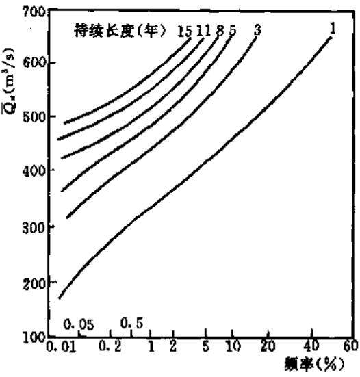  
图 8-6 某设计断面连续枯水段频率曲线示意图

各种不同持续年数（n）的连续枯水段径流频率曲线，综合绘制在一张图上，以资比较，并满足规划设计的不同要求。

## 第六节径流随机模拟

由于实际水文资料往往比较短，难于满足实际水文水利计算的要求，故需要对径流过程作随机模拟。这种随机模拟的目的之一在于充分利用现有水文实测资料的信息，但并不是用来延长资料长度。当所建模型及参数准确时，这种目的是能实现的。本节仅介绍单站年月径流随机模拟方法，对于多站及更深入的随机模拟问题，可参看有关专著。

## 一、随机过程基本知识

## (一) 随机过程和时间序列的定义

在实际问题中，常涉及试验过程随某个参变量的变化而变化的随机变量，如河流某处的流量、水位是随时间变化的随机变量，气温是随时间、高度而变的随机变量等。通常称这种随机变量为随机函数，并称以时间为参数的随机函数为随机过程，记为{ξ（t），$\varepsilon \in T \}$ ，T是t变化的范围。

随机过程在一次试验或观测中所得结果，称为随机过程的一个现实。

若时间参变量T是连续时刻的集合，则称这种随机过程为连续参数随机过程，简称随机讨程，如水位过程、流量过程等。若时间参变量T是离散时刻的集合，则称这种随机过程为离散参数随机过程，也称为随机序列或时间序列。如年、月径流过程，年最大流量过程都是时间序列，也称水文时间序列。

## (二)随机过程的数字特征

随机过程ξ（t)在任一固定时刻的状态是随机变量，因此可按与前述随机变量同样的方法定义随机过程的数学期望和方差。定义如下

数学期望

$$
\mu ( t ) = E [ \hat { \pmb { \xi } } ( t ) ]\tag{8-11}
$$

方差

$$
\sigma ^ { z } ( t ) = E \{ [ \hat { \mathsf { E } } ( t ) - \mu ( t ) ] ^ { 2 } \}\tag{8-12}
$$

为了刻划随机变量两个不同时刻状态间关系的密切程度，可定义随机变量的自相关函数为：

$$
R ( t _ { 1 } , t _ { 2 } ) = E \left\{ \frac { \big [ \tilde { \xi } ( t _ { 1 } ) - \mu ( t _ { 1 } ) \big ] \big [ \tilde { \xi } ( t _ { 2 } ) - \mu ( t _ { 2 } ) \big ] } { \sigma ( t _ { 1 } ) \sigma ( t _ { 2 } ) } \right\}\tag{8-13}
$$

## (三)随机过程基本分类

## 1. 按统计性质的稳定性分类

按随机过程的统计性质是否随时间而变化，可分成平稳和非平稳过程。若随机过程统计数字特征不随时间的平移而变化，则称为平稳过程，否则为非平稳过程。

## 2. 按不同时刻状态间的关系分类

可分成独立过程和马尔柯夫过程。若过程各状态相互独立，则称为独立随机过程。在非独立随机过程中，最重要的一类是马尔柯夫过程，其特点是 $\pmb { t _ { \kappa } }$ 时刻状态只与 $\pmb { \mathrm { \delta } } _ { \mathbf { s } - 1 }$ 时刻有关，而与 ${ { t } _ { { \bf { u } } - 1 } }$ 以前各时刻无关。

以上各个概念的严格定义，可参见有关文献。

## 二、径流随机模拟一般步骤

图8-7给出了单站年径流随机模拟的一般步骤：①时间序列组成分析；②模型的建立；③序列的生成；④模型及生成系列的检验。

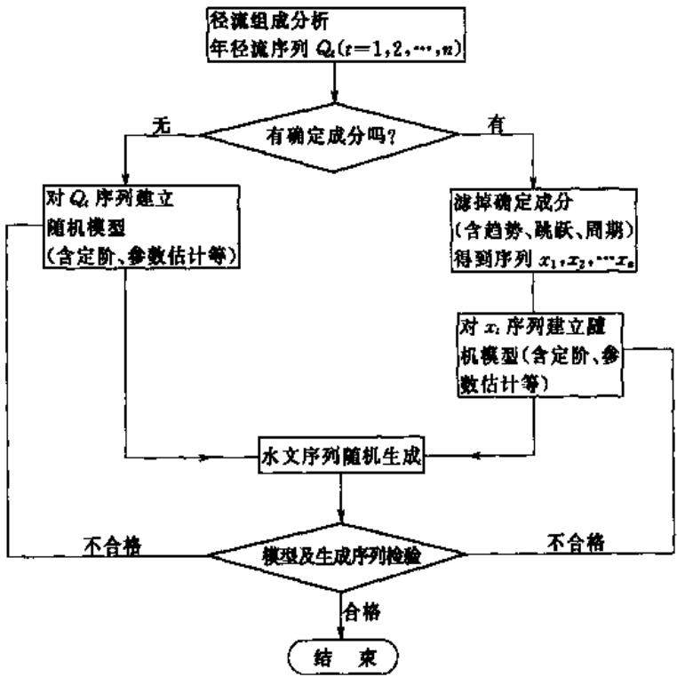  
图8-7 年径流随机模拟一般步骤框图

## 三、水文时间序列的组成分析

水文序列 $\mathbf { Q } _ { t }$ 一般可按下式表示：

$$
Q _ { t } = T _ { t } + C _ { t } + P _ { t } + S _ { t }\tag{8-14}
$$

式中 $T \smash { \mathrm { ~ , ~ } C _ { t } \mathrm { ~ , ~ } P _ { t } \mathrm { ~ , ~ } S _ { t } }$ 分别为趋势项、跳跃项、周期项和随机项。

当水文序列 $\pmb { Q _ { i } }$ 中不含 $T _ { t } , C _ { t } , P _ { t }$ 等确定性成分时，则 $\mathbf { Q } _ { t } { = } S _ { t }$ ，即仅包括随机成分的序列。对年径流序列而言，这种情况是比较常见的。但月径流序列因存在明显的年周期，所以不是仅包括随机成分的序列。

趋势项指的是水文变量的统计参数（主要是均值）的长期系统性升降，如图8-8即存在明显趋势(增长)。一般是由于气候因子或下垫面因子逐步改变而引起的缓慢变化。

对实测水文序列，可用假设检验或滑动平均的方

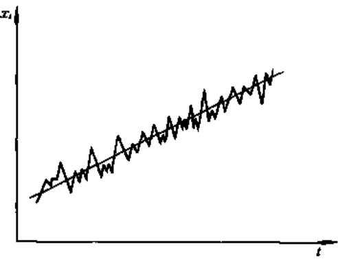  
图 8-8 序列趋势变化示意图

法查明是否存在趋势。若存在趋势，呈线性变化时，则常用线性方程拟合，然后从序列中将趋势滤掉。

跳跃项是指水文序列急剧变化的一种形式，当水文序列从一种状态过渡到另一种状态时表现出来，见图8-9。

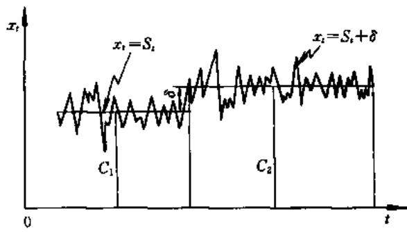  
图 8-9 跳跃成分及包含跳跃成分的合成序列

跳跃是人为或自然原因造成的。如建库前后水面面积增大，蒸发量等损失增加，有可能出现跳跃，并反映在年径流序列的均值等参数中。突变可看作跳跃的一种特殊情况，如由于地震塌方，拦截江河，形成水库以后溃坝，这样引起流量的突变，随着临时水坝的冲毁，又恢复原来状态。

跳跃是否存在于序列中，多用分割样本的方法检验。若存在较显著的跳跃成分，应从序

列中排除掉，使得剩余序列具有原始状态或一致条件。

周期项（含近似周期）是由于天体运动的周期性影响造成的，如地球公转、自转引起的以年和日为周期的变化，以及太阳黑子活动引起的旱涝多年变化。通常可用谐波分析的方法析出，再从序列中滤掉。

随机成分是由于不规则及随机振荡引起的，一般由相依成分和纯随机成分组成。严格地讲，几乎所有水文变量应是非平稳过程。不过，除了人为影响及自然灾变外，水文环境的变化在数十年或几百年期间都相当小，因此，从实用观点，常把水文序列中的随机成分看作平稳过程。

## 四、单站年月径流随机模型的建立

对年月径流序列建立随机模型一般是对原始年月径流序列排除趋势跳跃等确定成分后的随机成分而建立的模型。设用于建模的年径流序列为 $Q _ { 1 } , Q _ { 2 } , \cdots Q _ { n }$

径流序列随机模型是实测时间序列一种概化的数学式子。目前常见的随机模型有：线性平稳模型、非线性平稳模型，马尔柯夫模型及非马尔柯夫模型等。对年径流序列而言，通常采用线性平稳模型或马尔柯夫模型。

建立随机模型的一般步骤为：①选择模型；②确定阶数；③估计模型参数。

## (一)单站年径流随机模型的建立

通常采用线性自回归模型，即马尔柯夫模型。

1. 线性自回归模型的一般形式

$$
\begin{array} { r } { Q _ { t } = \overline { { Q } } + \varphi _ { p , 1 } ( Q _ { t - 1 } - \overline { { Q } } ) + \varphi _ { p , 2 } ( Q _ { t - 2 } - \overline { { Q } } ) + \cdots + \varphi _ { p , p } ( Q _ { t - p } - \overline { { Q } } ) + \varepsilon _ { i } } \end{array}
$$

式中

(8-15)

$\mathbf { Q } _ { t }$ ——第t年的年径流量， $t = 1 , \ 2 , \ \cdots$ ，常称式（8-15）的 $\alpha _ { i }$ 为自回归系列；

$\overline { a } - - \theta _ { 1 }$ 序列的平均值；

$\varphi _ { p , 1 } , \varphi _ { p , 2 } , \cdots , \varphi _ { p , p }$ 自回归系数或偏相关系数，反映 $\ Q _ { t }$ 在时间上相依性大小；

$\varepsilon _ { f } .$ 模型残差项，纯随机成分， $\varepsilon _ { t }$ 与 $Q _ { i - 1 } , Q _ { i - 2 }$ 、…无关且是独立随机变量，其均值为0，方差为 $\pmb { \sigma _ { u } ^ { 2 } }$ à

由于 $\sigma _ { \infty } ^ { 2 }$ 与 $\ Q _ { t }$ 的方差 $\pmb { \sigma } _ { \pmb { Q } } ^ { 2 }$ 有确定关系，因此，一般自回归模型中参数有 $\sharp , \sigma _ { \ell }$ 和 $\varphi _ { \mathtt { p } + 1 } \rVert _ { \gamma } \varphi _ { \mathtt { p } , 2 }$ …、 $\varphi _ { \pmb { \mathscr { P } } \cdot \pmb { \mathscr { P } } } ,$ 共 $\phi + 2$ 个参数。

该模型说明第t年年径流量仅依赖于第t一1年、第 ${ \pmb t } - { \pmb 2 }$ 年、 $\because$ 第 ${ \pmb t } - \pmb { \hat { p } }$ 年的年径流量和一个纯随机变量 $\pmb { \varepsilon } _ { t }$ 9

若令 $\scriptstyle y _ { t } = Q _ { t } - \overline { { Q } }$ ，则式（8-15）变为：

$$
\cdot y _ { i } = \varphi _ { p , 1 } y _ { i - 1 } + \varphi _ { p , 2 } y _ { i - 2 } + \cdots + \varphi _ { p , p } y _ { i - { p } } + \varepsilon _ { i }\tag{8-16}
$$

式（8-16）是中心化变量表示的自回归模型。

2. 模型参数的估计

模型中的参数常采用矩法估计，参数估计公式如下：

$$
\begin{array} { c } { { \overline { { Q } } = \frac { 1 } { n _ { t = 1 } } \sp \prime \underline { { { \Sigma } } } Q _ { t } } } \\ { { \hat { \sigma } _ { \Theta } = S _ { \Theta } = \sqrt { \frac { 1 } { n - 1 } \sp \prime _ { \mathrm { L } = 1 } \sp \prime _ { ( Q _ { t } - \overline { { { \Omega } } } ) ^ { 2 } } } } } \end{array}\tag{8-17}
$$

(8-18)

$$
{ \left[ \begin{array} { l } { { \hat { \varphi } } _ { \ p , 1 } } \\ { { \hat { \varphi } } _ { \ p , 2 } } \\ { \vdots } \\ { { \hat { \varphi } } _ { \ p , p } } \end{array} \right] } = { \left[ \begin{array} { l l l l l } { 1 } & { r _ { 1 } } & { r _ { 2 } } & { \cdots } & { r _ { p - 1 } } \\ { r _ { 1 } } & { 1 } & { r _ { 1 } } & { \cdots } & { r _ { p - 2 } } \\ { \vdots } & { \vdots } & { \vdots } & { \vdots } & { \vdots } \\ { r _ { p - 1 } } & { r _ { p - 2 } } & { r _ { p - 3 } } & { \cdots } & { 1 } \end{array} \right] } ^ { - 1 } { \left[ \begin{array} { l } { r _ { 1 } } \\ { r _ { 2 } } \\ { \vdots } \\ { r _ { p } } \end{array} \right] }\tag{8-19}
$$

其中 K 阶样本自相关系数 $\pmb { r } _ { \pmb { K } }$ 在n较大、K较小时，计算公式为：

$$
r _ { K } = \frac { n } { n - K } \frac { \displaystyle \sum _ { t = 1 } ^ { n - K } ( Q _ { t } - \overline { { Q } } ) ( Q _ { t + \kappa } - \overline { { Q } } ) } { \displaystyle \sum _ { t = 1 } ^ { n } ( Q _ { t } - \overline { { Q } } ) ^ { 2 } }\tag{8-20}
$$

据推导

$$
\hat { \sigma } _ { \ast } ^ { 2 } = \hat { \sigma } _ { \boldsymbol { \theta } } ^ { 2 } ( 1 - \hat { \varphi } _ { \mathrm { ~ \boldsymbol { p } , 1 } } r _ { 1 } - \hat { \varphi } _ { \mathrm { ~ \boldsymbol { p } , 2 } } r _ { 2 } - \dots - \hat { \varphi } _ { \mathrm { ~ \boldsymbol { p } , \boldsymbol { p } } } r _ { p } )\tag{8-21}
$$

在数学上，一般假定ε为正态分布，故不需计算其偏态系数。但对于具有偏态的水文 $\pmb { \varepsilon } _ { t }$ 序列，一般把ε当作P一型分布。因此，还必须估计ε的偏态系数 $\mathfrak { E } _ { t }$ $\varepsilon _ { t }$ $C _ { s \bullet _ { t } }$

$$
\hat { C } _ { \textit { s e } _ { i } } = \frac { 1 } { ( N - P - 3 ) \hat { \sigma } _ { \mathrm { e } _ { i } } ^ { 3 } } \sum _ { i = P + 1 } ^ { n } ( \varepsilon _ { i } - \hat { \textbf { \textit { e } } } ) ^ { 3 }\tag{8-22}
$$

$\scriptstyle \varepsilon _ { i } \ ( { i = P + 1 } , \ P + 2 , \ \cdots , \ n )$ 是根据估计出的以上 $\pm 2$ 个参数及观测序列 $\mathbf { Q } _ { i }$ ，利用式(8-15)反推得到的。平均值是根据反推序列ε利用矩法估算的。 $\widehat { \overline { { \varepsilon } } } _ { \varepsilon }$ $\pmb { \varepsilon _ { \pmb { \varepsilon } } }$

## 3. 常见 AR（1）及AR（2）模型参数估计公式

AR（1）模型形式为：

$$
\mathcal { Q } _ { t } = \overline { { Q } } + \varphi _ { i , 1 } ( Q _ { t - 1 } - \overline { { Q } } ) + \varepsilon _ { i }\tag{8-23}
$$

模型参数估计公式为：

$$
\hat { \varphi } _ { \downarrow , 1 } = r _ { 1 }\tag{8-24}
$$

$$
\hat { \sigma } _ { \mathrm { e } _ { i } } = \hat { \sigma } _ { \mathrm { e } } \sqrt { 1 - r _ { 1 } ^ { 2 } }\tag{8-25}
$$

$$
C _ { * } = \frac { 1 } { ( n - 4 ) \hat { \sigma _ { i } } ^ { 3 } } { \sum _ { i = 2 } ^ { n } ( { \varepsilon _ { i } - { \begin{array} { l } { \widehat { \varepsilon } } \\ { \widehat { \varepsilon } _ { i } } \end{array} } } ) ^ { 3 } }\tag{8-26}
$$

AR（2）模型形式为：

$$
Q _ { i } = \overline { { { Q } } } + \varphi _ { i , 1 } ( Q _ { i - 1 } - \overline { { { Q } } } ) + \varphi _ { i , 2 } ( Q _ { i - 2 } - \overline { { { Q } } } ) + \epsilon _ { i }\tag{8-27}
$$

模型参数估计公式为：

$$
\hat { \varphi } _ { \textit { \xi } _ { 1 } 1 } = r _ { 1 } ( 1 - r _ { 2 } ) / ( 1 - r _ { 1 } ^ { 2 } )\tag{8-28}
$$

$$
\hat { \varphi } _ { \ z , 2 } = ( r _ { 2 } - r _ { 1 } ^ { 2 } ) / ( 1 - r _ { 1 } ^ { 2 } )\tag{8-29}
$$

$$
\hat { \sigma } _ { \iota } \ = \ \hat { \sigma } \ _ { \textsf { q } } \sqrt { 1 - \hat { \textsf { p } } _ { \iota , 1 } r _ { 1 } - \hat { \varphi } _ { \ \iota , 2 } r _ { 2 } }\tag{8-30}
$$

$$
\hat { C } _ { s e , \textit { t } } = \frac { 1 } { \left( N - 5 \right) \hat { \sigma } _ { \ast , \textit { t } } ^ { 3 } } \underset { i = 1 } { \overset { \ast } { \sum } } ( \varepsilon _ { i } - \mathrm { ~ \textit ~ {  } ~ } _ { i } ) { \mathrm { \boldsymbol ~ { \acute { \iota } } } }\tag{8-31}
$$

## 4. 模型阶数 P的确定

对于AR（P）序列，可以证明：它的自相关系数随滞时增大而减小，呈拖尾状，而偏相关系数 $\varphi _ { { \pmb x } , { \pmb x } }$ 则呈截尾状，在 $\pmb { K } = \pmb { P }$ 时出现一个截止点，即在 $K \leqslant P$ 时， $\varphi _ { { \pmb x } , { \pmb x } } { \neq } 0$ ，当 $K >$ $P$ 时， $\varphi _ { K , K } = 0$ 。因此，从理论上讲可以通过计算不同的 $\hat { \varphi } _ { \ K , K } \left( K = 1 , \ 2 , \ \cdots \right)$ 进行模型识别，例如，当从样本序列估计 $\hat { \varphi } _ { \kappa , \kappa }$ 在 $\pmb { K } = 3$ 时具有明显截尾现象，那么可推断该水文序列$\scriptstyle P = 3$ 即适合于AR（3）模型。但是由于实际水文样本容量n较小，故统计量 $\hat { \varphi } _ { \kappa , \kappa }$ 抽样误差较大，即使是AR（P）序列，当 $K > P$ 时， $\hat { \varphi } _ { \kappa , \kappa }$ 可能并不为零，这样就难于作直观判断，必须进行统计推断。

统计推断方法是：取显著水平 $\pmb { \alpha } { \simeq } 0 . 0 5$ ，若 $| \hat { \varphi } _ { \kappa , \kappa } _ { \kappa } _ { } | { > } \frac { 1 \cdot 9 6 } { \sqrt { \pi } }$ ，则可接受 $\hat { \varphi } _ { \kappa , \kappa }$ 异于0的假设。例如，某河流年径流偏相关系数如图8-10所示，该图表明，只有 $\hat { \pmb { \varphi } }$ 1.超过 95%容许限，即 $\hat { \varphi } _ { \mathrm { ~ \tiny ~ l ~ 1 ~ } } \} > \frac { 1 . 9 6 } { \sqrt { \pi } }$ ，故该序模型阶段应为1，即AR（1）模型。

## (二)单站月径流随机模型的建立

对已有n年实测月径流资料的单站通常有两条途径建立其月径流随机模型。一是先建立年径流模型，再通过建立解集模型把年径流分解成各月月径流、解集模型公式为：

$$
Y = A Q + B \varepsilon\tag{8-32}
$$

式中 Y——各月月径流量， $\mathbf { \Psi } \mathbf { Y } = ( y _ { 1 } , y _ { 2 } , \cdots ,$ $_ { y _ { 1 2 } } ) ^ { \mathtt { T } }$

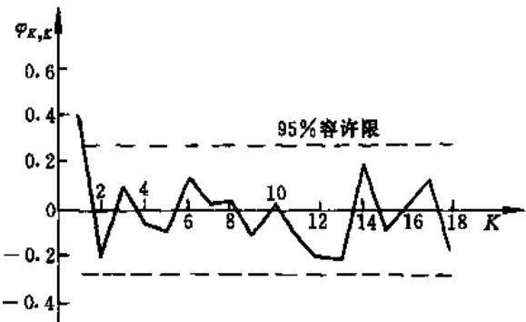  
图 8-10 某河年径流偏相关图

Q——年径流量；

A——模型参数， $A = \mathbf { \varphi } ( a _ { 1 } , \ a _ { 2 } , \ \cdots , \ a _ { 1 2 } ) ^ { T }$ ，反映各月月径流量平均分配水平；

$B \cdot$ 12×12的参数矩阵，反映各月之间的相关关系程度；

ε——模型残差项， $ { \varepsilon } = ( \varepsilon _ { 1 } , \varepsilon _ { 2 } , \cdots , \varepsilon _ { 1 2 } ) ^ { T } , \varepsilon _ { 1 } , \varepsilon _ { 2 } , \cdots , \varepsilon _ { 1 2 }$ 相互独立，可以是正态或偏态分布，ε与 $Q$ 相互独立。

以上各参数可由n年实测资料估算。本模型结构简单，概念清晰，但因参数多，故所需实测资料较长。二是直接建立月径流随机模型，通常采用季节性一阶自回归模型，即假定可用12个一阶自回归模型来描述各月月径流量及其相关关系。各月月径流模型如下：

$$
\begin{array} { r } { Q _ { i , j } = \overline { { \check { Q } } } _ { j } + \frac { \sigma _ { j } } { \sigma _ { j - 1 } } r _ { i , j - 1 } ( \mathcal { Q } _ { i , j - 1 } - \overline { { \check { Q } } } _ { j - 1 } ) + \sigma _ { j } \sqrt { 1 - r _ { j , j - 1 } ^ { 2 } } \varepsilon _ { j } } \end{array}\tag{8-33}
$$

式中i年份，i=1、2、…；

j——月份， $j { = } 1 , \ 2 , \ \cdots , \ 1 2$

$Q _ { i , j }$ —第i年第j月的月径流量；

$\overline { { \mathsf { Q } } } ,$ $\sigma _ { j }$ ——第j月的月径流均值和均方差， $\overline { { { Q } } } _ { 0 } = \overline { { { Q } } } _ { 1 2 } , \sigma _ { 0 } = \sigma _ { 1 2 } ;$

$r _ { j \cdot , \ j - 1 }$ —第j月与第（j一1）月月径流量之间相关系数， $\scriptstyle \gamma _ { 1 , 0 }$ 表示第1月与上一年第12月月径流量相关系数；

$\bar { \varepsilon } _ { j }$ ——第j月纯随机变量，是模型残差项，可以是标准正态分布或标准P一分布，各月之间 $\varepsilon _ { j }$ 相互独立，且 $\pmb { \mathscr { E } } _ { j }$ 与 $\ Q _ { i , j - 1 }$ 相互独立。

以上各有关参数可由n年实测月径流资料用矩法估算。

若 $\varepsilon _ { j }$ 采用标准正态分布，则月径流量也是正态分布。若 $\epsilon _ { j }$ 采用标准P一Ⅱ分布，则月径流量为近似P—Ⅱ分布，生成P一Ⅱ分布 $\varepsilon _ { j }$ 时，还需估算 $\varepsilon _ { j }$ 的偏态系数

$$
C _ { x _ { j } } = \frac { C _ { x _ { 2 _ { j } } } - r _ { j , j - 1 } ^ { 3 } C _ { x _ { 2 } - 1 } } { ( 1 - r _ { j , j - 1 } ^ { 2 } ) ^ { 3 / 2 } }\tag{8-34}
$$

式中 $C _ { \bullet } { } _ { , }$ —第 $\pmb { j }$ 月月径流偏态系数， $\scriptstyle { j = 0 }$ 时，表示的是第12月的偏态系数，该参数可用实测n年第j月月径流序列估算。

## 五、年月径流序列的生成（模拟）

年月径流序列模拟涉及到纯随机变量ε的生成及由ε生成年月径流序列的问题。 $\varepsilon _ { \varepsilon }$ $\varepsilon _ { t }$

## (一)纯随机变量随机数的生成

纯随机变量ε的分布可以是正态，也可以是偏态。它的生成一般先生成[0，1]均匀 $\varepsilon _ { i }$ 分布随机数u，再通过变换生成指定分布的随机数。

## 1. 均匀分布随机数的生成

生成方法有随机数表法、物理方法及数学方法。由于前两种方法存在严重缺陷，故常用数学方法生成，其中应用最广的是乘同余法。

乘同余法生成随机数递推公式是：

$$
x _ { n + 1 } = \mathrm { M O D } ( \lambda x _ { n } , M ) \quad n = _ { \frac { 1 } { 3 } } 0 , 1 , 2 , \cdots\tag{8-35}
$$

$$
u _ { n + 1 } = x _ { n + 1 } / M\tag{8-36}
$$

式（8-35）、式（8-36）中 $\pmb { x _ { 0 } }$ 为初值，λ为乘子，M为模，它们均为非负整数，而且λ$< M$ $\pmb { \mathcal { X } } _ { \pmb { \pi } + 1 }$ 是 $\lambda x _ { n }$ 被M整除后的余数，于是 $x _ { n + 1 } < M$ ，故 $\pmb { u } _ { n + }$ 即为[0，1]上的随机数。

这种方法生成的随机数存在着循环周期，因此，un+1不是真正意义上的随机数，俗称 ${ \pmb u } _ { \pmb { \mathscr { + } } 1 }$ “伪随机数”。但由于M往往取值很大，周期也很长，目前微机上周期可达109以上，实用 $1 0 ^ { 9 }$ 上完全能满足需要。正因如此，实际大都使用该法生成[0，1]均匀分布随机数。不过使用前要对生成的随机数作均匀性、独立性等检验。

## 2. 正态分布随机数的生成

通常用 Box—Muller 变换生成，即

$$
\begin{array} { l } { N _ { 1 } = \sqrt { - \ 2 \mathrm { l n } u _ { 1 } } \mathrm { c o s } \left( 2 \pi u _ { 2 } \right) } \\ { N _ { 2 } = \sqrt { - \ 2 \mathrm { l n } u _ { 1 } } \mathrm { s i n } \left( 2 \pi u _ { 2 } \right) } \end{array}\tag{8-37}
$$

式中（8-37）中 ${ \pmb u } _ { 1 }$ ${ \pmb u } _ { 2 }$ 为[0，1]均匀分布随机数， ${ \cal N } _ { 1 }$ $N _ { 2 }$ 为相互独立标准化正态随机数。对于任意正态分布 $N \ ( \mu , \sigma ^ { 2 } )$ ，随机数 $N ^ { t }$ 生成公式 $N ^ { t } = \mu + \sigma N$ ，N为标准化正态分布随机数。

## 3. P—Ⅱ型分布随机数生成

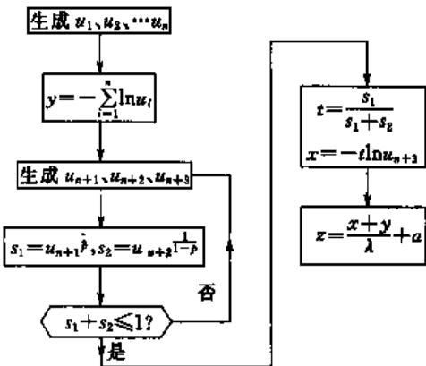  
图 8-11 P—Ⅱ型分布

利用舍选法生成P一Ⅱ型分布随机数，详见图8-11。

其中 $u _ { i } \ ( i { = } 1 , \ 2 , \ \cdots , \ n { + } 3 )$ 为[0，1]均匀分布随机数，z为所需生成P—Ⅱ型分布随机数。该分布3个参数为：均值 $\pmb { \mathcal { E } } x$ 、离势系数 $C _ { v }$ 及偏态系数 $C _ { \varepsilon }$ 。在Ex、 $C _ { \bullet }$ 、C，已知的情况下，框图中n、p、a、λ的计算公式如下：

$$
n = I N T ( 4 / C _ { s } ^ { 2 } )\tag{8-38}
$$

$$
\pmb { \rho } = 4 / C _ { s } ^ { 2 } - \pmb { \pi }\tag{8-39}
$$

抽样过程框图

$$
\lambda = 2 / ( E x C _ { \circ } C _ { \circ } ) \overrightarrow { \sf x } \overrightarrow { \sf x } = 2 / ( \sigma C _ { s } )\tag{8-40}
$$

$$
a = E x - 2 E \mathrm { { , } } x C _ { v } / C ,\tag{8-41}
$$

## (二)年月径流的生成

下面仅介绍年径流生成的方法，月径流生成的方法类同。

设所建立的模型为AR（1），且参数已估计出。其模型为

$$
Q _ { t } = \overline { { \ u { Q } } } + \varphi _ { t , 1 } ( Q _ { t - 1 } - \overline { { \ u { Q } } } ) + \varepsilon _ { t }\tag{8-42}
$$

式（8-42）中 $\ E _ { t }$ 分布参数：均值为0，均方差为 $\pmb { \sigma } _ { \pmb { \imath } _ { i } }$ ，偏态系数为 $C _ { \mathfrak { r } _ { t } }$ 。下面分两种情况介绍年径流生成步骤：

## 1. 考虑年径流为正态分布

这种情况下，ε为正态分布，即C可认为等于0。 $\pmb { \varepsilon } _ { i }$ $C _ { s _ { \natural } }$ $0$

生成步骤：

(1) 以Q或 $\ Q _ { i } \ ( t { = } 1 , \ 2 , \ \cdots , \ n )$ 为 $Q _ { 0 }$ 3

(2) 生成一个符合 $N ~ ( 0 , ~ \sigma _ { e _ { i } } ^ { 2 } )$ 的正态随机数 ${ \pmb { \varepsilon _ { 1 } } }$

(3) 以 $\ Q _ { 0 }$ 及 $\varepsilon _ { \mathrm { i } }$ 代人式（8-42）生成一个年径流 $\pmb { Q } _ { 1 }$

(4）同步骤（2），生成一个 $\pmb { \varepsilon _ { 2 } } ;$

(5) 以 $\ Q _ { 1 }$ 和 $\varepsilon _ { 3 }$ 代入式（8-42），计算出 $Q _ { 2 }$

(6)重复上述步骤，可得到一个很长Q.生成序列，如容量为NN+50的序列Q； $\alpha _ { \ell }$ $\ Q _ { t }$

(7)考虑到前50项可能受初值影响，应舍去，故剩下NN年为生成的年径流系列。

## 2. 考虑年径流为偏态分布

这种情况一般考虑ε为P—Ⅱ分布，ε三个参数是：均值（均值为0）、方差，偏态 $\varepsilon _ { t }$ $\epsilon _ { t }$ $\sigma _ { \mathfrak { c } _ { \ell } } ^ { 2 }$ 系数C。生成年径流Q序列的方法与考虑年径流为正态时几乎一样，唯一不同的是上述第 $C _ { \nu _ { \ell } }$ $\ Q _ { t }$ (2)步ε改用了P—Ⅱ型分布随机数生成。这样生成的Q序列可近似认为是P—Ⅱ型 $\varepsilon _ { t }$ $\alpha _ { t }$ 分布。

## 六、模型及生成系列的检验

模型检验是指所选用的模型残差ε为独立随机变量是否成立，ε分布是否为假定分布。 $\varepsilon _ { t }$ ${ \pmb { \varepsilon } } _ { \pmb { \varepsilon } }$ 生成序列检验是指所生成年月径流序列是否能反映实测径流的统计特性。

## 1. 残差独立性检验

在模型及参数确定后，根据实测样本 $\mathbf { Q } _ { t } ,$ 用式(8-15)可推出残差序列 ${ \mathfrak { E } } _ { t } \left( t = P + 1 , \cdots \right.$ n)，由ε序列可计算其各阶自相关系数rk，再对rx作独立性假设检验。当检验通过，即 $\varepsilon _ { t }$ ${ \pmb { r } } _ { { \pmb { K } } }$ ${ r } _ { { \pmb { \kappa } } }$ $\ E _ { t }$ 满足独立性，说明建模时对ε独立性假定是成立的，否则要分析产生的原因。若∈序列存 $\varepsilon _ { t }$ $\widehat { \sf e } _ { \ell }$ 在密切自相关，应考虑使用其他模型。

## 2. 生成系列检验

一般要求生成序列与实测序列统计特征相近。如差异很大，要分析原因，确实是模型结构问题，应考虑改变模型。

## 七、实例——红水河龙滩站年径流序列生成

红水河龙滩水库为一多年调节水库，坝址处有自1946\~1979年共34年的资料。为了分析工作需要，要求生成年径流系列。

## I. 径流组成分析

经过分析，未发现有趋势、突变、周期等确定成分，故可直接对实测序列建立平稳模型。

## 2. 模型选择和参数估计

为了便于选择模型，已估算了年径流序列统计参数 $\mathbb { Z } , C _ { v } , C ,$ 及自相关系数 $\pmb { r } _ { 1 } \backprime \pmb { r } _ { 2 } ,$ $\cdots r _ { 1 5 }$ ，见表 8-3 及图 8-12(a)。从图 8-12(a)可看出，自相关系数呈指数衰减趋势，故选用常用的 $\pmb { A } \pmb { R } ( \pmb { P } )$ 模型作为年径流模型。

为了确定模型阶数P，计算 $\hat { \mathrm { ~ \bf ~ f ~ } } \hat { \varphi } _ { \mathrm { ~ \bf ~ x } , \kappa }$ $( K = 1 , 2 , \cdots , 1 5 )$ 见图8-12(b)。从图中可知，$K = 3$ 时， $\hat { \varphi } _ { \kappa , \kappa }$ 超过置信限范围，而 $K { > } 3$ 时，$\varphi _ { \kappa . \kappa }$ 均在置信限范围内，说明 $\hat { \varphi } _ { \kappa , \kappa }$ 在 $K > 3$ 时，可以认为是0，因此，应选定阶数为3。

表 8-3龙滩站实测与生成序列统计参数表
<table><tr><td rowspan=2 colspan=1>序列类别</td><td rowspan=2 colspan=1>均值标Q</td><td rowspan=2 colspan=1>准差离a</td><td rowspan=2 colspan=1>势系数偏 $\mathbf { c } _ { \nu }$ </td><td rowspan=2 colspan=1>态系数 $^ { c , }$ </td><td rowspan=1 colspan=3>自相关系数</td></tr><tr><td rowspan=1 colspan=1> ${ \pmb { r _ { 1 } } }$ </td><td rowspan=1 colspan=1> $\gamma _ { 2 }$ </td><td rowspan=1 colspan=1> $\gamma _ { 3 }$ </td></tr><tr><td rowspan=1 colspan=1>实测1</td><td rowspan=1 colspan=1>651.8</td><td rowspan=1 colspan=1>385.9</td><td rowspan=1 colspan=1>0.234</td><td rowspan=1 colspan=1>-0.22</td><td rowspan=1 colspan=1>|0. 055|</td><td rowspan=1 colspan=1>0. 154|</td><td rowspan=1 colspan=1>0. 338</td></tr><tr><td rowspan=1 colspan=1>生成1</td><td rowspan=1 colspan=1>661.9</td><td rowspan=1 colspan=1>415.3</td><td rowspan=1 colspan=1>0.250</td><td rowspan=1 colspan=1>0</td><td rowspan=1 colspan=1>0. 0430</td><td rowspan=1 colspan=1>. 159|0</td><td rowspan=1 colspan=1>. 319</td></tr></table>

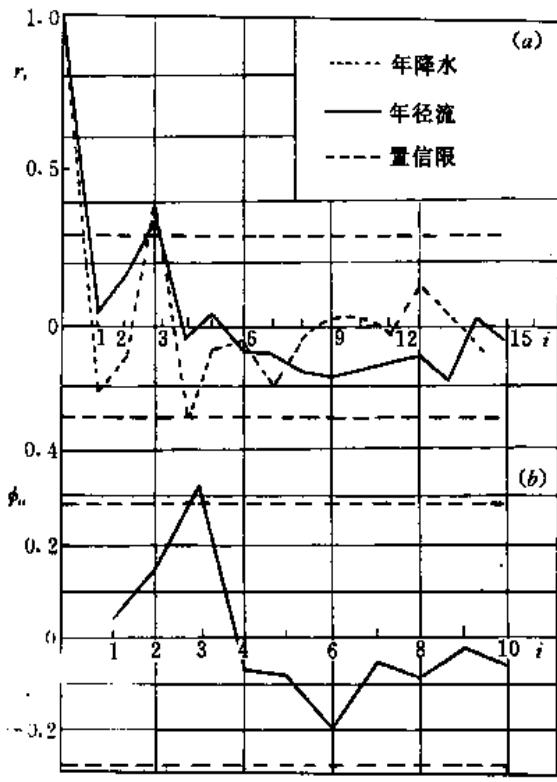  
图12龙滩站自、偏相关函数示意图

模型参数利用前面介绍的矩法估算，结果为： $\varphi _ { 3 , 1 } = - 0 . 0 2 1 , \varphi _ { 3 , 2 } = 0 . 1 4 3 , \varphi _ { 3 , 3 } = 0 . 3 3 3$ $\pmb { \sigma _ { \pmb { \mathscr { s } } , } } = \pmb { 0 } , \pmb { 9 3 } 1$ 。此外，利用实测系列仅推出 $\varepsilon _ { 4 } , \varepsilon _ { 5 } , \cdots$ $\varepsilon _ { 3 4 }$ ，计算出 $\varepsilon _ { \ell }$ 的 ${ C } _ { { ^ { s \pm } } _ { \ell } }$ ，结果是 $C _ { s u }$ 接近于0。

## 3. 年径流序列生成

由于 $C _ { \bullet , }$ 很小，故把当作正态分布，即用正态分布生成 $\hat { \mathbf { e } } _ { t }$ ，利用三阶自回归模型生成1000年年径流系列。

## 4. 模型及生成系列的检验

(1) 对于反推序列 $\varepsilon _ { 4 } , \varepsilon _ { 5 } , \ldots , \varepsilon _ { 3 4 }$ ，求自相关系数 $r _ { \kappa }$ ，经检验可认为是独立的，因此，模型的假定是成立的。

(2)生成系列的检验。对生成1000年年径流计算 $\smash { \overline { { \mathcal { Q } } } _ { 3 } \sigma _ { 2 } C _ { 2 } } , C _ { s }$ 及自相关系数 $r _ { 1 } , r _ { 2 } , r _ { 3 } , \cdots$

见表8-3。通过对比发现两序列各项统计参数相对误差较小。

以上检验结果表明，所建模型是可接受的。

总之，径流随机模型是随着数学中的随机过程理论和电子计算机技术在水文学中应用而逐渐发展起来的，所有各种随机模型都是建立在水文现象的统计特性基础上，模型中参数必须基于实测资料所提供信息加以估计，因此，只有深入了解水文现象的特性以及获得尽可能多的可靠信息，才能更有效地使随机模型应用于工程水文中。

## 第七节 设计枯水流量分析计算

枯水流量亦称最小流量，是河川径流的一种特殊形态。枯水流量往往制约着城市的发展规模、灌溉面积、通航的容量和时间，同时，也是决定水电站保证出力的重要因素。

按设计时段的长短，枯水流量又可分为瞬时、日、旬、月、……最小流量，其中又以日、旬、月最小流量对水资源利用工程的规划设计关系最大。

时段枯水流量与时段径流在分析方法上没有本质区别，主要在选样方法上有所不同。时段径流在时序上往往是固定的，而枯水流量则在一年中选其最小值，在时序上是变动的。此外，在一些具体环节上也有一些差异。

## 一、有实测水文资料时的枯水流量计算

当设计代表站有长系列实测径流资料时，可按年最小选样原则，选取一年中最小的时段径流量，组成样本系列。

枯水流量常采用不足概率q，即以小于和等于该径流的概率来表示，它和年最大选样的概率 P有 $q { = } 1 { - } P$ 的关系。因此在系列排队时按由小到大排列。除此之外，年枯水流量频率曲线的绘制与时段径流频率曲线的绘制基本相同，也常采用 $\pmb { P } - \pmb { \mathbb { I } }$ 型频率曲线适线。图8-13为某水文站不同天数的枯水流量频率曲线的示例。

年枯水流量频率曲线，在某些河流上，特别是在干旱半干旱地区的中小河流上，还会出现时段径流量为零的现象，可参阅含零系列的频率分析方法。此处只介绍一种简易的实用方法[20]。

设系列的全部项数为n，其中非零项数为k，零值项数为 $\pmb { n } - \pmb { k }$ 。首先把k项非零资料视作一个独立系列，按一般方法求出其频率曲线。然后通过下列转换。即可求得全部系列的频率曲线。其转换关系为：

$$
\begin{array} { r } { P _ { \perp } = \frac { k } { n } P _ { \perp } } \end{array}\tag{8-43}
$$

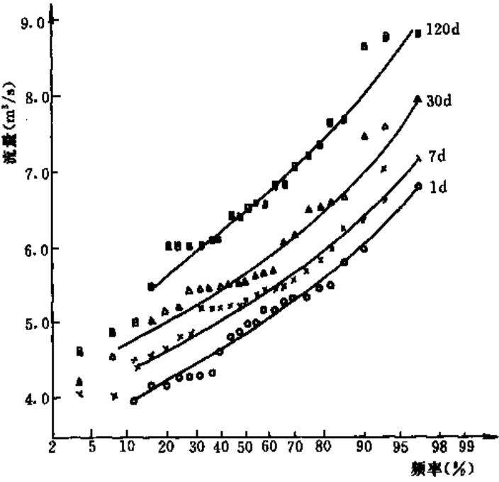

式中 $P _ { ☉ }$ —全系列的设计频率；

$\pmb { P } _ { \pmb { \imath } }$ ——非零系列的相应频率。

图 8-13 某水文站枯水流量频率曲线

在枯水流量频率曲线上，往往

会出现在两端接近 $P = 2 0$ %和 $\pmb { P } = 9 0$ %处曲线转折现象。在 $P = 2 0$ %以下的部分是河网及潜水逐渐枯竭，径流主要靠深层地下水补给。在 $P = 9 0$ %以上部分，可能是某些年份有地表水补给，枯水流量偏大所致。

## 二、短缺水文资料时的枯水流量估算

当设计断面短缺径流资料时，设计枯水流量主要借助于参证站延长系列或成果移置，与本章第三节所述方法基本相同。但枯水流量较之固定时段的径流，其时程变化更为稳定。因此，在与参证站建立径流相关时，效果会更好一些。或者说，条件可以适当放冤。例如，当设计站只有少数几年资料，与参证站的相似性较好时，也可建立较好的枯水流量相关关系。在这种情况下，甚至可以不进行设计站的径流系列延长和频率分析，而直接移用参证站的频率分析成果，经上述相关关系，转化为本站的相应频率的设计枯水流量。

在设计站完全没有径流资料的情况下，还可以临时进行资料的补充收集工作，以应需要。如果能施测一个枯水季的流量过程，则对于建立30天以下时段的枯水流量关系，有很大用处；如只研究日最小流量，那么在枯水期只施测几次流量（如10次流量），就可与参证站径流建立相关关系。

## 习 題

8-1 某流域多年平均年径流深等值线图如图8-14 所示，要求：

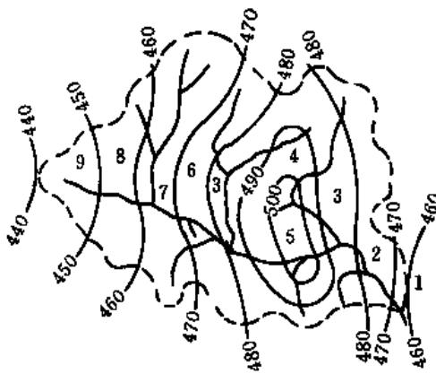  
图 8-14 某流域多年平均年径流深等值线图（单位：mm）

(1)用加权平均法求流域的多年平均径流深，其中部分面积值见表8-4。

(2)用内插法查得流域重心附近的年径流深代表全流域的多年平均径流深。

(3)试比较上述两种成果，哪一种比较合理？理由何在？在什么情况下，两种成果才比较接近？

8-2 某水利工程的设计代表站，有1954\~1971年的实测径流资料。其下游有一参证站，有1934\~1971年的年径流系列资料，如表8-5所示，其中1953\~1954年、1957\~1958年和1959\~1960年，分别被选定为P=50%、P=75%和P=95%的代表年，其年内的逐月径流分配如表8-6所示。试求：

(1）根据参证站资料，将设计站的年径流系列延长至1934\~1971年。

(2)根据延长前后的设计站年径流系列，分别绘制年径流频率曲线，并分析比较二者有何差别？

(3）根据设计站代表年的逐月径流分配，计算设计站P=50%，P=75%和P=95%年份的逐月径流分配过程。

表8-4  
径流深等值线间部分面积表
<table><tr><td rowspan=1 colspan=1>部分面积编号</td><td rowspan=1 colspan=1>1</td><td rowspan=1 colspan=1>2</td><td rowspan=1 colspan=1>3</td><td rowspan=1 colspan=1>4</td><td rowspan=1 colspan=1>5</td><td rowspan=1 colspan=1>6</td><td rowspan=1 colspan=1>7</td><td rowspan=1 colspan=1>8</td><td rowspan=1 colspan=1>9</td><td rowspan=1 colspan=1>全流域</td></tr><tr><td rowspan=1 colspan=1>部分面积(km²)</td><td rowspan=1 colspan=1>100</td><td rowspan=1 colspan=1>1320</td><td rowspan=1 colspan=1>3240</td><td rowspan=1 colspan=1>1600</td><td rowspan=1 colspan=1>600</td><td rowspan=1 colspan=1>1840</td><td rowspan=1 colspan=1>2680</td><td rowspan=1 colspan=1>1400</td><td rowspan=1 colspan=1>680</td><td rowspan=1 colspan=1>13460</td></tr></table>

表8-5  
设计站与参证站的年径流系列  
单位： $\mathbf { m } ^ { 3 } / \mathbf { s }$
<table><tr><td>年份</td><td>参证站</td><td>设计站</td><td>年份</td><td>参证站</td><td>设计站</td><td>年份</td><td>参证站</td><td>设计站</td></tr><tr><td>1934</td><td>920</td><td></td><td>1947</td><td>933</td><td></td><td></td><td>1960</td><td>859</td><td>643</td></tr><tr><td>1935</td><td>1075</td><td></td><td>1948</td><td>847</td><td></td><td>1961</td><td>1050</td><td></td><td>752</td></tr><tr><td>1936</td><td>887</td><td></td><td>1949</td><td></td><td>1177</td><td></td><td>1962</td><td>782</td><td>569</td></tr><tr><td>1937</td><td>922</td><td></td><td>1950</td><td>878</td><td></td><td></td><td>1963</td><td>1130</td><td>813</td></tr><tr><td>1938</td><td>1080</td><td></td><td>1951</td><td>996</td><td></td><td>1964</td><td></td><td>1160</td><td>775</td></tr><tr><td>1939</td><td>778</td><td></td><td>1952</td><td>703</td><td></td><td></td><td>1965</td><td>676</td><td>547</td></tr><tr><td>1940</td><td>1060</td><td></td><td>1953</td><td>788</td><td></td><td></td><td>1966</td><td>1230</td><td>878</td></tr><tr><td>1941</td><td>644</td><td></td><td>1954</td><td>945</td><td>761</td><td></td><td>1967</td><td>1510</td><td>1040</td></tr><tr><td>1942</td><td>780</td><td></td><td>1955</td><td>1023</td><td>800</td><td></td><td>1968</td><td>1080</td><td>735</td></tr><tr><td>1943</td><td>1029</td><td></td><td>1956</td><td>587</td><td>424</td><td></td><td>1969</td><td>727</td><td>519</td></tr><tr><td>1944</td><td>872</td><td></td><td>1957</td><td>664</td><td>552</td><td></td><td>1970</td><td>649</td><td>473</td></tr><tr><td>1945</td><td>932</td><td></td><td>1958</td><td>947</td><td>714</td><td></td><td>1971</td><td>870</td><td>715</td></tr><tr><td>1946</td><td>1246</td><td></td><td>1959</td><td>702</td><td></td><td>444</td><td></td><td></td><td></td></tr></table>

注 本表采用的水利年度为每年7月至次年6月。

设计站代表年月径流分配  
单位：m³/s
<table><tr><td rowspan="2">年份</td><td colspan="11">月 份</td><td rowspan="2"></td><td rowspan="2">全年</td></tr><tr><td>7</td><td>8</td><td>9</td><td>10</td><td>11</td><td>12</td><td>1</td><td>2</td><td>3</td><td>4</td><td>5</td><td>6</td></tr><tr><td>1953~1954</td><td>827</td><td>920</td><td>1780</td><td>1030</td><td>547</td><td>275</td><td>213</td><td>207</td><td>243</td><td></td><td>303</td><td>363</td><td>714</td><td>619</td></tr><tr><td>1957~1958</td><td>1110</td><td>1010</td><td>919</td><td>742</td><td>394</td><td>200</td><td>162</td><td></td><td>152</td><td>198</td><td>260</td><td>489</td><td>965</td><td>552</td></tr><tr><td>1959~1960</td><td>1110</td><td>1010</td><td>787</td><td>399</td><td>282</td><td>180</td><td></td><td>124</td><td>135</td><td>195</td><td>232</td><td>265</td><td>594</td><td>444</td></tr></table>

# 第九章 由流量资料推求设计洪水

第一节 概 述

设计洪水是指水利水电工程规划、设计中所指定的各种设计标准的洪水。合理分析计算设计洪水，是水利水电工程规划设计中首先要解决的问题。

在河流上筑坝建库能在防洪方面发挥很大的作用，但是，水库本身却直接承受着洪水的威胁，一旦洪水漫溢坝顶，将会造成严重灾害。为了处理好防洪问题，在设计水工建筑物时，必须选择一个相应的洪水作为依据，若此洪水定得过大，则会使工程造价增多而不经济，但工程却比较安全；若此洪水定得过小，虽然工程造价降低，但遭受破坏的风险增大。如何选择对设计的水工建筑物较为合适的洪水作为依据，涉及一个标准问题，称为设计标准。确定设计标准是一个非常复杂的问题，国际上尚无统一的设计标准。我国1978年颁发了SDJ12一78《水利水电枢纽工程等级划分及设计标准(山区、丘陵区部分)(试行)》，通过十余年工程实践经验，结合我国国情，水利部又会同有关部门于1994年共同制订了GB50201—94《防洪标准》作为强制性国家标准，自1995年1月1日起施行。GB50201一94根据工程规模、效益和在国民经济中的重要性，将水利水电枢纽工程分为五等，其等别见表9-1。

表 9-1  
水利水电枢纽工程的等别
<table><tr><td rowspan=2 colspan=1>工程等别</td><td rowspan=1 colspan=2>水 库</td><td rowspan=1 colspan=2>防洪</td><td rowspan=1 colspan=1>治澇</td><td rowspan=1 colspan=1>灌液</td><td rowspan=1 colspan=1>供水</td><td rowspan=1 colspan=1>水电站</td></tr><tr><td rowspan=1 colspan=1>工程规模</td><td rowspan=1 colspan=1>总库容(10ªm³)</td><td rowspan=1 colspan=1>城镇及工矿企业的重要性</td><td rowspan=1 colspan=1>保护农田(万亩)</td><td rowspan=1 colspan=1>治涝面积(万亩)</td><td rowspan=1 colspan=1>灌纸面积(万亩)</td><td rowspan=1 colspan=1>城镇及工矿企业的重要性</td><td rowspan=1 colspan=1>装机容量(104kW)</td></tr><tr><td rowspan=1 colspan=1>1</td><td rowspan=1 colspan=1>大(1)型</td><td rowspan=1 colspan=1>&gt;10</td><td rowspan=1 colspan=1>特别重要</td><td rowspan=1 colspan=1>&gt;500</td><td rowspan=1 colspan=1>&gt;200</td><td rowspan=1 colspan=1>&gt;150</td><td rowspan=1 colspan=1>特别重要</td><td rowspan=1 colspan=1>&gt;120</td></tr><tr><td rowspan=1 colspan=1>1</td><td rowspan=1 colspan=1>大(2)型</td><td rowspan=1 colspan=1>10~1.0</td><td rowspan=1 colspan=1>重要</td><td rowspan=1 colspan=1>500~100</td><td rowspan=1 colspan=1>200~60</td><td rowspan=1 colspan=1>150~50</td><td rowspan=1 colspan=1>重要</td><td rowspan=1 colspan=1>120~30</td></tr><tr><td rowspan=1 colspan=1>1</td><td rowspan=1 colspan=1>中型</td><td rowspan=1 colspan=1>1.0~0.10</td><td rowspan=1 colspan=1>中等</td><td rowspan=1 colspan=1>100~30</td><td rowspan=1 colspan=1>60~15</td><td rowspan=1 colspan=1>50~5</td><td rowspan=1 colspan=1>中等</td><td rowspan=1 colspan=1>30~5</td></tr><tr><td rowspan=1 colspan=1>N</td><td rowspan=1 colspan=1>小(1)型</td><td rowspan=1 colspan=1>0.10~0.01</td><td rowspan=1 colspan=1>一般</td><td rowspan=1 colspan=1>30~5</td><td rowspan=1 colspan=1>15~3</td><td rowspan=1 colspan=1>5~0.5</td><td rowspan=1 colspan=1>一般</td><td rowspan=1 colspan=1>5~1</td></tr><tr><td rowspan=1 colspan=1>v</td><td rowspan=1 colspan=1>小(2)型</td><td rowspan=1 colspan=1>0.01~0.001</td><td rowspan=1 colspan=1></td><td rowspan=1 colspan=1>&lt;5</td><td rowspan=1 colspan=1>&lt;3</td><td rowspan=1 colspan=1>&lt;0.5</td><td rowspan=1 colspan=1></td><td rowspan=1 colspan=1>&lt;1</td></tr></table>

水利水电枢纽工程的水工建筑物，根据其所属枢纽工程的等别、作用和重要性分为五级，其级别见表9-2。

表 9-2 水工建筑物的级别
<table><tr><td rowspan=2 colspan=1></td><td rowspan=2 colspan=1>工程等别</td><td rowspan=1 colspan=4>水久性水工建筑物级别</td><td rowspan=1 colspan=1>临时性水工</td></tr><tr><td rowspan=1 colspan=2>主要建筑物</td><td rowspan=1 colspan=2>次要建筑物</td><td rowspan=1 colspan=1>建筑物级别</td></tr><tr><td rowspan=1 colspan=1></td><td rowspan=1 colspan=1>1</td><td rowspan=1 colspan=2>1</td><td rowspan=1 colspan=2>3</td><td rowspan=1 colspan=1>4</td></tr><tr><td rowspan=1 colspan=1></td><td rowspan=1 colspan=1>I</td><td rowspan=1 colspan=2>2</td><td rowspan=1 colspan=1></td><td rowspan=1 colspan=1>3</td><td rowspan=1 colspan=1>4</td></tr><tr><td rowspan=1 colspan=1></td><td rowspan=1 colspan=1>1</td><td rowspan=1 colspan=1>3</td><td rowspan=1 colspan=1></td><td rowspan=1 colspan=1></td><td rowspan=1 colspan=1>4</td><td rowspan=1 colspan=1>5</td></tr><tr><td rowspan=1 colspan=1></td><td rowspan=1 colspan=1>N</td><td rowspan=1 colspan=1>4</td><td rowspan=1 colspan=1></td><td rowspan=1 colspan=1></td><td rowspan=1 colspan=1>5</td><td rowspan=1 colspan=1>5</td></tr><tr><td rowspan=1 colspan=2>V</td><td rowspan=1 colspan=1>5</td><td rowspan=1 colspan=1></td><td rowspan=1 colspan=1></td><td rowspan=1 colspan=1>5</td><td rowspan=1 colspan=1></td></tr></table>

设计时根据建筑物级别选定不同频率作为防洪标准。这样，把洪水作为随机现象，以概率形式估算未来的设计值，同时以不同频率来处理安全和经济的关系。

水利水电工程建筑物防洪标准分为正常运用和非常运用两种。按正常运用洪水标准算出的洪水称为设计洪水，用它来决定水利水电枢纽工程的设计洪水位、设计泄洪流量等，宣泄正常运用洪水时，泄洪设施应保证安全和正常运行。GB50201—94规定的设计洪水标准见表9-3。

当河流发生比设计洪水更大的洪水时，选定一个非常运用洪水标准进行计算，算出的洪水称为非常运用洪水或校核洪水。GB50201一94规定的校核洪水标准见表9-3。

表 9-3  
水库工程水工建筑物的防洪标准
<table><tr><td rowspan=4 colspan=1>水工建筑物级别</td><td rowspan=1 colspan=5>防洪标准[重现期（年）]</td></tr><tr><td rowspan=1 colspan=3>山区、丘陵区</td><td rowspan=1 colspan=2>平原区、滨海区</td></tr><tr><td rowspan=2 colspan=1>设计</td><td rowspan=1 colspan=2>校 核</td><td rowspan=2 colspan=1>设甘</td><td rowspan=2 colspan=1>校核</td></tr><tr><td rowspan=1 colspan=1>混凝土坝、浆砌石坝及其他水工建筑物</td><td rowspan=1 colspan=1>土坝、堆石坝</td></tr><tr><td rowspan=1 colspan=1>1</td><td rowspan=1 colspan=1>1000~500</td><td rowspan=1 colspan=1>5000~2000</td><td rowspan=1 colspan=1>可能最大洪水(PMF)或10000~5000</td><td rowspan=1 colspan=1>300~100</td><td rowspan=1 colspan=1>2000~1000</td></tr><tr><td rowspan=1 colspan=1>2</td><td rowspan=1 colspan=1>500~100</td><td rowspan=1 colspan=1>2000~1000</td><td rowspan=1 colspan=1>5000~2000</td><td rowspan=1 colspan=1>100~50</td><td rowspan=1 colspan=1>1000~300</td></tr><tr><td rowspan=1 colspan=1>3</td><td rowspan=1 colspan=1>100~50</td><td rowspan=1 colspan=1>1000~500</td><td rowspan=1 colspan=1>2000~1000</td><td rowspan=1 colspan=1>50~20</td><td rowspan=1 colspan=1>300~100</td></tr><tr><td rowspan=1 colspan=1>4</td><td rowspan=1 colspan=1>50~30</td><td rowspan=1 colspan=1>500~200</td><td rowspan=1 colspan=1>1000~300</td><td rowspan=1 colspan=1>20~10</td><td rowspan=1 colspan=1>100~50</td></tr><tr><td rowspan=1 colspan=1>5</td><td rowspan=1 colspan=1>30~20</td><td rowspan=1 colspan=1>200~100</td><td rowspan=1 colspan=1>300~200</td><td rowspan=1 colspan=1>10</td><td rowspan=1 colspan=1>50~20</td></tr></table>

水利水电枢纽工程的泄洪设施，在有条件时，可分为正常和非常设施两部分，宣泄非常运用洪水时，泄洪设施应保证满足泄量的要求，可允许消能设施和次要建筑物部分破坏，但不应影响枢纽工程主要建筑物的安全或发生河流改道等重大灾害性后果。有关永久性水工建筑物的坝、闸顶部安全超高和抗滑稳定安全系数在水工专业规范中有规定，这里不另述。

设计洪水包括设计洪峰流量、不同时段设计洪量及设计洪水过程线三个要素。推求设计洪水的方法有两种类型，即由流量资料推求设计洪水和由暴雨资料推求设计洪水。当必须采用可能最大洪水作为非常运用洪水标准时，则由水文气象资料推求可能最大暴雨，然后计算可能最大洪水。

## 第二节 设计洪峰流量及设计洪量的推求

由流量资料推求设计洪峰及不同时段的设计洪量，可以使用数理统计方法，计算符合设计标准的数值，一般称为洪水频率计算。

## 一、资料申查

在应用资料之前，首先要对原始水文资料进行审查，洪水资料必须可靠，具有必要的精度，而且，具备频率分析所必须的某些统计特性，例如洪水系列中各项洪水相互独立，且服从同一分布等。

除在第三章谈到审查资料的可靠性之外，还要审查资料的一致性和代表性。

为使洪水资料具有一致性，要在调查观测期中，洪水形成条件相同，当使用的洪水资料受人类活动如修建水工建筑物、整治河道等的影响有明显变化时，应进行还原计算，使洪水资料换算到天然状态的基础上。

洪水资料的代表性，反映在样本系列能否代表总体的统计特性，而洪水的总体又难以获得。一般认为，资料年限较长，并能包括大、中、小等各种洪水年份，则代表性较好。由此可见，通过古洪水研究，历史洪水调查，考证历史文献和系列插补延长等增加洪水系列的信息量方法，是提高洪水系列代表性的基本途径。

根据我国现有水文观测资料情况，SL44一93规定坝址或其上下游具有较长期的实测洪水资料（一般需要30年以上），并有历史洪水调查和考证资料时，可用频率分析法计算设计洪水。

## 二、样本选取

河流上一年内要发生多次洪水，每次洪水具有不同历时的流量变化过程，如何从历年洪水系列资料中选取表征洪水特征值的样本，是洪水频率计算的首要问题。

根据SL44一93规定，应采用年最大值原则选取洪水系列，即从资料中逐年选取一个最

大流量和固定时段的最大洪水总量，组成洪峰流量和洪量系列。固定时段一般采用1、3、5、7、15、30天。大流域、调洪能力大的工程，设计时段可以取得长一些；小流域、调洪能力小的工程，可以取得短一些。

在设计时段以内，还必须确定一些控制时段，即洪水过程对工程调洪后果起控制作用的时段，这些控制时段洪量应具有相同的设计频率。同一年内所选取的控制时段洪量，可发生在同一次洪水中，也可不发生在同一次洪水中，关键是选取其最大值。例如，图9-1中最大1天洪量与3天、5天洪量不属于同一次洪水。

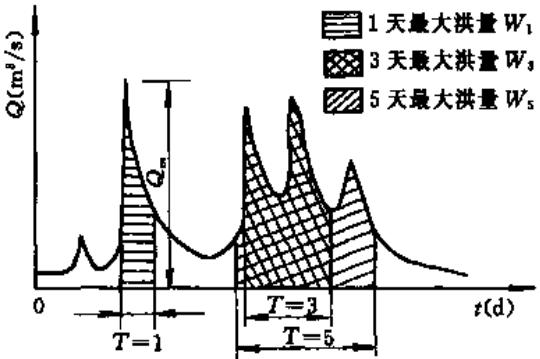  
图 9-1 年最大值法选样示意图

## 三、特大洪水的处理

特大洪水是指实测系列和调查到的历史洪水中，比一般洪水大得多的稀遇洪水。我国河流的实测流量资料系列一般不长，通过插补延长的系列也有限，若只根据短系列资料作频率计算，当出现一次新的大洪水以后，设计洪水数值就会发生变动，所得成果很不稳定。如果在频率计算中能够正确利用特大洪水资料，则会提高计算成果的稳定性。

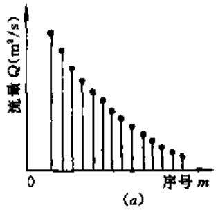

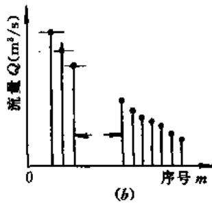  
图 9-2 连序系列和不连序系列示意图(a) 连序系列；(b) 不连序系列

特大洪水一般指的是历史洪水，但是在实测洪水系列中，若有大于历史洪水或数值相当大的洪水，也作为特大洪水。洪水系列（洪峰或洪量）有两种情况，一是系列中没有特大洪水值，在频率计算时，各项数值直接按大小次序统一排位，各项之间没有空位，序数m是连序的，称为连序系列，如图9-2（a）所示；二是系列中有特大洪水值，特大洪水值的重现期（N)

必然大于实测系列年数n，而在 ${ N - n }$ 年内各年的洪水数值无法查得，它们之间存在一些空位，由大到小是不连序的，称为不连序系列，如图9-2（b）所示。

特大洪水处理的关键是特大洪水重现期的确定和经验频率计算。所谓重现期是指某随机变量的取值在长时期内平均多少年出现一次，又称多少年一遇。特大洪水中历史洪水的数值确定以后，要分析其在某一代表年限内的大小序位，以便确定洪水的重现期。目前我国根据资料来源不同，将与确定历史洪水代表年限有关的年份分为实测期、调查期和文献考证期。

实测期是从有实测洪水资料年份开始至今的时期。调查期是在实地调查到若于可以定量的历史大洪水的时期。文献考证期是从具有连续可靠文献记载历史大洪水的时期。调查期以前的文献考证期内的历史洪水，一般只能确定洪水大小等级和发生次数，不能定量。

历史洪水包括实测期内发生的特大洪水，都要在历史洪水代表年限中进行排位，在排位时不仅要考虑已经确定数值的特大洪水，也要考虑不能定量但能确定其洪水等级的历史洪水，并排出序位。

在洪水频率计算中，经验频率是用来估计系列中各项洪水的超过概率，以便在机率格纸上点绘洪水点子，构成经验分布，因此，首先要估算系列的经验频率。

连序系列中各项经验频率的计算方法，已在第七章中论述，不予重复。

不连序系列的经验频率，有以下两种估算方法：

(1)把实测系列与特大值系列都看作是从总体中独立抽出的两个随机连序样本，各项洪水可分别在各个系列中进行排位，实测系列的经验频率仍按连序系列经验频率公式

$$
P _ { \neg } = { \frac { m } { n + 1 } }\tag{9-1}
$$

计算。特大洪水系列的经验频率计算公式为：

$$
P _ { M } = \frac { M } { N + 1 }\tag{9-2}
$$

式中 $P _ { \pi }$ —实测系列第m项的经验频率；

$m$ 实测系列由大至小排列的序号；

$\pmb { n }$ —实测系列的年数；

$P _ { \mathcal { M } }$ —特大洪水第M序号的经验频率；

$M ^ { \prime }$ ——特大洪水由大至小排列的序号；

N自最远的调查考证年份至今的年数。

当实测系列内含有特大洪水时，此特大洪水亦应在实测系列中占序号。例如，实测资料为30年，其中有一个特大洪水，则一般洪水最大项应排在第二位，其经验频率 $P _ { 2 } = 2 / ( 3 0$ $\mathbf { + 1 \rangle = 0 . 0 6 4 5 }$

(2)将实测系列与特大值系列共同组成一个不连序系列，作为代表总体的一个样本，不连序系列各项可在历史调查期N年内统一排位。

假设在历史调查期N年中有特大洪水a项，其中有l项发生在n年实测系列之内，N年中的a项特大洪水的经验频率仍用式（9-2）计算。实测系列中其余的 $\pmb { a }$ $( n - l )$ 项，则均匀分布在 $1 - P _ { M a }$ 频率范围内， $P _ { M a }$ 为特大洪水第末项 $M { = } a$ 的经验频率，即

$$
P _ { M a } = \frac { a } { N + 1 }\tag{9-3}
$$

实测系列第m项的经验频率计算公式为：

$$
P _ { m } = P _ { M a } + ( 1 - P _ { M a } ) \frac { m - l } { n - l + 1 }\tag{9-4}
$$

上述两种方法，我国目前都在使用，第一种方法比较简单，但是在使用式（9-1）和式(9-2)点绘不连序系列时，会出现所谓的“重叠”现象，而且在假定不连序系列是两个相互独立的连序样本条件下，没有对式（9-1）作严格的推导。当调查考证期N年中为首的数项历史洪水确系连序而无错漏，为避免历史洪水的经验频率与实测系列的经验频率的重叠现象，采用第二种方法较为合适。

## 四、频率曲线线型选择

样本系列各项的经验频率确定之后，就可以在机率格纸上确定经验频率点据的位置。点绘时，可以不同符号分别表示实测、插补和调查的洪水点据，其为首的若干个点据应标明其发生年份。通过点据中心，可以目估绘制出一条光滑的曲线，称为经验频率曲线。由于经验频率曲线是由有限的实测资料算出的，当求稀遇设计洪水数值时，需要对频率曲线进行外延，而经验频率曲线往往不能满足这一要求，为使设计工作规范化，便于各地设计洪水估计结果有可比性，世界上大多数国家根据当地长期洪水系列经验点据拟合情况，选择一种能较好地拟合大多数系列的理论线型，以供本国或本地区有关工程设计使用。

我国曾采用皮尔逊Ⅱ型和克里茨基一曼开里型作为洪水特征的频率曲线线型，为了使设计工作规范化，自60年代以来，一直采用皮尔逊型曲线，作为洪水频率计算的依据。在SL44一93中规定“频率曲线线型一般应采用皮尔逊Ⅱ型。特殊情况，经分析论证后也可采用其他线型”。

有关皮尔逊Ⅱ型频率曲线的性质、数学模式、参数估计以及频率计算等问题，已在第七章作了详细论述，本节不重复。

从皮尔逊型频率曲线的特性来看，其上端随频率的减小迅速递增以至趋向无穷，曲线下端在 $c > 2$ 时趋于平坦，而实测值又往往很小，对于这些干旱半干旱的中小河流，即使调整参数，也很难得出满意的适线成果，对于这种特殊情况，经分析研究，也可采用其他线型。

## 五、频率曲线参数估计

在洪水频率计算中，我国规范统一规定采用适线法。适线法有两种；一种是经验适线法（或称目估适线法），另一种是优化适线法。

经验适线法是在经验频率点据和频率曲线线型确定之后，通过调整参数使曲线与经验频率点据配合得最好，此时的参数就是所求的曲线线型的参数，从而可以计算设计洪水值。适线法的原则是尽量照顾点群的趋势，使曲线通过点群中心，当经验点据与曲线线型不能全面拟合时，可侧重考虑上中部分的较大洪水点据，对调查考证期内为首的几次特大洪水，要作具体分析。一般说来，年代愈久的历史特大洪水加入系列进行配线，对合理选定参数的作用愈大，但这些资料本身的误差可能较大。因此，在适线时不宜机械地通过特大洪水点据，否则使曲线对其他点群偏离过大，但也不宜脱离大洪水点据过远。

用适线法估计频率曲线的统计参数分为初步估计参数、用适线法调整初估值以及对比分析三个步骤。

矩法是一种简单的经典参数估计方法，它无需事先选定频率曲线线型，因而是洪水频率分析中广泛使用的一种方法。由矩法估计的参数及由此求得的频率曲线总是系统偏小，其中尤以 $C ,$ 偏小更为明显。

在用矩法初估参数时，对于不连序系列，假定n一l年系列的均值和均方差与除去特大洪水后的 $N - a$ 年系列的相等，即 $\overline { { { x } } } _ { N - \varepsilon } = \overline { { { x } } } _ { n - \varepsilon } , \sigma _ { N - a } = \sigma _ { n - \varepsilon }$ ，可以导出参数计算公式：

$$
\overline { { x } } = \frac { 1 } { N } \biggl [ \sum _ { j = 1 } ^ { a } x _ { j } + \frac { N - a } { n - 1 } \sum _ { i = l + 1 } ^ { n } x _ { i } \biggr ]\tag{9-5}
$$

$$
C _ { v } = { \frac { 1 } { x } } \sqrt { \frac { 1 } { N - 1 } [ \sum _ { j = 1 } ^ { \bullet } ( x _ { j } - \overline { { x } } ) ^ { 2 } + \frac { \overline { { N } } - a } { n - l } \sum _ { i = l + 1 } ^ { n } ( x _ { i } - \overline { { x } } ) ^ { 2 } ] }\tag{9-6}
$$

式中 $x _ { j }$ ——特大洪水， $j { = } 1 , \ 2 , \ \cdots , \ a ;$

$\pmb { x } _ { \pmb { \cdot } }$ ——般洪水， $_ { i } { = } i { + } 1$ 、l+2、…、n;

其余符号意义同前。

偏态系数 $C _ { s }$ 属于高阶矩，用矩法算出的参数值及由此求得的频率曲线与经验点据往往相差较大，故一般不用矩法计算，而是参考附近地区资料选定一个 $C _ { \varepsilon } / C _ { v }$ 值。对于 $c , \leqslant 0 . 5$ 的地区，可试用 $C _ { s } / C _ { v } { = } 3 { \sim } 4$ 进行配线；对于 $0 . 5 { < } C _ { \mathrm { { \scriptsize { v } } } } { \leqslant } 1 .$ 0的地区，可试用 $C _ { \varepsilon } / C _ { v } { = } 2$ .5\~3. 5 进行配线；对于 $c _ { \mathrm { * } } { > } 1 . 0$ 的地区，可试用 $c , / C _ { \mathrm { v } } { = } 2 \sim 3$ 进行配线。

如第七章所述，权函数法在于引入一个权函数，用一阶与二阶加权中心矩来推求 $C _ { s }$ ，可以提高皮尔逊Ⅱ型的偏态系数计算精度，但权函数法本身不能估计 $\overline { { \pmb { x } } }$ ， $C _ { v }$ ，属于单参估计，仍需借助其他方法（如矩法），且 $\complement _ { s }$ 的精度受 $\overline { { \pmb { x } } }$ r $c _ { * }$ 估算精度的影响。

第七章中介绍了另一个类型的适线法，即优化适线法。在能用计算机优选的条件下，可根据洪水系列的误差规律，选定适线准则，直接求解与经验点据拟合最优的频率曲线，本章不拟再作具体介绍。

## 六、推求设计洪峰、洪量

根据上述方法计算的参数初估值，用适线法求出洪水频率曲线，然后在频率曲线上求得相应于设计频率的设计洪峰和各统计时段的设计洪量。

有关水文频率曲线适线法的步骤、计算实例，以及适线时应考虑的事项，已在第七章作了具体介绍，但未涉及特大洪水处理问题，本节将用一个实例，考虑加人特大洪水，具体说明用矩法配线推求设计洪峰的方法。

【例9-1】某河水文站实测洪峰流量资料共30年[见表9-4第（2）栏]，历史特大洪水2年「见表9-4第（2）栏]，历史考证期102年，试用矩法初选参数进行配线，推求该水文站200年一遇的洪峰流量。

(1)计算经验频率，并点绘经验频率曲线，见图9-3。

用式（9-2）计算特大洪水的经验频率，式中 $N = 1 0 2$ ，计算成果列入表9-4第（3）栏。

用式（9-3)计算一般洪水的经验频率，式中 $P _ { M a } = P _ { M 2 }$ ，计算成果列入表9-4第（4）栏。

(2)用矩法计算统计参数。用式（9-5）计算年最大洪峰流量的均值，式中 $\pmb { N } = 1 0 2$ 、n$= 3 0$ $\pmb { a } = \pmb { 2 }$ 、l=0，得：

用式（9-6）计算年最大洪峰流量的变差系数C，得（见表9-5、表9-6）： $C _ { \mathfrak { v } }$  
某河水文站洪峰流量经验频率计算表
<table><tr><td>序号</td><td>洪峰流量  $ { ( \mathbf { m } ^ { 3 } / \mathbf { s } ) }$ </td><td> $P _ { \mathrm { { 3 } } a } = \frac { M } { N \mathrm { { + } } 1 }$ </td><td> $\frac { m } { n + 1 }$ </td><td> $\{ 1 - P _ { M 2 } \} \frac { m } { n + 1 }$ </td><td> $\bar { P } _ { M } = P _ { M a } + ( 1 - P _ { M a } ) \frac { m } { n + 1 }$ </td></tr><tr><td>(1)</td><td>(2)</td><td>(3)</td><td>(4)</td><td>(5)</td><td>(6)</td></tr><tr><td>I</td><td>2520</td><td>0.010</td><td></td><td></td><td></td></tr><tr><td>I</td><td>2100</td><td>0.019</td><td></td><td></td><td></td></tr><tr><td>1</td><td>1400</td><td></td><td>0.032</td><td>0.031</td><td>0.050</td></tr><tr><td>2</td><td>1210</td><td></td><td>0.065</td><td>0.064</td><td>0.083</td></tr><tr><td>3</td><td>960</td><td></td><td>0.097</td><td>0.095</td><td>0.114</td></tr><tr><td>4</td><td>920</td><td></td><td>0.129</td><td>0.127</td><td>0.146</td></tr><tr><td>5</td><td>890</td><td></td><td>0.161</td><td>0.158</td><td>0.177</td></tr><tr><td>6</td><td>880</td><td></td><td>0.194</td><td>0.190</td><td>0.209</td></tr><tr><td>7</td><td>790</td><td></td><td>0.226</td><td>0.222</td><td>0.241</td></tr><tr><td>8</td><td>784</td><td></td><td>0.258</td><td>0.253</td><td>0.272</td></tr><tr><td>9</td><td>670</td><td></td><td>0.290</td><td>0.284</td><td>0.303</td></tr><tr><td>10</td><td>650</td><td></td><td>0.323</td><td>0.317</td><td>0.336</td></tr><tr><td>11</td><td>638</td><td></td><td>0.355</td><td>0.348</td><td>0.367</td></tr><tr><td>12</td><td>590</td><td></td><td>0.387</td><td>0.380</td><td>0.399</td></tr><tr><td>13</td><td>520</td><td></td><td>0.419</td><td>0.411</td><td>0.430</td></tr><tr><td>14</td><td>510</td><td></td><td>0.452</td><td>0.443</td><td>0.462</td></tr><tr><td>15</td><td>480</td><td></td><td>0.484</td><td>0.475</td><td>0.494</td></tr><tr><td>16</td><td>470</td><td></td><td>0.516</td><td>0.506</td><td>0.525</td></tr><tr><td>17</td><td>462</td><td></td><td>0.548</td><td>0.538</td><td>0.557</td></tr><tr><td>18</td><td>440</td><td></td><td>0.581</td><td>0.570</td><td>0.589</td></tr><tr><td>19</td><td>386</td><td></td><td>0.613</td><td>0.601</td><td>0.620</td></tr><tr><td>20</td><td>368</td><td></td><td>0.645</td><td>0.633</td><td>0.652</td></tr><tr><td>21</td><td>340</td><td></td><td>0.677</td><td>0.664</td><td>0.683</td></tr><tr><td>22</td><td>322</td><td></td><td>0.710</td><td>0.697</td><td>0.716</td></tr><tr><td>23</td><td>300</td><td></td><td>0.742</td><td>0.728</td><td>0.747</td></tr><tr><td>24</td><td>288</td><td></td><td>0.774</td><td>0.759</td><td>0.778</td></tr><tr><td>25</td><td>262</td><td></td><td>0.806</td><td>0.791</td><td>0.810</td></tr><tr><td>26</td><td>240</td><td></td><td>0.839</td><td>0.823</td><td>0.842</td></tr><tr><td>27</td><td>220</td><td></td><td>0.871</td><td>0.854</td><td>0.873</td></tr><tr><td>28</td><td>200</td><td></td><td>0.903</td><td>0.886</td><td>0.905</td></tr><tr><td>29</td><td>186</td><td></td><td>0.935</td><td>0.917</td><td>0.936</td></tr><tr><td>30</td><td>160</td><td></td><td>0.968</td><td>0.950</td><td>0.969</td></tr></table>

$$
{ \overline { { x } } } = { \frac { 1 } { N } } { \Big [ } { \underset { \jmath = 1 } { \overset { \circ } { \sum } } } x _ { j } + { \frac { N - a } { n - l } } { \underset { \imath = l + 1 } { \overset { \circ } { \sum } } } x _ { i } { \Big ] } = { \frac { 1 } { 1 0 2 } } { \Big [ } 4 7 2 0 + { \frac { 1 0 0 } { 3 0 } } \times 1 6 5 4 2 { \Big ] } = 5 8 7
$$

$$
\begin{array} { l } { C _ { v } \texttt { = } \frac { 1 } { x } \sqrt { \frac { 1 } { N - 1 } \Big [ \sum _ { j = 1 } ^ { a } ( x _ { j } - \overline { { x } } ) ^ { 2 } - \frac { N - a } { n } \sum _ { i + 1 } ^ { n } ( x _ { i } - \overline { { x } } ) ^ { 2 } \Big ] } } \\ { \quad \texttt { = } \frac { 1 } { 5 8 7 } \sqrt { \frac { 1 } { 1 0 1 } ( 6 3 3 8 2 3 8 + 9 6 1 7 0 3 3 ) } = 0 . 6 8 } \end{array}
$$

(3)选配洪水频率曲线。根据统计参数计算成果，取 $C _ { v } { = } 0 { . } 7 { , } C _ { s } { = } 3 C _ { v }$ ，查附表2得出相应于不同频率P的Kp值，列人表9-7第(2)栏，乘以Q得相应的Qp值，列入表9-7第(3)栏。 $P$ $K _ { P }$ $\overline { { Q } }$ $Q _ { P }$

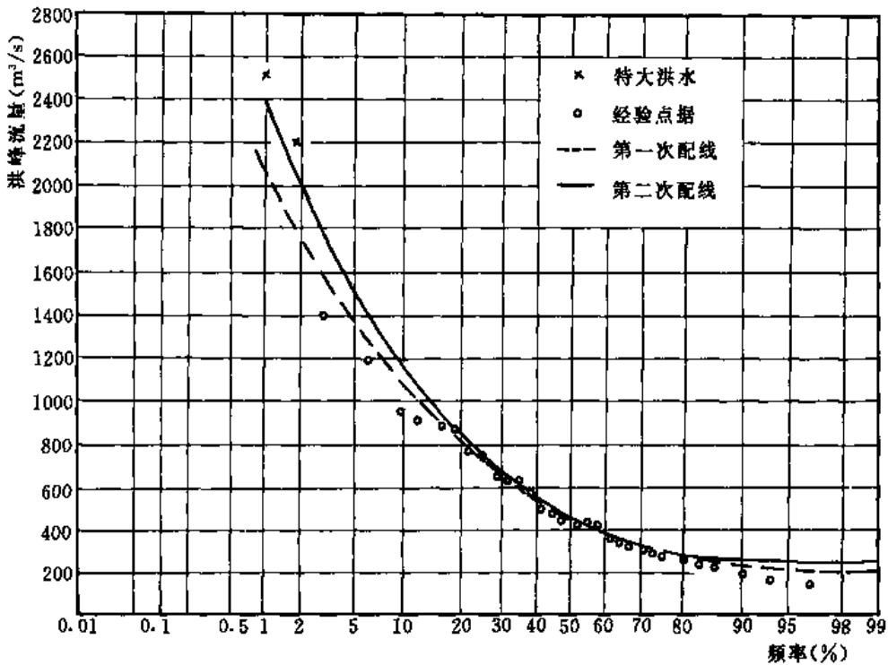  
图 9-3 某站洪峰流量频率曲线

将表9-7中第（1)、(3)栏的对应数值点绘成曲线，可见点绘的频率曲线中下段与经验频率点据配合较好，但中上段偏离特大洪水点子下方较多，因此，必须进行调整。

第二次配线时适当将 $c _ { v }$ 增大，并取 ${ C _ { s } } =$ $3 . 5 C _ { \cdot }$ ，使曲线中上部与经验点据靠近，再查

表 9-5变差系数计算表（一）
<table><tr><td rowspan=1 colspan=1>序 号</td><td rowspan=1 colspan=1> $x _ { j } , \pmb { \mathscr { x } } , \pmb { \mathscr { x } } _ { i }$ </td><td rowspan=1 colspan=1> $x _ { j } - { \overline { { x } } }$ </td><td rowspan=1 colspan=1> $( x , - { \overline { { x } } } ) ^ { 2 }$ </td></tr><tr><td rowspan=1 colspan=1>【【</td><td rowspan=1 colspan=1>25202200</td><td rowspan=1 colspan=1>19331613</td><td rowspan=1 colspan=1>37364892601749</td></tr><tr><td rowspan=1 colspan=1>∑</td><td rowspan=1 colspan=1></td><td rowspan=1 colspan=1></td><td rowspan=1 colspan=1>6338238</td></tr></table>

附表2，得相应于不同P值的 $K _ { P }$ 值，并计算相应的 $Q _ { P }$ 值，列于表9-7第（4)、（5）栏，此

表9-6  
变差系数计算表（二）
<table><tr><td rowspan=1 colspan=1>序号</td><td rowspan=1 colspan=1> $\pmb { x } ,$ </td><td rowspan=1 colspan=1> $\pmb { x _ { 3 } } - \pmb { \bar { x } }$ </td><td rowspan=1 colspan=2> $( x _ { 1 } - \overline { x } ) ^ { 2 }$ </td><td rowspan=1 colspan=1>序号</td><td rowspan=1 colspan=1> $\pmb { x } _ { i }$ </td><td rowspan=1 colspan=2> ${ \pmb x } _ { i } - \overline { { \pmb x } }$ </td><td rowspan=1 colspan=1> $( \pmb { x } _ { i } - \pmb { \overline { { x } } } ) ^ { 2 }$ </td></tr><tr><td rowspan=4 colspan=1>123156789</td><td rowspan=1 colspan=1>1400</td><td rowspan=3 colspan=1>813623373333303293203</td><td rowspan=5 colspan=2>6609693881291391291108899180985849412093880968893969</td><td rowspan=5 colspan=1>17181920212223242526</td><td rowspan=5 colspan=1>462440386368346322300288262240</td><td rowspan=5 colspan=2>-125-147-201-219-241-265-287-299-325-347</td><td rowspan=9 colspan=1>1562521609404014796158081702258236989401105625120409134689149769160801182329</td></tr><tr><td rowspan=1 colspan=1>1210960920</td></tr><tr><td rowspan=1 colspan=1>890880790</td></tr><tr><td rowspan=1 colspan=1>784670</td><td rowspan=1 colspan=1>19783</td></tr><tr><td rowspan=1 colspan=1>10</td><td rowspan=1 colspan=1>650</td><td rowspan=1 colspan=1>63</td></tr><tr><td rowspan=1 colspan=1>11</td><td rowspan=1 colspan=1>638</td><td rowspan=2 colspan=1>513</td><td rowspan=4 colspan=2>260194489</td><td rowspan=4 colspan=1>27282930</td><td rowspan=4 colspan=1>220200186160</td><td rowspan=4 colspan=2>-387-401-427</td><td rowspan=1 colspan=1>-367</td></tr><tr><td rowspan=1 colspan=1>12</td><td rowspan=1 colspan=1>590</td></tr><tr><td rowspan=1 colspan=1>13</td><td rowspan=1 colspan=1>520</td><td rowspan=1 colspan=1>-67</td></tr><tr><td rowspan=3 colspan=1>141516</td><td rowspan=1 colspan=1>510</td><td rowspan=1 colspan=1>-77</td><td rowspan=1 colspan=2>5929</td></tr><tr><td rowspan=1 colspan=1>480</td><td rowspan=1 colspan=1>-107</td><td rowspan=2 colspan=2>1144913689</td><td rowspan=1 colspan=1></td><td rowspan=2 colspan=1>Σ</td><td rowspan=2 colspan=1>16542</td><td rowspan=2 colspan=2></td><td rowspan=2 colspan=1>2885110</td></tr><tr><td rowspan=1 colspan=1>470</td><td rowspan=1 colspan=1>-117</td></tr></table>

时曲线与经验点据配合较好，可作为采用的洪水频率曲线。查 $\scriptstyle P = 0$ 5%对应的$\pmb { K } _ { P }$ ，得 $K _ { P } = 4 . 8 7$ ，按 $Q _ { P } = K _ { P } \overline { { Q } }$ 算得

$$
Q _ { P } = 4 . 8 7 \times 5 8 7 = 2 8 5 9 ~ \mathrm { m ^ { 3 } / s }
$$

即为所求的该水文站200年一遇的洪峰流量。

## 七、设计洪水估计值的抽样误差

水文系列是一个无限总体，而实测洪水资料是有限样本，用有限样本估算总体的参数必然存在抽样误差。由于设计洪水值是一个随机变量，抽样分布的确切形式又难以获得，只能根据设计洪水估计值抽样分布的某些数字特征如抽样方差来表征它的随机特性。

样本特征值的方差开方称为均方

表9-7 频率曲线配线计算表
<table><tr><td rowspan=2 colspan=1>频率</td><td rowspan=1 colspan=2>第一次配线</td><td rowspan=1 colspan=2>第二次配线</td></tr><tr><td rowspan=1 colspan=2> $\overline { { Q } } = 5 8 7$  $C _ { \bf { \sigma } } = 0 . 7$  $C _ { 1 } = 3 C _ { 0 }$ </td><td rowspan=1 colspan=2> $\overline { { \pmb { Q } } } = 5 8 7$  $c _ { \mathrm { e } } = 0 . 8$  $C _ { \varepsilon } { = } 3 . 5 C _ { \varepsilon }$ </td></tr><tr><td rowspan=1 colspan=1> $\pmb { P }$ (%)</td><td rowspan=1 colspan=1> $\pmb { K } _ { \widetilde { \pmb { p } } }$ </td><td rowspan=1 colspan=1> $\ Q _ { P }$  $ { \left. \mathbf { m } ^ { 3 } \right. } _ { \mathrm { s } } .$ </td><td rowspan=1 colspan=1> $\bar { \kappa } _ { P }$ </td><td rowspan=1 colspan=1> $Q P ( \mathbf { m ^ { 5 } } / \mathbf { s } )$ </td></tr><tr><td rowspan=1 colspan=1>(1)</td><td rowspan=1 colspan=1>(2)</td><td rowspan=1 colspan=1>(3)</td><td rowspan=1 colspan=1>(4)</td><td rowspan=1 colspan=1>(5)</td></tr><tr><td rowspan=1 colspan=1>12</td><td rowspan=1 colspan=1>3.563.05</td><td rowspan=1 colspan=1>20901790</td><td rowspan=1 colspan=1>4.183.49</td><td rowspan=3 colspan=1>2454204915321156</td></tr><tr><td rowspan=1 colspan=1>5</td><td rowspan=1 colspan=1>2.40</td><td rowspan=1 colspan=1>1409</td><td rowspan=1 colspan=1>2.61</td></tr><tr><td rowspan=1 colspan=1>10</td><td rowspan=1 colspan=1>1.90</td><td rowspan=1 colspan=1>1115</td><td rowspan=1 colspan=1>1.97</td></tr><tr><td rowspan=1 colspan=1>20</td><td rowspan=1 colspan=1>1.41</td><td rowspan=1 colspan=1>828</td><td rowspan=1 colspan=1>1.37</td><td rowspan=1 colspan=1>804</td></tr><tr><td rowspan=1 colspan=1>50</td><td rowspan=1 colspan=1>0.78</td><td rowspan=1 colspan=1>458</td><td rowspan=1 colspan=1>0.70</td><td rowspan=1 colspan=1>411</td></tr><tr><td rowspan=1 colspan=1>75</td><td rowspan=1 colspan=1>0.50</td><td rowspan=1 colspan=1>294</td><td rowspan=1 colspan=1>0.49</td><td rowspan=2 colspan=1>288258</td></tr><tr><td rowspan=1 colspan=1>90</td><td rowspan=1 colspan=1>0.39</td><td rowspan=1 colspan=1>229</td><td rowspan=1 colspan=1>0.44</td></tr><tr><td rowspan=1 colspan=1>95</td><td rowspan=1 colspan=1>0.36</td><td rowspan=1 colspan=1>211</td><td rowspan=1 colspan=1>0.43</td><td rowspan=2 colspan=1>252252</td></tr><tr><td rowspan=1 colspan=1>99</td><td rowspan=1 colspan=1>0.34</td><td rowspan=1 colspan=1>200</td><td rowspan=1 colspan=1>0.43</td></tr></table>

误。频率计算中，统计参数的抽样误差与所选的频率曲线线型有关，当总体分布为皮尔逊型，根据n年连序系列，并用矩法估计参数时，样本参数的均方误计算公式为：

$$
\left\{ \begin{array} { l l } { \displaystyle \sigma _ { x } = \frac { \overline { { x } } C _ { v } } { \sqrt { n } } } \\ { \displaystyle } \\ { \sigma _ { c _ { s } } = \frac { C _ { v } } { \sqrt { 2 \pi } } \sqrt { 1 + 2 C _ { v } ^ { 2 } + \frac { 3 } { 4 } C _ { s } ^ { 2 } - 2 C _ { v } C _ { s } } } \\ { \displaystyle } \\ { \displaystyle \sigma _ { c _ { s } } = \sqrt { \frac { 6 } { n } \Big ( 1 + \frac { 3 } { 2 } C _ { \iota } ^ { 2 } + \frac { 5 } { 1 6 } C _ { \iota } ^ { 4 } \Big ) } } \end{array} \right.\tag{9-7}
$$

均值的相对误差为：

$$
\sigma _ { \overline { { { x } } } } ^ { i } = \frac { C _ { \mathrm { v } } } { \sqrt { \eta } } \times 1 0 0 \%\tag{9-8}
$$

设计洪水值 $\pmb { x _ { P } }$ 的均方误近似公式为：

$$
\sigma _ { z _ { P } } = \frac { \overline { { x } } C _ { v } } { \sqrt { n } } B
$$

或

$$
d _ { x _ { P } } ^ { ' } = \frac { \sigma _ { x _ { P } } } { x _ { P } } \times 1 0 0 \% = \frac { C _ { v } } { K _ { P } \ \sqrt { n } } B \times 1 0 0 \% ( \ H \ H \chi \dagger \ h \ X \pm )\tag{9-9}
$$

式中 $K _ { P } .$ —指定频率P的模比系数；

$B \cdot$ 一 $c _ { \varepsilon }$ 和P的函数，已制成诺模图，见图9-4。

SL44一93规定，对大型工程或重要的中型工程，用频率分析计算的校核标准洪水，应计算抽样误差。经综合分析检查后，如成果有偏小的可能，应加安全修正值，一般不超过计算值的20%。

## 八、计算成果的合理性检查

在洪水峰量频率计算中，不可避免地存在着各种误差，为了防止因各种原因带来的差错，必须对计算成果进行合理性检查，以便尽可能地提高精度。检查工作一般从以下三个方面进行：

(1)根据本站频率计算成果，检查洪峰、各时段洪量的统计参数与历时之间的关系，一般说来，随着历时的增加，洪量的均值也逐渐增大，而时段平均流量的均值则随历时的增加而减小。 $C _ { v } , C _ { \delta }$ 在一般情况下随历时的增长而减小，但对于连续暴雨次数较多的河流，随着历时的增长， $c _ { \circ } , c _ { s }$ 反而加大，如浙江省新安江流域就有这种现象。所以参数的变化还要和流域的暴雨特性和河槽调蓄作用等因素联系起来分析。

另外还可以从各种历时的洪量频率曲线对比分析，要求各种曲线在使用范围内不应有交叉现象，当出现交叉时，应复查原始资料和计算过程有无错误，统计参数是否选择得当。

(2)根据上下游站、干支流站及邻近地区各河流洪水的频率分析成果进行比较，如气候、地形条件相似，则洪峰、洪量的均值应自上游向下游递增，其模数则由上游向下游递减。

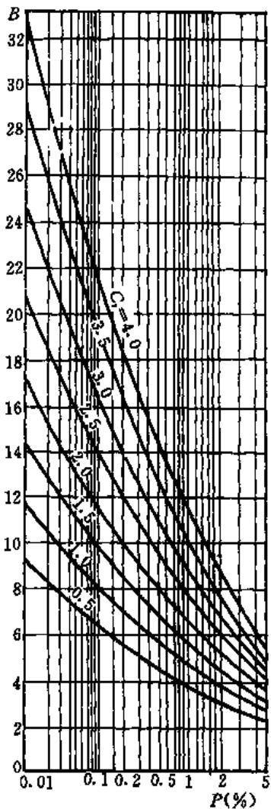

如将上下游站、干支流站同历时最大洪量的频率曲线绘在一起，下游站、干流站的频率曲线应高于上游站和支流站，曲线间距的变化也有一定的规律。

(3)根据暴雨频率分析成果进行比较。一般说来，洪水的径流深应小于相应天数的暴雨深，而洪水的 $C _ { v }$ 值应大于相应暴雨量的 $C _ { v }$ 值。

以上所述，可作为成果合理性检查的参考，如发现明显不合理之处，应分析原因，将成果加以修正。

图 9-4 B 值诺模图

## 第三节 设计洪水过程线的推求

设计洪水过程线是指具有某一设计标准的洪水过程线。但是，洪水过程线的形状千变万化，且洪水每年发生的时间也不相同，是一种随机过程，目前尚无完善的方法直接从洪水过程线的统计规律求出一定频率的过程线。尽管已有人从随机过程的角度，对过程线作模拟研究，但尚未达到实用的目的。为了适应工程设计要求，目前仍采用放大典型洪水过程线的方法，使其洪峰流量和时段洪水总量的数值等于设计标准的频率值，即认为所得的过程线是待求的设计洪水过程线。

放大典型洪水过程线时，根据工程和流域洪水特性，可选用同频率放大法或同倍比放大法。

## 一、典型洪水过程线的选择

典型洪水过程线是放大的基础，从实测洪水资料中选择典型时，资料要可靠，同时应

考虑下列条件：

（1）选择峰高量大的洪水过程线，其洪水特征接近于设计条件下的稀遇洪水情况。

(2)要求洪水过程线具有一定的代表性，即它的发生季节、地区组成、洪峰次数、峰量关系等能代表本流域上大洪水的特性。

(3)从水库防洪安全着眼，选择对工程防洪运用较不利的大洪水典型，如峰型比较集中，主峰靠后的洪水过程。

一般按上述条件初步选取几个典型，分别放大，并经调洪计算，取其中偏于安全的作为设计洪水过程线的典型。

## 二、放大方法

目前采用的典型放大方法有峰量同频率控制方法（简称同频率放大法）和按峰或量同倍比控制方法（简称同倍比放大法）。

## 1. 同频率放大法

此法要求放大后的设计洪水过程线的峰和不同时段（1天、3天、…）的洪量均分别等于设计值。具体做法是先由频率计算求出设计的洪峰值Q和不同时段的设计洪量值 $Q _ { m } ,$ $\boldsymbol { W } _ { 1 \ell }$ $\ W _ { 3 P }$ 、…，并求典型过程线的洪峰Qm和不同时段的洪量W1D、W3D、…，然后按洪峰、最 $\ Q _ { m e }$ $\mathbb { W } _ { 1 D }$ $\mathbb { W } _ { 3 D } .$ 大1天洪量、最大3天洪量、…的顺序，采用以下不同倍比值分别将典型过程进行放大。

洪峰放大倍比为：

$$
R _ { Q _ { \infty } } = \frac { Q _ { \infty } P } { Q _ { \infty } D }\tag{9-10}
$$

最大1天洪量放大倍比为：

$$
R _ { 1 } = \frac { W _ { \mathrm { 1 } P } } { W _ { \mathrm { 1 } D } }\tag{9-11}
$$

最大3天洪量中除最大1天以外，其余两天的放大倍比为：

$$
R _ { i - 1 } = \frac { W _ { 3 P } - W _ { i P } } { W _ { 3 D } - W _ { 1 D } }\tag{9-12}
$$

以上说明，最大1天洪量包括在最大3天洪量之中，同理，最大3天洪量包括在最大7天洪量之中，得出的洪水过程线上的洪峰和不同时段的洪量，恰好等于设计值。时段划分视过程线的长度而定，但不宜太多，一般以3段或4段为宜。由于各时段放大倍比不相等，放大后的过程线在时段分界处出现不连续现象，此时可徒手修匀，修匀后仍应保持洪峰和各时段洪量等于设计值。如放大倍比相差较大，要分析原因，采取措施，消除不合理的现象。

【例9-2】某水库设计标准 $\pmb { P } = 1$ %的洪峰和1天、3天、7天洪量，以及典型洪水过程线的洪峰和1天、3天、7天洪量列于表9-8。要求用分时段同频率放大法，推求 ${ \mathfrak { P } } { = } 1$ %

表9-8 某水库洪峰、洪量统计表
<table><tr><td rowspan=2 colspan=1>项     目</td><td rowspan=2 colspan=1>洪峰 $\scriptstyle \mathbf { Q } _ { \infty }$  $\bf ( m ^ { 3 } / s )$ </td><td rowspan=1 colspan=3>洪量W [ $( \mathbf { m } ^ { 3 } / \mathbf { s } )$ b]</td></tr><tr><td rowspan=1 colspan=1> $^ { 1 \star }$ </td><td rowspan=1 colspan=1>3天</td><td rowspan=1 colspan=1>7天</td></tr><tr><td rowspan=1 colspan=1> $P { = } 1$ %的设计值</td><td rowspan=1 colspan=1>2610</td><td rowspan=1 colspan=1>1525</td><td rowspan=1 colspan=1>2874</td><td rowspan=1 colspan=1>3873</td></tr><tr><td rowspan=1 colspan=1>典型过程线的相应值</td><td rowspan=1 colspan=1>1810</td><td rowspan=1 colspan=1>1083</td><td rowspan=1 colspan=1>1895</td><td rowspan=1 colspan=1>2565</td></tr></table>

首先，计算洪峰和各时段洪量的放大倍比。

$$
R _ { \mathbf { Q } _ { \pi } } = { \frac { 2 6 1 0 } { 1 8 1 0 } } = 1 . 4 4
$$

$$
\begin{array} { c } { { R _ { 1 } = \displaystyle \frac { 1 5 2 5 } { 1 0 8 3 } = 1 . 4 1 } } \\ { { } } \\ { { R _ { 3 - 1 } = \displaystyle \frac { 2 8 7 4 - 1 5 2 5 } { 1 8 9 5 - 1 0 8 3 } = 1 . 6 6 } } \\ { { } } \\ { { R _ { 7 - 3 } = \displaystyle \frac { 3 8 7 3 - 2 8 7 4 } { 2 5 6 5 - 1 8 9 5 } = 1 . 4 9 } } \end{array}
$$

其次，将典型洪水过程线的洪峰和不同时段的洪量乘以相应的放大倍比值，得放大的设计洪水过程线（见图9-5）。由于各时段放大倍比值不同，时段分界处出现不连续现象，可徒手修匀（见图9-5的虚线），最后得所求的设计洪水过程线。

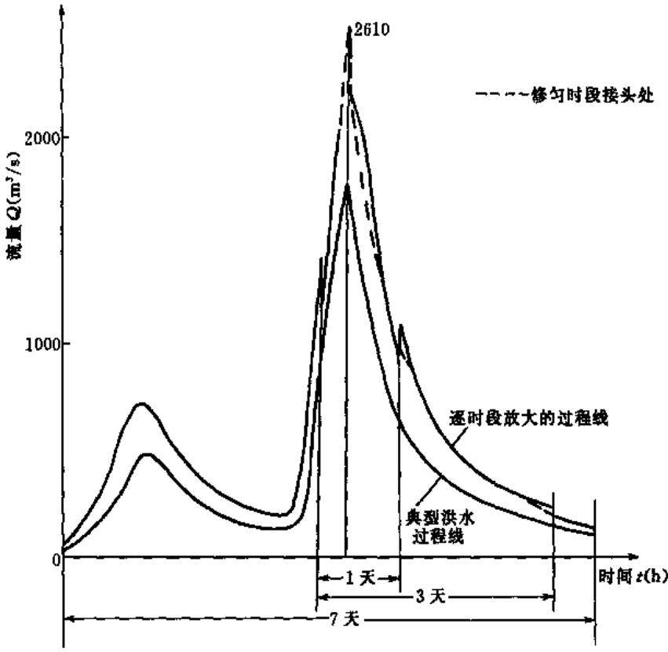  
图 9-5 同频率放大法推求设计洪水过程线

## 2. 同倍比放大法

此法是按洪峰或洪量同一个倍比放大典型洪水过程线的各纵坐标值，从而求得设计洪水过程线。因此，此法的关键在于确定以谁为主的放大倍比值。如果以洪峰控制，其放大倍比为：

$$
K _ { \mathsf { 4 } } = \frac { Q _ { m P } } { Q _ { m D } }\tag{9-13}
$$

式中 $\kappa _ { \theta }$ ——以峰控制的放大系数；

其余符号意义同前。

如果以量控制，其放大倍比为：

$$
K _ { \ast } = \frac { W _ { \iota \rho } } { W _ { \iota \bar { D } } }\tag{9-14}
$$

式中 $K _ { \mathfrak { w } } ,$ ——以量控制的放大系数；

$\mathbf { } W _ { t { \pmb { \rho } } }$ ——控制时段的设计洪量；

$W _ { w }$ 典型过程线在控制时段t的最大洪量。

采用同倍比放大时，若放大后洪峰或某时段洪量超过或低于设计很多，且对调洪结果影响较大时，应另选典型。

在上述两种方法中，用同频率放大法求得的洪水过程线，比较符合设计标准，计算成果较少受所选典型不同的影响，但改变了原有典型的雏形，适用于峰量均对水工建筑物防洪安全起控制作用的工程。同倍比放大法计算简便，适用于峰量关系较好的河流，以及防洪安全主要由洪峰或某时段洪量控制的水工建筑物。

## 第四节分期设计洪水

为了水库管理调度运用和施工期防洪的需要，必须计算分期设计洪水。所谓分期设计洪水是指一年中某个时段所拟定的设计洪水。计算分期设计洪水的方法是在分析流域洪水季节性规律的基础上，按照设计和管理要求，把整个年内划分为若于个分期，然后在分期的时段内，按年最大值法选样，进行频率计算。

## 一、洪水季节性变化规律分析和分期划分

划定分期洪水时，应对设计流域洪水季节性变化规律进行分析，并结合工程的要求来考虑。分析时要了解天气成因在季节上的差异，年内不同时期洪水峰量数值及特性（如均值、变差系数）的变化，全年最大洪水出现在各个季节的情况，以及不同季节洪水过程的形状等。同时，可根据本流域的资料，将历年各次洪水以洪峰发生日期或某一定历时最大洪量的中间日期为横坐标，以相应洪水的峰量数值为纵坐标，点绘洪水年内分布图，并描绘平顺的外包线，如图9-6所示，如有调查的特大洪水，亦应点绘于图上。

在天气成因分析和上述实测资料统计基础上，并考虑工程设计的要求，划定分期洪水

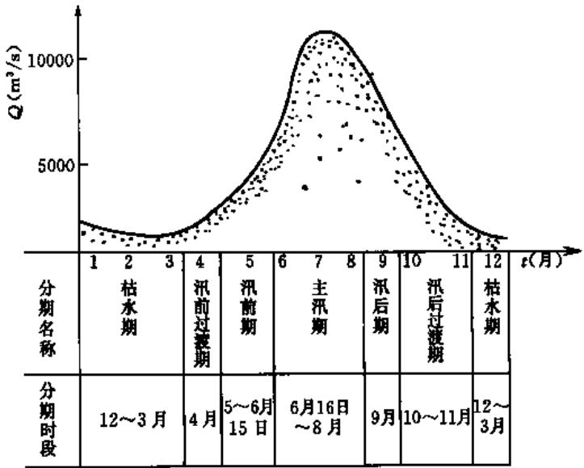  
图 9-6 某站洪水年内分布图及分期

的时段。

分期的一般原则为：尽可能根据不同成因的洪水，把全年划分为若干分期。

分期的起讫日期应根据流域洪水的季节变化规律，并考虑设计需要确定。分期不宜太短，一般以不短于1个月为宜。由于洪水出现的偶然性，各年分期洪水的最大值不一定正好在所定的分期内，可能往前或往后错开几天，因此，在用分期年最大选样时，有跨期和不跨期两种选样方法。跨期选样时，为了反映每个分期的洪水特征，跨期选样的日期不宜超过5\~10日。

## 二、分期设计洪水的计算方法

(1)分期划定后，分期洪水一般在规定时段内，按年最大值法选择。当一次洪水过程位于两个分期时，视其洪峰流量或时段洪量的主要部分位于何期，就作为该期的样本，不作重复选择，这种选取方法称为不跨期选样。

(2)分期特大洪水的经验频率计算，应根据调查考证资料，结合实测系列分析，重新论证，合理调整。

分期洪水的统计参数计算和配线方法与年最大洪水相同。对施工洪水，由于设计标准较低，当具有较长资料时，一般可由经验频率曲线查取设计值。

(3)分期设计洪水过程线仍可按本章第三节所述方法进行计算。但是，施工初期围堰往往以抗御洪峰为主，一般只要求设计洪峰流量；大坝合龙后，则以某个时段的设计洪量为主要控制，故要求设计洪峰和一定时段的设计洪量，如进行调洪，则需要设计洪水过程线。中小型工程的施工设计洪水，一般只需要分期设计洪峰。

(4)将各分期洪水的峰量频率曲线与全年最大洪水的峰量频率曲线画在同一张机率格纸上，检查其相互关系是否合理。如果它们在设计频率范围内发生交叉现象，即稀遇频率的分期洪水大于同频率的全年最大洪水。此时应根据资料情况和洪水的季节性变化规律予以调整。一般来说，由于全年最大洪水在资料系列的代表性、历史洪水的调查考证等方面，均较分期洪水研究更为充分，其成果相对较可靠。调整时一般应以历时较长的洪水频率曲线为准。

## 第五节入库设计洪水

## 一、入库洪水的概念

水库防洪设计一般是以坝址设计洪水为依据。但水库建成后，洪水是从水库周边汇人水库，而不是坝址断面的洪水，这些从水库周边汇人水库（包括入库断面）的洪水称为人库洪水，它与坝址洪水有一定的差别，差异程度与水库特性及典型洪水的时空分布有关。用入库洪水作为设计依据更符合建库后的实际情况，特别是对坝址洪水与人库洪水差别较大的湖泊型水库更为必要。

入库洪水由三部分组成：

(1) 水库回水末端干支流河道断面的洪水如图9-7所示。

(2)上述干支流河道断面以下到水库周边的区间陆面所产生的洪水。

(3) 水库库面的降水量。

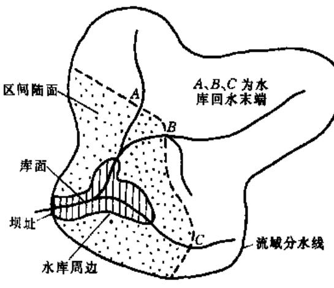  
图 9-7 人库洪水示意图

人库洪水与坝址洪水的差异主要表现在：

(1)库区产流条件改变，使入库洪水的洪量增大。水库建成后，水库回水淹没区由原来的陆面变为水面，产流条件相应发生了变化，在洪水期间库面由陆地产流变为水库水面直接承纳降水，由原来的陆面蒸发损失变为水面蒸发损失。

(2)流域汇流时间缩短，人库洪峰流量出现时间提前，涨水段的洪量增大。建库后，洪水由于支流的回水末端和水库周边人库，洪水在库区的传播时间比原河道的传播时间短，因此，流域总的汇流时间缩短，洪峰出现的时间相应提前，而库面降雨集中于涨水段，涨水段的洪量增大。

(3)河道被回水淹没成为库区。原河槽调蓄能力丧失，再加上干支流和区间陆面洪水常易遭遇，使得人库洪水的洪峰增高，峰形更尖瘦。

## 二、入库洪水的分析计算方法

建库前，水库的人库洪水不能直接测得，一般是根据水库特点、资料条件，采用不同的方法分析计算。依据资料不同，可分为由流量资料推求人库洪水和由雨量资料推求人库洪水两种类型。

由流量推求人库洪水又可分为：

(1)流量叠加法。分别推算干支流和区间等各部分的洪水，然后演进到人库断面处，再同时刻叠加，即得人库洪水。这种方法概念明确，只要坝址以上干支流有实测资料，区间洪水估计得当，一般计算成果较满意。

(2)马斯京根法。当汇入水库周边的支流较少，坝址处有实测水位流量资料，干支流入库点有部分实测资料时，可根据坝址洪水资料用马斯京根法，即反演进的方法推求人库洪水。这种方法对资料的要求较少，计算也比较简便。

(3)槽蓄曲线法。当干支流缺乏实测洪水资料，但库区有较完整的地形资料时，可利用河道平面图和纵横断面图，根据不同流量的水面线（实测、调查或推算得来）绘制库区河段的槽蓄曲线，采用联解槽蓄曲线与水量平衡的方法，由坝址洪水推求入库洪水。本方法计算成果的可靠程度与槽蓄曲线的精度有关。

(4)水量平衡法。水库建成后，可用坝前水库水位、库容曲线和出库流量等资料用水量平衡法推算人库洪水。计算式为：

$$
\begin{array} { r } { \overline { { I } } = \overline { { O } } + \frac { \Delta V _ { \perp \perp } } { \Delta t } + \frac { \Delta V } { \Delta t } } \end{array}\tag{9-15}
$$

式中 Ι——时段平均入库流量；

${ \overline { { O } } } .$ ——时段平均出库流量；

$\Delta V _ { ☉ }$ ——水库损失水量；

$\Delta V$ —时段始末水库蓄水量变化值；

$\Delta t ^ { . }$ —计算时段。

平均出库流量包括：溢洪道流量、泄洪洞流量及发电流量等，也可采用坝下游实测流量资料作为出库流量。

水库损失水量包括：水库的水面蒸发和枢纽、库区渗漏损失等。一般情况下，在洪水期间，此项数值不大，可忽略不计。

水库蓄水量变化值，一般可用时段始末的坝前水位和静库容曲线确定，如动库容（受库区流量的影响，库区水面线不是水平的，此时水库的库容称动库容）较大，对推算洪水有显著影响，宜改用动库容曲线推算。

【例9-3】已知某水库坝前水位、出库流量和静库容曲线等资料，试用水量平衡法反推入库洪水。

由表9-9可知，第（3）栏是第（2）栏坝前水位相应的静库容，由水库静库容曲线查出。第（4）栏 $\Delta V _ { \perp }$ 由第（3）栏前后项相减得到。第（5）栏由第（4）栏除以 $\pmb { \Delta } \pmb { t }$ 得来。第(7）栏人库洪水Ι由第（5）栏加第（6）栏出库洪水ō而得，此即为静库容反推的水库入库洪水成果。由此可见，水量平衡法是建库后的入库洪水计算方法。

表 9-9  
水量平衡法反推入库洪水
<table><tr><td rowspan=1 colspan=1>时间(年、月，日.时)</td><td rowspan=1 colspan=1>坝前水位</td><td rowspan=1 colspan=1> $\pmb { V _ { \parallel } }$ </td><td rowspan=1 colspan=1> $\Delta V _ { \perp }$ </td><td rowspan=1 colspan=1> $\frac { \Delta V _ { \overline { { \mathbf { a } } } } } { \Delta x }$ </td><td rowspan=1 colspan=1>0</td><td rowspan=1 colspan=1>1</td></tr><tr><td rowspan=1 colspan=1>(1)</td><td rowspan=1 colspan=1>(2)</td><td rowspan=1 colspan=1>(3)</td><td rowspan=1 colspan=1>(4)</td><td rowspan=1 colspan=1>(5)</td><td rowspan=1 colspan=1>(6)</td><td rowspan=1 colspan=1>(7)</td></tr><tr><td rowspan=2 colspan=1>1981.7.24.12</td><td rowspan=2 colspan=1>243.22</td><td rowspan=2 colspan=1>3276.0</td><td rowspan=1 colspan=1></td><td rowspan=1 colspan=1></td><td rowspan=1 colspan=1></td><td rowspan=1 colspan=1></td></tr><tr><td rowspan=2 colspan=1>20.7</td><td rowspan=2 colspan=1>28.75</td><td rowspan=2 colspan=1>113</td><td rowspan=2 colspan=1>142</td></tr><tr><td rowspan=2 colspan=1>1981.7.24.14</td><td rowspan=2 colspan=1>243.29</td><td rowspan=2 colspan=1>3296.7</td></tr><tr><td rowspan=2 colspan=1>20.8</td><td rowspan=2 colspan=1>28.89</td><td rowspan=2 colspan=1>119</td><td rowspan=2 colspan=1>148</td></tr><tr><td rowspan=2 colspan=1>1981.7.24.16</td><td rowspan=2 colspan=1>243.36</td><td rowspan=2 colspan=1>3317.5</td></tr><tr><td rowspan=2 colspan=1>20.7</td><td rowspan=2 colspan=1>28.75</td><td rowspan=2 colspan=1>126</td><td rowspan=2 colspan=1>155</td></tr><tr><td rowspan=2 colspan=1>1981.7.24.18</td><td rowspan=2 colspan=1>243.43</td><td rowspan=2 colspan=1>3338.2</td></tr><tr><td rowspan=2 colspan=1>50.4</td><td rowspan=2 colspan=1>70.00</td><td rowspan=2 colspan=1>133</td><td rowspan=2 colspan=1>203</td></tr><tr><td rowspan=2 colspan=1>1981.7.24.20</td><td rowspan=2 colspan=1>243.60</td><td rowspan=2 colspan=1>3388.6</td></tr><tr><td rowspan=2 colspan=1>192.6</td><td rowspan=2 colspan=1>267.50</td><td rowspan=2 colspan=1>200</td><td rowspan=2 colspan=1>468</td></tr><tr><td rowspan=2 colspan=1>1981.7.24.22</td><td rowspan=2 colspan=1>244.25</td><td rowspan=2 colspan=1>3581.2</td></tr><tr><td rowspan=2 colspan=1>222.3</td><td rowspan=2 colspan=1>308.75</td><td rowspan=2 colspan=1>296</td><td rowspan=2 colspan=1>605</td></tr><tr><td rowspan=2 colspan=1>1981.7.25.0</td><td rowspan=2 colspan=1>245.00</td><td rowspan=2 colspan=1>3803.5</td></tr><tr><td rowspan=2 colspan=1>226.7</td><td rowspan=2 colspan=1>314.86</td><td rowspan=2 colspan=1>419</td><td rowspan=2 colspan=1>734</td></tr><tr><td rowspan=2 colspan=1>1981.7.25.2</td><td rowspan=2 colspan=1>245.56</td><td rowspan=2 colspan=1>4030.2</td></tr><tr><td rowspan=2 colspan=1>259.1</td><td rowspan=2 colspan=1>359.86</td><td rowspan=2 colspan=1>603</td><td rowspan=2 colspan=1>963</td></tr><tr><td rowspan=2 colspan=1>1981.7.25.4</td><td rowspan=2 colspan=1>246.20</td><td rowspan=2 colspan=1>4289.3</td></tr><tr><td rowspan=2 colspan=1>267.2</td><td rowspan=2 colspan=1>371.11</td><td rowspan=2 colspan=1>812</td><td rowspan=2 colspan=1>1183</td></tr><tr><td rowspan=2 colspan=1>1981.7.25.6</td><td rowspan=2 colspan=1>246.86</td><td rowspan=2 colspan=1>4556.5</td></tr><tr><td rowspan=2 colspan=1>242.9</td><td rowspan=2 colspan=1>337.36</td><td rowspan=2 colspan=1>1075</td><td rowspan=2 colspan=1>1412</td></tr><tr><td rowspan=2 colspan=1>1981.7.25.8</td><td rowspan=2 colspan=1>247.46</td><td rowspan=2 colspan=1>4799.4</td></tr><tr><td rowspan=2 colspan=1>251.0</td><td rowspan=2 colspan=1>348.61</td><td rowspan=2 colspan=1>1320</td><td rowspan=2 colspan=1>1669</td></tr><tr><td rowspan=2 colspan=1>1981.7.25.10</td><td rowspan=2 colspan=1>248.08</td><td rowspan=2 colspan=1>5050.4</td></tr><tr><td rowspan=2 colspan=1>93.1</td><td rowspan=2 colspan=1>129.31</td><td rowspan=2 colspan=1>1460</td><td rowspan=2 colspan=1>1589</td></tr><tr><td rowspan=2 colspan=1>1981.7.25.12</td><td rowspan=2 colspan=1>248.31</td><td rowspan=2 colspan=1>5143.5</td></tr><tr><td rowspan=2 colspan=1>-4.1</td><td rowspan=2 colspan=1>-5.69</td><td rowspan=2 colspan=1>1502</td><td rowspan=2 colspan=1>1496</td></tr><tr><td rowspan=2 colspan=1>1981.7.25.14</td><td rowspan=2 colspan=1>248.30</td><td rowspan=2 colspan=1>5139.4</td></tr><tr><td rowspan=2 colspan=1>4.1</td><td rowspan=2 colspan=1>5.69</td><td rowspan=2 colspan=1>1498</td><td rowspan=2 colspan=1>1503</td></tr><tr><td rowspan=2 colspan=1>1981.7.25.16</td><td rowspan=2 colspan=1>248.31</td><td rowspan=2 colspan=1>5143.5</td></tr><tr><td rowspan=2 colspan=1>：</td><td rowspan=2 colspan=1></td><td rowspan=2 colspan=1></td><td rowspan=2 colspan=1></td></tr><tr><td rowspan=2 colspan=1>1</td><td rowspan=2 colspan=1>1</td><td rowspan=2 colspan=1>&quot;</td></tr><tr><td rowspan=1 colspan=1></td><td rowspan=1 colspan=1></td><td rowspan=1 colspan=1></td><td rowspan=1 colspan=1></td></tr></table>

注流量单位为m³/s，蓄量单位为万m³。

## 三、入库设计洪水计算方法

按我国现行规范的规定，水利水电工程一般采用坝址设计洪水。但是，对具有水库的工程，当建库后产汇流条件有明显改变、采用坝址设计洪水对调洪影响较大时，应以入库

设计洪水作为设计依据。

入库设计洪水计算方法有以下两类：

## (一) 频率计算法

具有长期人库洪水系列及历史入库洪水资料时，可用频率计算法推求各种标准的入库设计洪水。人库洪水系列可根据资料情况的不同来选取。

(1)当水库回水末端附近的于流和主要支流有长期洪水资料时，可用流量叠加法推求历年人库洪水。

(2)当坝址洪水系列较长，而入库干支流资料缺乏时，可将一部分年份或整个坝址系列用马斯京根法或槽蓄曲线法，转换为人库洪水系列。若只推算部分年份的人库洪水时，可先根据推算的成果，建立入库洪水与坝址洪水的关系，根据上述关系将未推算的其余年份转换为入库洪水，与推算的年份共同组成人库洪水系列。

## （二）根据坝址设计洪水推算入库设计洪水

由于资料条件的限制不能推算出人库洪水系列时，可先计算坝址各种设计标准的设计洪水，再用马斯京根法或槽蓄曲线法，将已计算的坝址设计洪水反演算得入库设计洪水。但根据实测资料分析的汇流参数（如K、x）或槽蓄曲线应用于稀遇的设计洪水时，应注意分析外延的合理性。

至于入库设计洪水过程线的推求，可选择某典型年的坝址实测洪水过程线，用前述方法推算该典型年的入库洪水过程，然后用坝址洪水设计值的倍比求得人库设计洪水过程线。

## 第六节 设计洪水的地区组成

为研究流域开发方案，计算水库对下游的防洪作用，以及进行梯级水库或水库群的联合调洪计算等问题，需要分析设计洪水的地区组成。也就是说计算当下游控制断面发生某设计频率的洪水时，其上游各控制断面和区间相应的洪峰洪量及其洪水过程线。

由于暴雨分布不均，各地区洪水来量不同，各干支流来水的组合情况十分复杂，因此洪水地区组成的研究与上述某断面设计洪水的研究方法不同，必须根据实测资料，结合调查资料和历史文献，对流域内洪水地区组成的规律性进行综合分析。分析时应着重暴雨、洪水的地区分布及其变化规律；历史洪水的地区组成及其变化规律；各断面峰量关系以及各断面洪水传播演进的情况等。为了分析研究设计洪水不同的地区组成对防洪的影响，通常需要拟定若干个以不同地区来水为主的计算方案，并经调洪计算，从中选定可能发生而又能满足设计要求的成果。

现行洪水地区组成的计算常用典型年法和同频率地区组成法。

## (一) 典型年法

典型年法是从实测资料中选择几次有代表性、对防洪不利的大洪水作为典型，以设计断面的设计洪量作为控制，按典型年的各区洪量组成的比例计算各区相应的设计洪量。

本方法简单、直观，是工程设计中常用的一种方法，尤其适用于分区较多、组成比较复杂的情况，但此法因全流域各分区的洪水均采用同一个倍比放大，可能会使某个局部地区的洪水放大后其频率小于设计频率，值得注意。

## (二)同频率地区组成法

同频率地区组成法是根据防洪要求，指定某一分区出现与下游设计断面同频率的洪量，其余各分区的相应洪量按实际典型组成比例分配。一般有以下两种组成方法：

(1) 当下游断面发生设计频率 P的洪水 $\psi _ { \uparrow P }$ 时，上游断面也发生频率 $P$ 的洪水 $\boldsymbol { W } _ { \perp ^ { p } }$ 而区间为相应的洪水 ${ \pmb W } _ { \perp }$ ，即

$$
W _ { \parallel } = W _ { \mathsf { T } P } - W _ { \mathsf { L } P }\tag{9-16}
$$

(2)当下游断面发生设计频率P的洪水 $W _ { \tilde { \mathsf { r } } P }$ 时，区间也发生频率P的洪水 $\overrightarrow { W } _ { \boxtimes P }$ ，上游断面为相应的 $\mathbf { W } _ { \mathrm { \perp } }$ ，即

$$
\mathcal { W } _ { \mathtt { L } } = W _ { \mathtt { Y } P } - W _ { \mathtt { R } P }\tag{9-17}
$$

必须指出，同频率地区组成法适用于某分区的洪水与下游设计断面的相关关系比较好的情况。同时，由于河网调节作用等因素的影响，一般不能用同频率地区组成法来推求设计洪峰流量的地区组成。

## 习 题

9-1 已知某坝址断面有30年的洪峰流量实测值，如表9-10所示，根据历史调查得知1890年和1912年曾发生过特大洪水，推算得洪峰流量分别为 $8 0 0 0 \mathrm { m } ^ { 3 } / \mathrm { s }$ 和 $6 7 0 0 \mathrm { m } ^ { 3 } / \mathrm { s }$ 。试用矩法初估配线推求该坝址断面200年一遇洪峰流量。

表 9-10  
某坝址断面实測洪峰流量表
<table><tr><td>年份</td><td>流量Q  $\bf ( m ^ { 3 } / s )$ </td><td>年份</td><td>流量Q  $\langle \mathtt { m } ^ { 3 } / { \mathfrak { s } } \rangle$ </td><td>年份</td><td>流量Q  $\left( \mathbf { m } ^ { 3 } / { \mathsf { s } } \right)$ </td><td>年份</td><td>流量Q  $ { ( \mathbf { m } ^ { \mathfrak { s } } / \mathfrak { s } ) }$ </td></tr><tr><td>1890</td><td>8000</td><td>1958</td><td>2100</td><td>1956</td><td>620</td><td>1974</td><td>1100</td></tr><tr><td>1912</td><td>6700</td><td>1959</td><td>4360</td><td>1967</td><td>1300</td><td>1975</td><td>850</td></tr><tr><td>1952</td><td>1720</td><td>1960</td><td>860</td><td>1968</td><td>1400</td><td>1976</td><td>1450</td></tr><tr><td>1953</td><td>1560</td><td>1961</td><td>1540</td><td>1969</td><td>1700</td><td>1977</td><td>2600</td></tr><tr><td>1954</td><td>3440</td><td>1962</td><td>2600</td><td>1970</td><td>2520</td><td>1978</td><td>480</td></tr><tr><td>1955</td><td>310</td><td>1963</td><td>3200 1800</td><td>1971</td><td>1820</td><td>1979</td><td>2400</td></tr><tr><td>1956</td><td>2200</td><td>1964</td><td>2620</td><td>1972</td><td>2400 900</td><td>1980</td><td>3100</td></tr><tr><td>1957</td><td>1860</td><td>1965</td><td></td><td>1973</td><td></td><td>1981</td><td>2100</td></tr></table>

# 第十章 由暴雨资料推求设计洪水

第一节 概 述

我国大部分地区的洪水主要由暴雨形成。在实际工作中，中小流域常因流量资料不足无法直接用流量资料推求设计洪水，而暴雨资料一般较多，因此可用暴雨资料推求设计洪水，特别是：

(1)在中小流域上兴建水利工程，经常遇到流量资料不足或代表性差的情况，难于使用相关法来插补延长，因此，需用暴雨资料推求设计洪水。

(2)由于人类活动的影响，使径流形成的条件发生显著的改变，破坏了洪水资料系列的一致性。因此，可以通过暴雨资料，用人类活动后新的径流形成条件推求设计洪水。

(3)为了用多种方法推算设计洪水，以论证设计成果的合理性，即使是流量资料充足的情况下，也要用暴雨资料推求设计洪水。

(4)无资料地区小流域的设计洪水，一般都是根据暴雨资料推求的。

(5)可能最大降水/洪水是用暴雨资料推求的（见第十一章)。

由暴雨资料推求设计洪水的主要内容有：

(1）推求设计暴雨。根据实测暴雨资料，用统计分析和典型放大法求得。

（2）推求设计洪水过程线。由求得的设计暴雨，利用产流方案推求设计净雨过程，利用流域汇流方案由设计净雨过程求得设计洪水过程。

由暴雨资料推求设计洪水，其基本假定是设计暴雨与设计洪水是同频率的。但这一假定在很多情况下并不成立。

本章将着重介绍适用于不同流域的、由暴雨资料推求设计洪水的方法，以及小流域设计洪水计算的一些特殊方法。

## 第二节 直接法推求设计面暴雨量

设计面暴雨量是指设计断面以上流域的设计面暴雨量。一般有两种计算方法：当设计流域雨量站较多、分布较均匀、各站又有长期的同期资料、能求出比较可靠的流域平均雨量(面雨量)时，就可直接选取每年指定统计时段的最大面暴雨量，进行频率计算求得设计面暴雨量。这种方法常称为设计面暴雨量计算的直接法。另一种方法是当设计流域内雨量站稀少，或观测系列其短，或同期观测资料很少甚至没有，无法直接求得设计面暴雨量时，只好用间接方法计算，也就是先求流域中心附近代表站的设计点暴雨量，然后通过暴雨点面关系，求相应设计面暴雨量，本法称为设计面暴雨量计算的间接法。本节介绍直接法。

## 一、暴雨资料的收集、审查与统计选样

## 1. 暴雨资料的收集

暴雨资料的主要来源是国家水文、气象部门所刊印的雨量站网观测资料，但也要注意

收集有关部门专用雨量站和社队群众雨量站的观测资料。强度特大的暴雨中心点雨量，往往不易为雨量站测到，因此必须结合调查收集暴雨中心范围和历史上特大暴雨资料，了解当时雨情，尽可能估计出调查地点的暴雨量。

## 2. 暴雨资料的审查

我国暴雨资料按其观测方法及观测次数的不同，分为日雨量资料、自记雨量资料和分段雨量资料三种。日雨量资料一般是指当天8：00到次日8：00所记录的雨量资料。自记雨量资料是以分钟为单位记录的雨量过程资料。分段雨量资料一般以1、3、6、12h等不同的时间间隔记录的雨量资料。

暴雨资料应进行可靠性审查，重点审查特大或特小雨量观测记录是否真实，有无错记或漏测情况，必要时可结合实际调查，予以纠正，检查自记雨量资料有无仪器故障的影响，并与相应定时段雨量观测记录比较，尽可能审定其准确性。

暴雨资料的代表性分析，可通过与邻近地区长系列雨量或其他水文资料，以及本流域或邻近流域实际大洪水资料进行对比分析，注意所选用暴雨资料系列是否有偏丰或偏枯等情况。

暴雨资料一致性审查，对于按年最大值选样的情况，理应加以考虑，但实际上有困难。对于求分期设计暴雨时，要注意暴雨资料的一致性，不同类型暴雨特性是不一样的，如我国南方地区的梅雨与台风雨，宜分别考虑。

## 3. 统计选样

在收集流域内和附近雨量站的资料并进行分析审查的基础上，先根据当地雨量站的分布情况，选定推求流域平均（面）雨量的计算方法（如算术平均法、泰森多边形法或等雨量线图法等)，计算每年各次大暴雨的逐日面雨量。然后选定不同的统计时段，按独立选样的原则，统计逐年不同时段的年最大面雨量。

对于大、中流域的暴雨统计时段，我国一般取1、3、7、15、30日，其中1、3、7日暴雨是一次暴雨的核心部分，是直接形成所求的设计洪水部分；而统计更长时段的雨量则是为了分析暴雨核心部分起始时刻流域的蓄水状况。某流域有3个雨量站，分布均匀，可按算术平均法计算面雨量。选择结果为：最大1日面雨量x1日=

表10-1最大I、3、7日面雨量统计（1986 年）  
单位：mm
<table><tr><td rowspan="2">时间 (月.日)</td><td colspan="3">点雨量</td><td rowspan="2">面平均 雨量</td><td rowspan="2">最大1、3、7日面 雨量及起迄日期</td></tr><tr><td>A站</td><td>B站</td><td>C站</td></tr><tr><td>6.30 7.1</td><td>5.3 50.4</td><td>26.9</td><td>0.2 25.3</td><td>1.8 34.2</td><td></td></tr><tr><td>7.2 7.3 7.4</td><td>11.5 134.8</td><td>10.8 125.9</td><td>14.7 124.0</td><td>12.3 129.9</td><td></td></tr><tr><td>7.5</td><td>32.5</td><td>21.4</td><td>10.0</td><td>21.3</td><td>7月4日为年最</td></tr><tr><td>7.6</td><td>5.6</td><td>10.5</td><td>4.7</td><td>6.9 29.4</td><td>大1日，21日≈ 129.9 mm; 8月22~24日</td></tr><tr><td>7.7</td><td>35.5</td><td>25-2</td><td>27.6</td><td>4.1</td><td>为年最大3日，</td></tr><tr><td>7.8</td><td>3.7</td><td>7.1</td><td>1.4</td><td></td><td></td></tr><tr><td>7.9</td><td>11.1</td><td>5.8</td><td>9.7</td><td>8.9</td><td></td></tr><tr><td>1</td><td></td><td>：</td><td></td><td>：</td><td>x3日 =166.5 mm;</td></tr><tr><td>8.18</td><td>6.6</td><td>0.2</td><td>6.9</td><td>4.6</td><td>7月1~7日为</td></tr><tr><td>8.19</td><td>22.7</td><td>2.4</td><td>5.4</td><td>10.2</td><td>年最大7日，</td></tr><tr><td>8.20</td><td></td><td></td><td></td><td></td><td>27日 =234. 0 mm</td></tr><tr><td>8.21</td><td></td><td></td><td></td><td></td><td></td></tr><tr><td>8.22</td><td>42.6</td><td>51.7</td><td>54.8</td><td>49.7</td><td></td></tr><tr><td></td><td></td><td></td><td></td><td></td><td></td></tr><tr><td>8.23</td><td>60.1</td><td>68.6</td><td>53.5</td><td>60.7</td><td></td></tr><tr><td>8.24</td><td>81.8</td><td>54.1</td><td>32.3</td><td>56.1</td><td></td></tr><tr><td>8.25</td><td>2.3</td><td>1.0</td><td>0.1</td><td>1.1</td><td></td></tr></table>

129.9mm（7月4日），最大3日面雨量 $x _ { 3 \mathtt { H } } = 1 6 6 . 5 \ \mathrm { m m }$ (8月22\~24日)，最大7日面雨量 $x _ { 7 5 } = 2 3 4 . 0 { \mathrm { ~ m m } } ( 7$ 月1\~7日)，1、3、7日的最大面雨量选自两场暴雨。详见表10-1。

## 二、面雨量资料的插补展延

在统计各年的面雨量资料时，经常遇到这样的情况：设计流域内早期（如50年代以前及50年代初期）雨量站点稀少，近期雨量站点多、密度大，如图10-1所示。一般来说，以多站雨量资料求得的流域平均雨量，其精度较少站雨量资料求得的为高。为提高面雨量资料的精度，需设法插补展延较短系列的多站面雨量资料。一般可利用近期的多站平均雨量 $\pmb { \mathcal { X } } \pmb { \mathcal { B } }$ 与同期少站平均雨量 $\pmb { x } _ { \pmb { \mathscr { P } } }$ 建立关系。若相关关系好，可利用相关线展延多站平均雨量作为流域面雨量。若少站平均雨量计算采用流域内或附近均匀分布的二三个雨量站资料，则多站平均雨量与少站平均雨量的相关关系一般较好，这是因为两者具有相似的影响因素。为了解决同期观测资料较短、

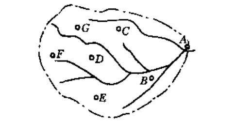

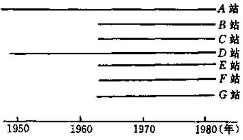  
图 10-1 雨量站位置和观测年限

相关点据较少的问题，在建立相关关系时，可利用一年多次法选样，以增添一些相关点据，更好地确定相关线。

## 三、特大值的处理

实践证明，暴雨资料系列的代表性与系列中是否包含有特大暴雨有直接关系。一般的暴雨变幅不很大，若不出现特大暴雨，统计参数x、C。往往会偏小。若在短期资料系列中，一旦出现一次罕见的特大暴雨，就可以使原频率计算成果完全改观。例如，福建长汀县四都站，根据1972年以前的最大一日雨量系列计算，其均值 $\overline { { x } } _ { 1 9 } = 1 0 2 \mathrm { { m m } }$ $c _ { \circ } { = } 0 . 3 5$ , C, =3.5C：（频率曲线如图10-2中1线），据此计算求得万年一遇最大1日雨量为332mm。而四都站，1973年出现一次特大暴雨，实测最大1日雨量达332mm，恰好相当于万年一遇的数值，在四都站年最大1日雨量的经验频率分布图上，1973年的暴雨量点据高悬于其他点据

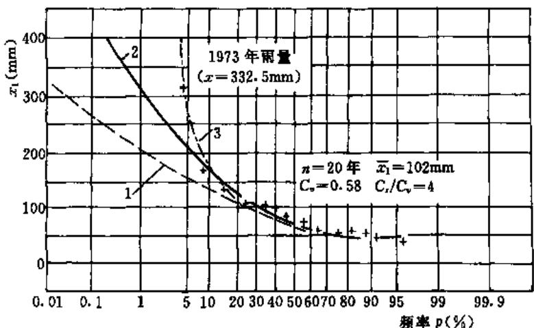  
图 10-2 福建四都站最大一日雨量频率曲线  
1—由1973年以前资料得出的频率曲线：

2一把1973年暴雨作特大值处理后得出的频率曲线；

3—1973年暴雨不作特大值处理得出的频率曲线

之上（特大值未作处理，适线后得出图10-2中3线），C.值高达1.10，与周围各站的C。相 $\mathbf { C } _ { \mathbf { \mathfrak { v } } }$ $C _ { v }$ 差悬殊。这些方面均说明，原参数值偏小，而1973年暴雨参加计算后，参数值又明显偏高，由此可见，特大值对统计参数x、C。值影响很大，如果能够利用其他资料信息，正确估计 $\overline { { x } } .$ $c _ { v }$ 出特大值的重现期，是可以提高系列代表性，起到展延系列的作用。

判断大暴雨资料是否属特大值，一般可从经验频率点据偏离频率曲线的程度、模比系数K，的大小、暴雨量级在地区上是否很突出，以及论证暴雨的重现期等方面进行分析判 $K _ { \rho }$ 断。近40年来，我国各地区出现过的特大暴雨，如河北省的“63.8”暴雨、河南省的“75.8”暴雨、内蒙古的“77.8”暴雨等均可作特大值处理。此外，国内外暴雨量历史最大值记录（见第十一章），也可供判断暴雨时参考。

若本流域没有特大暴雨资料，则可进行暴雨调查，或移用邻近流域已发生过的特大暴雨资料。移用时，要进行暴雨、天气资料的统计分析，当表明形成暴雨的气象因素基本一致，且地形的影响又不足以改变天气系统的性质时，才能把邻近流域的特大暴雨移用到设计流域，并在数量上加以修正（详见第十一章）。

特大值处理的关键是确定重现期。由于历史暴雨无法直接考证，特大暴雨的重现期只能通过小河洪水调查并结合当地历史文献中有关灾情资料的记载来分析估计。一般认为，当流域面积较小时，流域平均雨量的重现期与相应洪水的重现期相近。例如，四都站1973年特大暴雨的重现期，通过洪水调查（流域面积 $F = 1 6 6 ( \mathrm { k m } ^ { 2 } )$ ，了解到1915年洪水（乙卯年）是120多年来最大的，1973年的洪水是120多年来的第二大洪水。据此估算，1973年暴雨的重现期约在60～70年左右，经处理后重新适线，求得 $C _ { v } = 0 . 5 8$ （如图10-2 中 2线)。计算成果与邻近地区具有长期观测资料系列的测站比较尚协调一致。

必须指出，对特大暴雨的重现期必须作深人细致的分析论证，若没有充分的依据，就不宜作特大值处理。若误将一般大暴雨作为特大值处理，会使频率计算成果偏低，影响工程安全。

## 四、面雨量频率计算

面雨量统计参数的估计，我国一般采用适线法。设计洪水规范规定，其经验频率公式采用期望值公式，线型采用皮尔逊型。根据我国暴雨特性及实践经验，我国暴雨的 $C _ { s }$ 与C.的比值，一般地区为3. 5左右；在 $C , > 0 . 6$ 的地区，约为3.0; $C _ { v } { < } 0 . 4 5$ 的地区，约为4.0。以上比值，可供适线时参考。

在频率计算时，最好将不同历时的暴雨量频率曲线点绘在同一张机率格纸上，并注明相应的统计参数，加以比较。各种频率的面雨量都必须随统计时段增大而加大，如发现不同历时频率曲线有交叉等不合理现象时，应作适当修正。

## 五、设计面暴雨量计算成果的合理性检查

以上计算成果可从下列各方面进行检查，分析比较其是否合理，而后确定设计面暴雨量。

(1)对各种历时的点面暴雨量统计参数，如均值、 $C _ { v }$ 值等进行分析比较（点暴雨量计算将在本章第三节中作介绍)，而暴雨量的这些统计参数应随面积增大而逐渐减小。

(2)将直接法计算的面暴雨量与下节将介绍的间接法计算的结果进行比较。

(3)将邻近地区已出现的特大暴雨的历时、面积、雨深资料与设计面暴雨量进行比较。

## 第三节 间接法推求设计面暴雨量

## 一、设计点暴雨量的计算

推求设计点暴雨量，此点最好在流域的形心处，如果流域形心处或附近有一观测资料系列较长的雨量站，则可利用该站的资料进行频率计算，推求设计暴雨量。实际上，往往长系列的站不在流域中心或其附近，这时，可先求出流域内各测站的设计点暴雨量，然后绘制设计暴雨量等值线图，用地理插值法推求流域中心站的设计暴雨量。

进行点暴雨系列的统计时，一般亦采用定时段年最大法选样。暴雨时段长的选取与面暴雨量情况一样。如样本系列中缺少大暴雨资料，则系列的代表性不足，频率计算成果的稳定性差，应尽可能延长系列，可将气象一致区内的暴雨移置于设计地点，同时要估计特大暴雨的重现期，以便合理计算其经验频率，特大值处理方法同前。点设计暴雨频率计算及合理性检查亦同面设计暴雨量。

由于暴雨的局地性，点暴雨资料一般不宜采用相关法插补。设计洪水规范建议采用以下方法插补展延：

(1)距离较近时，可直接借用邻站某些年份的资料。

(2)一般年份，当相邻地区测站雨量相差不大时，可采用邻近各站的平均值插补。

(3)大水年份，当邻近地区测站较多时，可绘制次暴雨或年最大值等值线图进行插补。

(4)大水年份缺测，用其他方法插补较困难，而邻近地区已出现特大暴雨，且从气象条件分析有可能发生在本地区时，可移用该特大暴雨资料。移用时应注意相邻地区气候、地形等条件的差别，作必要的移置订正，如用均值比修正。

(5)如与洪水的峰量关系较好，可建立暴雨和洪水峰或量的相关关系，插补大水年份缺测的暴雨资料。并根据有关点据的分布情况，估计其可能包含的误差范围。

绘制设计暴雨等值线时，应考虑暴雨特性与地形的关系。进行插值推求流域中心设计暴雨时，亦应尽可能考虑地区暴雨特性，在直线内插的基础上司适当调整。

在暴雨资料十分缺乏的地区，可利用各地区的水文手册中的各时段年最大暴雨量的均值及 ${ { C } _ { \mathfrak { r } } }$ 等值线图，以查找流域中心处的均值及 $\mathbb { C } _ { v }$ 值，然后取 $C _ { \mathfrak { s } }$ 为 $C _ { v }$ 的固定倍比，确定C值，即可由此统计参数对应的频率曲线推求设计暴雨值。

## 二、设计面暴雨量的计算

流域中心设计点暴雨量求得后，要用点面关系折算成设计面暴雨量。暴雨的点面关系在设计计算中，又有以下两种区别和用法：

## 1. 定点定面关系

如流域中心或附近有长系列资料的雨量站，流域内有一定数量且分布比较均匀的其他雨量站资料时，可以用长系列站作为固定点，以设计流域作为固定面，根据同期观测资料，建立各种时段暴雨的点面关系。也就是，对于一次暴雨某种时段的固定点暴雨量，有一个相应的固定面暴雨量，则在定点定面条件下的点面折减系数α。为： $\pmb { \alpha } _ { 0 }$

$$
\alpha _ { 0 } = x _ { F } / x _ { 0 }
$$

式中xF、x。——分别为某种时段固定面及固定点的暴雨量。有了若干次某时段暴雨量，则 $x _ { F }$ $\pmb { x _ { 0 } }$ 可有若干个a。值。对于不同时段暴雨量，则又有不同的值。于是，可按设计时段选几次 $\pmb { a } _ { 0 }$ ${ \pmb { \alpha } } _ { \pmb { 0 } }$ 大暴雨的α。值，加以平均，作为设计计算用的点面折减系数。将前面所求得的各时段设计 $\pmb { \alpha } _ { 0 }$ 点暴雨量，乘以相应的点面折减系数，就可得出各种时段设计面暴雨量。

应该指出，在设计计算情况下，理应用设计频率的 ${ \pmb { \alpha } } _ { 0 }$ 值，但由于暴雨量资料不多，作$\alpha _ { \mathfrak { d } }$ 的频率分析有困难，因而近似地用大暴雨的 ${ \pmb \alpha } _ { 0 }$ 平均值，这样算出的设计面暴雨量与实际要求是有一定出入的。如果邻近地区有较长系列的资料，则可用邻近地区固定点和固定流域的或地区综合的同频率点面折减系数。但应注意，流域面积、地形条件、暴雨特性等要基本接近，否则不宜采用。

## 2. 动点动面关系

过去在缺乏暴雨资料的流域上求设计面暴雨量时，曾以暴雨中心点面关系代替定点定面关系，即以流域中心设计点暴雨量及地区综合的暴雨中心点面关系去求设计面暴雨量。这种暴雨中心点面关系（见图10-3）是按照各次暴雨的中心与暴雨分布等值线图求得的，各次暴雨中心的位置和暴雨分布不尽相同，所以说是动点动面关系。

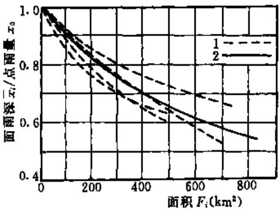

显然，这个方法包含了3个假定：①设计暴雨中心与流域中心重合；②设计暴雨的点面关系符合平均的点面关系；③假定流域的边界与某条等雨量线重图 10-3 某地区 3 天暴雨点面关系图1—各次实测暴雨；2—地区平均暴雨

合。这些假定，在理论上是缺乏足够根据的，使用时，应分析几个与设计流域面积相近的流域或对地区的定点定面关系作验证，如差异较大，应作一定修正。

计算设计面雨量时，由于大中流域点面雨量关系一般都很微弱，所以通过点面关系间接推求设计暴雨的偶然误差必然较大，在有条件的地区应尽可能采用直接法。

## 第四节 设计暴雨时空分配的计算

## 一、设计暴雨时程分配的计算

设计暴雨的时程分配计算方法与设计年径流的年内分配计算和设计洪水过程线的计算方法相同。一般用典型暴雨同频率控制缩放。

## 1. 典型暴雨的选择和概化

典型暴雨过程应在暴雨特性一致的气候区内选择有代表性的面雨量过程，若资料不足也可由点暴雨量过程来代替。所谓有代表性是指典型暴雨特征能够反映设计地区情况，符合设计要求，如该类型出现次数较多，分配形式接近多年平均和常遇情况，雨量大，强度也大，且对工程安全较不利的暴雨过程，如暴雨核心部分出现在后期，形成洪水的洪峰出现较迟，对水库安全影响较大。在缺乏资料时，可以引用各省（区）水文手册中按地区综合概化的典型雨型（一般以百分数表示）。

## 2. 缩放典型过程，计算设计暴雨的时程分配

选定了典型暴雨过程后，就可用同频率设计暴雨量控制方法，对典型暴雨分段进行缩

放。不同时段控制放大时，控制时段划分不宜过细，一般以1、3、7日控制。对暴雨核心部分24h暴雨的时程分配，时段划分视流域大小及汇流计算所用的时段而定，一般取2、3、6、12、24h控制。

## 3. 算例

某流域百年一遇各种时段设计暴雨量如表10-2所示。

选定的典型暴雨日程分配和设计暴雨日程分配计算见表10-3。

表 10-2各时段设计暴雨量
<table><tr><td rowspan=1 colspan=1>时   段（日）</td><td rowspan=1 colspan=1>1</td><td rowspan=1 colspan=1>3</td><td rowspan=1 colspan=1>7</td></tr><tr><td rowspan=1 colspan=1>设计面雨量x(mm)</td><td rowspan=1 colspan=1>303</td><td rowspan=1 colspan=1>394</td><td rowspan=1 colspan=1>485</td></tr></table>

最大24h设计及典型暴雨的时程分配见表10-4。

表 10-3  
暴雨日程分配（同频率法）
<table><tr><td rowspan=1 colspan=2>日   程雨量及分配比</td><td rowspan=1 colspan=1>1</td><td rowspan=1 colspan=1>2</td><td rowspan=1 colspan=1>3</td><td rowspan=1 colspan=1>4</td><td rowspan=1 colspan=1>5</td><td rowspan=1 colspan=1>6</td><td rowspan=1 colspan=1>7</td></tr><tr><td rowspan=2 colspan=1> $\pmb { x } _ { 1 \pmb { p } }$ 303mm</td><td rowspan=1 colspan=1>典型分配比</td><td rowspan=1 colspan=1></td><td rowspan=1 colspan=1></td><td rowspan=1 colspan=1></td><td rowspan=1 colspan=1></td><td rowspan=1 colspan=1></td><td rowspan=1 colspan=1>100%</td><td rowspan=1 colspan=1></td></tr><tr><td rowspan=1 colspan=1>设计雨量（mm）</td><td rowspan=1 colspan=1></td><td rowspan=1 colspan=1></td><td rowspan=1 colspan=1></td><td rowspan=1 colspan=1></td><td rowspan=1 colspan=1></td><td rowspan=1 colspan=1>303</td><td rowspan=1 colspan=1></td></tr><tr><td rowspan=2 colspan=1> $\pmb { x } _ { 3 \pmb { \rho } } - \pmb { x } _ { 1 \pmb { \rho } }$ 91mm</td><td rowspan=1 colspan=1>典型分配比</td><td rowspan=1 colspan=1></td><td rowspan=1 colspan=1></td><td rowspan=1 colspan=1></td><td rowspan=1 colspan=1></td><td rowspan=1 colspan=1>40%</td><td rowspan=1 colspan=1></td><td rowspan=1 colspan=1>60%</td></tr><tr><td rowspan=1 colspan=1>设计雨量（mm）</td><td rowspan=1 colspan=1></td><td rowspan=1 colspan=1></td><td rowspan=1 colspan=1></td><td rowspan=1 colspan=1></td><td rowspan=1 colspan=1>36</td><td rowspan=1 colspan=1></td><td rowspan=1 colspan=1>55</td></tr><tr><td rowspan=2 colspan=1> $\pmb { x } _ { 7 p } - \pmb { x } _ { 3 p }$ 91mm</td><td rowspan=1 colspan=1>典型分配比</td><td rowspan=1 colspan=1>30%</td><td rowspan=1 colspan=1>33%</td><td rowspan=1 colspan=1>37%</td><td rowspan=1 colspan=1>0%</td><td rowspan=1 colspan=1></td><td rowspan=1 colspan=1></td><td rowspan=1 colspan=1></td></tr><tr><td rowspan=1 colspan=1>设计雨量（mm）</td><td rowspan=1 colspan=1>27</td><td rowspan=1 colspan=1>30</td><td rowspan=1 colspan=1>34</td><td rowspan=1 colspan=1>0</td><td rowspan=1 colspan=1></td><td rowspan=1 colspan=1></td><td rowspan=1 colspan=1></td></tr><tr><td rowspan=1 colspan=2>设计暴雨过程（mm）</td><td rowspan=1 colspan=1>27</td><td rowspan=1 colspan=1>30</td><td rowspan=1 colspan=1>34</td><td rowspan=1 colspan=1>0</td><td rowspan=1 colspan=1>36</td><td rowspan=1 colspan=1>303</td><td rowspan=1 colspan=1>55</td></tr></table>

表 10-4  
面设计暴雨最大1日的时程分配（同倍比法）
<table><tr><td rowspan=1 colspan=1>项   目</td><td rowspan=1 colspan=12>设计暴雨的时段（2h）雨量过程</td><td rowspan=1 colspan=1>24h</td></tr><tr><td rowspan=1 colspan=1>时段序号</td><td rowspan=1 colspan=1>1</td><td rowspan=1 colspan=1>2</td><td rowspan=1 colspan=1>3</td><td rowspan=1 colspan=1>4</td><td rowspan=1 colspan=1>5</td><td rowspan=1 colspan=1>6</td><td rowspan=1 colspan=1>7</td><td rowspan=1 colspan=1>8</td><td rowspan=1 colspan=1>9</td><td rowspan=1 colspan=1>10</td><td rowspan=1 colspan=1>11</td><td rowspan=1 colspan=1>12</td><td rowspan=1 colspan=1>全日雨量</td></tr><tr><td rowspan=1 colspan=1>典型分配（%）</td><td rowspan=1 colspan=1>2.9</td><td rowspan=1 colspan=1>3.4</td><td rowspan=1 colspan=1>3.9</td><td rowspan=1 colspan=1>5.2</td><td rowspan=1 colspan=1>10.5</td><td rowspan=1 colspan=1>44.1</td><td rowspan=1 colspan=1>8.7</td><td rowspan=1 colspan=1>6.1</td><td rowspan=1 colspan=1>5.0</td><td rowspan=1 colspan=1>4.0</td><td rowspan=1 colspan=1>3.3</td><td rowspan=1 colspan=1>2.9</td><td rowspan=1 colspan=1>100</td></tr><tr><td rowspan=1 colspan=1>设计暴用（mm）</td><td rowspan=1 colspan=1>8.8</td><td rowspan=1 colspan=1>10.3</td><td rowspan=1 colspan=1>11.7</td><td rowspan=1 colspan=1>15.8</td><td rowspan=1 colspan=1>31.8</td><td rowspan=1 colspan=1>133.6</td><td rowspan=1 colspan=1>26.4</td><td rowspan=1 colspan=1>18.5</td><td rowspan=1 colspan=1>15.2</td><td rowspan=1 colspan=1>12.1</td><td rowspan=1 colspan=1>10.0</td><td rowspan=1 colspan=1>8.8</td><td rowspan=1 colspan=1>303</td></tr></table>

## 二、设计暴雨的地区分布

梯级水库或水库承担下游防洪任务时，需要拟定流域上各部分的洪水过程，因此需给出设计暴雨量在面上的分布。其计算方法与设计洪水的地区组成计算方法相似。

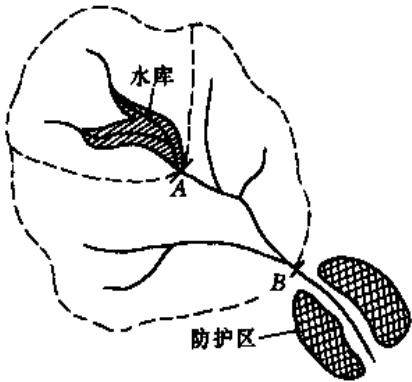  
图 10-4 防洪水库与防护区位置图

如图10-4所示，在推求防洪断面B以上流域的设计暴雨量时，必须分成两部分，一部分来自防洪水库A以上流域的暴雨，另一部分来自水库A以下至防洪断面B这一区间面积上的暴雨。在实际工作中，一般先对已有实测大暴雨资料的地区组成进行分析，了解暴雨中心经常出现的位置，并统计A库以上和区间暴雨所占的比重等，作为选定设计暴雨面分布的依据，再从工程规划设计的安全与经济考虑，选定一种可能出现而且偏于不利的暴雨面分布形式，进行设计暴雨的模拟放大。常采用的有以下两种方法。

## 1. 典型暴雨图法

从实际资料中选择暴雨量大的一个暴雨图形（等雨量线图）移置于流域上。为安全计，常把暴雨中心置放在AB区间，而不是置放在流域中心。这样做使区间暴雨所占比例最大，对防洪断面B更为不利。然后量取防洪断面B以上流域范围内的典型暴雨等雨量线图，分别求出水库A 以上流域的典型面雨量 $( x _ { A } )$ 和区间 AB 的典型面雨量 $( \pmb { \mathscr { x } } _ { A B } )$ ，乘以各自的面积，得水库A以上流域的总水量 $( \mathbb { W } _ { A } = x _ { A } F _ { A } )$ 和区间 AB 的总水量 $( W _ { A B } = x _ { A B } F _ { A B } )$ ，并求得它们所占的相对比例。设计暴雨总量 $( W _ { B _ { \beta } } = x _ { B _ { \beta } } F _ { B } )$ 按它们各自所占的比例分配，即得设计暴雨量在水库A以上和区间AB上的面分布。最后通过设计暴雨时程分配计算，得出两部分设计暴雨过程。

## 2. 同频率控制法

对防洪断面B以上流域的面雨量和区间AB面积上的面雨量分别进行频率计算，求得各自的设计面雨量 $x _ { B p } , \ x _ { A B p }$ 。按同频率原则考虑，采取防洪断面B以上流域发生指定频率p的设计面暴雨量时，区间AB面积上也发生同频率暴雨，水库以上流域则为相应雨量（其频率不定)，即

$$
x _ { A } = \frac { x _ { B \beta } F _ { B } - x _ { A B \beta } F _ { A B } } { \bar { F } _ { A } }
$$

## 第五节 由设计暴雨推求设计洪水

求得设计暴雨后，进行流域产流、汇流计算，可求得相应的洪水过程。有关产流、汇流分析计算的原理和方法在第四章中已阐明。本节主要介绍在设计条件如暴雨强度及总量较大、当地雨量、流量资料不足等情况下，计算中应注意的问题。

## 一、设计 $\pmb { P _ { \bullet } }$ 的计算

设计暴雨发生时流域的土壤湿润情况是未知的，可能很干 $( P _ { q } = 0 )$ ，也可能很湿 $\textstyle ( { \mathcal { P } } _ { \alpha }$ $= { \pmb { I } } _ { \ast } )$ ，所以设计暴雨可与任何 $P _ { \alpha }$ 值 $( 0 { \leqslant } P _ { a } { \leqslant } I _ { \ast } )$ 相遭遇，这是属于随机变量的遭遇组合问题。目前生产上常用下述三种方法求设计条件下的土壤含水量，即设计 $\pmb { P _ { a } }$

## 1. 取设计 $\pmb { P _ { a } = I _ { m } }$

在湿润地区，当设计标准较高，设计暴雨量较大， $P _ { \alpha }$ 的作用相对较小。由于雨水充沛，土壤经常保持湿润情况，为了安全和简化，可取 $P _ { \bullet } { = } I _ { \ m }$

## 2. 扩展暴雨过程法

在拟定设计暴雨过程时，加长暴雨历时，增加暴雨的统计时段，把核心暴雨前面一段也包括在内。例如，原设计暴雨采用1、3、7日3个统计时段，现增长到30日，即增加15、

30日2个统计时段。分别作上述各时段雨量频率曲线，选暴雨核心偏在后面的30日降雨过程作为典型，而后用同频率分段控制缩放得7日以外30日以内的设计暴雨过程(如图10-5)。后面7日为原先缩放好的设计暴雨核心部分，是推求设计洪水用的。前面23日的设计暴雨过程用来计算7日设计暴雨发生时的P。值，即设计P。。 ${ \pmb P } _ { a }$ ${ \bar { \pmb { P _ { a } } } }$

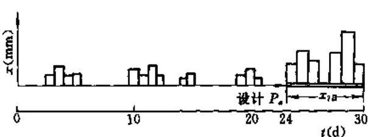  
图 10-5 30 日设计暴雨过程

当然30日设计暴雨过程开始时的P。值（即初始值）如何定仍然是一个问题，不过初 $\pmb { P _ { \alpha } }$ 始P.值假定不同，对后面的设计P。值影响甚微，因为初始P.值要经过23 日的演算，才 $\mathtt { P _ { \alpha } }$ $\pmb { P _ { \epsilon } }$ ${ \pmb P } _ { \pmb a }$ 到设计暴雨核心部分。一般可取 $P _ { \bullet } { = } \frac { 1 } { 2 } \bar { I } _ { \ast }$ 或 $P _ { \bullet } { = } I _ { \ m }$

## 3. 同频率法

假如设计暴雨历时为t日，分别对t日暴雨量x系列和每次暴雨开始时的P。与暴雨量 $\pmb { x } _ { t }$ $\pmb { P _ { \circ } }$ ${ \pmb x } _ { \pmb { \imath } }$ 之和即 $\pmb { \mathscr { x } } _ { \pmb { \mathscr { t } } } + \pmb { \mathscr { P } } _ { \pmb { \mathscr { a } } }$ 系列进行频率计算，从而求得 $\scriptstyle x _ { t , p }$ 和 $( x _ { t } + P _ { \cdot } ) _ { \rho }$ ，则与设计暴雨相应的设计$\pmb { P _ { a } }$ 值可由两者之差求得，即

$$
P _ { a \rho } = ( x _ { i } + P _ { a } ) _ { \rho } - x _ { i \rho }
$$

当得出 $P _ { \alpha \rho } > I _ { m }$ 时，则取 $\bar { P _ { a p } } { = } \bar { I _ { m } }$

上述三种方法中，扩展暴雨过程法用得较多， $P _ { \bullet } { = } I _ { \bowtie }$ 方法仅适用于湿润地区。在干旱地区包气带不易蓄满，故不宜使用。同频率法在理论上是合理的，但在实用上也存在一些问题，它需要由两条频率曲线的外延部分求差，其误差往往很大，常会出现一些不合理现象，例如设计 $\pmb { P _ { \bullet } }$ 大于 $\pmb { I _ { \infty } }$ 或设计 $P _ { \bullet }$ 小于零。

## 二、产流方案和汇流方案的应用

## (一) 外延问题

设计暴雨属于稀遇的大暴雨，往往超过实测的暴雨很多，在推求设计洪水时，必须外延有关的产流、汇流方案。

湿润地区的产流方案常采用 $x { + } P _ { a } { \sim } y$ 形式的相关图，其关系线上部的斜率 $\frac { \mathrm { d } y } { \mathrm { d } x } = 1 . 0$ 即相关线为 $4 5 ^ { \circ }$ 线，外延起来比较方便。干旱地区多采用初损后损法，就需要对有关相关图在外延时必须考虑设计暴雨的雨强因素的影响（如图10-6)。

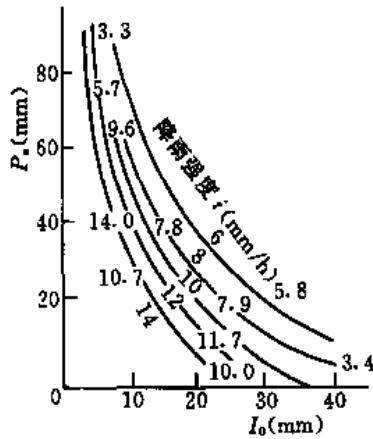  
图 10-6 $P _ { a } \sim _ { i } \sim I _ { 0 }$ 相关图

目前采用的流域汇流方案都属于“线性系统。”在实测暴雨范围内应用这些方案作汇流计算时，其误差一般可以控制在容许范围之内，当用于罕见的特大暴雨时，线性假定有可能导致相当大的误差。虽然有些人提出了不少的“非线性系统”，但由于受到资料所限，这些方案都还未得到充分论证，不为世人所普遍接受。

在工程设计部门，一般注意汇流方案在特大暴雨条件下的适用性，尽量选用实测大洪水资料分析得到的汇流方案，以期与设计条件相近，避免外延过远而扩大误差。不少部门的实践经验说明，注意与不注意这一点，会使设计成果出现较大的变化。用一般常遇洪水分析得出的单位线来推算设计洪水，与由特大洪水资料分析的单位线推流，成果可能相差很大，其差

值可达20%左右。如果当地缺乏大洪水资料，只好参照有关汇流方案非线性处理的方法作适当修正，这时需要十分慎重和多方论证分析。

## （二)移用问题

如果设计流域缺乏实测降雨径流资料，无法直接分析产流、汇流方案，就得解决移用

问题。

产流方案一般采用分区综合方法，如山东省水文手册上就有适用于不同地区的14条次降雨径流相关线，供各个分区查用，汇流方案一般采用单位线的综合成果。

## 三、算例

某中型水库，集水面积为341km²，为了防洪复核，根据实测雨洪资料，拟采用暴雨资料来推求P=2%的设计洪水，步骤如下：

## 1. 设计暴雨计算

根据本流域洪水涨落较快和水库调洪能力不强的特点，设计暴雨的最长统计时段采用1 日。通过点暴雨频率计算及参数的地区协调，得 $\overline { { x } } _ { 1 \mathrm { E } } = 1 1 0 \mathrm { m m } , C _ { v } = 0 . 5 8 , C _ { v } = 3 . 5 C _ { v }$ ，求得P=2%的最大1日的设计点暴雨量为296mm，而通过动点动面的暴雨点面关系图，用流域面积341km²查图得暴雨点面折减系数为0.92，则P=2%的最大1日面设计暴雨量 ${ \pmb x } _ { \mathbb { H } \mid \uparrow \rrangle }$ $= 2 9 6 \times 0 . 9 2 = 2 7 2 { \mathrm { m m } }$ D

按该地区的暴雨时程分配，求得设计暴雨过程如表10-5所示。

## 2. 设计净雨过程的推求

用同频率法求得设计 $\pmb { P _ { a } }$ 值为78mm，本流域的 $\scriptstyle { I _ { s } = 1 0 0 { \mathrm { m m } } }$ ，降雨损失22mm，求得设计净雨过程如表10-5所示。

表 10-5 P=2 %设计暴雨时程分配
<table><tr><td rowspan=1 colspan=1>时段数 $( \Delta t = 6 \ h )$ </td><td rowspan=1 colspan=1>1</td><td rowspan=1 colspan=1>2</td><td rowspan=1 colspan=1>3</td><td rowspan=1 colspan=1>4</td><td rowspan=1 colspan=1>合计</td></tr><tr><td rowspan=1 colspan=1>占最大1日的百分数（%）</td><td rowspan=1 colspan=1>11</td><td rowspan=1 colspan=1>63</td><td rowspan=1 colspan=1>17</td><td rowspan=1 colspan=1>9</td><td rowspan=1 colspan=1>100</td></tr><tr><td rowspan=1 colspan=1>设计暴用（mm）</td><td rowspan=1 colspan=1>29.9</td><td rowspan=1 colspan=1>171.3</td><td rowspan=1 colspan=1>46.2</td><td rowspan=1 colspan=1>24.5</td><td rowspan=1 colspan=1>272</td></tr><tr><td rowspan=1 colspan=1>设计净雨（mm）</td><td rowspan=1 colspan=1>7.9</td><td rowspan=1 colspan=1>171.3</td><td rowspan=1 colspan=1>46.2</td><td rowspan=1 colspan=1>24.6</td><td rowspan=1 colspan=1>250</td></tr><tr><td rowspan=1 colspan=1>地下净雨（mm）</td><td rowspan=1 colspan=1>2.4</td><td rowspan=1 colspan=1>9.0</td><td rowspan=1 colspan=1>9.0</td><td rowspan=1 colspan=1>9.0</td><td rowspan=1 colspan=1>29.4</td></tr><tr><td rowspan=1 colspan=1>地面净雨（mm）</td><td rowspan=1 colspan=1>5.5</td><td rowspan=1 colspan=1>162.3</td><td rowspan=1 colspan=1>37.2</td><td rowspan=1 colspan=1>15.6</td><td rowspan=1 colspan=1>220.6</td></tr></table>

根据对实测洪水资料分割得来的地下径流过程和净雨过程的分析，求得本流域的稳定下渗强度为1.5mm/h。由设

计净雨过程中扣除地下净雨（等于稳渗强度乘以净雨历时）得地面净雨过程（如表10-5）。其中第一时段的净雨历时 $\displaystyle t _ { c } = \frac { 7 . 9 } { 2 9 . 9 } \times 6 \approx 1$ .6h，地下净雨 $h _ { \mathbb { F } } = f _ { \varepsilon } t _ { \epsilon } = 1 . 5 \times 1 . 6 { = } 2 . 4 \mathrm { m m }$ ,故第一时段地面净雨为5.5mm，余类推。

## 3. 设计洪水过程的推求

根据实测雨洪资料，分析得大洪水的单位线，如表10-6中的（3）栏。由设计地面净雨过程通过单位线推流，得设计地面径流过程，成果如表10-6中（5）栏所示。

把地下径流过程化成等腰三角形出流，其总量等于设计地面径流停止时刻(第13时段)，地下径流过程的底长为地面径流底长的2倍，即 $T _ { \mathrm { { F } } } { = } 2 { \times } T _ { \mathrm { { i f } } } { = } 2 { \times } 1 3 { \times } 6 { = } 1 5 6$ h,则

$$
\begin{array} { r l r } & {  { W _ { \mathbb { F } } = 0 . 1 \times h _ { \mathbb { F } } \times F = 0 . 1 \times 2 9 . 4 \times 3 4 1 \times 1 0 ^ { 4 } ( \mathrm { m } ^ { 3 } ) } } \\ & { } & \\ & { = 1 0 0 0 \times 1 0 ^ { 4 } \mathrm { m } ^ { 3 } } \\ & { } & \\ & { Q _ { \mathrm { m } \mathbb { F } } = \frac { 2 W _ { \mathbb { F } } } { T _ { \mathbb { F } } } = \frac { 2 \times 1 0 0 0 \times 1 0 ^ { 4 } } { 1 5 6 \times 3 6 0 0 } = 3 5 . 6 \mathrm { m } ^ { 3 } / \mathrm { s } } \end{array}
$$

地下径流过程如表10-6中（6）栏所示。

地面径流过程加上地下径流过程即得P=2%的设计洪水过程，如表10-6中（7）栏所示。

设计洪水过程推算表
<table><tr><td rowspan="2">时段数 (∆=6h)</td><td rowspan="2">地面净雨 h(mm)</td><td rowspan="2">单位线 纵坐标  $q ( \ m ^ { 3 } / \mathfrak { s } )$ </td><td colspan="4">部分流量过程  $( \mathbf { m } ^ { 3 } / \mathbf { s } )$ </td><td rowspan="2">地面径流 流量过程Q (m³/s)</td><td rowspan="2">地下径流 流量过程QR (m³/s)</td><td rowspan="2">洪水流量 过程Q (m³/s)</td></tr><tr><td> $\frac { 5 . 5 } { 1 0 } \ L { q }$ </td><td> $\frac { 1 6 2 . 3 } { 1 0 } { { q } }$ </td><td> $\frac { 3 7 . 2 } { 1 0 } { } _ { q }$ </td><td> $\frac { 1 5 . 6 } { 1 0 } \boldsymbol { q }$ </td></tr><tr><td>(1)</td><td>(2) 5.5</td><td>(3) 0</td><td></td><td></td><td>(4)</td><td></td><td>(5)</td><td>(6)</td><td>(7) 0</td></tr><tr><td>0 1</td><td></td><td>8.4</td><td>0 4.6</td><td>0</td><td></td><td></td><td>0 4.6</td><td>0 2.7</td><td>7.3</td></tr><tr><td>2</td><td>162.3</td><td>49.6</td><td>27.3</td><td>136.3</td><td>0</td><td></td><td>163.0</td><td>5.5</td><td>168</td></tr><tr><td>3</td><td>37.2</td><td>33.8</td><td>18.6</td><td>805.0</td><td>31.2</td><td>0</td><td>855</td><td>8.2</td><td>863</td></tr><tr><td>4</td><td>15.6</td><td>24.6</td><td>13.5</td><td>548.6</td><td>184.5</td><td>13.1</td><td>760</td><td>11.0</td><td>771</td></tr><tr><td>5</td><td></td><td>17.4</td><td>9.6</td><td>399.3</td><td>125.7</td><td>77.4</td><td>612</td><td>13.7</td><td>626</td></tr><tr><td>6</td><td></td><td>10.8</td><td>5.9</td><td>282.4</td><td>91.5</td><td>52.7</td><td>433</td><td>16.4</td><td>447</td></tr><tr><td>7</td><td></td><td>7.0</td><td>3.8</td><td>175.3</td><td>64.7</td><td>38.4</td><td>282</td><td>19.2</td><td>301</td></tr><tr><td>8</td><td></td><td>4.4</td><td>2.4</td><td>113.6</td><td>40.2</td><td>27.1</td><td>183</td><td>21.9</td><td>205</td></tr><tr><td>9</td><td></td><td>1.8</td><td>1.0</td><td>71.4</td><td>26.6</td><td>16.8</td><td>115</td><td>24.7</td><td>140</td></tr><tr><td>10</td><td></td><td>0</td><td>0</td><td>29.2</td><td>16.4</td><td>10.9</td><td>56.5</td><td>27.4</td><td>83.9</td></tr><tr><td>11</td><td></td><td></td><td></td><td>0</td><td>6.7</td><td>6.9</td><td>13.6</td><td>30.1</td><td>44.7</td></tr><tr><td>12</td><td></td><td></td><td></td><td></td><td>0</td><td>2.8</td><td>2.8</td><td>32.9</td><td>35.7</td></tr><tr><td>13</td><td></td><td></td><td></td><td></td><td></td><td>0</td><td>0</td><td>35.6 32.9</td><td>35.6</td></tr><tr><td>14</td><td></td><td></td><td></td><td></td><td></td><td></td><td></td><td></td><td>32.9</td></tr><tr><td>15</td><td></td><td></td><td></td><td></td><td></td><td></td><td></td><td>30.1</td><td>30.1</td></tr><tr><td>16</td><td></td><td></td><td></td><td></td><td></td><td></td><td></td><td>27.4</td><td>27.4</td></tr><tr><td>17</td><td></td><td></td><td></td><td></td><td></td><td></td><td></td><td>：</td><td>：</td></tr><tr><td>18</td><td></td><td></td><td></td><td></td><td></td><td></td><td></td><td></td><td></td></tr><tr><td>合计</td><td>220.6</td><td>157.8</td><td></td><td></td><td></td><td></td><td>3480.5</td><td></td><td></td></tr></table>

注 1. 核算单位线净雨深 $h _ { \mathfrak { v } } = { \frac { \sum q _ { i } \Delta \ell } { F } } = { \frac { 1 5 7 . 8 \times 2 1 8 0 0 } { 1 0 0 0 \times 3 4 1 } } \approx 1 0 . 0 ( \mathrm { m m } ) _ { \circ }$  
2. 核算地面径流总量 $h _ { s } = { \frac { \sum Q _ { n } \Delta t } { F } } = { \frac { 3 4 8 0 . 5 \times 2 1 6 0 0 } { 1 0 0 0 \times 3 4 1 } } \approx 2 2 0 . 5 ( \mathrm { m m ) } _ { \mathrm { \Omega } }$

## 第六节 小流域设计洪水的计算

## 一、概述

小流域设计洪水计算，广泛应用于中、小型水利工程中，如修建农田水利工程的小水库、撇洪沟，渠系上交叉建筑物如涵洞、泄洪闸等，铁路、公路上的小桥涵设计，城市和工矿地区的防洪工程，都必须进行设计洪水计算，因此，水文学上常常作为一个专门的问题进行研究。与大、中流域相比，小流域设计洪水具有以下三方面的特点：

(1)在小流域上修建的工程数量很多，往往缺乏暴雨和流量资料，特别是流量资料。

(2)小型工程一般对洪水的调节能力较小，工程规模主要受洪峰流量控制，因而对设计洪峰流量的要求，高于对设计洪水过程的要求。

(3)小型工程的数量较多，分布面广，计算方法应力求简便，使广大基层水文工作者

易于掌握和应用。

小流域设计洪水计算工作已有100多年的历史，计算方法在逐步充实和发展，由简单到复杂，由计算洪峰流量到计算洪水过程。归纳起来，有经验公式法、推理公式法、综合单位线法以及水文模型等方法。本节主要介绍推理公式法和经验公式法。

## 二、小流域设计暴雨

小流域设计暴雨与其所形成的洪峰流量假定具有相同频率。因小流域缺少实测暴雨系列，多采用以下步骤推求设计暴雨：

（1）按省（区、市）水文手册及《暴雨径流查算图表》上的资料计算特定历时的暴雨量。

(2)将特定历时的设计雨量通过暴雨公式转化为任一历时的设计雨量。

## (一) 年最大 24h 设计暴雨量计算

小流域一般不考虑暴雨在流域面上的不均匀性，多以流域中心点的雨量代替全流域的设计面雨量。小流域汇流时间短，成峰暴雨历时也短，从几十分钟到几小时，通常小于1天。以前自记雨量记录很少，多为1天的雨量记录，大多数省（区、市）和部门都已绘制24h暴雨统计参数等值线图。在这种情况下，应首先查出流域中心点的年最大24h降雨量均值 $\stackrel { \sim } { x } _ { 2 4 }$ 及 $C _ { \ " }$ 值，再由 $C _ { s }$ 与 $C _ { \nu }$ 之比的分区图查得 $c . / C _ { \mathfrak { v } }$ 的值，由 $\overline { { x } } _ { 2 4 }$ $C _ { \bullet }$ 及 $C _ { s }$ 即可推出流域中 $\pmb { i } \mathbf { \widetilde { U } }$ 点的某频率的 24h设计暴雨量。

随着自记雨量计的增设及观测时段资料的增加，有些省（区、市）已将6h、1h的雨量系列进行统计，得出短历时的暴雨统计参数等值线图（均值、 $C _ { \ast } , C _ { \ast } )$ ，从而可求出 6h 及 1h的设计频率的雨量值。

## (二)暴雨公式

前面推求的设计暴雨量为特定历时（24、6、1h等）的设计暴雨，而推求设计洪峰流量时需要给出任一历时的设计平均雨强或雨量。通常用暴雨公式，即暴雨的强度\~历时关系将年最大24h（或6h等）设计暴雨转化为所需历时的设计暴雨，目前水利部门多用如下公式形式：

$$
\alpha _ { t , \bar { r } } = \frac { \bar { S } _ { \bar { r } } } { t ^ { \bar { r } } }\tag{10-1}
$$

式中 $\alpha _ { t , \mathcal { P } } ^ { \cdot }$ —历时为t，频率为P的平均暴雨强度，mm/h；

$\$ 9$ ——t=1h的平均雨强，俗称雨力，mm $/ h$

n——暴雨参数或称暴雨递减指数。

或

$$
\ L _ { \mathcal { X } _ { \ell , P } } = \bar { S } _ { P } t ^ { 1 - n }\tag{10-2}
$$

式中 $\pmb { \mathcal { X } } _ { 1 } , \pmb { P }$ ——频率为 $P$ ，历时为t的暴雨量，mm。

暴雨参数可通过图解分析法来确定。对式（10-1）两边取对数，在对数格纸上， $\log a _ { t } , p$ 与 $\lfloor _ { \pmb { \mathrm { g } } ^ { t } }$ 为直线关系，即 $\log a _ { t , P } { = } \log S _ { P } { - } n \log t$ ，参数n为此直线的斜率， $\pmb { t = 1 } \mathbf { h }$ 的纵坐标读数就是 $\ S _ { P }$ ，如图10-7所示。由图可见，在 $\pmb { t = } \pmb { \mathrm { I h } }$ 处出现明显的转折点。当 ${ \tt t } \leqslant \tt { 1 } h$ 时，取 $\pmb { n } = \pmb { n } _ { 1 }$ $t >$ 1h时，则 $\mathbf { \hat { \mu } } _ { n } { = } n _ { 2 }$ 0

图10-7上的点据是根据分区内有暴雨系列的雨量站资料经分析计算而得到的。首先计算不同历时暴雨系列的频率曲线，读取不同历时各种频率的 $\boldsymbol { \mathscr { X } } _ { t , \boldsymbol { F } }$ ，将其除以历时t，得到$\pmb { \alpha _ { t , P } } ,$ 然后以 $\pmb { a } _ { \pmb { \imath } , \pmb { P } }$ 为纵坐标，t为横坐标，即可点绘出以频率P为参数的 $\mathrm { l } _ { \pmb { \mathrm { g } } } \alpha _ { \iota , P } \sim P \sim \mathrm { l } _ { \pmb { \mathrm { g } } } t$ 关系线。

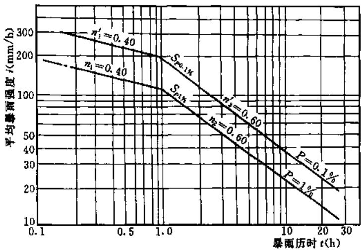  
图 10-7 暴雨强度一历时—频率曲线

暴雨递减指数n对各历时的雨量转换成果影响较大，如有实测暴雨资料分析得出能代表本流域暴雨特性的n值最好。小流域多无实测暴雨资料，需要利用n值反映地区暴雨特征的性质，将本地区由实测资料分析得出的 $\pmb { n } \ ( \pmb { n } _ { 1 } , \pmb { n } _ { 2 } )$ 值进行地区综合，绘制n值分区图，供无资料流域使用。一般水文手册中均有n值分区图。

$\ S _ { P }$ 值可根据各地区的水文手册，查出设计流域的 ${ \overline { { x } } } _ { 4 } , { C } _ { \mathfrak { v } }$ ，计算出 $x _ { 2 4 , P } ,$ 然后由式（10-2）计算得出。如地区水文手册中已有 $\$ 9$ 等值线图，则可直接查用。

$S _ { P }$ 及n值确定之后，即可用暴雨公式进行不同历时暴雨间的转换。24h雨量 $\pmb { x } _ { 2 4 , P }$ 转换为t h的雨量 $x _ { t , \tilde { t } }$ ，可以先求1h雨量 $\pmb { x } _ { 1 , \pmb { P } ( \pmb { S } _ { p } ) }$ ，再由 $S _ { P }$ 转换为th 雨量。

因

$$
\begin{array} { c } { { x _ { 2 4 , P } = a _ { 2 4 , P } \times 2 4 = S _ { P } \times 2 4 ^ { ( 1 - n _ { 2 } ) } } } \\ { { S _ { P } = x _ { 2 4 , P } \times 2 4 ^ { ( n _ { 2 } - 1 ) } } } \end{array}\tag{10-3}
$$

则

由求得的 $S _ { P }$ 转求th雨量 $x _ { t , P }$ 为：

当 $1 \mathrm { h } \leqslant t \leqslant 2 4$ h时，

$$
x _ { \iota , P } = S _ { P } t ^ { ( 1 - n _ { 2 } ) } = x _ { 2 4 , P } \times 2 4 ^ { ( n _ { 2 } - 1 ) } \times t ^ { ( 1 - n _ { 2 } ) }\tag{10-4}
$$

当 $t < 1$ h时，

$$
x _ { t , P } = S _ { P } t ^ { ( 1 - \mathfrak { n } _ { 1 } ) } = x _ { 2 4 , P } \times 2 4 ^ { ( \mathfrak { n } _ { 2 } - 1 ) } \times t ^ { ( 1 - \mathfrak { n } _ { 1 } ) }\tag{10-5}
$$

上述以1h处分为两段直线是概括大部分地区x与t之间的经验关系，未必与各地的 $x _ { 1 , \beta }$ 暴雨资料拟合很好。如有些地区采用多段折线，也可以分段给出各自不同的转换公式，不必限于上述形式。

设计暴雨过程是进行小流域产汇流计算的基础。小流域暴雨时程分配一般采用最大3h、6h及24h作同频率控制，各地区水文图集或水文手册均载有设计暴雨分配的典型，可供参考。

## 三、设计净雨计算

由暴雨推求洪水过程，一般分为产流和汇流两个阶段。为了与设计洪水计算方法相适应，下面着重介绍利用损失参数μ值的地区综合 $\pmb { \mu }$ 规律计算小流域设计净雨的方法。

损失参数 $\pmb { \mu }$ 是指产流历时 $\pmb { t _ { c } }$ 内的平均损失强度。图10-8表示 $\mu$ 与降雨过程的关系。从图10-8可以看出， $i \leqslant \mu$ 时，降雨全部耗于损失，不产生净雨； $i \sum \mu$ 时，损失按 $\pmb { \mu }$ 值进行，超渗部分（图10-8中阴影部分）即为净雨量。由此可见，当设计暴雨和 $\pmb { \mu }$ 值确定后，便可求出任一历时的净雨量及平均净雨强度。

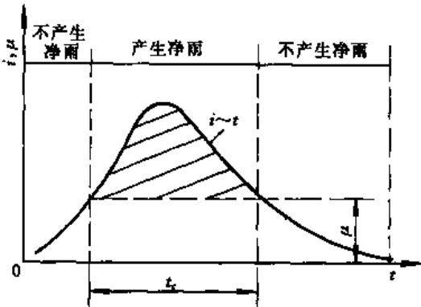  
图 10-8 降雨过程与人渗过程示意图

为了便于小流域设计洪水计算，各省（区）水利水文部门在分析大量暴雨洪水资料之后，均提

出了决定 $\pmb { \mu }$ 值的简便方法。有的部门建立单站 $\mu$ 与前期影响雨量 $P _ { \sigma }$ 的关系，有的选用降雨强度 $\bar { \dot { \pmb { j } } }$ 与一次降雨平均损失率 $\overline { { f } }$ 建立关系，以及 $\pmb { \mu }$ 与 $\overline { f }$ 建立关系，从而运用这些 $\pmb { \mu }$ 值作地区综合，可以得出各地区在设计时应取的 $\pmb { \mu }$ 值。具体数值可参阅各地区的水文手册。

## 四、由推理公式推求设计洪水的基本原理

推理公式，英、美称为“合理化方法”(Rational method)，前苏联称为“稳定形势公式”。推理公式法是根据降雨资料推求洪峰流量的最早方法之一，至今已有130多年。

## (一) 推理公式的形式

假定流域产流强度γ在时间、空间上都均匀，经过线性汇流推导，可得出所形成洪峰流量的计算公式，如式（10-6）所示。

$$
Q _ { \mathrm { m } } = 0 , 2 7 8 \gamma F = 0 . 2 7 8 ( a - \mu ) F\tag{10-6}
$$

式中 $\pmb { a } ^ { \prime }$ —平均降雨强度， $\bf { m m } / \hbar$

$\pmb { \mu } ^ { \star }$ —损失强度， $\mathrm { { \ m m / h } }$

${ \pmb F } \mathrm { \cdot }$ —流域面积， $\mathbf { k } \mathbf { m } ^ { 2 }$

0.278——单位换算系数；

$\ Q _ { m }$ ——洪峰流量， $\mathbf { m } ^ { 3 } / { \mathsf { s } }$

在产流强度时空均匀情况下，流域汇流过程可用图10-9表示。

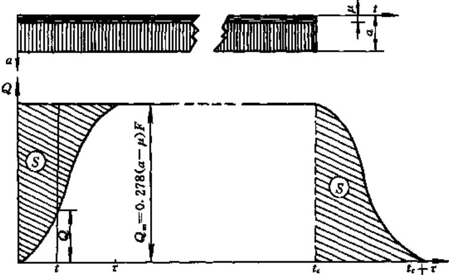  
图10-9 均匀产流条件下流域汇流过程示意图

从图10-9可知，当产流历时 $t _ { \mathfrak { c } } > \tau$ (流域汇流时间)时，会形成稳定洪峰段，其洪峰流量Q由式（10-6）给出。Q仅与流域面积和产流强度有关。这些结论与人们的直觉似乎有 $Q _ { \varpi }$ $Q _ { \infty }$ 抵触，因为实际上洪水过程线中，几乎没有出现过这种稳定的洪峰段，而且洪峰流量与流域其他地理特征（如坡降、河长等）有关，这就常常引起人们对式（10-6）的合理性产生怀疑。造成上述矛盾的根本原因是实际产流强度不太可能达到以上假定。式（10-6）很容易用等流时线法导出。

当 $t _ { c } \geqslant \tau$ 时，称为全面汇流情况，此时，可以直接使用式（10-6）推求洪峰流量；当 $\pmb { t _ { c } }$ $< \tau$ 时，称为部分汇流情况，即其洪峰流量只是由部分流域面积的净面形成，此时，不能正常使用推理公式，否则所求洪峰流量将偏大。

## (二)推理公式的实际应用

实际上产流强度随时间、空间是变化的，从严格意义上讲，是不能使用推理公式作汇流计算的。但对于小流域设计洪水计算，推理公式法计算简单，且有一定精度，故它是目前水利水电部门最常用的一种小流域汇流计算方法。

对于实际暴雨过程， $Q _ { \infty } ,$ 的计算方法如下：

假定所求设计暴雨过程如图10-10，产流计算采用损失参数 $\pmb { \mu }$ 法。

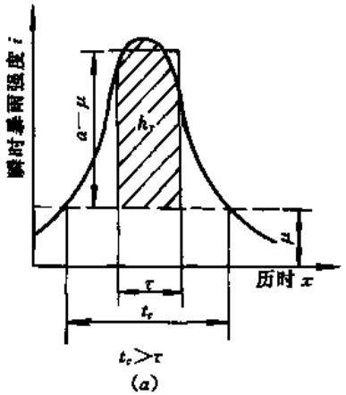

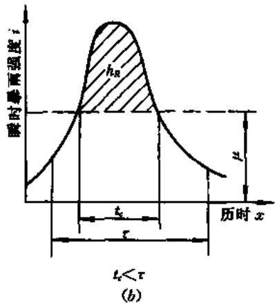  
图 10-10 $t _ { \pm } > \tau$ $\smash { t _ { E } < \tau }$ 时参与形成洪峰流量的径流深图(a) 全面汇流情况，(b) 部分汇流情况

对于全面汇流情况

$$
Q _ { m } = 0 . 2 7 8 ( a - \mu ) F = 0 . 2 7 8 \Big ( \frac { h _ { \tau } } { \tau } \Big ) F\tag{10-7}
$$

对于部分汇流情况，因为不能正常使用推理公式，所以陈家琦等人在作一定假定后，得

$$
Q _ { m } = 0 . 2 7 8 \bigg \{ \frac { h _ { R } } { \tau } \bigg \} \ F\tag{10-8}
$$

其中 $h _ { \tau }$ 表示连续τ时段内最大产流量， $h _ { R }$ 表示产流历时内的产流量。

## 五、北京水科院推理公式的导出与应用[]

北京水科院推理公式是陈家琦等人在经过两年的研究后于1958年提出的，目前它是我国设计洪水规范中规定使用的小流域设计洪水计算方法。

## (一) 公式推导

在此只作简单介绍，详细可参阅参考文献[40]。

## 1. 设计暴雨过程

假定了一条各时段同频率的设计暴雨过程，如图10-11所示。

这样构造的设计暴雨过程有以下4个性质：

(1) 相对 $\pmb { x } = \pmb { x } _ { 0 }$ 而言，暴雨过程线是对称的。

(2) 当 ${ x } ^ {  } { x } _ { 0 }$ 时，瞬时雨强 $\textit { \textbf { i } } ( \boldsymbol { x } _ { 0 } )$ 为无穷大。

(3) 图中阴影部分面积A 恰好等于时段长为t 的设计暴雨量 $\pmb { x } _ { t P }$ (用暴雨公式计算)。

$$
A = x _ { t , \bar { P } } = \bar { S } _ { P } t ^ { 1 - n }
$$

(4) i(x)难于用显式表示。

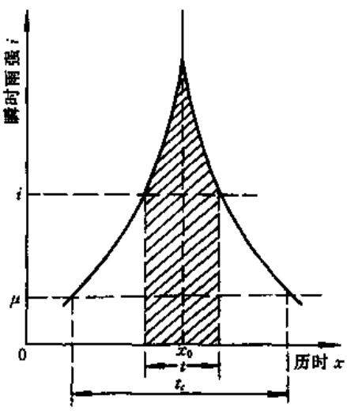

## 2. 产流历时 $\pmb { \mathscr { t } } _ { c }$ 与产流量计算

要根据损失参数 $\pmb { \mu }$ 求 $\scriptstyle t _ { \epsilon }$ ，必须首先建立瞬时雨强i与

图 10-11 设计暴雨过程示意图

t的函数关系（从图10-11可知它们是一一对应且成反比关系）。根据推导可得

$$
i ( t ) = \frac { \mathrm { d } x _ { t P } } { \mathrm { d } t } = \frac { \mathrm { d } ( S _ { P } t ^ { 1 - \kappa } ) } { \mathrm { d } t } = ( 1 - n ) S _ { P } t ^ { - \kappa }\tag{10-9}
$$

这样只要令 $\textit { \textbf { i } } ( t ) = \mu$ ，所对应的t即为 $\scriptstyle { \pmb { \ell } } _ { \pmb { \ell } }$ ，则

$$
t _ { c } = \Big [ \frac { ( 1 - n ) S _ { P } } { \mu } \Big ] ^ { \frac { 1 } { n } }\tag{10-10}
$$

产流量 $h _ { R }$ 的计算公式（时段长为 $\pmb { t _ { \ell } } )$ 为：

$$
h _ { R } = S _ { P } t _ { c } ^ { 1 - n } - \mu t _ { c } = S _ { P } t _ { c } ^ { 1 - n } - ( 1 - n ) S _ { P } t _ { c } ^ { - n } t _ { c } = n S _ { P } t _ { c } ^ { 1 - n }\tag{10-11}
$$

## 3. 流域汇流时间τ的计算

用推理公式推求设计洪峰流量，τ，t都是必不可少的。τ采用以下经验公式：

$$
\tau = 0 . 2 7 8 L / ( m J ^ { 1 / 3 } Q _ { m } ^ { 1 / 4 } )\tag{10-12}
$$

式中 $L ^ { \cdot }$ —流域最远点的流程长度，km；

${ \pmb J } \cdot$ 沿最远流程的平均纵比降（以小数计）；

$\pmb { \mathscr { n } }$ ——汇流参数；

$\ Q _ { \ m }$ ——洪峰流量， $\mathbf { m } ^ { 3 } / { \mathsf { s } }$

4. 用推理公式求设计洪峰流量 $\ Q _ { \infty }$

汇流计算采用本节四中介绍的方法。

(1) $\pmb { \ell _ { c } } \geqslant \tau$ 的情况。

$$
Q _ { m P } = 0 . 2 7 8 \bigg ( \frac { h _ { \tau } } { \tau } \bigg ) F = 0 . 2 7 8 \bigg ( \frac { x _ { \tau P } - \mu \tau } { \tau } \bigg ) F = 0 . 2 7 8 ( a _ { \tau } - \mu ) F\tag{10-13}
$$

(2) ${ { t } _ { \ell } } { < } \tau$ 的情况（部分汇流）。

$$
h _ { R } = n S _ { p t _ { c } } { } ^ { 1 - \mathfrak { n } }
$$

$$
Q _ { m p } = 0 . 2 7 8 \bigg ( \frac { h _ { R } } { \tau } \bigg ) F = 0 . 2 7 8 \bigg ( \frac { n S _ { P } t _ { e } ^ { 1 - n } } { \tau } \bigg ) F\tag{10-14}
$$

经过整理，可得北京水科院推理公式：

(10-15)

$$
\begin{array} { l l } { \left\{ \begin{array} { l l } { Q _ { m P } = 0 . 2 7 8 \left( \frac { S _ { P } } { \tau ^ { 8 } } - \mu \right) F } \\ { \tau = 0 . 2 7 8 \frac { L } { m J ^ { 1 / 3 } Q _ { m P } ^ { 1 / 4 } } } \end{array} \right. } & { \begin{array} { l } { t _ { c } \geqslant \tau } \\ { \tau < \tau } \end{array} } \\ { \left\{ \begin{array} { l l } { Q _ { m P } = 0 . 2 7 8 \left( \frac { n S _ { P } t _ { c } ^ { 1 - \alpha } } { \tau } \right) F } \\ { \tau = 0 . 2 7 8 \frac { L } { m J ^ { 1 / 3 } Q _ { m P } ^ { 1 / 4 } } } \end{array} \right. } & { \begin{array} { l } { t _ { e } < \tau } \end{array} } \end{array}\tag{10-16}
$$

对于以上方程组，只要知道7个参数： $F : L , J , n , S _ { P } , \mu , m$ ，便可求出 $\ Q _ { \infty }$ 。求解方法有图解法、试算法等。

## （二)设计洪峰流量计算实例

下面结合例子说明图解法求 $\mathbf { Q } _ { m }$ 的过程。

【例10-1】江西省××流域上需要建小水库1座。要求用推理公式计算 $\pmb { P } { = } 1$ %的设计洪峰流量。

## 计算步骤如下：

1. 流域特征参数F、L、J的确定

F为出口断面以上的流域面积，在适当比例尺地形图上勾绘出分水岭后，用求积仪量算。

L为从出口断面起，沿主河道至分水岭的最长距离，在适当比例尺的地形图上用分规量算。

J为沿L的坡面和河道平均比降，见本书第二章。

本例中，已知流域特征如下：

$$
F = 1 0 4 ~ { \ k m ^ { 2 } } , L = 2 6 ~ { \ k m } , J = 8 . 7 5 \%
$$

2. 设计暴雨参数n和 $S _ { P }$ 的确定

$$
S _ { P } = x _ { 2 4 , P } \times 2 4 ^ { n - 1 } = \alpha x _ { 1 d , P } \times 2 4 ^ { n - 1 }
$$

暴雨衰减指数n由各省（区）实测暴雨资料分析定量，查当地水文手册即可获得，一般n的数值以定点雨量资料代替面雨量资料，不作修正。

现从江西省水文手册中查得设计流域最大1日雨量的参数：

$$
\begin{array} { c } { { \overline { { { x } } } _ { 1 d } = 1 1 5 \ \mathrm { m m } , C _ { v 1 d } = 0 . 4 2 , C _ { r 1 d } = 3 . 5 C _ { v 1 d } } } \\ { { n _ { 2 } = 0 . 6 0 , x _ { 2 4 , P } = 1 . 1 x _ { 1 d , P } } } \end{array}
$$

由 $C _ { s 1 d }$ 及P查得 $\phi _ { P } = 3 . 3 1 2$

所以

$$
\begin{array} { r l } & { S _ { P } = x _ { 2 4 , P } \times 2 4 ^ { n _ { 2 } - 1 } = 1 . 1 { \times } 1 1 5 { \times } ~ ( 1 + 0 . 4 2 { \times } 3 . 3 1 2 ) ~ { \times } 2 4 ^ { 6 . 6 0 - 1 } } \\ & { ~ = 8 4 . 8 ~ \mathrm { m m / h } } \end{array}
$$

## 3. 设计流域损失参数和汇流参数的确定

可查有关水文手册，本例查得的结果是 $\mu { = } 3 . 0 \ \mathrm { m m / h } , \ m { = } 0 . 7 0$

4. 用图解法求设计洪峰流量

（1）采用全面汇流公式（10-15）作计算，即假定 $\pmb { t _ { c } } \geqslant \tau$

(2）将有关参数代人式（10-15)，得到 $\ Q _ { m P }$ 及τ的公式如下：

$$
\left\{ \begin{array} { l l } { \displaystyle Q _ { m P } = 0 . 2 7 8 \Big \{ \frac { 8 4 . 8 } { \tau ^ { 0 . 6 } } - 3 \Big \} \times 1 0 4 = \frac { 2 4 5 1 . 7 } { \tau ^ { 0 . 6 } } - 8 6 . 7 } \\ { \tau = \frac { 0 . 2 7 8 \times 2 6 } { 0 . 7 \times 0 . 0 0 8 7 5 ^ { 1 / 3 } Q _ { m P } ^ { 1 / 4 } } = \frac { 5 0 . 1 } { Q _ { m P } ^ { 1 / 4 } } } \end{array} \right.\tag{10-17}
$$

(10-18)

表 10-7 $\pmb { Q } _ { \infty } , \sim \pmb { \tau }$ 关系计算成乘表
<table><tr><td colspan="3"> $\begin{array} { r } { Q _ { \pi P } = \frac { 2 4 5 1 \cdot 7 } { \tau ^ { 0 . 6 } } - 8 6 . 7 } \end{array}$ </td><td colspan="3"> $\tau = 5 0 . 1 / Q _ { m } ^ { 1 / 4 }$ </td></tr><tr><td>2</td><td> $2 4 5 1 . 7 / 7 9 . 6$ </td><td> $\scriptstyle Q _ { m } ,$ </td><td> $\pmb { Q } _ { \pmb { \alpha } } \mathbf { _ { \beta } }$ </td><td> $Q _ { m } ^ { 1 / 4 }$ </td><td>7</td></tr><tr><td>8</td><td>704.1</td><td>617.4</td><td>400</td><td>4.5</td><td>11.2</td></tr><tr><td>10</td><td>615.8</td><td>529.1</td><td>450</td><td>4.6</td><td>10.9</td></tr><tr><td>12</td><td>552.0</td><td>465.3</td><td>500</td><td>4.73</td><td>10.6</td></tr><tr><td>14</td><td>503.3</td><td>416.6</td><td>600</td><td>4.95</td><td>10.1</td></tr></table>

(5) 检验 $t _ { \epsilon }$ 是否大于τ

(3）假定一组τ值代入式（10-17）中，算出相应的一组 $\ Q _ { m P }$ 值，再假定一组 $\scriptstyle Q _ { \mathrm { } \mathrm { } }$ 值代入式(10-18)中，算出一组τ值，成果见表10-7。

(4)绘图。将计算的二组数据 $\pmb { \tau } \sim \mathbf { Q } _ { \mathbf { m } P }$ 和 $Q _ { m } ,$ $\sim \tau$ 绘在一张方格纸上，见图10-12，纵坐标表示洪峰流量 $Q _ { m P }$ ，横坐标表示时间τ，两条曲线的交点处对应的 $\ Q _ { \infty }$ 即为所求设计洪峰流量。由图10-12 读出 $Q _ { m P } = 5 1 0 ~ \mathrm { m ^ { 3 } / s } , ~ \tau = 1 0 . 5 5 ~ \mathrm { h }$ D

$$
t _ { c } = \bigg [ \frac { ( 1 - n _ { 2 } ) S _ { P } } { \mu } \bigg ] ^ { \frac { 1 } { n _ { 2 } } } = \bigg ( \frac { 0 . 4 \times 8 4 . 8 } { 3 . 0 } \bigg ) ^ { 1 / 0 . 6 } = 5 7 \mathrm { ~ h ~ }
$$

本例题 $\tau = 1 0 . 5 5 \mathrm { h } < t _ { c } = 5 7$ h，所以采用全面汇流公式计算是正确的。

六、小流域设计洪水计算的经验公式法

计算洪峰流量的地区经验公式是根据一个地区各河流的实测洪水和调查洪水资料，找出洪峰流量与流域特征，降雨特性之间的相互关系，建立起来的关系方程式。这些方程都是根据某一地区实测经验数据制定的，只适用于该地区，所以称为地区经验公式。

影响洪峰流量的因素是多方面的，包括地质地貌特征(植被、土壤、水文地质等)、几何形态特征(集水面积、河长、比降、河槽断面形态等)以及降雨特性。地质地貌特征往往难于定

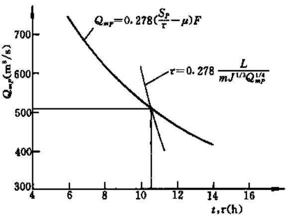  
图 10-12 $\pmb { Q } _ { m } , \sim \pmb { \tau }$ 和 $\scriptstyle \pmb { \tau } \sim \pmb { \Omega } _ { \infty , p }$ 图

量，在建立经验公式时，一般采用分区的办法加以处理。因此，经验公式的地区性很强。

经验公式最早见于19世纪中期，由洪峰流量与流域面积建立关系。当时由于水文资料十分缺乏，没有频率概念。以后，随着工程建设的开展，各国在建立地区经验公式方面做了许多工作，使经验公式逐渐具备了新的形式和内容。我国水利、交通、铁道等部门，为了修建水库、桥梁和涵洞，对小流域设计洪峰流量的经验公式进行了大量的分析研究，在理论上和计算方法上都有所创新，在实用上已发挥了一定的作用。但是，此类公式受实测资料限制，缺乏大洪水资料的验证，不易解决外延问题。

## 1. 单因素公式

目前，各地区使用的最简单的经验公式是以流域面积作为影响洪峰流量的主要因素，把其他因素用一个综合系数表示，其形式为：

$$
Q _ { \pi P } = C _ { P } F ^ { \circ }\tag{10-19}
$$

式中 $\ Q _ { \mathfrak { m } ^ { p } }$ ——设计洪峰流量， ${ \mathfrak { m } } ^ { 3 } / { \mathfrak { s } }$ 中

$\pmb { F } \mathrm { . }$ ——流域面积， $\mathbf { k } \mathbf { m } ^ { 2 }$

$\pmb { n }$ —经验指数；

$C _ { P } .$ ——随地区和频率而变化的综合系数。

在各省（区）的水文手册中，有的给出分区的n、 $C _ { P }$ 值，有的给出 $C _ { P }$ 等值线图。

对于给定设计流域，可根据水文手册查出Cp及n值，并量出流域面积F，从而算出 $C _ { P }$ $\pmb { n }$ ${ \pmb F } .$ $\ Q _ { m } ,$

式（10-19）过于简单，较难反映小流域的各种特性，只有在实测资料较多的地区，分区范围不太大，分区暴雨特性和流域特征比较一致时，才能得出符合实际情况的成果。

## 2. 多因素公式

为了反映小流域上形成洪峰的各种特性，目前各地较多地采用多因素经验公式。公式的形式有：

$$
Q _ { \ l * P } = C h _ { \ l _ { 2 4 } P } F ^ { \ l _ { n } }\tag{10-20}
$$

$$
Q _ { m P } = C h _ { 2 4 P } ^ { \tt t } f ^ { \tt T } F ^ { \tt s }\tag{10-21}
$$

$$
Q _ { m P } = C h _ { 2 4 P } ^ { e } J ^ { \beta } f ^ { \gamma } F ^ { n }\tag{10-22}
$$

式中 f——流域形状系数， $f = F / L ^ { 2 } ;$

J——河道干流平均坡度；

$h _ { 2 4 , \mathcal { P } }$ ——设计年最大 24 h 净雨量，mm；

α、 $\beta ,$ 1 $\gamma _ { \setminus }$ n——指数；

C——综合系数。

以上指数、综合系数是通过使用地区实测资料分析得出的。

选用因素的个数以多少为宜，可从两方面考虑。一是能使计算成果提高精度，使公式的使用更符合实际，但所选用的因素必须能通过查勘、测量、等值线图内插等手段加以定量。二是与形成洪峰过程无关的因素不宜随意选用，因素与因素之间关系十分密切的不必都选用，否则无益于提高计算精度，反而增加计算难度。

## 七、小流域设计洪水过程

一些中小型水库，能对洪水起一定的调蓄作用，此时即需要设计洪水过程线。通过对有实测资料地区的洪水过程线分析，求得能概括洪水特征的平均过程线，图10-13是江西省根据全省集水面积在650km²以下的81个水文站、1048次洪水资料分析得出的概化洪水过程线模式，图中T为洪水历时，可按下式计算：

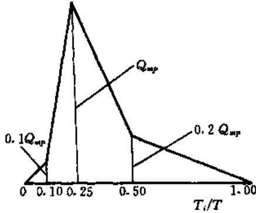  
图 10-13 概化洪水过程线

$$
T = 9 . 6 6 \frac { W } { Q _ { \mathrm { m } } }\tag{10-23}
$$

式中 $Q _ { \infty } , W , T$ 的单位分别为 $\mathbf { m } ^ { 3 } / \mathbf { s }$ $1 0 ^ { 4 } \mathbf { m } ^ { 3 }$ 及 $\mathbf { h }$ 。应用时规定洪水总量 $\pmb { W }$ 按 24 h 设计暴雨所形成的径流深 R(mm) 计算。

$$
W = 0 , 1 R F ( 1 0 ^ { 4 } \mathbf { m } ^ { 3 } )\tag{10-24}
$$

式中 $\pmb { F } ^ { \bot }$ ——流域面积， $\mathbf { k m } ^ { 2 }$

由于设计洪峰流量 $Q _ { \infty }$ 已知，将 $\ Q _ { \bowtie }$ 及 $\pmb { W }$ 代人式(10-23)，即可算出 $\mathbf { \Delta } T$ 。然后将各转折点的流量比值 $\alpha _ { i } / Q _ { * }$

乘以 $\ Q _ { m }$ ，便得出各转折点的流量值，此即设计洪水过程线。

此外，我国有些地区水文手册中有典型的无因次洪水过程线，该过程线以 $\ Q _ { i } / Q _ { m }$ 为纵坐标， $\pmb { t } _ { i } / T$ 为横坐标，称为标准化过程线，使用时用 $Q _ { \infty }$ 及T分别乘以标准化过程线，便得到设计洪水过程线。

## 习 题

10-1 已知某雨量站各历时的年最大平均雨强的统计参数如表10-8，求短历时暴雨公式 $( P = 1 \% , P = 1 0 \% ) a _ { t , P } = \frac { S _ { P } } { t ^ { n } }$ 中的 $S _ { p }$ 值和π值。

10-2 用推理公式法计算 $\pmb { P } { = } \mathbf { 1 }$ %的设计洪峰流量。

已知条件：①流域面积 $\pmb { F } =$ $7 8 \mathbf { k m } ^ { 2 }$ ，主河长 $L { = } 1 4 , 6 \ \mathrm { k m }$ ，河道纵比降 $J { = } 0 , 0 2 6 , \textcircled { 2 }$ 最大 24 h 暴雨参数 $\overline { { x } } _ { 2 4 }$ $= 1 1 0 \ \mathrm { m m } , \ : C _ { v } = 0 . 5 0 , \ : C _ { s } = 3 . 5 \ : C _ { v }$ ，暴雨递减指数 $\pmb { n } { \displaystyle = } 0 . 6 5$ ；③损失参数 $\pmb { \mu } \mathrm { = }$

表 10-8 某雨站各历时年最大平均雨强的统计参数
<table><tr><td rowspan=1 colspan=1>历   时(h)</td><td rowspan=1 colspan=1>0.5</td><td rowspan=1 colspan=1>1</td><td rowspan=1 colspan=1>3</td><td rowspan=1 colspan=1>6</td><td rowspan=1 colspan=1>12</td><td rowspan=1 colspan=1>24</td></tr><tr><td rowspan=1 colspan=1>平均雨强均值(mm/h)</td><td rowspan=1 colspan=1>62.5</td><td rowspan=1 colspan=1>44.9</td><td rowspan=1 colspan=1>22.0</td><td rowspan=1 colspan=1>14.7</td><td rowspan=1 colspan=1>9.3</td><td rowspan=1 colspan=1>5.8</td></tr><tr><td rowspan=1 colspan=1> $\mathbf { c } _ { \pmb { \sigma } }$ </td><td rowspan=1 colspan=1>0.35</td><td rowspan=1 colspan=1>0.35</td><td rowspan=1 colspan=1>0.40</td><td rowspan=1 colspan=1>0.40</td><td rowspan=1 colspan=1>0.45</td><td rowspan=1 colspan=1>0.45</td></tr><tr><td rowspan=1 colspan=1> $c _ { s } / c _ { \circ }$ </td><td rowspan=1 colspan=1>3.0</td><td rowspan=1 colspan=1>3.0</td><td rowspan=1 colspan=1>3.0</td><td rowspan=1 colspan=1>3.0</td><td rowspan=1 colspan=1>3.0</td><td rowspan=1 colspan=1>3.0</td></tr></table>

2.0mm/h；④汇流参数 $m { = } 0 , 2 1 8 \theta ^ { 0 . 3 8 } ( \theta { = } L / J ^ { \frac { 1 } { 3 } } )$ 0

在求得 $\ Q _ { m } P$ 和τ后，为什么要用产流历时 $t _ { \varepsilon }$ 来检验？用公式计算得来的 $\pmb { t _ { \varsigma } }$ 有时大于24h，是什么原因造成的？

# 第十一章 古洪水与可能最大降水/可能最大洪水

当今世界各国大坝设计洪水不外洪水频率计算与可能最大降水/可能最大洪水两大途径，洪水频率计算的原理与方法已在第七～十章介绍过了。这种方法存在一些问题，本章将进一步予以讨论和改进。

可能最大降水/可能最大洪水在本书中是一个新的概念，读者须具备一些气象知识，第二、四章已有所介绍，本章只作方法性的陈述。

## 第一节 洪水频率计算问题

重要工程需要极为稀遇（例如百年、千年甚至万年一遇）的设计洪水，但实测及历史洪水资料远远不能满足推算这样稀遇洪水的要求，尽管我国历史悠久，史志碑刻甚丰，洪水调查遍及全国，而利用这些资料并外延洪水频率曲线以推求工程设计的稀遇洪水仍感困难和不可靠。试就水文计算中通常采用的期望值公式而论：

$$
\bar { P } = \frac { M } { N + 1 }\tag{11-1}
$$

式中 P——某次特大洪水或历史调查的频率；

N——调查考证期（距今年数），年；

M——洪水的排位序数。

考证期是根据人的记忆、传说、碑记、史志、档案等定出的，一般不过几百年，除了难于求得更为稀遇的洪水及其频率外，最大的问题是如果把考证期追溯得更远一些，则式(11-1)中的N值将要变动，M值也有可能发生变动。例如长江三峡有实测洪水资料114年，历史洪水8个（1610年至今)，其中最大的1870年洪水 $\scriptstyle ( Q = 1 0 5 0 0 0 \ m ^ { 3 } / \mathbf { s } )$ 50年代考证期追溯到1520年，重现期定为439年，70年代又调查到宋绍兴23年（1153年）题记，重现期改为830年。显然这不是最后的定论，因为如果调查考证期追溯得更远一些，重现期还要变动。黄河三门峡小浪底河段1843年特大洪水 $\left( Q { = } 3 6 0 0 0 ~ \mathrm { m } ^ { 3 } / \mathrm { s } \right)$ 的重现期先后由210年变到1000年。又如海河黄壁庄、岗南两水库，四十年来进行了大量工作，但由于频率分析方法只能在几十年实测资料和一二百年调查洪水资料、加上考证期也不过300多年资料的情况下，靠数学方法大幅度外延，致使两库洪水计算成果先后变动多次。黄壁庄万年设计洪峰，60年代在 $3 2 0 0 0 { \sim } 3 8 0 0 0 ~ \mathrm { m } ^ { 3 } / \mathrm { s }$ 之间，至70年代变为 $5 0 0 0 0 { \sim } 5 5 6 0 0 ~ \mathrm { m } ^ { 3 } / \mathrm { s }$ 之间。“对如此大的变动，各方争论不休。从两库洪水计算成果的变动可以看出，已不是一般计算和方法的争议，实质上关系到频率法的核心即样本系列的长度和代表性问题。”总之，即令有历史洪水或特大洪水，但因其频率不易确定，所选配或外延的洪水频率曲线仍然是不可靠的。

有些水文学者曾试图利用这些短资料提取更多的洪水信息，建议了一些数学方法，但

都得不到应用。

看来，洪水频率计算的根本问题是资料过短、代表性不足、难于得到设计需要的稀遇洪水。解决问题的关键在于寻求更多更久的大洪水资料，把外延变为内插。

## 第二节古洪水水文学

古洪水（paleoflood）指洪水发生的时间早于现代系统水文测验和历史（调查）洪水的古代洪水。古洪水水文学是第四纪地质学、年代学应用于水文学的一个新发展。它可以提供全新世（距今11000年至现代）的洪水资料，是洪水计算的新途径。

水文学曾以河边树木年轮或洪水在树木上遗留的痕迹来考证洪水，后来又利用考古成果（如陶片、器物等文化层）来论证洪水。但千年古树不易找到，文化层古物不能确切说明洪水位和年代，因此只能作为洪水的一种旁证，而不能作为定量依据。

## 一、洪水平流（洪峰）沉积物——洪水留存的物证

河流洪水时期漂流着由流域面上带来的孢子、花粉、枯枝、落叶、根茎等有机物，由于洪水在洪峰时有短暂的平流（slack）时刻，然后逐渐退水，洪峰水位上的漂流物因退水而停留沉积于平流时刻所在的某些洞穴、凹壁、支沟回水末端等处，其后又为崩坍的泥土或沉积物所掩埋，得以长久保存下来，这就成为洪水平流（洪峰）沉积物(图11-1、图11-2)。

平流沉积物在野外最明显的特征为微薄的水平层理或波状沉积层理，并有向河岸方向或支沟上游方向逐渐尖灭的现象（图11-3、图11-4)。对沉积环境（水力的、地形地质的）和顶面高程加以分析，特别是未经扰动、污染且位置较高的洞穴中的沉积，洪痕、刷痕、支沟回水末端的楔形沉积尖灭点处，可望求得古洪水的水位。取沉积物样品送实验室，利用放射性同位素可以求出发生这种沉积洪水的距今年代。因此，洪水平流沉积物不但是古代洪水的物证，而且还能提供古洪水的水位（流量）和发生年代，这是水文学中前所未曾利用过的洪水信息载体，也是一个新的洪水资料库，其中远年特大洪水资料将为洪水计算扩展资料长度，解决频率曲线外延问题。

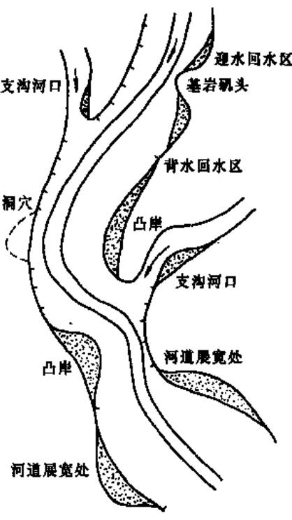  
图 11-1 河流洪水平流沉积物分布平面图

在野外查勘取样时，应事先沿研究河段选取峡谷基岩平直段。这种峡谷段涨落明显，易于沉积大洪水有机物。基岩断面抗蚀能力强，断面变动小，有利于由水位转算流量。工作时应注意洪水泛滥性河漫滩上如图11-1、图11-2上可能发生沉积的部位。在有利地形条件下可开挖剖面，发现多层沉积单元（图11-5)，或多处沉积，得到多次洪水沉积物，这是一段时期内洪水的编年史，可以组成洪水系列，对于洪水频率分析更为有利。

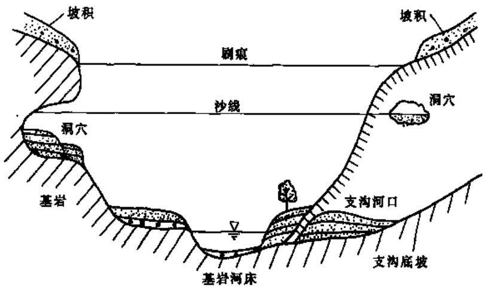

图 11-2 基岩河谷中的各种平流沉积物[46]  
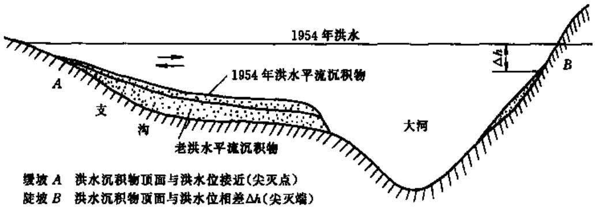

图11-3 古洪水沉积物顶面高程与洪水水位关系图  
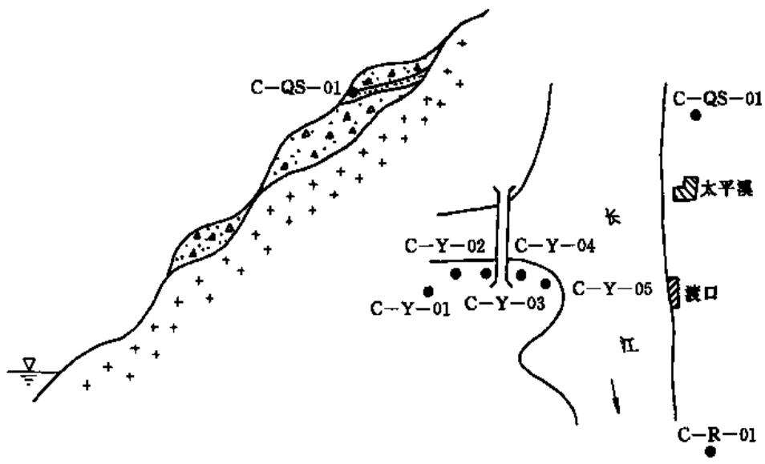  
图 11-4 长江三峡太平溪清水湖平流沉积物

除了在现场观察判断沉积物是当地的水流沉积还是来自所研究的大河洪水沉积物外，通常还应当在实验室作物理结构分析。大河洪水沉积物的泥沙中以汇水面积内坚硬抗摩颗粒为主，矿物含量较当地基岩风化产物的组合复杂得多。大河沉积物的颗粒径较均匀，一般的分选系数小于1.5。粒度组成的分布呈单峰型。颗粒磨圆度较高，以次圆及圆形为多。

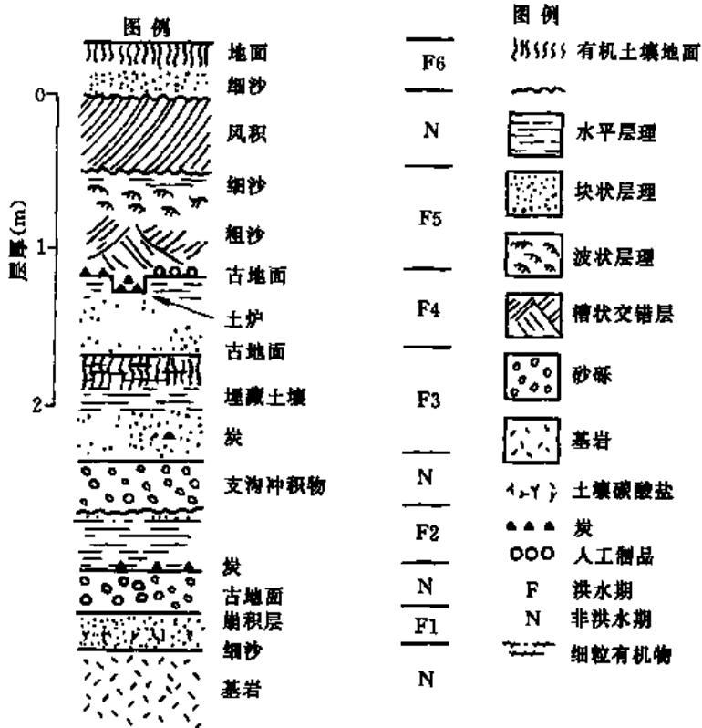  
图 11-5 理想洪水沉积剖面图  
F1\~F6—洪水沉积，N—非洪水沉积

## 二、古洪水沉积物的年代分析

取得了古洪水沉积物就可利用它求得洪水的发生年代，即所谓距今年数(aBP)。能指示年代的矿物残屑、考古物品、树木年轮、热释光测年物（陶瓷、砖瓦、石英等）均可用于测年。

放射性碳十四（1℃）测年是古洪水研究常用的测年方法。测年物质是埋藏于沉积物中的有机物。它来源于：①移积炭或木质；②本地炭；③洪水移积的枯枝落叶层；④埋藏树木。所谓移积测年物是经过搬运而沉积于取样处的有机物质。移积物有的来自当年的孢子花粉、枯枝落叶，多保存于洪水沉积层顶部，其有效放射性同位素年代与洪水事件发生的年代相差不到1年，这是主要的平流沉积物。但移积物如由沉积处所以外的老堆积物搬运而来，则其测年数只能是洪水发生年代的一个上限。分隔各洪水层（图11-5）的测年物质在测年中是很有用处的：可以求得洪水发生年代的上下限。表11-1列出了测年物的优选次序。

表 11-1  
测年物质优选次序
<table><tr><td rowspan=1 colspan=1>物     质</td><td rowspan=1 colspan=1>測年时期</td><td rowspan=1 colspan=1>地层关系</td><td rowspan=1 colspan=1>可能误差(年)</td><td rowspan=1 colspan=1>说     明</td></tr><tr><td rowspan=1 colspan=1>埋藏树木</td><td rowspan=1 colspan=1>非洪水期</td><td rowspan=1 colspan=1>生长在古地面上</td><td rowspan=1 colspan=1>0~1</td><td rowspan=1 colspan=1>年轮可以测定年代</td></tr><tr><td rowspan=1 colspan=1>洪水移积的细粒有机物</td><td rowspan=1 colspan=1>洪水期</td><td rowspan=1 colspan=1>外来的，在洪水沉积的顶层部</td><td rowspan=1 colspan=1>1~10</td><td rowspan=1 colspan=1>洪水季节前生长的树木枝叶孢子花粉</td></tr><tr><td rowspan=1 colspan=1>当地焚烧的木炭层</td><td rowspan=1 colspan=1>非洪水期</td><td rowspan=1 colspan=1>当地的</td><td rowspan=1 colspan=1>10</td><td rowspan=1 colspan=1>炉灶用的木炭可能用于测年</td></tr><tr><td rowspan=1 colspan=1>有机面层</td><td rowspan=1 colspan=1>非洪水期</td><td rowspan=1 colspan=1>当地的，堆积在古地面的粒屑</td><td rowspan=1 colspan=1>10</td><td rowspan=1 colspan=1>可能是数年至数十年堆积而成</td></tr><tr><td rowspan=1 colspan=1>土壤层有机物</td><td rowspan=1 colspan=1>非洪水期</td><td rowspan=1 colspan=1>当地的</td><td rowspan=1 colspan=1>100</td><td rowspan=1 colspan=1>包含土壤剖面有机物的平均停留时期</td></tr><tr><td rowspan=1 colspan=1>洪水搬运的木料</td><td rowspan=1 colspan=1>洪水期</td><td rowspan=1 colspan=1>外来的</td><td rowspan=1 colspan=1>10~100或以上</td><td rowspan=1 colspan=1>可能是老沉积的移积物</td></tr><tr><td rowspan=1 colspan=1>洪水搬运的木炭</td><td rowspan=1 colspan=1>洪水期</td><td rowspan=1 colspan=1>外来的</td><td rowspan=1 colspan=1>10~100或以上</td><td rowspan=1 colspan=1>可能是老沉积的移积物</td></tr></table>

河段中各处样品的年代测定后，可根据其矿物成分、粒度、结构特征、风化情况（颜色、硬度等）综合判断是否同次洪水，以便定出各次洪水的水面比降。在平直河段中各次洪水比降大体平行，这也有助于判断。

洪水在河段中某处因未达到门槛（地形阻碍）高度而没有沉积，但可能在另一处所沉积，所以应利用多处沉积物高程取各最高点连成各同次洪水比降，如图11-6所示。这是非常有意义的综合判断，不但可以修匀各次洪水比降，而且可以求得一段时期的洪水系列。

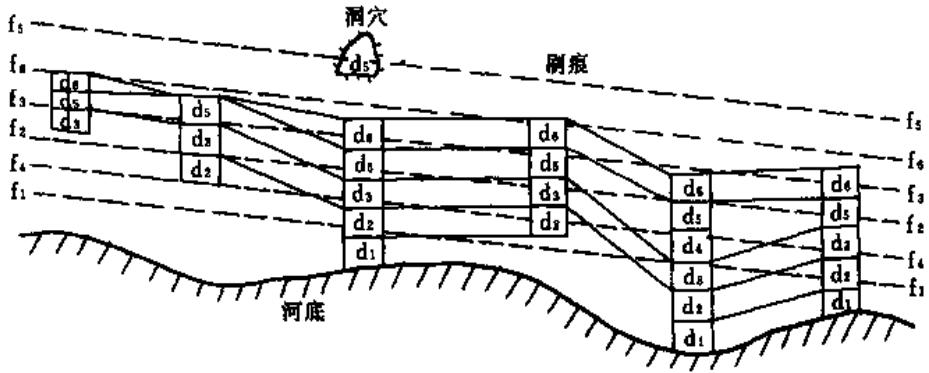  
图11-6 研究河段的多断面和多次洪水  
d一沉积物顶面；[一洪水水面曲线

古洪水研究可以取得几千年甚至万年以上的洪水资料。但为了保持洪水资料在统计学上的一致性（气候、植被、河道），一般认为只宜采用晚全新世（距今2500\~3000年）的洪水资料，此期气候温凉偏干，降水少于早全新世和中全新世，但多暴雨洪水，与现代气候条件相近。求得晚全新世内的各次大洪水，其考证期自然就扩展到两三千年了。

## 第三节古洪水流量

有了古洪水的水位和比降，就可利用水力学模型或稳定的水位一流量关系推求古洪水流量。但无论模型或水位一流量关系都要有洪水通过的当时行洪断面而不是现今断面，这是提高古洪流量计算精度所必须研究的。古洪水行洪断面计算须利用地质探测及测年技术，举例说明如下：

(1）黄河小浪底古洪水断面计算。根据地质勘探资料分析，小浪底河段在全新世（约1万年）以来是稳定的，主河床偏于左岸，其底部有冲淤变化，滩地则缓慢淤高，但整个断面形状变化不大。根据探测资料得到 $\mathbf { 8 6 1 0 \pm 1 1 5 }$ 年前的断面如图11-7所示。水位151.5m

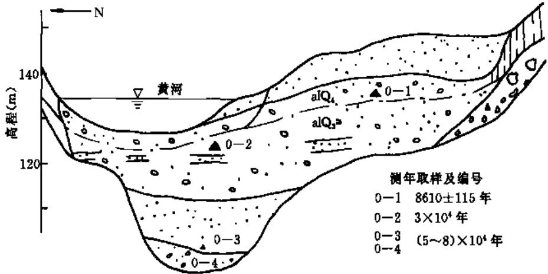  
图 11-7 黄河小浪底河床综合剖面图

时断面面积为 $8 0 7 0 ~ \mathrm { m } ^ { 2 }$ ，与现今（1985年7月17日）同水位下实测大断面 $( 6 8 3 0 ~ \mathbf { m } ^ { 2 } )$ 相比较，可以算出每千年的平均淤积量，以此估算距今2360年特大古洪水的行洪断面约为$7 1 7 0 ~ \mathrm { m } ^ { 2 }$ ，两者相差 $3 4 0 ~ \mathrm { m } ^ { 2 }$ ，约为现今相同水位洪水断面积的4.9%。

(2)淮河响洪甸河段是下切的，根据探测资料算出淤积速率约为0.844mm/年，得到距今$1 7 3 6 \pm 7 3$ 年的古洪水断面为 $7 7 1 0 ~ \mathrm { \mathfrak { m } } ^ { 2 }$ ，现今断面为 $7 3 4 0 ~ \mathrm { m } ^ { 2 }$ ，两者相差 $3 7 0 ~ \mathrm { { \mathfrak { m } } } ^ { 2 }$ ,约5%。

(3)长江三峡三斗坪断面以花岗岩为基底，河床最底部的砂卵和粉细砂有冲淤变化。1979年实测断面最低点为3.5 m（吴淞基面），1870年最大洪水位为83.32m（吴淞基面)，相应的过水断面为 $3 7 5 3 0 ~ \mathrm { m } ^ { 2 }$ 。假若断面淤高10m（图11-8），其相应的淤积面积为

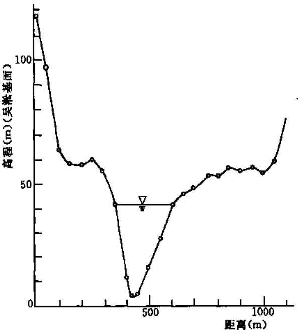  
图 11-8 1979 年三斗坪河道断面示意图(G29 断面)

$5 3 8 \ \mathrm { m ^ { 2 } }$ ，也只占1870年洪水相应的总河水断面的1.4%。即令淤至23.3m，也只4.4%。研究认为，当历史洪水或古洪水发生时，河槽满蓄，冲淤十余米，过水断面相差是很小的。

## 第四节古洪水研究的应用

## 一、古洪水的频率

有了古洪水系列，然后连同历史洪水、实测洪水，按式（11-2）～式（11-5）分别计算

其频率[]。

各种洪水的期望值公式如下：

$$
E ( P _ { k } ) = 1 - \prod _ { i = 1 } ^ { k } { \frac { N _ { i } } { N _ { i } + 1 } }\tag{11-2}
$$

具体说来，对于古洪水

$$
P _ { i } = { \frac { i } { N + 1 } } i = 1 , 2 , \cdots , a\tag{11-3}
$$

式中 $N \cdot$ —古洪水的考证期；

i——古洪水的排位系数。

对于历史洪水

$$
P _ { a + j } = P _ { a } + ( 1 - P _ { a } ) \frac { j } { \tilde { N } ^ { \prime } + 1 } \quad j = 1 , 2 , \cdots , b\tag{11-4}
$$

式中 $N ^ { \prime }$ ——历史洪水的考证期；

j——历史洪水在考证期 $N ^ { \prime }$ 的排位系数。

对于实测洪水

$$
P _ { a + b + m } = P _ { a + b } + ( 1 - P _ { a + b } ) \frac { m } { n + 1 } m = 1 , 2 , \cdots , n\tag{11-5}
$$

式中 n——实测洪水年数；

m—n年内的排位序数。

古洪水的年代与水位均有一定误差。古洪水测年约有一二百年的误差，但古洪水的考证期是几千年，只要不影响排位，其具体年份是不重要的。不过水位（转化为流量）影响较大，因此古洪水水位的确定应力求精确。

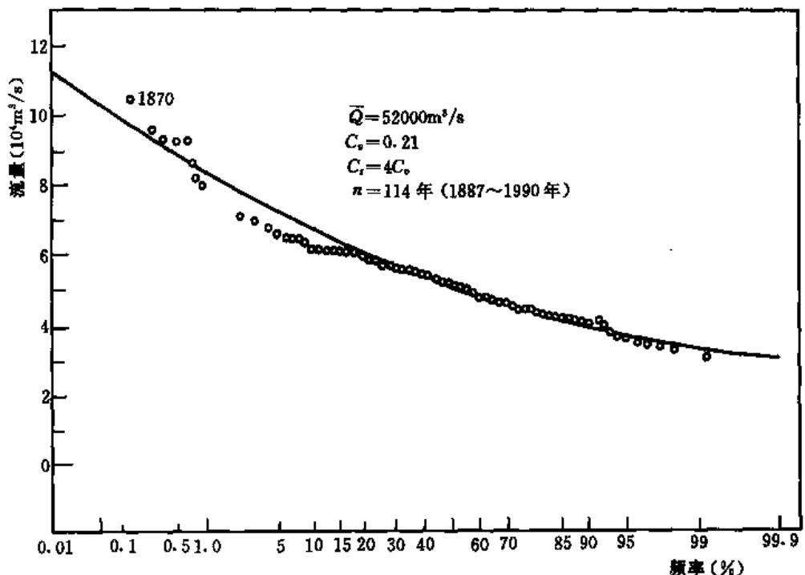  
图 11-9 长江三峡无古洪水的洪水频率曲线图

古洪水加入系列后，其分布线型是值得研究的课题。根据10年来对长江、黄河、淮河的有古洪水资料频率分析，在2500\~3000年的晚全新世时期内，我国通用的P一型尚无不合理之处。

## 二、古洪水的应用

(1) 长江三峡工程坝址流域面积 $1 0 ^ { 6 } \mathrm { k m } ^ { 2 } .$ ，年径流量为 $\bf { 4 5 0 } \times \bf { 1 0 ^ { 9 } m ^ { 3 } }$ ，自1877年至1990年共有实测洪水资料114年及8次历史大洪水，但现行频率分析方法，无论用什么样的概率分布均不能配合良好（图11-9），多年以来，一直是一个水文计算中的难题。

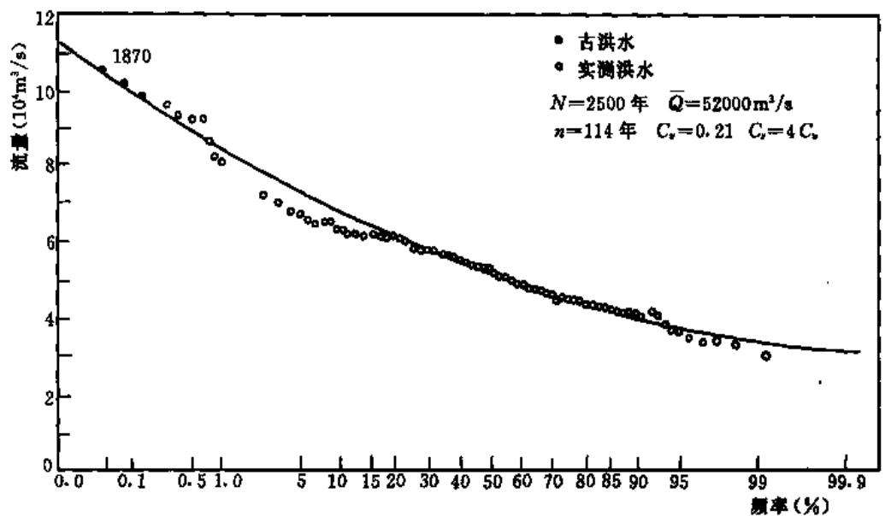

图 11-10 长江三峡有古洪水的洪水频率曲线图  
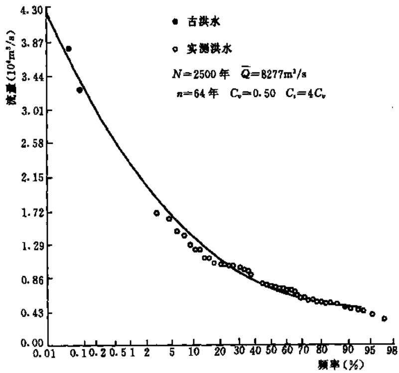  
图 11-11 黄河小浪底有古洪水的洪水频率曲线图

经过古洪水研究后取得距今5000年以来的特大洪水资料，根据这些资料，最大的1870年洪水 $\left( Q { = } 1 0 5 0 0 0 ~ \mathrm { m } ^ { 3 } / \mathrm { s } \right)$ 的重现期由870年扩展为2500年，新的洪水频率曲线如图11-10所示。

(2)图11-11、图11-12 分别为黄河小浪底水利枢纽和淮河响洪甸有古洪水资料的洪水频率曲线图，从图中可看出古洪水的明显作用。

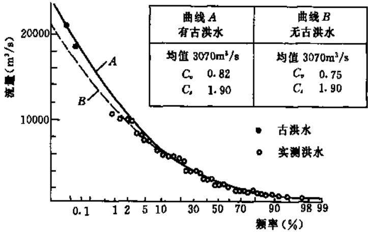  
图 11-12 淮河响洪甸有古洪水的洪水频率曲线图

从这些频率曲线图也可以看出千年洪水由外延变为内插，就统计学的一致性来说，晚全新世还只有2500\~3000年，不足以求得万年洪水。如从频率曲线外延万年洪水，那只是现有资料的数学模型推测而已。

古洪水研究应用第四纪地质学、年代学和水文学的原理方法，在取得洪水平流沉积物的基础上，算出古洪水量和发生的年代，用以加入频率计算，大幅度加长了历史洪水和特大洪水的考证期，提高了系列的展延精度，使频率曲线稀遇部分的确定更有把握。古洪水研究有物证，成果稳定，不致因人而异，为设计洪水探索了一条新途径。

## 第五节 可能最大降水与可能最大洪水(PMP/PMF）

重要水利水电工程的规划与设计常常需要估计可能发生的最大洪水。例如，在人口密集地区的河流上修建失事后会造成发生重大生命财产损失的水库、水库的调洪运作、核电站站址选定及不能淹没的设施等，都需要研究这种上限洪水，并通称为可能最大洪水(PMF)，相应于可能最大洪水的降水量称为可能最大降水(PMP)。

PMP的定义为：一定历时内的最大降水量，这种降水量对于特定地理位置，给定暴雨面积，在一年中某一时期是可能发生的。

定义强调降水是降水面积（雨面）的函数而不是流域面积的函数，因为降水是不受流域边界限制的。当然，PMP须与设计流域相联系，否则不能解决工程问题。因此，可能最大洪水计算分为两大步骤：第一步是由地区PMP求得设计流域的PMP；第二步是研究设计流域PMP的时空分布，此时称为设计流域的可能最大暴雨(PMS)。有了设计流域的可能最大暴雨才能转换为设计流域的可能最大洪水PMF。

推求 PMP的方法大致分为两大类：

一类方法是暴雨模型，如台风模型、地形雨模型、梅雨模型等。这类暴雨模型大都是利用动力气象学、天气学建立的，由于现有的气象观测资料除水汽外，难以求得模型主要参数及其极值与最优 $( \mathcal { P }$ 重）组合，模型法多年以来仍处于探索阶段，在实际中很少应用。

另一类方法是水文与气象相结合的传统方法，它是目前行之有效的主要方法。本书主要讨论这类方法。

## 第六节 可能最大降水的估算方法

暴雨形成过程非常复杂，在第二章已有所阐述。暴雨的重要因素包括充沛的水汽及其通量辐合，强烈而持久的上升运动和位势不稳定能量的释放与再生等，这些总称为暴雨机制（动力条件）。其分析计算是气象人员的工作。辐合上升运动的数值及其上限是不能直接观测的，因而计算PMP时，不得不以实测特大暴雨作为大气中辐合及垂直运动的经验性指标，再将这种实测暴雨加以放大就成为传统方法的一个重要步骤。当设计地区特大暴雨资料不足时，可以移用邻近地区的特大暴雨资料，称为暴雨移置。最后将本地区和移置的暴雨加以放大，综合取其最大值（外包值）作为PMP。

## 一、水汽及放大

大气中的水汽是降水的原料，PMP计算中使用的水汽物理量为可降水量。可降水量指空气柱中的水汽总量以mm计的数值。在图11-13中，底面A上dz高度的单元气柱内，空气的质量为 $\rho _ { a } A d z$ ，水量为$q _ { v } / \partial _ { a } A \mathrm { d } x$ ，则气柱中的可降水总量W为：

$$
W = \int _ { z _ { i } } ^ { z _ { 2 } } q _ { v } \rho _ { a } A \mathrm { d } z\tag{11-6}
$$

式中 $\pmb { \rho _ { a } }$ ——湿空气的密度， $\mathbf { k } \equiv / \mathbf { m } ^ { 3 } ;$

${ { q } _ { \mathrm { { \pmb { v } } } } }$ ——比湿。

式（11-6）可以分层计算，即

$$
\Delta W = \overline { { q } } _ { v } \overline { { \rho } } _ { a } A \Delta z\tag{11-7}
$$

式中 $\overline { { \boldsymbol { q } } } _ { v } , \ \overline { { \boldsymbol { \rho } } } _ { a }$ 两层间的平均比湿及空气密度。

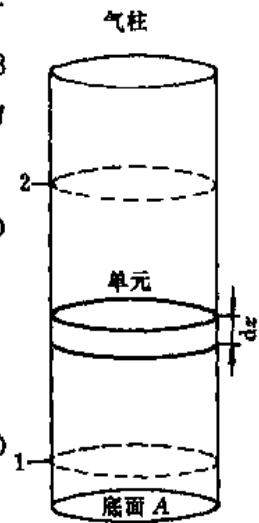

然后各层相加，得到气柱中的可降水量。例如，根据气象资料，以式（11-6）计算 $1 . 0 ~ \mathrm { m ^ { 2 } }$ 空气柱中水的总量为 $W { = } 7 7  { \mathrm { ~ \bf ~ k g } }$ ，则水深为$\mathrm { W / } \rho _ { w } A { = } 7 7 / 1 0 0 0 \times 1 { = } 0 . 0 7 7 ~ \mathrm { m } { = } 7 7 ~ \mathrm { m m }$

图 11-13 大气柱中的可降水计算

可用探空资料直接计算可降水量，也可以利用地面露点间接推求。[50]

如上所述，造成暴雨需具备动力条件和水汽条件。动力条件决定水汽形成暴雨的效率。对于特大暴雨来说，动力条件基本上接近上限，此时，特大雨量与水汽之间呈近似的直线关系（图11-14的外包线）。

此时

$$
P _ { m } = \frac { W _ { m } } { W } P\tag{11-8}
$$

式中 P、 $\pmb { P _ { \ m } }$ ——分别为典型雨量及放大

$$
{ \dot { \mathsf { R P } } } { \dot { \mathsf { R P } } } { \dot { \mathsf { R P } } } :
$$

$W .$ $W _ { \pmb { \pi } }$ —分别为典型及放大的可降水量。

我国可降水量的最大值 $\mathbb { W } _ { \bowtie }$ 见图11-15。

水汽放大值 $W _ { \ast } / W$ 一般在1. $1 0 \sim$ 1. 50 之间。

## 二、暴雨移置

PMP 传统方法的第二步是移用邻近的特大暴雨资料。设计流域（或地区）缺乏特大暴雨资料时，移置成为不可避免的手段。

从天气图来看，孕育和制约中小尺度系统发生、发展的环流背景（即大尺度天气系统）摆动的范围很大。近年来特大暴雨的天气分析说明，暴雨往往是几种不同尺度、不同来源运动系统互相组合的结

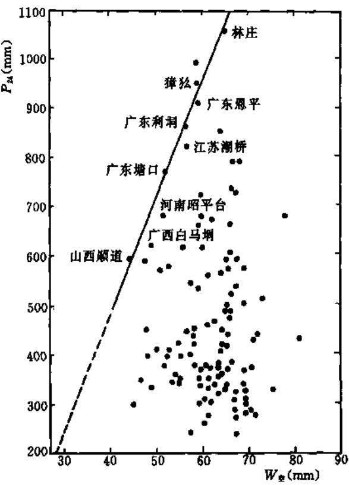  
图11-14特大暴雨与可降水量的关系（刘国纬）

果，而可能发生这种组合的地区范围也是很大的。由此可以推断相应于这些系统的暴雨在一定地区和条件下应该是可以移置的。

由天气系统判断某场暴雨可以移置，但这只是移置的必要条件，还必须考虑地形条件是否可以移置，地形对降水的影响，虽已研究多年，迄今尚未有可以实用的计算方法，因此只能在地形相差不远的情况下，例如，同为非山岳地区或者地形相近的山区，才允许移置。

天气条件及地形特征相类似的区域称为一致区。在此区内的暴雨可以互相移置。但当水汽自源地向暴雨区输送时，如遇山脉横阻，就可使输人的可降水量减少。经验证明，障碍每增高30m约使可降水量减少1%，这称为削减。基于许多事实，高山大岭往往是一致区的边界。暴雨不能越过边界移置，同时也不宜在暴雨落区与设计地区高差过大的情况下进行移置。美国限制这种高度和高差为300m。

移置时假定暴雨的机制不变，因而只作地区水汽不同的调整。

## 三、外包

实测和移置而来的暴雨时面深关系一般不会在各种历时和各雨面上的雨量都是最大的，还需要将可移暴雨的时面深关系加以综合并取其最大值，这就是所谓外包时面深关系曲线（图11-16）。

美国在东部非山岳地区已制有6、12、24、72 h各种面积的PMP等值线图，设计者只须查读设计流域中心处的数值便可绘制图11-16的PMP时面深曲线图。我国目前还只有24 h 点 PMP 等值线图（图 11-17)。

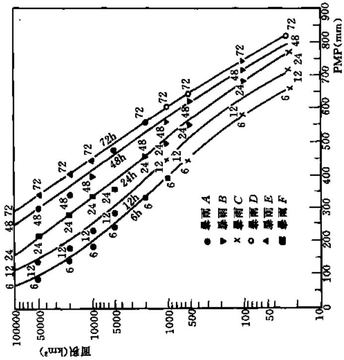  
P 1-111

中))1-115  
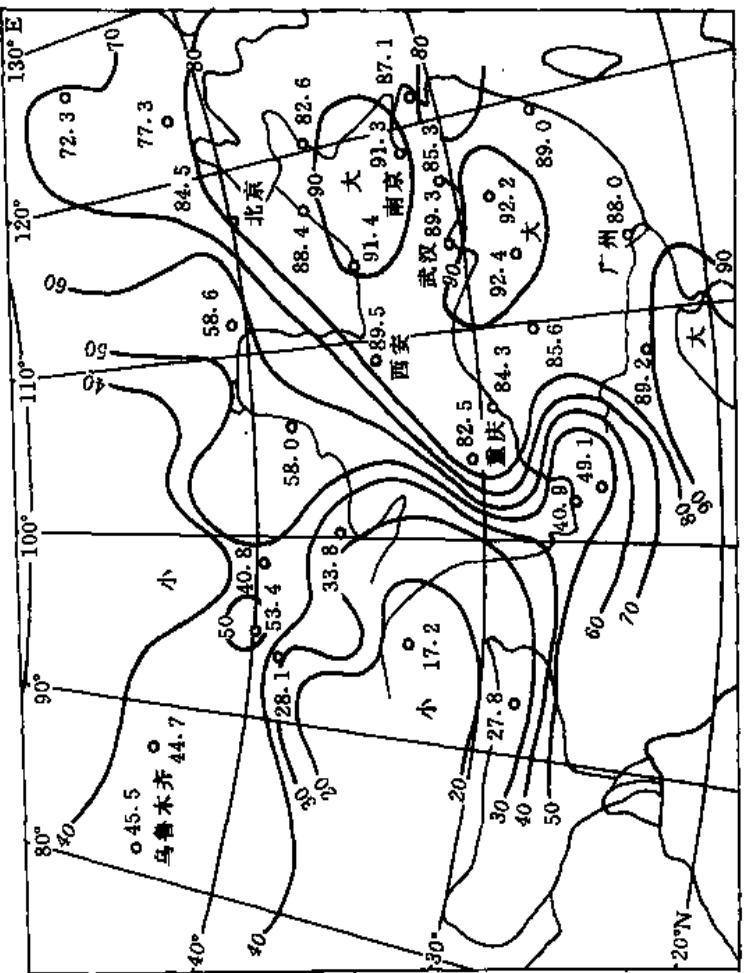

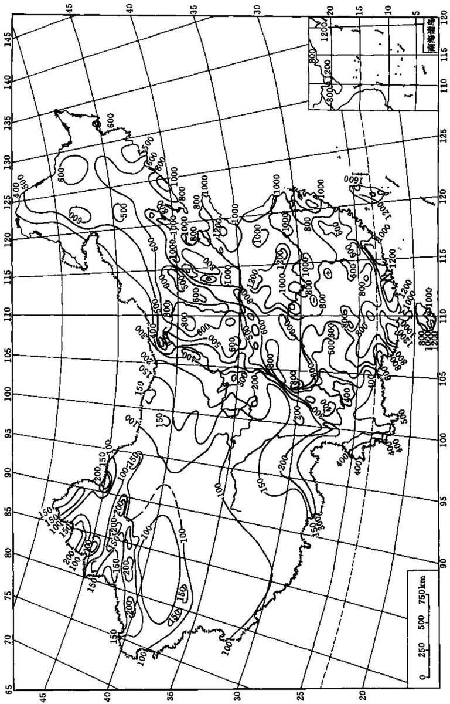  
图国 2 -图

## 第七节 流 域 PMP 计算

PMP的时面深曲线图所表示的只是设计流域所在地区各种雨面的平均雨深，而不是设计流域的面平均雨深，因此要求设计流域的可能最大洪水（PMF）还须解决下列问题：

(1)须将地区的PMP雨量转换为设计流域的平均雨量，而且这种平均雨量必须是最大的。

(2)必须将流域面平均雨量的时空分布和前期雨量定出，以便推求设计流域的PMF。

【例 11-1】 某河兴建水库，求设计流域6 h的PMP 平均雨量及面分布。设计流域面积为3660 km²（图11-18）。

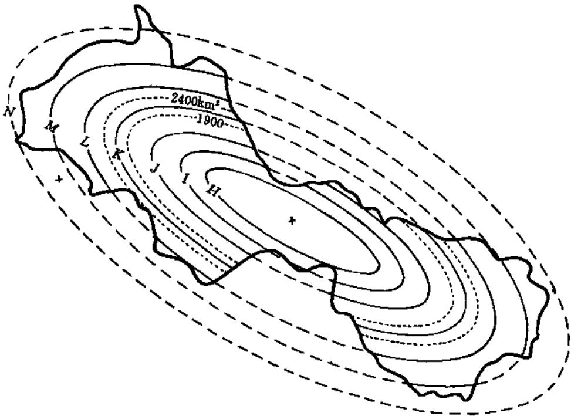  
图 11-18 设计流域图及暴雨模型图

第一步 从流域所在地区由流域中心及 PMP等值线图绘制PMP时面深曲线图。由此图抄读雨面与6 h的雨深，如表11-2。

表 11-2  
某河雨面及 6 hPMP 雨量
<table><tr><td>雨面 (km²)</td><td>6 hPMP 雨量 (mm)</td><td>改正后的 6 hPMP 雨量 (mm)</td><td>爾面 (km²)</td><td>6 hPMP 雨量 (mm)</td><td>改正后的6 hPMP雨量* (mm)</td></tr><tr><td>1000</td><td>161</td><td>154.7</td><td>4500</td><td>98</td><td>83.3</td></tr><tr><td>1500</td><td>144</td><td>134.4</td><td>6500</td><td>85</td><td>72.3</td></tr><tr><td>2150</td><td>129</td><td>115.1</td><td>10000</td><td>71</td><td>60.4</td></tr><tr><td>3000</td><td>115</td><td>97.8</td><td>15000</td><td>59</td><td>50.2</td></tr></table>

注 表中数据由类似图11-16的本地区PMP时面深曲线图（本例未列出）查得。  
流域长轴与水汽人流方向不一致时由资料定出的经验性调整。

第二步 将雨区的暴雨等雨量线概化为模型，本例为长短轴比2.5：1的椭圆形，见图11-18。模型中的各等雨量线命名为A、B、C、…、N。然后将模型笼罩在设计的流域上，模型的中心与流域中心重合时洪量最大，靠近流域出口时洪峰最大，也可以放置于常见中心，由设计者按工程要求决定。本例放置于流域中心处。

第三步 将各雨面的PMP雨量化算为模型中各等雨量线数值（这种化算是根据等雨

表 11-3 某河 1500 km²雨面 6 hPMP 在流域面积(3660 km²) 的等值线及平均雨量计算表
<table><tr><td rowspan=1 colspan=1>等雨量线名</td><td rowspan=1 colspan=1>等雨量线雨量(mm)</td><td rowspan=1 colspan=1>等雨量线的平均雨量P (mm)</td><td rowspan=1 colspan=1>流域面积内的面积增量ΔA (km²)</td><td rowspan=1 colspan=1>降雨增量 $\Delta v = P _ { a v } \Delta A$  $( \mathbf { k } \mathbf { m } ^ { 2 } \cdot \mathbf { m } \mathbf { m } )$ </td></tr><tr><td rowspan=1 colspan=1>(1)</td><td rowspan=1 colspan=1>(2)</td><td rowspan=1 colspan=1>(3)</td><td rowspan=1 colspan=1>(4)</td><td rowspan=1 colspan=1>(5)</td></tr><tr><td rowspan=3 colspan=1>ABCDE</td><td rowspan=3 colspan=1>217.7204.3190.8177.4164.0</td><td rowspan=1 colspan=1>217.7211.0197.6</td><td rowspan=3 colspan=1>1015255075</td><td rowspan=3 colspan=1>217.73165493********02</td></tr><tr><td rowspan=1 colspan=1>184.1</td></tr><tr><td rowspan=1 colspan=1>170.7</td></tr><tr><td rowspan=2 colspan=1>FG</td><td rowspan=1 colspan=1>150.5</td><td rowspan=1 colspan=1>157.2</td><td rowspan=1 colspan=1>125</td><td rowspan=1 colspan=1>19656</td></tr><tr><td rowspan=1 colspan=1>141.1</td><td rowspan=1 colspan=1>145.8</td><td rowspan=1 colspan=1>150</td><td rowspan=1 colspan=1>21874</td></tr><tr><td rowspan=1 colspan=1>H</td><td rowspan=1 colspan=1>129.0</td><td rowspan=1 colspan=1>135.1</td><td rowspan=1 colspan=1>250</td><td rowspan=1 colspan=1>33768</td></tr><tr><td rowspan=1 colspan=1>1</td><td rowspan=1 colspan=1>118.3</td><td rowspan=1 colspan=1>123.6</td><td rowspan=1 colspan=1>271</td><td rowspan=3 colspan=1>335094436844599</td></tr><tr><td rowspan=2 colspan=1>J</td><td rowspan=1 colspan=1>107.5</td><td rowspan=1 colspan=1>112.9</td><td rowspan=1 colspan=1>393</td></tr><tr><td rowspan=1 colspan=1>K</td><td rowspan=1 colspan=1>75.3</td><td rowspan=1 colspan=1>91.4</td><td rowspan=1 colspan=1>488</td></tr><tr><td rowspan=1 colspan=1>L</td><td rowspan=1 colspan=1>55.1</td><td rowspan=1 colspan=1>65.2</td><td rowspan=1 colspan=1>582</td><td rowspan=2 colspan=1>379373318313802</td></tr><tr><td rowspan=1 colspan=1>MN</td><td rowspan=1 colspan=1>34.921.5</td><td rowspan=1 colspan=1>45.028.2</td><td rowspan=1 colspan=1>737489</td></tr><tr><td rowspan=1 colspan=1>总计</td><td rowspan=1 colspan=1></td><td rowspan=1 colspan=1></td><td rowspan=1 colspan=1>3660</td><td rowspan=1 colspan=1>314985</td></tr><tr><td rowspan=1 colspan=5>流域面平均雨量=314985/3660=86.1 mm</td></tr></table>

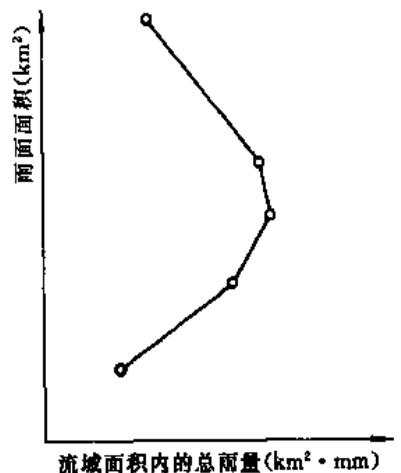  
图11-19 雨面与设计流域总雨量关系图

量线几何形状及雨面平均雨与等雨量线关系定出的，在美国东部非山岳地区制有专用表可查，其他地区可以由实测资料制表，也可以采用参考文献[50]所列方法求出等雨量数值)。本例列举设计流域 $3 6 6 0 ~ \mathbf { k m ^ { 2 } }$ 中 $1 5 0 0 k m ^ { 2 }$ 雨面6hPMP在流域各等雨量线的数值如表11-3第（2）栏所示。由此求得流域面平均雨量为86.1mm。

第四步 将表11-2 中各雨面的雨量按第二步、第三步方法一一计算，制成各种雨面与设计流域总雨量[表11-3第（5）栏]关系图（图11-19），由图11-19得到设计流域最大总雨量对应的雨面，这种雨面的PMP在设计流域上的平均雨量最大，也就是所求的设计流域6 hPMP雨量，其等雨量线分布即是所求的6 hPMP面分布。

图11-20为残雨等雨量线图，从图11-20可以看出：不但可求得设计流域的PMP等雨量线（区间A)，还可以求得设计流域外的等雨量线。流域外的等雨量线称为残雨等雨量线。利用它可求当设计流域发生PMP时，相邻区间的雨量，即水文计算中相邻区间的相应雨量，从而可以解决上下游相邻梯级水库的相应洪水问题，不需频率组合。

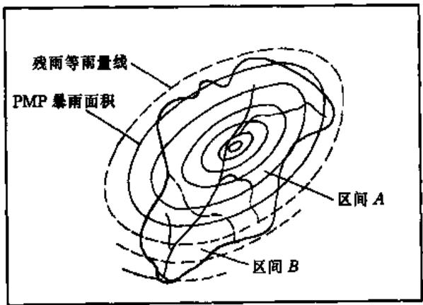  
图11-20 残雨等雨量线图

美国、英国、加拿大等国重要工程的设计洪水一般不用频率，而用PMP/PMF方法。多年以来实际发生的特大暴雨未突破PMP，只有接近PMP的暴雨。

可以用同样步骤求出设计流域各不同6h时段的 PMP 雨量，然后将各不同 6 h 时段的雨量排列组合如图11-21所示。一般大雨时段居中，头尾较小，或者参考实际雨型（表11-4

表 11-4  
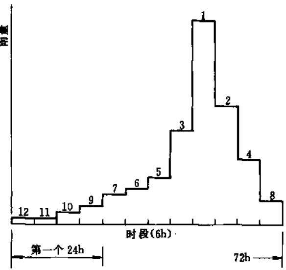  
图 11-21 设计流域 PMP 的时程分布

中国典型特大暴雨实际雨型  
雨量单位：mm/（6h）
<table><tr><td rowspan=1 colspan=3>地  区</td><td rowspan=1 colspan=1>辽   宁</td><td rowspan=1 colspan=1>河   北</td><td rowspan=1 colspan=1>河  南</td><td rowspan=1 colspan=1>安  徽</td><td rowspan=1 colspan=1>台  濟</td><td rowspan=1 colspan=1>广   东</td><td rowspan=1 colspan=1>广   西</td></tr><tr><td rowspan=1 colspan=1></td><td rowspan=1 colspan=2>地  点</td><td rowspan=1 colspan=1>荒   沟</td><td rowspan=1 colspan=1>司   仓</td><td rowspan=1 colspan=1>林  庄</td><td rowspan=1 colspan=1>大水河</td><td rowspan=1 colspan=1>白   石</td><td rowspan=1 colspan=1>白石门</td><td rowspan=1 colspan=1>老虎滩</td></tr><tr><td rowspan=1 colspan=1></td><td rowspan=1 colspan=2>年  份</td><td rowspan=1 colspan=1>1958</td><td rowspan=1 colspan=1>1963</td><td rowspan=1 colspan=1>1975</td><td rowspan=1 colspan=1>1969</td><td rowspan=1 colspan=1>1963</td><td rowspan=1 colspan=1>1977</td><td rowspan=1 colspan=1>1960</td></tr><tr><td rowspan=1 colspan=3>月.日</td><td rowspan=1 colspan=1>8.3~8.6</td><td rowspan=1 colspan=1>8.5~8.8</td><td rowspan=1 colspan=1>8.5~8.8</td><td rowspan=1 colspan=1>7.13~7.17</td><td rowspan=1 colspan=1>9.9~9.12</td><td rowspan=1 colspan=1>5.28~6.1</td><td rowspan=1 colspan=1>7.10~7.13</td></tr><tr><td rowspan=12 colspan=2>时段</td><td rowspan=1 colspan=1>1</td><td rowspan=1 colspan=1>2.7</td><td rowspan=1 colspan=1>33.5</td><td rowspan=1 colspan=1>4.0</td><td rowspan=1 colspan=1>383.8</td><td rowspan=1 colspan=1>17.0</td><td rowspan=1 colspan=1>30.0</td><td rowspan=1 colspan=1>29.0</td></tr><tr><td rowspan=1 colspan=1>2</td><td rowspan=1 colspan=1>79.2</td><td rowspan=1 colspan=1>56.0</td><td rowspan=1 colspan=1>25.1</td><td rowspan=1 colspan=1>57.0</td><td rowspan=1 colspan=1>38.1</td><td rowspan=1 colspan=1>118.0</td><td rowspan=1 colspan=1>27.9</td></tr><tr><td rowspan=1 colspan=1>3</td><td rowspan=1 colspan=1>106.7</td><td rowspan=1 colspan=1>50.0</td><td rowspan=1 colspan=1>295.7</td><td rowspan=1 colspan=1>8.4</td><td rowspan=1 colspan=1>41.9</td><td rowspan=1 colspan=1>59.0</td><td rowspan=1 colspan=1>176.9</td></tr><tr><td rowspan=1 colspan=1>4</td><td rowspan=1 colspan=1>140.4</td><td rowspan=1 colspan=1>15.0</td><td rowspan=1 colspan=1>54.8</td><td rowspan=1 colspan=1>23.0</td><td rowspan=1 colspan=1>72.8</td><td rowspan=1 colspan=1></td><td rowspan=1 colspan=1>130.2</td></tr><tr><td rowspan=1 colspan=1>5</td><td rowspan=1 colspan=1>247.2</td><td rowspan=1 colspan=1>60.0</td><td rowspan=1 colspan=1>12.0</td><td rowspan=1 colspan=1>78.9</td><td rowspan=1 colspan=1>130.0</td><td rowspan=1 colspan=1>193.0</td><td rowspan=1 colspan=1>28.1</td></tr><tr><td rowspan=1 colspan=1>6</td><td rowspan=1 colspan=1>78.3</td><td rowspan=1 colspan=1>67.0</td><td rowspan=1 colspan=1>75.8</td><td rowspan=1 colspan=1>17.8</td><td rowspan=1 colspan=1>200.9</td><td rowspan=1 colspan=1>40.0</td><td rowspan=1 colspan=1>43.2</td></tr><tr><td rowspan=1 colspan=1>7</td><td rowspan=1 colspan=1>12.6</td><td rowspan=1 colspan=1>26.0</td><td rowspan=1 colspan=1>103.5</td><td rowspan=1 colspan=1></td><td rowspan=1 colspan=1>277.1</td><td rowspan=1 colspan=1>9.0</td><td rowspan=1 colspan=1>432.6</td></tr><tr><td rowspan=1 colspan=1>8</td><td rowspan=1 colspan=1>7.8</td><td rowspan=1 colspan=1>118.5</td><td rowspan=1 colspan=1>29.0</td><td rowspan=1 colspan=1></td><td rowspan=1 colspan=1>429.0</td><td rowspan=1 colspan=1>54.0</td><td rowspan=1 colspan=1>130.5</td></tr><tr><td rowspan=1 colspan=1>9</td><td rowspan=1 colspan=1>2.5</td><td rowspan=1 colspan=1>40.0</td><td rowspan=1 colspan=1>47.2</td><td rowspan=1 colspan=1>28.9</td><td rowspan=1 colspan=1>331.0</td><td rowspan=1 colspan=1>196.0</td><td rowspan=1 colspan=1>0.8</td></tr><tr><td rowspan=1 colspan=1>10</td><td rowspan=1 colspan=1>19.6</td><td rowspan=1 colspan=1>319.0</td><td rowspan=1 colspan=1>274.9</td><td rowspan=1 colspan=1>146.4</td><td rowspan=1 colspan=1>135.1</td><td rowspan=1 colspan=1>174.0</td><td rowspan=1 colspan=1>27.3</td></tr><tr><td rowspan=1 colspan=1>11</td><td rowspan=1 colspan=1>2.2</td><td rowspan=1 colspan=1>256.0</td><td rowspan=1 colspan=1>679.5</td><td rowspan=1 colspan=1>97.8</td><td rowspan=1 colspan=1>9.9</td><td rowspan=1 colspan=1>460.0</td><td rowspan=1 colspan=1>5.9</td></tr><tr><td rowspan=1 colspan=1>12</td><td rowspan=1 colspan=1>0.3</td><td rowspan=1 colspan=1>89.0</td><td rowspan=1 colspan=1>6.3</td><td rowspan=1 colspan=1>117.2</td><td rowspan=1 colspan=1>1.0</td><td rowspan=1 colspan=1>28.0</td><td rowspan=1 colspan=1>64.2</td></tr><tr><td rowspan=1 colspan=3>总雨量</td><td rowspan=1 colspan=1>699.5</td><td rowspan=1 colspan=1>1130.0</td><td rowspan=1 colspan=1>1605.3</td><td rowspan=1 colspan=1>959.2</td><td rowspan=1 colspan=1>1683.8</td><td rowspan=1 colspan=1>1361.0</td><td rowspan=1 colspan=1>1096.3</td></tr></table>

## 第八节可能最大洪水

有了PMP的时空分布之后，就可着手研究PMF了。

(1）流域前期降雨及下渗决定洪水总量的大小，下列几项可供考虑：

1）我国湿润地区，有时取偏于安全的数值，令 $P _ { \bullet } = I _ { \ m }$ 。干旱地区， $\scriptstyle { P _ { a } }$ 可取为各次大洪水前期平均情况作为 $P _ { \bullet }$ 值。

2）我国特大暴雨主要雨区的前期情况见表11-5，说明P。可采用Im/2，国外的经验亦 $\pmb { P _ { a } }$ ${ \cal I } _ { \ m } / 2$ 是如此。

表 11-5  
我国特大暴雨主要雨区的洪水径流系数
<table><tr><td rowspan=2 colspan=1>暴雨名称</td><td rowspan=2 colspan=1>河流</td><td rowspan=2 colspan=1>站名</td><td rowspan=2 colspan=1>流城面积(km²)</td><td rowspan=1 colspan=2>面平均雨量</td><td rowspan=2 colspan=1>径流深(mm)</td><td></td><td rowspan=2 colspan=4>前期土壤含水情况</td><td rowspan=2 colspan=1>径流系数</td></tr><tr><td rowspan=1 colspan=1>历时</td><td rowspan=1 colspan=1>用量(mm)</td><td></td></tr><tr><td rowspan=1 colspan=1>35.7</td><td rowspan=1 colspan=1>澧水清江</td><td rowspan=1 colspan=1>三江口拦鱼咀</td><td rowspan=1 colspan=1>1450015560</td><td rowspan=1 colspan=1></td><td rowspan=1 colspan=1>660.2376.6</td><td rowspan=1 colspan=1>589.6337.3</td><td rowspan=1 colspan=5>处于平均情况，即 $\pmb { P _ { a } }$  $\approx 1 . 1 2$ </td><td rowspan=1 colspan=1>0.8930.917</td></tr><tr><td rowspan=6 colspan=1>63.8</td><td rowspan=1 colspan=1>界河</td><td rowspan=1 colspan=1>刘家台</td><td rowspan=1 colspan=1>174</td><td rowspan=1 colspan=1>3 日</td><td rowspan=1 colspan=1>725</td><td rowspan=1 colspan=1>594</td><td></td><td rowspan=2 colspan=4></td><td rowspan=1 colspan=1>0.820</td></tr><tr><td rowspan=1 colspan=1>槐河</td><td rowspan=1 colspan=1>马村</td><td rowspan=1 colspan=1>760</td><td rowspan=1 colspan=1></td><td rowspan=1 colspan=1>1221</td><td rowspan=1 colspan=1>1021</td><td></td><td rowspan=1 colspan=1>0.835</td></tr><tr><td rowspan=1 colspan=1>泯河</td><td rowspan=1 colspan=1>临城水库</td><td rowspan=1 colspan=1>384</td><td rowspan=1 colspan=1></td><td rowspan=1 colspan=1>1568</td><td rowspan=1 colspan=1>1391</td><td></td><td rowspan=1 colspan=2>邢台、邯郸</td><td rowspan=1 colspan=3>郑郸地区接近平</td><td rowspan=1 colspan=1>0.888</td></tr><tr><td rowspan=1 colspan=1>小马河</td><td rowspan=1 colspan=1>又河水库</td><td rowspan=1 colspan=1>113</td><td rowspan=1 colspan=1></td><td rowspan=1 colspan=1>1282</td><td rowspan=1 colspan=1>1115</td><td rowspan=3 colspan=5>均情况，其他地区比平均</td><td rowspan=1 colspan=2>况值，5%</td></tr><tr><td rowspan=1 colspan=1>渡口川</td><td rowspan=1 colspan=1>佐村水库</td><td rowspan=1 colspan=1>224</td><td rowspan=1 colspan=1></td><td rowspan=1 colspan=1>1257</td><td rowspan=1 colspan=1>1084</td><td rowspan=1 colspan=1>0.862</td></tr><tr><td rowspan=1 colspan=1>沙河</td><td rowspan=1 colspan=1>朱庄</td><td rowspan=1 colspan=1>1318</td><td rowspan=1 colspan=1></td><td rowspan=1 colspan=1>1202</td><td rowspan=1 colspan=1>993</td><td rowspan=1 colspan=1>0.862</td></tr><tr><td rowspan=1 colspan=1>75.8</td><td rowspan=1 colspan=1>洪河唐河唐河</td><td rowspan=1 colspan=1>板桥水库唐河站郭滩站</td><td rowspan=1 colspan=1>76247727591</td><td rowspan=1 colspan=1>3日</td><td rowspan=1 colspan=1>1028.5498307</td><td rowspan=1 colspan=1>915378307</td><td></td><td rowspan=1 colspan=4>干燥平均情况湿润情况</td><td rowspan=1 colspan=1>0.8900.7600.773</td></tr></table>

3）湿润地区在蓄满产流后，降雨流关系呈 $4 5 ^ { \circ }$ 直线，外延并无困难。干旱地区可采用下渗曲线或初损后损法，但须注意雨量对产流的影响，特大暴雨的径流系数很大，扣损误差可能不大。

4）美国气象局认为 $P _ { \alpha }$ 与PMP之间的时距在大流域可定为3日，小流域可定为1日。$\pmb { P _ { a } }$ 的数量约为 PMP总量的 20%\~30%。

5）大流域的下垫面情况相差很大时应考虑分区，分区因气象条件及下垫面情况不同而影响洪水形成，有时还须进行洪水演算。

6）其他条件如水库的起始水位、风浪计算，D.W.牛顿建议以暴雨季节的中值为准。

(2)单位线或模型推求PMF。PMP条件下的汇流，一般可用单位线或模型，但须采用由特大雨洪推出以及暴雨分布按近于可能最大暴雨PMS分布的单位线。各种汇流计算应注意汇流参数的非线性外延的影响。基流可采用特大洪水的最大值。

## 第九节 讨 论

PMP/PMF的选用是一个非常复杂的试算过程，本节略加论述：

(1)山区地形对降水的影响非常显著，但其定量一直是一个非常困难的问题。PMP方法一般只适用于非山岳地区。目前有两类方法可供山区PMP推算参考：

第一类方法是前述非山岳地区的方法用于山岳地区。即将暴雨作水汽放大、移置和外包。但移置必须非常慎重，只限于一致区内作移置。例如，将我国著名的35.7暴雨沿山脉平行移置于五强溪水电站的流域可算是一个成功的例子。

第二类方法是将山区暴雨分解为辐合分量(由天气系统产生)和地形分量两个部分。辐合分量由附近非山岳地区的雨量求得，地形分量则利用所谓“地形增强因子”来计算。有一些方法可计算这个因子，例如J.E.Miller等提出的山区各站百年一遇的雨量能反映地形影响，它与周围非山岳雨量的比值，可作为地形增加因子。

我国几场特大暴雨和最大暴雨的时面深关系如表11-6\~表11-9和图11-22所示。

表 11-6  
我国五大暴雨一览表
<table><tr><td rowspan=1 colspan=2>暴雨名称</td><td rowspan=1 colspan=1>35.7</td><td rowspan=1 colspan=1>63.8</td><td rowspan=1 colspan=1>63.9</td><td rowspan=1 colspan=1>67.10</td><td rowspan=1 colspan=1>75.8</td></tr><tr><td rowspan=1 colspan=2>暴雨中心</td><td rowspan=1 colspan=1>湖北五峰</td><td rowspan=1 colspan=1>河北獐么</td><td rowspan=1 colspan=1>台湾白石</td><td rowspan=1 colspan=1>台湾新寮</td><td rowspan=1 colspan=1>河南林庄</td></tr><tr><td rowspan=1 colspan=2>发生日期</td><td rowspan=1 colspan=1>1935年7月3~7日</td><td rowspan=1 colspan=1>1963年8月3~8日</td><td rowspan=1 colspan=1>1963年9月10~12日</td><td rowspan=1 colspan=1>1967年10月17~19日</td><td rowspan=1 colspan=1>1975年8月4~8日</td></tr><tr><td rowspan=2 colspan=1>暴雨中心最大雨量(mm)</td><td rowspan=1 colspan=1>24 h</td><td rowspan=1 colspan=1>423</td><td rowspan=1 colspan=1>950</td><td rowspan=1 colspan=1>1248</td><td rowspan=1 colspan=1>1672</td><td rowspan=1 colspan=1>1060</td></tr><tr><td rowspan=1 colspan=1>3日</td><td rowspan=1 colspan=1>1282(5 日)</td><td rowspan=1 colspan=1>1458</td><td rowspan=1 colspan=1>1684</td><td rowspan=1 colspan=1>2749</td><td rowspan=1 colspan=1>1605</td></tr><tr><td rowspan=1 colspan=2>山脉位置</td><td rowspan=1 colspan=1>鄂西山地东麓</td><td rowspan=1 colspan=1>大行山东麓</td><td rowspan=1 colspan=1>台北山地北坡</td><td rowspan=1 colspan=1>台东北山地东坡</td><td rowspan=1 colspan=1>伏牛山余脉东麓</td></tr><tr><td rowspan=1 colspan=2>暴雨中心高程(m)</td><td rowspan=1 colspan=1>700</td><td rowspan=1 colspan=1>400</td><td rowspan=1 colspan=1>1600</td><td rowspan=1 colspan=1>500</td><td rowspan=1 colspan=1>100</td></tr><tr><td rowspan=1 colspan=2>山脉平均高程(m)</td><td rowspan=1 colspan=1>2000</td><td rowspan=1 colspan=1>1300</td><td rowspan=1 colspan=1>3000</td><td rowspan=1 colspan=1>1500</td><td rowspan=1 colspan=1>400</td></tr><tr><td rowspan=1 colspan=2>地形影响</td><td rowspan=1 colspan=1>抬升</td><td rowspan=1 colspan=1>拾升喇叭口效应</td><td rowspan=1 colspan=1>拾升喇叭口效应</td><td rowspan=1 colspan=1>拾升喇叭口效应</td><td rowspan=1 colspan=1>抬升喇叭口效应</td></tr><tr><td rowspan=1 colspan=2>影响天气系统</td><td rowspan=1 colspan=1>西南涡</td><td rowspan=1 colspan=1>西南涡低槽</td><td rowspan=1 colspan=1>6312 台风</td><td rowspan=1 colspan=1>6718台风</td><td rowspan=1 colspan=1>7503 台风</td></tr></table>

表 11-7  
中國最大暴雨时面深记录  
单位：mm
<table><tr><td rowspan=2 colspan=1>历时</td><td rowspan=1 colspan=8>面   积(km²)</td></tr><tr><td rowspan=1 colspan=1>点</td><td rowspan=1 colspan=1>100</td><td rowspan=1 colspan=1>300</td><td rowspan=1 colspan=1>1000</td><td rowspan=1 colspan=1>3000</td><td rowspan=1 colspan=1>10000</td><td rowspan=1 colspan=1>30000</td><td rowspan=1 colspan=1>100000</td></tr><tr><td rowspan=2 colspan=1>1h</td><td rowspan=1 colspan=1>401</td><td rowspan=1 colspan=1>267</td><td rowspan=1 colspan=1>167</td><td rowspan=1 colspan=1>107</td><td rowspan=1 colspan=1></td><td rowspan=1 colspan=1></td><td rowspan=1 colspan=1></td><td rowspan=1 colspan=1></td></tr><tr><td rowspan=1 colspan=1>上地</td><td rowspan=1 colspan=1>高家河</td><td rowspan=1 colspan=1>高家河</td><td rowspan=1 colspan=1>林庄</td><td rowspan=1 colspan=1></td><td rowspan=1 colspan=1></td><td rowspan=1 colspan=1></td><td rowspan=1 colspan=1></td></tr><tr><td rowspan=2 colspan=1>3h</td><td rowspan=1 colspan=1>600</td><td rowspan=1 colspan=1>447</td><td rowspan=1 colspan=1>399</td><td rowspan=1 colspan=1>297</td><td rowspan=1 colspan=1>120</td><td rowspan=1 colspan=1></td><td rowspan=1 colspan=1></td><td rowspan=1 colspan=1></td></tr><tr><td rowspan=1 colspan=1>段家庄</td><td rowspan=1 colspan=1>林庄</td><td rowspan=1 colspan=1>林庄</td><td rowspan=1 colspan=1>林庄</td><td rowspan=1 colspan=1>木多才当</td><td rowspan=1 colspan=1></td><td rowspan=1 colspan=1></td><td rowspan=1 colspan=1></td></tr><tr><td rowspan=2 colspan=1>6h</td><td rowspan=1 colspan=1>840</td><td rowspan=1 colspan=1>723</td><td rowspan=1 colspan=1>643</td><td rowspan=1 colspan=1>503</td><td rowspan=1 colspan=1>360</td><td rowspan=1 colspan=1>127</td><td rowspan=1 colspan=1></td><td rowspan=1 colspan=1></td></tr><tr><td rowspan=1 colspan=1>木多才当</td><td rowspan=1 colspan=1>林庄</td><td rowspan=1 colspan=1>林庄</td><td rowspan=1 colspan=1>林庄</td><td rowspan=1 colspan=1>大湖山</td><td rowspan=1 colspan=1>木多才当</td><td rowspan=1 colspan=1></td><td rowspan=1 colspan=1></td></tr><tr><td rowspan=2 colspan=1>12 h</td><td rowspan=1 colspan=1>1400</td><td rowspan=1 colspan=1>1050</td><td rowspan=1 colspan=1>854</td><td rowspan=1 colspan=1>675</td><td rowspan=1 colspan=1>570</td><td rowspan=1 colspan=1>.212</td><td rowspan=1 colspan=1></td><td rowspan=1 colspan=1></td></tr><tr><td rowspan=1 colspan=1>木多才当</td><td rowspan=1 colspan=1>木多才当</td><td rowspan=1 colspan=1>木多才当</td><td rowspan=1 colspan=1>木多才当</td><td rowspan=1 colspan=1>白石</td><td rowspan=1 colspan=1>木多才当</td><td rowspan=1 colspan=1></td><td rowspan=1 colspan=1></td></tr><tr><td rowspan=2 colspan=1>24 h</td><td rowspan=1 colspan=1>1673</td><td rowspan=1 colspan=1>1200</td><td rowspan=1 colspan=1>1150</td><td rowspan=1 colspan=1>1060</td><td rowspan=1 colspan=1>830</td><td rowspan=1 colspan=1>435</td><td rowspan=1 colspan=1>306</td><td rowspan=1 colspan=1>155</td></tr><tr><td rowspan=1 colspan=1>新寮</td><td rowspan=1 colspan=1>白石</td><td rowspan=1 colspan=1>白石</td><td rowspan=1 colspan=1>白石</td><td rowspan=1 colspan=1>白石</td><td rowspan=1 colspan=1>林庄</td><td rowspan=1 colspan=1>泥市</td><td rowspan=1 colspan=1>泥市</td></tr><tr><td rowspan=2 colspan=1>3d</td><td rowspan=1 colspan=1>2749</td><td rowspan=1 colspan=1>1554</td><td rowspan=1 colspan=1>1460</td><td rowspan=1 colspan=1>1350</td><td rowspan=1 colspan=1>1080</td><td rowspan=1 colspan=1>940</td><td rowspan=1 colspan=1>715</td><td rowspan=1 colspan=1>420</td></tr><tr><td rowspan=1 colspan=1>新寮</td><td rowspan=1 colspan=1>林庄</td><td rowspan=1 colspan=1>白石</td><td rowspan=1 colspan=1>白石</td><td rowspan=1 colspan=1>林庄</td><td rowspan=1 colspan=1>泥市</td><td rowspan=1 colspan=1>泥市</td><td rowspan=1 colspan=1>泥市</td></tr><tr><td rowspan=2 colspan=1>7d</td><td rowspan=1 colspan=1>2749</td><td rowspan=1 colspan=1>1805</td><td rowspan=1 colspan=1>1720</td><td rowspan=1 colspan=1>1573</td><td rowspan=1 colspan=1>1350</td><td rowspan=1 colspan=1>1200</td><td rowspan=1 colspan=1>960</td><td rowspan=1 colspan=1>570</td></tr><tr><td rowspan=1 colspan=1>新寮</td><td rowspan=1 colspan=1>獐么</td><td rowspan=1 colspan=1>獐么</td><td rowspan=1 colspan=1>獐么</td><td rowspan=1 colspan=1>泥市</td><td rowspan=1 colspan=1>泥市</td><td rowspan=1 colspan=1>泥市</td><td rowspan=1 colspan=1>泥市</td></tr></table>

(2) PMF 的控制因素的选定。就 PMP 和 PMF 的控制因素而论，暴雨模型长短轴的比值、长轴的转动、暴雨中心在流域的放置地点以及笼罩面积的下垫面情况、暴雨的时程分布、单位线的选择等等都会影响最后的成果，而它们又是互相制约的，设计者和决策者须经多次试验组合判断成果的合理性与最大性。

表 11-8 中国最大暴雨中心
<table><tr><td rowspan=1 colspan=1>地点</td><td rowspan=1 colspan=1>省(区)</td><td rowspan=1 colspan=1>北纬（°）</td><td rowspan=1 colspan=1>东经（°)</td><td rowspan=1 colspan=1>年月，日</td><td rowspan=1 colspan=1>备注</td></tr><tr><td rowspan=1 colspan=1>上地</td><td rowspan=1 colspan=1>内蒙古</td><td rowspan=1 colspan=1>42~16</td><td rowspan=1 colspan=1>119~08</td><td rowspan=1 colspan=1>1975.7.3</td><td rowspan=1 colspan=1>调查</td></tr><tr><td rowspan=1 colspan=1>高家河</td><td rowspan=1 colspan=1>甘肃</td><td rowspan=1 colspan=1>34~51</td><td rowspan=1 colspan=1>104~40</td><td rowspan=1 colspan=1>1985.8.12</td><td rowspan=1 colspan=1>馮查</td></tr><tr><td rowspan=1 colspan=1>林庄</td><td rowspan=1 colspan=1>河南</td><td rowspan=1 colspan=1>33~03</td><td rowspan=1 colspan=1>113~39</td><td rowspan=1 colspan=1>1975.8.7</td><td rowspan=1 colspan=1></td></tr><tr><td rowspan=1 colspan=1>段家庄</td><td rowspan=1 colspan=1>河北</td><td rowspan=1 colspan=1>40~20</td><td rowspan=1 colspan=1>114~35</td><td rowspan=1 colspan=1>1973.6.28</td><td rowspan=1 colspan=1>调查</td></tr><tr><td rowspan=1 colspan=1>木多才当</td><td rowspan=1 colspan=1>内蒙古</td><td rowspan=1 colspan=1>38~55</td><td rowspan=1 colspan=1>109~24</td><td rowspan=1 colspan=1>1944.8.1</td><td rowspan=1 colspan=1>调查</td></tr><tr><td rowspan=1 colspan=1>大湖山</td><td rowspan=1 colspan=1>台海</td><td rowspan=1 colspan=1>23~29</td><td rowspan=1 colspan=1>120~38</td><td rowspan=1 colspan=1>1969.8.7</td><td rowspan=1 colspan=1></td></tr><tr><td rowspan=1 colspan=1>白石</td><td rowspan=1 colspan=1>台灣</td><td rowspan=1 colspan=1>24~33</td><td rowspan=1 colspan=1>121~13</td><td rowspan=1 colspan=1>1963.9.10</td><td rowspan=1 colspan=1></td></tr><tr><td rowspan=1 colspan=1>新寮</td><td rowspan=1 colspan=1>台病</td><td rowspan=1 colspan=1>24~33</td><td rowspan=1 colspan=1>121~45</td><td rowspan=1 colspan=1>1967.10.17</td><td rowspan=1 colspan=1></td></tr><tr><td rowspan=1 colspan=1>泥市</td><td rowspan=1 colspan=1>湖南</td><td rowspan=1 colspan=1>29~56</td><td rowspan=1 colspan=1>110~46</td><td rowspan=1 colspan=1>1935.7.4</td><td rowspan=1 colspan=1>调查</td></tr><tr><td rowspan=1 colspan=1>獐么河</td><td rowspan=1 colspan=1>北</td><td rowspan=1 colspan=1>37~22</td><td rowspan=1 colspan=1>114~13</td><td rowspan=1 colspan=1>1963.8.4</td><td rowspan=1 colspan=1></td></tr></table>

表 11-9 世界最大暴雨时  
面深记录 单位：mm
<table><tr><td rowspan="2">面积 (km²)</td><td colspan="7">历 时(b)</td></tr><tr><td>6</td><td>12</td><td>18</td><td>24</td><td>36</td><td>48</td><td>72</td></tr><tr><td>25.9</td><td>627A</td><td>757A</td><td>1036C</td><td></td><td>[1232C1488C]</td><td>1585C</td><td></td></tr><tr><td>259</td><td>526C</td><td>716C</td><td>950C</td><td>1166C</td><td>1405C</td><td>1473C</td><td></td></tr><tr><td>518</td><td>500C</td><td>686C</td><td>925C</td><td>1120C</td><td>1354C</td><td>1412C</td><td></td></tr><tr><td>1295</td><td>452C</td><td>625C</td><td>856C</td><td>1036C|1242C</td><td></td><td>1308C</td><td></td></tr><tr><td>2590</td><td>381C</td><td>594C</td><td>744C</td><td>881C</td><td>1062C</td><td>1113C</td><td></td></tr><tr><td>5180</td><td>284A</td><td>450A</td><td>572A</td><td>4721</td><td>4751</td><td>7341</td><td>7921</td></tr><tr><td>12950</td><td>206A</td><td>282A</td><td>257A</td><td>3711</td><td>384A</td><td>5871</td><td>6711</td></tr><tr><td>25900</td><td>145A</td><td>201A</td><td>257A</td><td>3711</td><td>384A</td><td>5871</td><td>6711</td></tr><tr><td>21800</td><td>102A</td><td>152A</td><td>201A</td><td>2641</td><td>295A</td><td>4241</td><td>546I</td></tr><tr><td>129000</td><td>64A</td><td>107A</td><td>135A</td><td>160A</td><td>2011</td><td>2791</td><td>3891</td></tr><tr><td>159000</td><td>43A</td><td>64A</td><td>89A</td><td>109A</td><td>152A</td><td>170A</td><td>226A</td></tr></table>

注 1.A—美国；C—中国台湾；【一印度。  
2. 来源，WMO. Manual for Estimation of Probable Maximum Precipitation, 2nd edition. 1986.

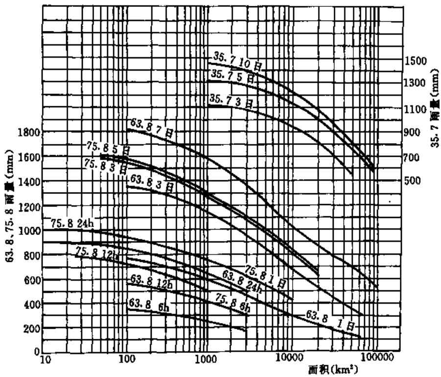  
图 11-22 35.7、63.8、75.8大暴雨时面深曲线图

(3)最终成果。PMF的最后成果应与类似流域的成果，实测暴雨（表11-9)历史洪水、古洪水作对比，特别是应与古洪水中的晚全新世最大洪水加以比较。

# 第十二章 水污染及水质模型

第一节 概 述

天然的水不是化学的纯水，而是由许多溶解性和非溶解性物质所组成的极其复杂的综合物质，称为水质。当各种水源进人河流水体后，呈现为均匀的和非均匀的混合状态，直接影响水体的物理特性、化学特性及生物特性。

在环境影响评价和环境质量预测方面，必须要了解新建工程项目后，水质变化的规律和趋势，在环境规划和管理方面，例如，制定环境标准和排放标准，确定排放污染物的数量，对不同治理方案的经济性和有效性进行比较等，还必须要了解人类活动后水质变化的情况。要达到上述目的，水质数学模型是具有预见能力的一种有力工具。

河流水质数学模型（俗称水质模型）是用数学的语言和方法来描述河流水体污染过程中的物理、化学、生物及生态各方面的内在规律和相互关系，也就是将一个复杂的河流系统转化成一组适当的数学方程进行数学模拟。

## 第二节 河流水体的污染与自净

雨水吸收大气中的气体和微粒物质后降落到地面，和地面中被溶解物质一起，通过地表径流进入河流或渗人地下和土壤发生化学变化，产生一些物质或溶解一些物质。因此，地面径流、壤中流和地下径流都具有一定的化学特性。另一方面，工业废水、城市生活污水、农田的肥料以及农药通过径流被输送入河流或湖泊，形成水体污染，给人类和生态环境带来不同程度的危害。

水体的水质污染种类很多，为了能确切地反映各种污染状况和性能，必须确定一些水质指标和参数。水质指标有如下几类：

(1)感官性指标。包括颜色、臭味和透明度。

(2)有机物指标。废水中有机物浓度是一个重要的水质指标。水质浓度单位主要采用1L水中含有各种离子的毫克数(mg/L），也可用1kg水样中含有1mg被测物质的比值(PPm）作为单位。由于有机物的组成比较复杂，一般用氧平衡指标来表示有机物的浓度，常用的是溶解氧(DO)、生化需氧量（BOD）和化学耗氧量(COD）等。

(3)酸碱类污染物指标。酸性、碱性废水破坏水体的自然缓冲作用，妨碍水体的自净功能。pH值是检测水体受酸碱污染程度的一个重要指标。

(4)氮、磷类污染物指标。氮、磷、钾、硫等化合物是农作物生长需要的宝贵营养物质，但过多的营养物质进入天然水体，将恶化水质，形成污染，严重时使水体形成富营养化。水生生物所需要的营养物质是多种的，其中氮、磷是藻类生长的控制元素，故常用限制氮、磷元素含量的办法来控制水体富营养化的速度。

(5)重金属指标。从环境方面而言，重金属主要指汞、镉、铅、铬以及类金属砷等生

物毒性显著的元素，称为“五毒”。

(6)病原微生物指标。病原微生物是指进人水体的病菌、病毒和动物寄生物。目前用作水体水质病菌指标的是大肠菌群。

天然水体受到污染后，进人水体的污染物质的浓度随着时间的推移和空间位置的变化而自然降低，这种作用称为水体的自净作用。自然界各种水体本身都有一定的自净能力，污染物质进人水体后，立即产生两个互相关联的过程，一是水体污染，一是水体自净。若污染物质经过水体自净作用，部分或完全恢复到原来状态，这就叫做净化；若污染作用超过水体自净能力，则水质就会恶化。因此，水质是否恶化，要视污染过程与自净过程的强度而定，它们又与污染物性质、污染物大小和受纳水体状况及它们之间的相互作用有关。

水体自净作用可以分为三类，即：

(1)物理净化。污染物质在水体内，由于稀释、扩散、混合、挥发和沉淀等，而使其浓度降低。

(2)化学净化。污染物质在水体内，由于氧化还原、酸碱反应、分解化合、吸附和凝聚，而使浓度降低。

(3)生物净化。由于水生生物活动而使污染物质浓度降低，其中尤以水中微生物对有机污染物质的氧化分解作用最为重要。

水体的自净能力是有限的，它与水体污染有着密切的关系，因此，研究污染物质和水体自净的特性和规律，对于治理水质污染和保护水环境均有十分重要的意义。

## 第三节 河流水质模型的基本方程

建立水质模型有以下几个程序：

(1)收集和分析与建模有关的资料和信息，为建模作好准备工作。

(2)根据所取得的资料和数据，选择适当的模型变量，确定变量之间的相互影响与变化规律，写出描述这些关系的数学方程的最佳结构形式，反映描述现象的基本特征。

(3)在模型方程中包含有一些参数值，这些参数值需要用某种方式加以确定，如经验

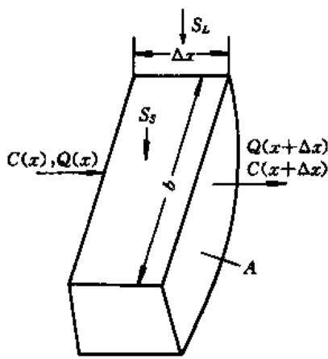  
图 12-1 河流中微元示意图

公式，室内试验或数学方法等等。但是，确定参数时必须使得到的数值在代人模型后能较好地重现观测数据。

(4)水质模型建立后，必须检验模型结构是否有效，是否有预言能力。检验时，用独立于确定参数时所用数据的新观测数据与模型的计算值相比较。

设想长度为 $\Delta \pmb { x }$ 的微小河段（如图12-1），在时段内的质量平衡关系可从下面方法求得。假定水流是推流状态，即认为计算体积元里的水分子以同一速度u向下游运动。设C（x）和 $C \ ( { \boldsymbol { x } } { + } \Delta { \boldsymbol { x } } )$ 分别为进出微小河段的水中某污染物的浓度，m是计算体积元里所含的污染物质量，按照质量守恒原理，计算体积元里污染物质量的增量为：

$$
\begin{array} { r l } & { \Delta m = [ \bar { C } ( x ) Q ( x ) - C ( x + \Delta x ) Q ( x + \Delta x ) ] \Delta t } \\ & { ~ + S _ { L } \Delta x \Delta t + S _ { s } b \Delta x \Delta t + S _ { v } A \Delta x \Delta t } \end{array}\tag{12-1}
$$

式中 $\Delta m$ ——储存量， $\Delta m = \Delta \ ( \Delta x A C )$ ;

b——微小河段的宽度，m；

$\pmb { A }$ ——微小河段的断面积， $\mathbf { m ^ { 2 } }$ 8

式（12-1）中，右端第一项为干流输送量；右端第二项为侧向的源和漏，其中 $\pmb { S } _ { \pmb { L } }$ 是单位时间内单位长度上的源和漏 $[ \pmb { \ 8 } / \ ( \pmb { \ m } \cdot \pmb { \mathscr { s } } ) ]$ ；右端第三项为表面的源和漏， $\pmb { S s }$ 是单位面积上的源和漏 $[ \mathbf { g } / \ ( \mathbf { m } ^ { 2 } \cdot \mathbf { s } ) ]$ ；右端第四项为体积元内的源和漏， ${ \pmb S } _ { \pmb { v } }$ 是单位时间单位体积元内的源和漏 $\left[ { \pmb g } / \right. \left. \left( { \pmb m } ^ { 3 } \cdot { \pmb s } \right) \right]$ 0

源是体积元内污染物的增加速率，漏是体积元内污染物的减少速率。

$\scriptstyle \Delta m = \Delta \ ( \Delta x A C )$ ，用 $\pmb { \Delta x } \pmb { \Delta t }$ 除式（12-1）的两边，并令 $\Delta t {  } 0 , \ \Delta x {  } 0$ ，则得

$$
\frac { \partial A C } { \partial t } = - \ \frac { \partial ( Q C ) } { \partial x } + S _ { L } + b S _ { S } + A S _ { V }\tag{12-2}
$$

式（12-2）是考虑推流时的污染物迁移方程，但水流在迁移过程中，可能出现扩散和弥散现象，还必须把这些过程引人到质量平衡方程中去。

当考虑分子扩散运动时，分子扩散可以用菲克（Fick）第一定律描述，即分子扩散通量为 $- E _ { 1 } { \frac { x } { 2 x } }$ ，它是单位时间通过单位面积的扩散物质的质量，其中 $\pmb { { \cal E } } _ { 1 }$ 为分子扩散系数， $\frac { \partial C } { \partial x }$ 为扩散物质的浓度梯度。从而式（12-2）相应变为：

$$
\frac { \partial ( A C ) } { \partial t } + \frac { \partial ( Q C ) } { \partial x } = \frac { \partial } { \partial x } \bigg \vert E _ { 1 } A \frac { \partial C } { \partial x } \bigg \vert + \Sigma S _ { \prime } A\tag{12-3}
$$

当引人紊动扩散运动时，水质的紊动扩散也可用菲克第一定律描述，即紊动扩散增量为 $- E _ { 2 } { \frac { \partial C } { \partial x } }$ ，其中 ${ \pmb E } _ { 2 }$ 为紊动扩散系数。同理，可以求得紊动扩散运动引起的质量增量为：$\left. \frac { \partial } { \partial x } \right| \left. E _ { 2 } \frac  \partial \begin{array} { r l } { \left( A \right) } \\ { \overline { { \partial x } } } \end{array} \right| \mathrm { d } x \mathrm { d } t$

推流运动是以流速、浓度在断面上均匀分布来考虑污染物质的输送的，实际上，同一断面内各点流速不同时，沿程的浓度分布往往很不均匀，造成水流方向的弥散现象。纵向弥散作用引起的污染物质在一个断面上的传输量与该处的梯度成正比，即弥散增量为$- E _ { \mathrm { : } } \frac { \partial C } { \partial x }$ ，质量增量为 $\frac { \partial } { \partial x } \bigg ( \ E _ { 3 } \ \frac { \partial C A } { \partial x } \bigg ) \ \mathrm { d } , x \mathrm { d } t$ ，其中 $\pmb { { \cal E } } _ { 3 }$ 为弥散系数。

根据质量守恒原理，以上各项质量相加，必然属于微小河段水体中污染物质量在dt内的变化量，代入式（12-2），最后得

$$
\frac { \partial C A } { \partial t } + \frac { \partial C Q } { \partial x } = \frac { \partial } { \partial x } \bigg [ \left( E _ { 1 } + E _ { 2 } + E _ { 3 } \right) \frac { \partial C A } { \partial x } \bigg ] + \textstyle \sum S _ { i } A\tag{12-4}
$$

对于均匀河段，断面积A为常数时，式（12-4）可写成：

$$
{ \frac { \partial C } { \partial t } } + u { \frac { \partial C } { \partial x } } = { \frac { \partial } { \partial x } } { \bigg [ } \left( E _ { 1 } + E _ { 2 } + E _ { 3 } \right) { \frac { \partial C } { \partial x } } { \bigg ] } + \ \sum S _ { i }\tag{12-5}
$$

式（12-5）是河流污染物质一维迁移转化基本方程。

## 第四节 河流水质 BOD—DO 模型

水质模型分类方法很多，从模拟的对象上看，可分为溶解氧（DO）模型、生化需氧量(BOD）模型、重金属模型、放射性模型等。溶解在水体中的氧，称为溶解氧（DO)。当有机物进入水体后，由于微生物的作用，会在水中进行氧化分解，消耗水中溶解氧的量，称为生化需氧量(BOD)。生化耗氧过程首先是含碳化合物的耗氧，称为碳化阶段，以CBOD表示；然后是含氮化合物的耗氧，称为硝化阶段，以NBOD表示。碳化阶段约 ${ \tt s } \sim { \tt l 0 }$ 天，以前5天为主，一般有机物中大量是含碳化合物，分解作用的速度和程度同温度和时间有直接关系，为了使测定的BOD数值具有可比性，采用在 $\mathrm { { } } 2 0 \mathrm { { C } }$ 条件下，培养5 天后测定溶解氧消耗量作为标准，称为5日生化需氧量，以 $\mathbf { B O D } _ { 5 }$ 表示。

生化需氧量和溶解氧是两个最重要的水质指标，在建立有机物质的水质模型中，往往以这两个指标为依据。

## 一、斯特里特——费尔普斯 BOD—DO 模型

1925年，斯特里特、费尔普斯(Streeter—Phelps）首先提出描述BOD—DO相互关系的河流水质模型。他们认为，BOD降解是一级反应，即有机物氧化随时间减少的速率与BOD浓度成正比；水中溶解氧的减少是由BOD降解引起的，而且与BOD降解有相同的速率；复氧的速度与氧亏 $( \mathrm { O } _ { \mathfrak { s } } - \mathrm { O } )$ 成正比，从而给出S—P模型的形式：

$$
\begin{array} { c } { { \displaystyle { \frac { \partial { \cal { L } } } { \partial t } } + u \frac { \partial { \cal { L } } } { \partial x } = E \frac { \partial ^ { 2 } { \cal { L } } } { \partial x ^ { \overline { { { \imath } } } } } - K _ { 1 } { \cal { L } } } } \\ { { \displaystyle { \frac { \partial { \cal { O } } } { \partial t } } + u \frac { \partial { \cal { O } } } { \partial t } = E \frac { \partial ^ { 2 } { \cal { O } } } { \partial x ^ { \overline { { { \imath } } } } } - K _ { 1 } { \cal { L } } + K _ { 2 } ( { \cal { O } } _ { s } - { \cal { O } } ) } } \end{array}\tag{12-6}
$$

式中 L——BOD 浓度；

O——DO浓度；

$O _ { s }$ ——饱和氧浓度；

$K _ { 1 }$ BOD 耗氧系数， ${ \bf d } ^ { - 1 }$

$\pmb { K _ { 2 } }$ ——复氧系数， ${ \tt d } ^ { \sim 1 }$

E——河流弥散系数， $\mathbf { k m ^ { 2 } } / \mathbf { d }$

当稳态时， $\frac { \partial \cal L } { \partial t } = 0 , \frac { \partial \cal O } { \partial t } = 0$ ，S—P模型的微分表达式为：

$$
\left\{ \begin{array} { l l } { { \tt B O D : } \quad } & { \ u \frac { \partial L } { \partial x } = E \frac { \partial ^ { 2 } L } { \partial x ^ { 2 } } - K _ { 1 } L } \\ { \quad } & { \ u \frac { \partial O } { \partial x } = E \frac { \partial ^ { 2 } O } { \partial x _ { 2 } } - K _ { 1 } L + K _ { 2 } ( O _ { s } - O ) } \end{array} \right.\tag{12-7}
$$

在L $( x = 0 ) \ = L _ { \circ } , \ O \ ( x = 0 ) \ = O _ { \circ }$ 的初值条件下，通过推导可求得积分解如下：

1. 考虑弥散作用时

$$
\bar { L } = \bar { L } _ { 0 } e ^ { - \beta _ { 1 } \bar { \varepsilon } }\tag{12-8a}
$$

$$
O = O _ { S } - ( O _ { S } - O _ { \circ } ) \mathrm { e } ^ { \beta _ { 2 } x } + \frac { K _ { 1 } L _ { 0 } } { K _ { 1 } - K _ { 2 } } ( \mathrm { e } ^ { \beta _ { 1 } x } - \mathrm { e } ^ { \beta _ { 2 } x } )\tag{12-86}
$$

其中

$$
\beta _ { 1 } = \frac { u } { 2 E } \bigg ( 1 - \sqrt { 1 + \frac { 4 E K _ { 1 } } { u ^ { 2 } } } \bigg )\tag{12-9}
$$

$$
\beta _ { 2 } = \frac { u } { 2 E } \bigg \{ 1 - \sqrt { 1 + \frac { 4 E K _ { z } } { u ^ { 2 } } } \bigg \}\tag{12-10}
$$

2. 忽略弥散作用时

$$
\bar { L } = \bar { L } _ { 0 } \mathsf { e } ^ { - \bar { \kappa } _ { 1 } x / \ast }\tag{12-11a}
$$

$$
O = O _ { s } - ( O _ { s } - O _ { 0 } ) \mathrm { e } ^ { - K _ { z } z / \mathrm { a } } + \frac { K _ { 1 } L _ { 0 } } { K _ { 1 } - K _ { 2 } } ( \mathrm { e } ^ { - K _ { 1 } x / \mathrm { a } } - \mathrm { e } ^ { - K _ { z } x / \mathrm { a } } )\tag{12-116}
$$

$$
D = D _ { 0 } \mathrm { e } ^ { - \kappa _ { z } x / \nu } - \frac { K _ { 1 } L _ { 0 } } { K _ { 1 } - K _ { 2 } } ( \mathrm { e } ^ { - \kappa _ { 1 } x / \nu } - \mathrm { e } ^ { - \kappa _ { z } x / \nu } )\tag{12-11c}
$$

式中 $L , \ L _ { 0 } { \longrightarrow } x { = } x$ 和 $\scriptstyle { \mathfrak { x } } = 0$ 处河水 BOD 浓度， $\mathbf { m g / L }$ R

0. $O _ { 0 } - - x = x$ 和 $\scriptstyle x = 0$ 处河水 DO 浓度， $\mathfrak { m g } / \mathbb { L } ;$

$\pmb { x } ^ { . }$ 离排污口 $( x = 0 )$ 的河水流动距离，km；

${ \pmb u } ^ { \star }$ ——河水平均流速， $\mathbf { k m } / \mathbf { d }$

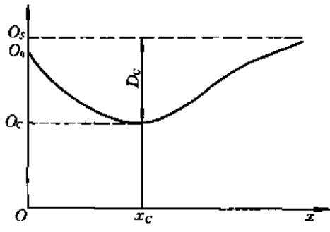

式(12-116)反映了DO浓度随流程变化的过程，绘成图为一下垂曲线（见图12-2)，称为氧垂曲线。初期阶段，河水有机物含量大，耗氧快，复氧速度小于耗氧速度，溶解氧下降至 $\pmb { x } _ { 0 }$ 时，降至最低值 $O _ { C } ;$ 此后，由于有机物含量少，耗氧速度小于复氧速度，曲线上升，并趋向于饱和溶解氧浓度 $O _ { s }$

图 12-2 氧垂曲线

由S—P方程可以导出在排污点河水起始浓度为$L _ { 0 }$ 和 $O _ { \mathfrak { d } }$ 时，沿水流方向各点的溶解氧浓度值，以及最低溶解氧的浓度值和位置。对式（12-11c）求导，令 $\cdot { \frac { \mathrm { d } D } { \mathrm { d } x } }$

$= 0$ ，式中 $\scriptstyle D _ { 0 } = O _ { s } - O _ { \circ } , \ D = O _ { s } - O$ ，可求得临界氧亏 $D _ { \mathsf { C } }$ 的临界距离 $\pmb { x } \pmb { c }$ ，即

$$
x _ { c } = \frac { u } { K _ { 2 } - K _ { 1 } } \mathrm { l n } \left\{ \frac { K _ { 2 } } { K _ { 1 } } \bigg [ 1 - \Big ( \frac { K _ { 2 } } { K _ { 1 } } - 1 \Big ) \Big ( \frac { O _ { s } - O _ { 0 } } { L _ { 0 } } \Big ) \bigg ] \right\}\tag{12-12}
$$

将式（12-12）代人式（12-11b），得

或

$$
\begin{array} { c }  { \displaystyle { { \cal O } _ { c } = { \cal O } _ { s } - \frac { K _ { 1 } } { K _ { 2 } } { \cal L } _ { 0 } \left\{ \frac { K _ { 2 } } { K _ { 1 } } \left[ 1 - \left( \frac { K _ { 2 } } { K _ { 1 } } - 1 \right) \left( \frac { { \cal O } _ { s } - { \cal O } _ { 0 } } { { \cal L } _ { 0 } } \right) \right] \right\} ^ { \frac { 1 } { \left( 1 - \frac { K _ { 2 } } { K _ { 1 } } \right) } } } } \\  { \displaystyle { { \cal D } _ { c } = { \cal O } _ { s } - { \cal O } _ { \mathrm { c } } = \frac { { \cal L } _ { 0 } } { f } \left\{ f \left[ 1 - ( f - 1 ) \left( \frac { { \cal D } _ { 0 } } { { \cal L } _ { 0 } } \right) \right] \right\} ^ { \frac { 1 } { ( 1 - f ) } } } } \end{array}\tag{12-13}
$$

(12-14)

式中 $f { \mathrm { - } } { \mathrm { - } } f { \mathrm { = } } { \frac { K _ { 2 } } { K _ { 1 } } }$ 自净系数，反映自净过程的快慢。

各种水体f的参考值

多种水体的f值可参考表12-1。

S—P模型仅考虑有机物降解和大气复氧对DO的影响，由于未能考虑有机物沉浮、

(20℃)(Falr1939)
<table><tr><td rowspan=1 colspan=1>水体种类</td><td rowspan=1 colspan=1>∫</td><td rowspan=1 colspan=1>水体种类</td><td rowspan=1 colspan=1>f</td></tr><tr><td rowspan=1 colspan=1>水池的滑水</td><td rowspan=1 colspan=1> $0 . 5 { \sim } 1 . 0$ </td><td rowspan=1 colspan=1>缓慢河流和大湖</td><td rowspan=1 colspan=1> $1 . 0 { \sim } 2 . 0$ </td></tr><tr><td rowspan=1 colspan=1>低流速的大河</td><td rowspan=1 colspan=1> $1 . 5 \sim 2 . 0$ </td><td rowspan=1 colspan=1>普通流速的大河</td><td rowspan=1 colspan=1> $2 . 0 { \sim } 3 . 0$ </td></tr><tr><td rowspan=1 colspan=1>急陡河流</td><td rowspan=1 colspan=1> $3 . 5 \sim 5 . 0$ </td><td rowspan=1 colspan=1>险流或瀑布</td><td rowspan=1 colspan=1> $> 5 . 0$ </td></tr></table>

底泥吸附、藻类光合作用等对DO的作用，使其预测结果与实际结果有出入。所以，多年来不少学者对其作了改进，下面介绍三种改进的模型。

## 二、托马斯 BOD-DO 模型

对一维稳态河流，在S—P模型的基础上增加一项因悬浮物的沉淀与上浮所引起的BOD 速率变化 $K _ { 3 } L _ { 0 }$ ，即为托马斯（H. A. Thomas）的修正模型，其形式如下：

$$
\left\{ \begin{array} { l l } { \displaystyle { \boldsymbol { u } } \frac { \partial L } { \partial x } = - \left( K _ { 1 } + K _ { 3 } \right) L } \\ { \displaystyle { \boldsymbol { \alpha } } } \\ { \displaystyle { \boldsymbol { u } } \frac { \partial \boldsymbol { O } } { \partial x } = - K _ { 1 } L + K _ { 2 } ( O _ { s } - { \boldsymbol { O } } ) } \end{array} \right.\tag{12-15a}
$$

(12-15b)

在 $L ~ ( 0 ) ~ = L _ { 0 } , ~ O ~ ( 0 ) ~ = O _ { \circ }$ 的初值条件下，得到托马斯模型的积分解为：

(12-16a)

$$
\begin{array} { r l } & { L = L _ { \mathfrak { g } } \mathrm { e x p } \bigg [ - \frac { K _ { 1 } + K _ { 3 } } { u } x \bigg ] } \\ & { O = O _ { s } - ( O _ { s } - O _ { \mathfrak g } ) \mathrm { e x p } \bigg [ - \frac { K _ { 2 } } { u } x \bigg ] } \\ & { \quad \quad + \frac { K _ { 1 } L _ { 0 } } { K _ { 1 } + K _ { 3 } - K _ { 2 } } \bigg [ \mathrm { e x p } \bigg ( - \frac { K _ { 1 } + K _ { 3 } } { u } x \bigg ) - \mathrm { e x p } \bigg ( \frac { - K _ { 2 } } { u } x \bigg ) \bigg ] } \\ & { D = D _ { \mathfrak g } \mathrm { e x p } \bigg ( - \frac { K _ { 2 } } { u } x \bigg ) } \\ & { \quad \quad - \frac { K _ { 1 } L _ { 0 } } { K _ { 1 } + K _ { 3 } - K _ { 2 } } \bigg [ \mathrm { e x p } \bigg ( - \frac { K _ { 1 } + K _ { 3 } } { u } x \bigg ) - \mathrm { e x p } \bigg ( \frac { - K _ { 3 } } { u } x \bigg ) \bigg ] } \end{array}\tag{12-166}
$$

或

(12-17)

式中 $K _ { 3 }$ ——沉浮系数， ${ \bf d } ^ { - 1 }$ ，其值可正可负。

【例12-1】某河段流量 $Q { = } 2 1 6 { \times } 1 0 ^ { 4 } \mathrm { m } ^ { 3 } / d$ ，流速 $u = 4 6 ~ \mathrm { k m / d }$ ，水温 $\pmb { T = } 1 3 . 6 \mathring { \mathbb { C } }$ 9 $\pmb { K } _ { 1 }$ $= 0 . 9 4 ~ \mathrm { d } ^ { - 1 } , ~ K _ { 2 } = 1 . 8 2 ~ \mathrm { d } ^ { - 1 } , ~ K _ { 3 } = 0 . 1 7 ~ \mathrm { d } ^ { - 1 }$ 。河段始端排放 $Q _ { 1 } { = } 1 0 { \times } 1 0 ^ { 4 } \mathrm { m } ^ { 3 } / \mathrm { d }$ 废水， $\mathbf { B O D _ { 5 } }$ 为 $5 0 0 ~ \mathrm { m g / L }$ ，溶解氧为 $0 ~ \mathrm { { m g / L } }$ ，上游河水 $B O D _ { 5 }$ 为 $0 \ : \mathrm { m g / L }$ ，溶解氧为8.95 ${ \mathfrak { m g } } / \mathbb { L }$ ，求该 河段 $\scriptstyle x = 6 \mathrm { ~ k m }$ 处河水的 $B O D _ { 5 }$ 和氧亏值 $D _ { 0 }$

解：河段始端混合后河水的 ${ \bf B O D } _ { 5 }$ 和DO为：

$$
\begin{array} { l } { { L _ { \mathfrak { 0 } } = \frac { 2 1 6 \times 0 + 1 0 \times 5 0 0 } { 2 1 6 + 1 0 } = 2 2 . 1 2 4 ~ \mathrm { m g / L } } } \\ { { \phantom { L _ { \mathfrak { 0 } } = \frac { 2 1 6 \times 8 . 9 5 + 1 0 \times 0 } { 2 1 6 + 1 0 } = 8 . 5 5 4 ~ \mathrm { m g / L } } } } \end{array}
$$

饱和氧浓度为：

$$
\begin{array} { r l } & { O _ { s } = \frac { 4 6 8 } { 3 1 . 6 8 } } \\ & { D _ { \circ } = O _ { s } - O _ { 0 } = 1 0 . 3 5 - 8 . 5 5 4 = 1 . 8 ~ \mathrm { m g } / \mathrm { L } } \\ & { L = 2 2 . 1 2 4 \mathrm { e x p } \Big \{ - \frac { 0 . 9 4 } { 4 6 } + 0 . 1 7 } \times 6 \Big \}  \\ & { \quad = 2 2 . 1 2 4 \mathrm { e x p } ( - 0 . 1 4 8 ) = 1 9 . 1 4 \mathrm { m g } / \mathrm { L } } \\ & { D = 1 . 8 \mathrm { e x p } \Big ( - \frac { 1 . 8 2 } { 4 6 } \Big . \Big . \Big \{ - \frac { 0 . 9 4 } { 0 . 9 4 } + 0 . 1 7 - 1 . 8 2 } \\\ & { \quad \times \left[ \mathrm { e x p } \Big \{ - \frac { 0 . 9 4 + 0 . 1 7 } { 4 6 } \times 6 \Big \} - \mathrm { e x p } \Big \{ - \frac { 1 . 8 2 \times 6 } { 4 6 } \Big \} \right] = 3 . 3 7 6 \mathrm { m g } / \mathrm { L } } \end{array}
$$

## 三、多宾斯 BOD—DO 模型

多宾斯（W.E.Dobbins）对一维稳态河流，在托马斯模型的基础上，考虑河流底泥耗氧与藻类光合作用增氧的影响，为方便起见，以光合作用产氧速率系数K，表示，给出模型 $\kappa _ { \ast }$ 的简化形式为：

$$
u \frac { \partial L } { \partial x } = - \ ( K _ { \mathrm { i } } + K _ { \mathrm { s } } ) L\tag{12-18a}
$$

$$
u \frac { \partial \hat { O } } { \partial x } = - K _ { 1 } L + K _ { 2 } ( O _ { s } - O ) + K _ { 4 }\tag{12-186}
$$

其积分形式为：

$$
L { = } \tilde { L } _ { 0 } \mathrm { e } ^ { - ( \tilde { K } _ { 1 } + \tilde { K } _ { 3 } ) \bar { x } / \mathrm { s } }\tag{12-19a}
$$

$$
\begin{array} { c } { { O { = } O _ { s } + \displaystyle \frac { K _ { * } } { K _ { * } } - \left( { \cal O } _ { s } + \displaystyle \frac { K _ { * } } { K _ { * } } - { \cal O } _ { \circ } \right) \mathrm { e } ^ { - K _ { 2 } x / \ast } } } \\ { { + \displaystyle \frac { K _ { 1 } L _ { 0 } } { K _ { 1 } + K _ { 3 } - K _ { 2 } } ( \mathrm { e } ^ { - ( K _ { 1 } + K _ { 3 } ) x / \ast } - \mathrm { e } ^ { - K _ { 2 } x / \ast } ) } } \end{array}\tag{12-196}
$$

式中 $\kappa _ { \ast }$ ——光合作用产氧速率系数， ${ \bf { m } } \mathbf { { g } } / \mathbf { \nabla } ( \mathbf { L } \cdot \mathbf { d } )$ a

## 四、奥康納 BOD—DO 模型

前已述及，有机物在河流中通过微生物作用进行氧化分解的过程分为两个阶段。第一阶段称为碳化阶段，此阶段所消耗的氧称为碳化需氧量，耗氧系数以 $\pmb { K } _ { 1 }$ 表示。第二阶段称为硝化阶段，此阶段所消耗的氧称为氮化需氧量，耗氧系数以 $\pmb { K } _ { N }$ 表示。它的化学反应过程为：

$$
\begin{array} { r l } & { 2 \mathrm { N H } _ { 4 } ^ { + } + 3 \mathrm { O } _ { 2 } \xrightarrow { \# \# 4 k } 2 \mathrm { N O } _ { 2 } ^ { - } + 4 \mathrm { H } ^ { + } + 2 \mathrm { H } _ { 2 } \mathrm { O } } \\ & { \qquad 2 \mathrm { N O } _ { 2 } ^ { + } + \mathrm { O } _ { 2 } \xrightarrow { \# 4 k } 2 \mathrm { N O } _ { 3 } ^ { - } } \end{array}
$$

奥康纳（D. J.Oconnor）在托马斯模型的基础上，除考虑CBOD外，还考虑NBOD的耗氧作用，提出的模型如下：

$$
u \frac { \partial L _ { c } } { \partial x } { = } - ( K _ { 1 } + K _ { 3 } ) L _ { c }\tag{12-20a}
$$

$$
u \ { \frac { \partial L _ { N } } { \partial x } } \mathrm { = } - \ K _ { N } L _ { N }\tag{12-206}
$$

$$
u \frac { \partial \hat { O } } { \partial x } { = } { \sim } K _ { 1 } L _ { C } - K _ { N } L _ { N } + K _ { 2 } ( O _ { S } - O )\tag{12-20c}
$$

式中 $\pmb { L } _ { \pmb { C } }$ —碳BOD(CBOD)，为有机物中碳化合物氧化的需氧量， $\mathbf { m } _ { \mathbf { \delta } } / \mathrm { L }$

$L _ { N }$ —氮BOD(NBOD)，为有机物中氮化合物氧化的需氧量， ${ \bf \ m g / L }$

${ \pmb K } _ { N }$ ——NBOD 耗氧系数， ${ \tt d } ^ { - 1 }$

在起始条件为 $L _ { C } = L _ { C 0 }$ $L _ { N } { = } L _ { N 0 }$ $O { = } O _ { \mathfrak { d } }$ 时，求解得积分方程组

$$
L _ { c } = L _ { \mathrm { c o } } \mathrm { e x p } \bigg [ - \frac { ( K _ { 1 } + K _ { 3 } ) } { u } x \bigg ]\tag{12-21a}
$$

$$
L _ { N } = \bar { L } _ { N 0 } \mathrm { e x p } \Big ( - \frac { K _ { N } } { u } x \Big )\tag{12-21b}
$$

$$
O = O _ { s } - ( O _ { s } - O _ { \circ } ) \mathrm { e x p } \Big | - \frac { K _ { 2 } } { u } x \Big |
$$

$$
\begin{array} { r l } & { + \frac { K _ { 1 } L _ { \mathrm { c o } } } { K _ { 1 } + K _ { 3 } - K _ { 2 } } \Big [ \mathrm { e x p } \Big ( - \frac { K _ { 1 } + K _ { 3 } } { u } x \Big ) - \mathrm { e x p } \Big ( - \frac { K _ { 2 } } { u } x \Big ) \Big ] } \\ & { + \frac { K _ { N } L _ { N 0 } } { K _ { N } - K _ { 2 } } \Big [ \mathrm { e x p } \Big ( - \frac { K _ { N } } { u } x \Big ) - \mathrm { e x p } \Big ( - \frac { K _ { 2 } } { u } x \Big ) \Big ] } \end{array}\tag{12-21c}
$$

式中 $L _ { C } , \ L _ { C 0 } - . . = x $ 和 $\pmb { x } = 0$ 处河水的CBOD浓度， $\mathbf { m g / L }$

$L _ { N } , L _ { N 0 } - x = x$ 和 $\pmb { x } = 0$ 处河水的 NBOD浓度， $\mathbf { m g / L }$

其余符号同前。

## 第五节 模型参数的估计

参数估计是河流水质模型的重要组成部分。参数估计的正确与否，将会影响模型的应用价值。在BOD一DO模型中有许多参数，有的可以在实验室中或在野外现场直接测定，有的则必须通过野外观测的数据，采用一些数学方法进行分析与估算。本章介绍几种最基本的参数估计方法。

## 一、BOD 耗氧系数 ${ \pmb K } _ { 1 }$ 的估算方法

污染物进人水体后，可以有以下原因使水体中的溶解氧被消耗。

(1)有机物在微生物作用下，发生碳的氧化分解过程中耗氧。

(2)有机物的分解物，如氨氮又因硝化作用氧化为亚硝酸盐和硝酸盐，在此过程中耗氧。

(3)沉积在河底的淤泥发生有机物的厌氧分解和水底分解作用，产生有机酸和还原性气体，这些物质释放到上面的水体成为流水中的BOD而耗氧。

(4)晚间光合作用停止时，水生植物呼吸作用而耗氧。

(5)废水中还原性物质引起水体中耗氧。

估算 BOD碳化阶段耗氧系数 $\pmb { K } _ { 1 }$ 值的方法很多，有实验室测定、现场估计和经验公式等方法，其中一种比较简易的方法是从河段两个始末断面测定 $\mathtt { B O D } _ { \mathtt { s } }$ 值来计算 $\pmb { K } _ { 1 }$ 值。设在河段上游初始点平均 $\mathtt { B O D } _ { 5 }$ 为 $L _ { 0 }$ ，该河段的平均流速为 ${ \pmb u } \mathrm { ~ }$ 河段长度为 $\pmb { x }$ ,按式(12-11a)，得

$$
\bar { L } = \bar { L } _ { \mathfrak { d } } \mathfrak { e } ^ { - \kappa _ { 1 } x / \mathbf { a } }
$$

取对数后，得 $\pmb { K } _ { 1 }$ 的计算式

$$
K _ { \mathrm { i } } = { \frac { u } { x } } \mathrm { l n } { \Big ( } { \frac { L } { L _ { \mathrm { 0 } } } } { \Big ) }\tag{12-22}
$$

由此可知，只要取得已知数据 $L _ { 0 } , L , x$ (两断面间的距离)、u(平均流速)，便可从式(12-22) 求得 $K _ { 1 }$ 值。必须指出，本方法只适用于河段中无支流和污染源浓度均为稳定状态的情况。

另一种方法是从河流水力学特性的统计关系建立经验公式。例如，1979年赖特(Wright)根据美国各地23个河系的36个河段资料，进行多元回归分析，认为 $\pmb { K } _ { 1 }$ 与河道流量 $\mathbf { Q }$ 、河道湿周 $\pmb { \hat { p } }$ 、水温和河流中BOD浓度等具有一定的相关性，经统计回归，得

$$
K _ { 1 } = 1 0 \cdot 3 Q ^ { - 0 . 4 9 }\tag{12-23}
$$

$$
\pmb { K } _ { 1 } = 3 9 . 6 \pmb { \phi } ^ { - 0 . 8 4 }\tag{12-24}
$$

式中的Q以 $\mathbf { f } \mathbf { t } ^ { 3 } / \mathbf { s }$ 为单位 $( 1 \mathbf { f } \mathbf { t } ^ { 3 } / \mathbf { s } { = } 0 , 0 2 8 3 ~ \mathbf { m } ^ { 3 } / \mathbf { s } )$ ；p以 ft 为单位 $( 1 \mathbf { f } \mathbf { t } { = } 0 . 3 0 4 8 \ \mathbf { m } )$

式（12-23）是由44个统计资料得到的，其相关系数为0.926，平均标准差为41.4%；式（12-24）是由35个资料统计得到的，其相关系数为0.914，平均标准差为44.6%。

## 二、复氧系数 $\pmb { { \ K } _ { 2 } }$ 的估算方法

水体中氧的供给和恢复来自：

(1)废水中原来含有的氧。

(2) 大气中的氧向水中扩散溶解。

(3)水体中繁殖的光合自养型水生植物，白天通过光合作用放出氧气，溶于水中。

确定复氧系数 $\pmb { K _ { 2 } }$ 的方法分为两类，一是野外实测，二是公式估算。野外实测主要用示踪剂测定法，包括放射性同位素示踪法和低分子烃类（乙烯、丙烷）示踪法，也有采用测定夜间 DO浓度的变化来估算 $\pmb { K _ { 2 } }$ 值的。应用野外测定法时，必须进行大量的工作，耗费大量的人力和物力，往往不容易办到。公式估算法又分为理论和经验公式两类。

(1)理论模型。奥康纳、多宾斯应用大气向河中复氧在气液界面的质量转移过程理论，考虑分子扩散影响，导出计算 $K _ { 2 }$ 值的公式为：

$$
K _ { z } = \frac { ( \bar { D } _ { \pi } u ) ^ { 1 / 2 } } { \hbar ^ { 3 / 2 } }\tag{12-25}
$$

$$
D _ { \mathbf { m } } { = } D _ { \mathbf { m } ( 2 0 ) } \times 1 0 3 7 ^ { T - 2 0 }\tag{12-26}
$$

式中 u——河流平均流速；

$\pmb { h }$ ——河流平均水深；

$D _ { \ m }$ ——水温 $_ { T \mathbb { C } }$ 时水中氧的分子扩散系数，随温度而变化；

$D _ { m \langle 2 0 \rangle }$ ——水温 $2 0 \mathrm { { ^ { \circ } C } }$ 时氧在水中的分子扩散系数， $D _ { \ast ( 2 0 ) } { = } 2 . 0 3 7 \times 1 0 ^ { - 5 } \mathrm { c m ^ { 2 } / s }$

(2) 经验公式。一般公式的形式为：

$$
K _ { 2 } = \epsilon \frac { u ^ { \ast } } { h ^ { \ast } }\tag{12-27}
$$

式中 c、m、n———系数。

例如，兰拜恩—杜朗（Langbein—Durum）

$$
c = 0 . 2 4 1 , m = 1 , n = 1 . 3 3 ~ ( K _ { 2 } ~ \sharp ) \sharp \sharp \langle \mathscr { W } ^ { \prime } \mathscr { W } _ { 2 } ^ { \prime } \mathscr { W } _ { 1 } ^ { - 1 } \rangle
$$

邱吉尔(M. E. Churchill)：

$$
c = 0 , 2 3 5 , m = 0 . 9 6 9 , n = 1 . 6 7 3 ~ ( K _ { z } ~ \sharp \sharp \sharp , \sharp \sharp ) ~ \mathrm { h } ^ { - 1 } )
$$

奥康纳一多宾斯

$$
c = 1 . 6 9 8 , m = 0 . 5 , n = 1 . 5 \ ( K _ { 2 } \oplus \tt ^ { 4 } ) \tt ^ { 4 } / \tt ^ { 4 } / \tt ^ { 3 } / \tt ^ { 4 } / \tt ^ { - 1 } )
$$

## 三、纵向弥散系数E

弥散是由于横断面上各点的实际流速不相等而引起的，它加速了溶质在水流方向的混合过程，这是与湍流扩散和平流推移不同的另一种混合作用。流体质点的分布开始在 $\pmb { x } = 0$ 时，如图12-3（a）所示，经过单位时间后，流体质点在 $\pmb { x } = \pmb { x } _ { i }$ 的分布如图12-3(b)所示，同时各断面的平均浓度分布由集中变分散，见图12-4，与湍流扩散在水流方向进行混合，而横向扩散又使流速较慢部分得到扩散，使浓度又趋于一致，形成纵向混合效果，这就是纵向弥散过程。

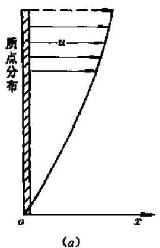

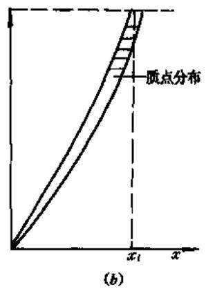

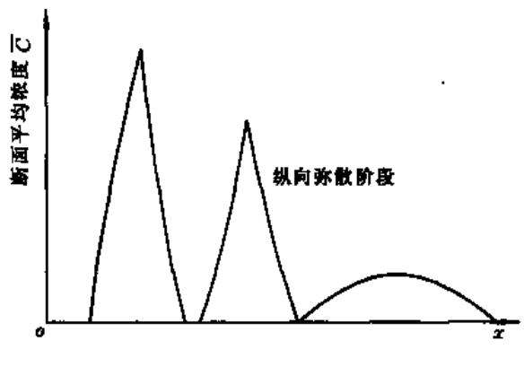  
图 12-3 流体质点分布图  
图 12-4 浓度纵向弥散过程

纵向弥散系数E是水质模型的一个重要参数，确定E的方法有现场示踪法和估算公式法。目前多采用具体河流的实验数据整理出来的经验公式来估算。

1. 马圭维—基弗(Maguioey—Keefer)公式

$$
\begin{array} { r } { E = 0 . 1 1 5 \frac { Q } { 2 B J } \Bigl ( 1 - \frac { u ^ { 2 } } { 4 g h } \Bigr ) } \end{array}\tag{12-28}
$$

式中 E——纵向弥散系数， $\mathbf { m } ^ { 2 } / \mathbf { s }$

Q——流量， $\mathbf { m } ^ { 3 } / \mathbf { s }$

B、 $\hbar \cdot$ —分别为平均河宽及水深，m；

u——断面平均流速， $m / 8 !$

J——河底坡度；

g-—重力加速度，9.81 ${ \bf m } / { \bf s } ^ { 2 }$ 0

2. 费希尔(H. B. Fischer)公式

$$
E = 2 . 5 6 n u h ^ { 0 . 8 8 8 }\tag{12-29}
$$

式中 n——糙率系数；

其余符号意义同前。

式（12-29）适合于较宽河流。

3. 埃尔德(J. W. Elder) 公式

$$
\pmb { \cal E } = 5 , 9 3 h u\tag{12-30}
$$

符号意义同前。

式（12-30）只考虑流速的垂向分布不均的离散，精度比式（12-29）差，适合于较窄的 河流。

四、沉降系数 ${ \pmb { \ K } } _ { 3 }$

沉积在河底的淤泥，发生有机物的厌氧分解，产生有机酸和还原性气体，这些物质释放到上面水体成为流水BOD而耗氧，K3是悬浮物的沉积而导致水体中BOD变化的速率 $\pmb { K } _ { 3 }$ 常数。

设河水中的 BOD为L，固体悬浮物对 BOD的吸附率为N，固体悬浮物的沉降速率为7，则K3可用下式计算：

$$
{ \cal K } _ { 3 } = N \eta\tag{12-31}
$$

对于N的测定可以通过从河段上游端取水样，分别测定过滤水与原水的BOD含量，原水的BOD减去过滤水的BOD之差值再除以固体悬浮（SS）浓度所得的商值即为N，因此

$$
N = \frac { \mathrm { B O D } ( \mathrm { B } ( \chi ) - \mathrm { B O D } ( \pm \pm ) \# \chi ) } { \mathrm { S S } }\tag{12-32}
$$

对于 $\pmb { \eta }$ 值，可用下述方法算出，即

$$
C = C _ { \mathfrak { o } } \mathfrak { e } ^ { - \mathfrak { p } / E }\tag{12-33}
$$

式中 $C _ { 0 }$ ——表层（x=0）的SS浓度；

$C \cdot$ ——深度为 z时的SS 浓度；

$\pmb { z }$ ——水深；

$\pmb { E } ^ { \prime }$ —紊动扩散系数。

对式（12-33）两端取对数，有

$$
{ \eta = \frac { E } { z } \mathrm { l n } \frac { C _ { 0 } } { C } }\tag{12-34}
$$

$C _ { \vartheta }$ 、C、z、 $\pmb { \cal E }$ 都可通过实测求得。

五、光合产氧系数 $\pmb { { \ K } } _ { 4 }$

水生植物的藻类光合作用，由二氧化碳和水经过光供给能量的反应而产生碳水化合物和氧气，其化学式为：

$$
\mathrm { C O } _ { 2 } + 2 H _ { 2 } O + \uparrow \uparrow \longrightarrow \mathrm { C H } _ { 2 } O + H _ { 2 } O + \mathrm { O } _ { 2 } \uparrow
$$

由光合作用产生的溶解氧速率用 $\pmb { K } _ { 4 }$ 表示，显然，它与光线的强度有直接关系，因此可用光强测定法求 $\kappa _ { \ast }$ ，计算公式如下：

$$
\begin{array} { c } { { K _ { 4 } = \rho _ { S } \frac { 2 . 7 1 8 f } { K _ { e } H T _ { \rho } } ( { \mathrm { e } } ^ { - { \mathrm { e } } \tilde { L } _ { e } / l _ { S } } - { \mathrm { e } } ^ { { - \tilde { L } _ { e } } / l _ { S } } ) } } \\ { { { \alpha = \mathrm { e } } ^ { \kappa _ { e } H } } } \\ { { T _ { \rho } = 2 4 \mathrm { ~ h } } } \end{array}\tag{12-35}
$$

式中 $\pmb { \rho } _ { \pmb { s } }$ ——光强饱和的最大产氧速率， ${ \bf { m } } { \bf { g } } / \mathrm { ~ ( { \bf { L } } \cdot { \bf { d } } ) ~ }$

${ \pmb I } _ { \pmb { \sigma } }$ ——白天的平均光强， $4 \cdot 1 8 \mathrm { J / \nabla \left( c m ^ { 2 } \cdot d \right) }$

$\pmb { I _ { S } }$ 饱和光强（对藻类生长的最佳光强）， $4 \cdot 1 8 \mathrm { J / \Omega \left( c m ^ { 2 } \cdot d \right) }$

$f .$ —白天的时数；

$\kappa _ { \ast }$ ——水体的消光系数， $\mathbf { m } ^ { - 1 }$

$H$ ——水体的深度，m。

经验表明，消光系数K。对于不同的水体取值不同：

非常清沏的水， $\scriptstyle K _ { e } = 0 . 1 \sim 0 . 5 / \mathrm { m }$ a

中等混浊的水， $K _ { \iota } = 0 . 5 \sim 2 . 5 / \mathrm { m } ;$

非常混浊的水， $\kappa , > 2 . 5 / \mathrm { m }$

${ \pmb \rho } _ { 5 }$ 与水中叶绿素 $\pmb { \alpha }$ 浓度之间存在如下关系：

$$
{ \rho } _ { s } = 0 . 2 5 C h l a\tag{12-36}
$$

式中 Chla——叶绿素 α的浓度。

六、硝化系数 ${ \pmb X } _ { N }$

如上所述，有机物通过微生物作用的氧化分解过程分为两个阶段。其中硝化阶段主要是有机物中含氮物质的氧化。但是，在实际河流中，氨氮的减少除了由硝化作用引起外，水生植物的光合和呼吸作用、吸附和挥发作用也是重要的因素。氨氮的减少速率方程可以写为：

$$
- \frac { \mathrm { d } L } { \mathrm { d } t } = K _ { N } L _ { N } + K _ { S } L _ { N }\tag{12-37}
$$

式中 $\tilde { L } _ { S }$ ——氨氮的浓度；

$K _ { S }$ 硝化速率常数，即硝化系数；

$K _ { s }$ ——其他作用消耗氨氮的速率系数。

在天然河流测定硝化系数时，必须从总的氨氮减少量中将由于硝化作用对氨氮的减少量区分开来，同时测定其中的亚硝酸盐氮 $( \mathsf { N O } _ { 2 } ^ { - } - \mathsf { N } )$ 和硝酸盐氮 $( \mathsf { N O } _ { 3 } ^ { - } - \mathsf { N } )$ 的浓度，然后计算 $K _ { s }$ 值。

例如，表12-2是现场观测的数据，从表12-2第（3）栏氨氮浓度初值10.2依次减去表12-2第（5）栏 $( \mathrm { N O _ { z } + N O _ { 3 } } )$ 一N的增量累计值，得到的差值便组成了由于硝化反应造成的氨氮浓度的变化序列，即表12-2第（7）栏，利用这一栏的数据，根据动力学一级反应方程

$$
\frac { \mathrm { d } L } { \mathrm { d } t } = - \ K _ { v } L _ { v }
$$

其积分式为：

$$
L _ { N } = L _ { 0 N } \mathrm { e } ^ { - { \boldsymbol { \kappa } } _ { N } / \varepsilon }
$$

两边取对数，得

$$
K _ { N } = \frac { \ln { L _ { 0 N } } - \ln { L _ { N } } } { t }\tag{12-38}
$$

将表12-2的第（1）栏和第（7）栏的首尾两项分别代人式（12-38），得

$$
K _ { \scriptscriptstyle N } = { \frac { \ln 1 0 . 2 - \ln 8 . 1 } { 1 . 8 - 0 } } = 0 . 1 3 ~ \mathrm { d } ^ { - 1 }
$$

表 12-2  
氮化物现场测定数据统计表
<table><tr><td rowspan="2">时间 (d)</td><td rowspan="2">测量有机氮  $\langle \mathtt { m g } / \mathbb { L } \rangle$ </td><td rowspan="2">測量  $\mathrm { { N H _ { 3 } } - N }$   $\cos / 2 )$ </td><td colspan="2"> $( \mathrm { N O _ { 2 } + N O _ { 3 } } ) - \mathrm { N }$   $\mathrm { ( m g / L ) }$ </td><td rowspan="2"> $( 2 ) + ( 3 ) + ( 4 )$   $\mathrm { ( m g / L ) }$ </td><td rowspan="2"> $\mathrm { N H } _ { 3 } - \mathrm { N }$  的变化  $\left( \ m _ { B } / \ 1 \right)$ </td></tr><tr><td>实测值</td><td>增量累计</td></tr><tr><td>(1)</td><td>(2)</td><td>(3)</td><td>(4)</td><td>(5)</td><td>(6)</td><td>(7)</td></tr><tr><td>0</td><td>2.6</td><td>10.2</td><td>4.6</td><td>0</td><td>17.4</td><td>10.2</td></tr><tr><td>0.43</td><td>2.1</td><td>9.1</td><td>5.0</td><td>0.4</td><td>16.2</td><td>9.8</td></tr><tr><td>0.64</td><td>2.1</td><td>8.1</td><td>5.2</td><td>0.6</td><td>15.4</td><td>9.6</td></tr><tr><td>0.94</td><td>1.7</td><td>7.6</td><td>5.5</td><td>0.9</td><td>14.8</td><td>9.3</td></tr><tr><td>1.53</td><td>2.1</td><td>5.0</td><td>6.0</td><td>1.4</td><td>13.1</td><td>8.8</td></tr><tr><td>1.80</td><td>2.0</td><td>4.0</td><td>6.7</td><td>2.1</td><td>12.7</td><td>8.1</td></tr></table>

## 第六节 河口水质数学模型

河口是入海河流受到潮汐作用的一段水体，即感潮河段。入海河口由于下泄流量大、比降小，又受到潮汐影响，以及沿海台风暴雨的侵袭，使河口水质的变化较一般河段更为复杂。潮汐对河口水质的影响具有两面性，一方面由海潮带来大量的溶解氧，与上游河水相汇，加强了水体的混合作用，对水体的污染物起到了稀释和混合作用；另一方面，由于潮汐的顶托作用，延长了污染物在河口段的停留时间，使污染物进一步发生化学和生物化学反应，有些反应要耗氧，从而降低水体中的溶解氧。

为了定量地描述潮汐作用对河口水体的影响，有必要建立河口的数学模型。河口的数学模型包括水力和水质两个方面。各国对河口水力学数学模型的研究已有数十年的历史，对于研究污染物在河口中的迁移和转化来说(指水质模型研究)，其水力学模型可作为已知的，其流速场分布可认为是给定的。

河口水质数学模型的基本方程可用河流水质连续模型的基本方程来表示，即

$$
\begin{array} { r } { \begin{array} { r l } & { \frac { \displaystyle \partial c } { \displaystyle \partial t } + u \frac { \partial c } { \displaystyle \partial x } + v \frac { \partial c } { \displaystyle \partial y } + w \frac { \partial c } { \displaystyle \partial z } } \\ & { = \frac { \partial } { \displaystyle \partial x } \bigg ( E _ { x } \frac { \partial c } { \displaystyle \partial x } \bigg ) + \frac { \partial } { \partial y } \bigg ( E _ { y } \frac { \partial c } { \displaystyle \partial y } \bigg ) + \frac { \partial } { \displaystyle \partial z } \bigg ( E _ { z } \frac { \partial c } { \displaystyle \partial z } \bigg ) + \sum S ( c , x , y , z , t ) } \end{array} } \end{array}\tag{12-39}
$$

式（12-39）中，左端第一项为时间变化项，第二\~四项为对流项，右端第一\~三项为扩散项，第四项为源和漏。

对式（12-39）求解析解尚无可能，求数值解也是很难的，故一般采用简化的方法，例如，在水平（z）方向上作积分，可使式（12-39）降维，即

$$
\frac { \partial ( b c ) } { \partial } + \frac { \partial ( b u c ) } { \partial x } + \frac { \partial ( b v c ) } { \partial y } = \frac { \partial } { \partial } \bigg \{ b E _ { x } \frac { \partial c } { \partial x } \bigg \vert + \frac { \partial } { \partial } \bigg \{ b E _ { y } \frac { \partial c } { \partial y } \bigg \} - K _ { 1 } b c\tag{12-40}
$$

式中 b——河口断面平均宽度；

$\smash { K _ { 1 3 } \ldots - \sum S }$ 的降解项。

对于窄、长、浅的河口还可简化为一维方程，即

$$
\frac { \partial ( A c ) } { \partial t } + \frac { \partial ( u A c ) } { \partial x } = \frac { \partial } { \partial x } \bigg ( A E _ { x } \frac { \partial { c } } { \partial x } \bigg ) - K _ { 1 } A c\tag{12-41}
$$

式中 A——河口的断面面积。

式（12-41）与一般河流水质模型相类似，只是起始与边界条件有区别。

式（12-41）处于稳态时，方程可简化为：

$$
\frac { \mathrm { d } ( u A c ) } { \mathrm { d } x } = \frac { \mathrm { d } } { \mathrm { d } x } \bigg ( A \widetilde { E } _ { x } \frac { \mathrm { d } c } { \mathrm { d } x } \bigg ) - K _ { 1 } A c\tag{12-42}
$$

如果只考虑水质经过一个潮汐周期的变化，则可认为潮周平均流量即为不受潮汐影响的上游河段的河水流量 $Q _ { f }$ ，即 $\scriptstyle A u f = Q ,$ ，式（12-42）可改写为：

$$
\frac { \partial ( A c ) } { \partial t } + Q _ { f } \frac { \partial c } { \partial x } = \frac { \partial } { \partial x } \bigg ( A \overline { { { E } } } _ { x } \frac { \partial c } { \partial x } \bigg ) - K _ { 1 } A c\tag{12-43}
$$

对于某一均匀河口，A可视为常数，即得

$$
\frac { \partial \mathbf { \boldsymbol { \varepsilon } } } { \partial t } + \boldsymbol { u _ { f } } \frac { \partial \mathbf { \boldsymbol { \varepsilon } } } { \partial x } = \frac { \partial } { \partial x } \Big ( \mathbf { \boldsymbol { E } } _ { z } \frac { \partial \mathbf { \boldsymbol { \varepsilon } } } { \partial x } \Big ) - \mathbf { \boldsymbol { K } } _ { 1 } \boldsymbol { c }\tag{12-44}
$$

当把河口弥散系数 $\overline { { E } } _ { x }$ 视为常数时，则有

$$
\frac { \partial { \boldsymbol { x } } } { \partial t } + { \boldsymbol { u } } _ { f } \frac { \partial { \boldsymbol { x } } } { \partial { \boldsymbol { x } } } = \overline { { E } } _ { x } \frac { \partial ^ { 2 } c } { \partial x ^ { 2 } } - K _ { 1 } { \boldsymbol { c } }\tag{12-45}
$$

式中 $\scriptstyle Q _ { f } , \ u _ { f }$ —分别为上游河段的流量和流速。

式（12-45）与一般河流水质模型基本相同，但其中 $\overline { { E } } _ { z }$ 是河口混合的弥散系数， ${ \pmb u } _ { f }$ 是上游河段的流速。此时，对于稳态的河流可用解析解求得c（x）的值。

$$
c ( x ) = \frac { w } { A u m } \mathrm { e x p } \ \frac { u } { 2 \overline { { E } } _ { x } } ( 1 + m ) x \quad ( \mathrm { { L } } \backslash \backslash \backslash )\tag{12-46}
$$

$$
c ( x ) { = } \frac { w } { A u m } \mathrm { e x p } \ \frac { u } { 2 \overline { { E } } _ { x } } ( 1 - m ) x \quad ( \mathrm { T } \nmid \ / \mu )\tag{12-47}
$$

$$
\begin{array} { r }  \mathbf { \Sigma } _ { m = \sqrt { 1 + \frac { 4 K _ { 1 } \overline { { E } } _ { x } } { \mathbf { u } ^ { 2 } } } } \end{array}
$$

式中 A——河流的断面面积；

w———每单位时间污染物质流人量；

u———式（12-45）中的 ${ \pmb u } _ { f }$ 。

河口弥散系数 $\pmb { E } _ { \pmb { z } }$ 的估算方法如下：

在河流水质模型中，扩散作用主要是由于断面流速不均引起的纵向弥散，属于剪切离散，对于河口，由于受潮汐的影响，情况比较复杂，属于混合的离散机制，而且往往以扩散为主。

在一维河口中，假定水体中的盐度是无源的非降解质，根据质量平衡原理，可得

$$
\frac { \partial S } { \partial t } + u \frac { \partial S } { \partial x } = \overline { { E } } _ { x } \frac { \partial S } { \partial x ^ { 2 } }\tag{12-48}
$$

若按潮汐周期而言，可认为方程处于稳定状态，即

$$
u \ { \frac { \mathrm { d } S } { \mathrm { d } x } } = { \overline { { E } } } _ { x } { \frac { \mathrm { d } ^ { 2 } S } { \mathrm { d } x ^ { 2 } } }\tag{12-49}
$$

式（12-49）的解为：

$$
S = S _ { \circ } \mathrm { e x p } \bigg \vert \frac { - u x } { \overline { { E } } _ { z } } \bigg \vert\tag{12-50}
$$

式中 ${ \pmb S } \cdot$ 距河口的距离为x处的盐浓度；

$S _ { \mathfrak { g } } .$ —河口处的盐浓度；

$\pmb { u }$ 上游河段的平均流速；

$\overline { { E } } _ { x }$ ——河口的弥散系数。

因此，在河口的不同位置测得其相应的盐度和流速值，通过在对数坐标纸上作图或用回归法均可求得 $\scriptstyle { \overline { { E } } } _ { x }$ 值。

## 第七节湖泊水质数学模型

## 一、湖泊水环境的特点

湖泊是指陆地上洼地积水形成的、水域比较宽广、换流比较缓慢的水体。水库属湖泊

类型，称人工湖泊，但有些问题如水库淤积、水库库岸演变与天然湖泊不同。

由于湖泊具有广阔的水域、缓慢的流速和风浪作用大的特点，加上人类活动大量使用化肥与家庭洗涤剂，使得氮和磷一类营养物质大量流入湖泊，造成水体富营养化。

另一方面，许多湖泊水体在一年的特定时期温度是分层的，垂向的温度梯度有效地阻碍了水体的混合，特别是在夏天，湖泊常分为三层，上面热的水体称湖面温水层，下面冷的水体称湖底层，在每层中是完全混合的，而在这两层之间由于密度的差异而阻止了它们的完全混合，形成一个过渡层，称温跃层。

上述湖泊水环境的特点，决定了对湖泊水质模拟要分别按完全混合型和分层型来研究，而且又着重研究湖泊富营养化问题。

下面将扼要介绍两个完全混合型的水质模型，一是沃兰伟德（R.A. Vollenweider）负荷模型，二是输入输出模型。

## 二、沃兰伟德负荷模型

沃兰伟德负荷模型是描述富营养化过程的第一个模型。该模型假定湖泊属于完全混合型，并且富营养化状态只与湖泊的营养物负荷有关，入湖与出湖水量相等，根据物质平衡原理，某时段任何水质含量的变化等于该时段人湖含量减去出湖含量，以及该水质元素降解或沉淀所损失的量，从而可得出

$$
\frac { \mathrm { d } C } { \mathrm { d } t } = \frac { W } { V } - \frac { Q } { V } C - K C\tag{12-51}
$$

式中C——湖泊中营养物质（磷）的浓度， $\mathbf { m g / L }$

$W \cdot$ —总磷的入湖量， $\pmb { \mathrm { g } } / \mathbf { d }$ i

Q—出湖流量， ${ \mathfrak { m } } ^ { 3 } / { \mathfrak { d } } _ { 1 }$

V——湖水的体积， $\mathbf { m } ^ { 3 }$

$\kappa$ ——湖中磷的沉降系数， $1 / \mathsf { d }$

t——时间，d。

当 $\scriptstyle t = 0$ 时，积分常数 ${ c } { = } { c } _ { \mathfrak { o } }$ ，令 $\alpha { = } \Big \{ \frac { Q } { V } { + } K \Big \}$ ，则式（12-51）为：

$$
C _ { \varepsilon } = C _ { 0 } \mathrm { e } ^ { - \alpha } + \frac { W } { \alpha \bar { V } } ( 1 - \mathrm { e } ^ { - \alpha } )\tag{12-52}
$$

假定湖泊初始浓度为0，即 ${ C _ { \mathfrak { g } } } { = } 0$ ，则式（12-52）为：

$$
C _ { \iota } = \frac { W } { \alpha V } ( 1 - \mathrm { e } ^ { - \alpha } )\tag{12-53}
$$

当式（12-53）中的t趋于无穷大时，得平衡浓度为：

$$
C _ { \phi } = \mathcal { W } / \alpha V\tag{12-54}
$$

## 三、输入输出模型

根据湖泊不同的水文条件和不同的污染物质，给出不同情况的完全混合的平衡方程式，并推求湖泊中污染物的平均浓度，这类模型属于输人输出模型。

(1)当由河道入湖的水量q和出湖的水量相同时，单位时间内湖泊污染物质蓄量变化 $\pmb { q } _ { i }$ 应为：

$$
V \frac { \mathrm { d } C } { \mathrm { d } t } = q _ { i } ( C _ { i } - C )\tag{12-55}
$$

式中 C—入湖河道中河水的污染物质浓度， $\mathbf { m } \mathbf { g } / \mathbf { L }$ 3

C——出湖的污染物质浓度， $\mathbf { m g / L }$

$q _ { i } { \cdot }$ —人湖水量， $\mathbf { m } ^ { 3 } / \mathsf { d }$

V——湖泊体积， $\mathfrak { m } ^ { 3 }$

进行积分并代入起始条件 $\scriptstyle t = 0 , \ C = C _ { 0 }$ ，得t时刻的湖水中污染物质的平均浓度：

$$
C _ { t } = C _ { \circ } + ( 1 - \mathrm { e } ^ { - \prime \prime T } ) ( C _ { i } - C _ { \circ } )\tag{12-56}
$$

$$
T = { \frac { V } { Q } }
$$

式中 $C _ { \mathfrak { d } }$ 在未排人污水前，湖中污染物质的浓度， $m g / L$

t——废水入湖时间，d；

${ \pmb T } ^ { \prime }$ —湖水的滞留时间， $\mathbf { d } ,$

(2)当由河道入湖的水量和出湖的水量不等时，湖泊污染物质蓄量变化应为：

$$
V \frac { \mathrm { d } C } { \mathrm { d } t } = q _ { i } C _ { i } - q C\tag{12-57}
$$

式中 $\pmb { q _ { i } }$ ——流入湖泊的水量， $\pi ^ { 3 } / d$

$\pmb q ^ { . }$ —流出湖泊的水量， $\mathbf { m } ^ { 3 } / \mathbf { d }$ t

其余符号意义同前。

将式（12-57）积分，并代入起始条件 $\scriptstyle t = 0 , C = C _ { 0 }$ ，得t时刻湖水中污染物质的平均浓度为：

$$
C _ { t } = C _ { \circ } + ( 1 - e ^ { - \iota / T } ) ( R C _ { i } - C _ { \circ } )\tag{12-58}
$$

$$
R = { \frac { q _ { i } } { q } }
$$

式中 R——人湖水量与出湖水量之比。

## 习 題

12-1 设某河流、某断面流量 $Q { = } 2 0 0 { \times } 1 0 ^ { 4 } \mathrm { m } ^ { 3 } / \mathrm { d }$ ，流速 $\pmb { u } = 4 2 \mathrm { k m } / \mathrm { d }$ ，水温 $\tau = 1 4 , 2 \complement$ $K _ { 1 } = 0 . \ 9 2 \mathrm { d } ^ { - 1 } , K _ { \mathrm { z } } = 1 . 8 2 \mathrm { d } ^ { - 1 } , K _ { \mathrm { 3 } } = - 0 . 1 8 \mathrm { ~ d } ^ { - 1 }$ 。河流断面处排放废水流量 $\ Q _ { 1 } { = } 8 \times 1 0 ^ { 4 } ~ \mathrm { { m } } ^ { 3 } / \mathrm { { d } }$ ${ \tt B O D } _ { 5 }$ 为 $4 5 0 ~ \mathrm { m g / L }$ ，溶解氧为 $O { = } 0 \ \mathrm { m g / L }$ 上游河段来水 $\mathtt { B O D } _ { 5 }$ 为 $0 \ : \mathrm { m g / L }$ ，溶解氧为8.40$\mathbf { m g / L }$ ，当忽视弥散作用时：

(1) 用斯特里特一费尔普斯模型推求离该断面下游河段 $x { = } 1 0 \ \mathrm { k m }$ 处河水的 ${ \tt B O D } _ { 5 }$ 和$\mathbf { \delta } [ \mathbf { \alpha } ]$

(2) 用托马斯模型推求离该断面下游河段 $\scriptstyle \pmb { x } = 1 0 \mathrm { k m }$ 处河水的 $\mathtt { B O D } _ { 5 }$ 和 $\mathbf { D O }$

# 第十三章河流泥沙计算

第一节 概 述

河道中水流挟带的泥沙叫河流泥沙。河流泥沙给修建水利工程带来不少问题和危害。如在多沙河流上修建水库，泥沙入库将发生淤积，库容逐渐减少，水库寿命缩短，防洪能力也逐渐降低；引水灌溉时，若河水含沙较多，则渠首渠系易发生淤积；引水发电时，会使泥沙进入水轮机组，引起过水部件发生磨损；对通航的河流，沿岸的冲刷与淤积也可能给航运造成困难。由此可见，泥沙问题影响国民经济的面很广，特别在我国，河流泥沙问题更为严重。我国河流众多，直接入海的泥沙平均每年达20亿t左右，其中黄河占60%，长江占25%。黄河含沙量之高，灾害之大闻名于世，长江含沙量虽然较小，但由于水量丰沛，年输沙量平均每年有4.72亿t，也不可忽视。我国主要河流输沙量情况见表13-1。

表13-1  
我国主要河流输沙量表
<table><tr><td rowspan=1 colspan=1>河流</td><td rowspan=1 colspan=1>測站</td><td rowspan=1 colspan=1>年水量 $( 1 7 , m ^ { 3 } )$ </td><td rowspan=1 colspan=1>年输沙量(亿t)</td><td rowspan=1 colspan=1>平均含沙量 $( \mathbf { k } _ { \mathbf { Z } } / \mathbf { m } ^ { \mathfrak { g } } )$ </td><td rowspan=1 colspan=1>量大含沙量 $( | \cos / \sin ^ { 3 } )$ </td><td rowspan=1 colspan=1>侵蚀模数[t/(km²·年)]</td></tr><tr><td rowspan=1 colspan=1>黄河</td><td rowspan=1 colspan=1>三门峡</td><td rowspan=1 colspan=1>432</td><td rowspan=1 colspan=1>16.40</td><td rowspan=1 colspan=1>37.60</td><td rowspan=1 colspan=1>666.00</td><td rowspan=1 colspan=1>2480</td></tr><tr><td rowspan=1 colspan=1>长江</td><td rowspan=1 colspan=1>大通</td><td rowspan=1 colspan=1>9211</td><td rowspan=1 colspan=1>4.78</td><td rowspan=1 colspan=1>0.54</td><td rowspan=1 colspan=1>3.24</td><td rowspan=1 colspan=1>280</td></tr><tr><td rowspan=1 colspan=1>永定河</td><td rowspan=1 colspan=1>宫厅</td><td rowspan=1 colspan=1>14</td><td rowspan=1 colspan=1>0.81</td><td rowspan=1 colspan=1>60.80</td><td rowspan=1 colspan=1>436.00</td><td rowspan=1 colspan=1>1944</td></tr><tr><td rowspan=1 colspan=1>辽河</td><td rowspan=1 colspan=1>铁岭</td><td rowspan=1 colspan=1>56</td><td rowspan=1 colspan=1>0.41</td><td rowspan=1 colspan=1>6.86</td><td rowspan=1 colspan=1>46.60</td><td rowspan=1 colspan=1>240</td></tr><tr><td rowspan=1 colspan=1>大凌河</td><td rowspan=1 colspan=1>大凌河</td><td rowspan=1 colspan=1>21</td><td rowspan=1 colspan=1>0.36</td><td rowspan=1 colspan=1>21.90</td><td rowspan=1 colspan=1>142.00</td><td rowspan=1 colspan=1>1490</td></tr><tr><td rowspan=1 colspan=1>淮河</td><td rowspan=1 colspan=1>蚌埠</td><td rowspan=1 colspan=1>&#x27;261</td><td rowspan=1 colspan=1>0.14</td><td rowspan=1 colspan=1>0.46</td><td rowspan=1 colspan=1>11.00</td><td rowspan=1 colspan=1>153</td></tr><tr><td rowspan=1 colspan=1>西江</td><td rowspan=1 colspan=1>梧州</td><td rowspan=1 colspan=1>2526</td><td rowspan=1 colspan=1>0.69</td><td rowspan=1 colspan=1>0.35</td><td rowspan=1 colspan=1>4.08</td><td rowspan=1 colspan=1>260</td></tr></table>

工程水文学研究河流泥沙的目的，在于预估未来工程运用期内河流泥沙的数量和变化规律，为水利工程规划设计提供有关泥沙的资料和数据。

河流中的泥沙，按其运动形式可大致分为悬浮于水中并随之运动的“悬移质”、受水流冲击沿河底移动或滚动的“推移质”，以及相对静止而停留在河床上的“河床质”三种。由于水流条件随时变化，三者之间的划分均以泥沙在水流中某一时刻所处的状态而定。随着水流条件的变化，它们可以相互转化。一般工程上，主要估计悬移质输沙量和推移质输沙量。

## 第二节 多年平均输沙量的估算

表示输沙特性的指标有含沙量 $\pmb { \rho } _ { \star }$ 输沙率 $Q _ { S }$ 和输沙量 $\pmb { W } _ { \pmb { \mathscr { s } } }$ 等。如第三章所述，单位体积的浑水内所含泥沙的重量，称为含沙量。单位时间流过河流某断面的泥沙重量，称为输沙率。年输沙量是从泥沙观测资料整编的日平均输沙率得来的。将全年逐日平均输沙率之和除以全年的天数，即得年平均输沙率，再乘以全年秒数，即得年输沙量。

当某断面具有长期实测泥沙资料时，可以直接计算它的多年平均值；当某断面的泥沙资料短缺时，则须设法将短期资料加以展延；当资料缺乏时，则用间接方法进行估算。某断面的多年平均年输沙总量，等于多年平均悬移质年输沙量与多年平均推移质年输沙量之和。

## 一、多年平均悬移质年输沙量

## （一）具有长期资料情况

当某断面具有长期实测流量及悬移质含沙量资料时，可直接用这些资料算出各年的悬移质年输沙量，然后用下式计算多年平均悬移质年输沙量，即

$$
\bar { \mathcal { W } } _ { s } = \frac { 1 } { n } \sum _ { i = 1 } ^ { n } \bar { \mathcal { W } } _ { s _ { i } }\tag{13-1}
$$

式中 $\bar { \boldsymbol { W } } _ { s }$ —多年平均悬移质年输沙量，kg；

$\pmb { W } _ { s i }$ —各年的悬移质年输沙量，kg；

n——年数。

## （二）资料不足情况

当某断面的悬移质输沙量资料不足时，可根据资料的具体情况采用不同的处理方法。

若某断面具有长期年径流量资料和短期悬移质年输沙量资料系列，且足以建立相关关系时，可利用这种相关关系，由长期年径流量资料插补延长悬移质年输沙量系列，然后求其多年平均年输沙量。若当地汛期降雨侵蚀作用强烈或平行观测年数较短，上述年相关关系并不密切，则可建立汛期径流量与悬移质年输沙量的相关关系，插补延长悬移质年输沙量系列。

当年径流量与年输沙量的相关关系不密切，而某断面的上游或下游测站有长系列输沙量资料时，也可绘制该断面与上游（或下游）测站悬移质年输沙量相关图，如相关关系较好，即可用以插补展延系列。但须注意两测站间应无支流汇人，河槽情况无显著变化，自然地理条件大致相同。

如悬移质实测资料系列很短，只有两三年，不足以绘制相关线时，则可粗略地假定悬移质年输沙量与年径流量的比值的平均值为常数，于是多年平均悬移质年输沙量 $\pmb { \mathcal { W } _ { s } }$ 可由多年平均年径流量Q推算，即

$$
\overline { { W } } _ { s } = \alpha _ { s } \overline { { Q } }\tag{13-2}
$$

式中 Q——多年平均年径流量， $\mathbf { m ^ { 3 } }$

${ \pmb \alpha } _ { S } \mathrm { \prime }$ ——实测各年的悬移质年输沙量与年径流量之比值的平均值。

## (三)资料缺乏情况

当缺乏实测悬移质资料时，其多年平均年输沙量只能采用下述粗略方法进行估算。

## 1. 侵蚀模数分区图

输沙量不能完全反映流域地表被侵蚀的程度，更不能与其他流域的侵蚀程度相比较。因为流域有大有小，若它们出口断面所测得的输沙量相等，则小的流域被侵蚀程度一定比大的流域严重。因此，为了比较不同流域表面侵蚀情况，判断流域被侵蚀的程度，必须研究流域单位面积的输沙量，这个数值称为侵蚀模数。多年平均悬移质侵蚀模数可由下式

算得：

$$
\overline { { M } } _ { s } = \frac { \overline { { W } } _ { s } } { F }\tag{13-3}
$$

式中 $\pmb { \mathcal { M } } _ { s }$ ——多年平均悬移质侵蚀模数， $\mathbf { t } /  { \mathbf { k } }  { \mathbf { m } } ^ { 2 }$

${ \pmb F } \mathrm { \cdot }$ —流域面积， $\mathbf { k m ^ { 2 } }$

$\overline { { \pmb { W } } } _ { s }$ 多年平均悬移质年输沙量，t。

在我国各省的水文手册中，一般均有多年平均悬移质侵蚀模数分区图。设计流域的多年平均悬移质侵蚀模数可以从图上所在的分区查出，将查出的数值乘以设计断面以上的流域面积，即为设计断面的多年平均悬移质年输沙量。必须指出，下垫面因素对河流泥沙径流的特征值影响很大。采用分区图算得的成果必然是很粗略的。而且这种分区图多系按大、中河流的测站资料绘制出来的，应用于小流域时，还应考虑设计流域的下垫面特点，以及小河流含沙量与大中河流含沙量的关系作适当修正。

## 2. 沙量平衡法

设 $\mathcal { W } _ { s , \mathtt { t } }$ 和 $\bar { \mathcal { W } } _ { s , \{ \ F } $ 分别为某河干流上游站和下游站的多年平均年输沙量， $\overline { { W } } _ { s , \star }$ 和 $\overline { { W } } _ { s , \boxtimes }$ 分别为上下游两站间较大支流断面和除去较大支流以外的区间多年平均年输沙量，△S表示 $\pmb { \triangle S }$ 上、下游两站间河岸的冲刷量（为正值）或淤积量（为负值），则可写出沙量平衡方程式为：

$$
\begin{array} { r } { \mathbb { W } _ { s , \mathtt { F } } = \overline { { W } } _ { s , \mathtt { k } } + \overline { { W } } _ { s , \mathtt { k } } + \overline { { W } } _ { s , \mathtt { k } } \pm \Delta S } \end{array}\tag{13-4}
$$

当上、下游或支流中的任一测站为缺乏资料的设计站，而其他两站具有较长期的观测资料时，即可应用式（13-4）推求设计站的多年平均年输沙量。 $\bar { \mathbb { W } } _ { s , \boxtimes }$ 和 $\pmb { \Delta } \pmb { S }$ 可由历年资料估计，如数量不大亦可忽略不计。

## 3. 经验公式法

当完全没有实测资料，而且以上的方法都不能应用时，可由经验公式进行粗估，如

$$
\overline { { \rho } } = 1 0 ^ { 4 } \alpha \ \sqrt { J }\tag{13-5}
$$

式中 $\overline { { \rho } } ^ { \mathrm { - } }$ —多年平均含沙量， ${ \mathfrak { g } } / { \mathfrak { m } } ^ { 3 }$ Hh

J——河流平均比降；

α—侵蚀系数，它与流域的冲刷程度有关，拟定时可参考下列数值：冲刷剧烈的区域 $\pmb { \alpha = 6 } \sim 8$ ，冲刷中等的区域 $\alpha { = } 4 \sim 6$ ，冲刷轻微的区域 $\alpha { = } 1 { \sim } 2$ ，冲刷极轻的区域 $\pmb { \alpha = } 0 . 5 \sim 1$

## 二、多年平均推移质年输沙量

许多山区河流，坡度较陡，加之山石破碎，水土流失严重，推移质来量往往很大，故对推移质的估计必须重视。

由于推移质的采样和测验工作尚存在许多问题，它的实测资料比悬移质更为缺乏，为此，推移质的估算不宜单以一种方法为准，应采用多种方法估算，经过分析比较，给出合理的数据。

具有多年推移质资料时，其算术平均值即为多年平均推移质年输沙量。当缺乏实测推移质资料时，目前采用的方法都不太成熟，其中一种方法称为系数法，可供参考。该法考虑推移质输沙量与悬移质输沙量之间具有一定的比例关系，此关系在一定的地区和河道水

文地理条件下相当稳定，可用系数法公式计算：

$$
\overline { { \boldsymbol { W } } } _ { \delta } = \beta \overline { { \boldsymbol { W } } } _ { \delta }\tag{13-6}
$$

式中 $\bar { \pmb { W } } _ { \pmb { b } }$ —多年平均推移质年输沙量，t；

$\bar { \boldsymbol W } _ { s }$ —多年平均悬移质年输沙量，t；

$\beta \cdot$ —推移质输沙量与悬移质输沙量的比值。

$\beta$ 值根据相似河流已有短期的实测资料估计，在一般情况下可参考下列数值：平原地区河流 $\beta = 0 . 0 1 \sim 0 . 0 5$ ，丘陵地区河流 $\beta { = } 0 . 0 5 { \sim } 0 . 1 5$ ，山区河流 $\beta = 0 . 1 5 \sim 0 . 3 0$

另一种方法是从已建水库淤积资料中，根据泥沙的颗粒级配，区分出推移质的数量。一般的方法是把悬移质级配中大于97%的粒径作为推移质粒径下限，直接估算推移质输沙量。

泥沙的粒径是表示泥沙颗粒大小的一个量度。泥沙颗粒的形状、大小及其组合情况是泥沙最基本的几何特性。由于组成泥沙颗粒粒径和形状的变化幅度很大，因而单颗泥沙的粒径不足以描述其性质，必须将泥沙分为不同粒径或粒径组，有关泥沙颗粒级配的分析与计算可参见本章第四节。

此外，为了探索推移质变化规律及推移质输沙率的计算，国内外不少学者从实验室的试验研究结果，提出推移质输沙率的计算公式，促进了推移质泥沙研究工作的开展，但受实验室条件以及某些推理或假设的限制，计算结果往往不能反映天然河流的实际情况，说明推移质输沙率的计算问题仍是一个很重要而又亟待研究解决的问题。

## 第三节输沙量的变化

河流中挟带泥沙多寡，除河槽冲淤和局部塌岸外，主要取决于径流形成过程中地表的侵蚀作用。流域地表的侵蚀与气候、地质、土壤、植被、人类活动等有着密切的关系。对于一个特定流域而言，气候是输沙量变化的主要因素。因此，在不同的旱涝年份，年输沙量显著不同。由于季节的变化，在一年之中输沙量的各月分配也极不均匀；即使在汛期的一次洪水过程中，输沙量也具有一定的变化规律。为了水利工程规划设计和运行管理的需要，必须了解和掌握输沙量的变化规律。由于对推移质的测验尚有不少困难，观测资料不足，现只论述悬移质的变化规律。

## 一、悬移质输沙量的年际变化

悬移质输沙量的年际变化表现在各年输沙总量的差异上面。在水文计算中，一般采用频率计算方法来确定悬移质输沙量年际变化的统计特征值。在有足够资料的情况下，可以直接算出悬移质年输沙量的均值 $\overrightarrow { W } _ { s }$ 、变差系数 $\pmb { C } _ { \pmb { v } , \pmb { s } }$ 和偏态系数 $c _ { s , s }$ 。在资料不足的情况下，可以设法建立悬移质年输沙量变差系数 $c _ { \circ , s }$ 与年径流量变差系数 $C _ { v , \pm }$ 的相关关系，从而由年径流量变差系数去确定悬移质年输沙量的变差系数，通常用下式计算：

$$
C _ { v , s } = K C _ { v , { \sf 0 } }\tag{13-7}
$$

式中K—系数，随河流特性而异，有些地区的水文手册列有此值。

由前述方法求得 $\bar { \pmb { W } } _ { s }$ 和 $C _ { v , s , }$ 后，一般采用 $\ C _ { s , s } = 2 C _ { v , s }$ 的皮尔逊Ⅱ型频率曲线绘制悬移质年输沙量频率曲线，据此确定频率的悬移质年输沙量。

我国北方多沙河流悬移质观测资料统计结果表明，泥沙的年际变化远大于径流的年际变化，河流年输沙量的变差系数C,s一般比年径流的变差系数Co大。黄河中游地区C.s为 $\mathcal { C } _ { v , s }$ $C _ { v , \pm }$ $\pmb { C } _ { \bullet , s }$ $C _ { v , \emptyset }$ 的1.2\~7.3倍，C.5值约在0.6\~2.4之间变化；海河滹沱河上游区C,s为C,q的1.2\~ $C _ { v , s }$ $C _ { \mathfrak { s } , \mathfrak { s } }$ $\mathbf { C } _ { v , \otimes }$ 2.4倍， $C _ { v , s }$ 值约在1.0\~1.2之间变化；辽河西北多沙地区 $C _ { v , s }$ 为 $c _ { v , { \tt q } }$ 的1.2\~5.0倍， $C _ { v , s }$ 值约在0.6\~3.5之间变化（表13-2）。

表 13-2  
我国北方多沙河流悬移质统计參数表
<table><tr><td rowspan=2 colspan=1>流城</td><td rowspan=2 colspan=1>分区</td><td rowspan=1 colspan=2> $\pmb { C } _ { \pmb { \nu } , \pmb { \nu } }$ </td><td rowspan=1 colspan=2> $\mathbb { C } _ { v , s } / \mathbb { C } _ { v , \pmb { \alpha } }$ </td><td rowspan=1 colspan=4>km</td></tr><tr><td rowspan=1 colspan=1>变幅</td><td rowspan=1 colspan=1>平均</td><td rowspan=1 colspan=1>变幅</td><td rowspan=1 colspan=1>平均</td><td rowspan=1 colspan=3>变幅</td><td rowspan=1 colspan=1>平均</td></tr><tr><td rowspan=8 colspan=1>黃河</td><td rowspan=8 colspan=1>陕北风沙区无定河以北黄丘区无定河黄丘区延安地区晋西北黃丘区泾河上中游地区清河上游区关中地区汾河黄丘区</td><td rowspan=8 colspan=1>0.9~2.20.9~1.00.55~0.650.8~0.91.1~1.30.9~1.10.6~0.650.7~2.40.9~1.6</td><td rowspan=7 colspan=1>1.550.950.620.841.200.970.621.43</td><td rowspan=1 colspan=1>0.6~7.34</td><td rowspan=1 colspan=1>6.67</td><td rowspan=1 colspan=3>3.0~5.0</td><td rowspan=1 colspan=1>4.0</td></tr><tr><td rowspan=6 colspan=1>1.5~2.51.2~3.21.8~2.31.2~2.91.7~2.21.2~1.51.5~6.0</td><td rowspan=1 colspan=1>2.00</td><td rowspan=1 colspan=3>2.2~2.8</td><td rowspan=2 colspan=1>2.452.102.60</td></tr><tr><td rowspan=1 colspan=1>2.102.05</td><td rowspan=1 colspan=3>2.0~2.252.2~3.0</td></tr><tr><td rowspan=1 colspan=1>2.20</td><td rowspan=1 colspan=3>2.7~3.3</td><td rowspan=1 colspan=1>2.95</td></tr><tr><td rowspan=1 colspan=1>1.95</td><td rowspan=2 colspan=3>2.6~3.12.0~2.2</td><td rowspan=1 colspan=1>2.83</td></tr><tr><td rowspan=1 colspan=1>1.36</td><td rowspan=1 colspan=2>2.2</td><td rowspan=1 colspan=1></td><td rowspan=1 colspan=1>2.10</td></tr><tr><td rowspan=1 colspan=1>3.28</td><td rowspan=1 colspan=3>2.0~5.2</td><td rowspan=1 colspan=1>3.60</td></tr><tr><td rowspan=1 colspan=1>1.30</td><td rowspan=1 colspan=1>1.6~3.6</td><td rowspan=1 colspan=1>2.40</td><td rowspan=1 colspan=3>2.1~4.5</td><td rowspan=1 colspan=1>3.54</td></tr><tr><td rowspan=1 colspan=1>海河</td><td rowspan=1 colspan=1>滹沱河上游区</td><td rowspan=1 colspan=1>1.0~1.2</td><td rowspan=1 colspan=1>1.10</td><td rowspan=1 colspan=1>1.2~2.4</td><td rowspan=1 colspan=1>1.70</td><td rowspan=1 colspan=3>3.0~3.5</td><td rowspan=1 colspan=1>3.20</td></tr><tr><td rowspan=1 colspan=1>辽河</td><td rowspan=1 colspan=1>西北多沙地区</td><td rowspan=1 colspan=1>0.6~3.5</td><td rowspan=1 colspan=1>1.50</td><td rowspan=1 colspan=1>1.2~5.0</td><td rowspan=1 colspan=1>2.6</td><td rowspan=1 colspan=3>2.3~7.4</td><td rowspan=1 colspan=1>3.90</td></tr></table>

注kmm为实测最大年沙量与均值之比值。

## 二、悬移质输沙量的年内分配

悬移质输沙量的年内分配可由各月输沙量占全年输沙量的相对百分比表示。由于汛期暴雨洪水集中，侵蚀强烈，汛期输沙量的绝大部分集中在暴雨时期，因此，悬移质输沙量的年内分配过程基本上与径流量的年内分配过程相似，且与洪峰流量大小有关。但是，有些流域水沙分配有显著的差别，主要是由于各流域泥沙来源、侵蚀程度和雨量分布不同所造成。

同一流域各年输沙量的大小不同，其年内分配也不相同。在有长期实测泥沙资料的情况下，分析各年输沙量年内分配的规律，从中选出丰沙、平沙和枯沙三种代表年份，作为水工设计时参考使用。在资料不足或缺乏时，则常用水文比拟法，移用参证流域输沙量的典型年内分配，作为设计流域悬移质输沙量的代表年内分配。

## 三、洪水过程中的输沙变化

天然河道中含沙量与流量存在着一定的关系，但由于沙量来源及水力条件的变化，两者的关系较为复杂。有些河流洪水上涨，输沙相应增加，洪峰与沙峰相应出现，洪水消退，输沙也消退；而有些河流则不同，洪水消退，含沙量并不随之降低，常有沙峰迟于洪峰的现象。究其原因，或由于水流挟带泥沙的颗粒粗细不同，如河道水流挟带较粗颗粒的泥沙，当洪峰过后，流速降低，粗颗粒泥沙挟运受到限制，因而含沙量将随水流降落而削减，但如河道水流挟带很细的泥沙，由于不易沉降，虽然洪峰过后流速降低，但仍超过挟带泥沙的止动流速，因此泥沙仍被挟运。倘再遇上河岸坍塌，则洪峰过后才出现沙峰。此外，对于面积不太大的流域，由于各支流的单位面积产沙量有显著差异，而暴雨又往往集中在一个较小的地区，因此洪峰与沙峰之间往往不一定相应；但若河流的流域面积较大，水沙通过沿程河槽的调节作用，洪峰与沙峰就显得一致。可见，在水利工程设计和运用中，考虑排泄泥沙时，应对洪水过程中沙量的变化进行具体分析。

## 第四节 悬移质的颗粒级配

泥沙颗粒的形状、大小及其组合情况是泥沙最基本的几何特性。泥沙的水力特性和物理化学特性都与几何特性有关。由于组成泥沙颗粒粒径和形状的变化幅度很大，因而单颗泥沙的粒径不足以描述其性质，必须将泥沙分为不同粒径或粒径组（图13-1）进行分析。泥沙的粒径是表示泥沙颗粒大小的一个量度。粒径的组合情况，常用颗粒级配曲线来表示，此曲线的横坐标表示泥沙粒径，纵坐标表示小于此种粒径的泥沙在全部泥沙中所占的百分数。这种颗粒级配曲线通常画在半对数坐标纸上（图13-2）或频率格纸上。

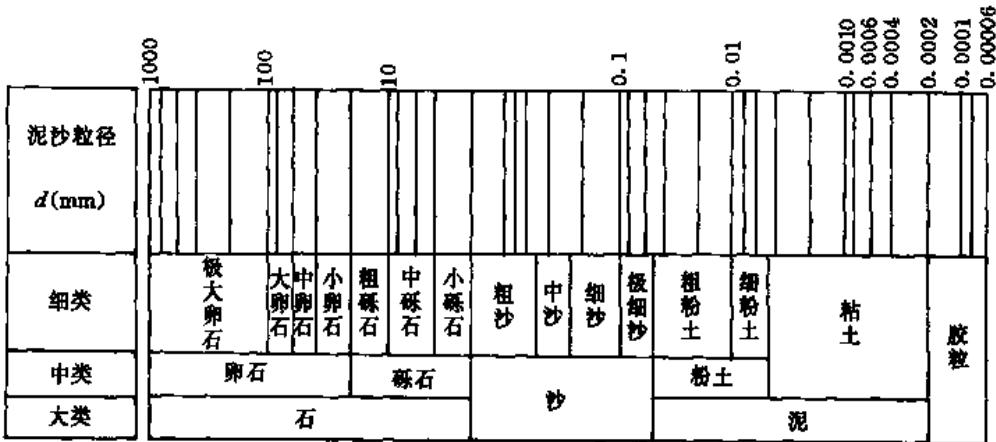  
图 13-1 泥沙分类图

从图13-2上的颗粒级配曲线可以看出泥沙粒径相对大小和泥沙粒径均匀程度。坡度较陡的曲线Ⅰ代表粒径较均匀的沙样，曲线I代表粒径较小的沙样。

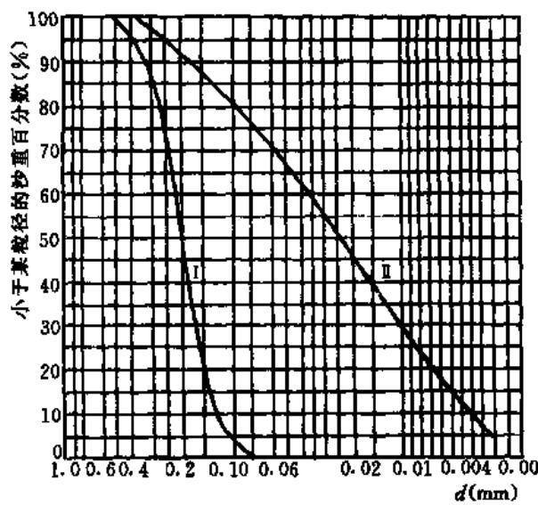  
图 13-2 半对数纸上的级配曲线

从颗粒级配曲线上，可以查出小于某一特定粒径的泥沙在总沙样中所占的重量百分比，通常均以所查到的百分数作为脚标附注在粒径d的下面来表示这些粒径的特征值，如 $d _ { 6 5 } , d _ { 5 0 } , d _ { 3 5 } , \cdots ,$ 。常用的特征值有两个：一个称为中值粒径 $d _ { 5 0 }$ 另一个称为平均粒径2。中值粒径是一个十分重要的特征粒径，此种粒径的泥沙在全部沙样中大于或小于这一粒径的泥沙在重量上刚好相等。

平均粒径d也是一个重要的特征粒径。计算平均粒径的方法是把沙样按粒径大小分成若干组，定出每组上、下限粒径 $d _ { \mathrm { i f t } }$ 和$d _ { \tt A N }$ ，以及这一组泥沙的重量在整个沙样总重量中所占的百分比 $\pmb { \hat { p } _ { i } }$ ，然后用式（13-8）

$$
d _ { i } = \frac { d _ { \operatorname* { m a x } } + d _ { \operatorname* { m i n } } } { 2 }\tag{13-8}
$$

或

$$
d _ { i } = \frac { 1 } { 3 } \big ( d _ { \mathrm { m a x } } + d _ { \mathrm { m i n } } + \sqrt { d _ { \mathrm { m a x } } + d _ { \mathrm { m i n } } } \big )\tag{13-9}
$$

求出各组泥沙平均粒径 $\pmb { d } _ { i }$ ，再求出颗粒平均粒径 $\pmb { d }$ 。计算公式为

$$
d = \frac { \displaystyle \sum _ { i = 1 } ^ { n } { p _ { i } d _ { i } } } { \displaystyle \sum _ { i = 1 } ^ { n } { \dot { p } _ { i } } }\tag{13-10}
$$

式中 n——组数。

<table><tr><td rowspan=1 colspan=1>P(%)5</td><td rowspan=1 colspan=1>0.001</td><td rowspan=1 colspan=1>0.01</td><td rowspan=1 colspan=1>0.</td><td rowspan=1 colspan=1>0.2</td><td rowspan=1 colspan=1>0..333</td><td rowspan=1 colspan=1>0.5</td><td rowspan=1 colspan=1></td><td rowspan=1 colspan=1>2</td><td rowspan=1 colspan=1>3</td><td rowspan=1 colspan=1>5</td><td rowspan=1 colspan=1>10</td><td rowspan=1 colspan=1>20</td><td rowspan=1 colspan=1>25</td><td rowspan=1 colspan=1>30</td><td rowspan=1 colspan=1>40</td></tr><tr><td rowspan=1 colspan=1>1234567890123456789012345678901234567890123456789012345678901234 444555666777</td><td rowspan=1 colspan=1>78889990********23 133341455566 661771788BB99919 202020 2222222 23265 86 16 7 8 0 40 71 02 3 5 97 29 6 83 25 78 20 58 14 57 0 360302 2281470 0 2 8 8 16 4 72029 58 13 4165 2 4 76 3 3 -84 10 3738 【已脱敏手机号】</td><td rowspan=1 colspan=1>556666777778888499990110101111222223313314411114555555166524163808528 07584480********80 305234557973977185482304 504247520 2056841333</td><td rowspan=1 colspan=1>285033334444444555555566666666777777777888888888899999999999日0 10 1 010923 32 89 10 249358509 23 7567041734256791315 263849 6028455 53555585413 234 47642 9 05 2 3038233333333</td><td rowspan=1 colspan=1>344444444555555555566666666666677777777777777888888888888 0 122 3 48 602 859 09 20 2 4568 809012 2 3 43 53 3 3 22010 203 39 48 55988 78 13 2129 3643 5 53 7074 0 962 8 14 21 2 238 43 4 4 0公22333333条333</td><td rowspan=1 colspan=1>444年卷4年冬年本455555555555555666666666666666666777777777122131455555785052434450798901320 283455674888951182433442736778806040812519 2 2630公22公ふふ333年44</td><td rowspan=1 colspan=1>出44冬冬年也4年年年与与5与与与5与与5东555与5与与55566家66民666686785413 2314 49 -6480901523 3374156284082814 20 2 3545545682 7804825925811417 202 3 28 332公公公公公至公2公京</td><td rowspan=1 colspan=1>果集集至系本本本表本本如冬本象如在年在年本本本本本本本年本本本本在本本至香表本3 4 4428752896205227339455067788839050125825 2833437394 4445545785026457689麗集</td><td rowspan=1 colspan=1>077麗麗麗集麗 孫孫孫 年孫孫孫孫孫孫孫511B2 2833540455048267248288 959204091135 71 2123 24 2 26 27 27 2 29 29 0 0 03 0 030 3 3 0 228 8277 865 2411122222</td><td rowspan=1 colspan=1>2 2222222222222222222222222222222222222222222222222222222222825008125825283337824445355790023665556666666555462066587553254111111111111</td><td rowspan=1 colspan=1>84534111111112222222222222111111111111111五11111111111111226670357028488802459998900000000000009989954920088548877577276656055555L1LL1LLし1</td><td rowspan=1 colspan=1>L1L111L1L11LLしLしLししLしLL1LしL11L1玉080ひ000000000000000000002823322334443433332233029227 202522220816142100600085420888887876427 6665 555</td><td rowspan=1 colspan=1>88 8 228807977643276856430555525845442 4 333432 30 2825 4 23 219754310 6053 0200045</td><td rowspan=1 colspan=1>69801017656642695875455149444424 937333292 25 23 21917514 2 1000004202305006101 2314141561</td><td rowspan=1 colspan=1>718 819 20 282DdD5554 47 4 44 4 4 3 385333 2 20 24 2 2019753109 0004 000020400091011341578 89 20 2 2 2 23 23 24 24 225</td><td rowspan=1 colspan=1>6 5 36 286 36 252242019716412090502 020508 1011315 5178 2022 242 262 28 2 26 30 303233 33333 333223 23 3233333303030</td></tr></table>

## 录

线的离均系数①值表

<table><tr><td rowspan=1 colspan=1>50</td><td rowspan=1 colspan=1>60</td><td rowspan=1 colspan=1>70</td><td rowspan=1 colspan=1></td><td rowspan=1 colspan=1>80</td><td rowspan=1 colspan=1>85</td><td rowspan=1 colspan=1>90</td><td rowspan=1 colspan=1>95</td><td rowspan=1 colspan=1>97</td><td rowspan=1 colspan=1>99</td><td rowspan=1 colspan=1>99.9</td><td rowspan=1 colspan=1>100</td></tr><tr><td rowspan=1 colspan=1>0.3790 0.3743690.380.0 o ó330.0.3380.00.3200.3150.311</td><td rowspan=1 colspan=1>一138738033360355一 3493443    3383281  322317312</td><td rowspan=1 colspan=1>0.399一391384一376一369363356一350-0.345dddodo3393331328323317313</td><td rowspan=1 colspan=1>o3284554000.392一0 0385377370一364一357一0.351一0.3450.33910.333一03280.3230.3170.313</td><td rowspan=1 colspan=1>37 3641  357E 351一0.34510.3391-0.33310.328-0.32310.317313</td><td rowspan=1 colspan=1>3453393330.3280.3230.3170.313</td><td rowspan=1 colspan=1>6832086838288558800088503533332803233170.313</td><td rowspan=1 colspan=1>855一111113331328o 3233170.313</td><td rowspan=1 colspan=1>7146900价饰08孔5和临848847645临妆拓伍打期彻现獅刀切狱打和摄湖323317313</td><td rowspan=1 colspan=1>6900    667388556湖风8报08临543期织  新5980837加别3征福3328323317313</td><td rowspan=1 colspan=1>10.714690667645625606588571556部 5411526 5048814764654554444354264173级 4084003923853773703643573513453390.3330.3280.3230.317-0.313</td><td rowspan=1 colspan=1>一一0.7140.6900.667一0.6450.6250.60610.588一0.5710.55610.54110.5265131 0500一0.48810.47610.4650455-0.4440.435-0.4260.417一0.4080.4000.3920.3850.37700370364-0.3570.3510.3450339一0.333一0.3280.3230.317-0.313</td></tr></table>

皮尔逊型频率曲线的横比系数K，值表
<table><tr><td>P(%) C,</td><td>0.01</td><td>0.1</td><td>0.2</td><td></td><td>0.33</td><td>0.5</td><td>1</td><td>2</td><td></td><td>5</td><td>10</td><td>20</td><td></td><td>50</td><td>75</td><td>90</td><td>95</td><td>99</td><td></td></tr><tr><td colspan="12">0.05 1.19 1.16 1.15 1.14 1.13</td><td>1.07 1.13</td><td>1.20 1.25 1.33 1.39 1.46 1.53</td><td>1.04 1.08 1.13 1.17 1.21</td><td>1.00 1.00 1.00 0.99</td><td></td><td>0.97 0.93 0.90 0.86 0.83</td><td></td><td>0.94 0.87 0.81 0.75</td><td>0.92] 0.84 0.77 0.68 0.61</td><td>0.89 0.78 0.67 0.56 0.47</td><td></td><td></td></tr><tr><td>0.10 0.15 0.20 0.25 0.30 0.35 0.40 0.45 0.50 0.55 0.60 0.65 0.70</td><td>0.75</td><td>1.39 1.61 1.83 2.07 2.31 2.57 2.84 3.13 2. 3.42 2. 3.72 4.03 3. 4.36 3. 4.70 3. 5. .05 4.13</td><td>1.32 1.50 1.68 1.86 2.06 2.26 2.47 69 2. .91 2. 3.14 2. .38 3. 62 3.87</td><td>1.30 1.46 1.62 1.80 1.97 2.16 2.34 54 .74 95 16 3.38 3.60 3.84 4.08</td><td>1.28 1.43 1.58 1.74 1.91 2.08 2.26 2.44 2.63 2. 82 3. .01 3.21 3.42 3.63 3.84</td><td>1.27 1.41 1.55 1.70 1.86 2.02 2.18 2.35 2. 2.70 2. 333 3 3.86</td><td>1.24 1.37 1.49 1.63 1.76 1.91 2.05 2.19 52 2.34 2. 88 2. 07 2.81 25 2. 45 3.14 65 3.31</td><td>49 65 2. 97 2.</td><td>1.11 1.21 1.32 1.43 1.55 1.66 1.78 1.90 2.03 2.16 2. 29 41 2.55 2. .68 2. 82 96</td><td>1.09 1.17 1.26 1.34 1.43 1.52 1.61 1.70 1.79 1.89 1. 98 2. 08 2. .18 2 2 .27 .37 2.</td><td>1.60 1.66 1.73 1.80 1.87 1.93 2.00</td><td>1.55 1.59</td><td>1.25 1.29 1.33 1.37 1.40 1.44 1.48 1.52</td><td>0.99 0.98 0.98 0.97 0.97 0.96 0. 0. 0.93 0.92 0. .91</td><td>.95 .94</td><td>0.79 0.76 0.72 0.69 0.65 0.61 0.57 0.53 0.50 0.17</td><td>0.69 0.63 0.57 0.51 0.45 0.39 0.34 0.28 0.23</td><td>0.54 0.47 0.39 0.33 0.26 0. .20 0.13 0.07 0.01</td><td>一</td><td></td><td>0.37 0.28 0.19 0.10 0.02 -0.06 -0.13 -0.20 -0.27</td></tr><tr><td>0.80 0.85 0.90 0.95 1.00 1.05 1.10 1.15 1.20 1.25</td><td>5. 40 5. 6.16 6. 6. 7.38 7.80</td><td>4.39 73 4.67 .56 96 8.24 8.69 9.16</td><td>4.95 5.24 5.53 5.83 6.14 6.45 6.77 1 1 7.10 7.44</td><td>4.33 4.57 4.83 5.09 5.35 </td><td>4.07 4.29 4.53 4.76 5.01 5.25 5.50 5.74 6.01 6.27</td><td>4.06 4.28 4.49 4.72 4.94 5.17 5.39 5.63 5.86 6.11</td><td></td><td>3. 49 3.66 3.84 4.02 4.21 4.40 4.59 4.78 4.98 5.17 5.38</td><td>3. 11 3. 25 3. 40 3. 54 3. 69 3. .84 3. .99 4.14 4. .31 4.47</td><td>2. 2. 3.50</td><td>47 57 67 2.78 2.88 2.98 3.08 3.19 3.29 3.40</td><td>2.14 2.21 2.23 2.34 2.41 2.47 2.54 2. 61 2. 68 2.74 2.81</td><td>2.07 1.</td><td>1.66 1.69 1.73 1.76 1.78 1.81 1.85 .88 0.77 1.91 1.94</td><td>1.62 0.90 0. 88 0. .86 0.85 0.84 0.82 0.80 0.79</td><td>0.14 0.11</td><td>0.46 0.42 0.37 0.34 0.31 0.27 0.22 0.19</td><td>0.01 -0.04 -0.09 -0.13 -0.17 -0.21 -0.26 -0.30 -0. 34</td><td>0.12 -0.05 0.06 -0.10 1 1</td><td>-0.16 -0.22 -0.27 -0.32 -0.37 -0.41 -0.45 -0. 49 -0.52</td><td>-0. .33 -0.39 -0.44 一 -0.49 F -0.55 -0.59 -0.63 -0.67 -0.71 -0.74</td></tr><tr><td>1.30 7.08 6.54 7.78 8.13</td><td>9.63 1.35 10.12 1.40 10. .62 1.45 11.12 1.50 11.64</td><td>8. 1.19 1.40 1.63 1. 1.88 1.70 2.14 2.42 2.71 2. 3.02 2.58 3.35 2.83 3.70 3.08 3.35 4.06</td><td>7.70 48 8.85 8.02 1.16 1.15 1.33 1.31 .51 1.47 1.65 1.91 1.83 2.12 2.03 .35 2.23 2.44</td><td>7.38</td><td>6.81 7.09 7.36 1.14 1.29 1.44 1.60 1.78 1.96 2.15</td><td>6.36 6.62 6.87 1.13 1.27 1.42 1. 1.73 1. .90</td><td>.57</td><td>5.58 5.79 6.00 1.12 1.24 1.37 1.51 1.65 1.80 1.95</td><td>4.63 4.79 4.95 5.11 1.10 1.21 1.32 1.44 1.56</td><td>1.68 1.81 1. 1.94 1. 2.07 1.82</td><td>3.61 3.72 3.82 3.92 C,=1. 5C. 1.08 1.17 1.26 1.35 1.44 1. 53 62</td><td>2.88 2.94 3.00 1.06 1.13 1.19 1.26 1.33 1.40 1.46 1.53 1.60</td><td></td><td>1.97 1.99 2.02 2.04 1.04 1.08 1.12 1.00 1.16 1.00 1.20 0.99 1.25 0.98 1.28 0.97</td><td>0.75 0.73 0.71 0.69 0.66 0.64 1.00 1.00</td><td>0. .93 0.90 0.86</td><td>0.07 0.04 0.01 -0.02 -0.06 -0.10 0.97</td><td>-0.38 -0.42 -0.46 -0.50 -0.53 0.94 0.87 0.81</td><td>-0.50 -0.60 -0. -0.67 0.92 0.84</td><td>64 -0.70 0.89</td><td>-0.77 -0.79 -0.82 -0.85 -0.87 0.89</td></tr></table>

续表
<table><tr><td colspan="2">P()</td><td colspan="2">0.01 0.1</td><td rowspan="2">0.2</td><td colspan="2">0.33</td><td rowspan="2">0.5</td><td rowspan="2">2</td><td rowspan="2">5</td><td rowspan="2">10</td><td rowspan="2">20</td><td rowspan="2">50</td><td rowspan="2">75</td><td colspan="2" rowspan="2">90</td><td rowspan="2">95</td><td rowspan="2">99</td></tr><tr><td>C3 1.00</td><td>8.09</td><td>6.23</td><td>5.68 6.01</td><td>5.24 4.91</td><td>1 4.33 3.74 4.54</td><td>2.95</td><td>2.33 1.69</td><td>0.76 0.74</td></tr><tr><td>1.05 1.10</td><td>8.62 9.16 9.73</td><td>6.60 6.98 7.37</td><td>6.34 6.68</td><td>5.53 5.82 6.12</td><td>5.17 5.43 5.70</td><td></td><td>4.76 4.97</td><td>3.91 4.08 4.25</td><td>3.05 3.16 3.27 3.38 3.48</td><td>2.39 2.45 2.51</td><td>1.71 1.74 1.75</td><td></td><td>0.71 0.69</td><td>0.27 0.24 0.21 0.18</td><td>-0.02 -0.05 -0.08 -0.10</td><td>-0.13 -0.16 -0.19 -0.20</td><td>-0.26 -0.27 -0.29</td></tr><tr><td>1.15 1.20</td><td>10.31</td><td>7.77 8.17</td><td>7.01 7.37</td><td>6.42 6.72</td><td>5.98 6.26</td><td>5.20 5.32</td><td>4.42 4.59</td><td></td><td></td><td>2.58 2.64</td><td>1.77 1.79</td><td>0.66 0.63</td><td>0.14 0.10</td><td>-0.13 -0.15</td><td>-0.22 -0.23</td><td></td><td>-0.30 -0.31 -0.31</td></tr><tr><td>1.25</td><td>10.91 11.52</td><td>8.59</td><td>7.72</td><td>7.05</td><td></td><td>6.54 5.65</td><td>4.76</td><td>3.59</td><td>2.70</td><td></td><td>1.81</td><td>0.61</td><td>0.07</td><td>−0.17</td><td>-0.25</td><td></td><td>-0.32</td></tr><tr><td>1.30</td><td>12.16</td><td>9.02</td><td>8.09</td><td>7.33</td><td></td><td>6.83</td><td>5.88</td><td>4.93</td><td>3.69</td><td>2.75</td><td>1.82</td><td>0.59</td><td>0.04</td><td>-0.19</td><td>-0.26</td><td></td><td>-0.32</td></tr><tr><td>1.35</td><td>12.80</td><td>9.46</td><td>8.46</td><td></td><td>7.70</td><td>7.12</td><td>6.12</td><td>5.10</td><td>3.80</td><td>2.81</td><td>1.83</td><td>0.55</td><td>0.01</td><td>-0.22</td><td></td><td>-0.28</td><td>-0.32</td></tr><tr><td>1.40</td><td>13.46</td><td>9.90</td><td>8.84</td><td></td><td>8.04</td><td>7.42</td><td>6.36</td><td>5.28</td><td>3.90</td><td>2.85</td><td>1.83</td><td>0.52</td><td>0.00</td><td>-0.23</td><td>-0.29</td><td></td><td></td></tr><tr><td>1.45</td><td></td><td></td><td></td><td></td><td></td><td>7.72</td><td>6.60</td><td>5.47</td><td>4.00</td><td>2.90</td><td>1.84</td><td>0.49</td><td>-0.05</td><td>-0.25</td><td></td><td>-0.30</td><td>-0.33</td></tr><tr><td>1.50</td><td>14.14</td><td>10.36</td><td></td><td>9.22</td><td>8.39</td><td></td><td></td><td>C,=2C,</td><td></td><td></td><td></td><td></td><td></td><td></td><td></td><td></td><td>-0.33</td></tr><tr><td colspan="10"></td><td>1.06</td><td>1.04 1.00</td><td></td><td>0.97</td><td>0.94</td><td>0.92</td><td>0.89</td><td></td></tr><tr><td>0.05 0.10</td><td>1.20 1.42</td><td>1.16 1.34</td><td>1.15 1.31</td><td></td><td>1.14 1.29</td><td>1.13 1.27</td><td>1.12 1.25</td><td>1.11 1.21</td><td>1.08 1.17</td><td>1.13</td><td>1.08</td><td>1.00</td><td>0.93</td><td></td><td>0.87</td><td>0.84</td><td>0.78</td></tr><tr><td>0.15</td><td>1.67</td><td>1.54</td><td>1.48</td><td></td><td>1.46</td><td>1.43 1.33</td><td>1.33</td><td></td><td>1.26</td><td>1.20</td><td>1.12</td><td>0.99</td><td>0.90</td><td>0.81</td><td>0.77</td><td></td><td>0.69</td></tr><tr><td>0.20</td><td>1.92</td><td>1.73</td><td>1.67</td><td></td><td>1.63 1.59</td><td>1.52</td><td>1.45</td><td>1.35</td><td></td><td>1.26 1.16</td><td>0.99</td><td></td><td>0.86</td><td>0.75</td><td>0.70</td><td></td><td>0.59</td></tr><tr><td>0.25</td><td>2.22</td><td>1.96</td><td>1.87</td><td></td><td>1.81 1.77</td><td>1.67</td><td>1.58</td><td>1.45</td><td></td><td>1.33 1.20</td><td>0.98</td><td></td><td>0.82</td><td>0.70</td><td>0.63</td><td></td><td>0.52</td></tr><tr><td>0.30</td><td>2.52</td><td>2.19</td><td>2.08</td><td></td><td>2.01 1.94</td><td>1.83</td><td>1.71</td><td>1.54</td><td></td><td>1.40 1.24</td><td>0.97</td><td></td><td>0.78</td><td>0.64</td><td>0.56</td><td></td><td>0.44</td></tr><tr><td>0.35</td><td>2.86</td><td>2.44</td><td>2.31</td><td></td><td>2.22 2.13</td><td>2.00</td><td>1.84</td><td>1.64</td><td></td><td>1.47 1.28</td><td>0.98</td><td></td><td>0.75</td><td>0.59</td><td>0.51</td><td></td><td>0.37</td></tr><tr><td>0.40</td><td>3.20</td><td>2.70</td><td>2.54</td><td></td><td>2.42</td><td>2.32 2.15</td><td>1.98</td><td>1.74</td><td>1.54</td><td>1.31</td><td>0.95</td><td></td><td>0.71</td><td>0.53</td><td>0.45</td><td></td><td>0.30</td></tr><tr><td>0.45</td><td>3.59</td><td>2.98</td><td>2.80</td><td></td><td>2.65 2.53</td><td>2.33</td><td>2.13</td><td>1.84</td><td>1.60</td><td>1.35</td><td>0.93</td><td></td><td>0.67</td><td>0.48</td><td>0.40</td><td></td><td>0.26</td></tr><tr><td>0.50</td><td>3.98</td><td>3.27</td><td>3.05</td><td></td><td>2.88</td><td>2.74 2.51</td><td>2.27</td><td>1.94</td><td>1.67</td><td>1.33</td><td>0.92</td><td></td><td>0.64</td><td>0.44</td><td>0.34</td><td></td><td>0.21</td></tr><tr><td>0.55</td><td>4.42</td><td>3.58</td><td>3.32</td><td></td><td>3.12</td><td>2.97 2.70</td><td>2.42</td><td>2.04</td><td></td><td>1.74 1.41</td><td>0.90</td><td></td><td>0.59</td><td>0.40</td><td></td><td>0.30</td><td>0.16</td></tr><tr><td>0.60</td><td>4.85</td><td>3.89</td><td>3.59</td><td></td><td>3.37</td><td>3.20 2.89</td><td>2.57</td><td>2.15</td><td></td><td>1.80 1.44</td><td>0.89</td><td></td><td>0.56</td><td>0.35</td><td></td><td>0.26</td><td>0.13</td></tr><tr><td>0.65</td><td>5.33</td><td>4.22</td><td>3.89</td><td></td><td>3.64</td><td>3.44 3.09</td><td>2.74</td><td></td><td>2.25</td><td>1.87</td><td>1.47 0.87</td><td></td><td>0.52</td><td>0.31</td><td></td><td>0.22</td><td>0.10</td></tr><tr><td>0.70</td><td>5.81</td><td>4.56</td><td>4.19</td><td></td><td>3.91</td><td>3.68 3.29</td><td>2.90 3.50 3.06</td><td>2.46</td><td>2.36</td><td>1.94 2.00 1.52</td><td>1.50</td><td>0.85</td><td>0.49</td><td>0.27</td></table>

<table><tr><td colspan="1" rowspan="1">P(Cs</td><td colspan="1" rowspan="1">0.01</td><td colspan="1" rowspan="1">0.1</td><td colspan="2" rowspan="1">0.2</td><td colspan="1" rowspan="1">0.33</td><td colspan="1" rowspan="1">0.5</td><td colspan="1" rowspan="1">1</td><td colspan="1" rowspan="1">2</td><td colspan="1" rowspan="1">5</td><td colspan="1" rowspan="1">10</td><td colspan="1" rowspan="1">20</td><td colspan="2" rowspan="1">50</td><td colspan="1" rowspan="1">75</td><td colspan="1" rowspan="1">90</td><td colspan="1" rowspan="1">95</td><td colspan="1" rowspan="1">99</td></tr><tr><td colspan="1" rowspan="1">0.150.20</td><td colspan="1" rowspan="1">1.701.97</td><td colspan="1" rowspan="1">1.551.75</td><td colspan="2" rowspan="1">1.501.70</td><td colspan="1" rowspan="1">1.471.65</td><td colspan="1" rowspan="1">1.441.61</td><td colspan="1" rowspan="1">1.391.54</td><td colspan="1" rowspan="1">1.341.46</td><td colspan="1" rowspan="1">1.261.35</td><td colspan="1" rowspan="1">1.201.26</td><td colspan="1" rowspan="1">1.121.16</td><td colspan="2" rowspan="1">0.990.98</td><td colspan="1" rowspan="1">0.890.86</td><td colspan="1" rowspan="1">0.820.76</td><td colspan="1" rowspan="1">0.770.70</td><td colspan="1" rowspan="1">0.700.61</td></tr><tr><td colspan="1" rowspan="2">0.250.30</td><td colspan="1" rowspan="2">2.292.62</td><td colspan="1" rowspan="2">2.002.25</td><td colspan="2" rowspan="2">1.922.14</td><td colspan="1" rowspan="1">1.92</td><td colspan="1" rowspan="1">1.85</td><td colspan="1" rowspan="1">1.79</td><td colspan="1" rowspan="1">1.70</td><td colspan="1" rowspan="1">1.60</td><td colspan="1" rowspan="1">1.45</td><td colspan="1" rowspan="1">1.33</td><td colspan="2" rowspan="1">1.20</td><td colspan="1" rowspan="1">0.97</td><td colspan="1" rowspan="1">0.82</td><td colspan="1" rowspan="1">0.70</td><td colspan="1" rowspan="1">0.64</td></tr><tr><td colspan="1" rowspan="1">2.05</td><td colspan="1" rowspan="1">1.98</td><td colspan="1" rowspan="1">1.86</td><td colspan="1" rowspan="1">1.73</td><td colspan="1" rowspan="1">1.55</td><td colspan="1" rowspan="1">1.40</td><td colspan="1" rowspan="1">1.24</td><td colspan="2" rowspan="1">0.96</td><td colspan="1" rowspan="2">0.780.75</td><td colspan="1" rowspan="2">0.650.60</td><td colspan="1" rowspan="1">0.58</td><td colspan="1" rowspan="1">0.47</td></tr><tr><td colspan="1" rowspan="1">0.35</td><td colspan="1" rowspan="1">3.00</td><td colspan="1" rowspan="2">2.532.81</td><td colspan="2" rowspan="2">2.392.64</td><td colspan="1" rowspan="1">2.27</td><td colspan="1" rowspan="1">2.19</td><td colspan="1" rowspan="1">2.03</td><td colspan="1" rowspan="1">1.87</td><td colspan="1" rowspan="1">1.65</td><td colspan="1" rowspan="1">1.47</td><td colspan="1" rowspan="1">1.27</td><td colspan="2" rowspan="1">0.95</td><td colspan="1" rowspan="1">0.53</td><td colspan="1" rowspan="1">0.41</td></tr><tr><td colspan="1" rowspan="1">0.40</td><td colspan="1" rowspan="1">3.38</td><td colspan="1" rowspan="1">2.50</td><td colspan="1" rowspan="1">2.40</td><td colspan="1" rowspan="1">2.21</td><td colspan="1" rowspan="1">2.02</td><td colspan="1" rowspan="1">1.75</td><td colspan="1" rowspan="1">1.54</td><td colspan="1" rowspan="1">1.30</td><td colspan="2" rowspan="1">0.94</td><td colspan="1" rowspan="1">0.71</td><td colspan="1" rowspan="1">0.55</td><td colspan="1" rowspan="1">0.47</td><td colspan="1" rowspan="1">0.36</td></tr><tr><td colspan="1" rowspan="1">0.45</td><td colspan="1" rowspan="1">3.82</td><td colspan="1" rowspan="1">3.12</td><td colspan="2" rowspan="1">2.91</td><td colspan="1" rowspan="1">2.75</td><td colspan="1" rowspan="1">2.62</td><td colspan="1" rowspan="1">2.40</td><td colspan="1" rowspan="1">2.17</td><td colspan="1" rowspan="1">1.85</td><td colspan="1" rowspan="1">1.60</td><td colspan="1" rowspan="1">1.33</td><td colspan="2" rowspan="1">0.92</td><td colspan="1" rowspan="1">0.67</td><td colspan="1" rowspan="1">0.51</td><td colspan="1" rowspan="1">0.43</td><td colspan="1" rowspan="1">0.32</td></tr><tr><td colspan="1" rowspan="1">0.50</td><td colspan="1" rowspan="1">4.26</td><td colspan="1" rowspan="2">3.443.79</td><td colspan="2" rowspan="2">3.193.50</td><td colspan="1" rowspan="1">3.00</td><td colspan="1" rowspan="1">2.85</td><td colspan="1" rowspan="1">2.59</td><td colspan="1" rowspan="1">2.32</td><td colspan="1" rowspan="1">1.96</td><td colspan="1" rowspan="1">1.67</td><td colspan="1" rowspan="1">1.36</td><td colspan="2" rowspan="1">0.90</td><td colspan="1" rowspan="1">0.63</td><td colspan="1" rowspan="1">0.47</td><td colspan="1" rowspan="1">0.39</td><td colspan="1" rowspan="2">0.290.26</td></tr><tr><td colspan="1" rowspan="1">0.55</td><td colspan="1" rowspan="1">4.75</td><td colspan="1" rowspan="1">3.27</td><td colspan="1" rowspan="1">3.10</td><td colspan="1" rowspan="1">2.79</td><td colspan="1" rowspan="1">2.48</td><td colspan="1" rowspan="1">2.07</td><td colspan="1" rowspan="1">1.73</td><td colspan="1" rowspan="1">1.39</td><td colspan="2" rowspan="1">0.88</td><td colspan="1" rowspan="1">0.60</td><td colspan="1" rowspan="1">0.43</td><td colspan="1" rowspan="1">0.35</td></tr><tr><td colspan="1" rowspan="1">0.60</td><td colspan="1" rowspan="1">5.25</td><td colspan="1" rowspan="1">4.14</td><td colspan="2" rowspan="1">3.81</td><td colspan="1" rowspan="1">3.54</td><td colspan="1" rowspan="1">3.35</td><td colspan="1" rowspan="1">3.00</td><td colspan="1" rowspan="1">2.64</td><td colspan="1" rowspan="1">2.17</td><td colspan="1" rowspan="1">1.80</td><td colspan="1" rowspan="1">1.42</td><td colspan="2" rowspan="1">0.86</td><td colspan="1" rowspan="1">0.56</td><td colspan="1" rowspan="1">0.39</td><td colspan="1" rowspan="1">0.32</td><td colspan="1" rowspan="1">0.24</td></tr><tr><td colspan="1" rowspan="1">0.65</td><td colspan="1" rowspan="1">5.80</td><td colspan="1" rowspan="1">4.52</td><td colspan="2" rowspan="1">4.14</td><td colspan="1" rowspan="1">3.83</td><td colspan="1" rowspan="1">3.61</td><td colspan="1" rowspan="1">3.21</td><td colspan="1" rowspan="1">2.81</td><td colspan="1" rowspan="1">2.27</td><td colspan="1" rowspan="1">1.86</td><td colspan="1" rowspan="1">1.44</td><td colspan="2" rowspan="1">0.83</td><td colspan="1" rowspan="1">0.53</td><td colspan="1" rowspan="1">0.36</td><td colspan="1" rowspan="1">0.30</td><td colspan="1" rowspan="1">0.23</td></tr><tr><td colspan="1" rowspan="1">0.70</td><td colspan="1" rowspan="1">6.36</td><td colspan="1" rowspan="1">4.90</td><td colspan="2" rowspan="1">4.47</td><td colspan="1" rowspan="1">4.13</td><td colspan="1" rowspan="1">3.88</td><td colspan="1" rowspan="1">3.43</td><td colspan="1" rowspan="1">2.98</td><td colspan="1" rowspan="1">2.39</td><td colspan="1" rowspan="1">1.92</td><td colspan="1" rowspan="1">1.46</td><td colspan="2" rowspan="1">0.81</td><td colspan="1" rowspan="1">0.50</td><td colspan="1" rowspan="1">0.33</td><td colspan="1" rowspan="1">0.27</td><td colspan="1" rowspan="1">0.22</td></tr><tr><td colspan="1" rowspan="1">0.75</td><td colspan="1" rowspan="1">6.96</td><td colspan="1" rowspan="1">5.31</td><td colspan="2" rowspan="1">4.82</td><td colspan="1" rowspan="1">4.44</td><td colspan="1" rowspan="1">4.16</td><td colspan="1" rowspan="1">3.66</td><td colspan="1" rowspan="1">3.15</td><td colspan="1" rowspan="1">2.4</td><td colspan="1" rowspan="1">1.989</td><td colspan="1" rowspan="1">1.47</td><td colspan="2" rowspan="1">0.78</td><td colspan="1" rowspan="1">0.46</td><td colspan="1" rowspan="1">0.31</td><td colspan="1" rowspan="1">0.26</td><td colspan="1" rowspan="1">0.21</td></tr><tr><td colspan="1" rowspan="1">0.80</td><td colspan="1" rowspan="1">7.57</td><td colspan="1" rowspan="1">5.73</td><td colspan="2" rowspan="1">5.18</td><td colspan="1" rowspan="1">4.76</td><td colspan="1" rowspan="1">4.44</td><td colspan="1" rowspan="1">3.89</td><td colspan="1" rowspan="1">3.33</td><td colspan="1" rowspan="1">2.60</td><td colspan="1" rowspan="1">2.04</td><td colspan="1" rowspan="1">1.49</td><td colspan="2" rowspan="1">0.75</td><td colspan="1" rowspan="1">0.43</td><td colspan="1" rowspan="1">0.28</td><td colspan="1" rowspan="1">0.24</td><td colspan="1" rowspan="1">0.21</td></tr><tr><td colspan="1" rowspan="1">0.85</td><td colspan="1" rowspan="1">8.22</td><td colspan="1" rowspan="1">6.17</td><td colspan="2" rowspan="1">5.55</td><td colspan="1" rowspan="1">5.09</td><td colspan="1" rowspan="1">4.73</td><td colspan="1" rowspan="1">4.12</td><td colspan="1" rowspan="1">3.50</td><td colspan="1" rowspan="1">2.70</td><td colspan="1" rowspan="1">2.10</td><td colspan="1" rowspan="1">1.50</td><td colspan="2" rowspan="1">0.72</td><td colspan="1" rowspan="1">0.40</td><td colspan="1" rowspan="1">0.27</td><td colspan="1" rowspan="1">0.23</td><td colspan="1" rowspan="1">0.21</td></tr><tr><td colspan="1" rowspan="1">0.90</td><td colspan="1" rowspan="1">8.88</td><td colspan="1" rowspan="1">6.61</td><td colspan="2" rowspan="1">5.93</td><td colspan="1" rowspan="1">5.43</td><td colspan="1" rowspan="1">5.03</td><td colspan="1" rowspan="1">4.36</td><td colspan="1" rowspan="1">3.68</td><td colspan="1" rowspan="1">2.80</td><td colspan="1" rowspan="1">2.15</td><td colspan="1" rowspan="1">1.50</td><td colspan="2" rowspan="1">0.70</td><td colspan="1" rowspan="1">0.37</td><td colspan="1" rowspan="1">0.25</td><td colspan="1" rowspan="1">0.22</td><td colspan="1" rowspan="2">0.200.20</td></tr><tr><td colspan="1" rowspan="1">0.95</td><td colspan="1" rowspan="1">9.59</td><td colspan="1" rowspan="1">7.09</td><td colspan="2" rowspan="1">6.33</td><td colspan="1" rowspan="1">5.78</td><td colspan="1" rowspan="1">5.34</td><td colspan="1" rowspan="1">4.60</td><td colspan="1" rowspan="1">3.86</td><td colspan="1" rowspan="1">2.90</td><td colspan="1" rowspan="1">2.20</td><td colspan="1" rowspan="1">1.51</td><td colspan="2" rowspan="1">0.67</td><td colspan="1" rowspan="1">0.35</td><td colspan="1" rowspan="1">0.24</td><td colspan="1" rowspan="1">0.21</td></tr><tr><td colspan="1" rowspan="1">1.00</td><td colspan="1" rowspan="1">10.30</td><td colspan="1" rowspan="1">7.55</td><td colspan="2" rowspan="1">6.73</td><td colspan="1" rowspan="1">6.13</td><td colspan="1" rowspan="1">5.65</td><td colspan="1" rowspan="1">4.85</td><td colspan="1" rowspan="1">4.04</td><td colspan="1" rowspan="1">3.01</td><td colspan="1" rowspan="1">2.25</td><td colspan="1" rowspan="1">1.52</td><td colspan="2" rowspan="1">0.64</td><td colspan="1" rowspan="1">0.33</td><td colspan="1" rowspan="1">0.23</td><td colspan="1" rowspan="1">0.21</td><td colspan="1" rowspan="1">0.20</td></tr><tr><td colspan="1" rowspan="1">1.05</td><td colspan="1" rowspan="1">11.05</td><td colspan="1" rowspan="1">8.04</td><td colspan="2" rowspan="1">7.14</td><td colspan="1" rowspan="1">6.49</td><td colspan="1" rowspan="1">5.97</td><td colspan="1" rowspan="1">5.10</td><td colspan="1" rowspan="1">4.22</td><td colspan="1" rowspan="1">3.11</td><td colspan="1" rowspan="1">2.29</td><td colspan="1" rowspan="2">1.521.52</td><td colspan="2" rowspan="2">0.610.58</td><td colspan="1" rowspan="2">0.610.29</td><td colspan="1" rowspan="2">0.220.21</td><td colspan="1" rowspan="2">0.200.20</td><td colspan="1" rowspan="2">0:200.20</td></tr><tr><td colspan="1" rowspan="1">1.10</td><td colspan="1" rowspan="1">11.80</td><td colspan="1" rowspan="1">8.54</td><td colspan="2" rowspan="1">7.56</td><td colspan="1" rowspan="1">6.85</td><td colspan="1" rowspan="1">5.29</td><td colspan="1" rowspan="1">5.35</td><td colspan="1" rowspan="1">4.41</td><td colspan="1" rowspan="1">3.21</td><td colspan="1" rowspan="1">2.34</td></tr><tr><td colspan="1" rowspan="1">1.15</td><td colspan="1" rowspan="1">12.61</td><td colspan="1" rowspan="1">9.06</td><td colspan="2" rowspan="1">8.00</td><td colspan="1" rowspan="1">7.23</td><td colspan="1" rowspan="1">6.62</td><td colspan="1" rowspan="1">5.60</td><td colspan="1" rowspan="1">4.59</td><td colspan="1" rowspan="1">3.30</td><td colspan="1" rowspan="1">2.38</td><td colspan="1" rowspan="1">1.51</td><td colspan="2" rowspan="2">0.550.53</td><td colspan="1" rowspan="2">0.270.26</td><td colspan="1" rowspan="2">0.210.21</td><td colspan="1" rowspan="2">0.200.20</td><td colspan="1" rowspan="1">0.20</td></tr><tr><td colspan="1" rowspan="1">1.20</td><td colspan="1" rowspan="1">13.42</td><td colspan="1" rowspan="1">9.58</td><td colspan="2" rowspan="1">8.44</td><td colspan="1" rowspan="1">7.61</td><td colspan="1" rowspan="1">6.95</td><td colspan="1" rowspan="1">5.86</td><td colspan="1" rowspan="1">4.78</td><td colspan="1" rowspan="1">3.40</td><td colspan="1" rowspan="1">2.42</td><td colspan="1" rowspan="1">1.50</td><td colspan="1" rowspan="2">0.200.20</td></tr><tr><td colspan="1" rowspan="1">1.25</td><td colspan="1" rowspan="1">14.27</td><td colspan="1" rowspan="1">10.12</td><td colspan="2" rowspan="1">8.90</td><td colspan="1" rowspan="1">8.01</td><td colspan="1" rowspan="1">7.29</td><td colspan="1" rowspan="1">6.12</td><td colspan="1" rowspan="1">4.97</td><td colspan="1" rowspan="1">3.50</td><td colspan="1" rowspan="1">2.44</td><td colspan="1" rowspan="1">1.49</td><td colspan="2" rowspan="1">0.50</td><td colspan="1" rowspan="1">0.25</td><td colspan="1" rowspan="1">0.21</td><td colspan="1" rowspan="1">0.20</td></tr><tr><td colspan="1" rowspan="1">1.30</td><td colspan="1" rowspan="1">15.13</td><td colspan="1" rowspan="1">10.67</td><td colspan="2" rowspan="1">9.37</td><td colspan="1" rowspan="1">8.41</td><td colspan="1" rowspan="1">7.64</td><td colspan="1" rowspan="1">6.38</td><td colspan="1" rowspan="1">5.16</td><td colspan="1" rowspan="1">3.60</td><td colspan="1" rowspan="2">2.472.50</td><td colspan="1" rowspan="3">1.481.461.45</td><td colspan="2" rowspan="3">0.480.450.43</td><td colspan="1" rowspan="3">0.240.230.23</td><td colspan="1" rowspan="5">0.200.200.200.200.20</td><td colspan="1" rowspan="5">0.200.200.200.200.20</td><td colspan="1" rowspan="3">0.200.200.20</td></tr><tr><td colspan="1" rowspan="1">1.35</td><td colspan="1" rowspan="1">16.02</td><td colspan="1" rowspan="2">11.2411.81</td><td colspan="2" rowspan="2">9.8410.31</td><td colspan="1" rowspan="1">8.80</td><td colspan="1" rowspan="1">8.00</td><td colspan="1" rowspan="1">6.64</td><td colspan="1" rowspan="1">5.34</td><td colspan="1" rowspan="1">3.68</td></tr><tr><td colspan="1" rowspan="1">1.40</td><td colspan="1" rowspan="1">16.92</td><td colspan="1" rowspan="1">9.20</td><td colspan="1" rowspan="1">8.35</td><td colspan="1" rowspan="1">6.91</td><td colspan="1" rowspan="1">5.52</td><td colspan="1" rowspan="1">3.76</td><td colspan="1" rowspan="1">2.53</td></tr><tr><td colspan="1" rowspan="2">1.451.50</td><td colspan="1" rowspan="2">17.8618.61</td><td colspan="1" rowspan="2">12.4012.99</td><td colspan="2" rowspan="2">10.7911.28</td><td colspan="1" rowspan="2">9.6110.03</td><td colspan="1" rowspan="2">8.709.06</td><td colspan="1" rowspan="1">7.17</td><td colspan="1" rowspan="1">5.70</td><td colspan="1" rowspan="2">3.833.91</td><td colspan="1" rowspan="2">2.562.58</td><td colspan="1" rowspan="2">1.431.41</td><td colspan="2" rowspan="2">0.400.37</td><td colspan="1" rowspan="2">0.220.22</td><td colspan="1" rowspan="2">0.200.20</td></tr><tr><td colspan="1" rowspan="1">7.44</td><td colspan="1" rowspan="1">5.88</td></tr><tr><td colspan="1" rowspan="1"></td><td colspan="1" rowspan="1"></td><td colspan="1" rowspan="1"></td><td colspan="2" rowspan="1"></td><td colspan="2" rowspan="1"></td><td colspan="1" rowspan="1"></td><td colspan="1" rowspan="1">C,=</td><td colspan="1" rowspan="1">3C,</td><td colspan="1" rowspan="1"></td><td colspan="1" rowspan="1"></td><td colspan="2" rowspan="1"></td><td colspan="1" rowspan="1"></td><td colspan="1" rowspan="1"></td><td colspan="1" rowspan="1"></td><td colspan="1" rowspan="1"></td></tr><tr><td colspan="1" rowspan="1">0.05</td><td colspan="1" rowspan="1">1.20</td><td colspan="1" rowspan="1">1.17</td><td colspan="2" rowspan="2">1.151.32</td><td colspan="1" rowspan="2">1.141.30</td><td colspan="1" rowspan="2">1.141.29</td><td colspan="1" rowspan="1">1.12</td><td colspan="1" rowspan="1">1.11</td><td colspan="1" rowspan="2">1.081.17</td><td colspan="1" rowspan="2">1.071.13</td><td colspan="1" rowspan="2">1.041.08</td><td colspan="2" rowspan="2">1.000.99</td><td colspan="1" rowspan="2">0.970.93</td><td colspan="1" rowspan="2">0.940.88</td><td colspan="1" rowspan="2">0.920.85</td><td colspan="1" rowspan="2">0.890.79</td></tr><tr><td colspan="1" rowspan="1">0.10</td><td colspan="1" rowspan="1">1.44</td><td colspan="1" rowspan="1">1.35</td><td colspan="1" rowspan="1">1.25</td><td colspan="1" rowspan="1">1.22</td></tr><tr><td colspan="1" rowspan="1">0.15</td><td colspan="1" rowspan="1">1.71</td><td colspan="1" rowspan="1">1.56</td><td colspan="2" rowspan="1">1.51</td><td colspan="1" rowspan="1">1.48</td><td colspan="1" rowspan="1">1.45</td><td colspan="1" rowspan="1">1.40</td><td colspan="1" rowspan="1">1.35</td><td colspan="1" rowspan="1">1.26</td><td colspan="1" rowspan="1">1.20</td><td colspan="1" rowspan="1">1.12</td><td colspan="2" rowspan="2">0.990.98</td><td colspan="1" rowspan="2">0.890.86</td><td colspan="1" rowspan="2">0.820.76</td><td colspan="1" rowspan="2">0.780.71</td><td colspan="1" rowspan="2">0.700.62</td></tr><tr><td colspan="1" rowspan="1">0.20</td><td colspan="1" rowspan="1">2.02</td><td colspan="1" rowspan="1">1.79</td><td colspan="2" rowspan="1">1.72</td><td colspan="1" rowspan="1">1.67</td><td colspan="1" rowspan="1">1.63</td><td colspan="1" rowspan="1">1.55</td><td colspan="1" rowspan="1">1.47</td><td colspan="1" rowspan="1">1.36</td><td colspan="1" rowspan="1">1.27</td><td colspan="1" rowspan="1">1.16</td></tr><tr><td colspan="1" rowspan="1">0.25</td><td colspan="1" rowspan="1">2.35</td><td colspan="1" rowspan="1">2.05</td><td colspan="2" rowspan="1">1.95</td><td colspan="1" rowspan="1">1.88</td><td colspan="1" rowspan="1">1.82</td><td colspan="1" rowspan="1">1.72</td><td colspan="1" rowspan="1">1.61</td><td colspan="1" rowspan="1">1.46</td><td colspan="1" rowspan="1">1.34</td><td colspan="1" rowspan="1">1.20</td><td colspan="2" rowspan="1">0.97</td><td colspan="1" rowspan="1">0.82</td><td colspan="1" rowspan="1">0.71</td><td colspan="1" rowspan="1">0.65</td><td colspan="1" rowspan="1">0.56</td></tr><tr><td colspan="1" rowspan="1">0.30</td><td colspan="1" rowspan="1">2.72</td><td colspan="1" rowspan="1">2.32</td><td colspan="2" rowspan="1">2.19</td><td colspan="1" rowspan="1">2.10</td><td colspan="1" rowspan="1">2.02</td><td colspan="1" rowspan="1">1.89</td><td colspan="1" rowspan="1">1.75</td><td colspan="1" rowspan="1">1.56</td><td colspan="1" rowspan="1">1.40</td><td colspan="1" rowspan="1">1.23</td><td colspan="2" rowspan="1">0.96</td><td colspan="1" rowspan="1">0.78</td><td colspan="1" rowspan="1">0.66</td><td colspan="1" rowspan="1">0.60</td><td colspan="1" rowspan="2">0.500.46</td></tr><tr><td colspan="1" rowspan="1">0.35</td><td colspan="1" rowspan="1">3.12</td><td colspan="1" rowspan="1">2.61</td><td colspan="2" rowspan="1">2.46</td><td colspan="1" rowspan="1">2.33</td><td colspan="1" rowspan="1">2.24</td><td colspan="1" rowspan="1">2.07</td><td colspan="1" rowspan="1">1.90</td><td colspan="1" rowspan="1">1.66</td><td colspan="1" rowspan="1">1.47</td><td colspan="1" rowspan="1">1.26</td><td colspan="1" rowspan="1">0.</td><td colspan="1" rowspan="1">94</td><td colspan="1" rowspan="1">0.74</td><td colspan="1" rowspan="1">0.61</td><td colspan="1" rowspan="1">0.55</td></tr><tr><td colspan="1" rowspan="1">0.40</td><td colspan="1" rowspan="1">3.56</td><td colspan="1" rowspan="1">2.92</td><td colspan="2" rowspan="1">2.73</td><td colspan="1" rowspan="1">2.58</td><td colspan="1" rowspan="1">2.46</td><td colspan="1" rowspan="1">2.26</td><td colspan="1" rowspan="1">2.05</td><td colspan="1" rowspan="1">1.76</td><td colspan="1" rowspan="1">1.54</td><td colspan="1" rowspan="1">1.29</td><td colspan="2" rowspan="1">0.92</td><td colspan="1" rowspan="1">0.70</td><td colspan="1" rowspan="1">0.57</td><td colspan="1" rowspan="1">0.50</td><td colspan="1" rowspan="1">0.42</td></tr><tr><td colspan="1" rowspan="1">0.45</td><td colspan="1" rowspan="1">4.04</td><td colspan="1" rowspan="1">3.26</td><td colspan="2" rowspan="1">3.03</td><td colspan="1" rowspan="1">2.85</td><td colspan="1" rowspan="1">2.70</td><td colspan="1" rowspan="1">2.46</td><td colspan="1" rowspan="1">2.21</td><td colspan="1" rowspan="1">1.87</td><td colspan="1" rowspan="1">1.60</td><td colspan="1" rowspan="1">1.32</td><td colspan="2" rowspan="2">0.900.88</td><td colspan="1" rowspan="2">0.670.64</td><td colspan="1" rowspan="2">0.530.49</td><td colspan="1" rowspan="2">0.470.44</td><td colspan="1" rowspan="2">0.390.37</td></tr><tr><td colspan="1" rowspan="1">0.50</td><td colspan="1" rowspan="1">4.55</td><td colspan="1" rowspan="1">3.62</td><td colspan="2" rowspan="1">3.34</td><td colspan="1" rowspan="1">3.12</td><td colspan="1" rowspan="1">2.96</td><td colspan="1" rowspan="1">2.67</td><td colspan="1" rowspan="1">2.37</td><td colspan="1" rowspan="1">1.98</td><td colspan="1" rowspan="1">1.67</td><td colspan="1" rowspan="1">1.35</td></tr><tr><td colspan="1" rowspan="1">0.55</td><td colspan="1" rowspan="1">5.09</td><td colspan="1" rowspan="1">3.99</td><td colspan="2" rowspan="1">3.66</td><td colspan="1" rowspan="1">3.42</td><td colspan="1" rowspan="1">3.21</td><td colspan="1" rowspan="1">2.88</td><td colspan="1" rowspan="1">2.54</td><td colspan="1" rowspan="1">2.08</td><td colspan="1" rowspan="1">1.73</td><td colspan="1" rowspan="1">1.36</td><td colspan="2" rowspan="1">0.86</td><td colspan="1" rowspan="1">0.60</td><td colspan="1" rowspan="1">0.46</td><td colspan="1" rowspan="1">0.41</td><td colspan="1" rowspan="1">0.36</td></tr><tr><td colspan="1" rowspan="1">0.60</td><td colspan="1" rowspan="1">5.66</td><td colspan="1" rowspan="1">4.38</td><td colspan="2" rowspan="1">4.01</td><td colspan="1" rowspan="1">3.71</td><td colspan="1" rowspan="1">3.49</td><td colspan="1" rowspan="1">3.10</td><td colspan="1" rowspan="1">2.71</td><td colspan="1" rowspan="1">2.19</td><td colspan="1" rowspan="1">1.79</td><td colspan="1" rowspan="1">1.38</td><td colspan="2" rowspan="1">0.83</td><td colspan="1" rowspan="1">0.57</td><td colspan="1" rowspan="1">0.44</td><td colspan="1" rowspan="1">0.39</td><td colspan="1" rowspan="2">0.350.34</td></tr><tr><td colspan="1" rowspan="1">0.65</td><td colspan="1" rowspan="1">6.26</td><td colspan="1" rowspan="1">4.81</td><td colspan="2" rowspan="1">4.36</td><td colspan="1" rowspan="1">4.03</td><td colspan="1" rowspan="1">3.77</td><td colspan="1" rowspan="1">3.33</td><td colspan="1" rowspan="1">2.88</td><td colspan="1" rowspan="1">2.29</td><td colspan="1" rowspan="1">1.85</td><td colspan="1" rowspan="1">1.40</td><td colspan="2" rowspan="1">0.80</td><td colspan="1" rowspan="1">0.53</td><td colspan="1" rowspan="1">0.41</td><td colspan="1" rowspan="1">0.37</td></tr><tr><td colspan="1" rowspan="1">0.70</td><td colspan="1" rowspan="1">6.90</td><td colspan="1" rowspan="1">5.23</td><td colspan="2" rowspan="1">4.73</td><td colspan="1" rowspan="1">4.35</td><td colspan="1" rowspan="1">4.06</td><td colspan="1" rowspan="1">3.56</td><td colspan="1" rowspan="1">3.05</td><td colspan="1" rowspan="1">2.40</td><td colspan="1" rowspan="1">1.90</td><td colspan="1" rowspan="1">1.41</td><td colspan="2" rowspan="1">0.78</td><td colspan="1" rowspan="1">0.50</td><td colspan="1" rowspan="1">0.39</td><td colspan="1" rowspan="1">0.36</td><td colspan="1" rowspan="3">0.340.340.34</td></tr><tr><td colspan="1" rowspan="1">0.75</td><td colspan="1" rowspan="1">7.57</td><td colspan="1" rowspan="1">5.68</td><td colspan="2" rowspan="1">5.12</td><td colspan="1" rowspan="1">4.69</td><td colspan="1" rowspan="1">6.36</td><td colspan="1" rowspan="1">3.80</td><td colspan="1" rowspan="1">3.24</td><td colspan="1" rowspan="2">2.502.61</td><td colspan="1" rowspan="2">1.962.01</td><td colspan="1" rowspan="2">1.421.43</td><td colspan="2" rowspan="2">0.760.72</td><td colspan="1" rowspan="2">0.480.46</td><td colspan="1" rowspan="2">0.380.36</td><td colspan="1" rowspan="2">0.350.34</td></tr><tr><td colspan="1" rowspan="1">0.80</td><td colspan="1" rowspan="1">8.26</td><td colspan="1" rowspan="1">6.14</td><td colspan="2" rowspan="1">5.50</td><td colspan="1" rowspan="1">5.04</td><td colspan="1" rowspan="1">4.66</td><td colspan="1" rowspan="1">4.05</td><td colspan="1" rowspan="1">3.42</td></tr><tr><td colspan="1" rowspan="1">PC3</td><td colspan="1" rowspan="1">0.01</td><td colspan="1" rowspan="1">0.1</td><td colspan="1" rowspan="1">0.2</td><td colspan="1" rowspan="1">0.33</td><td colspan="1" rowspan="1">0.5</td><td colspan="1" rowspan="1">1</td><td colspan="1" rowspan="1">2</td><td colspan="1" rowspan="1">5</td><td colspan="1" rowspan="1">10</td><td colspan="1" rowspan="1">20</td><td colspan="1" rowspan="1">50</td><td colspan="1" rowspan="1">75</td><td colspan="1" rowspan="1">90</td><td colspan="1" rowspan="1">95</td><td colspan="3" rowspan="1">99</td></tr><tr><td colspan="1" rowspan="1">0.85</td><td colspan="1" rowspan="1">9.00</td><td colspan="1" rowspan="2">6.627.11</td><td colspan="1" rowspan="2">5.926.33</td><td colspan="1" rowspan="1">5.40</td><td colspan="1" rowspan="1">4.98</td><td colspan="1" rowspan="1">4.29</td><td colspan="1" rowspan="1">3.59</td><td colspan="1" rowspan="2">2.712.81</td><td colspan="1" rowspan="2">2.062.10</td><td colspan="1" rowspan="2">1.431.43</td><td colspan="1" rowspan="2">0.690.67</td><td colspan="1" rowspan="1">0.44</td><td colspan="1" rowspan="2">0.350.35</td><td colspan="1" rowspan="2">0.340.34</td><td colspan="3" rowspan="1">0.34</td></tr><tr><td colspan="1" rowspan="1">0.90</td><td colspan="1" rowspan="1">9.75</td><td colspan="1" rowspan="1">5.75</td><td colspan="1" rowspan="1">5.30</td><td colspan="1" rowspan="1">4.54</td><td colspan="1" rowspan="1">3.78</td><td colspan="1" rowspan="1">0.42</td><td colspan="3" rowspan="1">0.33</td></tr><tr><td colspan="1" rowspan="1">0.95</td><td colspan="1" rowspan="1">10.54</td><td colspan="1" rowspan="1">7.62</td><td colspan="1" rowspan="1">6.76</td><td colspan="1" rowspan="1">6.13</td><td colspan="1" rowspan="1">5.62</td><td colspan="1" rowspan="1">4.80</td><td colspan="1" rowspan="1">3.96</td><td colspan="1" rowspan="1">2.91</td><td colspan="1" rowspan="1">2.14</td><td colspan="1" rowspan="1">1.43</td><td colspan="1" rowspan="1">0.64</td><td colspan="1" rowspan="1">0.39</td><td colspan="1" rowspan="1">0.34</td><td colspan="1" rowspan="1">0.34</td><td colspan="3" rowspan="1">0.33</td></tr><tr><td colspan="1" rowspan="1">1.00</td><td colspan="1" rowspan="1">11.35</td><td colspan="1" rowspan="1">8.15</td><td colspan="1" rowspan="1">7.20</td><td colspan="1" rowspan="1">6.51</td><td colspan="1" rowspan="1">5.98</td><td colspan="1" rowspan="1">5.05</td><td colspan="1" rowspan="1">4.15</td><td colspan="1" rowspan="1">3.00</td><td colspan="1" rowspan="1">2.18</td><td colspan="1" rowspan="1">1.42</td><td colspan="1" rowspan="1">0.61</td><td colspan="1" rowspan="1">0.38</td><td colspan="1" rowspan="1">0.34</td><td colspan="1" rowspan="1">0.34</td><td colspan="3" rowspan="1">0.33</td></tr><tr><td colspan="1" rowspan="1">1.05</td><td colspan="1" rowspan="1">12.20</td><td colspan="1" rowspan="1">8.68</td><td colspan="1" rowspan="1">7.66</td><td colspan="1" rowspan="1">6.90</td><td colspan="1" rowspan="1">6.31</td><td colspan="1" rowspan="1">5.32</td><td colspan="1" rowspan="1">4.34</td><td colspan="1" rowspan="1">3.10</td><td colspan="1" rowspan="1">2.21</td><td colspan="1" rowspan="1">1.41</td><td colspan="1" rowspan="1">0.58</td><td colspan="1" rowspan="1">0.37</td><td colspan="1" rowspan="1">0.34</td><td colspan="1" rowspan="1">0.33</td><td colspan="3" rowspan="1">0.33</td></tr><tr><td colspan="1" rowspan="1">1.10</td><td colspan="1" rowspan="1">13.07</td><td colspan="1" rowspan="1">9.24</td><td colspan="1" rowspan="1">8.13</td><td colspan="1" rowspan="1">7.31</td><td colspan="1" rowspan="1">6.65</td><td colspan="1" rowspan="1">5.57</td><td colspan="1" rowspan="1">4.53</td><td colspan="1" rowspan="1">3.19</td><td colspan="1" rowspan="1">2.23</td><td colspan="1" rowspan="1">1.40</td><td colspan="1" rowspan="1">0.56</td><td colspan="1" rowspan="1">0.36</td><td colspan="1" rowspan="1">0.34</td><td colspan="1" rowspan="1">0.33</td><td colspan="3" rowspan="1">0.33</td></tr><tr><td colspan="1" rowspan="1">1.15</td><td colspan="1" rowspan="1">13.96</td><td colspan="1" rowspan="1">9.81</td><td colspan="1" rowspan="1">8.59</td><td colspan="1" rowspan="1">7.70</td><td colspan="1" rowspan="1">7.00</td><td colspan="1" rowspan="1">5.83</td><td colspan="1" rowspan="1">4.70</td><td colspan="1" rowspan="1">3.26</td><td colspan="1" rowspan="1">2.26</td><td colspan="1" rowspan="1">1.38</td><td colspan="1" rowspan="1">0.54</td><td colspan="1" rowspan="1">0.35</td><td colspan="1" rowspan="1">0.34</td><td colspan="1" rowspan="1">0.33</td><td colspan="3" rowspan="1">0.33</td></tr><tr><td colspan="1" rowspan="1">1.20</td><td colspan="1" rowspan="1">14.88</td><td colspan="1" rowspan="1">10. 40</td><td colspan="1" rowspan="1">9.08</td><td colspan="1" rowspan="1">8.12</td><td colspan="1" rowspan="1">7.36</td><td colspan="1" rowspan="1">6.10</td><td colspan="1" rowspan="1">4.89</td><td colspan="1" rowspan="1">3.35</td><td colspan="1" rowspan="1">2.30</td><td colspan="1" rowspan="1">1.36</td><td colspan="1" rowspan="1">0.51</td><td colspan="1" rowspan="1">0.35</td><td colspan="1" rowspan="1">0.33</td><td colspan="1" rowspan="1">0.33</td><td colspan="3" rowspan="1">0.33</td></tr><tr><td colspan="1" rowspan="1">1.25</td><td colspan="1" rowspan="1">15.84</td><td colspan="1" rowspan="1">11.00</td><td colspan="1" rowspan="1">9.57</td><td colspan="1" rowspan="1">8.53</td><td colspan="1" rowspan="1">7.72</td><td colspan="1" rowspan="1">6.36</td><td colspan="1" rowspan="1">5.07</td><td colspan="1" rowspan="1">3.43</td><td colspan="1" rowspan="1">2.31</td><td colspan="1" rowspan="1">1.34</td><td colspan="1" rowspan="1">0.49</td><td colspan="1" rowspan="1">0.35</td><td colspan="1" rowspan="1">0.33</td><td colspan="1" rowspan="1">0.33</td><td colspan="3" rowspan="1">0.33</td></tr><tr><td colspan="1" rowspan="1">1.30</td><td colspan="1" rowspan="1">16.81</td><td colspan="1" rowspan="1">[11.60</td><td colspan="1" rowspan="1">10.06</td><td colspan="1" rowspan="1">8.94</td><td colspan="1" rowspan="1">8.09</td><td colspan="1" rowspan="1">6.64</td><td colspan="1" rowspan="1">5.25</td><td colspan="1" rowspan="1">3.51</td><td colspan="1" rowspan="1">2.33</td><td colspan="1" rowspan="1">1.31</td><td colspan="1" rowspan="1">0.47</td><td colspan="1" rowspan="1">0.34</td><td colspan="1" rowspan="1">0.33</td><td colspan="1" rowspan="1">0.33</td><td colspan="3" rowspan="1">0.33</td></tr><tr><td colspan="1" rowspan="1">1.35</td><td colspan="1" rowspan="1">17.80</td><td colspan="1" rowspan="1">12.21</td><td colspan="1" rowspan="1">10.57</td><td colspan="1" rowspan="1">9.38</td><td colspan="1" rowspan="1">8.45</td><td colspan="1" rowspan="1">6.91</td><td colspan="1" rowspan="1">5.42</td><td colspan="1" rowspan="1">3.59</td><td colspan="1" rowspan="1">2.34</td><td colspan="1" rowspan="1">1.30</td><td colspan="1" rowspan="1">0.45</td><td colspan="1" rowspan="1">0.34</td><td colspan="1" rowspan="1">0.33</td><td colspan="1" rowspan="1">0.33</td><td colspan="3" rowspan="1">0.33</td></tr><tr><td colspan="1" rowspan="1">1.40</td><td colspan="1" rowspan="1">18.84</td><td colspan="1" rowspan="1">12.83</td><td colspan="1" rowspan="1">11.09</td><td colspan="1" rowspan="1">9.82</td><td colspan="1" rowspan="1">8.83</td><td colspan="1" rowspan="1">7.17</td><td colspan="1" rowspan="1">5.61</td><td colspan="1" rowspan="1">3.66</td><td colspan="1" rowspan="1">2.34</td><td colspan="1" rowspan="1">1.27</td><td colspan="1" rowspan="1">0.43</td><td colspan="1" rowspan="1">0.34</td><td colspan="1" rowspan="1">0.33</td><td colspan="1" rowspan="1">0.33</td><td colspan="3" rowspan="1">0.33</td></tr><tr><td colspan="1" rowspan="1">1.45</td><td colspan="1" rowspan="1">19.88</td><td colspan="1" rowspan="2">13.4714.13</td><td colspan="1" rowspan="1">11.62</td><td colspan="1" rowspan="1">10.26</td><td colspan="1" rowspan="1">9.20</td><td colspan="1" rowspan="1">7.45</td><td colspan="1" rowspan="1">5.77</td><td colspan="1" rowspan="1">3.72</td><td colspan="1" rowspan="1">2.35</td><td colspan="1" rowspan="1">1.23</td><td colspan="1" rowspan="1">0.42</td><td colspan="1" rowspan="1">0.34</td><td colspan="1" rowspan="1">0.33</td><td colspan="1" rowspan="1">0.33</td><td colspan="3" rowspan="1">0.33</td></tr><tr><td colspan="1" rowspan="1">1.50</td><td colspan="1" rowspan="1">20.95</td><td colspan="1" rowspan="1">12.15</td><td colspan="1" rowspan="1">10.69</td><td colspan="1" rowspan="1">9.58</td><td colspan="1" rowspan="1">7.72</td><td colspan="1" rowspan="1">5.95</td><td colspan="1" rowspan="1">3.73</td><td colspan="1" rowspan="1">2.35</td><td colspan="1" rowspan="1">1.21</td><td colspan="1" rowspan="1">0.40</td><td colspan="1" rowspan="1">0.33</td><td colspan="1" rowspan="1">0.33</td><td colspan="1" rowspan="1">0.33</td><td colspan="3" rowspan="1">0.33</td></tr><tr><td colspan="1" rowspan="1"></td><td colspan="1" rowspan="1"></td><td colspan="1" rowspan="1"></td><td colspan="2" rowspan="1"></td><td colspan="1" rowspan="1"></td><td colspan="1" rowspan="1"></td><td colspan="1" rowspan="1">C3=</td><td colspan="1" rowspan="1">3.5C,</td><td colspan="1" rowspan="1"></td><td colspan="4" rowspan="1"></td><td colspan="1" rowspan="1"></td><td colspan="3" rowspan="1"></td></tr><tr><td colspan="1" rowspan="1">0.05</td><td colspan="1" rowspan="1">1.20</td><td colspan="1" rowspan="1">1.17</td><td colspan="1" rowspan="1">1.16</td><td colspan="1" rowspan="1">1.15</td><td colspan="1" rowspan="1">1.14</td><td colspan="1" rowspan="1">1.12</td><td colspan="1" rowspan="1">1.11</td><td colspan="1" rowspan="1">1.09</td><td colspan="1" rowspan="1">1.07</td><td colspan="1" rowspan="1">1.04</td><td colspan="1" rowspan="1">1.00</td><td colspan="1" rowspan="1">0.97</td><td colspan="1" rowspan="1">0.94</td><td colspan="1" rowspan="1">0.92</td><td colspan="3" rowspan="1">0.89</td></tr><tr><td colspan="1" rowspan="1">0.10</td><td colspan="1" rowspan="1">1.45</td><td colspan="1" rowspan="1">1.36</td><td colspan="1" rowspan="1">1.33</td><td colspan="1" rowspan="1">1.31</td><td colspan="1" rowspan="1">1.29</td><td colspan="1" rowspan="1">1.26</td><td colspan="1" rowspan="1">1.22</td><td colspan="1" rowspan="1">1.17</td><td colspan="1" rowspan="1">1.13</td><td colspan="1" rowspan="1">1.08</td><td colspan="1" rowspan="1">0.99</td><td colspan="1" rowspan="1">0.93</td><td colspan="1" rowspan="1">0.88</td><td colspan="1" rowspan="1">0.85</td><td colspan="3" rowspan="1">0.79</td></tr><tr><td colspan="1" rowspan="1">0.15</td><td colspan="1" rowspan="1">1.73</td><td colspan="1" rowspan="1">1.58</td><td colspan="1" rowspan="1">1.52</td><td colspan="1" rowspan="1">1.49</td><td colspan="1" rowspan="1">1.46</td><td colspan="1" rowspan="1">1.41</td><td colspan="1" rowspan="1">1.35</td><td colspan="1" rowspan="1">1.27</td><td colspan="1" rowspan="1">1.20</td><td colspan="1" rowspan="1">1.12</td><td colspan="1" rowspan="1">0.99</td><td colspan="1" rowspan="1">0.89</td><td colspan="1" rowspan="1">0.82</td><td colspan="1" rowspan="1">0.78</td><td colspan="3" rowspan="1">0.71</td></tr><tr><td colspan="1" rowspan="1">0.20</td><td colspan="1" rowspan="1">2.06</td><td colspan="1" rowspan="1">1.82</td><td colspan="1" rowspan="1">1.74</td><td colspan="1" rowspan="1">1.69</td><td colspan="1" rowspan="1">164</td><td colspan="1" rowspan="1">1.56</td><td colspan="1" rowspan="1">1.48</td><td colspan="1" rowspan="1">1.36</td><td colspan="1" rowspan="1">1.27</td><td colspan="1" rowspan="1">1.16</td><td colspan="1" rowspan="1">0.98</td><td colspan="1" rowspan="1">0.86</td><td colspan="1" rowspan="1">0.76</td><td colspan="1" rowspan="1">0.72</td><td colspan="3" rowspan="1">0.64</td></tr><tr><td colspan="1" rowspan="1">0.25</td><td colspan="1" rowspan="1">2.42</td><td colspan="1" rowspan="1">2.09</td><td colspan="1" rowspan="1">1.99</td><td colspan="1" rowspan="1">1.91</td><td colspan="1" rowspan="1">1.85</td><td colspan="1" rowspan="1">1.74</td><td colspan="1" rowspan="1">1.62</td><td colspan="1" rowspan="1">1.46</td><td colspan="1" rowspan="1">1.34</td><td colspan="1" rowspan="1">1.19</td><td colspan="1" rowspan="1">0.96</td><td colspan="1" rowspan="1">0.82</td><td colspan="1" rowspan="1">0.71</td><td colspan="1" rowspan="1">0.66</td><td colspan="3" rowspan="1">0.58</td></tr><tr><td colspan="1" rowspan="1">0.30</td><td colspan="1" rowspan="1">2.82</td><td colspan="1" rowspan="1">2.38</td><td colspan="1" rowspan="1">2.24</td><td colspan="1" rowspan="1">2.14</td><td colspan="1" rowspan="1">2.06</td><td colspan="1" rowspan="1">1.92</td><td colspan="1" rowspan="1">1.77</td><td colspan="1" rowspan="1">1.57</td><td colspan="1" rowspan="1">1.40</td><td colspan="1" rowspan="1">1.22</td><td colspan="1" rowspan="1">0.95</td><td colspan="1" rowspan="1">0.78</td><td colspan="1" rowspan="1">0.67</td><td colspan="1" rowspan="1">0.61</td><td colspan="3" rowspan="1">0.53</td></tr><tr><td colspan="1" rowspan="1">0.35</td><td colspan="1" rowspan="1">3.26</td><td colspan="1" rowspan="1">2.70</td><td colspan="1" rowspan="1">2.52</td><td colspan="1" rowspan="1">2.39</td><td colspan="1" rowspan="1">2.29</td><td colspan="1" rowspan="1">2.11</td><td colspan="1" rowspan="1">1.92</td><td colspan="1" rowspan="1">1.67</td><td colspan="1" rowspan="1">1.47</td><td colspan="1" rowspan="1">1.26</td><td colspan="1" rowspan="1">0.93</td><td colspan="1" rowspan="1">0.74</td><td colspan="1" rowspan="1">0.62</td><td colspan="1" rowspan="1">0.57</td><td colspan="3" rowspan="1">0.50</td></tr><tr><td colspan="1" rowspan="1">0.40</td><td colspan="1" rowspan="1">3.75</td><td colspan="1" rowspan="1">3.04</td><td colspan="1" rowspan="1">2.82</td><td colspan="1" rowspan="1">2.66</td><td colspan="1" rowspan="1">2.53</td><td colspan="1" rowspan="1">2.31</td><td colspan="1" rowspan="1">2.08</td><td colspan="1" rowspan="1">1.78</td><td colspan="1" rowspan="1">1.53</td><td colspan="1" rowspan="1">1.28</td><td colspan="1" rowspan="1">0.91</td><td colspan="1" rowspan="1">0.71</td><td colspan="1" rowspan="1">0.58</td><td colspan="1" rowspan="1">0.53</td><td colspan="3" rowspan="1">0.47</td></tr><tr><td colspan="1" rowspan="1">0.45</td><td colspan="1" rowspan="1">4.27</td><td colspan="1" rowspan="1">3.40</td><td colspan="1" rowspan="1">3.14</td><td colspan="1" rowspan="1">2.94</td><td colspan="1" rowspan="1">2.79</td><td colspan="1" rowspan="1">2.52</td><td colspan="1" rowspan="1">2.25</td><td colspan="1" rowspan="1">1.83</td><td colspan="1" rowspan="1">1.60</td><td colspan="1" rowspan="1">1.31</td><td colspan="1" rowspan="1">0.89</td><td colspan="1" rowspan="1">0.67</td><td colspan="1" rowspan="1">0.55</td><td colspan="1" rowspan="1">0.50</td><td colspan="3" rowspan="1">0.45</td></tr><tr><td colspan="1" rowspan="1">0.50</td><td colspan="1" rowspan="1">4.82</td><td colspan="1" rowspan="1">3.78</td><td colspan="1" rowspan="1">3.48</td><td colspan="1" rowspan="1">3.24</td><td colspan="1" rowspan="1">3.06</td><td colspan="1" rowspan="1">2.74</td><td colspan="1" rowspan="1">2.42</td><td colspan="1" rowspan="1">1.99</td><td colspan="1" rowspan="1">1.66</td><td colspan="1" rowspan="1">1.33</td><td colspan="1" rowspan="1">0.86</td><td colspan="1" rowspan="1">0.64</td><td colspan="1" rowspan="1">0.52</td><td colspan="1" rowspan="1">0.48</td><td colspan="3" rowspan="1">0.44</td></tr><tr><td colspan="1" rowspan="1">0.55</td><td colspan="1" rowspan="1">5.41</td><td colspan="1" rowspan="1">4.20</td><td colspan="1" rowspan="1">3.83</td><td colspan="1" rowspan="1">3.55</td><td colspan="1" rowspan="1">3.34</td><td colspan="1" rowspan="1">2.96</td><td colspan="1" rowspan="1">2.58</td><td colspan="1" rowspan="1">2.10</td><td colspan="1" rowspan="1">1.72</td><td colspan="1" rowspan="1">1.34</td><td colspan="1" rowspan="1">0.84</td><td colspan="1" rowspan="1">0.60</td><td colspan="1" rowspan="1">0.50</td><td colspan="1" rowspan="1">0.46</td><td colspan="3" rowspan="1">0.44</td></tr><tr><td colspan="1" rowspan="1">0.60</td><td colspan="1" rowspan="1">6.66</td><td colspan="1" rowspan="1">4.62</td><td colspan="1" rowspan="1">4.20</td><td colspan="1" rowspan="1">3.87</td><td colspan="1" rowspan="1">3.62</td><td colspan="1" rowspan="1">3.20</td><td colspan="1" rowspan="1">2.76</td><td colspan="1" rowspan="1">2.20</td><td colspan="1" rowspan="1">1.77</td><td colspan="1" rowspan="1">1.35</td><td colspan="1" rowspan="1">0.81</td><td colspan="1" rowspan="1">0.57</td><td colspan="1" rowspan="1">0.48</td><td colspan="1" rowspan="1">0.45</td><td colspan="3" rowspan="1">0.43</td></tr><tr><td colspan="1" rowspan="1">0.65</td><td colspan="1" rowspan="1">6.73</td><td colspan="1" rowspan="1">5.08</td><td colspan="1" rowspan="1">4.58</td><td colspan="1" rowspan="1">4.22</td><td colspan="1" rowspan="1">3.92</td><td colspan="1" rowspan="1">3.44</td><td colspan="1" rowspan="1">2.94</td><td colspan="1" rowspan="1">2.30</td><td colspan="1" rowspan="1">1.83</td><td colspan="1" rowspan="1">1.36</td><td colspan="1" rowspan="1">0.78</td><td colspan="1" rowspan="1">0.55</td><td colspan="1" rowspan="1">0.46</td><td colspan="1" rowspan="1">0.44</td><td colspan="3" rowspan="1">0.43</td></tr><tr><td colspan="1" rowspan="1">0.70</td><td colspan="1" rowspan="1">7.43</td><td colspan="1" rowspan="1">5.54</td><td colspan="1" rowspan="1">4.98</td><td colspan="1" rowspan="1">4.56</td><td colspan="1" rowspan="1">4.23</td><td colspan="1" rowspan="1">3.68</td><td colspan="1" rowspan="1">3.12</td><td colspan="1" rowspan="1">2.41</td><td colspan="1" rowspan="1">1.88</td><td colspan="1" rowspan="1">1.37</td><td colspan="1" rowspan="1">0.75</td><td colspan="1" rowspan="1">0.53</td><td colspan="1" rowspan="1">0.45</td><td colspan="1" rowspan="1">0.44</td><td colspan="3" rowspan="1">0.43</td></tr><tr><td colspan="1" rowspan="1">0.75</td><td colspan="1" rowspan="1">8.16</td><td colspan="1" rowspan="1">6.02</td><td colspan="1" rowspan="1">5.38</td><td colspan="1" rowspan="1">4.92</td><td colspan="1" rowspan="1">4.55</td><td colspan="1" rowspan="1">3.92</td><td colspan="1" rowspan="1">3.30</td><td colspan="1" rowspan="1">2.51</td><td colspan="1" rowspan="1">1.92</td><td colspan="1" rowspan="1">1.38</td><td colspan="1" rowspan="1">0.72</td><td colspan="1" rowspan="1">0.50</td><td colspan="1" rowspan="1">0.44</td><td colspan="1" rowspan="1">0.43</td><td colspan="3" rowspan="1">0.43</td></tr><tr><td colspan="1" rowspan="1">0.80</td><td colspan="1" rowspan="1">8.94</td><td colspan="1" rowspan="1">6.53</td><td colspan="1" rowspan="1">5.81</td><td colspan="1" rowspan="1">5.29</td><td colspan="1" rowspan="1">4.87</td><td colspan="1" rowspan="1">4.18</td><td colspan="1" rowspan="1">3.49</td><td colspan="1" rowspan="1">2.61</td><td colspan="1" rowspan="1">1.97</td><td colspan="1" rowspan="1">1.37</td><td colspan="1" rowspan="1">0.70</td><td colspan="1" rowspan="1">0.49</td><td colspan="1" rowspan="1">0.44</td><td colspan="1" rowspan="1">0.43</td><td colspan="3" rowspan="1">0.43</td></tr><tr><td colspan="1" rowspan="1">0.85</td><td colspan="1" rowspan="1">9.75</td><td colspan="1" rowspan="1">7.05</td><td colspan="1" rowspan="1">6.25</td><td colspan="1" rowspan="1">5.67</td><td colspan="1" rowspan="1">5.20</td><td colspan="1" rowspan="1">4.43</td><td colspan="1" rowspan="1">3.67</td><td colspan="1" rowspan="1">2.70</td><td colspan="1" rowspan="1">2.00</td><td colspan="1" rowspan="1">1.36</td><td colspan="1" rowspan="1">0.67</td><td colspan="1" rowspan="1">0.47</td><td colspan="1" rowspan="1">0.44</td><td colspan="1" rowspan="1">0.43</td><td colspan="3" rowspan="1">0.43</td></tr><tr><td colspan="1" rowspan="1">0.90</td><td colspan="1" rowspan="1">10.60</td><td colspan="1" rowspan="1">7.59</td><td colspan="1" rowspan="1">6.71</td><td colspan="1" rowspan="1">6.06</td><td colspan="1" rowspan="1">5.54</td><td colspan="1" rowspan="1">4.69</td><td colspan="1" rowspan="1">3.86</td><td colspan="1" rowspan="1">2:80</td><td colspan="1" rowspan="1">2.04</td><td colspan="1" rowspan="1">1.35</td><td colspan="1" rowspan="1">0.64</td><td colspan="1" rowspan="1">0.46</td><td colspan="1" rowspan="1">0.43</td><td colspan="1" rowspan="1">0.43</td><td colspan="3" rowspan="1">0.43</td></tr><tr><td colspan="1" rowspan="1">0.95</td><td colspan="1" rowspan="1">11.46</td><td colspan="1" rowspan="1">8.15</td><td colspan="1" rowspan="1">7.18</td><td colspan="1" rowspan="1">6.47</td><td colspan="1" rowspan="1">5.89</td><td colspan="1" rowspan="1">4.95</td><td colspan="1" rowspan="1">4.05</td><td colspan="1" rowspan="1">2.89</td><td colspan="1" rowspan="1">2.06</td><td colspan="1" rowspan="1">1.34</td><td colspan="1" rowspan="1">0.61</td><td colspan="1" rowspan="1">0.45</td><td colspan="1" rowspan="1">0.43</td><td colspan="1" rowspan="1">0.43</td><td colspan="3" rowspan="1">0.43</td></tr><tr><td colspan="1" rowspan="1">1.00</td><td colspan="1" rowspan="1">12.37</td><td colspan="1" rowspan="1">8.72</td><td colspan="1" rowspan="1">7.65</td><td colspan="1" rowspan="1">6.86</td><td colspan="1" rowspan="1">6.25</td><td colspan="1" rowspan="1">5.22</td><td colspan="1" rowspan="1">4.23</td><td colspan="1" rowspan="1">2.97</td><td colspan="1" rowspan="1">2.09</td><td colspan="1" rowspan="1">1.32</td><td colspan="1" rowspan="1">0.59</td><td colspan="1" rowspan="1">0.45</td><td colspan="1" rowspan="1">0.43</td><td colspan="1" rowspan="1">0.43</td><td colspan="3" rowspan="1">0.43</td></tr><tr><td colspan="1" rowspan="1">1.05</td><td colspan="1" rowspan="1">13.31</td><td colspan="1" rowspan="1">9.31</td><td colspan="1" rowspan="1">8.13</td><td colspan="1" rowspan="1">7.27</td><td colspan="1" rowspan="1">6.60</td><td colspan="1" rowspan="1">5.49</td><td colspan="1" rowspan="1">4.41</td><td colspan="1" rowspan="1">3.05</td><td colspan="1" rowspan="1">2.11</td><td colspan="1" rowspan="1">1.29</td><td colspan="1" rowspan="1">0.56</td><td colspan="1" rowspan="1">0.44</td><td colspan="1" rowspan="1">0.43</td><td colspan="1" rowspan="1">0.43</td><td colspan="3" rowspan="1">0.43</td></tr><tr><td colspan="1" rowspan="1">1.10</td><td colspan="1" rowspan="1">14.28</td><td colspan="1" rowspan="1">9.91</td><td colspan="1" rowspan="1">8.62</td><td colspan="1" rowspan="1">7.69</td><td colspan="1" rowspan="1">6.97</td><td colspan="1" rowspan="1">5.76</td><td colspan="1" rowspan="1">4.59</td><td colspan="1" rowspan="1">3.13</td><td colspan="1" rowspan="1">2.13</td><td colspan="1" rowspan="1">1.28</td><td colspan="1" rowspan="1">0.54</td><td colspan="1" rowspan="1">0.44</td><td colspan="1" rowspan="1">0.43</td><td colspan="1" rowspan="1">0.43</td><td colspan="3" rowspan="1">0.43</td></tr><tr><td colspan="1" rowspan="1">1.15</td><td colspan="1" rowspan="1">15.26</td><td colspan="1" rowspan="1">10.51</td><td colspan="1" rowspan="1">9.13</td><td colspan="1" rowspan="1">8.12</td><td colspan="1" rowspan="1">7.33</td><td colspan="1" rowspan="1">6.03</td><td colspan="1" rowspan="1">4.76</td><td colspan="1" rowspan="1">3.20</td><td colspan="1" rowspan="1">2.14</td><td colspan="1" rowspan="1">1.26</td><td colspan="1" rowspan="1">0.53</td><td colspan="1" rowspan="1">0.43</td><td colspan="1" rowspan="1">0.43</td><td colspan="1" rowspan="1">0.43</td><td colspan="3" rowspan="1">0.43</td></tr><tr><td colspan="1" rowspan="1">1.20</td><td colspan="1" rowspan="1">16.29</td><td colspan="1" rowspan="1">11.14</td><td colspan="1" rowspan="1">9.65</td><td colspan="1" rowspan="1">8.56</td><td colspan="1" rowspan="1">7.71</td><td colspan="1" rowspan="1">6.29</td><td colspan="1" rowspan="1">4.95</td><td colspan="1" rowspan="1">3.28</td><td colspan="1" rowspan="1">2.15</td><td colspan="1" rowspan="1">1.23</td><td colspan="1" rowspan="1">0.51</td><td colspan="1" rowspan="1">0.43</td><td colspan="1" rowspan="1">0.43</td><td colspan="1" rowspan="1">0.43</td><td colspan="3" rowspan="1">0.43</td></tr><tr><td colspan="1" rowspan="1">1.25</td><td colspan="1" rowspan="1">17.33</td><td colspan="1" rowspan="1">11.78</td><td colspan="1" rowspan="1">10.18</td><td colspan="1" rowspan="1">8.99</td><td colspan="1" rowspan="1">8.10</td><td colspan="1" rowspan="1">6.56</td><td colspan="1" rowspan="1">5.12</td><td colspan="1" rowspan="1">3.34</td><td colspan="1" rowspan="1">2.16</td><td colspan="1" rowspan="1">1.20</td><td colspan="1" rowspan="1">0.50</td><td colspan="1" rowspan="1">0.43</td><td colspan="1" rowspan="1">0.43</td><td colspan="1" rowspan="1">0.43</td><td colspan="3" rowspan="1">0.43</td></tr><tr><td colspan="1" rowspan="1">1.30</td><td colspan="1" rowspan="1">18. 41</td><td colspan="1" rowspan="1">12.44</td><td colspan="1" rowspan="1">10.70</td><td colspan="1" rowspan="1">9.44</td><td colspan="1" rowspan="1">8.46</td><td colspan="1" rowspan="1">6.84</td><td colspan="1" rowspan="1">5.29</td><td colspan="1" rowspan="1">3.40</td><td colspan="1" rowspan="1">2.16</td><td colspan="1" rowspan="1">1.18</td><td colspan="1" rowspan="1">0.48</td><td colspan="1" rowspan="1">0.43</td><td colspan="1" rowspan="1">0.43</td><td colspan="1" rowspan="1">0.43</td><td colspan="3" rowspan="1">0.43</td></tr><tr><td colspan="1" rowspan="1">1.35</td><td colspan="1" rowspan="1">19.50</td><td colspan="1" rowspan="1">13.11</td><td colspan="1" rowspan="1">11.24</td><td colspan="1" rowspan="1">9.89</td><td colspan="1" rowspan="1">8.84</td><td colspan="1" rowspan="1">7.11</td><td colspan="1" rowspan="1">5.45</td><td colspan="1" rowspan="1">3.44</td><td colspan="1" rowspan="1">2.16</td><td colspan="1" rowspan="1">1.14</td><td colspan="1" rowspan="1">0.47</td><td colspan="1" rowspan="1">0.43</td><td colspan="1" rowspan="1">0.43</td><td colspan="1" rowspan="1">0.43</td><td colspan="3" rowspan="1">0.43</td></tr><tr><td colspan="1" rowspan="1">1.40</td><td colspan="1" rowspan="1">20.66</td><td colspan="1" rowspan="1">13.78</td><td colspan="1" rowspan="1">11.78</td><td colspan="1" rowspan="1">10.35</td><td colspan="1" rowspan="1">9.23</td><td colspan="1" rowspan="1">7.37</td><td colspan="1" rowspan="1">5.62</td><td colspan="1" rowspan="1">3.49</td><td colspan="1" rowspan="1">2.15</td><td colspan="1" rowspan="1">1.11</td><td colspan="1" rowspan="1">0.47</td><td colspan="1" rowspan="1">0.43</td><td colspan="1" rowspan="1">0.43</td><td colspan="1" rowspan="1">0.43</td><td colspan="3" rowspan="1">0.43</td></tr><tr><td colspan="1" rowspan="1">1.45</td><td colspan="1" rowspan="1">21.80</td><td colspan="1" rowspan="1">14.46</td><td colspan="1" rowspan="2">12.3412.90</td><td colspan="1" rowspan="2">10.8111.28</td><td colspan="1" rowspan="2">9.6110.01</td><td colspan="1" rowspan="2">7.647.89</td><td colspan="1" rowspan="1">5.78</td><td colspan="1" rowspan="1">3.55</td><td colspan="1" rowspan="1">2.14</td><td colspan="1" rowspan="1">1.07</td><td colspan="1" rowspan="2">0.460.45</td><td colspan="1" rowspan="2">0.430.43</td><td colspan="1" rowspan="2">0.430.43</td><td colspan="1" rowspan="1">0.43</td><td colspan="3" rowspan="1">0.43</td></tr><tr><td colspan="1" rowspan="1">1.50</td><td colspan="1" rowspan="1">23.00</td><td colspan="1" rowspan="1">15.17</td><td colspan="1" rowspan="1">5.95</td><td colspan="1" rowspan="1">3.59</td><td colspan="1" rowspan="1">2.12</td><td colspan="1" rowspan="1">1.04</td><td colspan="1" rowspan="1">0.43</td><td colspan="3" rowspan="1">0.43</td></tr><tr><td colspan="1" rowspan="1">P(%C</td><td colspan="1" rowspan="1">0.01</td><td colspan="1" rowspan="1">0.1</td><td colspan="2" rowspan="1">0.2</td><td colspan="1" rowspan="1">0.33</td><td colspan="1" rowspan="1">0.5</td><td colspan="1" rowspan="1">1</td><td colspan="1" rowspan="1">2</td><td colspan="1" rowspan="1">5</td><td colspan="1" rowspan="1">10</td><td colspan="1" rowspan="1">20</td><td colspan="1" rowspan="1">50</td><td colspan="1" rowspan="1">75</td><td colspan="1" rowspan="1">90</td><td colspan="1" rowspan="1">95</td><td colspan="1" rowspan="1">99</td></tr><tr><td colspan="2" rowspan="1"></td><td colspan="15" rowspan="1">C,=4C,</td></tr><tr><td colspan="1" rowspan="1">0.05</td><td colspan="1" rowspan="1">1.21</td><td colspan="1" rowspan="1">1.17</td><td colspan="2" rowspan="1">1.16</td><td colspan="1" rowspan="1">1.15</td><td colspan="1" rowspan="1">1.14</td><td colspan="1" rowspan="1">1.12</td><td colspan="1" rowspan="1">1.11</td><td colspan="1" rowspan="1">1.08</td><td colspan="1" rowspan="1">1.06</td><td colspan="1" rowspan="1">1.04</td><td colspan="1" rowspan="1">1.00</td><td colspan="1" rowspan="2">0.970.93</td><td colspan="1" rowspan="2">0.940.88</td><td colspan="1" rowspan="2">0.920.85</td><td colspan="1" rowspan="2">0.890.80</td></tr><tr><td colspan="1" rowspan="1">0.10</td><td colspan="1" rowspan="1">1.46</td><td colspan="1" rowspan="1">1.37</td><td colspan="2" rowspan="1">1.34</td><td colspan="1" rowspan="1">1.31</td><td colspan="1" rowspan="1">1.30</td><td colspan="1" rowspan="1">1.26</td><td colspan="1" rowspan="1">1.23</td><td colspan="1" rowspan="1">1.18</td><td colspan="1" rowspan="1">1.13</td><td colspan="1" rowspan="1">1.08</td><td colspan="1" rowspan="1">0.99</td></tr><tr><td colspan="1" rowspan="1">0.15</td><td colspan="1" rowspan="1">1.76</td><td colspan="1" rowspan="1">1.59</td><td colspan="2" rowspan="1">1.54</td><td colspan="1" rowspan="1">1.50</td><td colspan="1" rowspan="1">1.47</td><td colspan="1" rowspan="1">1.41</td><td colspan="1" rowspan="1">1.35</td><td colspan="1" rowspan="1">1.27</td><td colspan="1" rowspan="1">1.20</td><td colspan="1" rowspan="1">1.12</td><td colspan="1" rowspan="1">0.98</td><td colspan="1" rowspan="1">0.89</td><td colspan="1" rowspan="1">0.82</td><td colspan="1" rowspan="1">0.78</td><td colspan="1" rowspan="1">0.72</td></tr><tr><td colspan="1" rowspan="1">0.20</td><td colspan="1" rowspan="1">2.10</td><td colspan="1" rowspan="1">1.85</td><td colspan="2" rowspan="1">1.77</td><td colspan="1" rowspan="1">1.71</td><td colspan="1" rowspan="1">1.66</td><td colspan="1" rowspan="1">1.58</td><td colspan="1" rowspan="1">1.49</td><td colspan="1" rowspan="1">1.37</td><td colspan="1" rowspan="1">1.27</td><td colspan="1" rowspan="1">1.16</td><td colspan="1" rowspan="1">0.97</td><td colspan="1" rowspan="1">0.85</td><td colspan="1" rowspan="1">0.77</td><td colspan="1" rowspan="1">0.72</td><td colspan="1" rowspan="2">0.650.60</td></tr><tr><td colspan="1" rowspan="1">0.25</td><td colspan="1" rowspan="1">2.49</td><td colspan="1" rowspan="1">2.13</td><td colspan="2" rowspan="1">2.02</td><td colspan="1" rowspan="1">1.94</td><td colspan="1" rowspan="1">1.87</td><td colspan="1" rowspan="1">1.76</td><td colspan="1" rowspan="1">1.64</td><td colspan="1" rowspan="1">1.47</td><td colspan="1" rowspan="1">1.34</td><td colspan="1" rowspan="1">1.19</td><td colspan="1" rowspan="1">0.96</td><td colspan="1" rowspan="1">0.82</td><td colspan="1" rowspan="1">0.72</td><td colspan="1" rowspan="1">0.67</td></tr><tr><td colspan="1" rowspan="1">0.30</td><td colspan="1" rowspan="1">2.92</td><td colspan="1" rowspan="1">2.44</td><td colspan="2" rowspan="1">2.30</td><td colspan="1" rowspan="1">2.18</td><td colspan="1" rowspan="1">2.10</td><td colspan="1" rowspan="1">1.94</td><td colspan="1" rowspan="1">1.79</td><td colspan="1" rowspan="1">1.57</td><td colspan="1" rowspan="1">1.40</td><td colspan="1" rowspan="1">1.22</td><td colspan="1" rowspan="1">0.94</td><td colspan="1" rowspan="1">0.78</td><td colspan="1" rowspan="1">0.68</td><td colspan="1" rowspan="1">0.63</td><td colspan="1" rowspan="1">0.56</td></tr><tr><td colspan="1" rowspan="1">0.35</td><td colspan="1" rowspan="2">3.403.92</td><td colspan="1" rowspan="2">2.783.15</td><td colspan="2" rowspan="2">2.602.92</td><td colspan="1" rowspan="1">2.45</td><td colspan="1" rowspan="1">2.34</td><td colspan="1" rowspan="1">2.14</td><td colspan="1" rowspan="1">1.95</td><td colspan="1" rowspan="1">1.68</td><td colspan="1" rowspan="1">1.47</td><td colspan="1" rowspan="1">1.25</td><td colspan="1" rowspan="1">0.92</td><td colspan="1" rowspan="1">0.74</td><td colspan="1" rowspan="1">0.64</td><td colspan="1" rowspan="1">0.59</td><td colspan="1" rowspan="1">0.54</td></tr><tr><td colspan="1" rowspan="1">0.40</td><td colspan="1" rowspan="1">2.74</td><td colspan="1" rowspan="1">2.60</td><td colspan="1" rowspan="1">2.36</td><td colspan="1" rowspan="1">2.11</td><td colspan="1" rowspan="1">1.78</td><td colspan="1" rowspan="1">1.53</td><td colspan="1" rowspan="1">1.27</td><td colspan="1" rowspan="1">0.90</td><td colspan="1" rowspan="1">0.71</td><td colspan="1" rowspan="1">0.60</td><td colspan="1" rowspan="1">0.56</td><td colspan="1" rowspan="1">0.52</td></tr><tr><td colspan="1" rowspan="1">0.45</td><td colspan="1" rowspan="1">4.49</td><td colspan="1" rowspan="1">3.54</td><td colspan="2" rowspan="2">3.253.61</td><td colspan="1" rowspan="2">3.033.35</td><td colspan="1" rowspan="1">2.87</td><td colspan="1" rowspan="1">2.58</td><td colspan="1" rowspan="1">2.28</td><td colspan="1" rowspan="1">1.89</td><td colspan="1" rowspan="1">1.59</td><td colspan="1" rowspan="1">1.29</td><td colspan="1" rowspan="1">0.87</td><td colspan="1" rowspan="1">0.68</td><td colspan="1" rowspan="1">0.58</td><td colspan="1" rowspan="1">0.54</td><td colspan="1" rowspan="1">0.51</td></tr><tr><td colspan="1" rowspan="1">0.50</td><td colspan="1" rowspan="1">5.10</td><td colspan="1" rowspan="1">3.96</td><td colspan="1" rowspan="1">3.</td><td colspan="1" rowspan="1">3.15</td><td colspan="1" rowspan="1">2.80</td><td colspan="1" rowspan="1">2.46</td><td colspan="1" rowspan="1">2.00</td><td colspan="1" rowspan="1">1.65</td><td colspan="1" rowspan="1">1.30</td><td colspan="1" rowspan="1">0.84</td><td colspan="1" rowspan="1">0.64</td><td colspan="1" rowspan="1">0.56</td><td colspan="1" rowspan="1">0.53</td><td colspan="1" rowspan="1">0.51</td></tr><tr><td colspan="1" rowspan="1">0.55</td><td colspan="1" rowspan="1">5.76</td><td colspan="1" rowspan="1">4.39</td><td colspan="2" rowspan="1">3.99</td><td colspan="1" rowspan="1">3.68</td><td colspan="1" rowspan="1">3.44</td><td colspan="1" rowspan="1">3.04</td><td colspan="1" rowspan="1">2.63</td><td colspan="1" rowspan="1">2.10</td><td colspan="1" rowspan="1">1.70</td><td colspan="1" rowspan="1">1.31</td><td colspan="1" rowspan="1">0.82</td><td colspan="1" rowspan="1">0.62</td><td colspan="1" rowspan="1">0.54</td><td colspan="1" rowspan="1">0.52</td><td colspan="1" rowspan="1">0.50</td></tr><tr><td colspan="1" rowspan="1">0.60</td><td colspan="1" rowspan="1">6.45</td><td colspan="1" rowspan="1">4.85</td><td colspan="2" rowspan="1">4.38</td><td colspan="1" rowspan="1">4.03</td><td colspan="1" rowspan="1">3.75</td><td colspan="1" rowspan="1">3.29</td><td colspan="1" rowspan="1">2.81</td><td colspan="1" rowspan="1">2.21</td><td colspan="1" rowspan="1">1.76</td><td colspan="1" rowspan="1">1.32</td><td colspan="1" rowspan="1">0.79</td><td colspan="1" rowspan="1">0.59</td><td colspan="1" rowspan="1">0.52</td><td colspan="1" rowspan="1">0.51</td><td colspan="1" rowspan="1">0.50</td></tr><tr><td colspan="1" rowspan="1">0.65</td><td colspan="1" rowspan="1">7.18</td><td colspan="1" rowspan="1">5.34</td><td colspan="2" rowspan="1">4.78</td><td colspan="1" rowspan="1">4.38</td><td colspan="1" rowspan="1">4.07</td><td colspan="1" rowspan="1">3.53</td><td colspan="1" rowspan="1">2.99</td><td colspan="1" rowspan="1">2.31</td><td colspan="1" rowspan="1">1.80</td><td colspan="1" rowspan="1">1.32</td><td colspan="1" rowspan="1">0.76</td><td colspan="1" rowspan="1">0.57</td><td colspan="1" rowspan="1">0.51</td><td colspan="1" rowspan="1">0.50</td><td colspan="1" rowspan="1">0.50</td></tr><tr><td colspan="1" rowspan="1">0.70</td><td colspan="1" rowspan="1">7.95</td><td colspan="1" rowspan="1">5.84</td><td colspan="2" rowspan="1">5.21</td><td colspan="1" rowspan="1">4.75</td><td colspan="1" rowspan="1">4.39</td><td colspan="1" rowspan="1">3.78</td><td colspan="1" rowspan="1">3.18</td><td colspan="1" rowspan="1">2.41</td><td colspan="1" rowspan="1">1.85</td><td colspan="1" rowspan="1">1.32</td><td colspan="1" rowspan="1">0.73</td><td colspan="1" rowspan="1">0.55</td><td colspan="1" rowspan="1">0.51</td><td colspan="1" rowspan="1">0.50</td><td colspan="1" rowspan="1">0.50</td></tr><tr><td colspan="1" rowspan="2">0.750.80</td><td colspan="1" rowspan="1">8.76</td><td colspan="1" rowspan="1">6.36</td><td colspan="2" rowspan="1">5.65</td><td colspan="1" rowspan="1">5.13</td><td colspan="1" rowspan="1">4.72</td><td colspan="1" rowspan="1">4.04</td><td colspan="1" rowspan="1">3.36</td><td colspan="1" rowspan="1">2.50</td><td colspan="1" rowspan="1">1.88</td><td colspan="1" rowspan="1">1.32</td><td colspan="1" rowspan="1">0.71</td><td colspan="1" rowspan="1">0.54</td><td colspan="1" rowspan="1">0.51</td><td colspan="1" rowspan="1">0.50</td><td colspan="1" rowspan="1">0.50</td></tr><tr><td colspan="1" rowspan="1">9.62</td><td colspan="1" rowspan="1">6.90</td><td colspan="2" rowspan="1">6.11</td><td colspan="1" rowspan="1">5.53</td><td colspan="1" rowspan="1">5.06</td><td colspan="1" rowspan="1">4.30</td><td colspan="1" rowspan="1">3.55</td><td colspan="1" rowspan="1">2.60</td><td colspan="1" rowspan="1">1.91</td><td colspan="1" rowspan="1">1.30</td><td colspan="1" rowspan="1">0.68</td><td colspan="1" rowspan="1">0.53</td><td colspan="1" rowspan="1">0.50</td><td colspan="1" rowspan="1">0.50</td><td colspan="1" rowspan="1">0.50</td></tr><tr><td colspan="1" rowspan="1">0.85</td><td colspan="1" rowspan="1">10.49</td><td colspan="1" rowspan="1">7.46</td><td colspan="2" rowspan="1">6.58</td><td colspan="1" rowspan="1">5.93</td><td colspan="1" rowspan="1">5.42</td><td colspan="1" rowspan="1">4.55</td><td colspan="1" rowspan="1">3.74</td><td colspan="1" rowspan="1">2.68</td><td colspan="1" rowspan="1">1.94</td><td colspan="1" rowspan="1">1.29</td><td colspan="1" rowspan="1">0.65</td><td colspan="1" rowspan="1">0.52</td><td colspan="1" rowspan="1">0.50</td><td colspan="1" rowspan="1">0.50</td><td colspan="1" rowspan="1">0.50</td></tr><tr><td colspan="1" rowspan="1">0.90</td><td colspan="1" rowspan="1">11.41</td><td colspan="1" rowspan="1">8.05</td><td colspan="2" rowspan="1">7.06</td><td colspan="1" rowspan="1">6.34</td><td colspan="1" rowspan="1">5.77</td><td colspan="1" rowspan="1">4.82</td><td colspan="1" rowspan="1">3.92</td><td colspan="1" rowspan="1">2.76</td><td colspan="1" rowspan="1">1.97</td><td colspan="1" rowspan="1">1.27</td><td colspan="1" rowspan="1">0.63</td><td colspan="1" rowspan="1">0.51</td><td colspan="1" rowspan="1">0.50</td><td colspan="1" rowspan="1">0.50</td><td colspan="1" rowspan="1">0.50</td></tr><tr><td colspan="1" rowspan="1">0.95</td><td colspan="1" rowspan="1">12.37</td><td colspan="1" rowspan="1">8.65</td><td colspan="2" rowspan="1">7.55</td><td colspan="1" rowspan="1">6.75</td><td colspan="1" rowspan="1">6.13</td><td colspan="1" rowspan="1">5.09</td><td colspan="1" rowspan="1">4.10</td><td colspan="1" rowspan="1">2.84</td><td colspan="1" rowspan="1">1.99</td><td colspan="1" rowspan="1">1.25</td><td colspan="1" rowspan="1">0.60</td><td colspan="1" rowspan="1">0.51</td><td colspan="1" rowspan="1">0.50</td><td colspan="1" rowspan="1">0.50</td><td colspan="1" rowspan="1">0.50</td></tr><tr><td colspan="1" rowspan="1">1.00</td><td colspan="1" rowspan="1">13.36</td><td colspan="1" rowspan="1">9.25</td><td colspan="2" rowspan="1">8.05</td><td colspan="1" rowspan="1">7.18</td><td colspan="1" rowspan="1">6.50</td><td colspan="1" rowspan="1">5.37</td><td colspan="1" rowspan="1">4.27</td><td colspan="1" rowspan="1">2.92</td><td colspan="1" rowspan="1">2.00</td><td colspan="1" rowspan="1">1.23</td><td colspan="1" rowspan="1">0.59</td><td colspan="1" rowspan="1">0.50</td><td colspan="1" rowspan="1">0.50</td><td colspan="1" rowspan="1">0.50</td><td colspan="1" rowspan="1">0.50</td></tr><tr><td colspan="1" rowspan="1">1.05</td><td colspan="1" rowspan="2">14.3815.43[</td><td colspan="1" rowspan="2">9.8710. 52]</td><td colspan="2" rowspan="2">8.579.10</td><td colspan="1" rowspan="2">7.628.05</td><td colspan="1" rowspan="1">6.87</td><td colspan="1" rowspan="1">5.63</td><td colspan="1" rowspan="1">4.46</td><td colspan="1" rowspan="1">3.00</td><td colspan="1" rowspan="1">2.01</td><td colspan="1" rowspan="2">1.201.18</td><td colspan="1" rowspan="2">0.570.56</td><td colspan="1" rowspan="2">0.500.50</td><td colspan="1" rowspan="2">0.500.50</td><td colspan="1" rowspan="1">0.50</td><td colspan="1" rowspan="1">0.50</td></tr><tr><td colspan="1" rowspan="1">1.10</td><td colspan="1" rowspan="1">7.25</td><td colspan="1" rowspan="1">5.91</td><td colspan="1" rowspan="1">4.63</td><td colspan="1" rowspan="1">3.06</td><td colspan="1" rowspan="1">2.01</td><td colspan="1" rowspan="1">0.50</td><td colspan="1" rowspan="1">0.50</td></tr><tr><td colspan="1" rowspan="1">1.15</td><td colspan="1" rowspan="1">16.51</td><td colspan="1" rowspan="1">11.18</td><td colspan="2" rowspan="1">9.62</td><td colspan="1" rowspan="1">8.50</td><td colspan="1" rowspan="1">7.62</td><td colspan="1" rowspan="1">6.18</td><td colspan="1" rowspan="1">4.80</td><td colspan="1" rowspan="1">3.12</td><td colspan="1" rowspan="1">2.01</td><td colspan="1" rowspan="1">1.15</td><td colspan="1" rowspan="1">0.54</td><td colspan="1" rowspan="1">0.50</td><td colspan="1" rowspan="1">0.50</td><td colspan="1" rowspan="1">0.50</td><td colspan="1" rowspan="1">0.50</td></tr><tr><td colspan="1" rowspan="1">1.20</td><td colspan="1" rowspan="1">17.62</td><td colspan="1" rowspan="1">11.85</td><td colspan="2" rowspan="2">10.1710.71</td><td colspan="1" rowspan="2">8.969.41</td><td colspan="1" rowspan="1">8.01</td><td colspan="1" rowspan="1">6.45</td><td colspan="1" rowspan="1">4.96</td><td colspan="1" rowspan="1">3.16</td><td colspan="1" rowspan="1">2.01</td><td colspan="1" rowspan="1">1.11</td><td colspan="1" rowspan="1">0.53</td><td colspan="1" rowspan="1">0.50</td><td colspan="1" rowspan="1">0.50</td><td colspan="1" rowspan="1">0.50</td><td colspan="1" rowspan="1">0.50</td></tr><tr><td colspan="1" rowspan="1">1.25</td><td colspan="1" rowspan="1">18.78</td><td colspan="1" rowspan="1">12.52</td><td colspan="1" rowspan="1">8.40</td><td colspan="1" rowspan="1">6.71</td><td colspan="1" rowspan="1">5.12</td><td colspan="1" rowspan="1">3.21</td><td colspan="1" rowspan="1">2.00</td><td colspan="1" rowspan="1">1.07</td><td colspan="1" rowspan="1">0.53</td><td colspan="1" rowspan="1">0.50</td><td colspan="1" rowspan="1">0.50</td><td colspan="1" rowspan="1">0.50</td><td colspan="1" rowspan="1">0.50</td></tr><tr><td colspan="1" rowspan="3">1.301.35[1.40</td><td colspan="1" rowspan="1">19.94</td><td colspan="1" rowspan="3">13.2213.9214.64</td><td colspan="2" rowspan="3">11.2711.8312.40</td><td colspan="1" rowspan="3">9.8810.8810.80</td><td colspan="1" rowspan="1">8.79</td><td colspan="1" rowspan="1">6.96</td><td colspan="1" rowspan="1">5.29</td><td colspan="1" rowspan="1">3.25</td><td colspan="1" rowspan="2">1.991.97</td><td colspan="1" rowspan="2">1.041.00</td><td colspan="1" rowspan="2">0.520.52</td><td colspan="1" rowspan="4">0.500.500.500.500.50</td><td colspan="1" rowspan="4">0.500.500.500.500.50</td><td colspan="1" rowspan="2">0.500.50</td><td colspan="1" rowspan="2">0.500.50</td></tr><tr><td colspan="1" rowspan="2">21.14]22.38</td><td colspan="1" rowspan="1">9.17</td><td colspan="1" rowspan="1">7.24</td><td colspan="1" rowspan="1">5.44</td><td colspan="1" rowspan="1">3.30</td></tr><tr><td colspan="1" rowspan="1">9.55</td><td colspan="1" rowspan="1">7.50</td><td colspan="1" rowspan="1">5.59</td><td colspan="1" rowspan="1">3.32</td><td colspan="1" rowspan="1">1.94</td><td colspan="1" rowspan="1">0.96</td><td colspan="1" rowspan="1">0.51</td><td colspan="1" rowspan="1">0.50</td><td colspan="1" rowspan="1">0.50</td></tr><tr><td colspan="1" rowspan="1">1.451.50</td><td colspan="1" rowspan="1">23.6524.91</td><td colspan="1" rowspan="1">15. 3716.10</td><td colspan="2" rowspan="1">12.9913.57</td><td colspan="1" rowspan="1">11.2711.72</td><td colspan="1" rowspan="1">9.9510.34</td><td colspan="1" rowspan="1">7.778.02</td><td colspan="1" rowspan="1">5.745.88</td><td colspan="1" rowspan="1">3.363.38</td><td colspan="1" rowspan="1">1.911.88</td><td colspan="1" rowspan="1">0.930.90</td><td colspan="1" rowspan="1">0.510.51</td><td colspan="1" rowspan="1">0.500.50</td><td colspan="1" rowspan="1">0.500.50</td></tr><tr><td colspan="1" rowspan="1"></td><td colspan="2" rowspan="1"></td><td colspan="14" rowspan="1">C,=5C</td></tr><tr><td colspan="1" rowspan="4">0.050.100.150.200.250.300.350.400.450.500.550.600.650.700.75</td><td colspan="1" rowspan="4">1.211.481.812.192.633.133.684.284.945.656.407.218.078.969.90</td><td colspan="1" rowspan="4">1.171.381.631.912.222.572.953.363.814.284.775.295.836.407.00</td><td colspan="2" rowspan="4">1.161.351.571.822.102.402.743.093.473.874.284.725.185.666.14</td><td colspan="1" rowspan="4">1.151.331.531.752.002.272.572.883.223.573.934.314.715.105.52</td><td colspan="1" rowspan="1">1.141.30</td><td colspan="1" rowspan="3">1.131.271.431.601.802.002.212.442.682.923.173.433.69</td><td colspan="1" rowspan="3">1.111.231.361.511.661.821.992.162.342.522.712.893.08</td><td colspan="1" rowspan="4">1.091.181.271.381.481.581.691.801.902.002.112.202.302.382.46</td><td colspan="1" rowspan="4">1.071.131.201.271.341.401.461.521.561.621.671.711.731.761.79</td><td colspan="1" rowspan="4">1.041.081.121.151.181.211.231.241.251.261.261.251.241.221.20</td><td colspan="1" rowspan="4">1.000.990.980.970.950.930.900.880.850.820.790.770.740.710.68</td><td colspan="1" rowspan="4">0.970.930.890.850.810.780.750.720.690.670.650.630.620.620.61</td><td colspan="1" rowspan="4">0.940.880.820.770.740.690.670.640.630.610.610.610.600.600.60</td><td colspan="1" rowspan="2">0.920.850.790.740.690.66</td><td colspan="1" rowspan="4">0.890.800.730.680.650.620.610.600.600.600.600.600.600.600.60</td></tr><tr><td colspan="1" rowspan="2">1.491.701.932.172.442.723.013.323.653.984.32</td></tr><tr><td colspan="1" rowspan="2">0.640.620.610.600.600.600.600.600.60</td></tr><tr><td colspan="1" rowspan="1">4.685.03</td><td colspan="1" rowspan="1">3.954.22</td><td colspan="1" rowspan="1">3.263.44</td></tr><tr><td>P(% Cs</td><td>0.01</td><td>0.1</td><td>0.2</td><td>0.33</td><td>0.5</td><td>1</td><td>2</td><td>5</td><td>10</td><td>20</td><td>50</td><td>75</td><td>90</td><td>95</td><td colspan="3">99</td></tr><tr><td>0.80 0.85 0.90 0.95 1.00</td><td>10.89 11.91 12.97 14.07 15.22</td><td>7.60 8.23 8.88 9.55 10.20 10.92 11.63</td><td>6.64 7.16 7.69 8.22 8.77</td><td>5.94 6.48 6.81 7.27 7.73 8.19</td><td>5.40 5.77 6.15 6.53 6.92 7.31</td><td>4.50 4.76 5.03 5.30 5.57 5.82</td><td>3.61 3.80 3.97 4.14 4.30</td><td>2.54 2.61 2.66 2.72 2.77</td><td>1.80 1.81 1.81 1.81 1.80</td><td>1.18 1.15 1.13 1.10 1.06</td><td>0.67 0.65 0.64 0.63 0.62</td><td>0.61 0.50 0.60 0.60 0.60</td><td>0.60 0.60 0.60 0.60 0.60</td><td>0.60 0.60 0.60 0.60 0.60</td><td colspan="3">0.60 0.60 0.60 0.60 0.50</td></tr><tr><td>1.05 1.10 1.15 1.20</td><td>16.39] 17.61 18.87 12.34</td><td>9.33 9.89 10.48</td><td>11.06</td><td>8.66 9.12 9.58</td><td>7.69 8.08 8.46</td><td>6.09 6.36 6.62</td><td>4.47 4.61 4.76 4.90</td><td>2.81 2.85 2.89 2.91</td><td>1.79 1.77 1.74 1.71</td><td>1.03 0.99 0.95 0.92</td><td>0.62 0.61 0.61 0.61</td><td>0.60 0.60 0.60 0.60</td><td>0.60 0.60 0.60 0.60</td><td>0.60 0.60 0.60 0.60</td><td colspan="3">0.60 0.60 0.60</td></tr><tr><td>20.13 1.25</td><td>21.46</td><td>13. 08] 13.83 11.64</td><td>10.06</td><td></td><td>8.86</td><td>6.88</td><td>5.03</td><td>2.93 C,=6C.</td><td>1.68</td><td>0.88</td><td>0.60</td><td>0.60</td><td>0.60</td><td>0.60</td><td colspan="3">0.60 0.60</td></tr><tr><td>0.05 0.10 0.15 0.20</td><td>1.22 1.51 1.86 2.28</td><td>1.18 1.40 1.66 1.96</td><td>1.16 1.36 1.60 1.86</td><td>1.15 1.34 1.55 1.79</td><td>1.14 1.31 1.51 1.73</td><td>1.13 1.28 1.45 1.63</td><td>1.11 1.24 1.38 1.52</td><td>1.09 1.18 1.28 1.38</td><td>1.06 1.13 1.20 1.27</td><td>1.04 1.08 1.12 1.15</td><td>1.00 0.99 0.98 0.96</td><td>0.97 0.93 0.89 0.85</td><td>0.94 0.88 0.83 0.78</td><td>0.93 0.86 0.81 0.75</td><td colspan="3">0.91 0.81 0.76 0.71</td></tr><tr><td>0.25 0.30 0.35 0.40</td><td>2.77 3.33 3.95</td><td>2.31 2.69 3.11</td><td>2.16 2.50 2.87</td><td>2.06 2.36 2.68</td><td>1.98 2.24 2.53</td><td>1.83 2.05 2.28</td><td>1.69 1.86 2.03</td><td>1.48 1.59 1.69</td><td>1.33 1.40 1.45</td><td>1.17 1.19 1.21</td><td>0.94 0.92 0.89</td><td>0.82 0.78 0.76</td><td>0.75 0.72 0.70</td><td>0.72 0.69 0.68</td><td colspan="3">0.69 0.67 0.67</td></tr><tr><td>0.45 0.50</td><td>4.63 5.39 6.10 7.03</td><td>3.57 4.06] 4.58</td><td>3.25 3.66 4.10</td><td>3.02 3.38 3.76</td><td>2.83 3.15 3.4B</td><td>2.52 2.77 3.02</td><td>2.21 2.39 2.58</td><td>1.80 1.90 2.00</td><td>1.50 1.54 1.59</td><td>1.22 1.22 1.21</td><td>0.86 0.83 0.80</td><td>0.73 0.71 0.69</td><td>0.68 0.68 0.67</td><td>0.67 0.67 0.67</td><td colspan="3">0.67 0.67</td></tr><tr><td>0.55 0.60 0.65</td><td>7.94</td><td>5.12 5.70</td><td>4.56 5.04</td><td>4.16 4.56</td><td>3.83 4.18</td><td>3.28 3.55 3.82</td><td>2.76 2.94 3.12</td><td>2.09 2.18</td><td>1.62 1.65</td><td>1.20 1.18</td><td>0.78</td><td>0.69</td><td>0.67</td><td>0.67</td><td colspan="3">0.67 0.67</td></tr><tr><td></td><td>8.90</td><td>6.30</td><td>5.53</td><td>4.97</td><td>4.54</td><td>4.09</td><td>3.30</td><td>2.25 2.33</td><td>1.66 1.67</td><td>1.16</td><td>0.75 0.73</td><td>0.68 0.68</td><td>0.67 0.67</td><td>0.67</td><td colspan="3">0.67 0.67</td></tr><tr><td>0.70</td><td></td><td></td><td></td><td>5.41</td><td></td><td></td><td></td><td></td><td></td><td>1.13</td><td>0.71</td><td>0.67</td><td>0.67</td><td>0.67 0.67</td><td colspan="3">0.67</td></tr><tr><td>0.75</td><td>9.92</td><td>6.92</td><td>6.05</td><td></td><td>4.91</td><td></td><td></td><td></td><td></td><td></td><td></td><td></td><td></td><td></td><td colspan="3"></td></tr><tr><td></td><td>10.98</td><td>7.56</td><td></td><td></td><td></td><td></td><td></td><td></td><td></td><td></td><td></td><td></td><td></td><td></td><td colspan="3"></td></tr><tr><td></td><td></td><td></td><td>6.57</td><td>5.85</td><td>5.29</td><td>4.36</td><td>3.47</td><td>2.39</td><td>1.68</td><td>1.10</td><td>0.70</td><td>0.67</td><td>0.67</td><td></td><td colspan="3"></td></tr><tr><td>0.80</td><td>12.08</td><td>8.23</td><td>7.11</td><td>6.30</td><td></td><td></td><td></td><td></td><td></td><td></td><td></td><td></td><td></td><td>0.67</td><td colspan="3">0.67</td></tr><tr><td></td><td></td><td></td><td></td><td></td><td>5.67</td><td>4.63</td><td>3.64</td><td>2.44</td><td>1.67</td><td>1.07</td><td>0.69</td><td>0.67</td><td>0.67</td><td>0.67</td><td colspan="3"></td></tr><tr><td>0.85</td><td></td><td>8.91</td><td></td><td></td><td></td><td></td><td></td><td></td><td></td><td></td><td></td><td></td><td></td><td></td><td colspan="3">0.67</td></tr><tr><td></td><td>13.24</td><td></td><td>7.66</td><td>6.76</td><td>6.06</td><td>4.89</td><td></td><td></td><td></td><td></td><td></td><td>0.67</td><td>0.67</td><td></td><td colspan="3"></td></tr><tr><td></td><td></td><td></td><td></td><td></td><td></td><td></td><td>3.80</td><td>2.49</td><td>1 66</td><td>1.08</td><td>0.68</td><td></td><td></td><td>0.67</td><td colspan="3">0.67</td></tr><tr><td>0.90</td><td></td><td>9.61</td><td></td><td></td><td></td><td></td><td></td><td></td><td></td><td></td><td></td><td></td><td></td><td></td><td colspan="3"></td></tr><tr><td></td><td>14.43</td><td></td><td>8.22</td><td>7.22</td><td>6.45</td><td></td><td></td><td></td><td></td><td></td><td></td><td></td><td></td><td></td><td colspan="3"></td></tr><tr><td></td><td></td><td></td><td></td><td></td><td></td><td>5.16</td><td>3.96</td><td>2.53</td><td>1.65</td><td>1.00</td><td>0.68</td><td>0.67</td><td>0.67</td><td>0.67</td><td colspan="3"></td></tr><tr><td></td><td></td><td></td><td></td><td></td><td></td><td></td><td></td><td></td><td></td><td></td><td></td><td></td><td></td><td></td><td colspan="3">0.67</td></tr><tr><td></td><td></td><td></td><td></td><td></td><td></td><td></td><td></td><td></td><td></td><td></td><td></td><td></td><td></td><td></td><td colspan="3"></td></tr><tr><td>0.95</td><td></td><td>10.33</td><td>8.80</td><td></td><td></td><td></td><td></td><td></td><td></td><td></td><td></td><td></td><td></td><td></td><td colspan="3"></td></tr><tr><td></td><td>15.68</td><td></td><td></td><td>7.68</td><td>6.33</td><td>5.42</td><td>4.10</td><td></td><td>1.52</td><td>0.96</td><td>0.67</td><td>0.67</td><td>0.67</td><td></td><td colspan="3"></td></tr><tr><td></td><td></td><td></td><td></td><td></td><td></td><td></td><td></td><td>2.56</td><td></td><td></td><td></td><td></td><td></td><td>0.67</td><td colspan="3">0.67</td></tr><tr><td></td><td></td><td></td><td></td><td></td><td></td><td></td><td></td><td></td><td></td><td></td><td></td><td></td><td>0.67 0.67</td><td>0.67 0.57</td><td colspan="3">0.67 0.67</td></tr><tr><td>1.00 1.05</td><td>16.94 18.27</td><td>11.07 11.82</td><td>9.38 9.97</td><td>8.15 8.62</td><td>7.22 7.62</td><td>5.68 5.94</td><td>4.25 4.38</td><td>2-59 2.61</td><td>1.59 1.56</td><td>0.93 0.89</td><td>0.67 0.67</td><td colspan="6">0.67 0.67</td></tr></table>

附表3  
频率格纸的機坐标分格表
<table><tr><td rowspan=1 colspan=1>P (%)</td><td rowspan=1 colspan=4>至P=50%处的水平距离</td><td rowspan=1 colspan=1>P(%)</td><td rowspan=1 colspan=3>至P=50%处的水平距离</td><td rowspan=1 colspan=1>P (%)</td><td rowspan=1 colspan=1>至P=50%处的水平距离</td><td rowspan=1 colspan=1>P (%)</td><td rowspan=1 colspan=1>至P=50%处的水平距离</td></tr><tr><td rowspan=1 colspan=1>0.01</td><td rowspan=1 colspan=4>3.720</td><td rowspan=1 colspan=1>0.6</td><td rowspan=7 colspan=3>2.5122.4572.4092.3662.3262.2572.1972.1442.097</td><td rowspan=7 colspan=1>8910111213141516</td><td rowspan=7 colspan=1>1.4051.3411.2821.2271.1751.1261.0801.0360.994</td><td rowspan=7 colspan=1>26283032********42</td><td rowspan=12 colspan=1>0.6430.5830.5240.4680.4120.3580.3050.2530.2020.1510.1000.0500.000</td></tr><tr><td rowspan=1 colspan=1>0.020.030.04</td><td rowspan=1 colspan=4>3.5403.4323.353</td><td rowspan=1 colspan=1>0.70.80.9</td></tr><tr><td rowspan=5 colspan=1>0.050.060.070.080.09</td><td rowspan=2 colspan=4>3.2903.239</td><td rowspan=1 colspan=1>1.0</td><td rowspan=1 colspan=2></td></tr><tr><td rowspan=1 colspan=1>1.2</td><td rowspan=1 colspan=2></td></tr><tr><td rowspan=1 colspan=2>3</td><td rowspan=1 colspan=2>3.10</td><td rowspan=1 colspan=1>.195</td><td rowspan=1 colspan=1>1.4</td></tr><tr><td rowspan=1 colspan=4>3.156</td><td rowspan=1 colspan=1>1.6</td></tr><tr><td rowspan=1 colspan=4>3.122</td><td rowspan=1 colspan=1>1.8</td><td rowspan=1 colspan=1></td></tr><tr><td rowspan=1 colspan=1>0.10</td><td rowspan=1 colspan=4>3.090</td><td rowspan=1 colspan=1>2</td><td rowspan=1 colspan=2></td><td rowspan=1 colspan=1>2.053</td><td rowspan=2 colspan=1>1718</td><td rowspan=2 colspan=1>0.9540.915</td><td rowspan=2 colspan=1>4446</td><td rowspan=1 colspan=1></td></tr><tr><td rowspan=1 colspan=1>0.15</td><td rowspan=1 colspan=4>2.967</td><td rowspan=1 colspan=1>3</td><td rowspan=1 colspan=3>1.881</td></tr><tr><td rowspan=1 colspan=1>0.2</td><td rowspan=1 colspan=4>2.878</td><td rowspan=1 colspan=1>4</td><td rowspan=1 colspan=3>1.751</td><td rowspan=3 colspan=1>19202224</td><td rowspan=3 colspan=1>0.8780.8420.7740.706</td><td rowspan=3 colspan=1>4850</td></tr><tr><td rowspan=1 colspan=1>0.3</td><td rowspan=1 colspan=4>2.748</td><td rowspan=1 colspan=1>5</td><td rowspan=2 colspan=3>1.6451.5551.476</td></tr><tr><td rowspan=1 colspan=1>0.40.5</td><td rowspan=1 colspan=4>2.6522.576</td><td rowspan=1 colspan=1>67</td></tr></table>

41
<table><tr><td>4 K</td><td>1.0</td><td>1.1</td><td>1.2</td><td>1.3</td><td>1.4</td><td>1.5</td><td>1.6</td><td>1.7</td><td>1.8</td><td>1.9</td><td>2.0</td><td>2.1</td><td>2.2</td><td>2.3</td><td></td><td>2.4</td><td>2.5</td><td>2.6</td><td>2.7</td><td>2.8</td><td>2.9</td><td>3.0</td></tr><tr><td>0 0.1</td><td>0 0.095</td><td>0 0.072</td><td>0 0.054</td><td>0 0.041</td><td>0 0.030</td><td>0 0.022</td><td>0 0.017</td><td>0 0.012</td><td>0 0.009</td><td>0 0.007</td><td>0</td><td>0 0.005</td><td>0 0.003</td><td>0 0.002</td><td>0.002</td><td>0 0.001</td><td>0 0.001</td><td>0 0.001</td><td>0 0</td><td>0 0</td><td>0 0</td><td>0 0</td></tr><tr><td>0.2 0.3</td><td>0.181 0.259</td><td>0.147 0.218</td><td>0.118 0.182</td><td>0.095 0.152</td><td>0.075 0.126</td><td>0.060 0.104</td><td>0.047 0.086</td><td>0.036 0.069</td><td>0.029 0.057</td><td>0.022 0.045</td><td>0.018 0.037</td><td>0.014 0.030</td><td>0.010 0.024</td><td>0.008 0.019</td><td>0.006 0.015</td><td>0.004 0.012</td><td></td><td>0.003 0.010</td><td>0.002 0.007 0.006</td><td>0.002 0.001 0.005</td><td></td><td>0.001 0.004</td></tr><tr><td>0.4</td><td>0.330</td><td>0.285</td><td>0.244</td><td>0.209</td><td>0.178</td><td>0.150</td><td>0.127</td><td>0.107</td><td>0.089</td><td>0.074</td><td>0.061</td><td>0.051</td><td>0.042</td><td>0.034</td><td>0.028</td><td>0.023</td><td></td><td>0.019 0.015</td><td>0.012</td><td>0.010</td><td></td><td>0.008</td></tr><tr><td>0.5</td><td>0.393</td><td>0.346</td><td>0.305</td><td>0.266</td><td>0.230</td><td>0.198</td><td>0.171</td><td>0.146</td><td>0.126</td><td>0.106</td><td>0.090</td><td>0.076</td><td>0.065</td><td>0.054</td><td>0.045</td><td>0.037</td><td></td><td>0.031</td><td>0.025 0.022</td><td></td><td>0.018</td><td>0.014</td></tr><tr><td>0.6</td><td>0.451</td><td>0.403</td><td>0.360</td><td>0.318</td><td>0.281</td><td>0.237</td><td>0.216</td><td>0.188</td><td>0.164</td><td>0.142</td><td>0.122</td><td>0.104</td><td>0.090</td><td>0.076</td><td>0.065</td><td>0.055</td><td>0.046</td><td>0.039</td><td>0.033</td><td>0.028</td><td></td><td>0.023</td></tr><tr><td>0.7</td><td>0.503</td><td>0.456</td><td>0.411</td><td>0.369</td><td>0.331</td><td>0.294</td><td>0.261</td><td>0.231</td><td>0.200</td><td>0.178</td><td>0.156</td><td>0.136</td><td>0.117</td><td>0.101</td><td>0.088</td><td>0.075</td><td></td><td>0.065</td><td>0.056</td><td>0.044</td><td>0.039 0.034</td><td></td></tr><tr><td>0.8</td><td>0.551</td><td>0.505</td><td>0.461</td><td>0.418</td><td>0.378</td><td>0.340</td><td>0.306</td><td>0.273</td><td>0.243</td><td>0.216</td><td>0.191</td><td>0.169</td><td>0.149</td><td>0.130</td><td>0.113</td><td></td><td>0.098</td><td>0.086</td><td>0.074</td><td>0.064</td><td>0.056</td><td>0.047</td></tr><tr><td>0.9</td><td>0.593</td><td>0.549</td><td>0.505</td><td>0.464</td><td>0.423</td><td>0.385</td><td>0.349</td><td>0.315</td><td>0.285</td><td>0.255</td><td>0.228</td><td>0.202</td><td>0.180</td><td>0.160</td><td>0.141</td><td></td><td>0.124</td><td>0.109</td><td>0.096</td><td>0.084</td><td>0.073</td><td>0.063</td></tr><tr><td>1.0</td><td>0.632</td><td>0.589</td><td>0.547</td><td>0.506</td><td>0.466</td><td>0.428</td><td>0.392</td><td>0.356</td><td>0.324</td><td>0.293</td><td>0.264</td><td>0.238</td><td>0.213</td><td>0.190</td><td>0.170</td><td></td><td>0.151</td><td>0.134</td><td>0.118</td><td>0.104</td><td>0.092</td><td>0.080</td></tr><tr><td>1.1</td><td>0.667</td><td>0.626</td><td>0.585</td><td>0.545</td><td>0.506</td><td>0.468</td><td>0.431</td><td>0.396</td><td>0.363</td><td>0.331</td><td>0.301</td><td>0.273</td><td>0.247</td><td>0.222</td><td>0.200</td><td></td><td>0.179</td><td>0.160</td><td>0.143</td><td>0.127</td><td>0.113</td><td>0.100</td></tr><tr><td>1.2</td><td>0.699</td><td>0.660</td><td>0.621</td><td>0.582</td><td>0.544</td><td>0.506</td><td>0.470</td><td>0.436</td><td>0.400</td><td>0.368</td><td>0.337</td><td>0.308</td><td>0.281</td><td>0.255</td><td>0.231</td><td></td><td>0.219</td><td>0.188</td><td>0.169</td><td>0.151</td><td>0.135</td><td>0.121</td></tr><tr><td>1.3</td><td>0.728</td><td>0.591</td><td>0.654</td><td>0.616</td><td>0.579</td><td>0.543</td><td>0.506</td><td>0.471</td><td>0.447</td><td>0.405</td><td>0.373</td><td>0.343</td><td>0.315</td><td>0.288</td><td>0.262</td><td></td><td>0.239</td><td>0.216</td><td>0.196</td><td>0.171</td><td>0.159</td><td>0.143</td></tr><tr><td>1.4</td><td>0.753</td><td>0.719</td><td>0.684</td><td>0.648</td><td>0.612</td><td>0.577</td><td>0.541</td><td>0.507</td><td>0.473</td><td>0.440</td><td>0.408</td><td>0.378</td><td>0.348</td><td>0.321</td><td>0.294</td><td></td><td>0.269</td><td>0.246</td><td>0.224</td><td>0.203</td><td>0.184</td><td>0.167</td></tr><tr><td>1.5</td><td>0.777</td><td>0.744</td><td>0.711</td><td>0.677</td><td>0.643</td><td>0.608</td><td>0.574</td><td>0.540</td><td>0.507</td><td>0.474</td><td>0.442</td><td>0.411</td><td>0.382</td><td>0.353</td><td>0.326</td><td></td><td>0.300</td><td>0.275</td><td>0.252</td><td>0.231</td><td></td><td>0.191</td></tr><tr><td>1.6</td><td>0.798</td><td>0.768</td><td>0.736</td><td>0.704</td><td>0.671</td><td>0.638</td><td>0.605</td><td>0.572</td><td>0.539</td><td>0.507</td><td>0.475</td><td>0.444</td><td>0.414</td><td>0.385</td><td>0.357</td><td></td><td>0.331</td><td>0.305</td><td>0.281</td><td>0.258</td><td>0.210</td><td>0.217</td></tr><tr><td>1.7</td><td>0.817</td><td>0.789</td><td>0.759</td><td>0.729</td><td>0.698</td><td>0.666</td><td>0.634</td><td>0.602</td><td>0.570</td><td>0.538</td><td>0.507</td><td>0.476</td><td>0.446</td><td>0.417</td><td>0.389</td><td>0.361</td><td></td><td>0.335</td><td>0.310</td><td>0.287</td><td>0.237 0.264</td><td>0.243</td></tr><tr><td>1.8</td><td>0.835</td><td>0.808</td><td>0.781</td><td>0.752</td><td>0.722</td><td>0.692</td><td>0.661</td><td>0.630</td><td>0.599</td><td>0.568</td><td>0.537</td><td>0.507</td><td>0.477</td><td>0.448</td><td>0.419</td><td>0.392</td><td></td><td>0.365</td><td>0.330</td><td>0.315</td><td>0.292</td><td>0.269</td></tr><tr><td>1.9</td><td>0.850</td><td>0.826</td><td>0.800</td><td>0.773</td><td>0.745</td><td>0.716</td><td>0.687</td><td>0.657</td><td>0.627</td><td>0.596</td><td>0.566</td><td>0.536</td><td>0.507</td><td>0.478</td><td>0.449</td><td>0.421</td><td></td><td>0.395</td><td>0.368</td><td>0.343</td><td>0.319</td><td>0.296</td></tr><tr><td>2.0</td><td>0.865</td><td>0.842</td><td>0. 818</td><td>0.792</td><td>0.766</td><td>0.739</td><td>0.710</td><td>0.682</td><td>0.653 0.706 0.679</td><td>0.623 0.649</td><td>0.594 0.620</td><td>0.565</td><td>0.536</td><td>0.507</td><td>0.478</td><td>0.451</td><td></td><td>0.423</td><td>0.397</td><td>0.372</td><td>0.347</td><td>0.323</td></tr></table>

<table><tr><td rowspan="2">n K</td><td rowspan="2">1.0</td><td rowspan="2">1.1</td><td rowspan="2">1.2</td><td rowspan="2">1.3</td><td rowspan="2">1.4</td><td rowspan="2">1.5</td><td rowspan="2">1.6</td><td rowspan="2">1.7</td><td rowspan="2">1.8</td><td rowspan="2">1.9</td><td rowspan="2">2.0</td><td rowspan="2">2.1</td><td rowspan="2">2.2</td><td rowspan="2">2.3</td><td rowspan="2">2.4</td><td rowspan="2">2.5</td><td rowspan="2">2.6</td><td rowspan="2">2.7</td><td rowspan="2">2.8</td><td rowspan="2">2.9</td><td rowspan="2">3.0</td></tr><tr><td></td></tr><tr><td>3.3</td><td>0.963</td><td>0.955</td><td>0.946</td><td>0.936</td><td>0.926</td><td>0.914</td><td>0.902</td><td>0.888</td><td>0.873</td><td>0.858</td><td>0.841</td><td>0.824</td><td>0.806</td><td>0.787</td><td>0.768</td><td>0.748</td><td>0.727</td><td>0.706</td><td>0.685</td><td>0.663</td><td>0.641</td></tr><tr><td>3.4</td><td>0.967</td><td>0.959</td><td>0.951</td><td>0.942</td><td>0.932</td><td>0.921</td><td>0.910</td><td>0.897</td><td>0.883</td><td>0.869</td><td>0.853</td><td>0.837</td><td>0.820</td><td>0.802</td><td>0.783</td><td>0.764</td><td>0.744</td><td>0.724</td><td>0.703</td><td>0.682</td><td>0.660</td></tr><tr><td></td><td>0.970</td><td>0.963</td><td>0.956</td><td>0.947</td><td>0.938</td><td>0.928</td><td>0.917</td><td>0.905</td><td>0.892</td><td>0.879</td><td>0.864</td><td>0.849</td><td>0.832</td><td>0.815</td><td>0.798</td><td>0.779</td><td>0.760</td><td>0.741</td><td>0.721</td><td>0.700</td><td>0.679</td></tr><tr><td>3.5 3.6</td><td>0.973</td><td>0.967</td><td>0.960</td><td>0.952</td><td>0.944</td><td>0.934</td><td>0.924</td><td>0.913</td><td>0.901</td><td>0.888</td><td>0.874</td><td>0.860</td><td>0.844</td><td>0.828</td><td>0.811</td><td>0.794</td><td>0.776</td><td>0.757</td><td>0.738</td><td>0.718</td><td>0.697</td></tr><tr><td>3.7</td><td>0.975</td><td>0.970</td><td>0.963</td><td>0.956</td><td>0.948</td><td>0.940</td><td>0.930</td><td>0.920</td><td>0.909</td><td>0.897</td><td>0.884</td><td>0.870</td><td>0.856</td><td>0.840</td><td>0.824</td><td>0.807</td><td>0.790</td><td>0.772</td><td>0.753</td><td>0.734</td><td>0.715</td></tr><tr><td>3.8</td><td>0.978</td><td>0.973</td><td>0.967</td><td>0.960</td><td>0.953</td><td>0.945</td><td>0.936</td><td>0.926</td><td>0.916</td><td>0.905</td><td>0.893</td><td>0.880</td><td>0.866</td><td>0.851</td><td>0.836</td><td>0.820</td><td>0.804</td><td>0.786</td><td>0.768</td><td>0.750</td><td>0.731</td></tr><tr><td>3.9</td><td>0.980</td><td>0.975</td><td>0.970</td><td>0.964</td><td>0.957</td><td>0.950</td><td>0.941</td><td>0.932</td><td>0.923</td><td>0.912</td><td>0.901</td><td>0.889</td><td>0.876</td><td>0.862</td><td>0.848</td><td>0.834</td><td>0.817</td><td>0.800</td><td>0.783</td><td>0.765</td><td>0.747</td></tr><tr><td>4.0</td><td>0.982</td><td>0.977</td><td>0.973</td><td>0.967</td><td>0.961</td><td>0.954</td><td>0.946</td><td>0.938</td><td>0.929</td><td>0.919</td><td>0.908</td><td>0.897</td><td>0.885</td><td>0.872</td><td>0.858</td><td>0.844</td><td>0.829</td><td>0.813</td><td>0.796</td><td>0.779</td><td>0.762</td></tr><tr><td>4.2</td><td>0.985</td><td>0.981</td><td>0.977</td><td>0.973</td><td>0.967</td><td>0.962</td><td>0.955</td><td>0.948</td><td>0.940</td><td>0.931</td><td>0.922</td><td>0.912</td><td>0.901</td><td>0.890</td><td>0.877</td><td>0.864</td><td>0.851</td><td>0.837</td><td>0.822</td><td>0.806</td><td>0.790</td></tr><tr><td>4.4</td><td>0.988</td><td>0.985</td><td>0.981</td><td>0.977</td><td>0.973</td><td>0.968</td><td>0.962</td><td>0.956</td><td>0.949</td><td>0.942</td><td>0.934</td><td>0.925</td><td>0.915</td><td>0.905</td><td>0.894</td><td>0.883</td><td>0.870</td><td>0.857</td><td>0.844</td><td>0.830</td><td>0.815</td></tr><tr><td>4.6</td><td>0.990</td><td>-0.987</td><td>0.985</td><td>0.981</td><td>0.975</td><td>0.973</td><td>0.968</td><td>0.963</td><td>0.957</td><td>0.951</td><td>0.944</td><td>0.936</td><td>0.928</td><td>0.919</td><td>0.909</td><td>0.899</td><td>0.888</td><td>0.876</td><td>0.864</td><td>0.851</td><td>0.837</td></tr><tr><td>4.8</td><td>0.992</td><td>0.990</td><td>0.987</td><td>0.985</td><td>0.981</td><td>0.978</td><td>0.974</td><td>0.969</td><td>0.964</td><td>0.958</td><td>0.952</td><td>0.946</td><td>0.938</td><td>0.930</td><td>0.922</td><td>0.913</td><td>0.903</td><td>0.892</td><td>0.881</td><td>0.870</td><td>0.857</td></tr><tr><td>5.0</td><td>0.993</td><td>0.992</td><td>0.990</td><td>0.987</td><td>0.984</td><td>0.981</td><td>0.978</td><td>0.974</td><td>0.970</td><td>0.965</td><td>0.960</td><td>0.954</td><td>0.947</td><td>0.940</td><td>0.933</td><td>0.925</td><td>0.916</td><td>0.907</td><td>0.897</td><td>0.886</td><td>0.875</td></tr><tr><td>5.5</td><td>0.996</td><td>0.995</td><td>0.994</td><td>0.992</td><td>0.990</td><td>0.988</td><td>0.986</td><td>0.983</td><td>0.980</td><td>0.977</td><td>0.973</td><td>0.969</td><td>0.965</td><td>0.960</td><td>0.955</td><td>0.949</td><td>0.942</td><td>0.935</td><td>0.928</td><td>0.920</td><td>0.912</td></tr><tr><td>6.0</td><td>0.998</td><td>0.997</td><td>0.996</td><td>0.995</td><td>0.994</td><td>0.993</td><td>0.991</td><td>0.989</td><td>0.987</td><td>0.985</td><td>0.983</td><td>0.980</td><td>0.977</td><td>0.973</td><td>0.969</td><td>0.965</td><td>0.961</td><td>0.956</td><td>0.950</td><td>0.944</td><td>0.938</td></tr><tr><td>7.0</td><td>0.999</td><td>0.999</td><td>0.998</td><td>0.998</td><td>0.998</td><td>0.997</td><td>0.996</td><td>0.996</td><td>0.995</td><td>0.994</td><td>0.993</td><td>0.991</td><td>0.990</td><td>0.988</td><td>0.986</td><td>0.984</td><td>0.982</td><td>0.980</td><td>0.977</td><td>0.974</td><td>0.970</td></tr><tr><td>8.0 9.0</td><td></td><td></td><td>0.999</td><td>0.999</td><td>0.999</td><td>0.999</td><td>0.999</td><td>0.998 0.999</td><td>0.998 0.999</td><td>0.997 0.999</td><td>0.997 0.999</td><td>0.996 0.999</td><td>0.996 0.998</td><td>0.995 0.998</td><td>0.994 0.997</td><td>0.993 0.997</td><td>0.992 0.997</td><td>0.991 0.996</td><td>0.989 0.995</td><td>0.988 0.995</td><td>0.986 0.994</td></tr></table>

<table><tr><td>附表 4-2</td><td></td><td></td><td></td><td></td><td></td><td></td><td></td><td></td><td>瞬时单位线S曲线查用表</td><td></td><td></td><td></td><td></td><td></td><td></td><td></td><td></td><td></td><td></td><td></td><td></td></tr><tr><td>n K</td><td>3.0</td><td>3.1</td><td>3.2</td><td>3.3</td><td>3.4</td><td>3.5</td><td>3.6</td><td>3.7</td><td>3.8</td><td>3.9</td><td>4.0</td><td>4.1</td><td>4.2</td><td>4.3</td><td>4.4</td><td>4.5</td><td>4.6</td><td>4.7</td><td>4.8</td><td>4.9</td><td>5.0</td></tr><tr><td>0</td><td>0</td><td>0</td><td>0</td><td>0 0</td><td>0</td><td></td><td>0 0</td><td></td><td>0</td><td>0</td><td>0</td><td>0</td><td>0</td><td>0</td><td>0</td><td>0</td><td>0</td><td>0</td><td>0</td><td>0</td><td>0</td></tr><tr><td>0.5</td><td>0.014</td><td>0.012</td><td>0.010</td><td>0.008</td><td>0.006</td><td>0.005</td><td>0.004</td><td>0.003</td><td>0.003</td><td>0.002</td><td>0.002</td><td>0.001</td><td>0.001</td><td>0.001</td><td>0.001</td><td>0.001</td><td>0</td><td>0</td><td>0</td><td>0</td><td>0</td></tr><tr><td>1.0</td><td>0.080</td><td>0.070</td><td>0.061</td><td>0.053</td><td>0.046</td><td>0.040</td><td>0.035</td><td>0.030</td><td>0.026</td><td>0.022</td><td>0.019</td><td>0.016</td><td>0.014</td><td>0.012</td><td>0.010</td><td>0.009</td><td>0.007</td><td>0.006</td><td>0.005</td><td>0.004</td><td>0.004</td></tr><tr><td>1.1</td><td>0.100</td><td>0.088</td><td>0.077</td><td>0.068</td><td>0.060</td><td>0.052</td><td>0.045</td><td>0.040</td><td>0.034</td><td>0.030</td><td>0.026</td><td>0.022</td><td>0.019</td><td>0.016</td><td>0.014</td><td>0.012</td><td>0.010</td><td>0.009</td><td>0.008</td><td>0.006</td><td>0.005</td></tr><tr><td>1.2</td><td>0.121</td><td>0.107</td><td>0.095</td><td>0.084</td><td>0.074</td><td>0.066</td><td>0.058</td><td>0.051</td><td>0.044</td><td>0.039</td><td>0.034</td><td>0.029</td><td>0.026</td><td>0.022</td><td>0.019</td><td>0.017</td><td>0.014</td><td>0.012</td><td>0.011</td><td>0.009</td><td>0.008</td></tr><tr><td>1.3</td><td>0.143</td><td>0.128</td><td>0.114</td><td>0.102</td><td>0.091</td><td>0.081</td><td>0.071</td><td>0.063</td><td>0.056</td><td>0.049</td><td>0.043</td><td>0.038</td><td>0.033</td><td>0.029</td><td>0.025</td><td>0.022</td><td>0.019</td><td>0.017</td><td>0.014</td><td>0.01ª</td><td>0.011</td></tr><tr><td>1.4</td><td>0.167</td><td>0.150</td><td>0.135</td><td>0.121</td><td>0.109</td><td>0.097</td><td>0.087</td><td>0.077</td><td>0.069</td><td>0.061</td><td>0.054</td><td>0.047</td><td>0.042</td><td>0.037</td><td>0.032</td><td>0.028</td><td>0.025</td><td>0.022</td><td>0.019</td><td>0.016</td><td>0.014</td></tr><tr><td>1.5</td><td>0.191</td><td>0.173</td><td>0.157</td><td>0.142</td><td>0.128</td><td>0.115</td><td>0.103</td><td>0.092</td><td>0.083</td><td>0.074</td><td>0.066</td><td>0.058</td><td>0.052</td><td>0.046</td><td>0.040</td><td>0.036</td><td>0.031</td><td>0.028</td><td>0.024</td><td>0.021</td><td>0.019</td></tr><tr><td>1.6</td><td>0.217</td><td>0.198</td><td>0.180</td><td>0.164</td><td>0.148</td><td>0.134</td><td>0.121</td><td>0.109</td><td>0.098</td><td>0.088</td><td>0.079</td><td>0.070</td><td>0.063</td><td>0.056</td><td>0.050</td><td>0.044</td><td>0.039</td><td>0.035</td><td>0.031</td><td>0.027</td><td>0.024</td></tr><tr><td>1.7</td><td>0.243</td><td>0.223</td><td>0.204</td><td>0.186</td><td>0.170</td><td>0.154</td><td>0.140</td><td>0.127</td><td>0.115</td><td>0.103</td><td>0.093</td><td>0.084</td><td>0.075</td><td>0.067</td><td>0.060</td><td>0.054</td><td>0.048</td><td>0.043</td><td>0.038</td><td>0.033</td><td>0.030</td></tr></table>

<table><tr><td>/K</td><td>3.0</td><td>3.1</td><td>3.2</td><td>3.3</td><td>3.4</td><td>3.5</td><td>3.6</td><td>3.7</td><td>3.8</td><td>3.9</td><td>4.0</td><td>4.1</td><td>4.2</td><td>4.3</td><td>4.4</td><td>4.5</td><td>4.6</td><td>4.7</td><td>4.8</td><td>4.9</td><td>5.0</td></tr><tr><td>1.8</td><td>0.269</td><td>0.248</td><td>0.228</td><td>0.210</td><td>0.192</td><td>0.175</td><td>0.160</td><td>0.146</td><td>0.132</td><td>0.120</td><td>0.109</td><td>0.098</td><td>0.089</td><td>0.080</td><td>0.072</td><td>0.064</td><td>0.058</td><td>0.051</td><td>0.046</td><td>0.041</td><td>0.036</td></tr><tr><td>1.9</td><td>0.296</td><td>0.274</td><td>0.253</td><td>0.234</td><td>0.215</td><td>0.197</td><td>0.181</td><td>0.166</td><td>0.151</td><td>0.138</td><td>0.125</td><td>0.114</td><td>0.103</td><td>0.093</td><td>0.084</td><td>0.076</td><td>0.068</td><td>0.061</td><td>0.055</td><td>0.049</td><td>0.044</td></tr><tr><td>2.0</td><td>0.323</td><td>0.301</td><td>0.279</td><td>0.258</td><td>0.239</td><td>0.220</td><td>0.203</td><td>0.186</td><td>0.171</td><td>0.156</td><td>0.143</td><td>0.130</td><td>0.119</td><td>0.108</td><td>0.098</td><td>0.089</td><td>0.080</td><td>0.072</td><td>0.065</td><td>0.059</td><td>0.053</td></tr><tr><td>2.1</td><td>0.350</td><td>0.327</td><td>0.305</td><td>0.283</td><td>0.263</td><td>0.244</td><td>0.225</td><td>0.208</td><td>0.191</td><td>0.176</td><td>0.161</td><td>0.148</td><td>0.135</td><td>0.123</td><td>0.112</td><td>0.102</td><td>0.093</td><td>0.084</td><td>0.076</td><td>0.069</td><td>0.062</td></tr><tr><td>2.2</td><td>0.377</td><td>0.354</td><td>0.331</td><td>0.309</td><td>0.287</td><td>0.267</td><td>0.248</td><td>0.230</td><td>0.212</td><td>0.196</td><td>0.181</td><td>0.166</td><td>0.153</td><td>0.140</td><td>0.128</td><td>0.117</td><td>0.107</td><td>0.097</td><td>0.088</td><td>0.080</td><td>0.072</td></tr><tr><td>2.3</td><td>0.404</td><td>0.380</td><td>0.356</td><td>0.334</td><td>0.312</td><td>0.291</td><td>0.271</td><td>0.252</td><td>0.234</td><td>0.217</td><td>0.201</td><td>0.185</td><td>0.171</td><td>0.157</td><td>0.144</td><td>0.132</td><td>0.121</td><td>0.111</td><td>0.101</td><td>0.092</td><td>0.084</td></tr><tr><td>2.4</td><td>0.430</td><td>0.406</td><td>0.382</td><td>0.359</td><td>0.337</td><td>0.316</td><td>0.295</td><td>0.275</td><td>0.256</td><td>0.238</td><td>0.221</td><td>0.205</td><td>0.190</td><td>0.175</td><td>0.161</td><td>0.149</td><td>0.137</td><td>0.125</td><td>0.115</td><td>0.105</td><td>0.096</td></tr><tr><td>2.5</td><td>0.456</td><td>0.432</td><td>0.408</td><td>0.385</td><td>0.362</td><td>0.340</td><td>0.319</td><td>0.299</td><td>0.279</td><td>0.260</td><td>0.242</td><td>0.225</td><td>0.209</td><td>0.194</td><td>0.179</td><td>0.166</td><td>0.153</td><td>0.141</td><td>0.129</td><td>0.119</td><td>0.109</td></tr><tr><td>2.6</td><td>0.482</td><td>0.457</td><td>0.433</td><td>0.410</td><td>0.387</td><td>0.364</td><td>0.343</td><td>0.322</td><td>0.302</td><td>0.283</td><td>0.264</td><td>0.246</td><td>0.229</td><td>0.213</td><td>0.198</td><td>0.183</td><td>0.170</td><td>0.157</td><td>0.145</td><td>0.133</td><td>0.123</td></tr><tr><td>2.7</td><td>0.506</td><td>0.482</td><td>0.458</td><td>0.434</td><td>0.411</td><td>0.389</td><td>0.367</td><td>0.346</td><td>0.325</td><td>0.305</td><td>0.286</td><td>0.268</td><td>0.250</td><td>0.233</td><td>0.217</td><td>0.202</td><td>0.187</td><td>0.174</td><td>0.161</td><td>0.149</td><td>0.137</td></tr><tr><td>2.8</td><td>0.531</td><td>0.506</td><td>0.482</td><td>0.459</td><td>0.436</td><td>0.413</td><td>0.391</td><td>0.369</td><td>0.348</td><td>0.328</td><td>0.308</td><td>0.289</td><td>0.271</td><td>0.253</td><td>0.237</td><td>0.221</td><td>0.206</td><td>0.191</td><td>0.178</td><td>0.165</td><td>0.152</td></tr><tr><td>2.9</td><td>0.554</td><td>0.530</td><td>0.506</td><td>0.483</td><td>0.460</td><td>0.437</td><td>0.414</td><td>0.392</td><td>0.371</td><td>0.350</td><td>0.330</td><td>0.311</td><td>0.292</td><td>0.274</td><td>0.257</td><td>0.240</td><td>0.224</td><td>0.209</td><td>0.195</td><td>0.181</td><td>0.168</td></tr><tr><td>3.0</td><td>0.577</td><td>0.553</td><td>0.530</td><td>0.506</td><td>0.483</td><td>0.460</td><td>0.438</td><td>0.416</td><td>0.394</td><td>0.373</td><td>0.353</td><td>0.333</td><td>0.314</td><td>0.295</td><td>0.277</td><td>0.260</td><td>0.244</td><td>0.228</td><td>0.213</td><td>0.198</td><td>0.185</td></tr><tr><td>3.1</td><td>0.599</td><td>0.576</td><td>0.552</td><td>0.529</td><td>0.506</td><td>0.483</td><td>0.461</td><td>0.439</td><td>0.417</td><td>0.396</td><td>0.375</td><td>0.355</td><td>0.335</td><td>0.316</td><td>0.298</td><td>0.280</td><td>0.263</td><td>0.246</td><td>0.231</td><td>0.216</td><td>0.202</td></tr><tr><td>3.2</td><td>0.620</td><td>0.603</td><td>0.574</td><td>0.552</td><td>0.528</td><td>0.506</td><td>0.484</td><td>0.462</td><td>0.440</td><td>0.418</td><td>0.397</td><td>0.377</td><td>0.357</td><td>0.338</td><td>0.319</td><td>0.301</td><td>0.283</td><td>0.266</td><td>0.250</td><td>0.234</td><td>0.219</td></tr><tr><td>3.3</td><td>0.641</td><td>0.618</td><td>0.596</td><td>0.573</td><td>0.551</td><td>0.528</td><td>0.506</td><td>0.484</td><td>0.462</td><td>0.441</td><td>0.420</td><td>0.399</td><td>0.379</td><td>0.359</td><td>0.340</td><td>0.321</td><td>0.304</td><td>0.286</td><td>0.269</td><td>0.253</td><td>0.237</td></tr><tr><td>3.4</td><td>0.660</td><td>0.638</td><td>0.616</td><td>0.594</td><td>0.572</td><td>0.550</td><td>0.528</td><td>0.506</td><td>0.484</td><td>0.463</td><td>0.442</td><td>0.421</td><td>0.400</td><td>0.380</td><td>0.361</td><td>0.342</td><td>0.324</td><td>0.306</td><td>0.289</td><td>0.272</td><td>0.256</td></tr><tr><td>3.5</td><td>0.679</td><td>0.658</td><td>0.636</td><td>0.615</td><td>0.593</td><td>0.571</td><td>0.549</td><td>0.528</td><td>0.506</td><td>0.485</td><td>0.462</td><td>0.442</td><td>0.422</td><td>0.404</td><td>0.382</td><td>0.363</td><td>0.344</td><td>0.326</td><td>0.308</td><td>0.291</td><td>0.275</td></tr><tr><td>3.6</td><td>0.697</td><td>0.677</td><td>0.656</td><td>0.634</td><td>0.613</td><td>0.592</td><td>0.570</td><td>0.549</td><td>0.527</td><td>0.506</td><td>0.484</td><td>0.464</td><td>0.443</td><td>0.423</td><td>0.403</td><td>0.384</td><td>0.365</td><td>0.346</td><td>0.328 0.330</td><td>0.311</td><td>0.293</td></tr><tr><td>3.7 3.8</td><td>0.715</td><td>0.695 0.712</td><td>0.674 0.692</td><td>0.653 0.672</td><td>0.633 0.651</td><td>0.612 0.631</td><td>0.590 0.610</td><td>0.569 0.589</td><td>0.548 0.568</td><td>0.527 0.547</td><td>0.506 0.527</td><td>0.485 0.506</td><td>0.464 0.485</td><td>0.444 0.465</td><td>0.424 0.445 0.425</td><td>0.404</td><td>0.385</td><td>0.366 0.348</td></table>

<table><tr><td>n t/K</td><td>3.0</td><td>3.1</td><td>3.2</td><td>3.3</td><td>3.4</td><td>3.5</td><td>3.6</td><td>3.7</td><td>3.8</td><td>3.9</td><td>4.0</td><td>4.1</td><td>4.2</td><td>4.3</td><td>4.4</td><td>4.5</td><td>4.6</td><td>4.7</td><td>4.8</td><td>4.9</td><td>5.0</td></tr><tr><td>6.5 7.0</td><td>0.957</td><td>0.952</td><td>0.947</td><td>0.941</td><td>0.935</td><td>0.927</td><td>0.921</td><td>0.913</td><td>0.905</td><td>0.897</td><td>0.888</td><td>0.879</td><td>0.869</td><td>0.859</td><td>0.843</td><td>0.837</td><td>0.826</td><td>0.814</td><td>0.802</td><td>0.789</td><td>0.776</td></tr><tr><td></td><td>0.970</td><td>0.967</td><td>0.963</td><td>0.958</td><td>0 954</td><td>0.949</td><td>0.943</td><td>0.938</td><td>0.932</td><td>0.925</td><td>0.918</td><td>0.911</td><td>0.903</td><td>0.895</td><td>0.887</td><td>0.878</td><td>0.868</td><td>0.859</td><td>0.848</td><td>0.838</td><td>0.827</td></tr><tr><td>7.5</td><td>0.980</td><td>0.977</td><td>0.974</td><td>0.971</td><td>0.968</td><td>0.964</td><td>0.960</td><td>0.956</td><td>0.951</td><td>0.946</td><td>0.941</td><td>0.935</td><td>0.929</td><td>0.923</td><td>0.916</td><td>0.911</td><td>0.902</td><td>0.894</td><td>0.886</td><td>0.877</td><td>0.868</td></tr><tr><td>8.0</td><td>0.986</td><td>0.984</td><td>0.982</td><td>0.980</td><td>0.978</td><td>0.975</td><td>0.972</td><td>0.969</td><td>0.965</td><td>0.962</td><td>0.958</td><td>0.953</td><td>0.949</td><td>0.944</td><td>0.939</td><td>0.933</td><td>0.927</td><td>0.921</td><td>0.915</td><td>0.908</td><td>0.900</td></tr><tr><td>9.0</td><td>0.994</td><td>0.993</td><td>0.991</td><td>0.990</td><td>0.989</td><td>0.988</td><td>0.986</td><td>0.985</td><td>0.983</td><td>0.981</td><td>0.979</td><td>0.976</td><td>0.974</td><td>0.971</td><td>0.968</td><td>0.965</td><td>0.961</td><td>0.958</td><td>0.954</td><td>0.950</td><td>0.945</td></tr><tr><td>10.0</td><td>0.997</td><td>0.997</td><td>0.996</td><td>0.996</td><td>0.995</td><td>0.994</td><td>0.994</td><td>0.993</td><td>0.992</td><td>0.991</td><td>0.990</td><td>0.988</td><td>0.987</td><td>0.985 0.984</td><td></td><td>0.982</td><td>0.980</td><td>0.978</td><td>0.976</td><td>0.973</td><td>0.971</td></tr><tr><td>11.0</td><td>0.999</td><td>0.999</td><td>0.998</td><td>0.998</td><td>0.998</td><td>0.997</td><td>0.997</td><td>0.997</td><td>0.996</td><td>0.996</td><td>0.995 0.994</td><td>0.994</td><td>0.993</td><td>0.992</td><td></td><td>0.991</td><td>0.990</td><td>0.989</td><td>0.988</td><td>0.986</td><td>0.985</td></tr><tr><td>12.0</td><td></td><td></td><td>0.999</td><td>0.999</td><td>0.999</td><td>0.999</td><td>0.999</td><td>0.998</td><td>0.998</td><td>0.998</td><td>0.998 0.997</td><td>0.997</td><td>0.997</td><td>0.996</td><td></td><td>0.996</td><td>0.995</td><td>0.994</td><td>0.994</td><td>0.993</td><td>0.992</td></tr><tr><td></td><td></td><td></td><td></td><td></td><td></td><td></td><td></td><td></td><td></td><td></td><td></td><td></td><td></td><td></td><td></td><td></td><td></td><td></td><td></td><td></td><td></td></tr></table>

ε華與
<table><tr><td>☆</td><td></td><td>5.1</td><td>5.2</td><td>5.3</td><td>5.4</td><td>5.5</td><td>5.6</td><td>5.7</td><td>5.8</td><td>5.9</td><td>6.0</td><td>6.1</td><td>6.2</td><td>6.3</td><td>6.4</td><td>6.5</td><td>6.6</td><td>6.7</td><td></td><td>6.8</td><td>6.9 7.0</td></tr><tr><td>t/K</td><td>5.0</td><td>0</td><td></td><td>0</td><td>0</td><td></td><td>0</td><td></td><td></td><td></td><td></td><td></td><td></td><td></td><td></td><td></td><td></td><td></td><td>0</td><td>0</td><td>0</td></tr><tr><td>0</td><td>0</td><td></td><td>0</td><td></td><td></td><td>0</td><td></td><td></td><td></td><td></td><td></td><td></td><td></td><td>0</td><td>0</td><td></td><td></td><td>0</td><td></td><td></td><td></td></tr><tr><td>0.5</td><td></td><td>0.003</td><td></td><td></td><td></td><td>0.002</td><td>0.001</td><td>0.001</td><td>0.001</td><td>0.001</td><td>0.001</td><td></td><td></td><td>0</td><td></td><td></td><td></td><td>0</td><td>0</td><td>0</td><td>0</td></tr><tr><td>1.0</td><td>0.004</td><td></td><td>0.003</td><td>0.002</td><td>0.002</td><td></td><td>0.008</td><td>0.007</td><td>0.006</td><td>0.005</td><td>0 0.004</td><td>0.004</td><td>0.003</td><td>0.003</td><td>0 0.002</td><td>0.002</td><td>0.002</td><td>0.001</td><td>0.001</td><td>0.001</td><td>0.001</td></tr><tr><td>1.5</td><td>0.019</td><td>0.016</td><td>0.014</td><td>0.012</td><td>0.011</td><td>0.009</td><td>0.027</td><td>0.024</td><td>0.021</td><td>0.019</td><td>0.017</td><td>0.015</td><td>0.013</td><td>0.011</td><td>0.010</td><td>0.009</td><td>0.008</td><td>0.007</td><td>0.006</td><td>0.005</td><td>0.004</td></tr><tr><td>2.0</td><td>0.053</td><td>0.047</td><td>0.042</td><td>0.038</td><td>0.034</td><td>0.030</td><td></td><td></td><td></td><td></td><td></td><td></td><td></td><td></td><td></td><td></td><td></td><td></td><td></td><td></td><td>0.014</td></tr><tr><td>2.5</td><td>0.109</td><td>0.100</td><td>Q.091</td><td>0.083</td><td>0.076</td><td>0.069</td><td>0.063</td><td>0.057</td><td>0.051 0.099</td><td>0.047</td><td>0.042 0.084</td><td>0.038 0.077</td><td>0.034 0.071</td><td>0.031</td><td>0.028</td><td>0.025</td><td>0.022</td><td>0.020</td><td>0.018</td><td>0.016</td><td>0.034</td></tr><tr><td>3.0</td><td>0.185</td><td>0.172</td><td>0.160</td><td>0.148</td><td>0.137</td><td>0.127</td><td>0.117</td><td>0.108</td><td></td><td>0.091 0.114</td><td>0.105</td><td>0.098</td><td>0.090</td><td>0.065</td><td>0.059</td><td>0.054</td><td>0.049</td><td>0.045</td><td>0.041</td><td>0.037</td><td>0.045</td></tr><tr><td>3.2</td><td>0.219</td><td>0.205</td><td>0.192</td><td>0.179</td><td>0.166</td><td>0.155 0.185</td><td>0.144</td><td>0.133 0.161</td><td>0.123 0.150</td><td>0.139</td><td>0.129</td><td>0.120</td><td>0.111</td><td>0.083</td><td>0.076</td><td>0.070</td><td>0.064</td><td>0.059</td><td>0.053</td><td>0.049 0.063</td><td>0.058</td></tr><tr><td>3.4</td><td>0.256</td><td>0.240</td><td>0.226</td><td>0.211</td><td>0.198</td><td></td><td>0.173 0.204</td><td>0.191</td><td>0.179</td><td>0.167</td><td>0.156</td><td>0.146</td><td>0.135</td><td>0.103 0.126</td><td>0.095 0.117</td><td>0.088 0.109</td><td>0.081 0.100</td><td>0.075</td><td>0.069</td><td>0.080</td><td>0.073</td></tr><tr><td>3.6</td><td>0.294</td><td>0.277</td><td>0.261</td><td>0.246</td><td>0.231</td><td>0.217</td><td></td><td></td><td></td><td></td><td></td><td></td><td></td><td></td><td></td><td></td><td></td><td>0.093</td><td>0.086</td><td></td><td></td></tr><tr><td>3.8</td><td>0.332</td><td>0.315</td><td>0.298</td><td>0.282</td><td>0.266</td><td>0.251</td><td>0.237</td><td>0.223</td><td>0.210</td><td>0.197</td><td>0.184 0.215</td><td>0.173</td><td>0.162 0.190</td><td>0.151</td><td>0.141</td><td>0.132</td><td>0.122</td><td>0.114</td><td>0.106</td><td>0.098</td><td>0.091</td></tr><tr><td>4.0 4.1</td><td>0.371</td><td>0.353</td><td>0.336</td><td>0.319</td><td>0.303</td><td>0.287</td><td>0.271</td><td>0.256 0.274</td><td>0.242 0.259</td><td>0.228 0.244</td><td>0.231</td><td>0.202 0.218</td><td>0.205 0.193</td><td>0.178 0.167</td><td></td><td>0.157</td><td>0.146</td><td>0.137</td><td>0.128</td><td>0.119</td><td>0.111 0.121</td></tr><tr><td>4.2</td><td>0.391 0.410</td><td>0.373 0.392</td><td>0.355 0.374</td><td>0.338</td><td>0.321</td><td>0.305 0.323</td><td>0.289 0.307</td><td>0.291</td><td>0.276</td><td>0.261</td><td>0.247</td><td>0.233</td><td>0.220 0.208</td><td>0.181 0.195</td><td></td><td>0.170 0.184</td><td>0.159 0.172</td><td>0.149</td><td>0.139</td><td>0.130 0.142</td><td>0.133</td></tr><tr><td>4.3</td><td>0.430</td><td>0.411</td><td>0.393</td><td>0.357 0.375</td><td>0.340 0.358</td><td>0.341</td><td>0.325</td><td>0.309</td><td>0.293</td><td>0.278</td><td>0.263</td><td>0.249</td><td>0.236 0.223</td><td>0.210</td><td></td><td>0.198</td><td>0.186</td><td>0.162 0.175</td><td>0.151 0.164</td><td>0.154</td><td>0.144</td></tr><tr><td>4.4</td><td>0.449</td><td>0.430</td><td></td><td></td><td></td><td></td><td>0.343</td><td>0.327</td><td>0.311</td><td>0.295</td><td>0.280</td><td>0.266</td><td>0.251</td><td></td><td></td><td></td><td></td><td></td><td></td><td></td><td>0.156</td></tr><tr><td>4.5</td><td>0.468</td><td>0.449</td><td>0.412 0.431</td><td>0.394 0.413</td><td>0.377 0.395</td><td>0.360 0.378</td><td>0.361</td><td>0.345</td><td>0.328</td><td>0.312</td><td>0.297</td><td>0.282 0.268</td><td>0.238 0.254</td><td>0.225 0.240</td><td></td><td>0.212</td><td>0.200 0.214</td><td>0.189</td><td>0.177</td><td>0.167</td><td>0.169</td></tr><tr><td>4.6</td><td>0.487</td><td>0.469</td><td>0.450</td><td>0.432</td><td></td><td>0.397</td><td>0.379</td><td>0.363</td><td>0.346</td><td>0.330</td><td>0.314 0.299</td><td>0.284</td><td>0.270</td><td>0.256</td><td></td><td>0.227 0.243</td><td></td><td>0.203</td><td>0.191</td><td>0.180 0.193</td><td>0.182</td></tr><tr><td>4.7</td><td>0.505</td><td>0.487</td><td>0.469</td><td>0.451</td><td>0.414 0.433</td><td>0.415</td><td>0.398</td><td>0.381</td><td>0.364</td><td>0.348</td><td>0.332 0.316</td><td>0.301</td><td>0.286</td><td>0.272</td><td></td><td>0.258</td><td>0.229 0.244</td><td>0.217 0.232</td><td>0.205 0.219</td><td>0.207</td><td>0.195</td></tr><tr><td>4.8</td><td>0.524</td><td>0.505</td><td>0.487</td><td>0.469</td><td>0.451</td><td>0.433</td><td>0.416</td><td>0.399</td><td>0.382</td><td>0.365</td><td>0.349 0.333</td><td>0.318</td><td>0.303</td><td>0.288</td><td></td><td>0.274</td></table>

<table><tr><td rowspan=1 colspan=1>&quot;K</td><td rowspan=1 colspan=1>5.0</td><td rowspan=1 colspan=1>5.1</td><td rowspan=1 colspan=4>5.2</td><td rowspan=1 colspan=3>5.3</td><td rowspan=1 colspan=1>5.4</td><td rowspan=1 colspan=1>5.5</td><td rowspan=1 colspan=2>5.6</td><td rowspan=1 colspan=1>5.7</td><td rowspan=1 colspan=1>5.8</td><td rowspan=1 colspan=1>5.9</td><td rowspan=1 colspan=1>5.0</td><td rowspan=1 colspan=1>6.1</td><td rowspan=1 colspan=1>6.2</td><td rowspan=1 colspan=1>6.3</td><td rowspan=1 colspan=1>6.4</td><td rowspan=1 colspan=1>6.5</td><td rowspan=1 colspan=1>6.6</td><td rowspan=1 colspan=1>6.7</td><td rowspan=1 colspan=2>6.8</td><td rowspan=1 colspan=1>6.9</td><td rowspan=1 colspan=1>7.0</td></tr><tr><td rowspan=1 colspan=1>4.9</td><td rowspan=1 colspan=1>0.542</td><td rowspan=1 colspan=1>0.524</td><td rowspan=1 colspan=4>0.505</td><td rowspan=2 colspan=3>0.4870.505</td><td rowspan=2 colspan=1>0.4690.487</td><td rowspan=2 colspan=1>0.4520.470</td><td rowspan=2 colspan=2>0.4340.452</td><td rowspan=2 colspan=1>0.4170.435</td><td rowspan=2 colspan=1>0.4000.418</td><td rowspan=2 colspan=1>0.3830.401</td><td rowspan=2 colspan=1>0.3660.384</td><td rowspan=2 colspan=1>0.3500.368</td><td rowspan=2 colspan=1>0.3350.352</td><td rowspan=2 colspan=1>0.3200.336</td><td rowspan=2 colspan=1>0.3040.321</td><td rowspan=2 colspan=1>0.2900.306</td><td rowspan=2 colspan=1>0.2760.292</td><td rowspan=2 colspan=1>0.2620.278</td><td rowspan=3 colspan=2>0.2490.2640.279</td><td rowspan=3 colspan=1>0.2360.2510.266</td><td rowspan=3 colspan=1>0.2230.2380.253</td></tr><tr><td rowspan=1 colspan=1>5.0</td><td rowspan=1 colspan=1>0.560</td><td rowspan=1 colspan=1>0.541</td><td rowspan=1 colspan=4>0.523</td></tr><tr><td rowspan=1 colspan=1>5.1</td><td rowspan=1 colspan=1>0.577</td><td rowspan=2 colspan=1>0.5590.576</td><td rowspan=2 colspan=4>0.5410.558</td><td rowspan=2 colspan=3>0.5230.541</td><td rowspan=1 colspan=1>0. 505</td><td rowspan=1 colspan=1>0.488</td><td rowspan=1 colspan=2>0.470</td><td rowspan=1 colspan=1>0.453</td><td rowspan=1 colspan=1>0.435</td><td rowspan=1 colspan=1>0.418</td><td rowspan=1 colspan=1>0.402</td><td rowspan=1 colspan=1>0.385</td><td rowspan=1 colspan=1>0.369</td><td rowspan=1 colspan=1>0.353</td><td rowspan=1 colspan=1>0.338</td><td rowspan=1 colspan=1>0.323</td><td rowspan=1 colspan=1>0.308</td><td rowspan=1 colspan=1>0.294</td></tr><tr><td rowspan=1 colspan=1>5.2</td><td rowspan=1 colspan=1>0.594</td><td rowspan=1 colspan=1>0.523</td><td rowspan=1 colspan=1>0.505</td><td rowspan=1 colspan=2>0.488</td><td rowspan=1 colspan=1>0.470</td><td rowspan=1 colspan=1>0.453</td><td rowspan=2 colspan=1>0.4360.453</td><td rowspan=2 colspan=1>0.4190.437</td><td rowspan=2 colspan=1>0.4030.420</td><td rowspan=2 colspan=1>0.3860.403</td><td rowspan=2 colspan=1>0.3700.387</td><td rowspan=2 colspan=1>0.3540.371</td><td rowspan=2 colspan=1>0.3390.356</td><td rowspan=2 colspan=1>0.3240.340</td><td rowspan=2 colspan=1>0.3100.326</td><td rowspan=2 colspan=2>0.2950.311</td><td rowspan=2 colspan=1>0.2810.297</td><td rowspan=9 colspan=1>0.2680.2830.2980.3140.3300.3460.362</td></tr><tr><td rowspan=1 colspan=1>5.3</td><td rowspan=1 colspan=1>0.610</td><td rowspan=1 colspan=1>0.593</td><td rowspan=1 colspan=4>0.575</td><td rowspan=1 colspan=3>0.558</td><td rowspan=1 colspan=1>0.540</td><td rowspan=1 colspan=1>0.523</td><td rowspan=1 colspan=2>0.505</td><td rowspan=1 colspan=1>0.488</td><td rowspan=1 colspan=1>0.471</td></tr><tr><td rowspan=3 colspan=1>5.4</td><td rowspan=3 colspan=1>0.627</td><td rowspan=3 colspan=1>0.609</td><td rowspan=3 colspan=2>0.59</td><td></td><td></td><td></td><td></td><td></td><td></td><td></td><td></td><td></td><td></td><td></td><td></td><td></td><td></td><td></td><td></td><td></td><td></td><td></td><td></td><td></td><td></td><td></td></tr><tr><td rowspan=2 colspan=2>592</td><td></td><td></td><td></td><td></td><td></td><td></td><td></td><td></td><td></td><td></td><td></td><td></td><td></td><td></td><td></td><td></td><td></td><td></td><td></td><td></td><td></td><td></td></tr><tr><td rowspan=1 colspan=1>2</td><td></td><td rowspan=1 colspan=3>0.575</td><td rowspan=1 colspan=1>0.557</td><td rowspan=1 colspan=1>0.540</td><td rowspan=1 colspan=2>0.522</td><td rowspan=1 colspan=1>0.505</td><td rowspan=1 colspan=1>0.488</td><td rowspan=1 colspan=1>0.471</td><td rowspan=1 colspan=1>0.454</td><td rowspan=1 colspan=1>0.437</td><td rowspan=1 colspan=1>0.421</td><td rowspan=1 colspan=1>0.404</td><td rowspan=1 colspan=1>0.388</td><td rowspan=1 colspan=1>0.373</td><td rowspan=1 colspan=1>0.357</td><td rowspan=1 colspan=1>0.342</td><td rowspan=1 colspan=2>0.327</td><td rowspan=1 colspan=1>0.313</td></tr><tr><td rowspan=1 colspan=1>5.5</td><td rowspan=1 colspan=1>0.642</td><td rowspan=1 colspan=1>0.626</td><td rowspan=1 colspan=4>0.608</td><td rowspan=1 colspan=3>0.591</td><td rowspan=1 colspan=1>0.574</td><td rowspan=1 colspan=1>0.557</td><td rowspan=1 colspan=2>0.539</td><td rowspan=1 colspan=1>0.522</td><td rowspan=1 colspan=1>0.505</td><td rowspan=1 colspan=1>0.488</td><td rowspan=1 colspan=1>0.471</td><td rowspan=2 colspan=1>0.4540.471</td><td rowspan=2 colspan=1>0.4380.455</td><td rowspan=2 colspan=1>0.4210.438</td><td rowspan=1 colspan=1>0.405</td><td rowspan=1 colspan=1>0.389</td><td rowspan=1 colspan=1>0.374</td><td rowspan=2 colspan=1>0.3580.375</td><td rowspan=2 colspan=2>0.3430.359</td><td rowspan=3 colspan=1>0.3280.3450.361</td></tr><tr><td rowspan=1 colspan=1>5.6</td><td rowspan=1 colspan=1>0.658</td><td rowspan=1 colspan=1>0.641</td><td rowspan=1 colspan=4>0.624</td><td rowspan=1 colspan=3>0.607</td><td rowspan=1 colspan=1>0.590</td><td rowspan=1 colspan=1>0.573</td><td rowspan=1 colspan=2>0.556</td><td rowspan=1 colspan=1>0.539</td><td rowspan=1 colspan=1>0.522</td><td rowspan=1 colspan=1>0.505</td><td rowspan=1 colspan=1>0.488</td><td rowspan=1 colspan=1>0.422</td><td rowspan=1 colspan=1>0.406</td><td rowspan=1 colspan=1>0.390</td></tr><tr><td rowspan=2 colspan=1>5.75.8</td><td rowspan=2 colspan=1>0.6730.687</td><td rowspan=2 colspan=1>0.6560.671</td><td rowspan=2 colspan=4>0.6400.655</td><td rowspan=2 colspan=3>0.6230.639</td><td rowspan=1 colspan=1>0. 606</td><td rowspan=2 colspan=1>0.5900.606</td><td rowspan=2 colspan=2>0.5730.589</td><td rowspan=2 colspan=1>0.5560.572</td><td rowspan=1 colspan=1>0.539</td><td rowspan=1 colspan=1>0.522</td><td rowspan=1 colspan=1>0.505</td><td rowspan=1 colspan=1>0.488</td><td rowspan=1 colspan=1>0.472</td><td rowspan=1 colspan=1>0.455</td><td rowspan=1 colspan=1>0.439</td><td rowspan=1 colspan=1>0.423</td><td rowspan=1 colspan=1>0.407</td><td rowspan=1 colspan=1>0.391</td><td rowspan=1 colspan=2>0.376</td></tr><tr><td rowspan=1 colspan=1>0.622</td><td rowspan=1 colspan=1>0.555</td><td rowspan=1 colspan=1>0.538</td><td rowspan=1 colspan=1>0.522</td><td rowspan=1 colspan=1>0.505</td><td rowspan=1 colspan=1>0.488</td><td rowspan=1 colspan=1>0.472</td><td rowspan=1 colspan=1>0.456</td><td rowspan=1 colspan=1>0.439</td><td rowspan=1 colspan=1>0.423</td><td rowspan=1 colspan=1>0.408</td><td rowspan=1 colspan=2>0.392</td><td rowspan=1 colspan=1>0.377</td></tr><tr><td rowspan=1 colspan=1>5.9</td><td rowspan=1 colspan=1>0.701</td><td rowspan=1 colspan=1>0.686</td><td rowspan=4 colspan=4>0.6700.6840.7120.737</td><td rowspan=4 colspan=3>0.6540.6680.6960.723</td><td rowspan=1 colspan=1>0.638</td><td rowspan=1 colspan=1>0.621</td><td rowspan=2 colspan=2>0.6050.620</td><td rowspan=2 colspan=1>0.5880.604</td><td rowspan=3 colspan=1>0.5710.5870.618</td><td rowspan=3 colspan=1>0.5550.5710.602</td><td rowspan=3 colspan=1>0.5380.5540.586</td><td rowspan=3 colspan=1>0.5220.5380.570</td><td rowspan=3 colspan=1>0.5050.5210.553</td><td rowspan=3 colspan=1>0.4890.5050.537</td><td rowspan=3 colspan=1>0.4720.4890.521</td><td rowspan=1 colspan=1>0.456</td><td rowspan=2 colspan=1>0.4400.456</td><td rowspan=3 colspan=1>0.4240.4400.473</td><td rowspan=3 colspan=2>0.4080.4250.457</td><td rowspan=3 colspan=1>0.3930.4090.441</td><td rowspan=5 colspan=1>0.3780.3940.4260.4580.489</td></tr><tr><td rowspan=1 colspan=1>6.0</td><td rowspan=1 colspan=1>0.715</td><td rowspan=1 colspan=1>0.700</td><td rowspan=3 colspan=1>0.6520.6810.708</td><td rowspan=2 colspan=1>0.6360.666</td><td rowspan=2 colspan=1>0.4720.505</td></tr><tr><td rowspan=2 colspan=1>6.26.4</td><td rowspan=2 colspan=1>0.7410.765</td><td rowspan=2 colspan=1>0.7260.751</td><td rowspan=1 colspan=2>0.650</td><td rowspan=1 colspan=1>0.634</td><td rowspan=1 colspan=1>0.489</td></tr><tr><td rowspan=1 colspan=1>0.693</td><td rowspan=1 colspan=2>0.678</td><td rowspan=1 colspan=1>0.663</td><td rowspan=1 colspan=1>0.648</td><td rowspan=1 colspan=1>0.632</td><td rowspan=1 colspan=1>0.616</td><td rowspan=1 colspan=1>0.600</td><td rowspan=1 colspan=1>0.585</td><td rowspan=1 colspan=1>0.568</td><td rowspan=1 colspan=1>0.553</td><td rowspan=1 colspan=1>0.537</td><td rowspan=1 colspan=1>0.521</td><td rowspan=1 colspan=1>0.505</td><td rowspan=1 colspan=2>0.489</td><td rowspan=1 colspan=1>0.473</td></tr><tr><td rowspan=1 colspan=1>6.6</td><td rowspan=1 colspan=1>0.787</td><td rowspan=1 colspan=1>0.774</td><td rowspan=1 colspan=4>0.761</td><td rowspan=1 colspan=3>0.748</td><td rowspan=1 colspan=1>0.734</td><td rowspan=1 colspan=1>0.720</td><td rowspan=1 colspan=2>0.705</td><td rowspan=1 colspan=1>0.690</td><td rowspan=1 colspan=1>0.676</td><td rowspan=1 colspan=1>0.661</td><td rowspan=1 colspan=1>0.645</td><td rowspan=1 colspan=1>0.630</td><td rowspan=1 colspan=1>0.614</td><td rowspan=1 colspan=1>0.597</td><td rowspan=1 colspan=1>0.583</td><td rowspan=1 colspan=1>0.568</td><td rowspan=1 colspan=1>0.552</td><td rowspan=1 colspan=1>0.536</td><td rowspan=1 colspan=2>0.520</td><td rowspan=1 colspan=1>0.505</td></tr><tr><td rowspan=1 colspan=1>6.8</td><td rowspan=1 colspan=1>0.808</td><td rowspan=1 colspan=1>0.796</td><td rowspan=1 colspan=4>0.783</td><td rowspan=1 colspan=3>0.771</td><td rowspan=1 colspan=1>0.758</td><td rowspan=1 colspan=1>0.744</td><td rowspan=1 colspan=2>0.730</td><td rowspan=1 colspan=1>0.716</td><td rowspan=1 colspan=1>0.702</td><td rowspan=1 colspan=1>0.688</td><td rowspan=1 colspan=1>0.673</td><td rowspan=2 colspan=1>0.6580.685</td><td rowspan=2 colspan=1>0.6430.671</td><td rowspan=2 colspan=1>0.6280.656</td><td rowspan=2 colspan=1>0.6130.641</td><td rowspan=2 colspan=1>0.5970.626</td><td rowspan=1 colspan=1>0.582</td><td rowspan=5 colspan=1>0.5660.5960.624</td><td rowspan=5 colspan=2>0.5510.5810.610</td><td rowspan=2 colspan=1>0.5360.566</td><td rowspan=10 colspan=1>0.5200.5500.5800.6080.6350.662</td></tr><tr><td rowspan=1 colspan=1>7.0</td><td rowspan=1 colspan=1>0.827</td><td rowspan=1 colspan=1>0.816</td><td rowspan=5 colspan=4>0.8040.8230.841</td><td rowspan=5 colspan=2>0.792</td><td rowspan=1 colspan=1>792</td><td rowspan=1 colspan=1>0.780</td><td rowspan=1 colspan=1>0.767</td><td rowspan=1 colspan=2>0.754</td><td rowspan=1 colspan=1>0.741</td><td rowspan=1 colspan=1>0.727</td><td rowspan=1 colspan=1>0.713</td><td rowspan=1 colspan=1>0.699</td><td rowspan=1 colspan=1>0.611</td></tr><tr><td rowspan=4 colspan=1>7.27.4</td><td rowspan=4 colspan=1>0.844</td><td rowspan=6 colspan=1>0.8510.866</td><td rowspan=4 colspan=3></td><td rowspan=7 colspan=3>0.8300.845</td><td rowspan=7 colspan=1>0.8000.8190.837</td><td rowspan=10 colspan=1>0.7880.8080.8260.8430.8590.8920.918</td><td rowspan=11 colspan=2>0.7760.7970.8160.8330.8500.8840.9120.933</td><td rowspan=3 colspan=1>0.764</td><td rowspan=3 colspan=1>0.751</td><td rowspan=3 colspan=1>0.738</td><td rowspan=3 colspan=1>0.724</td><td rowspan=3 colspan=1>0.710</td><td rowspan=3 colspan=1>0.697</td><td rowspan=3 colspan=1>0.682</td><td rowspan=3 colspan=1>0.668</td><td rowspan=3 colspan=1>0.654</td><td rowspan=3 colspan=1>0.639</td><td rowspan=1 colspan=1></td><td rowspan=3 colspan=1>0.595</td></tr><tr><td rowspan=6 colspan=1>0.875</td></tr><tr><td rowspan=2 colspan=1>0.595</td></tr><tr><td rowspan=5 colspan=1>0.7850.8050.823</td><td rowspan=1 colspan=1>0.773</td><td rowspan=1 colspan=1>0.760</td><td rowspan=1 colspan=1>0.747</td><td rowspan=3 colspan=1>0.734</td><td rowspan=3 colspan=1>0.7210.744</td><td rowspan=5 colspan=1>0.7080.7320.754</td><td rowspan=5 colspan=1>0.6940.7180.741</td><td rowspan=1 colspan=1>0.680</td><td rowspan=1 colspan=1>0.666</td><td rowspan=1 colspan=1>0.652</td><td rowspan=1 colspan=2>0.637</td><td rowspan=1 colspan=1>0.623</td></tr><tr><td rowspan=2 colspan=1>7.6</td><td rowspan=2 colspan=4>0.857</td><td rowspan=2 colspan=1>0.</td><td rowspan=4 colspan=1>0.7930.812</td><td rowspan=4 colspan=1>0.7810.801</td><td rowspan=4 colspan=1>0.7690.790</td><td rowspan=2 colspan=1>0.757</td><td rowspan=2 colspan=1>0.705</td><td rowspan=2 colspan=1>0.691</td><td rowspan=2 colspan=1>0.678</td><td rowspan=4 colspan=2>0.689</td><td></td></tr><tr><td rowspan=1 colspan=1>0.650</td></tr><tr><td></td><td></td><td></td><td></td><td rowspan=1 colspan=2></td><td></td><td></td><td></td><td></td><td></td><td></td></tr><tr><td rowspan=4 colspan=1>7.88.08.59.09.5</td><td rowspan=4 colspan=1>0.8880.9000.9260.9450.960</td><td rowspan=3 colspan=1>0.8800.8930.9200.940</td><td rowspan=3 colspan=4>0.8710.8850.9130.935</td><td rowspan=3 colspan=3>0.8620.8770.9070.930</td><td rowspan=3 colspan=1>0.8530.8680.8990.924</td><td rowspan=1 colspan=1>0.778</td><td rowspan=1 colspan=1>0.766</td><td rowspan=1 colspan=1>0.729</td><td rowspan=1 colspan=1>0.716</td><td rowspan=1 colspan=1>0.702</td><td rowspan=1 colspan=1>0.675</td></tr><tr><td rowspan=3 colspan=1>0.8400.8760.9060.928</td><td rowspan=1 colspan=1>0.830</td><td rowspan=1 colspan=1>0.819</td><td rowspan=1 colspan=1>0.809</td><td rowspan=1 colspan=1>0.798</td><td rowspan=2 colspan=1>0.7860.8310.869</td><td rowspan=1 colspan=1>0.775</td><td rowspan=1 colspan=1>0.763</td><td rowspan=1 colspan=1>0.751</td><td rowspan=1 colspan=1>0.738</td><td rowspan=1 colspan=1>0.725</td><td rowspan=1 colspan=2>0.713</td><td rowspan=1 colspan=1>0.700</td><td rowspan=2 colspan=1>0.6870.7440.793</td></tr><tr><td rowspan=2 colspan=1>0.8680.8990.923</td><td rowspan=1 colspan=1>0.8590.892</td><td rowspan=1 colspan=1>0.8500.884</td><td rowspan=1 colspan=1>0.8410.876</td><td rowspan=1 colspan=1>0.8210.860</td><td rowspan=1 colspan=1>0.8110.851</td><td rowspan=1 colspan=1>0.8000.842</td><td rowspan=1 colspan=1>0.7900.833</td><td rowspan=1 colspan=1>0.7780.823</td><td rowspan=1 colspan=2>0.7670.814</td><td rowspan=1 colspan=1>0.7550.804</td></tr><tr><td rowspan=1 colspan=1>0.956</td><td rowspan=1 colspan=4>0.952</td><td rowspan=1 colspan=3>0.948</td><td rowspan=1 colspan=1>0.943</td><td rowspan=1 colspan=1>0.938</td><td rowspan=1 colspan=1>0.</td><td rowspan=1 colspan=1>0.917</td><td rowspan=1 colspan=1>0.911</td><td rowspan=1 colspan=1>0.905</td><td rowspan=1 colspan=1>0.898</td><td rowspan=1 colspan=1>0.891</td><td rowspan=1 colspan=1>0.884</td><td rowspan=1 colspan=1>0.877</td><td rowspan=1 colspan=1>0.869</td><td rowspan=1 colspan=1>0.861</td><td rowspan=1 colspan=2>0.853</td><td rowspan=1 colspan=1>0.844</td><td rowspan=1 colspan=1>0.835</td></tr><tr><td rowspan=6 colspan=1>10.011.012.013.014.015.0</td><td rowspan=6 colspan=1>0.9710.9850.9920.9960.9980.999</td><td rowspan=6 colspan=1>0.9680.9830.9920.9950.9980.999</td><td rowspan=6 colspan=4>0.9650.9820.9910.9950.9980.999</td><td rowspan=6 colspan=3>0.9620.9790.9900.9950.9970.999</td><td rowspan=6 colspan=1>0.9580.9780.9880.9940.9970.999</td><td rowspan=6 colspan=1>0.9550.9750.9810.9930.9970.998</td><td rowspan=6 colspan=2>0.9510.9730.9860.9930.9960.998</td><td rowspan=1 colspan=1>51</td><td rowspan=1 colspan=1>0.946</td><td rowspan=1 colspan=1>0.942</td><td rowspan=1 colspan=1>0.938</td><td rowspan=1 colspan=1>0.933</td><td rowspan=1 colspan=1>0.928</td><td rowspan=1 colspan=1>0.922</td><td rowspan=1 colspan=1>0.917</td><td rowspan=1 colspan=1>0.911</td><td rowspan=1 colspan=1>0.905</td><td rowspan=1 colspan=1>0.898</td><td rowspan=1 colspan=2>0.892</td><td rowspan=1 colspan=1>0.885</td><td rowspan=1 colspan=1>0.877</td></tr><tr><td rowspan=5 colspan=1>0.9710.9850.9920.9960.998</td><td rowspan=1 colspan=1>0.968</td><td rowspan=2 colspan=1>0.965</td><td rowspan=2 colspan=1>0.9620.980</td><td rowspan=2 colspan=1>0.9590.978</td><td rowspan=2 colspan=1>0.9560.976</td><td rowspan=2 colspan=1>0.9520.974</td><td rowspan=2 colspan=1>0.9490.971</td><td rowspan=1 colspan=1>0.945</td><td rowspan=2 colspan=1>0.9400.966</td><td rowspan=3 colspan=1>0.9360.9630.980</td><td rowspan=3 colspan=2>0.9310.9610.978</td><td rowspan=3 colspan=1>0.9260.9570.976</td><td rowspan=3 colspan=1>0.9210.9540.974</td></tr><tr><td rowspan=4 colspan=1>0.9830.9910.9960.998</td><td rowspan=4 colspan=1>0.9900.9950.997</td><td rowspan=1 colspan=1>0.969</td></tr><tr><td rowspan=1 colspan=1>0.989</td><td rowspan=1 colspan=1>0.988</td><td rowspan=1 colspan=1>0.987</td><td rowspan=1 colspan=1>0.986</td><td rowspan=1 colspan=1>0.984</td><td rowspan=1 colspan=1>0.983</td><td rowspan=1 colspan=1>0.981</td></tr><tr><td rowspan=2 colspan=1>0.9940.997</td><td rowspan=2 colspan=1>0.9940.997</td><td rowspan=2 colspan=1>0.9930.997</td><td rowspan=2 colspan=1>0.9930.996</td><td rowspan=1 colspan=1>0.992</td><td rowspan=1 colspan=1>0.991</td><td rowspan=2 colspan=1>0.9900.995</td><td rowspan=2 colspan=1>0.9890.994</td><td rowspan=2 colspan=2>0.9880.994</td><td rowspan=2 colspan=1>0.9870.993</td><td rowspan=2 colspan=1>0.9860.992</td></tr><tr><td rowspan=1 colspan=1>0.996</td><td rowspan=1 colspan=1>0.995</td></tr></table>

## 主要参考文献

1 吴明远，詹道江，叶守泽，工程水文学，北京：水利电力出版社，1987

2 中国大百科全书，水文科学部分，北京：中国大百科全书出版社，1987

3 刘国纬等.跨流城调水运行管理.北京：中国水利水电出版社，1996

4 D. K. Maidment. Handbook of Hydrology, McGraw-Hill, 1992

5 V. T. Chow et al. . Applied Hydrlogy, McGraw-Hill, 1988

6 刘国纬．水文循环的大气过程，北京：科学出版社，1997

7 王维第等.水电站工程水文.南京：河海大学出版社，1997

8 Mays. Water Resources Handbook. McGraw-Hill, 1996

9 Viessman and Gary. Introductuon to Hydrology. 4th ed.. 1994

10 华东水利学院，西北农学院，武汉农学院，武汉水利电力学院合编，水文及水利水电规划.上册工程水文，北京：水利电力出版社，1980

11 张志明.计算蒸发量的原理与方法，成都：成都科技大学出版社，1990

12中国科学院《中国自然地理》编辑委员会．中国自然地理·地表水、北京：科学出版社，1981

13 陈满祥.对我国年径流地区分布规律的认识.水文.1988(2)

14 焦得生等.中国水资源评价概述.水文.1986（5）

15 严义顺主编.水文测验学．北京：水利电力出版社，1984

16 水利电力部水利司主编，水文测验手册.北京：水利电力出版社，1975

17 水利电力部水文局主编．水文资料整编方法（流量部分）.北京：水利电力出版社，1985

18[苏]热烈兹拿柯夫著，水文测验仪器的研究、金泰来译．北京：水利出版社，1958

19 胡崇金．遥感基础．成都：四川科学技术出版社，1984

20 赵人俊.流域水文模拟．北京：水利电力出版社，1984

21 长江水利委员会主编，水文预报方法.第2版.北京：水利电力出版社，1993

22 谢平.地貌特征瞬时单位线的验证.水文.1988(3)，14\~19

23 梁瑞驹，谢平，廖劲红.地貌特征磷时单位线的原理和应用.河海大学学报.1988（3)：53\~67

24 方崇智，萧德云.过程辨识.北京：清华大学出版社，1988

25 Nash J. E. and Sutcliffe, J. V. . River Flow Forcasting Through Conceptual models. Joutnal of Hydrology, 1970 (10)

26 Garrick M., C. Cunnant and Nash, J.E..A Criterion of Efficiency for Rainfall Runoff Modeling. Journal of Hydrology. 1978 (36)

27叶守泽，夏军编.水文系统识别（原理与方法）.北京：水利电力出版社，1989

28 Richard H. Mcluen. A Guide to Hydrologic Analysis Using SCS Methods. Prentice-Halls Inc England, 1982

29袁作新主编，流域水文模型.北京：水利电力出版社，1988

30 家瑞，常用水文预报算法和计算机程序．郑州：黄河水利出版社，1995

31 叶守泽主编，水文水利计算.北京：水利电力出版社，1995

32 水利水电规划设计总院．水利水电工程设计洪水计算手册，北京：水利电力出版社，1995

33 金光炎编，水文统计的原理与方法，北京：水利电力出版社，1959

34 费勤贵编，水文统计学，北京：水利电力出版社，1991

35 马秀峰.计算机水文频率参数的权函数法.水文.1984（3）

36宋德敦，丁晶.概率权重距法及其在P一分布中的应用，水利学报，1998（3）

37 金光炎，水文水资源随机分析．北京：中国科学技术出版社，1993

38丁晶，邓育仁.随机水文学，成都：成都科技大学出版社，1998

39 陈望和等.河北省第四纪地质．北京：地质出版社，1989

40 陈家琦等，小流域暴雨洪水计算问题，北京：中国工业出版社，1966

41 詹道江，谢悦波，杨玉荣．中国的古洪水研究，见：朱光亚，周光召主编．中国科学技术文库．天文学、地球科学卷，北京：科学技术文献出版社，1998.380\~381

42 Baker V. R. Magnitude and Frequency of Paleofloods in Beven and Carling. Floods: Hydrological Sedimentological and Geomorphological Implication. John Wiley &. Sons, 1989

43 O' connor, J. E. et, al. , Hydraulic Modeling for Paleoflood Analysis. In: V. R. Baker, R. C. Kochel and P. C. Patton. Flood Geomorphology. Wiley, N. Y. 1988

44 Zhan Daojiang, Qian Tie. Extreme Calculation Frequency Analysis with Paleoflood in B. C. Yen, Proceeding of The International Conference on Channel Flow and Catchment Runoff, 1989. 1004\~1012

45 Zhan Daojiang et. al. . Paleoflood Study in China. Annual Report of Science and Technology—Supplement of Journal of Hohai University. Vol. 23. English Series 1. 1995

46 河海大学，长江水利委员会.三峡工程水文预报及设计洪水研究.1994.433\~462

47 陈先德主编.黄河水文.郑州：黄河水利出版社，1996

48 Hansen E. M., Schreiner L. C. , Miller L. F.. Application of Probable Maximum Precipitation Estimates-US East of the 105 Meridian, NOAA Hydrometeorological Report no. 51. 1978, no. 52. 1982

49 Mccuen R. M.. Hydrological Analylsis and Design. 1989

50 詹道江，邹进上.可能最大暴雨与洪水。北京：水利电力出版社，1983

51 Hardaker P. J.. Estimation of PMP for the Evinos Catchment in Greece Using a Storm Model Approach Meteorol.1996 (3): 137\~145

52 Hansen E. M.. PMP for Design Floods in the U.S.. J. Hydrology. 1987. 96

53 张永良，刘培哲主编，水环境容量综合手册，北京：清华大学出版社，1991

54 金士博．水环境教学模型，北京：中国建筑工业出版社，1987

55 傅国伟，河流水质数学模型及其模拟计算·北京：中国环境科学出版社，1978

