# 面向21世纪课程教材荒漠化防治工程学

孙保平主编

面向 21世纪课程教材

# 荒漠化防治工程学

孙保平 主编

中国林业出版社

## 内容简介

《荒漠化防治工程学》是水土保持与荒漠化防治专业的必修专业课程，也是经教育部审定的“高等教育面向21世纪课程教材”，同时是“普通高等教育九五’国家级重点教材”。它是在治沙造林学、治沙原理与技术、风沙物理学、荒漠化监测与评价、水土保持学等课程的基础上，重新整合构建的一门新课程。其主要内容包括荒漠化概况，荒漠化防治原理，荒漠化地区植被建设技术、工程防治技术和生态农业建设技术，荒漠化地区水资源合理利用及可替代能源的开发，荒漠化防治工程规划设计及效益分析，荒漠化监测与评价等。

本教材除可作为高等农林院校环境生态类专业本科生、研究生、函授生的必修课教材外，也可作为从事农、林、牧、水利以及环境保护的科学研究者、工程技术人员的参考书。

图书在版编目（CIP）数据

荒漠化防治工程学/孙保平主编.一北京：中国林业出版社，2000.8

ISBN 7-5038-2514-6

面向21世纪课程教材

Ⅰ. 荒…I. 孙…Ⅲ，沙漠化-防治材Ⅳ.S288

中国版本图书馆 CIP 数据核字 （2000第22号

## 荒漠化防治工程学

出版中国林业出版社(北京市西城区刘海胡同7号）

印刷三河市富华印刷包装有限公司

发行新华书店北京发行所

版次2000年7月第1版 2000年7月第1次印刷

开本 787mm×960mm 1/16

印张 28

字数 504 千字

印数1\~3000册

定价 32.50 元

主编孙保平

副主编 丁国栋 姚云峰 关文彬 赵廷宁 薛智德

编 委（以姓氏笔画为序）

丁国栋 王 贤关文彬 孙保平 张克斌

周金星 岳德鹏 杨晓辉 赵廷宁 赵晓光

姚云峰高永高国雄董智薛智德

主审王礼先

## 前 言

荒漠化是全球极为关注的重大环境问题，《21世纪议程》把荒漠化列为世界各国优先采取行动的领域，1994年联合国在巴黎召开会议并签署“联合国防治荒漠化公约”。这充分体现了人类社会可持续发展的新思想，反映了在环境与发展领域合作的全球共识和最高级别的承诺。我国是世界上荒漠化危害最为严重的国家之一，目前荒漠化仍呈加速扩展的趋势。荒漠化缩小了人类生存和发展的空间，导致了土地生产力的严重衰退，加剧了整个生态环境的恶化，是造成社会贫困的重要根源。荒漠化已成为中华民族发展的心腹大患。特别是随着我国经济发展战略向中西部的转移，荒漠化态势将日趋严峻，荒漠化防治已迫在眉睫。

为适应21世纪人才培养的需要，教育部于1998年7月颁布了新的《普通高等学校本科专业目录》。该专业目录中，将原来的水土保持专业与沙漠化治理专业合并，拓宽为水土保持与荒漠化防治专业，归属农学门类的环境生态类。“高等农林院校环境生态类本科人才培养方案及教学内容和课程体系改革的研究与实践”（编号：03一8）项目组，根据新的专业规范，制定了《水土保持与荒漠化防治专业教学计划》，将“荒漠化防治工程学”确定为必修专业课，并组织有关学校的教师编写新教材。该课程是在治沙造林学、治沙原理与技术、风沙物理学、荒漠化监测与评价等课程的基础上，重新整合构建而成。基于教学大纲的要求，同时考虑国际上关于荒漠化的最新定义以及我国荒漠化防治行业管理的实际状况，新编的《荒漠化防治工程学》共分11章，包括绪论、荒漠化概况、荒漠化防治原理、荒漠化地区植被建设技术、荒漠化工程防治技术、荒漠化地区生态农业建设技术、荒漠化地区水资源合理利用技术、荒漠化地区可替代能源开发技术、荒漠化防治工程规划设计、荒漠化监测与评价、荒漠化防治工程的效益评价等内容。

本教材可作为水土保持与荒漠化防治专业本科生、函授生的必修课教材，也可作为农学门类环境生态类其他专业学生的选修课教材，同时还可作为从事水土保持与荒漠化防治、生态环境建设的科学研究者和工程技术人员的参

考书。

本教材由北京林业大学水土保持学院孙保平教授主编，丁国栋、姚云峰、关文彬、赵廷宁、薛智德任副主编。参加编写的有北京林业大学、内蒙古林学院、西北农林科技大学等院校15人。各章编写分工如下：

第一章，孙保平；第二章，姚云峰、董智、高永；第三章，高国雄、孙保平；第四章，王贤；第五章，高永、孙保平、姚云峰；第六章，关文彬、王贤；第七章，赵晓光、杨晓晖；第八章，高永、王贤；第九章，张克斌、杨晓晖、关文彬；第十章，丁国栋、赵廷宁、岳德鹏；第十一章，薛智德、赵廷宁、周金星。全书由王礼先教授担任主审。书中插图由丁国栋绘制。

本教材编写过程中，引用了大量相关研究成果与资料（各章末所列参考文献)，在此谨向文献的作者们表示诚挚的感谢！

限于我们的水平，书中难免有不妥与错误之处，恳请读者批评指正。

1999.12.16

编 者

## PREFACE

Desertification, a serious global environmental problem, is being taken into consideration to combat priority by all nations stated by 《Agenda 21》. “UN Convention to Combat Desertification ", signed in Paris, 1994, which is full of sustainability of social development, this new thoughts reflected the global understanding and promise of the highest level in the field of environment and development. China is one of seriously desertified countries in the world, today, the trend of desertification still expands , which decreases the space of human living and developing, causes degradation of soil productivity seriously, and destroys whole eco-environment, it is source of our social poverty. Now desertification has become the obstacle of China's development, especially when China turn its economic development strategic focus into middle-west parts, the desertification combating should be taken into consideration immediately.

In order to meet the requirement of qualified professionals in the Century 21, the Ministry of Education issued a new 《Professional Catalogue for Undergraduate in Colleges and Universities 》, in July, 1998, which combined old two majors (Soil & Water Conservation, Desertification Control ) into one, Major of Soil & Water Conservation and Desertification Combating, belongs to catalogue of Environment &. Ecology of Agronomy. The research section of “Undergraduate Training Plan for Environment &. Ecology in Agronomy and Forestry Colleges and its Study and Reform on Subjects (code: 03-8) , made out the “Teaching Plan for Soil & Water Conservation and Desertification Combating", which made “Desertification Combating Engineering” as a required course and organized related persons to compile the new textbook. This new textbook is based on the contents of “ Sand dune fixing and tree planting " “Principle and technology of sand dune fixing"

"Physics of wind and sand " and “Monitoring and assessment of desertification", to renew and form the new one. To considerate the international concept of Desertification and our country's practice, the newly compiled textbook included 11 chapters: Preamble, General situations of desertification, Principles of desertification combating, Vegetation construction techniques in desertified areas, and technologies Engineering for desertification combating, Technologies of eco-agricultural construction in desertified areas, Rational utilization of water resources in desertified areas, Technologies of exploiting replaceable resources in desertified areas, Programme and design of desertification combating engineerings, Monitoring of desertification and benefits evaluation.

This textbook can be used as required course for both undergraduates and correspondence students , and also as selected course for other majors of related environment and ecology fields, it can be referred by researchers and engineering staff in this field.

This textbook was compiled chiefly by Prof. Sun Baoping, assisted by Ding Guodong, Yao Yunfeng, Guan Wenbin, Zhao Tingning and Xue Zhide. Other 15 authors distributed respectively in Beijing Forestry University, Inner Mongolia Forestry College and North —West Agricultural University. Their cooperation is as follows:

Chapter 1, Sun Baoping; Chapter 2, Yao Yunfeng, Dong Zhi, Gao Yong; Chapter 3, Gao Guoxiong, Sun Baoping; Chapter 4, Wang Xian; Chapter 5, Gao Yong, Sun Baoping, Yao Yunfeng; Chapter 6, Guan Wenbin, Wang Xian; Chapter 7, Zhao Xiaoguang, Yang Xiaohui; Chapter 8, Gao Yong, Wang Xian; Chapter 9, Zhang Kebin, Yang Xiaohui,Guan Wenbin; Chapter 10, Ding Guodong, Zhao Tingning, Yue Depeng; Chapter 11, Xue Zhide, Zhao Tingning, Zhou Jinxing. Revising by Prof. Wang Lixian. Illustrations drawing by Ding Guodong.

Thanks a lot to those authors whose articles or books were referred by this textbook (see References). If there are any mistake in this textbook, please kindly corrected.

Compilers

16, Dec. 1999

## 目 录

前言  
第章绪论…………… ……(1)  
第一节 关于荒漠化概念的认识………………………… ……(1)  
一、国际上对荒漠化（desertification）概念认识的演变…………（1）  
二、我国关于荒漠化概念的理解……………………………………(4)  
第二节 荒漠化防治工程学及其与其他学科的关系…………………（4)  
一、荒漠化防治工程概念及其意义…………………………………(4)  
二、荒漠化防治工程的任务……………………………………………(7)  
三、荒漠化防治工程学与其他学科的关系…………………………(9)  
第三节 我国荒漠化防治的科技对策…………………………………(10)  
参考文献…………… ……………(14)  
第二章荒漠化概况…………… …(16)  
第一节世界荒漠化概况…………… ……………(16)  
一、世界荒漠化现状…………… …(16)  
二、非洲的荒漠化现状及其成因…………………………………(17)  
第二节中国荒漠化地区概况…………………………………………(19)  
一、荒漠化地区气候……… …(20)  
二、荒漠化地区的地貌………  
三、荒漠化地区的土壤………… ………(23)  
四、荒漠化地区的水文状况………………………………………(25)  
五、荒漠化地区植被………………………………………………(26)  
第三节中国土地荒漠化成因…………………………………………(28)  
一、人为活动………………………  
二、自然成因………… …………(29)  
第四节中国十地荒漠化类型、面积及分布…………………………(30)  
一、风蚀荒漠化…… …………(30)  
二、水蚀荒漠化 ………(32)  
三、冻融荒漠化……………………………………………………(33)  
四、盐渍荒漠化……………………………………………………………(33)  
五、其他因素形成的荒漠化………………………………………(34)  
第五节 荒漠化危害……………………………………………………(34)  
参考文献……………………………………………(37)  
第三章 荒漢化防治原理……………………………………………(38)  
第一节 风蚀荒漠化防治的风沙物理学原理…………………………(38)  
一、风侵蚀作用…………………………………………………(38)  
二、风沙运动规律…………………………………………………(47)  
三、风蚀与沙质荒漠化……………………………………………(52)  
四、风蚀荒漠化防治的基本原理……………………………(54)  
第二节 风蚀荒漠化防治的生态学原理………………………………(55)  
一、植物对流沙环境的适应性原理………………………………(55)  
二、植物对流沙环境的作用原理…………………………………(58)  
第三节 水蚀荒漠化的防治原理………………………………………(60)  
、水力侵蚀作用…………………………………………………(60)  
二、土壤侵蚀规律…………………………………………………(64)  
三、影响土壤水蚀的因素………………………………………(69)  
第四节 盐渍荒漠的防治原理………………………………(72)  
、盐渍土的形成与分布………………………………………(72)  
二、水肥盐运动规律………………………………………………(75)  
三、土壤次生盐渍化的成因及特点………………………………(76)  
四、土壤盐渍化的防治原理……………………………………(78)  
参考文献…………………………………(78)  
第四章 荒漠化地区植被建设技术………………………………(80)  
第一节 封沙育林育草恢复天然植被……………………………(81)  
第二节 飞机播种造林种草固沙………………………………(84)  
、飞播必须解决的技术问题………………………………(84)  
二、飞播作业………………………………………………………(87)  
第三节 植物固沙技术措施…………………………………………(88)  
、直播固沙………………………………………………………………(89)  
二、植苗固沙…………………(90)  
三、扦插造林固沙…………………………………………………(92)  
第四节 沙结皮固沙……………………………………………………(93)  
第五节 风沙区防护林体系………… (95)  
一、干旱区绿洲防护体系 (95)  
二、沙地农田防护林 (97)  
三、沙区牧场防护林…… (98)  
四、沙区铁路防护林…………… (100)  
第六节 沙地立地条件类型的划分……… (104)  
第七节 沙地造林方法及樟子松造林技术 ………… (107)  
一、干旱区、半干旱区沙地育苗技术…………… (107)  
二、沙（丘）地造林方法………… (109)  
第八节 沙地造林密度、混交与配置…………… (116)  
一、沙地造林密度……… (116)  
二、固沙林的混交与配置………… (117)  
第九节 我国风沙区固沙造林（防护林）树种选择………………（118）  
一、梭梭（Haloxylon ammodendron）…… (118)  
二、白梭梭（Haloxylon persicum） (119)  
三、柽柳（Tamarix sp.） (119)  
四、胡杨（Populus diversifolia）…………… (119)  
五、沙枣（Elaeagnus angustifolia) (119)  
六、沙拐枣(Calligonum sp.) ………… (120)  
七、花棒（Hedysarum scoparium）………… (120)  
八、杨柴(Hedysarum mongolicum) …… (120)  
九、柠条(Caragana sp.)…………… (121)  
十、沙蒿（Artemisia sp.） (121)  
十一、黄柳 (Salix flavida) (122)  
十二、沙柳(Salix psammophila) …… (122)  
十三、刺槐（Robina pseudoacacia) (122)  
十四、紫穗槐（Amorpha fruticosa） (122)  
十五、沙打旺(Astragalus adsurgens) (123)  
十六、樟子松（Pinus sylvestris var. mongolica） (123)  
十七、黑松(Pinus thunbergii) …… (123)  
十八、木麻黄(Casuarina eguisetifolia)……… (124)  
十九、单叶蔓荆(Vitex trifolia var. simplicifolici) …………(124)  
二十、小冠花(Coronilla varia)………………… (124)  
二十一、鹰嘴紫云英（Astraglus cicer）…………………………（125）  
二十二、火炬树（Phus typhina） …………………  
二十三、榕树（Albizia julibrissin）……………………………（125）  
二十四、槐树（Sophora japonica） ………………………………（126)  
第十节 水蚀荒漠化地区植被建设技术 …………………………(126)  
一、概况与危害…………………………………………………(126)  
二、林草的水土保持作用…………………………………………(127)  
三、水土保持林（草）及其体系…………………………………（132)  
四、水土保持林（草）的配置与营造技术………………………（134）  
第十一节 盐渍荒漠化土地的植被建设技术…………………(139)  
一、盐碱对植物的危害……………………………………………(139)  
二、盐碱地的植被恢复与建设…………………………………(140)  
参考文献………… …(143)  
第五章 荒漠化工程防治技术…………………………………(144)  
第一节 风蚀工程防治技术…………………………………………(144)  
一、机械沙障固沙…………………………………………………(144)  
二、化学固沙…………………………………………………(148)  
三、风力治沙…………………………………………………(152)  
四、水力治沙………………………………………………(156)  
第二节 水蚀工程防治技术 …………………………………………(162)  
一、概述………………………………………(162)  
二、山坡防护工程……………………………………………(163)  
三、田间工程………………………………………………………(164)  
四、沟床固定工程…………………………………………………(167)  
五、山洪排导工程…………………………………………………(175)  
六、小型蓄水用水工程……………………………………………(176)  
第三节 盐渍荒漠化的工程防治技术 ……………………………(179)  
一、盐渍荒漠化防治原则…………………………………………(179)  
二、盐渍荒漠化的主要防治措施………………………………(180)  
第四节 道路矿区荒漠化防治技术 …………………………………(190)  
一、道路、矿区荒漠化概述……………………………………(190)  
二、铁路荒漠化防治技术…………………………………………(192)  
三、公路荒漠化防治技术…………………………………(196)  
四、矿区荒漠化防治技术………………………………………(198)  
参考文献…………………………………(202)  
第六章 荒漢化地区生态农业建设技术 ……………………(203)  
第一节 中国生态农业产生与发展的客观必然性…………………（203)  
一、生态农业的内涵与特点………………………………………(203)  
二、我国生态农业产生与发展的必然性……………………………(204)  
三、我国生态农业发展的历史回顾与成就………………………(205)  
第二节 生态农业基本原理………………………………………(206)  
一、农业生态系统结构原理………………………………………(207)  
二、农业生态系统功能……………………………………………(213)  
第三节 农业生态系统的设计、调控与优化…………………(217)  
一、设计原理……………… ……………(217)  
二、农业生态系统的调控机制………………………………………(220)  
三、农业生态系统优化…………………………………………(224)  
第四节 生态农业技术模式 ……………………………………(230)  
一、生态农业技术…………………………………………………(230)  
二、荒漠化地区生态农业模式……………………………………(232)  
参考文献……… …(234)  
第七章 荒漠化地区水资源合理利用技术…………………………(235)  
第一节 水资源分类及特征………………………………………(235)  
、地表水………………(235)  
二、地下水…(241)  
三、大气降水及特征………………………………………………(243)  
第二节 节水技术………………………………………………………(244)  
一、水资源合理调配………………………………………………(245)  
二、喷灌…(246)  
三、滴灌…………(252)  
四、渗灌…(257)  
五、雨水收集利用…………………………………………………(258)  
第三节 水资源开发利用中的环境问题………………………(264)  
一、湖水及地表径流矿化度升高……………………………………(264)  
二、上中游不合理开发地表水，引发下游地区环境危机………（265)  
三、远距离调水对环境的影响……………………………………(266)  
参考文献………(267)  
第八章 荒漢化地区可替代能源开发技术………………………………(268)  
第一节 能源问题与土地荒漠化 ……………………………………（268)  
第二节发展薪炭林普及节柴灶…………………………………(269)  
、能源林开发地位……………………………………………(269)  
二、荒漠化地区能源现状………………………………………(269)  
三、薪炭林发展前景……………………………………………(270)  
四、薪炭林经营类型…………………………………………(270)  
五、薪炭林营造技术……………………………………………(271)  
六、发展薪炭林途径…………………………………………(272)  
第三节 太阳能的利用…………………………………………………(273)  
、太阳能的特点………………………………………………(273)  
二、我国太阳能资源…………………………………………………(274)  
三、太阳能的利用…………………………………………………(274)  
第四节 风能开发利用…………………………………………………(278)  
、概述……(278)  
二、风能资源…………………………(279)  
三、风能利用…………………………(280)  
四、风能开发利用…………………………………………………(281)  
第五节 发展沼气………………………………………………………(283)  
、概述(283)  
二、沼气是什么……………………………………………(283)  
三、发展沼气的作用………………………………………………(284)  
四、沼气发生原理…………………………………………………(284)  
五、沼气产生的条件………………………………………………(285)  
六、沼气池的建设与管理………………………………………(286)  
七、沼气应用………………………………………………………(287)  
参考文献……………………(289)  
第九章 荒漠化防治工程规划设计…………………………………(290)  
第节 荒漠化调查……………………………………………………(290)  
一、荒漠化调查目的、意义及要求………………………………(290)  
二、荒漠化调查程序…………………………………………………(291)  
第二节 荒漠化防治工程规划设计…………………………………(294)  
一、荒漠化防治工程规划设计程序………………………………(294)  
二、荒漠化防治工程规划…………………………………………(297)  
三、荒漠化防治工程规划方案论证………………………………(311)  
四、规划成果资料编制和方案实施………………………………(312)  
第三节 荒漠化防治模式………………………………………………(312)  
、亚湿润地区防治模式……………………………………………(312)  
二、半干旱地区荒漠化治理模式………………………………(315)  
三、干旱地区荒漠化治理模式………………………………………(317)  
参考文献……… (319)  
第十章 荒漠化监测与评价………… … (326)  
第一节 荒漠化监测………… (326)  
一、荒漠化监测的概念及目的………… … (326)  
二、荒漠化监测的对象、范围及内容……………………………(326)  
三、荒漠化监测的理论与技术基础……………………… …(327)  
四、荒漠化监测的方法………… (337)  
五、荒漠化监测技术体系……… (357)  
第二节 荒漠化评价………… (358)  
一、荒漠化评价的概念及内容……… (358)  
二、荒漠化评价指标体系………… … (359)  
三、荒漠化土地类型的划分………… …(368)  
四、荒漠化评价的基本问题讨论……… … (374)  
参考文献……… (376)  
第十一章 荒漠化防治工程的效益评价 (378)  
第一节 荒漠化防治工程的生态效益…… …(378)  
一、生态效益的系统分析……… … (378)  
二、生态效益定量评估… (384)  
第二节 荒漠化防治工程经济效益计量…………………  
第三节 荒漠化防治工程的综合效益评价…………………………(396)  
一、综合效益的基本内涵………… … (396)  
二、综合效益评价的基础理论……… (397)  
三、综合效益评价……… … (403)  
参考文献……… … (423)

## CONTENTS

Preface   
Chapter 1 Preamble (1)   
1.1 Understanding of the concept of desertification (1)   
1.1.1 Understanding the processes of desertification in global   
(1)   
1. 1. 2 Understanding of the concept of desertification in china   
(4)   
1. 2 Desertification combating engineering and its relationship with   
other course (4)   
1.2.1 What is and for what is desertification combating   
engineering (4)   
1. 2.2 The tasks of desertification combating engineering …(7)   
1. 2. 3 Relationship between desertification combating enginee  
ring and other courses … (9)   
1. 3 Scientific countermeasures to combat desertification in China   
(10)   
References (14)   
Chapter 2 General situation of desertification (16)   
2. 1 General situation of world desertification (16)   
2. 1. 1 Present situation of desertification in the world ……(16)   
2. 1.2 Present situation and the formation for desertification   
in Africa (17)   
2.2 General situation of desertified regions in China … (19)   
2.2.1 Climates (20)   
2.2.2 Land forms (22)   
2.2.3 Soil (23)   
2.2.4 Hydrology (25)   
2.2.5 Vegetation (26)   
2. 3 Genesis of the desertified lands in China …… (28)   
2. 3. 1 Artificial activities (28)   
2. 3. 2 Natural factors (29)   
2. 4 Types, areas and distribution patterns for the desertified lands   
in China … (30)   
2. 4. 1 Desertification by wind erosion (30)   
2. 4. 2 Desertification by water erosion ....... (32)   
2. 4. 3 Desertification by frozing and thawing (33)   
2. 4. 4 Desertification by salinization (33)   
2. 4. 5 Caused by other factors … (34)   
2. 5 Damages from desertification (34)   
References (37)   
hapter 3 Principles of desertification combating (38)   
3. 1 Aeolian physics for combating desertification (38)   
3. 1. 1 Wind erosion … (38)   
3. 1. 2 Laws of blown sand by wind (47)   
3. 1. 3 Wind erosion and sand desertification …... (52)   
3. 1. 4 Basic principles for combating desertification by wind   
erosion… (54)   
3. 2 Ecology for combating desertification (55)   
3. 2. 1 Adaptation of plants to drifting—sand environment   
(55)   
3. 2. 2 Function of plants to drifting—sand environment ….. (58)   
3. 3 Principles for combating desertification by water erosion ……. (60)   
3. 3. 1 Water erosion processes (60)   
3. 3. 2 Laws of soil erosion (64)   
3. 3. 3 Factors affecting water erosion (69)   
3. 4 Principles for combating desertification by salinization …...…. (72)   
3. 4. 1 Formation and distribution of salinized soils …….…… (72)   
3. 4. 2 Movements of water, fertilizer and salt in soil ....... (75)   
3. 4. 3 Genesis and characteristics of secondary salinization   
… (76)   
3. 4. 4 Principles for combating salinization (78)   
References (78)   
Chapter 4 Vegetation construction techniques in desertified areas   
(80)   
4. 1 Restoring natural vegetation by closing sandy lands (81)   
4. 2 Fixing sands by air sowing (84)   
4. 2.1 Techniques required by air sowing (84)   
4. 2. 2 Execution of air sowing … (87)   
4. 3 Fixing sands by planting forests and grasses (88)   
4.3.1 By sowing (89)   
4.3.2 By seedling (90)   
4.3.3 By cutting (92)   
4. 4 Fixing sands by crusts …. (93)   
4. 5 Shelter forests in wind—sand areas (95)   
4. 5. 1 Shelter forests in oasis .. (95)   
4. 5.2 Shelter forests for farmlands (97)   
4. 5.3 Shelter forests for grazing lands .…. (98)   
4. 5.4 Shelter forests for railways (100)   
4. 6 Site classification for sandy lands (104)   
4.7 Afforestation methods on sandy lands and afforestation with   
Pinus sylvestris var. mongolica ….... (107)   
4. 7.1 Seedling cultivation on sandylands in arid and   
semi-arid areas … (107)   
4. 7.2 Afforestation on sandy lands (dunes) (109)   
4. 8 Density, mixture and disposition for afforestation on sandy lands   
(116)   
4.8.1 Density (116)   
4. 8. 2 Mixture and disposition of sand—fixation forests …. (117)   
4. 9 Tree species selection for sandy lands (118)   
4. 9. 1 Haloxylon ammodendron …... (118)   
4. 9.2 Haloxylon persicum (119)   
4. 9.3 Tamarix sp. (119)   
4. 9. 4 Populus diversifolia (119)   
4.9.5 Elaeagnus angustifolia (119)   
4.9.6 Calligonum sp. (120)   
4.9.7 Hedysarum scoparium (120)   
4.9.8 Hedysarum mongolicum (120)   
4.9.9 Caragana sp. (121)   
4. 9. 10 Artemisia sp. (121)   
4. 9. 11 Salix flavida (122)   
4. 9. 12 Salix psammophila (122)   
4.9.13 Robina pseudoacacia (122)   
4. 9. 14 Amorpha fruticosa (122)   
4. 9. 15 Astragalus adsurgens … (123)   
4.9. 16 Pinus sylvestris var. mongolica (123)   
4. 9. 17 Pinus thunbergii (123)   
4. 9. 18 Casuarina eguisetifolia ....... (124)   
4. 9. 19 Vitex trifolia var. simplicifolici ..... (124)   
4.9.20 Coronilla varia (124)   
4.9.21 Astraglus cicer (125)   
4.9.22 Phus typhina (125)   
4. 9.23 Albizia julibrissin (125)   
4. 9. 24 Sophora japonica (126)   
4. 10 Vegetation construction in water erosion areas (126)   
4. 10.1 General situation …. (126)   
4. 10.2 Water and soil conservation effects of forests and   
grasses (127)   
4. 10.3 Water and soil conservation forests (grasses) and   
their system (132)   
4. 10. 4 Disposition and afforestation of water and soil con  
servation forests (grasses) …(134)   
4. 11 Vegetation construction on salinized lands . (139)   
4. 11.1 Harmfulness caused by salts and alkalies …... (139)   
4.11.2 Vegetation rehabilitation and construction on salinized   
lands (140)   
References (143)   
'hapter 5 Engineering and technologies for desertification combating   
(144)   
5. 1 Engineering and technologies to control wind erosion ………… (144)   
5.1.1 To fix sands by barriers (144)   
5. 1.2 To fix sand by chemicals (148)   
5.1.3 To control sands by wind power (152)   
5.1.4 To control sands by water power (156)   
5.2 Engineering .and technologies to control water erosion (162)   
5. 2. 1 Introduction .. (162)   
5. 2.2 Engineering works on slope surface (163)   
5. 2.3 Engineering works in farmland (164)   
5. 2. 4 Engineering works in gullies …… (167)   
5. 2. 5 Flood interçeption and diversion works (175)   
5. 2.6 Small water storage works ……… (176)   
5. 3 Engineering and technologies to control salinization (179)   
5. 3. 1 Principles for controlling salinization (179)   
5. 3.2 Common measures of controlling salinization ….... (180)   
5. 4 Technologies for combating desertification along transportation   
lines and around mining areas …. … (190)   
5. 4.1 General situations of desertification along transportation   
and around mining areas …… (190)   
5. 4. 2 Technologies for combating desertification along railways   
… (192)   
5.4.3 Technologies for combating desertification along roads   
… (196)   
5. 4. 4 Technologies for combating desertification in mining areas   
(198)   
References (202)   
'hapter 6 Technologies of Eco-agricultural construction in deser  
tified areas . (203)   
6.1 The inevitability of developing eco-agriculture in China ….. (203)   
6.1.1 Connotation and characteristics of eco-agriculture   
(203)   
6. 1. 2 The inevitability of developing eco-agriculture in China   
(204)   
6.1.3 The history and achievements of eco-agriculture in China   
(205)   
6. 2 Principles of eco-agriculture (206)   
6.2.1 Structures of eco-agricultural system (207)   
6. 2. 2 Functions of eco-agricultural system … (213)   
6. 3 Designing, regulating and optimizing eco-agricultural system   
(217)   
6. 3.1 Principles of design (217)   
6. 3. 2 Regulation mechanism of eco-agricultural system … (220)   
6. 3. 3 Optimization of eco-agricultural system ……(224)   
6. 4 Technologies and models for eco-agricultural system ………(230)   
6. 4.1 Eco-agricultural technologies ….… ……(230)   
6. 4. 2 Models of eco-agriculture in desertified areas …..... (232)   
References (234)   
hapter 7 Rational utilization of water resources in desertified areas   
(235)   
7.1 Types and characters of water resources (235)   
7.1.1 Surface water (235)   
7.1.2 Ground water (241)   
7.1. 3 Precipitation and its characters … (243)   
7.2 Water-economization techniques (244)   
7. 2. 1 Resonable distribution of water resources (245)   
7. 2. 2 Sprinkling irrigation (246)   
7. 2.3 Drip irrigation (252)   
7. 2.4 Seepage irrigation (257)   
7. 2. 5 Collection of rainwater (258)   
7. 3 Environmental problems resulting from exploiting water resources   
(264)   
7. 3.1 Mineralization in lake and surface runoff ………… (264)   
7. 3.2 Unreasonable exploitation in upper or middle reaches   
and the consequent environmental crisis in lower   
reaches of rivers (265)   
7.3.3 Influences on environments of long- distance diversion   
(266)   
References (267)   
Chapter 8 Technologies of Exploiting replaceable energy resources in   
desertified areas (268)   
8. 1 Energy problems and land desertification (268)   
8. 2 Expanding firewood forests and popularizing fuel-econo  
mization kitchen …. (269)   
8. 2. 1 The role of energy forest (269)   
8. 2. 2 The present situation of energy in desertified areas   
(269)   
8. 2. 3 The prospects of firewood forests (270)   
8. 2. 4 Types for managing firewood forests (270)   
8. 2. 5 Technologies for planting firewood forests …….. (271)   
8. 2. 6 Ways to develop firewood forests (272)   
8. 3 Utilization of solar energy (273)   
8. 3. 1 Characteristics of solar energy (273)   
8. 3. 2 Solar energy resources in China …… (274)   
8. 3. 3 Utilization of solar energy (274)   
8. 4 Exploitation of wind energy resources (278)   
8. 4.1 Introduction (278)   
8. 4. 2 Wind energy resources in China (279)   
8. 4. 3 Utilization of wind energy resources ….. (280)   
8. 4. 4 Exploitation of wind energy resources (281)   
8.5 Development of methane (283)   
8. 5. 1 Introduction (283)   
8.5.2 What are methane (283)   
8.5. 3 Role of methane (284)   
8. 5. 4 Principles of generating methane (284)   
8. 5.5 Preconditions for generating methane (285)   
8. 5. 6 Construction and management of methane pit …....... (286)   
8. 5. 7 Application of methane (287)   
References (289)   
Chapter 9 Programme and design of desertification combating enginee  
rings (290)   
9. 1 Investigation of land desertification (290)   
9.1. 1 Purposes, significance and requirements (290)   
9. 1. 2 Procedure of investigation (291)   
9. 2 Programing and designing for combating desertification enginee  
rings … … (294)   
9.2. 1 Programming and designing procedure (294)   
9.2. 2 Programming for combating desertification engineerings   
(297)   
9. 2. 3 Demonstration of programme (311)   
9. 2. 4 Execution of programme and compilation of data … (312)   
9. 3 Models of combating desertification (312)   
9. 3. 1 Models in sub-humid area (312)   
9.3. 2 Models in semi-arid area (315)   
9.3.3 Models in arid area (317)   
References (319)   
Chapter 10 Monitoring and evaluating desertification ...... (326)   
10. 1 Monitoring desertification (326)   
10. 1.1 Conception and purposes (326)   
10. 1.2 Objects, extents and contents of the monitoring   
(326)   
10. 1.3 Theoretical and technological bases (327)   
10.1.4 Methodology (337)   
10.1.5 Technical system (357)   
10.2 Evaluation of desertification (358)   
10.2.1 Conception and contents (358)   
10.2.2 Indicator system (359)   
10. 2. 3 Classification of land types …. (368)   
10. 2. 4 Basic questions concerning desertification evaluation   
(374)   
References (376)   
Chapter 11 Evaluation of benefits from combating desertification   
projects (378)   
11.1 Ecological benefits of combating desertification projects … (378)   
11.1.1 Systemartical analysis (378)   
11. 1.2 Quantitative evaluation (384)   
11.2 Calculation of economic benefits (393)   
11.3 Evaluation of comprehensive benefits (396)   
11. 3.1 Implication of comprehensive benefits .......... (396)   
11. 3. 2 Basic theory of comprehensive benefit evaluation   
(397)   
11.3.3 Evaluation of comprehensive benefits · (403)   
References …. (423)

## 第一章

## 绪论

荒漠化是全球性的重大环境问题，自20世纪70年代以来，已引起国际社会的广泛关注。1992年联合国环境与发展大会通过的《21世纪议程》，把防治荒漠化列为国际社会优先采取行动的领域，充分体现了当今人类社会保护环境与可持续发展的新思想。1994年签署的《联合国防治荒漠化公约》，是国际社会履行《21世纪议程》的重要行动之一，体现了国际社会对防治荒漠化的高度重视。土地荒漠化所造成的生态环境退化和经济贫困，已成为21世纪人类面临的最大威胁，因而，防治荒漠化不仅是关系到人类的生存与发展，而且是影响全球社会稳定的重大问题。

## 第一节 关于荒漠化概念的认识

## 一、国际上对荒漠化（desertification）概念认识的演变

国际上关于desertification（现今比较准确的中文译为“荒漠化”）的提出不足50年的历史，但曾经有过100多个关于“荒漠化”的定义，这足以证明荒漠化现象与过程的复杂性。现围绕国际上有关这一问题的文献，对“荒漠化”概念认识的演变作一分析。

1949年，法国科学家奥不立维尔（A.Aubreville）在研究非洲撒哈拉大沙漠以南撒赫尔地区的生态问题时发现这一地区的热带森林被滥伐和火烧之后界线后退了60\~400km，热带森林演变为草原，热带草原变成类似荒漠的景观，首次将这种生态系统退化与破坏的过程称为desertification（夏训诚等，1995)。

1972年，斯德哥尔摩环境会议成立了联合国环境规划署(UNEP)，deser-tification问题开始引起世界性的注视；1975年UNEP在伊朗召开了“同荒漠化（desertification）抗争”的会议，这期间对荒漠化的理解仅限于沙漠的沙丘前移，固定沙丘、沙地的活化与沙漠的扩展等（朱震达，1992）。

1977年8月29日至9月9日，联合国以确立非洲萨赫勒地域荒漠化的防治措施为主要目的，在肯尼亚首都内罗毕召开了“联合国荒漠化会议(U. N. Secretariat of Conferencese on Desertification, UNCOD)", 对 deserti-fication作了如下的定义：“所谓荒漠化，是指土地滋生生物潜力下降或受到破坏，导致类似荒漠情况的出现。”据此，联合国环境规划署、粮农组织、教科文组织、气象组织等编制了1：25000000世界荒漠化地图。

此后，各国的研究者们便根据各自对荒漠化概念的理解提出了各种各样的定义：

“干旱或半干旱地区转化为生物较少地区的过程，这一过程可能表现为荒漠条件在空间的扩张，也可能局限于出现在较小的地区则是由局地造成的”(N.G. Kharia & M.P. Petrov, 1977)。

“它是在人为活动影响下，干旱、半干旱及一些半湿润地带生态系统发生的一种贫瘠现象，是滥用土地的结果”（嘎杜努，1977)。

“荒漠化是干旱区、半于旱区和某些半湿润地区生态系统的贫瘠化，是由于人的活动和干旱共同影响的结果。这些生态系统的变化过程，可以通过对优良的植物生产力的下降，生物量的变动，微小的和巨大的动植物区系的差异，加速的土壤退化和对人类占用所增加的危害等加以测定”(H.E.得列格尼，1977)。

“荒漠化就是典型的荒漠景观和地貌向不久前还没有产生沙漠景观和地貌的那些地区的扩展，这种扩张过程发生在降水量100\~200mm，最大限度为50\~100mm的干旱区”(Le Houerou，1977)。

“在干旱、半干旱或年降水量在600mm以下的半湿润地区，由于人类影响或气候变化，荒漠条件的扩张过程”（A.Rapp，1974)。

“荒漠化乃是干旱、半干旱及半湿润地区生态退化过程，包括土地生产力完全丧失或大幅度下降，牧场停止适口牧草生长，旱作农业歉收，由于盐渍化和其它原因，使水浇地弃耕”(M.K.Tolba，1978)。

“荒漠化是干旱土地的土壤和植被向着干旱化和生物生产力衰退的方向发生不可逆变化的自然或人为过程，在极端情况下，这种过程可能导致生产潜力的完全破坏，并使土地转变为荒漠”罗札诺夫（B.Γ.Po3aHoB）和佐恩(C. 3), 1982]。

这一时期关于荒漠化定义在世界各国引起了强烈的争议，UNEP曾专门设立了“联合国环境规划署荒漠化涵义综述及其意义”的研究项目（肯尼亚的内罗毕大学 Richard S. Odingo 主持)。

1984年UNEP第十二届理事会在内罗毕召开了荒漠化特别会议，对国际荒漠化的形势、规模、紧迫性等进行了评估，据此认为，荒漠化过程的行径在各种自然的、生物的、社会经济的诸参数的变化中可以得到反映，它包括：沙丘及片状流沙的发展，牧场的退化，旱地农作生产量及潜力的衰退，灌溉农地的盐碱化与水渍化，森林及植被的破坏，地下水和地表水质量的退化。这些特征实际上是对1977年荒漠化定义的具体补充（朱震达，1993）。

1990年，UNEP在内罗毕召开了荒漠化评估特别顾问会议，总结了1977年以来荒漠化的现状与发展趋势，重新确定了荒漠化的范围（包括风蚀、沙化等的所有土地的退化)，提出了荒漠化的新定义：“由于人类的不良影响作用造成的干旱、半于旱及干燥半湿润地区的土地退化”。

1992年6月，联合国在巴西里约热内卢召开了环境与发展大会，大会将防治荒漠化这一全球性重要环境问题作为重要内容，纳入《21世纪议程》等几个框架文件，根据这次大会后47/188号决议，自1993年5月至1994年10月，国际荒漠化公约政府间谈判委员会（INCD）历经5次讨论，终于签订了《联合国关于在发生严重于旱和/或荒漠化的国家特别是在非洲防治荒漠化的公约》，截至1995年5月，共有105个国家签字。公约对荒漠化作了完善的解释：“荒漠化是指包括气候变化和人类活动在内的多种因素造成的干旱、半干旱及亚湿润干旱区的土地退化”。该定义明确了以下3个问题（慈龙骏，1995):

(1）“荒漠化”是在包括气候变化和人类活动在内的多种因素的作用起因和发展的；

(2)“荒漠化”是发生在干旱、半干旱及干燥半湿润区，这就给出了荒漠化产生的背景条件和分布范围；

(3）“荒漠化”是发生在干旱、半干旱及干燥半湿润地区的土地退化，将荒漠化置于宽广的全球土地退化的框架内，从而界定了其区域范围。

公约还对与荒漠化有关的“土地”“土地退化”作了定义。“土地是指具有陆地生物生产力的系统，由土壤、植被、其他生物区系和在该系统中发挥作用的生态及水文过程组成”；“土地退化是指由于使用土地或由于一种营力乃至数种营力结合致使干旱、半干旱和干燥半湿润地区雨浇地、水浇地或草原、牧场、森林和林地的生物或经济生产力、多样性的下降或丧失，其中包括：①风蚀和水蚀致使土壤物质流失；②土壤的物理、化学和生物特性或经济特性退化；③自然植被的长期丧失。至此，关于荒漠化概念的认识，在国际上统一到有利于荒漠化的评估与防治等行动纲领上。

## 二、我国关于荒漠化概念的理解

早在20世纪40年代初期，田家英（1941～1942）在延安《解放日报》上发表题为“沙漠化的愿望”一文，曾提出“沙漠化”这一术语。1977年国际荒漠化大会后，由于传统和习惯等原因，我国将desertification译为“沙漠化”，并在学术界或社会上广泛使用。但是对其该概念内涵的理解，同国际上一样，争议颇大。

朱震达在1980年提出的沙漠化定义是：干旱、半干旱（包括半湿润）地区，在人类历史时期内，由于人为因素作用并受自然条件影响，在原非沙漠的地区出现了沙漠的环境变化。它强调了空间的上界“原非沙漠的地区”和时间的上限“人类历史时期”。

1984年，朱震达又根据沙漠化发生的性质将沙漠化划分为沙质草原沙漠化、固定沙丘活化（沙地）及沙丘前移入侵3种类型，将沙漠化定义为干旱、半干旱（包括部分半湿润）地区，在脆弱生态条件下，由于人为过度的经济活动，破坏了生态平衡，使原非沙漠地区出现了以风沙活动为主要特征的类似沙质荒漠环境的退化，沙漠化影响的土地称为“沙漠化土地”。

陈隆亨指出：土地沙漠化是特定的生态系统在自然条件因素、人为因素作用下，在或长或短的时间内退化和最终变成不毛之地的破坏过程（1980）。

吴正(1987)将desertification和 sandy desertification区分为广义沙漠化（荒漠化）和狭义沙漠化（沙质荒漠化)，并归纳了沙质荒漠化的定义。1991年进一步完善：沙质荒漠化是指干旱、半干旱和部分半湿润地区，由于自然因素或受人为活动影响，破坏了自然生态系统的脆弱平衡，使原非沙漠的地区出现了沙漠环境条件的强化与扩张过程（即沙漠的形成和扩张过程）。将原来的沙质荒漠化概念在空间上进行了扩展。

1992年联合国环境与发展大会召开后，特别是1994年《联合国防治荒漠化公约》签署后，我国对于荒漠化概念的认识，已与国际取得统一。

## 第二节 荒漠化防治工程学及其与其他学科的关系

## 一、荒漠化防治工程概念及其意义

荒漠化防治工程是指在干旱、半干旱和亚湿润干旱区，为治理和预防土地荒漠化所采取的各种工程的、生物的、农业的和综合的技术措施与手段。其中包括营造的各种类型防护林体系、设立的自然保护区、进行的草场植被的人工播种及复壮更新措施、集约型生态农业的建设；以及为防治风蚀所设置的机械沙障、实施的化学与力学固沙工程等，为防治水土流失所修建的各种拦沙蓄水、防洪护岸工程和梯田工程等，为治理土壤盐渍化所建立的排水工程和实行的冲洗改良措施、灌溉淋盐措施、农业耕作措施等。

据联合国环境规划署1992年对全球荒漠化作出的最新评估，全球2/3的国家和地区，约9亿人口，占全球陆地面积的1/4受到荒漠化的危害，而且荒漠化正以每年5万～7万km²的速度扩大，荒漠化使一些地区贫困加剧、产生难民并导致社会动荡，诱发地区间武装冲突，据估计全球由于荒漠化所造成的经济损失，每年为423亿美元。

我国是世界上荒漠化危害最严重的国家之一，50年代以来，虽经近50年的不懈努力，我国的荒漠化防治事业取得了显著的成绩，但由于种种原因，迄今尚未遏制荒漠化扩展的势头。根据最新数据，我国荒漠化土地面积为262:2万 $\mathbf { k } \mathbf { m } ^ { 2 }$ ，占国土面积的27.3%，主要分布在西北、华北北部、东北西部及西藏西北部地区。据调查，50～70年代全国风蚀荒漠化土地平均每年扩大1560$\mathbf { k } \mathbf { m } ^ { 2 }$ ，进入80年代，平均每年扩大 $2 \ 1 0 0 \mathbf { k m } ^ { 2 }$ ，近年来已增加到 $2 \ 4 6 0 \ \mathbf { k m } ^ { 2 }$ ，相当于每年损失掉一个中等县的土地面积。荒漠化给工农业生产和人民生活带来了严重的影响，它造成了可利用土地面积减少、土地生产力下降；生产和生存条件恶化；旱、涝灾害加剧；粮食产量下降；农田、牧场、城镇、村庄、交通线路和水利设施等受到严重威胁。在北方的万里风沙线上，有1400万hm²以上农田经常受到荒漠化的危害，其中有500万 $\mathrm { h m } ^ { 2 }$ 农田受到水土流失的侵害，粮食产量低而不稳；约1.4亿hm²草场发生退化，占全国土地面积的35%以上。例如1993年5月5日，发生了历史上罕见的大范围的强沙尘暴天气，狂风携裹沙尘席卷了新疆东部、甘肃河西走廊、内蒙古西南部、宁夏西北部，造成85人死亡，受灾面积37万 $\mathbf { k } \mathbf { m } ^ { 2 }$ ，造成直接经济损失5.4亿元。

全国受荒漠化影响，每年减少粮食产量达30亿kg，相当于750万人一年的口粮。50年代以来，全国共有66.7万 $\mathbf { h } \mathbf { m } ^ { 2 }$ 耕地沦为沙地，平均每年丧失耕地1.5万hm²；有235.3万hm²草地变成沙地，平均每年减少草地5.2万 $\mathbf { h } \mathbf { m } ^ { 2 }$ $\mathbf { h } \mathbf { m } ^ { 2 }$ $\mathbf { h } \mathbf { m } ^ { 2 }$ 。目前，全国退化草地已达1.05亿 $\mathrm { h m } ^ { 2 }$ ，每年因此少养绵羊5000多万只，相当于全国1996年底绵羊存栏数的37.5%。荒漠化不仅造成可利用土地数量减少，而且使土地质量下降。据中国科学院试验测算，荒漠化地区每年因风蚀损失土壤有机质及氮、磷、钾等达5590万t，折合2.7亿t标准化肥，相当于1996年全国农用化肥产量的9.5倍。荒漠化危害日趋严重的河北丰宁县部分地区，60年代粮食产量 $1 \ 3 3 5 \mathrm { k g } / \mathrm { h m } ^ { 2 }$ ，80年代为 $9 0 0 \mathbf { k g } / \mathbf { h m } ^ { 2 }$ ，90年代仅为 $4 5 0 \mathbf { k g } / \mathbf { h m } ^ { 2 }$ 左右。内蒙古伊克昭盟由于牧草产量和质量的下降，绵羊自然头数平均体重由50年代的25kg降至80年代的15kg。

在我国造成大面积土地荒漠化的主要原因是，由于人口的急剧增加，一些地方长期不合理的耕作方式、过度垦殖、过牧、乱砍滥伐、过度樵采、滥挖中草药及水资源的不合理利用等因素影响，在干旱气候条件下，导致土地荒漠化。在全球变化影响下，我国干旱、半干旱和亚湿润干旱区将变干变暖，主要表现在冬季变暖、变干。总之，在全球变化影响下，我国的荒漠化形势更加严峻。

我国作为一个幅员辽阔、人口众多的发展中国家，面临着发展经济和保护环境的双重艰巨任务。根据联合国有关资料，在干旱地区人口密度不应超过7人/km²，半干旱地区人口密度不应超过20人/km²，而我国由于历史原因，现实人口密度普遍远远超过这一标准。如河北坝上和内蒙古乌兰察布盟后山地区人口密度超过60人/km²，是世界半干旱地区理论承载人数的3倍。我国干旱地区由于自然条件严酷，总体人口相对稀少，但由于受特殊的自然条件影响，人口主要集中生活在绿洲，有的地区人口密度超过500人/km²，现阶段相对落后的农业生产和经济发展水平，一些地区造成土地严重超载，土地退化加剧。因此，做好防治荒漠化工作，对于实现环境、资源与社会、经济、人口的协调发展，改善城乡人民的生活和生存条件具有特别重大的意义，是关系到21世纪谁来养活中国人的重大问题，是关系到中国社会经济持续发展的重大问题。

我国防治荒漠化工作虽然取得了很大成绩，但从现状和发展趋势看，形势依然非常严峻。局部好转、整体扩展的趋势尚未从根本上得以遏止。目前，仅风蚀荒漠化土地仍以每年2460km²的速度扩展。资源、环境、人口三者之间的矛盾，随着我国人口的增加变得更加突出，耕地减少与人口增加呈反向发展。21世纪中叶，要实现养活16亿人口、粮食总产达到5000亿kg的目标，一条重要的途径就是治理开发我国现存的宜农荒漠化土地，防止荒漠化继续扩大，建设更多的新绿洲；随着国家将经济开发的重心向中西部转移，对沙区丰富的矿藏、煤田、油气田等资源将会加大开发的力度，对荒漠化环境的治理，提出了与经济建设同步和持续发展要求；目前，全国60%的贫困县和1.7亿群众分布、生活在风蚀荒漠化地区，有些荒漠化危害严重的地方，“沙进人退”局面尚未彻底扭转，温饱问题没有解决，探索这类地区人民在21世纪生存发展道路和脱贫致富奔小康途径已迫在眉睫；由于我国地域辽阔，地貌、气候和社会经济条件不同，导致荒漠化的成因、强度和类型等也有差异，因而防治措施也应因地制宜；以“低投入、低效率、高破坏”为代价的传统粗放经营发展模式，目前在荒漠化地区资源开发中占有优势，这与我国生态环境脆弱的国情发生尖锐的矛盾，这种模式的传统性及对今后的适应性，正受到严峻的挑战；治沙工程实施以来，一个突出的问题就是在取得治沙工程的生态效益和社会效益的同时，如何提高治沙工程的经济效益和科学技术含量，这是关系到调动治沙积极性，解决治沙资金来源，巩固治沙成果，提高治沙工程质量和水平的关键；积极开展荒漠化治理也是我国履行《联合国防治荒漠化公约》的重大行动之一。另外，由于我国地域辽阔、人口众多，在气候变异及人类活动双重营力作用下，土地荒漠化成因及类型更加多样，机制趋于复杂化。随着我国经济发展战略向中西部转移，如何在可持续发展的前提下，防治荒漠化扩张、遏制和垦复已经荒漠化的土地、增加土地生产力已成为迫在眉睫的研究课题。

## 二、荒漠化防治工程的任务

随着可持续发展思想日益深入人心，人们在勾画新世纪现代文明社会美好蓝图的同时，也不禁为土地荒漠化、环境污染、水土流失等种种生态问题的不断恶化而忧心仲忡。有专家预测，在全球气候变化影响下，今后10\~20年内，我国于旱、半干旱和亚湿润干旱区将趋于变干暖，湿润区将不断缩小，荒漠化发展面积将进一步扩大。这不能不引起我们的高度重视和警觉。那么，在我国未来经济社会的可持续发展历史进程中，防治荒漠化事业将居于怎祥的地位？应当担负起怎样的历史使命呢？

1. 实施荒漠化防治工程，是保护和拓展中华民族生存与发展空间的长远大计。土地荒漠化被称作“地球的癌症”，直接动摇和摧毁人类赖以生存的土地和环境。在人类发展史上，因被荒漠化驱赶而被迫流离失所、背井离乡的例子不胜枚举：荒漠化迫使大批墨西哥人越界迁徙到异国；塞内加尔河中上游地区1/5的人已经迁徙；从巴克尔地区移民到法国的人远多于留在本土的居民，受流沙驱赶，人们从乡村拥向城市，造成城市贫民区不断扩大；1965～1988年，住在首都努瓦克肖特的毛里塔尼亚人的比例从9%增加到41%，而游牧民族的比例则从73%降低到7%。在我国广大荒漠化地区，沙进人退的状况也屡见不鲜，近30年间，内蒙古鄂托克旗有近700户、乌兰察布盟后山有170多户农牧民因风沙危害被迫迁往他乡。试想，若尚有一线生计，人们也决不会抛弃家园。我国人口众多，土地资源贫乏，要用仅占世界7%的耕地养育占世界22%的人口，压力之大、难度之高可想而之，即使到21世纪我国人口仍维持目前12亿的水平，但如果因荒漠化扩张加剧、失控等原因造成大面积耕地资源逆转、退化甚至消失，我们整个民族势将丧失生存与发展的根基。这决不是危言耸听。相反，如果我们采取及时有效的措施，不断加强荒漠化防治工作，不但有可能彻底遏制荒漠化的扩张，变不毛之地为沃土，甚至能够将我们的生存空间向荒漠拓展。这也决不是凭空想象。近些年来，内蒙古在沙区推广“小生物圈”建设技术，即在固定、半固定沙丘内，打上一眼井，造下一片林，围住一片沙，搬进一户人，实质上是沙区农林牧综合治理，科学开发利用，目前全区已有6万户农牧民通过应用这一套技术迁入沙地安家落户。这些活生生的实例至少说明，荒漠化并非不可战胜，人类在荒漠面前也并非束手无策，只要我们通过自身不懈的奋斗，必将赢得生存与发展的主动权。

2. 实施荒漠化防治工程，是从根本上改善我国生态环境面貌、实现再造壮丽秀美新山河的重中之重。我国由历史上遗留下来的自然生态环境相当脆弱，水土流失、旱涝灾害、荒漠化等危害均十分严重。这其中土地荒漠化又是我们面临的首要生态问题。从地域上看，我国荒漠化土地集中分布在广大的西北、华北和东北地区，这些地区是我国主要江河的发源地，也是森林植被最为稀少、水土流失最为严重的地区。以黄河为例，在每年进入黄河的16亿t泥沙中，有12亿t来自荒漠化地区。因此，要切实改变我国大江大河泥沙严重淤积的状况，就必须对流域内的荒漠化土地进行重点治理。从治理方略上说，我国风蚀荒漠化、水蚀荒漠化、土壤盐渍化等类型的荒漠化无所不有，土地沙化与水土流失、风沙、干旱、洪涝等各种灾害往往交织在一起，危害性强，国土整治难度大，必须重点突破，综合治理。中国共产党第十五届三中全会明确提出，要把黄河长江中上游地区、风沙区和草原区作为全国生态环境建设的重点，这就抓住了我国生态环境建设的关键和要害。

3. 实施荒漠化防治工程，是实施扶贫攻坚计划，实现全国农村奔小康目标的重要措施。解决我国农村贫困人口的温饱问题，是一项紧迫而艰巨的战略任务。在我国尚未脱贫的5000万农村贫困人口中，有1/4生活在中西部荒漠化危害严重的地区。全国奔小康，重点在农村，农村奔小康，重点要加快中西部地区农业和农村经济的发展。而这些地区经济发展的一个重要前提，就是要把扶贫开发与环境治理结合起来，从根本上改变这些地区荒漠化严重、生产生活条件恶劣的面貌。自然环境改善了，中西部地区的粮棉油和畜产品等生产优势才能得到充分发挥。甘肃河西走廊地区通过实施三北防护林体系建设工程，现已全面实现了农田林网化，从沙漠中夺回耕地5.2万hm²，粮食产量从17.2亿kg提高到现在的22.2亿kg，以不足全省20%的耕地提供了全省70%的商品粮，农民收入大幅度提高。从另一角度来说，我国50年来荒漠化防治事业之所以取得举世瞩目的成绩，很重要的一个原因就是广大群众在防沙治沙的实践中，逐步认识到植树种草，改善生态环境对于振兴地方经济，实现自身脱贫致富的重大作用，从而自觉地参与到荒漠化防治事业中来。把防沙治沙与脱贫致富结合起来，这正是今后荒漠化防治工作中必须始终坚持的一条基本原则和成功经验。

4. 实施荒漠化防治工程，是充分发挥荒漠化地区自然资源优势，全面开创21世纪中国沙产业的必然选择。荒漠、戈壁，并不能完全和贫瘠、落后划等号。应当看到，我国荒漠化地区蕴藏着巨大的资源开发优势和潜力，土地资源、矿产资源、动植物资源、太阳能和风能资源等都极其丰富，而这些资源尚未得到充分有效的开发利用。以土地资源为例，在我国现有的荒漠化地区，可开发利用的沙地达666万 $\mathbf { h } \mathbf { m } ^ { 2 }$ ，仅以每年开发6.6万 $\mathrm { h m } ^ { 2 }$ ，按每公顷产粮食3750kg计算，即可增产粮食2.5亿kg。这对缓解我国人口多耕地少的矛盾来说，无疑具有重要的现实意义。此外，还可以在沙区开辟林场、牧场、果园和鱼塘，发展生态型农业。向沙漠要粮棉油，向沙漠要收入，这已经是被许许多多实践证明了的结论。我国著名科学家钱学森提出的沙产业理论告诉我们，生态条件十分严酷的沙漠戈壁地区具有充沛的阳光，只要人们精巧地捕捉利用这一制造绿色物质之源，在荒芜的不毛之地上完全可能生产出人们维持生存的食品。这是用全新的观念、全新的思维方式看待沙漠，是跨世纪的沙漠利用战略构想。在内蒙古义务治沙近十载、已93岁高龄的日本老人远山正瑛教授说：21世纪，日本没有沙漠，没有资源优势了；中国有大片的沙漠、戈壁，这是中国发展的潜力和优势。我认为这个话很有道理。可以预见，随着我们对荒漠资源的重新认识和现代科技知识的广泛应用，我国的沙产业将迎来大发展的新局面，这正是面向21世纪中国荒漠化防治事业的潜力所在、前途所在、希望所在。

## 三、荒漠化防治工程学与其他学科的关系

荒漠化防治工程学是应高等教育面向21世纪教学改革而提出的一门整合型专业课，它融合了传统的“治沙造林学”“治沙原理与技术”“风沙物理学”“荒漠化监测与评价”“水土保持学”“农业生态学”以及3S（RS、GIS、GPS）技术、计算机技术等，系统地阐述了荒漠化的基本概况，荒漠化防治工程的基本原理、基本知识，荒漠化防治工程的技术体系、技术措施，荒漠化防治工程的调查、规划、施工设计，荒漠化的监测与评价方法。是集理论性与技术性于一体的一门综合、新型学科。

荒漠化防治工程学以流体力学、风沙物理学、风沙地貌学、沙漠学、土壤侵蚀原理、造林学、生态学、草场经营学等为专业基础，与林业生态工程学、水土保持防治工程学、环境保护与评价、林业经济持续发展等学科密切

相关。

## 第三节 我国荒漠化防治的科技对策

## (一）充分利用成熟的荒漠化防治技术，因地制宜，组装配套

我国人民在近50年的荒漠化防治科学研究和生产实践中，总结出了一整套荒漠化防治的技术和模式，为荒漠化防治工作的开展提供了坚实的技术保障。例如，以治理风蚀荒漠化为主的半荒漠区铁路防沙技术、干旱区绿洲防护林建设和灌溉排水技术、干旱半干旱地区沙地衬膜水稻栽培技术和小生物圈建设技术、化学固沙技术、机械沙障阻沙技术、草方格沙障固沙技术、生物林草固沙技术、飞播造林技术、沙化草牧场改良技术；以治理水蚀荒漠化为主的水土保持林营造技术、水源涵养林营造技术、侵蚀沟道防护林营造技术、斜坡固定工程、沟头防护工程、沟床固定工程、拦沙坝和淤地坝施工技术、各种防治土壤侵蚀的耕作和轮作技术、优质高产梯田建设技术、节水型旱作农林牧业技术以及盐渍荒漠化土地的改良和防治技术等。这些技术目前都已十分成熟，不同荒漠化类型区可根据本地区的实际情况，有选择地对上述技术进行组装配套，在荒漠化防治工作中加以推广和应用。

## （二）建立健全科技推广网络，加强科技推广队伍

近50年的荒漠化防治科学研究取得了大量的科技成果，这些成果在一些典型地区的推广应用，形成了一系列成熟的模式，但由于各级科技推广机构和科技队伍的不健全，许多科技成果难以在基层得到普及和推广，因此，要使科技成果真正转化为现实生产力，必须建立和健全各级科技推广网络，强化科技推广队伍，提高科技推广工作者的待遇，解除他们的后顾之忧，使他们全身心地投入到科技推广中去，从而使荒漠化防治工作真正走上科学化的轨道。

## (三）提高荒漠化防治工程的科技含量和科技成果转化率

目前，由于投资力度、管理水平和群众意识等多方面的原因，大部分荒漠化防治工程仍停留在一些传统防治技术上，现代高新科技方法和手段并未得到有效地应用。针对这一问题，在今后的防治荒漠化工程总体规划和设计之中，要确定各工程的技术依托单位，严格规定防治荒漠化工程中科技含量和科技成果应用的项目，并定期加以严格检查验收，对达不到要求的工程，将根据实际情况降低其投资总量，限期未改者，将停止工程的实施；另一方面科研人员要深入到防治荒漠化工作的第一线，发现和解决荒漠化防治工作中出现的实际问题，对生产中出现的重大问题，应及时立项研究，并把研究成果尽快应用于生产实践。在国家和地方有关防治荒漠化的科研课题立项时，应确保项目与防治荒漠化工程的紧密结合，落实工程配套资金，真正做到科研依托于生产并服务于生产。

## （四）依靠科技，建立荒漠化地区区域生态经济可持续发展体系

从荒漠化地区的自然条件来看，远较我国其他地区恶劣，但在这一地区蕴藏着相对丰富的自然资源，具有一定的开发利用潜力。合理开发，适度利用这些资源，将会促进荒漠化地区区域生态经济可持续发展体系的形成，是荒漠化地区人民走出生态困境、脱贫致富的物质基础。

## 1. 合理开发荒漢化地区土地资源的生产潜力

我国荒漠化地区土地面积为331.7万km²，已发生荒漠化的土地面积为262.2万km²，占荒漠化地区土地面积的79.0%，即大部分土地已部分或全部丧失其生产能力，这些土地如果采取的改良和利用措施得当，退化趋势将得到抑制或逆转，土地的生产能力持续稳定提高，如果改良和利用措施不当，退化将不可逆转，土地生产力永久丧失。因此，目前荒漠化地区土地利用的主要方向应立足于现有尚未退化和轻度退化的土地，从开发这些土地的生产潜力入手，充分利用荒漠化地区其他自然资源的优势，依靠科学技术，提高单位土地的生产力，而对那些荒漠化较为严重的土地则采取适当的保护措施使其原有的生态平衡得以恢复。

## 2. 提高荒漢化地区水资源的利用效率

针对荒漠化地区东部降水相对集中，地下水资源相对丰富的特点，通过飞播和封育等技术措施，恢复和重建该区受到破坏的植被。在西部的内陆河流域，合理确定农业用水和生态建设用水的比例，确保该区植被的保护和恢复以及绿洲农业的持续稳定发展；就整个荒漠化地区的农业用水而言，则大力推行水资源高效利用技术，采用渠道防渗技术和低压管道输水技术，减少水资源输送中的损失，在田间采用喷灌、滴灌、管道灌、膜孔灌等先进节水灌溉技术。对较瘠薄、持水和保水能力较差的土壤，通过地膜覆盖、土壤改良、耕作方式等提高其持水和保水能力。研究表明，目前我国北方旱农地区冬小麦和玉米的水分利用效率分别为7.50kg/（mm·hm²）和14.25kg/(mm·hm²)，仅为其水分利用潜力的38.5%和47.5%，因此，荒漠化地区水资源高效利用的潜力很大。

## 3. 充分利用荒漢化地区丰富的光能、风能资源，彻底改变该区的能源结构，促进荒漢化地区的产业开发

太阳能是于旱风沙区最丰富的再生能源，有极其美好的开发前景。目前在许多经济条件较发达的荒漠化地区太阳能已被作为一种新的可替代能源得到广泛利用。主要利用方式包括太阳灶、太阳能热水器、太阳能于燥器、太阳房、太阳能制冷、太阳能发电以及建设太阳能温室生产反季节蔬菜、瓜果等。太阳能作为新能源已在经济建设和人民生活中日益广泛地得到利用。太阳能的利用主要有太阳热能利用（包括太阳灶、太阳能热水器、太阳能于燥器、太阳房、太阳能制冷和太阳热能发电）和太阳光能利用（包括太阳光能发电站和太阳能电池)。我国是推广应用太阳灶最多的国家，1992年已推广应用太阳灶20多万台，其中甘肃占40%左右。太阳灶在交通不便、人口居住分散的西北地区，很受牧民欢迎。1992年新疆巩留县城示范区全部采用太阳能供电，1994年新疆推广太阳能光电源3500台，在新疆阜康县推广六七百公顷太阳能光电围栏、2000m²太阳能采暖房。

风力是引起土地荒漠化的主要自然营力，同时风力所产生的能量和太阳能一样，也是一种取之不尽、用之不竭，又无污染的天然资源。西北地区风力资源丰富，这些丰富的风能既可用来发电、抽水、照明、加工，又可建成电站输入电网，如新疆大板城风力发电厂总装机容量为2000kW，年发电量600万kW·h。我国中蒙、中哈边境山口地区多大风，是大规模开发风能的有利地区。草原、戈壁、沙区也都可以开发家庭用风能，前景极其广阔。

因此，开发荒漠地区风能与光能资源，解决了沙区人民日常生活与生产所需的能源问题，有助于改变荒漠化地区的能源结构，避免了因樵采造成该区植被的严重破坏。目前，在太阳能和风能开发利用方面，我国虽有一定发展，但总的看，仍处于局部发展初期，经济效益还不很明显。我国西北农牧区太阳能和风能十分丰富，但因农牧民居住分散，大规模的太阳能和风力发电站难以实施。因此，国家应加大力气在干旱区实施区域性的太阳能和风力开发利用工程，以解决干旱区可替代能源短缺的问题。

## 4. 合理开发荒漠化地区的矿产资源

荒漠化地区矿产资源十分丰富，已探明储量的矿种占全国的74.14%，主要有煤、石油、天然气、铁、镍、金、盐等，其中以煤炭、石油和天然气资源最为丰富，此外，该区还是有色金属、贵重和稀有金属以及非金属矿产盐、硝等的主要产地。因此，在保证环境和资源的可持续利用的前提下，多渠道筹集资金进行开发，不仅可以使该区的群众脱贫致富，同时可以与发达的沿海地区做到优势互补，共同促进国民经济稳步协调向前发展。

## 5. 开发丰富多样的生物资源

充分利用荒漠化地区品质独特、经济价值高的优良作物品种，建立高产稳产的农业生产基地。在建立自然保护区保护荒漠化地区生物多样性的同时，积极开展药用、食用动植物等经济动植物的人工繁育和养殖并形成产业化生

产。

## 6. 利用地理优势，开展双边经贸合作

荒漠化地区共有各类国家级口岸24个，沿边开放城镇5个，边境经济合作区4个，应充分利用荒漠化地区的资源优势，大力开展双边经贸合作，变资源优势为经济优势，促进荒漠化地区区域经济的发展。

## 7. 大力发展荒漢化地区的旅游业

我国荒漠化地区有极其丰富的旅游资源。独特的地貌、丰富多彩的民族风情、古老而神秘的宗教圣地、绚丽多彩的古代文化和历史名城等，对我国和世界人民都有极大的吸引力。因此，开展荒漠化地区的旅游业既可增加当地的收入，又可通过古今的对比，提高人们防治荒漠化意识，同时可以使国内外有识之士更全面了解荒漠化地区的自然和社会经济情况，这将有助于吸引外资，推动荒漠化地区的经济发展。

## （五）深入开展科技攻关，加大科技投入

## 1. 组织多部门多学科联合攻关，重点解决荒漠化防治工程中的关键技术

防治荒漠化研究涉及面广、技术难度大，需要多部门多学科联合攻关，为使有限的资金得以集中使用，重点解决荒漠化防治工程中的关键技术问题，充分发挥科技的先导作用，为防治荒漠化工程提供科学的战略决策和可靠的技术保障，需要研究的主要内容有：

（1）荒漠化防治与区域社会经济可持续发展战略研究包括我国荒漠化地区生态经济类型区划分、不同类型资源环境容量与可持续发展指标体系、不同类型区荒漠化防治工程建设生态经济影响评价和决策支持系统研究等内容。

(2)荒漠化地区流域水资源合理调配和高效利用技术包括荒漠化地区河流水文预测模型、水资源合理调配技术、高效节水利用技术等内容。

(3）荒漠化不同类型区综合防治与可持续经营技术研究包括不同类型区综合治理与可持续经营模式、农林（牧）复合配置模式与可持续经营技术、林草植被防护体系建设技术等内容。

（4）荒漠化地区优良植物种引种选繁及产业化开发技术研究包括优良经济植物、抗逆性植物材料选育技术、野生动植物驯化与开发技术等内容。

（5）荒漠化地区生态系统和多样性的保护和重建技术研究包括荒漠化地区生态系统类型、结构、功能及演替技术，不同类型区生物多样性保护技术，人工促进生态系统恢复和有害生物防治技术等内容。

（6）荒漠化地区退化草场保护、恢复和改良技术的研究包括草场生态系统的结构、功能及其变化规律，低质草场人工改良及建设技术，优良牧草选育、栽培与草场的可持续经营技术，护牧林、饲料林建设技术等内容。

(7）荒漠化监测与评价技术研究 包括荒漠化监测网络技术和3S技术，荒漠化程度评价指标体系和专家系统，干旱、沙尘暴、洪水等突发性灾害预测、预警技术等内容。

## 2. 加强基础理论研究，为工程的实施提供理论基础

由于科研经费不足，在以往防治荒漠化方面课题的立项过程中，应用理论和技术的比重偏大，而一些直接经济效益较低或不明显的基础理论研究还远落后于国际上发达国家，因此，今后国家应加大荒漠化防治基础理论和应用基础理论的研究力度，力争在这些方面取得突破性进展，扩大中国在国际防治荒漠化领域的影响，并为中国的防治荒漠化工作的顺利实施提供坚实的理论基础。

## 3. 加大科技投入

科学技术是第一生产力，荒漠化防治工程是一项跨学科的复杂的系统工程，在治理开发过程中需要研究的领域十分广泛，但目前科研上的投入与荒漠化研究方面的需求相差甚远，且目前的科研经费与工程治理完全脱节，从而造成了科研严重滞后于荒漠化防治的生产实践。因此，“十五”国家应加大对荒漠化方面科学研究和技术推广的投入，一是加大荒漠化方面基础理论和应用理论等一些国际前沿领域研究的无偿投入，这一部分研究虽然直接经济效益或短期经济效益不明显，但从社会发展的长远角度来看是十分必要的；二是将科学研究和防治荒漠化工程建设严格配套，建议在荒漠化防治工程项目经费中规定用于科研和技术推广的比例为3%～5%。对一些周期短、见效快的科研课题，可以采用国家无偿投入和贴息贷款相结合的办法，使科研成果尽快应用到工程实践中去。

## 参考文献

1. 王晓方，神茂向主编．走出中国荒漠化防治的误区（国家农业科学技术管理丛书）.中华人民共和国科学技术部农村科技司，1998

2. 史培君． 沙漠化概念释.世界沙漠研究，1983，(4)

3. 全国自然科学名词审定委员会：土壤学名词．北京：科学出版社，1988

4. 刘贤万. 实验风沙物理与风沙工程学. 北京：科学出版社，1995

5. 朱朝云，丁国栋，杨明远. 风沙物理学．北京：中国林业出版社，1992

6. 朱震达. 荒漠化概念的新进展.干旱区研究，1993，10（4)：8\~10

7. 朱震达，陈广庭等著.中国土地沙质荒漠化. 北京：科学出版社，1994

8. 张奎壁，邹受益主编．治沙原理与技术. 北京：中国林业出版社，1990

9. 李孝芳．荒漠化、沙漠化和干旱化名词解释及其在我国的应用.中国干旱半干旱自然资

12. 慈龙骏. 我国荒漠化发生机理与防治对策．第四纪研究，1998（2)：97～107

源研究.北京：科学出版社，1988，23～26

10. 李滨生主编.治沙造林学.北京：中国林业出版社，1990

11. 董光荣等.关于“荒漠化”与“沙漠化”的概念.干旱区地理，1988，11（1）

13. 慈龙骏.全球变化对我国荒漠化的影响.自然资源学报，1994，9（4)：289\~303

14. 慈龙骏，吴波．中国荒漠化气候类型划分与中国荒漠化潜在发生范围的确定．中国沙漠.1997，17 (2)：107\~112

## 荒漠化概况

## 第一节 世界荒漠化概况

## 一、世界荒漠化现状

荒漠化是全球性的环境问题，它在世界各大洲均有分布，全球有100多个国家和地区、10亿多人口，约占陆地面积1/3的范围受到荒漠化的威胁。特别是亚洲和非洲的一些受影响的面积和人口数目都很大的发展中国家表现得尤为突出。表2-1为世界部分国家和地区的荒漠化分布状况（鉴于资料所限，下面只对非洲的荒漠化情况做一简单介绍)。据联合国环境规划署估计，荒漠化使全世界每年蒙受420多亿美元的经济损失，而且荒漠化还以每年5000～7000km²速度扩展。

表 2-1 世界部分国家和地区荒漠化分布状况
<table><tr><td rowspan="2">区域/国家</td><td rowspan="2">旱地面积 (×10³km²)</td><td rowspan="2">荒漠化面积 (×10³km²)</td><td colspan="4">荒漠化程度（×10³km²）</td></tr><tr><td>轻度荒漠化中度荒漠化</td><td></td><td>重度荒漠化</td><td>极度荒漠化</td></tr><tr><td>全球</td><td>51 692</td><td>27 455</td><td>4273</td><td>4703</td><td>1 301</td><td>75</td></tr><tr><td>非洲</td><td>12 860</td><td>10 000</td><td>1180</td><td>1 272</td><td>707</td><td>35</td></tr><tr><td>北美洲</td><td>7 324</td><td>795</td><td>134</td><td>588</td><td>73</td><td>一</td></tr><tr><td>南美洲</td><td>5160</td><td>791</td><td>418</td><td>311</td><td>62</td><td>一</td></tr><tr><td>大洋洲</td><td>6 633</td><td>875</td><td>836</td><td>24</td><td>11</td><td>4</td></tr><tr><td>欧洲</td><td>2 997</td><td>994</td><td>138</td><td>807</td><td>18</td><td>31</td></tr><tr><td>亚洲</td><td>16 718</td><td>14 000</td><td>1567</td><td>1701</td><td>430</td><td>5</td></tr><tr><td>其中：印度</td><td>2 551</td><td>1074</td><td></td><td></td><td></td><td></td></tr><tr><td>中国</td><td>3 327</td><td>2 622</td><td>915</td><td>641</td><td>1 030</td><td></td></tr></table>

资料来源：1.CCICCD，执行联合国防治荒漠化公约亚非论坛报告集，1996；  
2. CCICCD, China Country Paper to Combating Desertification. China Forestrt Publishing House, 1997;  
3. Proceeding of the Expert Meeting on Rehabilitation of Forest Degraded Ecosystems, 1996。

## 二、非洲的荒漠化现状及其成因

## （一）非洲荒漠化现状

世界上一半国家的全部或部分国土处于著名的撒哈拉沙漠的包围之中，在这块占陆地面积1/3的地区，居住着全世界50%的人口。

据估计，这些地区拥有牛的载畜量达世界总数的50%以上。但是，随着牲畜量和人口压力的日益增加，以及土地利用系统的改变，世界上几乎所有干旱、半干旱地区都处于荒漠化的威胁之中。1968～1984年撒哈拉沙漠南缘的萨赫尔地区发生了严重的干旱，2500万人受到袭击，农牧产品减产甚至绝产，大批难民流离失所，10万～25万人被饿死。

为了今天和后代的生存，各国都在探索一条可持续发展的道路，并积极采取措施，但综观全球治沙现状还只能说是杯水车薪。

非洲总面积的1/3是沙漠，仅撒哈拉沙漠面积就达777万km²，非洲的荒漠化面积占土地总面积的34%。粮食生产受到严重影响，耕地、草地荒漠化率竟达80%，受到荒漠化危害的农村人口约80%，特别是撒哈拉沙漠南缘曾被称为美丽富饶的萨赫尔地区，在过去50年间，已有6500万 $\mathbf { k } \mathbf { m } ^ { 2 }$ 的农地、牧场变成沙漠，如今已扩展到马里、尼日尔、布基纳法索、乍得、塞内加尔等国家，约6.9亿km²，农地、牧草地荒漠化率达86%。

东、西非地区，家畜增加造成过度放牧，牧草干枯、沙丘移动加大，荒漠化加剧。特别是村落和水井周围的饮水场，家畜集中到饮水点饮水的同时也将周围的牧草啃光。在索马里难民和游牧民的定居点，本来就贫困的地区加上社会动荡不安，致使荒漠化更是有增无减，肯尼亚限制游牧民移动的政策导致荒漠加重，撒哈拉沙漠地下水位下降造成饮水短缺。

南非、卡拉哈里沙漠及其周边地区，载畜量过大的牧草地、一些村落的饮水点也变成了荒漠，干旱疏林（低矮林木）侵入灌木后，生产力呈下降趋势。博茨瓦纳西南部和纳米比亚周围有流沙和沙丘移动，津巴布韦南部、纳米比亚北部，村落四周的树木被砍倒作烧柴、放火垦荒、过牧使森林受到严重破坏，并伴有风蚀、水蚀，农田表土严重流失，北部和东部地区虽为综合农业区，但荒漠化进展也很快。在丘陵地带由于休耕期缩短，焚烧农作物秸秆使土壤受到严重侵蚀。坦桑尼亚，水蚀严重，水淹常有发生。

北非，大部分放牧草地都有流沙移动，沙丘侵入、饮水不足、家畜移动路线集中等导致严重的风蚀、水蚀。在灌溉农地周围的放牧草地因过牧而造成重度荒漠化。沙地风蚀、坡地水蚀及随之而来的弃耕，使突尼斯、摩洛哥国土的1/2正变为荒漠，其中1/10已难以恢复。

## （二）荒漠化的成因

诸多气象因素和不合理的土地利用正在直接或间接地加剧着荒漠化的进程。

水文环境差。与其他地区相比，非洲的年降水量只有707mm，全球陆地（不含南极）年均降水量为825mm。而非洲降水81%（572mm）被蒸发掉，流出量仅为19%（135mm)。非洲平均面积水流量约为南美大陆的1/5，其他地区的1/2。流出量中的直接流出量占65%（88mm）、地下水流出仅占35%(47mm)，由此可见，其水文环境十分恶劣。

非洲的地表水资源分布不一，地区差异很大。如水量丰富的扎伊尔河竟占全非洲年水流量的35%。非洲河流流量的季节性变动相当大，典型的有厄日尔河、寒内加尔河、乍得湖流域。萨赫尔、苏丹地域的水资源主要来自以上河流，洪水期若水流量不足年份便遭干旱袭击。惟一例外的是尼罗河，该河的支流流向北半球和南半球，所以没有大的季节变动，全年流量较大，据FAO最近调查推测，非洲可开发的地下水资源仅为水资源总量的20%。占地表面10%的地区，地下水资源丰富，但采水量也在逐年增加。

气候环境恶劣。非洲有“热带大陆”之称，特点是高温、少雨、干燥，气候带分布呈南北对称状，赤道横贯中央，气温随纬度增加而降低。FAO根据作物生长周期(LGP)长短将非洲划分为6个气候带，但主要气候带的分界是不稳定的，干旱年将大范围的平行移动，LGP中的短气候带就变成了优势。特别是北非干旱地区和萨赫尔、苏丹地区的气候极易变坏，时常发生干旱。

全非洲气候特点与农业的潜力可归结为：沙漠及干旱气候区(LGP不到74d）占大陆的46%（13.12亿hm²），农业生产只有依靠灌溉才能维持，所以非洲人不种粮食，惟一安全利用土地的方法就是放牧；8%处于水分状态非常低目不易变动的半干旱气候，在这种气候条件下，可以发展牧业和农业，但降雨变动极大，土壤瘠薄，旱作农业的潜力很低；30%处于半湿润气候条件，依赖降水可栽培粮食作物；34%为湿润气候。

土壤条件差。非洲土壤温度高，无机养分少，有机物贫乏。非洲土壤大致分为10个主要群，其中1/3为于燥气候条件下的沙漠土、浅耕土等多种类型的土壤，盐碱性土壤生产力很低，其他土壤虽为农牧生产力较高的土壤，但可栽培谷物的收获量从未超过1t/hm²。

千旱。英国气象局的一个科研小组认为，南大西洋海面水温比北半球的海面水温高时，这一地区的雨季就易呈干旱状态。

非洲的灌溉。非洲耕地总面积1.87亿hm²，只占土地总面积的6.3%，而日几平都是旱作农业，灌溉耕地面积虽从1975年以来年均增加2.6%，1998年也只有1110万hm²，仅占6%。灌溉设施较先进的占2/3，1/3是传统的灌溉方式，灌溉耕地的77%集中在埃及（23%)、苏丹（17%)、摩洛哥（11%）、南非（10%）、马达加斯加（8%）和尼日利亚（8%）。现代灌溉分大、中、小型3种规模，大规模灌溉计划由政府投资实施。主要灌溉设施通常由政府的灌溉局管理，受益面积 $5 0 0 \ \mathrm { h m } ^ { 2 }$ 以上。埃及、苏丹、马里、塞内加尔等国，每年从尼罗河引水30亿 $\mathbf { m } ^ { 3 }$ ，向埃及西奈半岛的地中海沿岸16万 $\mathrm { h m } ^ { 2 }$ 沙漠开发送水，建造大规模农业开发区；中等规模灌溉的受益面积为 $5 0 \sim 5 0 0 ~ \mathrm { h m } ^ { 2 }$ ，形式多样，计划由政府机构、受政府援助的合作组实施和管理，也有以民间大农场的形式执行计划，如尼日尔和沿岸的扬程灌溉、塞内加尔河沿岸的村落灌溉、布基纳法索的动力灌溉；小规模灌溉分为村级 $1 0 { \sim } 5 0 ~ \mathrm { h m } ^ { 2 }$ 和 $1 0 \ \mathrm { h m } ^ { 2 }$ 以下的个人计划，灌溉形式多样，有小型水池贮水、深水井抽水、修水渠及小区划灌溉，还有修堤坝截水、自喷井、挖坑截流地下水、集水、控制水淹等众多形式的传统灌溉。

非洲的土壤流失。目前，非洲40%的土地已失去了10%的潜在性生产力，其中失去50%以上潜在生产能力的竟达17%。受风蚀影响的占17%。受不同程度水蚀的非洲地区的土壤约占36%，水蚀造成的表土流失虽说是自然因素，但是，人类的破坏行为则加速了水蚀面积的扩大。1968年全非洲年流失的浮游土沙量就达 $1 . 8 \ t / \mathrm { h m } ^ { 2 }$

## 第二节 中国荒漠化地区概况

中国可能发生荒漠化的地理范围——即湿润指数为0.05～0.65的干旱、半干旱和亚湿润干旱区，总面积为331.7万km²(不包括散布在该范围内的湿润指数<0.05的极端干旱区和湿润指数>0.65的半湿润区)，占国土总面积的34.6%，其中干旱、半干旱和亚湿润干旱区的面积分别为142.7万 $\mathbf { k } \mathbf { m } ^ { 2 }$ 113.9万km²和75.1万 $\mathrm { k m } ^ { 2 }$ (表 2-2)。

表2-2 中国干旱、半干旱和亚湿润干旱区面积
<table><tr><td>类型</td><td>干旱区</td><td>半干旱区</td><td>亚湿润干旱区</td><td>合计</td></tr><tr><td>面积</td><td>142.7</td><td>113.9</td><td>75.1</td><td>331.7</td></tr><tr><td>占全区（%）</td><td>43.1</td><td>34.4</td><td>22.5</td><td>100</td></tr><tr><td>占国土（%）</td><td>14.9</td><td>11.9</td><td>7.8</td><td>34.6</td></tr></table>

本区主体的南界大体自大兴安岭西麓、锡林郭勒高原北部向南穿过阴山山脉和黄土高原北部，向西至兰州南部沿祁连山向西，然后向南绕过柴达木盆地东部，向西抵达青藏高原西南部。在此线以北的于旱区（湿润指数0.05～

0.20）内呈岛状分布着几片湿润指数<0.05的极端干旱区（25.3万km²）和湿润指数>0.65的半湿润区（4.1万km²）。根据荒漠化定义，这两类区域不属于可能发生荒漠化的地理范围。此外，在湿润指数>0.65的湿润区还分布着18个湿润指数<0.65的岛状区域，这些岛状区域主要分布于东经112°以东，北纬36°～45°。其中包括西辽河流域、黄河三角洲及其北部、太行山以东，北至大兴，南至河北磁县的山前地区、宣化、怀来和大同盆地、忻定盆地、太原盆地等。另外，在天山山区、横断山区、藏南谷地和海南岛西部也有零星分布。根据荒漠化定义，这些岛状区域亦是可能发生荒漠化的地理范围。

综上所述，干旱、半干旱和亚湿润干旱区分布于新疆、内蒙古、西藏、青海、甘肃、河北、宁夏、陕西、山西、山东、辽宁、四川、云南、吉林、海南、河南、天津、北京18个省（自治区、直辖市）的大部或一部分，共涉及471个县（市、旗）。

## 一、荒漠化地区气候

本区高空与地面大气环流基本状况是：高空为西风带北支急流所控制，低空为东亚季风环流所影响。因而高空经常有西欧低槽越过，夏季风转换比较明显，形成两大风系—东北风系与西北风系（其分界处在甘肃玉门镇附近)。本区冬春季为蒙古高压所控制，气候十分寒冷，冷空气南下可横扫华南，常常形成寒潮天气；夏秋季海洋性的东南、东北季风侵入本区，其势力到达本区虽不强盛，但为东、中部夏秋季水汽的主要来源，因而夏季雨水十分集中，可占全区降雨量的60%～80%（且降雨的大部分或部分在雨月及最大雨日降落)。

由于大气环流对本区气候的影响，使荒漠化地区的气候呈现出以下4个特征：

## （一）日照充足，热量资源较为丰富

我国荒漠化地区全年日照数一般在2500～3000h以上，属于全国的高值区，有利于太阳能资源的开发。本区无霜期较长，适合一季或二季农作物生长，除东部无霜期在100d左右外，大部分地区无霜期为120～300d左右。≥10℃的积温，除内蒙古东部的呼伦贝尔、乌珠穆沁和河北坝上等几个地区在1700\~2500℃外，大部分地区在2800～4500℃；新疆的东疆、南疆地区则高达4500℃\~5000℃或以上。

## （二）气候干燥

我国荒漠区气候干燥的主要表现为雨量稀少，降水变率大，保证率低，蒸发强烈。据经验理论计算，活动温度（日温≥10℃）持续期间的最大可能蒸发量（蒸发能力），在本区为300～900mm或以上，远远超过同期的雨量（两者相除并乘以系数0.16之值为干燥度)。东部区干燥度大部分为1.5\~2.0(东部半干旱向半湿润过渡区为0.7\~1.4)，中部为2\~4，西部可达4～30左右或以上，即蒸发比降水大30倍，这足以显示雨水之极端缺乏。加之，雨水集中夏季多雨月及最大雨日降落，导致荒漠区连旱日数在多数地区长达30～160d以上；降雨相对变率大多数地区在60%以上，其极端年变率（多雨年与少雨年降雨之比）常有数倍之差。如内蒙古鄂托克旗为4.88倍（多雨年1976年年降水量611.6mm，干旱年1965年年降水量125.3mm)；河西走廊西部的安敦盆地及新疆的东疆、南疆多雨年与干旱年降水相差达5～6倍。

年平均降水规律表现为自东向西递减，东部区在300～450mm，中部在300～150mm，西部在150～30mm，而新疆的东疆和南疆东部的若羌、民丰成为我国干旱的核心地带（区)，托克逊年平均降水3.9mm，还出现过年降水量仅0.5mm的年份（1968）。由于年降水量东西差异显著，使东、中、西部分别发育有草甸草原、典型草原、荒漠化草原、草原化荒漠和荒漠。多种类型的植被与多种生态环境组合成多种草地类型，为上百种畜禽品种的形成与生长发育提供了多类型的生存空间与物质条件。

## （三）冷热剧变

本区除东部少数草原区年平均气温在一1～4.4℃外，东、中部沙区大部分地区年平均气温在4.5\~8.7℃；河西走廊西部戈壁年平均气温在9\~10℃，而新疆的东疆、南疆在10℃以上。本区温度变化规律表现为年、日温度变化巨大，沙区年温度较差大都在35℃以上，为30～50℃，且随纬度的增加而增大，最大在东北部沙区，其极端的气温年较差为60～70℃，这种年较差的发生是由于冬天的严寒起主要作用。由于冬季严寒，本区发育了不少半灌木、小灌木生活型的植物，冬春地上部分绝大部分死亡，仅有地表的少部分茎能在枯枝落叶覆盖下及地表逆温层作用下越冬。

荒漠化区温度日较差大的特点尤为突出，一日而有四季，殊为明显。全区日较差大都在14℃以上，中、西部为16℃或16℃以上，比华北大2\~4℃，一般平均日较差为10\~20℃；极端气温日较差则更大。夏季平均月温差常在30℃或30℃以上，中国科学院治沙队50年代末考察巴丹吉林沙漠时，在沙面上曾测得80℃的高温，可以“蒸”熟鸡蛋(把鸡蛋埋入沙中)，夜间可降至10℃以下，日较差达70℃或70℃以上。

冬、夏气温变化较大也是沙区温度变化特征之一，夏季炎热短促，冬季严寒漫长。最热月7月的平均气温，除东部少数几个草原区和柴达木荒漠区为18℃或14\~18℃外，大部分沙区可达20\~28℃左右；最冷月1月的平均气温，除少部分地区为—8～—6℃外，大部分地区在一20～—10℃左右，极少数地区如甘肃、新疆交界区可达一25℃。在这种温度年较差、季较差、日较差大的状况下，植物除在夏季需耐干旱、抗高温外，秋、冬之际还必须具有抗气温骤然降低的能力，冬季需很强的抗寒性；在夏季生长季内植物除具有在高温、缺水状态下进行光合、呼吸、蒸腾等能力外，还必须具有适应夜晚降温急速的生理、生态适应能力。因而在长期发展过程中，一些具有适应变温能力强的物种被自然选择保存下来，我们称这类植物为广温性植物，以区别世界其他地区单一适应温度的植物。此外，冷热变化剧烈的气候特征，也促进了岩石的物理风化，为沙漠的形成准备了雄厚的物质基础。

## （四）风大沙多，风能资源丰富

全区年平均风速一般为3～4m/s，分布趋势是向北增强，以中蒙、中俄、中哈等国界附近风速最强，风沙日多达75～150d/a以上。新疆有3个著名的大风口阿拉山口、达坂城和七角井。就全国多数荒漠化地区而言，≥8级大风日数一般全年为30d左右，多的可达50d。风沙日一般在20～100d，在腾格里沙漠西南边缘的民勤县城1959年风沙日达148d，占全年日数的41%，其中3～6月风沙日高达全月的1/2以上，持续期最长可达17～48h，一般在10h以上。如按一天4次观测，以2m高处风速达5m/s时为起沙风计，大部分沙区一年可达250～300次。在植被稀疏的流沙区乃至在新垦草原区，无流沙堆积的广域农田表层，风大时往往形成沙暴与沙尘，沙尘暴满天飞扬，以致“对面闻声不见人，白天屋内要点灯”。在长期风大沙多的条件下，沙区植物具有抗风蚀和耐沙埋、沙暴的生态生理适应能力。此外，强劲的风力进行剧烈的风蚀、风积作用，为沙漠、戈壁、风蚀沙地的形成提供了丰富的动能，也为沙区可再生能源和新能源的开发利用提供了丰富的风能资源。巨大的风能与充沛的光热资源为沙区可再生能源和新能源的利用提供了丰富的能源库。

## 二、荒漠化地区的地貌

我国荒漠化地区，纬度偏北。除东北平原西部的松嫩沙地、科尔沁沙地海拔较低，在100\~300m外，其他大部分沙漠、沙地远离海洋，深居内陆，并地势高亢，分布在海拔1000m以上的高原。沙漠与沙地分布虽广，但主要分布在14块高平原、台地、缓起伏准平原或山前冲积、洪积平原与湖盆镶嵌之地。地貌的总特征是以高原型地貌为基础，它以内蒙古高原、鄂尔多斯高原等为主体，南连黄土高原北部、东北部，西南与青藏高原的东北部相接，三大高原在甘肃中、南部相接壤。地形条件虽很复杂，但主要是由山地一丘陵一高平原一山前洪积、冲积平原（戈壁主要分布在此种生境）与下陷湖盆洼地（沙漠、低山平地草甸、湖泊淖尔主要分布在此种生境）等地貌单元组合成的自然景观。荒漠化地区的地形起伏大，沙漠分布在高原的低洼处，但柴达木盆地的沙漠与风蚀地却分布在海拔2800～3400m的青藏高原东北缘，成为地势最高的荒漠。

我国荒漠化地区大地貌是以山地与高原为骨架，由东部的大兴安岭，中部的阴山山脉、燕山山脉、晋西北的吕梁山余脉管涔山等与贺兰山、桌子山、六盘山、祁连山、阿尔金山、昆仑山、喀喇昆仑山及新疆东北部的北塔山、阿尔泰山，横亘新疆中部的天山，北疆西北部和准噶尔西部山地等形成一条条弧形山脉，大致成东西向或南北向切割大地，并蜿蜒于高原的东、中、西南边缘，截然地划分为内蒙古高原、鄂尔多斯高原、黄土高原、青藏高原、新疆台地及由山前断陷作用形成的嫩江两岸平原、西辽河平原、河套平原、河西走廊、中戈壁、塔里木盆地、准噶尔盆地、吐鲁番一哈密盆地等区域，由东向西呈现平原与下陷盆地或山地、高平原与下陷的高湖盆镶嵌排列的重复成带分布。这种地貌构造形态迥异的单元，影响水热条件再分配，导致各种自然条件和草地资源组合上的显著差异，使各个草地大类型上具有不同的开发利用方向。

我国北方沙地地貌有不同组成结构，东部有几个草原带沙地分布于较为平坦微起伏的准平原台地与下陷盆地中。中西部沙区地貌的基本特征是高山与盆地相间，形成既有明显分界又有联系的地貌单元，各个沙漠四周高山环抱、地形十分闭塞。沙区内部为山地、丘陵分割成若干个盆地地形，而此类内陆盆地在地质结构和地貌特征上都具有同心圆式环带状图式；由盆地外围向盆地中央可有规律地划分为几个地貌基质带，即山地一残山或丘陵一山前洪积、冲积沙砾质或砾质戈壁一山前边缘壤质、沙壤质沉积平原一下陷高湖盆分布的沙质荒漠（形成各种形态沙丘与沙丘链）—沙漠中心草甸、盐碱地或湖泊淖尔一同心圆的中心带，由于中、小地形分割及基质的分异，又一次地导致土壤水分、养分、温度等一系列生态要素的再分配，加深了沙区内部的草地组、型的差异，形成多种类型的草地，为畜牧业发展提供了多种多样的生存空间与物质条件。

## 三、荒漠化地区的土壤

荒漠化地区包括山地、残山、台地、山前洪积冲积平原、缓起伏的高平原和下陷盆地上分布的沙地、湖泊淖尔、盐沼等，东西绵延约数干里，但不同地带因受不同气候、植物、地形、基岩、母质、地球化学、水文条件等生物气候条件的综合作用形成了各种不同类型的地带性土壤，它们分布在各种不同类型的草原与荒漠区，土壤的钙积化现象普遍。另外，这些地带性土壤也广泛地分布于各沙地，形成既具有附属于地带性发生又具有自身特征的沙地土壤系列。本区从东向西分布有大兴安岭东、西两麓余脉及冀北山地、大青山、阴山、贺兰山、北山、马鬃山、祁连山、阿尔泰山、天山、阿尔金山、昆仑山等山地，这些山地及浅山有若干森林土壤分布，土壤的垂直分布也较为明显。而由于中、小地貌的差异导致的局部生境条件变化，引起隐域性土壤的零散出现，如草甸土、沼泽土、盐土、碱土及人为千百年灌耕作用下形成的灌淤土等。

沙区地带性土壤由于南北具有3个不同热量带，形成了温带土壤系列、暖温带土壤系列及青海高寒的柴达木区含盐多的土壤系列。在内蒙古高原及鄂尔多斯高原中北部相邻地区分布有黑钙土带（科尔沁沙区及呼伦贝尔、河北坝上东部等沙区）—栗钙土带一棕钙土带—灰棕荒漠土带。在沙区南部温度较高的内蒙古南部、晋北、陕北及南疆等暖温带区形成了暖温型的土壤带，即褐土带（包括灰褐土）一黑垆土带一灰钙土带；在南疆极端干旱少水气候条件下形成了棕色荒漠土、龟裂性土和残余盐土等。柴达木盆地虽然地带性土壤东部为棕钙土、中西部为灰棕荒漠土，但由于高盆地独特的干旱、寒冷、雨量稀少等自然条件，土壤剖面中缺乏淋溶过程，盐分、黏粒下移微弱，盐分的上升却很明显，各类土壤中盐分的含量很高，且有大面积盐土出现，是一类在干旱寒冷气候下形成含盐量很高的土壤系列。现就各类土壤分布范围作一概述。

黑钙土带主要位于呼伦贝尔高原大兴安岭西麓山前丘陵地区，向南延伸至多伦及冀北围场及其坝上沙区，在大兴安岭东麓及中段山麓和西辽河平原东部（即科尔沁沙地东部），与东北平原西部的黑钙土相连。

粟钙土带面积广阔，广布于内蒙古高原中部、鄂尔多斯高原东半部及大兴安岭南侧、西辽河流域中西部一带，并由其顺延到河北坝上中西部5县及晋西北沙区中西部、陕北西部、宁夏南部草原区、甘肃河西走廊东部祁连山山前平原和环县等地，是地带性土类中分布广泛的土类。黑钙土与粟钙土上分别发育有草甸草原及典型草原植被组成的草地。

在中西部地区，由于气候进一步于旱，故地带性土带为干旱的棕钙土和更加干旱的荒漠土所占据。棕钙土带位于栗钙土带西侧，北与蒙古的棕钙土带相接，南界与灰钙土相连，这类土壤上发育有荒漠草原植被。漠钙土带和灰棕钙土带，占据沙区西部荒漠区，它与蒙古南部及新疆地区的荒漠土构成了亚洲中部荒漠带。棕色荒漠土与灰棕荒漠土是温带荒漠与暖温带荒漠分界的标志之一，其界线根据有关土壤剖面资料等确定为以甘肃玉门的三十里井为界，其东为灰棕荒漠土，其西为棕色荒漠土为主。综上所述，我国沙区土壤自嫩江沙地至甘肃地区，同纬度地区因受季风影响不同，土壤呈东北一西南向分布，即土壤分布的经度地带性规律显著。而新疆由于进入水汽很稀少，土壤形成受太阳辐射所支配，土壤类型的纬度地带性大于经度地带性。北疆由北向南随着荒漠化程度加强，分别形成且分布着棕钙土、灰钙土、荒漠灰钙土和灰棕荒漠土。东疆是干旱核心区，大部分戈壁地区分布的是石膏盐盘棕色荒漠土，它还延伸并分布到南疆南部的昆仑山和阿尔金山山麓及山前地带。塔里木盆地的生物气候条件属于暖温带荒漠类型，四周高山阻隔，水汽稀少，气候极端干旱，形成棕色荒漠土、龟裂性土和残余盐土等土壤类型。而天山南麓分布的是普通棕色荒漠土和石膏棕色荒漠土。

褐土带面积小，仅分布在内蒙古赤峰市南部及晋西北的平鲁、神池、五寨等一带，是华北褐土向北的延伸部分，为我国褐土带北界。灰钙土面积狭窄，仅分布于鄂尔多斯高原西南隅与宁夏的盐池、同心一线以北的荒漠草原带。

黑垆土是在纬度偏南、暖温带气候条件下以黄土为母质发展起来的温型草原带的土壤。黑垆土带界于褐土带与栗钙土、灰钙土之间，分布于内蒙古乌兰察布盟南部、鄂尔多斯高原东南部、赤峰市南部及陕北沙区长城以南的黄土丘陵区。

## 四、荒漠化地区的水文状况

荒漠化地区的水资源是由降水、森林与山地冰雪消融所形成的地表水与地下水组成的统一体系。而降水是水分的惟一来源，我国的荒漠化地区的年降水量呈现由东向西、由南向北逐渐减少的趋势。年降水量可由东部地区的450～500mm，往西降至30mm，故越往西降水越稀少。东、中部属于半湿润向半干旱过渡带的沙区，由于降水多，故可直接形成终年有地表径流的河流或雨季汇水的时令河。而中西部沙区，因海拔上升、高差增大，形成高山与下陷湖盆相间的地貌，因此高山的一定部位由于局部生物、气候、地形综合致雨作用形成山地降水带与冰雪带、冰川带。如阿尔泰山、祁连山、昆仑山、天山等都有丰富的冰雪资源，冰川平均融水量为228亿 $\mathbf { m } ^ { 3 }$ 。冰川融水在各地区河川径流中所占的比例为：甘肃河西走廊占14%，青海柴达木占5%，新疆地区占21%，这些冰川融水与山区降水汇合形成地表径流输往山前平原，因此，干旱区的水资源是指能够输送至出山口被山前平原直接利用的地表水和地下水，它对干旱区的经济发展有重要意义。

据统计，我国荒漠化地区大部分是干旱缺水区，有11个省（自治区）217个旗（县）地表水资源——包括年均径流量和湖泊贮水量共计1272.253亿$\mathbf { m } ^ { 3 }$ ，其中过境客水424.11亿 $\mathfrak { m } ^ { 3 }$ ，占径流总量33.34%；内陆河水系784.69亿 $\mathbf { m } ^ { 3 }$ ，其中河西走廊72.64亿 $\mathbf { m } ^ { 3 }$ ，新疆667.2亿 $\mathbf { m } ^ { 3 }$ ，青海柴达木47.2亿 $\mathbf { m } ^ { 3 }$ 占本区地表水资源总量的61.68%。其他8省（自治区）自产地表水资源497.563亿 $\mathbf { m } ^ { 3 }$ ，占地表水资源的38.32%。

沙区有较丰富的地下水资源，共计有591.26亿 $\mathbf { m } ^ { 3 }$ 地下水，其中可供开采利用349.2615亿 $\mathbf { m } ^ { 3 }$ ，占地下水总量的59.07%。我国北方沙区，东、中、西部地下水补给与分布特征是不同的。东部沙区由于降水多，地下水主要靠降水的渗入和少量凝结水补给而形成，地下水分布与降水分布基本上一致，呈现由东向西、由南向北递减的规律。地下水按分布、埋藏和水力特征可分为上层滞水、潜水和承压水（自流水）3类。东部沙区以河谷潜水为主，主要储存于第四系松散岩层的孔隙。而向西除河谷潜水外，第三系和白垩系砂岩、砂砾岩潜水及承压水是主要水源。集二线以西第三系潜水更为重要。东部水量大、埋藏浅、水质好，径流畅通，以水平排泄为主，含水水层稳定。西部沙区如内蒙古高原带西部水量少、埋藏深、水质差，水体排泄以蒸发为主，含水层分布不稳定。河西走廊、柴达木盆地及新疆在50%～60%地表水出山口前或至山前平原转化为地下水，其中又有一半左右至冲积扇缘岩石裂隙带溢出地表形成泉水。柴达木地下水除近代积累外，还有一部分地史时间积累于深层第四系的砾石层（厚达400～500m），地下水资源较丰富。

综上所述，我国沙区水资源总量为2287.62亿 $\mathfrak { m } ^ { 3 }$ ，其中过境客水424.11亿 $\mathfrak { m } ^ { 3 }$ ，占总量18.54%；境内自产水量1863.51亿 $\mathbf { m } ^ { 3 }$ ，占水资源总量的81.46%。其中地面水资源为1272.25亿 $\mathfrak { m } ^ { 3 }$ ，占境内自产水量的68.27%，地下水资源为591.26亿 $\mathbf { m } ^ { 3 }$ ，占自产水总量的31.73%。如以可利用地下水349.26亿 $\mathbf { m } ^ { 3 }$ 加可利用地表水1125.90亿 $\mathbf { m } ^ { 3 }$ ，则可利用水资源总量为1475.16亿 $\mathbf { m } ^ { 3 }$ ，其中地表水占76.3%，地下水占23.7%。若按平均水平，我国沙区人均可利用地表水占有量为2497.2m³、每公顷平均占有量为$9 \ 2 7 4 . 5 \mathrm { m } ^ { 3 }$ ，与全国人均占有 $2 \ 6 0 0 \mathrm { m } ^ { 3 }$ 、每公顷平均占有 $2 6 \ 2 5 0 \ \mathrm { m } ^ { 3 }$ 的水平相比较，约低4%和64.67%。与世界人均 $1 1 \ 8 0 0 \mathrm { m } ^ { 3 }$ 相比较低得很多，故沙区水资源贫乏成为生产发展与自然资源深度开发的限制性因素之一。

## 五、荒漠化地区植被

我国的荒漠化地区植被主要涉及到温带草原区和温带荒漠区两大区植被。

## （一）温带草原区植被

草原指由耐寒旱生多年生草本（以丛生禾草为核心）植被为主（有时由旱生小半灌木取代或两者共优）组成的植物群落。其中耐寒旱生植物的生态型包括中旱生、真旱生、强旱生。我国温带草原区植被类型依据生态一外貌原则，可划分为草甸草原带、典型草原带和荒漠草原带。其中草甸草原带建群种为中旱生或广旱生多年生草本，中下层掺杂有中生、旱中生草本层，中生灌木、小灌木层等。典型草原由典型旱生一真旱生或广旱生植物组成。代表性群系有大针茅群系（Form. Stipa grandis)、克氏针茅群系（Form. Stipakryrovii)、羊草丛生禾草群系(Form. Aneurolipidium chinense)、本氏针茅群系（Form. Stipa bungeana)等。其中克氏针茅是蒙古和我国内蒙古分布最广的群落，是亚洲中部草原区所特有的草原群系。荒漠草原带建群种以强旱生丛生小禾草与真旱生小半灌木为主，共建成稳定的建群层与优势层。主要分布在内蒙古乌兰察布盟西部、锡林郭勒盟西部及西阿拉善，带区狭窄。代表性群系有戈壁针茅群系(Form. Stipa gobica)、短花针茅群系（Form. Stipabreveflora)、沙生针茅群系（Form. Cleistogenes songorica）等，其中戈壁针茅群系最具典型代表意义。

## （二）温带荒漢区植被

组成荒漠植被的建群种大多数以超旱生和强旱生的小灌木、小半灌木、灌木，有一小部分为超旱生的小乔木和盐生薄肉质、微型叶的小半灌木和灌木(如藜科、柽柳科、蒺藜科等）植物为主。植被类型可分为草原化荒漠、灌木荒漠、小半乔木荒漠、半灌木荒漠和根茎禾草等5个群系亚型。草原化荒漠有沙冬青群系(Form. Ammopiptanthus mongolicua)，柠条群系(Form. Cara-gana korshinskii)，小叶亚菊、灌木亚菊群系(Form. Ajania khartense—A. fruticulosa)等群系类型。灌木荒漠有膜果麻黄群系(Form. Ephedra prze-walskii)、沙拐枣群系、白刺群柽柳群系。小半乔木荒漠有梭梭柴群系(Form. Haloxylon ammodendron） 和白梭梭群系（Form. Haloxylonpersicum)。半灌木荒漠有红砂群系(Form. Reaumuria soongorica)、油蒿群系(Form. Artemisia ordosia)、盐爪爪群系(Form. Kalidiuin foliatum)等。根茎禾草群系亚型有芦苇群系（Form. Phragmites communis）和沙竹群系(Form. Psammochloa mongolica)。荒漠植物群落层片结构、种类成分均很简单，多为1\~2层，少部分为3\~4层。盖度小，多数群落在15%～25%以下，群落的生物生产量很低，一般在50g（干重）/（m²·a）左右。

荒漠化地区植被有着独特的生物学、生理学、生态学特性。本地区的植物植株较矮小；根系深广而强大，根茎比较大；叶片较小，绒毛发达，气孔多下陷；耐年际、月际、昼夜的极端变温，抗大气干旱和极端干旱能力较强。从生理角度来看，植物细胞较小，气孔多关闭；具有较高的束缚水含量和较高的束缚水与自由水比值；渗透势较高。荒漠化地区植物群落的组成较简单，层次少，生物产量较低。由于气候和人为因素的共同作用，许多地区植被破坏严重，出现了大量的水土流失和土地沙化等现象，给当地人民的生产、生活带来了严重的危害。因此，保护和合理开发现有植物资源，恢复和重建被破坏的植被，是当地居民维护生态平衡、保护生态环境、促进经济发展的重要途径。

## 第三节 中国土地荒漠化成因

荒漠化概念虽然提出已有半个世纪，并从一开始就注意到荒漠化涉及自然的物理、生物和化学过程，也涉及人类社会的经济、文化和技术等多种因素。但长期以来一直把荒漠化作为一种自然灾害现象，并主要进行动态监测、危害评估等方面的研究。如UNEP、UNESCO、IGU和许多国家都开展了一系列庞大的研究工作，并在荒漠化土地的分布、面积及其危害等方面取得了一系列重要的阶段性成果。1977年的联合国荒漠化大会对全球荒漠化问题首次进行了全面、综合、科学的分析和总结，逐渐意识到荒漠化过程的动力机制研究的重要性。由于不同学者根据本国的具体情况和研究角度不同，对动力机制的认识从一开始就产生了较大的分歧。第一种观点认为，气候干旱是荒漠化的主要原因，人类活动的冲击是次要的。这种观点的主要证据来自于地质历史时期气候、环境变化曾多次导致类似荒漠景观的出现，或人类历史时期以来气候变干，或有气象记录以来气候曾发生多次干湿波动，而这种变干趋势或干湿波动对荒漠化的发生、发展都有显著的影响。第二种观点认为，人类不合理的经济活动是荒漠化形成的主要动力，气候变化是次要因素之一。持此种观点的学者主要是根据现代人口剧增，土地压力增大，在生态脆弱的干旱、半干旱区过度的经济活动，导致向生物生产力降低与土壤肥力丧失方向发展的结果。第三种观点认为，荒漠化是气候和人类活动共同作用的结果。持此观点的学者较多，但其中大部分人认为，自然和人为因素在荒漠化过程中的驱动作用很难区分。

## 一、人为活动

人口增长对土地的压力，是土地荒漠化的直接原因。于旱土地的过度放牧、粗放经营、盲目垦荒、水资源的不合理利用、乱樵采、过度砍伐森林、不合理开矿等是人类活动加速荒漠化扩展的主要表现。以人口密度与草地退化为例，宁夏、陕西、山西3省（自治区）的干旱、半干旱地区由于人口密度较高，草地退化比例高达90%～97%；新疆、内蒙古、青海3省（自治区）的干旱、半干旱及亚湿润干旱区的人口密度较低，草地退化比例为80%～87%；而人口密度最低的西藏，平均退化比例仅为23%～77%。

过度放牧是草地退化的主要原因。以内蒙古为例，由于过牧严重，导致13.3万hm²以上草场严重退化，迫使4个苏木的175户牧民迁移他乡。目前，干旱、半干旱及亚湿润干旱区许多草场的实际载畜量都远远超过了理论载畜量，成为草场退化的重要原因。

在黄土高原等具起伏的地区，陡坡垦耕是导致耕地退化的主要原因。据观测，<5°的坡耕地，每年每公顷表土流失量为15t左右，25°的坡耕地每年每公顷表土流失量可达120～150t，而水平梯田则不产生表土流失。据全国沙漠化普查资料，除西藏外，北方12省(自治区)干旱、半干旱地区和亚湿润干旱地区的人口密度平均为24人/km²，超过了该类环境条件的人口承载极限。

樵采、乱挖中药材、毁林等则是直接导致土地荒漠化的人类活动。柴达木盆地原有固沙植被200万hm²以上，到80年代中期因樵采已毁掉1/3以上。新疆荒漠化地区每年需燃料折合成薪柴350万～700万t，使大面积的荒漠植被遭到破坏。而额济纳绿洲的萎缩、居延海的干涸、民勤绿洲大片人工林的于枯和衰退，都是由于人为活动的影响导致大面积土地荒漠化的实例。

不合理灌溉方式是造成耕地次生盐渍化的直接原因。河套平原灌区目前耕地面积的半数已发生次生盐渍化，而河北省亚湿润干旱区及半干旱区退化耕地中的66%是由于灌溉方式不当产生盐渍化的。

## 二、自然成因

## （一）地理环境因素

中国于旱、半干旱及亚湿润干旱地区深居大陆腹地，远离海洋，加上纵横交错的山脉，特别是青藏高原的隆起对水汽的阻隔，使得这一地区成为全球同纬度地区降水量最少、蒸发量最大、最为干旱脆弱的环境地带。

加之全区处在西伯利亚、蒙古高压反气旋的中心，从西到东、从北到南大范围频繁的强风，为风蚀提供了充分的动力条件；而局部地区的起伏地形，深厚、疏松的沙质土壤和短历时高强度的降水特征，助长了水蚀的发生与加剧，使黄土高原北部与鄂尔多斯高原的过渡地带及黄土高原中西部成为水蚀荒漠化最为集中、程度最为严重的地区；大范围极度干燥与局部地段低洼、排水不畅，降水稀少与强烈的蒸发，在不合理的灌溉措施下又加剧了土地盐渍

化。

## （二）气候因素

据有关资料，近40年来中国于旱、半于旱地区及亚湿润于旱区的部分地区降水呈减少的趋势，另一些地区气温则有增高的趋势，导致蒸发力的增大，助长了土壤盐渍化的形成。这些都在一定程度上加剧了荒漠化的扩展。近年来频繁发生于中国西北、华北（北部）地区的沙尘暴，就加剧了这些地区的荒漠化过程，导致了极为严重的后果。

## 第四节中国土地荒漠化类型、面积及分布

根据《联合国防治荒漠化公约》规定的指标，中国可能发生荒漠化的地理范围，即干旱、半干旱及亚湿润干旱区的总面积为331.7万 $\mathbf { k } \mathbf { m } ^ { 2 }$ 的地区，在此范围内实际已发生荒漠化的面积为262.2万 $\mathbf { k } \mathbf { m } ^ { 2 }$ ，占该地区面积的79.0%，占国土面积的27.3%。

中国荒漠化土地分布范围为东经 $7 4 ^ { \circ } \sim 1 1 9 ^ { \circ }$ ，北纬 $1 9 ^ { \circ } \sim 4 9 ^ { \circ }$ ，经度横跨$4 5 ^ { \circ }$ ，纬度纵跨 $3 0 ^ { \circ }$ ，几乎从海平面到高寒荒漠地带，垂直跨越数千米，地域辽阔，气候类型及地貌类型多样，塑造了形成荒漠化的主导因素的丰富多样。水蚀、风蚀、冻融侵蚀、土壤盐渍化无不存在，从而造就了中国荒漠化类型的多种多样。

如以主导成因划分，其中风蚀荒漠化160.7万 $\mathrm { k m } ^ { 2 }$ ，水蚀荒漠化20.5万$\mathbf { k } \mathbf { m } ^ { 2 }$ ，冻融荒漠化36.3万 $\mathbf { k } \mathbf { m } ^ { 2 }$ ，盐渍荒漠化23.3万 $\mathbf { k } \mathbf { m } ^ { 2 }$ ，其他原因引起的荒漠化 21.4万 $\mathbf { k } \mathbf { m } ^ { 2 }$

从土地利用类型看，荒漠化土地主要表现形式为，退化耕地7.7万 $\mathbf { k } \mathbf { m } ^ { 2 }$ 退化草地（指覆盖度>5%的草地）105.2万 $\mathbf { k } \mathbf { m } ^ { 2 }$ ，退化林地0.1万 $\mathbf { k } \mathbf { m } ^ { 2 }$ 以上，其余为植被覆盖度<5%的退化土地。

从气候区看，有114.8万 $\mathbf { k } \mathbf { m } ^ { 2 }$ 荒漠化土地分布在干旱地区，91.9万 $\mathbf { k } \mathbf { m } ^ { 2 }$ 分布在半干旱地区，55.5万 $\mathbf { k } \mathbf { m } ^ { 2 }$ 分布在亚湿润干旱区，分别占各荒漠化气候类型区面积的80.4%、80.7%和74.0%。

从荒漠化程度看，轻度为95.1万 $\mathbf { k } \mathbf { m } ^ { 2 }$ ，中度为64.1万 $\mathbf { k } \mathbf { m } ^ { 2 }$ ，重度为103.0$\mathcal { F } \ : \mathbf { k m } ^ { 2 }$ ，分别占荒漠化总面积的36.3%、24.4%和39.3%。

## 一、风蚀荒漠化

## (一）风蚀荒漠化的面积及分布

风蚀荒漠化面积160.7万 $\mathbf { k m } ^ { 2 }$ ，主要分布在干旱、半干旱地区，在各类型荒漠化土地中是面积最大、分布范围最广的一种荒漠化类型。其中分布在干旱地区的有87.6万 $\mathbf { k } \mathbf { m } ^ { 2 }$ ，占风蚀荒漠化总面积的54.5%；半干旱地区分布有49.2万 $\mathrm { k m } ^ { 2 }$ ，占30.6%；此外，在亚湿润干旱地区也有零散分布，总面积仅为 23.9 万 $\mathbf { k } \mathbf { m } ^ { 2 }$ ，占风蚀荒漠化土地的14.9%。

在于旱地区，风蚀荒漠化大体分布在内蒙古狼山以西、腾格里沙漠和龙首山以北包括河西走廊西部以北、柴达木盆地及其以北、以西至西北部的大片土地。此外，在准格尔盆地和塔里木盆地及天山以南、孔雀河以北广大地区也有分布。在半干旱地区，风蚀荒漠化大体分布在狼山以东向南，穿杭锦后旗、磴口县、乌海市，然后向西纵贯河西走廊中一东部直到肃北蒙古族自治县呈连续大片分布。从行政区划上看主要分布在内蒙古东部西侧，在藏北高原为斑块状分布。

在亚湿润干旱区，从毛乌素沙地东部至内蒙古东部（东北西部）大体呈东北一西南向带状分布，其带宽约为50～125km，而在东经106°以西以及从青海到西藏北部主要为斑块状分布。

## （二）风蚀荒漠化的程度

风蚀荒漠化中，轻度为44.0万 $\mathbf { k } \mathbf { m } ^ { 2 }$ ，占风蚀荒漠化面积的27.4%；中度为25.0万km²，占15.6%；重度为91.7万 $\mathbf { k } \mathbf { m } ^ { 2 }$ ，占57.0%。轻度风蚀荒漠化主要分布在半干旱和半湿润干旱区东部的巴丹吉林沙漠及腾格里沙漠以东的地区，其中连续分布区大体在东经108°～119°。总体看，中度风蚀荒漠化呈不连续分布，但较为集中地分布在准格尔盆地和内蒙古中北部的半于旱和干旱地区，亚湿润干旱区则较少分布。重度风蚀荒漠化主要分布在干旱区（占70.5%)，在东经103°以西即腾格里沙漠、巴丹吉林沙漠及其以西，新疆准格尔盆地以北、以东及南疆、西藏西北地区，为大片连续分布；而半干旱地区则分布较少，亚湿润干旱区几无分布（占13.5%）。

风蚀荒漠化的程度分布规律充分显示出风蚀荒漠化的进程受气候、特别是受干湿程度的影响较大。这是由于在风蚀过程中，土壤的水分含量与其抗蚀力呈正相关关系。此外，干湿程度的变化，决定了植被类型及覆盖度的高低。干旱气候类型下，植被盖度低，使表土裸露。另外，干旱区许多植物为短生植物，对雨水反应极为灵敏，只有在雨季到来甚至一场降雨后，植物才葱郁地生长，而一年中更多的时间则处于干枯状态，为风蚀的发生提供了有利条件。因而，风蚀荒漠化的程度大体随气候类型区由亚湿润干旱区一半干旱区一干旱区变化，也呈轻度一中度一重度的变化趋势。即随着气候类型的变干，风蚀荒漠化程度越来越严重，其程度分布的范围也越来越大，由零散分布趋向大片连续分布。

## 二、水蚀荒漠化

## (一）水蚀荒漠化土地的面积及分布

水蚀荒漠化土地总面积为20.5万km²，占荒漠化土地总面积的7.8%。

从地域上看，在干旱、半干旱和亚湿润干旱区，水蚀荒漠化土地呈不连续的局部集中分布。主要分布在黄土高原北部的无定河、窟野河、秃尾河流域，泾河上游，清水河、祖厉河的中上游，湟水河下游及永定河的上游；在东北西部，主要分布在西辽河的中上游及大凌河的上游；此外，在新疆的伊犁河、额尔齐斯河及昆仑山北麓地带也有较大的连续分布。

水蚀荒漠化土地分布表现出明显的地形特征，其分布区主要集中在一些河流的中、上游及一些山脉的山麓地带。这些地段一般海拔较高，具有较好的降水条件，为水蚀荒漠化的发生提供了丰富的水力条件。除此，这些地带地形起伏，坡度较大，土壤覆盖层较厚，具有水蚀荒漠化形成的地形条件和侵蚀物质基础，加上这些地段多为人类活动剧烈地带，过度放牧、陡坡垦荒等致使植被破坏、地表裸露，加速了水蚀荒漠化的进程。表土被不断冲刷之后，在干燥气候条件下，植被自然恢复力极低，在日益增长的人口压力下，塑造了这些地段的水蚀荒漠化景观。

与风蚀荒漠化土地较为集中地分布在该区域的北部、西部这一特征相反，水蚀荒漠化虽不呈大片连续分布，但其主要分布区则明显地集中在该区域的南部、东部，尤以亚湿润干旱区分布较广(占水蚀荒漠化土地面积的63.9%），而分布在半干旱区和于旱区的分别仅占水蚀荒漠化土地面积的27.4%和8.7%。导致水蚀荒漠化在地域上的这一分布格局的原因，主要是亚湿润干旱区相对于半干旱和干旱地区具有形成水蚀荒漠化的水力和地形条件。此外，半干旱地区，尤其是干旱地区深居内陆，除了降水很少之外，地形一般比较开阔、平坦，不具备水蚀荒漠化产生的基础，因而在这一地区水蚀荒漠化较多地集中在山麓地带。

## （二）水蚀荒漠化的程度

在水蚀荒漠化土地中，轻、中、重度的面积分别为13.5万 $\mathrm { k m } ^ { 2 }$ 、4.6万$\mathbf { k } \mathbf { m } ^ { 2 }$ 和2.4万 $\mathbf { k m } ^ { 2 }$ ，分别占水蚀荒漠化土地面积的66.0%、22.4%和11.6%。

水蚀荒漠化程度的分布明显地表现出与土壤质地的紧密相关性。黄土高原北部与鄂尔多斯高原过渡地带的晋陕蒙三角区，既具有黄土丘陵的剧烈起伏地形，丘陵表层又覆盖着深厚疏松、抗蚀力极低的沙质土壤。同时，人口密度较大，垦殖指数过高，导致这一地区成为我国水蚀荒漠化程度最为严重的地区，土壤侵蚀模数高达 $2 0 \ 0 0 0 { \sim } 3 0 \ 0 0 0 \mathrm { t } / \ ( \mathbf { k m } ^ { 2 } \cdot \mathbf { a } )$ ，成为黄河泥沙的主要来源区域。因此，重度水蚀荒漠化比例虽然不大，但其危害严重。

受北冰洋水汽控制，在新疆西北部几个外流河的中上游形成了较好的降水条件，天然植被好、人口密度也相对较小，所以，虽有水蚀荒漠化发生，但其程度一般较轻。在西辽河上游，虽然降水量并不是很高，但因气温较低，蒸发力相对较小，植被发育较好，地形起伏不大，因而该区水蚀荒漠化的程度多为轻度或中度，罕见重度水蚀荒漠化景观。

## 三、冻融荒漠化

冻融荒漠化土地总面积共36.3万km²，占荒漠化土地总面积的13.8%。

冻融荒漠化是由于昼夜或季节性温差较大的地区，岩石或土壤由于剧烈的热胀冷缩而造成的结构的破坏或质量的退化。这些地区一般生物生产力较低，是一种特殊的荒漠化类型，除我国之外，世界其他地区或国家少见。

冻融荒漠化土地主要分布于青藏高原的高海拔地区，在甘肃的少数高山区及横断山脉北侧的四川巴塘、得荣、乡城等县的金沙江及其支流流域上游有零星分布，但面积不大。我国冻融荒漠化土地的发生大多是在较干燥的大气条件下，但局部发生在海拔较高、水分条件相对较好的地段。这些地区的生物气候生产力虽然很低，但并非无生命的地区，像青藏高原的一些高山草甸地段，常为夏季放牧所利用。冻融荒漠化程度以轻、中度为主（分别占49.0%和50.7%)，重度仅占0.3%，目前对人类的生存与生活的影响也相对较小。

## 四、盐渍荒漠化

## （一）盐渍荒漠化的面积及分布

盐渍荒漠化属化学作用造成的土地退化，是一种重要的荒漠化类型，在荒漠化地区有着广泛的分布，其总面积为23.3万km²，占荒漠化土地总面积的8.9%。

盐渍荒漠化比较集中连片分布的地区有塔里木盆地周边绿洲以及天山北麓山前冲积平原地带、河套平原、银川平原、华北平原及黄河三角洲。

按行政区，盐渍荒漠化的分布以新疆、内蒙古、青海3省（自治区）面积最大，依次占盐渍荒漠化总面积的46.3%、23.0%和18.7%。3省（自治区）分布了盐渍荒漠化总面积的88.0%。

从土地利用类型看，以盐渍荒漠化草地比例最大，盐渍化耕地次之。

盐渍荒漠化主要是由于气候、排水不畅、地下水位过高及不合理灌溉方式等原因造成。

## （二）盐渍荒漠化的程度

盐渍荒漠化的程度，以干旱区最为严重，半干旱区居中，亚湿润干旱区则相对较轻。例如柴达木盆地、罗布泊地区和塔里木盆地北缘的轮台、库车、阿瓦提、若羌及阿拉善以及吐鲁番盆地等地的分布以重度为主，北疆的石河子等地则以中度为主，而东部亚湿润半干旱区的华北平原、黄河三角洲地带大多以轻度为主。

## 五、其他因素形成的荒漠化

其他因素形成的荒漠化是指除以上4种主导因素之外由其他因素综合形成的荒漠化类型，其总面积为21.4万km²，占荒漠化总面积的8.2%，分布于各气候类型区，程度以轻度为主。

## 第五节 荒漠化危害

荒漠化是一项自然和人为双重因素影响下发生的复合性灾害，其危害程度和危害的深度都较其他灾害更为严重。因为它摧毁的是人类赖以生存的生态环境，直接影响着人类的经济等社会各方面的活动，而且荒漠化的发生、发展还可进一步诱发各种毁灭性的自然灾害，所以，荒漠化现在已成为国际社会所关注的全球性环境和资源问题。

当今，全世界由于荒漠化造成的经济损失（包括土地退化、生产力下降带来的损失和治理已经荒漠化的土地所需费用)，每年达4200万美元。90年代以来，全世界农业生产发展缓慢，粮食产量增加值降低等。从所有现存的问题都可以看出，荒漠化正在阻碍着人类的发展，威胁着我们的生存。

荒漠化带来的危害主要表现在以下几个方面：

## （一） 土地退化

荒漠化造成的土地退化主要表现在：

(1）生态环境破坏，植被覆盖率降低，表层土壤发生退化，由于水蚀、风蚀作用，使植被赖以生存的肥沃表层土壤荒漠化。如新疆置于县喀升河下游已有400hm²的耕地退化为沙化土地。

(2)沙漠蔓延，吞噬绿洲、农田，直接造成农牧业减产。

(3)洪涝灾害引起大量土体搬运、沉积。

(4)土壤肥力降低。据朱震达教授估计，25年来在草原旱作农业地区，因风蚀造成的肥力损失，仅氮素一项就达103.78亿元，平均每年约4.15亿元。

(5）土壤发生次生盐渍化、酸化（使用过多的某种化肥）。

（6）土壤污染，这是由于工业、城市的废弃物堆放或过量使用化肥造成的。

## （二）生物群落退化

荒漠化引起植被退化，进而导致土壤退化，反过来又影响植物、动物的生存与发展，这样形成的恶性循环过程，使生物群落的密度、多样性等向着坏的方面演替，如额济纳河两岸的芦苇、芨芨草甸绝大部分枯死，胡杨、沙棘林也大部分死亡。其植被的演变图式为：芦苇、芨芨群落（草甸景观）胡杨（沙枣）、杂草群落（河岸林景观）—红柳、杂草群落（灌丛景观）苏枸桤、盐爪爪群落（盐生植被景观）。再如新疆和田地区，50年代初期，天然胡杨林保存面积12万hm²，70年代仅存1.8万 $\mathrm { h m } ^ { 2 }$ ；近4万hm²的柽柳林也遭到相同的命运。

## （三）气候变化

植被的退化引起地面反射率、二氧化碳吸收率的变化，从而对气候的变化产生影响，现在全球气温回升，降水量减少，蒸发量加大，沙尘暴发生次数增多。据气象部门报道，新疆和田地区近年来，气温平均每年递增0.03℃，而降水以0.42mm/a的速率递减，夏日从40年代的70d降到近期的2\~3d，每年出现的浮尘日数1980年比1955年增加了111d。

## （四）水文状况的恶化

水文状况的恶化主要是由植被退化引起的，表现在：

(1）洪峰流量增大，形成洪涝灾害，枯水流量减少，断流时间增加，如黄河近年在中下游出现的断流现象。还有像一些湖泊于涸的现象，它们只能随上游来水的丰欠，变成间隙性积水的湖泊，像黑河末端的2个著名湖泊嘎顺诺尔和索果诺尔。

(2）地上径流增加，地下径流减少，水蚀作用加大，水质变坏，甚至在一些地方，地下水位下降，为土地资源的退化创造了恶性循环的条件。在上面提到的嘎顺诺尔和索果诺尔两地周围地下水位下降2\~3m，地下水矿化度由原来的1g/L以下增到1～3g/L以上，古日乃湖、扬子湖一带的井水含氟量可达1.5\~4.0mg/L;

(3）一些地区地下水位提高，土壤发生次生盐渍化，有些河湖滩地大然绿洲的沼泽土、草甸土逐渐向盐渍化土壤演变。其演替序列为沼泽土（草甸土）一盐化草甸土—草甸盐土一矿质（结壳）盐土。

## （五）污染环境

土地在沙漠化过程中产生一系列沙尘物质，在风力作用下同时对环境发生严重污染。以地表蠕移和跃移状态的风沙流以及细沙以上各种沙质沉积物的污染主要限于沙漠化地区；而以悬浮状态运动的沙质物质（主要是部分极细沙及其以下的微沙，特别是粉尘)，则可以扩及沙漠化地面以外的广大空间，尤以与大风伴生的沙尘暴的污染最为强烈，成为我国环境影响范围最大、危害严重的最大污染源，涉及我国中部、东南部直至沿海大片地区。

目前在沙区及其周围地区存在着大量的风成沙和黄土沉积物，这便是风沙物长期污染环境形成的地质历史记录，风沙物质不仅妨碍人类的活动，同时这些由石、盐分、微量元素等组成的沙尘物质还对人类身体健康产生直接损害，如沙尘物质进入人的口、眼、鼻、喉及食物中，经常引起精神不快，眼睛、呼吸道和盲肠发炎。而且，沙尘物质一旦进入工厂、机房，就会大大增加仪表和零件的磨损，润滑不良，缩短使用寿命，甚至造成停机、停产，大则会引起重大事故。

同样，水蚀、盐渍化等其他类型的荒漠化都会对环境造成不同程度的污染，这些内容不再一一赘述。

## （六）毁坏生活设施和建设工程

环境破坏、生态平衡失调，自然灾害频繁发生，常常危及人类的生命、财产安全。例如河西走廊的重要城镇民勤早在古代曾被流沙埋没，城郊20多个村庄近200年来大部分陆续被迫迁移，不得不重新选址建成现在的民勤镇。再如黄河下游地区，河道内泥沙淤积，河床不断抬高，造成河堤多次溃决，泛滥成灾，使两岸人民饱受流离失所之苦。

在工程建设方面，主要是对公路、铁路、矿区以及一些风蚀、水蚀、盐渍化等防治工程的危害。

荒漠化地区的公路、铁路不仅时常线路被破坏，路基桥梁被损害，而且风沙常常干扰行车作业。初步估计，全国受沙埋沙害影响的公路、铁路总长为2000km。包兰铁路的乌吉支线于1967年建成通车，但1970年以来，线路因沙害造成大的脱轨事故22次，沙埋铁路最深达1.7m，沙埋1m以上的线路约2km，几年中铁路部门用于铁路防沙的投资达200多万元。

在水土流失严重的地区，一方面河流上游土地、植被退化，来水冲刷表土，携带到下游地区，淤积河道、水库和灌渠；另一方面，风成沙直接影响水利工程设施，即受风沙流和沙丘前移的影响，使水库、渠道难以发挥正常效益。例如青海龙羊峡水库，每年进入库的总泥沙量为3130万m³。随着泥沙堆积量增加，库容逐步缩小，给水力发电、防洪、灌溉等方面造成相当的经济损失，仅投资一项，按青海省现行标准1.5元/m³计，每年损失达4696.5万元。

综上所述，荒漠化的危害是多方面的，由于它不具有突发性，不能摧毁人类的生命、财产，因此，常常不能引起人们的广泛重视，但是我们说荒漠化带来的危害，不论是从时间上还是空间上，其影响的深远度以及由此带来的损失是非常严重的。所以，加强荒漠化防治，提高人们的环境保护意识，应早日落实在实处，荒漠化的各项工作应纳入我国乃至全世界的经济发展轨道。

## 参考文献

1. 马世威等主编．沙漠学．呼和浩特：内蒙古人民出版社，1999

2. 中华人民共和国林业部防治荒漠化办公室编．联合国关于在发生严重干旱和/或荒漠化的国家特别是在非洲防治荒漠化的公约，北京：中国林业出版社，1994

3. 中国防治荒漠化协调小组办公室．中国荒漠化报告，1996

4. 中国科学技术协会学会工作部编，中国土地退化防治研究．北京：中国科学技术出版社，1990

5. 朱震达，陈广庭等编．中国土地沙质荒漠化．北京：科学出版社，1994

6. 朱震达等编．中国沙漠概论．北京：科学出版社，1980

7. 张奎壁，邹受益主编．治沙原理与技术.北京：中国林业出版社，1990

8. 张强，赵雪，赵哈林编著．中国沙区草地．北京：气象出版社.1998

9. 赵兴梁译．世界沙海的研究．银川：宁夏人民出版社，1993

10. 耿宽宏编著．中国沙区的气候．北京：科学出版社，1986

11. 郭连生主编．荒漠化防治理论与实践．呼和浩特：内蒙古大学出版社，1998

12. 慈龙骏，吴波．中国荒漠化气候类型划分与中国荒漠化潜在发生范围的确定．中国沙漠，1997，2

13. 慈龙骏.全球变化对我国荒漠化的影响.自然资源学报，1994，4

14. 慈龙骏．我国荒漠化发生机理与防治对策.第四纪研究，1998，2

15. 赛胜宝，李德新主编．荒漠草原生态系统研究，呼和浩特：内蒙古人民出版社，1993

## 第三章

# 荒漠化防治原理

## 第一节 风蚀荒漠化防治的风沙物理学原理

以风力为主要侵蚀营力造成的土地退化称为风蚀荒漠化。其主要是指在干旱多风的沙质地表条件下，由于人为过度活动的影响，在风力侵蚀作用下，使土壤及细小颗粒被剥离、搬运、沉积、磨蚀，造成地表出现风沙活动为主要标志的土地退化。风力侵蚀结果常常形成风蚀劣地、粗化地表、片状流沙堆积，以及沙丘的形成和发展。在陆地上到处都有风和土，但并不是任何地方都会发生风蚀，因而也不是任何地方都发生和存在风蚀荒漠化土地。严重的风蚀必须具备2个基本条件，即：一是要有强大的 $\textstyle { \big \vert } { \big \vert } { \big \vert }$ ；二是要有于燥、松散的土壤。因而风蚀主要发生在蒸发量远大于降水量的干旱、半干旱地区及有海岸、河流沙普遍存在的、受季节性干旱影响的亚湿润干旱区。目前，因风力作用(侵蚀和堆积)形成的荒漠化面积占全球退化土地面积的41.7%，我国的风蚀荒漠化面积占荒漠化总面积的61.3%，而且仍在不断扩大，成为荒漠化的主要类型。

## 一、风力侵蚀作用

## （一） 沙粒的起动

风是沙粒运动的直接动力，气流对沙粒的作用力为：

$$
P = { \frac { 1 } { 2 } } C \rho V ^ { 2 } A\tag{3-1}
$$

式中 P——风的作用力；

C——与沙粒形状有关的作用系数；

$\pmb { \rho } ^ { - }$ ——空气密度；

V——气流速度；

A——沙粒迎风面面积。

由上式可见，随风速增大，风的作用力增大。当风速作用力大于沙粒惯

性力时，沙粒即被起动，使沙粒沿地表开始运动所必需的最小风速称为起动风速（或临界风速）。一切大于临界风速的风都是起沙风。

拜格诺(R.A.Bagnold)根据风和水的起沙原理相似性及风速随高程分布的规律，得出起动风速理论公式，其表达式为：

$$
V _ { \iota } = 5 . 7 5 A \sqrt { \frac { \rho _ { s } - \rho } { \rho } \cdot g d } \cdot \log \frac { y } { k }\tag{3-2}
$$

式中 $V _ { \ell }$ ——任意点高度 $_ y$ 处的起动风速值；

A———风力作用系数；

$\pmb { \rho _ { s } }$ $p \cdot$ 分别为沙粒和空气的密度；

$\scriptstyle d \cdot$ ——沙粒粒径；

$\pmb { y } ^ { - }$ —任意点高程；

k——粗糙度。

据研究，在空气中风对粒径>0.1mm的沙粒起动值 $A = 0 . 1$ ，若风中携带的沙粒冲击地表的松散沙粒时 $A = 0 . \ 0 8$ ，即风沙流的冲击起动沙粒风速比风起动地表沙粒的风速要小20%，也就是说风沙流更容易使沙粒起动。

起动风速的大小与沙粒的粒径大小、沙层表土湿度状况及地面粗糙度等有关。一般沙粒愈大，沙层表土愈湿，地面越粗糙，植被覆盖度越大，起动风速也愈大。

在一定粒径范围内，随粒径增大，起动风速也增大（表3-1）。起沙风速与粒径平方根成正比。但对特别大和特别细的粒径（受附面层的掩护和表面吸附水膜的粘着力的作用）都不易起动。据实验测定，粒径约为0.015～0.5mm时，0.1mm左右的沙粒最容易起动。随着大于或小于0.1mm的粒径增大或减小，其起动风速都将增大。因此，风的吹蚀能力与地表物质粒径的起动风速大小直接相关，风速超过起动风速愈大，吹蚀能力愈强。一般组成地表的颗粒愈小、愈松散、干燥，要求的起动风速愈小，受到的吹蚀愈强烈。粒径为0.1\~0.25mm的干燥沙，起动风速值仅为4\~5m/s(指2m高处风值)。

表3-1 沙粒粒径与起沙风速值（新疆莎车）
<table><tr><td>沙粒粒径（mm）</td><td>起沙风速（m/s）</td></tr><tr><td>0.1~0.25</td><td>4.0</td></tr><tr><td>0.25~0.5</td><td>5.6</td></tr><tr><td>0.5~1.0</td><td>6.7</td></tr><tr><td>&gt;1.0</td><td>7.1</td></tr></table>

注：风速为距地表2m处的测值。

地表土壤含水状况对起动风速也有明显的影响。在沙粒粒径相同时，湿度越大，由于受表面吸附水膜黏着力的影响，沙子黏滞性和团聚作用增强，起动风速也相应增大（表3-2）。

表3-2 不同含水率时沙粒的起动风速值
<table><tr><td rowspan="2">沙粒粒径（mm）</td><td colspan="4">不同含水率下沙粒的起动风速（m/s）</td></tr><tr><td rowspan="2">干燥状态</td><td colspan="4">水 率（%）</td></tr><tr><td></td><td>1</td><td>2 3</td><td>4</td></tr><tr><td>2.0~1.0</td><td>9.0</td><td>10.8</td><td>12.0</td><td>一</td><td>一</td></tr><tr><td>1.0~0.5</td><td>6.0</td><td>7.0</td><td>9.5</td><td>12.0</td><td>一</td></tr><tr><td>0.5~0.25</td><td>4.8</td><td>5.8</td><td>7.5</td><td>12.0</td><td>一</td></tr><tr><td>0.25~0.175</td><td>3.8</td><td>4.6</td><td>6.0</td><td>10.5</td><td>12.0</td></tr></table>

据野外观测，雨后2m高处风速达11.9m/s时，地面仍不起沙，只有待强风吹干表层湿沙后，沙子才开始运动。

不同的地表状况因其粗糙度不同，对风的扰动作用也不同，相应的起动风速也不相同。地面越粗糙，起动风速越大。从表3-3可看出不同地面状况下起动风速的差异。

表3-3 不同地表状况下沙粒的起动风速
<table><tr><td>地表状况</td><td>起动风速（m/s）</td></tr><tr><td>戈壁滩</td><td>12.0</td></tr><tr><td>风蚀残丘</td><td>9.0</td></tr><tr><td>半固定沙丘</td><td>7.0</td></tr><tr><td>流 沙</td><td>5.0</td></tr></table>

注：风速为距地表2m处的测值。

## （二）风力作用过程

风力作用过程包括风对土壤物质的分离、搬运和沉积3个过程。

## 1. 风力侵蚀作用

风力侵蚀作用包括吹蚀和磨蚀2种方式。风的侵蚀能力是摩阻流速的函数，可用下式表示：

$$
D = f ( \boldsymbol { v } _ { \ast } ) ^ { 2 }\tag{3-3}
$$

式中 D——侵蚀力；

v，——侵蚀床面上的摩阻流速。

地表附近风速梯度较大，使凸出于气流中的颗粒受到较强的风力作用。颗粒越大，凸出于气流中的高度越高，受到风的作用力也越大，然而，这些颗粒由于质量较大，需要更大的风力才能被分离。能够被风移动的最大颗粒粒径，取决于颗粒垂直于风向的切面面积及本身的质量。粒径为0.05～0.5mm的颗粒都可以被风分离，以跃移形式运动，其中粒径为0.1～0.15mm的颗粒最易被分离侵蚀。

风沙流中跃移的颗粒，增加了风对土壤颗粒的侵蚀力。因为这些颗粒不仅将易蚀的土壤颗粒从土壤中分离出来，而且还通过磨蚀，将那些小颗粒从难蚀或粗大的颗粒上分离下来带入气流。

磨蚀强度用单位质量的运动颗粒从被蚀物上磨掉的物质量来表示。对于一定的沙粒与被蚀物，磨蚀强度是沙粒的运动速度、粒径及入射角的函数：

$$
W = f ( V _ { \rho } , d _ { \rho } , S _ { a \setminus } \alpha )\tag{3-4}
$$

式中 $W$ 磨蚀量 $( \pmb { g } / \pmb { \mathrm { k } } \pmb { g } )$

$V _ { \ P }$ 颗粒速度 $\left( \mathsf { c m } / \mathsf { s } \right)$

$d _ { \rho }$ ——颗粒直径（mm）；

$S _ { a }$ ——被蚀物稳定度 $( \mathrm { J } / \mathrm { m } ^ { 2 } )$ ;

α——入射角（°）。

哈根（L.J.Hagen）用细沙壤、粉壤和粉黏壤土作磨蚀对象，以同一结构的土壤及石英沙作磨蚀物进行研究，结果表明沙质磨蚀物比土质磨蚀物的磨蚀强度大；磨蚀度随磨蚀物颗粒速度 $V _ { \rho }$ 按幂函数增加，幂值变化范围为$1 . 5 { \sim } 2 . 3$ ；随着被蚀物稳定度 $S _ { a }$ 增加，磨蚀度W非线性减小。当 $S _ { a }$ 从 $1 \mathrm { J } / \mathbf { m } ^ { 2 }$ 增加到 $1 4 \mathrm { J } / \mathrm { m } ^ { 2 }$ ， $W$ 约减小 $1 0 ;$ 入射角α为 $1 0 ^ { \circ } \sim 3 0 ^ { \circ }$ 时，磨蚀度最大；当磨蚀物颗粒平均直径由0.125mm增加到0.715mm时，磨蚀度只有轻微的增加。

风对土壤颗粒成团聚体的侵蚀过程是一个复杂的物理过程，特别是当气流中挟带了沙粒而形成风沙流后，侵蚀更复杂。

## 2. 风的输移作用

当风速大于启动风速时，在风力作用下，土壤和沙粒物质随风运动，其运动方式有悬移、跃移、蠕移3种形式，运动方式主要取决于风力强弱和搬运颗粒粒径大小。

风沙运动与水流中泥沙运动不同，以跃移运动为主。造成这种差异的原因，是风和水的密度不同。在常温下，水的密度 $( 1 \mathbf { g } / \mathbf { c m } ^ { 3 } )$ 要比空气的密度$( 1 . 2 2 \times 1 0 ^ { - 3 } \mathbf { g } / \mathbf { c m } ^ { 3 } )$ 大800多倍，所以水中泥沙反弹不起来。沙粒在水中的跳跃高度只有几个粒径，而在空气中的跳跃高度却有几百或几千个粒径。沙粒在空气中跳跃高，便会从气流中获得更大的能量。因之，下落冲击地面时，不但本身会反弹跳起，而且还把下落点附近的沙粒也冲击溅起。这些沙粒在落到地面以后，又溅起更多的沙粒。因此，沙粒在气流中的这种跳跃移动具有连锁反应的特性。高速跃移的沙粒通过冲击方式，靠其动能可以推动比它大6倍或重200多倍的表层粗沙粒（>0.5mm）蠕移运动。蠕移速度较小，每秒仅向前1～2cm；而跃移的速度快，一般可以达到每秒数十到数百厘米。

在一定条件下，风的搬动能力主要取决于风速，与被搬动物的粒径关系不密切。同样的风速可搬运多数量的小颗粒或较少的大颗粒，其搬动总重量基本不变。

切皮尔（W.S.Chepil）研究了悬移质、跃移质和蠕移质的搬运比例，不同土壤中团聚体及颗粒的大小有不同搬运比例，而与风速无关。在团聚良好的土壤上，无论其结构很粗或很细，悬移质都很少而蠕移质较多；在粉沙土和细沙土上悬移搬运相对增多。对各种土壤，跃移质搬运总是大于蠕移质和悬移质。3种搬运方式的土壤颗粒所占比例大约为悬移质占3%～38%，跃移质占55%\~72%，蠕移质占7%\~25%。

拜格诺研究了沙丘沙和土壤的搬运，得出风的搬运能力与摩阻流速的三次方成正比，即：

$$
Q = f \Big ( \frac { \rho } { g } V _ { \ast } ^ { 3 } \Big )\tag{3-5}
$$

而自然界影响风搬运能力的因素十分复杂，它不仅取决于风力的大小，还受沙粒的粒径、形状、比重、湿润程度、地表状况和空气稳定度等影响。因此，目前多在特定条件下研究输沙量与风速的关系。我国研究了新疆莎车一带近地表10cm高度内输沙量与2m高度的风速关系，为：

$$
Q = 1 . \ 4 7 \times 1 0 ^ { - 3 } V ^ { 3 . 7 }\tag{3-6}
$$

式中 Q——输沙率 $\left[ \mathbf { g } / \left( \mathbf { c m } \cdot \mathbf { m i n } \right) \right]$

V——风速（m/s）。

## 3. 风的沉积作用

土壤颗粒被风搬运的距离取决于风速大小、土壤颗粒或团聚体的粒径和重量，以及地表状况。

(1）沉降堆积当风速减弱，使紊流漩涡的垂直分速小于重力产生的沉速时，在气流中悬浮运行的沙粒就要降落堆积在地表，称为沉降堆积。沙粒沉速随粒径增大而增大（表3-4和图3-1）。

表3-4 沙粒直径与沉速的关系
<table><tr><td>沙粒直径（mm）</td><td>沉速（cm/s）</td></tr><tr><td>0.01</td><td>2.8</td></tr><tr><td>0.02.</td><td>5.5</td></tr><tr><td>0.05</td><td>16.0</td></tr><tr><td>0.06</td><td>50.0</td></tr><tr><td>0.10</td><td>167.0</td></tr><tr><td>0.20</td><td>250.0</td></tr><tr><td>2.00</td><td>500.0</td></tr></table>

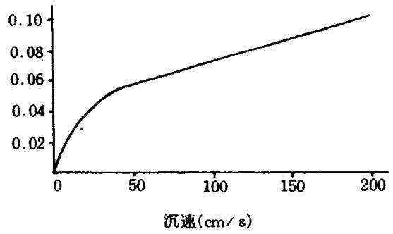  
图 3-1 空气中沙粒自由沉降

（2）遇阻堆积风沙流运行时，遇到障阻使沙粒堆积起来，称遇阻堆积。风沙流因遇障阻发生减慢，而把部分沙粒卸积下来；也可能全部（或部分）越过和绕过障碍物继续前进，在障碍物的背风坡形成涡流（图3-2）。

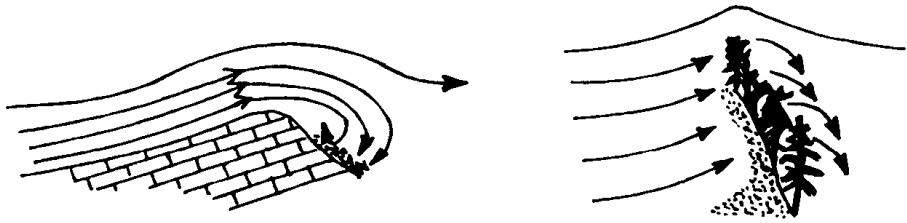  
图 3-2 遇阻堆积

风沙流遇到山体阻碍时，可以把沙粒带到迎风坡小于20°的山坡上堆积下来。当风沙流的方向与山体成锐角相交时，一股循山势前进，另一股沿着山体迎风坡成斜交方向上升，并因与山坡摩擦而减缓风速，沙粒就卸堆在迎风坡上。地表的草木和沙丘本身，也都成为使风速降低和沙粒堆积的障碍。

另外，风沙流在运行过程中，遇到了湿润或较冷的气流会被迫上升，这时部分沙粒不能随气流上升而沉积下来。两股风沙流相遇，即或在风向几乎平行的条件下，也会发生干扰，降低风速，减小输沙的能力，从而使部分沙粒降落下来。在风沙流经常发生的地区，粒径小于0.05mm的沙粒悬浮在较高的大气层中，遇到冷湿气团时，粉粒和尘土成为雨滴的凝结核随降雨大量沉降，成为气象学上的尘暴或降尘现象。

从搬运方式来看，蠕移质搬运距离很近，若被磨蚀作用崩解成细小颗粒，可转化成悬移和跃移方式。跃移质多沉积在被蚀地块的附近，在灌丛、土埂的背后堆成沙垄。沙丘沙中的粗粒堆积于沙丘迎风坡，细粒沉积在背风坡。悬移质及受打击崩解而进入气流中的悬浮颗粒，搬运距离最长。这部分颗粒数量虽少，但多是含有大量土壤养分的黏粒及腐殖质。

## （三）影响风蚀的因素

风蚀作用的大小、强弱除与风力有关外，还受土壤抗蚀性、地形、降水、地表状况等因素影响。

## 1. 土壤抗蚀性

土壤抵抗风蚀的性能主要取决于土粒质量及土壤质地、有机质含量等。

风力作用时，受作用力的单个土壤颗粒（团聚体或土块）的质量（或大小）足够大，不能被风力吹移、搬运；若颗粒质量很小，极易被风吹移。因之，常把粗大的颗粒称为抗蚀性颗粒，把轻细的颗粒称为易蚀性颗粒。抗蚀性颗粒不仅不易被风吹移，还能保护风蚀区内的易蚀性颗粒不被移动。由此可见，土壤中抗蚀性颗粒的含量多少，能够表示土壤抗蚀性强弱。

在持续风力的作用下，任何表面相对平滑的地表都会随风蚀过程而变得粗糙不平。这是因为抗蚀性颗粒不仅难以起动，而且保护下边的颗粒免受风蚀，阻碍了风蚀的发展，只有那些易蚀性颗粒随风搬迁，使风蚀得以继续，从而造成地表细微起伏。

抗蚀性颗粒的机械稳定性，影响风蚀的进一步发展。若抗蚀性颗粒（或团聚体）形状大（或成复粒），在风沙流的冲击和磨蚀作用下，仅被分离成较大的颗粒或不易分离，表示颗粒稳定性高；相反，易分离的颗粒稳定性差。颗粒稳定性与土壤质地、有机质含量有关。

在不同质地的土壤中，沙土和黏土是最易被风蚀的土壤。因为，质地较粗的沙土中缺少黏粒物质，不能将沙粒胶结成有结构的土壤；黏土易于形成团聚体和土块，但稳定性很差，特别是冻融作用和干湿交替而使其破碎。切皮尔的分析表明，当土壤中黏粒含量约在27%时，最有利于抗风蚀性团聚体或土块的形成；小于15%时，很难形成抗风蚀的团聚结构。极粗沙和砾石很难被风所移动，有助于提高土壤的抗蚀性。

我国干旱区风成沙的粒度成分，以细沙（0.25～0.10mm）为主，其次为极细沙和中沙，粉沙含量不多，粗沙最少，几乎不含极粗沙（表3-5）。半干旱风沙区，受风沙的侵蚀和埋压，地带性土壤发育很弱，且与风成沙相间分布，从毛乌素沙区各地带性土壤的粒度组成可看出，表层土壤中黏粒含量均在10%以下（表3-6）。这样的土壤质地很难形成抗风蚀的结构单位，因而造成干旱、半干旱风沙区土壤极易被吹蚀的特点。

表3-5 我国干旱区主要沙漠沙的粒度组成
<table><tr><td rowspan="2">沙漠名称</td><td colspan="6">各粒级 (mm)</td></tr><tr><td>&gt;1.00</td><td>1.00~0.50</td><td>0.50~0.25</td><td>0.25~0.10</td><td>0.10~0.05</td><td>&lt;0.05</td></tr><tr><td>塔克拉玛干沙漠</td><td>一</td><td>0.02</td><td>4.54</td><td>34.15</td><td>41.97</td><td>19.32</td></tr><tr><td>古尔班通古特沙漠</td><td>一</td><td>一</td><td>8.70</td><td>68.20</td><td>19.10</td><td>4.00</td></tr><tr><td>巴丹吉林沙漠</td><td>一</td><td>3.40</td><td>23.40</td><td>61.40</td><td>9.82</td><td>1.98</td></tr><tr><td>腾格里沙漠</td><td>0.01</td><td>1.60</td><td>6.61</td><td>86.88</td><td>4.90</td><td>1</td></tr><tr><td>乌兰布和沙漠</td><td>0.01</td><td>0.78</td><td>17.31</td><td>72.11</td><td>9.52</td><td>0.27</td></tr><tr><td>库布齐沙漠</td><td></td><td>1.10</td><td>1.90</td><td>85.30</td><td>11.70</td><td>1</td></tr><tr><td>宁夏河东沙区</td><td>一</td><td>0.16</td><td>17.99</td><td>75.05</td><td>6.16</td><td>0.67</td></tr><tr><td>平 均</td><td>微量</td><td>1.00</td><td>11.49</td><td>69.01</td><td>14.74</td><td>3.75</td></tr></table>

土壤有机质能促进土壤团聚体的形成并提高其稳定性，不利于风蚀发展，因而，在生产中常通过增施有机肥及植物秸杆来改良土壤结构，提高抗蚀能力。

表3-6 毛乌素沙区地带性土壤的机械组成  
%
<table><tr><td rowspan="2">土壤名称</td><td colspan="5">表层各粒级 (mm)</td><td rowspan="2">质地</td></tr><tr><td>1~0.25 0.25~0.05</td><td></td><td>0.05~0.01</td><td>0.01~0.005</td><td>0.005~0.001 &lt;0.001</td></tr><tr><td>普通淡栗钙土</td><td>5.44</td><td>80.53</td><td>2.08</td><td>0.90</td><td>3.81</td><td>7.24 沙壤土</td></tr><tr><td>薄层淡栗钙土</td><td>13.18</td><td>58.41</td><td>20.69</td><td>1.66 2.87</td><td>3.19</td><td>紧沙土</td></tr><tr><td>碳酸盐淡栗钙土</td><td>11.08</td><td>61.36</td><td>17.64</td><td>1.43 6.67</td><td>1.81</td><td>紧沙土</td></tr><tr><td>原始栗钙土</td><td>57.68</td><td>38.00</td><td>1.60</td><td>1.04 0.50</td><td>0.28</td><td>松沙土</td></tr><tr><td>碳酸盐棕钙土</td><td>5.29</td><td>51.86</td><td>34.52</td><td>2.26</td><td>3.93 2.14</td><td>紧沙土</td></tr><tr><td>原始棕钙土</td><td>37.26</td><td>55.16</td><td>1.29</td><td>0.31</td><td>0.97 2.98</td><td>松沙土</td></tr><tr><td>沙化棕钙土</td><td>一</td><td>一</td><td>一</td><td>一</td><td>一 一</td><td></td></tr><tr><td>淡黑垆土</td><td></td><td></td><td></td><td></td><td>一</td><td>沙壤土</td></tr></table>

## 2. 地表土垄

由耕作过程形成的地表土垄，能够通过降低地表风速和拦截运动的泥沙颗粒来减慢土壤风蚀。阿姆拉斯特（D.V.Armbrust）等研究了不同高度土垄的作用得出：当土垄边坡比为1：4、高5～10cm时，减缓风蚀的效果最好；低于这个高度的土垄在降低风速和拦截过境土壤物质方面，效果不明显；当土垄高度大于10cm时，在其顶部产生较多的窝旋，摩阻流速增大，从而加剧了风蚀的发展。

## 3. 降雨

降雨使表层土壤湿润而不能被风吹蚀。切皮尔在美国大平原地区的研究表明，当地上15cm高处风速为8.9～14.3m/s、表层土壤实际含水量相当于水分张力在1520Pa时土壤含水量0.81～1.16倍的状态下，风蚀可能发生。比索尔（F.BisalEtal，1966）等在加拿大的研究也得出类似的结果。然而，表层土壤湿润持续时间很短，在强风作用下很快干燥，即使下层很湿，风蚀也会发生。

降雨还通过促进植物生长间接地减少风蚀。特别是在干旱地区，这种作用更加明显。由于植物覆盖是控制风蚀最有效的途径之一，作物对降雨的这种反应也就显得特别重要。

降雨还有促进风蚀的一面。原因是雨滴的打击破坏了地表抗蚀性土块和团聚体，并使地面变平坦，从而提高了土壤的可蚀性。一旦表层土壤变干，将会发生更严重的风蚀。

## 4. 土丘坡度

在水平地面及坡度为1.5%的缓坡地形上，一般风速梯度和摩阻流速基本不变。但对于短而较陡的坡，坡顶处风的流线密集，风速梯度变大，使高风速层更贴近地面。这就使坡顶部的摩阻流速比其他部位都大，风蚀程度也

较严重。

表3-7为切皮尔计算出的不同坡度土丘顶部及坡上部相对于平坦地面的风蚀量。

表3-7 坡面上相对于平坦地面的风蚀量
<table><tr><td rowspan="2">坡度 (%)</td><td colspan="2">相对风蚀量</td><td rowspan="2">坡度 (%)</td><td colspan="2">相对风蚀量</td></tr><tr><td>坡顶</td><td>坡上部</td><td>坡顶</td><td>坡上部</td></tr><tr><td>0~1.5（平坦）</td><td>100</td><td>100</td><td>6.0</td><td>320</td><td>230</td></tr><tr><td>3.0</td><td>150</td><td>130</td><td>10.0</td><td>660</td><td>370</td></tr></table>

## 5. 裸露地块长度

风力侵蚀强度随被侵蚀地块长度而增加，在宽阔无防护的地块上，靠近上风的地块边缘，风开始将土壤颗粒吹起并带入气流中，接着吹过全地块，所携带的吹蚀物质也逐渐增多，直到饱和。把风开始发生吹蚀至风沙流达到饱和需要经过的距离称饱和路径长度。对于一定的风力，它的挟沙能力是一定的。当风沙流达到饱和后，还可能将土壤物质吹起带入气流，但同时也会有大约相等重量的土壤物质从风沙流中沉积下来。

尽管一定的风力所携带的土壤物质的总量是一定的，但饱和路径长度随土壤可蚀性的不同而不同。土壤可蚀性越高（抗蚀性越低），则饱和路径长度越短。切皮尔和伍德拉夫的观测表明，当距地面10m高处风速约18m/s时，对于无结构的细沙土，饱和路径长度约50m，而对结构体较多的中壤土，则在1500m以上。

若风沙流由可蚀区域进入受保护的地面时，蠕移质和跃移质会沉积下来，而悬移质仍可能随风飘移；风沙流再进入另一可蚀性区域时，又会有风蚀发生。

## 6. 植被覆盖

增加地面植被覆盖（生长的作物或作物残体），是降低风的侵蚀性最有效的途径。

植被的保护作用与植物种类（决定覆盖度和覆盖季节）、植物个体形状和群体结构、行的走向等有关。高而密的作物残茬，其保护作用常与生长的作物相同。

当地面全部为生长的植物覆盖时，地面所受的保护作用最大；单独的植物个体或与风向垂直的作物也能显著地降低风速，减少风蚀。因之，在植物周围和风障前后，常可见土壤物质的堆积现象。

风障及防风林带降低风速的作用与其高度及孔隙度（疏透度）有关，这一点有关防护林的书籍中都有详细的论述，此处不再赘述。

## 二、风沙运动规律

## （一）风沙流结构特征

风沙流是指含有沙粒的运动气流。当风速达到起沙风速时，沙粒在风的作用下，随风运动形成风沙流。风沙流是风对沙输移的外在表现形式。气流中搬运的沙量在搬运层内随高度的分布状况称为风沙流结构。风沙流的结构和强度与沙的输移和沉积直接相关。

## 1. 沙粒粒径随高度的分布特征

风沙流中不同高度分布的粒径大小不同。一般离地表愈高，细粒愈多，主要为悬移；愈近地表粗粒愈多，主要是跃移和蠕移。风沙流中沙粒大小随高度的分布如图3-3和表3-8所示。

表3-8 风沙流中沙粒粒径随高度的分布特征
<table><tr><td rowspan="2">高度 (cm)</td><td colspan="2">粒 径%</td><td rowspan="2">高度 (cm)</td><td colspan="2">粒</td></tr><tr><td>&gt;0.1mm</td><td>&lt;0.1mm</td><td>&gt;0.1mm</td><td>径% &lt;0.1mm</td></tr><tr><td>1</td><td>20.96</td><td>79.04</td><td>6</td><td>7.92</td><td>92.08</td></tr><tr><td>2</td><td>18.25</td><td>81.75</td><td>7</td><td>4.49</td><td>95.51</td></tr><tr><td>3</td><td>12.80</td><td>87.20</td><td>8</td><td>2.19</td><td>97.81</td></tr><tr><td>4</td><td>10.55</td><td>89.45</td><td>9</td><td>2.02</td><td>97.98</td></tr><tr><td>5</td><td>8.72</td><td>91.28</td><td>10</td><td>1.75</td><td>98.25</td></tr></table>

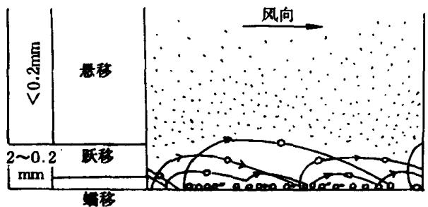  
图 3-3 风沙运动 3 种基本形式

## 2. 含沙量随高度的分布特征

由干沙粒粒径和运动方式的差异，造成了气流中的含沙量在距地表不同高度的密度不同，含沙量随高度迅速递减，在较高气流层中搬运的沙量少，而贴地面含沙量大。大量实验观测表明，绝大部分沙粒（约90%）都在离地表30cm以下，特别集中在10cm以下（表3-9）。

表3-9 不同高度风沙流中含沙量的分布（V=9. 8m/s）
<table><tr><td>高度（cm）</td><td>0~10</td><td>10~20</td><td>20~30</td><td>30~40</td><td>40~50</td><td>50~60</td><td>60~70</td></tr><tr><td>沙量（%）</td><td>79.32</td><td>12.3</td><td>4.79</td><td>1.50</td><td>0.95</td><td>0.40</td><td>0.74</td></tr></table>

## 3. 含沙量随风速变化

风沙流中含沙量不仅随高度变化，也随风速变化，当风速显著超过起动风速后，风沙流中的含沙量急剧增加（表3-10）。它们之间成指数函数关系：

$$
S = \mathbf { e } ^ { 0 . 7 4 \upsilon }\tag{3-7}
$$

式中 S——绝对含沙量；

v ——风速；

e常数 $( \mathbf { e } = 2 . 7 1 8 )$

表3-10 风速与含沙量的关系（新疆莎车）
<table><tr><td>离地面2m高处风速  $\mathbf { ( m / s ) }$ </td><td>4.5</td><td>5.5</td><td>6.5</td><td>7.4</td><td>13.2</td><td>15.0</td></tr><tr><td>0~10cm高度的含沙量  $\left[ \mathbf { g } / ( \mathbf { c m } \cdot \mathbf { m i n } ) \right]$ </td><td>0.37</td><td>1.04</td><td>1.20</td><td>2.27</td><td>19.44</td><td>35.58</td></tr></table>

随风速变化，在近地表10cm内的含沙量分布也不是均匀的。含沙量随高度迅速递减，而且高度与输沙量（百分比值）对数尺度之间呈线性关系（图3-4)。在同一粒径沙粒组成的地表上，无论风速大小，近地表气流中总有一层(2～3cm处）的含沙量是相对稳定的（约占15%～20%)，随着风速增大，下层气流中的沙量（%）相对减少，上层沙量（%）相对增加，但由于输沙总量随风速增大而增大，所以上下层绝对含沙量都增加（表3-11）。

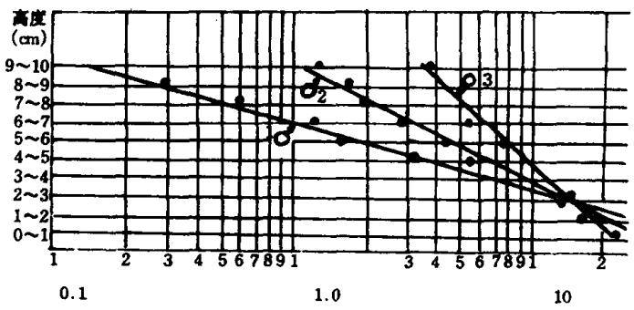  
图3-4 不同风速下含沙量与高度的关系

表3-11 不同风速下不同高度层含沙量的平均百分数
<table><tr><td rowspan="2">高度 (cm)</td><td colspan="4">风洞轴部气流速度  $\scriptstyle ( \mathbf { c m } / \mathbf { s } )$ </td></tr><tr><td>21</td><td>35</td><td>46</td><td>57</td></tr><tr><td>10</td><td>0.96</td><td>1.65</td><td>1.67</td><td>1.87</td></tr><tr><td>9</td><td>1.30</td><td>2.10</td><td>2.16</td><td>2.49</td></tr><tr><td>8</td><td>1.78</td><td>2.65</td><td>2.55</td><td>3.16</td></tr><tr><td>7</td><td>2.38</td><td>3.52</td><td>3.56</td><td>4.15</td></tr></table>

(续)
<table><tr><td rowspan="2">高度 (cm)</td><td colspan="3">风洞轴部气流速度  $\mathrm { { ( c m / s ) } }$ </td></tr><tr><td>21</td><td>35</td><td>46 57</td></tr><tr><td>6</td><td>3.36</td><td>4.52</td><td>4.85 5.40</td></tr><tr><td>5</td><td>4.84</td><td>6.11 6.88</td><td>7.59</td></tr><tr><td>4</td><td>7.70</td><td>8.88 9.70</td><td>9.45</td></tr><tr><td>3</td><td>12.14</td><td>12.95</td><td>13.70 13.20</td></tr><tr><td>2</td><td>20.96</td><td>20.18 21.21</td><td>19.96</td></tr><tr><td>1</td><td>44.58</td><td>37.44</td><td>33.73 32.73</td></tr></table>

为了反映上述风沙流结构特征，前苏联学者兹纳门斯基提出用结构数S表征，其表达式为：

$$
S = \frac { Q _ { \mathrm { m a x } } } { \overline { { Q } } }\tag{3-8}
$$

式中 $\ Q _ { \mathrm { m a x } }$ ——气流0\~1cm层内的最大含沙量；

Q——气流中0～10cm内每1cm的平均含沙量。

随S增大，表明近地面风沙流的含沙量所占比例增加。当S值增大到某一值时，近地面的含沙量会达到饱和，这时将有部分沙粒脱离气流而沉积下来。因此S值就成为判别风蚀发展趋势的指标。研究发现，对各种粗糙表面(黏土、细粒、粗粒），在正常搬运情况下（非堆积搬运)，S的平均值为2.6；当有部分沙粒出现下落堆积时，S平均值为3.8。

我国一些学者观测发现，在0～10cm高度范围内，1～2cm层的沙量在各种风速下保持在20%左右，在该层以上和以下两层中的沙量各占约40%，据此吴正等人提出以风沙流中0\~1cm和2\~10cm两层沙量的比值（特征值λ）来判断风沙流的饱和程度，反映沙子的吹蚀、搬运和堆积的关系。特征值λ表达式为：

$$
\lambda = \frac { Q _ { 2 - 1 0 } } { Q _ { 0 - 1 } }\tag{3-9}
$$

式中 $Q _ { 2 \sim 1 0 } - 2 { \sim } 1 0 \mathrm { c m }$ 层内的沙量；

Q0\~1———0\~1cm层内沙量。

当λ=1时，表示由地面进入风沙流中的沙量与从风沙流中落回地面的沙量基本相等，表现为风沙流对地面的吹蚀量和堆积量相等，因而地面呈现无风也无堆积状态；当λ<1时，下层沙量增加，风沙流为饱和状态，因气流能量消耗使从风沙流中落回地面的沙量大于地面吹蚀进入风沙流中的沙量，形成沙的堆积；当λ>1时，下层沙量减少，风沙流为不饱和状态，气流还有能力携带更多的沙量，表现为风沙流对地面的继续吹蚀。

A

S和λ2个指标，共同反映了气流对沙粒的搬运能力。当气流的动能小于沙的阻力时，气流无力搬运更多的沙量，风沙流为饱和状态，形成沙的堆积。

也有的学者根据0～10cm层内沙量随高度分布的特征，直接用0～1cm、1\~2cm、2\~10cm3层内的输沙量和输沙率来反映风沙流的结构特征，称为结构式，其表达式为：

$$
\sum  Q _ { 2 - 1 0 }  4 0 \% \arrows \overrightarrow { \mathrm { z } } \uparrow
$$

$$
\sum  Q _ { 1 - 2 }  2 0 \% 1 + 2
$$

$$
\sum  Q _ { \scriptscriptstyle 0 - 1 }  4 0 \% \neq \frac { 1 1 } { 2 }
$$

可利用上下两层输沙量和输沙率的变化表示风流沙的变化规律。

## （二）沙丘的移动

沙丘的移动是相当复杂的，它与风力、沙丘高度、水分、植被状况等因素有关。

在风力作用下，沙粒被从沙丘迎风坡吹扬搬运，而在背风坡堆积。这种运动只有起沙风才起作用。从我国沙区的观测资料看，起沙风仅占各地全年风的很小一部分。如新疆且末的起沙风 $\mathrm { ( { \geqslant } 5 m / s ) }$ 出现频率为19.7%，占全年总风速的42.8%；于田更小，仅占4.2%和10.8%。而沙丘移动的方向、方式和强度正是取决于这一小部分起沙风的状况。

## 1. 沙丘移动的方向和方式

(1）沙丘移动的方向随着起沙风方向的变化而变化。移动的总方向是和起沙风的年合成风向大致相一致。根据气象资料，我国沙漠地区，影响沙丘移动的风主要为东北风和西北风两大风系。受它们的影响，沙丘移动方向，

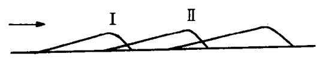

表现在新疆塔克拉玛干沙漠广大地区及东疆、甘肃河西走廊西部等地，在东北风的作用下，沙丘自东北向西南移动；其他各地区，都是在西北风作用下向东南移动。

图 3-5 沙丘移动的方式  
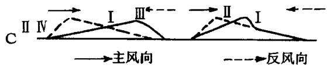

A. 前进式 B. 往复前进式 C. 往复式

(2)沙丘移动的方式 取决于风向及其变律，分为下面3种情况（图3-5）：第一种方式是前进式，这是单一的风向作用产生的。如我国新疆塔克拉玛干沙漠和甘肃、宁夏的腾格里沙漠的西

部等地，是受单一的西北风和东北风的作用，沙丘均以前进式运动为主。第二种是往复前进式，它是在2个方向相反而风力大小不等的情况下产生的。如我国沙漠中部和东部各沙区（毛乌素沙地等），则都处于2个相反方向的冬、夏季风交替作用下，沙丘移动具有往复前进的特点。冬季在主风西北风作用下，沙丘由西北向东南移动；在夏季，受东南季风的影响，沙丘则产生逆向运动。不过，由于东南风的风力一般较弱，所以不能完全抵偿西北风的作用，故总的说来，沙丘慢慢地向东南移动。第三种是往复式，是在2个方向相反风力大致相等的情况下产生的，这种情况一般较少，沙丘将停在原地摆动或仅稍向前移动。

## 2. 沙丘移动的速度

沙丘移动的速度主要取决于风速和沙丘本身的高度。如果沙丘在移动过程中，形状和大小保持不变，则向风坡吹蚀的沙量，应该等于背风坡堆积的沙量。在这种情况下，沙丘在单位时间里前移的距离D与背风坡一侧堆积的总沙量Q有如下关系（图3-6）。

$$
Q = r D H \ \overrightarrow { \ast } \overrightarrow { \chi } \ D = Q / r H\tag{3-10}
$$

式中 $Q \cdot$ ——单位时间内通过单位宽度，从向风坡搬运到背风坡的总沙量；

$D \cdot$ —单位时间内沙丘前移的距离；

$H$ —沙丘的高度；

r——沙子的容重。

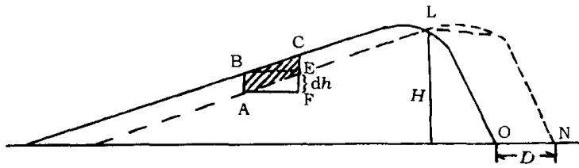  
图 3-6 沙丘移动的几何图解

由式（3-10）可以看出，沙丘移动速度与其高度成反比，而与输沙量成正比。沙丘移动速度除了主要受风速和沙丘本身高度的影响外，还与风向频率、沙丘的形态、密度和水分状况以及植被等多种因素有关。因此，在实际工作中，通常采用野外插标杆、重复多次地形测量、多次重合航片的量测等方法，以求得各个地区沙丘移动的速度。

根据观测研究，在古尔班通古特沙漠、腾格里沙漠中许多湖盆附近、乌兰布和沙漠西部、毛乌素沙地的大部、浑善达克沙地、科尔沁沙地以及呼伦贝尔沙地等，由于水分、植被条件较好，沙丘大部分处于固定、半固定状态，移动速度很缓慢；只有在植被破坏、流沙再起的地方，沙丘才有较大移动速度。在广大的塔克拉玛干沙漠和巴丹吉林沙漠的内部地区，虽然属于裸露的流动沙丘，但因沙丘十分高大、密集，所以移动速度也很小，不超过 $2 \mathsf { m } / \mathsf { a }$ 而在沙漠的边缘地区，沙丘低矮且分散，移动速度较大，通常m/a前移值达5～10m/a。最大者，如塔克拉玛干沙漠西南缘的皮山和东南缘的且末地区，那些分布在平坦沙砾戈壁裸露的低矮新月形沙丘，前移值可达 $4 0 { \sim } 5 0 \mathrm { m / a }$ 。沙丘移动，常常侵入农田、牧场、埋没房屋、侵袭道路（铁路、公路），给农牧业生产和工矿、交通建设造成很大危害。

## 三、风蚀与沙质荒漠化

沙质荒漠化（简称沙漠化）是在干旱多风的沙质地表条件下，由于人为强度活动，破坏脆弱生态平衡，在风力作用下，产生风蚀劣地、粗化地表、片状流沙堆积及沙丘形成等风沙活动现象的土地退化过程。因而沙质荒漠化过程在外形上表现为沙漠景观的形成和扩大；在实质上是土壤性质的一系列变化，导致土地生产力降低，农业生态系统崩溃。

## （一）土地风蚀退化

强劲的风是沙漠化形成的主要营力，是塑造沙漠地表形态的动力。在风力侵蚀作用下，土地退化表现在如下几个方面：

(1）土壤流失由于风及风沙流对地表土壤颗粒剥离、搬运作用，使土壤产生严重流失。赵羽等根据沙土开垦后风蚀深度的调查，推导出科尔沁大青沟地表风蚀量可达 $2 3 ~ 2 5 0 \mathrm { t } / \mathrm { \Omega } ( \mathrm { k m } ^ { 2 } \cdot \mathrm { a } )$ ；林儒耕推算出乌盟后山地区伏沙带风蚀量为 $5 6 ~ 2 5 0 \mathrm { t } / \ ( \mathrm { k m } ^ { 2 } \cdot \mathrm { a } )$ ，吕悦来等用风蚀方程估算出陕北靖边滩地农田土壤风蚀量为 $1 ~ 4 5 0 \mathrm { t } / \ ( \bf k m ^ { 2 } \cdot \mathrm { a } )$ 。大量的土壤物质被吹蚀，使土壤质地变差、生产力降低、土地退化。同时被吹蚀的土壤物质的沉积又造成淤塞河道，埋压农田、村庄，甚至堆积形成流动沙丘，如呼伦贝尔地区的磋岗牧场，50年代初期，开垦的 $2 3 \ 3 3 3 \mathrm { h m } ^ { 2 }$ 耕地中，到80年代形成的流动沙丘及半流动沙丘面积占复垦区面积的39.4%；从宁夏中卫区到山西河曲段，由于风蚀直接进入黄河干流的沙量达 5 321 万t/a。

(2)土壤质地变化由于风力搬运的分选作用，导致土壤质地的变化，最细的土壤物质以悬移状态随风漂浮到很远距离；跃移物质则沉积在地边及田间障碍物附近；粗粒物质停留在原地或蠕移到很短的距离。这种侵蚀分选过程使土壤细粒物质损失，粗粒物质相对增多（表3-12），原有结构遭受破坏，土壤性能变差，肥力损失，地力衰退，导致整个生态系统退化并出现风沙微地貌。这种粗化过程随风力的变化而间隙式发生，在大风初期持续一定时间，当风力不再增加，处于相对稳定状况时，风蚀强度随之减弱，只有当风力再度增加时，粗化又重复出现。多次的风蚀粗化作用使土壤耕作层不断粗化，直至不能继续耕作而被迫弃耕，甚至最终形成风蚀劣地、砾石戈壁和沙丘分布等荒漠景观。

表3-12 不同类型沙漠化土地表层沙粒含量的变化（内蒙古科尔沁沙地）
<table><tr><td>沙漠化土地类型</td><td>土层深（cm）</td><td>沙粒（1～0.01mm）含量（%）</td></tr><tr><td>固定沙地</td><td>0~10</td><td>79~89</td></tr><tr><td>半固定沙地</td><td>0~10</td><td>91~93</td></tr><tr><td>半流动沙地</td><td>0~10</td><td>93~98</td></tr><tr><td>流动沙地</td><td>0~10</td><td>98~99</td></tr></table>

风蚀的这种粗化作用，在粒径变化幅度较大的土壤中，表现的尤为突出。

（3）养分流失土壤中的黏粒胶体和有机质是土壤养分的载体，风蚀使这些细粒物质流失导致土壤养分含量显著降低。对于质地较粗的土壤来说，随风蚀过程的继续，土壤质地变得更粗，养分流失导致肥力的下降更为严重。表土中的养分含量较底土高，而表土又在侵蚀过程中首先流失，从而使土壤肥力不断下降，直至接近母质状态（表3-13）。

表3-13 内蒙古伊盟牧场不同沙质荒漠化程度土壤养分含量
<table><tr><td>沙化程度</td><td>土层深 (cm)</td><td>有机质</td><td>全N</td><td> $\mathbf { P } _ { 2 } \mathbf { O } _ { 5 }$ </td><td>K2O</td></tr><tr><td>潜在</td><td>0~10</td><td>0.491</td><td>0.121</td><td>0.112</td><td>2.39</td></tr><tr><td>中度</td><td>0~10</td><td>0.177</td><td>0.032</td><td>0.085</td><td>2.35</td></tr><tr><td>极度</td><td>0~10</td><td>0.173</td><td>0.037</td><td>0.088</td><td>2.50</td></tr></table>

(4)生产力降低土壤生产力是土壤提供植物生长所需要的潜在能力，是土壤物理、化学以及生物性质的综合反映。风蚀通过养分的流失、结构的粗化、持水能力的降低、耕作层的减薄以及不适宜耕作或难以耕作的底土层的出露等方面降低土壤生产力。对不同的土壤，在同样侵蚀条件下，生产力降低的途径及程度有所不同。

作物产量是衡量土壤生产力最直观的指标。为评价风蚀对生产力的影响，莱尔斯、朱震达等建立了风蚀深度与作物产量的关系，再根据风蚀方程推算的风蚀量来预测作物产量的变化过程。

(5）磨蚀由风力推动沙粒沿地面的冲击力而引起的磨蚀作用，不仅使土壤表层的薄层结皮被破坏，造成下层土壤暴露出来，使不易蚀的土块和团聚体被冲击破碎，变得可蚀了。同时，磨蚀作用也对植物产生危害（俗称“沙割”)，影响苗期的存活率以及后期生长和产量，作物受害程度取决于作物种类、风速、输沙量、磨蚀时间及苗龄。

## （二）风蚀荒漠化的成因类型

在我国北方草原及干草地区，常常因扩大耕地面积造成强烈风蚀，随风蚀深度的加深、土壤粗化、肥力降低、土地单位面积生物产量下降，迫使部分被垦殖的农田弃耕；随着人口和牲畜压力增大，促使再度扩大从而导致更强烈的风蚀过程，如此循环往复，使沙质荒漠化土地面积不断扩展。此外，其他如过度放牧、樵采、不合理用水等也造成沙漠化土地发生、发展。因而荒漠化的发生也与社会经济活动密切联系，人为的不合理经济活动为风蚀的产生和发展创造了条件，起到了诱导作用，加速了荒漠化的发生和发展。特别在我国北方现代沙漠化土壤中94.5%为人为因素所致。可见，人为不合理活动已成为现代荒漠化发生发展的主导因素（表3-14）。

表 3-14 我国北方现代沙漠化土地成因
<table><tr><td>成因类型</td><td>占北方沙漠化土地百分比（%）</td></tr><tr><td>过度农垦形成的沙漠化土地</td><td>23.3</td></tr><tr><td>过度放牧形成的沙漠化土地</td><td>29.3</td></tr><tr><td>过度樵采形成的沙漠化土地</td><td>32.4</td></tr><tr><td>水资源利用不当形成的沙漠化土地</td><td>8.6</td></tr><tr><td>工矿交通城镇建设引起的沙漠化土地</td><td>0.8</td></tr><tr><td>风力作用下沙丘前进入侵</td><td>5.5</td></tr></table>

## 四、风蚀荒漠化防治的基本原理

风蚀作用是由风的动压力及风沙流中沙粒的冲蚀、磨蚀作用，使地表物质被吹蚀和磨蚀，造成土壤养分流失、质地粗化、结构变差、生产力降低、沙丘及劣地形成等土地退化的作用过程。因而风蚀荒漠化的实质就是土地的风蚀退化过程。制定风蚀荒漠化防治的技术措施主要依据土壤风蚀原因及风沙运动规律，即蚀积原理。产生风蚀必须具备一定的条件，即一要有强大的风，二要有裸露、松散、干燥的沙质地表或易风化的基岩。根据风蚀产生的条件和风沙流结构特征，所采取的技术措施有多种多样，但就其原理和途径可概括为下述几个方面：

（1）增大地表粗糙度，降低近地层风速当风沙流经地表时，对地表土壤颗粒（或沙粒）产生动压力，使沙粒运动，风的作用力大小与风速大小直接相关，作用力与风速的二次方成正比，即有 $P { = } 1 / 2 C \rho V ^ { 2 } A$ 。所以当风速增大，风对沙粒产生的作用力就增大，反之，作用力就小。同时根据风沙运动规律，输沙率也受风速大小影响，即有 $q { = } 1 . 5 { \times } 1 0 ^ { - 9 } ( V { - } V _ { \iota } ) ^ { 3 }$ ，风速越大，其输沙能力就越大，对地表侵蚀力也越强。所以只要降低风速就可以降低风的作用力，也可降低风携带沙子的能量，使沙子下沉堆积。近地层风受地表粗糙度影响，地表粗糙度越大，对风的阻力就越大，风速就被削弱降低。因此，可以通过植树种草或布设障蔽以增大地表粗糙度、降低风速、削弱气流对地面的作用力，以达到固沙和阻沙作用。

(2)阻止气流对地面直接作用风及风沙流只有直接作用于裸露地表，才能对地表土壤颗粒吹蚀和磨蚀，产生风蚀。因而可以通过增大植被覆盖度，使植被覆盖地表，或使用柴草、秸秆、砾石等材料铺盖地表，对沙面形成保护壳，以阻止风及风沙流与地面的直接接触，也可达到固沙作用。

(3）提高沙粒起动风速，增大抗蚀能力使沙粒开始运动的最小风速称为起动风速，风速只有超过起动风速才能使沙粒随风运动，形成风沙流产生风蚀。因而只要加大地表颗粒的起动风速，使风速始终小于起动风速，地面就不会产生风蚀作用。起动风速大小与沙粒粒径大小及沙粒之间粘着力有关。粒径越大，或沙粒之间粘着力越强，起动风速就越大，抗风蚀能力就越强。所以，可以通过喷洒化学胶结剂或增施有机肥，改变沙土结构，增加沙粒间的粘着力，提高抗风蚀能力，使得风虽过而沙不起，从而达到固沙作用。

(4）改变风沙流蚀积规律根据风沙运动规律和水土流失规律，以风（水）力为动力，通过人为控制增大流速，提高流量，降低地面粗糙度，改变蚀积关系，从而拉平沙丘造田或延长饱和路径输导沙害，以达到治理目的。

## 第二节 风蚀荒漠化防治的生态学原理

植物治沙以其比较经济、作用持久、稳定，并可改良流沙的理化性质，促进土壤形成，改善、美化环境及提供木材、燃料、饲料、肥料等原料，具有多种生态效益和经济效益的优点，成为防治土地沙质荒漠化最有效的首选措施，植物是流沙上重建人工生态系统的最主要的角色。植物治沙需要具备植物成活、生长、发育的必要条件。因而利用植物改造沙质荒漠化土地，首要问题是植物在流沙上如何成活与保存，及其改造流沙环境的生态功能。

## 一、植物对流沙环境的适应性原理

流沙上分布的天然植物的种类和数量很少，但它们却有规律地分布在一定的流沙环境之中。它们对不同的流沙环境有各自的要求与适应性。这种特性是长期自然选择的结果，是它们对流沙环境具有一定适应能力的反映。

由于自然界已经产生了能够适应流沙环境的植物，我们便可以利用这些植物在流沙地区去恢复和建立植被，这便是植物治沙的物质条件和理论基础。

流沙环境具有多种条件，因而在长期的自然选择过程中，形成植物对流沙环境有多种适应方式和途径，这就为人们选择更合适的树种提供了依据。

严酷的流沙环境对植物的影响是多方面的。其中干旱和流沙的活动性是影响植物最普遍、最深刻的2个限制因素，是制定各项植物治沙技术措施的主要依据。

## (一）植物对干旱的适应性

流沙地区的气候和土壤条件，决定了它的干旱性特征。由于流沙是干燥气候下的产物。因而降水量低、蒸发强烈、干燥度大、气候干燥是流沙地区最显著的环境特点。在长期干旱气候条件下，流沙上分布的植物，产生一定的适应干旱的特征，表现为：

（1）萌芽快，根系生长迅速而发达流沙上植物发芽后，主根具有迅速延伸达到稳定湿沙层的能力，同时具有庞大的根系网，可以从广阔的沙层内吸取水分和养分，以供给植物地上部分蒸腾和生长发育需要。

(2)具有旱生形态结构和生理机能如叶退化，具较厚角质层、浓密的表皮毛，气孔下陷，栅栏组织发达，机械组织强化，贮水组织发达，细胞持水力强，束缚水含量高，渗透压和吸水力高，水势低等。

（3）植物化学成分发生变化如含有乳状汁、挥发油等。挥发油含量与光有密切关系，也即与旱生结构有密切关系。

## （二）植物对风蚀、沙埋的适应

沙丘流动性表现在其迎风坡可能遭受风蚀，其背风坡可能遭受沙埋。沙生植物对流沙的适应性，首先表现在抗风蚀和沙埋上。分布于流动沙丘上的植物对风蚀、沙埋的适应能力，根据其适应特征，可归纳为4种类型，即速生型、稳定型、选择型和多种繁殖型。

## 1. 速生型适应

很多沙丘上的植物都具有迅速生长的能力，以适应流沙的活动性，特别是苗期速生更为重要。因为幼苗抗性弱，易受伤害，同时一般认为植物的自然选择过程，主要在发芽和苗期阶段，像沙拐枣、花棒、杨柴等植物，种子发芽后一伸出地面，主根已深达10多厘米，10d后根可达20多厘米，地上部分高于5cm。当年秋天，根深大于60cm，地径粗约0.2cm，最大植株高大于40cm。主根迅速延伸和增粗，可减轻风蚀危害和风蚀后引起的机械损伤，根愈粗固持能力愈强，植株愈稳定。同时根愈粗风蚀后抵抗风沙流的破坏能力也愈大，植株不易受害。而茎的迅速生长，可减少风沙流对叶片的机械损伤危害，以保持光合作用的进行，同时植株愈高，适应沙埋的能力也就愈强。

属于苗期速生类型的植物有：沙拐枣、花棒、杨柴、梭梭、木蓼等。

而在沙丘背风坡脚能够安然保存下来的植物，则是那些高生长速度大于沙丘前移埋压的积沙速度的植物，如柽柳、沙柳、杨柴、柠条、油蒿、小叶杨、旱柳、沙枣、刺槐等。

苗期速生程度决定于植物的习性，而成年后能否速生与有无适度沙埋条件以及萌发不定根能力有关。

## 2. 稳定型适应

有些沙生植物及其种子，具有稳定自己的形态结构，以适应沙的流动性，如杨柴种子扁圆形，表皮上有皱纹，布于沙表不易吹失，易覆沙发芽，其幼苗地上部分分枝较多，分枝角较大，呈匍匐状斜向生长，对于风沙阻力较强，易积沙而无风蚀，稳定性较好。沙蒿则以种子小，数量多，易群聚和自然覆沙，种皮含胶质，遇水与沙粒结成沙团，不易吹失，易发芽、生根，植株低矮，枝叶稠密，丛生性强，易积沙等特点适应沙的流动性。这类植物在流沙上全面撒播或飞播后，当年发芽成苗，效果较好，苗期易产生灌丛堆效应。

## 3. 选择型适应

花棒、沙拐枣、沙柳等植物的种子呈圆球形，上有绒毛、翅或小冠毛，易为风吹移到背风坡脚，丘间地或植丛周围等弱风处，通常风蚀少而轻，有一定的沙埋，对种子发芽和幼苗生长有利。植物生长迅速，不定根萌发力强，极耐沙埋，愈埋愈旺。这类植物能够以自身的形态结构利用风力选择有利的环境条件发芽、生长，以适应沙的活动性。

## 4. 多种繁殖型适应

很多沙生植物，既能有性繁殖，又能无性繁殖，当环境条件不利于有性繁殖时，它就以无性繁殖进行更新，以适应流沙环境。这类植物有杨柴、沙拐枣、红柳、骆驼刺、沙柳、麻黄、沙蒿、白刺、沙竹、牛心朴子、沙旋复花等。

上述4种类型是沙生植物适应流沙风蚀、沙埋的基本类型（或基本特征)，但是有些植物可以归属多种适应类型，而属于同种适应类型的不同植物种之间也有强烈差异。

可以看出，沙生植物对流沙环境活动性的适应途径主要是避免风蚀，适度沙埋。风蚀愈深危害愈严重。适度沙埋则利于种子发芽、生根，可以促进植物生长，有利于固沙。但过度沙埋则造成危害。研究表明，沙埋的适度范围可用沙埋厚度与灌木本身高度之比值(A)来衡量。A=0～0.7为适度沙埋，A>0.7为过度沙埋。

分布于流沙中的天然灌木、半灌木，常常利用自己近地层的浓密枝叶覆盖一定沙面，以阻截流沙形成灌丛堆，产生灌丛沙堆效应，以消除风蚀，适度沙埋，促进生长发育，适应流沙环境。

## (三）植物对流沙环境变异性的适应

流沙是一个不断发生变化的环境，尤其是在生长植物以后，随着植物的增多，流沙活动性减弱，流沙的机械组成、物理性质、水分性质、有机质含量、土壤微生物种类和数量、水分状况及小气候等均发生变化。随着这种环境的变化，植物的种类、组成、数量和结构也会相应的变化。根据国内外有关学者的研究，植物对环境变异的适应性变化，亦遵循一定的方向，一定的顺序，是有规律的。这种适应规律亦即沙地植被演替规律，这是恢复天然植被和建立人工植被各项技术措施的理论基础。

## 二、植物对流沙环境的作用原理

## （一）植物固沙作用

植物以其茂密的枝叶和聚积枯落物庇护表层沙粒，避免风的直接作用；同时植物作为沙地上一种具有可塑性结构的障碍物，使地面粗糙度增大，大大降低近地层风速；植物可加速土壤形成过程，提高粘结力，根系也起到固结沙粒作用；植物还能促进地表形成“结皮”，从而提高临界风速值，增强了抗风蚀能力，起到固沙作用。其中植物降低风速作用最为明显也最为重要。植物降低近地层风速作用大小与覆盖度有关。覆盖度越大，风速降低值越大。内蒙古林学院通过对各种灌木测定，当植被盖度大于30%时，一般都可降低风速40%以上。

不同植物种，对地表庇护能力也不同。据新疆生物土壤研究所测定，老鼠瓜的覆盖度为30%时，风蚀面积约占56.6%；覆盖度45%时，风蚀面积约占9.4%，覆盖度达72%时完全无风蚀。而沙拐枣覆盖度20%～25%时，地表风蚀强烈，林地常出现槽、丘相间地形，覆盖度大于40%时，沙地平整，地表吹蚀痕迹不明显，林地已开始固定。

当沙面逐渐稳定以后，便开始了成土过程。据陈文瑞研究，沙坡头地区在植被覆盖下的成土作用，每年约以1.73mm的厚度发展。地表形成的“结皮”可抵抗25m/s的强风（风洞实验）。因此，能起到很好的固沙作用。

## （二）植物的阻沙作用

根据风沙运动规律，输沙量与风速的三次方成正相关，因而风速被削弱后，搬运能力下降，输沙量就减少。植物在降低近地层风速，减轻地表风蚀的同时，因风速的降低，可使风沙流中沙粒下沉堆积，起到阻沙作用。

据新疆生物土壤研究所测定，艾比湖沙拐枣和老鼠瓜一般在种植第二年开始积沙，4年平均积沙量可达 $3 \mathbf { m } ^ { 3 }$ 以上。同时灌木较草本植物和半灌木单株阻积沙量多，也比较稳定，半灌木和草本植物积沙量有限且不稳定，全年中蚀积交替出现。

另据陈世雄测定，植被阻沙作用大小与覆盖度有关，当植被覆盖度达40%～50%时，风沙流中90%以上沙粒被阻截沉积。

由于风沙流是一种贴近地表的运动现象，因此，不同植物固沙和阻沙能力的大小，主要取决于近地层枝叶分布状况。近地层枝叶浓密，控制范围较大的植物其固沙和阻沙能力也较强。在乔、灌、草3类植物中，灌木多在近地表处丛状分枝，固沙和阻沙能力较强。乔木只有单一主于，固沙和阻沙能力较小，有些乔木甚至树冠已郁闭，表层沙仍继续流动。多年生草本植物基部丛生亦具固沙和阻沙能力，但比之灌木植株低矮，固沙范围和积沙数量均较低，加之入冬后地上部分全部干枯，所积沙堆因重新裸露而遭吹蚀，因此不稳定。这也正是在治沙工作中选择植物种时首选灌木的原因之一。而不同灌木其近地层枝叶分布情况和数量亦不同，其固沙和阻沙能力也有差异，因而选择时应进一步分析。

## （三）植物改善小气候作用

小气候是生态环境的重要组成部分，流沙上植被形成以后，小气候将得到很大改善。在植被覆盖下，反射率、风速、水面蒸发量显著降低，相对湿度提高。而且随植被盖度增大，对小气候影响也愈显著。

小气候改变后，反过来影响流沙环境，使流沙趋于固定，加速成土过程。

## (四)植物对风沙土的改良

植物固定流沙以后，大大加速了风沙土的成土过程。植物对风沙土的改良作用，主要表现在以下几个方面：①机械组成发生变化，粉粒、黏粒含量增加。②物理性质发生变化，比重、容重减小，孔隙度增加。③水分性质发生变化，田间持水量增加，透水性减慢。④有机质含量增加。⑤氮、磷、钾三要素含量增加。⑥碳酸钙含量增加，pH值提高。⑦土壤微生物数量增加。据中国科学院沙漠所陈祝春等人测定，沙坡头植物固沙区（25年），表面1cm厚土层微生物总数243.8万个/g干土，流沙仅为7.4万个/g干土，约比流沙增加30多倍。⑧沙层含水率减少，据陈世雄在沙坡头观测，幼年植株耗水量少，对沙层水分影响不大，随着林龄的增长，对沙层水分产生显著影响。在降水较多年份，如1979年4～6月所消耗的水分，能在雨季得到一定补偿，沙层内水分可恢复到2%左右；而降水较少年份，如1974年，仅降雨154mm.补给量少，0\~150cm深的沙层内含水率下降至1.0%以下，严重影响着植物的生长发育。

陈文瑞在沙坡头多年研究结果表明，沙坡头人工林下形成的土壤已经发育到明显的结皮层 $( \mathsf { A } _ { 0 } )$ 和腐殖质层 $( \mathsf { A } _ { 1 } )$ ，剖面分化比较明显，与流沙相比，在物理性质方面具有质地细、容重低、孔隙度高、持水性强、渗透性慢等特征：在化学性质方面，养分含量高，碳酸钙积累显著，易溶性盐含量增加等；在抗蚀强度方面，结皮层可抗十一级大风。但所形成的土壤土层仍较薄，25年生人工林下，平均土层厚度4.33cm，每年平均成土速度1.73mm，土层中粗粉沙含量高，黏粒少，较松脆，故应防止人畜践踏。

## 第三节 水蚀荒漠化的防治原理

## 一、水力侵蚀作用

## （一）侵蚀起动流速

水流能够冲刷推动泥沙运动的最小流速，称为起动流速或临界流速。它分为滑动起动和滚动起动2种。

对于床面静止泥沙所受的作用力有水流的推移力、上举力、泥沙重力及其分力和坡面的摩擦力等。若要使静止泥沙沿坡面滑动，必须满足水流推移力与反作用力平衡的关系，而要使其沿坡面滚动，则应使滚动力矩与反力矩平衡。由此可推导出泥沙颗粒的滑动起动流速 $V _ { d }$ 和滚动流速 $V _ { d o }$

$$
V _ { d } = K _ { 1 } \cdot \sqrt { d }\tag{3-11}
$$

$$
V _ { d o } = K _ { 2 } \cdot \sqrt { d }\tag{3-12}
$$

式中 $^ { d }$ —颗粒粒径；

$K _ { 1 }$ $K _ { 2 }$ —系数，可由泥沙受力分析求得。

由此可见，泥沙起动流速大小与粒径大小密切相关。沙粒粒径总是与流速平方成正比，而泥沙的体积或重量又与粒径立方成正比，因此，搬动的沙粒颗粒的体积或重量总与流速的六次方成正比，即 $G \infty V ^ { 6 }$ ，这就是山区河流能够搬运粗大的颗粒巨石的原因。

泥沙的起动流速除了与泥沙粒径有关外，与颗粒沉速、水深等也有密切关系，沙玉清和前苏联沙莫夫分别根据实验资料求得起动流速的经验公式：

沙玉清公式（适用于粗沙、细沙）：

$$
V _ { \circ } = 3 7 . 7 \frac { d ^ { 3 / 4 } } { \omega ^ { \zeta _ { 2 } } } R ^ { \zeta _ { 5 } }\tag{3-13}
$$

沙莫夫公式（适用于粗沙）：

$$
V _ { \circ } = ( 0 . 0 1 + 4 . 7 d ) ^ { \scriptscriptstyle { \zeta _ { 2 } } } \bigg ( \frac { H } { d } \bigg ) ^ { \scriptscriptstyle { \zeta _ { 6 } } }\tag{3-14}
$$

式中 $V _ { 0 }$ ——起动流速；

$d \cdot$ ——泥沙粒径；

$\omega ^ { - }$ 平均沉降速度；

R——水力半径；

H水深。

## （二）水力侵蚀作用过程

水流对地表泥沙作用过程包括剥离、搬运和堆积作用过程。

## 1. 水流侵蚀作用

水流及其携带的泥沙通过冲蚀、碰撞和磨蚀等作用破坏地表，并冲走地表物质的作用叫水力侵蚀作用。根据作用方向，侵蚀作用分为下蚀和侧蚀2种方式。

水流切深床面称为下切侵蚀，简称下蚀或切蚀。下蚀强度决定于水流动能、含沙量及河面组成物质的抗蚀性能，水流动能愈大，含沙量愈小、地面组成物质愈松散、下切速度愈快；相反，下切愈慢。而水流在源头与床面坡度突变处不断切深床面，并向上发展，使形成的沟谷源头后退，指向源头的侵蚀作用，又称塑源侵蚀，塑源侵蚀导致沟谷的伸长。

侧蚀（或叫旁蚀）则是水流拓宽床面的作用，它主要发生在水流弯曲处的凹岸，其作用强度受环流离心力和水流冲刷力控制。

水流对土壤侵蚀强度，常用侵蚀模数、侵蚀深度、沟谷密度及地面割裂度等指标来表征。土壤侵蚀模数是指单位面积上每年侵蚀土壤的平均重量。可用下式计算：

$$
M _ { s } = \sum W _ { s } \cdot F ^ { - 1 } \cdot T ^ { - 1 }\tag{3-15}
$$

式中 $M _ { s }$ ——侵蚀模数；

$W ,$ 年侵蚀总量；

$\pmb { F } \mathrm { . }$ ——侵蚀（产流）面积；

T——侵蚀（产流）时限（a）。

侵蚀深度（h）是将上述 $M ,$ 转化成土层深度（mm），表示侵蚀区域每年平均地表侵蚀的土层厚度，转化式为：

$$
h = \frac { 1 } { 1 \ 0 0 0 } \cdot \frac { M _ { s } } { r _ { s } }\tag{3-16}
$$

式中 $\boldsymbol { r } _ { s }$ ——侵蚀土壤容重。

沟谷密度和地面割裂度则是用单位面积上沟谷的长度和沟壑面积占流域总面积的百分数来形象地反映已经侵蚀的强度 $\dot { \star }$ 小。

根据我国水利部（1986）在《水土保持技术规范》中规定标准，把水力

侵蚀强度分为微度、轻度、中度、强度、极度和剧烈侵蚀6级。

## 2. 水流搬运作用

水流挟带泥沙及溶解质，并推动坡面物质移动的作用，称为水流搬运作用，泥沙随水流搬运方式有悬移和推移2种。悬移是较细小的泥沙在水流上举力作用下起动并进入水流以与水流相同的速度呈悬浮状态搬运的一种方式。悬移质的悬浮主要受紊流的旋涡流影响，它的数量与水流流速、流量及流域的组成物质有关。

起动泥沙颗粒较大时，可在水流中回落到床面上时，对床面泥沙有一定冲击作用，使另一部分泥沙跃起进入水流，或起动泥沙沿床面滚动、滑动，称为推移。

推移质与悬移质之间，以及河床上泥沙之间存在着不断的交换现象，这一交换使水流含沙量分布连续，泥沙颗粒较均一。

在一定水流条件下，能够搬运泥沙的最大量称水流挟沙能力，或饱和挟沙量。如果水流中实际含沙量超过挟沙能力，河床就要淤积，反之，河床就要冲刷。水流挟沙能力与断面平均流速、水力半径、悬沙粒径及泥沙的平均沉降速度等因素有关。M·A·雅里加诺夫在分析各因素基础上建立了坡面流挟沙能力经验公式：

$$
S = \alpha { \frac { V ^ { 3 } } { g h \omega } }\tag{3-17}
$$

式中 S——水流挟沙能力（径流含沙量）；

V—水流流速；

h——坡面流水深；

$\omega ^ { \cdot }$ ——泥沙颗粒沉速；

α——系数，随降雨对水流的紊动不同而变化。

黄河水利委员会根据黄河干支流的实测资料，得出水流挟沙能力经验公式为：

$$
S = 1 . 0 7 \frac { V ^ { 2 . 2 5 } } { R ^ { 0 . 7 4 } \omega ^ { 0 . 7 7 } }\tag{3-18}
$$

式中R——水力半径，其余符号同上。

这些经验公式因为推求时所用的资料不同，因而每个公式都有一定的适用范围，应用时要慎重。

由于水力侵蚀作用，使单位面积的坡面上可能最大的产沙量，被称为侵蚀率ε，其表达式为：

$$
\varepsilon = \frac { S _ { q } } { I . }\tag{3-19}
$$

式中 S———水流挟沙能力；

$q \cdot$ —单宽径流量；

$L \cdot$ 坡长。

利用公式（3-17）、（3-19）及 $q { = } C I I$ 和曼宁公式整理后可得下式：

$$
\varepsilon = \frac { a } { n ^ { 3 } } \cdot \frac { C ^ { 2 } I ^ { 2 } I . J ^ { 3 } } { g \omega }\tag{3-20}
$$

式中ε——侵蚀率；

C——径流系数；

I——降雨强度；

$J$ 坡度；

$L _ { ☉ }$ —坡长；

$\frac { \alpha } { n ^ { 3 } }$ ——系数，其中α与降雨有关，n是地表糙率系数。

可见坡面侵蚀与径流系数、降雨强度、坡长和坡度成正相关关系，与地表粗糙程度及泥沙沉速成反相关关系。水土保持正是通过改良土壤、增加粗糙率、减少径流、改变地形和减小坡度等措施实现对土壤侵蚀的防治。

## 3. 泥沙堆积

当水流能量降低，水流中含沙量大于挟沙力时，搬运泥沙就要发生沉积，亦称堆积，堆积先从推移质中的大颗粒开始，最后悬移质转化为推移质，继而在床面上停积。

水流携带的泥沙在重力作用下下沉时，同时又受水流阻力影响。当重力与水流阻力相等时，泥沙以等速下沉，这个速度称为泥沙的沉速。根据重力与水流阻力相等关系式，可得泥沙沉速公式：

$$
\omega ^ { 2 } = \frac { 4 } { 3 \lambda } \cdot \frac { ( r _ { s } - r _ { \omega } ) d } { l }\tag{3-21}
$$

式中 $\omega ^ { \ast }$ ——泥沙沉速；

$\lambda ^ { \prime }$ —阻力系数。

水流的侵蚀、搬运、堆积的作用是同时进行的，且不断地转化。但就水流某一段来说，总是以某一作用为主，图3-7表示出侵蚀、搬运、堆积的关系，横坐标为泥沙粒径大小，纵坐标为水流的摩阻流速， $V _ { * } = \sqrt { \tau _ { 0 } / \rho }$ 或沉速 $\omega ,$ 其中τ。为作用于床面的水流切应力。这样可以利用临界摩阻流速V代替泥沙 $\pmb { \tau _ { 0 } }$ $V$ 起动时的水流切应力τ。，作为泥沙起动的判断值。当摩阻流速相当于泥沙沉 $\pmb { \tau } _ { 0 }$ 速时，泥沙才能悬移运动。

根据图中COD线（不同粒径泥沙的临界摩阻流速 $V _ { \ast \cdot } )$ 和EOF线（泥沙的沉速）2条曲线的相对位置，泥沙的沉积条件可以分为3个不同区域：

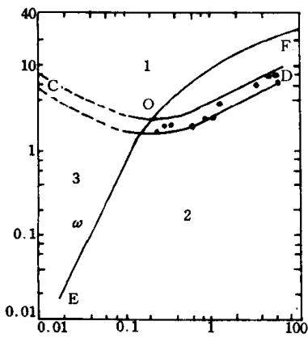  
图 3-7 泥沙沉积条件分区

(1）在COD线以上 V，>V，运动泥沙与床面泥沙有可能发生交换，只有当上游来沙量超过水流挟沙能力时，泥沙才开始沉降；反之，如上游来沙量不及水流挟沙能力，河床就会发生冲刷。其中FOD部分的泥沙运动以推移为主，其余泥沙以悬移为主。

(2) 在 EOD 线以下 V. <V×c及 V.$< \omega$ ，水流既不能冲刷床面泥沙，使之搬运而去，又不能足以支持上游来沙，使之继续在水中悬移，因此泥沙迅速淤积。

(3)在COE线左侧 $\omega { < } V _ { \ast } { < } V _ { \ast }$ c，水流不足以自河床中取得泥沙补充，但只要上游来沙，则因该段的紊动强度能够支持其继续悬移运动，将上游来沙输送下去，不发生过多沉积。

## 二、土壤侵蚀规律

水力侵蚀过程中剥蚀、搬运和沉积3种状态的发生，归根结底都是在不同具体条件下，水的破坏力大于土体的抵抗力的结果。由于水营力3种状态的不同，对土壤作用形式不仅表现在作为流体力学性质，而且表现在流体的物理性质和水的化学性质上。水土流失不仅是由地表径流水所引起的，还有雨滴击溅和下渗水的作用。

水是土壤肥力不可少的因素，在土壤肥力形成过程中，它是水分循环和营养循环最基本的，也是具有决定性的因素。但有时水也能引起土壤肥力的减低和破坏。水的3种不同形态以各种方式对土壤侵蚀，引起水土流失，造成土地退化。

## （一）雨滴击溅侵蚀

降雨雨滴动能作用于地表土壤而作功，产生土粒分散，溅起和增强地表薄层径流紊动等现象，称为雨滴溅蚀作用，或击溅侵蚀。雨滴溅蚀主要表现在下列3个方面：

（1）破坏土壤结构，分散土体成土粒，造成土壤表层孔隙减少或者堵塞，形成“板结”，引起土壤渗透性下降，利于地表径流形成和流动。

(2）直接打击地面，产生土粒飞溅和沿坡面迁移。

(3）雨滴打击增强地表薄层径流的紊动强度，导致了侵蚀和输沙能力增大。

这三方面在溅蚀过程中紧密相联，互相影响，就其过程而言，大致分为4个阶段：降雨初期，地表土壤含水分少，雨滴打击使于燥土粒溅起，为于土溅散阶段：接着表层土粒逐渐被水分饱和，溅起的是湿土粒，为湿土溅散阶段：在击溅同时，土壤团粒和土体被粉碎和分散，随降雨的继续，地表出现泥浆，细颗粒出现移动或下渗，阻塞孔隙，促进地表径流产生，雨滴打击使泥浆溅散，为泥浆溅散阶段；降雨继续进行，上述过程的演进加上雨滴对地面打击的压实作用，导致表层土壤密实和微起伏变化，形成地表板结，孔隙率减少，加快径流形成，为径流形成阶段。当雨滴打击在坡面薄层径流时，增强了水流的紊动，保持分离土粒悬浮于水中，从而增加了水体能量，形成更加严重的侵蚀和更高的挟沙能力（可比原来大12倍以上）。这种影响随地表径流深增加而增加，但当径流深超过一定值后（约>3cm），水层具有消能作用，因而对径流侵蚀力和混浊程度的影响比较小。

击溅侵蚀强度随时间延长而渐小，这是由于黏粒下移，表层土壤变得紧密的结果。当土壤结构破坏，细小黏粒分散后会下移到周围表层土壤孔隙中，堵塞孔洞，除了造成表层紧实外还导致渗透速度大大降低。埃利森研究表明，对渗透影响最大的是雨滴速度，其次为雨滴大小，降雨强度影响最小，这显然是冲击力破坏更多的团粒结构，细粒堵塞孔隙更严重，形成结皮，最终增加了地表径流。

雨滴击溅侵蚀能力大小取决于降雨性质，即雨滴大小、降雨强度、雨量等。威斯迈尔在前人研究的基础上，经过大量寻优计算，找到了一个反映侵蚀力的复合参数指标，即降雨侵蚀力指标R：

$$
R = E I _ { 3 0 }\tag{3-22}
$$

式中E该次降雨的总动能；

$I _ { 3 0 }$ ———该次暴雨过程中出现的最大的30min强度，从自记雨量计的记录纸中选取曲线最陡的一段计算出来。

江忠善提出我国黄土高原降雨侵蚀力R指标：

$$
R = E I _ { 3 0 } , E = \Sigma e P , e = 2 7 . 8 3 + 1 1 . 5 5 \mathrm { l o g } I\tag{3-23}
$$

式中 R——相应时段雨量；

I—相应时段雨强；

E——动能。

鉴于E值求解的困难，中国科学院水土保持所、西北林学院等单位在研究了黄土区降雨侵蚀特征后，提出侵蚀力指标的计算式：

$$
R \ : = \ : P I _ { 3 0 }\tag{3-24}
$$

式中 P———该次降雨量， $I _ { 3 0 }$ 同前。

刘秉正依据我国自记雨量资料少、系列短的实际情况在对陕西渭北地区23个县28～33年降水资料分析计算和侵蚀相关分析基础上，提出了新的年侵蚀力R计算方程：

$$
R = 1 0 5 . 4 4 ~ \frac { ( P _ { 6 \sim 9 } ) ^ { 1 . 2 } } { P } - 1 4 0 . 9 6\tag{3-25}
$$

式中 $P _ { 6 \sim }$ 9——某年6～9月降雨量；

P—该年年降雨量，经检验相对误差不超过10%。

雨滴击溅侵蚀除了受降雨侵蚀力影响外，同时受土壤可蚀性大小影响，即受土壤质地、结构、地表植被、坡度等影响。在侵蚀力不变情况下，溅蚀量决定于影响土壤可蚀性诸因子，对同一性质土壤以及相同管理条件来说，则决定于坡面倾斜情况和雨滴打击方向。在平地上，垂直下降的雨滴溅蚀土粒向四周均匀散布，形成土壤交换，不会有溅蚀后果，而在坡地上或雨滴斜向打击下，土粒则会向坡下或因风力斜向移动（图3-8）。

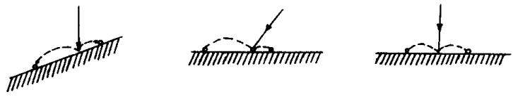  
图3-8 不同条件下雨滴打击所引起的物质迁移状况

溅蚀作用在风力作用下，会改变打击角度，并推动雨滴增加打击能量，当作用于不同坡向、坡度上时，会形成复杂的溅蚀。若某地降雨期间风向不断变化，可能在暴雨后的影响趋于平衡；但对整个降雨期间保持固定方向风，对土壤溅蚀会有很大影响。

埃利森根据模拟实验最早提出雨滴溅蚀量计算公式：

$$
W = K V ^ { 4 . 3 4 } d ^ { 1 . 0 7 } I ^ { 0 . 6 5 }\tag{3-26}
$$

式中 W半小时雨滴的溅蚀量；

V——雨滴速度；

D雨滴直径；

I——降雨强度；

K—土壤类型常数（粉沙土K=0.000785）。

比萨尔也得出类似公式：

$$
W = k d V ^ { 1 . 4 }\tag{3-27}
$$

式中符号同上。

可见对同一性质的土壤，溅蚀量决定于降雨性质（即雨滴速度、直径大小、降雨强度等)。对不同性质的土壤溅蚀量则与降雨动能有密切关系。Fill研究得出沙土溅蚀量与动能0.9次方成正相关，壤土则与降雨动能1.46次方成正相关。

江忠善则在陕北黄土丘陵区不同坡度上进行试验研究得出，溅蚀从分水岭到坡下是不均匀的，呈带状分布。在坡顶，降雨能量几乎全用于将土粒溅向坡下，且无表面径流影响，一般溅蚀量最大；而坡下部的降雨能量多用于溅起土粒的重新搬运，而且径流深的增加，也会影响溅蚀量。当然实际中，由于多种因素影响，侵蚀过程是十分复杂的。

## （二）地表径流侵蚀

地表径流是由地面积水进一步发展而形成的，它的形成可概括为3个阶段：蓄渗阶段、坡面漫流阶段和沟槽集流阶段。而根据侵蚀程度，可分为坡面径流侵蚀和沟蚀。

## 1. 坡面径流侵蚀

坡面水流形成初期，水层很薄，由于地形起伏的影响往往处于分散状态，没有固定的流路，多呈层流，速度较慢。在缓坡地上，薄层水流的速度通常不会超过0.5m/s，最大为1～2m/s。因此，能量不大，冲刷力微弱，只能较均匀地带走土壤表层中细小的呈悬浮状态的物质和一些松散物质，即形成层状侵蚀。但随降雨继续进行，植物截留和填洼都已饱和，降雨强度大于下渗强度，地表便开始出现沿天然坡度流动的细小水流即漫流。随径流汇集的面积不断增大，同时又继续接纳沿途降雨，因而流量和流速不断增加，到一定距离后坡面水流的冲刷能力便大大增加，产生强烈的坡面冲刷，引起地面凹陷。随之径流相对集中，侵蚀力相对变强，在地表上会逐渐形成细小而密集沟，形成细沟侵蚀，最初出现的是斑状侵蚀或不连续的侵蚀点，以后互相串通成为连续细沟，这种细沟沟形很小，且位置和形状不固定，耕作后即可平复。细沟的出现，标志着面蚀的结束和沟道水流侵蚀的开始。

坡面径流冲刷侵蚀与流速、流量、坡度及土壤质地等都有密切关系。土壤颗粒和容重越大，要求的冲刷起动流速就大。冲刷流速和粒径、容重间有如下关系：

$$
V _ { \circ } = a d ^ { 2 } ( r _ { s } - 1 ) ^ { \frac { 2 } { 3 } }\tag{3-28}
$$

式中 $V _ { 0 }$ 起动流速；

$^ { d }$ 粒径；

$\boldsymbol { r } _ { s }$ ——泥沙比重；

$\pmb { \alpha }$ 系数。

所以沙土较黏土易冲刷，细粒较粗粒易冲刷。

坡面径流量（或径流深）越大，坡度越陡，径流对坡面土壤冲刷力就越大，对地面侵蚀量越大。在稳定流条件下，水流流过单位面积坡面时产生的冲刷作用力大小为：

$$
F = G \ { \frac { h x } { 1 \ 0 0 0 } } { \sin \theta }\tag{3-29}
$$

式中 F——冲刷力；

G每立方米含沙水流重量；

$h _ { \mathrm { { \ell } } _ { x } }$ ——距分水岭X 处径流深；

θ—坡度。

侵蚀量与径流量之间则存在指数函数关系即：

$$
M _ { s } = a Q ^ { \flat }\tag{3-30}
$$

可见随着径流量和流速增大，侵蚀能量和侵蚀力跟着增大，径流与冲刷呈指数函数关系。随各地土壤性质、植被密度、坡度等不同，指数大小不一，我国黄土区指数均大于1。

## 2. 沟蚀

地表坡面薄层水流进一步汇集而形成股流，股流水流集中在沟槽中，冲刷侵蚀能量增强，一方面掏冲下覆土体；一方面进行侧蚀，不断地改变沟槽形态，形成形态各异的侵蚀沟。由于水流能量的差异，沟谷总是先出现细小沟谷，然后依次出现大型沟谷。

侵蚀沟谷的发育在沟谷形态和侵蚀特征上是不同的，据此可划分为浅沟、切沟、冲沟、坳沟4个不同发育阶段。由于坡面径流进一步集中为较大的股流，向下切入底土，形成深度超过1m，宽度超过深度0.5～1倍以上（在生产影响下可达几倍到几十倍）的宽而浅的沟道，即浅沟，此为第一阶段。浅沟一旦形成就固定下来，非一般的耕作措施所能平复。由于不断地面蚀和耕锄影响，沟壁与坡面无明显界限，生产中耕梨可以通过，坡面呈波形起伏，纵比降与所在斜坡的坡面基本一致，沟床微有阶梯状。浅沟发育中除有纵向细沟汇入外，还有两侧羽状细沟汇入，因之其宽度自上而下逐渐增大，深度也有所增加。坡耕地浅沟侵蚀发育一般限于耕作层，在坡降大汇流多或下游段，侵蚀才向犁底层以下扩展，出现切沟侵蚀特征。

浅沟径流进一步集中，或者由于汇水面积较大而集中了较大股流时，下切力很强，沟身切入地面很深，此时出现明显的沟头，即为切沟，此为第二阶段。切沟的深度为10\~50m，沟底纵断面在上游段与坡面基本保持平行，下游陡于原坡面，形成上缓、下陡的曲线。下游沟底出现多级跌水和陷穴，沟壁陡峭，沟坡与沟岸转折明显，横断面呈“V”字型，后期发育为宽“V”型。

切沟进一步发育，出现上陡下缓的纵剖面，跌水出现在上游，下游沟底已趋平缓，下切缓和，但沟壁扩展还很活跃，沟头集水面积较大时，溯源侵蚀仍在进行，横断面一般呈“V”型或宽“U”形，下游沟底较宽，可出现一些堆积物及冲积物，此为第三阶段，即冲沟阶段。

冲沟发育到一定阶段时，侵蚀沟逐步停止发育，溯源和下切侵蚀均已停止，侧蚀会继续一定时期，沟底也淤积一定量的冲积物，沟坡逐渐崩塌最后达自然安息角，坡脚形成稳定的坡积物，沟头和沟坡上逐渐长出植物，此为第四阶段，亦称坳沟阶段或安息阶段。坳沟多属承袭沟谷。坳沟接纳多条冲沟水流后，历经长期的切蚀和侧蚀，发展成为河沟，以后的侵蚀则主要为河沟山洪侵蚀。

## （三）下渗侵蚀

由于水流下渗，增加了土体重力，同时下渗水浸泡使土体颗粒之间凝聚力减弱，当重力超过内摩擦力、凝聚力和根系的固持力时，就会发生滑坡、崩塌、泻溜等，造成土壤侵蚀，由于这类侵蚀的直接作用力主要是重力，故也叫重力侵蚀。

同时水流在下渗过程中，不断淋溶土壤，使细粒和各种盐分跟着向下移动，造成上层土壤组成颗粒变粗，养分降低，生产力下降。而随着淋溶不断进行，下移的细粒和盐分在一定部位形成积层，使继续下渗的水在不透水积层上产生侧向流动，形成土体下部的管状暗沟产生潜蚀。而上部重量增加，可塑性加大，从而下坠成为陷穴。之外，在较为宽广平坦的积水坑，由于水分下渗，充填了土体内所有孔隙，使土壤通气不良，嫌气性细菌发育，长时积水产生土壤沼泽化，使土壤物理性质恶化，肥力降低，生产能力衰退，也可形成荒漠化。因而，增加水流下渗可减少地表径流冲刷，避免径流侵蚀，但下渗不当，也会发生特殊的水土流失，降低生产力。

水力对土壤侵蚀除了以雨滴击溅、地表径流及下渗水流形式侵蚀外，还与其他营力共同作用或3种状态水营力交替作用对土壤产生混合侵蚀。最常见的混合侵蚀就是泥石流。

## 三、影响土壤水蚀的因素

影响土壤水力侵蚀的因素有自然因素，也有人为因素。自然因素是侵蚀发生、发展的潜在条件，人为不合理的活动是造成土壤加速侵蚀的主导因素。

## （一）降雨对土壤水蚀的影响

降雨是侵蚀发生的动力，它一方面直接打击地表土壤形成击溅侵蚀；另一方面形成地表径流，冲刷土体，同时参与形成了土壤内在的一些特征，以

一种综合效应来影响侵蚀。

## 1. 雨型

雨型不同，其表现的雨滴特性（包括雨滴形状、大小、分布、降落速度、接地时冲击力等）亦不同，因而产生的击溅侵蚀能力不同。一般阵雨较普雨来势猛，历时短，强度大。就一定雨强来说，阵雨更易引起土壤侵蚀，特别是暴雨，强度大，雨滴大，所具动能也大，造成的侵蚀作用强。

## 2. 降雨强度

降雨强度是指单位时间内的降雨量，它是降雨因子中对土壤侵蚀影响最主要的因子。降雨强度越大，对土壤产生的冲击力越大，造成的侵蚀力R越大。大量研究证明，降雨强度与土壤侵蚀量呈正相关，而且土壤侵蚀只发生在少数几场暴雨中。

## 3. 降雨量

一般来说，年降雨量大，可能侵蚀总量也大，但实际侵蚀大小，与地表状况及土壤特征有关。特别对土壤侵蚀直接相关的常常是侵蚀模数超过1t/km²的可蚀性降雨量。在黄土高原，每年引起土壤流失的可蚀性降雨量约163.0mm，其中坡面为128.1mm，沟道小流域为197.5mm。对于低强度、长历时、大雨量的降雨，虽然很少因产生地表径流冲刷而导致土壤侵蚀，但因有大量水分下渗，增加土体重力，破坏土体团粒结构，会产生重力侵蚀。

## （二）地形对土壤水蚀的影响

影响土壤水蚀的地形因素包括地面坡度大小、坡长、坡形等。

## 1. 坡度

坡面坡度是决定径流冲刷能力的基本因素之一。水流所具有的能量是水流质量与其流速的函数，而流速的大小主要决定于径流深度和地面坡度。坡度大小不仅影响流速，而且还影响渗透量与径流量，因而坡度直接影响径流的冲刷能力。在其他条件相同时，坡度愈大，流速愈大，土壤侵蚀量愈大。冲刷量随坡度加大而增加，但坡度增大到一定限度后，冲刷因径流量的减少而减小。在黄士高原丘陵沟壑区，这个转折坡度大约为25°～28.5°。

地面坡度对雨滴的击溅侵蚀也有一定影响。在平坦地面，即使雨滴可能导致严重的土粒飞溅现象，也不致造成严重的土壤流失，而在坡面上，溅蚀量则随坡度增大而加大。

## 2. 坡长

坡面越长，径流速度就越大，汇聚的流量也愈大，侵蚀力就愈强，所以在其他条件相同时，坡面长度直接影响水力侵蚀强度。如果结合降雨条件分析，情况就较为复杂，归纳起来有3种情况：

（1）在特大及较大暴雨情况下，雨量在10～15mm以上，强度超过0.5mm/min时，坡长与径流量、冲刷量均成正相关；

(2)在降雨的平均强度小，或平均强度较大而持续时间较短的情况下，坡长与径流量成反相关，而与冲刷量成正相关；

(3)在一次降雨量很小，只有3～5mm，强度很小，历时也很短的情况下，坡长与径流量、冲刷量均成负相关。

## 3. 地形

地形对水力侵蚀的影响，实际上是坡度和坡长综合作用的结果。对于上下坡度一致的直线形坡面，下部集中径流量最多，流速大，造成的土壤冲刷强烈；对于上部缓下部陡的凸形坡，下部冲刷强烈；对上部陡下部缓的凹形坡，中上部侵蚀强烈，下部侵蚀较小，甚至可有堆积发生；对于起伏相间的阶段形坡，在台阶部分侵蚀弱，台阶边缘则易发生沟蚀。

## 4. 坡向

坡向不同，所接受的太阳辐射不同，从而影响土壤温度、湿度、植被状况等一系列环境因子的不同，其侵蚀过程也有明显的差异。实践观测结果表明阳坡的侵蚀大于阴坡。

## （三）土壤条件对水力侵蚀的影响

土壤是侵蚀对象，又是影响径流的因素。因此，土壤各种性质都会对侵蚀产生影响，特别是透水性、抗蚀性和抗冲性对土壤侵蚀有很大影响。

土壤抗蚀性是指土壤抵抗径流对其分散和悬浮的能力，抗冲性是指在土壤抵抗径流对其机械破坏和推动下移的能力，而透水性则直接影响径流流速和流量等。

影响土壤上述性质的因素有土壤质地、土壤结构及水稳性、土壤孔隙、剖面构造、土层厚度、土壤湿度及土地利用方式等。一般土壤质地较粗，大孔隙含量多，缺乏结构，成土作用较弱的土壤，其透水性强，持水量低，胶结物少，抗蚀性、抗冲性差，侵蚀强烈；而土壤黏粒多，胶结物多，结构好，团聚性和稳定性好，总孔隙率高，其透水性和持水性高，抗蚀、抗冲性大，侵蚀较弱。

## （四）植被对土壤侵蚀的影响

植被通过冠层拦截降雨，保护地面免受雨滴打击，并调节地表径流，增加土壤入渗时间，削减径流动能，加强和增进土壤渗透性、抗蚀性和抗冲性等，对抑制土壤侵蚀发生起积极作用。

## 1. 拦截降雨

植被的地上部分常呈多层重叠遮蔽地面，并具有一定的弹性和开张角，能承接、分散和削弱雨滴及雨滴能量，截留的雨滴汇集后又会沿枝干缓缓流落或滴落地面，改变了降雨落地的方式，减小了林下降雨强度和降雨量，利于水分下渗，因而减少了地表径流和对土壤的冲刷。截留作用的大小因覆盖度、郁闭度及雨强的不同而不同，一般覆盖度大，郁闭度高，截留作用大；而降雨强度增大，截留量减少。

## 2. 调节径流

森林、草地中常常有一层枯枝落叶，具有很强的涵蓄水分的能力，同时也可改变土壤特性，提高土壤渗透能力，从而影响径流形成或减少径流量，延长径流时间，减缓径流流速，起到调节径流的作用。

## 3. 团结土体

植物根系对土壤有很好的穿插、缠绕、团结作用，能把根系周围的土体，紧紧固持起来，增大抗蚀性和抗冲性，减少了土壤冲刷。

## 4. 改良土壤性状

植被可以增加土壤腐殖层含量，促进成土过程，增加土壤团聚性，改善土壤结构，从而提高土壤抗蚀性和抗冲性。

## （五）人为活动对水力侵蚀的影响

人为活动对土壤水力侵蚀的影响具有2个方面的作用：一方面是人为过度的经济活动，如过度垦殖，过度采伐，过度放牧，造成侵蚀加剧，成为水蚀荒漠化发生、发展的主导因素；另一方面是人们通过改变地形条件，改良土壤性状及造林种草，改善植被状况等途径，制止侵蚀的发生，促进退化土壤的逆转。

## 第四节 盐渍荒漠的防治原理

## 一、盐渍土的形成与分布

## （一）盐渍土的形成

所谓盐渍土（或叫盐碱土）是指对作物生长有害的水溶性盐类（如氯化钠、碳酸钠等）在土壤中的积累超过一定限度，达到对作物正常生长产生危害的土壤，是对盐土、碱土以及各种盐化、碱化土壤的统称，在我国土壤分类上被列为14种土类中的一种土类。盐类在土壤中积累形成盐渍土的过程称为盐渍化。

盐渍土的形成必须具备一定的条件，才能使盐分在土壤表面聚积起来。这些条件主要有：

## 1. 物质来源

充分的盐类物质来源是形成盐渍土的基础。盐类物质来源的主要途径有：①岩石风化物；②含盐地层的风化和再循环；③火山活动的产物；④深层盐水的外冒；⑤风蚀风积盐类；⑥生物累积的盐分等等。对于一个地区或一个地段上的土壤盐渍化，其盐分来源的途径往往不是单一的，而可能是多种多样的。因而研究盐分来源的方式时，应考虑各地区的特点，并结合地貌的发展历史、气候、水文、水文地质、植物和土壤母质等加以分析研究。

## 2. 地形条件

土壤盐分的累积必须具有适宜的地形条件，盐分才能富集起来，才能形成盐渍土。地形高低的差异，反映土壤沉积母质的粗细及其排列厚薄不同，同时地形的高低又使大气降水所形成的地面和地下径流发生通畅或滞缓的差异。对于水盐的重新分配起着决定性的影响，直接关系到土壤盐渍化的发生条件。

土壤盐渍化的发生总是与地形地貌联系在一起的，即在一定地形部位出现的。由于盐分的迁移是以水作为载体，随水运移，而水的流动总是沿着地形的高处流向低处，所以盐分含量随着地形高低的变化而变化，加之各种盐类的溶解度的差异，在山麓、坡地、洼地等地形部位形成了盐分的化学分异，产生了盐渍地球化学的分带性。

从大中地形来看，一般山麓、高平原地势高，坡度陡，地下水位深，自然排水通畅，土壤质地粗，径流通畅，矿化度低，一般不发生盐渍化。而低洼地区，地下水的出流条件不好，成为地下水和地表水的汇集之处，盐随水来，不能随水而去，便逐渐积盐形成盐渍土。

从小地形来看，盐分积聚常常发生在局部微高突起处。因为高处常因灌不上水或积水薄，土壤出露，蒸发作用强烈，盐分随水分由低处向高处不断集中，使高处积盐比低处多，常形成盐斑。

## 3. 水文条件

地下水位高，矿化度高是形成盐渍化的重要条件。在蒸发量远大于降水量的条件下，地下水位越浅，矿化度越高，随蒸发作用而供给土壤表层的水盐越多，地表积盐越重，土壤盐渍化程度越大。通常地下水位埋藏深度浅于3m，土壤易发生盐渍化，而地下水位在10m以下一般不会发生盐渍化。

## 4. 气候条件

在我国北方干旱、半干旱地区或季节性干旱地区，降水量小，蒸发量大。在高温、低湿、蒸发强烈条件下易于积盐。从盐渍土的发生特征而论，随蒸降比值的变化而变化。一般从东到西随蒸降比值的递增，盐渍化面积和积盐

强度大大增加。

## 5. 生物条件

地表植被对地面蒸发有很大影响，植被稀疏或光板地因地面蒸发强烈，极易积盐形成盐渍化，而植被密度增大，可减少土壤水分蒸发量，减轻积盐。

## 6. 人为因素

在灌溉地区，因人为用水不当，如无计划引水，大量漫灌，有灌无排，土地不平，有机肥料不足，耕作不善等都会造成或加强盐渍化。灌区土壤次生盐渍化主要是因为人为用水不当形成的。

## （二）我国盐渍土的分布

我国盐渍土主要分布在干旱、半干旱和亚湿润的干旱地区，主要有滨海盐渍土区、华北盐渍土区、西北盐渍土区、东北盐渍土区、灌区次生盐渍土区等五大区，其中三北防护林地区是我国盐渍土集中分布区。

我国三北防护林建设区有盐碱地2170.48万hm²，占全区土地总面积的5.3%，其中盐土占84.0%，碱土占4.5%，盐结壳占11.5%。

三北地区盐土以含硫酸盐为主的盐土较多，含氯化物为主的盐土较少。盐土总面积1817.20万hm²，境内共有5个亚类：①旱盐土，主要分布于青海、新疆、甘肃、河西走廊及内蒙古西部等地，目前大部分寸草不生，约占盐渍土的一半以上。一般1m土层中平均含盐量在1%～4%之间，盐分组成以硫酸盐或硫酸盐氯化物为主。表土盐结皮很厚，含盐量极高，一般20%～40%，最高60%。②草甸盐土，主要分布于内蒙古河套地区、甘肃河西走廊、新疆较大河流的河谷地区，常见植物以芦苇、冰草为主，尚有柽柳、沙棘和胡杨生长。土层含盐量较少，地下水位较高，盐分组成以硫酸盐氯化物或氯化物硫酸盐为主，地表有盐霜和薄盐结皮，以下为明显的腐殖质层。土层中有少量盐斑和潜育特征。③沼泽盐土，主要分布在湖泊周围和排水不良的低洼地区。表层常有含盐的薄层泥碳或夹杂腐朽草类的盐结皮，下为潜育层。盐结皮和亚表土层含盐量为5%～10%，地下水一般在1m以内。①碱化盐土（苏打盐土)，主要分布于东北、西北和内蒙古东部。含较多碳酸盐或重碳酸盐，pH值9～10，各层土壤含盐量约为0.3%～1.5%，碱性特征因盐分大量存在而被掩盖，表现不明显。⑤滨海盐土，分布于天津和辽宁锦州的沿海地区，多为氯化物型盐土，由于受海水顶托的影响，地下水位高，在1m左右，矿化度约10\~15g/L。

碱土总碱度大于2.5mg当量/100g土，表土脱盐，其下为高度碱化的积盐碱化层。土体呈明显的柱状结构，物理性不良，通透性差，主要分布于松嫩平原，内蒙古东部和西北的个别地区，总面积98.56万hm²。

盐结壳，是由于湖面于涸，地面形成厚达几米至十几米坚硬如铁的盐壳，视若平原，表面有薄层沙土覆盖，集中分布于青海、新疆两省、自治区，甘肃河西走廊西部也有少量分布。由于含盐量极高是盐化工业原料，农林牧业不能利用，总面积250万hm²。

## 二、水肥盐运动规律

## （一）水盐运动规律

盐碱地中水溶性盐是随着土壤水的移动而移动的，水盐运动可分为垂直运动和水平运动。盐渍土的形成和发展变化与水盐运动密切相关。

## 1. 垂直运动

水盐垂直运动有积盐和脱盐2种不同形式。在非灌溉的干旱时期，土壤中盐类随水分蒸发沿着毛细管上升到地表，水分被蒸发后盐分便留在地面，随水分的不断蒸发，地表盐分不断增加，这就是土壤积盐过程。而在降水或灌溉时，土壤水分向下流动，耕作层的盐分被雨水或灌溉水溶解后，随着下降水流也向下移动，把盐分从上层淋洗到下层，叫压盐。若有排水条件，则盐分可随水渗入排水沟排走，这样就使土壤脱盐。土壤积盐和脱盐的过程就是土壤盐渍化和递转的过程。若每年积盐量大于脱盐量，则土壤向盐渍化方向发展，反之向非盐渍化方向发展。

## 2. 水平运动

“人往高处走，水往低处流”。从大地形来看，含盐碱的高矿化度的地下水总是从高处流向洼处，使盐分在洼处积聚起来形成盐渍化，这便是水平运动的结果。当然在小地形的洼地边缘或平地中局部高地，则因水盐垂直运动或水分的侧渗，往往形成盐斑。

## （二）肥盐关系

肥料对土壤盐类有明显克制作用，主要表现在：①有机质具有强大的吸附力，使碱性盐被吸附固定起来，对作物起到缓冲作用，不起危害作用。②有机质在分解过程中能产生各种有机酸，使土壤中阴阳离子溶解度增加，有利于脱盐，同时能活化钙镁盐类，有利于离子代换，起到中和土壤中的碱性物质，释放各种养分的作用。③施肥可以补充和平衡土壤中作物所需的阳离子，而离子平衡可以提高作物的抗盐性。

可见土壤中水肥盐的运动规律是盐渍化防治重要理论依据，水和肥是改良盐渍土的重要物质基础。在盐渍土防治中，治水是基础，培肥是根本，只有以水洗盐排碱，以肥改土，巩固脱盐效果，才能使盐渍化向良性循环。

## 三、土壤次生盐渍化的成因及特点

## （一）土壤次生盐渍化的成因

土壤次生盐渍化是指由于人类经济活动的一些不利措施，如大水灌溉，有灌无排，渠系严重渗漏，排水受阻，平原中高水位蓄水等引起含有可溶性盐的地下水位上升，使原来为非盐渍化的土壤或已经改良为非盐渍化的土壤，经过盐渍过程演变为盐渍化土壤。

由于地下水位的抬升，水位距地表距离缩短，随着土壤水分蒸发，地下水不断随土壤毛细管上升，在上升过程中将溶于水中的盐分携带到土壤表层积聚起来，形成盐渍化。地下水位越高，矿化度越大，蒸发越强烈，则土壤次生盐渍化程度越严重。

可见含有可溶性盐类的地下水位上升是形成土壤次生盐渍化的根本原因。

引起灌区地下水位上升的原因是多种多样的，主要有：

（1）渠系渗漏水大量补给地下水在自流渠灌区，渠系严重渗漏，水的利用率低，是全球性的普遍现象。全球水的利用率大约在15%～5%之间。由于渠道高，填方多，输水期长，缺乏防渗设施以及管理不善等因素，造成渠系严重渗水，大量补给地下水，使地下水位抬升。据宁夏水文总站对引黄灌区地下水的平衡分析，地下水总补给量中渠道渗漏补给占76.5%，可见渠道渗漏是地下水的主要补给来源。

（2）缺少充分的出流条件发展自流渠灌的地区，大多是在冲积平原的低平位置，排水不良，同时由于大部分地区人们在新建渠灌时，多重视灌溉，而忽略排水的重要性，重灌轻排，甚至只灌不排，使地下水补给量与排水量之间失去平衡，来水量大于去水量，从而使地下水位上升。这是促使地下水位抬高的根本原因。

(3)过量灌水促使地下水位上升造成过量灌水的原因很多，主要有：①田间工程不配套，无法控制用水量。②灌溉技术落后，田块不平，田块过大，实行串灌、漫灌。③管理不善等。灌水量过大，大部分水入渗地下，补给地下水，使地下水位抬升。

可见对于因地下水位抬升产生的大面积次生盐渍化，只要采取有效措施，节源开流，降低地下水位，土壤次生盐渍化是有可能预防和逐步消除的。

除了灌水不当，使地下水位抬升，造成次生盐渍化外，利用高矿化度的咸水、碱性水灌溉也是引起次生盐渍化的因素之一。在我国西北、华北的一些缺水地区，为了抗旱增产，利用高矿化度（3\~8g/L）的咸水灌溉，虽然短时期内得到了一定的增产作用，但长期使用，却使土壤中盐分显著增加，形成盐渍土。灌溉用水矿化度越高，土壤盐渍化程度就越重。

另外随着工业发展，工业废水（污水）大量排放，或者直接引用污水灌溉，也造成土壤盐分积累。工业废水成分复杂，其中盐碱类物质占很大比重，如皮革废水矿化度为 $2 \sim 8 \mathbf { g } / \mathrm { L }$ ，如果直接用于灌溉容易发生土壤次生盐渍化。长期进行污灌，土壤含盐量显著增加。

## （二）次生盐渍化发生的特点和规律

灌区土壤次生盐渍化发生常常迅猛，盐分垂直剖面分布的表聚性显著增大，多呈带状和斑点状分布。次生盐渍化常具有如下发生和分布规律：

(1）灌区的地上河道或输水渠道两侧，由于渗漏水的影响，次生盐渍化沿河、渠呈条带状分布。离河、渠越近，地势越洼，渠道或河床越高，发生越严重。

(2)洪积扇扬水灌区的下部或多级扬水灌区的一级扬水地区，大面积成片发生。

(3)耕种的条田中，由于地面不平和土质影响也有次生盐渍化的发生，多为插花盐斑，呈点片状分布，面积小，难改造。

(4)平原水库、湖泊，常年积水的洼地和插花种稻的稻田周围地带，由内向外呈辐射状分布。

(5)渠道交岔的三角地带易发生盐渍化。

(6)垦殖盐渍土而发展的自流灌区，地下水位上升快，原属残余盐土的经过灌水后复活为现代积盐过程。在灌区的非盐渍化和轻度盐渍化的面积增大，而强度盐渍化的面积较一般自流渠灌区缩小。盐斑多分布于条田中间，仅在干、支渠两侧呈带状分布。

## （三）盐斑的成因

盐斑，即耕地中小面积的斑块状的盐渍土，它的产生是土壤次生盐渍化的标志。盐斑的盐分含量以中心最多，由里向外逐渐变少。

形成盐斑的因素有自然因素，也有人为因素。在古地形地貌中，冲积平原地貌岗坡洼起伏，河流缺口改道，古河槽变迁的地段，塑造的地形地貌屡经变化，原来低地淤高，高地相对变低，反复多次，沉积不同厚薄的沙粒层次，形成土壤分布的不均匀性，使土壤水盐重新分配，水盐运行的速度发生差异，形成盐斑。

而在灌溉中，人们对田块整地不平，垦殖盐土时改良不彻底，或新建渠系的渗漏或水旱轮作时平掉积盐田埂，或者在开荒造田时将含盐表土层填在沟洼处等等因素，都会造成土壤分布的不均匀性，使水盐重新分配，影响水

盐正常运行，产生盐斑。

可见土壤的不均匀性是盐斑形成的基础。可根据盐斑的成因类型的不同，采用相应的措施是有可能预防或消除盐斑形成的。

## 四、土壤盐渍化的防治原理

盐渍化的防治主要依据土壤盐渍化的原因与水盐运动规律来制定改良措施。根据盐渍化成因类型及水盐运动规律采取不同措施，就其作用和内容，可概括为以下几个方面：

(1）控制盐源充分的盐分来源是形成盐渍化的物质基础。因而通过控制盐分进入土壤的上层，使土壤中不致有过多盐分，是防止盐渍化产生的有效途径之一。

(2)消除过多的盐量对已经发生盐渍化或者垦殖盐荒地时，通过冲洗、排水、客土等措施消除土壤中过多的盐量，来改良盐渍土。

（3）调控盐量采用适宜的灌溉技术（滴灌、喷灌）使土壤保持适宜水分、控制盐分浓度，或者采用生物排水、水旱轮作等改变水盐运动的规律，以达到减少盐分累积的作用。

(4)转化盐类通过施用一定的化学物质，将盐分转化为毒害作用较小的盐分。

（5）适应性种植利用盐生植物、耐盐植物，控制地面蒸发、减少积盐过程。

## 参考文献

1. 于静波.我国土地资源持续利用的框架.国土与自然资源研究，1997，(2)：29\~31

2. 马克平.生物多样性公约的起草过程和主要内容.生物多样化，1994，2(3)：184\~186

3. 马克平. 试论生物多样性的概念. 生物多样性，1993，1(1)：20\~22

4. 戈敢编著． 盐碱地改良． 北京：水利电力出版社，1987

5. 王礼先主编．水土保持学．北京：中国林业出版社，1995

6. 刘求实．区域可持续发展指标体系与评价方法研究. 干旱区研究，1996，13(2)：60～65

7. 刘秉正，吴发启编著.土壤侵蚀.西安：陕西人民出版社，1997

8. 刘恕. 试论沙漠化过程及其防治措施的生态学基础. 中国沙漠，1996，6（1）：6\~12

9. 曲仲湘，吴玉树等编．植物生态学.北京：高等教育出版社，1983

10. 朱振达，陈广庭等著．中国土地沙质荒漠化. 北京：科学出版社，1994

11. 朱朝云，丁国栋等编．风沙物理学. 北京：中国林业出版社，1992

12. 张广军主编． 沙漠学.北京：中国林业出版社，1996

13. 张奎壁，邹受益主编.治沙原理与技术.北京：中国林业出版社，1990

14. 李述刚.和心俊等.干旱区绿色农业持续发展战略.干旱区研究，1997，14(2)：1～5

15. 李新荣．毛乌素沙地荒漠化与生物多样性的保护.中国沙漠，1997，17（1）：58\~61

16. 黎立群编. 盐渍土基础知识. 北京：科学出版社，1986

## 第四章

# 荒漠化地区植被建设技术

在干旱的亚湿润地区和半干旱地区的气候条件下，本不应该出现严重的荒漠化土地，应该生长较好的森林草原、草甸草原、干草原植被，或是受到保护的人工林、草、作物植被，但由于历史时期和现代人类长期不合理的经济活动严重破坏植被导致了荒漠化土地的形成。在我国北方特定的气候、土质、经济条件下，风蚀荒漠化（即沙质荒漠化亦称沙漠化）成为土地荒漠化中最主要、最基本、最普遍的形式，而半干旱草原的农牧交错区在现时特定的社会、经济、技术条件下就成为我国沙质荒漠化最严重的地区，以至许多地方出现了大面积退化土地乃至流动沙丘。本区的生态系统由于人类长期的掠夺性经营（乱砍、滥伐、乱樵乱垦，草场长期过牧、农牧业粗放经营，加之历来不注意植被保护）而遭到破坏，本就脆弱的“系统”日趋退化，失去平衡，以至彻底崩溃，成为无生产力的流沙或基本无生产力的沙荒地。本区石质山地、土石山地、黄土高原沟壑和丘陵，由于本身就潜在着水蚀的危险(坡度、降雨、疏松土质)，加上长期不合理的土地利用如陡坡开垦、林草乱樵、过牧等严重破坏了地表植被，形成了水蚀荒漠化一水土流失问题；由于灌区用水不当导致了不可忽视的土地盐渍荒漠化问题。

干旱的半荒漠、荒漠地区，由于生态环境更加脆弱，不合理的经济活动更易导致土地荒漠化。

各种原因造成植被的严重破坏或彻底丧失，是土地荒漠化最明显的表现，而植被的长期破坏、退化与丧失，正是造成土地荒漠化最直接的原因。归根结底土地荒漠化的形成正是植被长期破坏与丧失的结果。进行现代化经济建设与生态建设，必须治理改造这些荒漠化土地。而要改造治理，实现生态逆转，依靠自然恢复需要十分漫长的岁月，往往需数十年，甚至数百年的时间。为尽快解决土地荒漠化问题，必须进行人为干预（生态环境建设)，输入能量与物质（包括技术与管理）。由于本区有一定的降雨量，水分条件相对较好，能够满足一定植被生长发育需要。因此，通过人工措施，保护、恢复、改造、建设植被就成为防治土地荒漠化最有效、最经济、最持久、最稳定的措施，因而也是根本性措施，虽然它也常常需要工程措施的有效配合。

对于荒漠化土地，在社会经济和气候条件相对较好的地区，可以综合治理、集约经营，通过一次性完成科学规划、平地、灌溉系统、防护林体系、道路网络等建设，然后对农林草牧的科学经营管理，把沙荒或流沙地一次性建成生产基地。而在生态环境相对脆弱的地区多是先通过生物措施将沙丘固定、控制流沙危害和改善生态条件以后，再逐步改造成生产基地。

良好的植被条件，必将产生相应的热力效应、水文效应、动力效应及改良土壤、提高生物多样性等，而使整个生态系统更为有序、复杂、稳定，乃至最终全面实现生态逆转，进入良性循环，全面改善生态环境，为区域的社会经济持续发展和国家建设重点向西部转移提供生态保障。

在干旱的半荒漠地区，因降水量减少而必须实行生物与工程措施相结合的治理方法才能将流沙固定。而工程措施（如沙障设置）也不能一劳永逸，需多次应用，生物措施（造林）也要多次实施，直到流沙固定后实现稳定的植被演替，且对治理的成果要进行认真的管护。

在荒漠地带由于生态条件更加严酷，一般的植物固沙已不可能，必须在有地下水、地表水可利用的条件下进行有限的植物固沙工作。但是由于我国干旱绿洲（人工与天然）的生命之源是高山冰川融水形成的河流、湖泊与地下水。它们滋养了荒漠植被，如胡杨(Populus diversifolia Schrenk)、梭梭[Haloxylon ammodendron (C. A. Mey. ) Bunge]、柽柳 (T'amarix spp.) 成为该地区荒漠海洋中的生命绿岛及人类繁衍与经济活动中心，它们是无价的生态屏障。在水分极其缺乏的广大地区只能通过工程措施（化学、风力、沙障等）进行特别必须的流沙治理。

本章内容主要介绍的正是土地荒漠化防治中的植被建设技术一生物措施。它包括流沙治理中的生物措施、沙地造林、沙地防护林体系及防治水蚀荒漠化和盐渍荒漠化的植被建设技术。

## 第一节 封沙育林育草恢复天然植被

在中国防沙治沙工程十年规划中，有一项重要措施就是封沙育林育草治沙。规划要求全国封育治沙面积达266.7万hm²，占治沙面积的40%，比人工造林（占20%）和飞机播种（占10%）两项之和还多。可见封育措施已成为重要的治沙方法而得到广泛的应用。

在干旱半干旱地区，原有植被遭到破坏或有条件生长植被的地段，实行一定的保护措施（设置围栏），建立必要的保护组织（护林站），把一定面积的地段封禁起来，严禁人畜破坏，给植物以繁衍生息的时间，逐步恢复天然植被。

在我国半干旱风沙地区，封育是常用的措施，在几年内可使流沙地达到固定、半固定状态。以内蒙古为例，在50年代全区封沙育草260万hm²，使大面积流沙基本得到固定。在半干旱地区，辽宁的建平、台安、锦县、盖平等地，通过封育使35km长的大凌河两岸沙地长满了各种乔灌草植物，很快覆盖了沙面。内蒙古伊盟伊金霍洛旗毛乌聂盖村从1952年起封沙育草17300多公顷，至1960年已由流沙变成以沙蒿为主的固定沙地。据调查，鄂托克旗开垦的荒漠化草原，一经弃耕封禁，天然植被很快繁生，1～2年以星星草(Puccinellia tenuflora)、狗尾草（Setaria viridis)、灰藜(Chenopodiumalbum)、蒺藜(Tribulus terrestris)为主，总盖度达70%;3～5年赖草(Leymussecalinus)、白草（Pennisetum flaccidum）等根茎植物繁生，6～10年恢复到接近当地的稳定植被。下面介绍我国东北沙区和西北干旱区重点植被的封育措施：

(1) 沙地樟子松(Pinus sylvestris var. mongolica) 封育 在呼伦贝尔草原沙地，分布着大片天然樟子松林。50年代前修建中东铁路，樟子松林遭到严重破坏。50年代后在红花尔基等地建立了林业机构，通过封育，使这片濒临灭绝的松林，得到迅速恢复和发展。红花尔基属森林草原地带，年均气温一2.4℃，1月均温一28.3℃，绝对最低气温一49.3℃，7月均温20.5℃，年均降水322.8mm，年蒸发量1403.8mm，无霜期110d。樟子松天然更新能力强，林带两侧和单株、团块母树周围都有更新幼苗，封育后效果显著。1956年，第一次清查时，林地面积为8867hm²，1974年再次清查时，林地面积已发展到111533hm²，等于1956年的11.7倍，平均每年纯增林地5767hm²。其防护措施主要是，严禁滥砍、滥伐、滥牧，加强防火防虫工作，分道设卡，严格检查。该地樟子松林的迅速恢复，反映了森林、草原之间的变化规律。即

$$
f ^ { \prime } ( 1 ) = f ( \frac { 1 } { 2 } ) + f ( \frac { 1 } { 2 } ) = \frac { \frac { 1 } { 2 } f ( 1 ) + f ( 2 ) + f ( 2 ) } { \frac { 1 } { 2 } f ( 1 ) + f ( 2 ) }
$$

(2）梭梭林的封育梭梭在亚洲荒漠区有大面积分布，形成独特的荒漠林景观。是亚洲荒漠区分布最广泛的荒漠植被类型，西至里海东岸，东至蒙古赛音素，北抵俄罗斯斋桑盆地，南至柴达木盆地东部。中亚和哈萨克斯坦梭梭林面积达1050万hm2，我国梭梭林面积有200多万公顷。梭梭林是荒漠无价之宝，有良好的防风固沙改善小气候环境的生态效益，嫩枝又是驼、羊春秋冬季饲料。梭梭有沙漠活煤之称，是极好的生物能源，其根上寄生的肉从蓉是名贵药材。梭梭植株生长迅速，恢复能力强。据阿拉善畜牧处资料，围栏封育3年的梭梭，盖度由8%上升到20.3%，有多种植物侵入。

(3)干旱区绿洲边缘天然植被封育 灌溉绿洲是荒漠地区农业及经济的精华，因多与沙漠、戈壁毗连，有的则位于沙漠之中，由于长期樵采与过度放牧，老绿洲边缘和内部分布着流动和半流动沙丘。新绿洲由于对沙生植物保护不够，绿色屏障遭到破坏，以致风沙危害比较严重。我国在治理绿洲沙害营造林带林网的同时，绿洲边缘封沙育草，保护天然植被已成为绿洲防护体系重要的内容之一。由于封育，形成一定宽度的固沙植物带。灌丛沙堆上着生柽柳、白茨（Nitraria tangutorum）等植物，丘间低地和平沙地生长甘草(Glvcyrrhiza uralensis)、苦豆子(Sophora alopecuroides)、油蒿(Artemisia or-dosica)、籽蒿（Artemisia sphaerocephala)、骆驼刺（Alhagi pseudoalbag)、芦苇(Phragmites communis)、芨芨草（Achnatherum splendens)、胖姑娘（Kare-linia caspia）等植物。由于大气落尘、植物枯枝落叶、植株分泌物、苔藓地衣及微生物的作用，沙表形成结皮，成土过程加速，沙层变得紧实，抗风蚀能力大大提高。吐鲁番四周300多km风沙线及绿洲内部封沙育草面积13.3多万公顷。乌兰布和沙漠北部与后套绿洲接壤地带，结合营造防沙林带建立的封沙育草区，长达135km，宽1～2km，植被盖度已恢复到40%\~50%以上，有的达70%～80%，成为保护绿洲的生态屏障。

新疆、甘肃、内蒙古通过封育胡杨、梭梭、柽柳等遭受破坏的林地都取得了大面积恢复植被的效果。敦煌周围通过封育恢复胡杨、怪柳及多种荒漠植被几万公顷，改善了生态环境。

封育恢复植被是非常有效，又是成本最低的措施。据计算，封育成本仅为人工造林的1/20（灌溉）到1/40（旱植），为飞播造林的1/3。敦煌市综合封育成本为45元/hm²（彭庆光，1993)，可在干旱、半干旱、亚湿润地区推广。封育同时可以人工补种、补植、移植和加强管理，加速生态逆转。植被恢复到一定程度可进行适当利用。

封沙育林草的面积大小与位置要考虑需要与可能，封育时间的长短要看植被恢复的情况。封育要重视时效性，封育区必须存在植物生长的条件，有种子传播、残存植株、幼苗、萌芽、根蘖植物的存在，南疆要有夏洪与种子同步的条件等。确实不具备植物生长条件，则植物难以恢复。在以往植被遭到大面积破坏，或存在植物生长条件，附近有种子传播的广大地区，都可以考虑采取封育恢复植被的措施以改善生态环境。封育不仅可以固定部分流沙地，更可以恢复大面积因植被破坏而衰退的林草地，尤其是因过牧而沙化退化的牧场。因此这一技术在恢复建设植被方面有重要意义。

## 第二节 飞机播种造林种草固沙

飞机播种造林种草固沙恢复植被是治理风蚀荒漠化土地的重要措施，也是绿化荒山荒坡的有效手段。具有速度快、用工少、成本低、效果好的特点，尤其对地广人稀，交通不便，偏远荒沙、荒山地区恢复植被意义更大。一架运五飞机1天飞播量相当于500人劳动量。我国自1985年北方地区推广飞播技术以来，榆林地区、伊盟地区、赤峰地区、阿拉善地区、河北、新疆及黄土高原大面积推广飞播造林种草治沙、保持水土、建设草场。该项工作得到了中央大力支持，特别是邓小平同志的支持。取得了很好的效益，正在大面积推广。

我国从1958年开始飞播治沙试验到1985年成功，今天，我国的飞播治沙技术经过不断改进已居于世界领先地位。在降水不足200mm的荒漠草原飞播沙拐枣（Calligonum mongolicum）、籽蒿、花棒（Hedysarumscoparium）等取得成功。飞播的成功与否受自然影响的程度很大，必须掌握飞播规律才能取得成功。

## 一、飞播必须解决的技术问题

## 1. 流沙地飞播植物种选择

因流动沙丘迎风坡有剧烈风蚀，背风坡有严重沙埋，故要求飞播植物种子易发芽、生长快、根系扎得深。地上部分有一定的生长高度及冠幅，在一定的密度条件下，形成有抗风蚀能力的群体。同时还要求植物种子、幼苗适应流沙环境，能忍耐沙表高温。可见并不是任何植物都能飞播的。经过大量试验，在草原带飞播最成功的植物有花棒、杨柴（Hedysarum mongolicum），还有籽蒿、沙打旺(Astragalus adsurgens)。在荒漠草原有花棒、蒙古沙拐枣、籽蒿等。其他植物种，或不能发芽，或不能保苗，或固沙能力差等难以在流沙上飞播。

## 2. 沙地飞播种子的发芽条件及种子处理

飞播在沙表的种子能否顺利发芽与地表性质、粗糙度、小气候及种子大小、形状等许多因素有关。不是裸露在沙表经过暴晒的种子都能顺利发芽。在流沙上的种子需要自然覆沙过程。经过试验与观察，东南起沙风容易促进种子自然覆沙，西北起沙风也能使种子自然覆沙，但效果不如东南风。就种子本身而言，扁平种子易覆沙，大粒、轻而圆的种子覆沙较差。当然沙丘不同部位受风力作用不同，覆沙也有明显差别。

就种子的发芽条件来看，需要有一定的温度、水分条件和氧气。一般飞播时，温度已不成问题，氧气在一般情况下当然不成问题，但在选择某些材料进行种子处理时需注意其透气性。种子发芽的关键是水分条件，这一点在播期中讨论。

在流动沙丘上，为防止某些体积大而轻的种子（如花棒）被风吹跑发生位移，可在种子外面包上一层黏土，使种子重量增加5～6倍，制成种子丸，叫种子大粒化处理。这种处理不影响种子发芽，但能大大提高种子抗风能力，防止位移，提高了飞播成效。但是增加了重量和体积对飞播来说也有其不利的一面。如何既提高固结力，又减少重量？1993年榆林治沙所和榆林种子站的科技人员对此进行了改进，大粒化不再用黄土，而是用骨胶和沙子来代替。如要大粒化50kg花棒种子，用骨胶2kg，加水25kg，在大锅里熬4h，准备好过筛的细沙40kg。在容器中将熬好的胶水倒在花棒种子上，立即搅拌，接着将沙子倒进，趁热迅速搅拌均匀，使每个种子都沾一层胶水，外面沾满沙子。拌匀后铲出晾在毡布上，晒干收好备用。种子实际仅沾沙子25kg，重量上增加种子的一半，体积增加不多，达到了既提高固结力，又减轻重量的目的，应用效果良好。

## 3. 飞播期选择

适宜的飞播期要保证种子发芽所必须的水分和温度条件和苗木生长足够的生长期，使种子能迅速发芽从而减少鼠害虫害，又能使苗木充分木质化以提高越冬率，还能保证苗木生长一定的高度和冠幅，满足防蚀的需要。适宜播期还要考虑种子发芽后能避开害虫活动盛期，减少幼苗损失。

榆林沙区飞播期选在5月下旬至6月上旬，因4月下旬至5月中旬虽有种子发芽的温度和降雨条件，但出苗后正是金龟子危害盛期，苗木生长反不如5月下旬～6月上旬播种的。

为保证播后降雨，必须研究该区气候，搞清播期降雨保证率。利用气象站长期资料进行统计，以保证播后有雨和阴天使种子发芽。

## 4. 飞播量的确定

播量大小影响造林密度、郁闭时期、林分质量、防护效益，在一定程度上决定着飞播成败。对流沙飞播来说，第一年幼苗密度影响到能否消弱风力、减轻风蚀，最终影响飞播成败。每种飞播植物当年生长季末都要达到一定高度和冠幅，要使沙丘由风蚀转变为沙埋，还要求苗木有一定密度。根据实际调查资料，花棒1年生幼苗1m²需要20株，杨柴16株可抵抗风蚀。根据这一密度并参考其他因素合理确定播量是沙地飞播成功的关键因素之一。单位面积播种量，除必须的幼苗密度外，还要考虑种子纯度、千粒重、发芽率、苗木保存率和鼠虫害损失率等，计算公式如下：

$$
N = n g / ( 5 \times 1 0 ^ { 5 } \times P _ { 1 } \times P _ { 2 } \times P _ { 3 } \times P _ { 4 } )\tag{4-1}
$$

式中 N——公顷播量 $( \mathbf { k g } / \mathbf { h m } ^ { 2 } )$

n——667x (x 为每平方米面积计划有苗数)；

${ \pmb g }$ ——种子千粒重 ${ \bf ( \pmb { g } ) }$

$P _ { 1 }$ ——种子纯度（用小数表示）；

$P _ { 2 }$ ——种子发芽率（用小数表示）；

$P _ { 3 }$ ——种子受鼠鸟虫害后保存率（小数表示，经验值）；

$P _ { 4 }$ 苗木当年保存率（小数表示，经验值）。

根据上式计算，杨柴播量 $1 1 . 2 5 \sim 1 5 \mathrm { k g / h m } ^ { 2 }$ ，花棒 $1 5 \sim 2 2 . 5 \mathrm { k g / h m } ^ { 2 }$ 。近年由于飞播技术的不断改进，播量不断下降，花棒、杨柴播量降到6.75$\mathbf { k g } / \mathrm { h m } ^ { 2 }$ ,沙蒿原播量 $7 . 5 \mathrm { k g } / \mathrm { h m } ^ { 2 }$ ，降到 $\mathbf { 4 } \cdot 5 \mathbf { k } \mathbf { g } / \mathbf { \hat { h } } \mathbf { m } ^ { 2 }$ 。明显地节省了种子用量，或者说同样的种子量大大地扩大了播种面积，降低了飞播成本。实践证明，混播效果优于单播，有更好的群体固沙效果。如能使沙生先锋植物与后期耐旱植物混播成功，固沙效果会更稳定。

## 5. 飞播区立地条件选择

实践证明，飞播区立地条件是影响飞播成效的重要因素。榆林流动沙地基本上可分为两大类型。一种是沙丘高大密集(沙丘密度为 $0 . 7 5 { \sim } 0 . 8 2 )$ ，沙丘间低地较窄，地下水较深；另一种是沙丘比较稀疏（沙丘密度0.54），丘间地较宽阔，地下水较浅。后者水分条件较好，飞播出苗率、保存率高，植株生长量大，易形成大面积幼苗群体，因而飞播成效高。前者则相反。阿拉善飞播成功，也与飞播区是平缓流沙地有关。可见，飞播立地条件的选择对飞播成效有重要意义。

## 6. 兔鼠虫病害的防治

飞播花棒等豆科植物种子受鼠虫害较严重，小面积播种可能受害90%以上，大面积播种种子受害达13%～64%。花棒、杨柴发芽后受大皱鳃金龟子(Trematodes grandis semenov)危害严重，该虫活动高峰正值种子发芽期。其幼虫在地下危害根系。兔害在播种当年结冻前及次年解冻后，可成片咬断受风蚀的幼株，受害率可达17%～31%。因此对兔鼠虫害必须防治。

对鼠害可采取化学和机械、生物捕杀措施，以前用的氟乙酰胺已禁止生产。防治金龟子可人工捕杀或放鸡捕食，1只公鸡1d可食300只金龟子。还可营造紫穗槐隔离带诱杀。兔害可狩猎捕杀，设套捕杀，或用胡萝卜丝拌磷化锌毒杀。如发现花棒幼苗立枯病，应采用化学药剂防治。

## 7. 飞播区的封禁管护

飞播后数年，播区要严加封禁保护，防止人畜破坏。河北的“飞封造”的经验也值得在沙区推广。只有把播区封禁起来，幼苗才能顺利成长，并促进自然植被的恢复，加上飞播植物以后的更新，最终恢复播区植被。管护工作除保护播区防止人畜破坏，还可移密补稀，以及在播区条件好的地方，栽植松树容器苗。在封禁管护下榆林红石峡播区（70年代中后期飞播），今天的植被盖度已达到70%左右，已进行适度利用。播区管护需要专门组织形成保护网络，有专人负责，也需要对群众进行广泛深入地宣传，真正提高群众的认识，把护林变成群众自觉的行动。

## 二、飞播作业

飞播作业首先需选好飞机，我国目前飞播用的飞机有伊尔-14、运5两种。伊尔-14载重可达2250kg，飞行高度300～400m，播幅可达120～130m，日播2667\~3333hm²；运5载重900kg，飞行高度100\~200m，播幅75\~87m，日播667～1333hm²，飞行速度为160km/h。目前撒种装置为电动开关，通过可调的定量盘和扩散器喷撒种子，但在机上不能调整撒种口，故不能随时调整播量，这一点极需改进。

## 1. 播前准备工作

设计人员要绘制详细的飞播作业图（1/10000）和播区位置图(1/200000)提供给机组人员。飞播作业图应附作业计划表，标明按航带号顺序的每架次植物种、播种面积、播量，各航带用种量，每架次装种量、作业方式。图上绘出播区位置桩号平面图。机组人员播前到现场踏察，熟悉情况，试航，然后可正式飞播。

## 2. 航向与作业方式

航向是指播带方向，考虑到风对飞播的影响，航向应与主风向一致。作业方式为单程式、复程式、交叉式3种。根据播带长短、每架次播种的带数来确定飞行方式。

(1）单程式每架次所载种子仅单程播完一带。适用播量大、播带长的播区。

(2)复程式每架次所载种子可往返播两带或多带，适用播量小，种子小的播区。

(3)交叉式交叉播时，播种地覆盖两次种子，每次用种子一半，第二次和第一次成直角飞行，可保证种子分布更均匀。

## 3. 航高与播幅

影响播幅的因素很多，如果其他因子相同，航高提高可加大播幅。但是播小粒种子易受风速影响，故播幅要小、航高要低。籽蒿、沙打旺小粒种子，航高50～60m，大粒种子花棒航高70～80m。飞播撒种不均匀，中间密，两边稀，为提高均匀度，播带两边要增加20%～30%重叠系数。

风对飞播质量有很大影响，风速增大，播幅加宽。侧向风大时造成种子飘移，甚至飘出播带。因此，作业时，侧向风速不能超过5.4m/s，侧风角不能大于40°，顺逆风时，播大种子风速不宜超过6～8m/s，播小种子风速不宜超过 6m/s。

飞播时要保证按设计播量播种，必须调整好定量盘（出种口），以适当航高保证播幅，及时开启出种箱。

除指挥、联系、保卫、交通、装种、后勤等工作以外，要及时测定每一带播幅，落种密度，做好航带两端、中点地面导航，现在开始应用GPS导航系统。省去了人力。目前导航质量尚不够理想，需研究改进。

## 4. 播后调查

用路线（航带中央）调查方法，飞播当年在发芽后和生长季结束后各调查1次，调查路线上每隔5m（背风坡6m）设1m²样方。当成苗面积率过小时，抽样数不足，可增设一条调查线，以保证精度。调查项目包括：地形部位、有苗株数、株高、冠幅、地径、蚀积情况，天然植被情况。计算发芽面积率（1m²样方有1株以上健壮苗为统计单位）。还可以根据需要进行沙地水分、风蚀、风速的定位观测。

$$
\mathop { \ddag } \overrightarrow { \mathrm { { H } } } \overrightarrow { \mathrm { { H } } } \overrightarrow { \mathrm { { H } } } \overrightarrow { \mathrm { { H } } } \overrightarrow { \mathrm { { H } } } = ( \not { \mathrm { H } } \overrightarrow { \mathrm { { H } } } \overleftrightarrow { \mathrm { { H } } } \overleftrightarrow { \mathrm { { H } } } \ W ~ / ~ \mathrm { { i H } } \overrightarrow { \mathrm { { H } } } \overleftrightarrow { \mathrm { { H } } } \ W ) \times 1 0 0\tag{4-2}
$$

近年来赤峰与内蒙古林学院科技人员协作设计研制出一种“喷播机”，形成了一套近似飞播技术的喷播技术。该机由履带拖拉机牵引，在流动沙丘上进行播种作业。由于该机是将种子喷出去撒播沙表，喷撒部件可以转动，能保持播幅50m，据说播种质量优于飞播。该机可在面积不大的流动沙丘区机动灵活作业，或在没有飞机的条件下实现快速绿化。

## 第三节 植物固沙技术措施

在荒漠化地区通过植物播种、扦插、植苗造林种草固定流沙是最基本的措施。流沙治理的重点在沙丘迎风坡，这个部位风蚀严重，条件最差，占地多，最难固定。解决了迎风坡的固定，整个沙丘就基本固定了。经过研究与实践，在草原地区的流动沙丘迎风坡可通过不设沙障的直接植物固沙方法来

解决。

## 一、直播固沙

直播是用种子作材料，直接播于沙地建立植被的方法。直播在干旱风沙区有更多的困难，因而成功的机率相对更低。这是由于：①种子萌发需要足够的水分，但在干沙地通过播种深度调节土壤水分的作用却很小，覆土过深难以出苗；适于出苗的播种深度沙土极易干燥。②由于播种覆土浅，风蚀沙埋对种子和幼苗的危害比植苗更严重，且播下的种子也易受鼠虫鸟的危害。然而直播成功的可能性还是存在的，沙漠地区的几百种植物绝大部分是由种子繁殖形成的。一些国家在荒漠、半荒漠直播燕麦（Avena sativa L.)、梭梭成功的事例不少。我国在草原带沙区直播花棒、杨柴、锦鸡儿、沙蒿，在半荒漠直播沙拐枣、梭梭成功的事例也不少。鸟兽虫病害从技术上也可以加以控制。直播也有许多优点，如直播施工远比栽植过程简单，有利于大面积植被建设。直播省去了繁琐的育苗环节，大大降低了成本；直播苗根系未受损伤，发芽生长开始就在沙地上，不存在缓苗期，适应性强。尤其在自然条件较优越的沙地，直播建设植被是一项成本低、收效大的技术。

从直播技术上，选择适宜的植物种、播期、播量、播种方式、覆土厚度，此外采取有效的配合措施都可以提高播种成效。就播期来看，春夏秋冬都可进行直播，生产的季节限制性比植苗、扦插小得多。但适宜的播期要求详见飞播播期部分。我国西北7、8、9月降水集中，风蚀沙埋、鼠兔虫害均较轻，对直播出苗有利。但当年生长量较小，木质化程度低，次年早春抗风力弱，保苗力差。为延长生长季提至5月下旬至6月上旬，也有保证播种成功的降雨条件而获得好效果。

## 1. 播种方式

分为条播、穴播、撒播3种。条播按一定方向和距离开沟播种，然后覆土。穴播是按设计的播种点（或行距穴距）挖穴播种覆土。撒播是将种子均匀撒在沙地表面，不覆土（但需自然覆沙）。条播、穴播容易控制密度，因播后覆土，种子稳定，不会位移，种子应播在湿沙层中。条播播量大于穴播，以后苗木抗风蚀作用也比穴播强。如风蚀严重，可由条播组成带。撒播不覆土，播后至自然覆沙前在风力作用下，易发生位移，稳定性较差，成效更难控制。播大、圆、轻的种子需要大粒化处理。

## 2. 播种深度

即是覆土深度，这是一个非常重要的因素，常因覆土不当导致造林种草失败。一般根据种子大小而定，沙地上播小粒种子，覆土1～2cm，如沙打旺、

沙蒿、梭梭等。播大粒种子应覆土3～5cm，如花棒、杨柴、柠条等，过深影响出苗。对于出苗慢的草树种实际上在沙地上播种是不适宜的。

## 3. 播种量

播量当然是一个重要因素，上述3种播种方式，撒播用种最多，浪费大。穴播用种最少，最节省种子。条播用种量居中。但这里讲直播固沙，需适当密些，播量要保证。详细论述见飞播播量部分。

在草原区流动沙丘直播成功的植物种主要是花棒、杨柴、籽蒿，柠条、沙打旺虽能播种成功，但需选择较稳定的沙丘部位。在草原区东部或森林草原直播更易成功。在半荒漠地区平缓流沙地播种沙拐枣、籽蒿、花棒也有大面积成功的范例，但生产上的应用应该比较慎重。

播种后要注意保护和防治病虫鼠兔害。

## 二、植苗固沙

植苗（即栽植）是以苗木为材料进行植被建设的方法。由于苗木种类不同，植苗可分为一般苗木、容器苗、大苗深栽3种方法。此处只讨论一般苗木裁植固沙方法。一般苗木多是由苗圃培育的播种苗和营养繁殖苗，有时也用野生苗。由干苗木具完整的根系，有健壮的地上部分，因此适应性和抗性较强，是沙地植被建设应用最广泛的方法。但从播种育苗、起苗、假植、运输、栽植，工序多，苗根易受损伤或劈裂，也易风吹日晒使苗木特别是根系失水，栽植后需较长缓苗期，各道工序质量也不易控制，大面积造林更为严重。常常影响成活率、保存率、生长量。因此，要十分重视植苗固沙造林的技术要求。

## 1. 苗木质量

它是影响成活率的重要因素，必须选用健壮苗木，一般固沙多用1年生苗。苗木必须达到标准规格，保证一定根长（灌木30～50cm）、地径、地上高度。根系无损伤、劈裂，过长、损伤部分要修剪。不合格的小苗、病虫苗、残废苗坚决不能用来造林。

## 2. 苗木保护

从起苗到定植前要做好苗木保护。起苗时要尽量减少根系损伤，因此起苗前1～2d要灌透水，使苗木吸足水分，软化根系土壤，以利起苗。起苗必须按操作规程保证苗根一定长度，机器起苗质量较有保证。沙地灌木根系不易切断，必须小心操作，防止根系劈裂。要边起苗边拣边分级，立即假植，去掉不合格苗木，妥善地包装运输，保持苗根湿润。

## 3. 苗木定植

将健壮苗木根系舒展地植于湿润沙层内，使根系与沙土紧密结合，以利水分吸收，迅速恢复生活力。

一般多用穴植，要根据苗木大小确定栽植穴规格，能使根系舒展不致卷曲，并能伸进双脚周转踏实，穴的直径一般不小于40cm。穴的深度直接影响水分状况，我国半荒漠及干草原沙区，40cm以下为稳定湿沙层，几乎不受蒸发影响。因此，穴深要大于40cm。对于紧实沙地，加大整地规格对苗木成活和生长发育大有好处。

定植前苗木要假植好，栽植时最好将假植苗放入盛水容器内，随栽随取，以保持苗根湿润。取出苗木置于穴中心，理顺根系后填入湿沙，至坑深一半时，将苗木向上略提至要求深度（根茎应低于干沙表5cm以下），用脚踏实，再填湿沙，至坑满，再踏实（如有灌水条件，此时应灌水，水渗完后）覆一层干沙，以减少水分蒸发。

如沙地疏松，水分条件较好，栽植侧根较少的直根性苗木时，也可用缝植法。操作是用长锹先扒去干沙层，将锹垂直插入沙层深约50cm，再前后推拉形成口宽15m以上的裂缝，将苗木放入缝中，向上提至要求深度，再在距缝约10cm处，插入直锹至同一深度，先拉后推将植苗缝隙挤实、踏平。该法造林工作效率较高。

## 4. 植苗季节

植苗季节以春季为好，此时土壤水分、温度有利于苗木发根生长，恢复吸收能力，地上长芽发叶，耗水又较少，能较好维持苗木体内水分平衡，利于苗木成活与生长。春植苗木宁早勿晚，土壤一解冻便应立即进行，通常是在3月中旬至4月下旬。如需延期栽植，需对苗木进行特殊的抑制发芽处理，如假植于阴面沙层中或贮于冷窖内。

秋季也是植苗主要季节。此时气温下降，植物进入休眠状态，但根系还可生长，沙层水分较充足稳定，利于苗木恢复吸水，次年春生根发芽早。有时为避免冬春大风抽干茎干受害，也可截干栽植，留干长度可在地面上5～20cm。

东北沙地秋栽樟子松，栽后用土将苗木全部埋好，次年早春将土扒开，保护苗木安全越冬。

秋季植苗期长，从苗木落叶至结冻前均可进行，一般在10月中旬至11月。

在草原流沙地湿度条件下，采用适当深植、合理密植的方法，争取造林后1～2年就接近郁闭，可不扎沙障。如密植密度接近于沙障，一般深度也能成活，且栽后就能起到防风积沙作用。

## 5. 树种选择

实践证明，栽植固沙成功的植物种有沙蒿、紫穗槐、花棒、杨柴。

(1）沙蒿栽植陕北定边长茂滩林场等单位用沙蒿栽活沙障，黑沙蒿成活率在80%以上，白沙蒿不到50%。选野生苗要选3～4年生不带或少带果枝的成活率高。秋栽比春栽成活率高。采用沟植法，沟宽20cm，深30～40cm，开沟后将苗子沿下沿垂直放好，使根系舒展，枝条均匀紧接，从上沿填入湿沙，分两次踏实，地上留10\~15cm枝梢。

（2）花棒、杨柴栽植不用沙障保护，采用适当深植，合理密植或带状栽植，沟状密植在草原区流动沙地可直接造林固沙成功。在半荒漠流沙地，选择较好的沙丘部位，不设沙障，深植70cm，适当加大带内行间密度，采用株行距0.5m×1m，2行1带，带距2m的疏中有密的配置方式，固沙与苗木生长效果也较好。

(3)紫穗槐栽植榆林沙区紫穗槐在气温一30℃时枝梢冻干，第二年可在主于上生出新枝，只要不过度沙埋，便能正常生长。在背风坡基部栽植生长良好。迎风坡因风蚀生长不良。榆林地区林业局采用密集式造林法，用1年生苗木成行密植，形成障蔽形式，从迎风坡下开始垂直主风等高带状开沟，沟深40cm，宽25cm，行距2m，株距10cm栽植。来年在行间栽樟子松。2\~3年内就起到了防风固沙保护乔木生长的作用。为促进迎风坡苗木生长，每隔2～3年平茬1次，平茬下来的枝条铺在林地周围起防风改土作用，也可作饲、燃、肥料。

## 三、扦插造林固沙

很多植物具营养繁殖能力，可利用营养器官（根、茎、枝等）繁殖新个体。如插条、插干、埋于、分根、分蘖、地下茎等，在沙区植被建设中，群众采用上述多种培育方法。其中应用较广、效果较大的是插条、插干造林，简称扦插造林。

扦插优点是：方法简单，便于推广；生长迅速，固沙作用大；就地取条、干，不必培育苗木。

适于扦插造林的植物是营养繁殖力强的植物，沙区主要是杨、柳、黄柳、沙柳、柽柳、花棒、杨柴等。尽管植物种不多，但在植被建设中作用很大，沙区大面积黄柳、沙柳、高干造林全是扦插发展起来的。

## 1. 选插条（穗）

从生长健壮无病虫害的优良母树上，选1～3年生枝条，插条长40～

80cm，条件好用短插条，条件差用长插条；粗1～2cm，于生长季结束到次年春树液流动前选割。用快刀一次割下，上端剪齐平，下端马蹄形，切口要光滑。

## 2. 插条（穗）处理

立即扦插效果较好(但紫穗槐条以冬埋保存者为好），插条采下后浸水数日再扦插有利于提高成活率。若插穗需较长时间存放，可用湿沙埋藏；用刺激素（ABT等）进行催根处理可加速生根，提高成活率，促进嫩枝生长。

## 3. 造林季节和方法

一般在春秋两季扦插，多用倒坑栽植，随挖穴随放入插条（勿倒放），后挖取第二坑湿沙填入前坑内，分层踏实。再将第三坑湿沙填入第二坑，如此效率较高。插深多与地面平，沙层水分较差及秋插低于地表3～5cm。

（1）沙柳扦插固沙陕北、宁夏沙区群众多采用沙柳扦插直接固定沙丘。陕北群众创造了沙柳簇式栽植法，疏中有密配置，既可抗风蚀，又可解决过密造成水分养分不足的问题。陈世雄试验的0.5m×1.5m穴行距簇式扦插（每丛4～5个插条）生长最好，风蚀最轻。沙柳喜沙埋，怕风蚀。迎风坡用沙柳固沙，要采取平茬办法促进生长。

(2)黄柳、杨柴网格活沙障固沙赤峰巴林右旗林业局在巴彦尔登苏木沿河缓山坡流动沙丘上用黄柳、杨柴插条扦插成2m×2m规格的网格活沙障固沙取得成功（1996年）。

具体方法：10月黄柳、杨柴落叶后，选取长150cm以上的健壮枝条作插条，在沙丘上垂直主害风等高挖间距为2m的平行沟，沟宽25cm，深80cm，密植插条，株距3～5cm。将黄柳插条作主带，沿沟下沿垂直放好，填湿沙，二踩三埋，踏实。地表20cm以上的枝条剪掉撒铺两侧。在垂直主带间距2m，平行挖副带扦插沟，扦插杨柴条。次年春黄柳、杨柴成活发芽生枝，成活率在80%左右，流沙即得到固定。网格中可栽杨柴、种沙蒿、植樟子松苗。黄柳、杨柴长大后有较高的经济效益和生态效益，网格中还有发展牧草潜力。

## 第四节 沙结皮固沙

草原或荒漠草原地带的流动沙丘经草沙障固定和建立人工植被，经相当的时间以后，草原地带植被覆盖度能达到50%～70%，荒漠草原地带一般仅能达到20%左右。但是以低等生物藻类等为主形成的沙结皮却有着重要作用。它固定了植物之间的沙表。越是植丛下面沙结皮越厚。

流沙表面这种藻类形成的沙结皮最早由 Varming和 Groebner 指出。土壤藻类的生态作用，在于它是植物演替最初阶段的先锋植物，强调它有助于土壤的形成。秋山优等指出一般沙漠和火山地带演替最初阶段的土壤藻类是蓝藻和地衣构成的土壤皮壳，依靠它固定空气中的氮，使土壤有机化，依靠它分泌的黏液来保持土壤水分及防止黏土粒流出，给以后植物演替创造了条件。

陈隆亨和陈文瑞等（1980）对沙坡头铁路固沙带的沙结皮理化性质及微生物区系进行了测定，机械组成中黏粒随沙地固定程度提高，结皮中物理性黏粒（粒径小于0.01mm）由0.36%提高到8.24%，而结皮下层从0.15%提高到5.61%，结皮层的黏粒比结皮下层显著增加。有机质、速效养分、易溶性盐类含量也随沙丘固定程度而增加。矿物含量分析结果，结皮层二氧化硅含量随沙丘固定而减少，流动沙丘为81.87%，固定沙地结皮层(0\~0.5cm)为71.16%。三氧化物含量则提高，流沙为11.48%，固定沙地结皮层为14.52%。氧化钙、氧化镁含量的变化也与三氧化物有相同的规律。

土壤微生物区系分析结果是，放线菌、细菌、芽孢菌随沙丘固定程度而增多，结皮下层多于结皮层，这可能是结皮层过于于燥的结果。微生物总量中，以细菌占优势，放线菌次之，真菌最少。

随着流沙转变为固定沙丘，沙结皮的发育由薄到厚，颜色由浅到深（浅灰白一灰白一灰黑色一黑色)，由粉末状到薄片状到块状，由松脆到紧密，抗风能力逐级增强，治理30～40年后的今天，植丛间空隙已形成了黑色坚硬表层，植从下形成厚块状（5～10cm）结皮。硬壳凹洼处积沙。长出数种大量1年生小禾草（小画眉等），盖度很高。生态条件发生了很大变化。

结皮形成的重要因素是人工植被作用下的枯落物不断增加，草障多次扎设不断腐烂（沙坡头地段林地最多扎设沙障超过7\~8次，用麦草达37500～45000kg/hm²以上，若铺在地上有几十厘米厚)，加上几次造林后死亡植株及1年生天然植被形成的有机物。植从降低风速，拦截气流中微粒沉积地表，以及随蒸发带到表层的盐类及有机营养层中微生物及藻类低等植物大量繁衍才能形成这种沙结皮。

沙坡头铁路固沙人工植被区有雾冰藜（Bassia dasyphylla)、小画眉草(Eragrostis minor)、蒙古虫实(Corispermum mongolicum)、沙兰刺头(Echinops gmelinii)、分枝鸦葱(Scorzonera divaricata)等多种草本植物侵入。平水年、丰水年固定较好的人工植被区草本植物形成密集草层，盖度可达30%\~50%以上。

隐花植物对流沙成土过程和沙面结皮起着日益重要的作用。长尖扭口藓、银叶真藓在植从下密集生长，植丛间裸地上呈不连续块状发展，无雨干燥时呈黑色，遇雨急剧繁生呈藓绿色。格状流动沙丘上基本没有藻类生长。初建人工植被区有兰藻、硅藻、细条羽纹藻、小头双尖萎板藻。在1956～1965年建立的人工植被区有兰藻11种之多。

藓类、藻类隐花植物并不显眼，但能固氮，其丝状体菌丝残体及分泌物与表土交织成网络形成固定沙表的结皮和表土层，这是半荒漠植物固沙极其重要的因素，也是沙地人工生态系统中值得重视的孢子植物群落。经兰州大学生物系鉴定，沙表土样中的兰藻与水中兰藻不同，它有较厚的胶鞘保护壳，这是它能在于旱区生长发育的重要条件，也是它耐高温的基本原因。这种颤藻在显微镜下布满全部结皮中，可说是结皮的编织者，空气中的氮可以被颤藻固定，肥力逐年增加，温湿条件逐年改变，菌类与藻类植物组成共生群落。

人工沙结皮培养技术：

沙坡头铁路固沙多年实践表明，建立人工植被以后需十几年才能形成沙结皮。为加速沙丘固定，用人工方法促进沙结皮形成对固定和绿化沙丘有重要意义。张继贤、杨达明在沙坡头沙丘上进行了人工沙结皮试验：

①用0.01mm细土 $\mathrm { 1 k g / m ^ { 2 } ; }$

②1kg细土加10g 沙蒿粉；

③不加措施的沙丘作对照。

将上述①、②中的物质撒于沙表使之与表面1cm的沙粒混合均匀，经6～8m/s风速吹杨及1mm降雨湿润又蒸发后，除对照外，上述处理的沙面均出现结皮。80d后调查结皮保存面积，细土的为76.3%；细土加沙蒿粉的为90%；对照的无结皮形成。这表明，人工措施促进沙结皮形成是完全可能的。今后应进一步研究，这也是加速流沙固定的有效途径。

## 第五节 风沙区防护林体系

风蚀荒漠化地区干旱风沙严重，农牧业生产极不稳定。为此，必须因害设防，因地制宜地建立各种类型的防护林。因风沙区自然条件复杂，必须因地制宜地设计乔灌草种。总体上应是带网片线点相结合，构成完善体系，发挥综合效益。其“体系”组成主要有：

## 一、干旱区绿洲防护体系

在没有水利就没有农业，没有林业也没有农业的干旱绿洲，防护体系是其生存与发展的生命线！绿洲防护林体系原则上由3部分组成。一是绿洲外围的封育灌草固沙带；二是骨干防沙林带；三是绿洲内部农田林网及其他有

关林种。现实生活要比典型介绍复杂得多，要根据实际情况灵活运用。

## （一）封育灌草固沙沉沙带

该部分为绿洲最外防线，它接壤沙漠戈壁，地表疏松，处于风蚀风积都很严重的生态脆弱带。为制止就地起沙和拦截外来流沙，需建立宽阔的抗风蚀、耐干旱的灌草带。其方法，一靠自然繁生；二靠人工培养；实际上常是二者兼之。新疆吐鲁番县利用冬闲水灌溉和人工补播栽植形成灌草带。莫索湾150团是封禁3000m被破坏的梭梭林地促其幼林恢复。灌草带必须占有一定空间范围，有一定的高度和盖度才能发挥固沙防蚀，削弱风速的作用。其必要的宽度，在有条件时，越宽越好，至少不应少于200m，防护需要要与实际条件相结合。灌草带形成后，一般都有很好的生态效益及一定的经济效益，但利用时要格外慎重，不能影响防护作用及正常更新。

## （二）防风阻沙带

它是第二道防线，位于灌草带和农田之间。作用是继续削弱越过灌草带的风速，沉降风沙流中剩余沙粒，进一步减轻风沙危害。此带因条件不同差异很大，勿要强求统一模式。

在不需要灌溉的地方，当沙丘带与农田之间有广阔低洼荒滩地，可大面积造林时，应用乔灌结合，多树种混交，形成实际上的紧密结构。大沙漠边缘、低矮稀疏沙丘区以选用耐沙埋的灌木，其他地方以乔木为主。沙丘前移林带难免遭受沙埋，要选用生长快、耐沙埋树种。小叶杨、旱柳、黄柳、柽柳等生长慢的树种不宜采用。为防止背风坡脚造林受到过度沙埋，应留出一定宽度的安全距离。其计算公式为：

$$
L = { \frac { h - k } { s } } ( v - c )\tag{4-3}
$$

式中 L——安全距离（m）；

h——沙丘高度（m）；

k——苗高（m）；

s——苗木年生长量（m)；

v——沙丘年前进距离（m）；

c沙埋苗木高1/2处的水平距离（m)，据生长快慢取0.4或0.8。若地势不宽林带较窄，林带应为乔灌混交林或保留乔木基部枝条不修剪，以提高阻沙能力。

营造多带式林带，带宽不必严格限制，带间应育草固沙。

在必须灌溉时，因水分限制，林带都较窄，20m左右即可，只有在外缘沙源丰富，风沙危害严重的地带才营造多带式窄带防沙林。其迎风面要选用

枝叶茂盛抗性强的树种，后面则高矮搭配。

如果第一道防线作用很强，第二道防线则以防风为主。第一道防线近期防护效果差，第二道防线需有较大宽度，乔灌混交，紧密结构。如林内积沙，要清除出去铺撒在背风面。

## （三）绿洲内部农田林网

它是干旱绿洲第三道防线。位于绿洲内部，在绿洲内部建成纵横交错的防护林网格。其目的是改善绿洲近地层小气候条件，形成有利于作物生长发育，提高作物产量质量的生态环境，这些和一般农田防护林的作用是相同的。不同的是它还要控制绿洲内部土地在大风时不会起沙。绿洲农田防护林的基本理论在“防护林学”中有专门论述，其营造技术，请看沙地农田防护林部分。

## 二、沙地农田防护林

沙地农田因干旱多风土地易风蚀沙化，即使灌溉，也难以高产，营造农田林网对制止风蚀，保护农业生产有重要意义，是沙区农田基本建设内容。

沙区护田林除一般护田林作用外，最重要的任务是控制土壤风蚀，保证地表不起沙。这主要取决于主林带间距即有效防护距离，该范围内大风时风速应减到起沙风速以下。因自然条件和经营条件不同，主带距差异很大，根据不起沙的要求和实际观测，主带距大致为15～20H(H为成年树高)。林带结构如何对防护作用有重要影响。乔灌混交或密度大时，透风系数小，林网中农田会积沙，形成驴槽地，极不便耕作。而没有下木和灌木，透风系数0.6～0.7的透风结构林带却无风蚀和积沙，为最适结构。

林带宽度影响林带结构，过宽必紧密。按透风结构要求不需过宽，小网格窄林带防护效果好。有3～6行乔木，5～15m宽即可。常说的“一路两沟四行树”就是常用格式。

半湿润地区降雨较多，条件较好，可以乔木为主，主带距300m左右。半干旱地区沙地农田分布广，条件差，以雨养旱作为主，本区南侧多农田，北侧多草原，中部为农牧交错区。东部地区条件稍好，西部地区为旱作边缘，条件很差，沙化最严重。沙质草原一般不风蚀，但大面积开垦旱作，风蚀发展，极需林带保护。因条件差，林带建设要困难得多。东部树木尚能生长，高可达10m，主带距150\~200m；西部广大旱作区除条件较好地段可造乔木林，其他地区以耐旱灌木为主，主带距仅50m左右。

于旱地区农田林网：本区为半荒漠、荒漠绿洲，因条件更严酷，成为灌溉农区。因有灌溉条件，林带营造技术较容易。但本区风沙危害多，采用小网格窄林带。北疆主带距170～250m，副带距1000m；南疆风沙大，用250m×500m网格；风沙前沿用120\~150m×500m的网格，可选树种也多，以乔木为主。

还要搞好农业防风沙措施，其中包括：①发展水利，扩大灌溉面积。②增施肥料（粪肥、绿肥……）改良土壤；③防风蚀旱农作业措施：a.带状耕作；b. 伏耕压青；c. 种高秆作物和作物留茬等等都是有效措施。

## 三、沙区牧场防护林

我国沙区草原广阔，潜力极大。但因气候干旱，条件恶劣加上长期草场过牧，草地滥垦，乱挖药材，多年来缺乏有效的投入，以致草地荒漠化最为严重。草地荒漠化的主要表现是：

(1）地表形态的变化由平坦草原逐步变为灌丛沙堆以及斑、片、带状流沙，最终成为沙丘地貌。

(2)植被的变化 由原来的草原植被变为沙生植被，中生不耐旱优良植物种减少以至丧失。旱生沙生耐瘠而低质甚至有害植物种增加，逐渐成为优势种。植物高度、密度降低，盖度减小，生物量、质量下降。

## (3)地表机械组成和理化性质变化

地表失去植被保护，裸露面积增加，土壤水分蒸发加剧，盐分上升；坡地草场造成水土流失，旱情加重，土壤、气候更加干燥，这就是草场退化、沙化、干旱化、盐渍化过程。研究表明，超限度的极端气候因子直接危害家畜的健康，据研究，超过7.123～7.542kJ/（cm²·min）的太阳直接辐射，超过40℃的气温和65℃的地表温度，过分的干燥和夏天干热风，冬季彻骨寒风，低于一30℃的暴风雪，……其中任何一项都直接伤害牲畜的生理活动，对幼畜危害更大。导致体质体重下降，疾病增加，甚至死亡。加之草场无林带保护，又饲草不足，抗灾能力差，每遇灾害必损失惨重，建设草场防护林是绝对必要的，只是实践还太少。只有赤峰地区等少数草原有些实践经验，效果虽理想，但不同地带的实践经验还极为缺乏，总体上还在探索阶段。

## （一）护牧林营造技术

树种选择可与农田林网一致，但要注意其饲用价值，东部以乔为主，西部以灌为主。主带距取决于风沙危害程度。不严重者可以25H为最大防护距离。严重者主带距可为15H，病幼母畜放牧地可为10H。副带距根据实际情况而定，一般400～800m，割草地不设副带。灌木带主带距50m左右。林带宽，主带10\~20m，副带7～10m，考虑草原地广林少，干旱多风，为形成森林环境，林带可宽些，东部林带6～8行，乔木4～6行，每边一行灌木。呈疏透结构，或无灌木的透风结构。生物围拦要呈紧密结构。造林密度取决于水分条件，条件好可密些，否则要稀些。西部干旱区林带不能郁闭。

营造护牧林时，草原造林必须整地。为防风蚀可带状、穴状整地。整地带宽1.2\~1.5m，保留带依行距而定。钙积层要打破。整地必须在雨季前，以便尽可能积蓄水分。造林在秋季或次春。开沟造林效果好，先用开沟犁开沟，沟底挖穴。用2～4年大苗造林，3年保护，旱时尽可能灌水，夏天除草、中耕、蓄水。灌木要适时平茬复壮。在网眼条件好的地方，可营造绿伞片林，既为饲料林，又作避寒暑风雪的场所。有流动沙丘存在时要造固沙林，以后变为饲料林。在畜舍、饮水点、过夜处等沙化重点场所，应根据畜种、数量、遮荫系数营造乔木片林保护环境。饲料林可提高抗灾能力，提高生产稳定性，应特别重视。在家畜转场途中适当地点营造多种形式林带，提供保护与饲料补充。

牧区其他林种如薪炭林、用材林、苗圃、果园、居民点绿化等都应合理安排，纳入防护林体系之内。实际中常一林多用，但必须做好管护工作。

为根治草场沙化还应采取其他措施，如封育沙化草场，补播优良牧草，建设饲料基地。转变落后经营思想，确定合理载畜量，缩短存栏周期，提高商品率，实行划区轮牧等都是同样重要的。

## （二）牧场防护林体系的效益

100多年前就有人指出护牧林的作用。然而利用森林保护牧场是到20世纪才开始的，1920年前苏联卡明草原试验站证明了林带对产草量、牧草组成、近地小气候的作用。1925年苏联在半荒漠牧场营造了最早的防护林带。

牧场防护林的作用与农田防护林相同。据赤峰巴林右旗短角牛场1971年以来的研究表明，牧场防护林的防护效益与经济效益都十分显著。

（1）防护效益林网内风速明显减弱，通风、稀疏、紧密结构林带，在20H范围内风速分别降低49.2%、41.6%、25%。春天，林网内牧草比旷野早返青4\~6d；秋天，早霜推迟7\~10d，林网内蒸发比旷野减少25.5%，空气湿度较旷野提高3%。林网内土壤黏粒含量提高，物理性质改善，土壤有机质、养分、水分含量均明显提高。据对某网格0～40cm土样分析，粗、中沙含量减少，物理黏粒含量提高，土壤比重、容重降低，孔隙度提高，有机质提高75.6%，全氮提高1倍，全磷提高39.3%，全钾提高100.6%，网格内豆科、禾本科牧草比重提高53.3%，牧草高度平均提高33cm，产草量提高21.6%。

(2)经济效益载畜量提高1.16倍，牲畜死亡平均减少5.9%，牧草、粮料增产显著，活立木价值233.5万元，林副产品价值已超过防护林总投资。每年提供干树叶50万kg，增强了抗灾能力。

## 四、沙区铁路防护林

沙区铁路防护有重大政治与经济意义，我国在该领域处于世界领先的地位。沙坡头铁路固沙获“科技进步特等奖”“全球环境保护500佳”称号，铁路固沙推动了治沙事业，国内国际都是如此。

## （一）铁路沙害

铁路沙害主要是风蚀路基，线路积沙，磨蚀机械传动部分、沿线通讯设备和钢轨等3种形式。

## 1. 风蚀

沙质路基易遭风蚀。路肩部位风速最大，风蚀最严重，坡脚部位易积沙。风蚀使路基宽度减小，枕木外露，甚至钢轨悬空。

## 2. 积沙

线路积沙是铁路沙害最普遍的现象，积沙有3种形式：

(1)舌状积沙风沙流经过路基，沙粒沉积成前低后高如舌状的沙堆。埋压道床钢轨，长度可达几米至几十米，高出轨面可达几十厘米。发生具突然性，大风时积沙极快。

(2)片状积沙是线路积沙最普遍的形式，风沙流受线路阻碍，沙粒均匀地沉积在道床上。初期对线路影响不大，但对养护造成极大困难。当埋没钢轨时已危害严重，清除工作极为困难。

(3）堆状积沙沙丘前移，流沙成堆状埋压在线路上。此类积沙便于预测和提前采取措施。如已形成险情，清除工作量很大。

不同路基形式积沙不同，路堤越高，路暂越深长，越不易积沙；平坦地段路基最易积沙，巡道时应予注意。

线路积沙的危害主要有以下几种：

(1）造成机车脱轨 当积沙超过轨面20cm，长度超过2～3m，就可能使导轮脱轨，毁坏线路，甚至翻车。

(2)停运缓运造成重大经济损失，影响经济建设。

(3)拱道列车通过时震动使沙粒渗落床底，枕木和钢轨被抬高，因抬高不匀使车厢摇晃，甚至断钩脱轨。

(4）低接头。清除线路积沙会使道渣减少影响道床不实，造成钢轨接头下沉，也会造成车厢摇晃，有断钩危险。

（5）湿度增大会腐蚀枕木，缩短使用寿命。

(6)流沙堵塞桥涵，排洪不畅导致冲毁线路及设施。

## 3. 磨蚀

风沙活动使钢轨、机械、通讯设备受到严重磨蚀，影响使用寿命，并干扰通讯，还可造成电线混线事故。

风沙活动影响司机视线，不利正常行车；风沙严重使养路、巡道、维修工作不能进行。

## （二）铁路防护体系建设

沙区铁路自然条件差异很大，沙害原因、形式、程度不同，治理特点与难易程度也不同。在干草原地带，自然条件相对较好，沙害主要因植被破坏而造成，防治措施以植物固沙为主，工程措施为辅；半荒漠地带自然条件很差，植物固沙较草原区困难得多，沙害防治必须采取植物固沙和工程固沙相结合的措施；荒漠地带自然条件更加恶劣，降雨过少，不能满足植物需要，沙害防治以工程措施为主。只有具备引水灌溉条件时才能进行植物固沙。

## 1. 草原沙区铁路防护体系

本区条件稍好，降雨250\~500mm，有植物生长条件，以植物固沙为主，机械固沙为辅。防护带宽度取决于风沙危害程度。防护重点在迎风面。一般以多带式组成防护体系。带宽在20m左右，带距15m左右。带内要除草，带间要育草，林带外缘留一定宽度育草固沙。林带要专人保护，严防人畜破坏。由危害严重、一般到轻微，迎风面可设5带、3带到1带，背风面设3带、2带到1带。树种，在东部应当以乔木为主或乔灌结合，西部应选用耐旱灌木，条件差的立地，初期可设置平辅式、半隐蔽式、立式、立杆草把沙障保护苗木，以后不需再设沙障。

（1）树种选择与造林技术 本区选择的乔木主要有（主要指东部）适合当地条件的杨树、樟子松、油松、旱柳、白榆等；灌木有胡枝子、紫穗槐、黄柳、沙柳、小叶锦鸡儿、山竹子等；半灌木有差把杆蒿、油蒿等；向西部应增加柠条、花棒、杨柴、籽蒿等。灌木半灌木比重增加，乔木比重减少，以至不用乔木。配置上，东部应乔灌草结合，条件好的地段可乔木为主，较差地段以灌木为主；西部以灌木为主，能灌溉地段应乔灌草结合。

(2)在造林技术上强调注意 ①远离路基(100m以外)的流动沙丘顶部、上部可不急于设障造林，待丘顶削低后再设障造林。②要根据立地条件和树种生物学特性合理配置树种，提倡针阔混交，提高树种多样性。③严格掌握造林技术规程，保证造林质量。④降水>400mm地区，造林应争取一次成功。

## 2. 半荒漢沙区铁路防护体系

此类线路最长，有750km。沙坡头可作为成功代表。沙坡头年均降水不足200mm，蒸发3000mm以上，起沙风900h，沙丘高大，水位深，条件严酷。中卫固沙林场经30年实践建成了五带一体的铁路防护体系。

防护带宽度，迎风面300多米，背风面200多米，共500多米。措施得力线路就不会积沙。

这一“体系”是在长期艰苦的治沙实践中诞生的。它体现了“因地制宜，因害设防，就地取材，综合治理”的原则。采取了以固为主，固阻输结合的措施，体现了以沙治沙的思想，是我国乃至世界沙漠铁路建设史上的创举，受到国家和联合国的重大奖励。该体系包括固沙防火带（防火平台）、灌溉造林带（水林带）、草障植物带（旱林带）、前沿阻沙带（人工阻沙堤）、封沙育草带（自然繁殖带）。见下面“中卫沙区铁路防护体系配置图”（图4-1）。

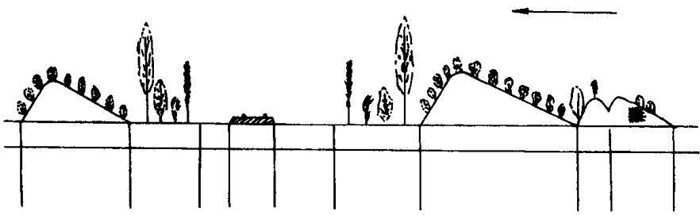  
图 4-1 沙坡头铁路防护林体系配置示意图

(1)固沙防火带 在路基迎风面20m，背风面10m，因固沙防火需要，清除植物，整平沙丘，铺设10\~15cm厚的卵石、黄土或炉渣。

(2)灌溉造林带 利用紧靠黄河的水源条件，通过4级扬水，提水上沙丘。在固沙防火带外侧迎风面60m，背风面40m范围整修梯田，修筑灌渠，梯田设障，灌水造林，3～5年可形成稳定可靠的防护林带。

该带出现是由于沙坡头地段条件恶劣，干旱年份造林成活率不高，降雨只能维持稀疏耐旱灌木的生长，对成片灌木水分显得十分不足，植株枯萎退化，遇连续干旱、特别干旱年份植被大面积死亡，大有流沙再起之势，给人以不安全感。本着有水则水，无水则旱的原则，建立较高质量的灌溉林带是必要的。在实践中筛选出成功的乔灌木树种有二白杨、刺槐、沙枣、樟子松、柠条、花棒、黄柳、沙柳、紫穗槐、小叶锦鸡儿、沙拐枣等。实践中发现，尽管有水灌溉，但因肥力不足，灌木生长优于乔木，混交林仍应以灌木为主。黄河水中含有大量泥沙，利用得当有利于改良土壤和树木生长。通过试验与实践总结出灌水量与间隔期，乔木半月灌水1次，定额495m³/hm²，灌木1个月灌水1次，每次990m³/hm²，灌溉林带有很好的防护效益，极大地改善了铁路两侧的荒凉景观。

（3）草障植物带本带是“体系”主体核心部分。在灌溉带外侧，迎风面

240m左右，背风面160m左右，流沙全面扎设1m×1m半隐蔽式麦草方格沙障；然后2行1带（隔1行），株行距1m×1m，栽植沙生旱生灌木（花棒、柠条等)。实际上扎沙障、造林都不可能一次成功，需反复多次。在此生物措施、工程措施是同等重要的。

沙坡头地段流动沙丘迎风坡20cm干沙层以下为含水量2%～3%的湿沙层，40cm以下为稳定湿沙层，夏秋降雨有渗透性水分补给，可供沙旱生植物生长发育，这就是植物固沙的依据。

关于固沙植物种，造林初期试验过几十种乔灌草植物种，从中筛选出一批优良的固沙植物。主要有花棒、柠条、小叶锦鸡儿、头状和乔木状沙拐枣、黄柳、油蒿等。

造林前先划分立地条件，根据不同立地条件，结合植物种生物生态学特性，进行合理配置。

实践中发现，全面均匀造林效果不好，主要是水分问题。垂直主风带状栽植效果较好，通常2行1带配置，株行带距为1m×1m×2m，油蒿株距0.5m，混交类型中以柠条×花棒、柠条×油蒿、花棒×小叶锦鸡儿效果较好。

造林在春秋两季进行，秋季为主，方法多为植苗造林；黄柳、沙柳用扦插；油蒿可于雨季撤播。直播因限制因子太多，生产上很少采用。

在麦草沙障和植物长期共同作用下，林地表面形成了沙结皮，这是治沙成功的标志，表明流沙正向土壤发育。表层沙土组成变细，黏粒增加，肥力提高，抗风蚀能力增强，微生物、低等生物数量大量增加。但沙结皮的存在影响了降雨时地表透水性能。

(4）前沿阻沙带为保护草障植物带外缘部分的安全，用高立式沙障建立前沿阻沙带。该带用柽柳巴或枝条，地上障高1m，地下埋30cm，加固成折线形，设置在丘顶或较高位置，起阻沙积沙作用。

(5）封沙育草带在阻沙带迎风面百米范围内，局部沙丘迎风坡采取封沙、设障、栽灌木的方法，促其自然繁殖，减轻阻沙带压力。

加强管护，建立专门护林机构，严禁破坏。

因各地条件不同，不必照搬5带，但草障植物带是必备的核心部分。

## 3. 荒漢地区铁路防护体系

我国目前尚无穿过大沙漠的铁路，穿过戈壁的铁路却有多处受到风沙危害。特点：来势猛、堆积快、形成片状积沙。

本区如无灌溉条件只能依靠机械固沙措施，西宁一格尔木铁路某段用高立式多列式竹篱防止风沙危害。兰新线在三十里井一巩昌河区间沙害严重，建立了灌溉植物防护带，带宽视沙害程度而定，重点保护迎风面，建多带式防

护林。由危害严重、一般到轻微，迎风面可设3带到1带，背风面1带。带宽30～50m，带距40～50m。树种乔灌结合，结构前紧后疏。

（1）树种选择 灌溉造林可选用较多树种，乔木有二白杨、新疆杨、银白杨、沙枣等；灌木有柽柳、柠条、锦鸡儿、花棒、梭梭等。配置上乔灌结合，形成前紧后疏结构。

(2)造林方法 用开沟积沙客土造林法。戈壁上石多土少，需先开沟积沙，沟深40～50cm，宽40cm，自然积沙，蓄满后挖穴造林。

(3)灌溉方法 戈壁渗水快，要少灌勤浇，半月灌1次，每次1200$\mathbf { m } ^ { 3 } / \mathrm { { h m } } ^ { 2 }$ ，4月下旬开始至10月下旬，林内除草，带间育草。

## 第六节 沙地立地条件类型的划分

不管是什么生物气候带沙地，只要温度适宜，有一定的水分或灌溉条件，就可能进行植被建设，就可能营造各种防护林、用材林、果树经济林、饲料林，发展生态与经济林业。但沙地的自然条件极为复杂，为了能在造林时正确地选择树种和拟定造林技术措施，就必须划分立地条件类型，也叫森林植物条件类型。实际上就是把环境条件一致或近似的沙地归类。究竟什么是立地条件类型？可以理解为是这样的地段，在这些地段上影响植物生长的自然因子（如气候、肥力、水文、沙地流动性等）是相同或相近的，也就是植物生长的效果相同，在同样经济条件下应采取同样的措施，这样的地段总和就划为一个立地条件类型，也就是一个森林植物条件类型。

要确定沙地立地条件类型，首先要搞清楚制约沙地植物成活、生长、发育的主要生态因子及其分级标准。植物所依附的环境因子如下：①气候条件——光、温度、降水、风等；②沙地植物种类、覆盖度；③沙丘类型、沙丘高度、沙丘部位；④沙地机械组成、腐殖质含量、盐渍化程度、沙地紧实度；⑤沙丘（地）下伏物性质及下伏物分布深度、沙地黏质间层的厚度及分布深度；⑥地下水深及地下水矿化度。

气候带不同，沙地光、温、降水等都有差别。机械组成相同的沙地，因处于不同气候带，沙地持水能力虽相同，但沙地实际含水量不同，因为降水量不同。根据气候条件，我国分为5个森林植物条件类型区：森林区、森林草原区、草原区、荒漠草原区、荒漠地区。在荒漠草原和荒漠地区，沙地造林仅靠降水已感不足，须特别注意地下水及矿化度。实际上在降水量400mm以下的草原地区（高寒草原除外），大面积营造乔木林也是不适宜的。

植物种类和覆盖度是直接影响沙地流动性和水分养分的因子。覆盖度小于15%的沙地为流动沙地(丘)，5%～15%的沙地为弱植被沙地(丘)，15%～40%为半固定沙地（丘），大于40%为固定沙地（丘）。沙地主要植物种与植被演替阶段是一致的，它反映了沙地的水分、养分状况。如在草原带以黑沙蒿为主的固定沙地处在植被演替的旱生植物阶段，沙地水分比较缺乏，造林时必须注意整地的农业技术。

流动沙丘（地）要特别注意其流动性，沙丘高度和沙丘部位是划分“类型”的重要依据，二者结合起来把沙丘风蚀沙埋程度划为4级：

(1）强度风蚀大沙丘迎风坡中下部及中小沙丘迎风坡；

(2) 中度风蚀 大沙丘迎风坡中上部；

(3) 弱度风蚀 沙丘的沙质丘间地；

(4)沙埋区沙丘背风坡及其基部。

A.加也里按沙地水分状况把不同机械组成的沙地分为低容水沙地(田间持水量为4%～5%）和高容水沙地（田间持水量大于6%），二者在肥力和经济利用方面有很大不同。

按沙地肥力状况可分为3个等级：

(1）贫瘠沙地均属于低容水沙地。粗中粒沙地（田间持水量为2.5%～3.5%）、中细粒沙地（田间持水量为4%～5%）均属此类。一般流动沙地（丘）也多属此类。在这类沙地上，乔木生长很差。属森林草原带的冀西（老滋河）粗中粒沙地5年生刺槐高只有0.5m，中粒沙地上4年生小叶杨高只有0.94m，细粉粒沙地上刺槐才能生长较好，5年高达4.4m。草原区的榆林细粒流动沙丘或固定沙地小叶杨、旱柳都长成小老树。低容水沙地只有在特殊的地形部位（如沙丘背风坡基部）杨柳才有一定生长量。

(2)较贫瘠沙地黏质沙土或有不厚沙壤质间层或黏壤土层间的沙地，营养条件比贫瘠沙地有所提高。但对大多数树种仍不能迅速生长。榆林这类沙地8年生旱柳只有2.75m高，已出现枯梢现象。只有耐瘠薄的樟子松、油松、刺槐、沙枣才能生长。

(3）较肥沃沙地这类沙地有粉沙壤土、沙壤土，底层有黏壤土、黏土、沙土及有黏壤土、沙壤土间层，且间层较厚，分布不深的沙地，豫东沙地的睢杞林场属于此类沙地。表层为腐殖质较多的粉沙壤土，下层为粉沙土。油松、侧柏、国槐、毛白杨、五角枫（Acer buergerianum Miq.)、刺槐、梓树(Catalpa ovata G. Don.) 等纯林、混交林生长都较好，34 年生毛白杨高为23m，胸径34cm。

地下水深影响沙地水分。地下水位在1～2m深，多数树种都能生长良好。地下水位小于0.5m，需选择耐湿树种；大于5m在草原区要选择耐旱树种，在

干旱区乔木树种则不能生长。

植物根系分布范围内，地下水矿化度及所含矿物盐种类对植物生长有重要影响。地下水矿化度可分为4级：

(1）淡水及弱矿化水 地下水含干物质小于3g/L，一般树种均能适应；

(2)矿化水 地下水含干物质大于3～10g/L，耐盐树种可生长；

（3)强矿化水 地下水含干物质10～20g/L，耐盐性最强树种才能适应；

（4）极强矿化水 地下水含干物质大于20g/L，树木已经不能生长。

在干旱地区，土壤盐渍化比较普遍，须特别注意土壤含盐量。盐渍化程度（1m厚土层内的含盐量百分数）分成4级：

(1）非盐渍化及弱盐渍化沙地含盐量小于0.3%，一般树种都能生长；

(2)中盐渍化沙地 含盐量0.3%～0.7%，耐盐树种可以生长；

（3）重盐渍化沙地含盐量大于0.7%，必须改良土壤，否则不能造林；

（4）盐土沙地 含盐量大于1%，树木不能生长（盐土地表盐结皮层含盐量可达15%)。

沙地紧实度是影响植物生长的因子。沙地在疏松情况下通气良好，适宜形成凝结水，利于植物根系发展，能在大范围土层中吸收养分和水分。紧实沙地，根系难以穿过紧实沙层，通气性不好，不利于植物生长。要特别注意整地方式以提高造林成活率和生长量。

沙地起源不同，下伏物也有几种：基岩、黄土、古冲积沉积物、埋藏土壤或黏土间层等。按其下伏物作用可分为2类：

一类是妨碍根系生长的基岩及极坚硬黏土、盐渍土、盐层等。此类下伏物分布越深越好，小于2m对植物不利。另一类不妨碍根系伸展且能增加养分，提高保水力，如埋藏黏土或黏质间层。若分布在0.5～2m深左右，对植物生长最为有利。覆沙不深（20～30cm）的埋藏土壤群众称之为“蒙金地”，有利于水分下渗与保存，不利于水分蒸发，极适于作物生长。

以上是简单分析与等级标准。影响沙地植物的因子错综复杂，要全面正确分析和综合环境因素，掌握主要因子，确定主导因子。命名立地条件时只选择主导因子及1\~2个主要因子命名。

也有根据不同条件下沙地植物的生物产量来划分立地条件类型并确定适宜植物种的。

就立地条件分类体系而言，它是一项重要的基础理论研究工作，世界许多国家都十分重视，并产生了多种学派和分类方法，不少国家形成了自已的分类系统。我国学者在立地分类研究上已取得很大进展，但由于我国情况过于复杂，还有一些问题尚待进一步研究。在立地条件类型分类上我国基本采

取4级分类系统：

（1）立地条件类型地区以控制本区水热条件的基本因素为依据，反映地带性大尺度气候差异，地域上是相连的完整区域。是分类系统的高级、中高级单位。

(2）立地条件类型区在上述大尺度地域划分的基础上，依据中尺度地域水热条件差异进一步划分，在地域上也是相对完整连片的区域。反映中尺度区域的气候差异。

（3）立地条件类型组由地域不相连接，但能重复出现的生态条件相似的立地类型组合，反映小尺度地域的差异（基质、水分、地形、地貌等）。

(4）立地条件类型立地划分的基本单位，可落实到具体地块，是生态条件相同或近似的地段组合。

流动沙丘在“分类系统”中常划分为“类型”，但由于其生态条件的复杂性，为了更好地为生产服务，可以依据土质水分条件和控制风蚀沙埋的地形因素及其他因素划分到亚型，可同时评价其宜林性，拟定造林技术措施，指明改造利用方向。下面是榆林流动沙（丘）地立地条件类型表（表4-1）。

表4-1 榆林流动沙地立地条件类型
<table><tr><td>立地 条件 类型 地区</td><td>立地 条件 类型 区</td><td>立地 条件 类型 组</td><td>立地 条件 类型</td><td>立地 条件 亚型</td><td>宜林性 质评价</td><td>固沙造林技术措施及 改造利用方向</td></tr><tr><td>温 带</td><td>毛 乌 素</td><td>沙</td><td>流</td><td>湿润沙质丘间地 千旱紧沙土丘间地 覆沙不深的干旱黄</td><td>湿润、贫瘠 干旱、贫瘠 干旱、较肥沃</td><td>乔灌混交用材林 整地松土，耐旱灌木林 耐旱乔灌木，混交用材</td></tr><tr><td>干 草</td><td>沙 地</td><td>丘 类</td><td>动 沙</td><td>土丘间地 中小型新月形沙丘</td><td>干旱贫瘠、</td><td>林 沙障固沙或密集式灌木</td></tr><tr><td>原</td><td>干 草</td><td>型</td><td>丘</td><td>迎风坡中下部 新月形沙丘迎风坡</td><td>强度风蚀 干旱贫瘠、</td><td>固沙林</td></tr><tr><td>地 区</td><td>原 区</td><td>组</td><td></td><td>中上部 沙丘背风坡基部</td><td>中度风蚀 沙埋、较贫瘠</td><td>密集式固沙林，适度密 播固沙林</td></tr></table>

## 第七节 沙地造林方法及樟子松造林技术

## 一、干旱区、半干旱区沙地育苗技术

由于干旱区、半于旱区沙地自然条件比较恶劣，如用常规技术造林，成活率一般很低，甚至不能成活，导致造林失败。造林地苗木死亡原因很多，除风蚀、干旱、树种不当、苗木质量低以外，根据实际调查，大部分原因是苗木在苗圃起苗时受了伤，加上栽植前风吹日晒，栽后需要较长的缓苗期，如遇到恶劣天气，受伤苗木首先死亡。近年来为提高于旱区造林成活率，采取了一些特殊的技术措施。原理上无非是一方面提高苗木质量，另一方面为新植幼树创造良好环境。在这两方面人们都付出了很大努力。在提高苗木质量方面许多国家都大力培育容器苗。以色列造林用的苗木全部是工厂化生产的容器苗，育苗技术已经相当现代化。其育苗大致可分为3个阶段：

（1）在发芽室内进行发芽处理，当苗根长到一定长度，进入第二阶段；

（2）将幼苗转入温室大棚苗床培养，全部采用滴灌、控温措施，待苗木稍大抵抗力提高后转入第三阶段；

(3)转入室外苗床容器中，在露天条件下精心培养。针叶苗木经过8～10个月左右苗高长到20cm，根系已非常发达，待雨季降水达50mm时，将苗木运到造林地造林，保存率在70%以上。为了保证苗木生长健壮，容器培养土都是轻软保水的森林地被物、高质量腐殖土、吸水保水性能良好的物质（类似岩棉、蛭石)，加上水肥科学管理。现在国外育苗容器所采用的材料多为黑色硬塑料钵或黑色软塑筒，规格很多，不仅针叶树苗，大型阔叶树苗木也可用容器苗。

容器苗是20世纪30年代开始研究，60年代先在北欧一些国家应用，以后推广全欧、美、亚洲。在瑞典、芬兰、加拿大、以色列等国已大面积应用。我国50年代首先在南方造林不易成活的桉树、木麻黄等一些树种上试验应用取得成功，北方干旱地区应用研究较晚，应用范围也较小，应加强试验与推广。

## 容器育苗有如下优越性：

(1)缩短了育苗期大田要用3～4年育成的针叶树苗木，容器苗1～2年或更短时间就能育成，工厂化育苗更快，由于人为控制，能形成良好环境，苗木生长加快；

（2）延长了造林期由于容器苗根系发达，未受损伤，对恶劣环境适应能力强，只要土壤水分和温度适宜，就可以造林；

(3）苗木质量高由于育苗过程中有意识培养苗木发达的根团，又未受损伤，可以提高造林成活率和保存率；

(4）容器苗培养便于机械化和工厂化。

用单株苗木比较，育苗成本提高了，但与总的造林成本比较是降低了。由于提高了造林成活率、保存率，又基本上消除了缓苗期，生长较快，成材率大大提高，克服了造林不见林的现象。

我国过去由于经济条件限制，育苗容器多用报纸、牛皮纸、软塑料袋等廉价材料，近年黑塑料袋、硬塑料容器开始普及。一般容器规格多为高12～20cm，粗为5～9cm，育苗材料多用消毒腐殖土和有机肥。对付恶劣条件，容器苗规格应比常规苗大一些，小苗造林易失败。苗木干重应在500mg以上，必须形成发达根系并完全木质化。

以往造林试验表明，大苗深栽和长插条深插都是造林成功的重要经验。常规育苗要培养根系发达、粗壮、地上部分粗矮健康、地下重/地上重比值大的苗木，造林才容易成活。如果苗木细高，根系弱小，造林成活较困难，成活了也难以长好，因为这样的苗木生活力、抗逆性都较差。

施肥能提高苗木抗旱能力。因为苗木成活还取决于苗木能否减少水分消耗和忍受缺水的能力。最佳的氮肥供应能培育出有最大抗旱能力的火炬松苗。磷与氮能增加美国赤松的抗旱力。矿质营养还影响苗木的蒸腾速度，钾对气孔开闭有重要作用。缺钾使蒸腾加快，平衡氮、磷、钾能增加长叶松的抗旱能力。苗圃后期不施氮，不增加苗木生长量，会使冬季霜害损失下降。钾素能提高苗木越冬保存率，并非是提高了抗寒力，而是减少了水分消耗，避免了生理干旱之故。因此通过施肥提高苗木质量有很大潜力。对于沙地上营造针叶树种，如能接种外生菌根对改善树木的营养，提高抗性，加快生长大有好处。

## 二、沙（丘）地造林方法

由于流动沙丘地貌的特殊性及风沙危害的复杂性，常规方法造林成效极差。群众在长期治沙及生产实践中探索出一套沙丘地造林的特殊方法。这些方法巧妙地利用风沙活动特点在草原乃至荒漠草原沙丘地一部分条件较好的湿润及较肥沃的立地类型上造林容易成活与生长，能较快地起到固沙作用，也可得到大量用材，其至实现某些特定的要求，取得事半功倍的效果，至今仍有实用价值。现简介如下：

## (一)前挡后拉造林法

陕北群众在流动沙丘湿润丘间地背风坡前面营造乔木林或乔灌混交林，同时在沙丘迎风坡下部造灌木林。乔木林或乔灌混交林长成后可起挡沙作用，阻止沙丘前进；灌木林则起削弱沙丘流动作用。丘顶可被逐步削平，为以后全面造林创造条件。

## （二）撑沙腾地造林法

内蒙古巴彦淖尔盟杭锦后旗牛二旦在荒漠、荒漠草原流动沙丘丘间地比较湿润的条件下，人工促进迎风坡风蚀，从而扩大丘间地造林面积，并在吹蚀下方造林，使沙子堆积在林内，用沙埋促进林木生长，经沙埋的树木有的树高生长量可达同龄林的5倍，堆积的沙子还可保墒，防止次生盐渍化。这种造林法被概况为“撵沙腾地，腾地造林，引沙入林，以林固沙”。

陕北也有类似撵沙腾地的方法叫又固又放造林法。做法是在一排排沙丘中把前后2排沙丘固定，中间沙丘用清除植被，大风时人工扬沙等方法促进沙丘移动，使沙粒堆积在前面固定沙丘上，中间的沙丘则逐渐变成宽阔而较平坦的沙地，以作农田、果园之用。榆林县海流滩大队用此法开出农田后再采用上排下灌、改良土壤等措施，把沙丘地改造成旱涝保收的高产稳产田。

内蒙古伊盟达拉特旗展旦召治沙站在丘间地为浅色草甸土、水分养分条件较好，但草根盘结不利于林木生长的流动沙丘区，选择迎风坡脚覆沙1m处等高造林，此处既有薄层覆沙，又接近下层土壤及地下水，有利于林木生长，造林穴距1m，穴深90cm，口径30cm，每穴栽带枝沙柳4株（每角1株），然后把地面10cm以上枝条剪下均匀放在栽植行内，起临时防蚀作用，往往可形成25～30cm细沙积成的沙埂。既保护林木不风蚀又因沙埋促进生长。沙柳长成后可拦截风沙流中的沙子，使下风地段气流不饱和，产生拉沙效果。正常情况，5～6m高沙丘可移动8m，在沙柳行前形成8m宽平坦浅凹地，次年在新的迎风坡脚再栽沙柳。如此逐年推进，3～4次可把沙丘拉平。

## （三）背风坡高杆造林

流动沙丘背风坡主要特点是沙埋，一般认为此处不能造林。内蒙古伊盟乌审旗谷起祥成功地创造了背风坡高杆造林方法。在草原地带地下水20m以上的流动沙丘地造林，固定了大面积流沙。具体方法是：

## 1. 插杆选择与处理

清明前选3～4年生，粗4～6cm旱柳枝条，截成2\~5m长插杆（长度取决干沙丘高度，以造林后不过度沙埋为宜）。将插杆底部浸在水中，到清明后天气变暖，水温升高，再全部浸入水中10～15天，到谷雨将插杆取出栽植。此时已充分吸水，愈合组织已形成，表皮泡软，芽苞萌动，栽后易生根发芽。

## 2. 栽植部位与栽植技术

栽植部位选在落沙坡与丘间地交界处，此处有沙埋条件，保水力较强，肥力较高，少有杂草竞争水分。造林时随整地随栽植。整地时先将干沙层除去，再挖穴深1～1.5m，穴口径0.5～0.6m，将插干放入，填湿沙砸实，株距2～3m，过1～2年沙丘向前移动，在新的落沙坡脚再行高杆造林。

因杆长不怕风蚀、沙埋、干旱，成活率高达90%以上，且收益快。

此法缺点是：①因迎风坡未采取措施，虽成林但流沙未能完全固定；②挖深坑太费工；③大面积造林苗木来源困难等。

改进方法是：①落沙坡脚造林同时在迎风坡下部种草栽灌固沙；②挖穴应尽快实现机械化，采用挖穴机，以节省劳力和降低劳动强度；③除用旱柳高杆外，还可用杨树（河北杨、小叶杨等）大苗造林，以扩大苗木来源。杨树在迎风坡造林易长成小老树，在背风坡造林能成材，其中以群众杨、合作杨生长最好。

因草原带落沙坡脚有独特小气候条件，水肥、温度条件相对较好，高杆林的高、粗生长都大于一般沙地；根幅比一般沙地大1倍，根长大7倍。生根发芽先后也不同，高杆造林先生根后发芽，一般造林先发芽后生根。

## (四）钻孔深植造林技术

中国林业科学研究院1981年由意大利引进“杨树插杆钻孔深栽造林技术”。经几年试验，证明在地下水1～3m条件下（水质含盐1.1g/L以下)，杨树大插杆深栽成活率达90%以上，节省了平地、打井、修渠等投资44%～70%。

试验地选在贺兰、永宁两县，属温带半荒漠气候，干旱少雨多风，日照足，蒸发强烈，年均降水200mm，蒸发2000mm。

造林技术：造林地选在水位1～3m的沙土、沙壤土上，株行距4m×6m或5m×6m。用钻孔机钻孔到地下水位以下20cm左右，孔径12cm。苗木为3年生杨树截根插杆，高约5m，胸径3cm以上，苗干插到栽植孔底，后用干沙填孔，摇动树干分层捣实。栽后在幼树四周和株间翻土除草，钻孔前不要整地。钻孔机1小时可钻孔45个。

插杆造林在春秋两季，秋植在不灌溉条件下安全越冬而不发生枯梢。插杆栽在地下水位下面20cm，冬季土温6\~9℃均可缓慢地生长根系，有的根系达48条，总长达314cm。插杆浸水部分可通过皮部、切口和根系吸水。其成活率、生长量随栽植深度而增加，并认为干旱区杨树深栽必须使下端插入地下水中。在整个土层中插杆上均有根系生长，但在毛管水上升层根系数量最多，下部50cm土层中的根系比上面总和还多。由于水分供应充足，枝条叶片水分亏缺比常规造林小，而蒸腾速率比常规造林高，树木生长良好。在有类似条件地区，钻孔深栽是个值得推广的造林方法。

## （五）大苗深栽与长插条深插

长期以来，人们一直在探索提高造林成活率和降低成本及有效固定流动沙丘的治沙技术，因为在流沙上造林，环境因素的不利影响（沙土水分不足、风蚀、过度沙埋等）难以消除。要消除风蚀，就要配合沙障保护，而沙障的设置是一项十分繁重而昂贵的工作，其费用要比苗木高得多。而沙障仅解决风蚀问题，对沙地水分不足仍无能为力。在这方面大苗深栽与长条深插取得了较好的成绩。它是针对流沙的流动性和干旱2个主要限制因子而设计的固

沙造林方法。

大苗深栽、长条深插在世界许多国家的流沙治理中得到应用，如原苏联、巴勒斯坦、南斯拉夫、阿根廷、埃及、沙特等国，用此法在沙丘上造林固沙都得到很好的效果。据张敬业材料，内蒙古乌审旗谷起祥从1935年就开始在沙丘背风坡脚用旱柳长杆深插造林。我国应是最早在沙丘地上采用大苗深栽、长条深插技术的国家。

在草原带流动沙丘上采用花棒、杨柴大苗深栽，沙柳、黄柳、柽柳长条深插，合理密植的方法，不设沙障可把流沙固定。沙地造林深植深插是有益的，深植深插不怕风蚀，增加了与湿润沙层的接触，等于增加了水分供应。大苗、长条深栽深插优点很多：它增加了植物稳定性；有利于萌发不定根；深植湿沙层，植物不易遭受干旱危害；不怕风蚀；大苗不会受沙割危害；不用设沙障，降低了造林成本；提高了成活率，减少了补植工作；苗木生长快，成林快，较早发挥防护与经济效益，减少了管护年限，因而得到广泛应用。要求尽快发挥效益的特殊林种，如沙区农田、牧场防护林等更要强调大苗深植造林方法。

应用此法应选择生长迅速，丛生性强，萌发不定根能力强的植物种，如杨、柳、刺槐、黄柳、沙柳、柽柳等。

大苗深植、长条深插的技术规格：因世界不同国家、不同地区具体条件及造林目的、要求和方法不同，技术规格差异很大。总的来看，苗高1\~4m，条长在0.7\~2m或更长，植深在0.5\~2.0m或更深。

## （六）抗旱造林系列技术

赤峰敖汉旗的林业科技工作者于80年代在总结前人抗旱造林措施的基础上，创建了一整套抗旱造林系列技术。这套技术指导了近年全旗的造林实践，取得了极好的造林效果，显著地提高了造林成活率和树木生长速度，造林成活率达95%以上，彻底改变了以往常有的造林不见林的情况。此项技术已成为三北防护林建设局推广项目。

该项技术主要从2个方面入手提高造林成活率。一方面是提高苗木质量，特别是防止苗木失水（从起苗到造林全过程）以保证成活；另一方面是从整地角度和栽植方面提高抗旱能力和造林质量。其具体内容大致如下：

(1）良种壮苗 在采用优良品种同时培养壮苗，不合标准的苗木全部剔除，决不允许进入造林地。如1年生杨树苗高不到1m，根系长度不到20cm，根系受伤，根径不够标准，有病虫害的苗木，有残缺的苗木，一律不能用来造林。

（2）保障苗木不失水、苗根湿润苗圃在起苗前几天灌足水，使苗木吸足水分，软化根区土壤；一律用机器起苗，保证苗木根系达20cm以上；起苗后立即拣苗，严格按标准分级，不能运走的立即假植，如土壤湿度不够假植后适当浇水保证土壤湿润。苗木运输过程中不得暴露，造成风吹日晒，使苗木失水，要用湿草帘盖严。

(3)苗木浸泡吸水 造林前必须将苗木全株浸泡水中1～2d，使苗木吸足水分。造林取苗时，取大苗必须带特制大塑袋，取小苗要带水桶。分好的苗木要放入大塑袋或水桶中以防失水。

（4）整地时先用大犁开沟 拖拉机带动开沟器，按行距开大沟，深40～50cm。

（5）沟底挖穴 开沟后在沟底部按株距挖植树穴。

(6）适当深栽栽植时苗木立于穴中心，扶正，根系舒展，根颈要在穴平面下 5cm 处。

（7）栽植时严格操作规程 认真作到“三埋两踩一提苗”。

（8）培抗旱堆苗木栽好后，在苗木茎基周围培土厚20cm，以延缓和减少土壤水分蒸发，叫“抗旱堆”。

严格执行以上各项措施，似乎有些麻烦，但确实解决了造林成活率问题，也有利于苗木生长及成材。尤其是在有一定降水量的干草原、森林草原带是一项极有实效的技术，应在经济果树之外的各项造林中推广。

## （七)2行1带造林法

近年赤峰和通辽的一些林业工作者，在生产实践中采用“2行1带”沙地造林方法，在促进林木生长方面取得了良好效果。

具体作法：在较好的沙地条件下（平坦、细粉沙土）采用株距2m，行距2m，2行1带，带距10\~25m，用抗旱造林法营造速生树种（杨树为主）。特点是1带只有2行，带距较大，通风透光条件良好，也有利于吸收水肥，每行树木都能充分发挥边行优势，因而树木生长较迅速，生物量比对照高15%以上。不同带距比较，以25m带距较理想。林带间可以根据实际需要和具体条件，发展灌、草、作物、药材等，若将带距再适当加大，则可建成林农牧果复合系统。可发展多项生产，发展生态农业，取得良好的生态与经济效益。是一个较好的沙地造林模式。

## (八）沙地杨树嫁接更新法

沙地的干旱贫瘠是影响林木正常生长、成材、招致病虫害而影响质量，形成劣质林分最主要的因素。粗放经营条件下情况尤为严重。这一问题十分普遍。近年来河北秦皇岛海滨林场采取杨树嫁接的方法更新改造劣质低产杨树林、使之形成速生优质用材林，效果极其显著，受到基层欢迎。具体作法是：

（1）秋季落叶后，选好良种杨树1年生1cm粗健壮枝条，割下，长约1m，放于窖内或湿沙中贮藏，温度要控制在0～4℃，既防失水，也防冻芽和发霉。作嫁接插穗备用。

（2）第二年春将劣质杨树主干从地面以上5～10cm处伐掉，锯口要平整。此伐墩作为良种杨嫁接的砧木。当检查伐墩杨树皮能离骨时，将锯口用利刃刮光，准备嫁接。

（3）取出备用杨树枝条，由专人切成8\~10cm长接穗，留3\~5个芽。将接穗下部用嫁接刀削成长圆形，放于盛水容器内备用。

（4）嫁接时先将接穗下部长圆接口部分进一步削薄漏出韧皮部，然后用镰刀头在砧木木质部与韧皮部之间撬开一道缝，将削好的接穗木质部向内插入，插牢；每株伐墩接几穗取决于伐墩粗细，20cm直径可接4个穗，15cm接3个穗，10cm可接2个穗，分布要均匀。若伐树过早，伐墩表面已干，可先用镰将砧木老皮削下一片，直到韧皮部木质部，在削口处撬开一缝插接1个穗。

（5）第三人将事先备好的黄土（或黏土）和水成糊状于小桶内，用此黄泥将接好插穗的外露缝隙全部抹严。

（6）其他人用锹在行间取湿土将伐墩接穗培土盖严，形成土堆，土堆厚度要超过接穗上端6cm左右，培土动作要轻，勿使插穗移动。用锹将土堆轻轻拍实拍平。

（7）嫁接后砧木、接穗在气温回暖的情况下，不到1个月就会萌出大批嫩芽破土而出，约在芽高10～20cm时，将砧木上的萌芽全部去掉，接穗上发的芽只留一健壮者，余者去掉。以后还要多次检查，将插穗上新生枝条叶腋的芽子也及时去除；

（8）加强林地保护和水肥管理，防治病虫害，特别注意防治附近老杨树上透翅蛾的危害（可用性引诱剂除之）。

(9）数月后湿土培护下的插穗接口附近就会开始生出自生根。据说母树（伐株）根系3年后死亡，失去吸收水肥能力。死亡之前由于有强大的母株根系和自生根同时吸收水肥，新生幼株生长极快，当年可达3～5m高，地径3～5cm以上，叶片像向日葵叶片大小，表现了突出的生长优势。3年后自生根已具规模，幼树已很健壮，为以后速生丰产打下基础。只要加强水肥管理，必能形成理想丰产林。

杨树嫁接是在干旱贫瘠沙地上改造劣质低产林分为优质丰产用材林的理想方法，它充分利用原根系极大的水肥优势，保证嫁接苗的快速生长。此法成本低、生长快、效益好，应在沙区改造更新低产杨树林分中大力推广。

## （九）沙地乔木萌糵苗更新法

沙地因水肥不足，严重影响乔木正常生长，特别对林地更新带来困难。近年有些单位在沙地防护林更新中，利用某些乔木（毛白杨、刺槐等）萌蘖能力强的特点，伐后产生大量萌蘖苗，选择其中1株最壮者培养，余者均去掉，加强水肥管理，利用原根强大吸收水肥能力，促进萌蘖苗迅速生长，实现优质林分的更新，尽快发挥防护作用。赤峰太平地乡用此法培养防护林接班（更新）林，效果很好。它与嫁接原理近似，都利用原根系的水肥优势促进新株快速生长。此法更新沙地优良林分意义很大。除可用于防护林、用材林，还可用于饲料林，实现乔木的灌木状经营。

此法更新最简单，成本最低，收效快，值得推广。

## (十）沙地乔木根藥苗更新法

有些乔木树种根蘖繁殖能力强，这些乔木伐后挖去主根，留下支侧残根在土壤中，当年就会萌出一定数量的根蘖苗，通过加强水肥管理，调节密度，1穴留下1株最好的，其他幼苗可以移出栽于无苗穴中，从而实现优秀林分的更新。根糵能力强的树种主要有胡杨、山杨（Populus davidiana)、毛白杨(Populus tomentosa)、河北杨(Populus hopeiensis)、刺槐等。此法亦不失为有效快速、低成本更新方法。但此类更新苗可能出现苗木强弱高低不齐，有些栽植点可能无苗，而有些树穴可能苗木很多，因此需要加强管理。

世界各国治沙造林的经验表明，松、柏、杉科的某些常绿树种具有忍耐沙地贫瘠干旱的突出特点，因而受到重视。樟子松是我国北方沙区重要的用材林、防护林树种，它生长快、寿命长、材质好、适应性强、四季常绿，在我国北方于旱多风沙地区发展樟子松造林有特殊意义。因此，在此专门讨论其造林技术。

## (十—） 沙地樟子松（Pinus sylvestris var. mongolica）造林

樟子松天然分布于内蒙古红花尔基沙地，几十年来由章古台治沙站科技人员引入并试验研究，已在该区大面积推广，形成了几万公顷沙地人工樟子松林海，受到各国专家赞扬。如今已引至陕北榆林地区、内蒙古中部沙地、宁夏、甘肃、新疆及其他许多省区安家落户，表现良好。

樟子松5龄前生长缓慢，6～7年生长开始加快。章古台栽植后第二年高生长平均10.6cm，最高14cm。5年后加快，年均高生长38.8cm，最高58cm，总体上说生长是迅速的，比同等条件下油松、小叶杨（Populus simoniiCarr：）生长要快。幼林生长随立地条件而异，天然固定沙地低地最好，其次是人工固定沙地丘间低地、背风坡为好，这些地方立地条件较好。人工固沙地丘顶最差，迎风坡次之，这些地方立地条件差。章古台沙地樟子松生长比海拉尔天然林要好得多，榆林沙地生长情况也优于海拉尔天然林。造林技术注意以下几点：

(1）整地 春季栽植要在前一年雨季或秋季整地，抑制杂草，保蓄水分。春天若随栽随整地土壤会很快风干，成活率低。为避免风蚀要带状整地，整地带宽60～7.0cm，保护空留草带等宽或稍宽。若植被少也可铲草皮，铲去4～5cm。丘高7m以上者，丘腹上部可块状整地（50cm×50cm）。

(2)苗木 一般采用健壮2年生苗，规格：地径0.35cm 以上，高12～15cm，主根20cm以上，顶芽要健全。用1年生苗，要求苗木健壮，整地细致，条件稳定，要加强管理。

（3）造林时间在章古台，春、雨、秋3季均可造林，但春季最好；秋栽到冬春受风吹沙打、牲畜危害，为保护苗木，在冬前要埋土越冬，次年3月下旬天变暖时扒开；雨季要在透雨后，趁阴天栽植。要随时保持苗根湿润，尽量不受风吹日晒，以保证成活率。

(4）密度 初期生长慢，适合密植，株距宜小，行间抚育，行间留有草带，可保护幼苗免受风蚀沙打，行内可提早郁闭，利于幼树生长。密度4995～6000株/hm²，规格1m×2m或1m×1.5m，簇植常用3m×3m，每簇3株。

沙地造林除上述一些特殊措施外，要使林分长期稳定地生长发育还要正确解决沙地造林密度、植物种混交与配置问题。

## 第八节 沙地造林密度、混交与配置

## 一、沙地造林密度

在干旱、半干旱地区水分是植物生长的限制因子，本区降水少、沙地持水量低使这一矛盾更加突出。植物密度又是制约流沙地风蚀沙埋的重要因素。植物固沙要求一定的密度，而沙地植物过密又会消耗过多的沙地水分抑制林木生长，因此必须解决好风沙区植物固沙密度和水分不足这一对矛盾。由于问题比较复杂，需要按具体情况分析。

从水分条件看，不同地带条件不同。半干旱区和干旱区不同，即草原带和荒漠、荒漠草原带不同，同一地带流沙地和固定沙地水分条件不同，因而造林密度也不同。因立地条件差异，影响植物成活的因子也有了变化，流沙地制约植物成活的首先是风蚀，其次才是水分，固定沙地主要是水分。

在沙地人工林培养中，有林分衰退甚至成片死亡的现象。究其原因既有密度过大水分不足的问题，也有因立地条件发生变化使原来树种不能适应的问题，即植物演替问题。后者是自然规律，单用密度是解决不了的（除非是顶级群落植物种)，要靠混交与配置来解决。

在草原地带植物固沙比较容易。在植物群体固定了流沙，解决了风蚀问题之后是否又因密度问题导致水分不足而最终失败？对此李滨生、周士威进行过长期定位观测，结果表明，在草原带流动沙地较密的人工植物群体不仅初期抵抗了风蚀、保存了林地，后期虽有自然稀疏，但仍能成功地固定着沙地。实践说明，解决风蚀问题只要求一定密度，没必要过密，过密影响生长。而流沙环境中较密的群体也常因大量沙埋而促进生长。但在草原带固定沙地造林就存在过密问题，因此处不存在风蚀问题，主要是水分问题，实际上是水分平衡问题。

在半荒漠地带降雨量比草原带显著减少，植物固沙因水分不足而困难得多。生产上主要用草沙障固定沙丘，造林密度可以主要考虑沙层水分问题。对此，刘恕、石庆辉在《固沙植物的密度与配置的研究》一文中，提出确定适宜密度的3个方法。即由植物根系来确定密度，也就是用一定年龄的植物密集根幅平均值确定密度；由植物耗水特点确定密度，即由植物生长旺盛期、沙层有效蓄水量和单株植物平均耗水量得到单株营养面积来确定密度；调查各种密度的人工林地及天然植被，比较其生物量、生长势、盖度等来确定密度。前两者不易准确掌握，第三个比较可行。经调查得出，花棒、柠条适宜密度为30～40 株/hm²。

## 二、固沙林的混交与配置

流沙地造林如是单一的固沙先锋植物，经过一段茂盛生长后会出现衰退现象。在半荒漠的沙坡头，花棒经过约20年就开始衰退，沙地变得干旱紧实。如无新的措施，沙地可能再度破坏。此时再造林，因沙地干旱，植物难以成活。因此应在造林初期就选择能适应流沙刚固定的环境，又适应干旱环境的耐旱植物和前期先锋植物混交。建立混交林有许多优点：增加覆盖度，增加地表粗糙度，提高固沙效果和林分稳定性。植物种设计应考虑固沙先锋植物与旱生植物结合（如花棒×柠条）、灌木与半灌木结合（小叶锦鸡儿×油蒿）。

在配置形式上，半荒漠沙地采用均匀造林（如1m×1m），因密度大，水分不足，出现生长不一致，有好有差，死亡结果形成了带状保存形式。据此，生产上也改为不同树种带状混交，2行1带，带间间隔2m。这种布局疏中有密，可以节约水分，又可保证固沙效果，比较理想。

在半荒漠沙地造林中，不同树种（前期先锋植物和后期耐旱植物）混交、密度、配置都很重要，在草原地带同样如此，生产上常用的大面积纯林是不科学的。立地条件较好时更要考虑植物混交，造林毕竟不是单纯的栽树，必须考虑植物群体的稳定性，考虑到林分或群落的现在和将来能持久繁荣，持续发展。因此要考虑乔灌草（或草灌乔、灌草乔）的结合，豆科与非豆科植物结合，固沙植物与绿肥、饲料、经济植物结合，针、阔树种结合及长寿与短寿、深根与浅根、喜光与耐荫植物结合。在西北干旱、半干旱黄土、风沙区大面积不良立地条件下密集营造喜水肥的杨树（Populus spp.)，到头来形成大批小老树，砍之可惜，留之无益，实在是一个不该重复的教训。

根据沙地立地条件，植物种特点及生态、生产需要确定适宜的植物种，采用适宜密度（过去造林密度常常过大），合理的混交与配置是沙地造林绿化、建设植被的重要经验。但是保护、管理好现存的人工与天然植被是一个更加重要的问题，不在这里细讲。

流沙治理、沙地造林、防护体系建设应选择什么树种和植物种？下面我们将介绍这些内容。

## 第九节 我国风沙区固沙造林（防护林）树种选择

## 一、梭梭（Haloxylon ammodendron）

别名梭梭柴、盐木（Haloxylon ammodendron)，藜科大灌木、小乔木。高度多在2～3m，最高达5～6m，主干扭曲，基径最大可达60cm，寿命50年以上。叶退化，绿色嫩枝营同化作用。嫩枝粗短、浓绿、味咸。梭梭天然分布于荒漠地区新疆、内蒙古西部、甘肃河西的沙漠、戈壁、黏土平地、盐土等多种生境。覆沙地、丘间地生长较好。耐旱、耐寒、抗盐碱，根系发达。成年梭梭根系必须接触地下水。嫩枝含盐量高达14%～17%，是典型积盐植物。土壤含盐量2%的立地条件最适合其生长。土壤含盐量5%时种子发芽不受影响，含盐6%～7%时发芽受抑制，8%时丧失发芽力。

4\~5年生能开花结实，5月初开花，夏季干热期休眠，10月下旬种子成熟。种子具半透明圆翅，千粒重2.7g。新采种子发芽率95%，带翅贮存7个月即丧失发芽能力，去翅种子贮存干燥处半年至1年发芽率80%～90%，贮存2年为40%～50%。

梭梭木材发热量大，仅次于煤。1hm²近熟林可提供6～7t薪柴。嫩枝是羊、骆驼的好饲料，枝干可提取碳酸钾，根部寄生的肉丛蓉是珍贵的药材。梭梭林是3大荒漠森林之一，是荒漠地区优良的薪柴、固沙及防护树种。

在准噶尔盆地冬天风小有积雪地区可直播造林。可在秋冬及1～2月融雪前播种。春播3月份，风小土壤水分多时，播种易成活，直播不覆土，播后流沙略覆盖即可发芽，但幼苗死亡率大。每公顷播种量去翅种子2.1kg，带翅种子6kg较适宜，流动沙丘上植苗造林好。在民勤黏土沙障保护下2～3年可形成冠幅、高均为1\~1.5m灌丛，沙丘趋于固定。

白粉病、鼠害是主要威胁，须注意防治。

## 二、白梭梭（Haloxylon persicum）

藜科大灌木，高2～5m，分布于沙质荒漠，生长在流动、半固定沙丘上。我国只分布在准噶尔盆地沙漠。嫩枝细长下垂、浅绿色、味苦，是典型的沙旱生灌木，靠雨水、沙层水分生活。其他特征同梭梭。

## 三、柽柳（Tamarix sp.）

柽柳科灌木，丛生，高1～5m，分枝多，枝条纤细，叶鳞片状，互生。广泛分布西北地区，华北、沿海也有分布，荒漠地区有大面积柽柳天然林，是三大荒漠林之一。我国有柽柳10多个种，以多枝柽柳、疏花怪柳、沙生柽柳为多。怪柳强喜光，耐盐碱（刚毛柽柳为最），对土壤要求不严。河湖边，潮湿环境，弱盐渍化沙土、壤土最好。不怕沙埋，积沙能形成柽柳沙堆。可作燃料及驼、羊饲料，可作防沙林树种，也可配置防护林带边缘。是良好薪炭林、盐渍化沙地固沙、防风、防沙林、（驼、羊）饲料林树种。扦插繁殖。

## 四、胡杨（Populus diversifolia)

别名异叶杨，杨柳科乔木，高12\~18m，胸径30～40cm，2m以上者也有之。幼树、成年树叶形变化很大，共有5种不同的叶形。胡杨林是荒漠地区最主要的用材林和生态屏障，为三大荒漠林之首。主要分布在乌兰布和沙漠以西，荒漠河谷地带有大面积天然林，绿洲零星分布。洪积扇前沿地下水溢出带、湖泊周围均有分布，地下水位超过6m时即趋枯死。耐盐，幼树耐盐0.5%，老树可长在特强盐渍土上。抗风沙、耐沙埋，沙埋茎干部分可生出不定根。其水平根系特别发达，根蘖能力极强，单株可以成林。材质好，抗腐蚀力强，用处极多。扦插繁殖生根力低，须育苗造林，但种子很快丧失发芽力，要抢收抢种。可用特殊保存方法延长发芽期。育苗易得黄锈病，要特别注意防治。胡杨林受人为破坏严重，极需保护与恢复，大面积封育效果良好。

## 五、沙枣(Elaeagnus angustifolia)

别名桂香柳、银柳。胡颓子科亚乔木，高达15m，4年生可结实，10年进入盛果期。主要分布干旱地区。喜光稍耐荫，抗旱性较强，尤耐大气干旱。耐中度盐渍化，但不耐碱，主根弱，侧根发达。湿润沙质土、轻盐化草甸土、丘间地可直播造林，插杆也可以成活，多用植苗造林。盐渍化草滩大插杆造林生长好，重盐碱地开深沟造林效果好。其生长发育与土壤水分有密切关系，宜在地下水位低于3m的立地条件栽植。可作防护林、用材林、薪炭林、固沙饲料林。“大沙枣”为经济干果类，“小沙枣”也有多种经济用途。沙枣是干旱区重要乔木树种。

## 六、沙拐枣（Calligonum sp.）

蓼科灌木，天然分布于西北荒漠，半荒漠区引入生长良好。是固沙先锋树种，种类较多，我国有20多种，以中亚和新疆为其分布中心，北非、中东也有分布。多数为小灌木，大灌木主要有乔木状沙拐枣和头状沙拐枣。耐干旱，抗风蚀，较耐盐碱，生长快，适应性强。按其果实形态可以分为：泡果派、翅果派、基翅派、刺果派（真果派)。其根系十分发达，有的侧根长达30m以上，有的垂直根深达6m，有的初期主侧根生长极快，枝茎生长也快。叶退化，绿色嫩枝营同化作用。枝茎折曲，种子极耐贮藏。枝干热值高，为好薪柴，1年枝为羊、驼饲料。造林可用播种、扦插、植苗、飞播等多种方法。可作优良固沙林、饲料林、薪炭林、防护林树种。

## 七、花棒（Hedysarum scoparium）

豆科大灌木，高2\~5m，奇数羽状复叶，有的完全退化为绿色叶轴。花期7～9月，种子10～11月成熟，花极多。果实卵圆形，2～3年开花结实。枝干火力强，种子价值很高，嫩枝叶是优良饲料。主侧根发达，植株生长迅速，适应流沙环境，为优良固沙先锋植物。主要分布巴丹吉林沙漠、腾格里沙漠和河西沙漠，戈壁也可见到，多散生。引至榆林、赤峰沙地生长更好。草原带可直播、飞播造林，荒漠、荒漠草原主要用植苗造林，扦插也可。是极好固沙林、薪炭林、饲料林树种。

## 八、杨柴（Hedysarum mongolicum)

又名杨柴、羊柴。豆科灌木，高1～2m，少见3m，奇数羽状复叶，花期6～9月，种子扁圆。嫩枝叶为优良饲料。根茎繁殖力强，积沙可形成灌丛堆。主要分布在鄂尔多斯、科尔沁沙地、库布齐、乌兰布和沙漠。生长在流沙、半固定及固定沙地。根系发达，串根(茎)繁殖旺盛，抗逆性强，喜沙压，抗风蚀。适宜飞播，也可直播、植苗、扦插造林，是极好固沙林，饲料薪炭林树种。

## 九、柠条（Caragana sp.）

豆科灌木，我国有20多种，常用有2种，小叶锦鸡儿(C. microphylla)和柠条锦鸡儿(C. korshinskii)。是我国西北、华北、东北西部重要治沙和水土保持树种，也是饲料林主要树种。

小叶锦鸡儿：灌木，植株丛生，圆形，深绿色，高1～2m，偶数羽状复叶，托叶刺状，荚果近圆条形，种子较小。

柠条锦鸡儿：大灌木，高3\~4m，少6m，分枝少，粗壮通直，有时长成小乔木，沙埋或平茬后形成大灌丛。小叶两面密被灰白色柔毛，全株呈银白色，偶数羽状复叶，荚果较粗短，种子较大。

小叶锦鸡儿分布广，内蒙古中西部、陕北较集中，华北、东北、西北沙地、黄土地均可生长。柠条锦鸡儿以腾格里沙漠、巴丹吉林沙漠东南、毛乌素沙地、河东沙地分布较多，块状生长于固定、半固定沙地。引种青海、新疆生长良好。

二者均为强喜光树种。耐旱，耐寒，耐高温和变温，耐瘠，耐风蚀沙埋，抗逆性强，是干草原、荒漠草原地带旱生灌丛。黄土丘陵、山坡、流动沙地、丘间地、固定沙地均能正常生长，忌水分过多，水位过高。深根性，主侧根发达。初期生长慢，寿命长，萌糵力强。直播、植苗造林。是优良的固沙、水土保持、饲料、薪炭及旱地草场和农田防护林树种。

## 十、沙蒿（Artemisia sp.）

菊科半灌木，固沙主要用3种，籽蒿（A. sphaerocephla)、油蒿（A.ordosica)、差把嘎蒿（A. halodendron）

前2种主要分布于鄂尔多斯沙地、宁夏河东沙地、河西走廊沙漠，引至中卫、磴口均成功。后一种分布东北西部草原带沙地。

籽蒿也叫白沙蒿，高约1m，分枝粗壮，枝干灰白色，稀疏，直立，较粗壮，叶深裂，互生。种子外有一层多糖物质，遇水溶胀，粘结沙粒形成大数十倍的种子团，不易位移，适于流沙上播种。种子可食，茎叶幼嫩期及霜后期可作饲料。籽蒿适应流沙环境，喜沙埋，根系浅，水平根发达。

油蒿也叫黑沙蒿，多分布干旱区、半干旱区的固定、半固定沙地。枝条密集、繁茂，叶深绿，茎暗红色，嫩枝纤细，深根性。植株半圆形，紧贴地面，有极好固沙效果，对沙结皮的形成有重要作用。喜沙埋，不耐风蚀，在沙丘背风坡生长旺盛。多作活沙障。天然更新良好，常形成大面积固定沙地。

差把嘎蒿枝条细柔，多分枝，匍匐状生长，外皮灰绿色，主侧根均发达

喜光耐旱，适应流沙环境。

沙蒿共同特点是抗旱，耐瘠，抗风蚀，喜沙埋，结实丰富，蒴果宿存，采种容易。固沙作用强。可用撒播、飞播、植苗、扦插、分株法繁殖。常用播种法。除固沙、防风阻沙作用外，也是沙区、牧区的燃料来源。

$$
\mathrel { + { - } } , \mathbin { \frac { \mathrm { \# } } { \mathrm { \# } } } \mathbin { / } \mathrm { \# }  \mathrm { \# } \mathrm { \# } \mathrm { \# } \mathrm { \# } \mathrm { \# } \mathrm { \# } \mathrm { \# } \mathrm { \# } \mathrm { \# } \mathrm { \# } \mathrm { \# } \mathrm { \# } \mathrm { \# } \mathrm { \# } \mathrm { \# } \mathrm { \# } \mathrm { \# } \mathrm { \# } \mathrm { \# } \mathrm { \# } \mathrm { \# } \mathrm { \# } \mathrm { \# } \mathrm { \# } \mathrm { \# } \mathrm { \# } \mathrm { \# } \mathrm { \# } \mathrm { \# } \mathrm { \# } \mathrm { \# } \mathrm { \# } \mathrm { \# } \mathrm { \# } \mathrm { \# } \mathrm { \# } \mathrm { \# } \mathrm { \# } \mathrm { \# } \mathrm { \# } \mathrm { \# } \mathrm { \# } \mathrm { \# } \mathrm { \# } \mathrm { \# } \mathrm { \# } \mathrm { \# } \mathrm { \# } \mathrm { \# } \mathrm { \# } \mathrm { \# } \mathrm { \# } \mathrm { \# } \mathrm { \# } \mathrm { \# } \mathrm { \# \mu } \mathrm  \up
$$

杨柳科大灌木，高2～5m，丛生，枝干暗黄色、光滑；叶线形或披针形。分布于东北及内蒙古东部沙地。陕北、甘肃、宁夏引种生长良好，是固沙先锋灌木。耐寒冷，耐于旱，耐瘠薄，极喜沙埋，怕风蚀，喜光不耐荫，萌芽力强，喜平茬，萌发早。根系极发达，垂直可达3.5m，水平根常在20m以上，适应流沙环境。可作固沙阻沙林，饲料、薪炭林，防风林，旱地农田防护林。在沙区有很多种用途，极受群众欢迎，可种子繁殖，主要采用扦插造林。流沙上常用丛植法，品字形配置，或行状、带状开沟密植造林。长插条深埋是提高成活率的重要经验。

## 十二、沙柳(Salix psammophila）

杨柳科灌木，丛生，枝条红色，高2\~3m，最高达6m，水平根极其发达。主要分布鄂尔多斯沙地，在低湿丘间地、洼地常形成柳湾林。种子易发芽，但主要用扦插造林，沙柳（Salixpsammophila）喜湿润沙地，其造林方法、生物学、生态学特点及经济效益均与黄柳（Salixgordeievii）相似。近年利用其柔软枝条发展工艺编织业，利用其枝于发展纤维板工业，为沙区经济开发作出了贡献。

## 十三、刺槐（Robina pseudoacacia）

豆科落叶乔木，高可达25m，奇数羽状复叶，2个托叶刺状，白色蝶形花，荚果扁条形，成熟宿存。分布长江流域至山东、辽宁、内蒙古、山西、陕西、河北、宁夏一线。浅根，速生，强喜光，不耐荫，喜干冷温暖气候，不耐严寒，喜肥耐瘠，不耐高温高湿。在其分布区是沙地优良造林树种，更是黄土丘陵、山区最常用的水土保持树种，可营造用材林、水土保持林、防护林、薪炭林、固沙饲料林或灌木状栽培饲料林。嫩枝叶饲用价值很高，花为优质蜜源。

## 十四、紫穗槐（Amorpha fruticosa）

豆科灌木，丛生，多分枝，高1～4m，根系发达，侧根多而密。奇数羽状复叶，顶生腋生总状花序，荚果短，稍弯，荚内1粒种子。适应性强，耐旱也耐湿，喜光也耐荫，喜肥也耐瘠，喜温也耐寒，耐轻中度盐碱，抗病虫，抗污染。长江以北分布很广，东北、华北、西北均有。经济利用价值极高。是优良饲料、绿肥、绿化、固沙、水土保持、防护林下木、经济林树种。耐平茬，是优良编织材料。尤其是公路、铁路两侧水保固沙林，山区绿化树种。可植苗、分株、扦插、播种繁殖。

## 十五、沙打旺（Astragalus adsurgens）

豆科多年生草本，茎直立，高1～2m左右，羽状复叶，荚果矩形，内有2排种子，分布北方半湿润、半干旱、干旱区。适应性强，耐寒，耐旱，耐瘠薄，耐盐碱。抗风沙，生长快，产量高。是北方黄土区水土保持、风沙区固沙、草场建设、山区绿化重要植物种。可直播、飞播繁殖，有很高的饲用价值，好绿肥。

## 十六、樟子松(Pinus sylvestris var. mongolica)

松科常绿大乔木，高15～20m，最高30m，2针1束，针叶短而刚硬。天然分布大兴安岭北部，呼伦贝尔草原沙丘地天然林生长良好。引种辽宁、河北、陕北、内蒙古、甘肃、宁夏、新疆栽培都很成功。是三北地区主要优良造林树种。树干通直，生长迅速。适应性强，喜阳光和酸性土壤，极耐寒冷，耐土壤贫瘠，较耐旱，忌水湿与积水环境。寿命长（150～250年），材质好。前5年生长缓慢，以后加快。植苗造林时流沙须先固定而后造林。是极好用材林、防护林树种。

考虑到我国防沙治沙的实际需要，沿海沙地的防护林、用材林、薪炭林、绿化树种黑松、木麻黄简介如下：

## 十七、黑松（Pinus thunbergii)

松科常绿大乔木，芽鳞白色故也叫白芽松。2针1束。喜光速生，适应性强。要求土壤不严，北方海边沙地、山坡生长良好。喜肥极耐瘠薄，喜光稍耐荫蔽，喜温暖湿润海洋性气候。有一定抗虫、耐旱、耐涝性，但怕长期积水。耐盐，抗海风海雾，抗风力强，不怕风蚀，有良好的防风固沙作用。植苗造林，是北方沿海沙地防护林、用材林、薪炭林、绿化荒山荒沙的优良树种。

## 十八、木麻黄（Casuarina eguisetifolia）

木麻黄科常绿高大乔木。小枝有节，细长下垂，叶子退化。果序小球形。我国热带、亚热带沿海沙地造林树种。强喜光，深根，根系发达。枝条柔韧，抗风力强。喜炎热气候，耐干旱贫瘠，耐盐渍、沙埋，喜中性、微碱性、含钙多的土壤，深厚湿润海岸沙质盐碱地最好。酸红壤也能生长，忌粘重排水不良土壤。高生长极快，前3年为最快，年均超过3m，10年达18m以上，寿命短。为华南沿海防护林、薪炭林、用材林、行道树及绿化树种。植苗或无性繁殖造林。

## 十九、单叶蔓荆(Vitex trifolia var. simplicifolici)

马鞭草科，牡荆属，落叶灌木，高多为0.5～1.0m，最大2.0m，丛幅大，可达几十到100m²。主枝平卧地面，节部向上产生直立对生副梢，向下产生不定根，单叶对生，叶片卵圆形。主枝副梢前端呈假二叉分枝，最上1对对生芽极性最强，生长最快，向下依次减弱。平卧主枝生长极快，扩幅力强，常形成密丛，积沙成缓沙包，防风固沙能力强。

春天发芽晚，发芽后生长快，新枝基部腋芽长成结果枝，顶生圆锥花序，核果灰黑色，球形，直径5～7mm。

喜光，有一定耐荫性；喜湿润，但怕积水，不抗涝；喜沙埋，怕风蚀，随沙埋向上生长；极耐贫瘠，耐盐，抗海风海雾。为优良固沙灌木。可作海边沙地灌草带主要成分。

分布我国沿海沙地和湿润地区河、湖岸边沙地。温带至亚热带均可应用。

营无性繁殖，插条造林。选健壮主枝，截成25cm长，浸水数日，在沙地挖穴以45°斜插，地上留2芽即可。春季造林，株行距1m×2m，也可断枝成苗移栽，管理简单。果、根、叶均可入药。

## 二十、小冠花（Coronilla varia）

豆科小冠花属多年生草本植物，原产南欧和地中海地区，喜温暖干旱气候，适应年均温10℃左右，降水400～600mm以上的地区种植，在我国种植生长良好。茎中空，柔韧，直立或平卧，奇数羽状复叶，伞形花序，顶生或腋生，花粉红色，果实细长指状，3～13节，成熟后逐节脱落，采种要及时，角果由绿变黄、褐色时成熟。种子绛红色，近圆柱形。硬实率高，播种前需进行种子处理。小冠花生长迅速，在肥沃的土地上第二年即形成庞大株丛，在极贫瘠的沙地上，第三年方长成茂密株丛。小冠花根系发达，主根深达2～4m，侧根多，根蘖力极强，增产潜力很大，每年可以1m以上速度扩大草地面积，因其每年有2次生长高峰，能形成繁茂草丛。故初植密度不宜过大，种子田更要稀植。小冠花在沙地耐贫瘠，目固氮改土能力强，耐旱耐寒，耐中度盐碱，但不耐水湿条件，怕水淹。产草量高，正常年份鲜草公顷产可达75000kg左右。其营养价值很高，是牛羊反刍家畜的优良饲料。因含有多种有毒物质，鲜草不适于饲养单胃家畜。又寿命可长达几十年，极少病虫害，是极好的固沙保土、荒山绿化及饲用植物，应在半干旱、半湿润和湿润地区推广。小冠花播种出苗较慢，在沙地上播种因需数天保持湿润，出苗有困难，更不宜飞播，应以栽苗为主。在沙区种植，开始1～2年因根系未发达，干旱时尚需灌水，以后不须灌水，如培育高产草地集约经营需增加肥水投入。

## 二十一、鹰嘴紫云英（Astraglus cicer）

豆科黄芪属，多年生草本植物，70年代从欧洲引入，在北京、山西、陕西、辽宁表现良好，在沙土上最能表现其繁殖和根茎匍匐生长的习性。茎枝倾角大，匍匐半直立。根系发达，根瘤大，根茎粗壮强大，根茎出土成新枝。奇数羽状复叶，顶生、腋生，总状花序，花浅黄色。果实膀胱状，成熟黑色，内有种子1～13粒，肾形。近年籽实蜂危害严重，长寿多年生。耐沙地瘠薄，较耐寒耐旱，也喜湿，耐高温耐酸，但不耐盐碱与水渍。根茎繁殖发达，能形成繁茂草地。茎叶营养丰富，柔嫩多汁，尤其含硫氨基酸含量高，适口性好，各种家畜均喜食；含皂素低，不得膨胀病。种子硬实含量较高，播前需处理，可播种、茎枝扦插、根茎苗繁殖，沙地上以植苗为宜。播种需浇水保持土地湿润。生长快，产量高，成年草地产量可达52500kg/hm²，是优良的固沙保土、改土、绿化及饲料植物，栽培近似小冠花。

## 二十二、火炬树（Phus typhina）

漆树科大灌木小、乔木，落叶，自北美引入，叶互生为矩形奇数羽状复叶，似臭椿，秋季叶子变红，十分美观。顶生圆锥花序，果实宿存，为华北、西北推广的水土保持树种。近年在干旱的亚湿润沙区栽培，表现出耐瘠薄，生长快，根蘖能力强，1株迅速发展成一片，且耐粗放经营。在半干旱、亚湿润和湿润沙区水分条件好的沙地和沙丘背风坡均可发展，作固沙林。也适于作薪炭林和风景林。

## 二十三、榕树（Albizia julibrissin）

豆科合欢属，落叶乔木，二回羽状复叶，羽片和小叶对生，头状花序，呈伞房状排列，花丝淡红色，雄蕊长2.5～4.0mm，荚果条形，扁平，长8～17cm，种子7～14粒。分布黄河流域以南地区，在产区具有耐寒、耐旱、耐沙土贫瘠等特点，其树冠扁平，排列优美，花叶动人，既是荒山造林，又是沙地美化绿化风景树种，也是城市、道路行道树。在北京地区果实虫害严重，在天水地区果实种子饱满，很少虫害。

## 二十四、槐树（Sophora japonica）

落叶乔木。奇数羽状复叶，小叶7～15片。圆锥花序，花淡黄色，荚果念珠状，长2～8cm，成熟果绿色，果实肉质，含种子1～6个，黑褐色。分布东北南部、内蒙古、新疆至南方。根系发达，生长较快，寿命极长，喜光稍耐荫，要求土壤不苛，酸、中、轻度盐碱均可。耐瘠、耐旱、耐寒，适应性强，沙区栽培生长良好，是优良道路林、防护林、绿化风景林树种及用材树种。

## 第十节 水蚀荒漠化地区植被建设技术

## 一、概况与危害

据水利部1990年调查，我国有水蚀土地面积179万km²。近年中国荒漠化防治管理中心调查，其中20.5万km²是处于于旱、半干旱及干旱的亚湿润地区的水蚀荒漠化土地。在这些地区由于环境气候条件恶劣，植被条件差，而主要是人类不合理的经济活动：坡地开垦，长期过牧，乱樵、滥采、乱挖，破坏森林和草地；山区修路、开矿、建场（厂）等工程项目不注意环境保护，造成严重的水土流失，导致多种自然灾害的发生与发展，极大地影响着当地的经济建设、社会发展与人民生活水平的提高。

水蚀在我国的危害已达到十分严重的程度，它不仅造成水土资源的破坏，恶化农业生产条件，而且使生态平衡失调，水旱灾害频繁，影响各业生产。具体危害有：

（1）破坏水土资源，蚕食农田，群众生存受到威胁土地是人类生存的物质基础，是农业生产最基本的资源。年复一年的水土流失，使有限的水资源和土地资源遭受严重破坏，土层变薄，地形破碎，地表粗化石化。尤其在土石山区，水土流失使土壤丧失殆尽，基岩裸露，使群众失去生存基础。据统计，全国每年损失土地13万hm²，价值20亿元，直接威胁群众生存。

（2）削弱地力，加剧干旱发展水土流失使坡耕地变成了“水、土、

肥”三跑田，土地日益贫瘠，土壤理化性质恶化，加剧干旱发展。使农业生产低而不稳。仅黄土高原多年平均流失泥沙16亿t，其中含氮、磷、钾总量达4000万t。全国平均年受旱土地2000万hm²，加剧了粮食、能源等基本生活资料的短缺。

（3）泥沙淤积河、湖、水库，加剧洪涝灾害水土流失使大量泥沙下泄，淤积河道、水库、湖泊，削弱其行洪能力，使一些河流成为地上悬河，威胁下游人民生命财产的安全。几十年来洪涝灾害日益严重，国家、人民生命财产的损失触目惊心，尤其是1998年长江和东北特大洪水，更使人们感受到水土流失造成的灾害是何等严重！据统计，由于水土流失损失的水库、湖泊库容达200亿m³以上。相当于报废1亿m³的大型水库200座，直接经济损失100亿元，而由此造成的灌溉面积减少、生态环境恶化的损失难以计算。

(4)影响水运，破坏交通安全因水土流失造成河道、港口淤积，严重影响水运里程和运载吨位。每年因山体塌方、洪水、泥石流造成铁路公路交通中断，直接危害国家建设。

（5）水土流失与贫困同步发展，形成恶性循环水土流失地区因贫困而乱垦土地，因乱垦而更加贫困，形成了恶性循环。这是一份痛苦的历史遗产。50年代后人口增加更快，情况更严重，自然资源日益枯竭，群众贫困加剧，严重影响社会、经济发展，后果不堪设想。必须对其进行有效的治理。

## 二、林草的水土保持作用

我国水土流失几乎遍布全国，东北的黑土、南方的红土都能产生强烈的水土流失，而西北干旱、半干旱区的黄土高原、黄土丘陵及土石山区，则是我国乃至世界水土流失最严重的地区。

为了更有效地和水土流失作斗争，搞好水土保持工作，必须采取综合防治措施。它包括；科学的土地利用和水土保持规划；水土保持工程措施；水土保持林草植被建设措施；水土保持农业耕作措施；法律法规及包括奖惩政策在内的法制措施；以提高群众思想与技术素质为主的宣传教育、科技培训措施；对水土资源科学、严格而有效的管理措施等，缺一不可。组成一个互相联系、相辅相成的全方位的综合体系。然而水土流失毕竟是多种原因造成的林草植被严重破坏的直接结果。因此林草植被建设在水土保持各项措施中有其特殊的不可取代的作用，且是一项持久的、有永续利用价值的根本性的生物工程，兼有效果好，成本低，随时间延长，效果更佳，除生态效益，还有较好的经济与社会效益，有利于促进社会与经济发展，提高人民生活水平。本节重点讨论水蚀荒漠化地区的林草建设技术。

实践证明，林草植被生态系统的存在是控制水土流失的重要保证，在大气候基本不变的前提下，植被是控制水土流失最积极的因素。具体说水土保持林草植被有下列作用。

## （一）水土保持林（草）的水文效应

## 1. 水土保持林（草）通过对降雨的再分配在很大程度上调节了地表径流

在林草覆盖的流域土地上，降雨到达林草冠层上，要被重新分配，总趋势是到达林（草）地土壤表面的降雨减少。相当一部分降水被林（草）冠层和枯枝落叶层截留。进入土壤的水分在土内重新分配，而后更有效地供给林草等植物吸收、蒸腾，以及缓慢地下渗变为土内径流，补充河川。同时，枝叶、枯落层的阻截消耗了雨滴的动能，减少和消除了雨滴对土壤的打击力，从而防止了土壤被侵蚀。林冠层截留量的大小与树种、树冠结构、林冠郁闭度、林冠层湿润状况有关。一般规律是：软阔叶树比硬阔叶树截留量大，针叶树比阔叶树截留量大，灌木在针阔叶树之间。林冠截留量还与降雨量、降雨性质有关。一般来说，降雨量大，截留量也大，但不是直线关系。雨量小时，截留量随降雨增加而增加，截留率也增加。直至林冠截留达到饱和，将不再随降雨而增加，截留率则相对减少。当降雨强度较小时，截留量会增加，降雨强度大时，则截留量减少。降雨历时长或间歇降雨，截留量要大。截留率与降雨量成反比，与降雨强度成反比。成林截留率大致为5%～30%。

由树冠截留降雨的一部分转向树干流向地面形成干径流，叫干流。在干旱地区，降雨较少时，干流直接流到树干基部周围土壤中被根系吸收，对根系生长十分有利。当林地干燥时，干流一般不会变成地表径流。

## 2. 枯枝落叶层对降雨截留作用

降雨被林冠截留后，到达林地又被枯落物层截留、吸收、分散、消能，之后再进入土壤进行第二次再分配。枯落层的水保作用是多方面的，如彻底消灭降雨的动能；吸收降雨；增加地表粗度，分散、滞缓、过滤地表径流；形成保护层，维持土壤结构的稳定；增加土壤有机质，改良土壤结构，提高土壤肥力。水土保持林应能在林地形成深厚枯落物层，但不同类型的森林，枯落物数量变化很大，它取决于枯落物输入量，也取决于枯落物分解速率，但分解速度一般小于输入速度，所以能不断积累。其现存量决定了截留降雨量的多少。而不同地区，不同树种枯落物现存量差异很大，因此截留降雨的多少差异也很大。

## （二）林地土壤水文性质改良作用

## 1. 林地土壤入渗能力较高

林草植被覆盖下的土壤与裸地相比，土壤入渗能力有很大不同，林草地土壤入渗能力要高于裸地。林地初期、终期入渗能力均高于裸地。这主要是因为植被改良了土壤，改善了土壤物理性质。可归于以下几方面：

(1）枯落物的存在及分解是提高林地入渗能力的重要原因。这主要是枯落层避免了雨滴击溅地表，防止结皮形成；对泥沙过滤作用，防止了土壤孔隙堵塞；枯落物分解形成大量腐殖质，进而形成大量水稳性团粒，形成了良好的土壤结构；枯落物层增加土壤有机质，为微生物及土壤动物、昆虫提供食物和保护，促进了土壤孔隙发育和结构的稳定。

（2）植物根系大量生长于林地土壤中，不断有老根死亡，新根产生，在土壤各层留下大量孔隙和有机质。根系死亡腐烂分解成腐殖质，促进了土内微生物、动物的活动，特别是蚯蚓的活动，结果形成了大量大孔隙，其活动的中间产物能胶结土壤颗粒，形成大量水稳性团粒，稳定了土壤骨架。

（3）植物根系对土壤有机械作用，根系也分泌一些胶状化学物质，有利于根孔周围土壤胶结，保持孔隙稳定连通。故林草覆盖的土壤表层、深层的孔隙度，特别是非毛管孔隙度高于裸地。植物生长可调节小气候，调节冻土深度，有利于保持土壤入渗率。

## 2. 改善土内径流状况

植物覆盖的土壤有机质含量高，孔隙发达，结构稳定，土壤物理性质垂直梯度变化较缓和，整个剖面上渗透能力较高，死亡和生长着的根系及动物活动能形成各方向特别是向下的孔隙，使土内径流发生很大变化。表现在：①土内径流发生深度增加，剖面饱和导水率提高，流路更复杂；②土壤剖面蓄水能力提高，垂直渗透能力提高，水分可进入更深土层，这完全不同于裸地；③使降雨进入地下水机会增加，对水源涵养暴雨削洪起了重要作用；①对质地细或间层发达土壤，由于植物生长的横断与穿透作用，提高了间层导水率，间层中形成通道，避免了浅层水分蓄积，而增加了土内径流深度，提高了土体稳定性。

## 3. 林草地土体贮水能力提高

土壤水分贮存能力大小，对植物自身生长、发育和控制洪峰、防止土壤侵蚀都是重要因素，已成为评价林草植被涵养水源作用的重要指标。由于林草地有其分布深、数量多的大孔隙，因而具有较高的重力持水量。说明林草地土壤更有利于水土保持和水源涵养，即更加有利于降雨的吸收和将该部水分迅速通过根系分布层向下输至饱和带变成吸收贮水量，以恢复地表入渗能力。土壤吸收贮水量大小反映了土壤保水性及土壤水分对植物生长的有效性。其大小取决于土壤非饱和导水性和毛管孔隙度。大孔隙越多，土壤透水性越强，但土壤保水性越差。毛管孔隙度高，土壤保水性好，水分有效性也越高。

林草既提高了土壤非毛管孔隙，也提高了毛管孔隙度，故土壤保水性即吸收贮水量远大于裸地。

## （三）消减洪峰与涵养水源作用

## 1. 消减洪峰作用

由于林草植被的改土作用，对地表覆盖作用，都促进降雨向下渗透，从而减少地表径流。又因地被物对降雨的阻截与吸收，土壤饱和持水量较高，这样林草植被在客观上就起到了消减洪峰的作用。即延长了洪峰历时，降低了洪峰值，减少了洪水总量。一般情况下无林草流域随着造林种草，建设植被和覆盖度的提高，直接径流都减少了，洪峰流量则明显减少。大量事实证明，林草植被对消减洪峰的作用是非常明显的。但这一作用受林草植被条件、土壤地质条件、地形条件、气候条件的制约，不同条件，作用程度不同。相反，林草植被的破坏，不论是多雨还是少雨区，直接径流量和洪峰量都是增加的。

## 2. 涵养水源作用

这是一个非常重要的问题。其水源涵养作用是指土壤中暂时贮存的水分一部分以土内径流和地下水的形式补充河川，从而起到调节河流流态特别是季节性河川水文状况的作用。林草植被的这一作用因各国各地地理环境、气候条件、研究方法的差异，对林草植被，对流域总径流量即林草植被的水源涵养作用的研究结果却是很不相同。这个问题是个复杂问题，有待进一步理论研究与试验。

## （四）林草植被防止土壤侵蚀和改良土壤作用

## 1. 林草植被对水蚀控制作用

(1）林草植被对径流侵蚀力的影响 据研究，暴雨径流对土壤侵蚀力的影响主要表现在3个方面：一是推移作用。当土粒抵抗力小于径流推力时，土粒随径流产生推移运动。二是悬移作用。水流在土粒上下产生压力差具有向上的分速度时，使土粒悬浮在径流中。三是摩擦作用。不仅径流中的沙粒与地面摩擦可带动地面沙粒一起运动，且径流本身对地面也存在极大的剪切力使地面发生剥蚀。在陡坡上侵蚀力大大加强。从径流对土壤侵蚀的机理、过程看，径流侵蚀力的大小主要决定于径流的流量和流速。如果能有效地降低径流的流量与流速，就能降低径流的侵蚀力和对泥沙的搬运能力。水土保持林草植被对径流流量和流速都有明显降低作用，这种作用主要是增加土壤蓄水量和地表粗糙度。

(2）林草植被对土壤抗蚀力的影响从对林草地土壤结构分析来看，林草地土壤可以形成大量较大的稳定性团聚体，增加了土壤抗蚀力。土壤抗蚀力增加能使土壤容许流速和容许切应力值提高，因而在径流条件相同时，林草地土壤流失量比裸地小。许多研究表明人工林草地土壤抗蚀性高于农田。一般随林龄增加土壤抗蚀性也增强，且与土壤腐殖质和毛根数量关系密切。

（3）林草植被控制土壤侵蚀的效果林草植被建设对引起土壤侵蚀的各种因素都起了积极作用。降低了各种土壤侵蚀的危险性。实践证明，一个流域土壤侵蚀总量与植被覆盖度有关。生长良好的林草地径流和土壤侵蚀都较少，分别不到裸地的5%和10%，若植被覆盖率<70%，径流和侵蚀量会迅速增加。只要达到一定的植被覆盖率且分布合理，就可把土壤侵蚀强度控制在容许侵蚀强度以下。

对于一次暴雨，林草植被的拦沙效益更能显示出巨大作用。据西峰水保站在南山小河沟流域试验，10年生刺槐林减沙效益达75.1%；在子午岭林区的研究，森林减沙效益达99.5%\~100%。

## 2. 林草根系对土体固持作用

(1）林草根系固土作用林草植物，为了自己的生存而形成了强大根系，土壤越干旱瘠薄这一特点越突出。有些植物根深和根幅都超过地上部分几倍到几十倍。植物根系密集地纵横交错地分布在不同土层中，紧紧把土体网络固持成一体，防止和减少了边坡上重力侵蚀的发生，增强了边坡稳定性。所有植物对滑坡都有抑制作用，但以木本植物效果最佳。根系对土体的固持力实际上是对土壤抗剪强度的增强，它起到了防止边坡土体滑动，增强边坡稳定性的作用。这是根系对土体固持的实质。

(2）影响根系固土作用的因素 林草根系提高边坡稳定性的作用大小受很多因素影响。树种不同固土作用不同，水平根型树种不如直根型树种和散生根型树种固土效能强，而散生根型树种又不如主根型树种固土效能强；树种不同，其根系抗拉力也不同，固持力就不同。根的抗拉力是影响植物根系固土能力的重要因素。影响植物根系抗拉力强度的又一重要因素是根系的直通性，直通性小的根系分枝角度小，纤维组织好，具较大抗拉力。此外，立地条件对根系抗拉力也有很大影响。疏松土壤，根系能自如伸展，较通直，有较大抗拉力。坚硬土壤、砾石地上情况则相反。根的抗拉力还随根径增大而增大，而根的抗拉力强度则相反，随根径增大而减小。故须根型树木比主根型植物固土作用好。林龄与根系固土能力也有密切关系，林龄大固土能力也大。然而就林木而言，根系有效固土深度约为1m，对表层土体滑动有抑制作用，对深层土体移动无能为力。

(3）林草植被对土体的改良作用水土流失严重地区，自然植被恢复很困难，只有人为科学地恢复植被并随植被建设和生长发育，水土流失可迅速得以控制，土壤水热条件及生物活动状况逐步得到改善。生态系统的物质与能量循环的数量和速度都会变化，系统更趋复杂，物流能流速度加快，促进了土壤发育过程，使土壤理化性质得到改善，肥力不断提高。植被生长环境条件也得到改善，形成了生态系统的良性循环。

植被对土壤的改良作用主要通过下述3条途径实现。

①土壤养分输入与循环 林草地土壤养分能够得到保持与减少淋失。方法有2点：一是土壤生物群活动把被淋溶的组分从土壤下层搬运到上层，重新分配。二是林草养分循环。

降水受林冠截留影响，其化学性质也有所变化。林内降雨和干流与裸地比，除氢离子有减少，其余主要阳离子都有明显增加。如氮的含量增加。水土流失土壤缺氮，氮又是植物生长必须的大量元素，它主要靠大气降水和生物固氮来解决，固氮主要靠豆科植物，林草植被起了十分重大的作用。

②林草植被增加了土壤有机质 土壤有机质主要来源是植被。建设植被增加土壤有机质是改良土壤，提高土壤抗蚀力，培肥土壤的一项根本性措施。土壤有机质来源，一是林草植被年复一年的枯枝落叶；二是不断更新死亡的植物根系。草本植物在这一过程中起了极其重要的作用。

③林草植被改变了土壤的物理性质 这一效果对林草生长发育和控制水土流失有最直接的意义。与裸地比，林草地因生物小循环作用强，土壤物理性质如容重、孔隙度、结构（水稳性团粒结构）及其稳定性、持水性、导水性等方面都比裸地好。林草增加了土壤有机质，加强了土壤微生物的活动，它们的分解产物具有极大的胶结作用，有机质在微生物的作用下分解，产生稳定的有机酸，它能增加团聚体的稳定性。观察证实，根系对土壤结构的改善有重大意义。机理尚未彻底证实。土壤动物的活动是改变土壤物理性质的又一重要原因，最突出的还属蚯蚓的活动。

## （五）林草植被改善小气候环境作用

林草植被对于土壤辐射、气温、地温、干热风、风速、空气湿度、无霜期和初终霜期、冻土深度、积雪、土壤湿度等气候因子都有较好的调节、控制和改善作用，有利于形成对生物有益的小气候环境。这是林草改善生态条件的重要组成部分。

## 三、水土保持林（草）及其体系

## （一）水土保持林林种

水土流失区域广阔，自然条件复杂，各地域间水土流失形式、强度差异较大，这导致水土保持林种的多样性和复杂性的特点。划分水土保持林林种的主要依据是：①以地域环境条件和防护对象不同为依据，如梁峁防护林、塬边防护林等。②以区域防护对象的要求，以造林目的为依据，如坡地径流调节防护林、沟道防护林等。有些兼有以上二者特点，如固土护坡林，固土为造林目的，护坡为防护对象，具双重含义。

黄十区水土保持专有林种主要有以下6种：梁昴（包括分水岭）防护林、坡地径流调节林、固土护坡林、坡地改土林、侵蚀沟防护林、塬边防护林。归纳起来为2大类：坡地防护林和侵蚀沟防护林。

坡地防护林的形成与不同坡面水土流失防治特点有直接关系。当雨落地面向低处汇流时，开始产生水土流失，为此要在坡面顶部，沿分水岭附近营造防护林来吸收和分散地表径流，即为梁昴防护林；当坡面较缓 $( 2 ^ { \circ } \sim 5 ^ { \circ } )$ ，为控制溅蚀及防止沟壑形成及为吸收调节上方泄下的地表径流而造的防护林，即坡地径流调节林；当坡度较大 $( 5 ^ { \circ } \sim 2 5 ^ { \circ } )$ ，坡面细沟侵蚀、面蚀比较严重、土壤肥力差，无法利用呈荒芜状态时，为改良土壤、防止水土流失、提高土地生产力而营造的防护林即为坡地改土林；坡陡（>25°），坡面具有冲沟形成条件，及滑坡、崩塌危险，不宜垦耕放牧，划为林地，营造以最大程度吸收地表径流、固持土体的防护林，即为固土护坡林。

侵蚀沟防护林形成与防止侵蚀沟发展、扩大的防护目的相联系，由沟道防护林和塬边防护林2个专有林种组成。径流形成后在黄土条件下极易产生沟壑并迅速向四周发展。为防治这一侵蚀形式营造能固定、改造沟壑的防护林，即侵蚀沟防护林。由于塬面与侵蚀沟交织，高差大，径流汇集后通过塬边向侵蚀沟跌水造成沟岸崩塌，沟蚀发展，为防止蚕食塬面、沟蚀扩展而造的防护林为塬边防护林。

坡陡土薄的黄土区、土石山区也有其专有防护林，如固土护坡林，水土保持护牧林，沟道防冲林，护岸护滩林等。分布广，具薄层土壤条件的石山地带、无林草区要大量种树种草，使之成为水源涵养林（草），它对改善水文条件，调节水土流失速度和强度，有十分重要的意义。故水源涵养林是重要的水土保持林种之一。

上述水土保持林只是代表性林种，实际上根据生产生活中多种社会需求派生出来的林种更加繁多，它们既有联系，又有区别，常表现“一林多用”特点，这反映出水土流失区自然经济状况的复杂性和综合治理原则的灵活性。

## （二）水土保持林（草）体系

它是根据水土流失地区自然条件、社会经济条件、地域间环境条件、生产特点、水土流失性质、程度与强度，按不同防护目的、防护对象，因地制宜，因害设防地配置相应的水土保持林种，构成彼此联系的防护整体，该体系是三北地区大防护林体系的主要组成部分，它必须反映出乔灌草、多林种、带片网、造封管相结合的特点。关君蔚先生1979年提出我国水土保持林体系如下（图4-2)。

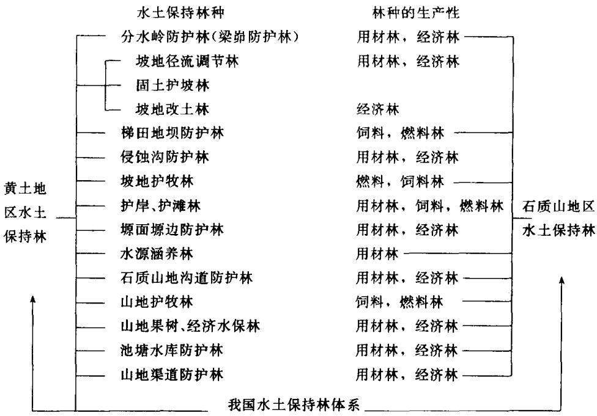  
图4-2 我国水土保持林体系构成图示

## 四、水土保持林（草）的配置与营造技术

## （一）坡面水土保持林

## 1. 坡面水土保持（或水源涵养）用材林

在因过度放牧、樵采，严重破坏了原有植被而水土流失严重的坡面上，通过人工营造水土保持林方法防止坡面土壤侵蚀，增加坡面稳定性，同时可获得小径级用材。特别在立地条件较好的坡面。多年实践经验证明，山地斜坡长期水土流失，土层浅薄、干旱、贫瘠，造林立地条件差，只能生产小径材、矿柱材等。

在小流域高山远山的一些水源地区，坡面不合理利用，植被恶化引起水文状况恶化及水土流失，此类坡面应依托残存次生林、草灌植被通过封山育林草，逐步恢复植被，形成较好的林分结构，具有发挥调节坡面径流、防止土壤侵蚀、涵养水源、生产一定用材的作用。

由于山地施工形成的大面积山地坡面裸露，水土流失严重，引发滑坡、泥石流等危害，应配合必要的工程护坡，营造水土保持护坡林（草)，是投资少，效果好的措施。

配置特点：

（1）营造坡面水土保持用材林应通过树（草）种选择、混交配置或其他经营技术，一来保证用材树种生长速度和生长量，二来尽可能长短结合，早日获得其他效益（薪炭、编织材、林粮间作等）。

这类立地造林困难，应通过水土保持林的整地工程：水平阶、反坡梯田、窄条梯田、鱼鳞坑等整地形式，正确解决整地时间、深度，改善幼树成活、生长条件。植物种搭配采用乔灌混交复层林，发挥生物群体间有利影响，为提高林草生长及稳定性创造条件。通过混交调节主栽树种密度，使林分尽快郁闭，形成较好枯落层，发挥涵养水源，调节坡面径流、固持坡面土体之作用。

①主要乔木与灌木水平带状混交沿等高线，结合整地措施，先造灌木带（沙棘、灌木柳、紫穗槐等），每带2～3行，行距1.5～2.0m，带间距4～6m，灌木成活至第一次平茬后，在带间栽乔木1～2行，株距2～3m。

②乔灌隔行混交乔灌同时造林，行间混交。

③结合农林间作的乔灌纯林间作是短期的，一旦林分郁闭，间作即告结束。要重视乔灌树种选择，生产上多用纯林方式，经营得当可获良好效果。整地用窄条梯田、反坡梯田。初期间作作物，以耕代抚，促进树木生长。

(2）小流域水源涵养用材林的封山育林（草）此类坡面依托残存次生林、灌、草等植物，通过封育达到恢复水源涵养林，形成稳定林分之目的。此类坡面尽管已经环境恶化，但尚存良好立地质量和各种植物，只要封育合理，加以人工干预，可较快恢复森林植被，各地实践已经证明。

封山育林除政策、管护措施外，技术上主要是林分密度管理与结构调整。

## 2. 坡面薪炭林

发展薪炭林既可防止坡面水土流失，又能解决农村生活能源，意义十分重大。长期以来由于农村生活能源未得到妥善解决，导致大量破坏天然植被，加剧水土流失，恶化生态环境，后果十分严重。

配置特点：

（1）地点规划中选择距居民点较近，交通较方便，不适于高经济利用目水土流失严重的坡地，作为薪炭林生产基地。

(2)营造关键是树种选择一般薪炭树种应适应干旱、贫瘠立地条件，再生能力强、耐平茬、生物量高、热值高。在北方于旱半干旱地区采用适应性强的灌木比同条件下的乔木优越得多。韩国采用胡枝子，效果很好。

(3）经营可因地制宜采取不同形式，如薪炭专用林，乔灌树种结合的块状、带状经营等。在大量应用灌木的同时（柠条、沙棘等），也可将乔木（刺槐、白榆等）灌木状经营。有条件地方也可采用封山育林、轮封轮伐，或

对低价值林分加以改造获得薪柴。

薪炭林建设要逐步走向科学经营，以达到一林多用的综合效益，形成如薪炭饲料固土护坡林。

## 3. 复合林牧护坡林

如山坡为放牧地，我们的任务在于为恢复植被或培育牧草创造条件，利用木本植物直接提供饲料，保障牧坡草场免于水土流失及大风寒冷冻害。畜牧业是山区、丘陵区主要生产事业，在生态农业中有重要作用。这些立地差的地区有经营畜牧业的传统习惯，但长期过牧，导致载畜量下降，植被覆盖率降低，可食草种减少，严重限制牧业发展，加剧了水土流失，严重影响山区经济发展。因此，恢复改善天然牧场，培育人工草地，改善牧场管理，已成为关键问题。

## 配置特点：

（1）放牧护坡林树种选择 不论是饲料林还是草场护牧林所选用的乔灌树种应具备下述特点：

①适应性强耐旱耐瘠，水土流失山地植物生长条件差，直接播种常效果不好，选用适应性强的乔灌树种效果较好。

②适口性好可作饲料树种（杨、柳、刺槐、沙棘、柠条等）的叶子、嫩枝适口性较好。

③营养价值高，含较高蛋白质及其他营养元素，多数适口的可作饲料的乔灌木树种，均有较高营养价值，常超过优良牧草指标。

④生长快幼龄时可提供大量饲草，经济价值高；萌蘖性强，平茬或轮牧后能迅速恢复生长。

（2）配置山地放牧（刘割）林可根据地形采用短带沿等高线布设，带长10\~20m，每带由2\~3行灌木组成，带间距4\~6m，水平邻带间留缺口。除灌木也可应用乔木按灌木状栽培。不论怎样，要使灌乔丛形成大量枝叶，又便于牲畜直接采食。同时灌丛配置要有效地截留坡地上的径流泥沙。这种饲料林为天然牧草生长创造了良好小气候条件，使饲料林生物产量比单纯灌木或单纯牧草地都高。

护坡林的配置其目的在于改善草场小气候及牧坡水土条件，促进牧草生长。而林木嫩枝叶还可作饲料。在牧场周围护牧林以带状沿等高线配置，每带植树2\~3行，宽度5～6m，带间距为带宽10倍左右，注意留出牧道。

灌木饲料林多采用直播造林，播后前3年要严加封禁管护，3年后平茬促进地上生长。当然也可进行植苗造林。乔木栽植造林后为按灌木经营，第二年即可平茬，使地上部分形成灌木从状。需营造乔木护牧林带或片林时，要

注意整地和抚育措施。

## （二）山地水文网、侵蚀沟道防护林

## 1. 土质侵蚀沟道防护林

土质侵蚀沟道系统指黄土高原和丘陵各地貌类型上的侵蚀系统及黄土类母质特征的沿河冲积阶地、山麓坡积、部分洪积扇土地基础上冲刷形成的现代侵蚀沟系。今以黄土高原为例。

黄土高原沟壑占40%～50%，因其所占面积很大，在这一地区也具重要生产价值。如建设川台坝地稳定高产农林果草及其他副产品生产基地。

黄土地区因各地自然历史条件不同，沟壑侵蚀发展程度不同，治理利用水平各异，沟道造林措施也比较复杂，可概括为以下几种类型进行讨论。

（1）侵蚀基本停止，沟道农业利用较好，坡面已治理较好，沟道采取打坝淤地等措施稳定沟道坡度，抬高侵蚀基点的地区。治理措施在于巩固各项水土保持措施的效果，充分发挥土地生产潜力。在这类沟道中，在现有耕地范围外，选择水肥条件较好、沟道宽阔地段发展速生丰产用材林。利用坡缓土厚向阳沟坡建设干鲜果园较为理想。应特别注意加强水土保持整地措施，因地制宜按窄带梯田、大型水平阶、鱼鳞坑方式进行整地，可结合进行果农间作，争取果粮丰收。果园规划要考虑水源和运输条件，果园周围密植紫穗槐灌木带调节上坡汇集的径流，并就地取得绿肥原料和篓筐编织材料。如利用沟坡造林，造林地选在坡脚以上，到沟坡全长2/3为止。再上多为陡崖，勿因造林引起新的人工破坏。上缘造林可选萌蘖性强的树种，如刺槐、沙棘等，使其茂密生长，自然蔓延滋生，进一步稳固沟坡陡崖。

(2）沟系中下游侵蚀基本停止，上游侵蚀仍然活跃，沟道内部分利用。在黄土丘陵沟壑区，此类沟道比例大，是治理及合理利用的重点。

这类沟道的治理与利用，有条件的沟道应打坝淤地，修筑沟壑川台地建设基本农田。流域打坝自下而上，依次推进，修一坝成一坝，再修一坝。施工过程中，可在其外坡分层压入杨柳苗条，或插柠条、沙棘等灌木，成活后发挥固坝缓流作用。坝坡上种植灌木有更大固土护坡能力。

沟系上游沟底纵坡大，沟道狭窄，沟坡崩塌严重，沟头仍在前进。沟顶上方坡面仍在侵蚀破坏，这类毛、支沟汇集大量固体及径流直接威胁中下游坝地安全与生产。故这类沟道治理有重要意义。

沟头前进与沟岸扩张均与沟底下切刷深有直接关系，此时应首先固定沟底。措施是：沟顶上方修建防护工程，拦截径流，控制沟头前进。沟底根据顶底相照原则，建筑谷坊群工程，抬高侵蚀基底，减缓纵坡坡度，稳定侵蚀沟坡。当然条件适宜也可以造林种草固定沟底。

制止溯源侵蚀需固定侵蚀沟顶，关键在于固定侵蚀沟顶的基部及附近沟底，免于洪水冲淘。在顶基部一定距离（1～2倍沟顶高度）内配置编篱柳谷坊，在准备建谷坊的沟底按0.5m株距打入1行1.5～2m长柳桩，地上露出1～1.5m，距这行柳桩1～2m处按同样规格平行打入另1行，再用细活柳枝分别于两行柳桩进行编篱到顶，两篱间倒满湿土，整实到顶。编篱坝到沟顶一侧也堆上湿土形成迎水缓坡，整实。在谷坊施工整实时在背水一侧卧入90～100cm长2～3年生柳枝，即为土柳谷坊。也可在谷坊高杆插柳。这2种措施均为工程与生物措施紧密结合，洪水来临时，谷坊与沟头之间的空间发挥缓力池作用。柳枝发芽茂盛生长后可发挥长期稳定的缓流挂淤作用，沟头基部减少冲淘，溯源侵蚀会迅速停止。

为防止规划为坝地以外需稳定的沟底下切，可参照土柳谷坊施工法建谷坊群，这既可巩固谷坊，加速缓流挂淤，又可逐渐在各谷坊间造出好地。

若沟底已停止下切，又不宜农业利用，最好进行高插柳桩的栅状造林，取长2m，小头粗2\~5cm柳桩，按株距0.3～0.5m，行距1\~1.5m，垂直流线，2\~5行为一栅配置，栅间距为壮龄柳高5～10倍，其间逐渐挂淤改土为农林利用创造条件。当然也可直接进行造林种草来固定沟底。

如某处沟床仍在下切，重力侵蚀在沟坡还很活跃，对此只要采用工程与生物措施相结合的方法，先把沟底固定，当林木长起之后，重力侵蚀物将稳定堆积在沟坡两侧，沟底流水也无力将泥沙冲走，逐渐形成天然安息角。其上崩塌也会减少。在稳定的坡脚可先栽沙棘、刺槐（RobiniapseudoacaciaI.）、小冠花等根蘖性强的植物种，树木成活后平茬松土，使其向上坡发展，它们不怕泄溜物埋压，很快又用青绿枝叶覆盖起来。

（3）沟系上中下游侵蚀都活跃，全沟系都无法合理利用。这类沟纵坡大，支沟处于切沟阶段，沟头溯源侵蚀，沟坡崩塌、滑坡均活跃。措施：一是对距居民点远，当下又无力治理者，先封禁，减少人为破坏，自然恢复植被，或播种林草种子，促进植被恢复；二是对距居民点近，对农水工交设施有威胁，应采取上述措施积极治理，沟道稳定后再考虑利用。

## 2. 石质山区沟道防护林配置

土石山地、石质山地在山区总面积中占相当比重。其自然条件复杂多变，一旦植被破坏，水土流失加剧，地力迅速减退。暴雨山洪、泥石流可能暴发，冲毁土地住宅，酿成大灾难。这是很多山区的普遍现象。陡坡开荒，水土流失，年复一年，直至土层完全丧失，这也是造成沟道中土沙汇集，诱发泥石流的原因之一。发挥水土保持林草防护功能，增加流域植被覆盖，可控制泥石流发生和减少其危害。但只有当坡面达到一定治理时，沟道泥石流防治才有可能。为防止泥石流营造坡面水土保持林时，树种选择、林分配置应形成深浅根林草植物混交的异龄复层林，成林郁闭度必在0.6以上。坡地造林要注意整地方法（水平阶、水平沟、反坡梯田、鱼鳞坑等）。

配置：当坡面得到治理，主沟道开阔，纵坡平缓山脚土厚时应进行农业、经济林利用。其支沟山陡沟窄坡度大时，沟底要修建沟道工程，防止泥石流，暴发时减少损失，有效方法是在沟底尤其在转折处修建一定数目的谷坊，呈密集谷坊群。修谷坊就地取材，建干砌石谷坊，提高沟床侵蚀基准，拦截沟底泥沙，为以后利用创造条件。当沟底工程与防护林结合，为强大树木群体占领时，方达制止泥石流作用。沟道下游出口附近渐趋开阔，沟道两侧多修石坎梯田和坝地，在地坎边线稀植经济、用材树种。

在我国北方干旱的亚湿润区、半干旱区、部分干旱区的水蚀荒漠化土地上，近年来飞机播种乔灌草植物种建设植被取得了许多可喜的成绩。飞播是该区快速、优质、大面积进行植被建设和发展生态大农业的有效途径。在降雨300～600mm的陕北黄土高原主要飞播植物为沙打旺、小叶锦鸡儿、沙棘、油松、侧柏（Biota orientalis)；冀北、冀西山地年降水400～700mm的半干旱半湿润区，飞播植物主要是油松(Pinus tabulaeformis)；西北半荒漠年降水200mm左右的地区，主要飞播植物种为柠条、沙棘、毛条等。

具体飞播技术可参考风沙区飞播部分。

## 第十一节 盐渍荒漠化土地的植被建设技术

我国三北、沿海、黄淮地区分布着面积广泛的盐渍化土地和尚待改造利用的盐碱荒地。这些土地是国家经济建设的宝贵资源。对这些盐碱地必须进行不同程度的改造，才能加以利用，发展农林牧业生产。为此，我国广大劳动人民和科技工作者付出了不懈的努力，取得了可喜的成就。

## 一、盐碱对植物的危害

## （一）渗透抑制与生理干旱

土壤中可溶盐分增加，土壤溶液浓度和渗透压就会增高，使植物不能正常吸收水分，重者会脱水萎蔫而死亡。盐土单一盐分的危害比复盐更大。

## （二）影响植物光合与代谢

在盐清土壤中，能使植物促进气孔开放的激素减少，抑制气孔开放的激素增加。这就使叶片气孔孔径减小，影响二氧化碳吸收与光合作用，使植物生长受阻。土壤含有过量可溶盐，会减弱植物代谢过程，土壤盐分可引起氮

代谢过程产生毒性物质，其毒性有时比氯化钠大好几倍。

## （三）离子毒害与养分吸收失调

植物从土壤中吸收过量的钠，会抑制对钙的吸收，硫酸根离子浓度过高也引起植物缺钙，使下部叶子发红或脱落。叶片中钠离子过多会使叶尖、叶缘枯焦，氯离子过多也会灼伤，影响光合作用和淀粉形成。土壤含盐量增加，植物根系选择吸收营养离子的能力减弱，营养性离子吸收不足，非营养性离子及有害离子吸收过多，造成营养失调和缺素症。pH值过高，土壤中锰铁不能溶解，植物缺锰铁而得退绿病，叶片变黄。强碱作用下，根表面的磷、铁以磷酸铁的形式被固定，这就限制了植物对磷铁锰的吸收。

## （四）恶化土壤的理化和生物学性质

地表积盐多，尤其是氯化镁、氯化钙多，因吸湿性强，地温上升慢。盐土透水不良，pH值高，土壤板结，耕性差，幼苗出土生长困难；土壤盐碱高，抑制了微生物运动。氯化钠、硫酸钠超过0.2%，氨化作用显著减弱，超过1%，氨化停止。硝化细菌对盐类更敏感。这就直接影响植物对有效态氮的吸收。

## （五）土壤可溶盐对植物危害因盐类而异

不同盐类对植物危害排序如下

氯化镁>碳酸钠>碳酸氢钠>氯化钠>硫酸镁>硫酸钠；如浓度相同，其危害比例为：

碳酸钠：碳酸氢钠：氯化钠：硫酸钠=10：3：3：1。

植物受盐碱危害表现为：

（1）变色起初茎部叶片变淡、变黄，然后向上蔓延。叶片由叶缘、叶脉向两侧发展到全叶，老叶受害较重。

(2)叶片枯焦 枯焦由叶片顶端或叶缘开始，向叶基部扩展。植物种不同颜色也不同。

(3)叶片脱落高温季节，叶片枯焦急剧发展，而后脱落。银白杨(Popu-lus alba)、箭杆杨、黑杨、桑、核桃更易发生。

(4)炎热天气，冠顶先萎蔫并迅速向下发展，叶片不变色不落，干缩在枝条上。严重者植物死亡。

## 二、盐碱地的植被恢复与建设

## （一）植被改良盐渍化土地的作用

（1）抗御干热风，抑制土壤返盐干旱盐碱地区多干热风，林草植被能使风速降低，温度下降（夏季降低气温0.6\~1.4℃），湿度提高5%～20%，蒸发减少20%，新疆麦盖提县在盐碱地上营造4行窄林带，7月蒸发量减少

41.4%，显著抑制了土壤返盐。

(2)降低地下水位，抑制土壤返盐 植被根系大量吸收土壤深层的水分，再蒸腾散失。据试验柳树蒸腾强度为 $2 3 9 . 0 4 \mathbf { g } / \mathbf { \nabla } ( \mathbf { h } \cdot \mathbf { m } ^ { 2 } )$ ，榆树34.45g/（h·m²)，胡杨83.66g/（h·m²)，1株成年柳1年可蒸腾91.4m³地下水，像抽水机一样。新疆沙井子材料，一条6～8行沙枣、钻天杨为主的混交林带，降低水位范围达200m，在75～100m范围内较明显，降低0.2\~0.7m，地下水矿化度也逐年淡化，土壤含盐量显著减少。

## (3)提高肥力，抑制返盐

## （二）选择耐盐植物

## 1. 选择原则

（1）耐盐力强 选择的植物耐盐能力要与土壤含盐量相一致，不能低于土壤含盐量。还要考虑植物对不同盐分的适应性。

(2）抗旱耐涝能力盐碱地多分布在低湿盆地，洪涝旱碱并存。选择植物要注意其抗旱耐涝能力。

（3）易繁殖、生长快能尽早成林郁闭覆盖林地，防止土壤返盐。

(4)经济效益较高有条件时尽量选择可提供四料、副产品和经济、药用植物。

## 2. 植物耐盐能力

（1）植物耐盐能力分级植物耐盐能力，乔木指造林1～3年内幼树对盐碱土的适应性，即树木忍受盐渍化程度并有一定产量的能力。据此确定以树木生长受到盐碱抑制，但不显著影响成活率、生长量时的土壤含盐量作为该树种的耐盐能力。不同树种耐盐能力不同，同一树种耐盐能力因不同树龄而异，也与树木强弱、盐分种类、土壤质地和含水率有关，一般将植物耐盐能力分为强、中、弱3级。弱度耐盐指标为0.1%～0.3%，中度耐盐为0.4%～0.5%，强度耐盐为0.5%～0.7%。不同地区耐盐标准有出入。成年树附近土壤的含盐量不能作为该树耐盐标准，只能作为参考。

## (2) 不同植物耐盐能力 如表 4-2。

表 4-2 不同植物耐盐能力
<table><tr><td>耐盐能力</td><td>弱度耐盐</td><td>中度耐盐</td><td>强度耐盐</td></tr><tr><td>植</td><td>新疆杨、箭杆杨、钻天杨、辽 杨、大(小)黑杨、小叶杨、旱柳、</td><td>银白杨、小叶白蜡、白柳、山 杏、刺槐、白榆、紫穗槐、桑、臭</td><td>胡杨、柽柳、枸杞、沙 枣、梭梭、紫穗槐（沿</td></tr><tr><td>物</td><td>大(小)叶白蜡、加杨、合作杨、 小美旱、毛白杨、山杨、驼绒藜、</td><td>椿、杜梨、侧柏、枣、合欢、伏地 肤、披碱草、羊草、芨芨草、冰</td><td>海)绒毛白蜡、胡枝子 (东北)、星星草、芦苇、</td></tr><tr><td>种</td><td>沙拐枣、无芒雀麦、苏丹草、紫 苜蓿、红豆草、毛苕子</td><td>草、草木樨、沙打旺、小冠花、埃 及三叶草</td><td>草莓三叶草</td></tr></table>

## （三）盐碱地造林种草

## 1. 植苗造林

(1）围埝、挖坑、压盐、冬秋栽树地形不平，盐碱重的土地，先平整土地，后根据地形围成不等地块，夏季挖坑，坑与坑之间有小沟相通，防雨水流失，以充分洗盐。初秋把坑内淤泥挖出风化，秋季造林。栽树时深挖浅埋，浇足底水，覆干土，减少蒸发，抑制返盐。

(2)客土整地造林栽不活树的重盐碱地，可采取井状、穴状换土，改变局部条件。要注意：大穴深翻，深度要超过表土下柱状结构层；增施有机肥；坑底土性不好可铺一层大沙粒，阻止根系向下扎；无土可换时可掺沙，以沙压碱。客土费工，限制了推广。有的在坑底放2cm糠隔离，糠上铺1～2cm阳土，后再以1：8的糠土比拌匀，入穴，埋树根25cm深，踏实浇水，干土覆盖，效果良好。

(3）珑沟整地造林对地势低、水位高、排水不良的土地，可实行珑沟 整地。沟深低于水位，沟沟相通，沟底有坡度以利排水，珑上植树。

(4）沟底造林 春天开沟，夏灌排盐，秋天沟底造林，栽后及时松土，抑制返盐。

(5）沟畦整地造林 地平，水位高，含盐重，有灌溉条件，在前1年雨季前整地，畦旁挖排水沟，沟深大于水位面，同时增加输水沟、干沟、容泄区的深度，依次更深些，沟底需有一定坡度。整地工程结束，在畦上造林。

## 2. 播种造林

盐碱地播种出苗保苗比较困难，但措施得当也可以成功。

（1）开沟播种为减轻盐分对种子危害，地上先开沟，沟底播种，盐分少受热面积小，水分条件好，有利于出苗生长。

(2)催芽浸种 减少种子土埋时间，减少或防止烂籽，提早出苗，苗齐苗壮，有利生长。

（3）适当增加播量促进幼苗提早覆盖地面，抑制返盐。

（4）雨后及时灌水雨后盐分淋溶，不及时灌水压盐，苗根易受盐害。灌水压盐后，表土稍干即可松土。

(5)及时松土出苗阶段适时松土防盐。

(6）施用有机肥和磷肥苗期根系生长快，磷可促进糖运输，促进根系生长。盐碱地缺磷，不利根系生长，多施磷和有机肥改土，提高肥力。

## 3. 种植牧草

盐碱地发展牧草一举多得。技术上应注意如下环节：①根据土壤盐碱含量选择适宜草种；②根据不同条件采取适宜的整地与种植方式；③尽可能多

施有机肥，尤其是磷肥；①硬实种子要处理，豆科种子要接种根瘤菌；⑤加强苗期管理（松土、除草）；⑥集约草地要加强水肥管理；⑦适时利用，促进生长。

## 参考文献

1. 李滨生主编.治沙造林学．北京：中国林业出版社，1990

2. 王礼先主编.水土保持学.北京：中国林业出版社，1995

3. 孙洪祥主编．干旱区造林学．北京：中国林业出版社，1991

4. 王礼先，王斌瑞，朱金兆，余新晓主编．林业生态工程学．北京：中国林业出版社，1998

5. 张宝善，王贤，李滨生编，半荒漠地带铁路固沙林带的营造．北京：人民铁道出版社，1988

6. 张奎壁，邹受益主编．治沙原理与技术. 北京：中国林业出版社，1990

7. 王贤，周金星，陈建刚等.北京治沙经验．北京林业大学学报，1998，7（2)

8. 彭庆光.封沙育林育草在沙漠中的作用．乌鲁木齐：干旱区研究．沙漠的过去、现在和未来，1995

9. 王贤，周心澄，丁国栋.对我国荒漠化防治现状的几点认识和建设．北京林业大学学报，1999 (1)

# 荒漠化工程防治技术

## 第一节 风蚀工程防治技术

一、机械沙障固沙

## （一）机械沙障的类型和作用原理

## 1. 机械沙障在治沙中的地位及作用

机械沙障是采用柴、草、树枝、黏土、卵石、板条等材料，在沙面上设置各种形式的障碍物，以此控制风沙流动的方向、速度、结构，改变蚀积状况，达到防风阻沙、改变风的作用力及地貌状况等目的，统称机械沙障。

机械沙障在治沙中的地位和作用是极其重要的，是植物措施无法替代的。在自然条件恶劣地区，机械沙障是治沙的主要措施，在自然条件较好的地区，机械沙障是植物治沙的前提和必要条件。通过多年来我国治沙生产实践的总结表明，机械沙障和植物治沙是相辅相成、缺一不可的，处于平等地位，发挥着同等重要的作用。

## 2. 机械沙障的类型

机械沙障按防沙原理和设置方式方法的不同划分为2大类：平铺式沙障和直立式沙障。平铺式沙障按设置方法不同又分为带状铺设式和全面铺设式。直立式沙障按高矮不同又分为：高立式沙障，高出沙面50～100cm；低立式沙障，高出沙面20～50cm（此类也称半隐蔽式沙障)；隐蔽式沙障，几乎全部埋入与沙面平，或稍露障顶。直立式沙障按透风度不同分为：透风式、紧密式、不透风式3种结构型。

## 3. 机械沙障的作用原理

(1）平铺式沙障的作用原理平铺式沙障是固沙型的沙障，利用柴、草、卵石、黏土或沥青乳剂，聚丙烯酰胺等高分子聚合物等物质铺盖或喷洒在沙面上，以此隔绝风与松散沙层的接触，使风沙流经过沙面时，不起风蚀作用，不增加风沙流中的含沙量，达到风虽过而沙不起，就地固定流沙的作用。但对过境风沙流中的沙粒截阻作用不大。

(2)直立式沙障防沙原理直立式沙障大多是积沙型沙障，风沙流所通过的路线上，无论碰到任何障碍物的阻挡，风速就会受到影响而降低，挟带沙子的一部分就会沉积在障碍物的周围，以此来减少风沙流的输沙量，从而起到防治风沙危害的作用。

（3）透风结构沙障的作用原理当风沙流经过沙障时，一部分分散为许多紊流穿过沙障间隙，摩擦阻力加大，产生许多涡漩，互相碰撞，消耗了动能，使风速减弱，风沙流的载沙能力降低，在沙障前后就形成积沙。在沙障前的积量小，沙障不易被沙埋，而在沙障后的积沙现象不断出现，沙堆平缓地自纵向伸展，积沙范围延伸得较远，因而拦蓄沙粒的时间长、积沙量大。

(4)不透风或紧密结构沙障的防沙原理当风沙流经过沙障时，在障前被迫抬升，而越过沙障后又急剧下降，在沙障前后产生强烈的涡动，由于相互阻碰和涡动的影响，消耗了风速动能，减弱了气流载沙能力，于是在沙障前后形成沙粒的堆积。

（5）隐蔽式沙障的防沙原理该沙障是埋在沙层中的立式沙障，障顶与沙面平或稍露出沙面，因此对地上部分的风沙径流影响不大，而它的主要作用是制止地表沙粒以沙纹式移动。隐蔽式沙障起到一个控制风蚀基准面的作用，设置沙障后沙粒仍在动，但总的地形并不发生变化。因为有隐蔽式沙障的存在，虽有一定的风蚀，但风蚀到一定程度后即不再往下发展，保持着一定的水平，故而不会使地形发生变化。

## （二）沙障设计的技术指标

沙障设计技术主要是解决设置沙障时，应该注意的几项技术指标的运用问题，了解每项技术指标在沙障治沙中所起的作用，只有这样设计的各种沙障才能符合当地自然条件的客观规律，发挥沙障在治沙工作中的最大效能。

## 1. 沙障孔隙度

通常把沙障孔隙面积与沙障总面积之比叫做沙障孔隙度。我们通常用它作为衡量沙障透风性能的指标。一般孔隙度在25%时，障前积沙范围约为障高的2倍，障后积沙范围为障高的7～8倍。而孔隙度达到50%时，障前基本没有积沙，障后的积沙范围约为障高的12\~13倍。孔隙度越小，沙障越紧密，积沙范围越窄，沙障很快被积沙所埋没，失去继续拦沙的作用。反之，孔隙度越大，积沙范围延伸得越远，积沙作用也大，防护时间也长。为了发挥沙障较大的防护效能，在障间距离和沙障高度一定的情况下，沙障孔隙度的大小，应根据各地风力及沙源情况来具体确定。一般多采用25%～50%的透风孔隙度。风力大的地区，而沙源又小的情况下孔隙度应小；沙源充足时，孔隙度

应大。

## 2. 沙障高度

一般在沙地部位和沙障孔隙度相同的情况下，积沙量与沙障高度的平方成正比。沙障高度一般设30～40cm，最高有1m就够了。

## 3. 沙障的方向

沙障的设置应与主风方向垂直，通常在沙丘迎风坡设置。设置时先顺主风方向在沙丘中部划一道纵轴线作为基准，由于沙丘中部的风较两侧强，因此沙障与轴线的夹角要稍大于90°而不超过100°，这样就可使沙丘中部的风稍向两侧顺出去。若沙障与主风方向的夹角小于90°，气流易趋中部而使沙障被掏蚀或沙埋（图5-1）。

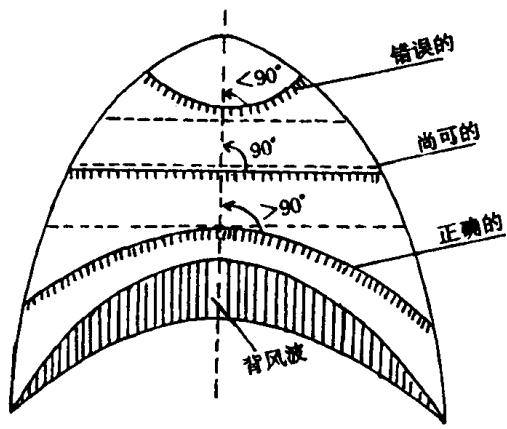

## 4. 沙障的配置形式

沙障的一般配置形式有行列式、格状、人字形、雁翅形、鱼刺形等。主要是行列式和格状式2种。

(1）行列式配置多用于单向起沙风为主的地区，在新月形沙丘迎风坡设置时，丘顶要留空一段，并先在沙丘上部按新月形划出一道设沙障的最上范围线，然后在迎风坡正面的中部，自最上设置范围线起，按所需间距向两翼划出设置沙障的图 5-1 沙丘迎风坡沙障设置方向示意图

线道，并使该沙障线微呈弧形。对在新月形沙丘链上设障时，可参照新月形沙丘进行。但在两丘衔接链口处，因两侧沙丘坡面隆起，形成集风区，吹蚀力强，输沙量多，沙障间距应小。在链身上有起伏弯曲的转折面出现处，标志着气流在此转向，风向很不稳定，可在此处根据坡面转折情况，加设横档，以防侧向风的掏蚀。

(2)格状式配置在风向不稳定，除主风外尚有侧向风较强的沙区或地段采用。根据多向风的大小差异情况，分别采用正方形格、长方形格均可。

## 5. 沙障的间距

沙障间距即相邻两条沙障之间的距离。该距离过大，沙障容易被风掏蚀损坏，距离过小则浪费材料，因此，在设置沙障前必须确定沙障的行间距离。

沙障间距与沙障高度和沙面坡度有关，同时还要考虑风力强弱。沙障高度大，障间距应大，反之亦然。沙面坡度大，障间距应小；反之，沙面坡度小，障间距应大。风力弱处间距可大，风力强时间距就要缩小。一般在坡度小于

4°的平缓沙地上，障间距应为障高的15～20倍。一般在地势不平坦的沙丘坡面上障间距的确定要根据障高和坡度进行计算。公式为：

$$
D = H \times \mathrm { c t } \mathbf { g } \alpha\tag{5-1}
$$

式中 D——障间距离；

H—障高；

α——沙面坡度。

黏土沙障的间距为2\~4m，埂高为15\~20cm。在风沙危害严重地区最好设成1×1m或1×2m的黏土方格沙障。其用土量主要根据沙障间距和障埂规格进行计算，并根据取土远近核算用工量，计算公式为：

$$
Q = \frac { 1 } { 2 } a h s ( 1 / c _ { 1 } + 1 / c _ { 2 } )\tag{5-2}
$$

式中 ${ \pmb a } ^ { \prime }$ ——障埂底宽；

h—障埂高；

$c _ { 1 }$ 与主风垂直的障埂间距；

$c _ { 2 }$ —与主风平行的障埂间距；

s—所设沙障的总面积；

Q—需土量。

## 6. 沙障类型及设障材料的选用

不同类型的沙障有不同的作用，因此，在选用沙障类型应根据防护目的因地制宜地灵活确定。如以防风蚀为主，则应选用半隐蔽式沙障；以载持风沙流为主的应选用透风结构的高立式沙障为宜。

选用沙障材料时，则主要考虑取材容易，价钱低廉，固沙效果良好，副作用小。一般多采用麦草、板条、砾石和黏土等较易取得的材料为王。

## （三）沙障的设置方法

## 1. 高立式沙障

（1）制作材料用芨芨草、芦苇、板条和高秆作物等。

(2)设置方法把材料做成70～130cm的高度，在沙丘上划好线，沿线开沟20～30cm深。将材料基部插入沟底，下部加一些比较短的稍头，两侧培沙，扶正踏实，培沙要高出沙面10cm。最好在降雨后设置。

## 2. 活动的高立式沙障

（1）制作材料木板和铁钉。

(2)设置方法用板做成不透风的沙障，以行列式的沙障为主，高度与高立式沙障近似；可以随风向的变化而随时移动位置。

## 3. 半隐蔽式草沙障

（1）制作材料麦秆、稻草、软秆杂草。

（2）设置方法在沙丘上划线，将材料（麦秆、稻草）均匀横铺在线道上，用平头锹沿划线方向压在平铺草条的中段用力下踩至沙层10～15cm，然后从两侧培沙踩实。

## 4. 低立式黏土沙障

（1）制作材料 黏土。

(2)设置方法根据风沙流情况设计沙障规格，划线，然后沿线按程序设计堆放黏土，形成高15\~20cm的土埂，断面呈三角形。切忌出现缺口现象，以防掏蚀。

## 5. 平铺式沙障

(1）制作材料有黏结性或质地较坚硬的块状体。如黏土、砾石、砖头、瓦片、胶体物质、原油等。

(2)设置方法将黏土或砾石块均匀地覆盖在沙丘表面，厚度可灵活掌握，一般5～10cm，黏土不要打碎；砾石平铺沙障各块间要紧密地排均，不可留较大的空洞，以免掏蚀。设带状平铺时要按要求留出空带。

## （四）各类沙障效果的评价

## 1. 高立式沙障

高立式沙障的防沙效果较好，适合于沙源距被保护区较远、沙丘高大、沙量较多的地段使用。但易造成流沙堆积，使被保护对象仍有受沙害威胁的现象存在，因此在被保护对象附近不宜采用此类沙障；而且设置后需要经常维修。耗料多，费工多。

## 2. 半隐蔽式沙障（低立式沙障）

(1）格状草沙障其特点是取材方便，施工方法简便易行，成本相对较低，显著增大地表粗糙度，削减沙表面风速，固沙效果较好。

(2)黏土沙障其特点为成本低，可以就地取材，有较强的保水能力，对植物治沙有利，但受地区的限制较大。

## 二、化学固沙

化学固沙是属于工程治沙措施之一，其作用和机械沙障一样是个治标措施，也是植物治沙的辅助、过渡和补充措施。

## （一）化学固沙简况及作用原理

## 1. 化学固沙简况

(1）第一个采用化学方法进行固沙试验的国家是前苏联，这项研究工作开始于1934年；

（2）美国用化学固沙是40年代末期开始的，第一次试验是在1950年；

（3）英国于1960年开始在澳大利亚用沥青乳固沙，并配合植树造林；

(4）中国于1956年开始进行化学固沙试验研究工作；

(5）其他国家如印度、德国、法国、伊朗、阿尔及利亚、伊拉克等国都开展了化学治沙试验研究。

## 2. 化学固沙的作用原理

利用稀释了的具有一定胶结性的化学物质喷洒于松散的流沙沙地表面，水分迅速渗入到沙层以下，而那些化学胶结物质则滞留于一定厚度（1～5mm)的沙层间隙中，将单粒的沙子胶结成一层保护壳，以此来隔开气流与松散沙面的直接接触，从而起到防止风蚀的作用。这种作用是属于固沙型的，只能将沙地就地固定不动，而对过境风沙流中所携带的沙粒却没有防治效能。

## （二）化学固沙物质的种类和组成

## 1. 沥青乳液固沙

组成：石油沥青，乳化剂（用硫酸处理过的造纸废液或油酸钠），水。

## 2. 沥青化合物固沙

组成：30%\~50%的沥青或黏油，30%\~50%的矿石粉，30%\~35%的水。

## 3. 涅罗森固沙

组成：含氮物质0.3%，石炭酸0.3%，酚类化合物21.4%，沥青质酸0.7%，中性沥青质13.3%，中性油、烃和中性氧化物64%。

## 4. 油—胶乳固沙

组成：橡胶乳。

## 5. 沙粒结块固沙法

在沙中加黏结剂，增加沙粒团聚成分，同时栽植固沙植物，以此来达到固定流沙的目的。

## （三）化学固沙物质的配制及使用方法

## 1. 沥青乳液的配制及使用

## (1) 概况

①沥青乳液的概念沥青乳液又叫乳化沥青，它是在乳化剂存在条件下，通过乳化设备将沥青以微粒形式分散于水中的两相体系。其中的沥青微粒叫做分散相或内相，水叫做连续相或外相，这种乳液又称水包油式乳液。

②沥青乳液的类型按其乳珠所带电荷划分为阳离子型、阴离子型、两性离子型和非离子型；按接触沙粒时的破乳速度分为快裂型、中裂型、慢裂型。

③沥青乳液的发展过程 第一阶段是从第一个沥青乳液问世到20年代中期为初期探索阶段；第二阶段是从20年代末到40年代末为阴离子乳液蓬勃发展阶段；第三阶段是从50年代到目前为阳离子沥青乳液发展阶段。

(2)沥青的组成及其化学特性 沥青是石油产品，是属于有机物范围，它主要由碳、氢、氧、硫、氮5种元素组成。其中碳占70%～80%，氢占10%～15%，氧占1%\~5%，硫占2%\~8%，氮占0.5%\~2%，属碳氢化合物。沥青为黑色有机胶结材料，有黏性，抗水性（不透水，不溶水）及防腐作用，沥青的理化性质与它所含的元素氧、硫、氮的多少有关，一般根据沥青软化温度（熔点）、比重、硬度等来决定其标号。

(3）沥青乳液的配制所用材料为沥青和乳化剂。沥青是200号石油沥青与30号石油沥青混合使用；乳化剂则为亚硫酸造纸废液。有时为了增加乳液的稳定性和分散度常加入水玻璃或烧碱。一般要在10t乳液中加入0.5kg烧碱。

①沥青乳液一号配方 乳化液的组成由亚硫酸盐造纸废液(pH<7，比重1.28）12%，硫酸（工业用，比重1.83）1.2%，水86.8%；沥青材料则为30号石油沥青：200号石油沥青=3：2；乳化液：沥青材料=1：1（体积比）。

②沥青乳液二号配方 乳化液组成由硫化钠蒸煮废液（pH>7，比重1.04）50%，硫酸（工业用，比重1.83）1.5%，水48.5%；沥青材料由30号石油沥青：200号石油沥青=2：1组成；乳液则由乳化液：沥青材料=1：1（体积比）组成。

③沥青乳液生产工艺的主要生产设备为狭缝式胶体磨，蒸气锅炉，沥青加热锅，乳化液调配池，乳液贮存池。

④沥青乳液生产过程 按照配方，将沥青加热至120～160℃，以降低沥青的粘度。在另一容器内将配好的乳化液加热到65～70℃，两种材料经过滤后按体积比1：1的关系同时放入胶体磨的进料漏斗中，沥青和乳化液的混合料经搅拌后，经过0.1～0.5mm的狭缝后被乳化。乳液经出口流入贮存池。

沥青乳液的质量的好坏依赖于沥青乳液的颜色、分散度、稀释稳定性等指标，因此在质量检查时应分别检验这些指标。沥青乳液的颜色以棕色为最好，棕黑次之，黑棕色最差，不易使用。分散度的检验可用玻璃棒插入沥青乳液中，取出时待乳液不在下滴时，观察玻璃棒上的漆膜，如果漆膜细腻不见颗粒，则分散度高，沥青乳液质量为佳；反之，漆膜粗糙，分散度低，沥青颗粒不够均匀，不成膜，则沥青乳化不好，或未乳化，不能使用。此时应检查配方比例是否正确或胶体磨转速是否正常，如没有差错应继续研磨。稀释稳定性的检验，一般在喷洒前按比例稀释时，通过搅拌，如稀释均匀，则稳定性好，质量高；如果不易稀释或极不均匀，则不易使用。经过质量检查后符合标准的乳液就是配制好的沥青乳液，可以使用。

## (4)沥青乳液的使用

①用量各地不一，以每平方米几克到每平方米几百克都有，主要取决于当地的水文条件和风速，如果水文条件好，风较小，用量可小，否则应大。

②高度喷头不要距地表过低或过高，一般1m左右为宜，否则会影响喷洒质量。

③方向风向对喷洒质量影响很大，不易迎风和顺风喷洒。迎风喷洒不易控制，并易溅得满身沥青，顺风喷洒易使背风坡出现小蜂窝，造成质量不良，以侧向略迎风喷洒为好。

④喷洒方式全面喷洒法和带状喷洒法。如果喷洒沥青与植物固沙同时进行时，应在栽上植株后立即喷洒。在降水或喷水后喷洒沥青效果更好。

## 2. 沥青化合物的配制和使用

(1）配制将MG：70/30沥青或黏油、矿物粉和水按规定的比例配好， 装入灰浆搅拌机中进行强力搅拌即可制成。

(2)使用将制成的化合物进行稀释，可采用1：1～1：10，用泥浆泵喷洒即可。量一般为 $6 \sim 8 \mathrm { L } / \mathrm { m } ^ { 2 }$ ，渗入沙层厚度为10～30mm。一次用量不易太大，可分多次喷洒，间隔半月到2个月再喷。

## 3. 油一胶乳的配制和使用

（1）配制将油100份，水15～30份，油酸2\~4份，三乙醇胺1\~2份混合在一起装入搅拌机中，然后以50r/min的速度，转动15～20min，即可制成良好稳定性的油胶乳液。

(2)使用使用时可以直接用配制好的油一胶乳溶液向沙面上喷洒。

## （四）沥青乳液固沙效果评价。

## 1. 抗风蚀

喷洒量为0.25kg/m²，在20m/s 风速下持续吹 20min，结皮全部被吹坏；喷洒量为0.33 $\mathbf { k g } / \mathbf { m } ^ { 2 }$ ，在20m/s风速下持续吹80min，一半面积被破坏；喷洒量为 $0 . 5 \mathrm { k g } / \mathrm { m } ^ { 2 }$ ，在30m/s风速下持续吹280min，局部有风蚀洞（8mm）；喷洒量为1.01 $\nu \mathrm { { g } } / \mathrm { { m } } ^ { 2 }$ ，在30m/s的风速下持续吹320min，表面无风蚀现象。一般可使用4～5年，如喷洒质量好，未遭人畜破坏的可使用10年以上。

## 2. 透气性

喷洒沥青乳液后，对沙子的透气性影响不大。喷与未喷沙层中的二氧化碳和氧气的量基本相同。

## 3. 保水性与透水性

保水性：喷洒乳液沙层中的含水量比天然条件下沙层中的含水量高，说

明其保水性好。透水性：说法不一，需进一步研究。一般喷洒量大基本不透水，喷洒量小则透水性较好。

## 4. 蒸发量

蒸发量很小时，无明显差异；在蒸发量很大时，喷洒量明显影响蒸发量的大小。

## 5. 温度

沙面铺沥青后，对土壤温度影响是有季节变化的。在夏季，高出地面3cm的地方和地表以下5cm处，铺沥青的地方均低于未铺沥青的地方，往下温度差别不大，一般在1～1.5℃以内。在春秋两季，温度出现相反的变化，有沥青防护层下的沙层温度均有提高，在25～100cm范围内，提高0.5～0.8℃；200cm深处提高1.3\~3.0℃。

## 6. 对植物生长的影响

（1）使植物免除遭受风蚀、沙埋、沙打、沙割的危害。

（2）改善了沙地土壤的水温条件，有利于植物的生长。

（3）春秋两季沥青层下温度较高，延长了植物的生长期，

(4)夏季温度低于未铺沙层，免遭日灼的危害。有沥青层保护的地段，种子发芽可提早4\~6d，生长速度可以增加1.3\~2倍，死亡率可减少50%。

（5）沥青中的微量放射性物质对植物也有一定的刺激作用，使植物生长效果好。

## 7. 关于沥青乳剂固沙的造价问题

国外用沥青乳剂固沙的造价并不高，约为草沙障的1/4。我国用沥青乳剂固沙的造价较高，约为前苏联的6倍，其原因是由于所需设备费用高，初期投资大而造成昂贵的造价。化学固沙目前在我国不如机械沙障那么普通，主要根源在于制造乳化沥青的全套设备购置及制作技术等尚有一定的困难，限制了这一措施的推广应用。

## 三、风力治沙

## （一）风力治沙的意义及原理

## 1. 风力治沙的概念

风力治沙是以风的动力为基础，人为地干扰控制风沙的蚀积搬运，因势利导，变害为利的一种治沙方法。

从风沙运动规律认识风力治沙可以得出结论：风力治沙指应用空气动力学原理，采用各种措施，降低粗糙度，使风力变强，减少沙量，使风沙流非饱和，造成沙粒走动或地表风蚀的一种治沙方法。

## 2. 风力治沙的意义

(1）应用地区广泛风力治沙不受自然条件好坏所限，不论条件优劣都可以采用，所以应用范围很广。

(2)行之有效的治沙方法在认识风沙运动规律的基础上，运用辩证统一规律，创造一定条件，使风变害为利，化消极因素为积极因素，为治理流沙危害增加了切实可行的方法。

(3)固输结合效果显著经我国治沙实验证明，采用固输结合的措施，效果显著。

(4)风是沙区的宝贵能源之一风力治沙本身就是利用风力代替人力、机械做功。目前我国利用风力拉沙改土、发电、提水等已成为事实。我国沙区有丰富的风能资源，风力治沙利是用自然规律来改变自然地貌。

## 3. 风力治沙原理

(1）辩证统一规律是风力治沙的理论基础变害为利是风力治沙的指导思想。在害转利的过程中，风与沙是基础，那就必需考虑风的强弱、风沙流的饱和非饱和、沙粒的停走、地表的蚀积、措施的固输，这5对矛盾10个方面的辩证统一规律。

风力治沙要本着以固促输，断源输沙，以输促固，开源固沙的方针，在辩证统一规律的指导下，利用和创造各种条件，使5对矛盾各自向其对立面转化，达到除害兴利的目的。

(2）非堆积搬运和饱和路径学说是风力治沙的理论依据 风沙地貌在景观上的最大特征就是沙丘与丘间地相间分布。要使防护地段免受积沙危害，就要在气流逐渐被沙子饱和的路径上，取去一部分沙子，那就可以在一定长度的地段上达到非堆积搬运，延长饱和路径，使之在这个地段内不堆积，或使风占优势，或使简单的搬运占优势，就可以在防护地段内不造成积沙危害，也可以使被沙埋压的地段将沙搬运走。

(3)伯努力方程的应用 伯努力方程：

$$
\rho \times { { v _ { 1 } } ^ { 2 } } / 2 + { P _ { 1 } } = \rho \times { { v _ { 1 } } ^ { 2 } } / 2 + { P _ { 2 } }\tag{5-3}
$$

式中 ρ——空气密度；

$\boldsymbol { v } _ { 1 }$ $\mathbf { \delta } _ { v _ { 2 } }$ 两点的气流速度；

$P _ { 1 }$ $P _ { 2 }$ —两点静压力。

此方程指出，气流中任意一点的速度大，则静压力小；反之，速度小，则静压力大。在风力治沙的许多具体措施中，应用这一原理达到输沙的目的。

## （二）风力治沙的技术措施

风力治沙的基本措施是以输为主，兼有固。固输结合，则效果更佳。

## 1. 以固促输，断源输沙

要防止某地段被沙埋压或清除其上的积沙，就在该地段上风区，用可行

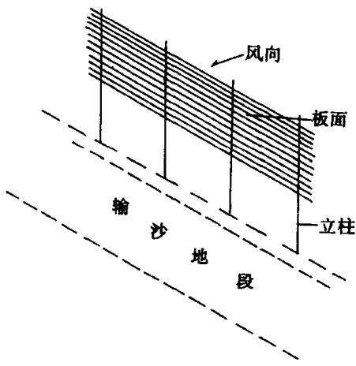  
图 5-2 聚风下输法

的治沙方法固定流沙、切断沙源，使流经防护区的风沙流成为非饱和气流，使此处的积沙被气流带走或以非堆积搬运形式越过防护区，使被保护物免受积沙危害。

## 2. 集流输导

集流输导是聚集风力、加大风速、输导防护区的积沙，防止沙埋危害。

集中风力的方法很多，最常见的有聚风板。采用聚风板常用聚风下输法(图5-2)、水平输导法（即八字形输导）(图5-3)、垂直输导法（图 5-4)。

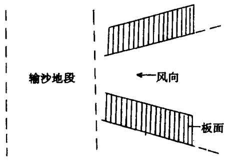  
图 5-3 水平输导法

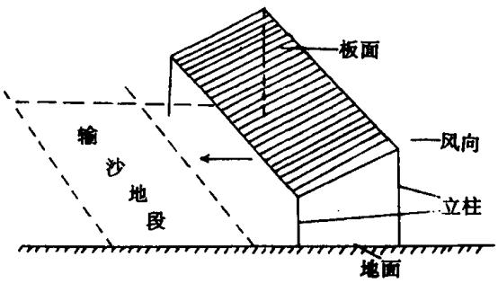  
图 5-4 垂直输导法

聚风下输法设置时向主风向倾斜，聚风输沙被输地段与主风方向交角成45°～90°，输导积沙的效果较好，如果与主风方向的交角小于30°，则必须采 $3 0 ^ { \circ }$ 用另一种方法来输导积沙，即反折侧导的方法。

## 3. 反折侧导

被保护物如果遭受从锐角方向吹来的流沙危害时，可以用促使近地表气流换向的措施，改变流沙的输移方向，避开被保护物。

(1）反折侧导的原理沙障与主风斜交，在45°以下时，能产生近地表的次生风换向，风沙流吹近沙障后，气流受到一定的压缩换向，部分沙粒在障前停下。但由于受压气流换向后风速加大，沿沙障行列前进，开始时降落在沙障附近的一部分沙粒，又因受新来的沙粒撞击，重新卷入风沙径流沿着沙障的行列方向前进，使被保护区避免障后积沙的危害。

(2)反折侧导的设置一般用不透风的机械沙障进行侧导，在设置前，首先要了解地形和输导方向，确定沙障的位置和角度，导走流沙的处理场所。地形是否有利于流沙的折向输走，采用1m左右高的不透风沙障或导沙板，排列成连续的沙障。

## (3) 改变地表状况，促进流沙输导

①创造平滑的环境条件在防止积沙的被保护地段，要尽量清除障碍，筑成平滑坚实的下垫面，要使防护地段输沙，就须把陡坡变缓筑成圆滑的弧形，使气流附面层不产生分离而出现涡流，达到输沙的目的。

②加大上升力进行输沙上升力的大小取决于气流近地表层的速度与较高层速度的差数，由于粗糙表面对近地表面层气流的阻力，加大了上升力。所以在防护区铺设一些砾石或碎石，增加跃移沙的反弹力，加大上升力，调节风沙流结构，减少较低层的沙量，造成防护区风蚀，起到输沙目的。

③附面层风速变化规律的应用近地表层的风速随高度的增加而增加，所以在公路防沙时，路基要高出附近地表，以增大风速，便于输沙。

## （三）风力治沙措施的应用

利用风力可拉沙改土、修渠、筑堤、渠道防沙等。

## 1. 渠道防沙

（1）渠道防沙的基本要求渠道防沙的要求是在渠道内不要造成积沙，这就必须保证风沙流通过渠道时成为不饱和气流，即渠道的宽度必须小于饱和路径长度，或者采取措施，从气流中取走沙量，使过渠气流成为非饱和气流。

（2）渠道本身是非堆积搬运渠道是具有弧形或接近弧形的剖面形状，容易产生上升力，所以具有非堆积搬运的条件。要使渠道本身更好地输沙，必须使渠的深度和宽度在一定的范围内，合理地确定宽深比，才有利于渠道的非堆积搬运。

(3）防沙堤和护道在渠道迎风面上，距岸一定距离筑一道1m的堤，这个堤就称为防沙堤。堤到渠边的一定距离，称为护道。这个距离最好根据试验因地制宜确定，原则上根据饱和路径长度和沙丘类型、移动速度而定。一般最好小于饱和路径长度，大于沙丘摆动幅度，使渠道处于饱和路径的起点。

(4)我国沙区的渠道防护我国沙区防止渠道积沙，采用设置地埂等方法，在田中隔一定距离设一地埂，耕地时不动，形成大粗糙度，使地面均匀积沙不形成沙丘。既可以掺沙改土、保墒压盐，又可以造成非饱和气流，使风沙流处于非堆积搬运状态。再加上护渠林营造合理，就可以有效地控制风沙流防止渠道积沙。

## 2. 拉沙修渠筑堤

利用风力修渠筑堤，共同方法是设置高立式紧密沙障，降低风速，改变风沙流结构，使沙子聚积在沙障附近，当沙障被埋一部分后，或向上提沙障，或加高沙障到所需要的高度。

修渠可按渠道设计的中心线设置沙障，先修下风一侧，然后修上风一侧。沙障距中心线的距离一般可按下式计算：

$$
I = \frac { 1 } { 2 } ( b + a ) + m h\tag{5-4}
$$

式中 【-——沙障距渠道中心线的距离；

b——渠堤底宽；

a——渠堤顶宽；

m—边坡系数（沙区一般为1.5～2）；

h——渠堤高度。

筑堤是指在干河床内横向修筑堤坝，引洪淤地，改河造田。

## 3. 拉沙改土

拉沙改土是利用风力拉平沙丘，使丘间低地掺沙，改良土壤。对于沙丘是以输为目的，对于丘间低地是以积沙为目的，既改变沙丘，又改良丘间沙地。

黏质土壤掺沙改土不仅改变土壤机械组成，而且可以改善土壤水分和通气条件，对抑制土壤盐渍化也有作用。

风力拉沙改土必须掌握2个技术环节：首先要有一定的沙源，保证较短时间内供给足够的沙子；其次要造成很有效的积沙条件。

## 四、水力治沙

## (一)水力拉沙的意义和原理

## 1. 水力拉沙的概念

水力拉沙是以水为动力，按照需要使沙子进行输移，消除沙害，以改造利用沙漠的一种方法。其实质是利用水力定向控制蚀积搬运，达到除害兴利的目的。

## 2. 水力拉沙的意义

（1）增加沙地水分，为植物生长发育创造条件，还可以增强地表的抗蚀性。

(2)改变沙地的地形，沙区地势起伏不平，经水冲沙塌，冲高淤低，把各种不同的沙丘地形改造成平坦地，并能节省劳力，提高工效。

(3）改良土壤，使沙地的理化性质得到改善。可改变机械组成，溶解并增加无机盐类，促进团粒结构的形成。

(4) 改善沙区小气候。

（5）促进沙地综合利用，由于水利治沙改变水分、地形、土壤、小气候等自然条件，为农、牧、渔等各项生产事业创造了有利条件。

## 3. 水力拉沙原理

水力拉沙是运用水土流失的基本规律，以水力为动力，通过人为的控制影响流速的坡度、坡长、流量及地面粗糙度等各项因子，使水流大量集中形成股流，造成一个水的流速（侵蚀力）大于土体的抵抗力（抗蚀力）。同时，沙粒由于有较大渗透力，水量超出渗透速度后，沙被水饱和形成浑水泥浆后，水流继续冲掏，即形成径流，水和泥沙顺坡流走。由于沙粒本身是无结构的，机械组成较粗，又极松散，经水力冲刷后很快形成侵蚀沟，此时侧蚀加强，向两侧掏蚀严重，沙丘本身落沙坡面的自由安息角被破坏，沟坡大量崩塌，塌下的泥沙又大量随水流走，这样继续扩展冲淘，沙随水走，使丘体破碎，慢慢被水输移到下游平坦及低洼地上流速变缓而沉积下来。最后达到拉平沙丘，改变沙丘地貌，建造成大面积基本农田和林、牧业基地的目的。

水土流失的快慢与流速、沙粒重量及粒径有关，即粒径与起动流速的平方成正比，沙粒的重量又与其粒径的三次方成正比，所以沙粒的重量与流速的关系可用下式来表示：

$$
G \propto V D ^ { 6 }\tag{5-5}
$$

式中 G——沙粒重量；

V—流速；

D——沙粒粒径。

根据这一关系式，我们就可以通过控制流速的办法，解决水力拉沙和沙粒沉积的问题，一旦沙丘拉平即进入防风防沙和沙地利用阶段。

## （二）引水拉沙修渠

拉沙修渠是利用沙区河流、海水、水库等的水源，自流引水或机械抽水，按规划的路线，引水开渠，以水冲沙，边引水边开渠，逐步疏通和延伸引水渠道。它是水利治沙的具体措施。

## 1. 特点及作用

由于沙区特殊的自然条件，在拉沙修渠时的规划、设计、施工、养护等方面的特点是：适应地形、灵活定线、弯曲前进、逐步改直；沙粒松散、容易冲淤、比度宜小、断面宜大；引水拉沙、冲高填低、水落淤实、不动不夯；引水开渠、以水攻沙、循序渐进、水到渠成。

引水拉沙修渠的根本目的是为了开发利用和改造治理沙漠和沙地。其直接目的是在修渠的同时，可以拉沙造田，扩大土地资源；引水润沙，加速绿化，为发展农、林、牧业创造条件；拉沙压碱，改良土壤；拉沙筑坝，建库蓄水，实行土、水、林综合治理。所以引水修渠要与拉沙造田、拉沙筑坝等治沙方法紧密结合、统筹兼顾、全面规划；使开发利用与改造治理并举，水利治理与植物治理并举；消除干旱、风沙、洪水、盐碱等危害，使农、林、牧、副、渔得到全面发展。

## 2. 规划设计

修渠之前要勘查水源、计算水量、了解水位和地形地势条件，确定灌溉范围和引水方式，选择渠线，布设渠系。

沙区水十分宝贵，必须充分利用和开发水源，积蓄水量，对地表水和地下水的季节变化都要进行详细的调查，根据水量、水位确定引水方式，水量不足时，可建库蓄水；水位较高，可修闸门直接开口，引水修渠；水位不高，可用木桩、柴草临时修坝壅水入渠；水位过低，可用机械抽水入渠。

选择渠线，利用地形图到现场确定渠线的位置、方向和距离，由于沙丘起伏不平，渠道可按沙丘变化，大弯就势，小弯取直。干渠通过大的沙渠和沙丘时，应采取拉沙的办法夷平沙丘，使渠岸变成平坦台地，台地在迎风坡一侧宽50m，背风坡宽20～30m。为防止或减少风沙淤积渠道，干渠应基本顺从主风方向或沿沙丘沙梁的迎风坡布设。此外，布设渠系时，要使田、林、渠、路配套，排灌结合，实行林网化、水利化。拉沙筑坝的渠道一般不分级，能满足施工即可。拉沙造田的渠道则应尽量和将来的灌溉渠系结合，统筹兼顾，一次修成。

引水量的大小是依据灌溉面积、用水定额、渠道渗漏情况来确定。通常应适当加大渠道断面，增加引水流量，以备将来灌区的发展，也有利于渠道防淤防渗。渠道的比降（任意两点水面高差与流程距离的比值）沙渠比土渠要小。清水渠道引水量小于0.5m³/s，比降采用1/1500～1/2000，浑水比降可增至1/300\~1/500；当引水量增大到1.0\~2.0m³/s时，清水比降采用1/2500\~1/3000，浑水渠道采用1/1500\~1/2000。沙渠大都采用宽浅式梯形断面。渠底宽为水深的2\~3倍较适宜，边坡比采用1：1.5\~2.0，具体规格按引水流量的大小确定。渠岸顶宽支渠一般为1～1.5m，干渠为2\~3m，渠岸超高为0.3\~0.5m。

## 3. 施工和养护

施工过程是从水源开始，边修渠边引水，以水冲沙，引水开渠，由上而下，循序渐进。作法是在连接水源的地方，开挖冲沙壕，引水入壕，将冲沙壕经过的沙丘拉低，沙湾填高，变成平台，再引水拉沙开渠或人工开挖渠道。渠道经过不同类型的沙丘和不同部位时，可采用不同的方法。机械抽水拉沙修渠，为渠道穿越大沙梁施工创造了条件。可将抽水机胶管一端直接放在沙梁顶部拉沙开渠。

沙区渠道修成之后，必须做好防风、防渗、防冲、防淤等防护措施，才能很好地发挥渠道的效益。

## （三）引水拉沙造田

引水拉沙造田是利用水的冲力，把起伏不平、不断移动的沙丘，改变为地面平坦、风蚀较轻的固定农田。这是改造利用沙地和沙漠的一种方法，是水利治沙的具体措施。

## 1. 拉沙造田的规划设计

拉沙造田必须与拉沙修渠进行统一规划，分期实施。造田地段应规划在沙区河流两岸、水库下游和渠道附近或有其他水源的地方。拉沙造田次序应按渠道的布设，先远后近、先高后低，保证水沙有出路，以便拉平高沙丘、淤填低洼地。周围沙荒地带可以利用余水和退水，引水润沙，造林种草，防止风沙，保护农田，发展多种经营。

## 2. 拉沙造田的田间工程

引水拉沙造田的田间工程包括引水渠、蓄水池、冲沙壕、围埂、排水口等（图5-5）。这些田间工程的布设，既要便于造田施工，节约劳力，又要照顾造出的农田布局合理。

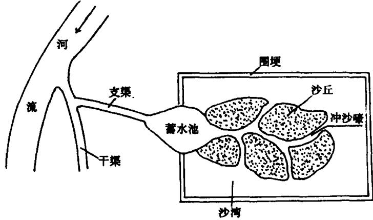  
图 5-5 拉沙造田田间工程布设示意图

引水渠连接支渠或干渠，或直接从河流、海子开挖，引水渠上接水源，下接蓄水池。造田前引水拉沙，造田后大多成为固定性灌溉渠道。如果利用机械从水源直接抽水造田，可不挖或少挖引水渠。

蓄水池是临时性的贮水设施，利用沙湾或人工筑埂蓄水，主要起抬高水位、积蓄水量、小聚大放的作用。蓄水池下连冲沙壕，凭借水的压力和冲力，冲移沙丘平地造田。在水量充足压力较大时，可直接开渠或用机械抽水拉沙，不必围筑蓄水池。

冲沙壕挖在要拉平的沙丘上，水通过冲沙壕拉平沙丘，填淤洼地造田块，冲沙壕比降要大，在沙丘的下方要陡，这样水流通畅，冲力强，拉沙快，效果好。冲沙壕一般底宽0.3～0.6m，放水后越冲越大，沙丘逐渐冲刷滑流入壕，沙子被流水挟带到低洼的沙湾，削高填低，直至沙丘被拉平。

围埂是拦截冲沙壕拉下来的泥沙和排出余水，使沙湾地淤填抬高，与被冲拉的地段相平。围埂用沙或土培筑而成，拉沙造田后变成农田地埂，设计时最好有规格地按田块规划修筑成矩形。

排水口要高于田面，低于田埂，起控制高差、拦蓄洪水、沉淀泥沙、排除清水的作用。施工中常用田面大量积水的均匀程度来鉴定田块的平整程度。经过粗平后，就要把田面上的积水通过排水口排出。排水口应按照地面的高低变化不断改变高差和位置，一般设在田块下部的左右角，使水排到低洼沙湾，引水润沙，亦可将积水直接退至河流及河道。排水口还要用柴草、砖石护砌，以防冲刷。

## 3. 拉沙造田的具体方法

在设置好田间工程后，即可进行拉沙造田。由于沙丘形态、水量、高差等因素的不同，拉沙造田的方法也各有差异。一般按拉沙的冲沙壕开挖部位来划分，有顶部拉、腰部拉和底部拉3种基本方式，施工中因沙丘形态的变化又有下列多种综合法：

(1)抓沙顶适于引水渠位高于或平于新月形和椭圆形沙丘顶部时采用。当水位略低于沙丘顶部时，只要加深冲沙壕也可应用。采用抽水机械时，只需将水泵抽水管连通水源，放在沙丘顶部拉沙。在不同形态的沙丘上施工，胶管的角度部位可以自由变换。此法比自流引水拉沙操作自如，目前采用越来越多。

(2)野马分鬃一般在渠水位低于或平于大型新月形沙丘、新月形沙丘链时采用。在沙丘靠近蓄水池一端，先偏向沙丘一侧挖一段冲沙壕，放水入壕拉去一段，接着在缺口处筑埂拦水，然后偏向沙丘另一侧，挖一段冲沙壕，再拉去一块，由近及远，如此左右连续前进，即可拉平沙丘。在施工中要保证冲沙壕的水流不中断，由于冲沙壕左右分开，形如马鬃，所以叫野马分鬃。

(3）旋沙腰在渠水水位只能引到沙丘腰部时采用，需水量多。作法是：在沙丘中腰部开挖冲沙壕，利用水的冲击力量，逐渐向沙丘腹部掏蚀，形成

曲线拉沙，齐腰拉平。

(4)劈沙畔一般在沙丘高大，渠水的水位低，水无法引至沙丘顶部或腰部，可在沙丘坡角开一道冲沙壕，由外及里，逐步劈沙入水，将整个沙丘连根拉平。

(5）梅花瓣在水量充足、范围较大的地段，当几个低于或平于渠水水位的小沙丘环列于蓄水池四周时，采用这个方法。另一种梅花瓣拉沙法是在一个大沙丘上，把水引至沙丘顶部，围埂蓄水，然后在蓄水池四周挖4～5条冲沙壕，同量放水向四周扩展，拉平沙丘。

(6)羊麻肠 在沙丘初步拉垮削低后，还残存有坡度很小的平台状沙堆，就可由高处向低处开挖“之”字形冲沙坏，引水入壕，借助水流摆动冲击，将高出地面的平台状沙丘削低扫平。

(7)麻雀战 多在拉沙造田收尾施工时采用。主要用来消除高约1～2m的残留沙堆。将拉沙人员散开，每个沙堆旁安排一两名，然后放水，各点的人员分别引水，冲拉沙堆，摊平沙丘。此法因与游击战中的“麻雀战”相似而得名。

## (四)引水拉沙筑坝

引水拉沙筑坝即利用水力冲击沙土，形成沙浆输入坝面，经过脱水固结，逐层淤填，形成均质坝体。用这种方法进行筑坝建库，称为引水拉沙筑坝，俗称水坠筑坝。

## 1. 沙坝的设计

拉沙筑坝材料以沙为主，为防止透水，条件允许时可用粘土作墙心，坝体外壳用引水拉沙冲填。此外，在选料时沙土中最好有一定的黏粒和粉粒，这样可减少渗水损失。

沙坝设计的关键是确定合理的坝坡坡比。因沙坝的坝坡风浪掏蚀严重，若不做砌石护坡，就要放缓坡比，坝高超过40m，库容大于100万m³，可酌情放缓坡比。

沙坝透水性强，蓄水后坝体浸润和坝坡风浪掏蚀严重，因此必须设置反滤体和进行护坡以保证坝角稳定和坝坡完整，防止坝坡崩塌和滑坡。在石料来源方便的地方，采用斜卧式或梭式反滤体，沙坝上游的坝面，采取砌石护坡。在石料缺乏的沙区可采用植物护坡。

## 2. 沙坝的施工

施工前要准备好有关的材料物资，在坝址上游要有充足的水源。用于拉沙的沙场要临近坝址，最好高出坝顶10m以上。自流水源要设置引水渠、冲沙壕等田间工程，机械抽水要少设田间工程。依据沙丘形状和高差，采取抓沙顶等方法，引水拉沙输入坝面。畦块的大小和多少，主要根据坝面、水量、气温、劳力、沙源等决定。小畦一般为 $\mathrm { ~ 1 ~ } 0 0 0 \mathrm { ~ m } ^ { 2 }$ 以下，大畦为 $1 0 \ 0 0 0 \ \mathrm { m } ^ { 2 }$ 以上。畦块多少，一般有1坝1畦、1坝2畦和1坝多畦几种形式。修筑围埂主要起分畦淤沙、阻滑吸水和控制坝坡的作用。一般埂高为0.8\~1m，均为梯形。

提水或引水到沙场进行拉沙，将水流变为沙浆送至坝面，待沙浆经过沉淀、脱水、固结然后再填筑第二层。填筑方式决定于沙是一边或两边，若一面拉沙，即1端1畦冲填；若两面拉沙，即2端1畦冲填。沙浆入畦，要低于围埂，冲填厚度为埂高的7/10，沙土一次冲填厚度一般为0.5～0.7m。在沙浆能流动的情况下，浓度越稠越好，一般含沙量为50%～60%就是合适的沙浆深度。沙区拉沙筑坝的相间周期要根据土质、气温、冲填厚度等因素决定，一般只要隔夜施工就能保证质量。

## 第二节 水蚀工程防治技术

## 一、概述

## （一）水蚀工程防治技术概念

水蚀工程防治技术即水土保持工程，指应用工程的原理，防治山区、丘陵区、风沙区水土流失，保护、改良与合理利用水土资源，以利于充分发挥水土资源经济效益和社会效益，建立良好生态环境的一项重要措施。它对于水土流失区的生产建设、国土整治、江河治理、生态环境平衡都具有重要的意义。

## （二）水蚀工程防治技术的研究内容

水蚀工程防治技术的研究对象是斜坡及沟道中的水土流失机理，即在水力、风力、重力等外营力作用下，水土资源损失和破坏过程及其工程防治措施。水土流失的形式包括水的损失及土体的损失。水的损失主要是指坡面径流的损失；土体的损失除包括雨滴溅蚀、片蚀、细沟侵蚀、浅沟侵蚀、切沟侵蚀与典型的土壤侵蚀外，还包括河岸侵蚀、山洪、泥石流及滑坡等侵蚀形式。

根据兴修目的及其应用条件，水蚀工程防治技术可以分为以下4种类型：山坡防护工程、山沟治理工程、山洪排导工程、小型蓄水用水工程。

①山坡防护工程的作用在于用改变小地形的方法防止水土流失，将雨水及融雪水就地拦蓄在坡面，并加以利用，增加作物、牧草及林地可利用的土壤水分。同时将未能就地拦蓄的坡地径流引入小型蓄水工程。在有发生重力侵蚀危险的坡地上，可修筑排水工程或支撑建筑物防止滑坡作用。山坡防护工程的措施有：斜坡固定工程，山坡截流沟、水窖（旱井）、蓄水池、梯田、水平沟、水平阶、拦水沟埂等。

②山沟治理工程的作用在于防止沟头前进、沟床下切、沟岸扩张，减缓沟床纵坡、调节洪峰流量，减少山洪或泥石流的固体物质含量，使山洪安全排泄，对沟口不造成灾害。属于山沟治理工作的措施有沟头防护工程、谷坊工程、拦沙坝、淤地坝及沟道护岸工程等。

③山洪排导工程的作用在于防止山洪或泥石流造成的有重大经济损失的危害，属于山洪排导工程的有排洪沟、沉沙场、导流堤等。

④小型蓄水用水工程的作用在于将坡地径流及地下潜流拦蓄起来，减少水土流失危害，灌溉农田，采用先进灌水技术，提高用水率和作物产量。小型蓄水工程包括小水库、蓄水塘坝、淤滩造田、引洪漫地、引水上山、节水灌溉等。

## 二、山坡防护工程

## (一) 斜坡固定工程

斜坡是指向一个方向倾斜的地段，包括坡面、坡顶及其下部一定深度的坡体。按物质组成可将斜坡分为岩质斜坡、土质斜坡；按人为改造程度分为自然斜坡和人工边坡；按稳定性可分为稳定斜坡、失稳斜坡和可能失稳斜坡，后两者又称病害斜坡；若按地貌部位斜坡又可分为山坡、梁昴坡、沟坡等。

斜坡固定工程是指为防止斜坡岩土体（组成斜坡的岩体和土体）的运动、保证斜坡稳定而布设的工程措施，包括挡墙、抗滑桩、排水工程、护坡工程、植物固坡措施等。斜坡固定工程主要用于防治重力侵蚀，在防治滑坡、崩塌和滑塌等块体运动方面起着重要作用。

## （二）山坡截流沟

山坡截流沟是为拦截径流而在斜坡上每隔一定距离横坡修筑的水平的或具有一定坡度的沟道。山坡截流沟能截短坡长、阻截径流、减免径流冲刷，将分散的坡面径流集中起来，输送到田间地头。山坡截流沟与梯田、涝池等田间工程及沟头防护等措施相配合，可保护田地、防止沟头前进、防治滑坡等。

山坡截流沟通常修筑在坡度40%（<21.8°）以下的坡面上，与纵向布置的排水沟相连，把径流排走。一般来说，截水沟在坡面上均匀布置，间距随坡度增大而减小。为防止滑坡，在滑坡可能发生的边界以外5m处可设置一条截水沟，若坡面面积大，径流流速也大量，也可设置多条。如有公路或多级削坡平台马道，则应充分利用其内侧设置截水沟。在一些雨季常发生集中暴雨径流的地段，可在适当地点修土石坝或柳桩坝等壅水建筑物，挖截流沟截引山洪。

## （三）沟头防护工程

黄土区侵蚀沟沟头侵蚀的几种主要形式也是斜坡块体运动。由于黄土入渗力强、多孔疏松、湿陷性大，经暴雨径流冲刷，沟蚀剧烈，沟头溯源侵蚀速度很快。沟头侵蚀危害工农业生产，其危害主要表现为：造成大量土壤流失、大大增加沟道输沙量，毁坏农田、减少耕地，切断交通。

沟头侵蚀的防治应按流量的大小和地形条件采取不同的沟头防护工程。根据沟头防护工程的作用，可将其分为蓄水式沟头防护工程和泄水式沟头防护工程2类。

(1）蓄水式沟头防护工程 当沟头上部来水较少时，可采用蓄水式沟头防护工程，即沿沟边修筑一道或数道水平半圆形沟埂，拦蓄上游坡面径流，防止径流排入沟道。蓄水式沟头防护工程又分为沟埂式和埂墙涝池式2种类型。沟埂的长度、高度和蓄水容量按设计来水量而定。

(2)泄水式沟头防护工程当沟头集水面积大且来水量多时，沟埂已不能有效地拦蓄径流；或当受侵蚀的沟头临近村镇，威胁交通，而又无条件或不允许采取蓄水式沟头防护时，需修筑泄水式沟头防护工程。一般泄水式沟头防护工程有支撑或悬臂跌水、圬工式陡坡跌水和台阶式跌水3种类型。

## 三、田间工程

## （一）梯田

梯田是山区、丘陵区常见的一种基本农田，它是在坡地上沿等高线修成台阶式或坡式断面的田地，由于地块顺坡按等高线排列呈阶梯状而得名。梯田是一种基本的水土保持工程措施，可以改变地形、拦蓄雨水、减洪减沙、改良土壤、增加土壤水分、防治水土流失、增加产量、改善生态环境等。梯田切断了坡面径流，减小了坡面径流汇集面积和径流量，因此梯田是根治坡地水土流失的主要措施。梯田可实现保水、保肥、保土，高产、稳产的目的；因此，实现坡地梯田化，是贫困山区退耕陡坡，种草种树，促进农林牧副业全面发展的可持续发展道路，也是改造坡地，保持水土，全面发展山区、丘陵区农业生产的一项重要措施。我国规定，25°以下的坡地一般可修成梯田种植农作物；25°以上的则应退耕植树种草。

## 1. 梯田的分类

（1）按断面形式可分为阶台式梯田、波浪式梯田2类，其中阶台式梯

田有4种：水平梯田、坡式梯田、反坡梯田和隔坡梯田；

（2）按田坎建筑材料可分为土坎梯田、石坎梯田、植物田坎梯田；

(3）按土地利用方向可分为农用梯田、水稻梯田、果园梯田、林水梯田等，以灌溉与否分为旱地梯田、灌溉梯田；

（4）按施工方法分为人工梯田、机修梯田。

## 2. 梯田的规划

梯田的耕作区应以一个经济单位农业生产和水土保持全面规划为基础，在每个耕作区内，根据地面坡度、坡向等因素进行具体的地块规划。地块应基本上顺等高线呈长条形、带状布设，当地形复杂时，不强求一律顺等高线，可依据“大弯就势，小弯取直”的原则进行，以利于机耕。若梯田有自流灌溉条件，可采取小比降（如1/300～1/500），即使特殊情况最大也不宜超过1/200。地块长度在有条件的地方可采用300～400m，一般是150～200m，在此范围内，地块越长机械操作工效越高。在梯田规划过程中，应合理妥善地修建一些附属物，如坡面蓄水拦沙设施、梯田区道路及灌溉排水设施等。具体规划请参阅有关文献。

## 3. 梯田的断面设计

梯田的断面关系到修筑时的用工量、埂坎的稳定、机械化耕作和灌溉的方便等。其基本任务是确定在不同条件下梯田的最优断面。所谓“最优”断面就是同时达到适应机耕和灌溉要求、保证安全与稳定、最大限度地省工3个要求。最优断面的关键是确定适当的田面宽度和埂坎坡度。

（1）梯田的断面要素梯田的断面要素如图5-6，包括地面坡度、埂坎高度、埂坎坡度、田面净宽等。

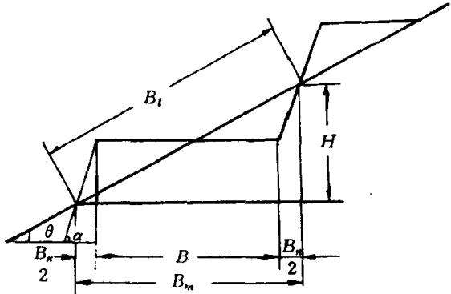  
图 5-6 梯田的断面要素

θ. 坡面坡度(°) α. 埂坎坡度(°) H. 埂坎高度(m) B. 田面净宽(m)

$B _ { \ast } .$ 埂坎占地(m) $B _ { m } .$ 田面毛宽(m) B1. 田面斜宽(m)

一般根据土质和地面坡度先选定田坎高和侧坡（田坎边坡)，然后计算田面宽度，也可根据地面坡度、机耕和灌溉需要先定田面宽，然后计算田埂高。各要素间的关系及计算方法如下（单位均为m）：

$$
B _ { m } = H \times \mathsf { c o t } \theta\tag{5-6}
$$

$$
B _ { n } = H \times \cot \alpha\tag{5-7}
$$

$$
B = B _ { m } - B _ { n } = H ( \cot \theta - \cot \alpha )\tag{5-8}
$$

$$
H = B / ( \cot \theta - \cot \alpha )\tag{5-9}
$$

$$
B _ { \iota } = H / \sin \theta\tag{5-10}
$$

从上述关系可以看出，若知悉田面宽度、埂坎坡度和地面坡度3个数值，其余要素值均可由计算而得。而对于一块具体的地块来说，地面坡度是个常数，因此田面宽度和埂坎坡度是断面要素中起决定作用的因素。在断面设计和最优断面确定时，主要考虑这2个要素。

在挖、填方相等时，梯田挖（填）方的断面面积可由公式 $S { = } H B / 8$ 计算。这样每公顷的土方量则为 $V = S \bullet L = H B / 8 \times ( 6 6 6 . 7 / B ) = 8 3 . 3 H ( \mathbf { m } ^ { 3 } )$ 。根据上述公式则可计算出不同田坎高的每公顷土方量。

(2)梯田田面宽度的设计 梯田最优断面的关键是最优的田面宽度。所谓“最优”田面宽度，就必须是保证在机耕和灌溉的条件下，田面宽度为最小。

(3）埂坎外坡的设计 梯田埂坎外坡基本要求是，在一定的土质和坎高条件下，要保证埂坎的安全稳定，并尽可能地少占农地，少用工。

在一定的土质和坎高条件下，埂坎外坡越缓则安全稳定性越好，但其占地和用工量也就越大。反之，如埂坎外坡较陡，虽然用工量减少，但安全稳定性变差。因此“最优断面”的要求即为既要安全稳定，又要少占地、少用工。

## （二）坡面蓄水工程

在干旱而雨量集中的水土流失地区，常修筑坡面蓄水工程，用来拦截坡面径流，充分利用降雨满足人畜用水与农作物、林木等的需水量。常见的坡面蓄水工程有水窖（又名旱井）、涝池（又名蓄水池）。

## 1. 水窖

水窖按其形式可分井窖、窑窖2种。

(1）井窖井窖主要分布在黄河中游地区，由窖筒、旱窖、散盘、水窖、窖底等部分组成。在粘土地区，窖简直径可控制在0.8～1.0m，在疏松的黄土上，一般为0.5～0.7m，窖简深度在粘土上1～2m即可，在疏松黄土上需3m左右。旱窖指窖筒下口到散盘这一段，一般不上胶泥，也不能存水。散盘指旱窖与水窖连接的地方。水窖的四周窖壁捶有胶泥以防渗漏，主要用来蓄水。窖底直径随旱井的形式而定，一般为1.5～3.0m，最小0.7m左右。

(2)窑窖 窑窖与西北地区群众居住的窑洞相似，其特点是：容积大，占地少，施工安全，取土方便，省工省料。窑窖的容积一般为 $3 0 0 { \sim } 5 0 0 \mathrm { m } ^ { 3 }$ ，窑高2m以上，窑长6\~25m，上宽2.0\~3.5m，底宽0.5\~2.5m。根据其修筑方法的不同可分为挖窑式、屋顶式两种。

窑窖的总容积是水窖群容积的总和，应与其控制面积相适应。如果来水量不大，可设1～2个窑窖，如果来水量过大，则应修窑窖群拦蓄来水。其布置形式常见的有：梅花形、排子形两种。梅花形是将若干窑窖按梅花形布置成群，用暗管连通，从中心窑窖提水灌溉。而排子形水窖群一般顺等高线方向布置在窄长的水平梯田内，窖底以暗管连通，在窑窖群的下一台梯田地坎上设暗管直通窖内，窖水可自然灌溉下方农田。

(3)水窑窖址选择 水窑窖址选择应具备几个条件：①有足够的水源。②有深厚而坚硬的土层。③在石质山区，多利用现有地形，在无泥石流危害的沟道两侧的不透水基岩上，加以修补，做成水窖。④应便于人畜用水和灌溉农田。

## 2. 涝池

涝池又叫蓄水池或堰塘，可以拦蓄地表径流，防止水土流失，也是山区抗旱和满足人畜用水的一种有效措施。涝池一般为圆形和椭圆形。

（1）涝池位置的选择涝池一般都修在乡村附近、路边、梁峁坡和沟头上部。池址土质坚实，最好是粘土或粘壤土，硬性大的土壤容易渗水和造成陷穴，都不易修涝池。此外，涝池位置的选择还应注意以下几点：①有足够的来水量；②涝池池底稍高于被灌溉的农田地面，以便自流灌溉；③不能离沟头、沟边太近，以防渗水引起坍塌。

(2)涝池的布置形式涝池的布置形式一般有平地涝池、结合沟头防护、开挖小渠将地下水引入涝池、结合山地灌溉，开挖涝池和连环涝池几种形式。

(3）涝池的修筑方法涝池可按以下方法修筑：①挖土培岸埂，岸埂分层填筑，且埂高应高出蓄水面0.3\~0.7m；②设置溢水口，溢水口用砖或草皮铺砌；③当涝池水面低于地面时，为便于安装提水设备，应在池边安设支架；④为了防止池水渗漏，应夯实池底。

## 四、沟床固定工程

沟床固定工程是为固定沟床，拦蓄泥沙，防止或减轻山洪及泥石流灾害而在山区沟道中修筑的各种工程措施，包括沟头防护、谷坊、拦沙坝、淤地

坝、小型水库、护岸工程等。沟床固定工程的主要作用在于防止沟道底部下切，固定并抬高侵蚀基准面，减缓沟道纵坡，减小山洪流速。沟床的固定对于坡对于沟坡及山坡的稳定也具有重要意义。

## （一）谷坊

谷坊是山区沟道内为防止沟床冲刷及泥沙灾害而修筑在侵蚀沟道上游的横向挡水拦沙建筑物，又名防冲坝、沙土坝等。高度一般小于3m。

## 1. 谷坊的作用

谷坊的主要作用有：

(1)固定与抬高侵蚀基准面，防止沟床下切；

（2)抬高沟床，稳定山坡坡脚，防止沟岸扩张及滑坡；

(3)减缓沟道纵坡，减小山洪流速，减轻山洪或泥石流灾害；

(4)使沟道逐渐淤平，形成坝阶地，为发展农林业生产创造条件。

## 2. 谷坊的种类

谷坊的种类划分由于所选依据不同、划分的类型也不同。根据所用建筑材料来分，大致可分为：土谷坊、石谷坊、枝梢谷坊、插柳谷坊、浆砌石谷坊、竹笼装石谷坊、木材谷坊、混凝土谷坊、钢筋混凝土谷坊和浆砌石谷坊均为永久性谷坊，其余基本上属于临时性谷坊。按谷坊的透水性质可分为透水性谷坊和不透水性谷坊。

## 3. 谷坊位置的选择

谷坊位置的选择应考虑以下几个方面：

(1) 谷口狭窄；

(2) 沟床基岩外露；

（3)上游有宽阔平坦的贮沙地方；

（4）在有支流汇合的情形下，应在汇合点的下游修建谷坊；

（5）谷坊不应设在天然跌水附近的上下游，但可设在有崩塌危险的山脚下。

## （二）拦沙坝

拦沙坝是布置在沟道中游，以拦截山洪及泥石流中的固体物质的拦挡建筑物。它是荒溪治理主要的沟道工程措施，坝高一般为3～15m。

## 1. 拦沙坝的作用

在水土流失区沟道内修筑拦沙坝，具有以下几方面的功能：

（1）拦蓄泥沙（包括块石），以免除泥沙对下游的危害，便于下游河道的整治；

（2）提高坝址处的侵蚀基准，减缓了坝上游淤积段河床比降，加宽了河

床，并使流速和流深减小，从而大大减小了水流的侵蚀能力；

（3）淤积物淤埋上游两岸坡脚，由于坡面比降降低，坡长减小，使坡面冲刷作用和岸坡崩塌减弱，最终趋于稳定。

（4）拦沙坝在减少泥沙来源和拦蓄泥沙方面能起重大作用。

## 2. 坝址选择

为了充分发挥拦沙坝控制泥沙灾害的作用，应将拦沙坝布置在以下位置：

（1）小流域沟道内的泥沙形成区，沟道断面狭窄处；

(2)泥沙形成区与流过区交接段的狭窄处；

（3）荒溪泥沙流过区开阔段下游狭窄处；

(4)荒溪泥沙流过区与支沟汇合处下游的狭窄处；

(5)泥沙流过区与沉积区连接段的狭窄处。

## 3. 坝高确定

确定拦沙坝坝高应考虑以下因素：拦沙效益、工程量和工期、坝下消能设施、坝址所处的地质条件和地形条件以及投资和技术条件。一般坝高越高，拦沙越多，拦沙效益越明显；但坝高越高，工程量越大，工期越紧，因此应根据劳力配备情况、工期情况及投资和技术条件决定合理的坝高。

## 4. 坝型选择

拦沙坝的坝型主要根据山洪或泥石流的规模和当地的建筑材料来选择。石料方便，采运条件又方便的地方，可采用砌石坝；在石料缺乏，发生泥石流的危险性大的沟道，可考虑选用混凝土坝或钢筋混凝土坝。

(1）砌石坝砌石坝又分为浆砌石坝、干砌石坝和砌石拱坝等。

浆砌石坝属重力坝。其作用原理是将坝前的泥沙压力、冲击力、水压力等水平推力，通过坝体传递到坝的基础上；坝的稳定主要由坝体重力的分力决定。砌石坝结构简单，能防御泥石流，是常用的一种坝型。但这种坝型施工进度较慢，耗费的水量比较多。浆砌石坝的坝轴线尽可能建造在沟谷较狭窄、沟床和两岸岩石比较完整或坚硬的地方。其断面一般为梯形，在坝的两端，为防止沟壁崩塌，必须加边墙，其高度应大于设计水位（泥位）。

干砌石坝只适用于小型山洪荒溪，在石料丰富的地区，亦为常用的坝型，干砌石坝的断面为梯形。

砌石拱坝常修筑在河谷狭窄、沟床及两岸山坡的岩石比较坚硬的地段。拱坝两端嵌固在基岩上，坝上游的泥沙压力和山洪的作用力均通过石拱传递到两岸岩石上。拱坝的形状，常采用施工简便的定圆心、定半径的圆拱坝。拱圈的中心角以110°～120°为宜，最小不得小于80°。

(2)混合坝根据取材不同，混合坝可分为土石混合坝、木石混合坝。

土石混合坝，当坝址附近土料丰富而石料不足时，可选用此类型坝。土石混合坝的坝身用土填筑，而坝顶和下游坝面则用浆砌石砌筑，坝的上游坡须设置粘土隔水斜墙，下游坡脚设置排水管，并在进口处设置反滤层。

木石混合坝，在盛产木材的地区，可采用木石混合坝，坝身由木框架填石构成。为防止上游坝面及坝顶被冲坏，常加砌石防护。木框架用圆木直径一般大于0.1mm。

（3）铁丝石笼坝这种坝型适用于小型荒溪，在我国西南山区较为多见。它的优点是修建简易，施工迅速，造价低。不足之处是使用期短，坝的整体性也较差。

(4）格栅坝格栅坝是近年发展起来的挡拦泥石流的新坝型。它具有节省建筑材料（与整体坝比较能节省30%～50%）。坝型简单、施工进度快、使用期长等优点，格栅坝的种类很多，有钢筋混凝土格栅坝和金属格栅坝等。

## 5. 重力坝的断面设计

拦沙坝断面设计的任务是，确定既符合经济要求又保证安全的断面尺寸。其内容包括：①断面轮廓的初步尺寸拟定；②坝的稳定计算和应力计算；③溢流口计算；④坝下冲刷深度估算；⑤坝下消能。步骤为：

（1）断面轮廓尺寸的拟定坝的断面轮廓尺寸是指坝高、坝顶宽度、坝底以及上下游边坡等。

(2)坝的稳定计算和应力计算 作用在坝体上的力有：坝体重力(G)、上下游淤积物重、坝前水压力、泥沙压力、坝基场压力、泥石流冲击力、地震力等。

（3）溢流口设计溢流口设计的目的在于确定溢流口宽度（B）和高度(H)。一般溢流口的形状为梯形，边坡坡度为1：0.75～1：1。对于含固体物很多的泥石流沟道可为弧形。

(4)坝下消能与冲刷深度的计算 由于山洪及泥石流从坝顶下泄时具有很大能量，对坝下基础及下游沟床将产生冲刷和变形，因此应设消能措施。常见的拦沙坝坝下消能措施有：子坝（副坝）消能、护坦消能。子坝消能适运用于大中型山洪或泥石流荒溪。这种消能设施的构造是，在主坝的下游设置一座子坝，形成消力池，以消去过坝山洪或泥石流的能量。子坝的坝顶应高出原沟床0.5\~1.0m，以保证子坝回淤线高于主坝基础顶面。子坝与主坝间的距离，可取2\~3倍主坝坝高。护坦消能仅适应于小型沟道，常用浆砌块石砌筑，其长度为2～3倍的主坝高。

坝下游冲刷深度的计算，实际是一个比较复杂的问题，只有运用模型试验及对比实际工程资料，才能得到较为准确的结果。

## 6. 拱坝

拱坝在平面上是圆弧形，可由混凝土和浆砌石筑成。在拱坝中拱的受力分析中，以压力为主，且应力在断面上分布较为均匀，所以它可以充分利用浆砌石和混凝土材料抗压强度高的特点，减薄坝体厚度，节省筑坝材料，一般可节省1/2\~1/3。

由于拱坝受力特点与重力坝不同。其对地形、地质的要求也不同，一般来说，在地形上，拱坝要求坝址沟谷较窄，以便通过拱的作用把水及泥沙压力传递到两岸。在地质上，要求岩石坚硬完整，没有大裂隙和软弱夹层，同时要求两岸山头有一定厚度。

拱坝的布置主要是确定拱坝的垂直断面图和平面图。在荒溪中修筑拱坝，其垂直断面多采用上游面垂直，下游面有一定斜坡的形式。在平面上拱圈是圆弧形。坝顶中心角一般为110°～130°，随高程的降低，河谷宽度逐渐减小，拱圆的中心角也逐渐减小，反之拱圈的厚度则随高程降低，随水及泥沙压力加大而增加。

## （三）淤地坝

淤地坝是修在沟道中下游地段，以拦泥淤地发展生产为目的的拦挡建筑，一般由坝体、溢洪道、放水建筑物3部分组成，其作用为拦泥淤地、发展生产、荒沟变良田；稳定和抬高侵蚀基准，稳定两侧沟坡；蓄洪，拦泥、削峰、减轻下游的压力。

## 1. 淤地坝的分类和分级标准

(1）淤地坝的分类淤地坝的分类有多种，按筑坝材料可分为土坝、石坝、土石混合坝等。按坝的用途可分为缓洪骨干坝、拦泥生产坝等；按建筑材料和施工方法可分为夯碾坝、水力冲填坝、定向爆破坝、堆石坝、干砌石坝、浆砌石坝等。

（2）淤地坝的分级淤地坝一般根据库容、坝高、淤地面积、控制流域面积等因素分级，参考水库分级标准，可分为大、中、小3级，具体标准见表5-1。

表 5-1 淤地坝的分级标准
<table><tr><td>分级标准 (万 m³)</td><td>库容 (万m³)</td><td>坝高 (m)</td><td>单坝淤地面积 (hm²)</td><td>控制流域面积 (hm²)</td></tr><tr><td>大型</td><td>500~100</td><td>&gt;30</td><td>&gt;10</td><td>&gt;15</td></tr><tr><td>中型</td><td>100~10</td><td>30~15</td><td>10~2</td><td>15~1</td></tr><tr><td>小型</td><td>&lt;10</td><td>&lt;15</td><td>&lt;2</td><td>&lt;1</td></tr></table>

## 2. 坝系规划

坝系是指在一个流域中，建多个淤地坝，各坝位置不同，功能不尽相同，形成拦泥、生产、防洪、灌溉相结合的功能单位。坝系可分为干系、支系、系组。在某级支沟中的坝系称为某一级淤地坝支系，干沟上的则为干系。在一条沟道上，视沟的长短可分为1个或几个系组。

合理的坝系布设方案，应满足投资少、多拦泥、淤好地，使拦泥、防洪、灌溉三者紧密结合为完整的体系，达到综合利用水沙资源的目的。因此，坝系规划尤为重要。

## 坝系规划的原则是：

(1）坝系规划必须在流域综合治理规划的基础上，上下游、干支沟全面规划，统筹安排，种治结合，综合治理。

(2）最大限度地发挥坝系调洪拦沙、淤地增产的作用，充分利用流域内的自然优势和水沙资源，满足生产上的需要。

（3）各级坝系，自成体系，相互配合，联合适用，调节蓄泄，确保坝系安全。

(4）坝系中必须布设一定数量的控制性的骨干坝，作为防洪保坝、安全生产的中坚工程。

（5）在流域内进行坝系规划的同时，要提出交通道路规划。对泉水、基流水源，应提出保泉、蓄水利用方案，勿使水资源埋废。坝地出现盐渍化的应尽早治理。

坝系的形成，一般有3种：先支后干；先干后支；以干分段、按支分片、段片分治。

坝系中建坝的顺序，一般也有3种方法：自上而下，自下而上，相互加高。

## 3. 淤地坝工程规划

（1）坝址选择坝址选择在很大程度上取决于地形和地质条件，但有时单考虑这2个因素有些不够。坝址选择一般应从以下几方面考虑：①在地形上要求河谷狭窄，坝轴线短，库区宽阔容量大，沟底比较平缓；②坝址附近应有宜于开挖溢洪道的地形和地质条件；③坝址附近要有良好的筑坝材料，取用容易，施工方便；④坝址地质构造稳定，两岸无疏松的坍土、滑坡体，断面完整，岸坡不大于60°；⑤坝址应避开沟岔、弯道、泉眼，遇有跌水应选在跌水上方；⑥库区淹没损失要小，应尽量避免村庄、大片耕地、交通要道和矿井等被淹没；⑦坝址还必须结合坝系规划统一考虑。

（2)资料收集和地形测量进行工程规划时，一般需要的资料有：地形、地貌资料；流域、库区和坝址地质及水文地质资料；流域内河、沟水化学测验分析资料以及流域变化的主要特征；水文气象资料、天然建材的调查、社会经济资料等等。

(3）集水面积测算及库容曲线绘制集水面积计算常采用的方法有：求积仪法、方格法、梯形计算法以及经验公式法，经验公式为

$$
F = f L ^ { 2 }\tag{5-11}
$$

式中 F——集水面积（m²）；

L——流域长度（m）；

f—流域形状系数，狭长者0.25，条叶形0.33，椭圆者0.4，扇形者0.50。库容曲线指的是淤地坝坝高与库容、面积曲线，具体绘制方法可参考有关资料。

## 4. 淤地坝坝高的确定及其调洪演算

淤地坝除了拦泥淤地外，还有防洪的要求。因此淤地坝的库容包括拦泥库容和滞洪库容，相应于这2部分库容的坝高即为拦泥坝高和滞洪坝高。因此淤地坝的总坝高等于拦泥坝高、滞洪坝高及安全超高之和。

拦泥坝高主要受淤地面积、淤满年限、工程量和施工方法的影响。

在设计时，首先应分析该坝的坝高一淤地面积一库容曲线，初步选定经济合理的拦泥坝高，再由其关系曲线中查得相应坝高的拦泥库容，其次由初拟坝高加上滞洪坝高和安全超高的初估值，一般为3.0～4.0m，作为全坝高来估算其坝体的工程量。

滞洪坝高的确定以及其中调洪演算请参阅水文方面的有关资料，这里不再论述。

## 5. 土坝设计

土坝是由土料填筑而成的挡水建筑物，是淤地坝和小型水库采用最多的一种坝型。土坝按土料组合和防渗设备的不同，可分为均质土坝、心墙土坝、斜墙土坝和多种土质坝等；按施工方法的不同，可分为碾压式土坝、水中填土坝和水力冲填坝等。

## （四) 护岸工程

## 1. 护岸工程

沟道中的护岸工程的作用是防止滑坡及横向侵蚀，防止山坡崩塌的威胁，保护谷坊、拦沙坝等建筑物等。护岸工程一般分为护坡工程与护基（或护脚）工程。

枯水位以下称为护基（脚）工程，其特点是常潜没于水中，时刻都受到水流的冲击和侵蚀作用。因此，在材料和结构上要求具有抗御水流冲刷和推

移质磨损的能力；富有弹性、易于恢复和补充、以适应河床变形；耐水性能好、便于水下施工。

常用的护脚工程有抛石、石笼、沉枕等。

在枯水位以上的称护坡工程，又叫护岸堤。其作用是：防止山洪的横向侵蚀，发挥挡土墙的作用，稳固坡脚。护岸堤可采用砌石结构，也可采用生物护坡。砌石护岸堤又可分为单层干砌块石、双层干砌块石和浆砌石3种。

## 2. 整治建筑物

整治建筑物对河岸也起到了保护作用，按其性能和外形，可分为丁坝、顺坝等。

丁坝是由坝头、坝身和坝根3个部分组成的一种建筑物。坝根与河岸相连，坝头伸向河槽，在平面上与河岸连接成丁字形，坝身处于坝头与坝根间。其主要作用是改变山洪流向，防止横向侵蚀；缓和山洪流势，使泥沙沉积，并能将水流挑向对岸，保护下游的护岸工程和堤岸不受水流冲击；调整沟宽，迎托水流，防止山洪乱流和偏流，阻止沟道宽度发展。按高度分为淹没式和非淹没式2种。

顺坝是一种纵向整治建筑物，由坝头、坝身和坝根3个部分组成。坝身与水流方向近平行或略有微小交角，直接布置在整治线上，具有导引水流、调整河岸的作用。顺坝有淹没式和非淹没式两种。淹没顺坝用于整治枯水河槽，坝高由整治水位而定，自坝根到坝头，沿水流方向略有倾斜，其坡度大于水面比降，淹没时从坝头至坝根逐渐漫水。非淹没式在河道整治中采用较少。根据顺坝建筑材料的不同，可分为土坝和石顺坝两种。

## （五）治滩造田工程

治滩造田就是通过工程措施，将河床缩窄、改道、裁弯取直，在治好的河滩上，用引洪放淤的办法，淤垫出能耕种土地，以防止河道冲刷，变滩地为良田。

## 1. 治滩造田的类型

治滩造田主要有以下几种类型：束河造田、改河造田、裁弯造田、堵叉造田和箍洞造田。在宽阔的河滩上，修筑顺河堤等治河工程束窄河床，用腾出的地方造田称束河造田；而利用新挖河道将原河改道而在老河上造田的方法为改河造田；将过分弯曲的河道取直后在老河弯内造田的方法为裁弯造田；在河道分叉处堵塞某一叉造田的称堵叉造田；而在小流域内顺河道方向砌筑涵洞且填土造田的称箍洞造田。

## 2. 河滩造田的方法

（1）修筑格坝根据滩地园田化规划，用土料或石料设置与顺河坝垂直的横坝称格坝。其主要作用是：大大减小平整土地及垫土的工程量，当顺河坝局部被冲毁时，格坝可发挥减轻洪灾的作用。

格坝间距的大小主要决定于河滩地形条件和河滩坡度的大小，坡度愈大，间距愈小，格坝间距一般在30～100m。格坝高度与间距关系密切，但根据实验，格坝高度以1.0\~1.5m为宜。高度过大，费工费时且稳定性差，过低则减少了土地利用率。

(2)引洪漫淤造地引洪淤灌是在洪水季节将河流中含有大量泥沙的洪水引进河滩，使泥沙沉积下来后再排走清水的造田方法。它可以充分利用山洪中的水、肥、土资源，变洪害为洪利，并且为洪水和泥沙找到了出路，有效地保持了水土。

在小面积河滩地上引洪漫淤造地，可以在河堤上直接开口。直接引洪水入滩造地。每隔80～150m布置一个引洪口，其方向与水流方向成60°夹角。而在较大的河滩上引洪淤地，则需布置引洪渠系，渠系的设计，可参考农田水利方面的资料。

## 五、山洪排导工程

山洪排导工程是指在荒溪冲积扇上，为防止山洪及泥石流冲刷与淤积灾害而修筑的排洪沟或导洪堤等建筑物。其目的在于保护居民生命及建筑物等财产安全。

## 1. 山洪及泥石流排导沟

山洪及泥石流排导沟是开发利用荒溪冲积扇，防止泥沙灾害，发展农业生产的重要工程措施之一。

(1）排导沟的平面布置 排导沟在平面布置上有如下几种形式：向中部排、向下游排、向上游排和横向排。前2种方式可用于含固体物质较多的泥石流荒溪，对于含固体物质少的山洪荒溪，最好用第三种或第四种方式。

(2)排导沟的类型根据挖填方式和建筑材料的不同，排导沟可分为3种类型：挖填排导沟、三合土排导沟和浆砌块石排导沟。一般按荒溪特性决定排导沟类型。挖填排导沟简单易施：适用于泥石流荒溪冲积扇；三合土排导沟宜于高含沙山洪荒溪；而浆砌块石排导沟适于排泄冲刷力强的山洪。

## （3）排导沟的防淤措施和断面设计

①防淤措施排导沟设计要保证排泄顺畅，既不淤积，又不冲刷，为防淤积须修建沉沙场、选择合适的纵坡和合理的沟底宽度和出口衔接。

②排导沟横断面设计横断面设计步骤如下：

第一步：根据荒溪类型，计算山洪或泥石流的设计流量；

第二步：根据冲积扇的特性选定排导沟的断面形式；

第三步：确定底宽；

第四步：根据山洪或泥石流流量公式试算水深或泥深；

第五步：确定排导沟深度。

③纵断面设计纵断面设计步骤如下：

第一步：测绘地面高程线；

第二步：绘出排导沟的沟底线；

第三步：根据横断面设计水（泥）深，绘出水（泥）位线；

第四步：根据水（泥）位高程和超高，绘出堤顶线；

第五步：计算冲刷深度。

2. 沉沙场沉沙场的主要作用是拦蓄沙石。

(1)沉沙场规划布置在规划沉沙场时应考虑以下几点：①山坡陡峻、坡面侵蚀强烈，山洪泥石量大的荒溪流域可修沉沙场；②在坡度较小的沟段修筑；③在淤积作用强烈而又可能危及农田、房舍的沟段不宜设置沉沙场；④沉沙场淤满后可另选场地设置。

(2)沉沙容量的确定 沉沙容量按每年1～2次的挟沙量来决定。在考虑沉沙场的容量时，要对流域的地质、地形、坡度、植被等情况进行调查研究后计算沉沙量。

(3）沉沙场的结构沉沙场最简单的构造是将宽度扩大，沟岸用普通砌石或其他护岸工程加以防护。在沉沙场的入口与出口处，都要修筑横向建筑物，并需使沉沙场以外沟道的上下游大致维持沟床原有高度。

## 六、小型蓄水用水工程

## （一）小型水库

水库由挡水坝、溢洪道、放水建筑物3部分组成，通常称为水库的“三大件”。按国家规定标准，库容100万～1000万m³的叫“小Ⅰ型水库”，库容在10万～100万m³的叫“小】型水库”。

## 1. 库址选择

库址选择是水库工程中有关全局的问题，应从经济、安全、合理几方面考虑。根据经验应注重以下几个方面的问题：①地形要口小肚大；②有适宜的集水面积；③坝址和库址地质良好；④库址靠近灌区且比灌区高；⑤坝址附近要有足够和适用的建材；⑥坝址附近要有适宜开挖溢洪道的山垭；⑦水库上游宜草木丰茂，且淹没损失要小。除此以外，库址还要考虑施工、交通运输等条件。

## 2. 水库的特征曲线

水库的特征曲线即水库面积曲线和水库容积曲线。水库建成后，随着水库水位不同，水库的水面面积也不同，这个水位与面积的关系曲线简称为水库面积曲线，该曲线根据库区地形图绘制。水库各种水位与库容间的关系为水库容积曲线，其绘制可由水库面积曲线推算。

## 3. 水库的特征水位

表示水库工作状况的水位有4个：即设计低水位（死水位， $H _ { \mathfrak { M } } )$ ；设计蓄水位 $( H _ { \mathfrak { s } \mathfrak { L } } )$ ；设计洪水位 $( H _ { \mathfrak { H } _ { \mathfrak { I } } } )$ ；校核洪水位 $( H _ { \uparrow \downarrow } )$ o

## （二）山地灌溉及灌溉技术

## 1. 山地灌溉

山地灌溉主要是指直接为山区农业生产服务的灌溉、排水系统和山区灌溉方法，它是干旱、半干旱山区农田基本建设的重要组成部分。山区灌溉排水系统主要包括引水枢纽、灌溉渠系、防洪排水系统、蓄水工程、田间工程、渠系建筑物。

## (1) 灌溉渠系规划

①引水枢纽规划引水枢纽的引水口高程应尽量满足自流灌溉的要求，渠道应选在河槽比较稳固，河岸比较坚实，且地质条件较好的河段；坝（闸）址所在河段面应比较均匀，宽窄适宜，且河道水流应垂直坝轴线；最好不要在支流汇入处设置引水工程，以避免水流干扰；冲沙闸和进水闸应尽量设在靠岸的低水河槽一侧，以利引水冲沙。引水枢纽包括有坝取水枢纽和无坝取水枢纽，有坝取水枢纽组成包括拦河坝（闸）、进水闸、冲沙闸、导水墙、防洪堤等。无坝取水枢纽的布置形式有：导流堤式渠首、多首制渠首、具有沙帘的无坝渠首。

②渠系规划渠系规划是指从水源取水后的输水、配水渠道系统，排水系统及灌排水系上的建筑物的规划与布置。包括干渠及干渠以下渠道布置。

干渠的布置在我国主要有以下几种：第一，居高临下，即干渠布置在灌区的较高地带，选择较小的纵坡，其方法有盘山开渠、水不低头和脊背行水、白马分鬃；第二，合理穿绕，即渠道穿越沟、谷时，必须根据情况，使渠道合理通过障碍物，一般可采用绕行与直穿2种形式；第三，便于处理山坡水，即与山溪冲沟交叉时，应使渠沟底有较大高差，使山坡水不进入渠道，且便于建立交叉建筑物；第四，长藤结瓜，即在有条件的地区，干渠应与沿途小水库，塘堰相连接。

支、斗渠的布置原则是：首先，支、斗渠的面积应根据自然地形特点确定，尽量不打乱原有排水系统；其次，应考虑地形条件；第三，应满足机耕和园田化的要求；第四，渠道级数应根据地形特点来定；第五，灌排分开，采取2套系统。

农渠的布置原则是：第一，在满足条件下，尽量使轮灌组的面积相等；第二，尽量与耕作方向平行或垂直，以便于整地；第三，易碱地区，农渠、农沟可根据地形条件相间布置；第四，为了便于机耕，农渠控制的范围，在平原旱作区，长度以400～1000m，间距以200～400m为宜，在山丘区，应与整地结合。

③渠系建筑物规划渠系建筑物可分为配水建筑物，输水建筑，交叉建筑物，泄水建筑物，防渗、防冲及防淤建筑物。

建筑物布置、造型的一般要求为：首先，要根据渠系平面布置及纵断面图相互结合，按建筑物类型特点比较选定；其次，在满足水位、流量安全及管理的方便条件下，其数量愈少愈好；第三，在选择建筑物类型时，应考虑当地的地质条件、施工技术和材料来源等条件。

(2) 灌溉渠道设计 这部分内容请参考农田水利学的有关资料。

## (3) 小型渠道建筑物

①跌水跌水是水流经由跌水缺口流出，呈自由抛射状态跌落于消力池的联接建筑物，有单级跌水和多级跌水2种形式。单级跌水落差一般不超过3m，通常由进口、跌水墙、消力池和出口4个部分组成。跌水口横断面常用梯形、矩形和底部加台堰等形式，进口常用片石或混凝土等护底，以防水流冲刷。

②陡坡陡坡由进口、陡槽、消力池及出口4个部分组成。与跌水的不同之处只是以陡槽代替了跌水墙，陡槽由浆砌石与混凝土做成，纵坡一般为1：3\~1：5。其水流状态为急流。小型陡槽的断面多为矩形，两侧边墙做成挡土墙式。

③渡槽渡槽是一种渠系上的交叉建筑物，当渠道与河流、山沟、道路、洼地相遇时，可修建渡槽，使渠水架空通过。常见的有梁式、拱式2种类型，常用的建筑材料为砖石、混凝土、钢筋混凝土、钢、钢丝网、水泥、木材等。

④水闸渠系建筑物中的水闸有进水闸、分水闸、节制闸、冲沙闸4种类型。水闸的用途多，但基本构造是相同的，一般都由上游连接段、闸室及下游连接段3个部分组成。

## 2. 灌溉技术

良好的灌溉技术不仅可保证灌水均匀、节省用水，也有利于保持土壤结构提高肥力，防止土地退化。

灌水方法一般有地面灌溉、地下灌溉、喷滴灌和扬水灌等。具体内容请

参考农田水利，这里不再做介绍。

## 第三节 盐渍荒漠化的工程防治技术

## 一、盐渍荒漠化防治原则

## (一）必须根据不同条件采用因时因地制宜的原则

我国盐碱土的地理分布范围甚为广泛，因各地生物气候、地质、地貌、水文和水文地质条件差异很大，土壤盐碱化的形成原因、过程及特性也多种多样，因而形成了类型繁多的盐渍土。因此盐碱地的改良应采取因时因地制宜的原则，也就是要采取适应于当地具体条件的措施。

## （二）多种措施综合防治的原则

所谓综合防治，指各种防治措施之间在应用上必须紧密结合，构成一个相互配合的整套防治体系，通过发挥该体系的各种措施的作用，取得综合性的防治效果。

## 1. 利用与改良相结合

改良盐渍地的目的就是为了利用，因此在改良盐渍土过程中，同时要进行合理的农牧业生产。在生产过程中，通过合理的耕作、施肥等农业生物措施，逐步提高农作物和饲草的产量，同时在利用中可逐步改善土壤的物理、化学和生物性质，提高土壤肥力水平，从而加速盐渍地的改良过程。

## 2. 水利工程与农业生物措施相配套，排除土壤盐分和提高土壤肥力相结合

水利工程措施是综合治理旱、涝（洪、渍）盐碱等自然灾害的前提条件，但只有与农业生物措施相结合，才能取得事半功倍的效果。应用水利工程措施以排除土壤中过多的盐分及其在地表的积累，为植物创造正常生长的土壤环境；运用农业生物措施以改善土壤的物理、化学、生物性质，提高其肥力和抑制土壤返盐。

## 3. 灌溉和排水相结合

我国长期的农业生产实践和科学实验表明，综合防治土壤盐渍化，必须具有配套齐全而有实效的灌排水利工程措施。否则重灌轻排，甚至只灌不排，必将招致灌区地下水位的迅猛上升，不仅达不到改良盐渍土的作用，反而会使土壤盐渍化更加严重。因此，我国目前建立的井、沟、渠相结合的灌排配套的水利工程体系，其中渠系起输配水进行灌溉的作用；沟系用以排水（洪、沥、涝、渍）排盐，引水补源发展提灌及必要时短期滞蓄洪沥涝水；机井则起利用地下水进行提灌和调控地下水位的作用。

## 4. 近期目标和长期规划相结合

综合防治土壤盐渍化和旱、涝、洪、风沙等危害，首先必须制定统一的规划，其中建议采取的水利工程措施和农业生物措施，一定要有近期切实可行的内容，也要有远期可预见的方向和目标，只有这样才能获得成功。

## 二、盐渍荒漠化的主要防治措施

## （一）水利工程技术措施

## 1. 排水防治土壤盐渍化

（1）排水在防治土壤盐渍化中的作用排水措施可起到排水排盐、控制地下水位及调节土壤和地下水的水盐动态的作用。

①排水排盐排水措施不但可以排除灌溉退水、降雨所产生的地表径流，而且可以排除田间灌溉渗漏水、淋盐入渗水和部分地下水，在排水的同时，也排走了溶解在水中的大量盐分。

②控制地下水位无人工排水工程地区，地下水动态受自然降雨、蒸发、河流渠系补给、田间灌溉渗水及自然地表、地下径流等因素影响，地下水位无控制。采取排水工程措施则可人工控制地下水位，以满足防治土壤盐渍化的要求。

③调节土壤和地下水的水盐动态由于排水措施具有排水排盐、控制地下水位的作用，因此运用排水措施，可以人为地调节土壤及地下水的水盐动态，使土壤逐渐脱盐，地下水逐渐淡化，防止土壤返盐。

(2)排水措施类型及其适用条件 总的来说，排水措施一般可划分为水平排水及垂直排水两大类。水平排水从工程措施来分又可以分为明沟排水和暗管排水；从控制水盐动态的作用来分又可分为深沟排水和浅沟排水；从排水方式可分为自流排水和扬水排水。垂直排水主要是指竖井排水，可分为深井和浅井。

①明沟排水是从地表面向下开挖一定深度和长度的沟，以利于排走地下水和地面水，同时，它对排除沥涝、灌溉多余水和低于排水沟深度以上的地下水有积极作用。它的主要缺点是占用耕地面积较大，易发生塌坡和淤积，养护清淤工程量大，难以保持预计的深度。

②暗管排水排水管道埋在一定深度进行排水，称为暗管排水，也称暗沟排水。暗管排水的最大优点是占地少，不影响机耕，在土质不宜开深沟的地区，更显示其优点，可机械施工，排水排盐的效果也很好。但其主要缺点是一次性投资大，施工技术要求高，易为化学沉淀或泥沙淤积；植物根系也易伸入管内，阻碍排水，所以还要在一定时期清除这些阻塞物；此外，还要明沟配合，才能把水盐排出灌区之外，排出地面涝水的速度不如明沟迅速。

③竖井排水（井灌井排）指利用机井抽取地下水用于灌溉，既满足作物需水，又兼有排水降低地下水位的作用。其优点是排水效率高，地下水位降得快，降得深，脱盐效果好；机井能人为地调控地下水位和水盐动态；可防涝除涝，促进土壤脱盐。

由于竖井排水具有上述优点，因而发展很快，已在全国各地因地制宜地与沟渠结合组成综合水利工程体系被广泛应用。但竖井排水也存在不少问题，如井位布置、井型结构、采补的调节等。要更好地发展井灌井排事业，应注意解决以下几个问题：

①井区水文地质的适宜性评价 这是一个首要问题，关系到能否发挥井排的效益问题。因此在规划设计时，应深入了解和掌握水文地质的详细资料。

②井位布置原则一个井灌区或井渠结合的灌区，应根据当地的地质构造、水文地质条件、结合灌区的需要确定井位、井距、井深、井型结构和井径。井位的布置，若从灌溉角度来考虑，井位应尽可能设置在较高的地形部位上，这样有利于控制较大的灌溉面积；而在井渠结合的灌区，井位应靠近支、斗渠，这样既便于输水，又便于井水、渠水混合使用。井距与水文地质、土壤性状等因素有关，井距不易过小。井深主要取决于含水层的埋藏深度，水质及其出水量的大小。

③科学用水井灌井排必须建立规章制度，保护地下水资源，科学用水，做到采补基本平衡。目前我国一些灌区采用井渠结合调控水位，这种灌溉方式，可以使地面水和地下水相互转化，互补余缺，达到合理利用水资源，调控地下水位的目的。

(3)排水系统的规划 排水系统的规划必须满足下列要求：①与灌区地形、地貌、水文地质条件等相适应；②便于灌溉管理工作；③便于实施农业技术措施；④可采用机械排水，为降低地下水，改良盐碱地，部分不能自流排水的地区可采用机械排水；⑤干沟的布置要求起到集流作用；⑥在进行排水系统规划时，可以采取统一规划与分片治理相结合，远期与近期相结合，并根据防治盐碱化的需要程度和轻重缓急，分片分期来实施。

## 2. 冲洗改良盐碱地

(1)冲洗对改良盐碱地的作用和冲洗的基本条件为了改良盐碱地而大量灌水，以淋洗土壤中过多的盐分，使土壤根系活动层中的盐分减少到一般植物能正常生长的程度时，即可开始种植植物，尤其是在人少地多盐碱荒地大面积分布的地区（如我国滨海和西北干旱地区），开垦盐碱地，首先要进行排水冲洗，以消除土壤中过多的盐分，才能进行农业利用。

冲洗盐碱地要具备2个基本条件：首先，要具有充足的淡水资源，在淡水资源缺乏的情况下，可先用咸水冲洗后再用淡水冲洗。其次，要有良好的排水系统和通畅的出路。重盐碱地一般多处在地势低洼，自然排水不畅的地区，因此冲洗改良，必须结合人工排水措施。无排水冲洗，只能把盐分压至土壤底层或临近地段，而不能将盐分排出区外。采取人工排水措施进行冲洗改良，排水沟必须保持通畅，而且一定要选择好适当的排水出路，以防盐分从改良地区排至另外的地区，使另一地区的土壤变坏或污染水源和环境。

(2)冲洗脱盐标准经过冲洗后，要使一定厚度土层的含盐量降低到一定程度，才能保证作物的正常生长。因此土壤脱盐标准有2个指标：一是土壤允许含盐量，二是脱盐土层厚度。土壤允许含盐量，由作物耐盐极限确定，它与土壤盐分组成、作物种类、农业技术措施等因素有关。同一作物，不同生育期耐盐能力有差异。一般作物苗期的耐盐能力低，故以苗期的耐盐度作为土壤允许含盐量标准。脱盐土层厚度一般依作物根系活动层而定，一般为1.0m左右。

(3)冲洗定额及冲洗定额的水量分配冲洗定额是为使土壤达到冲洗脱盐标准，单位面积土地上所需的冲洗灌溉水量。该水量取决于多种因素，其中最主要的是土壤原始含盐量、盐分组成、土壤质地结构、冲洗水质、田间工程及冲洗灌溉技术。我国常用的计算冲洗定额的公式为：

$$
\pmb { M } = \pmb { m } _ { 1 } + \pmb { m } _ { 2 } + \pmb { E } - \pmb { P }\tag{5-12}
$$

式中 M—冲洗定额 $( \mathbf { m } ^ { 3 } / \mathbf { h m } ^ { 2 } )$

$\pmb { m } _ { 1 }$ ——冲洗时计划土层灌至田间持水量所需水量 $( \mathbf { m } ^ { 3 } / \mathbf { h m } ^ { 2 } )$ ;

$m _ { 2 }$ ——冲洗期间排出土壤盐分所需水量 $( \mathbf { m } ^ { 3 } / \mathbf { h m } ^ { 2 } )$

E——冲洗期内蒸发水量 $( \mathbf { m } ^ { 3 } / \mathbf { h m } ^ { 2 } )$

P——冲洗期内可利用的降水量 $( \mathbf { m } ^ { 3 } / \mathbf { \hat { h } } \mathbf { m } ^ { 2 } )$

E、P可根据当地气象资料估计。 $\pmb { m } _ { 1 }$ 按下式计算：

$$
m _ { 1 } = 1 \ 0 0 0 h r ( w _ { 1 } - w _ { 2 } )\tag{5-13}
$$

式中 h-—冲洗计划土层厚度（m）；

r冲洗计划土层的土壤容重 $\mathrm { ( } \mathbf { t } / \mathrm { m } ^ { 3 } \mathrm { ) }$

${ \pmb w } _ { 1 }$ ——冲洗计划土层田间持水量（干土重%）；

${ \pmb w } _ { \pmb { z } }$ —冲洗前计划土层自然含水量（干土重%）。

$m ^ { 2 }$ 按下式计算：

$$
m ^ { 2 } = 1 \ 0 0 0 h r ( s _ { 1 } - s _ { 2 } ) / k\tag{5-14}
$$

式中 $\pmb { S } _ { 1 }$ ——冲洗前冲洗计划层土壤含盐量（干土重%）；

${ \pmb S } _ { 2 } ^ { \prime }$ —冲洗后冲洗计划层土壤含盐量（干土重%）；

k———排盐系数 $( \mathbf { k g } / \mathbf { m } ^ { 3 } )$ ，即单位体积水量从冲洗计划层土壤中带走的盐量；

h、r同上式。

式中排盐系数k实际反映了影响冲洗效果的诸因素。主要与土壤含盐量、盐类组成、土壤质地及冲洗地段的排水条件有关。通常k值是根据实地冲洗测定的资料确定。

适宜的冲洗定额一般在 $6 ~ 0 0 0 { \sim } 9 ~ 0 0 0 ~ \mathrm { { m } } ^ { 3 } / \mathrm { { h m } } ^ { 2 }$ ，这么大的水量灌到田间，就存在一个水量分配的问题。冲洗定额的水量分配，就是从总的冲洗定额中分几次冲洗。分配得当，可提高土壤的脱盐效果。计划冲洗层土壤盐分的排除，是在土壤重力水向下层转移的过程中才产生的。所以，灌入的水量要使土壤含水量大于田间持水量。

一般来说，冲洗盐碱的水量分配，多采用先大后小的水量进行。因为在冲洗开始时，土壤含盐量最高，若冲洗水量大，则被水溶解的盐分也多，排盐量也最大。以后随着逐次冲洗水的排盐，土壤含盐量逐渐减少，溶液浓度也逐渐降低，因而冲洗水量也相应减少。这样经过多次冲洗后即可达到冲洗目的。当然，在实践中也可采用相同的冲洗定额或采用由小到大的水量分次冲洗。

(4）冲洗技术冲洗技术是指在冲洗改良盐碱地时所采用的一系列的冲洗灌水技术。包括：冲洗地的田间工程布置和规格，冲洗前土地处理和冲洗管理的组织安排等。

①田间工程包括支、毛级的灌溉、排水网及灌水畦块的布置与规格等。一般畦块的布置应满足灌水方便、土地受水均匀、平整土地工作量较小的要求。畦田面积根据地形情况可确定为 $0 . \ 0 7 { \sim } 0 . \ 2 4 \ \mathbf { h m } ^ { 2 }$ ，长度50\~100m，宽10～20m，长边最好平行于地面等高线，畦埂的高度应较畦中水层高出一定高度。毛渠和毛排的布置，应根据地形和畦块的布置来确定。在地势较平坦的地区，应尽量采用毛渠和毛排相间布置的形式；但在地形坡降较大无两面灌水的条件下，亦可采用灌排相邻布置的形式。

②冲洗地的处理冲洗前进行土地处理的内容有土地平整、翻耕等。土地不平整则受水不均，低处水量过多，高处水量不足甚至未能灌上水，而且，冲洗后高处水分首先蒸发，盐分向高处集中，迅速造成返盐，形成盐斑。因此在冲洗之前首先要进行平整土地。对质地黏重、透水性差或结构不良而比较密实的土壤，在冲洗前须进行翻耕，这样可提高冲洗时的透水性及增加冲洗水与土壤的接触面，并把盐分高的土壤翻到下面，有利于土壤盐分溶解和淋洗。但对一般的轻质土壤，翻耕反而造成渗水过快，或将盐层翻上来，使脱盐效果降低。

③冲洗管理 冲洗管理工作包括间歇性冲洗、冲洗顺序及冲洗定额的分配等，其正确与否直接影响冲洗效果。

所谓间歇冲洗，即指冲洗过程中每次灌水冲洗后，待地面落干，隔一定时间再灌下一次水继续进行冲洗。其目的主要为使土壤盐分在冲洗过程中，有较长的溶解时间，增加土壤温度（在气温高于水温的情况下），使地下水位不降低，以利水分下渗，从而提高脱盐效果。在硫酸盐盐土上，间歇冲洗效果较好。但在间歇期间，水分不断蒸发，盐分会向上层积累，因此间歇时间越长，也越容易造成返盐。而间歇时间长短，需要结合气温、地下水位变化等因素来确定。从河南人民灌区丁村站试验资料看出，间歇时间以48h为好。

冲洗时，冲洗顺序对脱盐效果有一定影响，应根据土壤盐分的排水条件来考虑。一般是先从离排水沟远的中间地段进行冲洗，对重盐碱地应首先冲洗，然后再冲洗含盐较小的地段。

(5）冲洗季节为了保证获得良好的洗盐效果及顺利地进行冲洗，以免延误农业耕作，必须选择适宜的季节进行冲洗。一般有早春、夏季、秋季和临冬几个冲洗时期。

①早春冲洗虽然春季一般地下水位较低，有利于排水排盐，但因气温低不利于盐分溶解，又由于土壤解冻到春播时间短、农活忙、春灌用水量大，因此大部分地区不在早春冲洗。

②夏季冲洗我国新疆、宁夏等地区由于土壤含盐量高，洗盐需要冲洗定额大，时间长，因此6～7月份就开始冲洗，这样可有时间当年播种作物。另外，夏季温度高，正值洪水季节，水源充沛，利于大额冲洗。

③秋季冲洗我国新疆等内陆地区8～10月上旬，地下水位一般较低，气温尚高，蒸发量日趋减小，作物灌溉面积不大，水量较充沛。因此这些地区宜于在秋季进行冲洗。一般盐碱较轻的荒地、轮休地、夏收或秋收后复洗盐地，也多在这个时期冲洗。

④临冬冲洗华北平原滨海地区，晚秋一般水源比较充足，地下水位逐渐降低，冲洗后，地面封冻，土壤蒸发量小，盐分不易上升。而且因土壤水分充足，春播时期墒情好。因此盐碱荒地的冲洗或盐碱耕地加大定额灌溉，多在此时进行。

## 3. 灌溉淋盐

（1）灌溉淋盐的作用及其适用条件 在干旱和半干旱半湿润的盐渍荒漠化地区，由于蒸发量大于降雨量，土壤中所含盐分不能被充分淋溶，即使是经过冲洗改良的盐碱地，土壤的潜水中仍含有数量较多的盐分。因此在耕地中，特别是在底土、潜水含盐量较高的干旱地区和滨海地区，土壤往往有季节性返盐现象。返盐时盐分多集中在土壤表层，而且总含盐量并不太高。为了保证作物的正常生长，一般不需要专门的冲洗，只须在灌溉时，在原有作物需水量的灌溉定额中，适当增加一部分灌溉水量，使这部分水量通过土层下渗，淋洗土壤盐分，达到降低盐分的目的，这种方法称为灌溉淋盐。

（2）灌溉淋盐需水量的确定为了淋洗调节土壤盐分所需加大的灌溉水量为灌溉淋洗需水量。如果所用灌溉淋洗水量过大，则会使潜水位抬高，加重灌溉后土壤的返盐；如果水量过小，则起不到淋洗盐分的作用。因此，研究确定适当的灌溉淋洗需要量是十分重要的。目前我国对灌溉淋洗需要量研究的还较少，多是根据经验而定。

## （二）农业生物措施

农业生物措施是调节土壤水、肥、气、热，保证作物正常生长的重要手段，在盐碱地区，具有调节土壤水盐动态的作用。研究和实践证明，在合理的水利工程措施和农业生物措施结合的情况下，能取得综合防治土壤盐渍化的显著效果。我国改良利用盐碱地的农业生物措施主要有以下几种：

## 1. 种稻改良盐碱

种稻改良盐渍土，并不是因为水稻本身能忍耐很高的土壤盐分浓度，而是由于水稻需水量大，可通过生长期淹灌和排水换水作用，使土壤中盐分向下方和旁侧运动，淋洗和排走土壤中的盐分。当土壤盐分减少到一定程度后，由于灌溉水的继续下渗和排水系统的作用，就会使地下水质淡化，地下水位得到控制，逐步达到改良盐碱地作用。

## （1）种稻改良盐碱地的作用

①种稻对盐碱地的脱盐作用水稻是一种需水较多的作物，在其生长期的绝大部分时间内，田面均需维持一定深度的水层，以满足水稻对水分、养分、温度等的特殊要求。水稻从插秧到收获，一般需灌水9000～12000m³/hm²（也有大于15000m³的)。这些水量，除一部分消耗于叶面和田面的蒸发外，很大一部分成为渗漏水或从田面被排换出去。土壤中可溶性盐分就随着渗漏水和排换水不断地被洗出土体，排出本地区或渗入土壤底层。

②种稻对土壤理化性质的改良作用盐渍土除了过多的盐分危害作物生长外，还具有不良的理化性质，从而造成耕作上的困难和肥力的降低。这种不良的理化性质在碱性土壤中表现得最明显。由于在土壤形成过程中，大量钠盐的积累，使土壤吸收性复合体被钠离子所饱和，因此，表现出土粒分散、结构性差、易于板结、碱度强，使农作物很难生长或产量甚微。种植水稻后，土壤表土层交换性钠和钾有所降低，而交换性钙和镁则有所增加，随种稻年限的增加，土壤可达到非碱化的程度，脱碱的土层可逐年增加。

引起土壤交换性钠、钙等离子的变化的原因是多方面的，其中主要是稻田经常灌水稀释了土壤溶液，使可溶性盐分得到不断淋洗（首先是钠盐被淋洗)；其次是土壤中大量碳酸钙的存在及溶解度的增强；再就是水稻的生物作用及施有机肥等。

在种稻过程中，稻田淤灌是改良碱化土壤的一个特殊方法。水稻在生长期的灌溉定额是较大的，而泥沙含量高又是北方大多数河流的特点。因此，连年种稻灌溉或专门进行淤灌，就可以在田面淤积一层淤泥，一方面改变了土壤原来的代换性盐基总量及机械组成，另一方面也改良了碱化土壤的不良理化性质。

## (2)种稻对地下水状况的改良作用

①稻区水质及地下水位的变化盐碱地种植水稻后，由于大量灌溉淡水渗漏而补给了地下水，使地下水水质发生了变化。据各地实测资料表明，在良好灌溉和排水条件下，稻田上层不断引来淡的灌溉水，加速土壤盐分溶解，降低地下水矿化度，形成地下淡水层。在具备一定的排水条件下，地下水位一般仅在灌水期有明显升高，当停灌后，即逐渐降低，回落到原来水位或接近原来水位，不会无限制的升高，更不会引起土壤沼泽化。

②稻区附近地下水状况的变化在水稻生长期间，稻区经常保持着较高的地下水位，地下水不断地向旱作区侧向渗漏补给，结果使邻区地下水位在一定范围内升高。如果稻区地下水含盐量较大，将会引起邻区地下水矿化度的增高，当邻区地下水位被抬高至临界水深以上时，将发生土壤次生盐渍化。种稻对附近旱作地区的影响范围及程度，常因地形、土质、排水条件、土壤等的不同而不同。一般来说，粘土地区的影响就比轻质土地区的影响小；地势较高的影响小，地势较低的影响大；原始地下水位较低的比原始地下水位较高的影响小；排水条件良好的比排水条件不良的地区影响小。

为了缩小稻田对附近旱地的影响范围，避免稻区周围土壤发生大面积盐渍化，种植水稻前，必须根据当地的地形、水源等条件进行合理地规划。在规划时，应尽量将稻田布置在河流及渠道下游地势相对较低洼的地段，并实行水旱轮作区域化。而且，这样的布局便于机耕和灌排管理，还可减少由于灌区地下水侧向渗漏时，旱田产生次生盐渍化的威胁。另外，在稻区和旱作区交界处，应有较深的截渗沟，以便将稻田侧渗水及时排走。在发展机井灌溉的情况下，可不挖截渗沟，因为机井群即可起到截渗的作用。

## 2. 水旱轮作

在盐碱地种植水稻是改良和利用盐碱地的有效措施，但在连年种植水稻目有机肥的施用量又不足的情况下，易造成土壤板结，而且会滋生杂草和感染病虫害，影响水稻高产。因此，除地势特别低洼，排水又极差的地区长期种稻外，绝大部分地区，在改种水稻的同时，还应进行各种形式的水旱轮作。这是因为进行合理的水旱轮作，不仅可以合理地利用水资源，扩大改良盐碱地的面积，而且可提高土壤肥力和作物产量，调节劳力，有助于消灭杂草和病虫害，提高单位面积产量。

在水旱轮作区域，水旱田的布局必须合理。就地势来讲，水稻区一般布置在地势低洼、排水不良的地区，同时为了满足水稻生长对水分的要求，还需考虑布置在距水源较近、取水方便的地方；旱作区布置在地势高、地下水位低、土壤盐分含量较小、灌水不便的地方；水旱轮作区则布置在地势较高或中等、输水便利、有一定排水条件、土壤含盐量不大的地方。

水旱轮作周期的确定，主要立足于盐碱地的改良速度，即从土壤盐分的累积速度和强度考虑。而盐分的累积动态，可以通过对土壤盐分的监测而得到。在河北省滨海盐土种稻改良试验中，根据水盐动态曾提出，旱作连作的年限应根据地下水淡化层消耗的速度而定：而新疆一些国营农场则是根据生产实践经验，以旱作作物的缺苗程度这一直观指标来确定水旱轮作周期。他们认为，土壤积盐迅速、强烈，种稻之处脱盐明显，回旱后盐分很快回升到原来的水平，缺苗失产面积占25%～40%，这种类型的田块，只能安排一水一旱或两水一旱；回旱后，虽有返盐，但积盐速度和强度不大，仍可继续种植旱作，这类田块，可以安排一水两旱或一水三旱；积盐速度介于以上所述两者之间时，仍可以通过生产性的淋洗（如播前淋洗和生长期间加大灌水量淋盐）仍可继续种旱作作物，可以安排一水两旱；土质黏重，土壤脱盐慢，或者地形低洼，可以考虑连作水稻多年再回旱。

## 3. 培肥抑盐改土

(1）耕层熟化对土壤水盐运动的影响我国农民在改良土壤盐渍化过程中，总结了这样的经验，即在排水排盐的基础上，采取加强地面覆盖，培肥熟化表土的措施，从而提高土壤肥力，抑制土壤返盐，变无收为有收，变低产为高产。

南京土壤研究所曾对土壤耕层的熟化问题做了专门研究。研究结果表明，熟化表土之所以有抑制返盐作用，主要是在于熟化表土有良好的结构和较大的孔隙，并能在土壤表面形成数厘米的干燥覆盖层，能降低土壤10cm左右的土壤水分含量。从而影响土壤水分的传导状况，削弱了下层土壤水分的蒸发速度，减小了土壤盐分积累。熟化程度愈高，厚度愈大，则抑制返盐作用愈明显，反之效果愈差。同时，土壤熟化程度的提高，还能加强雨水的淋盐效果。

(2）绿肥改土培肥的作用种植绿肥是改良盐碱土的有效措施之一，它既能够提高土壤肥力，减少土壤水分蒸发，又能增强淋洗效果，促进土壤脱盐，并巩固土壤脱盐的效果。

①减少地面蒸发，减少返盐绿肥根茎叶茂密，覆盖面积大，扎根深，能利用深层土壤水分，使土壤水分由蒸发转变为蒸腾，从而降低地下水位。据北疆炮台地区一些资料报道，2年生的苜蓿地的地下水位比一般作物地低50cm左右。这样就能削弱毛管上升速度和高度，从而减少盐分随水分蒸发带到地表累积。在有绿肥覆盖的地面上，蒸发量亦有减少。据试验观测，绿肥地与休闲地相比，蒸发量约减少1mm/d，土壤蒸发量的减少，使土壤的积盐亦随之减少，从而有效地减少和防止土壤的返盐作用。

②增加土壤有机质，改善土壤结构绿肥翻压后，能增加土壤有机质。据河南封丘县的试验资料，翻压田菁15000kg/hm²，土壤有机质增加0.2%～0.3%。翻压的绿肥分解之后，直接增加土壤有机质和养分，可提高土壤肥力，可促进土壤团粒结构的形成，改善土壤理化性质，使土壤变得较为疏松，通透性和保水性提高。山东省农业科学院的试验也得到同样结论，在中度盐碱地上，每年翻压一季田菁，可使耕层土壤有机质增加0.05%～0.10%，土壤孔隙率增加50%以上，盐分含量下降20%～40%。所有这些理化性质的改良，带来了土壤、水、肥、气、热状况的改善，有助于抑制土壤返盐，并为后茬作物生长创造了良好的土壤条件。

③中和土壤碱度绿肥的茎叶及根茬在微生物的作用下分解，产生各种有机酸，对土壤碱度起一定的中和作用。据河南省封丘县种植和翻压紫花苜蓿改良盐碱的试验结果表明，pH值降低0.5～1.4，碱化度下降7%～23%，苏打消失，由于理化性状的改善及盐分含量降低，从而为作物丰产奠定了基础。

适宜盐碱地栽培的绿肥品种及提高绿肥产量的主要措施：

盐碱地上种植绿肥，应该选择具有耐盐碱、耐旱、耐瘠薄、耐涝、耐寒等生物学特性的品种。目前我国盐碱地栽培的1年生冬绿肥有光叶苕子、毛叶苕子、箭舌豌豆、黑麦草、金花菜等；夏绿肥有田菁、柽麻、绿豆等；多年生绿肥有紫花苜蓿、沙打旺、草木犀、紫穗槐等。

要种好绿肥，一切措施应围绕以保苗为中心进行。在地块安排上，要因地制官：根据土壤的含盐量选择适宜的绿肥品种。一般来说，田菁耐盐性较强，可以在含盐量0.4%的土壤上生长；草木樨、紫花苜蓿、沙打旺、柽麻等可在含盐0.25%\~0.3%的土壤上生长；苕子、金花菜、红花草等耐盐性较弱，仅能在含盐量0.2%以下的土壤上生长。在种植方法上，要掌握适时播种，为了多保苗，多出苗，可适当加大播种量，加强灌水排水的管理，适当增施磷肥，为了防寒可以留茬保温防风防寒。对于含盐碱较重的地块，要先冲洗后播种，容易保苗，同时要选耐盐性强的品种。在含盐碱轻的地块，可以采取间作、套种、混播的方式，能够做到一地多用，一水多用。

## 4. 平整土地

经验证明“田面不平，灌水难均，低处受淹，高处积盐”。平整土地是消灭盐斑的最有效的措施之一，也是实行“水改”“农改”措施的基础。据在10m²的盐斑上观察，高出地平面10cm的盐斑，其各部分含盐情况大不相同，土壤含盐量平处为2.62g/kg，半坡处为13.0g/kg，高处为20.8g/kg，可见土地不平整是形成盐斑的重要因素之一。究其原因，主要是高处暴露面大，毛细管水蒸发极强，土壤盐分向顶部积累所造成。

平整土地应在缩小田块的基础上铲高垫低，地块要在0.133hm²以下，高差5cm以下，这样灌水定额就会降低，灌水均匀，灌水质量就会保证。大面积平整要根据各地不同条件，因地制宜采取不同措施。如山东、河北在滨海地区，多采用条、台田改良盐碱地，长度达500\~800m，如遇到高差30\~40cm的缓坡岗地，即随地形起伏，采取分段筑埂作畦的方法，使高地高平，洼地洼平，蓄水时形成一个畦，一块天（即一个畦接受一块天的降水），灌水时各畦间不串连，使各段受水均匀，达到脱盐一致。另外，在有条件的地区，可采用机具平整与人畜力平整相结合，从而加快工程进度。

## 5. 深翻（耕）晒垄

在盐碱地上进行深翻，特别是通过晒垄，可使土壤疏松，破坏表层土壤板结，增厚耕层，切断毛细管，防止地下水中的盐分向表土积累，增加地面水下渗速度，使盐分更易淋洗，加速土壤脱盐，从而为作物根系生长发育创造良好的土壤环境。同时，深翻亦有利于消灭杂草、病虫害。

深翻的方法可分为人工深翻和机具深翻。在采用人工深翻时，有搅动土层深翻和不搅动土层深翻2种方法。通常在下层土质较好，盐分较轻或表层含盐量大，下层含盐量小时采用搅动土层的深翻，即上层与下层土互换位置.深翻后由于下层未经充分风化、结构不良的土壤翻到上层，因此，必须增施有机肥料，并且经过充分地晒垄，使作物能正常地生长。如果用机具深翻，最好在犁下带松土铲。

深翻晒垄的时间、深度要根据土壤质地、土体结构、盐碱轻重来决定。在华北及滨海地区以春末夏初最好，一般地区以秋季进行最为适宜，并与施有机肥、灌排等技术措施结合起来，使土肥相融，造成深厚的活土层，可以防止返盐。

## 第四节 道路矿区荒漠化防治技术

## 一、道路、矿区荒漠化概述

我国是一个风沙区面积较大、风沙危害及沙漠化严重的国家，其风沙区总面积占国土总面积的15.9%。绝大多数的沙漠、沙地分布在北方干旱、半于旱地区（三北地区）。近年来，随着三北地区的开发建设，必将在沙漠、戈壁和其他风沙区修建更多的铁路、公路和厂矿，如包兰、兰新、乌吉等铁路干线，吉兰太、塔克拉玛干等矿区。这些道路、矿区的荒漠化发生的原因很多，归纳起来有自然因素和人为因素，其中人类的经济活动（人为因素）占主导作用。由于人类的生产建设活动破坏了这些地区原本脆弱的生态系统，对自然灾害的频繁发生起了催化作用，加速了这些地区荒漠化的进程。

## （一）道路荒漢化

铁路、公路是荒漠化地区的主要陆路交通干线，是这些地区经济发展的大动脉。因此，如何保障风沙区道路的安全运行对国民经济有重大意义。据专家计算，包兰线停运1d就会给国家造成180万元的经济损失。为保障风沙区铁路、公路的畅通，我国进行了大量的线路防沙治沙工作，荒漠化防治工作的开展不仅改善了沿线地区的生态环境，而且也促进了国民经济的持续发展。

在风沙区自然灾害对道路的危害主要是风沙对线路的危害，其次是雪害、水害等自然灾害造成的停运。风沙的危害形式有路基风蚀；磨蚀，线路积沙等。

## 1. 路基风蚀、磨蚀

在风沙地区，修筑路基常常是就地取沙土，缺乏粘性，结构松弛，在大风的作用下，沙粒易被吹蚀；或因风沙流中沙粒不断冲击路基表面，发生磨蚀。若有地表径流冲刷路面底层，出现流痕或孔穴时，风沙流还可以钻入孔穴内旋磨，以致将路肩或路面底层掏空，造成塌陷。

路基风蚀以迎风部位的路肩和边坡上最为严重。风蚀使线路路基宽度变窄，严重影响行车。在路堑地段则以边坡和路堑两端受风蚀最为严重。当主风方向与线路平行时，两侧坡面常被风蚀成浑圆形或不规则形状，风蚀的土

塌落堑底，堵塞线路，影响行车。

## 2. 路基积沙

路基积沙是风沙危害道路的一种普遍现象。路基积沙形式一般有舌状积沙、片状积沙和堆状积沙3种，其中前2种形式是由于风沙流受阻，使沙粒在线路上堆积。而造成堆状积沙的原因为沙丘丘体前移，流沙埋压路基。根据积沙危害的程度，线路沙害一般可分为4级：特级沙害、一级沙害、二级沙害、三级沙害。

## 3. 雪害

北方地区冬季漫长，地面积雪长达200d以上，即使在非降雪天，因风吹积雪，也严重影响运行。风雪对道路的危害主要表现在：①路面或道轨积雪；②雪埋道路的附属建设；③雪水积于路堑，入渗路基，使路基变软下沉；④风雪天能见度低，运行环境差，会造成行车缓慢，甚至发生事故。如集通铁路在修建期间（1992年冬～1993年春)，由于铁路积雪影响了列车正常运料，积雪造成停车100多次，同时花费大量劳力、财力清除道路积雪，造成经济损失200多万元。

## 4. 水害

在荒漠化地区，降雨常以暴雨形式出现，这对交通线路的危害是相当严重的，如：1994年7月6日商都县三面井一带突降暴雨，使集通线63km处一座涵洞被冲毁，30多天不能通车，直接经济损失20多万元，还几乎造成列车倾覆事故。

此外，暴雨常引发滑坡、泥石流等其他灾害，给线路带来较大的损害，造成较大的经济损失。

## 5. 对行车作业的干扰和影响

风沙流、风雪等都会影响机车乘务人员，沿线及站内作业的公务、电务、车务人员的联络、操纵等多项工作的正常进行，甚至危及作业者的人身安全。

## （二）矿区荒漠化

在风沙区，虽然环境条件较差，但其地下却埋藏着极其丰富的宝藏，如煤、石油、金属矿、食盐、硭硝、天然碱等。如内蒙古自治区阿拉善地区的吉兰太盐场，新疆的塔克拉玛干油田等，这些矿区的存在与发展加速了沙区经济的发展。但这些地区荒漠化问题相当严重，而且正在遭受着风沙的危害，给人民的生产生活带来极其不良的影响。近年来，由于市场经济大潮的冲击和政策的不完善，致使人们在经济利益的驱使下，随意大肆开发矿井。在短时间内国营、集体、个体矿点无计划的猛增（特别是个体矿点），开掘矿井，挖掘采坑，抛弃废弃物，修建场区，建筑铁路公路等，由于只采不治、重采轻治，使大面积植被遭到破坏，荒漠化土地迅速蔓延。同时也带来了新的水土流失，使河道变窄，行洪受阻，加剧了该区生态环境的恶化。

矿区的荒漠化危害主要表现在：

(1）土地的风蚀沙化工矿区的生产建设活动不仅加剧了水蚀，而且加剧了风蚀。自然界的风力主要受大气环流的控制，但在工矿区，风蚀除受当地气候条件的影响外，更主要的是受工程建设者活动过程中对地表扰动程度的控制。露天开采和工程建设破坏了地表植被和土壤层，对土壤、岩石形成扰动，使地面变得疏松，甚至使原地貌面目全非，出现大面积的风蚀沙化土地。地下开采也常常因地面塌陷、地下水渗漏而导致植物生长不良甚至死亡，从而加剧工矿区的风蚀。

(2)水地变旱地 主要是由于采矿和地下水超采引起地表水渗漏、地下水位下降、泉水和河流干枯、地面裂隙毁坏农田水利设施等，导致水源枯竭或不能充分利用，使大面积灌溉农田丧失灌溉条件或灌溉不充分，最终变为旱地。如山西省霍州十里铺塬六七百公顷灌区，是70年代初期建成的重点水利工程，由于霍州矿务局地下开采，灌区内土地裂隙越来越多，到70年代末已无法灌溉。80年代初，该区投资近百万元重建的33.33hm²喷灌工程也很快因地表裂陷扩大，主干渠严重塌陷而报废。后又改为钢管渠系，也因裂隙和地基下沉而无法通水，六七百公顷水地变旱地。

(3)土地污染 包括废水排放河流或矿坑水直接灌溉农田导致的土地污染以及粉尘污染导致的土地和作物污染。土地污染常常引起土地结构变差，质量下降，使作物幼苗枯死，光合效率降低，粮食大幅度减产等。

(4）土地生产力水平降低工矿区建设使原来的农、林、牧业用地变成其用地，特别是主要沟道内的川台地、水浇地被大量占用，中低产田面积相对扩大；同时，由于农民投资转向，使大量土地荒芜，总土地生产力水平下降。

(5）空气污染工矿区的生产建设活动不仅造成土地退化，而且矿区的粉尘污染空气，损害人畜健康。

工矿区土地荒漠化也有一定的区域性，工矿建设中心区问题比较严重，农耕地遭受土地破坏、压占和荒漠化多重挤压，近中心区则主要受水地变旱地及水土流失等威胁，而远离中心区受到的威胁很小。

## 二、铁路荒漠化防治技术

## （一）防治的原则

人类认识的过程总是遵循着实践一认识一再实践的规律。如：铁路防沙

体系几经变动，防护带由宽变窄，结构由5带简化为2带，由“阻、固、输”改为“以固为主，固阻结合”的防护体系。在成功的经验和失败的教训当中，针对铁路荒漠化防治技术，总结出以下原则：

（1）因地制宜，综合防治；

（2）生物措施与工程措施相结合；

（3）临时措施与永久性防护工程相结合；

（4）灾害防治与环境美化相结合；

(5）工程建设与保护管理相结合。

## （二）铁路选线、路基设计与灾害预防

## 1. 铁路选线

正确选择路线是防止灾害最有效、最经济的措施。线路选择的合理，可使沙害减轻到最低程度，而且也利于防治。针对风沙对铁路危害的情况和我国多年来防治的经验，在风沙地区进行铁路选线时，可以考虑以下原则：

(1）在线路延长不多和建筑费用增加不大时，应尽可能绕过有流沙威胁的地段；

(2)如不可绕过或绕过方案在经济上核算不合理时，线路应与主害风方向平行或成锐角；

（3）尽量避免弯道，如难以避免，弯道应设计在路堤部分，并以凸面迎风；

（4）车站、房屋等建筑物应建在铁路背风一侧，以防积沙埋路。

如包兰线在选线时对由巴彦高勒至海渤湾一段线路进行反复比较，走北线（黄河北岸）就要通过近百公里的乌兰布和沙漠的南缘，这一段正处在乌兰布和沙漠高大流动沙丘的前沿，而且沙丘移动方向又是向南移动，对线路威胁很大，防止沙害的工程量和耗资均极为庞大。如走黄河南岸不但可避开这段流沙，还可有黄河作为一个天然屏障，而且河南岸靠近千里山的山脚，植被较多，沙丘多属低矮的灌丛沙堆，主害风是西北风，对铁路威胁较小，即使需要有2次跨越黄河，需要修建铁路桥梁，从整个经济核算比较仍属比较经济合理的，可以减少很多经济性防治沙害的人员编制、材料等财力的大量经费消耗。

## 2. 路基设计

风沙区对铁路路基的基本要求是保证路基的稳定，避免受到风蚀和沙埋。为此在铁路建设初期进行设计时，就必须考虑路基的建设。如一级路堤路面宽6m，在风蚀严重区应适当加宽；边坡的坡度应不大于沙子的天然安息角(30°)，约为1：7.5。另外边坡最好采用一坡到顶的均一坡为好。同时为防止路基主体免遭风蚀，必须加以全面保护，以保证其稳固。常见的防护措施有粘土包坡，平铺或叠铺草皮、砾卵石防护和沥青防护等。

## （三）封育措施

封育措施在防治风沙流危害、保持水土流失方面是一种比较有效的方法，但是这种方法适用于原来有一定数量植被存在的地区。封育的效果与降水量、地下水埋深有直接关系。一般地，降水量越大，地下水位越高，效果就越好；反之越差。在地下水埋藏较深时，降水量是影响封育效果的主导因素。若封育区的年降水量大于150mm，则植被恢复较快，若年降水量小于100mm，则植被恢复较为困难。

我国的铁路穿越风沙区的各个地段的自然条件差异很大，而且风沙危害的方式和原因也各不相同，因此不同的地区，采取的具体封育措施也各异。如在固定半固定沙地线路两侧有目的的保留原有植被，或采取适当的人工措施，撒播草籽或植树造林，并用网围栏封沙育林育草，以促进植被的恢复及其对线路的防护。在流动沙区宜配合草方格沙障进行封育保护，如有条件，还应同时采用人工促进恢复措施，如进行适当灌溉，并辅以撒播或飞播沙生植物种子等，以加速线路两侧的植被盖度。常用的沙生植物有：花棒、柠条、杨柴、油蒿、沙蒿、沙拐枣、柽柳、梭梭、沙枣、沙木蓼等。

铁路封育应沿路线两侧呈带状分布，分主带和副带。一般主带比副带宽，以线路10m左右的地表风速小于5m/s计，主防护区的宽度以300～400m为宜，次防护区以100\~150m为宜。

## （四）工程措施

工程措施是和生物措施相结合的，并且和生物措施具有同等重要地位的一种荒漠化防护措施。其优点是见效快、施工简便、便于就地取材，其不足之处是使用年限有限，且需要不断维修养护，仅是一种治标的方法。在防治前期，工程措施对植物的恢复和生长起着积极的保障作用。常见的工程措施有沙障、防雪墙等。

## 1. 沙障

沙障是用不同材料在沙面上设置的各种形式的障碍物，其目的是控制风沙流的方向、速度、结构，以达到防风阻沙、改变风的作用力及地貌状况等目的。某一地段沙障类型的选择因其防治目的不同而各异，沙障的高度根据沙障类型不同面不同。以截持风沙为主时，一般选用高立式沙障，高度约为50～100cm或更高，但太高浪费原料，因此一般最高不超过150cm；如以防风蚀为主时宜采用低立式沙障，高约20～50cm；以固为主的地段则选择隐蔽式沙障，其高度与沙面相平。沙障一般用于迎风侧距线路100～200m处，沙障的孔隙度、障间距、带数可根据风沙强度而设。风沙流较强的地段，可设多条沙障，障间距适当加密，相反，则设1条或几条沙障即可，障间距也可稍稍增大些。

## 2. 防雪墙

可就地取材，建石墙、砖墙或土墙，用以防风沙和积雪。如集通铁路沿线可见2m左右的1～3行川字型和品字型防雪石墙，效果很好。

## 3. 半隐蔽式草方格沙障

主要设置在铁路两侧的防护带上，铺设初期，可能会或多或少地遭风蚀，一旦形成凹形面后就达到了稳定状态，可增加地表粗糙和减低风速，从而降低输沙量，为进行植物固沙创造有利条件。

## 4. 护坡措施

防护材料以就地取材为宜，以碎石或卵石为最好，也可用粘土、草皮砖、水泥制品、泥浆或沥青混合物等护坡。其目的是防护边坡，以防止护坡被风蚀或水蚀。

## 5. 保护措施

多用网围栏保护铁路设施及机械、生物防护工程；在风沙大的地方也可挖筑积沙堤，即在线路一侧或两侧，距线路50m左右挖沟，将弃土在迎风侧沟沿外50m处修筑成堤，采用卵石覆盖堤顶及迎风面。

## （五）生物措施

荒漠、半荒漠地区一般气候干旱、大风频繁、降水稀少，仅考虑生物工程措施固沙，可能由于风沙流的危害而使植物遭受风蚀或沙打、沙割。若结合工程治沙，采用生物措施，可收到显著的效果。在无灌溉条件下，可选用一些耐旱植物，营建植物防沙体系，常用的植物种有：花棒、沙拐枣、油蒿、差巴嘎蒿、小叶锦鸡儿、黄柳、柽柳、沙米、白茨、野枸杞等。而在地下水资源较丰富或有河流、水库等地区，可建立有灌溉条件的植物防沙体系，一般选用的乔木树种有小叶杨、沙枣、槐树、榆树、合作杨、樟子松、旱柳等；灌木树种有黄柳、卫矛、胡枝子、梭梭、红柳、花棒等。

## 1. 防护林带

本着“因害设防”的原则，在线路两侧营造防沙林带，重点放在上风侧，其次是下风侧。沙害严重地段，在上风侧设2\~3条林带，下风侧设1条林带。沙害一般地区，上风侧可设1～2条林带。林带宽30m，带间距50m。防护林带可以防风蚀沙埋和积雪。一般地，林带宜以乡土树种为主，且栽植在土层深厚的地区。在幼林期进行灌溉，可促使其迅速生长，尽早达到防护效益。

## 2. 生物活沙障

生物活沙障系将植物以密集式、簇式或线性密植的配置方法，在线路两侧进行合理配置，并利用活植物体的灌丛堆效应，将流沙固定在植物体周围，从而达到固沙的目的。生物活沙障应选择耐旱、耐风蚀沙埋的灌木树种。

## 3. 防风固沙带

在线路两侧距线路较远的边缘地区，因风沙活动强烈，应因地制宜地建立乔、灌、草结合的防风固沙带。其宽度上风侧为50～300m，下风侧为30～100m。尤其结合工程措施建立的防风固沙带，既可防止外侧风沙流对铁路的破坏，又可美化环境，为沙区提供薪材和饲料。

## （六）化学固沙措施

化学固沙措施是近些年新兴的一种方法，其原理是利用被稀释了的具有一定胶结性的化学物质，喷洒在沙表面，形成一层保护壳，隔绝风与沙面的接触，从而起到防止风蚀的作用。其优点是见效快，在缺少其他防沙材料的情况下可适用。

目前采用的化学固沙原料主要有沥青乳液、沥青化合物、涅罗森、油、胶乳等。这些原料稀释后通过专门的机具喷洒在流沙表面，即可在表层形成硬壳，固定地表。沥青乳液透气透水，若喷洒时配合撒播沙生植物，则可有利于植物成活和生长。

从长远利益来看，化学制剂固沙是可行的，今后还应在目前的基础上，开辟新的途径。如研制类胶质阴离子复合物掺合到沙层中，增大沙层的持水性和无机营养，改变沙层的理化性质，促进沙生植物的生长。

荒漠化地区的铁路防护，要根据线路所在地理位置的不同，采取不同的防护措施，本着因害设防的原则，既保证线路畅通，又能改善、美化环境。

## 三、公路荒漠化防治技术

## （一）公路选线原则

从线路选择及路基设计考虑，线路选择合理，可以最大限度地减少自然灾害带来的损失，降低防护工程的造价，而且使路基稳定、行车安全、经济合理。从这个意义上讲，任何经济效益显著的防护措施都首先建立在正确的选线方案上。一般地，在沙区，公路路线选择应遵守以下原则：

(1)最短距离原则；

(2) 绕避严重沙害地段原则；

(3）线路与主导起沙风向平行或成锐角相交原则，以减少路肩的风蚀；

(4) 顺应自然地形原则；

（5）接近筑路材料和水源地原则；

（6）最佳生态经济效益原则；

## （二）路基设计

路基防害设计主要是防风蚀，因此路基设计应多设低填方或零断面（砾石戈壁地区），不设或少设挖方。路基横断面最好把路肩与边坡相交的棱角削成圆弧状的流线型路基，创造平滑的环流条件，有利于风沙河流的非堆积搬运通过路面，不产生路面积沙。

在必要处设计路堑路基时，深路堑线路段越短越好，这样积沙较少；在设置浅路堑的地段，可设敞开式的路堑横断面。敞开式的路堑横断面，可使堑内具有良好的气流环境条件，整个断面处于非堆积搬运状态，整个路基无积沙现象。

至于路面应尽量坚实平滑，线路中部略高，呈低流线型，可防积沙和减少水蚀。

## （三）封育措施

公路的封育原理和方法基本与铁路相同，即应在线路两侧建立封沙育林育草区，并辅以人工更新措施，尽快恢复沿线植被，发挥植被的防风固沙作用。

## （四）线路防护措施

## 1. 路基防护

路基的防护工作量大，面宽线长，采用哪种方法，要看沿线防护材料的供应情况，因地制宜、就地取材、因害设防。

(1)平铺或叠铺草皮 平铺或叠铺草皮多用于线路附近有沼泽草甸或下湿滩地，有取草皮的条件地区。草皮可截成长方形，铺时草面向外，使根部与湿地相接，块块相连，平铺于路基边坡上，以防风蚀、水蚀。

（2）粘性土包坡这是沙区公路路基常用的一种经济而有效的防护措施，防护边坡要求厚度5\~10cm，路肩为10\~15cm。

(3）砾卵石防护此法可全面平铺在边坡或路肩上，在路肩上平铺砾卵石可掺些粘土于孔隙中，以增加其稳固性。另外也可采取用大块砾卵石砌成方格，格内平铺小粒径砾卵石。

## 2. 路基两侧综合防治

为了防止公路路基免受沙埋，在其两侧一定的范围内（如100～200m或更远范围内）进行防护。防护方法采取因地制宜、因害设防，工程固沙和植物固沙相结合的措施。

（1）设立各种沙障在公路两侧或只在迎风一侧设置隐蔽式方格沙障，也可采取全面或带状平铺式沙障。沙障宽度和间距要根据防护地段的具体情况而定，以固定线路两侧流沙不危害正常通车为原则。如为阻截远处的流沙，可在沙源前缘设置1到数带高立式沙障。

（2)挡雪墙可就地取材，修成砖或石墙，来防沙、雪堆积路面。

(3)铺设整平带 在路基两侧铺设整平带，切断沙源补给，延长气流为沙饱和的路径长度，防止就近沙源直接危害路基。整平带愈宽愈好，一般至少为20～40m。整平带内的一切突起或灌丛均应夷平，并用黏土、砾石等材料全面覆盖。

(4)下导风栅板输沙下导风栅板又称聚风板。设置下导风栅板，就是利用下口的聚流作用，加大贴地面层的风速，以此来克服因路肩的局部地形的突变所引起的气流分离，使风沙流以非堆积状态通过公路。风栅板常用的材料有：木板、板皮、芦苇等。

(5)设浅槽与风力堤输沙 浅槽是与路基相互平顺衔接的一种弧形断面形式，其原理是借助气流沿整个弧形浅槽运行时产生的升力和路基风速加强而达到输沙目的。此法适用于沙源不丰富的平坦流动沙地和戈壁起沙的风沙流区，整个浅槽挖成后，以粘土、砾卵石等覆盖封闭，封闭厚度5～15cm，迎风面厚，背风面薄。

(6)防护林带 在公路的两侧营造防护林带或片状固沙林，是防治公路风沙危害的最根本的一种措施，也是改善道路穿过区环境的根本性手段，具体设置方法可参阅铁路防沙措施进行。

## （五）化学措施

在公路荒漠化防治中，采用化学方法，主要是用来防护路基，常用84%～86%的风积沙混以14%～16%的熬热沥青，直接平铺在路基边坡之上，整平、均实，厚度一般为3～5cm。此外，也有用盐卤盖平铺，效果较好。

## 四、矿区荒漠化防治技术

## (一)矿区荒漠化防治原则

矿区荒漠化防治的最终目标是重建良好的矿区生态系统，恢复土地生产力，实现水土资源及矿产资源的可持续利用，最终实现良好的生态经济效益。因此矿区荒漠化的防治应遵循以下原则。

（1）以预防为主，将工矿区的荒漠化防治纳入工程和采矿建设的总体设计中，实行谁开发，谁治理，谁受益；

(2）协调好整体与局部的关系，工矿区的荒漠化防治应与周围区域的荒漠化防治协调一致，这是整体与局部关系的处理问题；

（3）防治技术应满足工矿区生产建设综合性和层次性要求；

（4）以生物措施为主，生物和工程措施相结合；

（5）工矿区的荒漠化防治，应充分考虑利用当地的自然、社会、经济条件以及企业自身的经济承受能力，须做到生态效益与经济效益兼顾，开发和保护兼顾，经济上合理，技术上可行；

（6）注重治理和管理相结合。

## （二）封育措施

工矿区的生产建设，本来已破坏了原有的生态平衡，再加上前几年不合理的生产经营，使矿区较好的天然植被遭到破坏，生产力日趋衰退。因此无论是水蚀还是风蚀，采用封育措施都是一种比较有效的防治方法。如果在封育的基础上，加以保护和施以人工促进措施，这类地段的植被能够很快得以恢复，发挥其防止风蚀、阻截流沙的积极作用。如内蒙古吉兰太盐湖防沙试验采用围栏封禁，2年的时间，天然植被即增加0.92倍，由原来20%的覆盖度提高到39.4%；与此同时，在围栏内还进行了喷灌人工促进措施试验，第一年喷灌3次，每次喷2h（灌溉量约600mm），植被恢复速度更显著，1年植被盖度就由原来的20%覆盖度提高到52.26%；第二年改为1次喷灌（约为2h)，覆盖度仍可达到48.03%，比原覆盖度提高1.4倍，植被长势很好。

## （三）工程固沙措施

对矿区边缘分布的流动沙丘，特别是比较高大的沙丘，为使之尽快固定下来，不再继续前移沙埋矿床，应首先采用沙障进行固定。如华能东煤矿区经过对死沙柳机械沙障、死沙蒿机械沙障等9种沙障防护效能的对比实验证明，在急需固定的地段，采用死沙柳方格沙障，次要地段“二线”区采用死沙蒿方格或死沙蒿行列式沙障，较远的上风区采用活沙柳固沙的方法效果显著。另外沙障也可防治粉煤灰尘危害，净化空气。

## （四）生物固沙措施

## 1. 营造防风阻沙林带

在矿区外围营造防沙林带，应考虑地带性的差异。一般地，在半干旱地区，降雨量较多，水分状况好，适宜的乔、灌木树种也较多，可考虑乔灌混交林，且要以灌木为主，营造防沙林带。在干旱地区，无灌溉条件的情况下，常以植被的封育保护为主，如果地下水条件较好，也可营造一些耐旱灌木片状固沙林；在有灌溉条件下，可选用防护效能好，经济价值高，生长迅速的固沙树种，营造片状、块状或带状防风阻沙林，既发挥生态效益，又可收到良好的经济效益。

## 2. 营造水土保持林

在因水土流失而造成矿区生态环境恶化的地区，应考虑营造水土保持林。水土保持林要因地形而异，比如，额济诺尔湖、二连浩特盐湖和吉兰太盐湖因水土流失而造成盐湖表面淤积泥沙，可采取以下措施：

（1）在盐湖周围的坡地上，沿等高线进行水平沟或鱼鳞坑整地，在沟埂内或坑内沿斜坡栽树，既可截流，又可对林木起灌溉施肥作用。

(2)在洪水很大，造成盐矿矿床上大量泥沙淤积的情况下，常营造防洪淤澄植物带，在1～2km宽的范围内设置若干条林带，带宽采用30～40m左右，带间距50m左右，带间采取封育措施，树种采取乔灌混交，以灌木为主。

## 3. 植被恢复与重建工程

植被恢复与重建工程，类别如表5-2。

表 5-2 工矿区植被恢复与重建类别
<table><tr><td>类别</td><td>场所</td><td>工矿区类型</td></tr><tr><td>松散堆垫场地</td><td>煤矸石、排渣场、尾矿库、粉 煤灰场</td><td>地下开采矿、露天矿山及其他矿山、 选矿、火力发电厂</td></tr><tr><td>密实堆垫场地</td><td>各种人工夯实碾压形成的工 程边坡</td><td>道路边坡、水库、坎坡等</td></tr><tr><td>挖损地</td><td>未充填矿坑、取石场、取土场</td><td>露天采矿残坑、建材及各种工程建设 残留的取土、取石场所、路堑等</td></tr><tr><td>塌陷地</td><td>塌陷地</td><td>地下开采矿山的采空区等</td></tr><tr><td>工程建设场地</td><td>水利工程及周围场地、原工用 建筑场地</td><td>水库、引水工程、工业广场及生活区 等</td></tr><tr><td>工矿区周围防护区</td><td colspan="2">工矿区周围</td></tr></table>

工矿区植被恢复与重建工程大体可通过2种途径来实现：一是改地适树；二是选树适地或改树适地。所选树种应满足以下条件：①适应能力较强；②有固氮能力；③根系发达，生长迅速；④较易播种栽植，成活率高。

## （五）土地整治及田间工程

## 1. 土地整治

土地整治的基本方法有：

(1）对挖损地貌的整治主要采用回填推平或垫高，适应新地势，对挖损地、坝体、坝址、凹坑要用岩土填补或形成适合坡度，使整体达到平面和主体的要求；

（2）对堆垫地貌采取整形、放坡以及固加等方法，采用机械实施一次开

挖、落堆、搬运和大量堆土整平作业，这必须与整个生产工艺流程结合起来；

(3）对于塌陷地貌或特殊挖损地貌可改造成人工湖、水体、丘陵地、河床、滩地等；

(4）根据总平面规划，对地表进行其他定形和整治，如梯田、道路、灌溉网等。

## 2. 田间工程

田间工程主要包括坡式梯田、阶式梯田、非充填塌陷地貌的梯田及其他梯田工程。

## （六）排蓄水工程

## 1. 排水工程

排水工程主要有：

（1）山丘区新垦土地排水工程，包括田间排水毛沟、排水沟；

(2)低洼涝地排水工程，可采用条田、台田排水；

(3)盐渍地的冲灌排水工程，如果无条件可采用无排水设施冲洗；

（4）道路边坡排水工程，饰物侧沟（边沟）、排水沟、截水沟、吊沟、跌水槽、排水槽以及连接承泄区的倒虹吸和渡槽等。

## 2. 蓄水工程

蓄水工程主要有：坡面蓄水池、蓄水池、蓄水防冲工程等。

## (七)防洪拦洪工程

防洪拦洪工程主要包括：

（1）防洪建筑物，如防洪堤、防洪坝；

（2)排洪渠道，有排洪明渠、排洪暗渠；

（3）拦洪坝，有浆砌石坝、干砌石、土石混合坝、铁丝坝、格栅坝；

(4) 尾矿库；

(5) 贮灰场；

(6) 改河工程。

## （八）边坡固定工程

主要包括：挡墙、抗滑桩、削坡和反压填土、排水工程、护坡工程、滑动带加固工程、植物固坡工程等。

## （九）泥石流防治工程

泥石流防治工程包括：

（1）泥石流排导工程，如排洪道、导滤堤；

(2)拦挡工程和滞流建筑物；

（3）停淤场工程，包括3种形式：沟道停淤场、堆积扇停淤场和围堰式

停淤场。

## 参考文献

1. 中国科学院兰州冰川冻土沙漠研究所沙漠室．铁路沙害的防治．北京：科学出版社，1978

2. 王礼先主编．水土保持工程学．北京：中国林业出版社，1989

3. 王礼先主编．水土保持学．北京：中国林业出版社，1995

4. 吴正，彭世古等编著，沙漠地区公路工程．北京：人民交通出版社，1981

5. 张奎壁，邹受益主编．治沙原理与技术．北京：中国林业出版社，1990

6. 李滨生主编．治沙造林学．北京：中国林业出版社，1989

7. 罗家雄等．新疆垦区盐碱地改良．北京：水利电力出版社，1985

8. 赵性存，潘必文．风沙对铁路危害及其防治措施．地理，1965，(1)：13\~17

9. 凌朝文，刘兆华．盐碱地造林．天津：天津科学技术出版社，1982

10. 夏训诚等编著．新疆沙漠化与风沙灾害治理．北京：科学出版社，1991

11. 高尚武等编著，治沙造林学．北京：中国林业出版社，1984

12. 清华大学水利系编．农田水利工程．北京：科学出版社，1977

13. 黄荣翰，魏永纯．盐碱地改良．北京：中国工业出版社，1962

14. 龚洪柱，魏庆莒，金子明等编著．盐碱地造林学．北京：中国林业出版社，1986

15. 湖南省水利水电勘测设计院编．边坡工程地质．北京：水利电力出版社，1983

16. 新疆生物土壤沙漠研究所沙漠室．沙漠的治理，北京：科学出版社，1976

17. 兹纳门斯基A.n. 盐渍土和流沙地上的道路工程.人民交通出版社，1955

18. Kadib A A. Function for sand movement by wind. ASTTA. Doc. 71, 1965

19. Lyles L. and Krauss. R. K. Threshold velocities and initial particle motion as influenced by air turbulence. Trans. ASAE 1971, 14 (3): 563\~566

20. Hudson N W. Soil Conservation. Second Edition, Cornell Univ. Press, 1981

21. Dregne H E. Desertification of Arid Lands. Harwood Acadamic Publishers, 1983

# 荒漠化地区生态农业建设技术

## 第一节 中国生态农业产生与发展的客观必然性

## 一、生态农业的内涵与特点

生态农业是把农业生产、农村经济发展和生态环境治理与保护、资源培育和高效利用融为一体的新型综合农业体系。它是以环境科学为基础理论，遵循生态学、生态经济学，运用系统工程的方法，通过经济与生态良性循环实现农村经济高效、持续、稳定、协调发展的现代化农业生产体系（张壬午，1992)。

## 生态农业特点：

(1）发展目标它以协调人与自然关系为基础，以促进农业和社会经济可持续发展为目标，用多目标综合决策代替以往的单一目标常规生产决策，实现生态经济良性循环，达到3大效益的统一。

## (2) 科学理论与方法

运用生态系统理论以及生态经济规律和系统科学方法，遵循“整体、协调、循环、再生”的基本原理，跨学科多专业的综合研究与合作，建立生态优化的农业体系。

（3）技术特点继承发扬传统技术精华，吸收现代科学技术，对整个农业技术体系进行生态优化，通过系列典型生态工程模式实现技术集成，发挥技术综合优势，为传统农业向现代农业过渡，进而建立优质高产高效循环良好的永续农业提供基本生态框架和技术雏形。

(4)生态结构体系在各产业部门生态合理基础上，实现农、林、牧、副、渔大系统结构优化，形成相互促进的综合农业体系。

(5）生产管理特点把农业可持续发展的战略目标以农户微观经营、脱贫致富相结合，注意各专业、行业专项职能发挥，强调不同层次、专业、产业的全面协作，建立协调的综合管理体系。

## 二、我国生态农业产生与发展的必然性

我国生态农业发展的背景面临严重的挑战与环境危机。

## (一) 我国农业发展面临的挑战

1. 必须解决21世纪16亿人口吃饭问题，要求主要粮食单产提高60%，且面临质量改善、品种优化的需要。

2. 必须进一步提高农民的收入水平。这需要加大投入，降低成本，实施优惠政策，保证农户利益，向现代化农村改变。但粮食生产效益低，粮价已很高，国家无足够财力保护农业。

3. 自然资源耗竭，生态环境恶化趋势严重。我国资源短缺，土地、水源、化石能源均感缺乏，不具备发达国家当年农业现代化时的廉价石油条件，也承受不起“先污染，后治理”现代模式的后果。依赖常规模式不可能解决上述问题，实现农业持续发展。必须对已有模式作出新的判断，进行战略调整。

## （二）我国农业发展面临的环境危机

## 1. 生态破坏加剧

占国土面积2/3以上的山区、农牧、农林生态脆弱地区，生态环境严重破坏并加剧。水土流失面积达179万km²，荒漠化土地面积达262.2万km²，年均沙化面积扩大2460km²，治理速度赶不上破坏速度；1亿hm²草原（占总面积1/3）因乱垦滥牧而退化、沙化、碱化；生物多样性丧失，农业灾害趋于频繁，90年代受灾面积为50年代2.73倍，棉铃虫、蝗虫、天牛蔓延十分严重。生态破坏导致生态贫困加剧，90%以上贫困人口生活在生态脆弱区。不少地方陷入“越垦越穷，越穷越垦”的恶性循环之中，脱贫难度加大。

## 2. 农区资源利用不合理，农业环境污染严重

我国农区普遍存在着土地、水源、光热、植被资源利用不合理的问题，并导致环境严重污染。我国化肥、农药施用量已接近或超过发达国家水平，已高于防污安全线，农村乡镇企业高速发展，工业三废必然对地表水、地下水质量安全构成威胁，地面水体多数氮、磷污染，有些大面积污染后果已十分严重。水源贫乏，已是制约农业发展的主要因素，三北地区水资源只占全国14.4%。大量超采地下水，使水位急剧下降，形成大面积（华北为1.5万～2万km²）地下水位漏斗区，水源枯竭化，灌溉成本上升，黄河频频断流，全国面临整体性水危机。大面积减少有机肥投入，土壤有机质含量下降，土层因风蚀水蚀变薄，基础资源处于枯竭。每年因污染造成粮食减产100亿kg(值125亿元)，河流造成近海域严重污染，近海水产蒙受巨大损失，这将严重制约乡镇本身的发展，延缓农村工业化进程。

我国农业高速发展是靠拼资源牺牲环境换来的，我们已付出高昂的生态、环境及资源代价，现有的农业模式（单纯经济指标、掠夺资源、粗放经营、污染环境……）是没有前途的，必须作出科学的选择。

## （三）生态农业是中国农业发展的必然选择

在上述人口众多、资源短缺、环境严重破坏的国情条件下，如何实现农业持续发展，走出困境，必须走农、林、牧、副、渔各业多种经营，资源保护与合理利用，生态与经济协调发展的道路生态农业的道路。可见选择生态农业有它的客观必然性。实际上中国生态农业始终是广大人民群众创造与参与的实践，在矛盾困难的客观需求下，第一线广大群众、干部、技术人员共同创造了不同层次的生态农业模式，它解决了生产、经济与生态间的突出矛盾，成为我国农业可持续发展的具体体现形式，它也是根据生态环境危机的正确途径。

## 三、我国生态农业发展的历史回顾与成就

我国生态农业的发展已经历了3个阶段：

(1)第一阶段—起步阶段 70年代末80年代初为起步阶段，主要是观念引进，学术讨论，小规模（场、村）试点。

（2)第二阶段 80年代中至90年代初，在村、场级试点建设中，广泛研究系统生态工程典型模式与专项技术。开始生态农业县试点建设，确定了其科学的内涵与特点、理论、模式、技术，试点取得了成效，得到国家重视与国际关注。

(3）第三阶段 90年代以来，主要是生态农业县试点建设，开始地（市）级生态农业建设，少数省开始规划全省生态农业。

生态农业的特点决定了它本身的强大生命力，我国经过十几年的发展，已取得了明显成效。

从规模上看，目前全国生态农业试点村、镇、县达2000多个，生态农户难以胜数。土地面积达667万hm²，占耕地总面积的7%。

试点区农、林、副、牧、渔全面发展，粮食总产量增加15%，亩产提高10%以上，高于全国4.5倍和9.2倍，人均占有粮食增加21.4%；农业资源得到保护和有效开发、再生增值和多极利用，配置趋于优化；种、养、加得到全面发展，经济结构趋于合理；基本建设加强，生产条件改善，抗灾能力提高，发展后劲增强，生态环境改善，植被覆盖率增加，水土流失减少，有机质含量增加，农药、三废污染下降，能源得到开发；人均收入提高，居住条件与环境得到改善。多数试点形成了多部门、多层次综合生产体系，实现了农业生态系统的物质循环利用，专业化生产促进了劳动力的转移。

我国荒漠化地区是全国生态环境最脆弱的地区，干旱、风沙、盐碱、水土流失等自然灾害及自然资源长期的不合理利用、人为破坏等等，使本区成为全国生态恶劣、经济落后、群众生活贫困最严重的地区，在这样的条件下，要发展经济，改善环境，更不能沿袭往日的老路，只有坚定地建设生态农业，这是惟一的选择。

## 第二节 生态农业基本原理

生态农业是农业科学中的精华部分，我们首先要通过学习农业生态系统的理论来掌握生态农业的基本原理，详见图6-1。

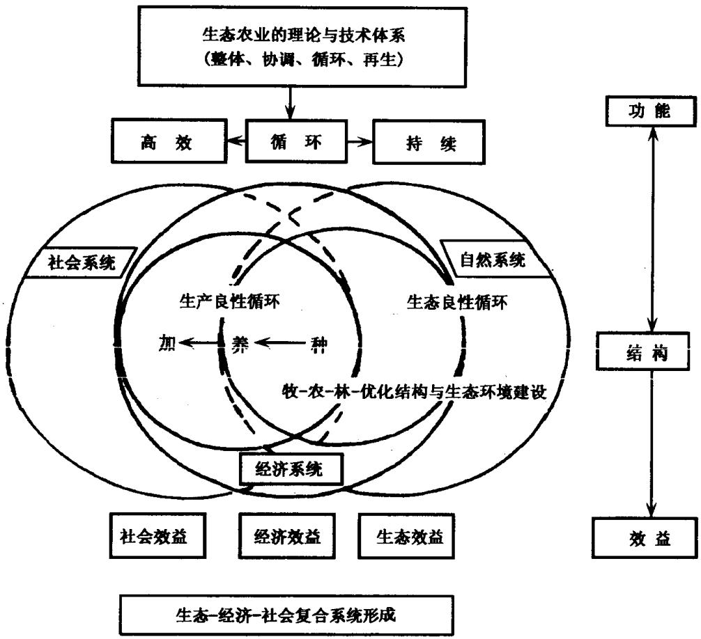  
图6-1 农业生态系统的结构、功能与效益（张壬午，1992）  
“良性循环”是生态农业实现高效、持续发展的途径。第一，它运用生态

学原理及系统工程的方法，使农牧、农林牧产业优化组合；形成农牧、农林牧复合系统，通过进行立体种植与养殖，结合治理生态环境，生态环境向良性循环转化，提高农业系统抵御自然灾害的能力。第二，它立足于当地资源开发所建立的种、养、加一条龙的生产增值链，将乡镇企业纳入生态农业的体系之中，和农副产品循环利用结合起来，从而提高农业生产系统的经济稳定性。

生态农业技术包括建设区域的环境条件调查与分析、资源环境潜力评价、生态农业规划及适合当地的生态农业经营模式设计。

生态农业中经济与生态的良性循环主要体现在3个方面：首先，通过生态环境的治理及农村能源综合建设，使生态环境从恶性循环向良性循环转变，植被覆盖率、土壤理化性质及有机质含量得以提高，进一步增强生态经济系统的生产能力；其次，以农业废弃物资源化为中心的物质多层次循环利用，提高资源利用率，并保护生态环境；第三，是采取农牧、农林牧复合系统的形式，提高系统自我维持能力及系统稳定性。这3个方面是生态农业技术体系的本质。本章主要从生态农业基本原理，农业生态系统的设计、调控与优化，生态农业技术模式，区域生态农业建设规划等方面，对生态农业建设技术作以介绍。

## 一、农业生态系统结构原理

农业生态系统是人类按照需要，利用自然资源和社会资源，调节农业生物种群及其环境间的相互作用，通过合理的能量转化和物质循环，进行物质生产的综合体。

研究农业生态系统是运用现代生态学的基本原理，系统分析(systemanalysis）的方法，把农、林、牧、副、渔等结合起来当成一个整体的大系统，研究这一个系统内部各个组分的相互关系以及系统的整体结构与功能通过对农业生态系统的科学控制和管理，使系统内的自然资源保持持续利用和长期稳定高效的生产力。

## （一）农业生态系统组成

## 1. 农业生态系统的组分

农业生态系统是由农业生物系统和农业环境系统两大部分组成。

(1）农业生态系统的生物组分“系统”的生物与自然生态系统的生物一样，可以分成以植物为主的初级生产者，以动物为主的次级生产者（消费者）和以微生物为主的腐生生产者（分解者）三大类。此外农业生态系统增加了人类。

①农业生物可按农、林、牧、副、渔、虫、菌来归类：

②农作物包括粮食作物、经济作物、饲料作物、园艺作物及养地作物，其中园艺作物包括果树、蔬菜及花卉；

③林业植物包括防护林、经济林（如花椒、泡桐、苹果、梨、桃等）、用材林（如松、杨、沙枣、刺槐、胡杨等）、薪炭林等；

①牧业生物包括家畜、家禽；

⑤渔业生物包括淡水鱼类（如草鱼、鲤鱼）、虾、蟹、蛙、海洋鱼类及滩涂养殖类等；

⑥虫菌类生物包括小动物（如蚯蚓、蝎子等）、昆虫类（如蜜蜂、蚕、寄生蜂等）及食用微生物（食用菌）、甲烷菌等。

(2)农业生态系统的环境组分农业生态系统的环境组成，包括自然环境和人工环境。前者是从自然生态系统承续下来的，包括气候因素和土地因素以及生物因素（一切非人工植被、病、虫、草等有害生物），但这些因素已受到人类影响。

人工环境组分包括人类对农业生态系统的环境、生物、结构的管理调控技术与设施，如结构优化、良种选育、施肥、灌水、病虫草害防治等以及各种生产、加工、储存设备和生活设施等，如机械、温室、禽舍、水库、渠道、加工厂、仓库等，人工环境组分是自然生态系统中没有的。

农业生态系统与自然大环境和社会大环境（包括公交通讯、财贸金融、政策法令、科技文教等）有着物质、能量、信息的交换，农业生态系统与社会大环境还有产品与资金的输出与资金的输入关系。因此，农业生态系统受自然大环境和社会大环境的影响。

## 2. 农业生态系统的边界与层次

(1）农业生态系统的边界农业生态系统边界的划分是人为的，带有较大的主观性，系统边界的确定往往是根据研究上的方便，以研究对象的边界为界限。

(2)农业生态系统的层次一个生态系统是由若干个亚系统所组成的，某一级的生态系统又是上一级生态系统的组成部分，具有明显的层次，大致可分为6级：

国家级农业生态系统

区域地理环境农业生态系统

村级农业生态系统

生产单位农业生态系统

农、林、牧、副、渔整体农业生态系统

单项生产（农田、林地、畜牧、渔业）生态系统

## （二）农业生态系统结构

## 1. 农业生态系统结构的内涵

农业生态系统结构，指“系统”的构成要素以及这些要素在时间上、空间上的配置和能量、物质在各要素间的转移、循环途径。

农业生态系统的结构是由多种二级结构组合而成的复合结构。包括：①农业生物种群结构，即农业生物（植物、动物、微生物）的组成结构及农业生物种群结构；②农业生物种群的配置结构，包括二维结构（平面分布）及三维结构（立体分布），时间分布及占用土地结构；③生态系统类型结构（农田、草地、水域、森林等）即生态系统的组合结构；④能量转移、物质循环的组合结构。

农业生态系统的结构直接影响系统的稳定性和系统的功能、转化效率与系统生产力，一般地说，生物种群结构复杂，营养层次多，食物链长并联系成网的农业生态系统，稳定性较强；反之，稳定性差。在种植业种群内部，合理配置作物种群，建立合理的平面、立体及时间结构，实行作物轮换种植，避免种植单一，对增进农业稳定性和保持持久的、较高的生产力是十分必要和有益的。因此，处理好农、林、牧之间的结构关系，避免结构的简单化，乃是建立一个性能稳定、具有较好功能和最高生产力的农业生态系统的根本任务。

## 2. 农业生态系统的基本结构

农业生态系统的结构包括3个方面，一是系统的组分结构；二是组分在系统空间和时间上的配置，即时空结构；三是组分间的联系特点和方式，即营养级结构。

(1）农业生态系统的环境和物种结构“系统”的环境组分包括自然环境组分和人工环境组分。在不同区域，自然因素差别很大，加上人工形成的各种设备设施，都直接或间接地影响“系统”的物种构成，通过引种和选种育种方式调整农业的物种结构。

(2）农业生态系统的空间结构平面结构和垂直结构。平面结构主要由以下组分构成：农作物、人工林、果园、牧场、水面等。

农业生态系统的垂直结构是指在一个“系统”区域内，农业生物种群在空间上的组合分布状况。它包括地上部分，也包括地下部分。它解决如何合理地将不同种群组合成“复合群体”，从而更大限度地利用光、热、水等自然资源，以提高生产力。

(3）农业生态系统的时间结构是指区域内各种群生长发育及生物量的积累与当地自然资源协调状况。由于自然资源多数是随时间而变化的，生物组分也形成相应的节律，表现出不同的时相，所以在安排生物品种的种养季节时，如何使生物需要符合自然资源变化的规律，做到“供”“求”一致，提高生产力，以及如何使外界投入的物质和能量与作物的生长发育紧密协调，必须考虑时间节律。

(4）农业生态系统的营养结构 就是生物间通过营养关系联结起来的结构，是指系统中多种农业生物按营养关系联结成的链状和网状结构，即食物链和食物网结构。

食物链结构，是生物按食物需要组合而成的链状或网状结合方式。建立合理的食物链结构，可以减少营养物质的耗损，提高能量、物质的转化利用率，从而提高系统的生产力及经济效益。

建立成分复杂、多层次、能够充分利用环境资源的“系统”物质转化、循环结构，是建立合理的“系统”结构的重要内容。

## 3. 农业生态系统中产业结构的相互关系

农业生态系统中，农、林、牧、渔、虫（蜜蜂、蚯蚓）、菌（蘑菇）、微生物（沼气菌）、副业、加工业等之间相互依存、相互制约、相互促进，它们之间的关系极为复杂，通过物质能量的不断交换、转化和循环，使它们彼此密切结合，形成完整、统一的总体。

故了解各产业结构之间的关系对系统调控以优化极为重要。

（1）农牧关系农业、牧业是“系统”2个主要的基本功能单位。“系统”中农、牧比例关系，对“系统”的物质循环和能量转化有极大的影响。“系统”中农业与牧业的关系可概括为3种类型：

①供求关系即饲料和肥料的关系。农业供给牧业饲料，牧业供给农业有机肥料及动力，饲料和肥料都是对方发展所必需的，彼此互相依赖，相互促进，这是建立良好农业生态系统的基础。

②连锁关系即饲料多牧业发展，牧业发展肥料增多，肥料增多农业增产，即表现为一方增产可引起双方增产；继而又引起多方增产，形成连锁反应。相反，一方减产也可能造成双方减产，继而引起多方减产。因此，要粮食增产，应注意发展牧业，加强循环，以发挥物质的最大效益，否则会因地力消耗而不能持续增产。当一方出现减产时，也应采取其他补救措施，防止形成恶性连锁反应。

③限制关系牧业从饲料中获得的物质和能量，有相当数量消耗于畜禽代谢和贮存在畜禽产品中，排泄物的养分只占饲料中的一部分。同样，农业也不能将从肥料中所获得的营养物质全部供给牧业，在物质循环上，农牧双方又都限制了对方的充分发展，因此，为了高产稳产，要注意探索“系统”外的物质补充。

为了农业和牧业的共同发展，要注意非耕地的作用。如非耕地的野草青割沤肥而转入耕地，或通过饲养畜禽以粪便转入耕地。

(2）农林关系农林关系比农牧关系复杂，林业可以调节农业生态系统的输入与输出，同时也影响农业生态系统的物质循环和能量转化。林业对农业的影响是多方面的，首先，森林可以改善周围农田生态环境，增大空气湿度，森林可以减缓风速、减少径流、减少风沙侵蚀和水土流失，减少非生产性输出消耗。森林可以提供一部分燃料，解决农村生活用能的部分需要，使农作物秸秆得以还田，并且由于森林单位面积消耗矿质养分几乎仅为作物的1/10，作燃料可使农业生态系统物质输出减少。森林还可提供一部分饲料，通过畜牧业转化为畜产品和粪肥，使系统的输入增加。总之，森林使农业生态系统增加输入，减少输出，有利于农业稳定和提高生产力。目前，我国农业上“过量输出”已成为比较普遍而严重的问题。“没有森林的农业，是不稳定的农业；没有畜牧业的农业，是缺乏物质基础的农业”的说法，较好地说明了农林牧结合的必要性。

农林牧之间可以互相促进，也可能互相矛盾，关键在于比例与布局。配置与布局适当，则相互促进；反之，则相互矛盾。由于片面强调粮食生产，忽视其他各业的配合，曾一度盲目毁林、开垦草场、围湖造田。使生态环境恶化，造成水土流失，荒漠化现象严重。加之对耕地重用轻养，或只用不养，使土壤肥力每况愈下，灾害增多，单产不高，粮食不足，于是再开荒扩大耕地，又破坏植被，造成恶性循环。由于农村燃料紧缺，大量作物秸秆充作燃料，使有机物质和氮素不能用作饲料、肥料，使土壤有机质下降，进一步阻碍农业生产的全面发展。

(3)农渔关系同农牧关系一样，是饲料与肥料的关系。渔业除提供蛋白质外，并以塘泥肥沃农田，作物的茎叶糠麸以及田间杂草、人畜粪便都可作为鱼的饲料，使农牧废弃物得到利用和转化。

(4）农、副、加工业关系副业、加工业是农业生态系统结构的重要组成部分。农林牧渔产品分为2个部分，一部分是直接为人类利用、消耗；另一部分是不能为人类直接利用。通过加工，截留其无效部分，如将作物秸秆粉碎作为家畜饲料；动物废弃物如骨、血、毛等粉碎作饲料或提取经济价值更高的产品。目前，农业产品多以粮、茶、禽、畜、果的形式输出。这种输出加大“系统”物质能量的损失。在产品输出中，无效输出粮食占20%、蔬菜40%、肉猪35%、肉牛55%、肉鸡50%、木材40%。如经过初加工把这部分无效输出留在系统内，再经过食物链作用，可增加有效输出，减少物质能量损失，促进物质循环，有利于产品增值，提高经济效益，并能转化剩余劳动力。

（5）其他各业之间的相互关系农业生态系统是可以容纳多种产业的资源循环利用系统。正如钱学森所说：利用植物的光合作用，插入中间环节。比如说，把植物的秸秆、草、树叶子，加工成综合饲料，饲料可以喂牲口，牛粪可以种蘑菇，又可以养蚯蚓。加工成的综合饲料还可以放到池塘里去养鱼，而且可以多层养鱼。一环一环地形成一个高效的生态系统。还可以把所有的废弃物，送到工厂里加工，制造骨蛋白、叶蛋白，培养单细胞蛋白。这些东西都是通过插入中间环节而形成的。因此，新环节的产品可以直接或间接地为人所利用。这样的农业，就不只是农林牧副渔五业并举，而是农、林、牧、禽、渔、虫、菌、微生物、副、工（加工）十业并举。也许还不止这些，这就是综合性的、高度知识密集的、技术密集的大农业。

总之，农林牧渔副工等各业之间是相互联系、相互促进、相互制约的关系。建立合理的“系统”结构，就要处理好它们之间的关系，确定各自的种类、比重和时间、空间上的配置，促进能量、物质的合理转化、循环。

## （三）农业生态系统特点

农业生态系统在许多方面与自然生态系统相似。但是因它受到人类强烈影响而又有别于自然生态系统。具有以下特点：

(1）干扰性与控制性人类对系统的干扰具有双重性，人类可以建设一个良性循环的农业生态系统，也可破坏这个系统。人类参与“系统”的根本目的在于持续地将农业资源高效地转化为人类需要的各种农产品，因此，人类需要对农业生态系统适时、适度地加以调节、控制与管理。例如：通过育种、栽培、饲养技术等，调节和控制农业生物的数量与质量；通过基本设施和耕作、灌水、病虫草害防治技术等，调节或控制各种生态因子及系统的格局与过程、结构与功能。

（2）高产性“系统”中的生物组分多数是按照人类的目的（如高产、优质、高抗等）驯化而来，再加上人类的科学技术管理作用，使“系统”中优势种的可利用部分进一步发展，物质循环与能量转化得到进一步的加强和扩展，因而，农业生态系统具有较高的净生产量和较高的光能利用率。

(3)脆弱性“系统”的生物组分多是经过人工选择的，与自然生态系统相比，其生物种类单一，食物链结构简单，栽培条件或饲养技术的要求越来越高，抗逆性减弱。同时，由于人为地对其他物种的防除，农业生物的层次少，导致系统比较脆弱、自我稳定性降低。需要人为的合理调节与控制，才

能维持其结构与功能的相对稳定。

(4）开放性自然生态系统是自组织、自完善的良性循环系统，生产者积累的有机物质大部分均存于系统内，而农业生态系统的生产绝大部分作为农、林、牧、副、渔的产品或原料离开系统，因而，为了维持农业生态系统的再生产，必须利用一切科学技术措施，向系统内输入物质、能量，并提高其利用及周转率。农业生态系统的这种“大进大出”特性，表明系统的开放程度远远超过自然生态系统。

(5)复合性“系统”即包括自然生态系统的组分，又包含社会经济因素的成分，就生产目的而言，要服从社会、经济和生态环境3个方面的需求，因而，“系统”的生产既是自然再生产过程，又属于社会再生产过程。从广义来讲，“系统”具有自然与社会的双重属性，其受自然规律与社会经济规律支配。例如：确定优势物种组成时，一方面要根据生物的生态适应性原理，另一方面还要依据市场需求规律和经济效益规律。

(6)区域性农业生态系统与自然生态系统一样，受气候、土壤、地形地势等自然生态因子影响，具有明显的地域性。此外，还受人文、社会、经济、技术等因素的影响而形成明显的区域特性。因而，在生态农业建设中，需要考虑不同区域间的社会经济技术条件和农业生产水平的差异性。

## 二、农业生态系统功能

## （一）物质循环原理（物流）

生物元素在生物圈内是川流不息的，即营养元素循环；水是营养元素循环的介质，而营养元素循环是一切生态系统自我维持的基础。农业生态系统是开放的系统，由于大量农产品输出，导致营养元素入不敷出，土壤库营养元素亏缺，缺氮更是普遍现象。要通过大量系统外投入，如化肥、农药等维持生产。生态农业技术体系讲究尽可能适量或较少外部投入，通过立体种植及选择归还率较高的作物，以及合理轮作、增施有机肥等建立良性物质循环体系，尤其要注意物质再生利用，使养分尽可能在系统中反复循环利用，实现无废弃物生产，提高营养物质的转化及利用效率。

弗里斯（M.J. Frisse）曾对农业生态系统养分循环的大量实例进行了综合分析，并设计了由土壤→植物→动物，再回到土壤的养分循环的一般模式。

该模式包括3个主要养分库，即植物库、家畜库和土壤有效养分库。动植物生长所需要的养分是经由土壤→植物→动物→土壤的渠道而流动的。

植物库包括植物的地上和地下部分所含养分。家畜库是由消费植物产品的动物所持有的养分组成。土壤库由于养分矿质化并转变成可给态以前，养分以有机残余物形式停留的时间较长，故将土壤库分为3个亚库，即有效养分库、土壤矿物库和土壤有机残余物库。

养分在几个库之间的转移是沿着一定路径进行的。

各种养分元素在各库之间完成一次循环所需要的时间长短不一。微生物转移只需要若干分钟；1年生植物需要几个月；大型动物需要几年；物理环境转移则需要亿万年。通常人们选定1年为时间标准来计算养分的循环转移量。

要了解某种养分在各库中的平衡状态，必先求出该养分的净流入量和净流出量。当流入与流出量相等时，说明该种养分处于平衡状态；当通过系统边界的输入与输出量相等时，则该系统处于稳定状态；当某种养分的输出大于（或小于）输入量时，说明这个系统中该种营养元素处于减少（或积累）状态。

农业生态系统是一个养分大量输入和输出的系统，现代化农业，大量产品流入市场，然后自市场返回肥料、种子、食物、农药等各种生产和生活物质，物质循环的开放程度大，生产力和商品率高，但缺乏自我维持能力，要靠大量投入物质才能维持系统的养分平衡。

## 1. 有机质在农田养分循环中有重要作用：

（1）有机质是各种养分的载体。有机质经微生物分解，能释放出供植物吸收利用的有效氮、磷、钾等养分，增加土壤速效和缓效养分的含量。

（2）为土壤微生物提供生活物质。促进微生物的活动，增加土壤腐殖质的含量，改善土壤物理状况，提高土壤潜在肥力。

(3)具有和硅酸盐同样的吸附阳离子的能力，有助于土壤中阳离子交换量的增加，又能与磷酸形成螯合物而提高磷肥肥效，减少铁、铝对磷酸的固定。

此外还能保蓄水分，提高土壤的抗旱能力，抑制有害线虫的繁殖；以及形成对作物生长有刺激作用的腐殖酸等。

## 2. 农田土壤有机质的积累和分解

(1）土壤中有机质的来源主要是作物残体。以作物的根茎、落叶、落花留给土壤的有机物，每公顷达75～300kg（于重），畜粪厩肥还田，土壤中生物遗体和排泄物也是土壤有机质的重要来源。土壤中的生物有土壤动物、原生动物和微生物，其中以微生物的数量最大，以旱地土壤为例，微生物的重量大约占土壤生物总重量的78%，变形虫、原生动物等占2%，土壤动物占20%，土壤微生物的生命活动要求土壤有机质保持一定的碳氮比。这是因为微生物为了构成体细胞，每同化4～5份碳，必需1份氮；同时，每合成1份氮，必需4份碳素作能源，因此，微生物的正常生长繁殖因缺氮而受到限制，有机质分解缓慢；没有无机氮在土壤中的积累，甚至产生微生物与作物争氮的现象。当有机质的碳/氮小于25：1，特别是在15：1以下时，有机质分解迅速，使土壤有机质大量消耗，同时引起氮的挥发损失。各种有机物的碳/氮不同，作为有机肥施用时，应注意肥料种类的合理搭配。

（2）有机氮与无机氮的合理配比有利于保持土壤养分平衡，作物产量提高。

## （二）能量转化原理（能流）

## 1. 生态系统能流的主要路径

生态系统中能量流动是指能量由非生物环境经生物有机体，再到外界环境所进行的一系列传递过程。在农业生态系统中，能量流动的一般途径包括以下几个方面：

太阳辐射的能量中有一半左右可以作为生理有效辐射为植物所利用，通过绿色植物的光合作用将其转化为化学潜能，储存在植物有机体中，但这部分能量一般只有总辐射能的1%～5%，其余能量以热的形式损耗掉了。

由绿色植物合成的生物能，在食草动物、食肉动物的取食过程中被利用和消耗，能量沿食物链在各个营养级的生物中流动，每一营养级将上一级传递来的能量分为固定（构成生物体组织）、损耗（呼吸消耗等）和还原（各营养级残体、排泄物等由分解者进行分解、还原、释放的能量）3大部分。

生态系统中能量的外界输入及输出，有相当部分的能量人为通过系统边界输入到系统中，还有一部分被作为产品移出到系统外，为人类所利用。此外，通过动物的迁移、水和风的携带等途径，也有一部分能量被输入或输出生态系统。

## 2. 农业生态系统中能量投入与产出

农业生态系统能量来源除接受并转化太阳辐射能外，还有人工辅助能量的投入。因此，农业生态系统如何捕获和转化更多的太阳辐射能，以及如何合理利用辅助能，并提高其生产效率是极为重要的问题。

(1）初级生产也称第一性生产，是指绿色植物进行光合作用所积累能量的过程。绿色植物为初级生产者，初级生产积累能量或物质的速率称为初级生产力，或称第一性生产量，以每年每平方米合成的干物质克数或积累的能量表示 $\left[ { \pmb g } / \right. \left. \left( { \bf m } ^ { 2 } \cdot { \bf a } \right) \right.$ 或 $\mathbf { J } / \mathbf { \Sigma } ( \mathbf { m } ^ { 2 } \cdot \mathbf { a } ) ]$ 0

初级生产量包括总初级生产量 $( P _ { g } )$ 和净初级生产量（P）两部分，总初级生产量是包括在呼吸作用中被消耗掉的有机物质(R）在内的光合作用的总速率，所以也称为光合作用总和，即 $P _ { \mathrm { { g } } } = P _ { \mathrm { { n } } } + R _ { \mathrm { { \ell } } }$ 净初级生产量是指除掉植物呼吸作用消耗的能量后的初级生产量，即 $P _ { \mathrm { { \pmb \alpha } } } = P _ { \mathrm { { \pmb \alpha } } } , P _ { \mathrm { { \pmb \alpha } } } = - R$

“系统”的初级生产主要包括农田、草地和林地生产。由于农田的人工栽培品种和管理措施，其生产力水平相对较高，一般陆地平均的太阳光能利用率只有0.25%，农田平均0.6%左右，高产农田可以达到1%以上。据有关的研究报道，农作物中小麦、玉米、水稻、高粱等作物的平均生长率（CGR）可达到 $1 5 { \sim } 2 0 \mathbf { g } / \mathbf { \Sigma } ( \mathbf { m } ^ { 2 } \bullet \mathbf { d } )$ 以上，光能利用率可达1.2%～2.4%。

(2)次级生产是指初级生产以外的有机体的生产，即消费者、分解者利用初级生产的有机物质进行同化作用，表现为自身的生长、繁殖和营养物质的储存。初级生产者以外的异养生物（包括消费者和分解者）称为次级生产者。次级生产是动物、微生物等对光合制造的物质的利用和再合成，其能量的固定和转化是通过摄食、分解、合成等完成的。

①次级生产的能量平衡次级生产采食的能量中，只有一部分被消化，很大部分以粪的形式被排出体外，从被采食的初级产品中减去粪能，叫做消化能。但消化能也不是全部被动物利用，其中一部分以尿素或尿酸形式从尿中排出，一部分以甲烷及氢的气体形式排出，从消化能中减去尿能和气体能后叫做代谢能。动物在进食过程中还要消耗能量，这部分能量以热的形式排出体外，叫做热增耗。从代谢能中扣除热增耗，叫做净能，净能首先满足动物的维持需要，余下部分才用于增重、产奶、产蛋等生产，即转化为次级产品。其能量转化过程的平衡可用公式表示为：

$$
P = N _ { I } + I\tag{6-1}
$$

$$
I { = } A { + } \ ( R _ { 1 } { + } R _ { 2 } ) \ + \ ( F { + } U { + } G )\tag{6-2}
$$

式中 P——净初级生产总量；

$N _ { I }$ —未被食用的部分；

I——被食用的部分；

$A$ ——储存能；

$R _ { 1 }$ 热增耗；

$R _ { 2 }$ ——维持能；

$F \cdot$ —固态排泄量；

U——液态排泄量；

G——气态排泄量。

②次级生产的能效率在农业生态系统中次级生产主要是指畜牧业和渔业生产。家畜一般可将采食中16%～29%的饲料能同化为体内化学能，33%用于呼吸消耗，31%～49%随粪便排出体外。比较而言，按饲料的数量计，鸡的转化效率最高；按饲料的能量计，猪的转化效率最高，牛的转化效率相对较低。在水域养殖中，饲料的转化效率较陆地家畜高些。

## （三）信息传递原理（信息流）

生态系统的信息传递包括物理、化学、营养和行为信息4部分。

(1)物理信息以物理过程为传递形式的信息称为物理信息。它包括声、光、色、热、湿度、重（压）力、磁力、摩擦信息等。

(2）化学信息生物在特定条件下或某个生长发育阶段，分泌出特殊或具有一定气味的化学物质，在生物之间起着信息传递作用称为化学信息。如：动物捕食、交配、进攻、防御时发出的各种化学信息。

（3）营养信息通过营养交换的形式，把信息从某种生物体传到另一种生物体的称为营养信息。如：食物链（网），草一兔一野兽等。

(4）行为信息动物通过自己的各种动作向外界或同伴发出的信息称为行为信息。如：兔子受惊时发出的脚掌扫地声（告诉同伴注意）等。

## （四）经济转化原理（价值流）

用较低的投入取得更大的效益，是所有工程设计所追求的目标。在生态工程设计中，如何降低成本，提高收益是重要问题。投入产出是一切经济活动必须遵循的主要原理。只考虑技术上的可能性而不考虑经济上的合理性和只考虑眼前经济发展而不顾生态环境的短视观点，同样，都是片面的。必须认识到生态环境也有经济价值的，多数环境可以用金钱来计算，只是研究工作相对滞后，目前还难以科学地确定。

## 第三节 农业生态系统的设计、调控与优化

由“系统”的特性可知，“系统”的调节、控制与管理是至关重要的，因而，充分认识“系统”的设计原理、调控机制，才能实现系统的优化，从而建立高产、高效、稳定、持续的农业生态系统。

## 一、设计原理

除前述的基本原理外，生态农业技术的设计还必须考虑以下原理。

## （一）整体效应原理

根据系统论整体功能大于个体功能之和的原理，利用系统各组分之间的相互作用及反馈机制对生态系统进行调控，通过结构的合理调控，提高系统的整体功能与效率。

## （二）生态位原理

在生态系统中不同生物具有不同的基础生态位、潜在生态位、扩展生态位。应用生态位原理，合理配置农业生态系统的生物组分，防止生态位重凳

导致的竞争互克，合理利用资源（时间、空间、物质、能量等)，如稻田养鱼，鱼利用了冗余空间和资源，鱼既可除草又除螟虫，促进了水稻的高产，又减少了除草剂、农药的施用，减少了农产品的污染、增加了农田的经济效益。

## （三）多层利用的食物链原理

农业生态系统中食物链结构简单，不利于能量和物质的有效利用，而且降低了系统的稳定性。为此，根据营养级和食物链原理，将多种经营的目的物种，合理组织到生产者、消费者、分解者等不同营养级上来，形成复杂、多环的、稳定的食物链结构。如五位一体塑料大棚模式，棚内养猪，猪舍下面建沼气池，猪舍上面养鸡、棚主体种植蔬菜，棚侧种植蘑菇（分解者作用之一）等，实现谷物（杂草、蔬菜剩余物）喂鸡、鸡粪养猪、猪粪便（人畜粪便、废秸秆等有机物）产生沼气（分解者作用之二），沼气池废渣作肥料种蔬菜，猪鸡排放的二氧化碳增加蔬菜产量，减少污染。形成充分利用能量、物质、空间等资源的结构。

## (四）相互依赖、相互制约的生克原理

在农业生态系统中，由于物种单一，专业化利用各种生物种群的相生相克原理，组建合理高效的复合系统（如立体种植、混合养殖等），在有限的空间、时间内容纳更多的生物种，生产更多的产品。我国普遍运用的多熟制种植（间作、套种、混种、复种）及立体种养等都是利用各物种间的竞争互补关系建立合理的群体结构，实现高效生产的目的。同时，利用生物种间的相克作用，可有效控制病、虫、草害，目前正兴起的生物杀虫剂、杀菌剂、生物除草剂等生物农药技术已展示出广阔的发展前景。

## （五）相互补偿和相互协调共生原理

在生态环境中，生境因子间在数量上的相互补偿与调节是普遍存在的，如高地下水位可补充降水不足，沙漠地区的低地可出现湖泊。生态因子的调节与补偿是有一定限度的，而且生态因子间是不可代替的。生物间通过营养物质互换，实现互相调节与补偿，形成相互依赖的共生关系。如地衣（藻类与真菌、细菌共生）、根瘤（固氮菌与豆科等植物）、菌根（真菌与高等植物）等为典型的共生现象。豆科植物混播其他植物实现增产就是运用共生关系的实例。

## （六）生物与环境协同进化原理

生物与环境农业生产的基本要素，只有在适宜的生态环境中生存，生物才可能最大限度地利用资源，获得最佳生产力及效益。生物与环境的协同进化，是指生物在适应环境的同时，也作用于环境，对生态环境有一定的改造能动性，从而使得环境与生物平衡发展。生态农业中运用生物与环境的协同进化原理，首先要根据地域生态环境条件，安排适应性较好的生物种群，获得较高的生产力，并要特别注重保护生态环境。否则，环境破坏会导致生物与环境的失衡，如水土流失、土壤沙化退化以及化肥、农药的不合理施用导致生物种群减少或消失，使农业生产力降低甚至衰退。

## (七)生物多样性原理

生物多样性包括下列3个方面的含义：生物学的、生态学的和生物地理学的。狭义的生物学意义上的多样性多侧重于不同等级的生命实体群在代谢、生理、形态、行为等方面表现的差异性；生态学意义的多样性主要指群落、生态系统甚至景观在组成、结构、功能及动态等方面的差异性；生物地理学含义主要指不同分类群或组合的分布特征或差异。生物多样性是地球上所有生命形式的总和，现在研究较多的，主要是基因、物种、生态系统和景观多样性4个层次。

## (八）系统论原理

系统论应是生态工程设计的重要指导原理之一。生态农业应遵循“整体、协调、循环、再生”的基本原则。

系统是由相互作用和相互依赖的具有特定功能的有机整体。系统都必须存在以下主要特征或共性：具有特定功能与整体功能性、有序性、边界性、系统组分的有机结合性与分工协作性。生态工程的设计与实施就必须遵循系统论的原理。

## (九）商品与市场协调原理

生态农业都有产品，这些产品的市场需求情况，必然直接影响到经济效益高低。因此，生态农业设计中，如生物种群选择，要考虑其产品的市场需求与潜在的市场前景，一些产业生态工程，如种植、畜牧等，更要慎重考虑产品的数量、质量与市场需求的协同问题。

## (十)三个效益协同原理

我国生态农业应当解决当前面临的“生存与发展”两个重大问题。因此，我国生态农业设计与实施不仅解决生态环境问题，同时，还要充分考虑到社会效益与经济效益的协同发展。因为生态农业工程的实施与维持是广大农民，他们不仅需要生态效益，更要首先考虑经济收益问题，尤其在市场经济条件下。

## (十一) 可持续性原理

随着经济发展与人口增长、资源消耗、环境退化之间的矛盾冲突的加剧，人类逐步认识到人口、资源、环境与社会持续发展（sustainabledevelopment）的重要性。持续发展的完整概念，是联合国世界环境与发展委员会（WCED）于1987年发表的总结性工作报告《我们共同的未来》（(urCommonFuture）中提出的，其核心内容就是在协调好人与自然关系的前提下，提高人的生活质量；缓解人与自然的矛盾冲突。这一概念的提出也正是在人类面临与日俱增的环境问题时而产生的。

生态农业工程建设符合“持续农业”的原则。其中心任务也在于解决农业生产与环境之间的矛盾。

## 二、农业生态系统的调控机制

“系统”一方面从自然界继承了自我调节能力，保持一定的稳定性；另一方面它在很大程度上受人类各种技术手段的调节。认识“系统”的调控机制及调控途径，有助干建立高效、稳定、和谐的农业生态系统，有助于利用和保护农业资源，提高生产力。“系统”是一个人工管理的生态系统，既有自然生态系统的属性，又有人工管理系统的属性。因此，它不可避免地受自然因素，又受人工因素的调控。

## （一）自然调控机制

“系统”的自然调控机制是从自然生态系统中继承下来的生物与生物、生物与环境之间存在的反馈调控、多元重复补偿稳态调控机制。如光温对作物生长发育的调节作用；昼夜节律对家畜家禽行为的调节作用；林木的自疏现象：功能组分冗余现象；反馈现象等多种自我调节机制。

## 1. 反馈机制

农业生态系统具有多种正负反馈机制，能在不同的层次结构上行使功能控制。

（1）在个体水平上，通过正负反馈，使得个体与环境、个体与群体之间保持一定的协调关系。如温度下降，动物皮肤收缩，减少体温散发，这是负反馈机制；温度升高，动物血液循环加快，汗腺排汗散发大量体内的热量，这是正反馈机制。植物通过膨压变化、气孔开闭，形成角质层以至落叶等调节水分盈亏。

(2）在种群水平上，种群数量变化、生殖等受遗传、环境、营养等制约，许多生物具有自我调节数量的机制，主要表现为年龄结构、性比、交配方式等，并表现出不同的生态对策和生殖对策。种群存活曲线凹曲线型、大量生殖、短寿命的生物，表现为R-生态对策；种群存活曲线为凸曲线、生殖率低、长寿命的生物表现为K-生态对策。小麦通过个体增殖调节种群密度，使个体与群体的密度相协调。当群体超过一定密度后，个体的穗数、每穗粒数和粒重成负反馈调节。反之，形成正反馈调节。

（3）在群落水平上，一方面生物种群通过相互作用，调节彼此间种群数量和对比关系，同时又受到共同的最大环境容纳量的制约。例如，池塘中同时放养鲢、鳙、草、鲤等鱼，在最大环境容纳量之内，每一种鱼的密度是不相同的，有一个适宜的混养比例。种群之间捕食者与被捕食者之间的数量调节也是一种反馈机制。捕食者因猎物的数量增加而增加（正反馈）；捕食者增加，猎物减少，导致捕食者因食物短缺而下降（负反馈），当捕食者减少，猎物再次增多，捕食者又增加，这样循环往复地自动调节。农田中害虫数量的增长与其天敌数量增长的关系，也是这种自动调节关系。

(4）在系统水平上，交错的群落关系、生态位的分化、严格的食物链量比关系等等，都对系统的稳态机制起积极作用。系统的组分越多，相互关系越复杂，则系统中所包含的正负反馈机制也越多，自我调控能力越强，稳定性也就越大。例如，在复杂的乔、灌、草混合的针叶阔叶林中，由于鸟类较多，油松较难发生松毛虫灾害，而在油松纯林中，则最易发生松毛虫灾害。农、林、牧、渔结合的综合农业，不但有较高的物质、能量和价值的转换效率，而且各业可在良性循环中稳定增长。“系统”的反馈调节机制作用是有一定限度的。不超过系统自动调节能力前提下所能抵抗外界干扰的最大限度（临界值)，即生态阀值。外界干扰包括自然干扰，也包括人为干扰。例如，森林采伐应控制采伐量低于生长量；草地有一定的载畜量，超过载畜量过度放牧会引起草原退化。

## 2. 多元重复补偿机制

在生态系统中，有一个以上的组分具有完全相同或相近的功能，或者说在网络中处在相同或相近生态位上的多个组成成分，有外来干扰使其中一个或两个组分破坏时，另外一个或两个组分可以在功能上给予补偿，从而相对地保持系统输出稳定不变。例如，植物的种子和动物的排卵数大大超过环境中可能容纳的下一代数目；同一食草动物常消费众多的植物；同一种生物残体为数以百计和各种大小的生物所分解利用等等。这就使得生态系统在遇到干扰之后，仍能维持正常的能量和物质转换功能。这种多元重复有时也理解为生态系统结构上的功能组分冗余现象。

生态系统中的反馈控制和多元重复往往同时存在，使系统的稳定性得以有效地保持。这些自然调控相对人为调控，更为经济、可靠和有效，对保护生态环境更为有利。

## （二）人工调控机制

人工调控是指农业生态系统在自然调控的基础上，受人工的调节与控制，人工调节遵循农业生态系统的自然属性，利用一定的农业技术和生产资料，加

强系统输入，改变农业生态环境，改变农业生态系统的组成成分和结构，以达到提高农业生产、加强系统输出的目的。农业生态系统的调控途径可分为经营者的直接调控和社会间接调控两种。

## 1. 经营者的直接调控

(1）生境调控 生境调控就是利用农业技术措施改善农业生物的生态环境，达到调控目的。它包括对土壤、气候、水分、有利有害物种等因素的调节。其主要目的是改变不利的环境条件，或者削弱不良环境因子对生物种群的危害程度。

调节土壤环境，可通过物理、化学和生物等方法进行。传统的犁、耙、耘、起畦以至排灌，建造梯田等属于物理方法，它们改善耕层结构，协调水、肥、气、热的矛盾。化肥、除草剂和土壤改良剂的使用，能够改善土壤中营养元素的平衡状况，属于化学方法。而施用有机肥、种植绿肥、放养红萍、繁殖蚯蚓等措施属于生物方法，它们既能改善土壤的物理性状，又能改善土壤中营养元素的平衡状况，有利于提高土壤肥力。

调节气候环境，表现在区域气候环境的改善上，可通过大规模绿化和农田林网建设，人工降雨、人工驱雹、烟雾防霜等措施来得以实现。局部气候环境的改善，可通过建立人工气候室和温室、动物棚舍、薄膜覆盖、塑料大棚、地膜覆盖、施用地面增温剂等方法实现。

调节水分的方法也很多，如修水库，打机井，建水闸，田间灌排、喷灌、滴灌，施用叶面抗蒸腾剂等方法都可以直接改善水分供应状况。通过土壤耕作，增施有机肥料，改良土壤结构，也可以增强土壤的保水能力。

（2）输入输出调控农业生态系统的输入包括肥料、饲料、农药、种子、机械、燃料、电力等农业生产资料；输出包括各种农业产品。输入调控包括输入的辅助能和物质的种类、数量以及投入结构的比例；输出调控包括调控系统的贮备能力，使输出更有计划，或对系统内的产品加工，改变产品输出形式，使生产加工相结合，产品得到更充分的利用，并可提高产品的经济值；同时，控制非目标性输出，如防止因径流、下渗造成的营养元素的流失。

(3）农业生物调控 农业生物调控是在个体、种群和群落各水平上通过对生物种群遗传特性、栽培技术和饲养方法的改良，增强生物种群对环境资料的转化效率，达到调控目的。

①个体水平的调控其主要手段包括品种的选用和改良，以及有关物种的栽培或饲养方法。如优良品种的选育，杂种优势的利用，遗传工程手段，生长期间整枝打顶、疏花疏果、激素喷施等措施调节生长。

②种群水平的调控主要是建立合理的群体结构和采取相应的栽培技术，调节作物种植密度、牧畜放养密度、水域捕捞强度、森林砍伐强度等，从而协调种群内个体与个体、个体与种群之间的关系，控制种群的动态变化，保持种群的最大繁荣和持续利用。

③群落水平的调控是调控农业生物群落的垂直结构、平面结构、时间结构和食物链结构，以及作物复种方式、动物混养方式、林木混交方式等，建立合理的群落结构，以实现对资源的最佳利用。

(4）系统结构调控是利用综合技术与管理措施，协调农业内部各产业生产间的关系，确定合理的农、林、牧、渔比例和配置，用不同种群合理组装，建成新的复合群体，使系统各组成成分间的结构与机能更加协调，系统的能量流动、物质循环更趋合理。在充分利用和积极保护资源的基础上，获得最高系统生产力，发挥最大的综合效益。结构调控主要包括以下3个方面：

①确定系统组分在数量上的最优比例，如用线性规划方法求农林牧用地的最佳比例；

②确定系统组成在空间上的最优联系方式，要求因地制宜、合理布局农林牧生产，按生态位原理进行立体组合，按时空三维结构对农业进行多层配置；

③确定系统组成在时间上的最优联系方式，要求因地制宜找出适合地区优先发展的突破口，统筹安排先后发展项目。

## 2. 社会的间接调控

农业生态系统的社会间接调控，是指农业生态系统的外部因素，包括财贸金融、工交通讯、科技文教、政法管理等通过经营者对生态系统产生调节作用的有关社会机制。具体包括：

（1）财贸金融系统的间接调控财贸金融系统通过影响经营者的资金来源、消费方式和生产方向，实施间接调控。其主要调控手段有信贷、投资、税率、利率、价格、货币发行、市场渠道、政府预算等等。市场渠道是商品交换的必要条件，缺乏适当的市场流通，商品交换受阻，农业生态系统只能局限于自给性，无法大量生产能充分发挥本地资源优势的经济价值高的农业产品，进而影响农业生态系统的发展方向。比如农产品价格鼓励决定着经营者发展农产品的方向和数量。

(2)工交通讯系统的间接调控工交通讯系统通过影响经营者的农业生产资料和信息，实施间接调控。工交通讯影响农业的装备能力、加工能力、物质流通能力和信息沟通能力。现代化农业愈来愈依赖农资工业发展的程度，即农机用具、化肥、农药、薄膜等农业生产必需品的供给。交通运输直接影响商品流通能力。美国专业化生产的主要条件之一就是有便利的容量大的长距离运转能力以及较好的贮存保管手段。信息系统对于经营者及时了解市场需求、资源供应情况、天气变化等是十分必要的。

(3）科技文教系统的间接调控科技文教系统通过影响经营者的素质及其使用的农业技术，实施间接调控。从某种意义上来说，提高公众的生态意识，普及推广农业技术，就是提高农业生态系统的自我调节能力。

(4）政法管理系统的间接调控政法管理系统通过影响经营者的积极性和行为规范，实施间接调控。政法管理系统通过强制性或倡导性的各种政策、方针、法令的制定和执行，影响着社会生产的组合形式、生产资料所有权、收益分配权、生产决策权等，对经营者的积极性和行为规范产生影响，对农业生态系统的类型、结构与生产力产生深刻的影响。如我国森林法、野生动物保护法、渔业许可证制度、基本农田保护法等，都将对保护森林、野生动物、渔业资源及基本农田起到十分良好的作用。

## 三、农业生态系统优化

## （一）系统分析（生产力、能流、物流、价值流、信息流）

欲对生态系统进行调控，首先要对系统进行详细的分析，然后对其作出评价与诊断，最后进行优化设计并实施，以达到调控的目的。调控、系统分析与诊断、系统优化设计这三者之间的关系如图6-2所示。

系统分析最常用的方法是模型法。经典意义上系统分析一般包括如下4个步骤：系统目标分析和确定、系统模型化、模型优化、优化系统评价；其中后2个环节经实践运用后，可循环进行。农业生态系统的分析与诊断可根据这一步骤进行。

## 1. 系统分析的指标

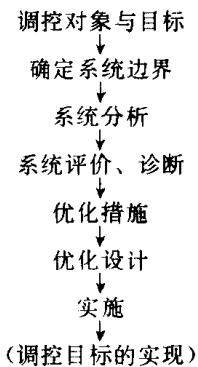

（1）怎样培育出新的作物品种以获得更高更稳的产量？

图6-2 人工调控生态系统的步骤(引陈阜主编，1998) (引陈早王编，1998)

（2）怎样利用农业投入（化肥、杀虫剂、灌溉等）获得更高更稳的产量，并且安全持久？也就是说，从能流、物流分析中找出影响投入效率的薄弱环节并采用相应措施。

（3)在什么样的情况下，单作比混作更有利或相反？

（4）怎样确定作物生产次序及各业的组合比例，以最大限度地合理利用农业生产的有效源？

(5）应该谨慎地保留哪些传统的农业生产技术，并把它们同现代技术结

合起来？

（6）怎样使农业适应于本地的社会条件（如劳力、土地、市场、基础设施、价格等)？怎样调整农业使它适应不断更新的社会变化？

（7）怎样强化农业，并且保证最大限度地利用生态基础脆弱的资源（如脆弱的贫瘠土）而不导致威胁到整个系统的长期生产效益（如土地退化）？

（8）怎样使一个地区的农业协调起来，以合理地满足人们的多种需要？

## 2. 系统分析的方法

系统的分析有直观、假设、抽象、约简、分解与合并；系统的综合建模主要有经验模型、统计模型、解析模型、模拟模型、图解模型；分析的手段有数量化法、多元分析、数学规划、多目标决策、模糊数学等。由于生态系统的复杂性、非线性，系统分析的手段由传统的线性数学方法正向随机性、非线性数学手段发展。如80年代发展成熟的连续时间马尔柯夫随机过程(CTM）模型（祖元刚等，1991；张喜军，1994)、系统动力学的仿真方法；90年代以来随着非线性科学的突飞猛进，分形几何理论(fractal theory，Falcon-er，1989)、混沌理论、小波分析、人工神经网络(artificial neural network，张立明，1993）等的应用正在兴起，同时逐步与3S（RS、GIS、GPS）、计算机网络等信息技术手段融合，将使系统的模拟通过“虚拟技术”实现可视化。

## 3. 系统分析的途径

针对不同的问题，采用不同的途径。可采用物流、能流、信息流、价值流的单项分析途径，也可对区域进行综合分析。

(1）养分循环分析 荒漠化地区农业生态养分循环模式如图6-3:

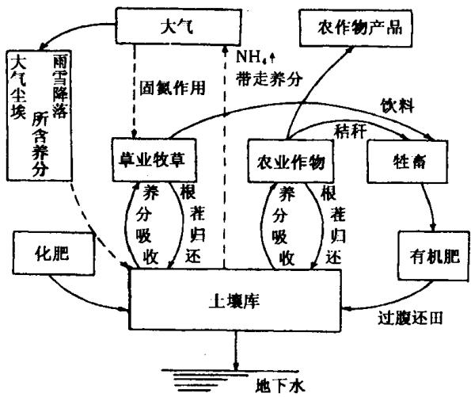  
图6-3荒漠化地区农业生态系统养分循环模式图（改自李述刚等，1998）

荒漠化地区的水分循环因蒸发强烈，绿洲农田生态系统通常需要灌溉补给水分，因而导致土壤次生盐渍化，进而导致下渗水流不畅，因此节水、防止次生盐渍化是水分循环优化的关键（图6-4）。

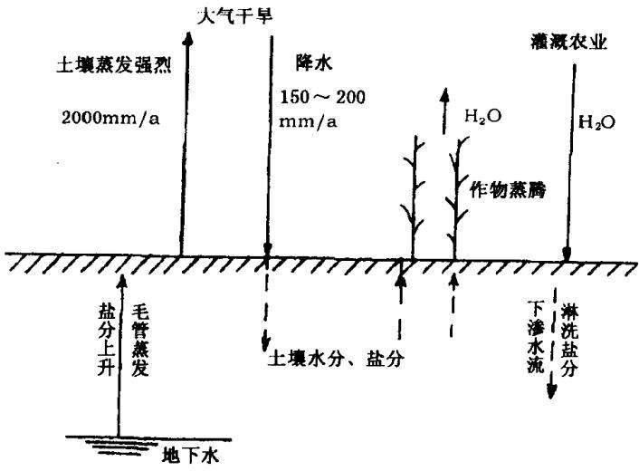  
图 6-4 准噶尔盆地绿洲农田水分循环示意图（李树刚等，1998）

## (2) 能流分析

①确定所研究系统的边界，根据研究目的，确定被研究对象的系统边界。可以是单一农作物系统、畜牧业系统等，也可以是由种植、林业、渔业等多个亚系统构成的复合农业生态系统，系统可以是1块农田、1个农户、1个村，也可以是1个乡、1个县或更大的区域。

②确定系统的主要成分及其关系并绘成能流图。

③确定系统各组分的实物流量或输入、输出量。

④将各种能流转换为能量。

⑤对计算结果进行分析。

在得到标准化后的能量流图以后，对整个农业生态系统的功能有了一个清晰的轮廓，一般应做以下分析工作：

A. 能量输入与输出的结构分析一般有工业能输入和有机能输入占总输入能量的比重；在输入的人工辅助能中化肥、农机动力等所占比重，从而对投能的结构有所了解。输出部分中经济产品和副产品占的比重；各类农产品(如种植、养殖、水产等）占的比重。可以对整个系统或不同子系统的自给能力的强弱、系统的开放程度等进行评价。

B. 能量输入输出强度及能量转化效率分析对单位面积或单位体积的能量投入与产出的能流密度进行比较分析，把握农业生态系统的能量流动状况。

同时，对系统中能量转化的效率进行评价，如：

$$
\frac { 1 } { 2 5 } \div \frac { 5 } { 5 } \div \frac { 1 } { 6 } = \frac { 1 } { 4 } \times \frac { 1 } { 3 } = \frac { 1 } { 5 } \times \frac { 1 } { 2 5 } = \frac { 1 } { 6 } \div \frac { 1 } { 6 } = \frac { 1 } { 5 } \times \frac { 1 } { 3 }\tag{6-3}
$$

$$
\Lambda \mathbb { Z } \mathbb { H } \mathbb { H } \mathbb { H } \mathbb { E } \mathbb { X } \mathbb { Z } = \mathbb { L } \mathbb { e } ^ { { \lambda \mathbb { Z } } } \mathbb { H } \mathbb { H } \mathbb { E } / \ \Lambda \mathbb { Z } \mathbb { H } \mathbb { H } \mathbb { H } \mathbb { H } \mathbb { E } \mathbb { H } \times \mathbb { H }\tag{6-4}
$$

$$
x _ { A } = \frac { 2 } { 3 } x ^ { 3 } = ( \frac { 2 } { 3 } x ^ { 3 } - \frac { 1 } { 3 } x ^ { 2 } ) x _ { A } = \frac { 1 } { 3 } x ^ { 2 } + \frac { 1 } { 3 } x - \frac { 1 } { 3 } x = \frac { 1 } { 3 }\tag{6-5}
$$

C. 对所研究系统的能流状况进行综合分析和评价，并与其他系统进行比较分析，判断出该系统能流的问题及调控途径（具体分析方法请看有关专著)。

## （二）系统优化设计

生态系统优化设计包括：生物种群的选择、生物群落结构设计、人工环境设计、节律匹配设计、人工食物链设计与加工链设计6个部分。

## 1. 生物种群的选择

生物种群是构成生态系统的重要组分之一，是建设、调控、改造、治理生态系统的基本材料，也是人类对于该人工生态系统需要的基本部分。因此，选择适宜的生物是建立高效益生态系统的关键。

## （1）生物种群选择的依据

①自然环境特征气象、土壤、水文、植被等生态因子，是选择生物种群的基本条件。

②社会经济条件当地的社会经济水平，是生物种群选择的保障条件，它决定投入能力，也决定技术保证。

③市场需求情况生物产品必须有足够的市场需求。再好的产品假如没有一定的市场，就不能转化为经济收入。因此，我们在选择生物种群的时候，一定要充分考虑市场需求或市场容量。

④民族风土习俗种群选择必须符合当地习惯和风俗。

⑤经济、生态、社会效益生物种群的选择必须考虑其3个效益。不同目的对于其效益权衡会有所侧重。

(2）生物种群的选择内容生物种群选择的主要内容一般应当包括：生物种群的调查、收集、引进，适应性培植（养殖）实验，比较，选择3个部分。

## 2. 生物群落结构设计

“结构决定功能”，生物群落的结构是决定生态系统效益的关键。群落结构设计包括：种群组成的数量计算、种群的平面布局、群落的垂直结构3个部分。具体各个种群所占比例应当根据生态环境建设需要和社会需求确定。生物群落设计过程也可以分为：

（1）植物与植物植物与植物之间的群落设计，可分成：木本与木本植物（乔木与乔木、乔木与灌木的布局）、木本与草本植物（如枣粮结构等）、草本与草本植物（如农作物的间套作）。其结构设计，要考虑地上组合、地下组合、分泌物与枯落物的组合、种群的相生相克作用。

(2)植物与动物 植物与动物的组合一般也可以分为：植物与高等动物（如林地养鸡、森林牧场）、植物与低等动物（如林地蚯蚓）、植物与人类（如城市的绿化美化）的各种结构。

(3）动物与动物 动物与动物的组合主要是以食物链关系进行联接，形成一个合理而高效益的结构。

## 3. 人工环境设计

人工环境设计主要应当包括：水环境、土壤环境、光热环境、大气与微气候环境等。人工环境设计的主要目的是要解决人工生物群落生长发育的适生条件，保证人工生态系统建设的成功。自然环境条件中存在着主导限制因子，往往只有1～2个。假如通过环境因子的人工调控，可使人工生物种群发挥最大的效益，下述的例子可以说明。

（1）荒漠化地区由于严重干旱和沙丘的移动频繁，很难生长植物。用“草方格”人工措施固定住流沙以后，一些沙生植物逐渐生长。再人为地选择播种沙生植物，就可促进植被的恢复和繁衍。

(2)石质山区 在太行山地，根据土壤瘠薄、气候干旱的特征，在干旱阳坡采用集水聚土整地技术，形成优良的小环境，栽植抗旱的经济果木一石榴，形成沿等高线密集分布的石榴林带，取得30000元/hm²以上的经济效益，这些石榴带又不断拦蓄水土，改变生态环境，取得显著成效。

## 4. 节律匹配设计

设计生物种群机能节律配合（如套作就是一个人工生物群落匹配的典型)，然后再与环境的时间节律进行选择和匹配，构成生物机能节律与环境时间节律的最佳配置。需要注意的是，在设计过程中不但要考虑自然资源的时间节律，同时，要注意社会环境与社会资源的时间节律。因为它们是决定人工生态系统十分重要的因子集。比如，市场需求的时间节律、劳动力分配的时间节律、生产资料供应节律、资金提供的时间节律等。

## 5. 人工食物链设计

食物链设计，包括：食物链的“加环”设计（生产环、增益环、减耗环、复合环）、食物链的“解链”设计、“加工环”的设计等。其中，食物链加环设计是根据营养级原理，即一级产品是第二级营养级的资源、二级产品是第三级营养级的资源，依次类推，以资源类型和数量选定加环食物链的种群类型和数量。然后分别进行具体设计。食物链设计可采取2条不同的技术路线，第一种是顺序型设计：即根据营养级层次的排列顺序，从生产者一—绿色植物开始到草食动物、肉食动物顺序依次进行食物链的加环设计；第二种为食物链加环的外延型设计，即以人为确定的食物链环节（营养级）为中心开始，逐步向外延伸进行加环。

(1）食物链生产环的设计是生态工程中比较重要的工艺过程。它是利用人类不能直接利用或者利用价值不高的生物为资源，通过加入新的生物种群（环—营养级）进行物质、能量的再转化。其转化的目的是：变废为宝、变低价值为高价值、变低能量为高能量、变分散为集中、变粗为精、变滞销为畅销，从而提高整个系统的综合效益。其中重要的核心是“废弃物的资源化”与“产品的再转化”问题。食物链加环的设计可以是顺序型设计，这就是“绿色植物产品一草食性动物一肉食性动物”，也可以从某一个营养级开始进行外延型设计。不管是哪一种技术路线都要先计算准备转化的生物产品的数量，以此为资源，选择合适的加环生物种群并计算其数量。生产环的加环可加入一级也可加入两级以上，这要视剩余物的数量来确定。

（2）食物链增益环的设计该设计是针对人类生产、生活过程中产生的废弃物而设计的。在废弃物中仍有一定数量的营养物质（比如牲畜粪便、生活和工业废水、生活垃圾等）本身也是一种资源。根据这些资源的特性选定适应的生物种群，通过生物进行能量转化和物质富集，作为食物链的生产环的补充，从而增加经济效益。如用牲畜粪便、垃圾通过蚯蚓、苍蝇等生物种群的转化富集，生产高蛋白的蝇蛆和蚯蚓。这些高蛋白生物可作为鸡、猪等生产环的动物性蛋白饲料，使鸡、猪的产量增加。蚯蚓和苍蝇就是鸡、猪这种生产环的增益环。食物链的增益环对开发废弃物资源、扩大食物生产是一条重要生产技术。

(3）食物链减耗环的设计人工生态系统易受病、虫、兽的危害，造成的损失，甚至导致系统的崩溃。这些有害生物种群称为食物链的耗损环。化学农药的应用虽然取得显著成效，但长期应用对环境产生严重后果：剧毒农药导致天敌生物大量死亡；农药通过食物链积累于动物（包括家畜家禽）体内，是造成食品污染及人类癌症和多种疑难病症的诱发原因。国内外普遍探索利用生物措施进行病、虫、兽的防治，这种可以抑制耗损环的生物种群，称食物链的减耗环。其应用前景十分广阔。减耗环的设计步骤如下：①研究危害经济生物的生物学及生态学特性；②选择对耗损环生物有拮抗、捕食、寄生作用，但对经济生物无害的生物；③建立减耗环生物的保护、放养与繁殖的技术，我国在寄生蜂防治棉铃虫、白僵菌防治鳞翅目害虫取得成功；①根据耗损环的数量与发生规律，来确定减耗环生物的数量配比。

(4）食物链的解链设计是对污染造成的有害物质降解或脱离人类的食物链。设计中，合理确定解链的机制与解链方式十分重要。食物链解链设计分为以下3种技术路线：改变有害产品用途，使它们脱离人的食物链；改变系统组分，加入新的生物组分，使有害物质降解；或对有害物质不吸收、不富集。重要的是选定最佳的解链时间、部位和方法，解链的途径可通过改进加工链、改变组成的方式实现。如利用的蚯蚓进行城市有机垃圾降解，可生产动物蛋白饲料和优质肥料。

(5）食物链复合环的选择与设计自然界有一种生物，不但可作减耗环，同时其本身产品又是人类所需要的经济产品，称之为复合环。稻田养鱼就是一个复合环的成功范例。这种集“除草一肥田一产鱼”三大效益于一身的生物种群就是一个典型的“复合环”。

## 6. 加工链的设计

产品加工是提高效益的有效途径。它与食物链有极其相似的意义。加工环设计与生产环设计基本相同。

在荒漠化地区，无论是生态农业工程优化设计，还是设计生态农业技术，都必须首先考虑本区脆弱的生态条件，解决好全局性的环境生态问题，以保证生态、经济、社会的持续发展为根本原则。这些问题大致包括：荒漠化土地的综合治理与预防措施、荒漠化地区的防护林体系建设、以持续发展为目标的水资源管理、节水灌溉系统、积水蓄水径流农林牧业技术、荒漠化地区的能源开发、植被建设与植被保护措施以及道路建设、法制建设、环境保护意识的培养、科学管理等问题。

不解决这些重大全局性问题，具体技术设计在本区不可能成功实施。在具体技术项目设计时，要特别注意推广“白色革命”和“黑色革命”，科学经营技术，引进优、新、特品种，注意蚯蚓、蝇蛆、食用菌、药用菌、药用植物等在生态农业中的作用，注意工农业废弃物、生活垃圾资源化问题，注意高新科学技术的集成组装。

## 第四节 生态农业技术模式

## 一、生态农业技术

生态农业主要应用生态工程技术及传统农作技术，对农业生态系统的不同层次进行设计和管理，并配合相应的配套技术，运用系统工程的最优化方法，设计多层次多级利用资源的生产系统。生态工程的目标就是在促进物质

的良性循环前提下，充分发挥资源的生产潜力，防止环境污染，达到经济与生态效益同步发挥。生态农业的主要技术包括以下几个方面。

## （一）立体种植与立体种养技术

这是一种劳动密集型的技术，是浓缩我国传统农业精华的技术模式。它与现代新技术、新材料结合，使这一技术得到更充分发挥。

这种立体种养技术通过协调作物与作物之间、作物与动物之间，以及生物与环境之间的复杂关系，充分利用互补机制并最大限度避免竞争，使各种作物、动物能适得其所，以提高资源利用率及生产率。这类模式在我国农区相当普遍，尤其是资源条件较好、生产水平较高的地区更是类型多样，成为解决人多地少、增产增收的主要途径。

现举例说明。例一：山东泰安郊区的“小麦/西瓜/夏玉米/菜豆”1年4作模式，秋播小麦，麦收前1个月在行间栽西瓜，麦收前10d左右在西瓜两侧播种2行夏玉米，小麦收获后及时播种菜豆，并在播下季麦前收获。例二：四川省武胜县的“鱼/中稻/再生稻/萍/笋”模式，于5月中旬移栽中稻，收获时高留稻茬促再生稻生长，在稻田内间作高笋（约在水稻插秧前1个月种植)，在稻田养鱼，水面上种植绿萍。这种模式稻田可产稻谷7500kg/hm²以上。产成鱼3000～7500kg/hm²，细绿萍7500kg/hm²，高笋1275\~1800kg/hm²，每公顷产值1.5万元，是普通稻田的10多倍。

## （二）有机物质多层次利用技术

通过物质多层次、多途径循环利用，实现生产与生态的良性循环，提高资源利用率，是生态农业中最具代表性的技术手段。主要通过种植业、养殖业的动植物种群、食物链及生产加工链的组装优化加以实现。

生物物质的多层次利用技术可大幅度提高物质及能量的转化利用效率，如饲料喂鸡、鸡粪喂猪、猪粪制取沼气，沼渣种蘑菇、养鱼、养蚯蚓及作为肥料还田的综合多级利用试验，饲料经多级利用后能量利用率由一次利用的64.7%增加到90.5%，其中氮素利用率由45%提高到92.4%。农业生态系统中物质多级利用的主要方式有：

（1）畜禽粪便综合利用我国和许多国家都利用干燥膨化鸡粪替代粗饲料及粗蛋白饲料。这是由于鸡的消化道短，饲料未被充分吸收利用就排出体外，鸡粪中有70%左右的营养成分未被消化吸收，经过适当处理可作为猪、鱼等动物的优质饲料。畜禽粪便另一种用途是作沼气原料，可作能源利用，而沼渣沼液不仅为优质有机肥供作物利用，还可作为食用菌培养料或蚯蚓、鱼饲料等。

(2）秸秆综合利用农作物的秸秆产量巨大，能占到生物总量的60%左右，我国年产作物秸秆在5亿t以上。目前的秸秆有相当一部分烧掉了，不仅污染大气，还把其所含的大量营养浪费掉了。因此，加强秸秆综合利用是生态农业一项重要的技术及任务。秸秆的利用除部分直接还田外，还有一部分作为饲料供牛、羊等草食动物食用。还可通过氨化、青贮及添加剂处理等，使营养价值和适口性大大提高，并可替代部分粮食。秸秆还可作为食用菌的培养料、沼气原料。

## （三）生物防治病、虫、草害技术

病、虫、草害是造成作物减产的重要原因，利用生物措施及生态技术有效控制病、虫、草危害的潜力很大。其优点在于无毒性残留，不污染环境，又可以保护生物多样性和生态系统自我调节机制。通常生物防治技术有以下几个方面：

（1）利用轮作、间混作等种植方式控制病、虫、草害。

（2）通过收获和播种时间的调整可防止或减少病、虫、草害。

(3）利用动物、微生物治虫、除草。如稻田养蛙和草食性鱼类治草、治虫；棉田放鸡食虫；利用七星飘虫、食蚜虫等捕食蚜虫等。

(4）利用生物试剂替代农药防治病、虫、草害技术。利用自然界生物分泌物之间的相互作用，运用生物化学、生态学技术与方法开发新型农药将会成为未来发展的新趋势。

## （四）再生能源开发技术

以开发利用生物能（薪炭林、沼气）、生态能（太阳能、风能）等新能源，替代部分化工商品能源是生态农业的一项重要技术。

1. 沼气发酵技术（见能源部分）；

2. 太阳能利用技术（见能源部分）；

3. 风能利用技术（见能源部分）。

（五）生物措施与工程措施配合的生态治理技术（见有关部分）

## 二、荒漠化地区生态农业模式

## （一）“四位一体”庭院生态经济模式

荒漠化地区一般土地丰富，农户院落大，有发展庭院经济的优势。在庭院内将种植业、养殖业及沼气能源结合起来，获得较佳的生态效益及经济效益，是本区适宜的庭院经济模式，有相当的普遍性。最基本的模式是“养猪(养鸡、鸭等）一沼气池一种菜”，可改进为蔬菜用塑料大棚种植，养猪、沼气也在大棚内，并且增加养鸡，鸡粪喂猪等内容。

所谓“四位一体”是以农户为单元，利用荒漠化地区充足的太阳能，以沼气为纽带，集种植、养殖、能源为一体，有很强的生命力，是一种物质良性循环的生产模式，也是一种农村能源开发模式。这种模式的实施比较简单易行，投资成本可高可低，规模可大可小，可视农户具体情况而定。沼气池、厕所、猪舍和日光温室“四结合”。这样，以太阳能为动力，以沼气池为纽带，以温室立体种养为手段，通过种、养、能源的有机结合，形成生态良性循环，取得显著经济效益。

## （二）“种、养、加、能源一体化”模式

荒漠化地区的草场、畜牧场可开发成一个生态型综合性农工联合企业，如集约经营高产草场，为牛羊（禽）提供饲料，建立肉、奶等产品综合加工厂实现增值，粪肥及加工剩余物制作肥料用于草场施肥，工厂的能源要充分利用太阳能、风能等，形成“种、养、加、能源一体化”生产，形成生产生态良性循环，有很好的生态效益和经济效益，也是较为典型的生态农业模式。

把牧草加工或直接饲喂牛、羊等，肉、奶等送到食品加工厂和罐头厂，血、皮等送到饲料加工厂和皮革加工厂，畜粪进入沼气池，沼气一部分用于发电，一部分直接作为燃料。沼气池的残渣污泥先送到沉淀池分开固体和液体，污泥可提取维生素 $\mathbf { B } _ { 1 2 }$ 的原料或作肥料；沼液可作肥料或送到氧化塘，清洗畜舍的脏水也送到氧化塘，由于其营养丰富，可生产水藻用来养鱼；氧化塘水面的浮渣可作为鸭、鹅的部分饲料，塘泥又是草场的好肥料。这样一个良性循环，使农场的有机废物得到充分综合利用，而动植物产品及加工产品又获得良好的经济效益。

## （三）延安市生态农业建设

延安是典型黄土高原丘陵沟壑区，80年代初，全市水土流失面积占78.4%，每年入黄河泥沙2.58亿t。由于多年来没实施综合治理，处于边造林边开荒，“愈垦愈荒，愈荒愈穷，愈穷愈垦”的恶性循环之中。

1991年以来，实施生态农业建设规划，实行“山水田林统一治理，农林牧副全面发展”的大农业综合发展战略，按“林果、草牧、粮农”的生态农业模式进行综合治理，改革土地产权制度，实行“四方拍卖”及“谁治理谁受益”的原则，调动了千家万户的治沟治坡的积极性。

到1996年底，综合治理面积1.67万 $\mathbf { k } \mathbf { m } ^ { 2 }$ ，占流失面积58%，林草覆盖率达42.9%，农村人均0.16hm²基本农田和0.1hm²经济林。人均产粮400～500kg，烟、果、羊、薯四大产业形成规模，多种经营产值达13.6亿元，占农业总值68%，农民人均收入1120元，贫困人口由1985年67万下降到23.6万。改变了水土流失、粮食不足、经济贫困的局面。

我国生态农业建设已经取得了举世公认的成就，积累了一定的经验。但整体上仍处在较低水平上，仍处于研究、探索、丰富、提高的过程中，仍存在不少薄弱环节和问题。主要是：思想认识不足；科学技术体系还比较薄弱；生态农业建设与管理中统一协调不够，政策法规十分薄弱，机构设置与协调力度不够，资金投入机制与政策扶持力度不够；缺乏有效的动态评估与评价手段、方法，基础设施差，管理和专业人员综合能力较差等等。

针对生态农业发展的需要，我国有关部门已提出和制定了：

（1）中国生态农业发展战略整体构想；

（2）中国生态农业发展的对策与措施（包括全国农业生态县建设工程和生态农业技术体系研究与示范)；

(3）生态农业发展的保障体系建设等内容，由于持续发展是未来时代根本原则，生态农业在我国特别是在荒漠化地区有无限的生命力。

## 参考文献

1. 马世骏，李文华．中国的农业生态工程．北京：科学出版社，1987

2. 马世骏主编．中国生态学发展战略研究（第一集）．北京：中国经济出版社，1991

3. 马克平．生物群落多样性的测度方法．见：钱迎倩，马克平主编．生物多样性研究的原理与方法.北京：中国科学技术出版社，1994

4. 张壬午主编．县级生态农业建设方法．北京：中国科学技术出版社，1992

5. 李述刚、程心俊、王周琼．荒漠绿洲农业生态系统．北京：气象出版社，1998

6. 杨怀森主编．农业生态学．北京：中国农业出版社，1992

7. 陈 阜主编．农业生态学教程.北京：气象出版社，1998

8. 陈万金，信遒诠主编，中国北方旱地农业综合发展与对策．北京：中国农业科技出版社，1994

9. 周光裕，路志英．生态农业模式与效益．济南：山东大学出版社，1990

10. 程序，曾晓光，王尔大．可持续农业导论．北京：中国农业出版社，1997

11. 韩纯儒．生态学基础．北京：北京农业大学出版社，1988

# 荒漠化地区水资源合理利用技术

## 第一节 水资源分类及特征

水是荒漠化地区（特别是干旱沙区）自然资源开发的限制因素，也是最重要的自然资源之一，荒漠化地区的水资源依其来源及存在形式，可分为地表水、地下水和大气降水3个部分。

## 一、地表水

荒漠化地区的地表水资源包括河流、湖泊、水库及冰川积雪和露、霜等凝结水。

## (一）河川径流资源及特征

地表径流是该区可以直接引用的可靠水资源，它在荒漠化地区经济发展中起着重要作用。我国荒漠化地区有河流480多条，年径流量约2097.64亿$\mathbf { m } ^ { 3 }$ ，仅西北于旱沙区资源总量为1403亿 $\mathbf { m } ^ { 3 }$ ，其中外流河水量仅占34.7%，内陆河径流占65.3%。最大的外流河是黄河，是我国第二大河，其上中游地区多年平均流量为400亿 $\mathbf { m } ^ { 3 }$ ，平均径流深62mm，只相当于全国平均径流深(257mm）的23%。最大的内陆河是位于新疆塔里木盆地的塔里木河，其流域面积约 35 万 $\mathrm { k m } ^ { 2 }$ ，全长2179km，干流长约1000km，上游平均径流总量约50亿 $\mathbf { m } ^ { 3 }$ 。河川径流在区域分布上极不平衡，在新疆北部和西部，内蒙古的东南部和东北平原西部地区比较丰富，而在新疆和甘肃交界的地区，以及内蒙古西部的沙漠、戈壁地区较少。在新疆数量最多，全区共有河流315条，多年平均径流量约884.3亿 $\mathbf { m } ^ { 3 }$ ，其中年径流量在1亿 $\mathbf { m } ^ { 3 }$ 以上的河流有76条，径流量710亿m³，主要河流有塔里木河、伊犁河、黑河、疏勒河、石羊河、大 $\mathbf { m } ^ { 3 }$ 通河、阿克苏河、叶尔羌河、额尔齐斯河等；柴达木盆地有那陵郭勒河、格尔木河、乌图美仁河、柴达木河、塔塔陵河等内陆河流51条，年径流量约50亿 $\mathbf { m } ^ { 3 }$ ：甘肃河西走廊有河流62余条，水量约73亿 $\mathbf { m } ^ { 3 }$ ；内蒙古西部高原及阿拉善戈壁、沙漠中地表径流量约30亿 $\mathbf { m } ^ { 3 }$ ；鄂尔多斯高原地表径流水量仅10亿 $\mathbf { m } ^ { 3 }$ ；在银川及河套平原，地表径流约320亿 $\mathbf { m } ^ { 3 }$ ，其中包括过境的黄河水量300亿 $\mathbf { m } ^ { 3 }$ 在内。我国沙区地表径流资源分布见表7-1。这些河流主要为高山冰雪融水补给，一般占50%～60%以上，而降水和地下水补给量总共不到40%～50%。在山前戈壁地区发育着许多短小河流，一般在流出山口后，逐渐消失于戈壁或沙漠之中，部分注入湖泊。

表7-1 我国沙区地表径流资源分布
<table><tr><td>区域</td><td>面积（km²）</td><td>径流水量  $( 1 2 m ^ { 3 } / { \mathsf { a } } )$ </td><td>备 注</td></tr><tr><td>东北西北部风沙区</td><td>200 307</td><td>677.51</td><td></td></tr><tr><td>内蒙古长城沿线风沙区</td><td>857 237</td><td>410.13</td><td>含黄河可利用水80亿  $\mathbf { m } ^ { 3 }$ </td></tr><tr><td>西北干旱风沙区</td><td>2 551 718</td><td>1010.00</td><td>含黄河可利用水85.8亿  $\mathbf { m } ^ { 3 }$ </td></tr><tr><td>总计</td><td>3 609 262</td><td>2 097.64</td><td>总资源中有一定的重复量</td></tr></table>

荒漠化地区降水少，地面物质粗瘠，渗透性强，加之气候干旱，因而造成该区地表径流呈现下述特点。

## 1. 以短河道小流量河流居多

荒漠化地区的河流多系河道短、流量小的内陆河流或季节性河流，而且几乎完全没有由当地地表径流所形成的河流。其水量和水源补给多是依赖附近高山或高原的冰雪融水或雨水所补给。这些发源于山区的内陆河流一旦流出山口后，水量即因蒸发和渗漏而迅速减少，又无其他补给水来源，对中小河流来说，不可能相互汇集成较大水系，而是各自分散成为独立水系，消失于山前平原和沙漠、戈壁中，或在终端的尾闾湖为内陆湖泊。所以荒漠化地区内陆河多数只有河源而没有河口，成为典型的有头无尾河。这些内陆河的显著特点是流量小，流程短，水量相应集中在少数大型河流中。

就我国西北荒漠化地区来说，据统计，区内共有内陆河428条，其中水量超过10亿 $\mathbf { m } ^ { 3 }$ 的大型河流只有15条，占内陆河总数的3.5%，但却集中了一半以上的水量；水量在1亿 $\mathbf { m } ^ { 3 }$ 以上的内陆河有110条，占内陆河总数的25.7%，而水量仅占总流量的37%；其余300多条内陆河，径流量只占13%，平均每条河水量只有0.3亿 $\mathfrak { m } ^ { 3 }$ 左右。

## 2. 河流河床游荡不定、易改道

荒漠化地区河流多发源于山区，高山带的冰川和积雪融水的强烈侵蚀，给河流带来了许多泥沙，尤其是流经干旱的低山带时，因地面植被覆盖极为稀疏，冲刷作用更强烈，会带来更多泥沙。当挟带有大量泥沙的洪水，流到山前平原和沙漠后，由于地形平坦，流速减慢，河水中的泥沙就迅速沉积，河床很快淤高，加之风沙的阻塞，水量又大，河水常常冲破自然堤而改变它的流路，形成新的河道。新河道经过多年淤积，又会高出两岸地区，遇到下一次洪水，必然再行改道。这种河床游荡不定，河道经常迁徙的现象，在荒漠化地区是屡见不鲜的。我国的塔里木河就是一条著名的游荡性河流。河流改道为荒漠化地区留下了众多的“古河道”“干河床”。

## 3. 径流补给类型多样、时空分布不平衡

根据我国荒漠化地区从高山到平原的水文气象分带规律性和河川径流形成类型，内陆河补给类型可分为融水补给类、混合补给类和雨水补给类3种类型。发源于高山冰川上的河流，以冰雪融水补给为主，占总量40%以上；发源于中山地带河流，由于降水补给比例增加，变为混合补给为主，冰雪融水补给降至20%～30%以下，而纯降水补给的河流均分布在低山带，多为间歇性河流。平时干涸无水，雨后河水猛涨，泥沙俱下，一般难以利用。除此之外，还有少量以地下水补给为主的受湖泊、沼泽调节的非地带性类型的河流。

内陆河径流量年内分配上主要集中在夏季，与农作物生长季相对应，是该区主要供水水流。一般从3～4月份起，随着气温的回升，低中山带的积雪和冰川开始融化，河流水量逐渐增加，形成春讯；6～8月份气温最高，热力线逐渐向高山推移，促使高山冰雪融化补给河流，同时正值雨季来临，降雨充沛，河流水量大增，进入洪水期，这一时期水量占全年总径流量的50%以上，甚至可达80%以上；9月份以后进入枯水期，一般延续5～6个月，水量不到全年总水量的15%～20%。

径流河网空间分布上，山区河网密集，水量充沛，平原和荒漠化区河网稀疏，流量小。

## 4. 内陆河流径流形成区与散失区分带明显

径流形成区大体占有荒漠化地区的山区部分，其下限约在海拔1500～2600m左右，与天然森林分布区的下限相吻合。本区地势高寒，蒸发弱，降水较多，坡陡流急，有利于地表径流的形成，是干旱地区径流策源地。本区河流水量随流域面积增加而增加，河网密度较大，形态为正树枝状。径流形成区的降水，一般为200～800mm，并随海拔高程升高而增加。如新疆中部的天山山区，年平均降水量约400mm，西部山区的年最大实测降水量超过1000mm，每年可向南北平原地区输送400mm左右，东段冷龙岭冰川区的最大降水量可达800mm，每年能向河西走廊地区倾泻达70亿m³的地表径流。

径流散失区占有该区的平原部分，由于地势平坦，戈壁、沙漠广布，地面物质组成较粗，以及高温干旱，蒸发强烈，降水稀少（大部分地区不超过100mm)，不利于径流形成。河流出山后进入本区，水量不但得不到补充，而且随着流程的延伸，不断地消耗于引水灌溉、渗漏和蒸发，越来越少，最后消失殆尽，一般小河在出山后不久就很快地失去踪影。本区由于河流水源的进入，成为荒漠化地区光、热、水土资源最完备的最协调的地区，对于农业的发展特别有利。因此这里自古以来就是荒漠化地区大块绿洲的分布区和水资源开发利用强度最大的地区，人口集中，经济发达，河网为纵横交错的人工灌溉渠系所代替，形态呈倒树枝状。

## 5. 内陆河径流年际变化系数较小、河流水量稳定

内陆河径流年际变化系数一般为0.10～0.25。由于河川径流补给来源的不同，年际变化系数也有明显差异。以冰雪融水补给和混合补给的河流为0.10～0.20，这类河流在干旱年份，由于热力线上升，使高山冰川积雪融水补给增加，反而径流量增大；以季节性积雪融水补给为主的河流，如我国阿尔泰地区的河流，年际变化系数较大，达0.25～0.40；以降水补给为主的常流水河流，若河源地区有冰川补给，系数较小，在0.15左右，若无冰川补给，以地下水补给为主或受湖泊、沼泽调节的河流，年际变化系数一般较小，约为0.06～0.15或以下。

## （二）湖泊资源及特征

湖泊是由湖盆、湖水及水体中的矿物质、有机质和生物组成的统一体。它是大陆封闭洼地的一种水体，并参与自然界的水循环。

荒漠化地区的湖泊多为与海洋隔绝、处于封闭或半封闭的内陆盆地中的内陆湖，为盆地水系的尾闾。在干旱气候条件下，由于蒸发量超过湖水的补给量，湖水不断浓缩，并发育成闭流性的咸水湖或盐湖。表7-2为我国西北内陆湖泊分布表。

表 7-2 我国西北内陆湖泊分布
<table><tr><td rowspan="2">省、 自治区</td><td rowspan="2">湖泊 面积 (km²)</td><td colspan="3">湖 泊 数 量（个）</td><td rowspan="2">合 计</td><td colspan="2">湖泊储水量(亿m³)</td></tr><tr><td>1~10km²</td><td>10~100km²</td><td>100~1000km²&gt;1 000km²</td><td>总水量</td><td>淡水量</td></tr><tr><td>西 藏</td><td>24183</td><td>一</td><td>一</td><td>一 一</td><td></td><td>612 3740</td><td>550</td><td></td></tr><tr><td>新 疆</td><td>5 250</td><td>42</td><td>25</td><td>11</td><td>1</td><td>79</td><td>550</td><td>16</td></tr><tr><td>青海</td><td>10624</td><td>146</td><td>34</td><td>21</td><td>1</td><td>202</td><td>1 520</td><td>120</td></tr><tr><td>内蒙古</td><td>880</td><td>166</td><td>11</td><td>4</td><td>0</td><td>181</td><td>60</td><td>43.8</td></tr><tr><td>合计</td><td>40 937.</td><td></td><td></td><td></td><td>一</td><td>1074</td><td>5 870</td><td>729.8</td></tr></table>

我国荒漠化地区湖泊分布很广，从东到西星罗棋布，有大小湖泊约1000多个，面积达22450km²以上，占全国湖泊面积的27.8%，是荒漠化地区水资源的一个重要组成部分。仅内蒙古、新疆和青海地区就有大小湖泊400多个，储水量约2130亿m³，其中内蒙古有181个、新疆有79个、青海有202个。这些湖泊大部分为咸水湖或盐湖，淡水资源仅179.8亿m³。

由于气候和地形等条件的差异，湖泊分布不均衡，在浑善达克沙地中有湖泊110个，巴丹吉林沙漠有144个，腾格里沙漠有422个，毛乌素沙地有170个，柴达木沙漠有100个。而面积最大的塔克拉玛干和古尔班通古特两大沙漠中湖泊分布量却相对很少。

荒漠化地区大多数中、小型湖泊的形成往往与风蚀风积有关，当风蚀洼地低于潜水面时，地下水在洼地里积聚成湖，或风蚀洼地接受周围地表径流、季节性降水汇聚成湖。这类湖泊多为死水，水浅，面积小，常在冬春积水，夏季干枯，多为盐湖或咸水湖。如乌兰湖、查干诺尔、纳林淖尔等。一些较大的湖泊多和地形构造有关，是在构造断陷盆地的基础上发育而成的。如布伦托海、艾比湖、博斯腾湖、乌伦多湖、玛纳斯湖、罗布泊、呼伦湖等。这类湖泊多是河流进入断陷盆地后，无法流出盆地，最终在洼地停滞而成为终端湖或尾闾湖，因而其水文特性取决于河水水情动态，湖泊面积时大时小，湖形多变，具有一定游移性质，这也是荒漠化地区湖泊的主要特点之一。位于南疆的博斯腾湖，总面积1019km²，湖水面积约60km²，总容量近100亿m³，是我国最大的内陆淡水湖之一。

我国荒漠化地区主要湖泊及其水量见表7-3。

表 7-3 荒漠化地区主要湖泊
<table><tr><td>湖名</td><td>所在省、自治区</td><td>面积（km²）</td><td>湖面容积（m³）最大水深（m）</td><td></td><td>容积（亿m³）</td></tr><tr><td>青海湖</td><td>青海</td><td>4583</td><td>3 195</td><td>32.8</td><td>1050.0</td></tr><tr><td>罗布泊</td><td>新疆</td><td>3 006 *</td><td>768</td><td>一</td><td>一</td></tr><tr><td>呼伦湖</td><td>内蒙古</td><td>2 315</td><td>545.5</td><td>8.0</td><td>131.3</td></tr><tr><td>艾比湖</td><td>新疆</td><td>1070</td><td>189</td><td>一</td><td>一</td></tr><tr><td>博斯腾湖</td><td>新疆</td><td>1019</td><td>1048</td><td>15.7</td><td>99.0</td></tr><tr><td>布伦托海</td><td>新疆</td><td>827</td><td>468</td><td>一</td><td>一</td></tr><tr><td>鄂陵湖</td><td>青海</td><td>618</td><td>4285</td><td>一</td><td>一</td></tr><tr><td>乌兰乌拉湖</td><td>青海</td><td>610</td><td>4859</td><td>一</td><td>一</td></tr><tr><td>哈拉湖</td><td>青海</td><td>602</td><td>4078</td><td>85.0</td><td>160.0</td></tr><tr><td>扎陵湖</td><td>青海</td><td>550</td><td>4287</td><td>17.1</td><td>一</td></tr><tr><td>岱海</td><td>内蒙古</td><td>168</td><td>1200</td><td>18.4</td><td>13.3</td></tr></table>

注：据中国科学院《中国自然地理》编委会；中国自然地理地表水。  
\* 70年代以后湖水干涸。

荒漠化地区湖泊的共同特点是湖水一般较浅，矿化度高，多为咸水湖或盐湖。一般湖水矿化度可达5\~10g/L，有的可高达100g/L。位于柴达木盆地的青海湖，是我国最大的咸水湖，湖水矿化度为12.49g/L。淡水湖为数不多，只在外流区有少量分布，但却是改造和利用荒漠化极为宝贵的水资源。

## (三）荒漠化地区其他形式的地表水

荒漠化地区的地表水除了河川径流、湖泊水外，还有外围高山上的冰川

积雪、人工水库水以及少量的露和凝结水。这些水资源多数为淡水资源，因而对荒漠化地区有十分重要的意义。

## 1. 冰川资源

高山冰川积雪的发育，主要受气候条件、地形地势等因素的制约，是荒漠化地区水资源存在的一种特殊形式，素有“天然固体水库”之称。

我国西北荒漠化地区的山区冰川分布很广，有现代冰川20425条，总面积约2.58万km²，冰储量约1816km³。阿尔泰山是我国高山冰川分布的最北界地区，但冰川面积不大，只有287km²，集中分布在友谊峰和奎屯峰周围山区。天山是我国干旱地区现代冰川分布最集中的地区，共有冰川6896条，面积9548.5km²，占西北荒漠化地区冰川总面积的34%，最大的冰川作用中心在西部托木尔峰附近，多为大型山谷冰川，是新疆阿克苏河等大型河流的发源地和主要补给来源。祁连山的冰川作用中心主要集中在中段和西段，共有冰川3306条，面积1972.5km²，占冰川总面积的6.9%，储水量1960亿m³，折合水量1 320亿 $\mathbf { m } ^ { 3 }$ 。昆仑山脉也是我国现代冰川发育的主要山区之一，有数十条长度超过10km的冰川。喀喇昆仑山也是世界中低纬高山冰川集中发育的地区之一，山区海拔都在6000m以上，冰川长大，融水补给叶尔羌河等河流。

冰川年平均融水量约为228亿 $\mathbf { m } ^ { 3 }$ ，是该区河川径流的重要补给来源，冰川径流在河川中的比重新疆地区为20.8%，甘肃河西走廊为12.0%，青海为15.6%。

## 2. 凝结水

露和凝结水是易被人们忽视的一种地表水，特别是在荒漠化地区，常常遭到渺视。然而在荒漠化地区，露和凝结水却确实是一种非常重要的地表水资源，对荒漠化地区的植物生长起着重要的作用。前苏联地理学者B.H. 布拉叶维含斯基1962年在《中亚沙漠地区土壤的水情》一文中指出：中亚的干旱沙区“在5m深上层土壤中的水分贮藏量一般大于降水量。它是由夜间大气冷却产生的凝结水扩散渗入土壤形成，1年的凝结水总量达200～300mm。这种上层土壤湿度的增加与降水量无关”。同时又指出：“中亚沙漠地区地下水，位于地下10\~15m深处，沙粒毛细管上升不超过1m，因此沙区植物生长所需水分，不可能来自地下水”。该文明确指出沙区植物生长所需水分是来自凝结水。另据R.F. 倍尔（R.F.Peel） 1938年在北非利比亚沙漠的观测：日间相对湿度<10%，深夜相对湿度则增至60%～70%。在非洲撒哈拉大沙漠中的裸露流沙表层以下约45.7cm深处，也存在大量的由凝结水供给的水分，可以维持固沙植物的生长需要。在青海柴达木盆地沙漠观测，也有凝结水产生的现象。

甘肃民勤沙区观察发现，凝结水现象也十分明显。

## 3. 人工水库

建立人工水库是人类对水资源特别是径流资源改造利用的一种途径。它可以调蓄和重新分配径流，以充分利用水资源。据统计，我国干旱区有大于1亿 $\mathbf { m } ^ { 3 }$ 以上的水库30多座，总库容221亿 $\mathbf { m } ^ { 3 }$ 。有中小型水库681座，总库容62.57亿 $\mathbf { m } ^ { 3 }$ 。这些水库对荒漠化地区水资源起到一定调节作用，在荒漠化的改造利用和经济开发中起着重要作用。

## 二、地下水

荒漠化地区地表水缺乏，所以地下水资源对该区经济发展具有特殊的意义。

在世界各大陆沙漠和荒漠化地区几乎都发现了大量地下水资源。埋藏在地下的水资源，是古代湿润期贮存在非固结或固结蓄水岩层中的地下水，也可是由降水提供的周期性补给水，或者是外来河流渗入的地下水。在非洲苏丹北部和埃及南部努比利沙漠，具有广泛埋藏的地下水。北非撒哈拉大沙漠也存在有巨大的天然地下水库，水量不少于700亿m³。如萨沃尔宁海天然地下水库，北起阿特拉斯山脉，南至阿拉克，西从伊格利，东到阿尔及亚与利比亚边界，天然地下水库面积为80万 $\mathbf { k } \mathbf { m } ^ { 2 }$ ，储水量达500亿m³，是世界最大的天然地下水库。

表7-4 我国沙区地下水资源汇总
<table><tr><td>区域</td><td>面积（km²）</td><td>地下水资源（亿m³/a）</td></tr><tr><td>东北西部沙区</td><td>200 307</td><td>158.15</td></tr><tr><td>内蒙古长城沿线风沙区</td><td>857 237</td><td>367.78</td></tr><tr><td>西北干旱风沙区</td><td>2 551 718</td><td>789.22</td></tr><tr><td>合计</td><td>3 609 262</td><td>1 315.15</td></tr></table>

我国沙区独特的地形和地质构造条件为地下水提供了良好的贮存条件。在盆地特别是靠近巨大山体的山麓地带，沉积了深厚的松散沙砾物质，当源自山区靠降水和冰雪融水补给的河流，在注入盆地后，河水除一部分蒸发消耗外，大部分都渗漏到松散的地层中，以地下水的形式存在。多年的水文地质勘测表明我国荒漠化地区地下水资源是比较丰富的。其分布情况见表7-4。

据初步估算，我国沙漠地区地下水储量约1300亿m³。目前已在准噶尔盆地的古尔班道古特沙漠、塔里木盆地的塔克拉玛干沙漠、柴达木盆地沙漠、巴丹吉林沙漠、乌兰布和沙漠及毛乌素沙地，都找到了大面积地下水库。其中准噶尔盆地腹地沙漠下面的冲积、湖积层中具有丰富的承压含水层，是一个巨大的自流水盆地，有“地下海”之称。塔里木盆地和柴达木盆地沙漠地区也藏有丰富的地下潜水和深层承压水。据有关资料表明，柴达木盆地地下“藏有4个青海湖”，有3400亿m³的地下水。

地下承压水大都能自流，有的水头高出地面几米到几十米，涌水量在每秒几升到数十升，甚至可达1001。每昼夜达万吨。而且水质好，矿化度低，一般在0.3\~1g/L，少数可达3g/L，这些地下水为改造和利用荒漠化地区提供了可靠的物质基础。

荒漠化地区地下水的类型主要有：

## (一）山前倾斜平原荒漠化边缘中的潜水和承压水

荒漠化地带边缘常有山前倾斜平原，主要由洪积物组成，可形成潜水和承压水，这与山前倾斜平原的规律是一致的。这里虽然气候干旱，对地表水的形成不利，但在高山上有冰雪融化可补给地表水，没有冰雪时，一般山区的雨量也较大，在雨季仍可形成洪流，山区河流流出山口后，大量渗入地下补给地下水，水位埋藏较深，受蒸发影响不大，常可找到淡水，其埋藏深度和富水性，取决于各地的具体条件。

山前倾斜平原的潜水溢出带上覆近代沙丘，地下水埋藏浅，土层湿度大，有利于牧草生长，所以常常是荒漠中的绿洲，山前倾斜平原的承压水含水层可以延伸很远，深入荒漠腹地，在荒漠中打钻可以打到淡的承压水，例如贺兰的山前倾斜平原十分发育，向西北一直延展到吉兰太盐湖附近，这里的钻孔打出水头高出地面4m的自流水，钻孔单位出水量为0.1I/(s·m)，水的矿化度0.7g/L，水进出水量一般是15\~150m³/d。

## （二）古河道中的地下水

荒漠化地区，在沙丘之下有时埋藏有古河道，这些地方地势较低，有利于降水的汇集，而且古河道中岩性较粗，并向湖泊洼地伸延，径流交替条件较好，所以常有较丰富的淡水，例如内蒙古白音他拉附近的古河道，在地表还留有阶地陡坎和槽形洼地，带状分布的小型湖泊和沼泽，古河道带生长有喜水植物，地下水埋藏浅，水质好（图7-1），成为该区主要供水水源地。

## （三）沙丘地下水

沙丘地下水是荒漠地区特有的地下水。荒漠化地区的风成沙丘，透水性很强，如果下伏有不透水或弱透水地层，则渗入的降水可以在沙丘中蓄集起来，成为沙丘潜水。此外，荒漠化地区由于日温差大，在温暖季节，空气中湿度稍大时，对于凝结水的形成极为有利，因此，沙丘潜水还可以获得部分凝结补给，沙丘潜水向丘间洼地呈泉的形式排泄，或在丘间洼地受蒸发排泄，后一种方式排泄时，则使潜水矿化度增高。总的排泄趋势是向附近湖沼低地排泄，沙丘潜水的水量一般不大，水质各地段不同。

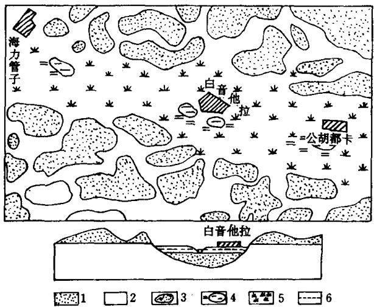  
图 7-1 内蒙古白音他拉古河道示意图  
1. 沙 2. 黏性土 3. 沙丘 4. 沼泽及湖泊 5. 水草地 6. 地下水位

在荒漠化地区，除上述各种松散层孔隙水以外，还可以找到不同类型的基岩裂隙潜水和深部基岩裂隙承压水。

## 三、大气降水及特征

降水稀少，是荒漠化地区重要的气候特征之一。一般说来，荒漠化地区年降水量的上限为250～600mm，下限可为10\~20mm或终年滴水不降。例如我国南疆塔克拉玛干沙漠东部的若羌，1954～1970年17年中，年平均降水量只有15.6mm，其中1957年才有3.9mm。我国荒漠化地区有很多地方，1年的降水量还没有沿海地区1h的降水量多（表7-5）。世界各荒漠化地区的降水情况亦是如此。

荒漠化地区的降水不仅少，而且很不稳定，也就是说年变率大。在适宜的气候条件下，年降雨量标准差大约为10%～20%，且在20年中有19年，其年总量为均值的75%～125%。在比较干旱的气候条件下，年降雨最大值与最小值之比要大得多，且年降雨量的分布随着于旱程度的增加，其偏态系数亦变大，若年平均雨量为200～300mm，则20年中有19年，其降雨量一般为平均值的40%～200%。但若年平均雨量为100mm，则降雨量为平均值30%～350%。在比较干旱地区，无降雨的年份也是常见的。我国各地间年降水变率的统计结果，也表明荒漠化地区变率大。在我国南方地区，降水年变率大部分在15%以下，而在荒漠化地区东部为25%～40%以上，甚至超过50%，极端年变率差别更大。例如，塔克拉玛干沙漠南部的民丰安迪尔1966年降雨量只有5.0mm，而1971年却达42.5mm，相差近10倍，非洲撒哈拉沙漠的古达米斯（Chadames，比利亚）的最大年降雨量79mm，最低年降雨量为6mm，相差13倍之多。

荒漠化地区降水在时间变化上，不仅表现出较大的年变率，而且降水的季节分配或小于月的时段上的降水分配也极不均匀，例如在我国沙区，降水主要集中在6～8月（表7-5），而夏季又往往集中在少数几天内，有时一两天的降水竟相当于半年雨量。降雨量高度集中，就使得连续无雨的干旱期很长。全年最长连续无雨日数，有时可达7～10个月之久，主要出现在秋末至第二年夏初这一段时间，尤其是春旱特别严重。在撒哈拉沙漠各地的降水季节也有所不同。撒哈拉沙漠北部冬季雨量较多；中部偏北地区以秋雨、春雨为主；西部撒哈拉的中部以夏雨、秋雨为主；撒哈拉沙漠东南部以夏雨、秋雨为主；沙漠西南部以夏雨、冬雨为主。

表 7-5 西北荒漠化地区年降水量统计
<table><tr><td colspan="2">地</td><td rowspan="2"></td><td rowspan="2">年降水量</td><td colspan="3">各季占年降水量百分数 （%）</td></tr><tr><td>名</td><td>(mm)</td><td>冬 春</td><td>夏</td></tr><tr><td rowspan="5">新 疆</td><td>伊</td><td>宁</td><td>285.3</td><td>20</td><td>32 27</td><td>21</td></tr><tr><td>塔</td><td>城</td><td>333.6</td><td>23</td><td>28 29</td><td>19</td></tr><tr><td>乌鲁木齐</td><td></td><td>290.8</td><td>12</td><td>31 33</td><td>23</td></tr><tr><td>吐鲁番</td><td></td><td>21.0</td><td>21</td><td>7 65</td><td>7</td></tr><tr><td>库 车</td><td></td><td>75.6</td><td>8</td><td>23 59</td><td>10</td></tr><tr><td rowspan="3">青 海</td><td>若</td><td>羌</td><td>10.9</td><td>28</td><td>26 41</td><td>2</td></tr><tr><td>茫</td><td>崖</td><td>15.0</td><td>10</td><td>7 71</td><td>10</td></tr><tr><td>西</td><td>宁</td><td>372.4</td><td>1</td><td>21 55</td><td>23</td></tr><tr><td rowspan="4">甘 肃</td><td>玉</td><td>树</td><td>462.4</td><td>3</td><td>14 61</td><td>22</td></tr><tr><td>敦</td><td>煌</td><td>29.5</td><td>17</td><td>13 55</td><td>15</td></tr><tr><td>酒</td><td>泉</td><td>81.4</td><td>8</td><td>18 62</td><td>12</td></tr><tr><td>兰</td><td>州</td><td>332.3</td><td>2 17</td><td>58</td><td>22</td></tr><tr><td>宁夏</td><td>天</td><td>水</td><td>525.7</td><td>3 21</td><td>50 57</td><td>26</td></tr><tr><td></td><td>银</td><td>川</td><td>205.7</td><td>2</td><td>18</td><td>22</td></tr><tr><td>陕西</td><td>延</td><td>安</td><td>572.3</td><td>2</td><td>18 54</td><td>26</td></tr></table>

## 第二节节水技术

农业灌溉用水是水资源的最主要消耗项，在我国占总用水量2/3以上。同时，农业灌溉用水的浪费也相当严重，据统计，灌溉面积667hm²以上，管理

较好的大中型灌区的水资源利用率也只有55%～75%，因此，灌溉节水大有可为，它是解决水资源不足矛盾的主要突破口。

## 一、水资源合理调配

我国幅员辽阔，水资源在不同地区以及不同年份和季节分配不均，供水与需水在时间和空间上亦常不一致，时旱、时涝或涝旱交替出现。因此，水资源要得到合理利用，首先要根据不同地区水资源条件，通过各种工程措施，改变和调节地区水情。地区水情主要是指地区水资源的数量、分布情况及其动态。

改变和调节地区水情的措施，一般可分为以下2种：

## （一）蓄水保水措施

通过修建水库、河网和控制利用湖泊、地下水库以及大面积的水土保持和田间蓄水措施，拦蓄当地径流和河流来水，改变水量在时间上（季节或多年范围内）和地区上（河流上下游之间、高低地之间）的分布状况，通过蓄水措施可以减少汛期洪水流量，避免暴雨径流向低地汇集，可以增加枯水时期河水流量以及干旱年份地区水量的贮备。

## （二）调水排水措施

调水排水措施主要是通过引水渠道，使地区之间或流域之间的水量互相调剂，从而改变水量在地区上的分布状况，用水时期借引水渠道及取水设备，自水源（河流、水库、河网、地下含水层等）引水，以供应需水地区用水。某一地区水源缺乏时，可借人工河道自水源充足地区调配水量；某一地区水量过多时，则可通过排水河道将多余水量调运至地区内部的蓄水设施存蓄，或调送至水量较少的其他地区。

目前已建工程可控制的地表水占地面水资源总量的比例很小，不少地区的地下水尚待开发，故水资源的潜力还很大。但是另一方面，灌溉、发电、养殖、工矿企业等各部门所需要的工农业用水以及生活用水量也很大，因此，应最有效地利用水资源的科学理论，合理调配水资源，最大限度地保证各部门用水要求，并做到：

(1）在深入调查水量供、需情况的基础上，制定地区长远的水资源规划及水土资源平衡措施；

（2）地面水、地下水和外来水的统一开发及联合运用，寻求水资源系统的最优规划、扩建和运行方案；

(3）采取有效措施，解除洪涝威胁，并同水资源开发利用结合起来统一规划，做到洪涝旱碱综合治理。

除此之外，田间灌水方法的改进应作为节水的关键，目前，采用的节水灌溉方法主要有喷灌、滴灌、渗灌等。

## 二、喷灌

喷灌是利用一定设备把水喷射到空中形成细小雨滴来湿润土壤的灌溉方法。喷灌除具有省水、省工的优点外，还适宜于进行地面灌溉有困难的山丘和坡地；同时还可以调节农田小气候，达到增产增收的目的。

## （一）喷灌系统组成

喷灌系统的种类很多，但根据其设备组成可以分成管道式喷灌系统和机组式喷灌系统两大类。

管道式喷灌系统是由水源工程、水泵，压力管道系统和喷头等部分组成。根据管道的可移动程度，这类系统又可分为：固定式管道喷灌系统、半固定式管道喷灌系统。

机组式喷灌系统是以喷灌机为主体的喷灌系统。根据喷灌机的工作特点，又可分为小机组定喷式喷灌系统、平移式喷灌系统和时针式喷灌系统。现将目前最常采用的管道式喷灌系统（图7-2）介绍如下。

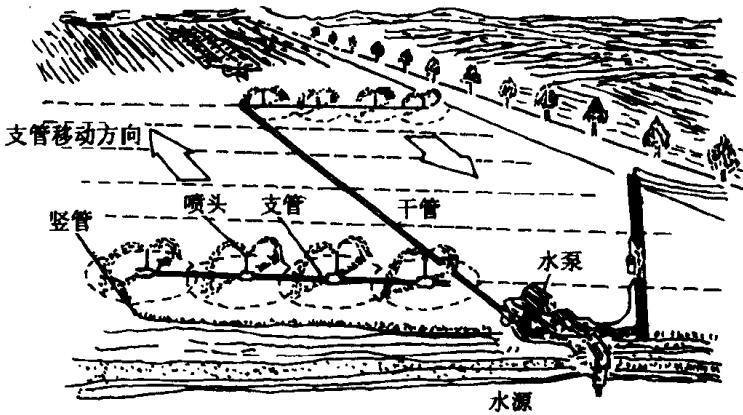  
图 7-2 管道式喷灌系统示意图

管道式喷灌系统主要包括以下各组成部分：

（1）水源在灌溉时保证所需的水量和水质。

(2)水泵喷灌在多数情况下都要用水泵来加压。最常用的是离心泵，也有的用潜水泵和射流泵等。也可以利用自然水头做自压喷灌。

（3）动力柴油机、拖拉机、电动机和汽油机等，功率的大小要根据水泵配套的要求而定。

(4）管道系统其作用是把经过水泵加压以后的灌溉水送到田间。因此

要求能承受一定的压力，通过一定的流量。管道常分成干管和支管2级，在支管上装有竖管，竖管上再装喷头，使喷头高出地面一定距离。还可利用喷灌系统进行施肥。

(5）喷头喷头形式很多，其作用是把水泵加压以后的集中水流分散成细小的水滴并均匀地散布在田间。

## 1. 固定式管道喷灌系统

除喷头外，所有管道在整个灌溉季节中甚至常年都是固定的，水泵和动力构成固定的泵站，干管和支管多是埋在地下，喷头装在固定的竖管上。在灌溉季节，除喷头可以装卸进行轮灌使用外，其他部分常年固定不动。这种系统的生产效率高，运行管理方便，运行成本低，工程占地少，有利于自动化控制及综合利用。但单位面积投资高，因此，固定式管道喷灌系统适用于灌水次数频繁的蔬菜区和经济作物区以及地面坡度陡、局部地形复杂的地区。

目前使用较多的管道有钢管、铸铁管、钢筋混凝土管、石棉水泥管。

## 2. 半固定式管道喷灌系统

这种系统的动力、水泵和干管是固定的，而支管和喷头是可以移动的。在干管上装有许多给水栓，一根支管一般带有2～10个喷头，接在给水栓上，由干管供水喷灌，喷好后可移到下一个位置，再接到另一个给水栓上继续喷灌。由于支管和喷头是可以移动的，因而减少了支管和喷头的数量，从而降低了喷灌系统的投资，提高了设备的利用率。一般单位投资只相当于固定式管道喷灌系统的一半或更少。根据移动支管的方式不同，半固定式管道喷灌系统又分为：

（1）人工移动支管 由于支管以上设备都是固定的，喷洒中人工只移动支管（薄壁铝管、薄壁钢管或轻质塑料管等）。

(2)机械移动支管借助机械移动管道，目前国外应用较多的有滚移式、端拖式及绞盘式喷灌系统。应用绞盘式喷灌机移管方便，省人力，机动灵活，但要求有较高的工作压力。绞盘式喷灌机，包括绞盘车和喷头车2部分。绞盘车停在于管旁边并通过高压半软管与干管相连。绞盘车与喷头车之间用高压半软管相连，软管直径多为50\~125mm，长约100\~300m。工作前先将喷头车拉到最远处然后通水，一边喷洒一边移动，转动绞盘逐渐把半软管紧密而均匀地分层缠绕在绞盘上来实现的。另外，还有钢索牵引绞盘式喷灌机，它是由绞盘缠绕钢索来移动喷头的。喷头车上一般只有1个大喷头，少数的也带几个喷头。每个机组控制14～7hm²。绞盘式喷灌机的主要优点是结构简单，单位面积投资低，操作容易，支管移动完全自动化，使用灵活，对地形和地块形状适应性强。但一般喷灌强度较大，要求工作压力较高，软管容易损坏。

目前国内外对地面移动管道采用的有：

（1）薄壁铝管 重量轻，工作压力较大，一般大于 $3 . 9 2 \times 1 0 ^ { 6 } \mathrm { P a }$ (相当于$4 0 \mathbf { k g } \mathbf { f } / \mathbf { c m } ^ { 2 } )$ ；韧性强，不易断裂，不锈蚀，内壁光滑，水力性能好，一般可使用15年左右。缺点是价格较高，抗冲击性较差。

（2）薄壁钢管强度高，可承受较大工作压力，韧性强，不易断裂，价格较铝管、塑料管低，抗冲击性强。主要缺点是不耐锈蚀，易腐蚀，较铝管寿命稍短。

(3）塑料软管有锦纶和维尼纶塑料管等。其特点是重量轻、移动方面，接头少，适应地形变化能力强，耐腐蚀，价格低廉。缺点是寿命较短，工作压强较低，不耐磨，怕压折，移动前排除管内积水较困难。

## （二）喷灌系统的规划和设计

规划设计喷灌系统要经过反复的技术经济比较并应考虑管理运用方面的要求，使规划、设计、管理三者紧密结合。规划设计的一般步骤为：

## 1. 选择喷灌系统形式

首先根据当地地形情况、作物种类、经济及设备条件，考虑各种形式喷灌系统的优缺点，选定喷灌系统形式。例如，在喷灌次数多、经济价值高的作物种植区（如蔬菜区），可采用固定管道式喷灌系统；大田作物喷灌次数少，宜采用半固定式或机组式喷灌系统，以提高设备利用率；在有自然水头的地方，尽量选用自压喷灌系统，以降低动力设备的投资和运行费用；在地形坡度太陡的丘陵山区，可优先考虑采用固定式管道系统。

## 2. 确定喷酒方式和喷头组合形成

喷头的喷洒方式，有全圆喷洒和扇形喷洒2种。一般在管道式喷灌系统中，除了少数位于地边地角的喷头作扇形喷洒外，其余多采用全圆喷洒。全圆喷洒允许喷头有较大的间距，而且喷灌强度低。对单喷头移动式机组，一般都作扇形喷洒，以便给机组或移动管道留出1条干燥的退路。

喷头的组合方式，也称布置形式，系指在喷灌系统中喷头间的相对位置而言。在全圆喷洒情况下，有正方形、矩形、正三角形和三角形等4种组合形式（图7-3）。

喷头组合的原则是保证喷洒不留空白，并有较高的均匀度。喷头布置的间距过大，造成喷洒不均匀，或留下漏喷的空白处；喷头布置过密，喷头和管道用量加大，增大了投资，且组合喷灌强度太大。因此，正确地选择喷头组合间距是喷灌系统规划设计中的一个重要问题。

## 3. 选择喷头（或喷灌机）与工作压力

工作压力是喷灌系统的重要参数。它直接决定喷头的射程，并关系到设

备投资、运行成本、喷灌质量和工程占地等。如采用高的工作压力，则喷头射程远，固定式系统管道用量少，移动式系统占地少，但是一般运行成本高，喷出的水滴粗，并由于喷得高而受风影响大，喷灌质量不容易得到保证。如采用中、低压，则一般水滴细，喷灌质量容易得到保证，而且运行成本低，但是固定式系统的管道用量大，投资高，移动式系统占地多；且移动次数频繁，劳动强度大。因此，选择工作压力时，要根据农业要求、现有设备条件以及喷头型号综合考虑确定。

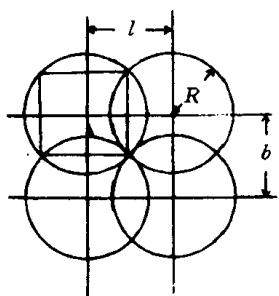  
(a)

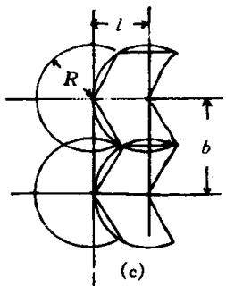

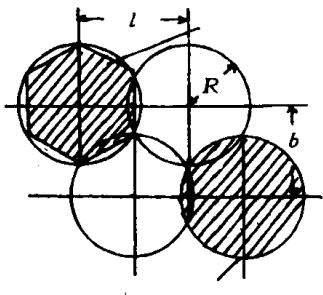  
(b)

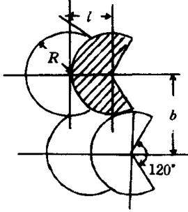  
(d)  
图 7-3 喷头组合形式  
(a) 正方形布置  
(b) 矩形布置  
(c)正三角形布置  
(d) 三角形布置

选择喷头首先要考虑喷头的水力性能应适合喷灌作物和土壤的特点。例如蔬菜和幼嫩作物要选用具有细小水滴的喷头，而小麦、棉花、玉米等则可采用水滴稍粗的喷头。对于粘性土要选用低喷灌强度的喷头，而沙性土则可选用喷灌强度稍高的喷头。一般固定式系统中，带有扇形机构的喷头应占有一定的比例。

对于自压喷灌系统其工作压力主要决定于自然水头，如灌溉地段的地形平坦，则可以根据到达田间时之压力选用一种喷头。在山丘斜坡上，则喷灌系统内的压力是随地形高低而变化的，一般要根据管内实际压力的大小分区选用几种（2～4种）规格的喷头。在最高处，压力最小，用低压喷头；在中间，用中压喷头；在最低处，压力最大，采用高压喷头。如压力过高，还要安装减压器，降低管内压力。

## 4. 布置管道系统

应根据实际地形、水源等条件提出几种可能的布置方案，然后进行技术经济比较，择优选定。布置管道系统一般应考虑以下几点原则：

（1）管道布置应使管道总长度短、造价低，有利于水锤的防护。

（2）管道布置应考虑各用水单位的需要，管理方便，有利于组织轮灌和迅速分散流量。

(3）在垄作田内，支管一般应与作物种植方向一致。山区、丘陵区，支管一般应沿等高线布置。在可能的条件下，宜使支管垂直主风向。

(4）管线的纵剖面应力求平顺，减少折点。管线有“驼峰”时，应避免产生负压。

（5）支管上各喷头的工作压力要求接近一致，或在允许的差值范围内。当在陡坡上向下铺设支管时，则应缩小管径，增加其摩擦损失，以抵消由高差引起的过高压力。如向上坡方向铺设支管，坡度大于1%～2%，则支管不宜太长，要求支管首尾压力差小于工作压力的20%，这时喷头工作流量约差10%。当支管需要改变直径时，其规格不宜多于2种，以便于管理运用。另外在不规则地块布置管道时上一级管道布置要考虑使下一级管道长度大致相等，这样有利于保证喷灌质量。

(6）抽水站应尽量布置在整个喷灌系统的中心地点，以减少输水的水头损失。

## （三）喷灌制度的制定

喷灌制度包括设计灌水定额、设计灌水周期和1次灌水所需要的喷洒时间。

## 1. 设计灌水定额

系指作物生长期内最大的灌水定额，可根据群众经验确定或按下式计算：

$$
m _ { \vartheta } = 0 , 1 H ( \beta _ { \mathrm { m a x } } - \beta _ { \mathrm { m i n } } ) \frac { 1 } { \eta }\tag{7-1}
$$

式中 $\_ m _ { \mathrm { i k } }$ 设计灌水定额（mm）；

H作物主要根系分面层的厚度，对于大田作物，一般采用 ${ \mathfrak { 4 0 } } \sim$ 60cm;

$\beta _ { \mathrm { m a x } }$ 土壤的田间持水量（以水占土壤体积的百分数表示）；

$\beta _ { \mathrm { m i n } }$ 灌水前土壤含水量下限(以水占土壤体积的百分数表示)，一般相当于田间持水量的60%～70%；

η喷灌水的利用系数，一般选用0.7～0.9。

## 2. 设计灌水周期

在作物需水强度最大的时期，全灌区1次灌水允许延续的时间，即相邻2次灌水允许的间隔天数，称为设计灌水周期，可用下式计算：

$$
T _ { \mathrm { i } \backslash \{ }  = \frac { m _ { \mathrm { i } \backslash \{ } }  { e } \eta\tag{7-2}
$$

式中 $T _ { \mathit { i } \mathfrak { X } }$ ——设计灌水周期（d）；

—作物生长旺盛时期的日需水量（mm/d），根据试验测定；

其余符号同前。

## 3. 一次灌水所需的喷洒时间

(1）喷灌系统的平均喷灌强度根据喷头性能和田间布置情况，可按下式计算喷灌系统的平均喷灌强度：

$$
\bar { \rho } _ { \lessgtr \nequiv } = \frac { 1 \ 0 0 0 q } { b L } .\tag{7-3}
$$

式中 $\overline { { \rho } } _ { \ast \ast }$ —喷灌系统的平均喷灌强度（mm/h）；

q —喷头的设计流量 $\left( \mathbf { m } ^ { 3 } / \mathbf { h } \right)$

b——支管间距（m）；

L——沿支管的喷头间距（m）。

(2)喷洒时间一次灌水所需要的喷洒时间按下式计算：

$$
t = \frac { m _ { \mathrm { i } \mathrm { \ell } } } { \bar { \rho } _ { \mathrm { s } \xi \mathrm { f } } } ( h )\tag{7-4}
$$

## (四）喷灌系统工作制度的制定

喷灌系统工作制度包括喷灌系统内同时工作的喷头数和支管数以及支管的轮灌方式。

## 1. 同时工作的喷头数和支管数

同时工作的喷头数可按下式计算：

$$
N _ { \mathfrak { s g x } } = \frac { F } { b L } \times \frac { t } { T _ { \mathfrak { s g } } C }\tag{7-5}
$$

式中 $N _ { \mathfrak { A } \sharp }$ ——同时工作的喷头数（个）；

F——整个喷灌系统的面积 $( \mathbf { m } ^ { 2 } )$

C—1天内灌溉系统有效工作的小时数，与喷灌系统的形式和风的影响程度有关，固定式喷灌系统的C值较大，移动式喷灌系统和多风地区的C值较小；

其余符号同前。

同时工作的支管数 $N _ { \xi }$ 为：

$$
N _ { \star } = \frac { N _ { \sf s f f } } { n _ { \sf s f f } }\tag{7-6}
$$

式中 $\pmb { n } _ { \pmb { \mathbb { X } } } \breve { \pmb { \mathbb { X } } }$ 1根支管上的喷头数，可以1根支管的长度除以喷头间距L求得。

喷头数和支管数的计算结果应取整数。

## 2. 确定支管的轮灌方式

支管轮灌方式不同，干管中的流量变化也不同，合理的轮灌方式可以减小部分干管的管径，降低投资。

以2根支管同时工作为例，说明不同轮灌方式对干管流量的影响。可能的轮灌方式有3种：

（1)2根支管集中在干管的一头，依次向另一头轮换，如图7-4（a)所示。采用这种工作方式，干管全部长度上都要通过2个支管的工作流量。

(2)2根工作的支管分别由干管首、尾两端反向更换，如图7-4（b）所示。以这种方式工作时，干管上半段通过2根支管的流量，下半段只需要通过1根支管的流量。这样，就可以选用2种不同的管径。

（3）2根工作的支管都从干管中间开始，向相反方向轮换，如图7-4（c）所示。这种轮灌方式对干管流量的影响与第二种方式相同。

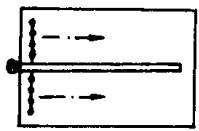  
(a)

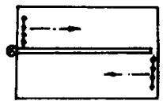  
(b)

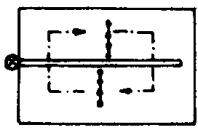  
(c)  
图 7-4 支管轮灌方式

显然，采用后2种轮灌方式较好。作为支管的移动方式，它们也适用于半固定式喷灌系统。

喷灌系统的工作方式确定以后，干、支管的设计流量也随之而定；支管的设计流量等于装在它上面的各个喷头的设计流量之和；干管流量依支管的轮灌方式而定。有了干、支管的设计流量，就可按水力学的理论进行管道的水力计算，选择适宜的管径，确定泵站的装机容量。

## 三、滴灌

滴灌是一定压力的水经过滤后通过管道滴头均匀地滴入植物根部附近的土壤的灌水方式。

滴灌主要是借毛管力作用湿润土壤，所以不致破坏土壤结构，使土壤内部的水、气、肥、热经常保持适宜于作物生长的良好状况。滴灌仅湿润作物根部附近的一部分土壤，不产生地面径流，几乎没有深层渗漏，蒸发损失也很小。因此，它是现代各种灌溉方法中最省水的一种灌水技术。滴灌适应性强，无论何种地形和土壤都可使用，对于缺水的丘陵山区或荒漠绿洲尤为适用。特别是利用滴灌可以结合施肥，将肥液注入管道，随灌溉水施入土壤。滴灌的主要问题是滴头易堵塞，对水质要求较高。

## （一）滴灌系统的组成

滴灌系统由水源、首部枢纽（包括水泵、动力机、过滤器、肥液注入装置、测量控制仪表等）、各级输水管道和滴头等4部分组成(图7-5、图7-6)。其主要组成部分有：

## 1. 过滤器

主要用以滤除灌溉水中的悬浮物，以保证整个系统特别是滴头不被堵塞。过滤器有网筛过滤器，沙砾过滤器及涡流沙粒分离器等。网筛过滤器是一种简单的过滤装置，使用

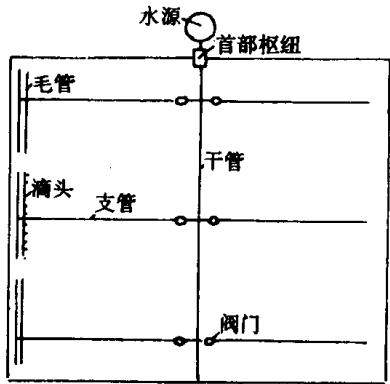  
图 7-5 滴灌系统示意图

比较普遍。有立式和卧式2种。筛网多用尼龙丝或耐腐蚀的金属丝制成。网孔的规格取决于需滤出污物颗粒的大小，沙砾过滤器是用洗净分选的砾石和

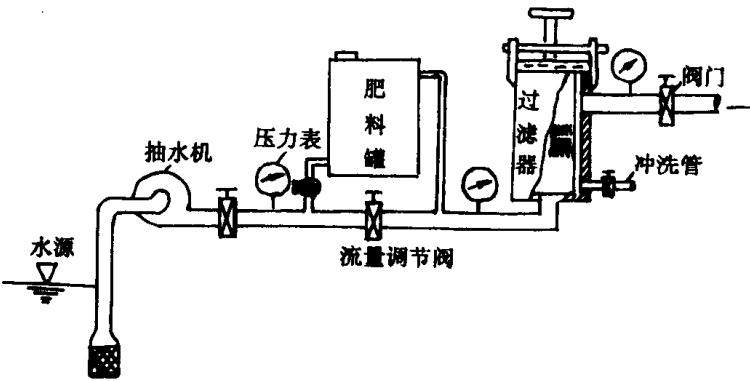  
图 7-6 滴灌系统首部枢纽

沙料，按一定顺序填进金属圆简内构成的，对于各种有机或无机污物、悬浮的藻类都有较好的过滤效果。涡流沙粒分离器是靠离心力把比重大于水的沙粒从水中分离出来，但不能清除有机物质。

## 2. 肥液注入装置

须安装在过滤器前面，以防未溶解的化肥颗粒堵塞滴头。化肥液的注入方式有3种：小水泵压入法、流量调节阀压差注入、射流注入。

## 3. 滴头

灌溉水通过滴头的细小流道或孔口，损失水头，形成水滴或小流量出流。因此，滴头的好坏直接影响滴灌的质量。一般要求滴头具有适度、均匀而又稳定的位置，有较好的防止堵塞性能，耐用、价廉和装拆简便。大多采用聚氯乙烯等材料制成。按其耗能方式可分为长流道滴头、孔口（或管嘴）滴头

和微孔毛管3种基本类型。

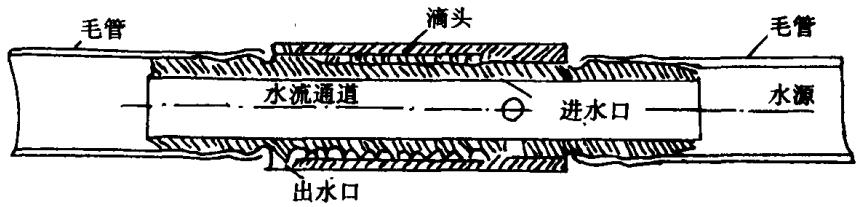  
图 7-7 长流道滴头

（1）长流道滴头 图7-7为注塑成型的长流道滴头，也称管间滴头或管式滴头。滴头两端与毛管相连。滴头由内外二层圆管组成，层间有螺纹，水量大部分从里层圆管中通过，少量水经层间螺纹消能后，由出口小孔滴出。这种滴头的流道较宽，防止堵塞的性能良好，在我国得到普遍应用。

(2)孔口滴头一般插装在毛管上，也称旁插式滴头；有的装在毛管的一端，称端插式滴头（图7-8、图7-9)。这类滴头是使水流从一小孔口流出，从而消散压力。有时

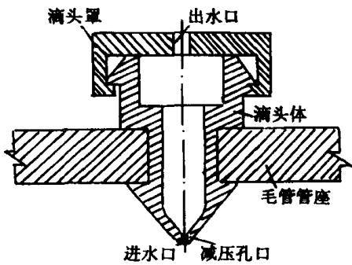  
图 7-8 孔眼式滴头

还在出水口上附装一条细长管，作为附加消压设施。另一种消压方式是使水流形成涡流（图7-10）。孔口直径0.5\~1mm，流量为6\~12L/h。

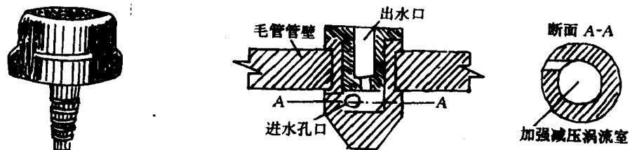  
图 7-9 孔口式滴头(端插式)  
图 7-10 涡流式滴头

(3)微孔毛管 有单壁管和双壁管2种。单壁管利用管壁上的微孔渗水灌溉。双壁管（图7-11）有2个管腔，水由主管壁上的孔眼进入辅管腔，再由辅管壁的孔眼流出。辅管上单位长度的孔眼为主管上的5\~10倍。

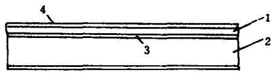  
图 7-11 双壁毛管

1. 辅管腔 2. 主管腔 3. 内孔 4. 外孔

## 4. 管道

多采用高压聚氯乙烯或高压聚乙烯管，常用的规格一般内径为10、12、15、20、25、32、40、50、65、80mm。其中内径为10\~15mm的管子多用做毛管。

## 5. 压力调节器

为了使整个滴灌系统达到规定的均匀度，通常需要在适当部位安装压力调整器，使毛管水压不因上游压力的变化而超出允许范围。一般是将压力调节器安装在支管进口处。另外，也可以利用小孔直管道消能原理，将长度不等的4mm直径的管子装在毛管进口进行调压。

## （二）滴灌系统的布置和设计

设计滴灌系统前，亦应收集必需的资料，如1/500\~1/2000地形图和农业、气象、土壤等资料。在地形图上应标明滴灌面积所在位置，水源位置，现有田块布置，村庄和道路等。水源水质要进行分析，测定其pH值，泥沙及污物含量，硼、锂含量，以硝酸盐和硝酸铵形式存在的含氮量等。

滴灌系统规划设计的内容和喷灌系统类似，这里只作一些简要介绍。

## 1. 滴灌系统的规划布置

滴灌系统的管道一般分为干、支、毛管3级，小灌区往往只有干管和毛管2级。管道布置应遵循以下原则：

（1）各级管道互相垂直，以使管道长度最短，水头损失最小。

(2）毛管沿等高线布置，以保证各滴头工作压力一致，灌水均匀。

(3）毛管应和耕作方向一致，以利耕作。对移动式滴灌系统而言，应有利于移动毛管。

(4)毛管应尽可能在支管两侧对称布置，以减少支管的数量或毛管的长度，使水头损失减小。

(5）为缩短干管长度，减少水头损失，水源位置尽可能布置在灌区中间。但在山区以天然蓄水池为水源时，最好将蓄水池选在较高的地方，利用地形提供的水头实行自压滴灌。

## 2. 滴灌制度的制定

（1）设计灌水定额是指作物生长旺盛、计划湿润层深度较大时期的灌水定额，可用下式计算：

$$
h _ { \mathrm { i \uparrow } } = \frac { \alpha \beta \gamma H _ { \mathrm { \uparrow } } } { \mathrm { \downarrow } \ 0 0 0 }\tag{7-7}
$$

式中 $h _ { \ m _ { \ m } }$ —设计灌水定额，以灌水深度（mm）表示；

α—允许消耗的水量占土壤田间持水量的百分数，由于滴灌能及时而准确地调节土壤水分，因此采用小定额勤灌的方式，对需水较敏感的蔬菜等作物，α=20%～30%；对一般耐旱作物， $\alpha = 3 0 \% \sim$ 40%；对果树，a=30%\~50%；

$\beta \cdot$ 土壤的田间持水量（占干土重的百分数）；

γ—土壤干容重 $\mathrm { ( } \mathbf { g } / \mathrm { c m } ^ { 3 }$ 或 $\mathbf { t } / \mathbf { m } ^ { 3 } )$

H计划湿润层深度（m）。蔬菜为0.2～0.3m；大田作物为0.3～0.6m；果树—般为1\~1.2m；

$\mathbf { \nabla } \mathbf { \mathbf { \mathit { p } } } \cdot \mathbf { \nabla }$ —土壤湿润比，即在滴灌后地面以下30cm深处土壤湿润面积与耕地面积的比值。对于果树，湿润比较小，在干旱地区p值应小于33%，在降雨较多的地区， $\pmb { \mathscr { P } }$ 值应小于20%；对于蔬菜和大田作物，湿润比要高些，一般为70%～90%。

（2）设计灌水周期 滴灌的设计灌水周期用下式计算：

$$
T = \frac { h _ { \ddot { r } \ddot { s } \ddot { s } } } { e }\tag{7-8}
$$

式中 T——灌水周期（d)；

e—作物需水旺盛时期的日平均需水量(mm/d)，可根据当地试验资料确定。

目前，国内各地在滴灌系统设计中，大致采用如下的灌水周期：果树为3\~5d，蔬菜为1～2d，大田作物为5～8d。

(3)1次灌水延续时间 对蔬菜和大田作物，可按下式计算：

$$
\begin{array} { r } { t = \frac { h _ { \# \# } S _ { e } S _ { \iota } } { q _ { \# \# } } } \end{array}\tag{7-9}
$$

式中 t——1次灌水延续时间（h)；

$S _ { e }$ —毛管上滴头的间距（m）；

$S _ { \iota }$ ——毛管间距（m）；

$q _ { \mathbb { M } }$ ——滴头设计出水流量 $\left( \mathrm { { I . / h } } \right)$

滴头间距和毛管间距与作物种类、土壤性质、滴头质量、土壤湿润比等因素有关，要通过试验确定。

对果树滴灌，以单株树为计算单元，按下式计算：

$$
t = \frac { h _ { \dot { \ast } \dot { \kappa } } \ : S _ { r } S _ { \iota } } { n q _ { \dot { \ast } \dot { \kappa } } }\tag{7-10}
$$

式中 $S _ { r }$ ——果树行距（m）；

$S _ { t }$ ——果树株距（m）；

n——1棵果树周围滴头的个数；

其余符号同前。

## 3. 轮灌区的划分

在滴灌系统里，因为每根毛管的流量很小，滴水时间很长，不能按毛管进行轮灌。滴灌系统的轮灌是按灌水周期和1次灌水延续时间分区进行，每个轮灌区里有许多条毛管同时工作。一般在三级管道的滴灌系统里，可按轮灌区的数目布置支管，按支管组织轮灌，在1条支管范围内的各条毛管同时工作。

对固定式滴灌系统，轮灌区的数目按下式计算：

$$
N \leqslant { \frac { 2 4 { T } } { t } }\tag{7-11}
$$

对移动式滴灌系统，则按下式计算：

$$
N \leqslant \frac { 2 4 T } { n _ { \uparrow \Downarrow } t }\tag{7-12}
$$

式中 N——轮灌区数目；

n移—1条毛管在1次灌水中移动的次数，大田滴灌为10～20次，果园滴灌为2\~4次。

根据滴灌系统的布置和轮灌区划分情况就可以进行水力计算。值得注意的是：因为滴头的出水流量很小，各滴头的湿润范围又相互独立，所以要求各滴头的出水流量非常接近。为此，一般要求同一根支管上第一条毛管的第一个滴头与最末一条毛管最后一个滴头的水头差不超过滴头设计工作压力的20%。据此，根据选用的毛管管径计算水头损失，确定毛管长度。这个关系可近似地用下式表示：

$$
h _ { f 1 } + h _ { f 2 } \leqslant 0 . \ 2 H _ { d }\tag{7-13}
$$

式中 $h _ { f 1 }$ ——毛管的水头损失（m）；

$h _ { f 2 }$ ——支管的水头损失（m）；

$H _ { d }$ ——滴头设计工作压力的水柱高度（m）。

管道的设计流量：毛管的设计流量等于装在它上面的所有滴头设计流量之和；支管流量等于同时工作的各条毛管流量之和。

## 四、渗 灌

渗灌技术要素主要包括管道埋设深度，灌水定额、管道间距、管道长度和坡度等。在缺乏资料的情况下设计渗灌灌溉系统时，对上述各要素应进行必要的试验，或借用类似地区的资料。

## （一）管道埋设深度

地下管道的埋设深度，决定于土壤性质、耕作情况及作物种类等条件。埋设深度首先应使灌溉水借毛细管作用能充分湿润土壤计划湿润层，特别是表层土壤能达到足够湿润，而深层渗漏最小。一般在粘质土壤中埋设深度大，沙质土壤中则较小。其次管道埋设深度应该深于一般深耕所要求的深度。同时还应考虑各种作物的根系深度而决定管道埋深。目前我国各地采用的管道埋深一般为40～60cm。

## （二）灌水定额

渗灌的每次灌水定额，应能使相邻两管间的土层得到足够的湿润，以不发生深层渗漏为准，一般要通过田间试验测定。

## （三）管道间距

渗灌管道的间距主要决定于土壤性质和供水水头的大小。土壤颗粒愈细，则土壤的吸水能力愈强，在进行渗灌时灌溉水的湿润范围也愈大。管道的间距就可增大。在决定管道间距时，应该使相邻两条管道的浸润曲线重合一部分。以保证土壤湿润均匀。一般沙质土壤中的管距较小，而粘重土壤中的管距较大，管道中的压力愈大，管距可以较大，可达5～8m，而无压渗灌的管距。一般为2～3m。

## （四）管道长度与坡度

管道的长度与管道坡度、供水情况（有压或无压）、流量大小及管道渗水情况等有关。适宜的管道长度应使管道首尾两端土壤能湿润均匀，而渗漏损失较小。我国所采用的管道长度不大，一般为20～50m。国外的经验是无压的管道长度，不大于100m，而有压的管道长则可达200～400m。至于管道坡度，则应根据管道长度和地面坡度而定，一般取0.001～0.005。

## 五、雨水收集利用

雨水收集利用是一项综合性学科，在加勒比海、中东和澳大利亚等地应用历史悠久，近年发展较快。从1985年开始，泰国已建成1000多万m³钢筋混凝土屋面集雨存水罐，肯尼亚数量更大，一般每罐贮水 $1 0 \sim 1 0 0 \mathrm { m } ^ { 3 }$ 。一些工业化发达国家对雨水应用也很重视，日本已用雨水收集来补调和满足一些城市供水。

伊朗是中东地区缺水较明显国家，国土总面积164.8km²，人口5200万，境内中部为荒漠化，周边多山。全国自南向北年降雨量100～1800mm不等，平均275mm。降雨集中在冬季和春季，4\~10月无雨。伊朗土地中，20.7%为沙漠，54.9%为牧场草地，14.4%为可耕地，面积1483万hm²，其中2/3为雨养旱地。伊朗经济主要靠天然气和石油出口，农业只占GNP的20%。伊朗水资源紧缺已成为全民共识，对雨水利用研究很重视。近10年每年修大坝

300个，每坝集500km²小流域雨水，并建立微集水、广泛集水、洪水收集3种集水类型以及永久灌、补灌和污水灌溉等类型灌水方法。在组织机构上，建设部直接成立土壤保持与小流域管理研究中心(SWMRC)，并在25个省、自治区设下属机构和众多研究站，各有关研究院所、大学也有水土资源与水土保持相关机构。

我国是一个人口、土地面积较大国家，干旱半干旱区占国土960万km²的1/2，雨水是这些地区生活用水和农业用水的主要水资源。早在2700年前春秋时期，黄土高原地区已有引洪漫地技术，600多年前已有水窖。现行的技术如池塘、隔坡梯田、窑窖、保水耕作、覆盖及农作技术等都属雨水收集利用之例。近年来，随着干旱加剧与水问题突出，我国雨水资源化与收集利用得到重视。1995年9月在北京召开第7届国际雨水利用会议，1996年9月在兰州召开了全国首届雨水利用暨东亚地区研讨会，并筹集成立全国雨水利用协会。1998年10月在江苏徐州召开第二届全国雨水利用暨国际会议。在实践上，甘肃省“121”工程，宁夏“水窖工程”和陕西“甘露工程”等已使雨水利用在人畜供水和农业补灌方面形成一定规模。

## （一）雨水收集系统的组成

雨水集流系统是雨水集蓄系统的重要组成部分，也是雨水资源开发利用的基础。其目的是尽量将产生于集流面的径流进行拦截、蓄集、净化、利用，提高雨养农业区农业生产效率和天然降水的利用效率，充分发挥该区优越的光热条件。

雨水集流系统包括田间工程措施和田外工程2大类。前者包括各种田间水土保持措施，如平整土地、水平梯田、鱼鳞坑、带子田、隔坡梯田、草粮带状间轮作等，这些措施的功能都是保持降水资源使之就地入渗、增加“土壤水库”含水容量、提高作物抗旱能力；后者包括水窖、旱井、水池和涝池4大类型。而一般意义上的雨水集流系统仅指后者，它通常由集流面、输水渠、沉沙池、拦污栅、进水管、蓄水设施、放水口等部分组成（图7-12），各部分相互组合形成完整的雨水集流系统。

## 1. 集流面

集流面是经人工整修用以产生径流的场地。其面积大小取决于降水量的大小、集流面的类型、蓄水量的大小、以及集流面的集流效率等因素。雨养农业区地广人稀，农户居住一般较为分散，用于解决人畜饮水的集流面，可以庭院、屋面、场等为主，可选用混凝土、水泥瓦、青瓦、机瓦、黄土夯实、塑料膜覆盖等多种材料。而用于发展高效节水灌溉或对作物进行补灌时，集流面应优先考虑现有公路、乡村道路、闲散地及荒山荒面，不同材料的集流面其集流效率差别显著（表7-6），经济费用各异（表7-7）。因此集流面的选择应综合考虑各地的条件、经济能力、集流的目的等多种因素，灵活地确定适宜于当地自然条件的集流面。

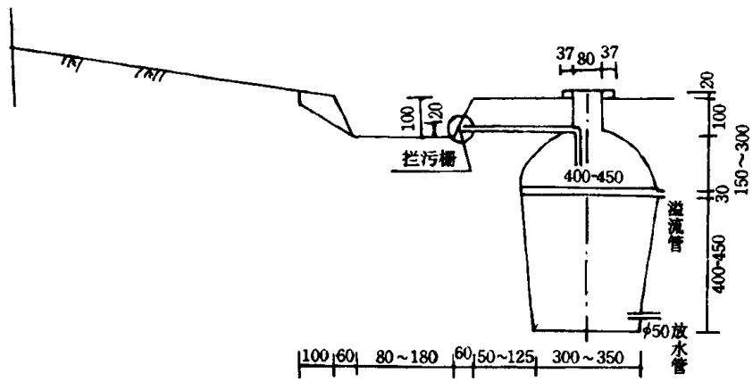  
图7-12集流场、引水渠、沉沙地、蓄水窖断面示意图（单位：cm）  
（据吴普特，杨新民)

表7-6 各种材料集流面在不同降水量等级与保证率的集流效率
<table><tr><td rowspan="2">降水等级 (mm)</td><td rowspan="2">保证率 (%)</td><td colspan="8">集流效率（%）</td></tr><tr><td>混凝土</td><td>水泥瓦</td><td>水泥土</td><td>塑膜覆沙</td><td>机瓦</td><td>青瓦</td><td></td><td>黄土夯实三七灰土</td></tr><tr><td rowspan="3">200~300</td><td>50</td><td>77.9</td><td>71.0</td><td>47.0</td><td>41.3</td><td>41.2</td><td>34.0</td><td>19.8</td><td>10.3</td></tr><tr><td>75</td><td>75.4</td><td>66.0</td><td>39.5</td><td>34.0</td><td>34.2</td><td>28.3</td><td>16.5</td><td>8.0</td></tr><tr><td>95</td><td>72.8</td><td>61.6</td><td>33.0</td><td>28.0</td><td>30.0</td><td>23.6</td><td>13.5</td><td>5.0</td></tr><tr><td rowspan="3">300~400</td><td>50</td><td>80.0</td><td>74.5</td><td>52.2</td><td>46.0</td><td>49.0</td><td>40.0</td><td>25.7</td><td>17.5</td></tr><tr><td>75</td><td>78.2</td><td>71.6</td><td>40.3</td><td>40.6</td><td>42.0</td><td>34.0</td><td>20.8</td><td>12.4</td></tr><tr><td>95</td><td>75.6</td><td>67.0</td><td>40.0</td><td>34.2</td><td>37.2</td><td>29.2</td><td>17.0</td><td>8.2</td></tr><tr><td rowspan="3">400~500</td><td>50</td><td>80.0</td><td>75.3</td><td>53.0</td><td>46.5</td><td>50.2</td><td>40.5</td><td>25.3</td><td>16.6</td></tr><tr><td>75</td><td>79.4</td><td>74.0</td><td>51.0</td><td>44.6</td><td>48.0</td><td>38.5</td><td>23.0</td><td>13.7</td></tr><tr><td>95</td><td>76.5</td><td>69.0</td><td>41.5</td><td>35.5</td><td>39.0</td><td>30.7</td><td>18.8</td><td>10.5</td></tr></table>

根据宁夏、甘肃等地雨水集流利用工程的经验，集流面的面积可按下式计算：

$$
R _ { \mathrm { } } \cdot \sum _ { t = 1 } ^ { n } A _ { i } \cdot \eta _ { t } = W _ { d }\tag{7-14}
$$

式中 $R _ { \ P }$ —对应于某一频率的全年降雨量；

$A _ { i }$ ——某种集流面的面积；

$\pmb { \eta _ { t } }$ ——某种集流面的集流效率；

n—集流面的种类数；

$\textrm { \textrm { W } } _ { d }$ 全年蓄水量。

表 7-7 不同材料集流面单位集流量费用分析
<table><tr><td>项目</td><td>保证率 (%)</td><td>混凝土</td><td>水泥瓦</td><td>水泥土塑膜覆沙</td><td></td><td>机瓦</td><td>青瓦</td><td>黃土 夯实</td><td>三七 灰土</td></tr><tr><td rowspan="3">全年集流效率 (%)</td><td>50</td><td>80</td><td>75</td><td>52</td><td>46</td><td>49</td><td>40</td><td>26</td><td>18</td></tr><tr><td>75</td><td>78</td><td>72</td><td>46</td><td>41</td><td>42</td><td>34</td><td>21</td><td>12</td></tr><tr><td>90</td><td>75</td><td>67</td><td>40</td><td>34</td><td>37</td><td>29</td><td>17</td><td>8</td></tr><tr><td rowspan="3">全年可集水量 (m³)</td><td>50</td><td>0.211</td><td>0.198</td><td>0.138</td><td>0.122</td><td>0.130</td><td>0.106</td><td>0.068</td><td>0.048</td></tr><tr><td>75</td><td>0.173</td><td>0.160</td><td>0.103</td><td>0.091</td><td>0.094</td><td>0.076</td><td>0.047</td><td>0.027</td></tr><tr><td>90</td><td>0.128</td><td>0.115</td><td>0.068</td><td>0.058</td><td>0.063</td><td>0.050</td><td>0.029</td><td>0.014</td></tr><tr><td>造价(元/m²)</td><td></td><td>4.28</td><td>4.96</td><td>3.64</td><td>1.94</td><td>3.98</td><td>3.0</td><td>0.25</td><td>3.08</td></tr><tr><td>使用年限(a)</td><td></td><td>20</td><td>25</td><td>15</td><td>10</td><td>25</td><td>20</td><td>4</td><td>8</td></tr><tr><td>运行费占造价百分数(%)</td><td></td><td>3</td><td>2</td><td>4</td><td>8</td><td>2</td><td>3</td><td>20</td><td>15</td></tr><tr><td>使用期造价+运行费(元)</td><td></td><td>7.71</td><td>7.44</td><td>5.82</td><td>3.94</td><td>5.97</td><td>4.80</td><td>0.45</td><td>6.78</td></tr><tr><td rowspan="3">单位水量费用 (元/m³)</td><td>50</td><td>1.82</td><td>1.50</td><td>2.81</td><td>2.85</td><td>1.84</td><td>2.27</td><td>1.66</td><td>17.70</td></tr><tr><td>75</td><td>2.23</td><td>1.86</td><td>3.78</td><td>3.82</td><td>2.56</td><td>3.18</td><td>2.40</td><td>31.40</td></tr><tr><td>90</td><td>3.02</td><td>2.60</td><td>5.70</td><td>6.02</td><td>3.97</td><td>4.83</td><td>3.90</td><td>60.60</td></tr></table>

近年来，随着集流面工程技术的不断发展，出现了一种移动式塑膜集流面，在雨季将塑膜覆于集流区地表，用绳网将地膜压住，雨季过后将塑膜取掉，恢复种植，起到集流、生产两不误，一地两用的功效。

## 2. 输水系统

输水系统包括输水渠、沉沙池、拦污栅、进水管等几部分。输水渠一般位于集流面的下坡坡底，断面多呈梯形，大多采用混凝土衬砌，底宽和深度多采用20cm。庭院、屋面、场等集流面一般不设专用的输水渠，而是将集流面修成一定坡向，使收集的雨水直接流向沉沙池；对于沥青公路、村庄道路集流面，可利用公路两边原有的排水沟作为输水渠；对于利用天然荒坡、林草地作为集流面的，应适当修筑截水沟，集中水流并能消减水流流速，最后经输水渠流入沉沙池。沉沙池是雨水集流系统中不可缺少的部分，它具有消减水流动能和沉沙净化水流的双重作用，其大小由来水量和集流面的类型决定，一般采用长2～3m，宽1.5\~2m，深1m的混凝土池子，其位置高于进水口，距蓄水设施2\~3m的地方。拦污栅设在高于沉沙池底0.4m的地方，位于进水管的前面，形状多为圆形，其上有由钢筋作成的正方形网格，其主要作用是防止水流中飘浮物进入蓄水设施和分散水流削弱动能。

## 3. 蓄水设施

常用的蓄水设施有水窖、水窑、水池和涝池4大类。其中以水窖最为普及。也有将水窖和水池配合使用的情况，即所谓的高位水池。水窑、水池都应建筑在比较紧实、完整、没有裂缝的黄土层内。水窖和水窑适用于黄土层，具有稳定的垂直壁面，水池则多用于水窖和水窑结构不稳定的沙土地区，涝池多位于地势较低易于集水的地区，可用塑膜沙覆土或沥青抹面的形式进行防渗处理，其优点是投资少、施工简单、蓄水量大，但其缺点是蒸发损失量大，很难将蓄集的水进行跨年度使用。蓄水设施的大小可根据用途及地形进行确定，一般用于人畜饮水的蓄水设施容积在 $1 5 { \sim } 3 0 \mathbf { m } ^ { 3 }$ ，用于发展和集雨节灌或集雨补灌工程的蓄水设施，其容积为 $5 0 \sim 1 0 0 ~ \mathrm { m } ^ { 3 }$ o

## （二）水窖的类型及结构

水窖是雨水集流蓄水设施中最为常见的设施，也是雨水集流系统的核心。常见水窖的形式有球形水窖、瓶形水窖、圆柱形水窖和窑式水窖4大类型。球形水窖蓄水量大多在 $2 0 \sim 3 0 \mathrm { ~ m } ^ { 3 }$ ，多采用混凝土修筑而成，其特点是经久耐用，但施工要求技术较高；瓶形水窖容积多为 $2 0 \sim 5 0 ~ \mathrm { m } ^ { 3 }$ ，可用混凝土、砖砌、胶泥、塑膜等材料修成，其特点是施工简单，深度可以较大，圆柱形水窖容积多在 $5 0 \mathrm { m } ^ { 3 }$ 左右，蓄水量较大，多用混凝土现浇和砖砌修建而成，由于体积较大所以对防渗处理要求较严；窑式水窖是一种容积较大，断面呈长方形的蓄水设施，蓄水量为 $5 0 \sim 1 0 0 ~ \mathrm { m } ^ { 3 }$ ，由于跨度较大，施工要求较高。尤其对窖拱的修建要求更是如此，因其体积大、投资高，该类水窖多用经济高的果园或经济作物（表7-8）。

表 7-8 不同形式水窖技术参数
<table><tr><td>窖形</td><td>体积  $( \mathbf { m } ^ { 3 } )$ </td><td>直径 (m)</td><td>深度 (m)</td><td>防渗处理</td></tr><tr><td>球形</td><td>20~30</td><td>3~4</td><td>5</td><td>1：3 水泥沙浆抹面或塑膜</td></tr><tr><td>瓶形</td><td>20~50</td><td>2~4</td><td>5</td><td>1：3 水泥沙浆抹面或胶泥抹面</td></tr><tr><td>圆柱形</td><td>50</td><td>4</td><td>4</td><td>1：3水泥沙浆抹面或胶泥抹面</td></tr><tr><td>窑形</td><td>50~100</td><td>3</td><td>4</td><td>1:3水泥沙浆抹面</td></tr></table>

3种常见，施工也方便，结构较合理可靠的水窖为：

（1）混凝土球形水窖因圆球体结构稳定，受力均匀，所受外部压力及内部水压力相差不大（图7-13)，故选用一级配M15砼，抗渗标号选用 $S _ { 1 }$ ，抗冻性选取 $D _ { 5 0 }$ 。其容积大小可自行确定，参见表7-9。

表 7-9 球形水窖基本参数
<table><tr><td>容积  $( \mathbf { m } ^ { 3 } )$ </td><td>窖壁厚 (m)</td><td>窖内直径 (m)</td><td>圈梁宽 (m)</td><td>开挖范围  $( \mathbf { m ^ { 2 } } )$ </td></tr><tr><td>10</td><td>0.04</td><td>2.68</td><td>0.15</td><td>3..56</td></tr><tr><td>15</td><td>0.04</td><td>3.06</td><td>0.15</td><td>3.94</td></tr><tr><td>20</td><td>0.04</td><td>3.37</td><td>0.15</td><td>4.55</td></tr><tr><td>25</td><td>0.05</td><td>3.63</td><td>0.15</td><td>4.55</td></tr><tr><td>30</td><td>0.05</td><td>3.86</td><td>0.15</td><td>4.75</td></tr></table>

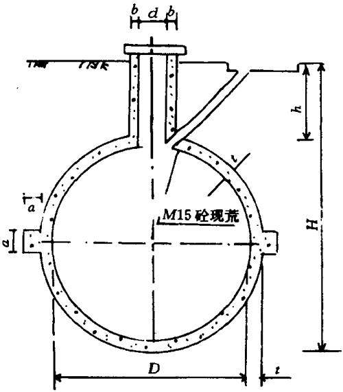  
图 7-13 混凝土球形窖剖面图  
a. 圈梁厚度 b. 窖颈壁厚度 d. 窑颈直径 t. 窖颈部内直径  
h. 冻土层深 D. 窖体内直径 H. 开挖深度  
(据吴普特，杨新民)

(2)混凝土薄壳圆柱形水窖壁厚7cm，底厚25cm混凝土，由于窖壁薄，应力接近，倘若出现偏压，不利结构的稳定。因此，需注意施工质量，并在窖壁与窖底的相接处，采取适当的结构措施，以改善应力，避免应力集中的现象（图7-14)。

(3) 红胶泥水窖 红胶泥水窖是一种群众十分喜爱的传统蓄水建筑物，呈瓶形状。一般壁厚8～10cm，底厚30cm，均用红胶泥打实（图7-15）。这种水窖历史久远，经入耐用，防渗性能好，水质好，群众可自行投工建筑，但其施工过程较为复杂。其容积视当地土质情况，一般为 $4 0 { \sim } 9 0 \mathbf { m } ^ { 3 }$ 。其结构尺寸

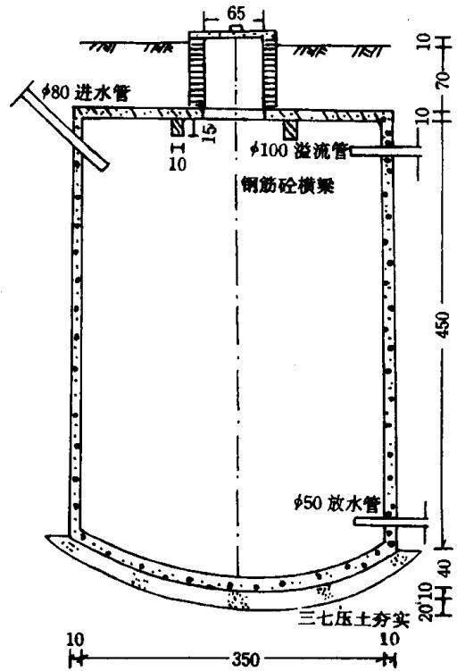  
图7-14 混凝土薄壳圆柱形水窖剖面图(单位：cm) (据吴普特，杨新民)

可参考表7-10。

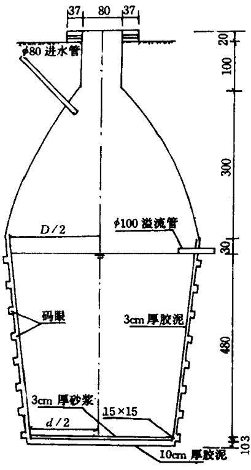

表 7-10 红胶泥水窖结构尺寸
<table><tr><td colspan="7">容积 口径 窖筒深 旱窖深水窖口径水窖深</td></tr><tr><td>(m³)</td><td>(m)</td><td>(m)</td><td>(m)</td><td>(m)</td><td>(m)</td><td>(m)</td></tr><tr><td>15</td><td>0.7</td><td>0.7</td><td>2.0</td><td>3.0</td><td>3.0</td><td>2.0</td></tr><tr><td>20</td><td>0.7</td><td>0.7</td><td>2.4</td><td>3.4</td><td>3.4</td><td>2.2</td></tr><tr><td>30</td><td>0.7</td><td>0.7</td><td>2.9</td><td>3.9</td><td>3.9</td><td>2.5</td></tr><tr><td>40</td><td>0.7</td><td>0.7</td><td>3.2</td><td>4.3</td><td>4.3</td><td>2.7</td></tr><tr><td>50</td><td>0.7</td><td>0.7</td><td>3.5</td><td>4.6</td><td>4.6</td><td>3.0</td></tr></table>

在修建水窖时，应尽可能利用地势落差，在水窖底部以上，20\~50cm处设直径50mm的放水管，安装闸阀，以便取水。若地势高差达不到要求，可采用手压泵或小型两相水泵取水。根据水窖实际蓄水量，以及作物、土壤、天气等条件，设计配套的田间小型滴灌或微喷灌工程设施，使收集到的雨水充分发挥作

图 7-15 红胶泥窖剖面图(单位：cm)用。

(据吴普特，杨新民)

## 第三节 水资源开发利用中的环境问题

水是干旱区自然环境中最积极、最活跃的因素，也是人类生存和经济活动中最基本的条件。水资源的开发利用和保护，要做到充分合理，做到经济效益与生态效益的统一。若忽视生态效益，就可能造成生态环境的变化，可持续发展就成为一句空话。水资源开发利用不当或保护措施不得力导致的环境问题越来越受到关注，主要可概括为：

## 一、湖水及地表径流矿化度升高

西北荒漠化地区的低位山间盆地和山前平原地区是灌溉农业最集中、城市分布最广、工业最发达和水资源开发利用强度最大的地区。在这里由于河流没有新的补充水源，任何不合理的开发，考虑不周的人为活动，都会造成下游地区水源的污染和破坏，引起比较严重的后果。南疆焉耆盆地博斯腾湖的盐化，塔里木河阿拉尔站河水矿化度升高，都是典型例子。

博斯腾湖原是我国第一大内陆淡水湖，水面近1000km²，盛产芦苇和鱼类。由干改道开都河，湖泊的淡水收入减少，水循环停滞；由于焉耆盆地耕地面积扩大，入湖盐量增加，使博斯腾湖的矿化度由1958年的不足0.4g/L猛增至1975年的 $1 . 5 \mathbf { g } / \mathrm { L }$ ，平均每年增加0.06g/L，水化学类型则由重碳酸盐型变为硫酸盐型，成为微咸湖。如不采取有效的保护和防治措施，按此盐化速度发展下去，博斯腾湖的矿化度将超过3g/L。

塔里木河阿拉尔站河水矿化度，由于阿拉尔新垦区高矿化地下水和灌溉回归水的排入而大幅度提高，由垦前的0.44～0.64g/L增至垦后的春季$2 . 5 6 \sim 5 . 4 6 g / \mathrm { L }$ 及秋冬季 $1 . 0 2 { \sim } 3 . 0 5 \mathbf { g } / \mathrm { L }$ 0

博斯腾湖迅速盐化是由人类不合理利用水资源和开荒造田造成的。为控制和降低其矿化度，第一步需要废弃不合理的开都河改道工程，然后从博斯腾湖直接引水，恢复和增强湖水循环，建立新水盐平衡。第二步，在未彻底控制和降低湖水矿化度之前，应适当控制焉耆盆地的开荒速度，尽量减少入湖盐量。据初步估算，在采取上述措施后，博斯腾湖的矿化度将逐步降低，并大体稳定在1.1g/L左右。灌区排水所造成的河流矿化度升高，可用把高矿化排水泄至暂时无法利用的沙漠、戈壁去的办法，降低入河盐量及河水矿化度，保证下游的用水水质。

## 二、上中游不合理开发地表水，引发下游地区环境危机

荒漠化是当前干旱区和半干旱区的主要环境问题。干旱地区某些地区的荒漠化，大多与地表水利用不合理和河流改道有关，特别是在大、中型内陆河中、下游地区，往往由于上游地区在开垦中计划不周的大量引水，出现水源不足、水质恶化、资源破坏和荒漠化等一系列问题。如塔里木河流域在开垦过程中，由于没有进行全面的流域规划，综合平衡和分配上、下游用水，使中、下游地区水量大幅度减少或完全断流，使河流两岸地带依赖地表水补给的地下水，水位迅速降至5～8m，引起荒漠河岸林—胡杨林及天然植被衰退、枯死，土地荒漠化。1958年以来，由于水源减少、毁林开荒、砍伐樵采等原因，阿拉尔以下塔里木河流域胡杨林地面积减少了23万hm²，占原面积的61.8%。土地荒漠化程度大体与河流呈平行带状分布，距河流愈远荒漠化程度愈烈，明显的说明了其与河流水源的关系。

因此，在进一步开发大、中型内陆河流域时，必须搞好流域规划，以流域为单元进行农、林、牧业合理布局。特别是在开发上游地区时，要慎重考虑水源进一步开发利用与下游资源和环境之间的关系，以水定地、定工业、定城市，贯彻水资源“适度利用”原则，建立一个稳定的、高效的干旱区人工农业生态系统。为此，必须根据整个流域的自然条件，自然资源形成和分布特点，上、下游地区开发的历史和利用现状等，合理分配上、下游水量。从经济和生态上论证，上游地区开发所造成的水量减少，将不引起下游需要保护地区环境和自然资源发生质的退化和破坏，自然资源能重复持续利用，使水资源的开发做到既充分又合理。民勤绿洲位于石羊河流域的最下游，是一块四周被沙漠包围的典型荒漠化绿洲，主要水源是石羊河水，其上游地区是武威盆地。50年代以前武威绿洲的灌溉系统大体还保持着半原始状态，渠系利用率低，只有0.25～0.30，河、渠水大量渗入补给地下水，泉水量大而稳定，因此本灌区全部利用河、泉水进行灌溉，剩余部分则通过石羊河经红崖山输往民勤盆地，水量为5亿 $\mathbf { m } ^ { 3 }$ 以上。70年代，石羊河上游地区普遍修建了山谷水库调蓄径流，渠系利用率提高到0.45～0.68，大规模开采地下水，灌溉面积扩大，保灌率提高，使武威盆地地下水位平均下降6.38m，泉水减少66%。上游地区地下水位下降，泉水减少，使以泉水补给为主的石羊河水量，在70年代中后期减至不到3亿 $\mathbf { m } ^ { 3 }$ 。地表水源大幅度减少，迫使民勤大量开采地下水。超采地下水，从根本上破坏了地下水平衡，使地下水位以每年0.2\~0.7m的速度下降。1970年以来，坝区和泉山区南部地下水位下降1～3m，北部下降3～6m，湖区下降1～3m，同时还伴随着矿化度升高，水质恶化和土壤盐渍化程度加剧。现民勤地区的沙枣林，约有2.5万 $\mathrm { h m } ^ { 2 }$ 因地下水位下降而遭破坏，其中有近1万hm²全部枯死。此外，绿洲外围防沙体系中的梭梭等灌木，也大片枯死，失去防风固沙作用，土地荒漠化程度极为严重。

民勤的问题，主要是由地表水源减少引起的。水源问题不解决，环境将继续恶化，无法恢复逆转。为保护民勤地区的生态环境，防止荒漠化的发展，关键是给民勤增加地表水源，根据实际情况，除应通过上游地区节约部分水源外，要从根本上解决问题，需考虑从青海境内跨流域调水。

## 三、远距离调水对环境的影响

远距离调水是解决水源不足的有效途径，可以通过人工措施改变河流的流向、也可以跨流域调水来完成改变水资源在空间、时间、数量和质量上的不均匀分布，以满足水资源不足地区的供水需求。美国、俄罗斯、巴基斯坦、印度等国先后研究和建成一些规模宏大的调水工程，发挥了较大的经济效益。

同时，也应认识到，水是环境中最活跃的因素，跨流域调水，改变了水的地域分布，必然引起其他环境因素的变动以至对地理环境进行新的调整。由于这一过程的影响要在工程使用较长的时间后才能被人们所看到，因此，调水前必须进行调水工程的环境影响评价，提出防患于未然的措施。

工程对环境的影响可分为：

(1）对自然环境的影响如对水循环、气候、土壤、水文、地质、河道冲淤、生物群落等。

(2)对社会环境的影响如对土地利用、交通、人口、风景区、文物古迹、卫生健康等。

## 参考文献

1. 张广军主编．沙漠学．北京：中国林业出版社，1996

2. 黄占斌.第八届雨水收集利用国际学术会议概况．水土保持通报，1997，17(4)：8,42\~45

3. 张光辉，陈致汉.雨水集流用水窖的主要类型及其效应．水土保持通报，1997，17(16):12,57\~60

4.“九五”国家科技攻关“节水农业技术研究与示范”项目《人工汇集雨水利用技术研究专题中期报告》（内部资料）

5. 李英能，黄修桥，吴景社．水土资源评价与节水灌溉规划，北京：中国水利水电出版社，1998，5

6. 中国 21 世纪议程.北京：中国环境科学出版社，1994

# 荒漠化地区可替代能源开发技术

## 第一节 能源问题与土地荒漠化

造成土地荒漠化的原因有多种，其中一部分荒漠化土地是“烧”出来的。在广大干旱地区植被相对稀少，尤其乔灌本植被稀少。因此广大农村牧区生活能源十分短缺，本该作饲料和肥料的数量有限的作物秸秆全部烧掉了，影响了农牧业的发展。其实也无济于事，更大需求的生活能源只有来自天然植被。由于需要量大，土地生产力低，滥砍、滥伐现象相当普遍。在降水少的干旱年，有些农民只能铲草皮、挖草根，甚至烧畜粪以解决能源需求，严重影响着农业生产的正常进行，造成土地贫瘠，在草原牧区常年以畜粪为生活能源，破坏草场的营养平衡，促进草场退化，影响牧业生产。

随着人口的大量增长，生活水平的日益提高，以及其他建设事业的发展，能源消耗量在以几倍的速度增长。烧水、做饭、加热饲料等，在没有煤、天然气、电的边远贫困地区及大批城镇居民生活中，都依赖于天然植被，这些祖祖辈辈以薪柴为主要燃料，年复一年，大面积植被遭到破坏。沙柳、沙蒿、柽柳、梭梭等大面积的天然植被、林地消失。造成土地裸露、沙丘活化、水土流失、土地沙化、气候失调、土地肥力下降，生态环境受到严重破坏。在世界热带、亚热带干旱区，平均每人每天需要干生物能源(薪柴)1kg，而1hm²土地年生产生物干物质平均为1000kg。1个5口人的家庭每年因生活能源需要破坏天然植被 $1 \cdot 8 \mathrm { h m } ^ { 2 }$ ；我国北方人均每天需求干生物能源1.5kg。按1家5口人计算，1年按300d算， $\scriptstyle 1 \ h \ m ^ { 2 }$ 土地年均生产干生物物质1500kg，1家每年要破坏天然植被 $1 . 5 \ \mathrm { h m } ^ { 2 }$ ，100户的村庄1年要破坏 $1 5 0 \ \mathrm { \text h m } ^ { 2 }$ 的天然植被。在干旱区 $1 \mathrm { { h m } } ^ { 2 }$ 近熟梭梭林可提供薪柴5～7t，生长这些生物量需要几十年的时间。在南疆和田、墨玉、洛浦3县73万居民每年需要消耗荒漠薪柴25～30万t，近30年来全区荒漠林面积减少了一半（到1990年），照此下去，到20世纪末，荒漠林有全部采光的危险。可见，因能源需求而乱砍、滥伐导致土地荒漠化和草原开垦、草场过牧同样是造成土地荒漠化的重要直接原因。我国在北方干旱区建国初期的若于大型工程建设，人口突然大量集中并较长时间地大量樵采周围植被而造成人为的大面积土地荒漠化的情况也多次发生过。

由能源问题引起的天然植被的破坏，在生态脆弱的干旱、半干旱地区成为破坏生态环境，引发生态灾难的严重问题。而广大农牧区的能源问题长期以来没有得到妥善解决，而要完成防治土地荒漠化这一艰巨的使命就必须要妥善地解决该区的能源问题，否则荒漠化的蔓延就难以遏制，其他更伟大的目标也难以实现。经过广大群众和科技人员的多年实践与探索，在荒漠化地区彻底解决能源问题已是大有希望，只要认真去做就能成功。以下各节将简要介绍解决荒漠化地区能源问题的方法与措施，由于时间与篇幅所限，不可能全面介绍详细的理论与具体制作内容，可参考有关专著。本章重点介绍解决问题的途径与方法及某些实际应用知识。

## 第二节 发展薪炭林 普及节柴灶

## 一、能源林开发地位

人口的迅速增长导致能源消耗量的急剧增长，常规能源日渐短缺，这在干旱地区尤为严重。森林植被是人类最古老的能源，特别是发展中国家，薪材是主要能源，全世界每年消耗薪材15.66亿m³，发展中国家就占14.3亿m³。森林植被是最大的太阳能接受器，是一种可再生能源。由于消耗量不断增加，消耗量远大于生产量，森林大面积破坏，导致土地沙化，引起水土流失，生态环境恶化，致使群众生活更加贫困，反过来植被遭到更大破坏，结果形成越砍越穷，越穷越砍的恶性循环。由于薪柴短缺而大量燃烧秸秆、畜粪。直接燃烧效率低下（只有10%），既浪费能源，又污染环境。因此要解决农村能源，决不能停留在对天然植被的长期掠夺上，而应大量营造薪炭林。薪炭林作为五大林种之一，已受到各国政府重视。薪炭林即为满足生产生活需要的燃料而营造的人工林，是可再生的生物能源，又称能源林。全世界都在发展能源林。我国从“六五”后期开始发展薪炭林，“七五”进行了大量科学研究，解决了一系列有关问题：如薪炭林区划、树种引进、选种、经营培育、效益等。

## 二、荒漠化地区能源现状

薪材是农村能源的主要部分，农村耗能中生物能占69.7%，其中薪炭材、秸秆又占生物能70%。我国薪材年消耗量为2.67亿t，而合理供应量仅9000万t，供应量远小于消耗量，超支数量巨大，大多数省、自治区，尤其是三北地区薪材都有缺口，全国农村缺柴户占47.7%，荒漠化地区更为严重。新疆因缺柴毁林43.5万hm²，原有胡杨林52.8万hm²，现存仅22.7万hm²，北疆、南疆均因荒漠林的大面积破坏而形成流动沙丘，荒漠化严重发展。青海年可用薪材量5.2万t，实际消耗10.7万t；柴达木近年由于缺柴破坏植被133.3万hm²。

由于薪材不足，秸秆被大量燃烧，许多地方不得不挖草根、烧畜粪、搂树叶，肥料严重减少，引起土地退化、结构破坏、作物严重减产。全国年产秸秆5.85亿t，作燃料烧掉3.46亿t，相当于损失近6000万t腐殖质，氮、磷、钾损失约等于60%的化肥产量。因此，大力发展薪材是缓解农村能源紧张状况、减少植被破坏、增加林地面积、改善生态环境的有效手段，也是一项重要的生态工程。

## 三、薪炭林发展前景

根据我国国情，薪炭林在现在及将来很长时期仍是农村主要能源。近十几年来大力营造薪炭林，到1992年全国薪炭林面积为815万hm²（其中“八五”营造薪炭林260万hm²)，然而缺口尚有1亿多吨，全国造林绿化纲要计划到20世纪末营造薪炭林603万hm²。我国还有0.8亿hm²宜林荒地，其中有0.067～0.133亿hm²可用以营造薪炭林，还有大面积荒漠化土地需要治理。生物措施是防治荒漠化的根本措施，营造薪炭林既补充能源不足，又防治荒漠化，改善生态，一举两得。

## 四、薪炭林经营类型

依据薪炭林不同经营方式，可划分为以下几种类型：

(1）短轮伐期平茬采薪经营型该类型为我国薪炭林主要经营型。特点是造林3～5年开始采薪利用。从地面上砍伐，萌芽更新，3～4年为一个采薪轮伐期。如沙区沙枣、沙棘、沙柳、花棒、杨柴、柠条等均可采用这种类型。

（2）材、薪经营型以生产薪材为主，兼产少量用材。在同一造林地上，用材树种和薪炭树种行、带混交（用材林可占1/5，薪炭林可占4/5），采用2种经营措施，薪炭林实行短轮伐期定期平茬，用材林逐年修枝采薪，产薪又产材。

（3）林草经营型适宜干旱地区经营。该区因水热条件限制，树木早期生长慢，实行林草行带种植，树木成行种植，行带间种草，提高早期生物量，既生产燃料，又生产饲草，促进畜牧业发展，提高林地综合效益。在三北地区有广阔前景。

(4）薪炭林经营型采用多效益树种，以生产燃料为主，兼收种子、果实、条材等产品，如沙棘、山杏、沙柳、花棒、杨柴、柠条、锦鸡儿等。林木生长4～8年，樵采收薪材，萌芽更新，再结实，周而复始经营。

（5）头木育薪（材）经营型适宜萌芽力强的树种（旱柳、刺槐、榆等)，林木生长几年后，于2～3m高处截去树冠，收取小径材和薪材，促使枝干萌芽。薪材嫩枝叶作饲料喂畜，剩余部分晒干作薪材，萌枝1年后留强去弱，隔3～5年再砍伐1次。该类型在三北地区尤其是榆林地区最为常见。

（6）扶育采薪型在条件较好，经济发达的用材林、经济林、防护林、果园区，通过正常修剪，扶育修枝，收取薪材，解决燃料问题。

## 五、薪炭林营造技术

1979年森林法把薪炭林列为5大林种之一。但长期以来我国薪炭林主要是天然杂灌林、人工残次林，没有专门经营薪炭林。从“六五”起，开始有计划营造薪炭林，已形成较系统的生产技术。

## (一)制定发展规划和经营方针

规划可起明确目标，调动群众积极性的作用。规划要在“九五”计划及“远景目标”制定的“因地制宜，多能互补，综合利用，讲究实效”的方针下进行。根据当地条件，能源状况因地制宜，规划发展薪炭林。传统薪炭林经营粗放，功能单一。现代条件下要营造集约经营，多功能、多效益薪炭林。经营方针是：短轮伐期，高产，用途、结构合理，永续利用，不仅提供用材、饲料肥料之产品。同时起涵养水源、防治荒漠化、调节气候等生态作用。

## （二） 树种选择

树种选择得当与否是薪炭林营造成败、效益高低之关键。要根据立地条件和树种生物生态学特性认真选择树种。选择原则：生长快，萌芽强，生物量大，热值高，燃烧性能好，抗逆性强，多功能乔灌木树种。且以乡土树种为主，要短期见效益。荒漠化地区适宜树种有：

（1）河北坝上地区及其内蒙古部分：旱柳、沙棘、蒙古柳、胡枝子、白榆等；

(2）燕山、太行山地区：旱柳、刺槐、麻栎、胡枝子、沙棘、山杏、山桃、黄栌、紫穗槐等；

(3）黄土高原丘陵：柠条、锦鸡儿、沙棘、山杏、刺槐、柽柳、胡枝子等；

（4）黄土高原山地：旱柳、柠条、沙棘、辽东栎、山杏等；

(5）内蒙古高原、丘陵、沙地（内蒙古中部、陕北、宁夏南部)：柠条、锦鸡儿、沙棘、旱柳、柽柳、刺槐、沙柳、花棒、山杏、黄柳、紫穗槐、胡枝子、沙枣、杨柴等；

（6）西北荒漠、半荒漠区（新疆、河西、柴达木、宁夏西部、河套以西）：柠条、柽柳、沙拐枣、梭梭、白梭梭、花棒、沙枣等；

（7）西北农牧区：旱柳、刺槐、柽柳、柠条、沙棘、灌木柳等；

## （三）合理密度

一般要求高密度，充分利用水、土、光、热资源，实现高产。短轮伐期2\~4年，密度5000\~10000株/hm²，但要因地而宜。

## （四）搞好配置

配置要服务于2个转变，即改变粗放经营为集约经营，改单一功能为多种功能，提高3个效益。采用混交，既充分利用空间、地力，增强群体抗性，又能早得薪材，长期获取用材，长短结合，一一材多用；混交方式有乔灌混交，针阔混交，速生慢生混交，深根浅根混交，喜光耐荫混交，固氮非固氮植物混交等。灌木定期平茬，乔木逐年修剪，获取薪材。干旱区、草原区宜采用灌木混交。

## （五）适时平茬更新

根据树种特点和立地条件，适时平茬更新，充分发挥生产潜力，争取最佳效益。一般3～5年开始采伐，合理确定采伐面积、时期、周期。

荒漠化地区，固沙林、水土保持林，生态与薪材兼之。在缺柴区可进行带状轮伐更新，周期略长些。不可全面平茬，频繁更新，以免影响防护效果。

头木作业定期采伐枝条，促发侧枝，培育小径材、薪炭材。采薪季节尤为重要，一般在秋后落叶停止生长到翌年萌动以前进行。

薪、饲兼用材综合型。饲料缺乏的牧区，嫩枝树叶作饲料，茎枝干作薪材。大面积经营可分期轮牧，定期平茬，各地应结合本区情况选之。

## 六、发展薪炭林途径

（1）人工营造利用荒沙、荒滩、荒地营造高效薪炭林。要先现场勘察，再造林设计，种植营造。

（2）封山（沙、滩）育林对宜林荒沙、荒山、荒滩进行调查，符合条件者，规划为薪炭林。封育成林的树种合乎条件者划为薪炭林经营。

(3）改造残次林各种原因形成的残次林符合薪炭林条件的，通过平茬更新改造为薪炭林。疏林补植、补种，增加密度；针叶林内补种薪炭树种，补造树木长起后，伐除无望小老树，保留有望树木。长成小径材，成为新型薪炭林。

薪炭林在我国荒漠化地区有很大发展潜力，今后发展要采用国家、集体、个人三结合方式，谁造谁有，注意综合效益，加速发展。

普及节柴灶是节省薪柴，提高效率的有效措施。以往农家旧柴灶，结构不合理，燃烧不充分，热效率低，一般只有10%，大量热量被浪费，节柴灶是旧柴灶经过科学改造，燃烧时气流畅通，氧气充足，火力旺，燃烧充分，热效率大大提高。芦柴灶既缩短了烹调时间，又提高了薪柴利用效率，节时又节柴。节柴灶应大力普及。

## 第三节 太阳能的利用

我国荒漠化土地集中分布的三北地区，最丰富的天然再生能源资源就是取之不尽、用之不竭的太阳能资源，这是本区的一大优势。充分开发利用太阳能资源对改善本区能源状况，促进本区社会经济持续发展有着特殊的意义。可惜这一能源的绝对优势自古以来由于科学技术和实力等因素的限制，始终没有得到应有的重视和开发利用，随着历史岁月而白白流逝了，但同时，尤其是近代由于人口的急剧增长和经济的快速发展，生活能源严重不足而导致于旱区稀疏植被的严重破坏及土地荒漠化的大面积发展。但是随着近代科学技术和经济的发展，为我们开发利用太阳能提供了较为优越的技术经济条件，对干广大基层来说，应用太阳能最现实最急需的领域当是太阳灶、热水器、太阳能建筑（在高寒地区）、太阳能温室等方面。更高技术的太阳能发电系统及其他较先进的利用方式是国家和地区的重点研究课题，对广大基层来说还是下一步的事情。

## 一、太阳能的特点

太阳是离地球最近的一个巨大的气态球体，其直径为139万km，约为地球直径的110倍，表面积达 $6 . 0 7 8 \times 1 0 ^ { 1 2 } { \mathrm { k m } } ^ { 2 }$ ，其表面温度为6000℃，内部高达2000万℃，它以电磁波的形式向四周辐射能量。太阳能是地球上热能最重要的源泉。它以光和热的形式向太空辐射的总能量中有1/22亿投射到地球表面上，地球表面每年接受的太阳能为 $6 . 5 \times 1 0 ^ { 2 4 }$ J，相当于目前全世界1年消耗总能量的3.5万倍，相当于 $3 . 1 \times 1 0 ^ { 6 }$ 亿t煤产生的能量。因而，它是一种特别巨大的特殊的能源资源。它具有广泛性、清洁性、无污染、不需要运输等优势，有着特别广阔的开发前景。

为研究和应用的方便，人们把当日地距离等于轨道的平均半径时，在地球大气层外垂直太阳光线的表面上，单位面积单位时间内的太阳辐射能数值称为太阳常数，其值为 $8 . 1 1 \times 1 0 ^ { 4 } \mathrm { J } / \left( \mathbf { m } ^ { 2 } \cdot \mathbf { s } \right)$ ，以功率表示为 $1 \ 3 5 3 \ \mathbf { W } / \mathbf { m } ^ { 2 }$ 。有关太阳能辐射的其他知识请看有关专著。

## 二、我国太阳能资源

我国地处北半球，横跨热、温、寒3个气候带，土地辽阔，太阳能资源丰富。全国太阳能辐射总平均值为 $9 \times 1 0 ^ { 6 } \mathrm { ~ k J / ~ } ( \mathrm { m } ^ { 2 } \cdot \mathrm { ~ a } )$ 。年辐射总量达5.7×$1 0 ^ { 1 9 }$ kJ，相当于1.7万亿t标准煤。我国2/3以上地区日照时数在2000h以上，分布趋势是西高东低，北高南低，太阳能丰富区集中在青藏高原、内蒙古中西部、新疆南部、陕甘宁部分地区。根据各地太阳总辐射的多少，全国划分为5类地区（表8-1）：

表 8-1 我国主要地区太阳能资源
<table><tr><td>类别</td><td>全年日照 时数(h)</td><td>年总量  $\left[ \mathcal { \textbf { H } } \mathbf { k } \right] / ( \mathbf { m } ^ { 2 } \cdot \mathbf { \mu } _ { \mathrm { a } } ) ] \left[ \mathbf { k } \mathbf { g } / ( \mathbf { m } ^ { 2 } \cdot \mathbf { \mu } _ { \mathrm { a } } ) \right]$ </td><td>相当于燃烧标准煤</td><td>主要地区</td></tr><tr><td>1</td><td>2 800~3 300</td><td>672~840</td><td>225~285</td><td>宁夏北部，甘肃北部，新疆南部，青海 西部，西藏西部</td></tr><tr><td>2</td><td>3 000~3 200</td><td>588~672</td><td>200~225</td><td>河北西北部，山西北部，内蒙古，宁夏 南部，甘肃中部，东海东部，西藏东南部， 新疆南部</td></tr><tr><td>3</td><td>2 200~3 000</td><td>504~588</td><td>170~200</td><td>山东、河南、河北的东南部，山西南部， 新疆北部，吉林、辽宁、云南、陕西北部， 甘肃东南部，广东南部，江苏、安徽北部</td></tr><tr><td>4</td><td>1 400~2 200</td><td>420~504</td><td>140~170</td><td>湖南、湖北、广西、江西、浙江、福建 北部，广东北部，陕西、江苏、安徽南部， 黑龙江</td></tr><tr><td>5</td><td>1 000~1 400</td><td>336~420</td><td>115~140</td><td>四川，贵州</td></tr></table>

从表8-1看出，我国荒漠化土地集中分布的三北地区，绝大部分为一、二类地区。少数为三类地区，年日照时数为2200～3300h，辐射总量在546～672 kJ/ $( \mathsf { c m } ^ { 2 } \cdot \mathsf { a } )$ ，西藏西部高寒荒漠化则更加丰富，可达 $8 4 0 \mathbf { k J } / \mathbf { \Sigma } \left( \mathbf { c m } ^ { 2 } \right.$ a）左右，是我国太阳能最丰富的地区，有极大开发利用价值。

## 三、太阳能的利用

太阳能具有前述各项优点，是一种巨大而长久的可替代再生能源。但也存在着不连续、不确定和分散性的缺点。太阳能只有在白天才能利用，夜间则利用不上，阴天雨天也无法利用；随太阳高度角变化，其辐射强度也发生变化；太阳能强度较弱，单位面积上只有55～700W/m²。利用时要充分考虑这些特性，需将其聚集收集，转换成能量较高的能源，进行贮存开发利用。在广大农村城镇居民中，最普遍最大量的应用方式是太阳灶、太阳能热水器、太阳房等，这些利用对缓解荒漠化地区农村城镇缺柴少烧的困难，解决炊事、取暖、热水、生活用能，高效栽培，保护植被，防止生态恶化，改善和提高群众的生活质量与水平，加强文明建设，发展生态农业都具有重要意义。

## （一）太阳灶

是利用多种反射镜面会聚阳光使所获得的热能直接用来煮饭、烧水的一种简易装置。我国从70年代就开始研制，至80年代已进入实用阶段。在技术上从设计理论到材料工艺和制造应用，都达到了相当的水平和规模，但是在植被最缺乏、能源最紧张、而阳光最充足、最需要太阳灶的干旱、半干旱、半湿润的荒漠化地区广大农村和城镇太阳灶的普及率都不高。当然其原因是多方面的，有实际问题、认识问题、也有政策问题。如果每家农户（包括城镇居民）有一台太阳灶，每年可节省1500kg薪柴。使用太阳灶晴天中午前后12～15min即可烧开1壶水。不仅农户，学校、单位、招待所、幼儿园都可使用太阳灶配合保温简解决热水、开水的供应问题。这样既保护了植被，又为家庭和国家节省大批能源开支，是一举两得的好事。从经济效益上看，购1台太阳灶，聚光面积较大的需400～500元，第一次投资较大，第二年以后每年仅须花20～30元换一张反光膜即可。以最短使用寿命5年计，总投资480～620元，平均每年不到130元，若使用10年平均每年投资仅58\~77元，经济效益十分明显，使用率越高，效益越好。对城镇人口而言，用太阳灶比用煤气、煤电，效益更加突出。且清洁无污染，不需运输与大面积贮存，大大减轻了农民远距离砍运烧柴所付出的繁重劳动，节省了车、畜消耗，解放了劳动力而有利于发展生产。

平时烧煮饭、食物需要160℃左右的温度，一般太阳灶可达400～600℃，能满足各种炊事需要。目前的太阳灶要在室外阳光下操作，使人感觉不便，遇风沙天则不易操作使用，冬天使用困难。今后发展“通用太阳灶”，把热能传送到厨房，白天贮热，夜晚、阴雨天也可应用，冬天也能使用，太阳灶就更加受欢迎。

太阳灶的形成可分为热箱式、聚光式2类。

## 1. 热箱式太阳灶

利用热箱黑体吸收原理而制作，它是将所获得的太阳能不断积累起来，达到炊事烹调所需热能的一种简单装置。箱子的上盖用能透过太阳光的透明窗洞，内部涂有黑色无光漆，且为不透气隔热层，起到吸热保温防风的作用。窗洞可用2层或3层玻璃制成，使太阳辐射（主要是可见光和红外辐射）很好地射入箱内，玻璃之间空隙作为静止空气层，可隔热保温，起到温室效应的作用，阳光射进箱内黑体吸热后温度不断上升，即使在多云天气，由于还能吸收某些散射辐射，也能达到蒸煮食品的要求。热箱式太阳灶主要特点是制作简单，成本低廉，仅需购几块玻璃，其他材料均可自备。制作完成后可长期使用，烹调时操作简单，不需专人管理，便于推广，深受农民欢迎。热箱式太阳灶可以蒸、煮、焖、烤等。温度一般在120～130℃，已能满足要求，好的可达150℃。热箱式太阳灶经改型后可制成柳条式（箱体由柳条编成，也可用芦席、高粱秆、竹片、瓦楞板、纸箱制作）太阳灶、梯形太阳灶、台式（用砖和土坯制作）太阳灶、反射式太阳灶（可在箱式太阳灶基础上加装1～4个平面反射镜，增加受光面积，提高太阳灶温度和功率，即使严冬也可使用）等。

## 热箱式太阳灶使用要求：

（1）选择太阳灶地方，避免有树、屋、烟囱等障碍物遮住阳光，并要干燥通气；

(2)使用前要先在阳光下预热半小时，再将炊具放进灶内，晴天2h可成熟，在农村出工前安放好，中午收工即可食用；

(3)炊具使用前应盖上无光泽布或黑纸以提高吸热率，减少烹调时间。  
可用该灶蒸煮米饭，蒸馍、包子，烧菜，炖肉、鸡、鸭、鱼等。

## 2. 聚光式太阳灶

利用抛物线镜面反射光的平行和反射原理，把能流密度提高几十倍到几百倍的太阳辐射能集中于锅底，而获得较高的温度，一般可达400～650℃左右，最高能达1000℃以上。可以作蒸、煮、炒、烧、烤、煎等家庭炊事之用。因炊事要求，焦斑不宜过小，焦斑直径一般在十几到二十几厘米即可。太小易烧焦食物（中央焦外面生）。聚光式太阳灶有较高的聚光能力，但因受热器（锅子）敝开在露天使用，热量多散失。特别在气温较低，风较大情况下。热量易散于空气，增加烹调时间。故使用聚光式太阳灶也要求背风、向阳，炊具外装保温罩；每隔15～20min调节1次阳光，使反射镜经常对准阳光，但调温要适度。如2m²太阳灶最高可得到1000W功率，夏天最高温度达1100℃。这样的温度烧开水好，煮饭就太高了，会使水分很快蒸发而烧焦。这时镜面上需放1张旧纸遮住部分阳光反射而降温以顺利烹调。

聚光式太阳灶必须具备如下条件：

（1）较高的热效率，一般应能大于50%；

(2)适当的工作温度，希望超过400℃；

(3)适合于烹饪的均热区，焦斑面积不小于100cm²；

(4) 热功率在 1kW 左右；

(5)坚固耐用，灶具使用寿命在5年以上；

（6）有良好的采光表面，采光面反射率必须在0.80以上；使用寿命2年以上，方便更换和维修；

(7) 价格合理；

(8)维护方便、操作简单、易损件易于更换。

近年来农村使用的太阳灶有简易固定型聚光太阳灶、荷叶型聚光太阳灶、正抛物面轴外聚光纸质太阳灶、灯式太阳灶、箱式柱形聚光太阳灶、草编式聚光太阳灶、玻璃太阳灶、圆柱形抛物面聚光太阳灶、方形聚光太阳灶、盒形太阳灶、荷花式太阳灶、纸伞型太阳灶、聚光式水泥太阳灶、负压式太阳灶、螺旋式齿形太阳灶、蝶形折叠式太阳灶等类型。现在正在研究通用太阳灶，它主要由阳光收集器、传热装置、释热和蓄热装置、太阳自动跟踪等部分组成。它可把室外收集的热量传入室内贮存供夜间或需要时使用，一般能达200\~400℃，可基本满足炊事需要。

## （二）太阳能热水器

太阳能热水器是在全国推广应用最普遍的加热水的太阳能装置。它更应在广大荒漠化地区农牧区基层广泛推广。充分利用该区丰富的太阳光资源，普及太阳能热水器，除节省大量植物能源外，对于提高群众生活水平，建设农村牧区精神文明，改变卫生习惯有重要意义。现在太阳能热水器种类繁多，有平板直管式、平板直管式纵横置圆筒式热水器，更有价格极便宜的黑软塑袋热水器（1999年农贸市场仅7.8元/套）；而农村更多地使用汽油筒自制热水器。不管哪一种都应该包括给水部分、集热器、上下循环管道、贮水箱、供热水管、开关（喷头）等部分。有的更复杂一些，有的前几部分合一。根据循环形式的不同，可分为自然循环式、强制循环式、直流循环式3类。以自然循环式为例，其工作原理是：在日出前集热器与贮水箱内水温相等，二者处于热平衡状态，日出后，集热器吸收太阳能使水升温，水密度下降，使冷热水比重差产生热虹吸压力，为冷热水循环提供了动力，热水通过上循环管道进入贮水箱，冷水通过下循环管流入集热器，形成循环自发进行。当二者温度相等时，循环会逆行。贮水箱具有保温措施，热水可保温至晚间使用。工厂生产的热水器样式繁多，目前在向高档化和简易化2个方向发展，适应各层次需要。

## （三）太阳能建筑

在荒漠化地区的高寒草原农牧区，如青藏高原、河北坝上高原、内蒙古高原等。冬季十分严寒，经常在一30℃以下，遇上暴风雪更给群众生活造成极大困难，为对付整个严寒冬天的取暖需要，或烧掉大批薪柴，或烧掉大批畜粪，对植被保护和农牧生产带来严重损害。近年来太阳能建筑的推广给基层农牧民群众带来了福音，受到热烈欢迎。如青海牧区、内蒙古克什克腾元宝山牧场等地。

太阳房分被动式和主动式。被动式太阳房的采暖技术是充分利用太阳高度角冬低夏高的条件，以开源节流为设计原则，靠房屋结构本身完成集热、蓄热、释热的功能来满足住房采暖需求。据说冬天太阳房的最低温度可达10℃，比室外气温高20℃。极大地改善了过冬的条件。

被动式太阳房一般坐北朝南，保温墙采用双层复合墙体，中间夹保温层。利用材料有稻壳、石棉、珍珠岩等。受益窗采用平开大窗、三角形突窗、平开推拉窗等。该类太阳房的基本类型有直接受益式、集热一蓄热墙式和附加温室式3大类。其中直接受益式采用采光玻璃窗收集太阳光热，利用集热墙壁、地板贮热，在温度下降时通过辐射和对流形式放热到室内。也有把集热墙和地板省掉，加大采光面积并设立双层玻璃窗来达到增温保暖目的。其他2种类型原理与直接受益式相同，只是具体设计有所不同而已。

主动式太阳房因造价高，维护复杂，而限制了推广，此处不作具体介绍。

## 第四节 风能开发利用

在土地风蚀荒漠化和沙尘暴发生的过程中，风扮演了特别重要的角色，给农牧业生产和群众生活制造了无穷的灾难，对生态环境造成了严重的破坏。但如果把风作为一种自然资源，一种财富，通过某些措施加以开发利用，使它就像太阳能一样为人类服务，这在生活能源缺乏的荒漠化地区有重要的意义。风能与太阳能有相似的特点，风能实际上是一种广义的太阳能，也是一种巨大的不需要补偿的无污染的可再生能源。

## 一、概述

由于地球纬度、海陆分布和地球表面的不规则等原因，地球上及大气中各处所接受到的太阳辐射是不同的，因而各处温度也不同，这就造成了气压差，大气便由气压高的地方向气压低的地方运动，水平方向的大气运动即是风。所以说太阳能（热）是风的源泉，风能是太阳能的一种转换形式。由于多种因素的影响便成为信风、季风、海陆风、地形风等各种形式的风。把具有一定风速（通常指3～20m/s）的风作为资源开发。用来做功的风能资源称有效风能。其数量在地球上十分巨大，全世界每年烧煤得到的能量还不到同时间风力提供能量的1/1000，它大大超过了可开发的水资源总量。目前，我国在风能利用领域主要是用于风力发电、风力提水、风力致热等，把风能转化为电能、机械能、热能、光能等加以利用。

## 二、风能资源

我国风能资源极其丰富，仅次于美国和前苏联。我国10m高度层风能总储量为32.26亿kW，实际可开发量为2.53亿kW，它超过了1996年全国发电总装机容量。但可供经济开发的风能储量尚需进一步查明。

我国风能资源具有4个特点：北部地区风力较南部地区强；沿海一线较内陆强；平原地区较山地、丘陵强；冬春两季较夏秋两季强。依平均风速分布特点及有效风能密度大小，可将全国划分为5类地区（表8-2）：

表8-2 全国风能资源分区及风能特征
<table><tr><td>类型分区</td><td>密度（W/m²）</td><td>年均有效风能&gt;3m/s年平均有&gt;6m/s年平均有 效风速时数(h)</td><td>效风速时数(h)</td><td>包括地区</td></tr><tr><td>风能资源最佳区</td><td>&gt;200</td><td>6 000~8 000</td><td>&gt;3 500</td><td>东南沿海及岛屿</td></tr><tr><td>风能资源丰富区</td><td>200左右</td><td>&gt;6 000</td><td>2 200~2 500</td><td>渤海沿岸及内蒙古等</td></tr><tr><td>风能资源较佳区</td><td>&lt;200</td><td>5 000~6 000</td><td>2 000左右</td><td>黑龙江南部、吉林东南部</td></tr><tr><td>风能资源较小区</td><td>100~150</td><td>2 000~4 000</td><td>750~2 000</td><td>青藏北部、华北、东北、西</td></tr><tr><td>风能资源贫乏区</td><td>&lt;50</td><td>&lt;2 000</td><td>&lt;150</td><td>北北部、江苏、浙江东部 云贵川甘陕及豫西、湘西、</td></tr></table>

据调查，我国风能主要分布在2大风带，即三北地区草原、戈壁和东南沿海与岛屿。北部风带在新疆经甘肃至内蒙古高原一线，风能200～300W/m²，有效风力出现百分率70%左右。三北地区的下列省（自治区）风能较丰富（据中国气象科研所资料）：

<table><tr><td>省(自治区)</td><td>风力资源(GW)</td><td>省(自治区)</td><td>风力资源(GW)</td></tr><tr><td>内蒙古</td><td>61.78</td><td>吉林</td><td>6.38</td></tr><tr><td>新疆</td><td>34.33</td><td>河北</td><td>6.12</td></tr><tr><td>黑龙江</td><td>17.23</td><td>辽宁</td><td>6.06</td></tr><tr><td>甘肃</td><td>11.43</td><td></td><td></td></tr></table>

我国西北中蒙、中哈、中俄边境许多隘口形成大风区，内陆也有许多大风区（如安西风库、兰新路新疆段13间房以西的百里风区等等，都可成为重点开发基地。而整个北方风沙区均有风能开发利用的良好前景。其中只有塔里木风能资源较少。

风能资源特点：与常规能源相比，风能有极好的可再生性，洁净性，利用简单，能量密度低，地区差异大，不稳定等特点。

## 三、风能利用

风力机是以风力为能源，将风能转化为机械能、电能、热能等形式而做功的一种动力机械。它是风能开发必备的机械，通过它把风能转换成为生产、生活所需要的能源形式。风力机一般由风轮、做功装置、传动装置、储能装置、塔架及附属装置等5大部分组成。

(1)风轮 由1个或多个叶片组成。其功能是捕捉和吸收风能并将其转换为机械能，它是风力机最主要的部件。

(2)做功装置 将风轮所获得的机械能按既定意图带动各种工作机做功。如发电机、提水机、粉碎机等，这些工作机统称为做功装置。

(3)传动装置风轮和工作机之间传递能量和协调运动的装置，如闸、箱、变速箱等。它能改变转速、改变动力传动方向。传动装置的传动方式有机械传动、气体传动、电气传动、液压传动等。

(4)储能装置 风力机受风不稳定性的制约，能量随风的大小、有无而变化，为弥补这一局限性，把有风、大风时获得的能量部分储存起来供无风、风小时使用，这种完成储能作用的部件或设备称为储能装置。如蓄电池储能、抽水储能、电解水储能等。

(5)塔架及附属装置为使风力机在良好及最佳状态下工作，需要架设塔架及设置调向调速器、停车制动器回转体等必不可少的附属装置。塔架是木制或钢制支撑机座的架子，使风力机处于理想高度下工作；机座是塔架上支撑风轮及其装置的底座；调向器保证风轮随时迎风，能最大限度地获取风能，也称尾舵、导向器、风标等；调速器是限制风轮在风力不断变化时使风轮转速保持在较稳定的范围之内；停车制动装置可使风力机需停车时停止转动，也叫刹车装置；回转体是把风力机本体与塔架连接起来的装置，可使风力机座以上部分绕轴转动。

风力机类型，按其功能分类，有如下4种：

(1）按功率大小可分为大、中、小、微型4种。功率在1kW以下称微型风力机；1～10kW为小型风力机；10\~100kW为中型风力机；>100kW为大型风力机；

(2)按风轮轴所处的空间位置是否与水平面垂直可分为水平轴风力机、垂直轴风力机；

(3)按风轮叶片数多少分为多叶式和寡叶式2类。风轮上浆叶多于4片

为多叶风力机，少于4片为寡叶式风力机；

（4）依风力机用途分为风力发电机、风力提水机、风力粉碎机等。

## 四、风能开发利用

公元前2000多年中国、波斯（伊朗）就用风车提水灌溉，到18世纪风车在世界上普遍应用。最早利用风力发电的是丹麦人，1890年丹麦制造了世界上第一台风力发电机，后来得到了发展，也受到过冷落。近代由于火电污染环境和能源危机加剧，风力发电又受到高度重视。特别是在电网覆盖不到而风能丰富的边远地区，风电有重要意义。风能开发利用内容有：

## （一) 风力发电

1. 户用小型发电技术。我国风电研究是从户用小型机起步的，近年来得到稳定发展，尤其在沿海及草原地区，可解决边远区用户发电。满足照明、看电视、通讯等多方面需要，受到牧民、渔民欢迎，尤其在荒漠化地区。

小型风力机工作原理：叶片在风力下旋转，通过调速控制器驱动发电机发电，充入蓄电池中，以供需要。风轮叶片多用玻璃钢及木质材料制成，发电多为交流式，蓄能用铅酸蓄电池。产生的电流为直流电，若用交流电器需加逆变器。

2. 对居民相对集中风力资源较好的无电地区，可采用集中供电型独立运行风电系统。即用单台或多台风力发电机发出的交流电经整流后向蓄电池充电和直流负载供电。风电机的交流电也可直接供给抽水、加热、电焊等负载。柴油发电机作备用电源，在无风及蓄电池的电已放完时使用，且可向蓄电池充电。

3. 在三北地区的草原、戈壁，风能、光能资源都丰富，二者有很大的互补性。可利用风、光联合发电，实现能量互补利用。与单独供电相比，提高了系统的稳定性与可靠性。可用微机进行管理。目前，塔里木石油管阴极保护风/光互补电源，内蒙古、青海微波通讯站用1～3kW风/光互补系统，均已投入使用。

4. 一般中型风力发电机在没有电网并网的情况下，单独直接为用户供电较困难，常采用与柴油机发电相配合，构成风/柴互补发电系统，以节约柴油机单独发电的燃料消耗和弥补风力发电的不稳定性。

5. 风电场（风力电站）建设：风电场是以多台大中型风力发电机联合发电，发出的电向常规电网输送，构成并网型风力发电站，其特点是供电质量好、环境效益明显、管理费用低、设备投资高，是可持续发展的清洁能源。这是大规模风能开发的重要内容，在风能资源丰富、电力不足、经济急需发展的三北地区更有重要意义。对这一技术许多国家都很重视，国际上技术已经成熟。因前景良好而发展很快，我国正兴起建设风电场热潮。

大型风电场建设需具备如下条件：

（1）风力发电机选型要适宜，要求风能利用率高，控制简便，造价合适；

(2)场址选择，要求风能资源丰富，平均风速在6.5m/s以上，附近有较大电网可并入，场地开阔平坦，地面粗糙度小，考虑风机防冻、防沙暴、防噪音（不要太近城镇）、防无线电波干扰等；

(3)能源紧缺，影响经济发展的地区；

（4）有经济实力，能还本付息的地区。

我国第一个风电场在山东荣城建立。总形势发展很快。在1997年底总装机容量（17个风电场）达166.5MW，分布全国10省、自治区。三北地区的新疆和内蒙古装机容量名列前茅。目前，全国最大风电场为新疆达板城二风电场，装机容量10700kW，内蒙古辉腾锡勒风电场规模5400kW。为发展风电事业，1992年国家成立了第一个风能公司一福霖公司。国家计委提出2个计划：光明工程（支持微小型风机发展，解决边远地区供电）和乘风计划(支持风电场建设和大型风电机组国产化)，并提出到2000年风力装机达400MW的目标，我国已建成的风电场（17个），所用发电机组绝大多数为国外（丹麦、德国、美国、比利时、瑞典等）引进的，国产机组性能尚不稳定，可靠性差，急需改进提高。为此，我国早已推进国产化进程。

## （二）风力提水技术

风力提水在我国有悠久历史。这一内容在荒漠化地区显然是相当重要的，对农牧业生产有很大的实用意义。70年代以来，风力提水机械研制与改进已列入新能源开发项目，目前已有10多种不同形式的风力提水机开发成功并投入使用。

工作原理：在风力作用下使风轮旋转，再通过传动变速等装置，使其按一定速度和方向运动，带动水泵工作，把低处水提上来。其特点是：可充分利用低风速，在3m/s风速下即可工作。

风力提水除灌溉外，在盐碱地可提水洗盐改土；还可与小电站配套，利用有利地形，构成蓄能电站，将水轮机流出的水送入水库，增加电站发电能力。风力提水节省电力、汽油、柴油、消除环境污染。

我国研制的低抽程大流量和高抽程小流量风力提水机组均达到先进水平。后者适用于荒漠化地区的蒙、新、青草原牧区应用。

## （三）风力咸水淡化技术

利用风力发电驱动淡化装置（电渗析器），将苦咸水淡化为饮用水过程。

风力淡化系统主要包括风力发电机组、淡化装置、连接装置3大部分，发电机组是关键设备，其作用是向淡化装置提供电力；淡化装置利用其电力，使苦咸水中的阴阳离子发生分离，达到淡化目的。连接装置由蓄电池组和逆变器装置组成，蓄电池组是将风电机输出的不稳定的交流电以直流电形式储存起来，逆变装置采用旋转变流机组，将直流电转换为交流电，向渗析器供电。水温9\~19℃时，总脱盐率达70%，生产1t淡水成本约为3.4元。

## 第五节发展沼气

在广大荒漠化地区的农村牧区，解决能源问题除上述措施外，发展沼气更是开发农村能源，解决农村烧柴问题和肥料问题，发展生态大农业的有效途径。这一点正为越来越多的人所认识，沼气应用必将得到广泛推广。

## 一、概述

沼气是生物能源，具有再生性。人类发现和应用沼气已有300多年的历史，但真正受到人们的重视还是60年代末期以后的事。我国早在20年代就有人研究和利用沼气，30年代有些地方先后开始制取和应用工作。1958年不少省市曾办过沼气，因忽视技术与管理而未能巩固和推广，60年代末广西、四川等地少数农户重建沼气获得成功，后经各省大力提倡与积极支持，试点推广，加强科学研究，综合利用获得成效。1979年全国沼气工作会议召开，沼气建设进入新阶段，国家成立了全国沼气建设领导小组，确立了方针政策，纳入农业基本建设轨道。近年来理论、实验、工艺、技术、应用等都有全面发展。

## 二、沼气是什么

沼气是作物秸秆、杂草、人畜粪尿等有机物在适宜的温度、水分、酸碱度和密闭条件下，经过微生物发酵分解产生以甲烷（CH4）为主的可燃气体。它是一种混合气体，含有多种成分：甲烷、二氧化碳、氧气、氮气、硫化氢、氢气、一氧化碳、水蒸气，极少量高级碳氢化合物。其中甲烷平均含量为61.9%，二氧化碳平均为35.72%，氧气为1.88%，甲烷无色、无味、无臭，比重0.716g/L，1m³甲烷为0.716kg，对空气重量比为0.554。空气中混合10%的甲烷时遇火即能燃烧。完全燃烧呈蓝色火焰，产生二氧化碳、水及大量热量。1m³沼气完全燃烧放出21840\~27720kJ热量。

## 三、发展沼气的作用

(1）有效地解决能源与照明，改善农民生活，改善环境沼气燃烧温度达1200℃，1m³沼气发出热量可把65kg、20℃的水烧开。1个10m³容积沼气池，正常管理夏季每日产气2m³，足够5人之家三餐与照明用。1户农家使用沼气每年可节省约1500kg薪柴。办沼气有很大的经济效益，且对保护生态环境、保护植被、防止水土流失、防止土地沙化有很大作用。

（2）提高肥效，为农业高产稳产创造条件杂草、树叶、秸秆制作沼气后，池中粪液含有大量速效氮、磷、钾元素及一些微量元素，为有机复合肥料，其沉渣也是极好肥料。可促进作物生长发育，抗病增产，改良土壤提高肥力。1个10m³沼气池，年产肥水17.5万kg，沉渣2500～3000kg，可供0.267hm²地施用，为稳产高产创造条件。

(3）有利于搞好环境卫生，除害灭病，提高农民健康水平经卫生部门检测，经沼气池发酵，寄生虫卵（蛔虫、钩虫、血吸虫等）减少95%以上，致病菌也会迅速死亡。在普通粪坑中可成活半个多月的病菌，在沼气池30h即死亡。由于虫卵比重比粪液大，沉淀池底，微生物分解有机氮、产生大量氨气，杀死了病虫菌，而密闭缺氧也导致虫卵病菌迅速死亡，故办沼气可减少和预防疾病，提高农民健康水平，改善农村卫生面貌，提高环境质量。

（4）有利于发展畜牧业，增加收入原来燃料困难，许多可作饲料的秸秆烧掉了。办沼气解决了燃料问题，饲料多了，畜牧业发展了，圈池结合，卫生条件也改善了，经济获得发展。秸秆经过家畜利用，生产肉蛋奶皮毛，再用畜粪制沼气，得气又得优质肥，能量物质转化都加以充分利用，有利于发展生态农业，有利于生态平衡。

(5）有利于促进当地工业发展，提高人民生活水平发展沼气除生活用能、照明外，还可促进养殖业（养鱼、种蘑菇、育蚯蚓等）发展，及发展发电、抽水、碾米、粉碎饲料、干燥农牧产品、焊接、金属切割、烧砖瓦、开动汽车、处理工业三废、合成多种化工产品（氢氰酸、碳黑、甲醇、甲醛、一氯甲烷、二氯甲烷、三氯甲烷、四氯化碳……）、沼渣提取维生素 $\mathbf { B } _ { 1 2 }$ ，对发展国民经济和环境保护有重要意义。

## 四、沼气发生原理

有机物变为沼气叫沼气发酵，它是一个十分复杂的微生物的生物化学过程。总反应式是：

$$
\begin{array} { r l } & { ( \mathrm { C } _ { 6 } \mathrm { H } _ { 1 2 } \mathrm { O } _ { 5 } ) _ { n } + \mathrm { n H } _ { 2 } \mathrm { O } \xrightarrow [ \mathrm { \# } ] { \mathrm { ~ \# ~ \# ~ \# ~ \# ~ } } \mathrm { 3 n C } ( ) _ { 2 } \mathrm { \# } \mathrm { \# } + \mathrm { 3 n C H } _ { 4 } \mathrm { \# } + \# \mathrm { \# } \xrightarrow [ \mathrm { \# } ] { \mathrm { \# } } } \\ & { \quad \mathrm { \# } \mathrm { \# } [ \mathrm { \# } ] _ { 4 } ^ { \# } \mathrm { \# } } \end{array}
$$

实际上其中包括液化阶段、产酸阶段、产甲烷3个阶段。每个阶段又包含较复杂的生物化学过程。

甲烷菌：沼气主要成分为甲烷，产生沼气主要微生物是甲烷菌。甲烷菌是绝对嫌气性细菌，多数为中温型，少数为高温型。其生存最适pH值范围为中性、微碱性。甲烷菌种类很多，据形态、大小、结构不同可分为4类：杆菌类（淡水、海水、污泥中）、八链球菌类（污泥中）、球菌类（污泥、动物粪便）、螺旋形菌类（土壤、圈粪中）。每类中又有多种。甲烷菌广泛分布在土壤、湖泊、反刍动物肠胃道、淡水咸水污泥、腐烂秸秆堆、牛马粪、城乡垃圾中。富含沼气发酵菌的“菌种物”往往是带恶臭的黑色污泥，即“活性污泥”。

## 五、沼气产生的条件

要保证正常产气，必须满足如下条件：

(1）严格密闭条件甲烷菌绝对嫌气，其生命活动不需空气，在空气中几秒钟就死亡，氧气能使其中毒致死。故必须修建严格密闭不漏水漏气的沼气池。

(2)适当温度 温度对产气速率、产气效率影响很大。在一定范围内，温度高，沼气菌生命活跃，产气快、产气多，低温则相反。实际上沼气发酵分：高温发酵（最适温为50～55℃，1m³池容日产2m³以上气体）、中温发酵(适温 $3 0 { \sim } 3 5 \mathrm { \hat C } , 1 \mathrm { \ m } ^ { 3 }$ 池容日产气 $0 . \ 4 \sim 0 . \ 9 \ \mathrm { m } ^ { 3 } )$ 、常温发酵 $( 1 0 { \sim } 3 0 \mathrm { { C } } \cdot 1 \ \mathrm { { m } } ^ { 3 }$ 池容日产气 $0 . 1 { \sim } 0 . 2 5 ~ \mathrm { m } ^ { 3 } )$ 。多数细菌属中温型，适温25～40℃，在此范围，温度越高，发酵越好。我国农村多为常温发酵，在10～30℃范围内。温度高、发酵好、产气快。冬天应采取保温措施，才能正常产气。

(3)适宜酸碱度 沼气发酵最适pH值为6.8\~7.2，6.5～7.6也可，<6.4或>7.6都有影响。一般情况下pH值均正常，有时偏酸，偏碱情况很少，出现偏差可适当调节。

(4）充足的原料生产沼气原料必须充足，且应适当搭配，保持一定的碳：氮，才不会因缺碳素和氮素而影响产气。碳：氮以25～30：1为合适，不能超过30：1，50kg含碳有机物需要1.5\~2kg氮素。以猪粪、稻草为原料，粪、草重量比要大于2，粪草比越大产气越好。鲜牛马羊粪碳：氮=25：1，鲜猪粪为13：1，杂草、落叶、秸秆是碳多氮少，人畜粪尿是氮多碳少，故应合理搭配。据计算，50kg青杂草要配50kg鲜马粪。要加快产气，需对原料进行

预处理，方法：

①粉碎或切碎，粉碎的比对照产气提高37%～45%；

②池内堆沤，一次装满，不留气箱，生料热水；

③池外堆沤，到秸秆发酵，颜色变暗时入池，一两天即产气，但费工。  
注意：农药喷过的植物或药物、已沾药物的有机物切勿入池。

(5) 适量水分 当沼气发酵时，水占90%，干物质占10%为宜。

(6)加入优良菌种或接种物 优良菌种或接种物，占原料15%以上为宜，不可超过30%。

## 六、沼气池的建设与管理

## （一） 沼气池的结构

沼气池一般由发酵间、贮气箱、进料口、进料管、出料口组成。农用沼气池的设计要坚持如下原则：

（1）三结合（沼气池与畜圈、厕所相连）；

(2）圆（圆柱形池体）、小（6～10m³）、浅（深2m左右）；

（3）活动盖、直管进料、中层出料、进出料口加盖。

我国农村小型水压式沼气池结构、布局较合理，便于管理，具有产气造肥、沉卵杀菌除害的综合功能，适合当前农村经济水平。修建材料一般都用水泥、石灰、沙石料、砖等普通建材，价格便宜，技术不复杂，群众易掌握，易普及。其混凝土整体浇注圆柱形沼气池和混凝土预制块装配式圆柱形水压沼气池效果、质量较好。后者适于工厂化生产和商品化供应，专业化安装修建，前者适于高水位地区推广。

## （二）沼气池建造

要建造合格（不漏水、不漏气）的沼气池，要精细认真施工，施工前要备好料。10.37m³的沼气池需材料数量：100号混凝土1.698m³，1：3沙浆0.21m³，纯水泥浆0.05m³。用量：水泥 584.1kg，中沙1296.3kg，细石2338kg，砖565块。材料预算，施工工艺看专著。池建好后要进行严格检测，有无漏水漏气问题，若有问题要精心修补，决不能马虎。具体检修看有关专著。

## （三）沼气池的管理

沼气池的管理，应注意以下几条：

## 1. 经常加料（水）

最好做到7～10d加一些新料水，出一些旧料水。加新料应在装料后15d，不超过30d为好。加料量可用“气/人”数计算，每人每日有1kg以上风干有

机物进池，且合理搭配。

## 2. 经常搅拌

为使装池原料与菌体均匀接触，经常改变不动时的3层状态（上层浮渣层，菌少，pH值低；中层稀液层，菌少水多液清；下层沉渣层，菌多，料多气多，压力高，难出来)，要经常加以搅拌，使料菌水充分混合产气。方法是：从出料口舀出粪液，向进料口冲入，使粪液流动；用长柄粪勺从进料口伸入池中上下搅动也行；有条件大池可安装搅拌器；也可在装料后及时放置一二个直立的竹笼子，或在池内放1个竹木的压浮架，阻挡原料上浮。

## 3. 及时换料

装料使用后，1个月小换料，半年要彻底换料，最迟不可过1年。三北地区冬季低温，应在入冬前（10月）或冬晚时（4月）彻底换料。冬天加料多放马粪。沉渣有少量虫卵，可用浓氨水杀灭。1m³渣用20%氨水10kg，搅匀、堆沤2天灭卵，或拌生石灰、敌百虫杀死。

## 4. 越冬保溫

北方冬寒采取保温措施，保证正常产气。如池上建圈或厕所，变露天池为室内池，上面覆盖草帘、秸秆、杂草、堆积骡马粪或干土埋覆。

还可采取如下措施增加产气量：

（1）用3/1000的碳酸氢铵代替人粪尿，产气率提高1倍；

(2)加1/1000 硫酸锌，产气量提高13%～25%；

(3)在不预沤原料内加碳酸钠、碳酸氢钠，产气提高3%～11%；

(4）沼气池与太阳能结合，提高地温，增加产气；

(5）秸秆池内堆沤，1次装满，生料热水，可大大提高产气量。

## 七、沼气应用

用沼气煮饭、烧水、点灯必须有良好的输气设备和灯、灶具，输送设备有管道、接头、开关、喷嘴、水拉压力机等。

## (一) 沼气燃烧条件

(1）沼气充分燃烧，1个体积沼气需7个体积空气来混合，故灶具必须有空气孔。

(2)沼气燃烧要有一定气压力，液面差在80cm水柱时燃烧良好，压力升到160cm水柱时燃烧效果更好。

(3）充分利用火焰外焰。外焰几乎无光，燃烧完全，温度最高。要使锅底与灶面保持适当距离，不能过高过低，距离合适，外焰紧贴锅底，火力旺，并发出吱吱响声，一般2～4cm为宜，要根据不同灶具来调整。

## （二）灶具

用好沼气要有良好灶具、灯具。1980年评出5种性能好的灶具：北京四型、上海TJ-I型、四川宣汉Ⅰ型、嘉兴A-10型、北京三型。灯具有：沼气泥灯、金属吊灯、台式灯3种。

## （三）注意事项

使用沼气必须注意安全。纯甲烷本身无毒无味无色，但空气中甲烷达30%左右，使人神经麻醉，达70%以上，人会缺氧气窒息而死。沼气中二氧化碳是主要杀手，不是因有毒，而是因缺氧气；空气中二氧化碳占0.03%，如浓度达到5%，人中枢会兴奋，超过8%时则人会头昏、耳鸣、抽搐、狂怒、神志昏迷，中毒死亡。沼气中二氧化碳达到35.75%，氧气只占0.5%左右。空气中氧气为20.96%。若降到14%，人会思维混乱；降到6%以下，人会死亡。人进入沼气池工作要特别注意安全。若沼气池投入饼肥（豆饼、花生饼、菜籽饼、棉籽饼、含磷多的骨粉等）会产生磷化三氢（PH₃），极毒！对人的神经、心、肝、肾有毒害。极微量的磷化三氢气体都能引起人畜死亡（空气中磷化三氢允许浓度为<0.0003mg/L)。一氧化碳、硫化氢、二氧化硫均是有害气体，务须严肃对待，保证安全。并注意安全施工，防止火灾、烧伤，防止爆炸（密闭时，沼气空气混合，甲烷达到5%～14%时，遇火立即爆炸)，不可在导气管口试火，要在灶具上试火。沼气池不能点火试气。进池要防止中毒，要先通风排气。先将小动物放入，无事人再下；严禁一人盲目操作，要几人一起，穿好筒靴子。沼气中毒要及时抢救，先向池中输入新气，再下人入池救人，放在空气流通处，做心脏按摩，人工呼吸，注射可拉明、咖啡因，再送医院。

## （四）沼肥施用

沼肥既有大量水分，也有大量速效养分，易于吸收。有机物中的有机氮、磷转变为无机氮、磷肥。人畜粪尿、青杂草、秸秆沼池发酵1个月，比对照（露地粪坑）氮提高14%，氨态氮提高19.3%，速效P提高31.8%，增产效果明显。沼气池密闭条件下保肥，减少肥分散失效果好。氮损失仅为2%～5%，最高不超过10%；高温堆肥损失N在40%以上。施用沼渣改良土壤，增加土壤有机质，氮、磷肥增加孔隙度，降低容重，增加活土层，提高抗旱能力。

粪液可直接作追肥，结合灌水施，植物旁挖6\~10cm深穴、沟，深施覆土；冲水泼施；作基肥要用干土掺合，封闭保存，整地时施入；粪液稀释2～4倍，根外喷施效果好。

沼渣先加1%～2%浓氨水（1%尿素、2%～3%石灰）拌匀堆放杀卵、菌，再作基肥，或与草塘泥拌合作水稻基肥，或堆制腐植酸粪肥料。沼气渣、液可育苗、养鱼、养菇、养蚯蚓等，效果都极好。

近10多年来，一些单位引进国外高科技巨型沼气池，辽宁设计制成硬塑料微型沼气池，国内也发展了一些 $5 0 \mathrm { m } ^ { 3 }$ $1 0 0 ~ \mathrm { { m } } ^ { 3 }$ 大型沼气池，有人在研究沼渣可作饲料的沼气池。沼气技术向高科技发展。

上述薪炭林、太阳能、风能、沼气等数项措施配合使用，多能互补，是解决荒漠化地区能源问题的可靠途径，也是保护生态环境，保护植被的有效措施。

## 参考文献

1. 马玉明主编．内蒙古资源大辞典.呼和浩特：内蒙古人民出版社，1997

2. 龙泽强，胡成春．国产200KW 风力发电机组. 太阳能，1997，3：21～23

3. 刘文洲，骆忆祖.中国风力发电现状. 新能源，1997，19（11）：30～34

4. 朱亚杰，李锦堂．太阳能与可再生能源.太阳能，1995，4：2\~6

5. 邢银柱，应为朋.替代能源.新能源，1995，17（5)：20\~23

6. 吴宝山.三北地区风力提水机的发展历程及其技术水平评价．新能源，1997，19（9）：43\~47

7. 张宏印，李宣富，成顺清．世界风力/柴油供电系统的发展回顾.新能源，1996，18(6): 1\~8

8. 我国风电场一览.太阳能，1997，3：20

9. 陈文七.风力发电的概况与建议. 中国能源，1996，9：55\~57

10. 周篁，吴昌伦．我国可再生能源发展现状与展望.新能源，1997，19（10）：41～43

11. 郭怀让.我国薪炭林营林技术的探索.新能源，1996，18（1）：41\~44

12. 高尚武，马文元主编．中国主要能源树种. 北京：中国林业出版社，1990

13. 彭思明．自然循环式太阳能热水器过程控制方案.新能源，1996，18（7)：1\~5

14. 钟贤烈．农村沼气. 北京：农业出版社，1983

15. 陈达育．农村太阳灶. 北京：农业出版社，1985

# 第九章

# 荒漠化防治工程规划设计

## 第一节 荒漠化调查

进行荒漠化防治工程规划设计，首先必须了解工程实施区的基本情况，特别是有关荒漠化方面的情况，这样就需要开展荒漠化调查。应当说明的是：考虑到本教材的特点及学科将来的发展方向，传统“荒漠化调查”的部分内容（如荒漠化土地的类型分类、荒漠化的遥感调查等）被归并到“荒漠化监测与评价”中，读者可参阅本教材第十章。

## 一、荒漠化调查目的、意义及要求

1. 查明荒漠化土地类型、面积、分布、成因、危害以及现有荒漠化防治工程措施种类及其作用，为荒漠化防治提供依据；

2. 查清荒漠化地区现有各类资源及其分布，为区域可持续发展提供依据；

3. 为制定荒漠化防治规划及各项治理技术措施提供依据。

荒漠化调查因其范围大小不同，可分为全国性、区域性或省级、县级以及更小规模，全国性荒漠化普查及监测对象是省、大沙区或重点沙区县，按预定精度查清这些大地域的资源状况，为国家、省或县制定荒漠化防治对策、进行荒漠化土地开发利用的方针、政策的制定和国民经济计划提供依据。

荒漠化防治工程是伴随荒漠化治理与荒漠化土地开发利用产生的。荒漠化调查及其荒漠化土地治理规划工作是一项综合性很强的工作，由于荒漠化包括水蚀、风蚀、盐渍化及冻融侵蚀等方面的内容，它在农田、牧场及林地等都有可能发生，因此完成此项工作需要有扎实的水土保持与荒漠化防治知识以及土壤学、地质、地貌、林学、草场管理、农业经济、水利学、测量及遥感等方面的知识和生产实践经验。荒漠化土地调查规划与小流域水土流失调查及水土保持规划、林业调查规划、农业调查规划和牧业调查规划虽基本相近，但仍有很大不同，特别是荒漠化调查规划工作，工程项目包括内容较多，涉及学科面更广泛，调查规划地区的自然条件更加严酷，对各项技术措施要求更加严格，所以要求在调查中对自然及社会经济各项因子调查要更加深入细致，只有这样才能做出符合客观规律的规划设计。特别是对沙区调查规划时，由于沙区调查对象可变性（流沙及其可变性是沙区调查的最大特点)，这就要求无论是调查时还是进行规划设计时必须认真对待，否则就很难做出切合实际的规划设计方案。

## 二、荒漠化调查程序

荒漠化调查工作的基本程序一般可分为准备工作、外业调查、内业整理及报告编写几个阶段。调查方法依据调查范围、要求精度及调查地区经济发展水平、调查人员技术水平等因素，可以分为现地调查、遥感调查以及现地调查与遥感解译相结合方法等，具体应用时要结合实际，考虑现实情况和可能性，以确定应用哪种方法。

## （一）荒漢化土地调查准备工作

编写调查任务书由调查主管部门组织编写。主要内容包括，调查区域基本情况，调查工作所需要的图件、资料及技术条件，调查工作的组织、实施步骤与方法，时间安排及经费预算等。

## 1. 基础资料的收集

(1)社会经济资料 包括土地统计资料包括土地总面积和各类用地面积，如耕地、林地、牧地、居民点、交通运输、水域面积，以及荒漠化土地面积、荒地（未利用土地及难利用土地）面积等。上述面积数据均应以土地利用现状调查数字为依据，编制土地利用现状统计表，并反映在相应土地利用现状图上，做到图与统计表数字相符。

(2）人口资料包括总人口、总户数、总劳力（包括男女劳动力），每个居民点户数，每户平均人数，人口自然增长率以及人口年龄构成和职业构成情况等。

（3）生产和经济情况资料包括农、林、牧、副、渔各业生产现状、水平及其存在的问题，各业生产和农业现代化远景规划指标（面积、单产、总产等)、水平及发展速度。还要收集上一层次规划区域的社会经济发展规划的各项指标，尤其要注意规划中对本规划区域远景发展的要求和安排在本区域内的各种建设项目。

(4)荒漠化防治事业资料包括以往采取的防治荒漠化措施及其效果、存在问题及今后应注意的问题等。

(5）土壤调查资料土壤类型、特性及其分布状况，高产土壤的肥力性状及其保肥措施，低产土壤的障碍因素及其改良途径，土壤分布图、土壤肥力图和土地利用改良分区图及其相应的文字说明。

（6）水文地质调查资料水源类型及其水量情况，历史洪水和枯水调查资料，水位、流速、流量、库容、含沙量等水文要素资料，径流资料（径流深、径流系数、径流率、汇水面积等)，地下水的来源、流向、流速和埋藏深度、水质等，沿海地区潮水涨落规律及潮位变化特征等。

(7)气象资料气温、土温、降水、湿度、风向、频率和风速，日照、霜期（初霜期、终霜期、无霜期），以及农业灾害性天气资料（沙尘暴、干旱、干热风、霜冻、台风、冰雹等)。

（8）植被资料包括植物群落分布（森林植被、草原植被和荒漠植被等类型)、建群种及其生态习性等。

（9）基础图件及航片、卫片及地形图纸资料由于防治荒漠化工程规划设计工作是在图纸上进行作业，要求具备质量较高的地形图。为了编制规划设计需用的规划底图，在准备工作阶段注意收集规划区域的地形图、各类规划图和最新航片、卫片等图纸资料。如规划区域的资源详查工作已经结束，应尽量采用详查成果图作为规划设计底图。

考虑到荒漠化地区地域特点，一般情况下，一定的调查规模对应于一个比例尺基础图件。对于以水蚀为主的黄土高原地区，村级（小流域）调查对应的比例尺为1：10000～1：5000，乡级1：25000～1：10000，县级1：50000\~1：25000；对于地广人稀的沙区，考虑到具体情况，基础图件的比例尺可以适当调整。

对收集到的各类图件的精度和质量应根据资料来源，测绘成图，单位、时间和方法进行必要的检查与鉴定。若图纸采用不同高程系统，应根据有关公式进行换算，使趋统一。

## 2. 仪器及用品准备

包括测量仪器如：标杆、罗盘、皮尺、转绘仪、求积仪等，绘图工具，交通工具，调查统计表格，计算机等。

## （二）野外调查（调绘）

野外调查（调绘）多采用路线控制调查。在控制路线范围内进行野外填图，勾画不同地块（土地利用类型）图斑，填写调查因子，并选择典型地段进行样方调查，做到点面结合、一般了解和重点深入调查相结合。

野外路线选择应在不产生遗漏的前提下，选择路线最短、时间最省、穿过类型最多、工作量最小的调查路线。

调查及填图填表：按照地形图（或卫片及航片）编号、分幅作调查填图工作，沿预定路线边调查边观察，勾画行政界与地块界，并着手编号。一般地块图斑最小面积不小于1（黄土区）～2（沙区） $\mathrm { c m } ^ { 2 }$ ，小于其规定面积的地块，可以并入相邻的地块。调查内容包括土地利用现状、荒漠化类型、地形因子、土壤状况、植被治理措施等内容。按有关荒漠化土地调查表（见附表9-1至附表9-5）逐项填写。

荒漠化现状调查要求反映土地利用状况、土地荒漠化状况、各类用地的规模和布局，利用效果和存在的问题以及今后利用改良意见。当资料收集和野外调查工作全部结束以后，应对其所收集的资料和图件，以及野外调查成果进行综合分析，加以去粗取精，去伪存真，由此及彼，由表及里的思考，进一步明确规划区域土地荒漠化、土地利用和发展生产的有利和不利条件，综合考虑其远景发展规划，认真研究解决主观和客观之间矛盾，从而为下一步制定规划方案提供可靠的依据。

最后把调查成果资料在室内加以汇总整理、综合分析，绘制成土地利用现状图和荒漠化现状图，此图也就是今后用于规划设计的基础图。如有条件亦可分幅绘制成土地荒漠化图、土壤分布图、地势略图、水利设施分布图、受灾范围示意图等专题图。

## （三）调查报告的编写

调查报告的主要内容包括：

## 1. 前言

包括调查目的意义，调查时间，调查地区地理位置、范围及面积，调查人员情况，工作方法，所取得的经验及存在问题。

## 2. 自然地理概况

包括地质、地貌、气候、水文、土壤、植被等方面情况及其特征。

## 3. 社会经济状况

包括人口、农林牧副渔各业生产状况及其结构，群众收入及生活水平、生产及生活中存在问题。

## 4. 土地利用现状

包括各土地类型的面积及结构比例、生产状况及评价。

## 5. 荒漢化状况

包括类型、面积、分布、成因及其危害。

## 6. 荒漢化治理情况

包括治理历史、所采用措施及其成绩、典型经验、存在问题及其防治对策。

## 7. 附件

调查成果图件及统计表。

## 第二节 荒漠化防治工程规划设计

## 一、荒漠化防治工程规划设计程序

防治荒漠化工程规划工作可以在不同规模的区域内进行。因此规划工作本身具有多层次性，每一个层次规划的项目和内容不尽相同，所要研究解决的问题也不一样。然而，不同层次之间存在着一定的联系，在工程建设项目的安排上有一个全面规划、合理布局的问题。在有关全局性的项目未作出合理规划之前，局部性的规划难以得到正确解决。一般来讲，对于以土地为对象的规划，在进行某个层次规划之前，应先完成上一个层次的规划。只有处理好相邻两个层次的土地规划之间关系，把下一层次土地规划看做是上一层次土地规划的继续和补充，把上一层次土地规划看成是下一层次土地规划的必要依据，才能避免盲目性。所以，为了保持不同层次土地规划的连续性，就整个土地规划程序来讲，必须先进行高一层次土地规划，再进行下一层次土地规划。

规划工作一般可分为准备工作、制定规划方案和规划实施3个阶段。从社会经济发展和防治荒漠化预定目标出发，经过准备工作，把收集的资料加以整理分析，为制定规划方案提供科学依据，对所产生的各种规划方案进行生态经济论证和可行性分析，从可能的方案中选择最优方案、并作出决策，继而根据需要和可能，制定分年度的规划实施计划，在实施过程中对原决策和预定目标加以检验，修改或落实。

## （一）规划准备工作阶段

包括思想准备、组织准备和业务准备。业务准备包括规划基础资料的收集和野外实地调查，事实上，荒漠化调查就是规划的前期准备工作的一部分。

## （二）制定规划方案阶段

制定规划方案是防治荒漠化工程规划工作中最基本的环节，规划方案一经付诸实施，将决定规划区域在今后若干年内的土地利用方向及防治荒漠化工程建设内容，对于区域经济的发展及人民生活水平的提高均有着重大的影响。

制定防治荒漠化工程规划方案必须从分析土地利用现状、荒漠化现状（包括荒漠化类型、面积、分布、成因及其危害）出发，明确规划的重点，逐步形成规划设想，产生规划方案，要尊重自然和经济规律。编制规划方案的基本方法如下：

(1)控制先行，逐步逼进防治荒漠化工程规划涉及的内容相当广泛，各个规划项目之间存在一定的先后顺序。规划时首先应当注意关系全局具有控制作用的规划项目，如土地利用结构、农田防护林网、水利和道路骨干工程布局等，只有这些控制性规划项目先行一步，其余细部规划项目再紧接着进行，才能保证上述两类项目之间相互制约、相互补充的关系，而使全部规划成为一个有机整体。但在设计控制性的规划项目时，应为细部规划项目的设计创造良好的条件，与此同时，在设计细部规划项目时，也必须对控制性规划项目作进一步的补充和必要的修正。如此反复，逐步逼进，形成完整的规划方案。

(2）突出重点，综合设计防治荒漠化工程规划项目之间不仅存在前后纵向联系，同时也存在横向联系。在设计某个规划项目时，不是孤立地进行的，而是把与其相关的其他项目综合地加以解决，如进行绿洲防护林体系规划时，要考虑道路、灌溉渠道、护田林带的规划要求，进行综合设计。此外，具体在某个区域规划时，必须抓住重点规划项目，要区分沙漠、草原、黄土高原、沿河、沿海沙地、盐渍化等。同时，尽可能兼顾其他规划项目的要求，而在其他项目规划时，则应服从重点规划项目的要求。只有抓住重点规划项目，兼顾其他项目，才能编制出较为合理的规划方案来。

(3）两步设计，先粗后细 编制规划方案可以分2步进行，即初步设计和技术设计。初步设计是对规划有关项目进行粗线条的概略设计，精度较低，当防治荒漠化工程规划全部项目落实到图纸上时可能会出现种种矛盾的现象，在初步设计阶段时就需要设法克服各项目之间出现的不协调现象。所以，初步设计实际上是一个多次修改反复平衡的过程。初步设计时可能是几个方案，经多方（包括专家、领导和群众）审议，通过择优，选取其中最优方案之后，即可进入技术阶段。在技术设计阶段，对于各规划项目均需精确地确定，最后经整饰绘制成符合规范要求的规划图表。这套图表可作为报审的材料，也是以后现场铺图，绘制施工图的依据。

(4）方案论证，分析比较编制规划方案时往往会出现多种设想，为了选择其中最优方案，必须对所产生的各种方案进行生态经济论证和可行性分析，权衡利弊得失，以确定其中最优方案。常用规划方案的择优方法有：对比分析法、综合评分法、线性规划法、模糊综合评判法和微分法。

## （三）规划实施阶段

规划方案确定以后，规划工作远远没有结束。要使规划真正起到指导生产实践，促进经济发展的作用，关键在于落实。通过规划的落实才能把发展生产的可能性变成现实性。因此，不仅要编制出一个符合客观规律的规划方案，更重要的是狼抓规划的落实去能动地改造利用自然。因此，从这个意义上讲，规划落实是编制规划方案的继续，是规划工作程序中不容忽视的重要环节。一般来讲，为了保证规划的全面落实，如期实施，必须完成下列工作：

（1）工程投资预算为了保证规划得以实施，制定年度实施计划，必须对规划方案的投资进行预算。投资预算是编制基本建设计划和年度实施计划的重要依据，是对基本建设工程进行拨款或贷款的依据，也是选择设计方案的重要依据。投资预算包括设计概算和施工图预算，根据不同设计阶段的具体内容，全面计算每个建设项目和单项工程所需全部费用。通过预算可以掌握整个建设工程造价，包括全部人力、物力消耗，以及在生产过程中新创造出来的价值，并将其以货币形式表现出来，为分期分批地实施规划项目提供重要数据。

(2) 规划方案可行性研究及综合平衡一个规划项目在作出投资决策之前，要对涉及的社会、经济和技术等许多方面进行调查研究，还要对各种可能的方案进行比较。最终决定这个规划项目的设计工作能否继续向前深入，这就是可行性研究。

防治荒漠化工程规划是一项涉及面极广的综合生产活动和基本建设工程，既对区域经济的各方面都发生影响，又受社会经济等诸多因素的制约，为了按计划实施规划方案，必须认真做好综合平衡。

基本建设是实现社会扩大再生产的重要途径，它的目的是发展社会生产，改善人民生活，但在实施规则期间需要占用和消耗大量的人力、物力、财力。在一定时期内，社会的人力，物力和财力资源是有限的。如果把这些资源过多地用于基本建设，就会使生产和生活方面的正常需要得不到保证。因此，基本建设同生产、生活之间又存在着矛盾。借助综合平衡，对上述两方面进行统筹安排，不能片面强调基本建设的需要而忽视生产、生活方面的需要。

进行基本建设综合平衡的根本原则是量力而行，必须处理好建设同生产、生活之间的关系，首先在总收入分配上，要先安排好消费，不能由于扩大基本建设而挤占人民必要的消费。其次，在人力、物力和财力分配上，要先安排好生产，不能把过多的财力用到基本建设上去而影响生产、生活的正常进行。这样最终反过来影响规划的实施，所以，一定时期根据地区的人力、物力、财力的总资源，扣除生产、生活两方面基本需要后，还有多少余力，就安排多少基本建设，只有这样才是稳妥可靠的。

因此，在论证和实施规划时，要做到量力而行和提高经济效果，要对其所需的人力、财力、物力进行具体的计算和平衡，做到资源、人力、物力和财力等方面全面落实，以保证规划按计划实施。

(3）编制年度实施计划防治荒漠化工程规划属中长期计划的范畴，一般应与社会经济发展的五年计划相一致，编制年度实施计划。

(4)工程监督及检查验收随着经济的发展和社会制度的完善，基本建设工程监督监理制已逐步为社会所认同，因此，在防治荒漠化工程建设中，也应实施工程监督监理及检查验收制度，以确保工程质量。

## 二、荒漠化防治工程规划

## （一）土地利用规划

土地利用规划是指在一定规划区域内，根据当地自然及社会经济以及国民经济发展要求，在国民经济各部门之间和农业生产各业之间合理地分配土地，确定或调整土地利用结构，配置各业用地，合理组织土地利用综合规划措施体系，它起到宏观控制作用，是防治荒漠化工程规划的一项重要内容。

土地利用规划适用于不同的规划区域，可以分为不同的等级，如全国综合农业区划、省级综合农业及县级土地利用规划，或者乡、村土地利用规划；或者按照特定的要求确定规划区域，如按流域规划、依据大沙漠进行规划等。

土地利用规划内容相当广泛，包括规划区域内所有用地部门和用地项目，如农业、林业、牧业、工矿、交通运输、城镇建设、水利建设、自然保护区等等。但就其规划深度而言，均属控制性规划项目，一般不涉及各业内部规划，这是总体规划的另一个特点。此外，总体规划要求考虑的问题是从全局出发，权衡利弊得失，追求整体效益最佳，而不是只考虑局部、某一个部门或行业的利益。

土地利用规划涉及的范围极广，内容极为丰富。对于荒漠化防治工程来讲，可以大致分为以农林牧业为主的综合农业发展规划和以流域综合治理为主的水土保持总体规划。

土地利用总体规划的类型、依据、内容及程序如图9-1。

## 1. 土地利用规划综合平衡方法

土地利用规划综合平衡方法依据整体控制、局部推进的原则，首先配置对土地要求严格的部门用地，确保他们达到最好的用地；配置各种用地要以土地评价为基础，总体达到最优；要有预见性，考虑长远计划。

土地利用总体规划必须依据对资源全面调查和综合评价，分析区域经济发展优势、存在问题及不利条件，在做好经济发展预测的基础上，以可持续发展理论为指导，分层进行。具体要做好以下几方面的工作：即农业生产布

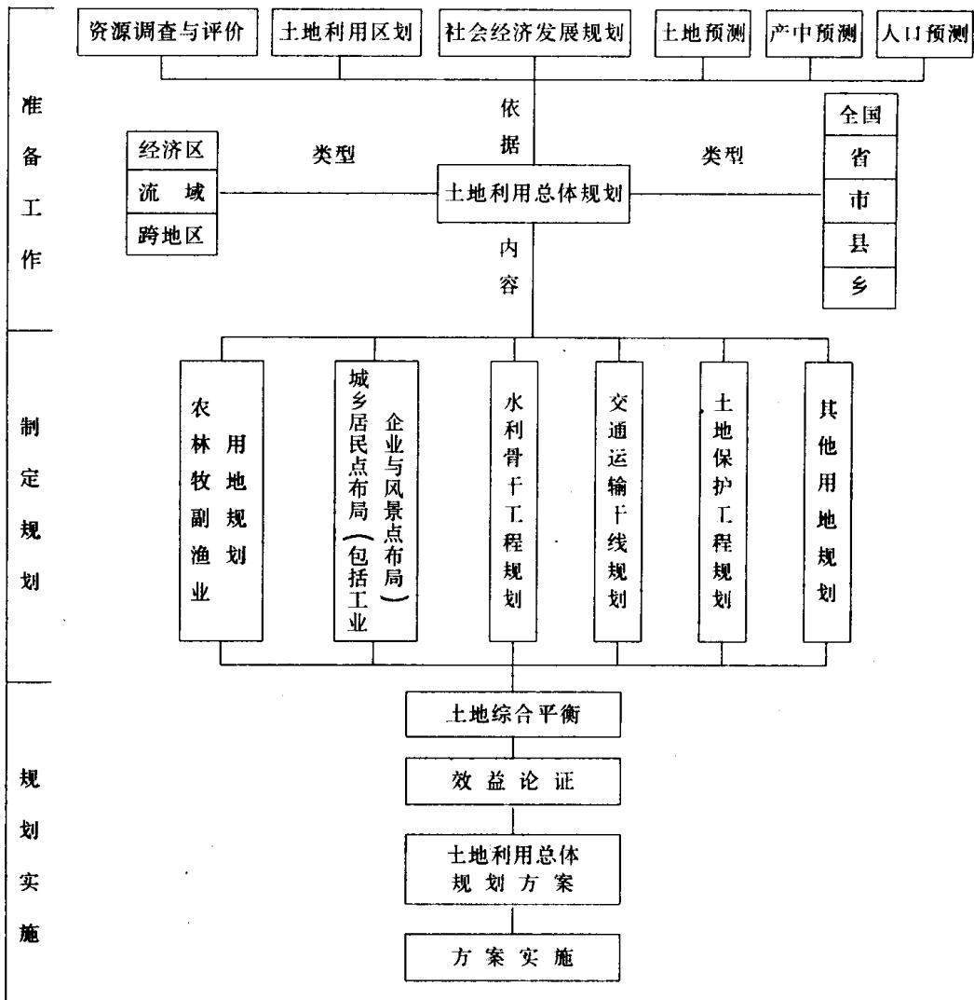  
图9-1土地利用总体规划的类型、依据、内容及程序

局合理，符合人口远景发展趋势，城乡居民点布局合理，水资源开发利用合理，水利骨干工程配套，道路畅通并做到保护环境。

## 2. 土地利用线性规划方法

线性规划是运筹学的一个分支，是目前研究多变量复杂系统应用较广且简便易行的一种数学模型。目的在于通过数学方法，寻求资源最佳配置及效益最佳。线性规划数学模型为：

目标函数：

$$
\operatorname* { m i n } \quad { \ddot { \Xi } } \quad \operatorname* { m a x } Z = \sum _ { j } ^ { n } G _ { j } X _ { j }\tag{9-1}
$$

满足约束条件：

$$
\sum _ { j } ^ { n } a _ { i j } X _ { j } = b _ { j }
$$

$$
X _ { j } \geqslant 0 \ ( j = 1 , 2 , 3 , \cdots , n )\tag{9-2}
$$

式中 $X _ { j }$ —一组未知决策变量，可以为各种农产品的产量；

$a _ { i j }$ ——技术系数，表示生产第j种农产品所需第Ⅰ种生产因素的投入数量；

$c _ { j }$ —效益系数，表示生产第j种农产品单位产品的效益；

$b _ { j }$ 生产因素的限制量。

对于决策变量 $X _ { j }$ 的确定，要以土地评价为基础，同时估计到土地改良因素及潜在适宜性：约束条件包括资源约束（土地数量及质量）、需求约束（市场）、生产约束（部门协调）等众多因素；目标函数的确定可以是求最大值，如产量最高、效益最大、纯收入最多等；也可以求最小值，如投入最小、土壤侵蚀最小等。在实际工作中，可以根据情况决定选择哪种方法。

## 3. 土地利用规划的多目标规划法

由于土地利用规划中涉及的内容极为复杂，目标往往并非一个，如产值最大、纯利润最大、投入最小、防治荒漠化工程效益最大等等，所以线性规划方法就受到局限。此时多目标规划方法表现出一定的优越性，多目标规划的数学表达式为：

$$
V P \binom { V _ { - \operatorname* { m i n } } \big [ F _ { 1 } ( X ) , \cdots , F _ { p } ( X ) \big ] ^ { T } } { g _ { i } ( X ) \geqslant 0 \ ( i = 1 , 2 , 3 , \cdots , m ) }\tag{9-3}
$$

在此 $X = [ X _ { 1 } , \cdots , X ] ^ { T }$ ，为一向量，实际上也就是规划中的活动变量。 $V _ { \textrm { -- } \operatorname* { m i n } }$ 表示对P 个目标 $\left[ \boldsymbol { F } _ { 1 } \left( \boldsymbol { X } \right) , \ \cdots , \ \boldsymbol { F } _ { \rho } \left( \boldsymbol { X } \right) \right] ^ { T }$ 求最小 $( P { \geqslant } 2 )$ ，以区别单目标最小， $X = \ [ X _ { 1 } , \ \cdots , \ f _ { \rho } \ ( X )$ 了为 $P$ 个目标函数， $g _ { i } \left( X \right) \ { \geqslant } 0$ 为 $^ { \pmb { m } }$ 个约束条件。

多目标规划是优化理论的一个新分支，目前其理论尚不完善，求解的方法也很多，诸如约束法、目标分层法、功效系数法、综合目标法（加权和法、目标规划法、乘除法）等。多目标土地利用规划中的决策变量、参数及约束方程与线性规划方法局限土地利用规划相同。

此外，几年来灰色系统理论、模糊数学方法、系统动力学方法、动态规划以及非线性规划方法等也逐渐被利用来进行土地利用规划，在此，限于篇幅，不作论述。

## （二）水资源规划

在荒漠化地区土地利用规划中，考虑到荒漠化地区特殊的自然条件，必须进行水资源规划，这是保证土地利用规划顺利实施及防治荒漠化的一个重要手段。在水资源规划中，首先需要摸清和掌握可利用水资源总量及其时空分布、需水总量及用水时空分布等众多因素，然后可采用线性规划方法、动态规划方法，或者将二者综合应用进行规划。

由于荒漠化地区的河流为内陆河流，总结我国几年来荒漠化土地发生特点和经验教训，在进行土地利用规划及水资源规划时，一定要有全局观念，从全流域利用出发，尤其是在上游地区，切不可盲目过量取水进行传统意义上的土地开发或农业综合开发，要大力发展节水灌溉；同时，在一些特殊区域，如绿洲或内陆河流一定要考虑生态用水，否则会造成生态灾难。

此外，由于特殊的地理环境，在我国荒漠化地区分布有许多天然水面，为提高资源利用率，开放这些水面意义重大，应制定水面开发计划，同时也应做好村镇建设规划以及荒漠化地区自然保护区规划等方面的工作。

## （三）防治荒漢化工程总体规划

防治荒漠化工程总体规划是指一个地区荒漠化综合防治措施体系的有机集成体。它应包括农业综合开发、林业（造林）、牧业（合理放牧及种草）、资源保护（自然保护区规划）、水面开发等诸多方面内容。亦可分为不同层次。表9-1、表9-2是我国1990～2000年治沙工程十年规划的主要规划内容，其中包括：人工造林（又细分为：防风固沙林、速生丰产用材林、经济林），封沙育林育草，飞播造林，人工种草及草场改良，治沙造田及改造低产田，种植药材及经济作物，开发利用水面等项目。从中可以看出其内容的丰富程度，而且对于不同地区，其规划内容也可能有所不同。因此，一个地区的防治荒漠化工程总体规划应结合当地荒漠化类型、程度、原因等，在制定规划的指导思想和基本原则、工程总体布局与建设重点以及确定防治措施时，做到因地制宜，因害设防，具体规划工作思路与土地利用总体规划基本一致。

## （四）防治荒漠化工程专项规划

综观我国以往的防治荒漠化工程规划工作，总结防治荒漠化事业技术措施，一般的防治荒漠化工程规划包括以下几方面内容：沙地综合开发利用规划、防护林规划（包括农田防护林、牧场防护林、水土保持林、苗圃规划）、果园规划、水利工程规划、水面开发规划、草场规划、村镇建设规划、小流域水土保持规划、荒漠化地区自然保护区规划等。

## 1. 防护林工程规划及典型设计

根据《中华人民共和国森林法》及《森林资源调查技术规程》，我国森林分为5个林种：即防护林（包括农田防护林、防风固沙林、牧场防护林、水土保持林、苗圃规划）、用材林、经济林、薪炭林及特种用途林。考虑到在防治荒漠化工程中主要林种是防护林，在此仅以防护林规划设计为主予以论述。

(1）防护林规划原则由于工程项目大小等方面的因素，在防护林规划时，首先要按类型区进行规划，贯彻因地制宜、因害设防的原则，在规划设计时，针对不同类型区特点，选择最适宜树种，确定合理的防护林林种、最优的林带结构和配置方案、适宜的造林措施；其次要建立完善的综合防护林体系，做到防护与用材相结合、带片网相结合、乔灌草相结合、绿化美化相结合，对于农田防护林网，要做到与道路、灌溉水渠相结合，防护林体系与农业综合开发工程相结合；同时，要确定合理的防护林占地比例，考虑到林草措施在防治荒漠化中的地位及作用，适当扩大造林面积是可以理解的。但在一些地区，由于受自然因素制约，尤其是水资源制约，切不可盲目追求森林覆盖率，要总结西北地区农田防护林网窄林带、小网格的经验。

<table><tr><td rowspan="2">省(自治区、 直辖市）</td><td rowspan="2">1992~2000年 治理开发</td><td colspan="4">人工造林</td><td rowspan="2">封沙育 经济林 林育草</td><td rowspan="2">飞播造</td><td rowspan="2">人工种草 及</td><td>治沙造田</td><td>种植药材 及</td><td rowspan="2">开发利用</td><td rowspan="2">水面</td><td rowspan="2">备注</td></tr><tr><td>小计</td><td>防风 固沙林</td><td>速生丰产</td><td>林种草</td><td>及改</td></tr><tr><td>内蒙古</td><td></td><td>总面积 269.7</td><td>49.7</td><td>41.7</td><td>用材林 4.7</td><td>3.3</td><td>86.7</td><td>51.3</td><td>改良草场 63.3</td><td>造低产田 9.3</td><td>经济作物 4.7</td><td>4.7</td><td>固沙0.3</td></tr><tr><td>新</td><td>疆</td><td>160.3</td><td>12.0</td><td>10</td><td>0.7</td><td>1.3</td><td>106.8</td><td>一</td><td>33.3</td><td>3.5</td><td>4.7</td><td>0.1</td><td></td></tr><tr><td>甘</td><td>肃</td><td>65.0</td><td>7.4</td><td>4.7</td><td>0.7</td><td>2.0</td><td>46.7</td><td>一</td><td>6.0</td><td>2.7</td><td>2.0</td><td>0.3</td><td></td></tr><tr><td>陕</td><td>西</td><td>22.3</td><td>11.6</td><td>8.0</td><td>1.3</td><td>2.3</td><td>一</td><td>3.3</td><td>3.3</td><td>2.7</td><td>0.7</td><td>0.7</td><td></td></tr><tr><td>吉</td><td>林</td><td>21.7</td><td>7.0</td><td>5.7</td><td>1.3</td><td></td><td>一</td><td>一</td><td>8.0</td><td>4.0</td><td>一</td><td>2.7</td><td></td></tr><tr><td>黑龙江</td><td></td><td>20.3</td><td>6.9</td><td>5.5</td><td>1.3</td><td>0.1</td><td>一</td><td>1.3</td><td>5.3</td><td>4.0</td><td>一</td><td>2.7</td><td></td></tr><tr><td>河</td><td>北</td><td>18.8</td><td>5.8</td><td>3.3</td><td>1.5</td><td>1.0</td><td>4.0</td><td>3.3</td><td>3.3</td><td>2.0</td><td>一</td><td>0.3</td><td></td></tr><tr><td>宁</td><td>夏</td><td>17.3</td><td>5.0</td><td>4.0</td><td>0.3</td><td>0.7</td><td>3.3</td><td>3.3</td><td>3.3</td><td>1.3</td><td>0.7</td><td>0.3</td><td></td></tr><tr><td>青</td><td>海</td><td>16.7</td><td>1.3</td><td>1.3</td><td>一</td><td>一</td><td>13.3</td><td>一</td><td>1.3</td><td>一</td><td>0.7</td><td>一</td><td></td></tr><tr><td>辽</td><td>宁</td><td>15.7</td><td>4.7</td><td>3.3</td><td>0.7</td><td>0.7</td><td>2.7</td><td>3.3</td><td>2.7</td><td>1.3</td><td>1</td><td>1.0</td><td></td></tr><tr><td>山</td><td>西</td><td>9.0</td><td>5.6</td><td>3.3</td><td>0.3</td><td>2.0</td><td>一</td><td>一</td><td>3.3</td><td></td><td></td><td>一</td><td></td></tr><tr><td>山</td><td>东</td><td>6.3</td><td>2.9</td><td>1.7</td><td>1.0</td><td>0.2</td><td>一</td><td>一</td><td>一</td><td>3.3</td><td></td><td>0.1</td><td></td></tr><tr><td>河</td><td>南</td><td>6.2</td><td>2.8</td><td>1.7</td><td>1.0</td><td>0.1</td><td></td><td>一</td><td></td><td>3.3</td><td></td><td>0.1</td><td></td></tr><tr><td>四</td><td>川</td><td>6.0</td><td>2.2</td><td>1.5</td><td>一</td><td>0.7</td><td>3.2</td><td>0.7</td><td>一</td><td>一</td><td>1</td><td>一</td><td></td></tr><tr><td>北</td><td>京</td><td>3.7</td><td>2.6</td><td>1.3</td><td>0.3</td><td>1.0</td><td>一</td><td>一</td><td>一</td><td>1.0</td><td></td><td>一</td><td></td></tr><tr><td>安</td><td>徽</td><td>0.9</td><td>0.6</td><td>0.3</td><td>0.2</td><td>0.1</td><td>一</td><td>一</td><td>一</td><td>0.2</td><td></td><td>0.1</td><td></td></tr><tr><td>江</td><td>西</td><td>0.9</td><td>0.6</td><td>0.3</td><td>0.2</td><td>0.1</td><td>一</td><td>一</td><td></td><td>0.2</td><td></td><td>0.1</td><td></td></tr><tr><td>江</td><td>苏</td><td>0.9</td><td>0.6</td><td>0.3</td><td>0.2</td><td>0.1</td><td>一</td><td>一</td><td>一</td><td>0.2</td><td></td><td>0.1</td><td></td></tr><tr><td>福</td><td>建</td><td>0.9</td><td>0.6</td><td>0.3</td><td>0.2</td><td>0.1</td><td></td><td>一</td><td></td><td>0.2</td><td></td><td>0.1</td><td></td></tr><tr><td>浙</td><td>江</td><td>0.9</td><td>0.6</td><td>0.3</td><td>0.2</td><td>0.1</td><td></td><td>一</td><td>一</td><td>0.2</td><td>一</td><td>0.1</td><td></td></tr><tr><td>广</td><td>东</td><td>0.8</td><td>0.5</td><td>0.3</td><td>0.1</td><td>0.1</td><td>一</td><td>一</td><td></td><td>0.1</td><td></td><td>0.1</td><td></td></tr><tr><td>广</td><td>西</td><td>0.8</td><td>0.5</td><td>0.3</td><td>0.1</td><td>0.1</td><td>一</td><td>一</td><td>一</td><td>0.1</td><td>一</td><td>0.1</td><td></td></tr><tr><td>云</td><td>南</td><td>0.7</td><td>0.5</td><td>0.3</td><td>0.1</td><td>0.1</td><td>一</td><td>一</td><td>一</td><td>0.1</td><td>一</td><td>一</td><td></td></tr><tr><td>西</td><td>藏</td><td>0.4</td><td>0.4</td><td>0.2</td><td>0.1</td><td>0.1</td><td>一</td><td>一</td><td>一</td><td>0.1</td><td>一</td><td>一</td><td></td></tr><tr><td>海</td><td>南</td><td>0.3</td><td>0.3</td><td>0.1</td><td>0.1</td><td>0.1</td><td>一</td><td>1</td><td>一</td><td>0.1</td><td>一</td><td>一</td><td></td></tr><tr><td>合计</td><td></td><td>666.5</td><td>132.7</td><td>99.7</td><td>16.6</td><td>16.4</td><td>266.7</td><td>66.5</td><td>133.1</td><td>39.9</td><td>13.5</td><td>13.7</td><td></td></tr></table>

全国-2
<table><tr><td rowspan="2">重点建设项目</td><td rowspan="2">1992~2000年</td><td colspan="4">人工造林</td><td rowspan="2">封沙育 林育草</td><td rowspan="2">飞播造 林种草</td><td rowspan="2">人工种草 及</td><td rowspan="2">治沙造田 及改</td></tr><tr><td>治理开发 总面积</td><td>防风 小计</td><td>速生丰产</td><td>经济林</td></tr><tr><td>内蒙古高原至新疆荒漠地区天然林植被的恢复和合理利用</td><td>200.7</td><td>一</td><td>固沙林 一</td><td>用材林 一</td><td>一</td><td>190</td><td>一</td><td>改良草场 一</td><td>造低产田 一</td></tr><tr><td>呼伦贝尔沙地综合治理开发</td><td>9.3</td><td>2.7</td><td>2.7</td><td>一</td><td>一</td><td>6.7</td><td>一</td><td>一</td><td>一</td></tr><tr><td>松嫩沙地的综合治理开发</td><td>19.7</td><td>8.4</td><td>6.7</td><td>1.7</td><td>一</td><td>一</td><td>一</td><td>6.7</td><td>1.3</td></tr><tr><td>西辽河流域沙地的综合治理开发</td><td>62.7</td><td>18.7</td><td>14</td><td>2.7</td><td>2.0</td><td>13.3</td><td>13.3</td><td>9.3</td><td>4.7</td></tr><tr><td>科尔沁沙地北部综合治理开发</td><td>14.0</td><td>4.0</td><td>3.3</td><td>0.7</td><td>一</td><td>6.7</td><td>一</td><td>一</td><td>3.3</td></tr><tr><td>浑善达克沙地沙化草场的综合治理</td><td>35.0</td><td>5.0</td><td>3.3</td><td>1.7</td><td>一</td><td>13.3</td><td>6.7</td><td>10</td><td>一</td></tr><tr><td>神府一准格尔煤田沙区环境的综合治理</td><td>16.3</td><td>6.3</td><td>5.3</td><td>一</td><td>1.0</td><td>一</td><td>10</td><td>一</td><td>一</td></tr><tr><td>毛乌素沙地中部沙化草原的综合治理</td><td>49.3</td><td>11.0</td><td>10</td><td>一</td><td>1.0</td><td>一</td><td>20</td><td>17.7</td><td>0.7</td></tr><tr><td>毛乌素沙地南缘长城沿线沙地综合治理开发</td><td>14.0</td><td>7.9</td><td>5.3</td><td>1.3</td><td>1.3</td><td>一</td><td>一</td><td>2.0</td><td>2.7</td></tr><tr><td>乌兰布和沙漠北部的综合治理开发</td><td>2.7</td><td>1.7</td><td>0.3</td><td>0.7</td><td>0.7</td><td>一</td><td>一</td><td></td><td>0.7</td></tr><tr><td>内蒙古乌盟后山沙漠化土地的综合治理开发</td><td>20.3</td><td>9.7</td><td>9.7</td><td>一</td><td>一</td><td>一</td><td>1</td><td>10</td><td>0.7</td></tr><tr><td>雁、同、朔及忻州地区沙地综合治理开发</td><td>7.3</td><td>5.3</td><td>3.3</td><td>一</td><td>2</td><td>一</td><td></td><td>2.0</td><td></td></tr><tr><td>宁夏河东沙地及腾格里沙漠东南缘的综合治理开发</td><td>14.7</td><td>4.0</td><td>3.3</td><td>一</td><td>0.7</td><td>3.3</td><td>3.3</td><td>2.0</td><td>1.3</td></tr><tr><td>河西走廊沙地综合治理开发</td><td>17.3</td><td>7.4</td><td>4.7</td><td>0.7</td><td>2</td><td>一</td><td>一</td><td>6.0</td><td>2.7</td></tr><tr><td>准噶尔南缘沙地综合治理开发</td><td>15.0</td><td>3.3</td><td>3.3</td><td>1</td><td>一</td><td>一</td><td>一</td><td>11</td><td>0.7</td></tr><tr><td>塔里木盆地绿色走廊的综合开发</td><td>4.7</td><td>1.3</td><td>1.3</td><td>一</td><td>一</td><td>一</td><td></td><td>2.0</td><td>1.3</td></tr><tr><td>塔里木盆地南缘沙地综合治理开发</td><td>12.7</td><td>4.6</td><td>3.3</td><td>1</td><td>1.3</td><td>一</td><td></td><td>6.7</td><td>1.3</td></tr><tr><td>永定河、潮白河中下游风沙化土地的综合治理开发</td><td>5.3</td><td>4.0</td><td>2.0</td><td>0.7</td><td>1.3</td><td>一</td><td>一</td><td>一</td><td>1.3</td></tr><tr><td>黄淮海平原中部风沙化土地综合治理开发</td><td>10.7</td><td>5.3</td><td>3.3</td><td>2.0</td><td>一</td><td>一</td><td>一</td><td>一</td><td>5.3</td></tr><tr><td>塔克拉马干中部油田沙化环境的综合治理</td><td>2.7</td><td>2.0</td><td>2.0</td><td></td><td></td><td>0.7</td><td>一</td><td>一</td><td></td></tr><tr><td>合计</td><td>534.4</td><td>112.6</td><td>87.1</td><td>12.2</td><td>13.3</td><td>234</td><td>53.3</td><td>85.4</td><td>28.0</td></tr></table>

（2）防护林设计（包括农田防护林、牧场防护林、水土保持林、防风固沙林等）造林规划设计内容包括：造林立地条件划分、树种选择及树种组成、造林密度确定、造林方式及季节、抚育管理等项内容。对于农田防护林网，还应考虑林带结构、透风系数、主副林带间距及网格大小、有效防护距离（林带高度）、林带宽度及断面形状、林带的走向及夹角。对于防风固沙林，在规划设计时，必须考虑到风沙危害这一沙区基本特征，应采用带片网结合方式；在绿洲防护林体系建设工程中，应建立绿洲外围封沙育草带一绿洲边缘阻沙基干林带一绿洲内部农田防护林网这一成功模式；沙丘及流动沙地造林可采用“前挡后拉”等固沙方式，为防止风蚀或沙埋，保证幼苗成活，迎风坡造林时，应结合工程措施(沙障)；在沙丘背风坡造林时，靠沙丘背风坡脚要留出一段安全距离，以避免幼苗被流沙埋没；飞播造林设计时还应考虑飞播种子处理、确定合理播量、播期以及航高、播幅等飞行作业时所涉及的技术问题。

(3)造林典型设计的编制造林典型设计是根据不同立地条件类型，本着因地制宜、适地适树的原则，以林种分别编制的标准设计。造林典型设计多以图表形式表达，其内容主要包括以下几点：

①典型设计编号及名称；

②适宜的立地条件类型；

③根据立地条件等选定林种；

①选择适宜的树种、配置方式及混交比例；

⑤整地方式、时间及规格要求；

⑥造林方式、方法、造林时间、种苗规格、苗木用量及质量要求；

⑦幼林抚育方式、方法、时间、次数等；

⑧需要采取的工程措施，如沙障、灌溉等；

⑨用工量（包括整地、造林、抚育、工程措施等所有活动）。

根据以上原则和方法，下附常见工程造林中的典型设计模式，以供参考。

## 防风用材林造林典型设计

①设计号 001

②造林立地条件类型 B1草原栗钙土

③造林地类沙荒地、退耕地

④配置图式 图9-2

⑤每公顷苗木用量计算表

<table><tr><td rowspan=1 colspan=1>树种类别</td><td rowspan=1 colspan=1>树种</td><td rowspan=1 colspan=1>代号</td><td rowspan=1 colspan=1>苗龄</td><td rowspan=1 colspan=1>苗木用量</td></tr><tr><td rowspan=1 colspan=1>主要树种次要树种后备树种</td><td rowspan=1 colspan=1>小青杨×黑杨、小叶杨×黑杨、白城杨胡枝子紫穗槐、锦鸡儿</td><td rowspan=1 colspan=1></td><td rowspan=1 colspan=1>1~2ala或直播</td><td rowspan=1 colspan=1>2 2051125</td></tr></table>

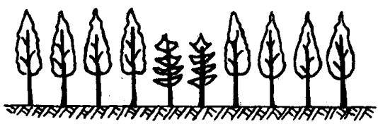

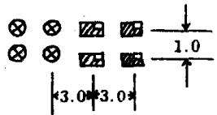  
图9-2防风用材林造林配置图式（单位：m）

⑥ 造林技术措施  
——整地季节及方式
<table><tr><td>整地</td><td>季节</td><td>方式、方法</td><td>质量要求</td></tr><tr><td>翻地</td><td>提前1年</td><td>机械、全面</td><td>深 30cm</td></tr><tr><td>耙地</td><td>伏前</td><td>机械、全面</td><td>耙细</td></tr></table>

——造林季节及方式

<table><tr><td>造林季节</td><td>方式、方法</td><td>质量要求</td></tr><tr><td>春季</td><td>机械、植苗</td><td>手工植苗扶直、踏实</td></tr></table>

——幼林抚育

<table><tr><td>年度</td><td>次数</td><td>季节</td><td>内容</td><td>方法</td><td>质量要求</td></tr><tr><td>第一一年</td><td>3</td><td>6、7、8月</td><td>除草松土</td><td>手工、机械</td><td>除净、不伤苗</td></tr><tr><td>第二年</td><td>2</td><td>6、7月</td><td>除草松土</td><td>手工、机械</td><td>除净、不伤苗</td></tr><tr><td>第三年</td><td>1</td><td>7月</td><td>除草松土</td><td>重耙</td><td>除净、不伤苗</td></tr></table>

<table><tr><td>整地 季节 方式、方法</td></tr><tr><td>质量要求 翻地 秋 机械带状整地 深 30cm</td></tr><tr><td>耙地</td></tr><tr><td>造林季节及方式</td></tr><tr><td>造林季节 方式、方法 质量要求</td></tr><tr><td>春、秋 手工、植苗 不窝根、扶直、踏实</td></tr></table>

——整地季节及方式

## ⑦每公顷用工及费用统计表

单位：个、元

<table><tr><td rowspan=1 colspan=2>小   计</td><td rowspan=2 colspan=1>苗木费</td><td rowspan=1 colspan=2>整地</td><td rowspan=1 colspan=2>造   林</td><td rowspan=1 colspan=2>幼林抚育</td></tr><tr><td rowspan=1 colspan=1>用工</td><td rowspan=1 colspan=1>费用</td><td rowspan=1 colspan=1>用工</td><td rowspan=1 colspan=1>费用</td><td rowspan=1 colspan=1>用工.</td><td rowspan=1 colspan=1>费用</td><td rowspan=1 colspan=1>用工</td><td rowspan=1 colspan=1>费用</td></tr><tr><td rowspan=1 colspan=1></td><td rowspan=1 colspan=1></td><td rowspan=1 colspan=1></td><td rowspan=1 colspan=1></td><td rowspan=1 colspan=1></td><td rowspan=1 colspan=1></td><td rowspan=1 colspan=1></td><td rowspan=1 colspan=1></td><td rowspan=1 colspan=1></td></tr></table>

⑧补充说明

A.株行距：杨1.5m×3m、2m×3m、3m×3m、灌木0.5m×3m；

B. 乔灌比 50：50（混交百分比）；

C. 可以松与胡枝子等灌木混交、杨柳混交。

## 农田防护林造林典型设计

① 设计号 002

②造林立地条件类型 A川地黑土

③造林地类荒地、农田

④配置图式 林带与路、渠结合图9-3

⑤每公顷苗木用量计算表

<table><tr><td>树种类别</td><td>树 种</td><td>代号</td><td>苗龄</td><td>苗木用量</td></tr><tr><td>主要树种 次要树种</td><td>小青杨×黑杨、小叶杨×黑杨、白城杨</td><td></td><td>2~3a</td><td>2 205</td></tr><tr><td>后备树种</td><td>垂柳、紫穗槐、锦鸡儿</td><td></td><td>la或直播</td><td>1125</td></tr></table>

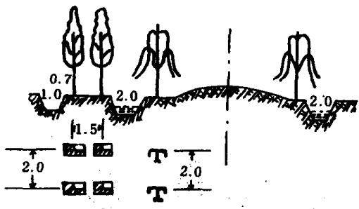  
图9-3 农田防护林造林配置图式（单位：m）

## ⑥ 造林技术措施

——幼林抚育

<table><tr><td>年度</td><td>次数</td><td>季节</td><td>内容</td><td>方法</td><td>质量要求</td></tr><tr><td>第一年</td><td>2</td><td>6、7月</td><td>除草松土</td><td>手T、机械</td><td>除净、不伤苗</td></tr><tr><td>第二年</td><td>1</td><td>7月</td><td>除草松土</td><td>手I、机械</td><td>除净、不伤苗</td></tr><tr><td>第三年</td><td>1</td><td>7月</td><td>除草松土</td><td>手L、机械</td><td>除净、不伤苗</td></tr></table>

单位：个、元

⑦每公顷用工及费用统计表

<table><tr><td rowspan=1 colspan=2>小    计</td><td rowspan=2 colspan=1>苗木费</td><td rowspan=1 colspan=2>整地</td><td rowspan=1 colspan=2>造    林</td><td rowspan=1 colspan=2>幼林抚育</td></tr><tr><td rowspan=1 colspan=1>用工</td><td rowspan=1 colspan=1>费用</td><td rowspan=1 colspan=1>用工</td><td rowspan=1 colspan=1>费用</td><td rowspan=1 colspan=1>用工.</td><td rowspan=1 colspan=1>费用</td><td rowspan=1 colspan=1>用工</td><td rowspan=1 colspan=1>费用</td></tr><tr><td rowspan=1 colspan=1></td><td rowspan=1 colspan=1></td><td rowspan=1 colspan=1></td><td rowspan=1 colspan=1></td><td rowspan=1 colspan=1></td><td rowspan=1 colspan=1></td><td rowspan=1 colspan=1></td><td rowspan=1 colspan=1></td><td rowspan=1 colspan=1></td></tr></table>

⑧补充说明

A. 苗木为良种壮苗，规格一致；

B. 株行距：1.5m×3m、2m×3m、3m×3m、灌木0.5m×3m；

C. 可品字形配置，紫穗槐与杨柳混交。

## 防风固沙用材林造林典型设计

① 设计号 003

②造林立地条件类型 C:固定/半固定/流沙地

③ 造林地类 丘间固定/半固定/沙荒地

④配置图式 图 9-4

⑤每公顷苗木用量计算表

<table><tr><td rowspan=1 colspan=1>树种类别</td><td rowspan=1 colspan=1>树     种</td><td rowspan=1 colspan=1>代号</td><td rowspan=1 colspan=1>苗龄</td><td rowspan=1 colspan=1>苗木用量</td></tr><tr><td rowspan=1 colspan=1>主要树种后备树种</td><td rowspan=1 colspan=1>樟子松、胡枝子黑松、锦鸡儿</td><td rowspan=1 colspan=1></td><td rowspan=1 colspan=1>2a1a或直播</td><td rowspan=1 colspan=1>3 3306 660</td></tr></table>

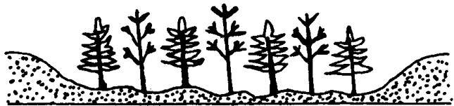

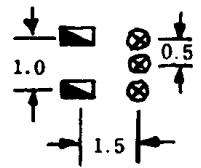  
图9-4 防风固沙用林造林配置图式（单位：m）

⑥ 造林技术措施

——整地季节及方式
<table><tr><td>整地</td><td>季节</td><td>方式、方法</td><td>质量要求</td></tr><tr><td>翻地</td><td>提前1年</td><td>机械、全面</td><td>深 30cm</td></tr><tr><td>耙地</td><td>伏前</td><td>机械、全面</td><td>耙细</td></tr></table>

——造林季节及方式

<table><tr><td>造林季节</td><td>方式、方法</td><td>质量要求</td></tr><tr><td>春季</td><td>机械、手工植苗</td><td>手工植苗扶直、踏实</td></tr></table>

——幼林抚育
<table><tr><td>年度</td><td>次数</td><td>季节</td><td>内容</td><td>方法</td><td>质量要求</td></tr><tr><td>第一年</td><td></td><td></td><td></td><td></td><td></td></tr><tr><td>第二年</td><td></td><td></td><td></td><td></td><td></td></tr><tr><td>第三年</td><td>1</td><td>7月</td><td>除草松士</td><td>重耙</td><td>除净、不伤苗</td></tr></table>

⑦每公顷用工及费用统计表  
单位：个、元

<table><tr><td rowspan=1 colspan=2>小   计</td><td rowspan=2 colspan=1>苗木费</td><td rowspan=1 colspan=2>整地</td><td rowspan=1 colspan=2>造  林</td><td rowspan=1 colspan=2>幼林抚育</td></tr><tr><td rowspan=1 colspan=1>用工</td><td rowspan=1 colspan=1>费用</td><td rowspan=1 colspan=1>用工</td><td rowspan=1 colspan=1>费用</td><td rowspan=1 colspan=1>用工</td><td rowspan=1 colspan=1>费用</td><td rowspan=1 colspan=1>用工</td><td rowspan=1 colspan=1>费用</td></tr><tr><td rowspan=1 colspan=1></td><td rowspan=1 colspan=1></td><td rowspan=1 colspan=1></td><td rowspan=1 colspan=1></td><td rowspan=1 colspan=1></td><td rowspan=1 colspan=1></td><td rowspan=1 colspan=1></td><td rowspan=1 colspan=1></td><td rowspan=1 colspan=1></td></tr></table>

⑧补充说明  
A. 樟子松苗高15cm，根茎0.45cm，2年换床苗；  
B. 株行距：樟子松1m×3m、灌木0.5m×3m。

## 2. 小流域水土保持规划

小流域水土保持规划是在“预防为主、全面规划、因地制宜、综合防治、加强管理、注重效益”方针指导下，统筹安排各项水土保持措施，做到工程措施与生物措施相结合，治沟与治坡相结合，在工程措施中大中小相结合，生物措施中乔灌草相结合，立体配置、层层设防。下面仅以黄土高原小流域综合治理为例加以说明，详见图9-5。

## (1）坡面生物工程措施防治体系

①调整生产结构，依据《水土保持法》防止陡坡开荒，实行陡坡退耕还林还草；

②坡面中下部，坡度在5°～15°的地段修筑水平梯田或草田轮作，梯田埂营造灌木林；

③坡面中部，坡度大于15°的地段，改为窄带梯田，田埂营造灌木林；

①坡面上部，自然条件较差，以造林种草为主。

(2)沟道生物工程措施防治体系

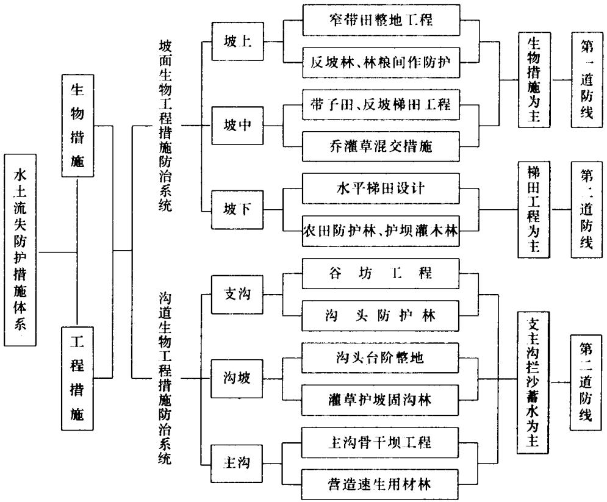  
图 9-5 黄土高原水土保持体系框图

①支沟中建立谷坊群，分段控制，分片设防，层层拦截泥沙；

②沟头利用小地形营造沟头防护林，防止溯源侵蚀；

③沟坡上修成台阶状，栽植乔灌混交林；

①主沟上修筑控制性坝库；

⑤沟道营造速生用材林。

（3)具体措施的典型设计内容包括

①典型设计编号及设计名称；

②所作流域具体位置；

③单位面积所需材料及其数量；

①用工量；

⑤结构、方式方法等用图表表示。

对于经济林（果园）规划，包括果树树种品种选择、品种配置、授粉树配置及果园小区规划。

## 3. 草场规划

（1）划分季节牧场一般牧区是全年放牧的，但由于地形、土壤、气候等自然条件的差异，反映在适宜放牧利用的时间上也不相同。为合理利用草地资源，保护和培育草场生产力，满足牲畜在各个季节对牧草的需要，必须因地制宜地划分牧场，实行草地季节间、地区间轮牧。季节牧场的划分因地区自然条件不同及利用习惯的差异，划分类型及轮牧方式也不同。如内蒙古和新疆的天然草地上，都存在四季、三季、两季和全年不分季节的牧场类型，其中四季牧场是按春夏秋冬4个季节划分的牧场，三季牧场一般是春秋两季利用同一草地；两季牧场则是冬春利用同一草地，夏秋利用同一草地；全年牧场不划分季节草地。因此，划分季节牧场是必须根据自然条件及经营习惯及管理水平、利用状况加以确定，合理放牧防止过牧造成荒漠化。

（2）放牧地段布局在划分季节牧场后，为组织合理放牧，需要根据畜群规模、放牧地段面积、畜群对草地要求，为不同的畜群确定放牧地段。放牧牲畜的畜群规模取决于牲畜的种类、性别、年龄、生产性以及管理水平等多种因素。即使同一种牲畜其畜群规模在各地也不相同，表9-3所列数据可供参考。

表 9-3 不同畜群的放牧规模
<table><tr><td>牲畜种类</td><td>畜群规模（头、匹）</td><td>牲畜种类</td><td>畜群规模（只、匹）</td></tr><tr><td>乳 牛</td><td>&lt;100</td><td>马</td><td>50~80</td></tr><tr><td>牛犊</td><td>50~80</td><td>带羔母羊</td><td>200~300</td></tr><tr><td>青年牛</td><td>100~150</td><td>去势羊</td><td>600~700</td></tr><tr><td>育肥牛</td><td>100~150</td><td>细毛羊</td><td>300</td></tr><tr><td>繁殖母马</td><td>80~100</td><td>粗毛羊</td><td>500~600</td></tr><tr><td>成年马</td><td>100~200</td><td>羔羊</td><td>700~1 000</td></tr></table>

畜群放牧地段面积计算公式为：

$$
\frac { 1 } { 2 } \times ( \frac { 1 } { 2 } \times \frac { 1 } { 2 0 } \times \frac { 1 } { 1 0 } ) \times \frac { 1 } { 1 0 } = \frac  \frac { 1 } { 2 0 } \times \frac { 1 } { 2 0 } \times \frac { 1 } { 2 0 } \times \frac { 1 } { 2 0 } \times \frac { 1 } { 2 0 } \times \frac { 1 } { 2 0 } \times \frac { 1 } { 2 0 } \times \frac { 1 } { 2 0 } \times \frac { 1 } { 2 0 } \times \frac { 1 } { 2 0 } \times \frac { 1 } { 2 0 } \times \frac { 1 } { 2 0 } \times \frac { 1 } { 2 0 } \times \frac { 1 } { 2 0 } \times \frac { 1 } { 2 0 } \times \frac { 1 } { 2 0 } \times \frac { 1 } { 2 0 } \times \frac { 1 } { 2 0 } \times \frac { 1 } { 2 0 } \times \frac { 1 } { 2 0 } \times \frac { 1 } { 2 0 } \times \frac { 1 } { 2 0 } \times \frac { 1 } { 2 0 } \times \frac { 1 } { 2 0 } \times \frac { 1 } { 2 0 } \times \frac { 1 } { 2 0 } \times \frac { 1 } { 2 0 } \times \frac { 1 } { 2 0 } \times \frac { 1 } { 2 0 } \times \frac { 1 } { 2 0 } \times \frac { 1 } { 2 0 } \times \frac { 1 } { 2 0 } \times \frac { 1 } { 2 0 } \times \frac { 1 } { 2 0 } \times \frac { 1 } { 2 0 } \times \frac { 1 } { 2 0 } \times \frac { 1 } { 2 0 } \times \frac { 1 } { 2 0 } \times \frac { 1 } { 2 0 } \times \frac { 1 } { 2 0 } \times \frac { 1 } { 2 0 } \times \frac { 1 } { 2 0 } \times \frac { 1 } { 2 0 } \times \frac { 1 } { 2 0 } \times \frac { 1 } { 2 0 } \times \frac { 1 } { 2 0 } \times \frac { 1 } { 2 0 } \times \frac { 1 } { 2 0 } \times \frac { 1 } { 2 0 } \times \frac { 1 } { 2 0 } \times \frac { 1 } { 2 0 } \times \frac { 1 } { 2 0 } \times \frac  1\tag{9-4}
$$

公式中的放牧天数是按季节草地适宜的牧期和终期来确定的。始草过早，会摧残牧草生机，影响再生力及草地产草量；始草过迟，降低营养价值，也会减少牧草再生的时机，并降低产草量和供应期。一般季节草地在生长期内的始牧期，以牧草萌发后15～20d为宜。如根据牧草高度判断，表9-4所列数据可供参考。

表 9-4 不同草地类型的应有高度
<table><tr><td>草地类型</td><td>牧草应有高度（cm）</td></tr><tr><td>森林草地：干燥牧场</td><td>10~15</td></tr><tr><td>湿润牧场</td><td>15~20</td></tr><tr><td>半湿润半干旱草地：中生禾本科牧场</td><td>8~10</td></tr><tr><td>旱生禾本科牧场</td><td>10~15</td></tr><tr><td>播种多年生牧场</td><td>15~20</td></tr><tr><td>干旱草地</td><td>10~15</td></tr><tr><td>荒漠草地</td><td>8~10</td></tr><tr><td>山地草地：高山草地牧场</td><td>6~7</td></tr><tr><td>亚高山草地牧场</td><td>10~15</td></tr><tr><td>禾本科杂类草牧场 1年生食用植物</td><td>20~25 25~35</td></tr></table>

(3)轮牧小区设计 轮牧小区是季节牧场地段内各个畜群进行轮牧的基本单位。轮牧小区设计内容包括确定轮牧周期、放牧频率、小区内放牧天数、轮牧小区数、小区面积及几何形状、小区布局等。

我国西北地区主要草地的轮牧周期是干旱草地30～40d，小区年放牧天数通常以再生草长到可被再次利用的天数来定，考虑到防疫，为防止感染牲畜中常见的蠕虫病，小区内放牧天数应控制在6d以内。轮牧小区数可根据下列公式计算，并适当增加1～2个调剂区，以应付不良气候条件：

$$
\sharp \sharp \chi _ { \prime } \mathbb { I } \mathbb { S } \sharp \chi = \frac { \sharp \mathbb { E } \mathbb { I } \mathbb { I } \mathbb { I } \mathbb { I } } { \lVert \mathbb { I } \mathbb { I } \rVert \lVert \chi \rVert \chi \lVert \chi \rVert \chi \lVert \chi \rVert } + \mathbb { i } \mathbb { I } \mathbb { I } \mathbb { I } \mathbb { I } \mathbb { I } \mathbb { I } \mathbb { I } \mathbb { X } \mathbb { I }\tag{9-5}
$$

小区面积计算公式如下：小区几何形状应满足畜群放牧需要，并考虑饮水点。

$$
\begin{array} { r }  J { \boldsymbol { \cdot } } \left[ \vec { \boldsymbol { \Sigma } } \right] \overrightarrow { \left[ \mathrm { H } \right] } \overrightarrow { \boldsymbol { \Psi } } \times = \frac  \overrightarrow { \mathrm { R } } \overrightarrow { \mathrm { H } } + \overrightarrow { \mathbf { \Sigma } } \cdot \overrightarrow { \mathbf { \Sigma } } \overrightarrow { \mathbf { \Sigma } } \times \overrightarrow { \mathbf { \Sigma } } \cdot \overrightarrow { \mathbf { \Sigma } } \cdot \overrightarrow { \mathbf { \Sigma } } \cdot \overrightarrow { \mathbf { \Sigma } } \cdot \overrightarrow { \mathbf { \Sigma } } \cdot \overrightarrow { \mathbf { \Sigma } } \cdot \overrightarrow { \mathbf { \Sigma } } \cdot \overrightarrow { \mathbf { \Sigma } } \mathrm { ~ H } \cdot \overrightarrow { \mathbf { \Sigma } } \cdot \mathbf { \Sigma } \mathrm { ~ \times ~ } \mathrm { ~ } \mathrm { ~ } \mathrm { ~ } \mathrm { ~ } \mathrm { ~ } \mathrm { ~ } \mathrm { ~ } \mathrm { ~ } \mathrm { ~ } \mathrm { ~ } \mathrm { ~ } \mathrm { ~ } \mathrm { ~ } \overrightarrow { ~ \Sigma ~ } \mathrm { ~ } \mathrm { ~ } \mathrm { ~ } \mathrm { ~ } \mathrm { ~ } \mathrm { ~ } \mathrm { ~ } \mathrm { ~ } \mathrm { ~ } \mathrm { ~ } \mathrm { ~ } \mathrm { ~ } \mathrm { ~ } \downarrow \mathrm { ~ } \mathrm { ~ } \mathrm { ~ } \mathrm { ~ } \mathrm { ~ } \mathrm { ~ } \mathrm { ~ } \downarrow \mathrm { ~ } \mathrm { ~ } \mathrm { ~ } \mathrm { ~ } \mathrm { ~ } \mathrm { ~ } \downarrow \mathrm { ~ } \mathrm { ~ } \mathrm { ~ } \mathrm { ~ } \downarrow \mathrm { ~ } \mathrm { ~ } \mathrm { ~ } \mathrm { ~ } \mathrm { ~ } \times \mathrm { ~ } \mathrm { ~ } \mathrm { ~ } \mathrm { ~ } \mathrm { ~ } \mathrm { ~ } \mathrm { ~ } \mathrm { ~ } \mathrm { ~ } \mathrm { ~ } \downarrow \mathrm { ~ } \mathrm { ~ } \mathrm { ~ } \mathrm { ~ } \mathrm { ~ } \mathrm { ~ } \mathrm { ~ } \downarrow \mathrm { ~ } \mathrm { ~ } \mathrm { ~ } \mathrm { ~ } \mathrm { ~ } \downarrow \mathrm { ~ } \mathrm { ~ } \mathrm { ~ } \mathrm { ~ } \mathrm { ~ } \mathrm { ~ } \mathrm { ~ } \mathrm { ~ } \mathrm   \end{array}\tag{9-6}
$$

天然割草地规划：包括割草地选择、轮割区划分、贮草场选择等。

草场改良规划：包括草库伦建设规划和人工饲草基地建设规划两方面内容。建设草库伦，可以有效的保证划区轮牧，防止草原过牧，同时，草库伦建设也可以保护农田及林木，使农林牧有机结合起来，促进牧业发展。草库伦规划必须综合考虑牧场状况、割草地与人工草地的划分状况、道路、经营中心、圈棚、引水点等因素。

## 4. 节水灌溉工程规划

荒漠化地区节水灌溉工程规划是在区域水资源平衡基础上，依据灌溉水源状况所进行的田间水利工程规划。根据目前国内外节水灌溉技术状况，节水灌溉工程的主要技术内容包括：渠道防渗技术、低压管道输水技术、喷灌、微灌（包括滴灌、微喷灌和涌泉灌）、田间节水地表灌溉及节水灌溉制度等方

面内容。

防渗渠道设计：根据灌区作物确定灌溉制度，具体包括灌水定额、灌水时间、灌水次数等指标，确定设计输水渠道断面尺寸（横断面）及总体布局(纵断面)。目前渠道防渗材料及方法很多，诸如土压防渗、三合土防渗、石料衬砌防渗、混凝土衬砌防渗、塑料薄膜防渗及沥青护面防渗等，具体运用应根据现实和可能（经济条件和效益）来确定。

低压管道输水又称“管灌”，它是利用低压输水管道代替传统的渠道，将水直接送达田间灌溉作物，与水源（机井）连接，中间设有控制栓。就目前应用最多的为薄壁PVC塑料管。

喷灌系统由喷头、输水管道及附件、水泵等几部分组成。

微灌（包括滴灌、微喷灌和涌泉灌）一般由灌溉水源、水泵（有的地区利用地形条件无需水泵）、施肥装置（肥料罐）、净水装置（过滤器）、控制、测流与保护装置（压力调节阀）、支管、毛管及滴头组成。

## 三、荒漠化防治工程规划方案论证

## （一）规划方案综合评价

规划方案的综合评价事实上是一个多目标决策问题，因此多采用多目标决策方法进行。在此，主要介绍对规划方案的土地利用评价、基本建设投资效益评价、生态经济评价及环境质量影响评价。

土地利用评价指标包括：①土地开发程度：即垦殖系数、森林覆盖率、载畜量、人均耕地、土地负荷量；②土地利用程度：即土地农业及非农业利用率、林路渠占地比例、复种指数、水面利用率、农林牧土地利用结构等；③土地集约经营程度：包括每公顷土地拥有劳动力数、单位面积土地化肥使用量、有效灌溉面积比例等；①土地利用经济效果：包括总产量、总产值、单位面积产量及产值、纯收入等。

基本建设投资效益评价指标包括：投资效益系数和投资回收期（包括国民经济投资效益、部门投资效益、基本建设投资回收期）、追加投资效益系数及追加投资回收期、固定资产交付使用率、单位生产能力投资和建设工期等。

生态经济评价及环境质量影响评价指标包括：光能利用率、林草覆盖率、保土蓄水及防风固沙效益、荒漠化治理程度、大气质量指数等。

## （二）规划方案可行性研究及综合平衡

任何规划方案在付诸实施前，都要进行可行性研究，要对规划所涉及的社会、经济及技术等诸多方面进行调查研究。还要对可能的规划方案进行比较，最终作出该规划方案是否可行。可行性研究包括投资机会研究、财务及

国民经济评价，必要时，要对规划方案进行包括项目内容、人力、物力及财力等方面的综合平衡，然后付诸实施。

## 四、规划成果资料编制和方案实施

## （一）防治荒漢化工程规划图

这是规划成果的主要部分，是一张全面组织的防治荒漠化工程规划图。为详细反映细部工程内容，通常还绘制专项工程规划及设计图，诸如防护林体系规划图及造林设计、小流域综合治理规划图及相关工程设计图等。

## （二）规划设计说明书

系指全部工程规划设计的文字说明，主要内容包括基本情况、指导思想与基本原则、工程布局、工程投资、管理体制、效益概算等。

## （三）施工图及实施计划

包括规划设计方案现场铺图所需施工图件，规划实施方案及年度实施计划等。

## （四）附件

各项统计资料、各项调查报告、论证资料等。

## 第三节 荒漠化防治模式

## 一、亚湿润地区防治模式

## （一）松嫩沙地模式

松嫩沙地地处松嫩平原西部，主要分布在嫩江及其支流第二松花江、兆儿河、霍林河等河流的河漫滩、一级阶地和冲积、洪积扇上。整个沙地的形态大致以富裕、前郭尔罗斯自治县（东侧）、通榆为顶点的三角形，遍及吉林省西部和黑龙江省西南部的22个县（市）。松嫩平原大地构造属松辽沉降带，有很厚的新生代沉积，中更新世到全新世的沉积物以沙、黄土状亚沙土为主；全新世沉积物成因复杂，以沙最为普遍，广泛覆盖在黄土状亚沙土组成的平原上，这是沙地组成的物质基础。沙地的形成与松辽分水岭的构造隆起引起平原水系变迁、河流改道有关。因而，松辽平原上湖泊众多，湖泊与沙丘错落分布成了松嫩沙地的一大特点。由于该地处于半干旱与半湿润交错的气候区，荒漠化程度较轻，沙丘岗地多以固定、半固定为主。据白城地区调查，固定沙丘面积为27.8%，半固定沙丘为70.26%，流动沙丘仅占1.94%，沙丘形态以穹状或岗状为主，少见沙拢，走向（长轴方向）在安达一大安一乾安一通榆一线以西为西北一东南向，此线以东为东北一西南向。白城地区具荒漠化发生潜在条件，侵蚀斑小于5%的各类沙岗地、岗间平地和岗间低地占总面积的57.2%，地表出现风蚀的、粗化（砾质化）、片状流沙、灌丛沙堆、侵蚀斑在5%～30%的各种风蚀沙岗和覆沙地占40.9%，斑点状出现的新月型、蜂窝状、珑状流动沙丘面积仅占1.9%（张富裕等，1986；郭世武，1990)，根据这种自然条件特征，并结合当地的社会经济状况及未来发展趋势，经过全体科研人员和人民群众的共同努力，建立了如下的发展模式：

## 1. 沙地庄园式开发模式

位于松嫩沙地的黑龙江省泰来县，以农户为单元，通过建立生态经济型的庄园，实现沙地开发。主要是在沙地上营造以网格为主，网、带、片相结合的治沙林：在固定沙地上营造“窄林带、小网格”的护田林网，在网格内种植经济作物；在半固定沙地上实行“宽林带、大网格”，网格内种植牧草；在流动沙地上，以乔灌草相结合的方式营造固沙林。庄园式开发模式，使人、畜、禽、果、菜等融为一体，通过生态体系的种植、养殖、加工，促进农林牧协调发展。

## 2. 沙地旅游开发模式

位于松嫩沙地腹部的齐齐哈尔市郊，通过资金的密集型投入，建立沙地森林公园、观光果园、沙地度假村、娱乐游览区、水域开发区、观光养殖场等，形成具有民族特色的沙、水、田、林、路、花、草、鱼、亭、阁融为一体的沙区旅游度假胜地。

## （二）科尔沁沙地模式

科尔沁沙地属于内蒙古赤峰市，哲里木盟，吉林西部和辽宁西北部，由半湿润向半干旱过渡地带。荒漠化的特征是固定半固定沙丘活化、流沙蔓延、草地退化、农田风蚀以至丧失生产力。至80年代中，各类型的荒漠化土地已占该区域土地总面积的77.6%，是我国北方农牧交错区中土地沙质荒漠化最典型地区。科尔沁沙地地貌为连片固定半固定沙丘（坨）与较大丘间滩（甸）相间，地下水丰富，埋藏浅。区域年降水量340\~550mm，≥10℃积温3000～3200℃，水热同期，气候和水资源条件可满足多种农作物和植物生长。只要停止破坏并辅以适当人工措施，沙地植被恢复较快。科尔沁沙地沙质荒漠化产生的主要原因，在于人口迅速增长与贫困带来的“滥垦、滥牧、滥樵”等不合理人为活动。防治的基本途径是合理调整土地结构，充分利用光、热、水资源，改造低产田，在条件优越的甸子地建立集约、稳产高效的种植业系统，退耕还林、还牧，采取措施恢复植被、建立高效人工草场。主要技术模式包括：

## 1. 沙地樟子松林固沙模式

在科尔沁沙地东南部的辽宁省彰武县，自50年代初，经过大量实验研究，引种樟子松成功，实现流沙固定。针对不同程度、不同类型的沙地，通过机械沙障控制风沙口，用防沙林围封沙丘分解治理单元，配合运用草方格等措施进行灌木固沙、风沙育草，进而利用容器苗、成活幼树埋土越冬（连续2～3年）等技术措施营造樟子松固沙林。该模式在三北防护林及防沙治沙工程中大力推广。

## 2. 沙地衬膜水稻栽培模式

沙地衬膜水稻栽培技术是在水资源条件较好，而漏水、漏肥、基质不稳定的流沙上，利用沙基质栽培原理，通过根系层下方铺设塑料薄膜，即防渗漏又防盐分上移，直接用沙土做水田土，配以优化灌水、施肥、免耕及选用适宜优良品种，种植高产水稻。每公顷产稻谷7500～9000kg，产出投入比分别为灌溉农田、旱地农田和沙地种草的1.39、2.33和2.14倍。该技术使极为贫瘠流沙成为高产集约农田，改善当地农民的食物结构，提高了生产和生活水平。稻田退水还可灌溉草地，发展集约畜牧业。目前已在哲盟和赤峰市推广六七百公顷。

## 3. “小生物圈”整治模式

该模式适用于沙丘密集分布、丘间地较小、牧户居住分散地区。以户或联户为单位，以水分条件较好的丘间地为中心，以同心圆形式划成3个闭合区。即中心区：沿丘间地边缘建防护林带，中心建住房、建井和配套的灌溉体系，种植粮食和精饲料；保护区：中心区外围建草库伦，进行草场改良，设家畜棚圈：缓冲区：保护区外再对流动沙地进行封育，控制流沙间内部蔓延。系统内形成水、草、林、机、粮五配套和农牧林副各业与生活环境协调发展的格局。哲盟“小生物圈”建设户90%以上实现脱贫，沙丘得到治理，人均纯收入稳定在700元以上。该模式还可分流居民密集村庄的农户，缓解其压力。

## 4. “多元系统”整治模式

是以村为单位的荒漠化整治和发展农牧业的综合模式，适用于以农为主有较大甸子地的坨甸交错区。其治理思路为以调整结构为中心，首先调整土地利用结构，压缩劣质农田退耕，其次调整各业内部结构，即林业上，建设固沙林带、农田防护林和经济林，形成生态和经济效益兼有的防护体系；农业上，对保留的农田进行平整，建立灌溉设施形成旱涝保收基本农田，同时调整种植结构，扩大作物种类，引入优良品种和丰产栽培技术；畜牧业上，对退耕农田和退化草场实行围栏封育和补播改良，调整畜种畜群结构，实行科学养殖。经多途径全方位的系统整治，求得整体上最佳效益。该模式在奈曼旗勒甸子村试验成功，该村在耕地面积压缩2/3以上情况下，粮食总产增加70%，人均收益增长1.3倍，解决了温饱，遏制了荒漠化扩展。

## （三）沿河沙地模式

在永定河沙地的北京大兴县，以生态经济学理论为指导，以林业为基础，以水利为条件，通过沙地城郊生态经济园林景观型防护林体系建设，综合运用节水灌溉自动化控制技术、生物改良土壤和新型肥料技术、化学固沙技术、沙地节水型果农复合种植技术、节水型草坪规模化种植技术、抗逆性优良防护林、经济林植物优选及扩繁技术，利用计算机技术，通过3S（GIS、RS、GPS）与荒漠化综合治理技术集成，实现荒漠化土地综合治理、开发决策，经多学科多部门合作，建立稳定、持续、立体、高效的复合农林生态系统，探索出了大面积沿河沙地治理开发的有效途径和模式，促进农、林、牧、副综合发展，生态效益、经济效益、社会效益明显。初步建成一个集生态景观型防护林体系建设、高效果农混作示范、苗木草坪的集约化生产、优质树种选繁试验、新技术组装示范以及荒漠化技术培训与对外合作交流为一体的综合试验示范模式。

## 二、半干旱地区荒漠化治理模式

## （一）毛乌素沙地生态恢复的“三圈”模式

毛乌素沙地主要由滩地、低缓沙丘地、中高大沙丘3种景观类型构成。根据毛乌素沙地景观结构及生态特点，以实现资源合理利用，增加生态系统生物多样性，提高各种自然灾害的抵御能力，达到生态环境持续改善、资源持续利用、经济效益稳定提高的目标，形成了“三圈”治理模式。

在滩地绿洲高产核心区，建立乔灌草、常绿与落叶相结合的农田防护林，采用喷灌、滴灌等节水灌溉措施，以豆科牧草压青、施用有机肥、沙土掺加黑土等综合改土技术措施，建立经济作物、果树高产田；在低缓沙丘区，建立径流经济园，应用各种地表径流集水、保水措施，结合滴灌节水技术，采用生根粉、保水剂，引进高经济价值、耐干旱、耐贫瘠的经济灌木（如大扁杏)，块状间作人工草地，建立经济灌木与半人工草地相结合的综合体系，并作为滩地绿洲的第一层防护体系；在中高大沙丘区，建立灌木防护区，栽植当地具有代表性的灌木种类，固定外围中高大沙丘，作为中间两区域的防护体系，同时作为灌木种质库和半放牧割草地。

## （二）榆林治理模式

榆林沙区属于半干旱以农为主，农牧结合的地带，处于长城沿线，其北为毛乌素沙地，南部为黄土丘陵，其主体景观有河谷阶地的沙黄土丘陵与流沙、半固定、固定沙丘相间的类型，此外还有湖盆滩地与沙丘相间的景观。榆林沙区荒漠化的主要表现有流沙不断南侵，毛乌素沙地向南逐步扩展，形成“沙进人退”的局面。

榆林模式的技术体系由3个主要系列构成，即固沙造林、恢复植被技术系列，沙地人工新绿洲开发建设技术系列和综合高效开发技术系列。这3个系列紧密相联，相互促进，体现整体的效益。后一系列是在前二系列的基础上近十几年中逐步发展起来的，使整个技术体系达到更高的水平。

(1）固沙造林、恢复植被技术系列迅速稳定沙面阻止流沙侵袭是该区域荒漠化治理的重要目标之一，也是进行其他整治开发的保障条件。榆林沙区年降水量300\~450mm，沙丘干沙层以下含水量2%～4%，可满足旱生植物需求。沙地地下水埋藏较浅，同时有部分地表水可利用，因而固沙以植物措施为主，对根据不同的沙丘形态，立地类型进行适地适树造林，主要方法有：前挡后拉造林、捧沙丘造林、密集式造林、农田林网和远离城镇的大面积流沙上进行飞播造林。经40多年努力，到1996年，仅榆林市造林保存面积达30.1万hm²，林木覆盖率达42.7%，建成3条大型防风固沙林带，总长281km，沙地出现了59块六七百公顷以上的成片绿化区，最大的一块面积2.4万hm²，营造农田防护林网2790条，总长1116km，基本实现了农田林网化。38万hm²流沙得到了固定或半固定。

(2)沙地人工新绿洲开发建设技术系列以合理开发利用水资源为核心，利用区域内河流，湖泊和水库的水源，自流引水或机械抽水，以水冲沙、拉沙等进行造田。主要技术有拉沙造田、打沙筑坎、拉沙修渠及在无河流湖泊但较平坦、地下水位高的滩地开挖自流灌溉地塘、打机井、多管井等。因地制宜地运用这些技术建设旱涝保收的灌溉农田，并与固沙造林，封沙育草结合调整土地结构，形成沙水田林路及草场、村舍配套，农牧林副综合发展的不同规模的新人工绿洲。就榆林市来说，从50年代到1996年已在沙地中共开辟出水地3.3万hm²，比50年代前增长了20倍，人均水地达0.22hm²，成为榆林粮食生产区。1994年在遭受历史上罕见的特大旱灾情况下，南部黄土区减产28%，两沙区仅减产16%。近年又建成吨粮田4000hm²，农民人均占有粮已达 527kg。

(3）综合高效开发技术系列这一系列在近十几年内形成，即在防风固沙体系和人工绿洲建设的基础上，引入一系列先进技术进行组装配套和再创造，对原有防护体系和生产体系进行改造，提高其生产能力并持续发挥生态、经济和社会效益。主要包括几个方面：

①对现有防护林体系的生态经济型改造由单一树种、单一生态防护效益向多树种、生态经济型转变。推广沙地樟子松造林和以苹果、沙棘、山杏等为主的经济林等；

②高效绿洲农业系列技术整治灌溉农田，同时调整种业结构，引入优良品种，发展经济作物，建设日光温室，采用滴灌等先进技术进行节水高效种植；

③以精养和规模养殖为主的畜牧技术即通过封育、飞播、围库伦等建设优质灌草结合草场，以草定畜，改放牧为舍饲圈养，引入优良品系进行改良。并适当发展笼养鸡等规模性养殖生产。

①林副产品加工增值技术包括沙柳造纸、刨花板制作，充分利用沙区丰富的高岭土资源，生产陶瓷和耐火材料等。

通过综合高效开发和对原有防护系统的改造，使沙区生态环境和生产条件进一步改善。榆林市1996年沙区农业总产值达1.76亿元，农民人均纯收入1469元。同时沙区住房、道路、电力、通讯及教育、文化、卫生等明显的改善和发展。

## 三、干旱地区荒漠化治理模式

## （一）沙坡头铁路“五带一体”防沙技术模式

在包兰铁路通过腾格里大沙漠的沙坡头路段，在高大密集的格状流动沙丘群中和降水量不足200mm的恶劣条件下，以无灌溉的技术途径，建立起“以固为主，固阻结合”“以生物固沙为主，生物固沙与机械固沙相结合”的稳固的铁路防沙体系。自1958年包兰铁路通车以来，畅通无阻，取得巨大的生态、经济和社会效益，仅经济效益达70亿元以上。这是我国，也是世界上迄今为止穿越沙漠大流沙区的第一条成功的铁路于线，无疑将为我国西北沙漠地区和其他类似区域铁路建设提供了一个流沙固定的合理而有效的模式。

以固（沙）为主，就是在铁路两侧建立人工沙障（1m×1m草方格）与固沙植物相结合的固沙带，固沙带宽度原则上路北（主风向）为500m，路南(次方向）为200m，就地全面固定流沙，使之不致危害铁路。固沙机械沙障为1m×1m草方格，障内稳定风蚀深度为障间距的1/10，粗糙度比流沙区提高近216倍，2m高处风速比流沙区降低20%～30%，输沙量仅为流沙区的1%，无灌溉条件下适宜植物种最佳配置方式：2行油蒿/2行花棒/2行油蒿/2行柠条/2行油蒿，依次类推。油蒿是沙坡头地段最重要的固沙植物。油蒿植后3～4年即行郁闭，并能天然更新下种。沙坡头流沙上所建立的人工植被，最初8～9年覆盖度为30%，为覆盖度最大的临界值，随后即开始急剧衰退，11～

12年覆盖度下降到20%，到20年左右，如果不包括天然油蒿下种更新在内，覆盖度下降到5%左右，而且残存的花棒、柠条濒临绝境。人工植被和侵入的天然植被，其覆盖度固然重要，但并不是沙丘固定程度的惟一标准，由于在植被形成的演变的过程中，沙丘表面形成较厚的结皮，可抗25.6m/s的风不致出现风蚀现象。

所谓固阻结合，即在路北固沙带北缘设置高立式栅栏，阻截不断入侵的风沙流，使固沙带不致受到沙埋。高立式栅栏聚成沙堤，前移的沙丘叠置于聚沙堤之上，其移动速度大为减缓。实践证明，在防护带北缘设置高1m栅栏，阻截流沙入侵是有效的。最初2年，阻沙量达90%，积沙深度1.1m。

沙坡头地区格状沙丘建立的人工植被，在正常情况下，先演替为半灌木一灌木天然植被一人工植被组合，继而演替到现今的草本植物一半灌木天然植物。随着人工植被演变所形成的多功能生态系统，动植物种群日渐丰富，脊椎动物30余种，鸟类66种，昆虫314种，兰藻14种，硅藻4种，土壤微生物大量繁殖，这些生物彼此构成了一个食物链，相互制约，演变发展，都以正常的生命活动共同维持这一系统内能量交换和物质循环的动态平衡。

## （二）民勤咸水灌溉模式

民勤位于河西走廊东段，巴旦吉林与腾格里两大沙漠之间，现有土地面积1.6万 $\mathbf { k } \mathbf { m } ^ { 2 }$ ，境内沙漠、戈壁等占94%，绿洲占6%，为温带大陆性干旱气候区。该县地处石羊河下游，发育在经地史演变而成的洪积、湖积母质上。石羊河流域地面水盐分堆积区，地下水矿化度高，因而，民勤地区开发咸水灌溉、节水灌溉为主导的绿洲农业的荒漠化土地治理模式。咸水灌溉的关键措施是实行一年一度的河渠淡水储灌洗盐，实地淡水、咸水交替灌溉。

(1) 储灌和淋溶洗盐 是以 $2 \ 7 0 0 { \sim } 3 \ 9 0 0 \ \mathrm { m } ^ { 3 } / \mathrm { h } \mathrm { m } ^ { 2 }$ 的淡水量在播种或返青前储灌，如土壤盐分高，在苗期以 $8 2 5 { \sim } 1 ~ 2 0 0 ~ \mathrm { m } ^ { 3 } / \mathrm { h m } ^ { 2 }$ 的量再灌1次淡水，然后以 $7 5 0 { \sim } 9 0 0 ~ \mathrm { m } ^ { 3 } / \mathrm { h } \mathrm { m } ^ { 2 }$ 水量可灌3\~4次咸水。

(2) 按水质矿化度控制灌水量 $< 2 \mathbf { g } / \mathbf { m } ^ { 3 }$ ，按 $7 5 0 { \sim } 9 0 0 ~ \mathrm { m } ^ { 3 } / \mathrm { h } \mathrm { m } ^ { 2 }$ 的量，每年可灌6次，总水量为 $\mathrm { 3 } 6 0 0 { \sim } 4 6 5 0 ~ \mathrm { m ^ { 3 } / \Omega } ( \mathrm { h } \mathrm { m ^ { 2 } } \bullet \mathrm { \textrm { a } } ) ; 2 { \sim } 6 \mathrm { g } / \mathrm { m ^ { 3 } }$ ，需储灌$3 \ 0 0 0 \ \mathrm { m } ^ { 3 } / \mathrm { h m } ^ { 2 }$ 淡水，然后每年灌3～4次，总量为 $2 ~ 2 5 0 { \sim } 3 ~ 0 0 0 ~ \mathrm { { m } } ^ { 3 } / ~ ( \mathrm { { h m } } ^ { 2 } ~ \cdot$ $\mathbf { a } ) \mathbf { ; \theta > 6 g / m ^ { 3 } }$ ，禁止灌溉。

(3)节水灌溉设施 主要有混凝土薄板塑料衬砌的引水渠、毛渠用三角量水堰量水、秒表计时确定灌水量，并配以相应的水质监测设施。近年来，采用滴灌、微喷等措施大大提高了节水效率。这种节水制度，不仅用于作物种植，而且用于草场、防护林、固沙林、经济林等。从而，达到荒漠化土地综合治理效果，石羊河流域如能全面实施节水工程，巴旦吉林与腾格里两大沙漠边缘的荒漠化土地治理还大有潜力。

## （三）和田荒漠绿洲模式

地处极端干旱荒漠的和田地区，生境十分严酷，自汉代以来，由于沙漠的蔓延，和田绿洲被迫向南迁移了200多千米，迄今，全地区2000余千米的风沙线仍以每年5m的速度向前推移。全区人口143870人，是一个以维吾尔族为主体（占人口96.7%）的多民族聚居地区。为了改善生产和居住条件，和田人民自古以来就有植树造林的优良传统和习惯。1978年以来，在地区党委和行署的正确领导下，林业生产获得了蓬勃发展，1986年全地区实现了农田林网化，从整体结构上形成了形式多样的混农林业。

和田地区的混农林业，是以农田防护林为骨架，绿洲边缘或内部夹荒地的薪炭养畜林（即防风阻沙基干林带)，以及绿洲内部形式多样的农林混作构成的，具有保护、改善和维护绿洲生态平衡的显著功能，并有利于提高荒漠地区光热资源和水土资源的利用率。人工林保存面积 $7 . 9 5 \times 1 0 ^ { 4 } \mathrm { h m } ^ { 2 }$ ，四旁植树1. $6 7 \times 1 0 ^ { 7 }$ 株（1992），绿洲森林覆盖率由10%左右提高到27.42%，有效地改善了绿洲环境质量，为和田地区农业连续15年丰收发挥了重要生态屏障作用，1992年粮食单产提高到4542.3kg/hm²，总产6.3亿kg，棉花单产提高到975kg/hm²，总产0.4亿kg，粮棉单产和总产分别提高240.8%、445.2%和228.7%、1389.1%。农村人均口粮由1979年的266.5kg增加到422.3kg，广大农民的温饱问题得以解决，并为脱贫致富、创建高产、优质高效生态农业，奠定了良好的环境基础。

干旱荒漠地区，“水利是农业的命脉，林业是农业的保障”，尤为典型。在水资源有限，人口逐年增加的压力下，为了充分利用古老绿洲充沛的光热资源和灌溉之利，发展立体栽培，以耕代抚，一水一肥多用的农林结合、牧林结合的混农林业具有巨大的潜力。为提高林业经济效益，发挥和田地区蚕桑和园艺的优势，在实现农田林网化的基础上，结合林种、树种结构的调整和农田防护林的更新改造，模式多样的混农林业得到蓬勃发展，全地区创建葡萄长廊1304km，桑农混作（毛渠桑）14万hm²，枣农混作980hm²，用经济树种改造副林带2.1万hm²，使绿洲的生态环境条件得到进一步改善，林业经济效益得到大幅度提高。

## 参考文献

1. 李滨生主编．治沙造林学．北京：中国林业出版社，1984

2. 朱俊凤，朱震达等．中国沙漠化防治．北京：中国林业出版社，1999

3. 张奎璧等编．治沙原理与技术．北京：中国林业出版社，1989

4. 梁代良等编著．工程造林．长春：东北师范大学出版社，1987

5. 高尚武等编著．治沙造林学.北京：中国林业出版社，1984

6. 王继和主编．中国西北荒漠区持续农业与沙漠综合治理（国际学术交流论文集）.兰州：兰州大学出版社，1999

7. 王继和主编．甘肃治沙理论与实践．兰州：兰州大学出版社，1999

8. 周士威．中国荒漠化监测、荒漠化及其防治．中国荒漠化培训中心，1997

<table><tr><td rowspan="13">热 多) 热 ()</td><td></td><td>计算荒漠化程度</td><td></td><td></td></tr><tr><td></td><td>沙丘高</td><td></td><td></td></tr><tr><td></td><td>风蚀地或弃耕地占地率</td><td></td><td></td></tr><tr><td></td><td>盐碱斑块占地率</td><td></td><td></td></tr><tr><td></td><td>斑块状裸地占地率</td><td></td><td></td></tr><tr><td>沟谷</td><td>密</td><td>度</td><td></td></tr><tr><td>治理</td><td>措</td><td>施 盖 度</td><td></td></tr><tr><td rowspan="12"></td><td>总</td><td>度</td><td></td></tr><tr><td>譚号</td><td>盖</td><td></td></tr><tr><td>盖</td><td>种</td><td></td></tr><tr><td>本</td><td>度</td><td></td></tr><tr><td>分</td><td>布</td><td></td></tr><tr><td>草</td><td>起 源</td><td></td></tr><tr><td>被</td><td>植物种</td><td></td></tr><tr><td></td><td>盖 度 起</td><td></td></tr><tr><td></td><td>源</td><td></td></tr><tr><td>植</td><td>植物种</td><td></td></tr><tr><td></td><td>郁闭度</td><td></td></tr><tr><td></td><td>齡 组</td><td></td></tr><tr><td rowspan="11">全桥 总本</td><td>木 起</td><td>源</td><td></td></tr><tr><td>乔 林</td><td>种</td><td></td></tr><tr><td>树</td><td>种</td><td></td></tr><tr><td>植被类型</td><td></td><td></td></tr><tr><td>地表特征</td><td></td><td></td></tr><tr><td>壤</td><td>有机质层厚度m</td><td></td></tr><tr><td rowspan="11">土 证片</td><td></td><td></td><td></td></tr><tr><td>盐碱含量</td><td></td><td></td></tr><tr><td>砾石含量</td><td></td><td></td></tr><tr><td>H 值</td><td></td><td></td></tr><tr><td>翌</td><td>度</td><td></td></tr><tr><td>质 类</td><td>地 型</td><td></td></tr><tr><td></td><td>坡</td><td></td></tr><tr><td>坡 形</td><td>形</td><td></td></tr><tr><td>坡</td><td>位</td><td></td></tr><tr><td>坡 地</td><td>向</td><td></td></tr><tr><td>坡</td><td>度の</td><td></td></tr><tr><td></td><td></td><td></td></tr><tr><td></td><td>地貌类型</td><td></td></tr><tr><td>)</td><td>預估荒漠化程度</td><td></td></tr><tr><td></td><td>荒漠化类型</td><td></td></tr><tr><td></td><td>土地利用类型</td><td></td></tr><tr><td>面</td><td>积 m</td><td></td></tr><tr><td>图</td><td>斑 号</td><td></td></tr></table>

<table><tr><td rowspan=24 colspan=1></td><td rowspan=2 colspan=2>备    注</td></tr><tr></tr><tr><td rowspan=2 colspan=1>年</td><td rowspan=1 colspan=1>平均流失量(3</td></tr><tr><td rowspan=1 colspan=1>流失面积(zm)</td></tr><tr><td rowspan=2 colspan=1>垫色系</td><td rowspan=1 colspan=1>机3</td></tr><tr><td rowspan=1 colspan=1>级 别</td></tr><tr><td rowspan=2 colspan=1></td><td rowspan=1 colspan=1>[()a3]</td></tr><tr><td rowspan=1 colspan=1>级数</td></tr><tr><td rowspan=1 colspan=1>土</td><td rowspan=1 colspan=1>壤侵蚀类型</td></tr><tr><td rowspan=1 colspan=1></td><td rowspan=1 colspan=1>土地利用类型</td></tr><tr><td rowspan=2 colspan=1>發</td><td rowspan=1 colspan=1>覆盖度%</td></tr><tr><td rowspan=1 colspan=1>类型</td></tr><tr><td rowspan=4 colspan=1>票</td><td rowspan=1 colspan=1>有效土层(cm)</td></tr><tr><td rowspan=1 colspan=1>土壤质地</td></tr><tr><td rowspan=1 colspan=1>土壤种类</td></tr><tr><td rowspan=1 colspan=1>岩石种类</td></tr><tr><td rowspan=5 colspan=1>貌地</td><td rowspan=1 colspan=1>坡向</td></tr><tr><td rowspan=1 colspan=1>坡 半</td></tr><tr><td rowspan=1 colspan=1>坡 度の</td></tr><tr><td rowspan=1 colspan=1>部  位</td></tr><tr><td rowspan=1 colspan=1>类 型</td></tr><tr><td rowspan=1 colspan=2>面  积(zmm)</td></tr><tr><td rowspan=1 colspan=2>地块编号</td></tr><tr><td rowspan=1 colspan=2>地点名称</td></tr></table>

梁梁
<table><tr><td rowspan=4 colspan=1>地点名称</td><td rowspan=2 colspan=2>地块</td><td rowspan=1 colspan=23>林            地</td></tr><tr><td rowspan=1 colspan=6>防护林</td><td rowspan=1 colspan=8>用材林</td><td rowspan=1 colspan=6>经济林</td><td rowspan=1 colspan=3>薪炭林</td></tr><tr><td rowspan=2 colspan=1>编号</td><td rowspan=2 colspan=1>面积(hm²(</td><td rowspan=2 colspan=1>面积hm²)</td><td rowspan=2 colspan=1>主要树种</td><td rowspan=2 colspan=1>平均高</td><td rowspan=2 colspan=1>平均胸径(cm)</td><td rowspan=2 colspan=1>郁闭度</td><td rowspan=2 colspan=1>地被物覆盖度(%)</td><td rowspan=2 colspan=1>面积(hm²)</td><td rowspan=2 colspan=1>树种</td><td rowspan=2 colspan=1>林龄间</td><td rowspan=2 colspan=1>平均高(m)</td><td rowspan=1 colspan=2>直径(cm)</td><td rowspan=2 colspan=1>郁闭度</td><td rowspan=2 colspan=1>地被物覆盖度(%)</td><td rowspan=2 colspan=1>面积(hm2)</td><td rowspan=2 colspan=1>树种</td><td rowspan=2 colspan=1>林龄③</td><td rowspan=1 colspan=2>直径(cm)</td><td rowspan=2 colspan=1>郁闭度</td><td rowspan=2 colspan=1>面积(hm²)</td><td rowspan=2 colspan=1>树种</td><td rowspan=2 colspan=1>平均高</td></tr><tr><td rowspan=1 colspan=1>胸径</td><td rowspan=1 colspan=1>地径</td><td rowspan=1 colspan=1>胸径</td><td rowspan=1 colspan=1>地径</td></tr><tr><td rowspan=1 colspan=1></td><td rowspan=1 colspan=1></td><td rowspan=1 colspan=1></td><td rowspan=1 colspan=1></td><td rowspan=1 colspan=1></td><td rowspan=1 colspan=1></td><td rowspan=1 colspan=1></td><td rowspan=1 colspan=1></td><td rowspan=1 colspan=1></td><td rowspan=1 colspan=1></td><td rowspan=1 colspan=1></td><td rowspan=1 colspan=1></td><td rowspan=1 colspan=1></td><td rowspan=1 colspan=1></td><td rowspan=1 colspan=1></td><td rowspan=1 colspan=1></td><td rowspan=1 colspan=1></td><td rowspan=1 colspan=1></td><td rowspan=1 colspan=1></td><td rowspan=1 colspan=1></td><td rowspan=1 colspan=1></td><td rowspan=1 colspan=1></td><td rowspan=1 colspan=1></td><td rowspan=1 colspan=1></td><td rowspan=1 colspan=1></td><td rowspan=1 colspan=1></td></tr><tr><td rowspan=1 colspan=1></td><td rowspan=1 colspan=1></td><td rowspan=1 colspan=1>6</td><td rowspan=1 colspan=1></td><td rowspan=1 colspan=1></td><td rowspan=1 colspan=1></td><td rowspan=1 colspan=1></td><td rowspan=1 colspan=1></td><td rowspan=1 colspan=1></td><td rowspan=1 colspan=1></td><td rowspan=1 colspan=1></td><td rowspan=1 colspan=1></td><td rowspan=1 colspan=1></td><td rowspan=1 colspan=1></td><td rowspan=1 colspan=1></td><td rowspan=1 colspan=1></td><td rowspan=1 colspan=1></td><td rowspan=1 colspan=1></td><td rowspan=1 colspan=1></td><td rowspan=1 colspan=1></td><td rowspan=1 colspan=1></td><td rowspan=1 colspan=1></td><td rowspan=1 colspan=1></td><td rowspan=1 colspan=1></td><td rowspan=1 colspan=1></td><td rowspan=1 colspan=1></td></tr><tr><td rowspan=1 colspan=1></td><td rowspan=1 colspan=1></td><td rowspan=1 colspan=1></td><td rowspan=1 colspan=1></td><td rowspan=1 colspan=1></td><td rowspan=1 colspan=1></td><td rowspan=1 colspan=1></td><td rowspan=1 colspan=1></td><td rowspan=1 colspan=1></td><td rowspan=1 colspan=1></td><td rowspan=1 colspan=1></td><td rowspan=1 colspan=1></td><td rowspan=1 colspan=1></td><td rowspan=1 colspan=1></td><td rowspan=1 colspan=1></td><td rowspan=1 colspan=1></td><td rowspan=1 colspan=1></td><td rowspan=1 colspan=1></td><td rowspan=1 colspan=1></td><td rowspan=1 colspan=1></td><td rowspan=1 colspan=1></td><td rowspan=1 colspan=1></td><td rowspan=1 colspan=1></td><td rowspan=1 colspan=1></td><td rowspan=1 colspan=1></td><td rowspan=1 colspan=1></td></tr><tr><td rowspan=1 colspan=1></td><td rowspan=1 colspan=1></td><td rowspan=1 colspan=1></td><td rowspan=1 colspan=1></td><td rowspan=1 colspan=1></td><td rowspan=1 colspan=1></td><td rowspan=1 colspan=1></td><td rowspan=1 colspan=1></td><td rowspan=1 colspan=1></td><td rowspan=1 colspan=1></td><td rowspan=1 colspan=1></td><td rowspan=1 colspan=1></td><td rowspan=1 colspan=1></td><td rowspan=1 colspan=1></td><td rowspan=1 colspan=1></td><td rowspan=1 colspan=1></td><td rowspan=1 colspan=1></td><td rowspan=1 colspan=1></td><td rowspan=1 colspan=1></td><td rowspan=1 colspan=1></td><td rowspan=1 colspan=1></td><td rowspan=1 colspan=1></td><td rowspan=1 colspan=1></td><td rowspan=1 colspan=1></td><td rowspan=1 colspan=1></td><td rowspan=1 colspan=1></td></tr><tr><td rowspan=1 colspan=1></td><td rowspan=1 colspan=1></td><td rowspan=1 colspan=1></td><td rowspan=1 colspan=1></td><td rowspan=1 colspan=1></td><td rowspan=1 colspan=1></td><td rowspan=1 colspan=1></td><td rowspan=1 colspan=1></td><td rowspan=1 colspan=1></td><td rowspan=1 colspan=1></td><td rowspan=1 colspan=1></td><td rowspan=1 colspan=1></td><td rowspan=1 colspan=1></td><td rowspan=1 colspan=1></td><td rowspan=1 colspan=1></td><td rowspan=1 colspan=1></td><td rowspan=1 colspan=1></td><td rowspan=1 colspan=1></td><td rowspan=1 colspan=1></td><td rowspan=1 colspan=1></td><td rowspan=1 colspan=1></td><td rowspan=1 colspan=1></td><td rowspan=1 colspan=1></td><td rowspan=1 colspan=1></td><td rowspan=1 colspan=1></td><td rowspan=1 colspan=1></td></tr><tr><td rowspan=1 colspan=1></td><td rowspan=1 colspan=1></td><td rowspan=1 colspan=1></td><td rowspan=1 colspan=1></td><td rowspan=1 colspan=1></td><td rowspan=1 colspan=1></td><td rowspan=1 colspan=1></td><td rowspan=1 colspan=1></td><td rowspan=1 colspan=1></td><td rowspan=1 colspan=1></td><td rowspan=1 colspan=1></td><td rowspan=1 colspan=1></td><td rowspan=1 colspan=1></td><td rowspan=1 colspan=1></td><td rowspan=1 colspan=1></td><td rowspan=1 colspan=1></td><td rowspan=1 colspan=1></td><td rowspan=1 colspan=1></td><td rowspan=1 colspan=1></td><td rowspan=1 colspan=1></td><td rowspan=1 colspan=1></td><td rowspan=1 colspan=1></td><td rowspan=1 colspan=1></td><td rowspan=1 colspan=1></td><td rowspan=1 colspan=1></td><td rowspan=1 colspan=1></td></tr><tr><td rowspan=1 colspan=26>调查人：                                调查时间：</td></tr></table>

<table><tr><td rowspan=37 colspan=1>车月)))市</td><td></td><td></td><td></td><td></td><td></td></tr><tr><td rowspan=3 colspan=1>不世</td><td></td><td></td><td></td><td></td></tr><tr><td rowspan=1 colspan=2>开采面积</td><td rowspan=1 colspan=1></td><td rowspan=35 colspan=1>间间</td></tr><tr><td rowspan=1 colspan=2>品    种</td><td rowspan=1 colspan=1></td></tr><tr><td rowspan=3 colspan=1></td><td rowspan=1 colspan=2>沼    气</td><td rowspan=1 colspan=1></td></tr><tr><td rowspan=1 colspan=2>媒    气</td><td rowspan=1 colspan=1></td></tr><tr><td rowspan=1 colspan=2>薪    材</td><td rowspan=1 colspan=1></td></tr><tr><td rowspan=3 colspan=1></td><td rowspan=1 colspan=2>单位面积产草量</td><td rowspan=1 colspan=1></td></tr><tr><td rowspan=1 colspan=2>大型牲畜头数</td><td rowspan=1 colspan=1></td></tr><tr><td rowspan=1 colspan=2>羊头数</td><td rowspan=1 colspan=1></td></tr><tr><td rowspan=9 colspan=1>胡准龄</td><td rowspan=1 colspan=2>新垦土地面积</td><td rowspan=1 colspan=1></td></tr><tr><td rowspan=1 colspan=2>灌溉面积</td><td rowspan=1 colspan=1></td></tr><tr><td rowspan=1 colspan=2>作物成灾面积</td><td rowspan=1 colspan=1></td></tr><tr><td rowspan=1 colspan=2>复种指数</td><td rowspan=1 colspan=1></td></tr><tr><td rowspan=1 colspan=2>播种面积</td><td rowspan=1 colspan=1></td></tr><tr><td rowspan=1 colspan=2>主要作物种类</td><td rowspan=1 colspan=1></td></tr><tr><td rowspan=1 colspan=2>人均收入</td><td rowspan=1 colspan=1></td></tr><tr><td rowspan=1 colspan=2>单产</td><td rowspan=1 colspan=1></td></tr><tr><td rowspan=1 colspan=2>总产值</td><td rowspan=1 colspan=1></td></tr><tr><td rowspan=10 colspan=1>轻</td><td rowspan=1 colspan=2>农民人均纯收入</td><td rowspan=1 colspan=1></td></tr><tr><td rowspan=1 colspan=2>财政收入</td><td rowspan=1 colspan=1></td></tr><tr><td rowspan=1 colspan=2>商品率</td><td rowspan=1 colspan=1></td></tr><tr><td rowspan=1 colspan=2>人均产值</td><td rowspan=1 colspan=1></td></tr><tr><td rowspan=5 colspan=1>花</td><td rowspan=1 colspan=1>其  他</td><td rowspan=1 colspan=1></td></tr><tr><td rowspan=1 colspan=1>牧   业</td><td rowspan=1 colspan=1></td></tr><tr><td rowspan=1 colspan=1>林业</td><td rowspan=1 colspan=1></td></tr><tr><td rowspan=1 colspan=1>种植业</td><td rowspan=1 colspan=1></td></tr><tr><td rowspan=1 colspan=1>总计</td><td rowspan=1 colspan=1></td></tr><tr><td rowspan=1 colspan=2>总产值</td><td rowspan=1 colspan=1></td></tr><tr><td rowspan=7 colspan=1></td><td rowspan=1 colspan=2>受教育程度</td><td rowspan=1 colspan=1></td></tr><tr><td rowspan=1 colspan=2>人口净增率</td><td rowspan=1 colspan=1></td></tr><tr><td rowspan=1 colspan=2>平均寿命</td><td rowspan=1 colspan=1></td></tr><tr><td rowspan=1 colspan=2>人口密度</td><td rowspan=1 colspan=1></td></tr><tr><td rowspan=1 colspan=2>劳动力入数</td><td rowspan=1 colspan=1></td></tr><tr><td rowspan=1 colspan=2>农业人口</td><td rowspan=1 colspan=1></td></tr><tr><td rowspan=1 colspan=2>总人口</td><td rowspan=1 colspan=1></td></tr><tr><td rowspan=1 colspan=3>面积</td><td rowspan=1 colspan=1></td></tr></table>

：2

<table><tr><td rowspan=2 colspan=1>统计单位</td><td rowspan=2 colspan=1>气候类型</td><td rowspan=2 colspan=1>总面积</td><td rowspan=2 colspan=1>土地利用现状</td><td rowspan=1 colspan=1>荒漠化</td><td rowspan=1 colspan=6>荒漠化土地</td><td rowspan=2 colspan=1>非荒漠化土地</td><td rowspan=2 colspan=1>合计</td></tr><tr><td rowspan=1 colspan=1>程度</td><td rowspan=1 colspan=1>合计</td><td rowspan=1 colspan=1>风蚀</td><td rowspan=1 colspan=1>水蚀</td><td rowspan=1 colspan=1>盐渍化</td><td rowspan=1 colspan=1>冻融</td><td rowspan=1 colspan=1>其他</td></tr><tr><td rowspan=23 colspan=1></td><td rowspan=23 colspan=1></td><td rowspan=23 colspan=1></td><td rowspan=5 colspan=1>耕地</td><td rowspan=1 colspan=1>轻度</td><td rowspan=1 colspan=1></td><td rowspan=1 colspan=1></td><td rowspan=1 colspan=1></td><td rowspan=1 colspan=1></td><td rowspan=1 colspan=1></td><td rowspan=1 colspan=1></td><td rowspan=1 colspan=1></td><td rowspan=1 colspan=1></td></tr><tr><td rowspan=1 colspan=1>中度</td><td rowspan=1 colspan=1></td><td rowspan=1 colspan=1></td><td rowspan=1 colspan=1></td><td rowspan=1 colspan=1></td><td rowspan=1 colspan=1></td><td rowspan=1 colspan=1></td><td rowspan=1 colspan=1></td><td rowspan=1 colspan=1></td></tr><tr><td rowspan=1 colspan=1>重度</td><td rowspan=1 colspan=1></td><td rowspan=1 colspan=1></td><td rowspan=1 colspan=1></td><td rowspan=1 colspan=1></td><td rowspan=1 colspan=1></td><td rowspan=1 colspan=1></td><td rowspan=1 colspan=1></td><td rowspan=1 colspan=1></td></tr><tr><td rowspan=1 colspan=1>极重度</td><td rowspan=1 colspan=1></td><td rowspan=1 colspan=1></td><td rowspan=1 colspan=1></td><td rowspan=1 colspan=1></td><td rowspan=1 colspan=1></td><td rowspan=1 colspan=1></td><td rowspan=1 colspan=1></td><td rowspan=1 colspan=1></td></tr><tr><td rowspan=1 colspan=1>合计</td><td rowspan=1 colspan=1></td><td rowspan=1 colspan=1></td><td rowspan=1 colspan=1></td><td rowspan=1 colspan=1></td><td rowspan=1 colspan=1></td><td rowspan=1 colspan=1></td><td rowspan=1 colspan=1></td><td rowspan=1 colspan=1></td></tr><tr><td rowspan=5 colspan=1>林地</td><td rowspan=1 colspan=1>轻度</td><td rowspan=1 colspan=1></td><td rowspan=1 colspan=1></td><td rowspan=1 colspan=1></td><td rowspan=1 colspan=1></td><td rowspan=1 colspan=1></td><td rowspan=1 colspan=1></td><td rowspan=1 colspan=1></td><td rowspan=1 colspan=1></td></tr><tr><td rowspan=1 colspan=1>中度</td><td rowspan=1 colspan=1></td><td rowspan=1 colspan=1></td><td rowspan=1 colspan=1></td><td rowspan=1 colspan=1></td><td rowspan=1 colspan=1></td><td rowspan=1 colspan=1></td><td rowspan=1 colspan=1></td><td rowspan=1 colspan=1></td></tr><tr><td rowspan=1 colspan=1>重度</td><td rowspan=1 colspan=1></td><td rowspan=1 colspan=1></td><td rowspan=1 colspan=1></td><td rowspan=1 colspan=1></td><td rowspan=1 colspan=1></td><td rowspan=1 colspan=1></td><td rowspan=1 colspan=1></td><td rowspan=1 colspan=1></td></tr><tr><td rowspan=1 colspan=1>极重度</td><td rowspan=1 colspan=1></td><td rowspan=1 colspan=1></td><td rowspan=1 colspan=1></td><td rowspan=1 colspan=1></td><td rowspan=1 colspan=1></td><td rowspan=1 colspan=1></td><td rowspan=1 colspan=1></td><td rowspan=1 colspan=1></td></tr><tr><td rowspan=1 colspan=1>合计</td><td rowspan=1 colspan=1></td><td rowspan=1 colspan=1></td><td rowspan=1 colspan=1></td><td rowspan=1 colspan=1></td><td rowspan=1 colspan=1></td><td rowspan=1 colspan=1></td><td rowspan=1 colspan=1></td><td rowspan=1 colspan=1></td></tr><tr><td rowspan=5 colspan=1>草地</td><td rowspan=1 colspan=1>轻度</td><td rowspan=1 colspan=1></td><td rowspan=1 colspan=1></td><td rowspan=1 colspan=1></td><td rowspan=1 colspan=1></td><td rowspan=1 colspan=1></td><td rowspan=1 colspan=1></td><td rowspan=1 colspan=1></td><td rowspan=1 colspan=1></td></tr><tr><td rowspan=1 colspan=1>中度</td><td rowspan=1 colspan=1></td><td rowspan=1 colspan=1></td><td rowspan=1 colspan=1></td><td rowspan=1 colspan=1></td><td rowspan=1 colspan=1></td><td rowspan=1 colspan=1></td><td rowspan=1 colspan=1></td><td rowspan=1 colspan=1></td></tr><tr><td rowspan=1 colspan=1>重度</td><td rowspan=1 colspan=1></td><td rowspan=1 colspan=1></td><td rowspan=1 colspan=1></td><td rowspan=1 colspan=1></td><td rowspan=1 colspan=1></td><td rowspan=1 colspan=1></td><td rowspan=1 colspan=1></td><td rowspan=1 colspan=1></td></tr><tr><td rowspan=1 colspan=1>极重度</td><td rowspan=1 colspan=1></td><td rowspan=1 colspan=1></td><td rowspan=1 colspan=1></td><td rowspan=1 colspan=1></td><td rowspan=1 colspan=1></td><td rowspan=1 colspan=1></td><td rowspan=1 colspan=1></td><td rowspan=1 colspan=1></td></tr><tr><td rowspan=1 colspan=1>合计</td><td rowspan=1 colspan=1></td><td rowspan=1 colspan=1></td><td rowspan=1 colspan=1></td><td rowspan=1 colspan=1></td><td rowspan=1 colspan=1></td><td rowspan=1 colspan=1></td><td rowspan=1 colspan=1></td><td rowspan=1 colspan=1></td></tr><tr><td rowspan=5 colspan=1>未利用地</td><td rowspan=1 colspan=1>轻度</td><td rowspan=1 colspan=1></td><td rowspan=1 colspan=1></td><td rowspan=1 colspan=1></td><td rowspan=1 colspan=1></td><td rowspan=1 colspan=1></td><td rowspan=1 colspan=1></td><td rowspan=1 colspan=1></td><td rowspan=1 colspan=1></td></tr><tr><td rowspan=1 colspan=1>中度</td><td rowspan=1 colspan=1></td><td rowspan=1 colspan=1></td><td rowspan=1 colspan=1></td><td rowspan=1 colspan=1></td><td rowspan=1 colspan=1></td><td rowspan=1 colspan=1></td><td rowspan=1 colspan=1></td><td rowspan=1 colspan=1></td></tr><tr><td rowspan=1 colspan=1>重度</td><td rowspan=1 colspan=1></td><td rowspan=1 colspan=1></td><td rowspan=1 colspan=1></td><td rowspan=1 colspan=1></td><td rowspan=1 colspan=1></td><td rowspan=1 colspan=1></td><td rowspan=1 colspan=1></td><td rowspan=1 colspan=1></td></tr><tr><td rowspan=1 colspan=1>极重度</td><td rowspan=1 colspan=1></td><td rowspan=1 colspan=1></td><td rowspan=1 colspan=1></td><td rowspan=1 colspan=1></td><td rowspan=1 colspan=1></td><td rowspan=1 colspan=1></td><td rowspan=1 colspan=1></td><td rowspan=1 colspan=1></td></tr><tr><td rowspan=1 colspan=1>合计</td><td rowspan=1 colspan=1></td><td rowspan=1 colspan=1></td><td rowspan=1 colspan=1></td><td rowspan=1 colspan=1></td><td rowspan=1 colspan=1></td><td rowspan=1 colspan=1></td><td rowspan=1 colspan=1></td><td rowspan=1 colspan=1></td></tr><tr><td rowspan=1 colspan=2>城乡工交用地</td><td rowspan=1 colspan=1></td><td rowspan=1 colspan=1></td><td rowspan=1 colspan=1></td><td rowspan=1 colspan=1></td><td rowspan=1 colspan=1></td><td rowspan=1 colspan=1></td><td rowspan=1 colspan=1></td><td rowspan=1 colspan=1></td></tr><tr><td rowspan=1 colspan=2>水域</td><td rowspan=1 colspan=1></td><td rowspan=1 colspan=1></td><td rowspan=1 colspan=1></td><td rowspan=1 colspan=1></td><td rowspan=1 colspan=1></td><td rowspan=1 colspan=1></td><td rowspan=1 colspan=1></td><td rowspan=1 colspan=1></td></tr><tr><td rowspan=1 colspan=2>合计</td><td rowspan=1 colspan=1></td><td rowspan=1 colspan=1></td><td rowspan=1 colspan=1></td><td rowspan=1 colspan=1></td><td rowspan=1 colspan=1></td><td rowspan=1 colspan=1></td><td rowspan=1 colspan=1></td><td rowspan=1 colspan=1></td></tr></table>

# 荒漠化监测与评价

## 第一节 荒漠化监测

## 一、荒漠化监测的概念及目的

荒漠化监测是人类对全球或某一地区的干旱、半干旱及亚湿润干旱区因气候变动、人类活动及其他因素引发的土地退化现象，采取某些技术手段就人类所关心的、可以反映土地退化现象的某些指标进行定期、不定期观测，并以某种媒介形式进行公布的活动。从上述关于荒漠化监测的定义来看，荒漠化监测必须解决“在什么地方、什么范围、采取什么指标、应用什么方法、什么时间、观测时间间隔多长、结果如何表述、结果如何评价”等一系列问题，既要回答“某种荒漠化类型发生在何地、面积如何、发生发展速度怎样”的现状问题，还要回答“将来如何、现行防治荒漠化工程效益如何？”等趋势及防治方略问题。通过监测，可以及时、准确地了解和掌握荒漠化土地的现状、动态及其防治所需要的信息；向各级政府和计划部门提供宏观决策的依据；为防治荒漠化及防沙治沙制定和调整政策、计划和规划，保护、改良和合理利用国土资源，实现可持续发展战略提供基础数据；同时，也是履行《联合国防治荒漠化的公约》，开展国际交流与合作的需要。应该说明的是，鉴于荒漠化监测是刚刚开始研究的工作，本章内容将来尚须作大量补充与完善。

## 二、荒漠化监测的对象、范围及内容

荒漠化监测的对象取决于监测之目的。我们进行荒漠化监测的目的，一方面在于及时把握荒漠化的动态变化过程，更主要的还在于及时、准确地把握荒漠化对生态、经济、社会的影响，适时地调整我们的生产活动，防止和治理荒漠化，实现可持续发展。为此，荒漠化监测的对象就应该包括荒漠化本身及其荒漠化防治工程，以及与此相联系的生态、经济和社会的各个方面。或者说是监测荒漠化的正（逆）过程、影响因素和综合效应。

监测的范围原则上在荒漠化潜在发生区，即《联合国防治荒漠化公约》中荒漠化定义所规定的干旱、半干旱和亚湿润干旱区内进行，考虑到我国荒漠化的发生特点及防治的需要，极端干旱区也应作为监测的范围之一。

荒漠化是由于气候变异与人类活动等种种因素作用下造成的干旱、半干旱和亚湿润干旱区的土地退化，而土地是由土壤、植被、其他生物区系和在该系统中发挥作用的生态和水文过程组成的陆地生物生产力系统。荒漠化监测是对整个土地系统的监测，所以，荒漠化监测所包括的内容可归纳为生物物理和社会影响2个方面，具体分为：

土壤方面：包括土壤类型，土层厚度，土壤结皮，土壤质地，土壤结构，土壤pH值，土壤含盐量，土壤有机质含量，土壤氮、磷、钾含量，土壤风蚀量；

植被方面：包括植被类型，群落种类组成与结构，覆盖度，生产力，生物量，指示性植物；

水文方面：包括水源补给，水质，地下水水位，土壤含水量，地表水域，沼泽化程度，排水能力；

地质地貌：包括地貌类型，基岩出露与类型，沉积物质，海拔高度，坡度，坡向，侵蚀与切割程度；

气候气象：包括日照时数，无霜期，温度（平均温度、极端温度、积温），湿度，风（平均风速、起沙风速、沙尘暴、风向），降水（平均降水量、降水变率、大雨或暴雨)，蒸发量；

社会经济：包括土地利用状况（农林牧比例、灌溉方式、耕作方式、城市化、旅游、开矿、工程项目），土地利用强度（土地利用率、土地生产力、人口密度、牲畜密度、土地垦殖率、防护措施)，能源条件，交通条件，人民生活水平，受教育程度。

## 三、荒漠化监测的理论与技术基础

如上所述，荒漠化监测是对地球表面或其上的某一地区的荒漠化现象进行定期或不定期的观测，最终以某种媒介形式进行表述、评价的行为，因而，荒漠化监测（特别是遥感监测）必然涉及地球形状、地球参数、地图投影系、比例尺与分幅、“3S”技术等一系列问题。因此，我们首先从与荒漠化监测相关的几个问题入手，逐渐过渡到荒漠化监测问题本身。

## （一） 地球形状

“天圆地方”，是过去因人类活动空间有限而得出的对宇宙形状的基本知识。这种认识在北京天坛、地坛的建筑格局上有突出反映。人类关于地球是圆的认识可以上溯至公元300年前的古希腊。地球表面既有海拔8000多米的山峰又有深愈万米的海沟，认识和表述地球的形状确实不易。现在的地球形状是由大地水准面决定的。所谓的大地水准面是指假设将海水引入陆地后形成的有一定水面高的面，实质上是一重力等势面（此时的平均海面为海拔0m），其形状为如图10-1（a）所示的西洋梨形。但这种形状是一种不易为数学公式所表述的形状，因而用椭圆体进行近似[图10-1（b)]。在用椭圆体对地球进行近似时，南极有一16m、北极有+27m的误差，但这点误差若与地球的平均半径（6370km）相比是微乎其微的[图10-1（c)]。这样，作为地图对象的地球形状就成为以沿椭圆短轴为转轴旋转而成的椭球面。这一形状既是地图学的基础，也是我们进行荒漠化监测的基础。

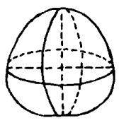  
(a)

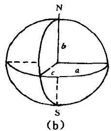

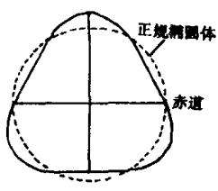  
(c)  
图 10-1 地球形状及其近似  
(a) 西洋梨形(b) 椭圆形(c) 西洋梨形与椭圆形的比较

## （二）地球参数

在近似地确认了地球形状之后，就可以用地球参数(长半轴a，短半轴b，离心率e，扁平率f）来描述地球形状了。一般地，世界各国都是以自己的国家为中心测定和计算地球参数的，迄今为止的地球参数如表10-1所示。其中，国际测量、地球物理学联盟（IUGG）采用的是1980年利用人造地球卫星测得的测地基准地球参数(Geodetic Reference System 1980，GRS80)，而美国的 GPS(Global Position System） 则采用了 WGS-84 地球参数。

表10-1 各种地球椭圆体的形状参数
<table><tr><td>测算者</td><td>发表年代</td><td>长半轴δ（m）</td><td>短半轴6（m）</td><td>扁平率f</td><td>离心率e</td></tr><tr><td>Delambre</td><td>1800</td><td>6 375 563.00</td><td>6 356 103.00</td><td>327.623 998</td><td>0.078 072 03</td></tr><tr><td>Ebereslo</td><td>1810</td><td>6 377 304.00</td><td>6 356 103.00</td><td>300.802038</td><td>0.081 472 94</td></tr><tr><td>Ebereslo</td><td>1830</td><td>6 377 276.35</td><td>6 356 075.41</td><td>300.801 700</td><td>0.081 472 98</td></tr><tr><td>Bessel</td><td>1841</td><td>6 377 397.16</td><td>6 356 078.96</td><td>299.152 813</td><td>0.081 696 83</td></tr><tr><td>Clarke</td><td>1866</td><td>6 378 206.40</td><td>6 356 584.00</td><td>294.981 427</td><td>0.082 271 47</td></tr><tr><td>Clarke</td><td>1880</td><td>6 378 249.15</td><td>6 356 515.00</td><td>293.466 300</td><td>0.082 483 15</td></tr><tr><td>Harkness</td><td>1891</td><td>6 377 972.00</td><td>6 356 727.00</td><td>300.200 000</td><td>0.081 553 03</td></tr><tr><td>測算者</td><td>发表年代</td><td>长半轴δ（m）</td><td>短半轴b（m）</td><td>扁平率f</td><td>离心率e</td></tr><tr><td>Helmerl</td><td>1901</td><td>6 378 200.00</td><td>6 356 818.00</td><td>298.300 000</td><td>0.081 813 66</td></tr><tr><td>Hayford</td><td>1906</td><td>6 378 388.00</td><td>6 356 912.00</td><td>297.000 745</td><td>0.081 991 79</td></tr><tr><td>Willisch</td><td>1915</td><td>6 378 372.00</td><td>6 356 896.00</td><td>297.000 000</td><td>0.081 991 89</td></tr><tr><td>国际基准椭圆</td><td>1924</td><td>6 378 388.00</td><td>6 356 912.00</td><td>297.000 000</td><td>0.081 991 79</td></tr><tr><td>Heiskanen</td><td>1926</td><td>6 378 397.00</td><td>6 356 921.00</td><td>297.000 000</td><td>0.081 991 73</td></tr><tr><td>Krassowskij</td><td>1940, 1942</td><td>6 378 245.00</td><td>6 356 863.00</td><td>298.299 738</td><td>0.081 813 37</td></tr><tr><td>Fisher</td><td>1960</td><td>6 378 163.00</td><td>6 356 781.29</td><td>298.300 000</td><td>0.081 813 33</td></tr><tr><td>IAU-64</td><td>1964</td><td>6 378 160.00</td><td>6 356 775.00</td><td>298.250 000</td><td>0.081 819 64</td></tr><tr><td>IAU-67</td><td>1967</td><td>6 378 160.00</td><td>6 356 774.52</td><td>298.247 167</td><td>0.081 820 57</td></tr><tr><td>WGS-72</td><td>1972</td><td>6 378 135.00</td><td>6 356 750.52</td><td>298.260 000</td><td>0.081 818 81</td></tr><tr><td>NWL-9D</td><td>1973</td><td>6 378 145.00</td><td>6 356 759.77</td><td>298.250 000</td><td>0.081 820 18</td></tr><tr><td>SAO-SE3</td><td>1973</td><td>6 378 140.00</td><td>6 356 755.22</td><td>298.256 000</td><td>0.081 819 36</td></tr><tr><td>IAU-76</td><td>1976</td><td>6 378 140.00</td><td>6 366 755.29</td><td>298.257 000</td><td>0.081 819 22</td></tr><tr><td>GRS-80</td><td>1980</td><td>6 378 137.00</td><td>6 356 755.00</td><td>298.257 000</td><td>0.081 814 06</td></tr><tr><td>GRS-80 改订</td><td>1984</td><td>6 378 136.00</td><td>6.356 751.03</td><td>298.257 000</td><td>0.081 819 74</td></tr><tr><td>WGS-84</td><td>1986</td><td>6 378 137.00</td><td>6 356 752.31</td><td>298.257 223</td><td>0.081 819 19</td></tr></table>

此外，即使是在选定了地球椭圆体之后，也还存在一个选定的椭圆体如何与实际地球匹配、定位的问题。因此，在从事荒漠化监测，特别是国际间的荒漠化监测工作时，不仅要注意各国所采用的基准椭圆体（Reference ellip-seid)，而且还要注意该基准椭圆体与地球的相对位置关系。以日本为例，日本采用的是Bessel（1841）椭圆体，并使该椭圆体在与实际地球匹配、定位时满足下述3个条件：

(1）使通过位于东京麻布旧东京天文台测地原点的垂直线与Bessel 椭圆体上通过北纬 $3 5 ^ { \circ } . 3 9 ^ { \prime } 1 7 . 5 1 4 \ 8 ^ { \prime \prime }$ 、东经 $1 3 9 ^ { \circ } 4 4 ^ { \prime } 4 0 . 5 0 2 \ 0 ^ { \prime \prime }$ 点的垂直线相一致；

(2)使从旧天文台至千叶县鹿野山旧三角点的方位角等于Bessel椭圆体上同名点的方位角 $( 1 5 6 ^ { \circ } 2 5 ^ { \prime } 2 8 . 4 4 2 ^ { \prime \prime } )$

(3)使东京三宅坂旧陆地测量部院内(现东京都千代田区衣田町1-1屋崎纪念公园内）的水准测量原点下的 24.414 0m 通过 Bessel 椭圆体的表面。

在荒漠化监测、资源调查等涉及制图的工作中，一般是按如下原则考虑和选择地球形状和参数的：

(1）绘制世界地图、各大洲地图等以广泛地域为对象区域的小比例尺地图时，可视地球半径为6370km的球体；

(2)绘制100km²以内地域的单幅地图时，可将地表面作平面处理；

（3）绘制中、大比例尺地图时，一张图幅的对象地域虽然狭小，但如果需要对广大地区进行地图拼接时就得将地球作为椭球体考虑。对于必须保证精度的小比例尺地图，也需如此处理。

## （三）地图投影

地图是将呈球面的地球表面在片面上进行表示的一种图示形式。地球是一个平均半径大6370km的庞大球体，如果只是考察地球表面上相当狭小的某一范围时，是可以近似作为平片面处理的。假如当地球上的距离与平面上距离的误差在1/1000000，而且这一误差又是可以接受的话，那么直径约20km的范围就可以当做平面处理。但当多张这样的地图进行拼接以形成某个省、某个国家、某大陆乃至世界地图时，就像把一个乒乓球破开、压平时必然产生破裂或褶皱一样，地球的形状、大小和相互关系无法得以正确表示，必然产生许多误差。尽可能减少误差以便将地物的形状、位置在平面上进行表示的方法，称为地图投影。

在将地球上的地物状况在平面上表示时，必须有可以反映地物相互关系的标准。在地图投影中，是用经纬度作为标准的。也就是说，根据某一地点的经纬度和某一关系式（投影公式）来求算平面上相应点的纵横坐标。地图投影就是在平面上将地球上的经纬线加以表示的一种方法。

## 1. 地图投影变形

在地图投影时，把球面上的经纬线网转换到投影平面上，转换后的地图上的经纬线网格必然产生变形，这种变形称为地图投影变形。这种变形主要反映在3个方面，即长度变形、面积变形和角度变形。

长度变形指投影后地图上不同地点和不同方位上的地球表面实际距离与相应图面距离的比值（比例）各不相同，从而无法从地图上量算和比较不同地点和不同方位的景物之间的距离的变形。对于反映广大区域的小比例尺地图来说，在投影中心（中央经线、基准纬线、基准大圆、基准小圆）处可以获得正确的比例尺，而在其他区域就得不到正确的比例尺。离原点越远，长度变形越大；即使是同点，不同方向上的长度变形也是各异的。

面积变形指投影所得地图上的面积比例随地点而改变，其结果是导致不能在地图上量算和比较景物所占的面积。

角度变形是指地图上角度同相应景物在球面上的相应角度不相等，例如在地球仪上成直角的经线和纬线，在地图上经纬线不成直角。

要完全消除投影变形是不可能的。投影时只能根据地图的应用目的，牺牲上述3个变形中某个方面的精度要求，设计、开发或选择可保证地图应用精度要求的地图投影方法。为此，目前的地图投影法已多达千种以上。一般地，大型地理信息系统软件都支持几种常用的地图投影法，市面上也有专门进行地图投影转换的软件出售。

## 2. 地图投影的分类

虽然地图投影方法很多，但我们可以根据地图投影的某种特征进行分类。下面概要介绍几种常用的分类方法。

## （1）根据地图投影变形性质的分类

①等距离投影长度变形为一的投影方法。然而，理论上并不存在可以完全满足这一条件的投影方法。一般说的等距离投影，实质上是指某类特定的线（如全部经线，全部纬线，或者是以某个特定的点为中心的线束）长度与地表实际距离相等的投影方法。

②等面积投影保证投影前后面积相等的投影方法，在地图上可完全满足这种等面积要求。

③等角投影可确保投影前后任意两条线段构成的角度不产生变形的投影方法，因为可保证投影前后的形状不变，而又称为正形投影。地图上亦可完全满足这种等面积要求。

④任意投影等距离、等面积、等角度投影以外的其他投影方法，投影前后同时存在着长度、角度和面积的变形。既可以不考虑图的性质，进行简单投影，又可以对上述3类投影方法进行若干变更后进行投影，还可以对狭小范围进行近视的正投影。任意投影虽然存在各种变形，但各种变形比较均衡。

对等距离、等面积、等角度投影而言，等距离要求只能在地图上的一小部分内实现，即使是在等角、等面积图中也可以实现。但等角、等面积条件却不可能在同一张图上实现，等角、等面积要求互相冲突，等面积的获取是以牺牲等角为代价；反之，等角的获得又以牺牲等面积为代价的。

(2）根据投影面与球面位置关系的分类在地图投影中，首先将不可展的球面投影到一个可展的曲面上，然后将曲面展开成平面，从而得到不同投影。其中，投影曲面可以是圆柱面、圆锥面及平面（曲率为0的曲面）；投影面和地球的位置关系既可以是投影面同地轴垂直又可以是重合或斜向相交。根据投影面与地球表面的相交关系，可对地图投影进行如下分类（图10-2）。

①方位投影投影面是一个与地球面相切或相割的平面。其中正轴方位投影的投影面和地轴垂直，横轴方位投影的投影面和地轴平行，斜轴方位投影的投影面同除地轴和赤道直径以外的任一直径垂直。

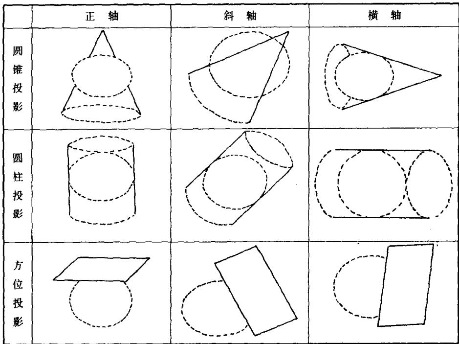  
图10-2 不同投影的投影面和球面的关系

②圆柱投影用一个圆柱面包围地球体，并使之相切或相割，然后根据某种条件将地面上的经纬网点投影到圆柱面上，最后沿柱面的一条母线切开，将其展成平面而得的投影。其中，正轴圆柱投影的圆柱轴同地轴重合，横轴圆柱投影的圆柱轴同赤道直径重合，斜轴圆柱投影的圆柱轴同地轴和赤道直径以外的任一直径重合。我们所用的高斯一克吕格投影即属于此类。

③圆锥投影将一圆锥面与地球体相切或相割，并根据某种条件将地球的经纬网投影到此圆锥面上，然后沿圆锥的一条母线切开展面而得到的投影。其中，正轴圆锥投影的圆锥轴同地轴重合，横轴圆锥投影的圆锥轴同赤道直径重合，斜轴圆锥投影的圆锥轴同地轴和赤道直径以外的任一直径重合。

## 3. 地图投影的选择

采用什么样的投影方法作图，是制图工程中必须最初决定的内容。选择投影方法时必须考虑地图的应用目的、比例尺、对称地域的形状、面积、纬度等因素，此外，也需考虑投影计算、经纬线作图难易、展开后编辑工作是否便利等因素。不管是多么理想的投影方法，如果它计算繁复、经纬线形状复杂以至于影响以后的编辑工作，那么也不能采取这样的投影方法。当然，如果是应用计算机制图就另当别论。此时，应主要考虑投影方法的适宜性。

## (1）根据比例尺进行选择

①大、中比例尺地图由于作图范围是几乎可以不考虑图形变形的狭小区域，国土基本图、地形图、地势图、城市规划图、比例尺在1/10000～1/20000的地图、以及测量中所用的平面直角坐标等，可主要应用横轴圆柱等角投影法（横轴麦卡托投影）或多面体投影法。日本以前的地形图多用多面体投影法，现在则主要使用国际横轴麦卡托投影法（UTM，Universal Trans-actionMethod，横轴麦卡托投影法的一种)。

②小比例尺地图1/500000以下的地图、大区地图、省区地图、国土态势系列地图、1/1000000的国际地图等，一般应用多圆锥投影、等角圆锥投影等。

（2）根据地图使用目的进行选择地图，一般可分为一般地图与特殊地图两类。对干一般地图，可在考虑地图比例尺、对象区域形状、纬度等条件的基础上选择投影方法：但对于特殊地图就必须选择特殊的投影方法。如：

①航空图等角圆锥投影、等角圆锥投影等；

②航海图（海图）麦卡托投影；

③大圈航海图、无线方位探察图心射投影；

①统计图各种等面积投影方法。

## 4. 投影转换

实际从事荒漠化监测工作时，在下述一些情形下可能要进行投影转化：

(1）从事跨区域的荒漠化监测工作，而不同的区域又采用的是不同的投影系时。此时，为了综合制图，就需要把不同的投影系统一到某一种投影系上；

(2)监测中拟使用不同时期的图形资料，而两个或几个时期的地图投影又不同，此时也需要进行投影系转化，投影系统一后才能混合使用这些资料；

（3）当监测是由小区域的大比例尺做起，最后汇总到省（自治区）乃至全国一级时，也必须进行投影系的转换工作；

(4）GPS使用的是地心坐标系（WGS-84)，使用时如果所用的接受器没有将WGS-84坐标转换为你正在使用的坐标，也必须进行坐标转换；

（5）虽然同为卫星定位系统，但美国的GPS（WGS-84）与前苏联的GIONASS(SGS-85)却采用的是不同的坐标系。当需要同时使用这两种全球定位系统以提高精度时，就需要进行投影系的转换工作。

## 5. 我国主要应用的投影方法：高斯-克吕格投影

高斯-克吕格投影是等角横切圆柱投影。它假设一个椭圆柱面横切在椭球面的一条子午线（中央经线）上，椭圆柱的中心轴通过地球椭球中心，然后按等角条件将中央经线两侧一定正负差范围内的区域投影到椭圆柱面上，再将椭圆柱面展平而得到的投影[图10-3（1)]。其投影坐标关系为，以中央经线的投影作为X轴，赤道投影作为Y轴，两轴交点为原点，其经线和纬线的投影均为曲线[图10-3（2)]。

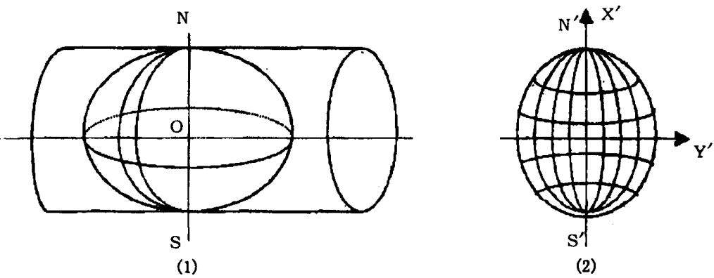  
图10-3 高斯-克吕格投影示意图

这种投影中的中央经线投影为直线，其长度等于球面实际长度，没有变形，其余经线为向极点收敛的弧线，距中央线越远，变形越大。为使边缘变形不致过大，采用分带投影的方法。以6°投影带为例，赤道上边缘部分的最大长度变形不大于0.14%，面积最大变形不大于0.27%。我国处于中纬度地带，其变形数值更小。因为6°带是从西向东每6°为一带，全球共分60个带，依次编号1～60。我国位于13\~23带之间（图10-4）。

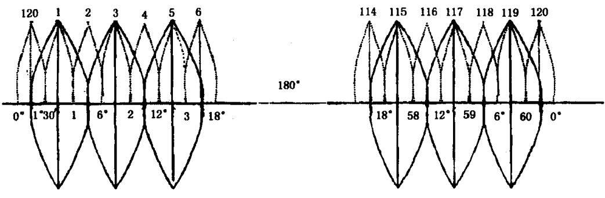  
图10-4 高斯一克吕格投影分带示意图

高斯-克吕格投影的主要优点为：

（1）等角性质，适于系列比例尺地图的编制与使用；

（2）经纬网与直角坐标的偏差不大，便于阅读使用；

(3）计算工作量小，直角坐标和子午收敛角值只需计算一个带，全球可通用。

因此，我国各种大中比例尺地形图均采用该投影方法。其中1/10000地形图采用3°带，1/25000～1/500000地形图采用6°带。此外，目前世界大多数国家的地形图也都使用此种投影方法。

## （四）比例尺与地图分幅

按比例尺的大小可以将地图分为大、中、小比例尺3类，具体标准如下所示：

大比例尺地图：比例尺大于或等于1：100000的地图；

中比例尺地图：比例尺在1：100000到1：1000000的地图；

小比例尺地图：比例尺在小于或等于1：1000000的地图。

基本比例尺地形图的分幅、编号是在国际规定的1：1000000地形图基础上，按经纬度进行分幅和编号的。

## 1. 1/1 000 000 地图的分幅与编号

1/1000000国际标准图幅按纬差4°，经差6°划分，即从赤道起向两极，每纬差6°为一列，依次用字母A、B、C、D、…S表示；经度从180°算起自西向东，每经差6°为一行，依次用1、2、3、…60表示（图10-5）。

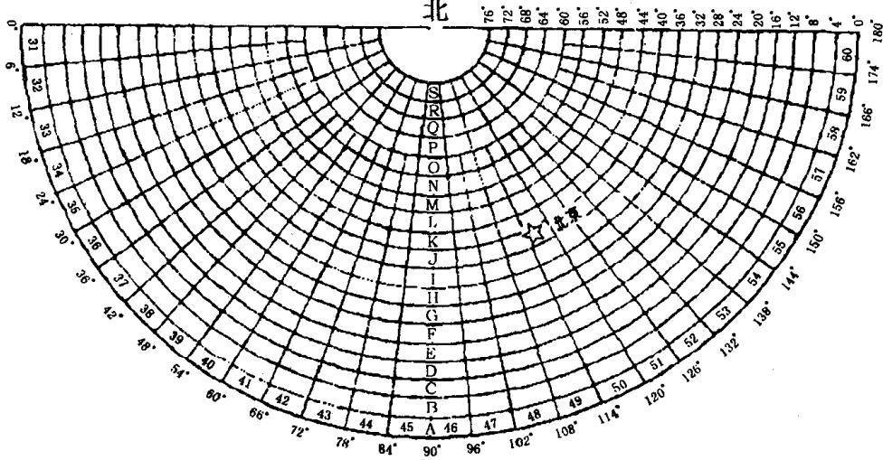  
图 10-5 1/1 000 000 地图的分幅编号

编号的书写顺序是列号在前、行号在后，二者之间划一短线。比如：北京在1/1000000地图上是处于第J列、第50行，故其编号为J-50。

## 2. 1/500 000、1/200 000 和 1/100 000 地图的分幅与编号

这3种比例尺地图的分幅、编号是在1/1000000地图的基础上按一定经差和纬差进行划分的，划分后分别在1/1000000地图的分幅编号后加上各自的代号；

(1) 1/500 000 地图 按经差 $3 ^ { \circ }$ ，纬差2°进行划分，即1幅1/1000000的地图可划分为4幅1/500000的地图，后缀编号为A、B、C、D等，如J-50-A;

(2)1/200 000地图 按经差1°、纬差 $4 0 ^ { \prime }$ 划分，共可划分出36幅图。后缀编号是用带括号的自然数序列（1到36）从左到右、从上到下排列的。如J-50- (3);

(3) 1/100 000 地图 按经差 $3 0 ^ { \prime }$ 、纬差20'进行划分，共可划出144幅图。后缀编号是用不带括号的自然数序列（1到144）从左到右、从上到下排列的。如J-50-5（图10-6）。

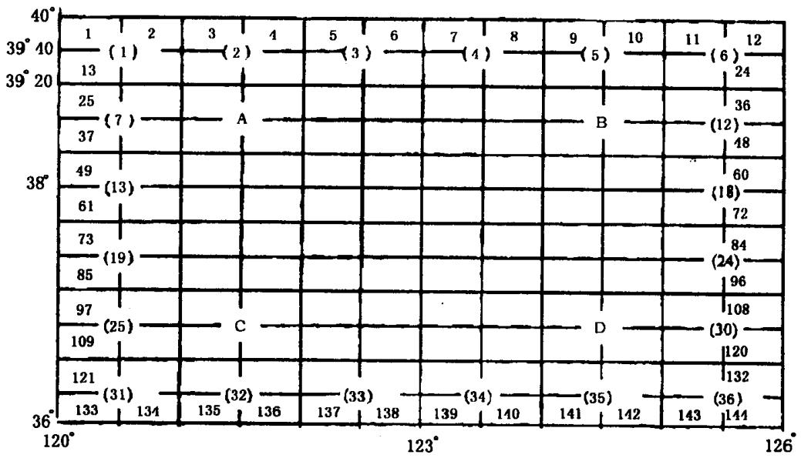  
图10-61：500000、1：200000、1：100000地形图分幅编号示例  
3. 1/50 000、1/25 000、1/10 000 地图的分幅与编号

这3种比例尺的地图都是在1/100 000地图的基础上按一定经差和纬差划分，然后分别在该1/100000地图分幅编号的后面加上各自的分幅编号的(图10-7、表10-2)。

（1）1/50 000 地图 将1幅1/100 000的地图划分为4幅1/50 000的地图，然后在该1/100 000地图编号的后面缀以A、B、C、D等，如J-50-B；

（2)1/25000地图 将1幅1/50000地图划分为4幅1/25000的地图，然后在该1/50 000地图编号的后面缀以1、2、3、4等，如J-50-B-4；

(3)1/10 000地图：将1幅1/100000地图划分为64幅1/10000的地图，然后在该1/100000地图编号的后面缀以带括号的1、2、3、…64。如J-50-

5- (15)。

我国的基本比例尺地形图就是按上述方法分幅、编号的。

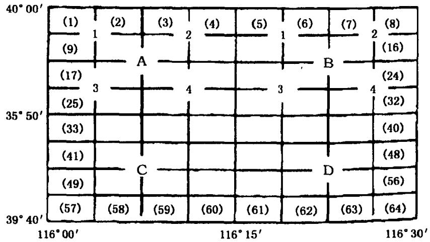  
图10-71：50000、1：25000、1：10000地形图分幅编号示例

表10-2 国家基本比例尺地形图分幅编号图
<table><tr><td rowspan="2">比例尺</td><td colspan="2">图幅大小</td><td rowspan="2">分幅</td><td rowspan="2">编号</td><td rowspan="2">示例</td></tr><tr><td></td><td>经差 纬差</td></tr><tr><td>1:1 000 000</td><td>6°</td><td>4°</td><td></td><td>横列A、B…V，纵列1、2…60</td><td>J-50</td></tr><tr><td>1:500 000</td><td>3°</td><td>2°</td><td>1幅 1：1 000 000 图分成4 幅</td><td>1幅 1：1000000 图编号后 加A、B、C、D</td><td>J-50-A</td></tr><tr><td>1:200 000</td><td>1°</td><td>40&#x27;</td><td>1幅 1：1 000 000 图分成 36 幅</td><td>1幅 1：1000000 图编号后 加（1）、（2）…（36）</td><td>J-50-(3)</td></tr><tr><td>1:100 000</td><td>30&#x27;</td><td>20&#x27;</td><td>1幅1:1000 000 图分成 144 幅</td><td>1幅1：1000000图编号后 加1、2……144</td><td>J-50-5</td></tr><tr><td>1:50 000</td><td>15&#x27;</td><td>10&#x27;</td><td>1幅 1：100 000 图 分成4幅</td><td>1幅1：100 000 图编号后加 A、B、C、D</td><td>J-50-5-B</td></tr><tr><td>1:25 000</td><td>7&#x27;30″</td><td>5′</td><td>1幅1：50000图分 成4幅</td><td>1幅1：50000图编号后加1、 2、3、4</td><td>J-50-5-B-4</td></tr><tr><td>1:10 000</td><td></td><td>3&#x27;40″ 2&#x27;30″</td><td>分成64 幅</td><td>1幅1：100000图1幅1：50000图编号后加 (1)、(2)…(64)</td><td>J-50-5-(15)</td></tr></table>

## 四、荒漠化监测的方法

荒漠化监测可以分为地面监测、空中监测和卫星监测3种方法。地面监测又称人工监测，后两种方法又称遥感监测。

## (一）地面监测

地面采样技术是生态专家传统采用的技术，它主要是通过人工地面观察、测量和建立生态监测站的方法进行。目前这些技术仍是非常重要的，主要原因有以下3点：为了提供详细的情况；为了提供“地面一真实”测定结果，其结果可用来建立飞机和卫星提供的大部分遥感数据的准确性；用来帮助解释这些数据。迄今仍然存在某些只有从地面对它们进行监测才有最好效果的属性。这些属性包括降雨量、土壤湿度以及其他许多环境与社会因素。人工方法的缺点是，需要动用大批人力物力，时间长，进度慢，受主观影响较大。

## （二）遥感监测

## 1. 遥感及其基本原理

遥感，顾名思义，就是遥远的感知。它是利用某种装置，在不与被研究对象直接接触的情况下，获得它们的数据，并通过处理、分析，最后提取和应用其研究对象信息的一种技术。遥感的主要技术组成系统有遥感平台、传感器和遥感信息的接收处理部分。

一切物体都具有反射、发射、透射和吸收电磁波的性能，但是不同的物体这种性能是不一样的。遥感就是使用传感器通过成像或非成像技术，获取从目标物辐射或反射的电磁波信息，从而根据不同物体的波谱特征对物体进行分析、判定。图10-8为遥感基本方法的具体流程。

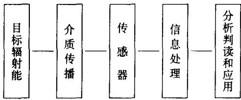  
图10-8 遥感基本方法流程示意图

## 2. 遥感平台

遥感平台是传感器的运载工具，现代遥感技术系统的遥感平台，主要是航空遥感平台和航天遥感平台。

飞机是航空遥感的主要平台。遥感飞机有专门设计的，也有根据需要进行改装的。由于航空遥感具有机动灵活、观测范围比地面监测宽阔、测量精度高、资料回收较容易等特点，因此，得到比较广泛的应用，特别适合于局部地区的观测和荒漠化监测。

卫星是航天遥感的主要平台。目前用于地球观测的遥感卫星主要有美国的陆地卫星（Landsat）、法国的 SPOT 卫星和美国的NOAA 卫星等。航天遥感的突出特点就是高度高，观测范围大，监测速度快，而且传统方法无法观测的现象还可以用卫星遥感进行观测，大大开阔了人们的眼界，加深了对某些自然现象的认识，这种方法适用于大范围的荒漠化监测。它的缺点是技术复杂，对传感器要求高，几何精度不如空中遥感。随着传感器分辨力的不断提高，卫星监测的地位将会更加重要。

(1）陆地卫星1972年美国发射了第一颗地球观测卫星，称为地球资源卫星(ERTS)，1975年发射的第二颗卫星对第一颗卫星发射后的原计划作了改变，故更名为陆地卫星。从1972年到1993年共发射了6颗陆地卫星。陆地卫星的轨道是与太阳同步的近极地圆形轨道，卫星通过地球上某一点的时间总是相同的，每幅图像的覆盖面积是185km×185km，相邻卫星的前后重叠为10%，侧向重叠的大小与景所在的地理位置有关，向两极方向重叠增加，赤道处的侧向重叠为14%，到极圈时的侧向重叠为71%。陆地卫星1\~3号18d（绕地球251圈）、陆地卫星4～6号16d（绕地球233圈）对全球的向阳面全部覆盖一遍。从理论上讲，除南北极附近以外的任何地区，18/16d都可以拍摄或扫描一遍，但由于云层掩盖，通常需要好几个18/16d才能取得覆盖全球一遍的质量好的图像。

(2) SPOT卫星 SPOT 卫星是法国空间研究中心研制的高性能地球观测卫星，1986年发射了SPCOT1号，1990年发射了SPOT2号，1993年发射了SPOT3号，现都在运行。SPOT卫星的轨道也是太阳同步圆形近极地轨道，回归天数为 26d。一景 SPOT 卫星数据对应的地面的实际面积是60km×60km。由于SPOT图像可以通过不同的观测角观测同一地区，所以，能够获得高质量的立体图像。可以对地面进行立体观测，这是陆地卫星无法比拟的。

(3) NO)AA 卫星 NOAA 卫星是美国海洋大气局的第三代气象观测卫星，1960～1967年的气象卫星称为TIR(S系列，1970～1976年的第二代为ITOS系列。NOAA卫星的轨道是接近正圆的太阳同步极轨道，应用目的主要是日常的气象业务，在森林火灾监测中也具有突出的功能。

## 3. 传感器

传感器是接收和记录地物反射或发射电磁波信息的遥感装置。按其工作方式可以划分为主动方式和被动方式两类，主动方式传感器在遥感中是先向目标物发射电磁波，然后传感器再接收地物的反射回波；被动方式传感器在遥感中不发射电磁波，而仅仅接收来自地物本身电磁波辐射。如果按照扫描方式划分，传感器可以分为扫描方式和非扫描方式；按照记录结果划分，又可以分为图像方式和非图像方式。图10-9为传感器归类图，下面介绍几种常见的传感器。

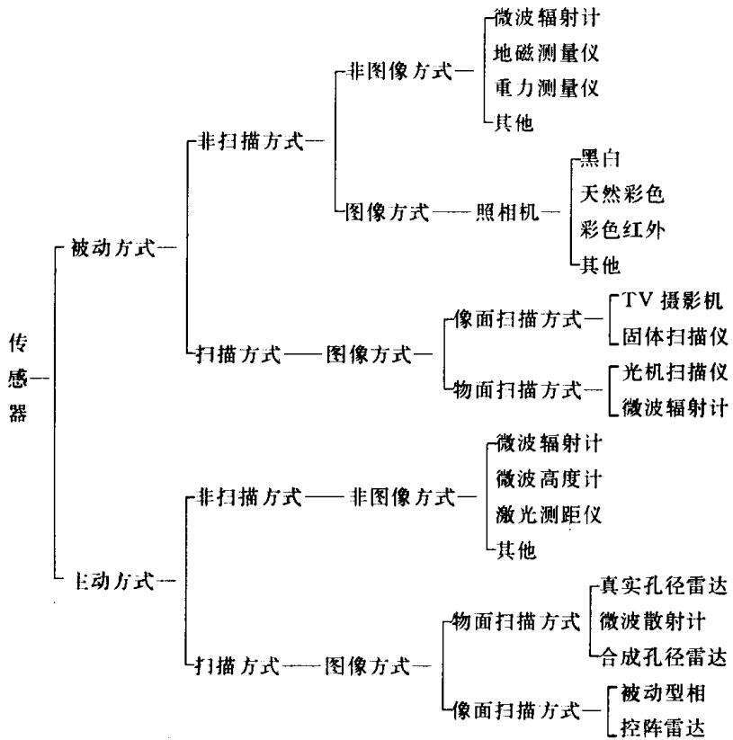  
图 10-9 传感器分类

（1）陆地卫星的RBV RBV是陆地卫星1、2、3上携带的一套传感器，其全称是反束光导管电视摄像机系统(Return Bcam Vidicom)，工作波长范围是0.474\~0.830μm。RBV在陆地卫星1、2上有3个波段，分别是：

RBV1波段：蓝绿波段，其工作波长是0.474～0.575μm；

RBV2波段：红黄波段，其工作波长是0.580～0.680μm；

RBV3 波段：摄影红外波段，其工作波长是0.690～0.830μm。

陆地卫星3上的RBV传感器是全色的，只有一个工作波段，其波长范围是0.50\~0.705μm。陆地卫星1、2携带的RBV的空间分辨率为80m，陆地卫星3 上的 RBV全色图像的空间分辨率为 40m。

由于RBV波长范围与下面将要介绍MSS传感器波段工作范围大致相同，而且RBV的成像质量又远不如MSS成像质量，所以陆地卫星4上取消了这种传感器。

## (2) 陆地卫星的 MSS

MSS 多光谱扫描仪（multispectal scanner）是陆地卫星1～5上都携带的遥感传感器，其数字产品是MSS磁带，地面分辨率是80m。陆地卫星具有4、

5、6、7共4个波段，分别是：

MSS4波段：蓝绿波段，其工作波长是0.5～0.6μm；

MSS5波段：红黄波段，其工作波长是0.6\~0.7μm；

MSS6波段：摄影红外波段，其工作波长是0.7\~0.8μm；

MSS7波段：摄影红外波段，其工作波长是0.8～1.1μm。

一景MSS影像数据大约包含有2340条扫描线，每条扫描线又大约有3240个像元点，而一景MSS影像对应的实际地面面积是185km×185km，所以，像元点的实际大小对应地面为79m×57m（地面站处理后提供给用户的产品像元大小为757m×57m。

(3) 陆地卫星的 TM TM 专题绘图仪 (thematic mapper）是陆地卫星14、5所携带的一种遥感传感器，其数字产品是TM磁带，TM的波谱范围比MSS大、工作波段多，TM有7个波段，分别是：

TM1波段：蓝波波段，其工作波长是0.45\~0.5μm；

TM2波段：绿波波段，其工作波长是0.52\~0.6μm;

·TM3波段：红波波段，其工作波长是0.63～0.69μm;

TM4波段：近红外波段，其工作波长是0.76～0.94μm；

TM5波段：中红外波段，其工作波长是1.55～12.5μm；

TM6 波段：热红外波段，其工作波长是10.4\~1.75μm；

TM7波段：中红外波段，其工作波长是2.08\~2.35μm。

TM每个波段范围较窄，因而波谱分辨率比MSS图像高，TM空间分辨率为30 m，高于MSS的地面分辨率。

(4) SPO)T 卫星的 HRV 可见光图像扫描仪 HRV(high resolution visi-ble sensor）是一种线阵列推扫式扫描仪，其数字产品是 SPOT图像磁带。SPOT图像分全色图像与多光谱图像两种，全色图像的地面分辨率是10m，多光谱图像的地面分辨率是20m。一景SPOT数据对应地面60km×60km范围大小，辐射量化级为8个比特，即其量化级位256级。SPCT图像共有3个波段：

SPOT1波段：绿光可见光波段，其工作波长是0.5\~0.59μm；

SPOT2波段：红光可见光波段，其工作波长是0.61～0.68μm；

SPOT3波段：近红外波段，其工作波长是0.79～0.89μm。

（5）成像光谱仪成像光谱仪通常是由航空遥感平台（例如飞机）所携带的一种传感器，成像光谱仪基本上还属于多光谱扫描仪MSS，与陆地卫星上的MSS的差别在于成像光谱仪的空间分辨率更高，成像光谱仪的波谱分辨率更是陆地卫星上的MSS所不能比拟的，成像光谱仪的波段很窄，波段数目

可多达256个。

## 4. 遥感图像数据处理

传感器所获得的遥感信息通过直接传输或视频传输的方式被地面接收后，必须对原始数据进行多方面处理才能满足需要。这种处理包括图像数据的恢复与增强两个方面。恢复是指对传感器输出的信号进行辐射校正、几何校正、数据压缩和管理等手段，将其转换成胶片、影像或计算机兼容磁带(CCT)，以供用户分析研究。这种处理的专业性很强，往往作为传感器工作系统中一个必不可少的环节来完成，因此，和用户的关系不大。增强是为了获得更加清晰的高质量的图像、发掘遥感图像的信息潜在、突出和显示目标物的影像特征而采取的光学或计算机的图像处理技术。其中包括彩色合成、密度分割、边缘增强、反差增强、专题抽取、空间和定向滤波、影像相减、比值处理等具体方法。

（1）彩色合成 是一种光学处理技术。它是把几张（一般是3张）同景不同波段的同步成像的黑白多光谱透明正片，分别加上特定的红、绿、蓝等滤光镜，通过光学系统使它们在同一平面上严格重叠在一起而形成彩色影像。如果彩色影像上的物体呈现的色调与它们的天然色彩一致，就称为真彩色相片；否则称为假彩色相片。真彩色相片是配以与分色片相同波段的滤光镜合成的；假彩色相片是配以与分色片不同波段的滤光镜合成的。非标准假彩色的色别是任意的，可根据目视解译的需要进行选择。进行彩色合成的方法很多，常用的有：彩色合成仪合成法、三次曝光法、彩色套印法、印染法、Diazo透明胶片叠置法等。

（2）密度分割在遥感影像上，某些目标特性，如水体中的泥沙、水体深度、污染物浓度等，与影像密度（灰度）有良好的对应关系，而影像密度值差异太小，或者密度值在空间连续变化，没有明显界线，这时借助密度分割仪或计算机将不同密度水平区分开，并以不同的颜色表示，就叫做密度分割。其分割的等级可以根据影像级差大小加以选择，最多达64级，分级的方法可以是线形的（即等密度分割），也可以是对数方式的。

（3）边缘增强 边界在影像中表现为密度（灰度）发生突变的地方，它是一个物体与另一个物体，一种现象和另一种现象的界线，是重要的解译标志。边缘增强就是使各种界线突出出来，为解译提供方便。值得注意的是，增强的边界没有选择性，对解译者来说并非都有价值。边缘增强可以采用光学的方法，也可以采用计算机的方法。光学的方法是将同一张影像的正负片叠合在一起，然后使其中一张向某个方向错动一小段距离，将组合片曝光印像或投影在屏幕上，得到的影像在密度发生突变的地方将出现一条界线，而其余的部分呈均一的色调。计算机处理是在那些像之间灰度值变化超过事先确定阈值的地方，用线条或一种灰度在图像上表示出来，就得到了边界线。

(4)反差增强一景原始陆地卫星图像的亮度值范围往往是比较小的，这使得图像模糊不清。为使图像中各物体的亮度界线更加分明，图像的可辨性更好，常采用扩大原始图像反差的方法来占满整个亮度范围。在计算机中只要知道原始亮度的上下界限，再给出将要扩展的亮度范围，其余像元亮度值通过线性内插就可以很容易完成。光学处理方法是把需要增强的低反差影像，用高反差胶片或相纸拷贝，在高反差的显影液中显影制成拷贝片，反复拷贝几次，就可以得到反差明显增强的影像。

## 5. 遥感图像的目视解译技术

遥感监测中，传感器所获得的信息最终记录在感光胶片或磁带上，这些信息经过一定的处理、加工就可以进行应用。胶片上记录的图像直观逼真，便于进行目视解译；磁带上记录的数据精确稳定，便于存储和计算机处理。图像和数据可通过图数转换或数图转换实现相互转化，但最终数据要转换成图像才能进行目视解译。

(1）目视解译标志目视解译是根据人的知识与经验，运用各种手段和方法对图像进行辨认，从而识别影像的的实际内容和属性，并定性或定量地提取目标的形态、构造、功能等有关信息，最后把它们汇总在底图上的过程。在图像解译时，为了提高判读的准确性、减少判读人员的误差，必须掌握图像的解译标志，其中包括形状、大小、阴影、颜色或色调、纹理和图形以及位置、布局和分辨率等。下面分别叙述之。

①形状目标物不同，在图像上呈现的形状就不一样。有些物体的形状是非常独特的，因此，只要根据形状这个标志即可从图像上把它们识别出来，但有时要从垂直拍摄的图像上看出物体的形状，这对判读者来说就显得特别困难。

②大小一个物体的大小是识别物体本身的最有用标志之一，判读者可以不考虑可能识别的全部面积组合。而在识别比例尺变化的图像时，判读者则必须经常测量所感兴趣的物体。

③颜色和色调不同的物体会反射、发射和透射不同数量和不同波长的能量。这些差异以颜色、色调和密度的形式记录在图像上。几乎在所有的情况下，惟有物体与物体之间的色差或物体与背景之间的色差才是最重要的。实际上，如果背景与物体的边缘之间没有色调与色彩的差别，那就不可能得到图像。在黑白影像上，没有色彩的差异，物体呈现不同的灰度；真彩色摄影图像给判读者提供了熟悉的所研究的物体自然色的图像，因而判读比较容易。

①阴影可分为本影和落影两种。本影是摄影的地物未被太阳光直接照射到的阴暗部分所形成的阴影，有助于获得立体感；落影是地物投射到地面上的影子在图像上的构像，根据落影可测量物体的高度、楼房的层数、桥梁的孔径及结构类型等。

⑤纹理也叫结构。图像上的纹理是由一组组物体的色调重复出现而构成的，这些物体往往太小，单独识别是看不出来的。对某些物体来说，纹理是指它们给视觉印像造成的粗糙度和平滑度，它是判读的一个重要依据。在区别图像上的各种环境现象时，纹理起着重要的作用。

⑥图案图案是地面物体的形状、大小、阴影、色调所形成的影像的组合。尽管只凭肉眼观看，尤其从几千米高空（或更高）观看地物特征还很难，但从空中得到的轮廓却是了解某种地物特征和功能的重要线索。

⑦位置与布局在自然界中任何事物都不是孤立存在的，而是与周围事物密切联系着的。因此，在判读过程中，要深入分析地物之间的相互关系，才能得出正确的结论。如通往山坡耕地中的狭长白线至田边突然中断，则可能为田间小道或灌溉渠道。

⑧分辨率 分辨率为能把一个景像内的物体区分开来提供了重要的标志，而且又能以直接的方式予以确定和测量，因此清晰度就成了衡量难以辨识的图像的主要标志。

(2)目视解译方法 遥感图像所对应的地理环境是一个错综复杂的大系统。这个系统是多层次、多要素且不断运动变化的。各子系统既互相独立又相互联系、相互依存。要认识它们，必须灵活运用各种直接和间接的解译标志，才能得出合乎实际的解译结果。关于解译标志的运用，可归纳出以下几种方法：

①直接判读法直接通过遥感图像的解译标志，就能确定目标物的类型和属性的方法。一般具有明显形状、色调特征的地物和自然现象，例如河流、湖泊、房屋、居民区等均可用直接判读法辨认。

②对比分析法将要解译的遥感图像，与另一已知的遥感图像样片进行对照，确定目标物属性的方法。它还包括不同种类的遥感图像的对比（如卫片与航片）和同一时相不同波段的图像的对比。

③逻辑推理法它是借助各种地物或自然现象之间的内在联系，用逻辑推理方法，间接判断目标物的类型和属性的方法。显然，进行逻辑推理的过程中，判读人员的专业知识与经验是很重要的。判读人员的知识和经验愈丰富，就能从容易被人们忽视或难于发现的潜在或微小的图像差异中，寻找出目标物的依据来，从而提取出更多的有用信息。

上述几种方法在具体运用中很难完全分开，总是交错在一起的，只不过在解译过程中某一方法占主导地位而已。

(3）目视解译程序遥感图像的目视解译可分为资料准备阶段、初步解译阶段、野外调查阶段、详细解译阶段和制图阶段。

①资料准备阶段针对研究对象的需要选择遥感图像的时相和波段，确定图像处理方案和比例尺。收集工作地区及邻近地区的各种图件(地形图、各种专题地图或其他遥感图像）、文字材料、典型地物的光谱曲线等。在分析已有的各种资料的基础上，建立解译标志。

②步解译阶段以建立的解译标志为基础，根据解译的任务和内容分项进行解译。解译时需遵循从已知到未知，先易后难，从大到小逐级划分的原则，依次进行。重点地区或难于解译的部分可参考相应的航片或已知的地面资料。

③野外调查阶段初步解译的结果，一方面要到野外验证，另一方面要对解译时把握不大和有疑点的地方到野外进行核对。野外实际调查包括航空目测、地面路线考察、定点采集样品（如岩石标本、植被样方、土壤剖面、水质等）和野外地物波谱测定。并向当地有关部门了解区域发展历史和远、近期规划，收集区域自然地理背景材料和国民经济统计数据、农事历等。

④详细解译阶段根据实况调查资料，全面修正初步解译结果，提高解译可信度，对详细解译图可再次进行野外抽样调查或重点调查，确认可信度，直到满意为止。

⑤制图阶段遥感图像的目视解译的成果，一般是以图的形式提供的。目视解译图，可由人工描绘制图，也可在人工描绘基础上进行光学印刷制图，或计算机制图。无论哪一种制图都要符合制图精度要求。

## 6. 遥感图像的计算机自动识别分类

近些年来，随着电子计算机技术的发展，可将航空遥感资料或卫星遥感资料输入计算机中，然后根据应用的需要，通过计算机进行各种影像增强处理及图像的识别分类。这是一种快速而准确的方法，而且可以分辨出人们眼睛难以区分的各种地物的微小差别。

进行计算机图像数字处理，主要使用影像的数字化磁带，也可以使用影像的胶片和纸制相片来进行，胶片影像和纸制影像一定需要经过“模/数”转换，也就是说将影像变成数字化磁带后，才能应用计算机进行数字处理。到目前为止，计算机自动识别与分类法，虽然仍处于实验阶段，但是在某些方面已经取得了较大的效果。应用计算机进行自动识别与分类，具有以下几方面的意义：

（1）通过计算机的粗略判释，能够帮助研究人员提高工作效率；

（2）计算机对遥感资料的识别能力比人眼睛要大得多，因此，可以使遥感资料中的细微差别放大，从而可以提高解译的效果；

(3）一张遥感图像，其记录的信息是相当丰富的，要从复杂的信息中提取更为准确的结果，只凭人的眼睛或其他影像增强方法是不能解决问题的，只有应用计算机才能获得准确的解译结果。

遥感图像的计算机自动识别分类就是把图像中的每个像元或区域归为若干个类别中的一种，其分类过程就是模式识别过程。这种分类可分为监督分类和无监督分类两种。

监督分类又称训练场地法。是根据已知训练场地提供的样本，通过选择特征参数、建立判别函数，然后把图像中的各个像元点归化到给定类中的分类过程。这种分类的好坏和精度在一定程度上取决于训练样本的质量和数据，即训练样本的代表性和可分离性。

非监督分类是根据图像数据的本身统计特征及点群的分布情况，从纯统计学的角度对图像数据进行类别划分。在遥感数字影像上，同样的条件下同类地物应具有相同或相似的光谱信息特征，从而集群在同一光谱空间区域里，不同类地区因其光谱信息特征不同而集群在不同的光谱空间区域里。因而可以根据它们的类似度进行分割或合并，形成不同的类群来实现分类。

监督分类和非监督分类的最大区别在于，监督分类首先给定类别，而非监督分类由图像的统计特征来决定。

## 7. 荒漠化遥感监测的应用范例

（1）甘肃省河西地区荒漠化土地的遥感现状调查甘肃省河西地区东起古浪峡，西到敦煌，止于省界，全长约1200km，属青藏高原、蒙新高原和黄土高原的三大交汇地带。行政上包括武威、张掖、金昌、酒泉、嘉峪关5个地（市）的20个县（市），是甘肃省荒漠化土地的主要分布区。对其荒漠化土地的分布范围及面积的调查，前人大多采用若干局部定点观测或利用以往地形图资料进行人工地面普查的方法，投入了巨大的人力、物力和财力，得到的仅是小范围的资料，不足以反映出整个河西地区状况。更何况河西地区分布有大片茫茫戈壁、沙漠，地面准确目标少，人工根本无法地面调查。因此，如何运用现代科技成果提高和改进调查技术水平是亟待解决的问题。

1994年甘肃省林业勘察设计研究院根据全国荒漠化土地调查要求及美国陆地资源卫星TM影像特点，分析了甘肃河西地区12景、24幅1：100000TM影像色调特征及形态特征。在此基础上，结合荒漠化土地类型划分建立了图像解译标志，并详细阐述了TM影像解译程序。

调查中，选用TM4、TM5、TM33个波段的影像，赋予红、绿、蓝3色合成假彩色，产生具有红色色彩相片的光谱彩色特征。通过实地调查，得出了河西地区一些地物与地理现象在彩色相片上反映的颜色特征(表10-3)，为卫片解译标志建立和图像分析奠定了基础。

表 10-3 河西地区 TM 片上地物影像颜色特征
<table><tr><td>地物种类</td><td>影像颜色特征</td></tr><tr><td>植被（灌溉绿洲、林地、草地）</td><td>红、棕红、粉红</td></tr><tr><td>水体（河流、水库、海子等）</td><td>蓝黑到黑</td></tr><tr><td>沙漠（流动沙丘、沙地、沙山等）</td><td>蓝灰色、流沙纹理明显</td></tr><tr><td>戈壁（砾石、砾石戈壁、卵石河床等）</td><td>蓝灰为主，南山洪积戈壁为赭灰</td></tr><tr><td>盐漠（采盐基地）</td><td>粉乳色到紫色</td></tr><tr><td>重盐碱地（几乎无植被生长）</td><td>蓝黑色</td></tr><tr><td>风蚀残丘（洪积扇扇缘及古河道一带）</td><td>白到粉红色</td></tr><tr><td>沼泽和洼地草甸土（冲击扇扇缘地下水位高处）</td><td>粉红、黑红夹小黑点</td></tr><tr><td>城市（武威、张掖、酒泉等县市）</td><td>灰色</td></tr><tr><td>祁连山地（中高山呈树枝状、前山呈菱格状）</td><td>红褐、灰褐色</td></tr><tr><td>北山剥蚀山地（剥蚀斑块状或岛状）</td><td>墨绿到青色有赭色或白色条纹</td></tr><tr><td>积雪</td><td>紫红色</td></tr><tr><td>云影</td><td>白色</td></tr><tr><td>城市工业污染（嘉峪关上空）</td><td>灰黑色雾状</td></tr></table>

河西地区TM影像上反映出的自然形成物有块状红色或赭红色条田，蓝灰色线状铁路、公路等，它们都有一定的几何形状，轮廓边界规则。自然形成物轮廓边界呈各种自然色曲线。如蓝灰色鳞状图形及波浪状图形的巴丹吉林沙漠、腾格里沙漠，扇形蓝灰色多束发状条纹的昌马洪积扇等，根据其影像的形状和色彩特点都能比较容易的辨认出来。

通过对河西地区TM影像色调特征及形态特征分析，结合荒漠化土地类型划分，并用典型样地材料与TM片上的不同地类影像特征一一对照验证，记出每一种影像特征及其反映的地貌、土壤、植被、地下水以及地表组成等状况，鉴别出每一种影像特征相应的地物或地理现象的属性，从而得出河西地区荒漠化土地类型解译标志（表10-4）。

根据上述解译标志，先将经过修正了的各种地类轮廓用特制铅笔在TM片上勾绘出来，并用符号注明。再用铅笔把解译结果勾绘在聚酯薄膜等蒙片上，经检验无误后注墨整饰。其具体过程包括地理地图的制作与蒙绘。

表 10-4 河西地区荒漠化土地类型解译标志
<table><tr><td>土地类型</td><td>影像特征</td><td>说明</td><td>典型地例</td></tr><tr><td>流动沙丘 (地)</td><td>蓝灰色或灰绿色长丘状，沙山为鳞 状或波状，界线明显，沙地平滑</td><td>沙山高达100~400m</td><td>巴丹吉林沙漠、武 威东沙窝</td></tr><tr><td>半固定沙丘 (地)</td><td>底色为流沙色，上有植被影像，沙 丘形态及密度明显，齿形界线明显</td><td>卫片植被影像多度为 30%~50%</td><td>民勤绿地边缘</td></tr><tr><td>固定沙丘 (地)</td><td>只有极少量流沙或完全被植物影像 覆盖，边界基本明显</td><td>卫片植物影像多度大 于50%</td><td>玉门花海绿洲</td></tr><tr><td>戈壁</td><td>淡灰或灰绿色为主，有黑灰色斑或 赭色条纹，图画平滑，界线明显</td><td>黑灰色斑影为覆沙较 厚，条纹为冲沟</td><td>嘉峪关、酒泉</td></tr><tr><td>风蚀地</td><td>白色到乳白色，有赭灰色条纹外缘 部分逐渐侵入流沙色或戈壁色</td><td>地形条纹为风蚀沟槽</td><td>洪积扇扇缘（昌 马)</td></tr><tr><td>重盐碱地</td><td>一般为淡粉色或粉乳色，盐碱含量 高影像越重</td><td>现地植物有盐爪爪骆 驼刺或植物</td><td>民勤湖区</td></tr><tr><td>盐漠</td><td>近似重盐碱地，但粉色更浓更重，部 分变成紫色或蓝紫色</td><td>盐湖的影像为黑紫色 或蓝紫色</td><td>高台盐池</td></tr><tr><td>闯田 非生物固沙</td><td>一般呈不规则的小片红色或赭红色 不同方式呈现不同影像，黏土压沙</td><td>多分布于沙漠边缘 应现地考察核实</td><td>沙漠与绿洲交界 金塔潮湖、临泽平</td></tr><tr><td>地 农地</td><td>呈现鱼鳞状乳白色斑点 灌溉绿洲农地呈大面积红色，上有 不规则网格状黑褐色或赭褐色条</td><td>条纹为林网或地梗，条 田呈灰黑色或赭褐色</td><td>川 武威、张掖及民乐 县农业区</td></tr><tr><td>草地</td><td>纹；斑点状农田呈赭红色断续不规 则小斑块 一般为白色、乳白色到淡粉色，因</td><td>规则形 荒漠草场多为乳白色，</td><td>张掖平山湖</td></tr><tr><td>林地</td><td>物种及盖度不同变化较大 祁连山云杉林为褐色，疏勒河沿岸 胡杨林呈赭褐色棉絮状影像，绿洲 内部呈红色斑块但无网格状条纹 赭褐色或淡黄色</td><td>农区苇地呈浅粉色 疏林地影像较淡，夹有 其他影像灌木林呈现</td><td>祁连山、东大山及 内陆河沿岸</td></tr><tr><td>石质山区</td><td>(与农田区别) 呈现大面积绿色、黑绿色、蓝色及 土红色斑块，上有不规则条纹</td><td>因岩石不同呈不同影 像，条沟为冲沟</td><td>北山剥蚀山地</td></tr><tr><td>潜在荒漠化 土地</td><td>漏沙地类的农田影像呈红色或灰 色，有些盐结皮呈分红色</td><td>因此地类不是依地表 物质而定需现地辨别</td><td>张掖石岗墩、苏南 明花区</td></tr></table>

(2)毛乌素沙区荒漠化遥感监测毛乌素沙区荒漠化的遥感监测是根据

确定的荒漠化土地程度分级及监测判读标志，利用不同时期TM影像，结合野外考察，进行动态分析和判读。采用1987年春季和1993年春季的陆地卫星TM磁带，选取3、4、5波段合成并放大为1：200000TM影像作为遥感信息源。以1：250000地形图为底图，完成解译草图后转绘在薄膜蓝图上编绘成草图，再编制出1987和1993年“毛乌素沙区荒漠化现状图”，并将图扫描输入计算机；然后进行图像叠加等空间操作和分析，得出该区(按县或旗为单位统计的)荒漠化土地面积数据。遥感监测的技术路线可归纳于图10-10。

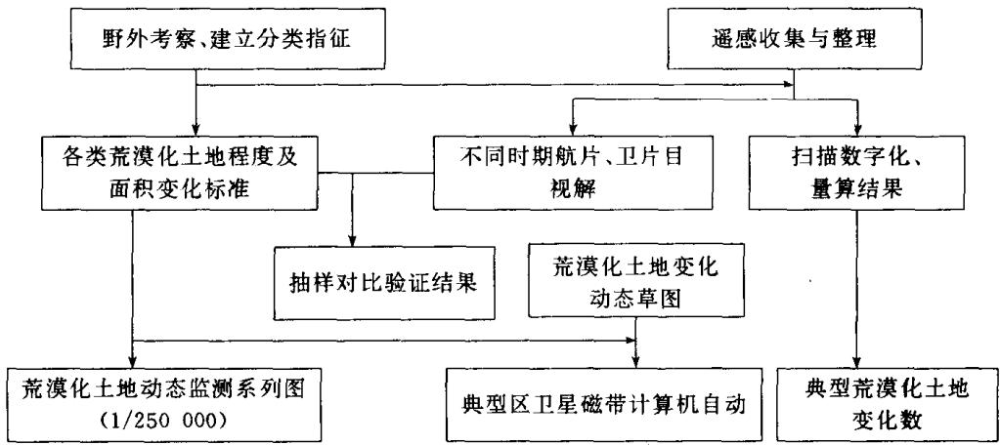  
图10-10 荒漠化土地遥感动态监测技术路线框图

从现状图和面积数据的分析，可以了解该区荒漠化发展过程、分布态势和数量分配情况，为进一步开展其动态变化分析提供了定性和定量的资料。

荒漠化遥感监测首先需要一个较为系统的荒漠化土地程度分级及其判别标志。荒漠化过程中，土地的各种物理、化学性质都会随着其退化的程度而变化，这是一个从量变到质变的过程，可以根据实际情况将其分成若干阶段，这对于认识荒漠化土地过程、状态和趋势，为选择相应的土地利用方式、强度及防治措施都有意义。根据以往的研究成果，我们将毛乌素沙地的荒漠化过程分为4个程度等级，即轻度、中度、重度和极重度荒漠化土地，其地表景观综合描述如下：

①轻度荒漠化土地基本保持原生景观和适度的土地利用。在保存较好的草场和耕地上一般没有风蚀和风积现象。原生植物种类生长良好。但因处于易遭风沙危害的地区，加之人畜的压力的逐渐增加，有沙漠化发生的发展可能。是需要采取措施加以防范的地区。

②中度荒漠化土地耕地和草场普遍受到风蚀和风积的影响，地面已有沙石裸露或薄层覆沙，沙砾质地表粗化明显，沙质地表则有片状流沙堆积。草场虽然基本保持原有外观，但已出现少量退化性指示植物，并分布有低矮的灌丛沙堆，生长良好。

③重度荒漠化土地受强烈风蚀或风积的耕地和草场，地表粗化严重，沙地裸露，并已大范围内分布，表现出风成地貌之雏形景观。草场原有植物种群中混生大量的1年生沙生先锋植物或其他适口性差的种类。灌丛沙堆普遍被吹扬，积沙已明显形成风蚀坡和落沙坡。

①极重度荒漠化土地风蚀坑、槽和流动丘或裸沙地已占据耕地、草场的大部，耕地也大部弃耕。粗化地表近于准戈壁，几乎无植被盖度；沙质地表土壤有机层几乎被吹蚀殆尽，露出土壤母质层或钙积层。草群外貌改观，退化植物为群落的主要成分。

在荒漠化土地监测中，重要的问题是使各程度荒漠化土地的遥感判别标志具有代表性和可操作性。所谓判别标志就是一个与荒漠化过程的环境条件紧密联系的现象或统计量，它们出现指示着环境条件的存在，是一些诊断性要素，但在实际监测过程中，由于种种原因和条件所限，不是所有的有助于表现荒漠化环境条件存在的指征都可以利用，所以往往都是根据具体情况制定指征体系。根据我国北方沙漠化过程及人类活动特色和已有的监测研究结果，总结出下列判读标志，这些在利用遥感和计算机手段获取及分析荒漠化信息方面具有直接应用价值：①单位面积内风蚀地或流沙面积占总面积的百分比：②单位面积和单位时间内风蚀地或流沙面积年均扩大面积所占百分比；③地表植被覆盖度（主要指草场、林地）。

## （三）荒漢化监测的 3S 技术

所谓3S技术是指遥感（RS）技术、地理信息系统（GIS）技术和导航卫星全球定位系统技术(GPS)。它是近几年来随着遥感技术、计算机技术、信息工程技术和空间科学技术的进步而发展起来的一门新兴技术，在城市规划设计、资源环境管理、生态环境监测保护、地质勘探测量、军事等诸多领域得到了较广泛的应用，在荒漠化监测与评价中，也具有十分广阔的应用前景。关于RS技术，前面已经述及，下面着重介绍地理信息系统技术和全球定位系统技术（GPS）以及RS、GIS和 GPS的一体化技术。

## 1. GIS 技术

地理信息系统(geographic information system)，简称 GIS，是在计算机软件和硬件的支持下，运用系统工程和信息科学的理论，科学管理和综合分析具有空间内涵的地理数据，以提供规划、管理、决策和研究所需信息的技术系统。或者简单地说，地理信息系统就是综合处理和分析空间数据的一种技术体系。它由四部分组成：即计算机硬件系统、计算机软件系统、空间数据和系统的组织以及使用维护人员(用户)。其核心内容是计算机硬件和软件，空间数据反映了应用地理信息系统的信息内容，用户决定了系统的工作方式。

（1）计算机硬件系统是计算机系统中实际物理设备的总称，主要包括计算机主机、输入设备、存储设备和输出设备。计算机主机可以是大型机、中型机、小型机、工作站及高档微机。由于地理信息系统是数据密集的系统，要求计算机运算速度及传输速度快、存储量大，所以，过去的地理信息系统，以大、中、小型计算机为主流机。目前，工作站和高档微机的性能已超过10年前中型机的水平，而且发展极为迅速，相应的商品软件已大量出现。因此，微机地理信息系统在将来会被广泛地使用。地理信息系统的图形输入设备主要是数字化仪及各种扫描仪；输出设备包括各种显示装置及绘图仪；存储装置有硬磁盘和光盘等。

（2）计算机软件系统是地理信息系统运行时所必需的各种程序。包括：

①计算机系统软件 这些软件一般由计算机厂家提供；

②地理信息系统软件及其支撑软件 包括地理信息系统工具或地理信息系统使用软件程序，以完成空间数据的输入、存储、转换、输出及其用户接口功能等；

③应用程序这是根据专题分析模型编制的特定应用任务的程序，是地理信息系统功能的扩充延伸。一个优秀的地理信息系统工具，对应用程序的开发应是透明的。应用程序作用于专题数据上，构成专题地理信息系统的基本内容。

(3）空间数据管理系统空间数据是地理信息系统的重要组成部分，是系统分析加工的对象，是地理信息系统表达现实世界的经过抽象的实质内容。它一般包括3个方面的内容：即空间位置坐标数据，地理实体之间空间拓扑关系以及相应于空间位置的属性数据。通常，它们以一定的逻辑结果存放在空间数据库中，空间数据来源比较复杂，随着研究对象的不同、范围不同、类型不同，可采用不同的空间数据结构和编码方法，其目的就是为了更好地管理和分析空间数据。

(4）系统使用和维护人员地理信息系统是一个复杂的系统，仅有计算机硬件、软件及数据还构不成一个完整的系统，必须要有系统的使用管理人员。其中包括具有地理信息系统知识和专业知识的高级应用人才；具有计算机知识和专业知识的软件应用人才以及具有较强操作能力的软硬件维护人才。

地理信息系统软件是地理信息系统核心的核心，它一般由以下五个基本的技术模块组成，每个模块可以相对独立地完成一定的功能，而彼此之间又相互联系、相互支持，共同完成复杂地理数据的管理和处理任务。

①数据输入与管理空间数据输入管理模块是相对独立的功能模块。它的目的是将地理信息系统中各种数据源输入，并转换成计算机所要求的数字格式进行存储。随着数据源种类的不同（如文本数据、数字数据和模拟数据等)、输入设备的不同、系统选用数据结构及数据编码的不同，在数据输入部分配有不同的软件，以确保原始数据按要求存入数据库中。

②数据库管理同一般数据库相比，地理信息系统数据库不仅要管理属性数据，还要管理大量图形数据，以描述空间位置分布及拓扑关系。而且，属性数据和图形数据之间具有不可分割的联系。此外，地理信息系统中数据库的数据量大，涉及内容多，这些特点决定了它既要遵循常用关系型数据库管理系统来管理数据，又要采用一些特殊的技术和方法，来解决通常数据库无法管理的空间数据问题。由于地理信息系统数据库具有明显的空间性，所以亦称为空间数据库。

③数据处理与分析是地理信息系统功能的主要体现，也是系统应用数字方法的主要动力，其目的是为了取得系统应用所需要的信息，或对原有信息结构形式的转换。这些转换、分析和应用的类型是极其广泛的，包括比例尺和投影的数字变换、数据的逻辑提取和计算、数据的处理和分析，以及地理或空间模型的建立。

④应用模型由于地理信息系统应用范围越来越广，常规系统提供的处理和分析功能很难满足所有用户的要求。因此，一个优秀的地理信息系统应当为用户提供二次开发手段，以便用户开发新的空间分析模块，即开发各种应用模型，扩充地理信息系统功能。

⑤数据输出与显示地理信息系统中输出数据种类很多，可能是输出地图、表格、文字、图像等；输出介质可以是纸、光盘、磁带、显示终端等。随着输出数据类型的不同和输出介质的不同需配备不同的软件，最终向用户报告分析结果。

地理信息系统是一个复杂庞大的空间管理信息系统。用地理信息系统技术解决实际问题时，有大量软件开发任务，如果各用户重复开发对人力、财力是很大的浪费。除某些专业部门为其特别的任务需自行开发外，大部分都是使用工具型地理信息系统的功能直接完成任务，或者利用工具型地理信息系统加上专题模型完成应用任务，或者借助工具型地理信息系统进行二次开发应用。

## 2. GPS 技术

全球定位系统 GPS(global positioning system）是建立在无线电定位系统、导航系统和定时系统基础上的空间导航系统。它以距离为基本观测量，通过同时对多颗卫星进行伪距离测量来计算接收机的位置。由于测距是在极短时间内完成的，故可实现动态测量。

第一代卫星导航系统最先起源于1958年美国海军卫星导航系统（navynavigating satellite system一NNSS)，由于其系统中所有的导航卫星都经过地球极点，因此，该系统又被称为子午仪卫星导航系统。

1973年，为了彻底解决原导航系统中的一些缺陷，美国国防部成立了一个专门机构，开始对GPS全球定位方案进行论证。这个机构由美国陆军、海军、海军陆战队、国防制图局、交通部、北大西洋公约组织、联合计划局所组成。

对GPS方案的论证历经了1973年、1978年以及1990年的3次修改、论证，并在修改和论证期间，进行了大量的实际工作，如发射实验卫星，开发GPS信号应用和发射工作卫星。

1985年11月以前发射的11颗GPS实验卫星已完成了它们的历史使命，并于1993年12月31日全部停止工作。1973～1985年实验卫星的导航定位实践证明，GPS系统是一个高精度、全天候和全球性的无线电导航、定位和定时的多功能系统。GPS技术已发展成多领域、多模式、多用途、多机型的高新技术的国际性产业。到1994年3月28日发射了覆盖率达到98%的GPS工作卫星，它由9颗Block卫星和15颗BlockⅡA卫星组成。建成了现行比较完善的GPS全球定位导航系统。

（1）GPS导航卫星（空间部分） 在1992年3月以前，美国共发射了21颗GPS导航卫星。其中，18颗是工作卫星，3颗是备用卫星。18颗工作卫星分别布置在6条近圆形轨道上，倾角55°，每条轨道上均匀分布了3颗卫星，运行周期为11小时58分。两条轨道上的卫星相隔40°，每隔一条轨道配置一颗备用卫星。

由于18颗工作卫星、3颗备用卫星仍存在着覆盖不良的情况，特别是在中纬度地区，存在着性能恶化区，个别地区性能恶化时间可达数小时。因此，为了改善原GPS全球定位导航系统的性能，美国于1993年将18+3星座扩展为21+3星座，从而降低了对所需轨道位置保持的要求，将卫星的轨道高度提高了49km，即长半轴由26560km提高到26609km。这样，由每年调整1次卫星位置改为每7年调整1次。

（2）GPS地面监控部分（地面站）包括1个主控站（中心控制站）、5个监测站和3个注入站。5个监测站分布在美国本土和三大洋的美军基地。每个监测站都是无人数据收集中心，配有无人值守的GPS接收机，在主控站的控制下跟踪接收卫星发射的Ⅰ波段比频信号，并通过环境数据传感器收集当地的气象数据，再由信息处理器将收集到的全部信息传送到主控站。每个监测站提供的监测数据形成了GPS卫星实时发布的广播星历。

主控站设在美国科罗拉多州，3个注入站分别设在阿松森岛、狄哥伽西亚和卡瓦加兰，以上主控站和3个注入站同时还是监测站，与夏威夷组成5个监测站。主控站控制着整个地面站的工作。主要职能是根据各监测站送来的信息计算各卫星的星历，以及卫星钟修正量，并以规定的格式编制成卫星电文，再通过位于三大洋的注入站，定时将这些信息注入各个卫星，然后由GPS卫星发送给各用户，这就是所用的广播星历。

3个注入站设在太平洋、印度洋、大西洋的美国军事基地，当卫星通过其视界时，注入站用S波段载频将导航信息注入卫星。注入站还负责监注入卫星的导航信息是否正确。注入站每12h向卫星注入1次新的导航数据。

(3)GPS的用户接收机 上述1和2两部分由美国国防部专门机构投资建立、维护和运行，而GPS用户接收机则由各专业公司生产。它包括天线、接收机、微处理机、控制显示设备等。接收机根据用途不同有多种类型。用户通过使用GPS接收机，根据所接收的多颗导航定位卫星所发射的定位信息，并以此信息计算出自己确切的位置。由于导航系统采用无源工作方式，凡是有GPS接收机设备的用户都可以使用GPS 系统。

美国国防部在GPS的方案设计中，提供了两种服务，一种是采用P码的精密定位服务，简称PPS，定位精度为17.8m。主要为军方服务或者经特许的民间用户使用。另一种采用粗码（C/A码）的标准定位服务，简称SPS，定位精度为100m，主要为民用服务。后来在GPS试验卫星阶段，发现实际卫星定位精度远高于此，对于使用P码的用户，其定位精度可达到14m。这与美国国防部的原设计初衷相矛盾。

美国政府为防止未经许可的用户把GPS用于军事目的，而人为地将随机误差引入到卫星时间钟和卫星数据中，从而降低了定位精度，这就是所谓的美国SA政策。SA政策实施后，由C/A码传送的星历称为C/A码广播星历，人为地降低精度达100m左右。这种误差不是固定的偏差，而是无规则变化的随机量。目前商用的GPS接收机只能取得C/A码广播星历。

这就是说，实施SA政策后，C/A码定位的精度降低到100m，这就使得所有商用接收机的定位精度大幅度降低，极大地限制了较高精度实时定位的应用。尽管许多潜在民间用户迫切要求美国五角大楼（美国国防部所在地）取消SA政策，但这实际上是不可能的。

于是，在实施SA政策情况下，如何提高GPS标准定位服务的实时定位精度的任务，就落在厂商和用户身上。为此差分GPS定位技术（DGPS）便应运而生。DGPS可以达到使用P码的定位精度。由于DGPS只能在局部地区工作，同时美国政策也允许接受，因此，DGPS定位技术便得到了飞速的发展。

(4)DGPS的工作原理 差分技术很早就被人们所应用。它实际是在一个观测站对两个目标的观测量、两个观测站对一个目标的观测量或一个观测站对一个目标的两次观测之间进行求差。

DGPS是在原来GPS系统的基础上，增加一个固定的基准地面接收站(即在地面已知位置的一个地面站，地面站由一个DGPS接收机和一个差分发射机组成）而构成。DGPS系统通过基准地面接收各种导航定位卫星的定位信号，利用已知基准站的精密坐标，计算出基准地面站到各卫星的误差修正值，并将该误差修正实时地发送给基准站附近的用户接收机。用户接收机则根据导航定位信号和此误差修正信号，计算出自已的位置。采用这种方法可以有效地修正卫星时钟偏差、星历误差、大气传播误差和SA误差，从而提高其定位精度。采用差分技术后，定位精度误差可从100m降到3～5m。

根据DGPS基准站发送的信息方式，实现DGPS 定位方法基本上有4种形式，即：位置差分，伪距差分，相位平滑伪距差分和相位差分。这4种差分方式的工作原理是相同的，即都是由基准站发送修正量，由用户站接收并对其测量结果进行校正，以获得精确的定位结果。所不同的是，发送修正量的具体值并不一样，其差分定位精度也不同。

位置差化法是在基准点得出基准点GPS定位的位置误差，并用它作为位置修正量对用户接收机解算出的位置坐标直接进行修正。它是最简单的差化方法，要求的设备简单，既可实时校正，又可进行事后处理，任何一种GPS接收机均可改装和组成这种系统。缺点是用户接收机与基准点接收机必须选用同一组GPS星座，用户与差分台的距离不宜过远。如果用户与基准台不是同一星座，用户的差分位置精度明显要下降，有时甚至达不到定位目的。

伪距（卫星到用户间的实际距离与误差之和）差分法是选基准点比较测出的伪距与用星历、基准占比较测出的伪距与用星历、基准点坐标解计算出的伪距，以及修正量传给用户，并对用户接收机测得的伪距先进行修正，然后求解用户坐标。该方法优点在于可提供单个卫星的伪距修正量，用户可选用与基准点一同的卫星座。缺陷是数据传输量大，须实时传输校正，基准台硬件设备也比较复杂。其他两种差分不再此进行详细叙述。

上述4种差分校正方法，目前在飞机进场着陆应用中，最广泛的是位置差分和伪距差分这两种。这两种方式都是以用户接收机和地面接收机具有相同的误差为前提。实际上，两台接收机所外的位置不同，接收机本身也不一样，因此，误差不可能相同。一般卫星时钟误差和星历误差对两台接收机是完全相同的，大气传播误差只能认为大致相同，地面接收机噪声和多路径等出现的误差，两台接收机是不同的。因此，地面接收机得出的位置或伪距修正信息必须经过处理，把两台接收机共有的误差提取出来，才能作为修正信息发送到用户接收机，也就是说，差分技术只能消除用户接收机和地面接收机共有的误差。

## 3. RS、GIS 和 GPS 的一体化技术

地理信息系统是利用计算机存储和管理地理信息（与空间及土地相连接的遥感及地图数据）的工具；具有高效的空间数据管理和灵活的空间数据综合分析能力的计算机技术系统。

地理信息系统与遥感相结合，既可以保证GIS具有高效稳定的信息源，又可以对遥感信息进行实时处理、科学管理和综合分析，实现监测、预测和决策的目的，这是空间技术发展的必然趋势。

GPS直接获取空间定位数据，可依此纠正遥感影像的投影误差；利用GPS获取的定位数据通过GIS建立三角网，生成电子地形图，可直接用于空间分析。因此GPS为GIS获取空间数据提供了新途径。

3S一体化软件的开发和应用，为区域资源信息系统建立、区域定位动态检测等提供了集成化工具，在此基础上开发区域决策系统是非常方便的。

在地理信息系统中，遥感数据和GPS的主要应用有：

（1）利用遥感数据的分析结果 如土地覆盖分类结果。从遥感数据中可获得土地覆盖状况等各种地理信息。把这些信息按应用目的存入地理信息系统中就可以应用于区域分析等。也可以应用遥感数据在比一般统计数据更小的空间单元里得到土地覆盖分类。

（2）直接应用遥感数据本身 遥感数据本身在地理信息系统中可以作为区域的宏观图像加以利用，也可以与其他地理数据复合，进行更高层次的分析之用。前者多用于图像判读，后者可以有效地提高土地覆盖分类的精度。

（3）纠正地理数据的误差以遥感数据的误差及其分析结果为例，把地理数据的误差及模糊性按其产生原因归纳为：

①调查、测量方法引起的误差分类类别模糊性引起的误差；分类方法引起的误差，例如自动分类伴生的误差；采样引起的误差，例如采样密度低引起的内插误差；位置测量误差引起的误差；地图描绘引起的误差，例如建筑物形状的单纯描绘；模型表示引起的误差，例如RS图像的位置重合误差。

②表示方法引起的误差如用二维面上的点及线段等表示三维地物引起

的误差。

## ③数据输入、操作引起的误差

## ①数据陈旧引起的误差

利用遥感和GPS结合可直接获取数据并纠正误差，避免了手工操作带来的误差，同时提高了工作效率，为GIS提供可靠数据。

## 五、荒漠化监测技术体系

荒漠化监测，是90年代中期随着《联合国防治荒漠化公约》的签署而兴起的一个新兴领域，目前，尚无成型的监测技术体系，世界各国都在积极进行探讨和研究。在与荒漠化监测紧密相关的生态监测领域，积长年之研究成果，已经形成了一套完整的监测技术体系，可以借鉴。据《中国荒漠化监测技术方案》，我国将采取定位监测站、重点监测区与一般监测区相结合，遥感、全球定位系统、地理信息系统和专家预测预报系统等高新技术综合应用的技术路线，对我国的荒漠化状况进行高效、准确、及时、长期的动态监测和对比分析。据此，并结合我国各级行政区划的技术、经济状况，认为目前情况下比较可行的监测技术体系为：

## （一）定位监测站

生态环境实时自动观测技术、土壤理化性质的测定分析技术、测量技术、GPS测量技术、GIS技术、航空航天遥感技术、图像处理技术、生态调查技术、多媒体技术、网络技术等。

## （二）县级监测

地形图调绘技术、航空遥感相片调绘技术、航空遥感判读技术、GIS技术、多媒体技术、网络技术等。

## （三）地区级监测

航空遥感判读技术、航天遥感判读技术、GIS技术、多媒体技术、网络技术等。

## (四）省级监测

航天遥感判读技术、图像处理技术、GIS技术、抽样技术、样地GPS现地定位复位技术、多媒体技术、动态预测评价、网络技术等。

## （五）国家级监测

图像处理技术、荒漠化遥感分类专家系统技术、GIS技术、抽样技术、样地GPS现地定位复位技术、多媒体技术、动态预测评价、网络技术等。

可以看出，上述荒漠化监测技术体系是以3S技术为核心的技术体系，其中尤以GIS技术的其存贮、分析、表达、输出等功能贯穿始终。1994、1995年间，北京林业大学水土保持学院先后在北京大兴、山西平鲁两地，结合全国的沙漠化土地普查工作，采用航空遥感相片判读结合实地调绘核查的方法，应用地理信息系统工具软件ViewGIS，首次进行了荒漠化监测的尝试，取得了部分成果。同期，林业部勘察规划设计院在甘肃省的民勤和武威，宁夏回族自治区的陶乐、银川、中卫、灵武和盐池，内蒙古自治区的科尔沁地区进行了沙漠化土地普查的试点工作，为制定我国的荒漠化监测技术方案奠定了基础。现简要介绍这两项工作的一般步骤和方法，供参考。

## 第二节 荒漠化评价

## 一、荒漠化评价的概念及内容

荒漠化评价，简单地讲就是对分布于干旱、半干旱和亚湿润干旱区的退化土地进行类型的划分与程度的分等定级，或者说是从退化的角度对荒漠化土地进行质与量的界定。从根本上说，它仍属于土地资源评价或土地质量评价的范畴，是为土地利用服务的。其具体内容包括：

## （一）荒漢化现状评价

荒漠化现状评价是指在特定的时间和地域条件下，对土地单元的退化程度进行分等定级。土地的退化程度是指土地质量远离未退化状态或“基准”的程度。所以，只有能找到“基准”，通过相互比较，才可以确定任一土地单元的退化情况。但是，实际上由于种种因素的影响，“基准”是难以确定的，一般情况下采用相对“基准”比较法或其他处理手段。

荒漠化现状评价是土地荒漠化评价的核心，通常人们所指的土地荒漠化评价大都是针对现状评价而言。荒漠化现状评价的最终成果应是荒漠化现状分布图。

## （二）荒漢化灾害评价

荒漠化灾害是指由于土地荒漠化的产生和影响，对地区社会经济和环境造成的各种损失及破坏。它的特点是具有时间的持续性、空间的间断性、过程的复杂性和危害的广泛性。其灾害所涉及的因素十分庞杂，而且大部分因素不易测度，很难获得准确的定量数据，目前的研究水平还不能进行可靠的评估。

## （三）荒漠化发展速率评价

荒漠化发展速率是指在单位时间内荒漠化土地面积大小及程度深浅的变化。作为正过程，它既包括非荒漠化土地的荒漠化，也包括各种荒漠化土地

程度的加深；作为逆过程，它主要是指荒漠化程度的逆转。当速率为零时，即是通常所说的“零增长”。荒漠化发展速率的评价属于动态评估的范畴，一般可由两个或两个以上不同时期的荒漠化现状情况比较获得。

## (四）荒漠化发展趋势评价

荒漠化发展趋势评价实质上是一种综合评价。它是在综合荒漠化成因、发展规律、目前状况和发展速率的基础上，考虑自然条件的脆弱性和环境压力的大小而进行的预测性评估，包括荒漠化产生的可能性，荒漠化可能达到的水平等。

## 二、荒漠化评价指标体系

## (一）荒漠化评价指标体系研究概况

自法国学者奥布蕾维莱提出荒漠化概念后，荒漠化问题便开始受到人们的重视，特别是1977年内罗毕联合国荒漠化大会以后，荒漠化问题便得到国际社会的的广泛关注，与此同时，荒漠化的评价问题也就被提高到荒漠化研究的议事日程中来，世界上许多国家都曾在这方面进行过努力，并根据各自对荒漠化概念的理解，从不同的角度和深度提出了各种各样的评价标准。有的是从广义的荒漠化的角度提出的，有的则是专门针对风成荒漠化即沙漠化而言；有的只是提出了一些概括性的定性因子，有的则给出了因子的阈值；有的是单因子标准，有的则是多因子综合指标。这些人们都笼统地称之为荒漠化的评价指标体系。

## 1. 国外概况

国外的研究大都是以广义的于旱土地退化为评价对象，早在20世纪的30年代和50年代，美国、澳大利亚等国在草场退化研究方面已作了初步尝试，但是，对土地荒漠化的评价，真正进行比较系统研究、作为体系提出的系柏雷（Berry）和福德（Ford），1977年，他们以气候、土壤、植被、动物和人类影响等因子为依据，提出了用于全球、地区（跨国家的）、国家和地方的4级指标体系（表10-5）。此后，由肯尼亚内罗毕联合国荒漠化会议的一次讲习班发起，1978年Reining又把荒漠化指标进一步具体化，归纳为自然地理学、生物与农学、社会3个方面，涉及到土壤、植被、水、动物与人类活动等众多指标（表10-6）。

表 10-5 荒漠化监测指标
<table><tr><td>监测范围</td><td>指 标</td></tr><tr><td>全球</td><td>地面反射率，尘暴，降水，土壤侵蚀与沉积，土壤盐碱化</td></tr><tr><td>区域（跨国家的）</td><td>土地生产力，生物量，气候，土壤养分，土壤盐碱化</td></tr><tr><td>地区（国家和地方）</td><td>土地生产力，人民生活水平，人民文化水平</td></tr></table>

引自乔汉（李树真译），土地荒漠化的指征，1994。

表 10-6 荒漠化评价指标
<table><tr><td>自然地理学指标</td><td>生物与农学指标</td><td colspan="2">社会经济学指标</td></tr><tr><td>1. 土壤指标</td><td>1. 植被</td><td>1. 土地利用方式</td><td>3. 人类生物学参数</td></tr><tr><td>有效深度</td><td>盖度</td><td>灌溉</td><td>人口结构和比率</td></tr><tr><td>土壤有机质</td><td>地上生物量</td><td>旱地农业</td><td>营养状况</td></tr><tr><td>土壤结皮</td><td>主要植物种</td><td>放牧</td><td>公共卫生</td></tr><tr><td>尘埃、尘暴和沙暴2. 动物</td><td></td><td>采矿、燃料</td><td>4. 社会变迁参数</td></tr><tr><td>盐碱化</td><td>主要野生动物种、</td><td>旅游</td><td>冲突</td></tr><tr><td>2. 水指标</td><td>分布及数量</td><td>水源</td><td>人口流动</td></tr><tr><td>地下水位和水质</td><td>家畜头数</td><td>2. 居民点的形式</td><td>再分配</td></tr><tr><td>地表水、水域面积</td><td>牲畜组成</td><td>新居民点</td><td>土地边际化</td></tr><tr><td>3. 其他指标</td><td>产量</td><td>居民点的扩大和定居化</td><td>现金与生存</td></tr><tr><td>地面反射率</td><td>产率</td><td>放弃居民点</td><td></td></tr></table>

引自乔汉（李树真译)，土地荒漠化的指征，1994。

H.E.Dregne（1979）在总结前人工作的基础上，认为荒漠化的指标在不同土地利用状况下，其内容有所不同。在旱作农业区，植物生长比较差，年降雨的波动差异大，土壤裸露，每年有几个月遭受风蚀，因此，土壤侵蚀是最重要的荒漠化问题，土壤特点则是最明显的直接指标，土壤搬运和堆积的总量，风蚀沟和沙丘的大小及数量是估算土壤荒漠化程度的指标；在灌溉农业区，不恰当的水管理是影响作物产量的最大因素，土地的荒漠化，主要表现在盐渍化和水渍化方面，重要指标是土壤耕层的盐分含量、土壤表面吸收性钠的数量、盐结皮状况、植物体氯化物含量等；在畜牧业地区，其主要的指标放在植物种类的组成、生长势，植物生物量方面，次要指标则以畜群的组成与数量，乳类生产量的变化，植物体内碳水化合物的储量等为内容；此外，在矿区、休憩用地等方面也均有侧重；而且认为人类影响也是荒漠化评价的重要内容。所以Dregne从土地利用的角度提出了一个包括物理、生物和社会经济方面的评价指标体系（表10-7、表10-8）。

1984年，前苏联根据与联合国环境规划署达成的协议，编写了《制定防治荒漠化的区域性综合发展纲要指南》，该书提出了与Rcining（1984）相类似的监测指标体系，包括物理（土壤、地球化学和水文）、植物、动物、社会4个方面的众多指标。

表10-7 荒漠化分析中的物理和生物指标
<table><tr><td rowspan=1 colspan=1>土地利用</td><td rowspan=1 colspan=1>测定类别</td><td rowspan=1 colspan=1>主要指标</td><td rowspan=1 colspan=1>类型</td><td rowspan=1 colspan=1>测定项目</td><td rowspan=1 colspan=1>次要指标</td></tr><tr><td rowspan=2 colspan=1>灌溉</td><td rowspan=1 colspan=1>盐渍化</td><td rowspan=1 colspan=1>土壤盐量</td><td rowspan=1 colspan=1>直接</td><td rowspan=1 colspan=1>不同深度土壤样品的电导和吸收性钠</td><td rowspan=1 colspan=1>叶子症状（颜色，叶尖灼伤），叶中氯化物和硼的含量，谷物生长情况，盐结皮和土壤透水性</td></tr><tr><td rowspan=1 colspan=1>水渍化</td><td rowspan=1 colspan=1>水位深度</td><td rowspan=1 colspan=1>直接</td><td rowspan=1 colspan=1>钻孔静水面深度</td><td rowspan=1 colspan=1>植物缺氧征状，根区的土壤锈斑</td></tr><tr><td rowspan=3 colspan=1>旱作农业</td><td rowspan=1 colspan=1>土壤侵蚀</td><td rowspan=1 colspan=1>土壤的搬运和沉积</td><td rowspan=1 colspan=1>直接</td><td rowspan=1 colspan=1>底土水平深度断面的沟与槽的数量与大小</td><td rowspan=1 colspan=1>土壤损失量，土包、沙丘数量及大小，土壤颜色，土壤反射率，尘暴的数量及强度，细沟和深沟数量大小，流水渠道的侵蚀</td></tr><tr><td rowspan=2 colspan=1>营养亏缺</td><td rowspan=1 colspan=1>植物分析</td><td rowspan=1 colspan=1>间接</td><td rowspan=1 colspan=1>植物主要矿物营养含量</td><td rowspan=1 colspan=1>谷物产量</td></tr><tr><td rowspan=1 colspan=1>土壤分析</td><td rowspan=1 colspan=1>间接</td><td rowspan=1 colspan=1>土壤中对植物有用的营养含量分析</td><td rowspan=1 colspan=1>植物缺乏营养或毒性症状，作物生长状况的差异</td></tr><tr><td rowspan=1 colspan=1>畜牧</td><td rowspan=1 colspan=1>过渡放牧</td><td rowspan=1 colspan=1>植物种的组成和密度植物生物量，植物长势</td><td rowspan=1 colspan=1>直接间接</td><td rowspan=1 colspan=1>沿横断面线和小区中植物种的分布小区植物重量，草本年生物量，幼苗成活率和样地的干草数量</td><td rowspan=1 colspan=1>动物减少，乳类生产，动物数量（野生和家畜)，畜群组成，土壤反射率，植物体中保存的碳水化合物，植物的基本面积</td></tr><tr><td rowspan=2 colspan=1>休憩</td><td rowspan=1 colspan=1>植物破坏</td><td rowspan=1 colspan=1>植物生物量，植物长势</td><td rowspan=1 colspan=1>间接</td><td rowspan=1 colspan=1>小区植物重量，每年牧草生物量，幼苗长势，采样小区的干草数量</td><td rowspan=1 colspan=1>土壤反射率，机动车辙的面积</td></tr><tr><td rowspan=1 colspan=1>土壤侵蚀</td><td rowspan=1 colspan=1>土壤的损失和沉积</td><td rowspan=1 colspan=1>直接</td><td rowspan=1 colspan=1>底土水平层深度</td><td rowspan=1 colspan=1></td></tr><tr><td rowspan=7 colspan=1>采矿</td><td rowspan=1 colspan=1>生态系统扰乱</td><td rowspan=1 colspan=1></td><td rowspan=1 colspan=1></td><td rowspan=1 colspan=1></td><td rowspan=1 colspan=1></td></tr><tr><td rowspan=1 colspan=1>土壤侵蚀</td><td rowspan=1 colspan=1></td><td rowspan=1 colspan=1></td><td rowspan=1 colspan=1>物质损失的重量</td><td rowspan=1 colspan=1>地面反射率，地面颜色</td></tr><tr><td rowspan=1 colspan=1>植物长势</td><td rowspan=1 colspan=1>植物种类构成和多度</td><td rowspan=1 colspan=1>直接</td><td rowspan=1 colspan=1>沿横断面线和小区中植物种的分布，小区的植物重量</td><td rowspan=1 colspan=1></td></tr><tr><td rowspan=1 colspan=1>水污染</td><td rowspan=1 colspan=1>地下与地表水质量</td><td rowspan=1 colspan=1>间接</td><td rowspan=1 colspan=1>盐分，水中的特殊物质和重金属</td><td rowspan=1 colspan=1></td></tr><tr><td rowspan=1 colspan=1>空气污染</td><td rowspan=1 colspan=1>空气质量</td><td rowspan=1 colspan=1>间接</td><td rowspan=1 colspan=1>下风空气的特殊物质数量和种类</td><td rowspan=1 colspan=1></td></tr><tr><td rowspan=1 colspan=1>野生动物生境破坏</td><td rowspan=1 colspan=1>动物及鸟类种类组成和频数</td><td rowspan=1 colspan=1>直接</td><td rowspan=1 colspan=1>样地的观测数量</td><td rowspan=1 colspan=1></td></tr><tr><td rowspan=1 colspan=1>美化损失</td><td rowspan=1 colspan=1>开采洞与堆积的情况</td><td rowspan=1 colspan=1>直接</td><td rowspan=1 colspan=1>植被的密度，种类高度和产生地面水的数量</td><td rowspan=1 colspan=1></td></tr><tr><td rowspan=1 colspan=1>都市化</td><td rowspan=1 colspan=1>伐木</td><td rowspan=1 colspan=1>薪材和木炭利用</td><td rowspan=1 colspan=1>间接</td><td rowspan=1 colspan=1>进入城市和农村的薪材和木炭的数量</td><td rowspan=1 colspan=1>薪材和木炭的价格，取得薪材的距离</td></tr></table>

引自H. E. Dregne（韩清编译)，沙漠化指征，1980。

表 10-8 荒漠化的经济指标
<table><tr><td>类别</td><td>主要指标</td><td>类型</td><td>测量项目</td><td>次要指标</td></tr><tr><td rowspan="3">土地利用</td><td>土地利用变化</td><td>间接</td><td>弃耕地的数量，旱农耕地</td><td rowspan="3">居住区的废弃</td></tr><tr><td></td><td></td><td>与放牧地之数量</td></tr><tr><td>畜群组成变化</td><td>间接</td><td>畜群中山羊和骆驼的比例</td></tr><tr><td>人的健康</td><td>儿童的营养状况</td><td>间接</td><td>体重，身高及上臂的周长</td><td>幼年及老年的死亡率</td></tr><tr><td>人的反应</td><td>当地环境变化的感觉</td><td>间接</td><td>样地人口中的个别调查</td><td>女性的生育率</td></tr></table>

引自H. E. Dregne（韩清编译)，沙漠化指征，1980。

为荒漠化评价与制图的需要，1984年，联合国粮农组织（FA()）和联合国环境规划（UNEP）在《荒漠化评价与制图方案》中，从植被退化、风蚀、水蚀、盐碱化等方面，提出了荒漠化现状、发展速率、内在危险性评价的具体定量指标，把荒漠化按其发展程度的不同，分为弱、中、强、极强4个等级（董玉祥，1992），表10-9为风蚀荒漠化评价分级指标，表10-10为其数据来源。这可以认为是最全面和最详细的评价指标体系。

表10-9 荒漠化监测评价分级标准
<table><tr><td colspan="2">评价方面</td><td rowspan="2">指 标</td><td colspan="3">分 级</td></tr><tr><td></td><td>轻度</td><td>中度</td><td>强度</td><td>极强度</td></tr><tr><td rowspan="4">荒漠化</td><td>1. 沙丘占地百分比（%）</td><td>&lt;5</td><td>5~15</td><td>15~30</td><td>&gt;30</td></tr><tr><td>2. 土壤表层土损失率（%）</td><td></td><td></td><td></td><td></td></tr><tr><td>a. 原生土层厚度小于1.0m</td><td>&lt;25</td><td>25~50</td><td>50~75</td><td>&gt;75</td></tr><tr><td>b. 原生土层厚度大于1.0m</td><td>&lt;30</td><td>30~60</td><td>60~90</td><td>&gt;90</td></tr><tr><td></td><td>现 状 3. 现实生产力占潜在生产力比率（%）</td><td>&gt;85</td><td>65~85</td><td>25~65</td><td>&lt;25</td></tr><tr><td></td><td>4. 土壤厚度（cm）</td><td>&gt;90</td><td>90~50</td><td>50~10</td><td>&lt;10</td></tr><tr><td></td><td>5. 地表岩砾覆盖率（%）</td><td>&lt;15</td><td>15~30</td><td>30~50</td><td>&gt;50</td></tr><tr><td></td><td>1. 面积年扩大率（%）</td><td>&lt;1</td><td>1~2</td><td>2~5</td><td>&gt;50</td></tr><tr><td></td><td>荒漠化 2. 土壤损失 [Mt/ (hm²·a)]</td><td>&lt;2.0</td><td>2~3.5</td><td>3.5~5</td><td>&gt;5.0</td></tr><tr><td></td><td>速 率 3. 生物生产力年下降率（%）</td><td>&lt;1.5</td><td>1.5~3.5</td><td>3.5~7.5</td><td>&gt;7.5</td></tr><tr><td></td><td>4.1m线的年输沙量（m³）</td><td>&lt;5</td><td>5~10</td><td>3.5~7.5.</td><td>&gt;20</td></tr><tr><td rowspan="4">内在 危险性</td><td>1. 土壤结构</td><td>一</td><td></td><td></td><td>--</td></tr><tr><td>2.2m高处年风速（m/s）</td><td>&lt;2</td><td>2~3.5</td><td>3.5~4.5</td><td>&gt;4.5</td></tr><tr><td>3. 起沙风频率（v=6m/s）（%）</td><td>&lt;5</td><td>5~20</td><td>20~33</td><td>&gt;33</td></tr><tr><td>4. 沙粒运动潜在能力</td><td>&lt;5</td><td>5~15</td><td>15~25</td><td>&gt;25</td></tr><tr><td>人畜</td><td>1. 人口超载率（%）</td><td></td><td>&lt;-34</td><td>-34~0</td><td>0~100</td><td>&gt;100</td></tr><tr><td>压 力</td><td>2. 牲畜超载率（%）</td><td></td><td>-80~-34</td><td>-34~0</td><td>0~100</td><td>&gt;100</td></tr></table>

引自董玉祥等，国外沙漠化监测评价指标与分级标准，1992。

表10-10 荒漠化监测评价数据来源
<table><tr><td rowspan="2">评价方面</td><td rowspan="2">指 标</td><td colspan="3">比 例 尺</td><td rowspan="2">备 注</td></tr><tr><td>1:1万~1:5万</td><td>1:10万～1：25万</td><td>1：10万~1：250万</td></tr><tr><td rowspan="3">荒漠化</td><td>沙丘占地百分比</td><td>F, LP</td><td>SP</td><td>SI</td><td>A：分析数据</td></tr><tr><td>土壤表层损失率 现实生产力占潜在生</td><td>F, LP</td><td>N</td><td>N</td><td>Am：气候数据</td></tr><tr><td>产力的百分比</td><td>F</td><td>N</td><td>N</td><td>M：数学方法</td></tr><tr><td rowspan="3">现状</td><td>土壤厚度</td><td>F, LP</td><td>SP, N</td><td>N</td><td>N：现有数据</td></tr><tr><td>地表盐砾覆盖率</td><td>F, LP</td><td>SP, N</td><td>N</td><td>F：野外监测</td></tr><tr><td>荒漠化面积扩大率</td><td>F, LP</td><td>SP</td><td>SI</td><td>LP：大比例尺航</td></tr><tr><td rowspan="4">荒漠化 速率</td><td>土壤损失</td><td>F</td><td>N</td><td>N</td><td>片</td></tr><tr><td>生物生产力下降率</td><td>F</td><td>N</td><td>N</td><td>SP：小比例尺航</td></tr><tr><td>1m 线的年输沙量</td><td>F, LP</td><td>SP, N</td><td>SI, N</td><td>片</td></tr><tr><td>土壤结构</td><td>F, A, LP</td><td>SP, N</td><td>SI, N</td><td>SI：卫片</td></tr><tr><td rowspan="4">内在 危险性</td><td>2m高处年风速</td><td>Am</td><td>Am</td><td></td><td></td></tr><tr><td>起沙风频率</td><td>Am, M</td><td></td><td>Am</td><td></td></tr><tr><td>沙粒运动潜在能力</td><td></td><td>Am, M</td><td>Am, M</td><td></td></tr><tr><td></td><td>M</td><td>M</td><td>M</td><td></td></tr></table>

引自董玉祥等，国外沙漠化监测评价指标与分级标准，1992。

## 2. 国内概况

我国的荒漠化由于受荒漠化概念的影响，研究的荒漠化主要是与风沙活动有关的地表景观的退化过程，即风蚀荒漠化。朱震达（1984）根据荒漠化土地年扩大率大小、流沙所占该地区面积的大小和地表景观形态组合特征3个因素，提出了荒漠化程度判定指标体系（表10-11）。

表 10-11 荒漢化程度指征
<table><tr><td>荒漠化程度类型</td><td>荒漠化土地每年扩大 面积占该地区面积 的百分数（%）</td><td>流沙面积占该地区 面积的百分数（%）</td><td>形态组合特征</td></tr><tr><td>潜在的</td><td>0.25 以下</td><td>5%以下</td><td>大部分土地尚未出现荒 漠化，仅有偶见的流沙点</td></tr><tr><td>正在发展中</td><td>0.26~1.0</td><td>6~25</td><td>片状流沙，吹扬灌丛沙堆 与风蚀相结合</td></tr><tr><td>强烈发展中</td><td>1.1~2.0</td><td>26~50</td><td>流沙大面积的区域分布， 灌丛沙堆密集，吹扬强烈</td></tr><tr><td>严重的</td><td>2.1以下</td><td>50%以上</td><td>密集的流动沙丘占绝对优 势</td></tr></table>

引自朱震达等，关于沙漠化的概念及其发展程度的判断，1984。

朱震达认为，在荒漠化过程中随着荒漠化程度的进展，土地滋生潜力、生物生产量（含植被结构及覆盖度的变化）以及生态系统能转化效率等都有较明显的变化，这些变化是随着荒漠化进程而产生和发展的，因此，又提出与上述荒漠化程度指征一起共同成为判定荒漠化程度的定量化标志，或称为荒

漠化程度的辅助指征（表10-12）。

表 10-12 荒漠化程度的辅助指征
<table><tr><td>荒漠化程度 类 型</td><td>植被覆盖度 (%)</td><td>土地滋生潜力 (%)</td><td>农田系统的能量产投比 (%)</td><td>生物生产量 [t/ (hm²·a)]</td></tr><tr><td>潜在的</td><td>60 以上</td><td>80 以上</td><td>80 以上</td><td>3~4.5</td></tr><tr><td>正在发展的</td><td>59~30</td><td>79~50</td><td>79~60</td><td>2.9~1.5</td></tr><tr><td>强烈发展的</td><td>29~10</td><td>49~20</td><td>59~30</td><td>1.4~1.0</td></tr><tr><td>严重的</td><td>9~0</td><td>19~0</td><td>29~0</td><td>0.9~0</td></tr></table>

引自朱震达等，关于沙漠化的概念及其发展程度的判断，1984。

其中，植被覆盖度按投影法估算，并以当地原生景观的植被盖度为100%；土地滋生潜力利用水分效率（或蒸腾系数）推算出本区单位面积的可能生产量，并以其为100%（我国干草原农牧交错区旱作农田推算的可能产量为1.5\~2.5t/hm²)；农田系统的能量产投比值是将耕种收获全过程所花费的各种有机能及无机能总和与产出能之比求得（我国干草原农牧交错地区旱作农田的能产投比值约为2.0，以其为100%)。

1985年，为荒漠化专题图制作的需要，冯毓逊（1985）以荒漠化土地的比重、发展情况、沙丘类型、沙丘相对高度、沙丘疏密度、沙丘活化程度、分布规律及沙丘上植被盖度为指征，给出了荒漠化土地的判读标志（表10-13)。

表 10-13 荒漠化土地的判读标志
<table><tr><td rowspan="2">评价指标</td><td colspan="4">荒漠化程度</td></tr><tr><td>严重的</td><td>强烈发展中的</td><td>正在发展中的</td><td>潜在的</td></tr><tr><td>荒漠化土地占该地区的 面积（%）</td><td>&gt;50</td><td>50~26</td><td>25~5</td><td>&lt;5</td></tr><tr><td>一定时期来荒漠化土地</td><td>&gt;40</td><td>40~21</td><td>20~5</td><td>&lt;5</td></tr><tr><td>增加的百分比（%） 沙丘类型</td><td>以新月型</td><td>以梁窝状沙丘</td><td>梁窝状沙丘、</td><td>小面积片状流沙，</td></tr><tr><td rowspan="4"></td><td>沙丘及沙丘</td><td>为主，新月型沙</td><td>灌丛沙堆，沙垄</td><td>灌丛沙堆、沙垄偶有</td></tr><tr><td>链为主</td><td>丘偶出现</td><td>交替出现</td><td>出现</td></tr><tr><td>&gt;25</td><td>25~11</td><td>10~5</td><td>&lt;5</td></tr><tr><td>&gt;50</td><td>50~21</td><td>20~5</td><td>&lt;5</td></tr><tr><td>沙丘的疏密度（%） 沙丘的活动程度</td><td>流动沙丘</td><td>半流动沙丘</td><td>半固定沙丘</td><td>固定沙丘</td></tr><tr><td>沙丘的分布规律</td><td>密集连片分</td><td>流动沙丘或吹</td><td></td><td></td></tr><tr><td rowspan="5"></td><td>布</td><td>扬灌丛沙堆片状</td><td>斑点状流沙或 吹扬灌丛沙堆，</td><td>小面积流动零星点 状分布在井泉、居民</td></tr><tr><td></td><td>分布，半固定与</td><td>风蚀地常有出现</td><td>点附近或开垦的农田</td></tr><tr><td></td><td>半活动沙丘交错</td><td>农田、草场普遍</td><td>中</td></tr><tr><td></td><td>分布</td><td>受风蚀</td><td></td></tr><tr><td>&lt;15</td><td>15~30</td><td>31~50</td><td>&gt;50</td></tr></table>

引自冯毓逊，1985。

吴正（1987）综合了几位研究者的思想，在朱震达的荒漠化程度判读指标体系基础上，提出了表10-14所示的判别标准。

表 10-14 荒漠化程度指征
<table><tr><td>荒漠化程度</td><td>流沙所占土地 的面积（%）</td><td>植被状况</td><td>地貌形态组合特征</td></tr><tr><td>潜在荒漠化</td><td>&lt;10</td><td>稳定性植被成分占优势， 其盖度达40%以上</td><td>大部分土地尚未出现荒漠化，仅 有斑点状流沙</td></tr><tr><td>轻度荒漠化</td><td>10~30</td><td>稳定性植被成分退居次要 地位，其盖度为20%～40%</td><td>地表局部受风蚀破坏，出现风蚀 坑和吹扬灌丛沙丘及小片流沙</td></tr><tr><td>中度荒漠化</td><td>30~50</td><td>稳定性多年生植被盖度低 于20%</td><td>地表风蚀破坏比较严重，出现较 大风蚀坑，吹扬灌丛沙堆密集，流 沙大片分布</td></tr><tr><td>强度荒漠化</td><td>&gt;50</td><td>植被稀疏低矮，1年生植 物占优势，盖度小于10%</td><td>密集的流动沙丘大面积分布</td></tr></table>

引自吴正编著，风沙地貌学，1987。

高尚武等（1998）结合遥感影像的目视解译标志提出了一个综合评价模型。他们认为，沙质荒漠化现状（SH）由植被盖度（G）、裸沙占地百分比（S）和土壤质地（T）反映，可表示如下：

$$
S H = G + S + T\tag{10-1}
$$

其综合评价模型为：

$$
S H = \sum _ { i = 1 } ^ { m } W _ { i } \cdot F _ { i }\tag{10-2}
$$

式中 $_ { m } .$ ——评价因子数， $\pmb { m } = 3$

$W _ { i }$ ——第i个评价因子的权重；

$F _ { i }$ ——第i个评价因子等级值。

将植被盖度和裸沙地占地百分比指标划分为7个等级，便于采用全国沙漠化普查数据，实现遥感卫片判读；土壤质地分为4种类型。对各因子等级范围有规律地赋以1.0\~4.5的不同等级值。依据以往调查及专家评判和实验结果，经过多种因子权重组合方案的计算，划分出沙质荒漠化程度总得分范围，按国际惯例将荒漠化程度分为轻度、中度、强度、极强度4级。按上式算得各样地荒漠化总得分值后，以实地判定的荒漠化程度为对照，筛选出最佳权重组合：裸沙占地百分比为3.8，植被盖度为3.6，土壤质地为2.6。由此，建立起一个荒漠化现状的评价指标体系（表10-15）。

关干其他类型的荒漠化分级评价指标也曾提出了一些。在《水土保持技术规范》SD238-87中，将水蚀荒漠化规定为6级，如表10-16所示。

表10-15 沙质荒漠化现状评价指标体系
<table><tr><td>评价指标</td><td>权重</td><td>等级值</td><td>1.0 1.5 2.0</td><td>2.5</td><td>3.0</td><td>3.5</td><td>4.5</td></tr><tr><td>裸沙占地百分比</td><td>3.8</td><td>范围</td><td>&lt;10 10~20</td><td>21~30 31~40</td><td>41~50</td><td>51~70</td><td>&gt;70</td></tr><tr><td>(%) 植被盖度</td><td>3.6</td><td>得分值 范围</td><td>3.6 5.7 &gt;60</td><td>7.6 9.5 60~51 50~41 40~31 30~21 20~10</td><td>11.4</td><td>13.3</td><td>15.2 &lt;10</td></tr><tr><td>土壤质地</td><td>2.6</td><td>得分值 范围</td><td>3.6 5.4</td><td>7.2 9.0</td><td></td><td>10.8 12.6 14.4</td><td></td></tr><tr><td></td><td></td><td>得分值</td><td>沙壤土 2.6</td><td>粉沙土 5.2</td><td>沙砾 7.8</td><td></td><td>沙质土 10.4</td></tr><tr><td colspan="2">沙质荒漠化程度</td><td>轻度</td><td>中度</td><td colspan="2">强度</td><td colspan="2">极强度</td></tr></table>

引自高尚武，1998。

表 10-16 水蚀荒漠化程度分级指标
<table><tr><td>程</td><td>度</td><td>侵蚀模数[t/（km·a）]</td><td>年平均流失厚度（mm/a）</td></tr><tr><td>微</td><td>度</td><td>&lt;200</td><td>&lt;0.15</td></tr><tr><td>轻</td><td>度</td><td>200~2 500</td><td>0.15~1.9</td></tr><tr><td>中</td><td>度</td><td>2 500~5 000</td><td>1.9~3.7</td></tr><tr><td>强</td><td>度</td><td>5 000~8 000</td><td>3.7~5.9</td></tr><tr><td></td><td>极强度</td><td>8 000~15 000</td><td>5.9~11.1</td></tr><tr><td>剧</td><td>烈</td><td>&gt;15 000</td><td>&gt;11.1</td></tr></table>

于旱、半干旱、亚湿润于旱区由于旱地灌溉而形成的土壤次生盐渍化，是荒漠化的一种类型。土地盐渍化的程度分4类，其标准如表10-17所示。

表10-17 土壤盐渍化分类指标（0～30cm 含盐量）
<table><tr><td>类型</td><td>西部地区（新疆）</td><td>东部地区（内蒙古）</td><td>改良条件</td></tr><tr><td>轻度</td><td>0.5~1.0</td><td>0.1~0.3</td><td>改良条件好，只需简单改良</td></tr><tr><td>中度</td><td>1.0~1.5</td><td>0.3~0.7</td><td>需要水利改良措施</td></tr><tr><td>强度</td><td>1.5~2.0</td><td>0.7~1.0</td><td>改良条件差，需复杂改良措施</td></tr><tr><td>盐土</td><td>&gt;2.0</td><td>&gt;1.0</td><td>改良条件很差，改良困难</td></tr></table>

## （二）荒漠化评价指标体系的理论框架

荒漠化评价指标体系的研究经历了约20年的时间，总体上看，处在不断的发展与完善之中。分析起来，还存在着如下的不足之处：

(1）分级标准科学依据不足，指标的临界值或量化值大多是人为确定，带有相当的主观性，难以客观反映和准确评价荒漠化状况；

（2）指标体系缺乏层次、等级结构，没有充分考虑尺度的差别，不能满足在不同的概括水平上认识土地荒漠化和服务于不同比例尺土地荒漠化评价的目的；

(3)指标间的交叉性大，内容重复，有的甚至互相冲突；

（4）指标空间尺度的限定比较模糊，应用中常常引起混乱。

因此，如何把土地荒漠化的内在机制和外在表征有机地联系起来，制定出系统性强、具有清晰的层次等级结构，能够客观反映和准确评价荒漠化状况的实用指标体系，是应当着重考虑的问题。就土地荒漠化的评价来说，其根本目的是对土地退化程度做出回答，欲要解决这一问题，光有定性的指标因子还远远不够，必须要有量的限制标准，即指标阈值；进一步考虑，荒漠化的产生受各种各样复杂因子的制约，其发展方向和表现特征也各不相同，不可能在一个层次与水平上用一两个简单的指标就能将它们一一客观、准确地区别开来，并具有实用性，能够满足不同尺度的荒漠化监测与防治服务。必须根据其相似性和差异性，对荒漠化土地进行类群的归并，在不同的层次和水平上找出发展变化的规律，才能符合客观实际。所以，一个完整的荒漠化评价指标体系应包含类型的划分、指标系列和阈值标准3部分内容。

## （三）荒漠化评价指标的确定原则

荒漠化的实质是土地退化，而土地退化又是在自然和人为多种因素作用下，土地内部各要素物质能量特征及其外部形态的综合反映。归纳起来，影响和决定土地退化的各种直接、间接因子可能有很多，不可能也没必要对所有的因子都一一概全，进行鉴定，而采取传统的单因子或定性描述法又会产生很大的局限性，只有遵循一定的原则，才能作出客观准确的评价。

## 1. 综合性原则

从荒漠化的形成过程来看，它是气候、土壤、地质、地貌、植被、水文等自然因素与人为因素相互作用，相互制约的统一体。随着荒漠化程度的加剧，众多相关因子会随之发生相应的变化，如地表沙质化、砾质化、石质化、盐质化，土壤有机质及其他养分含量降低，土层变薄，植物生物量减少，群落结构简单化，生物多样性下降，等等。因此，在荒漠化评价时，就必须全面分析这些因素，选择多指标进行综合划分，要求选择的指标之间相互补充，尽可能全面、客观、准确地反映荒漠化的程度特征。

## 2. 主导性原则

荒漠化的影响因子众多，若一一概全，限于现有条件，既不现实也没必要，若采用传统的单因子评价势必会影响其精度，只有在综合分析、研究的基础上，选择数个具有代表性、能够反映荒漠化主要特征的主导性因子作为

评价指标，采用数学、系统学等分析方法，建立一个科学的、完整的评价指标体系，便可既简便又较准确地对荒漠化类型作出划分。

## 3. 实用性原则

荒漠化评价是为荒漠化监测和荒漠化治理服务的，因此，选取的评价指标，不但应具有典型性、代表性，更重要的是应科学、实用，具有可操作性，能够适应不同层次水平和不同专业部门的工作人员之用。多采用直接指标，少采用间接指标，多采用定量指标，少采用定性指标，而且指标的名称也应通俗易懂。

## 三、荒漠化土地类型的划分

荒漠化土地类型的划分是根据荒漠化土地的相似性和差异性程度进行类群归并的研究。荒漠化土地类型属于分类单位，这些类型单位的个体在地域上是完整连片的，占据着一定的地理空间，景观上以斑块体的形式存在，而同一类型群体互不相连而呈重复出现，表现出相同的特征。

荒漠化土地类型应是一个多级分类系统，以满足不同的概括水平上认识荒漠化和服务于不同比例尺的荒漠化调查与监测服务，类型的分类工作，一般可以从两个方向入手，即自上而下的划分和自下而上的组合。在单元既定的分类中，如果所采用的指标相同，无论是划分还是组合，结果应是一致的，两种方式可以分别和结合使用。荒漠化土地分类所面对的客体，在地表往往是连续过渡的，边界通常模糊渐变，清晰明确的个体界线比较少见，多数单元只是相对独立地存在。

对荒漠化土地类型个体单元的确定，特别强调结构的完整性和功能的统一性，可以通过划分的途径来实现，荒漠化土地系统自身的多层次性，要求划分出的单元必须隶属于相应的某一层次等级，应用研究中，目的不同、涉及的地域范围大小不同，所研究单元的层次等级就不同。

荒漠化土地类型划分是荒漠化分区评价的基础与前提，没有荒漠化土地类型的划分，就很难进行荒漠化分区评价。只有通过荒漠化土地类型的划分，才能较系统地分析荒漠化土地的形成条件，揭示荒漠化发生、发展过程及其地域差异，探索荒漠化防治的途径和措施，为荒漠化分区评价提供可能和依据。

关于荒漠化土地类型的划分，国内外都没有统一的认识，一般只是单级分类系统，有的按造成土地退化的营力来划分，如风蚀荒漠化、水蚀荒漠化、土壤盐渍化、冻融荒漠化；有的按土地利用类型来划分，如草场荒漠化、耕地荒漠化等；也有的按荒漠化的发展程度来划分，如轻度荒漠化、中度荒漠

化、严重荒漠化和极严重荒漠化。

土地荒漠化是发生在不同时间和空间尺度上的环境演变过程，其所涉及的因素十分复杂，所以对荒漠化的类型不可能在同一层次水平上进行客观、准确的分类，根据联合国荒漠化公约中对荒漠化的定义，并结合我国荒漠化土地的发生特点及表现形式，荒漠化土地类型的划分应考虑气候、土地利用形式、荒漠化产生的外营力和荒漠化土地地表发展方向等因子，采用多层次复合命名法进行划分。为了便于数据统计和信息化管理，我们给每一因子的“表现型”赋予不同的代码（表10-18），所有荒漠化类型就可以由各层代码的组合形式予以表现，并由其各层“表现型”叠加命名。代码“无定义 $\mathrm { O } ^ { \mathfrak { p } }$ 是为未出现该表现型的组合类型而专门设置的，同时也能满足各种专业图的制作和数据统计的需要。“气候表现型”的极干旱区A和湿润区E是为了照顾气候区划的完整性而加进去的，它不属荒漠化潜在发生范围。

表10-18 荒漠化土地类型划分的层次结构及代码
<table><tr><td>划分因子</td><td>气候</td><td>土地利用形式</td><td>主导外营力</td><td>地表发展方向</td></tr><tr><td rowspan="5">表现型 及代码</td><td>极干旱区A</td><td>耕地A</td><td>风蚀A</td><td>沙质A</td></tr><tr><td>干旱区B</td><td>林地B</td><td>水蚀B</td><td>砾质B</td></tr><tr><td>半干旱区C</td><td>草场C</td><td>盐渍化C</td><td>石质C</td></tr><tr><td>亚湿润干旱区D</td><td>特种用地E</td><td>冻融侵蚀D</td><td>盐质D</td></tr><tr><td>湿润区E</td><td>水域F</td><td>无定义O</td><td>无定义O</td></tr><tr><td></td><td>无定义O</td><td>无定义O</td><td></td><td></td></tr></table>

## (一)荒漠化的气候类型及指标

联合国防治荒漠化公约中给出的定义认为，荒漠化发生的潜在地理范围是干旱、半干旱和亚湿润干旱区，并规定“干旱、半干旱和亚湿润干旱区”是年降雨量与可能蒸散量之比（即湿润指数MI）在0.05～0.65之间的大陆地区，但不包括极区和副极区（表10-19）。

表10-19 荒漠化气候类型及指标
<table><tr><td>气候类型</td><td>湿润指数</td></tr><tr><td>极干旱区</td><td>MI (0.05</td></tr><tr><td>干旱</td><td>0.05≤MI&lt;0.20</td></tr><tr><td>半干旱</td><td>0.20≤MI&lt;0.50</td></tr><tr><td>亚湿润干旱</td><td>0.05≤MI≤0.65</td></tr><tr><td>湿润区</td><td>MI&gt;0.65</td></tr></table>

引自林业部防治荒漠化办公室，1994。

可能蒸散量的计算，联合国防治荒漠化公约政府间谈判委员会(INCD)推

荐采用桑斯韦特（Thornthwaite）经验公式计算。

## （二）荒漠化的土地利用类型

人类对土地的干扰主要表现在土地利用上，根据全国土地利用现状调查技术规程和荒漠化评价的目的性，将荒漠化潜在发生区的土地资源按利用属性和地表覆盖特征分为6个一级类型、26个二级类型（表10-20）。

表10-20 荒漠化的土地利用分类系统及指征
<table><tr><td>一级系统</td><td>二级系统</td><td>含 义</td></tr><tr><td>一、耕地</td><td></td><td>指种植农作物的土地。包括基本农田、新开垦地、休闲地、轮歇 地、草田轮作地和以种植农作物为主的林农间作地及各种临时性耕 地</td></tr><tr><td></td><td>1.1 水田</td><td>有水源保证和灌溉设施，在一般年景能正常灌溉，用以种植水稻、 莲藕等水生农作物的耕地。包括水旱作物轮作地</td></tr><tr><td></td><td>1. 2 水浇地</td><td>有水源保证和灌溉设施，在一般年景正常灌溉的耕地，包括菜地。 次生盐渍化是干旱地区此地类土地退化的主要因素。在一些条件下， 也有可能发生水渍</td></tr><tr><td></td><td>1.3 旱地</td><td>无灌溉设施，靠天然降水生长作物的耕地。风蚀和水蚀是造成旱 地土地退化的主导因素，也包括季节性的风蚀</td></tr><tr><td>二、林地</td><td></td><td>指生长乔木、灌木、竹类等林木的土地，包括在沙地或盐碱地上 生长的各种乔林和灌木林</td></tr><tr><td></td><td>2.1 有林地</td><td>郁闭度≥0.2的天然林及人工乔林。包括经济林及竹林</td></tr><tr><td></td><td>2.2 灌木林地</td><td>覆盖度≥30%的灌木林</td></tr><tr><td></td><td>2.3 疏林地</td><td>郁闭度≥0.1，&lt;0.2的乔木林地</td></tr><tr><td></td><td>2. 4 其他林地</td><td>指未成林造林地、采伐和火烧迹地、苗圃等</td></tr><tr><td>三、草地</td><td></td><td>指以生长草本植物为主，覆盖率大于10%的各类草地。包括灌木 盖度小于30%的灌丛草地和郁闭度小于10%的疏林草地，还包括沙 质、砾质草地和生长盐生草本植被的盐碱草地。草地退化的主要表 现为风蚀沙化、水土流失、土壤板结、物种多样性及优良牧草的减</td></tr><tr><td></td><td>3.1 高盖度草地</td><td>少等 植被覆盖率&gt;50%的草地，包括天然草地、人工草地、人工改良 草地和割草地。一般水肥条件较好，植被生长茂密，退化不明显</td></tr><tr><td></td><td>3.2 中盖度草地</td><td>植被覆盖率在30%～50%的天然及改良草地。土壤水肥条件及植 被长势较差。一般有轻度及中度退化表征</td></tr><tr><td></td><td>3.3 低盖度草地</td><td>植被覆盖率10%～30%的天然草地。土壤水分状况差，生长耐旱 的植被。退化表征明显，呈现荒漠景观</td></tr><tr><td>四、城乡及 交通用地</td><td></td><td>指城乡居民点及独立的工矿、名胜和交通用地。其中一部分也受 到干旱、风沙活动及水土流失的危害和威胁</td></tr><tr><td>特殊用地</td><td>4.1 城乡居民点 及特用地</td><td>一般为城乡居民点用地，还包含居民点以外的国防、风景名胜等</td></tr></table>

(续)
<table><tr><td rowspan=1 colspan=1>一-级系统    二级系统                                含        义</td></tr><tr><td rowspan=1 colspan=1>4.2 独立的工居民点以外独立的工矿用地矿用地</td></tr><tr><td rowspan=1 colspan=1>4.3 盐田          生产性盐场及附属用地</td></tr><tr><td rowspan=1 colspan=1>4.4 交通用地     居民点以外的各种道路及附属设施、港口、码头和机场用地</td></tr><tr><td rowspan=1 colspan=1>五、水域                        指陆地水域和水利设施用地</td></tr><tr><td rowspan=1 colspan=1>5.1 河渠及湖    河流、湖塘常水位岸线以下的面积及水库正常蓄水位岸线以下的塘、水库用地    面积。还包括人工排灌沟渠及常水位岸线以上的其他水工建筑物。湖塘分淡水和咸水两类</td></tr><tr><td rowspan=1 colspan=1>5.2 滩涂          河流湖塘常水位和水库正常蓄水位与最大洪水位间的滩地。包括时令湖、河洪水位以下的滩地，也包括滩涂上的苇地和沙质滩地</td></tr><tr><td rowspan=1 colspan=1>5.3 冰川及永    表层被冰雪常年覆盖的土地久积雪</td></tr><tr><td rowspan=1 colspan=1>六、未利用                      指目前还未利用的土地，包括暂难利用地土地</td></tr><tr><td rowspan=1 colspan=1>6.1 流动沙丘    地表为沙覆盖，植被盖度&lt;10%的沙漠及沙地。不包括水域中的及沙地           沙质滩地</td></tr><tr><td rowspan=1 colspan=1>6.2 无植被覆 地表以碎砾石为主，植被盖度&lt;10%的土地盖戈壁</td></tr><tr><td rowspan=1 colspan=1>6. 3 风蚀裸地     包括风蚀残丘（雅丹地貌）、风蚀沙质及砂砾质硬梁地及风蚀劣地(风蚀土柱、土丘或风蚀残墩等)</td></tr><tr><td rowspan=1 colspan=1>6.4 重盐碱地     植被盖度&lt;10%的极度盐碱化土地</td></tr><tr><td rowspan=1 colspan=1>6.5 盐池          有开采价值的盐湖，亦称盐漠。不包括已建成的盐田</td></tr><tr><td rowspan=1 colspan=1>6.6 沼泽地        经常积水或渍水，一般生长湿生植物的土地</td></tr><tr><td rowspan=1 colspan=1>6.7 裸土地       表层为土质，植被覆盖度&lt;10%的土地。包括土漠、泥漠</td></tr><tr><td rowspan=1 colspan=1>6.8 裸岩、石砾地表层为岩石或石砾，其覆盖面积&gt;50%的土地</td></tr><tr><td rowspan=1 colspan=1>6.9 其他          其他未利用土地，包括高寒荒漠、苔原等</td></tr></table>

## （三）荒漠化的动力成因型

荒漠化作为土地的退化，是在外营力作用下产生和发展的，而实际往往是多种外营力共同作用的结果，就某一特定区域而言，所有参与土地退化的外营力中，总有一种力起主导和决定作用，称为主导外营力。按其性质的不同，把荒漠化分为以下几种表现型：

## 1. 风蚀型

风蚀又称风力侵蚀，是指松散的土壤物质被风吹起、搬运和堆积的过程以及地表物质受到风吹起的颗粒的磨蚀。它是一种面状侵蚀现象，其结果形

成一系列的风成地貌，即风蚀地貌和风积地貌。如常见的风蚀洼地、风蚀雅丹、风蚀谷，以及各种风成沙丘和沙地。风力侵蚀主要发生在风旱同期、地表保护程度低和土壤中富含沙物质的地区，风沙活动是最基本的特征。

## 2. 水蚀型

水蚀也称水力侵蚀或水土流失，它是指在降雨和流水的作用下，地表径流所引起的土壤冲刷、搬运和堆积。包括溅蚀、面蚀、沟蚀和潜蚀4种，其结果塑造出各种类型的流水地貌，如常见的侵蚀坡面地貌、侵蚀沟地貌、洪积扇地貌、河谷地貌、冲积平原和三角洲地貌等。在我国主要发生在黄土丘陵及中、低山丘陵区。

## 3. 盐渍化型

盐渍化也称盐碱化，是地球陆地表面盐类重新分布的结果。它主要形成于地下水位较高的低洼地带或平坦地表处。由于气候于燥，蒸发强烈，含有盐分的地下水沿毛细管孔隙上升，大量的盐分便积聚在土壤表层。按其成因过程的不同，可分为原生盐渍化和次生盐渍化，后者是针对前者而言的。目前，对次生盐渍化概念的解释人们还有不同的意见，有些人认为原来没有盐渍化的土壤发生了盐渍化，就是次生盐渍化，有些人认为原生盐渍化经过改良能正常栽培作物以后，经过一段时间以后又盐渍化了也属于次生盐渍化(贺涤新，1980)，按着这些解释，次生盐渍化与原生盐渍化就没有本质上的区别了，实际工作中，二者也很难区分。但有一点是比较清楚的，次生盐渍化主要发生于耕作土壤上。盐渍化土地根据土壤中积盐成分的不同，又可分为盐化过程和碱化过程。盐化过程是土层中积聚大量的可溶性盐类的过程；而碱化过程是指土壤胶体吸附有显著数量的代换性钠的过程。

## 4. 冻融侵蚀型

冻融侵蚀是指冻土层土壤因冻胀融沉、流变造成土壤侵蚀和植被退化的过程。它的产生是由于在昼夜或季节性温差较大的地区，岩体或土壤由于剧烈的热胀冷缩而造成结构的破坏及质量的退化。这些地区一般生物生产力较低，是一种特殊的荒漠化表现型，其地貌形态属于冻土地貌。除中国外，世界其他地区或国家少见。

冻融侵蚀型荒漠化土地主要分布于青藏高原的高海拔地区，在甘肃的少数高山区及其横断山脉北侧的四川巴塘、得荣、乡城等县的金沙江及其支流流域上游有零星分布，但面积不大。中国冻融荒漠化土地大多发生在较于燥的大气候条件下，局部地段由于海拔较高，水分条件相对较好。这些地区的生物气候生产力虽然很低，但并非无生命存在，像青藏高原的一些高山草甸地段，常为夏季放牧所利用。

## (四）荒漠化地表形态表现型

荒漠化作为土地生态系统的退化，它的正过程是向着类似荒漠环境的演变。干旱荒漠按其地表物质组成可划分为：沙质荒漠、砾质荒漠、盐质荒漠、石质荒漠和土质荒漠，与此相对应，荒漠化根据其地表组成物质及发展方向的不同，亦可分为沙质化型、砾质化型、盐质化型、石质化型和土质化型。

## 1. 沙质化型

亦称沙漠化，它以地表形成覆沙（包括各种形式的流动、半固定和固定沙丘）为主要特征标志，其中包括，历史时期形成的各种沙漠、沙地，现代过程中的沙丘前移、地表土壤风蚀粗化、片状流沙和密集流动沙丘的形成。沙漠化是荒漠化的最主要类型，不但分布广泛，而且类型多变。

## 2. 砾质化型

地势起伏平坦，地表砾石化的地区。包括“类砂砾石戈壁”和“假戈壁”，前者主要分布在高大山体的山麓地带，其形成过程是，山体中长期风化剥蚀的碎屑物质，经过流水（包括冰雪水）的搬运，在山麓地带堆积成倾斜的砂砾石平原，呈环带状分布，目前地表的细物质被风力和流水逐渐移走，残留的都是较粗大的经过滚磨的砂砾石，有的砾石表面见到风蚀棱面和光的岩漆皮；后者是坦荡高原面上分布的残积坡积物或缓坡地上的高含砂砾石土壤，经过风和流水的吹扬及冲刷，细粒物质被带走，地表残留一层密度不等的砾碎石，形成近似砾石戈壁的形态。

## 3. 盐质化型

即土壤盐化过程和碱化过程的产物。可分为盐碱化土（盐渍化土）和盐碱土（盐土和碱土），主要有草甸盐化土、沼泽盐化土、碱化盐化土、洪积盐化土、残积盐化土、草甸碱化土、龟裂碱化土、镁碱化土。

## 4. 石质化型

发育在中低山丘陵坡地区，由于流水的侵蚀冲刷作用，地表土层变薄，地面被切割得支离破碎，表面被覆有径级大小不等的石块，有的地方甚至基岩裸露。

## （五）荒漢化程度类型

荒漠化程度类型是荒漠化的最基本评价单位。它是对同一演替序列、不同演替水平的土地单元进行的阶段划分。一般分为4级，即轻度荒漠化、中度荒漠化、严重荒漠化和极严重荒漠化。关于它们的确定依据，不同人有不同的看法。资源经济学家认为，衡量生态系统或资源的退化程度应以其实物产出价值，或资源生产量为准。而生态学家则着眼于生态系统的结构和功能及系统演替的状态。认为土地退化是生态系统远离自然状态，结构和功能受到破坏，系统产出减少的过程。这里的系统产出不仅是指经济实物产出，而且还指生态和社会价值的产出。有的学者根据土地生产潜力下降程度，提出了如下的标准：

## 1. 轻度荒漠化

在一定的人为影响或气候波动（干旱等）状态下，土地生产力丧失25%以下，不影响目前土地利用方式，土地有自我恢复的可能性。

## 2. 中度荒漠化

在较强的人为影响下，土地生产力下降25%～50%，对目前的土地利用方式有一定程度的影响，必需改善经营管理方式和采取一些措施，可以恢复土地的生产力。

## 3. 严重荒漠化

土地生产力下降50%～75%，严重不适应目前的土地利用方式，必须停止利用，封禁保护，需较长时间才有可能恢复使用能力。

## 4. 极严重荒漠化

土地生产力下降75%以上，几乎无生产利用价值，恢复其生产力从经济上是不可能的。

## 四、荒漠化评价的基本问题讨论

## （一）荒漠化评价的“基线”问题

“基线”也称“基点”，在荒漠化过程评价中，它是非常重要的问题，没有“基线”就无法进行比较，也就难以进行评价，理论上的“基线”是存在的，从生态学的角度可定义为：在一定的气候条件下，特定区域土地生态系统所能达到的最稳定状态，或者说系统生产力所能达到的最大潜在状态，也就是未退化状态。在这种状态下，任何一种生物或非生物因子的表现值，也都是该因子的“基线”，植被就是群落学中潜在的天然植被或早期的气候顶极的意义。对一定的地域来说，其古地理环境和历史地理中的记录材料，代表了过去在较少的人为干扰下自然所处的状态，就是该地区的“基线”，但是实际应用中“基线”很难确定，因为目前很难发现一个未被人类活动影响的干旱生态系统，而且历史资料中又缺少这方面的详细记载，所以，影响了荒漠化的比较评价。对于如何解决这一问题，国内外的有关学者曾提出一些方法，有人建议把过去某一时间的有关土地（或荒漠化）普查或清查结果作为“基线”，即所谓的相对“基线”；有人则试图通过建立区域土地潜在生产力评价模型的方法来确定；也有人建议以各地目前保存最完好的土地单元作为“基线”，包括采取人为措施封育数年的地块和稳定的人工林、草地。

## （二）荒漠化评价的时空尺度问题

尺度通常是指观测和研究的物体或过程的空间分辨率和时间单位，尺度暗示我们对细节了解的水平。从生态学的角度来说，空间尺度是指研究对象生态系统的面积的大小，时间尺度是指所研究生态系统动态的时间间隔。

土地荒漠化是发生在不同时空尺度下的一种生态环境的演变过程，时空尺度不同，荒漠化的表现形式是不一样的。从时间尺度上分析，如果以地质年代为测度，荒漠化可以看做是一系列的气候地貌过程，表现为若于次大的干湿气候波动上的荒漠的形成与消失。沙漠形成演化的古地理学研究表明，古风成沙在中生代的侏罗纪、白垩纪和新生代地层中均有存在，而新生代的古风成沙又有明显的早第三纪古风成沙、晚第三纪古风成沙和第四纪古风成沙之分。这种尺度的荒漠化过程具有地域上的广泛性、时间上的长期性和人为的不可控制性，人类将对其无可奈何，只能坐视生存环境的退化和生存空间的减少，因为有意改变区域气候是不可能的（至少目前如此）。所以，与我们现在的荒漠化评价关系不大。如果以人类历史为测度，荒漠化总的趋势仍然是第四纪于旱气候持续的过程，中国现代弧形沙漠带中的一些主要沙漠就是在第四纪初形成的，部分沙漠在晚第三纪甚至早第三纪就已出现，在此尺度下，曾有过数次干湿气候的小幅振荡，左右着荒漠化的正逆进程。例如浑善达克地区在近5000年中存在3次沙地扩张与退缩、活化与固定的荒漠化正逆过程，其正过程发生于公元前20世纪～公元5世纪、公元10\~16世纪和公元19世纪以后；逆过程则发生于公元前5000\~4000年、公元6\~9世纪、公元17\~18世纪。从地质学的角度分析，3个正过程分别对应于周汉寒冷期、宋辽寒冷期和清代寒冷期。古地理学和历史地理学的研究还证明，在其他沙区存在着同样的于湿气候的轮回以及与之相对应的荒漠化的正逆演替，只是时间序列上有所差别。同时人类活动的影响也不可忽视，而且总是伴随在每次荒漠化的正向演替过程中，起着加速推进的作用。但是，由于历史的不可重复性，加之目前研究手段的限制，人类活动在荒漠化过程中的作用，很难定量地反映出来，所以这种尺度的荒漠化仍旧不是我们评价的重点。如果以现代时期、特别是近半个世纪为时间尺度，所有的现象都是在我们眼前实实在在发生的，而且也只有这些与我们的关系最为密切。我们注意到，人类为了生存，破坏地球，破坏生存环境，目前，很难找到没有被人类影响的生态系统。同样我们也注意到，不论现在的气候处在演替的何种序列上，除极区和副极区外，人类对退化的土地并不是束手无策，植被恢复、绿洲建设、工程治沙的一个个成果，使人类有信心与荒漠化作斗争，并战胜之。更应当欣慰的是，现在没有任何证据证明，于旱气候是在向更加于旱的方向发展。所以，这种尺度的荒漠化又可以认为是气候不变的背景下的人为加速过程。所有这些理由，才使得荒漠化的评价有必要并成为可能。我国荒漠化潜在发生地理范围的界定，恰好采用了这种尺度。当然时间尺度还可细划，如10年、5年，但总体上必须以气候的相对稳定为原则，否则问题将极其复杂。

空间尺度的确定，是荒漠化类型划分和评价指标选取的基础，空间尺度不同，荒漠化的表现就不同，相应的指标选取和调查方法也不同。在区域尺度下，荒漠化表现为流沙、盐碱地面积的扩大，草场、林地面积的减小；在景观水平上，表现为斑块数、斑块密度、斑块形状和分维数的变化；在群落水平上，表现为群落结构、物种多样性、植物生物量、土壤特征的变化等。所以，土地荒漠化的评价，在大尺度下宜采用宏观指标，小尺度下宜采用较微观指标来度量。与此相适应，在大尺度下，采用卫星遥感的资料获得信息；中尺度可用航空遥感获得；小尺度下则必须结合地面调查、定位观测的方法。

## 参考文献

1. Rozanov B G, Zonn I S. The definition, diagnose and assessment of desertification in relation to experienc in the USSR, Desertification control Bulletin

2. China country paper to combat desertification, China National Committee for the Implementation of the United Nations Convention to Combat Desertification (CCICCD). Beijing: China Forestry Publishing House, 1997

3. Ci Longjun. Land evaluation and expert system for combating desertification-Case Study of Mu Us Sandland. Beijing: China Forestry Publishing House, 1997

4.Gunin D. Diagnostics of desertification processes in arid ecosystem of central Asia, Problems of Desert Development. 1992, 5.7\~26

5. Desertification: its cause and consequences, Complied and edited by the secretariat of the United Nations Conference on desertification. Nairobi. Pergamon Press, 1977

6. Diagnostics of desertification processes in arid ecosystems of central Asia. Problems of Desert Development. 1992 (5)

7. Dregne E. Desertification of Arid Lands, Physics of desertification, edited by Farouk Elbaz, M. H. A. Hassan, 1980

8. Dregne E. Rehabilitating degraded arid lands: options and decisions. Problems of Desert Development, 1992 (3)

9. Enov, Babaeve T A, Kiriltseva A A. Assessment and mapping of desertification in Sahel. Problems of Desert Development, 1992 (5)

10. FAO and UNDP Provisional methodology for assessment and mapping of desertification, 1984

11. Dregne H E. 沙漠化指征. 世界沙漠研究，1980(3)

12. Zonn S. Approaches to typology of desertification. Problems of desert, development, 1990 (2): 20\~29

13. UN, United Nations convention to combat desertification in those countries experiencing serious drought and/or desertification, particularly in Africa, 1994

14. UNCD, Ecological change and desertification, background document, 1977

15. 罗时恒. 地形测量学. 北京：冶金工业出版社，1985

16. [苏]K.A. 萨里谢夫著.李道义，王兆彬译.地图制图学概论. 北京：测绘出版社，1986

17. 王宇明. 遥感技术及其应用.北京：人民交通出版社，1991

18. 丰茂森. 遥感图像数字处理.北京：地质出版社，1992

19. 马蔼乃. 遥感概论.北京：科学出版社，1984

20. 刘勇卫. 遥感精读.北京：测绘出版社，1993

21. 濮静娟.遥感图像目视解译原理与方法.北京：中国科学技术出版社，1992

22. 马立鹏等．TM影像在河西地区荒漠化土地调查中的应用.中国沙漠，1996，16（4）

23. 王一谋．彩色红外航空像片解译方法在现代沙漠化环境监测中的应用．中国沙漠.1986, 6 (4)

24. 王君厚，孙司衡.荒漠化类型划分及其数量化评价体系．干旱环境监测.1996，10（3）

25. 申建友，董光荣．沙漠化指征、等级与区划.干旱区地理，1988，11（3)

26. 乔汉.土地荒漠化的指标.世界沙漠研究，1994（4）

27. 冯毓逊．沙漠化地图的编绘与表示方法.中国沙漠，1985，5（2）

28. 朱震达，刘恕．关于沙漠化概念及其发展程度的判断．中国沙漠，1984，4（3）

29. 朱震达．关于沙漠化地图编制的原则与方法.中国沙漠，1984，4（1）

30. 亨利·N·拉霍鲁．沙漠化过程及其影响评价的概述．中国沙漠，1984，4（3)

31. 吴正.风沙地貌学．北京：科学出版社，1987

32. 张新时.毛乌素沙地的生态背景及其草地建设的原则与优先模式.植物生态学报，1994, 18 (1)

33. 李维能，方贤铨.地貌学.北京：测绘出版社，1983

34. 武吉华，张绅编著．植物地理学.北京：高等教育出版社，1995

35. 联合国粮农组织，联合国环境规划署．1980. 荒漠化过程的目前状况、速度和危险性.世界沙漠研究，1983（2）

36. 董玉祥．沙漠化危险度评价模型初探．地理科学，1995，15（1）

37. 慈龙骏．全球变化对我国荒漠化的影响.自然资源学报，1994，9（4)

# 荒漠化防治工程的效益评价

## 第一节 荒漠化防治工程的生态效益

## 一、生态效益的系统分析

## (一）植物措施的生态效益

## 1. 小气候效益

治沙植被形成过程中会对其控制区的局部气象因子如气温、空气湿度、地温等产生影响，能够产生对环境的某些改善和某些有利于植物生长的因素和降低风速的效应，是固沙生态效益中首要的、最重要的指标。

兰州沙漠研究所赵业凡在甘肃临泽观测研究得出结论，认为灌木固沙林在春秋季具有增温作用，通常可使0.5\~2.0m高处气温增高0.6\~3.1℃，夏季具有降温作用，一般可使0.5\~2.0m高处的气温降低10℃左右；防风固沙林体系控制区的蒸发力比旷野蒸发力减少43.4%～59.2%；在防护固沙林体系的影响下，夏季可使地面日最高温度降低 $6 { \sim } 1 0 \mathrm { { ^ \circ C } }$ ，地面日最低温度提高1\~3℃，冬季使地面日最高温度提高2\~4℃，地面日最低温度提高3\~5℃。

1990年西北林学院张龙生4～7月间，曾在毛乌素沙地东南缘的古城滩林场灌木林的小气候因子进行了观测，其平均状况见表11-1。

表11-1 古城滩林场灌木固沙林小气候观测表（4\~7月）
<table><tr><td colspan="2">树种</td><td>沙柳</td><td>花棒</td><td>踏郎</td><td>紫穗槐</td><td>柠条</td></tr><tr><td rowspan="3">气温 (℃)</td><td>林内</td><td>17.99</td><td>17.96</td><td>17.48</td><td>17.80</td><td>18.09</td></tr><tr><td>林外</td><td>18.36</td><td>18.36</td><td>18.36</td><td>18.36</td><td>18.36</td></tr><tr><td>差值</td><td>-0.37</td><td>-0.40</td><td>-0.88</td><td>-0.56</td><td>-0.27</td></tr><tr><td rowspan="3">相对湿度 (%)</td><td>林内</td><td>60.27</td><td>58.40</td><td>58.27</td><td>58.82</td><td>58.32</td></tr><tr><td>林外</td><td>56.52</td><td>56.52</td><td>56.52</td><td>56.52</td><td>56.52</td></tr><tr><td>差值</td><td>+3.75</td><td>+1.88</td><td>+1.75</td><td>+2.30</td><td>+1.80</td></tr><tr><td rowspan="3">地温</td><td>林内</td><td>17.66</td><td>17.55</td><td>18.05</td><td>16.86</td><td>17.58</td></tr><tr><td>林外</td><td>18.36</td><td>18.36</td><td>18.36</td><td>18.36</td><td>18.36</td></tr><tr><td>差值</td><td>-0.70</td><td>-0.81</td><td>-0.31</td><td>-1.50</td><td>-0.79</td></tr></table>

观测结果可以看出，灌木固沙林不同程度地影响了局部气象因子，在夏季降低了气温和地温，起到了改善局部和缓冲伤害性环境因子的作用。

## 2. 防风固沙阻沙效益

风沙危害是在风力作用下引起沙粒的起动，形成风沙流，流沙吞没农田、牧场、道路和村庄；土壤生产力下降等，给人们生活和生产带来巨大损失的一种自然灾害，为防止这种自然灾害而营建的人工植被，通过增加地面粗糙度，降低风速，减少沙粒起动、减小风沙流的携沙能力，使过饱和风沙流中的沙粒在植物周围堆积，起到防风、固沙和阻沙作用。

(1）植被降低风速的作用植被作为气流运动的障敝物，当气流遇到植株时，植株（特别是灌木）以其密集的枝叶，与气流间产生摩擦和碰撞，将气流运动的大蜗旋切割成无数方向各异的小蜗旋，小蜗旋间互相碰撞和摩擦消耗气流运动的动能，从而达到降低风速的作用。

根据毛乌素沙地榆林沙区的观测（表11-2），10年生的5种灌木林区，从0\~2.5m断面风速降低的平均值来看，花棒由于植株高大（2.8m)，遮挡面大，总体防风效果最好，降低风速达52.2%，沙柳、踏郎防风效果较差（分别为30.2%、33.3%)。而从0.3m处风速降低的情况来看，花棒效果最差(37.8%)，这也是花棒植株高大，主杆明显，侧枝生长部位高而造成的，其0\~5cm分枝数3枝，而踏郎由于植株矮小，枝叶繁茂，分枝数多（30枝），并呈片状生长（串根繁殖），所以它对0.3m处风速降低效果最佳（降风77.1%)。

表 11-2 灌木林降风作用
<table><tr><td>项 目</td><td>沙柳</td><td>花棒</td><td>踏郎</td><td>紫穗槐</td><td>柠条</td></tr><tr><td>0~5cm 分枝数</td><td>21</td><td>3</td><td>30</td><td>23</td><td>19</td></tr><tr><td>0.3m处降风（%）</td><td>45.6</td><td>37.8</td><td>77.1</td><td>46.8</td><td>45.0</td></tr><tr><td>透风系数</td><td>0.5</td><td>0.6</td><td>0.3</td><td>0.5</td><td>0.5</td></tr><tr><td>2.5m断面降风（%）</td><td>30.2</td><td>52.2</td><td>33.3</td><td>42.2</td><td>50.2</td></tr></table>

在大量调查研究的基础上，以地表分枝数、密度、平均高度、平均冠（灌）幅及草本植物盖度5个因子对防风效能分层次进行逐步回归，结果为：

$$
\begin{array} { c } { { \begin{array} { c } { { \frac { 2 + 3 } { \sqrt { 4 } } \frac { i + 2 } { \sqrt [ 3 ] { 4 } } \widetilde { \mathcal { H } } \frac { \hbar } { \mathrm { f } \pm } ; } } \\ { { \frac { 2 + 3 } { \sqrt { 4 } } \frac { i + 2 } { \sqrt { 4 } } \mathcal { H } \frac { \hbar } { \mathrm { f } \pm } ; } } \end{array} } } \\ { { \begin{array} { c } { { \begin{array} { r l } { { 4 . 0 7 8 x _ { 5 } } } \\ { { 4 . 0 7 8 x _ { 5 } } } \end{array} } } \end{array} } } \end{array}
$$

逐步回归线性方程： $Y = - 2 . 1 1 2 + 1 4 . 8 7 8 x _ { 3 }$

对防风效能来说，树高所占的权重较大，反映了防风效能和林分上层的“形态”有紧密的相关性。

(2) 植被减小输沙率作用 输沙率是指风沙流在单位时间内通过单位宽度的断面所搬运的沙量。风沙流是一种贴近地面的搬运现象，测定表明，气流中搬运的沙量大部分是在近地气层10cm内通过的，特别是集中在贴地面0～5cm气流层内。0\~10cm的输沙量约占0～20 cm层的95%以上，而18～20 cm 不到总量的5%，灌木林输沙量见表11-3。

表 11-3 灌木林输沙量的观测
<table><tr><td>项 目</td><td>沙柳</td><td>花棒</td><td>踏郎</td><td>紫穗槐</td><td>柠条</td><td>流沙</td></tr><tr><td>输沙率  $\left[ \mathbf { g } / \left( \mathbf { h } \cdot \mathbf { c m } ^ { 2 } \right) \right]$ </td><td>2.53</td><td>4.02</td><td>0.89</td><td>2.57</td><td>2.76</td><td>65.42</td></tr></table>

可见，灌木林显著地降低输沙率，仅为流沙的几十分之一，这是灌木固沙的基本原理。根据大量的调查研究，以地表分枝数、密度、平均高度、平均冠（灌）幅及草本植物盖度等因子对输沙量进行逐步回归；

线性方程： $\begin{array} { c } { { Q = 1 . 2 6 8 - 0 . 0 0 8 x _ { 1 } + 0 . 0 0 2 x _ { 2 } + 0 . 1 0 0 x _ { 3 } - 0 . 1 6 4 x _ { 4 } - } } \\ { { 1 . 1 6 8 x _ { 5 } } } \end{array}$

$$
\begin{array} { r } { \frac { 1 } { 3 } \overrightarrow { \Sigma } \overrightarrow { \Sigma } \overrightarrow { \vert \mathbf { g } \vert } \vert \overrightarrow { \vert \mathbf { J } \vert } \overrightarrow { \mathcal { J } } \overrightarrow { \mathcal { H } } \overrightarrow { \mathbf { f } } \overrightarrow { \mathbf { \Sigma } } \cdot \mathbf { \nabla } Y = 1 . 1 5 8 - 0 . 0 0 9 x _ { 1 } - 0 . 0 0 2 x _ { 2 } - 0 . 3 7 4 x _ { 5 } } \end{array}
$$

和防风效能相反，对输沙量来说，地面分枝数、密度和草本植物的盖度所占权重较大，只有具地面“形态”的因子，对输沙量产生较大影响。

(3)植被的固沙作用 根据沙粒的起动和运动规律，要减轻风沙流和沙丘前移对人类的危害，固定流沙有三大途径。第一，排除风对沙的直接冲力；第二，降低近地层风速；第三，增加沙粒粒径或粘结力，以提高临界风速值。流沙上的植物，几乎在这3个方面都能对流沙起作用。植物以其茂密的枝叶和聚积枯落物庇护表层沙粒，避免风的直接作用；植物作为沙地上一种具柔性结构的障碍物，使地面粗糙度增大，大大降低近地层风速，植物可加速土壤形成过程，提高黏结力，使流沙地表形成“沙结皮”，从而大大提高了抗风蚀能力。据陈文瑞研究，沙结皮每年约以1.73mm厚度发展，另据风洞实验测定，沙结皮可抵抗25m/s的强风。因此，能起到很好的固沙作用。

(4）植物的阻沙作用植物由于具有降低近地层风速的作用，因此，在固定流沙的同时，并可使风沙流中的沙粒下沉堆积，这种作用称植物的阻沙作用。风沙流运动过程中，风速被削弱后，搬运能力下降，输沙量减少。

据新疆生物土壤沙漠研究所测定，艾比湖沙拐枣和老鼠瓜一般在种植第二年开始积沙，4年平均积沙量可达3m³。据刘钰华报道，防沙林带配置形式和结构与阻积沙量密切相关（表11-4）。

表 11-4 防护林带积沙量比较
<table><tr><td>林带配置</td><td>林带结构</td><td>植物种 林龄（a）/宽（m）</td><td></td><td>每米长林带年均积沙量（m³）</td></tr><tr><td rowspan="3">单带式</td><td>紧密结构</td><td>沙拐枣</td><td>24/-</td><td>2.62</td></tr><tr><td>稀疏结构</td><td>沙枣</td><td>26/-</td><td>1.54</td></tr><tr><td>通风结构</td><td>榆树沙枣</td><td>24/-</td><td>1.02</td></tr><tr><td rowspan="3">多带式</td><td>第一带</td><td>柽柳</td><td></td><td>阻截80%</td></tr><tr><td>第二带</td><td>柽柳</td><td></td><td>阻截10%</td></tr><tr><td>第三带</td><td>榆树</td><td></td><td>阻截6%</td></tr><tr><td>片林</td><td>沙拐枣</td><td>柽柳 沙枣 胡杨</td><td>-/65</td><td>3.06</td></tr></table>

单带式林带，紧密结构积沙量最大，依次为稀疏林带和通风林带；多带式林带，以第一条林带的阻积沙量最多，3条林带阻截风沙流沙量的90%以上。

据陈世雄的测定结果，当植被覆盖度10%～20%时，阻截沙量69.7%；当植被覆盖度达30%\~40%，阻截沙量78.2%；当植被覆盖度40%～50%时，风沙流中99%以上的沙粒被阻截沉积。

## 3. 植物对风沙土的改良作用

自然条件下，随着植物生长，植物覆盖度的增大，流沙向半固定、固定阶段发展，在这一发展过程中，半固定和固定沙丘上出现了较明显的土壤形成特征一沙结皮，它与流沙相比，在物理性质方面具有质地细、容重低、孔隙度高、持水性强等特征；在化学性质方面，养分含量高、碳酸钙积累显著、易溶盐含量增加等，在抗蚀强度方面，结皮层可抗11级大风。其弱点是土层较薄，粗粉沙含量高，由于渗透性小，使其下沙层含水量降低，影响植物的生长发育。

## 4. 光能利用

植物的光能利用率是单位土地面积上一定时间内植物光合作用积累的有机物所含能量与同期照射土地面积上太阳辐射量之比。它是衡量植物生产力大小和生活力强弱的指标。植物对光能的吸收和利用，是生物系统的能量源泉，是生物生态系统建立的基础，也是系统稳定、平衡和发展的基础，它直接决定着系统效益的大小。因此，植物的光能利用率是生态经济效益的一个衡量指标。

利用治沙灌木生物量和热能值测定结果，计算出单位面积，该分析时段内光合作用积累的有机物质所含的能量，进而与该时期内太阳总辐射相比而得各灌木树种的光能利用率。根据榆林沙区的测定，沙柳、花棒、踏郎、紫穗槐和柠条5种灌木太阳能利用率小于0.1%，固碳速率 $0 . 5 { \bf k g } / \ : ( { \bf m } ^ { 2 } \cdot { \bf a } )$ 左右，而一般情况下，树木平均光能利用率为1%～2%，森林净固定碳的速率为1. $4 \mathbf { k g } / \mathbf { \nabla } ( \mathbf { m } ^ { 2 } \cdot \mathbf { a } )$ 。这是因为治沙灌木由于环境条件，特别是水分因子的限制，水分亏缺降低了原生质特别是叶绿体的水合程度，引起胶体结构的变更和酶活性的降低，抑制了光合速率。

## 5. 水分利用

水分是沙区林木生长的第一限制因子，固沙灌木在这种特定环境下的生存过程中，通过自身形态、生理以及生态等方面的变化，实现对干旱环境的适应。同时，也对沙地系统的水分循环和平衡产生一定的影响，以达到林木与环境的和谐统一。流沙地水量平衡关系式可表示为：

$$
P = E + N + R + \Delta S\tag{11-1}
$$

式中 P——为降水量；

E——为沙面蒸发量；

N——为地表径流量；

R——为渗透量；

△S—为湿沙层蓄水量。

根据1984年在榆林红石峡做的人工降水试验表明：在降水强度50mm/h的情况下，未发现地表径流，该降雨强度在试验区是20年一遇，属5%小概率事件，湿沙层含水量2%～3%，因此N、△S可忽略不计，则水量平衡简易为： $P { = } E { + } R$

林地的地面蒸发与流沙不同，由于林冠的遮荫，使蒸发量比较小，再者就是一部分降水，被林冠截留而蒸发损失掉。

$$
P = E _ { 1 } + E _ { 2 } + R\tag{11-2}
$$

式中 P—为降水量；

$E _ { 1 }$ —为土壤蒸发；

$E _ { 2 }$ ——为林冠截留蒸发；

R——为渗透量。

研究表明，榆林沙区、流沙地地面蒸发和渗透量约占降水量50%，而林地渗透量约占降水量70%以上，渗透水几乎全部保留在1m沙层内，除土壤萎蔫含水量（约10mm外），绝大部分能供植物吸收利用。

固沙灌木的蒸腾耗水及水分利用效率是衡量其生态功能的又一重要指标。

## 6. 植物种的优势度对沙地植被影响

植被的存在是一个动态的发展过程，从植物种的侵入，到定居、竞争和反应，从而达到群落与环境的相互作用、相互依赖、相互适应和谐状态，这就是植被的演替过程。了解植物种在群落演替中的地位、作用，是评价植物的环境适应性和其生态功能的主要依据。重要值可以反映种群在群落中的重要程度和优势程度（重要值=相对密度+相对频度+相对显著度）。

## （二）工程措施的生态环境影响

## 1. 机械沙障的生态作用

机械沙障在治沙中的地位和作用，绝非简单的只是植物治沙的辅助措施，它是植物措施无法替代的。1768年德国科学家J.D. 提丘斯总结了几百年海岸沙地造林多因未先固沙而失败的教训，第一个从理论上提出采用造林恢复植被，并配以沙障治理流沙的科学方法。沙障的治沙时效虽然短（与植物治沙相比较)，但在荒漠、半荒漠地带沙障是植物治沙得以实现的保证。

根据防沙原理和设置方式方法的不同，沙障可分为平铺式和直立式两大类，平铺式沙障，以此隔绝风与松散沙面的接触，使风沙流经过沙面时，不起吹蚀作用，不增加风沙流中的含沙量，达到风虽过而沙不起，就地固定流沙的作用，但对风沙流中的沙粒截阻作用不大。这种沙障属固沙型。直立式沙障大多属积沙型，风沙流遇到直立式沙障，风速降低，挟带风沙流的一部分沙粒就会沉积在障碍物的周围，以此来减少风沙流的输沙量，从而起到治沙作用（表11-5）。

表11-5 不同下垫面上输沙量比较
<table><tr><td>沙区</td><td>地表性质</td><td>粗糙度 (cm)</td><td>风速 V2 (m/s)</td><td>输沙量 Q [g/ (cm·min)]</td><td>油层含水量 (%)</td></tr><tr><td rowspan="3"></td><td>流沙</td><td>0.007</td><td>12.6</td><td>13.9</td><td>2.02</td></tr><tr><td>沙坡头 1m×1m麦草方格</td><td>1.517</td><td>7.9</td><td>0.007</td><td>2.46</td></tr><tr><td>砾石平台</td><td>0.410</td><td>8.3</td><td>0.392</td><td>一</td></tr><tr><td rowspan="2">吉兰泰</td><td>流沙</td><td>0.035</td><td>15</td><td>10.15</td><td>1.16</td></tr><tr><td>沙障</td><td>2.12</td><td>10.5</td><td>1.22</td><td>1.47</td></tr></table>

在沙障作用下，降低了近地层风速，风沙土层<0.1mm黏粒显著增加，从而减少了沙面的无效蒸发，土壤肥效增加，含水量提高，为植物生存创造了优良的微环境条件。

## 2. 化学固沙的生态作用

化学固沙是利用被稀释了的具有一定胶结性的化学物质，喷洒于松散的流动沙地表面，水分迅速渗入到沙层以下，而那些化学胶结物则滞留于一定厚度（1～5mm）的沙层间隙中，将单粒的沙子胶结成一层保护壳，以此来隔开气流与松散沙面的直接接触，从而起到治沙作用，属于固沙型措施。

目前，国内外提出的用于固沙的化学胶结材料有100余种，但一般常用的是沥青乳液，喷洒沥青乳液后，对沙子的透气性影响不大，既是使用沥青量高些，也没有明显差异。覆沥青的沙层与未覆沥青的沙层中二氧化碳和氧气的含量基本相同，在沥青保护层下沙层的水分蒸发明显降低，透水性大为减弱，致使其含水量比天然条件下沙层含水量高；沙面铺沥青后，暗色覆盖层能提高土壤的温度，这在春秋季节表现特为突出，原苏联在里海附近观测，土温提高3\~4℃，内蒙古林学院曾在包兰线中滩站附近观测，4月下旬\~5月初，沥青层下表层地温平均提高1.5℃，9月下旬，沥青层下表层地温平均提高 $1 . 3 { \sim } 3 . 0 \mathrm { { \dot { C } } }$

原苏联在里海附近铁路沿线进行沥青乳液固沙试验，在喷洒前，先在沙层中播种沙拐枣、盐木或木叉明棵种子（2～10cm），喷洒的乳液中沥青含量18%～23%，渗透深度平均为1.5cm，结果表明在沥青乳液保护下，沙层含水量比天然条件下高，春季，沙层温度提高3～4℃，种子发芽时间提早4\~6d，发芽率提高8\~10倍，生长速度增快1.3\~2倍，幼苗死亡率减少约50%。据试验，喷洒沥青 $\mathrm { 1 } \mathrm { k g } / \mathrm { m } ^ { 2 }$ ，固结沙层平均厚22mm。30m/s风力（风洞），输沙量 $4 6 0 \mathrm { g / 1 0 0 ~ ( c m ^ { 2 } \cdot m i n ) }$ ，风沙流持续16h，表面无风蚀痕迹，沙丘顶部在24～27℃时，承载能力 $4 \cdot 4 \mathbf { k g } / \mathbf { c m } ^ { 2 } , 4 0 { \sim } 5 0 \mathrm { ^ { \circ } C }$ 时，承载力 $3 . 5 { \mathrm { k g / c m } } ^ { 2 } , 5 5 \sim 6 0 { \mathrm { \bar { C } } }$ 时，承载力3. $0 \mathbf { k } \mathbf { g } / \mathbf { c m } ^ { 2 }$ ，背风坡承载能力一般比迎风坡小30%～50%，约1.5～$2 . 0 \mathbf { k g } / \mathbf { c m } ^ { 2 }$ 。根据实验承载能力达2. $0 \mathbf { k g } / \mathbf { c m } ^ { 2 }$ 可经得起穿平底鞋人的踏践。由此可见，沥青乳液具有较好的固沙和促进植物生长的效益。

1980年以来，为了降低化学固沙成本、缩短工期和改善劳动条件，我国选用聚丙烯酰胺（PAM）、聚乙烯醇（PVA）、聚醋酸乙烯乳液（PVAC）和化纤厂腈纶废胶（HPAN）做试验，表明，单独使用聚合物全封闭式固沙，4种聚合物固结表面抗风蚀顺序为聚乙烯醇>聚醋酸乙烯乳液>聚丙烯酰胺>腈纶废胶；聚乙烯醇喷施 $( 1 2 5 \mathrm { \sim } 1 5 0 \mathrm { g } / \mathrm { m } ^ { 2 } )$ 4年后，固结面仍很完好；聚合物聚乙烯醇与草方格结合固沙，4年后草已腐烂，而固结面仍完好。

## 二、生态效益定量评估

## （一）沙区人工植被生态效益经济量估算

沙区人工植被生态效益的经济计量尚无统一的指标体系和计量标准，这里介绍前人常用的方法。

## 1. 固沙林防护效益的价值计算

（1）固住沙源，避免流沙吞没农田、牧场和村庄的价值（或固住沙源扩大

耕地草场的价值）每公顷固沙林整个生产周期内减少沙压农田、牧场的价值。计算公式如下：

$$
K = \frac { \displaystyle \sum _ { i = 1 } ^ { n } I \times \boldsymbol { v } _ { i } \dot { \mathrm {  ~ \cdot ~ } } 6 6 6 \times ( n - i ) ( \boldsymbol { Q } _ { i } \times P _ { i } - Z _ { i } ) } { A }\tag{11-3}
$$

式中K——每公顷固沙林一个生长周期内减少沙压农田，牧场效益的价值；

I与主风向垂直的固沙林长度（m）；

$V _ { i }$ 第i年流沙移动距离；

$Q _ { i }$ ——第i年农田单产；

$P _ { j }$ ——第i年农产品收购价；

$Z _ { i }$ ——第i年每公顷农作物生产成本；

$_ { n ^ { \prime } }$ —主伐年龄；

i=1, 2, 3, …, n;

A——固沙林面积。

（2）促进防护范围农田牧场的增产价值

①防护区（不包括林地）农田的增产价值

$$
K = \sum _ { i = 1 } ^ { n } \Bigl [ \frac { A _ { i } \varDelta q _ { i } } { 1 0 \ 0 0 0 S _ { i } } C _ { i } \Bigr ]\tag{11-4}
$$

式中 $K \cdot$ ——防护区内农田（或牧场）受固沙林保护作物效益的价值；

$S _ { i }$ ——第i年固沙面积；

$\varDelta q _ { i }$ —第i年单位面积农/牧田增产量；

$C _ { i }$ ——第i年农/牧收购价；

$A _ { i }$ ——第i年受保护农/牧面积。

②固沙林促进作物/牧草增产的效益

$$
K = { \frac { \displaystyle \sum _ { i = 1 } ^ { n } A _ { i ( 1 + P _ { i } ) } , \imath - i } { \displaystyle n \cdot \sum _ { r = 1 } ^ { n } Z _ { r } ( 1 + P _ { r } ) ^ { n - r } } }\tag{11-5}
$$

式中K防护林（固沙林）投资年平均作物/牧草增产效果系数；

$A _ { i }$ ——第i年作物/牧草增产的经济价值；

i作物/牧草增产时的林龄；

$Z ,$ ——第r年固沙林投入；

r——固沙林投入时林龄；

$P$ ——银行林业贷款利率；

n——计算时林龄。

(3）改良土壤、提高沙地肥力的价值计算0～50cm深度范围内的氮、磷、钾含量的增加额，乘相应的肥料价格，即是固沙林提高沙地肥力的价值。

## 2. 农田防护林（牧场防护林）

农田防护林改善生态环境条件，防御减弱自然灾害，使农作物增产的效益可用农防林投资年防护效果系数来计算：

$$
K = { \frac { \displaystyle \sum _ { i = 1 } ^ { n } A _ { i } ( 1 + P _ { i } ) ^ { n - i } } { \displaystyle n \cdot \sum _ { r = 1 } ^ { n } Z _ { r } ( 1 + P _ { r } ) ^ { n - r } } }\tag{11-6}
$$

式中 $\kappa$ 农田/牧场防护林投资年平均防护效果系数；

$A _ { i }$ 第i年作物/牧草增产价值；

i—发挥增产效益时栽植年龄 $( i = 1 , \ 2 , \ 3 , \ \cdots , \ n )$

Z,—第r年农田/牧草防护林投资与增产所追加的投资之和；

r———投资时年份 $( r = 1 , \ 2 , \ 3 , \ \cdots , \ n )$

P——银行林业贷款利率。

## （二）层次分析法在生态效益研究中的应用

## 1. 层次分析法

荒漠化防治工程的生态效益包括防风固沙、改善小气候、改良土壤效益等，而改善小气候效益又可详分为调节温度、增加湿度效益，改良土壤效益也包容了有机质增加，氮、磷、钾增加，土壤结构改善等。这些效益有的可以量化描述，而有些则不易测定，而且各指标之间的相互联系过于庞杂，已超出了我们对全部生态效益进行清晰理解，直接影响我们对生态效益的评价。层次分析理论和方法使这一问题得以很好地解决。

层次分析法本质上是一种决策思维方式，它把复杂的问题分解为各组成因素，将这些因素按支配关系分组以形成有序的递阶层次结构，通过两两比较判断的方式确定每一层次中因素的相对重要值，然后再递阶层次结构进行合成以得到决策因素相对于目标的重要性的总顺序。层次分析法体现了人们决策思维的基本特征、分解、判断、综合。

假定一组人对他们所关心的几个事物进行考察，他们的目标是：

（1）对这些事物的相对重要性作出判断；

(2）在保证合理性的条件下对判断进行定量化，使对所有事物作出的判断都能够得到定量解释。

令 $C _ { 1 } , \cdots , C _ { n }$ 表示一组事物，对所有成对事物 $C _ { i } , C _ { j }$ 的定量化判断表示为一个n阶方阵 $A$ o

$$
A = ( a _ { i j } ) \qquad ( i , j = 1 , 2 , \cdots , n )\tag{11-7}
$$

其中 $a _ { i j }$ 满足下列条件：

(1) 若 $a _ { i j } { = } a$ ，则 $a _ { n } { = } 1 / a , a { \neq } 0$

(2) 若 $c _ { i }$ 与 $c _ { j }$ 具有相等的重要性，则 $a _ { i j } { = } 1 , ~ a _ { j i } { = } 1$

(3) 特别地， $a _ { i i } = 1$ $( i = 1 , \ 2 , \ \cdots , \ n )$

于是矩阵 A 的形式为

$$
A = \left( \begin{array} { c c c c c } { 1 } & { a _ { 1 2 } } & { a _ { 1 3 } } & { \cdots } & { a _ { 1 n } } \\ { 1 / a _ { 1 2 } } & { 1 } & { a _ { 2 3 } } & { \cdots } & { a _ { 2 n } } \\ { 1 / a _ { 1 3 } } & { 1 / a _ { 2 3 } } & { 1 } & { \cdots } & { a _ { 3 n } } \\ { \vdots } & { \vdots } & { \vdots } & { \vdots } & { \vdots } \\ { 1 / a _ { 1 n } } & { 1 / a _ { 2 n } } & { \cdots } & { \cdots } & { 1 } \end{array} \right)\tag{11-8}
$$

两两比较判断定量化的标度采用 $1 \sim 9$ 标度法；

下一步是计算出排序向量。方法是先由计算得出矩阵的主特征向量，然后经规一划即得到排序向量，可采用下列两种方法对排序向量估计：

方法一：分别对各列求和作为分量得到一个行向量。将此向量每个分量均取得倒数即得到一个新向量，对这个新向量进行规一化，即以它的各分量的总和去除每个分量得到一个规一化向量。

方法二：用每列元素的和分别去除该列各元素（即对每列进行规一化），然后对所得各行元素分别求和，并除以该行元素个数，即得一个向量，且这个向量的和为1。

由矩阵理论可知，正互反矩阵满足一致性则意味着它的最大特征根 $\lambda _ { \operatorname* { m a x } }$ 等干矩阵的阶数n。判断矩阵 $\lambda _ { \operatorname* { m a x } }$ 的值越是接近n(阶数)，判断矩阵的一致性越好。用排序向量右乘判断矩阵得到一个新向量，依次分别用排序向量的每个分量去除这个新向量的相应分量，得到了另一向量。对这个向量的分量求和然后除以分量的个数，我们就得到了一个关于最大特征根λmx的近似值。因 $\lambda _ { \operatorname* { m a x } }$ 此，可用 $( \lambda _ { \mathrm { m a x } } - \pmb { n } ) / \ ( \pmb { n } - 1 )$ 来估计矩阵偏离一致的程度，称之为一致性指标，记为CI。

衡量判断矩阵优劣的标准是看其是否具有一致性。所谓一致性是指如果在n阶矩阵A中，对所有i、j都有K，使K满足 $A _ { i j } { = } \frac { A _ { i k } } { A _ { j k } }$ ，则称之为完全一致，但由于客观事物的复杂性，人们认识问题的多样性和片面性，要达到完全一致性是困难的，通常采用两个指标衡量。

判断矩阵的一致性指标CI与同阶平均随机一致性指标RI之比称为随机一致性比率，记为CR。当 $C R { \leqslant } 0 . 1$ 时，即认为判断矩阵具有满意的一致性。

RI是用随机的方法从1～9标度中任取数字构成从1～15阶的各500（或100）个互反矩阵的一致性指标。

## 2. 防风固沙林生态效益指数

生态效益指数是指各生态效益指标向量值（标准化数据）与指标对生态效益权重乘积之和。要量化生态效益，首先要用层次分析法确定防风固沙林生态效益的层次结构和各指标的权重，进而计算其生态效益指数。

例：毛乌素沙地榆林沙区，主要固沙植被为沙柳、花棒、踏郎、紫穗槐、柠条等，现在调查生态效益的基础上，对3种灌木林生态效益优劣进行比较，为固沙林营造提供依据。

（1）确定生态效益指标体系 在前人研究的基础上，依据25位专家教授多次商议，最后达成较一致的生态效益指标体系。生态效益层次结构，见图11-1。

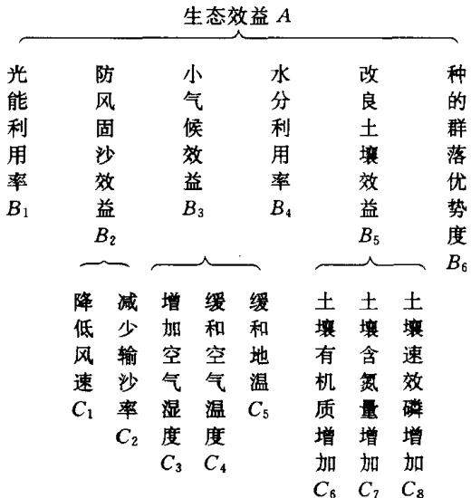  
图 11-1 生态效益指标的层次结构

（2）指标权重的确定及排序 就以上生态效益指标体系的权重，向25位知识渊博经验丰富的有关专家作了专家评议调查，根据调查结果和效益的具体分析，构造出A一B判断矩阵（1～9标度法）如下：

<table><tr><td> $\pmb { A }$ </td><td> $B _ { 1 }$ </td><td> $B _ { 2 }$ </td><td> $\pmb { B _ { 3 } }$ </td><td> $B _ { * }$ </td><td> ${ \boldsymbol { B } } _ { 5 }$ </td><td> $\scriptstyle B _ { 6 }$ </td></tr><tr><td> $\pmb { B } _ { 1 }$ </td><td>1</td><td>1/3</td><td>7</td><td>1</td><td>5</td><td>3</td></tr><tr><td> $\scriptstyle { B _ { 2 } }$ </td><td>3</td><td>1</td><td>9</td><td>3</td><td>5</td><td>5</td></tr><tr><td> $\pmb { { \cal B } } _ { 3 }$ </td><td>1/7</td><td>1/9</td><td>1</td><td>1/5</td><td>1/3</td><td>1/3</td></tr><tr><td> $\scriptstyle B _ { 4 }$ </td><td>1</td><td>1/3</td><td>5</td><td>1</td><td>3</td><td>3</td></tr><tr><td> ${ \pmb { B } } _ { 5 }$ </td><td>1/5</td><td>1/5</td><td>3</td><td>1/3</td><td>1</td><td>1/3</td></tr><tr><td> ${ \pmb B } _ { 6 }$ </td><td>1/3</td><td>1/5</td><td>3</td><td>1/3</td><td>3</td><td>1</td></tr></table>

根据以上判断矩阵算得B层各元素对A的权重向量为（W的计算采用方法二)：

$$
W = [ 0 . 2 1 3 ~ 2 , 0 . 4 1 7 ~ 3 , 0 . 0 3 1 ~ 9 , 0 . 1 8 1 ~ 4 , 0 . 0 6 2 ~ 5 , 0 . 0 9 4 ~ 4 ] ^ { T }
$$

同样，可构造出C层各元素与B层相应元素的判断矩阵如下：

<table><tr><td rowspan=1 colspan=1> $\scriptstyle B _ { \mathrm { l } }$ </td><td rowspan=1 colspan=1> $C _ { 1 }$ </td><td rowspan=1 colspan=1> $C _ { 2 }$ </td></tr><tr><td rowspan=1 colspan=1> $C _ { 1 }$ </td><td rowspan=1 colspan=1>1</td><td rowspan=1 colspan=1> $1 / 3$ </td></tr><tr><td rowspan=1 colspan=1> $\mathbf { { C } _ { 2 } }$ </td><td rowspan=1 colspan=1>3</td><td rowspan=1 colspan=1>1</td></tr></table>

<table><tr><td rowspan=1 colspan=1> $B _ { 3 }$ </td><td rowspan=1 colspan=1> $C _ { 3 }$ </td><td rowspan=1 colspan=1> $C _ { 4 }$ </td><td rowspan=1 colspan=1> $C _ { 5 }$ </td></tr><tr><td rowspan=1 colspan=1> $C _ { 3 }$ </td><td rowspan=1 colspan=1>1</td><td rowspan=1 colspan=1>3</td><td rowspan=1 colspan=1>5</td></tr><tr><td rowspan=1 colspan=1> $C _ { 4 }$ </td><td rowspan=1 colspan=1> $1 / 3$ </td><td rowspan=1 colspan=1>1</td><td rowspan=1 colspan=1>3</td></tr><tr><td rowspan=1 colspan=1> $C _ { 5 }$ </td><td rowspan=1 colspan=1> $1 / 5$ </td><td rowspan=1 colspan=1>1/3</td><td rowspan=1 colspan=1>1</td></tr></table>

<table><tr><td rowspan=1 colspan=1> $\scriptstyle B _ { 5 }$ </td><td rowspan=1 colspan=1> $C _ { 6 }$ </td><td rowspan=1 colspan=1> $C _ { 7 }$ </td><td rowspan=1 colspan=1> $C _ { 8 }$ </td></tr><tr><td rowspan=1 colspan=1> $C _ { 6 }$ </td><td rowspan=1 colspan=1>1</td><td rowspan=1 colspan=1>3</td><td rowspan=1 colspan=1>5</td></tr><tr><td rowspan=1 colspan=1> $C _ { 7 }$ </td><td rowspan=1 colspan=1> $1 / 3$ </td><td rowspan=1 colspan=1>1</td><td rowspan=1 colspan=1>3</td></tr><tr><td rowspan=1 colspan=1> $C _ { 8 }$ </td><td rowspan=1 colspan=1> $1 / 5$ </td><td rowspan=1 colspan=1>1/3</td><td rowspan=1 colspan=1>1</td></tr></table>

求得它们的权重向量分别为：

$$
W _ { B _ { 2 } } = ~ [ 0 . 2 5 0 ~ 0 , ~ 0 . 7 5 0 ~ 0 ] ^ { T }
$$

$$
W _ { B _ { 3 } } = ~ [ 0 . 6 3 3 ~ 3 , ~ 0 . 2 6 0 ~ 5 , ~ 0 . 1 0 6 ~ 2 ] ^ { T }
$$

$$
W _ { B _ { 5 } } = ~ [ 0 . 6 3 3 ~ 3 , ~ 0 . 2 6 0 ~ 5 , ~ 0 . 1 0 6 ~ 2 ] ^ { T }
$$

上面 $A - B$ 判断矩阵的最大特征根为 $\lambda _ { \operatorname* { m a x } } = 6 . 2 6 7 , \ B { - } C$ 矩阵的最大特征根为 $\lambda _ { \operatorname* { m a x } } = 3 , 0 3 8$ ，当 $ \mathbf { \mathscr { n } } = 3$ 和 $\pmb { n } = 6$ 时，R、I分别为0.58和1.24。检验结果如下：

<table><tr><td rowspan=1 colspan=1>判断矩阵</td><td rowspan=1 colspan=1> $c \cdot \iota$ </td><td rowspan=1 colspan=1>C·R</td></tr><tr><td rowspan=1 colspan=1> $A - B$ </td><td rowspan=1 colspan=1>0.053</td><td rowspan=1 colspan=1>0.043</td></tr><tr><td rowspan=1 colspan=1> $B { - } C$ </td><td rowspan=1 colspan=1>0.019</td><td rowspan=1 colspan=1>0.033</td></tr></table>

以上结果均小于0.10，符合一致性要求，说明判断矩阵比较理想。由此可得，生态效益指标重要值由大到小的次序为：防风固沙效益（0.4173)、光能利用率（0.2132）、水分利用效率（0.1814）、种的群落优势度(0.0944）、改良土壤效益（0.0625）、小气候效益（0.0319）。在防风固沙效益中，降低风速和减小输沙量的权重分别为0.25和0.75；在改良土壤效益中，增加土壤有机质、增加土壤含氮量、增加土壤速效磷3个分指标权重分别为：0.6333、0.2605和0.1062，在小气候效益中，增加空气湿度、调节空气温度和缓和地温的权重也分别为0.6333、0.2605和0.1062。

(3)求算生态效益指数为了使各指标值能加权相加和便于比较分析，对原始数据（表11-6）进行标准化处理（表11-7），得到无量纲且保持原来信息的标准化数据。标准化处理公式为：

$$
X _ { i k ^ { \prime } } ^ { \prime } = \frac { X _ { i k } - \overline { { X } } _ { k } } { \delta _ { k } }\tag{11-9}
$$

式中 $X _ { i k }$ ——为第i个样品第k个因子的值 $( i = 1 , \ 2 , \ \cdots , \ m )$

${ \bar { X } } _ { k }$ —为第k个因子序列的平均值；

$\delta _ { k }$ ——为第k个因子序列的标准差；

$X _ { i k } ^ { \prime }$ 为经标准化处理后的新序列，其平均值为0，方差为1。

表 11-6 固沙林生态效益原始数据
<table><tr><td>指 标</td><td>沙柳</td><td>花棒</td><td>踏郎</td><td>紫穗槐</td><td>柠条</td><td>平均</td><td>标准差</td></tr><tr><td>光能利用率</td><td></td><td>0.041 9</td><td>0.020 2 0.039 6</td><td>0.0550</td><td>0.035 8</td><td>0.038 5</td><td>0.011 2</td></tr><tr><td>固沙</td><td>降低风速（%）</td><td>0.5</td><td>0.4</td><td>0.7 0.5</td><td>0.5</td><td>0.52</td><td>0.098 2</td></tr><tr><td>效益</td><td>减小输沙</td><td>96.13</td><td>93.86 98.64</td><td>96.07</td><td>95.78</td><td>96.10</td><td>1.5214</td></tr><tr><td>小气</td><td>增加湿度</td><td>3.75</td><td>1.88 1.75</td><td>2.30</td><td>1.80</td><td>2.296</td><td>0.752 5</td></tr><tr><td>候效</td><td>调节气温（C）</td><td>0.37 0.4</td><td>0.88</td><td>0.56</td><td>0.27</td><td>0.049 6</td><td>0.213 4</td></tr><tr><td>应</td><td>缓和地温</td><td>0.20 0.81</td><td>0.31</td><td>1.50</td><td>0.79</td><td>0.722</td><td>0.460 4</td></tr><tr><td>水分利用率</td><td> $( \pmb { \mathfrak { g } } / \pmb { \mathfrak { g } } )$ </td><td>0.001 0 0.000 5</td><td>0.000 6</td><td>0.000 9</td><td>0.000 7</td><td>0.000 7</td><td>0.00017</td></tr><tr><td>改良 有机质增加（倍）</td><td></td><td>9.33 2.27</td><td>3.40</td><td>7.40</td><td>20.60</td><td>8.60</td><td>6.5281</td></tr><tr><td>土壤 全氮量增加（倍）</td><td>2</td><td>12</td><td>1</td><td>11</td><td>21</td><td>9.4</td><td></td></tr><tr><td>速效磷增加（倍） 效益</td><td>1.6</td><td>0.2</td><td>1.3</td><td>0.4</td><td>7 0.0</td><td></td><td>7.337 6</td></tr><tr><td></td><td></td><td></td><td></td><td></td><td></td><td>0.7</td><td>0.632 5</td></tr><tr><td>种的群落优势度</td><td></td><td>20.62 16.13</td><td>17.61</td><td>38.47</td><td>16.28</td><td>21.82</td><td>8.478 8</td></tr></table>

表11-7 固沙林生态效益标准化数据
<table><tr><td>指</td><td>标</td><td>沙柳</td><td>花棒</td><td>踏郎</td><td>紫穗槐</td><td>柠条</td></tr><tr><td></td><td>光能利用率</td><td>0.303 6</td><td>-1.633 9</td><td>0.098 2</td><td>1.473 2</td><td>-0.2411</td></tr><tr><td>固沙</td><td>降低风速（%）</td><td>-0.2041</td><td>-1.2245</td><td>1.836 7</td><td>-0.2041</td><td>-0.2041</td></tr><tr><td>效益</td><td>减小输沙</td><td>0.019 7</td><td>-1.472 3</td><td>1.669 5</td><td>-0.0197</td><td>-0.210 3</td></tr><tr><td>小气</td><td>增加湿度</td><td>1.932 2</td><td>-0.552 8</td><td>-0.7256</td><td>0.005 3</td><td>-0.6591</td></tr><tr><td>候效</td><td>调节气温（C）</td><td>-0.590 5</td><td>-0.449 9</td><td>1.799 4</td><td>0.299 9</td><td>-1.059 0</td></tr><tr><td>应</td><td>缓和地温</td><td>-1.133 8</td><td>0.191 1</td><td>-0.894 9</td><td>1.689 8</td><td>0.1477</td></tr><tr><td>水分利用率</td><td> $( \pmb { \mathfrak { g } } / \pmb { \mathfrak { g } } )$ </td><td>1.393 9</td><td>-1.2121</td><td>-0.969 7</td><td>0.787 9</td><td>0.000</td></tr><tr><td>改良</td><td>有机质增加（倍）</td><td>0.111 8</td><td>-0.9697</td><td>-0.796 6</td><td>-0.183 8</td><td>1.838 2</td></tr><tr><td>土壤</td><td>全氮量增加（倍）</td><td>-0.008 5</td><td>0.354 3</td><td>-1.1448</td><td>0.2181</td><td>1.580 9</td></tr><tr><td>效益</td><td>速效磷增加（倍）</td><td>1.422 9</td><td>-0.790 5</td><td>0.948 6</td><td>-0.4743</td><td>←1.106 7</td></tr><tr><td>种的群落优势度</td><td></td><td>-0.1418</td><td>-0.671 5</td><td>-0.4968</td><td>1.963 5</td><td>-0.6536</td></tr></table>

生态效益指数：

$$
\begin{array} { r l } & { A = 0 . 2 1 3 \ 2 \times B _ { 1 } + 0 . 4 1 7 \ 3 \ \left( 0 . 2 5 C _ { 1 } + 0 . 7 5 C _ { 2 } \right) \ + } \\ & { \phantom { A = } 0 . 0 3 1 \ 9 \ \left( 0 . 6 3 3 \ 3 C _ { 3 } + 0 . 2 6 0 \ 5 C _ { 4 } + 0 . 1 0 6 \ 2 C _ { 5 } \right) \ + 0 . 1 8 1 \ 4 B _ { 4 } + } \\ & { \phantom { A = } 0 . 0 6 2 \ 5 \ \left( 0 . 6 3 3 \ 3 C _ { 6 } + 0 . 2 6 0 \ 5 C _ { 7 } + 0 . 1 0 6 \ 2 C _ { 8 } \right) \ + 0 . 0 9 4 \ 4 B _ { 6 } } \end{array}\tag{11-10}
$$

经计算，沙柳、花棒、踏郎、紫穗槐、柠条的A值分别为0.33、一1.27、

0.46、0.66和一0.13。紫穗槐、踏郎、沙柳以其较好的防风固沙效益，较高的系统生产力及水分利用率表现为综合生态效益较好。花棒防风固沙效果较差，这是由其近地面层分枝少、透风系数大等因子起作用的；另外，水分消耗量也大，蒸腾系数大于1094，居于首位，所以其生态效益指数值最低。柠条处于中间状态。需要指出的是，我们讨论的是固沙林的综合生态效益，而不涉及生物种的生态特征，如果从沙生植物的生态适应性，花棒的适生性还要优于其他植物种。花棒与另几种固沙植物混交造林，可以有效地削弱近地气层的上层风速，仍有较高的利用价值，但从固沙的角度看，花棒不宜营造纯林。结合种群格局分析，沙丘迎风坡上、中部选踏郎最佳；丘间地及落沙坡以营造紫穗槐为好；沙柳两处均可，当然，最好是两树种混交造林。这是本区生态效益好，结构稳定的优化模式。

## (三）毛乌素沙地防护林生态效益的经济计量

## 1. $\pmb { B _ { 1 } }$ 防风固沙林的生态经济效益

以防风固沙林投资年平均防护效益系数 $( P _ { B _ { 1 } } )$ 计量，用下式估计：

$$
P _ { B _ { 1 } } = \frac { \displaystyle \sum _ { i = 1 } ^ { n } ( R _ { 1 i } + R _ { 2 i } + R _ { 3 i } ) } { \displaystyle \sum _ { i = 1 } ^ { n } Z _ { i } }\tag{11-11}
$$

式中 R——防护效益的经济价值 $( R _ { 1 } { = } P _ { ^ B _ { 1 1 } } , R _ { 2 } { = } P _ { ^ B _ { 1 2 } } , R _ { 3 } { = } P _ { ^ B _ { 1 3 } } )$

Z——防护林投资额；

$P$ 银行贷款利率；

n——计算年份。

防风固沙林效益的经济价值（R），是林业经济学的难点之一，目前尚难以解决。我们用“等效益物替代法”，初步提出一些计量的依据，供开展此方面工作时参考。

(1) $B _ { 1 1 }$ 降低区域平均风速（%）的效益 $P _ { { \pmb { { \imath } } } _ { 1 1 } }$ 以因降低平均风速的增产效益计量

$$
P _ { { \cal B } _ { 1 1 } } = ( V _ { 0 } - V _ { 1 } ) \sum _ { i = 1 } ^ { n } ( A _ { i } \cdot \Delta Q _ { i } \cdot P _ { i } )\tag{11-12}
$$

式中 $V _ { 1 }$ ——某年度平均风速；

$V _ { \mathfrak { d } }$ ——对照区的平均风速；

$\Delta Q _ { i }$ —每降低风速1m/s某项增产的数量；

$A _ { i }$ ——某项总面积；

$P _ { i }$ ———某项产品单价；

i———项目。

(2) $B _ { 1 2 }$ 减少起沙风（气象台站观测，大于 $5 \mathrm { m } / \mathrm { s }$ 的风速）和沙暴的次数以造成的经济价值 $( \boldsymbol { P } _ { B _ { 1 2 } } )$ 为指标计量：

$$
P _ { B _ { 1 2 } } = \sum _ { i = 1 } ^ { n } ( C _ { 1 i } \cdot P _ { 1 i } + C _ { 2 i } \cdot P _ { 2 i } )\tag{11-13}
$$

式中 $C _ { 1 i }$ 减少超过起沙风某数量级的次数；

$P _ { 1 i }$ 某数量级的损失价值；

$C _ { 2 i }$ ——减少沙暴日数；

$P _ { 2 i }$ ——每沙暴日损失价值。

(3) $\boldsymbol { B } _ { 1 3 }$ 减轻土壤风蚀或增加土壤肥力以因土壤风蚀损失的土壤养分价值 $( { P } _ { { B } _ { 1 3 } } )$ 计量：

$$
P _ { { ^ B _ { _ { 1 3 } } } } = \Delta C \sum _ { i = 1 } ^ { n } A _ { i } \cdot Z _ { i } \cdot P _ { i }\tag{11-14}
$$

式中 $\pmb { \Delta C }$ —减轻风蚀的厘米数；

$A _ { i }$ ——土地面积 $( \ln \mathbf { m } ^ { 2 } )$

$Z _ { i }$ —某养分元素单位面积每厘米的损失量 $( \mathbf { k g } / \mathrm { { h m } } ^ { 2 } )$

$P _ { i }$ ——折算成化肥的单价 $( \mathbf { k g } / \overline { { \mathcal { \pi } } } )$

i———养分元素的种类 $( i = 1 , \ 2 , \ \cdots , \ n )$ o

2. $\pmb { { \cal B } } _ { 2 }$ 农田防护林的生态经济效益

农田防护林以年增产的价值 $( P _ { B _ { 2 } } )$ 计量：

$$
P _ { B _ { 2 } } = \frac { \frac { ( H \cdot 2 0 \cdot L ) } { 6 6 7 } \times \Delta _ { q } \times P _ { 1 } } { A }\tag{11-15}
$$

式中 H—防护林树高 $\mathrm { ( m ) } ( H { \times } 2 0 $ 超过副林带距时，按副带距计算)；

$L \cdot$ —主带长度；

$\Delta q$ —防护单位面积年增产量 $( \mathbf { k g } / \mathbf { h m } ^ { 2 } )$

$P _ { 1 }$ ——增产产品平均单价（元/kg）。

3. $\pmb { B _ { 3 } }$ 水域防护林防止泥沙淤库，河渠上方崩塌的生态经济效益

以疏泥沙，整修河床等付出的费用 $( P _ { B _ { 3 } } )$ 估算：

$$
P _ { B _ { 3 } } = \sum _ { i = 1 } ^ { n } K _ { i } \cdot P _ { i }\tag{11-16}
$$

式中 $K _ { i }$ ——系数，用于评估防护林的权重；

$P _ { i }$ —每次补救措施所支出的费用；

i——次数 $( i = 1 , \ 2 , \ \cdots , \ n )$ 0

4. $\pmb { { \cal B } } _ { 4 }$ 牧场防护林的生态经济效益

以牧草增产的价值和次级生产的增加价值 $( P _ { B _ { 4 } } )$ 计量：牧草增产价值的

计量同农田防护林的计量方法。

次级生产力以每年增加的畜产品价值计量：

$$
P _ { { ^ B _ { 4 } } } = \frac { \Delta q } { q } \times A \times P\tag{11-17}
$$

式中 $\Delta q$ ——护牧林作用下的单位面积牧草增加量；

$A$ ——牧场面积；

$P$ ——每羊单位单价；

$q \cdot$ 每年每羊单位消耗草量。

5. $\pmb { B } _ { 5 }$ 护路林防止道路风蚀（水蚀）、沙埋的生态经济效益

以清理道路积沙和修整路肩、路面所支出的费用估算，估算方法同水域防护林的计量。

## 第二节 荒漠化防治工程经济效益计量

## （一）投产计算

防治工程投入分一次性治理投入和近年的生产维护费用投入，合称投入费用。按投入物质形态分投劳、投物、投资，投劳和投物应折成货币与投资统一计算。按投入部门分农民投入（乡、村投入合并于此）、国家投入（地、县等各级政府投入合并于此），国家投资有两种情况，一是国家全部投资；另一种情况是国家补贴，群众投劳，对以物代补，以奖代补的按资金投入计算，应注意一点投入不能重复计算。例：农民投劳中有部分投劳为国家投资所补偿，那么社会投劳构成中，应该减少被补偿的投劳部分，剩下的投劳才是农民真正投劳。

(1） 单项措施投入计算 可用公式：

静态： $K = \sum _ { h = 1 } ^ { M } K _ { h }$

(11-18)

动态： $K _ { 0 } = \sum _ { i = 1 } ^ { m } k _ { i } ( 1 + r ) ^ { T _ { i } } + \sum _ { j = 1 } ^ { n } \frac { K _ { j } } { ( 1 + r ) ^ { T _ { j } } }$

(11-19)

式中 $K$ ——措施多年投入费用之和；

$K _ { 0 }$ 措施多年投入费用折算值之和；

$K _ { h }$ —措施各年投入费用折算值；

$K _ { i } , ~ K _ { j }$ ——基准年前第i年，基准年后第j年费用；

$T _ { i } , \ T _ { j }$ 基准年前第i年，基准年后第j年；

r——经济折算率（%）；

M—措施投入年数；

m、n—基准年之前、基准年之后投入年数。

## (2) 综合措施投入计算

静态： $K = \sum _ { i = 1 } ^ { Q } K _ { i }$

(11-20)

动态： $K _ { \circ } = \sum _ { i = 1 } ^ { Q } K _ { \circ i }$

(11-21)

式中K多种措施多年投入费用之和；

$K _ { 0 }$ 多种措施多年投入费用折算值之和；

$K _ { i }$ —某单项措施多年投入费用之和；

$K _ { o i }$ ——某单项措施多年投入费用折算值之和。

例：某植物治沙措施年投入、产出如表11-8，折算率取6%，其分析期投入和效果总值按上式计算得。

$$
\begin{array} { c } { { K = 2 2 0 + 8 0 = 3 0 0 \mathrm { ~ \overline { { { \mathcal { X } } } } } } } \\ { { K _ { \circ } = 2 4 0 . 2 + 6 2 . \ 0 9 = 3 0 2 . \ 2 9 \mathrm { ~ \overline { { { \mathcal { X } } } } } } } \end{array}
$$

表11-8 植物治沙投入、产出现金流程（0. 33hm²）
<table><tr><td rowspan="2">年份</td><td rowspan="2">年序</td><td colspan="2">投入</td><td rowspan="2">产出</td><td colspan="3">折算值</td></tr><tr><td>治理投入</td><td>年生产维护费</td><td>治理投入</td><td>年生产维护费</td><td>产出</td></tr><tr><td>1990</td><td>Tj-2</td><td>110</td><td>一</td><td>一</td><td>123.60</td><td>一</td><td>一</td></tr><tr><td>1991</td><td>Tj-1</td><td>110</td><td>一</td><td>一</td><td>116.60</td><td>一</td><td>一</td></tr><tr><td>基准点</td><td>Tj-0</td><td>一</td><td>二</td><td>一</td><td>一</td><td>一</td><td>一</td></tr><tr><td>1992</td><td>Tj-1</td><td>一</td><td>10</td><td>30</td><td>一</td><td>9.43</td><td>28.30</td></tr><tr><td>1993</td><td>Tj-2</td><td>一</td><td>10</td><td>80</td><td>一</td><td>8.90</td><td>71.20</td></tr><tr><td>1994</td><td>Tj-3</td><td>一</td><td>10</td><td>90</td><td>一</td><td>8.40</td><td>75.57</td></tr><tr><td>1995</td><td>Tj-4</td><td>一</td><td>10</td><td>100</td><td>一</td><td>7.92</td><td>79.21</td></tr><tr><td>1996</td><td>Tj-5</td><td>一</td><td>10</td><td>90</td><td>一</td><td>7.47</td><td>67.25</td></tr><tr><td>1997</td><td>Tj-6</td><td>一</td><td>10</td><td>120</td><td>一</td><td>7.05</td><td>84.60</td></tr><tr><td>1998</td><td>Tj-7</td><td>一</td><td>10</td><td>110</td><td>一</td><td>6.65</td><td>73.16</td></tr><tr><td>1999</td><td>Tj-8</td><td>一</td><td>10</td><td>130</td><td>一</td><td>6.27</td><td>81.56</td></tr><tr><td>∑</td><td>一</td><td>220</td><td>80</td><td>750</td><td>240.2</td><td>62.09</td><td>560.85</td></tr></table>

效益产出的资金，静动态分析原理与投入分析原理相同，故得到相应产出效益：  
静态 $B { = } 7 5 0 ~ \mathrm { \textmu }$  
动态 $B _ { \scriptscriptstyle 0 } = 5 6 0 . 8 5 ~ \overline { { \mathcal { \pi } } }$

## （二）经济分析计算

在防治荒漠化工程措施经济分析指标计算时，应收集全部措施在计算期内逐年的治理投入各项和产出各项的详细资料。整理成表格，单项措施和综合措施分析原理相同。可从静态、动态两方面着手分析。

## 1. 静态分析

(1)净效益(P)总效益与总费用的差值，其式如下：

$$
P = B - K\tag{11-22}
$$

(2)年平均净效益

$$
{ \overline { { P } } } = { \frac { B - K } { N } }\tag{11-23}
$$

(3)公顷均净效益

$$
{ \overline { { \hat { p } _ { A } } } } = { \frac { B - K } { A } }\tag{11-24}
$$

(4)公顷年均净效益

$$
{ \overline { { \phi _ { A } } } } = { \frac { B - K } { N \cdot A } }\tag{11-25}
$$

(5)效益费用比(R)总效益与总费用的比值，其式如下：

$$
R = { \frac { B } { K } }\tag{11-26}
$$

(6)治理投入费用回收期(T) 累计效益等于累计费用的年限，其式如下：

$$
\sum _ { j = 1 } ^ { T } B _ { j } = \sum _ { j = 1 } ^ { T } K _ { j }\tag{11-27}
$$

式中 T——回收期。

T根据此原理可列表求得。

## 2. 动态分析

(1)净效益 $( P _ { 0 } )$ 折算到基准年的总效益与总费用差值。

$$
P _ { \mathrm { 0 } } = B _ { \mathrm { 0 } } - K _ { \mathrm { 0 } }\tag{11-28}
$$

(2)净效益年值等于折算到基准年的效益年值减去折算到基准年的费用年值。

$$
\overline { { P } } _ { 0 } = \overline { { B } } _ { 0 } - \overline { { K } } _ { 0 }\tag{11-29}
$$

(3)公顷净效益

$$
P _ { \infty } = \frac { B _ { 0 } - K _ { 0 } } { S }\tag{11-30}
$$

(4)公顷净效益年值

$$
\overline { { P _ { \infty } } } = P _ { \circ } \frac { r ( 1 + r ) ^ { n } } { S \cdot [ ( 1 + r ) ^ { n } - 1 ] }\tag{11-31}
$$

(5)效益费用比 $( R _ { 0 } )$ 折算到基准年的总效益与总费用的比值。

$$
R _ { \circ } = \frac { B _ { \circ } } { K _ { \circ } }\tag{11-32}
$$

(6)治理投入回收期 $( T _ { 0 } )$ 累计折算的效益等于累计折算费用的年限。

$$
\sum _ { j = 1 } ^ { T _ { D } } B _ { j } / ( 1 + r ) ^ { T ^ { j } } = \sum _ { j = 1 } ^ { T _ { D } } K _ { j } / ( 1 + r ) ^ { T ^ { j } }\tag{11-33}
$$

以上表11-8为例分析结果如下（表11-9）：

表11-9 静态、动态经济效益分析对比
<table><tr><td>指标</td><td>静态分析</td><td>动态分析</td></tr><tr><td>净效益</td><td>450</td><td>258.56</td></tr><tr><td>年净效益</td><td>56.25</td><td>41.64</td></tr><tr><td>公顷均净效益</td><td>1350</td><td>775.65</td></tr><tr><td>公顷年均净收益</td><td>168.75</td><td>124.95</td></tr><tr><td>效益费用比</td><td>2.5</td><td>1.855</td></tr><tr><td>回收期</td><td>3~4年</td><td>4~5年</td></tr></table>

注 1亩=0.067hm²

荒漠化防治工程投入期和收益期相距较长，用动态分析的方法，会更切合实际情况，避免效益扩大化，然而动态分析资料收集和计算难度较大，生产实际中，应根据具体要求来选择计算方法。

## 第三节 荒漠化防治工程的综合效益评价

## 一、综合效益的基本内涵

客观事物间相互联系、相互作用构成具有一定结构的执行特定功能的有机统一体系统。系统内部各组成要素间具有平行关系，层次间具有统辖关系，进而构成十分复杂的体系，这些系统间或与环境发生物质能量和信息的交换关系。所以，只有从整体与环境、整体与单元、单元与单元等相互联系和相互作用方面进行系统分析，以整体效益为目标，以寻求解决特定问题的最佳策略为重点，以定量分析方法和决策者判断为手段，才能达到系统整体最优的理想模式。

荒漠化防治的本质就是在荒漠化地区进行区域综合治理，其核心问题就是如何正确处理“人一地”关系问题，即人类活动对自然子系统、经济子系统和社会子系统进行人为干涉和投入的过程，也就是人们采取工程、生物和耕作的各种措施，对荒漠化地区内带有普遍性的农业限制因子和不利自然条件进行综合治理改造，以提高土地生产力和自然资源的利用率以及改善生态环境的过程。实质上，荒漠化防治就是根据生态经济学的原理，以改善荒漠化地区脆弱的生态环境为目的，采取有效的综合治理改造措施，达到生态、经济和社会三方面的综合效益最大值，即荒漠化防治工程的综合效益就是指包括生态效益、经济效益和社会效益三个方面的总体效益，它们之间有密切的内在联系，但也有区别。

## (一）生态效益

是指实施荒漠化防治工程后对自然环境、人类生活环境的保护和改善的效应，它使短暂失去平衡的生态系统重新趋于平衡，使恶化了的自然环境向有利干人类生产、生活和土地资源持续利用的方向发展。它包括控制土壤侵蚀、防止荒漠化、改良土壤、防风固沙、调节气候、减少灾害、改善生态环境条件等。

## （二）经济效益

一般指经荒漠化综合治理后，随着生态环境的改善和土地生产力提高，土地利用率的增加已变为经济形态的那部分效益。它包括已经转为货币形式和具有潜在货币转换形式的效益，如前者包括在防护林建设工程中的林副产品能进入市场变为商品，表现为货币形式的一起受益，后者包括由于林木具有调节气候、涵养水源的能力，它所减少因于旱缺水需支付的水费、电费等一部分无法通过市场交换所体现的效益。

## （三）社会效益

它包括两个方面的内容，一是指对于荒漠化治理区域内的社会经济所产生的有利影响，二是对治理区以外地区的社会经济产生的有益作用。通过荒漠化防治，避免了“沙进人退”的社会悲剧，促进了荒漠化地区内群众物质文化生活水平的提高，减轻了国家支援贫困地区的负担，为荒漠化地区的持续发展和整个社会的稳定和经济繁荣奠定了基础。

荒漠化防治工程的综合效益，主要表现在防治工程的生态效益、经济效益和社会效益的综合与统一。生态效益是目的，也是其他两个效益的基础；经济效益是3个效益中最为活跃、最积极的因素，是决定能否保证荒漠化地区持续发展的关键；社会效益是归宿，是生态效益和经济效益的具体体现。在荒漠化防治工程建设中，应将三者视为有机统一的整体，不能片面追求单个效益。生态效益是经济效益长远目标的保证，良好的生态环境和经济条件是社会稳定繁荣的基础。正确处理三者的关系，是实现最佳综合效益的前提。

## 二、综合效益评价的基础理论

## (一）综合效益评价的理论依据

经济活动是人类社会的主要活动，经济成果（以物质和劳务产品为主要特征）是社会发展的主要基础，经济增长是社会进步的主要动力，因而，经济与系统在社会系统中占据独特地位，在社会实践中形成了一整套严密的效

益评价体系。

传统的评价体系中，收益是仅仅被视为在市场中可以进行交换的货币效益，忽视了货币收益外的间接收益，即生态效益和社会效益部分。以货币收益作为收益的总体，事实上掩盖了不同产业活动的间接收益的差别性，造成产业直接收益与社会收益不一致。另外，在评价体系中，成本部分对环境质量的消耗（表现为环境污染、生态系统破坏等)，使产业的直接成本低于社会成本。在那些直接收益小于社会收益，直接成本大于社会成本的行业，其为社会的贡献成果，为他人无偿享用；在那些直接收益大于社会收益，直接成本高于社会成本的行业，其对社会的损害后果由他人无偿负担。

这种传统的效益评价理论，在实践中已造成了严重后果。一方面，由于在生态效益不作为收益，环境质量消耗不计入成本，企业在经济利益驱动下，必然只着眼于物质财富的生产，忘记了人类健康繁衍所依赖生态环境和环境自然力的更广泛生产，忘却了环境为人类所提供的必需的精神财富—休养生息的环境效益，从而使生态破坏和环境污染日益加强。另一方面，社会效益不进入收益，社会成本不计入企业费用，企业必然对那些经济效益低、而社会效益高的领域，对经济活动可能带来的社会负效益问题无意顾及，使国民生产总值增长伴随着一系列社会问题的出现，导致了社会环境系统的不协调运转。例如，位于山西、陕西和内蒙古接壤区，能源基地的核心神府——东胜矿区，已探明含煤面积 $3 1 ~ 1 7 1 . 9 7 \mathrm { k m } ^ { 2 }$ ，储量2200亿t以上，占基地总储量2800亿t的78%，均属于低灰、低硫、低磷、高发热量的优质动力煤。矿区的一二期（1987～1996年）工程主要集中在窟野河神木以上到转龙湾区间的干支流两侧，其中又以乌兰木伦河两岸的大柳塔矿区和马家塔矿区为主体，1994年年生产能力已达1000万t，预计2000年达6000万t。随着煤炭开发，区内公路、铁路、工矿、城镇等基本建设有了飞快的发展，同时带动了地方经济的发展，给当地人民脱贫致富带来了新机遇。以大柳塔镇为例，与开矿前相比，10年建设使工业产值增加了51倍，乡镇企业产值增长了43.6倍，固定资产增加了26倍，农业产值增长了3倍。全镇人均纯收入由240元增加到885元，有的村平均达到3000多元。但是矿区地处生态环境脆弱带，煤田开发过程中，由于对原有环境背景的严酷性认识不足，注重煤田开采的货币化收益，而忽视了开发过程中的环境负效益。概括起来主要有以下几个方面：①人为开挖和固体废弃堆积增加了侵蚀物质，煤炭采掘引起地面塌陷，植株根系断裂而导致枯萎或死亡，固定了的沙地面临沙化危险。基建过程中对植被破坏引起风沙危害，诱发滑坡、滑塌和岩崩，人为泥石流危害日趋严重。②河道里弃土、弃石堆积量增大，行洪能力锐减。河道淤积显著增加，输沙量骤增。③水气资源污染与破坏严重。矿坑排水加剧了地下水渗漏，减少了地下潜流，河水中部分重金属和非金属元素含量提高。1992年大气中二氧化硫、氮氧化物和总悬浮量3项主要指标分别为1987年的24倍、3.8倍和17倍。④土地利用演变与资源退化。工矿建设占地，植被破坏加剧了土地沙化，水源亏缺，使水浇地变成旱地等等。这一系列的环境问题，使本来就十分脆弱的环境更加恶化，能源开发与环境建设的矛盾愈加突出。

显然，传统的货币市场中心观、价值观、效益观，是无法也不可能作为林业经营综合效益研究的理论依据。因此，只有从观念上突破这种评价体系的狭隘性和落后性，树立现代效益观，即以社会一环境系统协调发展为目标，以完全成本取代传统成本，以综合收益取代传统的货币收益，才能真正使产业直接收益与直接成本，社会效益与社会成本相一致，从而客观准确地反映各产业经济活动，弥补市场缺陷，保证全社会资源配置的合理化。

## （二）综合效益的基本特征

荒漠化防治不同于一般的人类经济活动，其综合效益具有如下几个特点：

## 1. 综合性

荒漠化防治综合效益的综合性不仅表现在生态效益、经济效益和社会效益三者之间的综合，而且表现在综合措施之间、生产条件之间以及综合措施和生产条件之间的综合。农业生产是荒漠化防治综合效益的体现过程，是生物生产的过程。在农业生产中，动植物的生长发育必须同时具备各种必要的生活条件，整个农业生产存在着物质循环和能量交换，环境条件和生产对象、生产对象与生产对象之间关系紧密，缺乏其中任何一个因素，都会影响它们的生长和发育，从而影响生产力。因此，在实践中需要采取综合性的防治措施，其综合效益往往大于单项技术措施效益的总和。而且，单项技术措施的效益评价也是建立在综合因子效果基础上的评价。如在评价土壤改良效益时，总是在一定的技术水平下的评价，随着技术水平的变化和环境条件的改变以及配套技术措施的差异，评价的结果也不一样。

## 2. 相关性

荒漠化防治工程各种措施的应用，管理系统的协调和控制，科学技术的指导和促进，物质、能量、价值和信息的投入等，对荒漠化地区的治理效益往往不是各自孤立起作用，而是互相关联，互相影响，交互起作用，具有强烈的相关性。各项措施的相关性依其效果反映的不同而有正、负相关，对于各种措施而言，又有横向相关和纵向相关。在评价荒漠化工程效益时，必须注意分析各项技术措施的组合特点和相关效应，在评价时做好效益的分摊工作。

## 3. 后效性

荒漠化防治工程的综合效益决定于农林牧副业生产的最终成果，而不是取决于建设过程中的效益。农林牧副生产的最终效益的取得有待某一生产周期的结束，而不是技术措施的结束，这就决定了效益的后效性。

## 4. 连续性

在荒漠化防治工程建设中，生物措施和工程措施的效益往往在一定的时间内都能发挥作用，产生效益。如经济型防护林的经济效益在有林副产品生产开始就产生，直到防护林的更新，其生态效益伴随防护林的出现就产生了，它体现了荒漠化工程综合效益的持续性，即连续性的特点。此外，如农田水利基本建设、土壤改良、蓄水池、沙障、化学固沙、良种选繁等技术措施，在一定的时间内都持续地发挥效应。良种选繁技术，其植物品种的优良经济性能可以遗传，经济效益的持续期更加明显，因此，在进行效益评价时，合理选择效益的计算时间非常重要。

## 5. 多样性

综合治理荒漠化土地、兴修水利、营林造林、建立合理的耕作制度等，都是多效益、多功能的措施，不仅具有明显的直接效益，还具有较大的间接效益，不仅得到经济效益，而且还有生态和社会效益。因此，在进行综合效益评价时，需要全面具体分析各种效益，能计算的要精确计算，不能精确计算的，也必须进行估测或定性分析，这样才能对技术方案作出全面的评价。这就是荒漠化防治工程效益的多样性。

## 6. 波动性

荒漠化防治工程综合效益受不确定因素的影响较大，特别是受大自然的影响。在目前的科学技术发展水平下，人们还远远不能控制大自然，特别是灾害性气候的影响。此外，社会经济的因素也会影响荒漠化防治工程综合效益的稳定。

此外，荒漠化防治工程综合效益还有有限性、持久性、随机性等特点。总之，只有掌握了荒漠化防治工程综合效益的这些特点，在进行综合效益评价时，确定准确的评价指标，更多地选择类似的样本，尽可能克服不定的因素，才能确定措施体系的优劣，才能对荒漠化工程的综合效益进行准确的评价。

## （三）综合效益评价的研究现状及存在的问题

效益评价的意义在于总结成功的经验并加以提高，找出存在的问题和提高总体功能，获取更高效益的突破口，从而为进一步的治理工作提供科学的决策依据。但由于综合效益具有综合性、持续性、相关性、随机性、波动性和有限性等特点，只有在充分收集主要因子的调查材料，并进行分析和预测的基础上，才能评价治理措施对农业和地方经济发展的意义、治理策略和方法的适用性、治理措施的有用性和可靠性、治理速度和经济增长的适宜性，对治理效益的潜在性与持久性、治理区域产出的价值和使用价值、治理技术水平和产值指标、土地利用优化程度等各方面的进行分析和评价。由于组成区域系统的因素复杂和各区域具体状况之间存在着差异，以及人们评价效益的目的、重点和方向的不同，选择的评价指标以及评价方法都不同，到目前为止，世界上还没有一个能广泛被人们接收的评价指标体系和评价方法，在进行效益评价的研究中存在着一些普遍的问题。

## 1. 研究现状

效益评价的首要工作是建立一套能客观、准确、全面并定量化反映治理效果的评价指标或指标体系。对于评价指标或指标体系的研究，Tedc·shory认为，评价指标应包括3个方面，即产量指标、效果指标和采用指标（或受益指标)。对于工程的评估，则以收入、产量和生产率以及工程的持续性和可行性来衡量。我国对荒漠化防治工程综合效益评价一般沿用水土保持效益的一些方法和理论，进行投资计算、年运行费计算，以及经济效益、社会效益和生态效益的计算。在评价指标及指标体系的设置上，有学者从生态、经济和社会3个子系统的结构和功能分别考虑，提出了30多个评价指标；还从研究方法的角度提出了效益衡量指标、分析指标和目的指标共24个，对效益评价进行了系统、详尽的研究。也有人建议应对农田子系统、水域子系统、大气子系统、山地子系统和人群社会子系统等5个子系统建立评价指标体系。中国科学院西北水土保持研究所提出了社会效益、经济效益和生态效益三大类指标，其中，社会效益包括人口自然增长率、人均生产粮食、人均生产猪羊肉、水果产量、木材可采伐量和社会总产值等指标，经济效益包括国民收入、财政自给率、农业总产值、人均农业纯收入、农用土地生产率和农业劳动生产率等指标，而生态效益则用森林覆盖率、治理率和农林牧用地比例等指标来评价。另有人提出的指标体系则包括生态效益、经济效益、社会效益和综合功能四大类，前三大类所包括的具体指标同其他人的研究成功也不尽相同，第四类则包括能量产投比、资金产投比、系统抗逆力、投资回收期和收入增长率5个指标。

效益评价的另一项工作就是确定每一个指标在整个指标体系中的相对重要性（通常以权重表示）。近几年来，随着线性代数、模糊数学和计算机的应用，人们确定权重的方法正在从定性和主观判断向定量化和客观判断的分析逐步发展。目前常用的方法有：a法，它是根据m个目标的极小点信息，借助干引进一个参数a的思想，通过求解一个m+1阶线性方程组来确定出各目标的权重；老手法，即凭借经验评估，并结合统计处理来确定权重的方法；层次分析法，它以1～9的绝对数，反应两两比较的定性判断，并构成比率标度，再根据各层次单排序加权综合计算同一层次各元素对总目标的重要性，从而得到各指标相应的权重；穷尽成对比较法，它是将目标集合中的目标两两比较，而比较结果只有3种。除此之外，专家打分法、相关系数法、比较确定法、模糊灰色多元空间分析法（FHW）和DELPHIF法等，在做效益评价确定权重时，上述方法都有人做过研究，可根据具体的情况加以选择。

在进行效益评价计算的研究中，目前，常用的方法是把各具体指标值转化为无量纲的标度，或用分段法或用模糊数学的隶属函数法等，此后，把标度值与该指标的权重值相结合。计算生态、经济、社会各类效益的方法是把指标标度值同权重的乘积相加。计算总体效益是把三大类效益再次赋权相加，代表性的方法是模糊综合评价，这种评价结果主要用于治理区综合效益的动态分析。此外，还有人对线性规划、关键指标法、赋权关联法、赋权理想点法等计算方法都做过系统的研究。近来有人借助系统动力学方法，提出了优化动态仿真的模型，建立了仿真方程；也有人综合运用大系统思想，研究反映社会、经济、科技、环境4个子系统协调发展水平的协调发展指数模型，提出了相应的评价测算方法及自适应和控制算法，但在评价模型的科学性及使用方面尚待深入的研究。

目前，对于综合效益评价的研究中，不少人偏向于做效益的经济分析，且常常与经济效益分析相混淆。对于评价指标的选择、权重的确定、评价方法的运用常常因概念边界和内容的模糊不清，各人的选择可能相去甚远，其综合效益评价的结果也会有很大的差异。因此，对于综合效益的评价需要进一步做深入细致的研究。

## 2. 存在的问题

由于目前对于综合效益的研究还处于起步阶段，从前人研究的成果来看，单项效益的研究较多，综合效益的研究较少，单项措施和因子的分析较多，系统性分析不多，在效益评价中有如下问题亟待解决：

（1）研究内容研究内容欠全面，只注重对单一自然要素变化规律和各种治理措施的效益分析，忽略了整个治理区域内人口、自然资源、环境和社会经济政策的影响以及它们之间相协调作用的核心内容。

(2)系统性问题 荒漠化防治工程是一项系统工程，它是以自然环境系统为劳动对象，社会经济系统提供一定比例的劳力、信息、资金和技术的复合系统。各项措施在系统中相互联系、相互影响发挥作用，而现有的研究系统性还不够，还有待完善。

(3）评价指标体系规范化问题对于三大效益指标的选择，目前仍无确定的理论与指导方法，无法克服主观随意性，防止片面性、盲目性的发生，往往造成评价的结果缺乏准确性，得出的结论对实际生产的指导作用不大。因此，指标体系的规范化问题，是荒漠化防治综合评价的关键问题，也是今后研究的重点。

（4）数量化技术数量化技术有待改进和提高，对于三大效益的某些指标以及权重的确定，量化手段往往人为因素影响较大，随着系统仿真、模糊数学、遥感和地理信息系统等现代化技术的运用，应尽可能地避免主观因素的影响，反映客观事实。

（5）评价方法的选择问题·不同评价方法的适宜条件的研究欠缺，往往在同一治理区域，运用不同的评价方法，得出的评价结果却迥然不同。

(6)可比性问题 应对同一治理区内以及不同治理区之间的治理效益进行纵向的和横向的对比研究，便于提高资金的利用效果。

## 三、综合效益评价

## （一）综合效益评价指标体系

## 1. 评价指标的概念和作用

综合效益评价指标体系是由若于指标按照一定的规则，相互补充而又相对独立地组成的群体指标体系，它是各种投入资源利用效果的数量表现，反映各类生产资源相互之间、生产资源和劳动成果之间、生态子系统和社会、经济子系统之间的因果关系，能够应用统一计量尺度把治理效益具体计算出来，为进一步的调控和治理方案的设计奠定基础。对荒漠化防治工程效益的理解和侧重点是随时间的推移而变化的，即从过去单纯开发利用生物资源转向强调生态效益、经济效益和社会效益的综合效益。荒漠化防治工程综合效益评价的目的，在于科学、合理定量评价其综合效益，为国家荒漠化防治提出投资机制和理论评价，更好地完善荒漠化防治再生产。设置合理的指标体系应具有下述作用：

（1）有助于对治理效益作出比较全面、系统而又简明的评价，防止王观随意性，避免盲目性和片面性，为荒漠化地区的科学治理和社会经济发展的宏观调控提供依据；

(2）有助于明确、具体地反映各项措施的效益，避免措施之间的重复计算，从而提高了评价的准确性，有利于各项措施的合理布设；

（3）有助于系统、客观地认识各个指标、各种措施或因子在综合治理中的作用和地位，便于发现综合治理的关键因子和找出提高治理效益的突破点。

总之，正确、合理地设置和运用评价指标及指标体系，能反映治理区域的各个方面，是全面、系统、客观和准确评价治理区综合治理效益的基础。

## 2. 指标的选取原则

依据荒漠化防治工程综合效益评价的目的，所选取的各项评价指标应能较好地反映荒漠化防治体系的特征，符合生态经济理论和系统分析原理。近年来，国内外许多学者都在对综合效益的评价原理与计量方法进行探索研究，以期提出一套能综合定量评价工程整体效益的科学方法，但是到目前为止，从生态农业、农业现代化研究和可持续发展等各个不同角度提出的指标体系有十几种，能广泛被接收的指标体系似未见到。为了使评价指标能准确、客观、全面、科学、系统地反映综合治理的效益，应根据荒漠化防治工程建设的特点和治理的主要目的、方式和途径的基础上建立效益评价指标体系，建立综合效益评价指标体系必须符合以下原则：

依据荒漠化防治工程综合效益评价的目的，所选取的各项评价指标应能较好地反映荒漠化防治体系的特征，符合生态经济理论和系统分析原理。

（1）指标应具有物质量（如输沙量等），这样才能反映荒漠化防治体系综合效益的物质基础；

（2）指标应具有代表性，即既具有明显的差异性，又具有一定的普适性。具体讲，应真实、直接地反映荒漠化防治体系防风固沙生态效益的作用功能，指标根据评价对象和内容分出层次，使指标体系结构清晰；

（3）指标具有相对独立性，同一层次的各项指标能各自说明被评客体的某一方面，尽量不相重叠或成为相互包含的因果关系；

（4）指标应具有可行性，所谓可行性，一方面要求反映客观实际，另一方面要求其可供实际评价计算，因而应是一个较为确定的量；

（5）指标应具有可比性，便于和其他结构模式相比较，能够为荒漠化防治体系的规划设计、林种配置等提供必要的依据；

（6）指标体系应具有整体性，能综合地、全面地反映荒漠化防治体系特征的方方面面；

（7）指标的选取考虑到与现代信息处理相适应的组织格式，增加其可操作性和实用性。

## 3. 综合效益的计量原则

（1）劳动价值论原则经济效益的内涵包括两个方面，从防护体系角度看，一是物质效果，包括物质资源，主要是土地资源、气候资源等的合理利用，各种林产品的质量及其满足社会需要的程度等，这就是使用价值形态；二是经济利益，包括从事防治工程所付出的劳动消耗、劳动的占用，具体地说，就是林产品的成本、防治工程所占用的资金、产值和利润的高低等，这就是价值形态。经济效益是靠人类的劳动创造的，而且在人和自然通过劳动进行的这种“物质变换的过程”中，必然产生一定的生态效益，尽管这种或是正值，或是负值。荒漠化防治体系所产生的生态、社会效益是一个正值，享受社会生态效益也应付出代价。因此，从劳动价值论衡量，应该把非商品化的社会和生态效益用商品性的尺度相关地计量出来。

（2）复合系统原则根据劳动过程引起经济、生态和社会3个方面运动变化的特征，只有在造林和保护植被中，人们是耗费劳动的，也才是可以进行效益分析的。因此，我们对生态社会效益的分析建立在“耗费劳动”这一基础上。荒漠化防治工程体系实质上是一个由经济系统、生态系统结合而成的复合系统。其三大效益既有联系，又有区别，各种效益又可详分为不同的子系统，形成一个复杂有序的综合效益系统。

(3）使用价值原则“没有一个物可以是价值而不是使用物品。如果物没有用，那么其中包含的劳动也就没有用，不能算作劳动，因此不能形成价值。”研究这个“物”也具有同样的性质。有用无用要取得社会的认可，研究的出发点和归宿点都在于应用。为此，在计量内容上，应客观“分割”林在“农、林、水、牧”中的效益，而得到大农业的社会认可；其二，在计量尺度上，以货币为同一尺度，因为钱衡价值，已广泛应用于社会事业及人的评估中；其三，计量方法以繁简适宜为准则，过简难以概括全貌，过繁难以成为“使用物品”在生产实际中推广应用。

## 4. 评价指标体系的构成

荒漠化防治效益评价指标很多，每项指标又各自反映某一特定的现象和评价目的。因此，研究荒漠化防治综合效益指标体系的构成，就是为了能较全面地反映出荒漠化综合治理效益的内容，综合、科学、系统地对荒漠化防治效益进行评价。由于目前对荒漠化防治工程综合效益研究的深度和广度的局限性，要成功地提出一套综合效益指标体系还是比较困难的。下面就不同的分类方法来介绍荒漠化防治工程综合效益评价指标的构成。

（1）生态指标类与经济指标类分类法这种方法体现了荒漠化防治工程综合效益评价中要以经济效益和生态效益并重的原则，包括生态系列指标和经济系列指标。生态系列指标有植物光能利用率、水分利用率、草场载畜量、森林覆盖率、绿地面积占土地面积的百分率、人均绿地面积、荒废地复垦利用率、水土流失率、荒漠化治理率、土壤侵蚀模数、各种自然灾害发生频率及危害程度、人口自然增长率等。

经济系列指标包括有农业总产值、农业总收入、农业纯收入、人均纯收入、劳动生产率、成本效益、投资效益、单位耕地面积粮食产量、单位面积林木生长量、畜禽商品率、土地利用率。

（2）结构评价指标与功能评价指标分类法 结构评价指标类主要反映荒漠化综合治理过程中各种结构状况，揭示荒漠化防治工程建设过程中的生态关系是否协调、经济和技术结构是否合理。它又可以细分为生态结构指标、经济结构指标和技术结构指标。

功能评价指标按照荒漠化防治工程综合效益功能的表现形式，可以分为3类：生态效益指标、经济指标以及社会效益指标。

（3）衡量指标、分析指标和目的指标分类法

①衡量指标这类指标通过具体的数值计算，直接反映劳动消耗和劳动占用量与劳动成果之间的对比关系。因为它能直接计算、比较不同治理方案和技术措施的经济效益的大小，所以在指标体系中处于主要地位，又称为主体指标。主体指标是各分析指标的归结和衡量标准，又是实现目的指标的基础。

②分析指标 这类指标主要是用来分析影响荒漠化防治工程效益的各种因素的作用和影响程度。在指标体系中一般处于辅助地位，所以也叫辅助指标。它又分为经济效益分析指标、技术效益分析指标和生态效益分析指标。

经济效益分析指标用来反映农林牧副各业生产活动的经营状况，分析影响经济效益各种因素的数值指标；技术效益分析指标主要是通过具体数值计算，反映治理方案和措施中所应用技术的有效性、可靠性和先进性；生态效益分析指标是以具体数值形式反映治理方案对改善农业生产环境、提高农林牧副各业生产中物质和能量转换的效益。

③目的指标它是用来反映满足人们和社会需要程度的指标。这类指标主要有产量、产值、利润等计划完成率、人均农产品占有量、人均收入、农产品商品率、人均消费指数等。由于目的指标在一定程度上既反映了经济效益的增长结果，又同时反映了经济效益增长同积累基金和消费基金增长的关系，所以是综合评价荒漠化防治工程综合效益和进行区域治理决策的重要依据，在荒漠化防治工程综合效益评价指标体系中占有重要的地位。

（4）管理目标指标分类法荒漠化综合治理目标既是制定技术方案和措施的重要基础，又是分析评价综合效益的一个重要依据。这类指标可以具体反映荒漠化防治工程方案和措施是否按照原来的设计去施工，是否达到了原定的目标，并可衡量各项技术措施的合理性、有效性。它包括防灾减灾效益指标、生态恢复效益指标、经济效益指标和景观修复效益指标4种类型。

①防灾减灾效益指标我们将灾害的形态分为超大规模灾害、大规模灾害和一般灾害3种类型。超大规模灾害几千年甚至几万年才发生一次，但它的破坏范围常常波及相当大的面积。大规模灾害是指数百年发生一次的灾害类型，其波及范围也相当大。一般灾害是指那些几年、几十年一遇的灾害类型。它和前两者相比较起来规模小，受害范围常常是局部的。很显然，研究荒漠化防治工程的防灾减灾效益，主要是限于一般灾害的研究，即如何降低其发生的频率、减少其危害和程度。防灾减灾效益指标一般包括水土流失率、土壤侵蚀模数、风沙减少率、灾害发生频率及危害程度等。

②生态恢复效益指标生态平衡是人类生存的基本条件，是我国发展农业、实现农业现代化的出发点。保持和改善生态平衡会带来全局性的深远的经济效益，破坏生态破坏就会使森林锐减、草场退化、地力衰竭、水源枯竭，最终导致自然资源的严重破坏。所以对于生态环境比较脆弱或者生态平衡已遭到严重平衡的地区来说，从根本上恢复生态平衡、提高系统的承载能力，应是荒漠化防治工程的首要任务。生态效益恢复指标有森林覆盖率、绿地面积比例、人均绿地面积、土壤厚度、土壤有机质含量、土壤侵蚀模数、荒废土地面积、荒废土地复垦利用率等。

③经济效益指标荒漠化防治工程的经济效益是一个多层次的复合结构，经济效益是各个生产要素相互结合共同作用的结果。同生产要素的合理组织与合理分配及有效地使用有着密切的联系。把经济效益作为最终追求目标的荒漠化地区，必须具有良好的自然条件，并在可持续发展理论指导下，提高生产技术水平。经济效益指标主要采用经济价值转换率和各种经济资源利用率两类指标。

④景观修复效益指标景观生态学认为，地球上的某一地域可以作为一个单元景观来认识。单元景观由多种要素组成，这些组成要素不是单独存在而是相互关联的。由多种要素组成的景观可以分成3种环境，即无机环境、生物环境和社会文化环境。无机环境的构成要素有大气圈、水文圈、岩石圈和地表形态；生物环境的构成要素有动物界、植物界和人类；社会文化环境的构成要素有产业结构、土地利用和居住形态。即使是优先考虑文化景观的地区，也应把恢复和保护无机、生物景观作为前提。在研究以景观恢复效益为目标的荒漠化综合治理过程中，要更加注意对该地区特有的多样性景观环境进行保护和恢复。景观恢复效益指标包括有森林覆盖率、绿地面积、人为建筑物面积、大气及水源的质量、景观多样性、生态系统多样性、生物物种多样性、景观斑块特征、旅游人员的数量、旅游人员的年龄结构和时间结构等。

## 5. 综合效益评价指标及计量方法

效益评价指标体系是由若干指标按照一定规则，相互补充而又相对独立地组成群体指标体系，它是各种投入资源利用效果的数量表现，反映各类生产资源相互之间、生产资源和劳动成果之间、生态子系统和经济、社会子系统之间的因果关系，能够应用统一计量尺度把治理总效益具体计算出来，为进一步调控和方案设计奠定基础。

（1）经济效益评价指标及计量

$$
\textcircled { 1 } \sharp \sharp \wedge \vec { r } ^ { \sharp } \sqcup _ { i } \vec { z } _ { \vec { r } } ^ { \sharp } = \frac { \mathfrak { F } _ { \vec { r } } ^ { \sharp } \sharp \vec { \jmath } \vec { \jmath } \vec { \jmath } \sharp \vec { \chi } \sharp } { \underline { { \widehat { \jmath } } } \sharp \vec { \jmath } \vec { \jmath } \vec { \jmath } \vec { \jmath } \sharp \vec { \chi } \sharp \vec { \jmath } \sharp } \times 1 0 0 \%\tag{11-34}
$$

荒漠化防治工程的投资时间与防治工程效益的发挥时间、林副产品生产时间不一致，而且不同年份发挥的效益各不相同。为了解决这一难题，北京林业大学陈太山等人提出用防护林投资年平均效果系数计量。防护林的投资指的是营造防护林的支出费用，即成本。防护林投资效果利润包括两部分：第一，防护效益价值（生态效益价值）；第二，林副产品利润。二者构成了防护林投资的总效益。

$$
K = { \frac { \displaystyle \sum _ { i = 1 } ^ { n } A _ { i } ( 1 + P _ { i } ) ^ { n - i } + \sum _ { j = 1 } ^ { n } B _ { j } ( 1 + P _ { j } ) ^ { n - j } } { N \cdot \sum _ { r = 1 } ^ { n } Z _ { r } ( 1 + P _ { r } ) ^ { n - r } } }\tag{11-35}
$$

式中K—防护林投资年平均效果系数；

$A _ { i }$ 第i年防护效益的经济价值；

i—发挥防护效益时的林龄 $( i = 1 , \ 2 , \ 3 , \ 4 , \ \cdots , \ n )$

$B _ { j }$ 第j年的林副产品利润；

j—取得林副产品时的林龄 $( j = 1 , \ 2 , \ 3 , \ 4 , \ \cdots , \ n )$

n—更新或计算时的林龄；

$Z _ { r }$ r年的投资；

r——防护林投资林龄 $( r = 1 , \ 2 , \ 3 , \ 4 , \ \cdots , \ n )$

P——银行林业贷款利率；

N—生产周期（计算时的总年份）。

$$
\textcircled { 2 } \because \mathop {  }  \mathop {  }  \sharp ( \sharp , \sharp , \sharp , \sharp ) = \frac { \sharp \sharp } { \sharp \sharp \underline { {  } } ^ { \prime } \sharp \underline { {  \varphi } } ^ { \prime } | \sharp ^ { \prime } \underline { {  \varphi } } ^ { \prime } | ^ { 2 } } | \overset { \sharp } { \operatorname { \blacktriangleup } } | ^ { 2 } ,\tag{11-36}
$$

$$
\textcircled { 3 } \textcircled { 1 } \textcircled { 1 } \textcircled { 1 } \textcircled { 2 } \textcircled { \times } \textcircled { 1 } \textcircled { 1 } \textcircled { 2 } \textcircled { \times } \textcircled { 1 } \textcircled { 1 } \textcircled { 1 } \textcircled { 2 } \textcircled { \times } \textcircled { 1 } \textcircled { 1 } \textcircled { 2 } \textcircled { \times } \textcircled { 1 } 0 0 \%\tag{11-37}
$$

$$
\frac { 1 } { 4 } \times 1 4 \times \frac { 1 } { 4 } \times 1 1 \div \frac { 1 } { 4 } = \frac { 1 4 . ( \frac { 1 } { 1 4 } ) ^ { 2 } - \frac { 1 } { 4 0 } \times 1 1 \div 1 } { \frac { 1 } { 4 } \times 1 4 . 1 \times \frac { 1 } { 4 } \times 1 2 } \times 1 0 0 \%\tag{11-38}
$$

$$
\textcircled { 4 } \frac { 1 4 } { 9 } \frac { 1 } { 5 } \frac { 1 } { 5 } \frac { 1 } { 5 } \frac { 1 } { 5 } \frac { 1 } { 5 } = \frac { 1 } { 5 } \frac { 1 } { 5 } \frac { 1 } { 5 } \frac { 1 } { 5 } \frac { 1 } { 5 }\tag{11-39}
$$

$$
\textcircled { 5 } \pm \tan \angle 3 \frac { 2 z } { 4 } = \frac { \frac { 3 z } { 2 } \frac { \operatorname { H } } { \operatorname { H } } \frac { \operatorname { H } } { \operatorname { H } } ( \frac { \operatorname { H } } { 2 } \frac { \operatorname { H } } { 4 } ) } { \pm \frac { \operatorname { H } } { \operatorname { H } } \frac { \operatorname { H } } { \operatorname { H } } \times 4 \frac { \operatorname { H } } { 4 } }\tag{11-40}
$$

(2) 生态效益评价指标及计量

$$
\textcircled { 1 } \sharp \sharp \sharp \sharp = \frac { \sharp \sharp \sharp \sharp } { \sharp \sharp \sharp } \sharp \sharp \sharp \sharp \sharp \times 1 0 0 \%\tag{11-41}
$$

$$
\textcircled { 2 } \pm \frac { m } { 4 k } \times \langle k \cos ^ { 2 } \cdot \zeta \frac { - \zeta } { 4 } = \frac { \sqrt [ 3 ] { 6 } \pm \frac { \sqrt [ 3 ] { 7 } } { 2 } \cdot \sqrt [ 3 ] { 6 } \cdot ( \frac { \sqrt [ 3 ] { 7 } } { 1 6 } + \frac { \sqrt [ 3 ] { 7 } } { 1 6 } - \frac { \sqrt [ 3 ] { 7 } } { 1 6 } \frac { \sqrt [ 3 ] { 7 } } { 1 6 } \times 1 2 \sqrt [ 3 ] { 7 } \times 1 0 0 \% ) } { \sqrt [ 3 ] { 6 } \pm \frac { \sqrt [ 3 ] { 7 } } { 1 6 } \times 1 1 \sqrt [ 3 ] { 7 } \times 1 0 0 \% }\tag{11-42}
$$

$$
\textcircled { 3 } \dot { \ast } \dot { \Sigma } \dot { \mathbb { Z } } \dot { \underline { { \mathbf { m } } } } \dot { \underline { { \mathbf { m } } } } = \frac { \dot { \ b { \mathbf { m } } } \dot { \Sigma } \dot { \mathbf { m } } \dot { \mathbf { m } } } { \dot { \Sigma } \dot { \mathbf { m } } \dot { \mathbf { m } } \dot { \mathbf { m } } } \times \ 1 0 0 \%\tag{11-43}
$$

$$
\textcircled { 4 } \sharp E \equiv \mathtt { P r } _ { \mathtt { w } } = \mathtt { k } _ { \mathtt { w } } \mathtt { s } _ { \mathtt { w } } = \mathtt { p } _ { \mathtt { w } } \mathtt { s } _ { \mathtt { w } } \mathtt { p } _ { \mathtt { w } } \mathtt { s } _ { \mathtt { w } } \mathtt { p } _ { \mathtt { w } } \mathtt { s } _ { \mathtt { w } } , \mathtt { s } _ { \mathtt { w } } \mathtt { s } _ { \mathtt { w } } , \mathtt { i } _ { \mathtt { w } } \mathtt { s } _ { \mathtt { w } } \mathtt { s } _ { \mathtt { w } } , \mathtt { s } _ { \mathtt { w } } \mathtt { s } _ { \mathtt { w } } \mathtt { s } _ { \mathtt { w } } \mathtt { s } _ { \mathtt { w } } \mathtt { s } _ { \mathtt { w } } \mathtt { s } _ { \mathtt { w } } \mathtt { s } _ { \mathtt { w } } \mathtt { s } _ { \mathtt { w } } \mathtt { s } _ { \mathtt { w } } \mathtt { s } _ { \mathtt { w } } \mathtt { s } _ { \mathtt { w } } \mathtt { s } _ { \mathtt { w } } \mathtt { s } _ { \mathtt { w } } \mathtt { s } _ { \mathtt { w } } \mathtt { s } _ { \mathtt { w } } \mathtt { s } _ { \mathtt { w } } \mathtt { s } _ { \mathtt { w } } \mathtt { s } _ { \mathtt { w } } \mathtt { s } _ { \mathtt { w } } \mathtt { s } _ { \mathtt { w } } \mathtt { s } _ { \mathtt { w } } \mathtt { s } _ { \mathtt { w } } \mathtt { s } _ { \mathtt { w } } \mathtt { s } _ { \mathtt { w } } \mathtt { s } _ { \mathtt { w } } \mathtt { s } _ { \mathtt { w } } \mathtt { s } _ { \mathtt { w } } \mathtt { s } _ { \mathtt { w } } \mathtt { s } _ { \mathtt \mathtt { w } } \mathtt { s } _ { \mathtt \mathtt { w } } \mathtt { s } _ { \mathtt \mathtt { w } } \mathtt { s } _ { \mathtt \mathtt { w } } \mathtt { s } _ { \mathtt \mathtt { w } } \mathtt \mathtt { s } _ { \mathtt \mathtt { w } } \mathtt \mathtt { s } _ { \mathtt \mathtt \mathtt { w } } \mathtt \mathtt { s } _\tag{11-44}
$$

$$
\frac { A E } { A E } = \frac { A B } { A C } = \frac { A E } { A E } , D A , \frac { A B } { B A } = \frac { A B } { B C } = \frac { A B } { B C }\tag{11-45}
$$

$$
\textcircled { 5 } \frac { 4 } { 4 } \div \frac { 5 } { 4 } + \frac { 1 } { 7 } + \frac { 1 } { 1 2 } + \frac { 3 } { 4 } = \frac { 4 } { 5 } \times \frac { 4 } { 1 2 } + \frac { 1 } { 4 } \times \frac { 4 } { 1 2 } \times \frac { 4 } { 1 2 } \times 1 2\tag{11-46}
$$

$$
\mathop { \texttt { a k } } ^ { * } R mathop { = } \frac { \displaystyle \left( \sum _ { N } | F _ { i } - F | \right) } { N \bullet F } \times 1 0 0 \%\tag{11-47}
$$

式中 R——系统评价期间的平均相对变率；

$F _ { i }$ ——某年系统功能水平（产量或产价）；

${ \widetilde { \pmb { F } } } \cdot { \widetilde { \pmb { F } } } .$ ——评价期间各年平均系统功能平均值；

$N \cdot$ ——评价期间的年数。

(3) 社会效益评价指标及计量

$$
\begin{array}{c} \textstyle \bigwedge \sharp \sharp \sharp \big \langle \bigwedge \big | \big | \big \langle \mathscr { X } \big | \big | \big \langle \mathscr { X } \big | \big | \big \langle \mathscr { X } \big | \big | \big \langle \mathscr { X } \big | \big | \big \langle \mathscr { X } \big | \big | \big \rangle  \end{array}\tag{11-48}
$$

$$
1 7 . 5 9 5 9 \times 1 1 7 7 9 = \frac { 7 7 . 5 9 5 9 } { 7 7 . 5 9 5 9 5 9 } \times 3 0 0 5 9 5 9 . 5 9 9\tag{11-49}
$$

$$
\mathtt { P H } \mathtt { H } \mathtt { H } \mathtt { M } \mathtt { \ P e } = \frac { \mathtt { S e } _ { 4 } \mathtt { S e } _ { 4 } } { \mathtt { S e } _ { 4 } \mathtt { S e } _ { 4 } } \mathtt { F H } \mathtt { M } \mathtt { K } \mathtt { K } \mathtt { K } \mathtt { S e } _ { 4 } \mathtt { M } \mathtt { S e } _ { 4 } \mathtt { M } \mathtt { M } \mathtt { K } \mathtt { M } \mathtt { K } \mathtt { P } ^ { \mathtt { M } } \mathtt { K } \mathtt { K } \mathtt { K } \mathtt { K } \mathtt { K } \mathtt { K } \mathtt { K } \mathtt { K } \mathtt { K } \mathtt { K } \mathtt { K } \mathtt { K } \mathtt { K } \mathtt { K } \mathtt { K } \mathtt { K } \mathtt { K } \mathtt { K } \mathtt { K } \mathtt { K } \mathtt { K } \mathtt { K } \mathtt { K } \mathtt { K } \mathtt { K } \mathtt { K } \mathtt { K } \mathtt { K } \mathtt { K } \mathtt { K } \mathtt { K } \mathtt { K } \mathtt { K } \mathtt { K } \mathtt { K } \mathtt { K } \mathtt { K } \mathtt { K } \mathtt { K } \mathtt { K } \mathtt { K } \mathtt { K } \mathtt { K } \mathtt { K } \mathtt { K } \mathtt { K } \mathtt { K } \mathtt { K } \mathtt { K } \mathtt { K } \mathtt { K } \mathtt { K } \mathtt { K } \mathtt { K } \mathtt { K } \mathtt { K } \mathtt { K } \mathtt { K } \mathtt { K } \mathtt { K } \mathtt { K } \mathtt { K } \mathtt { K } \mathtt { K } \mathtt { K } \mathtt { K } \mathtt { K } \mathtt { K } \mathtt { K } \mathtt { K } \mathtt { K } \mathtt { K } \mathtt { K } \mathtt { K } \mathtt { K } \mathtt { K } \mathtt { K } \mathtt { K } \mathtt { K } \mathtt { K } \mathtt { K } \mathtt { K } \mathtt { K } \mathtt { K } \mathtt { K } \mathtt { K } \mathtt { K } \mathtt { K } \mathtt { K } \mathtt { K } \mathtt \mathtt { K } \mathtt { K } \mathtt { K } \mathtt \mathtt { K } \mathtt { K } \mathtt { K } \mathtt \mathtt { K } \mathtt { K } \mathtt \mathtt { K } \mathtt { K } \mathtt \mathtt { K } \mathtt { K } \mathtt \mathtt { K } \mathtt \mathtt { K } \mathtt { K } \mathtt \mathtt { K } \mathtt \mathtt  K\tag{11-50}
$$

$$
\textstyle \bigwedge \pm y \dag z = \frac { z \sum \limits _ { i } ^ { 2 } \sum \limits _ { k } ^ { 3 } \prod \limits _ { i } ^ { 3 } z \sum \limits _ { k = 1 } ^ { 2 } z \sum \limits _ { i } ^ { 2 } \sum \limits _ { k = 1 } ^ { 2 } z } { z \sum \limits _ { k } ^ { 3 } \sum \int \ d z \prod \limits _ { i } ^ { 3 } \sum \frac { \sum \limits _ { k = 1 } ^ { 2 } z \sum \limits _ { i } ^ { 2 } } z \operatorname { k } } ( \mathbf { k } \mathbf { g } / \lambda )\tag{11-51}
$$

$$
\frac { 1 5 } { 1 0 } + \frac { 1 } { 1 5 } \frac { 1 } { 1 5 } \frac { 1 } { 1 5 } \frac { 1 } { 1 5 } \frac { 1 } { 1 5 } \frac { 1 } { 1 5 } \frac { 1 } { 1 5 } \frac { 1 } { 1 5 } \frac { 1 } { 1 5 } \frac { 1 } { 1 5 } \frac { 1 } { 1 5 } \times 1 5 \frac { 1 } { 1 5 }\tag{11-52}
$$

## （二）综合效益评价方法

## 1. 评价方法

荒漠化防治工程建设的特点，决定了其效益评价方法有许多不同于工业、农业经济分析的地方。一是它的大部分单项措施不以自然数计算，而以面积计量，这是由这些措施空间的广泛性和地域的连续性决定的；二是在工程投入上，一般为国家治理性补贴投资和群众投劳相结合，而群众投劳多以义务工形式出现；三是在防护区许多措施在空间上的组装很困难，而且单项措施和综合体系效益的经济分析十分复杂；四是单项措施效益的数学相加并不是防治体系的经济效益。基于以上状况，为了比较好地解决这一问题，既要遵循经济分析的一般原则，又要结合综合防治工作的特点，使防治体系效益评价方法科学实用。

防治体系效益的评价方法从评价的性质看，可分为定性和定量评价两类，定性评价是以评价人员的主观判断为基础的一种评价方法，是以“评分”或“指数”为评价尺度而进行的评价；定量评价是一种通过数值形式的指数体系，以计算结果为基础的一种评价方法。在实际过程中，往往将二者结合起来进行综合评价。

（1）比较分析方法 比较分析方法是进行效益评价最主要的方法之一。在具体比较时，一般要根据评价的目的要求，选取一些具有代表性的指标进行比较，来评价不同治理成果效益的高低。

根据比较的内容可有单项比较和综合比较。单项比较是从治理效益的一个方面或一个指标来比较，例如只评价比较生态效益或只评价比较生态效益中的防风或固沙效益。综合比较是多方面的比较，既有经济的，又有生态和社会的。从比较分析的方法来说，又可以分为绝对比较分析法和相对比较分析法。绝对比较分析法，是根据对事物本身的要求评价其达到水平，包括达到水平评价、较原状增长水平评价和接近潜在状态水平的评价。相对比较分析法，是将若干项待评事物的评价数量结果进行相互比较，最后对各待评事物的综合评价结果排出优劣次序。

(2)投入产出分析法 投入产出分析法是由美国经济学家瓦西里·列昂节夫（WasoilyLeontief）20世纪 30年代提出来的。它是一种现代化的科学管理方法，是利用数学方法和电子计算机来研究各种经济活动的投入与产出之间的数量关系，这种方法既可用于研究整个系统经济，也可用于研究各个部门、各业内部的各种经济联系。

在利用投入产出分析法研究经济活动的联系时，通常以一个表格把各个部门生产过程中的投入数据和各部门产出的数据综合反映出来，这个表格就是投入产出表。因此，在荒漠化综合治理中，可按照不同的治理方案（即不同治理措施)，编制出不同方案的投入产出平衡表。在利用投入产出分析法研究经济活动的相互联系时，通常建立经济数学模型，也就是利用数学形式来表示各部门的投入与产出之间数量依存关系，因此，各种投入产出模型可与最优规划方法相结合，建立荒漠化治理的投入产出优化模型。

投入产出模型按照分析时期的不同，可分为静态投入产出模型和动态投入产出模型两大类。静态模型研究某一个特定时期各种经济活动的投入产出关系，动态模型则研究若干时期中各部门的投入与产出之间的关系。投入产出模型按照计量单位分类，可分为价值型、实物型、劳动型和能量型四类。

（3）投资分析方法投资分析的目标是研究基本建设投资的经济效益。在荒漠化综合治理中，投资包括了人力、物力和财力资源的投入。由于综合治理工作较多，不可能用实物来计算，必须用货币才能综合地反映投资的规模和效益。同时由于治理所需时间较长，投资效益不仅反映在投资和治理过程中，而且也反映在以后投入产出过程中；不仅反映在投资本身的利用上，也反映在自然资源的利用方面。因此，投资分析要用“时间价值”的观点来研究资金投入与产出经济效益的关系。投资不仅包含现在投入多少，也包括将来回收多少，是一个含有时间因素的经济活动。资金的时间价值是因时间变化而引起资金价值的变化。当分析资金活动的效益时，存在着“时间价值”的不可比性，有的项目见效快，有的项目见效慢；有的措施经济效益寿命期长，有的措施经济寿命期短，因此，需要解决时间的可比性问题。而投资分析方法，正是把不同时间的投资和收益换算成一个可比的时间，进行其投资的经济效益分析。

（4）模拟评价方法模拟评价方法可分为数学模拟及实验室或野外模拟两种。数学模拟是把不同方案涉及的自然、技术和经济等方面的各种数据，按其内在联系及总体规划的要求，相应地建立各种数学模型，用电子计算机算出各种治理方案的经济效益与生态效益。如相关分析法、线性规划模型和灰色模型预测等方法均属于这一范围。

实验室或野外模拟方法主要适用于生态效益的评价。它是按防护区所在地区的生态环境特点，设置野外风洞实验，调查观测某些措施的生态效益，或者在生态环境相类似的地区进行科学试验。例如化学固沙抗风沙流效能，林网的防风效能测定，均可采用这种方法。

由于任何一种定量分析法都有一定的局限性，因此，在效益评价中不宜用单一方法进行分析计量，应采用多种方法比较，从单项到综合，从静态到动态，从定性到定量作出客观的评价。

## 2. 效益评价中指标权重确定方法

凡涉及到综合性指标，往往牵扯到权重问题。这对于荒漠化防治工程综合效益评价，就更是不可避免。这是由于它面对的是众多不同质的单项效益指标，要将这些不同性质且在总体效益中处于不同作用地位的单项指标聚合成综合性、可用于实际整体性度量的指标，就要采用权重法，目前，主要采取的权重处理法大致有如下几种：

（1）专家评估法（特尔菲法）各项评价指标权值由诸专家根据其知识与经验作出判断，然后取算术平均值或几何平均值作权重，在一定范围内有可能是几上几下的往复过程。

(2)频数统计分析法 在一定范围内随机取权重评价人，征询权重意见统计赋权均值作为权重。

（3）等效益替代法用可获得的等效益物的货币价格作为参照物，获得防治效益的货币值，不言而喻，不同效益指标间的货币值相比，即为相互间的权重值。

(4)层次分析法 鉴于传统的单纯的定性评价系统往往有很大的局限性和片面性，不能科学地将人的思维逻辑以数字形式准确地表示出来，评价结果不尽人意；而单纯的数学评价，往往要疏漏许多因素，甚至是排除一些主要的因素前提下，一味地追求数学表达式的完美无缺，而不顾评价结果能否切合实际的情况。美国Saaty教授提出了综合主观判断和客观信息的多因素判断工具—层次分析法。其中心思想是“相对之中把握绝对”，由于这种方法采用了各事物之间两两比较1～9的比例标度法，既便于获得比较结果又符合人们依据自身的学识经验进行判断时的心理习惯和心理特征，因此，这种方法在20世纪70年代末推出后，以其简洁实用，又有较强的理论依据，很快在处理复杂纷繁的事物方面迅速得到了推广应用。

层次分析法中关键的一步是构造判断矩阵，即通过两两比较按标度量化形成矩阵。一般作为评价准则的指标可分为两类，一类是不能用统计数据量(或暂时还不能获得统计数据量)来表示其指标值大小，即可称为非数量指标，这类指标的比较值只可通过专家调查法获得，另一类是可测定或可用统计量来表示其大小指示值，可称之为数量性指标，这类指标的判断值可以实测值或统计信息值为基础获得，其步骤：

①确定各元素指标值 $a _ { 1 } , \ldots , a _ { 2 } , \ldots , a _ { n }$ 中的最大值 $\pmb { a _ { \mathrm { m a x } } }$ 与最小值 $\pmb { a } _ { \mathrm { m i n } }$ ，令$k = a _ { \mathrm { m a x } } / a _ { \mathrm { m i n } } ;$

②利用专家咨询法，将k定为绝对重要程度的条件下确定相对重要程序标度1\~9，即令 $\pmb { k } _ { 1 } = 9 / k$

③对每一个 $k _ { i j } = a _ { i } / a _ { j }$ ，求判断值 $\doteq \pmb { k } _ { i } \times \pmb { k } _ { j }$ 并取整，即得判断矩阵。

对于仅通过专家调查法获得的判断值，由于各种原因可能存在着个别不足取的极端意见，因而，存在一个数据识别问题，采用群组决策法可剔除逻辑不一致的意见。

群组决策的方法有以下几种：

方法一：加权几何平均综合排序向量法

对S个专家判断矩阵 $A _ { k } = ( a _ { i j } ) _ { k }$ ，分别求出它们的排序向量 $W _ { k } = ~ ( W _ { 1 k }$

$W _ { 2 k } , \ \cdots , \ W _ { n k } ) ^ { T } , \ k = 1 , \ 2 , \ \cdots , \ s$ ，再计算加权几何平均综合排序向量 $W =$ $( W _ { 1 } , \ W _ { 2 } , \ \cdots , \ W _ { n } ) ^ { T }$ ，其中

$$
W _ { j } = \frac { \widetilde { W } _ { j } } { \displaystyle \sum _ { i = 1 } ^ { n } \widetilde { W } _ { j } } \qquad j = 1 , 2 , \cdots , n\tag{11-53}
$$

$$
\overleftrightarrow { W } _ { j } = ( W _ { j 1 } ) ^ { \lambda _ { 1 } } ( W _ { j 2 } ) ^ { \lambda _ { 2 } } \cdots ( W _ { j s } ) ^ { \lambda * } \qquad j = 1 , 2 , \cdots , n\tag{11-54}
$$

$$
\sum _ { k = 1 } ^ { s } \lambda _ { k } = 1\tag{11-55}
$$

当 $\lambda _ { 1 } = \lambda _ { 2 } = \cdots = \lambda _ { s }$ 时，有

$$
\begin{array} { r } { \widehat { W } _ { j } = ( W _ { j 1 } \cdot W _ { j 2 } \cdot \cdots \cdot W _ { j s } ) ^ { 1 / s } \qquad j = 1 , 2 , \cdots , n } \end{array}\tag{11-56}
$$

计算标准差 $\Delta _ { j }$

$$
\Delta _ { j } = \sqrt { 1 / ( s - 1 ) \sum _ { k = 1 } ^ { n } ( w _ { j k } - w _ { j } ) ^ { 2 } } \qquad i , j = 1 , 2 , \cdots , n\tag{11-57}
$$

计算新的综合判断矩阵 $A = ~ ( a _ { i } , ) ~ = ~ ( { \boldsymbol w } _ { i } / { \boldsymbol w } _ { j } )$ 元素的标准差；

$$
\Delta _ { i j } = \sqrt { 1 / ( s - 1 ) \sum _ { k = 2 } ^ { s } ( w _ { i j k } - w _ { i j } ) ^ { 2 } } \qquad j = 1 , 2 , \cdots , n\tag{11-58}
$$

将上述结果反馈给专家，以进一步修改。

方法二：加权算术平均综合向量法

采用各个判断矩阵的加权算术平均值作为综合排序向量 $\boldsymbol { w } = \textit { } ( \boldsymbol { w } _ { 1 } , \ \boldsymbol { w } _ { 2 }$ $\cdots , \ w _ { n } ) ^ { T }$

$$
w _ { j } = \lambda _ { 1 w j 1 } + \lambda _ { 2 w j 2 } + \cdots + \lambda _ { s w j s } \qquad j = 1 , 2 , \cdots , n\tag{11-59}
$$

$$
\sum _ { k = 1 } ^ { s } \lambda _ { k } = 1\tag{11-60}
$$

$$
\lambda _ { 1 } = \lambda _ { 2 } = \cdots = \lambda _ { n } \mathbb { H } , \overleftarrow { \mathbb { H } } \lambda _ { k } = 1\tag{11-61}
$$

$$
w _ { j } = 1 / s ( w _ { j 1 } , w _ { j 2 } , \cdots , w _ { j s } ) \qquad j = 1 , 2 , \cdots , n\tag{11-62}
$$

其后的标准差 $\Delta _ { j }$ 和 $\Delta _ { i j } \cdot$ 计算步骤同方法一。

方法三：用对数最小二乘法处理群组判断与残缺判断的混合情况

设S个专家的判断矩阵分别为 $A _ { 1 } , \ A _ { 2 } , \ A _ { 3 } , \ \cdots , \ A ,$ ，其中 $A _ { k } = ~ ( A _ { i j k } ) ~ k$ $= 1 , \ 2 , \ \cdots , \ s$ ，可为残缺判断矩阵。综合排序向量 ${ \pmb w } = \ b ( { \ w } _ { 1 } , \ { \pmb w } _ { 2 } , \ \cdots , \ { \pmb w } _ { n } ) ^ { T }$ 选取应使

$$
\sum _ { k = 1 } ^ { s } \sum _ { i = 1 } ^ { n } \sum _ { j = 1 } ^ { n } ( \log a _ { i j } - \log w _ { i } / w _ { j } ) ^ { 2 }\tag{11-63}
$$

取极小值。

$w _ { i } = e ^ { x i + \beta } \sum _ { i = 1 } ^ { n } w _ { i } = 1$ $\Delta _ { i j k } = \mathrel { \left\{ \begin{array} { l l } { 0 } \\ { 1 } \end{array} \right. }$ 当 $a _ { i j k } { = } 0$ 时设 $y _ { i j k } = \ln { \alpha _ { i j k } }$ ，以及当 $a _ { i j k } = 0$ 时

则有

$$
\operatorname* { m i n } \sum _ { k = 1 } ^ { s } \sum _ { i , j = 1 } ^ { n } \varDelta _ { i j k } ( y _ { i j k } - x _ { i } + x _ { j } ) ^ { 2 }\tag{11-64}
$$

从而有

$$
x _ { i } \sum _ { k = 1 } ^ { s } \sum _ { j = 1 } ^ { n } \varDelta _ { i j k } \sum _ { j = 1 } ^ { n } \sum _ { k = 1 } ^ { s } \varDelta _ { i j k } = \sum _ { k = 1 } ^ { s } \sum _ { j = 1 } ^ { n } \varDelta _ { i j k } y _ { i j k } \qquad i = 1 , 2 , \cdots , n\tag{11-65}
$$

求解 $\pmb { x } ;$ 即可得排序向量 $\ b { W } = \ ( \ b { W } _ { 1 } , \ \ b { W } _ { 2 } , \ \ b { W } _ { 1 } ) ^ { T }$

方法四：加权几何平均综合判断矩阵法

将S个判断矩阵，用加权几何平均的方法获得一个综合判断矩阵 $A =$ $( a _ { i j } )$ ，其中

$$
\left\{ \begin{array} { l l } { a _ { i j } = ( a _ { i j , 1 } ) ^ { \lambda _ { 1 } \dots } ( a _ { i j , 2 } ) ^ { \lambda _ { 1 } \dots } ( a _ { i j , s } ) ^ { \lambda _ { s } } \qquad i , j = 1 , 2 , \dots , n } \\ { \displaystyle { \sum _ { k = 1 } ^ { s } } = 1 } & { \qquad } \end{array} \right.\tag{11-66}
$$

这里 $\lambda _ { 1 }$ ，…， $\lambda _ { k }$ 是各个专家的权重系数，即对评判专家的能力水平的综合评判数量值。当对专家的能力水平的高低难以获得先验信息或不作出比较时，取等权， $\lambda _ { i } { = } 1 / s , i { = } 1 , 2 , \cdots$ , s

此时，

$$
a _ { i j } = ( a _ { i j 1 } \circ a _ { i j 2 } \circ a _ { i j 3 } \circ \cdots \circ a _ { i j s } ) ^ { 1 / s } \qquad i , j = 1 , 2 , \cdots , n\tag{11-67}
$$

计算总体标准差：

$$
\Delta _ { i j } = \sqrt { 1 / ( s - 1 ) \sum _ { k = 1 } ^ { * } ( a _ { i j , k } - a _ { i j } ) ^ { 2 } } \qquad i , j = 1 , 2 , \cdots , n\tag{11-68}
$$

当 $\Delta _ { j } { < } \in$ (允许精度）时，这组判断可接受，否则将信息反馈给专家，让他们考虑作适当修改后再行计算，直到获得满意的一致性综合判断矩。

方法五：加权算术平均综合判断矩阵法

用加权算术平均方法构造一个综合判断矩阵 $A = ~ ( a _ { i j } )$ ，其中

$$
\left\{ \begin{array} { l l } { a _ { i j } = \lambda _ { 1 a i j 1 } + \lambda _ { 2 a i j 2 } + \dots + \lambda _ { s a i j s } \quad } & { i , j = 1 , 2 , \dots , n } \\ { \displaystyle { \sum _ { k = 1 } ^ { i } } \lambda _ { k } = 1 } \end{array} \right.\tag{11-69}
$$

当 $\lambda _ { 1 } = \lambda _ { 2 } = \cdots = \lambda _ { s }$ 时，有

$$
a _ { i j } = 1 / s \sum _ { k = 1 } ^ { s } \lambda _ { k } = 1\tag{11-70}
$$

然而，群组决策的方法往往只能对逻辑混乱的意见进行初步隔离，下一步可采用模式识别的方式构造判断矩阵。

当两个模式分别由它们各自的特征构成两个n维模式向量 $x _ { i } ( x _ { i 1 } , x _ { i 2 }$ $\cdots , x _ { i n } ) , x _ { j } ( x _ { j 1 } , x _ { j 2 } , \cdots , x _ { j n } )$ ，其中 $\ X _ { i q } \setminus \ X _ { j q } .$ 分别代表它们的第 $\pmb q$ 个特征，则明氏距离函数：

$$
d _ { r } ( x _ { i } , x _ { j } ) = \Big [ \sum _ { q = 1 } ^ { n } | x _ { i q } - x _ { j q } | ^ { \prime } \Big ] ^ { 1 / r }\tag{11-71}
$$

步骤：①构造几何平均判断矩阵；

②计算其特征向量，构成“中心模式”；

③计算各评判意见与“中心模式”之间的明氏距离，剔除偏离中心模式最远的意见；

④最后构造“综合意见”判断矩阵。

## （三）综合评价的工作步骤

以国家“九五”攻关科技项目“荒漠化防治技术与示范研究”中北京市大兴县沙地治理为例，论述综合效益评价的工作步骤。

## 1. 构造评价层次结构模型

在对荒漠化防治综合所涉及问题的背景、条件、要达到的目的、涉及的因素及隶属关系、解决的途径、方案等进行调查分析的基础上，将问题概念化和建立概念之间的逻辑结构关系后，构造荒漠化综合效益评价层次结构模型。大兴县荒漠化综合治理效益评价层次结构模型如图11-2所示。

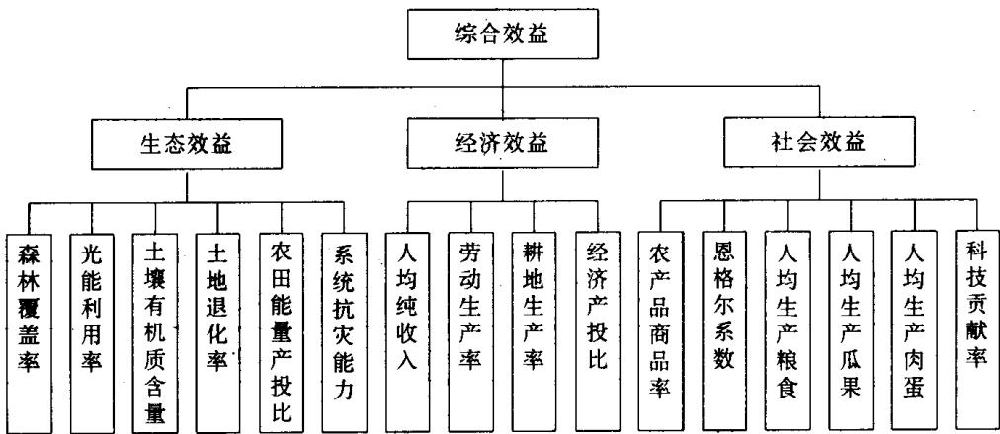  
图11-2 荒漠化综合治理效益评价结构模型

## 2. 评价方法的确定

大兴具沙地综合治理效益评价指标体系共有3大类16项评价指标，通过治理前后各项的计算和比较，虽可以看出治理的概况，但仍是单指标法的一种延伸，为了把握治理成效的全貌，全面考虑各评价因素间客观存在的层次

关系，采取多层次模糊综合评价方法。

多层次模糊综合评价，是由下而上进行模糊合成运算。综合评价的一般模糊关系方程是

$$
B = A \circ R
$$

式中 B—评价结果即判决子集；

A—模糊集中的权重分配；

0——-模糊算子；

R—各评价因素的单因素评价矩阵。

M层中生态效益、经济效益和社会效益的评价矩阵 $R _ { i } ( i = 1 , ~ 2 , ~ 3 )$ 由各评价指标的实际值按隶属函数标准化计算而得。M层的评价结果B，将作为U层评价中相应的R，值。考虑到影响因素众多，且为主体因素作用，故采用加权平均模型予以计算。

## 3. 权重的确定

综合评价中权重的确定是一个重要而困难的问题。一般采用“老手法”，是凭经验直接给出各评价因素的权值，很难做到客观合理，而且也不易判断思维过程的一致性。

层次分析法可以对非定量事物作定量分析，对人们的主观判断作客观描述，因此，采用层次分析法来解决权重问题。

(1)建立判断矩阵判断矩阵是层次分析法的关键。设有n个因素 ${ \pmb u } _ { 1 } \bullet { \pmb u } _ { 2 }$ $\cdots , u _ { n }$ 对总目标〇有影响。要确定它们在中的比重，采用成对比较法，即每次取两个因素 ${ \pmb u } _ { i }$ 和ui，用 $\pmb { u } _ { j }$ $\pmb { u } _ { i j }$ 表示〇的影响之比。全部比较的结果可用矩阵$A = ~ ( a _ { i j } ) , ~ a _ { i j } { > } 0$ 表示。A叫做正互反阵，易见， $a _ { i j } = 1 , \ a _ { i j } = 1 / a _ { i j } \ \ : \ : ( i , \ j = 1 )$ $2 , \cdots , \ n )$

确定a的值，人们通常取数字1\~9及其倒数作为 $\pmb { \alpha } _ { i j }$ $\pmb { a } _ { i j }$ 的取值范围。这是因为在进行定性的成对比较时，人们头脑中通常有5个明显的等级。

<table><tr><td> $\pmb { u } _ { i }$  比  $\pmb { \mu } _ { j }$ </td><td>相同</td><td>稍强</td><td>强</td><td>很强</td><td>绝对强</td></tr><tr><td> $\pmb { a } _ { i j }$ </td><td>1</td><td>2</td><td>3</td><td>4</td><td>5</td></tr></table>

在两个等级之间各有一个中间状态。另外，心理学认为进行成对比较的因素太多，将超出人们的能力，降低精确度。实践证明，成对比较的尺度以$\pm 2$ 为宜。含n个因素权重值的判断矩阵见表11-10。

表11-10 含n个因素权重值的判断矩阵
<table><tr><td>因素</td><td> ${ \pmb u } _ { 1 }$ </td><td> ${ \pmb u } _ { 2 }$ </td><td> $\pmb { u } _ { 3 }$  …</td><td> ${ \pmb u } _ { \pmb { \pi } }$ </td></tr><tr><td>u1</td><td>a11</td><td> $a _ { 2 1 }$ </td><td>a31 ……</td><td> $\pmb { A } _ { 1 \pmb { \eta } }$ </td></tr><tr><td>u2</td><td>a21</td><td>a22</td><td>a23 …</td><td> $\pmb { A } _ { 2 \ast }$ </td></tr><tr><td>u3</td><td>a31</td><td>a32</td><td>a33 …</td><td> $\pmb { A } _ { 3 n }$ </td></tr><tr><td></td><td></td><td></td><td></td><td></td></tr><tr><td> ${ \pmb u } _ { \pmb { \mu } }$ </td><td> $\mathbf { \delta } _  \mathbf { \delta } _ { \mathbf { \delta } } \mathbf { \delta } _ { \mathbf { \delta } _ { \mathbf { \delta } } \mathbf { \delta } _ { \mathbf { \delta } _ { \mathbf { \delta } } \mathbf { \delta } _ { \mathrm { ~  ~ } } } } \mathrm { ~ \delta ~ } _ { \mathbf { \delta } _ { \mathbf { \delta } _ { \mathbf { \delta } } \mathbf { \delta } _ { \mathrm { ~  ~ } } } }$ </td><td> $\mathbf { \delta } _ { \pmb { a } _ { 1 } \pmb { \alpha } _ { 2 } }$ </td><td> $\mathbf { \delta } _ { \mathbf { \alpha } } \mathbf { \langle } \mathbf { \vec { \alpha } } _ { \mathbf { \textsc { \beta } } }$  …·</td><td> $\mathbf { \delta } _ { \mathbf { u } \mathbf { n } }$ </td></tr></table>

## (2) 一致性检验

求出每个矩阵的最大特征值 $\lambda _ { \operatorname* { m a x } }$ ， $\lambda _ { \operatorname* { m a x } }$ 所对应的单位特征向量即为各指标的权重。

判断矩阵的一致性检验方法为：

$$
C R = C I / R I\tag{11-72}
$$

$$
C I = \frac { 1 } { 1 - n } \ ( \lambda _ { \operatorname* { m a x } } - n )\tag{11-73}
$$

式中 CR—一致性比率；

CI——一致性指标；

RI——随机一致性指标；

n——判断矩阵的阶数；

$\lambda _ { \operatorname* { m a x } }$ —判断矩阵最大特征值。

RI是随判断矩阵阶数而变的常数，对不同的n值，RI的取值如下：

<table><tr><td>N 1 2 3 4 5 6 7 8 9 10</td></tr><tr><td>11 1.12 1.24 1.32 1.41 1.45 1.49 1.51</td></tr></table>

当 $C R { < } 0 . 1 0$ 时，判断矩阵达到满意的效果，否则需要调整。

利用专家咨询结果，本研究中各层的判断矩阵如下：

①第 $o { \sim } U$ 层综合效益的判断矩阵

<table><tr><td>0</td><td> $\scriptstyle { U _ { 1 } }$ </td><td> $\boldsymbol { { t } } _ { 2 }$ </td><td> $\pmb { U _ { 3 } }$ </td><td>权值Wi</td></tr><tr><td> $U _ { \uparrow }$ </td><td>1</td><td>1/2</td><td>2</td><td>0.309</td></tr><tr><td> $U _ { 2 }$ </td><td>2</td><td>1</td><td>3</td><td>0.529</td></tr><tr><td> $U _ { 3 }$ </td><td>1/2</td><td>1/3</td><td>1</td><td>0.162</td></tr></table>

由此判断矩阵求出 $\lambda _ { \operatorname* { m a x } } = 3 . 0 0 9$ $\lambda _ { \operatorname* { m a x } }$ 所对应的单位特征向量为（0.309，0.529，0.162)，即为3种效益对综合效益的权重， $C I { = } 0 . 0 0 4$

②第 $U _ { \mathrm { 1 } } { \sim } M$ 层生态效益指标的判断矩阵

418 荒漢化防治工程学
<table><tr><td> $U _ { 1 }$ </td><td>M1</td><td> $M _ { 2 }$ </td><td> $\pmb { M } _ { 3 }$ </td><td> $M _ { 4 }$ </td><td> $M _ { 5 }$ </td><td> $M _ { 6 }$ </td><td>权值W</td></tr><tr><td> $M _ { 1 }$ </td><td>1</td><td>5</td><td>2</td><td>3</td><td>4</td><td>2</td><td>0.330</td></tr><tr><td> $M _ { 2 }$ </td><td>1/5</td><td>1</td><td>1/4</td><td>1/2</td><td>1</td><td>1/3</td><td>0.065</td></tr><tr><td> $M _ { 3 }$ </td><td>1/2</td><td>4</td><td>1</td><td>3</td><td>3</td><td>1</td><td>0.242</td></tr><tr><td> $M _ { 4 }$ </td><td>1/3</td><td>2</td><td>1/3</td><td>1</td><td>1</td><td>1/2</td><td>0.100</td></tr><tr><td> $M _ { 5 }$ </td><td>1/4</td><td>1</td><td>1/3</td><td>1</td><td>1</td><td>1/2</td><td>0.079</td></tr><tr><td> $M _ { 6 }$ </td><td>1/2</td><td>3</td><td>1</td><td>2</td><td>2</td><td>1</td><td>0.184</td></tr></table>

同样求得判断矩阵的 $\lambda _ { \operatorname* { m a x } } = 6 . 0 8 3 , \lambda _ { \operatorname* { m a x } }$ 所对应的单位特征向量为(0.330，0.065，0.242，0.100，0.079，0.184)，即为各指标对生态效益的权重，CI$= 0 . \ 0 1 3$ 0

③第 $U _ { 2 } { \sim } M$ 层经济效益指标的判断矩阵
<table><tr><td> $U _ { 2 }$ </td><td> $\pmb { M } _ { 7 }$ </td><td> $M _ { 8 }$ </td><td> $M _ { 9 }$ </td><td> $M _ { 1 0 }$ </td><td>权值  $W _ { i }$ </td></tr><tr><td> $M _ { 7 }$ </td><td>1</td><td>3</td><td>2</td><td>2</td><td>0.425</td></tr><tr><td> $M _ { 8 }$ </td><td>1/3</td><td>1</td><td>1/2</td><td>1</td><td>0.150</td></tr><tr><td> $M _ { 9 }$ </td><td>1/2</td><td>2</td><td>1</td><td>1</td><td>0.239</td></tr><tr><td> $M _ { 1 0 }$ </td><td>1/2</td><td>1</td><td>1</td><td>1</td><td>0.186</td></tr></table>

此判断矩阵的 $\lambda _ { \operatorname* { m a x } }$ =4. $_ { 0 4 8 }$ ， $\lambda _ { \mathrm { m a x } }$ 所对应的单位特征向量为(0.425，0.15，0.239，0.186)，亦是所求的权重值， $C I { = } 0 . 0 1 6$

①第 $U _ { 3 } { \sim } M$ 层社会效益指标的判断矩阵
<table><tr><td> $U _ { 3 }$ </td><td> $M _ { 1 1 }$ </td><td> $M _ { 1 2 }$ </td><td> $M _ { 1 3 }$ </td><td> $M _ { 1 4 }$ </td><td> $M _ { 1 5 }$ </td><td> $M _ { 1 6 }$ </td><td>权值  $W _ { i }$ </td></tr><tr><td> $M _ { 1 1 }$ </td><td>1</td><td>3</td><td>4</td><td>2</td><td>5</td><td>2</td><td>0.361</td></tr><tr><td> $M _ { 1 2 }$ </td><td>1/3</td><td>1</td><td>1</td><td>1</td><td>2</td><td>1</td><td>0.134</td></tr><tr><td> $\mathbf { { \mathcal { M } } } _ { 1 3 }$ </td><td>1/4</td><td>1</td><td>1</td><td>1/2</td><td>1</td><td>1/2</td><td>0.090</td></tr><tr><td> $M _ { 1 4 }$ </td><td>1/2</td><td>1</td><td>2</td><td>1</td><td>2</td><td>1</td><td>0.160</td></tr><tr><td> $M _ { \mathfrak { s } }$ </td><td>1/5</td><td>1/2</td><td>1</td><td>1/2</td><td>1</td><td>1/3</td><td>0.075</td></tr><tr><td> $M _ { 1 6 }$ </td><td>1/2</td><td>1</td><td>2</td><td>1</td><td>3</td><td>1</td><td>0.180</td></tr></table>

其最大特征值的 $\lambda _ { \operatorname* { m a x } } = 6 . 0 8 6$ ，单位特征向量亦即指标的权重为（0.361，0.134, 0.090, 0.160, 0.075, 0.180), CI=0.016。

各层指标的一致性检验如下：

<table><tr><td>指标类型</td><td>CR</td><td>判断</td><td>是否具有一致性(Y or N)</td></tr><tr><td>第二层指标</td><td>0.008</td><td>&lt;0. 10</td><td>Y</td></tr><tr><td>生态效益指标</td><td>0.010</td><td>&lt;0.10</td><td>Y</td></tr><tr><td>经济效益指标</td><td>0.018</td><td>&lt;0.10</td><td>Y</td></tr><tr><td>社会效益指标</td><td>0.014</td><td>&lt;0.10</td><td>Y</td></tr></table>

所得评价效益的权重向量见表11-11：

表 11-11 效益评价权重向量
<table><tr><td>A</td><td> $A _ { i }$ </td></tr><tr><td rowspan="3">A= (0.309, 0529, 0.162)</td><td>A;= (0.330, 0.065, 0.242, 0.100, 0.079, 0. 184)</td></tr><tr><td>A= (0.425, 0.150, 0.239, 0.186)</td></tr><tr><td>A,= (0.361, 0.134, 0.090, 0.160, 0.075, 0.180)</td></tr></table>

4. 隶属函数的确定

(1）建立隶属函数 建立模糊数学隶属度函数对指标进行标准化，根据对指标性质的分析，采用升半梯形、降半梯形2种类型，表达式如下：

①升半梯形函数

$$
U ( x ) = \left\{ { \begin{array} { l r } { 0 } & { ~ 0 \leqslant x \leqslant a _ { 1 } } \\ { ( x - a _ { i } ) / ( a _ { 2 } - a _ { 1 } ) } & { ~ a _ { 1 } \leqslant x \leqslant a _ { 2 } } \\ { 1 } & { ~ x \geqslant a _ { 2 } } \end{array} } \right.
$$

②降半梯形函数

$$
U ( x ) = \left\{ { \begin{array} { l r } { 0 } & { ~ 0 \leqslant x \leqslant a _ { 1 } } \\ { ( a _ { 2 } - x ) / ( a _ { 2 } - a _ { 1 } ) } & { ~ a _ { 1 } \leqslant x \leqslant a _ { 2 } } \\ { 1 } & { ~ x \geqslant a _ { 2 } } \end{array} } \right.
$$

式中 x——指标实测值；

$a _ { 1 } , a _ { 2 }$ 分别为该指标的上、下限，可依据评价标准值，即基准值和理想值确定。

2 种隶属函数的分布图见图11-3所示。

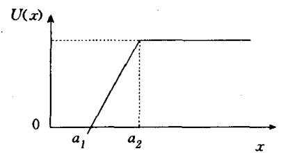

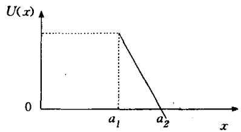  
图 11-3 模糊数学隶属函数分布

（2）评价标准的确定评价指标的标准值是指基准值和理想值。基准值是评价指标对于特定时点上一定范围总体水平的参照值，而理想值则是在某一时段内预计将要达到的值或理论上的最优值。

研究对象大兴县基准值的参照时间为50～60年代，理想值的时间界限为2010年(表11-12)。确定基准值的参照依据有50～60年代大兴县自然条件和社会经济情况；典型调查资料；专家咨询和专项研究资料；某些指标的计算与推导。理想值的确定依据是：

①客观标准指系统本身在理想条件下所能达到的最高或最低值。如：土壤肥力、土地退化率、光能利用率、农田能量产投比、系统抗灾能力。

②社会规范标准指根据国家和县已明确制定规划目标，以2010年全县预计的平均先进水平表示。如人均纯收入、人均产粮、人均产果品、人均生产肉蛋、树林覆盖率、劳动生产率、耕地生产率。

③人为标准根据人们的实践经验人为确定的标准。如：恩格尔系数、农产品商品率、科技贡献率。

表 11-12 效益评价指标标准值
<table><tr><td>评价指标</td><td>基准值</td><td>理想值</td></tr><tr><td>树林覆盖率（%）</td><td>3.7</td><td>35</td></tr><tr><td>光能利用率（%）</td><td>0.38</td><td>0.95</td></tr><tr><td>有机质利用率（%）</td><td>0.37</td><td>1.4</td></tr><tr><td>土地退化率（%）</td><td>37.6</td><td>0.98</td></tr><tr><td>农田能量产投比</td><td>1.59</td><td>2.70</td></tr><tr><td>系统抗灾能力</td><td>0.81</td><td>1</td></tr><tr><td>人均纯收入（元/人）</td><td>46.7</td><td>6 500</td></tr><tr><td>劳动生产率（元/人）</td><td>709</td><td>18 500</td></tr><tr><td>耕地生产率（元/hm²）</td><td>862.5</td><td>19 500</td></tr><tr><td>经济产投比</td><td>1.1</td><td>3.0</td></tr><tr><td>农产品商品率（%）</td><td>37</td><td>90</td></tr><tr><td>恩格尔系数（%）</td><td>60</td><td>39</td></tr><tr><td>人均产粮（kg/人）</td><td>169</td><td>1560</td></tr><tr><td>人均产果品（kg/人）</td><td>15</td><td>950</td></tr><tr><td>人均生产肉蛋（kg/人）</td><td>8.4</td><td>230</td></tr><tr><td>科技贡献率（%）</td><td>4</td><td>50</td></tr></table>

利用上述两类函数，依据评价标准值对原始数据标准化，结果见表11-13。

## 5. 效益评价值的计算

M层评价为

$$
B _ { i } = A _ { i } \circ R _ { i } ( i = 1 , 2 , 3 )
$$

式中 A—M层中对应于生态效益、经济效益和社会效益的评价指标的权重向量；

$R _ { i }$ M层生态效益、经济效益和社会效益的单因素评价矩阵，由表11-13中相应的指标标准化值组成。

表 11-13 效益评价指标标准化值
<table><tr><td>效益评价指标</td><td>1952年</td><td>1975年</td><td>1994年</td></tr><tr><td></td><td>树林覆盖率 0</td><td>0.24</td><td>0.62</td></tr><tr><td>生</td><td>光能利用率</td><td>0.07</td><td>0.37 0.79</td></tr><tr><td>态</td><td>有机质利用率</td><td>0</td><td>0.35 0.71</td></tr><tr><td>效</td><td>土地退化率</td><td>0</td><td>0.35 0.89</td></tr><tr><td>益</td><td>农田能量产投比</td><td>0.02</td><td>0.15 0.64</td></tr><tr><td></td><td>系统抗灾能力</td><td>0.11</td><td>0.58 0.79</td></tr><tr><td>经</td><td>人均纯收入</td><td>0</td><td>0.02 0.75</td></tr><tr><td>济</td><td>劳动生产率</td><td>0</td><td>0.03 0.77</td></tr><tr><td>效</td><td>耕地生产率</td><td>0</td><td>0.22 0.53</td></tr><tr><td>益</td><td>经济产投比</td><td>0</td><td>0.21 0.53</td></tr><tr><td></td><td>农产品商品率</td><td>0</td><td>0.05 0.85</td></tr><tr><td>社</td><td>恩格尔系数</td><td>0</td><td>0.43 0.56</td></tr><tr><td>会</td><td>人均产粮</td><td>0.02</td><td>0.21 0.69</td></tr><tr><td>效</td><td>人均产果品</td><td>0</td><td>0.02 0.59</td></tr><tr><td>益</td><td>人均生产肉蛋</td><td>0</td><td>0.05 0.67</td></tr><tr><td></td><td>科技贡献率</td><td>0.02</td><td>0.20 0.50</td></tr></table>

对生态效益的评价为：

$$
B _ { 1 } = A _ { 1 } \circ R _ { 1 } = ( 0 . 3 3 0 , 0 . 0 6 5 , 0 . 2 4 2 , 0 . 1 0 0 , 0 . 0 7 9 , 0 . 1 8 4 ) \mathrm { o }
$$

$$
\left[ { \begin{array} { c c c } { 0 } & { 0 . 2 4 } & { 0 . 6 2 } \\ { 0 . 0 7 } & { 0 . 3 7 } & { 0 . 7 9 } \\ { 0 } & { 0 . 3 5 } & { 0 . 7 1 } \\ { 0 } & { 0 . 3 5 } & { 0 . 8 9 } \\ { 0 . 0 2 } & { 0 . 1 5 } & { 0 . 6 4 } \\ { 0 . 1 1 } & { 0 . 5 8 } & { 0 . 7 9 } \end{array} } \right] = ( 0 . 0 2 6 ~ 4 , 0 . 3 3 3 ~ 8 , 0 . 7 1 2 ~ 7 )
$$

对经济效益的评价为：

$$
B _ { 2 } = A _ { 2 } \circ R _ { 2 } = ( 0 . 4 2 5 , 0 . 1 5 0 , 0 . 2 3 9 , 0 . 1 8 6 ) \circ \left[ \begin{array} { l l l l } { 0 } & { 0 . 0 2 } & { 0 . 7 5 } \\ { 0 } & { 0 . 0 3 } & { 0 . 7 7 } \\ { 0 } & { 0 . 2 2 } & { 0 . 5 3 } \\ { 0 } & { 0 . 2 1 } & { 0 . 5 3 } \end{array} \right]
$$

对社会效益的评价为：

$$
\begin{array} { r c l } { { B _ { 3 } } } & { { = } } & { { A _ { 3 } \mathrm { o } R _ { 3 } ~ = ~ ( ~ 0 . ~ 3 6 1 ~ , ~ 0 . ~ 1 3 4 ~ , ~ 0 . ~ 0 9 0 , ~ 0 . ~ 1 6 0 , ~ 0 . 0 7 5 , ~ 0 . ~ 1 8 0 ~ ) ~ \mathrm { ~ o ~ } } } \\ { { } } & { { } } & { { \left[ \begin{array} { c c c c } { { 0 } } & { { 0 . 0 5 } } & { { 0 . 8 5 } } \\ { { 0 } } & { { 0 . 4 3 } } & { { 0 . 5 6 } } \\ { { 0 . 0 2 } } & { { 0 . 2 1 } } & { { 0 . 6 9 } } \\ { { 0 } } & { { 0 . 0 2 } } & { { 0 . 5 9 } } \\ { { 0 } } & { { 0 . 0 5 } } & { { 0 . 6 7 } } \\ { { 0 . 0 2 } } & { { 0 . 2 0 } } & { { 0 . 5 0 } } \end{array} \right] } } \end{array}
$$

将M层的生态效益、经济效益和社会效益的评价值B(i=1，2，3)作为高层次U层的模糊平静矩阵R，则U为M层综合效益的评价：

$$
{ \begin{array} { r l } { B = A \circ R { = } ( 0 . 3 0 9 , 0 . 5 2 9 , 0 . 1 6 2 ) \circ { \left[ \begin{array} { l l l } { 0 . 2 6 4 } & { 0 . 3 3 3 8 } & { 0 . 7 1 2 7 } \\ { 0 } & { 0 . 1 0 4 6 } & { \cdot 0 . 6 5 9 5 } \\ { 0 . 0 0 5 4 } & { 0 . 1 3 7 5 } & { 0 . 6 7 8 6 } \end{array} \right] } } \\ { = ( 0 . 0 0 9 \ 0 , 0 . 1 8 0 \ 8 , 0 . 6 7 9 \ 0 ) } \end{array} }
$$

生态效益、经济效益、社会效益和综合效益的评价值见表11-14。

表 11-14 效益评价值
<table><tr><td>年份</td><td>生态效益</td><td>经济效益</td><td>社会效益</td><td>综合效益</td></tr><tr><td>1952</td><td>0.0264</td><td>0</td><td>0.005 4</td><td>0.0090</td></tr><tr><td>1975</td><td>0.333 8</td><td>0.1046</td><td>0.1375</td><td>0.180 8</td></tr><tr><td>1994</td><td>0.712 7</td><td>0.659 5</td><td>0.678 6</td><td>0.679 0</td></tr></table>

## 6. 效益得分值的计算

为了让所得评价结果直观明了，将效益评价值B换成百分制得分，公式为 $b _ { i } { = } I N T \ ( 1 0 0 b _ { i } { + } 0 . 5 )$ ，结果见表11-15。

表 11-15 效益评价得分
<table><tr><td>年份</td><td>生态效益</td><td>经济效益</td><td>社会效益</td><td>综合效益</td></tr><tr><td>1952</td><td>3</td><td>0</td><td>1</td><td>1</td></tr><tr><td>1975</td><td>33</td><td>10</td><td>14</td><td>18</td></tr><tr><td>1994</td><td>71</td><td>66</td><td>68</td><td>68</td></tr></table>

## 7. 评价结果等级划分

将生态效益、经济效益、社会效益和综合效益评价结果按得分划分成如下4个等级（表11-16）。

表 11-16 效益评价等级划分
<table><tr><td>等级</td><td> ${ \bf { I } } _ { 1 }$ </td><td> ${ \bf { I } } _ { 2 }$ </td><td> ${ \bf { I } } _ { 3 }$ </td><td> ${ \texttt I } _ { 4 }$ </td></tr><tr><td>得分区间</td><td>80~100</td><td>70~79</td><td>60~69</td><td>≤59</td></tr><tr><td>评语</td><td>优</td><td>良</td><td>中</td><td>差</td></tr></table>

## 8. 评价结果分析

依据各类效益得分值和评价等级的划分，得出各类效益的评价结果见表11-17。

表 11-17 效益评价结果
<table><tr><td rowspan="2">年份</td><td colspan="2">生态效益</td><td colspan="2">经济效益</td><td colspan="2">社会效益</td><td colspan="2">综合效益</td></tr><tr><td>评价等级</td><td>评语</td><td>评价等级</td><td>评语</td><td>评价等级</td><td>评语</td><td>评价等级</td><td>评语</td></tr><tr><td>1952年</td><td> $\mathbf { I } _ { 4 }$ </td><td>差</td><td> ${ \mathbf I } _ { 4 }$ </td><td>差</td><td> $\mathrm { I } _ { 4 }$ </td><td>差</td><td> ${ \bf { I } } _ { 4 }$ </td><td>差</td></tr><tr><td>1975年</td><td> $\mathbf { I } _ { 4 }$ </td><td>差</td><td> ${ \bf { I } } _ { 4 }$ </td><td>差</td><td> ${ \mathrm { I } } _ { 4 }$ </td><td>差</td><td> $\mathbf { I } _ { 4 }$ </td><td>差</td></tr><tr><td>1994年</td><td> ${ \bf { I } } _ { 2 }$ </td><td>良</td><td> ${ \texttt I } _ { 3 }$ </td><td>中</td><td> ${ \mathbf { I } } _ { 3 }$ </td><td>中</td><td> ${ \bf { I } } _ { 3 }$ </td><td>中</td></tr></table>

## 9. 所得结论

(1）大兴县沙地综合治理成效显著，生态效益、经济效益、社会效益和综合效益一直呈增长趋势。经济效益、社会效益和综合效益均由50年代和70年代的较差 $\mathrm { ( I _ { 4 } ) }$ 级）达到90年代的中等水平 $( \mathtt { I } _ { 3 }$ 级），生态效益由50年代和70年代的较差 $\mathrm { { ( I _ { 4 } ) } }$ 级）达到90年代的良好 $( \mathtt { I } _ { 2 }$ 级)。

(2）从不同时期治理效益增长幅度来看，70～90年代增长幅度比50～70年代大。生态效益、经济效益、社会效益和综合效益的得分增长平均值在50～70年代和70～90年代分别为17.5和49.5。

（3）从当前治理情况来看，90年代经济效益、社会效益和综合效益均为中等水平 $( \mathbb { I } _ { 3 }$ 级)，生态效益为良好水平 $( \bar { \mathrm { I } } _ { 2 }$ 级)。进一步治理应大力提高经济效益和社会效益。只有三类效益兼顾，共同提高，才能实现生态效益、经济效益和社会效益的协调发展和综合效益的稳步提高。

## 参考文献

1. 毛乌素沙地生态经济型防护林体系结构效益研究专辑：水土保持研究，陕西科学技术出版社，1995，2（2）

2. 王礼先主编．水土保持学．北京：中国林业出版社，1995

3. 邓宏海，森林生态效能经济评价的理论和方法.林业科学，1985（1）：61～67

4. 刘钰华.新疆防沙林带优化模式的研究.干旱区研究，1992，9（9）

5. 孙立达，朱金兆主编：水土保持林体系综合效益研究与评价．北京：中国科学技术出版社，1995

6. 孙洪祥主编．干旱区造林．北京：中国林业出版社，1989

7. 张奎壁，邹受益主编．治沙原理与技术．北京：中国林业出版社，1989

8. 杨文治，余存祖主编．黄土高原区域治理与评价.北京：科学出版社，1992

9. 神府一东胜矿区一、二期工程环境效应考察专辑．水土保持研究．西安：陕西省科学技术出版社，1994，1（4）

10. 萨蒂著，许树柏等译.层次分析法.北京：煤炭工业出版社，1986

"crc32": 1665412778,

Document generated by Anna's Archive around 2023-2024 as part of the DuXiu collection (https://annas-blog.org/duxiu-exclusive.html).

Images have been losslessly embedded. Information about the original file can be found in PDF attachments. Some stats (more in the PDF attachments):