# 恢复生态学导论

任海彭少麟 编著

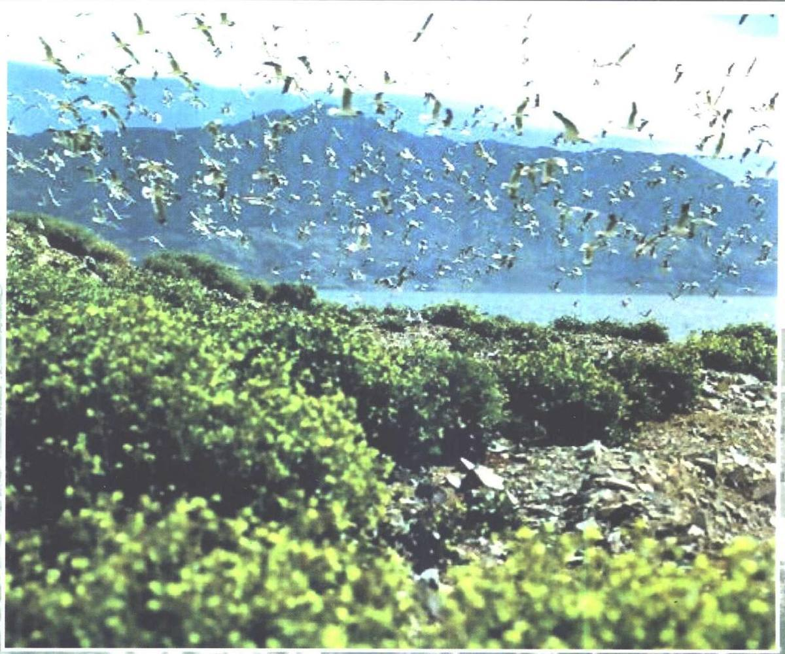

# 恢复生态学导论

任海彭少麟编著

## 内容简介

恢复生态学、生态系统健康和生态系统管理是当前生态学发展的热点方向。本书在参阅大量文献的基础上，结合多年的研究成果，系统阐述了恢复生态学的基本理论和方法及其当前的发展动向，并介绍了生态系统健康和生态系统管理的基本理论及其与恢复生态学的关系。全书内容主要包括：退化生态系统的形成原因与机理；退化生态系统包括森林、草地、农田、湿地、海岛和水体等的恢复原理与方法；生态系统的服务功能；外来种入侵和全球变化对退化生态系统的影响；生态系统健康；生态系统管理等。正文后附有当前国际上介绍恢复生态学的网址和重要的恢复生态学文献，以资查阅。

本书资料新颖、体系完整，可供从事生态学、林学、农学、地学以及自然保护和环境保护等领域工作的教师、学生和研究人员参考。

图书在版编目(CIP)数据

恢复生态学导论/任海，彭少麟编著-北京：科学出版社，20014

ISBN 7-03-009113-2

I. 恢… Ⅱ.①任…②彭… Ⅲ.恢复-生态学 Ⅳ.Q14

中国版本图书馆 CIP数据核字(2000)第 87573号

科學出版社出版

北京东黄城根北街16号

邮政编码 100717

源海印刷厂印刷

科学出版社发行各地新华书店经销

2001 年 4月第 一 版 开本 787×1092 1/16

2001年4月第一次印刷印张91/2

印数·1—1500 字数 213 000

定价：24.00元

(如有印装质量问题，我社负责调换(新欣))

## 目 录

## 第一编 恢复生态学

第章绪论…………………………………(3)  
第一节 生态恢复和恢复生态学的定义……(3)  
第二节 恢复生态学研究简史…………………(4)  
第二章 退化生态系统恢复与恢复生态学……(10)  
第一节 退化生态系统的定义及其形成原因………(10)  
第二节 环境污染对生物多样性的影响……(10)  
第三节 全球及中国退化生态系统的面积…………(11)  
一、全球退化生态系统类型及其面积……(11)  
二、中国退化生态系统类型及其面积……(11)  
三、中国的脆弱生态系统…………(13)  
第四节 退化生态系统的恢复……(14)  
、生态恢复的目标………(14)  
二、退化生态系统恢复与重建的基本原则…………(14)  
三、生态恢复的方法问题……(15)  
四、退化生态系统恢复与重建的程序……(17)  
五、退化生态系统恢复的机理……(17)  
六、恢复成功的标准………(19)  
七、生态恢复的时间……………(20)  
八、生物多样性在生态恢复中的作用……(20)  
第五节恢复生态学理论………(21)  
、恢复生态学的研究内容……(21)  
二、恢复生态学的理论基础……(22)  
三、恢复生态学与相关学科的关系……(22)  
四、恢复生态学的发展趋势……(23)  
第三章退化森林生态系统的恢复……(26)  
第一节森林生态系统退化与恢复机理………(26)  
第二节 森林生态系统恢复中应注意的问题……(30)  
第三节 次生林的恢复方法……(31)  
第四节天然林的保护………(31)  
第五节热帯季雨林的恢复实例………(32)  
、森林恢复样地概况……(32)  
二、森林恢复的方法与步骤…………………(32)  
三、森林恢复后的群落结构…………(32)  
四、森林恢复后的功能…………(33)  
第六节 矿区废弃地的植被恢复…………(33)  
第七节 喀斯特森林及其恢复 …………(34)  
第四章 退化草地生态系统的恢复 ………(36)  
第一节 草原生态系统退化的原因……(36)  
第二节 放牧对草原生态系统的影响……(37)  
第三节草原退化的评估………………(37)  
第四节草地的荒漠化……(38)  
第五节草地恢复的方法………(39)  
第六节 退化草原生态系统的恢复与管理………(39)  
第五章 退化农田生态系统的恢复……(41)  
第一节 农田生态系统的退化………(41)  
第二节退化农田恢复的程序及措施……(43)  
第三节 评估农业生态系统恢复的参考指标……(43)  
第四节 我国农田生态系统退化的问题………(44)  
、耕地面积锐减………(44)  
二、土壤肥力下降…………(44)  
三、土壤次生盐渍化…………(44)  
四、易涝地面积有所増加……(45)  
五、土地沙漠化……………(45)  
六、水稲土次生潜育化………(45)  
七、土地污染… …(45)  
第五节 防止退化的必由之路可持续性农业……(46)  
第六章退化海岛生态系统的恢复……(49)  
第一节海岛恢复概论…………(49)  
第二节海岛的干扰……………(50)  
第三节海岛恢复的限制性因子……(50)  
第四节海岛恢复的利益与过程……(51)  
第五节海岛恢复中的注意事项……(52)  
第六节 实例研究广东南澳岛的植被恢复……(52)  
一、南澳岛概况…… …………………(52)  
二、南澳岛植被恢复过程中的群落结构变化……(53)  
三、南澳岛植被恢复过程中的生物量变化……(55)  
四、南澳岛植被恢复过程中凋落物现存量变化…………(55)  
五、南澳岛植被恢复过程中群落土壤的变化……(56)  
六、南澳岛植被恢复的生态特征……(57)  
第七章 退化水生生态系统的恢复……(59)  
第一节 湖泊和水库的退化原因及恢复………(59)  
第二节 河流的退化及治理………………………………(60)  
第三节 水体生态系统恢复的评估………(62)  
第八章 退化湿地生态系统的恢夏……(65)  
第一节 湿地的功能及其退化原因…………(65)  
第二节 湿地恢复的概念…………………………………………(66)  
第三节 湿地恢复的理论……………………………………(66)  
一、自我设计和设计理论………………………(66)  
二、演替理论……………………………………(67)  
三、入侵理论………………………………………………………(69)  
四、河流理论……………………………………………………………………………(69)  
五、洪水脉冲理论………………(69)  
六、边缘效应理论和中度干扰假说……(70)  
第四节 湿地恢复的原则和目标………(71)  
一、湿地恢复的基本原则……(71)  
二、湿地恢复的目标……………………………………(71)  
第五节 湿地恢复的策略………………………(72)  
第六节 湿地恢复的过程与方法…………(72)  
一、湿地恢复的过程……………(72)  
二、湿地恢复的方法………………(73)  
第七节 湿地恢复的合理性评价…………(74)  
、生态合理性………………(74)  
二、社会合理性……………………………………………………………………(74)  
三、经済合理性…………………………………………………………(75)  
第九章 生态系统的服务功能………(76)  
第一节 生态系统服务功能定义……(76)  
第二节 生态系统服务功能的研究历史……(77)  
第三节 生态系统服务功能的内容……(77)  
一、生产生态系统产品……………(78)  
二、产生和维持生物多样性……(79)  
三、调节气候………………………………………………………………(79)  
四、减缓早涝灾害………………(80)  
五、维持土壤功能……………………………………………………(80)  
六、传粉播种………………………………………(80)  
七、有害生物的控制………(81)  
八、净化环境……………(81)  
九、景观美学与精神文化功能………(82)  
第四节 天然生态系统与人工生态系统的服务功能比较………(82)  
第五节 生态系统服务功能价值的评价……… …… (83)  
第六节 生态系统服务功能的价值分类…………(83)  
第七节 生态系统服务功能价值评估方法…………(83)  
第八节 生态系统服务功能的保护策略与途径………(84)  
第十章 植物外来种与退化生态系统………(86)  
第节 乡土种和外来种的概念………(86)  
第二节 植物入侵对群落和生态系统特性的影响……(87)  
一、对初级生产力的影响……………(87)  
二、対土壤营养物的影响……(87)  
三、対土壤水分的影响……(88)  
四、对干扰体制的影响……………(88)  
五、対群落动态的影响……(88)  
第三节 影响植物人侵的因子…………(89)  
一、影响植物入侵的外因………(89)  
二、影响植物入侵的内因……………(91)  
第四节 外来种的风险评价…………(91)  
一、对有关外来种定居方面的特性的评价…………(92)  
二、对有关外来种传播的特性的研究………(92)  
三、对外来种影响的评价………(93)  
第五节対植物外来种的管理………(94)  
、外来种的管理策略…………(95)  
二、阻止植物外来种的新的入侵和扩展……(95)  
三、消除和控制已定居的外来种……(96)  
第十章 全球变化与恢复生态学……(99)  
第一节全球变化的现象………(99)  
一、大气臭氧层的损耗……(99)  
二、大气中的温室气体浓度正在増加………(100)  
三、全球气候变化的趋势………(101)  
四、生物多样性丧失………(101)  
五、土地利用格局与环境质量的改变……(103)  
六、其他…… ……(103)  
第二节全球变化的影响………………………(103)  
一、全球气候变化对物种分布及灭绝的影响………(103)  
二、全球变化対农业的影响……(104)  
第三节全球变化与恢复生态学……(104)  
第十二章 可持续发展与退化生态系统恢复……(105)  
第一节可持续发展的概念…………………(105)  
第二节 中国的可持续发展观…………(106)  
第三节 可持续发展的思想与恢复生态学……(107)  
第四节 可持续发展的理论框架…………………(108)

## 第二编 生态系统健康和生态系统管理

第十三章 生态系统健康…… ……(113)  
第一节 生态系统健康的定义及研究简史……(113)  
第二节 生态系统在胁迫下的反应……(114)  
一、单因子胁迫下的反应…………(114)  
二、多因子胁迫下的反应…… ………(115)  
三、生态系统对胁迫的反应过程与结果……(115)  
第三节 生态系统健康的标准…… …………(116)  
第四节 生态系统健康的评估与预测……(117)  
、活力的测量…… …………………………………(117)  
二、组织的测量……(117)  
三、恢复力的测量……  
第五节 生态系统健康的等级理论………… ……(118)  
第六节 干扰、生态系统稳定性与生态系统健康……(119)  
第七节 生态系统管理、生态系统可持续发展与生态系统健康………(119)  
第八节 生态系统健康与恢复生态学等学科的关系………(120)  
第九节 生态系统健康存在的问题……(121)  
第十四章生态系统管理的概念及其要素……(123)  
第一节 生态系统管理的定义………(123)  
第二节 生态系统管理的发展简史……(124)  
第三节生态系统管理的数据基础…… …………(125)  
第四节 生态系统变化的度量……(126)  
第五节生态系统管理的要素…… ……(126)  
附录1国际上有关恢复生态学的网址……(129)  
附录2 国际比较重要的恢复生态学参考文献……(133)  
后记…… …(144)

## 第一编 恢复生态学

## 第一章 绪 论

自1940年以来，由于科学技术的进步，人类生产、生活和探险的足迹遍及全球，尤其是全球人口已达57亿，而且每年仍以9000多万人的速度在递增。在那些有人居住的地方，人类为了生存，大部分的自然生态系统被改造为城镇和农田，原有的生态系统结构及功能退化，有的其至已失去了生产力。随着人口的持续增长，对自然资源的需求也在增加。环境污染、植被破坏、土地退化、水资源短缺、气候变化、生物多样性丧失等增加了对自然生态系统的胁迫。人类面临着合理恢复、保护和开发自然资源的挑战。20世纪80年代，恢复生态学(restoration ecology)应运而生。恢复生态学从理论与实践两方面研究生态系统退化、恢复、开发和保护机理，因而为解决人类生态问题和实现可持续发展提供了机遇(Aber& Jordan，1985;Chapman,1992；Cairns，1995；Daily，1995;马世骏,1990;刘良梧和龚子同，1994;陈灵芝和陈伟烈，1995；Dobson，1997；任海和彭少麟，1998)。本书将对近年来国际上恢复生态学在理论和方法上的进展进行综述，并结合当前国际前沿生态系统健康、生态系统管理和可持续发展等提出恢复生态学的可能发展方向。

## 第一节 生态恢复和恢复生态学的定义

恢复生态学是一门关于生态恢复(ecological restoration)的学科，由于恢复生态学具理论性和实践性，从不同的角度看会有不同的理解，因此关于恢复生态学的定义有很多，其中具代表性的如下：

美国自然资源委员会(The US Natural Resource Council)认为，使一个生态系统回复到较接近其受干扰前的状态即为生态恢复(Cairns,1995);Jordan(1995)认为，使生态系统回复到先前或历史上(自然的或非自然的)的状态即为生态恢复；Cairns(1995)认为，生态恢复是使受损生态系统的结构和功能回复到受干扰前状态的过程；Egan(1996)认为，生态恢复是重建某区域历史上有的植物和动物群落，而且保持生态系统和人类的传统文化功能的持续性的过程(Hobbs & Norton,1996)。

上述四种定义强调，受损的生态系统要恢复到理想的状态才为生态恢复。但是，现实中这种理想状态很难实现，原因在于：缺乏对生态系统历史的了解、恢复时间太长、生态系统中关键种的消失、费用太高等。于是人们又做了下述定义：

余作岳等(1996)提出，恢复生态学是研究生态系统退化的原因、退化生态系统恢复与重建的技术与方法、生态学过程与机理的科学。Bradshaw(1987)认为，生态恢复是有关理论的一种“酸性试验”(acid test或译为“严密验证”)，它研究生态系统自身的性质、受损机理及修复过程(Jordan et al.，1987);Diamond(1987)认为，生态恢复就是再造一个自然群落、或再造一个自我维持、并保持后代具持续性的群落;Harper(1987)认为，生态恢复是关于组装并试验群落和生态系统如何工作的过程(Jordan et al.，1987)。(国际)恢复生态学会(Society for Ecological Restoration)先后提出三个定义:生态恢复是修复被人类损害的原生生态系统的多样性及动态的过程(1994);生态恢复是维持生态系统健康及更新的过程(1995)；生态恢复是帮助研究生态整合性的恢复和管理过程的科学，生态整合性包括生物多样性、生态过程和结构、区域及历史情况、可持续的社会实践等广泛的范围(1995)。第三个定义是该学会的最终定义(Jackson et al. ,1995)。

与自然条件下发生的次生演替不同，生态恢复强调人类的主动作用。事实上，人类活动对所有生态系统具有不可避免的影响，我们得从生态平衡的观点转向动态的观点看生态恢复。生态恢复包括人类的需求观、生态学方法的应用、恢复目标和评估成功的标准、以及生态恢复的各种限制(如恢复的价值取向、社会评价、生态环境等)等基本成分。与生态恢复相关的概念还有：①重建(rehabilitation)，即去除干扰并使生态系统回复原有的利用方式；②改良(reclamation)，即改良立地的条件以便使原有的生物生存，一般指原有景观彻底破坏后的恢复；③改进(enhancement)，即对原有的受损系统进行改进，以提高某方面的结构与功能；④修补(remedy)，即修复部分受损的结构；⑤更新(renewal)，,指生态系统发育及更新；⑥再植(revegetation)，即恢复生态系统的部分结构和功能，或恢复当地先前土地利用方式。这些与恢复相关的概念可看作广义的恢复概念(Falk，1996:余作岳和彭少麟，1996;任海和彭少麟，1998;章象恩，1998,1999)。因为人类在生存与发展过程中已完全改变了大量的原生顶极生态系统为工业、农业、商业和生活基地，这些人工形成的生态系统已成为世界生态系统中的成员。

最近，Kloor(2000)通过对北美森林的恢复研究认为，应该淘汰“恢复”这个词，他的理由是恢复生态学中存在的三个问题：一是恢复的目标具有不确定性，即恢复某生态系统历史上哪一个时间阶段的状态，例如美国明尼苏达州历史上被冰雪覆盖，是否应恢复为雪地？二是“恢复”这个词有静态的含意，因而恢复不仅要试图重复过去的环境，而且要通过管理以维持过去的状态，但实事上自然界是动态的；三是由于气候变化、关键种缺乏或新种入侵，完全的恢复是不可能的。Davis(2000)进一步指出，根据“恢复”过程中所做的工作，将“恢复”(restoring)换成“生态改进”(ecological enhancement 或 ecological enrichment)会更精确，作为一门学科，恢复生态学应该叫“生态构建”(ecological architecture)，并将它作为景观构建(landscape architecture)的一个分支学科。Higgs等(2000)代表(国际)恢复生态学会对这三点作了逐条反驳，他们认为生态恢复强调了参考条件，而且生态学家已致力于寻找适当的时间和空间参考点；恢复是一个动态的过程，而且恢复包括结构、干扰体系、功能随时间变化；恢复促进了乡土种、群落、生态系统流(能流、物流等)、可持续的文化的繁荣，它应是应用生态学的一个分支。

## 第二节 恢复生态学研究简史

恢复生态学研究起源于100年前的山地、草原、森林和野生生物等自然资源管理研究，其中20世纪初的水土保持、森林砍伐后再植的理论与方法在恢复生态学中沿用至今(Jordan et al. ,1987),例如 Phipps 于 1883 出版了森林再造的专著，其中有些理论至今可用(Keddy，1999)。早在20世纪30年代就有干旱胁迫下农业生态系统恢复的实践。最早开展恢复生态学实验的是Leopold,他与助手一起于1935年在威斯康星大学植物园恢复了一个24hm²的草场。随后他发现了火在维持及管理草场中的重要性。他还认为生态恢复只是恢复中的第一步，一个生态系统保持整体性、稳定性和生物群体的美丽时就是好的，在 1941 年他进一步提出 土地健康(land health)的概念(Jordan et al. ，1987;Rapport1998)。1935年，Clements发表了“实验生态学为公共服务”的论文，阐述生态学可用于包括土地恢复在内的广泛领域(Keddy，1999)。20世纪50\~60年代，欧洲、北美和中国都注意到了各自的环境问题，开展了一些工程与生物措施相结合的矿山、水体和水土流失等环境恢复和治理工程，并取得了一些成效，从70年代开始，欧美一些发达国家开始水体恢复研究(Cairns，1995;陈灵芝和陈伟烈，1995)，在此期间，虽有部分国家开始定位观测和研究，但没有生态恢复的机理研究。Farnworth在1973年提出了热带雨林恢复研究中的9个具体方向。同期，日本的宫肋照教授利用植被演替的理论在一些城市开展建设环境保护林的研究，人工促进森林的快速恢复(钦佩等，1998)。1975年在美国召开了“受损生态系统的恢复”国际研讨会，会议探讨了受损生态系统恢复的一些机理和方法，并号召科学家们注意搜集受损生态系统科学数据和资料，开展技术措施研究，建立国家间的研究计划。1980年，Cairns主编了《受损生态系统的恢复过程》一书，8位科学家从不同角度探讨了受损生态系统恢复过程中重要生态学理论和应用问题。同年，Brandshaw和Chd-wick 出版了 Restoration of Land , the Ecology and Reclamation of Derelict and DegradedLand。1983年，在美国召开了“干扰与生态系统”的国际研讨会，探讨了干扰对生态系统各个层次的影响。1984年，在美国威斯康星大学召开了恢复生态学研讨会，强调了恢复生态学中理论与实践的统一性，并提出恢复生态学在保护与开发中起重要的桥梁作用；美国1985年成立了“恢复地球”组织，该组织先后开展了森林、草地、海岸带、矿地、流域、湿地等生态系统的恢复实践并出版了一系列生态恢复实例专著(Beger，1990)。同年，Aber和 Jordan提出了恢复生态学的术语，他们还出版了Restoration Ecology：A Symthetic Ap-proach toEcological Research的论文集。1985年，国际恢复生态学会成立。1991年，在澳大利亚举行了“热带退化林地的恢复国际研讨会”。1993年，在香港举行了华南退化坡地恢复与利用国际研讨会，系统探讨了中国华南地区退化坡地的形成及恢复问题(Parham，1993):1996年，在瑞士召开了第一届世界恢复生态学大会，大会强调恢复生态学在生态学中的地位，恢复技术与生态学的连结，恢复过程中经济与社会内容的重要性，随后国际恢复生态学会每年召开一次国际研讨会。现在各国均有大量的恢复生态学论文出现，但主要的恢复生态学期刊有Restoration and Management Notes、Restoration Ecolo-gy、Restoration and Reclamation Review 和 Land degradation and Development。EcologyAbstracts等国际文摘也开辟专栏转载恢复生态学方面的成果。另有一些生态学期刊和环境期刊出版恢复生态学专辑，此外还有大量的因特网网址进行恢复生态学方面的交流。

当前在恢复生态学理论和实践方面走在前列的是欧洲和北美，在实践中走在前列还有新西兰、澳洲和中国。其中欧洲偏重矿地恢复，北美偏重水体和林地恢复，而新西兰和澳洲以草原管理为主(Gavnor,1990；Cairns，1992；Mansfield & Towns，1997)，中国则因人口偏多强调农业综合利用(陈灵芝和陈伟烈，1995;任海和彭少麟，1998)。从20世纪70年代至今，国外比较成功的恢复样板有：热带的土地退化现状及恢复技术(CAB970601598, CAB940607234。CAB 是指 Centre for Agriculture and Biosciences Inter-national数据库简称，其后的数字是顺序号)，昆士兰东北部退化土地的恢复(CAB960607654)，坦桑尼亚的毁林地恢复(CAB960607447)，退化的石灰岩矿地的造林(CAB960600967),湿热带的自然林恢复(CAB960600935)，东玻利维亚、巴西、东南亚、赞比亚等国的土地恢复(CAB数据库中有近百条记录)，干旱和半干旱地退化生态系统的恢复与重建(至1999年，CAB数据库中有五十余条记录)。这些恢复试验的对象涉及了草原、河流、湖泊、废弃矿地、森林和农田，在这些恢复过程中主要研究内容有干扰和受损生态系统，受损生态系统的恢复与重建，湿热带森林生态系统的稳定性，废弃矿地和垃圾场的恢复，河流和湖泊的水生植物群落的重建等。在此基础上，已有一些恢复生态学的理论成果出现。

我国最早的恢复生态学研究是中国科学院华南植物研究所余作岳等人1959年在广东的热带沿海侵蚀台地上开展的退化生态系统的植被恢复技术与机理研究，经过近40年的系统研究，他和彭少麟、任海等人提出了“在一定的人工启动下，热带极度退化的森林可恢复：退化生态系统的恢复可分三步走；恢复过程中植物多样性导致动物和微生物多样性，植物多样性是生态系统稳定性的基础；森林恢复过程中结构与功能不同步恢复”等观点，余作岳等还先后创建了我国恢复生态学研究的两个基地小良热带森林生态系统定位研究站和鹤山丘陵综合试验开放站等。从此以后，先后有多个单位开展了退化生态系统恢复研究，其中包括：南京大学仲崇信自1963年起就从英国、丹麦引进大米草在沿海滩涂种植以控制海岸侵蚀，至1980年推广达3万多公顷。中国科学院兰州沙漠所展的沙漠治理与植被固沙研究，中国科学院西北水土保持研究所开展的黄土高原水土流失区的治理与综合利用示范研究，中国科学院水生生物研究所的湖泊生态系统恢复研究，中国科学院西北高原生物研究所开展了高原退化草甸的恢复与重建研究，中国科学院成都生物研究所开展的岷江上游植被恢复研究，中国科学院南京土壤所开展的红壤恢复与综合利用试验，广西科学院和中山大学开展的红树林恢复重建试验等。1983年，中国科学院内蒙古草原站开展了不同恢复措施下退化羊草草原恢复演替研究。1990年，东北林业大学开展了黑龙江省森林生态系统恢复与重建研究，同期中国林业科学研究院开展了海南岛热带林地的植被恢复与可持续发展研究。另有中国环境科学院、中山大学、中国矿业大学等单位开展的大量废弃矿地和垃圾场的恢复对策研究。20世纪90年代中期，先后出版了《热带亚热带退化生态系统的植被恢复生态学研究》和《中国退化生态系统研究》等专著，提出了适合中国国情的恢复生态学研究理论和方法体系(中国科协学会部，1990;赵桂久等.1993,1995；中国生态学会，1991，1995;陈灵芝和陈伟烈，1995;余作岳和彭少麟，1996;任海和彭少麟，1998;Ren,2000)。

## 参考文献

陈灵芝和陈伟烈主编，1995.中国退化生态系统研究，北京：中国科技出版社

刘良梧和龚子同.1994.全球土壤退化评价.自然资源，(1):10\~14

马世骏主编.1990.现代生态学透视.北京：科学出版社

彭少麟.1997.恢复生态学与热带雨林的恢复.世界科技研究与发展，19(3)：58\~61

钦佩，安树青和颜京松.1998.生态工程学．南京：南京大学出版社

任海和彭少麟，1998.中国南亚热带退化生态系统恢复及可持续发展。陈竺主编生命科学一中国科协第三届青年学术研讨会论文集.北京：中国科技出版社，176\~179

任海和彭少麟.1998. 退化生态系统的恢复与重建.青年地理，3(3):7\~11

任海.邬建国和彭少麟和赵利忠.2000.生态系统健康的监测与评估.热带地理，20(4):310\~316

余作岳和彭少麟主编.1997. 热带亚热带退化生态系统植被恢复生态学研究，广州：广东科技出版社

中国生态学会主编.1991.生态学研究进展.北京：中国科学技术出版社

中国科协学会部编.1990.中国土地退化防止研究.北京：中国科学技术出版社

章家恩和徐琪.1998.生态退化研究的基本内容与框架.水土保持通报，17(3):46\~53

章家恩和徐琪. 1999.恢复生态学研究的一些基本问题探讨.应用生态学报，10(1):109\~112

赵桂久，刘燕华和赵名茶等主编.1993.生态环境综合整治和恢复技术研究(第一集).北京：北京科学技术出版社

赵桂久，刘燕华和赵名茶等主编.1995.生态环境综合整治和恢复技术研究(第二集).北京：北京科学技术出版社

中国生态学会编.1995. 面向21 世纪的生态学—中国生态学会第五届全国代表大会论文集.珠海

Aber,J. D. & W. Jordan. 1985. Restoration ecology: An environmental middle ground. BioScience,35(7):399

Berger,J. J. ed. 1990. Ecological restoration in the San Francisco Bay Area. Restoring the Earth, Berkeley

Brown, S. & A. E. Lugo. 1994. Rehabilitation of tropical lands: a key to sustaining development. Restoration Ecology,2 (2): 97\~111

Berger,J. J. 1993. Ecological restoration and nonIndigenous plant species: a review. Restoration Ecology,2(2): 74\~82

Barrow,C. J. 1991. Land Degradation. London: Cambridge University Press

Cairns, J. et al. eds. 1988. Rehabilitation Damaged Ecosystems. Boca Raton: CRC Press

Conacher, A. J. et al. 1995. Rural land degradation in Australia. Melbourne, New York: Oxford University Press

Chapman, G. P. 1992. Desertified Grassland. London: Academic Press

Cairns,J. Jr. , ed. 1977. Recovery and Restoration of Damaged Ecosystems. Charlottesvill: University press of Virginia

Cairns,J. Jr. ed. 1992. Restoration of Aquatic Ecosystems. Washington,DC: National Academy Press

Cairns,J. Jr. 1995. Restoration ecology. Encyclopedia of Environmental Biology,3:223\~235

Caraher,D. & W. H. Knapp. 1995. Assessing ecosystem health in the Blue Mountains. In: U. S. Forest ed. Silviculture: from the Cradle of Forestry to Ecosytem Management. General technical report SE-88, Southeast Forest Experiment Station, U.S. Forest Service, Hendersonville, North Carolina. 75

Constanza, R. R. , R. Arge & R. Groot. 1997. The value of the worlds ecosystem services and natural capital. Nature,387: 253\~259

Daily, G. C. S. , P. R. Alexander & P. R. Ehrlich. 1997. Ecosystem services: Benefits supplied to human societies by natural ecosystems. Issues in Ecology, (3):1\~6

Daily, G. C. 1995. Restoring value to the worlds degraded lands. Science,269:350\~354

Davis.1.1996. Focal species offer a management tool. Science ,271:1362\~1363

Davis, K. A. 2000. “Restoration"— a misnomer. Science, 287(5456) : 1203

Diamond, J. 1987. Reflections on goals and on the relationship between theory and practice. In: W. R. Ⅲ . Jordon, N. Gilpin and J. Aber eds. Restoration Ecology: A Synthetic Approach to Ecological Research. Cambridge Cambridge: University Press, 329\~336

Dobson, A. D. , A. D. Bradshaw & A. J. M. Baker. 1997. Hopes for the future: restoration ecology and conservation biology. Science,277:515\~522

Farnworth E. G. & F. B. Golley . 1973. Fragile Ecosystem. New York: Springer-Verlag

Falk, D. A. , C. I. Millar & M. Olwell. 1996. Restoring Diversity — Strategies for Reintroducion of Endangered Plants. Washington DC: Island Press

Freedman, B. 1989. Environmental Ecology: the impact of pollution and other stresses on ecosystem structure and function. London: Academic Press

Fritts T. H. & G. H. Rodola. 1998. The role of introduced species in the degradation of island ecosystems: A case history of Guam. Ann. Rev. Ecol. Syst. ,29:113\~140

Forman, R. T. T. 1995. Land Mosaics. Cambridge: Cambridge University Press

Gaynor,V. 1990. Prairie restoration on a corporate site. Restoration and Reclamation Review,1(1): 35\~40

Handel,S. N. , G. R. Robinson & A.J. Beattie. 1994. Biodiversity resources for restoration ecology. Restoration ecology,2 (4):230\~241

Higgs, E. , W. W. Covington, D. A. Falk, E. B. Allen & E. Read. 2000. No justification to retire the term “Restoration" Science,287(5456):1203

Hobbs, R. J. & Norton D. A. 1996. Towards a conceptual framework for restoration ecology. Restoration Ecology,4(2) :93 \~110

Harper, J. L. 1987. Self-effacing Art: Restoration as Imitation of Nature. Restoration Ecology: A Synthetic Approach to Ecological Research In: W. R. III. Jordon, N. Gilpin and J. Aber eds. Cambridge: Cambridge University Press,35\~ 45

Hobbs, R. J. & H. A. Mooney. 1993. Restoration ecology and invasions. In: D. A. Saunders, Hobbs & P. R. Ehrlich. eds. Nature Eonservation 3: Reconstruction of Fragmented Ecosystems, Global and Regional Perspectives Surrey Beatty and Sons, Chipping Norton, New South Wales, Australia, 127\~133

Johnstone I. M. 1986. Plant invasion windows: a time-based classification of invasion potential. Biological Review, 61 :369\~ 394

Jackson, L. L. ,D. Lopoukine & D. Hillyard. 1995. Ecological restoration: a definition and comments. Restoration Eœology, 3(2):71\~75

Jordan, W. III. , M. E. Gilpin & J. D. Aber. 1987. Restoration Ecology: A Synthetic Approach to Ecological Restoration. Cambridge: Cambridge University.1\~342

Jordan,W. R. III. 1995. “Sunflower Forest": ecological restoration as the basis for a new environmental paradigm. In:A. D.J. Baldwin, ed. Beyond Preservation: Restoring and Inventing Landscape. Minneapolis: University of Minnesota Press,17\~34

Kloor, K. 2000. Restoration ecology: Returning America's forests to their natural'roots. Science, 287(5453): 573

Keddy, P. 1999. Wetland restoration: the potential for assembly rules in the service of conservation. Wetland, 19(4): 716 \~732

Kauffman, R. 1995. Ecological approaches to riparian restoration in northeast Oregon. Restoration and Management Notes, 13:12\~15

Lamnd, D. 1994. Reforestation of degraded tropical forest lands in the Asia – Pacific region. Journal of tropicai forest science, 7(1):1\~7

Madenjian, C. P. , S. Schloesser & K. A. Krieger. 1998. Population models of burrowing mayfly recolonization in western lake erie. Ecological Applications,8:1206\~1212

Margaren, F. 1997. Disneyland or native ecosystem: genetics and the restorationist. Restoration and Management Notes, 14 (2):148\~150

Mansfield, B. & D. Towns. 1997. Lessons of the Islands: Restoration in New Zealand. Restoration and Management Notes,15(2):150\~154

Mitsch, W. J. & S. E. Jorgensen. Ecological Engineering. New York: John Wiley & Sons

Middleton, B. 1999. Wetland Restoration: Flood Pulsing and Disturbance Dynamics. New York: John Wiley & Sons, Inc

Owles, M. B. & C. J. Whelan. 1994. Restoration of Endangered Species: Conceptual Issues, Planning and Implementation. New York: Cambridge University Press

Parham, W. ed. 1993. Improving Degraded Lands: Promising Experience Form South China. Honolulu: Bishop Museum Press

Parker, V. T. 1997. The scale of successional models and restoration ecology. Restoration Ecology,5(4):301\~306

Rapport, D. J. ed. 1998. Ecosystem health. Oxford: Blackwell Science, Inc

Rapport, D. J. , R. Costanza & A. J. McMichael. 1998. Assessing ecosystem health. Trends in ecology & evolution, 13; 397\~402

Sehal, J. et al. 1994. Soil Degradation in India: Status and Impact. New Delhi: Oxford & IBH Pub. Co.

Van der Valk. 1999. Succession theory and wetland restoration. Proceedings of INTECOL's V International wetlands conference, Perth, Australia

Whisenant, S. G. & D. J. Tongway. 1995. Repairing mesoscale processes during restoration. Fifth international rangeland congress, Denver,62\~63

## 第二章 退化生态系统恢复与恢复生态学

退化生态系统实际上是生态系统演替的一个类型。退化生态系统形成既可能是自然的，也可能是人为的，本书主要限于由人类干扰形成的退化生态系统。人类由于各种限制或认识不足而使生态系统受害或受损，在恢复时所付出的努力要比利用或破坏时要大得多。而且从目前的研究和实践结果看，复制型的生态系统恢复似乎是不可能的。

## 第一节 退化生态系统的定义及其形成原因

退化生态系统是指生态系统在自然或人为干扰下形成的偏离自然状态的系统。与自然系统相比，一般地，退化的生态系统种类组成、群落或系统结构改变，生物多样性减少，生物生产力降低，土壤和微环境恶化，生物间相互关系改变(Chapman，1992;Daily，1995;陈灵芝和陈伟烈，1995)。当然，对不同的生态系统类型，其退化的表现是不一样的。例如，湖泊由于富营养化会退化，外来种入侵、在人为干扰下本地非优势种取代历史上的优势种等引起生态系统的退化等，往往这种情况下会改变生态系统的生物多样性，但生物生产力不一定下降，有的反而会上升(Berger，1993)。

退化生态系统形成的直接原因是人类活动，部分来自自然灾害，有时两者叠加发生作用。生态系统退化的过程由干扰的强度、持续时间和规模所决定。Daily(1995)对造成生态系统退化的人类活动进行了排序：过度开发(含直接破坏和环境污染等)占35%，毁林占30%，农业活动占28%，过度收获薪材占7%，生物工业占1%。自然干扰中外来种入侵(包括因人为引种后泛滥成灾的入侵)、火灾及水灾是最重要的因素。Daily(1995)进一步指出，基于以下四个原因人类进行生态恢复是非常必要的和重要的：需要增加作物产量满足人类需求：人类活动已对地球的大气循环和能量流动产生了严重的影响；生物多样性依赖于人类保护和恢复生境；土地退化限制了国民经济的发展。

Brown和Lugo(1994)也指出，生态系统的退化过程或程度取决于生态系统的结构或过程受干扰的程度，例如人类对植物获取资源过程的干扰(如：过度灌溉影响植物的水分循环，超量施肥影响植物的物质循环)要比对生产者或消费者的直接干扰(如：砍伐或猎取)产生的负效应要大。一般地，在生态系统组成成分尚未完全破坏前排除干扰，生态系统的退化会停止并开始恢复(例如少量砍伐后森林的恢复)，但在生态系统的功能过程被破坏后排除干扰，生态系统的退化很难停止，而且有可能会加剧(例如炼山后的林地恢复)。

## 第二节 环境污染对生物多样性的影响

随着人类的发展，环境污染也加剧。环境污染会影响生态系统各个层次的结构、功能和动态，进而导致生态系统退化(曲格平，1984)。本节将重点分析环境污染对生物多样性的影响。

环境污染对生物多样性的影响目前有两个基本观点：一是由于生物对突然发生的污染在适应上可能存在很大的局限性，故生物多样性会丧失；二是污染会改变生物原有的进化和适应模式，生物多样性可能会向着污染主导的条件下发展，从而偏离其自然或常规轨道。环境污染会导致生物多样性在遗传、种群和生态系统三个层次上降低。

在遗传层次上的影响。虽然污染会导致生物的抵抗和适应，但最终会导致遗传多样减少。这是因为在污染条件下，种群的敏感性个体消失，这些个体具有特质性的遗传变异因此而消失，进而导致整个种群的遗传多样性水平降低；污染引起种群的规模减小，由于随机的遗传漂变的增加，可能降低种群的遗传多样性水平：污染引起种群数量减小，以至干达到了种群的遗传学阀值，即使种群最后恢复到原来的种群大小时，遗传变异的来源也大大降低。

在种群水平上的影响。物种是以种群的形式存在的，最近研究表明，当种群以复合种群的形式存在时，由于某处的污染会导致该亚种群消失，而且由于生境的污染，该地方明显不再适合另一亚种群入侵和定居。此外，由于各物种种群对污染的抵抗力不同，有些种群会消失，而有些种群会存活，但最终的结果是当地物种丰富度会减少。

在生态系统层次上的影响。污染会影响生态系统的结构、功能和动态。严重的污染可能具有趋同性，即将不同的生态系统类型最终变成基本没有生物的死亡区。一般的污染会改变生态系统的结构，导致功能的改变。值得指出的是，重金属或有机物污染在生态系统中经食物链作用，会有放大作用，最终对人类造成影响。

## 第三节 全球及中国退化生态系统的面积

## 一、全球退化生态系统类型及其面积

据估计，由于人类对土地的开发(主要指生境转换)导致了全球 $5 0 \times 1 0 ^ { 8 } \mathrm { h m } ^ { 2 }$ 以上土地的退化，使全球43%的陆地植被生态系统的服务功能受到了影响。联合国环境署的调查表明(Daily，1995):全球有 $2 0 \times 1 0 ^ { 8 } \mathrm { h m } ^ { 2 }$ 土地退化(占全球有植被分布土地面积的17%)，其中轻度退化的(农业生产力稍微下降，恢复潜力很大)有 $7 . 5 \times 1 0 ^ { 8 } \mathrm { h m } ^ { 2 }$ ，中度退化的(农业生产力下降更多，要通过一定的经济和技术投资才能恢复)有 $9 . 1 \times 1 0 ^ { 8 } \mathrm { h m } ^ { 2 }$ ,严重退化的(没有进行农业生产，要依靠国际援助才能进行改良的)有 $3 . 0 \times 1 0 ^ { 8 } \mathrm { h m } ^ { 2 }$ ，极度退化的(不能进行农业生产和改良)有 $0 . 0 9 \times 1 0 ^ { 8 } \mathrm { h m } ^ { 2 }$ ；全球荒漠化土地有 $3 6 \times 1 0 ^ { 8 } \mathrm { h m } ^ { 2 }$ 以上(占全球干旱地面积的70%)，其中轻微退化的 $1 2 . 2 3 \times 1 0 ^ { 8 } \mathrm { h m } ^ { 2 }$ ，中度退化的 $1 2 . 6 7 \times 1 0 ^ { 8 } \mathrm { h m } ^ { 2 }$ 严重退化的有 $1 0 \times 1 0 ^ { 8 } \mathrm { h m } ^ { 2 }$ 以上，极度退化的有0. $7 2 \times 1 0 ^ { 8 } \mathrm { h m } ^ { 2 }$ ，此外，弃耕的旱地每年还$\downarrow \downarrow 0 . 0 9 \times 1 0 ^ { 8 } \mathrm { h m } ^ { 2 }$ 的速度在递增；全球退化的热带雨林面积有 $4 . 2 7 \times 1 0 ^ { 8 } \mathrm { h m } ^ { 2 }$ ，而且还在以0.154公顷/年的速度递增。联合国环境署还估计，1978\~1991年间全球土地荒漠化造成的损失达3000\~6000亿美元，现在每年高达423亿美元，而全球每年进行生态恢复而投入的经费达100亿\~224亿美元。

## 二、中国退化生态系统类型及其面积

中国地处中纬度地区，南北跨纬度49°，东西跨经度62°，地形多样，气候复杂，形成多 $4 9 ^ { \circ }$ $6 2 ^ { \circ }$ 种多样的农业自然资源，表现为东农西牧，南水北旱，山地平川农林互补，江河湖海散布环集。中国有960万平方公里土地，据1995年统计，农田占14.6%，果园占0.5%，草地占41.6%，林地占17.2%，工业交通和城镇用地占2.6%。水体占3.5%，荒漠和雪地占27.2%。

中国各类资源人均值都低于世界平均水平，人均土地面积为世界的1/3，森林资源为1/6.草地资源为1/3,特别是耕地资源只有世界人均的 $1 / 3 \textdegree$ 中国后备宜农荒地毛面积仅5亿亩，其中分布在草原地区约2.1亿亩，宜种植人工饲草料用；分布在南方山丘的约7000万亩，主要作为果树与经济林木用地；可用种植粮、棉、油的农作物用地约2亿多亩；另有17亿亩荒山荒地。目前我国主要靠扩大耕地面积，依靠自然恢复地力，调节人地关系。表2.1和表2.2显示了我国历史上人口增长和人均资源情况。

表 2.1 中国历代人口及人均耕地面积
<table><tr><td>年份</td><td>人口人</td><td>人均耕地面积／(hm²/人）</td></tr><tr><td>BC210</td><td>20 000 000</td><td>1.67</td></tr><tr><td>756</td><td>52 910 000</td><td>1.40</td></tr><tr><td>1736</td><td>330 000 000</td><td>0.25</td></tr><tr><td>1863</td><td>404 946 000</td><td>0.12</td></tr><tr><td>1949</td><td>540 000 000</td><td>0.20</td></tr><tr><td>1959</td><td>620 000 000</td><td>0.18</td></tr><tr><td>1980</td><td>987 050 000</td><td>0.11</td></tr><tr><td>1990</td><td>1 100 000 000</td><td>0.09</td></tr><tr><td>1998</td><td>1 200 000</td><td>0.07</td></tr></table>

表2.2 中国六大区域的人均资源占有量(程鸿，1990)
<table><tr><td>项目</td><td>平均</td><td>东北区</td><td>华北</td><td>西北</td><td>中部</td><td>华南</td><td>长江区</td></tr><tr><td> $\mathrm { \Omega } / \mathrm { h m } ^ { 2 }$  土地面积</td><td>0.92</td><td>0.85</td><td>0.67</td><td>5.73</td><td>0.28</td><td>0.45</td><td>0.69</td></tr><tr><td>耕地  $\hbar \mathrm { m } ^ { 2 }$ </td><td>0.14</td><td>0.22</td><td>0.18</td><td>0.25</td><td>0.11</td><td>0.09</td><td>0.13</td></tr><tr><td>草地面积  $\mathrm { \hbar } \mathrm { { n m } } ^ { 2 }$ </td><td>0.25</td><td>0.06</td><td>0.24</td><td>2.09</td><td>0.03</td><td>0.05</td><td>0.13</td></tr><tr><td>林地面积  $\hbar \mathrm { m } ^ { 2 }$ </td><td>0.11</td><td>0.27</td><td>0.07</td><td>0.19</td><td>0.07</td><td>0.12</td><td>0.11</td></tr><tr><td>水面  $/ \mathrm { m } ^ { 2 }$ </td><td>2603</td><td>1680</td><td>614</td><td>7783</td><td>1983</td><td>4085</td><td>3729</td></tr><tr><td>人口密度/人  $\scriptstyle \left. \mathbf { k m } ^ { 2 } \right.$ </td><td>109</td><td>118</td><td>149</td><td>17</td><td>332</td><td>225</td><td>147</td></tr></table>

由于人口增长过快，加上大跃进等政策错误，我国形成了大量的退化生态系统(石玉林，1992:赵桂久等；1993,1995;周立三，1996)。我国水土流失面积约为180万平方公里，占国土面积的18.8%，其中黄土高原地区约80%地方水土流失。北方沙漠、戈壁、沙漠化土地面积为149万平方公里，占国土面积的15.5%，1987年已沙漠化土地20.12万平方公里，潜在沙漠化土地13.28万平方公里。目前有5900万亩农田和7400万亩草场受到沙漠化威胁。草原退缩面积13亿亩。每年以2000万亩(1亩=1/15公顷)增加。每年使用农药防治面积23亿亩次，劣质化肥污染农田2500万亩(刘良梧和龚子同，1994;中国科协学会部，1990)。

张巧珍(1993)推算，除农田外，我国其他的生态系统退化面积约占国土总面积的1/4。任海等(2000)系统总结有关部委和学者的数据发现，中国农田总面积为 $1 4 0 \times 1 0 ^ { 6 } \mathrm { h m } ^ { 2 }$ ,退化面积为 $2 8 \times 1 0 ^ { 6 } \mathrm { h m } ^ { 2 }$ ;草地面积 $4 0 0 \times 1 0 ^ { 6 } \mathrm { h m } ^ { 2 }$ ，退化面积为 $1 3 . 2 \times 1 0 ^ { 6 } \mathrm { h m } ^ { 2 }$ ;森林总面积$1 6 5 . 2 \times 1 0 ^ { 6 } \mathrm { h m } ^ { 2 }$ ,退化面积 $3 1 . 2 \times 1 0 ^ { 6 } \mathrm { h m } ^ { 2 }$ ;淡水面积0. $7 4 3 \times 1 0 ^ { 6 } \mathrm { h m } ^ { 2 }$ ，退化面积 $0 . 2 4 5 \times$ $1 0 ^ { 6 } \mathrm { h m } ^ { 2 }$ ;废矿地 $2 \times 1 0 ^ { 6 } \mathrm { h m } ^ { 2 }$ (表2.3)。此外，多位学者提出了某些退化生态系统面积，但有较大差异，这可能是由于测量精度或退化生态系统的定义不同造成的。

表 2.3 1995 年中国主要生态系统及其退化生态系统面积(hm²)
<table><tr><td>生态系统类型</td><td>总面积(×10⁶)</td><td>退化面积(×10⁶)</td><td>比例/%</td></tr><tr><td>农田</td><td>140</td><td>28</td><td>20</td></tr><tr><td>草地</td><td>400</td><td>132</td><td>33</td></tr><tr><td>林地</td><td>165.2</td><td>31.2</td><td>25</td></tr><tr><td>荒漠</td><td>0.130</td><td>一</td><td>-</td></tr><tr><td>淡水水面</td><td>0.743</td><td>0.245</td><td>32</td></tr><tr><td>废弃矿地</td><td>2</td><td>一</td><td>-</td></tr></table>

据陈灵芝和陈伟烈(1995)，国家统计局(1995)，余作岳等(1996)，Ren(2000)

## 三、中国的脆弱生态系统

脆弱生态系统极易沦为退化生态系统。脆弱生态系统就是抵抗外界干扰能力低、自身的稳定性差的生态系统。脆弱生态系统有三种理解：其一是指生态系统的正常功能被打乱，系统发生了不可逆变化，从而失去恢复能力的生态系统；其二是指当生态系统发生了变化，以至于影响当前或近期人类的生存和自然资源利用的生态系统；其三是指当生态系统退化超过了在现有社会经济和技术水平下能长期维持目前人类利用和发展水平的状况。从定义上看，脆弱生态系统与退化生态系统相似，主要的区别是脆弱生态系统还包括了那些容易退化而尚未退化的生态系统。

脆弱生态系统形成的原因包括自然和人为因素。自然因素包括地质脆弱因子、地貌脆弱因子、生物群体结构、气候脆弱因子和大风等，人为因素包括过度垦殖土地、过度放牧、过度樵采、过度采药、长期不合理的灌溉、矿山开发、工农业污染等。

我国自然生态条件较差，脆弱生态系统分布范围广、面积大。据赵跃龙(1999)统计，我国脆弱生态系统总面积达194万平方公里，超过国土总面积的1/5。它们主要是北方半干旱一半湿润区(如黄土高原，其土壤沙性重、风蚀沙化严重、水土流失严重、土壤盐渍化、自然灾害频繁)、西北干旱脆弱区(如新疆等，其干旱缺水、风沙化严重、土壤盐碱化、山地植被稀少、草原严重退化)、华北平原区(如河北，其冬春干旱、盐碱内涝严重、风沙和自然灾害频繁)、南方丘陵区(如湖南等，其水土流失较严重)、西南石灰岩山地(如贵州，其土层薄、肥力低、保水性能差)、西南山地和青藏高原区(如西藏等，其缺水、气候差)。

## 第四节 退化生态系统的恢复

恢复生态学的研究对象是退化生态系统，退化生态系统的恢复涉及到许多方面，有恢复的目标、原则、方法、过程、机理等等。生态恢复的最本质问题是恢复生态系统的必要功能并使之具系统自我维持能力。

## 一、生态恢复的目标

Hobbs和Norton(1996)认为恢复退化生态系统的目标包括：建立合理的内容组成(种类丰富度及多度)、结构(植被和土壤的垂直结构)、格局(生态系统成分的水平安排)、异质性(各组分由多个变量组成)、功能(诸如水、能量、物质流动等基本生态过程的表现)。事实上，进行生态恢复工程的目标不外乎四个：①恢复诸如废弃矿地这样极度退化的生境；②提高退化土地上的生产力；③在被保护的景观内去除于扰以加强保护；④对现有生态系统进行合理利用和保护，维持其服务功能。如果按短期与长期目标分还可将上述目标分得更细(章家恩和徐琪，1999)。

虽然恢复生态学强调对受损生态系统进行恢复，但恢复生态学的首要目标仍是保护自然的生态系统，因为保护在生态系统恢复中具有重要的参考作用；第二个目标是恢复现有的退化生态系统，尤其是与人类关系密切的生态系统；第三个目标是对现有的生态系统进行合理管理，避免退化；第四个目标是保持区域文化的可持续发展；其他的目标包括实现景观层次的整合性，保持生物多样性及保持良好的生态环境。Parker(1997)认为，恢复的长期目标应是生态系统自身可持续性的恢复，但由于这个目标的时间尺度太大，加上生态系统是开放的，可能会导致恢复后的系统状态与原状态不同。

总之，根据不同的社会、经济、文化与生活需要，人们往往会对不同的退化生态系统制定不同水平的恢复目标。但是无论对什么类型的退化生态系统，应该存在一些基本的恢复目标或要求，主要包括：①实现生态系统的地表基底稳定性，因为地表基底(地质地貌)是生态系统发育与存在的载体，基底不稳定(如滑坡)，就不可能保证生态系统的持续演替与发展；②恢复植被和土壤，保证一定的植被覆盖率和土壤肥力；③增加种类组成和生物多样性：④实现生物群落的恢复，提高生态系统的生产力和自我维持能力；⑤减少或控制环境污染；⑥增加视觉和美学享受。

## 二、退化生态系统恢复与重建的基本原则

退化生态系统的恢复与重建要求在遵循自然规律的基础上，通过人类的作用，根据技术上适当，经济上可行，社会能够接受的原则，使受害或退化生态系统重新获得健康并有益于人类生存与生活的生态系统重构或再生过程。生态恢复与重建的原则一般包括自然法则、社会经济技术原则、美学原则3个方面(图2.1)。自然法则是生态恢复与重建的基本原则，也就是说，只有遵循自然规律的恢复重建才是真正意义上的恢复与重建，否则只能是背道而驰，事倍功半。社会经济技术条件是生态恢复重建的后盾和支柱，在一定尺度上制约着恢复重建的可能性、水平与深度。美学原则是指退化生态系统的恢复重建应给

人以美的享受。

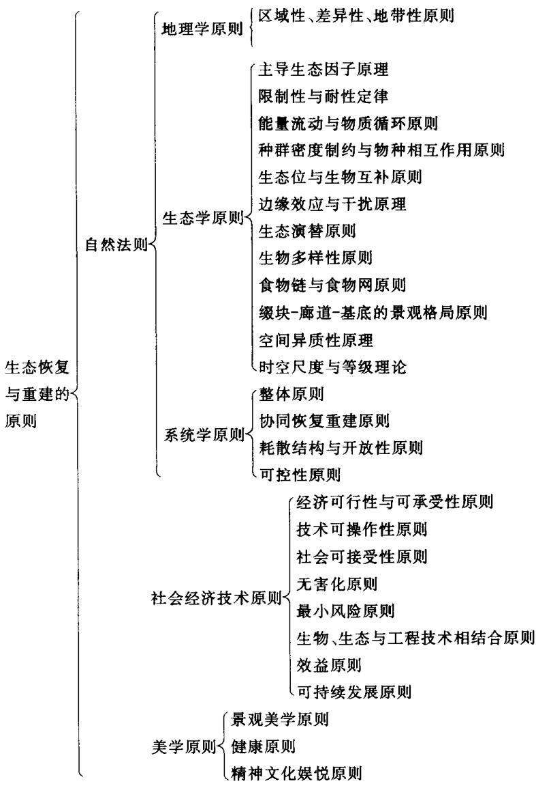  
图2.1 退化生态系统恢复与重建的基本定律、原理和原则

## 三、生态恢复的方法问题

恢复与重建技术是恢复生态学的重点研究领域，但目前是一个较为薄弱的环节。由于不同退化生态系统存在着地域差异性，加上外部干扰类型和强度的不同，结果导致生态系统所表现出的退化类型、阶段、过程及其响应机理也各不相同。因此，在不同类型退化生态系统的恢复过程中，其恢复目标、侧重点及其选用的配套关键技术往往会有所不同。尽管如此，对于一般退化生态系统而言，大致需要或涉及以下几类基本的恢复技术体系：①非生物或环境要素(包括土壤、水体、大气)的恢复技术；②生物因素(包括物种、种群和群落)的恢复技术；③生态系统(包括结构与功能)的总体规划、设计与组装技术。这里，将退化生态系统的一些常用或基本的技术加以总结(表2.4)，以供参考。

表 2.4 退化生态系统的恢复与重建技术体系
<table><tr><td rowspan=1 colspan=1>恢复类型</td><td rowspan=1 colspan=1>恢复对象</td><td rowspan=1 colspan=1>技术体系</td><td rowspan=1 colspan=1>技术类型</td></tr><tr><td rowspan=7 colspan=1>非生物环境因素</td><td rowspan=3 colspan=1>土壤</td><td rowspan=1 colspan=1>土壤肥力恢复技术</td><td rowspan=1 colspan=1>少耕、免耕技术；绿肥与有机肥施用技术；生物培肥技术(如EM技术)；化学改良技术；聚土改土技术；土壤结构熟化技术</td></tr><tr><td rowspan=1 colspan=1>水土流失控制与保持技术</td><td rowspan=1 colspan=1>坡面水土保持林、草技术；生物篱笆技术；土石工程技术(小水库、谷坊、鱼鳞坑等)；等高耕作技术；复合农林牧技术</td></tr><tr><td rowspan=1 colspan=1>土壤污染与恢复控制与恢复技术</td><td rowspan=1 colspan=1>土壤生物自净技术；施加抑制剂技术；增施有机肥技术；移土客土技术；深翻埋藏技术；废弃物的资源化利用技术</td></tr><tr><td rowspan=2 colspan=1>大气</td><td rowspan=1 colspan=1>大气污染控制与恢复技术</td><td rowspan=1 colspan=1>新兴能源替代技术；生物吸附技术；烟尘控制技术</td></tr><tr><td rowspan=1 colspan=1>球变化控制技术</td><td rowspan=1 colspan=1>可再生能源技术；温室气候的固定转换技术(如利用细菌、藻类)；无公害产品开发与生产技术；土地优化利用与覆盖技术</td></tr><tr><td rowspan=2 colspan=1>水体</td><td rowspan=1 colspan=1>水体污染控制技术</td><td rowspan=1 colspan=1>物理处理技术(如加过滤、沉淀剂)；化学处理技术；生物处理技术；氧化塘技术；水体富营养化控制技术</td></tr><tr><td rowspan=1 colspan=1>节水技术</td><td rowspan=1 colspan=1>地膜覆盖技术；集水技术；节水灌溉(渗灌、滴灌)</td></tr><tr><td rowspan=7 colspan=1>生物因素</td><td rowspan=2 colspan=1>物种</td><td rowspan=1 colspan=1>物种选育与繁殖技术</td><td rowspan=1 colspan=1>基因工程技术；种子库技术；野生生物种的驯化技术</td></tr><tr><td rowspan=1 colspan=1>物种引人与恢复技术</td><td rowspan=1 colspan=1>先锋种引人技术；土壤种子库引人技术；乡土种种苗库重建技术；天敌引入技术；林草植被再生技术</td></tr><tr><td rowspan=3 colspan=1>种群</td><td rowspan=1 colspan=1>物种保护技术</td><td rowspan=1 colspan=1>就地保护技术；迁地保护技术；自然保护区分类管理技术</td></tr><tr><td rowspan=1 colspan=1>种群动态调控技术</td><td rowspan=1 colspan=1>种群规模、年龄结构、密度、性比例等调控技术</td></tr><tr><td rowspan=1 colspan=1>种群行为控制技术</td><td rowspan=1 colspan=1>种群竞争、他感、捕食、寄生、共生、迁移等行为控制技术</td></tr><tr><td rowspan=2 colspan=1>群落</td><td rowspan=1 colspan=1>群落结构优化配置与组建技术</td><td rowspan=1 colspan=1>林灌草搭配技术；群落组建技术；生态位优化配置技术；林分改造技术；择伐技术；透光抚育技术</td></tr><tr><td rowspan=1 colspan=1>群落演替控制与恢复技术</td><td rowspan=1 colspan=1>原生与次生快速演替技术；封山育林技术；水生与早生演替技术；内生与外生演替技术</td></tr><tr><td rowspan=2 colspan=1>生态系统</td><td rowspan=2 colspan=1>结构功能</td><td rowspan=1 colspan=1>生态评价与规划技术</td><td rowspan=1 colspan=1>土地资源评价与规划；环境评价与规划技术；景观生态评价与规划技术；4S辅助技术(RS、GIS、GPS、ES)</td></tr><tr><td rowspan=1 colspan=1>生态系统组装与集成技术</td><td rowspan=1 colspan=1>生态工程设计技术；景观设计技术；生态系统构建与集成技术</td></tr><tr><td rowspan=1 colspan=1>景观</td><td rowspan=1 colspan=1>结构功能</td><td rowspan=1 colspan=1>生态系统间链接技术</td><td rowspan=1 colspan=1>生物保护区网络；城市农村规划技术；流域治理技术</td></tr></table>

不同类型(如森林、草地、农田、湿地、湖泊、河流、海洋)、不同程度的退化生态系统，其恢复方法亦不同。从生态系统的组成成分角度看，主要包括非生物和生物系统的恢复。无机环境的恢复技术包括水体恢复技术(如控制污染、去除富营养化、换水、积水、排涝和灌溉技术)、土壤恢复技术(如耕作制度和方式的改变、施肥、土壤改良、表土稳定、控制水土侵蚀、换土及分解污染物等)、空气恢复技术(如烟尘吸附、生物和化学吸附等)。生物系统的恢复技术包括植被(物种的引入、品种改良、植物快速繁殖、植物的搭配、植物的种植、林分改造等)、消费者(捕食者的引进、病虫害的控制)和分解者(微生物的引种及控制)的重建技术和生态规划技术(RS、GIS、GPS)的应用(Mitsch&Jorgensen，1989;Parham，1993;章家恩和徐琪，1999)。

在生态恢复实践中，同一项目可能会应用上述多种技术。例如，余作岳等在极度退化的土地上恢复热带季雨林过程中，采用生物与工程措施相结合的方法，通过重建先锋群落、配置多层次多物种乡土树的阔叶林和重建复合农林业生态系统等三个步骤取得了成功。总之，生态恢复中最重要的还是综合考虑实际情况，充分利用各种技术，通过研究与实践，尽快地恢复生态系统的结构，进而恢复其功能，实现生态、经济、社会和美学效益的统一(余作岳和彭少麟，1996)。

## 四、退化生态系统恢复与重建的程序

在生态恢复实践中确定一些重要程序可以更好地指导生态恢复和生态系统管理。目前认为恢复中的重要程序包括：确定恢复对象的时空范围：评价样点并鉴定导致生态系统退化的原因及过程(尤其是关键因子):找出控制和减缓退化的方法；根据生态、社会、经济和文化条件决定恢复与重建的生态系统的结构、功能目标；制定易于测量的成功标准；发展在大尺度情况下完成有关目标的实践技术并推广：恢复实践；与土地规划、管理策略部门交流有关理论和方法：监测恢复中的关键变量与过程，并根据出现的新情况作出适当的调整(Mitsch & Jorgensen，1989；Kauffman，1995)。

上述程序可列成如下操作过程：按受恢复项目→明确被恢复对象、确定系统边界(生态系统层次与级别、时空尺度与规模、结构与功能)→生态系统退化的诊断(退化原因、退化类型，退化过程、退化阶段、退化强度)→退化生态系统的健康评估(历史上原生类型与现状评估)→结合恢复目标和原则进行决策(是恢复、重建或改建，可行性分析，生态经济风险评估.优化方案)→生态恢复与重建的实地试验、示范与推广→生态恢复与重建过程中的调整与改进→生态恢复与重建的后续监测、预测与评价。

## 五、退化生态系统恢复的机理

以往，恢复生态学中占主导的思想是通过排除干扰、加速生物组分的变化和启动演替过程使退化的生态系统恢复到某种理想的状态。在这一过程中，首先是建立生产者系统(主要指植被).由生产者固定能量，并通过能量驱动水分循环，水分带动营养物质循环。在生产者系统建立的同时或稍后再建立消费者、分解者系统和微生境。余作岳等(1996)通过近40年的恢复试验发现，在热带季雨林恢复过程中植物多样性导致了动物和微生物的多样性，而多样性可能导致群落的稳定性。

Hobbs和Mooney(1993)指出，退化生态系统恢复的可能发展方向包括：退化前状态、持续退化、保持原状、恢复到一定状态后退化、恢复到介于退化与人们可接受状态间的替代的状态或恢复到理想状态(图2.2)。然而，也有人指出退化生态系统并不总是沿着一方向恢复，也可能是在几个方向间进行转换并达到复合稳定状态(metastablestates)。Hobbst Norton(1996）提出了一个临界阈值理论(图2.3)。该理论假设生态系统有4种可选择的稳定状态，状态1是未退化的，状态2和3是部分退化的，状态4是高度退化的。在不同胁迫或同种胁迫不同强度压力下，生态系统可从状态1退化到2或3；当去除胁迫时，生态系统又可从状态2和3恢复到状态1。但从状态2或状态3退化到状态4要越过一个临界阈值，反过来，要从状态4恢复到状态2或3时非常难，通常需要大量的投入。例如草地常常由于过度放牧而退化，若控制放牧则可很快恢复，但当草地已被野草入侵，且土壤成分已改变时，控制放牧已不能使草地恢复，而需要更多的恢复投入。同样，在亚热带区域，顶极植被常绿阔叶林在干扰下会逐渐退化为落叶阔叶林、针阔叶混交林、针叶林和灌草丛，这每一个阶段就是一个阈值，每越过一个，恢复投入就更大，尤其是从灌草丛开始恢复时投入就更大(彭少麟，1996)。

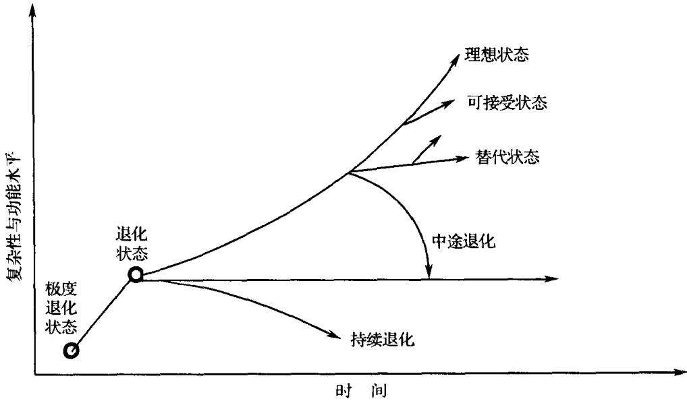

图 2.2 退化生态系统恢复的方向（改绘自 Hobbs & Mooney，1993)  
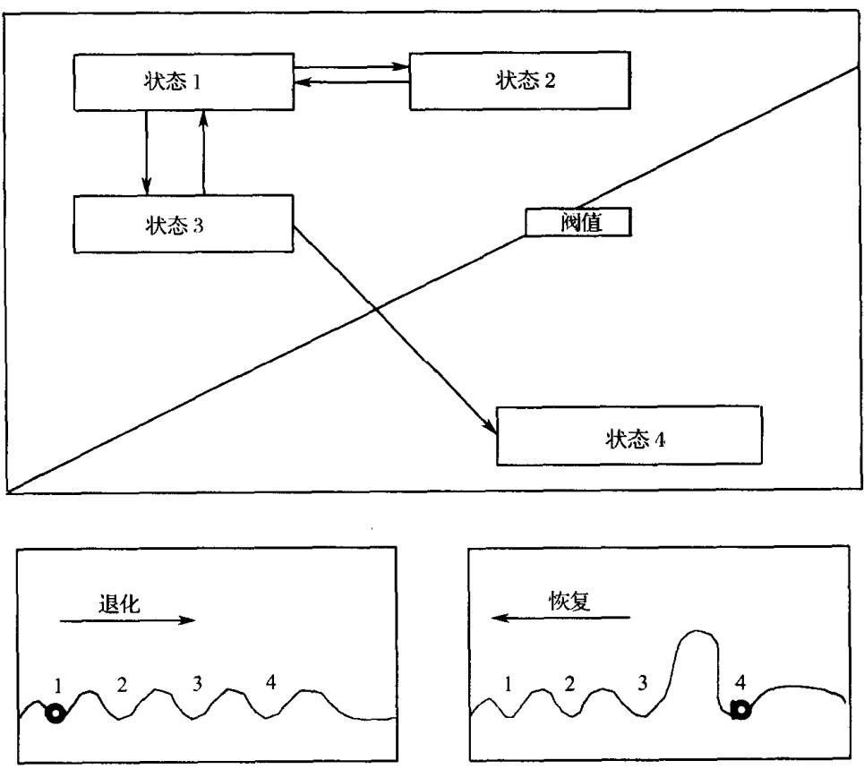  
图 2.3 退化生态系统恢复的临界阈值理论（改绘自 Hobbs & Norton,1996)

## 六、恢复成功的标准

恢复生态学家、资源管理者、政策制订者和公众希望知道恢复成功的标准何在，但由于生态系统的复杂性及动态性却使这一问题复杂化了。通常将恢复后的生态系统与未受干扰的生态系统进行比较，其内容包括关键种的多度及表现、重要生态过程的再建立、诸如水文过程等非生物特征的恢复。

国际恢复生态学会建议比较恢复系统与参照系统的生物多样性、群落结构、生态系统功能、干扰体系、以及非生物的生态服务功能。还有人提出使用生态系统23个重要的特征来帮助量化整个生态系统随时间在结构、组成及功能复杂性方面的变化。Cairns(1977)认为，恢复至少包括被公众社会感觉到的，并被确认恢复到可用程度，恢复到初始的结构和功能条件(尽管组成这个结构的元素可能与初始状态明显不同)。Bradsaw(1987)提出可用如下五个标准判断生态恢复：一是可持续性(可自然更新)，二是不可入侵性(像自然群落一样能抵制入侵)，三是生产力(与自然群落一样高)，四是营养保持力，五是具生物间相互作用(植物、动物、微生物)(Jordan,1987)。Lamd(1994)认为，恢复与否的指标体系应包括造林产量指标(幼苗成活率、幼苗的高度、基径和蓄材生长、种植密度、病虫害受控情况)、生态指标(期望出现物种的出现情况，适当的植物和动物多样性，自然更新能否发生，有适量的固氮树种，目标种出现否，适当的植物覆盖率，土壤表面稳定性，土壤有机质含量高，地面水和地下水保持)和社会经济指标(当地人口稳定，商品价格稳定，食物和能源供应充足，农林业平衡，从恢复中得到经济效益与支出平衡，对肥料和除草剂的需求)。Davis(1996)和Margaret(1997)等认为，恢复是指系统的结构和功能回复到接近其受干扰以前的结构与功能，结构恢复指标是乡土种的丰富度，而功能恢复的指标包括初级生产力和次级生产力、食物网结构、在物种组成与生态系统过程中存在反馈，即恢复所期望的物种丰富度，管理群落结构的发展，确认群落结构与功能间的联结已形成。任海和彭少麟(1998)根据热带人工林恢复定位研究提出，森林恢复的标准包括结构(物种的数量及密度、生物量)、功能(植物、动物和微生物间形成食物网、生产力和土壤肥力)和动态(可自然更新和演替)。

Careher和Knapp(1995)提出采用记分卡的方法评价恢复度。假设生态系统有五个重要参数(例如种类、空间层次、生产力、传粉或播种者、种子产量及种子库的时空动态)，每个一参数有一定波动幅度，比较退化生态系统恢复过程中相应的五个参数，看每个参数是否已达到正常波动范围或与该范围还有多大的差距。Costanza等(1998)在评价生态系统健康状况时提出了一些指标（如活力、组织、恢复力等)，这些指标也可用于生态系统恢复评估。在生态系统恢复过程中，还可应用景观生态学中的预测模型为成功恢复提供参考。除了考虑上述因素外，判断成功恢复还要在一定的尺度下，用动态的观点，分阶段检验(Whisenant & Tongway, 1995; Rapport et al., 1998; Madenjian et al. , 1998)。

如果可能，恢复退化生态系统的终极目标是恢复生态系统的功益。生态系统功益(ecosytem services)是指人类直接或间接从生态系统功能(即生态系统中的生境、生物或系统性质及过程)中获取的利益。恢复退化的生态系统的最终目标是恢复并维持生态系统的服务功能，由于生态系统的服务功能多数不具有直接经济价值而被人类忽略。虽然我们还不知道生态系统退化到什么程度会影响其服务功能，也不了解恢复到什么程度的生态系统才具有服务功能，但是我们还是提出一个生态系统的服务功能框架，希望恢复后的生态系统尽量具有这些服务功能：生态系统的产品(生态系统中生物的全部、部分或产品，它们可为人类提供肉、鱼、果、蜜、谷、家具、纸、衣等)，生物多样性，为人类创造和丰富精神生活和文化生活，自然杀虫，传粉播种，净化空气和水，减缓旱涝灾害，土壤的形成、保护及更新，废物的去毒和分解，种子的传播，营养的循环和运移，保护海岸带，防止紫外线的辐射，以及帮助调节气候等(董全，1999；Constanza et al. ，1997；Daily et al.，1997)。

## 七、生态恢复的时间

全球的土地、植被、农田、水体、草地的自然形成或演替时间是不一样的，而且这种自然的过程一般是漫长的。而退化的生态系统的恢复时间则相对要短些，其恢复时间与生态系统类型、退化程度、恢复方向、人为促进程度等密切相关。一般来说，退化程度轻的生态系统恢复时间要短些；湿热地带的恢复要快于干冷地带。不同的生态系统恢复时间也不一样，与生物群落等恢复相比，一般土壤恢复时间最长，农田和草地要比森林恢复得快些。

Daily(1995)通过计算退化生态系统潜在的直接实用价值(potential direct instrumen-tal value)后认为，火山爆发后的土壤要恢复成具生产力的土地需要3000\~12000年，湿热区耕作转换后其恢复要20年左右(5\~40年间)，弃耕农地的恢复要40年，弃牧的草地要4\~8年，而改良退化的土地需要5\~100年(根据人类影响的程度而定)。此外，他还提出轻度退化生态系统的恢复要3\~10年，中度的10\~20年，严重的50\~100年，极度的200多年。余作岳(1996)、彭少麟(1996)、任海和彭少麟(1998)等通过试验和模拟认为，热带极度退化的生态系统(没有A层土壤，面积大，缺乏种源)不能自然恢复，而在一定的人工启动下，40年可恢复森林生态系统的结构，100年恢复生物量，140年恢复土壤肥力及大部分功能。

## 八、生物多样性在生态恢复中的作用

生态恢复中的一个关键成分是生物体，因而生物多样性在生态恢复计划、项目实施和评估过程中具有重要的作用。在生态恢复的计划阶段就要考虑恢复乡土种的生物多样性：在遗传层次上考虑那些温度适应型、土壤适应型和抗干扰适应型的品种；在物种层次上，根据退化程度选择阳生性、中生性或阴生性种类并合理搭配，同时考虑物种与生境的复杂关系，预测自然的变化，种群的遗传特性，影响种群存活、繁殖和更新的因素，种的生态生物学特性，足够的生境大小：在生态系统水平层次上，尽可能恢复生态系统的结构和功能(如植物、动物和微生物及其之间的联系)，尤其是其时空变化。在恢复项目的管理过程中首先要考虑生物控制(对极度退化的生态系统，主要是抚育和管理，对控制病虫害的要求不高，而对中度退化的生态系统和部分恢复的生态系统则要加强病虫害控制)，然后考虑建立共生关系及生态系统演替过程中物种替代问题。在恢复项目评估过程中，可与自然生态系统相对照，从遗传、物种和生态系统水平进行评估，最好是同时考虑景观层次的问题。因为在景观层次上可以兼顾生境损失、破碎化和退化对生态系统等大尺度的问题。在恢复时可考虑这些因素(Owles & Whelan，1994)。

在生态系统恢复中采用乡土种具有更大的优势，这主要体现在乡土种的更适于当地的生境，其繁殖和传播潜力更大，也更易于与当地残存的天然群落结合成更大的景观单位，从而实现各类生物的协调发展。当然，外来种(外来种是人类有意或无意引入的、非当地原生的物种)在生态恢复中也具有一定的作用。例如，广东省鹤山市在森林恢复过程中，大量栽种从澳大利亚引种的马占相思、大叶相思等外来种作先锋种，利用它们固氮、耐旱、速生等特点进行植被覆盖，等其3\~4年成林后再间种红锥、荷木等乡土种进行林分改造，大大地缩短了恢复时间，并节约了成本(余作岳等，1996)。许多恢复实践表明，外来种可能在一定时间内为当地带来了好的生态和经济效益；但也有许多对当地陆地或水生生态系统产生了巨大的不利影响，这主要是由于外来种与当地的物种缺乏协同进化，若其大量发展，很容易造成当地生态系统的崩溃，很难再恢复或接近到历史状态(Handel，1994)。尤其值得指出的是，在用外来种恢复退化的海岛时，应该注意引进种的捕食者(或植食性动物)的关系，否则会导致当地捕食者或啃食者的消失(Fritts&Rodola，1998)。理想的恢复应全部引进乡土种，而且应在恢复、管理、评估和监测中注意外来种入侵问题，甚至有时候也应关注从外地再引入原来在当地生存的乡土种对当地群落的潜在影响。总之，外来种入侵会造成很多当地植被取代、消失，从而改变原有生态系统，恢复生态学的目标是要用本地种，排除外来种，不能“引狼入室”(Berger，1993)。

## 第五节 恢复生态学理论

恢复生态学的诞生时间还不长，它的学科理论和研究内容还不系统，整个理论框架还有待完善。但通过恢复生态学家的努力，目前已从生态学、地学、经济学和社会学等学科中吸收了一些理论，作为生态恢复理论与实践的指导。

## 一、恢复生态学的研究内容

如前所述，恢复生态学是一门关于生态恢复的学科，它具有理论性和实践性。就目前的理解，恢复生态学的基础理论研究包括：①生态系统结构(包括生物空间组成结构、不同地理单元与要素的空间组成结构及营养结构等)、功能(包括生物功能；地理单元与要素的组成结构对生态系统的影响与作用；能流、物流与信息流的循环过程与平衡机制等)以及生态系统内在的生态学过程与相互作用机制；②生态系统的稳定性、多样性、抗逆性、生产力、恢复力与可持续性研究；③先锋与顶级生态系统发生、发展机理与演替规律研究；④不同干扰条件下生态系统的受损过程及其响应机制研究；⑤生态系统退化的景观诊断及其评价指标体系研究；⑥生态系统退化过程的动态监测、模拟、预警及预测研究；⑦生态系统健康研究。应用技术研究包括：①退化生态系统的恢复与重建的关键技术体系研究；②生态系统结构与功能的优化配置与重构及其调控技术研究；③物种与生物多样性的恢复与维持技术；④生态工程设计与实施技术；⑤环境规划与景观生态规划技术；⑥典型退化生态系统恢复的优化模式试验示范与推广研究(马世骏，1990;章家恩和徐琪，1999)。

## 二、恢复生态学的理论基础

目前，自我设计与人为设计理论(Self-design versus design theory)是惟一从恢复生态学中产生的理论(vanderValk,1999)。自我设计理论认为，只要有足够的时间，随着时间的进程，退化生态系统将根据环境条件合理地组织自己并会最终改变其组分。而人为设计理论认为，通过工程方法和植物重建可直接恢复退化生态系统，但恢复的类型可能是多样的。这一理论把物种的生活史作为植被恢复的重要因子，并认为通过调整物种生活史的方法就可加快植被的恢复。这两种理论不同点在于：自我设计理论把恢复放在生态系统层次考虑，未考虑到缺乏种子库的情况，其恢复的只能是环境决定的群落；而人为设计理论把恢复放在个体或种群层次上考虑，恢复的可能是多种结果(Middleton，1999;Van der Valk, 1999)。

恢复生态学应用了许多学科的理论，但最主要的还是生态学理论。这些理论主要有：限制性因子原理(寻找生态系统恢复的关键因子)、热力学定律(确定生态系统能量流动特征)、种群密度制约及分布格局原理(确定物种的空间配置)、生态适应性理论(尽量采用乡土种进行生态恢复)、生态位原理(合理安排生态系统中物种及其位置)、演替理论(缩短恢复时间，极端退化的生态系统恢复时，演替理论不适用，但具指导作用)、植物人侵理论、生物多样性原理(引进物种时强调生物多样性，生物多样性可能导致恢复的生态系统稳定)、缀块-廊道-基底理论(从景观层次考虑生境破碎化和整体土地利用方式)等等(John-stone,1986;Forman，1995；Middleton,1999;余作岳和彭少麟，1996)。

## 三、恢复生态学与相关学科的关系

恢复生态学的许多理论、方法来源于生物学、地学、经济学、社会学、数学等自然科学，以及工程学、林学、农学、环境学等应用性科学。作为生态学的重要分支，它与生态学的相同点在于它们都以生态学系统为基本单位，且有许多共同的理论和方法，不同点在于，生态学强调自然性与理论性，而恢复生态学更强调人为于涉及应用性。具体地讲，恢复生态学与生态系统健康、保护生物学、景观生态学、生态系统生态学、环境生态学、胁迫生态学、千扰生态学、生态系统管理学、生态工程学、生态经济学等生态学的分支学科有密切的关系。所有这些学科研究中都必须涉及格局与过程，进化与适应等问题(任海等，2000)。

当前国际上兴起的生态系统健康学说与恢复生态学的关系尤其紧密。健康生态系统是指生态系统随着时间的进程有活力并且能维持其组织及自主性，在外界胁迫下容易恢复。生态系统健康的标准有活力、恢复力、组织、生态系统服务功能的维持、最佳管理、外部输入减少、对邻近系统的影响及人类健康影响等8个方面，它们分属于生物物理范畴、社会经济范畴、人类健康范畴以及一定的时间、空间范畴。这8个标准中最重要的是前3个方面。以Costanza和Rapport为代表的生态学家认为人类对生态系统的过度开发利用、物理重建、外来种的引人、自然干扰的改变等导致世界上的生态系统结构发生变化，已不能像过去一样为人类服务，并对人类产生了潜在威胁(Rapport，1998)。生态系统健康主要研究外界胁迫下其反应情况，因而可认为生态系统健康仅是恢复生态学理论基础的一个重要方面，它可用于评价生态系统退化的程度及恢复状态的评估。生态系统健康与恢复生态学针对的对象是不同的。生态系统健康针对自然的和于扰的生态系统，而恢复生态学仅针对干扰后形成的不健康的生态系统。生态系统健康主要强调维持生态系统自身的进程及其为人类服务的功能，而恢复生态学则强调人为促进生态系统恢复，或利用生态工程将生态系统改变为另一类符合人类需求的生态系统。恢复生态学在生态系统开发与保护中起重要指导作用，而生态系统健康主要在保护中起重要作用。

## 四、恢复生态学的发展趋势

恢复生态学的兴起只是10多年的事，还存在不少问题有待解决，这些问题主要是：①生态系统恢复的不可确定性，虽然已提出了许多生态系统恢复的标准，但对于生态系统服务功能的恢复程度尚不知晓；②生态系统恢复要求综合考虑生态、经济和社会因素，但对时间、空间上异质性的生态系统而言实在太难，尤其是有持续干扰时，很难恢复到理想状态：③由于生态系统的复杂性，生态系统退化程度和干扰因子很难简单概括到一些易测定的具体指标，尤其是如何控制干扰很难具可操作性；④生态系统恢复与自然演替是一个动态的过程，有时很难区分两者：⑤生态系统恢复的时间到底要持续多长，目前的科学研究还不能准确回答这个问题，有待于开展可重复的和长期的试验和观测；⑥生态系统恢复的机理还不清楚，尤其是重新引进当地消失的物种、外来种在恢复中的角色还难以正确判断：⑦退化生态系统恢复与重建技术尚不成熟，目前恢复生态学中所用的方法均来自相关学科，尚需形成独具特色的方法体系；⑧恢复生态学的发展需要科学工作者、政府、民众的充分合作，通过互相交流信息、方法和经验，从而可加快恢复全球已退化的生态系统。

## 参考文献

程鸿.1990.中国资源手册. 北京:科学出版社

陈灵芝和陈伟烈主编，1995.中国退化生态系统研究，北京：中国科学技术出版社

国家统计局.1997. 中国统计年鉴．北京：中国统计出版社

刘良梧和龚子同.1994.全球土壤退化评价.自然资源，(1):10\~14

马世骏 主编.1990.现代生态学透视.北京：科学出版社

彭少麟.1997.恢复生态学与热带雨林的恢复.世界科技研究与发展，19(3)：58\~61

曲格平.1984. 中国环境问题及对策．北京：中国环境科学出版社

任海和彭少麟.1998.中国南亚热带退化生态系统恢复及可持续发展。见：陈竺主编生命科学——中国科协第三届青年学术研讨会论文集，北京：中国科学技术出版社，176\~179

任海和彭少麟.1998. 退化生态系统的恢复与重建.青年地理，3(3):7\~11

任海.邬建国.彭少麟和赵利忠.2000.生态系统健康的监测与评估.热带地理,20(4):310\~316

石玉林主编.1992. 开源与节约——中国自然资源与人力资源的潜力与对策.北京：科学出版社

余作岳和彭少麟主编.1997.热带亚热带退化生态系统植被恢复生态学研究，广州：广东科技出版社

中国生态学会主编，1991.生态学研究进展.北京：中国科学技术出版社

中国科协学会部编.1990.中国土地退化防止研究.北京：中国科学技术出版社

中华人民共和国林业部．1996.中国林业资源报告．北京：中国林业出版社

章家恩和徐琪．1999.恢复生态学研究的一些基本问题探讨.应用生态学报，10(1):109\~112

周立三主编.1996. 生存与发展——中国长期发展问题研究．北京：科学出版社

赵跃龙.1999. 中国脆弱生态环境类型分布及其综合整治.北京：中国环境科学出版社

赵桂久，刘燕华，赵名茶等主编.1993.生态环境综合整治和恢复技术研究(第一集).北京：北京科学技术出版社

赵桂久，刘燕华，赵名茶等主编.1995.生态环境综合整治和恢复技术研究(第二集).北京：北京科学技术出版社

Berger J. J. 1993. Ecological restoration and nonIndigenous plant species: a review Restoration Ecology,2(2) : 74\~82

Barrow,C. J. 1991. Land Degradation. London: Cambridge University Press

Cairns, J. et al. eds. 1988. Rehabilitation Damaged Ecosystems. Boca Raton: CRC Press

Chapman, G. P. 1992. Desertified Grassland. London: Academic Press

Cairns,J. Jr. ed. 1992. Restoration of Aquatic Ecosystems. Washington,DC: National Academy Press

Cairns,J. Jr. 1995. Restoration Ecology. Encyclopedia of Environmental Biology,3:223\~235

Cairns,J. Jr. ed. 1977. Recovery and Restoration of Damaged Ecosystems. Charlottesvill: Univcrsity Press of Virginia

Constanza, R. R. & R. Arge & R. Groot. 1997. The Value of The Worlds Ecosystem Services and Natural Capital. Nature,387:253\~259

Daily,G. C. S. & P. R. Alexander & P. R. Ehrlich. 1997. Ecosystem services: Benefits supplied to human societies by natural ecosystems. Issues in Ecology, (3) :1\~6

Daily, G. C.1995. Restoring value to the worlds degraded lands. Science,269:350\~354

Dobson, A. D. , A. D. Bradshaw & A. J. M. Baker. 1997. Hopes for the future: restoration ecology and conservation biology. Science,277:515\~522

Freedman, B. 1989. Environmental Ecology: the Impact of Pollution and Other Stresses on Ecosystem Structure and Function. London: Academic Press

Fritts T. H. & G. H. Rodola. 1998. The role of introduced species in the degradation of island ecosystems: A case history of Guam. Ann. Rev. Ecol. Syst.29:113\~140

Forman,R. T. T. 1995. Land Mosaics. Cambridge: Cambridge University Press

Gaynor, V. 1990. Prairie restoration on a corporate site. Restoration and Reclamation Review, 1(1): 35\~40

Hobbs, R. J. & D. A. Norton 1996. Towards a conceptual framework for restoration ecology. Restoration Ecology, 4(2) : 93 \~110

Harper, J. L. 1987. Self-effacing art: restoration as imitation of nature. In; W. R. III. Jordon, N. Gilpin and J. Aber eds. Restoration Ecology: A Synthetic Approach to Ecological Research Cambridge: Cambridge University Press, 35\~ 45

Jackson, L. L. , D. Lopoukine & D. Hillyard. 1995. Ecological restoration: a definition and comments. Restoration Ecology,3(2):71\~75

Jordan, W. III. , M. E. Gilpin & J. D. Aber. 1987. Restoration Ecology: A Synthetic Approach to Ecological Restoration. Cambridge: Cambridge University Press

Kloor,K. 2000. Restoration ecology: Returning America's forests to their natural' roots. Science,287(5453): 573

Keddy, P. 1999. Wetland restoration: the potential for assembly rules in the service of conservation. Wetland, 19(4) : 716\~ 732

Margaren, F. 1997. Disneyland or native ecosystem: genetics and the restorationist. Restoration and Management Notes, 14 (2):148\~150

Mansfield, B. & D. Towns. 1997. Lessons of the Islands: Restoration in New Zealand. Restoration and Management Notes,15(2): 150\~154

Mitsch, W. J. & S. E. Jorgensen. 1989. Ecological Engineering. New York: John Wiley & Sons

Middleton, B. 1999. Wetland restoration: Flood Pulsing and Disturbance Dynamics. New York: John Wiley & Sons, Inc

Owles , M. B. & C. J. Whelan. 1994. Restoration of Endangered Species: Conceptual Issues, Planning and Implementation. New York: Cambridge University Press. 15\~21

Parham, W. ed. 1993. Improving Degraded Lands: Promising Experience Form South China. Honolulu: Bishop Museum

## Press

Rapport, D. J. ed. 1998. Ecosystem Health. Oxford: Blackwell Science, Inc

Rapport, D. J. , R. Costanza & A. J. McMichael. 1998. Assessing ecosystem health. Trends in ecology and evolution,13: 397\~402

## 第三章 退化森林生态系统的恢复

森林作为陆地生态系统的主体和重要的可再生资源，在人类发展的历史中起着极其重要的作用。然而，由于人口及其需求的无限度增长，导致了有限资源的过量消耗，引起了全球性的资源危机和生态环境的持续恶化。资料表明，在人类初期，全球森林面积占陆地总面积的2/3,达到 $7 6 \times 1 0 ^ { 8 } \mathrm { h m } ^ { 2 }$ ,19世纪中期下降到 $5 6 \times 1 0 ^ { 8 } \mathrm { h m } ^ { 2 }$ ,到1990年则下降到$3 4 \times 1 0 ^ { 8 } \mathrm { h m } ^ { 2 } ( $ (我国目前的森林覆盖率为12.9%)。在森林面积减少的同时，沙漠化正威胁着世界1/3的陆地表面，1977年全球沙漠化土地达 $2 0 \times 1 0 ^ { 8 } \mathrm { h m } ^ { 2 }$ ，并且每年仍有近0.21×$1 0 ^ { 8 } \mathrm { h m } ^ { 2 }$ 土地退化，其中 $0 . 0 6 \times 1 0 ^ { 8 } \mathrm { h m } ^ { 2 }$ 的土地变为沙漠。森林覆盖率锐减恶化了人类的生存环境，并直接或间接地制约了经济的发展(Carns,1982；蔡晓明，1995)。森林恢复已在世界不同地方通过造林实践了许多年，然而只有在近代全面了解天然林的结构、功能与动态的基础上，才有可能系统探讨森林恢复的机理。

## 第一节 森林生态系统退化与恢复机理

森林破坏是导致森林生态系统退化的主要原因。病虫害、干旱、洪涝、地震等自然灾害也会导致森林的退化。

历史上，森林生态系统退化主要是由于人口增多后，人们大量开垦农田种植作物引起。例如在云南和海南等省，山区人民采用刀耕火种的方法开垦农田。在大面积的森林中砍伐一定面积的林地种植旱作物，种1\~2年后弃荒，10年再种旱作物。这种方法由于有一定的间歇期，有利于森林植物物种的保存。但刀耕火种面积过大和频率加快时，很容易造成生物多样性丧失和森林的永久退化。此外，由于森林出产木材，因此，采伐也是导致森林退化的原因之一。在主要林区，由于皆伐、间伐、择伐和重择伐，也会导致森林的退化。尤其是皆伐后林地裸露，很容易退化成灌丛或裸地。

退化的森林生态系统一般生产力减低，生物多样性减少，调节气候作用减弱，调节和涵养水分的作用减弱，贮存生态系统营养元素的能力减弱。一般地讲，森林退化的过程与森林生态系统的逆行演替相似，若干扰较轻，会从顶极逐步退化，若于扰较重，会直接退化到裸地或灌丛阶段。图3.1显示了中亚热带和南亚热带森林生态系统退化的一般过程，而表3.1则显示了南亚热带季风常绿阔叶林恢复过程中结构、功能与动态的变化机理。

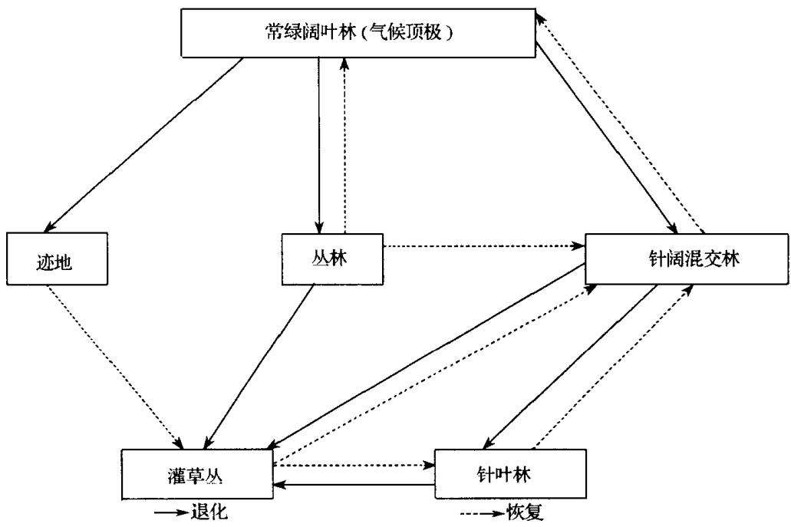  
图3.1 中亚热带、南亚热带生态系统退化的一般过程(仿贺金生，1995)

表3.1 南亚热带季风常绿阔叶林恢复过程机理(仿彭少麟，1996)
<table><tr><td>特征</td><td>恢复早期</td><td>恢复中期</td><td>恢复后期</td></tr><tr><td>种类组成特征</td><td></td><td></td><td></td></tr><tr><td>种类组成数量</td><td></td><td></td><td></td></tr><tr><td>种类数量</td><td>少</td><td>多</td><td>多或较多</td></tr><tr><td>草本植物</td><td>多</td><td>中</td><td>中或少</td></tr><tr><td>灌木植物</td><td>多</td><td>中</td><td>中或少</td></tr><tr><td>乔木植物</td><td>较少</td><td>较多</td><td>多</td></tr><tr><td>林间植物</td><td>少或中</td><td>较多</td><td>较多或多</td></tr><tr><td>阳生性种类</td><td>多</td><td>较多或中</td><td>很少</td></tr><tr><td>中生性种类</td><td>无或少</td><td>中或较多</td><td>多</td></tr><tr><td>耐阴性种类</td><td>无很少</td><td>中或较多</td><td>多</td></tr><tr><td>先锋种类</td><td>很多</td><td>中或较少</td><td>少</td></tr><tr><td>建群种类</td><td>少</td><td>多</td><td>多</td></tr><tr><td>顶极种类</td><td>无或较少</td><td>中</td><td>多</td></tr><tr><td>种类发展速度</td><td>很快</td><td>较快</td><td>慢</td></tr><tr><td>种类组成稳定态</td><td>不稳定</td><td>不稳定</td><td>稳定</td></tr><tr><td>群落结构特征</td><td></td><td></td><td></td></tr><tr><td>垂直空间结构</td><td></td><td></td><td></td></tr><tr><td>冠层分化</td><td>不明显</td><td>较明显、层次较少</td><td>明显、层次多</td></tr><tr><td>径级分化</td><td>不明显</td><td>较明显</td><td>明显</td></tr><tr><td>高度级分化</td><td>不明显</td><td>较明显</td><td>明显</td></tr><tr><td>林间层分化</td><td>不明显</td><td>较明显</td><td>明显</td></tr><tr><td>水平空间结构</td><td></td><td></td><td></td></tr><tr><td>密度发展</td><td>小</td><td>大</td><td>较大</td></tr><tr><td>相对多度</td><td></td><td></td><td></td></tr><tr><td></td><td>小</td><td>较大</td><td></td></tr><tr><td>乔木</td><td></td><td></td><td>大</td></tr><tr><td>灌木</td><td>大</td><td>较大</td><td>中</td></tr><tr><td>草本</td><td>大</td><td>中</td><td>小</td></tr><tr><td>层片分化</td><td>无</td><td>少</td><td>多</td></tr><tr><td>组织结构</td><td></td><td></td><td></td></tr><tr><td>物种多样性</td><td>少</td><td>大</td><td>较大或大</td></tr><tr><td>生态优势度</td><td>大</td><td>较小</td><td>小</td></tr><tr><td>群落均匀度</td><td>小</td><td>较大</td><td>大</td></tr><tr><td>组织结构稳态</td><td>不稳定</td><td>不稳定</td><td>稳定</td></tr><tr><td>种群特征</td><td></td><td></td><td></td></tr><tr><td>分布格局</td><td></td><td></td><td></td></tr><tr><td>群落发生种</td><td>集群分布</td><td>趋于随机分布</td><td>随机分布</td></tr><tr><td>顶极先锋种</td><td>趋于集群分布</td><td>集群分布</td><td>随机分布</td></tr><tr><td>顶极优势种</td><td>随机分布</td><td>趋于集群分布</td><td>集群分布</td></tr><tr><td>顶极一般种</td><td>随机分布</td><td>趋于随机分布</td><td>趋于集群分布或趋</td></tr><tr><td>生态位宽度</td><td></td><td></td><td>于随机分布</td></tr><tr><td>群落发生种</td><td></td><td></td><td></td></tr><tr><td>顶极先锋种</td><td>大</td><td>中</td><td>很小</td></tr><tr><td>顶极优势种</td><td>大</td><td>较大</td><td>小</td></tr><tr><td>顶极一般种</td><td>很小</td><td>中</td><td>大</td></tr><tr><td>数量动态</td><td>很小</td><td>小</td><td>小或中</td></tr><tr><td>群落发生种</td><td>多</td><td></td><td></td></tr><tr><td>顶极先锋种</td><td>少</td><td>少 多</td><td>很少或无</td></tr><tr><td>顶极优势种</td><td>无或很少</td><td>中</td><td>少 多</td></tr><tr><td>顶极一般种</td><td></td><td>少</td><td>中</td></tr><tr><td>种间关系特征</td><td>无</td><td></td><td></td></tr><tr><td>种间联结</td><td></td><td></td><td></td></tr><tr><td>针叶-阳生性种群</td><td>大</td><td>弱</td><td>无</td></tr><tr><td>针叶-中生性种群</td><td>无</td><td>弱</td><td>无</td></tr><tr><td>阳生性-中生性种群</td><td>无或弱</td><td>较大</td><td>大</td></tr><tr><td>生态位重叠</td><td></td><td></td><td></td></tr><tr><td>针叶-阳生性种群</td><td>大</td><td>弱</td><td>无</td></tr><tr><td>针叶-中生性种群</td><td>无</td><td>弱</td><td>无</td></tr><tr><td>阳生性-中生性种群</td><td>无或弱</td><td>较大</td><td>大</td></tr><tr><td>内部共生</td><td>不发达</td><td>一般</td><td>发达</td></tr><tr><td>种间关系的稳态</td><td>不稳定</td><td>较稳定</td><td>稳定</td></tr><tr><td>食物网长度</td><td>短</td><td>较长</td><td>长</td></tr><tr><td>食物网网状</td><td>链状或简单网状</td><td>简单或较复杂网状</td><td>复杂网状</td></tr><tr><td>生物量与生产力的特征</td><td></td><td></td><td></td></tr><tr><td>各组分生物量 总生物量</td><td></td><td></td><td></td></tr><tr><td>根生物量</td><td>较低</td><td>中</td><td>高</td></tr><tr><td>茎生物量</td><td>低 较低</td><td>较高</td><td>高</td></tr><tr><td>枝生物量</td><td>低</td><td>中</td><td>高</td></tr><tr><td>叶生物量</td><td></td><td>中</td><td>高</td></tr><tr><td></td><td>低</td><td>高</td><td>较高</td></tr><tr><td>叶面积指数</td><td>较低</td><td>中</td><td>高</td></tr><tr><td>生物量空间分布</td><td>低</td><td>较高</td><td>高</td></tr><tr><td>乔木层</td><td>高</td><td>中</td><td>较低</td></tr><tr><td>灌木层</td><td>高</td><td>中</td><td>中</td></tr><tr><td>草本层</td><td>高</td><td>中</td><td>较低</td></tr><tr><td>总第一性生产力</td><td>较低</td><td>高</td><td>高</td></tr><tr><td>净第一性生产力</td><td>低</td><td>高</td><td>较高</td></tr><tr><td>生物量增量</td><td>较低</td><td>高</td><td>较高</td></tr><tr><td>光能利用效率</td><td>较低</td><td>较高</td><td>高</td></tr><tr><td>环境特征</td><td></td><td></td><td></td></tr><tr><td>小气候 年均气温</td><td></td><td></td><td></td></tr><tr><td>极端气温</td><td>较高</td><td>下降</td><td>下降</td></tr><tr><td>温度日较差</td><td>恶劣</td><td>较缓和</td><td>缓和</td></tr><tr><td>温度年较差</td><td>大</td><td>中</td><td>少</td></tr><tr><td>年均土温</td><td>大</td><td>中</td><td>少</td></tr><tr><td></td><td>较高</td><td>下降</td><td>下降</td></tr><tr><td>土度日较差</td><td>大</td><td>中</td><td>少</td></tr><tr><td>土度年较差</td><td>大</td><td>中</td><td>少</td></tr><tr><td>林内湿度 光直射与总辐射比</td><td>小</td><td>中</td><td>大</td></tr><tr><td></td><td>高</td><td>下降</td><td>下降</td></tr><tr><td>散射</td><td>低</td><td>增加</td><td>增加</td></tr><tr><td>反射</td><td>多</td><td>减少</td><td>减少</td></tr><tr><td>林内透光 土壤</td><td>多</td><td>下降</td><td>下降</td></tr><tr><td>物理性状</td><td></td><td></td><td></td></tr><tr><td>养分状况</td><td>差</td><td>较好</td><td>好</td></tr><tr><td>含水量</td><td>差</td><td>较好</td><td>好</td></tr><tr><td>pH</td><td>小</td><td>较高</td><td>高</td></tr><tr><td>环境效应</td><td>偏酸或偏碱</td><td>改善</td><td>趋于中性</td></tr><tr><td>径流量</td><td></td><td></td><td></td></tr><tr><td>侵蚀临界雨量</td><td>大</td><td>中</td><td>小</td></tr><tr><td>水土流失量</td><td>大</td><td>较小</td><td>小</td></tr><tr><td></td><td>大</td><td>较小</td><td>小</td></tr><tr><td>地下水位 其他生物群落特征</td><td>低</td><td>较高</td><td>高</td></tr><tr><td></td><td></td><td></td><td></td></tr><tr><td>土壤动物</td><td></td><td></td><td></td></tr><tr><td>发展趋势</td><td>增长</td><td>过渡</td><td>稳定</td></tr><tr><td>小型湿生动物</td><td>少</td><td>中</td><td>多</td></tr><tr><td>生物量</td><td>少</td><td>较多</td><td>多</td></tr><tr><td>物种多样性</td><td>少</td><td>较多</td><td>多</td></tr><tr><td>昆虫</td><td>少</td><td>较多</td><td>多</td></tr><tr><td>乌类 物种多样性</td><td></td><td></td><td></td></tr><tr><td>生物量</td><td>少</td><td>较多</td><td>多</td></tr><tr><td>土壤微生物</td><td>少</td><td>中</td><td>多</td></tr><tr><td>类群数</td><td></td><td></td><td></td></tr><tr><td>生物量</td><td>少</td><td>中</td><td>多</td></tr><tr><td>细菌</td><td>少</td><td>较多</td><td>多</td></tr><tr><td>放线菌和真菌</td><td>少</td><td>中</td><td>多</td></tr><tr><td></td><td>规律不强</td><td></td><td></td></tr><tr><td>呼吸强度</td><td>低</td><td>较高</td><td>高</td></tr><tr><td>土壤酶活性</td><td>低</td><td>中</td><td>高</td></tr><tr><td>时间特征</td><td></td><td></td><td></td></tr><tr><td>经历时间</td><td>短</td><td>较长</td><td>很长</td></tr><tr><td>演替速率</td><td>快</td><td>较快</td><td>慢</td></tr><tr><td>线性程度</td><td>较强</td><td>不强或中</td><td>不强</td></tr><tr><td>演替方向</td><td>多向</td><td>专向</td><td>专向</td></tr><tr><td>景观特征</td><td></td><td></td><td></td></tr><tr><td>景观结构</td><td>多样</td><td>较多样</td><td>趋于均一</td></tr><tr><td>景观斑块</td><td>简单</td><td>较复杂</td><td>复杂</td></tr><tr><td>斑块功能</td><td>弱</td><td>较强</td><td>强</td></tr><tr><td>斑块稳态</td><td>不稳定</td><td>较稳定</td><td>稳定</td></tr><tr><td>综合特征</td><td></td><td></td><td></td></tr><tr><td>稳定性</td><td>差</td><td>较强</td><td>强</td></tr><tr><td>熵</td><td>高</td><td>中</td><td>低</td></tr><tr><td>信息</td><td>小</td><td>中</td><td>大</td></tr></table>

## 第二节 森林生态系统恢复中应注意的问题

在森林恢复过程中，需要综合考虑群落发育过程中的主要因子包括种子传播、竞争、捕食和随机事件，环境变化和胁迫，遗传资源的退化，外来种的入侵等问题。最好是利用景观生态学的缀块-廊道-基底原理。在一个大的区域内，充分利用残存的次生林、风水林或自然保护区缀块，在整个区域内造林形成一个人工森林背景(基底)，在各缀块间营造物种流动的廊道(如设立保护动物的通道，利用动物传播缀块中的乡土种种源；建立人造乡土林带，利用其成熟后的种子传播)。这样经过一定时间的生长演替，整个大区域最终形成一个地带性森林景观。

在自然情况下要使极度退化的生态系统恢复成森林是一个漫长的过程，经世界各地多年实验发现，通过人工造林后，森林发育的一些典型阶段不必经过，可以适当模拟地带性植被的群落结构，采用一步(直接模拟地带性植被结构造林)或二步(先种先锋群落，再间种地带性种类)到位的方法实现森林的尽快恢复。一步到位的恢复时间比较短。从目前实验研究结果看，考虑到成本、成活率等问题，似乎二步到位比较可行。

判定一个森林生态系统的恢复程度，当然可以从结构、功能和动态等方面找出许多指标，但值得指出的是，森林恢复要求有最低数量的成分和最小面积。只有具备足够大的面积，达到地带性植物群落物种数80%以上，具备相似的垂直结构(若可能须含层间植物)，能够维持其更新和演替的森林才能称得上合格的恢复。

虽然目前通过各种方法(如古生物学、孢粉学、植物生态学、土壤学)基本了解了世界各地带的原始植被类型，但到底各地的地带性植被类型是什么样还不能完全确定，尤其是这些森林还处于演替过程和全球变化压力之下，更加剧了这种不完全确定性。因此，想完全恢复地带性植被似乎不可能，只能通过长期的封山育林，通过演替来恢复到相似的顶极阶段。在人工促进森林恢复时，还要综合考虑改善退化生态系统的物理因素、营养元素、种源条件、物种间关系等。

退化林地的恢复不仅是优势种或关键种的恢复，还要注意互惠共生种的恢复。如果生态系统中缺少互惠共生的物种，人为引进是必要的。例如在人工种植针叶树种时，除了考虑立地的物理与化学因素外，还要考虑立地的生物学因素，特别是外生菌根真菌的存在与否。

我国的主要森林类型有寒温带针叶林、温带针阔叶混交林、暖温带落叶阔叶林、亚热带常绿阔叶林、热带季雨林和热带雨林。由于经济条件、速生丰产、适应性等问题的限制，在这些原始森林破坏后，大部分地区种上了非地带性植被中的种类。如海南和广东等地大量营造了桉树，长江以南大量营造马尾松、杉木和湿地松，华北等地大量营造杨树等。但这些森林结构和功能较差，如桉树林易导致林地土壤退化和地下水位下降，松树和杨树易受病虫害侵袭等。在条件许可的情况下应该进行林分改造，间种乡土树种，增加其抗逆性。

## 第三节 次生林的恢复方法

次生林地一般生境较好，或植被刚破坏而土壤尚未破坏，或是次生裸地而已有林木生长，因而其恢复的步骤是按演替规律，人为促进顺行演替的发展。主要方法如下：

封山育林。这是简单易行、经济省事的措施，因为封山育林可为乡土树种创造适宜的生态条件，促使被破坏的林地的林木生长，进而顺行演替为地带性的森林。

林分改造。为了促进森林的快速演替，可对处于演替早期阶段的群落或人工林进行林分改造，引种地带植被中的优势种、关键种，加速顺行演替的速度。

透光抚育或遮光抚育。在南亚热带(如广东)，森林的演替需经历针叶林、针阔叶混交林和阔叶林阶段。在针叶林或其他先锋群落中，对已生长的先锋针叶树或阔叶树进行择伐，促进林下其他阔叶树的生长，使其尽快演替成乡土林。在东北，由于红松纯林不易成活，而纯的阔叶树(如水曲柳等)也不易长期存活，于是有科学家提出了栽针保阔的人工恢复途径，实现了当地森林的快速恢复。这两种方法主要是通过改善林地环境条件，促进演替实现。

## 第四节 天然林的保护

天然林的保护具有重要的作用，一方面它是地带性物种的基因库，另一方面它可为人工森恢复提供样板。天然林的保护主要体现在如下方面。

保护森林生态系统内生物的多样性：保护其基因、物种、种群和生态系统内各种动植物资源及风景美学资源，防止其发生退化，避免基本的生态过程的瓦解。

保持森林生态系统的生产力：生物量的生长率、生态系统的最大承载量、系统内生物再生的能力及其在森林不同发展阶段内的平衡等因素决定了森林生态系统生产力的高低，因而要求尽可能保持天然的生态过程。

保护森林的防护功能：防止土壤的侵蚀和水土的流失，保证自然干扰(火灾、病虫害)和人类活动(如耕地、木材收获和管理)都不能导致对森林生态系统的功能不可接受的损害。

保持森林生态系统的健康和生命力：防止由于人类干扰引起的生态系统不平衡的发展，减少环境污染，使之在森林生态系统承载力范围内能进行自保护、自调整的功能。还应提高系统的稳定性、生命力、更新能力、抵抗力和承载力。

天然林保护的主要指标体系：较高的郁闭度，较好的林种结构、树种结构、林龄结构、径级结构，较大的生产率和最大生产力，保持涵养水源量、土壤肥力增加量和水土保持效益，保持森林的健康(对不良干扰的监界承载力，抵抗病虫害的能力、再生更新能力、生物多样性)，最终实现“森林永续利用”和“森林多效益”(苏喜友，1994;只木良也，1992)。

## 第五节 热带季雨林的恢复实例

## 一、森林恢复样地概况

热带季雨林的恢复实验地位于广东电白县的沿海台地上 $( 1 1 0 ^ { \circ } 5 4 ^ { \prime } 1 8 ^ { \prime \prime } \mathrm { E } , 2 1 ^ { \circ } 2 7 ^ { \prime } 4 9 ^ { \prime \prime } \mathrm { N } )$ 属热带北缘地区。当年均温约23℃，最高温度36.5℃，最低温度4.7℃。年降雨量约1600mm，有明显的干湿季，其中干季的10\~4月雨量占全年的28%，湿季的5\~9月占72%。地带性土壤为砖红壤，地带性植被是热带季雨林。由于近百年的砍伐和开垦，当地原始林已基本消失，水土流失严重，生态环境恶劣。自1959年起建立了一个结构模拟当地地带性植被的人工阔叶混交林。

## 二、森林恢复的方法与步骤

试验地及其周围 $5 0 ~ \mathrm { k m } ^ { 2 }$ 内水土流失非常严重，土壤极度贫瘠。自1959年起，采用工程措施和生物措施分两步进行整治和森林重建。

重建先锋群落(1959\~1964):在光板地上，采取工程措施与生物措施相结合但以生物措施为主的综合治理方法。工程措施包括开截流沟和筑拦沙坝等，生物措施是选用速生、耐旱、耐瘠的桉树、松树和相思树重建先锋群落。通过这一阶段，可以改善恶劣的环境并利于后来植物的生长。在营林措施上采取了丛状密植、留床苗植等方法，提出造林成活率。

配置多层多种阔叶混交林(1964\~1979):在 $2 0 \ \mathrm { h m } ^ { 2 }$ 的先锋群落迹地上，模拟热带天然林群落的结构特点，从天然次生林中引人了桫椤、藜蒴、铁刀木、白格、黑格、白木香、麻棟等乡土树种和大叶相思、新银合欢等豆科外来种种植。混交方式有小块状、带状和行混等。树处配置考虑了阳性与阴性、深根与浅根、速生与慢生、常绿与落叶、豆科与非豆科的种类搭配问题。在土壤贫瘠地方恢复阔叶混交林必须要有一定的营林措施。要用小苗定植提高成活率，要挖大穴施基肥保证成林，幼林成林后要封山育林，避免人为干扰。

## 三、森林恢复后的群落结构

在森林恢复过程中，先后引种了320种植物，分属230属、70个科。数量较多的种类有桫椤、竹节树、藜蒴、铁刀木、白格、黑格、白木香、麻楝、大叶相思、新银合欢等树种10个。

最近的群落调查发现，在 $1 4 0 0 ~ \mathrm { m } ^ { 2 }$ 的样地中出现72个树种。森林群落都可分为乔木层、灌木层和草本层3层。群落外貌浓绿，高度达 $1 2 ~ \mathrm { m } _ { \mathrm { { o } } }$ 乔木层覆盖度达80%，主要种类是红车、樟树、山杜英、鸭脚木、猴耳环、竹节树、黑嘴蒲桃、降真香等。灌木层以九节、黄桅子等占优势，还有鸭脚木、猴耳环等乔木小树，覆盖度为40%。草本层有弓果黍等草本植物，还有一些乔灌木的小苗。鸭脚木、红车、降真香等种类不仅在乔木层生长较好，个体较多，在灌木层和草本层中也有较多的个体。而大叶相思、黑格、桫椤等种类在林下没有更新。因此，在群落的进一步发育过程中，会发生一些种类的更替，红车等适生种类将会逐步取代原来种植物大叶相思等而成为群落乔木层的优势种类。这表明群落在发育过程中，对生态环境有相似需要的种类会逐步生长于同一个高度，从而形成群落的层次。群落层次的形成为使群落生境进一步分化，从而使适应群落生境的新的种类入侵和发展创造了条件，群落利用资源更加充分，群落可以获得更高的生产力，从而使群落向着地带性植被类型方向发展(Tanner,1980)。

群落乔木层、灌木层和草本层的多样性指数分别为2.18、3.01和4.12,均匀度分别为0.64、0.77和0.79,生态优势度分别为0.12、0.10和0.13。彭少麟(1996)研究发现一个较成熟的群落往往具有较高的物种多样性、较高的均匀度和较低的生态优势度，一个具有较高的物种多样性，均匀度和较低的生态优势度的群落并不一定处于最稳定的状态，广东境内的亚热带区域在自然条件下形成的常绿阔叶林的物种多样性指数为4\~5,均匀度为0.7\~0.8,生态优势度为0.08\~0.12。上述数据表明这个人工混交林虽为不成熟的群落，但已处于向顶极群落演替的过程中。

## 四、森林恢复后的功能

生物量和生产力是衡量生态系统恢复程度的基本指标之一。小良光板地的生物量基本上为0，阔叶混交林的三个样地上的地上生物量分别为 $4 6 . 3 3 . 7 2 . 8 8 , 1 1 2 . 5 0 ~ \mathrm { t } / \mathrm { h m } ^ { 2 }$ ,而同地带的天然林约为 $3 5 0 ~ \mathrm { t } / \mathrm { h m } ^ { 2 }$ 。此外，该群落的生产力达 $7 . 6 1 { \sim } 9 . 6 9 \ \mathrm { t } / ( \mathrm { h m } ^ { 2 } { \cdot } \mathbf { a } )$ 。由此可见，退化生态系统恢复后，其生物量与生产力均有较大的增加，而各人工林小于天然林，其主要原因是，人工林层次少，叶面积指数小，而天然林层次多，叶面积指数大，因而要提高人工林生产力，可通过选育光合效益高的树种和种植多层的混交林来实现。

植被恢复后，水土侵蚀会得到控制。光板地的水土侵蚀量为 $5 2 . 3 ~ \mathrm { t } / ( \mathrm { h m } ^ { 2 } \cdot \mathrm { a } )$ ,而人工阔叶混交林仅 $0 . 1 8 ~ \mathrm { t } / ( \mathrm { h m } ^ { 2 } \cdot \mathrm { a } )$ ，基本接近天然林的水土保持能力。据李志安等(1995)对小良造林前后土壤的成分分析表明，植被恢复后土壤的理化性质趋于好转。光板地的土壤肥力有减少的趋势。

经过30余年对混交林和光板地的温湿度比较观测发现，混交林的年均气温、气温年振幅均比光板地的低，而相对湿度和最低湿度均光板地的高。尤其是混交林在造林前的1958\~1959年年均温是23.2年振幅是14.4;造林后的1981\~1982年为23.0,年振幅为13.6;1988\~1989年为22.6年振幅为12.2。这是由于林冠的存在，截留了部分降雨以及进入林内的太阳辐射能量减少，加之林冠层的遮盖作用，阻碍林内外空气的流动，以致林内风速小，乱流作用较弱等，从而出现上述结构。此结果表明热带人工阔叶林的温湿度条件向有利于林木生长的方向发展(余作岳和彭少麟，1997)。

## 第六节 矿区废弃地的植被恢复

开采矿产首先会造成土壤及植被的破坏，进而导致整个生态系统破坏。若不进行人工恢复较难在短时间内生长植物和支持植被生态系统。目前许多国家的矿区自觉或不自

觉地开展了一些废弃地的恢复研究与实践，但由于废弃地的环境条件恶劣，其植被恢复还面临着较多的问题。从生态学角度看，废弃矿地需经过改良后才能恢复植被。

废弃矿地面临的主要生态学问题是表土层破坏，存在限制植物生长的物质，缺乏营养元素，生物资源较差等。针对这些问题，对废弃矿地进行恢复，首先要使土地表面稳固，控制污染，改善视觉感受，对地面稍作处理吸引人们开发，并提高生产力。

在对废弃矿地进行植被恢复时，可遵循如下方法：覆盖土壤，对土壤进行物理处理，添加营养物质，去除有害物质，筛选适宜的先锋植物种类，间种适生的乡土树种。

## 第七节 喀斯特森林及其恢复

喀斯特森林是在森林气候背景上，在可溶性碳酸盐岩上发育的喀斯特地貌上生育的森林。喀斯特森林在我国南部的贵州、云南、广西、广东等地均有分布。在这些省区的喀斯特森林地上，人类活动频繁，皆伐、火烧、毁林开荒、樵采严重，导致了大面积的石化现象，而石化地的森林恢复是非常困难的。

喀斯特森林的生境十分特殊，如岩石露率高，土被不连续，土层浅薄，土壤富钙，偏碱性等。根据小生境的成因和外部形态特征可区分出石面、石缝、石沟、石洞、石槽、土面等6种小生境类型。在贵州茂兰国家级自然保护区(主要保护喀斯特森林)，其石面生境平均为70%左右。喀斯特森林地面贮水能力低，岩石渗漏性强，因而生境中普遍存在不同程度的水分亏缺。由于其土壤浅薄，表征根系的生态空间狭小，土被不连续，表征生态空间的相对离散，因而植物的根系利用各种裂隙在岩层形成巨大的生态空间，以支持树体和获取水分和营养物质。

据研究，我国各省区分布的中亚热带原生性喀斯特森林是常绿阔叶林，主要种类是冬青、朴树、三角枫、圆果化香、香叶树、侧柏等。这些树种的生长缓慢，绝对生长量小但生长量稳定，波动性小，种间、个体间生长过程差异较大。而喀斯特森林的树种较多，各树种的种群较小，主要种群的生态位宽度较窄，这些树种还具有多种途径和方式来适应经常出现的水分亏缺和营养不足(朱守谦，1997)。

基于喀斯特森林的生境和植物群落特征，因而喀斯特森林是动态脆弱的森林生态系统，它只能在环境参数的严格限定的值之内才持续存在，并且将在环境参数或种群值的重大扰乱之下崩溃。自然干扰对喀斯特森林的影响常在系统所忍受的极限之内，而人为干扰，特别是大量砍伐、火烧等则常超出系统的忍受力，导致系统逆转，而这种逆转必然导致生境进一步旱生化，复杂多样的小生境类型向旱生化趋同，生境的严酷性剧增，甚至植物难以立生，形成石漠景观。随植被和生境的退化，植被恢复的难度剧增。

一般地，喀斯特森林地区的水热条件较好，森林砍伐后会留下大量的有性和无性繁殖体，比较容易自然恢复。这是由于在长期进化过程中喀斯特森林树种的无性更新系列占有极重要的地位，它能利用原有母体根系及其贮存营养物质，从而使更新幼体有较强的抗性和耐性。但是，由于喀斯特地区的耕地少，当地居民往往在砍伐后会放火烧山，利用小块土地生产粮食，因而火过地上的无性繁殖性和有性繁殖体均会受到火烧或烤而死亡，从而失去种源，再加上水土流失、生境恶劣，小生境会进一步退化，从而形成石漠化。这种石漠化的地方若要自然恢复，需要数十至上百年，进行人工植树造林的难度非常大，成本太高，目前还没有大面积造林成功的先例。因此，在喀斯特地区，最重要的还是着眼于现有森林的保护，即使进行开发，也应进行择伐，严禁皆伐和火烧。此外，还可改善当地的农业生态环境，使现有林地得到保护，退化的林地自然恢复。

## 参考文献

陈灵芝和陈伟烈.1995.中国退化生态系统研究.北京：中国科学技术出版社

蔡晓明和尚玉昌.1995.普通生态学(下册)，北京：北京大学出版社

彭少麟.1996.南亚热带森林群落动态学.北京:科学出版社

任海.1997. 广东省鹤山市退化坡地重建复合农林业生态模式之研究. 资源生态环境网络研究动态，8(3):12\~15

任海和彭少麟，1998.中国南亚热带退化生态系统植被恢复及可持续发展.见：陈竺主编中国科协第三届青年学术研讨会论文集，176\~179

苏喜友和王悦.1994. 森林资源可持续发展综述.林业资源管理，(2):10\~15

余作岳和彭少麟主编.1997. 热带亚热带退化生态系统植被恢复生态学研究.广州：广东科技出版社

朱守谦.1997.喀斯特森林生态研究(II). 贵阳：贵州科学技术出版社

中国科学院鼎湖山森林生态系统定位研究站，1990.热带亚热带森林生态系统研究．第6集．北京：科学出版社

中国科学院鼎湖山森林生态系统定位研究站，1990.热带亚热带森林生态系统研究．第7集，北京：科学出版社

只木良也等著，唐广仪等译.1992.人与森林，北京：中国林业出版社

Carns,J. J. ed. 1982. The Recovery Process in Damaged Ecosystems. London: Ann Arbor science Press

Parham, W. ed. 1993. Improving Degraded Lands: Promising Experience from South China. Honolulu. Bishop Musuem Press

Tanner, E. V. J. 1980. Litter fall in montane rain forests of Jamaica and its relation to climate. J. Ecol. , 68(3) :833\~ 848

## 第四章 退化草地生态系统的恢复

我国有392万平方公里的草地，约占国土面积的41%，其中北方牧区天然草地近300万平方公里(陈灵芝和陈伟烈，1995)。这些草地在维持我国生态环境中具有重要的作用，而且还具有重要的利用价值。据统计，全球草原上有79种草本植物的种子可作人类的粮食，12种可作蔬菜，6种既可作粮食又可作蔬菜；草原上有300多种植物可作家畜的食物，1种植物可供人类作纤维等原材料；草原上有大量的植物具有药用价值；部分草种(如豆科植物)还可作为土地改良用(National Research Council，1992)。

全球分布着大面积的草地，但草原以干旱和半干旱区为主。北美科学家开始草原恢复研究在20世纪30年代的干旱导致草地退化问题以后，同期欧洲科学家开始研究非洲干旱引起的草原退化问题。草地群落的恢复是恢复生态学最早开展的研究，而且它一直是恢复生态学家关注的对象。这是由于草地恢复试验的尺度小、时间短并且可利用许多传统的农业技术。

## 第一节 草原生态系统退化的原因

草原退化是指草原生态系统在不合理人为因素干扰下，在其背离顶极的逆向演替过程中，表现出的植物生产力下降、质量降级和土壤理化和生物性状恶化，以及动物产品的下降等现象。事实上，草地退化是指一定生境条件下，草地植被与该生境的顶极或亚顶极植被状态下的背离。全世界草原有半数已经退化或正在退化。据农业部统计，20世纪80年代初，中国草地严重退化面积占草地总面积的1/3，鼠害、虫害面积占草地面积的30%。我国北方草原退化面积已达 $8 7 \times 1 0 ^ { 6 } \mathrm { h m } ^ { 2 }$ ，每年还以 $1 . 3 3 \times 1 0 ^ { 6 } \mathrm { h m } ^ { 2 }$ 的速度增加。各类草地产草量近20年来下降30%～50%，牧草质量也大幅度下降(陈灵芝和陈伟烈，1995)。

导致草原生态系统退化的原因主要有不合理放牧、刈割、开垦、樵采、狩猎、开矿和旅游等。由于对草原可持续承载力认识不足，缺乏与草原生态系统和社会发展相协调的放牧体制，家畜数量的过高发展等不合理放牧导致草原退化是首要原因。盲目开垦是导致草原退化和沙化的主要原因(National Research Council，1992)。

此外，我国草地所处的自然条件比较恶劣，夏季少雨、冬季严寒。草地雪灾、火灾、沙尘暴、荒漠化和鼠害等自然灾害频繁，这些自然因素与人工因素相结合，也极易造成草原生态系统退化(周禾，1999)。

建国以来，我国草地牧业发展取得了一定成绩，但由于草地建设未得到应有的重视，建设和管理不善，加之部分地区只靠天养壤，甚至超载放牧，盲目提高草场载畜量，对草地实行掠夺式利用，引起草地退化不断发展。

## 第二节 放牧对草原生态系统的影响

放牧导致的草原生态系统退化一直是草地生态学家关注的问题。Sampson(1919)认为探测过度放牧的有效方法是识别一种植被被另一种植被替代的现象。Tansley(1935)认为放牧可形成一个亚顶极，当解除放牧时，演替又可继续。Dysterhuis(1949)提出了草地放牧的单稳态模式(近似于单元演替理论)。Laycock(1991)则提出了多稳态模式，认为放牧演替中有多个稳态存在。Gibson(1992)认为放牧可改变植被变化的基本模式，而且长期的春秋放牧更接近于改变其演替方向，重牧只是加速了演替过程。Whisenant(1991)发现放牧季节比放牧强度对植物种类成分的变化影响更大。Norton(1978)认为植被变化并不完全由放牧压力引起，植物寿命、植物演替机会和气候等也很重要。总之，当前已认为放牧会导致草原群落中种群配置变化，植物种类成分的消长，植物生活型的分化，层片结构的分异，土壤理化性质的改变等。具体体现在草群中耐牧和适牧植物逐步增多，不耐牧植物减少或消失，草地生产力降低，优质饲草比例下降；但草地生物多样性在适度放牧下最高(孙海群，1999)。

草原生态系统放牧退化的主要原因是不合理的超载过牧和放牧方式对生态系统各组分及其协调关系的破坏，以及对生态系统物质循环能量的衰减。李永宏通过研究放牧对内蒙古典型草原生态系统的影响发现：随着放牧强度的增加，草原植物的物种丰富度下降，但群落的均匀度和多样性指数在中牧地段较高，草原地上生物量显著下降，草群变低，草质变劣，并常有大量的有毒植物出现。随着放牧强度的增加，草原动物也发生协同变化，如退化草原的稀疏低矮植被和开阔生境为一些群聚鼠提供了有利的栖息地，可使群聚型鼠类得到大量的繁衍和扩展，形成鼠害，进一步促进了草原的退化，形成恶性循环。草原土壤理化和生物性状在家畜放牧退化中的特征变化，与草原第一性和第二性生产的变化紧密相关。随着放牧强度的增强，草原表层土壤质地变粗，结构变坏，硬度变大，容重增大，通气性变弱，持水量下降；土壤有机质下降，N、P、K营养元素降低。在重牧下土壤无脊椎动物的群落结构趋于简化，土壤微生物多样性也降低。总之，草原生态系统各组分在放牧影响下才形成一个相互作用，协同变化的整体。因此，对于草原退化应综合考虑各功能组分间的相对变化才能诊断处于某一阶段的退化草原恢复的限制因子。一般地，放牧可以促进草原生态系统的物质循环速率和在群体水平上选择快速生长的物种，因而适当放牧可增加系统的生产力。然而，随着放牧强度的增加和畜产品的大量输出，在没有营养物质输入的情况下，当产品输出带走的营养物质大于系统本身具有的修复和补充能力时，系统的物质循环能量会降低，甚至崩溃。据估算，从草地每运出1吨牛肉，相当于输出26 kg纯N,折合 130 kg的硫酸铵。

## 第三节 草原退化的评估

草原退化的评估包括价值标准和生态指标。

评估的价值标准是：当草原的植物种类仅有26%～50%的顶极群落种类，草原表土开始损失和植被生产力下降10%～50%时，草原已达到退化的阀值，若再不进行恢复努

力，任其退化，很难恢复。

评价的指标包括：地表反射率、暴雨频率、降水量、土壤侵蚀率、盐碱化率、、群落种类、关键种数量、生物量、营养含量、人类干扰、土壤深度、土壤有机质含量、地下水位、家畜产量等。

## 第四节 草地的荒漠化

草原的严重退化包括荒漠化、土壤盐碱化和风沙等问题。荒漠化是指土地的生物潜力破坏并导致其生态环境象荒漠一样(UNFAO,1977)。Dregne(1985)提出了更详细的定义：陆地生态系统在人类干扰下变得贫瘠，生态系统退化过程可用生物量，植物、动物和微生物多样性，土壤退化速率，对人类负影响等评估。即荒漠化是由于气候变化和人类活动等因素所造成的干旱、半干旱和干燥半湿润地区的土地退化(Chapman，1992)。

荒漠化的主要原因是干旱程度增加，人为活动加剧，灌溉管理不当，脱盐碱化过程使土壤肥力下降，水土流失等(见图4.1)(李述刚等，1995)。荒漠化的空间机制是，气候变异加上土地利用变化。从点逐步扩散，家畜圈养，物种替代，管理失策等。

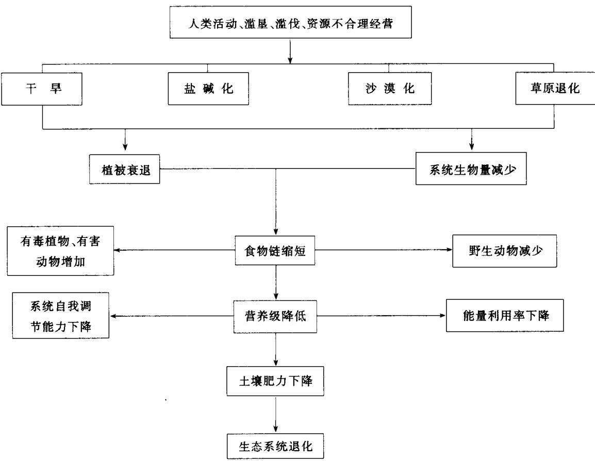  
图4.1 草原荒漠化的过程(仿李树刚，1995)

草原荒漠化的主要物理特征包括植物退化和土壤退化。植被退化是指毁林或破坏草地后，植被的密度、生物多样性下降，这种结构的改变导致生产力下降。土壤退化是指由于风蚀、水蚀、土壤板结和盐碱化等导致土壤物理和化学结构发生变化，不再支持高的植被生产力。干旱气候等加剧这些退化过程。总之，草原荒漠化涉及其土壤和植被等物理性质的时间变化和土地利用类型、干扰强度、不同土地间、土地气候间相互作用的空间变化。

过度放牧只是草原荒漠化的原因之一，另有家畜放养策略不当、过度开垦、灌溉管理落后、毁林等。这些因素均是社会经济问题引起的。若提高放牧人员素质，分阶段圈养、控制放养量、适度开垦和灌溉，则可避免。

## 第五节 草地恢复的方法

恢复草原要求了解草原退化的原因是生物因素、非生物因素还是生物与非生物因素联合作用。恢复进程要求最少或不灌溉，截留雨水，使用乡土种，配置多样性，不用化肥和杀虫剂，健康土地管理，由于草原面积大，可利用遥感监测管理，关注草原的社会经济发展，控制污染。草地恢复中应考虑的主要问题包括：代表性的草种、外来草种、灌木的入侵、新草地上的动物、草地的长期动态。考虑到草种对气候等胁迫反应不一，最好引进遗传多样性高的草种，综合考虑野火在维持草原动态平衡中具重要作用。在热带、亚热带区域可大量种植香根草，技术简单、易活、具长期作用。

草地恢复有两种方法，一种是改进现存的退化草地，另一种是建立新的草地。具体如下：

建立人工草地，减轻天然草地压力。例如青海省果洛州草原站在达日县旦塘区对40多公顷严重退化的草地进行翻耕，播种披碱草后，鲜草产量高达21000kg/hm²，极大地提高了畜牧生产力，同时植被覆盖率的提高起到了防止水土流失的作用。在这一过程中，种草的选择和合理的栽培措施是建植成功的关键(马玉寿，1999)。

利用多年生人工草地进行幼畜放牧育肥。这种方法实行季节畜牧业，在青草期利用牧草，冬季来临前出售家畜，可改变以精料为主的高成本育肥方式，还可以解决长期困扰草地畜牧业高速发展的畜群结构的调整。

建立半人工草地，恢复天然草地植被。主要是通过对草地施肥和毒杂草防除，提高产草量。此外，还应防止和减少自然灾害。

## 第六节 退化草原生态系统的恢复与管理

为了实现草原生态系统的可持续发展，对退化的草原生态系统主要是进行自然恢复和人工恢复重建。由于生态系统具有自我修复能力，在环境条件不变时，只要排除使其退化的因素，给予足够的时间，使其通过演替恢复。对于那些破坏严重，自然恢复比较困难的退化生态系统，可以因地制宜进行松土、浅耕翻等改善土壤结构，增施肥料，补播乡土优良牧草增加植被恢复速率，合理放牧等人工促进恢复(Gaynor,1990)。

对尚未退化的草原进行合理的生态系统管理。防止退化的策略是根据不同的土地类型制订不同的放养策略，尽量利用就地水源，控制家畜承载量，了解植被动态，实行家畜放养动态管理。

## 参考文献

陈灵芝和陈伟烈.1995. 中国退化生态系统研究.北京：中国科学技术出版社

马玉寿． 1999.江河源头草地生态环境现状及恢复途径. 中国草地，(6):59\~61

孙海群.1999.草地退化演替研究进展.中国草地，(1):51\~56

周禾.1999. 中国草地自然灾害及其防治对策．中国草地，(2)：1\~3

Chapman, G. P. 1992. Desertified Grassland. London: Academic Press

Gaynor, V. 1990. Prairie restoration on a corporate site. Restoration and Reclaimation Review,1(1) : 35\~40

National Research Council. 1992. Grasslands and Grassland Sciences in Northern China. Washington DC: National Academy Press

## 第五章 退化农田生态系统的恢复

农业是人类最早开展的生产活动之一，从古到今，随着全球人口的持续增加和扩散，地球上的许多森林被人类改造为农业生产基地。早期由于缺乏工具和农业知识，农业以刀耕火种为主，生产力极低；随着社会的发展，各种农用工具、农业知识和技术、作物品种被广泛利用，人类步入有机农业时代，这一时期农业以施用土杂有机肥为主，生产力较高；第二次世界大战后，西方发达国家和部分发展中国家进入了化学农业(或称石油农业)时期，这一时期以大量投入化肥、农药和机械等高能源投入和高的作物产量为特征；进入20世纪90年代，发达国家认识到化学农业导致了一系列环境和土地退化问题，转而提倡可持续农业，这种农业强调施用有机肥和无环境污染并且可永续利用。据估计，迄今世界各国仍存在大面积的退化农业生态系统，退化农田面积约占农田总面积的4/5(Hoffman，1995；Gliessman，1998；陈灵芝等，1995)。

## 第一节 农田生态系统的退化

农田退化主要是指其土壤理化结构的变化导致土壤生态系统和作物系统功能的退化。正常的农田生态系统处于一种动态平衡状态，系统的结构和功能是协调的，通过系统中能量的流动和物质的循环、水分和养分的平衡来维持负载在其上的生物群落的生产力。但若农田的结构和功能在干扰下发生变化，其结果打破了原有生态系统的平衡状态，使系统的结构和功能发生变化和障碍，形成破坏性波动或恶性循环，使土壤肥力不断下降，相应地，所承载的生产力也下降。农地退化的类型主要有侵蚀化、沙化、石质化、土壤贫瘠化(肥力减退)、污染化等。表土的损失是造成农地功能退化的主要原因。在农田中，形成2.5cm厚的表土，一般需要200\~1000年。表土层厚度的下降，农作物的单位产量大大下降。表土层厚度每下降2.8cm，农作物产量下降7%。

为了养活更多的人口，一个时期以来，各国农业均以追求最高产量和最高利润为目的，各国农业以耕作强度高、单一种植、应用复合肥、灌溉、施用农药控制害虫和杂草、推广高产品种等为特征。由此产生了严重的后果：土地肥力衰减、土壤侵蚀严重、土壤酸化和潜育化严重、土壤微生物种类及数量下降、水的浪费或过度使用、地下水位下降、农药残留等环境污染、农业依赖于人类投入、农业遗传多样性丧失、农业产量失控、全球农业失衡等(Gliessman, 1998)。

由于人类的过度干扰和对土地的过度索取，全球出现了大面积的退化土地，而且面积有增大的趋势。近年来，全球平均每年有 $5 \times 1 0 ^ { 6 } ~ \mathrm { h m } ^ { 2 }$ 土地由于极度破坏、侵蚀、盐渍化、污染等原因，已不能再生产粮食(表5.1)。据统计，目前我国南方2/3以上耕地土壤养分贫瘠，土壤普遍缺氮和有机质，78%的土壤缺磷，58%的土壤缺钾，缺乏的程度尤以侵蚀坡地为重。

表 5.1 全球和陆地范围的人为引起的土地退化(Mhm²)
<table><tr><td>退化形式</td><td>非洲</td><td>亚洲</td><td>拉丁美洲</td><td>北美洲</td><td>欧洲</td><td>大洋洲</td><td>全世界</td></tr><tr><td>水蚀</td><td>227</td><td>440</td><td>169</td><td>60</td><td>114</td><td>83</td><td>1093</td></tr><tr><td>风蚀</td><td>187</td><td>222</td><td>47</td><td>35</td><td>42</td><td>16</td><td>549</td></tr><tr><td>养分衰退</td><td>45</td><td>14</td><td>72</td><td>一</td><td>3</td><td>+</td><td>134</td></tr><tr><td>盐渍化</td><td>15</td><td>53</td><td>4</td><td>十</td><td>4</td><td>1</td><td>77</td></tr><tr><td>污染</td><td>+</td><td>2</td><td>十</td><td>一</td><td>19</td><td>一</td><td>22</td></tr><tr><td>酸化</td><td>2</td><td>4</td><td>一</td><td>+</td><td>+</td><td>一</td><td>7</td></tr><tr><td>压实</td><td>18</td><td>10</td><td>4</td><td>1</td><td>33</td><td>2</td><td>68</td></tr><tr><td>水涝</td><td>+</td><td>+</td><td>9</td><td>一</td><td>1</td><td>一</td><td>11</td></tr><tr><td>降低有机质</td><td>一</td><td>2</td><td>一</td><td>一</td><td>2</td><td>一</td><td>4</td></tr><tr><td>总计</td><td>495</td><td>748</td><td>305</td><td>97</td><td>218</td><td>102</td><td>1965</td></tr><tr><td>受影响的土地面积</td><td>17%</td><td>18%</td><td>15%</td><td>5%</td><td>23%</td><td>12%</td><td>15%</td></tr></table>

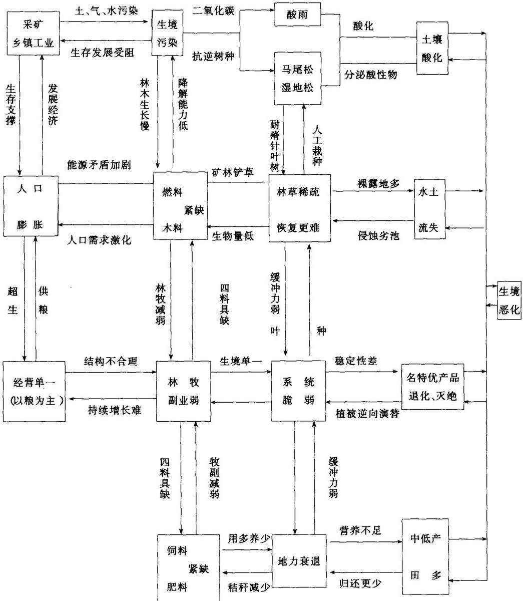  
图5.1 红壤农业生态系统恶性循环示意图(仿王明珠等，1995)

由于区域的经济、生态和社会条件的限制，退化的农田生态系统很容易进入恶性循环（图5.1)。要解决农业生态系统恢复问题，有赖于一定的农业知识、生态知识、技术条件、文化背景、经济水平和人类素质。更具体地说，农田退化生态系统的恢复有赖于土壤、气候、作物、市场、经济条件和农民经验及技术等因素(陈灵芝等，1995)。

农业生态系统的组分多，而且组分间的相互作用复杂，因而导致农业生态系统退化的因素是复杂的。例如，据研究， $1 ~ \mathrm { h m } ^ { 2 }$ 优质农田土壤含有 $1 0 0 0 ~ \mathrm { k g }$ 蚯蚓、150kg原生动物、150kg水藻、1700kg细菌和2700kg真菌，其对植物所需的营养要素起着再循环作用，提供空气和水赖以流通的渠道。土表层通常还有腐烂的树叶和根茎，对动物粪便有分解作用。 $1 ~ \mathrm { h m } ^ { 2 }$ 土地有100t有利于植物生长的各种物质，它们有效地结合在一起将提供农作物所需的95%氮和25%\~50%的磷。如果土壤结构被破坏，则所有这些成分均会受到影响。又如，导致水稻田退化的因素可能包括光、温、水、湿度、蒸发、动物、植物、微生物、土壤、水稻遗传特性、地形、地理位置、火、降水、风、大气、生境异质性等，这些组分在不同时间内有不同的相互作用，形成了一个复杂的等级系统(Hoffman，1995)。

## 第二节 退化农田恢复的程序及措施

退化农业生态系统的恢复程序一般包括：研究当地土地历史，乡土作物，人类活动，土壤特征，以及农用动物、植物、微生物关系，分析退化原因；针对退化症状进行样方试验；进行土壤改良和作物品种改良：控制污染并合理用水；恢复后评估及改进。

不同的退化农业生态系统的恢复措施不同，一般地，弃耕地的恢复相对容易，干旱区农田恢复成本要高于湿润区农田的恢复成本。退化农田的恢复措施大致包括：模仿自然生态系统，降低化肥输入，混种，间种，增加固氮作物品种，深耕，施用农家肥，种植绿肥，改良土壤质地，轮作与休耕，利用生物防治病虫害，建立农田防护林体系，利用廊道、梯田等控制水土流失，秸秆还田等。此外，在恢复干旱及贫瘠农田时可采用渗透技术(Mitsch，1989；彭少麟，1997；任海，1998)。

## 第三节 评估农业生态系统恢复的参考指标

在确定某一农业生态系统退化或恢复程度时，可采用土壤资源特征、水文地理特征、生物特征、生态系统层次特征、生态经济特征和社会文化环境特征等进行评判，不同的农业生态系统类型可选用不同的指标，而且其定量指标不同。这些特征的详细指标如下：

土壤资源特征，可分为长期和短期特征。长期特征：土壤深度(表层土及有机质层深度)、表层土有机质含量及质量、水分过滤及渗透率、矿质营养水平及C:N比、离子交换水平、土壤盐度等。短期特征：年侵蚀率、营养吸收效率、作物必需营养可获性及其库源等。

水文地理特征，可分为农业水利用效率、表面水流和地下水质三部分。农业水利用效率：灌溉水或降雨的渗透率、土壤持水量、侵蚀率、根系层含水量、土壤湿度分布与植物需水的配合度等。表面水流：水的持留、农业化学水平运输、表面侵蚀率、农田保护系统的有效性。地下水质：水在土壤中的运移、营养成分的淋溶、杀虫剂及污染物的淋溶。

生物特征，可分为土壤中和地面两部分。土壤中：土壤中总微生物生物量、土壤微生物生物多样性、土壤生物量的流通率、土壤微生物活动与营养循环、生物营养量、致病微生物的控制、固氮根瘤的结构与功能等。地面上：害虫的多样性与多度、抵御杀虫剂的能力、天敌及益虫的多样性及多度、植物生态位的多样性及重叠、乡土动植物的多样性与多度、病虫害及杂草控制的持续性等(Forman,1995；任海，1998)。

生态系统层次特征：年产量、生产力过程的组分、多样性(结构、功能、垂直、水平、时间）、稳定性、抗逆性、恢复力、外部输入的强度及来源、能源及利用效率、营养循环效率、种群生长力、群落复杂性与相互作用等(Odum，1970)。

生态经济特征：单位农田产值、投资效率、盈利率等。

社会文化环境特征：农场主劳动力和消费者的平衡性、自主性、社会公平性、生态伦理等。

## 第四节 我国农田生态系统退化的问题

## 一、耕地面积锐减

建国初期，我国开荒造田面积超过基本建设 $i \dot { 1 }$ 地面积，耕地面积逐年增加。1957年后，由于土地管理不严，对耕地保护不力，基本建设占用大量耕地，耕地面积逐年减少。据统计，1957\~1977年的20年间，城乡建设占地及因灾废弃耕地等累计减少耕地 $2 9 \times 1 0 ^ { 6 }$ $\mathrm { h m } ^ { 2 }$ ，平均每年减少 $1 . 4 6 \times 1 0 ^ { 6 } \mathrm { h m } ^ { 2 }$ ，扣除开荒造田 $1 7 \times 1 0 ^ { 6 } \mathrm { h m } ^ { 2 }$ ,净减少耕地 $1 2 \times 1 0 ^ { 6 } \mathrm { h m } ^ { 2 }$ 平均每年净减少 $0 . 6 0 \times 1 0 ^ { 6 } \mathrm { h m } ^ { 2 }$ ，年递减率为0.6%。由于人口逐年增长，人均占有耕地面积显著减少，20年间，人均耕地平均每年减少 $3 3 ~ \mathrm { m } ^ { 2 }$ ，年递减率达2.5%。近年来，加强了土地管理，建设占地虽有所减少，但耕地面积几乎仍逐年下降。1990年又比1978年净减少 $3 . 7 1 \times 1 0 ^ { 6 } \mathrm { h m } ^ { 2 }$ ,12年内平均每年净减少 $0 . 3 1 \times 1 0 ^ { 6 } ~ \mathrm { h m } ^ { 2 }$ ，年递减率为0.3%；人均耕地每年平均减少 $1 6 \mathrm m ^ { 2 }$ ，年递减率为1.7%。因此，耕地面积锐减，主要是由于建设占地、劣地退耕和土地损毁造成。

## 二、土壤肥力下降

对耕地的利用，部分地区重用轻养，有机肥投入减少，加上肥料结构不合理，氮磷钾比例失调，严重缺磷、缺钾，导致土壤肥力下降，地力衰退。全国土壤普查结果表明，我国耕地中缺磷土壤面积占59.1%，缺钾面积占22.9%，有机质低于0.6%的土壤面积占13.8%，中低产田面积占耕地面积的79.2%。

## 三、土壤次生盐渍化

对农田不合理灌溉，大水漫灌，有灌无排，洼淀、平原水库、河渠蓄水位高，周边又无截渗排水设施，水稻与旱作插花种植，以及农业技术管理粗放等，导致盐分在土壤表层积累，土壤次生盐渍化面积不断扩大。据“中国盐渍土地资源分布图”资料，我国盐渍土地总面积 $9 9 \times 1 0 ^ { 6 } ~ \mathrm { h m } ^ { 2 }$ ,其中现代盐渍土壤 $3 6 . 9 \times 1 0 ^ { 6 } \mathrm { h m } ^ { 2 }$ ，潜在盐渍化土壤 $1 7 . 3 \times 1 0 ^ { 6 } ~ \mathrm { h m } ^ { 2 }$ 。根据“中国1：100万土地资源图”的统计，全国耕地中存在盐碱限制因素的面积约$6 . 9 \times 1 0 ^ { 6 } ~ \mathrm { h m } ^ { 2 }$ 0

## 四、易涝地面积有所增加

由于近年来，对农田基本建设投入不足，田间工程不配套，防涝标准低，加之一些地方重建轻管，经营管理差，导致全国易涝面积有所增加。据统计1973年易涝面积为 $2 2 \times$ $1 0 ^ { 6 } \mathrm { h m } ^ { 2 }$ ,1988年易涝面积扩大到 $2 4 . 3 \times 1 0 ^ { 6 } \mathrm { h m } ^ { 2 }$ ,增加 $2 . 3 0 \times 1 0 ^ { 6 } ~ \mathrm { h m } ^ { 2 }$

## 五、土地沙漠化

中国土地沙漠化面积 $0 . 3 3 4 \times 1 0 ^ { 6 } \mathrm { k m } ^ { 2 }$ 。其中正在发展中的沙漠化土地占24.2%，强烈发展中的沙漠化土地占18.3%，严重沙漠化土地占10.2%，三者合计占52.7%，约$0 . 1 7 6 \times 1 0 ^ { 6 } ~ \mathrm { k m } ^ { 2 }$ (其中属人类史前形成的沙漠化土地约 $0 . 1 2 \times 1 0 ^ { 6 } ~ \mathrm { k m } ^ { 2 }$ ，近半个世纪形成的现代沙漠化土地面积约 $5 \times 1 0 ^ { 4 } ~ \mathrm { k m } ^ { 2 } )$ ；存在潜在沙漠化危险的土地面积 $0 . 1 5 8 \times 1 0 ^ { 6 }$ $\mathrm { k m } ^ { 2 }$ ，占47.3%。据中国科学院兰州沙漠研究所的资料，我国从20世纪50年代至20世纪70年代土地沙漠化速度为每年增加 $1 5 6 0 ~ \mathrm { k m } ^ { 2 }$ ；而从20世纪70年代到20世纪80年代，土地沙漠化速度已发展到每年增加 $2 \ 1 0 0 \ \mathrm { k m } ^ { 2 } .$ 。土地沙漠化一方面导致了沙尘暴等灾害性天气的形成，另一方面导致了农田被掩埋及生产力衰退等问题。

## 六、水稻土次生潜育化

对水稻田灌排不当，排灌不分开，渠系不配套，串灌、漫灌、深水久灌，使水稻土耕作层下部和作物长期遭受渍害，加上不合理耕作制度和耕作技术，促使土壤经常处于还原状态，导致次生潜育化的发展，土地生产能力降低，产量比正常水稻产量低1倍以上。据调查，现在我国南方诸省潜育化水稻土面积占水田面积的20%\~40%，在 $4 \times 1 0 ^ { 6 } \mathrm { h m } ^ { 2 }$ 以上，东起浙江、福建，西抵云南、贵州、四川，南到广东、广西、海南，往北一直延伸到湖北和河南的南阳盆地，均有相当大的潜育化面积分布。

## 七、土地污染

未经处理的工业“三废”不但恶化了环境，也造成了严重的土地污染，包括水域的污染。主要表现在：工业排放的废气及烟尘中，汞、铅、铬等重金属造成的土地污染， $\mathrm { \& O _ { 2 } }$ 等形成的酸雨使土壤酸化；引工业废水和城市生活污水灌溉农田或废水被雨水冲刷进入耕地，不但恶化土壤，还污染农产品；工业废渣、煤矿生产的煤矸石、城市的垃圾等，对其四周农田的侵埋导致的土地污染；工业等污水直接或间接排入江河湖泊，污染水域，危害鱼类。据有关报道，20世纪80年代初，我国耕地受工业“三废”污染的面积已达 $4 \times 1 0 ^ { 6 } ~ \mathrm { h m } ^ { 2 }$ ,受酸雨危害的耕地达 $2 . 6 7 \times 1 0 ^ { 6 } \mathrm { h m } ^ { 2 }$ ，遍及22个省份。目前全国每天约有 $8 . 6 \times 1 0 ^ { 6 } \mathrm { ~ t ~ }$ 污废水排入渔业水域。此外，农业生产中化肥、农药施用量的增加和使用不当，也造成许多地方因过量的化肥破坏土壤结构和农药残毒污染土地的危害。目前工业“三废”正造成严重的土壤污染，特别是重金属造成的土壤污染； $\mathsf { S O } _ { 2 }$ 等形成的酸雨使土壤酸化，工业废渣、废水经冲刷进入农田，恶化土壤性质。据1990年统计，耕地受工业与农药污染的面积已超过 $1 3 \times 1 0 ^ { 6 } ~ \mathrm { h m } ^ { 2 }$

## 第五节 防止退化的必由之路——可持续性农业

在恢复退化的农业生态系统的同时，还必须实施可持续性农业(表5.2)，避免农业生态系统的退化，以实现区域农业的可持续发展(Gliessman，1998)。

表5.2 自然生态系统、传统农业生态系统与可持续农业生态系统比较
<table><tr><td></td><td>自然生态系统</td><td>传统农业生态系统</td><td>可持续农业生态系统</td></tr><tr><td>生产力</td><td>中等</td><td>低/中等</td><td>中等/高</td></tr><tr><td>物种多样性</td><td>高</td><td>低</td><td>中等</td></tr><tr><td>遗传多样性</td><td>高</td><td>低</td><td>中等</td></tr><tr><td>食物网关系</td><td>复杂</td><td>简单/线性</td><td>复杂/网状</td></tr><tr><td>物质循环</td><td>封闭</td><td>开放</td><td>半封闭</td></tr><tr><td>恢复力</td><td>强</td><td>弱</td><td>中等</td></tr><tr><td>输出的稳定性</td><td>中等</td><td>高</td><td>低/中等</td></tr><tr><td>存在时间</td><td>长</td><td>短</td><td>短/中等</td></tr><tr><td>人类控制</td><td>独立</td><td>完全控制</td><td>半控制</td></tr><tr><td>对输入的依赖性</td><td>低</td><td>高</td><td>中等</td></tr><tr><td>生境的异质性</td><td>复杂</td><td>简单</td><td>中等</td></tr><tr><td>自主性</td><td>高</td><td>低</td><td>高</td></tr><tr><td>灵活性</td><td>高</td><td>低</td><td>中等</td></tr><tr><td>可持续性</td><td>高</td><td>低</td><td>高</td></tr></table>

复合生态系统是可持续性农业的一种，它以多投入、多输出、多时空变化的人工复合生态系统，属生物性再生资源生产体系，具有自养自组织的性质和能力及强烈的自然地域性，与光、热、水、气、土、肥、物种等资源和生产要素都有密不可分的关系。首先，农林植物是初级生产者，是系统能量流动初级驱动力和基础，而家禽、家畜、鱼类的饲料和食用菌的培植则通过草食、肉食和杂食动物以及非绿色植物、微生物的生命活动来实现。加上介乎其间的农副产品利用和加工活动，就成为现代复合农林生态系统的结构框架。图5.2所示复合农林生态系统生物能量流动转化的方向和网络。系统中动物、植物和微生物的寿命长短、体形大小、生育规律、物能耗量、成熟期限等生物学特性及其在系统中的时空位置，又影响它们功能作用的发挥，从而影响到系统整体的经济效益和生态效益。复合农林生态系统的生产力是在能量流动和转化的过程中形成的，转换率越高，经济效益越好。当系统的空间配置合理、时间顺序合理、各组分数量的比例适宜，形成对应的结构联系，使之相互促进、相互利用，将会形成优化稳定和生产力高的体系(彭少麟，2000)。

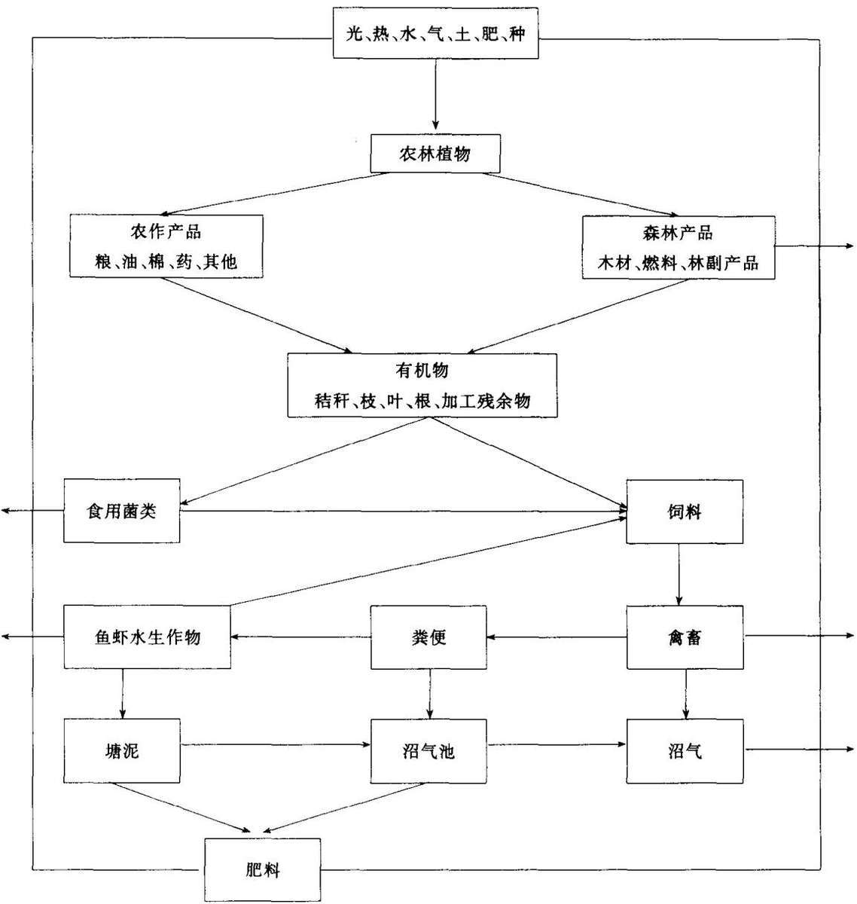  
图5.2 复合农林生态系统能量流动与转化流程图

复合农林生态系统打破了单一的种植结构，形成了农、林、牧、果、草、鱼紧密结合的新格局和新的农业景观，具有多层次和多种类的结构，比单一的农田生态系统更有效地进行能量的多层次和多途径利用，可提高对资源的利用率，并避免农田生态系统的退化，保持其可持续发展。

## 参考文献

陈灵芝和陈伟烈．1995.中国退化生态系统研究．北京：中国科学技术出版社

彭少麟主编．2000.广东退化坡地综合利用及绿色食品生产.广州：广东科技出版社

任海和彭少麟． 1998.退化生态系统恢复及可持续性发展．地理，3(3):5\~12

余作岳和彭少麟.1997.热带亚热带退化生态系统植被恢复研究.广州：广东科技出版社

Forman, R. T. T. 1995. Land Mosaics. Cambridge: Cambridge University Press

Gliessman, S. R. 1998. Agroecology: Ecological Processes in Sustainable Agriculture. Chelsea: Sleeping Bear Press.

Hoffman, C. A. & C. R. Carroll, 1995. Can we sustain the biological basis of agriculture? Annu. Rev. Ecol. Syst, 26: 69\~92

Mitsch, W.J. & S. E. Jorgensen. 1989. Ecological Engineering. New York: John Wiley & Sons

Odum E.P. 1970. The strategy of ecosystem development. Science, 164:262\~270

## 第六章 退化海岛生态系统的恢复

海岛是地球进化史中不同阶段的产物，可反映重要的地理学过程、生态系统过程、生物进化过程、以及人与自然相互作用过程。海岛由于海水的包围而有明显的边界，岛内的生物群体在长期进化过程中形成了自己的特殊动物区系缀块，往往是受威胁种的庇难所(Lugo,1998)。

由于隔离性和受大气环流影响大，海岛生态系统在干扰下极易退化且不易恢复。例如，由于开垦和引人大量的家畜，美国夏威夷群岛1/3的生物消失或面临灭绝，成了美国的受威胁和消失种之都，夏威夷洲政府花了大量的人力、物力和财力，引种了大量的乡土种，但仍有许多种类不能再在此定居(Whittaker,1998)。

## 第一节 海岛恢复概论

岛屿在发展保护生物学理论中占有重要的地位，例如,MacArthur和 Wilson(1967)提出的岛屿生物学理论;Harper(1969)发现草食动物对草本植物的空间竞争会产生影响，进而会增加物种多样性;Botkin(1977)和 Taylor(1984)根据海岛研究提出增加一个捕食者成分能部分稳定植物和大型草食动物间的相互作用。此外，由于更少的种类和易于分离种群，岛屿还常用于测试生物控制项目。但是目前关于海岛恢复的研究还非常少，还没有从海岛恢复试验中总结出一般性的理论(Whittaker,1998)。

海岛有大小，大海岛的生态过程与大陆相似，因而其恢复方法与大陆相似；小的海岛由于与大陆隔离，物种较少，生境缀块小，抵御自然灾害的能力弱，一些生态系统过程不能在小尺度上维持，因而小岛的恢复目前还无成功的先例；中等大小的海岛由一定尺度的景观组成，兼有大陆和海岛的特性，相对于小岛更易恢复，目前中等海岛的恢复在新西兰比较成功。此外，海岛可分为海岸带、近海岸带和岛心三部分，不同部分的恢复策略也不同。

虽然单位面积的海岛的植物群落中的种类明显少于大陆的(小岛更明显)，但海岛植被恢复仍可参考其群落演替过程。Whittaker(1994)等研究了Rakata岛自1883年来的演替过程表明，该岛植物群落演替可分为三个阶段：早期以草本植物和蕨类植物入侵为主，主要传播者是海水、风及另外的因子；中期以草本植物定居为主，主要传播者是动物、海水和风，这表明早期的草本群落为动物扩散提供了适宜的生境；后期有灌木和乔木入侵，主要传播者是动物、风，而海水的传播作用最小，此时该岛植物群落已具备一定结构与功能，可以抵制一定的外来种入侵。在中美洲及大洋洲一些海岛恢复试验过程表明，在恢复初始阶段，必须经常除掉被海水、风等引入的外来草种，否则极易造成植被恢复努力的失败。

海岛的恢复至少是一个群落或生态系统水平的恢复，而不能只限于种群和个体水平，但合适的种群管理可帮助海岛恢复。为了加快恢复，有时可以在原群落中再加入一至二个种群，但一定要小心。例如，人们在新西兰的 Santa Catalina岛引入山羊控制一种杂草，但没想到山羊却将全岛的一种乡土树吃得只剩下7株(Towns，1990)。

## 第二节 海岛的干扰

影响海岛退化的于扰很多，大致可分为毁林、引种不当和自然干扰三类。Lugo(1988)根据干扰对海岛能量流动的影响程度将海岛的干扰现象分为五类：第一类干扰是其能量被海岛利用前能改变海岛能量的性质及量，例如ENSO现象导致的干旱或强降水；第二类是海岛自身的生物地球化学途径，例如地震导致的变化；第三类是能改变海岛生态系统的结构但不改变其基本能量特征，例如飓风的影响，这些干扰过后较易恢复；第四类是改变海岛与大气或海洋间的正常物质交换率，例如大气压改变后影响季风的活动；第五类是破坏消费者系统的事件，例如人类战争对海岛的影响(表6.1)。

表 6.1 海岛的干扰现象(Towns，1990)
<table><tr><td>干扰现象</td><td>类型</td><td>影响面积</td><td>主要影响机理</td><td>持续时间</td><td>周期</td></tr><tr><td>飓风</td><td>3,5</td><td>大</td><td>机制的</td><td>小时－天</td><td>20~30年</td></tr><tr><td>强风</td><td>3-5</td><td>大</td><td>机制的</td><td>小时</td><td>1年</td></tr><tr><td>强降雨</td><td>4</td><td>大</td><td>生理的</td><td>小时</td><td>10年</td></tr><tr><td>高压系统</td><td>1</td><td>大</td><td>生理的</td><td>天-周</td><td>几十年</td></tr><tr><td>地震</td><td>2,5</td><td>小</td><td>机制的</td><td>分钟</td><td>百年</td></tr><tr><td>火山爆发</td><td>1-5</td><td>小</td><td>机制的</td><td>月一年</td><td>千年</td></tr><tr><td>海啸</td><td>3-5</td><td>小</td><td>机制的</td><td>天</td><td>百年</td></tr><tr><td>极低潮汐</td><td>1</td><td>小</td><td>生理的</td><td>小时-天</td><td>几十年</td></tr><tr><td>极高潮汐</td><td>3-5</td><td>小</td><td>机制的</td><td>天-周</td><td>1~10年</td></tr><tr><td>外来种人侵</td><td>2,3</td><td>大</td><td>生物的</td><td>年</td><td>几十年</td></tr><tr><td>人类开发</td><td>1</td><td>小</td><td>生物的</td><td>年</td><td>1~10年</td></tr><tr><td>战争</td><td>5</td><td>小</td><td>机制的</td><td>月一年</td><td>?</td></tr></table>

## 第三节 海岛恢复的限制性因子

海岛与大陆不同，一般由低地和海岸带群落组成，海岛与大陆生态环境的主要不同点是大风及各种海洋性气候带来的附加影响。海岛一般与物种丰富的大陆相隔离，面积较小，有高的边缘/面积比，有独特的地形特征和有限的土壤，土壤中含Cl和Na⁺多，气候变幅小，蒸发量大，更易受到台风等极端气候或自然灾害的袭击，生境多样性少，这些特征产生了海岛有特色的生物适应及营养循环，同时也形成了海岛恢复的限制性因子：缺乏淡水和土壤、生物资源缺乏、严重的风害或暴雨。

海岛一般有大量裸露的岩石，缺乏淡水资源和土壤资源，这样的生态系统一旦破坏，退化生态系统的土壤和水分很难支撑重建或恢复的生态系统过程。

原始的海岛生物资源一般有4个特征：抗盐和抗风的海岸树种常形成一个完整的冠层；群落中有一些大的脊椎动物；海鸟和爬行动物的密度和多样性比较高；由于海岛的种类相对于大陆少，因而其乡土种的生态位更宽些，再加上生态隔离，海岛乡土种的竞争力低于大陆种。海岛的原始生物资源在恢复中具有重要的作用，可以在要恢复的海岛中引入这些种类，并模拟它们在群落中的位置。当然如果缺乏乡土种，亦可引进大陆的一些地带性种类。

风害对于海岛的恢复影响极大，尤其是处于迎风口的退化生态系统的恢复特别难。由于海风的影响，海岛群落的平均高度低于大陆，一些易风折的树种及蒸发量大的地带性树种很难成活。例如，广东南澳岛东半岛东西两个迎风口的原生群落被砍伐后，形成了退化草坡，草坡的土壤理化结构较差，植物种类以阳性和旱生性种类为主，当地政府曾种了大量的树，但至今东面迎风口的植被仍不能恢复。

## 第四节 海岛恢复的利益与过程

海岛恢复的短期利益包括重建生产、生活、生态系统，保护稀有种，避免物种的消失。恢复的长期利益包括重建海岛的生物群落，再现海岛生态系统的营养循环，恢复海岛的进化过程。

一般地，海岛的恢复过程如下：了解海岛退化前的物理、生物、气候、古植物、文化、经济背景；将海岛进行功能分类(表6.2);确定恢复的目标；理解海岛恢复的过程；开发适于海岛恢复的技术(例如，在海边营造防护林，林后营造防护林网，林网内种植作物的防护林网技术，迎风口造林技术，消灭灾害性草食动物技术等)；制订海岛恢复计划并实施；改造生境并引入适宜的乡土种；海岛恢复后的管理。此外，在海岛恢复过程中还可开展淡水再利用、风能发电、生态旅游等活动，以配合海岛恢复活动。

表 6.2 海岛的功能分类(Towns，1990)
<table><tr><td></td><td>基本无干扰海岛</td><td>物种避难海岛</td><td>需恢复的海岛</td><td>可开放的海岛</td><td>多用途海岛</td></tr><tr><td>保护功能</td><td>保护乡土种及群 落，特别是大陆有 的群落</td><td>保护乡土种及群 落，包括所有的群 落</td><td>恢复濒危种群和 特殊的群落</td><td>保护乡土种及及 其生境上没的种</td><td>保护和加强经选 择的物种和群落</td></tr><tr><td>分类标准</td><td>乡土种丰富，没有 引人动物，大量乡 土种生境，基本无 人干扰各种大小</td><td>大陆与海岛乡土 种均丰富，引人少 量动物，生境丰 富，适度干扰各种</td><td>需恢复濒危种的 生境，海岛被人类 严重改变，各种大 小的海岛</td><td>稀有种和濒危种 的潜在生境有游 客等人类干扰</td><td>以农业林业和旅 游业为主，大多被 人类严重干扰</td></tr><tr><td>保护行动</td><td>海岛 防止动植物引人， 防止非法参观和 火灾</td><td>大小海岛 防止动植物引入， 防止非法参观和 火灾</td><td>防止动植物引入， 防止过多参观和 火灾</td><td>防止动植物引人， 防止过多参观和 火灾</td><td>依生产活动而定</td></tr><tr><td>恢复行动</td><td>严格保护生境限 制部分种类的扩 散，利用大陆种恢 复</td><td>严格保护生境保 护部分区域</td><td>保护恢复位点重 建消失群落</td><td>保护历史文化价 值，用乡土扩大稀 有种群改善生境</td><td>控制滥用持续利 用种恢复</td></tr><tr><td>科普活动</td><td>监测变化，确定生 物价值</td><td>部分监测变化，确 定生物价值</td><td>试验恢复方案</td><td>试验开发方案控 制科普观光</td><td>生活与生产</td></tr></table>

## 第五节 海岛恢复中的注意事项

在恢复被外来种占据的海岛的乡土种时，种的生活史特征研究非常重要，因为海岛上的引进种缺乏植物、动物和微生物间的协同进化，很难成活；恢复和维持退化海岛的水分循环与平衡过程较大陆退化生态系统更重要；引种不当时，新入侵的外来种由于缺乏病虫害和捕食者，会很容易地控制全岛，形成生态灾难；由于隔离性，海岛的遗传多样性一般较少，恢复时可尽量增加海岛物种的遗传多样性，以增加海岛生物抗逆性的潜力；严格控制动物引进，防止动物失控(例如，澳大利亚引人的兔子繁殖太快，大量啃食草资源，减少了羊的饲料，严重影响到澳大利亚的羊毛产量)；如果可能的话，尽量选择附近无人干扰的岛屿作参考，而且最好是将这些无人干扰的海岛设立为自然保护区。此外，最关键的是要选择好适生的关键种，因为关键种数量大，控制了群落的能流，会改变整个海岛生态系统的结构、功能和动态，是组成新的生境的重要成分，而且会修饰现存的生境。例如，在海岛的无林地带植造一片新的森林，这片新的森林可能会影响乡土植物种类的定居及扩散，也可能为一些低密度的害虫提供适生环境，还可能会影响土壤质量等。

## 第六节 实例研究——广东南澳岛的植被恢复

我国有6691个岛屿，大部分的海岛植被受自然和人为干扰破坏后有不同程度的退化。如广东的海岛森林破坏后，植被退化形成的灌草丛面积达 $5 1 7 7 0 \mathrm { h m } ^ { 2 }$ ，占全省海岛陆地面积的32.5%。植被是海岛生态系统的主体，对于维持海岛生态系统的稳定和发展以及保护海岛环境有着重要的作用。海岛退化生态系统的存在制约了海岛环境的改善，限制了海岛经济和社会的可持续发展，因此，开展海岛植被恢复研究对于海岛的建设和发展具有迫切性和重要性(广东省海岛资源综合调查大队，1995)。本节主要论述南澳岛植被恢复过程中的生态特征。

## 一、南澳岛概况

南澳岛位于广东省汕头市南澳县，北纬 $2 3 ^ { \circ } 2 3 ^ { \prime } 3 3 ^ { \prime \prime } { \sim } 2 3 ^ { \circ } 2 9 ^ { \prime } 1 1 ^ { \prime \prime }$ ,东经 $1 1 6 ^ { \circ } 5 6 ^ { \prime } 2 4 ^ { \prime \prime } \sim$ $1 1 7 ^ { \circ } 0 8 ^ { \prime } 5 9 ^ { \prime \prime }$ ,面积约 $1 0 5 . 2 3 9 ~ \mathrm { k m } ^ { 2 }$ ，是临近大陆的海岛。南澳岛为南亚热带海洋性气候，年均日照时数 2301 h,年均总辐射量为 $5 4 1 6 ~ \mathrm { M J / ( m } ^ { 2 } \cdot \mathrm { a } )$ ，年均温21.5℃，年降水量为1350.9mm,其中夏半年(4\~9月)降水量约占全年80%，年均相对湿度78%。年均蒸发量达2045.6mm。此外，南澳岛年均大风(风力>8级)日数超过80天，平均每年还受5.6个热带气旋影响(广东省海岛资源综合调查大队，1995)。

南澳岛的地带性土壤是赤红壤，在海岸还分布有少量滨海砂土、滨海盐土和水稻土。地带性典型植被是热带季雨林型的常绿季雨林。由于长期人为活动干扰，其原生植被已不复存在，现状植被包括针叶林、竹林、经济林、防护林、次生林、灌草丛、草本沙生植被以及沼生植被等类型，分布面积较大的植被类型是马尾松林、台湾相思林及两者混交林。由于风水或宗教原因仅在村边或庙旁等局部地段残存有小面积的次生林。

1996年在南澳岛选出8个群落建立样地 $( 1 0 ~ \mathrm { m } \times 1 0 ~ \mathrm { m } )$ ，样地概况如表6.3。群落1为草坡，群落2\~4为马尾松林，因有不同程度的阔叶树种入侵而成为混交林；群落5为台湾相思林；群落6\~8为次生林类型。人工林群落2、3的年龄约为10年，群落4、5的年龄约为15年。群落1在历史上是森林，后经砍伐和反复的人为干扰，退化为草坡；群落2\~5造林前均为草坡，其生境和群落结构与草坡相似；群落6\~8均为天然林被择伐后长期封山育林而成。根据前人的研究，结合对当地居民的访问可知，南澳岛的植被恢复过程包括草坡、先锋群落、近顶极群落等阶段。由于该岛不大，海拔也不高，生境基本相似，已营造的多种人工林林下均出现相同的乡土树种，因而最终该岛各种人工林将趋于向同一顶极演变(陈树培，1994)。因而采用时空互代的方法，把南澳岛森林干扰破坏后形成的退化草坡、人工造林后形成的马尾松林、台湾相思林及其混交林，以及保存较好的次生林构建成一个南澳岛植被恢复的空间系列，研究其恢复过程与机理。

表 6.3 群落基本情况
<table><tr><td>群落</td><td>1</td><td>2</td><td>3</td><td>4</td><td>5</td><td>6</td><td>7</td><td>8</td></tr><tr><td>群落名称</td><td>坡柳-纤 毛鸭嘴 草、光高 粱群落</td><td>马尾松- 桃金娘- 芒萁群落</td><td>马尾松、 台湾相思 -黑面神- 光高粱群 落</td><td>马尾松、 台湾相思 -黄栀子- 扇叶铁蕨 群落</td><td>台湾相思 -珊瑚树- 短叶黍群 落</td><td>降真香- 箬竹-亮 叶猴耳环 群落</td><td>鸭脚木- 朱砂根- 阔叶沿阶 草群落</td><td>鸭脚木、 珊瑚树- 九节-乌 蕨群落</td></tr><tr><td>群落高度/m</td><td>0.8</td><td>6.0</td><td>6.0</td><td>10.0</td><td>13.0</td><td>12.0</td><td>9.0</td><td>9.0</td></tr><tr><td>海拔/m</td><td>110</td><td>420</td><td>190</td><td>170</td><td>370</td><td>400</td><td>15</td><td>320</td></tr><tr><td>地形</td><td>低丘</td><td>低山</td><td>低山</td><td>低山</td><td>低山</td><td>低山</td><td>低丘</td><td>低山</td></tr><tr><td></td><td>下部</td><td>中部</td><td>下部</td><td>下部</td><td>中部</td><td>中部</td><td>下部</td><td>中部</td></tr><tr><td>坡向</td><td>SE</td><td>E</td><td>NW</td><td>NE</td><td>NE</td><td>1</td><td>NW</td><td>SE</td></tr><tr><td>坡度</td><td>30 坡柳</td><td>10 马尾松</td><td>8 马尾松</td><td>10 台湾相思</td><td>15 台湾相思</td><td>1 降真香</td><td>10 鸭脚木</td><td>15 鸭脚木</td></tr><tr><td>主要种类</td><td>羊角拗 纤毛鸭嘴 草 光高粱 野香茅 鹧鸪草</td><td>亮叶猴耳 环 桃金娘 台湾相思 芒萁</td><td>台湾相思 鸭脚木 黑面神 光高粱 野香茅</td><td>马尾松 鸭脚木 亮叶猴耳 环 扇叶铁线 蕨</td><td>小叶榕 珊瑚树 胶樟 短叶黍</td><td>五月茶 尾叶山茶 假苹婆 珊瑚树 亮叶猴耳 环 小叶胭脂</td><td>朴树 胶樟 牡荆 山石榴 朱砂根</td><td>珊瑚树 假苹婆 土密树 野漆 九节 乌蕨</td></tr><tr><td>群落类型</td><td>草坡</td><td></td><td></td><td>马尾松林</td><td></td><td>箬竹 台湾相思林</td><td></td><td>次生林</td></tr></table>

## 二、南澳岛植被恢复过程中的群落结构变化

南澳岛植被恢复过程中群落种类变化规律不明显。最明显的规律是草坡基本无乔木，且以阳生性灌木和草本为主；人工林经过15年左右的发育，已经有较多的阔叶树种侵人，并在乔木层，灌木层和草本层中占有较大的优势，而马尾松和台湾相思种群在群落下层没有幼树，将成为衰退的种群；而次生林中以乡土树种和耐荫树种为主。

人工林乔木层的个体密度高于次生林的，人工林灌木层的个体密度低于次生林的，草本层的个体密度没有明显规律。人工林乔木层密度较高的原因是由于上层乔木层郁闭度较小，因此群落中有较充足的阳光，为下层乔木的生长提供较好的能量环境，一些阳性种类获得较好生长(如桃金娘达154株)。森林群落除群落4、8外，乔木层的个体密度均高于灌木层，这是由于乔木层的迅速生长和高的个体密度从能量和空间对灌木层种类的限制。而这些群落的草本层的个体密度较高，这可能与草本层种类的生物学、生态学特性有关。退化草坡的个体密度高是由于群落结构简单，透光强，因此适合那些光照强、干旱环境的阳性、旱生种类如坡柳、黑面神、山芝麻、羊角拗、纤毛鸭嘴草、鹧鸪草等的生长，而且它们的个体所占空间较小，因而个体密度大。个体密度分析表明南澳岛植被恢复过程中，其人工林群落正处在一个迅速发展的阶段。

南澳岛退化草坡群落只有灌木层和草本层2层，而其他7个森林群落，皆有乔木层、灌木层和草本层3层，其乔木层又可分为2个亚层。从人工林乔木层的主要种类看，除了马尾松和台湾相思外，其他阔叶树种如亮叶猴耳环、鸭脚木、假苹婆、珊瑚树、胶樟等次生林中有分布的种类，不仅在乔木层上层生长较好，在下层中也有较多的个体，因此，在群落的进一步发展过程中，这些种类将会逐步成为群落的优势种类，从而使群落向着地带性植被方向发展。这也说明南澳岛植被从退化草坡经人工针叶林、针阔叶混交林到阔叶林的发展过程，群落的层次不断增加，各组成种类和个体在各层次的分化更加明显，从而使群落更有效地利用资源。

群落组成结构通常是指群落的物种组成、群落均匀度和群落的生态优势水平。一般地，一个较成熟的群落往往具有较高的物种多样性、较高的均匀度和较低的生态优势度，一个具有较高的物种多样性、均匀度和较低的生态优势度的群落并不一定处于最稳定的状态。广东境内的亚热带区域在自然条件下形成的常绿阔叶林的物种多样性指数为4\~5,均匀度为0.7\~0.8,生态优势度为0.08\~0.12(彭少麟，1996)。根据有关公式(彭少麟，1996)计算南澳岛植被恢复过程中8个群落的组成结构，按乔木层、灌木层和草本层分层计算的结果如表6.4。

表 6.4 各群落的组织水平结构
<table><tr><td rowspan="2">群落</td><td colspan="3">物种多样性</td><td colspan="3">均匀度</td><td colspan="3">生态优势度</td></tr><tr><td>乔木层</td><td>灌木层</td><td>草本层</td><td>乔木层</td><td>灌木层</td><td>草本层</td><td>乔木层</td><td>灌木层</td><td>草本层</td></tr><tr><td>1</td><td>1</td><td>3.08</td><td>2.03</td><td>1</td><td>0.77</td><td>0.47</td><td>1</td><td>0.17</td><td>0.27</td></tr><tr><td>2</td><td>1.69</td><td>3.32</td><td>3.57</td><td>0.44</td><td>0.97</td><td>0.99</td><td>0.53</td><td>0.05</td><td>0.06</td></tr><tr><td>3</td><td>3.26</td><td>3.04</td><td>3.92</td><td>0.82</td><td>0.89</td><td>0.90</td><td>0.13</td><td>0.13</td><td>0.08</td></tr><tr><td>4</td><td>3.12</td><td>3.75</td><td>3.87</td><td>0.78</td><td>0.86</td><td>0.82</td><td>0.18</td><td>0.10</td><td>0.10</td></tr><tr><td>5</td><td>3.32</td><td>2.50</td><td>3.06</td><td>0.79</td><td>0.99</td><td>0.80</td><td>0.12</td><td>0.07</td><td>0.17</td></tr><tr><td>6</td><td>2.23</td><td>3.03</td><td>2.48</td><td>0.54</td><td>0.87</td><td>0.59</td><td>0.40</td><td>0.13</td><td>0.36</td></tr><tr><td>7</td><td>3.02</td><td>2.12</td><td>3.11</td><td>0.82</td><td>0.80</td><td>0.70</td><td>0.17</td><td>0.24</td><td>0.12</td></tr><tr><td>8</td><td>2.90</td><td>2.50</td><td>2.11</td><td>0.87</td><td>0.65</td><td>0.65</td><td>0.21</td><td>0.21</td><td>0.21</td></tr></table>

从乔木层、灌木层、草本层和整个群落看，人工林(群落2\~5)的物种多样性和均匀度均稍高于次生林(群落6\~8)的，而生态优势度则稍低。这可能是由于人工林各群落处于恢复早期，有较多植物种类迅速生长的原因。在人工种植马尾松、台湾相思后，植被得到良好保护，大量阳性种类入侵，它们在较低的郁闭度下可获得充足的资源而生长。但随着群落发育，郁闭度增加，群落内的水环境不断改善，一些中生性种类开始在群落中生长。从总体上看，人工林中入侵的阔叶树种未占有明显优势而成为群落各层次的优势种群，因而在植被恢复早期阶段的各人工林群落，其物种组成较多，但优势度则较低。上述数据还表明南澳岛这些次生林均为不成熟的群落，还在处于向顶极群落演替的过程中。

## 三、南澳岛植被恢复过程中的生物量变化

据同期进行的生物量测定表明，群落1\~8的生物量分别是4.81 t/hm²、49.55t/hm²、$4 0 . 8 1 ~ { \mathrm { t } } / { \mathrm { h m } } ^ { 2 } ~ , 9 1 . 0 2 ~ { \mathrm { t } } / { \mathrm { h m } } ^ { 2 } ~ , 1 0 9 . 3 6 ~ { \mathrm { t } } / { \mathrm { h m } } ^ { 2 } ~ , 7 0 . 2 9 ~ { \mathrm { t } } / { \mathrm { h m } } ^ { 2 } ~ , 9 8 . 0 8 ~ { \mathrm { t } } / { \mathrm { h m } } ^ { 2 } ~ , 9 6 . 6 4 ~ { \mathrm { t } } / { \mathrm { h m } } ^ { 2 } \leq 3 0 . 1 0 ~ { \mathrm { t } } / { \mathrm { h m } } ^ { 3 } ~ ,$ 从上述结果可看出，南澳岛植被在人为干扰破坏后形成的退化草坡的生物量较低，仅$4 . 8 1 ~ \mathrm { t } \mathrm { \cdot } \mathrm { \hbar } \mathrm { m } ^ { 2 }$ ，低于同地带的鹤山的退化草坡的生物量 $( 1 1 . 3 0 ~ \mathrm { t } / \mathrm { h m } ^ { 2 } )$ ，说明海岛森林植被破坏后，在海岛特殊环境的影响下，植被退化的后果更为严重。而经人工种植马尾松和台湾相思，并在良好保护的环境下，植物群落生物量迅速发展，约10年的时间，人工林的生物量已达到平均 $4 5 . 1 8 ~ \mathrm { t } / \mathrm { h m } ^ { 2 }$ ，而当地次生林群落生物量平均为 $8 8 . 3 4 ~ \mathrm { t } / \mathrm { h m } ^ { 2 }$ ,人工林生物量达到次生林生物量51%的水平；群落5经过15年时间，平均生物量达到 $1 0 0 . 3 9 ~ \mathrm { t } / \mathrm { h m } ^ { 2 }$ 的水平，稍高于当地次生林的生物量。各群落的生物量变化反映出南澳岛植被恢复过程生物量发展的速度较快。同时也说明南澳岛植被破坏后采用人工造林的方式恢复海岛森林植被，对于海岛退化生态系统的生物量恢复有着重要的意义。

同期研究还表明.这8个群落的叶面积指数(LAI)也有明显的不同。退化草坡(群落1)的最小，仅1.04,10年生人工马尾松林(群落2\~3)平均为3.81,15年生的人工林(群落5\~6)的平均为5.89，比退化草坡的明显增加，而次生林(群落6\~8)的LAI最大，平均为6.52。由此可看出南澳岛植被恢复过程LAI变化是逐渐增大的。与同地带的顶极植被群落，鼎湖山季风常绿阔叶林的LAI(17.76)相比较(彭少麟等，1996)，南澳岛次生林的LAI(6.52)要小得多。事实上，后者无论从群落的种类组成或是群落层次结构，都比前者更为简单，因此，从LAI也反映出南澳岛的次生林仍处在发展的早期阶段。

不同年龄人工林群落生物量的差异与群落发展过程组成种类、空间结构的发展变化有关。10年生的马尾松人工林群落的层次较为简单，群落的高度较低，叶面积指数较小，对能量的利用少，而15年生的马尾松人工林群落的层次结构进一步分化，群落的其他种类与10年生的群落有较大的变化，群落的高度更高，叶面积也较大，对能量利用多，因此，群落的生物量随之增大。从群落的先锋树种看，不同的先锋树种发展起来的群落的组成种类以及群落的生物量也有明显的差异。以台湾相思为优势的15年生群落5的生物量达 $1 0 9 . 3 6 ~ \mathrm { t } / \mathrm { h m } ^ { 2 }$ ，台湾相思种群的生物量为 $6 0 . 3 7 ~ \mathrm { t } / \mathrm { h m } ^ { 2 }$ ，占群落生物量 55.2 %，而 15年生的马尾松群落4的生物量为 $9 1 . 0 2 \mathrm { \ t } / \mathrm { h m } ^ { 2 }$ .马尾松种群的生物量占该群落生物量24.42%，可以看出台湾相思比马尾松对群落的迅速发展有着更好的作用。从而说明用于植被恢复的先锋树种对植被恢复的群落组成、群落的叶面积、生物量和生产力有较大的影响。

## 四、南澳岛植被恢复过程中凋落物现存量变化

这8个群落的凋落物现存量中，退化草坡(群落1)的最少，仅0.42t/hm²，马尾松林和台湾相思林(群落3\~5)的明显增加，10年生和15年生的马尾松林群落分别为3.20$\mathfrak { t } / \mathrm { h m } ^ { 2 }$ 和 $3 . 7 0 \mathrm { t } / \mathrm { h m } ^ { 2 }$ ，15年生的台湾相思林群落为 $2 . 4 3 \mathrm { ~ t } / \mathrm { h m } ^ { 2 }$ ,而次生林(群落6\~8)的最大，平均为 $4 . 9 0 \ \mathrm { t } / \mathrm { h m } ^ { 2 }$ 从这些群落凋落物贮量的变化可以看出南澳岛植被恢复过程群落凋落物现存量是逐渐增加的。降雨时，按1t的凋落物吸收3t的水分计(任海等，1998)，退化草坡上每公顷的凋落物平均可吸收的降水仅约1.26t,人工林群落的凋落物平均可吸收约8.31 t的降水，而次生林群落的凋落物平均可吸收约14.7 t的降水。在南澳岛植被恢复过程，由于群落的发育而产生的越来越厚的凋落物层对于减少暴雨对土壤的直接冲击和减少地表径流从而减少土壤侵蚀，提高土壤肥力的能力是逐渐增强的，次生林在这方面的作用更加强大。反映出南澳岛植被恢复对于防止土壤退化和加快土壤恢复有着根本的意义。

## 五、南澳岛植被恢复过程中群落土壤的变化

生态系统的退化和恢复尽管尚没有统一的量的指标，但无疑，土壤结构和肥力是衡量系统退化和恢复的重要内容之一。以下分析植被恢复过程中土壤有机质、全N、速效P、交换性K含量变化(表6.5)。

表6.5 不同群落的土壤肥力变化
<table><tr><td>群落</td><td>1</td><td>2</td><td>3</td><td>4</td><td>5</td><td>6</td><td>7</td><td>8</td></tr><tr><td>土壤有机质/%</td><td></td><td></td><td></td><td></td><td></td><td></td><td></td><td></td></tr><tr><td>深度/cm</td><td></td><td></td><td></td><td></td><td></td><td></td><td></td><td></td></tr><tr><td>0~10</td><td>2.02</td><td>0.96</td><td>1.70</td><td>2.81</td><td>2.81</td><td>4.22</td><td>2.01</td><td>3.24</td></tr><tr><td>10~20</td><td>1.65</td><td>0.85</td><td>1.45</td><td>1.40</td><td>2.39</td><td>4.35</td><td>1.51</td><td>2.00</td></tr><tr><td>20~30</td><td>1.11</td><td>0.83</td><td>1.47</td><td>1.40</td><td>1.80</td><td>2.19</td><td>1.19</td><td>1.89</td></tr><tr><td>30~40</td><td>0.96</td><td>0.73</td><td>1.33</td><td>1.25</td><td>1.82</td><td>1.87</td><td>1.12</td><td>1.69</td></tr><tr><td>40~50</td><td>0.79</td><td>0.72</td><td>1.32</td><td>1.03</td><td>1.25</td><td>1.59</td><td>1.06</td><td>1.16</td></tr><tr><td>全氮含量/%</td><td></td><td></td><td></td><td></td><td></td><td></td><td></td><td></td></tr><tr><td>深度/cm</td><td></td><td></td><td></td><td></td><td></td><td></td><td></td><td></td></tr><tr><td>0~10</td><td>0.042</td><td>0.073</td><td>0.077</td><td>0.127</td><td>0.185</td><td>0.220</td><td>0.073</td><td>0.225</td></tr><tr><td>10~20</td><td>0.033</td><td>0.055</td><td>0.062</td><td>0.061</td><td>0.134</td><td>0.186</td><td>0.052</td><td>0.098</td></tr><tr><td>20~30</td><td>0.032</td><td>0.038</td><td>0.056</td><td>0.053</td><td>0.102</td><td>0.134</td><td>0.048</td><td>0.073</td></tr><tr><td>30~40</td><td>0.021</td><td>0.020</td><td>0.051</td><td>0.045</td><td>0.100</td><td>0.109</td><td>0.052</td><td>0.078</td></tr><tr><td>40~50</td><td>0.015</td><td>0.018</td><td>0.045</td><td>0.032</td><td>0.109</td><td>0.103</td><td>0.048</td><td>0.062</td></tr><tr><td>速效磷/ppm</td><td></td><td></td><td></td><td></td><td></td><td></td><td></td><td></td></tr><tr><td>深度/cm</td><td></td><td></td><td></td><td></td><td></td><td></td><td></td><td></td></tr><tr><td>0~10</td><td>1.750</td><td>0.875</td><td>1.513</td><td>1.512</td><td>3.513</td><td>2.550</td><td>2.950</td><td>5.113</td></tr><tr><td>10~20</td><td>1.363</td><td>0.663</td><td>0.850</td><td>0.400</td><td>1.813</td><td>1.513</td><td>2.188</td><td>1.350</td></tr><tr><td>20~30</td><td>1.038</td><td>0.263</td><td>0.638</td><td>0.150</td><td>1.225</td><td>0.925</td><td>2.038</td><td>0.750</td></tr><tr><td>30~40</td><td>1.200</td><td>0.238</td><td>0.400</td><td>0.150</td><td>1.225</td><td>0.750</td><td>1.750</td><td>0.563</td></tr><tr><td>40~50</td><td>0.875</td><td>0.150</td><td>0.400</td><td>0.075</td><td>0.950</td><td>0.750</td><td>1.373</td><td>0.688</td></tr><tr><td>交换性钾/(me/100g)</td><td></td><td></td><td></td><td></td><td></td><td></td><td></td><td></td></tr><tr><td>深度/cm</td><td></td><td></td><td></td><td></td><td></td><td></td><td></td><td></td></tr><tr><td>0~10</td><td>0.154</td><td>0.273</td><td>0.400</td><td>0.738</td><td>0.441</td><td>0.440</td><td>0.714</td><td>0.299</td></tr><tr><td>10~20</td><td>0.131</td><td>0.151</td><td>0.484</td><td>0.437</td><td>0.380</td><td>0.324</td><td>0.526</td><td>0.127</td></tr><tr><td>20~30</td><td>0.153</td><td>0.139</td><td>0.351</td><td>0.363</td><td>0.326</td><td>0.303</td><td>0.438</td><td>0.141</td></tr><tr><td>30~40</td><td>0.127</td><td>0.129</td><td>0.315</td><td>0.308</td><td>0.213</td><td>0.227</td><td>0.468</td><td>0.106</td></tr><tr><td>40~50</td><td>0.137</td><td>0.117</td><td>0.285</td><td>0.306</td><td>0.189</td><td>0.220</td><td>0.398</td><td>0.103</td></tr></table>

南澳岛植被恢复过程群落土壤有机质含量有明显的提高。退化草坡(群落1)的土壤表层有机质含量仅为0.96%，而10年生的人工林(群落2\~3)的迅速提高，平均1.33%，15年生的人工林含量提高至2.81%，次生林(群落6\~8)的为3.16%。

南澳岛植被恢复过程不同阶段的群落土壤全N的含量是逐渐提高的。退化草坡(群落1)表层的土壤全N含量仅0.042%，10年生的马尾松人工林(群落2\~3)为0.075%，15年生的人工林(群落4\~5)0.156%，而次生林(群落6\~8)的在0.073\~0.225%，平均为0.173%。15年生的人工马尾松林和台湾相思林的土壤表层全N含量比较，前者为0.127%，后者为0.185%，后者含量较高。这也说明台湾相思作为植被恢复的人工造林先锋树种，不仅具有速生的特点，而且对于改善土壤的肥力具有明显的作用，是海岛植被恢复的优良造林树种。

南澳岛植被恢复不同阶段各群落土壤表层速效磷的含量分析结果表明这些群落土壤具有较高的速效磷含量，而且南澳岛植被恢复过程土壤表层速效磷含量逐渐增加。退化草坡含量为1.750 ppm,10年生的马尾松人工林为0.875\~1.513 ppm,15年生马尾松林为1.512 ppm间，而 15 年生的台湾相思林达 3.513 ppm,次生林群落为 2.550\~5.113ppm，平均为3.538ppm。此外，在各个深度速效磷含量也呈现次生林>人工林>退化草坡。

各群落无论是表层土壤或下层土壤，土壤交换性K的变化大致是次生林>人工林>退化草坡；从垂直变化看则随土壤深度的增加而递减。这种变化说明南澳岛植被恢复过程土壤交换性K呈逐渐增加的趋势，表明森林恢复后土壤的对速效养分的保存能力增大，土壤肥力提高。从这一角度也可看出植被恢复的必要性。

## 六、南澳岛植被恢复的生态特征

通过对南澳岛植被恢复过程中8个群落的群落结构、生物量以及土壤养分等方面的研究，发现南澳岛植被恢复过程中有如下生态特征。

植被恢复前，群落的种类组成以阳生性灌木和草本植物为主，没有乔木层，群落高度低，层次少，因而LAI小，对太阳能的截获量少，导致生物量小，凋落物储存量也少，土壤肥力低。恢复人工林后，群落的种类组成以阳生性乔木为主，群落的LAI增大，对太阳能的截获量增大，生物量也增大，凋落物储存量增加，对土壤的肥力改善增强，肥力提高。当植被恢复为次生林时，群落的种类组成以中生性乔木和阴生性灌木、草本为主，群落的LAI更大，对太阳能的截获量更大，因而群落的生物量也增大，凋落物储存量更多，土壤肥力最高。总之，海岛植被的恢复过程也是海岛退化生态系统恢复的基础。生态系统在恢复过程中，植物多样性、生物量、土壤肥力等的恢复速度是不同。植被的恢复过程中，种类结构和多样性的恢复是基础，小生境的改善、生物量和生产力的提高是必然结果，土壤肥力的增加又是生物量和生产力提高的结果，而土壤肥力的提高又促进了群落结构的恢复速度。

南澳岛植被恢复过程与大陆同地带的广东小良、鹤山、广州、鼎湖山等地比较，有其不同之处。首先是海岛生态环境的特殊性，南澳岛面积小，平地少，以丘陵山地为主，受海洋环境和台风等灾害天气影响大，常年大风。因此，海岛植被一旦受破坏，更容易出现水土流失，土壤肥力下降，生态系统严重退化，海岛生态系统的恢复有更大的困难。其次，由于海岛面积小，而且受海洋的隔离作用，海岛的物种来源少，使海岛的生态系统物种组成种类低于大陆，南澳岛群落的物种总数在17\~33种/100米²之间，乔木层种数在10\~18种/100米²之间，而广州白云山的次生林物种总数在44\~52种/100米2之间(彭少麟，1996)。第三，海岛植物群落的高度较低，这可能与海岛常年大风的影响有关，南澳岛群落的高度最高为10m，而白云山的次生林高度可达15m以上，鼎湖山的阔叶林高度更高。第四，群落的LAI小，虽然在南澳岛的植被恢复过程，LAI不断增加，但最高为7.15，与鼎湖山阔叶林的LAI(17.76)相比要小得多。第五，生物量较低，南澳岛植被恢复过程生物量不断增加，然而，以生物量最高的次生林(98.08t/hm²)与鼎湖山的季风常绿阔叶林的生物量(380.67t/hm²)相比，也要少得多。第六，海岛的土壤交换性K比大陆土壤高，这对植物的生长是有利的。第七，海岛植被恢复的过程速度相当缓慢，从恢复过程的群落组成种类、LAI以及生物量的发展可说明这一点，也同时说明海岛植被恢复和保护海岛植被对于海岛生态系统的稳定和发展有着重要的意义。

根据该岛植被恢复的现状看，需加强三方面的工作。一是通过人工造林，在退化草坡上恢复森林植被。在丘陵上部、土壤较薄、干旱的地段，种植马尾松林；在丘陵中部，种植台湾相思和马尾松混交林；而在丘陵底部、土层较厚的地段，种植台湾相思林。二是对现有的人工林群落进行林分改造。可对现状森林群落中阔叶树种较少或附近缺少阔叶树种种源的群落，引种适合当地环境条件的阔叶树种如鸭脚木、亮叶猴耳环、假苹婆、珊瑚树、榕树、荷木等。三是坚持对海岛植被保护和管理，尤其是次生林。南澳岛的次生林群落是该岛乡土树种物种库的主要承载者，若经过一定时间的发展和传播，这些次生林对整个岛屿的物种库的形成和维持，生态系统多样性的维持具有重要的作用(McPeek，1996)。应该充分利用整个海岛上残存的次生林缀块，通过建立人工廊道(如在次生林间的人工林下引种乡土树种建立带状联结)，从而形成缀块-廊道-基底格局，以利于整个海岛顶极群落的早日形成。

## 参考文献

陈树培．1994.广东海岛植被和林业.广州：广东科技出版社

彭少麟，1996.南亚热带森林群落动态学．北京:科学出版社

任海，彭少麟，余作岳等．1998.小良热带人工混交林的凋落物及其生态效益研究．应用生态学报，9:458\~462

周厚诚，任海，彭少麟.2001.广东南澳岛的植被恢复.植物生态学报,25(2):128\~136

广东省海岛资源综合调查大队.1995.广东省海岛资源综合调查．广州：广东科技出版社

Lugo, A. E. 1988, Ecological aspects of catastrophes in Caribbean islands. Acta Cientifica, 2:24\~31

McPeek, M. A. 1996. Linking local species interactions to rate of speciation in communities. Ecology, 77: 1355\~ 1366

Whittaker, R. J. 1998. Island Biogeography: Ecology, Evolution, and Conservation. Oxford: Oxford University Press

Towns, D. R. , C. H. Daugherty & Atkinson. 1990. Ecological Restoration of New Zealand Islands. Conservation Te Papa Atawhai: Conservation Sciences Publication

## 第七章 退化水生生态系统的恢复

水生生态系统在人类生活环境中具有重要的作用。一方面，它在维持全球物质循环和水分循环中具有重要的作用，另一方面，它可净化水源、抵御洪水、提供用水、旅游和交通通道、是野生生物栖息地等。虽然全球的水体面积远多于陆地面积，但其中大部分的是海水，淡水面积和体积是有限的。本章的水生生态系统主要指湖泊、水库、水塘等相对静止和河流、小溪等流动的淡水生态系统。

随着全球人口的快速增加，人类的用水量也持续增加，同时人类对水生生态系统的干扰也日趋严重，世界范围内的水生生态系统被严重改变或破坏：许多水体被填埋，水体中的生物资源被过度开发，化肥、农药、废油、生活污水和工业三废已严重污染了许多水体并导致水体水质下降(Benke，1990；Cairns，1992；Cooke，1986；谢平等，1995；郭少聪等，2000)。水体的退化严重制约了人类的用水需求，因此，水生生态系统的保护、恢复与重建是人类面临的急迫问题。欧洲最早开展了水生生态系统的恢复研究，美国从1976开始研究(Jordan，1987；Cairns，1991)，我国开始时间更晚些。

所谓水生生态系统的恢复是指重建水生生态系统干扰前的功能及相应的物理、化学和生物特征(Cairns,1988;Magnuson，1980；Lewis，1989)，即在退化的水生生态系统恢复过程中常常要求重建干扰前的物理条件，调整水和土壤中的化学条件，再植水体中的植物、动物和微生物群落。

## 第一节 湖泊和水库的退化原因及恢复

湖泊和水库的退化是它们在自然演替或发展过程中受自然干扰和人类干扰，结构(主要指水生生物群落)和功能(主要指水净化能力衰退)。退化的湖泊、水库一般不能自行净化和恢复，需要人类干预才能恢复(Cairns，1992)。湖泊和水库的退化主要是点源污染和非点源污染起的。在发达国家和部分发展中国家已能通过切断排放源控制点源污染，但仍不能有效控制由于农业等生产活动导致的非点源污染。具体来说，湖泊和水库面临的主要胁迫包括：过多的营养及有机质输入导致富营养化(例如，非点源污染导致水体中N、P增加引起藻类繁殖加快，进而导致水质下降)；过度养殖(例如，草食性鱼类破坏水草群落，人工养殖时使用大量的饲料导致水体富营养化等);水体的水文及相关的物理条件的变化(例如，筑坝等水利工程设施导致水体的水文过程中断，影响了鱼类的洄游)；由于农业、采矿、水源林破坏导致水土流失加剧，进而引起水体的沉积和淤塞(损失库容，水产品产量和质量下降);外来种的引入引起水体生物群落的退化(例如，凤眼莲的大量繁殖使昆明滇池水生生物面临生态灾难，政府不得不投入大量的经费进行治理)；大气及排入的水中的酸性物质导致水体酸化，进而导致水生生物群落结构简化和有机质分解率下降，抑制水体物质循环；有毒物质污染水体(例如，汞、DDT等通过生物累积和放大作用影响人类

健康)(Brooker，1975；Campbell，1985；Carlson，1977；Elton，1958；Schinder，1988;  
Wilson, 1988)。

治理水体和开展水生生态系统的恢复活动，可针对上述问题而开展。Welch等(1987)提出了由下而上和由上而下的方法(Jordan，1987)。所谓由下而上的方法是指从食物链的最初层即营养物的输入开始控制，进而实现整个生态系统的恢复；由上而下的方法则是指从水生生物层次开始控制，进而净化整个系统，这种方法适于清除水体中的外来种(例如，广东星湖的苦草大量繁殖后吸收了大量的营养物质，净化了水质，但这种草繁殖过多时只好用收割控制)。

在水生生态系统恢复过程中，最重要的是先控制富营养化问题，而控制富营养化的主要方法又是减少营养输入。这一步的具体方法包括：分流点源污染，对点源污染过滤，用工程方法移走湖泊中的营养物质，改进农业耕作方式，减少施用化肥和农药量，改进洗衣粉等产品中的含P量等(Walker，1987)。第二步是清除水体中已有的污染，具体方法包括：采用沉淀剂净化水体，用活性炭吸附污染物质，用微生物降解水中有机质(含藻类)，种植各种水生物植物吸附营养物质(最好是重建挺水、浮水和沉水植物群落)(Shapiro，1984；郭少聪等，1999)。最近，Carpenter(1999)等根据减少P的输入后湖泊的反应提出富营养化的湖泊可分为三类，第一类是可逆转型(减少P的输入后湖泊和可立即恢复)，第二类是滞后型(在一定时间内大量减少P的输入才可恢复)，第三类是不可逆转型(仅减少P的输入是不可能恢复的)。在此基础上，他们建立了一个模型，该模型有一个状态变量，一个控制变量(相应于P的输入和一些管理干涉因素)，P的输入可产生更多的生产力进而产生更大的利润，但在高浓度P水平下湖泊生态系统的服务功能下降。模拟结果表明，如果湖泊管理的目标是获取最大经济利润，则P的输入应控制在传统的控制水平之下。

## 第二节 河流的退化及治理

引起河流退化的因素很多，主要有筑路和建坝、疏浚、水土侵蚀、充填、河岸放牧、农业开发、工业点源污染、伐木、采矿、过渡捕鱼及生活污水排放等(Hartig，1988；Riley，1998)。这些因素会导致河流的坡和坝的侵蚀、主渠填塞、沉积和淤填、洪水频繁、断流、水量下降、水质下降、水中溶解氧下降、营养物质增加、水生生物减少、水温变幅加大等退化症状。图7.1显示了人类干扰对水体生态系统影响的五类主要环境因子。

河流恢复最重要的是水质的恢复，其方法包括：分离、移走、转移随时间和空间的稀释(Gore，1985)。对退化的河流的治理可采用与湖泊相同方法，但有三点不同。一是因为自然河流有许多通道、水库和浅滩，在恢复时可考虑重建这些附件并增加河流的蜿蜒度，以增加河流的生境多样性和抗逆性(Howes，1990；Gore，1985)；二是可充分利用河滨或河岸水分和营养充分的特点，先在此区恢复植被，吸引各种动物在此栖息，进而以此为植物源，向周围传播和扩展；三是要从整个生态区或大的景观层次上进行治理(Brown，1989)。这是因为人类对自然界的影响是大尺度，而且导致水体退化的原因主要不是在水体中形成的，多是在相连的其他生态系统中形成的，通过水流等排放引起。事实上，湖泊、小溪、河流、水塘、地下水、湿地、农田、森林、草地、道路、城镇等多种生态系统形成了缀块-廊道-基底镶嵌体，这些生态系统间有能量、物质、物种和信息流动与过滤(Forman，1986;Turner，1987)。虽然开展大尺度工作会面临经费缺乏、土地所有权分散难以协调等问题，但开展水体恢复时必须坚持大尺度(区域，最好是国家级)和长期的目标，才能实现整个区域的可持续发展。

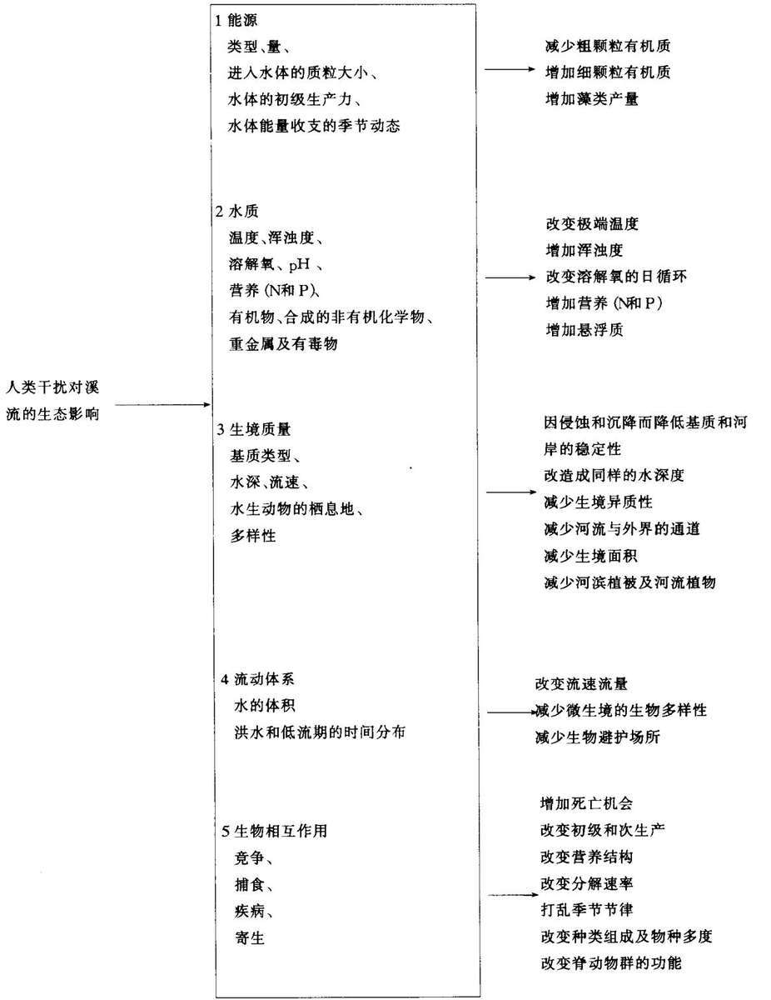  
图7.1 人类干扰对水体生态系统的五类环境因子的影响

## 第三节 水体生态系统恢复的评估

水体生态系统的恢复过程可用图7.2表示，但在评估生态系统恢复项目时，人类的价值观会有重要的影响。如图7.3的项目评估矩阵所示，项目评估受人类价值和生态系统表现影响：在矩阵的左下角，人类的价值和生态系统的表现均不能满足，因而项目失败(例如筑坝导致不能灌溉和水质下降)；在矩阵的右上角，人类的价值和生态系统的表现均能满足，因而项目成功(例如，污水经过处理后排入湖泊，湖泊又能够净化这些污水)；处于矩阵中间的项目均能在一定程度上接受，但还有改进的必要。

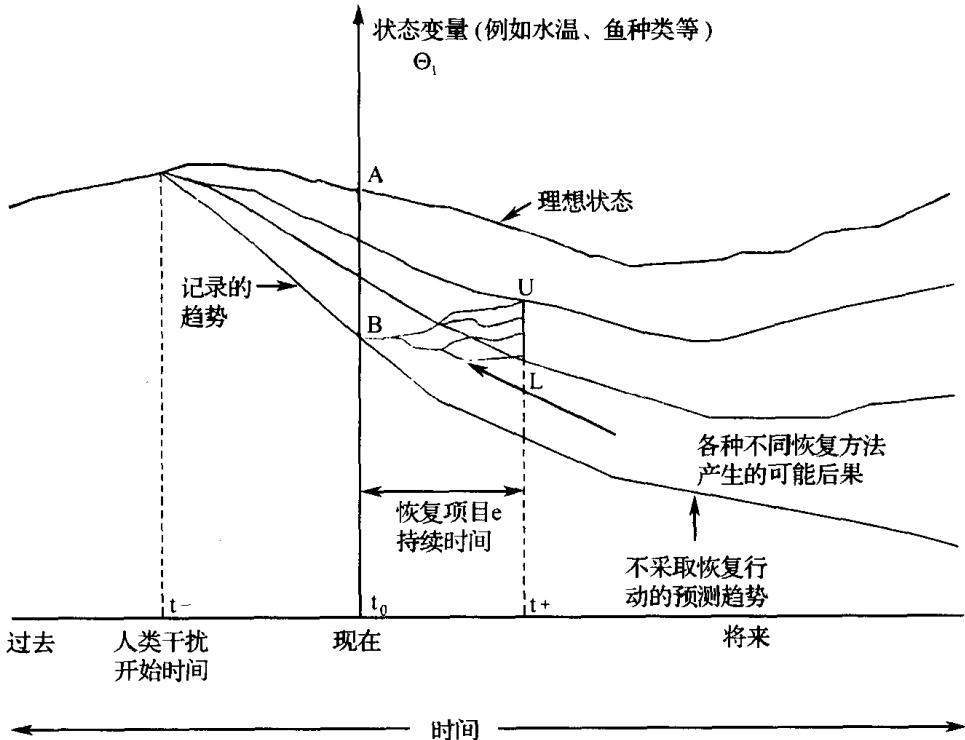  
图7.2 水生生态系统的恢复过程  
A:没有任何人类于扰时状态变量的理想值;B:状态变量的理想值；  
U:没有经费限制并充分利用现有知识完成的恢复项目的状态变量  
的最佳值：L：恢复项目完成后状态变量的最低可接受的值

进行水体生态系统恢复项目评估的标准包括水生生态系统结构、功能和整体特征的评估(Berger，1991；Dierberg，1988；Gore，1985)，具体如下：

结构特征：水质(包括项目内及相连系的水体的水质，如溶解氧、盐、毒物、污染物、悬浮物、pH、气味、透明度、温度等)：土壤条件(如物理性质、化学性质、侵蚀率、有机碳、稳定性):地理条件(如地表特征、景观组成);水文特征(水分循环过程、流速、流量等);形态和地形特征(位置、地形、生态系统形状、深度等):生物(如种类、密度、生长量、生产力和群落稳定性)；承载量、食物网及指示种的营养量等。

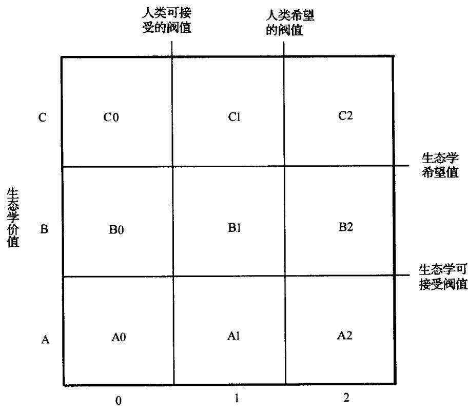  
人类价值

<table><tr><td>分室</td><td>生态学价值</td><td>人类价值</td></tr><tr><td>A0</td><td>不可接受</td><td>不可接受</td></tr><tr><td>A1</td><td>不可接受</td><td>可接受</td></tr><tr><td>A2</td><td>不可接受</td><td>希望</td></tr><tr><td>B0</td><td>可接受</td><td>不可接受</td></tr><tr><td>B1</td><td>可接受</td><td>可接受</td></tr><tr><td>B2</td><td>可接受</td><td>希望</td></tr><tr><td>00</td><td>希望</td><td>不可接受</td></tr><tr><td>C1</td><td>希望</td><td>可接受</td></tr><tr><td>C2</td><td>希望</td><td>希望</td></tr></table>

图7.3 项目评估矩阵模式

功能特征：地表、地下水的贮存、补充及供应；洪水及排淤力；营养物质的沉积、运移及循环；大气湿度(含蒸发等);溶解氧含量；生物的正常活动；生物生产力、食物网和物种的维持；生态系统获取阳光、风、雨的能力；水的净化能力；侵蚀的控制力；生态系统能量流动情况。

整体标准：恢复力(即生态系统干扰后的可恢复能力);持续力(即生态系统维持续演替中状态或顶极的能力)；与天然群落的近似性(与类似未干扰的生态系统比较)。

## 参考文献

郭少聪，任海，季申芒等. 2000.华南植物园退化水体的恢复研究，生态科学，17(3):1\~5

谢平，崔亦波，陈宜瑜，1995.中国浅水湖泊退化生态系统，见：陈灵芝和陈伟烈主编，中国退化生态系统研究，北京：中国科学技术出版社，221\~233

Brown, J. H. & B. A. Maurer 1989. Macroecology: The division of food and space among species on continents. Science, 243:1145\~1150

Benke, A. C. 1990. A perspective on America nvanishing streams. J. Am. Benthol. Soc. , 9(1): 77\~78

Berger, J. J. 1991. A generic framework for evaluation complex restoration and conservation projects.,Environ. Prof. , 13 (3)254\~262

Brooker M. P. & R. W. Edwards. 1975 Aquatic herbicides and the control of water weeds. Water Res. 9:1\~15

Campbell, P.C. G. & P. Stokes. 1985. Acicification and toxicity of metals toaquatic biota. Can. J. Fish. Aquat. Sci. 42: 2034\~2049

Cooke, G. D., E. B. Welch & S. A. Peterson. 1986. Lake and Reservoir Restoration. Butterworth, Stoneham, Mass

Cairns, J. J. R. 1991. The status of the theoretical and applied science of restoration ecology. Environ. Prof. , 13(3) :1\~9

Cairns, J. J. R. ed. 1992. Restoration of Aquatic Ecosystems. Washington DC: National Academy Press

Carlson, R. E. 1977. A tropical state index for lakes. Limnol. Oceanogr. , 22:361\~369

Carpenter, S. R. , D. Ludwig & W. A. Brock. 1999. Management of eutrophication for lakes subject to potentially irreversible change. Ecological Application, 9:183\~203

Daily, G. ed. 1997. Nature's Services. Washington DC: Island Press

Dierberg, F. E & V. P. Williams. 1988. Evaluating the water quality effects of lake management in Florida. Lake Reservoir Manage., 2:101\~111

Elton, C. S. 1958. The Ecology of Invasions by Animals and Plants. London: Methuen

Forman R. T.T & M. Godron. 1986. Landscape Ecology. New York:John Wiley & Sons

Harkins, R. D. 1974. An obiective water quality index. J. Water Pollut. Control. Fed. , 46:588\~591

Gore, J. A. 1985. The Restoration of Rivers and Streams. Boston: Butterworth Publishers

Hartig, J. H & R. L. Thomas. 1988. Development of plans to restore degraded areas in the Geat Lakes. Environ. Manage., 12:327\~347

Howes, K. 1990. Construction of artificial riffles and pools for stream restoration. J. Biol. ,2(1): 15\~20

Jordan, W. R. III, M. E. Gilpin & J.D. Aber. 1987. Restoration Ecology. Cambridge: Cambridge University Press

Karr, J. R. 1986. Assessing biological integrity in running waters: A method and its rationale. Special Publication 5. Illionois Natural History Survey, Champaign, III

Lewis, R. R. 1989. Wetlands restoration, creation, and enhancement technology. Wetland Creation and Restoration EPA 600/3/89/038B. U.S. Environmental Protection Agency, Washington DC

Magnuson, J.J., H. A. Regier, W.J. Christie. 1980. To Reinhabitat and Restore Great Lakes Ecosystems. The recovery process in Damaged Ecosystems. Ann Arbor, Mich: Ann Arbor Science Publishers

Riley, A. L. 1998. Restoring Streams in Cities. Washington DC: Island Press

Schinder,D. W. 1988. Effects of acid rain on freshwater ecosystems. Science, 239: 149\~157

Shapiro,J & D. I. Wright. 1984. Lake restoration by biomanipulation. Freshwater Biol., 14:371\~383

Turner,M. G. 1987. Iandscape Heterogeneity and Disturbance. New York: Springer-Verlag

Walker, W. W. 1987. Phosphorus removal by urban runoff detention basins. Lake Reservoir Manage. , 3:314\~326

Wilson,E.O. 1988. Biodiversity. Washington DC: National Academy Press

## 第八章 退化湿地生态系统的恢复

湿地是地球上水陆相互作用形成的独特生态系统，是自然界最富生物多样性的生态景观和人类最重要的生存环境之一，在蓄洪防旱、调节气候、控制土壤侵蚀、促淤造陆、降解环境污染等方面起着极其重要的作用。全球约有8.6百万平方公里的湿地(约占地球陆地表面积的6%)，其中约56%的湿地分布在热带亚热带区域(此前Matthews于1987估计全球湿地有5.3百万平方公里。两者数据不同的主要原因是两人对湿地的划分范围不同，当前人们沿用较多的仍是较大的数据。Mitsch，1993)。湿地是地球上最脆弱的生态系统之一，在维持自然平衡中起着重要的作用。由于大多数人并未意识到湿地的重要功能，随着社会和经济的发展，全球约80%的湿地资源丧失或退化，严重影响了湿地区域生态、经济和社会的可持续发展(Middleton，1999)。自20世纪70年代开始，西方发达国家就开展了有关研究和实践，以保护自然湿地并恢复退化的湿地生态系统，我国虽然起步晚一些，但发展很快，尤其是红树林湿地恢复和湿地综合利用方面。本章拟探讨湿地退化的原因、湿地恢复的有关理论及方法。

## 第一节 湿地的功能及其退化原因

湿地是陆地和水生生态系统间的过渡带，其水位常常较浅或接近陆地表面，主要分布在海岸带和部分内陆区域。一般可将湿地分为海岸带湿地生态系统和内陆湿地生态系统，其中前者又可细分为潮汐盐沼、潮汐淡水沼泽和红树林湿地三类，后者可细分为内陆淡水沼泽、北方泥炭湿地、南方深水沼泽和河岸湿地四大类(Cowardin，1978)。

湿地作为一种生态系统，其主要的功能体现在：调控区域内的水分循环；调节区域乃至全球C、N等元素的生物地球化学循环；具有生物生产力，分解进入湿地的各种物质，作为生物的栖息地(Middleton，1999)。对人类来说，这些功能体现的价值包括：生物多样性的生境，调控洪水、暴雨的影响，过滤和分解污染物，改善水质，防止土壤侵蚀，提供食物和商品，旅游地点等(Cairns，1992)。

湿地丧失和退化的主要原因有物理、生物和化学等三方面。它们具体体现如下：围垦湿地用于农业、工业、交通、城镇用地：筑堤、分流等切断或改变了湿地的水分循环过程；建坝淹没湿地：过度砍伐、燃烧或啃食湿地植物：过度开发湿地内的水生生物资源；废弃物的堆积;排放污染物。此外，全球变化还对湿地结构与功能有潜在的影响(Mitsch，1993;Middleton，1999；余作岳，1997)。

## 第二节 湿地恢复的概念

湿地恢复是指通过生态技术或生态工程对退化或消失的湿地进行修复或重建，再现干扰前的结构和功能，以及相关的物理、化学和生物学特性，使其发挥应有的作用。它包括提高地下水位来养护沼泽，改善水禽栖息地；增加湖泊的深度和广度以扩大湖容，增加鱼的产量，增强调蓄功能；迁移湖泊、河流中的富营养沉积物以及有毒物质以净化水质；恢复泛滥平原的结构和功能以利于蓄纳洪水，提供野生生物栖息地以及户外娱乐区，同时也有助于水质恢复(崔保山，1999)。目前的湿地恢复实践主要集中在沼泽、湖泊、河流及河缘湿地的恢复上。

一般地，在许多情况下湿地干扰前的状态是湿林地、沼泽地或开放水体，恢复哪一种状态在很大程度上决定于湿地恢复管理者和计划者的选择，即他们对干扰前或近于原始湿地的了解程度。无论如何，由于恢复与重建的细微差别，如果是恢复，一个地区只会再现它原有的状态，重建则可能会出现一个全新的湿地生态系统。在湿地恢复过程中，由于许多物种的栖息地需求和耐性不能被完全了解，因而恢复后的栖息地没有完全模拟原有特性，再者恢复区面积经常会比先前湿地要小，使先前湿地功能不能有效发挥。因此，湿地恢复是一项艰巨的生态工程，需要全面了解于扰前湿地的环境状况、特征生物以及生态系统功能和发育特征，以更好地完成湿地的恢复和重建过程。

## 第三节 湿地恢复的理论

## 一、自我设计和设计理论

自我设计和设计理论(self-design versus design theory)据称是惟一起源于恢复生态学的理论。由 van der Valk、Mitsch 和Jorgensen等提出并完善的湿地自我设计理论认为，只要有足够的时间，随着时间的进程，湿地将根据环境条件合理地组织自己并会最终改变其组分。Mitsch和Jorgensen(1989)认为，在一块要恢复的湿地上，种与不种植物无所谓，最终环境将决定植物的存活及其分布位置(Mitsch，1989)。Mitsch(1996)比较了一块种了植物与一块不种植物的湿地恢复过程，他发现在前3年两块湿地的功能差不多，随后出现差异，但最终两块湿地的功能恢复得一样(Mitsch，1996)。他与Odum(1989)均认为湿地具有自我恢复的功能，种植植物只是加快了恢复过程，湿地的恢复一般要15\~20年(Odum, 1998)。

而设计理论认为，通过工程和植物重建可直接恢复湿地，但湿地的类型可能是多样的。这一理论把物种的生活史(即种的传播、生长和定居)作为湿地植被恢复的重要因子，并认为通过干扰物种生活史的方法就可加快湿地植被的恢复(图8.1)。

这两种理论不同点在于：自我设计理论把湿地恢复放在生态系统层次考虑，未考虑到缺乏种子库的情况，其恢复的只能是环境决定的群落：而设计理论把湿地恢复放在个体或种群层次上考虑，恢复的可能是多种结果。这两种理论均未考虑人类干扰在整个恢复过程中的重要作用。

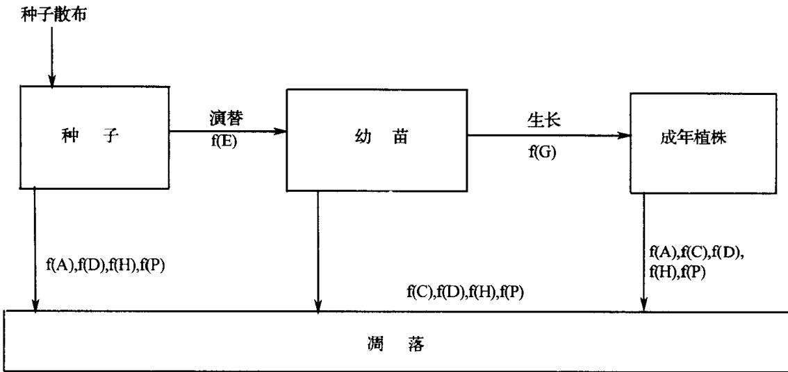

A年龄 C竞争 D干扰 E环境条件 G生长 H啃食 P疾病  
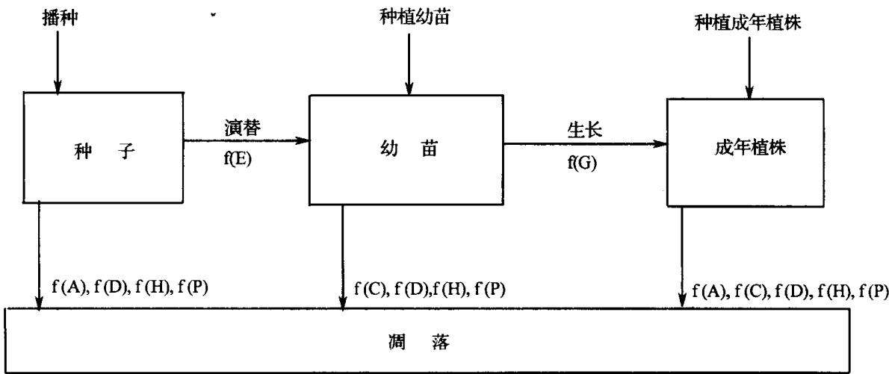  
图 8.1 通过干扰物种的生活史加快湿地恢复的设计理论(仿 Van der Valk,1999)

## 二、演替理论

演替(sucession)是生态学中最重要而又争议最多的基本概念之一，一般认为“演替是植被在受到干扰后的恢复过程或从未生长过植物的地点上形成和发展的过程”。演替的观点目前至少已有9种(邬建国，1992)，但只有2种与湿地恢复最相关，即演替的有机体论(整体论)和个体论(简化论)(Van der Valk，1999)。

有机体论的代表人Clements把群落视为超有机体，将其演替过程比作有机体的出生、生长、成熟和死亡。他认为植物演替由一个区域的气候决定，最终会形成共同的稳定顶极。个体论的代表人Gleason认为植被现象完全依赖于植物个体现象，群落演替只不过是种群动态的总和。

上述两种演替观点代表了两个极端，而大多数的生态演替理论反映了介乎其间的某种观点(Van der Valk，1999)。例如，Egler(1977)提出的初始植物区系组成学说认为，演替的途径是由初始期该立地所拥有的植物种类组成决定的，即在演替过程中哪些种的出现将由机遇决定，演替的途径也是难以预测的(图8.2)。事实上，前两种演替理论与自我设计和设计理论在本质上是一回事。利用演替理论指导湿地恢复一般可加快恢复进程，并促进乡土种的恢复。

## a. Clements/Pearsall的经典演替理论

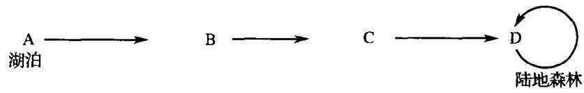

b. Van der Valk/Gleasonian 的演替理论  
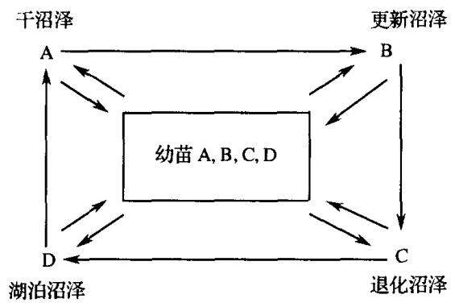

c. Egler的起源区系演替理论  
  
图 8.2 湿地演替的几种理论(仿 Middleton，1999)

Odum(1969)提出了生态系统演替过程中的24个特征，Fisher等(1982)在研究了美国Arizona的一条溪流的恢复过程后作了比较，他们发现所比较的14个特征中只有半数是相符的(表8.1)。因此，虽然可以演替理论指导恢复实践，但湿地的恢复与演替过程还是存在差异的。

表 8.1 溪流恢复过程与 Odum预期的演替过程中的特征比较
<table><tr><td>生态系统特征</td><td>预期 Odum（1969）</td><td>实际恢复 Fisher(1982)</td></tr><tr><td>生产力/呼吸量</td><td>接近1</td><td>从&lt;1升为&gt;1</td></tr><tr><td>生产力/生物量</td><td>降低</td><td>先快速增加，后降低</td></tr><tr><td>生产力/叶绿素a</td><td>--</td><td>降低</td></tr><tr><td>净生产力降低</td><td>增加</td><td></td></tr><tr><td>食物链</td><td>啃食-腐食</td><td>腐食-啃食-腐食</td></tr><tr><td>总有机质</td><td>增加</td><td>增加</td></tr><tr><td>非有机质循环</td><td>增加</td><td>增加</td></tr><tr><td>物种多样</td><td>增加</td><td>不同群体不同</td></tr><tr><td>生物化学多样性</td><td>增加</td><td>稳定</td></tr><tr><td>有机体大小</td><td>增加</td><td>不同群体不同</td></tr><tr><td>食物网</td><td>变长和复杂</td><td>短而简单</td></tr><tr><td>碎屑的作用</td><td>重要</td><td>重要</td></tr><tr><td>营养保存</td><td>加强</td><td>加强</td></tr><tr><td>抗干扰力</td><td>加强</td><td>较低</td></tr></table>

注：根据 Fisher(1982)和 Odum(1969)排列

## 三、入侵理论

在恢复过程中植物人侵是非常明显的。一般地，退化后的湿地恢复依赖于植物的定居能力(散布及生长)和安全岛(safesite，适于植物萌发、生长和避免危险的位点)。Johnstone(1986)提出了入侵窗理论，该理论认为，植物入侵的安全岛由障碍和选择性决定，当移开一个非选择性的障碍时，就产生了一个安全岛。例如，在湿地中移走某一种植物，就为另一种植物入侵提供了一个临时安全岛，如果这个新入侵种适于在此生存，它随后会入侵其他的位点。入侵窗理论能够解释各种入侵方式，在恢复湿地时可人为加以利用。

## 四、河流理论

位于河流或溪流边的湿地与河流理论(river theory)紧密相关。河流理论有河流连续体概念(river continuum concept)、系列不连续体概念(serial discontinuity concept，有坝阻断河流时)两种。这两种理论基本上都认为沿着河流不同宽度或长度其结构与功能会发生变化。根据这一理论：在源头或近岸边，生物多样性较高；在河中间或中游因生境异质性高生物多样性最高，在下游因生境缺少变化而生物多样性最低(Vannote，1980；Ward，1998)。在进行湿地恢复时，应考虑湿地所处的位置，选择最佳位置恢复湿地生物。

## 五、洪水脉冲理论

洪水脉冲理论(flood pusling theory)认为洪水冲积湿地的生物和物理功能依赖于江河进入湿地的水的动态。被洪水冲过的湿地上植物种子的传播和萌发，幼苗定居，营养物质的循环，分解过程及沉积过程均受到影响(Middleton，1999)。在湿地恢复时，一方面应

考虑洪水的影响，另一方面可利用洪水的作用，加速恢复退化湿地或维持湿地的动态。

## 六、边缘效应理论和中度干扰假说

湿地位于水体与陆地的边缘，又常有水位的波动，因而具有明显的边缘效应和中度干扰，是检验边缘效应理论(edge effect theory)和中度干扰理论(intermediate disturbance hy-pothesis)最佳场所。边缘效应理论认为两种生境交汇的地方由于异质性高而导致物种多样性高(Forman，1995)。湿地位于陆地与水体之间，其潮湿、部分水淹或完全水淹的生境在生物地球化学循环过程中具有源、库和转运者三重角色，适于各种生物的生活，生产力较陆地和水体的高。

湿地上环境干扰体系的时空尺度比较复杂(图8.3)，Connell(1978)提出的中度干扰理论认为在适度干扰的地方物种丰富度最高，具体地说，在一定时空尺度下，有适度干扰时，会形成缀块性的景观，景观中会有不同演替阶段的群落存在，而且各生态系统会保留高生产力、高多样性等演替早期特征，但这一理论应用时的难点在于如何确定中度干扰的强度、频率、持续时间。

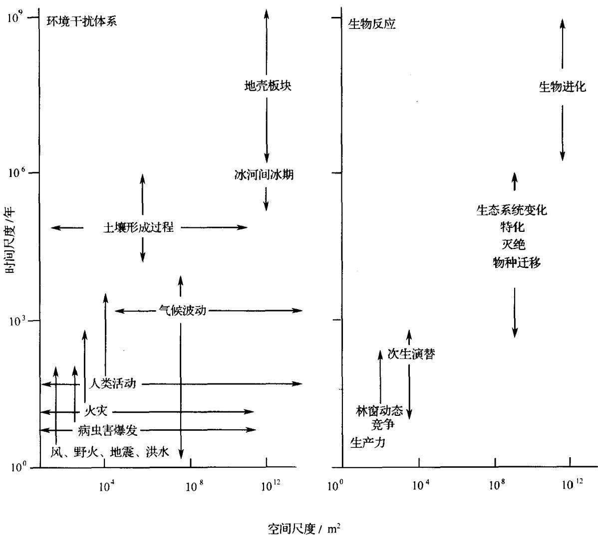  
图 8.3 环境干扰体系和生物反应的时空尺度(仿 Delcourt & Delcourt，1991)

## 第四节 湿地恢复的原则和目标

## 一、湿地恢复的基本原则

(1）可行性原则。可行性是许多计划项目实施时首先必须考虑的。湿地恢复的可行性主要包括两个方面，即环境的可行性和技术的可操作性。通常情况下，湿地恢复的选择在很大程度上由现在的环境条件及空间范围所决定。现时的环境状况是自然界和人类社会长期发展的结果，其内部组成要素之间存在着相互依赖、相互作用的关系，尽管可以在湿地恢复过程中人为创造一些条件，但只能在退化湿地基础上加以引导，而不是强制管理，只有这样才能使恢复具有自然性和持续性。比如，在温暖潮湿的气候条件下，自然恢复速度比较快，而在寒冷和干燥的气候条件下，自然恢复速度比较慢。不同的环境状况，花费的时间也就不同，甚至在恶劣的环境条件下恢复很难进行。另一方面，一些湿地恢复的愿望是好的，设计也很合理，但操作非常困难，恢复实际上是不可行的。因此全面评价可行性是湿地恢复成功的保障(赵晓英和孙成权，1998)。

(2）稀缺性和优先性原则。计划一个湿地恢复项目必须从当前最紧迫的任务出发，应该具有针对性。为充分保护区域湿地的生物多样性及湿地功能，在制定恢复计划时应全面了解区域或计划区湿地的广泛信息，了解该区域湿地的保护价值，了解它是否是高价值的保护区，是否是湿地的典型代表。

（3）美学原则。湿地具有多种功能和价值，不但表现在生态环境功能和湿地产品的用途上，而且具有美学、旅游和科研价值。因此在许多湿地恢复研究中，特别注重对美学的追求，像国内外许多国家对湿地公园的恢复。美学原则主要包括最大绿色原则和健康原则，体现在湿地的清洁性、独特性、愉悦性、可观赏性等许多方面。美学是湿地价值的重要体现。

## 二、湿地恢复的目标

根据不同的地域条件，不同的社会、经济、文化背景要求，湿地恢复的目标也会不同。有的目标是恢复到原来的湿地状态，有的目标是重新获得一个既包括原有特性，又包括对人类有益的新特性状态，还有的目标是完全改变湿地状态等。在湿地恢复计划中或实践中经常希望达到的两个目标是湿地的先前特性和机遇目标。

(1）湿地的先前特性。湿地恢复的成功与否，经常要受两个条件制约。一是湿地的受损程度，二是对湿地先前特性的了解程度。所谓先前特性，就是指原始阶段的后序列状态，亦即受干扰前的自然状态。这些状态从某种意义上讲就是恢复者的一个选择或偏好，或者说这些状态具有一定的不确定性。因为对湿地先前特性的了解程度及理解决定了恢复只能是近于先前的状态，而近于先前或干扰前的程度是很难把握的，这就需要大量资料的积累。

(2）恢复过程中的机遇。因为恢复过程是受多种因素所制约的，水文状况、地形地貌、生物特性、当地气候及环境背景变化等都是影响湿地恢复的重要因素，这些因素的自然表现在历史时期内不尽相同，因而湿地恢复的过程及结果常常具有不确定性，可能会有多种选择的机会。在这种条件下，某些结果的出现可能被看作是浪费一个机会，因为这些可能的结果在多种状况下都是可以被恢复的，而浪费的机会却很难再一次出现。因此恢复者在湿地恢复的操作过程中要关注并珍惜机会的把握，而不是去浪费它。

## 第五节 湿地恢复的策略

湿地退化和受损的主要原因是人类活动的干扰，其内在实质是系统结构的紊乱和功能的减弱与破坏，而在外在表现上则是生物多样性的下降或丧失以及自然景观的衰退。湿地恢复和重建最重要的理论基础是生态演替。由于生态演替的作用，只要克服或消除自然的或人为的干扰压力，并且在适宜的管理方式下，湿地是可以被恢复的。恢复的最终目的就是再现一个自然的、自我持续的生态系统，使其与环境背景保持完整的统一性。

不同的湿地类型，恢复的指标体系及相应策略亦不同。对沼泽湿地而言，由于泥炭提取、农业开发和城镇扩建使湿地受损和丧失。如要发挥沼泽在流域系统中原有的调蓄洪水、滞纳沉积物、净化水质、美学景观等功能，必须重新调整和配置沼泽湿地的形态、规模和位置，因为并非所有的沼泽湿地都有同样的价值。在人类开发规模空前巨大的今天，合理恢复和重建具有多重功能的沼泽湿地，而又不浪费资金和物力，需要科学的策略和合理的生态设计。

就河流及河缘湿地来讲，面对不断的陆地化过程及其污染，恢复的目标应主要集中在洪水危害的减小及其水质的净化上，通过疏浚河道，河漫滩湿地再自然化，增加水流的持续性，防止侵蚀或沉积物进入等来控制陆地化，通过切断污染源以及加强非点源污染净化使河流水质得以恢复。而对湖泊的恢复却并非如此简单，因为湖泊是静水水体，尽管其面积不难恢复到先前水平，但其水质恢复要困难的多，其自净作用要比河流弱得多，仅仅切断污染源是远远不够的，因为水体尤其是底泥中的毒物很难自行消除，不但要进行点源、非点源污染控制，还需要进行污水深度处理及其生物调控技术。

对于红树林湿地而言，红树林沼泽发育在河口湾和滨海区边缘，在高潮和风暴期是滨海的保护者，在稳定滨海线以及防止海水入侵方面起着重要作用。它为发展渔业提供了丰富的营养物源，也是许多物种的栖息地。由于人类的各种活动，红树林正在被不断地开发和破坏。为恢复这一重要的生态系统，需要保持陆地径流的合理方式，严禁滥伐及矿物开采，保证营养物的稳定输入等是恢复退化红树林的关键所在。

湿地恢复策略经常由于缺乏科学的知识而阻断，特别是湿地丧失的原因，自然性和对一些显著环境变量的控制，有机体对这些要素的反应等还不够清楚，因此获得对湿地水动力的理解，及评价不同受损类型的影响是决定恢复策略的关键。

## 第六节 湿地恢复的过程与方法

## 一、湿地恢复的过程

湿地的恢复过程常包括清除和控制于扰，净化水质，去掉顶层退化土壤，引种乡土植物和稳定湿地表面等步骤。但由于湿地中的水位经常波动，还有各种干扰，因此在湿地恢

复时必须考虑这些干扰，并将其当作恢复中的一部分(图8.4)(Kauffman，1995)。

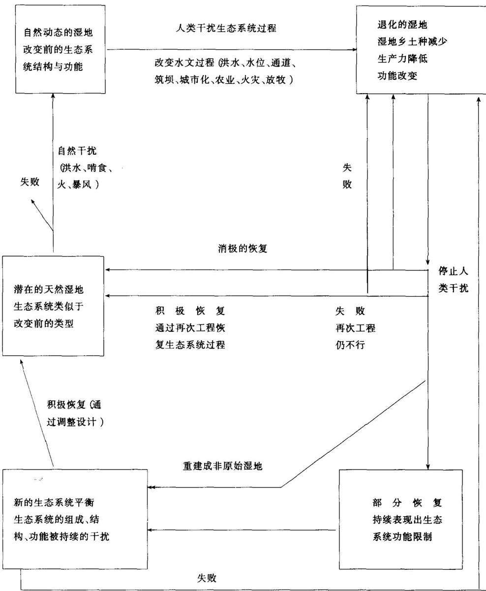  
图 8.4 湿地恢复的过程(仿 Kauffman,1995)

## 二、湿地恢复的方法

湿地恢复的目标、策略不同，拟采用的关键技术也不同。根据目前国内外对各类湿地恢复项目研究的进展来看，可概括出以下几项技术：废水处理技术，包括物理处理技术、化学处理技术、氧化塘技术；点源、非点源控制技术；土地处理(包括湿地处理)技术；光化学处理技术；沉积物抽取技术；先锋物种引入技术；土壤种子库引入技术；生物技术，包括生物操纵(biomanipulation)、生物控制和生物收获等技术;种群动态调控与行为控制技术；物种保护技术等。这些技术有的已经建立了一套比较完整的理论体系，有的正在发展。在许多湿地恢复的实践中，其中一些技术常常是相整合应用的，并可取得显著效果。

与其他生态系统过程相比，湿地生态系统的过程具有明显的独特性：兼有成熟和不成熟生态系统的性质；物质循环变化幅度大；空间异质性大；消费者的生活史短但食物网复杂；高能量环境下湿地被气候、地形、水文等非生物过程控制，而低能量环境下则被生物过程所控制(Mitsch，1993)。这些生态系统过程特征在湿地恢复过程中应予以考虑。不同的湿地恢复方法不同(如红树林和江心洲)，而且在恢复过程中会出现各种不同的问题，因此很难有统一的模式，但在一定区域内同一类型的湿地恢复还是可以遵循一定的模式(Giller，1992)，当然这个模式是需要进行试验探索的。在我国已应用的模式也非常多，比较著名的是桑基鱼塘模式(钟功埔，1987)和林果草(牧)渔模式(余作岳和彭少麟，1997)。从各种湿地恢复的方法中可归纳如下的方法：尽可能采用工程与生物措施相结合的方法恢复；恢复湿地与河流的连接为湿地供水；恢复洪水的干扰；利用水文过程加快恢复(利用水周期、深度、年或季节变化、持留时间等改善水质)；停止从湿地抽水；控制污染物的流人；修饰湿地的地形或景观；改良湿地土壤(调整有机质含量及营养含量等)；根据不同湿地选择最佳位置重建湿地的生物群落(Middleton，1999);减少人类干扰提高湿地的自我维持能;建立缓冲带以保护自然的和恢复的湿地；发展湿地恢复的工程和生物方法；建立不同区域和类型湿地的数据库；开展各种湿地结构、功能和动态的研究；建立湿地稳定性和持续性的评价体系。

## 第七节 湿地恢复的合理性评价

## 一、生态合理性

生态合理性亦即恢复的生态整合性问题。从组成结构到功能过程，从种群到群落，湿地生态系统最终的恢复目标是完整的统一体，违背了生态规律，脱离了生态学理论或者同环境背景值背道而驰，均是不合理的。湿地恢复不但包括生态要素的恢复，也包含生态系统的恢复。生态要素包括土壤、水体、动物、植物和微生物，生态系统则包括不同层次、不同尺度规模、不同类型的生态系统。因此，恢复的生态合理性亦即组成结构的完整性和系统功能的整合性。恢复被损害的湿地到接近于它受干扰前的自然状态，即重现系统干扰前的结构和功能及有关的物理、化学和生物学特征，直到发挥其应有的功效并健康发展，是生态合理性的最终体现(崔保山，1999)。

## 二、社会合理性

主要指公众对恢复湿地的认识状况及其对湿地恢复必要性的认识程度。特别是目前人类活动的不断加剧，对各类型湿地造成了极大的损害。从质量和数量上均有明显的丧失。再加上许多湿地类型的市场失效性，公众对恢复湿地还没有形成强烈的意识。因此，加强湿地保护宣传力度，尽快出台湿地立法，增强公众的参与意识是湿地恢复的必要条件，是社会合理性的具体体现。

## 三、经济合理性

经济合理性一方面指恢复项目的资金支持强度，另一方面是恢复后的经济效益，即遵循最小风险与效益最大原则。湿地恢复项目往往是长期的和艰巨的工程，在恢复的短期内效益并不显著，往往还需要花费大量资金进行资料的收集和定位定时监测。而且有时难以对恢复的后果以及生态最终演替方向进行准确地估计和把握，因此带有一定的风险性。这就要求对所恢复的湿地对象要经过综合分析、论证，将其风险降低到最小。同时，必须保证长期的资金稳定性和对项目的监测。只要恢复目标是可操作的，生态是合理的，并且有高素质的管理者和参与者，湿地恢复的效益最终能够实现(钟成埔，1987)。

## 参考文献

崔保山和刘兴土. 1999.湿地恢复研究综述. 地球科学进展，14(1):10\~15

余作岳和彭少麟．1997. 热带亚热带退化生态系统植被恢复研究．广州：广东科技出版社

邬建国，J. L. Vankat 和高玮． 1992. 生态演替理论与模型.刘建国 主编. 当代生态学博论.北京：中国科学技术出版社，49\~64

赵晓英和孙成权.1998. 恢复生态学及其发展． 地球科学进展，13(5):474\~479

钟功埔．1987. 珠江三角洲基塘系统研究．北京：科学出版社

Cowardin, L. M. V. 1978. Classification of Wetlands and Deepwater Habitats of the United States. U. S. Department of the Interior, Washington DC. 31\~35

Cairns, J. J. R. 1992. Restoration of Aquatic Ecosystems. Washington DC: Nationak Acadeny Press

Connell, J. H. 1978. Diversity in tropical rainforest and coral reefs. Science, 199:1302\~1310

Egler, F. E. 1977. The Nature of Vegetation. Norfolk:Connectut

Fisher, S. G. 1982. Temporal succession in a desert stream ecosystem following flash flooding. Ecological Mongraphs, 52: 93\~110

Forman, R. T. T. 1995. Land Mosaics. Cambridge: Cambridge University Press

Giller, P. S. 1992. Aquatic Ecology: Scale, Pattern and Process. Oxford: Blackwell Scientific Publications

Johnstone, I. M. 1986. Plant invasion windows: a time-based classification of invasion potential. Biological Review, 61: 369\~394

Kauffman. 1995. Ecological approaches to riparian restoration in northeast Oregon. Restoration and management Notes, 13: 12\~15

Mitsch, W. J. 1996. Improving the success of wetland creation and restoration with know-how, time, and self-design. Ecological Applications, 6:77\~83

Mitsch, W. J. & J. G. Gosselink. 1993. Wetland(second edition). New York: Van Nostrand Reinhold

Mitsch, W. J. & S. E. Jorgensen. 1989. Ecological Engineering. New York: John Wiley & Sons

Middleton, B. 1999. Wetland Restoration, Flood Pulsing, and Disturbance Dynamics. New York: John Wiley & Sons, Inc Odum,E. P. 1969. The strategy of ecosystem development. Science, 164:262\~270

Odum, E. P. 1998. Experimental study of self-organization in estuarine ponds. In W.J. Mitsch & S. E. Jorgensen eds. Ecological Engineering New York; John Wiley & Sons. , 291\~340

Van der Valk. 1999. Succession theory and wetland restoration. Porceedings of INTECOL'V Intenational Wetlands Conference, Perth, Australia,31\~47

Vannote, R. L. 1980. The river continuum concept. Canadian Journal of Fisheries and Aquatic Sciences,37:130\~137

Ward, J. V. 1989. The serial discontinuity concept: extending the model to floodplain rivers. Regulated Rivers: Research and Management, 10: 159\~168

## 第九章 生态系统的服务功能

20世纪40年代以来，技术进步和人口增长已经使人类极其显著地改变了自然的面貌，同时，人类日益忽视了自身生活和社会经济文化发展对地球自然生态系统的依赖性和自然为人类社会发展所做出的贡献。事实上，自然界为人类的社会、经济和文化生活创造并维持着许许多多的必不可少的环境资源条件，并且提供了许多种类的环境和资源方面的生态服务。但它们的影响往往是长期的和深远的。生态系统服务功能的研究能比较清晰地描述人对自然的依赖性。人们需要用这种知识对各种技术和社会经济发展方式的长远影响进行评价，以防止和减少带有自我毁灭性的经济和社会活动。最近，以Daily主编的《生态系统服务功能：人类社会对自然生态系统的依赖性》一书为标志，生态系统服务功能研究已成为生态学中的热点问题之一(Costanza,1997；董全，1999)。

## 第一节 生态系统服务功能定义

生态系统服务功能(Ecosytem services)是指人类直接或间接从生态系统功能(即生态系统中的生境、生物或系统性质及过程)中获取的利益，生态系统不仅为人类提供了食品、医药及其他生产生活原料，更重要的是维持了人类赖以生存的生命支持系统，维持生命物质的生物地化循环与水文循环，维持生物物种与遗传多样性，净化环境，维持大气化学的平衡与稳定，而且在人类生存与现代文明中具重要作用。由此可见，生态系统服务是指对人类生存及生活质量有贡献的生态系统产品和生态系统功能，生态系统服务是生态系统产品和生态系统功能的统一，而生态系统的开放性是生态系统服务的基础和前提(Daily，1995,1997; Costanza,1997)。

生态系统服务包括提供人类生活消费的产品和保证人类生活质量的功能。植物利用、太阳能，将 $\mathrm { C O } _ { 2 }$ 等物质转化为生物量，用作人类的食品、燃料、原料及建筑材料等，是生态系统产品形成的基本途径。与生态系统产品相比，生态系统功能对人类的影响更加深刻、和广泛。如生态系统的分解功能可保持人类清洁的生活环境，生态系统还可保持大气组成的平衡，生物多样性的产生与维持，吸收、贮存 $\mathrm { C O } _ { 2 }$ 并释放 $O _ { 2 }$ ,植物生长必需营养元素的再生与迁移，淡水的净化与贮存，使降雨滞流、缓流，减小洪峰，补充地下水，农业土壤的产生和保持，鸟类、昆虫、蝙蝠等为植物传粉，小气候与大气候的营造及控制，娱乐和美学欣赏等。

退化生态系统恢复的最终目标是恢复并维持生态系统的服务功能，由于生态系统的服务功能多数不具有直接经济价值而被人类忽略。虽然我们还不知道生态系统退化到什么程度会影响其服务功能，也不了解恢复到什么程度生态系统才具有服务功能，但是我们还是提出一个生态系统的服务功能框架，希望恢复后的生态系统尽量具有这些服务功能：生态系统的产品(生态系统中生物的全部、部分或产品，它们可为人类提供肉、鱼、果、蜜、谷、家具、纸、衣等)，生物多样性，为人类创造和丰富精神生活和文化生活，自然杀虫，传粉播种，净化空气和水，减缓旱涝灾害，土壤的形成、保护及更新，废物的去毒和分解，种子的传播，营养的循环和运移，保护海岸带，防止紫外线的辐射，以及帮助调节气候等。

## 第二节 生态系统服务功能的研究历史

人类很早就注意到了生态环境对社会发展的支撑作用。古希腊的柏拉图认识到雅典人对森林的破坏导致了水土流失和水井干涸。中国古代的人们建立和保护风水林反映了他们对森林保护村庄与改善环境的认识。美国的 George Marsh于1864 年首先注意到生态系统服务功能，他在Man and Nature中记载：“由于受人类活动的巨大影响，在地中海地区广阔的森林在山峰中消失，肥沃的土壤被冲刷，肥沃的草地因缺灌溉水而荒芜，河流因此而干涸”。此外，Marsh还意识到了自然生态系统分解动植物尸体的服务功能，水、肥沃的土壤和人类呼吸的空气都是自然及其生物所赐予的。首先研究土壤生态系统服务功能的是美国的AldoLeopold，在1949年，他认识到人类自己不可能替代生态系统服务功能，并指出土地伦理将人类从自然的统治者地位还原成为自然界的普通一员。与此同时，FairfieldOsborn(1948)指出生态系统中的水、土壤、植物与动物是人类及其文明得以发展的基础。Vogt于1948年首先提出自然资本的概念，他认为人类耗竭土壤等自然资源资本，就会降低偿还债务的能力。

自20世纪40年代生态系统概念与理论被提出后，人们开展了大量生态系统结构与功能的研究，为人们研究生态系统服务功能提供了科学基础。自20世纪70年代以后，生态系统服务功能开始成为一个科学术语及生态学研究的分支，其研究范畴包括自然生态系统对人类的“环境服务”功能(如害虫控制、昆虫传粉、渔业、土壤形成、水土保持、气候调节、洪水控制、物质循环与大气组成等)。Holdren(1974)与Ehrlich(1981)比较系统地讨论了生物多样性的丧失对生态系统服务功能的影响，并认为生态系统服务功能丧失的快慢取决于生物多样性丧失的速度，企图通过其他手段替代已丧失的生态系统服务功能的尝试是昂贵的，而且从长远的观点来看是失败的。至此，生态系统服务功能这一术语逐渐为人们所接受。国际科联环境委员会于1991年组织专家讨论了生物多样性与生态系统服务功能关系、生态系统服务功能经济价值评估方法，从而使生态系统服务逐渐成为生态学研究的新热点。美国生态学会组织的以GretchenDaily为首的小组出版了生态系统服务功能方面的专著(1997)。同年，Costanza等把生态系统服务归纳成自然生产，维持生物多样性，调节气象过程、气候变化和地球化学物质循环，调节水循环和减缓旱涝灾害，产生、更新、保持和改善土壤，净化环境，为农作物与自然植物授粉传播种子，控制病虫害的暴发，维护和改善人的身心健康，及激发人的精神文化追求等17类。

## 第三节 生态系统服务功能的内容

生态系统服务功能的内容包括有机质的合成与生产、生物多样性的产生与维持、调节气候、营养物质贮存与循环、土壤肥力的更新与维持、环境净化与有害有毒物质的降解、植物花粉的传播与种子的扩散、有害生物的控制、减轻自然灾害等许多方面(图9.1)。

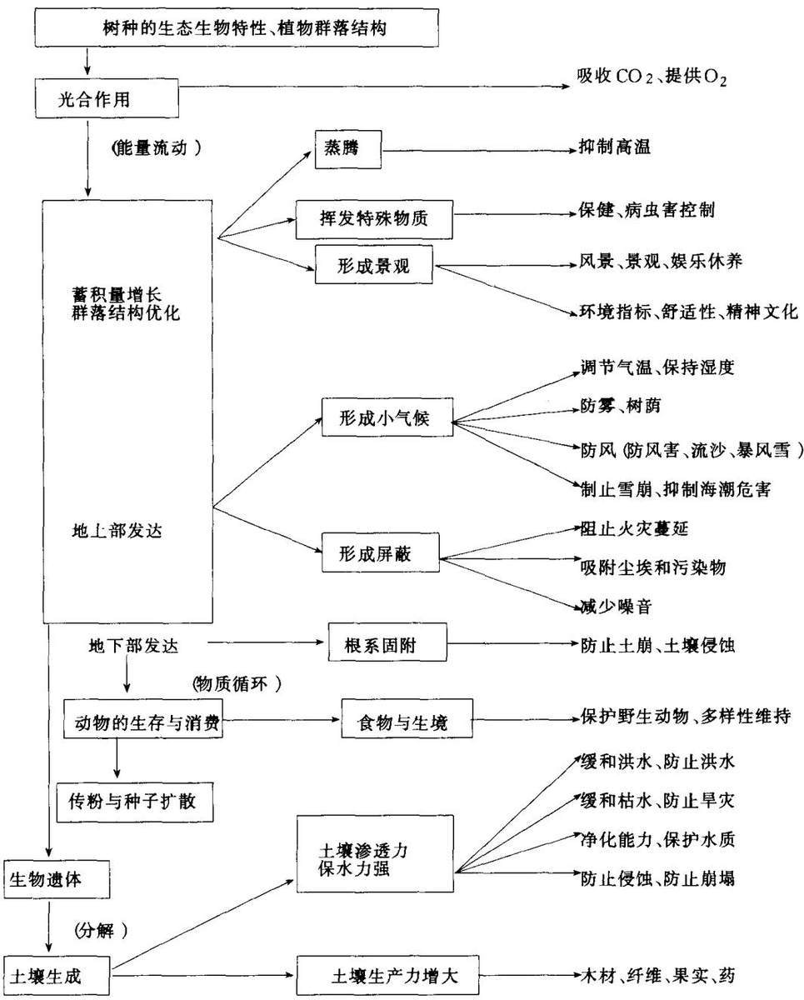  
图9.1 森林的结构、功能与生态系统服务功能

## 一、生产生态系统产品

生态系统通过初级生产与次级生产，生产了人类生存所必需的所有基本产品。据统计，每年各类生态系统为人类提供粮食 $1 8 \times 1 0 ^ { 8 }$ t, 肉类约 $6 . 0 \times 1 0 ^ { 8 }$ t，同时海洋还提供鱼约 $1 . 0 \times 1 0 ^ { 8 } ~ \mathrm { t } _ { \circ }$ 今天，野生的鸟、兽、虫、鱼目前仍然是人们生存所必需的动物蛋白的重要来源。自然植被为人们提供许多生活必需品(如水果、坚果、菌类、蜂蜜和调味品及药材)和原材料(如木材广泛用于家具、建筑、艺术品、工具、纸张、衣料及其他许多生产和生活资

料)。自然草场是畜牧业的基础。家畜生产肉、奶、蛋、革，而且为运输和耕种作劳役。在发展中国家和地区，植物仍然是重要燃料来源。此外，森林还生产橡胶、纤维、染料、胶类、鞣酸、植物油、蜡、杀虫剂及各类天然化合物。植被和水生生态系统为野生的鸟、兽、虫、鱼提供必要的栖息环境，从而为人们狩猎垂钓等休闲和其他活动提供了场所。

生态系统的自然生产过程中，其多样性较高而集约性较低，因此其地位在以工业为主导的市场经济中逐渐减弱，再加上人类对土地和水体的改造，许多地方和许多种类的自然生产能力大大下降。尽管如此，自然生产的市场经济价值依然不可忽视。随着人口的增长，大部分种类自然生产的经济需求仍在加大。

## 二、产生和维持生物多样性

生命结构和形式的丰富性体现在分子、细胞、器官、个体、种群、群落、生态系统和生态景观等各个生物组织层次上，生物多样性是指从分子到景观各种层次生命形态的集合。生态系统不仅为各类生物物种提供繁衍生息的场所，而且还为生物进化及生物多样性的产生与形成提供了条件。同时，生态系统通过生物群落的整体创造了适宜于生物生存的环境。同物种不同的种群对气候因子的扰动与化学环境的变化具有不同的抵抗能力，多种多样的生态系统为不同种群的生存提供了场所，从而可以避免某一环境因子的变动而导致物种的绝灭，并保存了丰富的遗传基因信息。

生态系统在为维持与保存生物多样性的同时，还为农作物品种的改良提供了基因库。首先，现有农作物需要野生种质的补充和改善。据研究，人类已知约有7万种植物可以食用，而人类历史上仅利用了7000种植物，只有150种粮食植物被大规模种植，其中82种作物提供了人类90%以上的食物。其次，多种多样的生物种类和生态系统类型具有产生新型食物和新型农业生产方式的巨大潜力。那些尚未为人类驯化的物种，都由生态系统所维持，它们既是人类潜在食物的来源，还是农作物品种改良与新的抗逆品种的基因来源。

生物多样性对人的身心健康亦至关重要，生态系统是现代医药的最初来源。在美国用途最广泛的150种医药中，118种来源于自然，其中74%源于植物，18%来源于真菌，5%来源干细菌.3%来源于脊椎动物。在全球仍有80%的人口依赖于传统医药，而传统医药的85%是与野生动植物有关的。

高的生物多样性维护着生态系统的合理结构、健全功能和结构功能的稳定性。物种的消失，特别是那些影响水和养分动态、营养结构和生产能力的物种的消失，会削弱生态系统的功能。物种的减少往往使生态系统的生产效率下降，抵抗自然灾害、外来物种入侵和其他干扰的能力下降。那些生态功能相似而又对环境反应不同的物种保障整个生态系统可以在环境变化下调整自身而维持各项功能的发挥。

## 三、调节气候

地球气候的变化主要是受太阳黑子及地球自转轨道变化影响，但生物体在全球气候的调节中也起着重要的作用。生态系统在全球、区域、小流域和小生境等等不同的空间尺度上影响着气候。从地史环境上看，细菌、藻类和植物通过光合作用产生氧气，致使氧气在大气中富集，创造了许多其他生物生存的必要条件；在全球尺度上，生态系统通过固定大气中的 $\mathrm { C O } _ { 2 }$ 而减缓地球的温室效应；在区域尺度上，生态系统可通过植物的蒸腾作用直接调节区域性的气候；在更小的空间尺度上，森林类型和状况决定林中的小气候。林冠遮挡阳光，阻碍林内外空气交换，为许多物种提供可以忍受的温度、光线、湿度和其他生存条件。自然生态系统的破坏往往使其气象气候调节功能减弱。

## 四、减缓旱涝灾害

水在陆地、海洋与大气中的循环过程包括：降雨流入地下和江河湖海，经过蒸发和蒸腾回到天空，凝聚成云后再形成降雨，植被和土壤在降雨过程中具有重要作用。植被的冠层可拦截雨水并减少雨滴对地面的冲击。地被物和植被的根系维系和固持着土壤，并且吸收和持留一些水。在雨季，植被和土壤都会截留一部分水并减缓水的流速，防止大量降水集中汇入下游，减低洪水水量；在旱季，植被和土壤中保持的水逐渐流出，在旱季为下游河流供水。在没有植被或植被破坏后会导致局部水分循环过程改变，大大增加地表径流和水土流失。水土流失的发生不仅使土壤生产力下降，降低雨水的可利用性，还造成下游可利用水资源量减少，水质下降。河道、水库淤积，降低发电能力，增加洪涝灾害发生的可能性。在热带和亚热带，过度的森林砍伐已使水旱灾害越来越频繁，越来越严重。例如我国1998年长江全流域洪涝灾害的形成与中上游植被及中游湖泊减少、水源涵养能力下降、水土流失加剧有密切关系。

## 五、维持土壤功能

土壤是通过成千上万年积累形成的，在农业中具有重要的作用：土壤在水分循环中具有持留和排放作用；土壤可为陆生植物的生长发育提供场所，植物种子在土壤中发芽、生根、生长、开花和结果；土壤为植物保存并提供养分，土壤中含有营养元素，其带负电荷的微粒可吸附可交换的营养物质，以供植物吸收；土壤可以还原有机质并将许多人类潜在的病原物无害化；土壤还可将有机质还原成简单无机物并最终作为营养物返回植物，土壤为植物提供营养物的能力(土壤肥力)很大程度上取决于土壤中的细菌、真菌、藻类、原生动物、线虫，蚯蚓等各种生物的活性；土壤在N、C、S等大量营养元素的循环中起着关键作用；土壤含有大量植物种子、菌类孢子和动物卵等，是生物的天然基因库。由此可见，维持土壤的功能具有重要作用。

当今世界约有20%的土地由于人类活动的影响而退化。人类生产活动特别是农业生产，往往会改变土壤生态系统的特征和土壤与空气和水体之间的化学物质循环。许多这类改变会产生长期难以逆转的不利后果。例如，垦荒和排干湿地以发展种植业常常会使土壤中的碳加速向空气中释放，增加大气层中的 $\mathrm { C O } _ { 2 }$ 和 $\mathrm { C H } _ { 4 }$ 含量。 $\mathrm { C O } _ { 2 }$ 和 $\mathrm { C H } _ { 4 }$ 是大气中产生温室效应的主要成分。大量施用氮肥、火烧树林和使用其他生物燃料增加了大气中的 $\Nu _ { 2 } \mathrm { O }$ 含量，进一步加剧温室效应，并且破坏臭氧层，导致酸雨、湖泊河流的富营养化和水源污染。

## 六、传粉播种

据研究，全世界已记载的24万种显花植物中有22万种需要动物传粉，已发现传粉动物包括鸟、蝙蝠与昆虫等约10万种。如果没有动物的传粉，许多农作物会大幅减产，还有一些物种会绝灭，因为有些植物物种还同特定的传粉动物物种有着极为特殊的相互依赖的关系，缺之无法生活。

植物不但依赖动物传花授粉，许多种类亦需要借助动物传播散布它们的种子。动物埋藏食物是许多植物赖以完成散布的重要渠道，结有甜蜜果实的植物常常依靠动物播种。有些种类甚至需要专一特定的动物物种才能完成播种使命，因为一些物种的种子必须经过消化道才能发芽生长。对于许多植物物种，分布区的扩大和局部种群的恢复都取决于这些传播因子。

传粉播种的野生动物在一定的栖息地里取食、交配、繁殖和完成生活史中特定阶段的发育。各个物种完成生活史循环有一整套的不同栖息条件的要求。这环环相扣的生态学相互依赖性进一步说明生物多样性和生态系统完整性是生态系统服务功能的重要基础。由于栖息地的破坏及其他人类活动的影响，传粉播种的野生动物的多样性和数量都在降低，已经对农业产生不利影响。

## 七、有害生物的控制

有害生物是指与人类争夺食物、木材、棉花及其他农林产品的生物。据估计，全球每年有25%\~50%的农产品被这些有害生物消耗，还有大量农田杂草与作物竞争光、水分和土壤养分，减少作物收成。在自然生态系统中，有害生物往往受到天敌的控制，它们的天敌包括其捕食者、寄生者和致病因子，例如鸟类、蜘蛛、瓢虫、寄生蜂、寄生蝇、真菌、病毒等。自然系统的多种生态过程维持供养了这些天敌，限制了潜在有害生物的数量。这些生态系统过程结合起来，保障和提高了农业生产的稳定性，保证了食物生产供应和农业经济收入。

许多现代农业施行集约经营，依赖单一作物品种，施用大量化肥。这种经营方式往往为病虫害的暴发提供了有利条件。农药杀伤有害生物的同时也会杀伤它们的天敌和其他有益生物，破坏这些生物所能产生的生态系统服务功能。有害生物往往具有高的种群增长潜力，并且可以很快地产生抗药性。因此它们可以在缺乏天敌的情况下再次暴发，迫使人们更多地使用农药。这样的农业对病虫害的抵抗力和农业稳定性会逐渐下降，会导致过度使用农药和依赖农药的恶性循环。农药残留在土壤中，随水流入江河湖海，对土壤和水体造成污染，破坏这些系统中的正常生态学过程及其整体性，并最终损害人体健康。

## 八、净化环境

陆地生态系统的生物净化作用包括植物对大气污染的净化作用和土壤-植物系统对土壤污染的净化作用。植物、藻类和微生物吸附周围空气中或者水中的悬浮颗粒和有机的或无机的化合物，把它们有选择性的吸收、分解、利用或者排出。动物对生的或者死的有机体进行机械的或者生物化学的切割和分解，然后把这些物质有选择性的吸收、分解、利用或者排出。这种摄取、吸收和分解的自然生物过程保证了物质在自然生态系统中的有效循环利用，防止了物质的过分积累所形成的污染。空气、水和土壤中的有毒有害物质经过这些生物的吸收和降解后得以减少。森林和草地的植被不仅净化水源同时净化空气，因此，人们在试图保存或者营造人工湿地、森林和草地来净化都市中污染的空气或者工农业污水。

湿地在全球和区域性的水循环系统中起着重要的净化作用。湿地植被减缓地上水流的流速。流速减慢和植物枝叶的阻挡，亦使水中泥沙得以沉降。同时，经过植物和土壤的生物代谢过程和物理化学作用，水中的各种有机的和无机的溶解物和悬浮物被截留下来。许多有毒有害的复合物被分解转化为无害甚至有用的物质。

## 九、景观美学与精神文化功能

人类在长期自然历史演化过程中形成的与生俱来的欣赏自然享受生命的能力和对自然的情感心理依赖。人们在满足了温饱等基本生活条件后，就会追求和欣赏景观美学价值。研究表明，自然生态系统对人类的喜怒哀乐等许多情感活动有重要影响作用。美好和谐的自然生态系统可促进人们之间的理解和信任，催化和谐互助和负责任的人际关系，使人们更富有同情心和怜悯心，使人们更乐于帮助合作、同时更能独自处理应付事情，使人们学到许多只可意会难以言传的智慧。“小桥流水人家”的景观可使人宁静温馨，“枯藤老树昏鸦”的景观只能使人情绪低下。由于种种原因，精神上的挫折感和人际的感情创伤普遍发生，从而导致许多产生疾病。而自然中的洁净空气和水，相对和谐的草木万物，有助于人的身心整体健康，人的性格和理性智慧会丰富健全地发展，并促进身体健康。

自然生态环境深刻地影响着人们的美学倾向、艺术创造、宗教信仰。各地独特的动植物区系和生态环境在漫长的文化发展过程中塑造了当地人们的特定行为习俗和性格特征，决定了当地的生产生活方式，孕育了各具特色的地方文化。历史悠久的佛教、道教等东方宗教，建寺庙于沧海之滨、高山之巅，重视和强调了人与天地、与自然的和谐，所以一直能发展至今。

## 第四节 天然生态系统与人工生态系统的服务功能比较

天然生态系统的维持需要一定大小的面积和生物多样性水平，其生境或生物多样性一旦被破坏至某一临界值后，系统就不能自我维持了，曾经无偿提供的生态系统服务也就会减少或消失，要恢复其服务功能，只有通过人工管理才行。由于人类活动范围和能力的日趋扩大，地球上的大部分生态系统都受到扰动，许多还被人为改造成其他人工生态系统。

与自然生态系统相比，人工系统提供的生态系统服务还不具有天然生态系统相同的功能。例如美国开展的模拟地球的实验一生物圈2号失败的试验结果警告我们，生态系统服务并不能由技术轻易地代替，不通过自维持的自然系统来获取生态系统服务的尝试是行不通的。人工生态系统与自然生态系统提供的生态系统服务是不同的。大多数时候，人工生态系统比自然生态系统能够在小尺度上和有限时段内更为有效地提供某一种生态系统服务，而自然生态系统能同时提供多项服务。人们在提升某一类生态系统的某一服务功能时，往往会同时减少了其他生态系统服务功能。例如，当人们将湿地转为农田获取粮食时，牺牲了湿地原有的净水、补充地下水、保持生物多样性等功能，其中的一些损失是技术无法补偿的。又如，人们长期利用河流的自净作用处理和分解废物，但废物浓度过高时，河流生态系统降解和转移废物的能力会过度而崩溃，进而会影响其饮用水供给、渔业生产及娱乐等功能。

## 第五节 生态系统服务功能价值的评价

虽然人们在潜意识里就知道人类对自然的依赖性、自然资源的珍贵和自然生态平衡的重要性，但迄今关于生态系统服务功能的定量评价仍极为匮乏。在市场经济和社会活动中，个人、企业和各级政府部门在作计划、管理和其他行动的决策时没有直接评定生态系统服务功能的价值或被低估。因此，对生态系统服务功能进行价值评估，可以减少和避免那些损害生态系统服务功能的短期经济行为(欧阳志云等，1999;孙刚，1999)。

## 第六节 生态系统服务功能的价值分类

生态系统服务功能的价值可分为直接利用价值、间接利用价值、选择价值和存在价值四类。

直接利用价值主要是指生态系统产品所产生的价值，它包括食品、医药及其他工农业生产原料、旅游和娱乐等带来的直接价值。直接使用价值可用产品的市场价格来估计。

间接利用价值主要是指无法商品化的生态系统服务功能，如维持生命物质的生物地化循环与水文循环，维持生物物种与遗传多样性，保护土壤肥力，净化环境，维持大气化学的平衡与稳定等支撑与维持地球生命支持系统的功能。间接利用价值的评估常常需要根据生态系统功能的类型来确定，通常有防护费用法、恢复费用法、替代市场法等。

选择价值是人们为了将来能直接或间接利用某种生态系统服务功能的支付意愿。例如，人们为将来能利用森林的涵养水源、净化大气以及游憩娱乐等功能而愿意支付的一笔保险金。

存在价值是生态系统本身具有的内在价值，是人们为确保生态系统服务功能能继续存在的支付意愿。例如森林调节气候的作用是不以人的意志为转移的。存在价值介于经济价值与生态价值之间，它可为经济学家和生态学家提供共同的价值观。

## 第七节 生态系统服务功能价值评估方法

生态系统服务功能的评价首先要估测生态过程，特别是人类经济活动所涉及的生态过程和生态学后果。生态系统服务功能的进一步经济评价应计算这些生态学后果的直接的和间接的、市场的和非市场的经济价值，并且折算这些生态学后果的一些非经济价值。由于生态系统服务功能的多面性，生态过程和经济过程及两者之间联系的复杂性和自然过程的不确定性使生态系统服务功能价值评估较难。

根据生态经济学、环境经济学和资源经济学的研究成果，生态系统服务功能的经济价值评估方法可分为两类：一是替代市场技术，它以“影子价格”和消费者剩余来表达生态系统服务功能的经济价值，评价方法多种多样，其中有费用支出法、市场价值法、机会成本法，旅行费用法和享乐价格法：二是模拟市场技术，它以支付意愿和净支付意愿来表达生态系统服务功能的经济价值，其评价方法只有条件价值法一种。

条件价值法也称调查法和假设评价法，它是生态系统服务功能价值评估中应用最广泛的评估方法之一。条件价值法的核心是直接调查咨询人们对生态系统服务功能的支付意愿，并以支付意愿和净支付意愿来表达生态系统服务功能的经济价值。在实际研究中，从消费者的角度出发，在一系列假设问题下，通过调查、问卷、投标等方式来获得消费者的支付意愿和净支付意愿，综合所有消费者的支付意愿和净支付意愿来估计生态系统服务功能的经济价值。条件价值法适用于缺乏实际市场和替代市场交换商品的价值评估，是“公共商品”价值评估的一种特有的重要方法，它能评价各种生态系统服务功能的经济价值，包括直接利用价值、间接利用价值、存在价值和选择价值。

费用支出法是从消费者的角度来评价生态系统服务功能的价值。它以人们对某种生态系统服务功能的支出费用来表示其经济价值。例如，森林公园可以用游客支出的费用总和(包括交通费、餐费、住宿费、门票费、摄影费用、购买纪念品和土特产的费等)作为其经济价值。市场价值法与费用支出法类似，但它可适合于没有费用支出的但有市场价格的生态系统服务功能的价值评估。例如，评价保护土壤的经济价值时，可用生态系统破坏所造成的土壤侵蚀量及土地退化、生产力下降的损失来估计。

理论上，市场价值法是一种合理方法，也是目前应用最广泛的生态系统服务功能价值的评价方法。但由于生态系统服务功能种类繁多，而且往往很难定量，实际评价时仍有许多困难。最近，Costanza等对全球16个生物地理群落地带的17种生态系统服务功能进行了估价，他们估计全球每年生态系统服务功能的经济价值平均约为33万亿美元，而同期的世界国民产值总和约为18万亿美元。

## 第八节 生态系统服务功能的保护策略与途径

人类看问题的尺度限制着人们对生态系统服务的认识，使人们不能充分理解生态系统服务与人类生活质量之间的关系。只有当地的、眼前的并且对实际生活具有直接影响的生态系统服务，才容易被人们理解和重视，区域性的生态系统服务往往在缺失时才会倍受瞩目。例如在经历了2000年多次沙尘暴之后，北方人民才真正认识到植被生态系统对于防风固沙等生态系统服务的重要性，同时也激发了人们保护森林、保护流域环境、防止水土流失的热情和自觉性。贫穷是导致生态环境恶化的重要根源，生活水平的低下也阻碍着对生态系统服务的保护。在贫困国家和地区，保护生态系统服务功能对当地人民来说是不切实际的。而生活在温饱水平的人们则习惯于无节制地使用自然生态系统。

生态系统服务功能的保护需要人民的参与，政府管理和经济投入才行。人们在满足了基本生活需要就会想到安全和持久，也就会重视环境问题。在生态系统服务的保护行动中，政府的作用是巨大的，为此，很多国家建立了环境管理机构，以统筹规划和协调有关环境保护的方针、政策和立法。将环境问题纳入到现行市场体系和经济体制中，并结合政府规章制度，将制约人们破坏环境的行为。为生态系统服务划价，能够促使制定政策时将生态系统服务的丧失考虑进去，从而达到保护目的。

总之，管理、分配和使用自然资源，除了需要科学知识和工程技术以外，还要求人们具有强烈的环境意识，社会利用政府规章制度进行全民共同制约，开发有益于环境并降低能耗的绿色产品，建立健全合理的经济体制和市场体系等等。这其中既与技术进步有关，也涉及到法律、政策、经济、财政等诸多领域。只有摒弃短期直接利益、保护长远共同利益，

# 才能限制或逆转累积性的环境退化，保持自然生态系统的正常运转。

## 参考文献

董全.1999.生态功益：自然生态过程对人类的贡献，应用生态学报，10(2):233\~240

欧阳志云等.1999. 生态系统服务功能及生态经济价值评价，应用生态学报，10(5):635\~640

孙刚等.1999.生态系统服务及其保护策略，应用生态学报，10(3):365\~368

Costanza, R., R. , d'Arge, R. de Groot et al. 1997. The value of the world's ecosystem services and natural capital. Nature,387:253\~260

Cairns,J. 1997. Protecting the delivery of ecosystem services. Ecosystem. Health,3(3):185\~194

Daily,G. 1995. Restoring value to the world's degraded lands. Science,269:350\~355

Daily,G. C. 1997. Natures Services: Societal Dependence on Natural Ecosystems. Washington DC: Island Press

Grifo, F. J. Rosenthal, ed. 1997. Biodiversity and Human Health. Washington DC: Island Press

Marsh,G. P. 1864 (1965). Man and Nature. New York: Charles Scribner

Schulze, E. D. , H. Mooney eds. 1993. Biodiversity and Ecosystem Function. Berlin: Springer-Verlag

Vitousek, P. M. , H. A. Mooney, J. Lubchenco & J. M.Melillo 1997. Human domination of earth's ecosystems. Science, 277:494\~499

Wilson, E.O. 1989. Threats to biodiversity. Scientific American, Sept: 108\~116

Westman, W. E. 1977. How much are nature's service worth? Science, 197: 960\~964

## 第十章 植物外来种与退化生态系统

由于人类活动的影响，在全球范围内，许多地方都出现了植物外来种，尤其是热带和亚热带地区，植物外来种最多，如美国的夏威夷高达45%，佛罗里达为40%。外来种的引入，会改变生境，对其他物种有很大的影响，甚至造成物种的灭绝和生态系统的崩溃。植物外来种影响是复杂的，而且将会随着全球气候等变化而变化。外来种的广泛传播，已成为严重的环境的问题。越来越多的学者认为，外来种是全球变化的一个特征。对外来种的研究成了生态学的热点，全球变化和生物多样性研究的重要内容之一。

## 第一节 乡土种和外来种的概念

乡土种（或本地种）与外来种是相对的概念。在Random House1991年版的Webster's College Dictionary(1991)中，乡土种的定义是“自然起源于一特定的地域或地区的物种………”，这个概念从物种分布的时空范围确定乡土种。在《简明牛津生态词典》中，Allaby(1994)把乡土种确定为”物种自然出现于一地区，因而既非随意也不是有意引入的。”Webb(1985)认为乡土种是“在这些岛(British Isles)上进化，或在石器时代前就到达这些地方或在没有人类干扰前就出现于这些地方的物种。”他建议合适的时间标准应是16 世纪全球环游之前(Schwartz,1997)。

Webb(1985)提出了确定乡土种和外来种的八条标准;在此基础上，Presten(1986)又提出了一条新标准(Schwartz,1997)。

表10.1 确定乡土种和外来种的9条标准(按其重要性排列次序)
<table><tr><td>标准*</td><td>证 据</td></tr><tr><td>1. 化石证据</td><td>从更新世时期有化石连续存在。如无化石存在，则意味着物种是外来种，但这不是定论 性的。</td></tr><tr><td>2. 历史证据</td><td>有文献纪录的引种可证明为外来种，早期存在的历史文献不能证明物种是乡土种。</td></tr><tr><td>3. 栖息地</td><td>局限于人工环境的种很可能是外来种。应注意人工环境常受干扰，人们常把干扰地的 本地杂草同外来种混淆。</td></tr><tr><td>4. 地理分布</td><td>在植物中地理分隔虽然普遍存在，但物种出现地理上不连续时，暗示该种有可能是外来 种。</td></tr><tr><td>5. 移植频度</td><td>被移植到多个地方的物种可能是外来种，乡土种多出现于特定的地方。</td></tr><tr><td>6. 遗传多样性</td><td>隔离的种群出现遗传差异，这种种群可能是乡土种；外来种多有遗传变质，不同地方间 出现均匀性。</td></tr><tr><td>7. 生殖方式</td><td>完全进行无性生殖的乡土种很少，缺乏种子生成的物种可能是外来种。</td></tr><tr><td>8. 引种方式</td><td>物种入侵需要传播方式，解释物种引进的假说合理可行，说明物种是外来种。</td></tr><tr><td>9. 同寡食性昆虫的关系</td><td>同亲缘关系近的乡土种比，取食外来植物的动物少。</td></tr></table>

\*标准 1\~8 是 Webb(1985)提出，9 是 Presten(1986)提出的

在实际研究群落时，对外来种常有一些简单的判定。对于一个确定的稳定的生态系统，其物种间的关系是确定的，系统具有和谐性。如果某物种引起生态系统发生大的波动变化，历史文献又没有有关的记录，那么该物种可能是外来种。物种发生变异、杂交而形成新种，新种可能引起生态系统内部关系发生变化，这新种是外来种。

从时间尺度上确定外来种是困难和复杂的。其实，外来种侵入生态系统后，经过1000年就难以把它同乡土种区分开(User,1988)。而且并非所有的物种可区分为外来种和乡土种。有的种是难以确定的，那么这些种就称为隐秘种(cryptogenic species)。隐秘种是普遍存在的。对生物入侵的理解需考虑到这些种，忽视隐秘种的数量和多样性，会误解入侵走廊易受入侵或抵抗入侵的群落类型以及入侵成功率(Carton,1996)。

## 第二节 植物入侵对群落和生态系统特性的影响

植物入侵对生态系统和群落有深远的影响。植物入侵可影响群落和生态系统的多种特性。

## 一、对初级生产力的影响

初级生产力是测定植物外来种影响的一个有力标准和措施，可用它来衡量外来种的相对重要性。植物入侵对初级生产力的影响可能为正的、负的或中性(Walker et al.，1997)。植物入侵对初级生产力的正面影响常出现于下列情况：①新的生命形式，如树侵入草地；②新的物候类型，如侵入美国西部灌丛大草原的 Bromus tectorum;③用新的方式摄取资源,如夏威夷岛的固氮植物 Myrica faya(Vitousek et al. ,1987、1989);④新的演替生态位，像近期演替，如在北美五大湖地区的毒芹（Tsyga canadensis)和山毛榉（Fagusgrandifolia);⑤外来种可利用本地植物不能利用的资源，如柽柳（Tamarix）在荒芜的河岸利用乡土种没有利用的土壤水；⑥外来种取代了生长率低的乡土种，如在南非，松树(Pinus)侵入山龙眼灌丛(Walker et al. ,1997)。另外，如果外来种的光合作用途径变化(C3—C4)，生产力也可提高。负面或中性效应发生的条件为：①外来种生长率等于或小于被取代的乡土种;②外来植物的残体难分解(d'Antonio et al. ,1992);③外来种促进干扰(Walker et al. ,1997)。

如果外来种的抗逆性强，侵入逆境能生存扩展，可促进生产力的提高；如果外来种垄断入侵地并易受病虫的侵袭，可能降低初级生产力。

## 二、对土壤营养物的影响

外来种入侵，会影响土壤的营养(彭少麟，1996;Mclean et al. ,1997)。有些外来种可以固氮，叶片营养丰富，凋落物易分解，可以增加土壤的含氮量(任海，1996;Vitousek etal. ,1987、1989)。外来种根的分布方式不同，可影响营养元素的利用(Walker et al.，1997)。植物外来种可影响土壤的盐分含量(Kumar et al. ,1994)，如盐生植物侵入淡生植物占优势的群落，积累盐分多于淡生植物，其残体分解时，释放出盐类化合物，土壤盐分增加，就会影响其他植物的生存（Viorette,1997;Campbell,1997)。外来种如有特殊的生理功能，可吸收土壤中的难吸收的元素并将元素转化为有机物，进入生态系统的物质循

环，影响其他生物的生长。

植物外来种可降低土壤的营养水平。这主要是由于竞争，落叶的营养贫乏或难分解，积累盐分改变土壤pH值等造成的。外来种增加入侵地的野火频率，氮挥发掉，使土壤的含氮量降低，速效钾增加(唐季林，1995;彭少麟，1996;Walker et al.,1997)。

植物外来种可能含有或分泌影响微生物生长的物质，从而影响营养物质的循环。

## 三、对土壤水分的影响

植物外来种能强烈影响土壤水的内含物和群落景观水平的水分平衡。这种影响有正的，也有负面的。负的影响出现于以下的情况：①外来种蒸化率或其叶面积比乡土种的大，外来种利用水比乡土种多，或在水资源有限的地方增加群落综合用水；②通过改变栖息地表面特征而影响景观水分平衡，如外来种形成不同的林冠结构，产生含水多的落叶层，改变渗透过程，这样外来种占优势时会影响水分的平衡；③外来种改变物候进程表，会改变水分平衡；④植物外来种能利用乡土种不能利用的水源或乡土种利用量少的水，就会改变水分的平衡，如深根植物侵入湿草地(Walker et al. ,1997)。

## 四、对干扰体制的影响

植物入侵对栖息地的干扰体制影响很重要。外来种有的可增加干扰，而有的则减少干扰。

植物入侵会改变可燃物的组成结构，影响野火的频度和严重性，如侵入灌丛的草可增加野火(Wilgen et al. , 1985; Flint Hughes et al. , 1991; d'Antonio et al. , 1992; Campbell,1997)。引进外来植物而出现野火，可使乡土种大量死亡(Walker et al. ,1997)。树侵入草地或灌丛，可能减少野火，也有可能增加野火，这由落叶层的含水量决定(Walker et al.，1997)。

植物外来种可影响土壤的侵蚀。有的外来种可减少土地的侵蚀，如大米草(Spartinaanglica)可使潮汐的沉积物沉积固定，减少海岸边崖的侵蚀(Thompson,1991)。如果植物外来种生长快，林冠层可阻挡雨水，根分布广或地下茎不断生长，均有利于减少土壤的侵蚀(Waiker et al.,1997)。但是有些外来种可加重侵蚀，如一年生的植物取代多年生的植物，分散型生长的树取代密集型的矮生种，树根浅或易燃烧，均可加重侵蚀（Walkeretal. ,1997)。

## 五、对群落动态的影响

外来种如果影响初级生产力、干扰体制，就可能改变群落的动态。外来种的竞争力 强，且能快速扩展，如果成为优势种，就会影响其他物种，甚至可能减少群落中物种的多样 性(Braithwaite et al. ,1989; Beerling et al. ,1993; Howard et al. ,1993;Mitra et al. ,1993; Burdon et al. , 1994; Lattin et al. , 1995; Preece, 1995; Gibbens et al. , 1996; Maron et al. , 1996;Peter, 1996;Winton et al. ,1996;Campbell et al. ,1997;Contant et al. ,1997;Gerrish et al. ,1997;Gjerde et al. ,1997;Holmes et al. ,1997; Mackawa et al. , 1997; Walker et al. , 1997)。

如果植物外来种改变关键资源的丰度，就会改变演替的路线，例如固氮植物通过固氮，可能改变演替方向(Vitousek et al. ,1989)。植物入侵增加野火，如果外来种耐火，那么野火过后，外来种会迅速繁殖，从而改变演替方向(Walker et al.,1997)。资源有限时，如外来种能忍耐这种限制而人侵生存，可能影响群落的演替方向(彭少麟，1996)。

植物外来种可影响地貌的进程。在美国加利福尼亚海岸边，固沙草(Ammophilaarenaria)改变了沙丘的形成方式(d'Antonio et al. ,1992;Buell et al. ,1995)。北美的弗吉尼亚须芒草（Andropogon virginicus)引进到夏威夷时，促使山地雨林形成沼泽地(d'Antonio et al. ,1992)。

外来植物入侵，可影响微气候。草类、树木的落叶可影响地表温度、湿度，从而影响种子的发芽、幼苗的生长和营养物质的转变(d'Antonio et al. ,1992;Myster,1993)。植物外来种形成的林冠层的稀与密，会影响到达地面光线的强弱以及光质，因而影响地表植物的发育生长。

除了以上的影响外，植物外来种可抑制或促进微生物的活动。这种影响产生的原因可能有：①外来种的凋落物富含营养物；②分泌他感物质；③影响微生物的栖息地，如土壤的透气性和含水量等；④外来种的残体难分解。

## 第三节 影响植物入侵的因子

植物入侵受许多因子的影响；有的因子可促进入侵，而有的则抑制入侵。这些因子分为内因和外因两类。

## 一、影响植物入侵的外因

被入侵的环境对外来种影响大，如果遭入侵的环境与外来种以前的栖息地相似，就可能入侵成功：如果生境相差大，只有那些可塑性大的物种可入侵成功；环境因子中，光、温度、水分、营养和金属元素的影响突出。

## (一)光照

植物外来种受光照的影响(Myster, 1993; Luken et al. ,1995; Williams et al. ,1995)。群落的林冠层透光率的强弱，影响植物外来种的生存(Deferrari et al. ,1994;Tanimoto etal. ,1996)，林内的光线弱，只有那些耐阴种可能入侵存活(Brothers et al. ,1992;Webb etal. ,1993;Buell et al. ,1995;Jubinsky et al. ,1996)。栖息地受到干扰后，林冠层发生变化，透光率增强，阳性植物可入侵存活。植物外来种入侵成为优势种，其林冠层会影响后继的植物入侵。外来植物对光的竞争力的大小是影响入侵的重要因子之一。

## (二) 水分

土壤的含水量、水质、水位的高低会影响植物的入侵生存(Guangtin et al. ,1993;Mys-ter,1993;Mcdonald et al. ,1995)。在干旱和半干旱的地区,这些地方的水中含盐多，耐盐的植物可入侵生存，如柽柳、大米草等植物可生存于盐分高的地方(Thompson,1991;DanYaklr et al. ,1995; Walker et al. ,1997)。土壤水的 pH 值，也影响植物入侵。

## (三) 土壤的营养

土壤肥沃或贫瘠影响植物的生长和群落的物种构成(Huenneke et al. ,1990;Myster，1993;彭少麟，1996)。植物外来种常出现于以下肥沃的栖息地：落叶林、草地和开放的灌丛地。土壤肥力高有利于外来种的入侵和扩散(Grubb et al. ,1994;Fenshan et al. ,1998)。土壤的特性影响入侵植物体的元素含量和叶片的分解(Witkowski,1991)。但是栖息地缺乏某种元素时反而有利于某些植物的入侵，如Myricafaya侵入缺氮元素的火山地，固氮增加土壤的含氮量，促进其他植物的生长（Vitousek et al.,1987;1989)。有些物种忍耐力强，在贫瘠的土壤中能生存(彭少麟，1996)。植物外来种会影响土壤的肥力，有些植物可提高土壤肥力，为其他植物的生存打下基础；有的则降低土壤的肥力(d'Antonio et al.，1992;Myster,1993;Takeo et al. ,1996)。

## (四) 金属元素

有些地方金属元素的含量高，会抑制植物的生长。但是，我们可见到这些地方还是长有植物。这些植物多是外来种。这些外来种有平衡体内外的金属离子的功能：①植物可积累金属元素，把金属元素分隔储存起来，或以沉淀的形式存于细胞中；②植物具有盐腺，能排除有毒元素；③可阻止过多的离子进人根部；④积累脯氨酸和甘氨酰甜菜碱来调节离子的平衡；⑤有些可在厌氧的条件下使离子氧化(Thompson,1991)。此外，在盐分胁迫时，有些植物产生胁迫蛋白来调节其功能，以利生长。有些外来种可以利用洪水而生存在盐分高的极端环境里(Dan Yaklr et al. ,1995)。当然有的外来种的耐盐性不如乡土种强，高盐的土壤可抑制外来种入侵(Kuhn et al. ,1997)。

栖息地受干扰会影响植物入侵(Deferrari et al. ,1994;Robinson et al. ,1997;Gentle et al.，1997)。人类的干扰影响最大，如修路、居住地、开荒、放牧与火烧等；动物的干扰是不 可忽视的,如野猪、野牛等的干扰(Mack et al. ,1981; Brothers et al. , 1992; Tyser et al. ， 1992;Clampitt et al. , 1993;Cowie et al. ,1993 ;d'Antonio et al. ,1993;Hope et al. ,1993; Parker et al. , 1993; Kiso et al. , 1994; Knops et al. , 1995; Williams et al. , 1995; Burke et al. ,1996; Greenberg et al. ,1997;Mast et al. ,1997;Mckenize,1997; Schwarz et al. ,1997; Fensham et al. ,1998)。中等程度的干扰有利外来种生存，可增加群落的外来种。

植物外来种入侵扩展，需要传播媒体，如鸟类、哺乳动物、蚂蚁和风等(Howe et al.，1982;Mckey,1988;Reid, 1989;Bass, 1990;Huenneke et al. ,1990; White et al. ,1991;De-pietri, 1992;Montaldo et al. ,1993;Higgins et al. ,1996;Smith,1996; Conant et al. , 1997)。传播通道也有影响外来种的入侵(Green,1994;Hill et al. ,1995;Milberg et al. ,1995)。

还有竞争、食草动物、病原体、天敌、季节性的干旱等，均会影响入侵(Soule，1990;Pietri,1992; 杜 亚 娟,1993; d'Antonio, 1993; Thomas et al. , 1993; Yin Guangtin et al. ,1993;Bossard et al. ,1994;Elmore et al. ,1997)。外来种的入侵范围受温度的限制。随着全球气候的变暖，植物外来种的分布范围会更加广，南极洲也会出现外来种(Soule,1990;Smith,1996)。

## 二、影响植物入侵的内因

植物外来种的自身特性对入侵、生存和扩展极为重要。有些物种的适应性、耐性强，意味着它们的入侵潜力大部分外来种靠地下茎等进行无性繁殖，可避免或少受火等干扰，这有利于扩展(Huenneke et al. ,1990)。靠种子繁殖的外来种，种子具有有利于传播的特点：①种子的果实可被动物取食，有粘附性的结构、拟态性，有利于动物的传播；②体积小而轻，便于风传播；③种子有翅等(Howe et al. , 1982；Van Wilgen et al. ,1986; Sahai etal..1994)。种子的发芽率高，幼苗生长快，幼龄期短，种群的增长快，生产的种子多，播种和生殖的时间间隔短，克服寒冷的蛰伏期短，这些特性均有利于植物的入侵扩展(Rej-manek et al..1996)。植物外来种对资源的竞争力强；能抗干扰，且干扰后恢复力大，这些都有利于外来种入侵(Walker et al. ,1997)。

有抗逆性的物种，能在逆境中生存。有的外来种是杂交或突变的产物，可能具有亲代没有的特性，就能入侵并生存于亲代不能存活的逆境中。如大米草(Spartina anglica)是Spartina alterniflora与Spartina maritima杂交的产物，具有双亲没有的特点：分布广。大米草广泛分布于海边盐性沼泽地(Thompson，1991)。有的外来种进入新的环境后，发生光合途径的变化，如C3植物进入温度较高的干旱地区，可能转变成C4类型的光合途径，这有利其生存。

引进用来治理污染外来种，需加以研究，以防外来种本身成为污染。如水葫芦，起初引进来净化水体，曾起到治理富营养化的水域的作用，但其生长快，大都成了灾害。

植物侵入新环境后，出现协同进化，会有利其生存发展(Crawley et al. ,1996)。

## 第四节 外来种的风险评价

加强外来种入侵的管理可以阻止和减少其危害。外来种的入侵有三种途径：人为地有意地引入；园林中的引入种逃逸到野外；由旅客、轮船的压舱水、运输的货物无意携带而进入的外来种。这就给外来种的管理带来了困难，使管理工作更加复杂。为了更有效地管理外来种，就要对外来种进行评价。评价应包括以下几个方面：园艺或园林引种中的哪些物种可能逃逸出去：哪些进口的货物中可能携带有害的物种；我们是否应该释放会给环境和经济带来影响的外来种？这种评估还包括对外来种的潜在危害性的预测。

对外来种的风险评估有四种可供选择的策略：①允许每种生物进入本国；②杜绝每种生物的引进；③在引进前对每种生物进行实验检查；④根据所获得的资料作出估计而后确定是否引进某一物种。让每种生物都进入是十分危险的，而禁止每种生物的引进会阻碍经济的发展，也是不可行的；对每种生物都进行实验检查是种代价高昂和难以深入进行下去的美好愿望；惟有④是可行和可能产生好的结果。

这就要求怎样来确定某一物种是可以引进的？Jennifer认为对外来种进行风险评估应从以下几个方面入手：同外来种的定居有关的特性；与外来种传播相关的特性以及外来种的影响。

## 一、对有关外来种定居方面的特性的评价

(1)外来种在原起源地的分布范围。了解外来种在原引进地的分布范围，可以知道该物种的生境的广度。物种的生境广和对气候的变化的耐性强，就意味着它可在新的环境里生存和扩展的概率很大，那么它对遭受入侵的生态系统的影响可能很大。对这样的物种的引种时，应该先进行大量的详细的实验研究，对其危害性作出评估。

(2)外来种的个体生态学方面的特性。多数外来种有其不同于乡土种的特性。如Mvricafava有共生固氮的能力，代表了一种本地群落所没有的生命形式，因而它能在夏威夷群岛缺氮的火山地里生长。侵入含盐分高的地方的外来种有平衡本内外的金属离子的能力，如大米草，通过以下的特性来排除高盐分的毒害：植体内可积累金属元素，把金属元素分隔储存起来，或以沉淀的形式存于细胞中；植物体具有盐腺，能排除有毒元素；可阻止过多的离子进入根部；积累脯氨酸和甘氨酰甜菜碱来调节离子的平衡；可在厌氧的条件下使离子氧化。Miconia在夏威夷的雨林中成为优势植物，其中一个特点就是其幼苗的耐阴性强。早雀麦(Bromus tectorum）的根能达到乡土种难以到达的深度，可利用深处的水，故其能在寒冷干燥的早春先于乡土种萌发；但是它也会使土壤的水分过度的利用而造成土壤干燥缺水，排挤乡土种。外来种就利用这些特性来同乡土种竞争(Lngo,1992)。

(3)外来种的生活史。物种的生活周期有利于物种的生存和发展，这也使外来种的风险性增加，尤其是当外来种有一定的休眠期时，这休眠期有利物种渡过恶劣的环境条件(如寒冷或干旱的季节)，也有利于长途运输。有的外来种的种子有多次休眠期，这样的物种的入侵力就更强。

(4)繁殖率。外来种的生殖特性对它的入侵成功与否影响十分大。产生种子少的外来种的分布范围是有限的，那它造成的影响也有限。入侵性强的外来种的一些比较显著的特点是产生的种子多，种子的发芽率高，幼苗生长快，幼龄期短，成熟快，种群增长快，这些均有利于外来种的种群减少灭绝风险。

(5)开始引进或入侵的数目。起初引进或入侵的外来种的数量过少，那么该物种的灭绝的概率就大，加上外来种的近亲交配的情况严重，不利于物种的繁衍。例如Beirne研究发现引进捕食者进行生物控制时，引进者的数量对该物种的灭绝的影响大，释放的数量为5000个时，只有10%的存活率，而释放31200个时，其存活率就达78%。

(6)干扰对外来种的影响。这是从管理的角度来考查外来种。如果外来种只出现于受到干扰的生境里，那么它对自然的生态系统就可能没有影响。那些既可在干扰的环境里生存，又可侵入自然的环境，这样的外来种的影响会很大。

## 二、对有关外来种传播的特性的研究

(1)外来种的运动能力。植物分布范围同它的繁殖体的自身的特性有很大的关系。许多分布广泛的外来种可产生大量的细小的种子，这些种子很轻，或者种子有翅等等，容易被风吹走到较远的地方。有些外来种的果实可被鸟等动物取食，或有粘附性的结构，有利于借助动物的传播。有些外来种的种子同植体一起被动物取食后，却不能被消化掉，又从动物的消化道中排泄出来，这也促进外来种向其他地方传播。有些外来种的种子轻，可漂浮在水面上而随水流到远处。也有一些外来种的种子是人类有意或无意地传播到远处，如通过货物夹带或旅客携带，或轮船的压舱水等带入。在贸易的全球化的今天，这种人为的传播会更加频繁，距离更远，产生的影响更大。

(2)外来种自身是否会成为载体。在引进外来种的时候，没有处理好，使其随同带来了其他物种，如病原体。这会给当地的物种带灾祸。所以引种时要小心。

(3)外来种是否可以进行无性繁殖？外来种中有的是以种子进行繁殖的，而有些则可以进行无性繁殖。如果外来种可以地下根或地下茎来进行繁殖，那外来种对野火等的干扰的抗性要大很多，而野火过后，竞争减少，更有利于外来种的扩展。而要消灭这些外来种的难度和代价都相应增大。

(4)外来种检测的难易。这是针对那些随货物夹带或旅客无意携带来，或轮船的压舱水带入的外来种。如果外来种易于被检疫或其载体能用烟熏等方法处理，那么这些无意携带外来种入港口的概率就会大大减少。对压舱水里的外来种的检测可应用一些探测器来测定水中的是否有外来种所释放的一些化学物质来确定有无外来种。通过港口和机场等地对外来种的检测可以大量减少外来种的输入。

(5)有没有有效的控制方法。对外来种进行控制时，需针对选择的对象来选取不同的控制措施，另外还要考虑到环境条件的影响。目前，控制和消除外来种的方法有机械法、化学法和生物控制法，生物法有其优点，但也有产生二次效应的潜在危险性。效果较好的是要先对影响外来种入侵的各种因子进行系统分析，取用综合的办法(把三种方法有机地结合起来)来进行控制。

## 三、对外来种影响的评价

(1)外来种食物谱的宽度。在采用生物控制法时，其中很重要的一点是要考虑引进的生物控制剂(昆虫、真菌、细菌和病毒等)的食物的专一性，食物专一性是生物控制者的关键标准之一。如果它们取食广的话，就会对乡土种造成危害，出现二次效应。如引进象鼻虫控制外来植物蓟，当分布范闱进一步扩大时，其宿主范围也同时变宽；这种象鼻虫取食本地植物蓟，而且有加重的趋势(Ltiu，1995)。此外，生物的取食有可塑性，当其环境条件变化时，其取食对象可能发生改变，为了提高预测性和减少损失，需对释放的生物控制剂进一步监测控制。

(2)有无捕食者或竞争者。对外来种的原栖息地的生境和其他的生态情况应作详细地调查和研究，了解它与其他物种的关系，看有无取食它的生物或病原体，或者同它有强烈竞争的物种。在此基础上，对要引种该物种的地方的生境等情况作深入地调查研究，看是否有相同或相似的捕食者或竞争者。如有相同的捕食者时，当引进的物种一旦造成危害时，就可应用这种生物来控制它。这有利于避免生物控制法的二次效应。

(3)以前引种的情况。通过查阅其他地方引种同一物种的资料，了解其生态影响，然后把要引进地的生境同它作对比研究后再确定引种与否。

(4)经济影响。对外来种的经济影响作评估的时候，包括以下几部分：外来种对农业、林业、畜牧业和渔业等造成影响而使产品的产量下降和品质降低，由此而造成的损失；由于外来种的影响而使旅游业和娱乐业受损的情况；为了控制外来种而花费的人力和物力。研究外来种的经济影响时，就要考虑外来种的入侵的面积和外来种对当地生物，尤其是对人类关心的经济作物等的直接影响。当然间接影响也不能忽略。其间接影响多是通过同其他生物的作用来显现出来的：如外来种成了病原体的藏身之所，有利于病原体的生存；通过取代本地植物，使本地动物失去食物或宿主而大量减少。那些食谱窄的动物受这种影响最大。除了这些之外，另一个有关的损失是那些可产生大量易燃物的外来种，可能引起火灾而造成巨大的损失。如早雀麦(Bromus tectorum)使爱达荷州牧区的野火的频率和强度都增加，仅1980年就有180万英亩的牧地遭火灾。

(5)对环境的破坏。外来种对生态环境的影响有多方面。第一，对干扰体制的影响。这方面最为显著的是外来的草本类植物使受入侵地区的野火的频率和强度增大，如早雀麦等。外来种取代乡土种后形成的群落比原群落稀疏或外来种的根分布浅时，加重了土壤的侵蚀。第二，改变土壤组分。外来种对土壤的影响最突出的一点是改变土壤的化学成分。如Myricafaya可以生物固氮而使原本缺氮的火山地的含氮量大为增加；柽柳(Tamarix)可从叶片里渗出盐类物质，抑制乡土种的萌发。第三，影响群落的物种多样性。外来种同乡土种竞争而取代乡土种，使栖息地遭到破坏，本地动物丧失食物和栖息地，从而动物大量死亡，群落的生物多样性减少。如白千层类植物侵入沼泽地后，形成了这类物种占优势的群落，群落的多样性下降了60%～80%；葱芥含有一种对一种本地蝴蝶致命化合物，当这种植物取代了本地植物后，这种蝴蝶也消失了。外来种入侵对海岛物种多样性的影响最大，这是海岛的脆弱性大的缘故。在科隆群岛上，外来种对29%的珍稀地方植物和11%的本地植物造成威胁。而在我国的福建霞浦县东吾洋沿海滩涂，1983年引种大米草，由于它的强的入侵性，7年后成为占优势的植物，使群落的生物多样性下降。第四，对土壤的水分的影响。外来种的入侵可以使土壤的水分大量消耗掉，使土壤缺水。如早雀麦的根可以达到乡土种难以达到的深度，消耗掉大量的水分，使地下水位下降，土壤过度干燥(Thompson,1991)。外来种还可以通过影响土壤的侵蚀和改变土壤的成分等来使水质发生变化。这会威胁到人和其他生物的健康。第五，美学方面的影响。外来种的大面积的入侵定居会改变整个景观的格局，尤其是在风景区里的入侵，使风景改变，影响到旅游业的发展。

对环境方面的影响，除了上述的五点外，还有入侵可能影响生态系统的独特性、稀有性、地质史学方面的价值。

(6)遗传方面的影响。外来种侵入新的环境后，可能同亲缘关系近的乡土种进行杂交，使其基因库改变。如 Spartina alterniflora是在19世纪早期由轮船的压舱水偶然传入英格兰的南部海岸，后来它同与其同源的乡土种 Spartina maritima杂交，产生大米草(Spartina anglica),大米草的遗传特性与其亲代的不同(Williamson,1996)。

对外来种的评价还要考虑引进它的目的，这是很重要的一个方面。

尽管有了以上的评价指导原则，有关外来种人侵的预测还是有其不确定性。一方面的原因是难以收集到足够的信息和资料；另一方面是环境的复杂性决定了，气候的微小变异和生物间的关系处于动态之中，这些均会增大预测的难度。对每条原则应作出科学分析，而目对不同的物种应有不同的侧重点，不能千篇一律。

## 第五节 对植物外来种的管理

在我国，植物外来种也很多，分布范围很广，如广东省新绿化造林的面积中，有一半以上是外来树种如桉树(Euculyptus)、相思树(Acacia)和湿地松(Pinus)的纯林;20世纪 40年代传人我国的三裂豚草和豚草，现已蔓延到我国的15个省，给农业造成极大的危害和威胁到人的健康(康乐，科学时报，1999.4.2)。外来种的分布可能跨越多个行政区域，为了对分布范围如此广的植物外来种进行有效的管理和控制，土地管理部门、林业部门、农业部门、渔业部门、海关的检疫部门、保护区和生态学家、土地的使用者要采取合作协调一致的策略，在综合管理的原则基础上，对外来种进行有效的管理控制。这种策略强调的是协作、宣传教育和科学，以综合管理办法为基础。在这种合作中，大家共享所有的资料和信息，可以避免重复投资。惟有如此，才能取得成效。

## 一、外来种的管理策略

对植物外来种的管理要采取以下的可为人们接受的管理策略：①要大力保护没有受到外来种入侵的自然生态系统或于净的系统。这是在外来种管理中最重要的一个方面，其代价也小。②对只受到轻微入侵的生态系统的管理应进行优先保护和管理。③对那些外来种已定居的生态系统的管理，要先确定其人侵的边界，从边界或河流的上游管理入手，逐步向中心或下游推进。这样可以防止造成新的入侵。④对于已定居的外来种如果一时不能消除掉，就先确定其边界，控制好边界，到有了新的方法时再进行处理。⑤要对已消灭了外来种的地方用乡土种进行植被恢复或监控，以防止外来种的再次入侵。⑥加强宣传教育，使人们认识外来种的危害和自觉地参与对外来种的管理。

## 二、阻止植物外来种的新的入侵和扩展

要采取一切措施防止从国外有意或无意带入有入侵性的植物，对已定居的植物要阻止它们扩展进入新的地区。这种预防的策略是可行的，也是最有效和最经济的管理。这种预防是一项长期的斗争。那么在这项斗争中可采取以下行动。

(1)各海关和边防检查站要加强检疫工作，采用先进的方法和仪器进行检测，对参与检测工作的人员进行培训，使他们能够正确鉴定各种有入侵性的植物，尤其是植物的种子。

(2)有关的研究部门要对入侵性大的植物的特性和易遭入侵的生态系统的脆弱性加以研究，研究出有效的检测、管理和控制方法。同有关部门和个人共享这些成果、信息和资料。

(3)有关部门(土地的使用者、土地管理部门、各旅游机构、保护组织、植物学家、园艺专家和杂草管理部门)之间建立一个全国性的联络网，来报道有关外来种的入侵的情况，来促进外来种的检测和管理。同时建立有关外种的数据库，数据库应包括以下内容：外来种的种类、在本国存在与否、分布范围和种群的大小：各种外来种的特性和管理控制办法；消灭外来种的有关项目的进展和取得的成果；对各项目的评估；新的入侵的情况和预测等等。除了本国的合作外，还要加强同外来种原引进的国家的合作，交流信息。

(4)利用各种渠道对公众进行宣传教育，让人们了解外来种的危害和其特性等。对出国的旅客进行这种宣传尤为必要，让旅客有意地参与外来种的管理活动。

(5)给人们提供可以取代外来种的乡土种，鼓励人们在绿化造林、园艺栽培时利用乡土种，严禁使用入侵性强的物种。

## 三、消除和控制已定居的外来种

外来种入侵成功需要经过以下几个阶段：传入、入侵、定居和繁殖传播。只有当外来种能够繁殖传播时，才能造成危害。在这个阶段之前，对外来种进行控制处理，所花的代价小，取得的成果也大。对许多外来种研究发现，外来种入侵定居后，有一个长的滞后期，然后才会爆炸性地扩展；另外，外来种的生存需要一个关键的最小面积，如果没有达到或超过这个面积，就难以扩散开。所以对外来种的控制，应在外来种的滞后期和其达到关键面积之前进行，可以防止许多问题的发生。

对外来种的有效控制要求管理者熟悉其特性，需对外来种原栖息地的生态情况进行研究分析，了解其与其他生物的关系。在引进生物进行生物控制时，尤其要注重这方面的研究，对引进的生物控制剂的安全性作认真的评估。了解外来种的生活史，有助于更有效地控制外来种。因为在不同的阶段，外来种对外界的影响反应不同，可以在其对干扰敏感的时期对外来种进行处理，如用除草剂来控制。

对外来种的控制方法有机械法、化学法、生物控制法和三者相结合的综合法。

## (一)机械法

只有外来种的数量少，分布不广时，用机械法控制外来种才会有效。在群落中有其他敏感植物存在时，也要用机械法。机械法有多种方法。用手拔除刚生长出来的外来种的幼苗；用刀斧砍倒树茎。这两种方法只有当外来种的地下部分不能进行无性繁殖时有效。对分布于低洼地里的外来杂草，可以用水淹的方法来消灭它。国外在消灭易燃的外来种时，有时采用火烧的办法。应用火烧时，需要十分小心，以防造成大面积的火灾。对能以地下部分进行无性繁殖的外来种，用机械法控制难度大。另外，用机械法对付可产生大量生命期长的种子的外来种，也难以奏效。对这类外来种和分布广的外来种的控制要用化学法和生物控制的方法。

(二) 化学法

应用化学方法时，主要是用除草剂来控制外来种。选用的除草剂的专一性很重要。国外在用化学法处理外来种时，应用较多的有glyphosate和triclopyr两类除草剂；glyphosate是一种广谱性的除草剂，它可以杀死几乎所有的植物，而 triclopyr则是一种专一性的除草剂，它只对阔叶木本植物有杀伤力，它可以应用于消灭草原上的外来树种而有力地保护草本植物。由于这两种除草剂被植物吸收后可以传输到全植物体，也可传到根部，所以两者都是种系统性的除草剂，用它们可以控制处理能以地下茎和地下根进行繁殖的外来种。用化学法要注意选择恰当的时间、温度；一是为了更好地发挥除草剂的威力，二是为了不对其他生物造成伤害。如对日本扁蓄（Polygonum cuspidatum)用化学方法处理时，要求在低温但没有冰冻的时候进行，先在离地面5cm的高度砍断其茎秆，而后用 25%的 glyphosate 或 triclopyr 溶液处理；用药液喷洒处理叶子时，多是在 10\~11 月份进行，这时其他植物多已进入蛰伏期，这样可以避免伤害到其他植物，药液的浓度为2%，为了增加其渗透力，有时还加入0.5%的无离子的表面活性剂(向言词等，2001)。

## (三)生物控制法

生物控制法，主要是对外来种的原栖息地进行考察，了解其天敌和病原体，研究和评估它们的安全性，而后引进这些病原体、天敌等到受外来种入侵的地方释放，使外来种得到控制。生物控制法其有利之处是应用得恰当时，不会出现大的干扰和化学法那样的环境污染，但是如果引进的生物控制剂的专一性不强，或引进后发生新的变化，如其食谱变宽，就可造成新的入侵危害。对释放的生物控制剂进行监控和预测，可以提高预测性和增强其安全性。

在生物控制法的应用中，有一些成功的例子。这里仅列举两个。

矢车菊(Centaurea maculosa Lam.）是应用生物控制法成功控制的外来杂草，它是从欧洲传入美国的。这种杂草是一年生的，入侵性很强，已侵占了几百万英亩的牧地，使土地的承载力大减，有时减少的幅度高达90%。用化学法对它进行处理效果不错，但是价格不菲。后来，从其起源地选择性地引进了12种昆虫，有的可以取食其种子或茎叶，而有的则以其根为食。通过这些昆虫的协同作用，这种杂草的繁殖能力受到极大的限制，入侵性大为降低。

乳浆草(Euphorbia esula L.）是另一例用生物控制法成功控制的外来种。这种植物可以释放出刺激性的化学物质，对其他植物有抑制性的作用，它侵入牧地后，使牧草的品质降低，对畜牧业产生很大的影响。后来引进了8种天敌，其中包括跳甲和天牛，这两种甲虫的幼虫均可取食乳浆草的根，而跳甲的成虫还可以取食其叶。这些天敌使这种外来种得到控制。

## (四)有效地恢复

当外来种已被控制或消灭之后，要及时地对这些受到于扰地带进行恢复建设。这种恢复性工作的目的有：①有效地阻止外来种的再次入侵。如果没有实行这种恢复工作，那么先前进行的工作会失去可持续性。②使生态系统的生产力得到恢复。③恢复群落的物种多样性。本地植物同当地的动物之间的关系得到重建后，有利于珍稀濒危物种的保护。④社会服务功能的恢复。社会服务功能有两方面。一是经济功能：农业、畜牧业、林业、渔业等方面的产量和质量的恢复和提高：二是间接的服务功能：减少土壤侵蚀、野火等干扰：改良土质和水质；使景观得到恢复，其旅游等价值得以提高。

当生态系统遭到外来种严重入侵时，要恢复它的原貌不现实，而恢复其部分功能更可行。恢复时要同时兼顾经济功能和生态功能，短期目标同长期目标相结合。

消灭控制外来种是一种长期性的工作，要建立一个长期的预警系统，给予长期的追踪监控。在我国，外来种的研究评估管理工作落后于西方国家，需要加紧这方面的工作。

## 参考文献

彭少麟和向言词，1999. 植物外来种入侵及其对生态系统的影响.生态学报，19(4):560\~569

向言词，彭少麟，任海．2001. 植物外来种的评估与管理．应用生态学报(印刷中)

Bossard, A. & M. Rejmanek. 1994. Herdivory, growth, seed production, and resprouting of an exotic invasive shrub Cytisus scopurius. Bio. Conserv. ,67:193\~200

Braithwaite. R. W. , W. M. Lonsdale & J. A. Estergs. 1989. Alien vegetation and native biota in tropcial australice: the im-

pact of Mimona piga. Bio. Conserv. ,48:189\~210

Barothers, T.S. & A. Springarn. 1992. Forest fragmentation and alien plant invasions of central Indiana oldgrowth forests Conservation Biology,6(1):91\~100

Burke, M.J. & J.P. Grime. 1996. An experimental study of plant community invasibility. Ecology, 77(3):776\~790

Center, T. D. ,J. H. Frank & F. A. Dray, 1995. Biogical invasions: Stemming the tide in Florida Entomologist, 78(1): 45\~55

d'Antonio, C. M. 1992. Biological invasion by exotic grasses, the grass/fire cycle, and global change. Annu. Rew. Ecól. Syst.,23:63\~87

Green,D. G. 1994. Connectivity and complexity in landscapes and ecosystems. Pacific Conservation Biology, 1(3):194\~ 200

Hill,J. D. ,C. D. Canham & D. M. Wood. 1995. Patterns and causes of resistance to tree invasion in rights-of-way. Ecological Applications,5(2):495\~470

Hobbs,R. J. & S. E. Humphries. 1995. An integrated approach to the ecology and management of plant invasion. Conservation Biology,9(4):761\~770

Kuhn Nathan, L. & J. B. Zedler. 1997. Differential effects of salinity and soil saturation on native and exotic plants of a coastal salt mash. Estuaries, 20(2):391\~403

Lonsdale, W. M. 1994. Inviting trouble: introduce pasture species in Northern Australia. Australian Journal of Ecology, 19: 345\~354

Lugo,A. E. 1992. More on exotic species. Conservation Biology, 6(1):6

Nicoli, G. 1997. Biological control of exotic pests in Italy :Recent experiences and perspectives. Bulletin OEPP, 27:69\~75

Raejmanek, M. & D. M. Richardson. 1996. What attributes make some plant species more invasive ? Ecology, 77(6): 1655 \~1661

Thompson,J. D. 1991. The biology of an invasive plant : what makes Spartina anglica so successful? Bioscience, 41(6) :393\~ 400

Van Leteren, J. C. 1997. Benefits and risks of introducing exotic macro-biological control agents into Europe. Bulletin OEPP, 27(1)15\~27

Williams, C. E. 1997. Potential valuable ecological functions of nonindigenous plants. In:J. O. Luken & J. W. Thieret eds. Assessment and Management of Plant Invasions. 27\~34

Williamson,M. & A. Fitter. 1996. The varying success of invaders. Ecology, 77(6):1661\~1666

## 第十一章 全球变化与恢复生态学

当前人类面临的挑战没有比全球变化更大的了。由于人口持续增加、工业发展、毁林和农业活动，导致了全球 $\mathrm { C O } _ { 2 } \ 、 \mathrm { N } _ { 2 } \mathrm { O } \ 、 \mathrm { C H } _ { 4 } \ 、 \mathrm { C F C }$ 等温室气体大量排放，这些气体的温室效应导致了全球变化。全球变化是指地球环境方面的自然和人为变化导致的所有全球问题及其相互作用。狭义的全球变化主要是气候变化，包括大气臭氧层的损耗、大气中温室气候增加和气候变暖。广义的全球变化包括全球气候变化、土地利用和覆盖的变化、养分生物化学循环、生物多样性丧失、生物人侵等内容(彭少麟，1997)。

## 第一节 全球变化的现象

## 一、大气臭氧层的损耗

位干大气平流层的臭氧层能阻止过量的有害短波(主要是紫外辐射)进入地球表面。观测表明，由干人类排放的氯氟烃等化学物质会引起臭氧层的损耗。地球表面的臭氧层正在变薄(图11.1)，南极上空每年9、10月会出现一个大洞。臭氧层的损耗会使生物受

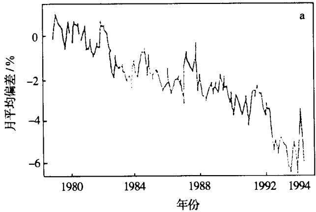

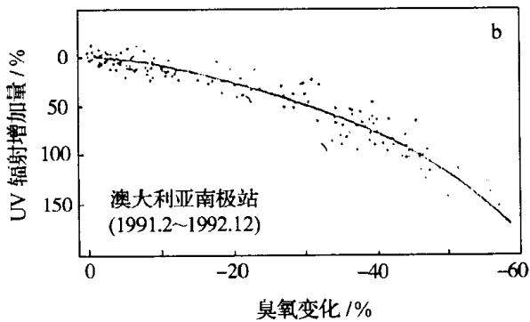  
图 11.1 臭氧浓度的变化及 UV-B 辐射的关系(USGCRP,1995)  
a:1979年以来全球平均臭氧浓度的变化;b:地面UV辐射增加量与平流层臭氧减少量的关系

过量的紫外辐射而受害。植物因此会降低光合作用的水平而减低生产力，人类的健康则会受到影响(Houghton,1990)。

## 二、大气中的温室气体浓度正在增加

气候变暖的化学和热力学过程研究表明，大气中的 $\mathrm { C O } _ { 2 } , \mathrm { C H } _ { 4 } , \mathrm { N } _ { 2 } \mathrm { O }$ 和 CFCII 等温室气体具有增温效应。自工业革命以来，人类种群急剧增长，目前已达60亿。人类活动导致大气中温室气体浓度逐渐增高(图11.2、图11.3)。工业革命以前大气中 $\mathrm { C O } _ { 2 }$ 浓度仅268 ppm,二战以来，大气中 $\mathrm { C O } _ { 2 }$ 浓度几乎增加了25%，现在超过360 ppm,预计在未来 40年中将比工业革命前增加1倍。

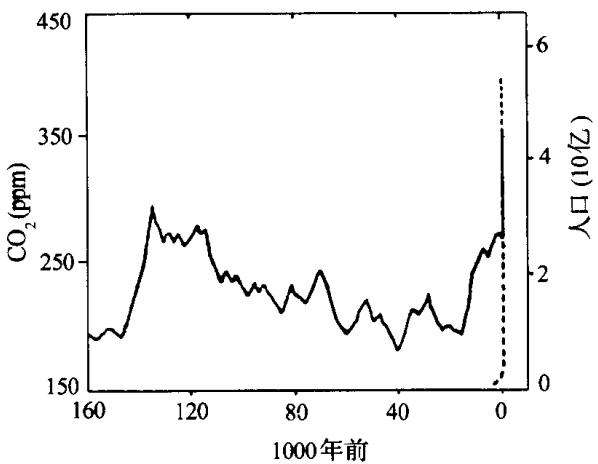  
图 11.2 $\mathrm { C O } _ { 2 }$ 浓度与人口关系

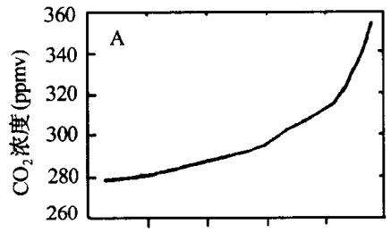

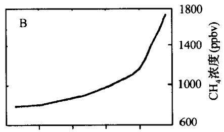

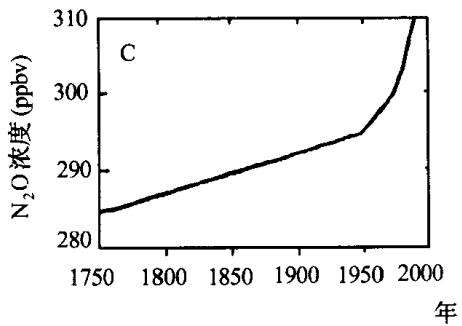

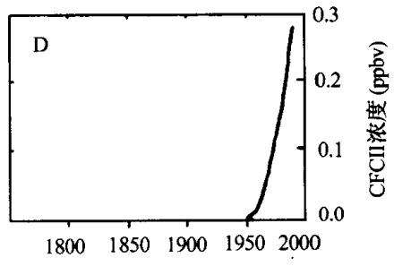  
图 11.3 1750 年以来温室气体稳步增加(仿 Vitousek 1992)$\mathbf { A } { : } \mathbb { C } \mathrm { O } _ { 2 }$ $\mathrm { B } { : } \mathrm { C H } _ { 2 } { : }$ 2 $\mathrm { C } { : } \mathrm { N } _ { 2 } \mathrm { O } { : }$ D:CFCⅡI

## 三、全球气候变化的趋势

现在普遍认为大气中 $\mathrm { C O } _ { 2 }$ 等温室气体浓度的升高肯定会导致全球气候的变化，虽然未来气候变化的速度和程度还不明确，但气象专家一致的观点是未来全球显著的变暖是肯定的。据预测，未来40年内， $\mathrm { C O } _ { 2 }$ 等温室气体的浓度将比目前的高一倍，这种浓度足以使地球温度上升 $3 \pm 1 . 5 \mathrm { { C } }$ (Hansen，1988；NAS，1987；Schneider，1991)，更大胆的估计认为将升高 $4 . 2 \pm 1 . 2 \mathrm { { C } }$ (Schesinder，1989),甚至 $8 \sim 1 0 \mathrm { { C } }$ (Lashof，1989),最保守的估计到2025年将上升1℃(Hokghton，1990)。而且地球上陆地不同地区增温幅度不同，北纬高纬度地区增温比低纬度地区大，欧洲面部和中美洲的增温幅度比全球的平均增温值大。图11.4和图11.5显示了全球过去、现在和将来的温度变化。与此同时，全球的平均降雨量也可能会升高，但存在空间异质性，中纬度地区和内陆地区在夏季可能会出现长期的干旱 $\left( \mathrm { U S A } - \mathrm { E P A } , 1 9 8 8 \right)$ 0

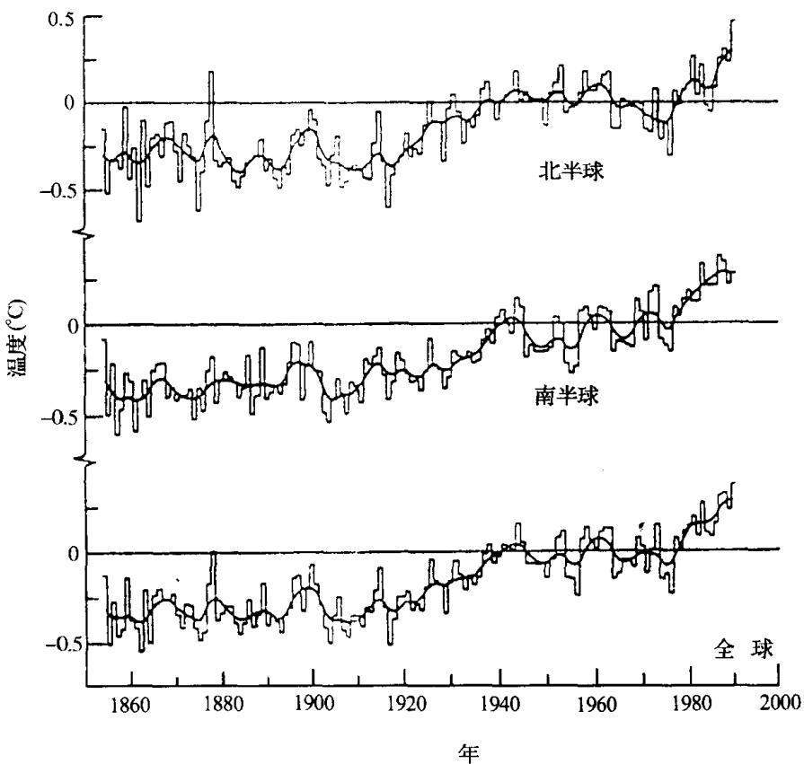  
图 11.4 1854\~1990 年年间半球和全球平均气温(仿 Jones 和 Wigley,1991)

## 四、生物多样性丧失

现在地球上的动植物种类消失的速率比过去6500万年之中的任何时期都要快1000倍，每天大约有100个物种灭绝(图11.6)。20世纪以来，全世界已有110多种哺乳动物、139种鸟类消失，还有600多种动物和25000种植物正面临绝灭的危险。生物多样性是地球在长期进化过程中形成的，它们在生态平衡中扮演了重要作用，它们的丧失将使农业中的主要作物的改良受到实质性的影响。有学者认为，迄今人类对生物多样性的影响，其恢复至少要1亿年(吴榜华，1997)。

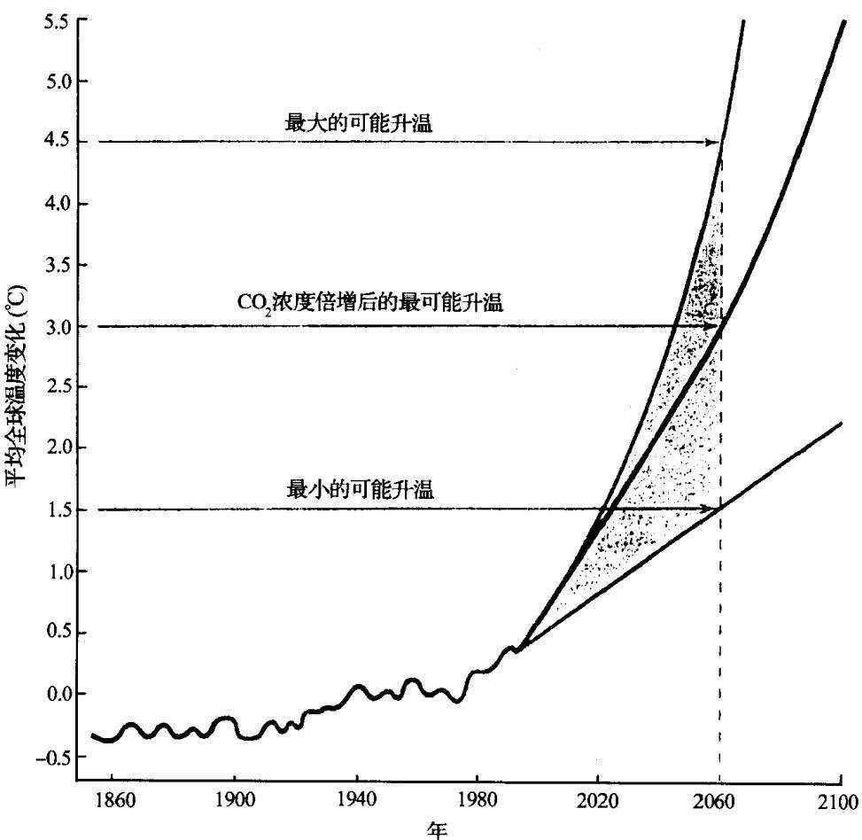  
图 11.5 全球过去、现在和未来的温度变化(仿 Gates,1993)

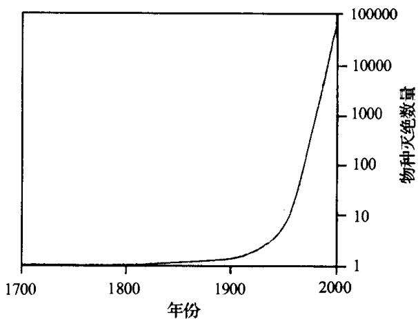  
图 11.6 全球生物多样性减少的速率

## 五、土地利用格局与环境质量的改变

人类为了生存，很早就开始毁林垦荒，致使地球表面的许多原生生态系统被改造。土地利用格局变化最主要的体现在森林、草地、湿地、淡水水体减少，城镇、公路、农田和荒漠化增加。

据统计，全球森林面积减少50%，30%左右的森林变成了农田。目前热带森林还以每年减少2%的速率在继续。全球沙漠化面积以每年50000\~70000km²的速率增加。而由于废水、废物、废气等三废造成的环境污染也不断加剧。这些变化严重地影响了人类的生存质量。

## 六、其他

全球变化还包括生物入侵(见其他章节)，全球生物地球化学循环的改变和海岸带后退等。其中海岸带后退的原因是：大气层上部平流层变冷，全球表面温度升高，夜晚变冷，两极冬天变暖，海冰融化，全球平均降水增加，夏季大陆更于燥和温暖，全球海平面上升，海岸带后退。

当前研究全球变化已是学科前沿和研究热点，目前主要的研究方法集中在如下四个方面：在时间尺度，通过古生物学、古气象学和古地质学等揭示历史上全球变化的进程与规律；在空间尺度上，通过3S技术，以样带研究揭示全球变化对空间格局的影响；在机理方面，主要通过实验生态学揭示全球变化对生态系统过程的影响；在预测方面，主要通过模型模拟全球变化过程和前景。

## 第二节 全球变化的影响

全球变化对人类及其环境的影响是全方位的。虽然认识全球变化的各种现象是必要，但更重要的是认识各现象间的相互作用机理，及其对生态系统等的影响。

## 一、全球气候变化对物种分布及灭绝的影响

一般地，地球上不同物种具有独特的地理分布，而且这种分布具有一定的稳定性，但也随物种的繁殖、扩散和环境因子的变化而变化，表现出物种分布范围的扩大和缩小，从而引起物种的迁移和灭绝。在影响物种分布的因素中，最重要的外因是温度和湿度。从大的时空尺度分析，在过去数万年间，全球气候变化是缓慢的，地球上生物群落对这种变化的反应也是渐进和缓慢的。

已有大量证据表明，随着全球气候的变化，特别是气温的变化，物种的分布有沿海拔和纬度梯度移动趋势。按海拔每升高500m气温下降3℃推算，物种在海拔上移动500m相当于在纬度上移动约250km。在温带地区，温度上升3℃，许多物种将在纬度方向移动至少300 km。

据大量孢粉资料分析，第四纪以来，我国植被由于构造运动和气候波动的影响，植物群在纬向移动约15\~20°，垂向移动达1000\~2000m。结果，北方或高山地区的暗针叶林可以生长到北纬30°以南的山地丘陵区，而南方的亚热带植物可在北纬45°以北的山区发现。

由于植物与环境关系密切，诸如云杉、冷杉等对温度敏感的植物可指示植物空间分布与气候的关系。一般认为，气温升高时这两种植物将向高海拔收缩。此外，由于气候变化，一些物种可能因不适应导致的竞争力低下而灭绝(李克让，1996)。

## 二、全球变化对农业的影响

全球变化会通过影响生态系统中植物的代谢途径、种群竞争、群落演替和生态全球变化对农业的影响。由于全球人口的持续增加，人类对粮食的需求也持续增加，虽然自本世纪60年代以来全球的粮食产量基本上持续增加，但由于全球粮食生产的不平衡，许多国家仍面临着饥荒。在全球变化情况下，由于人口的继续增加，一些问题会进一步恶化，如毁林面积更大、弃耕地更多、沙化土地更多、某些地方日益缺水。

从全球层次上看，气候仍是农业产量的决定因素。目前已发展了一批全球变化的作物模型，其中比较著名的有:CERES-Wheat(Ritchie & Otter,1985)、CERES-Maize(Jones& Kiniry，1986)、SORGRO(Wilkerson，1983)。这些模型预测的结果表明全球变化情况下，会导致全球作物生产区改变，气候的改变会导致荒漠化、干旱和减产，增加农业施肥和灌溉成本，增加病虫害风险。

## 第三节 全球变化与恢复生态学

如前所述，全球变化是指可能改变地球承载生物能力的全球环境变化，它包括全球气候变化、土地利用和覆盖的变化、养分生物化学循环、生物多样性丧失、生物入侵等内容。如果从一个大的时空尺度看，我们希望恢复整个生物圈的环境，也就是说使地球不再如此变化，而保持正常的动态平衡。

为了减少全球变化造成的影响，从生物圈这样大的尺度上开展生态恢复是不可能的，只能在景观及以下尺度上开展各种退化生态系统的恢复与重建。同时结合控制人口数量，减少工业和生活污染，对健康的生态系统进行合理管理也是必要的。

## 参考文献

吴榜华． 1997. 全球气候变化与生物多样性．吉林林学院学报，13(3)：142\~146

彭少麟. 1997. 全球变化现象及其效应. 生态科学，16(2):1\~8

章基嘉.1995. 气候变化的证据原因及其对生态系统的影响.北京：气象出版社

李克让. 1996. 全球气候变化及其影响研究进展和未来展望.地理学报,51(增刊):1\~14

Houghton. 1990. Climate Change the IPCC Scientific Assessment. Cambridge: Cambridge University Press Martin,P. 1990. Climate Change and World Agriculture. New York: Earthscan Publication Ltd

Schlesinger, W. H. 1993. Response of the terrestrial biosphere to global climate change and human perturbation. Vegetatio, 104:295\~305

## 第十二章 可持续发展与退化生态系统恢复

20世纪60年代起，世界性的社会问题日趋严重，人们开始审视和反思工业经济中普遍奉行的“高增长、高消耗、高污染”的不可持续发展战略，研究和探索人类社会发展道路。自1986年以后，可持续发展成为一个热门的话题。可持续发展的核心是利用系统论的思想正确处理人与人、人与自然之间的关系，以实现生态、经济和社会的协调发展，它包括生态环境可持续发展、经济可持续发展和社会可持续发展。由于不同的研究者对其理解不尽一致、强调的侧重点不同，因此，目前有关可持续发展的定义有数十种之多。对退化生态系统进行恢复与重建，最终的目的也是实现生态系统的可持续发展。

## 第一节 可持续发展的概念

世界环境与发展委员会(WCED，1987)给出的可持续发展定义是：“既满足当代人的需求，又不损害子孙后代满足其需求能力的发展”。

人与生物圈国计划(MAB)国际协调理事会的观点：可持续发展把当代人类赖以存在的地球及局部区域，看成是由自然-社会-经济等多种因素组成的复合系统，它之间既相互联系，又相互制约。

可持续发展问题专题研讨会(INTECOL，IUBS，1991)认为：可持续发展是不超越环境系统更新能力的发展，以寻求一种最佳的生态系统以支持生态的完整性和人类愿望的实现，使人类的生存环境得以持续。

联合国有关机构(INCN，UNEP，WWF)认为：可持续发展是指在生存于不超越维持生态系统涵容能力的情况下，提高人类的生活质量，强调可持续发展的最终落脚点是人类社会，即改善人类的生活质量、创造美好环境；人口规模处于稳定、高效利用可再生能源、集约高效的农业、生态系统的基础得到保护和改善、持续发展的交通运输系统、新的工业和新的工作、经济从增长到持续发展、政治稳定、社会秩序井然的一种社会发展。

Barbier(1985)和Pearce等(1989)等认为可持续发展旨在保持自然资源的质量和其所提供服务的前提下，使经济的净利益增加到最大限度；自然资本不变前提下的经济发展，或今天的资源使用不应减少未来的实际收入；不降低环境质量和不破坏世界自然资源基础的经济发展。

Spath(1989)和Solow(1993)认为可持续发展是转向更清洁、更有效的技术—尽可能接近零排放，或密闭式工艺方法—尽可能减少能源和其他自然资源的消耗；可持续发展就是建立极少产生废料和污染物的工艺或技术系统：可持续发展就是在人口、资源、环境各个参数的约束下，人均财富不能实现负增长。

上述各定义分别强调生态、社会、经济和技术等方面。其中世界环境与发展委员会的定义是最基本的，该定义体现以下原则：①公平性原则，包括代内公平、代际公平和公平分配有限资源；②持续性原则，即人类的经济和社会发展不能超越资源和环境的承载能力；③共同性原则，意指由于地球的整体性和相互依存性，某个国家不可能独立实现其本国的可持续发展，可持续发展是全球发展的总目标。

## 第二节 中国的可持续发展观

中国是一个发展中的大国，人口众多、人均资源相对不足、经济基础比较薄弱、总体技术水平相对落后(表12.1)。中国对可持续发展的理论与实践的理解有别于发达国家，代表着发展中社会的普遍要求和利益，也体现了其作为一个特殊的发展中国家的特殊要求(中国科学院可持续发展研究组，1999)。

表12.1 我国的可持续发展现状与预测(牛文远，1997)
<table><tr><td>项目</td><td>1990年</td><td>2000年</td><td>2010年</td><td>2020年</td><td>2030年</td></tr><tr><td>1. 按人均 GNP(1990 年美元不变价格)</td><td>443</td><td>764</td><td>1175</td><td>1724</td><td>2500</td></tr><tr><td>2. 年平均增长速率(%)</td><td>10.0</td><td>8.6</td><td>6.9</td><td>4.8</td><td>4.2</td></tr><tr><td>3. 总能源需求(亿吨标准煤)</td><td>10.4</td><td>13.8</td><td>15.9</td><td>18.5</td><td>20.0</td></tr><tr><td>4. 人口净增长率(%)</td><td>1.44</td><td>1.22</td><td>1.00</td><td>0.72</td><td>0.45</td></tr><tr><td>5. 人口数量(亿)</td><td>11.43</td><td>13.00</td><td>13.92</td><td>14.50</td><td>15.20</td></tr><tr><td>6. 老年人口数量(亿)</td><td>1.002</td><td>1.287</td><td>1.588</td><td>2.089</td><td>2.646</td></tr><tr><td>7. 劳动人口数量(亿)</td><td>7.15</td><td>8.03</td><td>9.08</td><td>9.41</td><td>9.28</td></tr><tr><td>8. 人均生物量(公斤)</td><td>3050</td><td>2971</td><td>2850</td><td>2742</td><td>2660</td></tr><tr><td>9. 人均粮食(公斤)</td><td>375</td><td>372</td><td>375</td><td>378</td><td>380</td></tr><tr><td>10. 人均耕地(公顷)</td><td>0.13</td><td>0.11</td><td>0.10</td><td>0.095</td><td>0.090</td></tr><tr><td>11. 人均林地(公顷)</td><td>0.115</td><td>0.120</td><td>0.128</td><td>0.135</td><td>0.145</td></tr><tr><td>12. 人均草地(公顷)</td><td>0.285</td><td>0.242</td><td>0.230</td><td>0.225</td><td>0.223</td></tr><tr><td>13. 人均肉禽量(公斤)</td><td>20.6</td><td>28.1</td><td>34.5</td><td>40.3</td><td>45.0</td></tr><tr><td>14. 单位 GNP 的能量消耗(1990 为 100)</td><td>100</td><td>93.3</td><td>75.8</td><td>52.4</td><td>25.5</td></tr><tr><td>15. 废气排放(亿立方米)</td><td>85380</td><td>144500</td><td>154000</td><td>105000</td><td>80000</td></tr><tr><td>16. 废水排放(亿吨)</td><td>354</td><td>285</td><td>240</td><td>200</td><td>140</td></tr><tr><td>17. 废渣排放(亿吨)</td><td>5.8</td><td>6.5</td><td>6.3</td><td>6.0</td><td>5.5</td></tr><tr><td>18.  $\mathrm { C O } _ { 2 }$  排放(亿吨)</td><td>6.7</td><td>7.5</td><td>8.0</td><td>8.3</td><td>8.5</td></tr><tr><td>19  $\mathrm { . } \mathrm { s } \mathrm { O } _ { 2 }$  排放(百万吨)</td><td>15.5</td><td>17.5</td><td>18.0</td><td>15.5</td><td>12.1</td></tr><tr><td>20.CFC排放(吨)</td><td>32000</td><td>35000</td><td>28000</td><td>11000</td><td>5000</td></tr><tr><td>21. 土壤侵蚀(百万平方公里)</td><td>1.53</td><td>1.55</td><td>1.50</td><td>1.48</td><td>1.40</td></tr><tr><td>22. 森林覆盖率(%)</td><td>12.9</td><td>13.3</td><td>14.5</td><td>17.5</td><td>22.0</td></tr><tr><td>23. 沙漠化(百万平方公里)</td><td>0.176</td><td>0.191</td><td>0.220</td><td>0.245</td><td>0.250</td></tr><tr><td>24. 工业耗水量(亿吨)</td><td>355</td><td>670</td><td>783</td><td>831</td><td>850</td></tr></table>

鉴于可持续发展的核心是发展，落后和贫穷不可能实现可持续发展的目标，经济发展是实现人口、资源、环境与经济协调发展的根本保障。因此，江泽民同志(1995)在《正确处理社会主义现代化建设中的若干重大关系》一文中指出，“在现代化建设中，必须把实现可持续发展作为一个重大战略。要把控制人口、节约资源、保护环境放到重要位置，使人口增长与社会生产力的发展相适应，使经济建设与资源、环境相协调，实现良性循环。……必须切实保护资源与环境，不仅要安排好当前的发展，还要为子孙后代着想，决不能吃祖宗饭，断子孙路，走浪费资源和先污染、后治理的路子”(陈耀邦，1996)。

由此可见，中国可持续发展战略的总目标是“建立可持续发展的经济体系、社会体系和保持与其相适应的可持续利用的资源和环境基础”，以最终实现经济繁荣、社会进步和生态环境安全。为了实现这一目标，首要的任务是通过对生态系统健康状况进行评估，对退化的生态系统进行合理恢复与重建以提高其生产力，对残存的天然生态系统进行合理的生态系统管理，最终实现生态系统的可持续发展。

## 第三节 可持续发展的思想与恢复生态学

群落和生态系统的基本生态过程是可持续发展的重要基础，也是其核心。这是由于群落与生态系统的结构、功能和动态特征总是通过基本的生态过程来表达。群落与生态系统的结构是由于物种的发展以及种间的相互作用的基本生态过程的反映；群落与生态系统的功能则是通过能量流动和物质循环等基本生态过程来实现，其中生产力和生物量的积累过程是生态系统发展的根本驱动力；群落与生态系统的动态包括波动、演替和更新等，是人与生命生存和继续发展的基础。对受损的生态系统恢复其结构、功能和动态也是实现可持续发展的基础。

人类与其赖以生存和发展的地球系统共同构成复杂的人地巨系统，马世骏等(1984)称其为“社会-经济-自然复合生态系统”，其中的各子系统相互联系、相互作用、相互制约。实施可持续发展必须扬弃人地二元论，树立“天人合一”的人地巨系统观，从整体上把握和解决人口、资源、环境与发展问题。可持续发展简言之就是实现人地巨系统的最优化发展。而恢复生态学是根据人类已对地球造成巨大的损害的现状，通过恢复与重建来实现人地巨系统的最优发展(黄秉维，1996)。

可持续发展就是要正确处理自然资源利用与生产废弃物排放之间的关系，强化环境的价值观念和生态道德、促进资源的有效利用、抑制环境污染的发生，积极开辟新的资源途径，尽可能利用可再生资源，实现经济效益、社会效益与环境效益的协调统一。退化生态系统恢复与重建中重要的一个方面包括了自然资源的合理利用和废物的再生利用，以实现生态、经济和社会的和谐发展。

可持续发展就是追求建立在保护地球自然生态系统基础上的持续经济发展，经济发展要与生态保护相统一，经济效益、社会效益要与生态效益相统一。资源的永续利用和生态的良性循环是可持续发展的重要标志。此外，主张公平分配地球资源，即满足当前发展的需要，又考虑未来长远发展的需要；即满足当代人的利益，又不损害后代人的利益。这两个方面也是恢复生态学最终追求的目标。

可持续发展的实质是人类如何与大自然和谐共处的问题。人类一方面要提高可持续发展的意识，增强可持续发展的能力；另一方面要把人口控制在可持续发展的水平上，减轻对资源和环境的压力，从而实现与大自然的和谐相处。退化生态系统的形成与人类活动，尤其是人口大量增加有密切的关系。实现可持续发展将可避免退化生态系统的进一步产生。

## 第四节 可持续发展的理论框架

可持续发展(学)作为一种新的理论，其理论基础包括地学、生态学、环境学、经济学和社会学等内容。但其核心是努力把握人与自然之间的平衡，寻求人与自然关系的合理化，努力实现人与人之间关系的和谐，逐步达到人与人之间关系(包括代际之间)的调适与公正，从而，深刻揭示“自然-经济-社会”复杂巨系统的运行机制。张志权(1999)认为可持续发展包括如下理论框架。

地球系统科学基础。地球系统科学是一门跨地球科学、环境科学、宏观生物学、遥感技术以及有关社会科学的综合性、交叉性和系统性的科学体系，其研究对象是地球系统的各个圈层(子系统)及其相互作用，总结地球系统的演变规律与机理，破解人类赖以生存的地球环境发展变化之谜，因此可称其为“全球变化科学”。全球变化科学研究的直接目的是为人类合理利用自然资源，控制水、土、大气污染，适应、减缓全球环境变化，制定有关环境问题的重大决策提供科学依据，从而为人类社会的可持续发展服务。正是全球变化科学研究提出了人类社会可持续发展的重大命题，也正是全球变化科学研究的最新成果为人类社会一致行动制定《21世纪议程》等一系列涉及人类社会可持续发展的国际公约提供了科学依据。因此，地球系统科学(全球变化科学)是可持续发展的科学基础，已日益得到公认(NASA,1992;黄秉维，1996;张志权，1999)。

环境承载力论。环境一方面为人类活动提供空间及物质能量，另一方面容纳并消化其废弃物。随人类活动范围及强度日益加大，环境资源日见稀缺。人类活动超出环境承载力限度(环境系统维持其动态平衡的抗干扰能力)时，就产生种种环境问题。环境资源稀缺论的主要特点：一是绝对性(在一定的环境状态下环境承载力是客观存在的，可以衡量和把握其大小)和相对性(环境承载力因人类社会行为内容不同而异，而且人类在一定程度上可以调控其大小)的结合；二是具有明显的区域性和时间性(地区不同或时间不同环境承载力不同)。环境资源稀缺论要求在社会经济生活中，应深入研究环境的承载力状况，从而合理有效地配置环境资源，实现人口、资源、环境与发展相协调，达到环境资源的永续利用和生态的良性发展。

环境价值论。自然环境能够满足人类的需要，并且是稀缺的，因而是有价值的。虽然人们已经认识到了环境价值的客观存在，但在理论和实际经济生活中却从来不重视甚至不考虑其价值的存在。环境价值论研究的问题是如何将环境价值合理量化，以将环境价值与经济利益直接联系起来，在经济核算中考虑环境的成本价值以及人类生产生活中造成的环境价值损失，建立并实施环境价值损失的合理补偿机制，从而定量地观控环境价值损失及环境价值存量，为可持续发展决策服务。

协同发展论。可持续发展实质是人地巨系统的协同演进，也就是经济支持系统、社会发展系统、自然基础系统三大系统相互作用、协同发展，实现经济效益、社会效益和生态环境效益三个效益的统一。

生态学思想。生态环境资源因素是除人口因素之外制约可持续发展的终极因素，生态环境资源的可持续性是人类经济、社会可持续发展的基础。生态学的本质是适者生存，物竞天择。它包括了生态平衡、自然保护、环境污染防治、资源合理开发与永续利用等可持续发展中的生态环境问题。在考虑可持续发展时，时空尺度、因地制宜等必须注意的问题。

## 第五节 可持续发展研究的发展趋势

可持续发展下一步可能会在如下方面取得进展：可持续发展的科学理论构建；可持续发展的评价与度量方法研究；可持续发展的技术及技术体系；区域可持续发展战略研究；可持续发展的体制与机制研究；可持续发展的国际合作研究。这些发展趋势与恢复生态学相联系的话，可以为退化生态系统恢复与重建提供较好的理论与技术指导，为恢复的不同阶段提供监测指标，并为全社会协内进行生态环境综合治理和恢复提供可行的机制(王伯荪，1998)。

## 参考文献

陈耀邦.1996.可持续发展战略读本.北京：中国计划出版社

国家科委和国家计委.1994.中国21世纪议程一中国21世纪人口、环境与发展白皮书.北京：中国环境出版社

黄秉维.1996.论地球系统科学与可持续发展战略科学基础.地理学报，51(4):350\~354

牛文元. 1997. 可持续发展导论.北京:科学出版社

马世骏和王如松.1984.社会-经济-自然复合生态系统.生态学报，4(1).1\~9

美国国家航空和宇宙管理局地球系统科学委员会.陈泮勤等译.1992.地球系统科学.北京：地震出版社

世界资源研究所，联合国环境规划署，联合国开发计划署．1992\~1993. 世界资源报告

王伯荪和彭少麟．1998. 可持续发展的几个生态问题．生态科学，17(1)：1\~6

中国科学院可持续发展研究组.1999.中国可持续发展战略报告.北京:科学出版社

张志权等. 1999. 可持续发展的思想与理论. 地球科学进展，14(2):11\~16

Brown, L. R. 1981. Building a Sustainable Society. New York: Norton WW

INCN, UNEP, WWF. 1991. Caring for the Earth—A Strategy Sustainable Living. Gland, Switzerland

MacNeill,J. 1989. Strategies for sustainable economic development. Scientific American,261:155\~165

WCED. 1987. Our Common Future. Oxford: Oxford University Press

第二编 生态系统健康和生态系统管理

## 第十三章 生态系统健康

早在本世纪初，就有科学家预言全球环境将恶化，进而对人类的生存产生潜在的威胁。在随后的社会发展进程中，虽然有的国家、组织、单位及个人做了大量的努力来解决环境问题，但不幸的是许多预言潜在的威胁已变成了事实。尤其是人口过剩、能源短缺、环境污染、生物多样性减少、土地退化和气候变化已对人类和地球的可持续发展产生了恶劣的影响，使地球出现了不健康的症状。1992年在巴西举行的世界环境与发展大会上，与会各国首脑一致强调“国家间将加强合作，以保护和恢复地球生态系统的健康和完整性”。科学家们在检讨这些问题时发现，以前的关于生态系统管理的理论与方法已显落后，不能指导解决这些问题，要针对生态系统已不健康的现实，把人类活动、社会组织、自然系统及人类健康等社会、生态和经济问题进行整合研究，系统研究生态系统在胁迫条件下产生不健康的症状和机理。生态系统健康(ecosystemhealth)正是在这一背景下产生的(Costanza，1992;Haines，1993;Rapport，1998)。本文将介绍生态系统健康的基本理论与评估方法，及其与相关学科的关系。

## 第一节 生态系统健康的定义及研究简史

生态系统健康既可理解为生态系统的一种状态也可理解为一门科学。不同的学者对生态系统健康的状态与生态系统健康学科体系有不同的看法，但总的来说可概括如下：生态系统健康(学)是一门研究人类活动、社会组织、自然系统及人类健康的整合性科学；而生态系统健康是指生态系统没有病痛反应、稳定且可持续发展，即生态系统随着时间的进程有活力并目能维持其组织及自主性，在外界胁迫下容易恢复（Kristin，1994；Cech，1998;Rapport, 1998,1999)。

生态系统健康包括从短期到长期的时间尺度、从地方到区域的空间尺度的社会、生态、健康、政治、经济、法律的功能，从地方、区域到全球胁迫下的生态环境问题。其目标是保护和增强区域环境容量的恢复力，维持生产力并保持自然界为人类服务的功能。生态系统健康只是一种隐喻，它是评价生态系统最佳状态的一种方式。可通过全面研究生态系统在胁迫下的特征，根据生态系统条件进行系统诊断，找出生态系统退化或不健康的预警指标，进而防止其退化或生病(Kristin，1994;Cech，1998;Rapport,1998)。

最早研究生态系统健康的是 Leopold,他于1941 年提出了“土地健康”(land health)的概念，但未引起足够的重视(Rapport,1998)。随后，科学家们一直对是否发展生态系统健康学说应用于生态系统评价和管理存在争论。在Odum倡导下，20世纪70年代兴起了生态系统生态学，这一学说继承了Clements的演替观，把生态系统看作一个有机体(生物)，具自我调节和反馈的功能，在一定胁迫下可自主恢复，从而忽视了生态系统在外界胁迫下产生的种种不健康症状(Odum，1979)。与此同时，Woodwell(1970)和Barrett(1976)极力提倡胁迫生态学(stress ecology)。进入 20 世纪 80 年代，Rapport 等(1985)系统研究了胁迫下生态系统的行为，并在随后提出不能把生态系统作为一个生物对待，它在逆境下的反应不具自主性。以Costanza和 Rapport 为代表的生态学家极力认为现在世界上的生态系统在胁迫下发生问题，已不能像过去一样为人类服务，并对人类产生了潜在威胁，他们认为生态系统健康的概念可引起公众对环境退化等问题的关注。然而，以Poli-cansky和Suter为代表的科学家极力反对生态系统健康的提法，他们认为生态系统健康只是一种价值判断，没有明确的可操作的定义，会阻碍详细的科学分析进程。1992年，“Journal of Aquatic Ecosystem Health”诞生，三年之后,“Ecosystem Health”和“Journal forecosystem health and medicine”创刊，这三份杂志已成为国际生态系统健康学会会员发表论点的重要刊物。1992年，美国国会通过了“森林生态系统健康和恢复法”，其农业部组织专家对美国东、西部的森林、湿地等进行了评价，并于1993年后出版了一系列的评估报告(USDA,1993,1995)。1994 年来自31个国家的 900名科学家聚集在加拿大的渥太华召开了全球生态系统健康的国际研讨会，会议集中在评价生态系统健康，检验人与生态系统相互作用，提出基于生态系统健康的政策等三个方面，并希望组织区域、国家和全球水平的管理、评价和恢复生态系统健康的研究。迄今西方国家已出版了关于生态系统健康的书有6本之多，其中比较著名的有：Costanza 等编辑的 Ecosystem health：new goals forenvironmental management(Island Press，1992)，Rapport等主编的 Ecosystem health(Blackwell Science,Inc,1998), Rapport 等主编的Evaluating and monitoring the healthof large-scale ecosystem(Springer-Verlag，1995)。这几本书基本反映了生态系统健康作为一生态学分支的基本理论与方法，并有一些实例研究。

## 第二节 生态系统在胁迫下的反应

1962年Carson出版了《寂静的春天》一书，向人们披露了化学物质污染生态系统后产生的恶果，引起人们对环境恶化的广泛关注(Ehrenfeld，1995)。事实上，人类对生态系统的影响有许多方面，至少包括①过度开发利用(overharvesting)，指对陆地、水体生态系统的过度收获，主要后果是物种消失);②物理重建(physical restructuring)，指为了某种目的改变生态系统结构与功能，可能导致生物多样性减少，水质下降，有毒物增加，从而影响人类生存):③外来种的引入(introduction of exotic species)，引进外来种引起乡土种消失及生态系统水平的退化);④自然干扰的改变(modification of natural perturbations)，如火灾、河流改道、地震、病虫害爆发等，可引起生态系统的消失及退化等等，这些胁迫或干扰已引起了全球生态系统从区域到生物圈水平的变化(Koren，1995)。值得指出的是，各种逆境对生态系统的胁迫机理不一，有时是单一因子胁迫，有时是多因子综合胁迫，生态系统内个体、种群、群落和生态系统层次对胁迫的反应也是不一致的。

## 一、单因子胁迫下的反应

以森林生态系统为例，如果从一个健康的森林生态系统中过度取柴(收获薪材)，其树木死亡率、火险、发病率、虫害发生概率均会增加，而其分解率、营养循环效率、多样性、景观多样性及美学价值均会减少。Rapport(1998)曾比较了在同一种胁迫下湖泊、河流、山地三种生态系统的表现(表13.1)，结果显示不同生态系统在同种胁迫下的反应类似3]。此外.Qdum(1985)提出了受胁迫生态系统的反应趋势，他认为生态系统在胁迫情况下会在能量(群落呼吸增加.生产力/呼吸量<1或>1，生产力/生物量和呼吸量/生物量增加，辅助性能量的重要性增加，冗余的初级生产力增加)、物质循环(物质流通率增加，物质的水平运移增加而垂直循环降低，群落的营养损失增加)、群落结构(r-对策种的比例增加，生物的大小减小，生物的寿命或部分器官寿命缩短，食物链变短，物种多样性降低)和一般系统水平(生态系统变得更开放，自然演替逆行，资源利用效率变低，寄生现象增加而互生现象降低，生态系统功能比结构更强壮)上发生变化(Odum,1985)。

表 13.1 在同种胁迫下三种生态系统的表现（根据 Rapport 1998)
<table><tr><td>指标</td><td>低拉文田大湖</td><td>开容九开河</td><td>琼拿塔山地</td></tr><tr><td>系统性质</td><td></td><td></td><td></td></tr><tr><td>初级生产力</td><td>十</td><td>+</td><td>0/-</td></tr><tr><td>水平营养运移</td><td>+</td><td>+</td><td>+</td></tr><tr><td>物种多样性</td><td>一</td><td>一</td><td>-/+</td></tr><tr><td>疾病普遍性</td><td>+</td><td>+</td><td>+</td></tr><tr><td>种群调控</td><td></td><td>一</td><td>一</td></tr><tr><td>演替的逆转</td><td>一 +</td><td>+</td><td>+</td></tr><tr><td>复合稳定性</td><td>1</td><td>1</td><td>一</td></tr><tr><td>群落结构</td><td></td><td></td><td></td></tr><tr><td>r-对策种</td><td>+</td><td>+</td><td>十</td></tr><tr><td>短命种</td><td>+</td><td>+</td><td>+</td></tr><tr><td>更小的生物群</td><td>十</td><td>+</td><td>?</td></tr><tr><td>外来种</td><td>十</td><td>十</td><td>+</td></tr><tr><td>种间相互作用</td><td></td><td>一</td><td>一</td></tr><tr><td></td><td>一</td><td></td><td>十</td></tr><tr><td>边界线 乡土种的消失</td><td>十 ?</td><td>+ 十</td><td>+</td></tr></table>

注：+增加；-减少；0无变化；？不清楚

## 二、多因子胁迫下的反应

当生态系统受多个因子胁迫时会产生累积效应，从而增加生态系统的变异程度。在这种情况下，生态系统的反应与胁迫因子的关系非常复杂，而且对人类的管理也提出了更高的要求。Rapport(1998)曾提出了一个框图展示了人类活动对生态系统变化及人类健康的影响(图13.1)。图中表明，人类活动会胁迫生态系统健康，导致生态系统结构发生变化，进而影响到生态系统的服务功能，对人类健康产生影响，人类不得已又会关注生态系统健康。

## 三、生态系统对胁迫的反应过程与结果

在外界因子的作用下，在可承受范围内，生态系统的反应过程分为三个阶段：开始时为初期反应，随后是抵抗与恢复阶段，最后是回复阶段(Begon，1990)。

生态系统对胁迫的反应结果有四种：①死亡(即偏离原轨道并消亡)；②退化(偏离原轨道);③恢复(即回复到原状态及其附近);④进入更佳状态(Barrett，1981)。

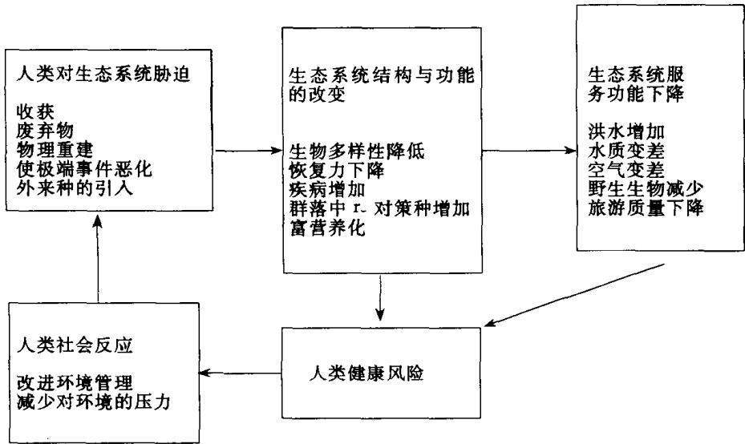  
图 13.1 人类活动与生态系统健康间的关系（根据 Rapport,1998)

## 第三节 生态系统健康的标准

生态系统健康的标准有活力、恢复力、组织、生态系统服务功能的维持、管理选择、外部输入减少、对邻近系统的影响及人类健康影响等8个方面，它们分属于生物物理范畴、社会经济范畴、人类健康范畴以及一定的时间、空间范畴。这8个标准中最重要的是前3个方面(Rapport，1998)。

活力(vigor):即生态系统的能量输入和营养循环容量，具体指标为生态系统的初级生产力和物质循环。在一定范围内生态系统的能量输入越多，物质循环越快，活力就越高，但这并不意味着能量输入高和物质循环快生态系统就更健康，尤其是对于水生生态系统来说，高输入可导致富养化效应。

恢复力(resilience):即胁迫消失时，系统克服压力及反弹回复的容量。具体指标为自然干扰的恢复速率和生态系统对自然干扰的抵抗力。一般认为受胁迫生态系统比不受胁迫生态系统的恢复力更小。

组织(organization):即系统的复杂性，这一特征会随生态系统的次生演替而发生变化和作用。具体指标为生态系统中r-对策种与k-对策种的比率，短命种与长命种的比率，外来种与乡土种的比率，共生程度，乡土种的消亡等。一般认为，生态系统的组织越复杂就越健康。

生态系统服务功能的维持(maintenance of ecosystem services):这是人类评价生态系统健康的一条重要标准。一般是对人类有益的方面，如消解有毒化学物质，净化水，减少水土流失等，不健康的生态系统的上述服务功能的质和量均会减少。

管理选择(management options):健康生态系统可用于收获可更新资源、旅游、保护水源等各种用途和管理，退化的或不健康的生态系统不再具多种用途和管理选择，而仅能发挥某一方面功能。

外部输入减少(reduced subsides):所有被管理的生态系统依赖于外部输入。健康的

生态系统对外部输入(如肥料、农药等)会大量减少。

对邻近系统的破坏(damage to neighboring systems):健康的生态系统在运行过程中对邻近的系统的破坏为零，而不健康的系统会对相连的系统产生破坏作用，如污染的河流会对受其灌溉的农田产生巨大的破坏作用。

对人类健康的影响(human health effects):生态系统的变化可通过多种途径影响人类健康，人类的健康本身可作为生态系统健康的反映。与人类相关又对人类影响小或没有的生态系统为健康的系统。

## 第四节 生态系统健康的评估与预测

有了标准就可进行生态系统健康评价，但事实上并不容易。由于生态系统的多样性(如森林、草原、农田、水体、农村、城市等)，评估人员及其目的不同，尤其是评估者感兴趣的时空尺度不一时，评估结果的差异是非常明显的(Levins,1995;Holmes，1996;)。过去人们采用生态风险评价生态系统健康。生态风险评价是评估人类活动或自然灾害对生态系统组分的伤害概率，它关注的是保存生态系统的健康而不是阻止破坏，评价的主要步骤包括调查研究、风险评估、风险定性和定量化、风险管理等。生态风险评价由于存在一些不确定性，也难以操作(Hartg,1992;Ludwig,1993;Samson,1994;Yazvenko,1996)。

为了更方便实现生态系统健康研究的最终目的主要是进行管理和预测，Ulanowicz(1986)和Rapport(1998)等发展了活力、组织和恢复力的测量及预测公式，利用这些公式计算出的结果即为生态系统健康的程度(Ukabowicz,1986)。

## 一、活力的测量

活力即其活性、代谢及初级生产力，这是生态系统健康主要指标中最好测定的部分，可用初级生产力和经济系统内单位时间的货币流通率表示。Ulanowicz提出用网络分析(network analvsis)方法进行预测的两种数量方法：即计算系统的总产量(TST)和净输入(NI)。TST即是在单位时间内沿着各个体的交换途径的物质转移量的简单相加(TST=.Tii)，而 NI则可直接从 TST 中分离出来。

## 二、组织的测量

组织即生态系统组成及途径的多样性。在生态系统演替和进化过程中，在没有胁迫的情况下，生态系统的物质和能量运转量会增加，但其基本反馈结构会保持稳定。在胁迫下，一个组分的活力增加或减少，会引起其他组分的增加或减少，并通过各种循环最终影响到它自己。Ulanowicz根据这些特征及网络分析方法建立了组织测量及预测方程。

首先建立一个矩阵，矩阵中每个元素Tij表示Ⅰ行成分到j列成分间物质与能量的交换。状态 $\mathrm { P } ( \mathsf { a i } , \mathsf { b j } )$ 指一个中间变量离开成分Ⅰ并进入成分j(Tij)的概率，由于T在这样的系统运移中是收敛的，就可通过Tij/T估算 $\mathbb { P } ( \mathrm { a i } , \mathrm { b j } )$ ，同样，P(bj)一部分进入元素j的概率也可通过.T/T估算，最后，一部分在离开Ⅰ进入j的量的条件概率 $\mathrm { \bf P ( \ b j \ I a i ) }$ 可通过Tij/(.Ti.)估算。

因此，生态系统的组织测定公式为： $\mathbf { I } ~ = ~ . \mathrm { T i j / T } \times \log ( \mathrm { T i j } \times \mathrm { T / T j } \times \mathrm { T i } )$

此外，Ulanowicz还建立了自主权值(A)和系统不确定性(H)公式，以从其他两个方面量化组织。

$$
\begin{array} { r l } & { \mathrm { A } { = } \mathrm { T } { \times } \mathrm { I } = \mathrm { \Omega } . \mathrm { T i } { \times } \log \left( \mathrm { T i } { \times } \mathrm { T } / \mathrm { T i } \times \mathrm { T i } \right) } \\ & { \mathrm { H } { = } . \left( \mathrm { T i } { \angle } \mathrm { T } \right) { \times } \log \mathrm { \Omega } ( \mathrm { T i } { \angle } \mathrm { T } ) } \end{array}
$$

## 三、恢复力的测量

恢复力是生态系统维持结构与格局的能力。预测生态系统在胁迫下的动态过程一般要求用计算机模型(诸如林窗动态模型<如GAP>，生物地球化学循环模型<如CEN-TURY>等)。通过这些模型可估算出恢复时间(RT)及该生态系统可以承受的最大胁迫(MS，当生态系统从一种状态转为另一种状态的临界值)。恢复力即为MS/RT。

## 第五节 生态系统健康的等级理论

等级理论(Hierarchy theory)是关于复杂系统的结构、功能和动态的系统理论，该理论认为等级系统中高层次的行为或动态常表现出大尺度、低频率、慢速度特征，而低层次为行为、过程的行为或动态则表现出小尺度、高频率、快速度的特征。不同等级层次之间还具有相互作用的关系。等级理论要求在研究复杂系统时一般至少要同时考虑核心层、上一层、下一层等三个相邻的层次(Noss,1990;Wu,1995;Ren,1999)。本文首次提出了在时间和空间格局上对生态系统健康进行研究或评价的等级概念(图13.2)：生态系统的基本性质包括结构、功能、动态与服务，而生态系统又可分为基因、物种－种群、群落－生态系统、区域景观-全球等4个层次，两者通过巢式等级整合。

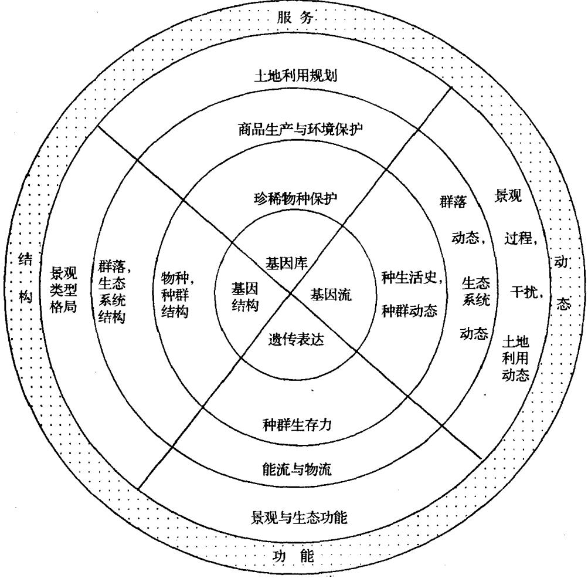  
图13.2 生态系统健康评估的等级概念

## 第六节 干扰、生态系统稳定性与生态系统健康

干扰(disturbance)是指导致一个群落或生态系统特征(诸如种类多样性、营养输出、生物量、垂直与水平结构等)超出其波动的正常范围的因子，干扰体系包括干扰的类型、频率、强度及时间等(Mooney,1983)。生态系统稳定性(ecosystem stability)是指生态系统保持正常动态的能力，主要包括恢复力(resilience，干扰后回到先前状态速度)和抵抗力(re-sistance,系统避免被取代的能力)。MacArthur(1955)和Elton(1958)等提出群落复杂性导致稳定性，但May(1972)通过数学模型模拟表明，随着复杂性的增加生态系统趋于降低稳定性。目前关于生态系统稳定性与复杂性是否有关系及其关系如何尚有争论(Pim，1984;孙儒泳，1992)。

生态系统健康与干扰、生态系统稳定性具有密切的关系。一般地讲，稳定的生态系统是健康的，但健康的生态系统不一定是稳定的；干扰作用于稳定的生态系统或健康的生态系统，会导致不稳定或不健康，在一定强度范围下，干扰可能导致生态系统不健康，但仍是稳定的；健康的生态系统是未受到干扰的生态系统，但稳定的生态系统可能受到干扰；生态系统稳定性的两个重要指标是包含在生态系统健康标准中的，而且干扰与这两个指标紧密相关；生态系统的复杂性与生态系统健康的关系还很难确定。

## 第七节生态系统管理、生态系统可持续发展与生态系统健康

20 世纪 90年代兴起了生态系统管理(ecosystem management)，生态系统管理是指在某一限定的生态系统内协调、控制方向或人类活动，平衡长期和短期目标，并获取最大利益的行为(Woody,1993;Boyce & Harey1994)。其基本思路就是了解生态系统结构、功能与动态，并用生态学原理和生态风险评价进行管理，其目标包括维持生态过程及其进化历程，按照生态学思想和进化论进行管理，维持乡土种和需要的非乡土种群，促进社会和经济的恢复，用有限价值理论进行管理，维持生态系统产品、功能和社会需求的多样性等(Simon,1998)。

可持续发展(sustainable development)是指既满足当代需求，又不影响后代需求的发展模式，它包括了生态环境、经济和社会的可持续发展(Goodland,1995)。

生态系统健康、生态系统管理与可持续发展三者间的关系也很紧密：生态系统健康与可持续发展是生态系统的状态，而生态系统管理则是维持这些状态的重要手段；在胁迫下，生态系统会不健康或不持续，就需要相应的管理来回到健康与可持续方向上来；在没有胁迫的情况下，一个生态系统在发育(生长)过程中，每一个时间段均有一个健康状态，这些均为健康的生态系统，而仅仅处于发育中期(壮年期)的生态系统是可持续的，在早期和晚期均是不持续的；在生态系统壮年阶段，受到外界胁迫时，先要进行生态系统健康评价，再进行管理，以实现生态系统的可持续发展。

## 第八节 生态系统健康与恢复生态学等学科的关系

生态系统健康与恢复生态学、保护生物学、景观生态学、生态系统生态学、环境生态学、胁迫生态系统、干扰生态学、生态系统管理学、生态工程学、生态经济学等生态学的分支学科有关系(图13.3)，该图表明，生态系统健康与相关生态学分支的关系紧密，所有这些学科研究中都必须涉及格局与过程，进化与适应等问题。

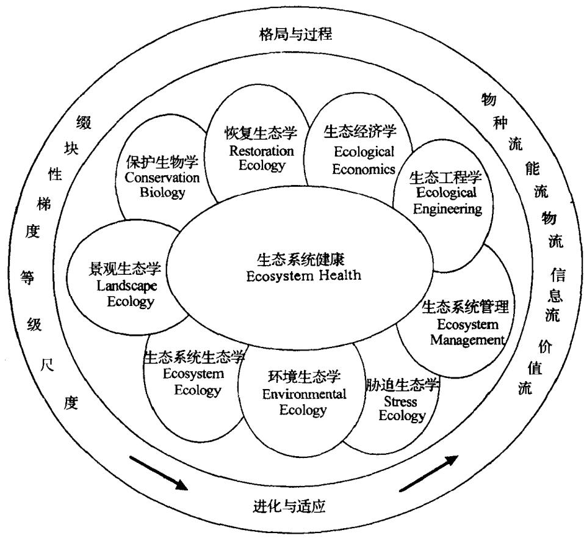  
图13.3 生态系统健康与相关生态学分支的关系

恢复生态学是研究生态系统退化的机理，退化生态系统恢复与重建的技术与方法，生态学过程与机理的科学，它强调理论研究与应用技术研究两方面。其理论研究包括生态系统结构、功能及过程，干扰与生态系统受损及其响应机制，生态系统稳定性、多样性、抗逆性、生产力和恢复力等，生态演替规律，个体、种群、群落、生态系统、景观和区域层次的退化评估，生态系统退化及恢复过程的监测模拟及预测等；应用技术研究包括退化生态系统恢复与重建技术体系，生态系统结构与功能的优化配置及调控技术，生物多样性恢复与维持技术，生态工程技术等(Milton,1994;Cairn,1995;Yu,1997)。

生态系统健康主要研究外界胁迫下生态系统反应情况，因而可认为生态系统健康仅是恢复生态学理论基础的一个重要方面，它可用于评价生态系统退化的程度及恢复状态的评估；生态系统健康与恢复生态学针对的对象是不同的，生态系统健康针对自然的和干扰的生态系统，而恢复生态学仅针对干扰后形成的不健康的生态系统；生态系统健康主要强调维持生态系统自身的进程及其为人类服务的功能，而恢复生态学则强调人为促进生态系统恢复或将生态系统改变为另一类符合人类需求的生态系统；恢复生态学在生态系统开发与保护中起重要指导作用，而生态系统健康主要在保护中起重要作用；退化生态系统恢复的时间不一(轻微受损的生态系统要3\~10年，中等的10\~20年，严重的50\~100年，极度的200年以上)，而生态系统产生不健康及其治疗(恢复)时间相应地要短些。

## 第九节 生态系统健康存在的问题

生态系统健康的兴起只是近10年的事，还存在不少问题有待解决，这主要体现在：①生态系统健康的不可确定性，虽然生态系统健康的标准已提出许多，但对于生态系统健康状态的确定仍有许多不确定性，尤其是生态系统在什么状态下才是没有干扰，才是健康的？这可能要从各种其他生物如何面对不可确定性的反应中寻找答案；②生态系统健康要求综合考虑生态、经济和社会因子，但对各种时间、空间和异质的生态系统而言实在太难，尤其是人类影响与自然干扰对生态系统影响有何不同难以确定，生态系统改变到什么程度下其为人类服务的功能仍能维持；③由于生态系统的复杂性，生态系统健康很难简单概括到一些易测定的具体指标，评估方法还有待改进，否则生态学家和政策制定者找不到准确参考点来评估生态系统健康受害程度；④生态系统是一个动态的过程，有一个产生、成长到死亡的过程，很难判断哪些是演替过程中的症状，哪些是干扰或不健康的症状，尤其是幼年的和老年的生态系统；⑤健康的生态系统具吸收、化解外来胁迫的能力，但这种能力还很难测定，尤其是适应在生态系统健康中的角色如何？⑥生态系统的健康到底能持续多长时间？⑦生态系统保持健康的策略是什么？虽然生态系统健康为我们解决环境问题提供了新的概念构架和一系列研究手段，但这些问题尚有待于进一步的深入研究。

## 参考文献

任海，彭少麟，邬建国.2000.生态系统健康及其评估. 热带地理，20(4):310\~316

孙儒泳．1992.动物生态学原理．北京：北京师范大学出版社

余作岳和彭少麟．1996.热带亚热带退化生态系统植被恢复生态学研究.广州：广东科技出版社

邬建国. 1996.生态学范式综论. 生态学报，16(5)：449\~460

Barrett,G. W. 1976. Stress ecology. BioScience,26(3):192\~194

Barrett,G. W. & R. Rosenberg. 1981. Stress Effects on Natural Ecosystems. London: John Wiley & Sons Ltd

Barrett,G. W. 1993. Applied Ecology: An Emerging Integrative Paradigm for the 1990s. ASC Newsletter

Boyce,M. S. & A. Haney. 1994. Ecosystem Management. New Haven: Yale University Press

Begon,M. ,J. L. Harper & C. R. Townsend. 1990. Ecology. London: Blackwell Scientific Publications

Cairn,J.J. 1995. Restoration ecology. Encyclopedia of environmental biology,3:223\~235

Cech,J. J. 1998. Multiple Stresses in Ecosystems. Boston: Lewis Publishers

Costanza, R. , B. G. Norton & B. D. Hashell, 1992. Ecosystem Health: New Goals for Environmental Management. Washington DC: Island Press

Daily,G.C. 1995. Restoring value to the world degraded lands. Science,269: 350\~354

Ehrenfeld,D. 1995. The marriage of ecology and medicine: are they compatible? Ecosystem Health,1:15\~22

Gallopin,G. C.1995. Perspective on the health of urban ecosystem. Ecosystem Health,1:129\~141

Goodland R. 1995. The concept of environmental sustainability. Ann. Rew. of Ecol. & Syst,26:1\~24

Ren Hai, Wu Jianguo & Peng Shaolin. 1999. A hierarchical approach to the study and monitoring of ecosystem health. Managing for ecosystem health, International Congress on Ecosystem Health. Report No 24 of University of California. Davis CA USA,93\~94

Haines,A. 1993. Global health watch: monitoring impacts of environmental change. Lancet, 342:1464\~1469

Hartg,J. H. 1992. Toward defining aquatic ecosystem health for the Great Lakes. Journal of Aquatic Ecosystem Health, 1: 97\~108

Holmes, T. P. 1996. Contingent valuation of ecosystem health. Ecosystem Health, 2:56\~60

Levins,R. 1995. Preparing for uncertainty. Ecosystem Health, 1:47\~57

Ludwig,D. 1993. Uncertainty: resource exploitation, and conservation lessons from history. Science, 260:17\~36

Kristin,S. 1994. Ecosystem health: a new paradigm for ecological assessment? Trends in Ecology & Evolution,9: 456\~ 457

Koren,H. 1995. Handbook of Environmental Health and Safety. London: Lewis Publishers

Mooney, H. A. & M. Godern. 1983. Disturbance and Ecosystem. Berlin: Springer-Verlag

Milton,S.J.1994. A conceptual model of arid rangeland degradation. BioScience,44:70\~76

Noss, R. F. 1990. Indicators for monitoring biodiversity: A hierarchical approach. Conservation Biology, 4(4): 355\~364

Odum,E. P. 1979. Perturbation theory and the subsidy-stress gradient. BioScience,29(6): 349\~352

Odum,E. P. 1985. Trends expected in stressed ecosystems. BioScience,35(7):419\~422

Pimm,S. L. 1984. The complexity and stability of ecosystems. Nature, 317:321\~326

Rapport,D. J. 1998. Ecosystem Health. Oxford: Blackwell Science, Inc

Rapport, D. J. , R. Costanza & A. J. McMichael. Assessing ecosystem health. Trends in Ecology & Evolution, 1999, 13: 397\~402

Rapport,D.J, H. A. Regier & T.C. Hutchson. 1985. Ecosystem behavior under stress. Am. Naturalist, 125: 617\~640

Simon,T. P. 1998. Assessing the Sustainability and Biological Integrity of Water Resources Using Fish Communities. London: CRC Press

Samson, R. N. 1994. Assessing Forest Ecosystem Health in the Inland West. London: Food Products Press. 3\~13

Ukabowicz,R.E. 1986. Growth and Development: Ecosystem Phenomenology. New York: Springer-Verlag

USDA. 1993. Northeastern area forest health report. NA-TP-03-93. USDA

USDA. 1995. Integrating social science and ecosystem management: A national challenge proceedings. USDA

Woodwell,G. M. 1970. Effects of pollution on the structure and physiology of ecosystems. Science, 168: 429\~433

Woody,S. 1993. Ecological Integrity and the Management of Ecosystems. Ottawa: ST Lucie Press, 19\~46

Wu Jianguo & O. L. Loucks 1995. From balance of nature to hierarchical patch dynamics: a paradigm shift in ecology. The Quarterly Review of Biology, 70(40):439\~465

Yazvenko,S. B. 1996. A framework for assessing forest ecosystem health. Ecosystem Health. 2:41\~55

## 第十四章 生态系统管理的概念及其要素

自20世纪40年代以来，随着人口的增加、资源的开发、环境的变迁和经济的增长，环境污染、森林破坏、水土流失和荒漠化等一系列世界性问题对人类生存和经济的持续发展构成了严重的威胁。恢复退化的生态系统和合理管理现有的自然资源日益受到国际社会的关注。基于过去的教训，人们认识到传统的单一追求生态系统持续最大产量的观点必须改为寻求生态系统可持续性的观点，资源管理也应从传统的单一资源管理转向系统资源管理。要实现这一目标，生态系统管理经营者需要与生态学家合作。生态系统管理正是管理者与科学家之间的桥梁，可以实现生态系统多个产出目标及其整体性(或可持续性)(Agee,1988;Aplet,1993;Carpenter,1995;Chapin,1996;Boyce,1997)。本文将介绍生态系统管理的一系列基本概念，并对该领域的最新进展以及有关重要问题作一总结。

## 第一节 生态系统管理的定义

对生态系统管理的定义，不同群体或个人根据不同的出发点有不同的看法，目前较有影响的定义有：

Agee和Johnson(1988):生态系统管理涉及调控生态系统内部结构和功能、输入和输出、并获得社会渴望的条件。

Overbay(1992):利用生态学、经济学、社会学和管理学原理仔细地和专业地管理生态系统的生产、恢复，或长期维持生态系统的整体性和理想的条件、利用、产品、价值和服务。

美国林学会(1992):生态系统管理强调生态系统诸方面的状态，主要目标是维持土壤生产力、遗传特性、生物多样性、景观格局和生态过程。

Goldstein(1992):生态系统管理强调生态系统的自然流(如能流、物流等)、结构和循环，在这一过程中要摒弃传统的保护单一元素(如某一种群或某一类生态系统)的方法。

美国林业署(1992\~1994):生态系统管理是一种基于生态系统知识的管理和评价方法，这种方法将生态系统结构、功能和过程，社会和经济目标的可持续性融合在一起。

美国内务部和土地管理局(1993):生态系统管理要求考虑总体环境过程，利用生态学、社会学和管理学原理来管理生态系统的生产、恢复或维持生态系统整体性和长期的功益和价值。它将人类、社会需求、经济需求整合到生态系统中。

美国东部森林健康评估研究组(Eastside Forest Health Assessment Team,1993):对生态系统的社会价值、期望值、生态潜力和经济的最佳整合性管理。

Wood(1994):综合利用生态学、经济学和社会学原理管理生物学和物理学系统，以保证生态系统的可持续性，自然界多样性和景观的生产力。

Grumbine(1994):保护当地(顶极)生态系统长期的整体性。这种管理以顶极生态系统为主，要维持生态系统结构、功能的长期稳定性。

美国环保局(1995):生态系统管理是指恢复和维持生态系统的健康、可持续性和生物多样性，同时支撑可持续的经济和社会。

美国生态学会(1996)：生态系统管理有明确的管理目标，并执行一定的政策和规划，基于实践和研究并根据实际情况作调整，基于对生态系统作用和过程的最佳理解，管理过程必须维持生态系统组成、结构和功能的可持续性。

Christensen(1996):集中在根本功能复杂性和多重相互作用的管理，强调诸如集水区等大尺度的管理单位，熟悉生态系统过程动态的重要性或认识到生态过程的尺度和土地管理价值取向间的不相称性。

Boyce和 Haney(1997):对生态系统合理经营管理以确保其持续性，生态持续性是指维持生态系统的长期发展趋势或过程，并避免损害或衰退。

Dale等(1999):生态系统管理是考虑了组成生态系统的所有生物体及生态过程，并基于对生态系统的最佳理解的土地利用决策和土地管理实践过程。生态系统管理包括维持生态系统结构、功能的可持续性，认识生态系统的时空动态，生态系统功能依赖于生态系统的结构和多样性，土地利用决策必须考虑整个生态系统。

由此可见，上述这些定义在许多方面有重复，大多数定义强调在生态系统与社会经济系统间的可持续性的平衡，部分定义强调生态系统的功能特征。这些定义就像六个盲人摸象得出的结论一样。我们认为所有这些定义并没有矛盾，生态系统管理要求我们越过生态系统中什么是有价值的和什么是没价值的问题，而主要集中在自然系统与社会经济系统重叠区的问题上。这些问题包括：生态系统管理要求融合生态学的知识和社会科学的技术，并把人类、社会价值整合进生态系统；生态系统管理的对象包括自然和人类干扰的系统；生态系统功能可用生物多样性和生产力潜力来衡量；生态系统管理要求科学家与管理者定义生态系统退化的阈值；生态系统管理要求人类利用和对生态系统的影响方面的系统的科学的研究结果作指导；由于利用生态系统某一方面的功能会损害生态系统其他的功能，因而生态系统管理要求我们理解和接受生态系统功能的部分损失，并利用科学知识作出最小损害生态系统整体性的管理选择；生态系统管理的时间和空间尺度应与管理目标相适应；生态系统管理要求发现生态系统退化的根源，并在其退化前采取措施。

与生态系统管理相近或相联系，且均用于环境管理方面的术语还有生态系统健康、生态恢复、生态整体性和可持续发展(Malone，1995)。它们之间的关系可以这样理解：通过生态系统管理和生态恢复，保持或恢复生态系统的健康或整体性。

## 第二节 生态系统管理的发展简史

生态系统管理起源于传统的林业资源管理和利用过程。1864年Marsh出版的《人与自然》专著提出，如果英国合理管理森林资源可减少土壤侵蚀。1870\~1890年间，Haeckel(1866)提出了“生态学”的定义，而美国总统Franklin等敦促美国政府在林业资源开发利用中要注意保护问题。1891\~1904年间个体生态学研究比较多，自然资源管理仍以传统管理方式为主，但开始注意保护问题。1905\~1945年间森林学和生态学研究较多，主要集中在群落演替、种群方面，已提出了合理利用自然资源的问题。尤其是美国生态学会提出用核心区和缓冲区的方法合理利用和保护自然生态系统，有些国家开始制定有关法律。

1945\~1969年间生态学体系已基本形成，自然资源利用开始强调多用途和持续产量问题。同时，Carson(1962)出版的《寂静的春天》引起人们对环境恶化的广泛关注。1970\~1979年间生态系统生态学发展迅速，Likens(1970)提出现有森林管理方法可能影响生态系统的功能。Abrahamsen(1972)提出人类活动导致了生态系统的退化，而自然资源管理者强调多重利用、单种种植管理和保护，但人们开始认识到一些传统的资源管理方法并没有起到预期的效果。1980～1989年有大量关于生态系统和管理方面的研究论文出现，生态学开始强调长期定位、大尺度和网络研究，生态系统管理与保护生态学、生态系统健康、生态整体性与恢复生态学相互促进和发展，美国政府(尤其是农业部)及国会积极倡导对生态系统进行科学管理。在此期间，Agee和Johnson(1988)出版了生态系统管理的第一本专著，他们认为生态系统管理应包括生态学上定义的边界，明确强调管理目标，管理者间的合作，监测管理结果，国家政策层次上的领导和人们参与等六个方面(Christensen，1996)。1990年至今，数本关于生态系统管理的专著陆续问世，例如 Slocombe(1993)的Implementing Ecosystem-Based Management、Gordon(1994)的Ecosystem Management :An Idiosyncratic Overview、Vogt等(1997) 的 Ecosystems : Balancing Science with Man-agement等，这些专著支持大多数的资源经营活动，而且强调用环境科学知识满足社会经济目标。自此，生态学界开始注意生态系统管理，并将生态管理与可持续发展相联系。美国开始进行森林生态系统管理研究与评估，生态系统管理的基本框架形成。

## 第三节 生态系统管理的数据基础

对生态系统进行管理必须搜集一些数据或知识，由于生态系统的复杂性，这些数据或知识可能是个体-种群、群落-生态系统、景观、生物圈等空间尺度的，同时这些空间尺度还与时间尺度问题相互交错。这些应收集的数据或知识如下：

在植物个体及种群尺度上：气候与微气候、地形与微地形、土壤的理化特征、消费者的层次、植物的生理生态特征、植物固定碳的格局、植物遗传、共生、营养和水分条件。这些数据的时间尺度是小时、天或年。值得指出的是，不能把幼苗的数据当作成年植株的数据用(因为幼苗常没有竞争、幼苗和成年植株对胁迫的反应不同、幼苗常没有共生菌、盆栽幼苗的生长速率与野外的不同)，在小样方内测定的数据不能当作大样方的用。

在群落及生态系统尺度上：气候与微气候、地形与微地形、种类组成与多度、土壤的理化特征、消费者的层次、植物组织的流通率及分解、活与死有机质的空间分布、植物对水分和营养利用的形态适应、共生、营养和水分条件。这些数据的时间尺度是年或几年。在收集这一尺度的数据时，气候因素被当作常量，样地太小时应收集更多的数据，可用更多的变量来研究生态过程的控制和反馈，确定均质样方单位比较困难，很难从本层次的样方数据推测景观层次的数据，在研究物质循环和水分关系时尺度非常重要，不能用生态系统尺度研究大动物和鸟类(因其活动范围较大)。

在景观尺度上：气候、地形、群落与生态系统类型、土壤物理特征、生态系统类型的空间分布。这些数据的时间尺度是几年至几十年。在研究景观尺度问题时，要考虑明确的边界和空间异质性，在进行尺度推绎时，部分的叠加可当作整体的性质，主要研究方法有GIS和模型研究，景观尺度是评价动物生境的最佳尺度。

在生物圈尺度上：气候、地形和植被类型。由于空间尺度太大，一些生态学过程的速率较慢。气候是植被分布的决定因子，时间尺度不重要，海拔对种类分布的影响可忽略。

当然，并不是所有的生态系统管理都要收集上述数据，实际管理时只需收集核心层次的数据，并适当考虑其相邻的上下层次的部分数据。

## 第四节 生态系统变化的度量

生态系统状态的自然变化一直是生态学家关注的问题，考虑干扰情况下生态系统的状态变化更是生态学家和管理者关注的问题。生态系统管理必须考虑生态系统的变化，以确定管理方式以避免生态系统的退化。

生态系统可用抵抗力(resistance，生态系统维持稳定状态的程度或吸收干扰的能力)、恢复力(resilience，在干扰后生态系统返回干扰前状态的速度)和持续力(persistence，系统在某种状态下所延续的时间长度)。Westman(1985)又将恢复力分为四个可测量的成分:弹性(elasticity，系统恢复到干扰前状态的时间)、振幅(amplitude，系统受干扰前后状态差异程度)、滞后性(hysteresis,干扰移走后系统的恢复时间)、可塑性(malleability，系统恢复后的状态与干扰前状态间的差异)。

研究生态系统变化的参数一般采用生物多样性、生态系统净初级生产力、土壤、非生物资源(营养库及其流动、水分吸收及利用等)和一些生理学指标。当生态系统退化时比较敏感的指标有：植物体内合成防御性次生物质减少(容易爆发疾病和虫害);植物根系微生物减少或增加太多；物种多样性降低或种类组成向耐逆境种或r对策种转变时;净初级生产力和净生产力下降;分解者系统中的年输入物质增加较多；植物或群落呼吸量增加；生态系统中的营养损失增加并限制生态系统中植物的生长；在长期营养库中的最小限制性因子。

确定生态系统上述变化的方法有：比较净初级生产力、分解速率的理论与实际值；估算样地间标准物质或生物体的转移；观察指示种或功能群；稳定性同位素(如C、H、N元素)方法;3S技术(遥感、地理信息系统和全球定位系统)和谱分析方法；空间和时间尺度交叉的整体性方法(如梯度分析、边界分析)；大量数据集的合成分析；生态风险评价等。

从管理者和普通人们角度看，他们更关注的是生态系统产品(ecosystem goods)和服务(ecosystem services)功能的变化，这些指标包括：可提供的食物、药物和材料，旅游价值，气候调节作用，水和空气的净化功能，为人类提供美丽、智慧的精神生活，废物的去毒和分解，传粉播种，土壤的形成、保护及更新等(Overbay,1992;Pastor,1995),生态学家与管理者的度量指标的结合可能是生态系统管理发展的方向之一。

## 第五节 生态系统管理的要素

生态系统管理的要素包括：根据管理对象确定生态系统管理的定义，该定义必须把人类及其价值取向作为生态系统的一个成分；确定明确的、可操作的目标；确定生态系统管理边界和单位，尤其是确定等级系统结构，以核心层次为主，适当考虑相邻层次内容；收集适量的数据，理解生态系统的复杂性和相互作用，提出合理的生态模式及生态学理解；监测并识别生态系统内部的动态特征，确定生态学限制因子；注意幅度和尺度，熟悉可忽略性和不确定性，并进行适应性管理；确定影响管理活动的政策、法律和法规；仔细选择和利用生态系统管理的工具和技术；选择、分析和整合生态、经济和社会信息，并强调部门与个人间的合作；实现生态系统的可持续性。此外，在生态系统管理时必须考虑时间、基础设施、样方大小和经费等问题(SAF,1992;Simpson,1998)。

生态系统管理要求生态学家、社会经济学家和政府官员通力合作，但在现实生活中并不容易。生态学家强调政府部门和个人应该用生态学知识更深刻地理解资源问题，理解生态系统结构、功能和动态的整体性，强调要收集生物资源和生态系统过程的科学数据，强调一定时空尺度上的生态整体性与可恢复性，强调生态系统的不稳定性和不确定性，但他们往往不愿把社会价值等问题融入到科学领域内。社会经济学家更注重区域的长期社会目标，强调制订经济稳定和多样化的策略，喜欢多种政策选择，尤其是希望少一些科学研究，期望生态系统的稳定性和确定性。而政府官员则考虑如何把多样性保护与生态系统整体性纳入法制体系，如何有效促进公共部门和私人协作的整体管理，如何用法律和政策促进生态经济的可持续发展，当然他们更希望在把被管理的生态系统放入景观背景中考虑时费用较少。

虽然生态系统管理日益受到管理者和科学家的重视，但有关生态系统管理的具体内容和方法尚有一些争议(Vogt，1997)。有人认为生态系统管理要求太多的数据，因而不可能实现。事实上，生态系统管理集中在评估那些驱动或控制某一生态系统的力量上，不必收集如此多的数据。有一些人认为生态系统管理没有一个简单的定义，不具可操作性。事实上生态系统管理只是提供了一个避免出现生态危机的思维方法，实际管理时还要有灵活性。还有人认为生态系统生态学不足以作为资源管理的基础，进行这样的生态系统管理会妨碍经济的发展。然而，如上述多个定义表明，现代生态系统管理是基于生态系统生态学以及多个生态学学科(如景观生态学、保护生物学、环境科学、经济学、社会科学)之上的。随着这些学科的发展和完善，生态系统管理的理论和实践也势必会有长足的发展。

## 参考文献

Aplet, G. H. 1993. Designing Sustainable Forestry. Washington DC: Island Press

Agee,J. & D. Johnson eds. 1988. Ecosystem Management for Parks and Wilderness. Seattle: University of Washington Press

Boyce,M. S. & A. Haney. 1997. Ecosystem Management: Applications for Sustainable Forest and Wild Life Resources. New Haven: Yale University Press

Chapin, F.S. 1996. Principles of ecosystem sustainability. Am. Nat. ,148(6):1016\~1037

Carpenter , R. A. 1995. A consensus among ecologists for ecosystem management. Bulletin of the Ecological Society of America, 76(3):161\~162

Christensen, N. L. , A. M. Bartuska, J. H. Brown, et al. , 1996. The report of the ecological society of America committee on the scientific basis for ecosystem management. Ecological Applications,6: 665\~691

Clark, T. W. 1991. Policy and programs for ecosystem management in the greater Yellowstone ecosystem: an analysis. Conservation Biology,5:412\~422

Constanza,R. R. , R. Arge, R. Groot et al. , 1997. The value of the world ecosystem services and natural capital. Nature, 387:253\~259

Daily,G. C.S. , P. R. Alexander, P. R. Ehrlich et al. 1997. Ecosystem services: Benefits supplied to human societies by

natural ecosystems. Issues in Ecology, (3) :1\~6

Dale,V. H. S. , S. Brown, R. A. Haeuber et al. 1999. Ecological principles and guidelines for managing the use of land. Ecological Application

Falk,D. A. ed. 1993. Restoring Diversity: Strategies for reintroduction of endangered plants. Washington DC: Island Press Grumbine, R. E. 1994. What is Ecosystem Management. Conservation Biology,8(1):27\~38

Goldstein,B. 1992. The struggle over ecosystem management at Yellowstone. BioScience, 42:183\~187

Haeuber, R. & P. Ringold. 1998. Ecology, the social sciences, and environmental policy. Ecological Applications, 8(2): 330\~331

Keiter, R. 1998. Ecosystems and the law: Toward an integrated approach. Ecological Applications, 8(2):332\~341

Ludwig, D. 1993. Uncertainty, resource exploitation, and conservation: Lessons from history. Ecological Application,3: 547\~ 549

Malone, C. R. 1995. Ecosystem management:Status of the Federal initiative. Bulletin of the ecological society of America, 76 (3):158\~161

Norton, B. G. 1998. Improving ecological communication: the role of ecologists in environmental policy formation. Ecological Applications,8(2):350\~364

Overbay, J. C. 1992. Ecosystem management. In: D. Gordon ed. Taking an Ecological Approach to Management. United States Department of Agriculture Forest Service Publication WO-WSA-3,3\~15

Pastor,J. 1995. Ecosystem management , ecological risk, and public policy. BioScience,45(4) :286\~288

Simpson,R. D. 1998. Economic analysis and ecosystems: some concepts and issues. Ecological Applications,8(2):342\~349

Stanley,T. R. Jr. 1995. Ecosystem management and the arrogance of humanism. Conservation Biology,9:255\~262

SAF Task Force et. 1992. Sustaining long-term forest health and productivity. Bethesda (Maryland) : Society of American Foresters. 2

Under, D. G. 1994. The USDA Forest service perspective on ecosystem management. In:Symposium on Ecosystem Management and Northeastern Area Association of State Foresters Meeting. Burlington, Virginia. Washington DC: United States Government Printing Office,22\~26

USDOI BLM. 1993. Final Supplemental Environmental Impact Statement for Management of Habitat for Late-successional and Old-growth Related Species within Range of the Northern Spotted Owl. Washington DC: U. S. Forest Service and Bureau of Lan Management. 19\~21

Vogt,K. A. et al. 1997. Ecosystems: Balancing Science with Management. New York: Springer-Verlag

Wod,C. A. 1994. Ecosystem Managerment:achieving the new land ethic. Renewable Natural Resources Journal,12:6\~12 Lackey, R. T. 1995 Seven pillars of ecosystem management. Draft, (3): 13

Westman, W. E. 1985. Ecology, Impact Assessment, and Environmental Planning. New York: John Wiley & Sons

Wu Jianguo. 1999. Hierarchy and scaling: Extrapolating information along a scaling ladder. Canadian Journal of Remote Sensing,47:121\~137

## 附录1 国际上有关恢复生态学的网址

http://www.ser.org

http://www. fas. harvard. edu/\~ branch/ecology-www. html

http://www.consecol.org/Journal/

http://www.afseee.org/

http://www.npwro. usgs.gov/

http://www.hort. agri. umn.edu/h5015/rrr. html

http://www. usda. gov/stream\_ restoration/

http://www. habitat-restoration.com/

http://www. wiscinfo. doit. wise. edu/arboretum/rmn/homepage. html

http://www. ng. hik. se/\~fucus/Fucrest. html

http://www. usda. gov/stream \_ restoration/newgra. html

http://www. habitat-restoration. com/

http://www. endeavor. des. ucdevis. edu/kris/SHTOUR/Fencing. html

http://www. rbgkew.org.uk/conservation/habitat. html

http://www.4.cruzio.com/cruzio/404. html

http://www. ag. iastate. edu/departments/aecl/prairie/home. html

http://www.-rohan.sdsu.edu/dept/serg/serg.html

http://www.phil.unt.edu/ser/

http://www. rbgkew.org. uk/conservation/habitat. html

http://www.ag.arizona. edu/classes/ram382

http://www. ets. uidaho. edu/rrobb/restore/cairns. html

http://www.cep.unt.edu/sertex.html

http://www.scotweb. co. uk/environment/wildwood/index. html

http://www. plantsofthesouthwest.com/trees/index. html

http://www.earthwatch.org/x/Xleslie. html

http://www.web.net/\~econews/ena4-17.txt

http://www. infoweb.co.za/enviro/ewtbook/page3.html

http://www.wcmc.org/uk/infoserv/countryp/vietnam/app7.html

http://www. bio.usyd.edu. au:80/OTI/

http://www. anca. gov. au/library/anbglib. html

http://www.lake.canberra.edu.au/crcfe/crcfe.html

http://www.environment.gov. au/portfolio/minister/dept/bg27junestuar

http://www.environment.gov. au/portfolio/minister/dept/manplans/kakadu/

http://www.environment. gov. au/index. html

http://www. environment. gov. au/portfolio/library. html

http://www. kaos. erin. gov. au/land/wetlands/RAMSAR/site29. html

http://www. kaos. erin. gov. au/general/brochures/br\_ mdb. html

http: //www. lib. flinders. edu. au/services/databases/local/LIMLOG. html

http://www. kaos. erin. gov. au/portfolio/esd/csd95/case6. html

http://www. agso.gov. au/94\~95/workplan/project/241.05.html

http://www.vicnet.net. au/vicnet/RAOU/murraydarling. html

http://www.dwr. csiro. au/rivers/rivers. html

http://www. kaos. erin.gov. au. land/wetlands/newslett. html

http://www.ballarat.edu. au/is/ej/pathfind/pflanreh. html

http://www.cwr.uwa.edu.au/index2.html

http://www.doe.ca

http://www. bordeaux. uwaterloo. ca/aqres/index. html

http://www.wetland.sk.ca/swccmenu.html

http://www.cciw.ca/Wetcome.html

http://www.wetlands. ca/wetcentre/wetcanada/regions

http://www. wetlands.ca. index. html

http://www. mobot. org/mannual. plantas/

http://www. willow. sti. jrc. it/iain/birds. html

http://www. lysator. liu. se/\~ngn/tfhome. html

http://www. chem. vu. nl/0/AAC/RiverBasin/

http://www.u-net. com/maps/germany/rhine. html

http://www. ecnc. nl/doc/europe/legislat/medwet. html

http://www. neonet. nlr. nl/dir \_ water. html

http://www.rec.org/REC/Publications/

http://www.ecnc. nl/doc/europe/activities/

http://www. limnologie. univ-lyonl. fr/

http://www. koblenz. fh-rpl. de/koblenz/remstecken/rhine/

http://www.minvenw.nl/rws/riza/

http://www. english. upenn. edu/\~jlynch/Frank/Places/rhine. html

http://www. ceres. ca. gov/ceres/calweb/DU/Valley \_Habitats4. html

http://www. neonet. nlr. nl/providers/www. itc. nl/library. html

http://www.sierraclub.org/policy/613. html

http://www. nabalu. flas. ufl. edu/ser/Seattle/Wetlands. html

http://www. weber. u. washington. edu/\~robh/Courses/ESC311/1997/

http://www. allindia. com/wild/

http://www. julius. ngdc. noaa. gov/paleo/lapdpubs/

http://www. sll. fi/mpe/vodladescription. html

http://www. gsf. de/UNEP/maawb. html

http://www. kt. rim.or. jp/\~birdinfo/japan/wbsj/

http://www. geog. umd. edu/wetlands/Marsh. html

http://www.whoi.edu/

http://www.statlab.iastate.edu/soils/osd/

http://www. usgs. gov/fact-sheets/national-wetlands-inventory-program/

http://159.189.24.10/wetsci. htm

http://www.wcc.nrcs.usda.gov/water/w \_ clim. html

http://www. nhq. nrcs. usda. gov/OPA/FB96OPA/MitgFact. html

http://www. d. umn. edu/\~pcollins/grassy. htmml

http://epawww. ciesin.org/glreis/nonpo/nprog/sag \_bay/sb/chl/

http://www. inhs. uiuc. edu/chf/pub/an\_ report/94\_95CAE. html

http://www.wetland. sk. ca/wetlinks. html

http://www. npsc. nds. gov/resource/resource. html

http://www. fish. washington. edu/people/asif/WET. html

http://www.science. siu. edu/plant-biology/plb545/spring-96/landscape. html

http://www. geog.gmu. edu/gess/Everglades/pract. html

http://everglades. fiu. edu/

http://www. atlas. ksc. nasa.gov/wetlands/wetlands. htm

http://www. lumcon. edu/ReasearchPrograms. html

http://www. arch. usf. edu/FICUS/conserve/groups/conservy/overview/

http://www.community.net/marsh/index. html

http://www.ars-grin.gov/cgi-bin

http://www.epa.gov/nep/nep. html

http://www. usace. army.mil/inet. usace-docs/

http://www.wes.army. mil/el/wetlands/wlpubs. html

http://www.west.army.mil

http://www.nwrc.gov/

http://www. wetland. sk. ca/wetlandlinks. htm

http://www.rbgkew.org. uk/conservation/habitat. html

http://www. nabalu. flas. ufl.edu/ser/Serhome. html

http://www.nabalu.flas. ufl. edu/ser/Library. html

http://www.wetlands.agro.nl

http://www.wcmc.org. uk/index.html

http://www.wcmc.org.uk:80/marine/data/

http://www.emerald-library. comcgi-bin/EMRlogin

http://www. ideallibrary.com/

http://www. jstor. irg/jstor/

http://www. link\_ springer-ny. com/ol/total/list. htm

http://www.sciencedirect.com

http://www.webofscience.com/

http://www.trends.com/

http://www.sciencedirect.com/

http: //info. lib. asu. edu.8580/asu

http://www.csa2. com/htbin/dbrng.cgi?username= cg1717&cat= ecology

http://www.trentu.ca/academic/wsc/wsc.html

http://www.cern.ac.cn

http://www.cashq.ac.cn

http://www.scib.ac.cn

http://www.amfor.org/

http://www.tectonic. nationalgeographic. com/2000/biodiversity/

http://www.conbio.rice.edu/scb/

http://www. law.pace. edu/env/energy/globalwarming. html

http://esa.sdsc.edu/

http://www.ecology.umsl.edu/

http://emmapmtu. edu/ae/ae. html

http://www.culter.color.ado.edu:1030/\~aerc/

http://www.nceas. ucsb.edu/

http://www.ecostudies.org/

http://www. lternet. edu/

说明：本网址录来自国际恢复生态学会和美国哈佛大学图书馆

## 附录2 国际比较重要的恢复生态学参考文献

Aber,JD & WRIII Jordan. 1985. Restoration ecology: an environmental middle ground. Bioscience, 35(7):399

Allen, TFH & TB Starr. 1982. Hierarchy: Perspectives for ecological complexity. Chicago: University Chicago Press

Aerts,R. 1995. The potential for health land restoration. The journal of applied ecology, 32(4):827\~831

Allen, WH. 1993. Reintroduction of endangered plants. Bioscience, 14(2):65\~68

Aide, T M & J Cavelier. 1994. Barriers to lowland tropical forest restoration in the Sierra Nevada de Santa Marta, Colombia. Restoration 2(4):219\~229

Allegretti, M H 1990. Extractive reserves: An alternative for reconciling development and environmental conservation in Amazonia. In AB Anderson, ed. Alternatives to deforestation: Steps toward sustainable use of the Amazon rain forest. New York: Columbia University Press, 252\~264

Allen, WH 1988. Biocultural restoration of a tropical forest. BioScience 38(3) :156\~161

Allen, RB & JB Wilson. 1991. A method for determining indigenous vegetation from simple environmental factors, and its use for vegetation restoration. Biological Conservation 56:265\~280

Amaranthus, MP, JM Trappe & DA Perry. 1993. Soil moisture, native revegetation, and Pinus lambertiana seedling survival, growth, and mycorrhiza formation following wildfire and grass seeding. Restoration Ecology 1(3): 188\~195

Ambasht, RS 1993. Conservation of some disturbed Indian tropical forest ecosystems. In H Lieth. & M Lohmann. eds. Restoration of Tropical Forst Ecosystems. Kluwer Academic Publishers,203\~208

Mitchell, RS, CJ Sheviak,DJ Leopold eds. Ecosystem Management: Rare Species and Significant Habitats. Proceedings of the 15th annual natural areas conference. New York State Museum Bulletin No. 471. 1113. Albany: New York State Museum

Anderson, RC & KJ Roberts. 1993. Mycorrhizae in prairie restoration: response of three little bluestem (Schizachyrium scoparium) populations to mycorrhizal inoculum from a single source. Restoration Ecology,1(2) :83\~87

Anon. 1988. Recovery on Round Island. Species,10:20

Arno, SF, MG Harrington, CE Fiedler & CE Carlson. 1995. Restoring fire dependent Ponderosa pine forests in Western Montana. Restoration & Management Notes 13(1):32\~36

Aronson, J, C Floret, E Le Floc'h, C Ovalle & R Pontanier. 1993. Restoration and rehabilitation of degraded ecosystems in arid and semiarid lands. I. A view from the south. Restoration Ecology,1(1):8\~17

Aronson, J, C Floret, E Le Floc'h, C Ovalle & R Pontanier. 1993. Restoration and rehabilitation of degraded ecosystems in arid and semiarid lands. II. Case studies in Southern Tunisia, Central Chile and Northern Cameroon. Restoration Ecology 1(3):168\~187

Atkinson, IAE. 1990. Ecological restoration on islands: Prerequisites for success. pp. 91108 In DR Towns, et al. The ecological restoration of New Zealand Islands. Wellington, New Zealand: Dept. of Conservation

Berger,JJ. 1985. Restoring the Earth. New York: Doubleday & Co. , Inc.

Berger,JJ ed. 1990. Ecological restoration in the San Francisco Bay Area. Berkeley, California: Restoring the Earth

Berger,JJ ed. 1990. Environmental restoration: Science and strategies for restoring the earth. Washington: Island Press

Bradshaw, AD. 1983. The reconstruction of ecosystems. Journal of Applied Ecology, 20:1\~17

Bradshaw,AD. 1984. Land restoration: now and in the future. Proceedings of Royal Society, London, B223,1\~23

Bradshaw, AD. 1984. Ecological principles and land reclamation practice. Landscape planning, 11:35\~48

Bradshaw, AD & MJ Chadwick. 1980. The restoration of land. Oxford: Blackwell

Bormann, FH & GE Likens. 1979. Pattern and process in a forested ecosystem. New York: Springer-Verlag

Bainbridge, DA & RA Virginia. 1990. Restoration in the Sonoran Desert of California. Restoration & Management Notes 8(1):3\~14

Baker, WL 1994. Restoration of landscape structure altered by fire suppression. Conservation Biology 8(3) :763\~769

Balnchart, E. 1992. Restoration by earthworms (Megascolesidae) of the macroaggregate structure of a destructured savana soil under field conditions. Soil Ecology and Bioochemestry 24 (12) :1587\~1594

Barendregt, A, SME. Stam & MJ Wassen. 1992. Restoration of fen ecosystems in the Vecht River plain: costbenefit analysis of hydrological alternatives. Hydrobiologia 233(13):247\~258

Barrett, NE & WA Niering. 1993. Tidal marsh restoration: trends in vegetation change using a Geographical Information System(GIS). Restoration Ecology 1(1):18\~28

Barry, WJ 1986. Inglenook FenTen Mile Dune protection management and restoration (California). Restoration & Management Notes 4(2):79\~80

Bell, DT, CF Wilkins, P Van der Moezel & SC Ward. 1993. Alkalinity tolerance of woody species used in bauxite waste rehabilitation, Western Australia. Restoration Ecology 1(1):51\~58

Bellairs, SM & DT Bell. 1993. Seed stores for restoration of speciesrich shrubland vegetation following mining in Western Australia. Restoration Ecology,1(4):231\~240

Belous, R. 1984. Restoration among the redwoods. Restoration and Management Notes,2(2):57\~65

Bennwiz, TM 1995. The resurrection of Brewery Creek. Restoration & Management Notes 13(1):71\~76

Berendse, F, MJM Oomes, HJ Altena & W T Elberse. 1992. Experiments on the restoration of speciesrich meadows in the Netherlands. Biological Conservation,62:59\~65

Berger, JJ. 1990. Environmental restoration. Washington D. C. : Island Press

Berger, JJ. 1993. Ecological restoration and nonindigenous plant species. A review. Restoration Ecology,1(2):74\~82

Bhatt, V, P Soni & V Bhatt. 1992. Revegetation and ant colonization relationships in reclaimed rock phosphate mines. Tropical Ecology 33(2):223\~230

Bobbink, R & JH Willems. 1993. Restoration management of abandoned chalk grassland in the Netherlands. Biodiversity and Conservation 2:616\~626

Bonnicksen, TM & EC Stone. 1982. Reconstruction of a presettlement giant sequoiamixed conifer forest community using the aggregation approach. Ecology 63:1134\~1148

Bowles, ML, KR Bachtell & MM DeMauro. 1988. Status and restoration of Plantago cordata in the southern lake Michigan region. Natural Areas Journal 8(2):122

Bradshaw, AD 1993. Restoration ecology as a science. Restoration Ecology 1(2): 71\~73

Bradshaw, AD & MJ Chadwick. 1980. The restoration of land. Oxford: Blackwell Scientific Publications

Brown, S & AE Lugo. 1994. Rehabilitation of tropical lands: a key to sustaining development. Restoration Ecology 2(2): 97\~111

Buckley, GP. 1989. Biological habitat reconstruction. Belhaven Press

Burgess, MA 1994. Cultural responsibility in the preservation of local economic plant resources. Biodiversity and Conservation 3:126\~136

Cairns, J. 1980. The recovery process in damaged ecosysterns. Ann. Arbor, Michigan: Ann. Arbor Science

Cairns, J. 1986. Restoration, reclamation, and regeneration of degraded or destroyed ecosystems. In ME Soule, ed. Conservation Biology: the Science of Scarcity and Diversity. Sunderland, Massachusetts: Sinauer Associates, Inc. , 465\~ 484

Cairns,JJ ed. 1988. Rehabilitating damaged ecosystems: Boca Raton, FL: CRC Press Inc

Cairns, J. 1988. Increasing diversity by restoring damaged ecosystems. in EO Wilson ed. Biodiversity. Washington D. C. : National Academy Press,333\~343

Cairns, J. 1989. Restoring damaged ecosystems: is predisturbance condition a viable option. The Environmental Professional,11:152\~159

Cairns, JC. 1991. The status of the theoretical and applied science of restoration ecology. The Environmental Professional, 13:19

Cairns, J. 1993. Is restoration ecology practical? Restoration Ecology, 1(1):37

Cairns, J, KL Dickson & EE Herricks eds. 1977. Recovery and restorationof damaged ecosystems. Proceedings of the International Symposium on the Recovery of Damaged Ecosystems, Virginia Polytechnic Institute and State University, Blacksburg, Virginia, 2325 March 1975. Charlottesville; University Press of Virginia. x, 531 pp. Conservation and management

Cairns, J., JR Pratt & R Pratt. 1995. Ecological restoration through behavioral change. Restoration Ecology,3(1):51\~ 53

Call, CA & CM McKell. 1984. Field establishment of fourwing saltbush in processed oil shale and disturbed native soil as influenced by vesiculararbuscular mycorrhizae. Great Basin Naturalist,44(2):363\~371

Campeau, S & L Rochefort. 1995. Sphagnum regeneration on bare peat surfaces: field and greenhouse results. Journal of Applied Ecology,31:12\~27

Chapman, R & A Younger. 1995. The establishment and maintenance of a speciesrich grassland on a reclaimed opencast coal site. Restoration Ecology,3(1):39\~50

Clark, TD. 1984. The greening of the south: the recovery of land and forest. Lexington: University Press of Kentucky

Cox, CA. 1987. Evaluation of three prairie restorations (Minnesota). Restoration & Management Notes 5(1) :25\~26

Coyne, P. 1983. Revegetation attempt on Philip Island, South Pacific. Threatened Plants Newsletter 12:14

Craig, JL. 1990. Potential for ecological restoration of islands for indigenous fauna and flora. In DR Towns, et al. The ecological restoration of New Zealand Islands. Wellington, New Zealand: Department of Conservation, 156\~165

Craig, JL & CR Veitch. 1990. Transfer of organisms to islands. In DR Towns, et al. The ecological restoration of New Zealand Islands. Wellington, New Zealand: Dept. of Conservation,255\~260

Cullen, WR & CP Wheater. 1993. The flora and invertebrate fauna of a relocated grassland at thrislington plantation, County Durham, England. Restoration Ecology,1(2):130\~137

Cooke,GD. 1986. Lake and reservoir restoration. Stoneham, MA: Butterworth Publishing

Connell , JH & RO Slatyer. 1977. Mechanisms of succession in natural communities and their role in community stability and organization. American Naturalist, 111;1119\~1144

Connell, JH & WP Souza. 1983. On the evidence needed to judge ecological stability or persistence. American Naturalist, 121:789\~824

Constanza, RR. 1997. The value of the world's ecosystem services and natural capital. Nature, 387: 253\~259

Daily, GCS. 1997. Ecosystem services: benetits supplied to human societies by natural ecosystem. Issues in Ecology, (3) : 1\~6

Dalal, RC. 1992. Land development and soil fertility degradation and restoration. Integrated land use management for tropical agriculture. Proceedings Second International Symposium, Queensland, Brisbane

Dalrymple, NK, GH Dalrymple & KA Fanning. 1993. Vegetation of restored rockplowed wetlands of the East Everglades. Restoration Ecology,1(4):220\~225

Daugherty, CH, DR Towns, IAE Atkinson & GW Gibbs. 1990. The significance of the biological resources of New Zealand islands for ecological restoration. In DR Towns, et al. The ecological restoration of New Zealand Islands. Wellington, New Zealand: Dept. of Conservation

De Vries, BWL, E Jansen, V Dobben & W Kupyer. 1995. Partial restoration of fungal and plant species diversity by removal of litter and humus layers in stands of Scots pine in the Netherlands. Biodiversity & Conservation,4:156\~ 164

De Vries, BWL, E Jansen, HF Van Dobben & TW Kuyper. 1995. Partial restoration of fungal and plant species diversity by removal of litter and humus layers in stands of scots pine in the Netherlands. Biodiversity and Conservation 4(2) : 156 \~164

Deloria, V. 1992. Prospects for restoration on tribal lands. Restoration & Managament Notes, 10(1):48\~50

Dhillion, SS, MA McGinley, CF Friese & JC Zak. 1994. Construction of sand shinnery oak communities of the Llano Estacado: animal disturbance, plant community structure, and restoration. Restoration Ecology,2(1):51\~60

Diamond, J. 1985. How and why eroded ecosystems should be restored. Nature,313:629\~630

Diamond, J. 1987. Reflections on goals and on the relationship between theory and practice. In W Jordon, III N Gilpin and

J Aber, eds. Restoration ecology: A synthetic approch to ecological research. Cambridge, U. K. : Cambridge University Press,329\~336

Eiseltova, M ed. 1994. Restoration of lake ecosystems. A holistic approach. Slimbridge: International Waterfowl and Wetlands Research Bureau

Ewel, JJ. 1987. Restoration is the ultimate test of ecological theory. in WR Jorden, ME Gilpin & JD Aber eds. Restoraton Ecology. Cambridge: Cambridge University Press,31\~ 34

Gore,JA. 1985. The restoration of rivers and streams: Theories and experience. Stoneham, MA: Butterworth Publishing

Faber, P. 1987. Habitat restoration by a nonprofit organization: a case study. In TS Elias, ed. Conservation and Management of Rare and Endangered Plants. Proceedings from a Conference, Sacramento, California, 58 November 1986. Sacramento, California Native Plant Society. Sacramento, California: California native plant society, 573\~574

Ferreira, J & D Hillyard. 1987. Genetic conservation issues in land restoration: open forum discussion. In TS Elias, ed. Conservation and management of rare and endangered plants. Proceedings from a conference, Sacramnento, California, 58 November 1986. Sacramento: California Native Plant Society,523\~524

Fimbel, RA & JE Kuser. 1993. Restoring the pygmy pine forests of New Jersey's pine barrens. Restoration Ecology,1(2) : 117\~129

Fonseca, MS, WJ Kenworthy, FX Courtney & MO Hall. 1994. Seagrass planting in the southeasten United States: methods for accelerated habitat development. Restoration Ecology 2(3) : 198\~212

Forbes, BC. 1993. Smallscale wetland restoration in the high arctic: a longterm perspective. Restoration Ecology, 1(1): 59\~70

Freehafer, N. 1995. Women and restoration. Restoration & Managemnet Notes,13(1):104

Galbraith, MP. 1990. Volunteer's view of the ecological restoration of an offshore island. In DR Towns, et al. The ecological restoration of New Zealand Islands. Wellington, New Zealand: Dept. of Conservation, 170\~174

Gillis, AM. 1991. Bringing back the land: ecologists evaluate reclaimation success on western coal lands. Bioscience,41(2) : 68\~71

Given, D. 1994. Principles and practice of plant conservation. Portland, Oregon: Timber Press

Gladyshev, AI. 1991. Natural plant resources of Turkmenistan, their protection, restoration and rational use. Izvestiya Akademii Nauk Turkmenistana. Seriya Biologicheskikh Nauk. (3) :38\~44

Glass, S. 1987. Rebirth of a river. Restoration & Management Notes,5(1):6\~14

Glass, S. 1988. DENALI, restoration at this national park and biosphere reserve offers the challenge of a remote site and subarctic conditions. Restoration & Management Notes 6(2):73\~77

Glass, S. 1989. The role of soil and seed bank in restoration and management. Restoration & Management Notes 7:24\~29

Godt, MC & M Hadley. 1993. Ecosystem rehabilitation and forest regeneration in the humid tropics: case studies and management insights. In H. Lieth & M. Lohmann eds. Restoration of Tropical Forst Ecosystems. KluwerAcademic Publishers,25\~36

Goldammer, JG ed. 1992. Tropical forest in transition: 'ecology of natural and anthropogenic disturbance processes. Basel, Switzerland: Birkhauser Verlag

Gropalli, R. 1993. Wooded areas in the central Po valley (Province of Cremona) and strategies for their conservation and restoration. Monti e Boschi,44(1):23\~25

Guinon, M & D Allen. 1990. Restoration of dune habitat at Spanish Bay. in JJ Berger ed. Environmental Restoration. Science and Strategies for Restoring the Earth. Washington D. C. : Island Press, 70\~80

Hannah, L, JL Carr & A Lankerani. 1995. Human disturbance and natural habitat: a biome level analysis of a global data set. Biodiversity & Conservation,4:128\~155

Harker, D, S Evans, M. Evans & K. Harker. 1993. Landscape restoration handbook. Boco Raton: Lewis Publishers

Helm, DJ. 1994. Establishment of moose browse on four growth media on a proposed mine site in southcentral Alaska. Restoration Ecology,2(3):164\~179

Hendel, SN, GR Robinson & AJ Beattie. 1994. Biodiversity resources for restoration ecology. Restoration Ecology,2(4) :

230\~241

Hobbs, RJ & DA Saunders. 1991. Reintegrating fragmented landscapes a preliminary framework for the Western Australian Wheatbelt. Journal of Environmental Management,33:161\~167

Hobbs, RJ & DA Saunders ed. 1992. Reintegrating fragmented landscapes: towards sustainable production and nature conservation. New York: Springer Verlag

Holden, C. 1986. Regrowing a dry tropical forest. Science,234:809\~810

Holden, M. 1992. The greening of a desert. American Nurseryman:22\~29

Holdgate, MW & MJ Woodman 1978. The breakdown and restoration of ecosystems. Nato Conference Series: 1. Ecology

Hongo, A, S Matsumoto, H Takahashi, H Zou, J Cheng, H Jia & Z Zaho. 1995. Effect of exclosure and topography on rehabilitation of overgrazed shrubsteppe in the loess plateau of northwest China. Restoration Ecology,3(1):18\~25

Howe, HF 1994. Managing species diversity in tallgrass prairie: assumptions and implications. Conservation Biology,8(3) : 691\~704

Howell, EA 1986. Woodland restoration: An overview. Restoration & ManagementNotes,4(1):13\~17

Howell, EA & WR Jordan. 1991. Tall grass prairie restoration in the North American Midwest. in IF Spellerberg, FB Goldsmith & MG Morris. The scientific management of temperate communities for conservation. Oxford: Blackwell

Hruby, T & M Scuderi. 1995. Integrated planning for wetland restoration and mitigation. Restoration & Management Notes13(1):45\~46

Hylgaard, T. 1980. Recovery of plant communities on coastal sanddunes disturbed by human trampling. Biological Conservation,19(1):15\~25

Hatch, AB. 1936. The role of mycorrhizae in afforestation. Journal of Forestry, 34:22\~29

Jordan,CF. 1987. Amozonian rain forests: ecosystem disturbance and recovery: case studies of ecosystem dynamics under a spectrum of land-intensities. New York: Springer-verlag

Jordan, WRIII, ME Gilpin and JD Aber 1987. Restoration ecology: a synthetic approach to ecological research. Cambridge: Cambridge University Press

Jackson, L. 1992. Heritage fund grant to DBG helping revegetation study. Sonoran Quarterly: the Bulletin of the Desert Botanic Gardens, Phoenix, Arizona,46(1):18\~20

Jackson, LL, JR McAuliffe & BA Roundy. 1991. Desert restoration: revegetation trials on abandoned farmnland. Restoration & Management Notes,9(2):71\~80

Jefferies, MA, FM Nicholls & AE Peterson. 1991. Rehabilitation after mining of diverse heathlands at Eneabba, Western Australia. Proceedings 1991 Australian Mining Industry Council Environmental Workshop

Johns, DM. 1993. Landscapescale restoration. I. The wildlands project. Organizers see key role for restoration. Restoration & Management Notes,11(1):18\~19

Johnson, MS & AD Bradshaw. 1979. Ecological principles for restoration of disturbed and degraded land. Applied Biology, 4:141\~200

Jordan, WR, III 1986. Restoration and the reentry of nature. Orion,5:14\~25

Jordan, CF ed. 1987. Amazonian rain forests. Ecosystem disturbance and recovery. Ecological Studies No. 60:133

Jordan, CF 1987. Rainforest regeneration and management: Report on an international conferance. Restoration & Management Notes,5(1):30

Jordan, WR. 1988. Ecological restoration: reflections on a halfcentury of experience at the University of Wisconsin-Madison Arboretum. pp. 311316 in EO Wilson, ed. Biodiversity. Washington, D. C. : National Academy Press

Jordan, WR, ME Gilpin & JD Aber. 1987. Restoration ecology. A synthetic approach to ecological research. Cambridge: Cambridge University Press

Jussi, K, A Goran, J Yusuf, O Antti, T Kari & V Risto. 1995. Restoration of natural vegetation in degraded Imperata cylindrica grassland: understory development in forest plantations. Journal of Vegetation Science 6(2) :205\~210

Kaufmann, B, R Case, D Lytjen, N Otting & DL Cummings. 1995. Ecological approaches to riparian restoration. Restoration & Management Notes,13(1):12\~15

Keith, SL. 1984. Redwood Creek estuary. Restoration and Management Notes,2(2):66\~67

Kierstead, J. 1987. Species reestablishment in native habitat. A first for Berry Garden. Bulletin of Berry Botanic Garden, 10 (3): 175

King, DM. 1991. Economics: Costing out restoration. Restoration & Management Notes,9:15\~21

Lamb, D. 1987. Restoration of degraded ecosystems. Based on a workshop on restoration ecology held at Varanasi, India on December 1718,1987. IUCN

Larson, M. 1995. Developments in river and stream restoration in Germany. Restoration & Management Notes, 13(1) : 77 \~83

Larson, JL & F Stearns. 1986. Restoration of a wool grassdominated sedge meadow (Wisconsin). Restoration & Management Notes 4(2):19\~77

Lefroy, EC, RJ Hobbs & LJ Atkins. 1991. Revegetation guide to the centralwheatbelt. Department of Agriculture bulletin no. 4231. Greening Australia. Perth: Department of Agriculture and CSIRO

Lenz, R & W Haber. 1992. Approaches for the restoration of forest ecosystem in northeastern Bavaria. Ecological Modelling,63(14):299\~317

Leon, C. 1983. Saving Sicily's relict Abies. Threatened Plants Newsletter 12:34

Lev, E. 1995. Youth conservation crops carries out streambank project. Restoration & Management Notes, 13(1) :20\~21

Lewis, RR ed. 1982. Creation and restoration of coastal plant communities. Boca Raton, FL: CRC Press

Lewis, L. 1995. Olympic national forest partnerships for slope repair and erosion control. Restoration & Management Notes,13(1):37\~39

Lewis, RR & DP Cole eds. 1977. Proceedings of the Fourth Annual Conference on Restoration of Coastal Vegetation in Florida, Hillsborough Community College, 14 May 1977. Tampa, Hillsborough Community College

Lieth, H & M Lohmann eds. 1993. Restoration of tropical forest ecosystems. Proceedings of the symposium held on October 710, 1991. Dordrecht: Kluwer Academic Publishers

Lippitt, L, MW Fidelibus & DA Bainbridge. 1994. Native seed collection processing, and storage for revegetation projects in Western United States. Restoration Ecology,2(2):120\~131

Llewellyn, DW & GP Shaffer. 1993. Marsh restoration in the presence of intense herbivory: the role of Justicia lanceolata (Chapm.) Small. Wetlands,13(3):176\~184

Majer, J & H Recher. 1994. Restoration ecology: an international science? Restoration Ecology,2(4):215\~217

Marburger, JE. 1993. Biology and management of Sagittaria latifolia Willd. (broadleaf arrowhead) for wetland restoration and creation. Restoration Ecology,1(4):248\~255

Marrs, RH & MW Gough. 1989. Soil fertility: a potential problem for habitat restoration. in GP Buckely, ed. Biological Habitat Reconstruction. London: Bellhaven Press,29\~44

Martin, H & G Sick. 1995. American beautyberry for borrow pit reclaimation in South Carolina. Restoration & Managemnet Notes,13(1):90\~97

McBride, JE & RL Voss. 1990. Ecological restoration of landslides in macaya Biosphere reserve, Haiti. In RR Ziemer CL O'Loughlin & LS Hamilton eds. Research needs and applications to reduce erosion and sedimentation in tropical steeplands. IAHS Publication, 347\~354

McKendrick, JD & WW Mitchell. 1978. Fertilizing and seeding oildamaged arctic tundra to effect vegetation recovery Prudhoe Bay, Alaska. Arctic,31(3):296\~304

Meiners, SJ & DL Gorchov. 1994. The soil seed pool of Huffman Prairie, a degraded Ohio prairie, and its potential in restoration. Ohi Journal of Science,94(4):82\~86

Meurk, CD & PM Blaschke. 1990. How representative can restored islands really be? An analysis of climoedaphic environmentals in New Zealand. in Towns, D. R. et al. The ecological restoration of New Zealand Islands. Wellington, New Zealand: Dept. of Conservation,52\~72

Millar, CI & WJ Libby. 1989. Disneyland or native ecosystem: genetics and the restorationist. Restoration & Management Notes,7:18\~24. [Reprinted in Fremontia,17(2):310]

Miller, RF 1995. Pushing back Juniper. Restoration & Management Notes, 13(1):51\~52

Mitsch, WJ 1991. Ecological engineering: the roots and rationale of a new ecological paradigm. pp. 1937 in C Etnier & B Guterstam Ecological engineering for wastewater treatement. Proceedings of the International Conference held at Stendsund Folk College, Sweden, March,24\~28

Mitsch, W J & JK Cronk. 1992. Creation and restoration of wetlands: some design considerations for ecological engineering. Advances in Soil Science,17:217\~259

Murdoch, T. 1995. Stream restoration and environmental education: the adoptastream foundation. Restoration & Management Notes,13(1):711

Mustart, P. 1993. What is the Cedarberg without the cedar. Veld & Flora,79(4):114\~117

Morrison,DG. 1975. Restoring the native midwestern landscape. Landscape Architecture, 65:398\~403

MacArthur,RH & EO Wilson 1967. The thoery of island biogeography. Princeton, New Jersey: Princeton University Press

Nabhan, G & D Valenciano. 1989. A modest proposal: restoring the Sonoran Desert at Barnes Butte Bajada. Agave, 5(3) : 35

Nakamura, T & Oba. 1993. Seitaien. Creating a collection of restored ecosystems in Chiba, Japan. Restoration & Management Notes,11(1):25\~30

Navah, Z. 1994. From biodiversity to ecodiversity: A landscapeecology approachto conservation and restoration. Restoration Ecology,2(3):180\~189

Nelson, HL 1987. Prairie restoration in the Chicago area. Restoration & Management Notes,5(2):60\~67

Nelson, LL & EB Allen. 1993. Restoration of Stipa pulchra grasslands: effects of mycorrhizae and competition from Avena barbata. Restoration Ecology,1:40\~49

Nepstad, D, C Uhl & EA Serrao. 1990. Surmounting barriers to forest regeneration in abandoned, highly degraded pastures: A case study from Paragominas, Para, Brazil. in AB Anderson, ed. Alternatives to deforestation: Steps toward sustainable use of the Amazon rain forest. New York, Columbia University Press

Newborn, D, F Booth & P Hudson. 1989. Restoring heather dominant vegetation in the absence of a heather seed bank. Game Conservancy Review

Newling, CJ 1990. Restoration of Bottomland Hardwood Forests in the Lower Mississippi Valley. Restoration & Management Notes,8(1):29\~31

Niemczynowicz, J. 1991. Environmnental restoration project in Poland: the appication of new ideas. in C Etnier & B Guterstam Ecological engineering for wastewater treatment. Proceedings of the International Conference held at Stendsund Folk College, Sweden, March,24\~28,284\~292

Noirfalise, A. 1978. Protection et restoration des for s en Europe. Bull. Soc. Roy. Forest. Belgique, n. s. , 85(3):123\~ 133

Norton, DA 1988. Pyramid Valley: a proposal for the restoration of the orginal swamp margin vegetation. Canterbury Botanical Society Journal,22:80\~85

Norton, DA. 1991. Restoration of Indigenous vegetation on sites disturbed by alluvial gold mining in Westland. Resource allocation report 3. Wellington: Energy and Resources Division, Ministry of Commerce

Norton, DA 1993. Mainland habitat islands: a vision for New Zealand nature conservation. West coast conservancy technical report series no. 2. Hokitika: Department of Censervation

Oliver, CD & EP Stephens. 1977. Reconstruction of a mixed species forest in central New England. Ecology,58: 562\~572

Owadally, AW, ME Dulloo & W Strahm. 1991. Measures that are required to help conserve the flora of Mauritius and Rodriques in ex situ collections. in VH Heywood, & PS Wyse Jackson, eds. Tropical Botanic Gardens. Their Role in Conservation and Development. San Diego: Academic Press Inc,95\~117

Odum,EP. 1969. The strategy of ecosystem development. Science, 164: 262\~270

Odum, EP. 1971. Fundamentals of ecologgy, 3rd edn. Philadelphia:Saunders

Packard, S. 1993. Restoring oak ecosystems. Restoration & Management Notes, 11(1) :516

Pickett, STA & VT Parker. 1994. Avoiding the old pitfalls: opportunities in a new discipline. Restoration Ecology,2(2):

75\~79

Piha, MI, HW Vallack, N Michael & BM Reeler. 1995. A low input approach to vegetation establishment on mine and coal ash wastes in semiarid regions. II. Lagooned pulverised fuel ash in Zimbabwe. Journal of Applied Ecology,31(2):382 \~390

Piha, MI, BM Vallack & N Micheal. 1995. A low input approach to vegetationestablishment on mine and coal ash wastes in semiarid regions. Tin mine tailings in Zimbabwe. Journal of Applied Ecology,32:372\~381

Piha, MI, HW Vallack, N Micheal & BM Reeler. 1995. A low input approach to vegetation establishment on mine and coal wastes in semiarid regions. Lagooned pulverized fuel ash in Zimbabwe. Journal of Applied Ecology, 32:382\~390

Piha, MI, HW Vallack, BM Reeler & N Michael. 1995. A low input approach to vegetation establishment on mine and coal ash wastes in semiarid regions. I. Tin mine tailings in Zimbabwe. Journal of Applied Ecology,31(2):372\~381

Porteous, T. 1993. Native forest restoration. Wellington, New Zealand: Elizabeth II National Trust

Porteous, T. 1993. Native forest restoration: a practical guide for landowners. Wellington, New Zealand: Queen Elizabeth the Second National Trust

Pottinger, A. J. 1993. The experience of foresters in reestablishment and habitat restoration. Botanic Gardens Conservation News,2(2):26\~34

Prach, K & P Pysek. 1994. Spontaneous establishment of woody plants in central European derelict sites and their potential for reclamtion. Restoration Ecology,2(3):190\~197

Pule. WH 1995. Riparian habitat restoration at Hart mountain national antelope refuge. Restoration & Management Notes, 13(1):40\~44

Putwain, PD & DA Gillham. 1988. Restoration of heather moorland. LandscapeDesign, 172:51\~56

Putwain, PD & DA Gillham. 1990. The significance of the dormant viable seedbank in the restoration of heathlands. Biological Conservation,52:16

Putwain. PD & PAS Rae. 1988. Heathland restoration: a handbook of techniques. southampton: Environmental Advisory Unit, Liverpool University & British Gas

Pywell, RF. 1991. Heathland translocation and restoration. in MHD Auld, BP Pickess, & ND Burgess, eds. History and Management of Southern Lowland Heaths. Sandy: Royal Society for the Protection of Birds

Pywell, RF. 1993. The resotration of heathland on farmland in southern Britain. Southern Britain: University of Liverpool

Pywell, RF, NR Webb & PD Putwain. 1995. A comparison of techniques for restoring heathland on abandoned farmland. Journal of Applied Ecology,32(2):400\~411

Peters, RLII. 1985. Global climate change: a challenge for restoration ecology. Restoration & Management Notes, 3:62\~ 67

Pickett,STA & PA White. 1985. The ecology of natural disturbance and patch dynamics. Orlando: Academic Press

Pianka, ER. 1970. On r and k selection. American Naturalist, 104:592\~597

Rapport, DJ, R Costanza 1998. Ecosystem health. Oxford: Blackwell science, Inc

Rapport, DJ, R Costanza 1998. Assessing ecosystem health. Trends in Ecology& Evolution, 13:397\~402

Ren, H, Wu JG and Peng SL. 1999. A hierarchical approach to the study and monitoring of ecosystem health. The proceeding of international congress on ecosystem health. Canifornia, AGU

Read, EA. 1994. The importance of community classification to mitigation and restoration of coastal sage scrub. Restoration Ecology,2(2):80\~86

Robertson, DJ & MC Robertson. 1995. eastern mixed mesophytic forest restoration. Restoration & Management Notes, 13 (1):64\~70

Robinson, GR & SN Handel. 1993. Forest restoration on a closed landfill: rapid addition of new species by bird dispersal. Conservation Biology,7(2):271\~278

Robinson, GR & SN Handel. 1993. Forest restoration on a closed landfill: rapid addition of new species by bird dispersal. Conservation Biology,7(2):271\~208

Rochefort, LR, R Gauthier & D Lequ. 1994. Sphagnum regeneration towardan optimisation of bog restoration. in Restora-

tion of temperate wetlands. London: British Ecological Society

RogersMartinez, D. 1992. The Sinkyone Intertribal Park Project. Restoration & Management Notes, 10(1) :64\~69

Ross, F. 1984. Progress on the restoration of Arowhena Bush. Canterbury Botanical Society,18:78\~79

Rumrill, SS & CE Cornu. 1995. South Slough coastal watershed restoration. Restoration & Management Notes, 13(1) : 53 \~57

Sampson, JF, SD Hopper & DJ Coates. 1990. Eucalyptus rhodantha. Como, Western Australia: Department of Conservation and Land Management

Saunders, D et al. 1985. Vegetation remnants: their role in conservation. Environmental Conservation,12(4):370

Saunders, DA, RJ Hobbs & PR Ehrlich eds. 1993. Nature conservation 3: reconstruction of fragmented ecosystems. Global and regional perspectives. Chipping Norton, Australia: Surrey Beatty & Sons PTY Limited

Saunders, DA, RJ Hobbs & PR Ehrlich. 1994. Reparing a damaged world. An outline for ecological restoration. Chipping Norton, NSW: Surrey Beatty & Sons

Sayen, J. 1993. Landscapescale restoration. II. A plan for the Northern Appalachians. Restoration & Management Notes, 11(1):20\~22

Schwartz, MW 1994. Conflicting goals for conserving biodiversity: issues of scale and value. Natural Areas Journal,14(3) : 213\~216

Schwarzkoph, BF 1992. Regulations vs reclamation and restoration. in T Younus,P. Diplas, & S. Mostaghimi, eds. Land reclamation: advances in research & technology. Montana, USA: American Society of Agricultural Engineers. Proceedings of the international symposium, 14\~15 December1992,246\~250

Selisker, DM. 1995. Coastal dune restoration: a strategy for alleviating dieout of Ammophila breviligulata. Restoration Ecology,3(1):54\~60

Sheets, KR, JP Taylor & JMH Hendrickx. 1994. Rapid salinity mapping by electromagnetic induction for determining riparian restoration potential. Restoration Ecology,2(4):242\~246

Shen, S. 1988. Biological engineering for sustainable biomass production. in EO Wilson, ed. Biodiversity. Washington D. C. : National Academy Press,377\~389

Simberloff, D. 1990. Community effects of biological introductions and their implications for restoration. in DR Towns, et al. The ecological restoration of New Zealand Islands. Wellington, New Zealand: Dept. of Conservation, 128\~136

Simberloff, D. 1990. Reconstructing the ambiguous: can island ecosystems be restored. in DR Towns, CH Daugherty & IAE Atkinson eds. 1990. Ecological Restoration of New Zealand Islands. Wellington: Department of Conservation, 37 \~51

Singh, JS et al. eds. 1993. Restoration of degraded land: concepts and strategies. Meerut, India: Rastogi Publications

Smathers, GA & D MuellerDombois. 1974. Invasion and recovery of vegetation after a volcanic eruption in Hawaii. Washington, D. C. : National Park Service Sci. Monogr. Series No. 5. , Govt Printing Office. xiv, 129

Smith, REN, NR Webb & RT Clarke. 1991. The establishment of heathland on old fields in Dorset, England. Biological Conservation,57:221\~234

Smreciu, A & R Currah. 1986. Revegetating canal and dam disturbances in Alberta with native grasses, forbs and shrubs. Restoration & Management Notes,4(2):85\~86

Sopper, WE 1992. Rapid ecological restoration of mine land using municipal sewage sludge. In T. Younos P Diplas S Mostag himi eds. Land reclamation: advances in research & technology. Proceedings of the international symposium, 1415 December 1992, Nashville, Tennessee. St. Joseph, Michigan

Sperry, TM. 1994. The Curtis Prairie restoration, using the singlespecies planting method. Natural Areas Journal, 14(2) : 124\~127

Stankey, GH. 1982. The role of management in wilderness and naturalarea preservation. Environmental Conservation, 9: 149\~155

State of Hawaii. 1988. Threatened and endangered species plan for wildlife, plants & invertebrates. Department of Land and Natural Resources, Hawai : Division of Forestry and Wildlife

Stockard, J. & B. Nicholson. 1985. An assessment of rainforest regeneration program at Wingham Brush, New South Wales. Vic. Nat. , 103:85\~93

Strahan, J & GJ Willey. 1987. The Ring Mountain restoration plan. in TS Elias, ed. Conservation and management of rare and endangered plants. Proceedings from a conference, Sacramento, California, 58 November 1986. Sacramento: California Native Plant Society. Ring Mountain Preserve,477\~486

Sturgess, P & D Atkinson. 1993. The clearfelling of sanddune plantaions: soil and vegetational processes in habitat restoration. Biological Conservation,66(3):171\~183

Sturgess, P & D Atkinson. 1993. The clearfelling of sanddune plantations: soil and vegetational processes in habitat restoration. Biological Conservation,66:171\~183

Schindler, DW. 1974. Eutrophication and recovery in experimental lakes: implications for lake management. Science, 184: 897\~899

Smith, MA 1985. Contarninated land: Reclamation and treatment. New York: Plenum

Slatkin,M. 1985. Gene flow in natural populations. Annual review of ecology & systematics, 16:393 \~340

Taggart, JB 1994. Ordination as an aid in determining priorities for plant community protection. Biological Conservation, 68:135\~141

Thibodeau, FR & DA Falk. 1985. Saving the pieces. Restoration and Management Notes,2(2):71\~72

Thorhaug, A. 1977. Symposium on restoration of major plant communities in the United States. Environmental Conservation,4(1):49\~50

Thorhaug, A. 1986. Review of seagrass restoration efforts. Ambio, 15(2):110\~117

Todd, J. 1988. Restoring diversity. The search for a social and economic context. in EO Wilson, ed. Biodiversity. Washington D. C. : National Academy Press,344\~352

Towns, D & I Atkinson. 1991. New Zealand's restoration ecology. New Scientist,130(175):36\~39

Towns, DR, IAE Atkinson & CH Daugherty. 1990. The potential for ecological restoration in the Mercury Islands. in DR Towns, et al. The ecological restoration of New Zealand Islands. Wellington, New Zealand: Dept. of Conservation,91 \~108

Towns, DR & WJ Ballantine. 1993. Conservation and restoration of New Zealand island ecosystems. Tree, 8(12): 452\~ 457

Towns, DR, CH Daugherty & IAE Atkinson. 1990. The ecological restorationof New Zealand Islands. Wellington, New Zealand: Dept. of Conservation

Turner, F. 1992. Restoration and the transvaluation of shame into beauty. Restoration & Management Notes, 10(1):70\~ 74

Tyson, W. 1987. The restoration of California: a practical guide. in TS Elias, ed. Conservation and Management of Rare and Endangered Plants. Proceedings from a Conference, Sacramento, California, 58 November 1986. Sacramento, California: California Native Plant Society,525\~527

U. S. Department of the Interior Bureau of Land Management. 1993. Rare plant and natural plant communities. A strategy for the future. Fish and Wildlife,2000

Uhl. C. 1988. Restoration of degraded lands in the Amazon basin. In EO Wilson, ed. Biodiversity. Washington, D. C. : National Academy Press,325\~332

Urbanska, KM & K Grodzinska eds. 1995. Restoration ecology in Europe

van der Valk, AG & RL Pederson. 1989. Seed banks and the management and restoration of nautral vagetation. in ME Leck VT Parker & R 1 Simpson eds. Ecology of Soil Seed Banks. New York: Academic Press. 329\~346

Van Diggelen, R, A Grootjans & R Burkunk. 1994. Assessing restoration perspectives of disturbed brook valleys: the Gorecht area, the Netherlands. Restoration Ecology,2(2):87\~96

Van Donk, E. 1990. Necessity for aquatic plant management after lake restoration by biomanipulation. In PRF Barett, MP Greaves, KJ Murphy, AH Piterse, P M Wade, & N M Wallste, eds. Proceedings of the 8th international symposium on aquatic weeds, Uppsala, Sweden, 1317 August. Wageningen, Netherlands: European Research Society,91\~96

Vardanyan, ZhA 1979. Arid vaika light forest and ways of their restoration (conservation measures). Biol. Zhurn. Arm. , 32(1):51\~56

Vassar, JN, GA Henke & C Blakeley. 1981. Prairie restoration in northcentral Missouri, USA Ohio Biol. Surv. Biol. Not. , 15:197\~199

Vitousek, PM, LL Loope & H Adsersen eds. 1995. Islands. Biological diversity and ecosystem function. Berlin: Springer Verlag

Voight, J. 1987. Burning always necessary, always best? Restoration & Management Notes 5(1):45

Vovides, AP & CG Iglesias. 1994. An itergrated conservation strategy for the cycad Dioon edule Lindl. Biodiversity and Conservation,3:137\~141

Wade, GL. 1987. Forest topsoil seedbanks for introducing native species (Tennessee, Kentucky). Restoration & Management Notes,5(1):29\~30

Warren, RC. 1989. A private conservation project in the coastal rainforest in Brazil: The first ten years. in HW Pritchard, Modern Methods in Orchid Conservation: The Role of Physiology, Ecology and Management. Cambridge: Cambridge University Press,153\~158

Weiner, AH. 1987. Wetlands restoration in the Florida Keys. Restoration & Management Notes,5(1):33

Wester, L. 1994. Weed management and the habitat protection of rare species: a case study of the endemic Hawaiian fern Marsilea villosa. Biological Conservation, 68(1) :19

Whisenant, SG, TL Thurow & SJ Maranz. 1995. Initiating autogenic restoration on shallow semiarid sites. Resoration Ecology,3(1):61\~67

Whitall, S. 1995. High Alpine restoration work at McDonald basin. Restoration & Management Notes, 13(1):29\~31

White, M. 1993. Paradise restored? Replanting the “Great Swamp"of Arkansas. Living Bird,12(1):10\~15

White, TA, CL Balir & KB MacDonald. 1992. Wetland replacement: the art and şcience of renewing damaged ecosystem. Renewable Resources Journal,10(4):18\~24

White, PS & SP Bratton. 1980. After preservation: philosophical and practical problems of change. Biologial Conservation, 18:241\~255

Whitfield, E. 1988. Restoring the Everglades. in WJ Chandler, ed. Audubon Wildlife Report 1988/1989. San Diego, California: Academic Press, Inc. ,467\~492

Willers, B. 1993. Land scapescale restoration. III. Swans. A coalition for wilderness restoration in the Upper Great Lakes bioregion. Restoration & Management Notes,11(1):23\~24

Wilson. MG. 1995. Prairies in Portland? Restoration & Management Notes,13(1):22\~25

Wilson, MV. , ER Alverson, DL Clark, RH Hays, CA Ingersoll & MB Naughton. 1995. The Willarmette.valley natural areas network. Restoration&Management Notes,13(1):26\~28

Wingate, DB. 1990. The restoration of Nonsuch Island as a living museum of Bermuda's precolonial terrestrial biome. in GM Woodwell ed. The Earth in Transition: Patterns and Processes of Biotic Impoverishment. Cambridge: Cambridge University Press,133\~150

Wood, W. 1995. A restorstion secnario for the Klamath river basin. Journal of Applied Ecology, 13(1):58\~59

Woolley, G. 1986. Serpentine flora restoration at the Ring Mountain Preserve (California). Restoration & Management Notes,4(2):79

Welch, EB & CR Patmont. 1980. Lake restoration by dilution: mosese lake, Washington. Water research, 14:1317\~1325

Webb, NR. 1996. Restoration ecology: science, technology and society. Trends in Ecology & Evolution, 11(10):396

Zollner, A. 1993. Tending and restoration of forest bogs. Schriftenreihe des Bayerischen Forstvereins, (12) :150\~155

说明：本附录来自国际恢复生态学会(Society for Ecological Restoration)

## 后 记

当前人类面临着粮食不足、能源缺乏、环境污染、资源短缺和全球变化等问题，这些问题的解决与恢复生态学、生态系统健康、生态系统管理等紧密相关。作为当前新兴的生态学分支，这三个领域分别涉及生态系统健康状况评估，对退化的生态系统进行恢复重建，对健康的生态系统进行合理管理，在此基础上才能实现生态系统的可持续发展。

早在1959年，中国科学院华南植物研究所的余作岳等老一辈科学家就在广东电白县小良开始了热带季雨林的恢复研究，历时40余年，积累了大量资料，产生了巨大的生态、经济和社会效益，并获得了中国科学院和国家级的奖励。我们从20世纪80年代开始进行恢复生态学研究，并收集有关文献，发现恢复生态学研究工作自80年代后期增多，但纯理论性的论文和著作并不多。到90年代，生态系统健康、生态系统管理、生物入侵和生态系统服务功能研究在北美兴起。但是，截至目前为止，恢复生态学、生态系统健康和生态系统管理等还主要是借鉴相关学科的理论与方法，仅有“自我设计和设计理论”是真正源于恢复生态学研究。我们在实际研究的基础上，收集了大量文献写成此书，供读者参考。

本项研究和本书的出版得到国家自然科学基金委员会重大项目(39899370)、中国科学院重大项目(KZ951-B1-110、KZ951-A1-301、ST2-01-36)生物局青年创新小组项目)、广东省科技厅重大项目(980489、980952和攻关项目)、中美日国际合作项目的资助。中国生态系统研究网络资助我们出国进修并参加国际恢复生态学与生态系统健康方面的会议，为我们了解国外进展和收集资料提供了方便。中国科学院华南植物研究所的鹤山丘陵综合试验开放站、小良热带森林生态系统定位研究站、鼎湖山森林生态系统定位研究站等为我们的研究提供了很好的条件。余作岳研究员为我们开始恢复生态学研究起了重要的指导作用。我们要特别感谢美国亚利桑那州立大学的邬建国教授，美国加州环保局的黄长志博士，国际恢复生态学会和生态系统健康学会的Jordan、Bradshaw、Cairns、Beger、Costanza和Rapport教授，北京植物研究所的陈灵芝和陈伟烈研究员，中国科学院兰州图书馆的赵晓英小姐，他们为我们提供了大量的文献资料。在本书完成过程中，周国逸、丁明懋、何道泉、陈树培、孔国辉、黄录基、刘鸿先、张宏达、王伯荪、曾庆波、骆世明、廖崇惠、徐祥浩、黄忠良、李意德、陈章和等许多专家给予了热情鼓励和帮助，并帮助审阅了部分章节。蚁伟民、申卫军、周厚诚、李志安、曾小平、赵平、蔡锡安、向言词、曾友特、李跃林、唐小焱、张征、傅声雷、方炜、张倩媚、张德强等同事给予了大量帮助，并允许引用他们的研究成果。在此我们深表感谢！

限于我们的学识和水平，可能对恢复生态学、生态系统健康和生态系统管理等的认识和研究还很粗浅，一定有错误和不当之处，敬请同行专家、学者斧正。

任海彭少麟

2000年3月于广州

```json
Document generated by Anna's Archive around 2023-2024 as part of the DuXiu collection
(https://annas-blog.org/duxiu-exclusive.html).
Images have been losslessly embedded. Information about the original file can be found in PDF attachments. Some stats (more in the
PDF attachments):
{
"filename": "MTAzNTcyMMuemlw",
"filename_decoded": "10357223.zip",
"filesize": 14678186.
"md5": "badf6f3551fe3939db936a8296ed6401",
"headermd5": "a4b9d9bb7858c183f6f7ae3ce69c624b",
"sha1": "0f11bdaca1adf079cd89b3897bb5c52b1139f3f5",
"sha256": "e731e26fbe6a26f92016631852a6b6f920901d6657718eb890f0a22fbe4a1193",
"crc32": 2051317440,
"zip_password": ""
"uncompressed_size": 14929629,
"pdg_dir_name": "\u00ed\u2562\u2557\u2553\u2555\u2524\u2554\u00b7\u2560\u00bc\u2564\u00ba\u2561\u255d\u252c\u2588\u00
ed\u2556_10357223",
"pdg_main_pages_found": 144,
"pdg_main_pages_max": 144,
"total_pages": 152,
"total_pixels": 1082429440,
"pdf_generation_missing_pages": false
}
```