# 开发建设项目水土保持监测

李智广著

策划编辑：曹阳

责任编辑：曹阳

联系电话: 010-68317892

E-mail: cy@waterpub.com.cn

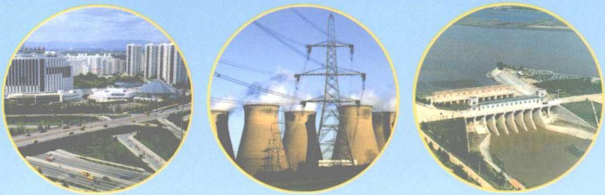

封面设计 北京瑞兴文化艺术中心 ／冯强Tel: (010)68311017 63202266-2701E-mail: art@waterpub.com.cnwww.waterpub.com.cn/art

销售分类：水利水电工程/建设项目水土保持

定价：25.00元

i

# 开发建设项目水土保持监测

李智广著

## 内容提要

本书是国内出版的第一本关于开发建设项目水土保持监测的专著，系统全面地论述了开发建设项目水土流失特点和开发建设项目水土保持监测进展，分析阐明了开发建设项目水土保持监测的特点、原则、主要内容及其监测指标；提出了开发建设项目水土保持监测分区原则、方法和步骤，并在此基础上提出了监测点布局设计与数量确定的方法；提出了水土流失影响因子、土壤流失量及水土保持治理措施的监测方法，以及各种方法监测数据的处理方法；提出了开发建设项目水土保持监测周期及其阶段划分，并给出了不同阶段监测报告和监测总结报告编制提纲；全面设计了水土流失影响因子、土壤流失量及治理措施等监测数据登记表，供读者参考使用。

本书可供各级水土保持、生态环境等方面的监测机构、管理部门参考使用，也可作为大专院校学生和相关科研院所研究人员的参考用书。

## 图书在版编目（CIP）数据

开发建设项目水土保持监测/李智广著．一北京：中国水利水电出版社，2008

ISBN 978-7-5084-5775-8

I. 开… Ⅱ. 李… Ⅲ． 基本建设项目—水土保持—-监测N.S157

中国版本图书馆CIP数据核字（2008）第111094号

<table><tr><td>书 名 作 者 出版发行</td><td>开发建设项目水土保持监测 李智广著 中国水利水电出版社（北京市三里河路6号100044） 网址：www.waterpub.com.cn E - mail: sales@ waterpub. com. cn</td></tr><tr><td>经 售</td><td>电话：（010）63202266（总机）、68367658（营销中心） 北京科水图书销售中心（零售） 电话：（010）88383994、63202643 全国各地新华书店和相关出版物销售网点</td></tr><tr><td>排 版 印 刷 规 格 版 次</td><td>中国水利水电出版社微机排版中心 北京市地矿印刷厂 140mm×203mm 32开本 9.75 印张 262千字</td></tr></table>

凡购买我社图书，如有缺页、倒页、脱页的，本社营销中心负责调换

## 前 言

据水利部、中国科学院、中国工程院2005～2006 年开展的“中国水土流失与生态安全综合科学考察”调 查，“十五”期间我国共有建设项目76810个。这些建 设项目，在建设经济体系、促进社会发展、不断改善生 活的同时，对水土资源和生态环境造成巨大影响，占 压、扰动和破坏了大量的土地和植被，污染、损害和损 失了大量的水资源，甚至引发地质灾害、恶化生态环 境，导致土地生产力下降或丧失，在生态脆弱区域造成 的危害更是不可逆转和不可修复的。

十分遗憾，对于如何准确监测和评价开发建设项目造成的水土流失及其危害、如何分析评价开发建设项目水土保持设施及其效益，目前仍然没有一个操作性强的技术标准或规范。例如：开发建设项目土壤流失如何监测？监测点怎样布局、数量如何确定？水土保持措施的监测指标有哪些？有哪些合适的监测设施设备？水土保持效益指标如何计算？甚至监测报告包括哪几个部分、各部分的主要内容是什么？如此，等等。

为此，在国家大型开发建设项目水土保持监测实施、全国水土保持监测技术培训授课、水土保持监测管理等实践中，作者不断学习、不断思考、不断研究，编著了本书。本书共9章，分别阐述了：开发建设项目水土保持监测进展及主要问题，开发建设项目水土流失特

点，开发建设项目水土保持监测的特点、原则和依据，开发建设项目水土保持监测内容与指标，开发建设项目水土保持监测分区与监测点布局设计，开发建设项目水土保持监测点设施设计，开发建设项目水土保持监测方法与数据处理，开发建设项目水土保持措施效益计算，以及开发建设项目水土保持监测阶段及其报告编写等。同时，本书设计了水土流失影响因子、土壤流失量及治理措施等监测数据登记表，供读者参考应用。

在本书编制过程中，引用了大量技术标准和其他文献中的研究成果。作者通过将参考文献列于各章正文之后的方式，对文献作者表示诚挚的谢意。

限于作者的实践范围、知识水平、思考深度，书中疏漏、不足之处在所难免，恳请读者批评指正。

作者

2008年4月12日

## 目 录

1 绪论…  
1.1 人类生产活动带来的生态环境变化…  
1.2 开发建设项目水土保持监测回顾…………  
1.2.1 农垦生产活动水土保持监测… 4  
1.2.2 开发建设项目水土保持监测……… 5  
1.3 开发建设项目水土保持监测研究进展和主要问题……7  
1.3.1 监测研究的主要进展……… …7  
1.3.2 监测存在的主要问题…… …9  
参考文献……… . 14  
2 开发建设项目水土流失特点… . 16  
2.1 开发建设项目分类 … .. 16  
2.1.1 开发建设项目及其特点 … · 16  
2.1.2 开发建设项目分类… 20  
2.2 开发建设项目水土流失… 24  
2.2.1 开发建设项目人为侵蚀（水土流失）概念  
与水土流失区…… . 24  
2.2.2 开发建设项目水土流失增强机理 … 26  
2.3 开发建设项目水土流失特点… · 31  
2.3.1侵蚀空间有限，时期较短 .. 31  
2.3.2侵蚀类型复杂，方式多样 . 32  
2.3.3 侵蚀发生的潜在性和突发性… … 33  
2.3.4侵蚀区域差异大，强度剧烈… …34  
2.3.5 侵蚀（流失）物质复杂，危害严重…………35  
2.4 开发建设项目的负面效应…… 35  
2.4.1损坏和减少水、土、植物等资源，影响  
生产力发展……… . 36  
2.4.2 破坏生态平衡，引发环境恶化…… …37  
2.4.3降低岩（土）体稳定性，引发地质  
灾害频发……… . 38  
2.4.4 淤积河库，破坏基础设施 … . 39  
参考文献…… . 39  
3 开发建设项目水土保持监测的特点、原则和依据…………41  
3.1 开发建设项目水土保持监测的目的意义……………41  
3.1.1 为国家生态建设服务……… …. 41  
3.1.2 为开发建设项目的建设与管理服务 ………… 44  
3.1.3 为水土保持学科发展服务 ……… …47  
3.2 开发建设项目水土保持监测的基本特点……………49  
3.2.1 水土保持监测复杂多样 ………… …49  
3.2.2 水土保持监测时间短暂，难以重复 …………51  
3.2.3 水土保持监测受干扰强烈，监测工作与  
精度受到影响………… …52  
3.3 开发建设项目水土保持监测的基本原则…………… 53  
3.3.1 科学划分监测范围，全面调查与重点  
观测相结合………… …53  
3.3.2 科学划分监测时段，开展全过程动态监测……54  
3.3.3 监测方法成熟．监测设施设备性能稳定 …… 55  
3.4 开发建设项目水土保持监测的依据…………………57  
3.4.1 法律法规依据… . 57  
3.4.2 土壤侵蚀规律 59  
参考文献……… 69  
开发建设项目水土保持监测内容与指标…… . 71  
4.1 监测内容分类 … .. 72  
4.2 水土流失因子的监测指标………… ……73  
4.2.1 自然因子监测指标…………… ……73  
4.2.2 人为因子监测指标………… ……79  
4.3 水土流失状况监测指标………… ……81  
4.3.1 坡面水蚀监测指标………… ……81  
4.3.2 区域水蚀监测指标………… ………81  
4.3.3 风蚀区风蚀状况监测指标 ………… …………81  
4.3.4 其他侵蚀状况监测指标 ………… …………81  
4.4 水土流失危害监测指标………… ………84  
4.4.1 破坏土地（土壤）资源监测指标……………84  
4.4.2 毁坏水土保持设施监测指标…………………84  
4.4.3 泥沙淤积危害监测指标 ………… ……………84  
4.4.4 水资源污染监测指标…………………………84  
4.5 水土保持措施监测指标………… ……………87  
4.5.1 水土保持措施类型……… …………87  
4.5.2 水土保持措施监测指标………… …………87  
4.6 水土保持效果评价指标 …………… ………89  
4.6.1 分析计算的效果评价指标 ……… ………90  
4.6.2 直接采集的效果评价指标 ……… ………90  
4.7 城镇建设独特的监测指标…………… ………………92  
4.8 水土保持监测指标遴选原则………………………93  
4.8.1 主要监测指标满足水土保持方案 …………… 94  
4.8.2 监测指标与监测分区紧密结合 ………………95  
4.8.3 区别对待状态量指标与动态量指标…………95  
4.8.4 监测指标与监测分区和监测时段相结合 …… 96  
参考文献…………… ……96  
开发建设项目水土保持监测分区与监测点布局设计………98  
5.1 监测范围……… ………98  
5.1.1 监测范围的概念……… ……98  
5.1.2 监测范围的界定………… ………99  
5.2 监测范围分区………… ……104  
5.2.1 分区目的与任务…………… ……………104  
5.2.2 分区原则 ……… …………105  
5.2.3 分区体系及依据…………… …………106  
5.3 监测重点地段………… ……………112  
5.3.1 监测重点地段的概念………………………112  
5.3.2 主要的监测重点地段………………………114  
5.3.3 不同行业监测重点地段………………………119  
5.4 监测点布设………… …120  
5.4.1 监测点的类型 ……………  
5.4.2 监测点布设原则…………… …………122  
5.4.3 监测点布设方法…………… ……124  
5.5监测点数量…………… ………………126  
5.5.1 用抽样强度计算…………… ………127  
5.5.2 用数理统计方法计算………… …129  
参考文献……… ……131  
开发建设项目水土保持监测点设施设计…………………132  
6.1 观测样地和调查样地的形状与面积…………………132  
6.2 主要的观测设施设计…………… ………134  
6.2.1 水蚀观测设施…………… ………134  
6.2.2 风蚀观测设施设备…………… …………137  
6.3 几类主要对象水蚀观测样地的位置…………………139  
6.3.1 坡面细沟观测样地…………… …………140  
6.3.2 弃渣堆积体土壤流失量观测…………………141  
6.3.3 取土取石场土壤流失量观测…………………141  
6.3.4 土质平台边坡观测样地………………………147  
6.4 野外可用来估测土壤流失量的物体…………………147  
6.4.1 水土流失遗迹 ………148  
6.4.2 泥沙淤积体 …………… …………………148  
6.4.3 沉积体……………………………149  
6.4.4 土壤剖面……………………………149  
6.4.5 类比物体……………………………………150  
参考文献…………… ………150  
开发建设项目水土保持监测方法与数据处理……………151  
7.1 开发建设项目工程建设区域面积监测………………151  
7.1.1 监测目的与要求…………………………………151  
7.1.2 监测方法与设施设备…………………………152  
7.2水土流失因子监测……………………153  
7.2.1监测方法………………………………………153  
7.2.2 主要指标的监测方法…………………………155  
7.3 土壤流失量监测……………………………………173  
7.3.1 土壤侵蚀类型与形式…………………173  
7.3.2 土壤流失量背景值………………176  
7.3.3 水土流失量动态变化…………………………183  
7.4 水土流失危害监测…………………………198  
7.4.1 水土流失危害范围监测……………………198  
7.4.2 危害数量和程度监测…………………………202  
7.5 水土保持措施监测…………………………202  
7.5.1拦渣工程………………………203  
7.5.2 护坡工程……………………………………203  
7.5.3 土地整治工程………………………………204  
7.5.4防洪工程……………………………………204  
7.5.5防风固沙工程……………………………204  
7.5.6 泥石流防治工程……………………………204  
7.5.7 植被建设工程………………………………205  
7.6水土保持巡查………………………………205  
参考文献………… …………207  
8 开发建设项目水土保持措施效益计算…… ……210  
8.1 关于开发建设项目水土保持措施效益计算…………210  
8.1.1 关于开发建设项目水土保持措施效益……… 210  
8.1.2 关于开发建设项目水土保持措施效益  
计算的主要指标…………… …211  
8.1.3 关于开发建设项目水土保持措施效益  
计算的基准面积………… ………212  
8.2 水土保持措施效益单指标计算与分析………………214  
8.2.1 扰动土地整治率………… …………214  
8.2.2 水土流失总治理度……………………………216  
8.2.3 土壤流失控制比……………  
8.2.4 拦渣率 …… ……………220  
8.2.5 林草植被恢复率…………  
8.2.6 林草覆盖率………… ………223  
8.3 水土流失防治标准…………… ………224  
8.3.1 防治标准等级划分………… ……224  
8.3.2 防治标准等级适用范围……… ……227  
参考文献………… ……227  
9 开发建设项目水土保持监测阶段及其报告编写…………229  
9.1 开发建设项目水土保持监测周期…………………230  
9.2 开发建设项目水土保持监测阶段划分……………… 231  
9.2.1 监测项目投标竞标阶段………………………231  
9.2.2 监测启动准备阶段……………………………232  
9.2.3 动态监测实施阶段…………… ………233  
9.2.4 监测总结报告编制与提交阶段……………… 233  
9.3 开发建设项目水土保持监测各阶段主要  
成果报告……… ……233  
9.3.1 投标书 ……233  
9.3.2 监测设计与实施计划………… ………238  
9.3.3 动态监测实施阶段报告………………………239  
9.3.4 监测总结报告………………………………240  
参考文献……………………………………242  
附录一 关于划分国家级水土流失重点防治区的公告………244  
附录二开发建设项目水土保持监测设计与实施  
计划编制提纲（试行）………………………………256  
附录三开发建设项目水土保持监测阶段报告书  
编制提纲…………………………………………260  
附录四 水土保持监测报告提纲………………………………262  
附录五 开发建设项目水土保持监测特性表…………………264  
附录六水土保持监测总结报告………………………………266  
附表……………………………………………………268  
附表1 开发建设项目工程建设区域及其分区面积统计…………268  
附表2 多年降雨情况登记表……………………………………269  
附表3 降雨观测记录表………………………………………270  
附表4多年风向与风速情况登记表……………………………270  
附表5风向与风速登记表……………………………………271  
附表6 土壤（地面组成物质）监测成果表……………………272  
附表7植被监测成果表………………………………273  
附表8地形地貌监测成果表……………………………………276  
附表9土地利用现状监测成果表……………………………277  
附表10 土壤流失背景值监测成果表…………………………277  
附表11 径流及泥沙取样与分析记录表…………………………278  
附表12 简易土壤流失观测场观测记录表………………………279  
附表13坡面细沟观测记录表…………………………………280  
附表14流域（区域）水蚀控制站观测记录表…………………281  
附表15 简易风蚀观测场观测记录表……………………………282  
附表16 风蚀桥风蚀观测记录表………………………………283  
附表17集沙仪风蚀观测记录表………………………………284  
附表18典型泥石流发生情况调查记录表………………………285  
附表19滑坡（崩塌)调查记录表……………………………286  
附表20冻融侵蚀观测记录表…………………………………287  
附表21拦渣工程监测记录表…………………………………288  
附表22护坡工程监测记录表………………………………289  
附表23土地整治工程监测记录表……………………………291  
附表24防洪工程监测记录表…………………………………292  
附表25防风固沙工程监测记录表……………………………293  
附表26泥石流防治工程监测记录表……………………………294  
附表27植被建设工程监测记录表……………………………295  
附表28开发建设项目水土保持监测巡查记录表………………296

## 1 绪 论

## 1.1 人类生产活动带来的生态环境变化

一般认为，生态环境是指围绕人类的空间中，可以直接或间接影响人类生活和发展的各种因素的总和。人类的生活和生产离不开生态环境，生态环境是人类生存和发展的物质基础；反过来，人类的生活和生产，尤其是大规模的生产活动又会引起生态环境的变化甚至改变。

在原始社会，人类过着茹毛饮血、渔猎为主的生活，对生态环境的依赖非常明显，经常迁徙以适应生态环境的变化，甚至仅仅是为了适应季节、气候的变化。人类利用自然资源的强度甚小，对生态环境的影响极其有限，生态环境基本处在自然发展变化中。此时，地表的土壤侵蚀主要受气候变化、地质构造运动、冰川等作用的影响，侵蚀速率十分缓慢，被称为自然侵蚀或地质侵蚀。

随着人类社会的进步和发展，生产方式进入到以农业和牧业为主的时期，人类改造生态环境的能力增强，出现砍伐森林、破坏草原开垦种植，而且这些行为日益增加、日益剧烈，变为破坏式、掠夺式的资源利用，从而引发强烈的土壤侵蚀，侵蚀速率成倍或数十倍增加，这就是加速侵蚀。加速侵蚀带来了生态环境的明显变化，风沙、洪涝、泥沙淤积、沙漠化、泥石流等灾害频繁发生，人类的生活、生产条件和生存的生态安全第一次受到严峻挑战。

从16～17世纪以来，尤其第二次世界大战后，在科学技术的支持下，出现了现代工业、现代农业、现代交通运输业等，人类利用自然资源的手段、强度和范围已达到空前的程度，采用大型机械采掘、加工、运输或转化；被利用的资源既有地表资源也有地下资源，既有海洋资源也有大气资源；到目前，已经导致一些资源匮乏的局面。人类生产规模和能力的巨大发展，一方面显示出人类利用和改造生态环境的巨大能力，另一方面也带来了生态环境的新变化。在全球范围内，有气候变暖、臭氧层破坏、酸雨大范围出现等；在区域内，则表现为环境污染和生态环境恶化等。工业生产、交通运输和生活排放的有毒有害物质，在水体、大气、土壤中富集，难以降解和净化，形成环境污染。矿藏开采、厂矿建设，道路铺设、农林开发等，破坏植被、扰动地面(地下)、堆弃废渣等，引发出剧烈的水土流失、大面积的荒漠化、地面沉降和生态环境严重失调，这些剧烈扰动引发的人为侵蚀速率远大于前述的加速侵蚀速率，造成生态环境恶化，严重威胁人类的生存安全。

我国是世界上水土流失严重的国家之一。20世纪50年代初，我国水蚀面积约150万km²；2002年，水蚀面积已扩大到161.21万km²，加上风蚀面积已经达到356.92万km²，占全部国土面积的37.6%。平均年土壤侵蚀总量50亿t，相当于140万hm²耕地生产力受到破坏[1]。50～70年代，我国沙漠化土地年增加1560km²；到90年代，沙漠化土地年增加2460km²。水土流失不仅冲走土壤表层沃土，造成土地退化而贫瘠、作物减产，而且造成江河湖泊水库的泥沙淤积，河床抬高，江河可航路程缩短，湖泊调洪能力降低，引发洪涝、泥石流等灾害；风沙活动形成沙尘暴，良田草场沙化，影响交通运输和经济发展，更加剧了生态环境恶化。

我国又是一个发展中国家。从总体上看，我国国民经济生产总量，尤其是人均生产量还十分低，生产技术和水平落后于西方发达国家。从区域上看，我国西部地区的12个省（自治区、直辖市）土地面积约685万km²，占国土总面积71.4%，有人口3.67亿，是一个相对地广人稀的地区，而煤、油、气、锰等资源均占全国资源总量的50%以上，亟待开发。加上东北地区老工业基地技术改造，东部和中部地区新兴产业的崛起与产业重组，都需要加快建设步伐，实现小康社会的全面发展。据统计，“十五”期间我国电力、冶金化工、采矿、水利、水电、交通道路、农林开发、城镇建设等开发建设项目76810个，平均每年有15000多个项目在建设，较之以往有了快速发展。开发建设项目既给国民经济发展注入活力，为推动区域经济发展作出重大贡献，同时又在建设和生产过程中强烈扰动地面，废弃大量渣石，造成严重水土流失，直接危害建设区及周边地区的生态环境，并对项目生产构成潜在威胁。“十五”期间的建设项目共扰动土地552.8万hm²，其中分布在山地与丘陵区的占72.1%，分布在风沙区的占6.5%，分布在平原区的占21.3%；产生弃土弃渣92.1亿t，其中流失掉9.46亿t，平均年流失量约2亿t，相当于抵消了等量的水土保持减沙效益[2]。

开发建设带来生态环境恶化，在国外也是触目惊心的，最有影响的一例是美国1934年的“黑风暴”。在19世纪末到20世纪初，美国加快了中西部开发，750万hm²森林和草原被毁，土地裸露，水分丧失，风蚀加剧。1934年5月发生了黑风暴，狂风卷起黄沙，遮天蔽日，横扫美国中东部，纽约市一片昏暗，大气含沙尘量为40t/km³。事后调查，风暴从西部刮起，带走肥沃土壤3亿多t，毁坏耕地300多万hm²。风暴过去，西部平原水井和溪流干涸，作物枯萎减产或绝收，牛羊渴死大半，人们被迫背井离乡逃往他地。生态环境恶化的“反馈”，教育了人类必须保护环境，珍惜资源，走人与自然和谐共处、经济与资源持续发展的道路。为了有效保护生态环境和利用好水、土资源，扼制人为侵蚀造成的恶果，2004年7月在澳大利亚的布里斯班召开的第13届国际水土保持大会上，讨论的20个专题中就有矿区废弃物管理、荒地治理、水质管理、机耕道路侵蚀控制等人为侵蚀专题[3]。防治开发建设项目带来的生态环境恶化，已成为世界各国，尤其是发展中国家的重要议题。

## 1.2 开发建设项目水土保持监测回顾

水土保持监测工作是水土保持生态建设的重要基础性工作。一是监测成果是国家和各级政府的生态建设宏观决策的基本依据，包括水土保持方针与政策制定、重点治理区规划与投资规模、治理措施与效果检验及水土保持发展方向等关系国计民生的大事，都需要以监测的结论为判断和决策的依据。二是监测是水土保持事业的重要组成部分。水土保持生态建设的各项工作都离不开监测，水土保持预防监督、查处违规违法案件、防止人为水土流失、征收水土保持规费等都要监测提供数据；实施综合治理、开展规划设计更离不开监测的支持；开展水土保持科学研究和制定水土保持规范、标准等，都需要以长期、系统的监测为基础。三是监测是提高水土保持现代化水平的基础。只有建设布局合理、满足监测需求的监测网络，采用先进的监测手段，坚持长期不断地以应用为目的监测和实现监测信息系统化，才能实现水土保持现代化的飞跃，这都需要加强水土保持监测预报工作[4]。

回顾开发建设项目水土保持监测历程，对于总结经验、发现问题和展望未来都是十分有意义的。

## 1.2.1 农垦生产活动水土保持监测

自从人类驯养动物，大量开垦森林和草地以来，人类历史进入到农业垦殖期。农业垦殖时期长达数千年，随之土壤侵蚀越演越烈。我国西汉末年，黄河流域土壤侵蚀已十分严重，《汉书·沟洫志》记载：“泾水一石，其泥数斗”、“河水重浊，号为一石水而六斗泥”。嗣后，在漫长的历史长河中，逐渐形成了我国水土保持理论和技术，但科学的水土保持监测工作没有开展。

19世纪末，德国学者沃伦首创了小区观测方法，开始了坡面侵蚀监测。1915年监测技术传到美国，到20世纪30年代美国基本建成了覆盖全国的水土保持监测体系，并同时利用水文监测站技术开展流域监测。20世纪30～40年代初，我国在黄土高原、青岛崂山等地建立径流泥沙观测站，开创了中国水土保持监测科学的历史[5-6]。中华人民共和国成立后，水土保持监测得到长足发展，到20世纪末，我国已进行了三次全国土壤侵蚀遥感调查，探索形成了有效的遥感影像判读、计算、尺度转换等方法。到2007年底，水利部成立了水土保持监测中心，长江、黄河等7个流域机构成立了监测中心站，30个省（自治区、直辖市）和新疆生产建设兵团成立了监测总站和监测分站，并建设了一批水土保持监测点；从事监测的专职人员有3000多人，专业涉及水土保持、水利、农业、林业、地理、遥感和计算机等。

农业垦殖时期的水土保持监测技术以实地测量、试验分析监测为主，结合应用遥感动态监测和地面动态监测技术，对水土流失严重地区及全国水土流失面积及强度变化实施监测。在监测方法上，除了传统的调查（考察）监测、地面监测（包括坡面小区监测和小流域径流泥沙监测）外，还开展了遥感监测。在地理信息系统技术支持下，监测成果日趋丰富、精度不断提高，为水土保持科学发展、水土保持规划与治理、治理措施配置与效益评价作出了重要贡献。我国水土流失状况公告及《土壤侵蚀分类分级标准》（SL190--96）的颁布就是典型范例。

## 1.2.2 开发建设项目水土保持监测

开发建设项目水土保持监测与前述监测在本质上并没有什么不同，只是监测的对象为开发建设项目区域，监测的范围相对较小，更注重微观监测罢了。

第二次世界大战后，西方发达国家竞相发展工业，石油、煤炭、天然气等能源消耗空前增加，废气、废水、废渣排放量大增，大气环境、水环境、土壤环境严重污染，同时人为侵蚀进一步加剧，引发社会矛盾，阻滞经济发展。20世纪20～50年代，英、美、澳等国对采矿废弃地、地下水开采及废弃固体物质性质和与之相关的水土流失、生态环境退化开展监测研究[7-8]。70年代后，随着工矿、交通等的发展，水土保持、生态和环境科学家认识到：这种人为的强烈干扰，对建设区周围的土壤、水体、生物（尤其植被）的影响十分明显，导致自然界景观、生态系统、生物种群和生物特性的变化[9]，监测内容向前迈出一大步。1983年，在美国召开了以“干扰与生态系统”为中心议题的学术会议，污染环境的改善、废弃土地的复垦与利用和生态修复(Ecological Remediation)已成为目前国外观测研究的重点。如美国对佛罗里达州钢城湾酸性电池废渣污染的湿地恢复研究，法国中南部矿山公司（HBCM）的露天采矿土地复垦和LAMAR-TINIE排土场建设及生态恢复（Ecological Restoration）研究，英国用表面覆盖法处理锌冶炼的废弃物，并种植耐锌牧草获得成功，日本开展城市建设环境保护林研究等[10]。

值得一提的是，美国学者J. V. Bonta等对三个面积仅为12\~18hm²小流域的矿山开采与复垦过程，进行了9年地表径流、泥沙、水质、降水量等观测，详细阐明了采煤、复垦等人为活动对流域水文、水质及泥沙沉积的影响，并认为还需要经过较长期的监测研究，才能认识流域的地表径流、地下水及水化学过程的动态平衡[11]。

我国对开发建设造成的水土流失以及引发的各种灾害认识较早，但将开发建设中的水土流失纳入正常的水土保持监测，还是近十几年的事情。早在20世纪50～60年代，我国水土保持专家便开始研究不合理的土地利用所造成的水土流失问题；70\~80年代，朱显谟院士多次大声疾呼控制人为侵蚀[12-13]；80年代后，工矿废弃地的改造，荒漠化及退化土地的判别与恢复等研究逐步开展；1990年，我国召开了“全国土地退化防治学术讨论会”，总结和交流了土地退化的防治技术。

自《中华人民共和国水土保持法》及其实施条例颁布以来，各地水土保持执法部门开始对开发建设工程造成的水土流失进行执法检查，引发出激烈的矛盾。1992年9月17日，深圳市在开发建设中有233.7km²的已经推平尚未建设的休置区，受强降雨影响产生强烈侵蚀，布吉河和观澜河严重淤积，冲毁桥梁建筑和车辆，威胁水源和人身安全，生态环境恶化，影响投资环境[14]，引发社会各界的广泛关注和热烈讨论。1996年，水利部在大连召开全国城市水土保持会议，讨论和交流了城市建设水土流失监测及防治技术。嗣后，晋陕蒙矿区水土流失调查等开发建设区水土流失研究报告被接连报导。1998年水利部颁布了《开发建设项目水土保持方案技术规范》（SL204—98），2002年水利部颁布了《水土保持监测技术规程》（SL277—2002），对开发建设项目水土保持监测的原则、内容、时限等作了原则性规定；此后，各省（自治区、直辖市）及各大流域管理部门相继出台了具有地方特色的水土保持监测规定和文件，开发建设项目水土保持监测逐步在全国范围开展起来。据统计，1996～2005年，水利部批复大型开发建设项目水土保持方案1060项；“十五”期间，全国共有开发建设项目76810个，其中编制水土保持方案并批复的占50.8%，开展重点水土保持监测的项目较少。以黄河水利委员会为例，在督察的公路、铁路、电力、煤炭、水利、化工、管线等开工的41个项目中，开展监测的仅有11个，占开工项目的26.8%。

## 1.3 开发建设项目水土保持监测研究进展和主要问题

总结开发建设项目水土保持监测实践，对于开拓水土保持监测理论，明确监测范围和内容，正确测算人为水土流失及危害，评价项目水土保持效果，以及寻找差距、改进监测等都具有重大意义。

## 1.3.1 监测研究的主要进展

## 1.3.1.1 监测对象分类研究

1987年，向立、同新奇依据黄土区水土流失特征和当时发展实际情况[15]，首次对“四化”建设中的人为水土流失类型进行划分，提出山原区筑路、开矿采石、水利水电工程、山原区基建工程、工业排放粉粒废渣、毁林（草）和陡坡开荒、广种薄收等旧习惯、山区和风沙区发展副业破坏植被、城市垃圾等九类，指出了水土流失重点地区和流失的主要方式。1998年，水利部颁布的《开发建设项目水土保持方案技术规范》（SL204—98)中明确开发建设项目包括矿业开采、工矿企业建设、交通运输、水工建设、电力建设、荒地开垦、林木采伐及城镇建设等八类。2002年，水利部颁布的《水土保持监测技术规程》（SL2772002）将开发建设项目分为采矿、交通铁路、电力、冶炼、水利水电工程、建筑及城镇建设以及其他等类型，指出各类型水土保持监测的重点地段或部位。2006年，“中国水土流失与生态安全综合科学考察”的《开发建设项目水土流失学科考察报告》中依据建设工程的空间展布和工程性质，将其分为线状工程和点状工程两大类，其中线状工程包括公路、铁路、管线、渠道堤防和输变电工程等五类，点式工程包括火（风、核）电、冶金化工、井采矿、露天矿、水利水电、城镇建设和农林开发工程等七类，并简述了各类工程人为侵蚀方式、特点及区域分布等，是分类研究中较细致的研究成果[2]。

## 1.3.1.2 监测范围研究

1998年，水利部颁布的《开发建设项目水土保持方案技术规范》（SL204—98）中指明，开发建设项目的水土流失防治责任范围应包括项目建设区和直接影响区两部分。项目建设区是指建设征地、租地和土地使用管辖范围；直接影响区是指因建设活动而造成水土流失及其直接危害的范围。2005年，赵永军进一步明确防治责任范围的概念，并将其划分为三部分，即项目建设区、直接影响区和责任转移区，并给出具体的区域特征与判别原则[16]。

## 1.3.1.3 监测时段研究

1998年，水利部颁布的《开发建设项目水土保持方案技术规范》（SL204—98）中指明．开发建设项目水土保持监测分为基本建设期和生产运行期两个时段。2002年，水利部颁布的《水土保持监测技术规程》（S1.277—2002）中规定，生产性项目监测时段可分为施工期和生产运行期，建设性项目监测时段可分为施工期和林草恢复期。2006年，水利部水土保持监测中心在《关于印发〈开发建设项目水土保持监测设计与实施计划编制提纲（试行））的函》（水保监〔2006〕16号）中指出，一般情况下，监测时段包括项目施工准备期之前、施工期（含主体工程施工准备期）和水土保持措施运行初期（或林草植被恢复期）等阶段[17]。

## 1.3.1.4 监测方法研究

截至目前，开发建设项日水蚀和风蚀水土保持监测，多采用地面观测法、类比法和调查法等；在有条件的地区或建设项目区，也有采用数学模型法和其他方法进行监测。这些方法简便、实用，能够适时反映新增水土流失状况。

此外，在开发建设项目水土保持监测与评价研究中，对水土保持设施质量检查、评定和技术评估等方面也作出了有益探索。

## 1.3.2 监测存在的主要问题

我国是一个发展中国家，开发建设活动中水土保持监测还是一项新的工作，目前开展的监测项目有限，监测的理论和技术有待发展完善，针对当前的实际情况，水土保持监测还面临以下问题。

## 1.3.2.1 法制观念和生态保护意识淡薄，导致水土保持监测工作难以落到实处

开发建设在推动国民经济的发展、创造更多的国民生产总值的同时，必须遵循科学发展观，避免和防止恶化生态环境的潜在危险。因而，首先，在自然条件恶劣或生态敏感地区，应严格限制影响生态安全的人为活动和大规模经济发展，以确保该区持续健康协调快速发展，造福于千秋万代；其次，对一般可开发建设区的开发建设项目，要依法建设、保护生态环境，防止水土流失和生态恶化，并开展水土保持监测，为工程建设和生态保护提供服务。目前，常有个别建设单位或部门法制观念和生态保护意识淡薄，缺乏科学发展观，不执行有关法律法规，缺乏环境保护意识，在建设项目审批中没有编制水土保持方案，或者即使编报了水土保持方案也不落实、不实施，有的建设方案变更后不再申报，更有甚者把“三同时”制度（即同时设计、同时施工、同时投产使用）变成了“边施工、边破坏、边造成严重水土流失”，导致这些工程不能开展水土保持监测。

个别地方的少数领导借发展地方经济之名，以权代法、以言代法，在建设工程尚未立项或未编制水土保持方案的情况下，“开绿灯”纵容破土动工，干扰水土保持监测工作的正常进行。

《中华人民共和国水土保持法》明确规定，“在山区、丘陵区、风沙区修建铁路、公路、水工程，开办矿山企业、电力企业和其他大中型工业企业，在建设项目环境影响报告书中，必须有水行政主管部门同意的水土保持方案”，并在“监督”部分中规定开展水土保持监测。虽然目前相关法律、法规不够健全，部分条款滞后，还有待进一步修改完善，但要清醒地认识到，开发建设项目既能促进经济发展，也存在恶化生态环境的潜在危险，只有趋利避害、遵循科学发展观、开展开发建设项目水土保持监测，才能既履行法律义务，又利于工程本身，更造福于子孙万代，形成经济社会与生态环境良性发展的“双赢”结果，同时也激励水土保持监测人员克服困难，积极进取，搞好监测工作。

## 1.3.2.2 监测指导思想不明确，缺少监测设计

开展正常的水土保持监测，应事先做出周密细致的、符合工程建设实际的监测设计。监测设计是监测工作的技术指导性文件，关系着监测内容是否全面、是否具有针对性，监测工作能否正常进行，以及监测结论的时效性及结论的真伪价值。目前，在部分开发建设项目的监测实践中，有的缺乏监测设计和实施计划，有“哪里黑了哪里歇”的敷衍了事思想；有的缺乏实际调查研究，仅借助建设工程的技术文件，没有实地调查，“想当然”编出设计，导致监测指标缺乏针对性，监测工作不能很好地执行，监测成果不完整，监测结论不能反映工程建设实际。

在具体监测工作中，有的不明确监测重点区域，或选设的监测点缺乏典型意义上的代表性；有的监测时段仅注意了建设过程中的监测，忽视了建设之前的背景值及生产期（或林草恢复期）水土保持设施效果监测；有的将水土流失概念狭隘化理解，仅监测流出（或输出）项目建设区以外的水土数量；有的预测水土流失量方法有误，将不适应于本区的地区经验直接用来测算；有的监测设施、监测样数、监测对比等存在问题，等等。这些都影响监测工作的正常开展和监测成果的质量与水平。

开发建设项目水土保持监测应有明确的指导思想，它是依据相关法规，以服务工程建设和保护生态环境为出发点，对开发建设区及有影响的相邻区域的相关内容进行监测和调控；依据开发建设项目的施工工艺和实施特点，以及水土保持监测的要求，选择有代表性的地段（或分段、分区），对从建设开始（有的要前期开始）直到建成生产运行若干年的水土流失影响因素、水土流失状况及其治理措施的动态变化进行长期的跟踪监测（有的还设对比监测），积累监测信息，整理和分析成果，研究工程建设人为侵蚀规律及防治措施效果，建立工程建设水土保持监测评价体系，为以后工程建设监测的科学规划、合理布点、有效观测、分析评价提供途径和方法，也为发展监测理论和规范开展建设项目水土保持监测提供依据。在上述思想指导下，规划设计出监测范围及其分区、监测重点地段、监测点布设、必需的设施设备、监测时段与频次、监测指标及采集方法、监测人员及其分工、监测工作制度及注意事项等，以保证监测工作顺利开展。

## 1.3.2.3水土流失动态监测基础薄弱，不能适应开发建设项目监测要求

开发建设工程一般建设期短暂，多则5～6年，少则1～2年，甚至更短，建设过程中多种工艺、工序交织进行，对水土保持监测设施的干扰比较强烈。开发建设项目这种复杂多样的特点，对开发建设项目的水土保持监测提出更新、更高的要求。

目前，水土保持监测基础比较薄弱，仍不能适应开发建设项目这种变化的要求。主要表现为：①开发建设项目监测的理论研究不充分，比如监测布局、监测点数量，以及由点到面推断整个项目水土流失状况的研究比较缺乏；②开发建设项目水土保持监测技术方法仍不发育，缺少集成程度较高的监测点水土流失观测的自动化设备，缺少快速监测项目区水土流失的方法；③部分水土保持监测单位成立时间不长，技术人员专业结构不完整，难以全面开展不同类型的开发建设项目的水土保持监测；④部分监测技术人员从业时间较短，监测实践锻炼不够，既不能全面做好监测设计和实施计划，又做不到自如地应对监测过程中出现的各种问题；⑤各级水利部门水土保持监测机构水土流失动态监测经费不足，尤其是针对开发建设项目监测的费用更匮乏，无法进行开发建设项目水土流失监测试验研究和设备研制，难以快速推进开发建设项目水土保持监测的发展。

强化水土保持监测基础，重点是加强监测单位水土保持监测能力建设、提高监测技术人员业务素质和加强监测技术方法研究。监测机构的水土保持监测能力包括执行相关政策与法规能力、监测设计能力、监测实施组织能力、监测设施设备装备及更新能力、创造监测工作条件和优化工作环境等能力。这些能力建设主要通过不断的监测实践、不断的技术总结和研究来实现。监测技术人员业务素质包括对相关政策、法规及监测工作的认知能力、监测技术方法掌握和应用能力、在监测实践中不断创新的能力。这些业务素质的提高主要由监测人员勤奋学习、不断实践和总结、不断交流与学习以及自身修养不断提高来实现。监测技术方法研究包括基础理论研究、监测设施设备研制开发、监测方法研究等。这些研究的加强主要通过试验、测试、验证和推广等来实现。由此可知，加强水土保持监测基础建设，是一个较长的过程，很难在短期内得到解决，同时又是一个多层面的社会工作，涉及到监测机构和其他多个方面，又涉及到监测工作人员本身。没有监测理论与技术的全面发展作基础，没有监测单位的配合与交流，没有监测人员的艰苦努力，水土保持监测基础的现状是难以改变的。

## 1.3.2.4 其他问题

开展开发建设项目水土保持监测是与建设项目业主（单位或个人）打交道，监测单位受业主委托开展工作，两者既有经济利益与控制水土流失目的的一致性，又有监测任务执行与监测结果需求的对立性，在现今市场经济追逐高利润的氛围中，如何保证监测的真实性是值得探讨的间题。同时，基层水土保持机构，既有监督建设项目业主落实水十保持方案的执法功能，又要受聘承相开发建设项目水土保持监测的服务功能，如何既保证监测工作的质量和效果又保证监督执法的客观性和公正性也是值得探讨的问题。

开发建设项目水土保持监测工作滞后和监测期过短是目前普遍存在的一个问题。鉴于开发建设造成人为侵蚀强度大、形式多、变化快等特点，对建设工程的监测应与工程建设同步。而目前情形是：有的项目主体工程基本建成，水土保持监测尚未到位；有的水土保持防治措施已布设完成，却没有监测资料，丧失了最重要的监测期，造成无法弥补的监测数据空白。由于监测工作开展较晚，对于基础建设已建成、正在进行正常生产的企业，尚没有开展监测。如煤炭、金属和非金属采矿业、冶炼业等，致使这些地区产业不断扩大，水土流失不断加剧，生态环境不断恶化。依据植被恢复、生态修复的理论和实践，工程建设竣工验收后，受损生态系统在自组织能力及人工辅助下开始恢复，一般来说达到未受损前系统的结构与稳定程度（并非结构稳定、功能多样、物能流动顺畅的平衡系统）需要若于年（北方多在5年以上，南方多在3年以上）。通常水土保持监测随工程建设的完工而结束，降低了水土保持监测的检验意义，不利于监测理论的发展。

此外，由于国家有关水土保持监测的法规、政策、标准等尚未完善和配套，造成水土保持监测工作的程序各不相同，水土保持监测费用预算依据不完善导致费用不能满足需要、监测设备及仪器开发能力低等，都影响开发建设项目水土保持监测的正常开

展及监测成果与水平的提高。

对开发建设项目的水土保持研究还有更多、更深层次问题，如适用的监测方法、设备与技术，开发建设项目人为侵蚀与农垦生产活动侵蚀的相互影响，在开发建设活动中不同侵蚀类型与方式的组合，侵蚀规律与侵蚀预测预报等，都需要做艰苦努力、长期工作才能取得较大进展。

## 参考文献

[1]李智广，曹炜，刘秉正，罗志东，我国水土流失状况与发展趋势研究.中国水土保持科学，2008（1）：57-62.

[2]郭索彦，姜德文，赵永军，等.开发建设项目水土流失现状与综合治理对策.中国水土保持科学，2008（1）：51-56.

[3] 曾大林，卢顺光，闫培华.参加第13届国际水土保持大会的一些体会.中国水土保持，2005（8）：4-5.

[4]鄂竟平.统一认识 明确目标 全面推进水土保持监测预报工作.中国水土保持，2004（6）：1-2，8.

[5]唐克丽.中国水土保持.北京：科学出版社，2004.

[6] 李智广.艰辛的历程 光辉的事业．中国水利报（国际水土保持大会专号）.2002-5-25.

[7] Kimber A J, Pulford I D, Duncan H J. Chemical variation and vegetation distribution on a coal waste tip. Journal of Applied Ecology, 1978, 15 (2):627-633.

[8] Vipulanandan C. DH, Krizek R J, Wilkey M. L.. Erosion model for reclamation areas//Graves Proceedings, 1982 Symposium on Surface Mining, Hydrology, Sedimentology and Reclamation. Kentucky: University of Kentucky, Lexington, USA. 1982: 339 - 348.

[9] Zielinski R. A, Otton J K. Johnson C A. Sources of salinity near a coal mine spoil pile . North-Central Colorado. Journal of Environmental Quality, 2001, 30 (4): 1237-1248.

[10] Sharma K D, Praveen Kumar, Gough L. P. et al. Rehabilitation of a lignite mine-disturbed area in the Indian desert land. Degradation &. Development, 2004, 15 (2): 163-176.

[11]焦凤红，李柏．高扰动地区水土流失观测方法及条件要求.水土保持应用技术，2006（2）：3-4.

[12] 朱显谟．黄土高原的综合治理.土壤通报，1980(2)：11-14.

13]朱显谟.黄土高原土地的整治问题.水土保持通报，1982，2（4)：1-7.

[14]刘伟常.保持水土利国利民.水土保持研究，1997（1）：2-6, 38.

[15]向立，同新奇．在“四化”建设中人为水土流失的类型.水土保持通报，1987（4）：48-53.

[16]赵永军.水土流失防治责任范围的界定.中国水土保持，2005(1): 21-23.

[17]李智广.开发建设项目水土保持监测实施细则编制初探．水土保持通报，2005，25（6)：91-95.

## 2 开发建设项目水土流失特点

## 2.1 开发建设项目分类

## 2.1.1 开发建设项目及其特点

## 2.1.1.1 开发建设项目的双重性

“开发”一词一般是指在人类社会不断的进步中，对物质生产和生存空间的开拓和发展。如处女地的开垦利用、新产业的兴办、新产品的研制，以及薄弱产业发展、生态环境建设等。开发建设项目是人们对利用自然资源发展经济、改造生态环境和提高自身物质文化生活水平等所从事的各类工程建设项目的总称。

一方面，开发建设项目的建设与运行为全面建设经济社会作出重要贡献；另一方面，开发建设项目在建设过程中或在建成后的生产运行期间，会对项目建设区及周边区域的地表（或地下）岩土体（或矿体）、植被产生高强度的开挖扰动甚至破坏，并改变原有土地利用方式，产生大量废弃物质（废水、废气、废渣）。在自然因素和人为活动的共同作用下，尤其在人为活动扰动了脆弱的自然条件下，导致生态系统更加脆弱，极易产生强烈水土流失，造成相当严重的危害。

人类活动对于自然环境的影响是多方面的，尤其是人类有组织、成规模的生产建设活动对自然环境的影响更加强烈，主要表现在以下五个方面。

## 1. 改变自然系统中的能量流动

人虽不能大量地改变整个地理系统中的能量输入，但可以通过调整系统的内部结构，或控制系统内某个关键要素，改变能量流动的方向和速度；同时，通过改变地表状态，如砍伐森林、开垦农田、植树种草、修建水库、建设城市等，将原地表覆盖下垫面加以改变，于是地表面反射率就会相应地改变，从而改变区域的能量流动。此外，工业生产又会向大气排放各种化学物质，尤其如 $\mathrm { C O } _ { 2 }$ $\mathrm { C H } _ { 4 }$ $\mathrm { N } _ { 2 } \mathrm { O }$ 等气体，造成显著的“温室效应”，阻挡长波辐射的逃逸，改变了能量流动。

## 2. 改变自然系统中物质循环

人类的生产活动与日常生活，时刻在影响和改变着自然系统中的物质循环。如对水资源的控制和利用，修建水库或拦河坝，引水灌溉农田，增大了局部区域的水分蒸发，有可能导致区域降水量的增加。此外，无度开采地下水资源，引起海水倒灌；化工企业向自然环境中排放污水和废气，也是改变物质流动的表现；城市的建设造成自然生态系统由内稳态变为需要能量和物质输入的远离平衡的耗散结构。

## 3. 对地球引力的抗拒和作用

地表形态的各类地貌过程，都受到地球引力的作用，无论固体、液体和气体都无一例外。而人类活动总能将岩石、沙土等从一个地方搬迁到另一个地方，如厂矿建设、大坝修建、矿石开采和运输等，并在建设和生产中创造新的地貌形态。这些活动都与人抗拒地球引力或利用地球引力有关。

## 4. 影响生物物质分布

随着人口增加、集聚、迁移等，人们的种植品种、数量都在不断变化；野生生物的引种、驯化和基因工程新品种的出现，一些原有种的消失，以及工程建设的“隔离”、“封闭”等都改变生物物质的分布。

## 5. 作为触发因素加快或减慢自然过程的速率

水土流失剧增、沙漠化和石漠化扩展等都是人对自然过程的触发作用的结果。据估计，在人为作用下，全球土壤侵蚀约$1 5 0 0 { \sim } 8 5 0 0 0 \mathrm { m } ^ { 3 } / ~ ( \mathrm { k m } ^ { 2 } ~ \cdot ~ a )$ ；而在无人为影响下，自然侵蚀仅$1 2 \sim 1 5 0 0 \mathrm { m } ^ { 3 } / ~ ( \mathrm { k m } ^ { 2 } ~ \bullet ~ \mathrm { a } )$ 。近半个世纪以来，我国土地沙漠化的发展从20世纪50年代的33.2万 $\mathrm { k m } ^ { 2 }$ 到2000年接近42.7万 $\mathrm { k m } ^ { 2 }$ ，面积扩展主要来自旱作农业、牧地草场、坡地开垦及

樵采。

开发建设对经济发展的积极作用，是属于社会经济学研究范畴；开发建设对生态环境破坏所引发严重的水土流失，则是水土保持生态建设要解决的问题。

## 2.1.1.2 开发建设项目基本特点

## 1. 开发建设活动改变了原地貌，形成新的微域生境

任何一项开发建设项目，在立项之后，无一例外地要“破土动工”，也就是进行施工准备，这时既要清除地表植被、松散表土和施工障碍物，又要开挖基础、准备建筑材料、运进机械设备，其间地表（或地下）的明显变化表现为两种相反的情形：一是原地貌、原地物、原地层被扰动，破坏了原有的微域生态系统；二是新地貌、新地物、新建筑物出现，建成后形成新的微域生态系统。

地表变化形成的“嵌块体”，使复杂的景观简单化，不利于景观生态的良性发展[1]。自然的水文气象要素与人为干扰交织在一起，形成更为复杂而又巨大的综合作用，这种作用既可改善景观生态，也可破坏景观生态，有时会出现意想不到的后果，使原始景观恶化、变劣[2]。如大城市产生的“热岛效应”和地下水开采形成的巨大地下水漏斗就是例证。由于开发建设活动，扰动甚至破坏了原有的植被和土壤，“皮之不存，毛将焉附”，生于斯、长于斯的动物、植物、微生物也就不复存在，生物多样性明显减少。

此外，一些建设项目在生产期会排放有毒、有害的气体、液体和固体物质，对周围环境造成污染，严重影响植物、动物和微生物的生命，进而影响甚至威胁到人民生命和财产的安全。

## 2. 开发建设活动扰动强度高，导致水土流失强度增大

开发建设项目采用大型机械作业和重型车辆运输，对各类作业场地和道路频繁而强烈地扰动，造成多种侵蚀方式交替出现，水土流失强度急剧增强。

由于地表形态变化，不稳定边坡出现或形成狭管风道，地面性质“光板化”，植被缺失，渗透减少，导致地表径流增大或风速廊线变化，使建设区内原来主要的水土流失营力活动增强。

开发建设活动的强烈干扰，淡化了区域水土流失的地带性，形成了多种侵蚀类型交织并发的局面。例如，在干旱地区，本是以风蚀为主，但在建设的渣土堆积区可出现泥石流；在水蚀为主的区域，有边坡失稳、地面沉陷、面蚀和沟蚀发生，还有局部沙尘天气的风蚀。

3. 开发建设扰动空间有限、时间较短，影响范围广，危害严重

一般的开发建设项目面积多在几平方千米内，最大的也很少超过1000km²。从建设期来看，建设型项目多在10年内，小型建筑项目多为1\~2年或数月。仅生产型项目（如采矿业、冶炼企业等）生产期长，达100年以上。

由于开发建设项目多种侵蚀类型的时序交替和空间传递链接，使水土流失、运移和堆积的空间不限于建设区，而扩展至直接影响区，其危害可能有土地资源破坏、地下水资源破坏或枯竭、河湖淤积，有渣石（尾矿）堆积占压良田、废水废气污染环境等，可能诱发滑坡、地震、下游生态恶化，影响水生物回游繁殖等。

我国的开发建设项目数量巨大，造成的水土流失已成为江河湖库的主要的产沙源。据辽宁省调查（2004年)[3]，全省矿点数6881处，有水土流失面积896km²，加上周围影响面积达11173km²，占全省面积的7.7%。这些矿点每年平均排放固体废弃物13249万m³，水土流失年平均1178.7万t，流失强度达13161t/（km²·a)，是全省水土流失强度的4.6倍。矿区水库淤积，水体污染严重，粉尘飞扬，崩塌、滑坡及沉陷随处可见，破坏土地，危及设施及城镇安全。

另外，开发建设项目给水土保持监测工作提出了挑战，给地面观测带来了困难。一方面，在某一施工期的地段内持续开挖、堆积，地面形态不断变化，干扰了监测点设置及工作；另一方面，施工工序的不断前移，不再重复，形成“过了这个村没有这个店”的局面。

## 2.1.2 开发建设项目分类

目前，对于开发建设项目，有三种分类方法：一是依据开发建设项目的行业特点及生产性质分类；二是依据建设项目对土地干扰破坏的平面形态分类：三是依据建设项目对地面干扰（或环境影响）的时期分类。

## 2.1.2.1 依据开发建设项目的行业特点及生产性质分类

## 1. 矿业开采类

矿业开采类项目是指对地下煤、气、油、热和金属、非金属等矿产资源，实施开采的一类项目。该类项目基建期和生产期没有明显截然的时间分界，基建期可以称为前期基建期，影响较小：后期生产期持续时间长，对地表、地层和生态环境影响严重。

矿业开采多采用大型机械采挖和爆破采挖工艺，运输为重型车辆，因而对地表（或地下）的扰动强度极大，对土壤、植被的破坏严重，重塑地貌十分明显。开挖产生大量的弃土、弃渣，并形成巨大坑洼和陡壁（露天采），或产生空室、空硐，引发地面裂缝、坍塌和沉陷，有的疏干水污染环境，造成严重的生态恶化。

如江西省信丰县开采稀土矿，平均生产1t氧化稀土，要冲洗2000t 土体。崇墩沟在7.5km的河道中淤积2.45 万m³，60.6hm²的矿区平均侵蚀强度达34000t/（km²·a)[4]。

## 2. 冶金化工类

冶金化工等企业建设类项目是指金属冶炼、化学工业及机械、纺织、电气等一类项目。目前多集中在金属冶炼和化工企业建设方面。项目的建设期和生产期两个阶段明显，建设期对水土流失的影响较显著，生产期对其他生态环境因素的影响较明显。

项目建设对基础要求严格，因而机械开挖深度大，堆置渣土

多，易受风、水等营力侵蚀影响，水土流失严重。

冶金化工生产产出的灰渣有两类：一类为冶炼废渣类，多呈胶结团块状或表面胶结散粒状，性质稳定，抗蚀能力极强；另一类为煤渣和燃烧后形成的灰渣，渣中含有不少有毒物质，如砷、锌、锑、铍、铀，以及酸泥、废触媒等，对周围大气、土壤、水体造成污染；排出 $\mathrm { S O } _ { 2 }$ 导致大气 $\mathrm { S O } _ { 2 }$ 浓度升高，影响气温或转化成酸雨降至地面，破坏生态系统正常运转。

## 3. 交通运输类

交通运输类项目是指为交通和运输服务的基础设施项目，包括公路、铁路、机场、码头、航道疏浚等。一般长度大、宽度小，短则几十公里，长则几百公里甚至上千公里，分为准备期和建设期两个阶段。

建设工程穿越不同气候类型、地貌类型和土壤类型区，穿越不同侵蚀类型区，潜在的水土流失危险大。据统计，“十五”期间，我国公路建设项目13229个，扰动地面119.6万hm²；铁路建设项目391个，扰动地面7.3万hm²。两项总计产生弃土弃渣46.44亿t，占期间开发建设项目总弃渣量的50.4%；水土流失量达1.58亿t，占期间建设项目总流失量的16.7%[5]。

## 4. 水工程类

水工程类项目是指水利、水电、河道防护及其他水利类工程项目，包括水库、水电站（含蓄能电站）、港口、码头、渠道及堤防等建设工程。项目建设一般分准备期、建设期和试运行期，水土流失主要发生在建设期，建成后对周围生态环境影响大，且具有长期性和不可逆性特点。

工程准备期，为建设修路、备料（或预制）和建筑生活及辅助生产建筑等，开始扰动地表、破坏植被；建设期，清基开挖与基础处理，产生大量废弃的渣、石和灰沙，形成新地物，出现新生境，影响上下游相当广大的区域。如尼尔基水利工程施工中扰动面积9.33万hm²，侵蚀量达2.12万t，输人河道近1万t，侵蚀模数 $8 8 5 4 \sim 9 7 7 3 { \mathrm { t } } / ( { \bf \lambda k m } ^ { 2 } \cdot { \bf \sigma a } ) ^ { [ 6 ] }$ 。水库下游则因生态因子失衡，出现意想不到的生态灾难。如生物种群减少或绝迹，干旱区的沙化蔓延而成荒漠，湿润区的水流挟沙能力恢复，侵蚀力加剧。

## 5. 电力类

电力类项目是指为国家建设、生产和居民生活提供电力的一类工程，主要包括火力发电、风力发电、核能发电及输变电线路建设与改造等工程。项目建设一般分准备期、建设期和生产运行期，准备期和建设期较短，般不超过5年，生产运行期长达数十年或百年以上。

火力发电对环境的影响较大，以煤或煤气为燃料，对地表、植被破坏严重，并产生弃渣。运行期产生大量灰渣、石膏废弃物，长期堆积，可产生水、风、重力等侵蚀。

我国黑龙江宝清火力发电厂，占地205.8hm²，动土石方121.44万m⁵，按20×600MW机组运行计算，年排渣总量76.49万t，其中排灰 62.95 万t、排渣 11.11万t、排煤矸石2.43万t[7]。

## 6. 管道工程类

管道工程类项目是指以不同规格的管道、线缆铺设的一类工程项目，主要有供水、输油、送气管道及光缆线的铺设工程。

管道工程由管道铺设、站场区建设及临时道路、料场、堆弃物和生活区等组成，一般工程线路长度大，经过山丘、河沟和村镇、交通线路。例如，我国西气东输项目的新疆轮南到河南荥阳段，跨风沙区、黄土丘陵、山地、河流沟谷等多种地貌类型[8]，有水蚀，也有风蚀，局部产生各种重力侵蚀。

## 7. 城镇建设类

城镇建设类项目是指城市化过程中的一类建设项目，包括工业区、商业区、住宅区建设和配套的交通、水、电、气供应等辅助建设工程。广义的城镇建设还包括村镇建设和分散个人住宅建设。

城镇建设项目除开挖填筑产生土石方量大外，还常常引发水体污染和地下水超采带来的地面沉陷、海水倒灌及河道淤积等问题。因而，把开发建设和生态环境保护融为一体十分重要[9]。

## 8. 农林开发类

农林开发类项目是指在水土流失区域，实施较大规模农、林集约经营的一类建设项目，主要包括集团化陡坡（山地）开垦种植，定向用材林开发、规模化农林综合开发、炼山造林等。

农林开发建设在准备期多要开展修路、机械搬运及场地平整等，生产建设期则要大面积砍伐、土方运移、土地整理、栽植或种植，以及整个生长期间的人工经营松土、锄草，诱发水蚀、风蚀不断发生。据福建省调查，在山丘地区开发，流失面积2794km²，占全省流失面积的21.3%，年平均流失土壤厚度1cm，加之施肥水平高，农药使用频繁，常导致土壤沙化退化，水质污染，受强台风降雨激发，滑坡、山洪暴发，生态环境恶化，自然灾害加剧[10]。

## 2.1.2.2 依据建设项目对土地干扰破坏的平面形态分类

## 1. 线状工程

线状工程包括公路建设、铁路建设、管道工程、渠道堤防工程和输变电工程等。

该类工程的线路长度大，一般跨越不同地貌、气候、植被类型区，水土流失因子复杂多变，各类侵蚀方式都有可能发生。施工建设工艺多样，扰动和破坏严重，松动土方、石方量大，造成水土流失方式多样、强度大、流失严重，防治措施分散复杂。同时，线状工程推进式的施工方式给水土保持监测带来困难。

## 2. 点面状工程

点面状工程包括采矿、电力、冶金化工、水工程、城镇及农林开发工程等。

该类工程建设范围相对较小，砂石料场集中，松动土石及用量大，施工过程对局部地貌破坏强烈。水土流失的主要影响因子单一，主要类型、方式的水土流失发生频率高，流失强度大，防

治措施集中。施工对水土保持监测干扰严重。

## 2.1.2.3 依据建设项目对地面干扰（或环境影响）的时期分类

## 1. 建设类项目

建设类项目是指建设工程在施工准备期和施工期对地面破坏干扰严重，建成后一般不再有较大的开挖、弃土弃渣或其他有较大影响的项目。其特点是在基本建设竣工、进入运营期，基本没有开挖、弃土弃渣等可能造成水土流失等生产性活动，如道路、管道、渠道、输变电、电力（风）、水电、城镇建设等工程。建设性项目产生水土流失的时间相对集中，水土保持监测时间短，建成后仅需要有一个植被恢复期监测。嗣后，水土保持工作主要是防护措施的管理与养护。

## 2. 生产建设类项目

生产建设类项目是指建设工程在施工准备期、施工期和建成后的生产运行期，对地面扰动破坏或对环境影响都存在，仅扰动或影响的方式、强度有所不同。其特点是在基本建设竣工后，进入运营期，仍存在着开挖地面（或地下）、弃土弃渣等可能造成水土流失的生产性活动，如采矿，电力（火、核）、冶金化工、农林开发等工程。这类工程除了施工准备期和施工期有强扰动，需要跟踪监测外，建成后进入正常生产运行期仍然对地面、环境产生持续影响，常常引起采空区地表沉陷、水文系统破坏，或空气和水体污染、弃渣堆积等，因而需要持续地开展水土保持监测。

## 2.2 开发建设项目水土流失

## 2.2.1 开发建设项目人为侵蚀（水土流失）概念与水土流失区

## 2.2.1.1 人为侵蚀（水土流失）概念

人为侵蚀是指人们不合理地利用自然资源和经济开发中造成新的土壤侵蚀现象。如开矿、采石、修路、建房及工程建设等产生大量弃土、尾砂、矿渣等带来的泥沙流失。

人为侵蚀的营力，除有水力、风力、冻融、重力外，还有人力，主要作用的对象为工程建设及周边的扰动地面（含植被地面）、重塑地貌（含开挖坡面、构筑物）和废弃物表层物质（弃渣、尾矿堆积体等)，其危害有泥沙流失、环境污染、生态恶化等，既含有加速侵蚀“第一次”作用的意义，又具有“第二次”强化作用的含义。

## 2.2.1.2 新增水土流失量

新增水土流失量是一个与原地侵蚀相比较，侵蚀数量增加的概念，包含了侵蚀强度变化和持续时间长短两方面的含义。因而，新增水土流失量是在项目建设区及直接影响区内，人为侵蚀量较原来未扰动前土壤侵蚀量增大的数量。其新增水土流失量$( \Delta W S )$ 的计算通式为：

$$
\begin{array} { c } { \Delta W S = W S _ { 2 } - W S _ { 1 } = ( \overline { { M S } } _ { 2 } - \overline { { M S } } _ { 1 } ) A t } \\ { W S _ { 1 } = \sum ( M _ { S _ { 1 } } A _ { 1 i } ) t _ { i } = \overline { { M S } } _ { 1 } A t } \\ { W S _ { 2 } = \sum ( M _ { S _ { 2 i } } A _ { 2 i } ) t _ { i } = \overline { { M S } } _ { 2 } A t } \end{array}\tag{2.1}
$$

式中： $W S _ { \mathrm { \scriptsize { 1 } } }$ $W S _ { 2 }$ 分别为未扰动和扰动后的土壤侵蚀量，t；$\overline { { M S } } _ { 1 }$ $\overline { { M S } } _ { 2 }$ 分别为同一区域内未扰动和扰动情况下的平均土壤侵蚀模数， $\mathbf { t } / \mathbf { \Sigma } ( \mathbf { k } \mathbf { m } ^ { 2 } \cdot \mathbf { a } )$ $M _ { s _ { 1 i } }$ $M _ { s _ { _ { 2 i } } }$ 分别为区内未扰动和扰动情况下的不同地面侵蚀模数， $\operatorname { t } / \textrm { \textsf { ( k m } { } \cdot { } a ) } ; A _ { 1 i } \textrm { } , A _ { 2 i }$ 分别为未扰动和扰动情况下的不同侵蚀强度的相应地面面积， $\mathrm { k m } ^ { 2 }$ ；A为扰动区总面积， $\mathrm { k m } ^ { 2 }$ ；t为扰动期，年。

当开发建设项目进入一边实施主体工程建设一边实施水土保持工程阶段时，则应对已实施并发挥防治水土流失功能的水土保持措施的防蚀（减沙）数量给予分析计算，并从总的扰动侵蚀量中扣除。因此，式（2.1）变为：

$$
\Delta W S = W S _ { 2 } - W S _ { 1 } - W S _ { 3 }\tag{2.2}
$$

$$
\begin{array} { r } { W S _ { \mathrm { 3 } } = \sum ( W _ { i } t _ { i } ) } \end{array}
$$

式中： $W S _ { 3 }$ 为各类水土保持措施防蚀（减沙）总量，t； $W _ { i }$ 为

不同治理措施年平均减沙量，t； $t _ { i }$ 为不同治理措施发挥防蚀（减沙）效益的年数，年。

## 2.2.1.3 水土流失区

开发建设项目涉及的区域范围，称为项目区。项目区内有不同土地利用（土壤特性）的地貌类型，如山地、丘陵坡面、河川平原、台地等地貌类型和森林、草地、农田、水域等。不同土地利用的土壤与地貌组合构成了不同地域的不同侵蚀强度。我国把侵蚀强度在轻度以下（即微度）的地块定为非流失地块。因而，开发建设工程项目区内就有非流失区存在的可能。这里的水土流失区就是指项目区内扣除非流失区后的其他所有区域。水土流失区面积 $( A _ { i } )$ 计算式为：

$$
A _ { i } = A - A _ { f }\tag{2.3}
$$

式中：A为项目区总面积， $\mathrm { k m } ^ { 2 }$ $A _ { f }$ 为项目区内非流失面积， $\mathrm { k m } ^ { 2 }$

$A _ { f }$ 的数量计算方法为：首先利用《土壤侵蚀分类分级标准》(SL190—96）中侵蚀强度分级指标确定微度侵蚀以上面积，然后累加得到。

## 2.2.2 开发建设项目水土流失增强机理

开发建设活动中的水土流失是在原侵蚀的基础上再叠加建设扰动造成的侵蚀。

## 2.2.2.1 土壤侵蚀机理

一般来说，土壤侵蚀过程就是侵蚀营力与受蚀物质抗蚀力的对比和相互作用的过程，侵蚀发生时，侵蚀营力必然大于受蚀物质的抗蚀力；搬运过程中，输移挟沙能力必然大于被搬运物质的抗冲力；否则，侵蚀就转化为堆积。

在降雨径流发生的季节和区域，水蚀从雨滴对土粒的击溅开始，经过薄层水流对地表土层的面状侵蚀，到径流汇集成股流对地表沟状冲刷。受地形、土壤、植被、降水等多种因素影响，侵蚀效果也极不相同。我国黄土区侵蚀模数达 $1 0 0 0 0 \mathbf { t } / \mathbf { \Omega } ( \mathbf { k m } ^ { 2 } \cdot \mathbf { a } )$

离防护林带距离(以林带高度为单位)

(注：引自《森林生态学》，J.P.金明仕著，曹福亮编译，中国林业出版社，2005年8月）

以上，南方红壤区侵蚀模数小的在1000t/ $( \mathrm { k m } ^ { 2 } \cdot \mathrm { a } )$ 以下。

风力侵蚀发生于干燥、松散、微起伏的细粒土表面。重力侵蚀则发生在陡直坡面或架空面（空洞、洞穴等），主要有滑坡、崩塌、塌落（塌陷）等形式。

各类侵蚀、搬运和堆积受多种因素影响，各有其特殊的发生与运动规律，其后果表现为原地貌的重塑（或改变），地表物质及其特性的变化，引发出水土资源与生态环境的变化。

## 2.2.2.2 开发建设项目水土流失增强机理

## 1. 破坏地表植被，土壤丧失保护

植被保持水土的作用十分明显。各地试验研究表明，一般林地较裸露坡面减少土壤流失量在80%以上，一般草地减少土壤流失量在70%以上。植被减蚀作用有林冠截留降水、枯落物拦蓄持水、土壤渗透性增强减缓径流，以及根系固土和增大地表土壤抗蚀与抗冲强度等方面。

在风蚀区，林草地增大地表糙度，改变风速廊线，降低吹蚀风速，保护地面土壤免受风蚀影响。以防护林带为例（见图2.1）。当风穿过不同的透风结构林带后，在5\~10倍林带高度处，风速可减少到30%以下，保护范围最大可达到35倍林带高度。

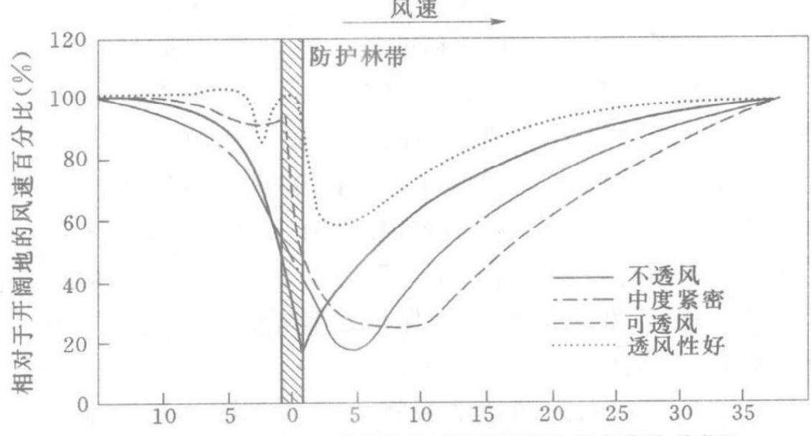  
图2.1 防护林带对风的影响

开发建设铲除地面全部林木、草被，使土地裸露、丧失保护，无论在水力还是在风力作用下，侵蚀强度极大提高。

## 2. 扰动地表，降低土壤抗蚀性

土壤抗蚀性能是影响侵蚀强度的主要因素，二者呈负相关。土壤抗蚀性主要受土壤组成和土体结构影响，而抗蚀性主要受土壤颗粒的性质及土壤有机质含量等影响。开发建设活动使地表土壤结构破坏，形成细小的单粒，遇到水力、风力极易被侵蚀搬运，造成强烈侵蚀。

在甘肃河西走廊的风力侵蚀区，未扰动前的戈壁松散砂已形成1\~2cm厚的结皮层，抗风蚀能力强，侵蚀模数小于200t/$( \mathrm { k m } ^ { 2 } \cdot \mathrm { ~ a ~ } )$ 。爆破扰动后，产生矿渣、弃渣等，地表结皮破坏，地表物质粒度减小，风蚀强度剧增。测定结果表明，扰动地表风蚀强度增大，达 $3 2 2 0 \mathrm { t } / \mathrm { ( k m } ^ { \mathrm { ~ \circ ~ } } \cdot \mathrm { ~ a ~ ) }$ ；堆积的松散废弃物（尾矿砂）因颗粒细小，风蚀强度可达16万 $\mathbf { t } / \mathbf { \Sigma } ( \mathbf { k } \mathbf { m } ^ { 2 } \cdot \mathbf { a } )$ ，是原地面的800 倍[11]。

## 3. 塑造地貌，增大水土流失几率

地貌形态是影响水土流失的主要因素。在水蚀区域，影响水土流失的地貌因子主要是坡度和坡长。开发建设活动要进行开挖、回填和弃渣堆积形成各种坡面。这些坡面，一般坡度较大、土体比较松散，给水蚀提供侵蚀面和侵蚀物质，从而使原本基本平缓的地面变成了有强烈水蚀的坡面。我国福建省地处东南沿海，植被茂密，水土流失较轻，平均侵蚀模数在 $1 0 0 0 \mathrm { t } / \quad ( \mathrm { k m } ^ { 2 } \cdot \mathrm { a } )$ 以下。但三明——泉州的高速公路，长278.8km，占地25.7km²（含永久、临时占地)，在未采取水土保持设施情况下产生了409.5万t的土壤流失，侵蚀模数160000t/（km²·a)[12]。

在风蚀区域，人为塑造地貌将改变风力场，使气流越过障碍物；或地貌间的变化空间产生变化，形成湍流（方向和速度变化的气流），增强风蚀效果（见图2.2)。在气候干旱、多风和地表组成以沙、土为主的区域，开发建设活动容易促使沙漠化潜在因素的激发和活化，加快沙漠化过程，出现固定沙地活化或沙质平

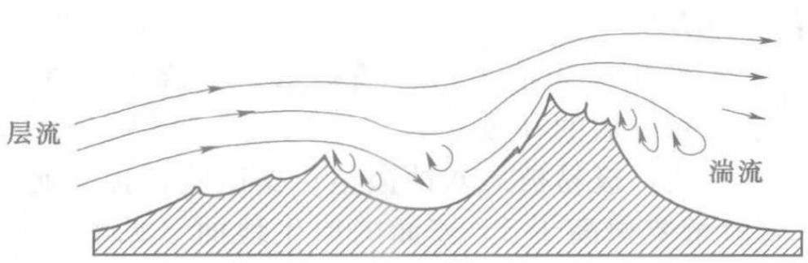  
(a)

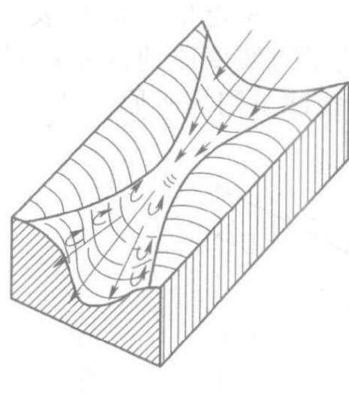  
(b)

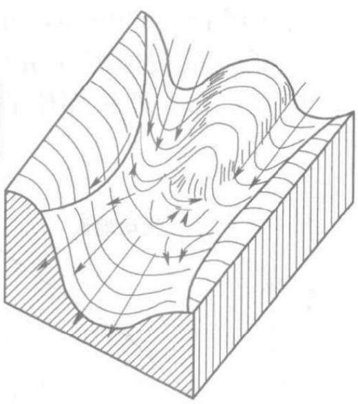  
(c)  
图2.2 地形对风的影响  
(a)越过崎岖地表的变化；(b)穿过狭窄沟谷的变化； (c)两面向风交汇的变化

地出现流沙[13]。

这些人为地貌，受土壤（岩石）质地、施工方法和当地自然条件的影响，还产生滑坡、崩塌和沉陷等侵蚀现象。如兖州矿区兴隆庄煤矿采空后形成的塌陷地已达881.24hm²(1981\~1998年)，平均每平方公里塌陷16.32hm²，塌陷盆地最大深6～8m，常常积水而不能利用[14]。

4. 改变了土壤入渗条件和地表径流，增强了水土流失侵蚀动力

土壤入渗能力与地表径流状况是数万年土壤内力与外营力综合作用的结果。人类建设活动强烈扰动地面，破坏原来土壤结构和组成，塑造新的微小地貌，导致土壤（实际已经不是真正意义上的土壤）入渗性能变化和地表径流变化，引起强烈侵蚀。

一是剥离原表层土壤，使质密坚硬、缺乏土壤疏松、多孔、富含营养物质等理化性质的土壤母质裸露，其降雨入渗能力极低。二是由于人和机械的往复作业，在地表形成一层细粒土层，无结构，含水量低，极易被风吹蚀搬运。据试验，扰动地面坡面为11°时，入渗量要稍高于11°坡面的原生地面（见图2.3）。由于人为机械活动使地面物质抗冲能力急剧下降，导致土壤侵蚀效果增大。设次降雨量30mm，在扣除渗透量后的地表径流作用下，11°扰动地面的侵蚀泥沙量是相同坡度原地面侵蚀量的2\~4倍以上。弃渣、弃土堆积部位的侵蚀量则高于原地3\~8倍[15]。

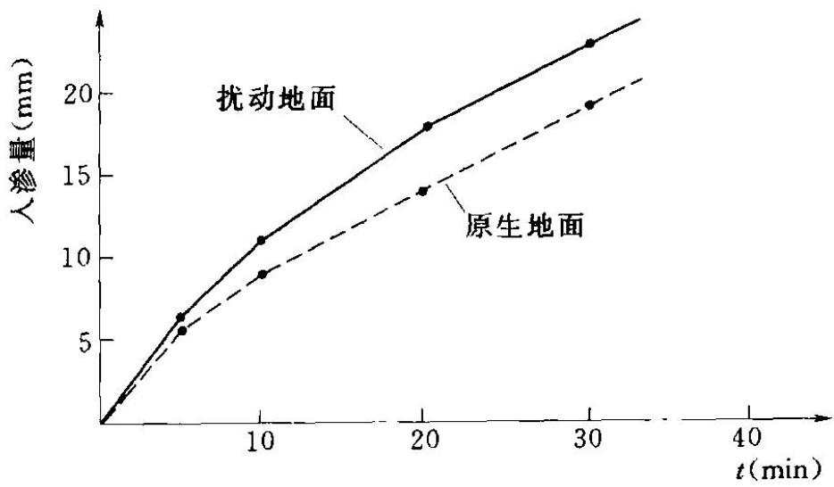  
图2.3扰动地面与原生地面入渗累计曲线

开发建设的各类工程，如堤、坝、桥等建筑物和场地，改变了原来地表径流网络，形成新的水道系统，打破原来水沙平衡系统，在水道自身调整的过程中，增强了对地表和沟道的侵蚀。矿区塌陷形成的凹陷盆地，沟道设置的弃渣场或储灰场都成为水土流失易发区。

5. 改变了局域生态环境因子，诱发不同侵蚀类型并存和频繁发生

土壤侵蚀在地球表面呈带状分布，这是地表水、热量等带状分布在水土流失上的反映。一般水蚀强烈区，发生在年降水800～400mm地区；降水大于800mm的地区，水热条件优越，植被繁茂，水蚀减弱；降水小于400mm的地区，降水稀少，侵蚀减弱。风蚀则发生在年降水400mm以下地区，气候干燥，植被稀少，多大风，地表物质松散易被风力侵蚀搬运。重力侵蚀则主要发生降雨集中，地表割裂强烈，植被破坏，坡度陡峻的地区。因而，在我国的土壤侵蚀类型区划中，有水蚀区、风蚀区和冻融侵蚀区之分。如前所述，开发建设活动使局部区域气候、地貌、土壤、植被等发生变化，出现了各类侵蚀并存的潜在条件，导致多种侵蚀类型并存：在原来水蚀区域，也有风蚀和重力侵蚀；在原来风蚀区域，遇有暴雨同时发生水力冲刷；在以水蚀为主的区域，人为扰动后土体失水干燥又有风蚀出现。矿区开采又造成地裂、下陷、崩塌、滑坡、泥石流等水土流失事例不胜枚举。

## 2.3 开发建设项目水土流失特点

开发建设项目水土流失，是人类在生产建设活动中对地表或地下强烈扰动破坏、重塑地貌和堆置废弃固体物质、排放有毒有害物质，而造成的水土资源和土地生产力的破坏和损失，是侵蚀强度很大的人为侵蚀。这种人为侵蚀因建设项目而不同，水土流失也各有特点，其共同点有：侵蚀时空的有限性，侵蚀类型复杂多样，侵蚀强度剧烈，侵蚀危害严重，侵蚀发生的突发性等。

## 2.3.1 侵蚀空间有限，时期较短

开发建设项目受资源产地、经济发展等多因素控制，分布不平衡、不连续，占地面积有限。人为水土流失发生在项目建设区域，各个项目区域互相独立，彼此之间没有水土流失的必然联系，构成一个个相互独立的侵蚀单元。

开发建设项目水土流失发生的时期各不相同，这取决于建设项目的发展和项目建设的时间。一般建设类项目，侵蚀主要发生在工程建设的过程中，工程建成竣工后，由于工程安全的需要及周边生态环境的调节机制与恢复，人为侵蚀极弱或很少发生。一般生产建设类项目，侵蚀除在工程建设中发生外，工程建设后投入正常生产运行期，依然存在不同于建设期间的人为侵蚀。如采矿业的采矿区，露天采矿业不断剥掉覆盖层，引起强烈侵蚀，井采或平洞采要挖空地下，改变地下水循环和地表支撑环境，引起地裂缝、地表下沉、塌陷等侵蚀。

开发建设项目水土流失这一特点，给水土保持监测带来以下新变化。

(1）监测的分散和不完整性。在开发建设区实施水土保持监测，基本上没有一个完整的流域或自然地理单元，这就难以应用传统的流域观测站的方法实施监则。

(2)监测管理困难。由于环境条件的差异，监测中类比方法难以应用，工程施工与监测过程在时空上重叠，相互干扰。

(3)工程建设要在有限时期内建成，已经形成一套施工流程，因而水土保持监测又要紧跟每一施工工序，循序前进，不可重复往返。

## 2.3.2 侵蚀类型复杂，方式多样

开发建设活动以人为侵蚀为主，又叠加了自然侵蚀外营力，导致开发建设区域既有地带性侵蚀类型分布，也有人为活动侵蚀类型分布。

开发建设项目改变了区内的环境因子，塑造出各种新的微地形，进而改变项目区内的侵蚀营力大小及其组合，出现了建设活动开展之前极为少见的侵蚀方式。例如，在东部平原区开采煤炭资源，原本该区域水蚀极为微弱，但在开采后，渣石（或煤矸石）堆积如山，产生了各种坡度的侵蚀面。在采空区，又出现了地表开裂变形、下沉、塌陷、泥石流、矿坑突水等。在地下水位较高时，矿区又会出现水渍或盐碱化，破坏、降低当地土地的使用价值，改变土地利用方式。

开发建设项目的建筑物、施工工艺、运行流程等的多样性和复杂性，导致侵蚀方式的多样性和复杂性。如采矿业改变了环境地质条件：水库建设改变了水环境和地质环境；公路、铁路等工程跨越不同区域的各种地貌类型，形成千姿百态的侵蚀形态等。

开发建设项目水土流失的复杂性和多样性，要求水土保持监测具有以下特点：

（1）水土流失监测与环境因素监测相结合。以往水土保持监测内容多限于水土流失特征（含土壤流失量、径流量及其过程变化等)，开发建设导致水土流失变化，必然在环境因子变化上有明显反映，因而环境因素监测成为监测的重要内容。通过这部分监测既能找出改善环境的对策，也为水土保持建设提供可靠依据。

（2）全面调查与重点监测相结合。在一个有限的区域内，实施内容庞杂的监测，无论在人力、物力和技术上都有困难，这就需要通过对工程建设范围及整个建设过程作细致分析，抓住主要分区或重点地段、主要侵蚀方式和主要过程进行详细的动态监测，对其他分布零散、次要的侵蚀采用典型调查、巡回调查等方式，确保既突出重点又了解全局，全面掌握和分析建设过程中的水土流失及其治理动态。

（3）监测指标与水土保持责任分区相结合。不同防治责任分区具有不同的水土流失特点，防治措施也各有特点。因此，监测指标应有所侧重，以便反映各区的水土流失特征、防治工程及效果等。

## 2.3.3 侵蚀发生的潜在性和突发性

通常，侵蚀的潜在性是指侵蚀发生的主要因素（或条件）已经存在（或形成），但尚缺乏激发（或诱发）因素而未发生侵蚀，具有潜伏和可能发生（发展）趋势的特性；一旦激发因素显现(或活化)，则即刻发生侵蚀。侵蚀的突发性是指引起侵蚀发生的主要因子隐匿（或不明显）或随机性很大，人们不易察觉（或难以预料)，而侵蚀发生突然且可能造成较大危害的特性。

开发建设项目水土流失潜在性十分普遍，在各类建设项目中均可能发生。如堆积的废土渣一旦出现不均匀沉陷或裂隙，就会孕育重力侵蚀发生；地下资源开采形成较大范围空硐，失去支撑，导致地面下沉、造成塌陷；各类边坡缓慢变化，发生各种侵蚀。

开发建设项目水土流失的潜在性和突发性，要求水土流失动态监测开展两个方面的工作，一是对危害严重的侵蚀典型事件进行重点监测；二是对侵蚀结果（或灾害）进行调查评价。典型侵蚀事件的重点监测可用于滑坡、泥石流、地面塌陷等侵蚀，需要对工程建设造成（或塑造）的地物特征、地质构造、环境条件等进行全面调查、勘测、试验和分析评估，并长期预警预报。侵蚀结果调查适用于各类侵蚀事件，一般需要即时进行，以免工程建设干扰破坏现场。

## 2.3.4 侵蚀区域差异大，强度剧烈

开发建设项目水土流失的区域差异，包含了两个不同空间尺度上的差异：一是整个工程建设不同区域间的侵蚀差异，这里的区域包括了不同的水土流失类型区、地形地貌类型区、土地利用类型区等；二是建设工程不同功能单元（建设场区）和侵蚀地物的不同部位间的侵蚀差异。侵蚀强度剧烈是指开发建设项目人为活动引起的水土流失强度很大，处于侵蚀强度分级中的极强度、剧烈侵蚀以上的等级。

一般大型开发建设工程，尤其是“线状”工程，横跨不同地貌单元和气候类型区，因而主要侵蚀营力、地面组成物质、地表覆被等随地域发生变化，导致区域间的侵蚀方式、侵蚀过程和侵蚀结果等有明显差异。例如，西气东输工程[8]全长约3000km，地跨戈壁沙漠、高山和中山、黄土丘陵、沟谷川地和平原盆地等地貌类型：从西向东穿越极干旱区、半干旱农牧交错区及湿润区、半湿润；侵蚀类型区包括风蚀区、风蚀水蚀交错区、水蚀区。在这些不同的侵蚀类型区，随地表特征变化，侵蚀方式千差万别。还要建设19座工艺站场，新建扩建公路1084km，穿越黄河等河流40余次，穿越公路400余次，穿越铁路20余次。建桥梁、钻隧洞、修交叉建筑，产生各种边坡和取土场、弃渣物，甚至小沟道等，导致各工程间、各区段间侵蚀差异甚大。

开发建设活动侵蚀强度极大。前述阐明了增强机理，其实质是人为侵蚀的叠加加速了侵蚀。例如，西气东输工程测算，在西段吐哈盆地风沙区侵蚀模数为 $5 0 0 0 { \sim } 8 0 0 0 \mathrm { t / ~ } \ ( \mathrm { k m } ^ { 2 } \cdot \mathrm { ~ a ~ } )$ ，而当地正常侵蚀在 $2 0 0 \ d \mathbf { t } / \left( \mathbf { k m } ^ { 2 } \cdot \mathbf { a } \right)$ 以下；甘肃河西走廊风蚀模数2500${ \sim } 5 0 0 0 \mathrm { t } / \ ( \mathrm { k m } ^ { 2 } \cdot \mathrm { a } )$ ，是当地平均值的5倍以上；进入黄土高原，一般侵蚀模数均为 $5 0 0 0 \sim 1 0 0 0 0 \mathrm { t } / \mathrm { ( k m } ^ { 2 } \mathrm { ~ \bullet ~ } \mathrm { a } )$ ，局部达20000～$3 0 0 0 0 \mathrm { t / \Omega \left( k m ^ { 2 } \cdot \mathrm { a } \right) }$ 0

开发建设项目水土流失区域差异大、强度剧烈的特性，给水土保持监测提出新的要求。一方面，要完善监测的理论，适应开发建设项目水土保持监测实践。另一方面，要分类分区（段）进行水土保持监测，选择具有代表性的典型地段设置监测点，开展内容全面的详细观测，获得翔实的数据，分析和认识有关规律，然后再在较大范围内检验、补充和校正。

## 2.3.5 侵蚀（流失）物质复杂，危害严重

开发建设项目流失物质极为复杂，几乎包括了人类接触的全部物质。这是因为：①开发建设项目扰动范围大，层次深，除了地表分布的不同类型土壤外，还深入地下数百米及至数千米的岩层；②开发建设活动产生的水土流失物质有不同性状，有小颗粒的、易被降水径流溶解的土壤，也有大颗粒甚至巨粒的固体，如岩石、岩屑、煤、金属和非金属矿渣；③从废弃物的来源来分，有原生的也有次生的，既包括化学合成或分解也包括物理转化，有对人类及生物无害的也有有毒有害的，有污染大气的也有污染水体、污染土壤的，并通过食物链影响人类生存。

开发建设项目的危害包括对项目建设、生产运营和对人身安全等危害。如毁坏工程建设的设施设备，增加成本，推迟生产运营；地下水处理不当，导致人身伤亡；化工企业排污，导致作物污染和食用中毒等。

## 2.4 开发建设项目的负面效应

开发建设是国家进步和发展的标志，对国家工业化和现代化作出了巨大贡献，但同时又给社会和经济发展带来一定的负面影响。

## 2.4.1 损坏和减少水、土、植物等资源，影响生产力发展

## 2.4.1.1 破坏和减少可利用土地资源，降低生产力

开发建设项目要占用一部分土地资源，改变土地用途。20世纪80～90年代，城乡建设工矿开发占地增长了179.01万hm²，增加了11.11%。“十五”间76810个项目共占地552.8万$\mathrm { k m } ^ { 2 }$ ，其中平原区占地占21.4%、山区占地占32.6%、丘陵区占地占39.5%、风沙区占地占6.5%。可见，除了风沙区外，全国损失可利用土地约516万 ${ \mathrm { k m } } ^ { 2 }$ (尚未计临时占用地和影响区面积)[8]。

开发建设用地一部分改变了土地利用现状，将农、林、牧业用地或其他用地转化为厂房、道路等，这部分用地基本丧失第一性物质生产能力。另一部分临时用地（如住房、道路、堆渣等）也占有相当部分。总体结果是，我国耕地向北方转移，平原区被占用，山丘区生态环境差的土地被开垦利用。

## 2.4.1.2 改变和破坏水资源

开发建设项目中水工程、矿业开采、城镇建设等都对水资源造成较大的改变或严重破坏，影响水资源的分配和利用。

塔里木河环绕新疆南部塔克拉玛沙漠，在下游段形成“绿色走廊”。自下游大西海子水库建成后，沿岸灌溉农业得到发展，但塔里木河大西海子至台特玛湖下游河段河流断流，湖泊干涸，使风沙再起、沙丘活化、“绿色走廊”消失，使218国道受到威胁，不得不实施生态补水[16]。

据调查，截至2002年，海河流域累计超采地下水900亿$\mathfrak { m } ^ { 3 }$ ，其中浅层水470亿m³，深层地下水430亿m³，形成了以天津、德州、石家庄、邢台、唐山等为中心的地下水位下降漏斗，中心水位埋深20～56m，其中天津漏斗地下水埋深已超过105m，使周边居民生活和灌溉水质恶化，湿地面积从20世纪50年代9000km²降到2002年的3852km²（包括水库面积)[17]。此外，冶金化工、矿山开采等污染水源的现象也十分严重。

## 2.4.1.3 破坏林草植被资源，加剧水土流失

工程建设占地、临时用地，开采砂石料场及弃土弃渣占地，都会改变土地利用方式，破坏原有林地、草地资源，使其丧失利用价值，且加剧水土流失及危害。

重庆市城口县拥有多种矿产，这些矿产的大量开采中毁林严重，造成强烈水土流失。其中，有锰矿洞口671个，年产生废渣75.93万t，破坏植被83.19hm²，产生水土流失泥沙36.45万t;有钡矿洞口79个，年弃渣排量25.8万t，破坏植被33.38hm²，产生水土流失泥沙12.77万t；有煤矿洞口21个，年弃渣为0.73万t，破坏植被7.81hm²，产生水土流失泥沙0.39万t[17]。

黑龙江省鸡西市以煤、石墨、硅线石生产为主。生产以来，全县累计形成煤矸石山90座，占地 $1 0 1 6 \mathrm { h m } ^ { 2 }$ ；尾矿废渣占地215hm²。所占土地大部分为草地，其次为次生林地。由于采掘，引起地面塌陷12423hm²，1003hm²土地产生水土流失[17]。

## 2.4.2 破坏生态平衡，引发环境恶化

在一定的地域空间，生物与非生物环境通过长期相互作用，调节与演化形成特定物质循环、能量流动及一定结构与功能的生态平衡系统。这一系统在外界干扰作用下，引起物种组成变化，环境因素改变，信息传递（营养、化学、物理、行为信息等）破坏，导致系统自我调节失效，称为生态平衡遭到破坏或生态系统退化。

开发建设项目对生态系统产生强烈影响，常常导致环境退化或恶化，如水蚀区域水土流失的加剧、风沙区沙漠区的扩展，以及大气、水体、土壤等的污染等。广西壮族自治区河池市东江镇有7家小型冶炼厂，每年排出的污水进入河流，废水中含有铅、锑、砷等有害物质，村民引河水灌溉仅4～5年时间，导致稻谷、玉米、大豆、蔬莱等减产或绝收。福建省屏南县化工厂1992年建厂生产氯酸钾，到1999年已对当地造成严重污染，废水、废气、废渣已使当地毛竹、水稻、蔬菜枯死绝收，引发社会矛盾[17]。

## 2.4.3降低岩（土）体稳定性，引发地质灾害频发

开发建设活动，尤其是道路、采矿工程，开挖坡面，采空地下，破坏原来稳定的地质环境，引发地面裂隙、塌陷、崩塌、滑坡及泥石流，地下水降低，煤层自燃等灾害。

开挖坡面和采空地下形成新的临空面，使原来稳定的地质条件发生变化，岩土体失稳引发地质灾害（见图2.4）。

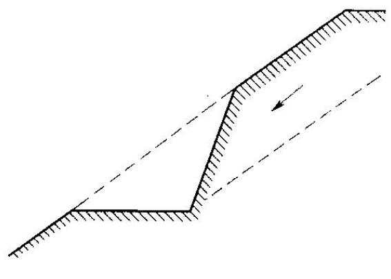  
(a)

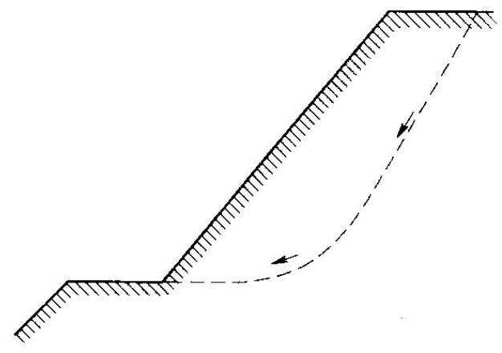  
(b)

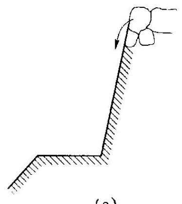  
(c)

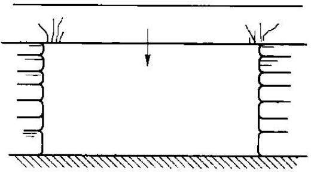  
(d)  
图 2.4 地质条件变化后岩土体失稳类型  
(a) 滑塌；(b)滑坡；(c) 崩塌坠石；(d) 塌陷

1996年投入运营的石太高速公路，在当年8月暴雨的袭击下，仅河北井径段就发生大小崩塌和滑坡上百起，封堵道路3天，损失极大。2005年该路首阳段又发生大范围不均匀沉陷，迫使车辆绕行数月[17]。

矿区开采出现掏空塌陷、地裂隙极为常见。采矿开挖遇有贮水层，会导致淹没矿井事故，或排出地下水引起周围地下水位降低或疏干。塌陷后生成大小坑洼，带来重力侵蚀和渍水等。据调查，每采1万t煤平均沉陷土地0.3hm²L14]。

## 2.4.4 淤积河库，破坏基础设施

开发建设活动产生大量弃土、弃渣，有的直接倾入沟谷、河道，被水流挟运；有的堆积坡面、坡脚，被水、风带（扬）入河流，形成高含沙水流。当水流进入平缓河段或有湖、库拦蓄时，泥沙堆积，导致有效库容减小、河床库底抬升，严重的形成“悬河”，影响排洪、航运，使桥、涵、库、通信、道路等基础设施遭受破坏，甚至酿成灾难，影响国民经济发展。

神府—东胜矿区位于晋陕蒙接壤区，水土流失十分严重。其中乌兰木伦河流域多年平均输沙量为2728.1万t输沙模数$6 9 2 0 \mathrm { t } / \mathrm { ( k m ^ { 2 } \cdot a ) }$ 。1987年开始建设，到1992年的5年间，开采、剥采、修路及其他工程建设产生弃土弃渣1392万 $\mathbf { m } ^ { 3 }$ ，直接堆积河道的 361.5万 $\mathfrak { m } ^ { 3 }$ ，占总量的26%，导致乌兰木伦河床淤积严重，仅后补连滩至河口50.5km河段净淤积1310.5万m³，平均淤高1\~4.05m，河流输沙量比采矿前增加了69.3%，主要桥梁行洪能力减小38.8%\~44.6%L18]。

开发建设新增的泥沙，随水流入水库、河道、湖泊等，威胁交通、航运、通信、库坝等基础设施安全。据2005年调查，福建省泉州市受矿山开采增加的泥沙淤积影响，报废水库、山塘、水坝等营水工程241座，并使灌溉渠道245km不能通水。安溪县湖上乡石灰石采区，已被冲走弃渣100多万t，淤积雪山溪抬高河床5m，冲毁河堤8km、水坝3座、小型电站1座、道路3km、民房 $7 0 0 0 \mathrm { m ^ { 2 } }$ ，损失350多万元[17]。

## 参考文献

[1]吴兆录. 岛屿生物地理学理论及其在景观生态研究中的应用//肖马宁. 景观生态学.北京：中国林业出版社，1991：78-81.

[2]赵羿.水文气象要素与景观生态系统的形成//肖马宁. 景观生态学.北京：中国林业出版社，1991：52-57.

[3]王希昶.辽宁省采矿业水土流失现状及防治措施.中国水土保持，2005(5): 18-20.

[4]石辉，田锋，黄林等.红壤区稀土矿开发导致河流泥沙淤积量的估算以江西省信丰县崇墩沟小流域为例.水土保持通报，2005，25 (6): 53-54.

[5]郭索彦，姜德文，赵永军，等.开发建设项目水土流失现状与综合治理对策.中国水土保持科学，2008（1）：51-56.

[6]解运杰，王玉玺，范力强，等.尼尔基水利枢纽工程建设中期水土流失监测与评价. 水土保持研究，2004，11（2）：49-51.

[7]黑龙江省水利水电勘测设计研究院.宝清发电厂新建工程水土保持方案报告书.2006，5.

[8]赵永军，姜德文，袁普金．线状工程项目的水土保持监测以西气东输项目为例.水土保持研究，2005，12（6）71-75.

[9]孙友.诸城市和谐生态水保建设的实践.中国水土保持，2005(7): 42-43.

10]王维明，林敬兰，陈文祥，等.福建省山地水土流失现状及其防治对策.中国水土保持，2005（7)：28-29.

[11]周波.戈壁矿区风力侵蚀及水土保持对策探讨.水土保持通报， 2005, 25 (4): 81-83.

[12]陈健.公路建设项目水土流失特征及防治对策.亚热带水土保持，2006, 18 (1): 58-59.

[13]朱震达，刘恕.中国北方地区的沙漠化过程及其治理区划.北京：中国林业出版社，1981.

[14]陈龙乾，邓喀中，许善宽，等.开采沉陷对耕地土壤化学特性影响的空间变化规律.土壤侵蚀与水土保持学报，1999，5（3)：81-86.

[15]蔺明华，杜靖澳，张瑞．黄河中游地区开发建设新增水土流失预测方法研究.水土保持通报，2006，26（1）：61-67.

[16]张德敏，黄骁勇，张芃.塔里木河大西海子至台特玛湖段生态修复对策.中国水土保持，2004（11）：12-13.

[17]郭索彦，姜德文，赵永军，等.开发建设项目水土流失考察报告(“中国水土流失与生态安全综合科学考察”专题“开发建设项目考察”报告).2007，10.

[18]李锐，唐克丽．神府—东胜矿区一、二期工程环境效应考察．水土保持研究，1994，1（4）：5-17.

## 3 开发建设项目水土保持监测的特点、原则和依据

## 3.1 开发建设项目水土保持监测的目的意义

## 3.1.1 为国家生态建设服务

## 3.1.1.1 履行水土保持法律法规职责，开展水土流失动态监测与公告

我国地处欧亚大陆东坡，濒临太平洋，特殊的自然地理和社会经济条件，形成了长期的水土流失严重的局面，流失成因与类型复杂，形式多样，分布范围广，面积大，侵蚀强度高，流失危害严重。水土流失造成耕地减少，土地退化；泥沙淤积，加剧洪涝灾害，影响水资源利用，加剧干旱发展；植被毁坏，生态环境恶化，对经济社会发展和国家生态安全，以及群众的生产、生活影响极大。因而，及时、全面、准确地了解和掌握各地乃至全国水土流失状况及其危害，科学评价水土保持建设成效至关重要。

《中华人民共和国水土保持法》第二十七条规定：“企业事业单位在建设和生产过程中必须采取水土保持措施，对造成的水土流失负责治理。本单位无力治理的，由水行政主管部门治理，治理费用由造成水土流失的企业事业单位负担。建设过程中发生的水土流失防治费用，从基本建设投资中列支；生产过程中发生的水土流失防治费用，从生产费用中列支。”《中华人民共和国水土保持法实施条例》（国务院令第120号，1993年8月1日）第二十三条规定：“国务院水行政主管部门和省、自治区、直辖市人民政府水行政主管部门应当定期分别公告水土保持监测情况。公告应当包括下列事项：（一）水土流失的面积、分布状况和流失程度；（二）水土流失造成的危害及其发展趋势；（三）水土流失防治情况及其效益。”第二十四条规定：“有水土流失防治任务的企业事业单位，应当定期向县级以上地方人民政府水行政主管部门通报本单位水土流失防治工作的情况。”《水土保持生态环境监测网络管理办法》（水利部令第12号，2000年1月31日。经水利部令第24号《水利部关于修改部分水利行政许可规章的决定》修改，2005年7月8日）第十条规定：“有水土流失防治任务的开发建设项目，建设和管理单位应设立专项监测点对水土流失状况进行监测，并定期向项目所在地县级监测管理机构报告监测成果”。第十九条规定：“国家和省级水土保持生态环境监测成果实行定期公告制度，监测公告分别由水利部和省级水行政主管部门依法发布。省级监测公告发布前须经国家水土保持生态环境监测机构的审查。监测公告的主要内容：水土流失面积、分布状况和流失程度，水土流失危害及发展趋势，水土保持情况及效益等。国家水土保持公告每五年发布一次，重点省、重点区域、重大开发建设项目的监测成果根据实际需要发布。”

由此不难看出，水土保持监测应依法履行职责，实施水土流失动态监测，并做好报告与公告，让开发建设项目的水土保持工作处于舆论和广大人民群众的监督之下，不断提升水土保持设施的质量和水平。

## 3.1.1.2探索建设工程水土流失特点，为国家生态建设政策决策提供依据

中华人民共和国成立后，我国已多次对全国水土保持状况实施监测，如20世纪50年代水蚀普查和80年代中期、90年代末期的土壤侵蚀遥感调查。同时，各流域和各省（自治区、直辖市）也在不同水土流失类型区实施了小流域和坡面径流场水土流失观测，取得了许多重要成果，有力支持和推动了我国水土保持生态建设。如黄河中游多沙粗沙区的确定，长江中上游水土流失严重区的综合治理，东北黑土区水土流失试点治理，珠江上游石灰岩区水土流失试点治理，三江源头生态恢复工程，等等，水土保持监测已在国家生态建设中发挥越来越大的作用。

鉴于此，水利部在《水土保持生态环境监测网络管理办法》（水利部令第12号，2000年1月31日）中明确规定：“水土保持生态环境监测工作的任务是通过建立全国水土保持生态环境监测站网，对全国水土流失和水土保持状况实施监测，为国家制定水土保持生态环境政策和宏观决策提供科学依据，为实现国民经济和社会的可持续发展服务”。

开发建设活动的人为侵蚀伴随着我国工业化的发展越来越严重，20世纪80年代，水土保持有识之士开始把目光投向了这类侵蚀，近几年开发建设项目水土保持监测已有较大发展。为了及时、全面、系统总结开发建设项目水土流失状况和水土保持经验，2006年，水利部与中国科学院、中国工程院联合开展“中国水土流失与生态安全综合科学考察”中专门设有“开发建设项目水土流失考察”专题，对全国“十五”（2001～2005年）期间开发建设项目的规模与分布、水土流失特点与危害、水土保持状况与存在问题等进行了全面系统调查与总结[1]，指出：开发建设项目类型复杂，规模大分布广，各类地貌生境都有，水土流失形式多，变化大，流失严重，流失危害严重，影响到当地资源利用与环境恶化，应引起各地足够重视，并指出当前要加强此项监测工作，为开发建设和国家宏观决策服务。

## 3.1.1.3 积累开发建设项目水土流失资料，为制定水土保持技术标准服务

为适应国家建设发展需要，1998年水利部发布了《开发建设项目水土保持方案技术规范》（SL204—98)，规定了开发建设项目水土保持方案各阶段要求，开发建设项目水土流失防治任务及责任范围，水土保持方案报告书编制及其基本情况调查、水土流失预测、防治方案的制定、投资概（估）算和效益分析，水土流失防治工程技术要求，以及水土保持方案应达到的目标等。2002年水利部发布了《水土保持监测技术规程》（SL277一2002)，对不同开发建设项目水土流失监测的监测项目、监测时段和监测方法等进行了规定。

但是，一方面由于开发建设项目人为侵蚀的复杂性，另一方面由于目前开展的水土保持监测项目并不多，尚不能比较完整、系统地认识有关规律，对监测对象、时段、监测点布局、必须的监测设施设备布设等重要技术问题的认识尚不深入，因而目前出台的相关技术标准还未达到从监测的方法、频次、设施设备、监测点数量和布设、数据整理与分析等方面分类指导不同类型开发建设项目水土保持监测，仍需要大量长期的监测实践积累资料、总结、分析、归纳、提炼。

## 3.1.2 为开发建设项目的建设与管理服务

保护水土资源、为社会负责是水土保持监测的出发点和落脚点；开发建设项目水土保持监测同时又直接为项目建设单位、施工单位开展水土流失防治和为监督执法单位提供基础数据。水土保持监测为开发建设项目服务，主要是为完善水土保持防治措施体系、防止水土流失事故、进行水土保持设施检查与验收和开展水土保持设施管护等提供基础数据[2-4]。

## 3.1.2.1掌握项目区水土流失动态，为完善水土保持措施提供基础数据

由于资源分布的地域差异和各类建设项目的特殊技术要求，各地水土流失营力、水土流失环境条件和经济社会发展等各不相同，水土流失危害不仅与自然环境有关外，而且与工程建设的工艺、进程和强度等有关，各地的开发建设项目很难有统一一致的水土保持方案。这样，在立项阶段（可行性研究和初步设计阶段)，对于项目区及其水土流失责任范围大小、水土流失基本特征、水土保持措施及效果等难以有真正确切的认识，只是“大概”或“近似”分析与计算，并依此进行设计。

开发建设项目水土保持监测的任务，是从保护水土资源和维护良好生态环境的角度出发，对水土流失的数量、强度、成因和影响范围进行动态监测，掌握建设过程中水土流失的变化动态，分析项目存在的水土流失问题和隐患，为及时采取相应的防控措施、最大限度地减少水土流失提供信息，也为进一步完善水土保

持设施设计提供依据。

水土流失动态监测的首要工作，就是搞清项目区的水土保持基本情况，包括项目区和水土流失防治责任范围，以及区内水土流失的自然条件和社会经济条件，尤其是水土流失和水土保持状况，如水土流失主要方式、面积、侵蚀强度，水土保持措施的布设和进度安排等，对照水土保持方案判断其真伪，然后依据监测的实际情况对其提出补充修改意见，以完善水土保持方案和水土保持措施设计。这不仅有利于整个工程建设的安全，有利于水土保持措施甚至主体工程设施的施工，而且有利于保护项目区内的水土资源和生态环境，有利于核定工程造价（投资）。

## 3.1.2.2动态监测建设过程水土流失，为工程建设安全提供保障

随着工程建设施工的进行，环境条件特别是侵蚀动力条件的突发性变化和出现，建设场地的扰动侵蚀、微地形（含工程建筑物）的塑造、料场与弃渣场的侵蚀等都会出现，并形成隐蔽性的不稳定变化或激发不稳定事件，如不稳定地层、隐蔽性裂隙、土体（岩体）稳定性减弱、水流泥浆涌动等。这些不稳定都会对工程建设本身构成严重威胁。

水土流失动态监测，就是对水土流失及其影响因素的动态监测，并将从始至终对监测对象的流失特征、数量变化、突发事件及损失、危害等实施跟踪监测。无论在什么情况下，无论采用定位观测还是巡视调查，都应一丝不苟、始终如一，确保既能够深入了解和掌握监测对象的变化及其变化规律，又能够及时发现问题及其相关征兆，纠正或采取适当的措施，防患于未然，避免事故发生：或者及时采取必要措施，规避灾害，减少财产和生命损失。

## 3.1.2.3全面分析水土流失防治效果，为项目建设管理提供依据

在工程建设过程中，依据水土流失动态监测结果，科学、客观地分析评价各项水土流失防治指标达标情况，及时为工程建设单位和管理机构提供信息，以便工程建设得到及时、合理的控制，保证工程建设顺利进行。

另外，开发建设项目水土保持监测也可以为水土保持方案实施、水土保持监督管理、项目水土保持工程后评估提供基础数据；同时也可以积累开发建设项目水土流失及其防治方面的基础数据，为同类项目的水土流失预测、防治措施设计和监测等提供资料。

## 3.1.2.4 评价水土保持设施及其效益，为水土保持设施验收和管护提供依据

《开发建设项目水土保持设施验收管理办法》（水利部令第16号，2002年10月14日。经水利部令第24号《水利部关于修改部分水利行政许可规章的决定》修改，2005年7月8日）第三条规定：“开发建设项目所在地的县级以上地方人民政府水行政主管部门，应当定期对水土保持方案实施情况和水土保持设施运行情况进行监督检查。”第六条规定：“水土保持设施验收工作的主要内容为：检查水土保持设施是否符合设计要求，施工质量、投资使用和管理维护责任落实情况，评价防治水土流失效果，对存在问题提出处理意见等。”

上述规定阐明，开发建设项目水土保持方案的执行情况关乎项目能否“竣工”并进入生产或使用。而这些内容，尤其是水土流失及其防治效果评价，无疑只能通过动态监测、检查实现。

开发建设项目水土保持监测，将及时、全面地对各项水土保持措施的实施情况进行动态监测，科学分析水土保持设施的数量、质量、效果及其变化趋势，回答工程建设过程中的扰动土地整治率、水土流失总治理度、水土流失控制比、拦渣率、林草植被恢复率、林草覆盖率等指标的变化，并为采取有力的管理、维护和保证措施持续发挥效益提供基础信息。没有项目建设施工过程和运行初期的水土保持监测数据，既难以评价建设过程中的水土流失动态，又难以评价水土保持设施的作用，也难以采取有效的管护办法持续发挥水土保持设施效益。

## 3.1.3 为水土保持学科发展服务

当今世界，科学技术正在发生新的重大突破，以信息科学和生命科学为代表的现代科技突飞猛进，影响着社会经济的各个领域，为生产力的发展打开了新的广阔前景。在解决好人口、资源、环境和社会协调发展这组日益突出矛盾的过程中，科学技术将发挥决定性的作用，而水土保持是协调人与自然和谐相处的最重要的手段之一。

## 3.1.3.1 开拓新领域，发展水土保持科学

经过50多年的研究和实践，我国水土保持学科已取得了丰硕成果，并在改善生态环境的生产实践中发挥着巨大的作用。同其他任何学科一样，水土保持学科在发展中不断深入、不断拓展、不断进步，其中开发建设项目水土保持就是一个重要的新方向。

开发建设人为侵蚀是以人为活动为主要营力，加上自然外营力，构成以干扰和破坏地面，塑造地貌和排放大量固体、液体、气体等废弃物为明显特征的-类侵蚀。其侵蚀强度之大，侵蚀类型之复杂，危害之严重，动态变化之迅速，都是以前少见的。探索这类侵蚀的发生变化机理，认识和掌握它的基本特点和变化规律，是水土保持学的一个新方向，也是解决生产实践问题的需要。

任何学科的发展都离不开实践。离开了实践，学科发展就成为无源之水、无本之木。实践既是科学技术发展的源泉，又是检验科学技术的唯一准绳。我国开发建设活动水土保持工作起步较晚，水土流失动态监测预报工作进展缓慢。我们要调整思路，以知识创新、科技创新和体制创新为指导思想，坚持不懈地开展水土流失动态监测，仔细对待监测的各个环节，探讨不同条件下水土流失变化和水土保持效果，分析总结变化规律及其对环境的影响，不断丰富水土保持监测的技术和理论，推动整个水土保持科学技术迈上新台阶。

从目前看，在开发建设项目水土保持监测中，亟待深入研究的主要内容有：①开发建设项目水土流失分区的原则和方法，以此确定水土流失的重点地段；②水土流失地面监测点的数量、布局及其设施设备配备等，以此开展动态监测；③开发建设项目水土流失的方式、特点及其变化规律，以此确定防治措施的设计与配置：④开发建设项目水土保持设施效益评价的指标体系和方法研究等。

## 3.1.3.2 研发新技术，提升监测效率和质量

开发建设项目是在有限的时间和空间内进行的，工程进展迅速、扰动和治理变化快、不可重复。这些特征对水土保持监测工作提出新的要求，监测设备应精细、耐用、具有远程传输等功能。以往的水土保持监测设备和手段，多应用于监测位置固定不变、干扰小、变化慢的环境。为了适应和推进开发建设项目水土保持监测，需要研发或引进新的设施设备。

在开发建设项目水土保持监测中应用的主要监测技术和方法有[5-7]：应用3S技术（即遥感RS、地理信息系统GIS和全球定位系统GPS）进行项目区动态监测；应用Be核素和 $^ { 1 3 7 } \mathrm { C } _ { \mathrm { s } }$ 跟踪技术测定建设过程中土壤侵蚀强度；应用地区经验公式和类比法预测工程建设过程中的水土流失；利用传统的坡面小区和小流域控制站测定边坡和项目区的水土流失，进行水土保持综合调查与典型调查等。

考虑到水土保持学科的综合性特点，2001年水利部水土保持司在《关于加强当前水土保持科技工作的通知》（保规〔2001〕5号，2001年3月12日）中强调，以“3S”应用为突破口，推动水土保持现代化建设。要建立全国监测网络及信息系统，以信息化带动水土保持现代化，并建立全国小流域治理、开发建设项目水土保持方案、水土保持生态管理、监督管理等数据库。

## 3.1.3.3 开展预测预报研究，全面提升水土保持技术服务能力

应用学科的最终目的是要发展生产力，为社会生产服务。水土保持学是利用工程、生物、耕作措施来控制水土流失，维护和保持水土资源持续、高效利用的应用学科，开发建设项目水土保持也不例外。

水土保持学的预测预报已有不少成果，有坡地土壤流失预报模型（如美国通用土壤流失方程式USLE），有流域土壤流失预报模型（如马蔼乃量纲分析模型和水蚀预报模型WEPP），有侵蚀和生产力影响估算模型（EPIC）等，我国已有不少地区经验预报模型，这些都发挥着重要作用。

开发建设项目人为侵蚀有其特有的性质，水土流失预测预报研究不仅对国家宏观决策和工程建设安全具有重要意义，而且对水土保持监测及公告也极为重要。我国自然条件十分复杂，各地区差异大，迫切需要开展这方面研究，为全面认识开发建设项目水土流失，防治水土流失危害和评价项目水土保持效果作出贡献。目前，专家和学者们已经对开发建设项目水土流失预测进行了研究与实践[8-12]，预测方法主要采用的是数学模型法和类比法两种，并取得了一定的成果，已经在建设项目中得到应用，如乌兰木伦河流域开发建设项目、青藏铁路工程等都进行了水土保持预测工作。但是水土保持预测还存在很多问题，主要有预测分区混乱、时段划分不正确，建设项目区侵蚀模数取值不合理，流失系数（流失比）的确定不科学，通用流失方程计算繁杂、因子难以确定等。

## 3.2 开发建设项目水土保持监测的基本特点

## 3.2.1 水土保持监测复杂多样

开发建设项目水土保持监测的复杂多样是指项目监测的对象、监测的条件、监测点的布设、监测的指标及必需的设施设备复杂多样而带来的监测工作复杂多样。这种复杂多样性的特点源于建设项目的类型与特性、建设项目分布区域的自然环境与社会经济条件。

## 3.2.1.1建设项目类型与特性不同，带来监测的复杂多样性

工程建设造成的水土流失主要发生在扰动原地貌、堆积渣土（石）和塑造新的微域地貌的过程中，并随着时间推移逐渐变化而趋于稳定。但不同的工程类型、不同的施工工艺所形成的监测条件、监测对象的形态特征、物质组成与变化具有明显的差异。如扰动原地貌，不仅包括扰动地表和地层、损坏植被等对象，而且这些对象处于不同地貌条件下，其施工用地（材料与设备堆置地、施工建设地、生活服务地等）、建筑开挖用地、取土（石）场、弃渣场和交通道路用地等各不相同、各具特点；塑造微地貌，不仅包括改变地形、修筑建筑物、植树种草、硬化地面等对象，而且包括工程建筑物、开挖填筑的地形，以及形状各异的废弃物渣土、渣石体、排水（洪）渠、池（塘、库）等多种多样。

监测对象受工程特性决定，其形态特征、组成物质及其所处位置十分复杂，千差万别。以组成物质而言，包括有不同岩类的块石、卵石、碎石，还有不同质地的砂土、壤土、黏土，纯石质、土质或砂质，石质土质、土质砂质、石质土质砂质混杂，甚至含有草根、树枝、垃圾等物质。其形态特征更是五花八门，以坡形而言，有直线形、阶梯形、折线形、弧形、半圆形等；以堆放位置而言，有沟坡、山坡、坡脚、沟谷、平地等。

## 3.2.1.2 项目区自然环境与社会经济特征不同，带来监测的复杂多样性

项目区的自然环境主要包括地形地貌、地质、气候气象、水文、植被和地面组成物质等，它决定了水土流失营力及其组合，决定了原生态状况下的水土流失状况，决定了适宜的水土保持措施；社会经济条件主要包括人口、土地利用、产业及其结构与发展状况等，它决定了水土流失的影响范围，决定了项目建设前水土流失的人为因素的性质及其程度。

不难想象，如果建设项目跨几个气候类型区或几个地貌类型区，那么水土流失类型不仅有单一的水风、风蚀、冻融侵蚀，以及这些类型可能的多种组合，而且在不同的季节还会呈现不同搭配关系与强弱程度。如果建设项目在工农业较发达的沿海地区，由于降水丰沛、河流密布，不仅要监测水土流失动态，而且要对水土流失导致的水体污染进行动态观测；相反，如果建设项目在无人的藏北高原（如青藏铁路），由于地域广阔且生长珍稀动物，除监测风蚀、冻融侵蚀状况外，还应主要考虑工程对动物活动与迁徙的阻碍等。

开发建设项目水土保持监测工作的复杂多样性，要求在实施监测前进行详细的监测设计，并制订完善的实施计划。在不同的工程类型中，由于工程特性差异，决定了水土保持监测对象的形态特征、组成物质及所处位置存在较大差异，使得监测范围及其分区、监测时段甚至监测指标及其采用的设施设备也不同。因此，在水土保持监测中，需要根据建设项目类型及其施工工艺，仔细研究制订合理的监测设计与实施计划。

## 3.2.2 水土保持监测时间短暂，难以重复

开发建设项目水土保持监测的时间短暂有监测年限短和监测过程短两个时间概念，前者受项目建设工期制约，后者受项目建设工程特征影响。监测的重复性是测验分析的基本要求；否则，结果的随机性和偶然性将影响监测结果的准确性。受开发建设项目施工范围、建设进度和施工工艺的阶段性的制约，水土保持监测将随工程进展而向前推进，难以设置重复试验，更难反复性地进行监测。

一般的开发建设工程自开工到竣工的整个工期多为数年，小型短期工程建设仅几个月，大型工程建设也不过10多年。因而，要观测外营力变化周期几乎是不可能的（一般要求30年以上），只是对于生产性建设工程，除了较短的建设期外，均有一个数十年以上的较长的生产运行期，如煤矿多在百年以上。若生产工艺等变化不大，则运行期的水土保持监测时间较长，可达数十年。

开发建设项目建设是依照工程特性安排建设工序的。每一工序（或阶段）既是前期的产物（或目的要求），又是后期的基础(或准备)，环环相扣，不可逆地向前推进。每一工序过程时间比较短暂，如基础开挖历时不过数个月。因而，监测工程施工每一过程的水土流失的时间十分有限。而且，施工过程的水土流失监测还受监测对象本身的变化影响，如堆渣体、开挖面等，它们的形态、大小、物质组成、密度等都随着工程进度推进而不断发生变化，每一变化的时间更是短暂，不过数日或几小时。

水土保持监测对象的不断变化，也导致了重复监测的困难性。如开挖边坡，边坡初期短小，水土流失以溅蚀为主，很少发生面蚀；随着继续开挖，边坡长度逐渐增大，甚至成为高边坡，此时的水土流失将出现面蚀、细沟侵蚀，并可能向重力侵蚀转化。又如扰动路面，若物质组成未发生变化，像黄土路面，还可以粗略地认为其形状性质未变化，其实剥蚀层的密度、结构已经不同于前期；而不同物质组成的路面，会随着扰动时间与侵蚀的进展，出现不同的地面组成物质，而且这种变化具有不可逆性，一旦出现绝不可能退化到原来状况。

水土保持监测的时间短暂和难以重复，限制了监测数据的采集和验证。这就要求水土保持监测工作不仅要精心组织、认真设计、严格观测，而且需要有功能强大、稳定可靠的设施设备作为支撑。

## 3.2.3 水土保持监测受干扰强烈，监测工作与精度受到影响

开发建设项目水土保持监测的干扰是指监测工作过程及监测实施等受到来自工程建设各个方面的干涉和扰动，这种干扰涉及到监测范围、监测对象、监测点及其设施设备等各个方面。

水土保持监测范围包括开发建设项目的建设区和直接影响区，其中项目建设区既是监测范围又是建设施工区域。一般开发建设项目的施工区被严格限制在一定的范围内，空间范围有限甚至狭小。除部分土、石、砂料由取料场（或专门供料场地）供应外，其他全部工程建筑及建筑活动均在该范围内进行，而水土保持监测的重点地段、重点对象（如主要的扰动地面、塑造地貌、渣石堆积体）也主要分布其中。车辆、机械和人员等频繁往来，交错不断，对水土保持监测工作也会造成强烈的干涉和扰动。

随着工程建设进程的不断变化，尤其是进入不同的建设阶段，水土保持监测除了受监测对象本身的变化影响外（如形状、大小、高低、坡度坡高等变化），更大的干扰来自工程建设及其相关方面。如临时堆积物被机械转移，坡面被毁甚至发生崩塌，坡脚被洪水冲刷甚至发生滑坡、崩塌，监测设施被施工损毁或被滑坡体、崩塌物掩埋，等等。

要减少或避免水土保持监测被干扰，必须精心选择重点地段、监测对象、监测时段、监测点和布设监测设施设备的位置，保证监测对象、监测点和设施设备可以在设计的时间内发挥设计的监测功能，以便能够在工程建设的不同阶段都能开展必需的观测、获得必要的数据，以便比较准确地分析和判断较大的未观测区和整个监测范围的水土流失状况。

## 3.3 开发建设项目水土保持监测的基本原则

鉴于开发建设项目水土保持监测的上述特点，为了反映水土保持防治责任范围内的水土流失及其防治状况，掌握工程建设实施过程与投入使用初期的水土流失及其对周围环境的影响，分析水土保持工程防治效果，为水土保持监督管理和项目区整体规划提供科学依据，在进行水土保持监测设计与实施计划[2.4.13-15]和水土流失动态监测过程中应遵循分区科学、时段合理、方法可靠、频次适宜等原则。

## 3.3.1 科学划分监测范围，全面调查与重点观测相结合

开发建设项目水土流失不仅受项目所在地自然因素、社会经济条件的制约，而且受工程建设规模、防治责任范围、工程构成与布局（不同功能单元布局）等影响。其中，自然因素包括地形地貌、地质、水文气象、土壤、地面物质等因素，社会经济条件包括人口、土地利用、经济发展方向和水平等。

工程建设是造成开发建设项目人为水土流失的主要因素，不同类型的建设项目、同类建设项目的不同功能单元所造成的水土流失不同。如火电厂、采矿、交通铁路项目建设造成水土流失的范围、强度、危害具有较大差异。对于采矿项目，水土流失主要发生在弃土弃渣场、铁路与公路专用线、地面塌陷区，而矿石存储区和生活区的水土流失比较轻微；对于交通铁路项目，水土流失主要发生在弃渣场、取土（石）场、大型开挖破坏面和土石料临时转运场等，而路基和服务场站的水土流失比较轻微。再如，临水建筑（如河中桥基、围堰等）常受水流冲刷，建设过程中容易产生水土流失；隧洞工程除洞口岩土面受侵蚀外，主要是渣土（石）的去向及其流失。就算是同类项目、相同的功能单元，由于具体环境条件的差异，可能的水土流失也有差别，如开挖土方工程的不同开挖面，由于坡度、坡高、坡向等不同会引起不同的水土流失。

由此可知，在水土保持监测设计时，应在全面调查开发建设项目防治责任范围内的水土流失营力（如降水、风等）、地形地貌、地表物质、土地利用及工程构成与布局等的基础上，对监测范围进行科学分区，确定重点监测区域与对象，以便分区分类针对性地开展全面调查或重点观测。全面调查是指在水土流失动态监测过程中，按照一定的频次对整个水土保持防治责任范围进行普查，全面了解防治责任范围内的水土流失及其影响因素、水土保持措施及其效益等状况。在水土保持监测初期，还可以通过全面调查确定监测的重点区域和重点对象。重点观测是指在水土流失动态监测过程中，在重点区域布设监测设施和设备，对重点对象实施高频次的观测，并定量采集相关数据。

对水土保持防治责任范围进行科学分区，并确定重点区域和重点对象，选择具有代表性地段或对象，实施全面调查和重点观测，就可实现通过较少监测点的观测达到有效控制、疏而不漏的效果，从而科学分析整个监测范围内的水土流失及其治理状况。

## 3.3.2 科学划分监测时段，开展全过程动态监测

按照水土流失规律和工程建设阶段，对监测时间进行科学分段，并确定每个时段的监测频率，采集相关数据，是科学分析和评价工程项目建设施工期间、初步运行期间水土流失动态与治理措施消长的关键。

在以水蚀为主的区域，水土流失主要发生在夏秋等雨季，大约在每年5月至10月：在以风蚀为主的区域，水土流失主要发生在冻春等旱季，大约在每年11月至翌年4月；冻融侵蚀一般发生在暖季，多在5月至10月。水土流失动态监测就应该按照不同类型侵蚀的发生时间确定重点的监测时段，在时间安排上做到抓住重点、兼顾一般，确保采集到相关的数据。否则，发生水土流失的时候没有实施观测，不需要观测的时候却花费时间、劳顿人马，不仅失去采集数据的良好时机，而且造成人力、物力的浪费。

工程建设一般为施工准备期、施工期、试运行期和生产运营期等阶段。不同建设阶段，对地表扰动、地貌塑造、废弃物堆积，以及水土保持设施建设各不相同，因此导致的水土流失或治理也会不同。这些建设阶段，将整个水土保持监测过程分解为施工准备期之前的水土流失背景状况监测、施工期（含施工准备期）水土流失与水土保持设施建设监测、水土保持措施运行初期效果监测等阶段。

水土保持监测时段的划分，应与项目区水土流失发生的时间和工程建设的阶段相匹配、相适应，并且保证每个监测阶段能够持续一定时间，以便在工程建设扰动的不同阶段及时实施监测，得到工程建设全过程的相关数据，保证监测成果的完整性。

## 3.3.3监测方法成熟，监测设施设备性能稳定

对于每个监测指标，需要通过必需的设施与设备进行测试。为适应开发建设项目水土流失特点，监测方法应成熟可靠，监测设施设备应功能强大、性能稳定。

监测方法成熟可靠是指方法适用性广，操作简便，误差小、精度高。目前，应用较多的监测方法是将定点监测、分区调查、全面普查相结合，并利用相关监测成果进行对照分析。这些方法的具体运用，要结合工程建设实际，分区域、分阶段选用一种方法或几种方法的组合。对于水土流失状况，需要选择监测样点、设置相关的设施，进行动态监测；对于植被类型及其盖度、水土保持措施及其效果等，则可以通过阶段性的测量，得到必要的数据；对于地形地貌、降水及地面组成物质等，则可以通过收集资料和分析整理等，获得相应的信息[7]。

一般地，对水土流失的监测，多采用定点监测和典型调查（普查）相结合的方法；对水土保持措施监测，多采用样方调查和巡查的方法。定点监测是在选定的代表性地段设置监测点，按照一定的频次定时观测各主要指标，以掌握和了解工程建设全过程或某个时段的水土流失影响因子、水土流失状况、治理措施及其效益等的动态变化。由于多方面的影响，在监测分区和整个监测范围内，上述要素有可能发生较大变化，甚至出现多种变异与灾害，因而需要通过定期或不定期的普查、典型调查来掌握全面情况，补充和完善监测资料。如弃土（渣）流失量可通过流失系数与弃土量计算得到，流失系数可通过典型弃渣场流失量观测得到；但弃土（渣）有的堆积在弃渣场，有的随意倾入河沟，甚至倾入洪水中，使弃渣量本身难以估算，这需要通过典型调查来解决。又如，滑坡、滑塌与泥石流等监测点未能监测到的情况也可通过调查或巡查补充。

对比监测的作用主要有两个方面：一是用来研究人为水土流失不同形式的变化规律；二是解决项目区内水土流失的对比基数(又称背景值)。建设项目水土流失规律多在大型项目中进行重点监测时采用，尤其是对于建设期比较长的建设项目，以期通过持续的监测取得相关的规律。水土流失背景值的获取有两种途径：一是项目区内已有水土保持测验站，且经多年测验取得了不同地貌、土地利用下水土流失特征值，这些值可作为项目区的背景值。这种情况下，可以不必进行对比监测。二是项目区及邻近区域缺乏观测试验资料或侵蚀环境与观测站的环境迥然不同时，需设置对比监测，以解决背景值缺少的问题。如设置有水土保持措施和无水土保持措施的监测样区，对比分析水土保持效果。

监测设备性能稳定是指监测手段、设施、设备能够抵抗干扰，数据采集、贮存和传输等功能强大，灵敏度高，破坏或受损后维修恢复快或更换快，能保证不降低精度持续监测的性质。目前，开发建设监测设施上已有多种设备，如坡面径流小区、小流域控制站、堰槽、测针和综合自动监测设备等，经过运行检验比较稳定有效。但是，便携、操作简单、功能多样的水土流失专用监测设备仍然较少，应鼓励和支持研发适应各种情况的多功能、普遍适用的监测设备，提高开发建设项目水土保持监测效果和现代化水平。

## 3.4 开发建设项目水土保持监测的依据

## 3.4.1 法律法规依据

开发建设项目水土保持监测，从任务范畴上看，属于项目建设的水土保持工程；从任务性质上看，属于水土保持技术咨询服务。因此，监测工作应遵循相关法律法规、技术标准和技术文件等。

## 3.4.1.1 国家法律法规

国家法律法规包括与开发建设项目建设施工、管理相关的国家法律法规，以及与水土保持监测相关的法律法规等。

例如：《中华人民共和国水法》、《中华人民共和国水土保持法》、《中华人民共和国环境保护法》、《中华人民共和国环境影响评价法》、《中华人民共和国草原法》、《中华人民共和国森林法》、《中华人民共和国土地管理法》、《中华人民共和国煤炭法》、《中华人民共和国防沙治沙法》、《中华人民共和国防洪法》、《中华人民共和国电力法》等法律，《中华人民共和国水土保持法实施条例》、《建设项目环境保护管理条例》、《中华人民共和国河道管理条例》等法规，以及各省（自治区、直辖市）贯彻相关法律法规的实施细则等。

## 3.4.1.2 部委规章

部委规章包括与水土保持监测相关的各个部门的规章，尤其是水利部发布实施的规章。

例如：《开发建设项目水土保持方案编报审批管理规定》（水利部令第5号，1995年5月30日）、《水土保持生态环境监测网络管理办法》（水利部令第12号，2000年1月31日）、《开发建设项目水土保持设施验收管理办法》（水利部令第16号，2002年10月14日）、《建设项目环境保护分类名录》（国家环保总局令第14号，2002年10月13日）、《开发建设项目水土保持方案管理办法》（国家计委、水利部、国家环保局513号，1994年11月22日）等。

## 3.4.1.3 规范性文件

规范性文件包括国家各部委发布实施规范开发建设项目建设管理与水土保持监测工作的相关文件，涉及建设管理、费用计算、工作质量等方面。

例如：《关于发布工程建设监理费用有关规定的通知》（国家物价局和建设部〔1992〕价费字479号，1992年10月1日）、《关于加强煤矿生产建设项目水土保持工作的通知》（水利部、国家煤炭工业局水保〔1999〕398号，1999年7月20日）、《关于西部大开发中加强建设项目环境保护管理的若干意见》（国家环境保护总局环发〔2001〕4号，2001年1月8日）、《水土保持工程概（估）算编制规定和定额》（水利部水总〔2003〕67号，2003年1月25日）、《关于进一步加强土地及矿产资源开发水土保持工作的通知》（水利部、国土资源部水保〔2004〕165号，2004年5月31日）、《关于开发建设项目水土保持咨询服务费用计列的指导意见》（水利部保监〔2005〕22号，2005年6月17日)、《财政部、国家发展改革委关于发布2004年全国性及中央部门和单位行政事业性收费项目目录的通知》（财综〔2005〕6号，2005年3月4日）等。

## 3.4.1.4 技术标准

技术标准包括与水土保持监测相关的技术规程、规范、标准等。

例如：《水土保持试验规范》（SD239—87）、《固体废弃物堆存及防渗标准》（GB50058一92)、《水土保持综合治理规划通则》（GB/T15772—1995）、《水土保持综合治理效益计算方法》（GB/T15774—1995)、《土壤侵蚀分类分级标准》（SL190—96)、《开发建设项目水土保持方案技术规范》（SL204—98)、《一般工业固体废弃物贮放、处置厂污染控制标准》（GB18599—2001）、《水利水电工程制图标准水土保持图》（SL73.6—2001）、《水土保持监测技术规程》（SL277—2002)、《水土保持术语》（GB/T20465—2006）、《水土保持工程质量评定规程》（SL336—2006）、《水土保持信息管理技术规程》（SL341—2006）、《水土保持监测设施通用技术条件》（SL342—2006）等。

## 3.4.1.5 技术文件与资料

技术文件与资料包括与开发建设项目水土保持工程设计文件及其批复文件，以及其他相关的由国家相关部门批准的技术文件。

例如：《开发建设项目水土保持方案报告》、《开发建设项目工程初步设计报告》及其批复文件。

## 3.4.2 土壤侵蚀规律

广义的水土流失是指土壤及其母质、地表物质在水力、风力、冻融和重力等营力作用下，被破坏、剥蚀、搬运和沉积的过程，也称土壤侵蚀。水土流失造成资源破坏、土地生产力降低、生态破坏和环境恶化、灾害频发，危及人类生产、生活和生存安全，已成为当今世界重要的生态环境问题之一。

开发建设活动毁坏林草，破坏地面，产生弃土弃渣，形成各类侵蚀地貌，在自然营力和人为搬运、无序倾倒的作用下，加剧水土流失的发生和发展。为确保水土保持监测科学、有效地展开，有必要全面了解和认识水土流失规律。

## 3.4.2.1 土壤侵蚀的地带性分布规律

水土流失的地带性分布可以从不同的空间尺度来讨论，大致可以分为全球、区域和坡面等三个层次。

## 1. 全球性的地带分布[16]

水土流失的形式受自然因素和社会因素控制，其中自然因素，尤其地面的水、热状况对侵蚀起着决定作用。由于地球的运动和陆地分布，地表的温度和降水在地球表面呈有规律的分布，这样就形成了冰雪气候侵蚀带、湿润气候侵蚀带和干旱气候侵蚀带等三个侵蚀带及六个侵蚀亚带。

冰雪气候侵蚀带以冻融侵蚀为主，分布于极地高寒山地。当年均温在0℃以下，降水量大于消耗量的地区，为冰川侵蚀亚带；当年均温在0℃上下波动时，降水量不足于补偿消耗量的地区，为冻融侵蚀亚带。

湿润气候侵蚀带以水力侵蚀为主，分布于南北纬度40°之间的广阔地区。当年均温在10℃左右，降水量为400～800mm的地区，是湿润气候侵蚀亚带，侵蚀最活跃，尤其是植被遭到破坏的地区。当年均温在18℃以上，降水量超过800mm的地区，为湿热气候侵蚀亚带，通常存在较严重的化学溶蚀。

干旱气候侵蚀带以风蚀为主，分布在副热带高压区及远离海洋的内陆腹地。当年均温在10℃以下，降水量为250～400mm的地区，风蚀在干旱季节占优势，为半干旱侵蚀亚带。当年降水量小于250mm，日温差大的地区，风蚀剧烈，为干旱侵蚀亚带。

## 2. 区域性的地带分布[17]

在一个国家或较大区域，受气候与地貌影响，水、热条件与下垫面性质呈带性规律分布，随之土壤侵蚀亦发生规律变化。

泥石流活动是在水力和重力共同作用下发生的，所以归为混合侵蚀类型。这种类型侵蚀的形成需要有大量的松散固体物质、集中的水源和陡急的地形等三个条件。我国的季风气候和向东南倾斜的阶梯地貌，决定了泥石流的密集分布，大体在从大兴安岭——燕山——太行山——巫山到雪峰山一线的带状地区。该带状区域的东南部分，因区域降水多，热量充足，地势以低山、丘陵为主，泥石流发育少；该带状地区的西北，因降水少而蒸发强烈，泥石流亦不发育。

黄土高原是我国水土流失最严重的地区，年侵蚀总量达16亿t。受地表水、热分布和下垫面特征的影响，各类侵蚀亦呈带状性分布。从神池经绥德一-固原至定西一线的东南区为半湿润森林草原水蚀、重力侵蚀区；从呼和浩特经东胜定边—靖远至皋兰一线的西北区为于旱荒漠草原风力侵蚀区；上述两线间的带状区，为半干旱干草原风蚀水蚀交错区。

## 3. 坡面流水作用的分带性[18]

对于地表为岩性均一的松散物质，没有坡度转折、坡度不很大、植被已遭受破坏的坡地，在雨滴与径流的作用下，侵蚀有明显的分带性。

降雨雨滴打击地面，使地表组成物质（土壤等）发生移动（即溅蚀)；改变薄层水流结构，增强水质点垂直运动，从而加强水流挟沙能力；破坏土壤结构，使表土（或底土）坚实，减少渗透，增加地表径流量，暴雨初期这种作用十分强烈。由于径流对雨滴打击有影响，且径流深时能消除这种打击作用，因而，一般坡面从分水岭向下，侵蚀分为溅蚀相互抵消带、溅蚀强烈带、具有强烈的挟沙能力带和径流冲刷带。

坡面径流形成后，自分水线向坡下逐渐增加，冲刷侵蚀能力也随之增大，带来泥沙含量增大；在径流中泥沙负荷超过一定限度后，便增大径流内部的黏滞性，减小了流速，削弱了径流冲刷力，直到最后，非但不发生冲刷，反而出现泥沙堆积。因而，自分水线至坡麓分为微弱侵蚀带、侵蚀强烈带、冲淤交替带和泥沙堆积带，各带特征见表3.1。

表3.1  
坡面径流作用分带特征
<table><tr><td rowspan=1 colspan=1>分带名称</td><td rowspan=1 colspan=1>特  征</td></tr><tr><td rowspan=1 colspan=1>微弱侵蚀带</td><td rowspan=1 colspan=1>以片面蚀为主，下部可出现纹沟、细沟等不稳定的侵蚀形态</td></tr><tr><td rowspan=1 colspan=1>侵蚀强烈带</td><td rowspan=1 colspan=1>以沟蚀为主，具有稳定的沟蚀形态，以浅沟~切沟为主</td></tr><tr><td rowspan=1 colspan=1>冲淤交替带</td><td rowspan=1 colspan=1>具有过渡性特点，径流大时冲刷，径流小时堆积</td></tr><tr><td rowspan=1 colspan=1>泥沙堆积带</td><td rowspan=1 colspan=1>以堆积作用为主，地貌属坡积裙部分</td></tr></table>

注引自《坡地流水作用的分带性》（承继成，摘自《中国地理学会1963年学会论文集》，科学出版社，1965年)，略有改动。

## 3.4.2.2 水蚀基本规律

## 1. 影响水蚀的主要因子

研究表明，影响水蚀的主要因子有降雨、地形、土壤（地面物质组成）、植被和人为活动等。

降雨的影响主要是降雨强度和降雨量。在相同下垫面情况下，降雨强度和雨量越大，产出径流越多，侵蚀越强；相反，产生径流少，侵蚀减弱。当两者互有大小时，侵蚀决定于雨强和雨量的耦合作用，其中雨强的作用在坡面侵蚀中居主导作用，雨量的作用在河沟侵蚀中更显著。

地形对侵蚀的影响主要是坡度和坡长，其次为坡向、坡形及其组合。一般情况下，坡面侵蚀存在一个临界坡度和临界坡长。在临界范围内，随坡度或坡长增加，侵蚀增强；随坡度与坡长减小，侵蚀减弱。在临界值之外，侵蚀受诸多因素影响，变化复杂多变。坡向、坡形及其组合对侵蚀的影响是通过对径流的分配实现的，坡面径流多而集中的地段，侵蚀强度大；反之，侵蚀弱。地形对沟蚀的影响主要是坡度（即比降），其他因子影响不明显。

土壤（地面物质组成）是侵蚀的对象，其抗蚀性决定侵蚀强弱。在侵蚀条件相同情况下，抗蚀性强的土壤具有黏粒含量高、有机质含量高、团粒含量高、渗透性高等特点；抗蚀性弱的土壤粉粒含量高、有机质含量少、土壤结构与渗透性能差。粗砂土渗透性高，不利于形成径流；红黏土渗透性差，能产生大量径流。

植被能抑制土壤侵蚀，具有持续的水土保持作用，尤其森林植被。森林植被能截持降水，调节径流，拦滤泥沙，增大土壤人渗，涵养水源，保持水土，还具有调节气候、防止污染、保护环境、维持生物多样性等功能。植被水土保持作用的大小，主要取决于冠层郁闭度和地被物对地表的盖度高低。植被郁闭度和盖度高，土壤侵蚀弱；相反，侵蚀强度要大。

人为活动对土壤侵蚀的影响有两方面作用，采取各种水土保持措施，减蚀拦沙，使土壤侵蚀逐步得到控制；人为破坏活动，毁林毁草，强烈扰动地面，乱堆废弃渣土，甚至倾倒入河沟等，加剧侵蚀的发生和发展，导致生态恶化，进一步加剧水土流失，形成生态恶化的恶性循环。

## 2. 容许土壤流失量[19-21]

土壤侵蚀速率与成士速率相平衡，或在长期内能保持土壤肥力和维持土地生产力基本稳定的最大土壤流失量，称为容许土壤流失量，简称T值。

成土过程是一个长期而缓慢的过程，难以直接量测。据研究，一般在无破坏和干扰的自然条件下，形成2.5cm厚的土壤约需300～1000年。如果土壤密度取 $1 . 3 5 \mathrm { g } / \mathrm { c m } ^ { 3 }$ ，维持与成土速率相平衡的侵蚀速率为33.75\~112.5t/ $( \mathrm { k m ^ { 2 } \cdot \ a } )$ 。在人为耕作（施肥、种植等）条件下，约需30年可形成2.5cm的土壤层，计算T值约为1250t/（km²·a）。

由于我国地域辽阔，各地自然条件不同，成土速率不同，考虑到土壤潜在侵蚀危险程度及对周围的影响。我国确定了不同侵蚀类型区的容许土壤流失量T值，详见表3.2。

表3.2  
各侵蚀类型区容许土壤流失量
<table><tr><td rowspan=1 colspan=1>侵蚀类型区</td><td rowspan=1 colspan=1>容许土壤流失量 $\left[ { \bf t } / \right. \left. ( { \bf k } \ m ^ { 2 } \cdot { \bf \sigma } _ { \mathrm { a } } ) \right]$ </td><td rowspan=1 colspan=1>侵蚀类型区</td><td rowspan=1 colspan=1>容许土壤流失量 $\left[ { \bf t } / \right. \left. ( { \bf k } \mathrm { m } ^ { 2 } \cdot { \bf \sigma } \mathrm { a } ) \right]$ </td></tr><tr><td rowspan=1 colspan=1>西北黄土高原区</td><td rowspan=1 colspan=1>1000</td><td rowspan=1 colspan=1>南方红壤丘陵区</td><td rowspan=1 colspan=1>500</td></tr><tr><td rowspan=1 colspan=1>东北黑土区</td><td rowspan=1 colspan=1>200</td><td rowspan=1 colspan=1>西南土石山区</td><td rowspan=1 colspan=1>500</td></tr><tr><td rowspan=1 colspan=1>北方土石山区</td><td rowspan=1 colspan=1>200</td><td rowspan=1 colspan=1></td><td rowspan=1 colspan=1></td></tr></table>

## 3. 水量平衡

自然界的水，在太阳能的驱使下不断循环。对任何区域而言，在一定时段内输入区内的水量等于输出水量与区内储水量之和，用式（3.1）表达：

$$
I = O + \Delta W\tag{3.1}
$$

式中：Ⅰ为一定时段内输入区内水量，包括降水和径流（地表径流量、地下径流)；O为该时段输出水量，包括径流输出和各种水分损失； $\Delta W$ 为该时段内区域的水量增加。

对于一个闭合流域来说，式（3.1）可具体细化为式（3.2）：

$$
P = E + R + \Delta W\tag{3.2}
$$

式中：P为某期间的降水量； $E$ 为同期的蒸发等损失水量；R为流域同期的输出量； $\Delta W$ 为同期水增量。

在不同的降水年份， $\Delta W$ 有正有负。正值表示拦蓄（工程拦蓄、土壤拦蓄等）水量增加，负值表示拦蓄减少。对于多年平均状况来看， $\Delta W = 0$ ，所以式（3.2）转换为式（3.3）：

$$
\begin{array} { r } { \widetilde { P } = \overline { { E } } + \overline { { R } } } \end{array}\tag{3.3}
$$

式（3.3）两端除以 $\overline { P }$ ，得出式（3.4）：

$$
1 = \frac { \overline { { E } } } { \overline { { P } } } + \frac { \overline { { R } } } { \overline { { P } } } = \beta _ { 0 } + \partial _ { 0 }\tag{3.4}
$$

式中： $\partial _ { \mathfrak { o } }$ 为径流系数； $\beta _ { 0 }$ 为蒸发系数。

$\partial _ { \circ }$ 和 $\beta _ { 0 }$ 在0～1之间变化。湿润地区， $\partial _ { 0 }$ 较大， $\beta _ { 0 }$ 稍小；干旱地区， $\partial _ { 0 }$ 较小， $\beta _ { 0 }$ 较大；半湿润半干旱区， $\partial _ { 0 }$ 与 $\beta _ { 0 }$ 的变化介于以上两区之间。

## 4. 泥沙平衡

在一个侵蚀系统中，土壤（泥沙）侵蚀、输移与堆积也存在平衡关系，用式（3.5）表达：

$$
E _ { s } = R _ { s } + D _ { s }\tag{3.5}
$$

式中： $E _ { s }$ 为系统中侵蚀土壤（泥沙）量； $R _ { S }$ 为系统输出土壤(泥沙)量； $D _ { s }$ 为系统内拦蓄消散土壤（泥沙）量，包括堆积、拦蓄等。

式（3.5）两端除以 $E _ { s }$ 得：

$$
1 = \frac { R _ { s } } { E _ { s } } + \frac { D _ { s } } { E _ { s } } = S D R + S R R\tag{3.6}
$$

式中：SDR为泥沙输移比；SRR为泥沙拦蓄比（或拦蓄系数、减沙系数）。SDR和 SRR在0～1 之间变动。当SDR很大时，表示侵蚀泥沙颗粒细小和没有（或少有）泥沙停积环境，大部或全部泥沙输出系统，SRR变得很小或趋于0；当SDR很小时，表示侵蚀颗粒粗大和系统内有较好的泥沙停积环境，因而输出泥

沙较少，此时 SRR变大。

侵蚀系统有大有小，泥沙输移比与泥沙拦蓄比会有不同。对于一个大系统而言，如黄河、长江等大流域，在自然状态下，SDR可能在0.2～0.3之间，对于一个小系统（如小流域）来说，SDR可能很大，如黄土高原小流域，SDR≈1。

## 5. 侵蚀、搬运与堆积作用

水流流动具有能量，从而对坡面泥沙产生推移力和上举力，导致泥沙迁移产生侵蚀。水流侵蚀以下切侵蚀和侧蚀为主，从而冲刷沟底、剥蚀坡面，形成多种侵蚀形态。

水流挟带泥沙及溶解质，并推动坡面上物质一起向下游移动，称为搬运。搬运多为悬浮态搬运（悬移）和跳跃、滚动态搬运（推移）。搬运作用的大小主要取决于水流挟沙能力，即一定水力条件下可搬运的最大泥沙量和泥沙沉速。当上游来沙量小于水流挟沙能力，水流就要侵蚀床面，取得泥沙；相反，则发生泥沙沉积。

当水流能量降低，或泥沙颗粒粗大，被搬运的泥沙就要沉积

下来。因此，粗大颗粒多沉积在上游，细小颗粒多沉降在下游，形成泥沙沉积的分选特性。

水流的侵蚀、搬运和沉积作用是同时进行的，且不断转化，使水土流失变得十分复杂。但就水流的某一时段和区段来说，总是以某一种作用为主。图3.1能说明水流的侵蚀、搬运和沉积三者的关系。

图3.1为双对数坐标，横坐标为泥沙粒径d，纵

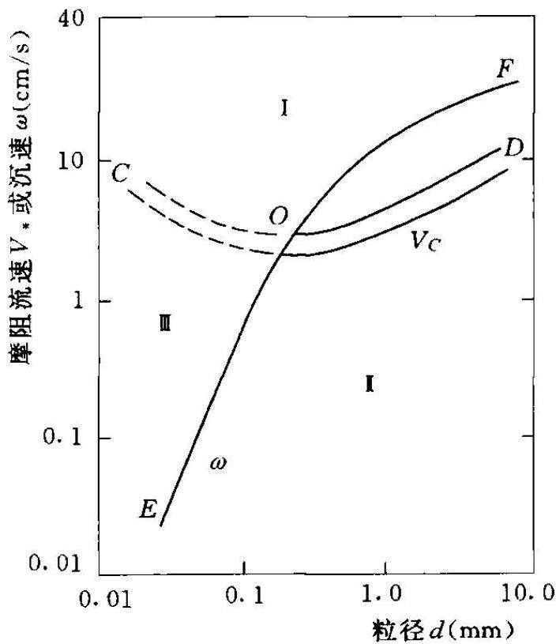  
图 3.1 泥沙沉积条件分区图

坐标为水流的摩阻流速V.或沉速 $\omega _ { \circ } \mathrm { ~ \textit ~ { ~ V ~ } ~ }$ 是水力条件的反映，$V _ { * } = \sqrt { g h j }$ (式中：g为重力加速度；h为水深；j为水力比降。)。图3.1中ω为泥沙沉速，随泥沙颗粒粒径增大，沉速随之 $\omega$ 增大；Vc为泥沙启动临界速度，因迁移泥沙与河床泥沙有交换 $V _ { C }$ 而有一定范围的变动，呈双曲线。颗粒细小的泥沙有黏聚作用，起动流速稍大；粉粒级泥沙黏聚作用小，起动流速最小；此后随颗粒粒径增大，起动流速也增大。两条曲线将泥沙沉积分为三个区段：

第一区段（I）：在COD线以上， $V _ { \ast } > V _ { c }$ 为侵蚀段，只有当上游来沙量超过水流挟沙能力时，才可能出现沉积。其中FOD 区以推移运动为主， $C ( ) F$ 区以悬移运动为主。

第二区段（Ⅱ）：在EOD线以下及以右， $V _ { \ast } < \omega$ 且 $V _ { \ast } <$ $V _ { C }$ ，水流不能支持上游来沙，又不能冲刷侵蚀床面泥沙，导致泥沙迅速淤积。

第三区段（Ⅲ）：在COE线的左侧， $\omega { < } V _ { C } { < } V$ ，水流不足以从河床取得补充泥沙，但只要上游有来沙，水流就有能力将其输往下游。

## 6. 沟谷侵蚀

坡面径流的分异与兼并形成股流，股流的下切与侧蚀形成沟谷。随汇流面积与径流线增长，股流流量逐渐增大，侵蚀随之增强，因而形成由小到大的沟谷系统。

沟谷的水流侵蚀要在 $V > V _ { c }$ (V为水流流速， $V _ { C }$ 为泥沙起动临界速度）情况下，才能产生。当 $V \leq V _ { c }$ 时，则沟床保持稳定。沟床稳定的比降，一般上游要陡，下游逐渐平缓，呈一个上凹的下降曲线。理论上它符合式（3.7）所列指数函数方程：

$$
i = i _ { 0 } \mathrm { e } ^ { - \infty }\tag{3.7}
$$

式中： $i _ { 0 }$ 为沟谷起始比降； $x$ 为距沟头的距离；c为与不同岩性和水力条件有关的系数。

稳定的沟床比降（即最小沟床比降）又称水力坡度，为水流丧失其侵蚀能力的最大坡度。对同一下垫面（主要为物质的抗蚀

性）而言，流量大的水力坡度小，流量小的水力坡度大。

自然界沟谷的发育还受侵蚀基面、发育条件（发育面积、分枝状况等）的制约，提高临时侵蚀基面，改善发育条件，可以实现稳定沟床的出现。

## 3.4.2.3 风蚀规律

风是气压差产生的气流。同水流一样，风也服从流体力学原理，只是水的密度比空气的密度 $( 1 . 2 2 \times 1 0 ^ { - 3 } \mathbf { g } / \mathbf { c m } ^ { 3 } )$ 大800多倍，才显出二者侵蚀、搬运、堆积的不同。

## 1. 影响风蚀的主要因素

风蚀作用的大小主要受风、土壤抗蚀性、地形、植被等影响。研究表明，一般地，极细沙起沙风速很小，随沙粒粒径增大，起沙风速增大。对干燥松散的沙，粒径为0.1～0.25mm，起沙风速为4.0\~5.0m/s。

受蚀土壤颗粒足够大（含团聚体），不能被风蚀，称抗蚀颗粒。抗蚀颗粒含量决定土壤抗蚀性大小。改善土壤质地，提高有机质含量，能增强土壤抗蚀性。

地表起伏有利于降低地表风速和拦截泥沙。对于耕作地，珑高5\~100cm，且城坡坡度在1.5%左右时，风蚀较弱。

增加地面植被覆盖，可有效降低风蚀作用。一般地，降雨多的地区，植被覆盖好，风蚀较弱；相反，风蚀则强。但干旱区的暴雨，能削减土壤抗性，改变微地形，导致风蚀加剧。

## 2. 侵蚀、搬运与堆积作用

风力侵蚀方式有吹蚀和磨蚀。吹蚀是风对沙粒的作用，磨蚀是风沙流对沙粒的作用。

沙粒迁移有三种方式，即悬移、跳跃和滚动。其中，跃移质占总迁移量的70%～80%，滚动推移质约占20%，悬移质一般不超过10%。跃移和推移是紧贴地表的，因而在地面以上30cm以内，迁移物占到80%上下，特别是在10cm以内更集中，100cm以上搬运很少。推移质颗粒粗，搬运距离最短；跃移质可搬运到附近的灌丛、土埂背后而堆积；悬移质颗粒以黏粒、有机质为主，可以被搬运到数百公里以外。

当风沙流运动速度降低，挟沙量饱和，或遇到障碍等时，沙粒会沉积下来。沙粒沉积分为沉降堆积和遇阻堆积两类。一般地，悬移质的沉积，是当风速减小，沙粒沉积速率大于紊流旋涡的垂直分速时产生，较重的颗粒先沉积，较轻的颗粒后沉积，显示风力的分选作用。当风沙流遇到湿润气流，抬升减速，并与水汽结合成雨滴下落，颗粒大小混杂，风沙流受到阻碍，速度减小而堆积。

## 3.4.2.4 其他侵蚀规律

## 1. 滑坡

一般地，边坡的变形破坏要经过松弛张裂、蠕动和破坏三个阶段。第一阶段坡面出现拉张裂隙，发育成分离体；第二阶段分离体在重力作用下，向临空面发生塑性变形与变位；第三阶段分离体变形、变位，一日失去平衡，就产生滑坡、崩塌等破坏。

滑坡体沿破裂面的滑动速度一般很慢，一昼夜只有几厘米，甚至几个月才移动几厘米。但当遇到触发因素，如暴雨、地震等时，则极速滑动。

## 2. 泥石流

泥石流密度大、流速高，冲蚀破坏极强。侵蚀泥沙约10%来自泥石流形成区，90%来自泥石流通过区。泥石流搬运能力极强，以悬移、推移和整体输移等方式进行，可以迁移数吨或数十吨的巨砾。

泥石流的冲（刷）淤（积）具有挟沙水流和滑坡的特性。稀性泥石流的冲淤与挟沙水流接近，泥沙呈单粒启动或淤积；黏性泥石流接近滑坡，泥沙呈整体运动或堆积；过渡性泥石流介于二者之间。

影响泥石流发育、冲淤变化的因素比较复杂。其中，岩性、地形、植被及降水是制约泥石流形成的主要因素；泥石流性质、沟道比降、泥石流流量、侵蚀基能等影响泥石流的冲淤变化。

## 参考文献

[1]郭索彦，姜德文，赵永军，等.开发建设项目水土流失现状与综合治理对策.中国水土保持科学，2008（1）：51-56.

[2]李智广，杨林.飞来峡水利枢纽水保工程监测内容和方法设计.水土保持通报，2003，23（1)：52-55.

[3]张卫，李智广.刍议线形开发建设项目水土流失野外巡查观测技术. 水土保持通报，2004，24(3)：45-46.

[4]李智广. 开发建设项目水土保持监测实施细则编制初探. 水土保持通报，2005，25(6)：91-95.

[5]水利部水土保持监测中心. SL277—2002 水土保持监测技术规程. 北京：中国水利水电出版社，2002.

[6]刘震.水土保持监测技术.北京：中国大地出版社，2004.

[7]李智广.水土流失测验与调查.北京：中国水利水电出版社，2005.

[8]杨宪杰，李建生，郑国权.土壤侵蚀预测模型研究进展及其在开发建设项目水土流失预测中的应用.广东水利水电，2006，11（增刊)：37-39.

[9]梁文辉，段义字. 荒漠戈壁区某煤矿矿井建设工程新增水土流失预测及防治对策.水土保持研究，2006，12（3）：34-36.

[10]蔺明华，杜靖澳，张瑞.黄河中游地区开发建设新增水土流失预测方法研究.水土保持通报，2006，26（1)：61-67.

[11]胡玉平，王慧觉，李思悦，等．高速公路建设项目水土流失预测方法研究.交通环保，2003.24(5)：18-20.

[12]廖建文，向慧昌. 水电站工程水土流失预测存在的问题及对策. 农业工程科学，2006，22（1）：376-379.

[13]水利部水土保持监测中心.关于印发《开发建设项目水土保持监测设计与实施计划编制提纲（试行)》的函（水保监〔2006〕16号）.2006, 7.

[14]徐智.西部原油成品油管道工程水土保持监测.中国水土保持，2007,5:38-40.

[15]李智广主编.水土保持监测技术指标体系.北京：中国水利水电出版社，2006.

[16]N.W.哈得逊. 土壤保持. 窦葆璋，译.北京：科学出版社，1976.

[17]刘秉正，吴发启．土壤侵蚀.西安：陕西人民出版社，1997.

[18] 承继成.坡度流水作用的分带性//中国地理学会 一九六三年年会论文选集.北京：科学出版社，1965.

[19]唐克丽.中国水土保持. 北京：科学出版社，2004.

[20]水利部水土保持司. SI 190—96 土壤侵蚀分类分级标准. 北京：中国水利水电出版社，1997.

[21]水利部水土保持司，GB/T 20465—2006 水土保持术语.北京：中国标准出版社，1996.

## 4 开发建设项目水土保持监测内容与指标

《水土保持监测技术规程》（SL277—2002)1提出了开发建设项目的监测内容，主要包括三个方面：一是项目建设区水土流失因子，包括地形、地貌和水系的变化情况，建设项目占用地面积、扰动地表面积，项目挖方、填方数量及面积，弃土、弃石、弃渣量及堆放面积，项目区林草覆盖率；二是水土流失状况，包括水土流失面积、水土流失量、水土流失程度的变化情况，以及对下游和周边地区造成的危害及其趋势；三是水土保持防治效果，包括防治措施的数量与质量，林草措施成活率、保存率、生长情况及盖度，防护工程稳定性、完好程度和运行情况，各项防治措施的拦渣保士效果。这三个方面内容，是从与区域、中小流域水土保持监测内容的比较中提出的，主要是为了突出反映开发建设项目水土保持监测内容的特色，即：在具有特定的自然因素和社会经济条件的一定区域（或位置），由于开发建设项目建设所引起的扰动，以及由此造成的水土流失、防治措施与效果等。

随着开发建设项目水土保持工作的开展，随着水土保持监测技术的发展，随着社会进步和发展，水土保持监测的内容不断更新、不断丰富。为了全面反映开发建设项目造成水土流失及其防治效果，在遵循技术规程的基础上，遵照《中华人民共和国水土保持法实施条例》规定的水土保持监测情况公告事项，提出如

下监测内容分类与分类指标。

## 4.1监测内容分类

开发建设项目水土保持监测内容的分类，是以水土保持科学为主体，兼顾相关的自然科学技术和社会学、经济学的相关内容，围绕水土流失及其治理，遵照“影响因素一水土流失一水土流失治理一治理效果”这个逻辑关系，并以这个关系为依据，对监测内容及其指标进行类别划分，将开发建设项目水土保持监测的内容可以分为水土流失因子、水土流失状况、水土流失危害、水土保持措施和水土保持效果等五个部分[1-8]。

(1）水土流失因子。水土流失因子是水土流失发生、发展的内在原因。水土流失动态变化与该类指标密切相关，掌握其动态变化能够揭示水土流失的本质与规律，为预测预报和预防治理水土流失奠定基础。水土流失因子包括自然因子和人为因子两个方面。

(2)水土流失状况。水土流失状况的指标，反映水土流失的类型和特征，表征水土流失的发生历史、现状与发展趋势，提供水土流失动态变化，是水土保持预防和治理决策与措施设计的重要依据。

(3）水土流失危害。水土流失危害的指标，是水土流失带来的生态危害、经济损失和社会灾难的标志，既反映水土流失灾害地域分布和危害特征，又可检验水土保持治理效果，为发展开发建设项目水土保持理论和改进水土流失治理技术提供实践指导。

（4）水土保持措施。水土保持措施的指标，是治理水土流失、控制水土流失灾害、改善生态环境的数量和标志，既能反映水土保持治理进度和区域差异，又能体现治理质量和水平，为宏观调控水土保持指出方向。

(5）水土保持效果。水土保持效果评价的指标，是经过分析和计算，用以表达水土保持所带来的水土流失减少、生态恢复及对开发建设项目作用的指标，突显水土保持对开发建设项目安全建设和健康运行的贡献，反映出水土保持的重要性和必要性。

## 4.2 水土流失因子的监测指标

水土流失因子也称水土流失影响因子，包括自然因子和人为因子（或社会经济因子）两方面。

## 4.2.1 自然因子监测指标

影响水土流失的自然因子，主要有地形、气象、土壤（地面物质组成）、植被等因子，有时还需要监测自然资源因子和地质因子。

(1)地形因子监测指标。一般地，地形因子监测指标主要包括地理位置、地貌形态类型与分区、海拔与相对高差、坡面特征(含坡度、坡长、坡向、坡形等）等指标。如果开发建设项目水土流失防治范围较大时，还要考虑流域（或区域）坡度组成、流域形状系数、沟谷长度与密度、沟谷割裂强度、主沟道比降等指标；风蚀区还包括地表起伏度等指标。

(2)气象因子监测指标。一般地，气象因子监测指标主要包括气候类型与分布、气温与地温、不小于 $1 0 ^ { \circ } C$ 积温、降水量、蒸发量、无霜期、干燥指数、太阳辐射与日照等。风蚀区还包括风速与风向、大风日数等。

（3）土壤（地面物质组成）因子监测指标。一般地，土壤因子监测指标主要包括土壤类型、土壤质地与组成、有效土层厚度等指标，或者地面物质的组分及其构成比例。如果开发建设项目中涉及树种、草种试验时，还要考虑土壤有机质含量、土壤营养成分含量、土壤酸碱度、土壤阳离子交换量、土壤渗透速率、土

壤密度、土壤团粒含量等指标。

（4）植被因子监测指标。一般地，植被因子监测指标主要包括植被类型与植物种类组成、灌草盖度、林灌郁闭度、植被覆盖率等指标。

(5)自然资源因子监测指标。一般地，自然资源主要包括土地资源、水资源和生物资源等。光热资源已经在“气象因子监测指标”中叙述，此处不再重复。矿藏资源主要为开发建设项目开采、开发的对象等，不再赘述。土地资源监测指标主要包括土地面积、土地类型、土地资源评价和土地利用现状等。水资源监测指标主要包括年均径流及其不同径流深的地区分布、人均水量、不同地区地表径流的年际分布、年内季节分布、河川径流含沙量等。生物资源主要是指植物资源，监测指标在“植被因子监测指标”中叙述，此处不再重复。

(6)地质因子监测指标。一般地，在开发建设项目水土保持监测中，可以不涉及地质因子。但当发生水土流失灾害事件时，或者发生大型崩塌、滑坡、泥石流及其他剧烈侵蚀形式时，需要进行地质因子分析。监测的因子主要包括地质构造特征（含构造单元演变、解理等构造特征）、地层岩性特征（含地层出露顺序、岩石矿物组成、岩石的物理力学性质等）、物理地质现象（含崩塌、滑坡、泥石流等）、水文地质现象（渗漏、地下水位、地下水变动等）及新构造运动特征（含构造运动性质、运动速度及分布等）等。

受各类各个自然因子变化率的影响，这些因子指标的监测频次各不相同。一般地质、地形指标监测频次低，多在5～10年1次；气象、土壤指标变化快，监测频次高，多按规定监测时段进行监测，或按需要时期监测；植被指标变化稍快，可1年1次或5年2次。

开发建设项目水土保持监测自然因子指标及其监测要求见表4.1。

开发建设项目水土保持监测自然因子监测指标及其监测要求
<table><tr><td colspan="1" rowspan="1">因子类型</td><td colspan="1" rowspan="1">指标名称</td><td colspan="1" rowspan="1">监测要求</td><td colspan="1" rowspan="1">监测频次</td></tr><tr><td colspan="1" rowspan="10">地形</td><td colspan="1" rowspan="1">地理位置</td><td colspan="1" rowspan="1">用经度、纬度坐标表示，也可用重要城镇相对位置说明</td><td colspan="1" rowspan="1">1次</td></tr><tr><td colspan="1" rowspan="1">地貌形态类型及分区</td><td colspan="1" rowspan="1">中、小地貌形态，侵蚀地貌形态特征，类型及组合，分布与流失强度分区的关系</td><td colspan="1" rowspan="1">1.次/5a</td></tr><tr><td colspan="1" rowspan="1">海拔与相对高差</td><td colspan="1" rowspan="1">最大高程、最小高程及高差。若建设区较大，可以按水系或分区分别说明</td><td colspan="1" rowspan="1">1次/5a</td></tr><tr><td colspan="1" rowspan="1">坡面特征</td><td colspan="1" rowspan="1">地面起伏程度，平均坡度、坡长、坡向与坡形及其变化范围</td><td colspan="1" rowspan="1">1次/5a</td></tr><tr><td colspan="1" rowspan="1">流域坡度组成</td><td colspan="1" rowspan="1">各级坡度面积及所占总面积比例</td><td colspan="1" rowspan="1">1次/5a或1次/a</td></tr><tr><td colspan="1" rowspan="1">流域形状系数</td><td colspan="1" rowspan="1">形状特征、长宽度（最大、平均）、形状系数与暴雨产汇流特征</td><td colspan="1" rowspan="1">1次/5a或1次/a</td></tr><tr><td colspan="1" rowspan="1">沟谷长度</td><td colspan="1" rowspan="1">量测不小于200m的切沟长度；较大建设区可分区量测</td><td colspan="1" rowspan="1">1次/5a或1次/a</td></tr><tr><td colspan="1" rowspan="1">沟谷密度</td><td colspan="1" rowspan="1">计算密度：较大建设区可分区、分级</td><td colspan="1" rowspan="1">1次/5a或1次/a</td></tr><tr><td colspan="1" rowspan="1">沟谷割裂强度</td><td colspan="1" rowspan="1">量测沟谷面积；较大建设区可分区</td><td colspan="1" rowspan="1">1次/5a或1次/a</td></tr><tr><td colspan="1" rowspan="1">主沟道比降</td><td colspan="1" rowspan="1">平均比降及年变化，也可绘比降变化图</td><td colspan="1" rowspan="1">1次/5a或1次/a</td></tr><tr><td colspan="1" rowspan="11">气象</td><td colspan="1" rowspan="1">气候类型与分区</td><td colspan="1" rowspan="1">气候类型特征及其与水土流失关系:</td><td colspan="1" rowspan="1">1次</td></tr><tr><td colspan="1" rowspan="1">降水量</td><td colspan="1" rowspan="1">多年平均降水量、最大降水量、最小降水量、最强雨量及年分配，本年降水特征及与侵蚀关系、重点暴雨型及分布</td><td colspan="1" rowspan="1">1次/5a或实时</td></tr><tr><td colspan="1" rowspan="1">侵蚀性降雨</td><td colspan="1" rowspan="1">多年的均值及变化范围、特征值，本年监测值及一次最大侵蚀性特征、最强侵蚀性特征</td><td colspan="1" rowspan="1">1次/5a或适时</td></tr><tr><td colspan="1" rowspan="1">气温与地温</td><td colspan="1" rowspan="1">多年平均值、1月和7月均值，本年气温均值、最大值、最小值、变率</td><td colspan="1" rowspan="1">1次/5a或2时段定时</td></tr><tr><td colspan="1" rowspan="1">≥10°积温</td><td colspan="1" rowspan="1">多年均值、起止月日及变化，本年监测值</td><td colspan="1" rowspan="1">1次/5a或2时段定时</td></tr><tr><td colspan="1" rowspan="1">蒸发量</td><td colspan="1" rowspan="1">区内多年平均值、最大值、最小值；重点监测点测水面蒸发和土壤蒸发，取得本年特征值，并比较</td><td colspan="1" rowspan="1">1次/5a或2时段定时</td></tr><tr><td colspan="1" rowspan="1">无霜期</td><td colspan="1" rowspan="1">区内多年均值、最大值、最小值和起止月日；重点监测点测本年特征值，并比较</td><td colspan="1" rowspan="1">1次/5a或2时段定时</td></tr><tr><td colspan="1" rowspan="1">风速与风向</td><td colspan="1" rowspan="1">多年平均值，最大与最小值，月分配，优势风及总量；观测年值及变化</td><td colspan="1" rowspan="1">1次/5a或适时</td></tr><tr><td colspan="1" rowspan="1">大风日</td><td colspan="1" rowspan="1">多年平均值，最大与最小值、月分配；观测年值及变化</td><td colspan="1" rowspan="1">1次/5a或适时</td></tr><tr><td colspan="1" rowspan="1">干燥指数</td><td colspan="1" rowspan="1">区内多年大值；重点监测点实测本年k值，说明气候干、湿变化</td><td colspan="1" rowspan="1">1次/5a或1次/a</td></tr><tr><td colspan="1" rowspan="1">太阳辐射与日照</td><td colspan="1" rowspan="1">区内多年辐射与日照均值，最大值和最小值；重点监测点测本年实测值，并比较</td><td colspan="1" rowspan="1">1次/5a或2时段定时</td></tr><tr><td colspan="1" rowspan="12">土壤(地面物质组成</td><td colspan="1" rowspan="1">地面组成物质</td><td colspan="1" rowspan="1">在山区，根据山区地面组成物质中土与石占地面积的比例，划分土质、石质或土石山区，着重监测裸岩面积；在丘陵或高原区，根据丘陵或高原地面物质组成中的土类划分，如东北黑土区、西北黄土区、南方红壤区等，着重监测土层厚度；在沙漠或沙地区，根据地面覆盖明沙的程度，确定沙漠或沙地的范围，着重了解沙丘移动、沙埋面积、厚度及沙化土地等情况[9]</td><td colspan="1" rowspan="1">1次/5a或1次/a</td></tr><tr><td colspan="1" rowspan="1">土壤类型</td><td colspan="1" rowspan="1">土壤种属及分布面积</td><td colspan="1" rowspan="1">1次/5a</td></tr><tr><td colspan="1" rowspan="1">土壤质地与组成</td><td colspan="1" rowspan="1">区内主要土种；小区内土壤的机械组成</td><td colspan="1" rowspan="1">1次/5a</td></tr><tr><td colspan="1" rowspan="1">有效土层厚度</td><td colspan="1" rowspan="1">区内主要土种有效厚度及分布面积；小区内土壤结构特征及厚度</td><td colspan="1" rowspan="1">1次/5a</td></tr><tr><td colspan="1" rowspan="1">土壤有机质含量</td><td colspan="1" rowspan="1">主要土种，或小区各处理层含量及年变化</td><td colspan="1" rowspan="1">1次/5a</td></tr><tr><td colspan="1" rowspan="1">土壤营养成分含量</td><td colspan="1" rowspan="1">区内及小区内土壤养分全量，及小区内分层养分和有效养分含量</td><td colspan="1" rowspan="1">1次/5a或1次/a</td></tr><tr><td colspan="1" rowspan="1">土壤酸碱度</td><td colspan="1" rowspan="1">区内主要土种及小区内土壤pH值</td><td colspan="1" rowspan="1">1次/5a</td></tr><tr><td colspan="1" rowspan="1">土壤阳离子交换量</td><td colspan="1" rowspan="1">区内主要上种及小区内土壤阳离子交换量</td><td colspan="1" rowspan="1">1次/5a</td></tr><tr><td colspan="1" rowspan="1">土壤渗透速率</td><td colspan="1" rowspan="1">区内主要土种及小区内土渗透性能</td><td colspan="1" rowspan="1">1次/a或定时</td></tr><tr><td colspan="1" rowspan="1">土壤含水量</td><td colspan="1" rowspan="1">区内主要土种及小区内土壤含水量</td><td colspan="1" rowspan="1">1 次/a或适时</td></tr><tr><td colspan="1" rowspan="1">土壤密度</td><td colspan="1" rowspan="1">区内主要土种及小区内土壤分层观测</td><td colspan="1" rowspan="1">1次/5a或1次/a</td></tr><tr><td colspan="1" rowspan="1">土壤团粒含量</td><td colspan="1" rowspan="1">区内主要土种及小区内土壤分层观测</td><td colspan="1" rowspan="1">1次/5a或1次/a</td></tr><tr><td colspan="1" rowspan="4">植被</td><td colspan="1" rowspan="1">植被类型与植物种类组成</td><td colspan="1" rowspan="1">区内植被类型，自然和人工植被种类，生长及经济产量。若在风沙区，监测植被类型及常见种类，多度、生长等特征</td><td colspan="1" rowspan="1">2次/5a或2次/建设期</td></tr><tr><td colspan="1" rowspan="1">郁闭度</td><td colspan="1" rowspan="1">主要乔木林（天然、人工、经果）平均郁闭度及变化范围与龄级关系</td><td colspan="1" rowspan="1">1次/（1~2）a</td></tr><tr><td colspan="1" rowspan="1">盖度</td><td colspan="1" rowspan="1">天然草、人工草盖度及月变化，小区内人工作物植被盖度及月变化，注意残茬覆盖</td><td colspan="1" rowspan="1">1次/（1~2）a或适时</td></tr><tr><td colspan="1" rowspan="1">植被覆盖率</td><td colspan="1" rowspan="1">不计作物植被，区内林草植被7~9月的变化率，较大流域可分区划片</td><td colspan="1" rowspan="1">1次/（1~2）a</td></tr><tr><td colspan="1" rowspan="5">自然资源</td><td colspan="1" rowspan="1">土地资源利用状况</td><td colspan="1" rowspan="1">区内前5年平均状况，监测年耕地、林果（经）草、水域、工矿、道路、村镇、未利川地等</td><td colspan="1" rowspan="1">1次/2a</td></tr><tr><td colspan="1" rowspan="1">水资源利用状况</td><td colspan="1" rowspan="1">区内水资源总量，开发利用方式、利用数量及利用效率，变化利用前景</td><td colspan="1" rowspan="1">2次/5a或2次/建设期</td></tr><tr><td colspan="1" rowspan="1">地下水</td><td colspan="1" rowspan="1">主要为水质及埋深，可绘图</td><td colspan="1" rowspan="1">1次/10a</td></tr><tr><td colspan="1" rowspan="1">河流径流特征</td><td colspan="1" rowspan="1">若监测多年，调查出平均年径流、流量、洪峰模数、径流系数；实测径流过程及年变化，取得各径流要素</td><td colspan="1" rowspan="1">适时观测</td></tr><tr><td colspan="1" rowspan="1">河流泥沙特征</td><td colspan="1" rowspan="1">若监测多年，说明年平均输沙量、含沙量、输沙率及模数和变化；实测年输沙过程及变化，取得泥沙要素</td><td colspan="1" rowspan="1">适时观测</td></tr><tr><td colspan="1" rowspan="1">地质</td><td colspan="1" rowspan="1">地层岩性特征</td><td colspan="1" rowspan="1">建设区及沟间、沟谷地地层出露，岩性特征及对侵蚀产沙影响；风蚀区或沙源区岩性与地层出露，结构构造与抗蚀特性</td><td colspan="1" rowspan="1">1次/5a或1 次/建设期</td></tr><tr><td colspan="1" rowspan="2">地质</td><td colspan="1" rowspan="1">物理地质现象</td><td colspan="1" rowspan="1">滑坡、崩塌数量、规模及密度，活动及危害，冲刷及堆积，裸坡泻溜面积比</td><td colspan="1" rowspan="1">1次/5a或1次/建设期</td></tr><tr><td colspan="1" rowspan="1">水文地质现象</td><td colspan="1" rowspan="1">渗漏，曲流、地下水出露、流量，以及对沟谷冲刷、坡角稳定的影响</td><td colspan="1" rowspan="1">1次/5a或1次/建设期</td></tr></table>

注1. 表中所列指标是从总体上考虑的全部指标。在具体项目的监测中，可根据项目实际情况（如水蚀、风蚀、冻融侵蚀等不同侵蚀类型，同一侵蚀类型的不同区域，建设项目所在的地貌类型区等）选择监测。

2. 表中“区内”是指监测范围内；“小区”是指水土流失观测样区（概念见“5开发建设项目水土保持监测分区与监测点布局设计”)，“重点监测点”是指在监测期内开展特殊试验的监测点。

3. 监测指标释义与分析、计算、评价方法见参考文献8。

## 4.2.2 人为因子监测指标

人为因子包括社会经济因子和建设项目活动因子等。

（1）社会经济因子监测指标。一般地，社会经济因子监测指标主要包括人口总数、农业与城镇人口数量、人口密度、人口增长率等社会因子，以及国民生产总值、产业结构、人均收入、交通发展状况等经济因子。如果开发建设项目在农村，还要考虑人均耕地面积、基本农田面积等。

(2)建设项目活动监测指标。开发建设项目活动直接参与土壤（地表组成物质）的侵蚀、搬运、堆积等全过程，是在水土保持背景状况下诱发新的水土流失的直接因素。一般地，项目建设活动的监测指标主要包括建设项目占用地面积，扰动土地面积，项目挖方、填方数量及面积，弃土、弃石、弃渣量及堆放面积等。

上述人为因子的监测指标中，社会经济因子常用多年均值或年变化表示，项目建设活动多为实施监测。

开发建设项目水土保持监测人为因子指标及其监测要求见表4.2。

开发建设项目水土保持监测人为因子监测指标及其监测要求  
表4.2
<table><tr><td rowspan=1 colspan=1>因子类型</td><td rowspan=1 colspan=1>指标名称</td><td rowspan=1 colspan=1>监测要求</td><td rowspan=1 colspan=1>监测频次</td></tr><tr><td rowspan=9 colspan=1>社会经济</td><td rowspan=1 colspan=1>人口总数</td><td rowspan=1 colspan=1>区内总人口数、变化、农业与非农业人口数、男女性人口数</td><td rowspan=1 colspan=1>2 次/5a 或2次/建设期</td></tr><tr><td rowspan=1 colspan=1>人口密度</td><td rowspan=1 colspan=1>区内平均值及变化、分区值及变化</td><td rowspan=1 colspan=1>2 次/5a 或2次/建设期</td></tr><tr><td rowspan=1 colspan=1>人口增长率</td><td rowspan=1 colspan=1>平均自然增长、迁移变化；或分区说明</td><td rowspan=1 colspan=1>2次/5a 或2次/建设期</td></tr><tr><td rowspan=1 colspan=1>国民生产总值</td><td rowspan=1 colspan=1>前5年平均值，监测期年总值</td><td rowspan=1 colspan=1>2 次/5a 或2次/建设期</td></tr><tr><td rowspan=1 colspan=1>产业结构</td><td rowspan=1 colspan=1>前5年产业结构，监测期产业结构</td><td rowspan=1 colspan=1>2次/5a 或2次/建设期</td></tr><tr><td rowspan=1 colspan=1>人均收人</td><td rowspan=1 colspan=1>前5年平均值，监测期年实际值</td><td rowspan=1 colspan=1>2 次/5a 或2次/建设期</td></tr><tr><td rowspan=1 colspan=1>交通发展状况</td><td rowspan=1 colspan=1>公路现状、发展计划、前景，以及对生产发展影响</td><td rowspan=1 colspan=1>2 次/5a 或 2次/建设期</td></tr><tr><td rowspan=1 colspan=1>人均耕地面积</td><td rowspan=1 colspan=1>总量及变化情况</td><td rowspan=1 colspan=1>2 次/5a 或 2次/建设期</td></tr><tr><td rowspan=1 colspan=1>基本农田面积</td><td rowspan=1 colspan=1>近年变化</td><td rowspan=1 colspan=1>2 次/5a 或2次/建设期</td></tr><tr><td rowspan=5 colspan=1>建设项目活动</td><td rowspan=1 colspan=1>建设项目占用地面积</td><td rowspan=1 colspan=1>包括永久占地和临时占地，按照监测时段量测</td><td rowspan=1 colspan=1>1~2次/a</td></tr><tr><td rowspan=1 colspan=1>扰动土地面积</td><td rowspan=1 colspan=1>位置、面积；按照监测时段量测</td><td rowspan=1 colspan=1>1~2次/a</td></tr><tr><td rowspan=1 colspan=1>项目挖方数量及面积</td><td rowspan=1 colspan=1>挖方位置、挖方点数量、方量、面积；按监测时段量测</td><td rowspan=1 colspan=1>2次/a或实时</td></tr><tr><td rowspan=1 colspan=1>项目填方数量及面积</td><td rowspan=1 colspan=1>填方位置、挖方点数量、方量、面积；按监测时段量测</td><td rowspan=1 colspan=1>2次/a或实时</td></tr><tr><td rowspan=1 colspan=1>弃土、弃石、弃渣量及堆放面积</td><td rowspan=1 colspan=1>弃土（石、渣）位置、处（点）数、方量、面积；按监测时段量测</td><td rowspan=1 colspan=1>2次/a或实时</td></tr></table>

注同表4.1注。

## 4.3 水土流失状况监测指标

开发建设项目水土流失状况，依据水土流失发生区位可以分为四个部分。

## 4.3.1 坡面水蚀监测指标

坡面，包括各种开挖、堆积及其他方式形成的扰动坡面和未扰动坡面。坡面水蚀的主要监测指标有坡面产流量、土壤流失形式、土壤流失量等指标。

## 4.3.2 区域水蚀监测指标

这里的区域是指建设区或建设区的某个部分。区域水蚀的主要监测指标有水土流失面积、流失强度、流失量、侵蚀模数等。如果项目建设对水系或河流扰动较大，还应监测河流的水位、流量、含沙量、输沙量、输沙模数、径流模数、泥沙输移比等指标。

## 4.3.3 风蚀区风蚀状况监测指标

在风力侵蚀为主的区域，风蚀状况的主要监测指标有风蚀面积、土壤侵蚀强度、起沙风、风沙强度与频度、优势风沙、风沙流强度、风蚀深、沙丘移动、沙尘暴次数、降尘量等指标。

## 4.3.4 其他侵蚀状况监测指标

（1）重力侵蚀主要监测指标。主要包括侵蚀形式及其数量。侵蚀形式如崩塌、崩岗、滑坡、泻溜等，数量如撒落量、崩岗发生面积、滑坡规模、滑坡变形量等。

（2）混合侵蚀（泥石流）主要监测指标。主要包括泥石流特征、泥石流浆体总量、泥石流冲击物量等。

（3）冻融侵蚀主要监测指标。主要包括冻土厚度、冻结期、热融位移量、热融侵蚀面积等。

上述水土流失状况主要指标的监测频次，多随侵蚀发生而进行适时监测，然后统计出年值。

开发建设项目水土流失状况监测指标及其监测要求见表4.3。

表4.3  
开发建设项目水土保持监测水土流失监测指标及其监测要求
<table><tr><td colspan="1" rowspan="1">水土流失类型</td><td colspan="1" rowspan="1">指标名称</td><td colspan="1" rowspan="1">监测要求</td><td colspan="1" rowspan="1">监测频次</td></tr><tr><td colspan="1" rowspan="3">坡面水蚀</td><td colspan="1" rowspan="1">坡面产流量</td><td colspan="1" rowspan="1">包括未扰动坡面和扰动坡面；多年坡面产流量均值，本年监测各种措施，各种坡度、坡长的产流量，产流总量</td><td colspan="1" rowspan="1">1次/5a或适时</td></tr><tr><td colspan="1" rowspan="1">土壤流失形式</td><td colspan="1" rowspan="1">包括面蚀、细沟、浅沟等形式的面积与尺寸</td><td colspan="1" rowspan="1">1次/5a 或适时</td></tr><tr><td colspan="1" rowspan="1">土壤流失量</td><td colspan="1" rowspan="1">包括未扰动坡面和扰动坡面；多年流失均值，本年监测各种措施、坡度、坡长的产沙量</td><td colspan="1" rowspan="1">1次/5a或适时</td></tr><tr><td colspan="1" rowspan="10">区域水蚀</td><td colspan="1" rowspan="1">水土流失面积</td><td colspan="1" rowspan="1">建设期流失面积及变化，区域较大时可分区</td><td colspan="1" rowspan="1">1~2次/a</td></tr><tr><td colspan="1" rowspan="1">流失强度</td><td colspan="1" rowspan="1">区内平均值及范围，不同级别面积、分布、比例及侵蚀强度值</td><td colspan="1" rowspan="1">1~2次/a</td></tr><tr><td colspan="1" rowspan="1">土壤流失量</td><td colspan="1" rowspan="1">监测点年流失量，代表范围</td><td colspan="1" rowspan="1">适时</td></tr><tr><td colspan="1" rowspan="1">水位</td><td colspan="1" rowspan="1">流域常流量水位，暴雨洪水位及变化，年（月）或次暴雨平均水位</td><td colspan="1" rowspan="1">适时</td></tr><tr><td colspan="1" rowspan="1">流量</td><td colspan="1" rowspan="1">常流量，暴雨洪水流量及变化，年、月或次暴雨平均流量，最大流量</td><td colspan="1" rowspan="1">适时</td></tr><tr><td colspan="1" rowspan="1">含沙量</td><td colspan="1" rowspan="1">平均含沙量，最大值、最小值，各次含沙量变化</td><td colspan="1" rowspan="1">适时</td></tr><tr><td colspan="1" rowspan="1">径流量</td><td colspan="1" rowspan="1">次径流量、年总径流量、洪水径流量，径流模数，径流系数</td><td colspan="1" rowspan="1">适时</td></tr><tr><td colspan="1" rowspan="1">输沙量</td><td colspan="1" rowspan="1">流域次输沙量和年总输沙量，有条件将悬移质和推移质同测，输沙模数、调查得侵蚀模数</td><td colspan="1" rowspan="1">适时</td></tr><tr><td colspan="1" rowspan="1">径流模数</td><td colspan="1" rowspan="1">平均值、各年值；小区各次值及年值</td><td colspan="1" rowspan="1">定时</td></tr><tr><td colspan="1" rowspan="1">泥沙输移比</td><td colspan="1" rowspan="1">多年平均值；较大流域可分小流域计算</td><td colspan="1" rowspan="1">1次/（3～5) a</td></tr><tr><td colspan="1" rowspan="8">风蚀区风蚀状况</td><td colspan="1" rowspan="1">风蚀面积</td><td colspan="1" rowspan="1">区内风蚀总面积</td><td colspan="1" rowspan="1">1~2次/a</td></tr><tr><td colspan="1" rowspan="1">风蚀强度</td><td colspan="1" rowspan="1">区内依据盖度或风积深分级，或分区分级进行监测</td><td colspan="1" rowspan="1">1~2次/a</td></tr><tr><td colspan="1" rowspan="1">风沙强度与频度</td><td colspan="1" rowspan="1">区内起沙风的年总和、平均天数，及月分配，观测期年值及月变化</td><td colspan="1" rowspan="1">适时</td></tr><tr><td colspan="1" rowspan="1">优势风沙</td><td colspan="1" rowspan="1">区内年均值及风向，最大与最小值，月分配，观测期年值及月变化</td><td colspan="1" rowspan="1">适时</td></tr><tr><td colspan="1" rowspan="1">风沙流强度</td><td colspan="1" rowspan="1">区内多年平均值、最大值、最小值，观测期历次值及变化</td><td colspan="1" rowspan="1">适时</td></tr><tr><td colspan="1" rowspan="1">风蚀深</td><td colspan="1" rowspan="1">观测风蚀及风变化或风积值</td><td colspan="1" rowspan="1">适时</td></tr><tr><td colspan="1" rowspan="1">沙丘移动</td><td colspan="1" rowspan="1">多年平均值及移动方向、变化，观测区移动变化、方向</td><td colspan="1" rowspan="1">适时</td></tr><tr><td colspan="1" rowspan="1">沙尘暴次数</td><td colspan="1" rowspan="1">多年平均值、最大、最小值，可分级分区说明，观测区年值及月分配</td><td colspan="1" rowspan="1">适时</td></tr><tr><td colspan="1" rowspan="6">其他侵蚀</td><td colspan="1" rowspan="1">撒落量</td><td colspan="1" rowspan="1">区内裸被、裸岩面积及占坡面比量，观测撒落量及月变化</td><td colspan="1" rowspan="1">定时</td></tr><tr><td colspan="1" rowspan="1">滑坡规模</td><td colspan="1" rowspan="1">区内滑坡、崩塌的规模、活动量及产沙情况</td><td colspan="1" rowspan="1">定时</td></tr><tr><td colspan="1" rowspan="1">泥石流冲出物量</td><td colspan="1" rowspan="1">区内泥石流活动情况、次数、冲出量及对产沙贡献</td><td colspan="1" rowspan="1">定时</td></tr><tr><td colspan="1" rowspan="1">崩岗发生面积</td><td colspan="1" rowspan="1">花岗岩风化区崩岗发生面积，占总面积百分数，发生规模、原因分析</td><td colspan="1" rowspan="1">定时</td></tr><tr><td colspan="1" rowspan="1">崩岗侵蚀量</td><td colspan="1" rowspan="1">花岗岩风化区崩岗发生规模、变化及侵蚀总量、分布密度、平均输移特征及模数</td><td colspan="1" rowspan="1">定时</td></tr><tr><td colspan="1" rowspan="1">冻融侵蚀冰渍物堆积量</td><td colspan="1" rowspan="1">年堆积量，或分区进行监测</td><td colspan="1" rowspan="1">定时</td></tr></table>

注同表4.1注。

## 4.4 水土流失危害监测指标

开发建设项目水土流失危害是多方面的，主要包括破坏土地(土壤）资源、破坏水土保持设施、泥沙淤积、水资源污染等方面。

## 4.4.1 破坏土地（土壤）资源监测指标

破坏土地（土壤）资源不仅引起土地质量下降，土壤肥力下 降，土地生产力下降，而且将导致土地面积减少。

（1）减少土地资源数量。主要监测指标有工程占用（沟谷吞噬）面积、冲毁面积、沙积面积、重力侵蚀掩埋面积等。水土流失严重时，还需要监测土地沙化面积、石漠化面积等。

(2)土地质量下降。主要监测指标包括了有效土层变薄、土壤肥力下降、土壤质量恶化和土壤污染等方面。

## 4.4.2 毁坏水土保持设施监测指标

主要监测指标包括毁坏的设施及其数量、程度等。水土保持设施主要包括林草植被、水土保持工程措施（如梯田、小型水利水保工程、沟头防护、淤地坝、引洪漫地工程，等等）及其他有利于蓄水保土的农田基本设施。

## 4.4.3 泥沙淤积危害监测指标

(1）危害主体工程。主要监测对建设施工的进度与效率影响、工程设施设备损坏、施工人员安全危害等方面。

（2）危害设施利用。主要监测指标包括泥沙淤积的库坝数量及库容、淤积的河湖数量及淤积量、淤积的港口数量及淤积量等。

(3）洪涝灾害。主要监测指标包括由于水土流失引起的洪涝、滑坡、泥石流和风沙等灾害及其导致的损失等。

## 4.4.4 水资源污染监测指标

一般地，水资源污染的监测指标主要包括水体富营养物质(如增加水体的总磷、总氮、氨氮等）、非营养物质（如氟化物、挥发物、高锰酸盐指数、五日生化需氧量等）、病菌（如粪大肠菌群数量等）等。特殊情况下，还需要调查污染造成的人、畜伤害等情况。对于采矿类开发建设项目，污染物还应分析重金属等内容。

上述水土流失危害主要指标的监测频次，大多数随水土流失发生而进行适时监测，然后统计出年值（总量、平均值及特征值等）。

开发建设项目水土流失危害监测指标及其监测要求见表4.4。

开发建设项目水土保持监测水土流失  
危害监测指标及其监测要求
<table><tr><td rowspan=1 colspan=1>水土流失危害类型</td><td rowspan=1 colspan=1>指标名称</td><td rowspan=1 colspan=1>监测要求</td><td rowspan=1 colspan=1>监测频次</td></tr><tr><td rowspan=7 colspan=1>破坏土地资源</td><td rowspan=1 colspan=1>工程占用(沟谷吞噬)面积</td><td rowspan=1 colspan=1>占用土地类型与面积及其发展，沟头延伸、沟岸扩张</td><td rowspan=1 colspan=1>1 次/10a 或 1次/a</td></tr><tr><td rowspan=1 colspan=1>洪水冲毁面积</td><td rowspan=1 colspan=1>区内冲毁面积与进展</td><td rowspan=1 colspan=1>1次/a</td></tr><tr><td rowspan=1 colspan=1>滑坡（泥石流）掩埋面积</td><td rowspan=1 colspan=1>区内掩埋面积与进展</td><td rowspan=1 colspan=1>1次/a</td></tr><tr><td rowspan=1 colspan=1>沙积面积</td><td rowspan=1 colspan=1>区内泥沙堆积面积与进展</td><td rowspan=1 colspan=1>1次/a</td></tr><tr><td rowspan=1 colspan=1>沙化（石漠化）面积</td><td rowspan=1 colspan=1>区内沙化（石漠化）面积与进展</td><td rowspan=1 colspan=1>1次/10a 或1次/a</td></tr><tr><td rowspan=1 colspan=1>土地生产力下降损失</td><td rowspan=1 colspan=1>通过典型对比，按等级、面积、产量计算</td><td rowspan=1 colspan=1>1次/a</td></tr><tr><td rowspan=1 colspan=1>土壤肥力下降</td><td rowspan=1 colspan=1>扰动土地观测，与对比样地对比分析</td><td rowspan=1 colspan=1>1次/a</td></tr></table>

续表
<table><tr><td></td><td colspan="1" rowspan="1">水土流失危害类型</td><td colspan="2" rowspan="1">指标名称</td><td colspan="1" rowspan="1">监测要求</td><td colspan="1" rowspan="1">监测频次</td></tr><tr><td></td><td colspan="1" rowspan="3">破坏土地资源</td><td colspan="2" rowspan="1">有效土层变薄</td><td colspan="1" rowspan="1">扰动土地观测，与对比样地对比分析</td><td colspan="1" rowspan="1">1次/a</td></tr><tr><td></td><td colspan="2" rowspan="1">土壤质量恶化</td><td colspan="1" rowspan="1">扰动土地观测，与对比样地对比分析</td><td colspan="1" rowspan="1">1次/a</td></tr><tr><td></td><td colspan="2" rowspan="1">土壤污染</td><td colspan="1" rowspan="1">扰动土地观测，与对比样地对比分析</td><td colspan="1" rowspan="1">1次/a</td></tr><tr><td></td><td colspan="1" rowspan="1">毁坏水土保持设施</td><td colspan="2" rowspan="1"></td><td colspan="1" rowspan="1">毁坏的设施及其数量、程度。具体设施见“4.5水土保持措施监测指标”</td><td colspan="1" rowspan="1"></td></tr><tr><td colspan="2" rowspan="5">泥沙淤积危害</td><td colspan="2" rowspan="1">危害主体工程</td><td colspan="1" rowspan="1">延迟施I进度、降低施工效率、损坏工程设施设备、人员安全、工程安全等</td><td colspan="1" rowspan="1">适时</td></tr><tr><td colspan="2" rowspan="1">库坝淤积</td><td colspan="2" rowspan="1">淤积库坝的数量、库容、占库容比例</td><td colspan="1" rowspan="1">1次/a</td></tr><tr><td colspan="1" rowspan="1">河湖淤积</td><td colspan="2" rowspan="1">淤积河道、湖泊的数量及厚度</td><td colspan="1" rowspan="1">1次/a</td></tr><tr><td colspan="2" rowspan="1">港口淤积</td><td colspan="2" rowspan="1">淤积港口的数量及厚度：</td><td colspan="1" rowspan="1">1次/a</td></tr><tr><td colspan="2" rowspan="1">洪涝灾害损失</td><td colspan="2" rowspan="1">灾害及受灾、损失折价</td><td colspan="1" rowspan="1">适时</td></tr><tr><td colspan="2" rowspan="4">水资源污染</td><td colspan="2" rowspan="1">总磷</td><td colspan="1" rowspan="1">区内或下游，洪水期或定时对比分析</td><td colspan="1" rowspan="1">适时</td></tr><tr><td colspan="2" rowspan="1">总氮</td><td colspan="2" rowspan="1">区内或下游，洪水期或定时对比分析</td><td colspan="1" rowspan="1">适时</td></tr><tr><td colspan="1" rowspan="1">氨氮</td><td colspan="2" rowspan="1">区内或下游，洪水期或定时对比分析</td><td colspan="1" rowspan="1">适时</td></tr><tr><td colspan="2" rowspan="1">氟化物</td><td colspan="2" rowspan="1">区内或下游，洪水期或定时对比分析</td><td colspan="1" rowspan="1">适时</td></tr><tr><td colspan="1" rowspan="1">水土流失危害类型</td><td colspan="1" rowspan="1">指标名称</td><td colspan="1" rowspan="1">监测要求</td><td colspan="4" rowspan="1">监测频次</td></tr><tr><td colspan="1" rowspan="4">水资源污染</td><td colspan="1" rowspan="1">挥发物</td><td colspan="1" rowspan="1">区内或下游，洪水期或定时对比分析</td><td colspan="4" rowspan="1">适时</td></tr><tr><td colspan="1" rowspan="1">高锰酸盐指数</td><td colspan="1" rowspan="1">区内或下游，洪水期或定时对比分析</td><td colspan="4" rowspan="1">适时</td></tr><tr><td colspan="1" rowspan="1">五日生化需氧量（BOD5）</td><td colspan="1" rowspan="1">区内或下游，洪水期或定时对比分析</td><td colspan="4" rowspan="1">适时</td></tr><tr><td colspan="1" rowspan="1">粪大肠菌群</td><td colspan="1" rowspan="1">区内或下游，洪水期或定时对比分析</td><td colspan="4" rowspan="1">适时</td></tr></table>

注同表4.1注。

## 4.5 水土保持措施监测指标

## 4.5.1 水土保持措施类型

依据水土保持措施防治对象，可以将开发建设项目水土保持措施分为拦渣工程、护坡工程、土地整治工程、防洪工程、防风固沙工程、泥石流防治工程、植被建设工程等七种类型。如果将这七种措施按照属性划分，可以分为工程措施、林草措施两个方面。也就是说，在这七种类型的措施中，主要的措施无外乎就是工程措施、植物措施、工程与植物相结合的措施。另外，在开发建设项目实施过程中，为了防止施工场地及其周边或者临时的（或短暂的）扰动面、占压区和开挖面等的水土流失，常常采用表面覆盖、挡土挡石、排水、沉沙等措施，这类措施称之为临时工程。

## 4.5.2 水土保持措施监测指标

对于开发建设项目水土保持措施的监测，主要指标包括措施类型及其对应的数量、质量等数值。不同的水土保持措施类型，其对应的数量及其单位有所不同。对于以长度记录的措施，如沟头防护、排水沟、上地整治的田埂等，措施单位常常为米、千米等；对于以面积记录的措施，如植被建设面积、土地整治面积、防风固沙面积等，单位常常为平方米、公顷、平方千米等；对于以体积（容积）记录的措施，如护坡、拦渣、小型蓄水工程的石方量，单位常常为立方米、万立方米等。同时，对于每一种措施，常常需要统计措施分布的点位数量，单位常常为个、处、座、株等。不同的水土保持措施类型，其对应的质量表征方式也不同。对于工程措施，常常用工程质量等级及保存率、完好率、稳定性、运行情况等表征其质量；对于植物措施，常常用工程质量等级及成活率、保存率、生长状况、林木密度等表征其质量。

上述水土保持措施监测指标，应按照工程实施进展分阶段监测，并依据设计要求和措施质量要求，检查质量。监测频次可以与工程建设阶段一致，或按照年度进行统计分析。

开发建设项目水土保持措施及其监测要求见表4.5。

表4.5  
开发建设项目水土保持监测水土保持措施及其监测要求
<table><tr><td colspan="1" rowspan="1">水土保持措施</td><td colspan="1" rowspan="1">监测要求</td></tr><tr><td colspan="1" rowspan="1">防治措施工程量</td><td colspan="1" rowspan="1">各阶段（时段）各种措施的数量和质量，以及治理期累计量</td></tr><tr><td colspan="1" rowspan="1">拦渣工程量</td><td colspan="1" rowspan="1">以拦渣为目的各种建筑物的数量和质量，包括分年（时段）新增的拦渣工程的方式、工程量，以及项目建设累计量</td></tr><tr><td colspan="1" rowspan="1">护坡工程量</td><td colspan="1" rowspan="1">对不稳定边坡采取各种措施的数量和质量，包括分年（时段）新增的土地整治工程的方式、工程量，以及项目建设累计量</td></tr><tr><td colspan="1" rowspan="1">土地整治工程面积</td><td colspan="1" rowspan="1">建筑扰动区土地整治工程的数量和质量，包括分年（时段）新增的土地整治工程的方式、工程量，以及项目建设累计量</td></tr><tr><td colspan="1" rowspan="1">防洪排导工程量</td><td colspan="1" rowspan="1">用以防洪排导的各项工程的数量和质量，包括分年（时段）新增的防洪排导工程的方式、工程量，以及项目建设累计量</td></tr><tr><td colspan="1" rowspan="1">降水蓄渗工程量</td><td colspan="1" rowspan="1">用以拦截降水并蓄水的各项工程的数量和质量，包括分年（时段）新增的降水蓄渗工程的方式、工程量，以及项目建设累计量</td></tr><tr><td colspan="1" rowspan="1">防风固沙工程量</td><td colspan="1" rowspan="1">用以防风固沙保护主体工程的各项工程的数量和质量，包括分年（时段）新增的防风固沙工程的方式、工程量，以及项目建设累计量</td></tr><tr><td colspan="1" rowspan="1">植被建设工程量</td><td colspan="1" rowspan="1">建设区和直接影响区植被建设的各项工程数量和质量，包括分年（时段）新增的植被建设工程的方式、工程量，以及项目建设累计量</td></tr><tr><td colspan="1" rowspan="1">临时工程工程量</td><td colspan="1" rowspan="1">建设区和直接影响区临时工程的各项工程的数量和质量，包括分年（时段）新增的临时工程的方式、工程量，以及项目建设累计量</td></tr></table>

注1.表中的分年（时段）新增的“工程的方式、工程量，以及项目建设累计量”包括措施数量和质量两个方面。其中，数量方面包括了措施的点位数量、措施的面积（长度）、动用石（土）方量、使用植被数量等与措施的数量相关的统计方式；质量方面包括了工程质量等级及保存率、完好率、稳定性、成活率、运行情况或生长状况等与措施质量相关的表征方式。

2.对于临时工程，监测频率应随着工程进展及时监测；对于其他工程，监测频率为：一年一次，每个施工时段一次，或每个点位的工程施工期末及验收前各一次。

3. 其他内容同表 4.1 注。

## 4.6 水土保持效果评价指标

开发建设项目水土保持效果评价与水土保持生态建设项目效益评价不同10]，其不同主要表现在：开发建设项目水土保持效果主要表现在保土调水、治理水土流失、维护主体工程安全运行等方面，而不像水土保持生态建设项目效益评价强调水土保持措施的其他效益（如经济效益、生态效益、社会效益）。因此，开发建设项目水土保持效果评价的指标也主要是反映措施治理水土流失、维护工程安全运行的指标。从分析和计算评价指标的基本数据的来源考虑，可以将水土保持效果评价的指标分为以下两种类型。

## 4.6.1 分析计算的效果评价指标

分析计算的效果评价指标是指可以通过水土流失状况、水土流失危害、水土保持措施等指标经过计算得到其数值，或者直接应用水土流失状况、水土流失危害、水土保持措施等指标直接表征其数值。比如水土流失面积、土壤流失量、水土流失治理度、土壤流失控制比、扰动土地整治率、拦渣率、林草恢复系数等都可以通过相关指标计算得到，治理面积、达标治理面积、措施合格率等都可以直接应用相关方面监测得到的数据。

## 4.6.2 直接采集的效果评价指标

直接采集的效果评价指标是指需要直接采集才能得到其数值的指标，如林草覆盖率、盖度、多度。

上述水土保持效果评价监测，由于涉及内容广泛、取得或采集方式各异，监测频次大不相同，一般可以为一年一次，或者按照工程实施进度分阶段分析计算或直接监测，或者经过多次监测，或者分析计算建设期末汇总而成。

开发建设项目水土保持效果评价指标及其监测要求见表4.6。

表4.6开发建设项目水土保持效果评价指标及其监测要求
<table><tr><td colspan="1" rowspan="1">水土保持效果评价指标名称</td><td colspan="1" rowspan="1">监测要求</td><td colspan="1" rowspan="1">监测频次</td></tr><tr><td colspan="1" rowspan="1">治理措施合格率</td><td colspan="1" rowspan="1">经检查验收合格的治理措施项目（或面积）占完成数的百分比</td><td colspan="1" rowspan="1">多为1次/a</td></tr><tr><td colspan="1" rowspan="1">达标治理面积</td><td colspan="1" rowspan="1">计算当年减少值或阶段（时段）值，验收时计算累计值（总达标治理面积）</td><td colspan="1" rowspan="1">1次/a</td></tr><tr><td colspan="1" rowspan="1">治理度</td><td colspan="1" rowspan="1">计算当年减少值或阶段（时段）值，验收时计算累计值（总治理度）</td><td colspan="1" rowspan="1">1次/a</td></tr><tr><td colspan="1" rowspan="1">减少侵蚀模数</td><td colspan="1" rowspan="1">计算当年减少值或阶段（时段）值，验收时计算平均值</td><td colspan="1" rowspan="1">1次/a</td></tr><tr><td colspan="1" rowspan="1">减少侵蚀总量</td><td colspan="1" rowspan="1">计算当年减少值或阶段（时段）值，验收时计算累计值（减少总量）</td><td colspan="1" rowspan="1">1次/a</td></tr><tr><td colspan="1" rowspan="1">拦蓄泥沙量</td><td colspan="1" rowspan="1">计算当年减少值或阶段（时段）值，验收时计算累计值（减少总量）</td><td colspan="1" rowspan="1">1次/a</td></tr><tr><td colspan="1" rowspan="1">土壤侵蚀减少率</td><td colspan="1" rowspan="1">与项目施工前的背景值比较，计算当年减少值或阶段（时段）值，验收时计算累计值（减少总量）</td><td colspan="1" rowspan="1">1次/a</td></tr><tr><td colspan="1" rowspan="1">土壤流失控制比</td><td colspan="1" rowspan="1">区域容许土壤流失量（模数）与治理后(或验收时)的土壤流失量的比值</td><td colspan="1" rowspan="1">1次/建设期(或某阶段）末</td></tr><tr><td colspan="1" rowspan="1">拦渣率</td><td colspan="1" rowspan="1">经验收的实际拦渣量与弃土（石、渣）总量的百分比；计算当年减少值或阶段（时段）值，验收时计算累计值（总拦渣率）</td><td colspan="1" rowspan="1">1 次/建设期(或某阶段)末</td></tr><tr><td colspan="1" rowspan="1">扰动土地整治率</td><td colspan="1" rowspan="1">经验收合格的整治面积与扰动土地面积的百分比；计算当年减少值或阶段（时段）值，验收时计算累计值（总整治率）</td><td colspan="1" rowspan="1">1次/建设期(或某阶段)末</td></tr><tr><td colspan="1" rowspan="1">林草植被恢复率</td><td colspan="1" rowspan="1">经验收已恢复植被面积与可能恢复植被面积的百分比；计算当年减少值或阶段（时段）值，验收时计算累计值（总恢复系数）</td><td colspan="1" rowspan="1">1 次/建设期(或某阶段）末</td></tr><tr><td colspan="1" rowspan="1">林草覆盖率</td><td colspan="1" rowspan="1">监测当年减少值或阶段（时段）值，验收时采用当前监测值（总覆盖率度）</td><td colspan="1" rowspan="1">1次/a</td></tr></table>

注1. 其他监测指标见水土流失状况、水土流失危害、水土保持措施等监测指标。  
2. 其他内容同表4.1注。

## 4.7 城镇建设独特的监测指标

在城镇建设过程中，由于预防不及时、治理措施不到位，也会产生水土流失，其监测指标有以下三个方面。

（1）土壤侵蚀监测指标。主要有扰动侵蚀面积、扰动侵蚀量、侵蚀强度（含水蚀、风蚀）等。

（2）水土保持监测指标。主要有防护工程、路面硬化率、硬化地面透水率，以及拦蓄径流与泥沙量（含各种处理）等。

(3)环境效益监测指标。主要有减少流失泥沙、绿化提高率、人均绿地面积、人居环境安全度、人居环境满意度、裸地保护率、降水蓄滞能力等。

上述城镇建设水土保持监测独特的监测指标，监测频次可以根据城镇建设进度分阶段适时掌握，也可以结合城市（或区域）水土保持公告一年一次，或3～5年一次。一年一次的频次，适用于城镇建设变化较大的情况，或中小城镇；3～5年一次的频次，适用于建设变化较小或大城市。

城镇建设水土保持监测的独特指标及其监测要求见表4.7。

表4.7城镇建设水土保持监测的独特指标及其监测要求
<table><tr><td colspan="1" rowspan="1">水土保持指标分类</td><td colspan="1" rowspan="1">指标名称</td><td colspan="1" rowspan="1">监测要求</td><td colspan="1" rowspan="1">监测频次</td></tr><tr><td colspan="1" rowspan="2">土壤侵蚀</td><td colspan="1" rowspan="1">扰动侵蚀面积</td><td colspan="1" rowspan="1">城区各类修建（不论工期），全部扰动面积，不计算多年累计量</td><td colspan="1" rowspan="1">1次/a</td></tr><tr><td colspan="1" rowspan="1">扰动侵蚀量</td><td colspan="1" rowspan="1">扰动区内水、风、重力、人为等总的侵蚀量，不计算多年累计量</td><td colspan="1" rowspan="1">1次/a</td></tr><tr><td colspan="1" rowspan="2">水土保持</td><td colspan="1" rowspan="1">防护工程</td><td colspan="1" rowspan="1">各类防护（护坡、护岸、排洪等）工程的年修建数及工程量，分年度实施量及累计量</td><td colspan="1" rowspan="1">1次/a</td></tr><tr><td colspan="1" rowspan="1">路面硬化率</td><td colspan="1" rowspan="1">各级路面硬化防蚀面积占总路面面积的比率，不计算多年累计量</td><td colspan="1" rowspan="1">1次/a</td></tr><tr><td colspan="1" rowspan="1">水土保持</td><td colspan="1" rowspan="1">硬化地面透水率</td><td colspan="1" rowspan="1">实际测算，不计算多年累计量</td><td colspan="1" rowspan="1">1次/a或1次/5a</td></tr><tr><td colspan="1" rowspan="7">环境效益</td><td colspan="1" rowspan="1">减少流失泥沙</td><td colspan="1" rowspan="1">用实测或典型调查法，比较治理前后的变化</td><td colspan="1" rowspan="1">1次/5a</td></tr><tr><td colspan="1" rowspan="1">绿化提高率</td><td colspan="1" rowspan="1">绿化率的年变化</td><td colspan="1" rowspan="1">1次/a或1次/5a</td></tr><tr><td colspan="1" rowspan="1">人均绿地面积</td><td colspan="1" rowspan="1">实测年值及变化值</td><td colspan="1" rowspan="1">1次/a或1次/5a</td></tr><tr><td colspan="1" rowspan="1">人居环境安全度</td><td colspan="1" rowspan="1">调查、实测</td><td colspan="1" rowspan="1">1次/5a</td></tr><tr><td colspan="1" rowspan="1">人居环境满意度</td><td colspan="1" rowspan="1">人居环境的满意度调查</td><td colspan="1" rowspan="1">1次/5a</td></tr><tr><td colspan="1" rowspan="1">裸地保护率</td><td colspan="1" rowspan="1">调查计算</td><td colspan="1" rowspan="1">1次/a或1次/5a</td></tr><tr><td colspan="1" rowspan="1">降雨蓄滯能力</td><td colspan="1" rowspan="1">调查、测算</td><td colspan="1" rowspan="1">1次/5a</td></tr></table>

注1. 城镇建设水土保持监测的其他指标见水土流失状况、水土流失危害、水土保持措施等部分。  
2. 城市区建设项目的监测指标见其他部分。  
3. 其他内容同表 4.1 注。

## 4.8 水土保持监测指标遴选原则

上面对开发建设项目水土保持监测的内容分类与分类指标的阐述，是试图从总体上分析、探讨“开发建设项目”这一特定对象的水土保持监测内容及其具体指标与监测要求。《开发建设项目水土保持方案技术规范》（SL204一98)[11]在“2 水土保持方案编制要求”中规定：“监测项目一般应包括水土流失主要因子、水土流失量及其危害变化以及方案实施后效益等方面的监测。”在“条文说明”中进一步提出：“水土流失的监测项目一般有四类：一是对影响水土流失的主要因子进行监测。包括降雨和风、地形、地貌、地面组成物质及其结构、植被类型及盖度、水土保持设施数量和质量等。二是对水土流失量进行监测。主要包括水力、风力侵蚀引起的沟蚀、面蚀、滑坡、崩塌、泥石流等。三是对水土流失灾害进行监测。主要包括下游河道泥沙、洪涝灾害，植被及生态环境变化，对项目及周边地区经济、社会发展的影响等。四是对水土保持工程效益进行监测，如对实施的各类防治工程效果、控制水土流失、改善生态环境的作用等进行监测。”

由于建设项目所在位置的区域特征不同、开发建设项目的类型不同、开发建设项目所处的建设阶段（时段）不同，水土保持监测需要关注的主要指标及其监测要求都有所区别。在开展某个具体的开发建设项目水土保持监测时，为了在一定的时间内，将有限的人力、资金和技术装备等集中在更能突出反映由于“开发建设项目”这一强烈扰动的人类活动及其引起的水土流失状况、危害，以及水土保持工程实施后的效果，应该针对具体开发建设的特点，遴选更具有针对性、指示性的监测指标。

## 4.8.1 主要监测指标满足水土保持方案

开发建设项目水土保持监测是一种工程任务，应该按照工程设计和施工特点开展监测工作。在工程设计的可行性研究阶段和初步设计阶段，都对主体工程、水土保持工程进行了相应的设计；尤其是在开发建设项目水土保持方案中，对水土保持监测进行了相应深度的设计，包括水土流失监测的内容、方法、时段、频次、典型监测点位及保障措施等。

《水土保持监测技术规程》（SL277—2002）在“7 开发建设项目水土保持监测”中规定：“开发建设项目水土流失及其防治效果的监测内容，应根据批准的开发建设项目水土保持方案确定相应内容。”因此，对于某个具体的开发建设项目，应在项目实地查勘和调查的基础上，全面分析水土保持方案，提出针对性的监测内容及其主要指标。同时，这些指标应该能够形成比较完整的体系，支持分析开发建设项目扰动影响及实施的防治工程的效果和控制水土流失、改善生态环境的作用等。

## 4.8.2 监测指标与监测分区紧密结合

不同规模的建设项目具有大小不同的分布范围，不同行业的建设项目具有不同的功能分区。建设项目的分布范围与功能分区，决定了水土保持监测范围的大小及其分区，决定了水土保持监测的重点对象和重点地段。不同监测分区的水土流失及其防治工程各有特点，监测指标应该充分反映各个分区的水土流失特征、水土保持工程及其效果，必须根据监测设施可行性、技术操作性和经济合理性确定具体的监测指标。

对于不同类型的建设项目，对于同一建设项目的不同重点地段、重点对象，水土保持监测指标可能（也应该）有所不同。这些指标应该既能代表性地反映水土流失的主要因子、水土流失方式、流失量、危害，以及治理效果的变化，又能突出反映不同地段、不同对象的特征与发展趋势。

## 4.8.3区别对待状态量指标与动态量指标

在水土保持监测指标中，有些指标在整个建设期内的变化很小，或者在没有剧烈扰动时变化很小，可以作为水土保持生态环境的背景状态，将这种指标称为状态量指标；其他指标在项目建设期内的变化较大，随着项目进度在不断的变化，是分析水土流失及其防治效果动态变化的主要指标，将这种指标称为动态量指标。状态量指标主要包括水土流失影响因子、水土流失的类型与形式、水土保持措施类型等，如地形地貌、土壤（地面组成物质)、植被种类和项目不同分区的功能等。动态量指标主要包括水土流失影响因子、水土流失量及其危害、水土保持工程进展与防治效果等，如降水、风、土壤流失量、水土流失危害、工程量、防治效果等。

一般地，对于状态量指标，仅仅进行阶段性观测、调查或通讨收集资料分析整理，获得相关因子的状况；对于动态量指标，应该选择监测样点、设置相关的设施，按照较高的频次进行连续的动态观测和记录，甚至“未雨绸缪”或者“一触即发”到达现场进行勘测，及时掌握引发水土流失的主导原因、水土流失及其危害状况、水土保持防治工程的作用等。

## 4.8.4 监测指标与监测分区和监测时段相结合

在某个具体工程的水土保持监测中，应根据监测分区、监测时段与工程建设实际，明确哪一个方面或哪几个方面是主要的监测内容、哪一个方面或哪几个方面是次要的监测内容，然后分清主次、选取必需的监测指标。

不同的水土保持监测区，具有不同的水土流失特点和不同的防治目标，需要采取相应的水土保持措施。因此，监测内容应该有所侧重，主要的监测指标应与这些特点对应，以便充分反映各个分区的水土流失特征、水土保持工程及其效果。

不同的水土保持监测时段，反映了工程建设不同阶段的特征，包括人为扰动的性质（如以导致水土流失为主还是以布设治理措施为主）、方式、范围和强度。因此，水土保持监测内容也应有所侧重。如采矿工程建设有建设期和生产期，在水土流失监测方面应抓住建设期的水土流失因子及流失状况和生产期水土流失危害监测；在水土保持监测方面应抓住建设期的治理措施状况和生产期的水、土、气、生等综合治理动态，然后选取指示性的关键指标，开展动态监测。

## 参考文献

[1] 水利部水土保持监测中心. SL 277—2002 水土保持监测技术规程.北京：中国水利水电出版社，2002.

[2]水利部水土保持监测中心. 关于印发开发建设项目水土保持监测设计与实施计划编制提纲（试行）的函（水保监〔2006〕16号）.2006, 7.

[3]李智广，杨林.飞来峡水利枢纽水保工程监测内容和方法设计.水土保持通报，2003，23（1）：52-55.

[4]张卫，李智广.刍议线形开发建设项目水土流失野外巡查观测技术. 水土保持通报，2004，24（3）：45-46.

[5]刘震.水土保持监测技术. 北京：中国大地出版社，2004.

[6]李智广. 开发建设项目水土保持监测实施细则编制初探.水土保持通报，2005，25(6）：91-95.

[7]姜德文. 开发建设项目水土流失影响度评价方法研究.中国水土保持科学，2007，5（2）：107-109.

[8]李智广. 水土保持监测技术指标体系． 北京：中国水利水电出版社，2006.

[9]水利部水土保持司，黄河水利委员会黄河上中游管理局、黄河水利委员会农村水利水土保持局等. GB/T 15772—1995 水土保持综合治理规划通则.北京：中国标准出版社，1995.

[10]水利部水土保持司. GB/T 15774一1995 水土保持综合治理效益计算方法.北京：中国标准出版社，1995.

[11]水利部水土保持司. SL204—98 开发建设项目水土保持方案技术规范.北京：中国水利水电出版社，1998.

## 5 开发建设项目水土保持监测分区与监测点布局设计

水土流失具有明显的地域性和时间性。不同的区域，水土流失的地表物质及其形状不同，水土流失的外营力种类、强度，以及在年内、年际间的分布不同，因此，形成了水土流失在空间分布上和在时间分配上的差异。因而也决定了水土流失的预防和治理具有明显的地域性和时间性。

在开发建设项目水土保持监测中，首先应根据水土流失及其防治的区域性、时间性特点，对整个监测范围进行合理分区，确定有代表性的典型地段，在代表性的监测点上采集水土流失及其影响因子的数据，经过统计分析，评价各个类型区和整个项目监测范围的水土流失状况。监测点布局与监测范围大小及其内部差异、工程项目功能布局密切相关，监测点的数量应该满足不同监测分区水土流失动态监测和综合分析的需要，通常不应少于数理统计样本数量的要求。

## 5.1监测范围

## 5.1.1 监测范围的概念

水土保持监测范围是指工程建设和（或）生产活动产生的水土流失及危害的区域范围，包括工程建设和（或）生产活动过程中扰动原地貌、损坏土地、损坏植被、损坏水土保持设施的范围，以及由于这些扰动、损坏可能造成水土流失及其危害的范围等。在计算水土保持监测范围的面积时，一方面，应该全面完备地考虑上述全部对象，做到一个也不能遗漏；另一方面，不应该重复计算这些对象的面积，做到一个也不能重叠。采用集合的概念，水土保持监测范围的面积就是这些对象面积的并集，计算公式为：

$$
A = \sum _ { i = 1 , i \neq j } ^ { n } \sum _ { j = 1 } ^ { n } ( A _ { i } \cup A _ { j } )\tag{5.1}
$$

式中：A为水土保持监测范围的总面积； $A _ { i } , \ A _ { j }$ 分别为某类扰动、损坏或水土流失及其危害的面积。

用图来说明水土保持监测范围，示意见图5.1。图中，为了反映每个对象的范围，不同范围的界线采用不同的实线线型或虚线线型。其中，Ⅰ为扰动原地貌范围，Ⅱ为损坏土地范围，Ⅲ为损坏植被范围，Ⅳ为损坏水土保持设施范围，V为除扰动范围之外的可能造成水土流失范围。其中，Ⅱ、Ⅲ、Ⅳ全部包含在I中，也全部包含在V中，并且相互具有部分重叠；Ⅳ全部包含在Ⅱ、Ⅲ中，Ⅰ和V有较大部分重叠。由此可知，水土保持监测范围为I∪Ⅱ∪Ⅲ∪Ⅳ∪V，面积大小为 $\mathrm { ~ I ~ } + \mathrm { V } - \mathrm { ~ I ~ } \cap \mathrm { ~ V ~ }$ ，即图中非阴影部分，而不是 $\mathrm { ~ I ~ } + \mathrm { ~ I I ~ } + \mathrm { ~ I I ~ } + \mathrm { ~ I V ~ } + \mathrm { ~ V ~ }$ o

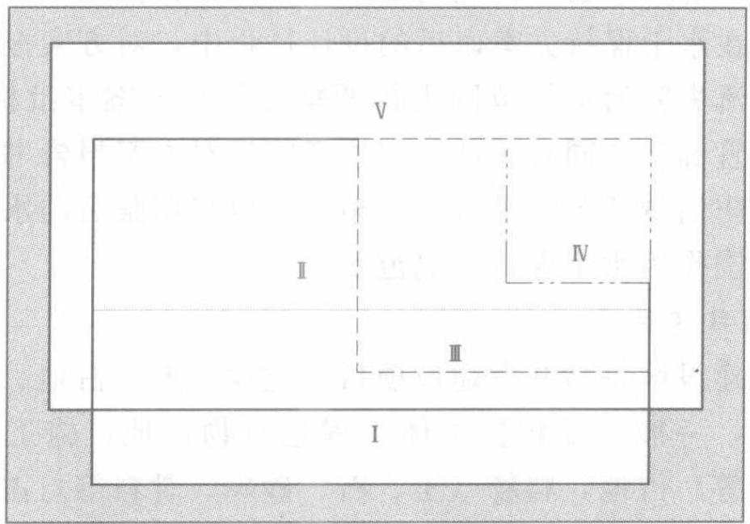  
图5.1 水土保持监测范围示意图

## 5.1.2 监测范围的界定

由于对建设项目及项目区情况的了解和掌握程度不同，在开发建设项目前期工作（包括可行性研究阶段、初步设计阶段）过程中，对项目水土流失防治责任范围的把握程度也就不同。一般地，对于项目建设区还有比较高的确定性，而对于直接影响区往往采用概算的方法确定。因此，在开展水土保持监测时，要根据项目不同阶段前期工作成果和技术标准分析确定水土保持监测范围。

水土保持监测范围的界定方法，是在全面分析开发建设项目水土保持方案及其后续设计文件的基础上，通过实地调查确定。界定的方法和步骤具体如下。

## 5.1.2.1 依据水土流失防治责任范围界定总的监测范围

一般地，水土保持监测范围应该与开发建设项目水土保持方案报告书确定的水土流失防治责任范围一致1-6]。水土流失防治责任范围包括项目建设区和直接影响区，是依据相关法律、法规和技术标准的规定而确定的，是建设单位（或个人）对开发建设活动所造成水土流失采取有效措施进行预防和治理的范围。因此，水土保持监测范围一般不得小于水土保持方案确定的水土流失防治责任范围，也不得偏离水土流失防治责任范围。

如果在水土保持方案以后的设计过程中，对方案报告书中确定的水土流失防治责任范围进行调整并得到方案审批机关确认，或者在主管部门会同有关部门实地考察后对方案报告书中确定的水土流失防治责任范围进行了调整，可以将调整后的水土流失防治责任范围作为水土保持监测范围。

## 1. 项目建设区

项目建设区是指开发建设项目的建设征地、占地、使用和管辖的地域，一般主要包括主体工程建筑物占地，施工道路（公路、便道等）占地，料场（土、石、砂砾、骨料等）占地，弃渣（土、石、灰、渣等）场占地，对外交通、供水管线、通信、施工用电线路等工程占地，施工临时生产、生活设施占地，水库正常蓄水位淹没区等永久占地和临时占地。如果项目为改建和扩建工程，与既有工程共用的部分也应列入项目建设区。这些扰动区在工程建设期间和生产运行期间，不断经受人力、机械、车辆等的强烈干扰，若不及时采取预防与治理措施，将会产生严重的水土流失，故应成为水土保持监测的重点。

其中，主体工程建筑物占地包括主体工程占地、与主体工程连接紧密的附属工程占地，以及周边的临时堆渣、堆料等扰动区域。如火力发电厂，主体工程建筑物占地包括了主体工程（发电厂房）占地及其联系紧密的锅炉房、散热塔、输变电站等占地；道路建设的主体工程有路基、线路和站场等，实际为主体工程群。主体工程建筑物一般分布集中，连成一片或呈带状（或串珠状）分布，开挖（回填）量大，对地表扰动强烈，并将形成规模大的专用建筑场。若不及时采取预防与治理措施，主体工程建筑物占地区的水土流失将十分强烈，而且变化快，造成严重危害，是水土保持监测的重要地域，监测区域包括主体工程建筑物占地及其周边临时堆渣、堆料占地，以及对外交通、供水管线、通信、施工用电线路等工程占地。

料场（土、石、砂砾、骨料等）一般分散在主体工程建筑物四周的比邻区域，有一个或多个道路与主体工程建筑物相连。一般地，取土场开挖坡面形成陡坡，或向地下挖掘形成坑；取石场多开挖附近山丘边坡或削顶开挖，形成裸露陡崖和裸露岩面；取沙场有多种情况，有的在河道中挖沙，有的在边岸采沙，有的在平原揭土掏沙，形成各种不同的微地貌。若不采取防治措施，料场陡峭的土坡、裸露陡崖、裸露岩面，以及河道岸边将形成严重的水土流失或危害，是水土保持监测的重要地域。监测区域为料场及运料道路。

弃渣（土、石、灰、渣等）场是堆积废弃的土渣、石渣、灰渣，也包括暂无法利用的矿渣、煤矸石和尾矿、尾沙等的场所。弃渣场及堆积体形态差别甚大，有的呈片状、有的呈带状、有的呈锥体等，其场地有的为小沟、有的为坡洼、有的为河岸、有的为浅洼、有的为平地，其与主体工程远近不一，有道路相连。松散的弃渣容易受降水冲刷带入江河，或直接被河水冲走，若不及时采取防治措施将形成严重的水土流失或危害，是水土保持监测的重要地域。监测区域为弃渣场及运渣道路。

施工临时生产、生活设施占地是为工程建设服务的临时建筑工程和生活服务区，如材料仓库、钢加工、临时道路、住房等用地。这两项工程多围绕主体工程分布，在其四周监测建设区域及连接道路。

## 2. 直接影响区

直接影响区是指项目建设区以外若不采取防治措施、由于开发建设活动可能造成水土流失及其直接危害的地域。直接影响区一般包括：开挖（回填）形成不稳定边坡的周边，裸岩裸土面的四周，地下采掘和地下施工建设作业范围的地面对应部分及周边，排水（排洪）尾段至河沟的顺接区，重塑地貌（如堤、坝等）与周边的衔接区，工程建设导致侵蚀外营力发生变化的区域，污染物在水、气、土等介质中传播消散至无危害所包区域等。

其中，不稳定边坡一般是指在没有任何防治措施下超过岩土稳定休止角的边坡。鉴于边坡破坏的机制不同，稳定休止角也不同，当有裂隙或结构面存在时，一般较小坡度即能产生滑坡。因而确定不稳定边坡需要经过岩性、解理、构造、受力等多方面综合分析确定。不稳定边坡的周边是指可能产生破坏的边坡上部坡缘和坡脚，上部坡缘包括可能破坏的长度、宽度（破裂部分），坡脚则为下部宽度及破裂物下移可能堆积掩埋部分。上部坡缘和坡脚组成不稳定边坡的监测区。由于边坡破坏有一个较长的发育形成期，水土保持监测一般应在不稳定边坡形成后即着手实施。

地下作业范围的地面对应部分及周边是指矿业开采或其他地下工程在作业完后，收回支撑，上覆岩层与土层失重而破裂塌陷（称回采放顶）区及四周边坡破坏区。晋陕蒙区每采1000万t煤，采空塌陷面积达1km²多[7]；当以洞采方式进行，通常先出现地面裂隙，而后塌陷。一般裂隙、塌陷发展期短则3～5年，长的达10年以上。

排水（排洪）尾段至河沟的顺接区是指建设区设置的排水排洪系统或区内自然排水排洪系统末段至汇人河沟的上段之间的区域，该区常受洪水、泥沙影响而被冲、毁、淹，成为下游的主要危害区。顺接区向下，由于与建设区的距离逐渐远离，以及河沟的调蓄作用，洪涝泥沙灾害逐渐减轻，已超出水土保持监测区域。由于洪涝灾害大小不一，所以水土保持监测区时大时小、年年变化。一般地，可以用20年一遇暴雨为标准，确定排水（排洪）尾段至河沟的顺接区的大小。

重塑地貌是指工程建设产生的新的微地貌，如道路路堤、路堑、集洪池、拦洪堤、拦沙墙及渠、槽、桥等建筑，这些人为地貌与四邻原地貌的衔接区，如堤、堑的坡脚，池的边缘，渠、槽、桥的两端和桥基等衔接区。由于受人为微地貌的影响，这些重塑地貌及其衔接区成为径流、风力等汇集区，或重力侵蚀掩埋区，因此成为水土保持的监测区。

由于工程建设的重塑地貌，改变了临近区域的水流、气流和地温等，从而导致水力冲刷、风蚀与风积、冻融作用在时空上发生变化，这些临近区域就是工程建设导致侵蚀外营力发生变化的区域。如水坝蓄水与排洪渠、风沙区建筑物、高寒区建筑物等，都影响土壤侵蚀的发生和强度变化，因而成为水土保持的监测区。

污染物有废水、废气、废渣等有毒有害物质。这些物质自开发项目建设区排出，随水流、大气进入周边环境。如矿井中排出废水、煤炭自燃产生的有害气体、选矿尾沙（尾矿）中的有害物质，以及化工冶炼过程中“三废”物质排入大气、水体，并进入土壤。在气、水等介质中传播和扩散的过程中，有毒有害物质逐渐稀释和自净，使污染物浓度随距离增大而降低。当污染物浓度逐渐降低，达到国家规定的限定标准浓度为止，此地之前的区域即超过限定标准浓度的区域，即为水土保持监测区域范围。

需要注意的是，在初步确定了开发建设项目水土流失直接影响区后，还需要根据工程建设期间和生产运营期间造成的水土流失灾害来调整直接影响区。这种调整常常引起水土保持监测范围的变化。这是由开发建设项目水土保持监测应当履行水土保持法律、法规、规定和监测的目的所决定的。

## 5.1.2.2 依据项目施工进度界定每个时段的监测范围

水土保持监测范围的确定不仅要考虑空间范围，而且要考虑时间因素；或者，在确定空间范围时，应该充分考虑工程建设和（或）生产运行的进程（或建设阶段）的影响，分别确定不同阶段的监测范围。

项目施工的初期、期间和竣工期，水土保持监测范围有所区别，尤其是重点监测的范围存在较大的差异。对于大型厂矿项目，整个项目区征地占地范围较大，但建设扰动的面积仅仅只是其中的一部分，并非全部征用的土地范围，尤其是在施工初期。对于矿业建设项目，还存在监测范围的转移问题。如在工程基本建设期，监测范围主要为矿口、道路、厂房和福利区等建设区域；而进入生产运营期，除了对弃土弃渣（含垃圾）等区域监测外，还要监测采矿塌陷区等。对于临时用地，随着施工的时间进展和地点转移，可能在不断地征用、归还，甚至反复征用、归还；在进入施工后期和投产使用后，临时用地得到治理和恢复并陆续归还，监测范围也将相应变小或者不作为重点监测区域。

## 5.2 监测范围分区

## 5.2.1 分区目的与任务

水土保持监测范围分区是根据水土流失的类型、成因，以及影响水土流失发育的主导因素的相似性，对整个水土保持监测范围进行划分。分区的目的是为不同区域确定具有特色的水土保持监测指标和采取具有针对性的监测方法提供主要依据，并为分区进行水土流失及其防治效果预测奠定基础。

监测范围分区是研究各分区内水土流失特征、进行监测设计、监控水土流失的重要基础工作。其任务是在综合分析水土流失影响因素，详细了解水土流失营力、类型、强度和形式的基础上，全面认识水土流失的发生、发展特征和分布规律，根据水土流失及其影响因素在一定区域内的相似性和区域间的差异性，提出监测范围的分区方案，划分出不同的监测类型区，为确定监测的重点地段和监测点布局提供依据。

## 5.2.2 分区原则

水土保持监测范围分区要突出反映不同区水土流失特征的差异性、反映同一区水土流失特征的相似性，要求同一区自然营力、人为扰动及水土流失类型、防治措施基本相同，而不同区之间则有较大差别。

## 5.2.2.1 不同区之间具有显著差异性

在不同区之间，影响水土流失的主要自然因素和人为扰动条件（包括主导侵蚀营力类型与强度、建设活动扰动形式和强度等）具有明显差异，水土流失防治方向、治理措施具有明显差异。这些差异直接决定了反映不同区水土流失及其营力主要特征的监测指标的差异，进而决定了监测方法及必需的监测设施设备的差异。

## 5.2.2.2 同一区内部具有明显一致性

在同一区内部，影响水土流失的主要自然因素和人为扰动条件(包括水土流失主导营力类型与强度、建设活动扰动形式和强度等）具有明显的一致性，水土流失防治方向、治理措施具有明显一致性。这些一致性直接决定了反映水土流失及其营力主要特征的监测指标的相似或相同，进而决定了监测方法及必需的监测设施设备的相似或相同。

## 5.2.2.3 多级分区具有系统性

在多级分区的方案中，分区按照以总体为对象进行高级分区，然后在每个高级分区中，再进行低级分区；同一分区级别应有唯一的分区依据，不同级别具有不同的分区依据；不同级别分区的依据具有一定的关联性，分区体系层次分明。分区的系统性主要体现在以下两个方面。

(1）高级分区应具有控制性和全局性。如以水土流失的主导营力、水土流失形态等为依据进行分区，同时以自然地理界线为分区的主要界线等。

（2）低级分区应结合工程布局和施工区特点进行分区。如结合工程功能布局、项目建设区和直接影响区等进行。

## 5.2.2.4 兼顾行政区域的完整性

水土保持监测范围分区应适当照顾行政区域的完整性，以便按照行政区分析社会经济条件、项目建设对社会经济的影响，同时为主体工程建设顺利施工和安全建设服务、为水土保持行政监督服务。

## 5.2.3 分区体系及依据

开发建设项目造成的水土流失及其防治是在现代侵蚀的背景下发生和发展的，同时开发建设项目水土流失和现代侵蚀与相关地区的地质、地貌、气候、生物等各种自然因素和人为活动密切相关，是这些因素的一种综合反映，也是各种因素在目前暂时形成的稳定状态或各种矛盾在目前暂时的统一。因此，开发建设项目水土保持监测范围分区要求有完整和统一的系统，而且这个系统是相当复杂的。对于开发建设项目水土保持监测范围的分区，现提出四级分区体系，即水土流失类型区、水土流失地带亚区、水土流失地类副区和水土流失基本单元区，它们的划分依据如下。

## 5.2.3.1 依据水土流失主导自然营力进行水土流失类型区划分

水土流失类型分区，是依据水土流失发生学（即主要水土流失外营力）为依据进行分区。一般地，在较大区域起主导作用的水土流失外营力主要是指水力、风力和冻融等三大类型的外营力。

在我国，辛树帜、蒋德麒以水土流失营力和生物气候带划分水土流失地带为基础，根据我国的地貌特点和自然界某一外营力在较大区域起主导作用的原则，将全国分为三大水土流失类型区，即以水力侵蚀为主的类型区、以风力侵蚀为主的类型区、以冻融侵蚀为主的类型区；并在这三大类型区下，又进行了二级类型区划分[8]。水利部1997年发布施行的《土壤侵蚀分类分级标准》（SL190—96），规定：全国一级区的区划以发生学原则（主要外营力）为依据，分为水力侵蚀、风力侵蚀、冻融侵蚀三大侵

蚀类型区[9]。

对干大型开发建设项目，尤其是诸如西气东输、川气东送、新建青藏铁路等上千公里甚至几千公里、跨越不同水土流失类型区的项目，水土保持监测范围分区首先要考虑进行水土流失类型区划分。水土流失类型区划分，可以采用《土壤侵蚀分类分级标准》（SL190—96）的规定，或者利用被普遍接受并广泛应用的研究结果。为了更加适用，对于具体的开发建设项目，可以根据项目所处区域选择使用复合水土流失类型区，如水力一风力复合侵蚀区、水力一冻融复合侵蚀区、风力一冻融复合侵蚀区等。

## 5.2.3.2 依据水土流失发生形态进行水土流失地带亚区划分

水土流失地带亚区，是以水土流失形态学即主要地质、地貌、（地面组成物质土壤)为依据进行分区。一般地，在较大区域，地貌可以分为山地、丘陵和平原三大类型。在山区，根据山区地面组成物质中土与石占地面积的比例，划分为土质山区、石质山区或土石山区：在丘陵区或高原区，根据丘陵或高原地面物质组成中的土类划分如东北黑土区、西北黄土区、南方红壤区等：在沙漠区或沙地区，根据地面组成物质中地面沙、土物质组成及覆盖明沙的程度，划分为沙漠或沙地10]。

在我国，辛树帜、蒋德麒将以水力侵蚀为主的一级类型区划分为西北黄土高原、东北低山丘陵和漫岗丘陵、北方山地丘陵、南方山地丘陵、四川盆地及周围山地丘陵和云贵高原等六个二级类型区。《土壤侵蚀分类分级标准》（SL190—96）规定：全国二级区的区划以形态学原则（地质、地貌、土壤）为依据，将水力侵蚀为主的一级区分为西北黄土高原区、东北黑土区、北方土石山区、南方红壤丘陵区和西南土石山区等五个二级类型区；将风力侵蚀为主的一级区分为三北戈壁沙漠及沙地风沙区、沿河环湖滨海平原风沙区等两个二级类型区；将冻融侵蚀为主的一级区分为北方冻融土侵蚀区、青藏高原冰川侵蚀区等两个二级类型区[9]。在西北黄土高原区，黄秉维1955年编制了《黄河中游流域土壤侵蚀区域图》，提出类、区、副区等三级分区：一级分区以有无完密植被划分两大类型区；二级类型区按两大类型区划分区域，有完密植被类型区划分为高地草原、石质山岭林区和黄土丘陵林区等三个区域，无完密植被类型区按地质、地形划分为冲积平原、石质山岭、干旱草原、风沙区、黄土阶地、黄土高原和黄土丘陵等七个区域；三级分区按区域内的地形、土地利用等差异划分副区，黄土丘陵区即划分为第一、第二、第三、第四和第五等五个副区。该分区因简明又突出重点，得到广泛承认，且沿用至今[11]。

对于大型开发建设项目，尤其是延绵上百公里甚至几千公里、跨越不同地形地貌、生物气候带的项目，水土保持监测范围分区应在水土流失类型区划分的基础上，依据水土流失发生形态进一步进行水土流失地带区划分。水土流失地带划分，可以采用《土壤侵蚀分类分级标准》（SI.190—96）的规定，或者利用被普遍接受并广泛应用的研究结果，或者根据开发建设项目的具体情况进行划分。

## 5.2.3.3 依据土地利用方式进行水土流失地类副区划分

土地利用是指人类为社会和经济的目的，对土地进行长期或周期性的生物、技术活动的经营。人类通过利用、改造土地，以便获得更多的实惠。土地利用既要受自然条件制约，也受社会、经济、技术条件影响。土地利用方式及其程度（或者土地利用现状）一般是根据土地适宜性和社会经济发展的要求，因地制宜地确定。土地适宜性是指土地在一定条件下对不同用途的适宜程度，土地适宜性评价是根据土地对农业、林业、牧业生产的适宜程度和限制程度进行分类分等。等级高的作为农林果牧用地都适宜；等级低的一般不宜作农地，可依次作为经济林或人工草地和人工林地；最低的等级一般是难利用土地。表5.1列出了土地适宜性及其评价条件，由此可以看出：土地利用方式是影响水土流失的自然因素和社会条件的综合体现；不合理的土地利用是造成水土流失的主要原因之一，合理的土地利用既能够发展生产又能保持土壤，既能保证生物生长又能维持土壤发育。

表 5.1  
土地资源评价等级表[10]
<table><tr><td rowspan=2 colspan=1>评价指标</td><td rowspan=1 colspan=6>评价等级</td></tr><tr><td rowspan=1 colspan=1>一</td><td rowspan=1 colspan=1>二</td><td rowspan=1 colspan=1>三</td><td rowspan=1 colspan=1>四</td><td rowspan=1 colspan=1>五</td><td rowspan=1 colspan=1>六</td></tr><tr><td rowspan=1 colspan=1>地貌</td><td rowspan=1 colspan=1>平整大块</td><td rowspan=1 colspan=1>缓坡大块</td><td rowspan=1 colspan=1>缓坡小块</td><td rowspan=1 colspan=1>陡坡小块</td><td rowspan=1 colspan=1>急陡破碎</td><td rowspan=1 colspan=1>难以利用</td></tr><tr><td rowspan=1 colspan=1>地面坡度（°）</td><td rowspan=1 colspan=1>&lt;3</td><td rowspan=1 colspan=1>3~5</td><td rowspan=1 colspan=1>5~15</td><td rowspan=1 colspan=1>15~25</td><td rowspan=1 colspan=1>25~35</td><td rowspan=1 colspan=1>&gt;35</td></tr><tr><td rowspan=1 colspan=1>土壤侵蚀程度</td><td rowspan=1 colspan=1>微度</td><td rowspan=1 colspan=1>微度</td><td rowspan=1 colspan=1>轻度</td><td rowspan=1 colspan=1>中度</td><td rowspan=1 colspan=1>强度</td><td rowspan=1 colspan=1>极强度</td></tr><tr><td rowspan=1 colspan=1>土层厚度（cm）</td><td rowspan=1 colspan=1>&gt;200</td><td rowspan=1 colspan=1>150~200</td><td rowspan=1 colspan=1>50~150</td><td rowspan=1 colspan=1>30~50</td><td rowspan=1 colspan=1>15~30</td><td rowspan=1 colspan=1>&lt;15</td></tr><tr><td rowspan=1 colspan=1>土壤质地</td><td rowspan=1 colspan=1>轻壤～中壤</td><td rowspan=1 colspan=1>轻壤~中壤</td><td rowspan=1 colspan=1>中壤～重壤</td><td rowspan=1 colspan=1>重壤、粗砂</td><td rowspan=1 colspan=1>轻壤～中壤</td><td rowspan=1 colspan=1>重黏壤、粗沙、风化母质</td></tr><tr><td rowspan=1 colspan=1>有机质含量（%）</td><td rowspan=1 colspan=1>&gt;1.0</td><td rowspan=1 colspan=1>0.8~1.0</td><td rowspan=1 colspan=1>0.5~0.8</td><td rowspan=1 colspan=1>0.3~0.5</td><td rowspan=1 colspan=1>0.1~0.3</td><td rowspan=1 colspan=1>&lt;0.1</td></tr><tr><td rowspan=1 colspan=1>砾石含量（%)</td><td rowspan=1 colspan=1>&lt;2</td><td rowspan=1 colspan=1>2~5</td><td rowspan=1 colspan=1>5~15</td><td rowspan=1 colspan=1>15~30</td><td rowspan=1 colspan=1>30~50</td><td rowspan=1 colspan=1>&gt;50</td></tr><tr><td rowspan=1 colspan=1>pH值</td><td rowspan=1 colspan=1>6.5~7.5</td><td rowspan=1 colspan=1>6.5~7.5</td><td rowspan=1 colspan=1>6.5~7.5</td><td rowspan=1 colspan=1>&gt;7.5或&lt;5.5</td><td rowspan=1 colspan=1>&gt;7.5或&lt;5.5</td><td rowspan=1 colspan=1>&gt;7.5或&lt;5.5</td></tr><tr><td rowspan=1 colspan=1>有无灌溉条件</td><td rowspan=1 colspan=1>有</td><td rowspan=1 colspan=1>无</td><td rowspan=1 colspan=1>无</td><td rowspan=1 colspan=1>无</td><td rowspan=1 colspan=1>无</td><td rowspan=1 colspan=1>无</td></tr><tr><td rowspan=1 colspan=1>土地适应性</td><td rowspan=1 colspan=1>宜农</td><td rowspan=1 colspan=1>宜农、果、牧</td><td rowspan=1 colspan=1>宜农、果、牧</td><td rowspan=1 colspan=1>宜农、林、牧</td><td rowspan=1 colspan=1>宜林、牧</td><td rowspan=1 colspan=1>需经改造然后利用</td></tr></table>

朱显谟专门研究论述了土壤侵蚀区划原则，提出了5级分区制—地带、区带、复区、区和分区。其中，侵蚀区是最为主要的单位，它应当能够明确地表示现代侵蚀的发展过程和演变趋势等。并提出，必须根据土地利用现状和目前侵蚀强度为划分依据，同时也须考虑沟谷下切和扩张的有关因素和基岩的裸露情况、地面被割切的不同程度等[12]。黄秉维提出的类、区、副区等三级分区，其中的副区也是依据区域内的地形、土地利用等差异进行划分[11]。

开发建设项目在建设期间（甚至包括生产运行期），对水土流失防治责任范围内的土地进行强烈的扰动，使得原来的利用方式、广度、深度、合理利用程度等发生变化。在这些变化中，有的彻底、长久地改变了原来的利用方式，如耕地变为道路、厂房、水库、堆渣场等；有的暂时扰动了原来的利用方式，基建完成后恢复原来的利用方式，如输气、输油管线开挖敷设后的管线部分；有的扰动可能导致水土流失，需要采取预防和治理措施，如取料场、堆渣场……原有的土地利用、建设活动造成的扰动，以及其后改变、恢复等，都将引起土地的形态、覆被、利用方式发生变化，必将引起土地水土流失方式与强度发生变化。

因此，对于大型开发建设项目，水土保持监测范围分区应在水土流失类型区、地带区划分的基础上，依据土地利用方式及其水土流失强度进一步进行水土流失地类副区划分；对于较小的开发建设项目，水土保持监测范围分区可以直接依据土地利用方式及其水土流失强度进行水土流失地类副区划分。

## 5.2.3.4 依据开发建设项目功能布局进行水土流失基本单元区划分

开发建设项目功能布局是按照项目生产运行的功能要求，将项目构成中各种物质要素进行分区布置，组成一个相互联系、布局合理的有机整体，为项目的各项活动创造良好的条件和环境。按照项目功能分区确定项目建设区内的土地利用和项目组成部分的空间布局形式，是项目规划、工程设计、工程建设（甚至扩建)、组织项目生产活动的基本要求。在现代的项目规划和工程建设工作中，功能分区通常是在评定、选择项目用地的基础上进行的。要保证项目建设和生产运行的各项活动的正常进行，必须把各个功能区的位置安排得当，既要保证相互联系、促进建设和生产，又要避免相互于扰、引起意外事故。

开发建设项目的每个功能分区，对于项目本身而言，是生产运行必不可少的、位置安排得当的组成部分；对于项目建设区的水土资源而言，意味着不同方式、强度、广度的扰动，意味着是否导致水土流失以及造成水土流失的方式、强度、面积与危害等；对于水土流失预防和治理而言，意味着采取防治措施的时间、类型、设计规格等。反过来，如果在项目建设和（或）生产过程中造成水土流失，如果没有采取防治措施，就意味着可能对项目的建设和（或）生产运行形成安全威胁和隐患，可能对项目建设区周边直接影响区造成不利的影响；如果及时采取了恰当的防治措施，就意味着不仅可以控制水土流失，而且维护了项目建设和（或）生产运行，也就不可能对周边造成危害。

为了完成特定的功能，各类开发建设项目设置了各具特色的功能区。表5.2列出了主要开发建设项目的主要功能区，以供在水土保持监测分区时参考。

表 5.2  
不同开发建设项目主要功能区
<table><tr><td rowspan=1 colspan=2>开发建设项目</td><td rowspan=1 colspan=1>主要功能区</td></tr><tr><td rowspan=2 colspan=1>采矿项目</td><td rowspan=1 colspan=1>露天矿</td><td rowspan=1 colspan=1>露天采矿场、排土排石场、工业场地、火药库、地面生产系统区、地面运输系统区等</td></tr><tr><td rowspan=1 colspan=1>井采矿</td><td rowspan=1 colspan=1>工业场地、铁路专用线、进场道路、外运公路和风井道路、排矸场、输电线路等</td></tr><tr><td rowspan=1 colspan=2>公路铁路项目</td><td rowspan=1 colspan=1>路基路堑（含互通、桥梁、隧道等）、取料场、弃渣场、施工便道、施工区、服务区等</td></tr><tr><td rowspan=3 colspan=1>电力项目</td><td rowspan=1 colspan=1>火电</td><td rowspan=1 colspan=1>厂区、施工生产区、生活区、厂外道路、铁路专用线、取水排水设施区（含输水管道）、储灰场等</td></tr><tr><td rowspan=1 colspan=1>核电</td><td rowspan=1 colspan=1>厂区、施工生产区、生活区、取料场、弃土场、厂外公路区等。其中，厂区由主厂房建筑群（包括核岛、常规岛）、开关站、辅助生产设施区、海水淡化厂等</td></tr><tr><td rowspan=1 colspan=1>输变电</td><td rowspan=1 colspan=1>变电站、塔基、牵张场、施工场地、施工便道、人抬道路、弃渣处置点等</td></tr><tr><td rowspan=3 colspan=2>水利水电项目</td><td rowspan=1 colspan=1>永久工程区</td></tr><tr><td rowspan=1 colspan=1>施工生产生活区、渣场、料场、施工道路等</td></tr><tr><td rowspan=1 colspan=1>农村移民安置区（如造地、改地、房屋及附属设施迁建等）、专业项目恢复区（如交通道路、输电线等）等</td></tr></table>

综上所述，针对不同规模或大小不同监测范围的开发建设项目，水土保持监测范围分区体系可以归纳为：对于大型开发建设项目，水土保持监测范围分区应在水土流失类型区、地带区、地类副区划分的基础上，依据项目功能分区进一步进行水土流失基本单元区划分；对于较小的开发建设项目，水土保持监测范围分区应在水土流失地类副区划分的基础上，依据项目功能分区进一步进行水土流失基本单元区划分；对于更小的开发建设项目，水土保持监测范围分区可以直接依据项目功能分区进行水土流失基本单元区划分。

## 5.3监测重点地段

## 5.3.1 监测重点地段的概念

开发建设项目水土保持监测重点地段是指为了全面反映开发建设项目施工过程中水土流失因子变化、土壤流失动态和水土保持工程效益变化等，在开发建设项目水土保持监测范围区选定的进行重点监测的地段。这些地段的水土流失具有代表性和典型性，治理措施和防治工作具有重大意义，其水土流失及其治理措施的发生、发展能够有效反映所在整个监测范围的水土流失与综合治理动态变化特征，通过在重点地段布设相关的监测设施设备、持续不断地实施动态监测，能够了解和掌握项目建设（或生产）过程中水土流失变化规律、水土保持措施设计与建设状况，并为水土流失及其危害预测、预防、治理，以及水土保持设施验收评估等提供可靠信息。

水十保持监测重点地段包括两个方面的含义，一方面是针对数据采集点或采集对象而言的，即一个一个的、单独的监测重点地段，包括断面、地块及连接在一起的断面与地块构成的监测场：另一方面是针对监测分区或整个监测范围而言的，即由一个一个的、单独的监测地段有机构成分区或项目监测重点地段体系。因此，监测重点地段具有如下特征。

## 5.3.1.1 重点地段具有代表性

开发建设项目水土保持监测必须科学、客观地反映整个水土保持监测范围水土流失及其治理措施在每个时段的总体现状及整个监测期的动态变化，作为持续不断地开展监测的重点地段，必须具有良好的代表性，能够表征所在监测分区的水土流失与治理措施动态变化特征。每一个监测重点地段代表了某个监测分区或其一部分的水土流失及其治理状况；重点监测地段水土流失的发生与发展规律、治理措施的配置与演变动态，能够有效反映所在整个监测范围的水土流失与综合治理动态变化特征。否则，通过这些地段监测得到的监测数据，将是片面的、不完整的、不能反映变化规律的，也就难以为预测、预防和治理措施设计提供可靠的信息。

## 5.3.1.2 重点地段具有典型性

重点地段的典型性包括两个方面的含义，一是指重点地段容易发生水土流失或可能的水土流失比较强烈，二是指重点地段具有典型的水土流失治理措施。这两个方面相互影响而又相伴出现。开发建设项目水土保持监测肩负着为项目安全建设（或生产）服务和保护水土资源、维护生态环境的双重目的，将容易发生水土流失的地段、水土流失措施典型的地段确定为重点监测地段，是水土保持监测的目的必然要求，也是完成监测任务的必然要求。

在水土流失影响因子调查的基础上，确定容易发生水土流失的地段或可能的水土流失比较强烈的地段，为水土流失预防措施布设和项目建设安全施工提供信息；在水土流失动态监测的基础上，预测水土流失发生、发育的状况，为水土保持设施建设、保障项目安全建设和工程安全运行提供信息；在水土保持设施效益分析的基础上，为水土保持设施管护和主体工程养护提供信息，保证和保障水土保持防治措施的及时到位，也保证和保障项目建设和运行的可靠和安全。

## 5.3.1.3重点地段具有开展监测的条件

重点监测地点，必然应该作为重点对象。进行水土保持监测，必然要求能够设置监测设施设备、要求这些地段在要求的时段内具有开展监测的基本条件。这些条件主要包括四个方面：①可以布设采集相关监测指标数据的设施或设备，设施建设应该符合设计要求，设备安装应该符合监测要求；②具有一定的交通条件，以便监测人员能够在必要的时间到达监测现场；③能够避免建设和（或）生产活动以外的人为活动干扰，能够避开建设和（或）生产活动对监测设施和设备的影响；④具有一定的通信条件，可以方便、及时地与外界进行联络。

## 5.3.2 主要的监测重点地段

根据上述监测重点地段的概念、含义、特征，概括总结各类开发建设项目，可以将这四个区确定为水土保持监测重点地段，即扰动破坏区、渣土转运堆积区、水土保持措施实施区和水土流失危害区。

## 5.3.2.1 扰动破坏区

扰动破坏区是指工程建设的人为、机械与车辆等作业设施对原地表（包括水系）扰动和破坏的区域，包括项目的各种单项工程建设（如主体、临时工程、附属设施工程等）区、占压土地（如渣场、仓库等）和损坏水土保持工程与林草等区域。这些区域的最大特点是，干扰破坏了原来地表的形态及其组成、结构、植被，以及土地利用方式，重塑出新地貌、新结构。

## 1. 不同用途的扰动破坏区

按照建设工程的用途与扰动的水土保持设施，开发建设项目扰动破坏区一般可分为三个部分：①工程建设区，如建设的主体工程（主厂房及配套工作室、路堤、路堑等）、道路（含铁路、公路、生产路等）、附属设施（供水、供电、加工厂、修配厂等）、生活福利设施（办公、住宅、文化、娱乐等）等占用、重塑地貌的区域；②各种用途场地，如取料场（取土场、取石场、取沙场）、渣场（渣土场、尾砂尾矿场、渣石场、矿渣场、灰场等）、处理物（如废水处理场、垃圾处理场等）和材料堆积物(各种料场或库房等）等占用区域；③各种被毁的水土保持措施区和林草覆盖的区域，如梯田、坝地、各种治沟工程、蓄水拦泥工程、果园、人工草地、天然草地、天然林（含灌木林）、人工林等占用的区域。

对于不同的扰动破坏区，应该设计具有针对性的重点监测指标，选择具体地点设置对应的监测设施和设备。

## 2. 不同时限的扰动破坏区

按照扰动破坏性质和扰动时间，开发建设项目扰动破坏区一般可分为两种类型。

（1）短期的一次性扰动破坏区，包括各种水土保持措施及林草覆盖区，一些附属设施和处理场地等。这些区域的干扰破坏时间不长，多在开工前期数月内完成，此后极少再被扰动破坏，为规划和设计中的部分水土保持措施实施创造了前提条件。这一特点对水土保持监测的时效性提出严格的要求，监测应该与工程建设同时进行，或者在扰动之前就开展相关的工作（如前期调查、设施设备设置、人员安排等）。

(2)长期的多次性扰动破坏区，包括单项建设工程区、交通道路和部分附属建设区及场地等。在这些区域，项目建设施工的扰动破坏时间长，有的自开工建设开始一直到竣工期扰动破坏持续进行，水土保持监测也常常受到影响。

因而，在这些区域选择和设置监测点时，应选择在避开强烈扰动中心的边缘区，用多监测点在时间上的连续性弥补单监测点在时间上的断续性的不足。

## 5.3.2.2 渣土转运堆积区

渣土转运堆积区，是渣土（渣石）转运（转输）和堆积区的简称，是指工程建设中开挖、回填或生产的各种废弃固体物质搬运（转运）和堆积的区域，包括运渣道路、渣土（渣石）堆积区、生产渣土（渣石）区、各类废弃物临时堆积与处理区等区域。这些区域的最大特点是，转运区域遭受运输工具的扰动，遭受遗失土石的影响；堆积区原来地表的形态及其组成、结构、植被和土地利用方式遭到扰动，重塑出新地貌、新结构，甚至出现了新用途。

## 1. 不同性质的渣土转运堆积区

按照渣土性质和水土流失特征，渣土转运堆积区可分为三种类型。一是渣土转运堆积区，即废弃、转移的物质为土质弃渣，如晋陕蒙矿区开挖初期剥离的黄土转运堆积。由于渣土结构松散，颗粒细小，堆积体的表层失水干燥，容易遭受水蚀、风蚀；渣土堆积体自然稳定角较小，若堆积碾压可能产生滑坡崩塌。因此，如果未能及时实施水土保持防治措施，在雨季大雨或长历时降雨时，极易发生水蚀；在旱季大风时，容易产生扬尘，发生风蚀。二是渣石转运堆积区，即废弃、转移的物质为石质弃渣，包括矿渣、石渣、矸石等。渣石结构为块体碎屑，颗粒大小混杂，堆积体自然稳定角较大。在一般情况下，水土流失较轻。若堆积在河道两侧，则容易被大流量、高流速的洪水冲刷挟带搬运。三是灰渣转运堆积区。这类渣土主要是火力发电厂及燃煤企业产生的灰渣。灰渣颗粒细小，多在0.5mm以下，在干燥情况下运输和堆积，灰渣都极易遭受风蚀；加湿堆积，则可形成灰堆。若不及时采取措施防护，极易造成严重的水蚀和风蚀。

## 2. 不同形态的渣土转运堆积区

按照渣土堆积部位和堆积体形态，渣土转运堆积可分为三种形态。

（1）片状堆积。这种形态的渣土，一般顺沿坡面（山坡、沟坡等）形成薄层、片状覆盖在坡面上，既掩盖了原坡面上的植被，又形成较原坡面更陡的堆积坡，堆积坡面处于裸露、不稳定的状态，极易遭受（或发生）各类侵蚀。

(2)锥状堆积。这种形态的渣土，一般在河沟旁形成的陡崖、立坡处，倾倒的废渣土（石）形成锥体状。当沟谷底宽阔或河岸两侧有高河滩或阶地发育时，堆积物较稳定，侵蚀较轻；当沟谷狭窄或无河滩时，仅在枯水季节露出河床，堆积物极不稳定，容易被沟洪、河洪冲刷搬运，形成含沙量极高的水流或泥石流。

(3）块状堆状堆积。这种形态的渣土，在地表洼地及浅沟、切沟的沟头等地，堆积形成不同形状的堆积块体；或在平坦地，堆积形成渣堆。一般在有防护措施情况下，流失较轻；若无防护措施，受来水或风力大小影响，流失严重。

无论渣土、渣石或渣土渣石混合堆积在何处，渣土、渣石经过开挖或者其他形式的破坏，已经由原来紧实的、有机的结构变成结构不明显、颗粒疏离的松散体。因此，在转运过程中，常常产生风扬、抛洒，并沿一定流路产生侵蚀搬运。这样，渣土转运道路和堆积物均是水土流失严重的区域。

## 5.3.2.3 水土保持措施实施区

为了全面真实地反映开发建设项目治理水土流失的进度及治理设施的数量、质量、效益，必然要将水土保持措施实施区作为重点监测地段，尤其是各类水土保持措施的典型地段。

对于开发建设项目，除了通常的坡面、沟谷等治理措施外，更有拦渣工程（拦渣坝、档渣墙、拦渣堤）、护坡工程（削坡开级形式及植物护坡、工程护坡、综合护坡、滑坡整治工程）、土地整治工程（坑凹回填、渣场改造、整治后利用）、防洪工程(拦洪坝、排洪渠、排洪涵洞、防洪堤、护岸护滩、清淤清障)、防风固沙工程（沙障固沙、造林固沙、种草固沙、平整沙丘造地）、泥石流防治工程（形成区防治工程、流失区防治工程、堆积区防治工程）、植被建设工程（道路绿化、特用林带、周边绿化、果园建设、园林化植树、花卉种植、草坪布设）等。

在将分布在不同位置、各种类型的水土保持措施区确定为水土保持监测重点地段时，应该全面分析水土保持方案及后续设计，并在现场考察工程施工实际情况的基础上，详细分析、科学甄别，在不同监测分区分别选择代表性的、地段完整的典型措施。在不同的水土流失类型区，应该有针对性地确定水土保持措施实施区，作为监测重点地段：在干旱和半干旱地区，应以防风固沙工程、植被建设工程和土地整治工程等措施为主，包括工程措施、植物措施及两者相辅相成的措施；在半湿润区，应以拦渣工程、护坡措施、土地整治工程、绿化工程等措施为主，包括工程措施、植物措施及两者相辅相成的措施；在湿润区，应以拦渣工程、护坡工程、防洪工程、土地整治工程、泥石流防治工程和植被建设工程等措施为主，包括工程措施、植物措施及两者相辅相成的措施。

## 5.3.2.4 水土流失危害区

开发建设项目造成的水土流失危害，是指因项目建设（或生产）过程中造成严重水土流失而对周边和下游地区带来洪涝、风沙、掩埋、破坏等灾害，既包括项目建设区，也包括直接影响区。

在项目建设区，水土流失危害直接影响在建项目的建设进程，影响已经运行项目的生产活动。水土流失灾害状况及损失数量，可以通过现场调查、访问、座谈、勘测等方法取得。

在直接影响区，水土流失危害包括周边和下游的全部受灾区。若水土流失灾害是由于区域暴雨引发的，调查区域应达到建设项目所在水系级别的末端。如项目建设区较小，仅占据二级水系（水系按照由小到大的次序分级），则灾害区域的末端应是二级支流汇人三级支流的人口处，并扣除建设区上游部分面积。若水土流失灾害是由于区域风沙活动引发的（主要为沙割、沙埋等)，要确定危害区域范围就比较困难，也比较复杂。这是因为风沙活动既与起沙风速有关，还与地表物质颗粒大小、含水量多少、地表起伏等因素有关。这里根据我国甘肃金塔地区活动沙丘年平均移动距离（称年移动速度）来估算[13]。该区域沙粒粒径多在0.1\~0.5mm，干燥状态时的起沙风速为4\~5.6m/s，其移动速度如图5.2所示。该起沙风速在我国沙漠边缘区的年移动速度5\~10m中具有代表性（小于塔克拉玛沙漠的西南缘和东南缘40～50m)。由图5.2可知，当沙丘高度越小，沙丘年移动速度越大，极限值为14m/a。当沙丘高度超过15m时，沙丘移动距离在4.5m/a以下。这样，可依据建设区的平均起伏高度（作为沙丘高度）由式（5.2）算出主风向下游危害区域的长度，再与建设区垂直风向的宽度相乘就可得出危害范围，其他区域不在计算之列，即不属于项目直接危害区域。

$$
L = 1 3 . 8 6 3 - 0 . 6 2 7 h\tag{5.2}
$$

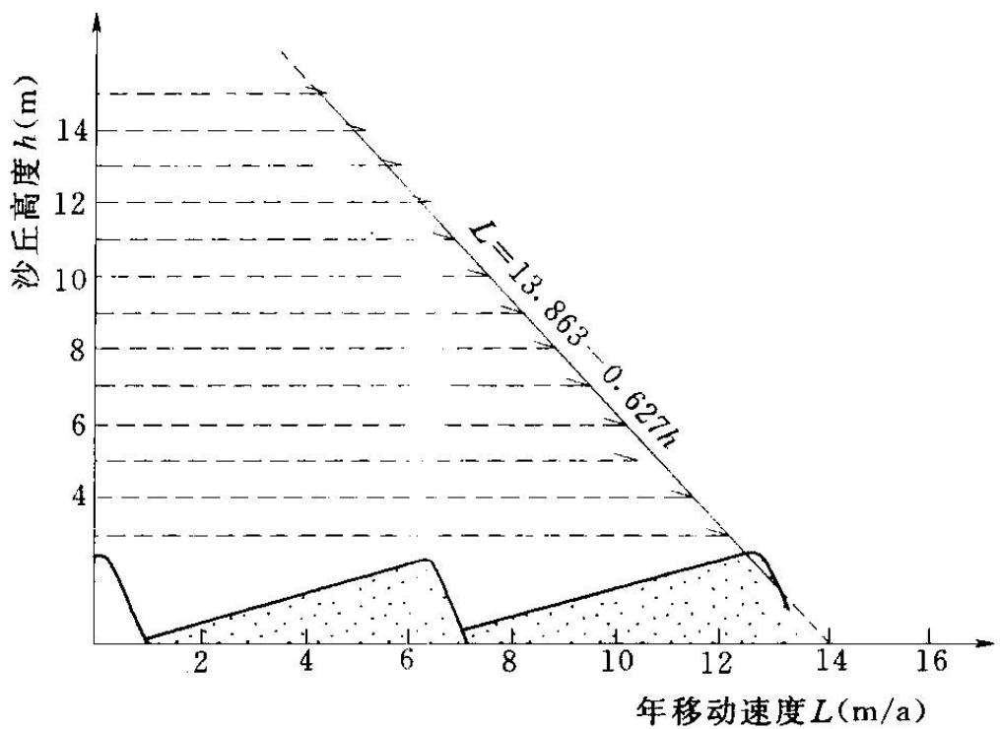  
图5.2 不同高度沙丘移动速度（甘肃金塔）

式中：L为年移动距离，m/a；h为地表平均起伏高度，m。

若风向发生变化，方向与项目建设区斜交，则用式（5.3）进行计算，即对式（5.2）计算结果乘以夹角余弦值：

$$
L = \cos \theta ( 1 3 . 8 6 3 - 0 . 6 2 7 h )\tag{5.3}
$$

值得注意的是，尽管上述将水土保持监测重点地段概括和归纳为扰动破坏区、渣土转运堆积区、水土保持措施实施区和水土流失危害区等四个区域，但这四个区域并不是截然分开和完全隔离的，通常的情形是你中有我、我中有你，或者此一时、彼一时。如扰动破坏区也常常是布设和配置水土流失治理措施的区域，渣十运转堆积区（尤其是堆积区）也是预设水土流失防止措施的区域：反过来，水土保持措施也主要是针对扰动破坏和预测可能存在水土流失危害的区域设计并实施的。水土流失危害区首先是项目建设区，包括了扰动建设区、渣土运转堆积区和水土保持措施实施区；其次才是直接影响区，包括危害涉及的全部范围。

## 5.3.3 不同行业监测重点地段

开发建设项目水土保持监测重点地段，应以上述的扰动破坏

区、渣土转运堆积区、水土保持措施实施区和水土流失危害区为主。表5.3提出不同行业开发建设项目的重点区域，供遴选和确定监测重点地段时参考。

表5.3  
不同行业开发建设项目监测重点地段
<table><tr><td rowspan=1 colspan=1>开发建设项目</td><td rowspan=1 colspan=1>监测重点地段</td></tr><tr><td rowspan=1 colspan=1>采矿类工程</td><td rowspan=1 colspan=1>露天采矿的排土排石场、地下采矿的弃土弃渣场和地面塌陷区，以及铁路、公路专用线，集中排水区下游</td></tr><tr><td rowspan=1 colspan=1>交通铁路工程</td><td rowspan=1 colspan=1>施工过程中弃土弃渣场、取土取石场、大型开挖破坏面、土石料临时转运场、集中排水区下游、施工道路</td></tr><tr><td rowspan=1 colspan=1>电力工程</td><td rowspan=1 colspan=1>电厂施工中弃土弃渣场、取土取石场、临时堆土场、施工道路和火力发电厂运行期储灰场</td></tr><tr><td rowspan=1 colspan=1>冶炼工程</td><td rowspan=1 colspan=1>施工中弃土弃渣场、取土取石场，运行期添加料场、尾矿、尾砂、尾渣场，施工和生产道路</td></tr><tr><td rowspan=1 colspan=1>水利水电工程</td><td rowspan=1 colspan=1>施工期的弃土弃渣场、取土取石场、大型开挖面、排水泄洪区下游、临时堆土堆渣场</td></tr><tr><td rowspan=1 colspan=1>建筑及城镇建设</td><td rowspan=1 colspan=1>施工中的地面开挖场、弃土弃渣场、土石料临时堆放场</td></tr><tr><td rowspan=1 colspan=1>其他工程</td><td rowspan=1 colspan=1>施工或运行中易造成水土流失的部位和工作面</td></tr></table>

## 5.4监测点布设

## 5.4.1 监测点的类型

开发建设项目水土流失及其治理状况，总是发生在一定的位置、有一定的数量或发生一定数量的变化；也就是说，水土保持监测结果，总是要用连续的定位、定量或半定量的数据来计算、分析和评价。这些定位、定量或半定量的数据，总是采集于对应的监测对象，这些对象常常首先表现为布设在各个监测分区的监测重点地段的监测点。

开发建设项目水土保持监测点是定位、定量、动态采集水土流失及其因子、治理措施状况的监测样地（或样区）。这里所说的监测点，是指有一定面积大小的空间，而不是几何学中的“点”；既包含定位监测点，也包含定位、定量监测点，还包括不定期巡查的监测点。按照监测的目的、作用及监测技术配置，可以将监测点分为观测样地、调查样地和放弃样地。

## 5.4.1.1 观测样地

观测样地是指设置在选定的位置，根据观测指标进行了水土流失观测设施设备设计，并建设安装了这些设施设备，在监测期内定期采集水土流失影响因子、水土流失方式与流失量、水土保持措施数量与质量的监测点。观测数据主要是用来进行水土流失发生、发育及其危害评价，水土保持措施消长分析，定量回答开发建设项目造成的水土流失及其治理效益。

观测样地的位置，并不限制在开发建设项目水土保持监测范围内，可以在与项目监测范围自然条件相似、相近地区选择水土保持试验站（点）的观测点，作为观测样地，以便进行对比分析。

与调查样地比较，观测样地的监测指标较多，而且必不可少地有水土流失方式和流失量的监测，并要按照设计的监测周期进行连续的数据采集。

## 5.4.1.2 调查样地

调查样地是指仅仅选定位置、确定面积、设立标志，并不建设和安置水土流失观测设施设备，定期进行水土流失及其相关因素调查的监测点。这些监测点主要是用来进行单一的或多个的水土流失因子、水十流失方式、水土保持措施类型及其发育的调查，一方面是对监测点样本数量的补充，另一方面可以用调查结果辅助说明（或分析）开发建设项目造成的水土流失及其治理效益。

与观测样地比较，调查样地的监测指标较少，而且可以只调查某一方面或单个指标，并不强求必须调查水土流失量。

## 5.4.1.3 放弃样地

放弃样地是指在某次监测过程中，临时采集相关监测指标，只有样地号但不设置样地（即没有标志），也不确定下次仍然在该样地实施监测的监测点。这些监测点主要是用来补充观测样地和调查样地不足，增加监测对象的比例；或者记录偶然、特殊或典型的现象，以便突出反映某一侧面的事实与状况；或者保留未被人们认识的事物或现象，以便在具有一定的积累后分析研究。

## 5.4.2 监测点布设原则

水土保持监测点布设，主要指在整个监测范围内科学分散布置和安排监测点，使每个监测点及其整个监测点总体能够充分反映所在区域（或其一部分）及整个监测范围的水土流失特征。

开发建设项目水土保持监测点布设应遵循的原则，一是要反映项目所在区域（即监测范围及其各个分区）水土流失及其影响因素的特点，并具有代表性和典型性；二是要适应项目的工程特性即功能分区，并具有代表性和典型性；三是监测点本身应相对稳定，并能完成设计时段的持续观测；四是监测点的数量足够，能够满足分析和评价水土流失及其治理效果。

需要说明的是，这些关于监测点布设的原则，只针对观测样地和调查样地两种监测点，而不针对放弃样地。

## 5.4.2.1 监测点应充分反映整个监测范围及所在监测分区的水土流失特征

开发建设项目水土保持监测范围分区，反映了整个监测范围内水土流失及其因子的分布及其变异特征。同一监测分区，水土流失及其因子相近或相似；不同监测分区，水土流失及其因子差异较大。

一般地，监测点应该按照监测分区布设，即每个监测分区都应该布置监测点；同时，监测点应该布置在监测重点地段，以便具有充分的代表性，或者具有突出的典型性。在监测重点地段内，监测点究竟布设在什么地方，还要实际踏查，充分考虑其他原则和相关因素原则，选定与监测指标相对应的点位设置监测点。若要求仅仅监测水土流失变化，则要在扰动破坏区和渣土转运堆积区内选取点位；若要求监测水土流失对周边的危害，则可能在直接影响区内选取点位。

当然，在每个监测分区中，可以布设不止一个监测点。究竟布设几个监测点、具体点位在哪儿，将分别在“5.5监测点数量”和“6开发建设项目水土保持监测点设施设计”中讨论。

## 5.4.2.2 监测点应充分反映项目工程施工和工程构成特性

在开发建设项目的监测点布设时，要充分了解工程特性，并与其相一致。工程特性，主要考虑建设施工和工程构成两个方面，前者主要包括工程的施工流程、工艺手段及其对周边的扰动与影响等特性，后者包括工程的主要构件、分布与构成方式等特性。在全面了解和掌握这些特性的基础上，结合监测范围及其分区水土流失影响因素，科学布设监测点。

一般地，应该在项目的各个功能分区中都布设监测点，以便对应性地反映每个功能分区的水土流失及其治理成效。同样，在每个功能分区中，可以布设不止一个监测点。

## 5.4.2.3 监测点应相对稳定，能够持续开展水土流失监测

开发建设项目施工进展快、对周边影响的变化大，对水土保持监测点的干扰也比较强烈，甚至损坏监测设施设备或中断监测工作，因而在布置监测点时要十分注意监测点的稳定性，以保证动态监测的持续性，使得监测点在整个时段内都能发挥作用。这里的“稳定”主要指监测点位置的稳定；当做定量监测时，还要求监测点不被后续施工扰动，包括监测样区的大小、监测样区内的物质和监测设施设备等没有被工程施工或其他人为活动扰动。因而，要选取那些位置不变，工程施工并不扰动监测样区形态，既靠近扰动中心、干扰又相对小，并能保持一定时间（设计监测期）的地点作为监测点。在工程建设中，常常会出现随工期的进展，工程建设区或主体工程建设发生转移。如道路、管线等工程，建设常常分段或分级进行，完成一段后再向前推进一段；又如煤炭开发生产期，先由主巷道采掘“吃煤”，达到某一长度（或范围后）再转向两侧支巷道“吃煤”，或分采区进行等。这种转移给水土保持监测点保持相对稳定创造了条件，应抓住“稳定”保证监测工程持续进行。

## 5.4.2.4 监测点的数量应能够保证水土流失及其治理成效评价的可信度

从统计学角度讲，水土保持监测点的集合其实是从整个监测范围中抽取的一个样本，每个监测点就是一个一个的个体。这些样本能否反映整个监测范围的水土流失及其治理状况，一方面看监测点的代表性、分布和数据质量，另一方面看监测点的数量。只有当这个样本的个体数量（监测点的数量）达到一定可靠性要求的数量，才能用这个样本估算总体（整个监测范围）的特征，估算结果才是“无偏估计”；否则，监测点的数据就不能真实地反映整个监测范围的水土流失及其治理状况。究竟布设多少监测点，将在“5.5监测点数量”中讨论。

此外，对有些工程建设项目而言，还要设置对比监测点。通过对比监测，既可解决或弥补该区流失背景值缺乏问题，也可直观明了地反映工程建设新增水土流失或水土保持措施减沙蓄水作用的大小。

## 5.4.3 监测点布设方法

水土保持监测点布设，实质上是数理统计学中的抽取样本(简称抽样)，因而设置的方法即抽样方法。统计学中的抽样方法已有很大的发展，形成了不同用途的抽样理论和技术。目前，在水土保持监测实践中多用经典的抽样方法。以下简要说明主要方法的特点和适用范围。

## 5.4.3.1 随机抽样

随机抽样又称简单随机抽样，是在抽样的总体中个体差异不大、分布均匀的情况下抽取样本，通过样本的统计规律说明总体特征的方法。随机抽样一般均采用随机表进行抽样，亦可随机均匀地取样。该方法是其他抽样方法的基础，应用最普遍。

随机抽样适合于抽取的个体在总体中比较稳定，变化小（即样本具有较强的代表性)，且分布均匀的事件。如对于在较大范围风沙区的管线、道路建设工程，整个管线、路基等（不包括站场、服务区和河流、道路的穿越地段）范围比较一致（或者变异很小），每一处在整个区域中具有几乎一样的代表性。在这种情况下，可用随机抽样，以确定监测点。通常的做法是：按照距离均匀设置监测点，或者按照交通条件或监测、调查的方便性设置监测点。

## 5.4.3.2 系统抽样

系统抽样又称机械抽样或等距抽样，是先将总体的个体按某一特征值排队，然后按相等的距离或间隔逐个抽取个体的方法。系统抽样是不重复抽样，在已知总体有关信息条件下，能够保证样本在总体中的均匀分布，因此系统抽样抽取的样本能够提高样本对总体的代表性。系统抽样间隔的划分，是根据抽样单元数确定的，每个抽样间隔大小是相同的，且相互之间没有明确的质的差别或数量界限。

系统抽样与随机抽样的计算和推算方法相同，只是适于总体的变化呈线形趋势，或周期性波动，而抽取的样本有较大差异，能够反映总体的一部分或大部分特征。如在坡面径流小区设置时，已知总体的变化趋势是土壤侵蚀强度随地面坡度增大而增强（在一定范围内)，为了掌握这个总体的大部分特征(如30°以下)，按照等间距设置坡度（如5°、10°、15°、20°、25°和30°六个坡度）径流小区。而要测定的水蚀，它的发生以年为周期变化，如北方的5月至10月（其他月份几乎不发生水蚀），抽样时间设置为5月、6月、7月、8月、9月、10月。在开发建设项目水土保持监测范围内也有类似情况，如各种干扰和堆积体的坡面，有不同坡度，也有不同坡长：植被措施及其恢复，有不同盖度或郁闭度；不同的地面组成物质，有不同大小的抗蚀性，等等。对于单因子或者个别因子的监测，监测点的布设可以采用系统抽样。

## 5.4.3.3 分层抽样

分层抽样又称分类抽样或类型抽样，是在个体特征值的大小明显地呈现层次时，按照该特征值将总体划分为相互独立的若干层（或子总体)，然后在层内按随机抽样或系统抽样方法抽取个体，进而实现在总体中抽样的抽样方法。分层抽样将分组法与抽样原理结合运用，分层抽样每个组都要抽取样本单元，具有很好的代表性。组间方差已不再影响总体抽样平均误差。因此，只要对总体分层得当，一般都能够使总的抽样误差减小，从而减少抽样个体数，提高抽样调查精度。因此，分层时，要求在层内变差尽量小，而层间变差要大。

分层抽样适用于总体由分界明确、差异显著的若干层组成的对象。在水土保持抽样中，可将“层”理解为不同的水土流失类型、不同的地形地貌、不同的土地利用类型、不同的治理措施或者开发建设项目的不同功能单元，等等。在西（安）南（京）铁路陕西段路基边坡水土流失监测中[14]，在陕西段铁路路基经渭河平原、秦岭中山、丹江河谷、秦岭东延低山和商南低山丘陵等五类地貌类型区中，气候、土壤、林草等具备了每层内变差小，而层间变差大的特点，因而采用分层抽样估计该段工程植被盖度为15.8%，侵蚀强度为 $1 7 1 5 . 1 \mathrm { t } / \mathrm { k m } ^ { 2 }$ ，可靠性和精度均在90%以上。

## 5.4.3.4 成数抽样

与分层抽样十分近似，成数抽样是将总体划分为若干相互不联系的子总体，再对每一子总体抽样的方法。与分层抽样所不同的是，对于每子总体首先要计算出它占总体的百分比即“成数”，然而按成数比例进行抽样。

成数抽样适用于对事物、区域或其他个体具有差异的总体进行抽样。在农业生产中，常用此方法调查估测各种农作物的管理和产量数，也用于较大区域（如流域、省）的水土流失、水土保持调查。

## 5.5监测点数量

对于开发建设项目，需要多少个水土保持监测点才够呢？这个问题既影响监测工作的经济性也影响其效用。常常将一个任意的监测点数量确定为足够，并不问数量是否合适就一再地按这个数继续进行观测。尤其是观测样地和调查样地的数量，常常是工作小组根据对监测区域的分析，包括监测范围、分区、重点地段及其他敏感的对象等，确定监测点数量。为了规范监测点数量，提高监测结果的可靠性，建议通过两种基本方法确定监测点的数量：一是用抽样强度计算出监测点的数量；二是用数理统计学方法计算出监测点的数量。前者是基于工作经验及其对监测范围内各种自然条件与项目特性的分析，确定的一个兼顾经济和效用的最低数量标准；后者则是一种具有统计学意义的确定多少监测点足以满足监测目标的客观方法。

## 5.5.1 用抽样强度计算

抽样强度是指抽样样本的面积占总监测面积的比例。对于开发建设项目，水土保持监测点的抽样强度的大小，与监测范围大小、监测范围的变异性（即监测分区的多少）、监测指标的多寡(即单一或个别或多个)、监测方式等密切相关。一般地，监测强度的大小，与监测范围大小成反相关，即范围面积越大，抽样强度越小；与监测分区成正相关，即监测指标越多，抽样总强度越大；与监测指标也成正相关，即监测分区越多，抽样强度越大。

对于开发建设项目，利用抽样强度确定监测点数量的顺序是：首先，预确定监测范围应该设置的总监测点的数量N。其次，按照每个监测分区的面积百分比分解监测点数量，对于少于1个监测点的监测分区，至少设置1个监测点；对于多于1个监测点的监测分区，按照“四舍五入”的原则确定监测点数量。各个监测分区设置的监测点数量之和为n，一般 $n \geq N$ 。这样，就得到了既保证了监测点的代表性（即每个监测分区均设置了监测点)，又保证了监测点的设置比例不少于确定的抽样强度。

那么，开发建设项目水土保持监测点抽样强度应该是多少呢？根据笔者的实践，提出如下建议。

观测水土流失的监测点，可以根据监测对象（如取土场、弃渣场、管线工程的大型穿越处，等等）及其数量选取不同的抽样强度。参照《开发建设项目水土保持设施验收技术规程》（SL387—2007)[15]的规定，对于点状建设项目（包括矿山、电厂、城市建设、水利枢纽、水电站和机场等布局比较集中、呈点状分布的建设项目)，对火电厂的储灰场、水利枢纽的取土场和弃土（渣）场、矿山中的矸石山（场）等重点对象，抽样强度不得小于50%；对其他对象，抽样强度不得小于30%。对于线状建设项目（包括公路、铁路、管道工程、灌渠等分布跨度较大、呈线状分布的建设项目），对主体工程沿线附近的弃土（石、渣）场、取土（石、料）场、伴行（临时）道路、穿（跨）越河（沟）道、中长隧道、管理站所等沿线关键控制点，抽样强度不得小于50%，而且应在不同地貌类型区和不同侵蚀类型区分别布设；对其他对象，抽样强度不得小于30%。如果建设项目规模庞大，某类监测对象数量较大时，可以根据情况调减抽样强度，当数量大于500时，抽样强度为5%～7%；当数量在300～400之间时，抽样强度为7%\~9%；当数量在200\~300时，抽样强度为10%\~15%；当数量在100\~200时，抽样强度为15%\~20%；当数量小于100时，抽样强度不小于30%。

观测水土保持措施的监测点，将《水土保持综合治理验收规范》(GB/T15773—1995)16]规定的治理措施验收抽样比例(见表5.4）的上限作为监测点数量的下限。同时，在大型的弃渣场、取土取石场、穿越处等强扰动处，以及防洪工程、泥石流防治工程等主要工程设施处，设置监测点。

表5.4  
各项治理措施验收抽样比例
<table><tr><td colspan="1" rowspan="2">治理措施</td><td colspan="1" rowspan="2">验收面积或座数</td><td colspan="2" rowspan="1">治理措施验收抽样比例(%)</td><td colspan="1" rowspan="2">监测点设置比例（%）</td></tr><tr><td colspan="1" rowspan="1">阶段验收</td><td colspan="1" rowspan="1">竣工验收</td></tr><tr><td colspan="1" rowspan="3">梯田、梯地</td><td colspan="1" rowspan="1"> $< \mathrm { i } 0 \mathrm { h m } ^ { 2 }$ </td><td colspan="1" rowspan="1">7</td><td colspan="1" rowspan="1">15</td><td colspan="1" rowspan="1">7</td></tr><tr><td colspan="1" rowspan="1"> $1 0 \sim 4 0 \mathrm { h m } ^ { 2 }$ </td><td colspan="1" rowspan="1">5</td><td colspan="1" rowspan="1">3</td><td colspan="1" rowspan="1">5</td></tr><tr><td colspan="1" rowspan="1"> $> 4 0 \mathrm { { h m } } ^ { 2 }$ </td><td colspan="1" rowspan="1">3</td><td colspan="1" rowspan="1">2</td><td colspan="1" rowspan="1">3</td></tr><tr><td colspan="1" rowspan="3">造林、种草</td><td colspan="1" rowspan="1"> $< 1 0 \mathrm { h m } ^ { 2 }$ </td><td colspan="1" rowspan="1">7</td><td colspan="1" rowspan="1">15</td><td colspan="1" rowspan="1">7</td></tr><tr><td colspan="1" rowspan="1"> $1 0 \sim A 0 \mathrm { h m } ^ { 2 }$ </td><td colspan="1" rowspan="1">5</td><td colspan="1" rowspan="1">3</td><td colspan="1" rowspan="1">5</td></tr><tr><td colspan="1" rowspan="1"> $> 4 0 \mathsf { h m } ^ { 2 }$ </td><td colspan="1" rowspan="1">3</td><td colspan="1" rowspan="1">2</td><td colspan="1" rowspan="1">3</td></tr><tr><td colspan="1" rowspan="2">封禁治理</td><td colspan="1" rowspan="1"> $4 0 \sim 1 5 0 \mathrm { { h m } ^ { 2 } }$ </td><td colspan="1" rowspan="1">7</td><td colspan="1" rowspan="1">5</td><td colspan="1" rowspan="1">7</td></tr><tr><td colspan="1" rowspan="1"> $> 1 5 0 \mathsf { h m } ^ { 2 }$ </td><td colspan="1" rowspan="1">5</td><td colspan="1" rowspan="1">3</td><td colspan="1" rowspan="1">5</td></tr><tr><td colspan="1" rowspan="1">保土耕作</td><td colspan="1" rowspan="1"></td><td colspan="1" rowspan="1">7</td><td colspan="1" rowspan="1">5</td><td colspan="1" rowspan="1">7</td></tr><tr><td colspan="1" rowspan="1">截水沟</td><td colspan="1" rowspan="1"></td><td colspan="1" rowspan="1">20</td><td colspan="1" rowspan="1">10</td><td colspan="1" rowspan="1">20</td></tr><tr><td colspan="1" rowspan="1">水窖</td><td colspan="1" rowspan="1"></td><td colspan="1" rowspan="1">10</td><td colspan="1" rowspan="1">5</td><td colspan="1" rowspan="1">10</td></tr><tr><td colspan="1" rowspan="1">蓄水池</td><td colspan="1" rowspan="1"></td><td colspan="1" rowspan="1">100</td><td colspan="1" rowspan="1">50</td><td colspan="1" rowspan="1">100</td></tr><tr><td colspan="1" rowspan="1">塘坝</td><td colspan="1" rowspan="1"></td><td colspan="1" rowspan="1">100</td><td colspan="1" rowspan="1">100</td><td colspan="1" rowspan="1">100</td></tr><tr><td colspan="1" rowspan="1">引洪漫地</td><td colspan="1" rowspan="1"></td><td colspan="1" rowspan="1">100</td><td colspan="1" rowspan="1">50</td><td colspan="1" rowspan="1">100</td></tr><tr><td colspan="1" rowspan="1">沟头保护</td><td colspan="1" rowspan="1"></td><td colspan="1" rowspan="1">30</td><td colspan="1" rowspan="1">20</td><td colspan="1" rowspan="1">30</td></tr><tr><td colspan="1" rowspan="2">谷坊</td><td colspan="1" rowspan="1">&lt;100 座</td><td colspan="1" rowspan="1">12</td><td colspan="1" rowspan="1">10</td><td colspan="1" rowspan="1">12</td></tr><tr><td colspan="1" rowspan="1">&gt;100座</td><td colspan="1" rowspan="1">10</td><td colspan="1" rowspan="1">7</td><td colspan="1" rowspan="1">10</td></tr><tr><td colspan="1" rowspan="1">淤地坝</td><td colspan="1" rowspan="1"></td><td colspan="1" rowspan="1">100</td><td colspan="1" rowspan="1">100</td><td colspan="1" rowspan="1">100</td></tr><tr><td colspan="1" rowspan="1">拦沙坝</td><td colspan="1" rowspan="1"></td><td colspan="1" rowspan="1">100</td><td colspan="1" rowspan="1">100</td><td colspan="1" rowspan="1">100</td></tr></table>

## 5.5.2 用数理统计方法计算

在实际调查中确定样本的合理数量时，利用数理统计方法计算出的样本常常是最大容量。计算抽样个体数量N的基本公式为：

$$
N = \left( \frac { t _ { \alpha } c _ { \upsilon } } { E } \right) ^ { 2 }\tag{5.2}
$$

式中： $t _ { \alpha }$ 为与显著性水平α（或置信度P）相对应的t分布的双边分位数，不同置信度下值见表5.5； $c _ { \upsilon }$ 为样本的变异系数， $c _ { y }$ $= { \frac { S } { \overline { { X } } } }$ ，即样本标准差与其平均值的比值，其中 $S ~ =$ $\sqrt { \frac { \sum ( X _ { i } - \overline { { X } } ) ^ { 2 } } { n - 1 } }$ (式中， $X _ { i }$ 为第i个样本的监测值；X为样本平均值；n为样本的个数)；E为允许误差，%。

由此可知，欲计算出N，需要知道 $t _ { \alpha } , \ C _ { \upsilon }$ 和E三个参数。其中， $t _ { \alpha }$ 和E是由我们设定的，通常置信度取0.9（即t=1.70)，单边误差不超过5%。至于 $c _ { y }$ ，对于有经验的调查者，可以估算出来；当无法估计时，可用预监测（调查）的方法来解决。预监测是先对监测对象进行监测（或调查），大约需要10\~20个监测样本；然后对已得到的样本进行统计计算，算出c。值，将该值代入式（5.2）中可以算出样本数（监测点）N。若计算出的N值与已监测的n值一致或略小，可以不再扩大n，此时n=N；若n<N（这是最常遇到的情况），就需增加到比N略大，这样一般都能达到相应的要求。

表 5.5  
不同置信度下t值表
<table><tr><td rowspan=2 colspan=1>样本个数n</td><td rowspan=2 colspan=1>自由度f</td><td rowspan=1 colspan=3>置信度 P，显著性水平α</td><td rowspan=2 colspan=1>样本个数n</td><td rowspan=2 colspan=1>自由度f</td><td rowspan=1 colspan=3>置信度P，显著性水平α</td></tr><tr><td rowspan=1 colspan=1>[P=0.90,α=0.10</td><td rowspan=1 colspan=1>P=0.95,α=0.05</td><td rowspan=1 colspan=1>P=0.99,a=0.0)1</td><td rowspan=1 colspan=1>P=0.90,α=0.10</td><td rowspan=1 colspan=1>P=0.95α=0.05</td><td rowspan=1 colspan=1>P=0.99,.α=0.01</td></tr><tr><td rowspan=1 colspan=1>2</td><td rowspan=1 colspan=1>1</td><td rowspan=1 colspan=1>6.314</td><td rowspan=1 colspan=1>12.706</td><td rowspan=1 colspan=1>63.657</td><td rowspan=1 colspan=1>19</td><td rowspan=1 colspan=1>18</td><td rowspan=1 colspan=1>1.734</td><td rowspan=1 colspan=1>2.101</td><td rowspan=1 colspan=1>2.878</td></tr><tr><td rowspan=1 colspan=1>3</td><td rowspan=1 colspan=1>2</td><td rowspan=1 colspan=1>2.920</td><td rowspan=1 colspan=1>4.303</td><td rowspan=1 colspan=1>9.925</td><td rowspan=1 colspan=1>20</td><td rowspan=1 colspan=1>19</td><td rowspan=1 colspan=1>1.729</td><td rowspan=1 colspan=1>2.093</td><td rowspan=1 colspan=1>2.861</td></tr><tr><td rowspan=1 colspan=1>4</td><td rowspan=1 colspan=1>3</td><td rowspan=1 colspan=1>2.353</td><td rowspan=1 colspan=1>3.182</td><td rowspan=1 colspan=1>5.841</td><td rowspan=1 colspan=1>21</td><td rowspan=1 colspan=1>20</td><td rowspan=1 colspan=1>1.725</td><td rowspan=1 colspan=1>2.086</td><td rowspan=1 colspan=1>2.845</td></tr><tr><td rowspan=1 colspan=1>5</td><td rowspan=1 colspan=1>4</td><td rowspan=1 colspan=1>2.132</td><td rowspan=1 colspan=1>2.776</td><td rowspan=1 colspan=1>4.604</td><td rowspan=1 colspan=1>22</td><td rowspan=1 colspan=1>21</td><td rowspan=1 colspan=1>1.721</td><td rowspan=1 colspan=1>2.080</td><td rowspan=1 colspan=1>2.831</td></tr><tr><td rowspan=1 colspan=1>6</td><td rowspan=1 colspan=1>5</td><td rowspan=1 colspan=1>2.015</td><td rowspan=1 colspan=1>2.571</td><td rowspan=1 colspan=1>4.032</td><td rowspan=1 colspan=1>23</td><td rowspan=1 colspan=1>22</td><td rowspan=1 colspan=1>1.717</td><td rowspan=1 colspan=1>2.074</td><td rowspan=1 colspan=1>2.819</td></tr><tr><td rowspan=1 colspan=1>7</td><td rowspan=1 colspan=1>6</td><td rowspan=1 colspan=1>1.943</td><td rowspan=1 colspan=1>2.447</td><td rowspan=1 colspan=1>3.707</td><td rowspan=1 colspan=1>24</td><td rowspan=1 colspan=1>23</td><td rowspan=1 colspan=1>1.714</td><td rowspan=1 colspan=1>2.069</td><td rowspan=1 colspan=1>2.807</td></tr><tr><td rowspan=1 colspan=1>8</td><td rowspan=1 colspan=1>7</td><td rowspan=1 colspan=1>1.895</td><td rowspan=1 colspan=1>2.365</td><td rowspan=1 colspan=1>3.499</td><td rowspan=1 colspan=1>25</td><td rowspan=1 colspan=1>24</td><td rowspan=1 colspan=1>1.711</td><td rowspan=1 colspan=1>2.064</td><td rowspan=1 colspan=1>2.797</td></tr><tr><td rowspan=1 colspan=1>9</td><td rowspan=1 colspan=1>8</td><td rowspan=1 colspan=1>1.860</td><td rowspan=1 colspan=1>2.306</td><td rowspan=1 colspan=1>3.355</td><td rowspan=1 colspan=1>26</td><td rowspan=1 colspan=1>25</td><td rowspan=1 colspan=1>1.708</td><td rowspan=1 colspan=1>2.060</td><td rowspan=1 colspan=1>2.787</td></tr><tr><td rowspan=1 colspan=1>10</td><td rowspan=1 colspan=1>9</td><td rowspan=1 colspan=1>1.833</td><td rowspan=1 colspan=1>2.262</td><td rowspan=1 colspan=1>3.250</td><td rowspan=1 colspan=1>27</td><td rowspan=1 colspan=1>26</td><td rowspan=1 colspan=1>1.706</td><td rowspan=1 colspan=1>2.056</td><td rowspan=1 colspan=1>2.779</td></tr><tr><td rowspan=1 colspan=1>11</td><td rowspan=1 colspan=1>10</td><td rowspan=1 colspan=1>1.812</td><td rowspan=1 colspan=1>2.228</td><td rowspan=1 colspan=1>3.169</td><td rowspan=1 colspan=1>28</td><td rowspan=1 colspan=1>27</td><td rowspan=1 colspan=1>1.703</td><td rowspan=1 colspan=1>2.052</td><td rowspan=1 colspan=1>2.771</td></tr><tr><td rowspan=1 colspan=1>12</td><td rowspan=1 colspan=1>11</td><td rowspan=1 colspan=1>1.796</td><td rowspan=1 colspan=1>2.201</td><td rowspan=1 colspan=1>3.106</td><td rowspan=1 colspan=1>29</td><td rowspan=1 colspan=1>28</td><td rowspan=1 colspan=1>1.701</td><td rowspan=1 colspan=1>2.048</td><td rowspan=1 colspan=1>2.763</td></tr><tr><td rowspan=1 colspan=1>13</td><td rowspan=1 colspan=1>12</td><td rowspan=1 colspan=1>1.782</td><td rowspan=1 colspan=1>2.179</td><td rowspan=1 colspan=1>3.055</td><td rowspan=1 colspan=1>30</td><td rowspan=1 colspan=1>29</td><td rowspan=1 colspan=1>1.699</td><td rowspan=1 colspan=1>2.045</td><td rowspan=1 colspan=1>2.756</td></tr><tr><td rowspan=1 colspan=1>14</td><td rowspan=1 colspan=1>13</td><td rowspan=1 colspan=1>1.771</td><td rowspan=1 colspan=1>2.160</td><td rowspan=1 colspan=1>3.012</td><td rowspan=1 colspan=1>31</td><td rowspan=1 colspan=1>30</td><td rowspan=1 colspan=1>1.697</td><td rowspan=1 colspan=1>2.042</td><td rowspan=1 colspan=1>2.750</td></tr><tr><td rowspan=1 colspan=1>15</td><td rowspan=1 colspan=1>14</td><td rowspan=1 colspan=1>1.761</td><td rowspan=1 colspan=1>2.145</td><td rowspan=1 colspan=1>2.977</td><td rowspan=1 colspan=1>41</td><td rowspan=1 colspan=1>40</td><td rowspan=1 colspan=1>1.684</td><td rowspan=1 colspan=1>2.021</td><td rowspan=1 colspan=1>2.704</td></tr><tr><td rowspan=1 colspan=1>16</td><td rowspan=1 colspan=1>15</td><td rowspan=1 colspan=1>1.753</td><td rowspan=1 colspan=1>3.131</td><td rowspan=1 colspan=1>2.947</td><td rowspan=1 colspan=1>61</td><td rowspan=1 colspan=1>60</td><td rowspan=1 colspan=1>1.671</td><td rowspan=1 colspan=1>2.000</td><td rowspan=1 colspan=1>2.660</td></tr><tr><td rowspan=1 colspan=1>17</td><td rowspan=1 colspan=1>16</td><td rowspan=1 colspan=1>1.746</td><td rowspan=1 colspan=1>2.120</td><td rowspan=1 colspan=1>2.921</td><td rowspan=1 colspan=1>121</td><td rowspan=1 colspan=1>120</td><td rowspan=1 colspan=1>1.658</td><td rowspan=1 colspan=1>1.980</td><td rowspan=1 colspan=1>2.617</td></tr><tr><td rowspan=1 colspan=1>18</td><td rowspan=1 colspan=1>17</td><td rowspan=1 colspan=1>1.740</td><td rowspan=1 colspan=1>2.110</td><td rowspan=1 colspan=1>2.898</td><td rowspan=1 colspan=1>∞</td><td rowspan=1 colspan=1>∞</td><td rowspan=1 colspan=1>1.645</td><td rowspan=1 colspan=1>1.960</td><td rowspan=1 colspan=1>2.576</td></tr></table>

注 自由度f定义为测定次数减1.f一n—1（双边）。

## 参考文献

[1] 水利部水土保持监测中心.关于印发〈开发建设项目水土保持监测设计与实施计划编制提纲（试行）〉的函（水保监〔2006〕16号）.2006, 7.

[2]水利部水土保持监测中心. SL 277—2002 水土保持监测技术规程. 北京：中国水利水电出版社，2002.

[3] 刘震.水土保持监测技术. 北京：中国大地出版社，2004.

[4] 李智广. 开发建设项目水土保持监测实施细则编制初探.水土保持通报，2005，25（6）：91-95.

[5]赵永军. 水土流失防治责任范围的界定.中国水土保持，2005(1): 21-23.

[6] 姜德文.开发建设项目水土流失影响度评价方法研究.中国水土保持科学，2007，5（2）：107-109.

[7]蔺明华，慕成.晋陕蒙接壤区煤炭开发产生的生态环境问题及其对策. 中国水土保持，2005（12)：26-28.

[8]辛树帜，蒋德麒.中国水土保持概论.北京：农业出版社，1982.

[9] 水利部水土保持司. SL 190—-96 土壤侵蚀分类分级标准. 北京：中国水利水电出版社，1997.

[10]水利部水土保持司，黄河水利委员会黄河上中游管理局，黄河水利委员会农村水利水土保持局，等.GB/T 15772—1995 水土保持综合治理规划通则.北京：中国标准出版社，1995.

[11] 黄秉维.编制黄河流域中游土壤侵蚀分区图的经验教训. 科学通报，1955（12）：15-21.

[12]朱显谟.有关黄河中游土壤侵蚀区划问题.土壤通报，1958（1)：1-6.

[13]刘秉正，吴发启.土壤侵蚀.西安：陕西人民出版社，1997.

[14]侯琳，彭鸿，陈晓荣等．分层抽样法在路基水土流失监测中的应用. 水土保持通报，2004（3）：37-39.

[15] 水利部水土保持监测中心. SL 387—2007 开发建设项目水土保持设施验收技术规程.北京：中国水利水电出版社，2007.

[16] 水利部水土保持司. GB/T 15773—1995 水土保持综合治理 验收规范.北京：中国标准出版社，1996.

## 6 开发建设项目水土保持监测点设施设计

开发建设项目水土保持监测的内容包括水土流失因子、水土流失状况、水土流失危害、水土保持措施和治理效果等五个部分。其中，水土流失状况是重中之重，它既是开发建设项目水土保持监测范围内各种水土流失因子作用的综合反映，又是水土保持措施治理效果的直接表达。本章结合实践工作，着重阐述开发建设项目水土保持监测点上土壤流失量监测设施（也涉及相关的设备）的设计方法。

按照《水土保持监测技术规程》（SL277—2002）的规定，开发建设项目水土保持监测点通常属于水土保持监测点中的临时监测点。临时监测点是为了某种特定监测任务而设置的监测点，其采样点和采样断面的布设、监测内容与频次应根据监测任务确定，承担着定期收集、整（汇）编和提供水土流失及其防治动态资料的任务[1]。因此，一般地，开发建设项目水土保持监测点配置的设施（及其必需的设备），主要以短期、临时性的设施为主，设施建设应尽量简便易行、或者利用实地相关设施、或者采用测量设备现场直接观测。

## 6.1 观测样地和调查样地的形状与面积

一般地，水土保持观测样地和调查样地的形状为正方形或长方形。在开发建设项目水土保持监测时，样地的方向应该根据监测对象的形状确定。通常情况下，如果在斜坡上，一般设置为长边顺坡、短边横坡；如果坡度不明显，则根据监测对象的形状和方向设置长边、短边。

如果水土流失过程不仅仅涉及一个地块或者一个坡面，而且相互比邻地块的水土流失相互影响，形成了汇集、运移的过程，就应该选择整个流失过程涉及的所有地块作为观测样地（或调查样地)。这时，样地的形状就由涉及的所有地块的边缘构成，样地的大小就是这些地块面积的总和。

观测样地和调查样地的面积，直接影响监测结果的精确性。样地面积较大时，观测精确度较高；反之，面积小时，精确度较低（见图6.1）。但是，样地的面积不可能无限大，它既受条件的限制、难以做到，也失去了监测点观测的意义。尽管，开发建设项目水土保持监测的观测样地和调查样地的面积和形状，难以达到水土保持试验观测所要求的规范的形状和大小；但是，还是尽可能地向规范的规格、数量及其他要求靠近。现将水土保持测验中常用的样地面积说明列于表6.1，可以作为开发建设项目相关监测对象样地大小设置的参考。

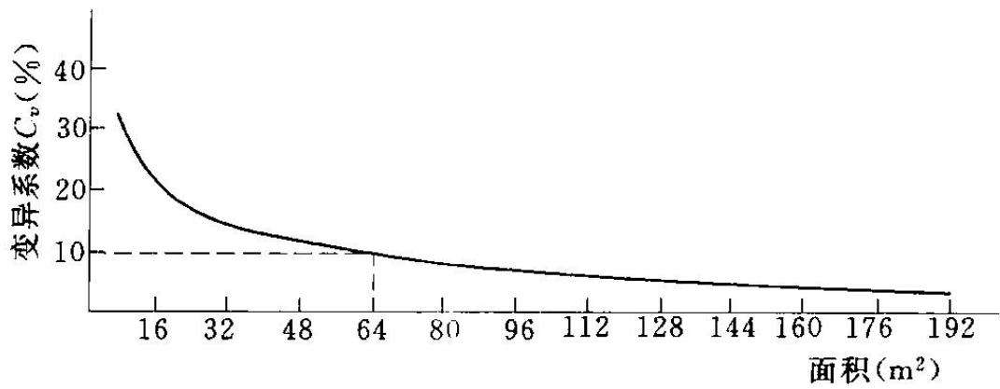  
图6.1 水蚀小区面积与变异系数曲线

表 6.1  
水土保持测验中常用的样地面积
<table><tr><td rowspan=1 colspan=1>监测对象</td><td rowspan=1 colspan=1>样地面积(m×m)</td><td rowspan=1 colspan=1>监测对象</td><td rowspan=1 colspan=1>样地面积(m×m)</td></tr><tr><td rowspan=1 colspan=1>草本措施</td><td rowspan=1 colspan=1>1×1~2×2</td><td rowspan=1 colspan=1>面状水蚀（含细沟）量</td><td rowspan=1 colspan=1> $5 \times 5 \sim 5 \times 2 1 )$ </td></tr><tr><td rowspan=1 colspan=1>灌木林措施</td><td rowspan=1 colspan=1>3×3~5×5</td><td rowspan=1 colspan=1>面状风蚀量</td><td rowspan=1 colspan=1> $5 \times 5 \sim 2 5 \times 2 5$ </td></tr><tr><td rowspan=1 colspan=1>乔木林措施</td><td rowspan=1 colspan=1>10×10~20×20</td><td rowspan=1 colspan=1></td><td rowspan=1 colspan=1></td></tr></table>

注1. 浅沟侵蚀的观测面积应完整包括观测对象。  
2. 重力侵蚀和混合侵蚀可依据实际侵蚀状况确定样地面积。  
3. 冻融侵蚀可参考水蚀面积。

为了避免监测结果的偶然性，如果条件允许，可以在同一监测分区设置重复观测样地（相似的多个观测）；重复样地的位置最好比邻相接，如果难以做到比邻相接，也可分开设置，但相距不可过远。若是调查样地，可以不设置重复，但面积应适当扩大，一般为原样面积的2\~3倍。

## 6.2 主要的观测设施设计[2]

## 6.2.1 水蚀观测设施

对于开发建设项目，水蚀观测设施可以选择三种基本形式，即坡面径流小区、简易土壤流失观测场、泥沙收集器。下面就每种设施的基本设计、主要用途和适用条件说明如下。

## 6.2.1.1 坡面径流小区

坡面径流小区是一种多用途的坡面径流场，可以进行坡面产流量、土壤流失量、治理措施及其控制径流、泥沙等内容的监测。径流小区的主要构件及其平面布置如图6.2所示，其规格可以根据坡面状况确定。其中，集流槽可以设计为矩形或梯形，面积一般不要超过小区面积的1%，或者在集流槽加盖盖子、防止

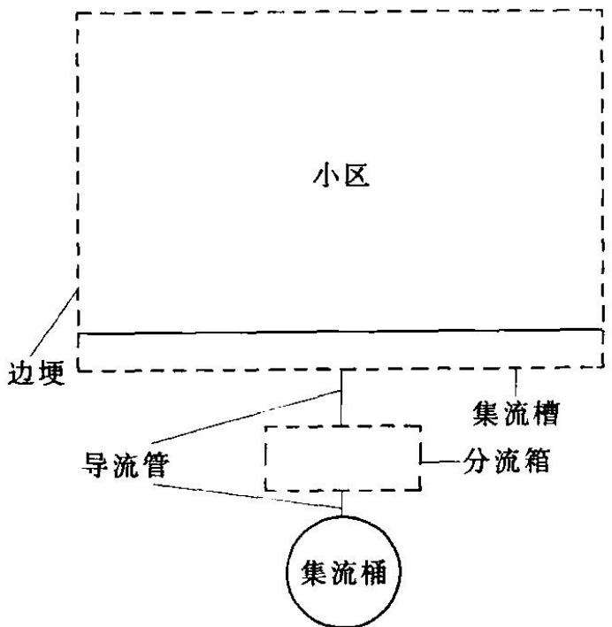  
图6.2 径流小区的主要构件及其平面布置

说明：

雨水进入；分流桶为可选构件，根据区域降雨强度确定是否需要，如果次降雨较大则需要设置，次降雨较小则可以不设置。

径流小区适用于扰动土体、弃土弃渣等形成的比较稳定的坡面，也可以用于砾石较少的弃土弃渣等形成的比较稳定的坡面，不适用于由弃石组成的堆积物的坡面。土壤流失量测验与计算方法参见文献3。

在设置时，常常将整个坡长作为小区的长，宽度为3～5m。图6.3就是广东省飞来峡水利枢纽15号土料场设置的裸露小区。

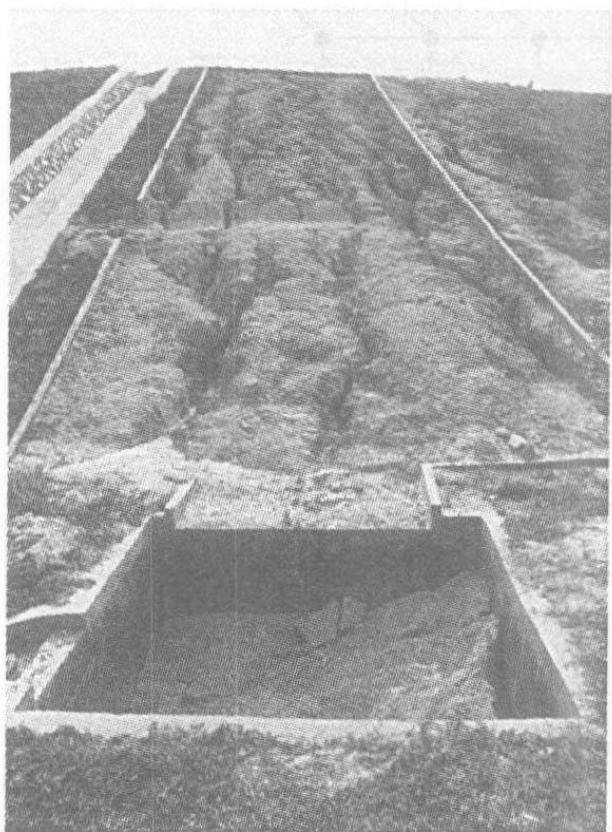  
(2004年11月16日）  
1. 小区规格为6m×20m，坡面坡降为26°。  
2. 泥沙径流收集器为长200cm、宽200cm、高150cm的长方体。  
3. 两个测点分别设置在泥沙径流收集器的对角线两个角附近。  
4. 小区规格和布设示意图如下(单位为m)。

5. 本小区测定坡面土壤流失量，并不测定径流量，因此，集流槽和泥沙收集器没有加盖盖子。

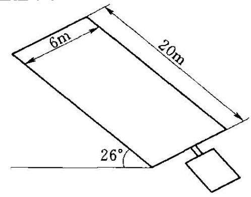  
图6.3 广东省飞来峡水利枢纽15号土料场设置的裸露小区

## 6.2.1.2 简易土壤流失观测场

简易土壤流失观测场是利用一组测钎测量坡面水土流失厚度的设施，常常采用9根测钎并按“田”字形设置，如图6.4（a）所示。当然，为了比较精确地测定整个坡面的土壤流失量，可以从坡顶到坡脚全面设置测钎，并增大测钎密度，按照网格状设置，如图6.4（b）所示。简易土壤流失观测场的土壤流失量（厚度）计算时，首先要根据各个测钎的示数（流失厚度）计算出坡面平均流失厚度，然后确定土壤流失厚度[1]。在确定坡面平均流失厚度时，要辨析各个测钎示数的真伪。如出现变异很大的偶然示数，应反复核实并查明原因。如果偶然示数属于个别现象，可以剔除这些示数。

  
(a)

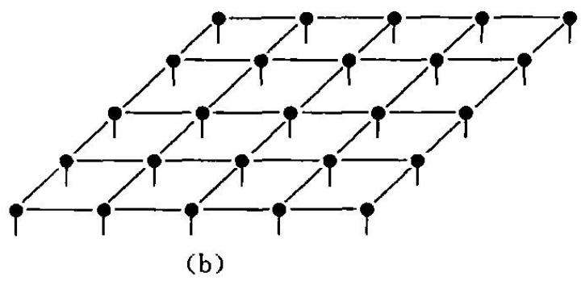  
图6.4简易土壤流失观测场示意图  
(a)“田”字形放置；(b)网格状设置

简易土壤流失观测场适用于分散的土状堆积物形成的稳定坡面土壤流失观测。在观测时，应注意堆积物的坡面稳定，几乎不发生自沉降；注意坡面横向没有倾斜，薄层水流仅仅沿着坡面向下移动；注意坡面不要形成较大的径流（股流)，避免发生细沟以上的沟蚀；注意观测场不能受到外来干扰，不能有外来径流。否则，将造成较大的误差，甚至导致结果发生偏差。图6.5是广东省飞来峡水利枢纽15号土料场设置的简易径流场。

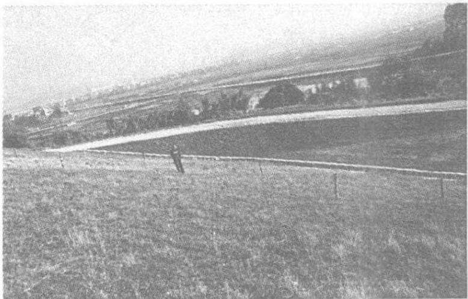  
（2004年11月16日）

说明：

1. 标桩为高100cm、直径10cm的圆木桩。

2. 标桩位置如下图所示，9根标桩成“田”字分布，顺坡6m×横坡10m。

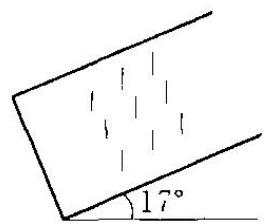  
图6.5广东省飞来峡水利枢纽15号土料场简易土壤流失观测场

## 6.2.1.3 泥沙收集器

为了防止径流将冲刷的坡面泥沙携带出设定的控制范围，在坡面下设置蓄水池、在堆渣体的坡脚周边设置沉沙池、在排水渠上建设沉沙池等，这些收集径流和泥沙的设施就是泥沙收集器(见图6.6)。一般地，这些泥沙收集器仅仅能够收集水蚀的推移质，而悬移质常常会被溢出收集器的径流带走。因此，主要使用于径流冲刷物的颗粒较大的地区；而在土壤颗粒细小的地区，为了全面测验和监测泥沙量，将收集器的容积建设的较大，以便收集全部的径流和泥沙。

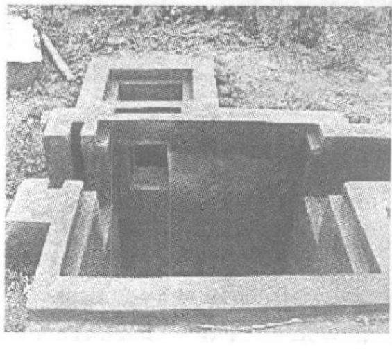  
(a)

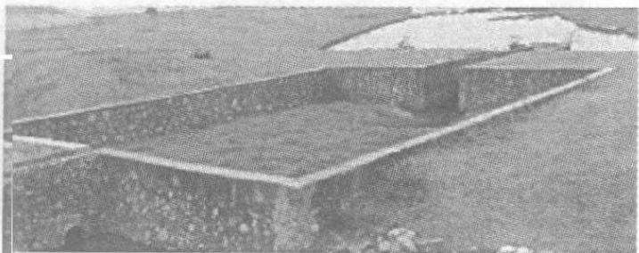

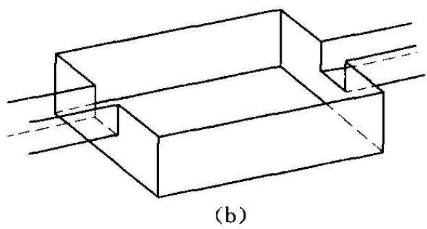  
图 6.6 泥沙收集器沉沙池  
(a)坡脚设置泥沙收集器(可以加盖盖子)；(b)建设在排水渠上的沉沙池（下图为示意图）

## 6.2.2 风蚀观测设施设备

对于开发建设项目的风蚀观测，主要是对风蚀区的风蚀强度测验，而一般不涉及风蚀区以外的降尘、积沙等。因此，可以选用的设施就是简易风蚀观测场，或者采用设备观测风蚀强度。

## 6.2.2.1 简易风蚀观测场

简易风蚀观测场，与简易土壤流失观测场（水蚀）的结构相似，面积不小于 $2 0 \mathrm { m } \times 5 0 \mathrm { m }$ ，标桩不少于9根，地下垫面均匀一致，周围布设围栏保护标桩安全，并避免强烈干扰，具体设置参见图6.4(b)。

标桩设置时，采用方格形、梅花状、带状，尽量避免线状，标桩间距不应小于2m，如果标桩按照长方形设置，常常将长方形的长边顺着主风向，短边与主风向垂直；如果标桩按照“田”字形设置，则可以不考虑风向。一般地，风蚀标桩的长度应该为1～1.5m，甚至更长，埋人地面下60～80cm，地面出露20\~40cm。图6.7是西气东输工程甘肃酒泉段设置的简易风蚀观测场。

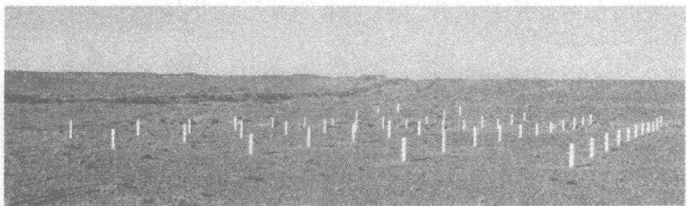  
图6.7 西气东输工程甘肃酒泉段的简易风蚀观测场

## 6.2.2.2 风蚀强度监测设备

风蚀强度监测设备通常有集沙仪、风蚀桥和测针等。这些设备可以单独使用，也可以两种、三种组合使用，以便提高监测精度。

（1）集沙仪。主要用来监测风沙流强度。目前，我国使用的

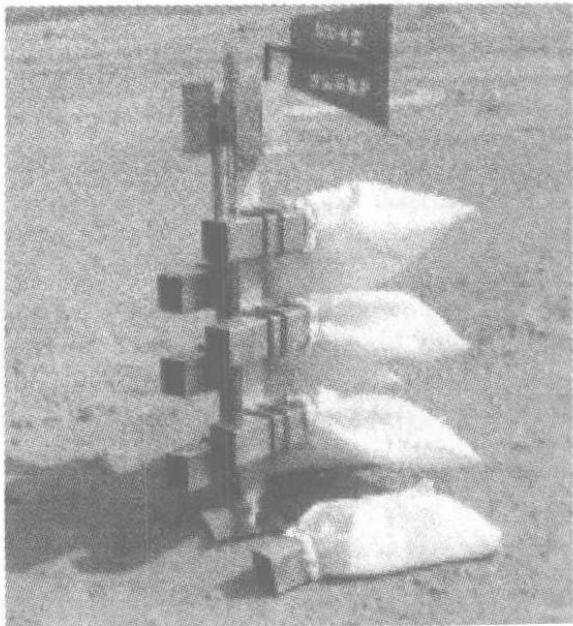  
图6.8 旋转式多路集沙仪

集沙仪有观测单一风向的单向集沙仪，有观测各个风向的旋转式集沙仪；有仅观测近地面3.0cm(或3.0\~5.0cm)高度输沙量的单路集沙仪，还有可以多层观测不同高度输沙量的多路集沙仪3](见图6.8)。

(2)风蚀桥。主要用来监 测风蚀强度，即测定风蚀深度 (见图6.9)。为了提高测量精 度，桥身尽量细小光滑，避免 扰动气流，保证风沙流以原状掠过桥下；在固定风 蚀桥时要与优势风向垂直，且将桥腿打入地下时尽 量减少对周围沙体的扰动。

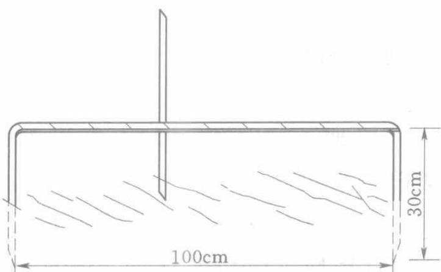  
图 6.9 风蚀桥

（3）测钎。测钎是细长光滑的金属杆件，要求尽量细小光滑，且有一定强度，不易被弯曲或折损，以减少阻力或避免拦挂污物。主要是用来测定风蚀严重区域的风蚀强度，即测定风蚀厚度。测钎长度一般几十厘米，有人试用测钎时附带一个金属圆片，中心开一个小孔，串在测钎上，能够自由上下移动（在测定风积厚度时应用最广泛），这样量测比较方便（见图6.10)。测钎多采用方格网状排列方式布设（与简易风蚀观测场类似）、等间距布设，间距在5m左右。

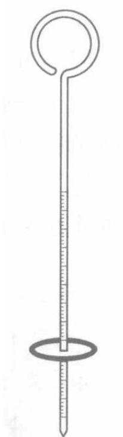  
图 6.10 风蚀测钎

## 6.3 几类主要对象水蚀观测样地的位置

在“5开发建设项目水上保持监测分区与监测点布局设计”中，分析了水土保持监测重点地段应该具备的主要特征，并提出了不同行业的监测重点地段。在这些重点地段，水土流失主要发生在施工扰动或者工程建设塑造的各种各样的坡地上；这些坡地主要包括施工保留坡面、弃渣堆积体坡面、取土取石场坡面、工

程平台边坡等。

## 6.3.1 坡面细沟观测样地

水蚀细沟是指较陡的土质坡面被分散的小股降雨径流冲刷成的 分

布，深度和宽度都不超过20cm。由于细沟一旦出现，坡面侵蚀量将迅速增加，成为坡面侵蚀主要产沙方式。因此，在水土流失观测样地、调查样地及线路巡查时，应对细沟的发育状况进行监测。

在野外监测细沟水土流失时，观测样地或调查样地一般应选取坡面上细沟发育具有代表性的区段，但样地选择因坡面大小采取不同的方法。当坡面较小时，一般应选择沿坡面从上端直至下端的一个条带，作为带状样地；当坡面较大时，可以沿坡面选择一两条线（如坡面的对角线），在样线上选择几个区段，作为多斑样地（见图6.11）。细沟土壤流失量常常采用断面量测法和填土置换法来观测。

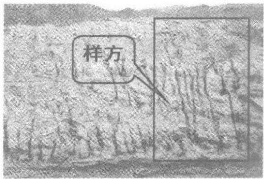  
(a)

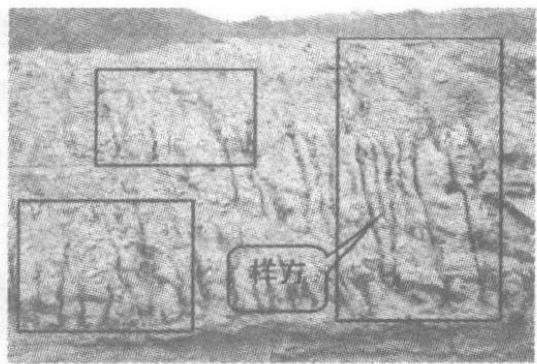  
(b)  
图6.11 坡面细沟断面量测法观测样地选择示意图  
（a)坡面细沟带状观测样地；（b）坡面细沟多斑观测样地

（1）断面量测法。断面的测定可以用立体扫描法，也可以用测尺直接量测法3]。立体扫描法比较精确，可以直接计算得到流失土壤的体积；直接测定方法可能存在一定误差，当细沟端面并不规则时，应当加密测试断面，从而减少测定误差。断面直接量测法示意如图6.12所示。

(2) 填土置换法。填土置换法是用一定量的备用细土 $( V _ { \mathrm { 0 } } )$ 回填到细沟中，并稍压密实，细心刮去多余细土与细沟两缘齐平，直至填完细沟，量出剩余备用细土体积 $( V _ { t } )$ ，两者之差即为细沟侵蚀体积 $( V = V _ { 0 }$ V,)。填土置换法的测量精度受填土密实程度影响较大，因此，在填土实应尽量

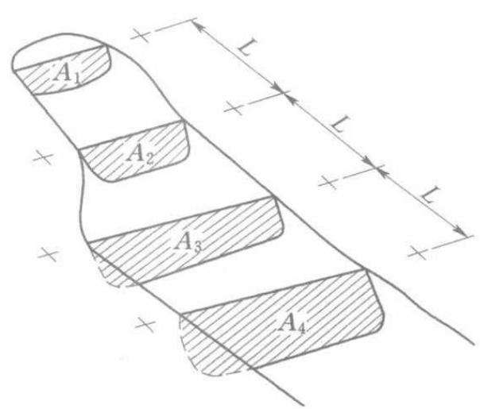  
图6.12 断面直接量测法测定  
细沟流失量基本原理图

保证回填土的密度与坡面土壤一致。

## 6.3.2 弃渣堆积体土壤流失量观测

对于弃渣堆积体土壤流失状况观测样地的设置，因观测目的的不同而不同。若研究堆积体坡面松散土壤流失发生、发育的过程、运移及流失量，一般将观测样地设置在坡面，或将从顶端到坡脚的带状坡面作为观测样地，并且观测整个带状坡面的土壤流失过程，如图6.13（a）的右测坡面观测样地，也就是在图6.13(b)的坡面上设置测钎或其他测验设备；若只观测堆积体坡面松散土壤流失总量，也是将从顶端到坡脚的带状坡面作为观测样地，但只在坡角设置泥沙收集器，如蓄水池、沉沙池，甚至堆积体坡角的拦渣墙、积水坑等，如图6.13（a）的左测坡脚的拦渣墙，或者使用6.13（b）下方的泥沙收集器；若仅仅测验堆积体水土流失拦挡措施的拦渣效果（如拦渣率），只需要观测从拦渣墙（或拦渣坝）中溢流或渗漏出来的土壤数量，此时可以采用相关的收集器或者直接测量溢流或渗漏的土壤数量。图6.13（c）为华能玉环电厂工程正在设置的土石混合堆渣体坡面观测场。

## 6.3.3 取土取石场土壤流失量观测

开发建设项目的取土取石场，在不同施工阶段呈现不同的形态，土壤流失状态也因此而不同。一般地，在取土取石期间，为了保障施工和土石装运安全与方便，取土取石场通常都被设置了预防措施或临时治理措施，水土流失被控制在一定的空间范围内，不会发生危害。在取土取石结束后，取土取石场的遗迹形成两个具有不同坡度的地形状态：一是开山或挖土形成的陡坡，如图6.14中上半部分的裸露岩石陡坡；二是取土或取石后遗留的缓坡，如图6.14中下半部分得到初步整治并恢复林草的平整土地。这两个部分的土壤流失形式和数量具有明显的差异。

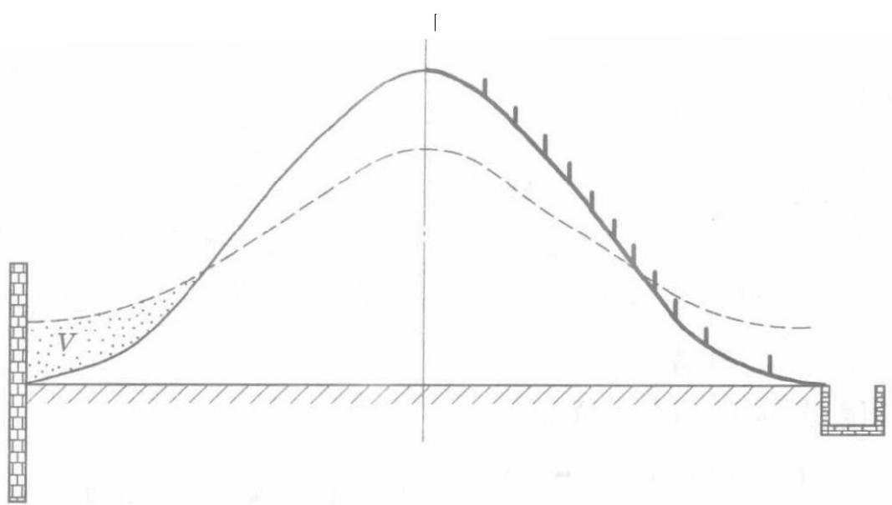

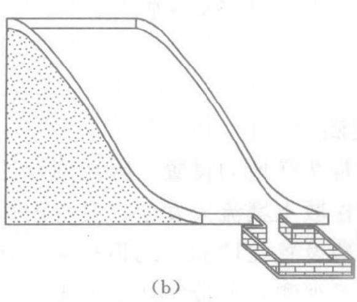

(a)  
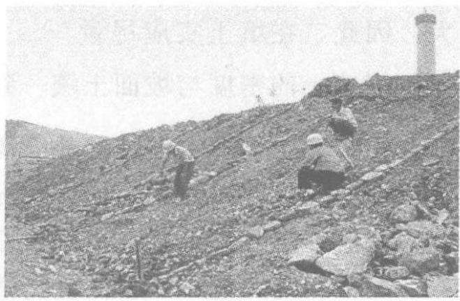  
(c)  
图6.13 弃渣堆积体土壤流失量观测样地设置位置示意图（a）土质堆渣体；（b）堆渣体坡角泥沙收集器；（c）华能玉环电厂工程正在设置的土石混合堆渣体坡面观测场  
注：图（a）中，实线为堆渣体第一次观测时状态，虚线为第二次观测时的状态，V就是坡面流失量；右测的粗实线为图（b)的剖面图，坡面上形似测钎的物体为测验坡面水土流失发生、发育过程及运移的设备。

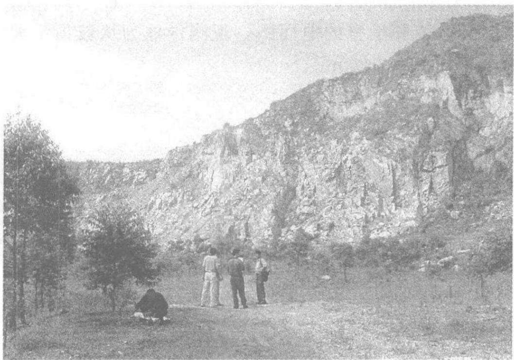  
图6.14广东省飞来峡水利枢纽大岗岭  
石料场（2002年7月4日）

对于陡坡，在形成初期，不稳定的部位会发生崩塌、滑坡、滑塌等，常常在坡脚形成堆积、泥流，如果不及时采取合理预防和治理措施，将会造成严重水土流失，甚至形成危害；尤其是对于土质坡度，随着时间延续，土壤流失将不断加剧，并且对紧靠其下方的缓坡土地造成严重影响。对于缓坡，在取土取石刚刚结束后，植被稀少甚至没有植被，如果不及时采取合理预防和治理措施，在雨季常常发生水土流失，冲刷地表造成沟蚀。因此，应该分别对陡坡坡面和缓坡地面的水土流失状况进行监测。

## 6.3.3.1 开山挖土形成陡坡观测样地

对于取土取石形成的陡峭坡面，应该选择从坡面顶端直至坡脚的代表性或典型性条带，作为观测样地，在坡脚设置泥沙收集器观测流失量。如果是岩石坡面，可以选择拦渣网或透水拦渣墙等收集滑落的砾石；如果是土质坡面，可以选择蓄水池、沉沙池等收集流失的土壤。如果在水土保持工程建设时在坡脚配置了排水设施或者拦沙设施，可以将这些设施拦蓄的泥沙作为土壤流失量，或利用这些设施设置相关的泥沙测定设备，测定流水含沙量(包括悬移质和推移质)。图6.15是华能玉环电厂工程取石场形成的陡峭高边坡和平整的地面图，观测样地为从坡顶至坡脚的条带，宽20m，面积 $2 1 8 0 \mathrm { m } ^ { 2 }$ 0

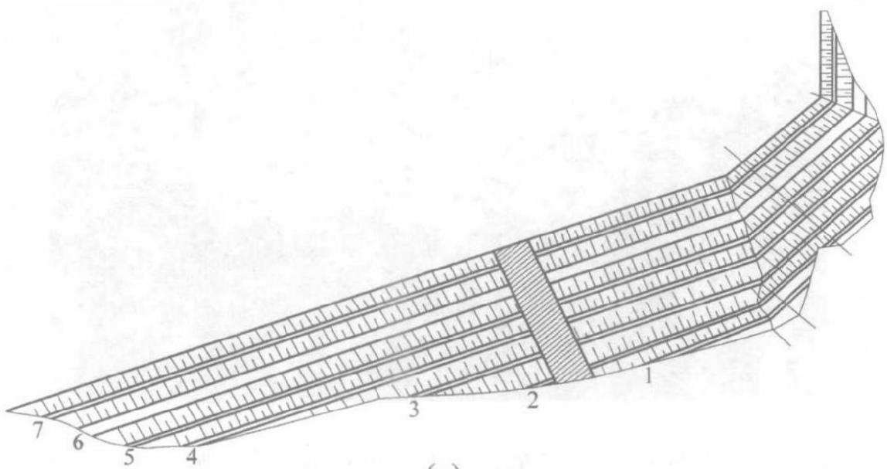  
(a)

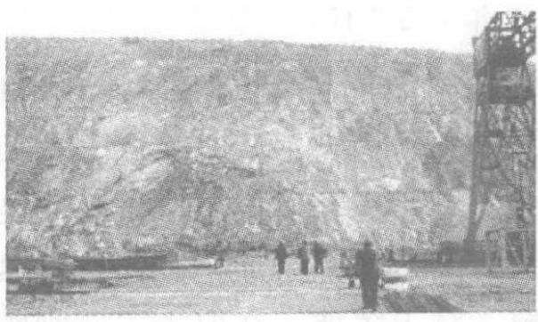  
(b)

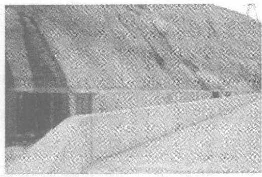  
(c)  
图6.15华能玉环电厂工程取石场形成的陡峭高边坡和平整地面(a)高边坡形态示意图；（b)观测样地照片（平整地面已用做材料加工场）；（c）高边坡坡脚排水渠  
「注：高边坡由西向东逐渐升高，至东南角达到最高，最高高程约100m，内有7条马道，边坡面积约50000m²。图（a）中深色条带为水土保持监测的观测样地。

## 6.3.3.2 取土取石遗留缓坡观测样地

对于取土或取石后遗留的缓坡，应该根据缓坡形态、地面完整（或破碎）状况、坡面产流方向等合理选择观测样地，样地可以是一个完整地块，也可以是几个地块，但都应该具有代表性和典型性。通常，总是将可能发生水土流失或者已经发生水土流失的地块作为观测样地。

如果取土取石后遗留的缓坡已经得到平整，并且恢复为耕地或林草地后（通常都会得到及时整治，尤其是在耕地资源比较紧张的我国中部和东部地区)，一般不会发生严重水土流失。对于这种状况，可以将缓坡地作为调查样地，对主要水土流失影响因子进行调查，综合分析治理效果。调查样地的数量依据缓坡地的自然地块数量确定，如果水土保持措施不同，或者土地利用不同，或者地形坡度状况不同，可以分别将其中的一块作为样地；如果水土保持措施、土地利用、地形坡度状况基本一致，或者缓坡地就是一大块地，可以将整块地或者其中一部分作为样地。样地的大小和形状，可以按照“6.1观测样地和调查样地的形状与面积”的介绍确定。

## 6.3.3.3 取土取石场整体观测样地

当取土取石形成的陡坡和遗留的缓坡都没有及时采取治理措施，或者陡坡的水土流失（尤其是集中径流）直接对紧靠其下方的缓坡土地造成严重影响（如集中径流冲刷出浅沟、切沟等）时，可以将由上方陡坡和下部缓坡构成的取土取石场作为整体，确定观测样地。图6.16所示的就是取土场从上部陡坡到下部缓坡形成了土壤流失链的情景。此处“链”的含义是：上部地块产生的径流不断积累，将对下部地块造成严重的冲刷，上部陡坡的水土流失是造成下部缓坡水土流失最主要、最直接的原因，没有上部陡坡的严重水土流失，就没有下部缓坡的水土流失。如同食物链中没有第一级生产者，就没有第二级的消费者；或者第一级生产者的数量不足，就难以维持数量较多的第二级消费者生存。

对于这种水土流失涉及的面积较大，而不是一个单一坡面或者一条浅沟时，应该选择一个土壤流失链涉及的范围作为观测样地。这类观测样地，涉及多个地块，降雨径流从上部的地块下流，并不断累计流向下部的地块，最终汇集到最下部的地段流出。这个过程所经过的地块，构成了类似“小流域”的小集水区。这个集水区的范围就是观测样地的范围。

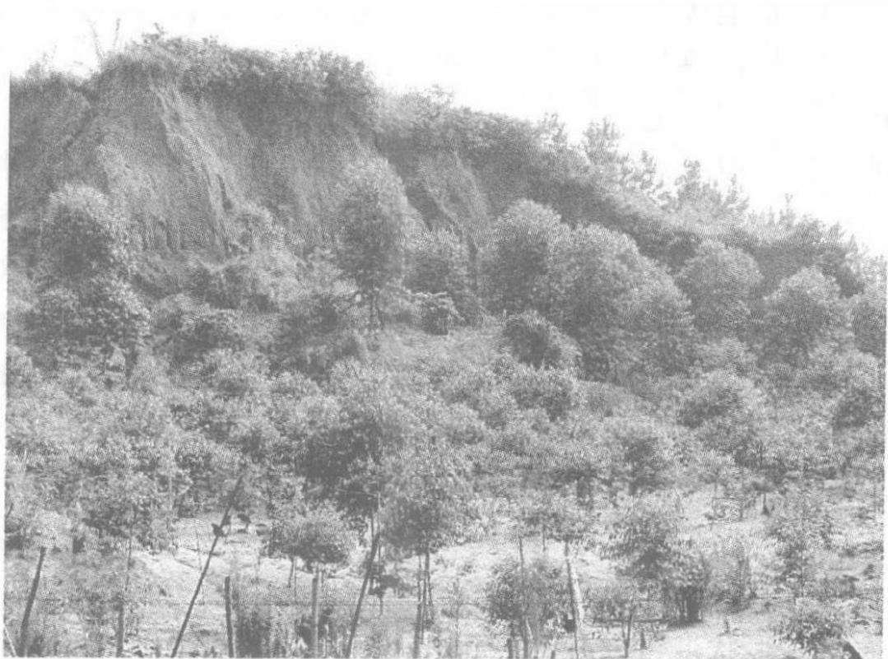  
图6.16 取土场从上部陡坡到下部缓坡形成的土壤流失链

对于这类观测样地，不仅要观测土壤流失量，而且要观测土壤流失方式、流失面积、流失物质，以及浅沟状况、切沟状况等。对于总土壤流失量，可以在集水区出口设置相关测验设施进行观测，或通过出口的拦沙坝拦蓄量的动态变化来分析；对于土壤流失方式，需要通过地块调查、侵蚀沟丈量、局部沉积量测量等方法进行；对于流失物质，可以通过对整个样地范围的地表物质调查得到。

至于总土壤流失量的测验设施，可以根据取土取石场所在地的降雨、地形和产流、产沙情况确定。具体确定可以参考文献[3]“2小流域水土流失测验”的内容。需要注意的是，由于开发建设项目监测时间一般较短，而且从防止土壤流失的角度，不能让泥沙流出观测样地。因此，观测样地并不适宜建设控制站（或卡口站），应选择权宜的设施或设备进行观测。

## 6.3.4 土质平台边坡观测样地

在开发建设项目建设中，填方地段常常要形成平台，如填方路段的路基边坡、开山造地的边坡、房地产开发的建设工地，等等。对于平台边坡，平台成了集雨器，降雨汇集后将沿着平台边坡流向低洼处。如果平台和边坡用料主要是土壤，边坡没有及时采取护坡工程（包括工程措施、植物措施)，平台没有及时设置排水措施，平台边坡常常会发生水土流失，如图6.17所示。在这种边坡上，不仅仅发生面蚀（含细沟），而且发生沟蚀（尤其是浅沟)、滑塌，甚至泥流等。

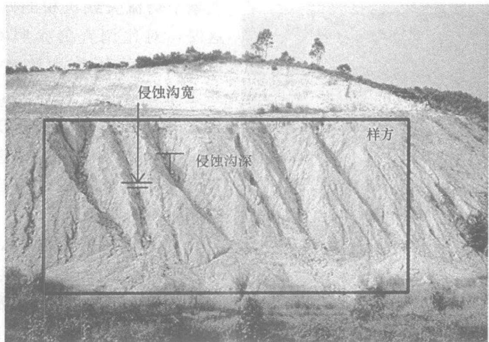  
图6.17 土质平台边坡观测样地示意图

当边坡流失范围较大时，可以在流失范围内选择其中一部分作为观测样地：当边坡流失范围较小时，可以将整个流失范围作为观测样地。具体选择方法参考“坡面细沟观测样地”。

## 6.4 野外可用来估测土壤流失量的物体

在开发建设项目水土保持监测过程中，常常采用全部监测范围的线路巡查和典型地段的样地测量以了解水土流失的有关状况。在野外调查时，常常利用水土流失遗迹、泥沙淤积体、沉积体、土壤剖面，以及类比相似状况等来分析流失强度、判定流失厚度等。

## 6.4.1 水土流失遗迹

水土流失遗迹是指土壤流失或沉积等遗留下来的痕迹。利用水土流失遗迹调查分析土壤流失或沉积厚度的方法，又称为历史古迹对照法[3-6]。这种方法不仅适合于水蚀，而且对风蚀也同样适用。对于自然侵蚀而言，这种方法主要是用来调查较长时期的

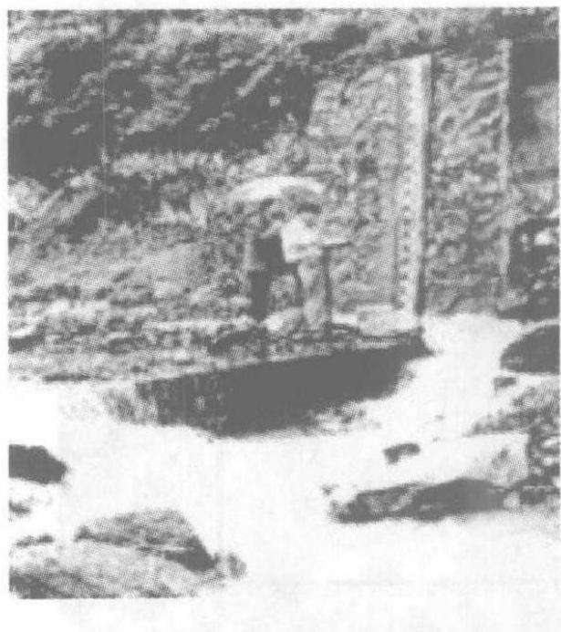  
图6.18泥石流泥位高度调查

土壤平均流失或沉积的厚度。这时，对比调查的参照物有古代留下的历史文物建筑，如庙宇、寺院、村舍等，甚至古墓、古桥及其他历史古迹。如果能够确定这些参照物的年代，就可以估算出流失或沉积的厚度。

对于开发建设项目，如果施工扰动遇到暴雨或洪水，造成强烈的土壤流失或泥沙沉积，也将在周边遗留下明显的痕迹，如泥石流的泥位

（或者龙头）高度、水蚀土壤厚度、风蚀沉积厚度，等等。图6.18是就是调查泥石流泥位高度的情形。

## 6.4.2 泥沙淤积体

泥沙淤积体就是堆积在塘、坝、涝池、水窑、水坑及坡面拦沙措施等里的泥沙。通过量测泥沙淤积体的数量，不仅可以回答塘、坝、涝池、水窑、水坑及坡面拦沙措施等所在集水区或一个坡面的土壤流失厚度，而且可以回答流失总量和水土保持措施的效益。图

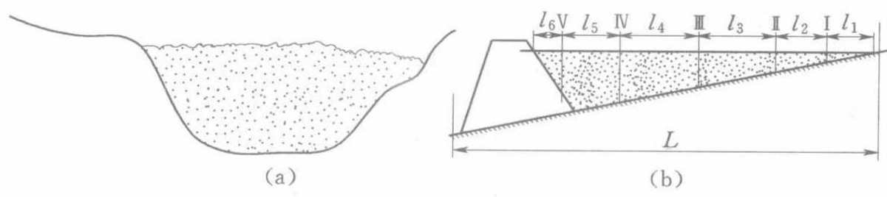  
图 6.19 泥沙淤积体示意图  
（a)塘、涝池、水窑、水坑的淤积体；（b)拦沙措施的淤积体

## 6.19就是泥沙淤积体示意图。

在开发建设项目水土保持监测中，可以通过调查扰动破坏区的下方（下游）和渣土转运堆积区的比邻低洼地的泥沙淤积，分析对应小面积区域的土壤流失量。

## 6.4.3 沉积体

沉积体是指侵蚀搬运的沉淀与堆积物。通过量测土壤流失沉积物的数量，可以估计流失区域的土壤流失数量。如考察山前洪积扇堆积体的数量，可以确定山地该流域的地表剥蚀量及速率；考察坡脚堆积物的数量，可以确定滑坡、滑塌、崩塌、泄溜等重力侵蚀的数量。

在开发建设项目水土保持监测中，对于高边坡的滑塌量、堆渣体的流失量、流出或溢出拦渣体的土石数量，都可以采用沉积法获得。

## 6.4.4 土壤剖面

开发建设项目对项目建设区的地表土壤扰动强烈，甚至由于扰动或者建设，项目建设区的积水会对直接影响区的地表土壤造成冲刷，使得土壤剖面发生变化，尤其使土壤剖面的上层（如A层，表土层）遭到侵蚀。在《土壤侵蚀分类分级标准》(SL190—96)中，提出了按土壤发生层分析侵蚀程度的标准[7]。

在野外调查时，可以通过比较项目建设区、直接影响区的侵蚀土壤剖面各层与原始发生层次厚度，分析侵蚀强度和施工扰动

对周边区域的影响。

## 6.4.5 类比物体

在开发建设项目水土保持监测中，常常利用以往调查过的类似物体来推断调查对象的流失量。这种类似的调查物，就是类比物体。

由于开发建设项目土壤流失量调查对象的模式积累不够多，目前可以被用来做类比物体的参照物还很少。因此，在选择类比物体时，应该注意比较的同一差异性，即调查对象和类比物体确实具有近似的状态，包括降雨和风力等侵蚀动力、物质组成、地面的坡度与坡长、土地利用、植被等。

## 参考文献

[1]水利部水土保持监测中心. SL277—2002水土保持监测技术规程.北京：中国水利水电出版社，2002.

[2]水利部水土保持监测中心. SI3422006水土保持监测设施通用技术条件.北京：中国水利水电出版社，2006.

[3]李智广.水土流失测验与调查. 北京：中国水利水电出版社，2005.

[4]张卫，李智广.刍议线形开发建设项目水土流失野外巡查观测技术.水土保持通报，2004，24(3)：45-46.

[5]水利部水土保持司，黄河水利委员会黄河上中游管理局，黄河水利委员会农村水利水土保持局，等.GB/T15772—1995 水土保持综合治理规划通则.北京：中国标准出版社，1995.

[6] 张洪江. 土壤侵蚀原理. 2版. 北京：中国林业出版社，2008.

[7] 水利部水土保持司. SL 190—96 土壤侵蚀分类分级标准. 北京：中国水利水电出版社，1997.

## 7 开发建设项目水土保持监测方法与数据处理

在“4开发建设项目水土保持监测内容与指标”中，将开发建设项目水土保持监测的内容分为水土流失因子、水土流失状况、水土流失危害、水土保持措施及治理效果等五个部分。各部分的监测指标不同，使用的监测方法、设施设备、监测频次也各不相同，本章将结合“5开发建设项目水土保持监测分区与监测点布局设计”中水土保持监测范围、“6开发建设项目水土保持监测点设施设计”中的监测设施设备，分别阐述水土保持监测及监测数据记录、监测数据分析的方法。

## 7.1 开发建设项目工程建设区域面积监测

## 7.1.1 监测目的与要求

任何一个开发建设项目在申报和审批的工程设计报告或其他文件中，均已说明建设工程的四邻（或地理坐标）及其范围、面积等数量；但是，在实施中，这些数量通常总会有些变化，有的是地理坐标调整（或位置发生些微改变）、有的是范围变化（包括增大或缩小，常常是增大）。这是开展工程建设区域面积（包括位置）监测的主要原因。同时，建设区域面积的监测与确定，为其他监测指标的数据采集提供了一个清晰明白的、唯一的对象，为监测数据的分析评价提供了一个肯定不变的、同一的参照，为整个区域及其分区分析评价水土流失及其危害、治理措施及其效果等提供准确的依据。

在监测工程建设区域面积和四邻时，不仅要确定区域的边界线和地理坐标，而且要同时确定不同分区的界线、面积，全部的界线、地理坐标和面积，必须对应于选用的地理底图，各种注记应正确无误、清晰易读，线划符号符合制图规范图式、图例的要求。

在监测工程建设区域面积时，要注意这里所说的“工程建设区域”是指“5开发建设项目水土保持监测分区与监测点布局设计”中的“项目建设区”，而不包括“直接影响区”。同时，为了分别分析各个施工、建设或使用单位造成水土流失或治理水土流失的状况，应该调查清楚工程建设区域各个碎部或各个分区的责任人（单位），以便明确责任，为及时完善水土保持措施设计与治理措施配置提供依据。

在记录或统计工程建设区域面积时，可以参考附表1。

## 7.1.2 监测方法与设施设备

## 7.1.2.1 监测方法[1]

一般地，区域面积调查（面积有限）均采用全面调查（详查）的方法。对干具体的建设项目来说，实施全面调查可以采取两种方法：一是利用遥感影像（包括航片）转绘结合现场踏查校核的方法；二是实际测绘的方法。

在调绘、转绘或测绘前的资料收集阶段，首先应该收集项目的水土保持方案报告及后续的初步设计等资料，其中的水土流失防治责任范围图、工程布局图、水土流失防治分区图、水土保持措施总体布局图[2]等都可以作为工程建设区域的四邻（或地理坐标）及其范围的最可参考的资料。当然，以上资料应该在现场踏查校核或实际测绘时，仔细分析，认真核对。

## 7.1.2.2 监测设施设备

对于区域范围较大的建设项目，在有条件情况下选择第一种方法，即收集近期获取的遥感影像，并进行空间校正（若涉及一景以上的影像，应采用无缝镶嵌)，勾绘区域边界线和各个分区的界线，然后用设计踏查路线或选校核点的办法实际调查，修改、补充和完善所需内容。

实际测绘法常用于范围面积比较小的建设项目，可以用全站仪，也可以用经纬仪结合水准仪，甚至常规的手持水准仪，进行实际大比例尺测绘和调查。一般先建立控制网，再做碎部测量，最后调查填图。

区域整体及其分区的面积量算，可以采用传统的求积仪法、网格板法等，也可以使用地理信息系统软件进行面积统计。在目前的技术状况下，应该选择地理信息系统软件的方法，这样，不仅可以进行精确的面积量算、分类统计，而且可以直接确定整个区域及其分区的四邻（地理坐标），还为监测点、监测重点地段、治理措施及其他必需要素的标注、注记等提供了良好的工具和精准的资料。

## 7.2 水土流失因子监测

在“4开发建设项目水土保持监测内容与指标”中已阐明水土流失因子监测的内容和指标。本章，首先归纳说明这些内容和指标的监测方法，然后对主要指标的监测方法进行阐述。

## 7.2.1 监测方法

水土流失因子包括自然因子和人为因子两方面，前者包括地质、地形、气象、土壤（地面物质组成）、植被和自然资源等因子，后者主要指社会经济因子和建设项目活动因子。总体上来说，这些内容的监测方法主要包括资料收集分析法、调查法、现场测验分析法等三种。

## 7.2.1.1 资料收集分析法

在我国，各部门、各流域和各地（包括省、县等）都已积累或出版了不少报告、书籍、统计资料等文献，这对于分析和说明工程建设区内的水土流失因子基本情况十分有用。尤其是从中分析获取工程建设区域内的多年平均状况指标，更是简捷、准确的方法。如大地构造、地貌类型与分区、多年平均降水、气温、植被类型与分布、土壤类型与分布（甚至河流的径流和泥沙）等都有详实的文献记载。在应用时，需要仔细对比、分析获取，移植

到建设工程区域即可。

移植的方法有多种，可以依据具体指标的特性和掌握资料的丰缺来选择对应的方法。一般地，当工程建设区域范围较大时，多用分区（分段）上下界标法，如某区（段）平均温度为多少度至多少度，多年平均降水量为多少毫米至多少毫米，等等；对于连续分布而又渐变事物的指标，多用顺序排列法加以说明，如植被类型从某地荒漠植被、荒漠灌丛植被、旱生草地，到某地草地(草原）结束，这时，需要简要说明其特点。当工程建设区域范围较小时，有的指标可以采用类比插值法，如依据等雨量线图，用区域两侧的等值线进行插值，解算出区域内的雨量值；有的指标可以采用类推法，如由两侧的地层出露顺序和构造特征类推出区域地层出露状况，由地貌、气候等综合分析取得区域土壤、植被的特征。

## 7.2.1.2 调查法

在无法通过资料获得工程建设区域内详实的水土流失因子数据时，通常采用实地调查法获得详实可靠的资料。

当工程建设区范围较大，且集中连片时（如采矿区），调查时采用设计网格或线路的调查方法，即选择能反映全区并不产生遗漏的调查线路和交叉网路开展调查。在设定的调查网格、线路上详尽调查全部资料，再通过归纳分析，取得全区的概况。如较大区域地质构造、地貌类型、土壤（或地表组成物质）等，都可通过这种方法取得，黄土高原地貌特征调查就是一例3。

当工程建设范围大，但呈带状分布时（如道路建设），调查可采用分区（段）抽样的调查方法，一般先按地貌类型分区(段)，再在每一区（段）中对影响水土流失诸因子的指标详细调查（有时需要填图）或测验，完成后再转入下一区，继续重复上述工作，直至结束。

当工程建设范围小，相对集中在一个不大的区域（如厂区建设）时，调查多采用全面普查（或详查）结合分析测验的方法进行。调查时，勾绘画出地类（或微地貌）的界线，并在每一地类中调查或取样分析每个因子指标。如划分出林地、草地、梯田等，取样分析土壤的物理化学性质等。

## 7.2.1.3 现场测验分析法

在水土流失因子中，有些因子属随机变化的因子，如降水；有些因子受人为活动影响变化较大，如土地利用、经济产出等指标，而这些因子又与水土流失密切相关，仅有平均值（或变化幅度）并不能阐明工程建设区域水土流失状况的原因，更不能作为预测预报的依据。因此，工程建设区中影响水土流失的变化因子、指标需要靠现实实测的方法来解决。

上述三种方法不是孤立的或相互排斥的，通常是在监测过程中交叉使用，并相互补充、相互印证，共同完成指标数据的监测。

## 7.2.2 主要指标的监测方法

在“4开发建设项目水土保持监测内容与指标”中，阐述了六类自然因子、两类人为因子。但是，在开发建设项目实地监测时，尤其是在监测点上进行监测时，并不是面面俱到、对每一个指标进行现场测验，而是对主要的指标进行测验观测。

## 7.2.2.1 降雨量

对于降雨量，不仅要掌握多年平均状况，而且要观测监测时段的状况。前者可以作为分析监测时段水土流失及其治理效果的对比状态，主要通过文献分析得到相关的指标项，其记录格式见附表2；后者可以用来的分析研究水土流失及其治理的动态，主要观测和分析的指标项及其记录格式见附表3。

降雨观测多采用普通雨量计、自记雨量计[1]。在观测时，同时分析记录降雨历时、计算降雨强度。必要时，计算最大30min雨强 $( I _ { 3 0 } )$ 和最大 60min雨强 $( I _ { 6 0 } )$ 0

## 1. 自记雨量计观测

如果前一天没有降雨，则用注入少量清水的方法，使自记雨量计的指针上调一格（1mm），手动旋转自记钟，调整指针指向正确的时间。在连续没有降雨的情况下，一张自记纸可以连续使

用5天。

如果前一天有降雨，则更换自记纸。新的自记纸更换前需要填写观测日期、初算人等相应项目。换下的自记纸应及时填写取纸日期。带回室内初算雨量，并于自记纸和观测记录本上各记录一份。换下的自记纸应妥善保存。

## 2. 普通雨量计观测

检查承水瓶，如有雨水，倒入雨量筒中测量，并做准确记录。每次降雨过后，应及时测量，尽量减少蒸发。

## 3. 降雨强度

为了分析水土流失，常常需要计算平均降雨强度、最大30min雨强 $( I _ { 3 0 } )$ 和最大60min雨强 $( I _ { 6 0 } )$ 0

平均降雨强度：用次降雨量除以次降雨历时，获得逐次降雨的降雨强度。

$I _ { 3 0 }$ ：以自记雨量计降雨记录纸为基础，以5min间隔摘录降雨量并得到累积降雨量，从30min开始，计算逐个30min的平均降雨强度，如0～30min、5～35min、10～40min等，从而得到该次降雨不同时段的30min平均雨强，从中选取最大值，即为该次降雨的最大30min雨强（表7.1中的2.60mm/min)。

表7.1  
用累积降雨过程计算 $\pmb { I _ { 3 0 } }$ 及 $\pmb { I _ { 6 0 } }$
<table><tr><td colspan="1" rowspan="1">时间（min）</td><td colspan="1" rowspan="1">累计降雨量(mm)</td><td colspan="1" rowspan="1"> $I _ { 3 0 } ( \mathrm { m m / \mathrm { m i n } } )$ </td><td colspan="1" rowspan="1"> $I _ { 6 0 } ( \mathrm { m m / \mathrm { m i n } } )$ </td></tr><tr><td colspan="1" rowspan="1">0</td><td colspan="1" rowspan="1">0.00</td><td colspan="1" rowspan="1"></td><td colspan="1" rowspan="1"></td></tr><tr><td colspan="1" rowspan="1">5</td><td colspan="1" rowspan="1">0.51</td><td colspan="1" rowspan="1"></td><td colspan="1" rowspan="1"></td></tr><tr><td colspan="1" rowspan="1">10</td><td colspan="1" rowspan="1">9.14</td><td colspan="1" rowspan="1"></td><td colspan="1" rowspan="1"></td></tr><tr><td colspan="1" rowspan="1">15</td><td colspan="1" rowspan="1">11.68</td><td colspan="1" rowspan="1"></td><td colspan="1" rowspan="1"></td></tr><tr><td colspan="1" rowspan="1">20</td><td colspan="1" rowspan="1">12.70</td><td colspan="1" rowspan="1"></td><td colspan="1" rowspan="1"></td></tr><tr><td colspan="1" rowspan="1">25</td><td colspan="1" rowspan="1">17.53</td><td colspan="1" rowspan="1"></td><td colspan="1" rowspan="1"></td></tr><tr><td colspan="1" rowspan="1">30</td><td colspan="1" rowspan="1">29.72</td><td colspan="1" rowspan="1">0.99</td><td colspan="1" rowspan="1"></td></tr><tr><td colspan="1" rowspan="1">35</td><td colspan="1" rowspan="1">42.42</td><td colspan="1" rowspan="1">1.40</td><td colspan="1" rowspan="1"></td></tr><tr><td colspan="1" rowspan="1">时间（min）</td><td colspan="1" rowspan="1">累计降雨量（mm）</td><td colspan="1" rowspan="1"> $I _ { 3 0 } ( \mathrm { m m / m i n } )$ </td><td colspan="1" rowspan="1"> $I _ { 6 0 } ( \mathrm { m m / m i n } )$ </td></tr><tr><td colspan="1" rowspan="1">40</td><td colspan="1" rowspan="1">55.12</td><td colspan="1" rowspan="1">1.53</td><td colspan="1" rowspan="1"></td></tr><tr><td colspan="1" rowspan="1">45</td><td colspan="1" rowspan="1">68.07</td><td colspan="1" rowspan="1">1.88</td><td colspan="1" rowspan="1"></td></tr><tr><td colspan="1" rowspan="1">50</td><td colspan="1" rowspan="1">72.14</td><td colspan="1" rowspan="1">1.98</td><td colspan="1" rowspan="1"></td></tr><tr><td colspan="1" rowspan="1">55</td><td colspan="1" rowspan="1">80.01</td><td colspan="1" rowspan="1">2.08</td><td colspan="1" rowspan="1"></td></tr><tr><td colspan="1" rowspan="1">60</td><td colspan="1" rowspan="1">96.77</td><td colspan="1" rowspan="1">2.24</td><td colspan="1" rowspan="1">1.61</td></tr><tr><td colspan="1" rowspan="1">65</td><td colspan="1" rowspan="1">105.92</td><td colspan="1" rowspan="1">2.12</td><td colspan="1" rowspan="1">1.76</td></tr><tr><td colspan="1" rowspan="1">70</td><td colspan="1" rowspan="1">115.82</td><td colspan="1" rowspan="1">2.02</td><td colspan="1" rowspan="1">1.78</td></tr><tr><td colspan="1" rowspan="1">75</td><td colspan="1" rowspan="1">124.97</td><td colspan="1" rowspan="1">1.90</td><td colspan="1" rowspan="1">1.89</td></tr><tr><td colspan="1" rowspan="1">80</td><td colspan="1" rowspan="1">138.68</td><td colspan="1" rowspan="1">2.22</td><td colspan="1" rowspan="1">2.10</td></tr><tr><td colspan="1" rowspan="1">85</td><td colspan="1" rowspan="1">157.99</td><td colspan="1" rowspan="1">2.60</td><td colspan="1" rowspan="1">2.34</td></tr><tr><td colspan="1" rowspan="1">90</td><td colspan="1" rowspan="1">170.94</td><td colspan="1" rowspan="1">2.47</td><td colspan="1" rowspan="1">2.35</td></tr><tr><td colspan="1" rowspan="1">95</td><td colspan="1" rowspan="1">182.12</td><td colspan="1" rowspan="1">2.54</td><td colspan="1" rowspan="1">2.33</td></tr><tr><td colspan="1" rowspan="1">100</td><td colspan="1" rowspan="1">188.47</td><td colspan="1" rowspan="1">2.42</td><td colspan="1" rowspan="1">2.22</td></tr><tr><td colspan="1" rowspan="1">105</td><td colspan="1" rowspan="1">194.82</td><td colspan="1" rowspan="1">2.33</td><td colspan="1" rowspan="1">2.11</td></tr><tr><td colspan="1" rowspan="1">110</td><td colspan="1" rowspan="1">200.41</td><td colspan="1" rowspan="1">2.06</td><td colspan="1" rowspan="1">2.14</td></tr><tr><td colspan="1" rowspan="1">115</td><td colspan="1" rowspan="1">204.22</td><td colspan="1" rowspan="1">1.54</td><td colspan="1" rowspan="1">2.07</td></tr><tr><td colspan="1" rowspan="1">120</td><td colspan="1" rowspan="1">206.50</td><td colspan="1" rowspan="1">1.19</td><td colspan="1" rowspan="1">1.83</td></tr><tr><td colspan="1" rowspan="1">125</td><td colspan="1" rowspan="1">208.79</td><td colspan="1" rowspan="1">0.89</td><td colspan="1" rowspan="1">1.71</td></tr><tr><td colspan="1" rowspan="1">130</td><td colspan="1" rowspan="1">211.84</td><td colspan="1" rowspan="1">0.78</td><td colspan="1" rowspan="1">1.60</td></tr><tr><td colspan="1" rowspan="1">135</td><td colspan="1" rowspan="1">212.60</td><td colspan="1" rowspan="1">0.59</td><td colspan="1" rowspan="1">1.46</td></tr><tr><td colspan="1" rowspan="1">140</td><td colspan="1" rowspan="1">212.85</td><td colspan="1" rowspan="1">0.41</td><td colspan="1" rowspan="1">1.24</td></tr><tr><td colspan="1" rowspan="1">145</td><td colspan="1" rowspan="1">213.36</td><td colspan="1" rowspan="1">0.30</td><td colspan="1" rowspan="1">0.92</td></tr><tr><td colspan="1" rowspan="1">150</td><td colspan="1" rowspan="1">213.61</td><td colspan="1" rowspan="1">0.24</td><td colspan="1" rowspan="1">0.71</td></tr></table>

$I _ { \infty }$ ：以自记雨量计降雨记录纸为基础，以5min间隔摘录降雨量并得到累积降雨量，从60min开始，计算逐个60min的平均降雨强度，如0～60min、5～65min、10～70min等，从而得到该次降雨不同时段的60min平均雨强，从中选取最大值，即为该次降雨的最大 60min雨强（表7.1中2.35mm/min）。

## 4. 侵蚀性降雨量

根据相关研究，土壤侵蚀主要由次降雨量大于10mm的降雨引起，因而可以将10mm作为侵蚀性降雨量的标准。将次降雨的降雨量与10mm进行比较，统计次降雨量大于10mm各次降雨的总降雨量，即为监测区侵蚀性降雨量。

如某监测区某年共降雨15次，其中10次的降雨量都小于10mm，其他5次的降雨量分别为6月15日的35mm、7月20的60mm、8月2日的75mm、8月23日的45mm和9月5日～6日的90mm，那么该监测点该年的侵蚀性降雨量为：35+60+75+45+90=305（mm）。

## 7.2.2.2 风向与风速

与降雨量一样，对于风向和风速，也要掌握多年平均状况和监测时段的状况。为了分析风蚀情况，在分析和统计风向、风速时，需要整理并记录风力等级在3级以上的日数，因为通常3级以上的风力就能产生风沙流，引起风蚀[1.4]。多年平均状况的相关指标项的记录格式见附表4。

风向、风速观测可以用电接式风向风速仪和手持轻便三杯风向风速仪1]，或者直接使用风蚀监测站（见图7.1）。在观测时，同时计算风向和风速的频率。观测数据记录格式见附表5。

风向和风速频率图（玫瑰图）不仅可以反映出不同的风向频率，而且可以表示同一风向下不同风速的出现频率。这就帮助我们对最多风向中出现最高频率的风速大小、优势风向及其风力大小（风速）有更清楚的了解[1]。

## 7.2.2.3 土壤（地面组成物质）因子

对于开发建设项目，土壤（地面组成物质）因子主要监测指标包括土壤类型（或者地面物质的组分及其构成比例）及其有效土层厚度等。

土壤类型一般采用现场调查的方法，结合相关研究成果（如工程建设区域的土壤分布图），依据土壤分类系统（发生学分类系统或系统学分类系统）确定。土壤类型应按照分类体系（如土纲、亚纲、土类等）确定到“土类”这一级别。

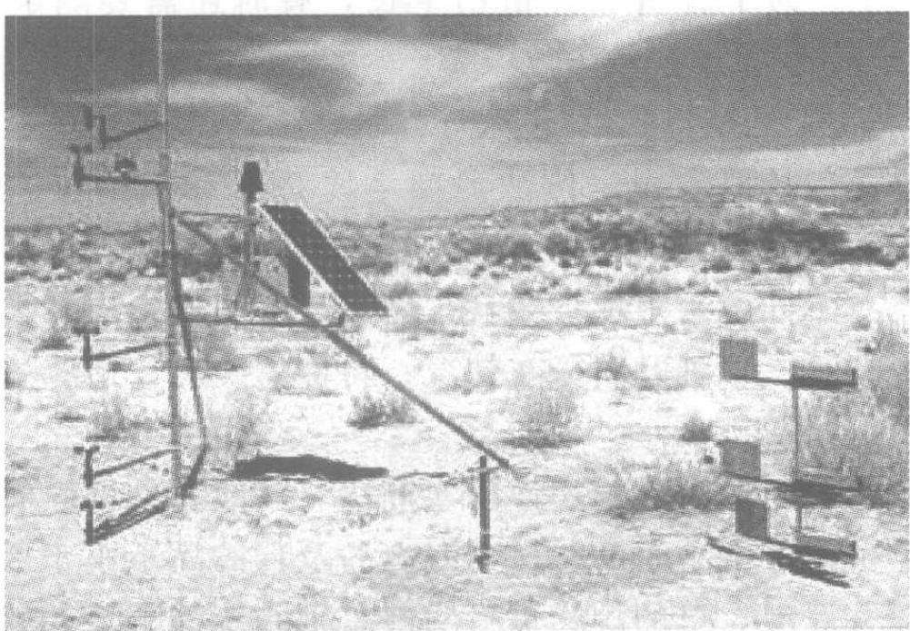  
图7.1 风蚀监测站(右下角为集沙器)[5]

地面物质组分及其构成比例的调查应按照不同的情况分别对待。如果为非扰动物质，参照表4.1分别按照山区、丘陵或高原区、沙漠或沙地区进行确定；如果为扰动物质，则依据扰动前的地面物质及混入其中的物质确定，并利用其组合进行命名描述。

有效土层厚度多用多点剖面量测法，可以利用土钻或其他方法，通过多样点取样，分析计算得到。样点在地块中呈“X”形或“S”形分布，挖开剖面，用尺量测地表A层（腐殖质层）、B层（淀积层）或耕作层和部分C层（母质层，即有可能生长作物的生长层）的总厚度，即得土层厚度。

土壤（地面组成物质）因子监测结果记录格式见附表6。

## 7.2.2.4 植被因子

对于开发建设项目，植被因子主要监测指标包括工程建设区域的植被类型与物种组成、植被覆盖率、植被郁闭度

（盖度）等。为了分析研究植物生长，有时还需要测定植被生物量。

## 1. 植被类型与物种组成

在水土保持监测中，植被类型主要是指乔木植被、灌木植被、草被，以及林、灌、草组成的植被和人工植被等。各种不同的植被具有不同的水土保持效益，因此，需要调查植被类型和主要林种、树种、草种及其分布情况；特殊需要时，还应该绘制植被分布图。

植被物种组成及数量用设样实测法。一般北方设样面积不小于400m²，南方不小于 $9 0 0 \mathrm { m } ^ { 3 }$ ，海南岛及台湾岛不小于2500m²，在样区对乔、灌、草的种类进行实地鉴别并统计数量，其植物种数即为多度，单位面积的株数即平均密度。

## 2. 植被覆盖率

植被覆盖率是指工程建设区域内林地、草地的总面积占区域总面积的百分比。这里的“林地、草地的总面积”中的林地和草地是指树木郁闭度不小于0.20的天然林地和人工林地、树木郁闭度不小于0.40的灌木林地及盖度不小于0.60的草地；对于树木郁闭度不小于0.10但小于0.20的疏林地、树木郁闭度小于0.40的灌木林地、未成林造林地及盖度小于0.60的草地，不能计入植被覆盖率的计算之中。

## 3. 植被郁闭度（盖度）

植被郁闭度或盖度都是指树木冠层、枝、叶等的垂直投影占调查样方面积的百分数，它反应了植被生长的旺盛、浓密或稀疏程度。通常在描述乔木林浓密或稀疏程度时，用郁闭度；描述灌木或草地时，习惯上使用盖度。但郁闭度和盖度在本质上没有任何差异。

植被郁闭度或盖度的测定方法随着植被的不同而不同，但测定总是在选定的有代表性的样方内进行。因此，在植被郁闭度或盖度测定前，应根据立地条件、微气候环境的不同，选择几个有代表性的监测样方，一般应最少选择3个不同生长状况的样方进

行相关测定。

林地郁闭度一般可以采用样线法测定。在晴天中午太阳直射的时候，用测绳在所选样方内水平拉过，垂直观测树冠、树枝、树叶在测绳上垂直投影的长度，并用测尺测量、计算总投影长度。总投影长度与测绳总长度之比即为郁闭度。采用此法应在不同方向上选取若干条线段求其平均值。

灌木或草地盖度可以采用针刺法、网格法、照相法测定。

(1）针刺法。在测定小样方内，借助钢卷尺上每隔10cm的标记，用粗约2mm的细针，顺次在样方内上下左右间隔10cm的点上（共100点），从草本、灌木的上方垂直插下，针与草、灌接触即算“有”，不接触即算“无”，记录针与草、灌有接触的次数占总测定次数的百分数，即为测定样方的盖度。为了获得相对准确的测定结果，所选样方应具有代表性，同时应做3个以上的重复测定。样方面积的大小，灌木与草地稍有差异，一般灌木可选择 $2 \mathrm { m } \times 2 \mathrm { m }$ 或 $3 \mathbf { m } \times 3 \mathbf { m }$ 的样方，而草地的样方一般选择 $1 \mathrm { m } \times 1 \mathrm { m }$

(2) 网格法。利用预先制成的面积为 $1 \mathrm m ^ { 2 }$ 的正方形木架，内用绳线分为100个 $0 . 0 1 \mathrm { m } ^ { 2 }$ 的小方格，将方格木架放置在样方内的草地上，数出草的茎叶所占方格数，即得草地盖度。为了获得相对准确的测定结果，所选样方应具有代表性，同时应做儿个重复。样方大小与针刺法一致。

(3)照相法（见图7.2)。对于高度不大的灌木和草地，也可以用照相法测定植被盖度。照相法要求把相机固定在一定的高度，并使镜头在照相时保持水平状态，为此设计了一个轻巧、便于携带的野外照相装置：一根可伸缩的套杆安装在一个三脚架顶部，套杆顶端垂掉下一个长方形铝盒，在重力作用下保持水平，盒中放置照相机，相机镜头垂直朝下；在铝盒的底部可以开一开口，让相机镜头露出铝盒并垂直向下。三脚架顶部的套杆可上下左右任意地转动，这样相机距地表面高度可根据套杆与三脚架的夹角和套杆长度来调节；套杆由碳素钢结构钓鱼竿改装制作而成，轻巧又有强度，方便野外携带及操作，套杆总长要求在6m以上。由于是在地面操控悬吊起来的相机，要求相机带有遥控装置。采用带遥控装置的数码相机最适宜，遥控器作用距离5\~7m。在晴天中午时分，在选定的样地垂直照相，照相时可以转动角度在不同位置拍照。选择新的样地，开始重复拍照。照相结束后，将文件拷贝到计算机内，用相关软件进行面积处理，统计照片内植被冠层、枝、叶(绿色）占照片覆盖面积的比例，即为照片覆盖区的植被盖度，将各个样区的植被盖度平均就得到了测定区域的植被盖度。图7.3是用于测定植被冠层盖度的多光谱相机，可用于农学、草原、草地、作物栽培学及其他需要了解植被冠层的研究人员使用。通过该款仪器，可以非常方便地得到高分辨率的灰度或红、绿和近红外波段的图像，进一步通过软件处理还可以得到NDVI（Normal-ized Difference Vegetation Index，归一化植被指数)、SAVI(Soil-Adjusted Vegetation Index，土壤调节植被指数）、PVI(Perpendic-ular Vegetation Index，垂直植被指数） 和 NIR/G(Near Infrared/Green，近红外/绿波）等指数6]。

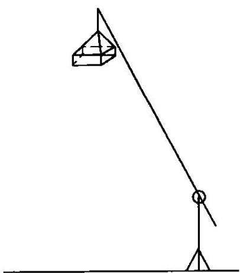  
图 7.2 照相法示意图

  
(a)

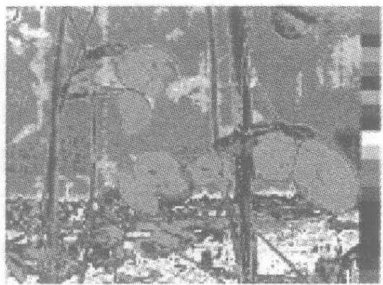  
(b)  
图7.3 ADC多光谱植被冠层盖度相机(a)相机；(b)多光谱图像

## 4. 生物量

生物量的调查测算方法较多，一般草地生物量用样地全部收割法称重或风干称重；对灌木可采用收割法或标准株法。标准株法是选取样地中的标准株（地径、高度、冠幅均为平均值），伐倒称重，或分杆、枝、叶等称重计算出全株重（一般不计地下部分)，再算出样区生物量。乔木林地生物量一般采用地区经验公式计算或标准株法测算。地区经验公式是对某地区特定林分在经调查统计分析后，取得该林分的生物量（或材积）与林木胸径和树高的统计回归关系式，测定样地中林木平均胸径和树高，代入式中可计算出林地生物量；标准株法同灌木林。

植被因子监测结果记录格式见附表7。

## 7.2.2.5 地形地貌因子

对于开发建设项目，地形地貌因子主要包括两个方面：一是工程建设区域涉及的地貌类型（区），包括地理位置、地貌形态类型与分区、海拔与相对高差；二是监测重点地段和监测点所在的小地形，主要是坡面特征，包括坡度、坡长、坡向、坡形等。

## 1. 地貌类型

在一定的范围内，各种地貌形态彼此在成因上相互联系，有规律地组合，称之为地貌类型。同一类型有相同的地貌形态组成，反映了一定的外表形态和成因。地貌形态依据海拔和相对高差划分为六类，地貌类型划分指标见表7.2。

表7.2  
地貌类型划分指标
<table><tr><td colspan="1" rowspan="1">地貌类型</td><td colspan="1" rowspan="1">绝对高程（m）</td><td colspan="1" rowspan="1">切割强度</td><td colspan="1" rowspan="1">相对高度（m）</td></tr><tr><td colspan="1" rowspan="1">极高山</td><td colspan="1" rowspan="1">≥5000</td><td colspan="1" rowspan="1">切割明显</td><td colspan="1" rowspan="1">&gt;1000</td></tr><tr><td colspan="1" rowspan="3">高山</td><td colspan="1" rowspan="3">3500~5000</td><td colspan="1" rowspan="1">深切割高山</td><td colspan="1" rowspan="1">&gt;1000</td></tr><tr><td colspan="1" rowspan="1">中切割高山</td><td colspan="1" rowspan="1">500~1000</td></tr><tr><td colspan="1" rowspan="1">浅切割高山</td><td colspan="1" rowspan="1">100~500</td></tr><tr><td colspan="1" rowspan="3">中山</td><td colspan="1" rowspan="3">1000~3500</td><td colspan="1" rowspan="1">深切割中山</td><td colspan="1" rowspan="1">&gt;1000</td></tr><tr><td colspan="1" rowspan="1">中切割中山</td><td colspan="1" rowspan="1">500~1000</td></tr><tr><td colspan="1" rowspan="1">浅切割中山</td><td colspan="1" rowspan="1">100~500</td></tr><tr><td colspan="1" rowspan="2">低山</td><td colspan="1" rowspan="2">500~1000</td><td colspan="1" rowspan="1">中切割低山</td><td colspan="1" rowspan="1">&gt;500</td></tr><tr><td colspan="1" rowspan="1">浅切割低山</td><td colspan="1" rowspan="1">100~500</td></tr><tr><td colspan="1" rowspan="3">丘陵</td><td colspan="1" rowspan="3">&lt;500</td><td colspan="1" rowspan="1">高丘</td><td colspan="1" rowspan="1">100~200</td></tr><tr><td colspan="1" rowspan="1">中丘</td><td colspan="1" rowspan="1">50~100</td></tr><tr><td colspan="1" rowspan="1">低（浅）丘</td><td colspan="1" rowspan="1">&lt;50</td></tr><tr><td colspan="1" rowspan="1">平原</td><td colspan="1" rowspan="1"></td><td colspan="1" rowspan="1">平坦开阔</td><td colspan="1" rowspan="1">相对高差很小</td></tr></table>

## 2. 小地形

地形可以视为各种形状和坡度的斜面在空间的不同组合，也可以解析为各种长度、坡度、坡向的集合图形的空间组合。因此，小地形就是指监测重点地段或监测点的每一地块的地形部位和坡地特征，坡地特征包括坡度、坡长、坡向等，小地形部位划分见表7.3。

表7.3  
小地形部位划分
<table><tr><td rowspan=1 colspan=1>地形地貌</td><td rowspan=1 colspan=1>小地形部位</td></tr><tr><td rowspan=1 colspan=1>山地</td><td rowspan=1 colspan=1>山脊、山坡、山麓</td></tr><tr><td rowspan=1 colspan=1>丘陵地</td><td rowspan=1 colspan=1>丘顶（梁）、丘坡、丘间凹地、丘间低地</td></tr><tr><td rowspan=1 colspan=1>沟谷地</td><td rowspan=1 colspan=1>沟掌、沟坡、阶地、沟底、滩地、冲积扇</td></tr></table>

在水土保持监测中，常常将坡度分为7级或6级别（见表7.4)，可以按照坡度分级计算出各级坡度所占面积的数量和百分比；将坡向分为阳坡、半阳坡、半阴坡和阴坡等四种；坡长也可以作分级处理，表7.5列出坡长分级供参考，也可以按照坡长分级计算出各级坡长所占面积的数量和百分比。

表7.4  
坡度分级表
<table><tr><td rowspan=1 colspan=1>坡名</td><td rowspan=1 colspan=1>7级坡度（°）</td><td rowspan=1 colspan=1>6级坡度(°)</td><td rowspan=1 colspan=1>坡名</td><td rowspan=1 colspan=1>7级坡度(°)</td><td rowspan=1 colspan=1>6 级坡度（°)</td></tr><tr><td rowspan=1 colspan=1>平坡</td><td rowspan=1 colspan=1>&lt;3</td><td rowspan=1 colspan=1></td><td rowspan=1 colspan=1>陡坡</td><td rowspan=1 colspan=1>15~25</td><td rowspan=1 colspan=1>15~25</td></tr><tr><td rowspan=1 colspan=1>缓坡</td><td rowspan=1 colspan=1>3~5</td><td rowspan=1 colspan=1>&lt;5</td><td rowspan=1 colspan=1>急坡</td><td rowspan=1 colspan=1>25~35</td><td rowspan=1 colspan=1>25~35</td></tr><tr><td rowspan=1 colspan=1>中等坡</td><td rowspan=1 colspan=1>5~8</td><td rowspan=1 colspan=1>5~8</td><td rowspan=1 colspan=1>急陡坡</td><td rowspan=1 colspan=1>&gt;35</td><td rowspan=1 colspan=1>&gt;35</td></tr><tr><td rowspan=1 colspan=1>斜坡</td><td rowspan=1 colspan=1>8~15</td><td rowspan=1 colspan=1>8~15</td><td rowspan=1 colspan=1></td><td rowspan=1 colspan=1></td><td rowspan=1 colspan=1></td></tr></table>

表7.5  
坡长分级表
<table><tr><td rowspan=1 colspan=1>坡名</td><td rowspan=1 colspan=1>短坡</td><td rowspan=1 colspan=1>中长坡</td><td rowspan=1 colspan=1>长坡</td><td rowspan=1 colspan=1>超长坡</td></tr><tr><td rowspan=1 colspan=1>坡长（m）</td><td rowspan=1 colspan=1>&lt;20</td><td rowspan=1 colspan=1>20~50</td><td rowspan=1 colspan=1>50~100</td><td rowspan=1 colspan=1>&gt;100</td></tr></table>

地形地貌因子监测结果记录格式见附表8。

## 7.2.2.6 土地利用因子

在以往水土保持调查、大面积总体规划和小面积实施规划（如小流域）中，采用“土地利用类型”的名称[1,7-8]；当时采用的是全国农业区划委员会在1984年发布的《土地利用现状调查技术规程》中制订的《土地利用现状分类及含义》。《土地利用现状分类及含义》依据土地的用途、经营特点、利用方式和覆盖特征，把全国土地利用现状划分为8个大类（一级）、46个类（二级)，并统一了编码顺序和代表的地类，构成了统一的分类系统。在1989年9月发布的《城镇地籍调查规程》中制订了《城镇土地分类及含义》。这两个具有针对性的土地利用分类体系自发布实施以来，基本上满足了土地管理及社会经济发展的需要，具有较强的科学性和实用性。即使目前，许多工作者在实践中仍然习惯“土地利用类型”这种名称。从2002年1月1日起，试行《全国土地分类（试行）》（国土资发〔2001〕255号，2001年8月21日印发)；该“土地分类”体系共有一级类型3个、二级类型15个、三级类型71个。2007年，国家质量监督检验检疫总局和标准化管理委员会联合发布了《土地利用现状分类》（GB/T21010—2007)，标志着我国土地利用现状分类第一次拥有了全国统一的国家标准。《土地利用现状分类》(GB/T21010—2007)采用一级、二级两个层次的分类体系，共分12个一级类、57个二级类。其中一级类包括耕地、园地、林地、草地、商服用地、工矿仓储用地、住宅用地、公共管理与公共服务用地、特殊用地、交通运输用地、水域及水利设施用地、其他土地等，具体见表7.6、表7.7。

表7.6  
土地利用现状分类
<table><tr><td colspan="2" rowspan="1">一级类</td><td colspan="2" rowspan="1">二级类</td><td colspan="1" rowspan="2">含义</td></tr><tr><td colspan="1" rowspan="1">编码名</td><td colspan="1" rowspan="1">称</td><td colspan="1" rowspan="1">编码</td><td colspan="1" rowspan="1">名称</td></tr><tr><td colspan="1" rowspan="4">01</td><td colspan="1" rowspan="4">耕地</td><td colspan="1" rowspan="1"></td><td colspan="1" rowspan="1"></td><td colspan="1" rowspan="1">指种植农作物的土地，包括熟地，新开发、复垦、整理地，休闲地（含轮歇地、轮作地）；以种植农作物（含蔬菜）为主，间有零星果树、桑树或其他树木的土地；平均每年能保证收获一季的已垦滩地和海涂。耕地中包括南方宽度小于1.0m、北方宽度小于2.0m固定的沟、渠、路和地坎（埂）；临时种植药材、草皮、花卉、苗木等的耕地，以及其他临时改变用途的耕地</td></tr><tr><td colspan="1" rowspan="1">011</td><td colspan="1" rowspan="1">水田</td><td colspan="1" rowspan="1">指用于种植水稻、莲藕等水生农作物的耕地，包括实行水生、早生农作物轮种的耕地</td></tr><tr><td colspan="1" rowspan="1">012</td><td colspan="1" rowspan="1">水浇地</td><td colspan="1" rowspan="1">指有水源保证和灌溉设施，在一般年景能正常灌溉，种植旱生农作物的耕地。包括种植蔬菜等的非工厂化的大棚用地</td></tr><tr><td colspan="1" rowspan="1">013</td><td colspan="1" rowspan="1">旱地</td><td colspan="1" rowspan="1">指无灌溉设施，主要靠天然降水种植旱生农作物的耕地，包括没有灌溉设施，仅靠引洪淤灌的耕地</td></tr><tr><td colspan="1" rowspan="4">02</td><td colspan="1" rowspan="4">园地</td><td colspan="1" rowspan="1"></td><td colspan="1" rowspan="1"></td><td colspan="1" rowspan="1">指种植以采集果、叶、根、茎、汁等为主的集约经营的多年生木本和草本作物，覆盖度大于50%或每亩株数大于合理株数70%的土地。包括用于育苗的土地</td></tr><tr><td colspan="1" rowspan="1">021</td><td colspan="1" rowspan="1">果园</td><td colspan="1" rowspan="1">指种植果树的园地</td></tr><tr><td colspan="1" rowspan="1">022</td><td colspan="1" rowspan="1">茶园</td><td colspan="1" rowspan="1">指种植茶树的园地</td></tr><tr><td colspan="1" rowspan="1">023</td><td colspan="1" rowspan="1">其他园地</td><td colspan="1" rowspan="1">指种植桑树、橡胶、可可、咖啡、油棕、胡椒、药材等其他多年生作物的园地</td></tr><tr><td colspan="1" rowspan="4">03</td><td colspan="1" rowspan="4">林地</td><td colspan="1" rowspan="1"></td><td colspan="1" rowspan="1"></td><td colspan="1" rowspan="1">指生长乔木、竹类、灌木的土地，及沿海生长红树林的土地。包括迹地，不包括居民点内部的绿化林木用地，铁路、公路征地范围内的林木，以及河流、沟渠的护堤林</td></tr><tr><td colspan="1" rowspan="1">031</td><td colspan="1" rowspan="1">有林地</td><td colspan="1" rowspan="1">指树木郁闭度不小于0.2的乔木林地，包括红树林地和竹林地</td></tr><tr><td colspan="1" rowspan="1">032</td><td colspan="1" rowspan="1">灌木林地</td><td colspan="1" rowspan="1">指灌木覆盖度不小于40%的林地</td></tr><tr><td colspan="1" rowspan="1">033</td><td colspan="1" rowspan="1">其他林地</td><td colspan="1" rowspan="1">包括疏林地（指树木郁闭度不小于0.1、小于0.2的林地）、未成林地、迹地、苗圃等林地</td></tr><tr><td colspan="1" rowspan="4">04</td><td colspan="1" rowspan="4">草地</td><td colspan="1" rowspan="1"></td><td colspan="1" rowspan="1"></td><td colspan="1" rowspan="1">指生长草本植物为主的土地</td></tr><tr><td colspan="1" rowspan="1">041</td><td colspan="1" rowspan="1">天然牧草地</td><td colspan="1" rowspan="1">指以天然草本植物为主，用于放牧或割草的草地</td></tr><tr><td colspan="1" rowspan="1">042</td><td colspan="1" rowspan="1">人工牧草地</td><td colspan="1" rowspan="1">指人工种植牧草的草地</td></tr><tr><td colspan="1" rowspan="1">043</td><td colspan="1" rowspan="1">其他草地</td><td colspan="1" rowspan="1">指树木郁闭度小于0.1，表层为土质，生长草本植物为主，不用于畜牧业的草地</td></tr><tr><td colspan="1" rowspan="2">05</td><td colspan="1" rowspan="2">商服用地</td><td colspan="1" rowspan="1"></td><td colspan="1" rowspan="1"></td><td colspan="1" rowspan="1">指主要用于商业、服务业的土地</td></tr><tr><td colspan="1" rowspan="1">051</td><td colspan="1" rowspan="1">批发零售用地</td><td colspan="1" rowspan="1">指主要用于商品批发、零售的用地。包括商场、商店、超市、各类批发（零售）市场、加油站等及其附属的小型仓库、车间、工场等的用地</td></tr></table>

续表
<table><tr><td rowspan=1 colspan=2>一级类</td><td></td><td rowspan=1 colspan=4>二级类</td><td rowspan=2 colspan=1>含   义</td></tr><tr><td rowspan=1 colspan=1>编码</td><td rowspan=1 colspan=2>名称</td><td rowspan=1 colspan=2>编码</td><td rowspan=1 colspan=2>名称</td></tr><tr><td rowspan=3 colspan=1>05</td><td rowspan=3 colspan=2>商服用地</td><td rowspan=1 colspan=2>052</td><td rowspan=1 colspan=2>住宿餐饮用地</td><td rowspan=1 colspan=1>指主要用于提供住宿、餐饮服务的用地。包括宾馆、酒店、饭店、旅馆、招待所、度假村、餐厅、酒吧等</td></tr><tr><td rowspan=1 colspan=2>053</td><td rowspan=1 colspan=2>商务金融用地</td><td rowspan=1 colspan=1>指企业、服务业等办公用地，以及经营性的办公场所用地。包括写字楼、商业性办公场所、金融活动场所和企业厂区外独立的办公场所等用地</td></tr><tr><td rowspan=1 colspan=2>054</td><td rowspan=1 colspan=2>其他商服用地</td><td rowspan=1 colspan=1>指上述用地以外的其他商业、服务业用地。包括洗车场、洗染店、废旧物资回收站、维修网点、照相馆、理发美容店、洗浴场所等用地</td></tr><tr><td rowspan=4 colspan=1>06</td><td rowspan=4 colspan=2>工矿仓储用地</td><td rowspan=1 colspan=2></td><td rowspan=1 colspan=2></td><td rowspan=1 colspan=1>指主要用于工业生产、物资存放场所的土地</td></tr><tr><td rowspan=1 colspan=2>061</td><td rowspan=1 colspan=2>工业用地</td><td rowspan=1 colspan=1>指工业生产及直接为工业生产服务的附属设施用地</td></tr><tr><td rowspan=1 colspan=2>062</td><td rowspan=1 colspan=2>采矿用地</td><td rowspan=1 colspan=1>指采矿、采石、采砂（沙）场，盐田，砖瓦窑等地面生产用地及尾矿堆放地</td></tr><tr><td rowspan=1 colspan=2>063</td><td rowspan=1 colspan=2>仓储用地</td><td rowspan=1 colspan=1>指用于物资储备、中转的场所用地</td></tr><tr><td rowspan=3 colspan=1>07</td><td rowspan=3 colspan=2>住宅用地</td><td rowspan=1 colspan=2></td><td rowspan=1 colspan=2></td><td rowspan=1 colspan=1>指主要用于人们生活居住的房基地及其附属设施的土地</td></tr><tr><td rowspan=1 colspan=2>071</td><td rowspan=1 colspan=2>城镇住宅用地</td><td rowspan=1 colspan=2>指城镇用于生活居住的各类房屋用地及其附属设施用地。包括普通住宅、公寓、别墅等用地</td></tr><tr><td rowspan=1 colspan=2>072</td><td rowspan=1 colspan=2>农村宅基地</td><td rowspan=1 colspan=2>指农村用于生活居住的宅基地</td></tr><tr><td rowspan=3 colspan=1>08</td><td rowspan=3 colspan=2>公共管理与公共服务用地</td><td rowspan=1 colspan=2></td><td rowspan=1 colspan=2></td><td rowspan=1 colspan=1>指用于机关团体、新闻出版、科教文卫、风景名胜、公共设施等的土地</td></tr><tr><td rowspan=1 colspan=2>081</td><td rowspan=1 colspan=2>机关团体用地</td><td rowspan=1 colspan=2>指用于党政机关、社会团体、群众自治组织等的用地</td></tr><tr><td rowspan=1 colspan=2>082</td><td rowspan=1 colspan=2>新闻出版用地</td><td rowspan=1 colspan=2>指用于广播电台、电视台、电影厂、报社、杂志社、通讯社、出版社等的用地</td></tr></table>

<table><tr><td rowspan=1 colspan=2>一级类</td><td rowspan=1 colspan=2>二级类</td><td rowspan=2 colspan=1>含   义</td></tr><tr><td rowspan=1 colspan=1>编码</td><td rowspan=1 colspan=1>名称</td><td rowspan=1 colspan=1>编码</td><td rowspan=1 colspan=1>名称</td></tr><tr><td rowspan=6 colspan=1>08</td><td rowspan=6 colspan=1>公共管理与公共服务用地</td><td rowspan=1 colspan=1>083</td><td rowspan=1 colspan=1>科教用地</td><td rowspan=1 colspan=1>指用于各类教育，独立的科研、勘测、设计、技术推广、科普等的用地</td></tr><tr><td rowspan=1 colspan=1>084</td><td rowspan=1 colspan=1>医卫慈善用地</td><td rowspan=1 colspan=1>指用于医疗保健、卫生防疫、急救康复、医检药检、福利救助等的用地</td></tr><tr><td rowspan=1 colspan=1>085</td><td rowspan=1 colspan=1>文体娱乐用地</td><td rowspan=1 colspan=1>指用于各类文化、体育、娱乐及公共广场等的用地</td></tr><tr><td rowspan=1 colspan=1>086</td><td rowspan=1 colspan=1>公共设施用地</td><td rowspan=1 colspan=1>指用于城乡基础设施的用地。包括给排水、供电、供热、供气、邮政、电信、消防、环卫、公用设施维修等用地</td></tr><tr><td rowspan=1 colspan=1>087</td><td rowspan=1 colspan=1>公园与绿地</td><td rowspan=1 colspan=1>指城镇、村庄内部的公园、动物园、植物园、街心花园和用于休憩及美化环境的绿化用地</td></tr><tr><td rowspan=1 colspan=1>088</td><td rowspan=1 colspan=1>风景名胜设施用地</td><td rowspan=1 colspan=1>指风景名胜（包括名胜古迹、旅游景点、革命遗址等）景点及管理机构的建筑用地。景区内的其他用地按现状归入相应地类</td></tr><tr><td rowspan=6 colspan=1>09</td><td rowspan=6 colspan=1>特殊用地</td><td rowspan=1 colspan=1></td><td rowspan=1 colspan=1></td><td rowspan=1 colspan=1>指用于军事设施、涉外、宗教、监教、殡葬等的土地</td></tr><tr><td rowspan=1 colspan=1>091</td><td rowspan=1 colspan=1>军事设施用地</td><td rowspan=1 colspan=1>指直接用于军事目的的设施用地</td></tr><tr><td rowspan=1 colspan=1>092</td><td rowspan=1 colspan=1>使领馆用地</td><td rowspan=1 colspan=1>指用于外国政府及国际组织驻华使领馆、办事处等的用地</td></tr><tr><td rowspan=1 colspan=1>093</td><td rowspan=1 colspan=1>监教场所用地</td><td rowspan=1 colspan=1>指用于监狱、看守所、劳改场、劳教所、戒毒所等的建筑用地</td></tr><tr><td rowspan=1 colspan=1>094</td><td rowspan=1 colspan=1>宗教用地</td><td rowspan=1 colspan=1>指专门用于宗教活动的庙宇、寺院、道观、教堂等宗教自用地</td></tr><tr><td rowspan=1 colspan=1>095</td><td rowspan=1 colspan=1>殡葬用地</td><td rowspan=1 colspan=1>指陵园、墓地、殡葬场所用地</td></tr></table>

续表
<table><tr><td rowspan=2 colspan=1></td><td rowspan=1 colspan=4>一级类</td><td rowspan=1 colspan=4>二级类</td><td rowspan=2 colspan=1>含    义</td></tr><tr><td rowspan=1 colspan=2>编码</td><td rowspan=1 colspan=2>名称</td><td rowspan=1 colspan=2>编码</td><td rowspan=1 colspan=2>名称</td></tr><tr><td rowspan=8 colspan=3>10</td><td rowspan=8 colspan=2>交通运输用地</td><td rowspan=1 colspan=2></td><td rowspan=1 colspan=2></td><td rowspan=1 colspan=1>指用于运输通行的地面线路、场站等的土地。包括民用机场、港口、码头、地面运输管道和各种道路用地</td></tr><tr><td rowspan=1 colspan=2>101</td><td rowspan=1 colspan=2>铁路用地</td><td rowspan=1 colspan=1>指用于铁道线路、轻轨、场站的用地。包括设计内的路堤、路堑、道沟、桥梁、林木等用地</td></tr><tr><td rowspan=1 colspan=2>102</td><td rowspan=1 colspan=2>公路用地</td><td rowspan=1 colspan=1>指用于国道、省道、县道和乡道的用地。包括设计内的路堤、路堑、道沟、桥梁、汽车停靠站、林木及直接为其服务的附属用地</td></tr><tr><td rowspan=1 colspan=2>103</td><td rowspan=1 colspan=2>街巷用地</td><td rowspan=1 colspan=1>指用于城镇、村庄内部公用道路（含立交桥）及行道树的用地。包括公共停车场、汽车客货运输站点及停车场等用地</td></tr><tr><td rowspan=1 colspan=2>104</td><td rowspan=1 colspan=2>农村道路</td><td rowspan=1 colspan=2>指公路用地以外的南方宽度不小于1.0m、北方宽度不小于2.0m的村间、田间道路（含机耕道）</td></tr><tr><td rowspan=1 colspan=2>105</td><td rowspan=1 colspan=2>机场用地</td><td rowspan=1 colspan=2>指用于民用机场的用地</td></tr><tr><td rowspan=1 colspan=2>106</td><td rowspan=1 colspan=2>港口码头用地</td><td rowspan=1 colspan=2>指用于人工修建的客运、货运、捕捞及工作船舶停靠的场所及其附属建筑物的用地，不包括常水位以下部分</td></tr><tr><td rowspan=1 colspan=2>107</td><td rowspan=1 colspan=2>管道运输用地</td><td rowspan=1 colspan=2>指用于运输煤炭、石油、天然气等管道及其相应附属设施的地上部分用地</td></tr><tr><td rowspan=3 colspan=2>11</td><td rowspan=3 colspan=2>水域及水利设施用地</td><td rowspan=1 colspan=2></td><td rowspan=1 colspan=2></td><td rowspan=1 colspan=2>指陆地水域，海涂，沟渠、水工建筑物等用地。不包括滞洪区和已垦滩涂中的耕地、园地、林地、居民点、道路等用地</td></tr><tr><td rowspan=1 colspan=2>111</td><td rowspan=1 colspan=2>河流水面</td><td rowspan=1 colspan=2>指天然形成或人工开挖河流常水位岸线之间的水面，不包括被堤坝拦截后形成的水库水面</td></tr><tr><td rowspan=1 colspan=2>112</td><td rowspan=1 colspan=2>湖泊水面</td><td rowspan=1 colspan=2>指天然形成的积水区常水位岸线所围成的水面</td></tr></table>

续表
<table><tr><td colspan="2" rowspan="1">一级类</td><td colspan="2" rowspan="1">二级类</td><td colspan="1" rowspan="2">含    义</td></tr><tr><td colspan="1" rowspan="1">编码</td><td colspan="1" rowspan="1">名称</td><td colspan="1" rowspan="1">编码</td><td colspan="1" rowspan="1">名称</td></tr><tr><td colspan="1" rowspan="7">11</td><td colspan="1" rowspan="7">水域及水利设施用地</td><td colspan="1" rowspan="1">113</td><td colspan="1" rowspan="1">水库水面</td><td colspan="1" rowspan="1">指人工拦截汇集而成的总库容不小于10万 $\mathbf { m } ^ { 3 }$ 的水库正常蓄水位岸线所围成的水面</td></tr><tr><td colspan="1" rowspan="1">114</td><td colspan="1" rowspan="1">坑塘水面</td><td colspan="1" rowspan="1">指人工开挖或天然形成的蓄水量小于10万 $\mathfrak { m } ^ { 3 }$ 的坑塘常水位岸线所围成的水面</td></tr><tr><td colspan="1" rowspan="1">115</td><td colspan="1" rowspan="1">沿海滩涂</td><td colspan="1" rowspan="1">指沿海大潮高潮位与低潮位之间的潮浸地带。包括海岛的沿海滩涂。不包括已利用的滩涂</td></tr><tr><td colspan="1" rowspan="1">116</td><td colspan="1" rowspan="1">内陆滩涂</td><td colspan="1" rowspan="1">指河流、湖泊常水位至洪水位间的滩地；时令湖、河洪水位以下的滩地；水库、坑塘的正常蓄水位与洪水位间的滩地。包括海岛的内陆滩地。不包括已利用的滩地</td></tr><tr><td colspan="1" rowspan="1">117</td><td colspan="1" rowspan="1">沟渠</td><td colspan="1" rowspan="1">指人工修建，南方宽度不小于1.0m、北方宽度不小于2.0m用于引、排、灌的渠道，包括渠槽、渠堤、取土坑、护堤林</td></tr><tr><td colspan="1" rowspan="1">118</td><td colspan="1" rowspan="1">水工建筑用地</td><td colspan="1" rowspan="1">指人工修建的闸、坝、堤路林、水电厂房、扬水站等常水位岸线以上的建筑物用地</td></tr><tr><td colspan="1" rowspan="1">119</td><td colspan="1" rowspan="1">冰川及永久积雪</td><td colspan="1" rowspan="1">指表层被冰雪常年覆盖的土地</td></tr><tr><td colspan="1" rowspan="6">12</td><td colspan="1" rowspan="6">其他土地</td><td colspan="1" rowspan="1"></td><td colspan="1" rowspan="1"></td><td colspan="1" rowspan="1">指上述地类以外的其他类型的土地</td></tr><tr><td colspan="1" rowspan="1">121</td><td colspan="1" rowspan="1">空闲地</td><td colspan="1" rowspan="1">指城镇、村庄、工矿内部尚未利用的土地</td></tr><tr><td colspan="1" rowspan="1">122</td><td colspan="1" rowspan="1">设施农用地</td><td colspan="1" rowspan="1">指直接用于经营性养殖的畜禽舍、工厂化作物栽培或水产养殖的生产设施用地及其相应附属用地，农村宅基地以外的晾晒场等农业设施用地</td></tr><tr><td colspan="1" rowspan="1">123</td><td colspan="1" rowspan="1">田坎</td><td colspan="1" rowspan="1">主要指耕地中南方宽度不小于1.0m、北方宽度不小于2.0m的地坎</td></tr><tr><td colspan="1" rowspan="1">124</td><td colspan="1" rowspan="1">盐碱地</td><td colspan="1" rowspan="1">指表层盐碱聚集，生长天然耐盐植物的土地</td></tr><tr><td colspan="1" rowspan="1">125</td><td colspan="1" rowspan="1">沼泽地</td><td colspan="1" rowspan="1">指经常积水或渍水，一般生长沼生、湿生植物的土地</td></tr><tr><td colspan="1" rowspan="2">12</td><td colspan="1" rowspan="2">其他土地</td><td colspan="1" rowspan="1">126</td><td colspan="1" rowspan="1">沙地</td><td colspan="1" rowspan="1">指表层为沙覆盖、基本无植被的土地。不包括滩涂中的沙地</td></tr><tr><td colspan="1" rowspan="1">127</td><td colspan="1" rowspan="1">裸地</td><td colspan="1" rowspan="1">指表层为土质，基本无植被覆盖的土地；或表层为岩石、石砾，其覆盖面积不小于70%的土地</td></tr></table>

表7.7  
城镇村及工矿用地
<table><tr><td rowspan=1 colspan=2>一级类</td><td rowspan=1 colspan=2>二级类</td><td rowspan=2 colspan=1>含义</td></tr><tr><td rowspan=1 colspan=1>编码名</td><td rowspan=1 colspan=1>称</td><td rowspan=1 colspan=1>编码</td><td rowspan=1 colspan=1>名称</td></tr><tr><td rowspan=6 colspan=1>20</td><td rowspan=6 colspan=1>城镇村及工矿用地</td><td rowspan=1 colspan=1></td><td rowspan=1 colspan=1></td><td rowspan=1 colspan=1>指城乡居民点、独立居民点及居民点以外的工矿、国防、名胜古迹等企事业单位用地，包括其内部交通、绿化用地</td></tr><tr><td rowspan=1 colspan=1>201</td><td rowspan=1 colspan=1>城市</td><td rowspan=1 colspan=1>指城市居民点，以及与城市连片的和区政府、县级市政府所在地镇级辖区内的商服、住宅、工业、仓储、机关、学校等单位用地</td></tr><tr><td rowspan=1 colspan=1>202</td><td rowspan=1 colspan=1>建制镇</td><td rowspan=1 colspan=1>指建制镇居民点，以及辖区内的商服、住宅、工业、仓储、学校等企事业单位用地</td></tr><tr><td rowspan=1 colspan=1>203</td><td rowspan=1 colspan=1>村庄</td><td rowspan=1 colspan=1>指农村居民点，以及所属的商服、住宅、工矿、工业、仓储、学校等用地</td></tr><tr><td rowspan=1 colspan=1>204</td><td rowspan=1 colspan=1>采矿用地</td><td rowspan=1 colspan=1>指采矿、采石、采砂（沙）场，盐田，砖瓦窑等地面生产用地及尾矿堆放地</td></tr><tr><td rowspan=1 colspan=1>205</td><td rowspan=1 colspan=1>风景名胜及特殊用地</td><td rowspan=1 colspan=1>指城镇村用地以外用于军事设施、涉外、宗教、监教、殡葬等的土地，以及风景名胜（包括名胜古迹、旅游景点、革命遗址等）景点及管理机构的建筑用地</td></tr></table>

注开展农村土地调查时，对《土地利用现状分类》（GB/T21010—2007）中05、06、07、08、09一级类和103、121二级类按表7.7进行归并

为了规范开发建设项目土地利用因子监测，应该及时由以往的“土地利用类型”体系和过渡时期的“土地分类”体系向新的国家标准“土地利用现状分类”体系转变，以便监测结果符合全国统一的国家标准。

土地利用现状采取实地调绘的方法进行调查，调绘方法与“7.1开发建设项目工程建设区域面积监测”相同。在调绘的过程中，应该注意：采用近期地形图作为地理底图；调绘的界线和地物位置准确地标绘在调查地理底图上，图斑按土地利用现状分类体系编码注记，注记正确无误，清晰易读；调绘面积不得有漏洞和重叠，可按照工程建设区域的分区分别进行；按照地理底图对应比例尺的制图要求，确定最小图斑、线状地物短边的最小宽度及地物界线在图上位置误差等。

土地利用现状的监测成果主要包括两种形式，一是土地利用现状图，二是各类土地利用类型面积统计表。土地利用现状图，不仅可以反映不同土地利用类型的分布，而且可以反映和统计土地利用类型的面积；面积统计表中的数据是按照土地利用现状分类、依据土地利用现状图经过面积量算、统计得到，具体记录格式见附表9。

## 7.3 土壤流失量监测

为了全面监测开发建设项目土壤流失量，应该对于不同的侵蚀类型、侵蚀形式设计对应的监测方法、采用对应的监测设施设备。为此，监测需要考虑两个方面：一是土壤侵蚀的类型、形式；二是各种侵蚀类型、侵蚀形式的土壤流失量。

## 7.3.1 土壤侵蚀类型与形式

不同的侵蚀外营力与不同形态的地形、不同组成的地表物质相互作用，或相同的外营力作用于不同的地表，都会产生不同的侵蚀类型，表现出不同的侵蚀形式。在我国，土壤侵蚀的分类，基本上是以侵蚀外营力为依据进行划分的，同时考虑外营力作用的方式、不同方式产生的侵蚀形态及侵蚀作用强弱[4.9-10]。

## 7.3.1.1 土壤侵蚀类型

土壤侵蚀类型的划分，最常用的一种方法就是按照导致土壤侵蚀的外营力种类来划分。在我国引起土壤侵蚀的外营力种类主要有水力、风力、重力、水力和重力的综合作用、温度作用力(由冻融作用而产生的作用力)、冰川作用力、化学作用力等，土壤侵蚀可分为水力侵蚀（简称“水蚀”）、风力侵蚀（简称“风蚀”）、重力侵蚀、冻融侵蚀、冰川侵蚀、混合侵蚀、化学侵蚀和生物侵蚀等。

在开发建设项目水土保持监测中，土壤侵蚀类型通常依据工程建设区域范围内主导的自然外营力来确定，而不将人为活动作为一种外营力。如果整个监测范围内存在不同的侵蚀类型，应该将监测范围按照侵蚀外营力进行分区，进而按照监测分区确定侵蚀类型。如果工程建设区域范围涉及两种或两种以上比较强烈的外营力，可以依据外营力的作用时间、强弱确定侵蚀类型，一般的情形是：在时间上，两种或两种以上的侵蚀类型交替出现（如风蚀和水蚀）或同时出现（如水蚀和重力侵蚀）；在空间上，两种或两种以上的侵蚀类型叠加作用。两种或两种以上的侵蚀类型的强度，在时间上表现为此强彼弱（如风蚀和水蚀）或此强彼强(如水蚀和重力侵蚀)，在空间上表现为强度叠加。

在开发建设项目水土保持监测中，主要考虑水力侵蚀、风力侵蚀、重力侵蚀、冻融侵蚀、冰川侵蚀及混合侵蚀，一般不考虑化学侵蚀和生物侵蚀。

## 7.3.1.2 土壤侵蚀形式

土壤侵蚀形式是指在一定土壤侵蚀外营力种类作用下（或同一种土壤侵蚀类型中)，由于影响土壤侵蚀的自然因素和土壤侵蚀发生的条件不同，使地表形态产生变化而导致的地表形态差异。

对于水蚀，根据水力作用于地表物质形成不同的侵蚀形态，进一步分为雨滴击溅侵蚀、面蚀、沟蚀、山洪侵蚀、海岸浪蚀和库岸浪蚀等。在开发建设项目水土保持监测中，主要对面蚀（实际包括雨滴击溅侵蚀、面蚀和细沟侵蚀）、沟蚀、山洪侵蚀等进行调查或观测。在野外调查过程中，有时甚至难以清楚地界定面蚀和沟蚀，如弃渣弃土坡面上，上部为层状面蚀、中部出现细沟状面蚀、下部就出现沟蚀。此时，可以根据不同形式侵蚀的面积或者侵蚀量，将侵蚀形式确定为面蚀、沟蚀、面蚀与沟蚀等三种形式。

对于风蚀，由于风速和地表组成物质的大小及质量不同，风力对土、沙、石粒的吹移搬运出现扬失、跃移和滚动3种形式。由于在地面刮起一场风时，发生明显风蚀时，很难将扬失、跃移和滚动区分开来，因此，在开发建设项目水土保持监测中，并不十分强调要区分风蚀的形式，而更加关注风蚀量与风蚀遗留下来的地面组成物质的形态。

对于重力侵蚀，根据土石物质破坏的特征和形态，可分为崩塌、崩岗、滑坡和泻溜。在开发建设项目施工中，常常开挖山体、开挖坡角或在山体上钻洞，造成坡体失稳，发生崩塌、滑坡。在监测过程中，需要对这些侵蚀形式予以关注并及时预警预报。

对于混合侵蚀，就是泥石流、泥流和石洪。在开发建设项目水土保持监测中，经常遇到的混合侵蚀形式是泥流、泥石流，纯粹的石洪很少。尤其是在雨季，如果排水不畅，连绵淫雨将导致弃土弃渣体发生泥流，甚至泥石流。图7.4就是某工程弃土场发生泥流后的情形。泥流发生时，曾将弃土场旁边的河道淤满。

对于冻融侵蚀，其侵蚀有两类多种形式：一类是坡面上发生的热融崩塌、热融泥流和热融坍塌；另一类是裸坡沟谷沟缘的冻胀崩塌、冻胀滑塌等。在我国，前一类主要发生在青藏高原永久冻土区的各种坡面上，因在暖季（5月至9月）表层冻土消融后沿解冻面产生各种侵蚀方式。若坡度稍大，地面组成物质颗粒较粗时，多产生圆弧坍塌，并产生溯源侵蚀；若坡度较缓，地面组成物质较细，则发生在解冻面上的为热融泥流，流向坡下，或间断流动；若坡度和物质组成介于上述两者间，则发生热融滑塌。后一类多发生在东北黑土区及解冻区，因受降雨径流作用，在缓坡长坡区产生股状径流，冲刷地面形成侵蚀沟；当气温降低进入冬季后，沟谷两侧及沟头（沟坡）的土体受气温降低影响而出现冻结膨胀，形成向沟谷方向伸延的陡直或超过90°的悬坡；春季来临，气温（地温）回升，冻土开始解冻，在沟坡两侧出现拉张裂隙，随后逐渐增大并贯通断裂，在重力作用下，产生沟岸崩塌或滑塌，沟谷随之扩展并向源头延伸，同时使沟缘土体崩解。

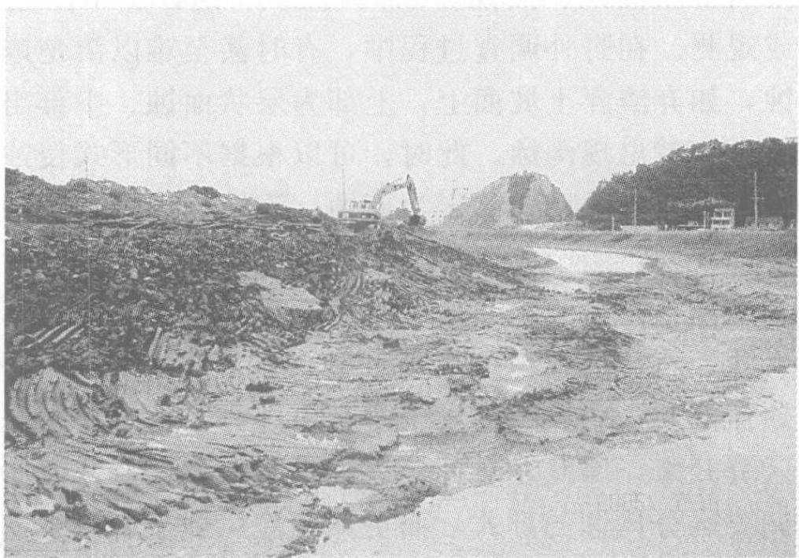  
图 7.4 弃土场发生泥流  
(注：挖掘机正在清理泥流形成的污泥。)

## 7.3.2 土壤流失量背景值

工程建设区域土壤流失背景值（即工程建设扰动前，监测区域多年平均土壤流失量）的监测方法有多种，本节主要介绍水蚀背景值和风蚀背景值的监测方法。

水蚀背景值监测方法，主要是示踪元素法、数学模型法和类比法等三种；风蚀背景值监测方法，主要是风蚀痕迹方法、数学模型法和类比法等三种。

## 7.3.2.1 示踪元素法

示踪元素法在土壤侵蚀中的应用是从20世纪60年代初Me-nzel研究土壤侵蚀和放射性核素沉降运移的关系后逐步发展起来的[11]。我国水土保持学者先后利用示踪元素法研究测定了小流域泥沙来源、不同土地利用方式土壤侵蚀差异、水土保持减沙效益及工程建设弃土弃渣土壤流失等[12-17]。下面以137Cs核素示踪法为例介绍示踪元素法。其他方法的原理、测定与计算方法见相关文献。

## 1. 方法原理

137Cs是20世纪50～70年代大气层核试验产生的放射性核尘埃，半衰期为30.1年。137Cs随降雨降落到地面，基本不被植物摄取或淋溶流失，而快速被表层土壤细颗粒和有机质吸附，以后伴随土壤、泥沙颗粒的机械搬运而迁移，成为一种理想的泥沙示踪元素。一般在较小的区域内（如水利枢纽工程），可以认为137Cs是均匀分布的；若区域范围大，如公路、铁路、管线建设工程，横跨几个省（自治区、直辖市），长度超过数千公里，则可分不同区段，并视在每一区段中137Cs是均匀分布的。

被搬运迁移和沉积的泥沙中，137Cs的浓度含量比对照地越大，或分布土层愈厚，表示泥沙堆积愈多。相反，137Cs浓度降低，则指示出该地侵蚀严重。通过中子活化分析测定（一般在核物理实验分析室进行)，可以得到土层中137Cs浓度含量。

运用该方法监测较其他方法速度快、周期短，能测定较长期的平均侵蚀状况，且精度高，但应注意选好参照点。该方法费用较高，一般难以在当地分析测定。

## 2. 测定与计算

137Cs测定要经过采样、处理、分析几个阶段，最后通过已建立的数学方程计算出土壤流失数量。

样点采集用地形剖面法，即根据建设工程场地划分出若干地块，每一地块从坡顶到坡脚顺坡设置采样剖面线，然后沿剖面线按一定间距采集柱状土壤剖面样品（见图7.5)[15-16]。土样采集可以采用两种方式，一种是按照土壤剖面分层采集，称为分层样；另一种是不分层采集，称为全样（全剖面样）。同时，在周围邻近区选取未受人为活动影响、基本不流失或流失轻微的地块(一般为长期未扰动草地）取对照样（参照），作为137Cs沉降的本底值测定用。目前，采样为圆柱形，直径大小不一（小的直径8.8mm)，长度为20～25cm。铲平地面，将采样器打入土体中分层取样，直至无137Cs分布（流失区多在25cm，堆积区可大于50cm以上）。对土壤样品经过风干、研磨、过筛（直径2mm）后，精称粒径小于2mm风干土400g装入塑料袋，标记后送实验室分析测定。

梁带采采梁 ())()一(  
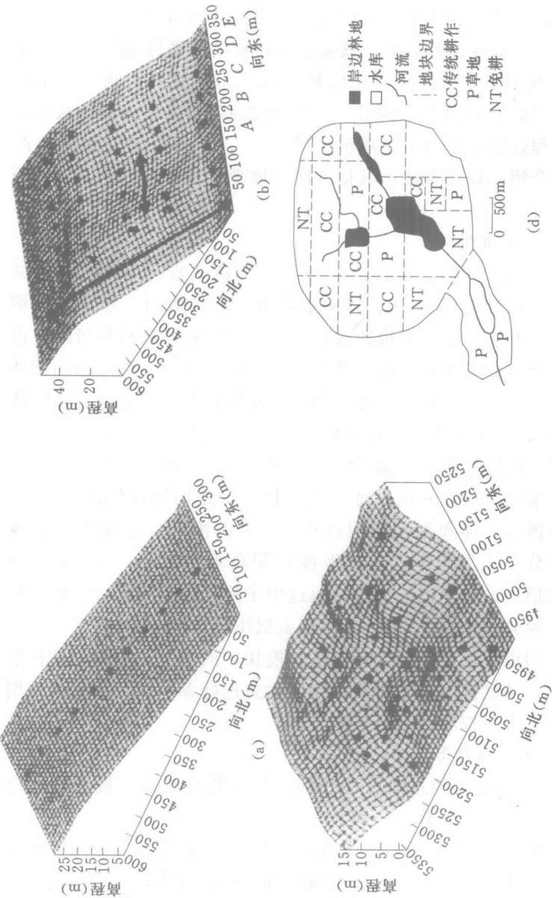

坡耕地用质量平衡模型计算土壤侵蚀量，公式为：

$$
A = A _ { \circ } ( 1 - h / H ) ^ { t - 1 9 6 3 }\tag{7.1}
$$

非农用地（林地、草地等）用剖面模型计算土壤侵蚀量，公式为：

$$
A = A _ { 0 } \mathrm { e } ^ { - \lambda h ( t - 1 9 6 3 ) }\tag{7.2}
$$

以上两式中：A为取样年份土壤剖面的137Cs面积活度， $\mathrm { B q / m ^ { 2 } }$ $A _ { 0 }$ 为参照样测得的137Cs本底值， $\mathrm { B q / m ^ { 2 } }$ ；h为年土壤流失厚度，cm；H为农耕地耕作层深度，即土样厚度，cm；λ为137Cs剖面衰减系数，其值为0.33；t为测定取样年份。

## 7.3.2.2 数学模型法

数学模型是用一种来表达因变量（如土壤流失量、侵蚀泥沙量）与自变量（如影响侵蚀的主要因子）之间数量关系的数学关系式。在试验观测和实际检验后，可以应用数学模型来预测因变量的变化。水土保持数学模型基本有统计模型和理论模型两类。如美国的USLE就是典型的统计模型，WEPP可算是理论模型或物理模型。我国在水土保持理论模型方面的研究较少，目前尚难以应用，这里仅介绍统计模型。统计模型是由实例数据经统计分析计算得出，因而它只适于某一地区某一特殊地段（地貌），一般情况下难以推广到其他区域，除非对模型参数（自变量）进行重新率定，因而又称地区经验公式。

数学模型是基于反复试验或多次观测数据，结合对土壤流失规律的认识，总结分析而得到。利用数学模型，可以通过土壤流失因子来推算土壤流失量，如多年平均土壤流失量、某年土壤流失量，以及某种给定条件下的土壤流失量。因此，可以通过数学模型法推算土壤流失背景值。

## 1. 以 USLE为基础的坡面土壤流失预测模型

USLE模型是 W. H. Wischmeier 和 D. D. Smith 于 1958年提出来的，被世界各地广泛应用的模型。模型的表达式为：

$$
A = R K L S C P\tag{7.3}
$$

式中：A为多年平均土壤流失量， $\mathrm { { t } } / \mathrm { { h m } } ^ { 2 }$ ；R为降雨侵蚀力因子， $\mathbf { m } \cdot \mathbf { t } / \ \left( \mathrm { h m } ^ { 2 } \cdot \mathrm { c m } \right)$ ；K为土壤可蚀性因子，cm/m；L为坡长因子，无量纲；S为坡度因子，无量纲；C为作物覆盖与管理因子，无量纲；P为水土保持因子，无量纲。

我国学者应用了USLE模型，并结合数据分析计算了模型参数及其计算方法，列于表7.8中[18]，供大家参考使用。

## 2. 流域侵蚀产沙模型

从20世纪80年代后，我国学者利用流域径流泥沙实测资料，建立了流域侵蚀产沙模型。截至目前，建立的模型基本局限于黄土高原地区，其他区域还不多见。这里仅列出江忠善、宋文经模型[19]，它适用于陕北、晋西和陇东南的黄土丘陵沟壑区。模型表达式为：

$$
M _ { s } = 0 . 3 7 M ^ { 1 . 1 5 } J K P\tag{7.4}
$$

式中： $M _ { s }$ 为次暴雨流域产沙模数， $\mathbf { t } /  { \mathrm { k m } } ^ { 2 }$ ；M为次暴雨的洪量模数， $\mathrm { m } ^ { 3 } / \mathrm { k m } ^ { 2 }$ ；J为流域平均坡度，以比值计；K为土壤可蚀性因子，以黄土中沙粒和粉粒占总量比例表示，以小数计；P为与流域植被盖度有关的植被作用系数。

其中，流域洪量模数M由洪水径流总量W与流域面积A之比得出。W的计算式为：

$$
W = 0 . 0 5 4 { \left( \frac { L } { J ^ { \frac { 1 } { 3 } } } \right) } ^ { 0 . 5 8 } \theta ^ { 0 . 8 6 }\tag{7.5}
$$

// ：/： A2CCP 1JJ 1UJJ注
<table><tr><td rowspan=1 colspan=1>适用地区</td><td rowspan=1 colspan=1>R</td><td rowspan=1 colspan=1>K</td><td></td><td></td><td rowspan=1 colspan=5></td><td rowspan=1 colspan=1>L, S</td><td rowspan=1 colspan=1>C</td></tr><tr><td rowspan=1 colspan=1>黄土高原丘陵区</td><td rowspan=1 colspan=1>EI30</td><td rowspan=1 colspan=1>中壤土：0.24轻黏土：0.17</td><td></td><td></td><td rowspan=1 colspan=4>梯田 0.05 造林 0.19种草0.18</td><td rowspan=1 colspan=1>牟金泽(1983)</td></tr><tr><td rowspan=1 colspan=1>黄土高原北部</td><td rowspan=1 colspan=1>EI30</td><td rowspan=1 colspan=1>小区测定法</td><td rowspan=1 colspan=1>L=0.41λ0.3,S=0.074S1.45</td><td></td><td rowspan=1 colspan=4>小区测定法</td><td rowspan=1 colspan=1>金争平(1991)</td></tr><tr><td rowspan=1 colspan=1>东北漫岗丘陵</td><td rowspan=1 colspan=1>E60 I30</td><td rowspan=1 colspan=1>小区测定法</td><td rowspan=1 colspan=1>LS=0.07197L0.18S1.3</td><td rowspan=1 colspan=1>作物分4个生育期，求出C，乘以对应期R权重，并求和得C；林草用USLE的参数</td><td rowspan=1 colspan=4>林草分6级盖度取值，梯田、地顷等高沟垄作实测</td><td rowspan=1 colspan=1>张宪奎(1992)</td></tr><tr><td rowspan=1 colspan=1>辽北低山丘陵①</td><td rowspan=1 colspan=1>EI30</td><td rowspan=1 colspan=1>0.37</td><td rowspan=1 colspan=1>L= (L/20)0.5S=0.05+3.60tanS+51.60tanS²</td><td rowspan=1 colspan=1>6°坡C为0.53；10°坡C为0.52；15°坡C为0.47</td><td rowspan=1 colspan=4>P=0.45S+0.121</td><td rowspan=1 colspan=1>林素兰(1997)</td></tr><tr><td rowspan=1 colspan=1>山峡库区</td><td rowspan=1 colspan=1>EI30</td><td rowspan=1 colspan=1>K=0.0075D-0.05</td><td rowspan=1 colspan=1>与地面平均坡度、相对高度有关</td><td rowspan=1 colspan=1>查表</td><td rowspan=1 colspan=4>P=18982.62C-2.3</td><td rowspan=1 colspan=1>杨艳生(1991)</td></tr><tr><td rowspan=1 colspan=1>闽东南区</td><td rowspan=1 colspan=1>与月降雨有关</td><td rowspan=1 colspan=1>经验公式法</td><td rowspan=1 colspan=1>LS=(S/10)0.78×(L/20)0.41</td><td rowspan=1 colspan=1>无</td><td rowspan=1 colspan=4>无</td><td rowspan=1 colspan=1>周伏建(1995)</td></tr><tr><td rowspan=1 colspan=1>滇东北山区</td><td rowspan=1 colspan=1>E60 I30</td><td rowspan=1 colspan=1>修正诺谟公式</td><td rowspan=1 colspan=1>LS=(L/20)0.24×(S/5)1.32</td><td rowspan=1 colspan=1>作物各生育期C与同期R占全年 R 值的百分比乘积的和</td><td rowspan=1 colspan=4>实测确定</td><td rowspan=1 colspan=1>杨子生(1999)</td></tr></table>

8  
A423

式中：L为流域长度，km；J为主沟道平均比降，以比值计；θ为洪峰流量， $\mathbf { m } ^ { 3 } / \mathbf { s }$

不同频率下洪峰流量计算式为：

$$
Q _ { \beta } = C \frac { J ^ { 0 . 3 7 } A ^ { 1 . 2 2 } } { L ^ { 1 . 1 } }\tag{7.6}
$$

式中：A为流域面积， $\mathrm { k m } ^ { 2 }$ ；C为与重现期有关的参数。当 $N =$ 10年，C=220；当N=20年，C=290；当N=50年，C=420。

风蚀背景值也可应用数学模型法进行分析。如R.A. 拜格偌的半经验模型[20]、风蚀方程（WSQ，Wind Erosion Equation)、风蚀预报系统(WEPS，Wind Erosion Prediction System)[21-23]等。

## 7.3.2.3 类比法

类比法是将某工程建设区域内的水土流失因子与已知土壤流失强度（或流失量）的毗邻或邻近区域的水土流失因子作比较，在水土流失因子没有明显差异的情况下，即水土流失条件类似或相近时，可将邻近区域的测试和研究成果应用于该工程建设区域，如不同土地利用、不同坡度、不同植被条件及这些因子其他组合下的土壤流失强度。

利用类比法进行土壤流失背景值调查时，一定要严格把握和理解“类似”二字。一般说来，“类似”可以主要从三个方面把握：一是侵蚀因子类似，包括降雨（或者风力、温度）、地形地貌、植被、地面组成物质等；二是土壤流失状况类似，包括侵蚀形式和侵蚀强度（流失量）；三是比较对象区域具有丰富的土壤流失研究资料和成果，以便对比分析，以使相关的系数、参数更符合监测对象的实际情况[20]。

应用类比法时，还需要注意“土壤流失强度”这个概念，它是指已有多年（约需20～30年）的实测资料或经用其他方法推算并被验证为正确的侵蚀资料才能作为平均流失强度，即区域土壤流失量背景值。我国各地都有水土保持科学试验站（所）及高等院校、研究单位的试验观测场，但多数的观测资料时限较短，有的尚不足10年。若不加分析的引用这些资料，可能造成不准

确的结果。

## 7.3.2.4 历史古迹法

历史古迹法就是利用历史古迹作对照，分析研究土壤侵蚀强度的方法。在“6开发建设项目水土保持监测点设施设计”中提到的“水土流失遗迹”、“土壤剖面”就是历史古迹法的具体应用。基本的方法是：利用历史古迹作对照，如庙宇、寺院、村舍、古墓、林木等，以这些建筑物的基础被侵蚀剥离出露的高度（或者侵蚀堆积的泥沙厚度）与建设期到调查期的年数之比，即为年平均侵蚀深；再与地表物质干密度的乘积即为侵蚀强度。这种方法对于水蚀、风蚀都适用，尤其是分析风蚀背景值。

我国风蚀面积大，但风蚀区域侵蚀观测较少，现有的观测成果仍不能满足开发建设工程的需要。因此，一般地，风蚀背景值是通过在工程建设区域或邻近区域调查取得。若风蚀背景值无法得到，在开展工程建设区域的风蚀动态监测时，可以在邻近同类地区设置风蚀对照观测区，得到对比分析的参照值。

土壤流失背景值监测成果记录格式见附表10。

## 7.3.3 水土流失量动态变化

开发建设区内各类侵蚀的水土流失量随工程建设进度和施工工艺不同而发生变化，为掌握其动态变化规律，估算区内水土流失数量特征，需对不同类型的不同侵蚀方式进行实际观测，详细记录侵蚀发生的条件，并测量流失的径流、泥沙数量；在缺少本底值的区域，还应建立相应的对照（无扰动）侵蚀观测设施，以便准确反映扰动侵蚀和评价新增水土流失量。

如上所述，鉴于土壤侵蚀的类型和方式不同，观测的方法和设施设备各异，以下分水蚀、风蚀、重力侵蚀等分别论述。

## 7.3.3.1 坡面水蚀观测

在水蚀区，工程建设区域内各种堆积坡面、开挖坡面、扰动坡面和塑造地貌坡面的侵蚀变化均可用坡面水蚀观测方法。坡面水蚀观测的基本方法有三种：一是设置径流小区观测；二是设置简易土壤流失观测场；三是直接设置泥沙收集器。第一种多适用于定点精确观测，第二种可结合定点调查或变动干扰较大的区域监测，第三种其实是第一种的简易设施（泥沙收集器类似于小区的集流桶）。这三种观测方法设施设置与主要设备见“6开发建设项目水土保持监测点设施设计”，下面主要阐述土壤流失监测及其数据分析处理方法。

## 1. 径流小区观测

对于径流小区，坡面径流和泥沙的采集系统（即集流系统）包括两种方式：一种由分流箱和集流桶两部分构成，小区内产生的径流和泥沙在分流箱分流后收集在集流桶中；另一种只有蓄水池，小区内产生的径流和泥沙全部被收集。这两种方式具有不同的测验和数据记录方法[1,24]。

当集流系统由分流箱和集流桶两部分构成时，一般采用在集流桶不同深度处采集水分与泥沙的混合样，处理分析得到小区侵蚀泥沙的总量。取样前，准备好取样瓶、米尺、扳手、铁锹、舀子、笔、记录表等，放入工具篮中，带至径流场。取样步骤主要包括：①检查小区、分水箱、集流桶等是否有异常现象，主要侧重于有无溢流、严重淤积及分流孔堵塞等现象发生，若有情况，做好相应的记录（记录表格式见附表11）；②对照记录表填好集流桶号，打开桶盖，将米尺垂直放入桶中至桶底，读取水面所在刻度值，填人记录表中。每个集流桶，应在不同位置测量水深4次 $( h _ { 1 } , h _ { 2 } , h _ { 3 } , h _ { 4 } )$ ；③用铁锹搅动集流桶中的泥水，使泥沙与水充分混合达到均匀，用舀子取样，装入取样瓶中，记录瓶号。每个集流桶内取样两个；④打开集流桶底阀，然后一边搅动，一边放出泥水，最后用清水将集流桶冲洗干净；⑤拧紧底阀，盖好桶盖，进入下一个小区的取样工作；⑥每次产流后，应及时检查分水箱的分流孔，发现有淤泥时应及时清理，不能影响出水。

以上取样方法是针对分水箱内不蓄水的集流系统而设计的，当分水箱的分水孔具有一定高度，能够容纳一定体积的径流时，应对分流桶内的径流量进行观测，并取相应的泥沙样。

径流小区的总径流（含泥沙）W的确定，分两种情形计算：一是集流系统仅为集流桶，而没有分流箱；二是集流系统由分流箱和集流桶组成。

当集流系统仅为集流桶，没有分流箱时，

$$
W = \pi r ^ { 2 } h\tag{7.7}
$$

当集流系统由分流箱和集流桶组成时，

$$
W = { \frac { n _ { 1 } n _ { 2 } \cdots n _ { n } } { 4 } } \pi r ^ { 2 } h\tag{7.8}
$$

$$
h = \frac { 1 } { 4 } ( h _ { 1 } + h _ { 2 } + h _ { 3 } + h _ { 4 } )
$$

式中： $W$ 为径流（含泥沙）体积， $\mathbf { m } ^ { 3 }$ ；π为圆周率；r为集流桶的半径，m；h为集流桶内径流泥沙混合溶液的深度，m； $\pmb { n } _ { 1 }$ 为第一个分流箱分流孔的数目； $\displaystyle n _ { 2 }$ 为第二个分流箱分流孔的数目；${ \pmb { n } } _ { \pmb { n } }$ 为第n个分流箱分流孔的数目。

一般地，分流箱不会超过3个。同时注意，当分流孔具有一定高度，具有一定容纳径流的能力时，应同时测定分流箱内径流深度，计算径流量，将分流箱内径流量累加到集流桶径流量，得到次降雨的总径流量。

径流小区的侵蚀量 $S _ { T }$ 由总径流（含泥沙）W与含沙量计算得到。计算式见式（7.9）～式（7.11）：

$$
G = G _ { T } - G _ { H }\tag{7.9}
$$

$$
\rho = G / V\tag{7.10}
$$

$$
S _ { T } = W \rho\tag{7.11}
$$

式中： $G$ 为样品的泥沙重量，g； $G _ { T }$ 为铝盒和泥沙的总重量，g；$G _ { H }$ 为铝盒的重量，g； $P$ 为含沙量， $\mathrm { k g / m ^ { 3 } }$ ；V为测验水沙样的体积，mL； $S _ { T }$ 为径流小区侵蚀量， $\mathbf { k g }$

对于以蓄水池为径流收集系统的小区，因为一般蓄水池较大，采用搅拌的方法取样难度较大，其代表性较差。可以考虑先沉积泥沙滩平，等泥沙沉降后，在不同位置量测径流深度，计算平均径流深 $\left( h _ { R } \right)$ 。等取样完成以后让蓄水池中的水沙混合物沉积几天，然后将上面的清水用水泵或虹吸法抽出，进一步量测泥沙量。泥沙量的观测方法为：将清水放完，让泥沙充分风干。如果泥沙量不大，可以直接采用称重的方法测定泥沙量；当沉积泥沙比较多时，在不同的部位测定沉积泥沙的深度，计算平均沉积泥沙的厚度，再根据式（7.12）和式（7.13）计算侵蚀泥沙的总量 $S _ { T }$

$$
W = S h _ { R }\tag{7.12}
$$

$$
S _ { T } = \gamma _ { s } S h _ { s } \Big ( 1 - \frac { W _ { \omega } } { 1 0 0 } \Big )\tag{7.13}
$$

式中：W为蓄水池容纳的径流量， $\mathbf { m } ^ { 3 }$ ; $S$ 为蓄水池底面面积，$\mathbf { m } ^ { 2 }$ ； $h _ { R }$ 为蓄水池平均水深，m； $S _ { T }$ 为小区侵蚀泥沙总量，kg；$\gamma _ { s }$ 为侵蚀泥沙密度， $\mathbf { k g } / \mathbf { m } ^ { 3 }$ ； $h _ { S }$ 为沉积泥沙的平均厚度，m；$W _ { \omega }$ 为沉积泥沙含水量，%。

当研究目的与降雨的次数有关时，测定完径流、取完泥沙样以后，应及时将蓄水池中的泥沙清理掉，避免给下次测定造成误差。

## 2. 简易土壤流失观测场观测

简易土壤流失观测场的观测方法就是测钎法。这种方法的观测结果记录格式见附表12，土壤流失量计算公式为：

$$
S _ { T } = \frac { \gamma _ { s } S L } { 1 0 0 0 \mathrm { c o s } \theta }\tag{7.14}
$$

式中： $S _ { T }$ 为土壤流失总量，kg； $\gamma _ { s }$ 为侵蚀泥沙密度， $\mathrm { k g / m ^ { 3 } }$ ; S为简易土壤流失观测场水平投影面积， $\mathbf { m } ^ { 2 }$ ；L为平均土壤流失厚度，mm； $\theta$ 为简易土壤流失观测场坡度。

在利用该方法监测土壤流失量时，应该注意新的堆积体常常会产生自然沉降。因此，在填写附表12中“测钎顶端到地面长度”时，应密切注意是否有自然沉降。若堆积体不发生沉降，则式（7.14）中的L的值为 $L = { \frac { 1 } { n } } ( L _ { 1 } + L _ { 2 } + L _ { 3 } + \cdots + L _ { n } )$ ；若堆积体发生沉降，就应该扣除沉降产生的影响。为了避免测钎随堆积体发生沉降，可以将测钎插入较深，或者插入到不再发生沉降的深层；这时，式（7.14）中的L的值为：

$$
{ \cal L } = \frac { 1 } { n } \left[ ( L _ { 1 } + L _ { 2 } + L _ { 3 } + \cdots + L _ { n } ) - n h \right]
$$

式中：h为堆积体的平均沉降高度。

## 3. 坡面细沟观测法

在“6开发建设项目水土保持监测点设施设计”中，阐述了坡面细沟观测样地的观测方法包括断面量测法、填土置换法。这里简要介绍断面量测法和填土置换法的土壤流失量的计算方法。

对于断面量测法，如果施测断面等距离布设，则单个细沟的侵蚀量计算公式为：

$$
\begin{array} { l } { S _ { n } = \displaystyle \gamma _ { s } L \sum _ { 1 } ^ { n - 1 } \Big ( \frac { w _ { 1 } h _ { 1 } + w _ { 2 } h _ { 2 } } { 2 } + \frac { w _ { 2 } h _ { 2 } + w _ { 3 } h _ { 3 } } { 2 } } \\ { \qquad + \cdots + \frac { w _ { n - 1 } h _ { n - 1 } + w _ { n } h _ { n } } { 2 } \Big ) } \end{array}\tag{7.15}
$$

式中： $S _ { n }$ 为单个细沟侵蚀量， ${ \bf k } _ { \bf g }$ ； $\gamma _ { s }$ 为侵蚀土壤密度， $\mathbf { k g } / \mathbf { m } ^ { 3 }$ L为测定端面之间的距离，m；n为测定断面个数； $\boldsymbol { \mathcal { U } } _ { i }$ 为测定断面的细沟宽度，m； $h _ { i }$ 为测定断面的细沟深度， $\mathbf { m }$

如果施测断面距离不等时，则单个细沟的侵蚀量计算公式为：

$$
\begin{array} { l } { S _ { n } = \gamma _ { s } \displaystyle \sum _ { 1 } ^ { n - 1 } \Big ( \frac { w _ { 1 } h _ { 1 } + w _ { 2 } h _ { 2 } } { 2 } L _ { 1 } + \frac { w _ { 2 } h _ { 2 } + w _ { 3 } h _ { 3 } } { 2 } L _ { 2 } } \\ { \qquad + \cdots + \frac { w _ { n - 1 } h _ { n - 1 } + w _ { n } h _ { n } } { 2 } L _ { n - 1 } \Big ) } \end{array}\tag{7.16}
$$

式中： $L _ { i }$ 为施测断面间的距离，m；其他符号意义同式（7.15）。

在测得单个细沟侵蚀量之后，将其累加即可得到观测样地细沟侵蚀量，计算公式为：

$$
S _ { i } = \sum _ { 1 } ^ { n } S _ { n }\tag{7.17}
$$

式中： $S _ { T }$ 为样地细沟侵蚀总量，kg；n为细沟条数。

坡面细沟观测记录格式见附表13。

对于填土置换法，细沟侵蚀总量为侵蚀土壤密度与回填土的体积之积。计算公式为：

$$
S _ { i } . = \gamma _ { s } V\tag{7.18}
$$

式中： $S _ { T }$ 为样地细沟侵蚀总量，kg； $\gamma _ { s }$ 为侵蚀土壤密度， $\mathbf { k g } / \mathbf { m } ^ { 3 }$ V为回填土的体积， $\mathfrak { m } ^ { 3 }$

另外，目前已经有一种更加便捷可以直接量测和计算细沟侵蚀量的设施设备——光电扫描设备，如激光微地貌扫描仪[25][见图7.6（a)]，利用激光的反射与聚焦成像原理，将地表形态转换成不同物像点位置的电信号，再经计算机处理成数字地形模型，从而得出坡面侵蚀的结论；再如三维激光扫描仪[26]见图7.6（b)]，采用非接触式高速激光测量方式，获取地形或复杂物体的几何图形数据及影像数据，对采集的数据通过软件处理，建立空间位置坐标或模型，得到空间信息和坡面侵蚀结论。

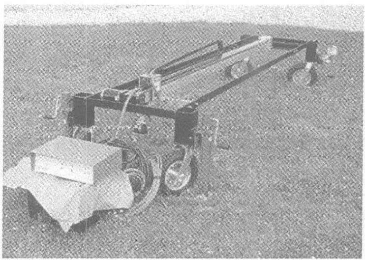  
(a)

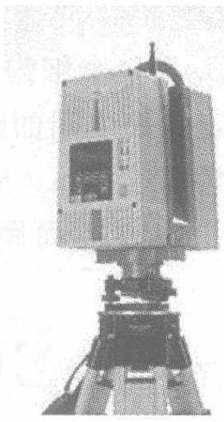  
(b)  
图 7.6 光电扫描设备  
(a) 激光微地貌扫描仪；(b) 徕卡HDS6000三维激光扫描仪

## 4. 沉沙池观测

工程建设中，常常在坡面排水渠上建筑沉沙池，尤其是在降雨较多的南方。一般地，在排水过程中，沉沙池仅仅能够收集水蚀的推移质，而悬移质常常被水流带走。在量测沉沙池泥沙厚度 $\cdot ^ { \circ }$

后，可以计算排水渠控制的汇水区域的土壤侵蚀量。通常是在沉沙池的四个角分别量测泥沙厚度，并测得侵蚀泥沙的密度，通过式（7.19）计算侵蚀量：

$$
S _ { T } = \frac { h _ { 1 } + h _ { 2 } + h _ { 3 } + h _ { 4 } } { 4 } S \gamma _ { s } \Big ( 1 + \frac { X } { T } \Big )\tag{7.19}
$$

式中： $S _ { T }$ 为排水渠控制的汇水区域侵蚀总量， ${ \bf k } _ { \mathbf { g } }$ . $h _ { i }$ 为沉沙池四角的泥沙厚度，m；S为沉沙池底面面积， $m ^ { 2 }$ ； $\gamma _ { s }$ 为侵蚀土壤密度， $\mathbf { k g } / \mathbf { m } ^ { 3 }$ ; $\frac { X } { T }$ 为侵蚀径流泥沙中悬移质与推移质重量之比。

## 5. 相关沉积法观测

当工程建设区域内存在洼坑、浅洼地或人工修建的池、塘等小蓄水工程时，而这些蓄水微地貌（或工程）又与侵蚀坡面毗邻，即在暴雨产流发生侵蚀后，流失的径流泥沙全部被其拦蓄，随即观测被拦蓄的径流、泥沙量就为毗邻坡面的径流、泥沙量。

量测的方法有多种，如果蓄水微地貌（工程）不大，可用直尺直接测量水深、泥深（或多点量测），并量测面积，计算出积水量和泥沙量；如果蓄水微地貌（工程）面积大，或水较深时，可用设置断面法，驾船分别量测各断面上若干个水深、泥深，再计算断面平均水深、泥深，并与断面间距的乘积作为部分径流、泥沙体积，最后累加得总体积。

采用这种方法量测时需要注意：一是洼坑中没有人工倒入的土（石），否则需要及时清理，并能拦蓄一次暴雨产流、产沙总量，没有溢流现象；即使发生溢流，也可以测算出其数量。二是应在洼坑等微地貌附近布设固定基准桩（注意避开干扰），用来校核洼坑地形、断面和淤积等的变化。若设置测量断面固定，应布设断面控制桩。

上述坡面水蚀观测的径流量（W）、泥沙量（S）可用来计算径流强度和侵蚀强度 $( M _ { \mathrm { W } } , \ M _ { s } )$ ，计算公式为：

$$
M _ { w } = { \frac { W } { A } }\tag{7.20}
$$

$$
M _ { s } = { \frac { S \gamma } { A } }\tag{7.21}
$$

式中： $M _ { W }$ $M _ { s }$ 分别为径流强度和侵蚀强度， $\mathrm { m } ^ { 3 } / \mathrm { k m } ^ { 2 }$ $\mathrm { \Delta t } / \mathrm { k m } ^ { 2 }$ W为流失的径流量， $\mathfrak { m } ^ { 3 }$ ；S为流失的泥沙体积， $\mathbf { m } ^ { 3 }$ ；γ为流失泥沙的密度， $\mathrm { { t } / \mathrm { { m } } ^ { 3 } }$ ；A为流失区面积， $\mathrm { k m } ^ { 2 }$

## 7.3.3.2 流域（区域）水蚀观测

在水蚀区，如果工程建设区域的大部分或全部面积均在一个闭合的流域（区域）内，即该面积范围内暴雨侵蚀产流、产沙全部汇集通过一个沟谷可控断面时，可以通过设置径流控制站的方法测量控制区内的水土流失量。

水蚀控制站要设置量水建筑物。量水建筑物有多种型式，水土保持测验中多用巴塞尔量水槽、三角形或梯形薄壁量水堰、实用坡面堰等[1]，它们分别适用于不同流量、河床特性及排沙等条件，可根据工程建设区域的面积大小及所处自然区域来选择。

水蚀控制站的观测项目、设施设备及观测要求，在《水土保持监测技术规程》（SL277—2002)[27]中有规定，这里不再赘述。由控制站测得了每次暴雨洪水径流量（W）和输出泥沙质量$( Q _ { S } )$ ，可以计算出区域内的流失强度。计算公式为：

$$
M _ { w } = { \frac { W } { A } }\tag{7.22}
$$

$$
M _ { s } = \frac { Q _ { s } } { A }\tag{7.23}
$$

式中： $Q _ { S }$ 为输出的泥沙质量，t或kg；A为流域（区域）面积，$\mathrm { k m } ^ { 2 }$ ；其他符号同前。

水蚀控制站水土流失观测记录格式见附表14。

开发建设区域的径流泥沙测验时，应该注意：不仅要测量径流中的悬移质，而且要测量底部的推移质，即输出泥沙量包括悬移质和推移质两种。推移质的测量，以测坑法为最好，简易操作方便。此外，针对开发建设区泥沙粗颗粒多，易于沉积，影响取样精度等问题，美国学者J.V.Bonta经过多年对矿区沟道泄流的观测，提出了Drop-box测流堰[28-30]，如图7.7所示。该堰可以造成紊流，使水流向前、向中间集中，从而将泄流中本来会沉淀下来的泥沙带走，泥沙通过了堰池，而没有在堰中沉积下来。水位由堰的V字形部分量测，样品可在堰后水流中取得。经观测，该测流堰可以通过较大的石块，并测到291g/L的含沙量。

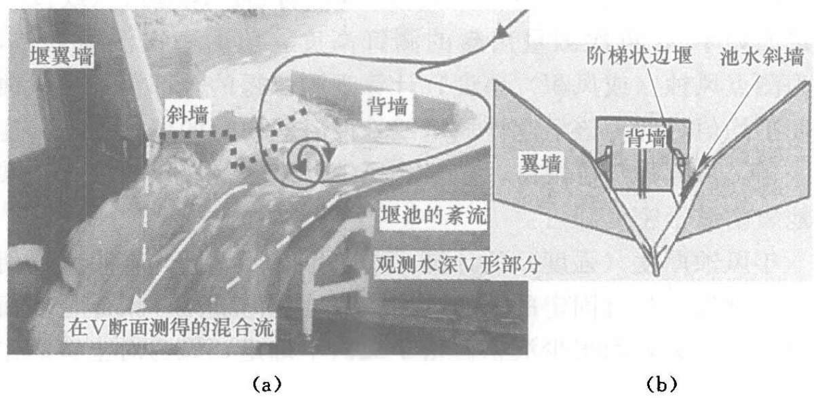  
图 7.7 Drop-box测流堰观测示意图及结构图  
（a)测流堰的结构图；（b)测流堰量测设备工作图

## 7.3.3.3 风蚀观测

风蚀强度受多种因素影响，主要有地表植被覆盖度、地面物质颗粒大小及组成、地表起伏状况、起沙风的多少、降水情况等。因而，在风蚀调查时，要对工程建设区域可能达到的多种地表特征、气候特征等进行全面调查，以便获得风蚀强度值，以备比较分析使用。

在“6开发建设项目水土保持监测点设施设计”中，阐述了风蚀监测设施设备，这里结合这些设施设备叙述风蚀强度分析计算方法。

## 1. 简易风蚀观测场观测

简易风蚀观测场观测方法是用测钎插入风蚀（或风积）区地面，观测起沙风前和起沙风后测钎出露的高度，用高度差来表示风蚀强度（亦可转化成风蚀模数），如图6.7和图6.10。由此可知，该方法与“坡面水蚀观测”采用的“简易土壤流失观测场观测”类似，因此，风蚀量的计算方法可以参考本节“坡面水蚀观测”中的“简易土壤流失观测场观测”的土壤流失量计算公式。

在开发建设项目风蚀观测时，可以以一场风、一段固定的时间或者其他等作为时间间隔。当观测场中的测钎布设好后，量测插入沙土后的出露的高度（刻度）；当一场起沙风过后（或按照规定的频率)，再次测量出露的测钎高度，前后两次测值之差，即为测点风蚀（或风积）厚度；计算观测取得的全部测钎的风蚀厚度平均值，即为该场起沙风（或该段时间内）的侵蚀强度。连续一年，可算得年侵蚀深。若要将风蚀厚度转换成风蚀模数，乘以地表物质干密度即可。

年风蚀厚度（强度）的计算，与水蚀有所不同。在水力作用下，土壤流失具有固定的方向，即从高处流向低处，因此在坡面一般就是流失，而很少沉积。由于风向不确定，风力对土壤的作用方向也就不确定，因此，在某一确定的位置（如测钎插入的位置)，风蚀和风积都会发生，某一场风的结果是剥蚀，下一场风的结果可能就是堆积，尤其是在不同的季节之间，风蚀、风积差异相当明显。如果按照起沙风的场次进行观测，并分别计算风蚀（风积）厚度，将厚度的绝对值相加，则和值（绝对值之和）可以认为是沙土侵蚀厚度（强度）；若将厚度相加，则和值（代数和）可以认为是沙土流失强度。

风力作用下的沙土侵蚀强度计算公式为：

$$
L _ { E } = \frac { 1 } { n } ( \mid L _ { 1 } \mid + \mid L _ { 2 } \mid + \mid L _ { 3 } \mid + \cdots + \mid L _ { n } \mid )\tag{7.24}
$$

风力作用下的沙土流失强度计算公式为：

$$
L _ { L } = { \frac { 1 } { n } } ( L _ { 1 } + L _ { 2 } + L _ { 3 } + \cdots + L _ { n } )\tag{7.25}
$$

以上两式中： $L _ { E }$ 为沙土侵蚀厚度，mm； $L _ { L }$ 为沙土流失厚度，mm；L，为场起沙风风蚀（风积）厚度，mm。

简易风蚀观测场的风蚀观测结果记录格式见附表15。

## 2. 风蚀桥观测

风蚀桥观测法是用风蚀桥插入风蚀（或风积）区地面，观测起沙风前和起沙风后风蚀桥面至地表高度的变化，用高度差来表示风蚀强度（亦可转化成风蚀模数），如图6.9。因此，风蚀桥观测法是测钎法测深的改进方法。

当风掠过风蚀桥下，吹蚀地表物质，造成桥面上刻线（一般间隔为10cm，称为控相距）至地面高差发生变化，这些高差的平均值即为该桥（观测点）处平均风蚀深；对监测区域所有风蚀桥（观测点）进行平均计算，可得到监测区域的平均风蚀深。同理，可以得到年平均风蚀深（或风蚀模数）。由此可见，风蚀桥的观测点密度大，而且避免了测钎对地面及风蚀的干扰，从而提高了观测精度。

风蚀桥风蚀观测结果记录格式见附表16。

## 3. 集沙仪观测

集沙仪见图6.8。使用时，将集沙仪收集口正对来风方向，下缘与地表紧密吻贴，收集地面以上某一高度处面积为集沙仪收集断面（一般为宽度3.0cm、高度4～5cm的矩形）的风沙量，并记录起沙风起止时间。一场起沙风结束后，将集沙仪后收集袋（或收集箱）内沙粒全部取出称重（或分层取出称重），即可得到风吹蚀物质的重量。将建设区垂直风向的长度乘以集沙仪收集高(如50cm)，即为通过该区的风沙流断面面积，再乘以上述单位面积吹蚀物，或与单位面积单位时间风蚀物与起沙风的历时相乘，得该场起沙风的风蚀量。观测一年中（或监测期）的多场风蚀量，可得年（或监测期）总风蚀量。

单场起沙风的风蚀量计算公式为：

$$
G _ { i } = 1 0 G \frac { H L } { s }\tag{7.26}
$$

单位面积风蚀量计算公式为：

$$
g _ { i t } = { \frac { G } { s } }\tag{7.27}
$$

单位面积单位时间风蚀量计算公式为：

$$
g _ { i } = { \frac { G } { s t } }\tag{7.28}
$$

监测期内的风蚀量计算公式为：

$$
G _ { T } = \sum _ { i = 1 } ^ { n } G _ { i }\tag{7.29}
$$

以上四式中： $G _ { i }$ 为单场起沙风的风蚀量，kg；G为集沙仪收集的全部沙粒的重量， $\mathbf { g }$ ；H为集沙仪收集高，m；L为建设区垂直风向的长度，m；s为集沙仪收集断面面积， $\mathrm { c m } ^ { 2 }$ ； $g _ { i t }$ 为单场起沙风单位面积风蚀量， $\mathbf { g } / \mathrm { c m } ^ { 2 }$ $g _ { i }$ 为单场起沙风单位面积单位时间风蚀量， $\mathbf { g } / \textrm { \textbf { ( c m ^ { 2 } { \cdot } { \operatorname* { m i n } } ) } }$ ；t 为单场起沙风的历时，min；n为监测期内的起沙风场数； $G _ { j }$ 为监测期内的风蚀量，kg。

由此可知，每架集沙仪收集的风沙气流宽度很小（如仅为3.0cm)，显然对一个扰动强烈且差异较大的工程建设区域来说，代表性不足。因此，在设置时，应该考虑区域内的主要风向以及工程扰动的主要部位。若风向单一，即起沙风为单一风向（如西北风），可将集沙仪收集口正向来风方向（如西北方向），布设在扰动区下风方形成一条带，扰动强度大的区域布设密度适当较大(约5\~10m一架)，扰动相对弱或扰动均匀区密度可以较小（约20～30m一架)。如若区域内工程扰动空间差异大，且面积大时，应该布设多个条带，分别测量不同空间的风蚀强度。若区域内优势风不明显，即在建设期间有可能出现多个方向的起沙风(如东南、东、西北风等)，可以按风向人工重新布设集沙仪（固定式)，也可以用旋转式集沙仪。但需要注意，无论是固定式还是旋转式集沙仪，均需要在扰动区（监测区域）均匀布设，间距约10\~30m，或以实际情况布设，因为集沙仪只能设在监测区域的下风方位，而不能设在上风位置。

集沙仪风蚀观测结果记录格式见附表17。

## 7.3.3.4 其他侵蚀观测

开发建设项目区内还存在崩塌、滑坡、崩岗、泥石流、冻融侵蚀等方式。这些侵蚀的发生具有突发性特点，从破坏到发生移动虽然有一个较长的时间过程，但是一旦有触发因素，即刻发生，随机性很大。这些特点给观测带来很多不确定因素，而且观测设施昂贵，需要投资大，因此一般采用的监测方法有两种：一是对长历时多次发生危害严重的泥石流，采用断面观测；二是对其他情况，均可以采用收集法和相关沉积调查法观测。

## 1. 泥石流断面观测

断面法是在泥石流频繁活动的沟谷，选择适于建设的观测断面和辅助断面、建立各种测流设施，如缆道、支架、探索泥沙设施、浮标投放设施等，来观测泥石流过程变化、历时、泥位、流量等特征的方法。通常，观测断面要设在河床及岸边稳定，且测流段无弯曲、无宽窄变化、比较均一的河段，辅助断面设在主断面的上游或下游约50m处。主断面缆道两端设置钢支架，悬挂缆道，缆道上一定距离设测泥位悬杆或继电器；辅断面设支架缆绳，上悬浮标投放器。

当泥石流发生时，泥石流通过两断面，由投放浮标可测得流速，同时计时；若过程漫长，可测多个流速。主断面悬杆或继电器测泥石流泥位（相当于水位），并计时；若过程漫长，可测泥位过程。在泥石流过程中，若能采集泥沙样品，可采一个或多个；若有困难，在结束时采一个作平均样。泥石流结束后，观测一次断面变化（主断面），并计算出过流面积。

有了上述泥石流过程面积W、流速V、历时t、取样测到的含沙量 $\rho$ ，不难计算出以下有用的泥石流特征值：

峰值流量：

$$
Q _ { \operatorname* { m a x } } = W _ { \operatorname* { m a x } } V _ { \operatorname* { m a x } }\tag{7.30}
$$

浆体径流量：

$$
W = \overline { { Q } } t\tag{7.31}
$$

固体径流量：

$$
W _ { S } = W \ : \overline { { \rho } }\tag{7.32}
$$

式中： $W _ { \textrm { m a x } }$ 为泥石流最大时的过流断面面积， $\mathbf { m } ^ { 2 }$ $V _ { \mathrm { m a x } }$ 为最大流速， $\mathbf { m } / \mathbf { s }$ ；W为泥石流浆体的流出总量， $\mathfrak { m } ^ { 3 }$ $\overline { { Q } }$ 为泥石流全过程平均流量， $\mathbf { m } ^ { 3 } / \mathbf { s }$ ；t为泥石流全过程历时，s； $W _ { s }$ 为泥石流夹带固体物质干质量，kg； $\bar { \rho }$ 为泥石流过程平均砂石含量， $\mathbf { k g } / \mathbf { m } ^ { 3 }$ o

泥石流观测过程是复杂多变的，上述讨论了一个概化过程的计算，而实际过程可分为两种情况，一种是黏性阵流，另一种是多变的连续流。对于阵流观测，需测出龙头的泥位高度及流速、过流历时，并取一个泥沙样；对于连续流观测，要像水文测验一样，在每一流态（流速、泥位）发生变化的时段内，都要测得一个泥位、流速、历时，并取一个泥沙样。阵性流的龙头即峰值流量，龙尾为0，用锥体公式计算浆体径流量；并用浆体径流量与样品含沙量计算固体径流量。连续流则分别计算时段特征值，分别累加得到全过程特征值，计算方法同水文计算。泥石流固体径流量 $( W _ { s } )$ ，即为建设区流域侵蚀总量，由此不难算出侵蚀模数。

通常为了探索泥石流发生规律，在建设区（沟道流域）还要建立雨量观测点，并调查建设渣土堆积到沟谷的数量，特别是影响泥石流流态的那部分堆积量、部位和堆积方式等。典型泥石流发生情况调查记录格式见附表18。

## 2. 相关沉积调查

相关沉积调查法是指通过调查崩塌、滑坡、崩岗等侵蚀方式发生侵蚀后的相关堆积物体积，估算侵蚀量的调查方法，适用工程建设区域各种不同规模的重力侵蚀及部分混合侵蚀。

调查崩塌、滑坡时，在堆积体上，可以设置若干施测断面，并测量断面的高程与断面间距，扣除原地面高程影响，算出每个堆积断面面积 $( S _ { i } )$ ，乘以间距 $( D _ { i } )$ 得到部分堆积体积，再累加全部的部分堆积体积，即可得到滑坡和崩塌的体积，即侵蚀总体积，最后乘以密度即为侵蚀总量。计算相关堆积体时，需要注意移动破碎土（石）体内通常存在孔洞，因而多用量测原破坏坡面的体积加以校正（校正系数k）。计算公式为：

$$
G _ { T } = k \rho \sum _ { i = 1 } ^ { n } ( S _ { i } D _ { i } )\tag{7.33}
$$

式中： $G _ { T }$ 为滑坡（崩塌）总量， $\mathbf { k g }$ ；k为校正系数，小于1； $\rho$ 为密度， $\mathbf { k g } / \mathbf { m } ^ { 3 }$ ; $S _ { i }$ 为测量堆积断面面积， $\mathfrak { m } ^ { 3 }$ ； $D _ { i }$ 为测量堆积

断面的间距，m。

典型滑坡（崩塌）调查记录格式见附表19。

崩岗的观测一般均采用排桩法，即在崩岗区设置基准桩和测桩。应该注意，测桩设置间距应该规整，因为发生崩岗后部分测桩一并被毁，需要根据定位测量它的高程变化。布设测桩还要根据该区崩岗的发展，从坡脚布设到坡顶，宽度按一般崩岗宽确定。若能配以过程观测（录像或人工监测），就能阐明崩岗发生发展的机制和特点。野外调查时，一般需在暴雨前后测量调查，或在下游调查测量拦沙坝（池）中的淤积物，这是因为崩岗发生常常伴随着暴雨冲刷，形成水砂混合的浆体[1]。

## 3. 冻融侵蚀监测

冻融侵蚀观测的方法是排桩法。排桩法是依观测对象的形态特征，布设若干排成网状的观测桩，同时在附近设置几个可观测观测桩的固定基桩，由固定基桩对观测桩实施观测，来计算侵蚀量的方法。观测桩可为硬木质，长20～30cm，直径5cm上下，设在移动体上；固定桩基一般为混凝土材料，设在附近不动基岩或土体内。观测桩设置密度约5m×5m，若滑动体巨大，可以适当稀疏些，排数多少依据观测区面积而定，可纵向亦可横向设置。设置观测桩时，注意桩体入土不宜超过15～20cm，以避免非但不能随表层土体移动反而起到固定表层土体的作用；亦不能过浅（小于10cm)，否则容易被冻土挤出，失去观测的作用。一般在暖季初（4月至5月），在扰动坡面设置观测桩，并观测每个观测桩的坐标及高程，绘图并表明桩号；当侵蚀发生后，只需要量测侵蚀面积和深度，就能算出侵蚀体积。若要转换成侵蚀量，再乘以地面物质的密度即可。对冻胀侵蚀观测，常沿沟缘线大致平行设置若干排观测桩，在沿沟缘上，桩距可以为10m左右；在垂直沟缘方向上，桩密度较大，桩距可以为0.5\~1.0m。这样能够精确测量冻胀崩塌的边缘，再加上测量沟缘高程，就能计算沟蚀体积和沟缘扩张速度。

若要将冻融侵蚀量转换成侵蚀模数，尚需要确定侵蚀发生区的面积。若建设区域面积不大，可以将全部面积计入侵蚀面积，当然侵蚀量也是全区值；若能将建设区域分区分段，应该分区分段进行观测，计算每个分区分段的面积就可求出侵蚀模数。若建设区域范围大而连片，可以结合抽样方法监测，也可分区监测。

应该说明，在上述侵蚀量观测的同时，还应对影响冻融侵蚀的主要因子进行观测，如气温、地温、坡度、坡向、风、植被、土壤等，以便分析说明。典型冻融侵蚀观测记录格式见附表20。

## 7.4 水土流失危害监测

开发建设项目水土流失危害监测，包括危害范围的面积及各种危害的数量和程度等。其中，危害主要包括破坏土地（土壤）资源、破坏水土保持设施、泥沙淤积、水资源污染等方面。

## 7.4.1 水土流失危害范围监测

## 7.4.1.1 危害范围确定

开发建设项目水土流失危害是从工程建设对自然环境，尤其是对地表开挖、植被破坏开始，引发扰动区域水土流失加剧；而水土流失加剧又与环境变化互为因果，相互促进，最终导致较大区域生态环境变化，甚至导致灾害，损坏生产设施，造成人畜伤亡，影响区域经济社会发展。由此可知，开发建设项目水土流失危害是指由于工程建设扰动造成水土流失直接导致环境变化和经济、社会受到的损害的总称。直接受损的区域范围，称为水土流失危害范围。

鉴于工程建设扰动破坏方式复杂多样，各种水土流失方式交错重叠，而工程建设区域又不是一个完整的流域（或地貌单元），面积相对较小，在这种情况下如何确定危害范围，就成为危害监测的首要问题。

下面，从已知的自然规律出发，讨论并提出主要危害范围界定的条件和方法。

## 1. 地表径流及挟运泥沙危害范围的界定

地表水土流失产生大量径流并挟带泥沙一起从坡面向沟道汇流，并由初级沟谷向高级河道传递。若大范围降暴雨，其汇流过程级别愈高的河流洪水流量和总量都将愈大；相反，低级沟谷的洪水流量和总量都较小。若暴雨区范围小，正好覆盖了工程建设区域，其汇流过程到达第一级河沟，洪峰流量最大，此后受河槽滞蓄、消散等影响，洪峰流量渐低而平坦。若暴雨区范围较大，既包括工程建设区域，又包括了上游或周边区域，则洪水汇流与传播介于上述两者之间，即有一个洪峰流量最大的河沟级别（如2级)，小于该级别的河道，随着河道级别的增大，洪峰流量也增大（即1、2级）；大于该级别的河道（即3级以上），随着河道级别增大，洪峰流量平坦化愈明显。

根据上述洪水推进演化规律，以工程建设区域内最大沟谷级别为基准（不含水工程建设），到高一级河沟的末端（即汇入更高一级河沟的入口）为止，其间的范围为地表径流泥沙危害区。具体计算时，当工程建设区域占据分水岭（线）以下或两侧地区时，可以以初级或第二、第三级沟谷为基准（工程建设区域沟谷发育的级数)，到高一级河沟的末端为止所包含的区域；当工程建设区域占据分水岭以下的某一地区，其区间范围内有数级沟谷发育，其中最高一级可能是本区汇流而成，也可能含有部分工程建设区域以外的面积，仍以高一级河沟末端为止所包含的区域为准，但需减去非工程建设面积，并求建设区域与非建设区的面积比例，以备分析评价灾害时使用。

## 2. 地下径流变化危害范围的界定

地下径流变化有物理变化（主要包括水位、流量）和化学变化（即水质）两种，这里仅讨论物理变化，即水位、流量变化的危害区域，化学变化在污染区中讨论。

由于工程建设汲取地下水，特别是矿藏开采引起地下水贮水层破坏，使地下水位迅速降低、流量减少，直接造成地下水应用区的用水危害。地下水富存于透水层中，其下有一隔水层（渗透能力微弱)。当建设或生产切穿该隔水层，地下水向下渗流，使地下水位降低。而地下水位降低并不是像地表径流形成跌水，却形成一个与透水层渗透性和水位差有关的缓变降落曲线，并向最低水位处（井或切穿隔水层）集中，这就是地下水位降低漏斗。在地下水位降低漏斗区，用水受到影响；此区之外，则不受影响，因而漏斗区即为危害区。

工程建设地下水漏斗区，是以该区外边缘的第一个切穿隔水层点为中心，形成的漏斗区（实际已是半个漏斗）。只要知道原先水位与后来形成的水位（多为排水廊道）差，和透水层渗透特性（由渗透试验或各地水文地质手册查），就可画出或算出降落半径，建设生产区域加上周围地下水降落区，即为危害区。

## 3. 风沙危害范围的界定

风沙危害范围包括风蚀区、搬运过程（风沙流）区和堆积区等三个部分。对于工程建设来说，人为扰动破坏产生风沙流，使工程建设覆盖沙土不断剥蚀减薄，风沙流在搬运过程中对作物造成沙割、对其他建筑造成磨蚀，在堆积区发生降尘、造成掩埋等。

风沙活动主要受风速风向、下垫面特征（如地表起伏、植被覆盖、物质组成等）影响，其沙粒运动以推移（滚动、蠕移）和跳跃移动为主，运动过程不连续、走走停停。目前，尚缺乏不同下垫面特征的沙粒运动距离研究成果，这里用活动沙丘年移动距离（称移动速度）来估计。据测定，不同沙丘高度，移动速率不同（见图5.2）。沙丘高度愈大移动速率愈小，相反，沙丘高度小移动速率大。当沙丘高度为0时，移动速率为15m/a上下。也就是说，工程建设区域的沙粒，可以在一年内向外最大移动15m，以此距离确定危害区边界，所包含面积即风沙危害区。

## 4. 滑坡、泥石流危害范围的界定

滑坡、泥石流危害范围包括形成区、通过区和堆积区。滑坡未滑动前，其滑体及其边缘的破裂带属形成区；滑坡速滑后冲向坡下及横向扩展所涉及区域为堆积区。泥石流危害区应从弃土（渣堆）堆积开始到泥石流堆积扇前缘止所包围的区域。

若建设区内滑坡、泥石流的固体物质被河流洪水冲刷，河水含沙量急剧增大，径流沿途产生淤积，含沙量不断下降。以径流泥沙明显淤积下游的边缘，或径流含沙量显著减小的地点为终点，以上受到淹没、淤积、毁损的区域为危害区。

## 5. 污染直接危害范围的确定

污染直接危害范围是指由建筑工程建设或生产排放出有害气体、液体、固体物质，通过大气扩散、水体挟带转运和有毒元素转移，造成大气、水体、土壤等环境污染的区域。

污染环境通常以污染源为中心（或源头）向四周、下游逐渐扩散蔓延，随着时空的延长和变大，有毒物浓度渐小，直至无毒性危害，因而污染危害范围常以有害浓度作为衡量标准。当污染物浓度达到或低于国家规定的标准浓度（称无害浓度）的地点，即为危害边缘，该点至污染源所包围的区域为危害范围。

目前，水土保持监测多以水体污染（含地下水）为主。水在流动中，逐渐扩散、稀释和自净，监测不同河段水体主要污染物浓度，以及该河段可能补给地下水区，即为水污染危害区。

在明确危害范围之后，就可以监测危害面积及危害的数量、程度等。

## 7.4.1.2 危害面积监测

在开发建设项目水土流失危害中，与面积大小有关的包括：扰动破坏地貌面积、洪涝淹没面积、地下水降低面积、泥石流毁坏埋设面积、污染受害面积等。这些面积，还可以按照土地利用类型细分为耕地、园地、林地、草地、商服用地、工矿仓储用地、住宅用地、公共管理与公共服务用地、特殊用地、交通运输用地、水域及水利设施用地、其他土地等用地的面积；亦可以分出各种水土保持措施的面积，如梯田、坝地、造林、种草、土地整治等用地的面积。

上述危害范围面积常用绘图量测的方法，即将危害界线勾绘在大比例尺地图上，然后量算并平差，算出受害范围及各种受害

对象的面积。

## 7.4.2 危害数量和程度监测

水土流失危害数量是指危害范围内受害对象的数量，是各类受害对象的多少（如个体数量、总体损失等）；危害程度是指对象受害和受损的程度，用受害范围内各类受害对象的产出（或损失）与无害区域对应对象产出的比较来反映。

水土流失危害数量，需要通过在工程建设区域及其他危害范围的普查（或抽样调查）取得。一般地，当危害范围较小时，采用普查的方式进行；当危害范围较大，采用抽样调查的方式进行。如果危害范围跨越不同类型区时（如土壤侵蚀类型区、地貌类型区等)，应该分区进行。

水土流失危害程度的监测，包括危害范围受害对象和无害区域对应对象两个方面，通过对比分析相关指标，评价和估算危害大小。采用的监测方法与危害数量采用的方法相同。

至于具体的危害对象及其主要指标见“4开发建设项目水土保持监测内容与指标”，每个指标的测定方法参考相关的技术标准。

## 7.5 水土保持措施监测

开发建设项目水土保持措施监测包括各种措施的实施进度、数量和质量、稳定性、运行情况及其效果等方面。其中，措施包括拦渣工程、护坡工程、土地整治工程、防洪排导工程、降水蓄渗工程、防风固沙工程、植被建设工程等七种。

水土保持措施监测，主要采用定期的实地勘测与不定期的全面巡查相结合的方法，同时记录和分析措施的实施进度、数量与质量、规格，及时为水土流失防治提供信息。对大型设施（或重要单位工程)[31]，除定期调查外，还应根据工程运行情况，判别其稳定性。

在水土保持方案及其后续设计中，已经明确了各种水土保持设施的建设时期、数量、工程量和质量要求。但是，由于种种原因，在工程建设过程中，常常发生调整，或位置变化、或建设期变更、或数量增减、或标准变化，致使建成的水土保持措施与设计有所差异。因此，在开发建设项目建设实施过程中，应该对照水土保持方案及其后续设计，对水土保持措施的实施时间、建设地址、数量与规格尺寸、控制水土流失效果等进行实地监测，并及时将相关信息反馈给建设的管理、施工和监理等单位，以保证设施及时实施并良好地发挥作用。反馈信息主要包括措施实施时间是否与工程建设扰动同时进行、措施实施地址是否适当、措施规格尺寸是否达到防止水土流失的要求，等等。至于措施是否达到设计要求或技术标准的要求，主要是由工程监理人员负责检查监督；在水土保持监测过程中，仅仅从措施的外貌质量、规格尺寸等方面进行描述。

## 7.5.1 拦渣工程

拦渣工程是指为拦蓄和存放弃土、弃石、弃渣、尾矿和其他废弃固体物而修建的工程设施，主要有拦渣坝（尾矿库）、挡渣墙、拦渣堤等三种形式。为了工程安全可靠，并能有效控制弃渣流失，应按修建地的地形特点、位置的重要程度与河道的等级，设置适当的拦渣工程：在沟道中堆置弃土、弃石、弃渣、尾矿时，应修建拦渣坝（尾矿库）；弃土、弃石、弃渣等堆置物易发生滑塌，或堆置在坡顶及斜坡面时，应修建挡渣墙；弃土、弃石、弃渣等堆置于河道或沟道旁时，应按防洪治导线布置拦渣堤，拦渣堤具有防洪要求时，应结合防洪堤进行布置[2]。拦渣工程监测记录格式见附表21。

## 7.5.2 护坡工程

护坡工程是指对由于开挖地面或堆置弃土、弃石、弃渣等形成的不稳定边坡实施的加固、保护治理的工程，工程应稳定可靠，能有效防治不稳定坡面侵蚀活动，保证坡下安全。根据边坡的高度和坡度、治理措施和方式，护坡工程分为削坡开级工程、植物护坡工程、工程护坡措施、综合护坡工程和滑坡治理工程等[2]。护坡工程监测记录格式见附表22。

## 7.5.3 土地整治工程

土地整治工程是对工程建设和生产过程中损毁的土地资源实施平整、改造、修复等，恢复其生产功能（尤其是农业、林业和牧草业生产）的工程。按照土地整治方式、整治对象和恢复功能，土地整治工程分为坑凹回填、渣场改造、恢复原来生产、土壤改良生产利用等形式。土地整治工程应达到控制水土流失，充分利用土地资源，并恢复和改善土地生产力[2]。土地整治工程监测记录格式见附表23。

## 7.5.4 防洪工程

防洪工程是为防治洪涝灾害而修建的工程，也称防洪排水工程。依据工程的形式及主要功能，防洪工程分为拦洪坝、排洪渠、排洪涵洞、防洪堤、护岸工程、清淤清障等。防洪工程应达到防洪减灾、保障安全的目的，并尽可能与水土保持综合治理相结合，减少水土流失[2]。防洪工程监测记录格式见附表24。

## 7.5.5 防风固沙工程

防风固沙工程是为防治风沙活动、减轻风沙危害而实施的治理工程，按措施的形式和性质分为沙障固沙、造林固沙、种草固沙、平整沙丘造地等。防风固沙工程应依据北方、黄淮和东南沿海沙区特点，选择合理措施和适宜树种、草种，并与保护生态修复相结合，控制风沙活动，减轻风沙灾害，防止沙化蔓延。防风固沙工程监测记录格式见附表25。

## 7.5.6 泥石流防治工程

泥石流防治工程是为消除或削减泥石流发生频率与规模，减轻泥石流灾害而实施的防治工程。依据泥石流的形成、运动与堆积规律，泥石流防治工程分为四个类型区的工程，即地表径流形成区防治工程、泥石流形成区防治工程、泥石流通过区防治工程和泥石流堆积区防治工程。在四个类型区中采取不同的措施，进行综合治理，做到突出重点、标本兼治、防治结合、除害兴利、经济安全，达到减少泥石流发生、减小规模、减轻灾害和水土资源合理利用的目的[2]。泥石流防治工程是开发建设项目水土保持工程中具有重大影响和投资较大的单位工程31，应该详细监测并记录相关信息，监测记录格式见附表26。

## 7.5.7 植被建设工程

植被建设工程是为控制水土流失、改善美化生态环境，在一切裸露可利用的地面上实施植被覆盖和绿化美化建设的工程。通常按绿化地区及作用分为道路绿化、特用林带建设、周边绿化、果园绿化、水工程绿化、园林化植树、花卉种植、草坪建设等。植被建设工程要达到水土资源利用，控制水土流失，美化环境，改善生态的目的[2]。植被建设工程监测记录格式见附表27。

除上述七类水土保持工程外，在开发建设项目的工程建设区还有传统的水土保持生态建设的措施，如梯田、坝地、水土保持林、经济林与果园、沟头防护和耕作措施等。这些传统的水土保持措施，可以合并在上述七类水土保持工程之中，如泥石流防治工程中的坡耕地治理、荒坡荒地治理、小型蓄排工程、沟头沟边防护工程、淤地坝等；也可以根据需要分解开来，单独记列，如为移民造地（梯田、坝地等）、干旱区建造水窖等，此时也需要设计表格来记录监测结果。

## 7.6水土保持巡查

尽管，在开发建设项目水土保持监测时，按照监测范围分区及其重点地段布设了一定数量的、必需的监测点，而且按照一定的频率进行动态监测，但是这些点总是数量有限，而且不一定完全覆盖重点对象（重点单元工程）；同时，随着工程施工进度变化，场地水土流失存在的问题和隐患也在不断的变化。因此，监测中总有“死角”存在，尤其是线状开发建设项目。为了及时掌握工程建设中可能出现的各种水土流失问题及其防治的情况，及时处理，消除隐患，常常采用巡查的方法进行全面调查。

所谓巡查，简而言之就是巡视调查，就是到各处、一面走一面查看；完整地说就是按照一定的频率，对开发建设项目水土保持监测范围的角角落落进行查看，调查水土流失及其防治状况，分析水土流失防治成效及其存在问题，为落实好水土保持措施提供技术数据和建议。

尽管在此称为巡查，实际上这种巡查的内容、方式和成果等仍然是比较丰富和完善的，因此巡查可以说是在水土保持监测范围内开展的小规模的水土保持综合调查。为了扎扎实实地做好巡查，首先应该制定完善的巡查计划，包括巡查的目的、时间与周期、调查登记表、总结分析以及报告等；巡查过程中，应该现场填写调查登记表，并及时分析发现的问题及其发生的原因；最后，应该及时向水行政主管部门和建设单位汇报、提出相应的处理意见和建议，为调整水土保持工程设计、控制水土流失及时提供信息[32-33]。

在巡查时，不仅要对设置的观测样地的设施设备进行详细检查并分析积累的观测资料，要对调查样地的调查指标进行一次完整的测定并分析指标值的动态变化，而且要不断地通过放弃样地调查相关因素。这样采取多种方法、对各种监测点进行全面调查并量测，一方面是全面检查和分析调研固定监测点(包括观测样地和调查样地）的观测状况；另一方面是根据不同监测分区、监测重点地段的特点，采集相关指标的数据，补充监测点的不足(包括观测样地和调查样地)、增加监测对象的数量；或记录偶然、特殊或典型的现象，以便突出反映某一侧面的事实与状况；或保留未被人们认识的事物或现象，以便在具有一定的积累后分析研究。

在巡查过程中，不仅要量测水土流失量、分析水土流失的原因，而且要监测水土保持措施、分析防治成效，按照前述表格记录土壤流失、防治措施状况的相关数据。同时，应该将巡查时的情况详细地记录，以备分析、总结水土保持成效和编制水土保持监测报告。在野外巡查量测时，需要记录观测数据，这就要求在每次出外巡查前设计出指标完整、逻辑合理、容易填写的调查，附表28设计了巡查记录表格式，以供参考使用。

## 参考文献

1]李智广.水土流失测验与调查.北京：中国水利水电出版社，2005.

[2] 水利部水土保持司. SI 204—98 开发建设项目水土保持方案技术规范.北京：中国水利水电出版社，1998.

[3] 刘东生.黄河中游黄土. 北京：科学出版社，1964.

4] 水利部水土保持司. SL 190—96 土壤侵蚀分类分级标准. 北京：中国水利水电出版社，1997.

[5] 风蚀监测站. [2008-04-20]. http: //www.caigou.com.cn/Netshow/E00009049/CP/31642. html.

[6] ADC 多光谱植被冠层盖度相机. [2008 - 04- 20]. http：//www. lica. com/ProductShow. asp? ID= 208.

[7]水利部水土保持司，黄河水利委员会黄河上中游管理局，黄河水利委员会农村水利水土保持局，等.GB/T15772—1995 水土保持综合治理规划通则.北京：中国标准出版社，1995.

[8]水利部水土保持司. SI. 73.6—2001 水利水电工程制图标准水土保持图.北京：中国水利水电出版社，2001.

[9]李智广，曾大林.国内土壤侵蚀分类分级研究进展.水土保持通报，1999，19 (7)：61-65，68.

[10]张洪江主编. 土壤侵蚀原理. 2版. 北京：中国林业出版社，2008.

[11] Menzel R G, Jung P K, Ryu K S, Um K T. Estimating soil erosion losses in Korea with fallout caesium-137. Journal of Applied Radiation and Isotopes, 1987, 38 (6): 451 - 454.

[12]张信宝，李少龙，赵庆昌.黄土高原小流域泥沙来源的137Cs法研究.科学通报，1989，34（3)：210-213.

[13]王晓燕，李立青，杨明义，等.小流域不同土地利用土壤侵蚀分异的137Cs示踪研究.水土保持学报，2003，17（2)：74-76，113.

[14]华路，张志刚，李俊波，等.基于土壤137Cs监测的土壤侵蚀与有机质流失—以密云水库为例.核农学报，2005，19（3）：208-213.

[15]陈晨宇，李海林，齐永清，等.开发建设项目水土流失背景值核素示踪监测研究//水利部水土保持中心. 全国第二次水土保持监测学术研讨会论文集，2005.

[16]贺秀斌，陈晨宇，韦杰，等.工程建设弃土弃渣水土流失7Be核素示踪监测技术.水土保持通报，2006，26（6）：67-71.

[17]贺秀斌，韦杰，张信宝，等.水土保持减沙效益监测中的多核素联合示踪技术.水土保持通报，2007，27（4）：1-4.

[18]郑粉莉，王占礼，杨勤科，等.我国水蚀预报模型研究的现状、挑战与任务.中国水土保持科学，2005，3（1）：7-14.

[19]江忠善、宋文经.黄河中游黄土丘陵沟壑区小流域产沙量计算//第一次河流泥沙国际学术讨论会论文集.北京：光华出版社，1980：63-72.

[20]李智广，曾大林.开发建设项目土壤流失量预测方法初探.中国水土保持，2001，4：24-26.

[21]刘秉正，吴发启. 土壤侵蚀.西安：陕西人民出版社，1997.

[22] 董治宝. 土壤风蚀预报简述.中国水土保持，1999，6：17-19.

[23]陈东，曹文洪，傅玲燕，等.风沙运动规律的初步研究.泥沙研究，1999，6：84-89.

[24]李智广，刘宪春，张光辉，等.“全国水土流失动态监测与公告”项目技术规范：典型小流域和典型监测点水土流失监测技术细则.2008, 4.

[25] 激光微地貌扫描仪. [2008-04- 20]. http://www. bio-equip. com/ showlequip. asp? equipid=45904&division =1602.

[26]三维激光地貌扫描仪. Leica HDS6000扫描仪. [2008-04-20]. http: //www. mostrule. com/Product \_Show. asp ProductID=27.

[27]水利部水土保持司，水利部水土保持监测中心.SL277—2002水土保持监测技术规程.北京：中国水利水电出版社，2002.

[28]焦凤红，李柏. 高扰动地区水土流失观测方法及条件要求.水土保持应用技术，2006，2：3-4.

[29]于显威，李柏. 试论高扰动流域实施径流监测注意事项.水土保持应用技术，2006，3：43-44.

[30] Bona J V. Challenges in conducting hydrologic and water Quality research in drasticallyin disturbed watersheds. Journal ofSoil and Water Conservation, 2005(3): 121-133.

[31]水利部水土保持监测中心. SL387—2007开发建设项目水土保持

设施验收技术规程.北京：中国水利水电出版社，2007.

[32]刘震. 水土保持监测技术. 北京：中国大地出版社，2004.

[33]张卫，李智广. 刍议线形开发建设项目水土流失野外巡查观测技术.水土保持通报，2004，24（3)：45-46.

## 8 开发建设项目水土保持措施效益计算

对于水土保持监测而言，开发建设项目水土保持措施效益分析是一项十分重要的工作。在工程建设过程中，措施效益分析为工程建设管理单位和施工单位提供水土流失及其防治状况，以便补充和完善水土保持设施；在工程竣工阶段，措施效益分析为水土保持设施技术评估提供依据，保证评估工作质量和效果；同时，措施效益分析，对于开发建设项目水土流失预测和效益预测也具有重要意义，是水土保持方案编制的重要参考。对于各类开发建设工程来说，水土保持措施效益分析的内容既有共同之处和普遍适用性的指标，又有各自的特点和重点，因此，在措施效益分析评价时，首先要回答共同关注的内容，并用定量化的指标回答和反映这些内容；而且要根据具体工程的特点，分析评价需要的特殊内容，并选择相关指标确定性说明这些内容。

在本章，首先简要讨论开发建设项目水土保持效益分析的主要内容，然后主要阐述对于各类工程具有普遍适用意义的相关指标的计算方法和效益评价方法。

## 8.1 关于开发建设项目水土保持措施效益计算

## 8.1.1 关于开发建设项目水土保持措施效益

在“4开发建设项目水土保持监测内容与指标”和“7开发建设项目水土保持监测方法与数据处理”中，依据措施的防治功能，将开发建设项目水土保持措施分为拦渣工程、护坡工程、土地整治工程、防洪工程、防风固沙工程、泥石流防治工程、植被建设工程等七种类型；依据措施的物质属性，将开发建设项目水土保持措施分为工程措施、林草措施两个方面。即就是说，在这七种类型的措施中，主要的措施无外乎就是工程措施、植物措施、工程与植物相结合的措施。

这些措施的效益是多方面的，为全面反映工程建设水土保持防治的作用和效益，参考水土保持生态建设工程（即水土保持综合治理工程）效益的分类方式1]，可以将这些效益归纳分为如下五类。

（1）拦渣保土效益。包括各种水土保持措施拦截各种弃土、弃石、弃渣的数量，保持和减少坡面、沟道土壤的数量。对于有些工程，还需要分析各种措施增加土壤水分入渗和拦蓄地表径流的数量。

(2)植被建设效益。包括经过保护恢复，种植的各种林、灌、草的数量，以及这些林草措施的生长状况、绿化美化园林数量、经济园林建设数量等。

(3)土地整治与恢复利用效益。包括因工程建设和灾害占用、毁坏等土地整治面积，各种保护措施的保护面积，能用于农业生产的土地资源和经各种改造措施的土地数量等。

（4）灾害防治与环境效益。包括各种治沙（固沙）措施防止土地沙化数量，崩塌泥石流（沟）治理数量，排洪排导的防灾面积，清淤排导（包括通航）数量，以及大气、水等污染防治质量等级等。

(5）经济社会效益。包括工程建设区及直接影响区社会产值增加、收入增加，尤其是农村经济变化情况、工程本身安全与进度影响、社会安定发展等。

## 8.1.2 关于开发建设项目水土保持措施效益计算的主要指标

对于开发建设项目水土保持效益分析的主要指标，各种技术标准均有一定的要求，《开发建设项目水土保持方案技术规范》(SL 204—98)[2]提出：开发建设项目水土保持效益主要以减轻和控制水土流失为主，通过对治理程度、拦渣量、林草植被覆盖率、土地整治情况的分析，根据调查了解治理后的减水减沙资料，预测水土流失控制量、减沙量、减轻洪水危害、防止土地沙化、恢复和改善生态环境、恢复土地生产力等方面的效益，以及做好水土保持对保障建设项目安全、对保障项目区防洪安全、促进地区经济发展的作用和效益。《水土保持监测技术规程》（SL277—2002)[3]进一步提出：水土保持设施效益监测包括保土效益、拦渣效益等；保土效益测算应按照《水土保持综合治理效益计算》（GB/T15774—1995）规定进行，拦渣效益应根据拦渣工程实际拦渣量进行计算，扰动土地再利用、植被覆盖等效益应通过调查监测法进行。《开发建设项目水土保持设施验收技术规程》（SL387—2007）规定：建设项目的扰动土地整治率、水土流失总治理度、土壤流失控制比、拦渣率、林草植被恢复率和林草覆盖率等指标应满足建设项目水土流失防治标准，达到批复水土保持方案的防治目标。有关文献也对此进行讨论，如文献[5]中提出：根据批准的水土保持方案中确定的水土流失治理度、扰动土地整治率、土壤流失控制比、拦渣率、林草盖度、植被恢复系数等六项量化指标，分别进行测定。

基于相关技术标准，结合开发建设项目水土保持方案报告书编制、水土保持设施验收技术评估等工作状况，本章主要讨论扰动土地整治率、水土流失总治理度、土壤流失控制比、拦渣率、林草植被恢复率和林草覆盖率等六个效益指标的计算、分析方法。

## 8.1.3 关于开发建设项目水土保持措施效益计算的基准面积

在上述六个水土保持效益计算的主要指标中，每个指标都涉及到水土保持措施实施前后面积，其中三个指标（水土流失总治理度、林草植被恢复率和林草覆盖率）的计算直接应用到水土保持措施实施前后面积，如扰动土地面积与土地整治面积、水土流失治理面积与水土流失面积、平均水土流失量、林草植被的恢复面积与可恢复面积、林草面积等，因此分析水土保持措施效益时的对比面积（权且称为“基准面积”）的确定就相当重要，它直接关系到各个指标的数值大小，直接关系到指标数值的科学性，直接关系到开发建设项目水土保持设施验收工作，等等。

所谓“开发建设项目水土保持措施效益计算的基准面积”就是计算水土保持效益指标时，涉及最大范围的面积。或者，在多大范围内，分析计算水土保持效益指标，这个范围的面积就是“开发建设项目水土保持措施效益计算的基准面积”（简称“基准面积”)。

基准面积的确定应该根据项目建设是否造成水土流失危害、是否对项目建设区以外的区域造成水土流失危害等具体情况，具体分析，分别对待。

第一种情况是，工程建设没有造成水土流失危害，或者水土流失的影响范围没有超出项目建设区。这种情况是最应该出现、最应该常见的情况，即开发建设项目水土保持防治措施的设计科学，落实及时到位时的情况。在这种情况下，应该以项目建设区为基准面积，而不应将水土流失防治责任范围作为基准面积，因为实际的水土流失并没有对项目建设区以外区域造成直接影响，实际上并不存在直接影响区。

第二种情况是，虽然工程建设造成了水土流失，但并没有造成严重危害，水土流失的影响范围没有超出项目建设区。在这种情况下、应该以项目建设区为基准面积，而不应将水土流失防治责任范围作为基准面积，因为实际的水土流失也没有对项目建设区以外区域造成直接影响，不存在所谓的直接影响区。

第三种情况是，工程建设不但造成了水土流失，而且水土流失危害既危害了项目建设区，也危害了项目建设区以外的区域。这种状况是最不应该出现、危害最严重的情况。在这种情况下，基准面积应该包括项目建设区和遭受水土流失危害的项目建设区以外的区域，不应将水土流失防治责任范围作为基准面积。因为在这种情况下，直接影响区可能小于遭受水土流失危害的项目建设区以外的区域，或者不能完全覆盖该区域，实际上的直接影响区不是水土保持方案报告书上设计的直接影响区。

基于上述分析，在水土保持措施效益单指标计算时，将基准面积作为对比状态，而不是直接将水土流失防治责任范围作为对比状态。当然，基准面积需要根据实际情况确定。

## 8.2 水土保持措施效益单指标计算与分析

## 8.2.1 扰动土地整治率

## 8.2.1.1 概念

扰动土地整治率是指在基准面积范围内，经过整治后可以投入使用的土地面积占扰动土地面积的百分比，它反映了开发建设项目对扰动破坏土地的整治程度，其计算式为：

$$
4 ) [ 3 ] \pm 1 4 4 \div 8 \div 9 = 3 = 3 = \frac { 1 } { 4 5 \times 1 0 } = \frac { 1 \times 1 0 } { 1 5 \times 1 0 } = \frac { 1 \times 1 0 } { 1 5 \times 1 0 } = \frac { 1 } { 1 5 \times 1 0 } = \frac { 1 } { 1 5 \times 1 0 } = \frac { 1 } { 1 5 \times 1 0 } = \frac { 1 } { 1 5 \times 1 0 } = \frac { 1 } { 1 5 \times 1 0 }\tag{8.1}
$$

## 8.2.1.2 资料整理分析

## 1. 扰动土地面积

扰动土地是指在基准面积范围内，在建设和生产活动中因建设、采矿，以及开挖、取土、堆放、排污等活动占用和破坏的土地资源。凡属工程建设活动扰动破坏的面积均应包含在内，但不含区内未扰动破坏的土地面积。扰动破坏是指地面扰动破坏、毁林毁草、表土清除、开挖堆积（堆放）、人机活动碾压及地面出现裂隙和沉降（裂隙塌陷、水渍、盐渍等）、渣石裸露（沙漠化、石漠化、渣土污染等）、地表崎岖不平（坑穴、坡面等）等工程建设扰动破坏的土地。

土地扰动破坏分为一次性短期扰动和长期反复扰动破坏。一次性短期扰动如管线工程，由开挖到回填一般不超过半年，或更短时间扰动后尽快整治恢复；长期反复扰动破坏如施工道路、弃渣场地等，人和机械车辆反复碾压、摩擦挖刨、堆积等。无论哪一种，均应计入扰动土地的总面积中。

通常，扰动土地面积由每年动态监测获得，尤其应注意开工建设初期和将近竣工阶段前一段时期的监测。因为，在建设初期，大多数建设工程都对地表植被、地形、土地利用进行干扰破坏；嗣后，伴随工程建设的进展，土地整治也相应地展开，有的工程扰动破坏期长，且经过一段运行生产或到竣工阶段，才充分显露出来，如矿区开采几十年（短的几年后）才出现塌陷等现象。在此之前被认为不受或未受破坏的地区，实际上是因为反应滞后而未被识别，或者被误判。

扰动土地面积的监测一般采用实测法，即测量量算和实测量算。前一种方法使用于土地面积大、工程用地类型多的项目，由测量制图完成或测量勾图完成；测量时，可将未受扰动面积先勾绘出来，再从基准面积范围的总面积中减去即可。后一种方法适用于土地面积较小的项目，用测尺量算得出；测量时，注意面积的闭合差应符合要求。

## 2. 土地整治面积

土地整治是指对扰动土地采用平覆、平整及生物、化学等措施，把因建设造成的地面沉降、坡面破坏、渣石裸露、地表崎岖不平的土地恢复成可以重新利用且无水土流失的土地，包括工程建设修建的永久建筑物所占用扰动土地。两者的占地面积分别称为扰动土地面积和土地整治面积。凡在基准面积范围内采取任何整治土地措施，如削高填低、覆土平整、治涝排碱、稳定坡面、恢复植被、改良土壤等，恢复土地的农（种植）、林（含果林、经济林）、牧（草、灌、花）、副（养殖、花草）、渔（养殖等）的利用价值并维持其一定生产量（或观赏、游憩等价值），或在扰动土地上修建其他建筑物的土地面积（如永久建筑物），都属于土地整治面积。未经整治即可利用的土地面积不包含在内。

土地整治面积多在工程建设后出现，因而通常依据竣工期监测资料统计得到。对于工期短或类似“蛇脱壳”施工工艺的工程，可按照较高的频率（如半年、一年）作动态监测，一段时间统计一次，工程竣工后累加总汇。

土地整治面积的监测方法与扰动土地面积的监测方法相同，即实测法，包括测量量算和实测量算。

经过上述分析，扰动土地面积、土地整治面积及扰动土地整治率，可以按照下列式（8.2）～式（8.4）计算：

扰动土地面积=基准面积一∑建设未扰动地块的面积

(8.2)

$$
\begin{array} { r }  \pm \sharp \sharp \sharp \sharp \sharp \sharp \sharp \sharp \sharp \sharp \ : | \widehat { \mathbf { H } } | \widehat { \sharp } \sharp \qquad \rangle \ : = \ : \sum \sharp \sharp \sharp \sharp \overline { { \sharp \sharp \sharp \qquad } } \overline { { \sharp \qquad } } \overline { { \sharp \qquad } } \overline { { \sharp \qquad } } \overline { { \sharp \qquad } } \overline { { \sharp \qquad } } \overline { { \sharp \qquad } } \overline { { \sharp \qquad } } \overline { { \sharp \qquad } } \overline { { \sharp \qquad } } \overline { { \sharp \qquad } } \overline { { \sharp \qquad } } \overline { { \sharp \qquad } } \overline { { \sharp \qquad } } \overline { { \sharp \qquad } } \overline { { \sharp \qquad } } \overline { { \textnormal { H } \overline { { \sharp \qquad } } \textnormal { H } \overline { { \lesssim \qquad } } } } \end{array}\tag{8.3}
$$

$$
\begin{array} { r l } & { \mathbb { H } \mathbb { E } \mathbb { j } \bot \mathbb { H } \mathbb { H } \mathbb { H } \mathbb { H } \mathbb { H } \mathbb { H } \mathbb { H } ( \mathcal { Y } ) = \frac { \sum \mathbb { H } [ \mathbb { H } \mathbb { H } \mathbb { H } ] \mathbb { H } [ \mathbb { H } ] \mathbb { H } } { \mathbb { H } \mathbb { E } \mathbb { H } [ \mathbb { H } ] \mathbb { H } [ \mathbb { H } ] \mathbb { H } [ \mathbb { H } ] \mathbb { H } [ \mathbb { H } ] \mathbb { H } [ \mathbb { H } ] \mathbb { H } [ \mathbb { H } ] \mathbb { H } [ \mathbb { H } ] \mathbb { H } [ \mathbb { H } ] \mathbb { H } } \times 1 0 0 } \\ & { \qquad = \frac { \sum } { \mathbb { H } \mathbb { H } [ \mathbb { H } ] \mathbb { H } [ \mathbb { H } ] \mathbb { H } [ \mathbb { H } ] \mathbb { H } [ \mathbb { H } ] \mathbb { H } [ \mathbb { H } ] \mathbb { H } [ \mathbb { H } ] \mathbb { H } [ \mathbb { H } ] \mathbb { H } [ \mathbb { H } ] \mathbb { H } [ \mathbb { H } ] \mathbb { H } [ \mathbb { H } ] \mathbb { H } [ \mathbb { H } ] \mathbb { H } [ \mathbb { H } ] \mathbb { H } } { \mathbb { H } \mathbb { H } [ \mathbb { H } ] \mathbb { H } [ \mathbb { H } ] \mathbb { H } [ \mathbb { H } ] \mathbb { H } } \times 1 0 0 } \end{array}\tag{8.4}
$$

## 8.2.2 水土流失总治理度

## 8.2.2.1 概念

水土流失总治理度是指在基准面积范围内，水土流失治理面积占基准面积范围内水土流失总面积的百分比，它反映了开发建设项目对基准面积范围内以往存在的水土流失和由于工程建设造成的水土流失的总治理程度，其计算式为：

$$
x = m x + m x - \frac { 2 } { 2 } \times 1 1 4 \div \frac { 2 } { 2 } \times 1 1 4 \div ( y ) = \frac { x + 3 0 x + 4 0 \div 2 } { \frac { 2 } { 2 } \times 1 2 \div ( 2 + 1 ) ( 1 + 1 ) ( 1 + 1 ) x + 3 0 x + 4 ( 1 + 1 ) y } \times 1 0 0\tag{8.5}
$$

## 8.2.2.2 资料整理分析

## 1. 水土流失总面积

凡在基准面积范围内，水土流失（含水蚀、风蚀、重力、冻融及混合侵蚀）强度超过容许土壤流失量（见表8.1[6]）以上的地块（或地区）面积均属于水土流失面积，包括因开发建设项目生产建设活动导致或诱发的水土流失面积，以及基准面积范围内尚未达到容许土壤流失量的未扰动土地面积。根据《土壤侵蚀分类分级标准》（SL190—96)[7]的规定：在无人为强烈干扰下，面状水蚀区的地面坡度小于 $5 ^ { \circ }$ 的坡耕地，或地面坡度小于 $5 ^ { \circ }$ 且林草盖度大于75%的非耕地，属于非水土流失地块（地区）；在风沙活动区，植被盖度大于70%的固定沙丘、沙地和滩地，属于非水土流失区。或者，经过实际测验检验，年土壤流失量小于对应侵蚀类型、对应类型区的容许土壤流失量的地块（或地区）属于非水土流失区。其他的地块（或地区）均属于水土流失区，包括水蚀中流失强度大于容许土壤流失量的面蚀与沟蚀，滑坡、崩塌等重力侵蚀，泥石流（混合侵蚀），以及侵蚀强度等大于容许土壤流失量的风蚀，等等。

在基准面积范围内，确定属于非水土流失地块（或地区）的前提，除满足《土壤侵蚀分类分级标准》（SL190—96）的规定条件外，还加进了“无人为强烈干扰”的限定，以使判别的条件与该标准保持一致，避免将人为强烈干扰区发生严重水土流失的地块（或地区）误判为非水土流失区。

按照上述判别指标，在基准面积范围内通过调查勾绘或测量得到非水土流失地块（或区域），然后从基准面积范围总面积中减去所有非水土流失地块（或地区）的总面积，便可以得到水土流失总面积。

表 8.1  
各类型区容许土壤流失量
<table><tr><td rowspan=2 colspan=2>土壤侵蚀类型区</td><td></td><td></td></tr><tr><td rowspan=1 colspan=1>容许土壤流失量 $\left[ { \bf t } / \right] \left( { \bf k } \ m ^ { 2 } \cdot { \bf \sigma } _ { \bf a } \right) ]$ </td><td rowspan=1 colspan=1>执行标准（出处）</td></tr><tr><td rowspan=5 colspan=1>水蚀区</td><td rowspan=1 colspan=1>西北黄土高原区</td><td rowspan=1 colspan=1>1000</td><td rowspan=6 colspan=1>《土壤侵蚀分类分级标准》(SL 190—96)</td></tr><tr><td rowspan=1 colspan=1>东北黑土区</td><td rowspan=1 colspan=1>200</td></tr><tr><td rowspan=1 colspan=1>北方土石山区</td><td rowspan=1 colspan=1>200</td></tr><tr><td rowspan=1 colspan=1>南方红壤丘陵区</td><td rowspan=1 colspan=1>500</td></tr><tr><td rowspan=1 colspan=1>西南土石山区</td><td rowspan=1 colspan=1>500</td></tr><tr><td rowspan=1 colspan=2>风蚀区</td><td rowspan=1 colspan=1>200</td></tr><tr><td rowspan=2 colspan=1>冻融侵蚀区</td><td rowspan=1 colspan=1>农牧区</td><td rowspan=1 colspan=1>200</td><td rowspan=2 colspan=1>参照水蚀容许流失量</td></tr><tr><td rowspan=1 colspan=1>人为活动极少区域</td><td rowspan=1 colspan=1>500</td></tr></table>

## 2. 水土流失治理面积

水土流失治理面积是指对水土流失区域采取水土保持措施，并使土壤流失量达到容许流失量以下的土地面积。在基准面积范围内，建设的拦渣工程、护坡工程、土地整治工程、防洪工程等，在有条件地区栽植果园（或其他经济林）、修水平梯田，或利用区内洼地、小型蓄水拦泥工程等，都是水土保持措施。这些措施实施的面积即为水土保持措施面积。在这些措施面积中，将土壤流失控制在容许流失量以下的土地面积，才属于水土流失治理面积；建立良好排水体系、不对周边产生冲刷的地面硬化面积和永久建筑物占地面积，也算作水土流失治理面积；弃土弃渣场地在采取挡护措施并进行土地整治和植被建设，土壤流失量达到容许流失量后，才能作为防治面积。同时，要求这些严格控制水土保持的措施符合工程建设质量，并能在一定的时间内稳定地发挥保护土地、控制水土流失的功能。

按照上述判别标准，在土壤流失测验、水土保持措施验检的基础上，实测每一块水土流失治理面积地块的面积，累加得到水土流失治理面积。

按照上述分析，水土流失总治理度可以按式（8.6）计算：

水土流失总治理度(%)

$$
\begin{array} { r l } & { = \frac { \mathcal { J } \mathbb { K } \pm \mathcal { H } \mathbb { L } \mathbb { K } \sqrt { \mathbb { H } } \mp \mathcal { H } \mp \mathcal { H } \mp \mathcal { H } \mp \mathcal { H } \mp \mathcal { H } \mp \mathcal { H } } { \pm \mathcal { K } \forall \mathbb { H } \mp \mathcal { H } \mp \mathcal { H } \mp \mathcal { H } \mp \mathcal { H } } \times 1 0 0 } \\ & { = \frac { \mathcal { J } \mathbb { K } \mathcal { H } \mathbb { H } \mp \mathcal { H } \mp \mathcal { H } \mp \mathcal { H } \mp \mathcal { H } \mp \mathcal { H } \mp \mathcal { H } \mp \Xi \mp \mathcal { H } \mp \mathcal { H } \mp \mathcal { H } \mp \mathcal { H } \mp \Xi \mp \mathcal { L } \mp \mathcal { L } \mp \mathcal { L } \mp \mathcal { H } \mp \mathcal { H } \mp \mathcal { H } \mp \mathcal { H } \mp \mathcal { H } \mp \mathcal { H } \mp \mathcal { H } \mp \mathcal { H } \mp \mathcal { H } } { \pm \mathcal { L } \mp \mathcal { H } \mp \mathcal { H } \mp \mathcal { H } \mp \mathcal { H } \mp \mathcal { H } \mp \mathcal { H } \mp \mathcal { H } \mp \mathcal { H } \mp \mathcal { H } } \times 1 0 0 } \\ & { = \frac { \mathcal { J } \mathbb { K } \mathcal { H } \mp \mathcal { H } \mp \mathcal { H } \mp \mathcal { H } \mp \mathcal { H } \mp \mathcal { L } \mp \mathcal { L } \mp \mathcal { H } \mp \mathcal { H } \mp \mathcal { H } \mp \mathcal { H } \mp \mathcal { H } \mp \mathcal { L } \mp \mathcal { H } \mp \mathcal { L } \mp \mathcal { H } \mp \mathcal { H } \mp \mathcal { H } \mp \mathcal { H } \mp \mathcal { H } \mp \mathcal { H } \mp \mathcal { H } \mp \mathcal { H } \mp \mathcal { H } \mp \mathcal { H } } { \pm \mathcal { L } \mp \mathcal { L } \mp \mathcal { H } \mp \mathcal { H } \mp \mathcal { H } \mp \mathcal { H } \mp \mathcal { H } \mp \mathcal { H } \mp \mathcal { H } } \times 1 0 0 } \end{array}\tag{8.6}
$$

## 8.2.3 土壤流失控制比

## 8.2.3.1 概念

土壤流失控制比是指在基准面积范围内，容许土壤流失量与经实施各项水土保持措施后区内的年平均土壤流失量之比，它反映了水土流失治理控制土壤流失量的相对大小。其计算式为：

$$
\pm \frac { \mathrm { m } } { \mathrm { d } \mathscr { U } } \mathscr { H } \mathscr { H } \mathscr { H } \mathscr { H } \mathscr { H } \mathscr { H } \mathscr { H } ( \mathscr { V } _ { 0 } ) = \frac { \sharp \breve { \Psi } \breve { \Psi } \pm \frac { \mathrm { m } \mathscr { H } } { \mathrm { d } \mathscr { U } } \breve { \Psi } \pm \frac { \mathrm { m } \mathscr { H } } { \mathrm { d } \mathscr { U } } }  \sharp \underline { { \Psi } } \sharp \underline { { \Psi } } \sharp \underline { { \Psi } } \sharp \underline { { \Psi } } \qquad \mathrm { m } \mathscr { H } \sharp \underline { { \Psi } } \qquad \mathrm { f o t } \mathscr { H } \breve { \Psi } \underline { { \Psi } } \sharp \underline { { \Psi } } \breve { \Psi } \qquad \mathrm { m } \mathscr { L } \qquad \mathrm { m }\tag{8.7}
$$

此处“年平均土壤流失量”因开发建设项目建设期的长短而有不同的含义，如果建设期为大于1年，可以认为“年平均土壤流失量”就是多年观测土壤流失量的平均值；如果建设期不足1年，“年平均土壤流失量”实际是利用比较短的观测期所得到的土壤流失量换算得到的全年土壤流失量。

## 8.2.3.2 资料整理分析

## 1. 容许土壤流失量

容许土壤流失量一般是指与成土速率一致的流失速率，或能达到保护土壤（土地）资源，并能长期保持土壤肥力和维持土地生产力基本稳定的最大土壤流失量。水蚀和风蚀的容许土壤流失量按照《土壤侵蚀分类分级标准》（SL190—96）执行，冻融侵蚀的容许流失量确定为 $2 0 0 t / \ ( \mathrm { k m } ^ { 2 } \cdot \mathrm { a } )$ 或 $5 0 0 \mathrm { t } / \mathrm { \Omega } \left( \mathrm { k m } ^ { 2 } \cdot \mathrm { a } \right)$ ，具体见表8.1。

## 2. 基准面积范围内年平均土壤流失量

基准面积范围内年平均土壤流失量是基准面积范围内总的土壤流失量与基准面积的比值，即单位面积上的年土壤流失量（或者流失模数)。

对于基准面积范围比较集中，或者处在一个流域内（或者大部分处在流域内)，或者具有集中的径流泥沙出口，可通过设立的流域径流、泥沙观测站经过实际观测得到。但是，应该注意：在这种情况下，观测数值必须包括悬移质和推移质，也就是不仅要观测径流中的悬移质，而且要观测随着径流运动的推移质。同时，还需要调查径流流程中有无堆积，以便取得流失真值（也可以用已有的泥沙输移比校正）。

对于缺乏上述观测条件的基准面积范围，一般通过坡面径流观测小区的观测值与其代表的面积之积的累加值求得流失量。这实际上是利用成因分析法求得流失量。但是，严格地说，成因分析法所得值为土壤侵蚀量，没有考虑泥沙在搬运途中的泥沙沉积和拦蓄；若能将沉积和拦蓄的泥沙量扣除，则也能取得流失量的真值。这里的坡面径流观测小区，实际上就是在开发建设项目水土保持监测中布设的监测点；当监测点具有良好的代表性时，可以直接推算基准面积范围内的土壤流失量。由此也可以知道，监测点的布局及其设施设备的设计对于水土保持措施效益计算的重要意义。

经过上述分析，土壤流失控制比可以按式（8.8）计算：

$$
\begin{array} { r l } & { \pm \frac { | \Re \Re | \Re | } { \Re \Re | \Re | \Im | \Re | } | \mathrm { t } = \frac { \Re | \Re | } { \Im \Re | \Re | \Im | \Re | \Re | \Re | \Re | \Im | \Im | \Im | } } \\ & { \quad \quad \quad \quad \quad \quad \quad \quad \quad \quad \quad \quad \quad \quad \quad \quad \quad \quad \quad \quad \quad \quad \quad \quad \quad \quad \quad \quad \quad \quad \quad \quad \quad \quad \quad \quad \quad \quad \quad \quad \quad \quad \quad } \\ & { \quad \quad \quad \quad \quad \quad \quad \quad \quad \quad \quad \quad \quad \quad \quad \quad \quad \quad \quad \quad \quad \quad \quad \quad \quad \quad \quad \quad \quad \quad \quad \quad \quad \quad \quad \quad \quad \quad \quad } \\ & { \quad \quad \quad \quad \quad \quad \quad \quad \quad \quad \quad \quad \quad \quad \quad \quad \quad \quad \quad \quad \quad \quad \quad \quad \quad \quad \quad \quad \quad \quad \quad \quad \quad \quad \quad \quad \quad \quad } \\ & { \quad \quad \quad \quad \quad \quad \quad \quad \quad \quad \quad \quad \quad \quad \quad \quad \quad \quad \quad \quad \quad \quad \quad \quad \quad \quad \quad \quad \quad \quad \quad \quad \quad \quad \quad \quad \quad \quad \quad \quad \quad } \\ & { \quad \quad \quad \quad \quad \quad \quad \quad \quad \quad \quad \quad \quad \quad \quad \quad \quad \quad \quad \quad \quad \quad \quad \quad \quad \quad \quad \quad \quad \quad \quad \quad \quad \quad \quad \quad \quad \quad \quad \quad \quad \quad \quad \quad } \\ & { \quad \quad \quad \quad \quad \quad \quad \quad \quad \quad \quad \quad \quad \quad \quad \quad \quad \quad \quad \quad \quad \quad \quad \quad \quad \quad \quad \quad \quad \quad \quad \quad \quad \quad \quad \quad \quad \quad \quad \quad \quad \quad \quad \quad \quad \times \quad \quad \Re | \Im | \Im | \ll \{ \Re | \Im | \Im | \Im | \Re | \Re | \Re | \Re | \Re | \hat | \Re | \Re | \hat | \Re | \hat | \Re | } \\ &  \quad \quad \quad \quad \quad \quad \quad \quad \quad \quad \quad \quad \quad \quad \quad \quad \quad \quad \quad \quad \quad \quad \quad \quad \quad \quad  \end{array}\tag{8.8}
$$

式中：200（500，1000）为基准面积范围所在水土流失类型区的容许土壤流失量。如果对基准面积范围进行了分区，应该应用各个分区所在水土流失类型区的容许土壤流失量。

## 8.2.4 拦渣率

## 8.2.4.1 概念

拦渣率是指在基准面积范围内，采用拦渣坝、挡渣墙、拦渣堤、沉沙坝等拦渣工程，对各种废弃土、石、垃圾及尾矿沙、矿渣等固体物质拦蓄防止流失的数量占项目建设产生的固体废弃物总量的百分比，它反映了工程建设（或生产）对固体废弃物质控制的程度及对环境保护的贡献，其计算式为：

$$
\begin{array} { r }  \frac { \mathrm { d } \times \mathrm { d } } { \mathrm { d } \Xi } \frac { \dddot { \Xi } } { \mathrm { d } \Xi } ( \mathcal { Y } _ { 0 } ) = \frac { \frac { \mathrm { d } \times \mathrm { d } } { \mathrm { d } \Xi } \frac { \sqrt { \Xi } \Psi } { \sqrt { \Xi } \Sigma } \frac { \dddot { \Xi } + \Sigma ^ { \prime } } { \mathrm { d } \Xi } \frac { \dddot { \Xi } } { \mathrm { d } \Psi } \mathrm { d } \Xi \pm ( \Xi , \sqrt { \Xi } \Psi ) \frac { \mathrm { d } \Psi } { \overline { { \Psi } } } \left[ \sqrt { \Xi } \right] / \dddot { \Psi } \frac { \mathrm { d } \mathrm { d } } { \mathrm { d } \Xi } \frac { \Xi } { \mathrm { d } \Psi } } { \frac { \dddot { \Xi } } { \mathrm { d } \Xi } \sqrt { \Xi } \frac { \dddot { \Psi } } { \mathrm { d } \Xi } \left[ \Xi \right] / \dddot { \Psi } \frac { \mathrm { d } \mathrm { d } } { \mathrm { d } \Xi } \frac { \dddot { \Xi } } { \dddot { \Psi } } \pm ( \Xi , \sqrt { \Xi } \Psi ) \frac { \mathrm { d } \Psi } { \mathrm { d } \Xi } \frac { \ddot { \Psi } } { \mathrm { d } \Xi } \frac { \ddot { \Psi } } { \mathrm { d } \Xi } \frac { \ddot { \Psi } } { \mathrm { d } \Xi } \frac { \ddot { \Psi } } { \mathrm { d } \Xi } \frac { \ddot { \Psi } } { \mathrm { d } \Xi } \times \mathrm { d } \Psi } \end{array} \times 1 0 0 \mathrm { ~ \Omega ~ }\tag{8.9}
$$

## 8.2.4.2 资料整理分析

## 1. 弃土（石、渣）等固体物质总量

弃土（石、渣）总量包括项目生产建设过程中产生的所有弃土、弃石、弃渣的数量，也包括临时弃土、弃石、弃渣的数量。这些弃土（石、渣）包括表土清除、清基开挖、取料场废渣、运输堆积过程中失落的渣土、生活垃圾，以及生产产生的矿渣、尾矿沙、煤矸石等。由于不同的废弃物种类不一，且分散在不同的位置，因此监测比较麻烦。通常可通过以下三种方法监测。

（1）利用设计资料校核估算。即校核工程设计中的土、石开挖量，若无增大（或缩小），则用设计开挖量总量减去工程建设中实用土石量（如回填、砌石等）作为废弃物总量的主要部分；再对生活垃圾及道路周边用地破坏产生的渣土、渣石进行估算作为废弃物的一部分。

(2)利用矿渣比、剥采比等计算。如洗选矿等，可求出选1t矿（或采1t煤）产生多少废矿沙（称为矿渣比、剥采比等），这样依据生产能力就可计算出矿渣、尾矿沙等数量。如福建省每生产1t氧化稀土，要搬运冲洗2000t泥土[8]；煤矸石排出率平均约20%[9]。

（3）通过测量监测。即对工程建设各个开挖、取土（石）场地实施测量，可以计算全部动土、石方量，再用前述方法计算工程用土（石）量和其他废弃固体物质量，即可求得总量。

## 2. 拦蓄固体废弃物质量

拦蓄固体废弃物质量包括各种拦渣工程的拦蓄量，以及坑洼、塌陷等回填的利用等。拦蓄和利用的渣土、渣石等固体废弃物量，均采用现场测量的方法监测。具体测定方法包括两种：①直接测量拦蓄的和利用的渣土、渣石等固体废弃物量；②监测流失的和利用的渣土、渣石等固体废弃物量，再求出弃土（石、渣）等固体物质总量与流失量、利用量的差值，即可得到拦蓄量。

采用第一种方法时，应该注意的是：由于渣土、渣石的开挖、搬运和堆积改变了原土（石）体的密度，一般实测数值为虚方，应将需方折算成实方。同时，工程建设项目在其建设区内的开挖破坏、拦蓄利用是逐渐开展的，处于动态变化之中，因此，要掌握拦渣率的变化，需要实施跟踪监测，尤其是拦渣场的原地形差异较大，若不了解原地形特征，就很难准确计算出拦渣量。

经过上述分析，拦渣率可以按式（8.10）或式（8.11）计算

$$
\begin{array} { r } { \frac { \mathrm { d } ^ { 2 } } { \mathrm { d } \Xi } \breve { \mathbb { H } } \breve { \Xi } \mathfrak { E } ( \mathcal { Y } _ { 0 } ) = \frac { \mathrm { d } \Xi } { \frac { \mathrm { d } } { \mathrm { d } \Xi } \sqrt { \mathrm { d } } \mathrm { d } \mathrm { d } \mathrm { d } \Xi } \frac { \mathrm { d } \Xi } { \mathrm { d } \Xi } \frac { \mathrm { d } \Xi } { \mathrm { d } \Xi } \frac { \mathrm { d } \Xi } { \mathrm { d } \Xi } \left. \mathcal { H } \right. \frac { \mathrm { d } \Xi } { \mathrm { d } \Xi } \pm ( \overline { { \mathrm {  ~ H ~ } } } , \mathrm { \Lambda } _ { \mathrm { H } } ^ { \mathrm { d e } } ) \frac { \mathrm { d } \bar { \alpha } } { \overline { { \Psi } } } \left. \mathcal { H } \right. \frac { \mathrm { d } \Psi } { \mathrm { d } \Xi } \frac { \Xi } { \mathrm { d } \Xi } } { \mathrm { d } \Xi } \times 1 0 0  \\ { = \frac { \mathrm { d } ^ { 2 } \mathrm { d } \Xi / \mathrm { d } \Xi } { \frac { \mathrm { d } \Xi } { \mathrm { d } \Xi } \sqrt { \mathrm { d } } \mathrm { d } \mathrm { d } \mathrm { d } \mathrm { d } \mathrm { d } \mathrm { d } \mathrm { d } \mathrm { d } \mathrm { d } \mathrm { d } \Xi } \frac { \mathrm { d } \Xi } { \mathrm { d } \Xi } \left. \overline { { \mathrm {  ~ H ~ } } } , \mathrm { \Lambda } _ { \mathrm { H } } ^ { \mathrm { d e } } \right. \frac { \mathrm { d } \bar { \alpha } } { \overline { { \Psi } } } \left. \overline { { \mathrm { d } } } \mathrm { d } \mathrm { d } \mathrm { d } \mathrm { d } \mathrm { d } \mathrm { d } \mathrm { d } \mathrm { d } \mathrm { d } \Xi \right. } \\  = \frac { \mathrm { d } ^ { 2 } \mathrm { d } \Xi / \mathrm { d } \Xi } { \frac { \mathrm { d } \Xi } { \mathrm { d } \Xi } \mathrm { d } \Xi } \frac { \mathrm { d } \Xi } { \mathrm { d } \Xi }  \end{array}\tag{8.10}
$$

或拦渣率(%)

$$
= \frac { 3 \pi }  4 \cdot \pm ( \frac { \sqrt { 5 } } { 4 } \cdot \sqrt { \frac { 6 \pi } { 4 } } ) \frac { 6 \pi } { 4 \cdot \sqrt { 2 } } \left[ 4 \left. \frac { k ^ { 4 } \cdot \sqrt { 2 } } { 2 } \right. \right] \frac { \sqrt { 2 } }  4 \cdot \cos \frac { k \pi }  4 \cdot \cos \frac { k \pi }  4 \cdot \cos \frac { k \pi }  4 \cdot \cos \frac { k \pi }  4 \cdot \cos \frac { k \pi }  4 \cdot \cos \frac { k \pi }  4 \cdot \cos \frac { k \pi }  4 \cdot \cos \frac { k \pi }  4 \cdot \cos \frac { k \pi }  4 \cdot \cos \frac { k \pi }  4 \cdot \cos \frac { k \pi }  4 \cdot \cos \frac { k \pi }  4 \cdot \cos \frac { k \pi }  4 \cdot \cos \frac { k \pi }  4 \cdot \cos \frac  \frac { k \pi }  4 \cdot \cos \frac { \pi }  4 \cdot \cos \frac  \frac { k \pi }  4 \cdot \cos \frac { \pi }  4 \cdot \cos \frac  \frac { k \pi }  4 \cdot \cos \frac { \pi }  4 \cdot \cos \frac { \frac \pi }  4 \cdot \cos \frac { \frac \pi }  4 \cdot \cos \frac { \frac \pi }  4 \cdot \cos \frac { \frac \pi }  4 \cdot \cos \frac { \frac \pi }  4 \cdot \cos \frac { \frac \pi }  4 \cdot \cos \frac { \frac \pi }  4 \cdot \cos \frac { \frac \pi }  4 \cdot \cos \frac { \frac \pi }  4 \cdot \cos \frac { \frac \pi }  4 \cdot \cos \frac { \frac \pi }  4 \cdot \cos \frac { \frac \pi }  4 \cdot \cos \frac { \frac \pi }  4 \cdot \cos \frac { \frac \pi }  4 \cdot \cos \frac { \frac \pi }  4 \cdot \cos \frac { \frac \pi }  4 \cdot \cos \frac { \frac \pi }  4 \cdot \cos \frac { \frac \pi }  4 \cdot \cos \frac { \frac \pi }  4 \cdot \cos \frac { \frac \pi }  4 \cdot \cos \frac { \frac \pi }  4 \cdot \cos \frac { \frac \pi }  4 \cdot \cos \frac { \frac \pi }  4 \cdot \cos \frac\tag{8.11}
$$

## 8.2.5 林草植被恢复率

## 8.2.5.1 概念

林草植被恢复率是指在基准面积范围内，采取植树、种草(花卉）及封育等措施恢复地面植被保持水土的面积占区内可恢复植被面积的百分比，它反映了工程建设区植被恢复重建的程度，其计算式为：

$$
\begin{array} { r }  \mathcal { H } \mathbb { K } \mathbb { H } \mathbb { \ R } \mathbb { H } \mathbb { \ R } \mathbb { H } \mathbb { K } \mathbb { H } \mathbb { K } \mathbb { H } \mathbb { K } \mathbb { H } \mathbb { K } \mathbb { H } \mathbb { K } ( \mathcal { U } _ { 0 } ) = \frac { \mathbb { H } \mathbb { K } \mathbb { H } \mathbb { H } \mathbb { H } \mathbb { H } \mathbb { H } \mathbb { H } \mathbb { H } \mathbb { H } \mathbb { H } \mathbb { H } \mathbb { H } \mathbb { H } \mathbb { H } \mathbb { H } \mathbb { H } \mathbb { H } \mathbb { H } \mathbb { H } }  \mathbb { H } \mathbb { H } \mathbb { H } \mathbb { H } \mathbb { H } \mathbb { H } \mathbb { H } \mathbb { H } \mathbb { H } \mathbb { H } \mathbb { H } \mathbb { H } \mathbb { H } \mathbb { H } \mathbb { H } \mathbb { H } \mathbb { H } \mathbb { H } \mathbb { H } \mathbb { H } \mathbb { H } \mathbb { H } \mathbb { H } \mathbb { H } \mathbb { H } \mathbb { H } \mathbb { H } \mathbb { H } \mathbb { H } \mathbb { H } \mathbb { H } \mathbb { H } \mathbb { H } \mathbb { H } \mathbb { H } \mathbb { H } \mathbb { H } \mathbb { H } \mathbb { H } \mathbb { H } \mathbb { H } \mathbb { H } \mathbb { H } \mathbb { H } \mathbb { H } \mathbb { H } \mathbb { H } \mathbb { H } \mathbb { H } \mathbb { H } \mathbb { H } \mathbb { H } \mathbb { H } \mathbb { H } \mathbb { H } \mathbb { H } \mathbb { H } \mathbb { H } \mathbb { H } \mathbb { H } \mathbb { H } \mathbb { H } \mathbb { H } \mathbb { H } \mathbb { H } \mathbb { H } \mathbb { H } \mathbb { H } \mathbb { H } \mathbb { H } \mathbb { H } \mathbb { H } \mathbb { H } \mathbb { H } \mathbb { H } \mathbb { H } \mathbb { H } \mathbb { H } \mathbb { H } \mathbb { H } \mathbb { H } \mathbb { H } \mathbb { H } \mathbb { H } \mathbb { H } \mathbb { H } \mathbb { H } \mathbb { H } \mathbb { H } \mathbb { H } \mathbb { H } \mathbb { H } \mathbb { H } \mathbb { H } \mathbb { H } \mathbb { H } \mathbb { H } \mathbb { H } \mathbb { H } \mathbb { H } \mathbb { H } \mathbb { H } \end{array}\tag{8.12}
$$

## 8.2.5.2 资料整理分析

## 1. 可恢复植被面积

可恢复植被面积是指在基准面积范围内，在当前技术、经济条件下适宜于恢复植被的土地面积，不包含国家规定应恢复农耕地的面积。该定义中，“在当前技术、经济条件下适宜于恢复植被的土地面积”具有不确定性，需要通过分析论证才能确定。为了得出一个确切的可恢复植被面积数值，可以通过两种方式。

（1）排除法。即在水蚀区，除去主体工程、道路、生产生活附属等占地面积，以及山区裸露基岩、水体等面积以外的其他面积；在风沙区，除去流动沙丘、山区裸露基岩和水体等面积以外的其他面积；在高寒地区，除去寒漠区、山区裸露基岩和水体等面积以外的其他面积。这种方法体现了“可恢复植被”的意义。

（2）利用已有数据。即直接利用批准的水土保持方案确定的数据，即水土保持方案报告书中的设计的林草面积。该面积也是通过调查研究、分析论证给出的合理的、确切的数据。

## 2. 林草植被面积

林草植被面积是指在基准面积范围内，所有人工、天然的林地和草地的总面积，包括植树、种草且成活率、保存率达到设计和验收标准的林地和草地的面积，以及天然林地和草地的面积。目前，对于开发建设项目林草植被建设的成活率、保存率，还没有明确的要求和规定。此处，提供两种方法供参考使用：一是直接应用工程设计关于林草植被成活率、保存率的结论，依据监理和监测结果，得到成活率、分析保存率。二是成活率、保存率高于《水土保持综合治理 验收规范》（GB/T15773—1995)[10]的规定，即人工植树种草，当年成活率应在80%以上、3年后保存率在70%以上为合格；封育管护的林草地，林、草郁闭度或盖度在80%以上为合格。对于天然林地和草地，林地郁闭度达到0.2以上（不含0.2)、灌木林和草地的盖度达到0.4以上（不含0.4）计入林草植被面积。

经过上述分析，林草植被恢复率可以按式（8.13）或式(8.14) 计算：

## 林草植被恢复率(%)

$$
\begin{array} { r l } & { = \frac { \hat { \gamma } _ { \mathrm { K } } ^ { \mathrm { t } } \cdot \frac { \mathrm { d } \hat { \mathbf { g } } } { \mathrm { d } t } \cdot \frac { \mathrm { d } \hat { \mathbf { g } } } { \mathrm { d } t } \cdot \frac { \mathrm { d } \hat { \mathbf { f } } } { \mathrm { d } t } \cdot \frac { \mathrm { d } \hat { \mathbf { f } } } { \mathrm { d } t } \cdot \frac { \mathrm { d } \hat { \mathbf { f } } } { \mathrm { d } t } } { \frac { \mathrm { d } \hat { \mathbf { g } } } { \mathrm { d } t } \cdot \frac { \mathrm { d } \hat { \mathbf { f } } } { \mathrm { d } t } \cdot \frac { \mathrm { d } \hat { \mathbf { f } } } { \mathrm { d } t } \cdot \frac { \mathrm { d } \hat { \mathbf { f } } } { \mathrm { d } t } \cdot \frac { \mathrm { d } \hat { \mathbf { f } } } { \mathrm { d } t } \cdot \frac { \mathrm { d } \hat { \mathbf { f } } } { \mathrm { d } t } } \times 1 0 0 } \times 1 0  \\ &  = \frac  \mathcal { \hat { \gamma } } _ { \mathrm { K } } ^ { \mathrm { t } } \cdot \frac { \mathrm { d } \hat { \mathbf { f } } } { \mathrm { d } t } \cdot \frac { \mathrm { d } \hat { \mathbf { f } } } { \mathrm { d } t } \cdot \frac { \mathrm { d } \hat { \mathbf { f } } } { \mathrm { d } t } \cdot \frac { \mathrm { d } \hat { \mathbf { f } } } { \mathrm { d } t } \cdot \frac { \mathrm { d } \hat { \mathbf { f } } } { \mathrm { d } t } \cdot \frac { \mathrm { d } \hat { \mathbf { f } } } { \mathrm { d } t } \cdot \frac { \mathrm { d } \hat { \mathbf { f } } } { \mathrm { d } t } \cdot \frac { \mathrm { d } \hat { \mathbf { f } } } { \mathrm { d } t } \cdot \frac { \mathrm { d } \hat { \mathbf { f } } } { \mathrm { d } t } \cdot \frac { \mathrm { d } \hat { \mathbf { f } } } { \mathrm { d } t } \cdot \frac { \mathrm { d } \hat { \mathbf { f } } }  \mathrm { d } t \end{array}\tag{8.13}
$$

## 或林草植被恢复率(%)

$$
= \frac { \lambda \cdot \sum \dot { y } \dot { k } \dot { y } [ \dot { k } \dot { y } ] \dot { \overline { { y } } } [ \dot { k } ] + \lambda \cdot \sum \dot { z } \dot { z } [ \dot { k } ] \dot { \overline { { y } } } [ \dot { k } ] } { \lambda \cdot [ \dot { x } + \dot { y } ] } + \dot { \Xi } [ \dot { k } \dot { z } + \dot { y } ] \dot { \overline { { y } } } [ \dot { k } \dot { z } ] \dot { \overline { { y } } } [ \dot { k } ] \dot { \overline { { y } } } [ \dot { k } ] + \dot { \Xi } [ \dot { x } + \dot { y } ] \dot { \overline { { y } } } [ \dot { k } ]  { \lambda \cdot [ \dot { x } + \dot { y } ] } \times 1 0 0\tag{8.14}
$$

## 8.2.6 林草覆盖率

## 8.2.6.1 概念

林草覆盖率是指在基准面积范围内，林草植被面积占基准

面积的百分比，它反映工程建设中的绿化和生态恢复程度的大小。

## 8.2.6.2 资料整理分析

## 1. 基准面积

基准面积可以通过两种途径得到：一是直接利用水土保持方案报告书中的项目建设区面积；二是通过监测确定。这两种途径实际上分别对应于工程建设造成没有对周边造成水土流失危害和造成严重的水土流失危害两种情形。具体分析见本章“关于开发建设项目水土保持措施效益计算的基准面积”。

## 2. 林草植被面积

见“8.2.5林草植被恢复率”。

经过上述分析，林草覆盖率可以按式（8.15）、式（8.16）计算：

$$
\begin{array} { r }  \end{array} \qquad \mathrm { \# } { \mathbb { K } } \operatorname { \# } \operatorname { \# } \operatorname { \# } \operatorname { \# } \operatorname { \# } \operatorname { \# } \operatorname { \# } \operatorname { \# } \operatorname { \# } \operatorname { \# } \operatorname { \# } \operatorname { \# } \operatorname { \# } \operatorname { \# } \operatorname { \# } \operatorname { \# } \operatorname { \# } \operatorname { \# } \operatorname { \# } \operatorname { \# } \operatorname { \# } \operatorname { \# } \operatorname { \# } \operatorname { \# } \operatorname { \# } \operatorname { \# } \operatorname { \# } \operatorname { \# } \operatorname { \# } \operatorname { \# } \operatorname { \# } \operatorname { \# } \operatorname { \# } \operatorname { \# } \operatorname { \# } \operatorname { \# } \operatorname { \# } \operatorname { \# } \operatorname { \# } \operatorname { \# } \operatorname { \# } \operatorname { \# } \operatorname { \# } \operatorname { \# } \operatorname { \# } \operatorname { \# } \operatorname { \# } \operatorname { \# } \operatorname { \# } \operatorname { \# } \operatorname { \# } \operatorname { \# } \operatorname { \# } \operatorname { \# } \operatorname { \# } \operatorname { \# } \operatorname { \# } \operatorname { \# } \operatorname { \# } \operatorname { \# } \operatorname { \# } \operatorname { \# } \operatorname { \# } \operatorname { \# } \operatorname { \# } \operatorname { \# } \operatorname { \# } \operatorname { \# } \operatorname { \# } \operatorname { \# } \operatorname { \# } \operatorname { \# } \operatorname { \# } \operatorname { \# } \operatorname { \# } \operatorname { \# } \operatorname { \# } \operatorname { \# } \operatorname { \# } \operatorname { \# } \operatorname { \# } \operatorname { \# } \operatorname { \# } \operatorname { \# } \operatorname { \# } \operatorname { \# \# } \operatorname { \# } \operatorname { \# \operatorname } \operatorname { \# \# } \operatorname { \# } \operatorname { \# \operatorname \# } \operatorname { \# \operatorname } \operatorname { \# \# } \operatorname { \# \operatorname \# } \operatorname { \# \operatorname } \operatorname { \# \# } \operatorname \operatorname { \# \# } \operatorname \operatorname { \# \# } \operatorname \operatorname { \# \# } \operatorname \operatorname { \# \# } \operatorname \operatorname { \# \# } \operatorname \operatorname { \# \# \operatorname } \operatorname { \# \operatorname \# }\tag{8.15}
$$

或

$$
\Re \Re = \Re ( \Re ) = \frac { \Re ( \Im ) } { \Im ( \Im ) } = \frac { \Re ( \Im ) } { \Im ( \Im ) } \Re \Re ( \Im ) \times 1 0 0\tag{8.16}
$$

由此可见，林草植被恢复率反映了建设区绿化的可能性及其实现状况，植被覆盖率反映了建设区植被建设与管护的好坏以及绿化程度，两者之间既有联系又有区别。

## 8.3 水土流失防治标准

## 8.3.1 防治标准等级划分

为了规范开发建设项目水土流失防治措施建设，评价水土保持治理效益等级，严格控制和防止建设造成水土流失与生态环境恶化，对开发建设项目水土保持效益计算的每个指标进行分级，并按照指标分级的组合确定水土流失防治标准等级。参照有关文献和目前正在拟订的有关标准，按照开发建设项目的类型、建设时段对防治标准等级划分介绍如表8.2和表8.3所示。

表8.2  
建设类项目水土流失防治标准等级划分
<table><tr><td rowspan=1 colspan=1>防治等级</td><td rowspan=1 colspan=2>一级</td><td rowspan=1 colspan=2>二级</td><td rowspan=1 colspan=2>三级</td></tr><tr><td rowspan=1 colspan=1>时段</td><td rowspan=1 colspan=1>施工建设期</td><td rowspan=1 colspan=1>试运行期</td><td rowspan=1 colspan=1>施工建设期</td><td rowspan=1 colspan=1>试运行期</td><td rowspan=1 colspan=1>施工建设期</td><td rowspan=1 colspan=1>试运行期</td></tr><tr><td rowspan=1 colspan=1>扰动土地整治率（%）</td><td rowspan=1 colspan=1>△</td><td rowspan=1 colspan=1>95</td><td rowspan=1 colspan=1>△</td><td rowspan=1 colspan=1>95</td><td rowspan=1 colspan=1>△</td><td rowspan=1 colspan=1>90</td></tr><tr><td rowspan=1 colspan=1>水土流失总治理度(%)</td><td rowspan=1 colspan=1>△</td><td rowspan=1 colspan=1>95</td><td rowspan=1 colspan=1>△</td><td rowspan=1 colspan=1>85</td><td rowspan=1 colspan=1>△</td><td rowspan=1 colspan=1>80</td></tr><tr><td rowspan=1 colspan=1>土壤流失控制比</td><td rowspan=1 colspan=1>0.7</td><td rowspan=1 colspan=1>0.8</td><td rowspan=1 colspan=1>0.5</td><td rowspan=1 colspan=1>0.7</td><td rowspan=1 colspan=1>0.4</td><td rowspan=1 colspan=1>0.4</td></tr><tr><td rowspan=1 colspan=1>拦渣率（%）</td><td rowspan=1 colspan=1>95</td><td rowspan=1 colspan=1>95</td><td rowspan=1 colspan=1>90</td><td rowspan=1 colspan=1>95</td><td rowspan=1 colspan=1>85</td><td rowspan=1 colspan=1>90</td></tr><tr><td rowspan=1 colspan=1>林草植被恢复率（%）</td><td rowspan=1 colspan=1>△</td><td rowspan=1 colspan=1>98</td><td rowspan=1 colspan=1></td><td rowspan=1 colspan=1>95</td><td rowspan=1 colspan=1>△</td><td rowspan=1 colspan=1>90</td></tr><tr><td rowspan=1 colspan=1>林草覆盖率（%）</td><td rowspan=1 colspan=1>△</td><td rowspan=1 colspan=1>25</td><td rowspan=1 colspan=1></td><td rowspan=1 colspan=1>20</td><td rowspan=1 colspan=1>△</td><td rowspan=1 colspan=1>15</td></tr></table>

注表中“△”表示：指标值应根据批准的水土保持方案措施实施进度，通过监测获得，并做为水土保持设施验收的依据。

表8.3 建设生产类项目水土流失防治标准等级划分
<table><tr><td rowspan=1 colspan=1>防治等级</td><td rowspan=1 colspan=3>一级</td><td rowspan=1 colspan=3>二级</td><td rowspan=1 colspan=3>三级</td></tr><tr><td rowspan=1 colspan=1>时段</td><td rowspan=1 colspan=1>施工建设期</td><td rowspan=1 colspan=1>试运行期</td><td rowspan=1 colspan=1>生产运行期</td><td rowspan=1 colspan=1>施工建设期</td><td rowspan=1 colspan=1>试运行期</td><td rowspan=1 colspan=1>生产运行期</td><td rowspan=1 colspan=1>施工建设期</td><td rowspan=1 colspan=1>试运行期</td><td rowspan=1 colspan=1>生产运行期</td></tr><tr><td rowspan=1 colspan=1>扰动土地整治率（%）</td><td rowspan=1 colspan=1>△</td><td rowspan=1 colspan=1>95</td><td rowspan=1 colspan=1>&gt;95</td><td rowspan=1 colspan=1>△</td><td rowspan=1 colspan=1>95</td><td rowspan=1 colspan=1>&gt;95</td><td rowspan=1 colspan=1>△</td><td rowspan=1 colspan=1>90</td><td rowspan=1 colspan=1>&gt;90</td></tr><tr><td rowspan=1 colspan=1>水土流失总治理度（%）</td><td rowspan=1 colspan=1>△</td><td rowspan=1 colspan=1>90</td><td rowspan=1 colspan=1>&gt;90</td><td rowspan=1 colspan=1>△</td><td rowspan=1 colspan=1>85</td><td rowspan=1 colspan=1>&gt;85</td><td rowspan=1 colspan=1>△</td><td rowspan=1 colspan=1>80</td><td rowspan=1 colspan=1>&gt;80</td></tr><tr><td rowspan=1 colspan=1>土壤流失控制比</td><td rowspan=1 colspan=1>0.7</td><td rowspan=1 colspan=1>0.8</td><td rowspan=1 colspan=1>0.7</td><td rowspan=1 colspan=1>0.5</td><td rowspan=1 colspan=1>0.7</td><td rowspan=1 colspan=1>0.5</td><td rowspan=1 colspan=1>0.4</td><td rowspan=1 colspan=1>0.5</td><td rowspan=1 colspan=1>0.4</td></tr><tr><td rowspan=1 colspan=1>拦渣率（%）</td><td rowspan=1 colspan=1>95</td><td rowspan=1 colspan=1>98</td><td rowspan=1 colspan=1>98</td><td rowspan=1 colspan=1>90</td><td rowspan=1 colspan=1>95</td><td rowspan=1 colspan=1>95</td><td rowspan=1 colspan=1>85</td><td rowspan=1 colspan=1>95</td><td rowspan=1 colspan=1>85</td></tr><tr><td rowspan=1 colspan=1>林草植被恢复率（%）</td><td rowspan=1 colspan=1>△</td><td rowspan=1 colspan=1>98</td><td rowspan=1 colspan=1>&gt;98</td><td rowspan=1 colspan=1>△</td><td rowspan=1 colspan=1>95</td><td rowspan=1 colspan=1>&gt;95</td><td rowspan=1 colspan=1>△</td><td rowspan=1 colspan=1>90</td><td rowspan=1 colspan=1>&gt;90</td></tr><tr><td rowspan=1 colspan=1>林草覆盖率(%)</td><td rowspan=1 colspan=1>△</td><td rowspan=1 colspan=1>25</td><td rowspan=1 colspan=1>&gt;25</td><td rowspan=1 colspan=1>△</td><td rowspan=1 colspan=1>20</td><td rowspan=1 colspan=1>&gt;20</td><td rowspan=1 colspan=1>△</td><td rowspan=1 colspan=1>15</td><td rowspan=1 colspan=1>&gt;15</td></tr></table>

注表中“△”表示：指标值应根据批准的水土保持方案措施实施进度，通过监测获得，并做为水土保持设施验收的依据。

关于表8.2和表8.3中的指标等级说明如下。

## 8.3.1.1 依据治理分区选定防治标准等级

对于同一个项目，尤其是基准面积范围较大的项目，由于项目跨越不同的类型区（如水土流失类型区、地貌类型区等），不同的类型区水土流失背景状况和治理措施及其恢复难易程度不同，应该根据实际情况分区确定等级。

## 8.3.1.2 与降水量相关的指标值

水土流失治理度、林草植被恢复率和林草覆盖率以多年平均年降水量400～600mm的区域为基准，当开发建设项目基准面积范围的降水量不在此范围时，或者基准面积范围的某个分区的降水量不在此范围时，可根据下列原则适当提高或降低表中的指标值：降水量在300mm以下的地区，可根据降水量、有无灌溉条件及当地生产实践经验分析确定；降水量在300～400mm的地区，表8.2、表8.3中的绝对值可降低3～5个百分点；降水量在600\~800mm的地区，表8.2、表8.3中的绝对值宜提高1\~2个百分点；降水量在800mm以上的地区，表中的绝对值宜提高2个百分点以上。

## 8.3.1.3 拦渣率依据地形地貌调整

山区丘陵区线状工程，拦渣率的绝对值可减少5；在高山峡谷地形复杂的地段，拦渣率的绝对值可减少10。

## 8.3.1.4 不同类型项目时段划分

建设类项目包括公路、铁路、机场、港口码头、水利工程、电力工程（水电、核电、风电、输变电）、通信工程、输油输气管道、国防工程、城镇建设、开发区建设、地质勘探等水土流失主要发生在建设期的项目，其时段划分为施工建设期和试运行期。

建设生产类项目包括矿产和石油天然气开采、冶炼、建材、火力发电、考古、滩涂开发、生态移民、荒地开发、林木采伐等水土流失发生在建设期和生产运行期的项目，其时段划分为施工建设期、试运行期和生产运行期。其中，生产运行期从投产使用开始至水土保持方案终止服务年。

## 8.3.2 防治标准等级适用范围

在选择开发建设项目水土流失防治标准等级时，应该根据项目所处水土流失防治类型区和水土保持生态功能的重要性确定。

## 8.3.2.1 按照建设项目所处水土流失防治区确定

一级标准：适用于位于国家级水土流失重点预防保护区、重点治理区、重点监督区（见附录一）及省级重点预防保护区的建设项目。

二级标准：适用于位于省级水土流失重点治理区和重点监督区的建设项目。

三级标准：一级标准和二级标准未涉及的其他区域。

## 8.3.2.2 按照建设项目所处区域水土保持生态功能确定

一级标准：开发建设项目生产建设活动对国家和省（自治区、直辖市）级人民政府依法确定的重要江河、湖泊的防洪河段、水源保护区、水库周边、生态保护区、景观保护区、经济开发区等直接产生重大水土流失影响的，并经水土保持方案论证确认作为一级标准防治的区域。

二级标准：开发建设项目生产建设活动对国家、省（自治区、辖区市）、地级人民政府依法确定的重要江河、湖泊的防洪河段、水源保护区、水库周边、生态保护区、景观保护区、经济开发区等直接产生较大水土流失影响的，并经水土保持方案论证确认作为二级标准防治的区域。

三级标准：一级标准和二级标准未涉及的其他区域。

## 8.3.2.3 按照择优原则，选定较高的标准

当同一项目（或项目的同一个分区）所处区域出现两个等级标准时，采用较高等级的标准。

## 参考文献

[1] 水利部水土保持司. GB/T 15774—1995 水土保持综合治理 效

益计算.北京：中国标准出版社出版，1997.

[2]水利部水土保持司. SL 204—98 开发建设项目水土保持方案技术规范.北京：中国水利水电出版社，1998.

[3]水利部水土保持司，水利部水土保持监测中心. SL 277—2002 水土保持监测技术规程.北京：中国水利水电出版社，2002.

[4]水利部水土保持监测中心. SL 387—2007 开发建设项目水土保持设施验收技术规程.北京：中国水利水电出版社，2007.

[5]刘震，水土保持监测技术. 北京：中国大地出版社，2004.

6]李兰，周忠浩，刘刚才，容许土壤流失量的研究现状及其设想．地球科学进展，2005，20（10）：1127-1134.

[7] 水利部水土保持司. SL 190—96 土壤侵蚀分类分级标准. 北京：中国水利水电出版社，1997.

[8]石辉，田锋，黄林，等.红壤区稀土矿开发导致河流泥沙淤积量的估算.水土保持通报，2005，25(6)：53-54，58.

[9]许丽，周心澄，王东梅，等。煤矸石废弃地复垦研究进展.中国水土保持科学，2005，3（3）：117-122.

[10]水利部水土保持司. GB/T 15773—1995 水土保持综合治理验收规范.北京：中国标准出版社出版，1996.

## 9 开发建设项目水土保持监测阶段及其报告编写

为了顺利完成开发建设项目水土保持监测任务，在监测实施时，通常把从开始直至结束的整个监测过程划分为若于阶段，以便更好地进行监测数据和监测成果的质量保证和质量控制。每一个阶段都以一个或数个可以交付的成果作为其完成的标志，可以交付的成果就是某种有形的、可以核对的工作成果；可以交付的成果及其对应的各个阶段组成了一个逻辑序列，最终形成了项目监测成果。

在水土保持监测过程的每一个阶段，通常都包含一件或几件事先定义好的工作成果，用来确定希望达到的控制水平。这些定义好的工作成果大都同主要阶段可以交付的成果相联系，而该主要阶段一般也使用该可以交付成果的名称命名，作为项目进展的里程碑。

每一个开发建设项目的水土保持监测都有确定的终点和确定的周期，并且必须在确定的周期内达到其确定的终点。此处的“终点”包括两个方面的基本含义：一是监测的目标或主要任务；二是监测的期限或监测周期。这两个方面都具有不可逆转的特性，目标完成后（或者不再需要实现或不可能实现），很难推倒重来；“时光不可倒流”，时间过去（或者时机错过），很难重新来过。因此，在水土保持监测周期中，应该高度关注、密切注意和严格把关，保证监测任务完成量与时间进度严格一致，且不可拖拖拉拉、更不该消极怠工，否则将导致贻误时机；保证监测成果（阶段目标）及其质量与时间进度严格一致，且不可敷衍了事、更不该丢三落四，否则将造成严重损失。

本章将在分析开发建设项目水土保持监测周期及其阶段划分的基础上，阐述每个阶段应该完成的主要技术成果，以及技术成果应该达到的标准，为监测的组织和实施提供指导和参考。

## 9.1 开发建设项目水土保持监测周期

一个确定的、存在的和实施的开发建设项目水土保持监测工作，是从水土保持监测任务被委托开始，直至提交监测总结报告结束[1-2]。其实，在建设项目水土保持监测任务被委托前，期望承担建设项目水土保持监测的机构（以下简称“监测机构”），已经开展了诸如参加公开投标、公开竞标、竞争性谈判，以及为了中标（或谈判成果）而进行的必需调研、资料收集与整理分析、标书（谈判材料）编制等等一系列的前期工作。因此，建设项目水土保持监测周期应该从监测机构对项目的关注、研究和参与投标开始，直至提交监测总结报告并成为支撑水土保持设施验收的良好材料结束。在这个周期中，监测工作的主要环节和流程如图9.1所示。

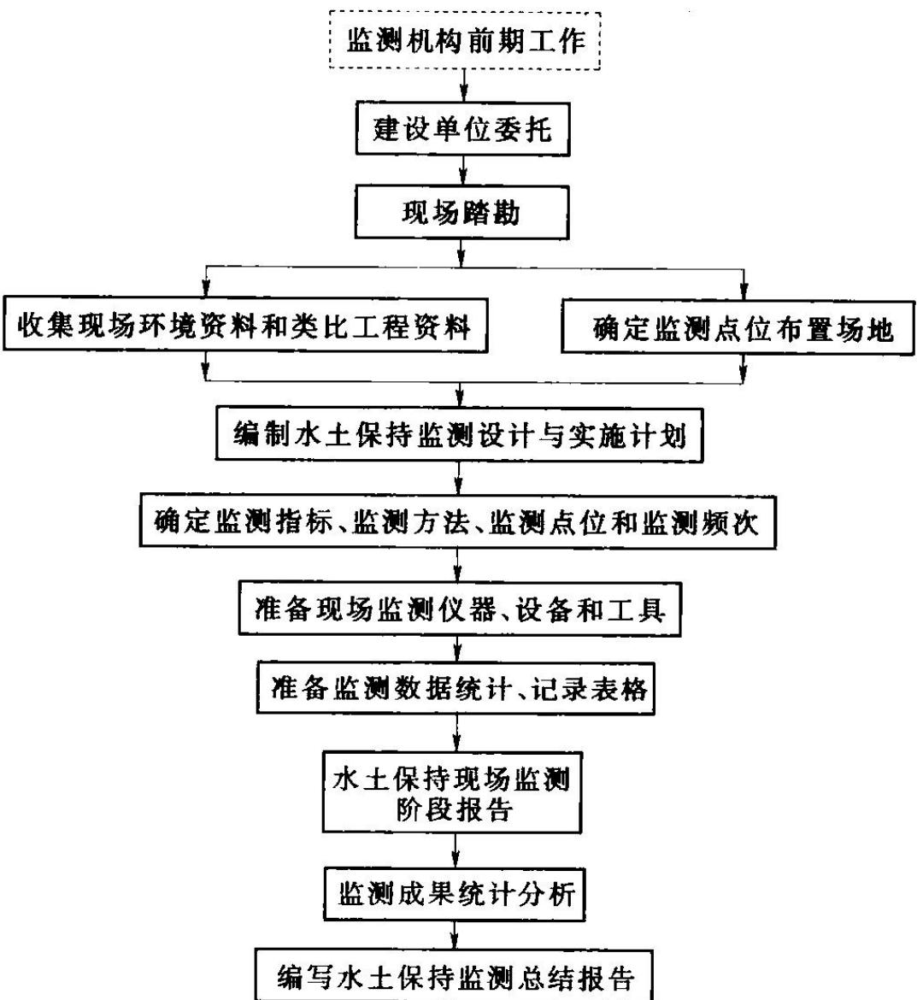  
图9.1 开发建设项目水土保持监测主要环节和流程

在整个监测流程中，监测机构不仅要与监测任务委托机构不断联系，而且要及时向水土保持设施建设的行政管理机构汇报监测情况，要与水土保持设施的设计、施工和施工监理等机构不断联系，因为这些机构是由于项目而联系在一起的主要的利益相关者。这些利益相关者既具有一致的总体利益，又具有不同的关注焦点，偶尔还产生争执和矛盾。因此，需要通过必要的有关文本(包括技术内容和商务内容）确定相关者的权利和义务，这也是在不同阶段编制相关报告的原因之一。

## 9.2 开发建设项目水土保持监测阶段划分

参考工程项目建设周期与阶段划分[3]，根据开发建设项目水土保持监测整个过程的阶段性特点[4-5]，可以将开发建设项目水土保持监测周期划分为监测项目投标竞标阶段、监测启动准备阶段、动态监测实施阶段和监测总结报告编制与提交阶段。每个阶段的特点和主要任务分别叙述如下。

## 9.2.1 监测项目投标竞标阶段

按照工程项目建设的基本程序（见图9.2)[1]，在开发建设项目水土保持方案报告书和水土保持设施设计批复以后，就进入到设备、工程和技术服务等的招标阶段，甚至在水土保持方案报告书和水土保持设施设计编制阶段就开始酝酿招标的有关事宜。在开发建设项目的工程招标阶段，该项目的水土保持监测也就进入了技术服务投标阶段。将此阶段称为监测项目投标竞标阶段。

这一阶段的主要工作包括：开发建设项目调查研究、水土保持监测可行性分析与决策、投标。本阶段的主要目标是通过项目研究、监测可行性分析、监测机构决策，对是否要开展项目监测、如何实施监测、何时何地提交何种监测成果等重大事宜，进行科学论证和多方案比较，最后确定是否投标、选择哪个方案投标。

这一阶段十分重要，关系到投标是否成功，关系到监测实施的工作量和人力、时间和资金的投入，关系到监测成果的质量。从监测技术角度来讲，标书的内容就成为重中之重。

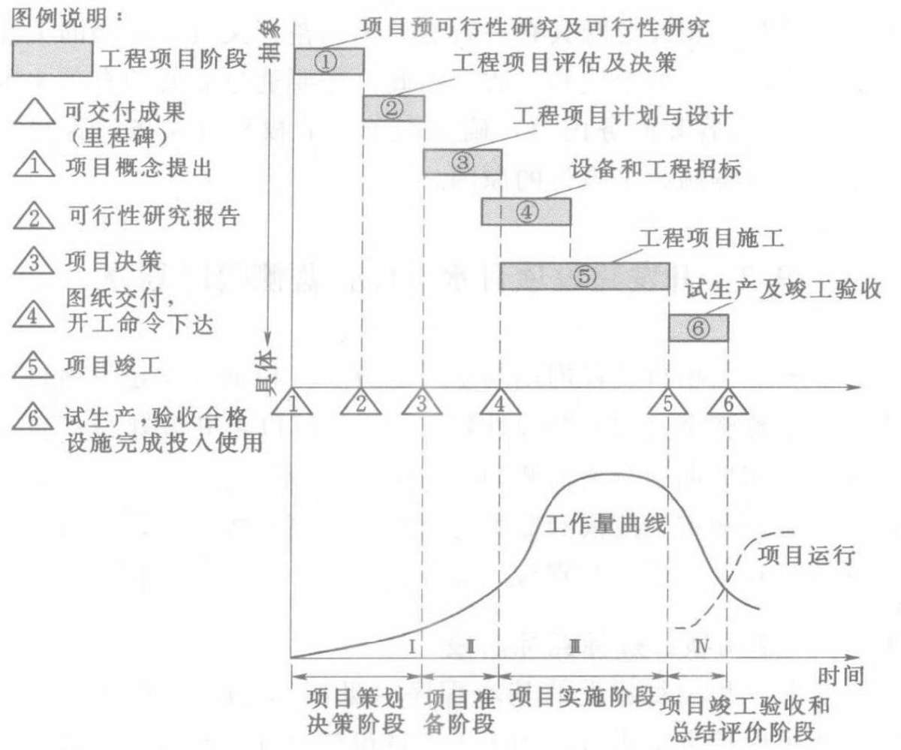  
图9.2 工程项目建设周期与阶段划分  
(注：1. 工程项目管理阶段还可进一步划分；2. 工程项目运行不属于工程项目管理范畴。)

## 9.2.2 监测启动准备阶段

中标之后，即监测合同签订（或监测机构接受委托）后，就进入到了监测启动准备阶段。本阶段的主要任务是监测实施条件的准备，包括技术队伍组建、基础资料收集、设施设备准备、建设项目水土保持现状调查、监测设计与实施计划编制、人员培训等。本阶段是监测项目投标竞标阶段决策的具体化，在很大程度上决定了项目监测实施的成败及能否高效率、高效力地达到预期目标。

## 9.2.3 动态监测实施阶段

动态监测实施阶段的主要任务是按照监测设计与实施计划的规定，布设监测点，开展测验和调查，采集相关数据，并及时向利益相关者提供信息，为水土流失防治提供依据。在整个项目监测周期中，本阶段比较按部就班、比较按章办事，而且应该、必须按章办事、按部就班；否则，不是犯规就是违章，或者不遵循技术标准、不执行合同承诺。

## 9.2.4 监测总结报告编制与提交阶段

提交阶段应该完成项目监测数据的整理分析、编制监测报告、监测档案整理，以及向相关单位汇报、提交监测总结报告等工作。项目监测成果科学、合理，在开发建设项目水土保持设施验收后，开发建设项目水土保持监测即告结束。

## 9.3 开发建设项目水土保持监测各阶段主要成果报告

开发建设项目水土保持监测属于技术服务类、技术咨询类的工作，其成果主要是监测技术报告。

如前所述，开发建设项目水土保持监测的成果，不仅仅是一个最终的监测报告，而是由各个阶段产生的具有时间序列和逻辑序列的一系列监测成果报告组成的报告集。下面，对应于上述划分的水土保持监测周期及其四个阶段，将每个阶段主要的成果报告及其内容提纲分别阐述如下。

## 9.3.1 投标书

在开发建设项目水土保持监测投标阶段，监测机构必须编制投标书。其中的技术条款部分，主要包括编制依据、监测点布局、监测指标及其观测方法、预期成果、经费预算、监测实施组织和质量保证体系等内容。在投标书中，出众的监测技术内容，以及与之对应的、合理的经费预算，是中标的前提。

其中的经费预算应该按照有关规定编制，如《开发建设项目水土保持工程概（估）算编制规定》（水总〔2003〕67号）[6]、《关于开发建设项目水土保持咨询服务费计列的指导意见》（保监[2005〕22号）等。但是，这些依据对于项目监测费用的计算，基本上采用费用系数法，即按照水土保持工程（包括工程措施、植物措施和临时工程）费用之和的一定比例，或者按照主体工程土建投资之和分段确定监测费用，其结果只是总费用数值，无法清晰给出任务与经费的对应关系、无法反映费用的开支方向。

为了避免费用系数法无法清晰表达经费与监测任务、监测进度、监测阶段成果等对应关系的不足，为了指导和控制项目水土保持监测经费使用、提高经费使用效果，在投标书中可以采用“实际需要计算法”预算监测经费，即根据具体开发建设项目的水土保持监测工作内容及其必需的管理要素计算监测经费。这种方法在《开发建设项目水土保持方案技术规范》（SL204—98)[8]已有说明：在水土保持投资估（概）算及效益分析中，提出“监测费根据实际开发建设项目监测的实际需要计算。”至于“实际需要”包括哪些费用呢？根据开发建设项目的实践，项目水土保持监测经费的“实际需要”主要包括监测点设施设备建设安装、监测设备使用折旧与易耗品采购、水土流失与治理措施动态监测、监测成果处理、监测机构组织管理及项目税金等。这些实际需要的费用，可以按照基础单价、设施设备数量、动态监测工作量等编制；可以归纳为直接费、间接费、企业（监测机构）利润和税金等，其中直接费包括人工费、材料费、资料费、差旅交通费、现场办公费、机械使用费及其他必需的费用，间接费指企业管理费、财务费用和其他费用等。表9.1给出了一个按照“实际需要计算法”计算监测费用的样表。在该表中，按照水土保持监

表1
<table><tr><td rowspan=1 colspan=1>费用构成</td><td rowspan=1 colspan=1>单价数</td><td rowspan=1 colspan=1>量单</td><td rowspan=1 colspan=1>位</td><td rowspan=1 colspan=1>合价</td><td rowspan=1 colspan=1>单价构成</td><td rowspan=1 colspan=1>备注</td><td></td></tr><tr><td rowspan=1 colspan=1>1定点监测设施建设安装</td><td rowspan=1 colspan=1></td><td rowspan=1 colspan=1></td><td rowspan=1 colspan=1></td><td rowspan=1 colspan=1>N11×P11+N12×P12</td><td rowspan=1 colspan=1></td><td rowspan=1 colspan=1></td><td></td></tr><tr><td rowspan=1 colspan=1>11 布设观测样地</td><td rowspan=1 colspan=1>P11</td><td rowspan=1 colspan=1>N11</td><td rowspan=1 colspan=1>个</td><td rowspan=1 colspan=1>N1×Pn</td><td rowspan=1 colspan=1>每个固定观测场建设安装单价为P11，包括必需的设施、设备，以及场地整理、设施与设备布设安装等</td><td rowspan=1 colspan=1></td><td></td></tr><tr><td rowspan=1 colspan=1>12 选择调查样地</td><td rowspan=1 colspan=1>P12</td><td rowspan=1 colspan=1>N12</td><td rowspan=1 colspan=1>个</td><td rowspan=1 colspan=1>N12×P12</td><td rowspan=1 colspan=1>每个观测样区建设安装单价为P12，包括必需的设施、设备，以及场地整理、设施与设备布设安装等</td><td rowspan=1 colspan=1></td><td rowspan=1 colspan=1></td></tr><tr><td rowspan=1 colspan=1>2监测设备折旧与易耗品</td><td rowspan=1 colspan=1></td><td rowspan=1 colspan=1></td><td rowspan=1 colspan=1></td><td rowspan=1 colspan=1>N21×P21+N22×P22</td><td rowspan=1 colspan=1></td><td rowspan=1 colspan=2></td></tr><tr><td rowspan=1 colspan=1>21监测设备折旧</td><td rowspan=1 colspan=1>P21</td><td rowspan=1 colspan=1>N21</td><td rowspan=1 colspan=1>%</td><td rowspan=1 colspan=1>N21×P21</td><td rowspan=1 colspan=1>按照固定资产的折旧规定核算，年度折旧率为N21</td><td rowspan=1 colspan=2>折旧率不能全部计入某一个项目</td></tr><tr><td rowspan=1 colspan=1>22易耗品</td><td rowspan=1 colspan=1>P22</td><td rowspan=1 colspan=1>N22</td><td rowspan=1 colspan=1>套</td><td rowspan=1 colspan=1>N22×P22</td><td rowspan=1 colspan=1>按照选择的易耗品的价格确定</td><td rowspan=1 colspan=2>易耗品一般不止一类，要完备但不能充数</td></tr><tr><td rowspan=1 colspan=1>3 动态监测</td><td rowspan=1 colspan=1></td><td rowspan=1 colspan=1></td><td rowspan=1 colspan=1></td><td rowspan=1 colspan=1>N31×P31+N32×P32+N33×P33</td><td rowspan=1 colspan=1></td><td rowspan=1 colspan=2></td></tr></table>

<table><tr><td rowspan=1 colspan=1>费用构成</td><td rowspan=1 colspan=1>单价数</td><td rowspan=1 colspan=1>量单</td><td rowspan=1 colspan=1>位</td><td rowspan=1 colspan=1>合价</td><td rowspan=1 colspan=1>单价构成</td><td rowspan=1 colspan=1>备注</td></tr><tr><td rowspan=1 colspan=1>31 观测样地动态观测</td><td rowspan=1 colspan=1>P31</td><td rowspan=1 colspan=1>N31</td><td rowspan=1 colspan=1>次</td><td rowspan=1 colspan=1>N31×P{31</td><td rowspan=1 colspan=1>每次每观测样地的监测单价为P31，包括取样及其分析、观测记录、实地查勘与交通、耗材等费用；数量N31应按照确定的监测频率和监测时段等确定</td><td rowspan=1 colspan=1></td></tr><tr><td rowspan=1 colspan=1>32 调查样地动态观测</td><td rowspan=1 colspan=1>P32</td><td rowspan=1 colspan=1>N32</td><td rowspan=1 colspan=1>次</td><td rowspan=1 colspan=1>N32×P32</td><td rowspan=1 colspan=1>每次每调查样地的监测单价为P32，包括观测记录、实地查勘与交通、耗材等费用；数量N32应按照确定的监测频率和监测时段等确定</td><td rowspan=1 colspan=1></td></tr><tr><td rowspan=1 colspan=1>33 野外调查</td><td rowspan=1 colspan=1>P33</td><td rowspan=1 colspan=1>N33</td><td rowspan=1 colspan=1>次</td><td rowspan=1 colspan=1>N33×P33</td><td rowspan=1 colspan=1>每次野外调查的单价为P33，包括野外测量、交通、住宿、耗材和调查人员野外补助等；数量N33应按照确定的监测频率与监测时段等确定</td><td rowspan=1 colspan=1></td></tr><tr><td rowspan=1 colspan=1>4 成果处理</td><td rowspan=1 colspan=1></td><td rowspan=1 colspan=1></td><td rowspan=1 colspan=1></td><td rowspan=1 colspan=1>N41×P41+N42×P42+N43×P{43</td><td rowspan=1 colspan=1></td><td rowspan=1 colspan=1></td></tr><tr><td rowspan=1 colspan=1>41 数据汇总与分析</td><td rowspan=1 colspan=1>P{41</td><td rowspan=1 colspan=1>N41</td><td rowspan=1 colspan=1>工日</td><td rowspan=1 colspan=1>N41×P41</td><td rowspan=1 colspan=1>数据汇总应按照确定的阶段报告分别进行；P41为工日单价，N41为总工日</td><td rowspan=1 colspan=1>不同阶段数据汇总和分析需要的工日一般不同</td></tr></table>

<table><tr><td rowspan=1 colspan=1>费用构成</td><td rowspan=1 colspan=1>单价数</td><td rowspan=1 colspan=1>量单</td><td rowspan=1 colspan=1>位</td><td rowspan=1 colspan=1>合价</td><td rowspan=1 colspan=1>单价构成</td><td rowspan=1 colspan=1>备注</td></tr><tr><td rowspan=1 colspan=1>42监测报告编写</td><td rowspan=1 colspan=1>P42</td><td rowspan=1 colspan=1>N₄2</td><td rowspan=1 colspan=1>工日</td><td rowspan=1 colspan=1>N42×P₄2</td><td rowspan=1 colspan=1>监测报告包括阶段报告和总报告等；报告编写的工作主要包括图件制作、数据整理与分析、报告撰写等；P42为工日单价，N42为总工日</td><td rowspan=1 colspan=1>不同阶段的监测报告编写需要的工日可能不同</td></tr><tr><td rowspan=1 colspan=1>43成果印刷</td><td rowspan=1 colspan=1>P43</td><td rowspan=1 colspan=1>N43</td><td rowspan=1 colspan=1>本</td><td rowspan=1 colspan=1>N43×P43</td><td rowspan=1 colspan=1>包括监测成果和最终报告等</td><td rowspan=1 colspan=1></td></tr><tr><td rowspan=1 colspan=1>5 组织管理</td><td rowspan=1 colspan=1>P5</td><td rowspan=1 colspan=1>∑1~4</td><td rowspan=1 colspan=1>%</td><td rowspan=1 colspan=1>P5×Σ1~4</td><td rowspan=1 colspan=1>按照∑1~4的百分比取值；百分比应该符合国家相关规定</td><td rowspan=1 colspan=1>包括企业管理费、财务费用等</td></tr><tr><td rowspan=1 colspan=1>6 税金</td><td rowspan=1 colspan=1>P6</td><td rowspan=1 colspan=1>∑1~5</td><td rowspan=1 colspan=1>%</td><td rowspan=1 colspan=1>P6×∑1~5</td><td rowspan=1 colspan=1>按照∑1~5的百分比取值；百分比应该符合国家相关规定</td><td rowspan=1 colspan=1></td></tr><tr><td rowspan=1 colspan=1>合计</td><td rowspan=1 colspan=1></td><td rowspan=1 colspan=1></td><td rowspan=1 colspan=1></td><td rowspan=1 colspan=1>∑1~6</td><td rowspan=1 colspan=1></td><td rowspan=1 colspan=1></td></tr></table>

热\~\~

测的基本流程，列出了必需的开支方面及这些开支费用的基本概算方法、单价构成及其说明。按照“实际需要计算法”编制预算，费用编制结果（概算表）也应该包括总预算表、年度（进度）投资表及预算附表等；简单时，可以只有总预算表和年度（进度）投资表。

投标书中的监测技术内容，可以在有关技术标准、规范性文件的指导下[1-2.1-6]，参考有关材料编写。但是，由于文案资料和第一手资料有限，技术材料主要是可行性研究深度的水土保持方案报告书和主体项目可行性研究报告，投标书中的技术条款仍然不可能十分具体、不可能完全与实际情况吻合，还需要在启动准备阶段，对项目及其项目区基本情况进行普查，随后进行补充完善、论证讨论。

## 9.3.2 监测设计与实施计划

在中标后，项目监测工作进入启动准备阶段。在该阶段，监测机构不断收集基础资料、全面配置设施设备，组织技术人员对项目及项目区域进行全面调查，获取了大量、确凿的第一手材料；然后由项目管理人员、技术专家和现场调查人员共同补充、修正投标书中的监测技术部分，并充分研究讨论、形成“开发建设项目水土保持监测设计与实施计划”[7]。这些工作形成了本阶段的工作成果，包括技术队伍、基础资料、设施设备、监测设计和实施计划报告等。其中，监测设计和实施计划报告，是主要的技术报告。

监测设计与实施计划是由承担开发建设项目水土保持监测工作的机构，根据水土保持方案编制的、用于规范和指导监测技术人员开展项目监测活动的技术文件，其重点是：依据开发建设项目水土保持方案及其批复文件，经过一定深度的现场查勘和调查，针对项目的具体特点，对水土保持监测的内容、时段、监测点布设、主要观测指标及其方法与频率、监测工作组织管理、实施进度和预期主要成果等进行设计。该报告，对于监测机构，可作为开展水土流失及其治理措施测验与调查的技术指导文件，使监测工作有章可循、监测工作进度与监测成果质量得到保证；对于监测任务委托机构，可作为及时获得水土流失动态信息的依据，并基于相关信息组织施工、设计及监理、监测等机构研讨重大问题，及时调整设计与施工，防止水土流失；对于开发建设项目水土保持监督机构，可作为检查监测工作乃至其他工作的依据，保障做好水土保持工作。

在书中，将水利部水土保持监测中心编制并印发相关监测机构，供参照使用的《开发建设项目水土保持监测设计与实施计划编制提纲（试行）》（水保监2006]16号，2006年7月6日）[7]的主要组成部分及其内容列出，供大家参考使用，具体见附录二。

需要说明的是，在该编制提纲中包括了“经费预算”。在实际的项目监测启动准备阶段，监测设计与实施计划中可以没有“经费预算”的内容，因为在监测投标阶段已经确定了监测经费。如果要有监测经费的内容，可以是经费使用计划。

## 9.3.3 动态监测实施阶段报告

在动态监测实施阶段，为了将监测数据及其分析所得信息及时向利益相关者提供，以便对开发建设项目水土流失及其防治相关的行为（包括设计、施工、监理等）产生积极的和有效的控制，防止水土流失，保证工程建设安全。由此可知，本阶段的主要成果就是动态监测数据及基于数据研究分析得到的相关信息(如消息、结论、建议等)。

在本阶段，开发建设项目水土流失及其防治处于不断的变化之中，监测所得数据及其分析所得信息具有似乎矛盾而又相互支撑的两方面特征：一是分析所得信息反映的内容，应该不仅仅包括这种不断变化过程中某个时间断面的信息，而且还要包括过去一段时间的动态变化及近期的预测预报信息；二是分析所得信息反映的内容，应该紧紧依据监测数据、原原本本地分析水土流失及其防治现状，而不得随意扩展，避免基础数据正确、分析结论偏颇、预测信息错误的现象。通常，这些信息总是通过定期或不定期的函件、会议材料等方式提供给相关各方，或者临时通过手机短信、电话、电子邮件等提供消息。正式的函件和会议材料就组成了动态监测成果阶段报告。

开发建设项目水土保持监测的阶段报告可以是报告书，也可以是报告表。报告书是按照监测设计和实施计划或者项目监测合同确定的时间，定期向监测任务委托机构交付的阶段性监测报告；其内容应该反映从开始到当前整个过程（或从某个时间开始到当前的时期内）的主体工程建设进度、水土保持设施实施情况与工程建设造成的水土流失等，主要包括工程建设进度、监测布局、监测内容、监测工作组织、监测成果与分析、建议等，同时填写填报水土保持监测阶段信息表。附录三为一个动态监测阶段报告书的编制提纲，供大家参考使用。

报告表主要用于临时性、不定期地向项目建设机构交付监测数据及其初步分析的信息，内容和格式比报告书更简单、更明了。当然，报告表也可以用于定期交付监测数据及其相关信息。报告表的主要内容包括：水土保持工程进度、实施的监测工作及其主要数据、结论与有关建议等，同时填报开发建设项目水土保持监测阶段信息表（见附录三）。

## 9.3.4 监测总结报告

在水土保持监测总结阶段，主要的成果包括监测技术报告、监测工作报告和监测档案等。其中，监测技术报告主要从技术角度，全面系统地反映监测的内容、指标、方法、数据及其分析结果、结论等，要求报告各个部分相互关联、逻辑序列清晰，相关的计算分析合理、结论可靠；监测工作报告主要从实施组织角度，总结分析项目监测的人员组织、质量控制、进度管理、监测事件及其处理情况等，提出监测经验、存在问题与建议等；监测档案就是按照相关规定，按照一定序列整理整编的监测过程的全部必需存档的资料的集合。

开发建设项目水土保持监测技术报告和监测工作报告也可以合并为一个报告，即监测总结报告。在监测总结报告中，将全面整理整个监测周期中各个阶段的全部资料，并汇编形成项目建设档案；将全面总结分析监测点布局、监测指标及其数据采集方法、对应的监测设施设备，以及监测数据质量；将全面分析水土流失的自然和人为因素，并与之对应地分析防治措施实施的时间、工程内容（措施类型）和工程量（措施数量），并计算各类型各分区各时段的水土流失量、防治措施及其效益；将分析总结全过程分阶段的监测工作组织管理、质量保证和质量控制体系，以及主要经验和存在问题等。

为了研究监测技术进展、总结监测工作经验和教训，在编制监测技术报告、监测工作报告的过程中，应根据整个项目监测过程的实践积累和发现，对监测设计和实施计划中提出的监测内容、监测指标、设施设备、测验方法、监测工作组织和管理等内容进行评价，分析监测设计阶段的初步认识与监测实施阶段的实际情况的相同点和不同点，总结提出改进和完善开发建设项目水土保持监测设计、建立和健全监测实施组织管理、加强和保证监测质量的方法、技术和制度。由此可知：监测成果提交阶段，并非单纯地为了回答开发建设项目水土保持成效的数据分析和效益计算，也是为了持续地改进和发展监测设计和实施计划，为了对整个监测周期“回头看”、对监测各个阶段工作总结，进而分析提出改进技术方法、组织管理及相关方面的途径和方法。

附录四\~附录六分别列出水利部水土保持监测中心印发的《开发建设项目水土保持监测设计与实施计划编制提纲（试行）》（水保监「2006]16号，2006年7月6日）中提出的《水土保持监测报告提纲》和《开发建设项目水土保持监测特性表》6的目录与主要内容，以及《开发建设项目水土保持设施验收技术规程》(SL387—2007)[2]提出的《水土保持监测总结报告》的内容提纲，供大家参考使用。

比较水利部水土保持监测中心提出的《水土保持监测报告提纲》、《开发建设项目水土保持监测特性表》与《水土保持监测总结报告》的主要内容，可以大略分析监测技术报告和监测总结报

告的主要区别。

在此，将开发建设项目水土保持监测阶段划分和每个阶段的主要成果报告进行对比分析，再分析本章开始两个段落的内容，可以理解为什么进行阶段划分、为什么要明确每个阶段的主要工作内容和成果、为什么主要阶段一般也以该阶段可以交付成果的名称命名，作为项目进展的里程碑等。其实，这些都是为了实现水土保持监测过程控制，确保监测工作良好开展，并保证监测的效率和效益。

通过分析开发建设项目水土保持监测的整个周期及其阶段划分，以及各个阶段的主要任务、阶段成果、各个阶段之间的相互关联特征，可以看出整个监测过程体现了全流程管理、分环节控制和过程控制、质量保证的水土保持监测项目管理机制[3.9-10]，即按照计划、实施、检查、处理和总结记录等过程进行管理。在整个过程管理中，每一个过程都具有独特的其他过程难以替代的功能，并强调这些过程构成了一个递进的、相互作用的统一体，强调项目过程是一个具有“批评与自我批评”机制、可以持续改进并循环上升的过程。

## 参考文献

[1]水利部水土保持监测中心.SL 277—2002 水土保持监测技术规程.北京：中国水利水电出版社，2002.

[2]水利部水土保持监测中心. SL 387一2007 开发建设项目水土保持设施验收技术规程。北京：中国水利水电出版社，2007.

[3]注册咨询工程师（投资）考试教材编写委员会.工程项目组织与管理.北京：中国计划出版社，2006.

[4]刘震.水土保持监测技术. 北京：中国大地出版社，2004.

[5]李智广. 开发建设项目水土保持监测实施细则编制初探.水土保持通报.2005，25(6)：91-95.

[6]水利部水利水电规划设计总院.水土保持工程概（估）算编制规定.郑州：黄河水利出版社，2003.

[7]水利部水土保持监测中心.关于印发（开发建设项目水土保持监测设计与实施计划编制提纲（试行））的函（水保监〔2006〕16号）.2006, 7.

[8]水利部水土保持司. SI204—98 开发建设项目水土保持方案技术规范.北京：中国水利水电出版社，1998.

9]李智广. 全国土壤侵蚀遥感调查数据质量保证体系.水土保持通报. 2001，21 (2)：63-66.

[10]李智广，杨林.飞来峡水利枢纽水保工程监测内容和方法设计. 水土保持通报.2003，23（1）：52-55.

## 附录一 关于划分国家级水土流失重点防治区的公告

(中华人民共和国水利部公告，2006年第2号)

为了明确国家级水土流失防治重点，实施分区防治战略，分类指导，有效地预防和治理水土流失，促进经济社会的可持续发展，根据《中华人民共和国水土保持法》以及《中华人民共和国水土保持法实施条例》的有关规定，水利部在《全国水土保持规划纲要》、《全国生态环境建设规划》和全国第二次土壤侵蚀遥感调查成果的基础上，划定42个国家级水土流失重点防治区（包括重点预防保护区、重点监督区、重点治理区），面积222.98万km²（包括重点监督区与重点治理区重复面积14.13万km²），其中水土流失面积95.46 万km²（包括重点监督区与重点治理区重复面积11.28万km²)。经国务院批准，现公告如下：

## 一、重点预防保护区

共16个，包括大兴安岭、呼伦贝尔、长白山、滦河、黑河绿洲、塔里木河绿洲、子午岭、六盘山、三江源、金沙江上游、岷江上游、汉江上游、桐柏山大别山、新安江、湘资沅上游和东江上游等预防保护区，总面积97.63万km²，其中水土流失面积29.45万km²。本区目前水土流失较轻，林草覆盖度较高，但存在水土流失加剧的潜在危险，主要为次生林区、草原区、重要水源区、萎缩的自然绿洲区等。要坚持预防为主、保护优先的方针，建立健全管护机构，制定有力措施，强化监督管理。要实施封山禁牧、舍饲养畜、草场封育轮牧、生态修复、大面积保护等措施，坚决限制开发建设活动，有效避免人为破坏，保护植被和

生态。

## 二、重点监督区

共7个，包括辽宁冶金煤矿、晋陕蒙接壤煤炭、陕甘宁蒙接壤石油天然气、豫陕晋接壤有色金属、东南沿海、新疆石油天然气开发监督区和三峡库区监督区，总面积30.60万km²，其中水土流失面积17.98万km²。本区资源开发和基本建设活动较集中和频繁，损坏原地貌易造成水土流失，水土流失危害后果较为严重，主要为矿山集中开发区、石油天然气开采区、特大型水利工程库区、交通能源等基础设施建设区以及在建的国家特大型工程区。要依法实施重点监督，加强执法检查，加大宣传力度，增强法制观念，有法必依，违法必究。开发建设项目必须依法编报水土保持方案，贯彻执行水土保持“三同时”制度，依靠社会和企业的力量，遏制人为造成新的水土流失。

## 三、重点治理区

共19个，包括东北黑土地、西辽河大凌河中上游、永定河、太行山、河龙区间多沙粗沙、泾河北洛河上游、祖厉河渭河上游、湟水洮河中下游、伊洛河三门峡库区、沂蒙山、嘉陵江上中游、丹江口水源区、三峡库区、金沙江下游、乌江赤水河上中游、湘资沅澧中游、赣江上游、珠江南北盘江和红河上中游重点治理区，总面积108.88万km²，其中水土流失面积59.31万km²。本区原生的水土流失较为严重，对当地和下游造成严重水土流失危害，主要为大江、大河、大湖的中上游地区。要调动社会各方面的积极性，依靠政策、投入、科技，开展水土流失综合治理，改善生态环境，改善当地生产条件，提高群众生产和生活水平。

特此公告。

附件：

国家级水土流失重点防治区名单

## 一、国家级重点预防保护区

<table><tr><td></td><td rowspan=1 colspan=2>序号</td><td rowspan=1 colspan=1>名称</td><td rowspan=1 colspan=2>涉及省(自治区、直辖市）</td><td rowspan=1 colspan=1>涉及县（市、区、旗）</td></tr><tr><td></td><td rowspan=2 colspan=2>1</td><td rowspan=2 colspan=1>大兴安岭预防保护区</td><td rowspan=1 colspan=2>黑龙江</td><td rowspan=1 colspan=1>呼玛县、漠河县、塔河县</td></tr><tr><td></td><td rowspan=1 colspan=2>内蒙古</td><td rowspan=1 colspan=1>阿尔山市、阿荣旗、牙克石市、鄂伦春自治旗、科尔沁右翼前旗、扎兰屯市、鄂温克族自治旗、根河市</td></tr><tr><td></td><td rowspan=1 colspan=2>2</td><td rowspan=1 colspan=1>呼伦贝尔预防保护区</td><td rowspan=1 colspan=2>内蒙古</td><td rowspan=1 colspan=1>鄂温克族自治旗、根河市、新巴尔虎左旗、陈巴尔虎旗、呼伦贝尔市海拉区、额尔古纳市、新巴尔虎右旗、满州里市、阿尔山市、牙克石市</td></tr><tr><td></td><td rowspan=1 colspan=2>3</td><td rowspan=1 colspan=1>长白山预防保护区</td><td rowspan=1 colspan=2>吉林</td><td rowspan=1 colspan=1>汪清市、抚松县、临江市、长白朝鲜族自治县、安图县、和龙市、敦化市</td></tr><tr><td></td><td rowspan=2 colspan=2>4</td><td rowspan=2 colspan=1>滦河预防保护区</td><td rowspan=1 colspan=2>北京</td><td rowspan=1 colspan=1>昌平区、延庆县、怀柔区、平谷区、密云县</td></tr><tr><td></td><td rowspan=1 colspan=2>河北</td><td rowspan=1 colspan=1>兴隆县、沽源县、滦平县、丰宁满族自治县、围场满族蒙古族自治县、隆化县、承德县、平泉县、宽城满族自治县、承德市市辖区、赤诚县</td></tr><tr><td></td><td rowspan=3 colspan=2>5</td><td rowspan=3 colspan=2>黑河绿洲预防保护区</td><td rowspan=1 colspan=2>甘肃</td><td rowspan=1 colspan=1>甘州区（张掖）、民乐县、肃南裕固族自治县、高台县、临泽县、金塔县</td></tr><tr><td></td><td rowspan=1 colspan=2>青海</td><td rowspan=1 colspan=2>祁连县</td></tr><tr><td></td><td rowspan=1 colspan=2>内蒙古</td><td rowspan=1 colspan=2>额济纳旗</td></tr><tr><td rowspan=1 colspan=2>6</td><td rowspan=1 colspan=2>塔里木河绿洲预防保护区</td><td rowspan=1 colspan=2>新疆</td><td rowspan=1 colspan=1>尉犁县、若羌县</td></tr><tr><td rowspan=2 colspan=2>7</td><td rowspan=2 colspan=2>子午岭预防保护区</td><td rowspan=1 colspan=2>陕西</td><td rowspan=1 colspan=1>富县、黄陵县、宜君县、铜川市市辖区、铜川市耀州区、耀县、淳化县、甘泉县、旬邑县</td></tr><tr><td rowspan=1 colspan=2>甘肃</td><td rowspan=1 colspan=2>华池县、合水县、宁县、正宁县</td></tr><tr><td rowspan=3 colspan=2>8</td><td rowspan=3 colspan=2>六盘山预防保护区</td><td rowspan=1 colspan=2>陕西</td><td rowspan=1 colspan=1>陇县、宝鸡县、千阳县</td></tr><tr><td rowspan=1 colspan=2>甘肃</td><td rowspan=1 colspan=2>崇信县、平凉市崆峒区、华亭县、张家川回族自治县、清水县、庄浪县</td></tr><tr><td rowspan=1 colspan=2>宁夏</td><td rowspan=1 colspan=2>固原市原州区、隆德县、泾源县</td></tr></table>

## 一、国家级重点预防保护区

<table><tr><td rowspan=1 colspan=1>序号</td><td rowspan=1 colspan=1>名称</td><td rowspan=1 colspan=1>涉及省(自治区、直辖市）</td><td rowspan=1 colspan=1>涉及县（市、区、旗）</td></tr><tr><td rowspan=2 colspan=1>9</td><td rowspan=2 colspan=1>三江源预防保护区</td><td rowspan=1 colspan=1>青海</td><td rowspan=1 colspan=1>达日县、玉树县、玛多县、称多县、久治县、河南蒙古族自治县、玛沁县、泽库县、治多县、甘德县、同德县、兴海县、曲麻莱县、贵南县、共和县、囊谦县、杂多县、格尔木市唐古拉乡</td></tr><tr><td rowspan=1 colspan=1>甘肃</td><td rowspan=1 colspan=1>玛曲县</td></tr><tr><td rowspan=1 colspan=1>10</td><td rowspan=1 colspan=1>金沙江上游预防保护区</td><td rowspan=1 colspan=1>四川</td><td rowspan=1 colspan=1>得荣县、巴塘县、稻城县、乡城县、九龙县、雅江县、理塘县、白玉县、新龙县、道孚县、炉霍县、甘孜县、德格县、石渠县</td></tr><tr><td rowspan=2 colspan=1>11</td><td rowspan=2 colspan=1>岷江上游预防保护区</td><td rowspan=1 colspan=1>青海</td><td rowspan=1 colspan=1>班玛县</td></tr><tr><td rowspan=1 colspan=1>四川</td><td rowspan=1 colspan=1>色达县、壤塘县、阿坝县、金川县、丹巴县、小金县、汶川县、茂县、松潘县、九寨沟县、理县、黑水县</td></tr><tr><td rowspan=2 colspan=1>12</td><td rowspan=2 colspan=1>汉江上游预防保护区</td><td rowspan=1 colspan=1>湖北</td><td rowspan=1 colspan=1>神农架林区、房县、十堰市市辖区</td></tr><tr><td rowspan=1 colspan=1>陕西</td><td rowspan=1 colspan=1>勉县、太白县、凤县、留坝县、洋县、南郑县、城固县、西乡县、佛坪县、汉中市汉台区</td></tr><tr><td rowspan=3 colspan=1>13</td><td rowspan=3 colspan=1>桐柏山大别山预防保护区</td><td rowspan=1 colspan=1>安徽</td><td rowspan=1 colspan=1>岳西县、潜山县、太湖县、宿松县、金寨县、六安市市辖区、霍山县</td></tr><tr><td rowspan=1 colspan=1>湖北</td><td rowspan=1 colspan=1>麻城市、大悟县、罗田县、浠水县、红安县、英山县、蕲春县</td></tr><tr><td rowspan=1 colspan=1>河南</td><td rowspan=1 colspan=1>桐柏县、新县、信阳市市辖区、罗山县、固始县、潢川县、商城县、光山县</td></tr><tr><td rowspan=2 colspan=1>14</td><td rowspan=2 colspan=1>新安江预防保护区</td><td rowspan=1 colspan=1>安徽</td><td rowspan=1 colspan=1>绩溪县、歙县、休宁县、黄山市市辖区、黟县、祁门县</td></tr><tr><td rowspan=1 colspan=1>浙江</td><td rowspan=1 colspan=1>淳安县、桐庐县、建德市</td></tr><tr><td rowspan=1 colspan=1>15</td><td rowspan=1 colspan=1>湘资沅上游预防保护区</td><td rowspan=1 colspan=1>广西</td><td rowspan=1 colspan=1>资源县、全州县、灌阳县、兴安县、龙胜县、融安县</td></tr></table>

## 一、国家级重点预防保护区

<table><tr><td rowspan=1 colspan=1>序号</td><td rowspan=1 colspan=1>名称</td><td rowspan=1 colspan=1>涉及省(自治区、直辖市）</td><td rowspan=1 colspan=1>涉及县（市、区、旗）</td></tr><tr><td rowspan=3 colspan=1>15</td><td rowspan=3 colspan=1>湘资沅上游预防保护区</td><td rowspan=1 colspan=1>贵州</td><td rowspan=1 colspan=1>铜仁市、铜仁地区万山特区、天柱县、镇远县、施秉县、三穗县、玉屏侗族自治县、岑巩县、黎平县、江口县、台江县、剑河县、松桃苗族自治县、锦屏县</td></tr><tr><td rowspan=1 colspan=1>湖南</td><td rowspan=1 colspan=1>江华瑶族自治县、蓝山县、靖州苗族侗族自治县、城步苗族自治县、东安县、祁阳县、永州市辖区、宁远县、新田县、双牌县、道县、通道侗族自治县、江永县</td></tr><tr><td rowspan=1 colspan=1>重庆</td><td rowspan=1 colspan=1>秀山土家族苗族自治县</td></tr><tr><td rowspan=2 colspan=1>16</td><td rowspan=2 colspan=1>东江上游预防保护区</td><td rowspan=1 colspan=1>广东</td><td rowspan=1 colspan=1>博罗县、紫金县、龙川县、惠东县、河源市源城区、东源县、龙门县、新丰县、和平县</td></tr><tr><td rowspan=1 colspan=1>江西</td><td rowspan=1 colspan=1>寻乌县、定南县、安远县</td></tr></table>

## 二、国家级重点监督区

<table><tr><td rowspan=1 colspan=1>序号</td><td rowspan=1 colspan=1>名称</td><td rowspan=1 colspan=1>涉及省(自治区、直辖市）</td><td rowspan=1 colspan=1>涉及县（市、区、旗）</td></tr><tr><td rowspan=1 colspan=1>1</td><td rowspan=1 colspan=1>辽宁冶金煤矿开发监督区</td><td rowspan=1 colspan=1>辽宁</td><td rowspan=1 colspan=1>沈阳市苏家屯区、沈阳市东陵区、鞍山市千山区、海城市、岫岩满族自治县、抚顺市东洲区、本溪满族自治县、本溪市溪湖区、本溪市南芬区、本溪市新城子区、抚顺县、辽阳市弓长岭区、灯塔市、辽阳县、营口市盖州市、大石桥市</td></tr><tr><td rowspan=3 colspan=1>2</td><td rowspan=3 colspan=1>晋陕蒙接壤煤炭开发监督区</td><td rowspan=1 colspan=1>内蒙古</td><td rowspan=1 colspan=1>达拉特旗、准格尔旗、托克托县、伊金霍洛旗、东胜市</td></tr><tr><td rowspan=1 colspan=1>山西</td><td rowspan=1 colspan=1>偏关丛、河曲县、保德县、兴县</td></tr><tr><td rowspan=1 colspan=1>陕西</td><td rowspan=1 colspan=1>府谷县、神木县、横山县、榆林市榆阳区</td></tr><tr><td rowspan=4 colspan=1>3</td><td rowspan=4 colspan=1>陕甘宁蒙接壤石油天然气开发监督区</td><td rowspan=1 colspan=1>陕西</td><td rowspan=1 colspan=1>定边县、靖边县、子洲县、子长县、安塞县、吴旗县、志丹县</td></tr><tr><td rowspan=1 colspan=1>甘肃</td><td rowspan=1 colspan=1>环县、庆城县、华池县</td></tr><tr><td rowspan=1 colspan=1>内蒙古</td><td rowspan=1 colspan=1>乌审旗、鄂托克前旗</td></tr><tr><td rowspan=1 colspan=1>宁夏</td><td rowspan=1 colspan=1>灵武市、盐池县</td></tr></table>

## 二、国家级重点监督区

<table><tr><td rowspan=1 colspan=1>序号</td><td rowspan=1 colspan=1>名称</td><td rowspan=1 colspan=1>涉及省(自治区、直辖市）</td><td rowspan=1 colspan=1>涉及县（市、区、旗）</td></tr><tr><td rowspan=3 colspan=1>4</td><td rowspan=3 colspan=1>豫陕晋接壤有色金属开发监督区</td><td rowspan=1 colspan=1>河南</td><td rowspan=1 colspan=1>三门峡市湖滨区、灵宝县、陕县、嵩县、洛宁县、卢氏县、栾川县</td></tr><tr><td rowspan=1 colspan=1>山西</td><td rowspan=1 colspan=1>垣曲县、运城市盐湖区、夏县、平陆县、芮城县</td></tr><tr><td rowspan=1 colspan=1>陕西</td><td rowspan=1 colspan=1>潼关县、渭南市临渭区、蓝田县、华县、华阴县、洛南县</td></tr><tr><td rowspan=3 colspan=1>5</td><td rowspan=3 colspan=1>东南沿海开发监督区</td><td rowspan=1 colspan=1>浙江</td><td rowspan=1 colspan=1>湖州市辖区、长兴县、德清县、杭州市辖区、绍兴县、上虞市、余姚市、宁波市市辖区、奉化市、宁海县、三门县、临海市、台州市市辖区、温岭市、乐清市、温州市市辖区、瑞安市、平阳县、苍南县</td></tr><tr><td rowspan=1 colspan=1>福建</td><td rowspan=1 colspan=1>晋江市、南安市、安溪县、惠安县、德化县、大田县、永安市、三明市辖区、龙岩市新罗区、泉州市市辖区、上杭县、永定县、漳平市</td></tr><tr><td rowspan=1 colspan=1>广东</td><td rowspan=1 colspan=1>深圳市、珠海市、汕头市、佛山市、东莞市、中山市、广州市辖区</td></tr><tr><td rowspan=1 colspan=1>6</td><td rowspan=1 colspan=1>新疆石油天然气开发监督区</td><td rowspan=1 colspan=1>新疆</td><td rowspan=1 colspan=1>哈密市、呼图壁县、克拉玛依市辖区、乌苏市、鄯善县、吐鲁番市、于田县、策勒县、和田县、库车县、轮台县、库尔勒市、焉耆回族自治县、阿克苏市、沙雅县、新和县、博湖县、和硕县、玛那斯县、托克逊县</td></tr><tr><td rowspan=2 colspan=1>7</td><td rowspan=2 colspan=1>三峡库区监督区</td><td rowspan=1 colspan=1>湖北</td><td rowspan=1 colspan=1>巴东县、利川市、兴山县、宜昌市夷陵区、秭归县</td></tr><tr><td rowspan=1 colspan=1>重庆</td><td rowspan=1 colspan=1>开县、巫溪县、云阳县、奉节县、巫山县、万州区、忠县、石柱土家族自治县、丰都县、长寿区、涪陵区、武隆县、重庆市主城区、江津市</td></tr></table>

## 三、国家级重点治理区

<table><tr><td rowspan=1 colspan=1>序号</td><td rowspan=1 colspan=1>名称</td><td rowspan=1 colspan=1>涉及省(自治区、直辖市）</td><td rowspan=1 colspan=1>涉及县（市、区、旗）</td></tr><tr><td rowspan=4 colspan=1>1</td><td rowspan=4 colspan=1>东北黑土地治理区</td><td rowspan=1 colspan=1>黑龙江</td><td rowspan=1 colspan=1>龙江县、甘南县、克山县、克东县、北安市、海伦市、绥棱县、安达市、肇东市、双城市、哈尔滨市辖区、呼兰县、兰西市、绥化市北林区、青冈县、林甸县、望奎县、明水县、拜泉县、依安市、巴彦县、庆安县、木兰县、通河市、尚志市、方正县、宾县、延寿县、阿城市、五常市、富裕县、齐齐哈尔市辖区</td></tr><tr><td rowspan=1 colspan=1>吉林</td><td rowspan=1 colspan=1>榆树市、德惠市、舒兰市、公主岭市、四平市辖区、梨树县、伊通满族自治县、长春市辖区、东辽县、东丰县、磐石市、九台市、永吉县、辽源、梅河口市、桦甸市、吉林市辖区、辉南县、柳河县</td></tr><tr><td rowspan=1 colspan=1>辽宁</td><td rowspan=1 colspan=1>康平县、开原市、昌图县、西丰县、法库县、铁岭县、铁法市</td></tr><tr><td rowspan=1 colspan=1>内蒙古</td><td rowspan=1 colspan=1>突泉县、乌兰浩特市、扎赉特旗、科尔沁右翼前旗、扎兰屯市</td></tr><tr><td rowspan=2 colspan=1>2</td><td rowspan=2 colspan=1>西辽河大凌河中上游治理区</td><td rowspan=1 colspan=1>内蒙古</td><td rowspan=1 colspan=1>林西县、巴林右旗、巴林左旗、阿鲁科尔沁旗、宁城县、喀喇沁旗、开鲁县、翁牛特旗、奈曼旗、敖汉旗、赤峰市松山区、赤峰市宝山区、库伦旗</td></tr><tr><td rowspan=1 colspan=1>辽宁</td><td rowspan=1 colspan=1>建平县、阜新市辖区、义县、北票市、朝阳市辖区、朝阳县、凌源市</td></tr><tr><td rowspan=3 colspan=1>3</td><td rowspan=3 colspan=1>永定河治理区</td><td rowspan=1 colspan=1>北京</td><td rowspan=1 colspan=1>延庆县、昌平区</td></tr><tr><td rowspan=1 colspan=1>河北</td><td rowspan=1 colspan=1>怀来县、尚义县、万全县、崇礼县、宣化县、张家口市辖区、怀安县、阳原县、蔚县、涿鹿县</td></tr><tr><td rowspan=1 colspan=1>山西</td><td rowspan=1 colspan=1>天镇县、阳高县、左云县、广灵县、大同县、浑源县、应县、大同市辖区、怀仁县、山阴县、朔州朔城区、宁武县、朔州市平鲁区</td></tr></table>

## 三、国家级重点治理区

<table><tr><td rowspan=1 colspan=1>序号</td><td rowspan=1 colspan=2>名称</td><td rowspan=1 colspan=2>涉及省(自治区、直辖市）</td><td rowspan=1 colspan=1>涉及县（市、区、旗）</td></tr><tr><td rowspan=2 colspan=1>4</td><td rowspan=2 colspan=2>太行山治理区</td><td rowspan=1 colspan=2>河北</td><td rowspan=1 colspan=1>阜平县、平山县、井陉县、鹿泉市、元氏县、赞皇县、临城县、邢台县、沙河市、武安市、内丘县、磁县、涉县</td></tr><tr><td rowspan=1 colspan=2>山西</td><td rowspan=1 colspan=1>繁峙县、五台县、盂县、昔阳县、平定县、左权县、和顺县、黎城县、平顺县、代县、原平市、阳泉市辖区、长子县、榆社县、武乡县、沁县、襄垣县、潞城市、长治市辖区、壶关县、陵川县、长治县、高平市</td></tr><tr><td rowspan=3 colspan=1>5</td><td rowspan=3 colspan=2>河龙区间多沙粗沙治理区</td><td rowspan=1 colspan=2>内蒙古</td><td rowspan=1 colspan=1>清水河县、和林格尔县、凉城县、达拉特旗、准格尔旗、托克托县、乌审旗、伊金霍洛旗、东胜市</td></tr><tr><td rowspan=1 colspan=2>山西</td><td rowspan=1 colspan=2>右玉县、神池县、五寨县、岢岚县、静乐县、岚县、娄烦县、古交市、离石市、方山县、临县、柳林县、中阳县、石楼县、交口县、隰县、汾西县、永和县、大宁县、蒲县、吉县、乡宁县、朔州市平鲁区、偏关县、河曲县、保德县、兴县</td></tr><tr><td rowspan=1 colspan=2>陕西</td><td rowspan=1 colspan=2>佳县、吴堡县、绥德县、清涧县、宜川县、韩城市、米脂县、府谷县、神木县、横山县、榆林市榆阳区、定边县、靖边县、延川县、延长县、子洲县、子长县、安塞县、延安市宝塔区</td></tr><tr><td rowspan=3 colspan=1>6</td><td rowspan=3 colspan=2>泾河北洛河上游治理区</td><td rowspan=1 colspan=2>甘肃</td><td rowspan=1 colspan=1>灵台县、泾川县、镇原县、庆阳市西峰区、平凉市峻峒区、合水县、宁县、正宁县、环县、庆城县、华池县</td></tr><tr><td rowspan=1 colspan=2>陕西</td><td rowspan=1 colspan=2>旬邑县、彬县、麟游县、长武县、吴旗县、志丹县</td></tr><tr><td rowspan=1 colspan=2>宁夏</td><td rowspan=1 colspan=2>固原市原州区、彭阳县、同心县、海原县</td></tr></table>

## 三、国家级重点治理区

<table><tr><td rowspan=1 colspan=1>序号</td><td rowspan=1 colspan=1>名称</td><td rowspan=1 colspan=1>涉及省(自治区、直辖市）</td><td rowspan=1 colspan=1>涉及县（市、区、旗）</td></tr><tr><td rowspan=2 colspan=1>7</td><td rowspan=2 colspan=1>祖厉河渭河上游治理区</td><td rowspan=1 colspan=1>甘肃</td><td rowspan=1 colspan=1>武山县、甘谷县、秦安县、漳县、通谓县、陇西县、静宁县、会宁县、渭源县、定西县、榆中县、靖远县、天水市北道区、天水市秦城区、张家川回族自治县、清水县、庄浪县</td></tr><tr><td rowspan=1 colspan=1>宁夏</td><td rowspan=1 colspan=1>海源县、隆德县、西吉县</td></tr><tr><td rowspan=2 colspan=1>8</td><td rowspan=2 colspan=1>湟水洮河中下游治理区</td><td rowspan=1 colspan=1>甘肃</td><td rowspan=1 colspan=1>康乐县、和政县、东乡族自治县、积石山保安族东乡族撒拉族自治县、临夏县、临洮县、广河县、兰州市辖区、永靖县、临夏市</td></tr><tr><td rowspan=1 colspan=1>青海</td><td rowspan=1 colspan=1>循化撒拉族自治县、民和土族回族自治县、乐都县、贵德县、尖扎县、化隆回族自治县、湟中县、平安县、西宁市辖区</td></tr><tr><td rowspan=2 colspan=1>9</td><td rowspan=2 colspan=1>伊洛河三门峡库区治理区</td><td rowspan=1 colspan=1>河南</td><td rowspan=1 colspan=1>三门峡市湖滨区、灵宝县、陕县、嵩县、洛宁县、卢氏县、栾川县、渑池县、巩义市、新安县、孟津县、伊川县、偃师市、洛阳市洛龙区、义马市、宜阳县、汝阳县、汝州市</td></tr><tr><td rowspan=1 colspan=1>山西</td><td rowspan=1 colspan=1>垣曲县、运城市盐湖区、夏县、平陆县、芮城县</td></tr><tr><td rowspan=1 colspan=1>10</td><td rowspan=1 colspan=1>沂蒙山治理区</td><td rowspan=1 colspan=1>山东</td><td rowspan=1 colspan=1>沂源县、蒙阴县、沂水县、平邑县、沂南县、莒县、枣庄市山亭区、邹城市、泗水县、滕州市</td></tr><tr><td rowspan=3 colspan=1>11</td><td rowspan=3 colspan=1>嘉陵江上中游治理区</td><td rowspan=1 colspan=1>甘肃</td><td rowspan=1 colspan=1>两当县、徽县、武都县、康县、成县、文县、西和县、礼县、宕昌县、天水市北道区、天水市秦城区、迭部县、舟曲县</td></tr><tr><td rowspan=1 colspan=1>陕西</td><td rowspan=1 colspan=1>宁强县、略阳县、镇巴县</td></tr><tr><td rowspan=1 colspan=1>四川</td><td rowspan=1 colspan=1>万源市、宣汉县、开江县、达县、大竹县、邻水县、华鉴县、青川县、广元市辖区、旺苍县、南江县、通江县、平昌县、达州市通川区、渠县、广安区、巴中市巴州区、剑阁县、苍溪县、梓橦县、射洪县、盐亭县、三台县、仪陇县、营山县、大英县、隧宁市安居区、隧宁市船山区、蓬溪县</td></tr></table>

## 三、国家级重点治理区

<table><tr><td rowspan=1 colspan=1>序号</td><td rowspan=1 colspan=1>名称</td><td rowspan=1 colspan=1>涉及省(白治区、直辖市）</td><td rowspan=1 colspan=1>涉及县（市、区、旗）</td></tr><tr><td rowspan=4 colspan=1>12</td><td rowspan=4 colspan=1>丹江口水源区治理区</td><td rowspan=1 colspan=1>河南</td><td rowspan=1 colspan=1>西峡县、淅川县、内乡县</td></tr><tr><td rowspan=1 colspan=1>湖北</td><td rowspan=1 colspan=1>竹溪县、郧县、丹江口市、竹山县、郧西县</td></tr><tr><td rowspan=1 colspan=1>重庆</td><td rowspan=1 colspan=1>城门县</td></tr><tr><td rowspan=1 colspan=1>陕西</td><td rowspan=1 colspan=1>镇坪县、平利县、岚皋县、紫阳县、丹凤县、商南县、石泉县、宁陕县、汉阴县、安康市汉滨区、镇安县、柞水县、旬阳县、白河县、山阳县、商洛市商州区、洛南县</td></tr><tr><td rowspan=2 colspan=1>13</td><td rowspan=2 colspan=1>三峡库区治理区</td><td rowspan=1 colspan=1>湖北</td><td rowspan=1 colspan=1>巴东县、利川市、兴山县、宜昌市夷陵区、秭归县</td></tr><tr><td rowspan=1 colspan=1>重庆</td><td rowspan=1 colspan=1>开县、巫溪县、云阳县、奉节县、巫山县、万州区、忠县、石柱土家族自治县、丰都县、长寿区、涪陵区、武隆县、重庆市主城区、江津市</td></tr><tr><td rowspan=2 colspan=1>14</td><td rowspan=2 colspan=1>金沙江下游治理区</td><td rowspan=1 colspan=1>四川</td><td rowspan=1 colspan=1>会东县、会理县、攀枝花市市辖区、盐边县、盐源县、木里藏族自治县、兴文县、高县、屏山县、雷波县、金阳县、宁南县、布拖县、德昌县、米易县、普格县、西昌市、昭觉县、冕宁县、喜德县、越西县、石棉县、美姑县、甘洛县、汉源县、雅安市雨城区、洪雅县、丹棱县</td></tr><tr><td rowspan=1 colspan=1>云南</td><td rowspan=1 colspan=1>楚雄市、大姚县、姚安县、安宁市、禄丰县、呈贡县、嵩明县、昆明市区、富民县、寻甸彝族回族自治县、禄劝彝族苗族自治县、武定县、昆明市东川区、牟定县、南华县、元谋县、永仁县、威信县、镇雄县、彝良县、邵通市昭阳区、盐津县、大关县、水富县、绥江县、永善县、巧家县、鲁甸县、会泽县、马龙县、沾益县</td></tr></table>

## 三、国家级重点治理区

<table><tr><td rowspan=1 colspan=1>序号</td><td rowspan=1 colspan=1>名称</td><td rowspan=1 colspan=1>涉及省(自治区、直辖市）</td><td rowspan=1 colspan=1>涉及县（市、区、旗）</td></tr><tr><td rowspan=3 colspan=1>15</td><td rowspan=3 colspan=1>乌江赤水河上中游治理区</td><td rowspan=1 colspan=1>贵州</td><td rowspan=1 colspan=1>务川仡佬族苗族自治县、道真仡佬族苗族自治县、桐梓县、正安县、习水县、毕节市、赫章县、普定县、织金县、纳雍县、大方县、金沙县、黔西县、遵义县、仁怀市、赤水市、湄潭县、绥阳县、余庆县、风冈县、威宁彝族回族苗族自治县、水城县、六盘水市六枝特区</td></tr><tr><td rowspan=1 colspan=1>四川</td><td rowspan=1 colspan=1>合江县、叙永县、古蔺县</td></tr><tr><td rowspan=1 colspan=1>重庆</td><td rowspan=1 colspan=1>重庆市黔江区、彭水土家族苗族自治县、南川市</td></tr><tr><td rowspan=1 colspan=1>16</td><td rowspan=1 colspan=1>湘资沅澧中游治理区</td><td rowspan=1 colspan=1>湖南</td><td rowspan=1 colspan=1>桑植县、安化县、溆浦县、桃江县、慈利县、永顺县、古丈县、吉首市、泸溪县、麻阳苗族自治县、辰溪县、洞口县、隆回县、武冈市、邵东县、邵阳县、新邵县、衡阳县、衡阳市辖区、衡东县、常宁市、衡南县</td></tr><tr><td rowspan=1 colspan=1>17</td><td rowspan=1 colspan=1>赣江上游治理区</td><td rowspan=1 colspan=1>江西</td><td rowspan=1 colspan=1>石城县、会昌县、瑞金市、上犹县、于都县、赣县、南康市、万安县、赣州市章贡区、兴国县、宁都县、泰和县</td></tr><tr><td rowspan=2 colspan=1>18</td><td rowspan=2 colspan=1>珠江南北盘江治理区</td><td rowspan=1 colspan=1>广西</td><td rowspan=1 colspan=1>乐业县、西林县、隆林各族自治县、天峨县、南丹县</td></tr><tr><td rowspan=1 colspan=1>贵州</td><td rowspan=1 colspan=1>册亨县、望谟县、安龙县、兴义市、盘县、贞丰县、紫云苗族布依族自治县、兴仁县、关岭布依族苗族自治县、普安县、晴隆县、镇宁布依族苗族自治县、六盘水市钟山区、贵定县、惠水县、长顺县、龙里县、贵阳市花溪区、威宁彝族回族苗族自治县、水城县、六盘水市六枝特区</td></tr></table>

## 三、国家级重点治理区

<table><tr><td rowspan=1 colspan=1>序号</td><td rowspan=1 colspan=1>名称</td><td rowspan=1 colspan=1>涉及省(自治区、直辖市）</td><td rowspan=1 colspan=1>涉及县（市、区、旗）</td></tr><tr><td rowspan=1 colspan=1>18</td><td rowspan=1 colspan=1>珠江南北盘江治理区</td><td rowspan=1 colspan=1>云南</td><td rowspan=1 colspan=1>罗平县、师宗县、砚山县、丘北县、开远市、弥勒县、泸西县、个旧市、建水县、华宁县、通海县、石林彝族自治县、江川县、玉溪市红塔区、澄江县、陆良县、宜良县、曲靖市麒麟区、富源县、晋宁县、宣威市、峨山彝族自治县、马龙县、沾益县</td></tr><tr><td rowspan=1 colspan=1>19</td><td rowspan=1 colspan=1>红河上中游治理区</td><td rowspan=1 colspan=1>云南</td><td rowspan=1 colspan=1>红河县、墨江哈尼族自治县、元江哈尼族彝族傣族自治县、石屏县、新平彝族傣族自治县、景东彝族自治县、双柏县、易门县、南涧彝族自治县、峨山彝族自治县</td></tr></table>

# 附录二开发建设项目水土保持监测设计与实施计划编制提纲（试行）

## 第一章 综合说明

简要说明开发建设项目概况及建设意义、水土流失防治责任范围及其水土保持背景状况、水土保持工程设计情况、监测任务缘由及其实施组织等。

## 第二章编制依据

包括法律法规、规范性文件、技术标准、应用的主要技术资料和监测技术服务合同等。

## 第三章 建设项目及项目区概况

1. 开发建设项目的概况。重点介绍与水土保持相关的生产组织与施工工艺，突出选址（选线）、施工场地布置、取料、弃渣、土地扰动、挖填土（石）方及其流向等方面的情况。

2. 项目区自然和社会经济概况。自然概况重点介绍项目区的地形地貌、地质、气候气象、水文、植被、地面组成物质（或土壤）、水土流失和水土保持工作状况等。社会经济概况主要介绍项目所在（经）县（区）的人口、人均收入、人均耕地和产业结构等情况。

3. 开发建设项目水土流失防治措施体系。主要包括水土流失防治责任范围、预测的水土流失重点区域、工程征占地（行政隶属、性质和利用类型）、防治目标、措施布局、主要工程量和实施进度安排等。

## 第四章 水土保持监测布局

1. 监测原则与目标。根据批准的水土保持方案和项目实际情况，确定监测的指导思想、原则和目标。

2. 监测范围及其分区。根据《水土保持监测技术规程》（SL277—2002）的规定，结合开发建设项目水土流失防治责任范围，分析确定监测范围及其分区。

3. 监测点布设。根据确定的监测范围及其分区，分析确定水土流失及其防治措施监测的重点地段和重点对象，提出监测点布局。监测点可以根据监测目的、指标的不同，分为观测样点和调查样点。观测样点要有设施设备的配置设计，调查样点要求设立标志，根据监测指标采用相应监测仪器或设备进行量测以获取数据。

4. 监测时段和工作进度。根据主体工程施工计划和水土保持工程的要求，确定监测时段及工作进度。一般情况下，监测时段包括项目施工准备期之前、施工期（含施工准备期）、水土保持措施运行初期（或林草植被恢复期）等各个阶段。

## 第五章 监测内容和方法

1. 监测内容。根据工程项目的生产组织和施工工艺特点，分析确定项目施工准备期之前、施工期（含施工准备期）、水土保持措施运行初期（或林草植被恢复期）等各个阶段的主要监测内容。

在施工准备期之前，主要是对监测范围的地形地貌、地面组成物质、植被、水文气象、土地利用现状、水土保持措施与质量、水土流失状况等基本情况进行调查，分析掌握项目建设前项目区的水土流失背景状况。

在施工期（含施工准备期），主要是对水土流失及其影响因子进行监测，包括工程扰动土地面积、降水、大风、水土流失(类型、形式、流失量）、水土保持措施（数量、质量）以及水土流失灾害等，监测评估项目建设期间的水土流失动态。

水土保持措施运行期（或林草植被恢复期）主要是对水土保持措施数量、质量及其效益等进行监测，主要包括拦渣工程、护坡工程、土地整治工程、防洪排导工程、降水蓄渗工程、临时防护工程、植被建设、防风固沙工程等措施的数量、质量。同时，根据监测数据分析确定工程项目是否达到水土保持方案提出的防治目标。

2. 监测指标与测试方法。依据《水土保持监测技术规程》(SL277—2002)，结合各监测分区的水土流失特点，提出每项监测内容的具体监测指标。针对每个监测指标，分析确定监测的方法、频次、必需的设施设备和数据记录格式。对于重点地段和重点对象，同时确定监测指标数据记录表、观测数据精度和数据分析方法等。

3. 监测点观测设计。列表说明每个监测点的监测设施设备配置。对干设施复杂、需要安放设备的监测点，应进行设计，说明设施的规格尺寸、结构、施工布设要求，明确设备的规格、型号、安装位置及操作、维护程序。

## 第六章经费预算

1. 编制原则和依据。其中，编制依据主要包括国家有关部门和地方颁布的投资估算办法，以及咨询服务费计列指导意见等。

2. 编制方法。包括基础单价、监测工作量和预算等编制方法。编制项目包括监测直接费、间接费、企业利润和税金。其中，直接费包括人工费（含监测设施设备建设与安装费）、材料费（含建设监测设施所需材料）、资料费、差旅交通费、现场办公费、机械使用费及其他必需的费用，间接费指企业管理费、财务费用和其他费用等。

3. 预算结果（概算表）。包括总预算表、年度（进度）投资表及预算附表等。

## 第七章 预期成果及其形式

1. 水土保持监测报告。包括监测依据、项目及项目区概况、监测设施布局、监测内容和方法、监测组织与质量保证以及监测数据分析、监测结论与建议等章节。

2. 监测阶段报告。反映监测过程中建设项目水土保持工作情况、水土保持措施建设情况（质量、进度），特别是因工程建设造成的水土流失及其防治建议。

3. 数据记录册。如果数据较多，又不能在监测报告中全部列出时，可以单独成册，作为报告的附件。对于水土流失危害，应附专项调查报告。

4. 附图。图件包括项目区地理位置图、水土保持防治责任范围图、监测点布设图、水土保持措施总体布置图、监测设施典型设计图。照片主要是水土保持工程实施期间水土流失及其治理措施动态照片。

5. 附件。包括监测技术服务合同和水土保持方案批复函。

## 第八章 监测工作组织与质量保证体系

1. 监测人员组成。明确主持和参加监测的人员及其职称、专业和分工。

2. 监测质量控制体系。分析提出野外观测、图像图形编制、数据整（汇）编、结果分析等环节的工作制度，包括数据登记与审查、工作总结、工作报告、文档管理和成果审核等。

## 附 图

附图应包括地理位置图、工程总体布置图、水土流失防治责任范围及水土保持措施布局图、水土保持监测点分布图、典型监测点设计图。

# 附录三开发建设项目水土保持 监测阶段报告书编制提纲

1. 工程建设进度。包括主体工程进度和水土保持措施实施进度。

2. 监测布局。包括阶段实施的监测范围，监测点布设及其建设规格、配备的主要设备和仪器等。

3. 监测内容。包括主要监测指标及其监测的方法、频次等。

4. 监测工作组织。包括现场监测机构、监测项目负责人及技术人员、监测管理制度与质量保证措施等。

5. 监测成果与分析。根据阶段监测数据，分析阶段工程建设造成土壤流失的类型、形式和流失量，实施的水土保持措施数量与质量，水土流失造成的危害，以及水土保持工作存在的问题和不足。

6.建议。根据阶段监测数据，分析提出下一步工程建设中需要注意的问题（主要是针对工程建设的施工组织和水土保持设施建设等方面）。

同时，填报水土保持监测阶段信息表。

水土保持监测阶段信息表

监测机构名称：

(盖章)

年 月 日

<table><tr><td colspan="1" rowspan="1">指标</td><td colspan="6" rowspan="1">主要内容</td></tr><tr><td colspan="1" rowspan="1">主体工程进度</td><td colspan="6" rowspan="1"></td></tr><tr><td colspan="1" rowspan="1">扰动面积（hm²）</td><td colspan="6" rowspan="1"></td></tr><tr><td colspan="1" rowspan="1">土石方开挖量（万m³）</td><td colspan="6" rowspan="1"></td></tr><tr><td colspan="1" rowspan="1">弃土（渣）量（万m³）</td><td colspan="6" rowspan="1"></td></tr><tr><td colspan="1" rowspan="5">损坏水土保持设施类型及其数量</td><td colspan="3" rowspan="1">设施名称</td><td colspan="3" rowspan="1">数量（hm²，m，处）</td></tr><tr><td colspan="3" rowspan="1">1.</td><td colspan="3" rowspan="1"></td></tr><tr><td colspan="3" rowspan="1">2.</td><td colspan="3" rowspan="1"></td></tr><tr><td colspan="3" rowspan="1">3.</td><td colspan="3" rowspan="1"></td></tr><tr><td colspan="3" rowspan="1">:</td><td colspan="3" rowspan="1"></td></tr><tr><td colspan="1" rowspan="1">水土保持工程进度</td><td colspan="6" rowspan="1"></td></tr><tr><td colspan="1" rowspan="5">监测点土壤流失量</td><td colspan="1" rowspan="1">监测点名称</td><td colspan="3" rowspan="1">监测设施完好状况</td><td colspan="1" rowspan="1">观测方法</td><td colspan="1" rowspan="1">土壤流失量(t/m³)</td></tr><tr><td colspan="1" rowspan="1">1.</td><td colspan="3" rowspan="1"></td><td colspan="1" rowspan="1"></td><td colspan="1" rowspan="1"></td></tr><tr><td colspan="1" rowspan="1">2.</td><td colspan="3" rowspan="1"></td><td colspan="1" rowspan="1"></td><td colspan="1" rowspan="1"></td></tr><tr><td colspan="1" rowspan="1">3.</td><td colspan="3" rowspan="1"></td><td colspan="1" rowspan="1"></td><td colspan="1" rowspan="1"></td></tr><tr><td colspan="1" rowspan="1">:</td><td colspan="3" rowspan="1"></td><td colspan="1" rowspan="1"></td><td colspan="1" rowspan="1"></td></tr><tr><td colspan="1" rowspan="1">水土流失量（t)</td><td colspan="6" rowspan="1"></td></tr><tr><td colspan="1" rowspan="1">水土流失灾害</td><td colspan="6" rowspan="1"></td></tr><tr><td colspan="1" rowspan="1">存在问题与建议</td><td colspan="6" rowspan="1"></td></tr><tr><td colspan="3" rowspan="1">填表人：日期：</td><td colspan="4" rowspan="1">现场负责人：日期：</td></tr><tr><td colspan="7" rowspan="1">说明：1. 本表各项指标是指发生本阶段的情况。2. “主体工程进度”包括建设阶段和工程主要组成部分的完成量。3.“水土保持工程进度”包括水土流失防治责任范围内实施的水土保持设施的类型和数量、质量。4.“监测点土壤流失量”包括监测点的完好状况、观测方法与土壤流失量。5. 有“水土流失灾害”发生，则填写具体内容；无“水土流失灾害”发生，则填写“无”。</td></tr></table>

## 附录四 水土保持监测报告提纲

## 综合说明

## 1 编制依据

1.1 法律法规

1.2 规范性文件

1.3 技术标准

1.4 技术资料及其批复文件

1.5 技术服务合同

## 2 建设项目及项目区概况

2.1 开发建设项目概况

2.2 项目区自然和社会经济概况

2.3 开发建设项目水土流失防治措施体系

## 3 水土保持监测布局

3.1监测指导思想、原则和目标

3.2 监测范围及其分区

3.3 监测重点地段、重点对象与监测点布局

3.4 监测时段与工作进度

## 4 监测内容和方法

说明：

4.1 不同时段监测内容

4.2 各监测分区监测内容与监测点监测指标

5 监测结果与分析

6 结论与建议

6.1 结论

6.1.1 水土保持措施分类分级评价

6.1.2 水土保持治理达标评价

6.2 建议

## 监测数据附表

附图

附件

1. “综合说明”应简要介绍水土保持监测的基本工作过程、组织管理和监测成果质量控制，说明监测的主要目标、监测内容及其监测方法、主要结果等。

2. “5监测结果与分析”应按照水土保持监测分区分别分析水土流失动态，水土保持措施质量、数量及其效益等。

3.“6.1.1 水土保持措施分类分级评价”应按监测分区分别说明各指标的数值及其实现防治目标值的程度。“6.1.2水土保持治理达标评价”是指按项目有关文件的规定目标，分析对应指标的达标情况。“6.2建议”应在总结水土保持工程实施经验和存在问题的基础上，从主体工程安全运行、水土资源保护、项目区人居环境等主要方面提出建议。

4. 其他部分的基本内容可参照“附录开发建设项目水土保持监测设计与实施计划编制提纲”有关章节编制，同时根据监测实施过程中的实际情况进行修正、补充和完善。

# 附录五 开发建设项目水土保持监测特性表

填表时间： 年月

<table><tr><td rowspan=9 colspan=1></td><td rowspan=1 colspan=6>建设项目主体工程主要技术指标</td></tr><tr><td rowspan=1 colspan=2>项目名称</td><td rowspan=1 colspan=5></td></tr><tr><td rowspan=7 colspan=1>建设规模</td><td rowspan=7 colspan=3>主体工程主要特性</td><td rowspan=1 colspan=1>建设单位全称</td><td rowspan=1 colspan=1></td><td></td></tr><tr><td rowspan=1 colspan=1>建设地点</td><td rowspan=1 colspan=1>工程所在省、市、县</td><td></td></tr><tr><td rowspan=1 colspan=1>工程等级</td><td rowspan=1 colspan=1>主体工程的等级</td><td></td></tr><tr><td rowspan=1 colspan=1>所在流域</td><td rowspan=1 colspan=1>按七大流域及某级支流填写</td><td></td></tr><tr><td rowspan=1 colspan=1>工程总投资</td><td rowspan=1 colspan=1>如为静态投资需予注明</td><td></td></tr><tr><td rowspan=1 colspan=1>工程总工期</td><td rowspan=1 colspan=1>年   月  日</td><td></td></tr><tr><td rowspan=1 colspan=1>项目建设区</td><td rowspan=1 colspan=1>项目征地租地占地和土地使用管辖范围</td><td></td></tr><tr><td rowspan=1 colspan=6>建设项目水土保持工程主要技术指标</td><td></td></tr><tr><td rowspan=1 colspan=3>自然地理类型</td><td rowspan=1 colspan=1>地形地貌、气候类型、植被类型</td><td rowspan=1 colspan=1>所属“三区”</td><td rowspan=1 colspan=1>项目所属“三区”</td><td></td></tr><tr><td rowspan=1 colspan=3>水土流失预测总量</td><td rowspan=1 colspan=1>责任范围内不采取水土保持措施时，可能造成的水土流失总量</td><td rowspan=1 colspan=1>方案目标值</td><td rowspan=1 colspan=1>经治理后项目区达到的侵蚀模数</td><td rowspan=1 colspan=1></td></tr><tr><td rowspan=1 colspan=3>防治责任范围面积</td><td rowspan=1 colspan=1>项目建设区十直接影响区面积</td><td rowspan=1 colspan=1>水土流失容许值</td><td rowspan=1 colspan=1>对应地貌类型区容许的侵蚀模数</td><td rowspan=2 colspan=1></td></tr><tr><td rowspan=1 colspan=3>项目建设区面积</td><td rowspan=1 colspan=1>项目征地租地占地十土地使用管辖范围</td><td rowspan=1 colspan=1>主要防治措施</td><td rowspan=1 colspan=1>水土保持工程措施和植物措施的主要类型及其工程量</td></tr></table>

续表
<table><tr><td rowspan=1 colspan=19>建设项目水土保持工程主要技术指标</td></tr><tr><td rowspan=1 colspan=4>直接影响区面积</td><td rowspan=1 colspan=5>项目建设区外，因开发建设活动而造成水土流失及其直接危害的范围</td><td rowspan=1 colspan=4>弃渣场取料场工程</td><td rowspan=1 colspan=6>渣场料场座数、占地面积、取料量和弃渣量、采用水土保持措施及其数量</td></tr><tr><td rowspan=1 colspan=4>水土流失背景值</td><td rowspan=1 colspan=5>项目区土壤侵蚀模数</td><td rowspan=1 colspan=4>水土保持工程投资</td><td rowspan=1 colspan=6></td></tr><tr><td rowspan=1 colspan=19>水土保持监测主要技术指标</td></tr><tr><td rowspan=1 colspan=5>监测单位全称</td><td rowspan=1 colspan=14></td></tr><tr><td rowspan=5 colspan=1>监测内容</td><td rowspan=1 colspan=6>监测指标</td><td rowspan=1 colspan=4>监测方法（设施）</td><td rowspan=1 colspan=4>监测指标</td><td rowspan=1 colspan=4>监测方法（设施）</td></tr><tr><td rowspan=1 colspan=6>1.</td><td rowspan=1 colspan=4></td><td rowspan=1 colspan=4>5.</td><td rowspan=1 colspan=4></td></tr><tr><td rowspan=1 colspan=6>2.</td><td rowspan=1 colspan=4></td><td rowspan=1 colspan=4>6.</td><td rowspan=1 colspan=4></td></tr><tr><td rowspan=1 colspan=6>3.</td><td rowspan=1 colspan=4></td><td rowspan=1 colspan=4>7.</td><td rowspan=1 colspan=4></td></tr><tr><td rowspan=1 colspan=6>4.</td><td rowspan=1 colspan=4></td><td rowspan=1 colspan=4></td><td rowspan=1 colspan=4></td></tr><tr><td rowspan=9 colspan=1>防监测结论</td><td rowspan=7 colspan=1>治效果</td><td rowspan=1 colspan=4>分类分级指标</td><td rowspan=1 colspan=2>目标值达(%)</td><td rowspan=1 colspan=1>到值(%)</td><td rowspan=1 colspan=10>监测数量hm2</td></tr><tr><td rowspan=1 colspan=4>扰动土地整治率</td><td rowspan=1 colspan=2></td><td rowspan=1 colspan=1></td><td rowspan=1 colspan=1>措施面积</td><td rowspan=1 colspan=2></td><td rowspan=1 colspan=1>永久建筑物面积</td><td rowspan=1 colspan=1></td><td rowspan=1 colspan=2>水面面积</td><td rowspan=1 colspan=1></td><td rowspan=1 colspan=1>扰动地表面积</td><td rowspan=1 colspan=1></td></tr><tr><td rowspan=1 colspan=4>水土流失总治理度</td><td rowspan=1 colspan=2></td><td rowspan=1 colspan=1></td><td rowspan=1 colspan=3>措施面积</td><td rowspan=1 colspan=2></td><td rowspan=1 colspan=3>水土流失面积</td><td rowspan=1 colspan=2></td></tr><tr><td rowspan=1 colspan=4>土壤流失控制比</td><td rowspan=1 colspan=2></td><td rowspan=1 colspan=1></td><td rowspan=1 colspan=3>实际值</td><td rowspan=1 colspan=2></td><td rowspan=1 colspan=3>项目区容许值</td><td rowspan=1 colspan=2></td></tr><tr><td rowspan=1 colspan=4>拦渣率</td><td rowspan=1 colspan=2></td><td rowspan=1 colspan=1></td><td rowspan=1 colspan=3>实际拦渣量</td><td rowspan=1 colspan=2></td><td rowspan=1 colspan=3>总弃渣量</td><td rowspan=1 colspan=2></td></tr><tr><td rowspan=1 colspan=4>林草植被恢复率</td><td rowspan=1 colspan=2></td><td rowspan=1 colspan=1></td><td rowspan=1 colspan=3>植物措施面积</td><td rowspan=1 colspan=2></td><td rowspan=1 colspan=3>可绿化面积</td><td rowspan=1 colspan=2></td></tr><tr><td rowspan=1 colspan=4>林草覆盖率</td><td rowspan=1 colspan=2></td><td rowspan=1 colspan=1></td><td rowspan=1 colspan=3>林草总面积</td><td rowspan=1 colspan=2></td><td rowspan=1 colspan=3>责任范围面积</td><td rowspan=1 colspan=2></td></tr><tr><td rowspan=1 colspan=5>水土保持治理达标评价</td><td rowspan=1 colspan=13>按照有关文件的规定标准，分析水土流失防治措施数量与质量，评价其达到规定标准的程度（达标情况）</td></tr><tr><td rowspan=1 colspan=5>总体结论</td><td rowspan=1 colspan=13>用简洁的文字从总体上对开发建设项目水土流失防治效果作出初步结论</td></tr><tr><td rowspan=1 colspan=3>主要建议水</td><td rowspan=1 colspan=16>土保持监测报告中建议内容的摘要</td></tr></table>

# 附录六 水土保持监测总结报告

《开发建设项目水土保持设施验收技术规程》

(SL 387—2007)

1 建设项目及项目区概况  
1.1 项目概况  
1.2 项目区概况  
1.3 工程水土流失特点  
2 监测实施  
2.1 监测目标与原则  
2.2 监测工作实施情况  
3 监测内容与方法  
3.1 监测内容  
3.1.1 防治责任范围动态  
监测  
3.1.2 弃土弃渣动态监测  
3.1.3 水土流失防治动态  
监测  
3.1.4 施工期土壤流失量  
动态监测  
3.2 监测方法和频率  
3.2.1 调查监测  
3.2.2 定位监测  
3.2.3 临时监测  
3.2.4 巡查  
3.3 监测时段  
3.4 监测点分布  
4 不同侵蚀单元侵蚀模数的  
分析确定  
4.1 侵蚀单元划分  
4.1.1 原地貌侵蚀单元  
划分  
4.1.2 地表扰动类型划分  
4.1.3 防治措施分类  
4.2 各侵蚀单元侵蚀模数  
4.2.1 原地貌侵蚀模数  
4.2.2 各地表扰动类型侵  
蚀模数  
4.2.3 防治措施实施后侵  
蚀模数  
5 水土流失动态监测结果与分析  
5.1 防治措施监测结果动态  
分析  
5.1.1 水土保持方案确定  
的防治责任范围

5.1.2 施工期防治责任范围监测结果

5.2 弃土弃渣动态监测结果

5.2.1 设计弃土弃渣情况

5.2.2 弃渣场及占地面积监测结果

5.2.3 弃土弃渣量动态监测结果

5.3 地表扰动面积动态监测结果

5.4土壤流失量动态监测结果

5.4.1 各阶段土壤流失量

5.4.2 各扰动地表类型土壤流失量

6 水土流失防治动态监测结果

6.1 水土流失防治措施

6.1.1 工程措施及实施进度

6.1.2 植物措施及实施进度

6.1.3 临时防治措施及

## 实施进度

6.2 水土流失防治效果动态监测结果

6.2.1 扰动土地整治率

6.2.2 水土流失总治理度

6.2.3 拦渣率与弃渣利用率

6.2.4 土壤流失控制比

6.2.5 林草植被恢复率

6.2.6 林草覆盖率

6.3 运行初期水土保持分析

## 7 结论

7.1 水土保持措施评价

7.1.1 水土流失动态变化与防治达标情况

7.1.2 综合结论

7.1.3 存在问题及建议

7.2 监测工作中的经验与问题

7.2.1 监测工作中的经验

7.2.2 存在问题与建议

## 附 表

## 附表1 开发建设项目工程建设区域及其分区面积统计

<table><tr><td rowspan=1 colspan=4>工程建设区域及其分区</td><td rowspan=2 colspan=1>面积（hm²）</td><td rowspan=2 colspan=1>实施单位</td></tr><tr><td rowspan=1 colspan=1>一级分区</td><td rowspan=1 colspan=1>二级分区</td><td rowspan=1 colspan=1>三级分区</td><td rowspan=1 colspan=1>.…</td></tr><tr><td rowspan=9 colspan=1>1 名称</td><td rowspan=1 colspan=1></td><td rowspan=1 colspan=1></td><td rowspan=1 colspan=1></td><td rowspan=1 colspan=1>“1 名称”的合计面积</td><td rowspan=1 colspan=1></td></tr><tr><td rowspan=4 colspan=1>11 名称</td><td rowspan=1 colspan=1></td><td rowspan=1 colspan=1></td><td rowspan=1 colspan=1>“11名称”的小计面积</td><td rowspan=1 colspan=1></td></tr><tr><td rowspan=1 colspan=1>111 名称</td><td rowspan=1 colspan=1>.</td><td rowspan=1 colspan=1>“111名称”的面积</td><td rowspan=1 colspan=1></td></tr><tr><td rowspan=1 colspan=1>112 名称</td><td rowspan=1 colspan=1>…</td><td rowspan=1 colspan=1>“112 名称”的面积</td><td rowspan=1 colspan=1></td></tr><tr><td rowspan=1 colspan=1></td><td rowspan=1 colspan=1></td><td rowspan=1 colspan=1></td><td rowspan=1 colspan=1></td></tr><tr><td rowspan=3 colspan=1>12 名称</td><td rowspan=1 colspan=1></td><td rowspan=1 colspan=1></td><td rowspan=1 colspan=1></td><td rowspan=1 colspan=1></td></tr><tr><td rowspan=1 colspan=1>121 名称</td><td rowspan=1 colspan=1>…</td><td rowspan=1 colspan=1></td><td rowspan=1 colspan=1></td></tr><tr><td rowspan=1 colspan=1>122 名称</td><td rowspan=1 colspan=1>.…</td><td rowspan=1 colspan=1></td><td rowspan=1 colspan=1></td></tr><tr><td rowspan=1 colspan=1></td><td rowspan=1 colspan=1></td><td rowspan=1 colspan=1></td><td rowspan=1 colspan=1></td><td rowspan=1 colspan=1></td></tr><tr><td rowspan=3 colspan=1>2 名称</td><td rowspan=1 colspan=1></td><td rowspan=1 colspan=1></td><td rowspan=1 colspan=1></td><td rowspan=1 colspan=1></td><td rowspan=1 colspan=1></td></tr><tr><td rowspan=2 colspan=1>21 名称</td><td rowspan=1 colspan=1></td><td rowspan=1 colspan=1></td><td rowspan=1 colspan=1></td><td rowspan=1 colspan=1></td></tr><tr><td rowspan=1 colspan=1>211 名称</td><td rowspan=1 colspan=1>…</td><td rowspan=1 colspan=1></td><td rowspan=1 colspan=1></td></tr><tr><td rowspan=7 colspan=1>3 名称</td><td rowspan=1 colspan=1></td><td rowspan=1 colspan=1></td><td rowspan=1 colspan=1></td><td rowspan=1 colspan=1></td><td rowspan=1 colspan=1></td></tr><tr><td rowspan=4 colspan=1>31 名称</td><td rowspan=1 colspan=1></td><td rowspan=1 colspan=1></td><td rowspan=1 colspan=1></td><td rowspan=1 colspan=1></td></tr><tr><td rowspan=1 colspan=1>311 名称</td><td rowspan=1 colspan=1>…</td><td rowspan=1 colspan=1></td><td rowspan=1 colspan=1></td></tr><tr><td rowspan=1 colspan=1>312 名称</td><td rowspan=1 colspan=1>…</td><td rowspan=1 colspan=1></td><td rowspan=1 colspan=1></td></tr><tr><td rowspan=1 colspan=1>313 名称</td><td rowspan=1 colspan=1>…</td><td rowspan=1 colspan=1></td><td rowspan=1 colspan=1></td></tr><tr><td rowspan=2 colspan=1>32 名称</td><td rowspan=1 colspan=1></td><td rowspan=1 colspan=1></td><td rowspan=1 colspan=1></td><td rowspan=1 colspan=1></td></tr><tr><td rowspan=1 colspan=1>321 名称</td><td rowspan=1 colspan=1>…</td><td rowspan=1 colspan=1></td><td rowspan=1 colspan=1></td></tr><tr><td rowspan=1 colspan=1>：</td><td rowspan=1 colspan=1></td><td rowspan=1 colspan=1></td><td rowspan=1 colspan=1></td><td rowspan=1 colspan=1></td><td rowspan=1 colspan=1></td></tr><tr><td rowspan=1 colspan=3>合计</td><td rowspan=1 colspan=1></td><td rowspan=1 colspan=1></td><td rowspan=1 colspan=1></td></tr><tr><td rowspan=1 colspan=6>说明：1. 工程建设区域分区的数量和级别应根据项目情况确定，具体划分方法见“5 开发建设项目水土保持监测分区与监测点布局设计”。表中“.”表示下一级分区或下个分区。2.“面积”栏按照分区级别从高级别向低级别逐级分解或从低级别向高级别逐项汇总的方式记录和统计，如该栏中第一、第二、第三、第四行的示例。3. “实施单位”填写对应分区的施工、建设或使用单位的名称。</td></tr></table>

## 附表2

## 多年降雨情况登记表

监测分区名称：

<table><tr><td rowspan=1 colspan=4>指   标    项</td><td rowspan=1 colspan=1>描述性说明</td></tr><tr><td rowspan=5 colspan=1>多年降雨量(mm)</td><td rowspan=1 colspan=1>多年平均雨量</td><td rowspan=1 colspan=2></td><td rowspan=20 colspan=1></td></tr><tr><td rowspan=2 colspan=1>最大年雨量</td><td rowspan=1 colspan=2></td></tr><tr><td rowspan=1 colspan=2>(            年）</td></tr><tr><td rowspan=2 colspan=1>最小年雨量</td><td rowspan=1 colspan=2></td></tr><tr><td rowspan=1 colspan=2>(            年）</td></tr><tr><td rowspan=3 colspan=1>降雨年份比例(%)</td><td rowspan=1 colspan=1>丰水年</td><td rowspan=1 colspan=2></td></tr><tr><td rowspan=1 colspan=1>枯水年</td><td rowspan=1 colspan=2></td></tr><tr><td rowspan=1 colspan=1>平水年</td><td rowspan=1 colspan=2></td></tr><tr><td rowspan=8 colspan=1>年降雨季节分布(%)</td><td rowspan=1 colspan=1>春季</td><td rowspan=1 colspan=2></td></tr><tr><td rowspan=1 colspan=1>夏季</td><td rowspan=1 colspan=2></td></tr><tr><td rowspan=1 colspan=1>秋季</td><td rowspan=1 colspan=2></td></tr><tr><td rowspan=1 colspan=1>冬季</td><td rowspan=1 colspan=2></td></tr><tr><td rowspan=2 colspan=1>汛期</td><td rowspan=1 colspan=2></td></tr><tr><td rowspan=1 colspan=2>( 月～ 月)</td></tr><tr><td rowspan=2 colspan=1>非汛期</td><td rowspan=1 colspan=2></td></tr><tr><td rowspan=1 colspan=2>(月～月</td></tr><tr><td rowspan=4 colspan=1>暴雨</td><td rowspan=1 colspan=1>暴雨季节</td><td rowspan=1 colspan=2></td></tr><tr><td rowspan=2 colspan=1>次暴雨最大雨量(mm)</td><td rowspan=1 colspan=2></td></tr><tr><td rowspan=1 colspan=2>(     年月）</td></tr><tr><td rowspan=1 colspan=1>年均暴雨次数</td><td rowspan=1 colspan=2></td></tr><tr><td rowspan=1 colspan=1>填表说明</td><td rowspan=1 colspan=4>1. “监测分区名称”填写一个独立的监测分区名称。2.“描述性说明”简要说明指标项的特点，但不要与前一列的内容重复。3. 注意数据之间的交叉检验，如丰水年、枯水年和平水年百分比之和为100%，四个季节的雨量百分比之和也为100%。4.在填写“最大年雨量”、“最小年雨量”雨量数值时，必须同时填写发生年份。5. 在填写“汛期”、“非汛期”百分比时，必须同时填写发生时段（月份）。6. 在填写“次暴雨最大雨量”雨量数值时，必须同时填写发生时间（年月）。</td></tr><tr><td rowspan=1 colspan=1>填表人</td><td rowspan=1 colspan=2></td><td rowspan=1 colspan=1>填表时间</td><td rowspan=1 colspan=1>年月   日</td></tr></table>

## 附表3

## 降雨观测记录表

监测分区名称：

<table><tr><td rowspan=2 colspan=1>年</td><td rowspan=2 colspan=1>月</td><td rowspan=1 colspan=3>起</td><td></td><td></td><td></td><td></td><td rowspan=1 colspan=2>止</td><td rowspan=1 colspan=1>历时</td><td rowspan=2 colspan=2>降雨量(mm)</td><td rowspan=1 colspan=1>雨强（mm/h）</td></tr><tr><td rowspan=1 colspan=1>日</td><td rowspan=1 colspan=1>时</td><td rowspan=1 colspan=1>分</td><td rowspan=1 colspan=1>日</td><td rowspan=1 colspan=1>时</td><td rowspan=1 colspan=1>分</td><td rowspan=1 colspan=1>时</td><td rowspan=1 colspan=1>分</td><td></td><td rowspan=1 colspan=1>平均强度I</td><td rowspan=1 colspan=1>30</td><td rowspan=1 colspan=1>160</td><td></td></tr><tr><td rowspan=1 colspan=1></td><td rowspan=1 colspan=1></td><td rowspan=1 colspan=1></td><td rowspan=1 colspan=1></td><td rowspan=1 colspan=1></td><td rowspan=1 colspan=1></td><td rowspan=1 colspan=1></td><td rowspan=1 colspan=1></td><td rowspan=1 colspan=1></td><td rowspan=1 colspan=1></td><td rowspan=1 colspan=1></td><td rowspan=1 colspan=1></td><td rowspan=1 colspan=1></td><td rowspan=1 colspan=1></td><td rowspan=1 colspan=1></td></tr><tr><td rowspan=1 colspan=1></td><td rowspan=1 colspan=1></td><td rowspan=1 colspan=1></td><td rowspan=1 colspan=1></td><td rowspan=1 colspan=1></td><td rowspan=1 colspan=1></td><td rowspan=1 colspan=1></td><td rowspan=1 colspan=1></td><td rowspan=1 colspan=1></td><td rowspan=1 colspan=1></td><td rowspan=1 colspan=1></td><td rowspan=1 colspan=1></td><td rowspan=1 colspan=1></td><td rowspan=1 colspan=1></td><td rowspan=1 colspan=1></td></tr><tr><td rowspan=1 colspan=1></td><td rowspan=1 colspan=1></td><td rowspan=1 colspan=1></td><td rowspan=1 colspan=1></td><td rowspan=1 colspan=1></td><td rowspan=1 colspan=1></td><td rowspan=1 colspan=1></td><td rowspan=1 colspan=1></td><td rowspan=1 colspan=1></td><td rowspan=1 colspan=1></td><td rowspan=1 colspan=1></td><td rowspan=1 colspan=1></td><td rowspan=1 colspan=1></td><td rowspan=1 colspan=1></td><td rowspan=1 colspan=1></td></tr><tr><td rowspan=1 colspan=1></td><td rowspan=1 colspan=1></td><td rowspan=1 colspan=1></td><td rowspan=1 colspan=1></td><td rowspan=1 colspan=1></td><td rowspan=1 colspan=1></td><td rowspan=1 colspan=1></td><td rowspan=1 colspan=1></td><td rowspan=1 colspan=1></td><td rowspan=1 colspan=1></td><td rowspan=1 colspan=1></td><td rowspan=1 colspan=1></td><td rowspan=1 colspan=1></td><td rowspan=1 colspan=1></td><td rowspan=1 colspan=1></td></tr><tr><td rowspan=1 colspan=1></td><td rowspan=1 colspan=1></td><td rowspan=1 colspan=1></td><td rowspan=1 colspan=1></td><td rowspan=1 colspan=1></td><td rowspan=1 colspan=1></td><td rowspan=1 colspan=1></td><td rowspan=1 colspan=1></td><td rowspan=1 colspan=1></td><td rowspan=1 colspan=1></td><td rowspan=1 colspan=1></td><td rowspan=1 colspan=1></td><td rowspan=1 colspan=1></td><td rowspan=1 colspan=1></td><td rowspan=1 colspan=1></td></tr><tr><td rowspan=1 colspan=1></td><td rowspan=1 colspan=1></td><td rowspan=1 colspan=1></td><td rowspan=1 colspan=1></td><td rowspan=1 colspan=1></td><td rowspan=1 colspan=1></td><td rowspan=1 colspan=1></td><td rowspan=1 colspan=1></td><td rowspan=1 colspan=1></td><td rowspan=1 colspan=1></td><td rowspan=1 colspan=1></td><td rowspan=1 colspan=1></td><td rowspan=1 colspan=1></td><td rowspan=1 colspan=1></td><td rowspan=1 colspan=1></td></tr><tr><td rowspan=1 colspan=1></td><td rowspan=1 colspan=1></td><td rowspan=1 colspan=1></td><td rowspan=1 colspan=1></td><td rowspan=1 colspan=1></td><td rowspan=1 colspan=1></td><td rowspan=1 colspan=1></td><td rowspan=1 colspan=1></td><td rowspan=1 colspan=1></td><td rowspan=1 colspan=1></td><td rowspan=1 colspan=1></td><td rowspan=1 colspan=1></td><td rowspan=1 colspan=1></td><td rowspan=1 colspan=1></td><td rowspan=1 colspan=1></td></tr><tr><td rowspan=1 colspan=1></td><td rowspan=1 colspan=1></td><td rowspan=1 colspan=1></td><td rowspan=1 colspan=1></td><td rowspan=1 colspan=1></td><td rowspan=1 colspan=1></td><td rowspan=1 colspan=1></td><td rowspan=1 colspan=1></td><td rowspan=1 colspan=1></td><td rowspan=1 colspan=1></td><td rowspan=1 colspan=1></td><td rowspan=1 colspan=1></td><td rowspan=1 colspan=1></td><td rowspan=1 colspan=1></td><td rowspan=1 colspan=1></td></tr><tr><td rowspan=1 colspan=1></td><td rowspan=1 colspan=1></td><td rowspan=1 colspan=1></td><td rowspan=1 colspan=1></td><td rowspan=1 colspan=1></td><td rowspan=1 colspan=1></td><td rowspan=1 colspan=1></td><td rowspan=1 colspan=1></td><td rowspan=1 colspan=1></td><td rowspan=1 colspan=1></td><td rowspan=1 colspan=1></td><td rowspan=1 colspan=1></td><td rowspan=1 colspan=1></td><td rowspan=1 colspan=1></td><td rowspan=1 colspan=1></td></tr><tr><td rowspan=1 colspan=1></td><td rowspan=1 colspan=1></td><td rowspan=1 colspan=1></td><td rowspan=1 colspan=1></td><td rowspan=1 colspan=1></td><td rowspan=1 colspan=1></td><td rowspan=1 colspan=1></td><td rowspan=1 colspan=1></td><td rowspan=1 colspan=1></td><td rowspan=1 colspan=1></td><td rowspan=1 colspan=1></td><td rowspan=1 colspan=1></td><td rowspan=1 colspan=1></td><td rowspan=1 colspan=1></td><td rowspan=1 colspan=1></td></tr><tr><td rowspan=1 colspan=3>填表人</td><td rowspan=1 colspan=6></td><td rowspan=1 colspan=2>核查人</td><td rowspan=1 colspan=4></td></tr></table>

## 附表4 多年风向与风速情况登记表

监测分区名称：

<table><tr><td rowspan=1 colspan=4>指标项</td><td rowspan=1 colspan=2>描述性说明</td></tr><tr><td rowspan=1 colspan=2>多年平均风速（m/s）</td><td rowspan=1 colspan=2></td><td rowspan=12 colspan=2></td></tr><tr><td rowspan=3 colspan=2>年最大风速（m/s）</td><td rowspan=1 colspan=2>风速：</td></tr><tr><td rowspan=1 colspan=2>(      年 月日）</td></tr><tr><td rowspan=1 colspan=2>风向：</td></tr><tr><td rowspan=3 colspan=2>月极值风速（m/s）</td><td rowspan=1 colspan=2>风速：</td></tr><tr><td rowspan=1 colspan=2>(      年 月 日）</td></tr><tr><td rowspan=1 colspan=2>风向：</td></tr><tr><td rowspan=2 colspan=2>各月风速（1~12月）(m/s)</td><td rowspan=1 colspan=2>风速：</td></tr><tr><td rowspan=1 colspan=2>主风向：</td></tr><tr><td rowspan=2 colspan=2>大风日数（d）</td><td rowspan=1 colspan=2>3级以上日数：</td></tr><tr><td rowspan=1 colspan=2>风速5m/s以上日数：</td></tr><tr><td rowspan=1 colspan=2>沙尘暴日数（d）</td><td rowspan=1 colspan=2></td></tr><tr><td rowspan=1 colspan=1>填表说明</td><td rowspan=1 colspan=5>1. 在填写“年最大风速”、“月极值风速”风速数值时，必须注明风向（主风向）及出现的日期。2.在填写“各月风速”风速数值时，必须注明主风向。风向按照8个方位（或16个方位）和静风表示。</td></tr><tr><td rowspan=1 colspan=1>填表人</td><td rowspan=1 colspan=2></td><td rowspan=1 colspan=2>填表时间</td><td rowspan=1 colspan=1>年 月 日</td></tr></table>

## 附表5

# 风向与风速登记表

## 附表 5 (a) 不同风向与风速的次数

监测分区名称：

附表5(b) 不同风向与风速的频率 (%)
<table><tr><td rowspan=2 colspan=1>风力(级)</td><td rowspan=2 colspan=1>风速(m/s)</td><td rowspan=1 colspan=8>风     向</td><td rowspan=2 colspan=1>C</td><td rowspan=2 colspan=1>合计</td></tr><tr><td rowspan=1 colspan=1>N</td><td rowspan=1 colspan=1>NE</td><td rowspan=1 colspan=1>E</td><td rowspan=1 colspan=1>SE</td><td rowspan=1 colspan=1>S</td><td rowspan=1 colspan=1>SW</td><td rowspan=1 colspan=1>W</td><td rowspan=1 colspan=1>NW</td></tr><tr><td rowspan=1 colspan=1>0</td><td rowspan=1 colspan=1></td><td rowspan=1 colspan=1></td><td rowspan=1 colspan=1></td><td rowspan=1 colspan=1></td><td rowspan=1 colspan=1></td><td rowspan=1 colspan=1></td><td rowspan=1 colspan=1></td><td rowspan=1 colspan=1></td><td rowspan=1 colspan=1></td><td rowspan=1 colspan=1></td><td rowspan=1 colspan=1></td></tr><tr><td rowspan=1 colspan=1>1</td><td rowspan=1 colspan=1></td><td rowspan=1 colspan=1></td><td rowspan=1 colspan=1></td><td rowspan=1 colspan=1></td><td rowspan=1 colspan=1></td><td rowspan=1 colspan=1></td><td rowspan=1 colspan=1></td><td rowspan=1 colspan=1></td><td rowspan=1 colspan=1></td><td rowspan=1 colspan=1></td><td rowspan=1 colspan=1></td></tr><tr><td rowspan=1 colspan=1>2</td><td rowspan=1 colspan=1></td><td rowspan=1 colspan=1></td><td rowspan=1 colspan=1></td><td rowspan=1 colspan=1></td><td rowspan=1 colspan=1></td><td rowspan=1 colspan=1></td><td rowspan=1 colspan=1></td><td rowspan=1 colspan=1></td><td rowspan=1 colspan=1></td><td rowspan=1 colspan=1></td><td rowspan=1 colspan=1></td></tr><tr><td rowspan=1 colspan=1>3</td><td rowspan=1 colspan=1></td><td rowspan=1 colspan=1></td><td rowspan=1 colspan=1></td><td rowspan=1 colspan=1></td><td rowspan=1 colspan=1></td><td rowspan=1 colspan=1></td><td rowspan=1 colspan=1></td><td rowspan=1 colspan=1></td><td rowspan=1 colspan=1></td><td rowspan=1 colspan=1></td><td rowspan=1 colspan=1></td></tr><tr><td rowspan=1 colspan=1>4</td><td rowspan=1 colspan=1></td><td rowspan=1 colspan=1></td><td rowspan=1 colspan=1></td><td rowspan=1 colspan=1></td><td rowspan=1 colspan=1></td><td rowspan=1 colspan=1></td><td rowspan=1 colspan=1></td><td rowspan=1 colspan=1></td><td rowspan=1 colspan=1></td><td rowspan=1 colspan=1></td><td rowspan=1 colspan=1></td></tr><tr><td rowspan=1 colspan=1>…</td><td rowspan=1 colspan=1></td><td rowspan=1 colspan=1></td><td rowspan=1 colspan=1></td><td rowspan=1 colspan=1></td><td rowspan=1 colspan=1></td><td rowspan=1 colspan=1></td><td rowspan=1 colspan=1></td><td rowspan=1 colspan=1></td><td rowspan=1 colspan=1></td><td rowspan=1 colspan=1></td><td rowspan=1 colspan=1></td></tr><tr><td rowspan=1 colspan=1>合计</td><td rowspan=1 colspan=1>∑</td><td rowspan=1 colspan=1></td><td rowspan=1 colspan=1></td><td rowspan=1 colspan=1></td><td rowspan=1 colspan=1></td><td rowspan=1 colspan=1></td><td rowspan=1 colspan=1></td><td rowspan=1 colspan=1></td><td rowspan=1 colspan=1></td><td rowspan=1 colspan=1></td><td rowspan=1 colspan=1></td></tr><tr><td rowspan=1 colspan=2>填表人</td><td rowspan=1 colspan=5></td><td rowspan=1 colspan=2>核查人</td><td rowspan=1 colspan=3></td></tr></table>

监测分区名称：
<table><tr><td rowspan=2 colspan=1>风力(级)</td><td rowspan=2 colspan=1>风速(m/s)</td><td rowspan=1 colspan=8>风     向</td><td rowspan=2 colspan=1>C</td><td rowspan=2 colspan=1>合计</td></tr><tr><td rowspan=1 colspan=1>N</td><td rowspan=1 colspan=1>NE</td><td rowspan=1 colspan=1>E</td><td rowspan=1 colspan=1>SE</td><td rowspan=1 colspan=1>S</td><td rowspan=1 colspan=1>SW</td><td rowspan=1 colspan=1>W</td><td rowspan=1 colspan=1>NW</td></tr><tr><td rowspan=1 colspan=1>0</td><td rowspan=1 colspan=1></td><td rowspan=1 colspan=1></td><td rowspan=1 colspan=1></td><td rowspan=1 colspan=1></td><td rowspan=1 colspan=1></td><td rowspan=1 colspan=1></td><td rowspan=1 colspan=1></td><td rowspan=1 colspan=1></td><td rowspan=1 colspan=1></td><td rowspan=1 colspan=1></td><td rowspan=1 colspan=1></td></tr><tr><td rowspan=1 colspan=1>1</td><td rowspan=1 colspan=1></td><td rowspan=1 colspan=1></td><td rowspan=1 colspan=1></td><td rowspan=1 colspan=1></td><td rowspan=1 colspan=1></td><td rowspan=1 colspan=1></td><td rowspan=1 colspan=1></td><td rowspan=1 colspan=1></td><td rowspan=1 colspan=1></td><td rowspan=1 colspan=1></td><td rowspan=1 colspan=1></td></tr><tr><td rowspan=1 colspan=1>2</td><td rowspan=1 colspan=1></td><td rowspan=1 colspan=1></td><td rowspan=1 colspan=1></td><td rowspan=1 colspan=1></td><td rowspan=1 colspan=1></td><td rowspan=1 colspan=1></td><td rowspan=1 colspan=1></td><td rowspan=1 colspan=1></td><td rowspan=1 colspan=1></td><td rowspan=1 colspan=1></td><td rowspan=1 colspan=1></td></tr><tr><td rowspan=1 colspan=1>3</td><td rowspan=1 colspan=1></td><td rowspan=1 colspan=1></td><td rowspan=1 colspan=1></td><td rowspan=1 colspan=1></td><td rowspan=1 colspan=1></td><td rowspan=1 colspan=1></td><td rowspan=1 colspan=1></td><td rowspan=1 colspan=1></td><td rowspan=1 colspan=1></td><td rowspan=1 colspan=1></td><td rowspan=1 colspan=1></td></tr><tr><td rowspan=1 colspan=1>4</td><td rowspan=1 colspan=1></td><td rowspan=1 colspan=1></td><td rowspan=1 colspan=1></td><td rowspan=1 colspan=1></td><td rowspan=1 colspan=1></td><td rowspan=1 colspan=1></td><td rowspan=1 colspan=1></td><td rowspan=1 colspan=1></td><td rowspan=1 colspan=1></td><td rowspan=1 colspan=1></td><td rowspan=1 colspan=1></td></tr><tr><td rowspan=1 colspan=1>…</td><td rowspan=1 colspan=1></td><td rowspan=1 colspan=1></td><td rowspan=1 colspan=1></td><td rowspan=1 colspan=1></td><td rowspan=1 colspan=1></td><td rowspan=1 colspan=1></td><td rowspan=1 colspan=1></td><td rowspan=1 colspan=1></td><td rowspan=1 colspan=1></td><td rowspan=1 colspan=1></td><td rowspan=1 colspan=1></td></tr><tr><td rowspan=1 colspan=1>合计</td><td rowspan=1 colspan=1>∑</td><td rowspan=1 colspan=1></td><td rowspan=1 colspan=1></td><td rowspan=1 colspan=1></td><td rowspan=1 colspan=1></td><td rowspan=1 colspan=1></td><td rowspan=1 colspan=1></td><td rowspan=1 colspan=1></td><td rowspan=1 colspan=1></td><td rowspan=1 colspan=1></td><td rowspan=1 colspan=1></td></tr><tr><td rowspan=1 colspan=2>填表人</td><td rowspan=1 colspan=5></td><td rowspan=1 colspan=2>核查人</td><td rowspan=1 colspan=3></td></tr></table>

## 附表6土壤（地面组成物质）监测成果表

监测分区名称：

<table><tr><td rowspan=1 colspan=5>指   标  项</td><td rowspan=1 colspan=1>描述性说明</td></tr><tr><td rowspan=4 colspan=1>土壤</td><td rowspan=1 colspan=1>土壤类型</td><td rowspan=1 colspan=3></td><td rowspan=4 colspan=1></td></tr><tr><td rowspan=1 colspan=1>土壤质地</td><td rowspan=1 colspan=3></td></tr><tr><td rowspan=1 colspan=1>土壤母质</td><td rowspan=1 colspan=3></td></tr><tr><td rowspan=1 colspan=1>土层厚度（cm）</td><td rowspan=1 colspan=3></td></tr><tr><td rowspan=12 colspan=1>地面组成物质</td><td rowspan=6 colspan=1>非扰动物质</td><td rowspan=1 colspan=1>组分名称</td><td rowspan=1 colspan=2>比例（%）</td><td rowspan=12 colspan=1></td></tr><tr><td rowspan=1 colspan=1>1</td><td rowspan=1 colspan=2></td></tr><tr><td rowspan=1 colspan=1>2</td><td rowspan=1 colspan=2></td></tr><tr><td rowspan=1 colspan=1>3</td><td rowspan=1 colspan=2></td></tr><tr><td rowspan=1 colspan=1>4</td><td rowspan=1 colspan=2></td></tr><tr><td rowspan=1 colspan=1>…</td><td rowspan=1 colspan=2></td></tr><tr><td rowspan=6 colspan=1>扰动物质</td><td rowspan=1 colspan=1>组分名称</td><td rowspan=1 colspan=2>比例（%）</td></tr><tr><td rowspan=1 colspan=1>1</td><td rowspan=1 colspan=2></td></tr><tr><td rowspan=1 colspan=1>2</td><td rowspan=1 colspan=2></td></tr><tr><td rowspan=1 colspan=1>3</td><td rowspan=1 colspan=2></td></tr><tr><td rowspan=1 colspan=1>4</td><td rowspan=1 colspan=2></td></tr><tr><td rowspan=1 colspan=1>…</td><td rowspan=1 colspan=2></td></tr><tr><td rowspan=1 colspan=1>填表说明</td><td rowspan=1 colspan=5>“地面组成物质”应填写物质的组分及其构成比例（%）。其中，非扰动物质的比例是指某组分占监测分区总面积的百分比，扰动物质的比例是指某组分占扰动物质总体积的百分比。</td></tr><tr><td rowspan=1 colspan=2>填表人</td><td rowspan=1 colspan=2></td><td rowspan=1 colspan=1>核查人</td><td rowspan=1 colspan=1></td></tr></table>

# 附表7 植被监测成果表

监测分区名称：

附表 7(a)乔木层
<table><tr><td rowspan=2 colspan=1>植物名称</td><td rowspan=1 colspan=1>优势树种</td><td rowspan=1 colspan=1></td><td rowspan=2 colspan=1>其他说明(群落生态特征、立地条件特征、演替与发展前途、质量措施)</td></tr><tr><td rowspan=1 colspan=1>其他树种</td><td rowspan=1 colspan=1></td></tr><tr><td rowspan=1 colspan=2>年龄（月）</td><td rowspan=1 colspan=1></td><td rowspan=6 colspan=1></td></tr><tr><td rowspan=1 colspan=2>平均高度（m）</td><td rowspan=1 colspan=1></td></tr><tr><td rowspan=1 colspan=2>平均直径（cm）</td><td rowspan=1 colspan=1></td></tr><tr><td rowspan=1 colspan=2>每公顷株树（株）</td><td rowspan=1 colspan=1></td></tr><tr><td rowspan=1 colspan=2>木材积蓄量（m³/hm²）</td><td rowspan=1 colspan=1></td></tr><tr><td rowspan=1 colspan=2>林冠郁闭度（%）</td><td rowspan=1 colspan=1></td></tr><tr><td rowspan=1 colspan=2>分布状况</td><td rowspan=1 colspan=2></td></tr><tr><td rowspan=1 colspan=2>生长情况</td><td rowspan=1 colspan=2></td></tr><tr><td rowspan=1 colspan=2>填表人</td><td rowspan=1 colspan=1></td><td rowspan=1 colspan=1>核查人</td></tr></table>

附表7(b)幼苗幼树

<table><tr><td rowspan=2 colspan=1>植物名称</td><td rowspan=1 colspan=1>优势树种</td><td rowspan=1 colspan=1></td><td rowspan=2 colspan=1>其他说明(群落生态特征、立地条件特征、演替与发展前途、质量措施)</td></tr><tr><td rowspan=1 colspan=1>其他树种</td><td rowspan=1 colspan=1></td></tr><tr><td rowspan=1 colspan=2>年龄（月）</td><td rowspan=1 colspan=1></td><td rowspan=4 colspan=1></td></tr><tr><td rowspan=1 colspan=2>平均高度（m）</td><td rowspan=1 colspan=1></td></tr><tr><td rowspan=1 colspan=2>平均直径（cm）</td><td rowspan=1 colspan=1></td></tr><tr><td rowspan=1 colspan=2>每公顷株树（株）</td><td rowspan=1 colspan=1></td></tr><tr><td rowspan=1 colspan=2>分布状况</td><td rowspan=1 colspan=2></td></tr><tr><td rowspan=1 colspan=2>生长情况</td><td rowspan=1 colspan=2></td></tr><tr><td rowspan=1 colspan=2>填表人</td><td rowspan=1 colspan=1></td><td rowspan=1 colspan=1>核查人</td></tr></table>

## 附表7（c)灌木层

<table><tr><td rowspan=2 colspan=1>植物名称</td><td rowspan=1 colspan=1>优势树种</td><td rowspan=1 colspan=1></td><td rowspan=2 colspan=1>其他说明(群落生态特征、立地条件总特征、演替与发展前途、质量措施）</td></tr><tr><td rowspan=1 colspan=1>其他树种</td><td rowspan=1 colspan=1></td></tr><tr><td rowspan=1 colspan=2>年龄（月）</td><td rowspan=1 colspan=1></td><td rowspan=4 colspan=1></td></tr><tr><td rowspan=1 colspan=2>多度</td><td rowspan=1 colspan=1></td></tr><tr><td rowspan=1 colspan=2>平均高度（m）</td><td rowspan=1 colspan=1></td></tr><tr><td rowspan=1 colspan=2>盖度（%）</td><td rowspan=1 colspan=1></td></tr><tr><td rowspan=1 colspan=2>分布状况</td><td rowspan=1 colspan=2></td></tr><tr><td rowspan=1 colspan=2>生长情况</td><td rowspan=1 colspan=2></td></tr><tr><td rowspan=1 colspan=2>填表人</td><td rowspan=1 colspan=1></td><td rowspan=1 colspan=1>核查人</td></tr></table>

## 附表7(d)草本层

<table><tr><td rowspan=2 colspan=1>植物名称</td><td rowspan=1 colspan=1>优势草种</td><td rowspan=1 colspan=1></td><td rowspan=2 colspan=1>其他说明(群落生态特征、立地条件总特征、演替与发展前途、质量措施）</td></tr><tr><td rowspan=1 colspan=1>其他草种</td><td rowspan=1 colspan=1></td></tr><tr><td rowspan=1 colspan=2>多度</td><td rowspan=1 colspan=1></td><td rowspan=3 colspan=1></td></tr><tr><td rowspan=1 colspan=2>平均高度（m）</td><td rowspan=1 colspan=1></td></tr><tr><td rowspan=1 colspan=2>盖度（%）</td><td rowspan=1 colspan=1></td></tr><tr><td rowspan=1 colspan=2>分布状况</td><td rowspan=1 colspan=2></td></tr><tr><td rowspan=1 colspan=2>生长情况</td><td rowspan=1 colspan=2></td></tr><tr><td rowspan=1 colspan=2>填表人</td><td rowspan=1 colspan=1></td><td rowspan=1 colspan=1>核查人</td></tr></table>

附表 7(e) 标准地调查记载表
<table><tr><td rowspan=4 colspan=1></td><td rowspan=1 colspan=2>立地类型</td><td rowspan=1 colspan=2></td><td rowspan=1 colspan=1>标准地位置略图</td></tr><tr><td rowspan=1 colspan=2>标准地编号</td><td rowspan=1 colspan=2></td><td rowspan=6 colspan=1></td></tr><tr><td rowspan=1 colspan=2>标准地面积</td><td rowspan=1 colspan=2></td></tr><tr><td rowspan=1 colspan=2>海        拔</td><td rowspan=1 colspan=2></td></tr><tr><td></td><td rowspan=1 colspan=2>坡        向</td><td rowspan=1 colspan=2></td></tr><tr><td></td><td rowspan=1 colspan=2>坡        位</td><td rowspan=1 colspan=2></td></tr><tr><td></td><td rowspan=1 colspan=2>坡        度</td><td rowspan=1 colspan=2></td></tr><tr><td></td><td rowspan=1 colspan=2>小气候</td><td rowspan=1 colspan=3></td></tr><tr><td></td><td rowspan=1 colspan=2>土壤质地</td><td rowspan=1 colspan=4></td></tr><tr><td rowspan=1 colspan=2>地质条件</td><td rowspan=1 colspan=4></td></tr><tr><td rowspan=1 colspan=2>植被群落</td><td rowspan=1 colspan=4></td></tr><tr><td rowspan=1 colspan=2>总盖度</td><td rowspan=1 colspan=4></td></tr><tr><td rowspan=1 colspan=2>填表人</td><td rowspan=1 colspan=2></td><td rowspan=1 colspan=1>核查人</td><td rowspan=1 colspan=1></td></tr></table>

附表8

## 地形地貌监测成果表

监测分区名称：

<table><tr><td rowspan=1 colspan=3>指标项</td><td rowspan=1 colspan=1>描述性说明</td></tr><tr><td rowspan=1 colspan=1>地貌类型</td><td rowspan=1 colspan=2></td><td rowspan=1 colspan=1></td></tr><tr><td rowspan=1 colspan=3>小地形</td><td rowspan=1 colspan=1></td></tr><tr><td rowspan=7 colspan=1>坡度组成(%)</td><td rowspan=1 colspan=1>0°~3°</td><td rowspan=1 colspan=1></td><td rowspan=7 colspan=1></td></tr><tr><td rowspan=1 colspan=1>3°~5°</td><td rowspan=1 colspan=1></td></tr><tr><td rowspan=1 colspan=1>5°~8°</td><td rowspan=1 colspan=1></td></tr><tr><td rowspan=1 colspan=1>8°~15°</td><td rowspan=1 colspan=1></td></tr><tr><td rowspan=1 colspan=1>15°~25°</td><td rowspan=1 colspan=1></td></tr><tr><td rowspan=1 colspan=1>25°~35°</td><td rowspan=1 colspan=1></td></tr><tr><td rowspan=1 colspan=1>&gt;35°</td><td rowspan=1 colspan=1></td></tr><tr><td rowspan=4 colspan=1>坡长组成(%)</td><td rowspan=1 colspan=1>&lt;20m</td><td rowspan=1 colspan=1></td><td rowspan=4 colspan=1></td></tr><tr><td rowspan=1 colspan=1>20~50m</td><td rowspan=1 colspan=1></td></tr><tr><td rowspan=1 colspan=1>50~100m</td><td rowspan=1 colspan=1></td></tr><tr><td rowspan=1 colspan=1>&gt;100m</td><td rowspan=1 colspan=1></td></tr><tr><td rowspan=1 colspan=1>填表说明</td><td rowspan=1 colspan=3>1. “地貌类型”指地貌形态类型。2. “坡长组成（%)”一般情况下可以不涉及此项内容。</td></tr><tr><td rowspan=1 colspan=2>填表人</td><td rowspan=1 colspan=1></td><td rowspan=1 colspan=1>核查人</td></tr></table>

## 附表9 土地利用现状监测成果表

(hm²)

<table><tr><td rowspan=2 colspan=1>监测分区</td><td rowspan=2 colspan=1>总面积</td><td rowspan=1 colspan=3>耕地</td><td rowspan=1 colspan=3>园地</td><td rowspan=1 colspan=3>林地</td><td rowspan=1 colspan=1>…</td></tr><tr><td rowspan=1 colspan=1>水田</td><td rowspan=1 colspan=1>水浇地</td><td rowspan=1 colspan=1>旱地</td><td rowspan=1 colspan=1>果园</td><td rowspan=1 colspan=1>茶园</td><td rowspan=1 colspan=1>其他园地</td><td rowspan=1 colspan=1>有林地</td><td rowspan=1 colspan=1>灌木林地</td><td rowspan=1 colspan=1>其他林地</td><td rowspan=1 colspan=1>……</td></tr><tr><td rowspan=1 colspan=1></td><td rowspan=1 colspan=1></td><td rowspan=1 colspan=1></td><td rowspan=1 colspan=1></td><td rowspan=1 colspan=1></td><td rowspan=1 colspan=1></td><td rowspan=1 colspan=1></td><td rowspan=1 colspan=1></td><td rowspan=1 colspan=1></td><td rowspan=1 colspan=1></td><td rowspan=1 colspan=1></td><td rowspan=1 colspan=1></td></tr><tr><td rowspan=1 colspan=1></td><td rowspan=1 colspan=1></td><td rowspan=1 colspan=1></td><td rowspan=1 colspan=1></td><td rowspan=1 colspan=1></td><td rowspan=1 colspan=1></td><td rowspan=1 colspan=1></td><td rowspan=1 colspan=1></td><td rowspan=1 colspan=1></td><td rowspan=1 colspan=1></td><td rowspan=1 colspan=1></td><td rowspan=1 colspan=1></td></tr><tr><td rowspan=1 colspan=1></td><td rowspan=1 colspan=1></td><td rowspan=1 colspan=1></td><td rowspan=1 colspan=1></td><td rowspan=1 colspan=1></td><td rowspan=1 colspan=1></td><td rowspan=1 colspan=1></td><td rowspan=1 colspan=1></td><td rowspan=1 colspan=1></td><td rowspan=1 colspan=1></td><td rowspan=1 colspan=1></td><td rowspan=1 colspan=1></td></tr><tr><td rowspan=1 colspan=1></td><td rowspan=1 colspan=1></td><td rowspan=1 colspan=1></td><td rowspan=1 colspan=1></td><td rowspan=1 colspan=1></td><td rowspan=1 colspan=1></td><td rowspan=1 colspan=1></td><td rowspan=1 colspan=1></td><td rowspan=1 colspan=1></td><td rowspan=1 colspan=1></td><td rowspan=1 colspan=1></td><td rowspan=1 colspan=1></td></tr><tr><td rowspan=1 colspan=1>总计</td><td rowspan=1 colspan=1></td><td rowspan=1 colspan=1></td><td rowspan=1 colspan=1></td><td rowspan=1 colspan=1></td><td rowspan=1 colspan=1></td><td rowspan=1 colspan=1></td><td rowspan=1 colspan=1></td><td rowspan=1 colspan=1></td><td rowspan=1 colspan=1></td><td rowspan=1 colspan=1></td><td rowspan=1 colspan=1></td></tr><tr><td rowspan=1 colspan=1>填表说明</td><td rowspan=1 colspan=11>1. 表中的栏目依据土地利用现状类型的不同而不同。2. 监测分区是指前述表格中的“监测分区名称”。土地利用类型应该与监测分区对应。</td></tr><tr><td rowspan=1 colspan=2>填表人</td><td rowspan=1 colspan=5></td><td rowspan=1 colspan=2>核查人</td><td rowspan=1 colspan=3></td></tr></table>

## 附表10 土壤流失背景值监测成果表

监测分区名称：

<table><tr><td rowspan=1 colspan=1>指标项</td><td rowspan=1 colspan=9>说明（数量）</td></tr><tr><td rowspan=5 colspan=1>侵蚀形式</td><td rowspan=1 colspan=2>侵蚀形式</td><td rowspan=1 colspan=6>侵蚀强度（多年平均土壤流失量）</td><td rowspan=1 colspan=1></td></tr><tr><td rowspan=1 colspan=1>1.</td><td rowspan=1 colspan=1></td><td rowspan=1 colspan=5></td><td rowspan=1 colspan=1></td><td rowspan=1 colspan=1></td></tr><tr><td rowspan=1 colspan=1>2.</td><td rowspan=1 colspan=1></td><td rowspan=1 colspan=6></td><td rowspan=1 colspan=1></td></tr><tr><td rowspan=1 colspan=1>3.</td><td rowspan=1 colspan=1></td><td rowspan=1 colspan=6></td><td rowspan=1 colspan=1></td></tr><tr><td rowspan=1 colspan=1>…</td><td rowspan=1 colspan=1></td><td rowspan=1 colspan=6></td><td rowspan=1 colspan=1></td></tr><tr><td rowspan=5 colspan=1>水土流失面积</td><td rowspan=1 colspan=2>面积  $( \mathrm { h m } ^ { 2 } )$ </td><td rowspan=1 colspan=3></td><td rowspan=1 colspan=2>侵蚀强度</td><td rowspan=1 colspan=1></td><td rowspan=1 colspan=1></td></tr><tr><td rowspan=1 colspan=1>1.</td><td rowspan=1 colspan=1></td><td rowspan=1 colspan=3></td><td rowspan=1 colspan=2></td><td rowspan=1 colspan=1></td><td rowspan=1 colspan=1></td></tr><tr><td rowspan=1 colspan=1>2.</td><td rowspan=1 colspan=1></td><td rowspan=1 colspan=5></td><td rowspan=1 colspan=1></td><td rowspan=1 colspan=1></td></tr><tr><td rowspan=1 colspan=1>3.</td><td rowspan=1 colspan=1></td><td rowspan=1 colspan=5></td><td rowspan=1 colspan=1></td><td rowspan=1 colspan=1></td></tr><tr><td rowspan=1 colspan=1>…</td><td rowspan=1 colspan=1></td><td rowspan=1 colspan=6></td><td rowspan=1 colspan=1></td></tr><tr><td rowspan=2 colspan=1>多年侵蚀总量(侵蚀模数)</td><td rowspan=1 colspan=3>多年侵蚀总量(t)</td><td rowspan=1 colspan=4></td><td rowspan=1 colspan=1></td><td rowspan=1 colspan=1></td></tr><tr><td rowspan=1 colspan=3>侵蚀模数  $( \mathrm { t } / \mathrm { k m } ^ { 2 } )$ </td><td rowspan=1 colspan=4></td><td rowspan=1 colspan=1></td><td rowspan=1 colspan=1></td></tr><tr><td rowspan=1 colspan=1>侵蚀特征</td><td rowspan=1 colspan=9></td></tr><tr><td rowspan=1 colspan=1>填表人</td><td rowspan=1 colspan=4></td><td rowspan=1 colspan=2>核查人</td><td rowspan=1 colspan=3></td></tr></table>

附表11 径流及泥沙取样与分析记录表
<table><tr><td rowspan=1 colspan=1>桶号</td><td rowspan=1 colspan=4>水深</td><td rowspan=1 colspan=1>取样瓶号</td><td rowspan=1 colspan=1>取样瓶容积(mL)</td><td rowspan=1 colspan=1>铝盒号</td><td rowspan=1 colspan=1>铝盒重(g)</td><td rowspan=1 colspan=1>铝盒重+土重（g）</td><td rowspan=1 colspan=1>备注</td></tr><tr><td rowspan=2 colspan=1></td><td rowspan=1 colspan=1></td><td rowspan=1 colspan=1></td><td rowspan=1 colspan=1></td><td rowspan=1 colspan=1></td><td rowspan=1 colspan=1></td><td rowspan=1 colspan=1></td><td rowspan=1 colspan=1></td><td rowspan=1 colspan=1></td><td rowspan=1 colspan=1></td><td rowspan=1 colspan=1></td></tr><tr><td rowspan=1 colspan=1></td><td rowspan=1 colspan=1></td><td rowspan=1 colspan=1></td><td rowspan=1 colspan=1></td><td rowspan=1 colspan=1></td><td rowspan=1 colspan=1></td><td rowspan=1 colspan=1></td><td rowspan=1 colspan=1></td><td rowspan=1 colspan=1></td><td rowspan=1 colspan=1></td></tr><tr><td rowspan=2 colspan=1></td><td rowspan=1 colspan=1></td><td rowspan=1 colspan=1></td><td rowspan=1 colspan=1></td><td rowspan=1 colspan=1></td><td rowspan=1 colspan=1></td><td rowspan=1 colspan=1></td><td rowspan=1 colspan=1></td><td rowspan=1 colspan=1></td><td rowspan=1 colspan=1></td><td rowspan=1 colspan=1></td></tr><tr><td rowspan=1 colspan=1></td><td rowspan=1 colspan=1></td><td rowspan=1 colspan=1></td><td rowspan=1 colspan=1></td><td rowspan=1 colspan=1></td><td rowspan=1 colspan=1></td><td rowspan=1 colspan=1></td><td rowspan=1 colspan=1></td><td rowspan=1 colspan=1></td><td rowspan=1 colspan=1></td></tr><tr><td rowspan=2 colspan=1></td><td rowspan=1 colspan=1></td><td rowspan=1 colspan=1></td><td rowspan=1 colspan=1></td><td rowspan=1 colspan=1></td><td rowspan=1 colspan=1></td><td rowspan=1 colspan=1></td><td rowspan=1 colspan=1></td><td rowspan=1 colspan=1></td><td rowspan=1 colspan=1></td><td rowspan=1 colspan=1></td></tr><tr><td rowspan=1 colspan=1></td><td rowspan=1 colspan=1></td><td rowspan=1 colspan=1></td><td rowspan=1 colspan=1></td><td rowspan=1 colspan=1></td><td rowspan=1 colspan=1></td><td rowspan=1 colspan=1></td><td rowspan=1 colspan=1></td><td rowspan=1 colspan=1></td><td rowspan=1 colspan=1></td></tr><tr><td rowspan=2 colspan=1></td><td rowspan=1 colspan=1></td><td rowspan=1 colspan=1></td><td rowspan=1 colspan=1></td><td rowspan=1 colspan=1></td><td rowspan=1 colspan=1></td><td rowspan=1 colspan=1></td><td rowspan=1 colspan=1></td><td rowspan=1 colspan=1></td><td rowspan=1 colspan=1></td><td rowspan=1 colspan=1></td></tr><tr><td rowspan=1 colspan=1></td><td rowspan=1 colspan=1></td><td rowspan=1 colspan=1></td><td rowspan=1 colspan=1></td><td rowspan=1 colspan=1></td><td rowspan=1 colspan=1></td><td rowspan=1 colspan=1></td><td rowspan=1 colspan=1></td><td rowspan=1 colspan=1></td><td rowspan=1 colspan=1></td></tr><tr><td rowspan=2 colspan=1></td><td rowspan=1 colspan=1></td><td rowspan=1 colspan=1></td><td rowspan=1 colspan=1></td><td rowspan=1 colspan=1></td><td rowspan=1 colspan=1></td><td rowspan=1 colspan=1></td><td rowspan=1 colspan=1></td><td rowspan=1 colspan=1></td><td rowspan=1 colspan=1></td><td rowspan=1 colspan=1></td></tr><tr><td rowspan=1 colspan=1></td><td rowspan=1 colspan=1></td><td rowspan=1 colspan=1></td><td rowspan=1 colspan=1></td><td rowspan=1 colspan=1></td><td rowspan=1 colspan=1></td><td rowspan=1 colspan=1></td><td rowspan=1 colspan=1></td><td rowspan=1 colspan=1></td><td rowspan=1 colspan=1></td></tr><tr><td rowspan=2 colspan=1></td><td rowspan=1 colspan=1></td><td rowspan=1 colspan=1></td><td rowspan=1 colspan=1></td><td rowspan=1 colspan=1></td><td rowspan=1 colspan=1></td><td rowspan=1 colspan=1></td><td rowspan=1 colspan=1></td><td rowspan=1 colspan=1></td><td rowspan=1 colspan=1></td><td rowspan=1 colspan=1></td></tr><tr><td rowspan=1 colspan=1></td><td rowspan=1 colspan=1></td><td rowspan=1 colspan=1></td><td rowspan=1 colspan=1></td><td rowspan=1 colspan=1></td><td rowspan=1 colspan=1></td><td rowspan=1 colspan=1></td><td rowspan=1 colspan=1></td><td rowspan=1 colspan=1></td><td rowspan=1 colspan=1></td></tr><tr><td rowspan=2 colspan=1></td><td rowspan=1 colspan=1></td><td rowspan=1 colspan=1></td><td rowspan=1 colspan=1></td><td rowspan=1 colspan=1></td><td rowspan=1 colspan=1></td><td rowspan=1 colspan=1></td><td rowspan=1 colspan=1></td><td rowspan=1 colspan=1></td><td rowspan=1 colspan=1></td><td rowspan=1 colspan=1></td></tr><tr><td rowspan=1 colspan=1></td><td rowspan=1 colspan=1></td><td rowspan=1 colspan=1></td><td rowspan=1 colspan=1></td><td rowspan=1 colspan=1></td><td rowspan=1 colspan=1></td><td rowspan=1 colspan=1></td><td rowspan=1 colspan=1></td><td rowspan=1 colspan=1></td><td rowspan=1 colspan=1></td></tr><tr><td rowspan=2 colspan=1></td><td rowspan=1 colspan=1></td><td rowspan=1 colspan=1></td><td rowspan=1 colspan=1></td><td rowspan=1 colspan=1></td><td rowspan=1 colspan=1></td><td rowspan=1 colspan=1></td><td rowspan=1 colspan=1></td><td rowspan=1 colspan=1></td><td rowspan=1 colspan=1></td><td rowspan=1 colspan=1></td></tr><tr><td rowspan=1 colspan=1></td><td rowspan=1 colspan=1></td><td rowspan=1 colspan=1></td><td rowspan=1 colspan=1></td><td rowspan=1 colspan=1></td><td rowspan=1 colspan=1></td><td rowspan=1 colspan=1></td><td rowspan=1 colspan=1></td><td rowspan=1 colspan=1></td><td rowspan=1 colspan=1></td></tr><tr><td rowspan=2 colspan=1></td><td rowspan=1 colspan=1></td><td rowspan=1 colspan=1></td><td rowspan=1 colspan=1></td><td rowspan=1 colspan=1></td><td rowspan=1 colspan=1></td><td rowspan=1 colspan=1></td><td rowspan=1 colspan=1></td><td rowspan=1 colspan=1></td><td rowspan=1 colspan=1></td><td rowspan=1 colspan=1></td></tr><tr><td rowspan=1 colspan=1></td><td rowspan=1 colspan=1></td><td rowspan=1 colspan=1></td><td rowspan=1 colspan=1></td><td rowspan=1 colspan=1></td><td rowspan=1 colspan=1></td><td rowspan=1 colspan=1></td><td rowspan=1 colspan=1></td><td rowspan=1 colspan=1></td><td rowspan=1 colspan=1></td></tr><tr><td rowspan=2 colspan=1></td><td rowspan=1 colspan=1></td><td rowspan=1 colspan=1></td><td rowspan=1 colspan=1></td><td rowspan=1 colspan=1></td><td rowspan=1 colspan=1></td><td rowspan=1 colspan=1></td><td rowspan=1 colspan=1></td><td rowspan=1 colspan=1></td><td rowspan=1 colspan=1></td><td rowspan=1 colspan=1></td></tr><tr><td rowspan=1 colspan=1></td><td rowspan=1 colspan=1></td><td rowspan=1 colspan=1></td><td rowspan=1 colspan=1></td><td rowspan=1 colspan=1></td><td rowspan=1 colspan=1></td><td rowspan=1 colspan=1></td><td rowspan=1 colspan=1></td><td rowspan=1 colspan=1></td><td rowspan=1 colspan=1></td></tr><tr><td rowspan=2 colspan=1></td><td rowspan=1 colspan=1></td><td rowspan=1 colspan=1></td><td rowspan=1 colspan=1></td><td rowspan=1 colspan=1></td><td rowspan=1 colspan=1></td><td rowspan=1 colspan=1></td><td rowspan=1 colspan=1></td><td rowspan=1 colspan=1></td><td rowspan=1 colspan=1></td><td rowspan=1 colspan=1></td></tr><tr><td rowspan=1 colspan=1></td><td rowspan=1 colspan=1></td><td rowspan=1 colspan=1></td><td rowspan=1 colspan=1></td><td rowspan=1 colspan=1></td><td rowspan=1 colspan=1></td><td rowspan=1 colspan=1></td><td rowspan=1 colspan=1></td><td rowspan=1 colspan=1></td><td rowspan=1 colspan=1></td></tr><tr><td rowspan=2 colspan=1></td><td rowspan=1 colspan=1></td><td rowspan=1 colspan=1></td><td rowspan=1 colspan=1></td><td rowspan=1 colspan=1></td><td rowspan=1 colspan=1></td><td rowspan=1 colspan=1></td><td rowspan=1 colspan=1></td><td rowspan=1 colspan=1></td><td rowspan=1 colspan=1></td><td rowspan=1 colspan=1></td></tr><tr><td rowspan=1 colspan=1></td><td rowspan=1 colspan=1></td><td rowspan=1 colspan=1></td><td rowspan=1 colspan=1></td><td rowspan=1 colspan=1></td><td rowspan=1 colspan=1></td><td rowspan=1 colspan=1></td><td rowspan=1 colspan=1></td><td rowspan=1 colspan=1></td><td rowspan=1 colspan=1></td></tr><tr><td rowspan=1 colspan=3>开始取样时间</td><td rowspan=1 colspan=4></td><td rowspan=1 colspan=2>结束取样时间</td><td rowspan=1 colspan=2></td></tr><tr><td rowspan=1 colspan=3>填表人</td><td rowspan=1 colspan=4></td><td rowspan=1 colspan=2>核查人</td><td rowspan=1 colspan=2></td></tr></table>

## 附表12 简易土壤流失观测场观测记录表

监测分区名称：

<table><tr><td rowspan=1 colspan=3>测钎位置和观测对象图示</td><td rowspan=1 colspan=9></td></tr><tr><td rowspan=1 colspan=3>观测场地理坐标</td><td rowspan=1 colspan=5>东经：E</td><td rowspan=1 colspan=4>北纬：N</td></tr><tr><td rowspan=1 colspan=3>观测次数测钎顶端到地面长度（mm）</td><td rowspan=1 colspan=1>1</td><td rowspan=1 colspan=1>2</td><td rowspan=1 colspan=2>3</td><td rowspan=1 colspan=2>……</td><td rowspan=1 colspan=2>n</td><td rowspan=1 colspan=1>小计</td></tr><tr><td rowspan=1 colspan=3>测钎1</td><td rowspan=1 colspan=1></td><td rowspan=1 colspan=1></td><td rowspan=1 colspan=2></td><td rowspan=1 colspan=2></td><td rowspan=1 colspan=2></td><td rowspan=1 colspan=1>L1:</td></tr><tr><td rowspan=1 colspan=3>测钎2</td><td rowspan=1 colspan=1></td><td rowspan=1 colspan=1></td><td rowspan=1 colspan=2></td><td rowspan=1 colspan=2></td><td rowspan=1 colspan=2></td><td rowspan=1 colspan=1>L2:</td></tr><tr><td rowspan=1 colspan=3>测钎3</td><td rowspan=1 colspan=1></td><td rowspan=1 colspan=1></td><td rowspan=1 colspan=2></td><td rowspan=1 colspan=2></td><td rowspan=1 colspan=2></td><td rowspan=1 colspan=1>L3:</td></tr><tr><td rowspan=1 colspan=3>测钎4</td><td rowspan=1 colspan=1></td><td rowspan=1 colspan=1></td><td rowspan=1 colspan=2></td><td rowspan=1 colspan=2></td><td rowspan=1 colspan=2></td><td rowspan=1 colspan=1>L1:</td></tr><tr><td rowspan=1 colspan=3>测钎5</td><td rowspan=1 colspan=1></td><td rowspan=1 colspan=1></td><td rowspan=1 colspan=2></td><td rowspan=1 colspan=2></td><td rowspan=1 colspan=2></td><td rowspan=1 colspan=1>L5:</td></tr><tr><td rowspan=1 colspan=3>测钎6</td><td rowspan=1 colspan=1></td><td rowspan=1 colspan=1></td><td rowspan=1 colspan=2></td><td rowspan=1 colspan=2></td><td rowspan=1 colspan=2></td><td rowspan=1 colspan=1>L6:</td></tr><tr><td rowspan=1 colspan=3>测钎7</td><td rowspan=1 colspan=1></td><td rowspan=1 colspan=1></td><td rowspan=1 colspan=2></td><td rowspan=1 colspan=2></td><td rowspan=1 colspan=2></td><td rowspan=1 colspan=1>L7:</td></tr><tr><td rowspan=1 colspan=3>测钎8</td><td rowspan=1 colspan=1></td><td rowspan=1 colspan=1></td><td rowspan=1 colspan=2></td><td rowspan=1 colspan=2></td><td rowspan=1 colspan=2></td><td rowspan=1 colspan=1>L8:</td></tr><tr><td rowspan=1 colspan=3>测钎9</td><td rowspan=1 colspan=1></td><td rowspan=1 colspan=1></td><td rowspan=1 colspan=2></td><td rowspan=1 colspan=2></td><td rowspan=1 colspan=2></td><td rowspan=1 colspan=1>L9:</td></tr><tr><td rowspan=1 colspan=3>…</td><td rowspan=1 colspan=1></td><td rowspan=1 colspan=1></td><td rowspan=1 colspan=2></td><td rowspan=1 colspan=2></td><td rowspan=1 colspan=2></td><td rowspan=1 colspan=1></td></tr><tr><td rowspan=1 colspan=3>土壤流失量</td><td rowspan=1 colspan=9></td></tr><tr><td rowspan=1 colspan=1>填表说明</td><td rowspan=1 colspan=11>1. 本表假设测钎的刻度从顶端“0”开始向下延伸，刻度依次增加。2.“测钎位置和观测对象图示”栏内简洁地画出测钎的相对位置和地面坡度，可以采用数据说明。3.“土壤流失量”是指在某段时间内流失的土壤质量。</td></tr><tr><td rowspan=1 colspan=2>填表人</td><td rowspan=1 colspan=4></td><td rowspan=1 colspan=4>核查人</td><td rowspan=1 colspan=2></td></tr></table>

## 附表13

## 坡面细沟观测记录表

监测分区名称：

<table><tr><td rowspan=1 colspan=2>地理坐标</td><td rowspan=1 colspan=3>东经：E</td><td rowspan=1 colspan=4>北纬：N</td></tr><tr><td rowspan=1 colspan=2>施测断面</td><td rowspan=1 colspan=1>侵蚀沟1</td><td rowspan=1 colspan=1>侵蚀沟2</td><td rowspan=1 colspan=2>侵蚀沟3</td><td rowspan=1 colspan=2>…</td><td rowspan=1 colspan=1>侵蚀沟n</td></tr><tr><td rowspan=3 colspan=1>断面1</td><td rowspan=1 colspan=1>w&#x27;2</td><td rowspan=1 colspan=1></td><td rowspan=1 colspan=1></td><td rowspan=1 colspan=2></td><td rowspan=1 colspan=2></td><td rowspan=1 colspan=1></td></tr><tr><td rowspan=1 colspan=1>hs</td><td rowspan=1 colspan=1></td><td rowspan=1 colspan=1></td><td rowspan=1 colspan=2></td><td rowspan=1 colspan=2></td><td rowspan=1 colspan=1></td></tr><tr><td rowspan=1 colspan=1>L1</td><td rowspan=1 colspan=1></td><td rowspan=1 colspan=1></td><td rowspan=1 colspan=2></td><td rowspan=1 colspan=2></td><td rowspan=1 colspan=1></td></tr><tr><td rowspan=3 colspan=1>断面2</td><td rowspan=1 colspan=1>w2</td><td rowspan=1 colspan=1></td><td rowspan=1 colspan=1></td><td rowspan=1 colspan=2></td><td rowspan=1 colspan=2></td><td rowspan=1 colspan=1></td></tr><tr><td rowspan=1 colspan=1>h2</td><td rowspan=1 colspan=1></td><td rowspan=1 colspan=1></td><td rowspan=1 colspan=2></td><td rowspan=1 colspan=2></td><td rowspan=1 colspan=1></td></tr><tr><td rowspan=1 colspan=1>L2</td><td rowspan=1 colspan=1></td><td rowspan=1 colspan=1></td><td rowspan=1 colspan=2></td><td rowspan=1 colspan=2></td><td rowspan=1 colspan=1></td></tr><tr><td rowspan=3 colspan=1>断面3</td><td rowspan=1 colspan=1>w&#x27;3</td><td rowspan=1 colspan=1></td><td rowspan=1 colspan=1></td><td rowspan=1 colspan=2></td><td rowspan=1 colspan=2></td><td rowspan=1 colspan=1></td></tr><tr><td rowspan=1 colspan=1>h3</td><td rowspan=1 colspan=1></td><td rowspan=1 colspan=1></td><td rowspan=1 colspan=2></td><td rowspan=1 colspan=2></td><td rowspan=1 colspan=1></td></tr><tr><td rowspan=1 colspan=1>L3</td><td rowspan=1 colspan=1></td><td rowspan=1 colspan=1></td><td rowspan=1 colspan=2></td><td rowspan=1 colspan=2></td><td rowspan=1 colspan=1></td></tr><tr><td rowspan=1 colspan=1>…</td><td rowspan=1 colspan=1></td><td rowspan=1 colspan=1></td><td rowspan=1 colspan=1></td><td rowspan=1 colspan=2></td><td rowspan=1 colspan=2></td><td rowspan=1 colspan=1></td></tr><tr><td rowspan=3 colspan=1>断面n</td><td rowspan=1 colspan=1>wn</td><td rowspan=1 colspan=1></td><td rowspan=1 colspan=1></td><td rowspan=1 colspan=2></td><td rowspan=1 colspan=2></td><td rowspan=1 colspan=1></td></tr><tr><td rowspan=1 colspan=1>h</td><td rowspan=1 colspan=1></td><td rowspan=1 colspan=1></td><td rowspan=1 colspan=2></td><td rowspan=1 colspan=2></td><td rowspan=1 colspan=1></td></tr><tr><td rowspan=1 colspan=1>Ln</td><td rowspan=1 colspan=1></td><td rowspan=1 colspan=1></td><td rowspan=1 colspan=2></td><td rowspan=1 colspan=2></td><td rowspan=1 colspan=1></td></tr><tr><td rowspan=1 colspan=2>Ys</td><td rowspan=1 colspan=1></td><td rowspan=1 colspan=1></td><td rowspan=1 colspan=2></td><td rowspan=1 colspan=2></td><td rowspan=1 colspan=1></td></tr><tr><td rowspan=1 colspan=2>Sn</td><td rowspan=1 colspan=1></td><td rowspan=1 colspan=1></td><td rowspan=1 colspan=2></td><td rowspan=1 colspan=2></td><td rowspan=1 colspan=1></td></tr><tr><td rowspan=1 colspan=2>ST</td><td rowspan=1 colspan=1></td><td rowspan=1 colspan=1></td><td rowspan=1 colspan=2></td><td rowspan=1 colspan=2></td><td rowspan=1 colspan=1></td></tr><tr><td rowspan=1 colspan=2>侵蚀沟特征说明(可以附照片)</td><td rowspan=1 colspan=7></td></tr><tr><td rowspan=1 colspan=2>填表人</td><td rowspan=1 colspan=2></td><td rowspan=1 colspan=3>核查人</td><td rowspan=1 colspan=2></td></tr></table>

## 附表14 流域（区域）水蚀控制站观测记录表

监测分区名称：

<table><tr><td rowspan=1 colspan=3>流量堰类型</td><td rowspan=1 colspan=2>主要参数</td></tr><tr><td rowspan=1 colspan=3>(       ）巴塞尔(       ）三角形薄壁堰</td><td rowspan=1 colspan=2></td></tr><tr><td rowspan=1 colspan=3>(       ）矩形薄壁堰</td><td rowspan=1 colspan=2></td></tr><tr><td rowspan=1 colspan=3>(      ）三角剖面堰</td><td rowspan=1 colspan=2></td></tr><tr><td rowspan=1 colspan=3>其他：</td><td rowspan=1 colspan=2></td></tr><tr><td rowspan=1 colspan=1>地理坐标</td><td rowspan=1 colspan=1>东经：E</td><td rowspan=1 colspan=3>北纬：N</td></tr><tr><td rowspan=1 colspan=1> $W ~ ( \mathbf { m } ^ { 3 } )$ </td><td rowspan=1 colspan=1></td><td rowspan=2 colspan=2> $\begin{array} { c } { { M _ { \mathrm { W } } } } \\ { { ( \mathrm { m } ^ { 3 } / \mathrm { k m } ^ { 2 } ) } } \end{array}$ </td><td rowspan=2 colspan=1></td></tr><tr><td rowspan=1 colspan=1> $Q _ { S } ( \mathfrak { t } )$ </td><td rowspan=1 colspan=1></td></tr><tr><td rowspan=1 colspan=1> $\textbf { A } \ : (  { \mathbf { k } }  { \mathbf { m } } ^ { 2 } )$ </td><td rowspan=1 colspan=1></td><td rowspan=1 colspan=2> $M _ { S } ( { \bf t } / { \bf k m } ^ { 2 } )$ </td><td rowspan=1 colspan=1></td></tr><tr><td rowspan=1 colspan=1>填表说明</td><td rowspan=1 colspan=4>“流量堰类型”一栏可以选择给出的类型(画√)，也可以填写其他类型。</td></tr><tr><td rowspan=1 colspan=1>填表人</td><td rowspan=1 colspan=1></td><td rowspan=1 colspan=2>核查人</td><td rowspan=1 colspan=1></td></tr></table>

## 附表15 简易风蚀观测场观测记录表

监测分区名称：

<table><tr><td rowspan=1 colspan=3>测钎位置和观测对象图示</td><td rowspan=1 colspan=8></td></tr><tr><td rowspan=1 colspan=3>地理坐标</td><td rowspan=1 colspan=4>东经：E</td><td rowspan=1 colspan=4>北纬：N</td></tr><tr><td rowspan=1 colspan=3>观测次数测钎顶端到地面长度（mm）</td><td rowspan=1 colspan=1>1</td><td rowspan=1 colspan=1>2</td><td rowspan=1 colspan=2>3</td><td rowspan=1 colspan=1>…</td><td rowspan=1 colspan=2>n</td><td rowspan=1 colspan=1>小计</td></tr><tr><td rowspan=1 colspan=3>测钎1</td><td rowspan=1 colspan=1></td><td rowspan=1 colspan=1></td><td rowspan=1 colspan=2></td><td rowspan=1 colspan=1></td><td rowspan=1 colspan=2></td><td rowspan=1 colspan=1> $L _ { 1 } :$ </td></tr><tr><td rowspan=1 colspan=3>测钎2</td><td rowspan=1 colspan=1></td><td rowspan=1 colspan=1></td><td rowspan=1 colspan=2></td><td rowspan=1 colspan=1></td><td rowspan=1 colspan=2></td><td rowspan=1 colspan=1> $L _ { 2 } :$ </td></tr><tr><td rowspan=1 colspan=3>测钎3</td><td rowspan=1 colspan=1></td><td rowspan=1 colspan=1></td><td rowspan=1 colspan=2></td><td rowspan=1 colspan=1></td><td rowspan=1 colspan=2></td><td rowspan=1 colspan=1> $L _ { 3 } :$ </td></tr><tr><td rowspan=1 colspan=3>测钎4</td><td rowspan=1 colspan=1></td><td rowspan=1 colspan=1></td><td rowspan=1 colspan=2></td><td rowspan=1 colspan=1></td><td rowspan=1 colspan=2></td><td rowspan=1 colspan=1> $L _ { 4 } :$ </td></tr><tr><td rowspan=1 colspan=3>测钎5</td><td rowspan=1 colspan=1></td><td rowspan=1 colspan=1></td><td rowspan=1 colspan=2></td><td rowspan=1 colspan=1></td><td rowspan=1 colspan=2></td><td rowspan=1 colspan=1> $L _ { 5 } :$ </td></tr><tr><td rowspan=1 colspan=3>测钎6</td><td rowspan=1 colspan=1></td><td rowspan=1 colspan=1></td><td rowspan=1 colspan=2></td><td rowspan=1 colspan=1></td><td rowspan=1 colspan=2></td><td rowspan=1 colspan=1> $L _ { 6 } :$ </td></tr><tr><td rowspan=1 colspan=3>测钎7</td><td rowspan=1 colspan=1></td><td rowspan=1 colspan=1></td><td rowspan=1 colspan=2></td><td rowspan=1 colspan=1></td><td rowspan=1 colspan=2></td><td rowspan=1 colspan=1> $L _ { 7 } :$ </td></tr><tr><td rowspan=1 colspan=3>测钎8</td><td rowspan=1 colspan=1></td><td rowspan=1 colspan=1></td><td rowspan=1 colspan=2></td><td rowspan=1 colspan=1></td><td rowspan=1 colspan=2></td><td rowspan=1 colspan=1> $L _ { B } :$ </td></tr><tr><td rowspan=1 colspan=3>测钎9</td><td rowspan=1 colspan=1></td><td rowspan=1 colspan=1></td><td rowspan=1 colspan=2></td><td rowspan=1 colspan=1></td><td rowspan=1 colspan=2></td><td rowspan=1 colspan=1> $\angle 9 =$ </td></tr><tr><td rowspan=1 colspan=3>…</td><td rowspan=1 colspan=1></td><td rowspan=1 colspan=1></td><td rowspan=1 colspan=2></td><td rowspan=1 colspan=1></td><td rowspan=1 colspan=2></td><td rowspan=1 colspan=1></td></tr><tr><td rowspan=1 colspan=3>风沙侵蚀量</td><td rowspan=1 colspan=8></td></tr><tr><td rowspan=1 colspan=3>风沙流失量</td><td rowspan=1 colspan=8></td></tr><tr><td rowspan=1 colspan=1>填表说明</td><td rowspan=1 colspan=10>1. 本表假设测钎的刻度从顶端“0”开始向下延伸，刻度依次增加。2. “测钎位置和观测对象图示”一栏简洁地画出测钎的相对位置和地面坡度，可以采用数据说明。3.“风沙侵蚀量”和“风沙流失量”是指在某段时间内侵蚀或流失的沙土质量。 $L _ { E } = \frac { 1 } { n } ( \mid L _ { 1 } \mid + \mid L _ { 2 } \mid +$ 4.“风沙侵蚀量”为在监测期内，当风蚀厚度为一 $L _ { 3 } \mid + \cdots + \mid L _ { n } \mid )$ 时的侵蚀量。 $L _ { L } = { \frac { 1 } { n } } ( L _ { 1 } + L _ { 2 } + L _ { 3 } + \cdots$ 5.“风沙流失量”为在监测期内，当风蚀厚度为 $+ I _ { \Delta } , )$ 时的侵蚀量。</td></tr><tr><td rowspan=1 colspan=2>填表人</td><td rowspan=1 colspan=4></td><td rowspan=1 colspan=3>核查人</td><td rowspan=1 colspan=2></td></tr></table>

## 附表16 风蚀桥风蚀观测记录表

监测分区名称：

<table><tr><td rowspan=1 colspan=2>风蚀桥和观测对象图示</td><td rowspan=1 colspan=8></td></tr><tr><td rowspan=1 colspan=2>地理坐标</td><td rowspan=1 colspan=4>东经：E</td><td rowspan=1 colspan=4>北纬：N</td></tr><tr><td rowspan=1 colspan=2>观测次数控相距到地面高度（mm）</td><td rowspan=1 colspan=1>1</td><td rowspan=1 colspan=1>2</td><td rowspan=1 colspan=2>3</td><td rowspan=1 colspan=1>…</td><td rowspan=1 colspan=2>n</td><td rowspan=1 colspan=1>小计</td></tr><tr><td rowspan=1 colspan=2>控相距1</td><td rowspan=1 colspan=1></td><td rowspan=1 colspan=1></td><td rowspan=1 colspan=2></td><td rowspan=1 colspan=1></td><td rowspan=1 colspan=2></td><td rowspan=1 colspan=1>L1:</td></tr><tr><td rowspan=1 colspan=2>控相距2</td><td rowspan=1 colspan=1></td><td rowspan=1 colspan=1></td><td rowspan=1 colspan=2></td><td rowspan=1 colspan=1></td><td rowspan=1 colspan=2></td><td rowspan=1 colspan=1>L2:</td></tr><tr><td rowspan=1 colspan=2>控相距3</td><td rowspan=1 colspan=1></td><td rowspan=1 colspan=1></td><td rowspan=1 colspan=2></td><td rowspan=1 colspan=1></td><td rowspan=1 colspan=2></td><td rowspan=1 colspan=1>L3:</td></tr><tr><td rowspan=1 colspan=2>控相距4</td><td rowspan=1 colspan=1></td><td rowspan=1 colspan=1></td><td rowspan=1 colspan=2></td><td rowspan=1 colspan=1></td><td rowspan=1 colspan=2></td><td rowspan=1 colspan=1>L4:</td></tr><tr><td rowspan=1 colspan=2>控相距5</td><td rowspan=1 colspan=1></td><td rowspan=1 colspan=1></td><td rowspan=1 colspan=2></td><td rowspan=1 colspan=1></td><td rowspan=1 colspan=2></td><td rowspan=1 colspan=1>Ls:</td></tr><tr><td rowspan=1 colspan=2>控相距6</td><td rowspan=1 colspan=1></td><td rowspan=1 colspan=1></td><td rowspan=1 colspan=2></td><td rowspan=1 colspan=1></td><td rowspan=1 colspan=2></td><td rowspan=1 colspan=1>L6:</td></tr><tr><td rowspan=1 colspan=2>控相距7</td><td rowspan=1 colspan=1></td><td rowspan=1 colspan=1></td><td rowspan=1 colspan=2></td><td rowspan=1 colspan=1></td><td rowspan=1 colspan=2></td><td rowspan=1 colspan=1>L:</td></tr><tr><td rowspan=1 colspan=2>控相距8</td><td rowspan=1 colspan=1></td><td rowspan=1 colspan=1></td><td rowspan=1 colspan=2></td><td rowspan=1 colspan=1></td><td rowspan=1 colspan=2></td><td rowspan=1 colspan=1>L8:</td></tr><tr><td rowspan=1 colspan=2>控相距9</td><td rowspan=1 colspan=1></td><td rowspan=1 colspan=1></td><td rowspan=1 colspan=2></td><td rowspan=1 colspan=1></td><td rowspan=1 colspan=2></td><td rowspan=1 colspan=1>Lg:</td></tr><tr><td rowspan=1 colspan=2>风沙侵蚀量</td><td rowspan=1 colspan=8></td></tr><tr><td rowspan=1 colspan=2>风沙流失量</td><td rowspan=1 colspan=8></td></tr><tr><td rowspan=1 colspan=2>填表说明</td><td rowspan=1 colspan=8>同附表15。</td></tr><tr><td rowspan=1 colspan=1>填表人</td><td rowspan=1 colspan=4></td><td rowspan=1 colspan=3>核查人</td><td rowspan=1 colspan=2></td></tr></table>

## 附表17

监测分区名称：  
集沙仪风蚀观测记录表
<table><tr><td rowspan=1 colspan=1>集沙仪和观测对象图示</td><td rowspan=1 colspan=11></td></tr><tr><td rowspan=1 colspan=1>地理坐标</td><td rowspan=1 colspan=6>东经：E</td><td rowspan=1 colspan=5>北纬：N</td></tr><tr><td rowspan=7 colspan=1>单次起沙风观测数据</td><td rowspan=1 colspan=1>起沙风次数</td><td rowspan=1 colspan=2>起沙风历时(min)</td><td rowspan=1 colspan=1>收集沙粒重量G(g)</td><td rowspan=1 colspan=3>集沙仪收集高H(m)</td><td rowspan=1 colspan=2>建设区垂直风向的长度L(m)</td><td rowspan=1 colspan=1>集沙仪收集断面面积s $( \mathrm { c m } ^ { 2 } )$ </td><td rowspan=1 colspan=1>风蚀量G(kg)</td></tr><tr><td rowspan=1 colspan=1>1</td><td rowspan=1 colspan=2></td><td rowspan=1 colspan=1></td><td rowspan=1 colspan=3></td><td rowspan=1 colspan=2></td><td rowspan=1 colspan=1></td><td rowspan=1 colspan=1></td></tr><tr><td rowspan=1 colspan=1>2</td><td rowspan=1 colspan=2></td><td rowspan=1 colspan=1></td><td rowspan=1 colspan=3></td><td rowspan=1 colspan=2></td><td rowspan=1 colspan=1></td><td rowspan=3 colspan=1></td></tr><tr><td rowspan=1 colspan=1>3</td><td rowspan=1 colspan=2></td><td rowspan=1 colspan=1></td><td rowspan=1 colspan=3></td><td rowspan=1 colspan=2></td><td rowspan=1 colspan=1></td><td rowspan=1 colspan=1></td></tr><tr><td rowspan=1 colspan=1>4</td><td rowspan=1 colspan=2></td><td rowspan=1 colspan=1></td><td rowspan=1 colspan=3></td><td rowspan=1 colspan=2></td><td rowspan=1 colspan=1></td><td rowspan=1 colspan=1></td></tr><tr><td rowspan=1 colspan=1>……</td><td rowspan=1 colspan=2></td><td rowspan=1 colspan=1></td><td rowspan=1 colspan=3></td><td rowspan=1 colspan=2></td><td rowspan=1 colspan=1></td><td rowspan=5 colspan=1></td></tr><tr><td rowspan=1 colspan=1>n</td><td rowspan=1 colspan=2></td><td rowspan=1 colspan=1></td><td rowspan=1 colspan=3></td><td rowspan=1 colspan=2></td><td rowspan=1 colspan=1></td><td rowspan=1 colspan=1></td></tr><tr><td rowspan=1 colspan=3>监测期风蚀量 $G _ { \bar { T } }$ </td><td rowspan=1 colspan=9></td></tr><tr><td rowspan=1 colspan=1>填表说明</td><td rowspan=1 colspan=11>“监测期风蚀量”是指在某段时间内流失的沙土质量。</td></tr><tr><td rowspan=1 colspan=2>填表人</td><td rowspan=1 colspan=4></td><td rowspan=1 colspan=3>核查人</td><td rowspan=1 colspan=3></td></tr></table>

## 附表18 典型泥石流发生情况调查记录表

监测分区名称：

<table><tr><td rowspan=1 colspan=1>泥石流沟道及冲积扇形状图示</td><td rowspan=1 colspan=4></td></tr><tr><td rowspan=1 colspan=1>各种诱发因素</td><td rowspan=1 colspan=4></td></tr><tr><td rowspan=1 colspan=1>活动历史及危害</td><td rowspan=1 colspan=4></td></tr><tr><td rowspan=1 colspan=1>地理坐标</td><td rowspan=1 colspan=2>东经：E</td><td rowspan=1 colspan=2>北纬：N</td></tr><tr><td rowspan=1 colspan=1>发生时间</td><td rowspan=1 colspan=1>年 月 日 时</td><td rowspan=1 colspan=2>历时（s）</td><td rowspan=1 colspan=1></td></tr><tr><td rowspan=1 colspan=1>密度 $( \mathrm { { k g / m ^ { 3 } } } )$ </td><td rowspan=1 colspan=1></td><td rowspan=1 colspan=2>流速 $\bf ( m / s )$ </td><td rowspan=1 colspan=1></td></tr><tr><td rowspan=1 colspan=1>流量 $( \mathbf { m } ^ { 3 } / \mathbf { s } )$ </td><td rowspan=1 colspan=1></td><td rowspan=1 colspan=2>冲出量  $( \mathbf { m } ^ { 3 } )$ </td><td rowspan=1 colspan=1></td></tr><tr><td rowspan=1 colspan=1>流态</td><td rowspan=1 colspan=1></td><td rowspan=1 colspan=2>流体性质</td><td rowspan=1 colspan=1></td></tr><tr><td rowspan=1 colspan=1>降雨情况</td><td rowspan=1 colspan=1></td><td rowspan=1 colspan=2>沟口堆积情况</td><td rowspan=1 colspan=1></td></tr><tr><td rowspan=1 colspan=1>危害与潜在威胁对象</td><td rowspan=1 colspan=1></td><td rowspan=1 colspan=2>防治情况</td><td rowspan=1 colspan=1></td></tr><tr><td rowspan=1 colspan=1>填表人</td><td rowspan=1 colspan=1></td><td rowspan=1 colspan=2>核查人</td><td rowspan=1 colspan=1></td></tr></table>

## 附表19 滑坡（崩塌）调查记录表

监测分区名称：

<table><tr><td rowspan=1 colspan=1>滑坡（崩塌）形状图示(平面图、剖面图）</td><td rowspan=1 colspan=6></td></tr><tr><td rowspan=1 colspan=1>地理坐标</td><td rowspan=1 colspan=3>东经：E</td><td rowspan=1 colspan=3>北纬：N</td></tr><tr><td rowspan=4 colspan=1>各种诱发因素</td><td rowspan=1 colspan=1>降水情况</td><td rowspan=1 colspan=5></td></tr><tr><td rowspan=1 colspan=1>滑坡前缘冲刷</td><td rowspan=1 colspan=5></td></tr><tr><td rowspan=1 colspan=1>滑坡地质征兆</td><td rowspan=1 colspan=5></td></tr><tr><td rowspan=1 colspan=1>人为活动</td><td rowspan=1 colspan=5></td></tr><tr><td rowspan=4 colspan=1>滑坡几何数据</td><td rowspan=1 colspan=1>滑壁最大高程（m）</td><td rowspan=1 colspan=2></td><td rowspan=1 colspan=2>滑舌高程（m）</td><td rowspan=1 colspan=1></td></tr><tr><td rowspan=1 colspan=1>后缘高差（m）</td><td rowspan=1 colspan=2></td><td rowspan=1 colspan=2>滑体中轴长度（m）</td><td rowspan=1 colspan=1></td></tr><tr><td rowspan=1 colspan=1>滑体厚度（m）</td><td rowspan=1 colspan=2></td><td rowspan=1 colspan=2>滑体最大厚度（m）</td><td rowspan=1 colspan=1></td></tr><tr><td rowspan=1 colspan=3>滑体体积 $( \times 1 0 ^ { 3 } \mathbf { m } ^ { 3 } )$ </td><td rowspan=1 colspan=3></td></tr><tr><td rowspan=1 colspan=3>密度 $( \mathrm { { k g / m ^ { 3 } } } )$ </td><td rowspan=1 colspan=4></td></tr><tr><td rowspan=1 colspan=1>发生时间</td><td rowspan=1 colspan=2>年 月 日 时</td><td rowspan=1 colspan=2>历时（s）</td><td rowspan=1 colspan=2></td></tr><tr><td rowspan=1 colspan=1>危害与潜在威胁对象</td><td rowspan=1 colspan=2></td><td rowspan=1 colspan=2>防治情况</td><td rowspan=1 colspan=2></td></tr><tr><td rowspan=1 colspan=1>填表人</td><td rowspan=1 colspan=2></td><td rowspan=1 colspan=2>核查人</td><td rowspan=1 colspan=2></td></tr></table>

## 附表20

## 冻融侵蚀观测记录表

监测分区名称：

<table><tr><td rowspan=1 colspan=1>观测区地理坐标</td><td rowspan=1 colspan=3>东经：E</td><td rowspan=1 colspan=3>北纬：N</td></tr><tr><td rowspan=1 colspan=1>观测区面积（hm²）</td><td rowspan=1 colspan=6></td></tr><tr><td rowspan=1 colspan=1>观测区岩性及地面组成物质</td><td rowspan=1 colspan=6></td></tr><tr><td rowspan=1 colspan=1>观测区地面植被覆盖</td><td rowspan=1 colspan=6></td></tr><tr><td rowspan=4 colspan=1>寒冻剥蚀</td><td rowspan=1 colspan=3>发生起讫时间</td><td rowspan=1 colspan=3>月     日～    月日</td></tr><tr><td rowspan=1 colspan=1>平均气温（℃）</td><td rowspan=1 colspan=2></td><td rowspan=1 colspan=2>平均地温（℃）</td><td rowspan=1 colspan=1></td></tr><tr><td rowspan=1 colspan=1>日温差（℃）</td><td rowspan=1 colspan=2></td><td rowspan=1 colspan=2>地温差（℃）</td><td rowspan=1 colspan=1></td></tr><tr><td rowspan=1 colspan=1>剥蚀面积  $( \mathsf { m } ^ { 2 } )$ </td><td rowspan=1 colspan=2></td><td rowspan=1 colspan=2>剥蚀深（mm）</td><td rowspan=1 colspan=1></td></tr><tr><td rowspan=4 colspan=1>热融侵蚀</td><td rowspan=1 colspan=3>发生起讫时间（月日）</td><td rowspan=1 colspan=3></td></tr><tr><td rowspan=1 colspan=1>平均气温（℃）</td><td rowspan=1 colspan=2></td><td rowspan=1 colspan=2>平均地温（℃）</td><td rowspan=1 colspan=1></td></tr><tr><td rowspan=1 colspan=1>日温差（℃）</td><td rowspan=1 colspan=2></td><td rowspan=1 colspan=2>地温差（℃）</td><td rowspan=1 colspan=1></td></tr><tr><td rowspan=1 colspan=1>侵蚀面积（m²）</td><td rowspan=1 colspan=2></td><td rowspan=1 colspan=2>侵蚀深（mm）</td><td rowspan=1 colspan=1></td></tr><tr><td rowspan=1 colspan=2>地面组成物质密度（kg/m³）</td><td rowspan=1 colspan=5></td></tr><tr><td rowspan=1 colspan=1>潜在危害与威胁对象</td><td rowspan=1 colspan=2></td><td rowspan=1 colspan=2>防治情况</td><td rowspan=1 colspan=2></td></tr><tr><td rowspan=1 colspan=1>填表人</td><td rowspan=1 colspan=2></td><td rowspan=1 colspan=2>核查人</td><td rowspan=1 colspan=2></td></tr></table>

## 附表21

拦渣工程监测记录表  
监测分区名称：
<table><tr><td rowspan=5 colspan=1></td><td rowspan=1 colspan=3>工程位置地理坐标</td><td rowspan=1 colspan=4>东经：E</td><td rowspan=1 colspan=1>北纬：N</td></tr><tr><td rowspan=1 colspan=3>工程实施时间</td><td rowspan=1 colspan=4>起：             年  月</td><td rowspan=1 colspan=1>年   月     日</td></tr><tr><td rowspan=1 colspan=3>拦渣工程形式</td><td rowspan=1 colspan=3>(）拦渣坝（尾矿库）</td><td rowspan=1 colspan=1>（）挡渣墙</td><td rowspan=1 colspan=1>（）拦渣堤</td></tr><tr><td rowspan=2 colspan=3>浇筑类型</td><td rowspan=1 colspan=4>（）浆砌石</td><td rowspan=1 colspan=1>( ） 干砌块石</td></tr><tr><td rowspan=1 colspan=4>（）混凝土浇筑</td><td rowspan=1 colspan=1>其他：</td></tr><tr><td rowspan=1 colspan=1></td><td rowspan=1 colspan=3>工程尺寸规格(m)</td><td rowspan=1 colspan=5></td></tr><tr><td></td><td rowspan=2 colspan=3>库容量（m³）</td><td rowspan=1 colspan=1>设计库容</td><td rowspan=1 colspan=4></td></tr><tr><td></td><td rowspan=1 colspan=2>实际拦渣量</td><td rowspan=1 colspan=4></td></tr><tr><td></td><td rowspan=1 colspan=3>拦渣工程排水系统</td><td rowspan=1 colspan=6></td></tr><tr><td></td><td rowspan=1 colspan=3>土壤流失量(m³)</td><td rowspan=1 colspan=6></td></tr><tr><td rowspan=1 colspan=3>运行状况</td><td rowspan=1 colspan=6></td></tr><tr><td rowspan=1 colspan=2>填表说明</td><td rowspan=1 colspan=7>1.“拦渣工程形式”和“浇筑类型”可以选择给出的类型（画√），也可以填写其他类型。2.“工程尺寸规格”用长度来描述拦渣工程的形状。如拦渣工程为梯形体，主要形状参数有：底面的长与宽（厚）、梯形的高、顶面的长与宽(厚)等。3. “拦渣工程排水系统”简要说明排水系统的结构和排水方式。4.“运行状况”是指监测当时的运行状况；如果该表连续使用，可以按照监测的时间先后，分别填写每次监测时的运行状况。内容包括是否满足拦蓄堆渣方量、工程是否稳定、是否完好或完好状况、土壤流失状况等。</td></tr><tr><td rowspan=1 colspan=3>填表人</td><td rowspan=1 colspan=3></td><td rowspan=1 colspan=2>核查人</td><td rowspan=1 colspan=1></td></tr></table>

说明：水土保持工程监测记录表应该按照监测的单个对象建立，即一个表格对应一个对象，如一处拦渣工程、一处护坡工程、一块整治的土地、一个防洪工程、一处泥石流防治工程或一片植被建设工程。

## 附表22

监测分区名称：  
护坡工程监测记录表
<table><tr><td colspan="2" rowspan="1">工程位置地理坐标</td><td colspan="3" rowspan="1">东经：E</td><td colspan="5" rowspan="1">北纬：N</td></tr><tr><td colspan="2" rowspan="1">工程实施时间</td><td colspan="3" rowspan="1">起：         年    月     日</td><td colspan="5" rowspan="1">讫：          年    月      日</td></tr><tr><td colspan="2" rowspan="3">护坡工程形式</td><td colspan="3" rowspan="1">（）削坡开级工程</td><td colspan="5" rowspan="1">（）植物护坡工程</td></tr><tr><td colspan="3" rowspan="1">（）工程护坡措施</td><td colspan="5" rowspan="1">（）综合护坡工程</td></tr><tr><td colspan="3" rowspan="1">（）滑坡治理工程</td><td colspan="5" rowspan="1"></td></tr><tr><td colspan="2" rowspan="7">削坡开级工程</td><td colspan="1" rowspan="1">边坡总高度(m)</td><td colspan="2" rowspan="1"></td><td colspan="3" rowspan="1">边坡平均坡度(°)</td><td colspan="2" rowspan="1"></td></tr><tr><td colspan="1" rowspan="1">级数</td><td colspan="1" rowspan="1">级数1</td><td colspan="2" rowspan="1">级数2</td><td colspan="1" rowspan="1">级数3</td><td colspan="2" rowspan="1">…</td><td colspan="1" rowspan="1">级数n</td></tr><tr><td colspan="1" rowspan="1">坡度（°）</td><td colspan="1" rowspan="1"></td><td colspan="2" rowspan="1"></td><td colspan="1" rowspan="1"></td><td colspan="2" rowspan="1"></td><td colspan="1" rowspan="1"></td></tr><tr><td colspan="1" rowspan="1">主要措施</td><td colspan="1" rowspan="1"></td><td colspan="2" rowspan="1"></td><td colspan="1" rowspan="1"></td><td colspan="2" rowspan="1"></td><td colspan="1" rowspan="1"></td></tr><tr><td colspan="1" rowspan="1">运行状况</td><td colspan="1" rowspan="1"></td><td colspan="2" rowspan="1"></td><td colspan="1" rowspan="1"></td><td colspan="2" rowspan="1"></td><td colspan="1" rowspan="1"></td></tr><tr><td colspan="1" rowspan="1">排水系统</td><td colspan="7" rowspan="1"></td></tr><tr><td colspan="1" rowspan="1">其他说明</td><td colspan="7" rowspan="1"></td></tr><tr><td colspan="2" rowspan="6">植物护坡工程</td><td colspan="1" rowspan="1">边坡总高度(m)</td><td colspan="2" rowspan="1"></td><td colspan="3" rowspan="1">边坡平均坡度(°)</td><td colspan="2" rowspan="1"></td></tr><tr><td colspan="1" rowspan="1">植物种类</td><td colspan="7" rowspan="1"></td></tr><tr><td colspan="1" rowspan="1">盖度（%）</td><td colspan="7" rowspan="1"></td></tr><tr><td colspan="1" rowspan="1">排水系统</td><td colspan="7" rowspan="1"></td></tr><tr><td colspan="2" rowspan="1">运行状况</td><td colspan="7" rowspan="1"></td></tr><tr><td colspan="2" rowspan="1">其他说明</td><td colspan="7" rowspan="1"></td></tr><tr><td colspan="2" rowspan="5">工程护坡措施</td><td colspan="1" rowspan="1">边坡总高度(m)</td><td colspan="2" rowspan="1"></td><td colspan="3" rowspan="1">边坡平均坡度(°)</td><td colspan="2" rowspan="1"></td></tr><tr><td colspan="2" rowspan="1">措施结构与尺寸规格</td><td colspan="7" rowspan="1"></td></tr><tr><td colspan="2" rowspan="1">排水系统</td><td colspan="7" rowspan="1"></td></tr><tr><td colspan="2" rowspan="1">运行状况</td><td colspan="7" rowspan="1"></td></tr><tr><td colspan="2" rowspan="1">其他说明</td><td colspan="7" rowspan="1"></td></tr><tr><td colspan="2" rowspan="4">综合护坡工程</td><td colspan="1" rowspan="1">边坡总高度(m)</td><td colspan="1" rowspan="1"></td><td colspan="3" rowspan="1">边坡平均坡度(°)</td><td colspan="4" rowspan="1"></td></tr><tr><td colspan="1" rowspan="1">措施类型</td><td colspan="1" rowspan="1">（）植物护坡（</td><td colspan="3" rowspan="1">）工程措施（</td><td colspan="4" rowspan="1">）削坡开级</td></tr><tr><td colspan="1" rowspan="1">措施形式</td><td colspan="3" rowspan="1">（）砌石草皮护坡</td><td colspan="5" rowspan="1">(）格状框架护坡</td></tr><tr><td colspan="9" rowspan="1">参考“削坡开级工程”、“植物护坡工程”、“工程护坡措施”设计相关监测指标。</td></tr><tr><td colspan="2" rowspan="8">滑坡治理工程</td><td colspan="1" rowspan="1">边坡总高度(m)</td><td colspan="1" rowspan="1"></td><td colspan="3" rowspan="1">边坡平均坡度(°)</td><td colspan="4" rowspan="1"></td></tr><tr><td colspan="1" rowspan="3">治理办法</td><td colspan="1" rowspan="1">（)削头减载</td><td colspan="3" rowspan="1">（）阻挡地面水</td><td colspan="4" rowspan="1">（）排除地下水</td></tr><tr><td colspan="1" rowspan="1">（）滑坡体上造林</td><td colspan="3" rowspan="1">（）打滑桩</td><td colspan="4" rowspan="1">()抗滑墙</td></tr><tr><td colspan="8" rowspan="1">其他：</td></tr><tr><td colspan="1" rowspan="1">措施结构与尺寸规格</td><td colspan="8" rowspan="1"></td></tr><tr><td colspan="1" rowspan="1">排水系统</td><td colspan="8" rowspan="1"></td></tr><tr><td colspan="1" rowspan="1">运行状况</td><td colspan="8" rowspan="1"></td></tr><tr><td colspan="1" rowspan="1">其他说明</td><td colspan="8" rowspan="1"></td></tr><tr><td colspan="1" rowspan="1">填表说明</td><td colspan="10" rowspan="1">1. 填写本表时，首先根据实际情况确定“护坡工程形式”，再填写相关的护坡工程的相关指标，其他无关的护坡工程及其监测指标不需要在表中出现。2.“运行状况”，对于工程措施，主要内容包括工程是否稳定、是否完好或完好状况、是否有效防止土壤流失等；对于植物措施，主要内容包括生长状况、保存率及是否有效防止土壤流失等。3. 其他内容见附表21 的填表说明。</td></tr><tr><td colspan="2" rowspan="1">填表人</td><td colspan="3" rowspan="1"></td><td colspan="3" rowspan="1">核查人</td><td colspan="3" rowspan="1"></td></tr></table>

## 附表23 土地整治工程监测记录表

监测分区名称：

<table><tr><td rowspan=6 colspan=1></td><td rowspan=1 colspan=3>工程位置地理坐标</td><td rowspan=1 colspan=3>东经：E</td><td rowspan=1 colspan=1>北纬：N</td></tr><tr><td rowspan=1 colspan=3>工程实施时间</td><td rowspan=1 colspan=3>起：          年    月     日</td><td rowspan=1 colspan=1>讫：          年    月     日</td></tr><tr><td rowspan=3 colspan=3>土地整治工程形式</td><td rowspan=1 colspan=3>（ ）坑凹回填</td><td rowspan=1 colspan=1>（）渣场改造</td></tr><tr><td rowspan=1 colspan=3>()恢复原来生产</td><td rowspan=1 colspan=1>（）土壤改良生产利用</td></tr><tr><td rowspan=1 colspan=4>其他：</td></tr><tr><td rowspan=1 colspan=3>整治土地面积 $( m ^ { 2 } )$ </td><td rowspan=1 colspan=1></td><td rowspan=1 colspan=2>复土（松散物）厚度(cm)</td><td rowspan=1 colspan=1></td></tr><tr><td rowspan=1 colspan=4>土地利用现状类型</td><td rowspan=1 colspan=4></td></tr><tr><td rowspan=1 colspan=4>地面坡度（°）</td><td rowspan=1 colspan=1></td><td rowspan=1 colspan=2>土壤流失量  $( \mathbf { m } ^ { 3 } )$ </td><td rowspan=1 colspan=1></td></tr><tr><td rowspan=1 colspan=4>运行状况</td><td rowspan=1 colspan=4></td></tr><tr><td rowspan=1 colspan=2>填表说明</td><td rowspan=1 colspan=6>1.“土地利用现状类型”参见本章“主要指标的监测方法”之“土地利用因子”，同时简要说明利用类型的状况，如作物种植、林草生长的状况。2.“运行状况”主要指土地利用程度、生产能力，以及其他保护措施的完好程度等。</td></tr><tr><td rowspan=1 colspan=3>填表人</td><td rowspan=1 colspan=3></td><td rowspan=1 colspan=1>核查人</td><td rowspan=1 colspan=1></td></tr></table>

## 附表24

# 防洪工程监测记录表

监测分区名称：

<table><tr><td rowspan=1 colspan=2>工程位置地理坐标</td><td rowspan=1 colspan=3>东经：E</td><td rowspan=1 colspan=3>北纬：N</td></tr><tr><td rowspan=1 colspan=2>工程实施时间</td><td rowspan=1 colspan=3>起：          年    月     日</td><td rowspan=1 colspan=3>讫：          年    月     日</td></tr><tr><td rowspan=2 colspan=2>防洪工程形式</td><td rowspan=1 colspan=1>( )拦洪坝</td><td rowspan=1 colspan=4>（）排洪渠</td><td rowspan=1 colspan=1>()排洪涵洞</td></tr><tr><td rowspan=1 colspan=1>（）防洪堤</td><td rowspan=1 colspan=4>（）护岸工程</td><td rowspan=1 colspan=1>（）清淤清障</td></tr><tr><td rowspan=2 colspan=2>浇筑（材料）类型</td><td rowspan=1 colspan=3>(）浆砌石</td><td rowspan=1 colspan=3>()干砌块石</td></tr><tr><td rowspan=1 colspan=3>（）混凝土浇筑</td><td rowspan=1 colspan=3>其他：</td></tr><tr><td rowspan=1 colspan=2>工程组成</td><td rowspan=1 colspan=6></td></tr><tr><td rowspan=1 colspan=2>工程尺寸规格</td><td rowspan=1 colspan=6></td></tr><tr><td rowspan=1 colspan=2>土壤流失量(m³)</td><td rowspan=1 colspan=6></td></tr><tr><td rowspan=1 colspan=2>运行状况</td><td rowspan=1 colspan=6></td></tr><tr><td rowspan=1 colspan=1>填表说明</td><td rowspan=1 colspan=7>1. “工程组成”根据防洪工程形式，填写主要构成部件。2. “工程尺寸规格”对应“工程组成”，填写尺寸规格。3.“运行状况”包括是否满足防洪排水的要求、工程是否稳定、是否完好或完好状况、是否有效控制土壤流失等。</td></tr><tr><td rowspan=1 colspan=2>填表人</td><td rowspan=1 colspan=2></td><td rowspan=1 colspan=2>核查人</td><td rowspan=1 colspan=2></td></tr></table>

## 附表25 防风固沙工程监测记录表

监测分区名称：

<table><tr><td rowspan=1 colspan=2>工程位置地理坐标</td><td rowspan=1 colspan=2>东经：E</td><td rowspan=1 colspan=2>北纬：N</td></tr><tr><td rowspan=1 colspan=2>工程实施时间</td><td rowspan=1 colspan=2>起：          年    月     日</td><td rowspan=1 colspan=2>讫：          年    月     日</td></tr><tr><td rowspan=3 colspan=2>防风固沙工程形式</td><td rowspan=1 colspan=2>()沙障固沙</td><td rowspan=1 colspan=2>()造林固沙</td></tr><tr><td rowspan=1 colspan=2>()种草固沙</td><td rowspan=1 colspan=2>( )平整沙丘造地</td></tr><tr><td rowspan=1 colspan=4>其他：</td></tr><tr><td rowspan=1 colspan=2>措施设置方式</td><td rowspan=1 colspan=4></td></tr><tr><td rowspan=1 colspan=2>工程尺寸规格</td><td rowspan=1 colspan=4></td></tr><tr><td rowspan=1 colspan=2>防风固沙防护面积(hm²)</td><td rowspan=1 colspan=1></td><td rowspan=1 colspan=2>土壤流失量(m³)</td><td rowspan=1 colspan=1></td></tr><tr><td rowspan=1 colspan=2>运行状况</td><td rowspan=1 colspan=4></td></tr><tr><td rowspan=1 colspan=1>填表说明</td><td rowspan=1 colspan=5>1.“措施设置方式”是指某种防风固沙工程形式的设置布局与方式（或类型)。如沙障固沙的布局包括带状和网格状，设置方式包括平铺式和直立式。2.“工程尺寸规格”对应“防风固沙工程形式”和“措施设置方式”，填写尺寸规格。3.“运行状况”包括工程是否稳定、是否完好或完好状况、是否有效控制风沙活动等。</td></tr><tr><td rowspan=1 colspan=2>填表人</td><td rowspan=1 colspan=1></td><td rowspan=1 colspan=2>核查人</td><td rowspan=1 colspan=1></td></tr></table>

## 附表26 泥石流防治工程监测记录表

监测分区名称：

<table><tr><td rowspan=1 colspan=1>工程位置地理坐标(范围)</td><td rowspan=1 colspan=3>东经：E</td><td rowspan=1 colspan=1>北纬：N</td></tr><tr><td rowspan=1 colspan=1>工程实施时间</td><td rowspan=1 colspan=3>起：          年    月     日</td><td rowspan=1 colspan=1>讫：          年  月    日</td></tr><tr><td rowspan=14 colspan=1>泥石流防治工程类型与防治面积</td><td rowspan=1 colspan=1>防治类型区防</td><td rowspan=1 colspan=2>治面积（hm²）</td><td rowspan=1 colspan=1>工程类型</td></tr><tr><td rowspan=4 colspan=1>地表径流形成区</td><td rowspan=4 colspan=2></td><td rowspan=1 colspan=1>（）坡耕地治理</td></tr><tr><td rowspan=1 colspan=1>（）荒坡荒地治理</td></tr><tr><td rowspan=1 colspan=1>（）小型蓄排工程</td></tr><tr><td rowspan=1 colspan=1>（）沟头沟边防护工程</td></tr><tr><td rowspan=4 colspan=1>泥石流形成区</td><td rowspan=4 colspan=2></td><td rowspan=1 colspan=1>（）谷坊</td></tr><tr><td rowspan=1 colspan=1>(）淤地坝</td></tr><tr><td rowspan=1 colspan=1>（）沟底防冲林</td></tr><tr><td rowspan=1 colspan=1>（）护坡工程</td></tr><tr><td rowspan=3 colspan=1>泥石流通过区</td><td rowspan=3 colspan=2></td><td rowspan=1 colspan=1>（）格栅坝</td></tr><tr><td rowspan=1 colspan=1>（）桩林</td></tr><tr><td rowspan=1 colspan=1>(）拦沙坝</td></tr><tr><td rowspan=2 colspan=1>泥石流堆积区</td><td rowspan=2 colspan=2></td><td rowspan=1 colspan=1>（）停淤过程</td></tr><tr><td rowspan=1 colspan=1>（）排导过程</td></tr><tr><td rowspan=1 colspan=1>土壤流失量（m³）</td><td rowspan=1 colspan=4></td></tr><tr><td rowspan=1 colspan=1>运行状况</td><td rowspan=1 colspan=4></td></tr><tr><td rowspan=1 colspan=1>填表说明</td><td rowspan=1 colspan=4>“运行状况”包括工程是否稳定、是否完好或完好状况、是否有效控制泥石流活动等。</td></tr><tr><td rowspan=1 colspan=1>填表人</td><td rowspan=1 colspan=2></td><td rowspan=1 colspan=1>核查人</td><td rowspan=1 colspan=1></td></tr></table>

附表27 植被建设工程监测记录表  
监测分区名称：
<table><tr><td rowspan=9 colspan=1></td><td rowspan=1 colspan=2>工程位置地理坐标(范围)</td><td rowspan=1 colspan=4>东经：E</td><td rowspan=1 colspan=5>北纬：N</td></tr><tr><td rowspan=1 colspan=2>工程实施时间</td><td rowspan=1 colspan=4>起：          年    月     日</td><td rowspan=1 colspan=5>讫：          年    月     日</td></tr><tr><td rowspan=7 colspan=1>植物措施状况</td><td rowspan=1 colspan=2>措施类型</td><td rowspan=1 colspan=2>主要植物名称</td><td rowspan=1 colspan=2>成活率(%)</td><td rowspan=1 colspan=2>面积(hm²)</td><td rowspan=1 colspan=1>盖度(%)</td><td rowspan=1 colspan=1>生长状况</td></tr><tr><td rowspan=1 colspan=2>（）道路绿化</td><td rowspan=1 colspan=2></td><td rowspan=1 colspan=2></td><td rowspan=1 colspan=2></td><td rowspan=1 colspan=1></td><td rowspan=1 colspan=1></td></tr><tr><td rowspan=1 colspan=2>（）特用林带</td><td rowspan=1 colspan=2></td><td rowspan=1 colspan=2></td><td rowspan=1 colspan=2></td><td rowspan=1 colspan=1></td><td rowspan=1 colspan=1></td></tr><tr><td rowspan=1 colspan=2>（）周边绿化</td><td rowspan=1 colspan=2></td><td rowspan=1 colspan=2></td><td rowspan=1 colspan=2></td><td rowspan=1 colspan=1></td><td rowspan=1 colspan=1></td></tr><tr><td rowspan=1 colspan=2>( )果园</td><td rowspan=1 colspan=2></td><td rowspan=1 colspan=2></td><td rowspan=1 colspan=2></td><td rowspan=1 colspan=1></td><td rowspan=1 colspan=1></td></tr><tr><td rowspan=1 colspan=2>（）园林化植树</td><td rowspan=1 colspan=2></td><td rowspan=1 colspan=2></td><td rowspan=1 colspan=2></td><td rowspan=1 colspan=1></td><td rowspan=1 colspan=1></td></tr><tr><td rowspan=1 colspan=2>(）草坪花卉</td><td rowspan=1 colspan=2></td><td rowspan=1 colspan=2></td><td rowspan=1 colspan=2></td><td rowspan=1 colspan=1></td><td rowspan=1 colspan=1></td></tr><tr><td></td><td rowspan=1 colspan=2>土壤流失量(m³)</td><td rowspan=1 colspan=9></td><td rowspan=4 colspan=1></td></tr><tr><td rowspan=1 colspan=3>运行状况</td><td rowspan=1 colspan=9></td></tr><tr><td rowspan=1 colspan=2>填表说明</td><td rowspan=1 colspan=10>1.“生长状况”可填写“茂盛”、“良好”、“一般”或“较差”等字眼。2.“运行状况”包括植物措施总体实施情况及其生长发育状况、发展趋势、是否有效控制水土流失等。</td></tr><tr><td rowspan=1 colspan=3>填表人</td><td rowspan=1 colspan=2></td><td rowspan=1 colspan=4>核查人</td><td rowspan=1 colspan=3></td></tr></table>

附表28

## 开发建设项目水土保持

监测巡查记录表

<table><tr><td rowspan=11 colspan=2>(照片)</td><td rowspan=1 colspan=2>时   间</td><td rowspan=1 colspan=1>年   月    日    时   分</td></tr><tr><td rowspan=2 colspan=1>地点</td><td rowspan=1 colspan=1>行政地名</td><td rowspan=1 colspan=1>(省市县乡村小地名)</td></tr><tr><td rowspan=1 colspan=1>地理坐标</td><td rowspan=1 colspan=1>北纬：N</td></tr><tr><td rowspan=2 colspan=1>地形地貌</td><td rowspan=1 colspan=1>地貌类型</td><td rowspan=1 colspan=1></td></tr><tr><td rowspan=1 colspan=1>小地形</td><td rowspan=1 colspan=1>坡长：</td></tr><tr><td rowspan=1 colspan=2>土壤(地面组成物质)</td><td rowspan=1 colspan=1>(土种或组成物质类型)</td></tr><tr><td rowspan=2 colspan=1>植被</td><td rowspan=1 colspan=1>类型</td><td rowspan=1 colspan=1>(主要植物名称)</td></tr><tr><td rowspan=1 colspan=1>盖度（%）</td><td rowspan=1 colspan=1></td></tr><tr><td rowspan=1 colspan=2>土地利用类型</td><td rowspan=1 colspan=1>(土地利用的一级类或二级类)</td></tr><tr><td rowspan=1 colspan=2>水土保持措施</td><td rowspan=1 colspan=1>(主要措施类型)</td></tr><tr><td rowspan=1 colspan=1>简要说明</td><td rowspan=1 colspan=2>(主要是对照片—样方所处位置、测定目的、测量数据及水土流失、水土保持措施状况的说明。在说明中，应该用具体的数字表达照片的“焦点”对象。)</td></tr><tr><td rowspan=1 colspan=1>填表说明</td><td rowspan=1 colspan=4>1.“水土保持措施”应单独详细填写相关内容。可以参见“7.5水土保持措施监测”的相关记录表格。2.“照片”可以是一张，也可以是两三张。当选择了多张照片时，应该包括近景和远景的照片。照片可以加标题，以便画龙点睛。</td></tr></table>

## 后 记

尽管本书即将付梓印刷，但当我捧着最后的校对稿的时候，手里就像捧着刚刚出生的婴儿，对她是否会睁开眼睛、会开口说话、会踢腿走路等都感到忐忑不安。毕竟开发建设项目水土保持监测是水土保持监测的一个新领域，甚至于没有人从整体上专门论述这类监测的基本原则、监测点布局设计与数量确定的方法、监测指标与测验方法、采用的主要设施设备、监测数据质量控制与质量保证方法，以及监测报告的主要内容与编排逻辑等。幸好，大家都知道“错误比混乱更容易产生真理”，要更进一步地清晰认识、进而更深刻、更准确地把握和阐述开发建设项目水土保持监测，采用先“有的”后“放矢”的方法，无疑是在批评和自我批评中不断完善的一条切实的前进之路。这条路就是在实践中不断发现、不断修正，逐渐走向理论和技术的更加丰富、更加完善。那我就首先树立一个靶子，启发大家“有的”了，请“放矢”，因为我深深地知道：当这个靶子被无数饱含治病救人良药的箭射得脱胎换骨时，就是这本《开发建设项目水土保持监测》得以新生的时候。这就是撰写本书的出发点，因此，恳请读者不吝赐教。

本书按照原则、理论依据、方法设计、结果分析的序列，梳理、分析、研究和阐述在开发建设项目中对水土保持监测基本理论和方法的认识、把握及创造性地应用，进而总结和提炼出开发建设项目水土保持监测的理论、技术和方法，以期深化水土保持监测的理论与实践。但是，我深深明白，本书成其为书，对于自己，的确是“江郎才尽”；但对于开发建设项目水土保持监测，却是冰山一角，甚至误把鱼目当珍珠，因此，诚望读者不吝指正。

作者

2008年7月27日

"total\_pages": 312,

"pdg\_main\_pages\_found": 298,

'pdf\_generation\_missing\_pages": false

Document generated by Anna's Archive around 2023-2024 as part of the DuXiu collection

Images have been losslessly embedded. Information about the original file can be found in PDF attachments. Some stats (more in the PDF attachments):

"pdg\_main\_pages\_max": 298,

"total\_pixels": 1162320576,