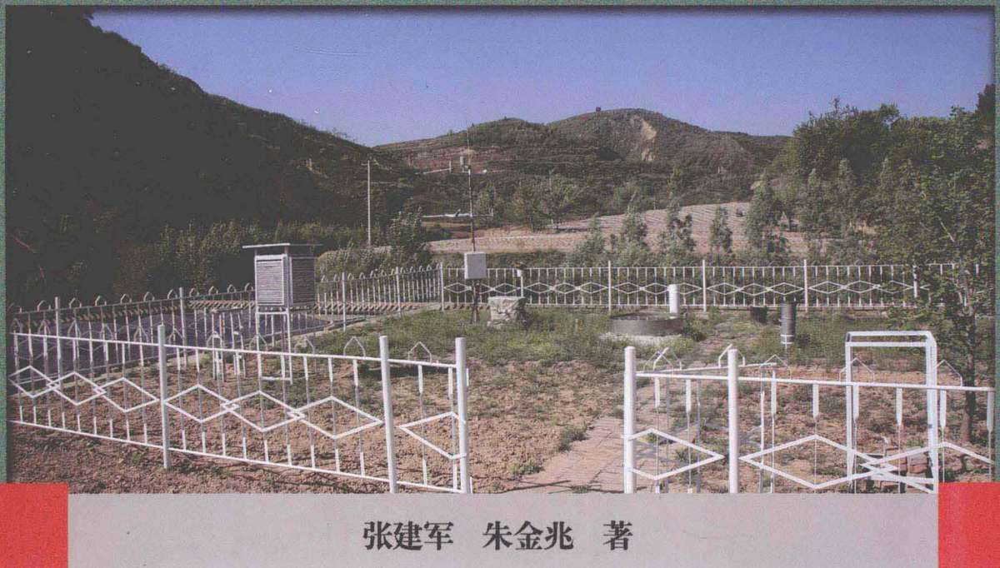

# 水土保持监测指标的观测方法

  
中国林业出版社

## 内容简介

本书从影响水土流失的气候、植被、土壤等影响因素出发，在阐述水土流失影响因素测定方法的基础上，重点阐述了坡面水土流失和小流域水土流失的监测方法，同时对风蚀和重力侵蚀的监测也进行了阐述。其主要内容包括：气象因子观测、植被因子观测、土壤因子观测、坡面水土流失量观测、小流域水土流量观测、风蚀观测、重力侵蚀观测等7部分。在撰写过程中重点考虑了监测方法的实用性和可操作性，力求文字通俗易懂，图表清晰，公式简明准确。本书可作为水土保持监测人员的工具书，也可作为科研院所科研人员、教师和学生的参考书。

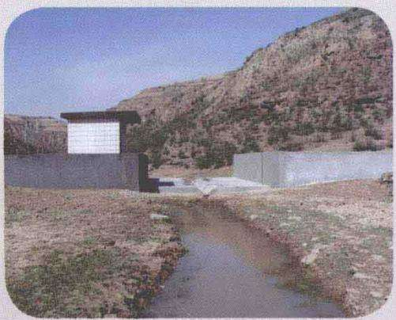  
责任编辑：徐小英封面设计：赵芳 版式设计：骐骥


# 水土保持监测指标的观测方法

张建军朱金兆著

图书在版编目(CIP)数据

水土保持监测指标的观测方法/张建军，朱金兆著.一北京：中国林业出版社，2013.5  
ISBN978-7-5038-7032-3

I. ①水…Ⅱ.①张…②朱… Ⅲ.①水土保持-监测Ⅳ.①S157

中国版本图书馆CIP数据核字（2013）第084099号

出版中国林业出版社（100009 北京西城区刘海胡同7号）

E-mail forestbook@163. com 电话 (010)83222880

网址 http: //lycb. forestry. gov.cn

发行：中国林业出版社

印刷北京北林印刷厂

版次：2013年5月第1版

印 次:2013年5月第1次

开 本: 787mm×960mm 1/16

印张：11

字数：168千字

印数：1\~1500册

定价：60.00元

## 前言

中国是世界上水土流失最为严重的国家之一，水土流失面积大，范围广，危害严重，水土流失已经成为限制社会经济可持续发展的关键要素。为了治理水土流失，改善生态环境必须准确把握我国的水土流失状况及水土保持现状。随着社会发展和人民生活水平的提高，人们的环境保护意识逐渐加强，对限制社会经济发展的生态环境问题越发关注，需要及时了解我国的水土流失状况以及水土保持的现状。水行政管理部门为了掌握水土流失现状，治理水土流失，评价水土保持措施的水土保持效益，需要开展水土保持监测。因此开展水土保持监测，发布水土流失公告，已经成为《中华人民共和国水土保持法》赋予水行政管理部门的神圣职责。

水土保持监测是调查水土流失的类型、面积、强度、程度、危害，测定水土流失的影响因素，分析水土流失与影响因素间的关系，评估水土保持措施的效益，从而为水土流失的预防监督和治理工作提供依据，因此水土保持监测是“把脉山河”的基本国情调查。

水土保持监测是采用一定的方法和仪器设备，对调查地区水土流失的面积、类型、程度、强度、空间分布特征以及影响因素等进行测定，建立水土流失监测数据库，在此基础上研究水土流失的发生发展规律和动态变化趋势，评价水土保持措施的效益，从而为水土流失综合治理和生态环境建设宏观决策提供支撑。

为了及时、准确、科学地监测水土流失，必须制定科学、可行、简单实用的监测方法，必须采用统一定制的观测仪器和监测设施，必须制定统一的数据整理与汇总的标准和规范，才能使我国水土流失监测成果在同一平台进行对比分析。为此作者根据多年来水土保持监测的实践经验，在总结国内外现有水土流失监测技术、监测仪器、监测设施优缺点的基础上，根据我国水土流失监测的现状，撰写了本书。

本书从影响水土流失的环境要素出发，重点阐述了坡面水土流失和小流域水土流失的监测方法，同时对风蚀和重力侵蚀的监测也进行了阐述，其主要内容包括：气象因子观测、植被因子观测、土壤因子观测、坡面水土流失量观测、小流域水土流失量观测、风蚀观测、重力侵蚀观测等7部分。

在撰写过程中重点考虑了监测方法的实用性和可操作性，力求文字通俗易懂，图表清晰，公式简明准确。但由于知识水平有限，实践范围较窄，难免书中存在遗漏和不足，敬请读者批评指正。

张建军

2013年1月3日于北京

## 目录

第1章气象因子观测……1  
1.1降水观测……………………………………1  
1.1.1降雨观测……………………2  
1.1.2 平均降雨量的计算………10  
1.1.3 林内降雨的测定…………………13  
1.1.4 树千流的测定………………………………17  
1.1.5 林冠截留量的计算……………………………22  
1.1.6降雪观测……………………………………………23  
1.2空气温度、湿度观测……28  
1.2.1 千湿球温度表…………………………………… 28  
1.2.2通风千湿表……………………………………30  
1.2.3 自记温度湿度计……………………………31  
1.3风速风向观测…………33  
1.3.1 人工观测…………………………34  
1.3.2 自动观测…………………………………………………………………35  
1.4蒸发量的测定……………38  
1.4.1 小型蒸发器……………………………38  
1.4.2 E601B 型蒸发器…………………………………………………………………………39  
第2 章植被因子观测……42  
2.1植被调查方法……………42  
2.1.1样方调查…………………………………………42  
2.1.2样带调查…………………………………………44  
2.1.3样线调查………………………44  
2.2植被调查指标……44  
2. 2.1 植被类型……………………………………………………………………44  
2.2.2 植物群落的命名……45  
2. 2.3 郁闭度…………………………………45  
2.2.4密度……45  
2.2.5盖度………………………………………………………… 46  
2.2.6 高度和胸径(地径)……………………………47  
2.2.7频度……48  
2.2. 8生物量……… 48  
2.2.9枯落物…………………………51  
2.2.10叶面积指数………………57  
第3章土壤因子观测……60  
3.1土壤类型……60  
3.2 土壤比重与容重的测定………62  
3.2.1 土壤比重测定………………62  
3.2.2 土壤容重测定……………………………………………………………………63  
3.3土壤孔隙度测定……64  
3.4土壤入渗测定………66  
3.4.1 双环入渗法……67  
3.4.2室内定水头法……68  
3.5土壤含水量的测定……72  
3.5.1烘千法……72  
3. 5.2 中子仪法…………………………73  
3.5.3 时域反射仪法(TDR 法) ……………………75  
3.5.4 频域反射仪法(FDR 法) ……………… 78  
3.6土壤抗蚀性测定……………80  
3.6.1 雨滴击溅侵蚀量的测定……80  
3.6.2土壤崩解速率……82  
3.6.3 水稳性团聚体含量………85  
3.7土壤抗冲性测定……87  
3.7.1 原状王冲刷法………88  
3.7.2 野外实地冲刷法……89  
3.8地表糙度的测定……90  
第4章坡面水土流失量观测……93  
4.1 径流小区数量的确定……93  
4.2径流小区的选择……95  
4.3径流小区的勘查……95  
4.3.1地形测量………………………95  
4.3.2基岩、土壤特性调查……96  
4.3.3植被调查……………96  
4.4 径流小区的设计和布设……97  
4.4.1 径流小区的大小和形状……97  
4.4.2 径流小区的组成………98  
4.5 径流量、泥沙量的测定……99  
4.5.1体积法…………………………………100  
4.5.2堰箱法…………………102  
4.6坡面水土流失的简易测定……106  
4.6.1 坡面面蚀的简易测定 …………106  
4.6.2 坡面沟蚀的简易测定……108  
第5 章小流域水土流失量观测……111  
5.1 观测流域的选择及观测断面的选取……111  
5.1.1 观测流域的选择……………111  
5.1.2 观测断面的选取…………112  
5.2 观测流域的调查与分析……112  
5.3径流量与泥沙量的观测……113  
5.3.1 断面法测流………114  
5.3.2 量水建筑物测流………120  
5.3.3 输沙量的测定………………………131  
第6章风蚀观测……140  
6.1 风蚀量的观测…………………140  
6.1.1 插钎法…………………………140  
6.1.2风蚀桥法…………………………………………………………………143  
6.2风沙输移量的观测………145  
6.2.1 固定式集沙仪 ………145  
6.2.2 自动旋转式集沙仪 ……146  
6.3大气降尘量的观测……149  
6.4 移动沙丘的观测……151  
6. 4.1 插钎法…………………………………………………………… 151  
6.4.2经纬仪法……151  
第7章重力侵蚀观测……153  
7.1 泻溜观测…………………………………………153  
7.2陷穴观测……………………………………………………………………155  
7.3崩塌观测………………158  
7.3.1 直接测定堆积物的体积……158  
7.3.2 测定崩塌发生后坡面地形变化………160  
7.4 滑坡观测………162  
7.4.1 经纬仪法……………………………163  
7.4.2 位移计法…………………………………………163  
参考文献…………167

## 第1章 气象因子观测

## 1.1 降水观测

降水是指大气中的水以液态或固态的形式到达地面的现象，它包括两部分，一是大气中水汽直接在地面或地物表面及低空的凝结物，如霜、露、雾和雾淞，又称为水平降水；另一部分是由空中降落到地面上的水汽凝结物，如雨、雪、霰、雹和雨淞等，又称为垂直降水。

降水是造成土壤侵蚀和水土流失的主要因子，是水土保持监测中必须掌握的关键要素，但降水中的霜、露、雾和雾淞不会直接造成土壤侵蚀，一般不做降水处理，而垂直降水常会造成土壤侵蚀，是主要的观测对象。

描述降水的基本指标有：降水量、降水历时、降水强度、降水过程线等。降水的观测就是观测这些基本指标。

降水量：一定时间内降落在某一面积上的水量，用mm表示。指某一时段内的未经蒸发、渗透、流失的降水在水平面上积累的深度。

降水历时：降水开始到降水结束所经历的时间，以h、min表示。

降水强度：单位时间内的降水量，即降水量与降水历时的比值，用mm/min，mm/h表示。最常用的降水强度指标有5min最大雨强、10min最大雨强、30min最大雨强、60min最大雨强、平均雨强等。

降水过程线：是以时间为横坐标，降水量为纵坐标绘制成的降水量随时间的变化曲线。在降水过程线上可以反映出降水开始时间、降水结束时间，以及某一时刻的降水量。

降水累计曲线：以降水时刻为横坐标，以到某一时刻的总降水量为纵坐标绘制成的曲线。它是一条递增曲线或折线。在累计曲线上可以反映降水开始时间、降水结束时间，以及到某一时刻的降水总量。累计曲线上任一点的斜率就是该时刻的降水强度。

## 1.1.1 降雨观测

## 1.1.1.1 观测点的选择

选择观测点时，应充分考虑观测点所在地的海拔高度、坡向等地形条件。降雨观测点的数量一般根据流域面积的大小和观测精度要求而定(表1-1)。在山区由于地形条件复杂，降雨分布不均，观测点要适当增加。当地形变化显著，以及有大面积森林时，降雨观测点的数目应增加。在开阔的平原条件下，降雨观测点可按面积均匀分布。在森林流域中降雨观测点应设置在空旷地上。如果在流域内只设置一个降雨观测点，则它应设在流域的中心；有两个测点时，一个设在流域的上游，另一个设在流域的下游。

表1-1 雨量观测点数量配置表
<table><tr><td rowspan=1 colspan=1>面积 $( \mathrm { k m } ^ { 2 } )$ </td><td rowspan=1 colspan=1>&lt;0.2</td><td rowspan=1 colspan=1>0.2~0.5</td><td rowspan=1 colspan=1>0.5~2</td><td rowspan=1 colspan=1>2~5</td><td rowspan=1 colspan=1>5~10</td><td rowspan=1 colspan=1>10~20</td><td rowspan=1 colspan=1>20~50</td><td rowspan=1 colspan=1>50~100</td></tr><tr><td rowspan=1 colspan=1>雨量站数</td><td rowspan=1 colspan=1>1</td><td rowspan=1 colspan=1>1~3</td><td rowspan=1 colspan=1>2~4</td><td rowspan=1 colspan=1>3~5</td><td rowspan=1 colspan=1>4~6</td><td rowspan=1 colspan=1>5~7</td><td rowspan=1 colspan=1>6~8</td><td rowspan=1 colspan=1>7~10</td></tr></table>

对于较小面积的标准地或坡面径流场，一般将标准雨量筒(或雨量计)布置在径流场的附近进行测定，布设时尽量使雨量计远离对降雨测定有干扰的障碍物。为了减少障碍物对降雨测定的干扰，雨量筒或雨量计与干扰物间的距离应大于干扰物高度的2倍。

降雨观测点选择时的注意事项：

(1)降雨量观测误差受风的影响最大。因此，观测点应避开强风区，其周围应空旷、平坦、不受突变地形、树木和建筑物以及烟尘的影响。

(2)观测点周边有建筑物，树木等障碍物时，雨量计与障碍物的距离大于障碍物与雨量计高差的2倍。

(3)观测点的周围相对平坦，不宜设在陡坡上、峡谷内和风口处，使雨量计承水器口至山顶的仰角不大于30°。

## 1.1.1.2 雨量计的安装要求

雨量观测点的数量和安装点确定后，安装标准雨量筒或自记雨量计观测降雨量，在安装雨量筒或自记雨量计时有以下注意事项。

(1)安装点的面积必须符合要求，仅安装一台雨量计时，观测点的面

积不小于4m×4m，同时设置标准雨量筒和自记雨量计时面积不小于4m×6m。

(2)观测场地内植物高度绝对不能超过雨量计的安装高度，以防植物枝叶遮盖雨量计的承水器口，植物的高度最好保持在20cm以下。

(3)在多雪地区，要保证雨量计不被雪埋没，当积雪厚度较大时，可以设置不同高度的雨量台，将雨量计安装在雨量台上，从而防止雨量计被积雪掩埋。

(4)观测场地四周设置栅栏，以防动物进入和破坏。

(5)标准雨量筒的安装高度为0.7m，自记雨量计的安装高度为0.7m或1.2m，杆式雨量计的安装高度不超过4m。

(6)雨量计、雨量筒的承水器口必须保持水平，安装时必须用水平尺至少在两个方向上进行校准，雨量计的承水器口如果处于倾斜状态，观测结果将会偏小。

(7)自记雨量计的基座上设有调平气泡，安装时通过调整地脚螺丝使气泡居中，保证基座处于水平状态。安装上承水器口后，需要用水平尺检验承水器口是否水平。

(8)在使用一段时间后，需要检查基座上的气泡是否居中，同时用水平尺对承水器口的水平状况进行校准。

## 1.1.1.3 用标准雨量筒观测降雨

标准雨量筒是观测降雨量的常规仪器。它由承水器、漏斗、储水筒、储水瓶等几部分组成(图1-1)。承水器有两种：一种是带漏斗的承雨器，另一种不带漏斗的承雪器。承水器用来承接降雨，为直径20cm的圆形，其口缘镶有内直外斜刀刃形的铜圈，以防雨滴溅失和筒口变形，漏斗可将承水器接收的雨水导入储水瓶，储水瓶收集降雨。

用标准雨量筒观测降雨时，可以采用固定时间观测，也可以按降雨场次进行观测。定时观测的时间一般为8：00，昨日8：00至今日8：00的降雨为昨日降雨量。按降雨场次进行观测时，必须在降雨结束后立刻进行观测，所测得的雨量即为场降雨量。

观测时轻轻打开承水器，从储水筒中取出储水瓶，放入备用储水瓶，然后到室内用专用量筒量测降雨量，将储水瓶拿回室内的过程中防止雨水进入，同时注意不要遗撒。如降雨已经停止，也可在现场用专用量筒直接测定，测定时观测者的眼睛必须与量筒中水的凹面平齐。观测完后把储水瓶放入储水器，将承水器套在储水筒上，并用水平尺检查承水器口是否水平。

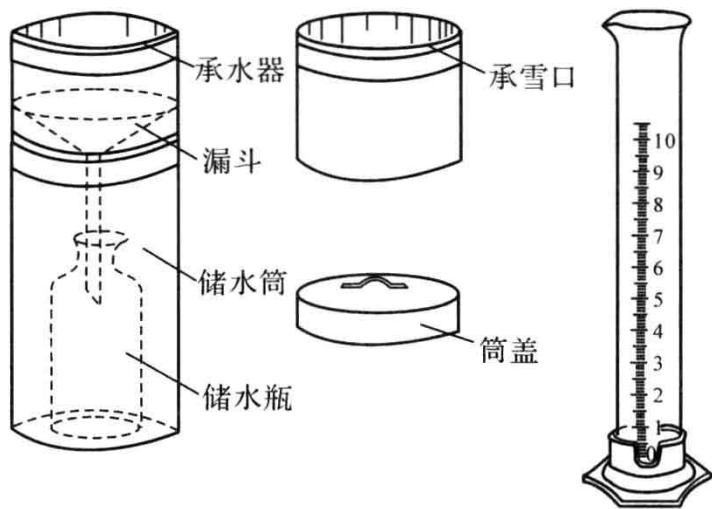  
图1-1 标准雨量筒示意图

如果在一场降雨中降雨量较大(如超过100mm)，储水瓶有可能蓄满溢出时，必须在降雨过程中更换储水瓶。更换储水瓶时可以先将承水器中的漏斗堵上，让降雨暂时保存在承水器中，并尽可能保持水平地将承水器拿起，快速更换储水瓶后，再将承水器安上，去掉堵塞漏斗的物体，让降雨进入更换后的储水瓶。降雨结束后再测定更换的储水瓶中的水量。总降雨量等于两个储水瓶中的水量之和。

使用专用量筒测量时应该使量筒处于垂直状态，视线与量筒中水的凹面最低处平齐，读出最小刻度，并立即记录。降雨量很大时，可分次量取，然后累加得出总雨量。为防止蒸发和提高观测精度，降雨停止后必须及时观测。

专用量筒为一特制的有刻度的雨量测定工具，其口径和刻度与雨量筒口径成一定比例关系，量筒的最大量程为10mm，每刻度为0.1mm。观测时保留一位小数，如7.6mm。

标准雨量筒观测降雨记录见表1-2。

表1-2 标准雨量筒观测降雨记录汇总表
<table><tr><td rowspan=1 colspan=1>观测仪器</td><td rowspan=1 colspan=1></td><td rowspan=1 colspan=1>安装地点</td><td rowspan=1 colspan=1></td></tr><tr><td rowspan=1 colspan=1>安装点坐标</td><td rowspan=1 colspan=1></td><td rowspan=1 colspan=1>海拔高度</td><td rowspan=1 colspan=1></td></tr><tr><td rowspan=1 colspan=1>观测员</td><td rowspan=1 colspan=1></td><td rowspan=1 colspan=1>观测时间</td><td rowspan=1 colspan=1></td></tr><tr><td rowspan=1 colspan=1>日期</td><td rowspan=1 colspan=1>雨量（mm）</td><td rowspan=1 colspan=1>总降雨量(mm)</td><td rowspan=1 colspan=1></td></tr><tr><td rowspan=1 colspan=1>年 月 日</td><td rowspan=1 colspan=1></td><td rowspan=1 colspan=1>降雨天数(天)</td><td rowspan=1 colspan=1></td></tr><tr><td rowspan=1 colspan=1>年 月 日</td><td rowspan=1 colspan=1></td><td rowspan=1 colspan=1>日最大降雨量(mm)</td><td rowspan=1 colspan=1></td></tr><tr><td rowspan=1 colspan=1>年 月 日</td><td rowspan=1 colspan=1></td><td rowspan=1 colspan=1>日最小降雨量(mm)</td><td rowspan=1 colspan=1></td></tr><tr><td rowspan=1 colspan=1>年月 日</td><td rowspan=1 colspan=1></td><td rowspan=1 colspan=1>0~5mm的雨量合计(mm)</td><td rowspan=1 colspan=1></td></tr><tr><td rowspan=1 colspan=1>年 月 日</td><td rowspan=1 colspan=1></td><td rowspan=1 colspan=1>5~10mm的雨量合计(mm)</td><td rowspan=1 colspan=1></td></tr><tr><td rowspan=1 colspan=1>mm</td><td rowspan=1 colspan=1></td><td rowspan=1 colspan=1>10~25mm的雨量合计(mm)</td><td rowspan=1 colspan=1></td></tr><tr><td rowspan=1 colspan=1>………………</td><td rowspan=1 colspan=1></td><td rowspan=1 colspan=1>25~50mm的雨量合计(mm)</td><td rowspan=1 colspan=1></td></tr><tr><td rowspan=1 colspan=1></td><td rowspan=1 colspan=1></td><td rowspan=1 colspan=1>50~100mm的雨量合计(mm)</td><td rowspan=1 colspan=1></td></tr><tr><td rowspan=1 colspan=1>年 月 日</td><td rowspan=1 colspan=1></td><td rowspan=1 colspan=1>100~200mm的雨量合计(mm)</td><td rowspan=1 colspan=1></td></tr><tr><td rowspan=1 colspan=1>合计(mm)</td><td rowspan=1 colspan=1></td><td rowspan=1 colspan=1>200mm以上的雨量合计(mm)</td><td rowspan=1 colspan=1></td></tr></table>

## 1.1.1.4 用自记雨量计观测降雨

自记雨量计是能够自动记录降雨量及其降雨过程的仪器。常用的自记雨量计有虹吸式自记雨量计和翻斗式自记雨量计。

虹吸式自记雨量计是最早的自记雨量计，它是用机械钟带动安装记录纸的滚筒转动记录时间，每次上紧发条后，滚筒能够转动一周，并记录24h。记录纸横坐标为时间，从1\~24划分为24个大格，每个大格代表1h，每个大格又分为6小格。每个小格代表10min。记录纸纵坐标为雨量，从1\~10分为10个大格，每个大格代表1mm，每个大格又划分为10个小格，每个小格代表0.1mm。降雨时从承雨口接收的雨水进入浮子室，浮子室中有一个浮子，浮子上端连接着一个记录笔，记录笔紧靠在记录纸上，当雨水进入浮子室后浮子开始上升，记录笔也随浮子一起上升，记录笔在记录纸上画出一条线记录浮子上升的高度，该高度就是降雨量，当降雨量达到10mm时，浮子室中的水通过虹吸作用排除，记录笔也随浮子的下降回到原点(图1-2)。利用虹吸式自记雨量计测量降雨时，每天必须定时上紧发条，以驱动机械钟转动，同时每天必须往雨量计中加一定量的水，使记录笔抬高一些，否则当天的记录线就会和前一天的记录线重叠。因为虹吸式雨量计存在机械钟计时误差较大，虹吸过程中的降雨量不能反映在记录线上，每天都必须进行维护，无法实现无人观测等缺陷，目前已逐渐退出观测领域，建议使用能够自动观测的翻斗式雨量计。

现在广泛采用的自记雨量计是翻斗式自记雨量计，它的主要部件是翻斗(图1-3)，翻斗每翻动一次，对应一定的雨量(0.1mm或0.2mm)，翻斗在翻动过程中带动翻斗底部安装的金属棒切割磁力线产生电流信号，电流信号转化为数字信号保存在数据采集器中，翻斗每翻动一次，就会有一个电流信号被保存在数据采集器中。没有降雨时，翻斗不会转动，数据采器集中就没有电流信号被保存。翻斗式自记雨量计还可以通过GPRS信号将降雨数据直接传输到观测人员的计算机中，从而实现对降雨的遥测。

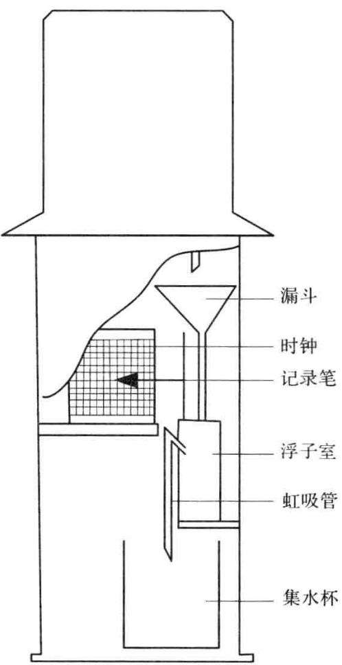  
图1-2 虹吸式雨量计示意图

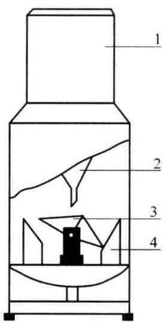  
图1-3 翻斗式自记雨量计示意图

当使用翻斗式自记雨量计观测一段时间后，可以用笔记本电脑从数据存储器中下载雨量数据，从而实现对降雨量和降雨过程的自动观测。翻斗式自记雨量计采用电子钟记录时间，计时准确，测量精度完全可以满足水土保持监测的需要，已经成为水土保持监测中的主要观测仪器，但必须时常观测电池电量是否充足，及时更换电池，以保证翻斗式雨量计的正常运转。另外，在观测降雨强度很大的暴雨时，翻斗存在无法翻动的现象，从而导致测量结果显著偏小。因此，在使用自记雨量计时必须配置一个标准雨量筒，以对自记雨量计的测定结果进行校正。

1. 承水器；2. 漏斗；

用翻斗式自记雨量计观测降雨的步骤如下。

3. 翻斗；4. 排水器

(1)安装前检查：安装前检查自记雨量计的配件是否齐全。

检查仪器精度：根据自记雨量计精度(如0.1mm)用量筒量取相应的水量(如0.1mm)，缓慢倒入承雨口，检查翻斗是否启动。

检查仪器测定数值是否正确：用量筒量取5mm或10mm的雨量，缓慢倒入承雨口，检查仪器记录数值与实际值的误差是否在±0.1mm之内。

(2)安装：在选定安装点的地面用混凝土预制安装基座，并预埋固定用螺栓。将自记雨量计安装在基座上，调整雨量计底座上的调平螺丝，使雨量计底座上的调平气泡居中后，用基座上的螺栓将雨量计底座固定。解开固定翻斗的橡皮筋(运输过程中为了防止翻斗活动，翻斗一般用橡皮筋固定)，使翻斗处在活动状态。将承雨口放在基座上后，用水平尺在两个方向上检验雨量计承雨口是否水平。如果不水平，调整基座上的固定螺丝，使雨量计承雨口处在水平状态。观测一段时间后需要用水平尺对雨量计承雨口的水平状况再次进行检查。

(3)观测：安装完成后，将数据采集器与电瓶(电池)连接或在数据存储器中安装电池后，对自记雨量计进行设置。设置时将数据采集器与笔记本电脑连接，启动雨量计的专用软件，在计算机中对雨量计进行设置。设置内容包括：安装地点、仪器编号、调整雨量计的日期和时间、观测开始时间、数据记录的时间间隔(如5min记录1次、或1min记录1次)，数据记录的格式(记录雨量还是记录翻斗的转动次数，记录累计雨量还是时段雨量，记录翻斗的累计次数还是时段次数等)、存储器存满后的处理方式等。设置完成后启动自记雨量计，断开数据采集器与雨量计的连接，自记雨量计进入自动观测模式。

(4)数据采集：当利用自记雨量计观测一段时间后，观测人员可用笔记本电脑与自记雨量计的数据采集器连接，利用专用软件采集自记雨量计观测的雨量数据。采集完成后必须对雨量计的日期、时间进行校准，确认电池电量。然后断开电脑与自记雨量计的连接，打开数据文件，检查雨量记录数据是否完整，记录间隔是否与设置的记录间隔一致，尤其是检查自记雨量计的记录时间是否准确，如果有误差，必须对所有记录的数据进行校正。检查电瓶(电池)电量是否足够，如果电池电量不足，必须立刻更换，以保证自记雨量计能够持续正常观测。

(5)清理：数据采集完成后，需要对自记雨量计的承水器进行清理，以防止承水器中的漏斗堵塞，影响对降雨量和降雨过程的观测。如果承水器中漏斗已堵，或承水器中有积水，说明自记雨量计记录的数据有误，此时需要利用标准雨量筒的观测数据对自记雨量计的观测数据进行校正。或将承雨器中的积水倒入专用量筒，量取积水量，作为雨量数据校正的参考。

(6)其他：不同雨量计能够记录的降雨数据量不同，能够记录的降雨数据量与数据采集器的容量和数据记录间隔相关。如果采集器的容量较大，数据采集的时间间隔可以略长；数据记录间隔较长时，数据采集的间隔也可相应延长一些。根据自记雨量计中数据采集器的容量和数据记录间隔可以计算出数据采集的时间间隔，当数据采集器的容量较大时，数据采集的时间间隔可能很长，但观测人员必须每隔一定时间对雨量计进行检查，检查内容包括承水器口是否水平、承水器是否被堵、数据采集器的电量是否足够等。

自记雨量计观测场降雨记录见表1-3。自记雨量计观测资料汇总格式见表14。

表1-3 自记雨量计观测场降雨记录表
<table><tr><td rowspan=1 colspan=1>观测仪器</td><td rowspan=1 colspan=1></td><td rowspan=1 colspan=1>安装地点</td><td rowspan=1 colspan=1></td></tr><tr><td rowspan=1 colspan=1>安装点坐标</td><td rowspan=1 colspan=1></td><td rowspan=1 colspan=1>海拔高度</td><td rowspan=1 colspan=1></td></tr><tr><td rowspan=1 colspan=1>观测员</td><td rowspan=1 colspan=1></td><td rowspan=1 colspan=1>观测时间</td><td rowspan=1 colspan=1></td></tr><tr><td rowspan=1 colspan=2>原始记录数据</td><td rowspan=1 colspan=2>汇总数据</td></tr><tr><td rowspan=1 colspan=1>日期与时间</td><td rowspan=1 colspan=1>雨量（mm)</td><td rowspan=1 colspan=1>场降雨量(mm)</td><td rowspan=1 colspan=1></td></tr><tr><td rowspan=1 colspan=1>年月日时分</td><td rowspan=1 colspan=1></td><td rowspan=1 colspan=1>降雨开始时间</td><td rowspan=1 colspan=1></td></tr><tr><td rowspan=1 colspan=1>年月 日时分</td><td rowspan=1 colspan=1></td><td rowspan=1 colspan=1>降雨结束时间</td><td rowspan=1 colspan=1></td></tr><tr><td rowspan=1 colspan=1>年月日时分</td><td rowspan=1 colspan=1></td><td rowspan=1 colspan=1>降雨历时(min)</td><td rowspan=1 colspan=1></td></tr><tr><td rowspan=1 colspan=1>年月日时分</td><td rowspan=1 colspan=1></td><td rowspan=1 colspan=1>平均雨强(mm/min)</td><td rowspan=1 colspan=1></td></tr><tr><td rowspan=1 colspan=1>年月日时分</td><td rowspan=1 colspan=1></td><td rowspan=1 colspan=1>5min最大雨强(mm/min)</td><td rowspan=1 colspan=1></td></tr><tr><td rowspan=1 colspan=1></td><td rowspan=1 colspan=1></td><td rowspan=1 colspan=1>10min最大雨强(mm/min)</td><td rowspan=1 colspan=1></td></tr><tr><td rowspan=1 colspan=1></td><td rowspan=1 colspan=1></td><td rowspan=1 colspan=1>30min最大雨强(mm/min)</td><td rowspan=1 colspan=1></td></tr><tr><td rowspan=1 colspan=1></td><td rowspan=1 colspan=1></td><td rowspan=1 colspan=1>60min最大雨强(mm/min)</td><td rowspan=1 colspan=1></td></tr><tr><td rowspan=1 colspan=1></td><td rowspan=1 colspan=1></td><td rowspan=1 colspan=1></td><td rowspan=1 colspan=1></td></tr><tr><td rowspan=1 colspan=1></td><td rowspan=1 colspan=1></td><td rowspan=1 colspan=1></td><td rowspan=1 colspan=1></td></tr><tr><td rowspan=1 colspan=1></td><td rowspan=1 colspan=1></td><td rowspan=1 colspan=1></td><td rowspan=1 colspan=1></td></tr><tr><td rowspan=1 colspan=1>年月 日 时分</td><td rowspan=1 colspan=1></td><td rowspan=1 colspan=1></td><td rowspan=1 colspan=1></td></tr><tr><td rowspan=1 colspan=1>合计(mm)</td><td rowspan=1 colspan=1></td><td rowspan=1 colspan=1></td><td rowspan=1 colspan=1></td></tr></table>

<table><tr><td rowspan=1 colspan=1>观测仪器及编号</td><td rowspan=1 colspan=1></td><td rowspan=1 colspan=1>安装地点</td><td rowspan=1 colspan=1></td><td rowspan=1 colspan=1>安装点坐标</td><td rowspan=1 colspan=2></td><td rowspan=1 colspan=1>海拔高度</td><td rowspan=1 colspan=1></td></tr><tr><td rowspan=1 colspan=2>起止时间</td><td rowspan=1 colspan=1>雨量(mm)</td><td rowspan=1 colspan=1>降雨历时(min)</td><td rowspan=1 colspan=1>平均雨强(mm/min)</td><td rowspan=1 colspan=1>5分钟最大雨强1(mm/min)</td><td rowspan=1 colspan=1>0分钟最大雨强(mm/min)</td><td rowspan=1 colspan=1>30分钟最大雨强(mm/min)雨</td><td rowspan=1 colspan=1>60分钟最大强(mm/min)</td></tr><tr><td rowspan=1 colspan=2>年 月 日 时 分~ 月 日 时 分</td><td rowspan=1 colspan=1></td><td rowspan=1 colspan=1></td><td rowspan=1 colspan=1></td><td rowspan=1 colspan=1></td><td rowspan=1 colspan=1></td><td rowspan=1 colspan=1></td><td rowspan=1 colspan=1></td></tr><tr><td rowspan=1 colspan=2>年月日时分~月日时分</td><td rowspan=1 colspan=1></td><td rowspan=1 colspan=1></td><td rowspan=1 colspan=1></td><td rowspan=1 colspan=1></td><td rowspan=1 colspan=1></td><td rowspan=1 colspan=1></td><td rowspan=1 colspan=1></td></tr><tr><td rowspan=1 colspan=2>年月日时分~月日时分</td><td rowspan=1 colspan=1></td><td rowspan=1 colspan=1></td><td rowspan=1 colspan=1></td><td rowspan=1 colspan=1></td><td rowspan=1 colspan=1></td><td rowspan=1 colspan=1></td><td rowspan=1 colspan=1></td></tr><tr><td rowspan=1 colspan=2>年月日时分~月日时分</td><td rowspan=1 colspan=1></td><td rowspan=1 colspan=1></td><td rowspan=1 colspan=1></td><td rowspan=1 colspan=1></td><td rowspan=1 colspan=1></td><td rowspan=1 colspan=1></td><td rowspan=1 colspan=1></td></tr><tr><td rowspan=1 colspan=2>年 月 日 时分~月 日 时分</td><td rowspan=1 colspan=1></td><td rowspan=1 colspan=1></td><td rowspan=1 colspan=1></td><td rowspan=1 colspan=1></td><td rowspan=1 colspan=1></td><td rowspan=1 colspan=1></td><td rowspan=1 colspan=1></td></tr><tr><td rowspan=1 colspan=2>年月日时分~月日时分</td><td rowspan=1 colspan=1></td><td rowspan=1 colspan=1></td><td rowspan=1 colspan=1></td><td rowspan=1 colspan=1></td><td rowspan=1 colspan=1></td><td rowspan=1 colspan=1></td><td rowspan=1 colspan=1></td></tr><tr><td rowspan=1 colspan=2>年月 日时分~月 日时分</td><td rowspan=1 colspan=1></td><td rowspan=1 colspan=1></td><td rowspan=1 colspan=1></td><td rowspan=1 colspan=1></td><td rowspan=1 colspan=1></td><td rowspan=1 colspan=1></td><td rowspan=1 colspan=1></td></tr><tr><td rowspan=1 colspan=2>年月日时分~月日时分</td><td rowspan=1 colspan=1></td><td rowspan=1 colspan=1></td><td rowspan=1 colspan=1></td><td rowspan=1 colspan=1></td><td rowspan=1 colspan=1></td><td rowspan=1 colspan=1></td><td rowspan=1 colspan=1></td></tr><tr><td rowspan=1 colspan=2>年月 日时分~月 日时分</td><td rowspan=1 colspan=1></td><td rowspan=1 colspan=1></td><td rowspan=1 colspan=1></td><td rowspan=1 colspan=1></td><td rowspan=1 colspan=1></td><td rowspan=1 colspan=1></td><td rowspan=1 colspan=1></td></tr><tr><td rowspan=1 colspan=2>年月日时分~月日时分</td><td rowspan=1 colspan=1></td><td rowspan=1 colspan=1></td><td rowspan=1 colspan=1></td><td rowspan=1 colspan=1></td><td rowspan=1 colspan=1></td><td rowspan=1 colspan=1></td><td rowspan=1 colspan=1></td></tr><tr><td rowspan=1 colspan=2>年月日时分~月日时分</td><td rowspan=1 colspan=1></td><td rowspan=1 colspan=1></td><td rowspan=1 colspan=1></td><td rowspan=1 colspan=1></td><td rowspan=1 colspan=1></td><td rowspan=1 colspan=1></td><td rowspan=1 colspan=1></td></tr><tr><td rowspan=1 colspan=2>累计降雨量(mm)</td><td rowspan=1 colspan=1></td><td rowspan=1 colspan=1></td><td rowspan=1 colspan=1></td><td rowspan=1 colspan=1></td><td rowspan=1 colspan=1></td><td rowspan=1 colspan=1></td><td rowspan=1 colspan=1></td></tr><tr><td rowspan=1 colspan=2>最大值(mm)</td><td rowspan=1 colspan=1></td><td rowspan=1 colspan=1></td><td rowspan=1 colspan=1></td><td rowspan=1 colspan=1></td><td rowspan=1 colspan=1></td><td rowspan=1 colspan=1></td><td rowspan=1 colspan=1></td></tr><tr><td rowspan=1 colspan=2>最小值(mm)</td><td rowspan=1 colspan=1></td><td rowspan=1 colspan=1></td><td rowspan=1 colspan=1></td><td rowspan=1 colspan=1></td><td rowspan=1 colspan=1></td><td rowspan=1 colspan=1></td><td rowspan=1 colspan=1></td></tr></table>

## 1.1.2 平均降雨量的计算

当观测区域面积较大时，由于降雨时空分布不均，需要布设多个降雨观测点，以掌握平均降雨情况。此时需要计算观测区域的平均降雨量。平均降雨量的计算方法主要有：算术平均法、加权平均法、泰森多边形法、等雨量线法、客观运行法。

## 1.1.2.1 算术平均法

算术平均法就是将观测区域内所有观测点的雨量进行平均。

算术平均法计算方法简单，在地形起伏不大、降雨分布均匀、降雨观测站点布设合理且数量较多的情况下，可以利用算术平均法直接计算平均降雨量，计算结果较为满意。

$$
P = \left( p _ { 1 } + p _ { 2 } + \cdots + p _ { n } \right) / n
$$

式中： $p _ { 1 }$ ， $p _ { 2 }$ $p _ { n }$ —为各观测站点的降雨量(mm)；

P——区域平均降雨量(mm)；

$_ { n ^ { \ast } }$ —测站数。

## 1.1.2.2 加权平均法

利用算术平均法求算平均降雨量，往往需要较多的雨量观测站点，这需要较大的投入。在对观测区域内的基本情况如地形、海拔、面积、地类、坡度、坡向等进行勘察基础上，选择有代表性的地点作为降雨观测点，每个观测点都代表一定面积的区域，该区域内降雨情况可以认为基本一致。此时可以把每个观测点控制的面积作为各观测点降雨量的权重，按加权法计算观测区域平均降水量。

$$
P = a _ { 1 } p _ { 1 } / A + a _ { 2 } p _ { 2 } / A + \cdots + a _ { n } p _ { n } / A
$$

式中：P——观测区域平均降水量(mm)；

A——观测区域面积 $( \mathrm { { h m } } ^ { 2 }$ 或 $ { \mathrm { k m } } ^ { 2 } )$ i

$a _ { 1 } , a _ { 2 } , \cdots , a _ { n }$ ——每个观测点控制的面积 $( \mathrm { { h m } } ^ { 2 }$ 或 $ { \mathrm { k m } } ^ { 2 } )$ ;

$p _ { 1 }$ $p _ { 2 }$ ， $\cdots$ $p _ { n }$ ——每个观测点观测的降雨量(mm)。

## 1.1.2.3 泰森多边形法

泰森多边形法是荷兰气候学家A.H.Thiessen提出的一种根据离散分布雨量观测点的降雨量计算平均降雨量的方法。当观测区域内地形起伏变化较大、雨量观测点分布不均、有些雨量观测站点偏于一角，或区域周边有可用的降雨观测资料时，采用泰森多边形法计算平均降雨量较算术平均法更为合理。泰森多边形法的具体步骤如下：

在地图上将降雨观测站点两两相连，构成三角形网，然后对每个三角形的各边作垂直平分线，这些垂直平分线与区域边界构成以每个测站为核心的多边形，这个多边形称为泰森多边形(图14)。用求积仪或其他方法求算每个泰森多边形的面积。在每个泰森多边形内仅含有一个雨量观测站，每个雨量观测站的控制面积即为此多边形的面积。以每个泰森多边形的面积作为权重，按照加权平均法计算观测区域平均降雨量。

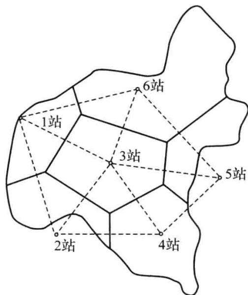  
图14 泰森多边形法示意图

$$
P = a _ { 1 } p _ { 1 } / A + a _ { 2 } p _ { 2 } / A + \cdots + a _ { n } p _ { n } / A
$$

式中： $a _ { 1 } , a _ { 2 } , \cdots , a _ { n }$ —各雨量观测站的控制面积，即每个泰森多边形的面积 $( \mathrm { h m } ^ { 2 }$ 或 $ { \mathrm { k m } } ^ { 2 } )$ i

$p _ { 1 } , p _ { 2 } , \cdots , p _ { n }$ 为每个泰森多边形内雨量观测站的降水量 (mm);

P——观测区域平均降水量(mm)；

A——观测区域的面积 $( \mathrm { { h m } } ^ { 2 }$ 或 $ { \mathrm { k m } } ^ { 2 } )$

泰森多边形法假设观测站点间降雨是线性变化的，没有考虑地形对降雨的影响。当区域内雨量观测站点固定不变时，该方法使用方便，精度较高。如果某一观测站点出现问题或被破坏，出现漏测时，则必须重新划分多边形，重新计算各测站的权重系数，才能计算出全区域的平均降雨量。

## 1.1.2.4 等雨量线法

等雨量线法是计算区域平均降雨量(面雨量)最完善的方法。它的优点是考虑了地形变化对降雨的影响，因此适用于地形变化较大、区域内又有足够数量降雨观测站点的情况。根据观测区域内外各个降雨观测站点的雨量资料，绘制等雨量线图，然后计算区域平均降雨量。等雨量线能够反映降雨量的空间分布情况，能更清楚地说明地形、地面高程变化及其他影响因素对降雨量空间分布的影响。但每场降雨的等雨量线分布不尽相同，等雨量线图只能反映出降雨量的空间分布特征和降雨面积的大小，但无法给出降雨起始时间、降雨结束时间、降雨历时等信息。另外，等雨量线图的绘制需要专业人员，工作量甚大，计算成果也会因等雨量线绘制的差异而不同。

等雨量线法计算平均降雨量的步骤如下。

(1)绘制降雨量等值线图；

(2)用求积仪或地理信息系统等方法测算出相邻等雨量线间的面积 $A _ { i }$ 用A除以流域总面积A得出各相邻等雨量线间面积的权重；

(3)以各相邻两条等雨量线的雨量平均值 $P _ { i }$ 乘以相应的权重得到加权雨量；

(4)将观测区域内的加权雨量求和得到平均雨量：

$$
P = a _ { 1 } p _ { 1 } / A + a _ { 2 } p _ { 2 } / A + \cdots + a _ { i } p _ { i } / A
$$

式中： $a _ { 1 } \setminus a _ { 2 } \setminus \cdots \setminus a _ { \mathrm { i } }$ ——相邻等雨量线间的面积 $( \mathrm { { h m } } ^ { 2 }$ 或 $ { \mathrm { k m } } ^ { 2 } )$

$\boldsymbol { p } _ { 1 } \setminus \boldsymbol { p } _ { 2 } \setminus \cdots , \boldsymbol { p } _ { \mathrm { i } }$ ——相邻两条等雨量线的平均降雨量(mm)；

A——观测区域总面积 $( \mathrm { { h m } } ^ { 2 }$ 或 $ { \mathrm { k m } } ^ { 2 } )$

P——观测区域平均降雨量(mm)。

## 1.1.2.5 客观运行法

客观运行法是在美国广泛采用的计算区域平均降雨量的方法。具体做法是(图1-5):

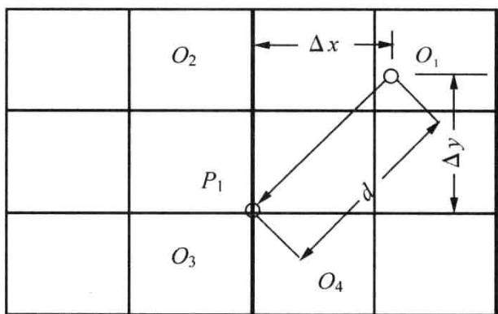  
图1-5 客观运行法示意图

(1)先将研究区域(或流域)划分为若干网格(图1-5),得出众多格点

(交点)，并在网格上标出各雨量观测点的具体位置(如 $0 _ { 1 \setminus } \ O _ { 2 \setminus } \ O _ { 3 \setminus } \ O _ { 4 } )$ C

(2)用各雨量观测点的降雨资料确定各格点的降雨量。具体做法是：以格点周围各雨量观测点到该格点距离平方的倒数作为权重系数，用各观测点权重系数乘各观测点的降雨量，然后求和得到各格点的降雨量。可见，雨量观测点到格点的距离越近，其权重系数越大，即对该格点降雨量的贡献越大。若距离为 $d$ ，则权重为 $\boldsymbol { W } \ = 1 / d ^ { 2 }$ ，若某一雨量观测点到某格点横坐标差为 $\Delta x$ ，纵坐标差为 $\Delta y$ ，则 $d ^ { 2 } = { \Delta x } ^ { 2 } + { \Delta y } ^ { 2 }$ ，计算格点雨量的公式：

$$
P _ { j } = { \frac { \displaystyle \sum _ { i = 1 } ^ { n } P _ { i } W _ { i } } { \displaystyle \sum _ { i = 1 } ^ { n _ { j } } W _ { i } } } = \sum _ { i = 1 } ^ { n _ { j } } P _ { i } W _ { i }
$$

式中： $P _ { j }$ ——第j个格点的降雨量；

$n _ { j }$ ——参加第j个格点降雨量计算的雨量观测站点数；

$P _ { \ i }$ ——参加j点降雨量计算的各雨量观测站点的降雨量；

$\mathbb { W } _ { i }$ —各雨量观测站点对于第j个格点的权重；

$n \cdot$ —区域内格点总数。

(3)将计算出的各格点的降雨量取算术平均值，即为观测区域的平均降水量 $P _ { \mathrm { ~ \it ~  ~ } }$ o

$$
P = \frac { 1 } { n } \sum _ { j = 1 } ^ { n } P _ { j }
$$

## 1.1.3 林内降雨的测定

当观测区域内有水土保持林或其他林地时，需要观测林冠对降水的截留作用，计算林冠截留量，评价林冠层的水文效益。林冠截留的降雨量是径流形成过程中的主要损失之一，在林冠的作用下减少了到达地面的雨量，这对防止地表径流和土壤侵蚀的形成具有一定意义，因此林冠截留降雨的观测也是水土保持监测的重要内容。林冠截留量一般无法直接观测，只能通过观测林外降雨量、林内降雨量、树干流量，通过水量平衡方程计算得出。

林内降雨由两部分组成，一部分是穿透降雨，另一部分是滴下降雨。

降雨时到达林冠的雨水一部分穿过枝叶缝隙直接到达地面，这部分降雨称为穿透降雨，还有一部被枝叶拦截后，再从枝叶上滴落到地面，这部分降雨称为滴下降雨。由于林冠层内的枝叶空隙分布不均，再加上枝叶的汇集和再分配作用，林内降雨的空间分布极不均匀，用承水器口直径只有20cm的雨量筒或雨量计直接测量林内降雨时将会出现很大的误差。为此，林内降雨的测定必须用特殊的方法。常用的林内降雨的测定方法有网格法和承雨槽法。

## 1.1.3.1 网格法

林内降雨分布不均，可通过增加林内观测点的方法提高观测精度。网格法就是增加林内降雨观测点的主要代表。利用网格法观测林内降雨时，首先需要根据林分类型、林分结构、郁闭度等划分观测区，每个观测区内林分类型相同，林分结构一致，郁闭度相近。在每一观测区内选择适当面积的标准地，按一定距离(数米至10m)划出方格线，在方格的各交点上，布设雨量筒(雨量计)观测林内降雨量。降雨结束后测定各个雨量筒中接收的雨量，将各观测点测定的雨量值进行平均得出平均的林内降雨量。如果采用自记雨量计可以实现林内降雨的自动观测。

网格法需要的观测仪器较多、费用较高，每次降雨后测量工作量也很大。如果雨量观测点的数量足够多，用网格法能够观测出林内降雨的空间分布特征。采用网格法测定林内降雨时为了节约成本，可以采用具有一定深度、面积(容器口面积)一定、且不漏水的容器进行观测，观测时可将这些容器水平布设在林内地面上接收雨水，降雨后用量筒直接测定每个容器中接收的雨水量(体积)，用雨水的体积除以容器的面积就是降雨量。每次观测后必须将容器内的雨水全部倒掉，即必须保证每次降雨前观测容器中没有积水，这样测定出的水量才是本次降雨所形成的林内降雨量。

网格法测定林内降雨记录参见表1-5。

表1-5 网格法林内降雨测定原始记录表  
观测员：
<table><tr><td rowspan=1 colspan=1>林分类型</td><td rowspan=1 colspan=1></td><td rowspan=1 colspan=3>密度</td><td rowspan=1 colspan=2></td><td rowspan=1 colspan=3>林龄</td><td rowspan=1 colspan=2></td><td rowspan=1 colspan=2>地点</td><td rowspan=1 colspan=3></td><td rowspan=1 colspan=2>坐标</td><td rowspan=1 colspan=5></td></tr><tr><td rowspan=1 colspan=1>树高</td><td rowspan=1 colspan=1></td><td rowspan=1 colspan=3>胸径</td><td rowspan=1 colspan=2></td><td rowspan=1 colspan=3>郁闭度</td><td rowspan=1 colspan=2></td><td rowspan=1 colspan=3>观测仪器</td><td rowspan=1 colspan=3></td><td rowspan=1 colspan=3>观测点数</td><td rowspan=1 colspan=3></td></tr><tr><td rowspan=1 colspan=1>林外降雨量</td><td rowspan=1 colspan=1></td><td rowspan=1 colspan=3>降雨历时</td><td rowspan=1 colspan=2></td><td rowspan=1 colspan=3>平均雨强</td><td rowspan=1 colspan=2></td><td rowspan=1 colspan=3>5min 雨强</td><td rowspan=1 colspan=3></td><td rowspan=1 colspan=4>10min 雨强</td><td rowspan=1 colspan=2></td></tr><tr><td rowspan=1 colspan=1>30min雨强</td><td rowspan=1 colspan=2></td><td rowspan=1 colspan=4>60min雨强</td><td rowspan=1 colspan=2></td><td rowspan=1 colspan=5>林内降雨量</td><td rowspan=1 colspan=2></td><td rowspan=1 colspan=4>透雨率</td><td rowspan=1 colspan=4></td></tr><tr><td rowspan=1 colspan=1>观测点号</td><td rowspan=1 colspan=1>1</td><td rowspan=1 colspan=2>2</td><td rowspan=1 colspan=2>3</td><td rowspan=1 colspan=2>4</td><td rowspan=1 colspan=1>5</td><td rowspan=1 colspan=2>6</td><td rowspan=1 colspan=2>7</td><td rowspan=1 colspan=2>8</td><td rowspan=1 colspan=2>9</td><td rowspan=1 colspan=2>10</td><td rowspan=1 colspan=1>11</td><td rowspan=1 colspan=3>12</td><td rowspan=1 colspan=1>平均</td></tr><tr><td rowspan=1 colspan=1>容器面积</td><td rowspan=1 colspan=1></td><td rowspan=1 colspan=2></td><td rowspan=1 colspan=2></td><td rowspan=1 colspan=2></td><td rowspan=1 colspan=1></td><td rowspan=1 colspan=2></td><td rowspan=1 colspan=2></td><td rowspan=1 colspan=2></td><td rowspan=1 colspan=2></td><td rowspan=1 colspan=2></td><td rowspan=1 colspan=1></td><td rowspan=1 colspan=3></td><td rowspan=1 colspan=1></td></tr><tr><td rowspan=1 colspan=1>容器内水量</td><td rowspan=1 colspan=1></td><td rowspan=1 colspan=2></td><td rowspan=1 colspan=2></td><td rowspan=1 colspan=2></td><td rowspan=1 colspan=1></td><td rowspan=1 colspan=2></td><td rowspan=1 colspan=2></td><td rowspan=1 colspan=2></td><td rowspan=1 colspan=2></td><td rowspan=1 colspan=2></td><td rowspan=1 colspan=1></td><td rowspan=1 colspan=3></td><td rowspan=1 colspan=1></td></tr><tr><td rowspan=1 colspan=1>林内降雨量</td><td rowspan=1 colspan=1></td><td rowspan=1 colspan=2></td><td rowspan=1 colspan=2></td><td rowspan=1 colspan=2></td><td rowspan=1 colspan=1></td><td rowspan=1 colspan=2></td><td rowspan=1 colspan=2></td><td rowspan=1 colspan=2></td><td rowspan=1 colspan=2></td><td rowspan=1 colspan=2></td><td rowspan=1 colspan=1></td><td rowspan=1 colspan=3></td><td rowspan=1 colspan=1></td></tr></table>

## 1.1.3.2 承雨槽法

林内降雨分布不均，可通过增加承雨器面积的办法提高观测精度。为此，可以在林内布设面积更大的承雨槽收集林内降雨，将收集的林内降雨用连接管导入一个容器(储水器)或量水计，降雨后用量筒测量储水器中的雨水量或直接从量水计中读取承雨槽接受的雨水量。将承雨槽接收的水量除以承雨槽的水平面积，便可得到林内降雨量。

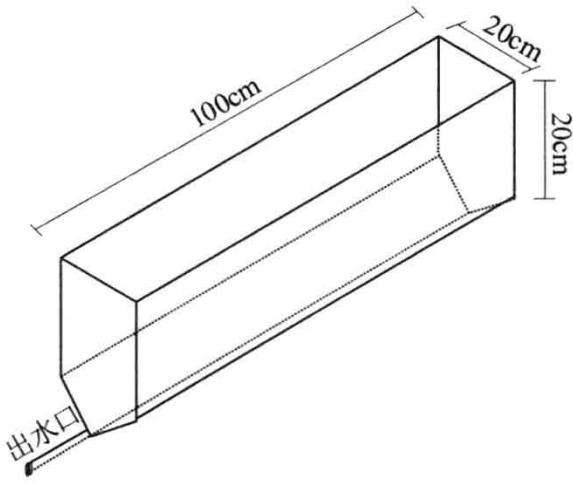  
图1-6 承雨槽示意图

承雨槽可以是长方形、正方形、圆

形等面积容易求算的形状，可以用铁皮、塑料等隔水材料(不能吸水)制作。一般采用铁皮或塑料板制作成宽度为20cm、长度为1\~5m、深20cm的长形槽作为承雨槽(图1-6)。

在人工林中安装的承雨槽长度必须大于造林时的株行距，在次生林中安装的承雨槽长度必须大于平均株距。在制作和安装过程中必须保证承雨槽不漏水，承雨槽与储水器之间的连接管也不能漏水，且储水器能够容纳承雨器接纳的所有雨水。如果将储水器替换成自记量水计，则可以实现林内降雨的自动观测。承雨槽的面积越大，测定的林内降雨的结果越可靠，但观测设备的布设更为困难，制作费用更高。

(1)安装：在观测林地内选择能够代表林冠平均覆盖状况的地段，安装承雨槽。承雨槽可以沿等高线布设，也可以沿坡面布设，布设时需要让承雨槽保持一定的倾斜角度，以保证承雨槽接收的林内降雨能够及时流到储水器(塑料桶)或量水计中。将承雨槽用钢钎固定在地面，或用架子架在空中。要求承雨槽必须安装牢固，以防倾倒。将承雨槽出水口用塑料软管连接到塑料桶中或直接导入量水计中，塑料桶的体积必须能容纳一次降雨中承雨槽收集的全部林内雨量。安装好后用测坡器测定承雨槽与水平面的夹角。如果用塑料桶进行测定，塑料桶必须有盖，以防止雨水直接进入塑料桶而影响测量结果。

(2)人工观测：将承雨槽中接收的雨水通过塑料软管导入塑料桶中保存，降雨后进行人工测定。测定时将塑料桶中收集的雨水用1000ml的量筒直接测定体积，并记录降雨日期和测定日期。也可以将塑料桶放在一个水平台上，用钢尺测定水深，根据塑料桶的底面积计算出塑料桶中水的体积(用积水深度乘以塑料桶的底面积即为水的体积)。

(3)自动观测：如果将承雨槽的排水孔通过塑料软管与量水计连接，降雨时承雨槽接收的林内降雨便可以用量水计自动观测。承雨槽安装好后用专用软件对量水计进行设置，设置内容包括日期、时间、数据记录间隔、仪器编号、观测地点等基本信息。林内降雨观测设施开始工作后，每隔一定时间或每次降雨后将量水计与笔记本电脑连接，下载量水计中的观测记录，用Excel表格或专用软件打开观测记录，整理林内降雨开始时间、结束时间、林内降雨强度、林内降雨量、林内降雨历时等各项观测指标。

如果在塑料桶内放置一个压力式水位计，也可以实现自动观测，即每次降雨后将压力式水位计取出，与笔记本电脑连接，读取水位变化数据，利用某一时刻水位数据乘以塑料桶底面积，便可得出到该时刻为止林内的降雨量(注意：因压力式水位计测定的数据根据大气压力的变化而变化，可以用直尺测定的塑料桶内水位值对压力式水位计的测定值进行校正）。

承雨槽法测定林内降雨记录参见表1-6。

表1-6 承雨槽法林内降雨测定原始记录表

降雨日期：

观测员：

<table><tr><td rowspan=1 colspan=2>林分类型</td><td rowspan=1 colspan=3></td><td rowspan=1 colspan=2>密度</td><td rowspan=1 colspan=2></td><td rowspan=1 colspan=2>林龄</td><td rowspan=1 colspan=2></td><td rowspan=1 colspan=2>地点</td><td rowspan=1 colspan=2></td><td rowspan=1 colspan=2>坐标</td><td rowspan=1 colspan=3></td></tr><tr><td rowspan=1 colspan=1>树高</td><td rowspan=1 colspan=2></td><td rowspan=1 colspan=2>胸径</td><td rowspan=1 colspan=2></td><td rowspan=1 colspan=2>郁闭度</td><td rowspan=1 colspan=1></td><td rowspan=1 colspan=4>承雨槽面积</td><td rowspan=1 colspan=1></td><td rowspan=1 colspan=2>承雨槽数量</td><td rowspan=1 colspan=2></td><td rowspan=1 colspan=2>坡度</td><td rowspan=1 colspan=1></td></tr><tr><td rowspan=1 colspan=2>林外降雨量</td><td rowspan=1 colspan=2></td><td rowspan=1 colspan=3>降雨历时</td><td rowspan=1 colspan=1></td><td rowspan=1 colspan=3>平均雨强</td><td rowspan=1 colspan=2></td><td rowspan=1 colspan=3>5min雨强</td><td rowspan=1 colspan=2></td><td rowspan=1 colspan=3>10min雨强</td><td rowspan=1 colspan=1></td></tr><tr><td rowspan=1 colspan=2>30min雨强</td><td rowspan=1 colspan=4></td><td rowspan=1 colspan=3>60min 雨强</td><td rowspan=1 colspan=3></td><td rowspan=1 colspan=3>林内雨量</td><td rowspan=1 colspan=2></td><td rowspan=1 colspan=3>透雨率</td><td rowspan=1 colspan=2></td></tr><tr><td rowspan=1 colspan=2>承雨槽编号</td><td rowspan=1 colspan=4>一</td><td rowspan=1 colspan=3>2</td><td rowspan=1 colspan=3>3</td><td rowspan=1 colspan=3>4</td><td rowspan=1 colspan=2>5</td><td rowspan=1 colspan=3>6</td><td rowspan=1 colspan=2>平均</td></tr><tr><td rowspan=1 colspan=2>测定水量</td><td rowspan=1 colspan=4></td><td rowspan=1 colspan=3></td><td rowspan=1 colspan=3></td><td rowspan=1 colspan=3></td><td rowspan=1 colspan=2></td><td rowspan=1 colspan=3></td><td rowspan=1 colspan=2></td></tr><tr><td rowspan=1 colspan=2>林内降雨量</td><td rowspan=1 colspan=4></td><td rowspan=1 colspan=3></td><td rowspan=1 colspan=3></td><td rowspan=1 colspan=3></td><td rowspan=1 colspan=2></td><td rowspan=1 colspan=3></td><td rowspan=1 colspan=2></td></tr></table>

## 1.1.3.3 林内降雨数据汇总

用网格法测定林内降雨时，林内各观测点雨量值的平均值即为林内降雨量。用承雨槽法测定时每个承雨槽收集的水量除以承雨槽水平面积便可得到该点的林内降雨量，如果有多个承雨槽，则林内降雨量等于各个承雨槽测定值的平均值。当测定出林外降雨量和林内降雨量后，可以计算出林冠透雨率。林冠透雨率是表示林冠疏密程度的指标，是林内降雨量与林外降雨量的比值。林内降雨数据汇总见表1-7。

表1-7 林内降雨测定汇总表
<table><tr><td rowspan=1 colspan=1>林分类型</td><td rowspan=1 colspan=1></td><td rowspan=1 colspan=1>密度</td><td rowspan=1 colspan=2></td><td rowspan=1 colspan=2>林龄</td><td rowspan=1 colspan=2></td><td rowspan=1 colspan=2>地点</td><td rowspan=1 colspan=2></td><td rowspan=1 colspan=2>坡度</td><td rowspan=1 colspan=1></td></tr><tr><td rowspan=1 colspan=1>树高</td><td rowspan=1 colspan=1></td><td rowspan=1 colspan=1>胸径</td><td rowspan=1 colspan=2></td><td rowspan=1 colspan=2>郁闭度</td><td rowspan=1 colspan=2></td><td rowspan=1 colspan=2>坐标</td><td rowspan=1 colspan=5></td></tr><tr><td rowspan=1 colspan=2>日期</td><td rowspan=1 colspan=1>林外降雨量</td><td rowspan=1 colspan=1>降雨历时</td><td rowspan=1 colspan=2>平均雨强</td><td rowspan=1 colspan=2>5min雨强</td><td rowspan=1 colspan=2>10min雨强</td><td rowspan=1 colspan=2>30min雨强</td><td rowspan=1 colspan=2>60min雨强</td><td rowspan=1 colspan=1>林内降雨量</td><td rowspan=1 colspan=1>透雨率</td></tr><tr><td rowspan=1 colspan=2>年月日时</td><td rowspan=1 colspan=1></td><td rowspan=1 colspan=1></td><td rowspan=1 colspan=2></td><td rowspan=1 colspan=2></td><td rowspan=1 colspan=2></td><td rowspan=1 colspan=2></td><td rowspan=1 colspan=2></td><td rowspan=1 colspan=1></td><td rowspan=1 colspan=1></td></tr><tr><td rowspan=1 colspan=2>年月日时</td><td rowspan=1 colspan=1></td><td rowspan=1 colspan=1></td><td rowspan=1 colspan=2></td><td rowspan=1 colspan=2></td><td rowspan=1 colspan=2></td><td rowspan=1 colspan=2></td><td rowspan=1 colspan=2></td><td rowspan=1 colspan=1></td><td rowspan=1 colspan=1></td></tr><tr><td rowspan=1 colspan=2>年 月 日 时</td><td rowspan=1 colspan=1></td><td rowspan=1 colspan=1></td><td rowspan=1 colspan=2></td><td rowspan=1 colspan=2></td><td rowspan=1 colspan=2></td><td rowspan=1 colspan=2></td><td rowspan=1 colspan=2></td><td rowspan=1 colspan=1></td><td rowspan=1 colspan=1></td></tr><tr><td rowspan=1 colspan=2>年月日时</td><td rowspan=1 colspan=1></td><td rowspan=1 colspan=1></td><td rowspan=1 colspan=2></td><td rowspan=1 colspan=2></td><td rowspan=1 colspan=2></td><td rowspan=1 colspan=2></td><td rowspan=1 colspan=2></td><td rowspan=1 colspan=1></td><td rowspan=1 colspan=1></td></tr><tr><td rowspan=1 colspan=2>合计</td><td rowspan=1 colspan=1></td><td rowspan=1 colspan=1></td><td rowspan=1 colspan=2></td><td rowspan=1 colspan=2></td><td rowspan=1 colspan=2></td><td rowspan=1 colspan=2></td><td rowspan=1 colspan=2></td><td rowspan=1 colspan=1></td><td rowspan=1 colspan=1></td></tr><tr><td rowspan=1 colspan=2>最大值</td><td rowspan=1 colspan=1></td><td rowspan=1 colspan=1></td><td rowspan=1 colspan=2></td><td rowspan=1 colspan=2></td><td rowspan=1 colspan=2></td><td rowspan=1 colspan=2></td><td rowspan=1 colspan=2></td><td rowspan=1 colspan=1></td><td rowspan=1 colspan=1></td></tr><tr><td rowspan=1 colspan=2>最小值</td><td rowspan=1 colspan=1></td><td rowspan=1 colspan=1></td><td rowspan=1 colspan=2></td><td rowspan=1 colspan=2></td><td rowspan=1 colspan=2></td><td rowspan=1 colspan=2></td><td rowspan=1 colspan=2></td><td rowspan=1 colspan=1></td><td rowspan=1 colspan=1></td></tr><tr><td rowspan=1 colspan=16>整理人口                                                                                             甘</td></tr></table>

整理人员：  
汇总日期：

## 1.1.4 树干流的测定

降雨过程中被枝叶拦截的雨水有一部分会沿着树枝汇集到树干，汇集到树干的雨水和直接降落在树干上的雨水一起沿树干流到地面，这种沿树干向地面流动的雨水称为树干流。树干流在流向地面的过程中由于树皮含水量未达到饱和，树皮会吸收一部分雨水，但被吸收的雨水量一般很少，可以忽略。树干流的数量虽然不大，但对增加树体的含水量和根基部土壤含水量具有一定意义。另外计算林冠截留量时必须测定树干流量。树干流的测定有标准木法和标准地法两种。

树干流是降雨过程中直接降落在树干上的雨水，以及由枝叶拦截后顺树枝汇集到树干的雨水沿树干流向地面的过程，因此将沿树干流向地面的雨水量全部收集起来，测定其体积，便可以得到树干流量。树干流是由整个林冠和树干拦截的雨水汇集而成，因此树干流的量等于沿树干流下的水的体积除以树冠的投影面积。

## 1.1.4.1 标准木法

在测定林分内选择标准地，进行标准地调查和每木检尺。通过每木检尺确定各径阶树木的数量，并在各径阶中选择3株标准木，测定标准木的树冠投影面积。测定树冠投影面积时需要以树干为中心，分别测定树冠在正北、东北、正东、东南、正南、西南、正西、西北方向等8个方位上的长度，通过绘制树冠投影图，量算树冠投影面积。采用标准木法测定树干流量的方法有两种。

【方法1】在所选标准木离地1.3m的树干处用刀具将死树皮去除(不能伤害到形成层)，用一定宽度的较为柔软的隔水材料(不能吸水)在标准木的树干上围成一圈，并在接缝处预先安装硬塑料的导水管，在隔水材料和树干间用玻璃胶等防水材料黏结，以保证隔水材料与树干间无渗水、漏水的缝隙，在隔水材料外用捆绑带或拉紧器等捆紧固定。安装时隔水材料的上沿应制作成楔形与树干间形成积水槽，这样才能保证从树干上流下来的雨水不会外溢。汇集在隔水材料上的树干流通过硬塑料管导入收集器。每次降雨后用量筒直接测定收集器中的水量，也可以在收集器中放置压力式水位计测定树干流量和树干流的过程，还可以直接将从硬塑料管中流出的树干流导入量水计测定树干流量和树干流的过程。用收集器中水的体积或量水计测量出的水的体积，除以标准木的树冠投影面积可得到该标准木的树干流量。如将收集的树干流导入自记量水计，可以实现对树干流的自动

观测。

【方法2】裁取一定长度的塑料软管，用剪刀将塑料软管剪开备用。在测定样地内每株树干上离地1.3m以下部分，用小刀沿树干向地面螺旋形地将枯死的树皮刮去(不能伤害到形成层)。用小钉子将剪开的塑料软管沿树干螺旋形地固定在树干上，塑料软管在树干上至少缠绕两圈以上。为了保证塑料软管与树干密切接触，可将玻璃胶装在玻璃胶枪上，用玻璃胶枪将玻璃胶挤在塑料管与树干的结合部位，以保证从树干上流下来的雨水全部汇集到半圆形的塑料软管内。将塑料软管的下部竖直插入一定体积的储水器(塑料桶)内，以收集从树干上汇集的雨水。塑料桶应该用固定桩固定，以防倾倒。每次降雨后用直尺测定塑料桶内积水深度(用积水深度乘以塑料桶的底面积即为水量)，或直接用500ml或1000ml的量筒量取塑料桶内的水量，该水量就是树干流量。

塑料桶内也可以放置压力式水位计测定树干流量和树干流的过程，用压力式水位计观测树干流时，塑料桶底面必须保持水平状态。如果用压力式水位计观测，每次降雨后取出压力式水位计，并与笔记本电脑连接，读取水位随时间的变化数据，利用某一时刻水位数据乘以塑料桶底面积得出到该时刻的树干流量（注意：因压力式水位计测定的数据受大气压力的变化而变化，可以用直尺测定的塑料桶内水位值对压力式水位计的测定值进行校正)。

如果用自记量水计观测树干流量和过程，可以直接将塑料软管导入自记量水计，并用专用软件和电脑设定量水计的日期、时间、数据记录间隔、仪器编号等基本信息。如果用自记量水计观测，每次降雨后将自记量水计的数据采集器与笔记本电脑连接，用专用软件下载观测数据后，使用Excel表格或专用软件分析树干流开始时间、结束时间、历时、树干流量、树干流过程等基本信息。

设标准地内林木的总株数为N，径阶数为m，各径阶的株数 $n _ { j }$ ，各径阶标准木的权重为 $R _ { j } = n _ { j } / N$ ，各标准木测定的树干流量为 $P _ { j }$ ，则所观测林分的平均树干流量 $P _ { \mathrm { \mathcal { F } } }$ 为：

$$
P _ { \mathrm { \mathcal { F } } } ~ = ~ \sum _ { j = 1 } ^ { m } P _ { j } \times R _ { j }
$$

标准木法测定树干流记录格式见表1-8。

表1-8 标准木法测定树干流记录表
<table><tr><td rowspan=1 colspan=1>林分类型</td><td rowspan=1 colspan=1></td><td rowspan=1 colspan=1>密度</td><td rowspan=1 colspan=1></td><td rowspan=1 colspan=1>林龄</td><td rowspan=1 colspan=1></td><td rowspan=1 colspan=1>坡度</td><td rowspan=1 colspan=1></td><td rowspan=1 colspan=2>地点</td><td rowspan=1 colspan=1></td></tr><tr><td rowspan=1 colspan=1>树高</td><td rowspan=1 colspan=1></td><td rowspan=1 colspan=1>胸径</td><td rowspan=1 colspan=1></td><td rowspan=1 colspan=1>郁闭度</td><td rowspan=1 colspan=1></td><td rowspan=1 colspan=1>地理坐标</td><td rowspan=1 colspan=4></td></tr><tr><td rowspan=1 colspan=1>林外雨量</td><td rowspan=1 colspan=1></td><td rowspan=1 colspan=1>降雨历时</td><td rowspan=1 colspan=1></td><td rowspan=1 colspan=1>雨强</td><td rowspan=1 colspan=1></td><td rowspan=1 colspan=1>降雨日期</td><td rowspan=1 colspan=4>年 月 日 时</td></tr><tr><td rowspan=1 colspan=1>径阶</td><td rowspan=1 colspan=1>株树</td><td rowspan=1 colspan=1>权重 $R _ { j }$ </td><td rowspan=1 colspan=1>标准木</td><td rowspan=1 colspan=2>树冠投影面积</td><td rowspan=1 colspan=1>树干流体积</td><td rowspan=1 colspan=2>平均 $P _ { j }$ </td><td rowspan=1 colspan=2>各径阶树干流量</td></tr><tr><td rowspan=3 colspan=1></td><td rowspan=3 colspan=1></td><td rowspan=3 colspan=1></td><td rowspan=1 colspan=1>标准木1</td><td rowspan=1 colspan=2></td><td rowspan=1 colspan=1></td><td rowspan=3 colspan=2></td><td rowspan=3 colspan=2></td></tr><tr><td rowspan=1 colspan=1>标准木2</td><td rowspan=1 colspan=2></td><td rowspan=1 colspan=1></td></tr><tr><td rowspan=1 colspan=1>标准木3</td><td rowspan=1 colspan=2></td><td rowspan=1 colspan=1></td></tr><tr><td rowspan=3 colspan=1></td><td rowspan=3 colspan=1></td><td rowspan=3 colspan=1></td><td rowspan=1 colspan=1>标准木1</td><td rowspan=1 colspan=2></td><td rowspan=1 colspan=1></td><td rowspan=3 colspan=2></td><td rowspan=3 colspan=2></td></tr><tr><td rowspan=1 colspan=1>标准木2</td><td rowspan=1 colspan=2></td><td rowspan=1 colspan=1></td></tr><tr><td rowspan=1 colspan=1>标准木3</td><td rowspan=1 colspan=2></td><td rowspan=1 colspan=1></td></tr><tr><td rowspan=3 colspan=1></td><td rowspan=3 colspan=1></td><td rowspan=3 colspan=1></td><td rowspan=1 colspan=1>标准木1</td><td rowspan=1 colspan=2></td><td rowspan=1 colspan=1></td><td rowspan=3 colspan=2></td><td rowspan=3 colspan=2></td></tr><tr><td rowspan=1 colspan=1>标准木2</td><td rowspan=1 colspan=2></td><td rowspan=1 colspan=1></td></tr><tr><td rowspan=1 colspan=1>标准木3</td><td rowspan=1 colspan=2></td><td rowspan=1 colspan=1></td></tr><tr><td rowspan=1 colspan=1>合计</td><td rowspan=1 colspan=1></td><td rowspan=1 colspan=1></td><td rowspan=1 colspan=1></td><td rowspan=1 colspan=2></td><td rowspan=1 colspan=1></td><td rowspan=1 colspan=2></td><td rowspan=1 colspan=2></td></tr><tr><td rowspan=1 colspan=1>观测员：</td><td rowspan=1 colspan=1></td><td rowspan=1 colspan=1>调查日期：</td><td rowspan=1 colspan=1></td><td rowspan=1 colspan=2></td><td rowspan=1 colspan=1></td><td rowspan=1 colspan=2></td><td rowspan=1 colspan=2></td></tr></table>

## 1.1.4.2 标准地法

在测定林分内选择面积为S的标准地，如果标准地内的树木株树为N，对标准地内的每株树木都安装树干流的测定装置，每次降雨后测量每株树木的树干流体积 $V _ { i \textrm { c } }$ 累加后得出标准地树干流总体积 $V _ { \circ }$

$$
V = \sum _ { i = 1 } ^ { N } V _ { i }
$$

树干流量 $P _ { \mathrm { { f } } }$ 为：

$$
P _ { \mathrm { ~ \ / F ~ } } = \frac { V } { S }
$$

标准地法测定树干流记录格式见表1-9。树干流测定汇总格式见表1-10。

表1-9 标准地法测定树干流记录表
<table><tr><td rowspan=1 colspan=1>林分类型</td><td rowspan=1 colspan=2></td><td rowspan=1 colspan=2>密度</td><td rowspan=1 colspan=2></td><td rowspan=1 colspan=2>林龄</td><td rowspan=1 colspan=1></td><td rowspan=1 colspan=1>坡度</td><td rowspan=1 colspan=2></td><td rowspan=1 colspan=2>地点</td><td rowspan=1 colspan=1></td></tr><tr><td rowspan=1 colspan=1>树高</td><td rowspan=1 colspan=2></td><td rowspan=1 colspan=2>胸径</td><td rowspan=1 colspan=2></td><td rowspan=1 colspan=2>郁闭度</td><td rowspan=1 colspan=1></td><td rowspan=1 colspan=3>地理坐标</td><td rowspan=1 colspan=3></td></tr><tr><td rowspan=1 colspan=1>林外雨量</td><td rowspan=1 colspan=1></td><td rowspan=1 colspan=2>降雨历时</td><td rowspan=1 colspan=2></td><td rowspan=1 colspan=1>雨强</td><td rowspan=1 colspan=1></td><td rowspan=1 colspan=2>降雨时间</td><td rowspan=1 colspan=2></td><td rowspan=1 colspan=3>标准地面积S</td><td rowspan=1 colspan=1></td></tr><tr><td rowspan=1 colspan=1>编号</td><td rowspan=1 colspan=2>树高</td><td rowspan=1 colspan=2>胸径</td><td rowspan=1 colspan=2>树龄</td><td rowspan=1 colspan=3>树冠投影面积</td><td rowspan=1 colspan=4>树干流体积 $V _ { i }$ </td><td rowspan=1 colspan=2>备注</td></tr><tr><td rowspan=1 colspan=1>1</td><td rowspan=1 colspan=2></td><td rowspan=1 colspan=2></td><td rowspan=1 colspan=2></td><td rowspan=1 colspan=3></td><td rowspan=1 colspan=4></td><td rowspan=1 colspan=2></td></tr><tr><td rowspan=1 colspan=1>2</td><td rowspan=1 colspan=2></td><td rowspan=1 colspan=2></td><td rowspan=1 colspan=2></td><td rowspan=1 colspan=3></td><td rowspan=1 colspan=4></td><td rowspan=1 colspan=2></td></tr><tr><td rowspan=1 colspan=1>3</td><td rowspan=1 colspan=2></td><td rowspan=1 colspan=2></td><td rowspan=1 colspan=2></td><td rowspan=1 colspan=3></td><td rowspan=1 colspan=4></td><td rowspan=1 colspan=2></td></tr><tr><td rowspan=1 colspan=1>4</td><td rowspan=1 colspan=2></td><td rowspan=1 colspan=2></td><td rowspan=1 colspan=2></td><td rowspan=1 colspan=3></td><td rowspan=1 colspan=4></td><td rowspan=1 colspan=2></td></tr><tr><td rowspan=1 colspan=1>5</td><td rowspan=1 colspan=2></td><td rowspan=1 colspan=2></td><td rowspan=1 colspan=2></td><td rowspan=1 colspan=3></td><td rowspan=1 colspan=4></td><td rowspan=1 colspan=2></td></tr><tr><td rowspan=1 colspan=1>6</td><td rowspan=1 colspan=2></td><td rowspan=1 colspan=2></td><td rowspan=1 colspan=2></td><td rowspan=1 colspan=3></td><td rowspan=1 colspan=4></td><td rowspan=1 colspan=2></td></tr><tr><td rowspan=1 colspan=1>7</td><td rowspan=1 colspan=2></td><td rowspan=1 colspan=2></td><td rowspan=1 colspan=2></td><td rowspan=1 colspan=3></td><td rowspan=1 colspan=4></td><td rowspan=1 colspan=2></td></tr><tr><td rowspan=1 colspan=1>∞</td><td rowspan=1 colspan=2></td><td rowspan=1 colspan=2></td><td rowspan=1 colspan=2></td><td rowspan=1 colspan=3></td><td rowspan=1 colspan=4></td><td rowspan=1 colspan=2></td></tr><tr><td rowspan=1 colspan=1>9</td><td rowspan=1 colspan=2></td><td rowspan=1 colspan=2></td><td rowspan=1 colspan=2></td><td rowspan=1 colspan=3></td><td rowspan=1 colspan=4></td><td rowspan=1 colspan=2></td></tr><tr><td rowspan=1 colspan=1>10</td><td rowspan=1 colspan=2></td><td rowspan=1 colspan=2></td><td rowspan=1 colspan=2></td><td rowspan=1 colspan=3></td><td rowspan=1 colspan=4></td><td rowspan=1 colspan=2></td></tr><tr><td rowspan=1 colspan=1></td><td rowspan=1 colspan=2></td><td rowspan=1 colspan=2></td><td rowspan=1 colspan=2></td><td rowspan=1 colspan=3></td><td rowspan=1 colspan=4></td><td rowspan=1 colspan=2></td></tr><tr><td rowspan=1 colspan=1>…</td><td rowspan=1 colspan=2></td><td rowspan=1 colspan=2></td><td rowspan=1 colspan=2></td><td rowspan=1 colspan=3></td><td rowspan=1 colspan=4></td><td rowspan=1 colspan=2></td></tr><tr><td rowspan=1 colspan=1></td><td rowspan=1 colspan=2></td><td rowspan=1 colspan=2></td><td rowspan=1 colspan=2></td><td rowspan=1 colspan=3></td><td rowspan=1 colspan=4></td><td rowspan=1 colspan=2></td></tr><tr><td rowspan=1 colspan=1></td><td rowspan=1 colspan=2></td><td rowspan=1 colspan=2></td><td rowspan=1 colspan=2></td><td rowspan=1 colspan=3></td><td rowspan=1 colspan=4></td><td rowspan=1 colspan=2></td></tr><tr><td rowspan=1 colspan=1></td><td rowspan=1 colspan=2></td><td rowspan=1 colspan=2></td><td rowspan=1 colspan=2></td><td rowspan=1 colspan=3></td><td rowspan=1 colspan=4></td><td rowspan=1 colspan=2></td></tr><tr><td rowspan=1 colspan=1></td><td rowspan=1 colspan=2></td><td rowspan=1 colspan=2></td><td rowspan=1 colspan=2></td><td rowspan=1 colspan=3></td><td rowspan=1 colspan=4></td><td rowspan=1 colspan=2></td></tr><tr><td rowspan=1 colspan=1></td><td rowspan=1 colspan=2></td><td rowspan=1 colspan=2></td><td rowspan=1 colspan=2></td><td rowspan=1 colspan=3></td><td rowspan=1 colspan=4></td><td rowspan=1 colspan=2></td></tr><tr><td rowspan=1 colspan=1></td><td rowspan=1 colspan=2></td><td rowspan=1 colspan=2></td><td rowspan=1 colspan=2></td><td rowspan=1 colspan=3></td><td rowspan=1 colspan=4></td><td rowspan=1 colspan=2></td></tr><tr><td rowspan=1 colspan=1></td><td rowspan=1 colspan=2></td><td rowspan=1 colspan=2></td><td rowspan=1 colspan=2></td><td rowspan=1 colspan=3></td><td rowspan=1 colspan=4></td><td rowspan=1 colspan=2></td></tr><tr><td rowspan=1 colspan=1>合计</td><td rowspan=1 colspan=2></td><td rowspan=1 colspan=2></td><td rowspan=1 colspan=2></td><td rowspan=1 colspan=3></td><td rowspan=1 colspan=4>V</td><td rowspan=1 colspan=2></td></tr><tr><td rowspan=1 colspan=10>P 干 = V/S</td><td rowspan=1 colspan=6></td></tr></table>

观测员：  
观测日期：

表1-10 树干流测定汇总表
<table><tr><td rowspan=1 colspan=1>林分类型</td><td rowspan=1 colspan=1></td><td rowspan=1 colspan=2>密度</td><td rowspan=1 colspan=2></td><td rowspan=1 colspan=2>林龄</td><td rowspan=1 colspan=2></td><td rowspan=1 colspan=2>地点</td><td rowspan=1 colspan=2></td><td rowspan=1 colspan=2>坡度</td><td rowspan=1 colspan=1></td></tr><tr><td rowspan=1 colspan=1>树高</td><td rowspan=1 colspan=1></td><td rowspan=1 colspan=2>胸径</td><td rowspan=1 colspan=2></td><td rowspan=1 colspan=2>郁闭度</td><td rowspan=1 colspan=2></td><td rowspan=1 colspan=2>坐标</td><td rowspan=1 colspan=2></td><td rowspan=1 colspan=2></td><td rowspan=1 colspan=1></td></tr><tr><td rowspan=1 colspan=2>日期</td><td rowspan=1 colspan=1>林外降雨量</td><td rowspan=1 colspan=2>降雨历时</td><td rowspan=1 colspan=2>平均雨强</td><td rowspan=1 colspan=2>5min雨强</td><td rowspan=1 colspan=2>10 min雨强</td><td rowspan=1 colspan=2>30 min雨强</td><td rowspan=1 colspan=2>60 min雨强</td><td rowspan=1 colspan=1>树干流量</td><td rowspan=1 colspan=1>树干流率</td></tr><tr><td rowspan=1 colspan=2>年 月 日 时</td><td rowspan=1 colspan=1></td><td rowspan=1 colspan=2></td><td rowspan=1 colspan=2></td><td rowspan=1 colspan=2></td><td rowspan=1 colspan=2></td><td rowspan=1 colspan=2></td><td rowspan=1 colspan=2></td><td rowspan=1 colspan=1></td><td rowspan=1 colspan=1></td></tr><tr><td rowspan=1 colspan=2>年月 日时</td><td rowspan=1 colspan=1></td><td rowspan=1 colspan=2></td><td rowspan=1 colspan=2></td><td rowspan=1 colspan=2></td><td rowspan=1 colspan=2></td><td rowspan=1 colspan=2></td><td rowspan=1 colspan=2></td><td rowspan=1 colspan=1></td><td rowspan=1 colspan=1></td></tr><tr><td rowspan=1 colspan=2></td><td rowspan=1 colspan=1></td><td rowspan=1 colspan=2></td><td rowspan=1 colspan=2></td><td rowspan=1 colspan=2></td><td rowspan=1 colspan=2></td><td rowspan=1 colspan=2></td><td rowspan=1 colspan=2></td><td rowspan=1 colspan=1></td><td rowspan=1 colspan=1></td></tr><tr><td rowspan=1 colspan=2></td><td rowspan=1 colspan=1></td><td rowspan=1 colspan=2></td><td rowspan=1 colspan=2></td><td rowspan=1 colspan=2></td><td rowspan=1 colspan=2></td><td rowspan=1 colspan=2></td><td rowspan=1 colspan=2></td><td rowspan=1 colspan=1></td><td rowspan=1 colspan=1></td></tr><tr><td rowspan=1 colspan=2></td><td rowspan=1 colspan=1></td><td rowspan=1 colspan=2></td><td rowspan=1 colspan=2></td><td rowspan=1 colspan=2></td><td rowspan=1 colspan=2></td><td rowspan=1 colspan=2></td><td rowspan=1 colspan=2></td><td rowspan=1 colspan=1></td><td rowspan=1 colspan=1></td></tr><tr><td rowspan=1 colspan=2></td><td rowspan=1 colspan=1></td><td rowspan=1 colspan=2></td><td rowspan=1 colspan=2></td><td rowspan=1 colspan=2></td><td rowspan=1 colspan=2></td><td rowspan=1 colspan=2></td><td rowspan=1 colspan=2></td><td rowspan=1 colspan=1></td><td rowspan=1 colspan=1></td></tr><tr><td rowspan=1 colspan=2></td><td rowspan=1 colspan=1></td><td rowspan=1 colspan=2></td><td rowspan=1 colspan=2></td><td rowspan=1 colspan=2></td><td rowspan=1 colspan=2></td><td rowspan=1 colspan=2></td><td rowspan=1 colspan=2></td><td rowspan=1 colspan=1></td><td rowspan=1 colspan=1></td></tr><tr><td rowspan=1 colspan=2></td><td rowspan=1 colspan=1></td><td rowspan=1 colspan=2></td><td rowspan=1 colspan=2></td><td rowspan=1 colspan=2></td><td rowspan=1 colspan=2></td><td rowspan=1 colspan=2></td><td rowspan=1 colspan=2></td><td rowspan=1 colspan=1></td><td rowspan=1 colspan=1></td></tr><tr><td rowspan=1 colspan=2>年 月 日 时</td><td rowspan=1 colspan=1></td><td rowspan=1 colspan=2></td><td rowspan=1 colspan=2></td><td rowspan=1 colspan=2></td><td rowspan=1 colspan=2></td><td rowspan=1 colspan=2></td><td rowspan=1 colspan=2></td><td rowspan=1 colspan=1></td><td rowspan=1 colspan=1></td></tr><tr><td rowspan=1 colspan=2>合计</td><td rowspan=1 colspan=1></td><td rowspan=1 colspan=2></td><td rowspan=1 colspan=2></td><td rowspan=1 colspan=2></td><td rowspan=1 colspan=2></td><td rowspan=1 colspan=2></td><td rowspan=1 colspan=2></td><td rowspan=1 colspan=1></td><td rowspan=1 colspan=1></td></tr><tr><td rowspan=1 colspan=2>最大值</td><td rowspan=1 colspan=1></td><td rowspan=1 colspan=2></td><td rowspan=1 colspan=2></td><td rowspan=1 colspan=2></td><td rowspan=1 colspan=2></td><td rowspan=1 colspan=2></td><td rowspan=1 colspan=2></td><td rowspan=1 colspan=1></td><td rowspan=1 colspan=1></td></tr><tr><td rowspan=1 colspan=2>最小值</td><td rowspan=1 colspan=1></td><td rowspan=1 colspan=2></td><td rowspan=1 colspan=2></td><td rowspan=1 colspan=2></td><td rowspan=1 colspan=2></td><td rowspan=1 colspan=2></td><td rowspan=1 colspan=2></td><td rowspan=1 colspan=1></td><td rowspan=1 colspan=1></td></tr></table>

整理人员：  
汇总日期：

## 1.1.5 林冠截留量的计算

林冠截留量是降雨过程中林冠枝叶及树干截持的雨量，这部分降雨最终以蒸发的形式回到大气中，不参与径流的形成，从而减少了参与形成地表径流和土壤侵蚀的雨水量。林冠截留量的大小与降雨强度、风等气象要素直接相关，另外树木的种类、叶片的大小、质地、湿润状况等特性对林冠截留量影响也很大。林冠截留量一般无法直接测定，只能通过测定林外降雨、林内降雨、树干流后，利用水量平衡方程计算。

$$
I = P _ { \it 5 \mathrm { i } } - P _ { \it \mathrm { p \mathrm { i } } } - P _ { \it \mathrm { T } } .
$$

式中：I——林冠截留量；

$P _ { y \uparrow }$ ——林外降雨量；

$P _ { \cal M }$ ——林内降雨量；

$P _ { \mathcal F }$ ——树干流量。

林冠截留率η是林冠截留量与林外降雨量的比值。

$$
\eta \ = \ \frac { I } { P _ { \it 5 \mathrm { I } } } \times 1 0 0 \%
$$

林冠截留计算格式见表1-11。

表1-11 林冠截留量计算表
<table><tr><td rowspan=1 colspan=1>林分类型</td><td rowspan=1 colspan=1></td><td rowspan=1 colspan=2>密度</td><td rowspan=1 colspan=2></td><td rowspan=1 colspan=3>林龄</td><td rowspan=1 colspan=2></td><td rowspan=1 colspan=2>地点</td><td rowspan=1 colspan=2></td><td rowspan=1 colspan=2>坡度</td><td rowspan=1 colspan=2></td></tr><tr><td rowspan=1 colspan=1>树高</td><td rowspan=1 colspan=1></td><td rowspan=1 colspan=2>胸径</td><td rowspan=1 colspan=2></td><td rowspan=1 colspan=3>郁闭度</td><td rowspan=1 colspan=2></td><td rowspan=1 colspan=2>坐标</td><td rowspan=1 colspan=2></td><td rowspan=1 colspan=2></td><td rowspan=1 colspan=2></td></tr><tr><td rowspan=1 colspan=2>日期</td><td rowspan=1 colspan=1>林外雨量</td><td rowspan=1 colspan=2>降雨历时</td><td rowspan=1 colspan=2>平均雨强</td><td rowspan=1 colspan=1>5min雨强</td><td rowspan=1 colspan=2>10min雨强</td><td rowspan=1 colspan=2>30min雨强</td><td rowspan=1 colspan=1>60min雨强</td><td rowspan=1 colspan=1>林内雨量</td><td rowspan=1 colspan=2>树干流量</td><td rowspan=1 colspan=2>截留量</td><td rowspan=1 colspan=1>截留率</td></tr><tr><td rowspan=1 colspan=2>年 月 日 时</td><td rowspan=1 colspan=1></td><td rowspan=1 colspan=2></td><td rowspan=1 colspan=2></td><td rowspan=1 colspan=1></td><td rowspan=1 colspan=2></td><td rowspan=1 colspan=2></td><td rowspan=1 colspan=1></td><td rowspan=1 colspan=1></td><td rowspan=1 colspan=2></td><td rowspan=1 colspan=2></td><td rowspan=1 colspan=1></td></tr><tr><td rowspan=1 colspan=2>年 月 日 时</td><td rowspan=1 colspan=1></td><td rowspan=1 colspan=2></td><td rowspan=1 colspan=2></td><td rowspan=1 colspan=1></td><td rowspan=1 colspan=2></td><td rowspan=1 colspan=2></td><td rowspan=1 colspan=1></td><td rowspan=1 colspan=1></td><td rowspan=1 colspan=2></td><td rowspan=1 colspan=2></td><td rowspan=1 colspan=1></td></tr><tr><td rowspan=1 colspan=2></td><td rowspan=1 colspan=1></td><td rowspan=1 colspan=2></td><td rowspan=1 colspan=2></td><td rowspan=1 colspan=1></td><td rowspan=1 colspan=2></td><td rowspan=1 colspan=2></td><td rowspan=1 colspan=1></td><td rowspan=1 colspan=1></td><td rowspan=1 colspan=2></td><td rowspan=1 colspan=2></td><td rowspan=1 colspan=1></td></tr><tr><td rowspan=1 colspan=2></td><td rowspan=1 colspan=1></td><td rowspan=1 colspan=2></td><td rowspan=1 colspan=2></td><td rowspan=1 colspan=1></td><td rowspan=1 colspan=2></td><td rowspan=1 colspan=2></td><td rowspan=1 colspan=1></td><td rowspan=1 colspan=1></td><td rowspan=1 colspan=2></td><td rowspan=1 colspan=2></td><td rowspan=1 colspan=1></td></tr><tr><td rowspan=1 colspan=2></td><td rowspan=1 colspan=1></td><td rowspan=1 colspan=2></td><td rowspan=1 colspan=2></td><td rowspan=1 colspan=1></td><td rowspan=1 colspan=2></td><td rowspan=1 colspan=2></td><td rowspan=1 colspan=1></td><td rowspan=1 colspan=1></td><td rowspan=1 colspan=2></td><td rowspan=1 colspan=2></td><td rowspan=1 colspan=1></td></tr><tr><td rowspan=1 colspan=2></td><td rowspan=1 colspan=1></td><td rowspan=1 colspan=2></td><td rowspan=1 colspan=2></td><td rowspan=1 colspan=1></td><td rowspan=1 colspan=2></td><td rowspan=1 colspan=2></td><td rowspan=1 colspan=1></td><td rowspan=1 colspan=1></td><td rowspan=1 colspan=2></td><td rowspan=1 colspan=2></td><td rowspan=1 colspan=1></td></tr><tr><td rowspan=1 colspan=2></td><td rowspan=1 colspan=1></td><td rowspan=1 colspan=2></td><td rowspan=1 colspan=2></td><td rowspan=1 colspan=1></td><td rowspan=1 colspan=2></td><td rowspan=1 colspan=2></td><td rowspan=1 colspan=1></td><td rowspan=1 colspan=1></td><td rowspan=1 colspan=2></td><td rowspan=1 colspan=2></td><td rowspan=1 colspan=1></td></tr><tr><td rowspan=1 colspan=2>年 月 日 时</td><td rowspan=1 colspan=1></td><td rowspan=1 colspan=2></td><td rowspan=1 colspan=2></td><td rowspan=1 colspan=1></td><td rowspan=1 colspan=2></td><td rowspan=1 colspan=2></td><td rowspan=1 colspan=1></td><td rowspan=1 colspan=1></td><td rowspan=1 colspan=2></td><td rowspan=1 colspan=2></td><td rowspan=1 colspan=1></td></tr><tr><td rowspan=1 colspan=2>合计</td><td rowspan=1 colspan=1></td><td rowspan=1 colspan=2></td><td rowspan=1 colspan=2></td><td rowspan=1 colspan=1></td><td rowspan=1 colspan=2></td><td rowspan=1 colspan=2></td><td rowspan=1 colspan=1></td><td rowspan=1 colspan=1></td><td rowspan=1 colspan=2></td><td rowspan=1 colspan=2></td><td rowspan=1 colspan=1></td></tr><tr><td rowspan=1 colspan=2>最大值</td><td rowspan=1 colspan=1></td><td rowspan=1 colspan=2></td><td rowspan=1 colspan=2></td><td rowspan=1 colspan=1></td><td rowspan=1 colspan=2></td><td rowspan=1 colspan=2></td><td rowspan=1 colspan=1></td><td rowspan=1 colspan=1></td><td rowspan=1 colspan=2></td><td rowspan=1 colspan=2></td><td rowspan=1 colspan=1></td></tr><tr><td rowspan=1 colspan=2>最小值</td><td rowspan=1 colspan=1></td><td rowspan=1 colspan=2></td><td rowspan=1 colspan=2></td><td rowspan=1 colspan=1></td><td rowspan=1 colspan=2></td><td rowspan=1 colspan=2></td><td rowspan=1 colspan=1></td><td rowspan=1 colspan=1></td><td rowspan=1 colspan=2></td><td rowspan=1 colspan=2></td><td rowspan=1 colspan=1></td></tr><tr><td rowspan=1 colspan=19>整理人员：                                                                                           汇总日期：</td></tr></table>

## 1.1.6 降雪观测

在我国北方高纬度地区以及高海拔地区降雪是主要的降水形式，积雪在融化过程中也很容易形成地表径流，造成水土流失，因此对降雪的观测也是水土保持监测的主要内容。通过对降雪的观测，可以准确把握观测地区的积雪量(厚度)，以及积雪的融化过程，从而为防治融雪径流引起的土壤侵蚀提供基础数据。降雪观测主要观测降雪过程、积雪厚度、雪密度、融雪过程。

## 1.1.6.1积雪量观测

在观测积雪量时必须选择测雪路线和测雪点，在每个测雪点上测定积雪厚度，并取雪样测定积雪密度，根据积雪厚度和积雪密度计算出积雪水量，以及积雪的融化过程。

(1)测雪路线的选择：小流域是水土流失发生发展的基本单元，水土保持监测常以小流域为单元开展，降雪观测也应该以小流域为单元。受地形地貌、地被物类型和分布、土壤、风速风向等因素的影响，小流域内的积雪分布非常不均，观测积雪时必须选择和布置合理的测雪路线，才能保证观测数据的准确。选择和布设测雪路线时必须遵照的原则如下。

①根据小流域形状确定测雪路线的数量，一般圆形小流域为3条，狭长形小流域5条。

②测雪路线应大致成直角地穿过主要小流域的河谷，测雪路线间的距离应尽可能均匀。

③每条测雪路线应从分水线到沟底、再从沟底到分水线，横贯整个小流域。

④测雪路线最好是直线，但当地形限制无法是直线时也可以是折线或曲线，但总体上应沿着与主沟道垂直的方向。

⑤小流域测雪路线的总长度根据流域形状而定，当流域为狭长形时， 测雪路线总长约为流域平均宽度的5倍；当流域为圆形时测雪路线总长为 流域平均宽度的3倍。

(2)测雪点的选择：选定好测雪路线后在每条测雪路线上选择测雪点。测雪点的数量根据测雪路线总长确定，一般每100m选择一个测雪点。测雪点的积雪应该处于自然状态，不应该选择风口等积雪被严重扰乱的地点，也不能选择在特殊地形、地物处，这些地段的积雪在地形地物的影响下积雪厚度会发生很大变化，不具有代表性。当遇到对积雪有影响的地点时，可适当放宽或缩小测雪点的间距。选择好测雪点后，用GPS测量测雪点的坐标进行定位，标注在地图上，以便下次测量时查找。

(3)测雪：在每个测雪点上挖测雪剖面，用尺子量取积雪深度，并根据积雪时间、积雪压实情况、积雪色泽、积雪颗粒的大小等对测雪剖面划分层次，然后用体积为100ml的取雪铲(图1-7)分层取雪样，装入塑料袋密封，编号、记录。每层取3个雪样。在室内量测雪样融化成水的体积，计算积雪密度。根据积雪厚度和密度计算出积雪水量。

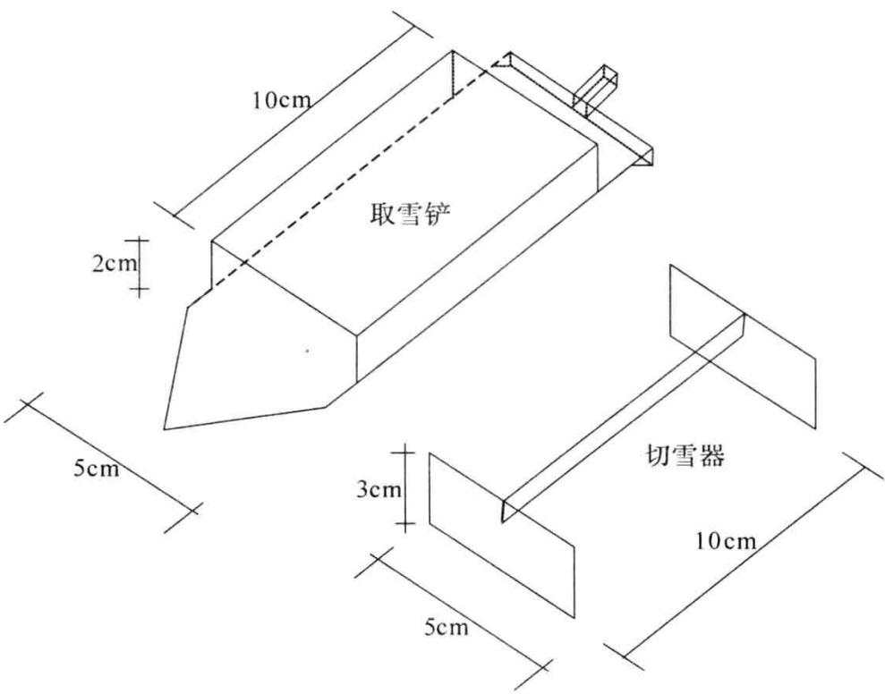  
图1-7 取雪铲示意图

(4)积雪水量的计算：每条测雪路线上平均积雪水量可利用加权平均法进行计算。具体计算办法为：以相邻两个测雪点的间距与该条测雪路线长度之比作为权重系数，乘以相邻两个测雪点积雪水量的平均值，然后累加得到测雪路线的平均积雪水量。

$$
P _ { j } \ = \ \sum _ { i = 1 } ^ { n - 1 } \ \frac { L _ { i } } { L _ { j } } V _ { i }
$$

式中： $P _ { j }$ ——第j条测雪路线的平均积雪水量(mm)；

$L _ { j }$ ——第j条测雪路线的总长度(m)；

$L _ { \mathrm { i } }$ —相邻两个测点的间距(m)；

$V _ { \mathrm { i } }$ —相邻两个测点积雪水量的均值(mm)；

$_ { n } .$ —第j条测雪路线上的测雪点数。

小流域的积雪水量也按加权平均法计算。以每条测雪路线的长度与总测雪路线长度之比作为权重系数，乘以每条测雪路线的平均积雪水量，然后累计得出小流域的积雪水量。

$$
P = \sum _ { j = 1 } ^ { m } \frac { L _ { j } } { L } P _ { j }
$$

式中：P——为小流域的积雪水量(mm)；

$P _ { j }$ ——第j条测雪路线的平均积雪水量(mm)；

$L _ { j }$ —第j条测雪路线的总长度(m)；

$L ^ { - }$ —流域内测雪路线的总长度(m)；

m—流域内测雪路线的条数。

积雪水量调查记录格式见表1-12。

表1-12 积雪水量调查表
<table><tr><td rowspan=1 colspan=1>流域名称</td><td rowspan=1 colspan=2></td><td rowspan=1 colspan=1>地点</td><td rowspan=1 colspan=1></td><td rowspan=1 colspan=1>地理位置</td><td rowspan=1 colspan=1></td><td rowspan=1 colspan=1></td></tr><tr><td rowspan=1 colspan=1>流域长度</td><td rowspan=1 colspan=2></td><td rowspan=1 colspan=1>流域形状</td><td rowspan=1 colspan=1></td><td rowspan=1 colspan=1>测雪路线数</td><td rowspan=1 colspan=1></td><td rowspan=1 colspan=1></td></tr><tr><td rowspan=1 colspan=1>测雪路线</td><td rowspan=1 colspan=1>测点号</td><td rowspan=1 colspan=2>地理坐标</td><td rowspan=1 colspan=1>间距</td><td rowspan=1 colspan=1>雪深</td><td rowspan=1 colspan=1>雪密度</td><td rowspan=1 colspan=1>雪水量</td></tr><tr><td rowspan=8 colspan=1></td><td rowspan=4 colspan=1></td><td rowspan=3 colspan=2></td><td rowspan=3 colspan=1></td><td rowspan=1 colspan=1></td><td rowspan=1 colspan=1></td><td rowspan=1 colspan=1></td></tr><tr><td rowspan=1 colspan=1></td><td rowspan=1 colspan=1></td><td rowspan=1 colspan=1></td></tr><tr><td rowspan=1 colspan=1></td><td rowspan=1 colspan=1></td><td rowspan=1 colspan=1></td></tr><tr><td rowspan=1 colspan=2>平均</td><td rowspan=1 colspan=1></td><td rowspan=1 colspan=1></td><td rowspan=1 colspan=1></td><td rowspan=1 colspan=1></td></tr><tr><td rowspan=4 colspan=1></td><td rowspan=3 colspan=2></td><td rowspan=3 colspan=1></td><td rowspan=1 colspan=1></td><td rowspan=1 colspan=1></td><td rowspan=1 colspan=1></td></tr><tr><td rowspan=1 colspan=1></td><td rowspan=1 colspan=1></td><td rowspan=1 colspan=1></td></tr><tr><td rowspan=1 colspan=1></td><td rowspan=1 colspan=1></td><td rowspan=1 colspan=1></td></tr><tr><td rowspan=1 colspan=2>平均</td><td rowspan=1 colspan=1></td><td rowspan=1 colspan=1></td><td rowspan=1 colspan=1></td><td rowspan=1 colspan=1></td></tr><tr><td rowspan=8 colspan=1></td><td rowspan=4 colspan=1></td><td rowspan=3 colspan=2></td><td rowspan=3 colspan=1></td><td rowspan=1 colspan=1></td><td rowspan=1 colspan=1></td><td rowspan=1 colspan=1></td></tr><tr><td rowspan=1 colspan=1></td><td rowspan=1 colspan=1></td><td rowspan=1 colspan=1></td></tr><tr><td rowspan=1 colspan=1></td><td rowspan=1 colspan=1></td><td rowspan=1 colspan=1></td></tr><tr><td rowspan=1 colspan=2>平均</td><td rowspan=1 colspan=1></td><td rowspan=1 colspan=1></td><td rowspan=1 colspan=1></td><td rowspan=1 colspan=1></td></tr><tr><td rowspan=4 colspan=1></td><td rowspan=3 colspan=2></td><td rowspan=3 colspan=1></td><td rowspan=1 colspan=1></td><td rowspan=1 colspan=1></td><td rowspan=1 colspan=1></td></tr><tr><td rowspan=1 colspan=1></td><td rowspan=1 colspan=1></td><td rowspan=1 colspan=1></td></tr><tr><td rowspan=1 colspan=1></td><td rowspan=1 colspan=1></td><td rowspan=1 colspan=1></td></tr><tr><td rowspan=1 colspan=2>平均</td><td rowspan=1 colspan=1></td><td rowspan=1 colspan=1></td><td rowspan=1 colspan=1></td><td rowspan=1 colspan=1></td></tr><tr><td rowspan=1 colspan=1>合计</td><td rowspan=1 colspan=1></td><td rowspan=1 colspan=2></td><td rowspan=1 colspan=1></td><td rowspan=1 colspan=1></td><td rowspan=1 colspan=1></td><td rowspan=1 colspan=1></td></tr><tr><td rowspan=1 colspan=7>流域积雪水量</td><td rowspan=1 colspan=1></td></tr></table>

调查日期：  
调查人：

## 1.1.6.2 积雪过程、融雪过程的观测

在降雪时地面积雪逐渐增加，而融雪时地面积雪逐渐减少，地面积雪过程和融雪过程很难采用人工办法直接进行观测。在融雪过程中融雪水会在还未完全解冻的地表形成较大的地表径流，造成严重的土壤侵蚀，因此，地面积雪量的动态变化，尤其是融雪过程的观测是寒冷地区水土保持监测的重要内容。

融雪过程的观测最常用的方法是超声波法，即在离地面一定高度处安装超声波测距仪，超声波测距仪向地面发射超声波，并接收从地面返回的超声波，根据超声波返回的时间计算超声波探头到地面的距离。当地面积雪厚度发生变化时，返回的时间就会变化，根据超声波

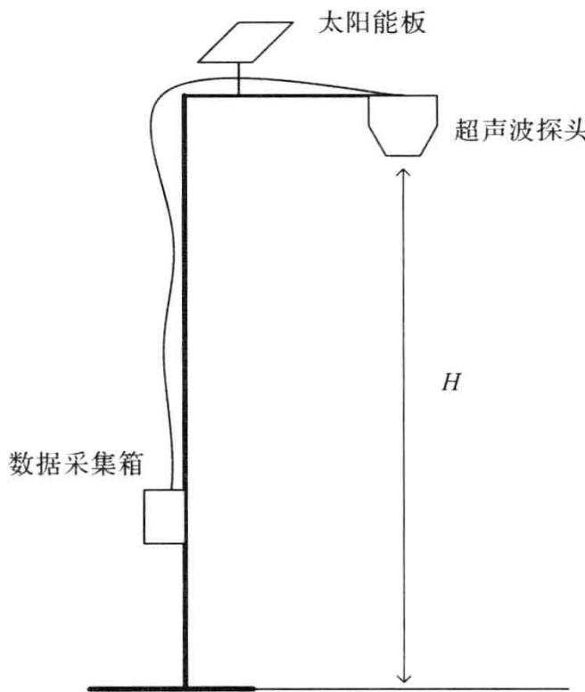  
图1-8 超声波测定积雪厚度示意图

返回时间的变化量便可计算出地面积雪厚度的变化。这就是用超声波测定积雪厚度变化的基本原理(图1-8)。

观测时在地面竖一根观测杆，在观测杆上安装一根水平的支架，将超声波探头安装在支架上。超声波的观测数据通过导线输送到数据采集箱中的数据采集器中保存。整个观测系统通过太阳能板供电，以实现自动观测。观测系统安装完成后，用钢尺测量超声波探头到地面的距离，并用专用软件将笔记本电脑与数据采集器连接，输入观测点的地理坐标、高程、地类等基本情况，设置观测开始时间、数据记录间隔、超声波探头到地面的距离等基本参数，然后启动观测系统开始观测。观测一定时段后，采用专用软件下载观测数据，分析地面积雪的变化过程。地面的融雪过程一般受温度、风速等气象要素的影响，因此，在安装超声波探头的支架上还应该安装温度、湿度、风速风向、太阳辐射等探头。超声波探头以及气象要素的观测数据也可以通过GPRS等无线传输手段直接发送到观测人员的计算机中，从而实现地面积雪过程、融雪过程的自动观测和数据的无线传输。

## 1.2空气温度、湿度观测

空气温度(简称气温)是表示空气冷热程度的物理量，空气湿度(简称湿度)是表示空气中的水汽含量和潮湿程度的物理量。常规地面观测中测定的是离地面1.50m处的气温和湿度。

描述气温的指标有：平均气温、最高气温、最低气温、气温变化过程线。单位为摄氏度(℃)，取一位小数。

描述湿度的指标主要为相对湿度，以百分数(%)表示，有平均湿度、最高湿度、最低湿度、湿度变化过程线。

## 1.2.1 干湿球温度表

测量气温和湿度的常用仪器主要有干球温度表、湿球温度表、最高温度表、最低温度表、毛发湿度表、通风干湿表、自记温度计和自记湿度计等。这些测量仪器一般要安装在百叶箱中。

百叶箱是安装温度、湿度测定仪器的防护设备，它的内部和外部为白色。百叶箱的作用是防止太阳对仪器的直接辐射和地面对仪器的反射辐射，保护仪器免受强风、雨、雪等的影响，并使仪器感应部分有适当的通风，能真实地感应外界空气温度和湿度的变化。一般情况下小百叶箱内安装干球温度计、湿球温度计、最高温度表、最低温度表、毛发湿度表等；大百叶箱内安装自记温度计、自记湿度计等自记仪器。百叶箱应水平地固定在一个特制的支架上，安装必须稳定牢固，箱门朝正北。

干球温度表和湿球温度表是用于测定空气的温度和湿度的仪器(图1-9)，它由两支型号完全一样的温度表组成，气温由干球温度表测定，相对湿度是根据热力学原理由干球温度表与湿球温度表的温度差值查《湿度查算表》得出的，也可以用公式计算得出。

在百叶箱的底板中心安装温度表支架，干、湿球温度表垂直悬挂在支架两侧的环内，球部向下，干球温度表挂在东侧，湿球温度表挂在西侧，球部中心距地面1.5m高。湿球温度表球部包扎一条长约10cm的纱布，纱布的下部浸到一个带盖的水杯内。杯口距湿球球部约3cm，杯中盛蒸馏水

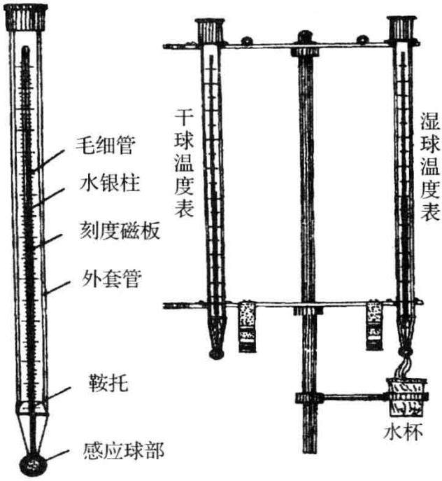  
图1-9百叶箱中的干球温度表和湿球温度表

(医用蒸馏水)，供湿润湿球纱布用。

观测时温度表读数要准确到0.1℃。温度在0℃以下时，应加负号（-）。读数记入观测簿相应栏内，并按所附检定证进行器差订正。如温度超过检定证范围，则以该检定证所列的最高(或最低)温度值的订正值进行订正。

干湿温度表观测、读数时的注意事项：

(1)观测时必须保持视线和水银柱顶端齐平，以避免视差。

(2)读数动作要迅速，力求敏捷，不要对着温度表呼吸，尽量缩短停留时间，并且勿使头、手和灯接近球部，以避免影响温度示度。

(3)注意复读，以避免发生误读或颠倒零上、零下的差错。

(4)在非结冰季节湿度很大或有雾时，湿球温度表的读数偶有略高于干球温度表的现象(经过器差订正后的数值)，此时应该使湿球温度表的读数与干球温度表读数相同，然后再进行湿度计算。

(5)当湿球温度表的纱布结冰后，停止湿球温度表的观测，并把湿球温度表下的水杯取走，以防冻裂。

(6)注意保持干、湿球温度表的正常状态。如发现温度表内刻度磁板破损，毛细管内有水银滴、黑色沉淀的氧化物或水根柱中断等情况，应同

时更换、报废。

(7)干球温度表应保持清洁、干燥。如灰尘或水，须立即用干净的软布轻轻拭去。

(8)湿球上的纱布必须保持清洁、柔软和湿润，每周更换一次。在湿球纱布容易被空气中的漂浮物污染时，应缩短更换纱布的期限。遇有沙尘等天气，湿球纱布上明显沾有灰尘时，应立即更换。

(9)水杯中的蒸馏水要时常添满，保持洁净，每周更换一次。

利用干球温度表和湿球温度表的读数计算或查算湿度时，需要知道观测地点的气压值。气压可以采用水银气压表、空盒气压表、气压计直接进行测定。在使用各种气压表时必须对观测数据进行器差订正、温度订正等各种订正。

温度湿度观测记录格式见表1-13。

表1-13温度湿度观测记录表
<table><tr><td rowspan=1 colspan=2>观测场地</td><td rowspan=1 colspan=2></td><td rowspan=1 colspan=2>地理坐标</td><td rowspan=1 colspan=3></td><td rowspan=1 colspan=3>地面高程</td><td rowspan=1 colspan=2></td><td rowspan=3 colspan=1>相对湿度(%)</td></tr><tr><td rowspan=2 colspan=1>观测日期</td><td rowspan=1 colspan=4>干球温度表(℃)</td><td rowspan=1 colspan=5>湿球温度表(℃)</td><td rowspan=1 colspan=4>气压(hPa)</td></tr><tr><td rowspan=1 colspan=2>读数</td><td rowspan=1 colspan=1>订正值订</td><td rowspan=1 colspan=1>正后</td><td rowspan=1 colspan=2>读数</td><td rowspan=1 colspan=1>订正值订</td><td rowspan=1 colspan=2>正后</td><td rowspan=1 colspan=1>读数</td><td rowspan=1 colspan=2>订正值订</td><td rowspan=1 colspan=1>正后</td></tr><tr><td rowspan=1 colspan=1>年月日时</td><td rowspan=1 colspan=2></td><td rowspan=1 colspan=1></td><td rowspan=1 colspan=1></td><td rowspan=1 colspan=2></td><td rowspan=1 colspan=1></td><td rowspan=1 colspan=2></td><td rowspan=1 colspan=1></td><td rowspan=1 colspan=2></td><td rowspan=1 colspan=1></td><td rowspan=1 colspan=1></td></tr><tr><td rowspan=1 colspan=1></td><td rowspan=1 colspan=2></td><td rowspan=1 colspan=1></td><td rowspan=1 colspan=1></td><td rowspan=1 colspan=2></td><td rowspan=1 colspan=1></td><td rowspan=1 colspan=2></td><td rowspan=1 colspan=1></td><td rowspan=1 colspan=2></td><td rowspan=1 colspan=1></td><td rowspan=1 colspan=1></td></tr><tr><td rowspan=1 colspan=1></td><td rowspan=1 colspan=2></td><td rowspan=1 colspan=1></td><td rowspan=1 colspan=1></td><td rowspan=1 colspan=2></td><td rowspan=1 colspan=1></td><td rowspan=1 colspan=2></td><td rowspan=1 colspan=1></td><td rowspan=1 colspan=2></td><td rowspan=1 colspan=1></td><td rowspan=1 colspan=1></td></tr><tr><td rowspan=1 colspan=1></td><td rowspan=1 colspan=2></td><td rowspan=1 colspan=1></td><td rowspan=1 colspan=1></td><td rowspan=1 colspan=2></td><td rowspan=1 colspan=1></td><td rowspan=1 colspan=2></td><td rowspan=1 colspan=1></td><td rowspan=1 colspan=2></td><td rowspan=1 colspan=1></td><td rowspan=1 colspan=1></td></tr><tr><td rowspan=1 colspan=1></td><td rowspan=1 colspan=2></td><td rowspan=1 colspan=1></td><td rowspan=1 colspan=1></td><td rowspan=1 colspan=2></td><td rowspan=1 colspan=1></td><td rowspan=1 colspan=2></td><td rowspan=1 colspan=1></td><td rowspan=1 colspan=2></td><td rowspan=1 colspan=1></td><td rowspan=1 colspan=1></td></tr><tr><td rowspan=1 colspan=1></td><td rowspan=1 colspan=2></td><td rowspan=1 colspan=1></td><td rowspan=1 colspan=1></td><td rowspan=1 colspan=2></td><td rowspan=1 colspan=1></td><td rowspan=1 colspan=2></td><td rowspan=1 colspan=1></td><td rowspan=1 colspan=2></td><td rowspan=1 colspan=1></td><td rowspan=1 colspan=1></td></tr><tr><td rowspan=1 colspan=1></td><td rowspan=1 colspan=2></td><td rowspan=1 colspan=1></td><td rowspan=1 colspan=1></td><td rowspan=1 colspan=2></td><td rowspan=1 colspan=1></td><td rowspan=1 colspan=2></td><td rowspan=1 colspan=1></td><td rowspan=1 colspan=2></td><td rowspan=1 colspan=1></td><td rowspan=1 colspan=1></td></tr><tr><td rowspan=1 colspan=1></td><td rowspan=1 colspan=2></td><td rowspan=1 colspan=1></td><td rowspan=1 colspan=1></td><td rowspan=1 colspan=2></td><td rowspan=1 colspan=1></td><td rowspan=1 colspan=2></td><td rowspan=1 colspan=1></td><td rowspan=1 colspan=2></td><td rowspan=1 colspan=1></td><td rowspan=1 colspan=1></td></tr><tr><td rowspan=1 colspan=1>平均值</td><td rowspan=1 colspan=2></td><td rowspan=1 colspan=1></td><td rowspan=1 colspan=1></td><td rowspan=1 colspan=2></td><td rowspan=1 colspan=1></td><td rowspan=1 colspan=2></td><td rowspan=1 colspan=1></td><td rowspan=1 colspan=2></td><td rowspan=1 colspan=1></td><td rowspan=1 colspan=1></td></tr><tr><td rowspan=1 colspan=1>最大值</td><td rowspan=1 colspan=2></td><td rowspan=1 colspan=1></td><td rowspan=1 colspan=1></td><td rowspan=1 colspan=2></td><td rowspan=1 colspan=1></td><td rowspan=1 colspan=2></td><td rowspan=1 colspan=1></td><td rowspan=1 colspan=2></td><td rowspan=1 colspan=1></td><td rowspan=1 colspan=1></td></tr><tr><td rowspan=1 colspan=1>最小值</td><td rowspan=1 colspan=2></td><td rowspan=1 colspan=1></td><td rowspan=1 colspan=1></td><td rowspan=1 colspan=2></td><td rowspan=1 colspan=1></td><td rowspan=1 colspan=2></td><td rowspan=1 colspan=1></td><td rowspan=1 colspan=2></td><td rowspan=1 colspan=1></td><td rowspan=1 colspan=1></td></tr><tr><td rowspan=1 colspan=4>观测员：</td><td rowspan=1 colspan=6>汇总日期：</td><td rowspan=1 colspan=5>观测期间：</td></tr></table>

## 1.2.2 通风干湿表

通风干湿表主要用于野外考察或自动气象站在气温或湿度采集出现故障时进行补测使用。它由干湿球温度表、通风装置、金属套管、双层保护管和上水滴管等组成。其作用、原理与百叶箱于湿球温度表基本相同。主要不同处是：温度表球部装在与风扇相通的管形套管中，利用机械或电动通风装置，使风扇获得一定转速，球部处于 $\geq 2 . 5  { \mathrm { m / s } }$ (电动通风可达3m/s以上)的恒定速度的气流中。由于球部双层金属护管表面镀有镍或铬，是良好的反射体，能防止太阳对仪器的直接辐射。利用通风干湿表测定出干、湿球温度计的温度读数，然后根据干湿温度计的温差，计算出空气的相对湿度。

观测前，先把仪器悬挂在百叶箱或观测场内，感应部分高度1.50m。在读数前4\~5min用滴管湿润湿球纱布，然后上好风扇发条(或接通电源)。上发条切忌过紧。观测时应注意不要让风把观测者自身热量带到通风管中去。当气温低于0℃时，为使温度表充分感应外界情况，应于观测前半小时，湿润纱布并上好发条。然后在观测前4min再通风一次，但不再润湿纱布。观测时应注意湿球是否结冰，示度是否稳定。

当风速大于4m/s时，应将防风罩套在风扇迎风面的缝隙上，使罩的开口部分与风扇旋转方向一致，这样就不会影响风扇的正常旋转。

仪器的金属部分，特别是下端保护管的镀镍面应细心保护，使其不要受到任何损伤。每次观测后，应用纱布擦净外壳，并放回盒中。从盒中取出仪器时，应拿着风扇帽盖下的颈部，不要捏在金属护板处，也不能用手触摸防护管。定期检查风扇旋转是否正常，上发条后，发条盒每转一周的时间，如果与检定证上所给的时间相差不到5s，则可认为风扇转速正常。如果转速显著降低则应进行修理。湿球纱布应经常保持清洁。

观测记录格式表见表1-13。

## 1.2.3 自记温度湿度计

自记温度湿度计是能够连续自动观测环境中空气温度和湿度变化，并将观测数据记录下来的仪器。有些自记温度湿度计能将观测数据转化为数字信号后保存在数据存储器中，从而实现数字化观测。

自记温度湿度计的硬件系统由温度传感器、湿度传感器、存储器组成。温度传感器主要以热敏电阻为主，湿度传感器主要以湿敏电阻、湿敏电容为主，这些传感器必须安装在防辐射罩中。这些高精度的温度和湿度传感器，具有测量准确、显示直观、使用维护方便、可连续观测等特点。

自记温度湿度计一般安装在离地面1.50m高的支架上，并配置电瓶和太阳能板，以实现长期自动观测，但每年必须对温度计和湿度计的探头进行检定。

用自记温度湿度计观测到的数据是从仪器开始观测起，每隔一定时间(记录间隔可设置为5min、10min、30min、60min，或任意时段长)的温度和湿度数据，观测数据可通过无线传输设备(如GPRS)直接发送到观测人员的计算机中，也可以由观测人员直接用笔记本电脑现场进行数据采集。每次采集数据时必须检测仪器运转是否正常，对有异常的测定仪器应及时更换。同时检查蓄电瓶电量是否充足，电量不足应及时更换或充电。检查仪器的时钟是否准确，如有误差，应该对仪器的时钟进行校准，并在数据整理时对观测时间进行平差处理。

数据采集后观测人员要按观测时段(天)对数据进行统计整理，提取日平均、日最大、日最小等特征数据。每个月填报温度湿度月汇总数据表，统计出月平均值、月最大值、月最小值及其出现的时间。在数据整理过程中要对发生突变(异常)的数据进行分析，如果是错误数据，要分析原因，并与仪器厂家联系对仪器进行维修改造。

自记温度湿度计记录格式见表1-14。

表1-14 自记温度湿度计观测记录汇总表
<table><tr><td rowspan=1 colspan=1>观测场地</td><td rowspan=1 colspan=2></td><td rowspan=1 colspan=2>地理坐标</td><td rowspan=1 colspan=1></td><td rowspan=1 colspan=2>地面高程</td><td rowspan=1 colspan=1></td></tr><tr><td rowspan=1 colspan=1>观测仪器</td><td rowspan=1 colspan=2></td><td rowspan=1 colspan=2>安装时间</td><td rowspan=1 colspan=1></td><td rowspan=1 colspan=2>记录间隔</td><td rowspan=1 colspan=1></td></tr><tr><td rowspan=1 colspan=4>年月   日时</td><td rowspan=1 colspan=3>温度</td><td rowspan=1 colspan=2>湿度</td></tr><tr><td rowspan=1 colspan=4></td><td rowspan=1 colspan=3></td><td rowspan=1 colspan=2></td></tr><tr><td rowspan=1 colspan=4></td><td rowspan=1 colspan=3></td><td rowspan=1 colspan=2></td></tr><tr><td rowspan=1 colspan=4></td><td rowspan=1 colspan=3></td><td rowspan=1 colspan=2></td></tr><tr><td rowspan=1 colspan=4>平均值</td><td rowspan=1 colspan=3></td><td rowspan=1 colspan=2></td></tr><tr><td rowspan=1 colspan=2>日最大值及出现时间</td><td rowspan=1 colspan=2></td><td rowspan=1 colspan=3></td><td rowspan=1 colspan=2></td></tr><tr><td rowspan=1 colspan=2>日最小值及出现时间</td><td rowspan=1 colspan=2></td><td rowspan=1 colspan=3></td><td rowspan=1 colspan=2></td></tr></table>

观测人员：

数据汇总人员：

汇总日期：

## 1.3 风速风向观测

空气运动产生的气流称为风。风是造成风力侵蚀的外营力，对风的观测是风蚀观测中的主要内容。地面观测中测量的风是两维矢量(水平运动)，用风向和风速表示。

风向是指风的来向，最多风向是指在规定时间段内出现频数最多的风向，人工观测中风向用十六方位法表示(表1-15)，自动观测中风向以度(°)为单位表示。

表1-15 风向符号与度数对照表
<table><tr><td rowspan=1 colspan=1>方位</td><td rowspan=1 colspan=1>符号</td><td rowspan=1 colspan=1>中心角度(°)</td><td rowspan=1 colspan=1>角度范围(°)</td></tr><tr><td rowspan=1 colspan=1>北</td><td rowspan=1 colspan=1>N</td><td rowspan=1 colspan=1>0</td><td rowspan=1 colspan=1>348.76~11.25</td></tr><tr><td rowspan=1 colspan=1>北东北</td><td rowspan=1 colspan=1>NNE</td><td rowspan=1 colspan=1>22.5</td><td rowspan=1 colspan=1>11.26~33.75</td></tr><tr><td rowspan=1 colspan=1>东北</td><td rowspan=1 colspan=1>NE</td><td rowspan=1 colspan=1>45</td><td rowspan=1 colspan=1>33.76~56.25</td></tr><tr><td rowspan=1 colspan=1>东东北</td><td rowspan=1 colspan=1>ENE</td><td rowspan=1 colspan=1>67.5</td><td rowspan=1 colspan=1>56.26~78.75</td></tr><tr><td rowspan=1 colspan=1>东</td><td rowspan=1 colspan=1>E</td><td rowspan=1 colspan=1>90</td><td rowspan=1 colspan=1>78.76~101.25</td></tr><tr><td rowspan=1 colspan=1>东东南</td><td rowspan=1 colspan=1>ESE</td><td rowspan=1 colspan=1>112.5</td><td rowspan=1 colspan=1>101.26~123.75</td></tr><tr><td rowspan=1 colspan=1>东南</td><td rowspan=1 colspan=1>SE</td><td rowspan=1 colspan=1>135</td><td rowspan=1 colspan=1>123.76~146.25</td></tr><tr><td rowspan=1 colspan=1>南东南</td><td rowspan=1 colspan=1>SSE</td><td rowspan=1 colspan=1>157.5</td><td rowspan=1 colspan=1>146.26~168.75</td></tr><tr><td rowspan=1 colspan=1>南</td><td rowspan=1 colspan=1>S</td><td rowspan=1 colspan=1>180</td><td rowspan=1 colspan=1>168.76~191.25</td></tr><tr><td rowspan=1 colspan=1>南西南</td><td rowspan=1 colspan=1>SSW</td><td rowspan=1 colspan=1>202.5</td><td rowspan=1 colspan=1>191.26~213.75</td></tr><tr><td rowspan=1 colspan=1>西南</td><td rowspan=1 colspan=1>SW</td><td rowspan=1 colspan=1>225</td><td rowspan=1 colspan=1>213.76~236.25</td></tr><tr><td rowspan=1 colspan=1>西西南</td><td rowspan=1 colspan=1>WSW</td><td rowspan=1 colspan=1>247.5</td><td rowspan=1 colspan=1>236.26~258.75</td></tr><tr><td rowspan=1 colspan=1>西</td><td rowspan=1 colspan=1>W</td><td rowspan=1 colspan=1>270</td><td rowspan=1 colspan=1>258.76~281.25</td></tr><tr><td rowspan=1 colspan=1>西西北</td><td rowspan=1 colspan=1>WNW</td><td rowspan=1 colspan=1>295.5</td><td rowspan=1 colspan=1>281.26~303.75</td></tr><tr><td rowspan=1 colspan=1>西北</td><td rowspan=1 colspan=1>NW</td><td rowspan=1 colspan=1>315</td><td rowspan=1 colspan=1>303.76~326.25</td></tr><tr><td rowspan=1 colspan=1>北西北</td><td rowspan=1 colspan=1>NNW</td><td rowspan=1 colspan=1>337.5</td><td rowspan=1 colspan=1>326.26~348.75</td></tr><tr><td rowspan=1 colspan=1>静风</td><td rowspan=1 colspan=1>C</td><td rowspan=1 colspan=2>风速小于或等于0.2m/s</td></tr></table>

风速是指单位时间内空气移动的水平距离，以米/秒(m/s)为单位，取一位小数。最大风速是指在某个时段内出现的最大10min平均风速值。极大风速(阵风)是指某个时段内出现的最大瞬时风速值。瞬时风速是指3s的平均风速。风的平均量是指在规定时间段的平均值，有3s、2min和10min的平均值。

人工观测时，测量平均风速和最多风向。自动观测时采用自记仪器观测风向、风速的连续变化过程，通过专用软件对这些观测数据进行整理，得出平均风速、平均风向、最大风速、极大风速等描述风的特征指标。

测量风的仪器主要有轻便风速风向表、风向传感器和风速传感器等，如图1-10、图1-11。

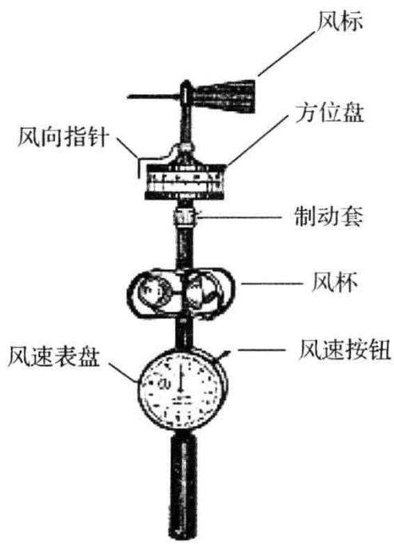  
图1-10 轻便风速风向表

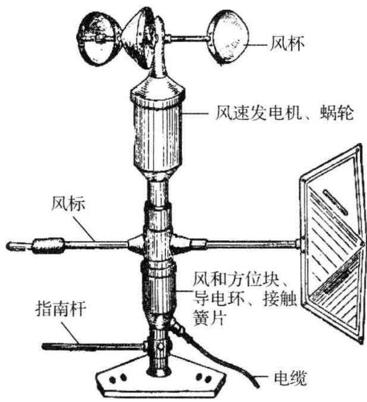  
图1-11 风速风向传感器示意图

## 1.3.1 人工观测

在野外观测风力侵蚀时，需要掌握风速和风向的变化情况。野外常用轻便风速风向表进行人工观测。轻便风速风向表是测量风向和一分钟内平均风速的仪器，主要用于野外考察或气象站仪器损坏时的备份观测。轻便风速风向表由风向部分(包括风标、方位盘、风向指针、制动套)、风速部分(包括护架、风杯、风速表)和手柄三部分组成(图1-10)。

在选择好的观测场地内，由观测员手持轻便风速风向表，使仪器高出头部并保持垂直，风速表刻度盘应当与当时风向平行以减少对风的影响，然后，转动方位盘的制动套，使方位盘按地磁子午线的方向稳定下来，注视风标约2min，记录其摆动范围的中间位置的方位角作为风向。在观测风向的同时，待风杯转动约半分钟后，按下风速按钮，启动仪器，待指针自动停转后，读出风速示值(m/s)，用此值从该仪器订正曲线上查出实际风速，取一位小数进行记录。观测完毕，将盘制动拧紧，固定好方位盘。

野外风速风向人工观测记录格式见表1-16。

表1-16 野外风速风向人工观测记录表
<table><tr><td rowspan=1 colspan=1>观测场地</td><td rowspan=1 colspan=1></td><td rowspan=1 colspan=2>地理坐标</td><td rowspan=1 colspan=2></td><td rowspan=1 colspan=2>地面高程</td><td rowspan=1 colspan=1></td></tr><tr><td rowspan=1 colspan=1>坡度</td><td rowspan=1 colspan=1></td><td rowspan=1 colspan=2>坡向</td><td rowspan=1 colspan=2></td><td rowspan=1 colspan=2>坡位</td><td rowspan=1 colspan=1></td></tr><tr><td rowspan=1 colspan=1>植被类型</td><td rowspan=1 colspan=1></td><td rowspan=1 colspan=2>盖度</td><td rowspan=1 colspan=2></td><td rowspan=1 colspan=2>高度</td><td rowspan=1 colspan=1></td></tr><tr><td rowspan=1 colspan=1>观测仪器</td><td rowspan=1 colspan=1></td><td rowspan=1 colspan=2>观测时段</td><td rowspan=1 colspan=2></td><td rowspan=1 colspan=2>观测间隔</td><td rowspan=1 colspan=1></td></tr><tr><td rowspan=1 colspan=3>年月    日时</td><td rowspan=1 colspan=2>风向</td><td rowspan=1 colspan=2>风速读数</td><td rowspan=1 colspan=2>实际风速</td></tr><tr><td rowspan=1 colspan=3></td><td rowspan=1 colspan=2></td><td rowspan=1 colspan=2></td><td rowspan=1 colspan=2></td></tr><tr><td rowspan=1 colspan=3></td><td rowspan=1 colspan=2></td><td rowspan=1 colspan=2></td><td rowspan=1 colspan=2></td></tr><tr><td rowspan=1 colspan=3></td><td rowspan=1 colspan=2></td><td rowspan=1 colspan=2></td><td rowspan=1 colspan=2></td></tr><tr><td rowspan=1 colspan=3></td><td rowspan=1 colspan=2></td><td rowspan=1 colspan=2></td><td rowspan=1 colspan=2></td></tr><tr><td rowspan=1 colspan=3></td><td rowspan=1 colspan=2></td><td rowspan=1 colspan=2></td><td rowspan=1 colspan=2></td></tr><tr><td rowspan=1 colspan=3>最多风向</td><td rowspan=1 colspan=6></td></tr><tr><td rowspan=1 colspan=3>平均风速</td><td rowspan=1 colspan=6></td></tr><tr><td rowspan=1 colspan=3>最大风速</td><td rowspan=1 colspan=2></td><td rowspan=1 colspan=2>最大风速的风向</td><td rowspan=1 colspan=2></td></tr></table>

观测人员：  
数据汇总人员：  
汇总日期：

## 1.3.2自动观测

在风力侵蚀观测中，需要对风速风向进行连续观测，以把握刮风日风力的动态变化，而人工观测无法实现长时间的连续观测，此时需要利用风向传感器、风速传感器和数据采集存储器组合成自动观测系统。

利用风向传感器和风速传感器进行自动观测时，需要先选择一块观测场地，在观测场地内安装观测高杆或观测塔，根据需要在观测高杆或观测塔的不同高度上安装风速和风向传感器。选择的观测场地在地形地貌、地表状况等方面必须有代表性，而且四周空旷，无影响风速风向的障碍物。

安装时需按照仪器技术手册规定的方法，把风速和风向传感器分别用法兰盘固定在长度为0.8m的风传感器安装横臂两端，再将横臂安装在观测塔(杆)上，横臂必须保持水平，风向传感器中轴应垂直地面，风向标的方位要对准正北，这样才能保证当仪器观测到北风时，风向读数为0°。传感器的信号电缆要捆扎在风杆上(防止电缆悬空），并顺风杆接入接线盒后与数据采集器连接。接线盒应该用防辐射、防雨材料制作。在观测塔(杆)上必须安装避雷装置并接地。

在气象观测规范中规定风速传感器(风杯中心)和风向传感器距地高度为10\~12m，在观测风蚀时可根据工作需要在不同高度上安装风速风向传感器，以观测不同高度处的风速和风向。

风速风向自动观测原始记录格式见表1-17，风向自动观测数据逐日汇总格式见表1-18，风速自动观测数据逐日汇总格式见表1-19。

表1-17 风速风向自动观测原始记录表
<table><tr><td rowspan=1 colspan=2>观测场地</td><td rowspan=1 colspan=2></td><td rowspan=1 colspan=3>地理坐标</td><td rowspan=1 colspan=3></td><td rowspan=1 colspan=2>地面高程</td><td rowspan=1 colspan=1></td></tr><tr><td rowspan=1 colspan=2>坡度</td><td rowspan=1 colspan=2></td><td rowspan=1 colspan=3>坡向</td><td rowspan=1 colspan=3></td><td rowspan=1 colspan=2>坡位</td><td rowspan=1 colspan=1></td></tr><tr><td rowspan=1 colspan=2>植被类型</td><td rowspan=1 colspan=2></td><td rowspan=1 colspan=3>盖度</td><td rowspan=1 colspan=3></td><td rowspan=1 colspan=2>植物高度</td><td rowspan=1 colspan=1></td></tr><tr><td rowspan=1 colspan=1>风速仪器</td><td rowspan=1 colspan=2></td><td rowspan=1 colspan=2>风向仪器</td><td rowspan=1 colspan=1></td><td rowspan=1 colspan=3>观测时段</td><td rowspan=1 colspan=2></td><td rowspan=1 colspan=1>观测间隔</td><td rowspan=1 colspan=1></td></tr><tr><td rowspan=1 colspan=4>年月    日    时</td><td rowspan=1 colspan=4>离地高度</td><td rowspan=1 colspan=3>风向</td><td rowspan=1 colspan=2>风速</td></tr><tr><td rowspan=1 colspan=4></td><td rowspan=1 colspan=4></td><td rowspan=1 colspan=3></td><td rowspan=1 colspan=2></td></tr><tr><td rowspan=1 colspan=4></td><td rowspan=1 colspan=4></td><td rowspan=1 colspan=3></td><td rowspan=1 colspan=2></td></tr><tr><td rowspan=1 colspan=4></td><td rowspan=1 colspan=4></td><td rowspan=1 colspan=3></td><td rowspan=1 colspan=2></td></tr><tr><td rowspan=1 colspan=4></td><td rowspan=1 colspan=4></td><td rowspan=1 colspan=3></td><td rowspan=1 colspan=2></td></tr><tr><td rowspan=1 colspan=4></td><td rowspan=1 colspan=4></td><td rowspan=1 colspan=3></td><td rowspan=1 colspan=2></td></tr><tr><td rowspan=1 colspan=4></td><td rowspan=1 colspan=4></td><td rowspan=1 colspan=3>.</td><td rowspan=1 colspan=2></td></tr><tr><td rowspan=1 colspan=4></td><td rowspan=1 colspan=4></td><td rowspan=1 colspan=3></td><td rowspan=1 colspan=2></td></tr><tr><td rowspan=1 colspan=4></td><td rowspan=1 colspan=4></td><td rowspan=1 colspan=3></td><td rowspan=1 colspan=2></td></tr><tr><td rowspan=1 colspan=4></td><td rowspan=1 colspan=4></td><td rowspan=1 colspan=3></td><td rowspan=1 colspan=2></td></tr></table>

观测人员：

观测日期：

表1-18 风向自动观测数据逐日汇总表
<table><tr><td rowspan=1 colspan=4>观测场地</td><td rowspan=1 colspan=5></td><td rowspan=1 colspan=5>地理坐标</td><td rowspan=1 colspan=4></td><td rowspan=1 colspan=6>地面高程</td><td rowspan=1 colspan=2></td></tr><tr><td rowspan=1 colspan=4>坡度</td><td rowspan=1 colspan=5></td><td rowspan=1 colspan=5>坡向</td><td rowspan=1 colspan=4></td><td rowspan=1 colspan=6>坡位</td><td rowspan=1 colspan=2></td></tr><tr><td rowspan=1 colspan=4>植被类型</td><td rowspan=1 colspan=5></td><td rowspan=1 colspan=5>盖度</td><td rowspan=1 colspan=4></td><td rowspan=1 colspan=6>植物高度</td><td rowspan=1 colspan=2></td></tr><tr><td rowspan=1 colspan=2>风速仪器</td><td rowspan=1 colspan=4></td><td rowspan=1 colspan=4>风向仪器</td><td rowspan=1 colspan=3></td><td rowspan=1 colspan=3>观测时段</td><td rowspan=1 colspan=4></td><td rowspan=1 colspan=3>观测间隔</td><td rowspan=1 colspan=3></td></tr><tr><td rowspan=2 colspan=1>年 月 日</td><td rowspan=1 colspan=25>各风向发生的频率(%)</td></tr><tr><td rowspan=1 colspan=2>N</td><td rowspan=1 colspan=2>NNE</td><td rowspan=1 colspan=2>NE</td><td rowspan=1 colspan=1>ENE</td><td rowspan=1 colspan=2>E</td><td rowspan=1 colspan=1>ESE</td><td rowspan=1 colspan=1>SE</td><td rowspan=1 colspan=2>SSE</td><td rowspan=1 colspan=1>S</td><td rowspan=1 colspan=1>SSW</td><td rowspan=1 colspan=1>SW</td><td rowspan=1 colspan=2>WSW</td><td rowspan=1 colspan=2>W</td><td rowspan=1 colspan=1>WNW</td><td rowspan=1 colspan=2>NW</td><td rowspan=1 colspan=1>NNW</td><td rowspan=1 colspan=1>C</td></tr><tr><td rowspan=1 colspan=1></td><td rowspan=1 colspan=2></td><td rowspan=1 colspan=2></td><td rowspan=1 colspan=2></td><td rowspan=1 colspan=1></td><td rowspan=1 colspan=2></td><td rowspan=1 colspan=1></td><td rowspan=1 colspan=1></td><td rowspan=1 colspan=2></td><td rowspan=1 colspan=1></td><td rowspan=1 colspan=1></td><td rowspan=1 colspan=1></td><td rowspan=1 colspan=2></td><td rowspan=1 colspan=2></td><td rowspan=1 colspan=1></td><td rowspan=1 colspan=2></td><td rowspan=1 colspan=1></td><td rowspan=1 colspan=1></td></tr><tr><td rowspan=1 colspan=1></td><td rowspan=1 colspan=2></td><td rowspan=1 colspan=2></td><td rowspan=1 colspan=2></td><td rowspan=1 colspan=1></td><td rowspan=1 colspan=2></td><td rowspan=1 colspan=1></td><td rowspan=1 colspan=1></td><td rowspan=1 colspan=2></td><td rowspan=1 colspan=1></td><td rowspan=1 colspan=1></td><td rowspan=1 colspan=1></td><td rowspan=1 colspan=2></td><td rowspan=1 colspan=2></td><td rowspan=1 colspan=1></td><td rowspan=1 colspan=2></td><td rowspan=1 colspan=1></td><td rowspan=1 colspan=1></td></tr><tr><td rowspan=1 colspan=1></td><td rowspan=1 colspan=2></td><td rowspan=1 colspan=2></td><td rowspan=1 colspan=2></td><td rowspan=1 colspan=1></td><td rowspan=1 colspan=2></td><td rowspan=1 colspan=1></td><td rowspan=1 colspan=1></td><td rowspan=1 colspan=2></td><td rowspan=1 colspan=1></td><td rowspan=1 colspan=1></td><td rowspan=1 colspan=1></td><td rowspan=1 colspan=2></td><td rowspan=1 colspan=2></td><td rowspan=1 colspan=1></td><td rowspan=1 colspan=2></td><td rowspan=1 colspan=1></td><td rowspan=1 colspan=1></td></tr><tr><td rowspan=1 colspan=1></td><td rowspan=1 colspan=2></td><td rowspan=1 colspan=2></td><td rowspan=1 colspan=2></td><td rowspan=1 colspan=1></td><td rowspan=1 colspan=2></td><td rowspan=1 colspan=1></td><td rowspan=1 colspan=1></td><td rowspan=1 colspan=2></td><td rowspan=1 colspan=1></td><td rowspan=1 colspan=1></td><td rowspan=1 colspan=1></td><td rowspan=1 colspan=2></td><td rowspan=1 colspan=2></td><td rowspan=1 colspan=1></td><td rowspan=1 colspan=2></td><td rowspan=1 colspan=1></td><td rowspan=1 colspan=1></td></tr><tr><td rowspan=1 colspan=1></td><td rowspan=1 colspan=2></td><td rowspan=1 colspan=2></td><td rowspan=1 colspan=2></td><td rowspan=1 colspan=1></td><td rowspan=1 colspan=2></td><td rowspan=1 colspan=1></td><td rowspan=1 colspan=1></td><td rowspan=1 colspan=2></td><td rowspan=1 colspan=1></td><td rowspan=1 colspan=1></td><td rowspan=1 colspan=1></td><td rowspan=1 colspan=2></td><td rowspan=1 colspan=2></td><td rowspan=1 colspan=1></td><td rowspan=1 colspan=2></td><td rowspan=1 colspan=1></td><td rowspan=1 colspan=1></td></tr><tr><td rowspan=1 colspan=1></td><td rowspan=1 colspan=2></td><td rowspan=1 colspan=2></td><td rowspan=1 colspan=2></td><td rowspan=1 colspan=1></td><td rowspan=1 colspan=2></td><td rowspan=1 colspan=1></td><td rowspan=1 colspan=1></td><td rowspan=1 colspan=2></td><td rowspan=1 colspan=1></td><td rowspan=1 colspan=1></td><td rowspan=1 colspan=1></td><td rowspan=1 colspan=2></td><td rowspan=1 colspan=2></td><td rowspan=1 colspan=1></td><td rowspan=1 colspan=2></td><td rowspan=1 colspan=1></td><td rowspan=1 colspan=1></td></tr><tr><td rowspan=1 colspan=1></td><td rowspan=1 colspan=2></td><td rowspan=1 colspan=2></td><td rowspan=1 colspan=2></td><td rowspan=1 colspan=1></td><td rowspan=1 colspan=2></td><td rowspan=1 colspan=1></td><td rowspan=1 colspan=1></td><td rowspan=1 colspan=2></td><td rowspan=1 colspan=1></td><td rowspan=1 colspan=1></td><td rowspan=1 colspan=1></td><td rowspan=1 colspan=2></td><td rowspan=1 colspan=2></td><td rowspan=1 colspan=1></td><td rowspan=1 colspan=2></td><td rowspan=1 colspan=1></td><td rowspan=1 colspan=1></td></tr><tr><td rowspan=1 colspan=1></td><td rowspan=1 colspan=2></td><td rowspan=1 colspan=2></td><td rowspan=1 colspan=2></td><td rowspan=1 colspan=1></td><td rowspan=1 colspan=2></td><td rowspan=1 colspan=1></td><td rowspan=1 colspan=1></td><td rowspan=1 colspan=2></td><td rowspan=1 colspan=1></td><td rowspan=1 colspan=1></td><td rowspan=1 colspan=1></td><td rowspan=1 colspan=2></td><td rowspan=1 colspan=2></td><td rowspan=1 colspan=1></td><td rowspan=1 colspan=2></td><td rowspan=1 colspan=1></td><td rowspan=1 colspan=1></td></tr><tr><td rowspan=1 colspan=1></td><td rowspan=1 colspan=2></td><td rowspan=1 colspan=2></td><td rowspan=1 colspan=2></td><td rowspan=1 colspan=1></td><td rowspan=1 colspan=2></td><td rowspan=1 colspan=1></td><td rowspan=1 colspan=1></td><td rowspan=1 colspan=2></td><td rowspan=1 colspan=1></td><td rowspan=1 colspan=1></td><td rowspan=1 colspan=1></td><td rowspan=1 colspan=2></td><td rowspan=1 colspan=2></td><td rowspan=1 colspan=1></td><td rowspan=1 colspan=2></td><td rowspan=1 colspan=1></td><td rowspan=1 colspan=1></td></tr><tr><td rowspan=1 colspan=1></td><td rowspan=1 colspan=2></td><td rowspan=1 colspan=2></td><td rowspan=1 colspan=2></td><td rowspan=1 colspan=1></td><td rowspan=1 colspan=2></td><td rowspan=1 colspan=1></td><td rowspan=1 colspan=1></td><td rowspan=1 colspan=2></td><td rowspan=1 colspan=1></td><td rowspan=1 colspan=1></td><td rowspan=1 colspan=1></td><td rowspan=1 colspan=2></td><td rowspan=1 colspan=2></td><td rowspan=1 colspan=1></td><td rowspan=1 colspan=2></td><td rowspan=1 colspan=1></td><td rowspan=1 colspan=1></td></tr><tr><td rowspan=1 colspan=1>平均</td><td rowspan=1 colspan=2></td><td rowspan=1 colspan=2></td><td rowspan=1 colspan=2></td><td rowspan=1 colspan=1></td><td rowspan=1 colspan=2></td><td rowspan=1 colspan=1></td><td rowspan=1 colspan=1></td><td rowspan=1 colspan=2></td><td rowspan=1 colspan=1></td><td rowspan=1 colspan=1></td><td rowspan=1 colspan=1></td><td rowspan=1 colspan=2></td><td rowspan=1 colspan=2></td><td rowspan=1 colspan=1></td><td rowspan=1 colspan=2></td><td rowspan=1 colspan=1></td><td rowspan=1 colspan=1></td></tr><tr><td rowspan=1 colspan=26>观测人员：                                    数据汇总人员：                                 汇总日期：</td></tr></table>

表1-19 风速自动观测数据逐日汇总表
<table><tr><td rowspan=1 colspan=2>观测场地</td><td rowspan=1 colspan=3></td><td rowspan=1 colspan=4>地理坐标</td><td rowspan=1 colspan=2></td><td rowspan=1 colspan=2>地面高程</td><td rowspan=1 colspan=1></td></tr><tr><td rowspan=1 colspan=2>坡度</td><td rowspan=1 colspan=3></td><td rowspan=1 colspan=4>坡向</td><td rowspan=1 colspan=2></td><td rowspan=1 colspan=2>坡位</td><td rowspan=1 colspan=1></td></tr><tr><td rowspan=1 colspan=2>植被类型</td><td rowspan=1 colspan=3></td><td rowspan=1 colspan=4>盖度</td><td rowspan=1 colspan=2></td><td rowspan=1 colspan=2>植物高度</td><td rowspan=1 colspan=1></td></tr><tr><td rowspan=1 colspan=1>风速仪器</td><td rowspan=1 colspan=3></td><td rowspan=1 colspan=2>风向仪器</td><td rowspan=1 colspan=2></td><td rowspan=1 colspan=2>观测时段</td><td rowspan=1 colspan=2></td><td rowspan=1 colspan=1>观测间隔</td><td rowspan=1 colspan=1></td></tr><tr><td rowspan=2 colspan=1>年 月 日</td><td rowspan=2 colspan=2>平均风速</td><td rowspan=1 colspan=11>最大风速</td></tr><tr><td rowspan=1 colspan=2>瞬时</td><td rowspan=1 colspan=2>风向</td><td rowspan=1 colspan=3>2min</td><td rowspan=1 colspan=2>风向</td><td rowspan=1 colspan=1>10min</td><td rowspan=1 colspan=1>风向</td></tr><tr><td rowspan=1 colspan=1></td><td rowspan=1 colspan=2></td><td rowspan=1 colspan=2></td><td rowspan=1 colspan=2></td><td rowspan=1 colspan=3></td><td rowspan=1 colspan=2></td><td rowspan=1 colspan=1></td><td rowspan=1 colspan=1></td></tr><tr><td rowspan=1 colspan=1></td><td rowspan=1 colspan=2></td><td rowspan=1 colspan=2></td><td rowspan=1 colspan=2></td><td rowspan=1 colspan=3></td><td rowspan=1 colspan=2></td><td rowspan=1 colspan=1></td><td rowspan=1 colspan=1></td></tr><tr><td rowspan=1 colspan=1></td><td rowspan=1 colspan=2></td><td rowspan=1 colspan=2></td><td rowspan=1 colspan=2></td><td rowspan=1 colspan=3></td><td rowspan=1 colspan=2></td><td rowspan=1 colspan=1></td><td rowspan=1 colspan=1></td></tr><tr><td rowspan=1 colspan=1></td><td rowspan=1 colspan=2></td><td rowspan=1 colspan=2></td><td rowspan=1 colspan=2></td><td rowspan=1 colspan=3></td><td rowspan=1 colspan=2></td><td rowspan=1 colspan=1></td><td rowspan=1 colspan=1></td></tr><tr><td rowspan=1 colspan=1></td><td rowspan=1 colspan=2></td><td rowspan=1 colspan=2></td><td rowspan=1 colspan=2></td><td rowspan=1 colspan=3></td><td rowspan=1 colspan=2></td><td rowspan=1 colspan=1></td><td rowspan=1 colspan=1></td></tr><tr><td rowspan=1 colspan=1></td><td rowspan=1 colspan=2></td><td rowspan=1 colspan=2></td><td rowspan=1 colspan=2></td><td rowspan=1 colspan=3></td><td rowspan=1 colspan=2></td><td rowspan=1 colspan=1></td><td rowspan=1 colspan=1></td></tr><tr><td rowspan=1 colspan=1>平均风速</td><td rowspan=1 colspan=2></td><td rowspan=1 colspan=2></td><td rowspan=1 colspan=2></td><td rowspan=1 colspan=3></td><td rowspan=1 colspan=2></td><td rowspan=1 colspan=1></td><td rowspan=1 colspan=1></td></tr><tr><td rowspan=1 colspan=1>最大风速</td><td rowspan=1 colspan=2></td><td rowspan=1 colspan=2></td><td rowspan=1 colspan=2></td><td rowspan=1 colspan=3></td><td rowspan=1 colspan=2></td><td rowspan=1 colspan=1></td><td rowspan=1 colspan=1></td></tr><tr><td rowspan=1 colspan=1>最小风速</td><td rowspan=1 colspan=2></td><td rowspan=1 colspan=2></td><td rowspan=1 colspan=2></td><td rowspan=1 colspan=3></td><td rowspan=1 colspan=2></td><td rowspan=1 colspan=1></td><td rowspan=1 colspan=1></td></tr></table>

观测人员：  
数据汇总人员：

汇总日期：

## 1.4 蒸发量的测定

在太阳辐射作用下水由液态变为气态的过程为蒸发。当从水体中进入空气的水分子数与从空气中返回水体的水分子数达到平衡时，空气湿度达到饱和，蒸发与凝结达到动态平衡。蒸发有水面蒸发、土壤蒸发和植物蒸散之分，蒸发面为水面的是水面蒸发，蒸发面是土壤的为土壤蒸发，蒸发面为植物体的是植物蒸散。

蒸发量是指单位时间内从水面跃出的水分子数量与返回水面的水分子数量之差，即单位时间内从蒸发面蒸发的水量，以mm/d表示。

测量水面蒸发量的仪器有小型蒸发器和E601B型蒸发器。

## 1.4.1 小型蒸发器

小型蒸发器为口径20cm、高约10cm的金属圆盆，口缘镶有内直外斜的刀刃形铜圈，器旁有一倒水小嘴(图1-12)。为防止鸟兽饮水，器口附有一个上端向外张开成喇叭状的金属丝网圈。

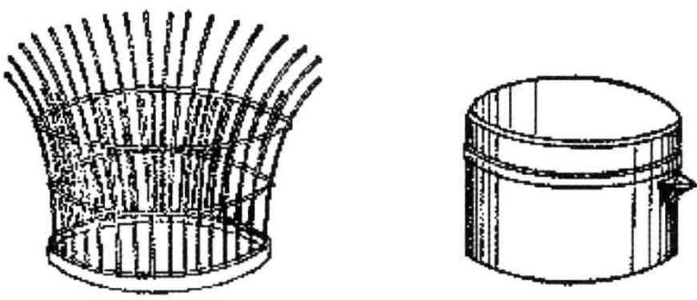  
图1-12 小型蒸发器示意图

在观测场内的安装地点竖一圆柱体，柱顶安一圈架，将蒸发器安放其中。蒸发器口缘保持水平，距地面高度为70cm。

每天20：00进行观测，测量并记录前一天20:00注入的20mm清水经24h蒸发后的剩余水量，然后倒掉余量，重新用专用量筒量取20mm(干燥地区和干燥季节须量取30mm)清水注入蒸发器内，并记录，记录表格式见表1-20。每天观测后均应清洗蒸发器，并换用干净水。同时应定期检查蒸发器是否水平，有无漏水现象，并及时纠正。如果将观测时间定为早上

8：00和晚上8：00，可以测定出白天的蒸发量和夜间的蒸发量。

每日蒸发量计算式如下：

$$
\frac { 1 } { 2 } \times \frac { 6 } { 2 } = 1 1 \times \frac { 6 } { 2 } + 1 4 \times \frac { 6 } { 2 } - \frac { 6 } { 2 5 } =
$$

小型蒸发器观测记录格式见表1-20。

表1-20 小型蒸发器观测记录汇总表
<table><tr><td rowspan=1 colspan=1>观测仪器</td><td rowspan=1 colspan=2></td><td rowspan=1 colspan=2>安装地点</td><td rowspan=1 colspan=2></td><td rowspan=1 colspan=2>安装高度</td><td rowspan=1 colspan=1></td></tr><tr><td rowspan=1 colspan=1>地理坐标</td><td rowspan=1 colspan=2></td><td rowspan=1 colspan=2>海拔高度</td><td rowspan=1 colspan=2></td><td rowspan=1 colspan=2>观测员</td><td rowspan=1 colspan=1></td></tr><tr><td rowspan=1 colspan=2>日期</td><td rowspan=1 colspan=2>加水量（mm）</td><td rowspan=1 colspan=2>降雨量(mm)</td><td rowspan=1 colspan=2>余量(mm)</td><td rowspan=1 colspan=2>蒸发量(mm)</td></tr><tr><td rowspan=1 colspan=2></td><td rowspan=1 colspan=2></td><td rowspan=1 colspan=2></td><td rowspan=1 colspan=2></td><td rowspan=1 colspan=2></td></tr><tr><td rowspan=1 colspan=2></td><td rowspan=1 colspan=2></td><td rowspan=1 colspan=2></td><td rowspan=1 colspan=2></td><td rowspan=1 colspan=2></td></tr><tr><td rowspan=1 colspan=2></td><td rowspan=1 colspan=2></td><td rowspan=1 colspan=2></td><td rowspan=1 colspan=2></td><td rowspan=1 colspan=2></td></tr><tr><td rowspan=1 colspan=2></td><td rowspan=1 colspan=2></td><td rowspan=1 colspan=2></td><td rowspan=1 colspan=2></td><td rowspan=1 colspan=2></td></tr><tr><td rowspan=1 colspan=2></td><td rowspan=1 colspan=2></td><td rowspan=1 colspan=2></td><td rowspan=1 colspan=2></td><td rowspan=1 colspan=2></td></tr><tr><td rowspan=1 colspan=2></td><td rowspan=1 colspan=2></td><td rowspan=1 colspan=2></td><td rowspan=1 colspan=2></td><td rowspan=1 colspan=2></td></tr><tr><td rowspan=1 colspan=8>累计蒸发量</td><td rowspan=1 colspan=2></td></tr><tr><td rowspan=1 colspan=8>平均蒸发量</td><td rowspan=1 colspan=2></td></tr><tr><td rowspan=1 colspan=8>日最大蒸发量</td><td rowspan=1 colspan=2></td></tr><tr><td rowspan=1 colspan=8>日最小蒸发量</td><td rowspan=1 colspan=2></td></tr></table>

## 1.4.2 E601B 型蒸发器

E601B型蒸发器由蒸发桶、水圈、溢流桶和测针等组成，如图1-13。

蒸发桶：是一个器口面积为 $3 0 0 0 \mathrm { c m } ^ { 2 }$ 的圆柱形桶，口缘为内直外斜的刀刃形。桶壁上设置测针座，测针用以测定蒸发桶中水面高度。桶壁上开有溢流孔，用以承接因降水较大时从蒸发桶内溢出的水量。

水圈：是安装在蒸发桶外围的环套，环套内充满水，用以减少太阳辐射及溅水对蒸发的影响。水圈内的水面与蒸发桶内的水面接近。

溢流桶：是承接因降水较大时而由蒸发桶溢出的水量，溢流桶应放置在带盖的套箱内。

测针：是专用于测量蒸发器内水面高度的部件，应用螺旋测微器的原理制成，读数精确到0.1mm。

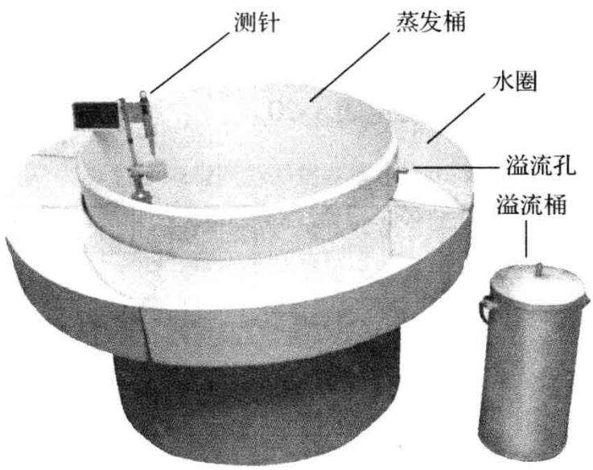  
图1-13 E601B型蒸发器

E601B型蒸发器安置在观测场内靠近小型蒸发器的地方。安置时将蒸发桶放入安置坑内，必须使器口水平。将原土填回坑内并捣实。水圈与地面之间用填坑剩余土料填筑土圈，其高度应低于蒸发桶口缘7.5cm。

每日20:00进行观测。观测时先调整测针针尖与水面恰好相接，然后从游标尺上读出水面高度。观测记录格式见表1-21。

$$
\frac { 1 } { 1 5 } \times \frac { 5 } { 1 5 } = \frac { y ^ { 2 } } { y } - y + 1 4 y - \frac { 5 } { 1 5 } - \frac { y y } { 1 5 } y - \frac { y ^ { 2 } } { 1 5 } y = - \frac { y ^ { 2 } } { 1 5 } x + 1 7
$$

观测后检查蒸发桶内的水面高度，如水面过低或过高，应加水或汲水，使水面高度合适。每次水面调整后，应重新测量水面高度值，作为次日观测器内水面高度的起算点。如因降水，蒸发器内有水流入溢流桶时，用量筒测出其水量，换算成相当于 $3 0 0 0 \mathrm { c m } ^ { 2 }$ 口面积的水量值，并从蒸发量中减去此值。冬季结冰后应停止用E601B型蒸发器进行观测，并将E601B型蒸发器内的水和水圈中的水汲净，以免冻坏。

如果将E601B型蒸发器与自记水位计连接，则可以实现水面蒸发的自动连续观测。自记蒸发器日观测记录汇总见表1-22。

表1-21 E601B型蒸发器观测记录汇总表
<table><tr><td rowspan=1 colspan=1>观测仪器</td><td rowspan=1 colspan=1></td><td rowspan=1 colspan=1>蒸发面积</td><td rowspan=1 colspan=1></td><td rowspan=1 colspan=3>观测方式</td><td rowspan=1 colspan=1></td></tr><tr><td rowspan=1 colspan=1>安装地点</td><td rowspan=1 colspan=1></td><td rowspan=1 colspan=1>地理坐标</td><td rowspan=1 colspan=1></td><td rowspan=1 colspan=3>海拔高度</td><td rowspan=1 colspan=1></td></tr><tr><td rowspan=1 colspan=1>安装高度</td><td rowspan=1 colspan=1></td><td rowspan=1 colspan=1></td><td rowspan=1 colspan=1></td><td rowspan=1 colspan=3>观测员</td><td rowspan=1 colspan=1></td></tr><tr><td rowspan=1 colspan=1>日期</td><td rowspan=1 colspan=1>前一日水面高度(mm)</td><td rowspan=1 colspan=1>降雨量(mm)</td><td rowspan=1 colspan=2>观测时水面高度(mm)</td><td rowspan=1 colspan=2>溢流桶的水量(mm)</td><td rowspan=1 colspan=1>蒸发量(mm)</td></tr><tr><td rowspan=1 colspan=1></td><td rowspan=1 colspan=1></td><td rowspan=1 colspan=1></td><td rowspan=1 colspan=2></td><td rowspan=1 colspan=2></td><td rowspan=1 colspan=1></td></tr><tr><td rowspan=1 colspan=1></td><td rowspan=1 colspan=1></td><td rowspan=1 colspan=1></td><td rowspan=1 colspan=2></td><td rowspan=1 colspan=2></td><td rowspan=1 colspan=1></td></tr><tr><td rowspan=1 colspan=1></td><td rowspan=1 colspan=1></td><td rowspan=1 colspan=1></td><td rowspan=1 colspan=2></td><td rowspan=1 colspan=2></td><td rowspan=1 colspan=1></td></tr><tr><td rowspan=1 colspan=1></td><td rowspan=1 colspan=1></td><td rowspan=1 colspan=1></td><td rowspan=1 colspan=2></td><td rowspan=1 colspan=2></td><td rowspan=1 colspan=1></td></tr><tr><td rowspan=1 colspan=1></td><td rowspan=1 colspan=1></td><td rowspan=1 colspan=1></td><td rowspan=1 colspan=2></td><td rowspan=1 colspan=2></td><td rowspan=1 colspan=1></td></tr><tr><td rowspan=1 colspan=1></td><td rowspan=1 colspan=1></td><td rowspan=1 colspan=1></td><td rowspan=1 colspan=2></td><td rowspan=1 colspan=2></td><td rowspan=1 colspan=1></td></tr><tr><td rowspan=1 colspan=6>累计蒸发量</td><td rowspan=1 colspan=2></td></tr><tr><td rowspan=1 colspan=6>平均蒸发量</td><td rowspan=1 colspan=2></td></tr><tr><td rowspan=1 colspan=6>日最大蒸发量</td><td rowspan=1 colspan=2></td></tr><tr><td rowspan=1 colspan=6>日最小蒸发量</td><td rowspan=1 colspan=2></td></tr></table>

表1-22 自记蒸发器日观测记录汇总表
<table><tr><td rowspan=1 colspan=1>观测仪器</td><td rowspan=1 colspan=1></td><td rowspan=1 colspan=1>蒸发面积</td><td rowspan=1 colspan=1></td><td rowspan=1 colspan=1>观测方式</td></tr><tr><td rowspan=1 colspan=1>安装地点</td><td rowspan=1 colspan=1></td><td rowspan=1 colspan=1>地理坐标</td><td rowspan=1 colspan=1></td><td rowspan=1 colspan=1>海拔高度</td></tr><tr><td rowspan=1 colspan=1>水位计类型</td><td rowspan=1 colspan=1></td><td rowspan=1 colspan=1>水位计精度</td><td rowspan=1 colspan=1></td><td rowspan=1 colspan=1>观测员</td></tr><tr><td rowspan=1 colspan=1>年 月 日时分</td><td rowspan=1 colspan=1>水深(mm)</td><td rowspan=1 colspan=1>水位变化量(mm)</td><td rowspan=1 colspan=1>累计蒸发量(mm)</td><td rowspan=1 colspan=1>降水量(mm)</td></tr><tr><td rowspan=1 colspan=1></td><td rowspan=1 colspan=1></td><td rowspan=1 colspan=1></td><td rowspan=1 colspan=1></td><td rowspan=1 colspan=1></td></tr><tr><td rowspan=1 colspan=1></td><td rowspan=1 colspan=1></td><td rowspan=1 colspan=1></td><td rowspan=1 colspan=1></td><td rowspan=1 colspan=1></td></tr><tr><td rowspan=1 colspan=1></td><td rowspan=1 colspan=1></td><td rowspan=1 colspan=1></td><td rowspan=1 colspan=1></td><td rowspan=1 colspan=1></td></tr><tr><td rowspan=1 colspan=1></td><td rowspan=1 colspan=1></td><td rowspan=1 colspan=1></td><td rowspan=1 colspan=1></td><td rowspan=1 colspan=1></td></tr><tr><td rowspan=1 colspan=1></td><td rowspan=1 colspan=1></td><td rowspan=1 colspan=1></td><td rowspan=1 colspan=1></td><td rowspan=1 colspan=1></td></tr><tr><td rowspan=1 colspan=3>日蒸发量(mm)</td><td rowspan=1 colspan=2></td></tr><tr><td rowspan=1 colspan=3>8：00~20:00蒸发量(mm)</td><td rowspan=1 colspan=2></td></tr><tr><td rowspan=1 colspan=3>最大蒸发速率(mm/30min)</td><td rowspan=1 colspan=2></td></tr><tr><td rowspan=1 colspan=3>降水量(mm)</td><td rowspan=1 colspan=2></td></tr></table>

汇总人：  
汇总时间：

## 第2章 植被因子观测

植被是覆盖地表的植物群落的总称，有自然植被和人工植被之分，也可以分为林草植被和作物植被。植被对地面的覆盖是防治水土流失和土壤侵蚀的有效措施，植被通过防止雨滴直接击溅地表、改良土壤结构、增加土壤孔隙，能起到增加雨水渗透、减少地表径流、防治冲刷、涵养水源、调节小气候和改善生态环境等诸多生态服务功能，因此，植被是影响水土流失的主要因素，更是水土保持的关键措施，对植被的正确把握和评价是水土保持监测中的核心内容之一。

植被状况通常用植被类型、植被组成、盖度、郁闭度、密度、生物量、株高、胸径(地径)等诸多因子来表述。植被调查常用的方法有样方法、样带法、样线法等。

## 2.1 植被调查方法

## 2.1.1 样方调查

样方即方形样地，样方调查是野外植被调查中最常用的研究手段，是面积取样中最常用的形式，也是植被调查中最普遍使用的一种取样技术。样方的大小、形状和数目，主要取决于所研究群落的性质。群落越复杂，样方面积应该越大。样方形状多以方形为主。样方的数目不少于3个，样方数目越多，结果越可靠。为了保证调查数据能够充分反映植物群落的基本特征，同时又不至于造成人力、物力的浪费，在进行样方调查之前必须确定适合于所要调查群落的样方大小和样方数量，以及合理的样方设置方法。

要进行样方调查，首先要确定样方面积。样方面积一般应不小于群落的最小面积。所谓最小面积，就是能够包含绝大部分组成群落的植物种所需要的面积。最小面积通常是根据物种面积曲线的绘制来确定。

最小样方面积的确定：在拟调查群落中选择植物生长比较均匀的地段，用绳子围成一个小正方形。对于草本群落，小正方形的面积为10cm×10cm，而对于森林群落至少为 $5 \mathrm { m } \times 5 \mathrm { m }$ 。记录小正方形内植物的种类数，然后按照一定的规则将小正方形的面积成倍扩大，每扩大一次，登记新增加的植物种类数。植物种类数随面积扩大逐渐增大，当调查面积增加到某一数值后，植物种类数将不再随面积的增大而增加，或增加很少，那么该面积就是最小样方面积。当面积增加10%，而样方内物种数的增加不超过10%时，该面积就是最小样方面积，如图2-1和图2-2。

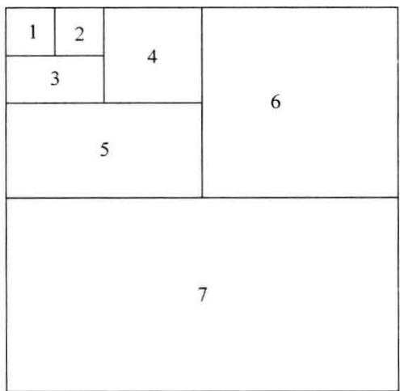  
图2-1 样方扩大示意图

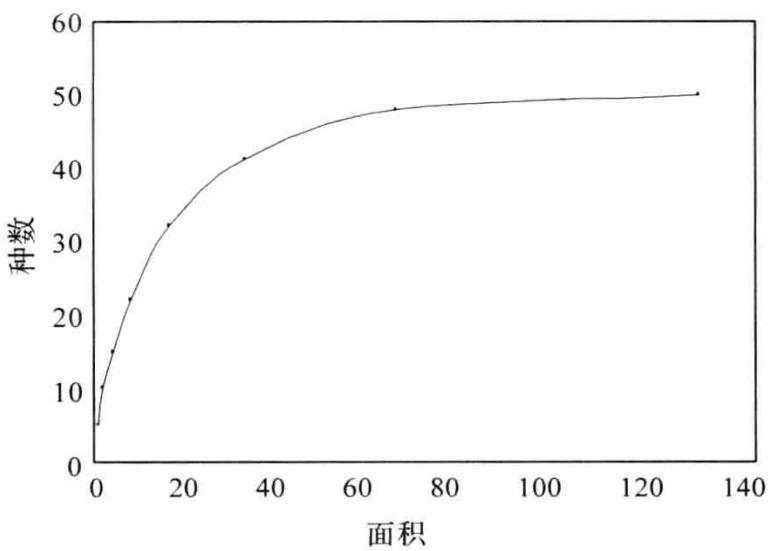  
图2-2 物种面积曲线示意图

根据经验植被调查时各地的样方面积分别为：热带森林 $4 0 \mathrm { m } \times 4 0 \mathrm { m }$ 亚热带森林 $3 0 \mathrm { m } \times 4 0 \mathrm { m }$ 、温带森林 $2 0 \mathrm { m } \times 3 0 \mathrm { m }$ 、灌丛 $5 \mathrm { m } \times 5 \mathrm { m }$ 、草本植物$\boldsymbol { 1 } \mathrm { m } \times \boldsymbol { 1 } \mathrm { m }$ 、人工林和经济林 $2 0 \mathrm { m } \times 2 0 \mathrm { m }$ 、果园 $1 0 \mathrm { m } \times 1 0 \mathrm { m }$ ，农田的样方大小和形状一般根据农作物的行间距和作物个体大小确定，样方内必须包含一定数量的植株。

## 2.1.2 样带调查

在立地条件变化较为剧烈的地方，采用样方进行调查并不能完全包含所有的植被变化，需要将样方加长，为此常采用长方形样地，且每个样地的面积固定，宽度固定，并将几个样地按照一定的走向连接起来形成样带。不同群落中样带的宽度不同，在草原地区样带宽10\~20cm，在灌木群落中样带宽1\~5m，在森林群落中样带宽10\~30m。在立地条件变化很大、群落也很复杂的地区调查时，为了提高研究效率，可以沿一个方向、间隔一定距离布设若干平行样带，并在与此相垂直的方向，同样布设若于平行样带，对这些样带进行调查。同时在样带纵横交叉的地方设立样方，进行更深入细致的调查。

## 2.1.3 样线调查

在要调查的群落中沿某个方向用测绳拉一条直线，作为调查基线，在基线上每隔一定距离拉一条垂直于基线的样线，调查样线所碰到的植物种类、个体数以及植物在样线上的长度、宽度等指标。

## 2.2 植被调查指标

## 2.2.1 植被类型

根据《中国植被》对我国植被类型的划分，我国的植被类型主要有针叶林、阔叶林、灌丛和灌草丛、草原和稀树草原、荒漠、冻原、高山稀疏植被、草甸、沼泽、水生植被共10类。

## 2.2.2 植物群落的命名

植物群落是指各层优势种相同、群落结构、外貌、生境一致的群丛。植物群落是根据建群种或优势种命名的，即根据乔木层优势种-灌木层优势种-草本层优势种进行命名。

## 2.2.3 郁闭度

也称林冠层盖度，是描述乔木层树冠连接程度的指标，以林冠层的投影面积与林地面积之比表示。郁闭度的最大值为100%，表示树冠层全部连接起来，形成完全郁闭的状态，林冠层完全覆盖了地表。

郁闭度调查时，可以在林内每隔3\~5m机械布点若干个(N个)，在每个点上观测有无树冠覆盖，如有树冠覆盖记录为郁闭，如果没有树冠覆盖，记录为无覆盖。统计调查林地内有树冠覆盖的点数，据此计算郁闭度。观测时也可以拿一根长杆竖直向上捅，如果长杆碰到植物枝叶，则记录为郁闭，如碰不到植物枝叶，则记录为无覆盖。

$$
\# | \ S | \# | \mathcal { H } | \mathcal { X } _ { \mathcal { X } } = \# \# \neq \emptyset \neq \emptyset \neq \emptyset \neq \emptyset \neq \emptyset \neq \emptyset \neq \emptyset \neq \emptyset \neq \emptyset \neq \emptyset \neq \emptyset \neq \emptyset
$$

## 2.2.4 密度

密度是指单位面积上某种植物的株数。通常用株/亩或株/公顷表示。

密度通常用样方进行调查。调查时先打一个样方，样方面积在20m×20m左右。在样方内统计各中植物的株数。在统计植物株数时一般把能够数出来的独立植株作为一株，对于根茎植物，凡地上部分为独立的可作为一个单株，对于密丛型植物，地上部分独立的一丛作为一株计算。

某种植物的密度=样方内某种植物的株树/样方的水平面积

$$
\cos 3 \frac { \cos \beta } { \cos \alpha } = 1 \neq \frac { \sin \beta } { \sin \alpha } \neq \frac { 1 } { \sin \alpha } \neq \frac { 1 } { \sin \alpha } \neq \frac { 1 } { \cos \alpha } \neq \frac { 1 } { \sin \alpha } \neq \frac { 1 } { \sin \alpha } \neq \alpha \neq \frac { \cos \alpha } { \sin \alpha } \neq \frac { \sqrt { 2 } } { \sin \alpha }
$$

相对密度是指样方内某种植物的株数与所有植物株数总和的比值，可以反映群落内各种植物之间的比例关系。

以此计算出样地的总密度和每种植物的密度。样地内每种植物的密度之和一定等于总密度。

## 2.2.5 盖度

盖度是指植物地上部分的垂直投影面积占样地面积的百分比，反映植物占有水平空间的大小。盖度采用样方或样线进行调查，也可以利用照相法测定。

盖度有投影盖度和基盖度之分。

## 2.2.5.1 样方法

投影盖度是指植物枝叶覆盖地表的面积占样地面积的百分比，基盖度是指植物基部覆盖的面积之和占样地面积的百分比。对于草原群落，通常以离地面3cm高处的断面积之和占样方面积的百分比表示基盖度，而对于森林群落，通常以胸高断面积之和占样方面积的百分比表示基盖度。森林群落的基盖度可以通过每木检尺调查得到。

$$
4 \div \frac { 9 } { 7 } \times \frac { 4 } { 7 } \times \frac { 5 } { 8 } = \frac { 4 } { 7 5 } \neq \frac { 4 } { 4 5 } \neq \frac { 5 } { 7 5 } \neq \frac { 4 } { 7 5 } \neq \frac { 5 } { 7 5 } \neq \frac { 5 } { 7 5 } \neq \frac { 4 } { 7 5 } \neq \frac { 5 } { 7 5 } \neq \frac { 5 } { 7 5 } \neq \frac { 5 } { 7 5 } \neq \frac { 5 } { 7 5 } \approx 1 0 0 \%
$$

$$
\begin{array} { r l } & { \quad \quad \quad \quad \quad \quad \quad \quad \quad \quad \quad \quad \quad \quad \quad \quad \quad \quad \quad \quad \quad \quad \quad \quad \quad \quad \quad \quad \quad \quad \quad \quad \quad \quad \quad \quad \quad \quad \quad \quad \quad \quad \quad \quad \quad \quad \quad \quad \quad \quad \quad \quad \quad \quad \quad \quad \quad \quad \quad \quad \quad \quad \quad \quad \quad \quad \quad \quad \quad \quad \quad \quad \quad \quad \quad \quad \quad \quad \quad \quad \quad \quad \quad \quad \quad \quad \quad \quad \quad \quad \quad \quad \quad \quad \quad \quad \quad \quad \quad \quad \quad \quad \quad \quad \quad \quad \quad \quad \quad \quad \quad \quad \quad \quad \quad \quad \quad \quad \quad \quad \quad \quad \quad \quad \quad \quad \quad \quad \quad \quad \quad \quad \quad \quad \quad } \\ & { \quad \quad \quad \quad \quad \quad \quad \quad \quad \quad \quad \quad \quad \quad \quad \quad \quad \quad \quad \quad \quad \quad \quad \quad \quad \quad \quad \quad \quad \quad \quad \quad \quad \quad \quad \quad \quad \quad \quad \quad \quad \quad \quad \quad \quad \quad \quad \quad \quad \quad \quad \quad \quad \quad \quad \quad \quad \quad \quad \quad \quad \quad \quad \quad \quad \quad \quad \quad \quad \quad \quad \quad \quad \quad \quad \quad \quad \quad \quad \quad \quad \quad \quad \quad \quad \quad \quad \quad \quad \quad \quad \quad \quad } \\ & { \quad \quad \quad \quad \quad \quad \quad \quad \quad \quad \quad \quad \quad \quad \quad \quad \quad \quad \quad \quad \quad \quad \quad \quad \quad \quad \quad \quad \quad \quad \quad \quad \quad \quad \quad \quad \quad \quad \quad \quad \quad \quad \quad \quad \quad \quad \quad \quad \quad \quad \quad \quad \quad \quad \quad \quad \quad \quad \quad \quad \quad \quad \quad \quad \quad \quad \quad \quad \quad \quad \quad \quad \quad \quad \quad \quad \quad \quad \quad \quad \quad \quad \quad \quad \quad \quad \quad \quad \quad \quad \quad \quad \quad \quad \quad \quad \quad \quad \quad \quad \quad \quad \quad \quad \quad \quad \quad \quad \quad \quad \quad \quad \quad \quad \quad \quad \quad \quad \quad \quad \quad \quad \quad } \\ &  \quad \quad \quad \quad \quad \quad \quad \quad \quad \quad \quad \quad \quad \quad \quad \quad \quad \quad \quad \ \end{array}
$$

投影盖度还可以分为种盖度和总盖度。种盖度是指某种植物的冠层投影面积占样地面积的百分比，总盖度是指样地内所有植物冠层的投影面积占样地面积的百分比。由于样地内上层植物和下层植物枝叶相互重叠，分盖度之和往往大于总盖度。

相对盖度是指某种植物的种盖度占所有植物盖度之和的百分比。

用样方调查植物的盖度时，可以采用目测法或机械布设小样方的方法进行观测。

用目测法估测植物盖度时，要根据植被类型和密度确定样方面积的大小，然后估测植被的总盖度和各种植物的种盖度。目测法主要适用于草本植物。

采用机械布设小样方的方法测定盖度时，可在样方内每隔3\~5m机械布设若干个面积为 $1 \mathrm m ^ { 2 }$ 的小样方，记录每个小样方内被植被冠层覆盖的程度(总覆盖度)，以及被各种植物冠层覆盖的程度(种覆盖度)，然后分别计算总盖度和种盖度。

$$
\frac { 1 3 } { 1 0 } \div \frac { 4 } { 5 0 } = 1 - 1 . 1 \dot { 6 } + \frac { 1 } { 5 0 } \dot { 1 } + \frac { 1 3 } { 1 2 } \frac { 4 } { 5 0 } = 1 \dot { 5 } - 4 0 1 . 1 \dot { 6 } + 5 \dot { 5 } - 5 \dot { 5 } =
$$

种盖度=各个小样方内被某种植物冠层覆盖程度之和/小样方总数

## 2.2.5.2 样线法

样线法主要适合于测定乔木和灌木的盖度，是根据植物在样线上的长度与样线长度之比计算盖度的。各种植物在样线上的长度与样线总长度之比可用于计算分盖度。测定时先在需要调查的样地内设定一个起点，用皮尺或测绳沿某一方向拉一条直线，样线的高度因植被类型而定，一般要求紧贴灌木的顶部，乔木林可以从林下穿过。从起点开始记录植被冠层和各种植物冠层在样线上的长度，计算出盖度。分盖度之和可以大于或等于总盖度，但不能小于总盖度。

$$
1 5 - \frac { 3 } { 2 0 } - \frac { 5 } { 2 0 } - \frac { 1 } { 5 0 } = 1 5 0 - 1 5 + \frac { 3 } { 5 0 } - 5 0 5 + \frac { 1 } { 5 0 } - 2 4 0 1 + \frac { 4 } { 5 0 } + 5 5 \times 1 5 \times 1 0 0 \%
$$

$$
\frac { 3 } { 7 0 } \div \frac { 2 } { 5 0 } = \frac { 3 } { 7 5 } + \frac { 1 7 } { 1 2 } + \frac { 3 } { 7 5 } + \frac { 1 } { 1 2 } + \frac { 3 } { 7 5 } + \frac { 1 } { 1 2 } = \frac { 3 } { 7 } + \frac { 1 } { 7 } + \frac { 3 } { 7 5 } + \frac { 1 } { 1 2 } \times 1 5 = 1 0 0 \%
$$

## 2.2.5.3 照相法

照相法是在需要调查的样地内从下往上(适合乔木林)或从上往下(适合草本群落)进行垂直照相，在室内利用图像处理软件确定出植被冠层所占像素总数和图像区像素总数，利用植被冠层所占像素总数与图像区像素总数之比计算出总盖度。照相法一般用于计算总盖度，因为在图片上很难分辨出植物种类(尤其是乔木林)，无法计算分盖度。如果能够清晰地分辨出植物种类，也可以计算分盖度。

$$
\begin{array} { r } { \frac { \partial ^ { 2 } } { \partial \Omega } = \frac { \partial ^ { 2 } } { \partial \Omega } = \frac { 1 } { 4 } \sin \frac { \pi } { 3 } \pi \int _ { \overline { { \Omega } } } ^ { \infty } \frac { \partial ^ { 2 } } { \partial \Omega } \sin \frac { \pi } { 3 } \sin \frac { \pi } { 3 } \frac { \partial } { \partial \overline { { \Omega } } } + \frac { \partial ^ { 2 } } { \partial \overline { { \Omega } } } \sin \frac { \pi } { 3 } \frac { \partial ^ { 2 } } { \partial \overline { { \Omega } } } = \frac { 1 } { 3 } \frac { \partial ^ { 2 } } { \partial \overline { { \Omega } } } \frac { \partial ^ { 2 } } { \partial \overline { { \Omega } } } \frac { \partial ^ { 2 } } { \partial \overline { { \Omega } } } \times 1 0 0 \% } \end{array}
$$

$$
\begin{array} { r } { \overbrace { \mathcal { H } } ^ { * } \frac { \partial \xi } { \partial \Omega } \iint _ { \mathbb { X } } ^ { * } = \frac { \mathrm { d } \xi } { \hbar } \oint \ d \hat { x } + \frac { \mathrm { d } \xi } { \hbar } \frac { \partial \xi } { \partial \Omega } \frac { \rho \ d \vec { x } } { \partial \Omega } \iint \ d \sum _ { i = 1 } ^ { \infty } \frac { \partial \xi } { \partial \xi } \frac { \partial \vec { x } } { \partial \xi } \frac { \partial \xi } { \partial \xi } \frac { \partial \vec { x } } { \partial \xi } \big [ \mathbb { B } \big ] \big \langle \frac { \partial \xi } { \partial \xi } \big [ \vec { x } \big ] \big | _ { \xi = \xi } ^ { * } \big \langle \frac { \partial \xi } { \partial \xi } \big | _ { \xi = \xi } ^ { * } \big \rangle \big \langle \frac { \partial \xi } { \partial \xi } \big | _ { \xi = \xi } ^ { * } \big \rangle _ { \xi = \xi } \big | 0 \big 0 \% } \end{array}
$$

## 2.2.6 高度和胸径(地径)

植物高度是从地面到植物枝叶最高处的垂直高度。高度是判断植物生活型、生长状况以及竞争力和适应力的关键指标，也是计算生物产量的重要指标。胸径是描述乔木粗度的指标，是离地1.3m处树木的直径，胸径也是判断树木生长状况和计算生物产量的关键指标。地径主要用于灌木，是指灌木在地面处的直径。

调查乔木林的高度和胸径，需要在样方内进行每木检尺。测定时利用围尺测定胸径，利用测高器或鱼竿测定树高。胸径的测定相对较为容易，但树高测定较为困难，尤其是林冠较为郁闭时往往看不到树尖，此时可以从不同方向进行树高的测定，实在无法测定的可以通过爬树进行测定。调查后计算出样地的平均树高和平均胸径。

调查草本和灌木的高度可以直接用塔尺、花杆、皮尺等测定。地径可以用卡尺、围尺测定。

## 2.2.7 频度

频度是指某种植物在调查样地内出现的几率，即在所调查样地中某种植物出现的样方数与所有样方总数之比。

$$
\pm \sqrt { 3 } \times 1 3 = \frac { 4 } { 5 } \neq \pm \frac { 4 } { 5 } \neq \frac { 4 } { 5 } \neq \pm \frac { 4 } { 5 } \neq \frac { 4 } { 5 } \neq \frac { 4 } { 5 } \neq \frac { 4 } { 5 } \approx \frac { 4 } { 5 } \approx \frac { 4 } { 5 } \times 1 0 0 \%
$$

相对频度是某一种植物的频度占所有植物种的频度之和的百分比。频度的观测相对容易，但频度值随样方的面积和数目而变化，只有在样方面积相等，统计样方数相同的情况下才可以进行不同物种频度的比较。

频度通常采用样方法进行测定，样方的大小根据单位面积上植物种的多少而定，可以与密度测定的样方面积相同。在样方内再划分出测定频度用的小样方，小样方的面积以每个小样方内有3\~8种植物为宜。在进行频度调查时必须记录调查用小样方的面积。

调查草本植物的频度时，可以采用0.1m×0.1m的方形框，在调查地内随机抛投样框，记录每次样框中出现的植物种类，当部分植物体在样框内时也要记录。最后根据每种植物在样框内出现的次数与总抛投次数的比，计算该种植物的频度。

## 2.2.8 生物量

生物量是指调查样地内所有植物的总重量，包括乔木层、灌木层、草本层。

## 2.2.8.1 乔木层的生物量

乔木层的生物量一般通过样方调查得出，有平均标准木法和径阶标准木法。

平均标准木法：首先在样方内进行每木检尺，测定样方内每株树木的胸径和树高，计算出样方内的平均胸径和平均树高，以此为依据选择平均标准木3株，伐倒，分别测定叶、枝、干、根的鲜重生物量，并分别取样带回室内在 $6 5 \mathrm { { ^ \circ C } }$ 的烘箱内烘干至恒重，计算出叶、枝、于、根的含水率，利用含水率计算出标准木叶、枝、干、根的干重生物量，将叶、枝、干、根的干重生物量加起来就是标准木的生物量。最后利用样方的密度和标准木的干重生物量计算出样方内单位面积上的生物量。平均标准木法适合于生长均匀的同龄林。

$$
1 \pm 4 0 \frac { \theta } { 2 } = \frac { 1 } { 4 } \times \frac { 3 } { 4 } \times ( 1 - \sqrt { 2 } \times 6 ) = 4 3 0 \frac { \theta } { 2 } = 1 4 \div 5 \times 5 \times 3
$$

径阶标准木法：首先在样方内进行每木检尺，测定样方内每株树木的胸径和树高。然后按照不同径阶选择标准木进行伐倒，测定各径阶标准木的鲜重生物量和干重生物量，并按叶、枝、干、根分别取样测定含水率，以计算标准木的干重生物量。利用不同径阶标准木的生物量数据以及树高、胸径数据，建立生物量与树高、胸径的生长模型，利用该模型分别计算出样方内每株树木的生物量，并对其进行求和得到样方内单位面积上的总生物量。该方法适合于异龄林。

乔木生物量调查记录格式见表2-1。

表2-1 乔木样方调查表

调查日期

调查人：

<table><tr><td rowspan=1 colspan=1>样地名称</td><td rowspan=1 colspan=2></td><td rowspan=1 colspan=3>地点</td><td rowspan=1 colspan=3></td><td rowspan=1 colspan=3>海拔</td><td rowspan=1 colspan=4></td><td rowspan=1 colspan=2>地理坐标</td><td rowspan=1 colspan=2></td></tr><tr><td rowspan=1 colspan=1>样地面积</td><td rowspan=1 colspan=2></td><td rowspan=1 colspan=3>坡向</td><td rowspan=1 colspan=3></td><td rowspan=1 colspan=3>坡位</td><td rowspan=1 colspan=4></td><td rowspan=1 colspan=2>坡度</td><td rowspan=1 colspan=2></td></tr><tr><td rowspan=1 colspan=1>土壤类型</td><td rowspan=1 colspan=2></td><td rowspan=1 colspan=3>土壤厚度</td><td rowspan=1 colspan=3></td><td rowspan=1 colspan=3>母质</td><td rowspan=1 colspan=4></td><td rowspan=1 colspan=2>基岩</td><td rowspan=1 colspan=2></td></tr><tr><td rowspan=1 colspan=1>植被类型</td><td rowspan=1 colspan=2></td><td rowspan=1 colspan=3>群落名称</td><td rowspan=1 colspan=3></td><td rowspan=1 colspan=3>郁闭度</td><td rowspan=1 colspan=4></td><td rowspan=1 colspan=2>密度</td><td rowspan=1 colspan=2></td></tr><tr><td rowspan=1 colspan=1>树木编号</td><td rowspan=1 colspan=1>胸径</td><td rowspan=1 colspan=2>树高</td><td rowspan=1 colspan=3>冠幅</td><td rowspan=1 colspan=2>枝下高</td><td rowspan=1 colspan=3>树木编号</td><td rowspan=1 colspan=2>胸径</td><td rowspan=1 colspan=3>树高</td><td rowspan=1 colspan=2>冠幅</td><td rowspan=1 colspan=1>枝下高</td></tr><tr><td rowspan=1 colspan=1></td><td rowspan=1 colspan=1></td><td rowspan=1 colspan=2></td><td rowspan=1 colspan=3></td><td rowspan=1 colspan=2></td><td rowspan=1 colspan=3></td><td rowspan=1 colspan=2></td><td rowspan=1 colspan=3></td><td rowspan=1 colspan=2></td><td rowspan=1 colspan=1></td></tr><tr><td rowspan=1 colspan=1></td><td rowspan=1 colspan=1></td><td rowspan=1 colspan=2></td><td rowspan=1 colspan=3></td><td rowspan=1 colspan=2></td><td rowspan=1 colspan=3></td><td rowspan=1 colspan=2></td><td rowspan=1 colspan=3></td><td rowspan=1 colspan=2></td><td rowspan=1 colspan=1></td></tr><tr><td rowspan=1 colspan=1></td><td rowspan=1 colspan=1></td><td rowspan=1 colspan=2></td><td rowspan=1 colspan=3></td><td rowspan=1 colspan=2></td><td rowspan=1 colspan=3></td><td rowspan=1 colspan=2></td><td rowspan=1 colspan=3></td><td rowspan=1 colspan=2></td><td rowspan=1 colspan=1></td></tr><tr><td rowspan=1 colspan=1>平均树高</td><td rowspan=1 colspan=3></td><td rowspan=1 colspan=3>平均胸径</td><td rowspan=1 colspan=2></td><td rowspan=1 colspan=5>平均冠幅</td><td rowspan=1 colspan=3></td><td rowspan=1 colspan=2>平均枝下高</td><td rowspan=1 colspan=1></td></tr><tr><td rowspan=2 colspan=1>生物量</td><td rowspan=2 colspan=1>胸径</td><td rowspan=2 colspan=2>树高</td><td rowspan=1 colspan=3>叶重</td><td rowspan=1 colspan=3>枝条重</td><td rowspan=1 colspan=3>树干重</td><td rowspan=1 colspan=4>树根重</td><td rowspan=1 colspan=3>单株生物量</td></tr><tr><td rowspan=1 colspan=1>鲜重</td><td rowspan=1 colspan=2>干重</td><td rowspan=1 colspan=1>鲜重</td><td rowspan=1 colspan=2>干重</td><td rowspan=1 colspan=1>鲜重</td><td rowspan=1 colspan=2>干重</td><td rowspan=1 colspan=2>鲜重</td><td rowspan=1 colspan=2>干重</td><td rowspan=1 colspan=2>鲜重</td><td rowspan=1 colspan=1>干重</td></tr><tr><td rowspan=1 colspan=1>标准木1</td><td rowspan=1 colspan=1></td><td rowspan=1 colspan=2></td><td rowspan=1 colspan=1></td><td rowspan=1 colspan=2></td><td rowspan=1 colspan=1></td><td rowspan=1 colspan=2></td><td rowspan=1 colspan=1></td><td rowspan=1 colspan=2></td><td rowspan=1 colspan=2></td><td rowspan=1 colspan=2></td><td rowspan=1 colspan=2></td><td rowspan=1 colspan=1></td></tr><tr><td rowspan=1 colspan=1>标准木2</td><td rowspan=1 colspan=1></td><td rowspan=1 colspan=2></td><td rowspan=1 colspan=1></td><td rowspan=1 colspan=2></td><td rowspan=1 colspan=1></td><td rowspan=1 colspan=2></td><td rowspan=1 colspan=1></td><td rowspan=1 colspan=2></td><td rowspan=1 colspan=2></td><td rowspan=1 colspan=2></td><td rowspan=1 colspan=2></td><td rowspan=1 colspan=1></td></tr><tr><td rowspan=1 colspan=1>标准木3</td><td rowspan=1 colspan=1></td><td rowspan=1 colspan=2></td><td rowspan=1 colspan=1></td><td rowspan=1 colspan=2></td><td rowspan=1 colspan=1></td><td rowspan=1 colspan=2></td><td rowspan=1 colspan=1></td><td rowspan=1 colspan=2></td><td rowspan=1 colspan=2></td><td rowspan=1 colspan=2></td><td rowspan=1 colspan=2></td><td rowspan=1 colspan=1></td></tr><tr><td rowspan=1 colspan=1>生物量</td><td rowspan=1 colspan=19>地上生物量(t/hm²)</td></tr></table>

调查日期

## 2.2.8.2灌木层的生物量

灌木层生物量的调查方法基本上与乔木层的调查方法一致。水土保持监测样地一般为固定样地，不宜采用全收获法。

调查时统计样方内灌木的种类和数量，按照灌丛的高度和幅度划分为不同等级，在每个级别内选择标准丛，分别测定标准丛的平均地径、平均株高和株数，并齐地面收割，挖出地下根系，分别称重后取样，在室内放人 $6 5 \mathrm { { ^ \circ C } }$ 的烘箱烘干至恒重，计算生物量。然后建立生物量与地径、株高、株数的经验模型。利用该模型计算出样方内所有灌丛的生物量。

灌木层生物量调查记录格式见表2-2。

表2-2 灌木样方调查表

调查人：

<table><tr><td rowspan=1 colspan=1>样地名称</td><td rowspan=1 colspan=2></td><td rowspan=1 colspan=3>地点</td><td rowspan=1 colspan=2></td><td rowspan=1 colspan=3>海拔</td><td rowspan=1 colspan=2></td><td rowspan=1 colspan=2>地理坐标</td><td rowspan=1 colspan=2></td></tr><tr><td rowspan=1 colspan=1>样地面积</td><td rowspan=1 colspan=2></td><td rowspan=1 colspan=3>坡向</td><td rowspan=1 colspan=2></td><td rowspan=1 colspan=3>坡位</td><td rowspan=1 colspan=2></td><td rowspan=1 colspan=2>坡度</td><td rowspan=1 colspan=2></td></tr><tr><td rowspan=1 colspan=1>土壤类型</td><td rowspan=1 colspan=2></td><td rowspan=1 colspan=3>土壤厚度</td><td rowspan=1 colspan=2></td><td rowspan=1 colspan=3>母质</td><td rowspan=1 colspan=2></td><td rowspan=1 colspan=2>基岩</td><td rowspan=1 colspan=2></td></tr><tr><td rowspan=1 colspan=1>植被类型</td><td rowspan=1 colspan=2></td><td rowspan=1 colspan=3>群落名称</td><td rowspan=1 colspan=2></td><td rowspan=1 colspan=3>盖度</td><td rowspan=1 colspan=2></td><td rowspan=1 colspan=2>密度</td><td rowspan=1 colspan=2></td></tr><tr><td rowspan=1 colspan=1>灌丛编号</td><td rowspan=1 colspan=1>地径</td><td rowspan=1 colspan=2>株高</td><td rowspan=1 colspan=3>丛幅</td><td rowspan=1 colspan=1>株数</td><td rowspan=1 colspan=3>灌丛编号</td><td rowspan=1 colspan=1>地径</td><td rowspan=1 colspan=2>株高</td><td rowspan=1 colspan=2>丛幅</td><td rowspan=1 colspan=1>株数</td></tr><tr><td rowspan=1 colspan=1></td><td rowspan=1 colspan=1></td><td rowspan=1 colspan=2></td><td rowspan=1 colspan=3></td><td rowspan=1 colspan=1></td><td rowspan=1 colspan=3></td><td rowspan=1 colspan=1></td><td rowspan=1 colspan=2></td><td rowspan=1 colspan=2></td><td rowspan=1 colspan=1></td></tr><tr><td rowspan=1 colspan=1></td><td rowspan=1 colspan=1></td><td rowspan=1 colspan=2></td><td rowspan=1 colspan=3></td><td rowspan=1 colspan=1></td><td rowspan=1 colspan=3></td><td rowspan=1 colspan=1></td><td rowspan=1 colspan=2></td><td rowspan=1 colspan=2></td><td rowspan=1 colspan=1></td></tr><tr><td rowspan=1 colspan=1></td><td rowspan=1 colspan=1></td><td rowspan=1 colspan=2></td><td rowspan=1 colspan=3></td><td rowspan=1 colspan=1></td><td rowspan=1 colspan=3></td><td rowspan=1 colspan=1></td><td rowspan=1 colspan=2></td><td rowspan=1 colspan=2></td><td rowspan=1 colspan=1></td></tr><tr><td rowspan=1 colspan=1></td><td rowspan=1 colspan=1></td><td rowspan=1 colspan=2></td><td rowspan=1 colspan=3></td><td rowspan=1 colspan=1></td><td rowspan=1 colspan=3></td><td rowspan=1 colspan=1></td><td rowspan=1 colspan=2></td><td rowspan=1 colspan=2></td><td rowspan=1 colspan=1></td></tr><tr><td rowspan=1 colspan=1></td><td rowspan=1 colspan=1></td><td rowspan=1 colspan=2></td><td rowspan=1 colspan=3></td><td rowspan=1 colspan=1></td><td rowspan=1 colspan=3></td><td rowspan=1 colspan=1></td><td rowspan=1 colspan=2></td><td rowspan=1 colspan=2></td><td rowspan=1 colspan=1></td></tr><tr><td rowspan=1 colspan=1></td><td rowspan=1 colspan=1></td><td rowspan=1 colspan=2></td><td rowspan=1 colspan=3></td><td rowspan=1 colspan=1></td><td rowspan=1 colspan=3></td><td rowspan=1 colspan=1></td><td rowspan=1 colspan=2></td><td rowspan=1 colspan=2></td><td rowspan=1 colspan=1></td></tr><tr><td rowspan=1 colspan=1></td><td rowspan=1 colspan=1></td><td rowspan=1 colspan=2></td><td rowspan=1 colspan=3></td><td rowspan=1 colspan=1></td><td rowspan=1 colspan=3></td><td rowspan=1 colspan=1></td><td rowspan=1 colspan=2></td><td rowspan=1 colspan=2></td><td rowspan=1 colspan=1></td></tr><tr><td rowspan=1 colspan=1>平均丛高</td><td rowspan=1 colspan=3></td><td rowspan=1 colspan=3>平均地径</td><td rowspan=1 colspan=1></td><td rowspan=1 colspan=4>平均灌丛幅</td><td rowspan=1 colspan=2></td><td rowspan=1 colspan=2>平均株数</td><td rowspan=1 colspan=1></td></tr><tr><td rowspan=2 colspan=1>生物量</td><td rowspan=2 colspan=1>地径</td><td rowspan=2 colspan=2>株高</td><td rowspan=2 colspan=1>株数</td><td rowspan=2 colspan=2>丛幅</td><td rowspan=1 colspan=3>地上部分</td><td rowspan=1 colspan=4>地下部分</td><td rowspan=1 colspan=3>单丛生物量</td></tr><tr><td rowspan=1 colspan=2>鲜重</td><td rowspan=1 colspan=1>干重</td><td rowspan=1 colspan=2>鲜重</td><td rowspan=1 colspan=2>干重</td><td rowspan=1 colspan=2>鲜重</td><td rowspan=1 colspan=1>干重</td></tr><tr><td rowspan=1 colspan=1>标准丛1</td><td rowspan=1 colspan=1></td><td rowspan=1 colspan=2></td><td rowspan=1 colspan=1></td><td rowspan=1 colspan=2></td><td rowspan=1 colspan=2></td><td rowspan=1 colspan=1></td><td rowspan=1 colspan=2></td><td rowspan=1 colspan=2></td><td rowspan=1 colspan=2></td><td rowspan=1 colspan=1></td></tr><tr><td rowspan=1 colspan=1>标准丛2</td><td rowspan=1 colspan=1></td><td rowspan=1 colspan=2></td><td rowspan=1 colspan=1></td><td rowspan=1 colspan=2></td><td rowspan=1 colspan=2></td><td rowspan=1 colspan=1></td><td rowspan=1 colspan=2></td><td rowspan=1 colspan=2></td><td rowspan=1 colspan=2></td><td rowspan=1 colspan=1></td></tr><tr><td rowspan=1 colspan=1>标准丛3</td><td rowspan=1 colspan=1></td><td rowspan=1 colspan=2></td><td rowspan=1 colspan=1></td><td rowspan=1 colspan=2></td><td rowspan=1 colspan=2></td><td rowspan=1 colspan=1></td><td rowspan=1 colspan=2></td><td rowspan=1 colspan=2></td><td rowspan=1 colspan=2></td><td rowspan=1 colspan=1></td></tr><tr><td rowspan=1 colspan=1>生物量</td><td rowspan=1 colspan=1>t/hm²</td><td rowspan=1 colspan=2></td><td rowspan=1 colspan=1></td><td rowspan=1 colspan=2></td><td rowspan=1 colspan=2></td><td rowspan=1 colspan=1></td><td rowspan=1 colspan=2></td><td rowspan=1 colspan=2></td><td rowspan=1 colspan=2></td><td rowspan=1 colspan=1></td></tr></table>

## 2.2.8.3 草本层生物量

草本植物的生物量一般采用收割法观测，为了防止对永久观测样地或水土流失监测点的破坏，草本生物量观测点选择在与永久观测样地或水土流失监测点临近的相似地段。调查时采用面积为 $2 \mathrm { m } \times 2 \mathrm { m }$ 小样方进行收割调查，为了提高调查精度，可以设置5\~10个小样方。

在设置的小样方内，首先调查植物组成，然后将地上部分按植物种剪下，分别称鲜重，如果生物量较大，可以按植物种分别取 $2 0 0 \mathrm { g }$ 左右的样品，如果生物量较小，可以全部带回室内在 $6 5 \mathrm { { ^ \circ C } }$ 的烘箱内烘干至恒重，计算出各种植物的含水率，以此为基础计算出地上生物量的干重。

在小样方内调查完地上部分的生物量后，将地下部分的根系全部挖出，带回室内进行冲洗、分级、烘干、称重，计算出地下部分的生物量。草本生物量调查记录格式见表2-3。

## 2.2.9 枯落物

枯落物是植物生长过程中凋落在地表的叶片、枝条、花、果实等植物残体，枯落物直接覆盖在地表，具有保护土壤免受雨滴打击、防止水分蒸发、拦蓄和过滤地表径流、改良表层土壤等多重作用，在生态系统的物质循环过程中占有重要地位。枯落物的生态功能与其种类和数量直接相关，因此，枯落物的调查是水土保持监测中的重要内容。

枯落物量有现存量和回收量之分。枯落物现存量是指在调查时地面枯枝落叶的保有量，回收量是指单位时间内凋落到地面的枯枝落叶量。

## 2.2.9.1 枯落物现存量的调查

枯落物现存量的调查是在样方内进行，调查时在样方内随机选择或机械布设几个调查用小样方，小样方面积为 $\boldsymbol { 1 } \mathrm { m } \times \boldsymbol { 1 } \mathrm { m }$ 。调查时先用直尺测定小样方内枯枝落叶的厚度，然后将小样方内的枯落物全部收集、分类、称重、取样，将样品带回室内在 $6 5 \mathrm { { ^ \circ C } }$ 的烘箱内烘干至恒重，计算出枯落物的含水率，以此为依据换算出调查样地单位面积的枯落物现存量。

枯落物现存量调查记录格式见表24。

表2-3 草本植物样方调查表

调查日期

调查人：

<table><tr><td rowspan=1 colspan=1>样地名称</td><td rowspan=1 colspan=1></td><td rowspan=1 colspan=1>地点</td><td rowspan=1 colspan=1></td><td rowspan=1 colspan=1>海拔</td><td rowspan=1 colspan=1></td><td rowspan=1 colspan=1>地理坐标</td><td rowspan=1 colspan=1></td></tr><tr><td rowspan=1 colspan=1>样地面积</td><td rowspan=1 colspan=1></td><td rowspan=1 colspan=1>坡向</td><td rowspan=1 colspan=1></td><td rowspan=1 colspan=1>坡位</td><td rowspan=1 colspan=1></td><td rowspan=1 colspan=1>坡度</td><td rowspan=1 colspan=1></td></tr><tr><td rowspan=1 colspan=1>土壤类型</td><td rowspan=1 colspan=1></td><td rowspan=1 colspan=1>土壤厚度</td><td rowspan=1 colspan=1></td><td rowspan=1 colspan=1>母质</td><td rowspan=1 colspan=1></td><td rowspan=1 colspan=1>基岩</td><td rowspan=1 colspan=1></td></tr><tr><td rowspan=1 colspan=1>植被类型</td><td rowspan=1 colspan=1></td><td rowspan=1 colspan=1>群落名称</td><td rowspan=1 colspan=1></td><td rowspan=1 colspan=1>盖度</td><td rowspan=1 colspan=1></td><td rowspan=1 colspan=1>密度</td><td rowspan=1 colspan=1></td></tr></table>

地上生物量
<table><tr><td rowspan=2 colspan=1>植物名称</td><td rowspan=2 colspan=1>株高</td><td rowspan=1 colspan=2>地上生物量</td><td rowspan=2 colspan=1>植物名称</td><td rowspan=2 colspan=1>株高</td><td rowspan=1 colspan=2>地上生物量</td><td rowspan=2 colspan=1>植物名称</td><td rowspan=2 colspan=1>株高</td><td rowspan=1 colspan=2>地上生物量</td></tr><tr><td rowspan=1 colspan=1>鲜重</td><td rowspan=1 colspan=1>干重</td><td rowspan=1 colspan=1>鲜重</td><td rowspan=1 colspan=1>干重</td><td rowspan=1 colspan=1>鲜重</td><td rowspan=1 colspan=1>干重</td></tr><tr><td rowspan=1 colspan=1></td><td rowspan=1 colspan=1></td><td rowspan=1 colspan=1></td><td rowspan=1 colspan=1></td><td rowspan=1 colspan=1></td><td rowspan=1 colspan=1></td><td rowspan=1 colspan=1></td><td rowspan=1 colspan=1></td><td rowspan=1 colspan=1></td><td rowspan=1 colspan=1></td><td rowspan=1 colspan=1></td><td rowspan=1 colspan=1></td></tr><tr><td rowspan=1 colspan=1></td><td rowspan=1 colspan=1></td><td rowspan=1 colspan=1></td><td rowspan=1 colspan=1></td><td rowspan=1 colspan=1></td><td rowspan=1 colspan=1></td><td rowspan=1 colspan=1></td><td rowspan=1 colspan=1></td><td rowspan=1 colspan=1></td><td rowspan=1 colspan=1></td><td rowspan=1 colspan=1></td><td rowspan=1 colspan=1></td></tr><tr><td rowspan=1 colspan=1></td><td rowspan=1 colspan=1></td><td rowspan=1 colspan=1></td><td rowspan=1 colspan=1></td><td rowspan=1 colspan=1></td><td rowspan=1 colspan=1></td><td rowspan=1 colspan=1></td><td rowspan=1 colspan=1></td><td rowspan=1 colspan=1></td><td rowspan=1 colspan=1></td><td rowspan=1 colspan=1></td><td rowspan=1 colspan=1></td></tr><tr><td rowspan=1 colspan=1></td><td rowspan=1 colspan=1></td><td rowspan=1 colspan=1></td><td rowspan=1 colspan=1></td><td rowspan=1 colspan=1></td><td rowspan=1 colspan=1></td><td rowspan=1 colspan=1></td><td rowspan=1 colspan=1></td><td rowspan=1 colspan=1></td><td rowspan=1 colspan=1></td><td rowspan=1 colspan=1></td><td rowspan=1 colspan=1></td></tr><tr><td rowspan=1 colspan=1></td><td rowspan=1 colspan=1></td><td rowspan=1 colspan=1></td><td rowspan=1 colspan=1></td><td rowspan=1 colspan=1></td><td rowspan=1 colspan=1></td><td rowspan=1 colspan=1></td><td rowspan=1 colspan=1></td><td rowspan=1 colspan=1></td><td rowspan=1 colspan=1></td><td rowspan=1 colspan=1></td><td rowspan=1 colspan=1></td></tr><tr><td rowspan=1 colspan=1></td><td rowspan=1 colspan=1></td><td rowspan=1 colspan=1></td><td rowspan=1 colspan=1></td><td rowspan=1 colspan=1></td><td rowspan=1 colspan=1></td><td rowspan=1 colspan=1></td><td rowspan=1 colspan=1></td><td rowspan=1 colspan=1></td><td rowspan=1 colspan=1></td><td rowspan=1 colspan=1></td><td rowspan=1 colspan=1></td></tr><tr><td rowspan=1 colspan=1></td><td rowspan=1 colspan=1></td><td rowspan=1 colspan=1></td><td rowspan=1 colspan=1></td><td rowspan=1 colspan=1></td><td rowspan=1 colspan=1></td><td rowspan=1 colspan=1></td><td rowspan=1 colspan=1></td><td rowspan=1 colspan=1></td><td rowspan=1 colspan=1></td><td rowspan=1 colspan=1></td><td rowspan=1 colspan=1></td></tr><tr><td rowspan=1 colspan=1></td><td rowspan=1 colspan=1></td><td rowspan=1 colspan=1></td><td rowspan=1 colspan=1></td><td rowspan=1 colspan=1></td><td rowspan=1 colspan=1></td><td rowspan=1 colspan=1></td><td rowspan=1 colspan=1></td><td rowspan=1 colspan=1></td><td rowspan=1 colspan=1></td><td rowspan=1 colspan=1></td><td rowspan=1 colspan=1></td></tr><tr><td rowspan=1 colspan=1></td><td rowspan=1 colspan=1></td><td rowspan=1 colspan=1></td><td rowspan=1 colspan=1></td><td rowspan=1 colspan=1></td><td rowspan=1 colspan=1></td><td rowspan=1 colspan=1></td><td rowspan=1 colspan=1></td><td rowspan=1 colspan=1></td><td rowspan=1 colspan=1></td><td rowspan=1 colspan=1></td><td rowspan=1 colspan=1></td></tr><tr><td rowspan=1 colspan=2>地上生物量合计</td><td rowspan=1 colspan=10></td></tr></table>

地下生物量
<table><tr><td rowspan=1 colspan=2>层次(cm)</td><td rowspan=1 colspan=1>0~5</td><td rowspan=1 colspan=1>5~101</td><td rowspan=1 colspan=1>0~151</td><td rowspan=1 colspan=1>5~202</td><td rowspan=1 colspan=1>0~252</td><td rowspan=1 colspan=1>5~303</td><td rowspan=1 colspan=1>0~353</td><td rowspan=1 colspan=1>5~404</td><td rowspan=1 colspan=1>0~454</td><td rowspan=1 colspan=1>5~50</td><td rowspan=1 colspan=1>&gt;50</td></tr><tr><td rowspan=2 colspan=1>根茎≤1mm</td><td rowspan=1 colspan=1>鲜重</td><td rowspan=1 colspan=1></td><td rowspan=1 colspan=1></td><td rowspan=1 colspan=1></td><td rowspan=1 colspan=1></td><td rowspan=1 colspan=1></td><td rowspan=1 colspan=1></td><td rowspan=1 colspan=1></td><td rowspan=1 colspan=1></td><td rowspan=1 colspan=1></td><td rowspan=1 colspan=1></td><td rowspan=1 colspan=1></td></tr><tr><td rowspan=1 colspan=1>干重</td><td rowspan=1 colspan=1></td><td rowspan=1 colspan=1></td><td rowspan=1 colspan=1></td><td rowspan=1 colspan=1></td><td rowspan=1 colspan=1></td><td rowspan=1 colspan=1></td><td rowspan=1 colspan=1></td><td rowspan=1 colspan=1></td><td rowspan=1 colspan=1></td><td rowspan=1 colspan=1></td><td rowspan=1 colspan=1></td></tr><tr><td rowspan=2 colspan=1>根茎1~2mm</td><td rowspan=1 colspan=1>鲜重</td><td rowspan=1 colspan=1></td><td rowspan=1 colspan=1></td><td rowspan=1 colspan=1></td><td rowspan=1 colspan=1></td><td rowspan=1 colspan=1></td><td rowspan=1 colspan=1></td><td rowspan=1 colspan=1></td><td rowspan=1 colspan=1></td><td rowspan=1 colspan=1></td><td rowspan=1 colspan=1></td><td rowspan=1 colspan=1></td></tr><tr><td rowspan=1 colspan=1>干重</td><td rowspan=1 colspan=1></td><td rowspan=1 colspan=1></td><td rowspan=1 colspan=1></td><td rowspan=1 colspan=1></td><td rowspan=1 colspan=1></td><td rowspan=1 colspan=1></td><td rowspan=1 colspan=1></td><td rowspan=1 colspan=1></td><td rowspan=1 colspan=1></td><td rowspan=1 colspan=1></td><td rowspan=1 colspan=1></td></tr><tr><td rowspan=2 colspan=1>根茎≥2mm</td><td rowspan=1 colspan=1>鲜重</td><td rowspan=1 colspan=1></td><td rowspan=1 colspan=1></td><td rowspan=1 colspan=1></td><td rowspan=1 colspan=1></td><td rowspan=1 colspan=1></td><td rowspan=1 colspan=1></td><td rowspan=1 colspan=1></td><td rowspan=1 colspan=1></td><td rowspan=1 colspan=1></td><td rowspan=1 colspan=1></td><td rowspan=1 colspan=1></td></tr><tr><td rowspan=1 colspan=1>干重</td><td rowspan=1 colspan=1></td><td rowspan=1 colspan=1></td><td rowspan=1 colspan=1></td><td rowspan=1 colspan=1></td><td rowspan=1 colspan=1></td><td rowspan=1 colspan=1></td><td rowspan=1 colspan=1></td><td rowspan=1 colspan=1></td><td rowspan=1 colspan=1></td><td rowspan=1 colspan=1></td><td rowspan=1 colspan=1></td></tr><tr><td rowspan=1 colspan=1>小计(干重)</td><td rowspan=1 colspan=1></td><td rowspan=1 colspan=1></td><td rowspan=1 colspan=1></td><td rowspan=1 colspan=1></td><td rowspan=1 colspan=1></td><td rowspan=1 colspan=1></td><td rowspan=1 colspan=1></td><td rowspan=1 colspan=1></td><td rowspan=1 colspan=1></td><td rowspan=1 colspan=1></td><td rowspan=1 colspan=1></td><td rowspan=1 colspan=1></td></tr><tr><td rowspan=1 colspan=2>地下生物量合计</td><td rowspan=1 colspan=11></td></tr><tr><td rowspan=1 colspan=2>草地生物量合计</td><td rowspan=1 colspan=11></td></tr></table>

表24 枯落物现存量调查表

调查日期：

调查人：

<table><tr><td rowspan=1 colspan=2>样地名称</td><td rowspan=1 colspan=2></td><td rowspan=1 colspan=2>地点</td><td rowspan=1 colspan=2></td><td rowspan=1 colspan=2>海拔</td><td rowspan=1 colspan=3></td><td rowspan=1 colspan=2>地理坐标</td><td rowspan=1 colspan=2></td></tr><tr><td rowspan=1 colspan=2>样方面积</td><td rowspan=1 colspan=2></td><td rowspan=1 colspan=2>坡向</td><td rowspan=1 colspan=2></td><td rowspan=1 colspan=2>坡位</td><td rowspan=1 colspan=3></td><td rowspan=1 colspan=2>坡度</td><td rowspan=1 colspan=2></td></tr><tr><td rowspan=1 colspan=2>土壤类型</td><td rowspan=1 colspan=2></td><td rowspan=1 colspan=2>土壤厚度</td><td rowspan=1 colspan=2></td><td rowspan=1 colspan=2>母质</td><td rowspan=1 colspan=3></td><td rowspan=1 colspan=2>基岩</td><td rowspan=1 colspan=2></td></tr><tr><td rowspan=1 colspan=2>植被类型</td><td rowspan=1 colspan=2></td><td rowspan=1 colspan=2>群落名称</td><td rowspan=1 colspan=2></td><td rowspan=1 colspan=2>郁闭度</td><td rowspan=1 colspan=3></td><td rowspan=1 colspan=2>密度</td><td rowspan=1 colspan=2></td></tr><tr><td rowspan=2 colspan=1>样方编号</td><td rowspan=2 colspan=2>枯落物厚度</td><td rowspan=1 colspan=2>枝</td><td rowspan=1 colspan=3>叶</td><td rowspan=1 colspan=3>花和果</td><td rowspan=1 colspan=3>皮</td><td rowspan=1 colspan=3>苔藓和地衣</td></tr><tr><td rowspan=1 colspan=1>鲜重</td><td rowspan=1 colspan=1>干重</td><td rowspan=1 colspan=2>鲜重</td><td rowspan=1 colspan=1>干重</td><td rowspan=1 colspan=1>鲜重</td><td rowspan=1 colspan=2>干重</td><td rowspan=1 colspan=1>鲜重</td><td rowspan=1 colspan=2>干重</td><td rowspan=1 colspan=2>鲜重</td><td rowspan=1 colspan=1>干重</td></tr><tr><td rowspan=1 colspan=1></td><td rowspan=1 colspan=2></td><td rowspan=1 colspan=1></td><td rowspan=1 colspan=1></td><td rowspan=1 colspan=2></td><td rowspan=1 colspan=1></td><td rowspan=1 colspan=1></td><td rowspan=1 colspan=2></td><td rowspan=1 colspan=1></td><td rowspan=1 colspan=2></td><td rowspan=1 colspan=2></td><td rowspan=1 colspan=1></td></tr><tr><td rowspan=1 colspan=1></td><td rowspan=1 colspan=2></td><td rowspan=1 colspan=1></td><td rowspan=1 colspan=1></td><td rowspan=1 colspan=2></td><td rowspan=1 colspan=1></td><td rowspan=1 colspan=1></td><td rowspan=1 colspan=2></td><td rowspan=1 colspan=1></td><td rowspan=1 colspan=2></td><td rowspan=1 colspan=2></td><td rowspan=1 colspan=1></td></tr><tr><td rowspan=1 colspan=1></td><td rowspan=1 colspan=2></td><td rowspan=1 colspan=1></td><td rowspan=1 colspan=1></td><td rowspan=1 colspan=2></td><td rowspan=1 colspan=1></td><td rowspan=1 colspan=1></td><td rowspan=1 colspan=2></td><td rowspan=1 colspan=1></td><td rowspan=1 colspan=2></td><td rowspan=1 colspan=2></td><td rowspan=1 colspan=1></td></tr><tr><td rowspan=1 colspan=1>平均</td><td rowspan=1 colspan=2></td><td rowspan=1 colspan=1></td><td rowspan=1 colspan=1></td><td rowspan=1 colspan=2></td><td rowspan=1 colspan=1></td><td rowspan=1 colspan=1></td><td rowspan=1 colspan=2></td><td rowspan=1 colspan=1></td><td rowspan=1 colspan=2></td><td rowspan=1 colspan=2></td><td rowspan=1 colspan=1></td></tr><tr><td rowspan=1 colspan=1>现存量</td><td rowspan=1 colspan=2></td><td rowspan=1 colspan=1></td><td rowspan=1 colspan=1></td><td rowspan=1 colspan=2></td><td rowspan=1 colspan=1></td><td rowspan=1 colspan=1></td><td rowspan=1 colspan=2></td><td rowspan=1 colspan=1></td><td rowspan=1 colspan=2></td><td rowspan=1 colspan=2></td><td rowspan=1 colspan=1></td></tr></table>

## 2.2.9.2 枯落物回收量的调查

枯落物回收量的调查采用收集法，调查时在样地内随机布设或机械布设回收量调查点10\~20个，在每个调查点安装面积为 $1 \mathrm m ^ { 2 }$ 的枯落物回收框，回收框的底面可以用尼龙网或金属网制成，网眼大小以能拦住枯落物为宜。回收框安装时必须牢固，回收框必须保持水平。回收框安装好后定期回收框内的枯落物，一般每月调查一次，调查时将框内的枯落物按枝、叶、花和果、皮、苔藓和地衣等分别称重并取样，将样品带回室内在65℃烘箱内烘干至恒重，计算枯落物的含水率，以此推算调查样地枯落物回收量的动态变化过程及年凋落量。

枯落物回收量的调查记录格式见表2-5。

## 2.2.9.3 枯落物分解率的调查

枯落物到达地面后便开始了分解过程，分解过程包含物理过程和化学过程。物理过程是在风、雨水、动物等作用下发生碎裂的现象，化学过程是在细菌、微生物等的作用下枯落物分解成可被植物吸收利用的营养物质的过程，在发生这两个过程的同时完成生态系统中营养物质的循环过程。枯落物的分解状况可以用分解率来表述，分解率是一定时间内枯落物的分解量与分解前重量的比。

表2-5 枯落物回收量调查表

调查日期：

调查人：

<table><tr><td rowspan=1 colspan=1>样地名称</td><td rowspan=1 colspan=2></td><td rowspan=1 colspan=2>地点</td><td rowspan=1 colspan=2></td><td rowspan=1 colspan=2>海拔</td><td rowspan=1 colspan=2></td><td rowspan=1 colspan=3>地理坐标</td><td rowspan=1 colspan=2></td></tr><tr><td rowspan=1 colspan=1>回收框面积</td><td rowspan=1 colspan=2></td><td rowspan=1 colspan=2>坡向</td><td rowspan=1 colspan=2></td><td rowspan=1 colspan=2>坡位</td><td rowspan=1 colspan=2></td><td rowspan=1 colspan=3>坡度</td><td rowspan=1 colspan=2></td></tr><tr><td rowspan=1 colspan=1>土壤类型</td><td rowspan=1 colspan=2></td><td rowspan=1 colspan=2>土壤厚度</td><td rowspan=1 colspan=2></td><td rowspan=1 colspan=2>母质</td><td rowspan=1 colspan=2></td><td rowspan=1 colspan=3>基岩</td><td rowspan=1 colspan=2></td></tr><tr><td rowspan=1 colspan=1>植被类型</td><td rowspan=1 colspan=2></td><td rowspan=1 colspan=2>群落名称</td><td rowspan=1 colspan=2></td><td rowspan=1 colspan=2>郁闭度</td><td rowspan=1 colspan=2></td><td rowspan=1 colspan=3>密度</td><td rowspan=1 colspan=2></td></tr><tr><td rowspan=2 colspan=1>回收框编号</td><td rowspan=1 colspan=3>枝</td><td rowspan=1 colspan=3>叶</td><td rowspan=1 colspan=3>花和果</td><td rowspan=1 colspan=3>皮</td><td rowspan=1 colspan=3>苔藓和地衣</td></tr><tr><td rowspan=1 colspan=1>鲜重</td><td rowspan=1 colspan=2>干重</td><td rowspan=1 colspan=2>鲜重</td><td rowspan=1 colspan=1>干重</td><td rowspan=1 colspan=1>鲜重</td><td rowspan=1 colspan=2>干重</td><td rowspan=1 colspan=2>鲜重</td><td rowspan=1 colspan=1>干重</td><td rowspan=1 colspan=2>鲜重</td><td rowspan=1 colspan=1>干重</td></tr><tr><td rowspan=1 colspan=1></td><td rowspan=1 colspan=1></td><td rowspan=1 colspan=2></td><td rowspan=1 colspan=2></td><td rowspan=1 colspan=1></td><td rowspan=1 colspan=1></td><td rowspan=1 colspan=2></td><td rowspan=1 colspan=2></td><td rowspan=1 colspan=1></td><td rowspan=1 colspan=2></td><td rowspan=1 colspan=1></td></tr><tr><td rowspan=1 colspan=1></td><td rowspan=1 colspan=1></td><td rowspan=1 colspan=2></td><td rowspan=1 colspan=2></td><td rowspan=1 colspan=1></td><td rowspan=1 colspan=1></td><td rowspan=1 colspan=2></td><td rowspan=1 colspan=2></td><td rowspan=1 colspan=1></td><td rowspan=1 colspan=2></td><td rowspan=1 colspan=1></td></tr><tr><td rowspan=1 colspan=1></td><td rowspan=1 colspan=1></td><td rowspan=1 colspan=2></td><td rowspan=1 colspan=2></td><td rowspan=1 colspan=1></td><td rowspan=1 colspan=1></td><td rowspan=1 colspan=2></td><td rowspan=1 colspan=2></td><td rowspan=1 colspan=1></td><td rowspan=1 colspan=2></td><td rowspan=1 colspan=1></td></tr><tr><td rowspan=1 colspan=1>平均</td><td rowspan=1 colspan=1></td><td rowspan=1 colspan=2></td><td rowspan=1 colspan=2></td><td rowspan=1 colspan=1></td><td rowspan=1 colspan=1></td><td rowspan=1 colspan=2></td><td rowspan=1 colspan=2></td><td rowspan=1 colspan=1></td><td rowspan=1 colspan=2></td><td rowspan=1 colspan=1></td></tr><tr><td rowspan=1 colspan=1>回收量</td><td rowspan=1 colspan=15></td></tr></table>

枯落物分解率通常用尼龙网袋法测定。尼龙网袋的网眼为2mm左右，尼龙网袋的大小以15cm×20cm为宜。测定时采集当年新凋落的枯落物若干(采样时间以秋季落叶时间为好)，装入尼龙网袋中，每个调查样地做3个重复，分别编号并记录采样地的基本情况。将装有枯落物的尼龙网袋放入40℃的烘箱中烘干至恒重。然后将样品袋模拟自然状态均匀地平铺在地面，样品袋之间用尼龙绳连接，并拴在木桩或树干上，以防止被风吹跑丢失。样品袋布设地点需要用GPS定位，以便下次调查时查找。

一定时间后(半个月或一个月)，取回尼龙网袋，清除网袋上附着的杂物后，放入 $4 0 \%$ 的烘箱中烘干至恒重，然后将尼龙网袋重新放回原处。

$$
\therefore A F = F = ( W _ { 1 } - W _ { 2 } ) / W _ { 1 }
$$

式中： $W _ { 1 }$ ——布设时尼龙网袋中枯落物干重；

$W _ { 2 }$ ——布设一定时间后尼龙网袋中枯落物干重。

枯落物分解率调查记录格式见表2-6。

## 2.2.9.4枯落物持水率的调查

降雨时覆盖在地表的枯落物能够吸收一部分降水，并对地表径流有拦蓄作用，这种对降水的吸收和对地表径流的拦蓄作用减少了参与形成地表径流的雨量，对防治坡面水土流失具有重要作用。同时，枯枝落叶覆盖在地表，防止了雨滴对地面的直接打击，能有效防止土壤侵蚀的发生。

表2-6 枯落物分解率调查表

调查日期：

调查人：

<table><tr><td rowspan=1 colspan=1>样地名称</td><td rowspan=1 colspan=2></td><td rowspan=1 colspan=2>地点</td><td rowspan=1 colspan=2></td><td rowspan=1 colspan=2>海拔</td><td rowspan=1 colspan=3></td><td rowspan=1 colspan=2>地理坐标</td><td rowspan=1 colspan=2></td></tr><tr><td rowspan=1 colspan=1>样地面积</td><td rowspan=1 colspan=2></td><td rowspan=1 colspan=2>坡向</td><td rowspan=1 colspan=2></td><td rowspan=1 colspan=2>坡位</td><td rowspan=1 colspan=3></td><td rowspan=1 colspan=2>坡度</td><td rowspan=1 colspan=2></td></tr><tr><td rowspan=1 colspan=1>土壤类型</td><td rowspan=1 colspan=2></td><td rowspan=1 colspan=2>土壤厚度</td><td rowspan=1 colspan=2></td><td rowspan=1 colspan=2>母质</td><td rowspan=1 colspan=3></td><td rowspan=1 colspan=2>基岩</td><td rowspan=1 colspan=2></td></tr><tr><td rowspan=1 colspan=1>植被类型</td><td rowspan=1 colspan=2></td><td rowspan=1 colspan=2>群落名称</td><td rowspan=1 colspan=2></td><td rowspan=1 colspan=2>郁闭度</td><td rowspan=1 colspan=3></td><td rowspan=1 colspan=2>密度</td><td rowspan=1 colspan=2></td></tr><tr><td rowspan=1 colspan=1>网袋编号</td><td rowspan=1 colspan=1>1</td><td rowspan=1 colspan=2>2</td><td rowspan=1 colspan=1>3</td><td rowspan=1 colspan=1>4</td><td rowspan=1 colspan=2>5</td><td rowspan=1 colspan=2>6</td><td rowspan=1 colspan=1>7</td><td rowspan=1 colspan=2>8</td><td rowspan=1 colspan=2>9</td><td rowspan=1 colspan=1>10</td></tr><tr><td rowspan=1 colspan=1>GPS 坐标</td><td rowspan=1 colspan=1></td><td rowspan=1 colspan=2></td><td rowspan=1 colspan=1></td><td rowspan=1 colspan=1></td><td rowspan=1 colspan=2></td><td rowspan=1 colspan=2></td><td rowspan=1 colspan=1></td><td rowspan=1 colspan=2></td><td rowspan=1 colspan=2></td><td rowspan=1 colspan=1></td></tr><tr><td rowspan=1 colspan=1>布设时枯落物干重</td><td rowspan=1 colspan=1></td><td rowspan=1 colspan=2></td><td rowspan=1 colspan=1></td><td rowspan=1 colspan=1></td><td rowspan=1 colspan=2></td><td rowspan=1 colspan=2></td><td rowspan=1 colspan=1></td><td rowspan=1 colspan=2></td><td rowspan=1 colspan=2></td><td rowspan=1 colspan=1></td></tr><tr><td rowspan=1 colspan=1>布设后枯落物干重</td><td rowspan=1 colspan=1></td><td rowspan=1 colspan=2></td><td rowspan=1 colspan=1></td><td rowspan=1 colspan=1></td><td rowspan=1 colspan=2></td><td rowspan=1 colspan=2></td><td rowspan=1 colspan=1></td><td rowspan=1 colspan=2></td><td rowspan=1 colspan=2></td><td rowspan=1 colspan=1></td></tr><tr><td rowspan=1 colspan=1>分解率</td><td rowspan=1 colspan=1></td><td rowspan=1 colspan=2></td><td rowspan=1 colspan=1></td><td rowspan=1 colspan=1></td><td rowspan=1 colspan=2></td><td rowspan=1 colspan=2></td><td rowspan=1 colspan=1></td><td rowspan=1 colspan=2></td><td rowspan=1 colspan=2></td><td rowspan=1 colspan=1></td></tr><tr><td rowspan=1 colspan=1>平均分解率</td><td rowspan=1 colspan=15></td></tr></table>

枯落物吸水和拦蓄的水量用持水率表示。

枯落物持水率=枯落物吸水后的重量/风干枯落物重量×100%

枯落物最大持水率=枯落物吸水后的重量/枯落物干重×100%

枯落物持水率的测定方法有两种：洒水法和浸泡法。

(1)洒水法：将枯落物现存量调查用小样方 $\left( 1 \mathrm { m } \times 1 \mathrm { m } \right)$ 内的全部枯落物收集后风干称重 $( \ W _ { 0 } )$ ，然后将枯落物平铺在纱网上，将纱网用支架架在一个较大的容器上，用量筒量取一定体积 $V _ { \mathfrak { r } }$ 的清水装入喷壶，用喷壶往枯枝落叶上均匀地洒水，直至枯落物充分吸水达到饱和状态时洒水结束。洒水结束后量取支架下容器中水的体积 $V _ { 2 }$ o

$$
\ddagger \dot { \xi } \stackrel { \ddagger } { \mathcal { B } } - 4 3 \eta \dot { \eta } \dot { \eta } \dot { \hat { \xi } } \dot { \hat { \xi } } \dot { \hat { \xi } } \ x \ddot { \hat { \xi } } \stackrel { \ddagger } { \ F } = \left( V _ { 1 } - V _ { 2 } \right) / W _ { 0 } \times 1 0 0 \%
$$

测定枯落物最大持水率时先将枯落物样品在 $4 5 \sim 6 0 ^ { \circ } \mathrm { C }$ 的烘箱内烘干至恒重，然后再进行洒水试验。洒水法测定枯落物持水量记录格式见表2-7。

表2-7 洒水法测定枯落物持水量记录表  
调查日期：
<table><tr><td rowspan=1 colspan=1>样地名称</td><td rowspan=1 colspan=2></td><td rowspan=1 colspan=2>地点</td><td rowspan=1 colspan=2></td><td rowspan=1 colspan=2>海拔</td><td rowspan=1 colspan=2></td><td rowspan=1 colspan=2>地理坐标</td><td rowspan=1 colspan=2></td></tr><tr><td rowspan=1 colspan=1>样地面积</td><td rowspan=1 colspan=2></td><td rowspan=1 colspan=2>坡向</td><td rowspan=1 colspan=2></td><td rowspan=1 colspan=2>坡位</td><td rowspan=1 colspan=2></td><td rowspan=1 colspan=2>坡度</td><td rowspan=1 colspan=2></td></tr><tr><td rowspan=1 colspan=1>土壤类型</td><td rowspan=1 colspan=2></td><td rowspan=1 colspan=2>土壤厚度</td><td rowspan=1 colspan=2></td><td rowspan=1 colspan=2>母质</td><td rowspan=1 colspan=2></td><td rowspan=1 colspan=2>基岩</td><td rowspan=1 colspan=2></td></tr><tr><td rowspan=1 colspan=1>植被类型</td><td rowspan=1 colspan=2></td><td rowspan=1 colspan=2>群落名称</td><td rowspan=1 colspan=2></td><td rowspan=1 colspan=2>郁闭度</td><td rowspan=1 colspan=2></td><td rowspan=1 colspan=2>密度</td><td rowspan=1 colspan=2></td></tr><tr><td rowspan=1 colspan=2>样品编号</td><td rowspan=1 colspan=1>1</td><td rowspan=1 colspan=1>2</td><td rowspan=1 colspan=2>3</td><td rowspan=1 colspan=1>4</td><td rowspan=1 colspan=1>5</td><td rowspan=1 colspan=2>6</td><td rowspan=1 colspan=1>7</td><td rowspan=1 colspan=1>8</td><td rowspan=1 colspan=2>9</td><td rowspan=1 colspan=1>10</td></tr><tr><td rowspan=1 colspan=2>枯落物干重 $\mathbb { W } _ { 0 }$ </td><td rowspan=1 colspan=1></td><td rowspan=1 colspan=1></td><td rowspan=1 colspan=2></td><td rowspan=1 colspan=1></td><td rowspan=1 colspan=1></td><td rowspan=1 colspan=2></td><td rowspan=1 colspan=1></td><td rowspan=1 colspan=1></td><td rowspan=1 colspan=2></td><td rowspan=1 colspan=1></td></tr><tr><td rowspan=1 colspan=2>洒水量 $V _ { 1 }$ </td><td rowspan=1 colspan=1></td><td rowspan=1 colspan=1></td><td rowspan=1 colspan=2></td><td rowspan=1 colspan=1></td><td rowspan=1 colspan=1></td><td rowspan=1 colspan=2></td><td rowspan=1 colspan=1></td><td rowspan=1 colspan=1></td><td rowspan=1 colspan=2></td><td rowspan=1 colspan=1></td></tr><tr><td rowspan=1 colspan=2>容器中的水量 $V _ { 2 }$ </td><td rowspan=1 colspan=1></td><td rowspan=1 colspan=1></td><td rowspan=1 colspan=2></td><td rowspan=1 colspan=1></td><td rowspan=1 colspan=1></td><td rowspan=1 colspan=2></td><td rowspan=1 colspan=1></td><td rowspan=1 colspan=1></td><td rowspan=1 colspan=2></td><td rowspan=1 colspan=1></td></tr><tr><td rowspan=1 colspan=2>吸水量</td><td rowspan=1 colspan=1></td><td rowspan=1 colspan=1></td><td rowspan=1 colspan=2></td><td rowspan=1 colspan=1></td><td rowspan=1 colspan=1></td><td rowspan=1 colspan=2></td><td rowspan=1 colspan=1></td><td rowspan=1 colspan=1></td><td rowspan=1 colspan=2></td><td rowspan=1 colspan=1></td></tr><tr><td rowspan=1 colspan=2>持水率</td><td rowspan=1 colspan=1></td><td rowspan=1 colspan=1></td><td rowspan=1 colspan=2></td><td rowspan=1 colspan=1></td><td rowspan=1 colspan=1></td><td rowspan=1 colspan=2></td><td rowspan=1 colspan=1></td><td rowspan=1 colspan=1></td><td rowspan=1 colspan=2></td><td rowspan=1 colspan=1></td></tr><tr><td rowspan=1 colspan=2>平均持水率</td><td rowspan=1 colspan=13></td></tr></table>

为了测定枯落物的持水过程，可以采用小型人工降雨器进行洒水试验。试验时可在自记雨量器的承雨口内安装纱网，在纱网上铺设一定厚度的枯落物，然后将装有枯落物的自记雨量计和没有枯落物的自记雨量计同时安置在人工降雨器下进行一定时间的人工降雨试验，降雨后可以通过对比两台自记雨量计的记录数据，确定枯落物的持水量，还可以测定出枯落物持水过程。如果需要测定天然降雨条件下枯落物的持水过程，可以将有枯落物的自记雨量计布设在野外，同时布设一台没有装枯落物的自记雨量计作为对照。

(2)浸泡法：将枯落物现存量调查用小样方(1m×1m)内的全部枯落物收集后，风干称重 $\left( \begin{array} { l } { W _ { 0 } } \end{array} \right)$ ，将风干的枯落物装入尼龙纱网后，放入盛水的塑料桶内浸泡数小时，使其充分吸水至饱和。然后将装有枯落物的尼龙网捞出后放在支架上，让多余的水分自然滴下，同时用土壤筛将塑料桶内遗漏的枯枝落叶捞出重新装入尼龙网中，待尼龙网内不再有水珠滴下时，用天平称其浸水后的重量 $W _ { 1 }$ ，为了防止蒸发在滴水过程中可用塑料布覆盖枯落物。浸泡法测定的是枯落物的最大持水量。

$$
\ddagger \ 5 z \div 4 2 0 \div 2 \div 5 x = ( W _ { 1 } - W _ { 0 } ) / W _ { 0 } \times 1 0 0 \%
$$

浸泡法测定枯落物持水量记录格式见表2-8。

表2-8浸泡法测定枯落物持水量记录表

调查日期：

调查人：

<table><tr><td rowspan=1 colspan=1>样地名称</td><td rowspan=1 colspan=2></td><td rowspan=1 colspan=2>地点</td><td rowspan=1 colspan=2></td><td rowspan=1 colspan=2>海拔</td><td rowspan=1 colspan=2></td><td rowspan=1 colspan=2>地理坐标</td><td rowspan=1 colspan=2></td></tr><tr><td rowspan=1 colspan=1>样地面积</td><td rowspan=1 colspan=2></td><td rowspan=1 colspan=2>坡向</td><td rowspan=1 colspan=2></td><td rowspan=1 colspan=2>坡位</td><td rowspan=1 colspan=2></td><td rowspan=1 colspan=2>坡度</td><td rowspan=1 colspan=2></td></tr><tr><td rowspan=1 colspan=1>土壤类型</td><td rowspan=1 colspan=2></td><td rowspan=1 colspan=2>土壤厚度</td><td rowspan=1 colspan=2></td><td rowspan=1 colspan=2>母质</td><td rowspan=1 colspan=2></td><td rowspan=1 colspan=2>基岩</td><td rowspan=1 colspan=2></td></tr><tr><td rowspan=1 colspan=1>植被类型</td><td rowspan=1 colspan=2></td><td rowspan=1 colspan=2>群落名称</td><td rowspan=1 colspan=2></td><td rowspan=1 colspan=2>郁闭度</td><td rowspan=1 colspan=2></td><td rowspan=1 colspan=2>密度</td><td rowspan=1 colspan=2></td></tr><tr><td rowspan=1 colspan=2>样品编号</td><td rowspan=1 colspan=1>1</td><td rowspan=1 colspan=1>2</td><td rowspan=1 colspan=2>3</td><td rowspan=1 colspan=1>4</td><td rowspan=1 colspan=1>5</td><td rowspan=1 colspan=2>6</td><td rowspan=1 colspan=1>7</td><td rowspan=1 colspan=1>8</td><td rowspan=1 colspan=2>9</td><td rowspan=1 colspan=1>10</td></tr><tr><td rowspan=1 colspan=2>枯落物干重 $W _ { 0 }$ </td><td rowspan=1 colspan=1></td><td rowspan=1 colspan=1></td><td rowspan=1 colspan=2></td><td rowspan=1 colspan=1></td><td rowspan=1 colspan=1></td><td rowspan=1 colspan=2></td><td rowspan=1 colspan=1></td><td rowspan=1 colspan=1></td><td rowspan=1 colspan=2></td><td rowspan=1 colspan=1></td></tr><tr><td rowspan=1 colspan=2>吸水后枯落物重量 $W _ { 1 }$ </td><td rowspan=1 colspan=1></td><td rowspan=1 colspan=1></td><td rowspan=1 colspan=2></td><td rowspan=1 colspan=1></td><td rowspan=1 colspan=1></td><td rowspan=1 colspan=2></td><td rowspan=1 colspan=1></td><td rowspan=1 colspan=1></td><td rowspan=1 colspan=2></td><td rowspan=1 colspan=1></td></tr><tr><td rowspan=1 colspan=2>持水率</td><td rowspan=1 colspan=1></td><td rowspan=1 colspan=1></td><td rowspan=1 colspan=2></td><td rowspan=1 colspan=1></td><td rowspan=1 colspan=1></td><td rowspan=1 colspan=2></td><td rowspan=1 colspan=1></td><td rowspan=1 colspan=1></td><td rowspan=1 colspan=2></td><td rowspan=1 colspan=1></td></tr><tr><td rowspan=1 colspan=2>平均持水率</td><td rowspan=1 colspan=13></td></tr></table>

## 2.2.10 叶面积指数

叶面积指数是指单位面积上所有植物的叶面积之和。叶面积指数是估算植物生产力的重要参数，更是评价水土保持林效益中常用的关键性指标，因此叶面积指数的测定是水土保持监测中必不可少的内容。

叶面积指数的测定方法有直接测定法和间接测定法，直接测定法的主要代表为称重法，间接测定法的主要代表为冠层分析仪法。

## 2.2.10.1 直接测定法

直接测定方法是一种传统的、具有一定破坏性的方法，是通过直接测量叶面积得到叶面积指数。比较而言直接测量法需要耗费大量人力和物力，但测定结果具有更高的可靠性，因此常用于检验和校准间接测量结果。

(1)叶面积的测定：在需要调查的地块内选择调查样方，调查样方要有代表性。在调查样方内进行每木检尺，根据调查得到的树种组成和每木检尺结果，按树种分别选取标准木。按树种分别摘取标准木的所有叶片，称叶片总重 $W _ { _ { \ast } }$ 。在叶片中随机抽取50\~100个叶片作为样品称重 $W _ { 5 0 }$ ，将50\~100个叶片描绘在方格纸上，求算50\~100个叶片的面积之和 $S _ { 5 0 }$ ，以$S _ { 5 0 }$ 为依据计算各树种单位重量叶片的面积 $S _ { \# }$ O

也可以利用扫描仪对叶片进行扫描或利用数码相机对50\~100个叶片分别进行照相，在计算机中利用CAD或PHOTOSHOP等软件直接求算单个叶片的面积，然后将50\~100个叶片的面积求和后，再计算出各树种单位重量叶片的面积 $S _ { \# }$

标准木的叶面积：

$$
\begin{array} { c } { { S _ { \ast } = S _ { 5 0 } / W _ { 5 0 } } } \\ { { S _ { \ast \bar { \kappa } } = S _ { \ast \bar { \kappa } } \times W _ { \ast \bar { \kappa } } } } \end{array}
$$

对于针叶树，可以把针叶组成的束看成是一个圆锥体，根据每束中的针叶数，利用针叶长度、宽度、厚度计算出针叶的表面积。

(2)样地叶面积指数的计算：在计算出样地内各树种标准木单位重量叶面积后，可利用下式计算调查样方的叶面积指数。

$$
L A I \ = \ \sum _ { i = 1 } ^ { n } S _ { \mathrm { \it t r i } } N _ { i } / S
$$

式中： $S _ { \mathit { t } \mathit { \vec { \kappa } } i }$ —为样方内第i种树木标准木的叶面积；

$N _ { i }$ —为样方内第i种树木的株树；

S——为样方的面积。

叶面积指数测定记录格式见表2-9。

表2-9 叶面积指数测定记录表

调查日期：

调查人：

<table><tr><td rowspan=1 colspan=1>样地名称</td><td rowspan=1 colspan=3></td><td rowspan=1 colspan=2>地点</td><td rowspan=1 colspan=2></td><td rowspan=1 colspan=2>海拔</td><td rowspan=1 colspan=2></td><td rowspan=1 colspan=2>地理坐标</td><td rowspan=1 colspan=2></td></tr><tr><td rowspan=1 colspan=1>样地面积</td><td rowspan=1 colspan=3></td><td rowspan=1 colspan=2>坡向</td><td rowspan=1 colspan=2></td><td rowspan=1 colspan=2>坡位</td><td rowspan=1 colspan=2></td><td rowspan=1 colspan=2>坡度</td><td rowspan=1 colspan=2></td></tr><tr><td rowspan=1 colspan=1>土壤类型</td><td rowspan=1 colspan=3></td><td rowspan=1 colspan=2>土壤厚度</td><td rowspan=1 colspan=2></td><td rowspan=1 colspan=2>母质</td><td rowspan=1 colspan=2></td><td rowspan=1 colspan=2>基岩</td><td rowspan=1 colspan=2></td></tr><tr><td rowspan=1 colspan=1>植被类型</td><td rowspan=1 colspan=3></td><td rowspan=1 colspan=2>群落名称</td><td rowspan=1 colspan=2></td><td rowspan=1 colspan=2>郁闭度</td><td rowspan=1 colspan=2></td><td rowspan=1 colspan=2>密度</td><td rowspan=1 colspan=2></td></tr><tr><td rowspan=1 colspan=2>树种</td><td rowspan=1 colspan=2>1</td><td rowspan=1 colspan=1>2</td><td rowspan=1 colspan=2>3</td><td rowspan=1 colspan=1>4</td><td rowspan=1 colspan=1>5</td><td rowspan=1 colspan=2>6</td><td rowspan=1 colspan=1>7</td><td rowspan=1 colspan=1>8</td><td rowspan=1 colspan=2>9</td><td rowspan=1 colspan=1>10</td></tr><tr><td rowspan=1 colspan=2>株树</td><td rowspan=1 colspan=2></td><td rowspan=1 colspan=1></td><td rowspan=1 colspan=2></td><td rowspan=1 colspan=1></td><td rowspan=1 colspan=1></td><td rowspan=1 colspan=2></td><td rowspan=1 colspan=1></td><td rowspan=1 colspan=1></td><td rowspan=1 colspan=2></td><td rowspan=1 colspan=1></td></tr><tr><td rowspan=1 colspan=2>标准木叶总重 $\boldsymbol { W } _ { \mathrm { . 5 } }$ </td><td rowspan=1 colspan=2></td><td rowspan=1 colspan=1></td><td rowspan=1 colspan=2></td><td rowspan=1 colspan=1></td><td rowspan=1 colspan=1></td><td rowspan=1 colspan=2></td><td rowspan=1 colspan=1></td><td rowspan=1 colspan=1></td><td rowspan=1 colspan=2></td><td rowspan=1 colspan=1></td></tr><tr><td rowspan=1 colspan=2> $\mathbb { W } _ { 5 0 }$ </td><td rowspan=1 colspan=2></td><td rowspan=1 colspan=1></td><td rowspan=1 colspan=2></td><td rowspan=1 colspan=1></td><td rowspan=1 colspan=1></td><td rowspan=1 colspan=2></td><td rowspan=1 colspan=1></td><td rowspan=1 colspan=1></td><td rowspan=1 colspan=2></td><td rowspan=1 colspan=1></td></tr><tr><td rowspan=1 colspan=2> $S _ { 5 0 }$ </td><td rowspan=1 colspan=2></td><td rowspan=1 colspan=1></td><td rowspan=1 colspan=2></td><td rowspan=1 colspan=1></td><td rowspan=1 colspan=1></td><td rowspan=1 colspan=2></td><td rowspan=1 colspan=1></td><td rowspan=1 colspan=1></td><td rowspan=1 colspan=2></td><td rowspan=1 colspan=1></td></tr><tr><td rowspan=1 colspan=2> $S _ { \# }$ </td><td rowspan=1 colspan=2></td><td rowspan=1 colspan=1></td><td rowspan=1 colspan=2></td><td rowspan=1 colspan=1></td><td rowspan=1 colspan=1></td><td rowspan=1 colspan=2></td><td rowspan=1 colspan=1></td><td rowspan=1 colspan=1></td><td rowspan=1 colspan=2></td><td rowspan=1 colspan=1></td></tr><tr><td rowspan=1 colspan=2> $S _ { \xi \overline { { \kappa } } }$ </td><td rowspan=1 colspan=2></td><td rowspan=1 colspan=1></td><td rowspan=1 colspan=2></td><td rowspan=1 colspan=1></td><td rowspan=1 colspan=1></td><td rowspan=1 colspan=2></td><td rowspan=1 colspan=1></td><td rowspan=1 colspan=1></td><td rowspan=1 colspan=2></td><td rowspan=1 colspan=1></td></tr><tr><td rowspan=1 colspan=3>样地叶面积指数</td><td rowspan=1 colspan=13></td></tr></table>

## 2.2.10.2 间接测定法

间接测定法是指不必与叶片直接接触，通过测定群落透光度测量叶面积指数的方法。依据工作原理叶面积指数的测量仪器可以分成两类，一类是基于分析冠层间隙率得到叶面积指数，这类仪器要求冠层内的各种元素(叶、枝、树干等)随机分布，如CI-110植被冠层数字图像仪、Demon、Licor-2000植被冠层分析仪等；另一类基于分析冠层间隙大小和分布情况得出叶面积指数，如半球摄影仪器(如鱼眼镜头)等。间接测定法把所有叶片同等看待，不能区分不同年龄叶片的叶面积指数，也很难消除叶片相互重叠的影响。

利用冠层分析仪测定叶面积指数时，在所调查的样方内随机选择多个调查点，在每个调查点上利用冠层分析仪在灌木层上方对乔木层进行扫描，测定出乔木层的叶面积指数 $L A I _ { 0 }$ 。然后将冠层分析仪置于灌木层下方、草本层上方，对整个灌木层和乔木层同时进行扫描，得出灌木层和乔木层的叶面积指数之和 $L A I _ { 1 }$ 。最后将冠层分析仪置于草本层下的地面上，对整个群落进行扫描，得出草本层、灌木层和乔木层的叶面积指数之和 $L A I _ { \circ }$

整个样方的叶面积指数为LAI，乔木层的叶面积为 $L A I _ { 0 }$ ，灌木层的叶面积指数为 $L A I _ { 1 } – L A I _ { 0 }$ ，草本层的叶面积指数为 $L A I { - } L A I _ { 1 }$ 10

利用冠层分析仪测定叶面积指数的记录格式见表2-10。

表2-10利用冠层分析仪测定叶面积指数记录表

调查日期：

调查人：

<table><tr><td rowspan=1 colspan=1>样地名称</td><td rowspan=1 colspan=2></td><td rowspan=1 colspan=2>地点</td><td rowspan=1 colspan=3></td><td rowspan=1 colspan=2>海拔</td><td rowspan=1 colspan=3></td><td rowspan=1 colspan=2>地理坐标</td><td rowspan=1 colspan=2></td></tr><tr><td rowspan=1 colspan=1>样地名称</td><td rowspan=1 colspan=2></td><td rowspan=1 colspan=2>地点</td><td rowspan=1 colspan=3></td><td rowspan=1 colspan=2>海拔</td><td rowspan=1 colspan=3></td><td rowspan=1 colspan=2>地理坐标</td><td rowspan=1 colspan=2></td></tr><tr><td rowspan=1 colspan=1>样地面积</td><td rowspan=1 colspan=2></td><td rowspan=1 colspan=2>坡向</td><td rowspan=1 colspan=3></td><td rowspan=1 colspan=2>坡位</td><td rowspan=1 colspan=3></td><td rowspan=1 colspan=2>坡度</td><td rowspan=1 colspan=2></td></tr><tr><td rowspan=1 colspan=1>土壤类型</td><td rowspan=1 colspan=2></td><td rowspan=1 colspan=2>土壤厚度</td><td rowspan=1 colspan=3></td><td rowspan=1 colspan=2>母质</td><td rowspan=1 colspan=3></td><td rowspan=1 colspan=2>基岩</td><td rowspan=1 colspan=2></td></tr><tr><td rowspan=1 colspan=1>植被类型</td><td rowspan=1 colspan=2></td><td rowspan=1 colspan=2>群落名称</td><td rowspan=1 colspan=3></td><td rowspan=1 colspan=2>郁闭度</td><td rowspan=1 colspan=3></td><td rowspan=1 colspan=2>密度</td><td rowspan=1 colspan=2></td></tr><tr><td rowspan=1 colspan=1>观测点</td><td rowspan=1 colspan=1>1</td><td rowspan=1 colspan=2>2</td><td rowspan=1 colspan=2>3</td><td rowspan=1 colspan=1>4</td><td rowspan=1 colspan=2>5</td><td rowspan=1 colspan=2>6</td><td rowspan=1 colspan=1>7</td><td rowspan=1 colspan=2>8</td><td rowspan=1 colspan=2>9</td><td rowspan=1 colspan=1>10</td></tr><tr><td rowspan=1 colspan=1> $L A I _ { 0 }$ </td><td rowspan=1 colspan=1></td><td rowspan=1 colspan=2></td><td rowspan=1 colspan=2></td><td rowspan=1 colspan=1></td><td rowspan=1 colspan=2></td><td rowspan=1 colspan=2></td><td rowspan=1 colspan=1></td><td rowspan=1 colspan=2></td><td rowspan=1 colspan=2></td><td rowspan=1 colspan=1></td></tr><tr><td rowspan=1 colspan=1> $L A I _ { 1 }$ </td><td rowspan=1 colspan=1></td><td rowspan=1 colspan=2></td><td rowspan=1 colspan=2></td><td rowspan=1 colspan=1></td><td rowspan=1 colspan=2></td><td rowspan=1 colspan=2></td><td rowspan=1 colspan=1></td><td rowspan=1 colspan=2></td><td rowspan=1 colspan=2></td><td rowspan=1 colspan=1></td></tr><tr><td rowspan=1 colspan=1>LAI</td><td rowspan=1 colspan=1></td><td rowspan=1 colspan=2></td><td rowspan=1 colspan=2></td><td rowspan=1 colspan=1></td><td rowspan=1 colspan=2></td><td rowspan=1 colspan=2></td><td rowspan=1 colspan=1></td><td rowspan=1 colspan=2></td><td rowspan=1 colspan=2></td><td rowspan=1 colspan=1></td></tr><tr><td rowspan=1 colspan=1>平均</td><td rowspan=1 colspan=16></td></tr></table>

## 第3章 土壤因子观测

土壤是覆盖于地球陆地表面具有肥力的、具有一定结构的能够生长植物的堆积物，是被侵蚀的主要对象。对土壤的观测是水土保持监测中的重要内容。需要观测的主要内容有土壤类型、土壤质地、土壤容重、土壤孔隙度、土壤的渗透性能、土壤的水分状况、土壤抗蚀性、土壤抗冲性等。

## 3.1 土壤类型

在受到侵蚀时不同土壤具有不同的表现特征，因此，水土保持监测中必须明确所观测土壤的类型。根据中国土壤分类系统，中国的土壤共分为12个土纲，27个亚纲，61个土类(表3-1)。具体调查时请查阅《中国土壤分类系统》和当地的土壤志等资料。

表3-1 中国土壤分类系统表
<table><tr><td colspan="1" rowspan="1">土纲</td><td colspan="1" rowspan="1">亚纲</td><td colspan="1" rowspan="1">土类</td></tr><tr><td colspan="1" rowspan="4">铁铝土</td><td colspan="1" rowspan="3">湿热铁铝土</td><td colspan="1" rowspan="1">砖红壤</td></tr><tr><td colspan="1" rowspan="1">赤红壤</td></tr><tr><td colspan="1" rowspan="1">红壤</td></tr><tr><td colspan="1" rowspan="1">湿暖铁铝土</td><td colspan="1" rowspan="1">黄壤</td></tr><tr><td colspan="1" rowspan="8">淋溶土</td><td colspan="1" rowspan="2">湿暖淋溶土</td><td colspan="1" rowspan="1">黄棕壤</td></tr><tr><td colspan="1" rowspan="1">黄褐土</td></tr><tr><td colspan="1" rowspan="1">湿暖温淋溶土</td><td colspan="1" rowspan="1">棕壤</td></tr><tr><td colspan="1" rowspan="2">湿温淋溶土</td><td colspan="1" rowspan="1">暗棕壤</td></tr><tr><td colspan="1" rowspan="1">白浆土</td></tr><tr><td colspan="1" rowspan="3">湿寒温淋溶土</td><td colspan="1" rowspan="1">棕色针叶林土</td></tr><tr><td colspan="1" rowspan="1">漂灰土</td></tr><tr><td colspan="1" rowspan="1">灰化土</td></tr><tr><td colspan="1" rowspan="5">半淋溶土</td><td colspan="1" rowspan="1">半湿热半淋溶土</td><td colspan="1" rowspan="1">燥红土</td></tr><tr><td colspan="1" rowspan="1">半温暖半淋溶土</td><td colspan="1" rowspan="1">褐土</td></tr><tr><td colspan="1" rowspan="3">半温湿半淋溶土</td><td colspan="1" rowspan="1">灰褐土</td></tr><tr><td colspan="1" rowspan="1">黑土</td></tr><tr><td colspan="1" rowspan="1">灰色森林土</td></tr><tr><td colspan="1" rowspan="4">钙层土</td><td colspan="1" rowspan="1">半温湿钙层土</td><td colspan="1" rowspan="1">黑钙土</td></tr><tr><td colspan="1" rowspan="1">半干温钙层土</td><td colspan="1" rowspan="1">栗钙土</td></tr><tr><td colspan="1" rowspan="2">半干暖温钙层土</td><td colspan="1" rowspan="1">栗褐土</td></tr><tr><td colspan="1" rowspan="1">黑垆土</td></tr><tr><td colspan="1" rowspan="2">干旱土</td><td colspan="1" rowspan="1">干温干旱土</td><td colspan="1" rowspan="1">棕钙土</td></tr><tr><td colspan="1" rowspan="1">干温暖干旱土</td><td colspan="1" rowspan="1">灰钙土</td></tr><tr><td colspan="1" rowspan="3">漠土</td><td colspan="1" rowspan="2">干温漠土</td><td colspan="1" rowspan="1">灰漠土</td></tr><tr><td colspan="1" rowspan="1">灰棕漠土</td></tr><tr><td colspan="1" rowspan="1">干温暖漠土</td><td colspan="1" rowspan="1">棕漠土</td></tr><tr><td colspan="1" rowspan="11">初育土</td><td colspan="1" rowspan="5">土质初育土</td><td colspan="1" rowspan="1">黄绵土</td></tr><tr><td colspan="1" rowspan="1">红黏土</td></tr><tr><td colspan="1" rowspan="1">新积土</td></tr><tr><td colspan="1" rowspan="1">龟裂土</td></tr><tr><td colspan="1" rowspan="1">风沙土</td></tr><tr><td colspan="1" rowspan="6">石质初育土</td><td colspan="1" rowspan="1">石灰(岩)土</td></tr><tr><td colspan="1" rowspan="1">火山灰土</td></tr><tr><td colspan="1" rowspan="1">紫色土</td></tr><tr><td colspan="1" rowspan="1">磷质石灰土</td></tr><tr><td colspan="1" rowspan="1">石质土</td></tr><tr><td colspan="1" rowspan="1">粗骨土</td></tr><tr><td colspan="1" rowspan="5">半水成土</td><td colspan="1" rowspan="1">暗半水成土</td><td colspan="1" rowspan="1">草甸土</td></tr><tr><td colspan="1" rowspan="4">淡半水成土</td><td colspan="1" rowspan="1">砂浆黑土</td></tr><tr><td colspan="1" rowspan="1">山地草甸土</td></tr><tr><td colspan="1" rowspan="1">林灌草甸土</td></tr><tr><td colspan="1" rowspan="1">潮土</td></tr><tr><td colspan="1" rowspan="2">水成土</td><td colspan="1" rowspan="1">矿质水成土</td><td colspan="1" rowspan="1">沼泽土</td></tr><tr><td colspan="1" rowspan="1">有机水成土</td><td colspan="1" rowspan="1">泥炭土</td></tr><tr><td colspan="1" rowspan="6">盐碱土</td><td colspan="1" rowspan="6">盐土</td><td colspan="1" rowspan="1">草甸盐土</td></tr><tr><td colspan="1" rowspan="1">漠境盐土</td></tr><tr><td colspan="1" rowspan="1">滨海盐土</td></tr><tr><td colspan="1" rowspan="1">酸性硫酸盐土</td></tr><tr><td colspan="1" rowspan="1">寒原盐土</td></tr><tr><td colspan="1" rowspan="1">碱土</td></tr><tr><td colspan="1" rowspan="3">人为土</td><td colspan="1" rowspan="3">人为水成土</td><td colspan="1" rowspan="1">水稻土</td></tr><tr><td colspan="1" rowspan="1">灌淤土</td></tr><tr><td colspan="1" rowspan="1">灌漠土</td></tr><tr><td colspan="1" rowspan="8">高山土</td><td colspan="1" rowspan="5">湿寒高山土</td><td colspan="1" rowspan="1">草毡土(高山草甸土)</td></tr><tr><td colspan="1" rowspan="1">黑毡土(亚高山草甸土)</td></tr><tr><td colspan="1" rowspan="1">寒钙土(高山草原土)</td></tr><tr><td colspan="1" rowspan="1">冷钙土(亚高山草原土)</td></tr><tr><td colspan="1" rowspan="1">冷棕钙土(山地灌丛草原土)</td></tr><tr><td colspan="1" rowspan="2">干旱高山土</td><td colspan="1" rowspan="1">寒漠土(高山漠土)</td></tr><tr><td colspan="1" rowspan="1">冷漠土(亚高山漠土)</td></tr><tr><td colspan="1" rowspan="1">寒冻高山土</td><td colspan="1" rowspan="1">寒冻土(高山寒漠土)</td></tr></table>

## 3.2 土壤比重与容重的测定

单位体积干土的重量与同体积水的重量之比称为土壤的比重。土壤比重的大小主要取决于土壤固相组成物质的种类和相对含量。

自然状态下单位体积土壤的重量称为土壤容重。土壤容重的大小取决于土壤孔隙和土壤固相组成物质的数量。

## 3.2.1 土壤比重测定

土壤比重采用比重瓶法进行测定。测定时在比重瓶中装满无 $\mathrm { C O } _ { 2 }$ 的水（煮沸5min后冷却至室温的水），静置10min后加塞，使多余的水从瓶塞毛细管中溢出，用滤纸擦干比重瓶，称重 $( W _ { 1 } )$ ，然后将比重瓶内的水倒出一半，将通过1mm土壤筛的烘干土样(W)用漏斗加入比重瓶，轻轻摇动，使土壤与水分充分混合，为了除去水中的空气，可以将盛有土壤和水的比重瓶加热煮沸1h，加热过程中经常摇晃比重瓶，以使水中的空气溢出、土样和水充分混合。冷却后在比重瓶中用滴管加满无 $\mathrm { C O } _ { 2 }$ 的水，在室温下静置10min后加塞，使多余的水从瓶塞毛细管中溢出，用滤纸擦干比重瓶，称重 $\left( \begin{array} { l } { W _ { 2 } } \end{array} \right)$

$$
d = \frac { W } { W _ { \mathrm { ~ 1 ~ } } - \mathrm { ~ ( ~ } W _ { \mathrm { ~ 2 ~ } } - W \mathrm { ) } }
$$

式中： $d \cdot$ ——比重；

$W \cdot$ 烘干土壤样品的重量；

$W _ { 1 }$ ——加满水的比重瓶重量；

$\mathbb { W } _ { 2 }$ —装有土壤样品并加满水的比重瓶重量。

## 3.2.2 土壤容重测定

土壤容重采用环刀法进行测定，即用一定体积的环刀取原状土样，烘干后称重，即可计算出容重。

测定时先选择有代表性的地点，挖土壤剖面。根据土壤发生层次进行分层或机械分层，在每个层次上用一定体积的环刀 $( \mathrm { ~ 1 0 0 c m } ^ { 3 }$ 以上)采取原状土样。取样时不能用锤子或其他物体将环刀直接打入土壤之中，这样会破坏环刀内的土壤结构。

用环刀取原状土样时先用锋利的刀片沿环刀外壁切割土壤，并用手垂直向下轻压环刀，使环刀慢慢进入土壤，如果环刀遇阻，应该用土壤铲将环刀外多余的土壤挖去，然后用锋利的刀片沿环刀外壁切割土壤，并用手垂直轻轻按压环刀，使环刀逐渐进入土壤之中，直至土壤全部充满环刀。在将环刀压入土壤的过程中如果遇到植物根系阻拦，可以用枝剪将根系剪断，切不可用重锤硬砸环刀。当土壤全部充满环刀后用锋利的刀片轻轻切掉多余的土壤，使环刀内土壤与环刀上沿平齐，加盖后用胶带固定。然后用土壤铲将环刀从土壤中挖出，用刀片削去环刀底部外多余的土壤，直至环刀内土壤与环刀下沿平齐，再加盖后用胶带固定。每层最少取三个样品，以三个样品测定结果的平均值代表该层的土壤容重。

将野外采取的装满原状土的环刀带回室内，称重 $W _ { \scriptscriptstyle 1 }$ ，打开环刀上盖后放入105度的烘箱内烘于至恒重 $\mathbb { W } _ { 2 }$ ，如果环刀的体积为V，环刀的重量为W，则：

土壤湿容重 $r _ { \ast \ast } = ( \mathrm { \nabla { \cal W } } _ { 1 } - \mathrm { \boldsymbol { W } } ) / V$

土壤干容重 $r _ { \mathrm { { F } } } = \big ( W _ { 2 } - W \big ) / V$

土壤容重测定记录格式见表3-2。

表3-2 土壤容重测定记录表

调查日期：

调查人：

<table><tr><td rowspan=1 colspan=1>样地名称</td><td rowspan=1 colspan=2></td><td rowspan=1 colspan=2>地点</td><td></td><td rowspan=1 colspan=3></td><td rowspan=1 colspan=3>海拔</td><td rowspan=1 colspan=3></td><td rowspan=1 colspan=3>地理坐标</td><td rowspan=1 colspan=2></td></tr><tr><td rowspan=1 colspan=1>样地面积</td><td rowspan=1 colspan=2></td><td rowspan=1 colspan=2>坡向</td><td></td><td rowspan=1 colspan=3></td><td rowspan=1 colspan=3>坡位</td><td rowspan=1 colspan=3></td><td rowspan=1 colspan=3>坡度</td><td rowspan=1 colspan=2></td></tr><tr><td rowspan=1 colspan=1>土壤类型</td><td rowspan=1 colspan=2></td><td rowspan=1 colspan=2>土壤厚度</td><td></td><td rowspan=1 colspan=3></td><td rowspan=1 colspan=3>母质</td><td rowspan=1 colspan=3></td><td rowspan=1 colspan=3>基岩</td><td rowspan=1 colspan=2></td></tr><tr><td rowspan=1 colspan=1>植被类型</td><td rowspan=1 colspan=2></td><td rowspan=1 colspan=2>群落名称</td><td></td><td rowspan=1 colspan=3></td><td rowspan=1 colspan=3>郁闭度</td><td rowspan=1 colspan=3></td><td rowspan=1 colspan=3>密度</td><td rowspan=1 colspan=2></td></tr><tr><td rowspan=1 colspan=1>土壤层次(cm)</td><td rowspan=1 colspan=3>0~20</td><td rowspan=1 colspan=4>20~40</td><td rowspan=1 colspan=5>40~60</td><td rowspan=1 colspan=3>60~80</td><td rowspan=1 colspan=4>80~100</td></tr><tr><td rowspan=1 colspan=1>环刀号</td><td rowspan=1 colspan=1></td><td rowspan=1 colspan=1></td><td rowspan=1 colspan=1></td><td rowspan=1 colspan=1></td><td rowspan=1 colspan=2></td><td rowspan=1 colspan=1></td><td rowspan=1 colspan=2></td><td rowspan=1 colspan=1></td><td rowspan=1 colspan=2></td><td rowspan=1 colspan=1></td><td rowspan=1 colspan=1></td><td rowspan=1 colspan=1></td><td rowspan=1 colspan=1></td><td rowspan=1 colspan=2></td><td rowspan=1 colspan=1></td></tr><tr><td rowspan=1 colspan=1>环刀重(W)</td><td rowspan=1 colspan=1></td><td rowspan=1 colspan=1></td><td rowspan=1 colspan=1></td><td rowspan=1 colspan=1></td><td rowspan=1 colspan=2></td><td rowspan=1 colspan=1></td><td rowspan=1 colspan=2></td><td rowspan=1 colspan=1></td><td rowspan=1 colspan=2></td><td rowspan=1 colspan=1></td><td rowspan=1 colspan=1></td><td rowspan=1 colspan=1></td><td rowspan=1 colspan=1></td><td rowspan=1 colspan=2></td><td rowspan=1 colspan=1></td></tr><tr><td rowspan=1 colspan=1>环刀+湿土重 $( \ W _ { 1 } )$ </td><td rowspan=1 colspan=1></td><td rowspan=1 colspan=1></td><td rowspan=1 colspan=1></td><td rowspan=1 colspan=1></td><td rowspan=1 colspan=2></td><td rowspan=1 colspan=1></td><td rowspan=1 colspan=2></td><td rowspan=1 colspan=1></td><td rowspan=1 colspan=2></td><td rowspan=1 colspan=1></td><td rowspan=1 colspan=1></td><td rowspan=1 colspan=1></td><td rowspan=1 colspan=1></td><td rowspan=1 colspan=2></td><td rowspan=1 colspan=1></td></tr><tr><td rowspan=1 colspan=1>环刀+干土重 $( \ W _ { 2 } )$ </td><td rowspan=1 colspan=1></td><td rowspan=1 colspan=1></td><td rowspan=1 colspan=1></td><td rowspan=1 colspan=1></td><td rowspan=1 colspan=2></td><td rowspan=1 colspan=1></td><td rowspan=1 colspan=2></td><td rowspan=1 colspan=1></td><td rowspan=1 colspan=2></td><td rowspan=1 colspan=1></td><td rowspan=1 colspan=1></td><td rowspan=1 colspan=1></td><td rowspan=1 colspan=1></td><td rowspan=1 colspan=2></td><td rowspan=1 colspan=1></td></tr><tr><td rowspan=1 colspan=1>湿容重</td><td rowspan=1 colspan=1></td><td rowspan=1 colspan=1></td><td rowspan=1 colspan=1></td><td rowspan=1 colspan=1></td><td rowspan=1 colspan=2></td><td rowspan=1 colspan=1></td><td rowspan=1 colspan=2></td><td rowspan=1 colspan=1></td><td rowspan=1 colspan=2></td><td rowspan=1 colspan=1></td><td rowspan=1 colspan=1></td><td rowspan=1 colspan=1></td><td rowspan=1 colspan=1></td><td rowspan=1 colspan=2></td><td rowspan=1 colspan=1></td></tr><tr><td rowspan=1 colspan=1>干容重</td><td rowspan=1 colspan=1></td><td rowspan=1 colspan=1></td><td rowspan=1 colspan=1></td><td rowspan=1 colspan=1></td><td rowspan=1 colspan=2></td><td rowspan=1 colspan=1></td><td rowspan=1 colspan=2></td><td rowspan=1 colspan=1></td><td rowspan=1 colspan=2></td><td rowspan=1 colspan=1></td><td rowspan=1 colspan=1></td><td rowspan=1 colspan=1></td><td rowspan=1 colspan=1></td><td rowspan=1 colspan=2></td><td rowspan=1 colspan=1></td></tr><tr><td rowspan=1 colspan=1>平均湿容重</td><td rowspan=1 colspan=3></td><td rowspan=1 colspan=4></td><td rowspan=1 colspan=5></td><td rowspan=1 colspan=3></td><td rowspan=1 colspan=4></td></tr><tr><td rowspan=1 colspan=1>平均干容重</td><td rowspan=1 colspan=3></td><td rowspan=1 colspan=4></td><td rowspan=1 colspan=5></td><td rowspan=1 colspan=3></td><td rowspan=1 colspan=4></td></tr></table>

## 3.3 土壤孔隙度测定

土壤孔隙是水分运动和储存的场所，是影响土壤渗透性能、决定地表产流量和产流时间的关键要素。土壤的孔隙状况用土壤孔隙度描述，土壤孔隙度是指土壤中孔隙体积与土壤总体积之比。描述孔隙度的指标有三类，分别是毛管孔隙度、非毛管孔隙度、总孔隙度。毛管孔隙度是土壤中毛管体积与土壤总体积之比，非毛管孔隙度是土壤中非毛管体积与土壤总体积之比，总孔隙度是土壤中所有孔隙体积与土壤总体积之比。土壤孔隙度通常用环刀法进行测定。

测定时需要在野外选择有代表性的地段挖土壤剖面，在挖开的土壤剖面上根据土壤发生层次分层或机械分层，在每层用环刀取样3\~5个。土壤孔隙度测定过程如下。

(1)将环刀取下顶盖、底网、底盖后垂直放置在地表，用土壤刀或锋利刀片沿环刀外壁四周轻轻切割土壤，并轻轻按压环刀，使环刀慢慢进入土壤，如遇根系阻碍，用剪刀剪断根系。当环刀进入土壤1\~2cm后，用土壤铲将环刀周围的土壤去掉，然后再用土壤刀或锋利刀片沿环刀外壁四周轻轻切割土壤，并轻轻按压环刀，使环刀慢慢进入土壤，直至环刀充满土壤为止。如果在按压环刀的过程中发生扭动，环刀内可能就会出现裂纹，这将会使测定的孔隙度增加，因此，应该将发生扭动的环刀放弃，重新取样。

(2)当环刀内全部被土壤充满后，用土壤刀或锋利刀片沿环刀上沿轻轻刮去多余土壤，使环刀中的土壤面与环刀上沿平齐。刮平过程中不要太急，以免将环刀内土体带出，尤其是当有植物根系时，一定要先用剪刀将根系剪断，然后再用刀片刮平。如果在刮平过程中不小心环刀内的土壤被根系带出，应该重新取样。刮平后在环刀上加盖滤纸和顶盖。

(3)用土壤铲将加盖滤纸和顶盖的环刀从土壤中挖出，使环刀底面朝上，用土壤刀轻轻刮去多余土壤，使环刀中的土壤面与环刀下沿平齐后，加盖滤纸、底网和底盖。用宽胶带包裹环刀，以防环刀盖脱落。取样过程中切忌左右晃动环刀或用重物将环刀砸入土中。每层取3\~5个环刀样品。

(4)在记录表中记录取样层次和环刀号。

(5)将野外带回的环刀去除胶带后称湿重 $\mathbb { W } _ { 1 }$ ，并在记录表中根据环刀号将湿重记录在相应的层次。

(6)将称重后的环刀去掉上盖和底盖(一定要保留底网)，并将其放在平底塑料盆或其他容器内，在容器内加水至环刀上沿(水面一定不能超过环刀上沿)，并注意加水以保持水位，放置数小时，环刀内土壤充分吸水直至饱和后，将环刀从容器内拿出，迅速擦干环刀外面的水分后加盖顶盖和底盖，称饱和重 $\mathbb { W } _ { 2 }$ ，并在记录表中根据环刀号记录在相应的层次。

(7)打开环刀顶盖和底盖(一定要保留底网)，将环刀放置在支架上让土壤中的重力水排出，在此过程中应将环刀顶盖虚盖在环刀上，以防止环刀内水分的蒸发，但不能将顶盖盖严。静置12h后，加盖顶盖和底盖并称重 $\mathbb { W } _ { 3 }$ ，并在记录表中根据环刀号记录在相应的层次。

(8)称重后将环刀顶盖和底盖打开，一并放入 $1 0 5 \mathrm { { ‰} }$ 烘箱中烘干至恒重，干燥后待烘箱中的温度降到室温时，打开烘箱，拿出环刀，加盖顶盖和底盖后称干重 ${ \mathbb { W } } _ { 4 }$ ，并在记录表中根据环刀号记录在相应的层次。

土壤容重的测定可以与土壤孔隙度的测定同时进行。

设环刀重为 $W _ { 0 }$ ，环刀的体积为V，则土壤容重、土壤孔隙度用下面的公式计算：

$$
\pm \frac { 1 } { 4 } \sqrt { \hat { a } \cdot \frac { \ddagger } { \dot { \varepsilon } } } = \big ( W _ { 4 } - W _ { 0 } \big ) / V
$$

$$
\pm \frac { 1 } { 1 2 } \times \frac { 1 } { 5 } \times 1 0 0 \% = ( 1 \% - 8 \% ) / V \times 1 0 0 \%
$$

$$
\pm \frac { 1 } { 4 } \pm \frac { 1 } { 5 } \times 3 \times 1 4 \div \frac { 1 } { 5 } \times 3 = ( W _ { 3 } - W _ { 4 } ) / V \times 1 0 0 \%
$$

$$
\pm \frac { 1 } { 4 R } = 1 8 . 8 \times 1 0 ^ { 3 } J ^ { 2 } = ( W _ { 2 } - W _ { 3 } ) / V \times 1 0 0 \%
$$

$$
I _ { 1 } = I _ { 2 } = I _ { 3 } = I _ { 4 } = I _ { 2 } = I _ { 3 } = I _ { 2 } = I _ { 3 } = I _ { 2 } = I _ { 2 } = I _ { 3 } = I _ { 2 } = I _ { 3 } = I _ { 2 } = I _ { 3 } = I _ { 2 }
$$

土壤容重、孔隙度调查记录格式见表3-3。

## 3.4 土壤入渗测定

降雨到达地面后，在重力、毛管力共同作用下进入土壤形成土壤水的过程称为入渗。入渗将降水、地表水、土壤水和地下水联系起来，是水分转化过程中的重要环节。进入土壤中的水分在毛管力和重力共同作用下向深层土壤渗透，渗透通常用渗透速率来表示。土壤渗透速率是单位时间内通过单位面积土壤上的水量，是描述水分在土壤中运移速度快慢的特征参数。土壤渗透速率越大，单位时间内渗透到下层土壤的水分量越多，那么在地表形成的径流量就会越少，相应地土壤流失量也就越小。可见土壤渗透速率是描述水分在土壤中运移速度的指标，是决定地表径流形成的关键因素，也是反映植被改良土壤效果的主要指标，是水土保持监测中必须把握的土壤要素之一。在室外测定土壤渗透速率时多采用双环入渗法，在室内测定时多采用定水头法。

表3-3土壤容重、孔隙度调查表

调查日期：

调查人：

<table><tr><td rowspan=1 colspan=1>样地名称</td><td rowspan=1 colspan=2></td><td rowspan=1 colspan=2>地点</td><td></td><td rowspan=1 colspan=3></td><td rowspan=1 colspan=3>海拔</td><td rowspan=1 colspan=3></td><td rowspan=1 colspan=2>地理坐标</td><td rowspan=1 colspan=2></td></tr><tr><td rowspan=1 colspan=1>样地面积</td><td rowspan=1 colspan=2></td><td rowspan=1 colspan=2>坡向</td><td></td><td rowspan=1 colspan=3></td><td rowspan=1 colspan=3>坡位</td><td rowspan=1 colspan=3></td><td rowspan=1 colspan=2>坡度</td><td rowspan=1 colspan=2></td></tr><tr><td rowspan=1 colspan=1>土壤类型</td><td rowspan=1 colspan=2></td><td rowspan=1 colspan=2>土壤厚度</td><td></td><td rowspan=1 colspan=3></td><td rowspan=1 colspan=3>母质</td><td rowspan=1 colspan=3></td><td rowspan=1 colspan=2>基岩</td><td rowspan=1 colspan=2></td></tr><tr><td rowspan=1 colspan=1>植被类型</td><td rowspan=1 colspan=2></td><td rowspan=1 colspan=2>群落名称</td><td></td><td rowspan=1 colspan=3></td><td rowspan=1 colspan=3>郁闭度</td><td rowspan=1 colspan=3></td><td rowspan=1 colspan=2>密度</td><td rowspan=1 colspan=2></td></tr><tr><td rowspan=1 colspan=1>土壤层次(cm)</td><td rowspan=1 colspan=3>0~20</td><td rowspan=1 colspan=4>20~40</td><td rowspan=1 colspan=5>40~60</td><td rowspan=1 colspan=3>60~80</td><td rowspan=1 colspan=3>80~100</td></tr><tr><td rowspan=1 colspan=1>环刀号</td><td rowspan=1 colspan=1></td><td rowspan=1 colspan=1></td><td rowspan=1 colspan=1></td><td rowspan=1 colspan=1></td><td rowspan=1 colspan=2></td><td rowspan=1 colspan=1></td><td rowspan=1 colspan=2></td><td rowspan=1 colspan=1></td><td rowspan=1 colspan=2></td><td rowspan=1 colspan=1></td><td rowspan=1 colspan=1></td><td rowspan=1 colspan=1></td><td rowspan=1 colspan=1></td><td rowspan=1 colspan=1></td><td rowspan=1 colspan=1></td></tr><tr><td rowspan=1 colspan=1>环刀重 $W _ { 0 }$ </td><td rowspan=1 colspan=1></td><td rowspan=1 colspan=1></td><td rowspan=1 colspan=1></td><td rowspan=1 colspan=1></td><td rowspan=1 colspan=2></td><td rowspan=1 colspan=1></td><td rowspan=1 colspan=2></td><td rowspan=1 colspan=1></td><td rowspan=1 colspan=2></td><td rowspan=1 colspan=1></td><td rowspan=1 colspan=1></td><td rowspan=1 colspan=1></td><td rowspan=1 colspan=1></td><td rowspan=1 colspan=1></td><td rowspan=1 colspan=1></td></tr><tr><td rowspan=1 colspan=1>环刀+湿土重W</td><td rowspan=1 colspan=1></td><td rowspan=1 colspan=1></td><td rowspan=1 colspan=1></td><td rowspan=1 colspan=1></td><td rowspan=1 colspan=2></td><td rowspan=1 colspan=1></td><td rowspan=1 colspan=2></td><td rowspan=1 colspan=1></td><td rowspan=1 colspan=2></td><td rowspan=1 colspan=1></td><td rowspan=1 colspan=1></td><td rowspan=1 colspan=1></td><td rowspan=1 colspan=1></td><td rowspan=1 colspan=1></td><td rowspan=1 colspan=1></td></tr><tr><td rowspan=1 colspan=1>浸泡后环刀+湿土 $\mathbb { W } _ { 2 }$ </td><td rowspan=1 colspan=1></td><td rowspan=1 colspan=1></td><td rowspan=1 colspan=1></td><td rowspan=1 colspan=1></td><td rowspan=1 colspan=2></td><td rowspan=1 colspan=1></td><td rowspan=1 colspan=2></td><td rowspan=1 colspan=1></td><td rowspan=1 colspan=2></td><td rowspan=1 colspan=1></td><td rowspan=1 colspan=1></td><td rowspan=1 colspan=1></td><td rowspan=1 colspan=1></td><td rowspan=1 colspan=1></td><td rowspan=1 colspan=1></td></tr><tr><td rowspan=1 colspan=1>排水后环刀+湿土 ${ \cal { W } } _ { 3 }$ </td><td rowspan=1 colspan=1></td><td rowspan=1 colspan=1></td><td rowspan=1 colspan=1></td><td rowspan=1 colspan=1></td><td rowspan=1 colspan=2></td><td rowspan=1 colspan=1></td><td rowspan=1 colspan=2></td><td rowspan=1 colspan=1></td><td rowspan=1 colspan=2></td><td rowspan=1 colspan=1></td><td rowspan=1 colspan=1></td><td rowspan=1 colspan=1></td><td rowspan=1 colspan=1></td><td rowspan=1 colspan=1></td><td rowspan=1 colspan=1></td></tr><tr><td rowspan=1 colspan=1>烘干后环刀+干土 ${ \mathbb { W } } _ { 4 }$ </td><td rowspan=1 colspan=1></td><td rowspan=1 colspan=1></td><td rowspan=1 colspan=1></td><td rowspan=1 colspan=1></td><td rowspan=1 colspan=2></td><td rowspan=1 colspan=1></td><td rowspan=1 colspan=2></td><td rowspan=1 colspan=1></td><td rowspan=1 colspan=2></td><td rowspan=1 colspan=1></td><td rowspan=1 colspan=1></td><td rowspan=1 colspan=1></td><td rowspan=1 colspan=1></td><td rowspan=1 colspan=1></td><td rowspan=1 colspan=1></td></tr><tr><td rowspan=1 colspan=1>总孔隙度</td><td rowspan=1 colspan=3></td><td rowspan=1 colspan=4></td><td rowspan=1 colspan=5></td><td rowspan=1 colspan=3></td><td rowspan=1 colspan=3></td></tr><tr><td rowspan=1 colspan=1>非毛管孔隙度</td><td rowspan=1 colspan=3></td><td rowspan=1 colspan=4></td><td rowspan=1 colspan=5></td><td rowspan=1 colspan=3></td><td rowspan=1 colspan=3></td></tr><tr><td rowspan=1 colspan=1>毛管孔隙度</td><td rowspan=1 colspan=3></td><td rowspan=1 colspan=4></td><td rowspan=1 colspan=5></td><td rowspan=1 colspan=3></td><td rowspan=1 colspan=3></td></tr><tr><td rowspan=1 colspan=1>容重</td><td rowspan=1 colspan=3></td><td rowspan=1 colspan=4></td><td rowspan=1 colspan=5></td><td rowspan=1 colspan=3></td><td rowspan=1 colspan=3></td></tr></table>

## 3.4.1 双环入渗法

双环是直径为10cm和20cm、高30cm、厚2mm的两个铁环。测定前先选择标准地，在标准地内选择微地形较为平坦的地段作为测定点，将直径10cm的内环和直径20cm的外环轻轻地压入土壤之中，铁环顶部距土壤表面的高度不超过5cm。在将铁环压入土壤的过程中，如果采用铁锤敲击，环内土壤将会受到震动，土壤结构将被破坏，从而形成许多震动缝，这必将导致测定出的渗透强度值偏大。因此，将铁环打入土壤中时必须小心翼翼，尽量减少对环内土壤的震动。如果震动太大，环内土壤被震松，应该重新选择地块进行试验，或将铁环打入土壤中后放置一段时间，待环内土壤稳定并恢复其原有结构后再进行测定。双环人渗法的测定过程如下：

(1)由于土壤含水量对土壤渗透速率影响很大，尤其对土壤的初渗速率影响很大，因此在测定土壤渗透速率前必须用土钻取土样，测定试验地的土壤含水量。

(2)然后在安置好的内环内将小钢尺沿环壁插入土壤之中，在外环与内环之间加入一定深度的水(如1cm)，并一直保持外环中的水深。

(3)在内环中加水1cm(从小钢尺的刻度判断加水量)后，开始计时，当内环中水深下降0.5cm时重新加水至1cm，并记录0.5cm深的水渗入土壤所用的时间(分钟)。

(4)随着水分的入渗，0.5cm深的水渗入到土壤之中所需时间会逐渐加长，直至连续三次以上所用时间T(分钟)相同时，认为土壤已经达到了稳渗，此时土壤的渗透速率就是土壤稳渗速率。

(5)土壤稳渗速率I(mm/min)用下式进行计算：

$$
I = 5 / T
$$

(6)绘制土壤渗透过程线。以累计入渗时间为横坐标，以渗透速率为纵坐标，绘制渗透过程线(图3-1)。

用双环法测定土壤的渗透过程时，应该在调查样地内至少做3次重复试验。双环入渗法的调查记录格式见表34。

## 3.4.2 室内定水头法

利用双环入渗法测定土壤的渗透性能时，测定点的微地形应该为水平状态，在野外坡地观测时，往往找不到平坦微地形用于布设双环，无法利用双环测定入渗过程，也无法测定不同层次土壤的渗透性能，此时可采用张建军设计的室内定水头法测定不同层次的土壤稳渗速率。定水头法测定土壤稳渗速率的示意图如图3-2。测定步骤如下：

(1)选定测定地，挖土壤剖面，用环刀取原状土。在取原状土的过程中要保证环刀内的土壤不被震动或出现裂纹，并用利刃将多余的土壤削掉。原状土取好后环刀上部盖一张滤纸后加盖顶盖，底部垫上滤纸后先套上网盖，再盖上底盖，然后用胶带绑紧。

(2)将野外带回的装有原状土的环刀顶盖打开，将有溢流口的供水器套在环刀上，并用密封橡胶圈将二者密封固定。然后打开环刀底盖，将用橡胶圈密封固定的环刀和供水器一起放在装满水的承水器上，如图3-2。

表34 土壤入渗调查表

调查日期：

调查人：

<table><tr><td rowspan=1 colspan=1>样地名称</td><td rowspan=1 colspan=4></td><td rowspan=1 colspan=4>地点</td><td rowspan=1 colspan=3></td><td></td><td rowspan=1 colspan=3>海拔</td><td rowspan=1 colspan=4></td><td rowspan=1 colspan=3>地理坐标</td><td rowspan=1 colspan=2></td></tr><tr><td rowspan=1 colspan=1>样地面积</td><td rowspan=1 colspan=4></td><td rowspan=1 colspan=4>坡向</td><td rowspan=1 colspan=3></td><td></td><td rowspan=1 colspan=3>坡位</td><td rowspan=1 colspan=4></td><td rowspan=1 colspan=3>坡度</td><td rowspan=1 colspan=2></td></tr><tr><td rowspan=1 colspan=1>土壤类型</td><td rowspan=1 colspan=4></td><td rowspan=1 colspan=4>土壤厚度</td><td rowspan=1 colspan=3></td><td></td><td rowspan=1 colspan=3>母质</td><td rowspan=1 colspan=4></td><td rowspan=1 colspan=3>基岩</td><td rowspan=1 colspan=2></td></tr><tr><td rowspan=1 colspan=1>植被类型</td><td rowspan=1 colspan=4></td><td rowspan=1 colspan=4>群落名称</td><td rowspan=1 colspan=3></td><td></td><td rowspan=1 colspan=3>郁闭度</td><td rowspan=1 colspan=4></td><td rowspan=1 colspan=3>密度</td><td rowspan=1 colspan=2></td></tr><tr><td rowspan=1 colspan=2>外环加水深度</td><td rowspan=1 colspan=4></td><td rowspan=1 colspan=6>内环加水深度</td><td rowspan=1 colspan=4></td><td rowspan=1 colspan=6>每次入渗的水深</td><td rowspan=1 colspan=3></td></tr><tr><td rowspan=1 colspan=7>试验1</td><td rowspan=1 colspan=9>试验2</td><td rowspan=1 colspan=9>试验3</td></tr><tr><td rowspan=1 colspan=2>累计时间</td><td rowspan=1 colspan=5>渗透速率</td><td rowspan=1 colspan=5>累计时间</td><td rowspan=1 colspan=5>渗透速率</td><td rowspan=1 colspan=5>累计时间</td><td rowspan=1 colspan=3>渗透速率</td></tr><tr><td rowspan=1 colspan=2></td><td rowspan=1 colspan=5></td><td rowspan=1 colspan=5></td><td rowspan=1 colspan=5></td><td rowspan=1 colspan=5></td><td rowspan=1 colspan=3></td></tr><tr><td rowspan=1 colspan=2></td><td rowspan=1 colspan=5></td><td rowspan=1 colspan=5></td><td rowspan=1 colspan=5></td><td rowspan=1 colspan=5></td><td rowspan=1 colspan=3></td></tr><tr><td rowspan=1 colspan=2></td><td rowspan=1 colspan=5></td><td rowspan=1 colspan=5></td><td rowspan=1 colspan=5></td><td rowspan=1 colspan=5></td><td rowspan=1 colspan=3></td></tr><tr><td rowspan=1 colspan=2></td><td rowspan=1 colspan=5></td><td rowspan=1 colspan=5></td><td rowspan=1 colspan=5></td><td rowspan=1 colspan=5></td><td rowspan=1 colspan=3></td></tr><tr><td rowspan=1 colspan=2></td><td rowspan=1 colspan=5></td><td rowspan=1 colspan=5></td><td rowspan=1 colspan=5></td><td rowspan=1 colspan=5></td><td rowspan=1 colspan=3></td></tr><tr><td rowspan=1 colspan=2></td><td rowspan=1 colspan=5></td><td rowspan=1 colspan=5></td><td rowspan=1 colspan=5></td><td rowspan=1 colspan=5></td><td rowspan=1 colspan=3></td></tr><tr><td rowspan=1 colspan=2></td><td rowspan=1 colspan=5></td><td rowspan=1 colspan=5></td><td rowspan=1 colspan=5></td><td rowspan=1 colspan=5></td><td rowspan=1 colspan=3></td></tr><tr><td rowspan=1 colspan=2></td><td rowspan=1 colspan=5></td><td rowspan=1 colspan=5></td><td rowspan=1 colspan=5></td><td rowspan=1 colspan=5></td><td rowspan=1 colspan=3></td></tr><tr><td rowspan=1 colspan=2></td><td rowspan=1 colspan=5></td><td rowspan=1 colspan=5></td><td rowspan=1 colspan=5></td><td rowspan=1 colspan=5></td><td rowspan=1 colspan=3></td></tr><tr><td rowspan=1 colspan=2></td><td rowspan=1 colspan=5></td><td rowspan=1 colspan=5></td><td rowspan=1 colspan=5></td><td rowspan=1 colspan=5></td><td rowspan=1 colspan=3></td></tr><tr><td rowspan=1 colspan=2></td><td rowspan=1 colspan=5></td><td rowspan=1 colspan=5></td><td rowspan=1 colspan=5></td><td rowspan=1 colspan=5></td><td rowspan=1 colspan=3></td></tr><tr><td rowspan=1 colspan=2></td><td rowspan=1 colspan=5></td><td rowspan=1 colspan=5></td><td rowspan=1 colspan=5></td><td rowspan=1 colspan=5></td><td rowspan=1 colspan=3></td></tr><tr><td rowspan=1 colspan=2>初渗速率</td><td rowspan=1 colspan=5></td><td rowspan=1 colspan=5></td><td rowspan=1 colspan=5></td><td rowspan=1 colspan=5></td><td rowspan=1 colspan=3></td></tr><tr><td rowspan=1 colspan=2>稳渗速率</td><td rowspan=1 colspan=5></td><td rowspan=1 colspan=5></td><td rowspan=1 colspan=5></td><td rowspan=1 colspan=5></td><td rowspan=1 colspan=3></td></tr><tr><td rowspan=1 colspan=2>土壤层(cm)</td><td rowspan=1 colspan=4>0~10</td><td rowspan=1 colspan=4>10~20</td><td rowspan=1 colspan=4>20~30</td><td rowspan=1 colspan=4>30~40</td><td rowspan=1 colspan=4>40~50</td><td rowspan=1 colspan=3>50~60</td></tr><tr><td rowspan=1 colspan=2>铝盒编号</td><td rowspan=1 colspan=1></td><td rowspan=1 colspan=1></td><td rowspan=1 colspan=2></td><td rowspan=1 colspan=2></td><td rowspan=1 colspan=1></td><td rowspan=1 colspan=1></td><td rowspan=1 colspan=1></td><td rowspan=1 colspan=2></td><td rowspan=1 colspan=1></td><td rowspan=1 colspan=1></td><td rowspan=1 colspan=2></td><td rowspan=1 colspan=1></td><td rowspan=1 colspan=1></td><td rowspan=1 colspan=2></td><td rowspan=1 colspan=1></td><td rowspan=1 colspan=1></td><td rowspan=1 colspan=1></td><td rowspan=1 colspan=1></td></tr><tr><td rowspan=1 colspan=2>铝盒重W0</td><td rowspan=1 colspan=1></td><td rowspan=1 colspan=1></td><td rowspan=1 colspan=2></td><td rowspan=1 colspan=2></td><td rowspan=1 colspan=1></td><td rowspan=1 colspan=1></td><td rowspan=1 colspan=1></td><td rowspan=1 colspan=2></td><td rowspan=1 colspan=1></td><td rowspan=1 colspan=1></td><td rowspan=1 colspan=2></td><td rowspan=1 colspan=1></td><td rowspan=1 colspan=1></td><td rowspan=1 colspan=2></td><td rowspan=1 colspan=1></td><td rowspan=1 colspan=1></td><td rowspan=1 colspan=1></td><td rowspan=1 colspan=1></td></tr><tr><td rowspan=1 colspan=2>铝盒+湿土重W1</td><td rowspan=1 colspan=1></td><td rowspan=1 colspan=1></td><td rowspan=1 colspan=2></td><td rowspan=1 colspan=2></td><td rowspan=1 colspan=1></td><td rowspan=1 colspan=1></td><td rowspan=1 colspan=1></td><td rowspan=1 colspan=2></td><td rowspan=1 colspan=1></td><td rowspan=1 colspan=1></td><td rowspan=1 colspan=2></td><td rowspan=1 colspan=1></td><td rowspan=1 colspan=1></td><td rowspan=1 colspan=2></td><td rowspan=1 colspan=1></td><td rowspan=1 colspan=1></td><td rowspan=1 colspan=1></td><td rowspan=1 colspan=1></td></tr><tr><td rowspan=1 colspan=2>铝盒+干土重W2</td><td rowspan=1 colspan=1></td><td rowspan=1 colspan=1></td><td rowspan=1 colspan=2></td><td rowspan=1 colspan=2></td><td rowspan=1 colspan=1></td><td rowspan=1 colspan=1></td><td rowspan=1 colspan=1></td><td rowspan=1 colspan=2></td><td rowspan=1 colspan=1></td><td rowspan=1 colspan=1></td><td rowspan=1 colspan=2></td><td rowspan=1 colspan=1></td><td rowspan=1 colspan=1></td><td rowspan=1 colspan=2></td><td rowspan=1 colspan=1></td><td rowspan=1 colspan=1></td><td rowspan=1 colspan=1></td><td rowspan=1 colspan=1></td></tr><tr><td rowspan=1 colspan=2>初始含水量</td><td rowspan=1 colspan=1></td><td rowspan=1 colspan=1></td><td rowspan=1 colspan=2></td><td rowspan=1 colspan=2></td><td rowspan=1 colspan=1></td><td rowspan=1 colspan=1></td><td rowspan=1 colspan=1></td><td rowspan=1 colspan=2></td><td rowspan=1 colspan=1></td><td rowspan=1 colspan=1></td><td rowspan=1 colspan=2></td><td rowspan=1 colspan=1></td><td rowspan=1 colspan=1></td><td rowspan=1 colspan=2></td><td rowspan=1 colspan=1></td><td rowspan=1 colspan=1></td><td rowspan=1 colspan=1></td><td rowspan=1 colspan=1></td></tr><tr><td rowspan=1 colspan=2>平均含水量</td><td rowspan=1 colspan=4></td><td rowspan=1 colspan=4></td><td rowspan=1 colspan=4></td><td rowspan=1 colspan=4></td><td rowspan=1 colspan=4></td><td rowspan=1 colspan=3></td></tr></table>

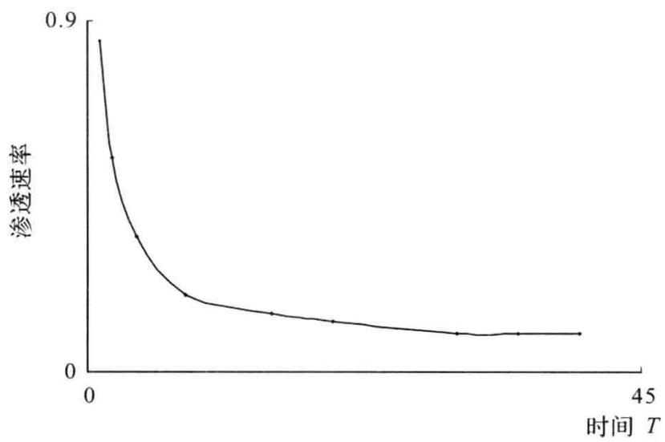  
图3-1 土壤入渗过程线

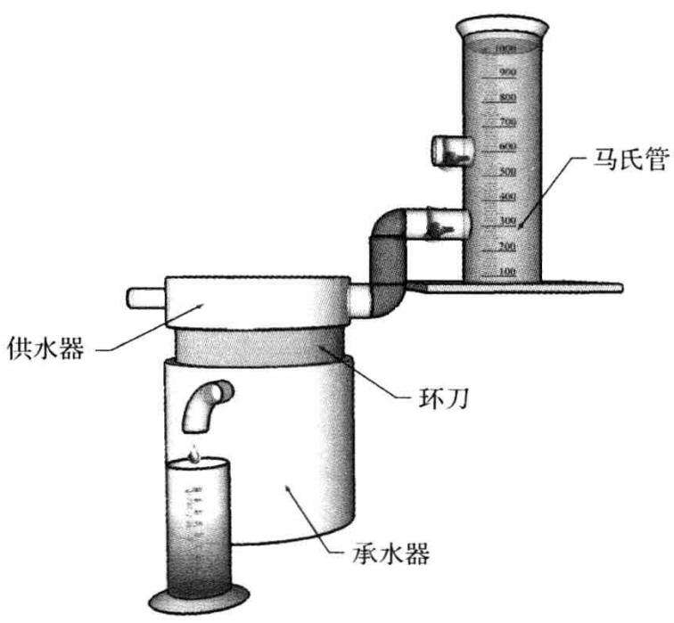  
图3-2定水头法测定土壤渗透示意图

(3)将灌满水的马氏瓶用软管与承水器上的进水口连接。然后打开马氏瓶上的阀门，向供水器中持续注水，多余的水从供水器的出水口溢出，以保证测定过程中水头稳定。

(4)将量筒放在承水器溢流出水口的下方，测定从环刀内渗出的水量。当从承水器出水口出现溢流时开始计时，测定一定时间内的溢流量。

(5)当连续3次在相同时间间隔(1\~5min)内用量筒测定的从承水器出水口流出的溢流量相等时，测定结束。

(6)稳渗速率的计算：

设环刀面积为S,稳渗时的溢流量为V,时间间隔为T,则稳渗速率f为：

$$
\boldsymbol { f } = \boldsymbol { V } / \left( \boldsymbol { S } \times \boldsymbol { T } \right)
$$

室内定水头法测定入渗的记录格式见表3-5。

土层  
调查人：  
表3-5 室内定水头法测定入渗记录表
<table><tr><td rowspan=1 colspan=1>样地名称</td><td rowspan=1 colspan=1></td><td rowspan=1 colspan=1>地点：</td><td rowspan=1 colspan=1></td><td rowspan=1 colspan=1>海拔</td><td rowspan=1 colspan=1></td><td rowspan=1 colspan=1>地理坐标</td><td rowspan=1 colspan=1></td></tr><tr><td rowspan=1 colspan=1>样地面积</td><td rowspan=1 colspan=1></td><td rowspan=1 colspan=1>坡向</td><td rowspan=1 colspan=1></td><td rowspan=1 colspan=1>坡位</td><td rowspan=1 colspan=1></td><td rowspan=1 colspan=1>坡度</td><td rowspan=1 colspan=1></td></tr><tr><td rowspan=1 colspan=1>土壤类型</td><td rowspan=1 colspan=1></td><td rowspan=1 colspan=1>土壤厚度</td><td rowspan=1 colspan=1></td><td rowspan=1 colspan=1>母质</td><td rowspan=1 colspan=1></td><td rowspan=1 colspan=1>基岩</td><td rowspan=1 colspan=1></td></tr><tr><td rowspan=1 colspan=1>植被类型</td><td rowspan=1 colspan=1></td><td rowspan=1 colspan=1>群落名称</td><td rowspan=1 colspan=1></td><td rowspan=1 colspan=1>郁闭度</td><td rowspan=1 colspan=1></td><td rowspan=1 colspan=1>密度</td><td rowspan=1 colspan=1></td></tr></table>

<table><tr><td rowspan=1 colspan=6>0~10cm</td><td rowspan=1 colspan=6>10~20cm</td><td rowspan=1 colspan=6>20~30cm</td></tr><tr><td rowspan=1 colspan=2>环刀1</td><td rowspan=1 colspan=2>环刀2</td><td rowspan=1 colspan=2>环刀3</td><td rowspan=1 colspan=2>环刀1</td><td rowspan=1 colspan=2>环刀2</td><td rowspan=1 colspan=2>环刀3</td><td rowspan=1 colspan=2>环刀1</td><td rowspan=1 colspan=2>环刀2</td><td rowspan=1 colspan=2>环刀3</td></tr><tr><td rowspan=1 colspan=1>时间</td><td rowspan=1 colspan=1>渗透量时</td><td rowspan=1 colspan=1>间</td><td rowspan=1 colspan=1>渗透量</td><td rowspan=1 colspan=1>时间</td><td rowspan=1 colspan=1>渗透量</td><td rowspan=1 colspan=1>时间</td><td rowspan=1 colspan=1>渗透量</td><td rowspan=1 colspan=1>时间</td><td rowspan=1 colspan=1>渗透量</td><td rowspan=1 colspan=1>时间</td><td rowspan=1 colspan=1>渗透量时</td><td rowspan=1 colspan=1>间渗</td><td rowspan=1 colspan=1>透量时</td><td rowspan=1 colspan=1>间渗</td><td rowspan=1 colspan=1>透量时</td><td rowspan=1 colspan=1>间渗</td><td rowspan=1 colspan=1>透量</td></tr><tr><td rowspan=1 colspan=1></td><td rowspan=1 colspan=1></td><td rowspan=1 colspan=1></td><td rowspan=1 colspan=1></td><td rowspan=1 colspan=1></td><td rowspan=1 colspan=1></td><td rowspan=1 colspan=1></td><td rowspan=1 colspan=1></td><td rowspan=1 colspan=1></td><td rowspan=1 colspan=1></td><td rowspan=1 colspan=1></td><td rowspan=1 colspan=1></td><td rowspan=1 colspan=1></td><td rowspan=1 colspan=1></td><td rowspan=1 colspan=1></td><td rowspan=1 colspan=1></td><td rowspan=1 colspan=1></td><td rowspan=1 colspan=1></td></tr><tr><td rowspan=1 colspan=1></td><td rowspan=1 colspan=1></td><td rowspan=1 colspan=1></td><td rowspan=1 colspan=1></td><td rowspan=1 colspan=1></td><td rowspan=1 colspan=1></td><td rowspan=1 colspan=1></td><td rowspan=1 colspan=1></td><td rowspan=1 colspan=1></td><td rowspan=1 colspan=1></td><td rowspan=1 colspan=1></td><td rowspan=1 colspan=1></td><td rowspan=1 colspan=1></td><td rowspan=1 colspan=1></td><td rowspan=1 colspan=1></td><td rowspan=1 colspan=1></td><td rowspan=1 colspan=1></td><td rowspan=1 colspan=1></td></tr><tr><td rowspan=1 colspan=1></td><td rowspan=1 colspan=1></td><td rowspan=1 colspan=1></td><td rowspan=1 colspan=1></td><td rowspan=1 colspan=1></td><td rowspan=1 colspan=1></td><td rowspan=1 colspan=1></td><td rowspan=1 colspan=1></td><td rowspan=1 colspan=1></td><td rowspan=1 colspan=1></td><td rowspan=1 colspan=1></td><td rowspan=1 colspan=1></td><td rowspan=1 colspan=1></td><td rowspan=1 colspan=1></td><td rowspan=1 colspan=1></td><td rowspan=1 colspan=1></td><td rowspan=1 colspan=1></td><td rowspan=1 colspan=1></td></tr><tr><td rowspan=1 colspan=1></td><td rowspan=1 colspan=1></td><td rowspan=1 colspan=1></td><td rowspan=1 colspan=1></td><td rowspan=1 colspan=1></td><td rowspan=1 colspan=1></td><td rowspan=1 colspan=1></td><td rowspan=1 colspan=1></td><td rowspan=1 colspan=1></td><td rowspan=1 colspan=1></td><td rowspan=1 colspan=1></td><td rowspan=1 colspan=1></td><td rowspan=1 colspan=1></td><td rowspan=1 colspan=1></td><td rowspan=1 colspan=1></td><td rowspan=1 colspan=1></td><td rowspan=1 colspan=1></td><td rowspan=1 colspan=1></td></tr><tr><td rowspan=1 colspan=1></td><td rowspan=1 colspan=1></td><td rowspan=1 colspan=1></td><td rowspan=1 colspan=1></td><td rowspan=1 colspan=1></td><td rowspan=1 colspan=1></td><td rowspan=1 colspan=1></td><td rowspan=1 colspan=1></td><td rowspan=1 colspan=1></td><td rowspan=1 colspan=1></td><td rowspan=1 colspan=1></td><td rowspan=1 colspan=1></td><td rowspan=1 colspan=1></td><td rowspan=1 colspan=1></td><td rowspan=1 colspan=1></td><td rowspan=1 colspan=1></td><td rowspan=1 colspan=1></td><td rowspan=1 colspan=1></td></tr><tr><td rowspan=1 colspan=1></td><td rowspan=1 colspan=1></td><td rowspan=1 colspan=1></td><td rowspan=1 colspan=1></td><td rowspan=1 colspan=1></td><td rowspan=1 colspan=1></td><td rowspan=1 colspan=1></td><td rowspan=1 colspan=1></td><td rowspan=1 colspan=1></td><td rowspan=1 colspan=1></td><td rowspan=1 colspan=1></td><td rowspan=1 colspan=1></td><td rowspan=1 colspan=1></td><td rowspan=1 colspan=1></td><td rowspan=1 colspan=1></td><td rowspan=1 colspan=1></td><td rowspan=1 colspan=1></td><td rowspan=1 colspan=1></td></tr><tr><td rowspan=1 colspan=1></td><td rowspan=1 colspan=1></td><td rowspan=1 colspan=1></td><td rowspan=1 colspan=1></td><td rowspan=1 colspan=1></td><td rowspan=1 colspan=1></td><td rowspan=1 colspan=1></td><td rowspan=1 colspan=1></td><td rowspan=1 colspan=1></td><td rowspan=1 colspan=1></td><td rowspan=1 colspan=1></td><td rowspan=1 colspan=1></td><td rowspan=1 colspan=1></td><td rowspan=1 colspan=1></td><td rowspan=1 colspan=1></td><td rowspan=1 colspan=1></td><td rowspan=1 colspan=1></td><td rowspan=1 colspan=1></td></tr><tr><td rowspan=1 colspan=1></td><td rowspan=1 colspan=1></td><td rowspan=1 colspan=1></td><td rowspan=1 colspan=1></td><td rowspan=1 colspan=1></td><td rowspan=1 colspan=1></td><td rowspan=1 colspan=1></td><td rowspan=1 colspan=1></td><td rowspan=1 colspan=1></td><td rowspan=1 colspan=1></td><td rowspan=1 colspan=1></td><td rowspan=1 colspan=1></td><td rowspan=1 colspan=1></td><td rowspan=1 colspan=1></td><td rowspan=1 colspan=1></td><td rowspan=1 colspan=1></td><td rowspan=1 colspan=1></td><td rowspan=1 colspan=1></td></tr><tr><td rowspan=1 colspan=1></td><td rowspan=1 colspan=1></td><td rowspan=1 colspan=1></td><td rowspan=1 colspan=1></td><td rowspan=1 colspan=1></td><td rowspan=1 colspan=1></td><td rowspan=1 colspan=1></td><td rowspan=1 colspan=1></td><td rowspan=1 colspan=1></td><td rowspan=1 colspan=1></td><td rowspan=1 colspan=1></td><td rowspan=1 colspan=1></td><td rowspan=1 colspan=1></td><td rowspan=1 colspan=1></td><td rowspan=1 colspan=1></td><td rowspan=1 colspan=1></td><td rowspan=1 colspan=1></td><td rowspan=1 colspan=1></td></tr><tr><td rowspan=1 colspan=1></td><td rowspan=1 colspan=1></td><td rowspan=1 colspan=1></td><td rowspan=1 colspan=1></td><td rowspan=1 colspan=1></td><td rowspan=1 colspan=1></td><td rowspan=1 colspan=1></td><td rowspan=1 colspan=1></td><td rowspan=1 colspan=1></td><td rowspan=1 colspan=1></td><td rowspan=1 colspan=1></td><td rowspan=1 colspan=1></td><td rowspan=1 colspan=1></td><td rowspan=1 colspan=1></td><td rowspan=1 colspan=1></td><td rowspan=1 colspan=1></td><td rowspan=1 colspan=1></td><td rowspan=1 colspan=1></td></tr><tr><td rowspan=1 colspan=1>稳渗速率</td><td rowspan=1 colspan=1></td><td rowspan=1 colspan=1>稳渗速率</td><td rowspan=1 colspan=1></td><td rowspan=1 colspan=1>稳渗速率</td><td rowspan=1 colspan=1></td><td rowspan=1 colspan=1>稳渗速率</td><td rowspan=1 colspan=1></td><td rowspan=1 colspan=1>稳渗速率</td><td rowspan=1 colspan=1></td><td rowspan=1 colspan=1>稳渗速率</td><td rowspan=1 colspan=1></td><td rowspan=1 colspan=1>稳渗速率</td><td rowspan=1 colspan=1></td><td rowspan=1 colspan=1>稳渗速率</td><td rowspan=1 colspan=1></td><td rowspan=1 colspan=1>稳渗速率</td><td rowspan=1 colspan=1></td></tr><tr><td rowspan=1 colspan=4>平均稳渗速率</td><td rowspan=1 colspan=2></td><td rowspan=1 colspan=4>平均稳渗速率</td><td rowspan=1 colspan=2></td><td rowspan=1 colspan=4>平均稳渗速率</td><td rowspan=1 colspan=2></td></tr></table>

## 3.5 土壤含水量的测定

土壤含水量是表示土壤干湿状况的指标。土壤含水量的多少不但影响植物生长的好坏，还通过影响水分的入渗，进而影响到坡面径流的形成以及土壤侵蚀量的多寡，因此，土壤含水量是水土保持监测中必须准确把握的指标。

土壤含水量有重量含水量和体积含水量之分。重量含水量是指土壤中水分的重量占土壤重量的百分比。体积含水量是土壤中水分的体积占土壤体积的百分比。重量含水量与体积含水量之间有如下关系：

$$
1 + + \frac { 1 } { 2 } \times \frac { 1 } { 3 } = 1 + \frac { 1 } { 2 } = 1 \times \frac { 1 } { 3 } \times \frac { 1 } { 2 } \times \pm \frac { 1 } { 3 } \times \frac { 1 } { 2 }
$$

土壤含水量的测定方法有烘干法、中子仪法、时域反射仪法(TDR法)、频域反射仪法(FDR法)等。

## 3.5.1 烘干法

烘干法是测定土壤重量含水量最经典、最精确的方法，其他各种测量土壤含水量的方法均要用烘干法进行标定。烘干法的优点在于测定结果准确可靠，但取样时会破坏土壤，且深层取样困难，无法实现对同一地点的长期定位观测。另外由于土壤的空间变异性较大，测定时必须多点采样以提高观测精度，这必将增加工作量。在室内还需要对样品进行称重、烘干等工作，耗时费力，也很容易因为遗洒而导致测定失败。

用烘干法测定土壤含水量时，需要事先选定测定用标准地，在标准地内选择3个以上的取样点，每个取样点要能够代表观测地的基本情况。在每个取样点上用土钻钻取不同深度的土样，装入铝盒(铝盒中土样不少于$3 0 \mathrm { g } )$ ，并记录取样深度和铝盒编号，在每个层次上至少取三个重复样品。取样后必须将钻孔用土填埋，以防止深层土壤水分通过钻孔蒸发，以及降雨时雨水和径流直接流入钻孔中，从而影响深层的土壤含水量。下一次取样时必须避开以前的钻孔。

将装有土样的铝盒带回室内后用感量为0.01g的电子天平称重 $( W _ { 1 } )$ 将称重后的装有土样的铝盒打开盒盖后连同盒盖一起放入 $1 0 5 \mathrm { { 9 C } }$ 的烘箱内烘干至恒重(12h以上），待烘箱内温度降低到室温时打开烘箱，盖好铝盒盖后称烘干后的重量 $\left( \begin{array} { l } { W _ { 2 } } \end{array} \right)$ 。如果铝盒的重量为 $( \ W _ { 0 } )$ ，则土壤的重量含水量可用下式计算：

$$
\sharp \sharp \widehat { \sharp } \wedge \sharp = ( W _ { 1 } - W _ { 2 } ) / ( W _ { 2 } - W _ { 0 } ) \times 1 0 0 \%
$$

在室内称重和烘干过程中，一定要防止铝盒中的土样洒出，尤其是将铝盒放入烘箱和从烘箱中拿出时，很容易发生遗撒现象，一旦发生遗撒，撒出的土样很可能进入其他铝盒，从而导致测定失败。如果在测定过程中发生遗撒，要确定遗撒出的土壤样品是否进入了其他铝盒，一旦有土壤样品进入其他铝盒，则应该重新取样。

烘干法测定土壤水分的调查记录格式见表3-6。

## 3.5.2 中子仪法

从20世纪50年代开始中子仪用于测定土壤含水量，此后逐渐成为土壤含水量测定的主要方法之一。该方法测定前需要在待测土壤中埋设测定用套管，套管长度可根据测定需要而定，套管安装完成后可对不同深度的土壤含水量进行长期定位连续观测。中子仪还可与自动记录系统和计算机连接，成为田间原位测定土壤含水量较好的方法，曾得到广泛应用。

中子仪测定土壤水分的基本原理是：中子仪探头中的中子源辐射出快中子，快中子在碰到氢原子时慢化为热中子，中子仪捕捉返回的热中子数量，并保存在记录器中。热中子的数量与土壤含水量之间成正相关，利用热中子数与土壤含水量的关系计算出土壤含水量。

由于中子仪发射的中子分布在以发射源为中心的球体内，捕捉到的热中子也是这一球体内的，因此中子仪测定出的含水量为体积含水量。正因如此在使用中子仪测定表层含水量时会有大量中子透过土层进入空气，这会对测量人员造成辐射危害，同时表层土壤含水量的测定结果会出现严重偏差。因此使用中子仪测定土壤含水量之前需要标定出热中子数与土壤含水量之间的关系曲线，即必须针对表层和其他的不同土层分别标定出热中子数与土壤含水量的关系，同时在测定表层土壤含水量时必须采取防护措施，以防止中子外泄。另外，套管中经常会结露，过多的结露汇集在套管底部不但会对仪器造成损害，还可造成较大的测量误差。因此，每次测量时必须先用干布擦拭套管，防止结露对仪器的损害，提高观测精度。

调查日期：

表3-6 土壤水分调查表

调查人：

<table><tr><td rowspan=1 colspan=1>样地名称</td><td rowspan=1 colspan=3></td><td rowspan=1 colspan=3>地点</td><td></td><td rowspan=1 colspan=4></td><td rowspan=1 colspan=4>海拔</td><td rowspan=1 colspan=5></td><td rowspan=1 colspan=3>地理坐标</td><td rowspan=1 colspan=2></td></tr><tr><td rowspan=1 colspan=1>样地面积</td><td rowspan=1 colspan=3></td><td rowspan=1 colspan=3>坡向</td><td></td><td rowspan=1 colspan=4></td><td rowspan=1 colspan=4>坡位</td><td rowspan=1 colspan=5></td><td rowspan=1 colspan=3>坡度</td><td rowspan=1 colspan=2></td></tr><tr><td rowspan=1 colspan=1>土壤类型</td><td rowspan=1 colspan=3></td><td rowspan=1 colspan=3>土壤厚度</td><td></td><td rowspan=1 colspan=4></td><td rowspan=1 colspan=4>母质</td><td rowspan=1 colspan=5></td><td rowspan=1 colspan=3>基岩</td><td rowspan=1 colspan=2></td></tr><tr><td rowspan=1 colspan=1>植被类型</td><td rowspan=1 colspan=3></td><td rowspan=1 colspan=3>群落名称</td><td></td><td rowspan=1 colspan=4></td><td rowspan=1 colspan=4>郁闭度</td><td rowspan=1 colspan=5></td><td rowspan=1 colspan=3>密度</td><td rowspan=1 colspan=2></td></tr><tr><td rowspan=2 colspan=1>土层深度(cm)</td><td rowspan=1 colspan=9>测点1</td><td rowspan=1 colspan=10>测点2</td><td rowspan=1 colspan=6>测点3</td></tr><tr><td rowspan=1 colspan=1></td><td rowspan=1 colspan=1>盒重</td><td rowspan=1 colspan=2>海量</td><td rowspan=1 colspan=1>于重</td><td rowspan=1 colspan=1>含水量</td><td rowspan=1 colspan=3>平均</td><td rowspan=1 colspan=1>盒号</td><td rowspan=1 colspan=2>盒重</td><td rowspan=1 colspan=1>湿重</td><td rowspan=1 colspan=1>干重</td><td rowspan=1 colspan=2>含水量</td><td rowspan=1 colspan=3>平均</td><td rowspan=1 colspan=1>盒号</td><td rowspan=1 colspan=1>盒量</td><td rowspan=1 colspan=1>渠量</td><td rowspan=1 colspan=2>干重</td><td rowspan=1 colspan=1>平均</td></tr><tr><td rowspan=4 colspan=1>0~10</td><td rowspan=1 colspan=1></td><td rowspan=1 colspan=1></td><td rowspan=1 colspan=2></td><td rowspan=1 colspan=1></td><td rowspan=1 colspan=1></td><td rowspan=1 colspan=3></td><td rowspan=1 colspan=1></td><td rowspan=1 colspan=2></td><td rowspan=1 colspan=1></td><td rowspan=1 colspan=1></td><td rowspan=1 colspan=2></td><td rowspan=1 colspan=3></td><td rowspan=1 colspan=1></td><td rowspan=1 colspan=1></td><td rowspan=1 colspan=1></td><td rowspan=1 colspan=2></td><td rowspan=1 colspan=1></td></tr><tr><td rowspan=2 colspan=1></td><td rowspan=2 colspan=1></td><td rowspan=2 colspan=2></td><td rowspan=2 colspan=1></td><td rowspan=2 colspan=1></td><td rowspan=2 colspan=2></td><td rowspan=1 colspan=2></td><td rowspan=2 colspan=1></td><td rowspan=2 colspan=2></td><td rowspan=2 colspan=1></td><td rowspan=2 colspan=1></td><td rowspan=2 colspan=2></td><td rowspan=2 colspan=3></td><td rowspan=2 colspan=1></td><td rowspan=1 colspan=1></td><td rowspan=2 colspan=1></td><td rowspan=2 colspan=2></td><td rowspan=2 colspan=1></td></tr><tr><td rowspan=1 colspan=2></td><td rowspan=1 colspan=2></td><td></td></tr><tr><td rowspan=1 colspan=1></td><td rowspan=1 colspan=1></td><td rowspan=1 colspan=2></td><td rowspan=1 colspan=1></td><td rowspan=1 colspan=1></td><td rowspan=1 colspan=3></td><td rowspan=1 colspan=1></td><td rowspan=1 colspan=2></td><td rowspan=1 colspan=1></td><td rowspan=1 colspan=1></td><td rowspan=1 colspan=2></td><td rowspan=1 colspan=3></td><td rowspan=1 colspan=1></td><td rowspan=1 colspan=1></td><td rowspan=1 colspan=1></td><td rowspan=1 colspan=2></td><td rowspan=1 colspan=1></td></tr><tr><td rowspan=3 colspan=1>10~20</td><td rowspan=1 colspan=1></td><td rowspan=1 colspan=1></td><td rowspan=1 colspan=2></td><td rowspan=1 colspan=1></td><td rowspan=1 colspan=1></td><td rowspan=1 colspan=3></td><td rowspan=1 colspan=1></td><td rowspan=1 colspan=2></td><td rowspan=1 colspan=1></td><td rowspan=1 colspan=1></td><td rowspan=1 colspan=2></td><td rowspan=1 colspan=3></td><td rowspan=1 colspan=1></td><td rowspan=1 colspan=1></td><td rowspan=1 colspan=1></td><td rowspan=1 colspan=2></td><td rowspan=1 colspan=1></td></tr><tr><td rowspan=1 colspan=1></td><td rowspan=1 colspan=1></td><td rowspan=1 colspan=2></td><td rowspan=1 colspan=1></td><td rowspan=1 colspan=1></td><td rowspan=1 colspan=3></td><td rowspan=1 colspan=1></td><td rowspan=1 colspan=2></td><td rowspan=1 colspan=1></td><td rowspan=1 colspan=1></td><td rowspan=1 colspan=2></td><td rowspan=1 colspan=3></td><td rowspan=1 colspan=1></td><td rowspan=1 colspan=1></td><td rowspan=1 colspan=1></td><td rowspan=1 colspan=2></td><td rowspan=1 colspan=1></td></tr><tr><td rowspan=1 colspan=1></td><td rowspan=1 colspan=1></td><td rowspan=1 colspan=2></td><td rowspan=1 colspan=1></td><td rowspan=1 colspan=1></td><td rowspan=1 colspan=3></td><td rowspan=1 colspan=1></td><td rowspan=1 colspan=2></td><td rowspan=1 colspan=1></td><td rowspan=1 colspan=1></td><td rowspan=1 colspan=2></td><td rowspan=1 colspan=3></td><td rowspan=1 colspan=1></td><td rowspan=1 colspan=1></td><td rowspan=1 colspan=1></td><td rowspan=1 colspan=2></td><td rowspan=1 colspan=1></td></tr><tr><td rowspan=3 colspan=1>20~30</td><td rowspan=1 colspan=1></td><td rowspan=1 colspan=1></td><td rowspan=1 colspan=2></td><td rowspan=1 colspan=1></td><td rowspan=1 colspan=1></td><td rowspan=1 colspan=3></td><td rowspan=1 colspan=1></td><td rowspan=1 colspan=2></td><td rowspan=1 colspan=1></td><td rowspan=1 colspan=1></td><td rowspan=1 colspan=2></td><td rowspan=1 colspan=3></td><td rowspan=1 colspan=1></td><td rowspan=1 colspan=1></td><td rowspan=1 colspan=1></td><td rowspan=1 colspan=2></td><td rowspan=1 colspan=1></td></tr><tr><td rowspan=1 colspan=1></td><td rowspan=1 colspan=1></td><td rowspan=1 colspan=2></td><td rowspan=1 colspan=1></td><td rowspan=1 colspan=1></td><td rowspan=1 colspan=3></td><td rowspan=1 colspan=1></td><td rowspan=1 colspan=2></td><td rowspan=1 colspan=1></td><td rowspan=1 colspan=1></td><td rowspan=1 colspan=2></td><td rowspan=1 colspan=3></td><td rowspan=1 colspan=1></td><td rowspan=1 colspan=1></td><td rowspan=1 colspan=1></td><td rowspan=1 colspan=2></td><td rowspan=1 colspan=1></td></tr><tr><td rowspan=1 colspan=1></td><td rowspan=1 colspan=1></td><td rowspan=1 colspan=2></td><td rowspan=1 colspan=1></td><td rowspan=1 colspan=1></td><td rowspan=1 colspan=3></td><td rowspan=1 colspan=1></td><td rowspan=1 colspan=2></td><td rowspan=1 colspan=1></td><td rowspan=1 colspan=1></td><td rowspan=1 colspan=2></td><td rowspan=1 colspan=3></td><td rowspan=1 colspan=1></td><td rowspan=1 colspan=1></td><td rowspan=1 colspan=1></td><td rowspan=1 colspan=2></td><td rowspan=1 colspan=1></td></tr><tr><td rowspan=3 colspan=1>30~40</td><td rowspan=1 colspan=1></td><td rowspan=1 colspan=1></td><td rowspan=1 colspan=2></td><td rowspan=1 colspan=1></td><td rowspan=1 colspan=1></td><td rowspan=1 colspan=3></td><td rowspan=1 colspan=1></td><td rowspan=1 colspan=2></td><td rowspan=1 colspan=1></td><td rowspan=1 colspan=1></td><td rowspan=1 colspan=2></td><td rowspan=1 colspan=3></td><td rowspan=1 colspan=1></td><td rowspan=1 colspan=1></td><td rowspan=1 colspan=1></td><td rowspan=1 colspan=2></td><td rowspan=1 colspan=1></td></tr><tr><td rowspan=1 colspan=1></td><td rowspan=1 colspan=1></td><td rowspan=1 colspan=2></td><td rowspan=1 colspan=1></td><td rowspan=1 colspan=1></td><td rowspan=1 colspan=3></td><td rowspan=1 colspan=1></td><td rowspan=1 colspan=2></td><td rowspan=1 colspan=1></td><td rowspan=1 colspan=1></td><td rowspan=1 colspan=2></td><td rowspan=1 colspan=3></td><td rowspan=1 colspan=1></td><td rowspan=1 colspan=1></td><td rowspan=1 colspan=1></td><td rowspan=1 colspan=2></td><td rowspan=2 colspan=1></td></tr><tr><td rowspan=1 colspan=1></td><td rowspan=1 colspan=1></td><td rowspan=1 colspan=2></td><td rowspan=1 colspan=1></td><td rowspan=1 colspan=1></td><td rowspan=1 colspan=3></td><td rowspan=1 colspan=1></td><td rowspan=1 colspan=2></td><td rowspan=1 colspan=1></td><td rowspan=1 colspan=1></td><td rowspan=1 colspan=2></td><td rowspan=1 colspan=3></td><td rowspan=1 colspan=1></td><td rowspan=1 colspan=1></td><td rowspan=1 colspan=1></td><td rowspan=1 colspan=2></td><td rowspan=1 colspan=1></td></tr><tr><td rowspan=3 colspan=1>40~50</td><td rowspan=1 colspan=1></td><td rowspan=1 colspan=1></td><td rowspan=1 colspan=2></td><td rowspan=1 colspan=1></td><td rowspan=1 colspan=1></td><td rowspan=1 colspan=3></td><td rowspan=1 colspan=1></td><td rowspan=1 colspan=2></td><td rowspan=1 colspan=1></td><td rowspan=1 colspan=1></td><td rowspan=1 colspan=2></td><td rowspan=1 colspan=3></td><td rowspan=1 colspan=1></td><td rowspan=1 colspan=1></td><td rowspan=1 colspan=1></td><td rowspan=1 colspan=2></td><td rowspan=1 colspan=1></td></tr><tr><td rowspan=1 colspan=1></td><td rowspan=1 colspan=1></td><td rowspan=1 colspan=2></td><td rowspan=1 colspan=1></td><td rowspan=1 colspan=1></td><td rowspan=1 colspan=3></td><td rowspan=1 colspan=1></td><td rowspan=1 colspan=2></td><td rowspan=1 colspan=1></td><td rowspan=1 colspan=1></td><td rowspan=1 colspan=2></td><td rowspan=1 colspan=3></td><td rowspan=1 colspan=1></td><td rowspan=1 colspan=1></td><td rowspan=1 colspan=1></td><td rowspan=1 colspan=2></td><td rowspan=1 colspan=1></td></tr><tr><td rowspan=1 colspan=1></td><td rowspan=1 colspan=1></td><td rowspan=1 colspan=2></td><td rowspan=1 colspan=1></td><td rowspan=1 colspan=1></td><td rowspan=1 colspan=3></td><td rowspan=1 colspan=1></td><td rowspan=1 colspan=2></td><td rowspan=1 colspan=1></td><td rowspan=1 colspan=1></td><td rowspan=1 colspan=2></td><td rowspan=1 colspan=3></td><td rowspan=1 colspan=1></td><td rowspan=1 colspan=1></td><td rowspan=1 colspan=1></td><td rowspan=1 colspan=2></td><td rowspan=1 colspan=1></td></tr><tr><td rowspan=4 colspan=1>50~60cm</td><td rowspan=1 colspan=1></td><td rowspan=1 colspan=1></td><td rowspan=1 colspan=2></td><td rowspan=1 colspan=1></td><td rowspan=1 colspan=1></td><td rowspan=1 colspan=3></td><td rowspan=1 colspan=1></td><td rowspan=1 colspan=2></td><td rowspan=1 colspan=1></td><td rowspan=1 colspan=1></td><td rowspan=1 colspan=2></td><td rowspan=1 colspan=3></td><td rowspan=1 colspan=1></td><td rowspan=1 colspan=1></td><td rowspan=1 colspan=1></td><td rowspan=1 colspan=2></td><td rowspan=1 colspan=1></td></tr><tr><td rowspan=2 colspan=1></td><td rowspan=2 colspan=1></td><td rowspan=2 colspan=2></td><td rowspan=2 colspan=1></td><td rowspan=2 colspan=1></td><td rowspan=2 colspan=2></td><td rowspan=1 colspan=2></td><td rowspan=2 colspan=1></td><td rowspan=2 colspan=2></td><td rowspan=2 colspan=1></td><td rowspan=2 colspan=1></td><td rowspan=2 colspan=2></td><td rowspan=2 colspan=3></td><td rowspan=2 colspan=1></td><td rowspan=2 colspan=1></td><td rowspan=2 colspan=1></td><td rowspan=2 colspan=2></td><td rowspan=2 colspan=1></td></tr><tr><td rowspan=1 colspan=2></td></tr><tr><td rowspan=1 colspan=1></td><td rowspan=1 colspan=1></td><td rowspan=1 colspan=2></td><td rowspan=1 colspan=1></td><td rowspan=1 colspan=1></td><td rowspan=1 colspan=3></td><td rowspan=1 colspan=1></td><td rowspan=1 colspan=2></td><td rowspan=1 colspan=1></td><td rowspan=1 colspan=1></td><td rowspan=1 colspan=2></td><td rowspan=1 colspan=3></td><td rowspan=1 colspan=1></td><td rowspan=1 colspan=1></td><td rowspan=1 colspan=1></td><td rowspan=1 colspan=2></td><td rowspan=1 colspan=1></td></tr><tr><td rowspan=4 colspan=1>60~70</td><td rowspan=1 colspan=1></td><td rowspan=1 colspan=1></td><td rowspan=1 colspan=2></td><td rowspan=1 colspan=1></td><td rowspan=1 colspan=1></td><td rowspan=1 colspan=3></td><td rowspan=1 colspan=1></td><td rowspan=1 colspan=2></td><td rowspan=1 colspan=1></td><td rowspan=1 colspan=1></td><td rowspan=1 colspan=2></td><td rowspan=1 colspan=3></td><td rowspan=1 colspan=1></td><td rowspan=1 colspan=1></td><td rowspan=1 colspan=1></td><td rowspan=1 colspan=2></td><td rowspan=1 colspan=1></td></tr><tr><td rowspan=2 colspan=1></td><td rowspan=2 colspan=1></td><td rowspan=2 colspan=2></td><td rowspan=2 colspan=1></td><td rowspan=2 colspan=1></td><td rowspan=2 colspan=2></td><td rowspan=1 colspan=2></td><td rowspan=2 colspan=1></td><td rowspan=2 colspan=2></td><td rowspan=2 colspan=1></td><td rowspan=2 colspan=1></td><td rowspan=2 colspan=2></td><td rowspan=2 colspan=3></td><td rowspan=2 colspan=1></td><td rowspan=2 colspan=1></td><td rowspan=2 colspan=1></td><td rowspan=2 colspan=2></td><td rowspan=2 colspan=1></td></tr><tr><td rowspan=1 colspan=2></td></tr><tr><td rowspan=1 colspan=1></td><td rowspan=1 colspan=1></td><td rowspan=1 colspan=2></td><td rowspan=1 colspan=1></td><td rowspan=1 colspan=1></td><td rowspan=1 colspan=3></td><td rowspan=1 colspan=1></td><td rowspan=1 colspan=2></td><td rowspan=1 colspan=1></td><td rowspan=1 colspan=1></td><td rowspan=1 colspan=2></td><td rowspan=1 colspan=3></td><td rowspan=1 colspan=1></td><td rowspan=1 colspan=1></td><td rowspan=1 colspan=1></td><td rowspan=1 colspan=2></td><td rowspan=1 colspan=1></td></tr></table>

中子仪测定土壤水分记录格式见表3-7。

表3-7 中子仪测定土壤水分记录表

调查日期：

调查人：

<table><tr><td rowspan=1 colspan=1>样地名称</td><td rowspan=1 colspan=2></td><td rowspan=1 colspan=2>地点</td><td></td><td rowspan=1 colspan=3></td><td rowspan=1 colspan=3>海拔</td><td rowspan=1 colspan=3></td><td rowspan=1 colspan=2>地理坐标</td><td rowspan=1 colspan=2></td></tr><tr><td rowspan=1 colspan=1>样地面积</td><td rowspan=1 colspan=2></td><td rowspan=1 colspan=2>坡向</td><td></td><td rowspan=1 colspan=3></td><td rowspan=1 colspan=3>坡位</td><td rowspan=1 colspan=3></td><td rowspan=1 colspan=2>坡度</td><td rowspan=1 colspan=2></td></tr><tr><td rowspan=1 colspan=1>土壤类型</td><td rowspan=1 colspan=2></td><td rowspan=1 colspan=2>土壤厚度</td><td></td><td rowspan=1 colspan=3></td><td rowspan=1 colspan=3>母质</td><td rowspan=1 colspan=3></td><td rowspan=1 colspan=2>基岩</td><td rowspan=1 colspan=2></td></tr><tr><td rowspan=1 colspan=1>植被类型</td><td rowspan=1 colspan=2></td><td rowspan=1 colspan=2>群落名称</td><td></td><td rowspan=1 colspan=3></td><td rowspan=1 colspan=3>郁闭度</td><td rowspan=1 colspan=3></td><td rowspan=1 colspan=2>密度</td><td rowspan=1 colspan=2></td></tr><tr><td rowspan=2 colspan=1>土层深度(cm)</td><td rowspan=1 colspan=6>测点1</td><td rowspan=1 colspan=7>测点2</td><td rowspan=1 colspan=5>测点3</td></tr><tr><td rowspan=1 colspan=1>读数1</td><td rowspan=1 colspan=1>读数2</td><td rowspan=1 colspan=1>读数3</td><td rowspan=1 colspan=1>平均</td><td rowspan=1 colspan=2>含水量</td><td rowspan=1 colspan=1>读数一</td><td rowspan=1 colspan=2>读数2</td><td rowspan=1 colspan=1>读数3</td><td rowspan=1 colspan=2>平均</td><td rowspan=1 colspan=1>含水量</td><td rowspan=1 colspan=1>读数一</td><td rowspan=1 colspan=1>读数2</td><td rowspan=1 colspan=1>读数3</td><td rowspan=1 colspan=1>平均</td><td rowspan=1 colspan=1>含水量</td></tr><tr><td rowspan=1 colspan=1>0~10</td><td rowspan=1 colspan=1></td><td rowspan=1 colspan=1></td><td rowspan=1 colspan=1></td><td rowspan=1 colspan=1></td><td rowspan=1 colspan=2></td><td rowspan=1 colspan=1></td><td rowspan=1 colspan=2></td><td rowspan=1 colspan=1></td><td rowspan=1 colspan=2></td><td rowspan=1 colspan=1></td><td rowspan=1 colspan=1></td><td rowspan=1 colspan=1></td><td rowspan=1 colspan=1></td><td rowspan=1 colspan=1></td><td rowspan=1 colspan=1></td></tr><tr><td rowspan=1 colspan=1>10~20</td><td rowspan=1 colspan=1></td><td rowspan=1 colspan=1></td><td rowspan=1 colspan=1></td><td rowspan=1 colspan=1></td><td rowspan=1 colspan=2></td><td rowspan=1 colspan=1></td><td rowspan=1 colspan=2></td><td rowspan=1 colspan=1></td><td rowspan=1 colspan=2></td><td rowspan=1 colspan=1></td><td rowspan=1 colspan=1></td><td rowspan=1 colspan=1></td><td rowspan=1 colspan=1></td><td rowspan=1 colspan=1></td><td rowspan=1 colspan=1></td></tr><tr><td rowspan=1 colspan=1>20~30</td><td rowspan=1 colspan=1></td><td rowspan=1 colspan=1></td><td rowspan=1 colspan=1></td><td rowspan=1 colspan=1></td><td rowspan=1 colspan=2></td><td rowspan=1 colspan=1></td><td rowspan=1 colspan=2></td><td rowspan=1 colspan=1></td><td rowspan=1 colspan=2></td><td rowspan=1 colspan=1></td><td rowspan=1 colspan=1></td><td rowspan=1 colspan=1></td><td rowspan=1 colspan=1></td><td rowspan=1 colspan=1></td><td rowspan=1 colspan=1></td></tr><tr><td rowspan=1 colspan=1>30~40</td><td rowspan=1 colspan=1></td><td rowspan=1 colspan=1></td><td rowspan=1 colspan=1></td><td rowspan=1 colspan=1></td><td rowspan=1 colspan=2></td><td rowspan=1 colspan=1></td><td rowspan=1 colspan=2></td><td rowspan=1 colspan=1></td><td rowspan=1 colspan=2></td><td rowspan=1 colspan=1></td><td rowspan=1 colspan=1></td><td rowspan=1 colspan=1></td><td rowspan=1 colspan=1></td><td rowspan=1 colspan=1></td><td rowspan=1 colspan=1></td></tr><tr><td rowspan=1 colspan=1>40~50</td><td rowspan=1 colspan=1></td><td rowspan=1 colspan=1></td><td rowspan=1 colspan=1></td><td rowspan=1 colspan=1></td><td rowspan=1 colspan=2></td><td rowspan=1 colspan=1></td><td rowspan=1 colspan=2></td><td rowspan=1 colspan=1></td><td rowspan=1 colspan=2></td><td rowspan=1 colspan=1></td><td rowspan=1 colspan=1></td><td rowspan=1 colspan=1></td><td rowspan=1 colspan=1></td><td rowspan=1 colspan=1></td><td rowspan=1 colspan=1></td></tr><tr><td rowspan=1 colspan=1>50~60</td><td rowspan=1 colspan=1></td><td rowspan=1 colspan=1></td><td rowspan=1 colspan=1></td><td rowspan=1 colspan=1></td><td rowspan=1 colspan=2></td><td rowspan=1 colspan=1></td><td rowspan=1 colspan=2></td><td rowspan=1 colspan=1></td><td rowspan=1 colspan=2></td><td rowspan=1 colspan=1></td><td rowspan=1 colspan=1></td><td rowspan=1 colspan=1></td><td rowspan=1 colspan=1></td><td rowspan=1 colspan=1></td><td rowspan=1 colspan=1></td></tr><tr><td rowspan=1 colspan=1>60~70</td><td rowspan=1 colspan=1></td><td rowspan=1 colspan=1></td><td rowspan=1 colspan=1></td><td rowspan=1 colspan=1></td><td rowspan=1 colspan=2></td><td rowspan=1 colspan=1></td><td rowspan=1 colspan=2></td><td rowspan=1 colspan=1></td><td rowspan=1 colspan=2></td><td rowspan=1 colspan=1></td><td rowspan=1 colspan=1></td><td rowspan=1 colspan=1></td><td rowspan=1 colspan=1></td><td rowspan=1 colspan=1></td><td rowspan=1 colspan=1></td></tr><tr><td rowspan=1 colspan=1>70~80</td><td rowspan=1 colspan=1></td><td rowspan=1 colspan=1></td><td rowspan=1 colspan=1></td><td rowspan=1 colspan=1></td><td rowspan=1 colspan=2></td><td rowspan=1 colspan=1></td><td rowspan=1 colspan=2></td><td rowspan=1 colspan=1></td><td rowspan=1 colspan=2></td><td rowspan=1 colspan=1></td><td rowspan=1 colspan=1></td><td rowspan=1 colspan=1></td><td rowspan=1 colspan=1></td><td rowspan=1 colspan=1></td><td rowspan=1 colspan=1></td></tr><tr><td rowspan=1 colspan=1>80~90</td><td rowspan=1 colspan=1></td><td rowspan=1 colspan=1></td><td rowspan=1 colspan=1></td><td rowspan=1 colspan=1></td><td rowspan=1 colspan=2></td><td rowspan=1 colspan=1></td><td rowspan=1 colspan=2></td><td rowspan=1 colspan=1></td><td rowspan=1 colspan=2></td><td rowspan=1 colspan=1></td><td rowspan=1 colspan=1></td><td rowspan=1 colspan=1></td><td rowspan=1 colspan=1></td><td rowspan=1 colspan=1></td><td rowspan=1 colspan=1></td></tr><tr><td rowspan=1 colspan=1>90~100</td><td rowspan=1 colspan=1></td><td rowspan=1 colspan=1></td><td rowspan=1 colspan=1></td><td rowspan=1 colspan=1></td><td rowspan=1 colspan=2></td><td rowspan=1 colspan=1></td><td rowspan=1 colspan=2></td><td rowspan=1 colspan=1></td><td rowspan=1 colspan=2></td><td rowspan=1 colspan=1></td><td rowspan=1 colspan=1></td><td rowspan=1 colspan=1></td><td rowspan=1 colspan=1></td><td rowspan=1 colspan=1></td><td rowspan=1 colspan=1></td></tr></table>

注：表层体积含水量与热中子读数的关系为：  
其他层次体积含水量与热中子读数的关系为：

## 3.5.3 时域反射仪法(TDR 法)

时域反射仪法(TDR法)是通过测定土壤的介电常数，推算出土壤的体积含水量，属于介电测量法。土壤介电常数与体积含水量呈非线性单值函数关系，介电测量法是利用土壤水对土壤介电特性实部和虚部的影响，通过测定土壤介电常数间接确定土壤体积含水量。时域反射仪法(TDR法)是20世纪60年代末兴起的土壤含水量测定方法，是通过测定电磁波沿波导棒传播时间，确定土壤的体积含水量。在大部分土壤中电磁波沿波导棒的传播时间与土壤含水量成比例。

在测定精度要求较低时TDR一般不需标定，但当测量误差要求很小时，TDR也需要进行标定或校正。TDR测量范围广，既可以做成轻巧的便携式仪器，在野外进行表层土壤含水量的测量；也可以事先安装测定管，利用移动式TDR探头和数据采集器对不同深度的土壤含水量进行测定；还可以在不同深度上埋设TDR探头，将这些探头与数据采集和存储器连接，实现对土壤水分的定点、连续、实时观测。TDR具有快速、准确、连续测定等优点，且不扰动土壤，能自动观测土壤水分及其变化，为此TDR已成为研究土壤水分的基本仪器设备。但TDR测量土壤含水量的准确性取决于测量电磁波传播时间的精度，另外，信号的相互干扰和电容的干扰也是一个影响测量精度的因素。

在使用便携式TDR测定土壤水分时，经常遇到表层土壤较硬无法将便携式TDR的探针直接插入土壤的情况，此时需要用专用打孔器在观测样地内打孔，然后将便携式TDR的探针插入孔内进行测定，这样可以防止探针折断。如果土壤较为疏松，可以直接将便携式TDR的探针插入表层土壤进行测定。为了提高观测精度，可以在样地内选择多个观测点进行测定。

当使用移动式TDR探头和数据采集器观测土壤水分时，事先需要在观测样地内安装测定管，测定管的长度可以根据土层厚度和观测要求确定。测定管安装地点应具有代表性，能够代表观测样地的基本情况。安装测定管时需要用专用工具打孔，测定管必须与土壤密切接触，不能有缝隙，为此安装时必须用泥浆充填观测管与土壤之间的缝隙，安装后应该放置一定时间，以保证观测管与土壤之间充分接触，然后再开始观测。每次观测前需用干布擦拭观测管内壁上的水分，观测时将移动式TDR探头放入观测管中，测定不同深度处的土壤含水量，每个深度应连续观测三次。利用观测管长期观测土壤水分状况时，由于观测员的多次踩踏，观测管周围的土壤会被踩实，植物会被踩死，从而使观测点失去代表性，因此每次观测时必须采用特制支架，观测员站在支架上测定，以防止观测员对观测管周围土壤的踩踏和破坏。利用TDR采用测定管观测不同层次土壤水分的记录格式见表3-8。

表3-8 TDR测定土壤水分记录表

调查日期：

调查人：

<table><tr><td rowspan=1 colspan=1>样地名称</td><td rowspan=1 colspan=2></td><td rowspan=1 colspan=3>地点</td><td rowspan=1 colspan=2></td><td rowspan=1 colspan=2>海拔</td><td rowspan=1 colspan=2></td><td rowspan=1 colspan=3>地理坐标</td><td rowspan=1 colspan=2></td></tr><tr><td rowspan=1 colspan=1>样地面积</td><td rowspan=1 colspan=2></td><td rowspan=1 colspan=3>坡向</td><td rowspan=1 colspan=2></td><td rowspan=1 colspan=2>坡位</td><td rowspan=1 colspan=2></td><td rowspan=1 colspan=3>坡度</td><td rowspan=1 colspan=2></td></tr><tr><td rowspan=1 colspan=1>土壤类型</td><td rowspan=1 colspan=2></td><td rowspan=1 colspan=3>土壤厚度</td><td rowspan=1 colspan=2></td><td rowspan=1 colspan=2>母质</td><td rowspan=1 colspan=2></td><td rowspan=1 colspan=3>基岩</td><td rowspan=1 colspan=2></td></tr><tr><td rowspan=1 colspan=1>植被类型</td><td rowspan=1 colspan=2></td><td rowspan=1 colspan=3>群落名称</td><td rowspan=1 colspan=2></td><td rowspan=1 colspan=2>郁闭度</td><td rowspan=1 colspan=2></td><td rowspan=1 colspan=3>密度</td><td rowspan=1 colspan=2></td></tr><tr><td rowspan=2 colspan=1>土层深度(cm)</td><td rowspan=1 colspan=6>测点1</td><td rowspan=1 colspan=4>测点2</td><td rowspan=1 colspan=6>测点3</td></tr><tr><td rowspan=1 colspan=1>读数1</td><td rowspan=1 colspan=2>读数2</td><td rowspan=1 colspan=1>读数3</td><td rowspan=1 colspan=2>平均</td><td rowspan=1 colspan=1>读数1读</td><td rowspan=1 colspan=1>数2读</td><td rowspan=1 colspan=1>数3</td><td rowspan=1 colspan=1>平均</td><td rowspan=1 colspan=2>读数1读</td><td rowspan=1 colspan=1>数2读</td><td rowspan=1 colspan=2>数3</td><td rowspan=1 colspan=1>平均</td></tr><tr><td rowspan=1 colspan=1>0~10</td><td rowspan=1 colspan=1></td><td rowspan=1 colspan=2></td><td rowspan=1 colspan=1></td><td rowspan=1 colspan=2></td><td rowspan=1 colspan=1></td><td rowspan=1 colspan=1></td><td rowspan=1 colspan=1></td><td rowspan=1 colspan=1></td><td rowspan=1 colspan=2></td><td rowspan=1 colspan=1></td><td rowspan=1 colspan=2></td><td rowspan=1 colspan=1></td></tr><tr><td rowspan=1 colspan=1>10~20</td><td rowspan=1 colspan=1></td><td rowspan=1 colspan=2></td><td rowspan=1 colspan=1></td><td rowspan=1 colspan=2></td><td rowspan=1 colspan=1></td><td rowspan=1 colspan=1></td><td rowspan=1 colspan=1></td><td rowspan=1 colspan=1></td><td rowspan=1 colspan=2></td><td rowspan=1 colspan=1></td><td rowspan=1 colspan=2></td><td rowspan=1 colspan=1></td></tr><tr><td rowspan=1 colspan=1>20~30</td><td rowspan=1 colspan=1></td><td rowspan=1 colspan=2></td><td rowspan=1 colspan=1></td><td rowspan=1 colspan=2></td><td rowspan=1 colspan=1></td><td rowspan=1 colspan=1></td><td rowspan=1 colspan=1></td><td rowspan=1 colspan=1></td><td rowspan=1 colspan=2></td><td rowspan=1 colspan=1></td><td rowspan=1 colspan=2></td><td rowspan=1 colspan=1></td></tr><tr><td rowspan=1 colspan=1>30~40</td><td rowspan=1 colspan=1></td><td rowspan=1 colspan=2></td><td rowspan=1 colspan=1></td><td rowspan=1 colspan=2></td><td rowspan=1 colspan=1></td><td rowspan=1 colspan=1></td><td rowspan=1 colspan=1></td><td rowspan=1 colspan=1></td><td rowspan=1 colspan=2></td><td rowspan=1 colspan=1></td><td rowspan=1 colspan=2></td><td rowspan=1 colspan=1></td></tr><tr><td rowspan=1 colspan=1>40~50</td><td rowspan=1 colspan=1></td><td rowspan=1 colspan=2></td><td rowspan=1 colspan=1></td><td rowspan=1 colspan=2></td><td rowspan=1 colspan=1></td><td rowspan=1 colspan=1></td><td rowspan=1 colspan=1></td><td rowspan=1 colspan=1></td><td rowspan=1 colspan=2></td><td rowspan=1 colspan=1></td><td rowspan=1 colspan=2></td><td rowspan=1 colspan=1></td></tr><tr><td rowspan=1 colspan=1>50~60</td><td rowspan=1 colspan=1></td><td rowspan=1 colspan=2></td><td rowspan=1 colspan=1></td><td rowspan=1 colspan=2></td><td rowspan=1 colspan=1></td><td rowspan=1 colspan=1></td><td rowspan=1 colspan=1></td><td rowspan=1 colspan=1></td><td rowspan=1 colspan=2></td><td rowspan=1 colspan=1></td><td rowspan=1 colspan=2></td><td rowspan=1 colspan=1></td></tr><tr><td rowspan=1 colspan=1>60~70</td><td rowspan=1 colspan=1></td><td rowspan=1 colspan=2></td><td rowspan=1 colspan=1></td><td rowspan=1 colspan=2></td><td rowspan=1 colspan=1></td><td rowspan=1 colspan=1></td><td rowspan=1 colspan=1></td><td rowspan=1 colspan=1></td><td rowspan=1 colspan=2></td><td rowspan=1 colspan=1></td><td rowspan=1 colspan=2></td><td rowspan=1 colspan=1></td></tr><tr><td rowspan=1 colspan=1>70~80</td><td rowspan=1 colspan=1></td><td rowspan=1 colspan=2></td><td rowspan=1 colspan=1></td><td rowspan=1 colspan=2></td><td rowspan=1 colspan=1></td><td rowspan=1 colspan=1></td><td rowspan=1 colspan=1></td><td rowspan=1 colspan=1></td><td rowspan=1 colspan=2></td><td rowspan=1 colspan=1></td><td rowspan=1 colspan=2></td><td rowspan=1 colspan=1></td></tr><tr><td rowspan=1 colspan=1>80~90</td><td rowspan=1 colspan=1></td><td rowspan=1 colspan=2></td><td rowspan=1 colspan=1></td><td rowspan=1 colspan=2></td><td rowspan=1 colspan=1></td><td rowspan=1 colspan=1></td><td rowspan=1 colspan=1></td><td rowspan=1 colspan=1></td><td rowspan=1 colspan=2></td><td rowspan=1 colspan=1></td><td rowspan=1 colspan=2></td><td rowspan=1 colspan=1></td></tr><tr><td rowspan=1 colspan=1>90~100</td><td rowspan=1 colspan=1></td><td rowspan=1 colspan=2></td><td rowspan=1 colspan=1></td><td rowspan=1 colspan=2></td><td rowspan=1 colspan=1></td><td rowspan=1 colspan=1></td><td rowspan=1 colspan=1></td><td rowspan=1 colspan=1></td><td rowspan=1 colspan=2></td><td rowspan=1 colspan=1></td><td rowspan=1 colspan=2></td><td rowspan=1 colspan=1></td></tr></table>

利用TDR实时观测剖面土壤水分时，可事先在观测样地内挖土壤剖面，然后在不同深度上安装TDR探头后将剖面填埋，并将这些探头连接在数据采集与存储器上形成土壤水分的实时观测系统，利用事先编制的程序进行土壤水分的实时观测。观测系统可以用太阳能板和蓄电瓶供电，以实现长期自动观测，观测数据还可以通过GPRS自动传输到观测人员的计算机中，从而实现远程遥测。

利用TDR探头和数据存储器实时观测剖面土壤水分的记录格式见表3-9。

表3-9 TDR实时观测剖面土壤水分记录表  
调查人：
<table><tr><td rowspan=1 colspan=1>样地名称</td><td rowspan=1 colspan=2></td><td rowspan=1 colspan=3>地点</td><td rowspan=1 colspan=4></td><td rowspan=1 colspan=3>海拔</td><td rowspan=1 colspan=2></td><td rowspan=1 colspan=2>地理坐标</td><td rowspan=1 colspan=2></td></tr><tr><td rowspan=1 colspan=1>样地面积</td><td rowspan=1 colspan=2></td><td rowspan=1 colspan=3>坡向</td><td rowspan=1 colspan=4></td><td rowspan=1 colspan=3>坡位</td><td rowspan=1 colspan=2></td><td rowspan=1 colspan=2>坡度</td><td rowspan=1 colspan=2></td></tr><tr><td rowspan=1 colspan=1>土壤类型</td><td rowspan=1 colspan=2></td><td rowspan=1 colspan=3>土壤厚度</td><td rowspan=1 colspan=4></td><td rowspan=1 colspan=3>母质</td><td rowspan=1 colspan=2></td><td rowspan=1 colspan=2>基岩</td><td rowspan=1 colspan=2></td></tr><tr><td rowspan=1 colspan=1>植被类型</td><td rowspan=1 colspan=2></td><td rowspan=1 colspan=3>群落名称</td><td rowspan=1 colspan=4></td><td rowspan=1 colspan=3>郁闭度</td><td rowspan=1 colspan=2></td><td rowspan=1 colspan=2>密度</td><td rowspan=1 colspan=2></td></tr><tr><td rowspan=1 colspan=1>观测开始日期</td><td rowspan=1 colspan=2></td><td rowspan=1 colspan=5>数据记录间隔</td><td rowspan=1 colspan=2></td><td rowspan=1 colspan=3>电池电压</td><td rowspan=1 colspan=2></td><td rowspan=1 colspan=3>干燥剂更换日期</td><td rowspan=1 colspan=1></td></tr><tr><td rowspan=1 colspan=1>数据下载日期</td><td rowspan=1 colspan=2></td><td rowspan=1 colspan=5>下载时电池电压</td><td rowspan=1 colspan=2></td><td rowspan=1 colspan=3>仪器型号</td><td rowspan=1 colspan=2></td><td rowspan=1 colspan=3>观测深度</td><td rowspan=1 colspan=1></td></tr><tr><td rowspan=1 colspan=1></td><td rowspan=1 colspan=18>土层深度(cm)</td></tr><tr><td rowspan=1 colspan=1>日期时间(年-月-日-时）</td><td rowspan=1 colspan=1>10~202</td><td rowspan=1 colspan=2>0~303</td><td rowspan=1 colspan=1>0~404</td><td rowspan=1 colspan=2>0~505</td><td rowspan=1 colspan=2>0~6060</td><td rowspan=1 colspan=2>~7070</td><td rowspan=1 colspan=1>~8080</td><td rowspan=1 colspan=2>~9090</td><td rowspan=1 colspan=1>~100100</td><td rowspan=1 colspan=1>~11011</td><td rowspan=1 colspan=2>0~1301</td><td rowspan=1 colspan=1>30~150</td></tr><tr><td rowspan=1 colspan=1></td><td rowspan=1 colspan=1></td><td rowspan=1 colspan=2></td><td rowspan=1 colspan=1></td><td rowspan=1 colspan=2></td><td rowspan=1 colspan=2></td><td rowspan=1 colspan=2></td><td rowspan=1 colspan=1></td><td rowspan=1 colspan=2></td><td rowspan=1 colspan=1></td><td rowspan=1 colspan=1></td><td rowspan=1 colspan=2></td><td rowspan=1 colspan=1></td></tr><tr><td rowspan=1 colspan=1></td><td rowspan=1 colspan=1></td><td rowspan=1 colspan=2></td><td rowspan=1 colspan=1></td><td rowspan=1 colspan=2></td><td rowspan=1 colspan=2></td><td rowspan=1 colspan=2></td><td rowspan=1 colspan=1></td><td rowspan=1 colspan=2></td><td rowspan=1 colspan=1></td><td rowspan=1 colspan=1></td><td rowspan=1 colspan=2></td><td rowspan=1 colspan=1></td></tr><tr><td rowspan=1 colspan=1></td><td rowspan=1 colspan=1></td><td rowspan=1 colspan=2></td><td rowspan=1 colspan=1></td><td rowspan=1 colspan=2></td><td rowspan=1 colspan=2></td><td rowspan=1 colspan=2></td><td rowspan=1 colspan=1></td><td rowspan=1 colspan=2></td><td rowspan=1 colspan=1></td><td rowspan=1 colspan=1></td><td rowspan=1 colspan=2></td><td rowspan=1 colspan=1></td></tr><tr><td rowspan=1 colspan=1></td><td rowspan=1 colspan=1></td><td rowspan=1 colspan=2></td><td rowspan=1 colspan=1></td><td rowspan=1 colspan=2></td><td rowspan=1 colspan=2></td><td rowspan=1 colspan=2></td><td rowspan=1 colspan=1></td><td rowspan=1 colspan=2></td><td rowspan=1 colspan=1></td><td rowspan=1 colspan=1></td><td rowspan=1 colspan=2></td><td rowspan=1 colspan=1></td></tr><tr><td rowspan=1 colspan=1></td><td rowspan=1 colspan=1></td><td rowspan=1 colspan=2></td><td rowspan=1 colspan=1></td><td rowspan=1 colspan=2></td><td rowspan=1 colspan=2></td><td rowspan=1 colspan=2></td><td rowspan=1 colspan=1></td><td rowspan=1 colspan=2></td><td rowspan=1 colspan=1></td><td rowspan=1 colspan=1></td><td rowspan=1 colspan=2></td><td rowspan=1 colspan=1></td></tr><tr><td rowspan=1 colspan=1></td><td rowspan=1 colspan=1></td><td rowspan=1 colspan=2></td><td rowspan=1 colspan=1></td><td rowspan=1 colspan=2></td><td rowspan=1 colspan=2></td><td rowspan=1 colspan=2></td><td rowspan=1 colspan=1></td><td rowspan=1 colspan=2></td><td rowspan=1 colspan=1></td><td rowspan=1 colspan=1></td><td rowspan=1 colspan=2></td><td rowspan=1 colspan=1></td></tr><tr><td rowspan=1 colspan=1></td><td rowspan=1 colspan=1></td><td rowspan=1 colspan=2></td><td rowspan=1 colspan=1></td><td rowspan=1 colspan=2></td><td rowspan=1 colspan=2></td><td rowspan=1 colspan=2></td><td rowspan=1 colspan=1></td><td rowspan=1 colspan=2></td><td rowspan=1 colspan=1></td><td rowspan=1 colspan=1></td><td rowspan=1 colspan=2></td><td rowspan=1 colspan=1></td></tr><tr><td rowspan=1 colspan=1></td><td rowspan=1 colspan=1></td><td rowspan=1 colspan=2></td><td rowspan=1 colspan=1></td><td rowspan=1 colspan=2></td><td rowspan=1 colspan=2></td><td rowspan=1 colspan=2></td><td rowspan=1 colspan=1></td><td rowspan=1 colspan=2></td><td rowspan=1 colspan=1></td><td rowspan=1 colspan=1></td><td rowspan=1 colspan=2></td><td rowspan=1 colspan=1></td></tr><tr><td rowspan=1 colspan=1>平均含水量</td><td rowspan=1 colspan=1></td><td rowspan=1 colspan=2></td><td rowspan=1 colspan=1></td><td rowspan=1 colspan=2></td><td rowspan=1 colspan=2></td><td rowspan=1 colspan=2></td><td rowspan=1 colspan=1></td><td rowspan=1 colspan=2></td><td rowspan=1 colspan=1></td><td rowspan=1 colspan=1></td><td rowspan=1 colspan=2></td><td rowspan=1 colspan=1></td></tr><tr><td rowspan=1 colspan=1>最高含水量</td><td rowspan=1 colspan=1></td><td rowspan=1 colspan=2></td><td rowspan=1 colspan=1></td><td rowspan=1 colspan=2></td><td rowspan=1 colspan=2></td><td rowspan=1 colspan=2></td><td rowspan=1 colspan=1></td><td rowspan=1 colspan=2></td><td rowspan=1 colspan=1></td><td rowspan=1 colspan=1></td><td rowspan=1 colspan=2></td><td rowspan=1 colspan=1></td></tr><tr><td rowspan=1 colspan=1>最低含水量</td><td rowspan=1 colspan=1></td><td rowspan=1 colspan=2></td><td rowspan=1 colspan=1></td><td rowspan=1 colspan=2></td><td rowspan=1 colspan=2></td><td rowspan=1 colspan=2></td><td rowspan=1 colspan=1></td><td rowspan=1 colspan=2></td><td rowspan=1 colspan=1></td><td rowspan=1 colspan=1></td><td rowspan=1 colspan=2></td><td rowspan=1 colspan=1></td></tr></table>

## 3.5.4 频域反射仪法(FDR法)

频域反射仪(FDR)利用电磁脉冲原理，根据电磁波在土壤中传播频率来测试土壤的表观介电常数，再根据介电常数得到土壤容积含水量。由于水的介电常数远远大于土壤基质中其他物质的介电常数和空气的介电常数，因此土壤的介电常数主要依赖于土壤的含水量。频域反射仪(FDR)测量土壤含水量的原理与TDR类似，FDR使用扫频频率来检测共振频率，进而计算出介电常数，再利用介电常数的平方根与容积含水量之间的线性关系计算出土壤含水量。由于基于FDR技术的土壤水分传感器具有价格便宜、快速、方便和对土壤扰动小等优点，它是目前土壤原位体积含水量测量的常用仪器。

FDR能获得土壤水分变化的连续曲线，能灵敏地反映出土壤水分的变化，具有简便安全、快速准确、定点连续、自动化、宽量程、少标定等优点。但FDR的探头、探管、土壤是否密切接触对测量结果的可靠性有影响。

使用FDR测定土壤含水量前，首先要在观测地点布设PVC探管，PVC探管必须用专用工具安装到观测土层中，安装过程中必须保证PVC探管与土壤之间无缝接触，如果在土壤与探管之间形成缝隙，则FDR探头测量的是空气的介电常数，而非土壤水分的介电常数，同时缝隙会阻碍电磁场穿透周围的土壤，从而造成测量误差。因此在安装PVC探管的过程中必须小心翼翼，尽量避免震动PVC探管，当PVC探管安装到测定深度后，可在探管外壁与土壤之间填充细土，并用水浇灌，使细土随水一起填充在探管与土壤之间的缝隙中，从而保证PVC探管与土壤之间的无缝接触。在PVC探管底部应该加入防渗塞，以防止地下水渗入PVC探管。在PVC探管顶部加防雨盖，以防止雨水和异物进入PVC探管。

测定时打开探管的防雨盖，用吸水性强的干布制作成探管清洁器，擦拭探管内部因结露而形成的水分，然后将FDR探头插入探管的不同深度上，直接在读数器中读取不同层次的土壤含水量，每个层次连续测定三次。利用PVC探管长期观测土壤水分状况时，由于观测员的多次踩踏，观测管周围的土壤会被踩实，植物会被踩死，从而使观测点失去代表性，因此每次观测时必须采用特制支架，观测员站在支架上测定，以防止观测员对观测管周围土壤的踩踏和破坏。

这种每隔一定时间由观测人员采用FDR探头观测土壤水分的方法，仍然无法实现实时动态观测，而且费时耗力，观测人员对PVC探管周围的土壤还有踩踏破坏等问题。为了避免这些问题，需要采用FDR剖面土壤水分动态观测系统。

FDR剖面土壤水分动态观测系统一般由PVC探管、FDR探头、探头安装轨道、数据采集器、电瓶、太阳能板组成。观测前在观测地点布设PVC探管，在PVC探管底部安装防渗塞，以防止地下水渗入PVC探管(PVC探管必须与土壤密切接触)。PVC探管安装完成后，在探头安装轨道上安装多个探头(每个探头测定一定深度上的土壤含水量)，将安装有土壤水分测定探头的轨道装入PVC探管中(探头与PVC探管必须密切接触)，将各探头的数据线汇总后由PVC探管引出，并连接到数据采集器上，数据采集器与电瓶(电瓶与太阳能板连接)接通后形成实时观测系统。然后在PVC探管顶部加防雨盖，以防止雨水和异物进入PVC探管。将事先编制好的观测程序利用笔记本电脑导入数据采集器，设置观测系统的日期和时间、数据记录间隔、每个探头观测的土层后，启动观测系统开始观测。观测数据也可以通过GPRS等通讯手段直接传输到观测人员的计算机中，以实现遥测。

观测一定时间后利用笔记本电脑与数据采集器连接，下载观测数据。数据下载后需要检查系统的时间是否正确，数据记录间隔是否正常，检测电瓶电压，如果电瓶电压不足，更换电瓶。

FDR观测土壤水分的记录表格式与TDR实时观测剖面土壤水分记录格式(表3-7、表3-8)一致。

## 3.6 土壤抗蚀性测定

土壤抵抗雨滴击溅和径流分散的能力称为抗蚀性，其中抵抗雨滴击溅的能力可以用单位面积的溅蚀量来描述，抵抗径流分散的能力可以用单位土体的崩解速率表示。土壤的抗蚀性与土壤类型、土壤结构、土壤质地、有机质含量、土壤中根系的数量等指标密切相关，更与地表覆盖物的类型、数量等直接相关。土壤抗蚀性是描述土壤抵抗侵蚀能力的指标，是水土保持监测中必须测定的项目之一。

## 3.6.1 雨滴击溅侵蚀量的测定

从高空降落的雨滴因其具有一定的质量和速度，到达地面时具备一定的动能，当雨滴打击在土壤表面时，这些能量将使表层土壤的部分颗粒与土体分离、溅散、跃起、离开原来的位置而产生位移，形成溅蚀。在同一种土壤上溅蚀量与降雨直接相关，主要取决于降雨量、降雨强度、雨滴大

小和雨滴组成等。

雨滴的击溅侵蚀量可以用溅蚀盘测定，溅蚀盘为直径30cm、高15cm的圆形盘，盘中心是一直径10cm、高3cm的圆形活动装土环，装土环内装满原状土。在溅蚀盘内可以安装一块隔板，将溅蚀盘一分为二，在每半个圆盘内安装一个出水嘴，将圆盘内的雨水和土壤颗粒导入收集瓶，这样就可以测定溅向坡上的溅蚀量和溅向坡下的溅蚀量，如图3-3。

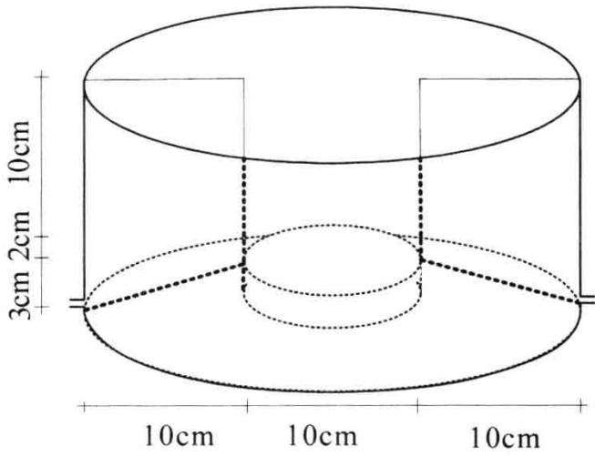  
图3-3 溅蚀盘示意图

测定时在待观测地块内选择有代表性的地点安装溅蚀盘，溅蚀盘必须安装牢固，沿坡面布设，但不能沿坡面移动，溅蚀盘内隔板必须沿等高线水平布设，以区分向坡上和向坡下的溅蚀量。装土盘中必须装入结构没有被破坏的原状土，因此在布设溅蚀盘之前必须先将装土环拆卸下来，放在地表轻轻压入土壤后，再将溅蚀盘套在装土环上。每次降雨后将溅蚀盘中的土粒回收到收集瓶后带回实验室烘干称重，计算出单位面积的溅蚀量。

$$
1 ) E _ { k } + E \frac { \Delta } { 2 } = 1 3 \times \frac { 3 } { 4 } + 7 \times ( - 6 5 + 5 ) + \pm \frac { 5 } { 4 } + \frac { 1 2 } { 3 } + 3 7 \times 6 4 = 3 7 5 0 ( m ^ { 2 } )
$$

土壤溅蚀观测记录格式见表3-10。

表3-10 土壤溅蚀测定记录表

调查日期：

调查人：

<table><tr><td rowspan=1 colspan=1>样地名称</td><td rowspan=1 colspan=2></td><td rowspan=1 colspan=2>地点：</td><td rowspan=1 colspan=2></td><td rowspan=1 colspan=3>海拔</td><td rowspan=1 colspan=1></td><td rowspan=1 colspan=2>地理坐标</td><td rowspan=1 colspan=2></td></tr><tr><td rowspan=1 colspan=1>样地面积</td><td rowspan=1 colspan=2></td><td rowspan=1 colspan=2>坡向</td><td rowspan=1 colspan=2></td><td rowspan=1 colspan=3>坡位</td><td rowspan=1 colspan=1></td><td rowspan=1 colspan=2>坡度</td><td rowspan=1 colspan=2></td></tr><tr><td rowspan=1 colspan=1>土壤类型</td><td rowspan=1 colspan=2></td><td rowspan=1 colspan=2>土壤厚度</td><td rowspan=1 colspan=2></td><td rowspan=1 colspan=3>母质</td><td rowspan=1 colspan=1></td><td rowspan=1 colspan=2>基岩</td><td rowspan=1 colspan=2></td></tr><tr><td rowspan=1 colspan=1>植被类型</td><td rowspan=1 colspan=2></td><td rowspan=1 colspan=2>群落名称</td><td rowspan=1 colspan=2></td><td rowspan=1 colspan=3>郁闭度</td><td rowspan=1 colspan=1></td><td rowspan=1 colspan=2>密度</td><td rowspan=1 colspan=2></td></tr><tr><td rowspan=1 colspan=1>溅蚀盘数量</td><td rowspan=1 colspan=2></td><td rowspan=1 colspan=2>装土环面积</td><td rowspan=1 colspan=2></td><td rowspan=1 colspan=3>降雨量</td><td rowspan=1 colspan=1></td><td rowspan=1 colspan=2>5min雨强</td><td rowspan=1 colspan=2></td></tr><tr><td rowspan=1 colspan=1>10min雨强</td><td rowspan=1 colspan=2></td><td rowspan=1 colspan=2>30min雨强</td><td rowspan=1 colspan=2></td><td rowspan=1 colspan=4>60min雨强</td><td rowspan=1 colspan=2></td><td rowspan=1 colspan=2></td></tr><tr><td rowspan=1 colspan=2>溅蚀盘1</td><td rowspan=1 colspan=4>溅蚀盘2</td><td rowspan=1 colspan=3>溅蚀盘3</td><td rowspan=1 colspan=3>溅蚀盘4</td><td rowspan=1 colspan=3>溅蚀盘5</td></tr><tr><td rowspan=1 colspan=1>坡上溅蚀量</td><td rowspan=1 colspan=1></td><td rowspan=1 colspan=2>坡上溅蚀量</td><td rowspan=1 colspan=2></td><td rowspan=1 colspan=2>坡上溅蚀量</td><td rowspan=1 colspan=1></td><td rowspan=1 colspan=2>坡上溅蚀量</td><td rowspan=1 colspan=1></td><td rowspan=1 colspan=2>坡上溅蚀量</td><td rowspan=1 colspan=1></td></tr><tr><td rowspan=1 colspan=1>坡下溅蚀量</td><td rowspan=1 colspan=1></td><td rowspan=1 colspan=2>坡下溅蚀量</td><td rowspan=1 colspan=2></td><td rowspan=1 colspan=2>坡下溅蚀量</td><td rowspan=1 colspan=1></td><td rowspan=1 colspan=2>坡下溅蚀量</td><td rowspan=1 colspan=1></td><td rowspan=1 colspan=2>坡下溅蚀量</td><td rowspan=1 colspan=1></td></tr><tr><td rowspan=1 colspan=1>溅蚀量</td><td rowspan=1 colspan=1></td><td rowspan=1 colspan=2>溅蚀量</td><td rowspan=1 colspan=2></td><td rowspan=1 colspan=2>溅蚀量</td><td rowspan=1 colspan=1></td><td rowspan=1 colspan=2>溅蚀量</td><td rowspan=1 colspan=1></td><td rowspan=1 colspan=2>溅蚀量</td><td rowspan=1 colspan=1></td></tr></table>

## 3.6.2 土壤崩解速率

土壤崩解是指土壤在静水中发生碎裂解体塌落或强度减弱的现象，土壤抗崩解能力是土壤物理化学性质、土壤结构性质的一个侧面反映，可以反映土壤在抗蚀抗分散方面的特性，是衡量土壤抗蚀性的一个综合评价指标，土壤抗崩解能力一般用土壤崩解速率表示。土壤崩解速率是评价土壤可蚀性的指标之一，是单位时间内在水中崩解的原状土体积量与总体积之比。土壤的崩解速率主要取决于土壤颗粒与水的亲和力、土壤颗粒间的胶结力、土壤容重、有机质含量及植物根系含量等。土壤的崩解速率能够反映土壤抵抗径流分散能力的大小，是水土保持监测及效益评价中必须测定的主要指标之一。土壤崩解速率的测定方法有浮筒法和称重法两种。

(1)浮筒法：土壤崩解速率可以用蒋定生设计的土壤崩解测定装置进行测定。该装置由玻璃缸、网板、浮筒组成。玻璃缸内盛清水，网板用直径约2mm的铁丝织成，网孔10mm×10mm，用于放置土壤试样，土壤试样为边长5cm的立方体原状土。浮筒上有刻度，用于测量试样体积的变化，如图34。

在待测定的样地内，选择有代表性的地段用体积为 $1 2 5 \mathrm { c m } ^ { 3 }$ 的采样器采取原状土样，也可以用 $1 0 0 ~ \mathrm { c m } ^ { 3 }$ 的环刀取样。取样时尽可能保证土壤结构不被破坏，防止土样内形成裂纹等影响土壤崩解速率的现象发生。取样后直接在现场测定土壤的崩解速率。如果在实验室测定，可将原状土放在取样器中带回，运送过程中应避免震动土样。

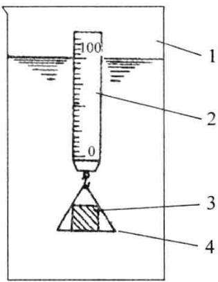  
图34 土壤崩解测定  
1. 玻璃缸；2. 浮筒；  
3. 试样；4. 网板

测定时将原状土样放在网板中央，网板挂在浮筒下，然后手持浮筒上端，匀速将挂有网板和土壤试样的浮筒浸入盛水的玻璃缸内，并立即记下浮筒齐水面处刻度的瞬间稳定读数，然后按适当的时间间隔记录浮筒齐水面处的刻度读数，直至崩解结束，崩解实验最长观测时间定为30min。崩解速率的计算公式为：

$$
v = a ( l _ { 0 } - l _ { t } ) / t
$$

式中：v—土壤的崩解速率；

$l _ { 0 }$ —试样浸入水中时浮筒的起始读数，或是浮筒沉降稳定时的最大读数；

$l _ { t }$ —土样完全崩解时或第30min时的浮筒读数；

t—土样完全崩解所需的时间，未崩解完则为30min；

a—体积换算系数，因试验装置而变。

试验结束后可以利用记录数据计算出土样崩解速率随时间的变化过程，以及最终的崩解速率。

土壤崩解速率测定记录格式见表3-11。

表3-11 土壤崩解速率测定记录表

测定日期：

测定人：

<table><tr><td rowspan=1 colspan=2>样地名称</td><td rowspan=1 colspan=2></td><td rowspan=1 colspan=3>地点：</td><td rowspan=1 colspan=2></td><td rowspan=1 colspan=3>海拔</td><td rowspan=1 colspan=2></td><td rowspan=1 colspan=5>地理坐标</td><td rowspan=1 colspan=3></td></tr><tr><td rowspan=1 colspan=2>样地面积</td><td rowspan=1 colspan=2></td><td rowspan=1 colspan=3>坡向</td><td rowspan=1 colspan=2></td><td rowspan=1 colspan=3>坡位</td><td rowspan=1 colspan=2></td><td rowspan=1 colspan=5>坡度</td><td rowspan=1 colspan=3></td></tr><tr><td rowspan=1 colspan=2>土壤类型</td><td rowspan=1 colspan=2></td><td rowspan=1 colspan=3>土壤厚度</td><td rowspan=1 colspan=2></td><td rowspan=1 colspan=3>母质</td><td rowspan=1 colspan=2></td><td rowspan=1 colspan=5>基岩</td><td rowspan=1 colspan=3></td></tr><tr><td rowspan=1 colspan=2>植被类型</td><td rowspan=1 colspan=2></td><td rowspan=1 colspan=3>群落名称</td><td rowspan=1 colspan=2></td><td rowspan=1 colspan=3>郁闭度</td><td rowspan=1 colspan=2></td><td rowspan=1 colspan=5>密度</td><td rowspan=1 colspan=3></td></tr><tr><td rowspan=1 colspan=2>玻璃缸体积</td><td rowspan=1 colspan=1></td><td rowspan=1 colspan=3>网孔规格</td><td rowspan=1 colspan=2></td><td rowspan=1 colspan=2>浮筒刻度范围</td><td rowspan=1 colspan=2></td><td rowspan=1 colspan=3>试样体积</td><td rowspan=1 colspan=3></td><td rowspan=1 colspan=3>系数a</td><td rowspan=1 colspan=1></td></tr><tr><td rowspan=1 colspan=3>试样1</td><td rowspan=1 colspan=5>试样2</td><td rowspan=1 colspan=3>试样3</td><td rowspan=1 colspan=6>试样4</td><td rowspan=1 colspan=5>试样5</td></tr><tr><td rowspan=1 colspan=1>时间</td><td rowspan=1 colspan=2>1</td><td rowspan=1 colspan=2>时间</td><td rowspan=1 colspan=3>1</td><td rowspan=1 colspan=1>时间</td><td rowspan=1 colspan=2>1</td><td rowspan=1 colspan=2>时间</td><td rowspan=1 colspan=4>1</td><td rowspan=1 colspan=3>时间</td><td rowspan=1 colspan=2>1</td></tr><tr><td rowspan=1 colspan=1></td><td rowspan=1 colspan=2></td><td rowspan=1 colspan=2></td><td rowspan=1 colspan=3></td><td rowspan=1 colspan=1></td><td rowspan=1 colspan=2></td><td rowspan=1 colspan=2></td><td rowspan=1 colspan=4></td><td rowspan=1 colspan=3></td><td rowspan=1 colspan=2></td></tr><tr><td rowspan=1 colspan=1></td><td rowspan=1 colspan=2></td><td rowspan=1 colspan=2></td><td rowspan=1 colspan=3></td><td rowspan=1 colspan=1></td><td rowspan=1 colspan=2></td><td rowspan=1 colspan=2></td><td rowspan=1 colspan=4></td><td rowspan=1 colspan=3></td><td rowspan=1 colspan=2></td></tr><tr><td rowspan=1 colspan=1></td><td rowspan=1 colspan=2></td><td rowspan=1 colspan=2></td><td rowspan=1 colspan=3></td><td rowspan=1 colspan=1></td><td rowspan=1 colspan=2></td><td rowspan=1 colspan=2></td><td rowspan=1 colspan=4></td><td rowspan=1 colspan=3></td><td rowspan=1 colspan=2></td></tr><tr><td rowspan=1 colspan=1></td><td rowspan=1 colspan=2></td><td rowspan=1 colspan=2></td><td rowspan=1 colspan=3></td><td rowspan=1 colspan=1></td><td rowspan=1 colspan=2></td><td rowspan=1 colspan=2></td><td rowspan=1 colspan=4></td><td rowspan=1 colspan=3></td><td rowspan=1 colspan=2></td></tr><tr><td rowspan=1 colspan=1></td><td rowspan=1 colspan=2></td><td rowspan=1 colspan=2></td><td rowspan=1 colspan=3></td><td rowspan=1 colspan=1></td><td rowspan=1 colspan=2></td><td rowspan=1 colspan=2></td><td rowspan=1 colspan=4></td><td rowspan=1 colspan=3></td><td rowspan=1 colspan=2></td></tr><tr><td rowspan=1 colspan=1></td><td rowspan=1 colspan=2></td><td rowspan=1 colspan=2></td><td rowspan=1 colspan=3></td><td rowspan=1 colspan=1></td><td rowspan=1 colspan=2></td><td rowspan=1 colspan=2></td><td rowspan=1 colspan=4></td><td rowspan=1 colspan=3></td><td rowspan=1 colspan=2></td></tr><tr><td rowspan=1 colspan=1></td><td rowspan=1 colspan=2></td><td rowspan=1 colspan=2></td><td rowspan=1 colspan=3></td><td rowspan=1 colspan=1></td><td rowspan=1 colspan=2></td><td rowspan=1 colspan=2></td><td rowspan=1 colspan=4></td><td rowspan=1 colspan=3></td><td rowspan=1 colspan=2></td></tr><tr><td rowspan=1 colspan=1>崩解速率</td><td rowspan=1 colspan=2></td><td rowspan=1 colspan=2>崩解速率</td><td rowspan=1 colspan=3></td><td rowspan=1 colspan=1>崩解速率</td><td rowspan=1 colspan=2></td><td rowspan=1 colspan=2>崩解速率</td><td rowspan=1 colspan=4></td><td rowspan=1 colspan=3>崩解速率</td><td rowspan=1 colspan=2></td></tr><tr><td rowspan=1 colspan=3>平均崩解速率</td><td rowspan=1 colspan=6></td><td rowspan=1 colspan=6>平均崩解时间</td><td></td><td rowspan=1 colspan=6></td></tr></table>

(2)称重法：土壤崩解速率还可以用称重法进行测定。称重法由盛水容器、网板、悬挂杆、电子天平等部分组成(图3-5)。测定前先在待测样地内选择有代表性地段取表层土壤的原状土样，土壤体积为100\~125cm³。测定时将网板从盛水容器中拿出，将野外采取的原状土样放在

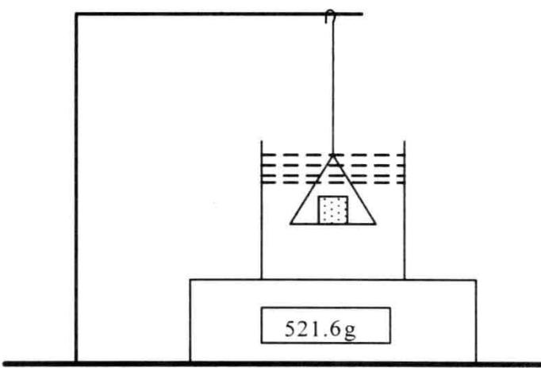  
图3-5 称重法土壤崩解试验装置

网板中央后，将网板连同土壤样品一起匀速放入盛水容器中，盛水的容器放在电子天平上。将原状土放入盛水容器中从电子天平上读取整个测定系统的重量，并开始计时。每隔一定时间记录一次电子天平的读数，直至崩解结束。崩解实验最长观测时间定为30min。该装置可以测定试验土块的

崩解过程。崩解速率的计算公式为：

$$
v ~ = ~ ( ~ W _ { t } ~ - ~ W _ { 0 } ) / T
$$

式中： $\textstyle \mathbb { W } _ { t }$ ——崩解结束时电子天平的读数；

$W _ { 0 }$ —崩解开始时电子天平的读数；

T——崩解试验持续的时间。

称重法土壤崩解测定记录格式见表3-12。

表3-12称重法土壤崩解试验记录表

测定日期：

测定人：

<table><tr><td rowspan=1 colspan=2>样地名称</td><td rowspan=1 colspan=2></td><td rowspan=1 colspan=3>地点</td><td rowspan=1 colspan=3></td><td rowspan=1 colspan=3>海拔</td><td rowspan=1 colspan=3></td><td rowspan=1 colspan=3>地理坐标</td><td rowspan=1 colspan=3></td></tr><tr><td rowspan=1 colspan=2>样地面积</td><td rowspan=1 colspan=2></td><td rowspan=1 colspan=3>坡向</td><td rowspan=1 colspan=3></td><td rowspan=1 colspan=3>坡位</td><td rowspan=1 colspan=3></td><td rowspan=1 colspan=3>坡度</td><td rowspan=1 colspan=3></td></tr><tr><td rowspan=1 colspan=2>土壤类型</td><td rowspan=1 colspan=2></td><td rowspan=1 colspan=3>土壤厚度</td><td rowspan=1 colspan=3></td><td rowspan=1 colspan=3>母质</td><td rowspan=1 colspan=3></td><td rowspan=1 colspan=3>基岩</td><td rowspan=1 colspan=3></td></tr><tr><td rowspan=1 colspan=2>植被类型</td><td rowspan=1 colspan=2></td><td rowspan=1 colspan=3>群落名称</td><td rowspan=1 colspan=3></td><td rowspan=1 colspan=3>郁闭度</td><td rowspan=1 colspan=3></td><td rowspan=1 colspan=3>密度</td><td rowspan=1 colspan=3></td></tr><tr><td rowspan=1 colspan=2>试样体积</td><td rowspan=1 colspan=4></td><td rowspan=1 colspan=3>网孔大小</td><td rowspan=1 colspan=2></td><td rowspan=1 colspan=3>天平称量</td><td rowspan=1 colspan=3></td><td rowspan=1 colspan=3>天平感量</td><td rowspan=1 colspan=2></td></tr><tr><td rowspan=1 colspan=3>试样1</td><td rowspan=1 colspan=5>试样2</td><td rowspan=1 colspan=4>试样3</td><td rowspan=1 colspan=6>试样4</td><td rowspan=1 colspan=4>试样5</td></tr><tr><td rowspan=1 colspan=1>时间</td><td rowspan=1 colspan=2>读数</td><td rowspan=1 colspan=2>时间</td><td rowspan=1 colspan=3>读数</td><td rowspan=1 colspan=2>时间</td><td rowspan=1 colspan=2>读数</td><td rowspan=1 colspan=3>时间</td><td rowspan=1 colspan=3>读数</td><td rowspan=1 colspan=3>时间</td><td rowspan=1 colspan=1>读数</td></tr><tr><td rowspan=1 colspan=1></td><td rowspan=1 colspan=2></td><td rowspan=1 colspan=2></td><td rowspan=1 colspan=3></td><td rowspan=1 colspan=2></td><td rowspan=1 colspan=2></td><td rowspan=1 colspan=3></td><td rowspan=1 colspan=3></td><td rowspan=1 colspan=3></td><td rowspan=1 colspan=1></td></tr><tr><td rowspan=1 colspan=1></td><td rowspan=1 colspan=2></td><td rowspan=1 colspan=2></td><td rowspan=1 colspan=3></td><td rowspan=1 colspan=2></td><td rowspan=1 colspan=2></td><td rowspan=1 colspan=3></td><td rowspan=1 colspan=3></td><td rowspan=1 colspan=3></td><td rowspan=1 colspan=1></td></tr><tr><td rowspan=1 colspan=1></td><td rowspan=1 colspan=2></td><td rowspan=1 colspan=2></td><td rowspan=1 colspan=3></td><td rowspan=1 colspan=2></td><td rowspan=1 colspan=2></td><td rowspan=1 colspan=3></td><td rowspan=1 colspan=3></td><td rowspan=1 colspan=3></td><td rowspan=1 colspan=1></td></tr><tr><td rowspan=1 colspan=1>崩解速率</td><td rowspan=1 colspan=2></td><td rowspan=1 colspan=2>崩解速率</td><td rowspan=1 colspan=3></td><td rowspan=1 colspan=2>崩解速率</td><td rowspan=1 colspan=2></td><td rowspan=1 colspan=3>崩解速率</td><td rowspan=1 colspan=3></td><td rowspan=1 colspan=3>崩解速率</td><td rowspan=1 colspan=1></td></tr><tr><td rowspan=1 colspan=3>平均崩解速率</td><td rowspan=1 colspan=7></td><td rowspan=1 colspan=6>平均崩解时间</td><td rowspan=1 colspan=6></td></tr></table>

## 3.6.3 水稳性团聚体含量

土壤颗粒中除沙粒和粗粉粒外，黏粒和部分细粉粒相互聚合在一起构成粒径更大的复合颗粒，这种复合颗粒称为团聚体。团聚体是在胶体的凝聚、胶结和黏结作用下，相互联结的土壤原生颗粒组成的近似球形的、较疏松多孔的小土团，直径为0.25\~10 mm之间，直径 <0.25mm的称为微团粒。团聚体具有良好的物理性能，是肥沃土壤的结构形态。团聚体简称团粒，具有水稳性、力稳性(不易被机械力破坏)和多孔性，是鉴定土壤肥力的指标之一。有良好团粒结构的土壤，不仅具有较大的孔隙度和较高的持水性，而且有良好的透水性，水分可以沿着团聚体形成的大孔隙毫无阻碍地渗入深层土壤、从而减少地表径流，减轻土壤侵蚀。因此，水稳性团聚体含量是评价土壤抗蚀性的指标，是水土保持监测中必须测定的要素之一。

团聚体可分水稳性团聚体和非水稳性团聚体两种。水稳性团聚体是由钙、镁、腐殖质胶结起来的团聚体，在水中振荡、浸泡、冲洗时也不易崩解和破坏，仍能维持其原来的结构，故称之水稳性团聚体。非水稳性团聚体放入水中时，就迅速崩解为更细小的颗粒成分，而无法保持其原结构状态，故称之为非水稳性团聚体。当土壤中水稳性团聚体含量越高，土壤抵抗径流分散破坏的能力越强，抗蚀性也就越好。

团聚体的稳定性一般根据团聚体在静水或流水中的崩解情况来识别。水稳性团聚体含量是在水浸泡下，没有被水崩解的团聚体数量与所有团聚体数量之比，测定过程如下。

## 3.6.3.1 取样

在野外调查样地内选择有代表性地段挖土壤剖面，分层取原状土带回实验室。

## 3.6.3.2 干 筛

将野外带回的原状土样沿自然面剥成直径2\~10mm大小的样块，风干后称重，再用孔径为10、7、5、3、1、0.5、0.25mm的土壤筛组进行干筛，筛完后将各级筛子上的样品分别称重(精确到0.01g)，计算各粒径级团聚体的重量占所有团聚体重量之和的百分比。

## 3.6.3.3 净水法测定水稳性团聚体

(1)将干筛后留在各级筛子上的团聚体数出50粒，分别置于培养皿中的干滤纸上(每个团聚体间隔开一定距离)。

(2)用滴管缓慢加水至滤纸上出现水膜。

(3)保持水膜湿润 20min。

(4)统计未破散团聚体数(或破散团粒数)，计算水稳性团聚体含量(未破散团聚体数与放入培养皿中所有团聚体数之比)。

土壤团聚体测定记录格式见表3-13。

表3-13 土壤团聚体测定记录表

测定日期：

测定人：

<table><tr><td rowspan=1 colspan=2>样地名称</td><td rowspan=1 colspan=2></td><td rowspan=1 colspan=2>地点</td><td rowspan=1 colspan=2></td><td rowspan=1 colspan=2>海拔</td><td rowspan=1 colspan=3></td><td rowspan=1 colspan=2>地理坐标</td><td rowspan=1 colspan=2></td></tr><tr><td rowspan=1 colspan=2>样地面积</td><td rowspan=1 colspan=2></td><td rowspan=1 colspan=2>坡向</td><td rowspan=1 colspan=2></td><td rowspan=1 colspan=2>坡位</td><td rowspan=1 colspan=3></td><td rowspan=1 colspan=2>坡度</td><td rowspan=1 colspan=2></td></tr><tr><td rowspan=1 colspan=2>土壤类型</td><td rowspan=1 colspan=2></td><td rowspan=1 colspan=2>土壤厚度</td><td rowspan=1 colspan=2></td><td rowspan=1 colspan=2>母质</td><td rowspan=1 colspan=3></td><td rowspan=1 colspan=2>基岩</td><td rowspan=1 colspan=2></td></tr><tr><td rowspan=1 colspan=2>植被类型</td><td rowspan=1 colspan=2></td><td rowspan=1 colspan=2>群落名称</td><td rowspan=1 colspan=2></td><td rowspan=1 colspan=2>郁闭度</td><td rowspan=1 colspan=3></td><td rowspan=1 colspan=2>密度</td><td rowspan=1 colspan=2></td></tr><tr><td rowspan=2 colspan=1>土层</td><td rowspan=1 colspan=15>粒径mm</td><td rowspan=2 colspan=1>总量</td></tr><tr><td rowspan=1 colspan=2></td><td rowspan=1 colspan=1>&gt;10</td><td rowspan=1 colspan=1>10~7</td><td rowspan=1 colspan=2>7~5</td><td rowspan=1 colspan=1>5~3</td><td rowspan=1 colspan=1>3~2</td><td rowspan=1 colspan=2>2~1</td><td rowspan=1 colspan=1>1~0.50</td><td rowspan=1 colspan=2>.5~0.25</td><td rowspan=1 colspan=2>&lt;0.25</td></tr><tr><td rowspan=10 colspan=1></td><td rowspan=1 colspan=2>颗粒重</td><td rowspan=1 colspan=1></td><td rowspan=1 colspan=1></td><td rowspan=1 colspan=2></td><td rowspan=1 colspan=1></td><td rowspan=1 colspan=1></td><td rowspan=1 colspan=2></td><td rowspan=1 colspan=1></td><td rowspan=1 colspan=2></td><td rowspan=1 colspan=2></td><td rowspan=5 colspan=1></td></tr><tr><td rowspan=1 colspan=2>百分比</td><td rowspan=1 colspan=1></td><td rowspan=1 colspan=1></td><td rowspan=1 colspan=2></td><td rowspan=1 colspan=1></td><td rowspan=1 colspan=1></td><td rowspan=1 colspan=2></td><td rowspan=1 colspan=1></td><td rowspan=1 colspan=2></td><td rowspan=1 colspan=2></td></tr><tr><td rowspan=1 colspan=2>团粒数</td><td rowspan=1 colspan=1></td><td rowspan=1 colspan=1></td><td rowspan=1 colspan=2></td><td rowspan=1 colspan=1></td><td rowspan=1 colspan=1></td><td rowspan=1 colspan=2></td><td rowspan=1 colspan=1></td><td rowspan=1 colspan=2></td><td rowspan=1 colspan=2></td></tr><tr><td rowspan=1 colspan=2>破散数</td><td rowspan=1 colspan=1></td><td rowspan=1 colspan=1></td><td rowspan=1 colspan=2></td><td rowspan=1 colspan=1></td><td rowspan=1 colspan=1></td><td rowspan=1 colspan=2></td><td rowspan=1 colspan=1></td><td rowspan=1 colspan=2></td><td rowspan=1 colspan=2></td></tr><tr><td rowspan=1 colspan=2>水稳性团聚体含量</td><td rowspan=1 colspan=1></td><td rowspan=1 colspan=1></td><td rowspan=1 colspan=2></td><td rowspan=1 colspan=1></td><td rowspan=1 colspan=1></td><td rowspan=1 colspan=2></td><td rowspan=1 colspan=1></td><td rowspan=1 colspan=2></td><td rowspan=1 colspan=2></td></tr><tr><td rowspan=1 colspan=2>颗粒重</td><td rowspan=1 colspan=1></td><td rowspan=1 colspan=1></td><td rowspan=1 colspan=2></td><td rowspan=1 colspan=1></td><td rowspan=1 colspan=1></td><td rowspan=1 colspan=2></td><td rowspan=1 colspan=1></td><td rowspan=1 colspan=2></td><td rowspan=1 colspan=2></td><td rowspan=5 colspan=1></td></tr><tr><td rowspan=1 colspan=2>百分比</td><td rowspan=1 colspan=1></td><td rowspan=1 colspan=1></td><td rowspan=1 colspan=2></td><td rowspan=1 colspan=1></td><td rowspan=1 colspan=1></td><td rowspan=1 colspan=2></td><td rowspan=1 colspan=1></td><td rowspan=1 colspan=2></td><td rowspan=1 colspan=2></td></tr><tr><td rowspan=1 colspan=2>团粒数</td><td rowspan=1 colspan=1></td><td rowspan=1 colspan=1></td><td rowspan=1 colspan=2></td><td rowspan=1 colspan=1></td><td rowspan=1 colspan=1></td><td rowspan=1 colspan=2></td><td rowspan=1 colspan=1></td><td rowspan=1 colspan=2></td><td rowspan=1 colspan=2></td></tr><tr><td rowspan=1 colspan=2>破散数</td><td rowspan=1 colspan=1></td><td rowspan=1 colspan=1></td><td rowspan=1 colspan=2></td><td rowspan=1 colspan=1></td><td rowspan=1 colspan=1></td><td rowspan=1 colspan=2></td><td rowspan=1 colspan=1></td><td rowspan=1 colspan=2></td><td rowspan=1 colspan=2></td></tr><tr><td rowspan=1 colspan=2>水稳性团聚体含量</td><td rowspan=1 colspan=1></td><td rowspan=1 colspan=1></td><td rowspan=1 colspan=2></td><td rowspan=1 colspan=1></td><td rowspan=1 colspan=1></td><td rowspan=1 colspan=2></td><td rowspan=1 colspan=1></td><td rowspan=1 colspan=2></td><td rowspan=1 colspan=2></td></tr></table>

## 3.7 土壤抗冲性测定

土壤抗冲性是指土壤抵抗地表径流对其进行机械破坏和搬运的能力，取决于土壤颗粒间、微结构间的胶结力，以及土壤结构体间抵抗水流离散的能力，更取决于土壤中根系对土粒网络作用的大小。土壤抗冲性可反映土壤抵抗径流剪切力的能力，是土壤侵蚀研究和植被改良土壤效益研究中必须考虑和测定的要素，也是水土保持监测中必须掌握的基本指标。影响土壤抗冲性强弱的主要因素有：土壤表面生物生长状况(包括诸如地衣、苔藓等低等生物在土壤表面的繁衍和贴敷；草被茎叶在地表的生长遮盖；枯枝落叶在地表的积聚和分解等）、根系在土体中的分布状况、土壤质地

和结构状况等。

土壤的抗冲性通常以单位水体所能冲刷的量为指标进行评价。测定方法有两种，一种是原状土冲刷法，另一种是野外实地冲刷法。

## 3.7.1 原状土冲刷法

土壤抗冲性测定通常采用原状土冲刷法，试验装置为蒋定生设计。测定前用特制的取样器(4cm×20cm×4cm)采集原状土样，采样过程中原状土的表面不能被破坏。将野外采集的原状土样放置在冲刷槽中，冲刷槽的坡度可以调节。在调节好坡度的冲刷槽上方用不同流量对原状土进行冲刷试验，在冲刷槽下方将冲刷水流全部收集后，在室内过滤、烘干，计算出单位水量中的含沙量，该含沙量的值即可表示土壤的抗冲性。原状土冲刷法的测定装置具有容易操作、耗水量小等特点，非常适合野外大量测定。

但是原状土冲刷法在取样时很容易对土体造成扰动与破坏，尤其是地表根系或地被物较多时，很难保证表层土样不被扰动，从而造成测定出的抗冲性能偏小。另外，冲刷试验时冲刷流量是根据某一强度的暴雨及其历时下标准小区(20m×5m)的单宽流量确定的，而这个冲刷水量远大于实际产流量，也造成测定的抗冲性能偏小。

原状土冲刷法测定土壤抗冲性记录格式见表3-14。

表3-14原状土冲刷法测定土壤抗冲性记录表  
测定日期： 测定人：
<table><tr><td rowspan=1 colspan=2>样地名称</td><td rowspan=1 colspan=2></td><td rowspan=1 colspan=2>地点</td><td rowspan=1 colspan=2></td><td rowspan=1 colspan=2>海拔</td><td rowspan=1 colspan=2></td><td rowspan=1 colspan=2>地理坐标</td><td rowspan=1 colspan=2></td></tr><tr><td rowspan=1 colspan=2>样地面积</td><td rowspan=1 colspan=2></td><td rowspan=1 colspan=2>坡向</td><td rowspan=1 colspan=2></td><td rowspan=1 colspan=2>坡位</td><td rowspan=1 colspan=2></td><td rowspan=1 colspan=2>坡度</td><td rowspan=1 colspan=2></td></tr><tr><td rowspan=1 colspan=2>土壤类型</td><td rowspan=1 colspan=2></td><td rowspan=1 colspan=2>土壤厚度</td><td rowspan=1 colspan=2></td><td rowspan=1 colspan=2>母质</td><td rowspan=1 colspan=2></td><td rowspan=1 colspan=2>基岩</td><td rowspan=1 colspan=2></td></tr><tr><td rowspan=1 colspan=2>植被类型</td><td rowspan=1 colspan=2></td><td rowspan=1 colspan=2>群落名称</td><td rowspan=1 colspan=2></td><td rowspan=1 colspan=2>郁闭度</td><td rowspan=1 colspan=2></td><td rowspan=1 colspan=2>密度</td><td rowspan=1 colspan=2></td></tr><tr><td rowspan=1 colspan=1>试验编号</td><td rowspan=1 colspan=2>土样大小</td><td rowspan=1 colspan=2>冲刷水量</td><td rowspan=1 colspan=2>取样体积</td><td rowspan=1 colspan=1>滤纸编号</td><td rowspan=1 colspan=1>滤纸重</td><td rowspan=1 colspan=2>泥+滤纸重</td><td rowspan=1 colspan=2>干泥+滤纸重</td><td rowspan=1 colspan=2>冲刷量</td><td rowspan=1 colspan=1>抗冲性</td></tr><tr><td rowspan=1 colspan=1>1</td><td rowspan=1 colspan=2></td><td rowspan=1 colspan=2></td><td rowspan=1 colspan=2></td><td rowspan=1 colspan=1></td><td rowspan=1 colspan=1></td><td rowspan=1 colspan=2></td><td rowspan=1 colspan=2></td><td rowspan=1 colspan=2></td><td rowspan=1 colspan=1></td></tr><tr><td rowspan=1 colspan=1>2</td><td rowspan=1 colspan=2></td><td rowspan=1 colspan=2></td><td rowspan=1 colspan=2></td><td rowspan=1 colspan=1></td><td rowspan=1 colspan=1></td><td rowspan=1 colspan=2></td><td rowspan=1 colspan=2></td><td rowspan=1 colspan=2></td><td rowspan=1 colspan=1></td></tr><tr><td rowspan=1 colspan=1>3</td><td rowspan=1 colspan=2></td><td rowspan=1 colspan=2></td><td rowspan=1 colspan=2></td><td rowspan=1 colspan=1></td><td rowspan=1 colspan=1></td><td rowspan=1 colspan=2></td><td rowspan=1 colspan=2></td><td rowspan=1 colspan=2></td><td rowspan=1 colspan=1></td></tr></table>

## 3.7.2 野外实地冲刷法

为了克服原状土冲刷法的缺点，张建军设计了野外实地冲刷法。

野外实地冲刷法测定土壤的抗冲性时需要采用野外实地放水冲刷仪(图3-6)。具体步骤如下。

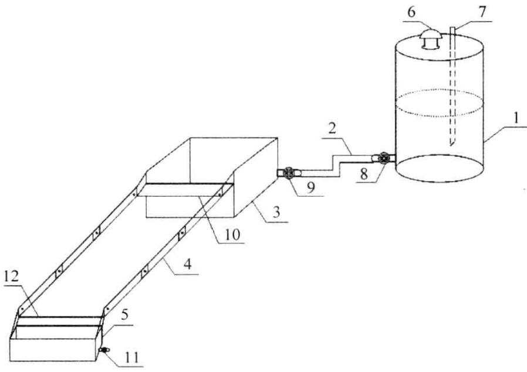  
图3-6 野外实地放水冲刷仪示意图  
1. 供水器；2. 连接软管；3. 溢流箱；4. 隔水板；5. 承水槽；6. 皮塞；  
7. 排气管；8.阀门；9. 阀门；10. 导流板；11. 阀门；12. 引流板

(1)在野外需要测定的样地内选择代表性地段作为观测用地，用隔水板(铁皮)沿坡面插入土中3\~5cm围成10cm宽的测定区，测定区的长度可根据地形和研究要求而定，一般取2m。

(2)在测定区的上方用小铲挖一个10cm长、10cm宽、5cm深的溢流箱安置坑，将溢流箱放入安置坑，使溢流箱的导流板与测定区的土壤密切接触，溢流箱安置时一定要保证导流板保持水平。

(3)在测定区的下方用小铲挖一个10cm长、10cm宽、5cm深的承水槽安置坑，将承水槽放入安置坑，将承水槽的引流板沿坡面插入测定区的土壤，以保证测定区的水流全部汇入承水槽。承水槽安置坑内需开挖排水渠。

(4)将玛立奥托瓶(供水器)水平安置在测定区上方，打开加水口皮 塞，加满水后塞紧皮塞。打开玛立奥托瓶的阀门放水，待流量稳定后关闭

阀门。然后用软管将玛立奥托瓶的阀门和溢流箱的阀门连接起来，保证不 漏水。

(5)用喷壶向测定区洒水，使测定区表层土壤充分湿润至饱和，但不能产流。

(6)打开供水器(玛立奥托瓶)的阀门和溢流箱的阀门，使溢流箱内充 满水并从导流板溢出，进入测定区后用染色法测定坡面水流的流速 $V _ { \circ }$

(7)当水流进入承水槽后由阀门流出，并用1000ml的量筒测定泥水量Q，并记录测定时间。

(8)将量筒内的泥水样过滤、烘干，计算冲刷量 $W _ { \mathrm { { o } } }$

土壤抗冲性测定记录格式见表3-15。

表3-15 土壤抗冲性测定记录表

测定日期：

测定人：

<table><tr><td rowspan=1 colspan=2>样地名称</td><td rowspan=1 colspan=2></td><td rowspan=1 colspan=2>地点：</td><td rowspan=1 colspan=2></td><td rowspan=1 colspan=2>海拔</td><td rowspan=1 colspan=2></td><td rowspan=1 colspan=3>地理坐标</td><td rowspan=1 colspan=2></td></tr><tr><td rowspan=1 colspan=2>样地面积</td><td rowspan=1 colspan=2></td><td rowspan=1 colspan=2>坡向</td><td rowspan=1 colspan=2></td><td rowspan=1 colspan=2>坡位</td><td rowspan=1 colspan=2></td><td rowspan=1 colspan=3>坡度</td><td rowspan=1 colspan=2></td></tr><tr><td rowspan=1 colspan=2>土壤类型</td><td rowspan=1 colspan=2></td><td rowspan=1 colspan=2>土壤厚度</td><td rowspan=1 colspan=2></td><td rowspan=1 colspan=2>母质</td><td rowspan=1 colspan=2></td><td rowspan=1 colspan=3>基岩</td><td rowspan=1 colspan=2></td></tr><tr><td rowspan=1 colspan=2>植被类型</td><td rowspan=1 colspan=2></td><td rowspan=1 colspan=2>群落名称</td><td rowspan=1 colspan=2></td><td rowspan=1 colspan=2>郁闭度</td><td rowspan=1 colspan=2></td><td rowspan=1 colspan=3>密度</td><td rowspan=1 colspan=2></td></tr><tr><td rowspan=1 colspan=1>试验编号</td><td rowspan=1 colspan=2>流速</td><td rowspan=1 colspan=1>冲刷水量</td><td rowspan=1 colspan=1>取样体积</td><td rowspan=1 colspan=2>滤纸重</td><td rowspan=1 colspan=1>泥+滤纸重</td><td rowspan=1 colspan=1>干泥+滤纸重</td><td rowspan=1 colspan=2>泥沙含量</td><td rowspan=1 colspan=2>侵蚀量</td><td rowspan=1 colspan=1>冲刷区宽度</td><td rowspan=1 colspan=2>冲刷区长度</td><td rowspan=1 colspan=1>抗冲性</td></tr><tr><td rowspan=1 colspan=1>一</td><td rowspan=1 colspan=2></td><td rowspan=1 colspan=1></td><td rowspan=1 colspan=1></td><td rowspan=1 colspan=2></td><td rowspan=1 colspan=1></td><td rowspan=1 colspan=1></td><td rowspan=1 colspan=2></td><td rowspan=1 colspan=2></td><td rowspan=1 colspan=1></td><td rowspan=1 colspan=2></td><td rowspan=1 colspan=1></td></tr><tr><td rowspan=1 colspan=1>2</td><td rowspan=1 colspan=2></td><td rowspan=1 colspan=1></td><td rowspan=1 colspan=1></td><td rowspan=1 colspan=2></td><td rowspan=1 colspan=1></td><td rowspan=1 colspan=1></td><td rowspan=1 colspan=2></td><td rowspan=1 colspan=2></td><td rowspan=1 colspan=1></td><td rowspan=1 colspan=2></td><td rowspan=1 colspan=1></td></tr><tr><td rowspan=1 colspan=1>3</td><td rowspan=1 colspan=2></td><td rowspan=1 colspan=1></td><td rowspan=1 colspan=1></td><td rowspan=1 colspan=2></td><td rowspan=1 colspan=1></td><td rowspan=1 colspan=1></td><td rowspan=1 colspan=2></td><td rowspan=1 colspan=2></td><td rowspan=1 colspan=1></td><td rowspan=1 colspan=2></td><td rowspan=1 colspan=1></td></tr></table>

## 3.8 地表糙度的测定

地表糙度是反映地表微地貌形态的指标，指地面凸凹不平的形态或起伏状况。在水力侵蚀中糙度是指在水流运动方向上由于地形的起伏变化或土块的凹凸变化。由于糙度的存在增加了坡面径流在流动过程中的流程和阻力，可增加填洼损失和降低地表径流流速度，从而对坡面径流和侵蚀产生影响。因此地表糙度也是水土保持监测和水土保持研究中必须测定的指标之一。

地表糙度的测定常用测针法。测针法是由Kuripers(1957)提出的，他把描述地表糙度的指标定义为R，其含义为地表各点到基准面的高程的标准差。测量原理是：测量某一面积内或某一截面上若干个点离参照基准面的高度，这种高度的变化能够反映地表的起伏程度。可使用张建军设计的地表糙度仪测定。

地表糙度测定仪的构造如图3-7。糙度仪由支架、横梁、测针组成。支架用于固定横梁，其上有调节坡度的旋钮。横梁长110cm，由刚性材料制成，不能变形或弯曲，横梁上有测针插孔，插孔间距为2cm，横梁上的插孔数为50，可以安装50根测针。每根测针的长度为50cm，插入横梁上的插孔中。

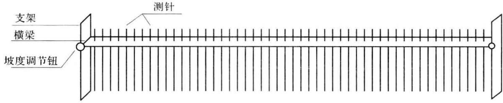  
图3-7 地表糙度仪示意图

使用时先用测坡仪测定待测坡面的坡度，然后将地表糙度仪沿坡面方向布设，旋转坡度调节钮，使地表糙度仪的横梁坡度与地表坡度一致。在保证每根测针与地表接触的情况下，用钢尺测定每根测针顶部到横梁的距离。利用该测定结果计算出50根测针顶部到横梁距离的标准差，该标准差就是地表糙度。计算公式如下：

$$
R \ = \ \sqrt { \frac { 1 } { n } \sum _ { i \ = 1 } ^ { n } \left( H _ { i \ } - H \right) }
$$

式中：R——地表糙度；

$H _ { i }$ —第i根测针顶部到横梁的距离；

$H \mathrm { \cdot }$ —所有测针顶部到横梁距离的平均值；

n——测针总数。

地表糙度测定记录格式参见表3-16。

表3-16 地表糙度测定记录表

测定日期：

测定人：

<table><tr><td rowspan=1 colspan=2>样地名称</td><td rowspan=1 colspan=3></td><td rowspan=1 colspan=4>地点</td><td rowspan=1 colspan=3></td><td rowspan=1 colspan=3>海拔</td><td rowspan=1 colspan=3></td><td rowspan=1 colspan=4>地理坐标</td><td rowspan=1 colspan=3></td></tr><tr><td rowspan=1 colspan=2>样地面积</td><td rowspan=1 colspan=3></td><td rowspan=1 colspan=4>坡向</td><td rowspan=1 colspan=3></td><td rowspan=1 colspan=3>坡位</td><td rowspan=1 colspan=3></td><td rowspan=1 colspan=4>坡度</td><td rowspan=1 colspan=3></td></tr><tr><td rowspan=1 colspan=2>土壤类型</td><td rowspan=1 colspan=3></td><td rowspan=1 colspan=4>土壤厚度</td><td rowspan=1 colspan=3></td><td rowspan=1 colspan=3>母质</td><td rowspan=1 colspan=3></td><td rowspan=1 colspan=4>基岩</td><td rowspan=1 colspan=3></td></tr><tr><td rowspan=1 colspan=2>植被类型</td><td rowspan=1 colspan=3></td><td rowspan=1 colspan=4>群落名称</td><td rowspan=1 colspan=3></td><td rowspan=1 colspan=3>郁闭度</td><td rowspan=1 colspan=3></td><td rowspan=1 colspan=4>密度</td><td rowspan=1 colspan=3></td></tr><tr><td rowspan=1 colspan=1>测针号</td><td rowspan=1 colspan=1>1</td><td rowspan=1 colspan=1>2</td><td rowspan=1 colspan=1>3</td><td rowspan=1 colspan=2>4</td><td rowspan=1 colspan=1>5</td><td rowspan=1 colspan=1>6</td><td rowspan=1 colspan=2>7</td><td rowspan=1 colspan=1>8</td><td rowspan=1 colspan=1>9</td><td rowspan=1 colspan=1>10</td><td rowspan=1 colspan=1>11</td><td rowspan=1 colspan=1>12</td><td rowspan=1 colspan=1>13</td><td rowspan=1 colspan=1>14</td><td rowspan=1 colspan=2>15</td><td rowspan=1 colspan=1>16</td><td rowspan=1 colspan=1>17</td><td rowspan=1 colspan=2>18</td><td rowspan=1 colspan=1>19</td><td rowspan=1 colspan=1>20</td></tr><tr><td rowspan=1 colspan=1> $H _ { i }$ </td><td rowspan=1 colspan=1></td><td rowspan=1 colspan=1></td><td rowspan=1 colspan=1></td><td rowspan=1 colspan=2></td><td rowspan=1 colspan=1></td><td rowspan=1 colspan=1></td><td rowspan=1 colspan=2></td><td rowspan=1 colspan=1></td><td rowspan=1 colspan=1></td><td rowspan=1 colspan=1></td><td rowspan=1 colspan=1></td><td rowspan=1 colspan=1></td><td rowspan=1 colspan=1></td><td rowspan=1 colspan=1></td><td rowspan=1 colspan=2></td><td rowspan=1 colspan=1></td><td rowspan=1 colspan=1></td><td rowspan=1 colspan=2></td><td rowspan=1 colspan=1></td><td rowspan=1 colspan=1></td></tr><tr><td rowspan=1 colspan=1>测针号</td><td rowspan=1 colspan=1>21</td><td rowspan=1 colspan=1>22</td><td rowspan=1 colspan=1>23</td><td rowspan=1 colspan=2>24</td><td rowspan=1 colspan=1>25</td><td rowspan=1 colspan=1>26</td><td rowspan=1 colspan=2>27</td><td rowspan=1 colspan=1>28</td><td rowspan=1 colspan=1>29</td><td rowspan=1 colspan=1>30</td><td rowspan=1 colspan=1>31</td><td rowspan=1 colspan=1>32</td><td rowspan=1 colspan=1>33</td><td rowspan=1 colspan=1>34</td><td rowspan=1 colspan=2>35</td><td rowspan=1 colspan=1>36</td><td rowspan=1 colspan=1>37</td><td rowspan=1 colspan=2>38</td><td rowspan=1 colspan=1>39</td><td rowspan=1 colspan=1>40</td></tr><tr><td rowspan=1 colspan=1> $H _ { i }$ </td><td rowspan=1 colspan=1></td><td rowspan=1 colspan=1></td><td rowspan=1 colspan=1></td><td rowspan=1 colspan=2></td><td rowspan=1 colspan=1></td><td rowspan=1 colspan=1></td><td rowspan=1 colspan=2></td><td rowspan=1 colspan=1></td><td rowspan=1 colspan=1></td><td rowspan=1 colspan=1></td><td rowspan=1 colspan=1></td><td rowspan=1 colspan=1></td><td rowspan=1 colspan=1></td><td rowspan=1 colspan=1></td><td rowspan=1 colspan=2></td><td rowspan=1 colspan=1></td><td rowspan=1 colspan=1></td><td rowspan=1 colspan=2></td><td rowspan=1 colspan=1></td><td rowspan=1 colspan=1></td></tr><tr><td rowspan=1 colspan=1>测针号</td><td rowspan=1 colspan=1>41</td><td rowspan=1 colspan=1>42</td><td rowspan=1 colspan=1>43</td><td rowspan=1 colspan=2>44</td><td rowspan=1 colspan=1>45</td><td rowspan=1 colspan=1>46</td><td rowspan=1 colspan=2>47</td><td rowspan=1 colspan=1>48</td><td rowspan=1 colspan=1>49</td><td rowspan=1 colspan=1>50</td><td rowspan=1 colspan=1></td><td rowspan=1 colspan=1></td><td rowspan=1 colspan=1></td><td rowspan=1 colspan=1></td><td rowspan=1 colspan=2></td><td rowspan=1 colspan=1></td><td rowspan=1 colspan=1></td><td rowspan=1 colspan=2></td><td rowspan=1 colspan=1></td><td rowspan=1 colspan=1></td></tr><tr><td rowspan=1 colspan=1> $H _ { i }$ </td><td rowspan=1 colspan=1></td><td rowspan=1 colspan=1></td><td rowspan=1 colspan=1></td><td rowspan=1 colspan=2></td><td rowspan=1 colspan=1></td><td rowspan=1 colspan=1></td><td rowspan=1 colspan=2></td><td rowspan=1 colspan=1></td><td rowspan=1 colspan=1></td><td rowspan=1 colspan=1></td><td rowspan=1 colspan=1></td><td rowspan=1 colspan=1></td><td rowspan=1 colspan=1></td><td rowspan=1 colspan=1></td><td rowspan=1 colspan=2></td><td rowspan=1 colspan=1></td><td rowspan=1 colspan=1></td><td rowspan=1 colspan=2></td><td rowspan=1 colspan=1></td><td rowspan=1 colspan=1></td></tr><tr><td rowspan=1 colspan=10>H =</td><td rowspan=1 colspan=15></td></tr></table>

## 第4章 坡面水土流失量观测

沿坡面向下运动的水流称为坡面径流，包括地表径流和壤中流。沿地表运动的水流称为地表径流，沿土壤层中相对不透水层运动的水流称为壤中流。地表径流是降水在满足植物截留、枯枝落叶拦蓄、下渗、填洼这四种损失后形成的，地表径流在沿坡面向下运动的过程中对表层土壤进行侵蚀、搬运，造成坡面的水土流失。壤中流虽然是沿土层中相对不透水层运动的水流，在运动过程中也能造成土壤侵蚀，尤其是在相对不透水层上形成积水后，很容易诱发浅层滑坡，造成严重的水土流失。

坡面是最基本的地貌单元，更是水土流失发生发展的最小单元，观测坡面的水土流失是探索坡面水土流失防治措施的关键，是正确评价水土保持效益的基础，是水土保持研究的基本方法。因此，坡面水土流失的观测是水土保持监测中最重要的内容。

降雨或融雪时形成的沿坡面向下流动的水流为坡面径流，这些流动的水流携带的泥沙量为侵蚀量。目前坡面径流量、侵蚀量多采用径流小区进行观测。坡面径流小区是坡面水蚀观测的基本设施，多个坡面径流小区集中在一起组成径流泥沙观测场，简称径流场。

坡面径流小区是1877年由德国土壤学家沃伦(EwaldWollny)设计的，用于观测和研究森林植被对土壤侵蚀的影响。此后这种用小区观测水土流失及其影响因素的设施和方法，在全世界水蚀区得到了普遍发展和进一步完善。坡面径流小区可以用来研究地形因子(坡度、坡长、坡型)、植被因子、土壤因子、人为活动等对坡面水土流失的影响，是对比研究某一单项因素对水土流失影响的最好方法。

## 4.1 径流小区数量的确定

径流小区是观测坡面水土流失量的常用方法，其主要目的是通过测定具有代表性的典型坡面的水土流量，推算整个观测区域坡面的水土流量，因此首先需要确定径流小区的数量。

径流小区数量需要根据观测区域的土地利用类型来确定，首先通过遥感或查阅土地利用现状图等手段，把握观测区域的土地利用类型及其面积，根据土地利用类型数量和面积，以在每种地类上至少布设一个径流小区为基本原则，确定所需要径流小区的最少数量。其次，在每种土地利用类型中选择最具代表性的地块作为修建径流小区的待选地，在面积较广、类型较多的地类中可以适当增加径流小区的数量。确定径流小区数量的流程如图4-1。

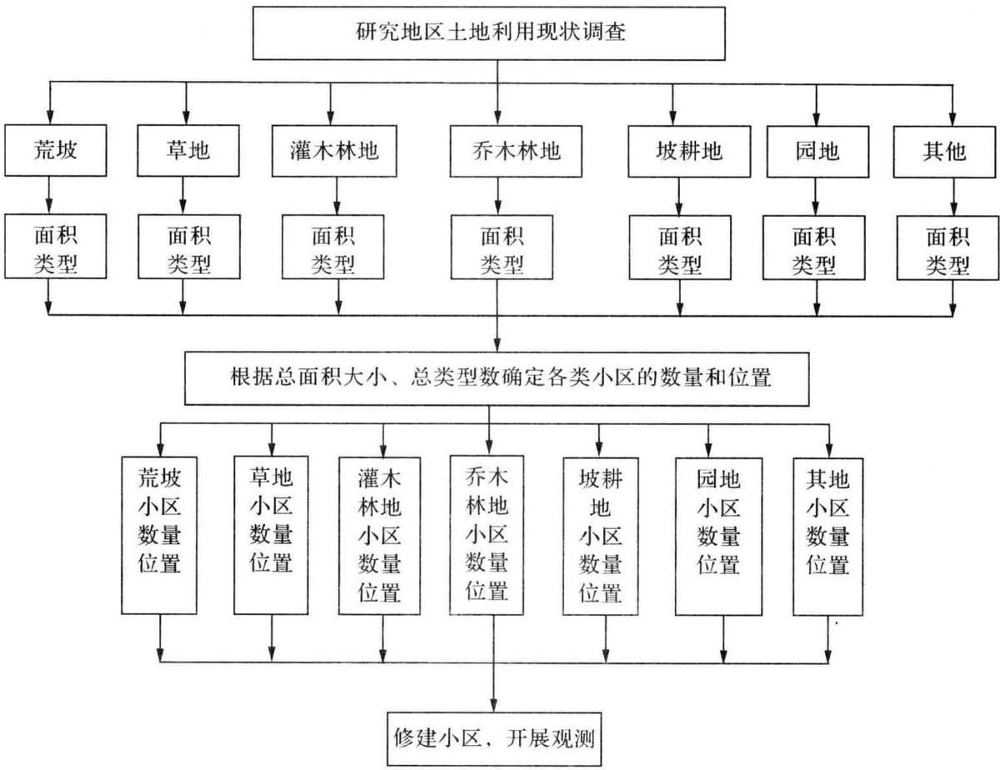  
图4-1 确定径流小区数量的流程图

## 4.2 径流小区的选择

利用径流小区观测坡面的水土流失量，是将在微小面积测定的结果扩展到整个坡面，属于尺度扩展，因此，所选择的径流小区必须有很强的代表性，否则将会造成较大的误差。为此，选择径流小区时必须遵循以下几项原则。

(1)代表性原则：径流小区应选择在地形、坡向、土壤、地质、植被、地下水和土地利用等有代表性的地段上。

(2)自然性原则：径流小区的坡面尽可能处于自然状态(土壤、植被)，不能有土坑、道路、坟墓、土堆等影响径流流动的障碍物。

(3)均一性原则：径流小区的坡面、土壤、植被应均匀一致。

(4)重复性和可比性原则：不同措施的小区要有重复试验和对比试验。

(5)便于管理的原则：径流小区应布设在交通便利，便于进行观测的地方，能够开展人工降雨试验。

## 4.3 径流小区的勘查

径流场选择好以后，应进行地形测量、基岩和土壤特性调查、植被调查。

## 4.3.1 地形测量

径流小区选好以后，首先进行径流场的地形测量，比例尺采用1:200或1:500(视径流场的坡长而定)，等高线间距采用0.25\~0.5m，除了拟定修建径流小区的地段外，还应测绘径流场四周约100m范围内的地段，记录地理坐标、地貌类型、高程、坡度、坡向、坡位、坡型等。地理坐标、高程可以用GPS测量，也可以直接查阅地形图。坡度、坡向可以用罗盘测量，地形可以用经纬仪测量，也可以用罗盘和测距仪测量。地形测量的结果和图件应该作为径流小区的原始资料进行归档保存。

## 4.3.2 基岩、土壤特性调查

在径流场附近的开阔坡地上选择三个典型地段挖土壤剖面，在黄土区等土层深厚的地区剖面深度不小于1m(黄土区)，在土石山区等土层较薄的地区剖面深度根据土层厚度而定。调查内容有：基岩类型、风化层厚度、土壤类型、土壤层次、容重、孔隙度、硬度、渗透性能、土壤养分状况等。基岩和土壤特性调查结果作为径流小区的原始资料进行归档保存。

## 4.3.3 植被调查

在拟建的径流小区内，用每木检尺的方法调查所有树木，确定林分起源、林龄、胸径、树高、冠幅、密度、郁闭度、生物量等，绘制树冠投影图，并调查灌木和草本的种类、空间分布状况、盖度、高度、地径、生物量等，还需要调查地表枯枝落叶的组成、现存量(厚度和单位面积的重量)、分解状况、持水能力。

乔木生物量的测定：在小区附近选择地形地貌和植被状况相似的地方设 $2 0 \mathrm { m } \times 2 0 \mathrm { m }$ 的样方，选择三株标准木，伐倒、称重，计算出标准木的单株生物量，再以径流小区内乔木树种的株树乘以标准木的单株生物量得到径流小区内的乔木生物量。也可以采用现有的生物量与胸径和树高的关系曲线计算出径流小区内的生物量。

树冠投影图的绘制：以小区内的每株树木中心，按16个方位分别测定树冠投影的水平长度，在图纸上按照一定的比例尺以树干为中心，以16个方位上的水平长度为依据绘制成多边形，该多边形可以近似认为是树干的投影。

由于乔木树种每年都在生长，生物量每年都在变化，因此在观测期间内每年都需要对径流小区的乔木树种生长状况进行调查，建立径流小区内植被生长调查档案。

灌木生物量调查：在乔木生物量测定样方内的四个角和中心处分别设$5 \mathrm { m } \times 5 \mathrm { m }$ 的灌木生物量测定样方，采用收割法测定灌木生物量(5个灌木样方)。

草本生物量调查:在每个测定灌木生物量小样方内的四角和中心处分别设1m×1m的草本生物量测定样方，采用收割法测定草本生物量(25个草本样方)。

灌木和草本也应该每年进行调查，并建立灌木和草本调查档案。

枯枝落叶量的测定：在乔木生物量测定样方2条对角线上均匀布设4个 $\mathrm { 1 m \times 1 m }$ 的样方，测定枯枝落叶的厚度，收集所有枯枝落叶称重计算枯枝落叶量。还需要对枯枝落叶量的逐月回收量进行调查，建立枯枝落叶调查档案。

农作物生长量调查：农地小区要调查耕作方式、农作物生长过程以及生物量的季节变化，记录农作物的管理过程，建立农地小区调查和管理档案。

## 4.4径流小区的设计和布设

## 4.4.1 径流小区的大小和形状

在平整坡地上观测径流泥沙的标准小区为长方形，面积 $1 0 0 \mathrm m ^ { 2 }$ ，即与等高线垂直的长边为20m(水平距离),与等高线平行的短边为 $5  { \mathrm { m } _ { \mathrm { o } } }$ 但在野外布设时由于地形限制，无法完全按照标准小区进行设计和修建，可以根据地形条件和植被状况对径流小区的面积和形状进行适当调整。常见径流小区有 $5 \mathrm { m } \times 1 0 \mathrm { m }$ 、 $1 0 \mathrm { m } \times 2 0 \mathrm { m }$ $2 0 \mathrm { m } \times 4 0 \mathrm { m }$ $1 0 \mathrm { m } \times 4 0 \mathrm { m }$ 等多种规格，为了配合人工降雨，径流场的尺寸可以略小一些，常采用 $2 \mathrm { m } \times 5 \mathrm { m }$ 或 $2 \mathrm { m } \times$ $1 0 \mathrm { m } _ { \mathrm { ~ c ~ } }$ 在坡地上布置径流小区时，应使长边垂直于等高线，短边平行于等高线。

目前常用的径流小区均为矩形，如果受地形条件限制，径流小区可以设计成各种形状。由于标准径流小区只有 $1 0 0 \mathrm m ^ { 2 }$ ，面积较小，这种微小坡面虽然地形、植被条件容易形成一致，但在这种微小坡面上径流形成后并不一定能达到最大流速，那么地表径流在微小坡面上形成的侵蚀量与更长的自然坡面相比有一定差距。因此，如果在观测区能够选择出整个坡面(全坡面)作为径流小区，可以沿整个坡面的分水线围成一个自然集水区作为全坡面径流小区。这样的全坡面径流小区不仅面积较大，而且是一个完

整的自然集水区，更能代表自然坡面的实际情况，其上形成的地表径流过程和侵蚀量也更具代表性，用这种全坡面的小区观测出的径流量和侵蚀量推求整个区域的径流量和侵蚀量时精度更高。

## 4.4.2 径流小区的组成

径流小区由保护带、护埂、承水槽、导水管、量水设施等几部分组成，如图4-2。

(1)保护带：是设置在径流小区上方和两侧用于防止外部径流侵入的区域，也是将径流小区和周围环境隔开的区域，保护带的宽度和深度视具体地形而定，必须保证上方来水和两侧径流不会进入径流小区，同时应保证周围环境中的植物根系、树冠不会影响到径流小区。

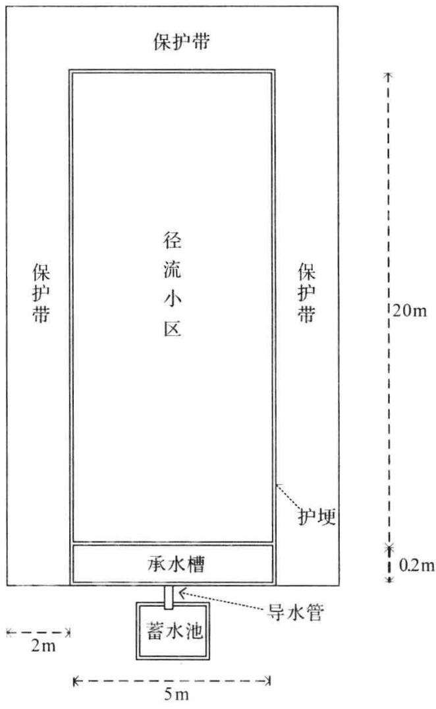  
图4-2 径流小区示意图

在保护带内必须设置排水渠，以排出保护带内产生的径流和外围进入保护带的径流。保护带也可以设计成步道，以便于管理人员通行。

(2)护埂：是设置在径流小区上方和两侧用于防止小区内径流外流、也防止外部径流进入小区、将径流小区和保护带隔开的设施，可以用金属、木板、预制板等材料做成。护埂应高出地面15\~30cm。用预制板作护埂时，护埂的顶部应该做成楔形(内直外斜)，以防止降落在护埂上的雨水进入径流小区。预制板之间必须用水泥砂浆填满，以保证径流小区内的水分不外泄，小区外的水分也不会进入小区。每块预制板必须安置在基岩上，基岩与预制板之间填满水泥砂浆，以防止水分通过，从而保证整个径流小区与外界环境之间无水分交换，尤其是当径流小区用于水量平衡研究时，整个径流小区必须与周围环境完全隔离。

(3)承水槽：位于径流小区的下方，用于承接径流小区产生的径流，并通过导水管把径流导入量水设施。承水槽一般为矩形，可以用混凝土、砌砖水泥护面、铁皮等制成，不论用何种材料制作，必须保证不漏水。承水槽上面应加盖盖板，以防雨水直接进入承水槽而影响观测精度。承水槽的断面应根据当地频率为1%的暴雨径流计算确定。

$$
\omega = Q _ { m } / V
$$

式中：ω—承水糟的流水断面面积；

$Q _ { m }$ —当地频率为1%的暴雨形成的洪峰流量；

V—承水槽中水流的平均流速，V按谢才公式确定：

$$
V = C ( R J ) ^ { 1 / 2 }
$$

式中：C——谢才系数， $C = { R } ^ { 1 / 6 } / n$ n;

J水力比降，一般采用承水槽的坡度；

$n ^ { - }$ ——糙率，混凝土糟的糙率n采用0.011；

R——水力半径，可根据公式 $R = \omega / x$ 确定，x为承水槽的湿周。

(4)导水管：是连接承水槽与量水设施的管道，通过导水管将坡面产生的径流和泥沙导入量水设施。导水管的管径必须保证能及时将径流全部导入量水设施，不能在承水槽中形成积水。设计时可以根据最大洪峰流量确定管径的大小。

(5)量水设施：是用于收集和量测径流泥沙量的设施，最为常用的量水设施是蓄水池或蓄水桶。蓄水池或蓄水桶必须能够容纳径流小区产生的全部径流量，这样蓄水池的容积就会很大，为了减小蓄水池的容积，可以安装分水箱。

## 4.5径流量、泥沙量的测定

径流量的观测方法可根据径流场可能产生的最大、最小流量选定，有体积法、溢流堰法。泥沙量的测定一般采用取样法，即在蓄水池中用取样器取样后，在室内过滤、烘干，求算泥水样的含沙量，再利用含沙量和泥水总量计算出侵蚀总量。

## 4.5.1 体积法

## 4.5.1.1 泥水总量的测定

体积法是在导水管下方配置一定断面面积的蓄水池或容器，根据蓄水池中水位的变化计算一定时间内的径流量。体积法只能观测到一定时间内的径流总量，不能观测径流过程，为此，经常在蓄水池上安装水位计以观测径流过程。

体积法是观测径流总量最为准确的方法，但因蓄水池必须能够容纳符合设计标准的最大径流量，常常需要修建体积很大的蓄水池，这势必造成浪费。为了减小蓄水池的尺寸并节约费用，可以在蓄水池上设置分水箱进行分流，只让一部分径流进入蓄水池。

分水箱是通过测定一部分径流量计算径流总量的装置，常用的分水箱有5孔分水箱、7孔分水箱、9孔分水箱、10孔分水箱等。分水箱的各个分水孔孔径必须一致，分水孔必须在同一水平面上，且每个分水孔外的管道长度也必须一致，这样才能保证从每个分水孔流出的水量是一致的。另外为了防止从导水管流出的径流落入分水箱时形成波浪，造成各分水孔出水量不一致的情况，可以将导水管的出水口安装在低于分水孔的高度上，这样从导水管落入分水箱的径流是从导水管出口溢出后向上涌动，不会造成较大的波浪，还能保证分水箱中各方向水位是均匀上升的。

使用体积法观测径流泥沙量时，每次降雨后立刻用钢尺测定蓄水池中的水深，或用安装在蓄水池壁上的水尺读取水深，利用水深和蓄水池的断面积计算出泥水总量。降雨前应该检查蓄水池中是否有积水，如有积水应该将其及时放掉，并关闭阀门，如来不及放掉积水，应该测定产流前蓄水池中的水深并取水样测定泥沙量。

如果采用分水箱测流，应该在蓄水池和分水箱中分别采泥水样，进行，泥沙分析。

如果蓄水池和承水槽上有盖子，落在盖子上的雨水没有进入到蓄水池中，此时的泥水总量应该为：

$$
V = ( H _ { ☉ \times \square } - H _ { \ast \ J \Psi } ) \times S _ { \ast }
$$

式中：V——泥水总量；

$H _ { \ast \sqrt { 1 1 } }$ —降雨后蓄水池中的水深；

$H _ { ☉ \ast \ast }$ ——降雨前蓄水池中的水深；

$S _ { \sharp }$ ——蓄水池面积。

如果蓄水池和承水槽上均无盖子，降雨可以直接落在蓄水池和承水槽中，这是应该从蓄水池中的泥水量中减去蓄水池和承水槽上收集的雨水量，才是径流小区上产生的泥水总量。

$$
V = \left( H _ { \ast \ast \mid \overline { { { \mathrm { t } } } } } - H _ { \ast \ast \overline { { { \mathrm { H } } } } } \right) \times S _ { \ast \ast } - \left( S _ { \ast \ast } + S _ { \ast \ast } \right) \times P
$$

式中：V—泥水总量；

$H _ { ☉ }$ —降雨后蓄水池中的水深；

$H _ { ☉ \mathnormal { /   } }$ —降雨前蓄水池中的水深；

$S _ { \mathcal { \vec { \imath } \mathcal { k } } }$ ——承水槽面积；

$S _ { \stackrel { \ast } { \scriptscriptstyle G } }$ ——蓄水池面积；

$P -$ 降雨量。

如果使用了分水箱，用钢尺分别测定分水箱中的水深和蓄水池中的水深，此时的泥水总量应该为：

$$
V = H _ { \it _ { 3 \ / F } } \times S _ { \it _ { 3 \ / F } } + \ F _ { \it _ { 1 \ / E } } \times S _ { \it _ { 3 \ / E } } \times N
$$

式中：V—泥水总量；

$H _ { \mathcal { H } }$ ——分水箱水深；

$S _ { \mathcal { A } }$ ——分水箱面积；

$H _ { ☉ }$ ——蓄水池水位；

$S _ { \sharp }$ ——蓄水池面积；

$N \cdot$ ——分水孔数量。

## 4.5.1.2 泥沙含量的测定

在蓄水池中测完水深后，用木棍充分搅拌蓄水池中的泥水样，使泥水充分混合，然后用取样瓶取三个泥水样，每个泥水样的体积为1000ml，带回室内进行泥沙分析。

如果蓄水池内泥沙较多，无法搅拌均匀时，可以用张建军设计的简易泥沙取样器进行分层取样(图4-3)。简易泥沙取样器为一个密闭容器，一侧的盖子可以打开。取样时将泥沙取样器放入泥水中一定深度后，通过机械传动装置将取样器的盖子打开，泥水样便进入取样器，松开传动装置后在弹簧的拉力下取样器的盖子自动关闭，泥水样密封在取样器内，把取样器从泥水中取出，打开盖子，将泥水样装入取样瓶后，冲洗取样器，进行下一次取样。

取完泥水样后打开蓄水池下部的放水阀门，将蓄水池内的泥水放净，并用清水冲洗蓄水池，然后关闭放水阀门。

将取回的泥水样品，在室内采用过滤烘干法进行测定。具体步骤为：在室内将装有泥水样的取样瓶外面擦干净，用天平称其总重 $W _ { 1 }$ 。将泥水样倒入量筒测定体积V后，用定量滤纸(滤纸的重量为 $\boldsymbol { \mathbb { \boldsymbol { W } } } _ { L } )$ 进行过滤，然后将滤纸和滤纸上的泥沙

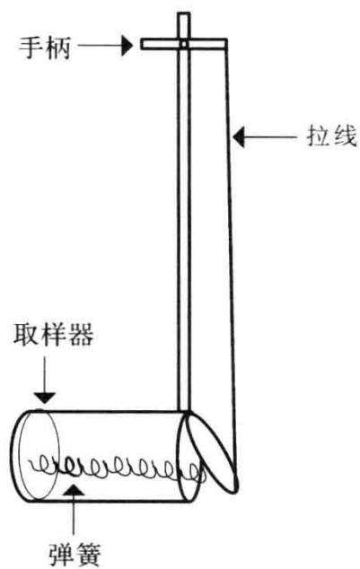  
图4-3泥沙取样器示意图

放入 $1 0 5 \mathcal { C }$ 的烘箱烘干至恒重，烘干后的泥沙加滤纸重 $\mathbb { W } _ { 2 }$ ，并对洗净后烘于的取样瓶进行称重 $W _ { P } ,$ 。径流量和侵蚀量的计算过程如下：

$$
\# \pi \# = ( W _ { 1 } - W _ { P } - W _ { 2 } + W _ { L } ) / V \times 1 0 0 \%
$$

$$
1 4 \times \frac { 0 } { 1 8 } = 1 4 x + 1 8 x - 3 = 1 4
$$

$$
1 = \sin \frac { \theta } { 2 } = \frac { 1 4 } { 1 2 } \pi = \frac { \theta } { 2 } / \frac { 1 2 } { 1 2 } \times \frac { 2 } { 1 2 } \times \frac { 1 } { 2 } \times \frac { 1 } { 2 }
$$

$$
1 7 \div m \cdots 5 m = 1 7 \div m \frac { 5 } { 2 } / 1 4 \div m \frac { 5 } { 2 } \times 1 0 0 \%
$$

$$
: \frac { 4 } { 5 } \div \frac { \pi } { 5 } = ( \mathrm { ~ W ~ } _ { 2 } - \mathrm { W } _ { L } ) / V \times 1 0 0 \%
$$

$$
: 4 : ) \times \frac { 0 } { 2 } = : 4 : 3 ( c m )
$$

$$
1 \div \frac { 1 } { 2 } \times ( \frac { 1 } { 2 } \times \frac { 1 } { 2 } \times \frac { 1 } { 2 } \times \frac { 1 } { 2 } \times \frac { 1 } { 2 } \times \frac { 1 } { 2 } \times \frac { 1 } { 2 } \times \frac { 1 } { 2 } \times \frac { 1 } { 2 } \times \frac { 1 } { 2 } \times \frac { 1 } { 2 } \times \frac { 1 } { 2 } \times \frac { 1 } { 2 }
$$

坡面径流小区人工观测记录格式见表4-1。

## 4.5.2 堰箱法

当径流小区面积较大或采用全坡面径流小区时，无法用蓄水池容纳全部径流，可以采用堰箱测定径流量，或者需要观测坡面径流小区的产流产沙过程时，也可以利用堰箱。堰箱就是在蓄水池一侧开设一个三角形或矩形的溢流口，形成薄壁堰。当蓄水池中的水位高于溢流口时，多余的径流从溢流口流出。从溢流口流出的泥水体积可以通过水位流量关系曲线计算得出。

<table><tr><td rowspan=2 colspan=25>测定期间：年   月     日至年    月     日                                                                             测定人：</td></tr><tr><td rowspan=1 colspan=3></td><td rowspan=1 colspan=3></td><td rowspan=1 colspan=4></td><td rowspan=1 colspan=3></td><td rowspan=1 colspan=3></td><td rowspan=1 colspan=2></td><td rowspan=1 colspan=3>地理坐标</td><td rowspan=1 colspan=3></td></tr><tr><td rowspan=1 colspan=3>小区面积</td><td rowspan=1 colspan=3></td><td rowspan=1 colspan=4>坡向</td><td rowspan=1 colspan=3></td><td rowspan=1 colspan=3>坡位</td><td rowspan=1 colspan=2></td><td rowspan=1 colspan=3>坡度</td><td rowspan=1 colspan=3></td><td rowspan=11 colspan=1></td></tr><tr><td rowspan=1 colspan=3>土壤类型</td><td rowspan=1 colspan=3></td><td rowspan=1 colspan=4>土壤厚度</td><td rowspan=1 colspan=3></td><td rowspan=1 colspan=3>母质</td><td rowspan=1 colspan=2></td><td rowspan=1 colspan=3>基岩</td><td rowspan=1 colspan=3></td></tr><tr><td rowspan=1 colspan=3>植被类型</td><td rowspan=1 colspan=3></td><td rowspan=1 colspan=4>群落名称</td><td rowspan=1 colspan=3></td><td rowspan=1 colspan=3>郁闭度</td><td rowspan=1 colspan=2></td><td rowspan=1 colspan=3>密度</td><td rowspan=1 colspan=3></td></tr><tr><td rowspan=1 colspan=3>承水槽面积</td><td rowspan=1 colspan=3></td><td rowspan=1 colspan=4>蓄水池面积</td><td rowspan=1 colspan=3></td><td rowspan=1 colspan=3>分水箱面积</td><td rowspan=1 colspan=2></td><td rowspan=1 colspan=3>分水孔数</td><td rowspan=1 colspan=3></td></tr><tr><td rowspan=1 colspan=1>日期</td><td rowspan=1 colspan=1>降雨量</td><td rowspan=1 colspan=1>5min雨强</td><td rowspan=1 colspan=1>10min雨强</td><td rowspan=1 colspan=1>30min雨强</td><td rowspan=1 colspan=2>60min雨强</td><td rowspan=1 colspan=1>蓄水池水深</td><td rowspan=1 colspan=1>分水箱水深</td><td rowspan=1 colspan=2>泥水总量</td><td rowspan=1 colspan=1>取样瓶号</td><td rowspan=1 colspan=2>取样瓶重</td><td rowspan=1 colspan=1>泥水+瓶重</td><td rowspan=1 colspan=1>泥水重</td><td rowspan=1 colspan=1>泥水样体积</td><td rowspan=1 colspan=1>滤纸 +湿泥重</td><td rowspan=1 colspan=1>滤纸+干泥重</td><td rowspan=1 colspan=1>净泥率</td><td rowspan=1 colspan=2>净水率</td><td rowspan=1 colspan=1>径流量</td><td rowspan=1 colspan=1>侵蚀量</td></tr><tr><td rowspan=1 colspan=1></td><td rowspan=1 colspan=1></td><td rowspan=1 colspan=1></td><td rowspan=1 colspan=1></td><td rowspan=1 colspan=1></td><td rowspan=1 colspan=2></td><td rowspan=1 colspan=1></td><td rowspan=1 colspan=1></td><td rowspan=1 colspan=2></td><td rowspan=1 colspan=1></td><td rowspan=1 colspan=2></td><td rowspan=1 colspan=1></td><td rowspan=1 colspan=1></td><td rowspan=1 colspan=1></td><td rowspan=1 colspan=1></td><td rowspan=1 colspan=1></td><td rowspan=1 colspan=1></td><td rowspan=1 colspan=2></td><td rowspan=1 colspan=1></td><td rowspan=1 colspan=1></td></tr><tr><td rowspan=1 colspan=1></td><td rowspan=1 colspan=1></td><td rowspan=1 colspan=1></td><td rowspan=1 colspan=1></td><td rowspan=1 colspan=1></td><td rowspan=1 colspan=2></td><td rowspan=1 colspan=1></td><td rowspan=1 colspan=1></td><td rowspan=1 colspan=2></td><td rowspan=1 colspan=1></td><td rowspan=1 colspan=2></td><td rowspan=1 colspan=1></td><td rowspan=1 colspan=1></td><td rowspan=1 colspan=1></td><td rowspan=1 colspan=1></td><td rowspan=1 colspan=1></td><td rowspan=1 colspan=1></td><td rowspan=1 colspan=2></td><td rowspan=1 colspan=1></td><td rowspan=1 colspan=1></td></tr><tr><td rowspan=1 colspan=1></td><td rowspan=1 colspan=1></td><td rowspan=1 colspan=1></td><td rowspan=1 colspan=1></td><td rowspan=1 colspan=1></td><td rowspan=1 colspan=2></td><td rowspan=1 colspan=1></td><td rowspan=1 colspan=1></td><td rowspan=1 colspan=2></td><td rowspan=1 colspan=1></td><td rowspan=1 colspan=2></td><td rowspan=1 colspan=1></td><td rowspan=1 colspan=1></td><td rowspan=1 colspan=1></td><td rowspan=1 colspan=1></td><td rowspan=1 colspan=1></td><td rowspan=1 colspan=1></td><td rowspan=1 colspan=2></td><td rowspan=1 colspan=1></td><td rowspan=1 colspan=1></td></tr><tr><td rowspan=1 colspan=1></td><td rowspan=1 colspan=1></td><td rowspan=1 colspan=1></td><td rowspan=1 colspan=1></td><td rowspan=1 colspan=1></td><td rowspan=1 colspan=2></td><td rowspan=1 colspan=1></td><td rowspan=1 colspan=1></td><td rowspan=1 colspan=2></td><td rowspan=1 colspan=1></td><td rowspan=1 colspan=2></td><td rowspan=1 colspan=1></td><td rowspan=1 colspan=1></td><td rowspan=1 colspan=1></td><td rowspan=1 colspan=1></td><td rowspan=1 colspan=1></td><td rowspan=1 colspan=1></td><td rowspan=1 colspan=2></td><td rowspan=1 colspan=1></td><td rowspan=1 colspan=1></td></tr><tr><td rowspan=1 colspan=1></td><td rowspan=1 colspan=1></td><td rowspan=1 colspan=1></td><td rowspan=1 colspan=1></td><td rowspan=1 colspan=1></td><td rowspan=1 colspan=2></td><td rowspan=1 colspan=1></td><td rowspan=1 colspan=1></td><td rowspan=1 colspan=2></td><td rowspan=1 colspan=1></td><td rowspan=1 colspan=2></td><td rowspan=1 colspan=1></td><td rowspan=1 colspan=1></td><td rowspan=1 colspan=1></td><td rowspan=1 colspan=1></td><td rowspan=1 colspan=1></td><td rowspan=1 colspan=1></td><td rowspan=1 colspan=2></td><td rowspan=1 colspan=1></td><td rowspan=1 colspan=1></td></tr><tr><td rowspan=1 colspan=1></td><td rowspan=1 colspan=1></td><td rowspan=1 colspan=1></td><td rowspan=1 colspan=1></td><td rowspan=1 colspan=1></td><td rowspan=1 colspan=2></td><td rowspan=1 colspan=1></td><td rowspan=1 colspan=1></td><td rowspan=1 colspan=2></td><td rowspan=1 colspan=1></td><td rowspan=1 colspan=2></td><td rowspan=1 colspan=1></td><td rowspan=1 colspan=1></td><td rowspan=1 colspan=1></td><td rowspan=1 colspan=1></td><td rowspan=1 colspan=1></td><td rowspan=1 colspan=1></td><td rowspan=1 colspan=2></td><td rowspan=1 colspan=1></td><td rowspan=1 colspan=1></td></tr><tr><td rowspan=1 colspan=1></td><td rowspan=1 colspan=1></td><td rowspan=1 colspan=1></td><td rowspan=1 colspan=1></td><td rowspan=1 colspan=1></td><td rowspan=1 colspan=2></td><td rowspan=1 colspan=1></td><td rowspan=1 colspan=1></td><td rowspan=1 colspan=2></td><td rowspan=1 colspan=1></td><td rowspan=1 colspan=2></td><td rowspan=1 colspan=1></td><td rowspan=1 colspan=1></td><td rowspan=1 colspan=1></td><td rowspan=1 colspan=1></td><td rowspan=1 colspan=1></td><td rowspan=1 colspan=1></td><td rowspan=1 colspan=2></td><td rowspan=1 colspan=1></td><td rowspan=1 colspan=1></td><td rowspan=1 colspan=1></td></tr><tr><td rowspan=1 colspan=1></td><td rowspan=1 colspan=1></td><td rowspan=1 colspan=1></td><td rowspan=1 colspan=1></td><td rowspan=1 colspan=1></td><td rowspan=1 colspan=2></td><td rowspan=1 colspan=1></td><td rowspan=1 colspan=1></td><td rowspan=1 colspan=2></td><td rowspan=1 colspan=1></td><td rowspan=1 colspan=2></td><td rowspan=1 colspan=1></td><td rowspan=1 colspan=1></td><td rowspan=1 colspan=1></td><td rowspan=1 colspan=1></td><td rowspan=1 colspan=1></td><td rowspan=1 colspan=1></td><td rowspan=1 colspan=2></td><td rowspan=1 colspan=1></td><td rowspan=1 colspan=1></td><td rowspan=3 colspan=1></td></tr><tr><td rowspan=1 colspan=1></td><td rowspan=1 colspan=1></td><td rowspan=1 colspan=1></td><td rowspan=1 colspan=1></td><td rowspan=1 colspan=1></td><td rowspan=1 colspan=2></td><td rowspan=1 colspan=1></td><td rowspan=1 colspan=1></td><td rowspan=1 colspan=2></td><td rowspan=1 colspan=1></td><td rowspan=1 colspan=2></td><td rowspan=1 colspan=1></td><td rowspan=1 colspan=1></td><td rowspan=1 colspan=1></td><td rowspan=1 colspan=1></td><td rowspan=1 colspan=1></td><td rowspan=1 colspan=1></td><td rowspan=1 colspan=2></td><td rowspan=1 colspan=1></td><td rowspan=1 colspan=1></td></tr><tr><td rowspan=1 colspan=1></td><td rowspan=1 colspan=1></td><td rowspan=1 colspan=1></td><td rowspan=1 colspan=1></td><td rowspan=1 colspan=1></td><td rowspan=1 colspan=2></td><td rowspan=1 colspan=1></td><td rowspan=1 colspan=1></td><td rowspan=1 colspan=2></td><td rowspan=1 colspan=1></td><td rowspan=1 colspan=2></td><td rowspan=1 colspan=1></td><td rowspan=1 colspan=1></td><td rowspan=1 colspan=1></td><td rowspan=1 colspan=1></td><td rowspan=1 colspan=1></td><td rowspan=1 colspan=1></td><td rowspan=1 colspan=2></td><td rowspan=1 colspan=1></td><td rowspan=1 colspan=1></td></tr><tr><td rowspan=1 colspan=1></td><td rowspan=1 colspan=1></td><td rowspan=1 colspan=1></td><td rowspan=1 colspan=1></td><td rowspan=1 colspan=1></td><td rowspan=1 colspan=2></td><td rowspan=1 colspan=1></td><td rowspan=1 colspan=1></td><td rowspan=1 colspan=2></td><td rowspan=1 colspan=1></td><td rowspan=1 colspan=2></td><td rowspan=1 colspan=1></td><td rowspan=1 colspan=1></td><td rowspan=1 colspan=1></td><td rowspan=1 colspan=1></td><td rowspan=1 colspan=1></td><td rowspan=1 colspan=1></td><td rowspan=1 colspan=2></td><td rowspan=1 colspan=1></td><td rowspan=1 colspan=1></td><td rowspan=1 colspan=1></td></tr><tr><td rowspan=1 colspan=1></td><td rowspan=1 colspan=1></td><td rowspan=1 colspan=1></td><td rowspan=1 colspan=1></td><td rowspan=1 colspan=1></td><td rowspan=1 colspan=2></td><td rowspan=1 colspan=1></td><td rowspan=1 colspan=1></td><td rowspan=1 colspan=2></td><td rowspan=1 colspan=1></td><td rowspan=1 colspan=2></td><td rowspan=1 colspan=1></td><td rowspan=1 colspan=1></td><td rowspan=1 colspan=1></td><td rowspan=1 colspan=1></td><td rowspan=1 colspan=1></td><td rowspan=1 colspan=1></td><td rowspan=1 colspan=2></td><td rowspan=1 colspan=1></td><td rowspan=1 colspan=1></td><td rowspan=1 colspan=1></td></tr><tr><td rowspan=1 colspan=1></td><td rowspan=1 colspan=1></td><td rowspan=1 colspan=1></td><td rowspan=1 colspan=1></td><td rowspan=1 colspan=1></td><td rowspan=1 colspan=2></td><td rowspan=1 colspan=1></td><td rowspan=1 colspan=1></td><td rowspan=1 colspan=2></td><td rowspan=1 colspan=1></td><td rowspan=1 colspan=2></td><td rowspan=1 colspan=1></td><td rowspan=1 colspan=1></td><td rowspan=1 colspan=1></td><td rowspan=1 colspan=1></td><td rowspan=1 colspan=1></td><td rowspan=1 colspan=1></td><td rowspan=1 colspan=2></td><td rowspan=1 colspan=1></td><td rowspan=1 colspan=1></td><td rowspan=1 colspan=1></td></tr><tr><td rowspan=1 colspan=1></td><td rowspan=1 colspan=1></td><td rowspan=1 colspan=1></td><td rowspan=1 colspan=1></td><td rowspan=1 colspan=1></td><td rowspan=1 colspan=2></td><td rowspan=1 colspan=1></td><td rowspan=1 colspan=1></td><td rowspan=1 colspan=2></td><td rowspan=1 colspan=1></td><td rowspan=1 colspan=2></td><td rowspan=1 colspan=1></td><td rowspan=1 colspan=1></td><td rowspan=1 colspan=1></td><td rowspan=1 colspan=1></td><td rowspan=1 colspan=1></td><td rowspan=1 colspan=1></td><td rowspan=1 colspan=2></td><td rowspan=1 colspan=1></td><td rowspan=1 colspan=1></td><td rowspan=1 colspan=1></td></tr><tr><td rowspan=1 colspan=1></td><td rowspan=1 colspan=1></td><td rowspan=1 colspan=1></td><td rowspan=1 colspan=1></td><td rowspan=1 colspan=1></td><td rowspan=1 colspan=2></td><td rowspan=1 colspan=1></td><td rowspan=1 colspan=1></td><td rowspan=1 colspan=2></td><td rowspan=1 colspan=1></td><td rowspan=1 colspan=2></td><td rowspan=1 colspan=1></td><td rowspan=1 colspan=1></td><td rowspan=1 colspan=1></td><td rowspan=1 colspan=1></td><td rowspan=1 colspan=1></td><td rowspan=1 colspan=1></td><td rowspan=1 colspan=2></td><td rowspan=1 colspan=1></td><td rowspan=1 colspan=1></td><td rowspan=1 colspan=1></td></tr><tr><td rowspan=1 colspan=1></td><td rowspan=1 colspan=1></td><td rowspan=1 colspan=1></td><td rowspan=1 colspan=1></td><td rowspan=1 colspan=1></td><td rowspan=1 colspan=2></td><td rowspan=1 colspan=1></td><td rowspan=1 colspan=1></td><td rowspan=1 colspan=2></td><td rowspan=1 colspan=1></td><td rowspan=1 colspan=2></td><td rowspan=1 colspan=1></td><td rowspan=1 colspan=1></td><td rowspan=1 colspan=1></td><td rowspan=1 colspan=1></td><td rowspan=1 colspan=1></td><td rowspan=1 colspan=1></td><td rowspan=1 colspan=2></td><td rowspan=1 colspan=1></td><td rowspan=1 colspan=1></td><td rowspan=1 colspan=1></td></tr><tr><td rowspan=1 colspan=1>_</td><td rowspan=1 colspan=23></td><td rowspan=1 colspan=1></td></tr></table>

采用堰箱时不能直接测定出径流量，必须通过测定溢流口水位的变化过程，利用水位流量关系曲线计算出径流过程和径流总量。因此，利用堰箱测定坡面径流小区的径流量时必须有堰箱的水位流量关系曲线。

水位流量关系曲线是流量随水位变化的关系曲线，每个堰箱在设计时都有设计的水位流量关系曲线，但安装在野外的堰箱，其使用条件和安装状态与实验室条件有较大差异，因此，每个堰箱安装后都需要进行标定，即对设计的水位流量关系曲线进行修正。

堰箱的标定有体积法和流速面积法。标定后的水位流量关系曲线可用于计算流量。

采用体积法标定时，需要在溢流堰出水口下方放置一定体积的容器，记录在某一水位条件下从堰箱流出一定体积的水所需要时间，计算出流量。如此反复测量不同水位时的流量，绘制水位流量关系曲线，拟合出流量公式。

采用流速面积法进行标定时，首先测定溢流口的水位，并同时利用流速仪测定出堰箱溢流口的水流流速，然后根据水位计算出过水断面的面积，再利用过水断面的面积乘以流速得出该水位条件的流量。当水位条件发生变化后，重复以上步骤，得到不同水位条件下的流量，据此绘制水位流量关系曲线，拟合出流量公式。

利用堰箱观测径流量时，需要在堰箱上安装自记水位计，利用自记水位计观测出产流过程中堰箱中水位变化，降雨后根据水位流量关系曲线和水位变化过程数据计算出径流过程和总径流量。利用堰箱测定径流的记录格式见表4-2。

利用堰箱虽然可以测定径流量和径流过程，但无法测定泥沙量。为此必须将由堰箱中流出的径流导入分水箱进行分流后将一部分径流保存在蓄水池中，降雨后用木棍充分搅拌蓄水池中的泥水样，使泥水充分混合，然后用取样瓶取三个泥水样，每个泥水样的体积为1000ml，带回室内进行泥沙分析，含沙量的分析和计算过程同体积法。取完泥水样后打开蓄水池上的放水阀门，将蓄水池内的泥水放净，并用清水冲洗蓄水池，然后关闭放水阀门。

泥沙量的观测也可以采用泥沙自动取样器进行，目前常用的泥沙自动

表4-2 坡面径流小区堰箱观测记录表

测定期间：

测定人：

<table><tr><td rowspan=1 colspan=2>小区名称</td><td rowspan=1 colspan=2></td><td rowspan=1 colspan=3>地点</td><td rowspan=1 colspan=2></td><td rowspan=1 colspan=2>海拔</td><td rowspan=1 colspan=2></td><td rowspan=1 colspan=3>地理坐标</td><td rowspan=1 colspan=2></td></tr><tr><td rowspan=1 colspan=2>小区面积</td><td rowspan=1 colspan=2></td><td rowspan=1 colspan=3>坡向</td><td rowspan=1 colspan=2></td><td rowspan=1 colspan=2>坡位</td><td rowspan=1 colspan=2></td><td rowspan=1 colspan=3>坡度</td><td rowspan=1 colspan=2></td></tr><tr><td rowspan=1 colspan=2>土壤类型</td><td rowspan=1 colspan=2></td><td rowspan=1 colspan=3>土壤厚度</td><td rowspan=1 colspan=2></td><td rowspan=1 colspan=2>母质</td><td rowspan=1 colspan=2></td><td rowspan=1 colspan=3>基岩</td><td rowspan=1 colspan=2></td></tr><tr><td rowspan=1 colspan=2>植被类型</td><td rowspan=1 colspan=2></td><td rowspan=1 colspan=3>群落名称</td><td rowspan=1 colspan=2></td><td rowspan=1 colspan=2>郁闭度</td><td rowspan=1 colspan=2></td><td rowspan=1 colspan=3>密度</td><td rowspan=1 colspan=2></td></tr><tr><td rowspan=1 colspan=2>承水槽面积</td><td rowspan=1 colspan=2></td><td rowspan=1 colspan=3>蓄水池面积</td><td rowspan=1 colspan=2></td><td rowspan=1 colspan=2>薄壁堰类型</td><td rowspan=1 colspan=2></td><td rowspan=1 colspan=4>水位流量关系</td><td rowspan=1 colspan=1></td></tr><tr><td rowspan=1 colspan=3>降雨数据</td><td rowspan=1 colspan=7>水位、流量数据</td><td rowspan=1 colspan=8>泥沙分析数据</td></tr><tr><td rowspan=1 colspan=1>日期时间</td><td rowspan=1 colspan=2>雨量</td><td rowspan=1 colspan=2>日期时间</td><td rowspan=1 colspan=1>水位</td><td rowspan=1 colspan=2>瞬时流量</td><td rowspan=1 colspan=2>流量</td><td rowspan=1 colspan=2>取样瓶号</td><td rowspan=1 colspan=2></td><td rowspan=1 colspan=1></td><td rowspan=1 colspan=2></td><td rowspan=1 colspan=1>平均</td></tr><tr><td rowspan=1 colspan=1></td><td rowspan=1 colspan=2></td><td rowspan=1 colspan=2></td><td rowspan=1 colspan=1></td><td rowspan=1 colspan=2></td><td rowspan=1 colspan=2></td><td rowspan=1 colspan=2>取样瓶重</td><td rowspan=1 colspan=2></td><td rowspan=1 colspan=1></td><td rowspan=1 colspan=2></td><td rowspan=1 colspan=1></td></tr><tr><td rowspan=1 colspan=1></td><td rowspan=1 colspan=2></td><td rowspan=1 colspan=2></td><td rowspan=1 colspan=1></td><td rowspan=1 colspan=2></td><td rowspan=1 colspan=2></td><td rowspan=1 colspan=2>泥水+瓶重</td><td rowspan=1 colspan=2></td><td rowspan=1 colspan=1></td><td rowspan=1 colspan=2></td><td rowspan=1 colspan=1></td></tr><tr><td rowspan=1 colspan=1></td><td rowspan=1 colspan=2></td><td rowspan=1 colspan=2></td><td rowspan=1 colspan=1></td><td rowspan=1 colspan=2></td><td rowspan=1 colspan=2></td><td rowspan=1 colspan=2>泥水重</td><td rowspan=1 colspan=2></td><td rowspan=1 colspan=1></td><td rowspan=1 colspan=2></td><td rowspan=1 colspan=1></td></tr><tr><td rowspan=1 colspan=1></td><td rowspan=1 colspan=2></td><td rowspan=1 colspan=2></td><td rowspan=1 colspan=1></td><td rowspan=1 colspan=2></td><td rowspan=1 colspan=2></td><td rowspan=1 colspan=2>泥水样体积</td><td rowspan=1 colspan=2></td><td rowspan=1 colspan=1></td><td rowspan=1 colspan=2></td><td rowspan=1 colspan=1></td></tr><tr><td rowspan=1 colspan=1></td><td rowspan=1 colspan=2></td><td rowspan=1 colspan=2></td><td rowspan=1 colspan=1></td><td rowspan=1 colspan=2></td><td rowspan=1 colspan=2></td><td rowspan=1 colspan=2>滤纸 + 湿泥重</td><td rowspan=1 colspan=2></td><td rowspan=1 colspan=1></td><td rowspan=1 colspan=2></td><td rowspan=1 colspan=1></td></tr><tr><td rowspan=1 colspan=1></td><td rowspan=1 colspan=2></td><td rowspan=1 colspan=2></td><td rowspan=1 colspan=1></td><td rowspan=1 colspan=2></td><td rowspan=1 colspan=2></td><td rowspan=1 colspan=2>滤纸+干泥重</td><td rowspan=1 colspan=2></td><td rowspan=1 colspan=1></td><td rowspan=1 colspan=2></td><td rowspan=1 colspan=1></td></tr><tr><td rowspan=1 colspan=1></td><td rowspan=1 colspan=2></td><td rowspan=1 colspan=2></td><td rowspan=1 colspan=1></td><td rowspan=1 colspan=2></td><td rowspan=1 colspan=2></td><td rowspan=1 colspan=2>净泥率</td><td rowspan=1 colspan=2></td><td rowspan=1 colspan=1></td><td rowspan=1 colspan=2></td><td rowspan=1 colspan=1></td></tr><tr><td rowspan=1 colspan=1></td><td rowspan=1 colspan=2></td><td rowspan=1 colspan=2></td><td rowspan=1 colspan=1></td><td rowspan=1 colspan=2></td><td rowspan=1 colspan=2></td><td rowspan=1 colspan=2>净水率</td><td rowspan=1 colspan=2></td><td rowspan=1 colspan=1></td><td rowspan=1 colspan=2></td><td rowspan=1 colspan=1></td></tr><tr><td rowspan=1 colspan=1></td><td rowspan=1 colspan=2></td><td rowspan=1 colspan=2></td><td rowspan=1 colspan=1></td><td rowspan=1 colspan=2></td><td rowspan=1 colspan=2></td><td rowspan=1 colspan=2>泥水总量</td><td rowspan=1 colspan=2></td><td rowspan=1 colspan=1></td><td rowspan=1 colspan=2></td><td rowspan=1 colspan=1></td></tr><tr><td rowspan=1 colspan=1></td><td rowspan=1 colspan=2></td><td rowspan=1 colspan=2></td><td rowspan=1 colspan=1></td><td rowspan=1 colspan=2></td><td rowspan=1 colspan=2></td><td rowspan=1 colspan=2>径流量</td><td rowspan=1 colspan=2></td><td rowspan=1 colspan=1></td><td rowspan=1 colspan=2></td><td rowspan=1 colspan=1></td></tr><tr><td rowspan=1 colspan=1></td><td rowspan=1 colspan=2></td><td rowspan=1 colspan=2></td><td rowspan=1 colspan=1></td><td rowspan=1 colspan=2></td><td rowspan=1 colspan=2></td><td rowspan=1 colspan=2>侵蚀量</td><td rowspan=1 colspan=2></td><td rowspan=1 colspan=1></td><td rowspan=1 colspan=2></td><td rowspan=1 colspan=1></td></tr><tr><td rowspan=1 colspan=1></td><td rowspan=1 colspan=2></td><td rowspan=1 colspan=2></td><td rowspan=1 colspan=1></td><td rowspan=1 colspan=2></td><td rowspan=1 colspan=2></td><td rowspan=1 colspan=2>降雨量</td><td rowspan=1 colspan=2></td><td rowspan=1 colspan=1></td><td rowspan=1 colspan=2></td><td rowspan=1 colspan=1></td></tr><tr><td rowspan=1 colspan=1></td><td rowspan=1 colspan=2></td><td rowspan=1 colspan=2></td><td rowspan=1 colspan=1></td><td rowspan=1 colspan=2></td><td rowspan=1 colspan=2></td><td rowspan=1 colspan=2>5min雨强</td><td rowspan=1 colspan=2></td><td rowspan=1 colspan=1></td><td rowspan=1 colspan=2></td><td rowspan=1 colspan=1></td></tr><tr><td rowspan=1 colspan=1></td><td rowspan=1 colspan=2></td><td rowspan=1 colspan=2></td><td rowspan=1 colspan=1></td><td rowspan=1 colspan=2></td><td rowspan=1 colspan=2></td><td rowspan=1 colspan=2>10min雨强</td><td rowspan=1 colspan=2></td><td rowspan=1 colspan=1></td><td rowspan=1 colspan=2></td><td rowspan=1 colspan=1></td></tr><tr><td rowspan=1 colspan=1></td><td rowspan=1 colspan=2></td><td rowspan=1 colspan=2></td><td rowspan=1 colspan=1></td><td rowspan=1 colspan=2></td><td rowspan=1 colspan=2></td><td rowspan=1 colspan=2>30min雨强</td><td rowspan=1 colspan=2></td><td rowspan=1 colspan=1></td><td rowspan=1 colspan=2></td><td rowspan=1 colspan=1></td></tr><tr><td rowspan=1 colspan=1></td><td rowspan=1 colspan=2></td><td rowspan=1 colspan=2></td><td rowspan=1 colspan=1></td><td rowspan=1 colspan=2></td><td rowspan=1 colspan=2></td><td rowspan=1 colspan=2>60min雨强</td><td rowspan=1 colspan=2></td><td rowspan=1 colspan=1></td><td rowspan=1 colspan=2></td><td rowspan=1 colspan=1></td></tr></table>

取样器有美国生产的ISC06712，该仪器包括雨量计、水位计、控制器等几部分。雨量计用于降雨观测，水位计用于观测蓄水池中水位的变化，控制器通过采样程序控制水泵抽取泥水样。ISC06712最多可以采取24个泥水样品。采样报告以文本文件的形式保存在控制器中，可以随同降雨数据和水位数据利用专用软件(Flowlink)从控制器中下载。泥沙自动取样器ISC06712在工作之前需要人工输入启动条件，当启动条件满足后便可以开始自动采样。一般情况下雨量和水位可以作为泥沙自动取样器的启动条件。雨量条件就是当单位时间内的雨量(降雨强度)大于某一值时取样器开始工作，水位条件是指当水位大于某一设定值后(水位高于某一临界值)取样器开始工作，也可以设定为当雨量大于某一值、同时水位也大于某一值后取样器开始工作。泥沙自动取样器的取样条件一般根据观测地区的产流条件确定，并可以通过操作面板输入到泥沙取样器的控制器中。

## 4.6 坡面水土流失的简易测定

坡面的水土流失主要有面蚀和沟蚀，面蚀是地表表层土被降雨和径流均匀剥蚀的一种水力侵蚀现象，主要发生在没有植被或植被稀少的坡地上，尤其在生产建设项目中的开挖面、堆土坡等缺乏植物保护的坡面上，面蚀是主要的侵蚀形式。目前测定面蚀时最常用的方法是插钎法。

沟蚀是地表径流汇集后形成股流，股流对地表进行冲刷、切割，形成各种规格的侵蚀沟的过程，在降雨集中、雨强大、植物稀少、土层疏松且有一定坡度的坡面上沟蚀最为明显。沟蚀主要通过野外调查测定。

## 4.6.1 坡面面蚀的简易测定

坡面面蚀的简易测定常用插钎法。测定前选择典型坡面，在坡面上以$\mathrm { 1 m \times 1 m }$ 的间距(间距可以根据精度要求而改变)、按照一定的布设规律将直径0.5cm、长30cm的铁钎以与坡面垂直的方向插入地面。铁钎插入土中的深度为10\~20cm，地面以上保留 $1 0 \sim 2 0 \mathrm { c m }$ 。每根铁钎布设好后从坡下部开始(也可以从坡上部开始)按一定的顺序进行编号，并测定铁钎顶部到地面的距离。为了提高精度，铁钎的数量应该不少于50根。每次降雨后测定铁钎顶部到地面的距离，测定时观测员必须与铁钎保持一定的距离，防止对铁钎周围的踩踏。插钎法观测面蚀的记录格式见表4-3，测定后采用如下公式计算面蚀量：

$$
\begin{array} { c } { { \Delta H = \displaystyle \sum _ { i = 1 } ^ { n } \Delta L _ { i } / n } } \\ { { { \cal A } = 1 0 0 \times \Delta H \times \mathrm { c o s } \theta \times d } } \end{array}
$$

式中：∆H——铁钎顶部到地面距离的变化量(cm)；

n在观测样地内布设的铁钎总数，如果观测过程中有铁钎丢失，则n为最近一次测量时观测样地内钢钎的保存数；

$\Delta L _ { i }$ ——第i根铁钎顶部到地面距离的变化量(cm)；

A——单位面积上的侵蚀量 $\left( { \mathrm { t } } / { \mathrm { h m } } ^ { 2 } \right)$ ;

θ—地面坡度；

d——表层土壤的容重 $\mathrm { ( g / c m } ^ { 3 } \mathrm { ) }$ 0

表4-3 插钎法面蚀观测记录表

测定期间：

测定人：

<table><tr><td rowspan=1 colspan=1>样地名称</td><td rowspan=1 colspan=1></td><td rowspan=1 colspan=1>地理坐标</td><td rowspan=1 colspan=1></td><td rowspan=1 colspan=1>地点</td><td rowspan=1 colspan=1></td><td rowspan=1 colspan=1>海拔</td><td rowspan=1 colspan=1></td></tr><tr><td rowspan=1 colspan=1>坡度</td><td rowspan=1 colspan=1></td><td rowspan=1 colspan=1>坡向</td><td rowspan=1 colspan=1></td><td rowspan=1 colspan=1>坡位</td><td rowspan=1 colspan=1></td><td rowspan=1 colspan=1>地表糙度</td><td rowspan=1 colspan=1></td></tr><tr><td rowspan=1 colspan=1>样地面积</td><td rowspan=1 colspan=1></td><td rowspan=1 colspan=1>样地长度</td><td rowspan=1 colspan=1></td><td rowspan=1 colspan=1>样地宽度</td><td rowspan=1 colspan=1></td><td rowspan=1 colspan=1>样地形状</td><td rowspan=1 colspan=1></td></tr><tr><td rowspan=1 colspan=1>土壤类型</td><td rowspan=1 colspan=1></td><td rowspan=1 colspan=1>土层厚度</td><td rowspan=1 colspan=1></td><td rowspan=1 colspan=1>土壤质地</td><td rowspan=1 colspan=1></td><td rowspan=1 colspan=1>表层容重</td><td rowspan=1 colspan=1></td></tr><tr><td rowspan=1 colspan=1>植被类型</td><td rowspan=1 colspan=1></td><td rowspan=1 colspan=1>物种组成</td><td rowspan=1 colspan=1></td><td rowspan=1 colspan=1>覆盖度</td><td rowspan=1 colspan=1></td><td rowspan=1 colspan=1>生物量</td><td rowspan=1 colspan=1></td></tr><tr><td rowspan=1 colspan=1>植株高度</td><td rowspan=1 colspan=1></td><td rowspan=1 colspan=1>胸径/地径</td><td rowspan=1 colspan=1></td><td rowspan=1 colspan=1>密度</td><td rowspan=1 colspan=1></td><td rowspan=1 colspan=1>枯落物量</td><td rowspan=1 colspan=1></td></tr><tr><td rowspan=2 colspan=1>铁钎编号</td><td rowspan=1 colspan=7>铁钎顶部到地面距离(cm)</td></tr><tr><td rowspan=1 colspan=1>调查日期1</td><td rowspan=1 colspan=1>调查日期2</td><td rowspan=1 colspan=1>变化量</td><td rowspan=1 colspan=1>调查日期3</td><td rowspan=1 colspan=1>变化量</td><td rowspan=1 colspan=1>调查日期4</td><td rowspan=1 colspan=1>变化量</td></tr><tr><td rowspan=1 colspan=1></td><td rowspan=1 colspan=1></td><td rowspan=1 colspan=1></td><td rowspan=1 colspan=1></td><td rowspan=1 colspan=1></td><td rowspan=1 colspan=1></td><td rowspan=1 colspan=1></td><td rowspan=1 colspan=1></td></tr><tr><td rowspan=1 colspan=1></td><td rowspan=1 colspan=1></td><td rowspan=1 colspan=1></td><td rowspan=1 colspan=1></td><td rowspan=1 colspan=1></td><td rowspan=1 colspan=1></td><td rowspan=1 colspan=1></td><td rowspan=1 colspan=1></td></tr><tr><td rowspan=1 colspan=1></td><td rowspan=1 colspan=1></td><td rowspan=1 colspan=1></td><td rowspan=1 colspan=1></td><td rowspan=1 colspan=1></td><td rowspan=1 colspan=1></td><td rowspan=1 colspan=1></td><td rowspan=1 colspan=1></td></tr><tr><td rowspan=1 colspan=1></td><td rowspan=1 colspan=1></td><td rowspan=1 colspan=1></td><td rowspan=1 colspan=1></td><td rowspan=1 colspan=1></td><td rowspan=1 colspan=1></td><td rowspan=1 colspan=1></td><td rowspan=1 colspan=1></td></tr><tr><td rowspan=1 colspan=1></td><td rowspan=1 colspan=1></td><td rowspan=1 colspan=1></td><td rowspan=1 colspan=1></td><td rowspan=1 colspan=1></td><td rowspan=1 colspan=1></td><td rowspan=1 colspan=1></td><td rowspan=1 colspan=1></td></tr><tr><td rowspan=1 colspan=1></td><td rowspan=1 colspan=1></td><td rowspan=1 colspan=1></td><td rowspan=1 colspan=1></td><td rowspan=1 colspan=1></td><td rowspan=1 colspan=1></td><td rowspan=1 colspan=1></td><td rowspan=1 colspan=1></td></tr><tr><td rowspan=1 colspan=1></td><td rowspan=1 colspan=1></td><td rowspan=1 colspan=1></td><td rowspan=1 colspan=1></td><td rowspan=1 colspan=1></td><td rowspan=1 colspan=1></td><td rowspan=1 colspan=1></td><td rowspan=1 colspan=1></td></tr><tr><td rowspan=1 colspan=1></td><td rowspan=1 colspan=1></td><td rowspan=1 colspan=1></td><td rowspan=1 colspan=1></td><td rowspan=1 colspan=1></td><td rowspan=1 colspan=1></td><td rowspan=1 colspan=1></td><td rowspan=1 colspan=1></td></tr><tr><td rowspan=1 colspan=3>平均侵蚀厚度</td><td rowspan=1 colspan=1></td><td rowspan=1 colspan=1></td><td rowspan=1 colspan=1></td><td rowspan=1 colspan=1></td><td rowspan=1 colspan=1></td></tr><tr><td rowspan=1 colspan=3>最大侵蚀厚度</td><td rowspan=1 colspan=1></td><td rowspan=1 colspan=1></td><td rowspan=1 colspan=1></td><td rowspan=1 colspan=1></td><td rowspan=1 colspan=1></td></tr><tr><td rowspan=1 colspan=3>最小侵蚀厚度</td><td rowspan=1 colspan=1></td><td rowspan=1 colspan=1></td><td rowspan=1 colspan=1></td><td rowspan=1 colspan=1></td><td rowspan=1 colspan=1></td></tr><tr><td rowspan=1 colspan=3>样地侵蚀量</td><td rowspan=1 colspan=1></td><td rowspan=1 colspan=1></td><td rowspan=1 colspan=1></td><td rowspan=1 colspan=1></td><td rowspan=1 colspan=1></td></tr><tr><td rowspan=1 colspan=3>侵蚀模数</td><td rowspan=1 colspan=1></td><td rowspan=1 colspan=1></td><td rowspan=1 colspan=1></td><td rowspan=1 colspan=1></td><td rowspan=1 colspan=1></td></tr></table>

## 4.6.2 坡面沟蚀的简易测定

坡面沟蚀通常采用实地测量法进行观测。测定时先选择观测样地，测定观测样地的面积，然后在样地内对每条侵蚀沟进行测量。测量侵蚀沟时一般从侵蚀沟的沟头部开始，按一定的间距将待测量侵蚀沟划分为若干段。确定测定间距和划分观测段时应该以同一段侵蚀沟内宽度和深度基本一致为原则。在每一测定段内观测和记录侵蚀沟的平均宽度、平均深度、长度，以此为基础计算每段侵蚀沟的体积，整条侵蚀沟的体积等于各段侵蚀沟体积之和。测定时应该尽量避免对侵蚀沟的踩踏。

如果第i条侵蚀沟分为m段，每一段侵蚀沟的体积用下式计算：

$$
V _ { j } = B _ { j } \times H _ { j } \times L _ { j }
$$

式中： $V _ { j }$ ——第j段侵蚀沟的体积；

$B _ { j }$ ——第j段侵蚀沟的平均宽度；

$H _ { j }$ ——第j段侵蚀沟的平均深度；

$L _ { j }$ ——第j段侵蚀沟的长度。

每一条侵蚀沟的体积 $V _ { i \cdot }$ 用下式计算：

$$
V _ { i } ~ = ~ \sum _ { j ~ = 1 } ^ { m } V _ { j }
$$

如果调查样地内共有n条侵蚀沟，则样地内侵蚀沟的总体积V可用下式计算：

$$
V = \sum _ { i = 1 } ^ { n } \sum _ { j = 1 } ^ { m } V _ { j }
$$

如果表层土壤的容重为 $d$ ，调查样地的坡面面积为S，坡度为θ，则调查样地内单位面积的沟蚀量可以用下式计算：

$$
W = \frac { V \times d } { S \times \mathrm { c o s } \theta }
$$

坡面沟蚀简易测定记录格式见表44。

表44 坡面沟蚀简易测定记录表

测定期间：

测定人：

<table><tr><td rowspan=1 colspan=3>样地名称</td><td rowspan=1 colspan=2></td><td rowspan=1 colspan=2>地理坐标</td><td rowspan=1 colspan=2></td><td rowspan=1 colspan=2>地点</td><td rowspan=1 colspan=2></td><td rowspan=1 colspan=2>海拔</td><td rowspan=1 colspan=2></td></tr><tr><td rowspan=1 colspan=3>坡度</td><td rowspan=1 colspan=2></td><td rowspan=1 colspan=2>坡向</td><td rowspan=1 colspan=2></td><td rowspan=1 colspan=2>坡位</td><td rowspan=1 colspan=2></td><td rowspan=1 colspan=2>地面糙度</td><td rowspan=1 colspan=2></td></tr><tr><td rowspan=1 colspan=3>样地面积</td><td rowspan=1 colspan=2></td><td rowspan=1 colspan=2>样地长度</td><td rowspan=1 colspan=2></td><td rowspan=1 colspan=2>样地宽度</td><td rowspan=1 colspan=2></td><td rowspan=1 colspan=2>样地形状</td><td rowspan=1 colspan=2></td></tr><tr><td rowspan=1 colspan=3>土壤类型</td><td rowspan=1 colspan=2></td><td rowspan=1 colspan=2>土层厚度</td><td rowspan=1 colspan=2></td><td rowspan=1 colspan=2>土壤质地</td><td rowspan=1 colspan=2></td><td rowspan=1 colspan=2>容重</td><td rowspan=1 colspan=2></td></tr><tr><td rowspan=1 colspan=3>植被类型</td><td rowspan=1 colspan=2></td><td rowspan=1 colspan=2>物种组成</td><td rowspan=1 colspan=2></td><td rowspan=1 colspan=2>覆盖度</td><td rowspan=1 colspan=2></td><td rowspan=1 colspan=2>生物量</td><td rowspan=1 colspan=2></td></tr><tr><td rowspan=1 colspan=3>植株高度</td><td rowspan=1 colspan=2></td><td rowspan=1 colspan=2>胸径/地径</td><td rowspan=1 colspan=2></td><td rowspan=1 colspan=2>密度</td><td rowspan=1 colspan=2></td><td rowspan=1 colspan=2>枯落物量</td><td rowspan=1 colspan=2></td></tr><tr><td rowspan=1 colspan=5>侵蚀沟1</td><td rowspan=1 colspan=4>侵蚀沟2</td><td rowspan=1 colspan=4>侵蚀沟3</td><td rowspan=1 colspan=4>侵蚀沟4</td></tr><tr><td rowspan=1 colspan=1>区段</td><td rowspan=1 colspan=2>长度</td><td rowspan=1 colspan=1>宽度深</td><td rowspan=1 colspan=1>度</td><td rowspan=1 colspan=1>区段</td><td rowspan=1 colspan=1>长度</td><td rowspan=1 colspan=1>宽度</td><td rowspan=1 colspan=1>深度</td><td rowspan=1 colspan=1>区段</td><td rowspan=1 colspan=1>长度宽</td><td rowspan=1 colspan=1>度深</td><td rowspan=1 colspan=1>度区</td><td rowspan=1 colspan=1>段</td><td rowspan=1 colspan=1>长度</td><td rowspan=1 colspan=1>宽度</td><td rowspan=1 colspan=1>深度</td></tr><tr><td rowspan=1 colspan=1></td><td rowspan=1 colspan=2></td><td rowspan=1 colspan=1></td><td rowspan=1 colspan=1></td><td rowspan=1 colspan=1></td><td rowspan=1 colspan=1></td><td rowspan=1 colspan=1></td><td rowspan=1 colspan=1></td><td rowspan=1 colspan=1></td><td rowspan=1 colspan=1></td><td rowspan=1 colspan=1></td><td rowspan=1 colspan=1></td><td rowspan=1 colspan=1></td><td rowspan=1 colspan=1></td><td rowspan=1 colspan=1></td><td rowspan=1 colspan=1></td></tr><tr><td rowspan=1 colspan=1></td><td rowspan=1 colspan=2></td><td rowspan=1 colspan=1></td><td rowspan=1 colspan=1></td><td rowspan=1 colspan=1></td><td rowspan=1 colspan=1></td><td rowspan=1 colspan=1></td><td rowspan=1 colspan=1></td><td rowspan=1 colspan=1></td><td rowspan=1 colspan=1></td><td rowspan=1 colspan=1></td><td rowspan=1 colspan=1></td><td rowspan=1 colspan=1></td><td rowspan=1 colspan=1></td><td rowspan=1 colspan=1></td><td rowspan=1 colspan=1></td></tr><tr><td rowspan=1 colspan=1></td><td rowspan=1 colspan=2></td><td rowspan=1 colspan=1></td><td rowspan=1 colspan=1></td><td rowspan=1 colspan=1></td><td rowspan=1 colspan=1></td><td rowspan=1 colspan=1></td><td rowspan=1 colspan=1></td><td rowspan=1 colspan=1></td><td rowspan=1 colspan=1></td><td rowspan=1 colspan=1></td><td rowspan=1 colspan=1></td><td rowspan=1 colspan=1></td><td rowspan=1 colspan=1></td><td rowspan=1 colspan=1></td><td rowspan=1 colspan=1></td></tr><tr><td rowspan=1 colspan=1></td><td rowspan=1 colspan=2></td><td rowspan=1 colspan=1></td><td rowspan=1 colspan=1></td><td rowspan=1 colspan=1></td><td rowspan=1 colspan=1></td><td rowspan=1 colspan=1></td><td rowspan=1 colspan=1></td><td rowspan=1 colspan=1></td><td rowspan=1 colspan=1></td><td rowspan=1 colspan=1></td><td rowspan=1 colspan=1></td><td rowspan=1 colspan=1></td><td rowspan=1 colspan=1></td><td rowspan=1 colspan=1></td><td rowspan=1 colspan=1></td></tr><tr><td rowspan=1 colspan=1></td><td rowspan=1 colspan=2></td><td rowspan=1 colspan=1></td><td rowspan=1 colspan=1></td><td rowspan=1 colspan=1></td><td rowspan=1 colspan=1></td><td rowspan=1 colspan=1></td><td rowspan=1 colspan=1></td><td rowspan=1 colspan=1></td><td rowspan=1 colspan=1></td><td rowspan=1 colspan=1></td><td rowspan=1 colspan=1></td><td rowspan=1 colspan=1></td><td rowspan=1 colspan=1></td><td rowspan=1 colspan=1></td><td rowspan=1 colspan=1></td></tr><tr><td rowspan=1 colspan=1></td><td rowspan=1 colspan=2></td><td rowspan=1 colspan=1></td><td rowspan=1 colspan=1></td><td rowspan=1 colspan=1></td><td rowspan=1 colspan=1></td><td rowspan=1 colspan=1></td><td rowspan=1 colspan=1></td><td rowspan=1 colspan=1></td><td rowspan=1 colspan=1></td><td rowspan=1 colspan=1></td><td rowspan=1 colspan=1></td><td rowspan=1 colspan=1></td><td rowspan=1 colspan=1></td><td rowspan=1 colspan=1></td><td rowspan=1 colspan=1></td></tr><tr><td rowspan=1 colspan=1></td><td rowspan=1 colspan=2></td><td rowspan=1 colspan=1></td><td rowspan=1 colspan=1></td><td rowspan=1 colspan=1></td><td rowspan=1 colspan=1></td><td rowspan=1 colspan=1></td><td rowspan=1 colspan=1></td><td rowspan=1 colspan=1></td><td rowspan=1 colspan=1></td><td rowspan=1 colspan=1></td><td rowspan=1 colspan=1></td><td rowspan=1 colspan=1></td><td rowspan=1 colspan=1></td><td rowspan=1 colspan=1></td><td rowspan=1 colspan=1></td></tr><tr><td rowspan=1 colspan=1>体积</td><td rowspan=1 colspan=4></td><td rowspan=1 colspan=4></td><td rowspan=1 colspan=4></td><td rowspan=1 colspan=4></td></tr><tr><td rowspan=1 colspan=1>侵蚀量</td><td rowspan=1 colspan=4></td><td rowspan=1 colspan=4></td><td rowspan=1 colspan=4></td><td rowspan=1 colspan=4></td></tr><tr><td rowspan=1 colspan=2>沟蚀量</td><td rowspan=1 colspan=15></td></tr></table>

坡面沟蚀还可以采用三维激光扫描仪进行测定，测定时选择一个能够观察到整个待测坡面的点，安装好三维激光扫描仪后，对整个坡面进行扫描，得到原始的坡面地形数据。在降雨后或一段时间后，再一次对坡面进行扫描，得到被雨水冲刷侵蚀后的坡面地形数据，对比分析两次扫描得到的地形数据，就可以得出整个坡面地形的变化量，利用地形的变化量乘以表层土壤的容重就可以计算出整个坡面的侵蚀量，同时通过对比分析侵蚀沟的地形数据，能够得到侵蚀长度、宽度、深度的变化量，据此便可以计算出侵蚀沟体积的变化量，利用侵蚀沟体积的变化量乘以土壤的容重得出沟蚀量。三维激光扫描法能够快速、准确测定观测坡面的地形变化，是一种很先进的坡面侵蚀观测方法。但这种方法只适合于无植物生长的裸露坡面，如果坡面有植物生长，尤其是当植物较多时，由于三维激光扫描仪无法将植物本身的生长变化量去除，这必将会造成较大误差，因此在有植物生长的坡面不宜采用三维激光扫描仪测定侵蚀量。

## 第5章 小流域水土流失量观测

小流域是最基本的地貌单元和水文单元，更是一个生态经济系统，其面积一般小于30km²。水土保持是以小流域为基本单元开展的，因此小流域的水土流失监测是在小流域尺度上把握水文、泥沙变化的根本，是评价水土保持效益的基础。

小流域的水土流失量是指在单位时段内(1年)从小流域中流出的径流量和输沙量。小流域水土流失监测是在小流域尺度上把握水土流失的动态变化规律、评价小流域综合治理效益的关键。径流量的观测不但可以掌握水土流失和地表水资源量的动态变化，还可以为下游防洪和洪水的预测预报提供依据。小流域输沙量的观测可以为下游各种水利工程的正常运行提供基础数据。因此，小流域径流泥沙的测定是水土保持监测的重要内容，通常采用卡口堰进行观测。

## 5.1 观测流域的选择及观测断面的选取

## 5.1.1 观测流域的选择

小流域径流泥沙观测是在小流域尺度上研究水土流失规律、探讨人类活动对小流域径流、泥沙的影响，因此，选择观测小流域时应该遵循以下三个原则：

(1)代表性的原则：根据观测目的，选择流域几何特征，地形地貌、土壤地质、植被、土地利用、水土保持等自然地理特征和人为活动都有代表性的小流域作为观测对象。

(2)闭合流域的原则：观测的小流域必须是一个闭合流域，以保证观测流域内的所有径流均从流域出口流出，且相邻小流域的地下径流不会进入所选择的小流域，即观测小流域与周围小流域间没有水分交换。

(3)对比性的原则：为了对比人类活动、下垫面特征等对小流域径流泥沙的影响，在选择观测流域时必须选择对比流域同时进行观测。

## 5.1.2 观测断面的选取

观测断面是修建量水建筑物，长期开展径流泥沙观测的地段。选择观测断面时必须考虑以下几个方面：

(1)观测测断面必须选择在小流域出口，以控制全流域的径流和泥沙。如果在小流域出口处没有修建量水建筑物的地形和地质条件，可适当把观测断面向上游移动，但必须选择在能够明显确定流域汇流面积的河道上。

(2)观测断面必须选择在河道顺直、沟床稳定(不冲不淤)、没有支流汇水影响的河道上，这样的河道水流比较平稳，不会发生严重的冲刷或淤积，以保证观测断面的稳定与安全，这样的地段也容易修建量水建筑物。

(3)观测断面应选择在地质条件稳定的地方。滑坡、塌陷、断裂等地质运动会造成量水建筑物的破坏，选择观测断面时必须避开这些地质条件不稳定的河段。

(4)观测断面上游应该有30m以上的平直河段，且不能有巨石、跌水等影响水流平稳的障碍物，下游有10m以上的平直河段，观测断面处不能受回水影响。如果观测断面条件不佳，可以进行人工修整。

(5)观测断面应选择在交通方便、便于修建量水设施、便于观测和管理的河段。

## 5.2 观测流域的调查与分析

在小流域尺度上观测水土流失，必须充分了解观测小流域的地形地貌、土地利用、植被、土壤地质、社会经济等对水土流失有影响的要素，为此必须对所观测的小流域进行详细的调查，调查内容主要包括以下几个方面。

(1)收集地形图，制作数字高程模型DEM。从地形图上量取或利用GIS软件通过DEM求算流域面积、流域长度、平均高程、沟壑密度、形状系数、对称系数、平均坡度、沟道的平均比降等影响径流和泥沙的基本地

形地貌参数。

(2)结合遥感影像资料进行土地利用现状调查，绘制土地利用现状图，并利用GIS软件对土地利用变化进行管理，建立土地利用类型管理数据库，从土地利用现状图上量算或利用GIS软件求算各地类的面积，当观测小流域内的土地利用发生变化时应该对土地利用现状图和土地利用数据库进行更新。

(3)进行植被调查，制作植被分布图，求算森林覆盖率，并利用GIS软件对各种植被类型分布的位置、面积、覆盖度、生物量、生长状况等进行管理，建立植被管理数据库。植被调查应该每5年进行一次，每次调查数据导入植被管理数据库。

(4)进行土壤地质调查，制作土壤地质分布图，调查基岩类型、风化状况、土壤类型、土层厚度、土壤容重、孔隙度、土壤含水量、土壤抗蚀性、土壤抗冲性等指标。并利用GIS软件对小流域内各个地块的土壤地质属性进行管理，建立土壤、地质属性管理数据库。

(5)进行水土流失现状调查，绘制水土流失现状图，确定面蚀、沟蚀、重力侵蚀等水土流失形式的分布范围，以及水土流失的强度和程度，并利用GIS软件对各地块的水土流失现状进行管理，建立水土流失现状属性管理数据库。

(6)进行水土保持调查，确定坡面水土保持工程措施的数量、质量、分布范围，确定沟道水土保持工程措施的数量、质量、分布范围，绘制水土保持生物措施、工程措施的分布图，并利用GIS软件对各种水土保持措施的位置、面积、现状等进行管理，建立水土保持措施的属性管理数据库。

(7)进行小流域社会经济条件调查，调查小流域内人口数量、企业、产业结构、工农业生产总值、用水量等，建立社会经济属性管理数据库。

(8)分析观测流域与对比流域的相似性。

## 5.3 径流量与泥沙量的观测

小流域径流与泥沙的观测有断面法和量水建筑物法。

断面法是利用河道的自然断面或人工断面进行观测，不需要修建专门的测流建筑，费用较低，测流范围大，但精度较低，我国的水文站大多数采用断面法进行测流。

量水建筑物法是利用专门修建的、具有一定规格和形状的建筑物进行径流泥沙观测，需要修建量水建筑物，观测便利，精度较高，但造价比较昂贵，测流范围也有一定的限制。常见的量水建筑物有测流堰和测流槽之分，常用的测流堰有薄壁堰和宽顶堰，常用测流槽有巴歇尔槽、三角槽、矩形槽等。利用量水建筑物观测径流的方法属于水力学测流，是根据测定的水位数据，利用水位流量关系式计算径流量。同时在测流过程中取泥水样，过滤烘干后计算泥沙含量，利用泥沙含量和流量数据计算出输沙量。利用量水建筑物测流是小流域径流泥沙观测的主要方法。

## 5.3.1 断面法测流

在没有量水建筑物的河道上可以采用断面法进行测流，其测流原理为流速面积法。由于天然河道的断面上各处流速不同，断面平均流速无法直接测定，只能将河道断面分成若干部分，分别测定各部分的断面流速和面积，求得各部分断面的流量，然后将各部分断面的流量累加得出整个观测断面的流量，如图5-1。

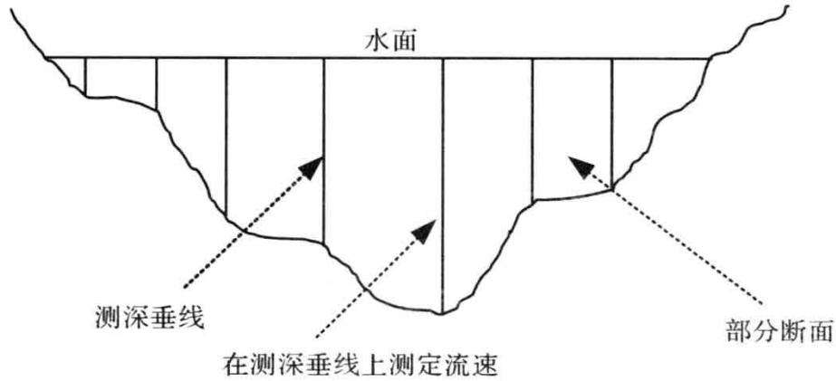  
图5-1 观测断面示意图

利用断面法测流的步骤：

(1)选择观测断面：观测断面一般选择在流域出口，以观测整个小流域的径流量。观测断面处的河道应该平缓顺直，没有跌水等突变点，沟床稳定(不冲不淤)，没有支流汇水的影响。

(2)观测断面的测量：选择好观测断面后，首先进行断面面积的测量。观测断面面积是计算流量的主要依据，断面面积测量误差的大小直接影响测流精度的高低。观测断面的面积可以使用经纬仪准确测量，并绘制观测断面图。由于自然河道的断面是不规则形状，因此，在测量断面时必须将河道断面上的地形突变点在断面图上标注出来，并在这些突变点上作测深垂线。测深垂线将整个断面划分为多个梯形，观测断面的面积等于这些梯形面积之和，如图5-1。

(3)水深测定：在测深垂线上用水尺测定水深，测定时水尺一定要保 持垂直状态。

(4)流速测定与取样：在测定水深的同时，用流速仪测定流速。流速仪是测量流速最常用、最精确的仪器，我国最为常用的流速仪有旋杯式和旋桨式两种。在河流中因不同深度处的流速不同，在测深垂线上测定流速时也必须在不同深度上进行，然后求测深垂线上的平均流速。测定流速时常用1点法、2点法、3点法、5点法，参见流速测点设定表(表5-1)。在测定流速的同时用取样器取泥水样，装入取样瓶带回室内进行过滤、烘干，计算泥沙含量。

表5-1 流速测点设定表
<table><tr><td rowspan=1 colspan=1>测深垂线水深h</td><td rowspan=1 colspan=1>方法名称</td><td rowspan=1 colspan=1>测点位置</td></tr><tr><td rowspan=1 colspan=1>h&lt;1m</td><td rowspan=1 colspan=1>一点法</td><td rowspan=1 colspan=1>0.6h</td></tr><tr><td rowspan=1 colspan=1> $1 \mathrm { m } < h < 3 \mathrm { m }$ </td><td rowspan=1 colspan=1>二点法</td><td rowspan=1 colspan=1>0.2h,0.8h</td></tr><tr><td rowspan=1 colspan=1></td><td rowspan=1 colspan=1>三点法</td><td rowspan=1 colspan=1>0.2h, 0.6h, 0.8h</td></tr><tr><td rowspan=1 colspan=1>h&gt;3m</td><td rowspan=1 colspan=1>五点法</td><td rowspan=1 colspan=1>水面，0.2h，0.6h，08h，河底</td></tr></table>

测深垂线上的平均流速用以下公式计算：

五点法 $V = ( \ V _ { \boldsymbol { 0 } , \boldsymbol { 0 } } + 3 V _ { \boldsymbol { 0 } , 2 } + 3 V _ { \boldsymbol { 0 } , 6 } + 2 V _ { \boldsymbol { 0 } , 8 } + V _ { \boldsymbol { 1 } , 0 } ) / 1 0$

三点法 $V = ( \ : V _ { 0 . 2 } \ : + 2 \ : V _ { 0 . 6 } \ : + \ : V _ { 0 . 8 } ) / 4$

二点法 $V = ( \ : V _ { 0 . 2 } \ : + \ : V _ { 0 . } 6 ) / 2$

一点法 $V = ~ V _ { 0 . 6 }$ 或 $V = k _ { 1 } V _ { 0 . 0 } ( k _ { 1 } = 0 . 8 4 \sim 0 . 8 7 )$

或 $V = k _ { 2 } V _ { 0 . 2 } \left( k _ { 2 } = 0 . 7 8 \sim 0 . 8 4 \right)$

式中：V——垂线平均流速；

$V _ { 0 . 0 }$ ——水面的流速；

$V _ { 0 . 2 }$ ——0.2倍水深处的流速；

$V _ { 0 . 6 }$ ——0.6倍水深处的流速；

$V _ { 0 . 8 }$ —0.8倍水深处的流速；

$V _ { 1 , 0 }$ ——河底处的流速。

测深垂线上的平均含沙量用以下式进行计算：

$$
P _ { j } = { \bigl ( } \begin{array} { l } { P _ { j 1 } + P _ { j 2 } + \cdots + P _ { j n } } \end{array} { \bigr ) } / n
$$

式中： $P _ { j }$ ——测深垂线上的平均含沙量；

$P _ { j i }$ ——测深垂线上某一水深处水样的含沙量；

n—测深垂线上取样的点数。

(5)流量与输沙量计算：某一时刻从观测断面上流出的径流量等于该时刻内各部分断面的流量之和，某一时刻相邻两条测深垂线间的部分流量$Q _ { i j }$ 与部分输沙量 $P _ { \ i j }$ 分别为：

$$
\begin{array} { r } { Q _ { i j } = \big ( V _ { j } + V _ { j - 1 } \big ) / 2 \times S _ { j } } \\ { P _ { i j } = Q _ { i j } \times ( P _ { j } + P _ { j - 1 } ) / 2 } \end{array}
$$

式中： $Q _ { i j }$ ——相邻两条测深垂线间的部分流量；

$V _ { j }$ ——第j条测深垂线的平均流速；

$S _ { j }$ —相邻两条测深垂线间的部分面积；

$P _ { i j }$ —相邻两条测深垂线间的部分输沙量；

$P _ { j }$ ——第j条测深垂线的平均含沙量。

某一时刻断面流量 $Q _ { t }$ 与断面输沙量 $P _ { \ t }$ 为为：

$$
\begin{array} { r } { Q _ { \iota } = \sum Q _ { \iota j } } \\ { P _ { \iota } = \sum P _ { \iota j } } \end{array}
$$

一次洪水的总流量Q与总输沙量P为：

$$
Q ~ = ~ \sum _ { t = 1 } ^ { n } { \left( { { Q } _ { t } } + { { Q } _ { t - 1 } } \right) } \times \Delta t / 2
$$

$$
P = \sum _ { t = 1 } ^ { n } { { { \left( { P _ { t } } + P _ { t - 1 } \right)}  } \times \Delta { t } / 2 }
$$

式中： $\Delta t ^ { . }$ ——两次观测的时间间隔；

n——观测的时段总数。

采用断面法测定小流域径流量和径流过程的记录格式见表5-2，采用

断面法测定小流域输沙量的观测记录格式见表5-3，断面法测流汇总格式 见表54。

表5-2 断面法测流记录表

测定日期：

测定人：

<table><tr><td rowspan=1 colspan=2>观测地点</td><td rowspan=1 colspan=3></td><td rowspan=1 colspan=4>地理坐标</td><td rowspan=1 colspan=2></td><td></td><td rowspan=1 colspan=2>小流域名称</td><td></td><td rowspan=1 colspan=2></td><td rowspan=1 colspan=3>海拔</td><td rowspan=1 colspan=2></td></tr><tr><td rowspan=1 colspan=2>小流域面积</td><td rowspan=1 colspan=3></td><td rowspan=1 colspan=4>流域长度</td><td rowspan=1 colspan=2></td><td></td><td rowspan=1 colspan=2>流域平均坡度</td><td></td><td rowspan=1 colspan=2></td><td rowspan=1 colspan=3>形状系数</td><td rowspan=1 colspan=2></td></tr><tr><td rowspan=1 colspan=2>沟壑密度</td><td rowspan=1 colspan=3></td><td rowspan=1 colspan=4>沟道比降</td><td rowspan=1 colspan=2></td><td></td><td rowspan=1 colspan=2>林地面积</td><td></td><td rowspan=1 colspan=2></td><td rowspan=1 colspan=3>草地面积</td><td rowspan=1 colspan=2></td></tr><tr><td rowspan=1 colspan=2>农地面积</td><td rowspan=1 colspan=3></td><td rowspan=1 colspan=4>园地面积</td><td rowspan=1 colspan=2></td><td></td><td rowspan=1 colspan=2>河道面积</td><td></td><td rowspan=1 colspan=2></td><td rowspan=1 colspan=3>道路面积</td><td rowspan=1 colspan=2></td></tr><tr><td rowspan=1 colspan=2>土壤类型</td><td rowspan=1 colspan=3></td><td rowspan=1 colspan=4>土壤厚度</td><td rowspan=1 colspan=2></td><td></td><td rowspan=1 colspan=2>母质</td><td></td><td rowspan=1 colspan=2></td><td rowspan=1 colspan=2>基岩</td><td></td><td rowspan=1 colspan=2></td></tr><tr><td rowspan=1 colspan=3>观测断面的坐标</td><td rowspan=1 colspan=4></td><td rowspan=1 colspan=5>观测断面最大宽度</td><td rowspan=1 colspan=2></td><td></td><td rowspan=1 colspan=4>观测断面平均比降</td><td rowspan=1 colspan=3></td></tr><tr><td rowspan=1 colspan=3>降雨量</td><td rowspan=1 colspan=4></td><td rowspan=1 colspan=5>5min 雨强</td><td rowspan=1 colspan=2></td><td></td><td rowspan=1 colspan=4>10min 雨强</td><td rowspan=1 colspan=3></td></tr><tr><td rowspan=1 colspan=3>降雨历时</td><td rowspan=1 colspan=4></td><td rowspan=1 colspan=5>30min 雨强</td><td rowspan=1 colspan=2></td><td></td><td rowspan=1 colspan=4>60min 雨强</td><td rowspan=1 colspan=3></td></tr><tr><td rowspan=1 colspan=1>日期时间</td><td rowspan=1 colspan=3>起点距</td><td rowspan=1 colspan=2>水深</td><td rowspan=1 colspan=16>测流记录</td></tr><tr><td rowspan=11 colspan=1></td><td rowspan=2 colspan=3></td><td rowspan=2 colspan=2></td><td rowspan=1 colspan=2>测点</td><td rowspan=1 colspan=2></td><td rowspan=1 colspan=1></td><td rowspan=1 colspan=2></td><td rowspan=1 colspan=1></td><td rowspan=1 colspan=2></td><td rowspan=1 colspan=2>平均</td><td rowspan=1 colspan=3>断面面积</td><td rowspan=1 colspan=1>断面流量</td></tr><tr><td rowspan=1 colspan=2>流速</td><td rowspan=1 colspan=2></td><td rowspan=1 colspan=1></td><td rowspan=1 colspan=2></td><td rowspan=1 colspan=1></td><td rowspan=1 colspan=2></td><td rowspan=1 colspan=2></td><td rowspan=2 colspan=3></td><td rowspan=2 colspan=1></td></tr><tr><td rowspan=2 colspan=3></td><td rowspan=2 colspan=2></td><td rowspan=1 colspan=2>测点</td><td rowspan=1 colspan=2></td><td rowspan=1 colspan=1></td><td rowspan=1 colspan=2></td><td rowspan=1 colspan=1></td><td rowspan=1 colspan=2></td><td rowspan=1 colspan=2>平均</td></tr><tr><td rowspan=1 colspan=2>流速</td><td rowspan=1 colspan=2></td><td rowspan=1 colspan=1></td><td rowspan=1 colspan=2></td><td rowspan=1 colspan=1></td><td rowspan=1 colspan=2></td><td rowspan=1 colspan=2></td><td rowspan=2 colspan=3></td><td rowspan=2 colspan=1></td></tr><tr><td rowspan=2 colspan=3></td><td rowspan=2 colspan=2></td><td rowspan=1 colspan=2>测点</td><td rowspan=1 colspan=2></td><td rowspan=1 colspan=1></td><td rowspan=1 colspan=2></td><td rowspan=1 colspan=1></td><td rowspan=1 colspan=2></td><td rowspan=1 colspan=2>平均</td></tr><tr><td rowspan=1 colspan=2>流速</td><td rowspan=1 colspan=2></td><td rowspan=1 colspan=1></td><td rowspan=1 colspan=2></td><td rowspan=1 colspan=1></td><td rowspan=1 colspan=2></td><td rowspan=1 colspan=2></td><td rowspan=2 colspan=3></td><td rowspan=2 colspan=1></td></tr><tr><td rowspan=2 colspan=3></td><td rowspan=2 colspan=2></td><td rowspan=1 colspan=2>测点</td><td rowspan=1 colspan=2></td><td rowspan=1 colspan=1></td><td rowspan=1 colspan=2></td><td rowspan=1 colspan=1></td><td rowspan=1 colspan=2></td><td rowspan=1 colspan=2>平均</td></tr><tr><td rowspan=1 colspan=2>流速</td><td rowspan=1 colspan=2></td><td rowspan=1 colspan=1></td><td rowspan=1 colspan=2></td><td rowspan=1 colspan=1></td><td rowspan=1 colspan=2></td><td rowspan=1 colspan=2></td><td rowspan=2 colspan=3></td><td rowspan=2 colspan=1></td></tr><tr><td rowspan=2 colspan=3></td><td rowspan=2 colspan=2></td><td rowspan=1 colspan=2>测点</td><td rowspan=1 colspan=2></td><td rowspan=1 colspan=1></td><td rowspan=1 colspan=2></td><td rowspan=1 colspan=1></td><td rowspan=1 colspan=2></td><td rowspan=1 colspan=2>平均</td></tr><tr><td rowspan=1 colspan=2>流速</td><td rowspan=1 colspan=2></td><td rowspan=1 colspan=1></td><td rowspan=1 colspan=2></td><td rowspan=1 colspan=1></td><td rowspan=1 colspan=2></td><td rowspan=1 colspan=2></td><td rowspan=2 colspan=3></td><td rowspan=2 colspan=1></td></tr><tr><td rowspan=1 colspan=3></td><td rowspan=1 colspan=2></td><td rowspan=1 colspan=2></td><td rowspan=1 colspan=2></td><td rowspan=1 colspan=1></td><td rowspan=1 colspan=2></td><td rowspan=1 colspan=1></td><td rowspan=1 colspan=2></td><td rowspan=1 colspan=2></td></tr></table>

表5-3 断面法泥沙观测记录表

测定日期：

测定人：

<table><tr><td rowspan=1 colspan=2>观测地点</td><td rowspan=1 colspan=3></td><td rowspan=1 colspan=4>地理坐标</td><td rowspan=1 colspan=3></td><td rowspan=1 colspan=4>小流域名称</td><td rowspan=1 colspan=3></td><td rowspan=1 colspan=2>海拔</td><td rowspan=1 colspan=1></td></tr><tr><td rowspan=1 colspan=2>小流域面积</td><td rowspan=1 colspan=3></td><td rowspan=1 colspan=4>流域长度</td><td rowspan=1 colspan=3></td><td rowspan=1 colspan=4>流域平均坡度</td><td rowspan=1 colspan=3></td><td rowspan=1 colspan=2>形状系数</td><td rowspan=1 colspan=1></td></tr><tr><td rowspan=1 colspan=2>沟壑密度</td><td rowspan=1 colspan=3></td><td rowspan=1 colspan=4>沟道比降</td><td rowspan=1 colspan=3></td><td rowspan=1 colspan=4>林地面积</td><td rowspan=1 colspan=3></td><td rowspan=1 colspan=2>草地面积</td><td rowspan=1 colspan=1></td></tr><tr><td rowspan=1 colspan=2>农地面积</td><td rowspan=1 colspan=3></td><td rowspan=1 colspan=4>园地面积</td><td rowspan=1 colspan=3></td><td rowspan=1 colspan=4>河道面积</td><td rowspan=1 colspan=3></td><td rowspan=1 colspan=2>道路面积</td><td rowspan=1 colspan=1></td></tr><tr><td rowspan=1 colspan=2>土壤类型</td><td rowspan=1 colspan=3></td><td rowspan=1 colspan=4>土壤厚度</td><td rowspan=1 colspan=3></td><td rowspan=1 colspan=7>母质</td><td rowspan=1 colspan=2>基岩</td><td rowspan=1 colspan=1></td></tr><tr><td rowspan=1 colspan=3>观测断面的坐标</td><td rowspan=1 colspan=4></td><td rowspan=1 colspan=6>观测断面最大宽度</td><td rowspan=1 colspan=4></td><td rowspan=1 colspan=4>观测断面平均比降</td><td rowspan=1 colspan=1></td></tr><tr><td rowspan=1 colspan=3>降雨量</td><td rowspan=1 colspan=4></td><td rowspan=1 colspan=6>5min 雨强</td><td rowspan=1 colspan=4></td><td rowspan=1 colspan=4>10min 雨强</td><td rowspan=1 colspan=1></td></tr><tr><td rowspan=1 colspan=3>降雨历时</td><td rowspan=1 colspan=4></td><td rowspan=1 colspan=6>30min 雨强</td><td rowspan=1 colspan=4></td><td rowspan=1 colspan=4>60min 雨强</td><td rowspan=1 colspan=1></td></tr><tr><td rowspan=1 colspan=1>日期时间</td><td rowspan=1 colspan=3>起点距</td><td rowspan=1 colspan=2>水深</td><td rowspan=1 colspan=2>测点</td><td rowspan=1 colspan=2>瓶号</td><td rowspan=1 colspan=1>瓶重</td><td rowspan=1 colspan=3>体积</td><td rowspan=1 colspan=1>泥水重</td><td rowspan=1 colspan=3>干泥重</td><td rowspan=1 colspan=2>净水率</td><td rowspan=1 colspan=1>含沙率</td><td rowspan=1 colspan=1>平均</td></tr><tr><td rowspan=5 colspan=1></td><td rowspan=5 colspan=3></td><td rowspan=5 colspan=2></td><td rowspan=1 colspan=2></td><td rowspan=1 colspan=2></td><td rowspan=1 colspan=1></td><td rowspan=1 colspan=3></td><td rowspan=1 colspan=1></td><td rowspan=1 colspan=3></td><td rowspan=1 colspan=2></td><td rowspan=1 colspan=1></td><td rowspan=5 colspan=1></td></tr><tr><td rowspan=1 colspan=2></td><td rowspan=1 colspan=2></td><td rowspan=1 colspan=1></td><td rowspan=1 colspan=3></td><td rowspan=1 colspan=1></td><td rowspan=1 colspan=3></td><td rowspan=1 colspan=2></td><td rowspan=1 colspan=1></td></tr><tr><td rowspan=1 colspan=2></td><td rowspan=1 colspan=2></td><td rowspan=1 colspan=1></td><td rowspan=1 colspan=3></td><td rowspan=1 colspan=1></td><td rowspan=1 colspan=3></td><td rowspan=1 colspan=2></td><td rowspan=1 colspan=1></td></tr><tr><td rowspan=1 colspan=2></td><td rowspan=1 colspan=2></td><td rowspan=1 colspan=1></td><td rowspan=1 colspan=3></td><td rowspan=1 colspan=1></td><td rowspan=1 colspan=3></td><td rowspan=1 colspan=2></td><td rowspan=1 colspan=1></td></tr><tr><td rowspan=1 colspan=2></td><td rowspan=1 colspan=2></td><td rowspan=1 colspan=1></td><td rowspan=1 colspan=3></td><td rowspan=1 colspan=1></td><td rowspan=1 colspan=3></td><td rowspan=1 colspan=2></td><td rowspan=1 colspan=1></td></tr><tr><td rowspan=5 colspan=1></td><td rowspan=5 colspan=3></td><td rowspan=5 colspan=2></td><td rowspan=1 colspan=2></td><td rowspan=1 colspan=2></td><td rowspan=1 colspan=1></td><td rowspan=1 colspan=3></td><td rowspan=1 colspan=1></td><td rowspan=1 colspan=3></td><td rowspan=1 colspan=2></td><td rowspan=1 colspan=1></td><td rowspan=5 colspan=1></td></tr><tr><td rowspan=1 colspan=2></td><td rowspan=1 colspan=2></td><td rowspan=1 colspan=1></td><td rowspan=1 colspan=3></td><td rowspan=1 colspan=1></td><td rowspan=1 colspan=3></td><td rowspan=1 colspan=2></td><td rowspan=1 colspan=1></td></tr><tr><td rowspan=1 colspan=2></td><td rowspan=1 colspan=2></td><td rowspan=1 colspan=1></td><td rowspan=1 colspan=3></td><td rowspan=1 colspan=1></td><td rowspan=1 colspan=3></td><td rowspan=1 colspan=2></td><td rowspan=1 colspan=1></td></tr><tr><td rowspan=1 colspan=2></td><td rowspan=1 colspan=2></td><td rowspan=1 colspan=1></td><td rowspan=1 colspan=3></td><td rowspan=1 colspan=1></td><td rowspan=1 colspan=3></td><td rowspan=1 colspan=2></td><td rowspan=1 colspan=1></td></tr><tr><td rowspan=1 colspan=2></td><td rowspan=1 colspan=2></td><td rowspan=1 colspan=1></td><td rowspan=1 colspan=3></td><td rowspan=1 colspan=1></td><td rowspan=1 colspan=3></td><td rowspan=1 colspan=2></td><td rowspan=1 colspan=1></td></tr></table>

汇总日期：

汇总人：

表5-4 断面法测流汇总表

测定日期：

<table><tr><td rowspan=1 colspan=2>地点</td><td rowspan=1 colspan=3></td><td rowspan=1 colspan=4>地理坐标</td><td rowspan=1 colspan=2></td><td rowspan=1 colspan=3>小流域名称</td><td rowspan=1 colspan=4></td><td rowspan=1 colspan=2>海拔</td><td rowspan=1 colspan=1></td></tr><tr><td rowspan=1 colspan=2>小流域面积</td><td rowspan=1 colspan=3></td><td rowspan=1 colspan=4>流域长度</td><td rowspan=1 colspan=2></td><td rowspan=1 colspan=3>流域平均坡度</td><td rowspan=1 colspan=3></td><td></td><td rowspan=1 colspan=2>形状系数</td><td rowspan=1 colspan=1></td></tr><tr><td rowspan=1 colspan=2>沟壑密度</td><td rowspan=1 colspan=3></td><td rowspan=1 colspan=4>沟道比降</td><td rowspan=1 colspan=2></td><td rowspan=1 colspan=3>林地面积</td><td rowspan=1 colspan=3></td><td></td><td rowspan=1 colspan=2>草地面积</td><td rowspan=1 colspan=1></td></tr><tr><td rowspan=1 colspan=2>农地面积</td><td rowspan=1 colspan=3></td><td rowspan=1 colspan=4>园地面积</td><td rowspan=1 colspan=2></td><td rowspan=1 colspan=3>河道面积</td><td></td><td rowspan=1 colspan=3></td><td rowspan=1 colspan=2>道路面积</td><td rowspan=1 colspan=1></td></tr><tr><td rowspan=1 colspan=2>土壤类型</td><td rowspan=1 colspan=3></td><td rowspan=1 colspan=4>土壤厚度</td><td rowspan=1 colspan=2></td><td rowspan=1 colspan=4>母质</td><td rowspan=1 colspan=3></td><td rowspan=1 colspan=2>基岩</td><td rowspan=1 colspan=1></td></tr><tr><td rowspan=1 colspan=3>观测断面的坐标</td><td rowspan=1 colspan=4></td><td rowspan=1 colspan=4>观测断面最大宽度</td><td></td><td rowspan=1 colspan=3></td><td rowspan=1 colspan=4>观测断面平均比降</td><td rowspan=1 colspan=2></td></tr><tr><td rowspan=1 colspan=3>降雨量</td><td rowspan=1 colspan=4></td><td rowspan=1 colspan=4>5min 雨强</td><td></td><td rowspan=1 colspan=3></td><td rowspan=1 colspan=4>10min 雨强</td><td rowspan=1 colspan=2></td></tr><tr><td rowspan=1 colspan=3>降雨历时</td><td rowspan=1 colspan=4></td><td rowspan=1 colspan=4>30min雨强</td><td></td><td rowspan=1 colspan=3></td><td rowspan=1 colspan=4>60min雨强</td><td rowspan=1 colspan=2></td></tr><tr><td rowspan=1 colspan=1>日期时间</td><td rowspan=1 colspan=3>起点距</td><td rowspan=1 colspan=1>水深</td><td></td><td rowspan=1 colspan=4>部分断面面积</td><td rowspan=1 colspan=3>部分断面流量部</td><td rowspan=1 colspan=4>分断面输沙量</td><td rowspan=1 colspan=3>断面径流量</td><td rowspan=1 colspan=1>断面输沙量</td></tr><tr><td rowspan=5 colspan=1></td><td rowspan=1 colspan=3></td><td rowspan=1 colspan=1></td><td></td><td rowspan=1 colspan=4></td><td rowspan=1 colspan=3></td><td rowspan=1 colspan=4></td><td rowspan=5 colspan=3></td><td rowspan=5 colspan=1></td></tr><tr><td rowspan=1 colspan=3></td><td rowspan=1 colspan=1></td><td></td><td rowspan=1 colspan=4></td><td rowspan=1 colspan=3></td><td rowspan=1 colspan=4></td></tr><tr><td rowspan=1 colspan=3></td><td rowspan=1 colspan=1></td><td></td><td rowspan=1 colspan=4></td><td rowspan=1 colspan=3></td><td rowspan=1 colspan=4></td></tr><tr><td rowspan=1 colspan=3></td><td rowspan=1 colspan=1></td><td></td><td rowspan=1 colspan=4></td><td rowspan=1 colspan=3></td><td rowspan=1 colspan=4></td></tr><tr><td rowspan=1 colspan=3></td><td rowspan=1 colspan=1></td><td></td><td rowspan=1 colspan=4></td><td rowspan=1 colspan=3></td><td rowspan=1 colspan=4></td></tr><tr><td rowspan=5 colspan=1></td><td rowspan=1 colspan=3></td><td rowspan=1 colspan=1></td><td></td><td rowspan=1 colspan=4></td><td rowspan=1 colspan=3></td><td rowspan=1 colspan=4></td><td rowspan=5 colspan=3></td><td rowspan=5 colspan=1></td></tr><tr><td rowspan=1 colspan=3></td><td rowspan=1 colspan=1></td><td></td><td rowspan=1 colspan=4></td><td rowspan=1 colspan=3></td><td rowspan=1 colspan=4></td></tr><tr><td rowspan=1 colspan=3></td><td rowspan=1 colspan=1></td><td></td><td rowspan=1 colspan=4></td><td rowspan=1 colspan=3></td><td rowspan=1 colspan=4></td></tr><tr><td rowspan=1 colspan=3></td><td rowspan=1 colspan=1></td><td></td><td rowspan=1 colspan=4></td><td rowspan=1 colspan=3></td><td rowspan=1 colspan=4></td></tr><tr><td rowspan=1 colspan=3></td><td rowspan=1 colspan=1></td><td></td><td rowspan=1 colspan=4></td><td rowspan=1 colspan=3></td><td rowspan=1 colspan=4></td></tr><tr><td rowspan=5 colspan=1></td><td rowspan=1 colspan=3></td><td rowspan=1 colspan=1></td><td></td><td rowspan=1 colspan=4></td><td rowspan=1 colspan=3></td><td rowspan=1 colspan=4></td><td rowspan=5 colspan=3></td><td rowspan=5 colspan=1></td></tr><tr><td rowspan=1 colspan=3></td><td rowspan=1 colspan=1></td><td></td><td rowspan=1 colspan=4></td><td rowspan=1 colspan=3></td><td rowspan=1 colspan=4></td></tr><tr><td rowspan=1 colspan=3></td><td rowspan=1 colspan=1></td><td></td><td rowspan=1 colspan=4></td><td rowspan=1 colspan=3></td><td rowspan=1 colspan=4></td></tr><tr><td rowspan=1 colspan=3></td><td rowspan=1 colspan=1></td><td></td><td rowspan=1 colspan=4></td><td rowspan=1 colspan=3></td><td rowspan=1 colspan=4></td></tr><tr><td rowspan=1 colspan=3></td><td rowspan=1 colspan=1></td><td></td><td rowspan=1 colspan=4></td><td rowspan=1 colspan=3></td><td rowspan=1 colspan=4></td></tr><tr><td rowspan=1 colspan=3>洪水开始时间</td><td rowspan=1 colspan=5></td><td rowspan=1 colspan=3>洪峰流量</td><td></td><td rowspan=1 colspan=4></td><td rowspan=1 colspan=3>最大含沙量</td><td rowspan=1 colspan=2></td></tr><tr><td rowspan=1 colspan=3>洪水结束时间</td><td rowspan=1 colspan=5></td><td rowspan=1 colspan=3>平均流量</td><td></td><td rowspan=1 colspan=4></td><td rowspan=1 colspan=3>平均含沙量</td><td rowspan=1 colspan=2></td></tr><tr><td rowspan=1 colspan=3>洪水历时</td><td rowspan=1 colspan=5></td><td rowspan=1 colspan=3>洪水总量</td><td></td><td rowspan=1 colspan=4></td><td rowspan=1 colspan=3>输沙总量</td><td rowspan=1 colspan=2></td></tr><tr><td rowspan=1 colspan=3>径流系数</td><td rowspan=1 colspan=5></td><td rowspan=1 colspan=3>径流深</td><td></td><td rowspan=1 colspan=4></td><td rowspan=1 colspan=3>侵蚀模数</td><td rowspan=1 colspan=2></td></tr></table>

## 5.3.2 量水建筑物测流

量水建筑物是用于测定小流域径流量和径流过程的建筑物，常用的量水建筑物有测流堰和测流槽，包括薄壁堰、宽顶堰、三角形剖面堰、平坦V型堰、长喉道槽、段喉道槽。薄壁堰中最具代表性的为三角堰、矩形堰、梯形堰，长喉道槽有矩形长喉道槽和梯形长喉道槽，短喉道槽中代表性的有巴歇尔槽，如图5-2至图5-8。

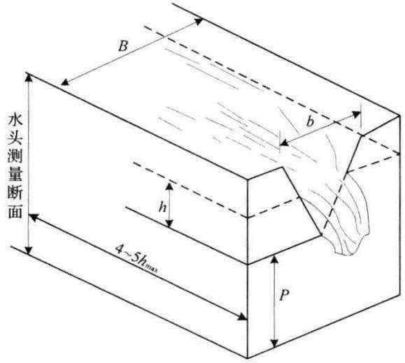  
图5-2 三角形薄壁堰示意图

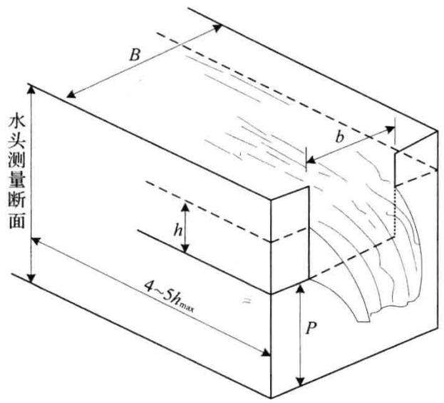  
图5-3 矩形薄壁堰示意图

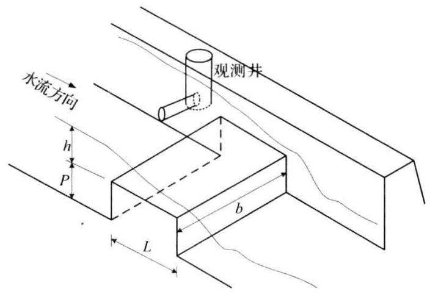  
图5-4 宽顶堰剖面示意图

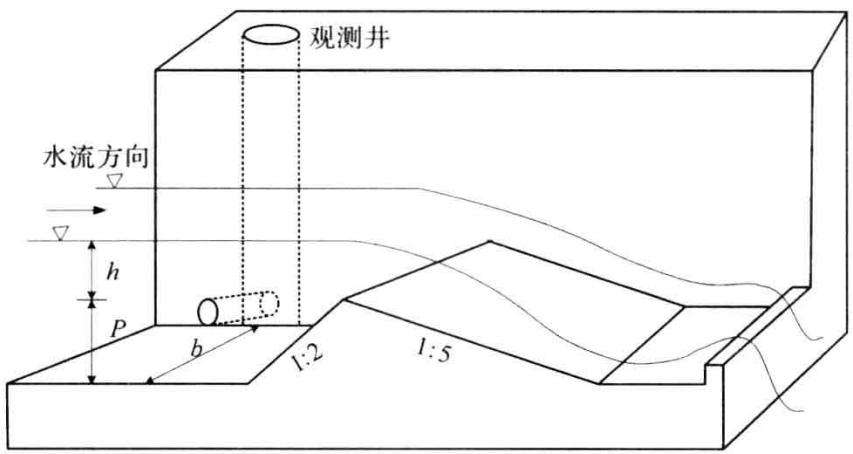  
图5-5三角形剖面堰剖面示意图

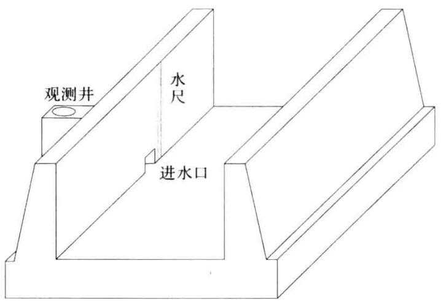  
图5-6 矩形测流槽示意图

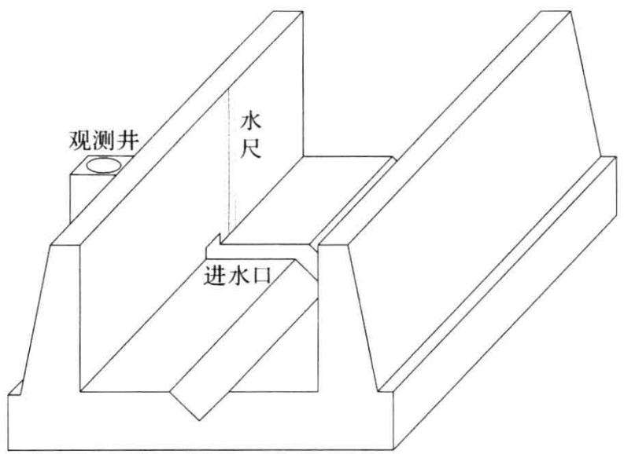

图5-7 复合型测流槽示意图  
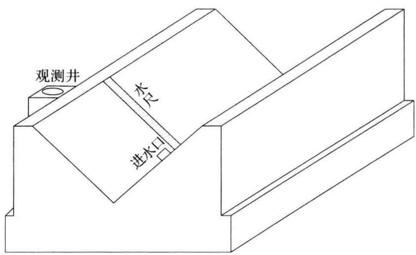  
图5-8 三角形测流槽示意图

量水建筑物一般由观测室、观测井、进水口、导水管、堰体、引水墙、沉沙池、水尺等组成。观测室是安置水位计等观测仪器的小屋，一般修建在量水建筑物的一侧，屋内有观测井，观测井通过导水管、进水口与量水建筑物上的水体相通。堰体是量水建筑物的主体，不同的量水建筑物其建筑材料和尺寸各不相同，但堰体上水流的流动必须平稳。引水墙是将河道内所有水流导入量水建筑物的构件，一般成“八”字形，经常采用混凝土浇筑。沉沙池是修建在量水建筑物上游，收集推移质泥沙的构件，一般用混凝土浇筑而成，其大小以能容纳一次洪水携带的所有推移质泥沙量为原则。水尺是安装在量水建筑物上用于人工观测水位的观测设备。

利用量水建筑物测定径流就是通过观测量水建筑物上水位的变化过程，根据量水建筑物的水位流量关系曲线，计算出径流量的变化过程。因此，利用量水建筑物测定径流的关键就是水位的观测。

## 5.3.2.1 水位测定

水位的测定有两种方法，一种是利用安装在量水建筑物上的水尺观测，观测时人工读取水位数据，并记录该水位出现的时间，人工观测应该从河道中水位开始上涨开始，直到水位回落并稳定后结束，人工观测的时间间隔可以固定(如1h)，也可以根据水位变化随时观测。第二种方法是在测流建筑物上安装自记水位计，自动观测和记录水位变化。

利用水尺观测水位变化时，观测的时间间隔不尽相同，为了计算日平均水位，可以采用面积包围法。面积包围法就是以时间为横坐标，以水位为纵坐标，绘制0\~24h的水位过程线，水位过程线与时间轴围成的面积(多边形ABCD的面积)除以24h即为日平均水位(图5-9)。

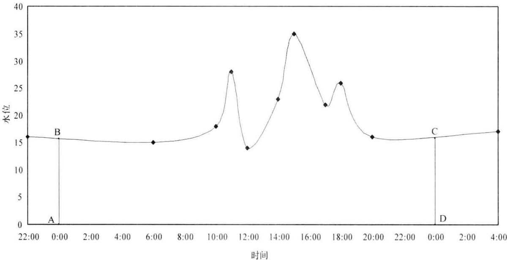  
图5-9 面积包围法计算日平均水位示意图

如果利用自记水位计观测水位变化，由于观测时间间隔相等，可以直接用算术平均法求得日平均水位，即将各时刻的水位值求平均得出。利用水位计观测水位时，必须保证水位计计时准确，同时每隔一定时间必须对水位计的读数进行人工验证，利用人工实测的水位值订正水位计的记录值，每次订正均要有明确的订正记录，以供数据整理人员在整理与分析数据时参考。

水位计是能够自动观测水位变化过程的仪器，常用的水位计有浮子式水位计、压力式水位计、超声波式水位计。各种水位计在量水堰上的安装，分别如图5-10至图5-12。

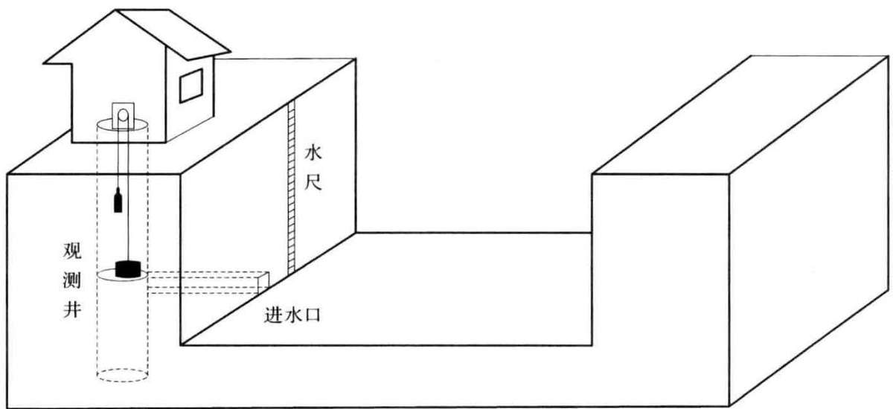  
图5-10 浮子式水位计安装示意图

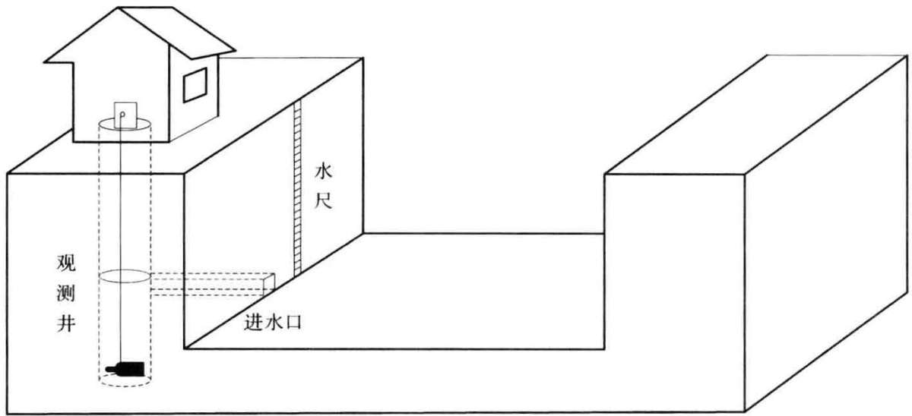  
图5-11 压力式水位计安装示意图

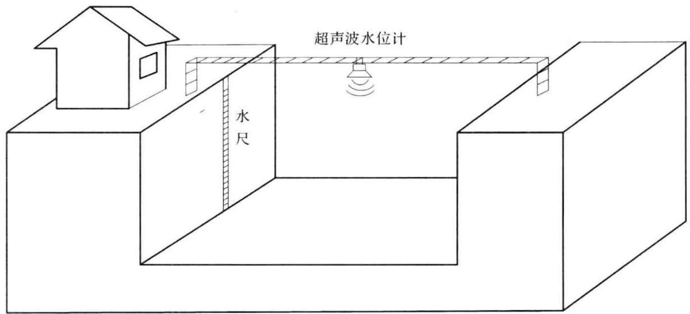  
图5-12 超声波式水位计安装示意图

浮子式水位计是将在水面漂浮的浮子用钢丝和一重锤相连后挂在定滑轮上，重锤和浮子处于平衡状态，当水位上升或下降时，在浮子和重锤的作用下定滑轮会旋转，在一定时间内水位上升或下降的高度可以通过定滑轮旋转的角度记录在记录纸上，或保存在数据存储器中。浮子式水位计是最常用的自记水位计，有两种记录方式。一种是将水位变化画在记录纸上，记录纸上的横坐标是时间，纵坐标是水位，浮子式水位计能够将水位的变化过程在记录纸上如实地画出来，但每次观测后需要数据分析人员在室内按时间摘录水位数据。另一种是把浮子上升或下降的高度(水位变化量)转化成数字信号，保存在数据存储器中，观测一定时段后直接将数据存储器中的数据下载到计算机中，形成水位和相应时间的数据文件。浮子式水位计的优劣可以用两个指标进行判断，一个是时间的准确性，要求≤1min/日，另一个是水位观测的精度，要求 $\leqslant 1 \mathrm { m m }$ 。利用浮子式水位计观测水位时，因浮子是放在观测井中，如果观测井中淤积泥沙的高度高于进水口的水位，浮子式水位计就不能如实反映量水堰中的水位变化，因此，每次降雨后必须清理观测井中和进水口的淤泥，以保证量水堰水位和观测并水位变化的一致性。

压力式水位计利用水压力与水深成正比的原理测定水位变化，是一种数字式的水位计，体积小，使用方便。使用时可以直接将压力式水位计固定在量水堰中进行观测(容易丢失），也可以将压力式水位计放入观测井中进行观测(容易受泥沙淤积的影响)。但水的压力与水中所含物质(特别是泥沙含量)密切相关，在相同的水深条件下，水体中泥沙含量越高，水的比重越大，水压力也越大。因此，用压力式水位计观测清水和浑水所得的水位数据往往会相差很大，即使是在一次洪水过程中水深相同，但由于泥沙含量不同，压力式水位计测出的水位数据也会相差很大，因此压力式水位计一般比较适合于观测泥沙含量较低的径流，尤其适合测定地下水位的变化。另外压力式水位计是投入水体中进行观测的，观测到的压力是水压力和大气压力之和，而大气压力在一天中的变化也较为剧烈，不同的天气状况下也有着不同的大气压力，因此用压力式水位计测定水位变化时，必须消除大气压力变化的影响。消除大气压力变化影响的方法有两种，一种是在压力式水位计上增加通气管，以消除大气压力的影响；另外一种办法是使用两台压力式水位计，一台投入水中观测，一台放在空气中观测，两台仪器观测值的差值就是水位值。

超声波水位计是利用超声波在空气中传播速度恒定这一原理观测水位的，当超声波发生器到水面距离一定时(即在某一水位时)，从超声波发生器发出的超声波到达水面再返回到接收器所用的时间T也为定值，当水位升高或下降后，时间T就会减小或增加。水位升高或下降的高度与时间T减小或增加的量成正比。超声波水位计也是一种非接触的数字式水位计，安装在量水堰正上方直接观测水面的变化，因此不受水体中泥沙含量与泥沙淤积的影响，但超声波水位计的准确度受温度影响很大，大多数超声波水位计均有温度自动修正和补偿功能，但水位误差仍然较大。另外大气压力和空气中的粉尘对超声波在空气中的传播速度影响也较大，这也会影响超声波水位计的观测精度。所以在使用超声波水位计的过程中必须利用人工观测数据，定期对超声波水位计的观测数据进行校核。

不论使用哪种水位计，都必须定期对安装在量水堰上的水位计进行巡查，巡查时检查进水口是否有泥沙淤积或杂物堵塞，检查观测井泥沙淤积是否高于进水口，如果泥沙淤积严重必须及时清淤。另外巡查时通过量水堰上的水尺读取水位数据(或直接用钢尺测定进水口的水深)，并记录相应的时间，该巡查记录可作为水位计观测数据的补充，还可用于水位计观测数据的校正。每次巡查时必须对水位计的记录值与水尺上的读数进行比对，以检查水位计读数的准确性，如果有误差，必须对水位计进行校正，并做好水位计校正记录，以作为后期数据整编时的依据。同时必须对水位计的时间进行校对，检查水位计的电池、电瓶电量是否充足，如果电量不足应立刻更换。

## 5.3.2.2 量水建筑物的标定

利用量水建筑物测流就是通过观测量水建筑物上水位的变化，通过水位流量关系曲线计算出流量。但野外修建的量水建筑物与实验室设计的量水建筑物肯定有一定的差距，因此对野外量水建筑物的水位流量关系曲线必须进行标定后才可以使用。量水建筑物的水位流量关系曲线一般可以用流速面积法进行标定。

流速面积法就是利用流速仪测定平均流速，同时测定量水建筑物上的水位，通过水位和量水建筑物的断面尺寸计算出过水断面面积，流速与断面面积的乘积就是流量。以水位为横坐标，流量为纵坐标，点绘出水位流量关系曲线，或用数学方法拟合出水位流量方程。量水建筑物水位流量关系曲线标定记录见表5-5。

表5-5量水建筑物水位流量关系曲线标定记录表

标定日期：

标定人：

<table><tr><td rowspan=1 colspan=2>量水建筑物类型</td><td rowspan=1 colspan=3></td><td rowspan=1 colspan=5>量水建筑物的长度×宽度×高度</td><td rowspan=1 colspan=4></td></tr><tr><td rowspan=1 colspan=2>量水建筑物比降</td><td rowspan=1 colspan=3></td><td rowspan=1 colspan=2>流速仪类型</td><td rowspan=1 colspan=3></td><td rowspan=1 colspan=2>水位观测方法</td><td rowspan=1 colspan=2></td></tr><tr><td rowspan=1 colspan=2>其他</td><td rowspan=1 colspan=12></td></tr><tr><td rowspan=1 colspan=1>时间</td><td rowspan=1 colspan=2>水位</td><td rowspan=1 colspan=1>断面面积</td><td rowspan=1 colspan=2>流速1</td><td rowspan=1 colspan=2>流速2</td><td rowspan=1 colspan=1>流速3</td><td rowspan=1 colspan=2>平均流速</td><td rowspan=1 colspan=2>流量</td><td rowspan=1 colspan=1>糙率</td></tr><tr><td rowspan=1 colspan=1></td><td rowspan=1 colspan=2></td><td rowspan=1 colspan=1></td><td rowspan=1 colspan=2></td><td rowspan=1 colspan=2></td><td rowspan=1 colspan=1></td><td rowspan=1 colspan=2></td><td rowspan=1 colspan=2></td><td rowspan=1 colspan=1></td></tr><tr><td rowspan=1 colspan=1></td><td rowspan=1 colspan=2></td><td rowspan=1 colspan=1></td><td rowspan=1 colspan=2></td><td rowspan=1 colspan=2></td><td rowspan=1 colspan=1></td><td rowspan=1 colspan=2></td><td rowspan=1 colspan=2></td><td rowspan=1 colspan=1></td></tr><tr><td rowspan=1 colspan=1></td><td rowspan=1 colspan=2></td><td rowspan=1 colspan=1></td><td rowspan=1 colspan=2></td><td rowspan=1 colspan=2></td><td rowspan=1 colspan=1></td><td rowspan=1 colspan=2></td><td rowspan=1 colspan=2></td><td rowspan=1 colspan=1></td></tr><tr><td rowspan=1 colspan=1></td><td rowspan=1 colspan=2></td><td rowspan=1 colspan=1></td><td rowspan=1 colspan=2></td><td rowspan=1 colspan=2></td><td rowspan=1 colspan=1></td><td rowspan=1 colspan=2></td><td rowspan=1 colspan=2></td><td rowspan=1 colspan=1></td></tr><tr><td rowspan=1 colspan=1></td><td rowspan=1 colspan=2></td><td rowspan=1 colspan=1></td><td rowspan=1 colspan=2></td><td rowspan=1 colspan=2></td><td rowspan=1 colspan=1></td><td rowspan=1 colspan=2></td><td rowspan=1 colspan=2></td><td rowspan=1 colspan=1></td></tr><tr><td rowspan=1 colspan=1></td><td rowspan=1 colspan=2></td><td rowspan=1 colspan=1></td><td rowspan=1 colspan=2></td><td rowspan=1 colspan=2></td><td rowspan=1 colspan=1></td><td rowspan=1 colspan=2></td><td rowspan=1 colspan=2></td><td rowspan=1 colspan=1></td></tr><tr><td rowspan=1 colspan=1></td><td rowspan=1 colspan=2></td><td rowspan=1 colspan=1></td><td rowspan=1 colspan=2></td><td rowspan=1 colspan=2></td><td rowspan=1 colspan=1></td><td rowspan=1 colspan=2></td><td rowspan=1 colspan=2></td><td rowspan=1 colspan=1></td></tr><tr><td rowspan=1 colspan=1></td><td rowspan=1 colspan=2></td><td rowspan=1 colspan=1></td><td rowspan=1 colspan=2></td><td rowspan=1 colspan=2></td><td rowspan=1 colspan=1></td><td rowspan=1 colspan=2></td><td rowspan=1 colspan=2></td><td rowspan=1 colspan=1></td></tr><tr><td rowspan=1 colspan=1></td><td rowspan=1 colspan=2></td><td rowspan=1 colspan=1></td><td rowspan=1 colspan=2></td><td rowspan=1 colspan=2></td><td rowspan=1 colspan=1></td><td rowspan=1 colspan=2></td><td rowspan=1 colspan=2></td><td rowspan=1 colspan=1></td></tr></table>

在实际标定过程中，不可能对各种水位都能够进行标定，此时可以利用测定出的流速，采用谢才公式和曼宁公式计算出量水建筑物的糙率。再利用计算出的糙率，反复应用曼宁公式和谢才公式，推算出不同水位时的流量。谢才公式和曼宁公式的表达式分别为：

谢才公式： $V = C \left( R J \right) ^ { \frac { 1 } { 2 } }$

曼宁公式： $C = \frac { 1 } { n } { R } ^ { \frac { 1 } { \delta } }$

式中：V——流速；

C——谢才系数；

R—水力半径，是过水断面面积与湿周(水流与固体边界接触部分的周长)之比；

J水力坡度，是水流沿程的水头损失，即量水建筑物的底面比降；

n——糙率。

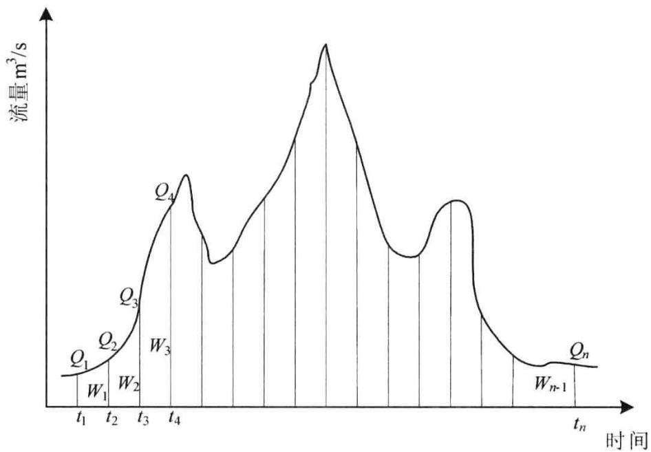  
图5-13 流量计算示意图

## 5.3.2.3 径流量的计算

通过在量水建筑物上安装的自记水位计，观测得到水位变化过程(或人工观测出量水堰上的水位)后，就可以利用标定出的水位流量关系曲线计算流量过程。

量水建筑物测流记录格式见表5-6。

在表5-6中的瞬时流量 $Q _ { n }$ 就是某一时刻对应的某一水位的流量，即用水位流量关系计算出的流量。时段流量 $\mathbb { W } _ { n }$ 是指某一时段内从量水建筑物上流出的水量，等于时段初瞬时流量与时段末的瞬时流量平均后乘以时段长。

径流总量W是指到某一时刻为止，从量水建筑物上流出的总水量，等该时刻前所有时段流量之和，如图5-13。

$$
W = W _ { 1 } + W _ { 2 } + \cdots + W _ { n - 1 }
$$

径流系数是一次降雨形成的径流深与降雨量的比值，径流深是径流总量与小流域面积之比。

在有常流水的小流域内，需要分割地表径流量和基流量。而没有常流水的小流域一次降雨形成的径流量全部为地表径流量。

表5-6 量水建筑物测流记录表

测定日期：

汇总日期：

汇总人：

<table><tr><td rowspan=1 colspan=1>地点</td><td rowspan=1 colspan=2></td><td rowspan=1 colspan=3>地理坐标</td><td rowspan=1 colspan=1></td><td rowspan=1 colspan=2>小流域名称</td><td rowspan=1 colspan=3></td><td rowspan=1 colspan=2>海拔</td><td rowspan=1 colspan=1></td></tr><tr><td rowspan=1 colspan=1>小流域面积</td><td rowspan=1 colspan=2></td><td rowspan=1 colspan=3>流域长度</td><td rowspan=1 colspan=1></td><td rowspan=1 colspan=2>流域平均坡度</td><td rowspan=1 colspan=3></td><td rowspan=1 colspan=2>形状系数</td><td rowspan=1 colspan=1></td></tr><tr><td rowspan=1 colspan=1>沟壑密度</td><td rowspan=1 colspan=2></td><td rowspan=1 colspan=3>沟道比降</td><td rowspan=1 colspan=1></td><td rowspan=1 colspan=2>林地面积</td><td rowspan=1 colspan=3></td><td rowspan=1 colspan=2>草地面积</td><td rowspan=1 colspan=1></td></tr><tr><td rowspan=1 colspan=1>农地面积</td><td rowspan=1 colspan=2></td><td rowspan=1 colspan=3>园地面积</td><td rowspan=1 colspan=1></td><td rowspan=1 colspan=2>河道面积</td><td rowspan=1 colspan=3></td><td rowspan=1 colspan=2>道路面积</td><td rowspan=1 colspan=1></td></tr><tr><td rowspan=1 colspan=1>土壤类型</td><td rowspan=1 colspan=2></td><td rowspan=1 colspan=3>土壤厚度</td><td rowspan=1 colspan=1></td><td rowspan=1 colspan=2>母质</td><td rowspan=1 colspan=3></td><td rowspan=1 colspan=2>基岩</td><td rowspan=1 colspan=1></td></tr><tr><td rowspan=1 colspan=2>量水建筑物类型</td><td rowspan=1 colspan=2></td><td rowspan=1 colspan=4>量水建筑物的长度×宽度×高度</td><td rowspan=1 colspan=3></td><td rowspan=1 colspan=3>水位流量公式</td><td rowspan=1 colspan=1></td></tr><tr><td rowspan=1 colspan=2>降雨量</td><td rowspan=1 colspan=3></td><td rowspan=1 colspan=2>5min雨强</td><td rowspan=1 colspan=3></td><td rowspan=1 colspan=3>10min雨强</td><td rowspan=1 colspan=2></td></tr><tr><td rowspan=1 colspan=2>降雨历时</td><td rowspan=1 colspan=3></td><td rowspan=1 colspan=2>30min雨强</td><td rowspan=1 colspan=3></td><td rowspan=1 colspan=3>60min 雨强</td><td rowspan=1 colspan=2></td></tr><tr><td rowspan=1 colspan=1>时间</td><td rowspan=1 colspan=2>水位</td><td rowspan=1 colspan=3>瞬时流量</td><td rowspan=1 colspan=1>时段流量</td><td rowspan=1 colspan=1>地表径流量</td><td rowspan=1 colspan=4>基流量</td><td rowspan=1 colspan=2>径流总量</td><td rowspan=1 colspan=1>径流系数</td></tr><tr><td rowspan=1 colspan=1></td><td rowspan=1 colspan=2></td><td rowspan=1 colspan=3></td><td rowspan=1 colspan=1></td><td rowspan=1 colspan=1></td><td rowspan=1 colspan=4></td><td rowspan=1 colspan=2></td><td rowspan=1 colspan=1></td></tr><tr><td rowspan=1 colspan=1></td><td rowspan=1 colspan=2></td><td rowspan=1 colspan=3></td><td rowspan=1 colspan=1></td><td rowspan=1 colspan=1></td><td rowspan=1 colspan=4></td><td rowspan=1 colspan=2></td><td rowspan=1 colspan=1></td></tr><tr><td rowspan=1 colspan=1></td><td rowspan=1 colspan=2></td><td rowspan=1 colspan=3></td><td rowspan=1 colspan=1></td><td rowspan=1 colspan=1></td><td rowspan=1 colspan=4></td><td rowspan=1 colspan=2></td><td rowspan=1 colspan=1></td></tr><tr><td rowspan=1 colspan=1></td><td rowspan=1 colspan=2></td><td rowspan=1 colspan=3></td><td rowspan=1 colspan=1></td><td rowspan=1 colspan=1></td><td rowspan=1 colspan=4></td><td rowspan=1 colspan=2></td><td rowspan=1 colspan=1></td></tr><tr><td rowspan=1 colspan=1></td><td rowspan=1 colspan=2></td><td rowspan=1 colspan=3></td><td rowspan=1 colspan=1></td><td rowspan=1 colspan=1></td><td rowspan=1 colspan=4></td><td rowspan=1 colspan=2></td><td rowspan=1 colspan=1></td></tr><tr><td rowspan=1 colspan=1></td><td rowspan=1 colspan=2></td><td rowspan=1 colspan=3></td><td rowspan=1 colspan=1></td><td rowspan=1 colspan=1></td><td rowspan=1 colspan=4></td><td rowspan=1 colspan=2></td><td rowspan=1 colspan=1></td></tr><tr><td rowspan=1 colspan=1></td><td rowspan=1 colspan=2></td><td rowspan=1 colspan=3></td><td rowspan=1 colspan=1></td><td rowspan=1 colspan=1></td><td rowspan=1 colspan=4></td><td rowspan=1 colspan=2></td><td rowspan=1 colspan=1></td></tr></table>

## 5.3.2.4 地表径流量与地下径流量的分割

通过量水建筑物或水文站得到的流量过程线既包括地表径流，又包括河川基流。基流是指补给河水的地下径流。降雨经过产流过程和汇流过程后，按其进入河道的路径可分为地表径流(直接径流）、壤中流(快速表层流)和基流(地下径流)三种。洪水分析中经常需要将流量过程线分割成不同的径流成分，因而需要进行基流分割。基流分割可以用分割流量过程线的方法来推求，具体方法有直线平割法、直线斜割法等。

要将流量过程线分割成地表径流和地下径流过程线，首先需要判断地表径流的起涨点，即流量过程线与前期稳定基流消退曲线的分叉点，如图5-14中的A点。起涨点A一般容易判断，在所观测到的流量过程线上水位开始上涨的点就是A点。但地表径流结束时的

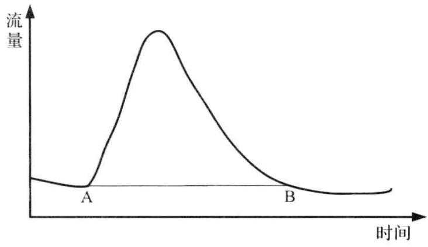  
图5-14 直线平割法

B点，一般不容易判断，根据B点的判断方法，可以把基流分割的方法分为直线平割法、直线斜割法。

(1)直线平割法：从实测流量过程线的起涨点A作一水平线，该水平线与流量过程线相交于B点，即把B点作为地表径流的终止点。水平线AB就是该次洪水的地表径流和地下径流的分割线，AB线以下为基流，AB线以上为地表径流(图5-14)。直线平割法简便易行，一般适用于流域面积较小，洪水历时短，地下径流少而且流量较为稳定的小流域。而对地下径流比重大、洪水连续时间长的流域，则会造成较大的误差，此时改用直线斜割法较为合理。

(2)直线斜割法：将同一流域上的多条流量退水曲线组合在一起，画在同一坐标纸上，使其下部重叠，这样得到的组合线的下包线即为标准退水曲线(图5-15中的CBD线)。将标准退水曲线移绘到透明纸上，再将其覆盖到要分割的流量过程线的退水段上(注意比例尺要一致)，使横轴重合，然后左右平移使两者退水段尾部吻合，则标准退水曲线与实测的洪水过程线分开的那一点B，就可以作为地面径流的终止点。然后将实测流量过程线的起涨点A与地面径流终止点B连一斜线AB，AB线以下的即为基流，AB线以上为地表径流(图5-16)。

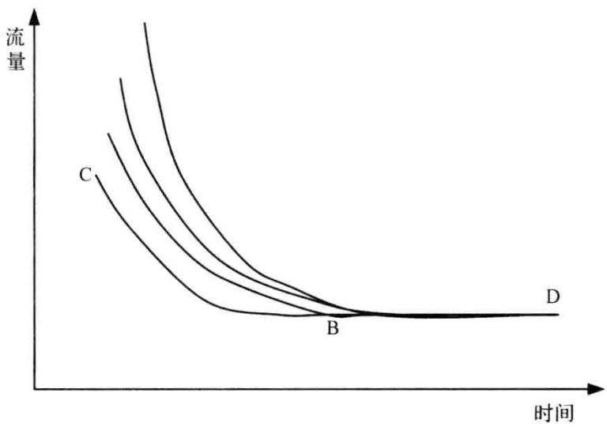  
图 5-15 标准退水曲线

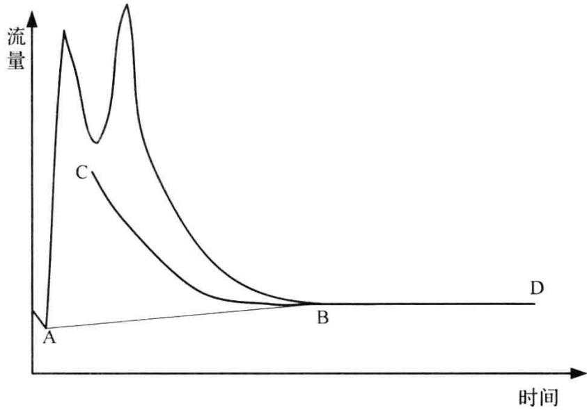  
图5-16 直线斜割法

## 5.3.3 输沙量的测定

输沙量是指单位时间内从小流域出口断面随径流一起输出的泥沙量，有年输沙量，场降雨输沙量之分。年输沙量是指一年中从流域出口断面输出的泥沙量，场降雨输沙量是一场降雨形成的径流从流域出口输出的泥沙量。输沙量与流域面积关系很大，一般情况下大流域输出的泥沙量多，而小流域输出的泥沙较少，因此直接用输沙量无法对比两个面积不同流域土壤侵蚀量的大小。为了便于对比不同流域的侵蚀量的大小常用输沙模数表示一个流域输沙量的多少，输沙模数是指单位时间内单位面积上的输沙量，单位为 $\mathbf { k g } / ( \mathbf { \Omega } _ { \mathbf { t } } \cdot \mathbf { \omega } \mathbf { k m } ^ { 2 } )$ ，利用输沙模数就可以直接对比两个不同流域土壤侵蚀的强弱。输沙模数越大，流域内的土壤侵蚀越强烈，产生的泥沙也就越多。

泥沙观测是水土流失监测的主要内容。小流域输出的泥沙有悬移质泥沙和推移质泥沙之分。悬移质泥沙是悬浮在水体中随水流一起移动、颗粒较细的泥沙。在紊流作用下悬移质泥沙常远离河床面悬浮在水中。悬移质泥沙多由黏土、粉沙和细沙等组成。悬移质泥沙经常用取样器取样，在室内用过滤烘干法测定。

推移质泥沙是在水流的拖拽力作用下，沿河床滚动、滑动、跳跃或层移的泥沙。通常粗泥沙(如砾、沙)作滚动或滑动搬运，较细泥沙(如细沙、粉沙)则呈跳跃搬运。泥沙颗粒的搬运方式可随水流速度的变化而变化，当水流流速增大，滑动或滚动的泥沙颗粒可变为跳跃，跳跃可变为悬浮，流速降低时则发生相反的转变。推移质与悬移质之间也经常发生交换。推移质泥沙因在河床表面附近移动，测定异常困难，常在河床附近安装卵石采样器和沙石采样器测定。

## 5.3.3.1 小流域悬移质泥沙的测定

目前小流域悬移质泥沙的输沙量一般采用取样法测定，取样有人工取样和自动取样两种。

人工取样是在降雨时每隔一定时间，用取样器在量水建筑物上取泥水样。当水深较浅时可直接将取样器放入量水堰上的径流中取泥水样，当水深较深时应该分层取样，即在不同深度上用取样器取泥水样，每次取样时需要测定水位、记录取样时间。取样体积一般为1000ml。在一次洪水过程中，泥沙含量并不是均匀分布的，尤其在洪峰前后泥沙含量的变化很大，因此在测定输沙量时应该从洪水起涨点开始进行连续取样，一直到洪水结束，在水位剧烈时、洪峰出现前后应该缩短取样间隔，增加取样次数，以把握洪水的输沙过程。

自动取样需要配备泥沙自动取样器，如美国生产的ISCO6712泥沙自动取样器。ISCO6712泥沙自动取样器由雨量计、超声波水位计、控制器、取样瓶、取样头等几个主要部件组成。雨量计用于测定降雨量，水位计用于测定量水建筑物上水位的变化，雨量计和水位计的观测数据均保存在控制器中，用于控制泥沙自动取样器的启动条件。控制器是泥沙自动取样器的大脑，可以设置取样器的取样时间、取样间隔、取样条件(降雨条件和水位变化条件）、取样方式、取样的体积等，并保存取样报告，也可以在控制器上直接查看雨量、水位数据和取样报告。在取样报告中主要记录泥沙自动取样器的启动条件、启动时间、每个样品的取样时间、取样方式、样品的数量等信息。取样瓶是装泥水样品的，ISC06712中最多可以放置24个取样瓶，该仪器可以将某一时刻泥水样装入不同的取样瓶中，也可以将不同时刻的泥水样装入同一取样瓶。取样头是放入量水建筑物上的径流中吸取泥水样的部件，泥水样在控制器控制下通过取样头将一定体积的泥水吸入取样瓶保存。泥沙取样器中记录的降雨数据、水位数据、取样报告等均可以通过专门的软件Flowlink用笔记本电脑下载，降雨数据、水位数据均可以保存为Excel表格，取样报告可以保存为文本文件。

用泥沙自动取样器观测小流域的输沙量最为关键的是设置启动条件。启动条件有5种，分别为人工启动、定时启动、降雨启动、水位启动和降雨水位联合启动。人工启动是每次降雨形成径流后，由观测人员按启动按钮，泥沙取样器按照事先设定好的取样间隔和取样体积自动完成取样过程。定时启动是事先在取样程序中设定好启动时间，当到了启动时间，泥沙自动取样器按照设定的取样程序完成取样。降雨启动是事先在启动程序中输入降雨启动条件，如降雨启动条件设置为>1.0mm/min，当雨量计观测到的降雨强度>1.0mm/min时泥沙取样器就会启动，按照事先设置好的取样程序完成取样过程。水位启动是事先在启动程序中输入水位启动条件，如水位启动条件设置为>3cm，当水位计观测到的水位>3cm时泥沙取样器就会启动，按照事先设置好的取样程序完成取样过程。降雨水位联合启动是事先在启动程序中输入降雨和水位两个启动条件，如设置降雨强度>1.0mm/min、水位>3cm，可以设置降雨条件和水位条件全部满足时启动泥沙取样器，也可以设置满足降雨或水位条件时启动泥沙取样器。总之，泥沙取样器是一款功能强大、设置简单的仪器，具体操作请参阅说明书。

另外需要说明的是，泥沙自动取样器的取样头是放入量水建筑物上的径流中吸取泥水样的部件，当流量较大时，在水流的作用下，该取样头往往会漂浮在水面上，致使每次抽取的泥水样只是表层水样，而泥沙含量在整个观测剖面上并不是均匀分布的，尤其是表层的含沙量很难代表整个剖面的含沙量，为此在安装取样头时应该将其固定在一个能够随水位变化而浮动的浮子上，以保证取样头总处在水面以下一定深度处，这样采取的水样才更具有代表性。

泥水样取回后在室内进行处理，处理的方法为过滤烘干法。首先将取样瓶擦拭干净后称泥水样和取样瓶的总重W，用量筒测定取样体积V，用滤纸过滤泥水样，然后将滤纸和泥沙一起放入 $1 0 5 \mathrm { { ‰} }$ 的烘箱中烘干至恒重，用感量为0.01g的电子天平称烘干后的滤纸和干泥重 $\mathbb { W } _ { 1 }$ ，如果干滤纸的重量为 $W _ { ☉ }$ ，取样瓶的重量为 $W _ { \# \mathbb { R } }$ ，则：

$$
\begin{array} { c } { { \vdots \sharp \skip \vdots \rlap { / } \chi _ { \tt L } \rlap { / } \overline { { { \varphi } } } } = ( W _ { 1 } - W _ { \tt L E } ) / V } \\ { { \therefore \sharp \arctan \rlap { / } \chi _ { \tt L } \rlap { / } \chi _ { \tt L } } = ( W - W _ { \# \widehat { \# } } - W _ { 1 } + W _ { \tt L E } ) / V } \end{array}
$$

输沙量观测记录格式见表5-7。悬移质泥沙的时段输沙量 $\mathbb { W } _ { i }$ 用下式计算：

$$
W _ { i } = ( { \frac { Q _ { i } + Q _ { \imath - 1 } } { 2 } } ) \times T \times ( { \frac { P _ { i } + P _ { \imath - 1 } } { 2 } } )
$$

式中： $\mathbb { W } _ { i }$ ——时段输沙量；

$Q _ { t }$ —时段末的瞬时流量；

$Q _ { t } .$ 1——时段初的瞬时流量；

$T -$ ——时段长；

$P _ { \mathrm { \ell } _ { t } }$ ——时段末的泥沙含量；

$P _ { \mathrm { \Pi } _ { t - 1 } }$ —时段初泥沙含量。

悬移质泥沙的总输沙量W用下式计算：

$$
\boldsymbol { W } = \sum \boldsymbol { W } _ { i }
$$

悬移质泥沙的输沙模数=总输沙量/小流域面积

表5-7量水建筑物悬移质泥沙输沙量观测记录表
<table><tr><td rowspan=1 colspan=2>小流域名称</td><td rowspan=1 colspan=4></td><td rowspan=1 colspan=4>地理坐标</td><td rowspan=1 colspan=3></td><td rowspan=1 colspan=3>地点</td><td rowspan=1 colspan=3></td><td></td><td rowspan=1 colspan=2>海拔</td><td rowspan=1 colspan=3></td></tr><tr><td rowspan=1 colspan=2>小流域面积</td><td rowspan=1 colspan=4></td><td rowspan=1 colspan=4>流域长度</td><td rowspan=1 colspan=3></td><td rowspan=1 colspan=3>流域平均坡度</td><td rowspan=1 colspan=3></td><td></td><td rowspan=1 colspan=2>形状系数</td><td rowspan=1 colspan=3></td></tr><tr><td rowspan=1 colspan=2>沟壑密度</td><td rowspan=1 colspan=4></td><td rowspan=1 colspan=4>沟道比降</td><td rowspan=1 colspan=3></td><td rowspan=1 colspan=3>林地面积</td><td rowspan=1 colspan=3></td><td></td><td rowspan=1 colspan=2>草地面积</td><td rowspan=1 colspan=3></td></tr><tr><td rowspan=1 colspan=2>农地面积</td><td rowspan=1 colspan=4></td><td rowspan=1 colspan=4>园地面积</td><td rowspan=1 colspan=3></td><td rowspan=1 colspan=3>河道面积</td><td rowspan=1 colspan=3></td><td></td><td rowspan=1 colspan=2>道路面积</td><td rowspan=1 colspan=3></td></tr><tr><td rowspan=1 colspan=2>土壤类型</td><td rowspan=1 colspan=4></td><td rowspan=1 colspan=4>土壤厚度</td><td rowspan=1 colspan=3></td><td rowspan=1 colspan=3>母质</td><td rowspan=1 colspan=3></td><td></td><td rowspan=1 colspan=2>基岩</td><td rowspan=1 colspan=3></td></tr><tr><td rowspan=1 colspan=4>量水建筑物类型</td><td rowspan=1 colspan=3></td><td rowspan=1 colspan=9>量水建筑物的长度×宽度×高度</td><td rowspan=1 colspan=3></td><td rowspan=1 colspan=4>水位流量公式</td><td rowspan=1 colspan=2></td></tr><tr><td rowspan=1 colspan=4>降雨量</td><td rowspan=1 colspan=5></td><td rowspan=1 colspan=5>5min 雨强</td><td rowspan=1 colspan=4></td><td rowspan=1 colspan=4>10min雨强</td><td rowspan=1 colspan=3></td></tr><tr><td rowspan=1 colspan=4>降雨历时</td><td rowspan=1 colspan=5></td><td rowspan=1 colspan=5>30min雨强</td><td rowspan=1 colspan=4></td><td rowspan=1 colspan=4>60min 雨强</td><td rowspan=1 colspan=3></td></tr><tr><td rowspan=1 colspan=4>总输沙量</td><td rowspan=1 colspan=5></td><td rowspan=1 colspan=5>输沙模数</td><td rowspan=1 colspan=4></td><td rowspan=1 colspan=4>最大含沙量</td><td rowspan=1 colspan=3></td></tr><tr><td rowspan=1 colspan=1>时间</td><td rowspan=1 colspan=2>水位</td><td rowspan=1 colspan=2>瞬时流量</td><td rowspan=1 colspan=3>时段流量</td><td rowspan=1 colspan=3>取样瓶</td><td rowspan=1 colspan=1>瓶重</td><td rowspan=1 colspan=3>瓶重+泥水重</td><td rowspan=1 colspan=2>取样体积</td><td rowspan=1 colspan=2>滤纸重</td><td rowspan=1 colspan=2>滤纸+干泥重</td><td rowspan=1 colspan=3>净泥率</td><td rowspan=1 colspan=1>时段输沙量</td></tr><tr><td rowspan=1 colspan=1></td><td rowspan=1 colspan=2></td><td rowspan=1 colspan=2></td><td rowspan=1 colspan=3></td><td rowspan=1 colspan=3></td><td rowspan=1 colspan=1></td><td rowspan=1 colspan=3></td><td rowspan=1 colspan=2></td><td rowspan=1 colspan=2></td><td rowspan=1 colspan=2></td><td rowspan=1 colspan=3></td><td rowspan=1 colspan=1></td></tr><tr><td rowspan=1 colspan=1></td><td rowspan=1 colspan=2></td><td rowspan=1 colspan=2></td><td rowspan=1 colspan=3></td><td rowspan=1 colspan=3></td><td rowspan=1 colspan=1></td><td rowspan=1 colspan=3></td><td rowspan=1 colspan=2></td><td rowspan=1 colspan=2></td><td rowspan=1 colspan=2></td><td rowspan=1 colspan=3></td><td rowspan=1 colspan=1></td></tr><tr><td rowspan=1 colspan=1></td><td rowspan=1 colspan=2></td><td rowspan=1 colspan=2></td><td rowspan=1 colspan=3></td><td rowspan=1 colspan=3></td><td rowspan=1 colspan=1></td><td rowspan=1 colspan=3></td><td rowspan=1 colspan=2></td><td rowspan=1 colspan=2></td><td rowspan=1 colspan=2></td><td rowspan=1 colspan=3></td><td rowspan=1 colspan=1></td></tr><tr><td rowspan=1 colspan=1></td><td rowspan=1 colspan=2></td><td rowspan=1 colspan=2></td><td rowspan=1 colspan=3></td><td rowspan=1 colspan=3></td><td rowspan=1 colspan=1></td><td rowspan=1 colspan=3></td><td rowspan=1 colspan=2></td><td rowspan=1 colspan=2></td><td rowspan=1 colspan=2></td><td rowspan=1 colspan=3></td><td rowspan=1 colspan=1></td></tr><tr><td rowspan=1 colspan=1></td><td rowspan=1 colspan=2></td><td rowspan=1 colspan=2></td><td rowspan=1 colspan=3></td><td rowspan=1 colspan=3></td><td rowspan=1 colspan=1></td><td rowspan=1 colspan=3></td><td rowspan=1 colspan=2></td><td rowspan=1 colspan=2></td><td rowspan=1 colspan=2></td><td rowspan=1 colspan=3></td><td rowspan=1 colspan=1></td></tr><tr><td rowspan=1 colspan=1></td><td rowspan=1 colspan=2></td><td rowspan=1 colspan=2></td><td rowspan=1 colspan=3></td><td rowspan=1 colspan=3></td><td rowspan=1 colspan=1></td><td rowspan=1 colspan=3></td><td rowspan=1 colspan=2></td><td rowspan=1 colspan=2></td><td rowspan=1 colspan=2></td><td rowspan=1 colspan=3></td><td rowspan=1 colspan=1></td></tr><tr><td rowspan=1 colspan=1></td><td rowspan=1 colspan=2></td><td rowspan=1 colspan=2></td><td rowspan=1 colspan=3></td><td rowspan=1 colspan=3></td><td rowspan=1 colspan=1></td><td rowspan=1 colspan=3></td><td rowspan=1 colspan=2></td><td rowspan=1 colspan=2></td><td rowspan=1 colspan=2></td><td rowspan=1 colspan=3></td><td rowspan=1 colspan=1></td></tr></table>

## 5.3.3.2 小流域推移质泥沙的测定

推移质泥沙因在河床表面附近移动，泥沙颗粒较粗，是河道、水库淤积的主要泥沙，尤其在我国南方水土流失区，推移质泥沙所占比重较大。由于推移质泥沙和悬移质泥沙在水流条件发生变化时会相互转化，同一粒径的泥沙在水流流速较慢时可能是推移质，当水流流速加快时，有可能转变为悬移质，这就使得推移质泥沙的准确测定变得异常困难。目前推移质泥沙的测定主要采用采样器法和坑测法进行。

(1)采样器法：采样器有沙质推移质采样器和卵石采样器两类。沙质推移质采样器采集的是粒径为0.05\~2mm的泥沙，卵石采样器采集的是2\~16mm的泥沙。测定时在测沙垂线上将采样器紧贴河底放置一定时间(10min)后，将采样器取出，倒出采样器中收集的推移质泥沙，带回室内烘干称重。在每条测沙垂线上重复测定2次以上。测沙垂线一般可以与测深垂线和测速垂线重合。在一次洪水过程中应该从洪水起涨点开始观测，直至洪水结束，这样就可以测定出整个推移质的输沙过程。为了计算一次洪水的推移质输沙量，首先要计算出某一时刻测沙垂线的推移质输沙率，然后计算该时刻两条测沙垂线间的推移质输沙率，即部分断面的推移质输沙率，再计算该时刻整个观测断面的推移质输沙率，最后计算整个洪水过程的推移质输沙率，如图5-17。

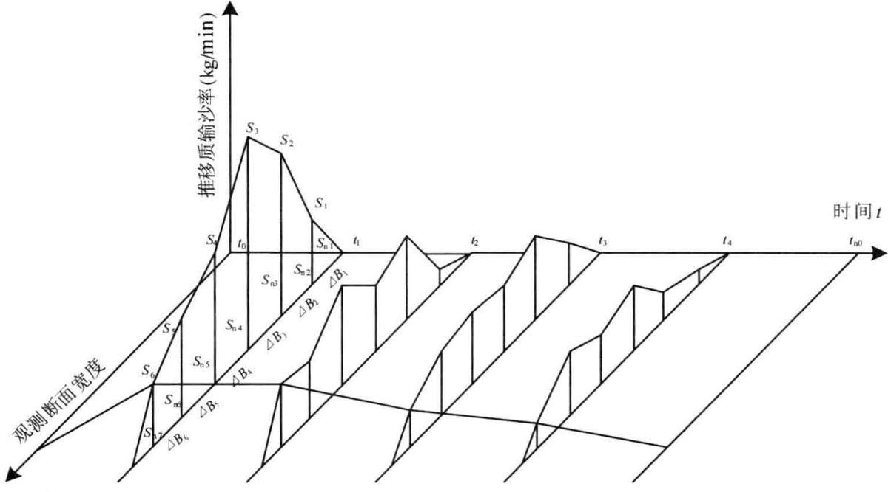  
图5-17 推移质输沙率计算示意图

某一时刻某条测深垂线上推移质输沙率 $S _ { i }$ 采用下式计算：

$$
S _ { i } \ = \frac { W _ { i } } { T \times b }
$$

式中： $S _ { i }$ ——某条测深垂线上的推移质输沙率；

$\mathbb { W } _ { i }$ —在某条测深垂线上测得的推移质泥沙干重；

$T -$ ——每次取样的时间长；

$b \cdot$ —取样器宽度。

某一时刻部分断面的推移质输沙率 $S _ { n i }$ 采用下式计算：

$$
S _ { n i } \ = \frac { S _ { i } + S _ { i - 1 } } { 2 } \times \Delta B _ { i }
$$

式中： $S _ { n i }$ ——第i个部分断面的推移质输沙率；

$S _ { i }$ ——第i条测深垂线上的推移质输沙率；

$S _ { i - 1 }$ —第i-1条测深垂线上的推移质输沙率；

$\Delta { B _ { i } }$ —第i个部分断面的底宽，也就是第i条和第i-1条测深垂线的间距。

某一时刻的观测断面的推移质输沙率 $\mathbb { W } _ { i i }$ 采用下式计算：

$$
W _ { _ { t i } } \ = \ \sum _ { i \ = 1 } ^ { n } S _ { _ { n i } }
$$

如果一次洪水测定过程中，分别在 $t _ { 1 } ~ , ~ t _ { 2 } ~ , ~ \cdots ~ , ~ t _ { n }$ 时刻进行了推移质输沙率的测定，每次测定的断面输沙率为 $W _ { 1 } , \textit { W } _ { 2 } , \cdots , \textit { W } _ { n }$ ，则该次洪水的推移质输沙量W为：

$$
\begin{array} { r l } &  W = [ \begin{array} { l } { W _ { 1 } ( t _ { 1 } - t _ { 0 } ) + ( \begin{array} { l } { W _ { 1 } + W _ { 2 } } \end{array} ) ( t _ { 2 } - t _ { 1 } ) + ( \begin{array} { l } { W _ { 2 } + W _ { 3 } } \end{array} ) ( t _ { 3 } - t _ { 2 } ) + \cdots + } \\ { ( \begin{array} { l } { W _ { n - 1 } + W _ { n } } \end{array} ) ( t _ { n } - t _ { n - 1 } ) + W _ { n } ( t _ { n 0 } - t _ { n } ) \operatorname { \mathsf { J } } / 2 } \end{array} \end{array}
$$

式中： $t _ { 0 }$ 和 $t _ { n 0 }$ —分别为洪水起涨点和结束的时间。

推移质的输沙模数用下式计算：

$$
M = { \frac { W } { S } }
$$

式中：M—推移质输沙模数；

$W \cdot$ ——推移质输沙量；

S——观测小流域的面积。

采样器法观测推移质输沙量的记录格式见表5-8。

(2)坑测法：推移质泥沙在河床表面分布很不均匀，利用采样器测定又是在水下进行操作，测定误差较大，观测结果需要进行校正，常用的校正方法为坑测法。坑测法就是在河道的观测断面处(如有量水建筑物，可在量水建筑物的下游或上游)用混凝土修筑一定体积的测定坑，坑的宽度与河道宽度一致，以保证河道中的推移质能够全部进入测定坑。坑的上沿与河底齐平，坑的体积以能够容纳一次洪水的全部推移质为准。一次洪水后测定测坑中推移质的量，并取样烘干，计算出推移质的干重。每次测定后将测定坑中的推移质泥沙清理干净。如果一次洪水后观测坑没有被推移

表5-8 采样器法观测推移质输沙量记录表

测定日期：

测定人：

<table><tr><td rowspan=1 colspan=2>小流域名称</td><td rowspan=1 colspan=3></td><td rowspan=1 colspan=2>地理坐标</td><td rowspan=1 colspan=2></td><td rowspan=1 colspan=2>地点</td><td rowspan=1 colspan=2></td><td rowspan=1 colspan=3>海拔</td><td rowspan=1 colspan=1></td></tr><tr><td rowspan=1 colspan=2>小流域面积</td><td rowspan=1 colspan=3></td><td rowspan=1 colspan=2>流域长度</td><td rowspan=1 colspan=2></td><td rowspan=1 colspan=2>流域平均坡度</td><td rowspan=1 colspan=2></td><td rowspan=1 colspan=3>形状系数</td><td rowspan=1 colspan=1></td></tr><tr><td rowspan=1 colspan=2>沟壑密度</td><td rowspan=1 colspan=3></td><td rowspan=1 colspan=2>沟道比降</td><td rowspan=1 colspan=2></td><td rowspan=1 colspan=2>林地面积</td><td rowspan=1 colspan=2></td><td rowspan=1 colspan=3>草地面积</td><td rowspan=1 colspan=1></td></tr><tr><td rowspan=1 colspan=2>农地面积</td><td rowspan=1 colspan=3></td><td rowspan=1 colspan=2>园地面积</td><td rowspan=1 colspan=2></td><td rowspan=1 colspan=2>河道面积</td><td rowspan=1 colspan=2></td><td rowspan=1 colspan=2>道路面积</td><td rowspan=1 colspan=2></td></tr><tr><td rowspan=1 colspan=2>土壤类型</td><td rowspan=1 colspan=3></td><td rowspan=1 colspan=2>土壤厚度</td><td rowspan=1 colspan=2></td><td rowspan=1 colspan=2>母质</td><td rowspan=1 colspan=2></td><td rowspan=1 colspan=2>基岩</td><td rowspan=1 colspan=2></td></tr><tr><td rowspan=1 colspan=3>降雨量</td><td rowspan=1 colspan=3></td><td rowspan=1 colspan=3>5min 雨强</td><td rowspan=1 colspan=3></td><td rowspan=1 colspan=3>10min雨强</td><td rowspan=1 colspan=2></td></tr><tr><td rowspan=1 colspan=3>降雨历时</td><td rowspan=1 colspan=3></td><td rowspan=1 colspan=3>30min 雨强</td><td rowspan=1 colspan=3></td><td rowspan=1 colspan=3>60min雨强</td><td rowspan=1 colspan=2></td></tr><tr><td rowspan=1 colspan=3>取样器的宽度</td><td rowspan=1 colspan=3></td><td rowspan=1 colspan=3>取样时间长</td><td rowspan=1 colspan=3></td><td rowspan=1 colspan=3>取样器型号</td><td rowspan=1 colspan=2></td></tr><tr><td rowspan=1 colspan=1>时间</td><td rowspan=1 colspan=3>起点距</td><td rowspan=1 colspan=4>取样器中湿泥沙重</td><td rowspan=1 colspan=2>泥沙样品湿重</td><td rowspan=1 colspan=3>泥沙样品干重</td><td></td><td rowspan=1 colspan=3>取样器中泥沙干重</td></tr><tr><td rowspan=6 colspan=1></td><td rowspan=1 colspan=3></td><td rowspan=1 colspan=4></td><td rowspan=1 colspan=2></td><td rowspan=1 colspan=3></td><td></td><td rowspan=1 colspan=3></td></tr><tr><td rowspan=1 colspan=3></td><td rowspan=1 colspan=4></td><td rowspan=1 colspan=2></td><td rowspan=1 colspan=3></td><td></td><td rowspan=1 colspan=3></td></tr><tr><td rowspan=1 colspan=3></td><td rowspan=1 colspan=4></td><td rowspan=1 colspan=2></td><td rowspan=1 colspan=3></td><td></td><td rowspan=1 colspan=3></td></tr><tr><td rowspan=1 colspan=3></td><td rowspan=1 colspan=4></td><td rowspan=1 colspan=2></td><td rowspan=1 colspan=3></td><td></td><td rowspan=1 colspan=3></td></tr><tr><td rowspan=1 colspan=3></td><td rowspan=1 colspan=4></td><td rowspan=1 colspan=2></td><td rowspan=1 colspan=3></td><td></td><td rowspan=1 colspan=3></td></tr><tr><td rowspan=1 colspan=6>垂线最大输沙率</td><td rowspan=1 colspan=3></td><td rowspan=1 colspan=3>断面输沙率</td><td></td><td rowspan=1 colspan=3></td></tr><tr><td rowspan=7 colspan=1></td><td rowspan=1 colspan=3>起点距</td><td rowspan=1 colspan=4>取样器中湿泥沙重</td><td rowspan=1 colspan=2>泥沙样品湿重</td><td rowspan=1 colspan=3>泥沙样品干重</td><td></td><td rowspan=1 colspan=3>取样器中泥沙干重</td></tr><tr><td rowspan=1 colspan=3></td><td rowspan=1 colspan=4></td><td rowspan=1 colspan=2></td><td rowspan=1 colspan=3></td><td></td><td rowspan=1 colspan=3></td></tr><tr><td rowspan=1 colspan=3></td><td rowspan=1 colspan=4></td><td rowspan=1 colspan=2></td><td rowspan=1 colspan=3></td><td></td><td rowspan=1 colspan=3></td></tr><tr><td rowspan=1 colspan=3></td><td rowspan=1 colspan=4></td><td rowspan=1 colspan=2></td><td rowspan=1 colspan=3></td><td></td><td rowspan=1 colspan=3></td></tr><tr><td rowspan=1 colspan=3></td><td rowspan=1 colspan=4></td><td rowspan=1 colspan=2></td><td rowspan=1 colspan=3></td><td></td><td rowspan=1 colspan=3></td></tr><tr><td rowspan=1 colspan=3></td><td rowspan=1 colspan=4></td><td rowspan=1 colspan=2></td><td rowspan=1 colspan=3></td><td></td><td rowspan=1 colspan=3></td></tr><tr><td rowspan=1 colspan=6>垂线最大输沙率</td><td rowspan=1 colspan=3></td><td rowspan=1 colspan=3>断面输沙率</td><td></td><td rowspan=1 colspan=3></td></tr><tr><td rowspan=7 colspan=1></td><td rowspan=1 colspan=3>起点距</td><td rowspan=1 colspan=4>取样器中湿泥沙重</td><td rowspan=1 colspan=2>泥沙样品湿重</td><td rowspan=1 colspan=3>泥沙样品干重</td><td></td><td rowspan=1 colspan=3>取样器中泥沙干重</td></tr><tr><td rowspan=1 colspan=3></td><td rowspan=1 colspan=4></td><td rowspan=1 colspan=2></td><td rowspan=1 colspan=3></td><td></td><td rowspan=1 colspan=3></td></tr><tr><td rowspan=1 colspan=3></td><td rowspan=1 colspan=4></td><td rowspan=1 colspan=2></td><td rowspan=1 colspan=3></td><td></td><td rowspan=1 colspan=3></td></tr><tr><td rowspan=1 colspan=3></td><td rowspan=1 colspan=4></td><td rowspan=1 colspan=2></td><td rowspan=1 colspan=3></td><td></td><td rowspan=1 colspan=3></td></tr><tr><td rowspan=1 colspan=3></td><td rowspan=1 colspan=4></td><td rowspan=1 colspan=2></td><td rowspan=1 colspan=3></td><td></td><td rowspan=1 colspan=3></td></tr><tr><td rowspan=1 colspan=3></td><td rowspan=1 colspan=4></td><td rowspan=1 colspan=2></td><td rowspan=1 colspan=3></td><td></td><td rowspan=1 colspan=3></td></tr><tr><td rowspan=1 colspan=6>垂线最大输沙率</td><td rowspan=1 colspan=3></td><td rowspan=1 colspan=3>断面输沙率</td><td></td><td rowspan=1 colspan=3></td></tr><tr><td rowspan=1 colspan=7>推移质输沙量</td><td rowspan=1 colspan=3></td><td rowspan=1 colspan=3>推移质输沙模数</td><td></td><td rowspan=1 colspan=3></td></tr></table>

质泥沙淤满，说明该次洪水过程中所有的推移质泥沙全部沉积在测定坑中，这种情况下测定结果应该是真实可靠的。如果一次洪水过后观测坑被泥沙全部淤满，这说明观测坑体积过小，没有能够将全部推移质沉积在测定坑中，有一部分推移质随洪水流走，则测定结果就不能代表该次洪水携带推移质的总量。如果观测的小流域中有长流水，在每次观测推移质前需要测量一下观测坑中已有的推移质量，洪水过后应该把测定坑中已有的推移质量扣除。

坑测法推移质的输沙模数用下式计算：

$$
M = { \frac { W } { S } }
$$

式中：M—推移质输沙模数；

W——观测坑中的泥沙干重；

S——观测小流域的面积。

坑测法推移质沙输沙量观测的记录格式见表5-9。

表5-9 坑测法推移质沙输沙量观测记录表

测定日期：

测定人：

<table><tr><td rowspan=1 colspan=1>小流域名称</td><td rowspan=1 colspan=2></td><td rowspan=1 colspan=2>地理坐标</td><td rowspan=1 colspan=1></td><td rowspan=1 colspan=1>地点</td><td rowspan=1 colspan=2></td><td rowspan=1 colspan=1>海拔</td><td rowspan=1 colspan=1></td></tr><tr><td rowspan=1 colspan=1>小流域面积</td><td rowspan=1 colspan=2></td><td rowspan=1 colspan=2>流域长度</td><td rowspan=1 colspan=1></td><td rowspan=1 colspan=1>流域平均坡度</td><td rowspan=1 colspan=2></td><td rowspan=1 colspan=1>形状系数</td><td rowspan=1 colspan=1></td></tr><tr><td rowspan=1 colspan=1>沟壑密度</td><td rowspan=1 colspan=2></td><td rowspan=1 colspan=2>沟道比降</td><td rowspan=1 colspan=1></td><td rowspan=1 colspan=1>林地面积</td><td rowspan=1 colspan=2></td><td rowspan=1 colspan=1>草地面积</td><td rowspan=1 colspan=1></td></tr><tr><td rowspan=1 colspan=1>农地面积</td><td rowspan=1 colspan=2></td><td rowspan=1 colspan=2>园地面积</td><td rowspan=1 colspan=1></td><td rowspan=1 colspan=1>河道面积</td><td rowspan=1 colspan=2></td><td rowspan=1 colspan=1>道路面积</td><td rowspan=1 colspan=1></td></tr><tr><td rowspan=1 colspan=1>土壤类型</td><td rowspan=1 colspan=2></td><td rowspan=1 colspan=2>土壤厚度</td><td rowspan=1 colspan=1></td><td rowspan=1 colspan=1>母质</td><td rowspan=1 colspan=2></td><td rowspan=1 colspan=1>基岩</td><td rowspan=1 colspan=1></td></tr><tr><td rowspan=1 colspan=2>降雨量</td><td rowspan=1 colspan=2></td><td rowspan=1 colspan=2>5min 雨强</td><td rowspan=1 colspan=2></td><td rowspan=1 colspan=2>10min雨强</td><td rowspan=1 colspan=1></td></tr><tr><td rowspan=1 colspan=2>降雨历时</td><td rowspan=1 colspan=2></td><td rowspan=1 colspan=2>30min雨强</td><td rowspan=1 colspan=2></td><td rowspan=1 colspan=2>60min雨强</td><td rowspan=1 colspan=1></td></tr><tr><td rowspan=1 colspan=2>悬移质输沙量</td><td rowspan=1 colspan=2></td><td rowspan=1 colspan=2>悬移质输沙模数</td><td rowspan=1 colspan=2></td><td rowspan=1 colspan=2>悬移质最大含沙量</td><td rowspan=1 colspan=1></td></tr><tr><td rowspan=1 colspan=2>观测坑长度</td><td rowspan=1 colspan=2></td><td rowspan=1 colspan=2>观测坑宽度</td><td rowspan=1 colspan=2></td><td rowspan=1 colspan=2>观测坑深度</td><td rowspan=1 colspan=1></td></tr><tr><td rowspan=1 colspan=2>观测坑体积</td><td rowspan=1 colspan=2></td><td rowspan=1 colspan=2>泥沙是否淤满</td><td rowspan=1 colspan=2></td><td rowspan=1 colspan=2>平均泥沙淤积深度</td><td rowspan=1 colspan=1></td></tr><tr><td rowspan=1 colspan=2>泥沙淤积体积</td><td rowspan=1 colspan=2></td><td rowspan=1 colspan=2>取样泥沙体积</td><td rowspan=1 colspan=2></td><td rowspan=1 colspan=2>取样泥沙重量</td><td rowspan=1 colspan=1></td></tr><tr><td rowspan=1 colspan=2>烘干后样品重量</td><td rowspan=1 colspan=2></td><td rowspan=1 colspan=2>干沙率</td><td rowspan=1 colspan=2></td><td rowspan=1 colspan=2>推移质输沙量</td><td rowspan=1 colspan=1></td></tr><tr><td rowspan=1 colspan=2>推移质输沙模数</td><td rowspan=1 colspan=2></td><td rowspan=1 colspan=4>悬移质泥沙量/推移质泥沙量</td><td rowspan=1 colspan=3></td></tr></table>

## 第6章 风蚀观测

风蚀是发生在干旱、半干旱及部分半湿润地区的地貌过程之一，是以风为外营力的土壤侵蚀类型，是在风力的作用下地表物质发生位移，从而导致岩石圈(或土壤圈)的损失和破坏过程。风蚀受气候因子(风、温度、湿度、降水)、土壤因子(表层物质的粒径组成、含水量、容重、团聚体、有机质含量)、植被因子(植被类型、盖度、生物量、空间分布)、地形因子(坡度、坡向、坡位、坡长、地表糙度、高程)的共同作用。在风蚀地区，当风速达到起沙风速后，地表的沙粒开始移动，形成风沙流，在风沙流中沙子以悬移、跃移、表层蠕移等三种方式运动。在风沙流的作用下沙源地的表层物质(沙子、土壤等)逐渐被搬运到其他地方形成风蚀。

风蚀观测就是对风蚀影响因子、风蚀量、风蚀强度的观测。风蚀影响因子的观测包括风的观测、地表物质的观测、土壤水分的观测、植被的观测、地形的测量等，风蚀影响因子的观测可参阅本书相关章节。本章主要介绍风蚀量和风蚀强度的观测方法。

风蚀量是指一定时间内被风吹走的地表物质的量与堆积量之差，一般用厚度单位表示。风蚀强度是指一定时间内单位面积上的风蚀量，单位为cm/a。

## 6.1 风蚀量的观测

风蚀量是指一定时间内被风吹走的地表物质量与堆积量之差，也就是地面高程的变化量。因此只要是能够计量出地面高程变化的方法均可以观测风蚀量。常用的方法有插钎法、风蚀桥法。

## 6.1.1 插钎法

插钎法是测量风蚀量的常用方法，一般包括以下几个步骤：

选择观测样地：在风蚀区选择具有代表性的地块作为观测样地，观测样地的面积应该不小于1hm²。选择观测样地时地形要有代表性，地面物质的组成要有代表性，植被状况也要有代表性，即观测样地的地形、地面组成物质、植被状况等对风蚀有重要影响的因子必须能够代表整个观测地区的基本情况。当观测地区风蚀地类较多时，需要在各种风蚀地类上选择观测样地，进行风蚀观测。

观测样地调查：选择好观测样地后进行基本情况调查，调查内容包括：地理位置、地理坐标、高程、坡度、坡向、地面糙度等地形地貌要素，土壤类型、土层厚度、土壤质地、粒径组成、容重、土壤含水量、有机质含量、团聚体含量等土壤要素，植被类型、种类、生物量、高度、覆盖度等植被要素。

布设气象观测设施：进行风蚀观测时必须把握风速、风向等主要的气象指标，为此必须在调查样地附近安装小型自动气象观测站，对观测期间的风速、风向、温度、湿度、降水量、太阳辐射、蒸发量、土壤含水量等指标，按照一定的时间间隔进行实时观测。

布设插钎：插钎可以用不易变形、热胀冷缩系数小、不易风化腐蚀的材料制成，一般采用5mm粗、50cm长的钢钎。在观测样地内按2m×2m的间距将钢钎垂直插入地面，地面以上保留30cm左右，每根钢钎都必须按顺序编号，并绘制钢钎在观测样地内的分布图。

观测：布设钢钎的同时用钢尺沿钢钎测量顶部到地面的距离，并按编号记录在风蚀观测记录表中。如果需要观测每次大风天气造成的风蚀量，则必须在刮风前后对观测样地内的每根钢钎进行测量，记录钢钎顶部到地面的距离。如果观测一定时段的风蚀量或风蚀量的动态变化，则每隔一定时间对钢钎顶部到地面的距离进行一次测量。观测间隔可根据大风发生的频率确定，大风频率高，观测的间隔可以相对短一些，大风的频率低，观测的间隔可长一些。一般的观测间隔为15\~30天。另外如果风蚀量很小，可适当延长观测间隔。观测时观测人员的脚应该离开钢钎一定距离(>30cm)，防止因踩踏钢钎周围而造成测量误差。

风蚀量计算：设相邻两次观测期间每根钢钎顶部到地面的距离的变化量为 $\Delta L _ { i }$ ，则风蚀量(厚度)H为：

$$
H = \sum _ { i = 1 } ^ { n } \Delta L _ { i } / n
$$

式中：n在观测样地内布设的钢钎总数，如果观测过程中有钢钎丢失，则n为最近一次测量时观测样地内钢钎的保存数。

$\Delta L _ { i }$ —第i根钢钎顶部到地面距离的变化量，即前一次测量值与本次测量值之差。

如果计算出H为负值，说明整个观测样地发生了吹蚀；如果H为正值，则说明整个观测样地发生了风积。

计算出风蚀厚度后，利用风蚀厚度H乘以地表物质的容重d，再乘以观测样地的面积S就可以计算出风蚀量W(重量)。

$$
W = H \times d \times S
$$

在统计和整理风蚀观测数据时，还必须统计出观测样地内风蚀量的最大值和最小值，并绘制观测样地风蚀分布图。插钎法测定风蚀记录格式见表6-1。

表6-1 插钎法风蚀观测记录表  
测定人：
<table><tr><td rowspan=1 colspan=1>样地名称</td><td rowspan=1 colspan=1></td><td rowspan=1 colspan=1>地理坐标</td><td rowspan=1 colspan=1></td><td rowspan=1 colspan=2>地点</td><td rowspan=1 colspan=1></td><td rowspan=1 colspan=1>海拔</td><td rowspan=1 colspan=1></td></tr><tr><td rowspan=1 colspan=1>样地面积</td><td rowspan=1 colspan=1></td><td rowspan=1 colspan=1>样地长度</td><td rowspan=1 colspan=1></td><td rowspan=1 colspan=2>样地宽度</td><td rowspan=1 colspan=1></td><td rowspan=1 colspan=1>样地形状</td><td rowspan=1 colspan=1></td></tr><tr><td rowspan=1 colspan=1>坡度</td><td rowspan=1 colspan=1></td><td rowspan=1 colspan=1>坡向</td><td rowspan=1 colspan=1></td><td rowspan=1 colspan=2>坡位</td><td rowspan=1 colspan=1></td><td rowspan=1 colspan=1>地面糙度</td><td rowspan=1 colspan=1></td></tr><tr><td rowspan=1 colspan=1>土壤类型</td><td rowspan=1 colspan=1></td><td rowspan=1 colspan=1>土层厚度</td><td rowspan=1 colspan=1></td><td rowspan=1 colspan=2>土壤质地</td><td rowspan=1 colspan=1></td><td rowspan=1 colspan=1>容重</td><td rowspan=1 colspan=1></td></tr><tr><td rowspan=1 colspan=1>植被类型</td><td rowspan=1 colspan=1></td><td rowspan=1 colspan=1>物种组成</td><td rowspan=1 colspan=1></td><td rowspan=1 colspan=2>覆盖度</td><td rowspan=1 colspan=1></td><td rowspan=1 colspan=1>生物量</td><td rowspan=1 colspan=1></td></tr><tr><td rowspan=1 colspan=1>植株高度</td><td rowspan=1 colspan=1></td><td rowspan=1 colspan=1>胸径/地径</td><td rowspan=1 colspan=1></td><td rowspan=1 colspan=2>密度</td><td rowspan=1 colspan=1></td><td rowspan=1 colspan=1>枯落物量</td><td rowspan=1 colspan=1></td></tr><tr><td rowspan=2 colspan=1>钢钎编号</td><td rowspan=1 colspan=8>钢钎顶部到地面距离</td></tr><tr><td rowspan=1 colspan=1>布设日期</td><td rowspan=1 colspan=1>调查日期1</td><td rowspan=1 colspan=1>调查日期2</td><td rowspan=1 colspan=1>调查日期3</td><td rowspan=1 colspan=2>调查日期4</td><td rowspan=1 colspan=1>调查日期5</td><td rowspan=1 colspan=1>调查日期6</td></tr><tr><td rowspan=1 colspan=1></td><td rowspan=1 colspan=1></td><td rowspan=1 colspan=1></td><td rowspan=1 colspan=1></td><td rowspan=1 colspan=1></td><td rowspan=1 colspan=2></td><td rowspan=1 colspan=1></td><td rowspan=1 colspan=1></td></tr><tr><td rowspan=1 colspan=1></td><td rowspan=1 colspan=1></td><td rowspan=1 colspan=1></td><td rowspan=1 colspan=1></td><td rowspan=1 colspan=1></td><td rowspan=1 colspan=2></td><td rowspan=1 colspan=1></td><td rowspan=1 colspan=1></td></tr><tr><td rowspan=1 colspan=2>平均风蚀厚度</td><td rowspan=1 colspan=1></td><td rowspan=1 colspan=1></td><td rowspan=1 colspan=1></td><td rowspan=1 colspan=2></td><td rowspan=1 colspan=1></td><td rowspan=1 colspan=1></td></tr><tr><td rowspan=1 colspan=2>最大风蚀厚度</td><td rowspan=1 colspan=1></td><td rowspan=1 colspan=1></td><td rowspan=1 colspan=1></td><td rowspan=1 colspan=2></td><td rowspan=1 colspan=1></td><td rowspan=1 colspan=1></td></tr><tr><td rowspan=1 colspan=2>最小风蚀厚度</td><td rowspan=1 colspan=1></td><td rowspan=1 colspan=1></td><td rowspan=1 colspan=1></td><td rowspan=1 colspan=2></td><td rowspan=1 colspan=1></td><td rowspan=1 colspan=1></td></tr><tr><td rowspan=1 colspan=2>样地风蚀量</td><td rowspan=1 colspan=1></td><td rowspan=1 colspan=1></td><td rowspan=1 colspan=1></td><td rowspan=1 colspan=2></td><td rowspan=1 colspan=1></td><td rowspan=1 colspan=1></td></tr><tr><td rowspan=1 colspan=2>风蚀模数</td><td rowspan=1 colspan=1></td><td rowspan=1 colspan=1></td><td rowspan=1 colspan=1></td><td rowspan=1 colspan=2></td><td rowspan=1 colspan=1></td><td rowspan=1 colspan=1></td></tr></table>

## 6.1.2 风蚀桥法

插钎法是通过测定样地内各点地面高程变化推求风蚀量，随机性较大，必须通过大量布设观测点提高观测精度，较为耗时费力。为了改进插钎法的上述缺点，有人根据断面测量的原理提出了利用风蚀桥观测风蚀的方法。

风蚀桥的结构：风蚀桥是用不易变形的金属制成的“Ⅱ”型框架，由2根桥腿和一个横梁组成。风蚀桥可以用5mm的钢筋制作，桥腿长50cm，桥梁长110cm，桥梁上每隔10cm刻画出测量用标记，并按从左到右顺序进行编号。

风蚀桥的布设：将风蚀桥按5m间距、与主风向垂直的方向插入观测样地内，桥腿插入土中30cm，要保证在重力作用下风蚀桥不会自然下沉，桥梁尽可能保持水平。布设时需要对每个风蚀桥按顺序进行编号，并绘制风蚀桥在观测样地内的分布图。布设风蚀桥后，用钢尺在每个风蚀桥梁上按从左到右的顺序，测量桥梁上表面到地面的垂直距离，每个风蚀桥上测量10个数据，这10个数据可以反映风蚀桥下地面高程起伏变化的原始状态。

观测：如果观测一定时段内的风蚀量，则自风蚀桥布设后定期(15\~30天)对观测样地内的每个风蚀桥按顺序进行观测，记录每个风蚀桥上每个测量标记到地面的垂直距离，根据前后两次的测量结果，计算出地面高程的变化量，该变化量就是风蚀厚度。如果需要观测每次大风天气造成的风蚀量，则必须根据天气预报在刮风前对观测样地内的每个风蚀桥进行测量，记录风蚀桥上每个测量标记到地面的垂直距离；大风过后再对观测样地内的每个风蚀桥进行测量，记录风蚀桥上每个测量标记到地面的垂直距离；大风前后风蚀桥下面地面高程的变化量就是该次大风造成的风蚀量。观测时观测人员应该尽可能离风蚀桥的观测断面一定距离，不能直接站在风蚀桥前面进行观测，应该从侧面进行测量，以防止因踩踏风蚀桥下面的地面而造成测量误差。

风蚀量的计算：每次大风后(或一定时段后)某个风蚀桥下地面高程的变化量(风蚀量) $\Delta H _ { j }$ 为：

$$
\Delta H _ { j } \ = \ \sum _ { i = 1 } ^ { n } { \left( h _ { i } \ - \ d _ { i } \right) } / { n }
$$

式中：n——每个风蚀桥上观测的次数；

$h _ { i }$ —大风前(布设时)每个测量标记到地面距离；

$d _ { i }$ —大风后(一定时段后)每个测量标记到地面距离；

$\Delta H _ { j }$ —风蚀桥下地面高程的变化量(风蚀厚度)，正值是风积，负值是风蚀。

设观测场地内共布设并观测了m个风蚀桥，每个风蚀桥观测的风蚀量为 $\Delta H _ { j }$ ，观测场表层物质的平均容重为d,观测样地的面积为S,则观测样地内的平均风蚀厚度H和平均风蚀量W分别为：

$$
\begin{array} { l } { \displaystyle { H = \sum _ { j = 1 } ^ { m } \Delta H _ { j } / m } } \\ { \displaystyle { W = H \times d \times S } } \end{array}
$$

利用风蚀桥观测风蚀的记录格式见表6-2。

表6-2 风蚀桥观测风蚀记录表  
测定人：
<table><tr><td rowspan=1 colspan=1>样地名称</td><td rowspan=1 colspan=3></td><td rowspan=1 colspan=3>地理坐标</td><td rowspan=1 colspan=3></td><td></td><td rowspan=1 colspan=4>地点</td><td rowspan=1 colspan=3></td><td rowspan=1 colspan=4>海拔</td><td rowspan=1 colspan=3></td></tr><tr><td rowspan=1 colspan=1>样地面积</td><td rowspan=1 colspan=3></td><td rowspan=1 colspan=3>样地长度</td><td rowspan=1 colspan=3></td><td></td><td rowspan=1 colspan=4>样地宽度</td><td rowspan=1 colspan=3></td><td rowspan=1 colspan=4>样地形状</td><td rowspan=1 colspan=3></td></tr><tr><td rowspan=1 colspan=1>坡度</td><td rowspan=1 colspan=3></td><td rowspan=1 colspan=3>坡向</td><td rowspan=1 colspan=3></td><td></td><td rowspan=1 colspan=4>坡位</td><td rowspan=1 colspan=3></td><td rowspan=1 colspan=4>地面糙度</td><td rowspan=1 colspan=3></td></tr><tr><td rowspan=1 colspan=1>土壤类型</td><td rowspan=1 colspan=3></td><td rowspan=1 colspan=3>土层厚度</td><td rowspan=1 colspan=3></td><td></td><td rowspan=1 colspan=4>土壤质地</td><td rowspan=1 colspan=3></td><td rowspan=1 colspan=4>容重</td><td rowspan=1 colspan=3></td></tr><tr><td rowspan=1 colspan=1>植被类型</td><td rowspan=1 colspan=3></td><td rowspan=1 colspan=3>物种组成</td><td rowspan=1 colspan=3></td><td></td><td rowspan=1 colspan=4>覆盖度</td><td rowspan=1 colspan=3></td><td rowspan=1 colspan=4>生物量</td><td rowspan=1 colspan=3></td></tr><tr><td rowspan=1 colspan=1>植株高度</td><td rowspan=1 colspan=3></td><td rowspan=1 colspan=3>胸径/地径</td><td rowspan=1 colspan=3></td><td></td><td rowspan=1 colspan=4>密度</td><td rowspan=1 colspan=3></td><td rowspan=1 colspan=4>枯落物量</td><td rowspan=1 colspan=3></td></tr><tr><td rowspan=3 colspan=1>风蚀桥编号</td><td rowspan=1 colspan=24>风蚀桥各观测标记到地面距离(10个观测标记)</td></tr><tr><td rowspan=1 colspan=2>1</td><td rowspan=1 colspan=2>2</td><td rowspan=1 colspan=2>3</td><td rowspan=1 colspan=2>4</td><td rowspan=1 colspan=3>5</td><td rowspan=1 colspan=2>6</td><td rowspan=1 colspan=2>7</td><td rowspan=1 colspan=3>8</td><td rowspan=1 colspan=2>9</td><td rowspan=1 colspan=3>10</td><td rowspan=2 colspan=1>平均变化量</td></tr><tr><td rowspan=1 colspan=1>前次</td><td rowspan=1 colspan=1>本</td><td rowspan=1 colspan=1>前次</td><td rowspan=1 colspan=1>本</td><td rowspan=1 colspan=1>前次</td><td rowspan=1 colspan=1>本次</td><td rowspan=1 colspan=1>前次</td><td rowspan=1 colspan=1>本次</td><td rowspan=1 colspan=1>前次</td><td rowspan=1 colspan=2>本次</td><td rowspan=1 colspan=1>前次</td><td rowspan=1 colspan=1>本</td><td rowspan=1 colspan=1>前次</td><td rowspan=1 colspan=1>本</td><td rowspan=1 colspan=1>前次</td><td rowspan=1 colspan=2>本次</td><td rowspan=1 colspan=1>前次</td><td rowspan=1 colspan=1>本</td><td rowspan=1 colspan=2>前次</td><td rowspan=1 colspan=1>本次</td></tr><tr><td rowspan=1 colspan=1></td><td rowspan=1 colspan=1></td><td rowspan=1 colspan=1></td><td rowspan=1 colspan=1></td><td rowspan=1 colspan=1></td><td rowspan=1 colspan=1></td><td rowspan=1 colspan=1></td><td rowspan=1 colspan=1></td><td rowspan=1 colspan=1></td><td rowspan=1 colspan=1></td><td rowspan=1 colspan=2></td><td rowspan=1 colspan=1></td><td rowspan=1 colspan=1></td><td rowspan=1 colspan=1></td><td rowspan=1 colspan=1></td><td rowspan=1 colspan=1></td><td rowspan=1 colspan=2></td><td rowspan=1 colspan=1></td><td rowspan=1 colspan=1></td><td rowspan=1 colspan=2></td><td rowspan=1 colspan=1></td><td rowspan=1 colspan=1></td></tr><tr><td rowspan=1 colspan=1></td><td rowspan=1 colspan=1></td><td rowspan=1 colspan=1></td><td rowspan=1 colspan=1></td><td rowspan=1 colspan=1></td><td rowspan=1 colspan=1></td><td rowspan=1 colspan=1></td><td rowspan=1 colspan=1></td><td rowspan=1 colspan=1></td><td rowspan=1 colspan=1></td><td rowspan=1 colspan=2></td><td rowspan=1 colspan=1></td><td rowspan=1 colspan=1></td><td rowspan=1 colspan=1></td><td rowspan=1 colspan=1></td><td rowspan=1 colspan=1></td><td rowspan=1 colspan=2></td><td rowspan=1 colspan=1></td><td rowspan=1 colspan=1></td><td rowspan=1 colspan=2></td><td rowspan=1 colspan=1></td><td rowspan=1 colspan=1></td></tr><tr><td rowspan=1 colspan=1>平均风蚀厚度</td><td rowspan=1 colspan=24></td></tr><tr><td rowspan=1 colspan=1>最大风蚀厚度</td><td rowspan=1 colspan=24></td></tr><tr><td rowspan=1 colspan=1>最小风蚀厚度</td><td rowspan=1 colspan=24></td></tr><tr><td rowspan=1 colspan=1>样地风蚀量</td><td rowspan=1 colspan=24></td></tr><tr><td rowspan=1 colspan=1>风蚀模数</td><td rowspan=1 colspan=24></td></tr></table>

## 6.2 风沙输移量的观测

风沙输移量是指在风的作用下单位时段内从某一观测断面通过的沙量。风沙输移量是用来描述地面以上随风一起漂移沙量的指标，风沙输移量越大，说明随风一起移动的沙子越多，风蚀活动越强烈。因此，风沙输移量是风蚀观测的重要指标之一，常用集沙仪进行观测。

集沙仪是用于收集地面以上随风一起移动沙量的仪器。有固定式和自动旋转式集沙仪之分。

## 6.2.1 固定式集沙仪

固定式集沙仪为一个扁平金属盒，按一定间距等分成若干格作为进风口，每个进风口后面连接着一个向下倾斜的管道，用于将从进风口吹入的沙粒导入集沙袋，与倾斜的管道连接的集沙袋收集沙粒。每次大风后分别测定集沙袋中的沙粒量和粒径组成，计算空气中不同高度上的输沙移量，如图6-1。

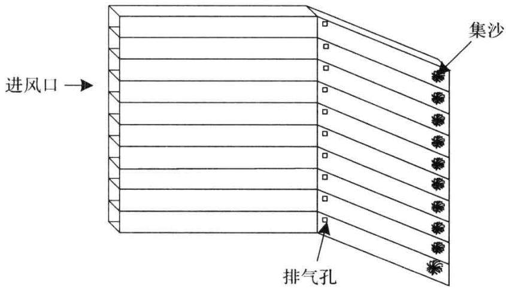  
图6-1 集沙仪示意图

固定式集沙仪的安装：安装固定式集沙仪时，必须保证最下面的进风口与地面平齐，为此必须在其后部挖一个小坑，将倾斜管和集沙袋放在坑中，这样才能保证整个进风口处于水平状态。安装时必须将水平尺放在进风口上部检验是否水平，另外，进风口必须与主风向保持垂直，同时排气孔必须保持畅通，以保证集沙仪中的风速与外面风速基本一致。

观测：安装后每隔一定时间(10天)将各个高度上的集沙袋从集沙仪上取下，换上备用集沙袋。将装有沙子的集沙袋带回室内用电子天平测定各个集沙袋中的沙粒重量，用激光粒度分析仪测定沙粒的粒径组成。如果需要观测大风天气条件下的风沙输移量，则需要根据天气预报，在大风前给集沙仪更换集沙袋，大风后将装有沙子的集沙袋带回室内用电子天平测定各个集沙袋中的沙粒重量，用激光粒度分析仪测定沙粒的粒径组成。

风沙输移量的计算：假设某次大风从 $t _ { 1 }$ 时刻开始，到 $t _ { 2 }$ 时刻结束，大风持续的时段长为 $\triangle t = t _ { 2 } - t _ { 1 }$ ，每个进风口的面积为 $S _ { i }$ ，每个集沙袋中的沙粒重为 $\boldsymbol { W } _ { i }$ ，进风口的数量为n个，观测高度内的平均风速为v，不同高度上的风速为 $v _ { i }$ ，则：

单位断面的风沙输移量： $W = \sum _ { i = 1 } ^ { n } \frac { W _ { i } } { S _ { i } }$

单位断面的风沙输移强度： $Q \ = \ W / \Delta t$

单位体积气流中的含沙量：

$$
q \ = \ \frac { W } { v \times \Delta t \times \sum _ { i \ = 1 } ^ { n } S _ { i } }
$$

不同高度上单位体积气流中的含沙量： $q _ { i } \ = \frac { W _ { i } } { v _ { i } \times \Delta t \times S _ { i } }$

大风持续的时段长可以通过小型气象站观测的风速风向数据，分析出达到起沙风速以上的风的开始时间、结束时间，以及大风持续的时间。

固定式集沙仪因固定在一个方向上，当风向发生变化时，从进风口进入的气流量就会减少，测量出的集沙量也少，当风向与进风口的方向垂直时，集沙仪就无法收集空气中的沙粒。由于自然界中风向是随时变化的，因此用这种固定式的一个方向的集沙仪测定风沙输移量，往往会有很大的误差，因此建议使用张建军设计的自动旋转式集沙仪进行测定。

## 6.2.2 自动旋转式集沙仪

自动旋转集沙仪也是一个扁平金属盒，按一定间距等分成若干格作为进风口(规格为1cm×1cm)，每个进风口后面连接着一个集沙袋，集沙袋能透气，但随风一起运动的沙粒不能通过，沙粒全部保存在集沙袋中，如图6-2。集沙仪用轴承安装在固定轴上可以自由旋转，当风向发生变化时集沙仪在风向板的作用能够自由转动，以保证进风口与风向垂直。每次大风(或每隔一定时间)后分别测定集沙袋中的沙粒量和粒径组成。

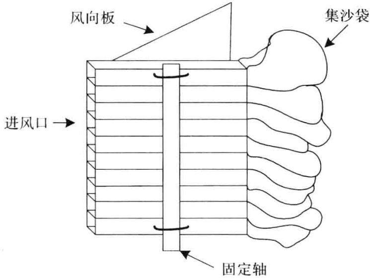  
图6-2 旋转式集沙仪示意图

自动旋转式集沙仪虽然能够适应风向变化较为剧烈地段的风蚀观测，但它观测的是一定时段内各个方向上的集沙总量，无法观测出不同风向的风所携带的沙量。

利用集沙仪除了测定不同高度上的风沙输移量外，还可以测定观测场的风蚀量。集沙仪测定记录格式见表6-3。具体测定方法如下。

首先，选择一个正方形的观测样地，面积为 $1 0 0 \mathrm { m } \times 1 0 0 \mathrm { m }$ ，在观测样地的四边每隔10m布设一台自动旋转式集沙仪，共40台，形成风蚀观测体系。同时在观测样地中间布设小型气象观测设备，同步观测不同高度处的风速风向，以及表层土壤水分等影响风蚀的要素。

其次，每次大风后(或间隔一定时间后)收集每个集沙仪不同高度上集沙袋中的沙量。计算出每个集沙仪的单位断面风沙输移量 $W _ { c }$ 0

第三，根据小气候自动观测设备观测出的主风向，确定风沙输移方向，根据风沙输移方向，确定风沙进入观测样地的边(进入边)和离开观测样地的边(离开边)，以进入边上每个集沙仪的单位断面风沙输移量 $W _ { j }$ 计算进入观测样地内的风沙输移量，以离开边上每个集沙仪单位断面风沙输移量 $\mathbb { W } _ { k }$ ，计算离开观测样地内的风沙输移量。进入观测场地的风沙输移量和离开观测场地风沙输移量之差就是风蚀量。计算公式如下：

表6-3 集沙仪观测记录表  
观测员：
<table><tr><td rowspan=1 colspan=1>观测开始时间</td><td rowspan=1 colspan=1></td><td rowspan=1 colspan=1>观测结束时间</td><td rowspan=1 colspan=1></td><td rowspan=1 colspan=1>场地名称</td><td rowspan=1 colspan=1></td></tr><tr><td rowspan=1 colspan=1>场地大小</td><td rowspan=1 colspan=1></td><td rowspan=1 colspan=1>地理坐标</td><td rowspan=1 colspan=1></td><td rowspan=1 colspan=1>地面高程</td><td rowspan=1 colspan=1></td></tr><tr><td rowspan=1 colspan=1>坡度</td><td rowspan=1 colspan=1></td><td rowspan=1 colspan=1>坡向</td><td rowspan=1 colspan=1></td><td rowspan=1 colspan=1>坡位</td><td rowspan=1 colspan=1></td></tr><tr><td rowspan=1 colspan=1>植被类型</td><td rowspan=1 colspan=1></td><td rowspan=1 colspan=1>盖度</td><td rowspan=1 colspan=1></td><td rowspan=1 colspan=1>高度</td><td rowspan=1 colspan=1></td></tr><tr><td rowspan=1 colspan=2>10min最大风速和风向</td><td rowspan=1 colspan=1></td><td rowspan=1 colspan=1>主风向及频率</td><td rowspan=1 colspan=1></td><td rowspan=1 colspan=1></td></tr><tr><td rowspan=1 colspan=1>平均风速</td><td rowspan=1 colspan=1></td><td rowspan=1 colspan=1>集沙仪进风口面积</td><td rowspan=1 colspan=1></td><td rowspan=1 colspan=1>集沙仪类型</td><td rowspan=1 colspan=1></td></tr></table>

<table><tr><td rowspan=1 colspan=2>集沙仪1</td><td rowspan=1 colspan=2>集沙仪2</td><td rowspan=1 colspan=2>集沙仪3</td></tr><tr><td rowspan=1 colspan=1>进风口离地高度</td><td rowspan=1 colspan=1>集沙量</td><td rowspan=1 colspan=1>进风口离地高度</td><td rowspan=1 colspan=1>集沙量</td><td rowspan=1 colspan=1>进风口离地高度</td><td rowspan=1 colspan=1>集沙量</td></tr><tr><td rowspan=1 colspan=1></td><td rowspan=1 colspan=1></td><td rowspan=1 colspan=1></td><td rowspan=1 colspan=1></td><td rowspan=1 colspan=1></td><td rowspan=1 colspan=1></td></tr><tr><td rowspan=1 colspan=1></td><td rowspan=1 colspan=1></td><td rowspan=1 colspan=1></td><td rowspan=1 colspan=1></td><td rowspan=1 colspan=1></td><td rowspan=1 colspan=1></td></tr><tr><td rowspan=1 colspan=1></td><td rowspan=1 colspan=1></td><td rowspan=1 colspan=1></td><td rowspan=1 colspan=1></td><td rowspan=1 colspan=1></td><td rowspan=1 colspan=1></td></tr><tr><td rowspan=1 colspan=1></td><td rowspan=1 colspan=1></td><td rowspan=1 colspan=1></td><td rowspan=1 colspan=1></td><td rowspan=1 colspan=1></td><td rowspan=1 colspan=1></td></tr><tr><td rowspan=1 colspan=1></td><td rowspan=1 colspan=1></td><td rowspan=1 colspan=1></td><td rowspan=1 colspan=1></td><td rowspan=1 colspan=1></td><td rowspan=1 colspan=1></td></tr><tr><td rowspan=1 colspan=1>风沙输移量</td><td rowspan=1 colspan=1></td><td rowspan=1 colspan=1>风沙输移量</td><td rowspan=1 colspan=1></td><td rowspan=1 colspan=1>风沙输移量</td><td rowspan=1 colspan=1></td></tr><tr><td rowspan=1 colspan=1>风沙输移强度</td><td rowspan=1 colspan=1></td><td rowspan=1 colspan=1>风沙输移强度</td><td rowspan=1 colspan=1></td><td rowspan=1 colspan=1>风沙输移强度</td><td rowspan=1 colspan=1></td></tr><tr><td rowspan=1 colspan=1>空气中的含沙量</td><td rowspan=1 colspan=1></td><td rowspan=1 colspan=1>空气中的含沙量</td><td rowspan=1 colspan=1></td><td rowspan=1 colspan=1>空气中的含沙量</td><td rowspan=1 colspan=1></td></tr><tr><td rowspan=1 colspan=2>进入边平均风沙输移量</td><td rowspan=1 colspan=4></td></tr><tr><td rowspan=1 colspan=2>进入边平均风沙输移强度</td><td rowspan=1 colspan=4></td></tr><tr><td rowspan=1 colspan=2>进入边平均空气中的含沙量</td><td rowspan=1 colspan=4></td></tr></table>

<table><tr><td rowspan=1 colspan=6>离开边</td></tr><tr><td rowspan=1 colspan=2>集沙仪4</td><td rowspan=1 colspan=2>集沙仪5</td><td rowspan=1 colspan=2>集沙仪6</td></tr><tr><td rowspan=1 colspan=1></td><td rowspan=1 colspan=1></td><td rowspan=1 colspan=1></td><td rowspan=1 colspan=1></td><td rowspan=1 colspan=1></td><td rowspan=1 colspan=1></td></tr><tr><td rowspan=1 colspan=1></td><td rowspan=1 colspan=1></td><td rowspan=1 colspan=1></td><td rowspan=1 colspan=1></td><td rowspan=1 colspan=1></td><td rowspan=1 colspan=1></td></tr><tr><td rowspan=1 colspan=1></td><td rowspan=1 colspan=1></td><td rowspan=1 colspan=1></td><td rowspan=1 colspan=1></td><td rowspan=1 colspan=1></td><td rowspan=1 colspan=1></td></tr><tr><td rowspan=1 colspan=1></td><td rowspan=1 colspan=1></td><td rowspan=1 colspan=1></td><td rowspan=1 colspan=1></td><td rowspan=1 colspan=1></td><td rowspan=1 colspan=1></td></tr><tr><td rowspan=1 colspan=1></td><td rowspan=1 colspan=1></td><td rowspan=1 colspan=1></td><td rowspan=1 colspan=1></td><td rowspan=1 colspan=1></td><td rowspan=1 colspan=1></td></tr><tr><td rowspan=1 colspan=1>风沙输移量</td><td rowspan=1 colspan=1></td><td rowspan=1 colspan=1>风沙输移量</td><td rowspan=1 colspan=1></td><td rowspan=1 colspan=1>风沙输移量</td><td rowspan=1 colspan=1></td></tr><tr><td rowspan=1 colspan=1>风沙输移强度</td><td rowspan=1 colspan=1></td><td rowspan=1 colspan=1>风沙输移强度</td><td rowspan=1 colspan=1></td><td rowspan=1 colspan=1>风沙输移强度</td><td rowspan=1 colspan=1></td></tr><tr><td rowspan=1 colspan=1>空气中的含沙量</td><td rowspan=1 colspan=1></td><td rowspan=1 colspan=1>空气中的含沙量</td><td rowspan=1 colspan=1></td><td rowspan=1 colspan=1>空气中的含沙量</td><td rowspan=1 colspan=1></td></tr><tr><td rowspan=1 colspan=2>离开边平均风沙输移量</td><td rowspan=1 colspan=4></td></tr><tr><td rowspan=1 colspan=2>离开边平均风沙输移强度</td><td rowspan=1 colspan=4></td></tr><tr><td rowspan=1 colspan=2>离开边平均空气中的含沙量</td><td rowspan=1 colspan=4></td></tr><tr><td rowspan=1 colspan=2>观测场的风蚀量</td><td rowspan=1 colspan=4></td></tr></table>

$$
\Delta { H } = \big ( \sum _ { k = 1 } ^ { m } { W _ { k } } / { m } - \sum _ { j = 1 } ^ { n } { W _ { j } } / { n } \big ) \times { H } \times { B } / { ( S \times d ) }
$$

式中：∆H—风蚀量(厚度)； $\Delta H$ 正值时表示观测场为风蚀，∆H负值时表示观测场为风积，∆H为零时表示从观测场吹走的沙子与沉积的沙子数量相等；

$\mathbb { W } _ { k }$ —离开边上每个集沙仪的单位断面风沙输移量；

$W _ { j }$ 进入边上每个集沙仪的单位断面风沙输移量；

$n ^ { - }$ —进入边集沙仪的数量；

m——离开边集沙仪的数量；

B——观测场地的边长；

S——观测场地的面积；

H——集沙仪的高度；

$d -$ ——集沙袋中沙子的容重。

## 6.3 大气降尘量的观测

在风的作用下裸露地表的细粒物质进入空中，以悬浮状态可以在空中搬运很远的距离，尤其在大风天气条件下，大量的细粒物质进入大气，形成沙尘暴。这些随风飘送的细粒物质当气流发生变化时就会降落地面成为降尘。在风的作用下细粒物质从沙源地被输送到降尘区，不仅造成沙源地土地资源的损失，降尘还可以使降尘区的空气质量下降，对当地的环境造成严重影响，因此降尘观测也是水土保持监测的重要内容。

降尘量一般采用降尘缸进行观测，降尘缸是一个用于收集大气中悬浮尘土等固相细粒物质的容器，它是内径15cm、高30cm的圆筒形玻璃缸(或塑料缸、瓷缸)。

使用时将其加盖携带至采样点，取下盖子，开始收集降尘。为防止落入缸中的降尘再次被风吹走，可在缸内加入少量水。在夏季，为防止微生物和藻类生长，可加入少量硫酸铜溶液；在冰冻季节，可加入适量乙醇溶液作为防冻剂。采样时间根据观测需要而定，如果观测每天的降尘量，可以在每日的固定时间(如8：00)收集降尘缸中的降尘；如果观测大风天气时的降尘量，可以根据天气预报在大风来临前布设降尘缸，大风结束后收集缸中的降尘；如果观测一定期间内的降尘量，可以每隔一定时间后收集缸中的降尘量。采样完毕后，将降尘缸带回实验室，经过滤、烘干、称重后计算沉降量。

由于大气中细粒物质的分布随高度而变化，高度越低，细粒物质含量越高，变化越大。因此为了观测不同高度处的降尘量，也就是不同高度上细粒物质的量，可以从地面开始在不同高度处布设降尘缸，每个高度上至少布设3个降尘缸进行重复观测。

如果不同高度上每个降尘缸观测到的降尘量分别为 $\mathbb { W } _ { i }$ ，降尘缸的数量为n，每个降尘缸的面积为S，降尘的时段长为T，则每个高度上的平均降尘强度(单位时间单位面积上的降尘量) $Q _ { h }$ 为：

$$
Q _ { h } \ = \ \sum _ { i = 1 } ^ { n } W _ { i } / ( S \times T )
$$

降尘观测记录格式见表64。

表64降尘观测记录表  
观测员：
<table><tr><td rowspan=1 colspan=1>观测开始时间</td><td rowspan=1 colspan=2></td><td rowspan=1 colspan=1>观测结束时间</td><td rowspan=1 colspan=3></td></tr><tr><td rowspan=1 colspan=1>观测场地</td><td rowspan=1 colspan=1></td><td rowspan=1 colspan=1>地理坐标</td><td rowspan=1 colspan=1></td><td rowspan=1 colspan=2>地面高程</td><td rowspan=1 colspan=1></td></tr><tr><td rowspan=1 colspan=1>坡度</td><td rowspan=1 colspan=1></td><td rowspan=1 colspan=1>坡向</td><td rowspan=1 colspan=1></td><td rowspan=1 colspan=2>坡位</td><td rowspan=1 colspan=1></td></tr><tr><td rowspan=1 colspan=2>10min最大风速和风向</td><td rowspan=1 colspan=1></td><td rowspan=1 colspan=1>主风向及频率</td><td rowspan=1 colspan=3></td></tr><tr><td rowspan=1 colspan=1>平均风速</td><td rowspan=1 colspan=1></td><td rowspan=1 colspan=1>降尘缸的面积</td><td rowspan=1 colspan=1></td><td rowspan=1 colspan=2>降尘缸的类型</td><td rowspan=1 colspan=1></td></tr><tr><td rowspan=1 colspan=2>降尘缸安装高度1的降尘量</td><td rowspan=1 colspan=3>降尘缸安装高度2的降尘量</td><td rowspan=1 colspan=2>降尘缸安装高度3的降尘量</td></tr><tr><td rowspan=1 colspan=1>降尘缸11</td><td rowspan=1 colspan=2>降尘缸12</td><td rowspan=1 colspan=1>降尘缸31</td><td rowspan=1 colspan=3></td></tr><tr><td rowspan=1 colspan=1>降尘缸12</td><td rowspan=1 colspan=2>降尘缸22</td><td rowspan=1 colspan=1>降尘缸32</td><td rowspan=1 colspan=3></td></tr><tr><td rowspan=1 colspan=1>降尘缸13</td><td rowspan=1 colspan=2>降尘缸23</td><td rowspan=1 colspan=1>降尘缸33</td><td rowspan=1 colspan=3></td></tr><tr><td rowspan=1 colspan=1></td><td rowspan=1 colspan=2></td><td rowspan=1 colspan=1></td><td rowspan=1 colspan=3></td></tr><tr><td rowspan=1 colspan=1></td><td rowspan=1 colspan=2></td><td rowspan=1 colspan=1></td><td rowspan=1 colspan=3></td></tr><tr><td rowspan=1 colspan=1></td><td rowspan=1 colspan=2></td><td rowspan=1 colspan=1></td><td rowspan=1 colspan=3></td></tr><tr><td rowspan=1 colspan=1>单位面积降尘量</td><td rowspan=1 colspan=6></td></tr><tr><td rowspan=1 colspan=1>平均降尘强度</td><td rowspan=1 colspan=6></td></tr></table>

## 6.4移动沙丘的观测

在沙漠中有许多流动的沙丘，尤其在沙漠的边缘地区，随着沙丘的不断移动，沙漠化面积逐步扩大，从而造成农田、村舍、道路、厂矿企业等的掩埋和破坏。为了掌握沙漠化扩张的速度，防止沙漠扩张对周边地区的影响，必须及时准确掌握沙丘的移动规律，因此沙丘移动速度的观测也是水土保持监测中的重要内容之一。

影响沙丘移动的因素很多，最主要的影响因素为受风速、风向共同决定的风沙流的运移状况。沙丘的移动完全取决于风沙流的状况，迎风坡和沙丘顶部的沙子不断被风吹蚀，降落在背风坡形成滑落面，从而使沙丘不断向前移动。实际中常以沙丘顶部脊线的移动速度作为沙丘的移动速度。沙丘移动速度可以用插钎法、经纬仪法进行观测。

## 6.4.1 插钎法

在有代表性的沙漠区内选择典型移动沙丘，在移动沙丘的迎风面的坡脚、丘顶脊线、背风坡脚分别布设插钎，对每根插钎进行编号，并记录每根插钎顶部到沙丘表面的高度。经过一定时间后(或一次大风后)，测定迎风坡脚、丘顶脊线和背风坡脚位置的变化和插钎埋深的变化。根据坡脚位置的变化计算沙丘移动的方向和移动量，还可以根据插钎埋深的变化计算出沙丘迎风坡的风蚀量，以及背风坡的沙积量。但插钎法无法计算出沙丘的高度变化和沙丘的形状变化。

插钎法沙丘移动记录格式见表6-5。

## 6.4.2 经纬仪法

在沙丘顶部选择一个基准点，埋设插钎，安装经纬仪，用经纬仪测定沙丘坡脚的轮廓线、丘顶脊线及与基准点间的高差，同时还可以在沙丘中部布设一些测点测定沙丘的形状，最终绘制沙丘的地形。每隔一定时期后重新在基准点上布设经纬仪，测定沙丘的地形。根据两次测定的地形变化，就可以确定出沙丘的移动方向、移动量、沙丘形状的变化以及沙丘体

积的变化。

表6-5 插钎法沙丘移动记录表  
观测员：
<table><tr><td rowspan=1 colspan=4>观测时间</td><td rowspan=1 colspan=3></td><td rowspan=1 colspan=4>观测场地</td><td rowspan=1 colspan=4></td><td rowspan=1 colspan=4>地理坐标</td><td rowspan=1 colspan=4></td></tr><tr><td rowspan=1 colspan=4>观测场面积</td><td rowspan=1 colspan=3></td><td rowspan=1 colspan=4>地面高程</td><td rowspan=1 colspan=4></td><td rowspan=1 colspan=4>植被类型</td><td rowspan=1 colspan=4></td></tr><tr><td rowspan=1 colspan=4>覆盖度</td><td rowspan=1 colspan=3></td><td rowspan=1 colspan=4>植被高度</td><td rowspan=1 colspan=4></td><td rowspan=1 colspan=4>植被均匀度</td><td rowspan=1 colspan=4></td></tr><tr><td rowspan=1 colspan=4>土壤含水量</td><td rowspan=1 colspan=3></td><td rowspan=1 colspan=4>平均风速</td><td rowspan=1 colspan=4></td><td rowspan=1 colspan=4>沙丘高度</td><td rowspan=1 colspan=4></td></tr><tr><td rowspan=2 colspan=4>迎风坡最大坡度的变化</td><td rowspan=1 colspan=2>前</td><td rowspan=1 colspan=1>后</td><td rowspan=1 colspan=4>背风坡最大</td><td rowspan=1 colspan=2>前</td><td rowspan=1 colspan=2>后</td><td rowspan=1 colspan=4>沙丘最大</td><td rowspan=1 colspan=2>前</td><td rowspan=1 colspan=2>后</td></tr><tr><td rowspan=1 colspan=2></td><td rowspan=1 colspan=1></td><td rowspan=1 colspan=4>坡度的变化</td><td rowspan=1 colspan=2></td><td rowspan=1 colspan=2></td><td rowspan=1 colspan=4>宽度变化</td><td rowspan=1 colspan=2></td><td rowspan=1 colspan=2></td></tr><tr><td rowspan=1 colspan=7>10min 最大风速和风向</td><td rowspan=1 colspan=4></td><td rowspan=1 colspan=4>主风向及频率</td><td rowspan=1 colspan=8></td></tr><tr><td rowspan=1 colspan=7>迎风坡脚的位移量</td><td rowspan=1 colspan=9>丘顶部脊线位移量</td><td rowspan=1 colspan=7>背风坡脚位移量</td></tr><tr><td rowspan=2 colspan=1>编号</td><td rowspan=1 colspan=4>插钎高度</td><td rowspan=1 colspan=2>距坡脚距离</td><td rowspan=1 colspan=1></td><td rowspan=1 colspan=4>插钎高度</td><td rowspan=1 colspan=4>距脊线距离</td><td rowspan=1 colspan=1></td><td rowspan=1 colspan=3>插钎高度</td><td rowspan=1 colspan=3>距坡脚距离</td></tr><tr><td rowspan=1 colspan=2>前</td><td rowspan=1 colspan=2>后</td><td rowspan=1 colspan=1>前</td><td rowspan=1 colspan=1>后</td><td rowspan=1 colspan=1>编号</td><td rowspan=1 colspan=2>前</td><td rowspan=1 colspan=2>后</td><td rowspan=1 colspan=2>前</td><td rowspan=1 colspan=2>后</td><td rowspan=1 colspan=1>编号</td><td rowspan=1 colspan=2>前</td><td rowspan=1 colspan=1>后</td><td rowspan=1 colspan=2>前</td><td rowspan=1 colspan=1>后</td></tr><tr><td rowspan=1 colspan=1></td><td rowspan=1 colspan=2></td><td rowspan=1 colspan=2></td><td rowspan=1 colspan=1></td><td rowspan=1 colspan=1></td><td rowspan=1 colspan=1></td><td rowspan=1 colspan=2></td><td rowspan=1 colspan=2></td><td rowspan=1 colspan=2></td><td rowspan=1 colspan=2></td><td rowspan=1 colspan=1></td><td rowspan=1 colspan=2></td><td rowspan=1 colspan=1></td><td rowspan=1 colspan=2></td><td rowspan=1 colspan=1></td></tr><tr><td rowspan=1 colspan=1></td><td rowspan=1 colspan=2></td><td rowspan=1 colspan=2></td><td rowspan=1 colspan=1></td><td rowspan=1 colspan=1></td><td rowspan=1 colspan=1></td><td rowspan=1 colspan=2></td><td rowspan=1 colspan=2></td><td rowspan=1 colspan=2></td><td rowspan=1 colspan=2></td><td rowspan=1 colspan=1></td><td rowspan=1 colspan=2></td><td rowspan=1 colspan=1></td><td rowspan=1 colspan=2></td><td rowspan=1 colspan=1></td></tr><tr><td rowspan=1 colspan=1></td><td rowspan=1 colspan=2></td><td rowspan=1 colspan=2></td><td rowspan=1 colspan=1></td><td rowspan=1 colspan=1></td><td rowspan=1 colspan=1></td><td rowspan=1 colspan=2></td><td rowspan=1 colspan=2></td><td rowspan=1 colspan=2></td><td rowspan=1 colspan=2></td><td rowspan=1 colspan=1></td><td rowspan=1 colspan=2></td><td rowspan=1 colspan=1></td><td rowspan=1 colspan=2></td><td rowspan=1 colspan=1></td></tr><tr><td rowspan=1 colspan=1></td><td rowspan=1 colspan=2></td><td rowspan=1 colspan=2></td><td rowspan=1 colspan=1></td><td rowspan=1 colspan=1></td><td rowspan=1 colspan=1></td><td rowspan=1 colspan=2></td><td rowspan=1 colspan=2></td><td rowspan=1 colspan=2></td><td rowspan=1 colspan=2></td><td rowspan=1 colspan=1></td><td rowspan=1 colspan=2></td><td rowspan=1 colspan=1></td><td rowspan=1 colspan=2></td><td rowspan=1 colspan=1></td></tr><tr><td rowspan=1 colspan=1></td><td rowspan=1 colspan=2></td><td rowspan=1 colspan=2></td><td rowspan=1 colspan=1></td><td rowspan=1 colspan=1></td><td rowspan=1 colspan=1></td><td rowspan=1 colspan=2></td><td rowspan=1 colspan=2></td><td rowspan=1 colspan=2></td><td rowspan=1 colspan=2></td><td rowspan=1 colspan=1></td><td rowspan=1 colspan=2></td><td rowspan=1 colspan=1></td><td rowspan=1 colspan=2></td><td rowspan=1 colspan=1></td></tr><tr><td rowspan=1 colspan=1></td><td rowspan=1 colspan=2></td><td rowspan=1 colspan=2></td><td rowspan=1 colspan=1></td><td rowspan=1 colspan=1></td><td rowspan=1 colspan=1></td><td rowspan=1 colspan=2></td><td rowspan=1 colspan=2></td><td rowspan=1 colspan=2></td><td rowspan=1 colspan=2></td><td rowspan=1 colspan=1></td><td rowspan=1 colspan=2></td><td rowspan=1 colspan=1></td><td rowspan=1 colspan=2></td><td rowspan=1 colspan=1></td></tr><tr><td rowspan=1 colspan=1></td><td rowspan=1 colspan=2></td><td rowspan=1 colspan=2></td><td rowspan=1 colspan=1></td><td rowspan=1 colspan=1></td><td rowspan=1 colspan=1></td><td rowspan=1 colspan=2></td><td rowspan=1 colspan=2></td><td rowspan=1 colspan=2></td><td rowspan=1 colspan=2></td><td rowspan=1 colspan=1></td><td rowspan=1 colspan=2></td><td rowspan=1 colspan=1></td><td rowspan=1 colspan=2></td><td rowspan=1 colspan=1></td></tr><tr><td rowspan=1 colspan=2>变化量</td><td rowspan=1 colspan=2></td><td></td><td rowspan=1 colspan=2></td><td rowspan=1 colspan=2>变化量</td><td rowspan=1 colspan=3></td><td rowspan=1 colspan=4></td><td rowspan=1 colspan=2>变化量</td><td rowspan=1 colspan=2></td><td rowspan=1 colspan=3></td></tr></table>

## 第7章 重力侵蚀观测

重力侵蚀是指坡面的岩体和土体在重力作用下失去平衡而产生位移的侵蚀现象，泻溜、陷穴、崩塌、滑坡是最主要的重力侵蚀形式。地震、降水、河水冲淘、地下水、海浪、风、冻融、冰川运动、人工采掘和爆破等是诱发重力侵蚀的主要原因。重力侵蚀具有突发性，规模相差悬殊，大规模的重力侵蚀具有超强的破坏力，尤其是发生在人类活动频繁地区的重力侵蚀经常威胁生命安全，会造成严的重经济损失，因此重力侵蚀的观测对保护人民生命财产安全更具有重要意义。

## 7.1 泻溜观测

崖壁和陡坡上的土石表面在干湿、冷热和冻融等变化影响下，引起土体或岩石的胀缩，形成风化碎屑，这些碎屑物质在重力作用下沿坡面滚落或滑落，在坡脚形成陡峭堆积锥的现象称为泻溜。泻溜主要发生在崖壁和陡坡上，在坡脚处常形成堆积锥。泻溜一年四季均可发生，但在冬末春初的解冻期、干湿变化剧烈的季节最容易发生。

泻溜常用集沙槽进行观测。观测时通过野外调查，掌握观测区内泻溜的空间分布特征，在典型的泻溜发生坡面中选择有代表性地段作为观测对象，在每块观测坡面的坡脚，沿着堆积锥的底部修建集沙槽，并准确测量集沙槽以上发生泻溜区域的面积。

集沙槽可以用混凝土修建，也可以用不锈钢或其他耐损材料制作。集沙槽靠近坡面的高度必须与坡面平齐，以保证从坡上部泻溜下来的碎屑物质能够顺利进入集沙槽，集沙槽远离坡面一侧要制作高一些，以保证从坡面滚落下来的碎屑物质不会飞过集沙槽，能够全部进入集沙槽。泻溜侵蚀观测示意图如图7-1。

集沙槽修建完成后，将集沙槽内打扫干净，开始收集从坡上部泻溜下

来的碎屑物质。收集一段时间后，将集沙槽内的碎屑物质收集起来，去除植物枝叶等非泻溜碎屑物后称湿重，然后取5个样品(每个样品 $1 0 0 \mathrm { g }$ 左右)装入密封袋内，将样品带回室内称重后、放入105℃的烘箱内烘干至恒重，计算5个碎屑物样品的含水量。根据5个样品的平均含水量、集沙槽中碎屑物的湿重，利用下式计算出观测期间内的泻溜强度。

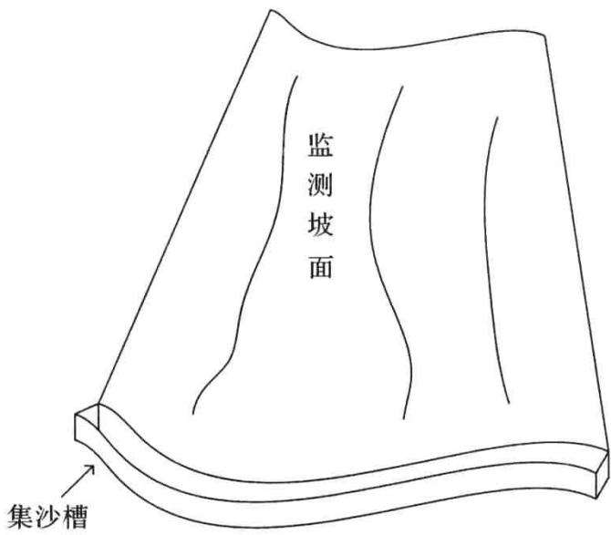  
图7-1 泻溜侵蚀观测布设示意图

$$
X L = W \times ( 1 - \theta \% ) / ( S \times \mathrm { c o s } \alpha \times T )
$$

式中：XL泻溜强度，即单位时间单位面积上的泻溜物的干重；

W——集沙槽中碎屑物的湿重；

θ%——碎屑物的含水量；

S——观测坡面的面积；

α——观测坡面的坡度；

T——观测时段长。

每次观测后都必须将集沙槽内的沙土清扫干净，然后进行下一阶段的观测。降雨时形成的坡面径流会将坡面的碎屑物质冲刷到集沙槽中，因此观测人员应该注意天气预报，在降雨前必须将集沙槽中的碎屑物质回收测定，降雨后应该将集沙槽中的淤积物清理干净，然后再进行泻溜的观测。如果在观测过程中发生降雨，观测坡面发生地表径流冲刷，收集槽内有泥沙淤积，则该期间的泻溜观测视为失败，雨后将集沙槽清理干净后重新观测。泻溜观测测记录格式见表7-1。

表7-1 集沙槽观测泻溜记录表  
观测员：
<table><tr><td rowspan=1 colspan=1>观测地点</td><td rowspan=1 colspan=1></td><td rowspan=1 colspan=1>观测场坐标</td><td rowspan=1 colspan=1></td><td rowspan=1 colspan=1>观测场面积</td><td rowspan=1 colspan=1></td></tr><tr><td rowspan=1 colspan=1>观测场坡度</td><td rowspan=1 colspan=1></td><td rowspan=1 colspan=1>观测场坡向</td><td rowspan=1 colspan=1></td><td rowspan=1 colspan=1>观测场高程</td><td rowspan=1 colspan=1></td></tr><tr><td rowspan=1 colspan=1>土壤类型</td><td rowspan=1 colspan=1></td><td rowspan=1 colspan=1>母质</td><td rowspan=1 colspan=1></td><td rowspan=1 colspan=1>基岩类型</td><td rowspan=1 colspan=1></td></tr><tr><td rowspan=1 colspan=1>植物覆盖度</td><td rowspan=1 colspan=1></td><td rowspan=1 colspan=1>植被高度</td><td rowspan=1 colspan=1></td><td rowspan=1 colspan=1>植被生物量</td><td rowspan=1 colspan=1></td></tr><tr><td rowspan=1 colspan=1>土壤含水量</td><td rowspan=1 colspan=1></td><td rowspan=1 colspan=1>观测期最低温度</td><td rowspan=1 colspan=1></td><td rowspan=1 colspan=1>观测期最高温度</td><td rowspan=1 colspan=1></td></tr><tr><td rowspan=1 colspan=1>集沙槽面积</td><td rowspan=1 colspan=1></td><td rowspan=1 colspan=1>集沙槽长度</td><td rowspan=1 colspan=1></td><td rowspan=1 colspan=1>集沙槽宽度</td><td rowspan=1 colspan=1></td></tr><tr><td rowspan=1 colspan=1>观测开始时间</td><td rowspan=1 colspan=1></td><td rowspan=1 colspan=1>观测结束时间</td><td rowspan=1 colspan=1></td><td rowspan=1 colspan=1>观测时段长</td><td rowspan=1 colspan=1></td></tr><tr><td rowspan=1 colspan=1>集沙槽内碎屑物湿重</td><td rowspan=1 colspan=1></td><td rowspan=1 colspan=1>集沙槽内碎屑物干重</td><td rowspan=1 colspan=1></td><td rowspan=1 colspan=1>泻溜侵蚀强度</td><td rowspan=1 colspan=1></td></tr><tr><td rowspan=1 colspan=1>碎屑物样品编号</td><td rowspan=1 colspan=1>一</td><td rowspan=1 colspan=1>2</td><td rowspan=1 colspan=1>3</td><td rowspan=1 colspan=1>4</td><td rowspan=1 colspan=1>5</td></tr><tr><td rowspan=1 colspan=1>碎屑物湿重</td><td rowspan=1 colspan=1></td><td rowspan=1 colspan=1></td><td rowspan=1 colspan=1></td><td rowspan=1 colspan=1></td><td rowspan=1 colspan=1></td></tr><tr><td rowspan=1 colspan=1>碎屑物干重</td><td rowspan=1 colspan=1></td><td rowspan=1 colspan=1></td><td rowspan=1 colspan=1></td><td rowspan=1 colspan=1></td><td rowspan=1 colspan=1></td></tr><tr><td rowspan=1 colspan=1>碎屑物含水量</td><td rowspan=1 colspan=1></td><td rowspan=1 colspan=1></td><td rowspan=1 colspan=1></td><td rowspan=1 colspan=1></td><td rowspan=1 colspan=1></td></tr></table>

## 7.2 陷穴观测

陷穴是黄土地区特有的一种陷落现象。雨水或地表径流渗入黄土后，沿黄土中的裂隙或孔隙向深层渗透的过程中，对黄土产生溶蚀和侵蚀，把可溶性盐类带走，致使土层内部形成空洞，从而使上层土体失去顶托，引起黄土陷落，形成陷穴。陷穴形成后地表径流的汇集于此，在水的作用下陷穴逐渐扩大、加深，为侵蚀沟的形成奠定了基础。陷穴多分布在地表水容易汇集的沟间地的边缘地带和谷坡上部，特别是冲沟的沟头附近最为发育，所以陷穴是侵蚀沟形成和扩展的重要方式之一。

陷穴侵蚀可以用单位面积上陷穴的数量和单位面积上陷穴的体积两个指标来描述，陷穴的观测就是观测一定时期内陷穴数量和体积的增加量。由于陷穴在坡面和沟道内均有发生，多集中在地势相对比较低洼的地段，因此观测陷穴时，首先选择一个典型的集水区作为观测对象，并调查集水区的面积、坡度等各项地形指标。然后在集水区内从上到下测定每个陷穴的具体位置、陷穴形状、面积、深度。最后根据这些观测数据，计算出每个陷穴体积，利用陷穴的体积乘以黄土的容重，得出到调查时为止已经发生的陷穴侵蚀总量。

陷穴的观测每年进行一次，每次观测时必须调查新增陷穴的数量和每个新增陷穴的体积，同时对原有各个陷穴重新测定体积的大小，通过与前一次测定的各个陷穴的体积进行对比得出观测期间内陷穴体积的增加量。新增陷穴的体积与原有陷穴体积的增加量之和为观测期间内观测区陷穴侵蚀量。陷穴观测的记录格式见表7-2。

表7-2 陷穴观测记录表  
观测员：
<table><tr><td rowspan=1 colspan=2>集水区的地理位置</td><td rowspan=1 colspan=5>省市       乡(镇)       村          流域   地块</td></tr><tr><td rowspan=1 colspan=2>集水区四周的地理坐标</td><td rowspan=1 colspan=5></td></tr><tr><td rowspan=1 colspan=1>集水区面积</td><td rowspan=1 colspan=2></td><td rowspan=1 colspan=1>集水区平均坡度</td><td rowspan=1 colspan=1></td><td rowspan=1 colspan=1>集水区平均高程</td><td rowspan=1 colspan=1></td></tr><tr><td rowspan=1 colspan=1>土壤类型</td><td rowspan=1 colspan=2></td><td rowspan=1 colspan=1>母质</td><td rowspan=1 colspan=1></td><td rowspan=1 colspan=1>基岩类型</td><td rowspan=1 colspan=1></td></tr><tr><td rowspan=1 colspan=1>植物覆盖度</td><td rowspan=1 colspan=2></td><td rowspan=1 colspan=1>植被高度</td><td rowspan=1 colspan=1></td><td rowspan=1 colspan=1>植被生物量</td><td rowspan=1 colspan=1></td></tr><tr><td rowspan=1 colspan=1>观测开始日期</td><td rowspan=1 colspan=2></td><td rowspan=1 colspan=1>观测结束日期</td><td rowspan=1 colspan=1></td><td rowspan=1 colspan=1>观测时段长</td><td rowspan=1 colspan=1></td></tr><tr><td rowspan=1 colspan=1>降水量</td><td rowspan=1 colspan=2></td><td rowspan=1 colspan=1>最大场降水量</td><td rowspan=1 colspan=1></td><td rowspan=1 colspan=1>最大 $I _ { 5 }$ </td><td rowspan=1 colspan=1></td></tr><tr><td rowspan=1 colspan=1>最大 $I _ { 1 0 }$ </td><td rowspan=1 colspan=2></td><td rowspan=1 colspan=1>最大 $I _ { 3 0 }$ </td><td rowspan=1 colspan=1></td><td rowspan=1 colspan=1>最大 $I _ { 6 0 }$ </td><td rowspan=1 colspan=1></td></tr><tr><td rowspan=1 colspan=1>陷穴编号</td><td rowspan=1 colspan=2>地理坐标</td><td rowspan=1 colspan=1>陷穴口面积</td><td rowspan=1 colspan=1>陷穴底面积</td><td rowspan=1 colspan=1>陷穴深</td><td rowspan=1 colspan=1>陷穴体积</td></tr><tr><td rowspan=1 colspan=1></td><td rowspan=1 colspan=2></td><td rowspan=1 colspan=1></td><td rowspan=1 colspan=1></td><td rowspan=1 colspan=1></td><td rowspan=1 colspan=1></td></tr><tr><td rowspan=1 colspan=1></td><td rowspan=1 colspan=2></td><td rowspan=1 colspan=1></td><td rowspan=1 colspan=1></td><td rowspan=1 colspan=1></td><td rowspan=1 colspan=1></td></tr><tr><td rowspan=1 colspan=1></td><td rowspan=1 colspan=2></td><td rowspan=1 colspan=1></td><td rowspan=1 colspan=1></td><td rowspan=1 colspan=1></td><td rowspan=1 colspan=1></td></tr><tr><td rowspan=1 colspan=1></td><td rowspan=1 colspan=2></td><td rowspan=1 colspan=1></td><td rowspan=1 colspan=1></td><td rowspan=1 colspan=1></td><td rowspan=1 colspan=1></td></tr><tr><td rowspan=1 colspan=1></td><td rowspan=1 colspan=2></td><td rowspan=1 colspan=1></td><td rowspan=1 colspan=1></td><td rowspan=1 colspan=1></td><td rowspan=1 colspan=1></td></tr><tr><td rowspan=1 colspan=1></td><td rowspan=1 colspan=2></td><td rowspan=1 colspan=1></td><td rowspan=1 colspan=1></td><td rowspan=1 colspan=1></td><td rowspan=1 colspan=1></td></tr><tr><td rowspan=1 colspan=1></td><td rowspan=1 colspan=2></td><td rowspan=1 colspan=1></td><td rowspan=1 colspan=1></td><td rowspan=1 colspan=1></td><td rowspan=1 colspan=1></td></tr><tr><td rowspan=1 colspan=1>土体的容重</td><td rowspan=1 colspan=6></td></tr><tr><td rowspan=1 colspan=1>陷穴总体积</td><td rowspan=1 colspan=6></td></tr><tr><td rowspan=1 colspan=1>陷穴侵蚀量</td><td rowspan=1 colspan=6></td></tr><tr><td rowspan=1 colspan=1>陷穴侵蚀强度</td><td rowspan=1 colspan=6></td></tr></table>

每个陷穴的具体位置可以GPS进行定位，也可以直接用经纬仪测定每个陷穴的相对位置。陷穴口的面积可以直接用皮尺(小陷穴)或激光测距仪(大陷穴)采用断面法测定，也可以用经纬仪测定。对于小型的陷穴，底部面积可以直接测定，大型陷穴需要观测人员进入陷穴底部进行测量。陷穴深度可以直接用皮尺或激光测距仪测定。根据测定的陷穴口面积、陷穴底面积、陷穴深度计算出每个陷穴的体积。

对调查区域的第一次陷穴调查是现状调查，调查数据可以作为本底值，第二次以后的调查是陷穴侵蚀增加量的调查，包括新增陷穴的数量、新增的陷穴侵蚀量。到观测时点为止调查区中单位面积上的陷穴侵蚀量可用下式计算：

$$
X X = D \times \big [ \sum _ { i = 1 } ^ { n } { ( S _ { i \mathrm { { E } } } + { \bf { S } } _ { i \mathrm { { F } } } ) \times H _ { i } } / { 2 } \big ] / S
$$

式中：XX——到观测时点为止单位面积上的陷穴侵蚀总量；

D——调查区内土层的容重；

$n ^ { \cdot }$ ——调查区内陷穴的数量；

$S _ { i \mathrm { t } }$ ——第i个陷穴口的面积；

$S _ { i \mathrm { \uparrow } }$ ——第i个陷穴底的面积；

$H _ { i }$ ——第i个陷穴的平均深度；

S——观测样地的面积。

观测期间内单位面积上新增的陷穴侵蚀量可用下式计算：

$$
X Z = \frac { D } { S } \times [ \sum _ { j = 1 } ^ { m } ( S _ { j \perp } + S _ { j \mathrm { F } } ) \times H _ { j } / 2 + \sum _ { i = 1 } ^ { n } ( S _ { i 2 \perp } + S _ { i 2 \mathrm { F } } )
$$

$$
\times H _ { \mathrm { { } 2 } } / 2 - \sum _ { i = 1 } ^ { n } \left( S _ { i 1 \perp } + S _ { i 1 \perp } \right) \times H _ { i 1 } / 2 ]
$$

式中：XZ—单位面积上新增的陷穴侵蚀量；

D——调查区内土层的容重；

$m ^ { \cdot }$ —观测期间内新增的陷穴数量；

$S _ { j \mathrm { { E } } }$ ——第j个新增陷穴口的面积；

$S _ { j \mathrm { F } }$ ——第j个新增陷穴底的面积；

$H _ { j }$ ——第j个新增陷穴的平均深度；

$n ^ { - }$ —观测区内原有陷穴的数量；

$S _ { i 1 \mathrm { ~ f ~ } }$ ——第1次调查时原有第i个陷穴口的面积；

$S _ { i 1 \mathrm { { F } } }$ ——第1次调查时原有第i个陷穴底的面积；

$H _ { i 1 }$ ——第1次调查时原有第i个陷穴的平均深度；

$S _ { \imath 2 \mathrm { t } }$ —第2次调查时原有第i个陷穴口的面积；

$S _ { \imath 2 \mathrm { \tiny ~ F } }$ ——第2次调查时原有第i个陷穴底的面积；

$H _ { i 2 }$ ——第2次调查时原有第i个陷穴的平均深度；

S——观测样地的面积。

每次调查完后利用上式计算出陷穴侵蚀量的现状值，第2次观测得出的陷穴侵蚀总量与第1次观测得出的陷穴侵蚀总量之差为观测期间内新增的陷穴侵蚀量。

## 7.3 崩塌观测

较陡山坡上的岩体或土体在重力作用下突然脱离母体崩落、滚动、堆积在坡脚的现象。崩塌发生后杂乱无章的岩块(土块)呈锥状堆积在坡脚形成的堆积地貌，称为崩塌倒石锥。崩塌倒石锥结构松散、杂乱、无层理、多孔隙。崩塌发生时常伴有强烈的气浪形成，致使细小颗粒的移动距离更远，因而在水平方向上崩塌堆积物也有一定的分选性。崩塌可以发生在任何地带，但多发生在大于 $6 0 ^ { \circ } \sim 7 0 ^ { \circ }$ 的斜坡上。

崩塌观测目前主要是测定崩塌发生后堆积物的量，测定方法有两类。

## 7.3.1 直接测定堆积物的体积

直接测定堆积物体积的方法如下(图7-2):

(1)站在堆积锥的最上部0点，面向坡下方用激光测距仪或皮尺直接测定堆积锥最右边与原坡面的交汇线OB的长度(设为 $L _ { 1 } )$ ，以及最左边与原坡面的交汇线OF的长度(设为 $L _ { n } )$ ，用测坡器测定交汇线OB的坡度(设为 $\theta _ { 1 } )$ 和交汇线OF的坡度(设为 $\theta _ { n } )$

(2)根据堆积锥形态，沿堆积锥坡脚划分为n段，如BC、CD、DE、…，各段的长度分别为 $M \ , M \ , \ M , \ M , \ M _ { n - 1 }$ o

(3)用用激光测距仪或皮尺测量OC、OD、OE…堆积锥坡面线的长度 (设为 $L _ { 2 } , L _ { 3 } , L _ { 4 } , \cdots , L _ { n } )$ ，用测坡器测定堆积锥坡面线OC、OD、OE、 …的坡度(设为 $\theta _ { 2 } \ 、 \theta _ { 3 } \ 、 \theta _ { 4 } \ 、 \cdots \theta _ { n } )$

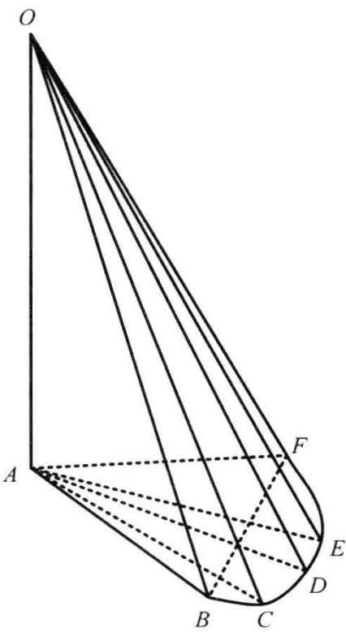  
图7-2 堆积物体积测定示意图

(4)用激光测距仪测定堆积锥坡脚 $B F$ 的直线距离，设为 $M _ { \circ }$

(5)堆积物体积的计算：设原坡面是平整坡面(如图中 $\Delta O B F )$ ，堆积物的体积为斜锥体OBCDEF的体积，其数值等于圆锥体OABCDEF与三棱锥体OABF的体积之差。

原坡面与垂直轴OA形成的三棱锥OABF的体积等于底面积( $\Delta A B F$ 的面积)与高OA乘积的三分之一。

$$
\begin{array} { c } { \mathrm { i } \overrightarrow { \sf x } \colon S _ { i } = ( L _ { i } \mathrm { c o s } \theta _ { i } + L _ { i + 1 } \mathrm { c o s } \theta _ { i + 1 } + M _ { i } ) / 2 } \\ { S _ { s } = ( L _ { 1 } \mathrm { c o s } \theta _ { 1 } + L _ { n } \mathrm { c o s } \theta _ { n } + M ) / 2 } \end{array}
$$

圆锥体OABCDEF的体积用下式计算：

$$
V = { \frac { 1 } { 3 } } L _ { 1 } \mathrm { s i n } \theta _ { 1 } \sum _ { i = 1 } ^ { n - 1 } { \sqrt { S _ { i } ( S _ { i } - L _ { i } \mathrm { c o s } \theta _ { i } ) \left( S _ { i } - L _ { i + 1 } \mathrm { c o s } \theta _ { i + 1 } \right) \left( S _ { i } - M _ { i } \right) } }
$$

三棱锥OABF的体积用下式计算：

$$
V _ { s } \ = \ { \frac { 1 } { 3 } } L _ { 1 } \mathrm { s i n } \theta _ { 1 } \ \times \ \sqrt { S _ { s } \big ( { S _ { s } \mathrm { ~ - ~ } } L _ { 1 } \mathrm { c o s } \theta _ { 1 } \big ) \big ( { S _ { s } \mathrm { ~ - ~ } } L _ { n } \mathrm { c o s } \theta _ { n } \big ) \big ( { S _ { s } \mathrm { ~ - ~ } } M \big ) }
$$

堆积物的体积为斜锥体OBCDEF的体积 $V _ { y }$ 用下式计算：

$$
V _ { _ y } ~ = ~ V - ~ V _ { _ s }
$$

(6)堆积物的重量可以通过在堆积锥上取样测定容重，然后根据测定出的容重和前面计算出的堆积锥体积，计算出堆积物的重量。但崩塌堆积物中存在大块岩石相互重叠形成的空洞，从而使量测的体积往往偏大，实际测定中需要对计算结果进行校正。

崩塌堆积物体积测定记录格式见表7-3。

表7-3 崩塌堆积物测定记录表
<table><tr><td rowspan=1 colspan=5>崩塌的地理位置</td><td rowspan=1 colspan=14>省市      乡(镇)       村         流域地块</td></tr><tr><td rowspan=1 colspan=1>土壤类型</td><td rowspan=1 colspan=4></td><td rowspan=1 colspan=4>母质</td><td rowspan=1 colspan=3></td><td rowspan=1 colspan=4>基岩类型</td><td rowspan=1 colspan=3></td></tr><tr><td rowspan=1 colspan=4>堆积物顶端的地理坐标</td><td rowspan=1 colspan=15></td></tr><tr><td rowspan=1 colspan=19>崩塌堆积锥坡面线的长度与坡度(面向坡下，从右至左分别为第1条、第2条、……、第n条)</td></tr><tr><td rowspan=1 colspan=1></td><td rowspan=1 colspan=2>第1条</td><td rowspan=1 colspan=4>第2条</td><td rowspan=1 colspan=2>第3条</td><td rowspan=1 colspan=2></td><td rowspan=1 colspan=2></td><td rowspan=1 colspan=2></td><td rowspan=1 colspan=3></td><td rowspan=1 colspan=1>第n条</td></tr><tr><td rowspan=1 colspan=1>长度 $L _ { i }$ </td><td rowspan=1 colspan=2></td><td rowspan=1 colspan=4></td><td rowspan=1 colspan=2></td><td rowspan=1 colspan=2></td><td rowspan=1 colspan=2></td><td rowspan=1 colspan=2></td><td rowspan=1 colspan=3></td><td rowspan=1 colspan=1></td></tr><tr><td rowspan=1 colspan=1>坡度 $\theta _ { i }$ </td><td rowspan=1 colspan=2></td><td rowspan=1 colspan=4></td><td rowspan=1 colspan=2></td><td rowspan=1 colspan=2></td><td rowspan=1 colspan=2></td><td rowspan=1 colspan=2></td><td rowspan=1 colspan=3></td><td rowspan=1 colspan=1></td></tr><tr><td rowspan=1 colspan=2>堆积锥坡脚分段长 $M _ { i }$ </td><td rowspan=1 colspan=4></td><td rowspan=1 colspan=2></td><td rowspan=1 colspan=2></td><td rowspan=1 colspan=2></td><td rowspan=1 colspan=2></td><td rowspan=1 colspan=3></td><td rowspan=1 colspan=2></td></tr><tr><td rowspan=1 colspan=12>第1条与第 n条坡面线在堆积锥坡脚的间距M</td><td rowspan=1 colspan=7></td></tr><tr><td rowspan=1 colspan=1>计算 $S _ { i }$ </td><td rowspan=1 colspan=2></td><td rowspan=1 colspan=4></td><td rowspan=1 colspan=2></td><td rowspan=1 colspan=2></td><td rowspan=1 colspan=2></td><td rowspan=1 colspan=2></td><td rowspan=1 colspan=3></td><td rowspan=1 colspan=1></td></tr><tr><td rowspan=1 colspan=1>计算 $S _ { s }$ </td><td rowspan=1 colspan=18></td></tr><tr><td rowspan=1 colspan=1>计算 $V$ </td><td rowspan=1 colspan=18></td></tr><tr><td rowspan=1 colspan=1>计算 $V _ { s }$ </td><td rowspan=1 colspan=18></td></tr><tr><td rowspan=1 colspan=1>计算 $V _ { y }$ </td><td rowspan=1 colspan=18></td></tr></table>

## 7.3.2 测定崩塌发生后坡面地形变化

根据崩塌发生前后，崩塌发生部位的坡面地形变化推算出崩塌物体积，具体步骤如下：

(1)根据崩塌发生前坡面的具体形状，将发生崩塌的坡面划分为n个断面，用激光测距仪(或皮尺)沿原坡面方向测定每个断面的长度，分别为$L _ { 1 0 } , \cdots , L _ { n 0 }$ ，以及相邻两个断面的间距，分别为 $K _ { 1 } 、 \cdots , K _ { n }$ o

(2)将每个断面根据崩塌发生后坡面的形状划分为m层，用激光测距仪(或皮尺)沿与原坡面平行的方向测定每层的长度，如 $L _ { 1 0 } , \cdots , L _ { 1 m }$ ，以

及每层的间距，如 $H _ { 1 } , \cdots , H _ { m }$

(3)利用下面的公式计算每个断面的的面积 $S _ { n }$ 和崩塌部位的体积V，如图7-3。

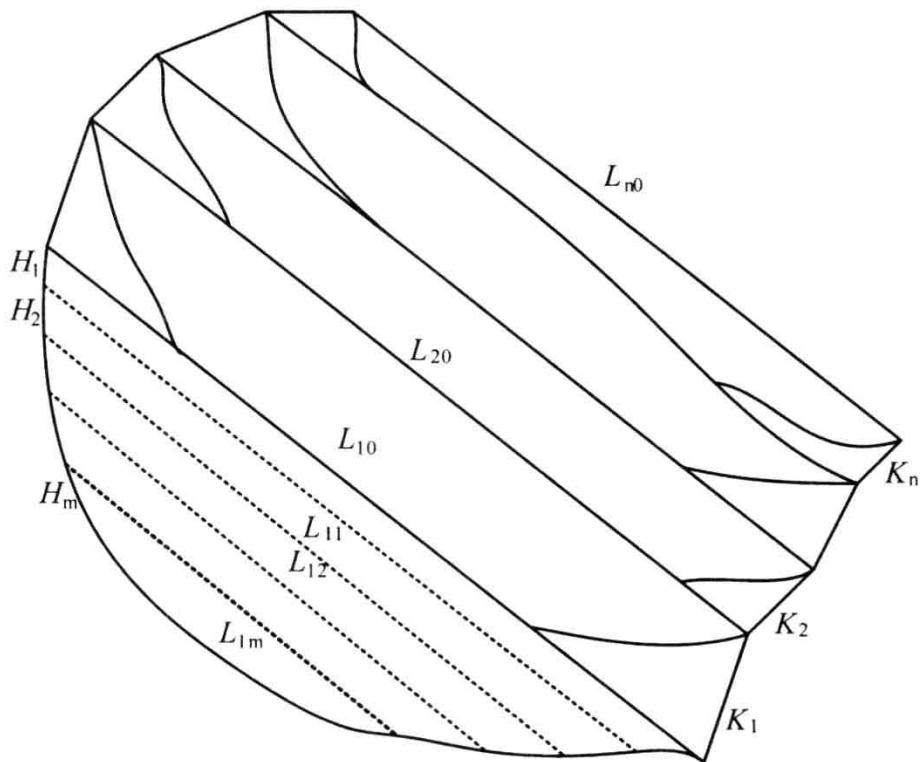  
图7-3崩塌堆发生部位体积测定示意图

$$
S _ { n } \ = \ \frac 1 2 \sum _ { i = 0 } ^ { m - 1 } \big ( L _ { i } \ + L _ { i + 1 } \big ) H _ { i }
$$

$$
V = \frac { 1 } { 2 } \sum _ { j = 1 } ^ { n - 1 } \big ( S _ { j } + S _ { j + 1 } \big ) K _ { j }
$$

崩塌后坡面地形变化测定记录格式见表74。

表74 崩塌后坡面地形变化测定记录表

观测员：

观测时间：

<table><tr><td rowspan=1 colspan=3>崩塌的地理位置</td><td rowspan=1 colspan=4>省市      乡(镇)       村         流域地块</td></tr><tr><td rowspan=1 colspan=1>土壤类型</td><td rowspan=1 colspan=2></td><td rowspan=1 colspan=1>母质</td><td rowspan=1 colspan=1></td><td rowspan=1 colspan=1>基岩类型</td><td rowspan=1 colspan=1></td></tr><tr><td rowspan=1 colspan=2>堆积物顶端的地理坐标</td><td rowspan=1 colspan=5></td></tr></table>

<table><tr><td rowspan=1 colspan=1>层次划分</td><td rowspan=1 colspan=2>断面1</td><td rowspan=1 colspan=2>断面2</td><td rowspan=1 colspan=2></td><td rowspan=1 colspan=2></td><td rowspan=1 colspan=2>断面n</td></tr><tr><td rowspan=1 colspan=1>第一层</td><td rowspan=1 colspan=1>长度 $L _ { n m }$ </td><td rowspan=1 colspan=1>间距 $H _ { m }$ </td><td rowspan=1 colspan=1>长度 $L _ { n m }$ </td><td rowspan=1 colspan=1>间距 $H _ { m }$ </td><td rowspan=1 colspan=1></td><td rowspan=1 colspan=1></td><td rowspan=1 colspan=1></td><td rowspan=1 colspan=1></td><td rowspan=1 colspan=1>长度 $L _ { n m }$ </td><td rowspan=1 colspan=1>间距 $H _ { m }$ </td></tr><tr><td rowspan=1 colspan=1>第二层</td><td rowspan=1 colspan=1></td><td rowspan=1 colspan=1></td><td rowspan=1 colspan=1></td><td rowspan=1 colspan=1></td><td rowspan=1 colspan=1></td><td rowspan=1 colspan=1></td><td rowspan=1 colspan=1></td><td rowspan=1 colspan=1></td><td rowspan=1 colspan=1></td><td rowspan=1 colspan=1></td></tr><tr><td rowspan=1 colspan=1>第三层</td><td rowspan=1 colspan=1></td><td rowspan=1 colspan=1></td><td rowspan=1 colspan=1></td><td rowspan=1 colspan=1></td><td rowspan=1 colspan=1></td><td rowspan=1 colspan=1></td><td rowspan=1 colspan=1></td><td rowspan=1 colspan=1></td><td rowspan=1 colspan=1></td><td rowspan=1 colspan=1></td></tr><tr><td rowspan=1 colspan=1></td><td rowspan=1 colspan=1></td><td rowspan=1 colspan=1></td><td rowspan=1 colspan=1></td><td rowspan=1 colspan=1></td><td rowspan=1 colspan=1></td><td rowspan=1 colspan=1></td><td rowspan=1 colspan=1></td><td rowspan=1 colspan=1></td><td rowspan=1 colspan=1></td><td rowspan=1 colspan=1></td></tr><tr><td rowspan=1 colspan=1></td><td rowspan=1 colspan=1></td><td rowspan=1 colspan=1></td><td rowspan=1 colspan=1></td><td rowspan=1 colspan=1></td><td rowspan=1 colspan=1></td><td rowspan=1 colspan=1></td><td rowspan=1 colspan=1></td><td rowspan=1 colspan=1></td><td rowspan=1 colspan=1></td><td rowspan=1 colspan=1></td></tr><tr><td rowspan=1 colspan=1>第m层</td><td rowspan=1 colspan=1></td><td rowspan=1 colspan=1></td><td rowspan=1 colspan=1></td><td rowspan=1 colspan=1></td><td rowspan=1 colspan=1></td><td rowspan=1 colspan=1></td><td rowspan=1 colspan=1></td><td rowspan=1 colspan=1></td><td rowspan=1 colspan=1></td><td rowspan=1 colspan=1></td></tr><tr><td rowspan=1 colspan=1>计算 $S _ { n }$ </td><td rowspan=1 colspan=2></td><td rowspan=1 colspan=2></td><td rowspan=1 colspan=2></td><td rowspan=1 colspan=2></td><td rowspan=1 colspan=2></td></tr><tr><td rowspan=1 colspan=1>计算V</td><td rowspan=1 colspan=10></td></tr></table>

## 7.4 滑坡观测

滑坡是斜坡上的土体或岩体在重力作用下失去原有的稳定状态，沿着斜坡内滑动面整体向下滑动的现象。斜坡的地貌特征是影响滑坡形成的关键要素之一，尤其是斜坡的高度和坡度是决定滑坡体所受下滑力的主要要素。当滑坡体所受下滑力大于抗滑力时，斜坡体前是否有滑动空间，两侧是否有切割面是决定滑坡发生的基本条件。斜坡上的物质组成与地质构造是决定滑坡是否发生的另一个关键要素。雨水下渗和地下水位上升导致滑坡面摩擦系数降低、抗滑性减弱，从而诱导滑坡发生，因此水分下渗和地下水位的上升是诱导滑坡发生关键要素。

滑坡观测包括滑坡体位移观测和影响要素的观测。影响要素观测包括降水观测、土壤水分观测、地下水位观测、温度变化观测等。其中降水观测、土壤水分观测、温度变化观测可参阅前文相应章节。滑坡体位移观测是把握滑坡体在一定时段内的移动状态，是滑坡观测中最主要的内容，常用经纬仪法、变形计法进行观测。

## 7.4.1 经纬仪法

(1)在滑坡体上选择观测点。这些观测点应该均匀分布在滑坡体上，观测点的间距可根据滑坡体的大小确定，大型滑坡体观测点的间距可以设置为30\~50m，中型滑坡体可以设置为20\~30m，小型滑坡体可设置为10\~20m。

(2)在每个观测点上埋设观测用水泥桩，水泥桩的断面尺寸为5cm×5cm，长度为100cm，水泥桩顶部刻画十字并涂成红色作为观测标志，水泥桩埋设在滑坡体中80cm以上。观测用水泥桩埋设好后，统一进行编号。

(3)在滑坡体外选择多个观测点，在这些观测点中选择一个点作为基准点。在选择的基准点和观测点上也埋设水泥桩，统一进行编号。

(4)利用经纬仪测定每个观测点与基准点的相对位置和高程。

(5)观测时在每个观测点上布设经纬仪，以基准点为参照点，测定滑坡体上每个观测点的相对位置和高程，并绘制成图。

(6)观测频次在滑坡的初期一般10天一次，随着滑坡的发育，观测时段可以逐渐缩短至1\~5天。

(7)每次观测后计算出各个观测点与基准点高差、距离、方位，绘制出观测点分布图。并与上一次观测成果进行对比，判断出滑坡体的变形、移动方向、移动速度。

经纬仪法滑坡观测记录格式见表7-5。

经纬仪法可以准确测定出滑坡体的变形量、位移量以及移动方向，但这种观测方法耗时费力，数据处理量大，需要专业人员进行操作，且不能进行自动观测。

## 7.4.2 位移计法

位移计法是目前采用的观测坡面滑动的主要方法之一。观测时在滑坡体上选择一个观测点，埋设观测桩。观测桩埋深1m，以保证观测桩能够随滑坡体一起移动。观测桩上预设一个铁环，铁环上连接不会发生伸缩变形的钢丝。在滑坡体外安全地段埋设一个固定桩(可用强度较大的钢制作)，桩顶安装一个定滑轮，观测桩上的钢丝通过定滑轮与一个平衡锤相连，在平衡锤的重力作用下，钢丝永远保持拉紧状态，在平衡锤上安装一个指针，在观测桩上安装一段尺子作为刻度，让指针指向观测桩上的某一个刻度，该刻度就是滑坡体的初始位置，如图74。当滑坡体在下滑力作用下开始移动时，观测桩也一起随滑坡体向下移动，并拉动钢丝使平衡锤上升，指针也随之向上滑动。指针向上移动的距离就是滑坡体沿坡面向下滑动的距离。

表7-5 经纬仪法滑坡观测记录表  
观测员：
<table><tr><td rowspan=1 colspan=4>滑坡的地理位置</td><td rowspan=1 colspan=8>省市      乡(镇)       村         流域   地块</td></tr><tr><td rowspan=1 colspan=4>滑坡体四周的地理坐标</td><td rowspan=1 colspan=8></td></tr><tr><td rowspan=1 colspan=2>滑坡体的面积</td><td rowspan=1 colspan=2></td><td rowspan=1 colspan=2>滑坡体平均坡度</td><td rowspan=1 colspan=2></td><td rowspan=1 colspan=2>滑坡体平均高程</td><td rowspan=1 colspan=2></td></tr><tr><td rowspan=1 colspan=2>土壤类型</td><td rowspan=1 colspan=2></td><td rowspan=1 colspan=2>母质</td><td rowspan=1 colspan=2></td><td rowspan=1 colspan=2>基岩类型</td><td rowspan=1 colspan=2></td></tr><tr><td rowspan=1 colspan=2>观测开始日期</td><td rowspan=1 colspan=2></td><td rowspan=1 colspan=2>观测结束日期</td><td rowspan=1 colspan=2></td><td rowspan=1 colspan=2>观测时段长</td><td rowspan=1 colspan=2></td></tr><tr><td rowspan=1 colspan=2>观测期间降水量</td><td rowspan=1 colspan=2></td><td rowspan=1 colspan=2>最大场降水量</td><td rowspan=1 colspan=2></td><td rowspan=1 colspan=2>最长降水时间</td><td rowspan=1 colspan=2></td></tr><tr><td rowspan=1 colspan=2>滑坡体含水量</td><td rowspan=1 colspan=2></td><td rowspan=1 colspan=2>地下水位</td><td rowspan=1 colspan=2></td><td rowspan=1 colspan=2></td><td rowspan=1 colspan=2></td></tr><tr><td rowspan=1 colspan=1>基准点</td><td rowspan=1 colspan=6>观测点</td><td rowspan=1 colspan=5>观测点</td></tr><tr><td rowspan=10 colspan=1>经纬度</td><td rowspan=1 colspan=2>编号</td><td rowspan=1 colspan=1>方位角</td><td rowspan=1 colspan=1>与基准点的距离</td><td rowspan=1 colspan=2>与基准点的高差</td><td rowspan=1 colspan=1>编号</td><td rowspan=1 colspan=1>方位角</td><td rowspan=1 colspan=2>与基准点的距离</td><td rowspan=1 colspan=1>与基准点的高差</td></tr><tr><td rowspan=4 colspan=2></td><td rowspan=4 colspan=1></td><td rowspan=4 colspan=1></td><td rowspan=4 colspan=2></td><td rowspan=1 colspan=1></td><td rowspan=1 colspan=1></td><td rowspan=1 colspan=2></td><td rowspan=1 colspan=1></td></tr><tr><td rowspan=1 colspan=1></td><td rowspan=1 colspan=1></td><td rowspan=1 colspan=2></td><td rowspan=1 colspan=1></td></tr><tr><td rowspan=1 colspan=1></td><td rowspan=1 colspan=1></td><td rowspan=1 colspan=2></td><td rowspan=1 colspan=1></td></tr><tr><td rowspan=1 colspan=1></td><td rowspan=1 colspan=1></td><td rowspan=1 colspan=2></td><td rowspan=1 colspan=1></td></tr><tr><td rowspan=1 colspan=2>编号</td><td rowspan=1 colspan=1>方位角</td><td rowspan=1 colspan=1>与基准点的距离</td><td rowspan=1 colspan=2>与基准点的高差</td><td rowspan=1 colspan=1>编号</td><td rowspan=1 colspan=1>方位角</td><td rowspan=1 colspan=2>与基准点的距离</td><td rowspan=1 colspan=1>与基准点的高差</td></tr><tr><td rowspan=4 colspan=2></td><td rowspan=4 colspan=1></td><td rowspan=4 colspan=1></td><td rowspan=4 colspan=2></td><td rowspan=1 colspan=1></td><td rowspan=1 colspan=1></td><td rowspan=1 colspan=2></td><td rowspan=1 colspan=1></td></tr><tr><td rowspan=1 colspan=1></td><td rowspan=1 colspan=1></td><td rowspan=1 colspan=2></td><td rowspan=1 colspan=1></td></tr><tr><td rowspan=1 colspan=1></td><td rowspan=1 colspan=1></td><td rowspan=1 colspan=2></td><td rowspan=1 colspan=1></td></tr><tr><td rowspan=1 colspan=1></td><td rowspan=1 colspan=1></td><td rowspan=1 colspan=2></td><td rowspan=1 colspan=1></td></tr></table>

利用位移计可以每天对滑坡滑动的距离进行观测。如果在位移计中安装一些将位移量转化为电子信号的设备，并配备无线发送部件，完全可以将位移计设计成自动观测与传输的仪器，从而实现滑坡的自动观测。位移

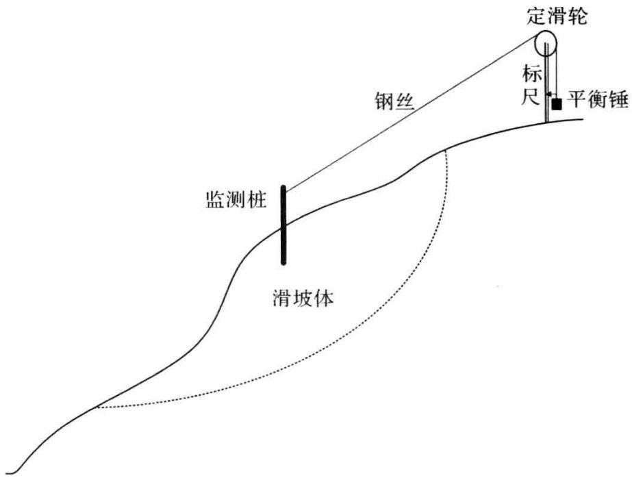  
图74 位移计法观测滑坡移动示意图

计法滑坡观测记录格式见表7-6。

表7-6 位移计法滑坡观测记录表
<table><tr><td rowspan=1 colspan=3>滑坡的地理位置</td><td rowspan=1 colspan=7>省市      乡(镇)       村          流域地块</td></tr><tr><td rowspan=1 colspan=3>滑坡体四周的地理坐标</td><td rowspan=1 colspan=7></td></tr><tr><td rowspan=1 colspan=1>滑坡体的面积</td><td rowspan=1 colspan=2></td><td rowspan=1 colspan=2>滑坡体平均坡度</td><td rowspan=1 colspan=2></td><td rowspan=1 colspan=2>滑坡体平均高程</td><td rowspan=1 colspan=1></td></tr><tr><td rowspan=1 colspan=1>土壤类型</td><td rowspan=1 colspan=2></td><td rowspan=1 colspan=2>母质</td><td rowspan=1 colspan=2></td><td rowspan=1 colspan=2>基岩类型</td><td rowspan=1 colspan=1></td></tr><tr><td rowspan=1 colspan=1>观测开始日期</td><td rowspan=1 colspan=2></td><td rowspan=1 colspan=2>观测结束日期</td><td rowspan=1 colspan=2></td><td rowspan=1 colspan=2>观测时段长</td><td rowspan=1 colspan=1></td></tr><tr><td rowspan=1 colspan=1>降水量</td><td rowspan=1 colspan=2></td><td rowspan=1 colspan=2>最大场降水量</td><td rowspan=1 colspan=2></td><td rowspan=1 colspan=2>最长降水时间</td><td rowspan=1 colspan=1></td></tr><tr><td rowspan=1 colspan=2>安装时钢丝的坡度</td><td rowspan=1 colspan=8></td></tr><tr><td rowspan=1 colspan=1>日期-时间</td><td rowspan=1 colspan=3>标尺读数L</td><td rowspan=1 colspan=2>钢丝的坡度</td><td rowspan=1 colspan=2>水平位移量</td><td rowspan=1 colspan=2>垂直位移量</td></tr><tr><td rowspan=1 colspan=1></td><td rowspan=1 colspan=3></td><td rowspan=1 colspan=2></td><td rowspan=1 colspan=2></td><td rowspan=1 colspan=2></td></tr><tr><td rowspan=1 colspan=1></td><td rowspan=1 colspan=3></td><td rowspan=1 colspan=2></td><td rowspan=1 colspan=2></td><td rowspan=1 colspan=2></td></tr><tr><td rowspan=1 colspan=1></td><td rowspan=1 colspan=3></td><td rowspan=1 colspan=2></td><td rowspan=1 colspan=2></td><td rowspan=1 colspan=2></td></tr><tr><td rowspan=1 colspan=1></td><td rowspan=1 colspan=3></td><td rowspan=1 colspan=2></td><td rowspan=1 colspan=2></td><td rowspan=1 colspan=2></td></tr><tr><td rowspan=1 colspan=1></td><td rowspan=1 colspan=3></td><td rowspan=1 colspan=2></td><td rowspan=1 colspan=2></td><td rowspan=1 colspan=2></td></tr></table>

水平位移量和垂直位移量的计算图如图7-5。

计算过程如下：

设∠1为前一次观测时钢丝的坡度，∠2为第二次观测时钢丝的坡度。这两个坡度可以用坡度计准确测量。0为定滑轮安装点，A为滑动前钢丝在观测桩上的安装点，D为滑动后钢丝在观测桩上的安装点，L为安装时(或前一次观测时钢丝的长度，图中线段AO、OB的长度)，直线OBD为滑动后钢丝拉伸方向(或观测时钢丝的拉伸方向)，线段BD的长度为标尺上读数的变化量。

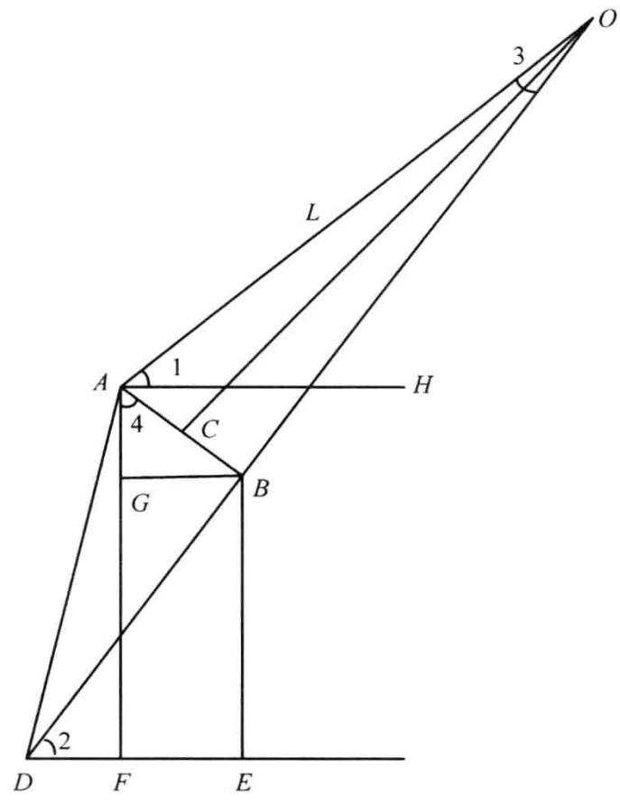

AO = OB, OC ⊥ AB, AH $\perp A F$

5 位移计法计算参考图

$$
\begin{array} { r l r } & { \angle 3 = \angle 2 - \angle 1 } & { \boxplus 7 . } \\ & { A B = 2 L \times \sin ( \angle 3 / 2 ) } \\ & { \angle 4 = ( \angle 3 ) / 2 + \angle 1 ) } \\ & { = ( \angle 2 - \angle 1 ) / 2 + \angle 1 } \\ & { = ( \angle 2 + \angle 1 ) / 2 } \\ & { A G = A B \times \cos \angle 4 = A B \times \cos ( \angle 2 + \angle 1 ) / 2 } \\ & { B G = A B \times \sin \angle 4 = A B \times \sin ( \angle 2 + \angle 1 ) / 2 } \end{array}
$$

BD=标尺读数的变化量

水平位移量 $D F = B D \times \cos \angle 2 - B G$

垂直位移量 $A F = B D \times \sin \angle 2 + A G$

## 参考文献

1. 郭索彦.水土保持监测理论与方法[M].北京：中国水利水电出版社，2010

2. 刘震.水土保持监测技术[M].北京：中国大地出版社，2004

3. 林业部科技司.森林生态系统定位研究方法[M].北京：中国科学技术出版社，1994.

4. 水利部水土保持监测中心.水土保持监测技术指标体系[M]. 北京：中国水利水电出版社，2006.

5. 田大伦.杉木林生态系统定位研究方法[M]. 北京：科学出版社，2004.

6. 王长德．量水技术与设施[M]. 北京：中国水利水电出版社，2006.

7.余新晓，张建军，张志强，等.水文与水资源学[M].北京：中国林业出版社，2009.

8. 张洪江. 土壤侵蚀原理[M]. 北京：中国林业出版社，2008.

9. 中国生态系统研究网络科学委员会.陆地生态系统大气环境观测规范[M]. 北京：中国环境科学出版社，2007.

10. 中国生态系统研究网络科学委员会.陆地生态系统水环境观测规范[M]. 北京：中国环境科学出版社，2007.

11.中国生态系统研究网络科学委员会.陆地生态系统生物观测规范[M].北京：中国环境科学出版社，2007.

12. 中国生态系统研究网络科学委员会.陆地生态系统土壤观测规范[M].北京：中国环境科学出版社，2007.

13.纳磊，张建军，朱金兆.晋西黄土区不同土地利用类型小流域径流产沙研究[J].中国水土保持科学，2008，6(2)：49\~54.

14. 张建军.晋西黄土区坡面水土保持林地产流产沙的观测分析[J]. 北京林业大学学报，1996,18(3):14\~20.

15.张建军.晋西黄土区水土保持林林冠截留的研究[J].北京林业大学学报，1995，17(2): 27\~31.

16.张建军，毕华兴.黄土区不同植被条件下的土壤抗冲性[J].北京林业大学学报，2004, 26(6):25\~29.

17.张建军，李慧敏，徐佳佳.黄土高原水土保持林对土壤水分的影响[J].生态学报，2011,31(23):7056\~7066.

18.张建军，纳磊，方家强．晋西黄土区坡面糙率的研究[J]. 北京林业大学学报，2007，

29(1)：108\~113.

19.张建军，纳磊，董煌标，王鹏.黄土高原不同植被覆盖对流域水文的影响[J].生态学报，2008,28(8)：3597\~3605.

```json
Document generated by Anna's Archive around 2023-2024 as part of the DuXiu collection
(https://annas-blog.org/duxiu-exclusive.html).
Images have been losslessly embedded. Information about the original file can be found in PDF attachments. Some stats (more in the
PDF attachments):
{
"filename": "MTMzNTI2NTMuemlw",
"filename_decoded": "13352653.zip",
"filesize": 39904129
"md5": "b6941b006571360652056cea8f0cf7a6",
"header_md5": "a7c77c4e8911d2209cf128de98fab8cf"
"sha1": "0687acf81addc4863c73c40046d2c80f7cb8b3c5",
"sha256": "6c135f3fb9555e7809b408467c9544b73bd303401fc6226404660373619de88c",
"crc32": 1237251107,
"zip_password": ""
"uncompressed_size": 39824541,
"pdg_dir_name": "\u2566\u00ab\u2550\u2534\u2592\u00fa\u2502\u2553\u255d\u03b1\u2593\u0393\u2553\u2555\u2592\u03a9\u25
61\u2500\u2563\u2588\u2593\u0393\u2556\u255c\u2556\u00bf13352653".
"pdg_main_pages_found": 168,
"pdg_main_pages_max": 168,
"total_pages": 178
"total_pixels": 884893536,
"pdf_generation_missing_pages": false
}
```