# 参考_中国水土流失防治与生态安全_总卷上

<!-- 由 MinerU 分片产物合并生成；共 3/3 片；源目录：md文件/参考_中国水土流失防治与生态安全_总卷上/ -->

<!-- ===== 分片 p1-200（200页，源：参考_中国水土流失防治与生态安全_总卷上（1-200页））===== -->

# 中国水土流失防治与生态安全

·总卷—

(上)

水利部 中国科学院 中国工程院

中国水土流失防治与生态安全总卷（上、下册）  
中国水土流失防治与生态安全东北黑土区卷  
中国水土流失防治与生态安全北方土石山区卷  
中国水土流失防治与生态安全西北黄土高原区卷  
中国水土流失防治与生态安全南方红壤区卷  
中国水土流失防治与生态安全西南岩溶区卷  
中国水土流失防治与生态安全北方农牧交错区卷  
中国水土流失防治与生态安全长江上游及西南诸河区卷  
中国水土流失防治与生态安全开发建设活动卷  
中国水土流失防治与生态安全水土流失数据卷  
中国水土流失防治与生态安全水土流失影响评价卷  
中国水土流失防治与生态安全水土流失防治政策卷

# 中国水土流失防治与生态安全

总 卷

(上)

水利部 中国科学院 中国工程院

科学出版社

北 京

## 内容简介

本书系《中国水土流失防治与生态安全·总卷》，全书以“中国水土流失与生态安全综合科学考察”各考察组和专题研究组的成果为基础，从我国自然和社会经济状况、历史演变、防治现状切入，全面分析了水土流失防治的成效和经验教训，梳理出当前存在的主要问题，系统阐述了水土保持在新时期社会经济发展中的地位和作用，提出今后一段时间的发展战略和相应的保障措施。

本书可作为国家和地方政府制订发展规划、提出决策的参考依据，也可供相关科研院所及大专院校师生参考。

图书在版编目(CIP)数据

中国水土流失防治与生态安全·总卷/水利部，中国科学院，中国工程院编.一北京：科学出版社，2010

ISBN 978-7-03-026199-1

I. 中…Ⅱ.①水…②中…③中…Ⅲ.①水土流失-防治-研究-中国②生态环境-环境保护-研究-中国 Ⅳ.S157 X321.2

中国版本图书馆CIP数据核字(2009)第 226707号

责任编辑：彭胜潮关焱/责任校对：钟洋

责任印制：钱玉芬/封面设计：黄华斌

科學出版社出版

北京东黄城根北街16号

邮政编码：100717

http://www.sciencep.com

中国科学院印刷厂印刷

科学出版社发行 各地新华书店经销

2010 年3月第一 版开本：787×1092 1/16

2010年3月第一次印刷 印张：75

印数：1 1500

字数：1725000

定价：280.00元

(上、下册)

(如有印装质量问题，我社负责调换)

# 中国水土流失防治与生态安全

## 总编辑委员会

## 领导小组

<table><tr><td>组 长</td><td>汪恕诚 陈雷</td><td colspan="6"></td></tr><tr><td>副组长</td><td>鄂竟平</td><td>李家洋</td><td>沈国舫</td><td></td><td></td><td></td><td></td></tr><tr><td>成员</td><td>刘 宁</td><td>刘 震</td><td>傅伯杰</td><td>高中琪</td><td>王韩民</td><td>郭 玮</td><td>黄传芳</td></tr><tr><td></td><td>高俊才 李锐</td><td>曹广生</td><td>杨得瑞</td><td>庞进武</td><td>赫崇成</td><td>陈明忠</td><td>匡尚富</td></tr></table>

## 专家指导委员会

主任钱正英

<table><tr><td colspan="8">土 任 钱正央</td></tr><tr><td>副主任</td><td>孙鸿烈</td><td>沈国舫</td><td>曲格平</td><td>陈佳贵</td><td>刘 宁</td><td></td><td></td></tr><tr><td rowspan="4">成 员</td><td>刘东生</td><td>关君蔚</td><td>朱显谟</td><td>山</td><td>文伏波</td><td>石玉林</td><td>卢耀如</td></tr><tr><td>安芷生</td><td>刘昌明</td><td>孙铁珩</td><td>李文华</td><td>陈志恺</td><td>陈明致</td><td>张新时</td></tr><tr><td>郑 度</td><td>赵其国</td><td>袁道先</td><td>徐乾清</td><td>程国栋</td><td>王浩</td><td>刘兴土</td></tr><tr><td>王礼先</td><td>史培军</td><td>孙佑海</td><td>郭廷辅</td><td>段巧甫</td><td>焦居仁</td><td>王光谦</td></tr><tr><td></td><td>王毅</td><td>王仰麟</td><td>卢宗凡</td><td>张凤荣</td><td>张守攻</td><td>李周</td><td>李玉山</td></tr></table>

## 领导小组办公室

主任刘震傅伯杰

副主任刘健冯仁国张学俭高中琪李锐郭索彦邰源临

成员宁堆虎 黄铁青高战军庄绪亮谢永生姜德文徐双民

# 中国水土流失防治与生态安全

# 总 卷

## 编 写 组

## 主要统稿人

鄂竟平 刘震 冯仁国 高中琪 王礼先 刘宝元

## 编写人员

第一篇 邱维理 谢 云 李智广 张光辉 邱 扬 梁进社 方修琦

章文波 王志强 吕晋美 张灵燕 林小鹃 欧廷海

第二篇 张文聪 张 鹏 杨才敏 张志勇 王洪斌 谢永生 鲁胜力

第三篇 张长印 宋晓强 唐润芒 王海燕 牛 栋

第四篇宁堆虎 高战军 屈丽琴 赵建文 翟李越 王 莹 戈素芬胡世明

第五篇 徐双民 庄绪亮 曹建华 范建容 梁 音 李秀彬 刘国彬

屈建军 阎百兴

第六篇 姜德文 毕华兴 刘大根 郭孟霞 李 俊刘鑫

## 总 序

水土流失直接关系国家生态安全。严重的水土流失，是生态恶化的集中反映，已成为我国生态环境最突出的问题之一。加强水土流失防治，促进人与自然和谐，保障国家生态安全和经济社会可持续发展，是一项长期的战略任务。2005年7月至2007年5月，水利部、中国科学院和中国工程院联合开展了“中国水土流失与生态安全综合科学考察”，组织生态、环境、资源、法律、政策等方面的专家，对我国重点水土流失区进行了全面的综合科学考察。在此基础上编写的《中国水土流失防治与生态安全》全面评价了我国水土流失现状与发展趋势，总结了长期以来水土流失防治的主要成效与经验，梳理了当前所面临的主要问题，提出了防治对策。这一成果，对于贯彻落实科学发展观，加强生态保护与治理，具有十分重要的作用。

我国水土流失面广量大，产生的危害严重，影响深远。水土流失不仅导致土地退化、毁坏耕地，制约山丘区经济社会发展，使人们失去赖以生存的基础，而且加剧江河湖库淤积和洪涝灾害，恶化生存环境，加剧贫困，威胁国家粮食安全和生态安全；不仅影响当前发展，而且影响子孙后代的生存。新中国成立以来，党和政府高度重视水土保持工作，采取多种措施防治水土流失。水土保持法律、法规体系和监督执法体系不断完善，人为水土流失逐步得到控制；不断加大资金投入，在长江上游、黄河中上游、环京津地区、珠江上游等地区实施了大规模的国家重点治理工程；多渠道、多形式增加投入，鼓励和支持社会各界通过各种方式参与水土保持和生态建设。经过广大干部群众和水土保持工作者近60年的艰苦努力，水土流失防治工作取得了显著成就。治理区群众的生产生活条件得到改善，进入江河的泥沙大幅度下降。通过开展水土保持，改善了生态环境，有效保护了水土资源，土地生产力大幅度提高，区域经济得到发展。同时，在长期的水土保持实践中也积累了丰富的防治经验，为今后进一步加强水土保持工作奠定了坚实的基础。

党的十七大对继续推进改革开放和社会主义现代化建设、实现全面建设小康社会作出了全面部署，提出了建设生态文明的新要求，这为水土保持工作提出了新的、更高的目标。我们要把治理水土流失、加强生态建设作为深入落实科学发展观、构建和谐社会的重要内容，提到更加突出的位置。当前和今后一段时期，面对人多地少的基本国情，我国水土资源将面临更大压力，开发与保护矛盾仍然十分突出。水土流失问题如果解决不好，势必对山丘区小康社会建设、新农村建设和经济社会可持续发展形成制约，势必对整个生态建设带来不利影响。各级政府和有关部门必须从全局的、战略的高度，充分认识水土流失防治工作的重要性，增强责任感和紧迫感，把水土保持作为必须长期坚持的一项战略任务纳入各级国民经济和社会发展规划，列入重要议事日程，切实抓紧抓好。要随着财力的增长，逐步增加对水土保持的投入，加快水土流失治理步伐，为我国经济社会发展提供良好条件。要在本次科学考察的基础上，制定科学的水土保持规划和近期实施方案，按照“突出重点，分步实施”的原则，优先对水土流失特别严重、人口密集、对群众生产生活和经济社会发展影响较大的区域实施综合整治。加快长江上中游、黄河上中游、东北黑土区、珠江上游等地区水土流失治理。要突出加大坡耕地和侵蚀沟水土综合整治力度。坚持以小流域为单元，因地制宜、综合治理的技术路线，工程措施、植物措施和农业耕作措施优化配置，山水田林路村综合治理，经济效益、生态效益和社会效益统筹兼顾，提高综合防治成效。继续推进生态修复工程，切实加大封禁保护、轮牧、休牧的力度，充分发挥生态系统的自然修复能力，加快水土流失治理速度。要进一步加强预防保护和监督执法工作，正确处理经济发展和保护生态环境的关系，切实控制新的人为水土流失。

这次考察是新中国成立以来水土保持领域规模最大、范围最广、参与人员最多的一次综合性科学行动，取得了丰硕的成果，我们要高度重视，充分运用好这些成果，发挥科技在防治水土流失中的作用，全面提升水土保持科学防治水平。

2008年8月19日

## 总 前言

为科学评价我国水土流失现状与发展趋势，总结长期以来水土流失防治的成效与经验教训，进一步摸清当前我国水土保持生态建设面临的主要问题，提出相应防治对策，为国家生态建设与保护提供科学依据，2005年7月至2007年5月，水利部、中国科学院和中国工程院联合开展了“中国水土流失与生态安全综合科学考察”。

这次科学考察重点对东北黑土区、北方土石山区、西北黄土高原区、南方红壤区、西南岩溶区、北方农牧交错区和长江上游及西南诸河区等7个片区进行了实地考察。考察区总面积519万km²，覆盖人口12.5亿左右，其中农业人口约6.8亿。这些区域是我国人口密集、生产建设活动强度大、水土流失对经济社会发展影响重大的区域。另外，还设置了开发建设项目水土流失防治、水土流失状况与基础数据集成、水土流失对社会经济发展与生态安全影响评价、水土流失防治政策4个专题研究组。

这次考察是新中国成立以来我国水土保持领域规模最大、范围最广、参与人员最多的一次综合性科学考察，考察专家指导委员会由钱正英、孙鸿烈、沈国舫等院士、专家组成。各考察组由本区域科技力量最强的研究机构牵头，其他科研机构、大专院校和有关流域机构、省(区、市)配合。考察充分注重研究的综合性和系统性，注重自然科学与社会科学的结合，注重科学家、基层技术人员和群众之间的互动，并得到农业、林业、国土、环保等相关部门的大力支持。在近两年的时间里，共有86个科研院所和大专院校的28位院士、223位教授和研究员，以及水利部所属各流域机构、各省（区、市)、地、县水利厅(局)的大量工程技术人员参加了考察。现场考察途经27个省(区、市)、315个县，行程14万公里，召开座谈会410次，发放调查问卷近20万份。

各考察组和专题研究组在认真总结的基础上，经过多次修改和完善，完成了《中国水土流失防治与生态安全》各分卷的编写。科学考察办公室根据各考察组和专题研究组的成果，以考察区为重点，面向全国进行论述，组织编写了《中国水土流失防治与生态安全·总卷》。为了方便大家共享这次科学考察成果，我们将其编印成册，分别是：

（1）中国水土流失防治与生态安全·总卷（分上、下册）

(2) 中国水土流失防治与生态安全·东北黑土区卷

(3)中国水土流失防治与生态安全·北方土石山区卷

(4)中国水土流失防治与生态安全·西北黄土高原区卷

(5)中国水土流失防治与生态安全·南方红壤区卷

(6)中国水土流失防治与生态安全·西南岩溶区卷

(7)中国水土流失防治与生态安全·北方农牧交错区卷

(8)中国水土流失防治与生态安全·长江上游及西南诸河区卷

(9) 中国水土流失防治与生态安全·开发建设活动卷

(10）中国水土流失防治与生态安全·水土流失数据卷

(11)中国水土流失防治与生态安全·水土流失影响评价卷

(12)中国水土流失防治与生态安全·水土流失防治政策卷

这套专集是综合组和各个考察组、专题研究组成果的集成，各考察组和专题研究组是分头开展工作，由于取得资料的途径不同，尽管对一些基础数据进行了尽可能的协调统一，各分卷中数据还有可能不完全一致，请读者予以谅解。

参加考察和报告编撰工作的全体人员，虽然做出了极大的努力，但由于各方面的条件限制，仍可能有疏漏或错误之处，敬请读者批评指正。

总编辑委员会

## 目 录

## 总序总前言

## 第一篇 现状与背景

第章自然概况………………………………………………………………………………3  
第一节地质地貌…………………………………………………3  
、地质概况…3  
二、地貌特征7  
三、地貌分区与土壤侵蚀……………………………………………20  
第二节气候…………………………………………………… …38  
、气候的基本特征…………………………………………………………38  
二、气候区划与区域气候特征…………………………………………………………………42  
三、降雨与土壤侵蚀……51  
四、风力与土壤侵蚀………………60  
第三节 水文与水资源……………62  
、流域与水系…62  
二、河川径流的时空分布特征……………………………………66  
三、主要河流水沙特征…75  
第四节土壤……89  
、土壤类型…89  
二、土壤分布规律与分区…………………………………100  
三、全国土体厚度及其空间分布………………………………………109  
四、主要土壤的可蚀性…112  
第五节植被…………………………………………………………………………124  
一、植被类型及其分布规律………………………………………………………124  
二、植被分区与植被特征………………………………129  
三、植被变化与土壤侵蚀…………………………………………………………143  
参考文献150  
第二章社会经济概况…… …154  
第节人口…154  
、人口增长154  
二、人口分布…157  
三、人口与土壤侵蚀………165  
第二节 土地资源和利用…………………168  
、土地资源概况…168  
二、土地利用172  
三、土地利用变化的趋势……………179  
四、土地利用和土壤侵蚀……………179  
第三节 经济发展水平和产业结构………181  
、经济发展水平…181  
、产业结构…183  
三、经济发展的区域不平衡性………………186  
四、经济发展与土壤侵蚀……………………………………………………………………188  
参考文献…190  
每三章土壤侵蚀演变……191  
第节西汉前后……………………………………………………191  
一、原始农业时期基本维持自然侵蚀……191  
二、西汉时期开始土壤侵蚀凸显于我国北方地区…193  
第二节唐宋之际……194  
一、麦、粟等旱粮作物在丘陵山区的广泛种植195  
二、茶树种植…196  
三、商业采伐林木……196  
第三节清中叶以后……………………………………………………………197  
、南方地区…198  
二、黄土高原地区…………201  
三、东北和内蒙古地区………202  
第四节1949年以后………………………………………203  
一、20世纪50～70年代开垦荒地和森林砍伐使土壤侵蚀加剧…203  
二、20世纪80年代至90年代中期土壤侵蚀恶化趋势得到遏制但出现新型的  
侵蚀204  
三、20世纪90年代末期至今水土保持措施初见成效…207  
参考文献…… …210

## 第二篇 防治成效与经验教训

第四章 水土保持发展历程………………215  
第一节 古代水土保持…………………………………………………………215  
一、古代对水土流失现象的认识……215  
二、古代水土保持思想及观点………………………………216  
三、古代主要水土保持措施……………………………………………218  
第二节 萌芽起步阶段……………220  
、政策和机构…221  
二、学科的初步确立…221  
三、科学实验及推广工作………………222  
第三节 示范推广阶段（20世纪50～70年代）…………………………222  
、普遍号召并重点试验试办……………………………223  
二、逐步推广…225  
三、掀起高潮…229  
四、停滞调整…232  
五、开展基本农田建设……………………………………………234  
第四节 小流域综合治理阶段（20世纪80年代）……………237  
一、水土保持工作的恢复加强……237  
二、小流域综合治理的提出……239  
三、户包治理小流域的兴起……………240  
四、重点防治工程的启动……242  
五、科技教育的振兴……244  
六、监督管理工作的起步………………………………245  
第五节 依法防治阶段（20世纪90年代）…………………246  
、水土保持法的颁布…246  
二、水土保持法的实施…248  
三、加强国家重点工程建设………250  
四、深化水土保持改革…251  
第六节 全面发展阶段（1997年之后）…………254  
、水土保持战略地位提升…254  
二、水土流失治理步伐加快……257  
三、预防监督工作深入广泛开展………………258  
四、生态自然修复的提出和实施……261  
五、监测预报工作加强………………262  
第七节 新时期水土保持展望……263  
一、党和国家高度重视水土保持工作……263  
二、科学发展观为水土保持提供了思想动力…263  
三、新农村建设为水土保持提供了广阔空间…264  
四、各地开创性的工作为水土保持提供了实践经验…264  
五、水土保持工作依然任重道远…265  
参考文献…265  
五章防治工作与成效……………………………………………267  
第节水土保持机构…………………………………………………………………………267  
、水土保持领导机构…267  
二、水土保持管理机构…268  
三、水土保持监测机构…270  
四、水土保持科研机构…271  
五、水土保持教育机构…274  
六、水土保持学术团体……278  
第二节水土保持重点工程……………………………………………………………279  
一、八片国家水土流失重点治理工程………279  
二、黄河上中游水土保持重点防治工程……282  
三、长江上中游水土保持重点防治工程…284  
四、黄土高原水土保持世界银行贷款项目…287  
五、京津风沙源治理工程水土保持项目…290  
六、首都水资源可持续利用规划水土保持项目…293  
七、国家农业综合开发水土保持项目…296  
八、中央财政预算内专项资金水土保持项目300  
九、东北黑土区水土流失综合防治试点工程…301  
十、珠江上游南北盘江石灰岩地区水土保持综合治理试点工程304  
十一、黄土高原地区水土保持淤地坝工程…309  
第三节水+保持预防监督………………………………………………………310  
、预防监督的主要任务……………………………311  
二、水+保持预防监督工作及其成效…311  
第四节水十保持监测预报………………………319  
监测概述319  
二、监测主要成果…321  
三、水土保持信息化建设…323  
四、监测技术研究与开发………………………324  
五、区域水土保持监测典型…………325  
第五节 水土保持科技成果…………328  
一、主要科技成果…328  
二、水土保持标准规范……346  
三、水土保持科技专著…………………………………………348  
四、水土保持科技刊物…354  
第六节 水土流失防治成效……………………………355  
、水土流失治理现状…355  
二、水土流失防治成效……356  
参考文献……………360  
第六章 主要经验与问题……………361  
第一节主要防治经验……361  
一、依法开展预防监督，控制人为水土流失……361  
二、以小流域为单元，因地制宜，综合治理……372  
三、治理与开发相结合，实现三大效益相统一…375  
四、以重点工程为依托，集中连片、规模推进…379  
五、发挥大自然的力量，促进生态的自我修复……382  
六、根据不同类型区特点，科学确定治理模式…390  
第二节主要管理经验……………………402  
一、科学规划，坚持不懈开展治理…………………402  
二、加强领导，强化部门统筹协调…405  
三、依靠政策，调动社会力量投入…………409  
四、广泛宣传，增强全民水保意识……415  
五、严格管理，确保工程质量效益……418  
第三节 目前存在的主要问题及历史教训………………421  
、目前存在的主要问题…422  
二、值得吸取的主要历史教训……431  
参考文献……432  
第三篇 新时期水土保持的战略地位和作用  
第七章水土保持是可持续发展的重要保障…………435  
第节水土资源与可持续发展……………………………………………………………435  
、水土资源的概念……435  
二、水土资源的特性…437  
三、水土资源是实现可持续发展的重要基础……439  
第二节 生态环境与可持续发展………442  
一、生态环境为人类社会可持续发展孕育物质资源……442  
二、生态环境是人类精神文明的源泉……443  
三、生态环境是人类社会生息繁衍的动力…445  
第三节 中国水土资源和生态环境面临的挑战…………………………447  
、水土资源形势严峻……447  
二、生态环境面临巨大压力………………450  
第四节水土保持与可持续发展………454  
、水土保持的内涵及特性……454  
二、水土保持是实现“两个可持续”的有效途径………459  
三、水土保持促进经济社会可持续发展………461  
第八章水土保持是实现人与自然和谐的重要手段……………………………466  
第节人与自然………………………466  
、人与自然关系的演变……466  
二、人与自然和谐相处…468  
三、水土资源是影响人与自然关系的重要因素……472  
第二节 水土流失对人与自然关系的影响………………………………473  
一、水土流失是人与自然不和谐的重要表现…474  
二、水土流失降低大自然的人口承载力…475  
三、水土流失加速资源短缺………476  
四、水土流失引发生态危机…477  
第三节 水土保持是实现人与自然和谐的重要举措………478  
一、人与自然和谐是水土保持的核心理念…478  
二、水土保持科学统筹水土资源，改善人与自然的关系479  
三、水土保持促进人与自然和谐… …481  
第九章水土保持是全面建设小康社会的基础工程………………………484  
第节水土保持是山区发展的生命线……………484  
、我国山区发展的重要性……………………484  
二、水土流失是制约山区发展的主要因素…487  
三、水土保持是山区发展的根本出路…490  
第二节水土保持提升区域经济发展能力……………………496  
、优化农业产业结构… 496  
二、转变生产方式…502  
三、实现区域经济增长…………………………………………………………  
第三节水土保持推动社会进步………  
一、水土保持促进农村社会的全面进步…506  
二、加快城镇化和工业化进程…509  
三、促进和保障社会和谐… …510  
第十章 水土保持是中华民族生存发展的长远大计…………513  
第一节水土保持与江河治理……………………………………………………………513  
一、江河水患……… …513  
二、水土流失与洪水灾害… …516  
三、水土保持是整治江河、防治洪灾的治本之策… …517  
第二节 水土保持与粮食安全…………… …519  
一、粮食安全的重要性… …519  
二、水土流失对粮食安全的影响… …522  
三、水土保持是整治国土、保障粮食安全的重要手段…525  
第三节水土保持与饮水安全………………………………528  
一、我国饮水安全存在的突出问题… …528  
二、水土流失对饮水安全的影响…530  
三、水土保持是保障饮水安全的有效途径… …531  
第四节 水土保持与生态文明………… …532  
一、生态文明是人类社会发展的必由之路… …532  
二、水土资源是人类文明的基础… …534  
三、水土保持是中华民族走向生态文明的必然选择…536  
参考文献……… …538

第一篇

现状与背景

## 第一章自然概况

第一节地质地貌

土壤侵蚀和地表物质迁移不仅与外营力类型有关，还受到被侵蚀物质特征的制约，因此，中国现代土壤侵蚀形式与强度的空间格局，很大程度上受到区域地质基础和地貌条件的控制，具体表现在三个方面：①区域地质构造和新构造运动所决定的地表起伏状态和侵蚀区、堆积区的空间格局；②岩石的物理性质、化学性质、破碎程度以及沉积物的结构、构造、沉积层厚度等物质条件所决定的岩层透水性和抗风化、抗侵蚀能力等；③现代侵蚀过程所处地貌发育阶段对侵蚀强度和潜在侵蚀能力的影响，包括前期地貌类型及相应的形态特征对具体侵蚀过程的影响，主要表现为土壤侵蚀发生地区的地形条件，如坡度、坡长、坡形等方面。

## 一、地质概况

中国地质历史悠久，目前已发现的最古老岩石的年龄为36亿年左右，属太古宙早期。在漫长的演化过程中，中国大陆历经古地理环境沧海桑田的巨大变化。尽管各地区地质环境存在较大差异，发展历史也有所不同，但从整体上看，地层发育齐全，构造格局及其演化复杂，岩石种类多样，是中国地质的基本特征。

## （一）齐全的地层层序

中国幅员辽阔，各时代地层发育齐全，包括火山堆积在内的各种类型地层，出露总面积约 $8 . 6 7 \times 1 0 ^ { 6 } ~ \mathrm { k m ^ { 2 } }$ ，占全国陆地面积的90.3%（程裕淇，1994)。

太古宇（AR）出露面积约 $7 . 4 0 \times 1 0 ^ { 4 } ~ \mathrm { k m ^ { 2 } }$ ，占各时代地层出露总面积的0.9%，主要为混合岩化变质岩，见于吉林南部、辽宁、河北与山西北部、内蒙古南部与东南部、山东、河南、新疆塔里木北部等地。

元古宇（PT）出露面积 $5 . 9 7 \times 1 0 ^ { 5 } \ \mathrm { k m ^ { 2 } }$ ，占地层出露总面积的6.9%，原岩主要是碎屑岩、泥质岩、碳酸盐岩，夹有多层火山岩。各地差别较大，下部变质程度较深，为厚度较大的中低级变质岩系；中、上部变质较浅或未变质，主要分布在山西、河北、辽东、豫西、黑龙江、内蒙古、新疆、鄂西、闽浙、塔里木等地。在若干沉降中心，地层厚度超过万米，如河北蓟县、山西五台山、桂北、湘黔地区。

下古生界（Pz1）除台湾省外，全国各省（区）均有分布，出露面积约$5 . 8 0 \times 1 0 ^ { 5 } ~ \mathrm { k m } ^ { 2 }$ ，占各时代地层出露总面积的6.7%。其中，寒武系（©）地层发育完整，以海相沉积为主，塔里木、华北、扬子等稳定区主要为碎屑岩和碳酸盐岩。祁连山和兴安岭等活动带主要为火山碎屑岩、基性-中性火山岩、碎屑岩、硅质岩和碳酸盐岩等。奥陶系（O）主要为海相沉积，华北、塔里木和扬子等稳定区以碳酸盐岩和碎屑岩为主，厚度较小；天山-兴安、昆仑-祁连及南华等活动带沉积厚度大，主要为碎屑岩、火山碎屑岩和部分中性火山岩。志留系（S）以海相碎屑岩和碳酸盐岩为主，除河北、山西、山东、福建和台湾省外，各省（区）均有不同程度的分布。扬子、塔里木等稳定区厚度稍薄，天山-兴安、祁连-秦岭等活动带厚度可达7000m以上。

上古生界（Pz2）全国各省（区）均有不同程度的分布，出露面积约$9 . 5 0 \times 1 0 ^ { 5 } ~ \mathrm { k m ^ { 2 } }$ ，占各时代地层出露总面积的11.0%。其中，泥盆系（D）除河北、山西、辽宁、山东及台湾省外，其他各省（区）均有不同程度的出露。沉积类型以海相碎屑岩和部分碳酸盐岩为主，出现海陆交替相及陆相。石炭系（C）在各省（区）均有分布，华北区主要为海陆交替相含煤碎屑岩沉积，且多缺失下统；上扬子-南华区及塔里木区主要发育海相碳酸盐岩、碎屑岩沉积。二叠系（P）在各省（区）均有不同程度的分布。海相沉积主要分布于上扬子区，如：贵州二叠系海相碳酸盐岩、碎屑岩厚达1200～1800m。陆相沉积主要分布于华北区，如：山西二叠系陆相含煤碎屑岩总厚度380～1700m。海陆交替相沉积以内蒙古中部为代表，总厚度4146～7300m。

中生界（Mz）在各省（区）均有不同程度的分布，出露面积约 $2 . 4 6 \times$ $1 0 ^ { 6 } ~ \mathrm { k m } ^ { 2 }$ ，占各时代地层出露总面积的28.3%。其中，三叠系（T）南北分异明显，昆仑山-祁连山-秦岭-大别山一线以南为海相沉积，以北为陆相沉积。海相沉积主要分布于上扬子区及华南区西部，其中黔西南三叠系碳酸盐岩、碎屑岩总厚度1233～5760m；西藏拉萨地区三叠系为海相碎屑岩、火山碎屑岩和中性、酸性火山岩，总厚度2547～3144m。陆相沉积主要分布于华北区，其中山西（T1-2）和陕西 $( \mathrm { T } _ { 2 } \mathrm { - } 3 )$ 陆相碎屑岩总厚度1604～2615m。侏罗系（I）陆相主要分布于各种类型的盆地中，大致以大兴安岭-太行山-武陵山为界，东部有火山活动，西部一般无火山活动；海相主要分布于西藏、滇西等地区。其中鄂尔多斯盆地侏罗系陆相碎屑岩沉积总厚度1894m；西藏岗巴地区海相碎屑岩、碳酸盐岩沉积总厚度1924～3147m。白垩系（K）以陆相碎屑岩为主，分布于全国不同类型盆地中。其中鄂尔多斯盆地下白垩统总厚度为1212～1970m，山东莱阳盆地上白垩统总厚度1160～3671m。海相主要为碎屑岩，部分为碳酸盐岩，仅见于西藏及新疆西部。

新生界（Cz）分布广泛，出露面积约 $4 . 0 1 \times 1 0 ^ { 6 } ~ \mathrm { k m } ^ { 2 }$ ，占各时代地层出露总面积的46.2%。其中古近系（E）与新近系（N）以陆相沉积为主，遍布于全国大小不同类型的盆地中。戈壁高原及准噶尔、塔里木、鄂尔多斯等盆地主要堆积内陆盆地河湖相泥砂质沉积，总厚度可达2000m以上；藏北冈底斯-念青唐古拉的措勤-申扎地区主要为基性-酸性火山岩建造和碎屑岩建造，总厚度达万米以上。海相沉积以台湾省为代表，总厚度约20000m，主要为火山碎屑岩建造和碎屑岩建造，部分轻微变质。第四系（Q）沉积类型多样，冲积-洪积以全新统最为发育，集中分布于松辽、三江、华北、江汉、长江三角洲等平原地区；湖沼沉积以下更新统最为发育，分布于华北、松辽、三江等平原及更新世盆地；风成沉积中黄土主要分布于华北和西北黄土高原，沙漠则分布于新疆和内蒙古各地；冰川沉积主要分布于西部高山高原区，冰缘沉积见于全国大部分地区；火山堆积以玄武岩为主，有少量安山岩、粗面岩等，分布于东北大小兴安岭、张广才岭、长白山脉，西南青藏、滇西以及山西北部与内蒙古东南、台湾省及澎湖等地；海相沉积主要分布于辽河平原、华北平原、长江三角洲等沿海平原以及台湾省和南海北部等地。

从土壤侵蚀的物质条件看，上述各个时代的地层，以新生界和中生界最为重要，这不仅因为两者的分布面积广，合计达到 $6 . 4 7 \times 1 0 ^ { 6 } \ \mathrm { k m ^ { 2 } }$ ，占中国陆地面积的67.1%，更重要的是两者主要由松散沉积物和轻度胶结的碎屑岩构成，易于遭受侵蚀破坏。

## （二）复杂的构造格局

中国大陆是在西伯利亚板块、华北板块、塔里木板块、扬子板块、华南板块、印度板块和太平洋板块等长期相互作用下逐渐发展演化而成的。因此，中国地质构造体系的复杂性可以从时间和空间两个方面进行概括：前者表现为多旋回的构造历史；后者即稳定区与活动带并存的构造格局。

根据现有资料，中国地质构造历史的演化划分为12个构造期（相当于构造旋回)，即太古宙的五台期、阜平期、迁西期，元古宙的震旦期、晋宁期、四堡期、吕梁期，早古生代的加里东期和晚古生代的华力西期（也称海西期），中生代的印支期和燕山期，新生代的喜马拉雅期（程裕淇，1994）。各个构造期有其相应的代表性构造运动，也伴随强烈的岩浆活动和区域变质作用，因此，岩浆活动和变质作用的分期与构造期（构造旋回）基本对应。其中，对中国现代自然环境影响最大的是燕山运动和喜马拉雅运动。

燕山运动发生于侏罗纪和白垩纪，是太平洋板块向欧亚大陆板块俯冲引起的，造成大陆边缘地带的挤压褶皱、岩浆侵入和喷出活动，以及陆内碰撞、张裂拗陷和挤压推覆等现象。这些构造活动的结果，使中国的区域差别从古生代的南北分异转向东西分异，奠定了中国大地构造轮廓和地貌的基础。在中国东部地区，沿大兴安岭一太行山—武陵山一线东西两侧出现明显的分异现象，该线以西出现大型稳定内陆盆地，如北方的鄂尔多斯盆地（也称陕甘宁盆地）和川鄂盆地，该线以东则属于环太平洋强烈的地壳构造运动和岩浆活动带，形成一系列新华夏小型裂谷盆地群。从北方的大兴安岭、内蒙古、燕山地区，到南方的闽浙沿海，在侏罗纪和白垩纪有多次大规模岩浆活动，中酸性火山喷发活动形成的安山岩、流纹岩及火山碎屑岩，厚度可达数千米，中酸性岩浆侵入活动，形成燕山期花岗岩。中国西南地区，喀喇昆仑山脉、冈底斯山脉、念青唐古拉山脉和横断山脉的西部都是这时形成的。而中国西部地区各古生代褶皱山脉，如天山、阿尔泰山、祁连山、昆仑山等，在燕山运动中都重新活动，强烈上升，并出现了准噶尔、塔里木等大型盆地，在盆地和山前拗陷中堆积了厚达四五千米以上的陆相中生界地层。

喜马拉雅运动发生于新生代早期和中期，奠定了现代海陆轮廓，对中国的主要影响表现在3个方面。首先，印度板块与欧亚板块碰撞，古地中海消失，形成喜马拉雅等地球上最年轻的褶皱山脉；其次，太平洋板块向欧亚板块俯冲，形成包括中国台湾岛在内的岛弧和褶皱山脉；再次，大陆内部断裂发育，差异性升降运动强烈，形成断块山地和断陷盆地。许多已经夷平的古生代和中生代褶皱山系急剧上升，如阿尔泰山、天山、秦岭、太行山等，相伴的断陷盆地则大幅度下降，如东北盆地、华北盆地、塔里木盆地等。

多旋回构造历史的结果，造就了中国复杂的地质构造格局。根据地层、岩浆活动、变质作用和构造运动等的总体特征，中国大陆可以划分为两大类基本构造单元：即以陆块为代表的稳定区和以陆缘为代表的活动带。前者包括华北陆块、塔里木陆块和扬子陆块，主要由古老变质岩构成结晶基底，相当于地台；后者是陆块或板块的边缘地带，在陆块或板块的挤压、碰撞过程中，抬升为陆，褶皱成山，亦称造山带、褶皱带，主要有天山一兴安活动带、昆仑秦岭活动带、川滇青藏活动带、南华活动带、台湾活动带（程裕淇，1994）。不论是稳定区还是活动带，在其发展历史中，都曾经历多旋回的构造运动，形成不同尺度、不同形式地质构造的相互叠加现象。

华北、塔里木、扬子各陆块主要由太古宙或元古宙变质岩构成结晶基底，其上覆盖不同时代的沉积盖层。中、晚元古代及古生代时期，主要为海相碎屑岩、碳酸盐岩和海陆交替相含煤碎屑岩沉积；中一新生代时期形成众多的陆内断陷盆地，主要发育陆源碎屑岩和各种成因类型的松散堆积；与断裂构造相伴的岩浆活动，则形成火成岩。

上述活动带中，仅台湾活动带为年轻的新生代褶皱系，天山一兴安、昆仑一秦岭、川滇青藏以及南华等活动带则历史悠久，虽然各褶皱带的具体特征和发育时代有所不同，但大多始于加里东期或华力西期构造运动，并经历了后来的印支期、燕山期和喜马拉雅期多旋回的挤压、碰撞，呈现多期构造相互叠加的复合构造格局。各活动带内褶皱构造与断裂构造发育，岩浆活动强烈，变质作用类型复杂多样，造就了复杂的岩性组合和破碎的构造分割状况。

中国复杂的构造历史与构造格局对土壤侵蚀有两个方面的显著影响。其一，漫长地质历史过程中的构造变化，不仅造成沉积环境的多样性以及相应沉积岩类的多样性，相伴随的岩浆活动和变质作用，更使得中国各地的岩石种类复杂多样，为土壤侵蚀提供了不同的物质基础。其二，褶皱与断裂叠加的多旋回复杂构造运动，不仅决定了各类岩石的分布，也影响到岩石的破碎程度，使得同类岩石的抗侵蚀能力也因地而异。

## 二、地貌特征

中国地貌具有4个基本特征：①地形起伏显著，西高东低，总体上呈阶梯状逐级下降；②地貌类型复杂多样，低海拔区域小，高海拔面积大；③新构造运动强烈，垂直升降运动区域差异明显；④受构造格局控制，山脉、高原、盆地、平原等主要地貌单元的平面分布呈网格状。

## （一）宏观地貌呈阶梯状

中国地域广阔，地形起伏巨大。位于青藏高原南缘的世界第一高峰珠穆朗玛峰是中国陆上的最高点，其岩石顶面海拔8844.43（±0.21）m（中国国家测绘局2005年10月9日公布)；新疆吐鲁番盆地的艾丁湖是中国陆上的最低点，湖面海拔一155m，两者高差达到8999m。

中国地势总体上西高东低，高原和山地主要分布在西部内陆地区，平原和丘陵大多集中在东部沿海地带，地形高度自西向东逐级下降，呈现三级宏观地貌阶梯（图1.1）（曾昭璇，1985），每一级阶梯都由一个起伏和缓的代表性地貌面和一个前沿坡度骤降带组成（图1.2）（尹泽生，1993）。各地貌阶梯坡度骤降带也是地球物理特征突变带（马杏垣，1989），其相对高度和坡度都很大，是外营力侵蚀强烈的地带，也是土壤侵蚀严重的区域。

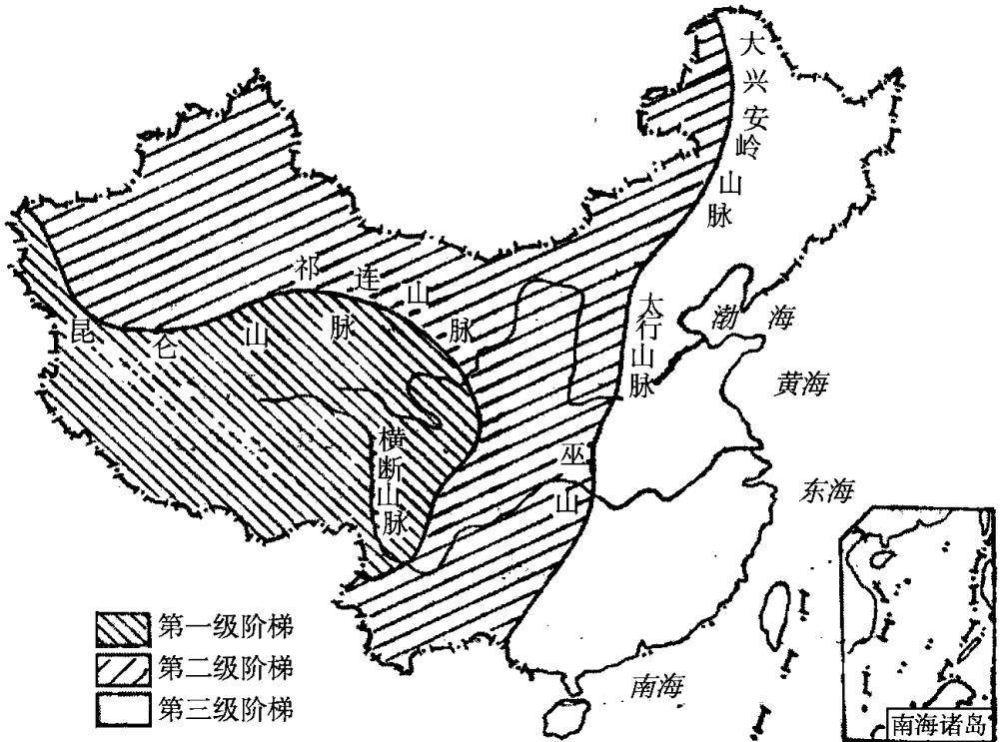  
图1.1 中国陆上地貌阶梯平面图(据曾昭璇，1985)

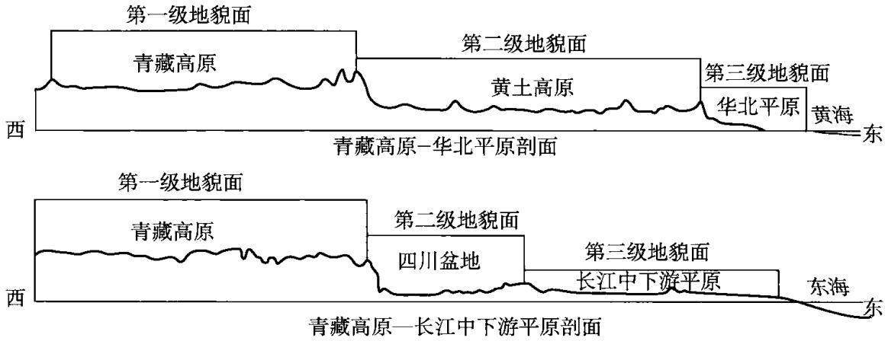  
图1.2 中国陆上地貌阶梯剖面图  
(据尹泽生，1993)

最高一级地貌阶梯位于中国西南，主体为青藏高原，周缘以喜马拉雅山、昆仑山、阿尔金山、祁连山和横断山脉为界，总面积约 $2 . 3 \times 1 0 ^ { 6 } ~ \mathrm { k m ^ { 2 } }$ (尹泽生，1993）。该阶梯的代表性地貌面是青藏高原面，一般海拔4000～5000m。在高原内部，分布有大面积的高原剥蚀面、堆积面和相对高度不大的一些山地，谷地宽阔和缓，湖泊星罗棋布。在高原边界，耸立着许多海拔6000m以上的山脉，不仅高出典型的高原地貌面1000～3000m，而且以2000～3000m甚至更大的相对高差，在横断山地区、祁连山地区、昆仑山一喀喇昆仑山地区，形成与第二级地貌阶梯之间的坡度骤降带。发源于高原的大江大河，在这一巨大落差的影响下，强烈侵蚀下切，塑造出峡谷与高山相间排列的强烈起伏地形，其中尤以横断山地区最为典型。

第二级地貌阶梯位于青藏高原以东、以北，包括大兴安岭一燕山一太行山一伏牛山—巫山—雪峰山一线以西地区，面积约 $4 . 0 \times 1 0 ^ { 6 } ~ \mathrm { k m ^ { 2 } }$ (尹泽生，1993)。内蒙古高原、阿拉善高原、鄂尔多斯高原、黄土高原、云贵高原的高原面以及西北地区主要内陆盆地的平缓地面，是第二级阶梯的代表性地貌面，平均海拔1000～2000m。第二级阶梯的大部分地区地形和缓平坦，但由于差异性构造运动的影响，也形成有海拔更高的山地（如阿尔泰山、天山、秦岭、大巴山等）和相对低洼的盆地、谷地（如准噶尔盆地、吐鲁番盆地、晋中盆地、渭河谷地、四川盆地、汉中盆地等)。在大兴安岭、燕山、太行山、伏牛山、巫山、云贵高原东南部等地区，第二、三级地貌阶梯之间的坡度骤降带也很明显，海拔高度很快下降500～1000m，使得由第二级阶梯流向第三级阶梯的河流，同样侵蚀出深切峡谷，如：黄河中游的三门峡与晋陕峡谷、长江中游的三峡等。在水量充沛、岩石抗侵蚀能力相对较弱的地区，原始地貌面也被强烈侵蚀、分割，形成沟壑纵横，地面崎岖的景观，如黄土高原、云贵高原等地，在河流溯源侵蚀尚未到达的地区或河流不发育的内陆干旱地区，如黄土高原的局部塬区、内蒙古高原、阿拉善高原、鄂尔多斯高原等地，依然保留着较完整的原始地貌面。

大兴安岭一燕山—太行山—伏牛山—巫山—雪峰山一线以东地区，一般海拔500m以下，是第三级地貌阶梯的所属范围，平原与丘陵、山地交错分布，面积约 $3 . 3 { \times } 1 0 ^ { 6 } ~ \mathrm { k m } ^ { 2 }$ (尹泽生，1993)。第三级阶梯的典型地貌面是东部较广阔的平原堆积面，海拔200m以下，在滨海地区海拔不到50m。高出平原之上的是众多的丘陵和山地，最大高差有时也可达到1000～2000m。东部平原自然延伸到浅海陆架，两者之间没有明显的坡度变化。在大陆坡，水深由160～200m突变至2000～3500m，这一边缘海盆的坡度骤降带，乃是第三级地貌阶梯的实际边界。陆地平原和浅海陆架的地质、地貌基础是相同的，在末次冰期低海面时期，大陆架曾广泛出露为陆地平原地带。另一种观点认为海洋环境不同于东部平原的陆上环境，主张将陆架划分为第四级地貌阶梯，其地理范围包括东海、黄海与南海海域，主要由各边缘海的大陆架、大陆坡与深海盆地组成，水深自大陆架→大陆坡→深海盆地逐步增大，向东与太平洋相连，大陆架平均水深约150～200m，大陆架的滨海平原、宽浅洼地与深水盆地为第四级阶梯的代表性地貌面（尹泽生，1993；吴珍汉等，2001）。

## （二）地貌类型复杂多样

辽阔的地域，巨大的高差，复杂的地质历史，差异显著的区域外营力组合和物质条件，决定了中国地貌类型的多样性。

地貌的成因多种多样，通常按以下特征分类：①外营力作用塑造的地貌，包括重力作用、流水作用、地下水作用、湖泊和沼泽作用、海洋作用、冰川与冰水作用、冻土作用、风力作用、生物作用、人为作用等形成的各种规模的侵蚀地貌和堆积地貌；②内营力作用塑造的地貌，包括构造运动、岩浆作用等形成的各种原生或次生的褶皱构造地貌、断裂构造地貌、火山熔岩地貌等；③受物质条件影响发育的各类岩石地貌，如喀斯特地貌、黄土地貌、花岗岩地貌、页岩地貌、红土地貌等。中国的地貌类型发育比较齐全，上述各种成因类型的地貌都有，只是规模和分布面积有所差别。

根据形态特征，陆地地貌一般分为山地、丘陵、高原、平原和盆地等形态类型。在中国地貌图制图规范中，确定山地、丘陵、台地、平原等为中国陆地地貌的基本形态类型，明确了划分指标和描述特征，并根据海拔高程和相对高度的差别，将山地进一步划分为极高山、高山、中山和低山，将丘陵分为高丘陵和低丘陵，台地分为高台地和低台地等类型（表1.1）（吴珍汉等，2001；中国地貌制图规范编写组，1987)。形态类型与成因类型的叠加，更体现出中国地貌类型的复杂多样。

表1.1 中国陆地地貌基本形态类型分类简表
<table><tr><td colspan="2" rowspan="1">地貌类型</td><td colspan="1" rowspan="1">海拔高程/m</td><td colspan="1" rowspan="1">相对高差/m</td><td colspan="1" rowspan="1">地貌特征</td><td colspan="1" rowspan="1">典型实例</td></tr><tr><td colspan="1" rowspan="2">山地</td><td colspan="1" rowspan="1">极高山</td><td colspan="1" rowspan="1">&gt;5000</td><td colspan="1" rowspan="1">&gt;2500</td><td colspan="1" rowspan="1">地形极大起伏</td><td colspan="1" rowspan="1">喜马拉雅山、冈底斯山、念青唐古拉山、唐古拉山、喀喇昆仑山、昆仑山</td></tr><tr><td colspan="1" rowspan="1">高山</td><td colspan="1" rowspan="1">3500~5000</td><td colspan="1" rowspan="1">1000~2500</td><td colspan="1" rowspan="1">地形大起伏</td><td colspan="1" rowspan="1">横断山、祁连山、阿尔金山、可可西里山、天山、阿尔泰山、西秦岭</td></tr><tr><td colspan="1" rowspan="2">山地</td><td colspan="1" rowspan="1">中山</td><td colspan="1" rowspan="1">1000~3500</td><td colspan="1" rowspan="1">500~1000</td><td colspan="1" rowspan="1">地形中起伏</td><td colspan="1" rowspan="1">燕山、阴山、太行山、吕梁山、大兴安岭、秦岭、武夷山、长白山、南岭、大别山、台湾山</td></tr><tr><td colspan="1" rowspan="1">低山</td><td colspan="1" rowspan="1">&lt;1000</td><td colspan="1" rowspan="1">200~500</td><td colspan="1" rowspan="1">地形小起伏</td><td colspan="1" rowspan="1">辽西山地、辽东山地、东南沿海低山丘陵区</td></tr><tr><td colspan="1" rowspan="2">丘陵</td><td colspan="1" rowspan="1">高丘陵</td><td colspan="1" rowspan="2">&lt;500</td><td colspan="1" rowspan="1">100~200</td><td colspan="1" rowspan="2">坡度&gt;7°~10°</td><td colspan="1" rowspan="2">山东低山丘陵区、长江中下游低山丘陵区、华南低山丘陵区</td></tr><tr><td colspan="1" rowspan="1">低丘陵</td><td colspan="1" rowspan="1">&lt;100</td></tr><tr><td colspan="1" rowspan="2">台地</td><td colspan="1" rowspan="1">高台地</td><td colspan="1" rowspan="1">见于不同</td><td colspan="1" rowspan="1">台坡高度&gt;100</td><td colspan="1" rowspan="2">台坡坡度一般&gt;10°台面坡度一般&lt;7°台坡高度一般&gt;30 m</td><td colspan="1" rowspan="2">黄土台地、火山熔岩台地、喀斯特台地、冰川台地、冰缘石海平台、湖积台地、侵蚀台地、洪积台地、冲积台地</td></tr><tr><td colspan="1" rowspan="1">低台地</td><td colspan="1" rowspan="1">海拔</td><td colspan="1" rowspan="1">台坡高度&lt;100</td></tr><tr><td colspan="2" rowspan="1">平原</td><td colspan="1" rowspan="1">&lt;500</td><td colspan="1" rowspan="1"></td><td colspan="1" rowspan="1">地面平均坡度&lt;7°，般没有坡度&gt;10°、高差&gt;30m的坡坎</td><td colspan="1" rowspan="1">成都平原、华北平原、下辽河平原、松嫩平原、江汉平原</td></tr></table>

\*据吴珍汉等，2001；中国地貌制图规范编写组，1987。

中国多山，山地占全国总面积的1/3。但海拔大于5000m的极高山分布范围较小，仅见于第一级地貌阶梯上。喜马拉雅山、冈底斯山、念青唐古拉山、唐古拉山、喀喇昆仑山以及昆仑山和可可西里山的某些高耸地段，海拔5000m以上，山峰达6000m以上。大部分山峰周围终年积雪，发育了现代冰川和古冰川。山地中的谷地切割很深，可达3000～4000m。谷坡陡峻，谷底纵比降大。极高山受构造控制明显，外力作用以冰雪作用、寒冻风化作用为其突出的特点（尹泽生，1993）。

高山的分布较为广泛，仍相对集中在西部地区。上述山脉除了属于极高山的地段外，大部分属于高山范围。此外尚有第一级地貌阶梯上的另外一些山地，如横断山、祁连山、阿尔金山、可可西里山，第二级地貌阶梯上的天山、阿尔泰山等。东部地区高山很少，仅见于秦岭、台湾中央山脉和玉山山脉的主峰地段（杜秀荣等，2004）。西部高山现代冰川和第四纪冰川有不同程度的发育，而台湾山脉则不明显。在内力作用上，它们均很明显地受到构造控制（尹泽生，1993）。

中山、低山和丘陵的分布很广。内力成因上不像极高山和高山那样明显受构造控制，外力成因类型则相对丰富，大部分中山、低山和丘陵的外力成因是以流水作用为主，但在不同的气候区，也受其他外营力的塑造，如第一级地貌阶梯上的藏北高原和藏南山地地区，分布着寒冻作用的中山、低山、丘陵；第二级地貌阶梯的新疆、甘肃、宁夏等省区以及第一级地貌阶梯的柴达木盆地，发育有干燥剥蚀的中山、低山和丘陵。此外，构造、岩石组合等因素对中山、低山和丘陵的形成也有显著影响，如：黄土覆盖的山地丘陵、黄土丘陵、喀斯特山地与丘陵、红色岩系山地与丘陵、火山与熔岩丘陵、花岗岩山地与丘陵、沙丘与沙山等，均有不同的形态与发育特点（尹泽生，1993）。

台地是所有基本形态类型中最零散的一种，相对规模较小，成因类型却较多，如：西北黄土地区的黄土塬和黄土台地；内蒙古、黑龙江、海南岛等地的熔岩台地；宁夏、内蒙古、河西走廊等地的干燥剥蚀台地；青海共和、山西大同、河北阳原等地的湖积台地；四川贡嘎山、西藏聂聂雄拉等地的冰川台地；贵州黔北务川的喀斯特台地；辽东半岛、胶东半岛、海南岛等地的海蚀台地与海积台地，等等。而流水作用作为一种常规的外营力，也参与了上述各成因类型台地的形成。以流水作用为主形成的台地（或阶地）到处可见，可分为侵蚀台地、洪积台地、冲积台地等（尹泽生，1993）。

平原是一种很重要的地貌类型，不但形态多样，规模大小不一，成因也很复杂。以外力作用为纲，可以分为如下几种（尹泽生，1993)：①流水形成的堆积平原，中国主要平原均属此类型。规模宏大者，如东北平原、华北平原、大盆地（四川、柴达木等）底部平原、山间宽谷（关中）平原；规模较小者，如山间盆地、狭窄河谷中的平原；堆积平原还可细分为三角洲平原、冲积平原、洪积平原等。②流水形成的剥蚀平原，分布不广泛，规模也较小。③干燥剥蚀平原和堆积平原，见于内蒙古、新疆和河西走廊等干旱地区。④黄土平原，广泛分布于黄土地区的山前黄土平原、黄土垌、黄土坪等。⑤湖积平原，在现代湖泊周围和古代湖泊地区普遍存在。⑥海积平原，普遍存在于海滨地区，有海滩、海积低阶地等次一级类型。⑦喀斯特平原，广泛分布在南方喀斯特地区，如广西、贵州、云南等省区的许多喀斯特盆地底部均可见此平原。⑧冰水平原，分布在青藏高原的冰川外围地区。

高原和盆地是使用很普遍的地貌类型术语，但在中国地貌图制图规范中不属于基本形态类型（中国地貌制图规范编写组，1987)，因为高原、盆地可以由其他基本形态类型组合而成。例如，青藏高原主要由一系列极高山、高山组成；黄土高原则是由许多黄土台地（塬）、黄土丘陵以及基岩或黄土覆盖的基岩低山、中山组成。盆地是地形上相对低洼、封闭的区域，因此，其周边往往是山地，内部则由其他地貌类型构成较复杂的结构。譬如，四川盆地西部是成都平原，东部为川东岭谷(低山、丘陵)，河流两岸广泛分布各种成因的台地等，周边则是中高山。

青藏高原、云贵高原、内蒙古高原、黄土高原是中国的四大高原。在实际应用中，高原的界定特征还是比较明确的，即指海拔500m以上、面积较大、顶面起伏小（地面坡度<7°）、外围较陡的高地。该定义强调了高原与平原在海拔高度上、与山地在形态上的区分。但高原不仅有地理位置、海拔高度、顶面起伏状况和完整程度等特征，还有成因上的差别。就中国的四大高原而言，青藏高原是新构造强烈抬升的山原性质的高原，内蒙古高原是新构造显著抬升的剥蚀性质的高原，云贵高原是新构造抬升的喀斯特高原。最特殊的黄土高原则是以构造抬升作用为主，以黄土层加积作用为特点，两者共同作用而成的类型独特的叠加高原（李容全等，2005）。

据统计，中国各种形态的地貌在全国陆地面积中所占的比例分别是：山地约33.33%，高原约26.04%，盆地约18.75%，平原约11.98%，丘陵约9.90%（表1.2）（国家统计局，2006）。如果按照等高线海拔高程进行面积统计，中国地形中<500 m和>3000 m的地区分别占全国面积的25.18%和25.86%。前者大致对应于平原、丘陵地区，后者主要是高山、极高山的范畴。海拔高程相当于低山（500\~1000m）的区域约为16.93%，相当于中山(1000\~3000m)的地带最多，约为32.03%。若以海拔500m等高线为界，则低海拔区域仅为25.18%，中、高海拔地区约为74.82%。

表1.2 中国陆地不同地貌类型和高程面积统计表
<table><tr><td rowspan=1 colspan=2>统计项目</td><td rowspan=1 colspan=1>面积/104km²</td><td rowspan=1 colspan=1>占总面积/%</td><td rowspan=1 colspan=4>统计项目</td><td rowspan=1 colspan=1>面积/104km²</td><td rowspan=1 colspan=1>占总面积/%</td></tr><tr><td rowspan=8 colspan=1>按地貌类型</td><td rowspan=1 colspan=1>山地</td><td rowspan=1 colspan=1>320</td><td rowspan=1 colspan=1>33.33</td><td rowspan=1 colspan=3></td><td rowspan=1 colspan=1>&lt;500 m</td><td rowspan=1 colspan=1>241.7</td><td rowspan=1 colspan=1>25.18</td></tr><tr><td rowspan=2 colspan=1>高原</td><td rowspan=2 colspan=1>250</td><td rowspan=2 colspan=1>26.04</td><td rowspan=2 colspan=2></td><td rowspan=1 colspan=2></td><td rowspan=1 colspan=1></td><td rowspan=2 colspan=1>500~1000 m</td><td rowspan=2 colspan=1>162.5</td></tr><tr><td rowspan=1 colspan=2></td><td></td></tr><tr><td rowspan=2 colspan=1>盆地</td><td rowspan=2 colspan=1>180</td><td rowspan=2 colspan=1>18.75</td><td rowspan=2 colspan=2></td><td rowspan=1 colspan=2>地</td><td rowspan=1 colspan=1></td><td rowspan=2 colspan=1>1000~2000 m</td><td rowspan=2 colspan=1>239.9</td></tr><tr><td rowspan=1 colspan=2></td><td></td></tr><tr><td rowspan=2 colspan=1>平原</td><td rowspan=2 colspan=1>115</td><td rowspan=2 colspan=1>11.98</td><td rowspan=2 colspan=2></td><td rowspan=1 colspan=2></td><td rowspan=2 colspan=1></td><td rowspan=2 colspan=1>2000~3000 m</td><td rowspan=2 colspan=1>67.6</td></tr><tr><td rowspan=1 colspan=1>性</td><td></td></tr><tr><td rowspan=1 colspan=1>丘陵</td><td rowspan=1 colspan=1>95</td><td rowspan=1 colspan=1>9.90</td><td></td><td rowspan=1 colspan=2></td><td rowspan=1 colspan=1>&gt;3000m</td><td rowspan=1 colspan=1>248.3</td><td rowspan=1 colspan=1>25.86</td></tr><tr><td rowspan=1 colspan=2>合计</td><td rowspan=1 colspan=1>960</td><td rowspan=1 colspan=1>100.00</td><td rowspan=1 colspan=4>合计</td><td rowspan=1 colspan=1>960</td><td rowspan=1 colspan=1>100.00</td></tr></table>

\*据国家统计局，2006。

从土壤侵蚀的角度来看，地形起伏和侵蚀营力是基本条件，地表物质组成、植被等因素对土壤侵蚀则主要起着缓解或加速的作用。因此，山地（包括极高山、高山、中山和低山）、丘陵、高原边沿地带等存在明显相对高差的地区，一般都是易于遭受重力、水力或冻融等外营力侵蚀的地区，而相对完整、平缓的高原内部、相对低洼的盆地和平原地区，土壤侵蚀则比较弱。但实际上，由于中国的高原大多是山地性高原（如青藏高原）和分割的高原(如黄土高原、云贵高原），盆地内部也常存在丘陵地带（如四川盆地），土壤侵蚀的潜在可能性很大。西北内陆盆地底部的低平堆积性平原，在干旱气候条件下，也易遭受风力侵蚀。中国的地貌条件决定了土壤侵蚀现象的广泛分布与巨大的潜在可能性。全国第二次土壤侵蚀遥感调查查明，全国水蚀、风蚀、冻融侵蚀的总面积达到 $4 . 8 3 \times 1 0 ^ { 6 } ~ \mathrm { k m ^ { 2 } }$ ，占国土面积的50.9%（陈雷等，2002)。2005年全国11条大江大河土壤侵蚀总量达到 $1 . 9 8 \times 1 0 ^ { 9 }$ t （水利部，2005)。中国土壤侵蚀范围遍及所有的省、自治区和直辖市，这与中国多山地、丘陵的地貌条件密切相关。

## （三）强烈的新构造运动

喜马拉雅运动之后，中国现代海陆轮廓基本定型，但中国现代地貌的巨大起伏，却是新构造运动的结果。新构造运动是发生在新近地质时期的构造运动，从中国现代地貌的发展历程来看，多数学者认为，新构造运动是从新近纪开始直到现在发生的构造运动，或以喜马拉雅运动第三幕为新构造运动的起始时间。

新构造运动就其性质而言，和老构造运动并无本质上的差别，既有垂直升降运动，又有水平运动，但垂直升降运动在地形上和沉积物中的表现比较明显，对外营力侵蚀或堆积的影响也更为显著。新构造运动的表现主要有火山、地震、断裂、褶皱、温泉与地热异常等，其中断裂活动最为普遍，是控制地貌格局的主要因素，其他运动形式大多与断裂活动相伴生。断裂活动与地块升降的结合表现为普遍的差异性断块构造，其结果造就了中国各地相伴存在的断块山地和断陷盆地（杜恒俭等，1981）。山地作为侵蚀区，盆地则为堆积区，常常成为控制土壤侵蚀区域分布格局的地貌因素。

中国西部以新构造强烈差异升降运动为特点。青藏高原是新构造隆起最为强烈的地区，喜马拉雅山和青藏高原的主体新构造抬升幅度达到4000m以上（图1.3）（廖克，1999）。塔里木盆地则是新构造下沉幅度最大的地区，上新世以来（约700万年）沉降幅度普遍超过5000m，最大达10000m。天山、阿尔泰山主体部分拾升幅度达到2000～2500m以上。在构造格局上，西部主要受印度板块和西伯利亚板块南北向挤压影响，大型构造盆地的南北两侧多为逆断层（如天山两侧，昆仑山、祁连山北侧等），盆地平面形状大都近于菱形，长轴近东西向延伸。青藏高原内部以及西北山间的小型构造盆地，也大多呈东西向展布。根据新构造性质的差别，西部可划分为三个新构造单元，即喜马拉雅山强烈折断隆起区、青藏滇强烈面状隆起区以及新疆甘肃大幅度隆陷区。

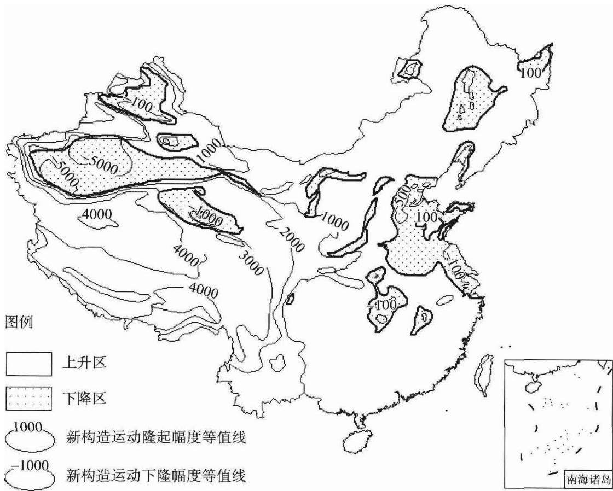  
图1.3 中国新构造升降区域示意图(据廖克，1999)

中国东部的新构造运动，总体升降幅度不如西部，但内部又存在次一级差异。南北之间的差异可区分东北、华北和华南三个大区。东北地区包括大、小兴安岭、东部山地及松嫩平原和三江平原，属于中等幅度的断块差异升降区，平原地区第四纪时期下沉幅度多在100m左右，三江平原最大可超过200m，山地抬升幅度一般在500\~1000m，虽然差异运动不很显著，但第四纪岩浆喷发强烈，显示出不同于其他地区的新构造运动形式。华北地区新构造升降幅度比东北大，属于较强烈断块差异升降区，太行山、吕梁山、秦岭等山地抬升幅度较大，大多在1000～1500m以上，华北平原的下沉幅度一般超过500m，最大超过1000m。华北新构造运动的另一特点是新华夏构造系的影响显著，大范围的断块升降呈北东或北北东向展布。华南地区以幅度不大的整体隆起为主，山地抬升幅度多在200～500m，个别超过1000m。华南下沉区域非常有限，除两湖平原外，只有一些小型盆地。中国东部的东西差异表现为地貌阶梯、地球物理场以及地质发展史等方面的不同。如第二级地貌阶梯的前缘坡度骤降带，同时也是一条显著的重力梯级带，体现中国东部新华夏构造系的基本特点。

中国强烈的新构造运动主要起因于印度板块的碰撞，由此造成的青藏高原强烈隆起，其影响不仅在高原内部，还向北、向东辐射，造就了中国第一、二级地貌阶梯的抬升。东部受太平洋板块向欧亚板块俯冲作用的影响，造成滨太平洋北北东方向的构造线及弧后盆地性质的一系列沉降盆地和广泛分布的玄武岩。中国大陆在不同性质的板块碰撞和俯冲构造机制作用下，形成了特有的相互联系的和有规律的新构造特征。

## （四）地貌格局呈网格状

中国地貌的第四个特点是山脉、高原、盆地、平原等主要地貌单元呈现网格状的分布格局（图1.4）（吴珍汉等，2001；廖克，1999）。山脉是陆地地貌的骨架，中国山脉的分布具有明显的规律性，不同走向的山脉纵横交错，决定了高原、盆地和平原的分布特点。

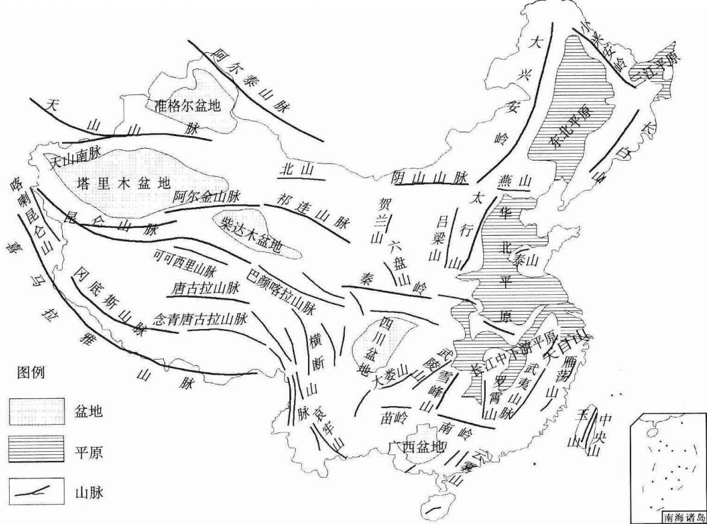  
图1.4 中国主要地貌单元平面分布格局  
(据廖克，1999；编绘)

中国的主要山脉按走向分为4组：①近东西走向的山脉有三列，自北向南依次为天山—阴山—燕山山脉、昆仑山—秦岭—大别山山脉、南岭山脉。②近南北走向的山脉主要有3条，大致位于中国大陆东部和西部的几何分界线附近，自北而南为贺兰山、六盘山和横断山等山脉。③北东一南西走向的山脉在中国东部非常典型，若干山脉明显组合成3列，西列由大兴安岭、太行山、巫山、雪峰山等构成，东列北起长白山，经千山、鲁中山地到武夷山，外列主要是台湾山脉，向北与琉球群岛、日本诸岛等大陆边缘岛弧相连，此外，中国东南部的许多小型山脉，如雪峰山、十万大山、罗霄山、雁荡山等也属于本组。④北西-南东走向的山脉主要位于西部，如阿尔泰山、祁连山、喀喇昆仑山、可可西里山、唐古拉山、冈底斯山、念青唐古拉山等山脉，喜马拉雅山的西段也是北西-南东走向，向东逐渐转为东西向，表现为向南突出的弧形山脉。

山脉是相对隆起的狭长地带，山脉之间的地块因其新构造运动性质的差异，分别形成盆地、平原或高原。以贺兰山一六盘山一横断山一线为界，中国西部以山脉与盆地相间排列为特征，东部则以山脉与盆地、平原或高原的网格状分布最为典型。

在西部的北段（新疆、青海北部），山脉之间的菱形地块下沉形成巨型的内陆盆地，盆地长轴大致呈北西一南东向或近东西向延伸。山脉与盆地相间排列，自北而南，依次为阿尔泰山、准噶尔盆地、天山、塔里木盆地、阿尔金山—祁连山、柴达木盆地、昆仑山—布尔汗布达山。在西部的南段（西藏、青海南部、四川西部、云南西北部)，即从昆仑山以南到喜马拉雅山之间，虽然没有大型盆地，但山脉大致平行，岭谷相间排列，构建了青藏高原的主体，山脉之间的宽阔谷地中，常发育一系列的小型陷落盆地，形成众多的高原湖泊。

东部地区，由近东西向山脉与北东一南西向或近南北向山脉相交叉，山脉之间形成长轴北东一南西向展布的矩形地块，这些地块或下沉为盆地、平原，或拾升为高原。

在近南北向的贺兰山—六盘山一横断山与北东一南西向的大兴安岭一太行山—巫山—雪峰山之间，由阴山、秦岭等近东西向山脉分割，形成4个大型地貌单元，自北而南依次为内蒙古高原、鄂尔多斯高原与陕北黄土高原、四川盆地、云贵高原。这4个区域在中生代和新生代初期都曾为大型的陆相盆地，新生代中后期，构造抬升为高原或相对下沉保持盆地的格局。其中内蒙古高原地区白垩纪至古近纪、新近纪以宽浅盆地为特征；鄂尔多斯高原与陕北黄土高原地区在侏罗纪与白垩纪时期是统一的内陆盆地，新生代时期鄂尔多斯地区持续抬升，成为剥蚀高原，陕北地区在古近纪、新近纪相对下沉形成若干小型盆地，第四纪时期接受厚层黄土堆积，并随新构造抬升而成为黄土高原的主体部分；四川盆地在侏罗纪时为大型盆地，白垩纪时盆地范围缩小，新生代时期构造抬升，但上升幅度小于周边山地和高原，仍然保持盆地的形式，盆地底部除成都平原下沉接受堆积外，大多已经上升形成低山、丘陵，并遭受流水的侵蚀；云贵高原西部侏罗纪时期与四川盆地同为川鄂盆地的组成部分，白垩纪时期相对抬升，形成若干个独立的小型盆地，新生代时期，随着青藏高原和横断山脉的抬升而上升成为高原，目前在云贵高原上，仍然存在许多小型构造盆地，并形成狭长的湖泊，如抚仙湖、滇池等。

在大兴安岭—太行山—巫山—雪峰山与长白山—千山—鲁中山地—武夷山两列北东一南西向山脉之间，由燕山、大别山、南岭等近东西向山脉和小兴安岭的分割，形成5个以平原为主的地貌单元，自北而南依次为三江平原、东北平原（松嫩平原、下辽河平原）、华北平原、长江中下游平原和广西盆地。这些区域的共同特点是在新生代特别是第四纪时期，发生强烈的构造下沉，堆积深厚的松散沉积物，形成地势低平，河网密布的平原景观。其中三江平原规模较小，是由新生代的断陷盆地发育而成的；东北平原则是中生代以来长期发展的拗陷盆地，其鼎盛时期为白垩纪；华北平原由海河、黄河、淮河等河流共同堆积而成，其基底是新生代的巨大拗陷盆地，新生界总厚度达到5000m以上；长江中下游平原是由江汉平原（两湖平原或云梦平原)、鄱阳湖平原、长江谷地、河口三角洲平原等部分组成，这些地段主要是白垩纪以来的拗陷盆地，盆地之间有低山、丘陵分割，形成平原、山丘相穿插的格局，如罗霄山将江汉平原和鄱阳湖平原分开，宁镇山、天目山将长江下游河谷平原与三角洲平原分开；广西整体上是一个盆地，具体由一系列较低的山地和宽谷、盆地组成，新生代断陷和强烈的溶蚀（喀斯特）作用是形成宽谷和盆地的主要原因。

## （五）中国地貌区划

中国地貌类型复杂多样，区域变化大，规模差异悬殊。根据地貌类型及其成因组合特征、空间分异和形成演化过程的相似性和差异性，将中国划分为5个地貌大区、38个地貌区（图1.5）（廖克，1999）。地貌大区是主要受内营力控制的巨型构造单元，中国地势上的三大地貌阶梯及其南北向地貌宏观差异是划分地貌大区的主要依据。各大区内部基本地貌类型、外营力及区域性地表组成物质差异所形成的地貌类型及其组合是地貌区的划分依据。在地貌区内，还可以根据基本形态类型和成因的差别，作进一步的划分。中国地貌大区和地貌区的具体划分如表1.3。

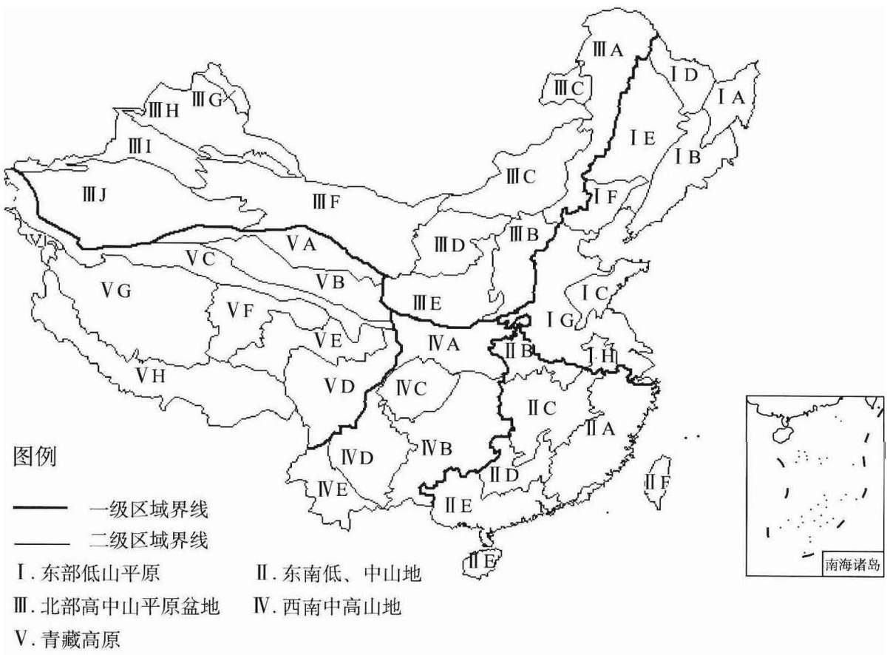  
图1.5 中国地貌区划  
(据廖克，1999；简化)

表 1.3 中国地貌区划
<table><tr><td colspan="1" rowspan="1">地貌大区</td><td colspan="1" rowspan="1">地貌区</td></tr><tr><td colspan="1" rowspan="1">I.东部低山平原</td><td colspan="1" rowspan="1">A.三江低平原；B. 长白山中低山地；C.鲁东低山丘陵；D.小兴安岭低山；E.松辽低平原；F.燕山-辽西中低山地；G.华北-华东低平原；H.宁镇平原丘陵</td></tr><tr><td colspan="1" rowspan="1">Ⅱ.东南低、中山地</td><td colspan="1" rowspan="1">A.浙闽低中山；B.淮阳低山；C.长江中游平原、低山；D. 桂湘赣中低山地；E.粤桂低山平原；F.台湾平原山地</td></tr><tr><td colspan="1" rowspan="1">Ⅲ.北部高中山平原盆地</td><td colspan="1" rowspan="1">A. 大兴安岭中山；B.山西中山盆地；C.内蒙古中平原；D.河套、鄂尔多斯中平原；E. 黄土高原；F.新甘中平原；G.阿尔泰山高中山；H. 准噶尔低盆地；I. 天山高山盆地；J. 塔里木盆地</td></tr><tr><td colspan="1" rowspan="1">ⅣV.西南中高山地</td><td colspan="1" rowspan="1">A.秦岭大巴山高中山；B.鄂黔滇中山；C.四川低盆地；D.川西南、滇中中高山盆地；E.滇西南高中山</td></tr><tr><td colspan="1" rowspan="1">V.青藏高原</td><td colspan="1" rowspan="1">A. 阿尔金山祁连山高山山原；B.柴达木-黄湟高中盆地；C.昆仑山极大、大起伏极高山、高山；D.横断山极大、大起伏高山；E.江河上游中、大起伏高山谷地；F.江河源丘状高山原；G.羌塘高原湖盆；H.喜马拉雅山极大、大起伏高山极高山；I.喀喇昆仑山大、极大起伏极高山</td></tr></table>

资料来源：廖克，1999。

中国地形的巨大高差和众多的山地、丘陵，为各种外营力的侵蚀奠定了基础。阶梯状地形的前沿坡度骤降带，决定了强烈侵蚀地带的分布。网格状的地貌分布特点和强烈的新构造运动，影响到不同地域侵蚀特征的差别，抬升的山地、丘陵以及高原是陆地上的主要侵蚀区，下沉的盆地和平原是陆地上的主要堆积区，中国陆地各主要地貌单元的分布格局，也就决定了中国土壤侵蚀的宏观格局。不同地区具有不同的地质基础与地貌特征，对土壤侵蚀的影响也就呈现出明显的区域差别。

## 三、地貌分区与土壤侵蚀

## （一）东部低山平原大区

本大区位于中国第三级地貌阶梯北部，西以大兴安岭一太行山东麓为界，东至黄、渤海海滨，北起黑龙江，南迄大别山北麓一钱塘江口（图1.5）（廖克，1999），新构造沉降区占有很大的比例（图1.3），在松花江、嫩江、辽河、滦河、海河、黄河、淮河、长江、钱塘江等江河下游形成的堆积平原构成中国最大的平原区（图1.4），包括三江平原、松辽平原、黄淮海平原和长江下游平原，以及许多小型的湖积平原。相对较少的新构造抬升区，形成突出于平原之上的山地或丘陵，包括小兴安岭、完达山、长白山、燕山、辽西山地、胶东鲁中南山地、宁镇丘陵等，其中除少数山地较高外，大多由1000m以下的低山丘陵构成。堆积平原与低山丘陵这两类地貌的特点不同，侵蚀作用过程及其对土壤侵蚀的影响也不同。

## 1. 堆积平原

河流携带大量泥沙在构造下沉区长期堆积形成的平原，就其地貌发育过程而言，应该是无侵蚀或侵蚀极微弱的地区，只是在河流曲流发育、河道调整过程中存在侧向侵蚀及由此引起的河岸坍塌等重力侵蚀。三江冲积平原、松嫩冲积平原、辽河下游海积冲积平原、长江下游及河口三角洲平原（华东平原）均具有此特点。但是，在松嫩平原的边缘和华北平原却存在明显的土壤侵蚀。

松嫩冲积平原的边缘为长白山与大、小兴安岭山前的冲洪积台地，该地段介于构造下沉区与抬升区之间，第四纪时期曾下沉并接受山前冲洪积物甚至平原湖相层的沉积，更新世后期回返上升成为台地。松散的物质和相对高起的地形为土壤侵蚀奠定了基础。这些山前台地相对高度不大，坡面长而和缓，坡度一般为5°～7°，坡长大都在800～1500m，是东北黑土、黑钙土主要分布区，统称为黑土漫岗丘陵。该区属中温带半湿润、半干旱气候区，冬季寒冷，春季干旱多风，夏季降水集中。在自然状态下，山前台地受植被保护，加之深厚的黑土层透水性好，流水侵蚀微弱。但开垦后的土地，特别是在顺坡耕作起垄的情况下，极易遭受侵蚀，夏季和秋季以流水侵蚀为主，受到雨滴溅蚀和地表径流冲刷，坡面上部以面蚀为主，下部沟蚀显著；冬春季节冻融作用明显，降低土壤的抗侵蚀能力，在春季干旱多风时节风蚀强烈。目前黑土漫岗地的垦殖指数达到70%以上，土壤侵蚀严重，嫩江支流乌裕河、雅鲁河和松花江支流呼兰河等流域年输沙模数达到 $5 0 0 { \sim } 1 0 0 0 ~ \mathrm { t / ( k m ^ { 2 } \cdot a ) }$ (罗来兴等，1980)。

此外，辽河中游在河流出山口形成山前冲洪积倾斜平原，其河流比降和地形坡度均比下游大，加之受到西拉木仑河谷风口地形影响，强劲的西风与相对干旱的气候条件，导致科尔沁沙地的形成，使得该地区既受风力侵蚀，也受流水侵蚀和冻融作用的影响。

华北平原的地貌类型与结构比较复杂，土壤侵蚀主要有4种情况：①更新世堆积形成的山前洪积倾斜平原，上部受山地新构造隆起的牵引而抬升，遭受河流切割，形成山前洪积台地，并进一步遭受剥蚀。②苏北滨海平原废黄河口地区自从1855年黄河改道入渤海以后，滨海泥沙的蚀积运动状态被改变，导致现代海岸线快速侵蚀后退。③冲积平原上河流泛滥、迁徙过程中形成的大量松散砂质沉积物，在华北冬春季节干旱多风的条件下，极易遭受风力侵蚀。④曾经广布沼泽湿地、侵蚀微弱的河间洼地，由于人类开发利用，特别是超量开采地下水引起地下水位下降，沼泽与湿地大量减少，干燥的地表改造为耕地，在冬春干旱多风时节风蚀作用比较明显。

## 2. 低山丘陵

山地与丘陵是新构造运动相对上升的地区，侵蚀作用普遍且明显，坡面侵蚀、沟谷侵蚀以及重力侵蚀都很显著，堆积作用则主要限于山间盆地、河谷与坡麓地带。侵蚀作用的强度主要与地形、区域地质构造条件、岩石组成，以及由气候条件所决定的侵蚀动力有关。

本大区以海拔不足1000m的低山、丘陵为主，地形起伏不大，仅长白山和燕山地势较高，主峰超过2000m。由于气候较湿润，植被覆盖度较高，自然状态下土壤侵蚀不严重。本大区降水主要集中在夏季，且多暴雨，流水侵蚀作用强烈。在基岩比较软弱、风化较强或地表覆盖黄土存在较厚松散层的部位，如果植被破坏，特别是垦为耕地后，易发生坡面侵蚀和沟谷侵蚀。毁林开荒、道路建设等强烈的人类活动，也常导致泥石流、滑坡等重力侵蚀过程的发生。例如，辽西山地的大凌河与小凌河流域地形破碎，沟壑密度在低山区为$1 . 3 2 { \sim } 2 . 3 6 ~ \mathrm { k m / k m ^ { 2 } }$ ，低山丘陵区是 $2 . 2 2 \sim 2 . 5 6 ~ \mathrm { k m / k m ^ { 2 } }$ ，丘陵区达2.28～6.01km/km²；植被破坏后土壤侵蚀加剧，区域输沙模数达到 $2 5 0 0 ~ \mathrm { t / ( k m ^ { 2 } \cdot a ) }$ 胶东鲁中南山地人类开发历史悠久，植被破坏后，山地剥蚀严重，泗水县79.1%的面积发生土壤侵蚀，年侵蚀量276万t，侵蚀模数 $3 2 0 0 ~ \mathrm { t / ( k m ^ { 2 } \cdot \dot { a } ) }$ 普遍发生的土壤侵蚀造成水库淤积严重，沂水县跋山水库库容1.28亿 $\mathrm { m } ^ { 3 }$ 平均每年淤积量158万 $\mathrm { m ^ { 3 } }$ ；蒙阴县岸堤水库库容1.59亿 $\mathrm { m } ^ { 3 }$ ，平均年淤积量289万 $\mathrm { m } ^ { 3 }$ (罗来兴等，1980)。

## （二）东南低中山地大区

本大区位于中国第三级地貌阶梯南部，伏牛山—巫山—雪峰山一云贵高原东南边缘一线以东，北起大别山一天目山一—钱塘江口，东南达东海、南海（图1.5）（廖克，1999），是中国水热条件最好的地区，气候温暖湿润，年降水量达1400～1800mm。与北方东部低山平原大区相比，本大区新构造隆起幅度较大，沉降区范围及下沉幅度都较小（图1.3）。区内以大、中、小起伏的低山、中山为主，山地间发育一系列中小型盆地，长江、钱塘江、珠江、闽江等诸水系的河流贯穿其中，塑造了规模不等的堆积平原（图1.4），在河口区则发育三角洲平原，前者如江汉平原、洞庭湖平原、鄱阳湖平原等，后者有珠江三角洲平原、韩江三角洲平原等，各平原平均海拔均在100m以下。此外，在海滨地区还发育有狭窄的沿海平原。从对土壤侵蚀的影响，本大区地貌可概括为3种组合类型：①长期构造隆起，遭受流水侵蚀、切割的破碎山地；②由松散沉积物或风化残积物构成的红色丘陵，包括新构造上升盆地中红色砂页岩遭受侵蚀形成的红层丘陵，以及基岩长期风化具有深厚红色风化壳的红土丘陵；③长期新构造下沉，积水成湖，发育冲积湖积平原的沉降盆地。

## 1. 破碎山地

本大区山地海拔多在1000m以下，主要山脉如大别山、黄山、天目山、怀玉山、武夷山脉、幕阜山、九岭山、罗霄山脉、南岭山脉、仙霞岭、雁荡山、戴云山、莲花山、九连山、云雾山、云开大山、十万大山、五指山、黎母岭等，主体部分海拔达到1000～2000m，个别山峰超过2000m。台湾山地海拔较高，海岸山脉、中央山脉、玉山等山体大多在2000m以上，许多山峰超过3000m。这些山地按地质条件可分为3类：①以古老变质岩为轴部的背斜、复背斜构造，伴有中生代火成岩侵入体，如南岭、幕阜山、九岭山、罗霄山、武夷山脉、大别山、天目山、怀玉山等；②以中生代以前或中生代火成岩侵入体为主，如黄山、仙霞岭、雁荡山、戴云山、莲花山、九连山、云雾山、云开大山、十万大山、五指山、黎母岭等；③喜马拉雅运动形成的年轻褶皱山脉，如台湾山系。

本区降水量大，河流水量丰沛，主要属于长江中下游水系、珠江水系，浙江、福建、广东、广西、台湾及海南岛沿海的短小河流则直接入海。由于河流侵蚀基准面比较低，山地起伏明显，断裂构造发育，北东向与北西向的断裂呈X型交叉，河流沿构造线发育，侵蚀作用较强，形成谷深坡陡、山体破碎的地貌景观。温暖湿润的气候条件，使得各山地具有比较高的植被覆盖度，对坡地物质起到保护作用，而岩石裸露部分出露的多是抗侵蚀能力较强的坚硬岩石，实际土壤侵蚀量不大，输沙模数小于 $5 0 0 \ \mathrm { t } / ( \mathrm { k m } ^ { 2 } \cdot \mathrm { a } )$ (景可等，2005)。但山地岩石风化较强，若植被遭受破坏或山坡稳定性受到破坏，流水侵蚀、重力侵蚀均会发生，土壤侵蚀的潜在强度很大。台湾山地位于太平洋板块与亚欧板块的汇合边界带，构造复杂，岩石破碎，地震频繁，且多台风、暴雨，崩塌、泥石流等重力侵蚀强烈。

## 2. 红色丘陵

本大区红色丘陵有两类：一是由红色砂页岩构成的红层丘陵；二是由红色风化壳或红土堆积物组成的红土丘陵。红层丘陵主要分布在白垩纪下沉、新近纪以来整体上升的各类断陷盆地中，较著名的如安徽南陵，湖南衡阳、攸（县）醴（陵）、长（沙）浏（阳）、株（洲）渌（口），江西赣州、于都、信丰、宁都、瑞金、兴国、吉（安）泰（和），浙江金（华）衢（州）、新（昌）嵊（州），福建永安，广东韶关、梅（县）五（华），广西百色、柳州、来宾、永福、荔浦、上林、宾阳和武鸣等盆地。盆地内的白垩系一古近系红色碎屑岩被穿行而过的河流割切，形成丘陵地形。在厚层砾岩和砂岩分布地段，垂直节理发育，经流水和重力作用，形成“丹霞”地貌（罗来兴等，1980；季子修，1992)。红土丘陵广泛分布于花岗岩、片麻岩、火山岩等基岩山地的外围、大河两岸和盆地周边，主要是流水长期侵蚀形成的普遍发育红色风化壳的低山、丘陵，由第四纪红土堆积物构成的冲积扇或河流阶地经流水切割，也形成低矮的红土丘陵。

无论何种红色丘陵，其共同特点是岩性软弱，松散层深厚，抗侵蚀能力差，易遭受剥蚀，为强烈的土壤侵蚀奠定了物质基础。本区气候湿润，植被覆盖度高，但暴雨频繁，一旦植被受到破坏，极易发生土壤侵蚀。由红色砂岩和第四纪红土构成的丘陵以流水侵蚀为主，花岗岩、片麻岩出露区则以流水侵蚀与重力侵蚀共同作用为特点，常表现为规模不等的崩塌或滑塌，统称为崩岗，是该地区最普遍的土壤侵蚀类型。据统计，广东、广西、海南、福建、江西、安徽、湖南、湖北8省（区）共有216个县（市、区）有崩岗发生，崩岗总数达26万处。其中尤以广东、广西、湖南、江西4省（区）分布最为集中，崩岗总数达24.83万个。江西宁都县璜坡盆地周围的花岗岩丘陵上的崩岗数量平均达到20个/km²以上；广东河源地区2005年6月20日暴雨，一次性新发生崩岗20000余个，梅州五华的崩岗侵蚀也极为严重。

红色丘陵分布区降水丰富，物质疏松，沟谷密度大，是中国东南部土壤侵蚀最严重的地区，流域输沙模数一般为2000～3000t/(km²·a)，局部地段（如崩岗区）侵蚀模数更大，江西兴国个别年份侵蚀强度曾达到10 000t/(km²·a)(景可等，2005)。此外，喀斯特丘陵区红色风化壳厚度有限，当植被破坏，风化层遭受剥蚀，土壤侵蚀强度初期较大，当坚硬的下伏基岩出露时，岩屑的侵蚀强度反而很小。

## 3. 沉降盆地

本大区新构造下沉区域有限，主要有鄱阳湖盆地、洞庭湖盆地、江汉盆地（与洞庭湖盆地合称两湖盆地）以及南阳盆地等。这些盆地自白垩纪以来一直沉陷，堆积了厚层的红色碎屑岩。两湖盆地沉降最深处，白垩系与新生界总厚度可达8000m，其中第四系占200～300m，古近系与新近系约3000～4000m（陈永文，1992）。

盆地沉降中心积水成湖，由于沉积物不断填充以及长江干流的贯通与发展，原始大湖解体，现代鄱阳湖、洞庭湖都是古代大湖的残余部分。盆地中形成的堆积平原，如鄱阳湖平原、洞庭湖平原、江汉平原等，地势低缓、平坦，河床比降小（流经江汉平原的长江河段比降仅1/300000)，河道非常弯曲，河网密度大，河流侧积、加积作用强烈，河道不稳定，经常在汛期裁弯取直，废弃河床发育成湖泊，两岸湖沼密布。因此，在湖沼区及冲积平原内部堆积作用为主，侵蚀极其微弱，仅限于河流曲流发展过程中的侧蚀作用与河岸坍塌现象。

受山地新构造抬升的影响，各大盆地的边缘地带牵引上升，形成台地，例如，洞庭湖平原西部有3级，东部有2级，高出湖面数十米；鄱阳湖平原发育有赣江的阶地，赣鄂皖交界一带的长江河谷平原也有红土阶地。这些台地或阶地经河流分割，形成分散的红土岗丘，高出平原20～30m。位于汉水上游的南阳盆地，中部的冲积洪积、冲积湖积平原海拔80～120m，边缘分布着海拔140～200m的波状起伏岗地（陈永文，1992）。盆地边缘的这些台地、岗地成为盆地中土壤侵蚀比较严重的部位。

在浙、闽、台、琼及两广沿海，存在局部的下沉区，形成河口三角洲平原或海积平原。沿海平原的土壤侵蚀一般不严重，但在海平面相对上升的岸段，海岸侵蚀显著。

## （三）北部高中山平原盆地大区

本大区位于我国第二级地貌阶梯北部，昆仑山—阿尔金山—祁连山—秦岭以北，东起大兴安岭一太行山，西北至国境（图1.5）（廖克，1999），大部分地区整体构造抬升，形成海拔1000m以上的高原，如内蒙古高原、鄂尔多斯高原、黄土高原、阿拉善高原等。在西部，受断裂构造控制，强烈抬升的断块山地（阿尔泰山、天山）和大幅度下沉的大型构造盆地（塔里木盆地、准噶尔盆地）相间分布（图1.3）。根据新构造运动特点、地貌营力组合类型与作用程度，从土壤侵蚀的背景条件，本区可概括为4种地貌组合区：①位于第二级地貌阶梯边缘，遭受流水强烈侵蚀的山地；②有大河贯穿，遭受河流切割，流水侵蚀强烈的高原；③气候干旱，流水侵蚀微弱，高原地貌面完整，风力作用为主的于燥高原；④受断块构造控制，大幅度差异升降的剥蚀高山与堆积盆地。

## 1. 边缘山地

大兴安岭与太行山位于本区东部边缘，总体呈北北东一南南西向延伸，是中国第二级地貌阶梯的边界山地，其东坡即为地貌阶梯的前沿坡度骤降带。在山前断裂构造的控制下，大兴安岭与太行山经新构造运动的抬升，形成高出相邻平原1000m以上的陡峻山势。两山脉均位于我国东部半湿润区与半干旱区的过渡地带，夏季风盛行之时，因地形效应可获得较丰富的降水，年降水量可达600mm以上。有利的地形与降水条件为河流下切侵蚀奠定了基础。

大兴安岭海拔1100～1400m，山体掀斜抬升，东坡陡峭，西坡和缓，主要出露侏罗系陆相碎屑岩、不同时代的花岗岩和火山岩。大兴安岭经历中生代末期以来的长期剥蚀，夷平面广泛发育，除局部出露坚硬岩石外，大多数地方为风化较强的表层残积物覆盖。受北西向断裂构造控制，山地两侧形成许多深切河谷，河流上游切过山体中轴线，山体被分割，主分水线呈曲折状。大兴安岭地区气温低，蒸发量小，相对湿度大，森林植被生长良好，大大减缓了流水侵蚀作用的强度，总体上土壤侵蚀量不大，但在森林采伐且开垦为耕地的部位，侵蚀强度明显增加，不仅出现面蚀和沟蚀，也有泥石流发生。此外，大兴安岭北端是我国地带性多年冻土分布区，还存在较明显的冻融侵蚀。

太行山大部分山体海拔1500m以上，许多山峰超过2000m，是一个复式背斜的褶皱断块山地，两侧受新构造复活的断裂控制，东侧是华北平原的边界断层，断距大，西侧为山西地堑系的边界断裂，断距较小，致使山体东坡短而陡，西坡长而缓。长期的流水侵蚀与山地间歇性抬升，在山前形成多级山麓剥蚀面，并被进一步侵蚀成丘陵状。太行山岩性比较复杂，片麻岩、石英岩、碳酸盐岩、碎屑岩、花岗岩、安山岩和火山碎屑岩等均有出露，由于坚硬岩石比较多，在断裂变动中易破碎。太行山中存在一系列与主断裂相交、横切山体的北西一南东向断裂，河流沿断裂破碎带发育，形成许多贯穿山体的深切峡谷（陉），在古代成为交通要道。太行山地区人类活动历史悠久，植被覆盖度很低，长期侵蚀的结果，许多地方岩石裸露，抗蚀性强，现代土壤侵蚀量已经不大。但在花岗岩或片麻岩出露区、山前黄土覆盖的低山丘陵、冲洪积台地及河谷两侧阶地，地表松散层较厚，土壤侵蚀较强，面蚀、沟蚀均很显著，输沙模数可达 $1 0 0 0 \sim 2 0 0 0 \mathrm { ~ t } / ( \mathrm { k m } ^ { 2 } \mathrm { ~ \bullet ~ } \mathrm { a } )$ (景可等，2005)。此外，在山地坡度较陡、植被较好、碎屑物质丰富的地段，泥石流为主的重力侵蚀比较普遍，由于表土薄，细粒物质少，以稀性泥石流和水石流为主。

## 2. 切割高原

黄土高原是中国第二级地貌阶梯秦岭以北部分遭受切割最强烈的地区，其范围南自秦岭北麓，北抵鄂尔多斯南缘，东起太行山西麓，西达祁连山东端，地势西北高东南低，海拔1000～2000m，除一些石质山地外，大部分区域为厚层黄土覆盖。气候属于南温带半湿润气候向半干旱气候过渡，年降水量200～700mm，由东南向西北递减。区域水系以黄河为骨干，源于黄土高原的河流约200条，切割深度一般100～200m，支流沟谷下切深度也在50～100m，沟道密度达2.35～10.9km/km²。黄土覆盖地区，沟谷面积与流域面积之比超过25%，最高可达56.7%，土壤侵蚀严重，大部分地区侵蚀模数达到 $4 0 0 0 \ \mathrm { f / ( k m ^ { 2 } \cdot \mathrm { a } ) }$ (李昭淑，1992)。

黄土高原强烈的土壤侵蚀取决于其特殊的地貌发育条件，具体表现在3个方面：①整体抬升的高原遭受穿流而过的黄河及其支流的强烈下切，侵蚀基准面下降，区域地貌正处于侵蚀作用非常活跃的青年期后期；②地表黄土层深厚，基岩以胶结不好的中生界碎屑岩为主，物质松散，抗侵蚀能力较弱；③有一定的降水量，降水年际变化大，季节分配不均，夏季多暴雨，降水强度大，降雨侵蚀与切沟侵蚀均很强。

广义的黄土高原包括山西高原（或称山西山地）、陕甘黄土高原（狭义的黄土高原，也称陇东陕北高原)、陇中高原。各部分具体地质条件与地貌特征不同，土壤侵蚀的特点也有所不同。

山西高原东起太行山，西至吕梁山，北自阴山的东延部分，南达中条山。太行山与吕梁山是高原的骨干，两者之间雁列式分布着许多断陷盆地，构成山西地堑系或晋中裂谷带，属新构造下沉区。各盆地内新生界总厚度可达千米，第四系厚度普遍为400～700m。沉降盆地本是堆积区，随高原抬升，桑干河、汾河等河流贯通盆地，区域性侵蚀基准面下降，山西地堑系诸盆地普遍遭受河流下切侵蚀，发育河流阶地或湖积台地，盆地边缘形成覆盖黄土或次生黄土的冲洪积台地。盆地周边山地的中下部黄土覆盖地段，也在山体拾升、河流下切过程中形成黄土台地或黄土丘陵。正是盆地内部及周边相对抬升的由松散沉积物构成的丘陵、台地，成为山西高原土壤侵蚀最为严重的地段，输沙模数可达 $5 0 0 0 ~ \mathrm { t / ( k m ^ { 2 } \cdot { a } ) }$ (景可等，2005)。

陕甘黄土高原位于吕梁山和六盘山之间，北以白于山、长城一线与鄂尔多斯高原为界，南隔渭河地堑与秦岭相望，厚层黄土连续分布，堆积顶面海拔一般在1000～1300m，是黄土高原的主体。该地区黄土之下为厚度不一的三趾马红土，黄河及其支流的河谷中出露中生界陆相碎屑岩，均属极易遭受风化、剥蚀的类型。第四纪早期和中期，渭河地堑及三门古湖为地方性侵蚀基准面，控制着入湖河流对黄土高原的侵蚀。200～250kaB.P. 以来，黄河贯通，湖泊消亡，河流侵蚀基准面下降，冲沟普遍发育，奠定了黄土高原土壤加速侵蚀的地貌基础（李容全等，2005）。疏松的物质条件和植被的破坏，加剧了该区土壤侵蚀。黄土台地边缘陡坡及地形破碎的黄土梁昴丘陵区，土壤侵蚀非常强烈，输沙模数达 $5 0 0 0 { \sim } 7 0 0 0 \mathrm { ~ t } / ( \mathrm { k m } ^ { 2 } \mathrm { ~ \bullet ~ } \mathrm { a } )$ ，局部超过 30 000 t/$( \mathrm { k m } ^ { 2 } \cdot \mathrm { a } )$ ；坡度平缓的黄土塬、黄击金河流阶地顶面，年均输沙模数也达

1000～2500t/(km²·a）（景可等，2005)。陕甘地区河流溯源侵蚀大多始自东部的黄河峡谷和南面的渭河谷地，降水量也是东南多于西北，因此，沟谷密度和土壤侵蚀强度自东南向西北减小。

陇中高原位于六盘山以西向青藏高原的过渡地带，平均海拔2000m，地表波状起伏呈岭谷状，以长梁宽谷丘陵为特征，包括天水、陇西、兰州等盆地。该区地表广泛覆盖第四纪黄土，黄土之下常见古近系河湖相及新近系冲洪积红土。黄土厚度变化大，总体向西变薄，台地、山梁黄土较薄，厚度多不足30m，盆地中黄土很厚，最厚可达400m。陇中地区是黄土高原最干旱的部分，年降水量300～400mm，夏季降雨集中，侵蚀显著，在黄土梁坡以面蚀为主，宽谷两侧台地以切沟侵蚀为主。该地区沟谷下切受黄河和渭河上游河床控制，高差较小，水量有限，土壤侵蚀强度不及陕甘地区，年输沙模数一般为 $3 0 0 0 { \sim } 4 0 0 0 \ \mathrm { t / ( k m ^ { 2 } \bullet a ) }$ (景可等，2005)。

沟谷侵蚀是黄土高原土壤侵蚀的主导过程。沟谷的发育是流水下切侵蚀、溯源侵蚀和谷坡重力侵蚀共同作用的结果。下切侵蚀加深沟谷，溯源侵蚀增加沟长，重力侵蚀展宽沟谷。夏秋暴雨时节，沟谷水量骤涨，下切侵蚀加强，沟头溯源侵蚀加快，谷坡崩塌、滑坡等形式的重力侵蚀也很活跃。在冬春干旱季节，缺乏植被的疏松裸地，风力侵蚀作用也很强，第四纪风成黄土，被现代风力作用再次侵蚀，成为北方沙尘暴的重要沙源。

## 3. 干燥高原

广义的内蒙古高原包括呼伦贝尔高原、内蒙古高原、鄂尔多斯高原和阿拉善高原，是中国第二级地貌阶梯上原始地貌面保持最完整的地区，也是本大区的代表性地貌面。高原面之上，散布着北山、贺兰山、阴山等燕山运动隆起，喜马拉雅运动上升的山地丘陵。本区地处内陆，年降水量不足400mm，西部甚至在200mm以下，短小内流河的侵蚀作用微弱，风力作用成为区域性地貌营力组合的主体，干燥剥蚀与风沙堆积非常普遍。构成沙漠的沙丘属风成堆积地貌，是前期堆积物遭受风力作用，将黏土、粉砂等细粒物质吹蚀，砂粒物质搬运、再沉积的结果。因此，沙漠的形成与发展，伴随着细粒物质的强烈风蚀，这些物质也是沙尘暴的主要沙源。

呼伦贝尔高原位于大兴安岭西麓，地势东高西低，海拔650～700m，地形和缓。呼伦湖地区新构造下沉，堆积河湖相松散沉积物，形成湖积冲积平原，沼泽湿地发育。本区位置偏北，气温低，相对湿度较大，植被覆盖度高，呼伦湖与贝尔湖作为地方性侵蚀基准面控制着大兴安岭西坡河流的下切，河流以曲流侧向侵蚀、河岸坍塌为主。但在草原遭受破坏的斜坡地带，流水面蚀与沟蚀作用开始出现。在东南部位置较高的干燥地段，风力作用形成呼伦贝尔沙地，风蚀作用见于干旱季节或植被破坏地段。

狭义的内蒙古高原即阴山以北、大兴安岭南段以西起伏和缓的高原，海拔1000～2000m，由东南向西北呈微倾斜状。本区基底岩石为太古界片麻岩与古生界沉积岩，经长期夷平和多次断裂、挠曲变形，发育多级剥蚀面，中、新生代盆地中形成大量陆相碎屑沉积，地表物质以剥蚀面上长期风化形成的残积物和第四纪松散堆积物为主，抗侵蚀能力弱。该区年降水量150～400mm，属干旱、半干旱气候，地表河流短小，多汇入内陆咸水湖，流水切割微弱，高原面完整，只在南部边缘的阴山、大青山南坡存在一些深切河谷。风力作用占据主导地位，西北部以剥蚀作用为主，形成砾质戈壁、沙质戈壁，中部及中南部形成堆积类型的沙漠与沙地，如巴音戈壁沙漠、海里斯沙漠、白音察干沙漠、浑善达克沙地、乌珠穆沁沙地等。高原东南部降水较丰富的弧形地带，第四纪时期发育的沙丘大多已经固定、半固定，但在气候旱化、人类干扰的情况下，沙丘活化现象明显，风力的侵蚀与再搬运、堆积较强。

鄂尔多斯高原西、北、东三面为黄河弯曲所围限，南面以白于山和陕北长城一线为界与黄土高原相邻，大部分地区海拔1300～1500m，总体地势西北高，东南低，年降水量150～500mm，由东南向西北快速递减。本区地质构造上是一个比较稳定的地块，中生代形成凹陷盆地，堆积了数千米厚的陆相碎屑岩，后经抬升、夷平，形成准平原，新构造运动中，急剧上升成为遭受剥蚀的高原，地表主要出露产状近于水平的白垩系陆相碎屑岩，临近黄河的地带，出露侏罗系、三叠系等较老的陆相碎屑岩。由于基岩胶结松散，抗侵蚀能力弱，干旱、半干旱气候条件下地表强烈的物理风化，为风力作用提供了丰富的物源，在高原东南形成毛乌素沙地，高原西北则主要为干燥剥蚀高地。自然状态下，毛乌素沙地以固定、半固定沙丘为主，植被破坏后，许多沙丘活化形成流动沙丘。位于高原北缘的库布齐沙漠，是黄河冲积物就地起沙形成的，以流动沙丘为主。本区东部降水较多的地带，遭受黄河支流下切侵蚀和溯源侵蚀的分割，流水侵蚀、重力侵蚀以及风力侵蚀都较强烈。

阿拉善高原东起贺兰山，西迄马鬃山，北以国境线为界，南与河西走廊相邻。年降水量东部接近200mm，西北部不足50mm，气候干旱、极干旱，地表水匮乏，除东缘的黄河外，较大河流主要为源于祁连山的内流河。本区是一个长期稳定隆起的剥蚀地块，地形起伏和缓，以干燥剥蚀山丘与宽浅的凹陷盆地相间为特征，大多数山丘的相对高度仅数百米，盆地地面海拔1000～1500m，构成高原地貌面的主体。剥蚀山丘主要遭受干燥物理风化、持续的风力侵蚀以及偶发的暴雨冲刷。山麓地带的洪积扇在流水堆积与风力剥蚀的共同作用下，形成广泛的砾石戈壁。宽浅盆地内第四纪风积物广泛覆盖，构成巴丹吉林、腾格里、乌兰布和等沙漠，仅在黑河、石羊河下游及邻近黄河的局部地段存在河流冲积平原。本区诸沙漠以流动沙丘为主，在强劲的风力作用下，形成数十米乃至数百米的高大沙山。地表物质较细的冲积平原，开垦为农田后，风蚀作用强烈，土地沙化严重。

与高原相伴，本区也有一些新构造下沉的盆地，如银川盆地、五原一呼和浩特地堑以及河西走廊，是流水作用的堆积区，发育了洪积、冲积平原，第四系松散沉积物广泛出露，在干旱气候条件下，缺乏植被覆盖的干燥地表也遭受较强的风力侵蚀。河西走廊南部受祁连山新构造抬升的影响，形成多级高差50～100m的洪积台地，遭受流水切割。

## 4. 高山盆地

中国西北褶皱断块山系与大型断陷盆地相间排列，新构造强烈抬升、遭受剥蚀的山地（如阿尔泰山、天山等），与新构造大幅度下降、接受沉积的盆地（如准噶尔盆地、塔里木盆地等），呈现高差悬殊、形态和内容对比鲜明的地貌差异。本区气候干旱，盆地内年降水量一般不足200mm，多数地区甚至不足100mm；但在高大的山地，受地形影响，降水量可达400mm以上，成为干旱区的“湿岛”，属山地中温带半干旱气候，在极高山地带甚至还发育有山地冰川。

天山与阿尔泰山都是古老褶皱山系，长期处于剥蚀状态，间歇性新构造抬升，形成多级夷平面。天山山体呈东西向延伸，海拔多在3000～4000m以上。阿尔泰山北西—南东走向，主要山脊高度在3000m以上，中国境内为阿尔泰中段南坡。受山地垂直气候带的影响，天山与阿尔泰山的地貌营力组合类型呈现明显的垂直分带特征（表1.4）（罗来兴等，1980）。准噶尔盆地西部山地较低，海拔多在3000m以下，缺少现代冰雪作用带，山顶部分霜冻作用明显，山体大部分遭受流水作用，山麓地带以干燥剥蚀作用为主。本区山体高耸，地形陡峭，各垂直带的侵蚀作用都较强烈，沟谷深切，大部分山体基岩裸露，现代土壤侵蚀强度反而不大。在坡度平缓未遭侵蚀破坏的山地夷平面及降雨丰沛的山地森林与草原地带，地表侵蚀较弱，积累较厚的坡积、残积物质，植被破坏后，可以引起较强烈的土壤侵蚀。山体强烈抬升，引起山前凹陷带松散沉积层褶皱隆起，形成平行排列的背斜山与向斜谷。背斜被出山河流切割，形成相对高度500～600m的丘陵，各列丘陵之间的向斜谷地内，堆积了第四系砾石、砂与黄土，也遭受河流的割切。山前地带气候干旱，松散沉积物裸露，暴雨冲刷、洪水侵蚀与风力侵蚀都很强烈。此外，由于山前及山间盆地边缘属地震活跃带，也易引发各种重力侵蚀。

表1.4 天山与阿尔泰山地貌营力组合类型垂直分布
<table><tr><td rowspan=2 colspan=1>地貌营力组合类型分带</td><td rowspan=1 colspan=2>各带海拔高程/m</td></tr><tr><td rowspan=1 colspan=1>天山</td><td rowspan=1 colspan=1>阿尔泰山</td></tr><tr><td rowspan=1 colspan=1>(1）现代冰雪作用带：雪线以上高山、极高山地带，存在多年积雪，发育有现代冰川，寒冻风化、冰川作用、重力作用为主</td><td rowspan=1 colspan=1>3800~4200m 以上</td><td rowspan=1 colspan=1>3200 m 以上</td></tr><tr><td rowspan=1 colspan=1>(2)霜冻作用带：雪线以下中山、高山地带，古冰川侵蚀地貌类型多样，堆积有大量古代冰碛物，寒冻风化、冻融作用为主，伴随冰水作用、重力作用</td><td rowspan=1 colspan=1>2600~2700 m 以上</td><td rowspan=1 colspan=1>2400~3200 m</td></tr><tr><td rowspan=1 colspan=1>(3)流水作用带：山体中部，流水侵蚀与堆积作用普遍，河网密布，河流阶地发育，伴随崩塌、滑坡、泥石流等重力作用</td><td rowspan=1 colspan=1>1500~2600 m（或2700 m)</td><td rowspan=1 colspan=1>1500~2400 m</td></tr><tr><td rowspan=1 colspan=1>(4)干燥剥蚀作用带：山体下部与山麓地带，以风力侵蚀为主，物理风化强烈，地表碎屑物质丰富，尽管降水量很少，但比较集中，强度大，可伴随强烈的暴雨冲刷和洪水侵蚀，各山地河流出山之前下切侵蚀显著，谷深坡陡，泥石流、崩塌、滑塌等重力作用也很普遍</td><td rowspan=1 colspan=1>北坡1300~1500 m以下；南坡1700～2000 m 以下，强度大于北坡</td><td rowspan=1 colspan=1>1500 m 以下</td></tr></table>

资料来源：罗来兴、邢嘉明，1980，概括。

塔里木盆地和准噶尔盆地都是以古老结晶地块为基底的大型沉降盆地，堆积了自古生代以来不同时代的深厚沉积，第四系松散沉积物广泛覆盖地表，从山麓到盆地中心，地貌类型呈环带状分布，依次为山麓洪积扇群、山前洪积冲积倾斜平原、冲积平原、湖积平原、内陆湖泊。塔里木盆地大部分区域新构造下沉幅度超过5000m（图1.3）（廖克，1999），地势西南高东北低，海拔由1400m降至800m。准噶尔盆地新构造下沉幅度只有数百米，地势东南高西北低，大部分地面海拔为300～700m。塔里木盆地位于南疆，属南温带干旱气候，温度高，降水少，多数地区年降水量不足50mm，极端于旱，塔克拉玛干沙漠85%为流动沙丘，沙丘高大，形态复杂。准噶尔盆地位置偏北，属中温带干旱气候，温度略低，降水较多，水分条件较好，有利于植被的生长，盆地内部的古尔班通古特沙漠以半固定沙丘占绝对优势。

盆地一般是流水、冰川、重力等多种营力侵蚀作用的堆积区，但在十旱气候条件下却是风力作用的侵蚀区，大量的松散沉积物为风力作用提供了丰富的物源，形成广袤的沙漠。由于地表物质的粒度特征和水分状况不同，盆地不同地貌部位风力侵蚀的特点也有所不同。洪积扇上部物质粗大，地下水埋藏深，风力侵蚀强烈，细粒物质被吹蚀，粗大砾石残留地表形成沙砾石戈壁：洪积扇中下部细砂、粉砂为主，地下水埋藏浅，成为绿洲，风力侵蚀微弱：洪积扇前缘以亚黏土、黏土为主，地下水溢出，形成盐滩沼泽，风力侵蚀微弱；盆地中心的湖泊及湖滨沼泽地带，风力侵蚀同样微弱；广阔的堆积平原地区风力侵蚀强烈，形成沙漠，只是在水量充沛、流路较长的河流两岸及地下水埋藏较浅的古河道内，植被覆盖度高，风力侵蚀不明显。由于自然环境变化和人类活动的影响，如河流改道、地下水位下降、湖泊迁移或消失、植被破坏，都会导致原来风力侵蚀微弱的地带发生强烈的风蚀作用。洪积扇中下部绿洲与平原河道两岸砂质丰富的地带，以土地沙化和发育活动沙丘为主；洪积扇前缘盐滩和湖积平原黏土较多的地带，风力侵蚀常形成雅丹地貌，较粗的碎屑则被搬运到下风方向形成沙丘。

## （四）西南中高山地大区

本大区位于中国第二级地貌阶梯南部，构造抬升明显，北以秦岭为界，东起巫山—雪峰山，西至松潘高原与横断山地下缘，南到国境线（图1.5）（廖克，1999)，地面海拔一般1000～2500m，山地较高，东部为2000～3000m，西部达3000～4000m。古夷平面被断裂构造分割，形成许多断陷盆地；大江大河贯穿，多数地区河流侵蚀强烈，山谷相间排列，地形破碎，仅少数地区保留较完整的高原面，是中国土壤侵蚀最严重的地区之一。从土壤侵蚀过程的背景条件分析，本区可以概括为3种地貌组合类型区：①位于第二级地貌阶梯边缘，遭受流水强烈切割的山地；②中生代下沉，新构造抬升，遭受流水侵蚀的盆地；③流水侵蚀强烈，地形破碎的喀斯特高原与红色高原。

## 1. 切割山地

本大区的山地主要有北部川陕一带的秦岭、大巴山，东部鄂西湘西地区的巫山、武陵山、雪峰山，南部横断山延伸部分的高黎贡山、老别山、帮马山、无量山、哀牢山等。这些山地的延伸方向与构造线一致，岭谷相间，水系发达，虽然所处热量带不同，但都具有降水丰富的特点，年降水量800～1400mm，局部达1600～1800mm，河流水量大，侵蚀作用强，具有山高、谷深、坡陡的特点。由于多数山地岩石坚硬，植被覆盖度较高，对坡面碎屑物质起到保护作用，自然状态下土壤侵蚀一般较弱。但在碎屑物质丰富地段，当植被或坡面稳定性遭到破坏，流水侵蚀和重力侵蚀都很强烈。

秦岭山脊海拔多在2000～3000m，最高峰太白山海拔3767m，是一个古老的褶皱断块山地，岩性复杂，许多断陷盆地内堆积了白垩系和古近系红色碎屑岩，如成县、徽县、两当、凤县、洛南、商洛、山阳等。新构造运动掀斜抬升，造就秦岭山地北坡短而陡，南坡长而缓的地貌特点。因此，秦岭北坡的河流长度短，流势急，峡谷深切，流水侵蚀强烈；南坡河流相对源远流长，比降较小，但南坡降水丰沛，流水侵蚀作用也很强。海拔3400m以上的山峰，发育有第四纪冰川，现代冰缘寒冻风化与冻融侵蚀作用也很强烈。

四川盆地东北缘的米仓山与大巴山，山顶海拔2000～3000m，是嘉陵江和汉水的分水岭，山体为一系列背斜和向斜组成的平行褶皱带，呈弧形展布。山体主要出露石灰岩、白云岩、砂岩和变质岩，局部为花岗岩。在中生界陆相地层分布区，岩性软弱，流水侵蚀强烈。例如，嘉陵江中上游年输沙量约0.42×108t，占宜昌站年输沙量的7.9%，其流域面积只占宜昌站上游面积的2.6%(景可等，2005)。巫山位于川渝鄂边界，是一个中间高、两侧低的背斜山地，山脊海拔1500～2000m。山体主要由石灰岩、砂泥岩组成，经褶皱挤压，裂隙发育。在长江横切和流水侵蚀、溶蚀作用下，溪沟纵横，岩壁陡峭，流水侵蚀与重力侵蚀都较强烈，输沙模数可达1500～2000t/(km²·a）（景可等，2005）。

湘西的武陵山是沅江和澧水的分水岭，雪峰山是沅江和资水的分水岭，岭脊海拔一般在1000m以上，中段山脊可达1200～1700m。山地东坡是中国第二级地貌阶梯南段的坡度骤降带，西坡向云贵高原过渡，东陡西缓。在间歇性构造抬升过程中，发育多级剥蚀面，沅江支流巫水、溆水、夷望溪，资水西源及其支流平溪、辰溪等均出自山地两侧，河流切割强烈。

云贵高原以南地区属于第一、二级地貌阶梯过渡带和横断山脉南段及其延伸部分，平均海拔在2000m左右，龙川江、怒江、澜沧江、红河上游的元江、把边江等大江大河穿越其中，形成高山峡谷或山原深谷的地貌格局，新构造运动强烈，流水及重力侵蚀普遍，滑坡、泥石流发育。

## 2. 抬升盆地

四川盆地是我国南方第二级地貌阶梯上最大的负地形区，平面呈菱形，长轴北东一南西向延伸，四周由海拔2000～3000m以上的高山和高原环绕。盆地在侏罗纪、白垩纪下沉，堆积总厚度6000m的陆相沉积，其中侏罗系主要为顶部夹有石膏层的紫红色砂岩和页岩，白垩系主要为砖红色砂砾岩、砂岩和页岩，故有“红层盆地”之称。白垩纪末期构造运动使盆地抬升，中生界地层发生倾斜或褶皱，并受到河流的割切，形成丘陵。盆地底部地势总体西北高东南低，海拔250～750m，长江主流沿盆地东南侧流过，成为地方性侵蚀基准面，岷江、沱江、涪江和嘉陵江自西北或北部向东南穿越盆地底部，注入长江。

四川盆地内部按地貌类型分为三部分。西部受龙门山前活动断裂控制，为新构造下沉区，发育岷江冲洪积扇，第四系沉积厚度一般在100m以上，最大约300m，形成成都平原；平原以西山麓地带受山体上升影响，形成由白垩系红层构成的侵蚀浅丘和覆盖早更新世雅安砾石层与红土的台地，高出附近河面约50～100m，是成都平原的主要侵蚀区。盆地中部龙泉山与华鉴山之间以整体抬升为主，红层产状平缓，岩层软硬相间，形成典型的方山丘陵，海拔不过350～450m，高出当地江面约100m；在盆地北部山前地带，主要为单斜式方山，海拔700～800m，相对高度150～200m。盆地东部以褶皱隆起为特点，形成一系列大致平行的北东向梳状褶皱，背斜窄而陡，向斜宽而平，基岩以中生界砂岩、页岩为主，易遭受侵蚀。华鉴山是盆地内部最高的背斜山岭，海拔近1600m，相对高度超过1000m，其余背斜山岭多在海拔1000～1200m，相对高度600～700m。几乎所有背斜山岭的顶部，都已被蚀，出现背斜谷。背斜山岭之间的宽广向斜谷地，海拔一般不超过200～300m，出现一些平缓岗丘，其间有河流淤积的局部平原。河流横穿背斜构造之处切成峡谷，嘉陵江于合川、重庆间三次切过华鉴山背斜南段，形成历濞峡、温塘峡、观音峡。长江主流也在重庆巴南、涪陵、奉节（瞿塘峡）穿过背斜构造，形成深峡。

四川盆地属中亚热带湿润气候，年降水量800～1200mm，夹金山、大相岭等西缘山地，降水量可达1400～1600mm，河流水量充沛，侵蚀能力强。除西部成都平原为下沉区外，川中丘陵、川东岭谷地区均为抬升区（图1.3)，遭受长江及其支流河道的下切侵蚀，虽然地形切割较浅，起伏不大，但由于基岩易风化、剥蚀，人类长期开垦坡地，该地区坡面侵蚀、沟谷侵蚀、重力侵蚀多种类型并存，侵蚀强度并不小，川东平行岭谷区侵蚀量最大，输沙模数达到1500～2000t/（km²·a）（景可等，2005）。

## 3. 破碎高原

云贵高原包括云南高原和贵州高原两部分，地势总体由西向东梯级下降，川西南和滇中一带海拔2700～3000m，滇东黔西约1800～2400m，黔中地区1200～1400m，贵州东部高原边缘海拔仅500～800m。云贵高原是一个经过长期夷平、新构造大幅度抬升的准平原。抬升过程中伴有强烈的断裂活动，形成许多断块山地和断陷盆地；另一方面，河流强烈侵蚀，长江干流切割高原北部，珠江上游的北盘江、南盘江深入高原中部，元江上游贯穿高原南缘，使得原始准平原受到支解，形成山岭纵横，地表崎岖、破碎的地形特点。只是在河流溯源侵蚀尚未到达的分水岭和河流上游地区，保存有相对完整的高原面，成为我国第二级地貌阶梯南部的代表性地貌面。

大体以四川昭觉一云南昆明一线为界，西部川西南的西昌和滇中的楚雄地区，主要出露厚层紫色砂岩、页岩，构成波状起伏的红色高原；东部滇东地区与贵州高原，广泛出露浅海相碳酸盐岩与碎屑岩，发育典型的喀斯特地貌。本区属高原型中亚热带湿润气候，年降水量自东南向西北减少，贵州高原年降水量1000～1600mm，云南高原800～1000mm，西北部金沙江河谷及其东南一带不足800mm，属于半湿润气候。降水条件与高原总体地势、地表物质相配合，使得不同地区侵蚀作用的特点与强度有所不同。

川西南与滇中地区位于高原内部，河流溯源侵蚀尚未到达，特别是其中心部分的楚雄地区，地形起伏非常和缓，相对高差不到100m，保存了准平原的外貌；虽然地表出露中生界红层，较少的降水量也降低了其侵蚀强度。断陷盆地分布区，高原湖泊成为地方性侵蚀基准面，控制着河流的下切。在川滇交界的金沙江下游峡谷区，河流深切，两岸发育的支流虽然短小，但比降大，加之该地段岩性软，构造破碎，人类活动频繁，成为红色高原上土壤侵蚀最为严重的部位。金沙江下游年输沙量约 $1 . 7 5 \times 1 0 ^ { 8 }$ t，占宜昌站年输沙量的33%，而流域面积只占宜昌站流域面积的8.1%，沿岸的东川、攀枝花、会东、会理、马边、屏山等县的年输沙模数都大于 $3 5 0 0 ~ \mathrm { t / ( k m ^ { 2 } \cdot { \cdot } a ) }$ 。该地区不仅流水侵蚀普遍，重力侵蚀在区域土壤侵蚀中也占有很大比重，如金沙江南岸支流小江的白龙头山下游90 km河段共有61 条支流，其中51条为泥石流沟，占支流总数的83.5%；攀枝花市 $6 . 5 9 \ \mathrm { k m ^ { 2 } }$ 的土地上有大于 $5 . 0 \times 1 0 ^ { 5 } ~ \mathrm { m } ^ { 3 }$ 的滑坡51个。金沙江下游攀枝花至宜宾段有崩塌、滑坡689处，沿江平均0.88处/km，泥石流沟258条，平均0.33条/km（景可等，2005）。

滇东地区与贵州高原位于本区东部，许多河流自第二级地貌阶梯边缘向西溯源侵蚀，已经深入高原内部，水系发达，属于长江水系的有牛栏江、横江、乌江及其支流、沅江上游各支流等，属于珠江水系的有北盘江、南盘江、都柳江及它们的支流。河网密度高，峡谷深切，流水侵蚀强烈，地面十分破碎，只是遵义和苗岭之间位于分水岭的黔中地区，尚具有低山、宽谷、浅盆的高原面貌。在碳酸盐类岩层广泛出露的地区，喀斯特地貌非常发育，表土已侵蚀殆尽，现以化学风化与剥蚀为主，产生的碎屑物较少，土壤侵蚀微弱。在植被较好、坡度较缓的地段，基岩表面往往覆盖厚薄不一的红土风化壳，一旦植被遭到破坏，起初土壤侵蚀较强，当表土侵蚀殆尽，岩石裸露，地表抗侵蚀能力增强，土壤侵蚀迅速减弱，但土被与植被均已极难恢复，出现石漠化。

## （五）青藏高原地貌大区

本大区位于中国第一级地貌阶梯，北自昆仑山—阿尔金山—祁连山，南至喜马拉雅山；东起横断山，西抵国境线，是晚新生代强烈隆起的地貌单元(图1.3)，平均海拔4000～5000m以上，更有许多6000m以上的极高山，是地球上最高的大高原。青藏高原属川滇青藏活动带，历经古生代以来的多次构造旋回，各时期构造带自北而南依次排列，形成高原面上高大山脉与宽谷、盆地相间分布的地貌特点。

整体抬升的青藏高原实为一个巨大的侵蚀陆块，侵蚀作用是高原地貌发育的主导过程。但在高原不同部位，地貌发育条件和所处演化阶段不同，其侵蚀状态或强度也不同；气候条件的差异也导致高原不同地区外营力组合的差异。高原边缘高差大，坡度陡，是侵蚀过程首先发展的部位，沟谷侵蚀强烈，形成高山深谷，地形起伏极大。高原内部则宽谷湖盆遍布，起伏相对和缓，在河流溯源侵蚀尚未到达的部位，保持较完整的原始高原面。源于高原的大江、大河往往具有宽浅的上游河谷，其侵蚀作用远不及处于高原边缘的中游河段强烈。

## 1. 边缘高山

青藏高原北部边缘的昆仑山（西段）、阿尔金山、祁连山，以大约2000～3000m的高差与塔里木盆地和河西走廊相邻，河流以断陷盆地为基准面强烈下切，并在山前凹陷带堆积巨厚的冲洪积物。但由于气候干旱，河流主要靠高山冰川融水补给，水量不大，流水侵蚀受到限制，只在山地北坡靠近盆地一侧形成较短的深切峡谷。山地上部以冰川与冰缘作用为主，盛行寒冻风化与剥蚀。冰川作用带与谷底之间的谷坡地带，风力侵蚀与重力侵蚀占有相当大的比重。强烈的侵蚀和于旱的气候，使得该地区岩石裸露，现代土壤侵蚀强度不很大，且主要取决于受岩性与构造破碎程度影响的岩石风化速率。

青藏高原东部的川西松潘高原大约高出四川盆地3000～4000m，东南部的横断山地，高出云贵高原约2000～2500m。流水以盆地或主流河床为基准面强烈下切，形成高岭深谷紧密排列、相对高差超过2000m的崎岖地形。该地区气候湿润，降水丰沛，流水侵蚀能力巨大，加之断裂发育，岩石破碎，砂岩、泥岩等胶结松散的碎屑岩较多，易遭受风化、剥蚀，河流溯源侵蚀较快，峡谷向高原内部延伸可达600～700km，高原面遭到分割。峡谷高山的地形条件，决定了该地区地貌营力组合的垂直分带。高山地区终年积雪，以冰川与冰缘作用为主；谷底河流水量充沛，流水侵蚀强烈；谷底与高山带之间的谷坡与山坡，高差大，坡度陡，在湿润气候条件下不仅流水侵蚀明显，坡面碎屑物质较厚的地段，更是多崩塌、滑坡、泥石流等形式的重力侵蚀。特别是在植被覆盖度较高的部位，植物的固土作用在一定程度上可减缓坡面的流水侵蚀，却使得坡地风化物质逐渐积累，为集中、突发的重力侵蚀创造了条件。由于碎屑物质的产生与局部地质条件有关，而其积累需要有一个过程，因此，该地区重力侵蚀的发生既有相对集中的群发性，又有随时间变化的间歇性或周期性。

## 2. 原始高原

青藏高原内部许多地区保留着原始高原面，表现为地形和缓的宽谷、盆地与山脉的相间排列，这种次一级的地形变化决定了高原上侵蚀作用类型与强度的差异。

宽谷、盆地是高原上侵蚀作用的堆积区，也是地方性侵蚀基准面。柴达木盆地是青藏高原最大的新构造下沉区（图1.3），渐新世以来下降幅度达6000～7000m。其他如茶卡—共和盆地、青海湖盆地等，第四纪时期也有上千米的下沉量（罗来兴等，1980）。在藏北青南地区，准平原化的高原面上，也有不少内流构造湖盆，周边河流注入，广泛发育冲积湖积平原，在遭受河流下切的地方，形成台地和阶地。相对于盆地构造抬升的山地，则普遍发育多级夷平面，其上覆盖风化残积层。

耸立在高原之上的山脉属于侵蚀区，发育有古冰川和现代冰川，山体遭受寒冻风化、剥蚀以及冰川侵蚀作用，地形陡峻，基岩裸露，产生的大量风化碎屑和冰碛物，堆积在冰川曾经达到的范围内，并在冰川消融过程中以及冰川外围地区，经受冰水作用的改造。

青藏高原的自然环境以高寒为特征，多年冻土与季节性冻土分布广泛，冰缘作用强烈。在坡度较陡、基岩裸露的山地，寒冻剥蚀盛行；在坡度较缓、地表覆盖风化碎屑或冰碛物的地方，冻融侵蚀作用为主，也伴随崩塌、泥石流等重力侵蚀。在地表碎屑物较厚，坡脚因自然或人为原因遭受破坏的地段在冰雪快速消融的时期，往往发生大量的重力侵蚀。

在水汽难以到达的藏北高原（羌塘高原）和柴达木盆地西部，气候寒冷而于旱。柴达木盆地西部风蚀作用占有较大的比重，广泛发育有风蚀地貌。藏北高原形态较完整，除边缘山系外，内部主要是连绵起伏的低山丘陵，其间分布宽阔平坦的盆地与谷地。盆地中众多的湖泊，呈现明显的退缩现象，大多已进入后期的碱湖、盐湖阶段。

流水侵蚀在青藏高原内部不占优势，流水侵蚀最显著的地区应属雅鲁藏布江及其支流河谷，其次是怒江、澜沧江、长江、黄河等江河的上游河段，其他汇入高原湖泊的河流比较短小，侵蚀相对较弱。

综上所述，青藏高原内部以冰川与冰缘作用为主，在局部地段伴随明显的重力侵蚀，流水侵蚀主要限于大河谷地，风力侵蚀在柴达木盆地西部比较显著，总体上侵蚀强度都不大。高原边缘侵蚀强度明显较大，北部边缘由于干旱气候的影响，流水侵蚀受到限制，风力侵蚀与重力侵蚀占有相当大的比重。侵蚀强度最大的当属高原东部与东南边缘的川西与横断山地区，流水侵蚀与重力侵蚀是该区域土壤侵蚀的主要方式。

## 第二节气 候

降水、风、温度等气候要素以不同的形式发生侵蚀作用，产生水力、风力及冻融等不同的侵蚀过程和侵蚀类型，并分布在特定的地区，决定了当地土壤侵蚀的基本特征。因此，气候是土壤侵蚀发生与发展的基本动力条件。

## 一、气候的基本特征

我国地处世界最大的大洋—太平洋西岸，世界最大的大陆欧亚大陆东岸。由于海洋和陆地热力性质差异显著，冬季陆地成为冷源，对大气具有强烈的冷却作用，形成高压；海洋成为热源，对大气冷却作用相对较弱，形成低压，由此导致风从陆地吹向海洋，气候干冷。夏季则与此相反，风从海洋吹向陆地，气候湿热。这种冬夏完全不同的环流特征及由此形成的气候，被称为季风环流和季风气候。我国具有世界上最为典型的季风气候特征。幅员辽阔、地形复杂的地理特征，又进一步造就了类型多样、特征各异的气候类型。从热量条件看，南北跨越热带、亚热带、暖温带、温带和寒温带5个不同的热量带。从水分条件看，东西跨越湿润、半湿润、半干旱和干旱4个不同的类型区。此外，多山并且地势高耸的地貌特征，进一步造成气候的垂直分异，更加剧了气候的复杂性。我国气候基本特征总体概括为以下几点。

## （一）显著的季风性

冬季主要受来自北方的大陆极地气团控制，近地面盛行以偏北方向为主的西北、北或东北季风。夏季主要受来自南方的热带大陆或海洋气团控制，近地面盛行以偏南方向为主的东南、南或西南季风。性质截然不同的气团，带来热量与水分明显的季节变化，形成了显著的季风特点，表现为：

## 1. 冬夏风向更替明显，最大风速出现在春季

冬季以偏北风为主，夏季以偏南风为主，冬夏风向更替明显。受冬季梯度较大的气压场影响，冬季风强于夏季风。根据全国2186个站1961～1990年平均资料统计，1月平均风速2.4m/s，4月平均风速3.0m/s，7月平均风速2.0m/s，10月平均风速2.2m/s。总体而言，北方地区平均风速大于南方。除华南地区最大月平均风速出现在冬季1～2月外，其他大部地区由于春季增温较快，易形成不稳定天气，最大风速主要出现在春季3～5月，并呈现出由东向西推迟。由于春季地表裸露，在大风作用下，地表松散物质容易被风吹动，导致风蚀发生。被风吹起的土壤颗粒悬浮于空气中，降低能见度，形成沙尘天气（能见度小于1km)。我国出现沙尘天气的主要区域在北方干旱与半干旱地区，如东北西部、新疆、内蒙古、甘肃等地。此外受地形影响，在我国西北和沿海地区，分布一些著名的大风区。如新疆的阿拉山口全年有165天以上大风日，风速常常超过40m/s。沿海海域和沿岸地区大风日数40～50天，风速在7m/s以上。

## 2. 冬季干燥夏季湿润，降雨集中夏季，年际变率大

我国降水主要受夏季的东南季风系统和西南季风系统控制，前者带来太平洋暖湿气团，主要影响我国东部地区降雨，后者带来印度洋暖湿气团，主要影响我国西南和西北部分地区降雨，夏季降雨集中。冬季全国基本受北方极地大陆或变性大陆气团控制，寒冷而干燥。根据全国2186个站1961～1990年资料统计，全国不同地区6、7、8三个月降雨量占全年降水量的百分比为25%～85%，平均52.4%，大约一半的降雨集中在夏季，其余则分别分布在春季（3～5月），占21.7%；秋季（9～11月），占20.3%；冬季（12～2月），占5.6%。季风系统具有不稳定特性，导致降水量年际变率大。如果以相对变率（历年降水量与多年平均年降水量之差的绝对值与多年平均年降水量的百分比）描述降水的年际变化，总体来看，我国降水量大的地区，变率小；降水量小的地区，变率大。东南与西南地区，年降水量的相对变率一般在10%～15%以下，华北地区为25%左右，西北地区高达30%以上。大的降水年际变率，造成我国水旱灾害频发。

## 3. 气候季节分明，雨热同季

春秋季节是我国冬夏环流系统的转换时期，表现为明显的春季升温和秋季降温过程。它们与冬季寒冷干燥、夏季炎热多雨，共同构成我国气候四季分明的特点，尤其在北方地区更为突出。这种雨热同季的特点，不仅孕育了我国悠久的农业文明，更为减少土壤侵蚀的发生提供了良好植被覆盖的生长条件。

## （二）强烈的大陆性

## 1. 冬季寒冷，夏季炎热

冬夏影响我国的气团分别来自北方和南方，致使冷热差异十分强烈，这种差异随纬度降低而减小。全国年平均气温一7.4～26.8℃，最冷月（1月）平均气温从黑龙江省最北部的一 $3 0 \%$ 以下，到台湾省南部和海南岛南部的20℃以上，南北相差 $5 0 \%$ 以上。最热月（7月）平均气温除个别地区受地形影响偏高（盆地）或偏低（高山）外，大部分地区 $2 0 { \sim } 3 0 ^ { \circ } \mathrm { C }$ ，南北相差不到10℃。这也是显著季风性的一个表现，使我国与世界同纬度地区相比，冬季偏冷，夏季偏热。全国各地区气温年较差（最热与最冷月温差）变化于5.7～49.1℃，由南向北增大。

## 2. 大陆性从沿海向内陆地区增强

从沿海向内陆地区，由于受来自海洋气团的影响越来越弱，气候的大陆性越来越强。一是年降水量由东南沿海地区的2000mm以上递减到西北内陆地区不足100mm。因为形成降水的暖湿气团主要源于东南太平洋和西南印度洋，随着气团深入内陆，降水逐渐减少。二是气温年较差和日较差由东南向西北内陆增大。以平均气温日较差为例（程纯枢等，1991），秦岭-淮河-线以南小于$1 0 \mathrm { { ^ \circ C } }$ ，此线往北至华北平原增至 $1 0 { \sim } 1 2 ^ { \circ } \mathrm { C }$ ，黄土高原和东北地区为12～14℃，西北地区达到 $1 4 { \sim } 1 6 ^ { \circ } C$ 以上。三是除东南沿海地区外，大部地区春温高于秋温，并且两者的差值由沿海向内陆增大，如新疆吐鲁番春温高出秋温6℃以上。

## （三）气候类型的多样性

分跨南北东西多个热量带与水分带的组合，加上地形的影响，形成我国多种多样的气候类型。东部以湿润和半湿润气候为主，包括热带和亚热带湿润气候，暖温带半湿润和半干旱气候，以及温带湿润与半湿润气候。西北则以暖温带和温带半干旱和干旱气候为主。此外在青藏高原，由于地势高耸，具有典型的高寒气候特征。

## （四）气候灾害的多发性

季风气候及大陆性气候都具有年际变率大的特点，在多样气候类型的背

景下，我国气候灾害不仅种类多，而且发生频繁。主要气候灾害包括：

## 1. 旱灾

旱灾是某地区一定时期内由于降水量较正常情况减少，无法满足农作物生长而造成的减产。因此，旱灾发生与否是指降雨量及灌溉水量能否满足种植作物的需水量。总体来看，我国东部地区，低纬度由于降水较多，旱灾发生次数较少，随纬度升高，发生频次增加。到35°～40°N达到最大值，40°N以北又减少（张养才等，1991）。根据旱灾发生季节，一般将旱灾分为春旱、夏旱、秋旱和冬旱。春旱在全国都有分布，尤以北方半湿润和半干旱地区最为严重，发生频率较高的地区有华北、黄土高原和东北地区。此期正值北方地区植被覆盖稀少时期，土壤干燥，在春季多风且风速较大的共同作用下，往往伴有强烈的风蚀。此外，在广东、广西以南地区，西南及四川盆地也有相当比例的春旱发生。夏旱一般分为初夏旱和伏旱。前者主要发生在北方地区，如华北和西北。伏旱主要分布在秦岭一淮河以南到广东、广西北部的广大地区，特别是长江中下游地区；其次为北方地区。秋旱主要发生在湖南、湖北、江西和安徽等省。冬旱分布面积较小，集中在华南地区，影响不大。

## 2. 涝灾

涝灾是指降雨或其形成径流导致水分过多的一种灾害。根据水分过多程度一般分为洪水、涝灾和渍灾。洪水是指大雨或暴雨引起山洪暴发，河水泛滥，淹没农田村庄，毁坏设施等。与之相伴的是在山区造成严重的侵蚀，在下游形成淤积。涝灾是雨量过大或大量冰雪融化，造成农田积水，导致的旱田作物损害。渍灾是指雨水过多或洪涝灾害过后，造成的土壤水分过于饱和，使作物根系缺氧形成的损害。根据对我国1951～1980年358个气象站的涝灾资料统计（张养才等，1991），将我国分为4个区：

（1）多涝区。主要在华南、湘北和赣北、东南沿海、淮河流域和海河流域，平均2～3年一遇。

（2）次多涝区。主要在江南南部、武夷山地区、汉水流域、长江中下游至淮河南岸之间、四川盆地部分地区、黄河下游、辽河地区，平均3～5年一遇。

（3）少涝区。主要在云贵高原、黄河中游地区、东北平原，平均6年一遇。

（4）最少涝区。包括西北大部、青藏高原、内蒙古及大小兴安岭地区，30年没有发生一次涝灾。

## 3. 大风和风沙

一般将瞬时风速在17m/s以上的风称为大风，相当于风力8级以上。根据成因，我国地面大风主要有以下几种：冷锋后的偏北大风，高压后部的偏南大风，温带气旋发展起来的大风，以及台风、龙卷风、雷暴大风等。如果以大风瞬时风速超过17m/s的日数作为大风日数，我国大部分地区年平均大风日数为5～50天左右，其中东北、华北、西北和青藏高原为10～75天，西南、东南和长江流域为3～25天。全国有4个地区为大风日数高值区：

（1）青藏高原。由于海拔高，地势平坦，年大风日数高达75～100天。

（2）中蒙边境和新疆西北部。以冷锋后大风和气旋大风为主，是寒潮入侵我国的门户。年大风日数50～80天。

(3）东南沿海及岛屿。受海洋及台风影响，风速较大。大风日数高达50～150天。

（4）东北松辽平原。海拔低，地势平坦，大风多为蒙古低压发展起来，加上地形的狭管效应，以春季大风为主。年大风日数25～50天。

风沙是指空气中有大量被风从地面卷起的尘、沙、干土粒等，致使空气混浊，能见度降低的一种天气现象，分为浮尘、扬沙和沙尘暴。浮尘是尘土和细砂均匀地漂浮在空气中，水平能见度小于10km；扬沙是风将地面尘沙吹起，空气混浊，水平能见度1～10km；沙尘暴是强风将大量尘、沙、干土粒吹到空气中，水平能见度小于1km。风沙发生的条件一般为风速大，同时地面植被覆盖少，地表组成物质疏松，因此风沙主要发生在我国北方干旱半干旱地区，尤其集中在春季。西北沙漠地区、黄土高原、内蒙古高原和华北平原部分地区等是风沙多发区。

## 4. 低温害与热害

低温害与热害是指在农作物生长季节，由于温度较正常情况偏低或偏高，无法满足作物的要求，使作物生长发育受到影响，或器官生理机能受到损害，造成减产。根据影响作物的不同及影响过程的差异，低温害包括冷害、寒害、霜冻和冻害。由于与土壤侵蚀关系不大，此不赘述。

## 二、气候区划与区域气候特征

## （一）气候区划的原则与指标

气候区划是根据不同的气候类型，按照一定的指标将某一区域范围划分为若干区域。从全球气候分布看，热量差异形成的纬度地带性占主导地位，然后是各纬度带内因经向水分差异形成的不同气候类型。因此气候区划一般首先利用热量或温度指标划分不同的热量带或温度带，然后根据湿润或干燥状况在每一带内划分不同的类型。我国独特的地理特征，形成了与世界气候地带性明显不同的规律，增加了区域划分的复杂性和多样性。这种独特性主要表现在以下几个方面：①区域跨度大。我国南北跨纬度大约 $5 0 ^ { \circ }$ ，东西跨经度大约 $6 2 ^ { \circ }$ ，造成了南北、东西巨大的热量和水分差异。②复杂地形影响显著。如果青藏高原以平均海拔4500m计算，我国由沿海到青藏高原的高度差大约在4500m以上。地形本身的高耸，及其对气团的阻挡与抬升作用，同时加剧了温度和水分在空间上的进一步分异，增加了气候的复杂性。这种与全球纬向地带性分异为主明显不同的区域分异规律，形成了中国气候区划独特的三大气候区域格局：东部以湿润特征为主的季风气候区，西北以干旱特征为主的大陆性气候区，西南以高寒特征为主的高寒气候区。

某地区气候特征主要由热量和水分决定，因此在进行气候区划时，主要考虑这两方面因素，但在具体应用何种指标时，涉及的种类繁多。如热量指标包括年平均气温、最热月或最冷月气温、气温年较差、日平均气温${ \geqslant } 1 0 ^ { \circ } \mathrm { C }$ 积温、高于或低于某个界限温度的日数或月数等。水分指标包括年降雨量、有效雨量、湿润系数、干燥度等。本书介绍中国气象局（2002）提出的中国气候区划。根据1951～1970年近600个气象站资料计算出主要热量和水分指标，划分为3级气候区：①第1级是气候带，将多年5天滑动平均气温稳定通过 $\mathrm { \gtrsim 1 0 ^ { \circ } C }$ 的天数作为划分气候带的主要指标，并辅以其他指标（表1.5）。②第2级是气候大区，将多年平均年干燥度系数作为划分气候大区的干湿指标（表1.6）。③第3级是气候区，将多年7月平均气温作为划分气候区的指标。根据这一分类系统和区划指标，在海拔3000m以下地区共划分为9个气候带、18个气候大区和53个气候区。海拔3000m以上的青藏高原划分为4个高原气候带和12个气候大区（表1.7、图1.6）。

$1 0 \mathrm { { ^ \circ C } }$ 是一个重要的农业界限温度，当日平均气温稳定升至 $1 0 \%$ 以上时，喜温作物开始播种，喜凉作物迅速生长，某些多年生植物也开始以较大的速度积累物质。一般 $\mathrm { \geqslant } 1 0 \mathrm { \bar { C } }$ 天数与积温和温度指标相对应，但在海拔高度较大地区（如边缘热带及亚热带西部地区），积温和温度指标受海拔高度影响显著，而 ${ \geq } 1 0 ^ { \circ } \mathrm { C }$ 天数所受影响相对较小，于是出现天数与积温及温度指标不完全一致的情形。该情形主要分布在海拔高度变化很大的云贵高原，虽然与相同气候带具有相同的 $\mathrm { \geqslant } 1 0 ^ { \circ } \mathrm { C }$ 天数，但积温和最热、最冷月气温相对较低，因而给出不同的指标值。青藏高原也有类似情况。根据一级热量指标最终在海拔3000m以下地区划分的9个气候带是：寒温带、中温带、暖温带、北亚热带、中亚热带、南亚热带、边缘热带、中热带、赤道热带。在海拔3000m以上的青藏高原划分的4个高原气候带是：高原寒带、高原亚寒带、高原亚温带、高原温带。

表 1.5 气候带的热量指标及其他气象要素值
<table><tr><td rowspan=1 colspan=1>气候带</td><td rowspan=1 colspan=1>≥10℃天数/d</td><td rowspan=1 colspan=1>≥10℃积温/℃</td><td rowspan=1 colspan=1>1月平均气温/℃</td><td rowspan=1 colspan=1>7月平均气温/℃</td></tr><tr><td rowspan=1 colspan=1>I.寒温带</td><td rowspan=1 colspan=1>&lt;100</td><td rowspan=1 colspan=1>&lt;1600</td><td rowspan=1 colspan=1>&lt;-30</td><td rowspan=1 colspan=1>&lt;18</td></tr><tr><td rowspan=1 colspan=1>Ⅱ.中温带</td><td rowspan=1 colspan=1>100~171</td><td rowspan=1 colspan=1>1600 至 3200~3400</td><td rowspan=1 colspan=1>30至12~-6</td><td rowspan=1 colspan=1>18 至 24~36</td></tr><tr><td rowspan=1 colspan=1>Ⅲ.暖温带</td><td rowspan=1 colspan=1>171~218</td><td rowspan=1 colspan=1>3200~3400至4500~4800</td><td rowspan=1 colspan=1>-12~6至0</td><td rowspan=1 colspan=1>24 至28</td></tr><tr><td rowspan=1 colspan=1>IV.北亚热带</td><td rowspan=1 colspan=1>218~239</td><td rowspan=1 colspan=1>4500~4800至5100~55003500 至 4000</td><td rowspan=1 colspan=1>0至43 至5~6</td><td rowspan=1 colspan=1>28至3018至20</td></tr><tr><td rowspan=1 colspan=1>V.中亚热带</td><td rowspan=1 colspan=1>239~285</td><td rowspan=1 colspan=1>5100~5300至6400~65004000~5000</td><td rowspan=1 colspan=1>4至105~6至9~10</td><td rowspan=1 colspan=1>28 至 3020 至 22</td></tr><tr><td rowspan=1 colspan=1>VI. 南亚热带</td><td rowspan=1 colspan=1>285~365</td><td rowspan=1 colspan=1>6400~6500至80005000 至7500</td><td rowspan=1 colspan=1>10 至159~10至13~15</td><td rowspan=1 colspan=1>28至2922 至 24</td></tr><tr><td rowspan=1 colspan=1>VI.边缘热带</td><td rowspan=1 colspan=1>365</td><td rowspan=1 colspan=1>8000 至90007500 至 8000</td><td rowspan=1 colspan=1>15 至20&gt;13~15</td><td rowspan=1 colspan=1>28 至 29&gt;24</td></tr><tr><td rowspan=1 colspan=1>II. 中热带</td><td rowspan=1 colspan=1>365</td><td rowspan=1 colspan=1>9000 至10000</td><td rowspan=1 colspan=1>20 至 26</td><td rowspan=1 colspan=1>&gt;28</td></tr><tr><td rowspan=1 colspan=1>IX.赤道热带</td><td rowspan=1 colspan=1>365</td><td rowspan=1 colspan=1>&gt;10000</td><td rowspan=1 colspan=1>&gt;26</td><td rowspan=1 colspan=1>&gt;28</td></tr><tr><td rowspan=1 colspan=1>PI.高原寒带</td><td rowspan=1 colspan=1>&lt;0</td><td rowspan=1 colspan=1></td><td rowspan=1 colspan=1></td><td rowspan=1 colspan=1>≤6</td></tr><tr><td rowspan=1 colspan=1>PⅡ.高原亚寒带</td><td rowspan=1 colspan=1>0~50</td><td rowspan=1 colspan=1></td><td rowspan=1 colspan=1></td><td rowspan=1 colspan=1>6~12</td></tr><tr><td rowspan=1 colspan=1>PⅢ.高原亚温带</td><td rowspan=1 colspan=1>50~140</td><td rowspan=1 colspan=1></td><td rowspan=1 colspan=1></td><td rowspan=1 colspan=1>12~14</td></tr><tr><td rowspan=1 colspan=1>PIV.高原温带</td><td rowspan=1 colspan=1>&gt;140</td><td rowspan=1 colspan=1></td><td rowspan=1 colspan=1></td><td rowspan=1 colspan=1>≥14</td></tr></table>

二级气候大区采用的水分指标年干燥度系数是年最大可能蒸散量与年降水量之比，反映了一个地区水分支出与收入情况。年最大蒸散量是指充分供水情况下，土壤蒸发与植物蒸腾的总和，用彭曼（Penman）公式计算。年干燥度系数与自然景观有着很好的吻合（表1.6）。根据年干燥度，共划分为以下5个气候类型：湿润、亚湿润、亚干旱、干旱、极干旱。与气候带组合成为不同的气候大区。

表1.6 年干燥度系数与气候大区划分
<table><tr><td rowspan=1 colspan=1>气候大区</td><td rowspan=1 colspan=1>年干燥度系数</td><td rowspan=1 colspan=1>自然景观</td></tr><tr><td rowspan=1 colspan=1>A. 湿润</td><td rowspan=1 colspan=1>&lt;1.0</td><td rowspan=1 colspan=1>森林</td></tr><tr><td rowspan=1 colspan=1>B. 亚湿润</td><td rowspan=1 colspan=1>1.0~1.6</td><td rowspan=1 colspan=1>森林草原</td></tr><tr><td rowspan=1 colspan=1>C. 亚干旱</td><td rowspan=1 colspan=1>1.6~3.5</td><td rowspan=1 colspan=1>草原</td></tr><tr><td rowspan=1 colspan=1>D. 干旱</td><td rowspan=1 colspan=1>3.5~16.0</td><td rowspan=1 colspan=1>半荒漠</td></tr><tr><td rowspan=1 colspan=1>E. 极干旱</td><td rowspan=1 colspan=1>&gt;16.0</td><td rowspan=1 colspan=1>荒漠</td></tr></table>

## （二）区域气候特征

## 1. 寒温带

我国寒温带区域范围很小，仅出现在东北大兴安岭北部的根河地区，只包括一个气候大区、一个气候区。受高纬度和较高海拔的共同影响，主要表现为生长季短、最冷月气温低、降雪量大、全年湿润的气候特征。一年内日平均气温 ${ \geq } 1 0 ^ { \circ } C$ 的生长季仅3个月，1月气温在一30℃以下。年降水量400～500mm，其中降雪量占20%左右。由于温度低，蒸发弱，属湿润气候类型。

## 2. 中温带

中温带横跨我国北方广大地区。由于东西跨度大，加上多样的地貌类型和复杂下垫面的共同作用，该气候带内出现多种气候类型，区域分异明显。从东部到西部，湿润、半湿润、半干旱、干旱和极于旱5种气候类型都有分布，共有5个气候大区、20个气候区。

湿润与半湿润气候主要分布在东北地区，年降水量600～800mm以上，降雨量集中在7～8月，占年降水量的70%以上。冬季降雪量占年降水量的15%～30%。尤其在东北部的三江平原地区，降雪量可达全年降水量的30%以上。该地区1月平均气温在一30℃以下，7月平均气温不到20℃，全年日平均气温≥10℃的生长季3.5～5.5个月。由于气温低，有常年冻土层分布。初春（3月底到4月初）季节，随着气温回升，冬季融雪和表土融化，而底层土仍处于冻结状态，极易产生地表径流，形成桃花汛。半干旱、干旱和极干旱气候类型主要分布在西北地区的内蒙古、陕西北部、甘肃、宁夏、青海北部及新疆北部（北疆）。年降水量一般在400～600mm以下，其中极干旱地区的年降水量不足50～60 mm。

热昂杀
<table><tr><td>I.寒温带 Ⅱ.中温带 Ⅲ.暖温带</td></tr><tr><td>V. 中亚 VI. 南亚 VII. 边缘 IX. 赤道 II. 中热带 P. 高原气候区域 热带 热带 热带 热带 热带 PIIA 高原亚温带湿润 ⅡA中温 ⅢA暖温 ⅣA 北亚 VA 中亚 VIA 南亚 VIA边缘 IA中热 XA赤道 大区 带湿润大 带湿润大 热带湿润 热带湿润 热带湿润 热带湿润 带湿润大 热带湿润</td></tr><tr><td>A. 湿润 带湿润 PIIIA 高原亚寒带湿 大区 区 区 大区 大区 大区 大区 区 大区 润大区</td></tr><tr><td>PIB 高原温带亚湿润 大区 ⅡB中温 ⅢB暖温 VIB南亚 ⅦB边缘</td></tr><tr><td>PIIB 高原亚温带亚湿 B. 亚湿润 带亚湿润 带亚湿润 热带亚湿 热带亚湿 润大区 大区 大区 润大区 润大区</td></tr><tr><td>PIIIB高原亚寒带亚 湿润大区</td></tr><tr><td>PIC 高原温带亚干旱 大区 ⅡC中温 ⅢC暖温 PIIC 高原亚温带亚干 C. 亚干旱</td></tr><tr><td>带亚干旱</td></tr><tr><td>带亚干旱 旱大区 大区 大区 PIIIC 高原亚寒带亚</td></tr></table>

中温带除气候类型多样、区域分异显著的特点外，风速大、大风日数多也是一个重要特点。该气候带年平均风速都在3.0m/s以上，年大风（≥17.2m/s）日数在20～30天以上。其中月平均风速最大值出现在4月，风速在5.0 m/s 以上。

## 3. 暖温带

暖温带主要分布在华北平原、汾河和渭河谷地、新疆南部（南疆）。该气候带与中温带类似，受东西跨度大和地形的共同影响，包含从东到西的湿润、半湿润、干旱和极干旱4种气候类型；共有4个气候大区、7个气候区。

湿润与半湿润气候主要分布在华北平原和汾河、渭河谷地，年降水量500～900mm，降雨量集中在7～8月，占年降水量的60%～70%。该地区全年日平均气温 ${ \geqslant } 1 0 ^ { \circ } \mathrm { C }$ 的生长季5.5～7.5个月，1月平均气温在0℃以下， $0 \%$ 7月平均气温在 $2 0 \mathrm { { ^ \circ C } }$ 以上。此外在西南地区有两个属于暖温带的湿润气候大区，分别位于云南省北部的横断山脉中段和川滇黔三省交界处。从纬度上看，这两个区域应属于亚热带气候带，但由于高海拔的影响，热量降低，生长季天数减少，最热月（7月）温度偏低。但年降水量明显偏多，达到1000～1200mm。干旱与极干旱气候主要位于暖温带大陆腹地的甘肃中部和宁夏西部的小部分地区及广大的南疆，分布着面积广大的沙漠，如著名的塔克拉玛干沙漠。暖温带地区全年大风日数10～20天，4月平均风速$2 { \sim } 5 \ \mathrm { m / s }$ o

## 4. 北亚热带

北亚热带主要分布在长江下游、贵州省北部和云南省中部地区。只有1个湿润气候大区、4个气候区。该气候带全年日平均气温 $\mathrm { \gtrsim 1 0 ^ { \circ } C }$ 的生长季7.5～8个月，年降水量900～1600mm。由于受不同的天气系统影响，气候带内东西部地区的降雨特征明显不同。长江下游地区受东南季风影响，降雨量集中在6～7月初，7月底～8月则有一个降雨量很少的伏旱时期。贵州省北部和云南省中部地区受西南季风影响，降雨量集中在6～9月。

## 5. 中亚热带

中亚热带主要分布在四川盆地、长江下游地区长江以南的湖南省和江西省、浙江省南部和福建省北部、云南省中部地区。只有1个湿润气候大区、5个气候区。该气候带全年日平均气温≥ $\div 1 0 ^ { \circ } C$ 的生长季8～9.5个月，年降水量1000～1800mm。其中江南地区年降水量为1400～1800mm，集中在4～6月。四川盆地年降水量1000～1200mm，集中在6～7月。西南地区年降水量1000mm，集中在6～8月。从热量条件看，由东到西，气温年较差减小：江南区为20～25℃，四川盆地为20℃左右，西南地区为10℃ $2 0 \mathrm { { ^ \circ C } }$ 左右。

## 6. 南亚热带

南亚热带主要分布在台湾和福建南部、广东和广西及云南南部地区。以湿润气候为主，在金沙江河谷地区出现小部分半湿润气候类型，该气候带有2个湿润气候大区、5个气候区。全年日平均气温≥10℃的生长季9.5～12个月，年降水量1000～2000mm。其中广西以东的广大地区年降水量为1600～2000mm，以5～6月为多。气温年较差15～20℃。西部滇南地区年降水量1000～1500mm，集中在6～8月。气温年较差10℃左右。

## 7. 热带

热带包括边缘热带、中热带和南热带3个气候带，主要分布在台湾省南部、雷州半岛、海南岛、藏东南、云南省南部以及广大的南海诸岛。共同特点是全年日平均气温≥10℃，但由于纬度或海拔高度不同，最冷月（1月）气温差异较大，气温年较差不同。边缘热带主要分布在藏东南、滇西南及台湾和海南两大岛屿，包括2个气候大区和6个气候区。气温年较差8～12℃。从水分条件看，除在滇南和海南西部有面积不大的半湿润气候大区外，均以湿润气候为主。年降水量一般1000～2400mm。海南省西部受山地阻挡作用，年降水量甚至小于1000mm，海南岛和台湾岛东部年降雨量2000mm以上，藏东南地区年降雨量可达2000～4000mm。中热带包括1个气候大区和1个气候区，主要分布在西沙群岛和中沙群岛。气温年较差6℃左右，年降水量1500mm左右。赤道热带只包括1个气候大区和1个气候区，主要分布在南沙群岛，年较差仅为2℃左右，年降水量1500～2000mm。

## 8. 青藏高原区域

据一级热量指标将青藏高原从北到南分为4个气候带：高原寒带、高原亚寒带、高原亚温带和高原温带。

高原寒带主要位于唐古拉山和昆仑山之间，含有1个气候大区和1个气候区，平均海拔高度为4800～5100m。全年日平均气温不到10℃，是全国夏季温度最低的地区。年降水量100mm左右，以降雪为主，冬春多大风。

高原亚寒带主要分布在冈底斯山以北、青海省南部及祁连山区，海拔高度3400～4800m，由东往西升高。包括湿润、半湿润和半干旱3个气候大区和4个气候区。全年日平均气温 ${ \geq } 1 0 ^ { \circ } C$ 天数不足50天，难以满足农作物生长，以牧业为主。年降水量从东部向西部减少，东部地区年降水量600～800mm，集中在夏秋两季；中部年降水量400～700mm；西部及祁连山区年降水量100～300mm。该地区还多风沙，年大风日数可达200天以上。

高原亚温带主要分布在西藏阿里地区、雅鲁藏布江上游、川西山地和青海省东部。带内地势高差较大，形成热量和水分条件的地区差异。包括湿润、半湿润和半干旱3个气候大区和5个气候区。海拔较高的地区全年日平均气温 $\geq 1 0 ^ { \circ } C$ 天数在50天以上，海拔低处可达150～180天。年降水量从川西山地的500～1000mm，到阿里地区、雅鲁藏布江上游、青海省东部的200～400 mm。

高原温带主要分布在雅鲁藏布江河谷及横断山脉北部谷地。谷地的海拔高度都在2500m以下。高原亚热带山地全年日平均气温 ${ \geqslant } 1 0 ^ { \circ } C$ 天数在150天以上，包括半湿润和半干旱2个气候大区和2个气候区，年降水量400～600 mm。

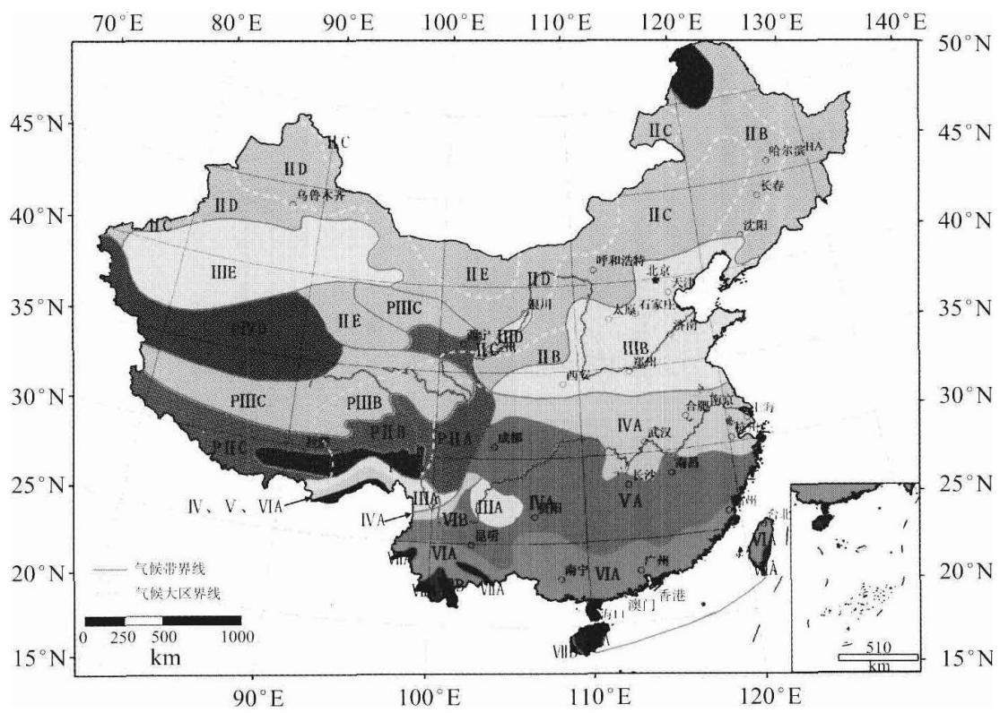  
图1.6 中国气候区划图

## （三）气候分区与区域土壤侵蚀特征

土壤侵蚀的外营力主要包括降雨及其产生的径流、降雪融化径流和风。从这个意义上说，气候因子是土壤侵蚀发生与发展的主要动力因子，它与下垫面不同地貌、土壤、植被及人类活动的结合，形成了不同区域各具特色的土壤侵蚀特征。如东部水蚀为主的水蚀类型区，西北风蚀为主的风蚀类型区，青藏高原冻融侵蚀为主的冻融侵蚀类型区。

中国气候区划的二级区划指标干燥度系数将同一气候带划分为5种气候类型（表1.6），这同时也基本反映了气候因子对于土壤侵蚀的主导作用，湿润和半湿润地区年降水量在600～800mm以上，以水力侵蚀为主。半干旱地区春季气温回升迅速，风日多，风速大，吹蚀干燥的地表，产生强烈的风蚀；夏季降雨集中，又易产生水蚀，形成风力侵蚀和水力侵蚀复合作用及交错分布的区域。干旱和极干旱地区由于干燥多风，风速大，以风力侵蚀为主。青藏高原和东北高纬度的寒温带地区，存在常年或季节冻土层，春季开始，表土层融化，底土层尚在冻结，加上融雪径流的作用，形成以冻融侵蚀为主的侵蚀类型。如果以气候区划的2级指标干燥度系数为依据，结合区域土壤侵蚀特征，可以根据气候因子指标将全国划分为四大土壤侵蚀类型区（表1.8，图1.7）：水力侵蚀区、风蚀水蚀交错区、风力侵蚀区和冻融侵蚀区。考虑到寒温带地区面积小，将冻融侵蚀区限于青藏高原，可以海拔高度3000m为界限。值得注意的是，青藏高原内部由于水分分异显著，水力侵蚀、风力侵蚀、冻融侵蚀共存，主要是依据区域整体性和连续性原则，强调其主体特征。

表1.8 土壤侵蚀类型区的气候因子指标与划分
<table><tr><td rowspan=1 colspan=1>土壤侵蚀类型区</td><td rowspan=1 colspan=1>年干燥度系数/海拔高度</td><td rowspan=1 colspan=1>包含的气候大区</td></tr><tr><td rowspan=1 colspan=1>水力侵蚀区</td><td rowspan=1 colspan=1>&lt;1.6</td><td rowspan=1 colspan=1>IA, IB; IIA, IIB; IIIA, IIIB;IVA; VA; VIA, VIB; VIIA,VIIB; VIIIA; IXA</td></tr><tr><td rowspan=1 colspan=1>风蚀、水蚀交错区</td><td rowspan=1 colspan=1>1.6~3.5</td><td rowspan=1 colspan=1>IIC</td></tr><tr><td rowspan=1 colspan=1>风力侵蚀区</td><td rowspan=1 colspan=1>&gt;3.5</td><td rowspan=1 colspan=1>IID, IIE;IIID,IIIE</td></tr><tr><td rowspan=1 colspan=1>冻融侵蚀区</td><td rowspan=1 colspan=1>海拔高度&gt;3000m</td><td rowspan=1 colspan=1>高原气候区</td></tr></table>

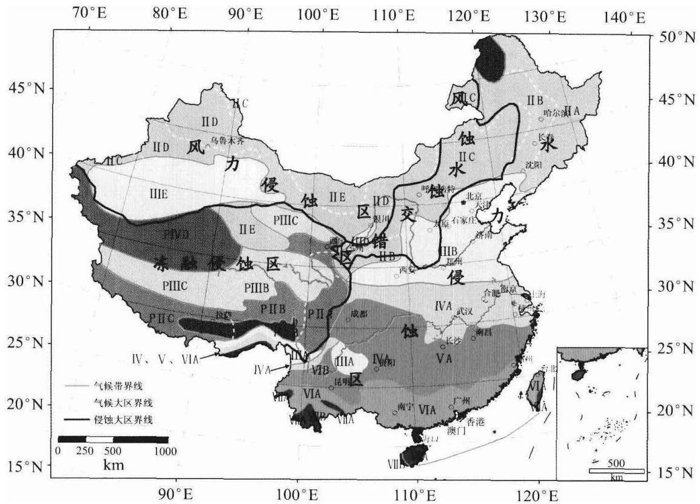  
图1.7 中国土壤侵蚀类型分区（根据气候因子划分）

## 三、降雨与土壤侵蚀

降落的雨滴具有动能，对土壤颗粒产生击溅作用，造成土壤颗粒分离，并被降雨形成的径流搬运，导致土壤侵蚀的发生。Stallings早在1957年指出，正是雨滴溅蚀规律的发现，才为人类指明了与土壤侵蚀斗争取得胜利的方向（Hudson，1995），由此也阐明了降雨在土壤侵蚀中的巨大作用。降雨只是为侵蚀的产生创造了动力条件，只有当它与被侵蚀对象土壤，以及其他因素共同作用时，才发生真正意义上侵蚀，因此主要分析我国降雨对土壤侵蚀的潜在影响。

## （一）年降水量与降水季节分配

全国年降水量由东南向西北递减（图1.8)，等值量线大致呈东北西南走向。东南沿海地区年降水量在1500mm以上，两广沿海及海南年降水量可大于2000mm。年降水量最少地区位于西北柴达木盆地、塔里木盆地和吐鲁番盆地。年降水量不足50mm。500mm等水量线可作为全国湿润和干旱地区的分界线，大致沿大兴安岭、燕山、太行山、吕梁山向西南到西藏东南部。此外受地形影响，在一些山区形成高降水中心。全国年降水量大致分布如下（不包括高山降水）：东南及华南沿海丘陵地区为1500～2000mm以上，长江中下游在1250mm左右，淮河及秦岭山地在750～1000mm之间，黄河下游、渭河流域及海河流域为500～750mm。东北地区以小兴安岭为界，以西小于500mm，以东在500mm以上，长白山脉南部达1000mm以上。内蒙古及河西走廊一般小于250mm。四川盆地年降水量在1000～1200mm，云贵高原除北部地区在750～1000mm，其他地区都在1000～1500mm以上。西藏年降水量差异大，从东南的4000mm多（我国降水量最多地区）到藏北的100mm以下。新疆中部天山和阿尔泰山年降水量可达500mm以上，但南北疆有明显差异：南疆大部分地区小于100mm，北疆可达100\~300 mm。

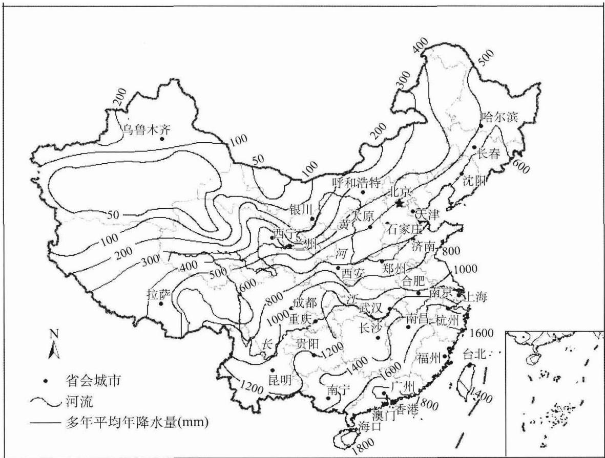  
图1.8 中国年降水量等值线图

全国大部分地区降水都集中在夏季，随着夏季风由南向北推进，主要降雨带向北推移。春季（3～5月）降水量所占比重最大地区位于华南及长江中下游地区，占全年降雨量的30%～40%。夏季（6～8月）是全国大部分地区降雨量最多季节，除长江下游地区因受副热带高压控制，降雨量小于年降水量的40%外，其他地区都在40%以上，其中华北、东北大于60%～70%，青藏高原大部分地区大于70%。秋季（9～11月）降雨量所占比重大的地区主要位于西南云贵高原、四川盆地西部，渭河中游和汉水上游地区，可占年降水量的20%～30%。其余地区秋季降雨量都在15%～20%以下。冬季是全国降水量最少季节，除长江中下游及其以南地区和新疆北部在10%以上外，其他大部分地区都在10%以下。

## （二）降雨强度特征

我国气象上根据日雨量大小将降雨分为不同的等级：日雨量小于10mm为小雨，10～25mm为中雨，25～50mm为大雨，50～100mm为暴雨，100～200mm为大暴雨，大于200mm为特大暴雨。根据我们的研究，当日雨量在10mm以上时，容易发生侵蚀，称之为侵蚀性降雨，因此，主要分析我国侵蚀性降雨（日雨量>10mm和25mm）、暴雨（日雨量>50mm）和大暴雨（日雨量>100mm）的基本特征。

## 1. 不同等级降雨日数

全国各个等级日降雨量日数与年降水量有着相同的分布趋势，从东南向西北方向各等级雨日数呈减少趋势。全年日雨量≥10mm的日数除西北干旱区外，全国大部分地区为5～45天（图1.9a)：从长江以南地区的45天向西北方向递减到5天以下。其中东北地区为10～15天，华北及黄土高原地区为15～20天，淮河流域及四川盆地为25～35天，云贵高原又是一个高雨日地区，为35～45天，青藏高原由东南的25天递减到藏西北的5天。全年日降雨量≥25mm的日数为0～18天，较≥10mm日数明显减少（图1.9b)；长江以南地区在12～18天以上，北方地区一般不到10天。全年日降雨量≥50mm的暴雨日数除广西和广东南部小部分地区10～20天外，全国大部地区都不足10天，长江流域一般为5～10天（图1.9c）。西北地区多年平均出现暴雨的日数为0。出现1天的等值线大致与年降水量500mm的等值线相当。全年日降雨量≥100mm的大暴雨仅为1～8天（图1.9d）。其中东北、华北、四川盆地和西南云贵高原为1～2天，长江中下游地区为4～6天，南岭以南地区6～8天。不同等级降雨日数与几条重要的年降水量等值线有着很好的对应关系（表1.9）。

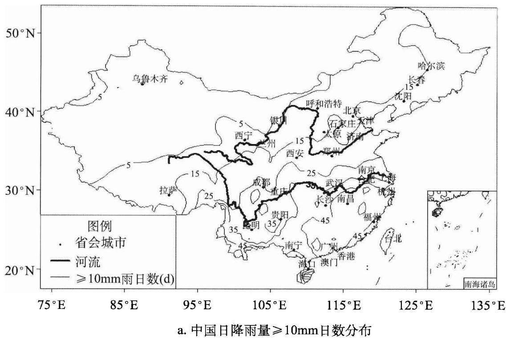

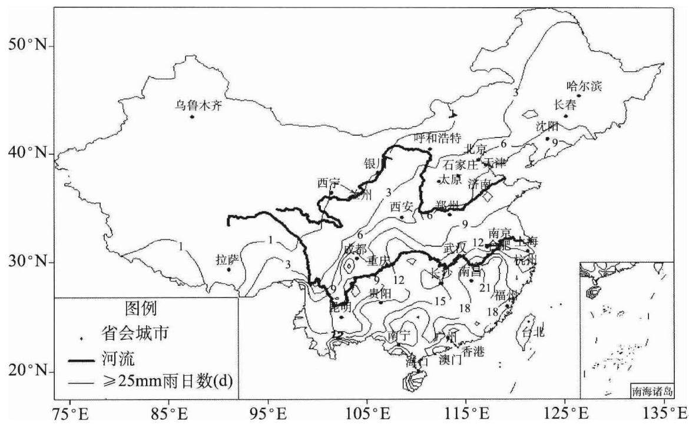  
b. 中国日降雨量≥25mm日数分布

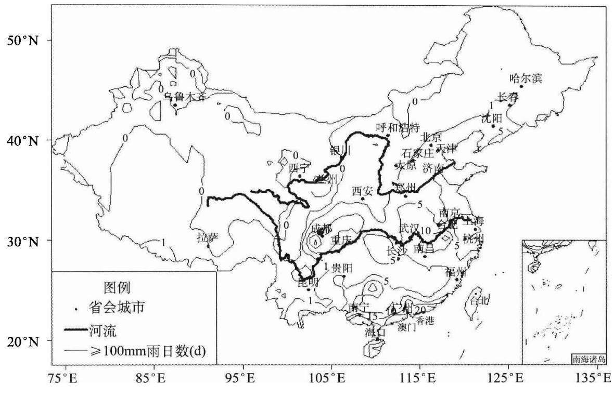  
c.中国日降雨量≥50mm日数分布

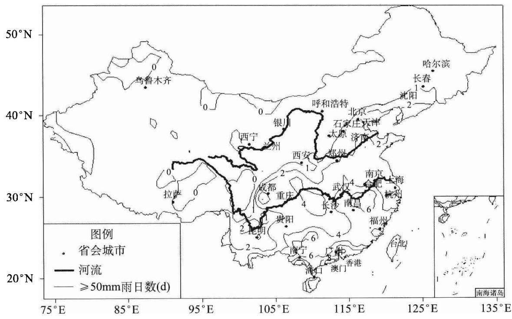  
d.中国日降雨量≥100mm日数分布  
图1.9 中国不同等级日降雨量日数分布图

表1.9 不同等级降雨日数与年降水量界线的对应关系
<table><tr><td rowspan=1 colspan=1>年降水量/mm</td><td rowspan=1 colspan=1>界线</td><td rowspan=1 colspan=1>日雨量≥10 mm 日数/d|</td><td rowspan=1 colspan=1>日雨量≥25 mm 日数/d</td><td rowspan=1 colspan=1>日雨量≥50 mm 日数/d</td><td rowspan=1 colspan=1>日雨量≥100 mm日数/d</td></tr><tr><td rowspan=1 colspan=1>200</td><td rowspan=1 colspan=1>二连浩特—河套—银川兰州以北—河西走廊柴达木盆地东缘一昆仑山北侧</td><td rowspan=1 colspan=1>5</td><td rowspan=1 colspan=1>1</td><td rowspan=1 colspan=1>0</td><td rowspan=1 colspan=1>0</td></tr><tr><td rowspan=1 colspan=1>400</td><td rowspan=1 colspan=1>大兴安岭一阴山一吕梁山—黄土高原中部—兰州—湟水谷地—昆仑山北侧</td><td rowspan=1 colspan=1>15</td><td rowspan=1 colspan=1>3~5</td><td rowspan=1 colspan=1>1</td><td rowspan=1 colspan=1>0</td></tr><tr><td rowspan=1 colspan=1>1000</td><td rowspan=1 colspan=1>淮河—汉水一川西—雅碧江—金沙江—澜沧江青藏高原东南</td><td rowspan=1 colspan=1>25</td><td rowspan=1 colspan=1>10~12</td><td rowspan=1 colspan=1>5</td><td rowspan=1 colspan=1>4</td></tr><tr><td rowspan=1 colspan=1>1400</td><td rowspan=1 colspan=1>武夷山—南岭—南宁</td><td rowspan=1 colspan=1>40~45</td><td rowspan=1 colspan=1>18</td><td rowspan=1 colspan=1>5~20</td><td rowspan=1 colspan=1>6~8</td></tr></table>

## 2. 不同发生频率的降雨强度

降雨强度是指单位时间的雨量。根据应用目的不同，可选择不同的时段。如一次降雨的平均雨强，一次降雨过程中最大时段如5、10、30、60min雨强等。日雨量可以看作是24h平均雨强。各地区不仅日雨量差异大，即使同一地区在不同季节的日雨量差异也很大。为了反映各地区日雨量状况，用重现期日雨量表示全国降雨强度变化。分别采用2年、5年、10年和100年一遇的日雨量，代表降雨强度（图1.9）。全国2年一遇日雨量为1～4mm，小于侵蚀性降雨（10mm/d）（图1.10a）。5年一遇日降雨为3～18 mm（图1.10b)，其中10 mm/d等值线大致与500mm年降水量等值线相当，该线以东地区出现水蚀的概率大大高于以西地区。全国10年一遇日雨量为6～34mm（图1.10c），100年一遇日雨量为25～100mm（图1.10d)。

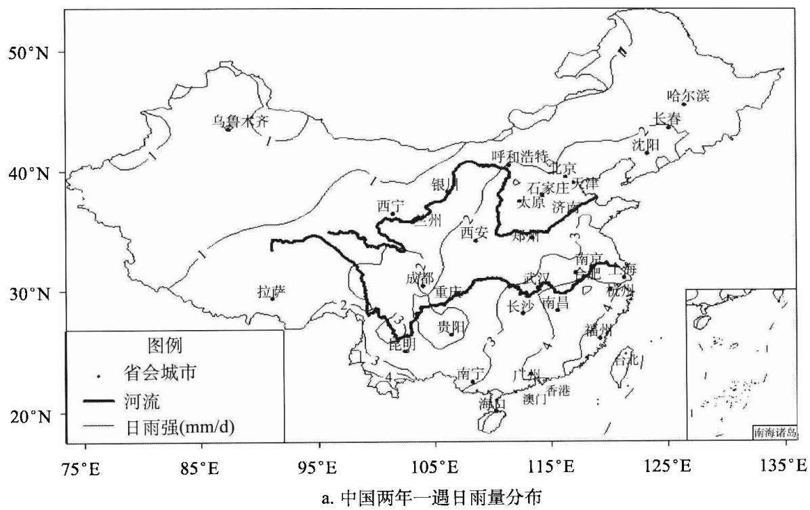

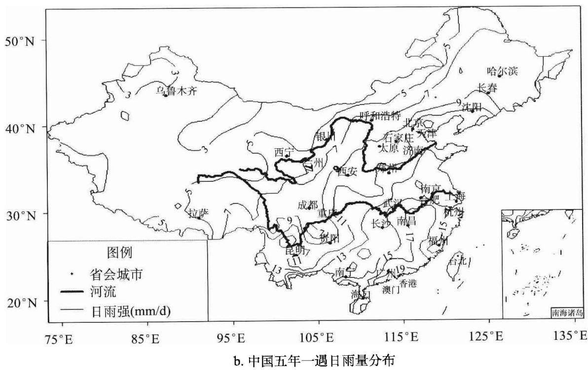

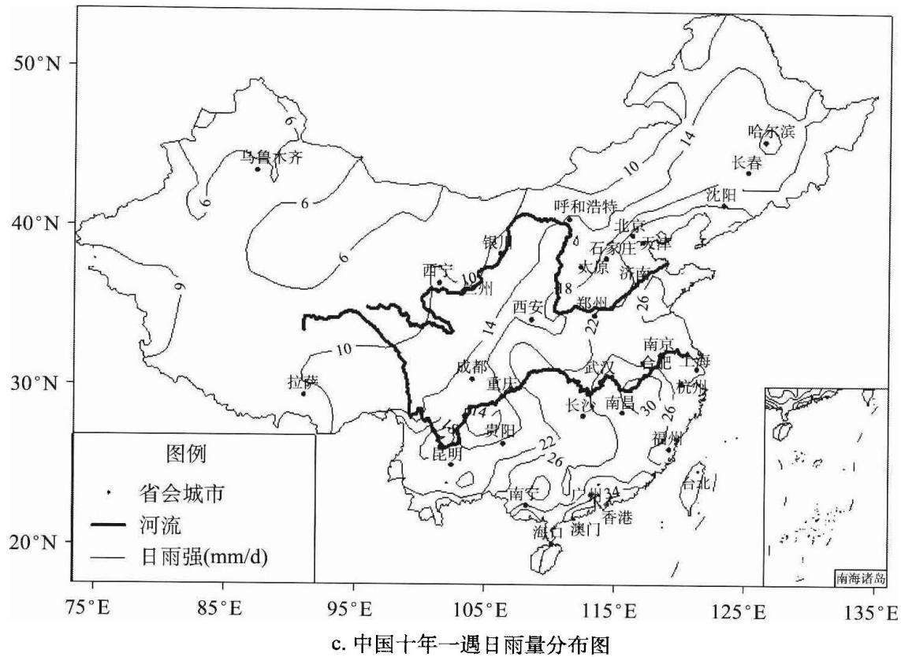

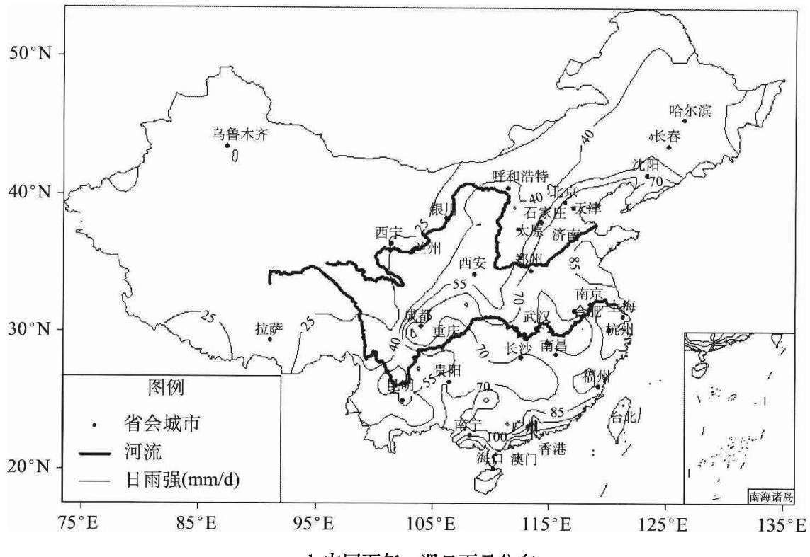  
d. 中国百年一遇日雨量分布  
图1.10 中国不同重现期日雨量分布图

## （三）年降雨侵蚀力

降雨产生土壤侵蚀的能力用降雨侵蚀力表示，它是描述降雨造成土壤侵蚀潜在能力的定量指标。Wischmeier（1958）经过对多个变量及其组合与土壤流失量的相关分析，得出降雨侵蚀力的定量指标是EI30：一次降雨总动能E与该次降雨最大30min雨强的乘积。这一指标被应用到通用土壤流失方程，预报多年平均土壤流失量。我国许多学者根据径流小区侵蚀和降雨资料的分析研究，得出 $\mathrm { E I _ { 3 0 } }$ 指标在我国基本上适用的结论。由于计算该指标所需要的降雨过程资料不易获得，许多学者研究了用常规降雨资料计算降雨侵蚀力的简易算法。图1.11是利用全国2186个气象站1961\~1990年30年平均年降水资料计算的降雨侵蚀力等值线图。计算公式如下：

$$
R = 0 . 0 6 6 8 P ^ { 1 . 6 2 6 6 }
$$

式中，R是年降雨侵蚀力 $[ \mathrm { M J \bullet \ m m / ( h m ^ { 2 } \bullet \ h \bullet \ a } ]$ ；P是年降雨量（mm)。

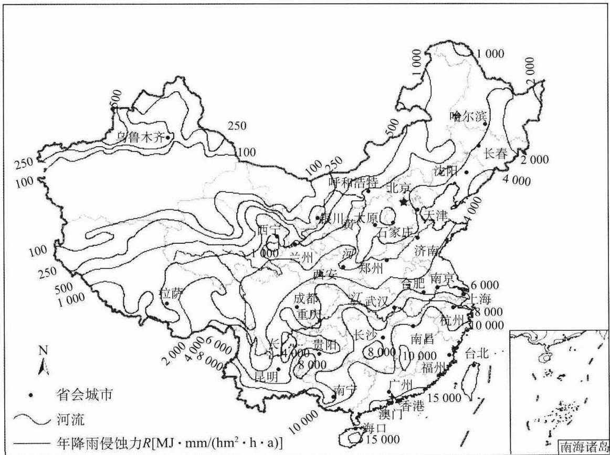  
图1.11 中国降雨侵蚀力等值线图

全国年降雨侵蚀力为 $\mathrm { 1 0 0 { \sim } 1 5 0 0 0 ~ M J ~ { \bullet } ~ \mathrm { m m / ( h m ^ { 2 } ~ { \bullet } ~ h ~ { \bullet } ~ { a } ) } }$ (图1.11)，与年降水量具有相同的空间分布形式：从东南向西北方向递减，东南沿海地区可达到 $\mathrm { 1 0 ~ 0 0 0 { \sim } 1 5 ~ 0 0 0 ~ M J ~ \bullet ~ m m / ( h m ^ { 2 } ~ \bullet ~ h ~ \bullet ~ a ) }$ ，西北地区仅为100～500MJ·$\mathrm { m m } / ( \mathrm { h m ^ { 2 } \cdot h \cdot a } )$ 。年降水量400 mm等值线大致与年降雨侵蚀力1000MJ$\mathrm { m m } / ( \mathrm { h m ^ { 2 } \cdot h \cdot a } )$ 等值线相当。降雨侵蚀力高的地区具有高的侵蚀危险性，但自然情况下，这些地区也是植被生长茂密地区，对土壤起到了保护作用，因而在自然状态下，半湿润和半干旱地区由于植被覆盖相对较差而具有更大的侵蚀危险性。但在湿润地区，一旦植被遭到破坏，将使侵蚀强度大大增加。因此，在高降雨侵蚀力地区，必须对坡耕地采取必要的水土保持措施，以最大程度地减缓由于人类活动导致的加速土壤侵蚀过程。

## 四、风力与土壤侵蚀

风将土壤颗粒或地表物质吹起，并进行搬运，是土壤侵蚀的又一动力因子。此外，地表物质颗粒组成及其松散程度会进一步影响风蚀过程，而后者与干燥程度有密切关系，因此风蚀往往出现在半干旱或干旱地区。我国大风和干旱半干旱地区都主要位于西北。全国年平均风速1.2～3.6m/s，西北风力侵蚀区除新疆西北隅外，都在3.0m/s以上（图1.12）。该地区的年平均

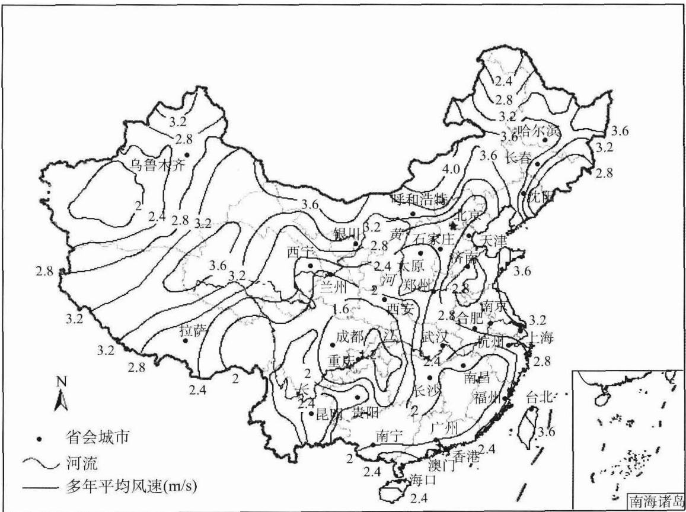  
图1.12 全国年平均风速等值线图

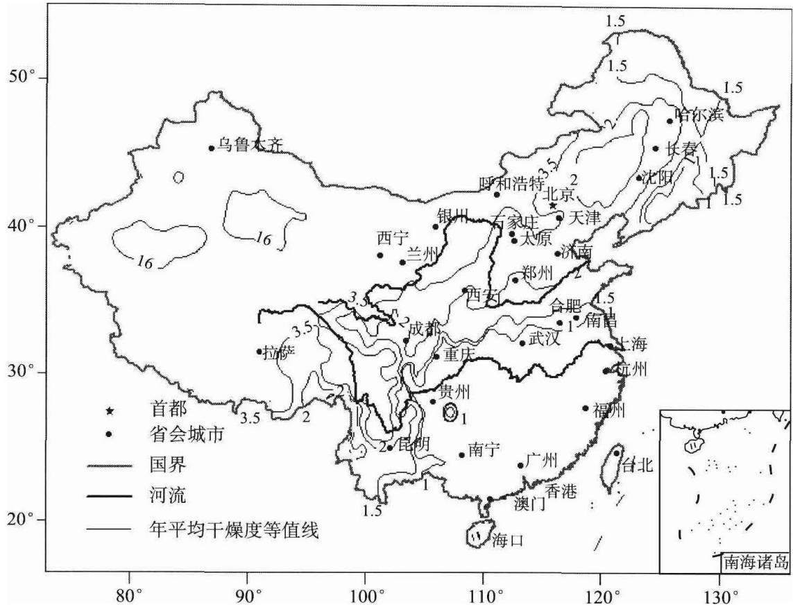  
图1.13 中国年平均干燥度指数等值线图

干燥度指数绝大部分在3.5以上（图1.13)。为了定量刻划气候因子对风蚀的影响程度，一般采用风蚀气候因子。它反映了风力与干旱程度导致土壤侵蚀发生的潜在能力。目前应用比较广泛的风蚀气候因子采用以下公式计算(Chepil et al. , 1962) :

$$
C = { \frac { 3 8 6 7 u ^ { 3 } } { \left[ \sum \left( { \frac { P } { 1 . 8 t + 2 2 } } \right) ^ { 9 / 1 0 } \right] ^ { 2 } } }
$$

式中，C是风蚀气候因子（%）；当C值大于100%时，表示风蚀容易发生，并且随数值增大，风蚀能力增加；u是年平均风速（m/s)；P是月降水量(mm)；t是月平均气温（℃)；式中系数是单位转换系数；∑表示一年12个月的累加值。根据这一公式，计算了我国风蚀气候因子值，并绘制了等值线图（图1.14)。C因子为100%的等值线大致与年降水量200 mm等值线相当，以西大于100%的地区是我国风力侵蚀区，20%\~100%之间的区域基本与风力水力侵蚀交错区对应，小于20%的区域是水力侵蚀区。

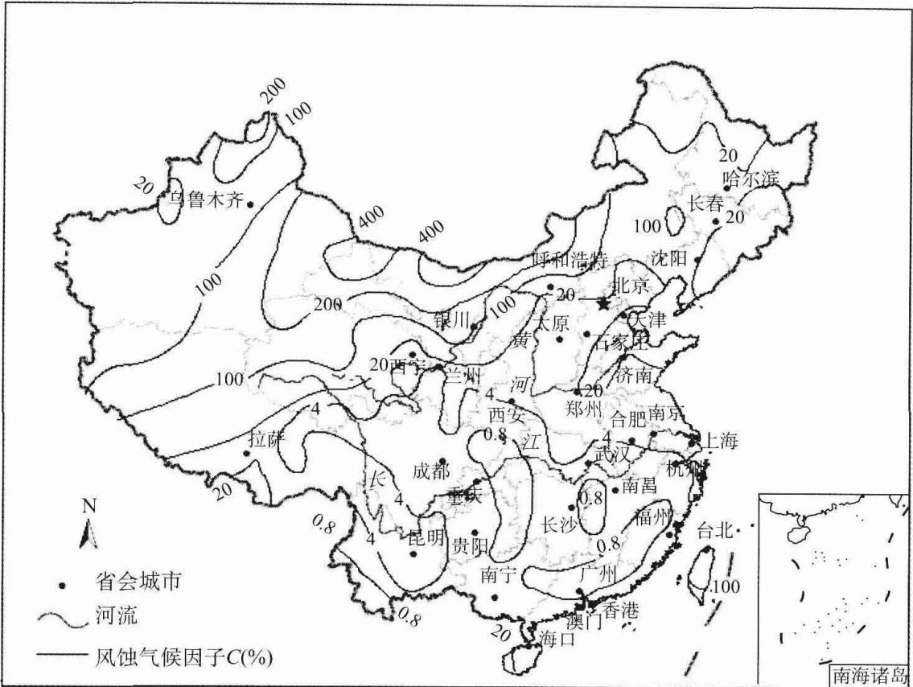  
图1.14 中国风蚀气候因子等值线图

## 第三节 水文与水资源

我国水系众多，径流资源丰富，流域面积在10万km²以上的大江大河有12条，依次为长江、黑龙江、塔里木河、黄河、松花江、珠江、淮河、海河、雅鲁藏布江、辽河、澜沧江、怒江。受气候和地形因素的影响，河流的地域分布很不均匀。在受夏季季风影响显著的地区，河流众多且多为直接注入海洋的外流河，而不受或受夏季季风影响微弱的地区，河流稀少且多为内陆河。主要河流特征及年径流量见表1.10（陈家琦等，2002）。

## 一、河流与水系

按照河川径流的循环形式，可把河流分成直接注入海洋的外流河和不与海洋沟通的内陆河两大类型。我国外流河流域约占全国总面积的64%，内陆河流域占全国总面积的36%。内外流域的分界线为大兴安岭西麓一内蒙古高原南缘一阴山山脉一贺兰山一祁连山一日月山一巴颜喀拉山一念青唐古拉山

表1.10 中国主要河流特征和年径流量
<table><tr><td rowspan=1 colspan=1>河流名称</td><td rowspan=1 colspan=1>流域面积/km²</td><td rowspan=1 colspan=1>河长/km</td><td rowspan=1 colspan=1>年径流量/10⁸m³</td><td rowspan=1 colspan=1>注入</td></tr><tr><td rowspan=1 colspan=1>长江</td><td rowspan=1 colspan=1>1 808 500</td><td rowspan=1 colspan=1>6 300</td><td rowspan=1 colspan=1>9 755</td><td rowspan=1 colspan=1>东海</td></tr><tr><td rowspan=1 colspan=1>黄河</td><td rowspan=1 colspan=1>752 443</td><td rowspan=1 colspan=1>5 464</td><td rowspan=1 colspan=1>592</td><td rowspan=1 colspan=1>渤海</td></tr><tr><td rowspan=1 colspan=1>黑龙江(中国境内)</td><td rowspan=1 colspan=1>1 620 710(903 418)</td><td rowspan=1 colspan=1>3420</td><td rowspan=1 colspan=1>3 460(1 166)</td><td rowspan=1 colspan=1>鞑靼海峡</td></tr><tr><td rowspan=1 colspan=1>松花江</td><td rowspan=1 colspan=1>557 180</td><td rowspan=1 colspan=1>2 308</td><td rowspan=1 colspan=1>742</td><td rowspan=1 colspan=1>黑龙江</td></tr><tr><td rowspan=1 colspan=1>珠江</td><td rowspan=1 colspan=1>453 690</td><td rowspan=1 colspan=1>2 214</td><td rowspan=1 colspan=1>3 360</td><td rowspan=1 colspan=1>南海</td></tr><tr><td rowspan=1 colspan=1>雅鲁藏布江</td><td rowspan=1 colspan=1>240 480</td><td rowspan=1 colspan=1>2 057</td><td rowspan=1 colspan=1>1654</td><td rowspan=1 colspan=1>孟加拉湾</td></tr><tr><td rowspan=1 colspan=1>塔里木河</td><td rowspan=1 colspan=1>194 210</td><td rowspan=1 colspan=1>2 046</td><td rowspan=1 colspan=1>205</td><td rowspan=1 colspan=1>台特马湖</td></tr><tr><td rowspan=1 colspan=1>澜沧江</td><td rowspan=1 colspan=1>167 486</td><td rowspan=1 colspan=1>1 826</td><td rowspan=1 colspan=1>760</td><td rowspan=1 colspan=1>南海</td></tr><tr><td rowspan=1 colspan=1>怒江</td><td rowspan=1 colspan=1>137 818</td><td rowspan=1 colspan=1>1 659</td><td rowspan=1 colspan=1>703</td><td rowspan=1 colspan=1>安达曼海</td></tr><tr><td rowspan=1 colspan=1>辽河</td><td rowspan=1 colspan=1>228 960</td><td rowspan=1 colspan=1>1 390</td><td rowspan=1 colspan=1>148</td><td rowspan=1 colspan=1>渤海</td></tr><tr><td rowspan=1 colspan=1>海河</td><td rowspan=1 colspan=1>263 631</td><td rowspan=1 colspan=1>1 090</td><td rowspan=1 colspan=1>228</td><td rowspan=1 colspan=1>渤海</td></tr><tr><td rowspan=1 colspan=1>淮河</td><td rowspan=1 colspan=1>269 283</td><td rowspan=1 colspan=1>1 000</td><td rowspan=1 colspan=1>611</td><td rowspan=1 colspan=1>长江</td></tr><tr><td rowspan=1 colspan=1>滦河</td><td rowspan=1 colspan=1>44 900</td><td rowspan=1 colspan=1>877</td><td rowspan=1 colspan=1>48</td><td rowspan=1 colspan=1>渤海</td></tr></table>

冈底斯山一线，此线以东，除在鄂尔多斯高原、松嫩平原及雅鲁藏布江南侧等地区存在面积不大的内陆区外，河流分别注入太平洋和印度洋，全部属于外流河。此线以西的河流基本都属于内陆河，只有额尔齐斯河最终注入北冰洋，属于外流河。

在我国外流河流域，以太平洋流域最大，约占全国总面积的57%，占外流河流域面积的89%。由于各河注入的海域不同，可以分为不同的海流域：鄂霍次克海流域、日本海流域、黄渤海流域、东海流域、南海流域。鄂霍次克海、日本海流域与黄渤海流域间的分界线为大兴安岭中段东南的松辽分水岭-吉林哈达岭到白头山南侧。黄渤海流域与东海流域的分水岭为黄河与长江的分水岭，西起巴颜喀拉山，向东沿西倾山、岷山、秦岭、伏牛山、大别山、淮阳丘陵直到扬州。东海和南海流域的分水岭大部分是长江与珠江的分水岭，西段为云岭，中段为苗岭，东段为南岭。

我国印度洋流域占全国总面积的6.5%，分布在青藏高原的东南部、南部和西南，东以唐古拉山、他念他翁山、怒山与太平洋流域分界。属于印度洋的各个河流，下游都流出国外，经各个邻国分别注入印度洋不同海域。属于北冰洋流域的额尔齐斯河，流域面积占全国总面积0.5%，注入北冰洋的喀拉海。

我国水系分布极不均匀，绝大多数河流分布在东南部外流河流域（图1.15、表1.11)。内陆河流域河流很少，尤其在内蒙古高原及新疆南、北盆地的广大地区，地表没有河流。我国东南部受东南季风和西南季风气候的影响，降水丰沛，径流量大，加之地形起伏大，为河流发育及庞大水系的形成创造了基本条件。西北地区降水稀少，径流贫乏，蒸发强烈，水系的发育受到很大限制。

我国水力侵蚀为主的河流以外流河为主。其干流主要发源于三大阶梯隆起带上：第一带是青藏高原的东南边缘；第二带是第二阶梯边缘的隆起带，即大兴安岭、冀晋山地、豫西山地和云贵高原一带；第三带是长白山地、山东丘陵和东南沿海山地丘陵。受西高东低地貌形态的影响，大多数外流河都呈自西向东的流向。从半干旱区逐渐流向半湿润和湿润区，河网密度和河川径流逐渐增加。

表1.11 中国河川流域面积
<table><tr><td rowspan=1 colspan=3>流域</td><td rowspan=1 colspan=1>流域面积/km²</td><td rowspan=1 colspan=1>占全国总面积1%</td><td rowspan=1 colspan=1>主要河流</td></tr><tr><td rowspan=12 colspan=1>外流流域</td><td rowspan=7 colspan=1>太平洋</td><td rowspan=1 colspan=1>鄂霍次克海</td><td rowspan=1 colspan=1>861 151</td><td rowspan=1 colspan=1>8.97</td><td rowspan=1 colspan=1>黑龙江</td></tr><tr><td rowspan=1 colspan=1>日本海</td><td rowspan=1 colspan=1>32 565</td><td rowspan=1 colspan=1>0.34</td><td rowspan=1 colspan=1>图们江、绥芬河</td></tr><tr><td rowspan=1 colspan=1>黄海、渤海</td><td rowspan=1 colspan=1>1 670 042</td><td rowspan=1 colspan=1>17.4</td><td rowspan=1 colspan=1>鸭绿江、辽河、滦河、海河</td></tr><tr><td rowspan=1 colspan=1>东海</td><td rowspan=1 colspan=1>2 044 741</td><td rowspan=1 colspan=1>21.3</td><td rowspan=1 colspan=1>长江、钱塘江、闽江等</td></tr><tr><td rowspan=1 colspan=1>南海</td><td rowspan=1 colspan=1>824 984</td><td rowspan=1 colspan=1>8.59</td><td rowspan=1 colspan=1>韩江、珠江、元江、澜仓江</td></tr><tr><td rowspan=1 colspan=1>直接注入太平洋</td><td rowspan=1 colspan=1>11 112</td><td rowspan=1 colspan=1>0.11</td><td rowspan=1 colspan=1>台湾东部的河流</td></tr><tr><td rowspan=1 colspan=1>小计</td><td rowspan=1 colspan=1>5 444 595</td><td rowspan=1 colspan=1>56.71</td><td rowspan=1 colspan=1></td></tr><tr><td rowspan=3 colspan=1>印度洋</td><td rowspan=1 colspan=1>安达曼海、孟加拉湾</td><td rowspan=1 colspan=1>558 305</td><td rowspan=1 colspan=1>5.83</td><td rowspan=1 colspan=1>怒江、雅鲁藏布江等</td></tr><tr><td rowspan=1 colspan=1>阿拉伯海</td><td rowspan=1 colspan=1>66 270</td><td rowspan=1 colspan=1>0.69</td><td rowspan=1 colspan=1>狮泉河、象泉河等</td></tr><tr><td rowspan=1 colspan=1>小计</td><td rowspan=1 colspan=1>624 575</td><td rowspan=1 colspan=1>6.52</td><td rowspan=1 colspan=1></td></tr><tr><td rowspan=1 colspan=1>北冰洋</td><td rowspan=1 colspan=1>喀拉海</td><td rowspan=1 colspan=1>50 860</td><td rowspan=1 colspan=1>0.53</td><td rowspan=1 colspan=1>额尔齐斯河</td></tr><tr><td rowspan=1 colspan=1>合计</td><td rowspan=1 colspan=1></td><td rowspan=1 colspan=1>6 120 030</td><td rowspan=1 colspan=1>63.76</td><td rowspan=1 colspan=1></td></tr><tr><td rowspan=5 colspan=1>内陆流域</td><td rowspan=1 colspan=2>内蒙古地区</td><td rowspan=1 colspan=1>328 740</td><td rowspan=1 colspan=1>3.42</td><td rowspan=5 colspan=1></td></tr><tr><td rowspan=1 colspan=2>甘、新、柴达木地区</td><td rowspan=1 colspan=1>2 374 112</td><td rowspan=1 colspan=1>24.73</td></tr><tr><td rowspan=1 colspan=2>藏北及藏南地区</td><td rowspan=1 colspan=1>728 898</td><td rowspan=1 colspan=1>7.59</td></tr><tr><td rowspan=1 colspan=2>松花江内陆区</td><td rowspan=1 colspan=1>48 220</td><td rowspan=1 colspan=1>36.50</td></tr><tr><td rowspan=1 colspan=2>合计</td><td rowspan=1 colspan=1>3 479 970</td><td rowspan=1 colspan=1>36.24</td></tr><tr><td rowspan=1 colspan=3>合计</td><td rowspan=1 colspan=1>9 600 000</td><td rowspan=1 colspan=1>100</td><td rowspan=1 colspan=1></td></tr></table>

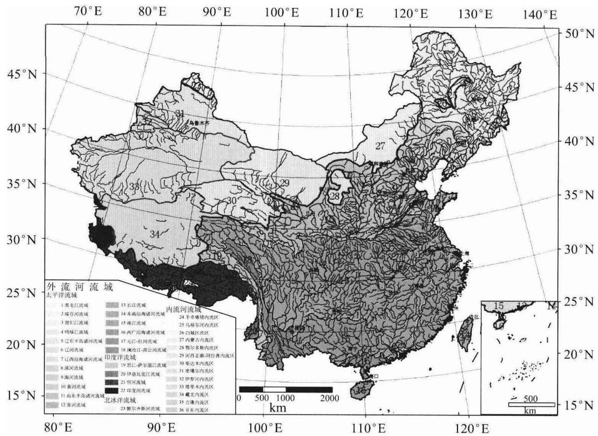  
图 1.15 中国水系流域图

受河流地貌、地质、气候、土壤、植被及人类活动等因素的综合影响，各流域的水文水资源独具特征，导致其水土流失发生发展规律、水土流失危害及其治理途径各不相同。为了有效开展水土保持工作，水利部选择了土壤侵蚀比较严重且治河任务比较艰巨的七大流域（表1.12）进行系统规划，设置了长江、黄河、松辽、海滦河、淮河、珠江6个水利委员会，分别管理其流域范围内的江河治理和水土保持工作（唐克丽，2004）。

表1.12 我国七大江河的流域特征
<table><tr><td colspan="1" rowspan="1">流域名称</td><td colspan="1" rowspan="1">干流长/km</td><td colspan="1" rowspan="1">流域面积/km²</td><td colspan="1" rowspan="1">年降水量/mm</td><td colspan="1" rowspan="1">年降水量总量/亿m³</td><td colspan="1" rowspan="1">年均径流量 $/ \Omega m ^ { 3 }$ </td></tr><tr><td colspan="1" rowspan="1">松花江</td><td colspan="1" rowspan="1">2308</td><td colspan="1" rowspan="1">557180</td><td colspan="1" rowspan="1">526.8</td><td colspan="1" rowspan="1">2935</td><td colspan="1" rowspan="1">762</td></tr><tr><td colspan="1" rowspan="1">辽河</td><td colspan="1" rowspan="1">1390</td><td colspan="1" rowspan="1">228960</td><td colspan="1" rowspan="1">472.6</td><td colspan="1" rowspan="1">1082</td><td colspan="1" rowspan="1">148</td></tr><tr><td colspan="1" rowspan="1">海滦河</td><td colspan="1" rowspan="1">1967</td><td colspan="1" rowspan="1">318161</td><td colspan="1" rowspan="1">742.9</td><td colspan="1" rowspan="1">1774</td><td colspan="1" rowspan="1">288</td></tr><tr><td colspan="1" rowspan="1">黄河</td><td colspan="1" rowspan="1">5464</td><td colspan="1" rowspan="1">794712</td><td colspan="1" rowspan="1">464.4</td><td colspan="1" rowspan="1">3691</td><td colspan="1" rowspan="1">658</td></tr><tr><td colspan="6" rowspan="1"></td></tr><tr><td colspan="1" rowspan="1">流域名称</td><td colspan="1" rowspan="1">干流长/km</td><td colspan="1" rowspan="1">流域面积/km²</td><td colspan="1" rowspan="1">年降水量/mm</td><td colspan="1" rowspan="1">年降水量总量/亿m³</td><td colspan="1" rowspan="1">年均径流量/亿m³</td></tr><tr><td colspan="1" rowspan="1">淮河</td><td colspan="1" rowspan="1">1000</td><td colspan="1" rowspan="1">269283</td><td colspan="1" rowspan="1">888.7</td><td colspan="1" rowspan="1">2390</td><td colspan="1" rowspan="1">622</td></tr><tr><td colspan="1" rowspan="1">长江</td><td colspan="1" rowspan="1">6300</td><td colspan="1" rowspan="1">1808500</td><td colspan="1" rowspan="1">1070.5</td><td colspan="1" rowspan="1">19360</td><td colspan="1" rowspan="1">9513</td></tr><tr><td colspan="1" rowspan="1">珠江</td><td colspan="1" rowspan="1">2214</td><td colspan="1" rowspan="1">453690</td><td colspan="1" rowspan="1">1469.3</td><td colspan="1" rowspan="1">6528</td><td colspan="1" rowspan="1">3338</td></tr></table>

## 二、河川径流的时空分布特征

## (一)时间分布特征

我国河川径流和水资源在时间分布上存在着明显的不均匀性，无论年内分配还是年际变化都是如此。由于受季风气候影响，降水量年内分配不均匀，主要集中在夏季。冬季是我国河川径流最为枯竭的季节，北方的河流因气候严寒和受冰冻的影响，冬季径流量大部分不及全年的5%，其中黑龙江省北部和西北地区的沙漠和盆地地区的河流不及全年的2%。南方冬季降水相对于北方虽然较多，但只有少数地区大于全年的10%。

春季是我国河川径流逐渐增加的季节，但不同地区增加的幅度相差悬殊。东北和新疆北部的部分地区因融雪和解冻形成显著的春汛，一般可占全年的20%～25%，而内蒙有些地区春季径流可以占全年的30%～40%以上，是径流最为丰富的季节。南方丘陵地带，因雨季开始，径流量显著增加，可占全年的40%左右。西南地区因受西南季风的影响，存在明显的春旱。

夏季是我国河川径流最为丰沛的季节。受东南和西南季风的影响，夏季我国季风地区降水量迅速增加，南方地区夏季径流量可占全年的40%～50%，西南地区可以占全年径流的50%～60%。北方地区因降水集中，夏季径流可达50%，有的地区可以达到70%以上。

秋季是我国河川径流逐渐消退的季节，全国大部分地区秋季的径流量占全年径流量的20%～30%，南方部分地区存在秋旱。海南是我国秋季径流最多的地区，秋季径流可占全年径流总量的50%左右（图1.16)。

受河川径流量、河流补给类型及流域面积大小的影响，河川径流存在明显的年际变化。一般而言，河川径流越大，年际变化越小；以地下水和积雪融化补给的河流，年际变化小；流域面积越大则河川径流越稳定，年际变化小。

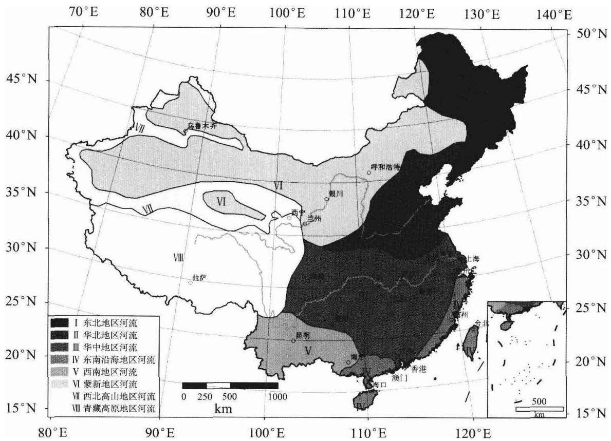  
图1.16 中国河川动态类型图

河川径流的年际变化通常用年径流变差系数 $( C _ { \bf v } )$ 来表示。在淮河和秦岭以南的广大地区， $C _ { \mathrm { v } }$ 值比较小，一般为0.3～0.4，只有几个少水地区超过0.5，也有几个多水地区小于0.2。 $C _ { \mathbf { v } }$ 值大于0.5的地区中，变化范围较大的为南阳盆地至长江中、下游平原一带， $C _ { \mathrm { v } }$ 值为0.5\~0.6，局部地区甚至超过0.6。海南西部、 $\overline { 2 }$ 贵高原中部的 $C _ { \mathrm { v } }$ 值也在0.5以上。 $C _ { \mathrm { v } }$ 值在0.2以下的地区主要包括滇东南和桂西南一带，另外川西山地、雪峰山一带的多水地区，其 $C _ { \bf v }$ 值也小于0.2。在淮河、秦岭以北的广大地区， $C _ { \mathbf { v } }$ 值在0.5～0.8变化。黄淮海平原年径流量少，降水年际变化幅度大，是我国年降水最不稳定的地区之一， $C _ { \mathrm { v } }$ 值在0.8以上，有的地区甚至达到1.0。由平原向北到燕山向西到太行山， $C _ { \mathrm { v } }$ 值逐渐下降至0.6。东北的松辽平原$C _ { \mathrm { v } }$ 值也超过0.8，由此向北到大兴安岭、小兴安岭，向东到长白山 $C _ { \mathrm { v } }$ 值逐渐减小到0.3\~0.4。黄土高原地区年降水量与黄淮海平原比较接近，但由于该区降水的年际变化比较小，因此 $C _ { \mathrm { v } }$ 值在0.4～0.5。西北地区， $C _ { \mathbf { v } }$ 值的变化最大，表现出非常明显的垂直地带性规律。

年际极值比是反映年径流多年变化的重要参数，我国主要河流的极值比差异显著，最小的是怒江，仅为1.4；而最大的淮河则高达23.7（表1.13）（水利电力部，1987）。河川径流的年际变化对区域水资源开发利用、河流防洪、水利工程建设、城市供水、水土保持规划、水土保持措施效益等诸多方面都有显著影响，同时对区域水土流失也具有重要影响。最为典型的例子是，干旱年地表无法得到植被的有效保护，为强烈风力侵蚀的发生提供了便利条件，特别是干旱、半干旱的西北地区更是如此。而在降水量比较多的丰水年，暴雨偏多，土壤含水量高，地表产流量大，水力侵蚀增强。

表1.13 我国部分河流流量极值比
<table><tr><td rowspan=2 colspan=1>河流</td><td rowspan=2 colspan=1>观测站</td><td rowspan=2 colspan=1>集水面积/km²</td><td rowspan=2 colspan=1>年均流量/(m³/s)</td><td rowspan=1 colspan=2>最大年流量</td><td rowspan=1 colspan=2>最小年流量</td><td rowspan=2 colspan=1>极值比</td></tr><tr><td rowspan=1 colspan=1>数量/(m³/s)</td><td rowspan=1 colspan=1>年份</td><td rowspan=1 colspan=1>数量/(m³/s)</td><td rowspan=1 colspan=1>年份</td></tr><tr><td rowspan=1 colspan=1>松花江</td><td rowspan=1 colspan=1>哈尔滨</td><td rowspan=1 colspan=1>390 626</td><td rowspan=1 colspan=1>1 190</td><td rowspan=1 colspan=1>2 680</td><td rowspan=1 colspan=1>1932</td><td rowspan=1 colspan=1>387</td><td rowspan=1 colspan=1>1920</td><td rowspan=1 colspan=1>6.9</td></tr><tr><td rowspan=1 colspan=1>永定河</td><td rowspan=1 colspan=1>官厅</td><td rowspan=1 colspan=1>43 402</td><td rowspan=1 colspan=1>41</td><td rowspan=1 colspan=1>82</td><td rowspan=1 colspan=1>1954</td><td rowspan=1 colspan=1>13</td><td rowspan=1 colspan=1>1973</td><td rowspan=1 colspan=1>6.4</td></tr><tr><td rowspan=1 colspan=1>黄河</td><td rowspan=1 colspan=1>花园口</td><td rowspan=1 colspan=1>730 036</td><td rowspan=1 colspan=1>1 470</td><td rowspan=1 colspan=1>2 720</td><td rowspan=1 colspan=1>1964</td><td rowspan=1 colspan=1>636</td><td rowspan=1 colspan=1>1960</td><td rowspan=1 colspan=1>4.3</td></tr><tr><td rowspan=1 colspan=1>淮河</td><td rowspan=1 colspan=1>蚌埠</td><td rowspan=1 colspan=1>121 330</td><td rowspan=1 colspan=1>788</td><td rowspan=1 colspan=1>2 020</td><td rowspan=1 colspan=1>1954</td><td rowspan=1 colspan=1>85</td><td rowspan=1 colspan=1>1978</td><td rowspan=1 colspan=1>23.7</td></tr><tr><td rowspan=1 colspan=1>长江</td><td rowspan=1 colspan=1>汉口 1488</td><td rowspan=1 colspan=1>036</td><td rowspan=1 colspan=1>23 400</td><td rowspan=1 colspan=1>31 100</td><td rowspan=1 colspan=1>1954</td><td rowspan=1 colspan=1>14 400</td><td rowspan=1 colspan=1>1900</td><td rowspan=1 colspan=1>2.2</td></tr><tr><td rowspan=1 colspan=1>西江</td><td rowspan=1 colspan=1>梧州</td><td rowspan=1 colspan=1>329 705</td><td rowspan=1 colspan=1>6 990</td><td rowspan=1 colspan=1>11 000</td><td rowspan=1 colspan=1>1915</td><td rowspan=1 colspan=1>3 250</td><td rowspan=1 colspan=1>1963</td><td rowspan=1 colspan=1>3.4</td></tr><tr><td rowspan=1 colspan=1>怒江</td><td rowspan=1 colspan=1>道街坝</td><td rowspan=1 colspan=1>118 760</td><td rowspan=1 colspan=1>1 650</td><td rowspan=1 colspan=1>1 940</td><td rowspan=1 colspan=1>1962</td><td rowspan=1 colspan=1>1 380</td><td rowspan=1 colspan=1>1959</td><td rowspan=1 colspan=1>1.4</td></tr><tr><td rowspan=1 colspan=1>雅鲁藏布江</td><td rowspan=1 colspan=1>长群</td><td rowspan=1 colspan=1>106 378</td><td rowspan=1 colspan=1>532</td><td rowspan=1 colspan=1>957</td><td rowspan=1 colspan=1>1962</td><td rowspan=1 colspan=1>334</td><td rowspan=1 colspan=1>1965</td><td rowspan=1 colspan=1>2.9</td></tr></table>

（二）空间分布特征

我国河川径流和地区水资源的区域分布极不均匀，水土资源的组合很不均衡。以降水为主要补给来源的河流，降水量及其空间分布特征决定了河川径流及区域水资源的空间分布特征。根据降水量和径流深的多少可将全国分为5个不同的径流带（表1.14、图1.17、图1.18）。

表1.14我国径流带、径流深区域分布（李广贺，2002）
<table><tr><td rowspan=1 colspan=1>径流带</td><td rowspan=1 colspan=1>年降水量/mm</td><td rowspan=1 colspan=1>径流深/mm</td><td rowspan=1 colspan=1>分布地区</td></tr><tr><td rowspan=1 colspan=1>丰水带</td><td rowspan=1 colspan=1>1600</td><td rowspan=1 colspan=1>&gt;900</td><td rowspan=1 colspan=1>福建省和广东省的大部分地区、台湾省的大部分地区、江苏省和湖南省的山地、广西壮族自治区南部、云南省西南部、西藏自治区的东南部</td></tr><tr><td rowspan=1 colspan=1>多水带</td><td rowspan=1 colspan=1>800~1600</td><td rowspan=1 colspan=1>200~900</td><td rowspan=1 colspan=1>广西壮族自治区大部、四川省、贵州省、云南省大部、秦岭一淮河以南的长江中下游地区</td></tr><tr><td rowspan=1 colspan=1>过渡带</td><td rowspan=1 colspan=1>400~800</td><td rowspan=1 colspan=1>50~200</td><td rowspan=1 colspan=1>黄、淮、海平原、山西省和陕西省的大部、四川省西北部和西藏自治区东部</td></tr><tr><td rowspan=1 colspan=1>少水带</td><td rowspan=1 colspan=1>200~400</td><td rowspan=1 colspan=1> $1 0 \dot { \sim } 5 0$ </td><td rowspan=1 colspan=1>东北西部、内蒙古自治区、宁夏回族自治区、甘肃省、新疆维吾尔自治区西部和北部、西藏自治区西部</td></tr><tr><td rowspan=1 colspan=1>缺水带</td><td rowspan=1 colspan=1>&lt;200</td><td rowspan=1 colspan=1>&lt;10</td><td rowspan=1 colspan=1>内蒙古自治区西部地区和准噶尔、塔里木、柴达木三大盆地以及甘肃省北部的沙漠地区</td></tr></table>

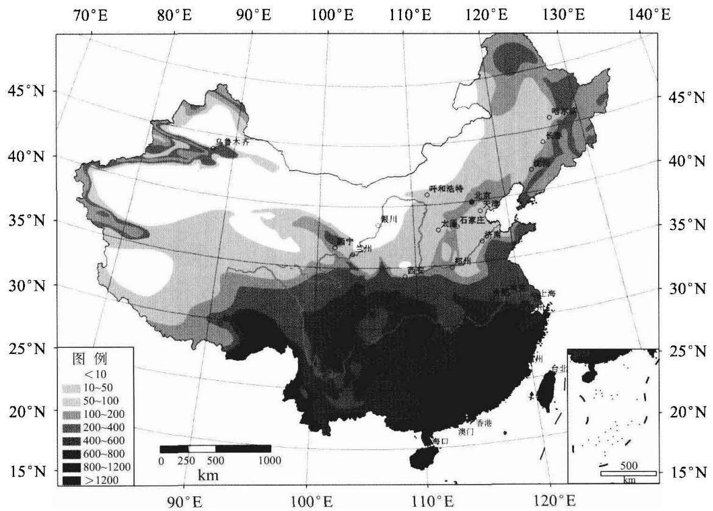  
图1.17 中国多年平均径流深空间分布（单位：mm)

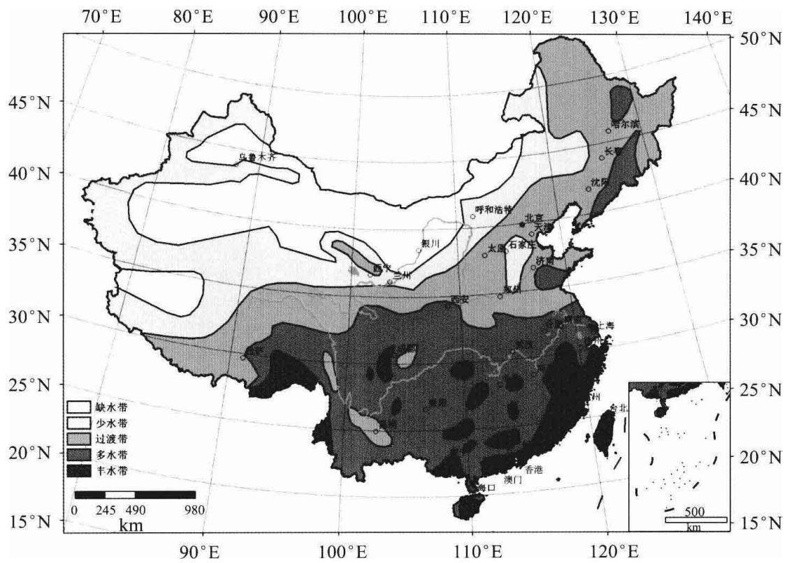  
图1.18 中国径流带分布图

根据多年平均年产水模数的大小，我国区域水资源可以划分为10个流域片和77个流域（表1.15）。河川径流和水资源在空间上的分布相差悬殊，77个流域中水资源最为丰富的是台湾诸河，最少的是内蒙古内陆河流域，多年产水模数相差100倍以上。水资源地域分布不均，造成了南方水多北方水少的基本格局（李广贺，2002）。南方（长江、珠江、浙闽台诸河和西南诸河）4个流域片平均径流深在500mm以上；北方6个流域片中，淮河流域为225mm，黑龙江、辽河、黄河和海滦河平均径流深仅为100mm左右，而内陆河流域径流不足 32 mm。

中国河川径流和水资源的地域分布与人口和耕地的分布不相适应。占全国总面积60%的北方地区，水资源总量只占全国水资源总量的21%，不到南方的1/3。特别是占国土面积1/3的西北地区，水资源总量只占全国的8%。而面积仅占全国13%的东南和中南地区，水资源量却占全国的38%。

表1.15 我国各流域多年平均产水模数（黄秉维等，1999）
<table><tr><td rowspan=1 colspan=1>流域片</td><td rowspan=1 colspan=1>流域名称</td><td rowspan=1 colspan=1>年均产水模数 $/ ( 1 0 ^ { 4 } \mathrm { m } ^ { 3 } / \mathrm { k m } ^ { 2 } )$ </td><td rowspan=1 colspan=1>流域片</td><td rowspan=1 colspan=1>流域名称</td><td rowspan=1 colspan=1>年均产水模数 $/ ( 1 0 ^ { 4 } \mathrm { m } ^ { 3 } / \mathrm { k m } ^ { 2 } )$ </td></tr><tr><td rowspan=1 colspan=1>黑龙江流域片</td><td rowspan=1 colspan=1>额尔古纳河嫩江第二松花江松花江三岔河以下黑龙江干流区间乌苏里江全片计</td><td rowspan=1 colspan=1>8.4811.7822.7519.3216.8716.6314.96</td><td rowspan=3 colspan=1>长江流域片</td><td rowspan=3 colspan=1>金沙江岷沱江嘉陵江乌江长江上游干流区间洞庭湖水系汉江鄱阳湖水系长江中游干流区间太湖水系长江下游干流区间全片计</td><td rowspan=3 colspan=1>31.2962.8644.3461.9765.2777.0737.1685.6857.0443.3247.4153.16</td></tr><tr><td rowspan=1 colspan=1>辽河流域片</td><td rowspan=1 colspan=1>辽河（含浑河、太子河）鸭绿江图们江辽宁沿海诸河全片计</td><td rowspan=1 colspan=1>10.1749.9322.3121.5316.71</td></tr><tr><td rowspan=2 colspan=1>海滦河流域</td><td rowspan=2 colspan=1>滦河（含冀东沿海诸河）海河北系海河南系徒骇、马颊河全片计</td><td rowspan=2 colspan=1>12.4311.8614.3213.1313.24</td></tr><tr><td rowspan=2 colspan=1>珠江流域片</td><td rowspan=2 colspan=1>南北盘水红水河与柳黔江左右郁江西江下游北江东江珠江三角洲赣江粤东沿海诸河桂南粤西沿海诸河海南岛及南海诸河全片计</td><td rowspan=2 colspan=1>46.6878.1652.6687.54109.5699.32101.3389.01127.59104.2992.6981.08</td></tr><tr><td rowspan=2 colspan=1>黄河流域片</td><td rowspan=2 colspan=1>湟水洮河兰州以上干流区间兰州至河口镇河口镇至龙门汾河泾河洛河渭河龙门至三门峡干流区间伊洛河沁河三门峡至花园口干流区间黄河下游区鄂尔多斯内流区全片计</td><td rowspan=2 colspan=1>15.2826.8114.862.226.318.794.804.0513.719.8719.2815.5215.1117.632.259.36</td></tr><tr><td rowspan=1 colspan=1>浙闽台诸河片</td><td rowspan=1 colspan=1>钱塘江浙东诸河浙南诸河闽江闽东沿海诸河闽南诸河台湾诸河全片计</td><td rowspan=1 colspan=1>87.5373.90106.9496.11115.6390.38184.57108.08</td></tr></table>

续表

<table><tr><td rowspan=1 colspan=1>流域片</td><td rowspan=1 colspan=1>流域名称</td><td rowspan=1 colspan=1>年均产水模数/(104m3/km2)</td><td rowspan=1 colspan=1>流域片</td><td rowspan=1 colspan=1>流域名称</td><td rowspan=1 colspan=1>年均产水模数/(104m3/km2)</td></tr><tr><td rowspan=1 colspan=1>淮河流域片</td><td rowspan=1 colspan=1>淮河上中游淮河下游沂、沭河山东沿海诸河全片计</td><td rowspan=1 colspan=1>31.4231.2229.0922.3129.19</td><td rowspan=2 colspan=1>西南诸河片</td><td rowspan=2 colspan=1>雅鲁藏布江藏南诸河藏西诸河怒江澜沧江元江滇西诸河全片计</td><td rowspan=2 colspan=1>68.78125.313.5150.6745.0263.45148.3168.75</td></tr><tr><td rowspan=4 colspan=1>内陆诸河片</td><td rowspan=4 colspan=1>内蒙古内陆河河西内陆河准噶尔内陆河中亚西亚内陆河塔里木内陆河青海内陆河羌塘内陆河全片计</td><td rowspan=4 colspan=1>1.541.644.7621.923.712.393.423.61</td></tr><tr><td rowspan=1 colspan=1>北方六</td><td rowspan=1 colspan=1>合计</td><td rowspan=1 colspan=1>8.83</td></tr><tr><td rowspan=1 colspan=1>南方四</td><td rowspan=1 colspan=1>合计</td><td rowspan=1 colspan=1>65.41</td></tr><tr><td rowspan=1 colspan=1>全国</td><td rowspan=1 colspan=1>总计</td><td rowspan=1 colspan=1>29.46</td></tr></table>

## (三)水文区划

我国地域辽阔，具有不同的地理地带，地形复杂，气候多样，加剧了水文情况的差异。我国水文区划是按照水文现象的相似性和差异性，将全国领土划分为若干个区域。水文区划原则大致可归纳为：

（1）综合分析原则。综合分析引起相似和分异的多方面因素，如各种动态的水文要素、下垫面因素和气候因素等。

(2）相似性与差异性原则。以一种或几种水文特征值为指标，把水文特性和自然地理条件相似的地段连结起来，而把相异地段分开。但是相似性只能大体上表现出来，在相当辽阔的水文地区内，各部分的自然条件不可能完全一样，因而区域内部的水文情况仍有一定差异。这些差异就是划分低一级区域的依据。由此可见，水文区域从高级单位到低级单位，其内部的差异性是逐级增大的。低级单位一方面具有高级单位的一般特点；另一方面又表现出局部差异。因此在区划中，尽量保持各分区内部特征的相对一致性，也就是求大同存小异的原则。

(3)成因分析原则。同一水文现象在不同的自然条件下可能由不同的原因所引起，因此不能只求表面现象上的相似，而应该分析这些现象的成因（熊怡

等，1999)。

依据区划目的的不同，可以选取不同的指标，划分出不同的区域。根据上述原则，将水量（多年平均径流量用径流深度表示）作为第一级的主要指标。因为多年平均径流量是个比较稳定的特征值，可以根据其大小判断一个地区水量的多少。径流量的分布具有明显的地带性规律，根据我国径流量分布特点，可以分为5个径流带：丰水带、多水带、平水带、少水带和干涸带。

为了全面评价河流的利用价值，除了径流量指标外，还必须查明它的来水过程与需水过程的配合情况，所以选取径流的年内分配和径流的年内动态这两个指标作为划分二级区的主要指标。可以采用各月、各季、汛期、连续最大4个月、 $6 \sim 9$ 月、最大水月以及最小水月径流量分别占年径流量的百分数，径流年内分配不均匀系数等来表示径流年内分配。流量过程线能够直观地反映许多重要的水文现象，根据流量过程线的相似性与差异性能够比较准确地划分出二级区的区界，因此分析逐日流量过程线是了解径流动态的重要手段。

根据综合分析原则、相似性与差异性原则和成因分析原则，以水量为第一级主要指标，全国共分为11个水文区域。通过选取径流的年内分配和径流的年内动态两个主要指标，将每个一级区划分为几个二级区，每个二级区都有自己所特有的、不同于其他二级区的径流年内分配和水情。全国共划分为56个二级区。全国一、二级水文区划分别是：

I.东北寒温带、中温带多水、平水地区。包括6个二级区： $\mathrm { I _ { 1 } }$ 大兴安岭北部水文区； $\mathrm { I _ { 2 } }$ 大兴安岭中部水文区； ${ \mathrm { I } } _ { 3 }$ 小兴安岭水文区； $\mathrm { I } _ { 4 }$ 长白山西侧低山丘陵水文区； $\mathrm { I } _ { 5 }$ 长白山东侧水文区； $\mathrm { I } _ { 6 }$ 三江平原水文区。

Ⅱ．华北暖温带平水、少水地区。包括5个二级区： $\mathrm { I I } _ { 1 }$ 辽东半岛与山东半岛水文区； $\mathrm { I I } _ { 2 }$ 辽河下游平原与海河平原水文区； $\mathrm { { I I } } _ { 3 }$ 淮北平原水文区； $\mathrm { { I I } _ { 4 } }$ 冀晋山地水文区； $\mathrm { { I I } _ { 5 } }$ 黄土高原水文区。

Ⅲ．秦、巴、大别北亚热带多水地区。包括3个二级区： $\mathrm { I I I } _ { 1 }$ 秦岭、大巴水文区； $\mathrm { { I I I } _ { 2 } }$ 桐柏、大别水文区； $\mathrm { { I I I } _ { 3 } }$ 长江中下游平原水文区。

Ⅳ．东南亚热带、热带丰水地区。包括7个二级区： $\mathrm { { I V } _ { 1 } }$ 湘、赣、浙西水文区； $\mathrm { { I V } _ { 2 } }$ 武夷、南岭山地水文区； $\mathrm { { I V } } _ { 3 }$ 浙、闽、粤沿海水文区； $\mathrm { { I V } _ { 4 } }$ 钦州、雷州半岛水文区； $\mathrm { { I V } _ { 5 } }$ 海南岛水文区； $\mathrm { { I V } _ { 6 } }$ 台湾水文区； $\mathrm { { I V } } _ { 7 }$ 南海诸岛水文区。

V.西南亚热带、热带多水地区。包括5个二级区： $\mathrm { V } _ { 1 }$ 湘、鄂西山地水文区； $\mathrm { V } _ { 2 }$ 川东、黔北水文区； $\mathrm { { V } _ { 3 } }$ 四川盆地水文区； $\mathrm { { V } _ { 4 } }$ 滇东、滇中高原水文区； $\mathrm { V } _ { 5 }$ 黔南、桂西水文区。

VI.滇西、藏东南亚热带、热带丰水地区。包括2个二级区： $\mathrm { V I } _ { 1 }$ 藏东

南、滇西北水文区； $\mathrm { { V I } _ { 2 } }$ 滇西南水文区。

Ⅶ.内蒙古中温带少水地区。包括4个二级区： $\mathrm { V I I } _ { 1 }$ 松辽平原水文区；$\mathrm { V I I } _ { 2 }$ 大兴安岭南部山地水文区； $\mathrm { { V I I } _ { 3 } }$ 内蒙古高原水文区； $\mathrm { V I I } _ { 4 }$ 阴山、鄂尔多斯高原水文区。

Ⅷ．西北山地中温带、亚寒带、寒带平水、少水地区。包括8个二级区：$\mathrm { V I I I } _ { 1 }$ 阿尔泰山水文区； $\mathrm { V I I I } _ { 2 }$ 准噶尔西部山地水文区； $\mathrm { { V I I I } _ { 3 } }$ 天山水文区；$\mathrm { V I I I } _ { 4 }$ 伊犁水文区； $\mathrm { V I I I } _ { 5 }$ 帕米尔高原水文区； $\mathrm { V I I I } _ { 6 }$ 昆仑山西部水文区；VIII7昆仑山东部水文区； $\mathrm { { V I I I } } _ { 8 }$ 祁连山水文区。

X.西北盆地温带、暖温带干涸地区。包括6个二级区： $\mathrm { I X } _ { \mathrm { 1 } }$ 准噶尔盆地水文区； $\mathrm { { I X } _ { 2 } }$ 吐鲁番、哈密盆地水文区； $\mathrm { I X } _ { 3 }$ 塔里木盆地水文区； $\mathrm { { I X } _ { 4 } }$ 河西、阿拉善水文区； $\mathrm { I X } _ { 5 }$ 嘎顺戈壁与北山戈壁水文区； $\mathrm { I X } _ { 6 }$ 柴达木盆地水文区。

X.青藏高原东部和西南部温带、亚寒带平水地区。包括8个二级区：$\mathrm { X } _ { 1 }$ 长江河源水文区； $X _ { 2 }$ 黄河上游水文区； $\mathrm { { X } _ { 3 } }$ 三江上游水文区； $\mathrm { { X _ { 4 } } }$ 川西东部边缘山地水文区； $\mathrm { X } _ { 5 }$ 藏东、川西西部水文区； $\mathrm { X } _ { 6 }$ 念青唐古拉山东段南翼水文区； $\mathrm { X } _ { 7 }$ 雅鲁藏布江中游水文区； $X _ { 8 }$ 印度河上游与雅鲁藏布江上游水文区。

XI.羌塘高原亚寒带、寒带少水地区。包括2个二级区： $\mathrm { X I _ { 1 } }$ 南羌塘水文区； $\mathrm { X I _ { 2 } }$ 北羌塘水文区。

一级区中，I～Ⅳ区位于东北部湿润半湿润季风区内，V～X区位于西北半干旱、干旱区内，X～XI区位于青藏高寒区内。

中国水文特征的地区分布具有以下规律（图1.19）：

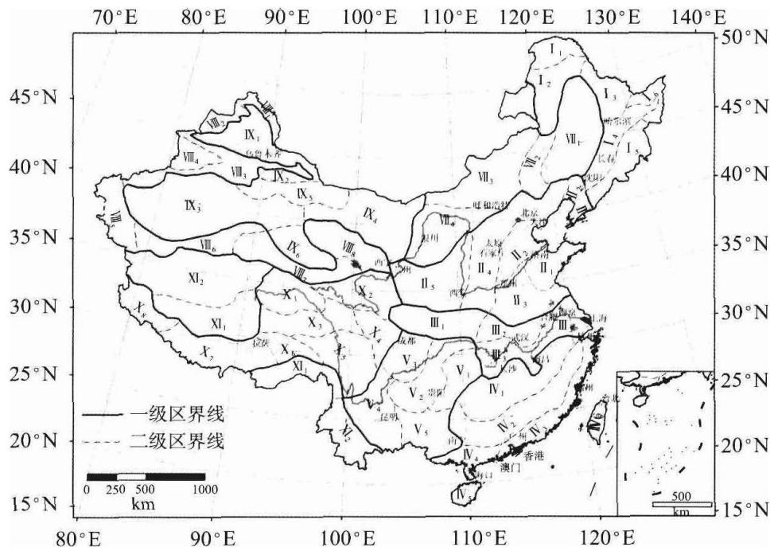  
图1.19 中国水文区划图

(1）温带地区径流量由东到西的递减现象非常明显，东北为多水及平水地区，往西到内蒙古为少水地区，再向西到西北盆地地区则为干涸地区。而西北山地地区由北、西和南三面包围着西北盆地地区，它的径流量较盆地为多，为少水及平水地区。

（2）位于北亚热带的秦巴大别地区，具有南北过渡地带的性质，在它以北的各个地区多为平水、少水和干涸地区（只有东北有一部分为多水地区）；在它以南的各个地区都是多水或丰水地区。

（3）位于亚热带、热带的3个地区，径流量从东西两个方向向中间减少。以西南多水地区为中心，其东为东南丰水地区，其西为滇西、藏东南丰水地区（熊怡等，1999）。

## 三、主要河流水沙特征

## (一)松花江

松花江流域位于东北地区的北部，东西长920km，南北宽1070km，流域面积55.68×104km²。松花江有南、北两源，南源为第二松花江；北源为嫩江。嫩江发源于大兴安岭支脉伊勒呼里山中段南侧；第二松花江发源于长白山主峰长白山天池。嫩江与第二松花江在吉林省富余县的三岔河汇合，干流东流至同江附近由右岸注入黑龙江。从三岔河至佳木斯为松花江的中游，从佳木斯至河口为松花江下游。

流域西、北、东三面环山，中南部形成宽阔的三江平原，山地与丘陵间的过渡地带为低山丘陵区，丘陵与平原间的过渡地带为漫川漫岗区。山地以酸性岩、变质岩和沉积岩为主，丘陵区以砂页岩为主。广大丘陵、山地为各种岩石的风化残积物和坡积物覆盖，在植被遭到人为破坏的情况下，水土流失十分严重。

松花江流域属于大陆性季风气候。冬季漫长，严寒于燥，夏季温暖湿润。多年平均降水量300～950mm，时空分布极不均匀，东部山区为700～950mm，三江平原500～600mm，松嫩平原西部300～400mm。降水在年内的分配也很不均匀，多集中在7～8月，约占全年降水的50%，汛期降水量可占全年降水量的70%以上。松花江径流中雨水补给约占75%～80%，融雪水补给约占15%～20%，地下水补给约占5%～8%。冰雪融化始于4月，形成春汛。5、6月夏汛开始，如雨季提早，春汛和夏汛间无明显低水段。水位较枯水期高4～5m，径流量约占全年的30%～40%。9月以后水量下降。10月下旬至翌年4月中旬为枯水期，径流约占全年的5%～20%。11月中旬至翌年4月初为封冻期，平均最大冰厚1m左右（黄锡铨等，1998）。

根据松花江河口控制站1956～1979年资料推算，松花江多年平均年径流量为734.7亿m³，多年平均径流深为131.6mm。其中第二松花江多年平均 $\mathbf { m } ^ { 3 }$ 年径流量为162亿m3，多年平均径流深为209.6mm。嫩江多年平均年径流量为227.3亿 $\mathbf { m ^ { 3 } }$ ，多年平均径流深为79.6mm。

松花江是一条洪水多发的河流，历史洪水年份有1794年、1851年、1856年、1862年、1886年、1896年、1906年、1909年、1911年、1714年、1929年、1932年、1934年、1943年、1945年共15个年份。新中国成立后，实测洪水年份有1953年、1956年、1957年、1960年、1969年、1985年、1998年。1998年汛期，嫩江中上游地区相继发生长历时、大强度降雨，全流域平均降雨量502.6mm，是常年同期的2倍多，嫩江干流出现3次较大洪峰，雅鲁河等支流曾出现了千年一遇的洪峰，流域受灾人口、受灾面积和经济损失都达到了十分严重的程度（陶炎，1986)。河流洪水的频繁发生，是流域气候、地形地貌、土壤、植被等自然属性相互作用的结果，同时与人类社会活动，特别是中上游森林植被的过度砍伐，大面积坡耕地水土流失，水库、河流泥沙淤积，调蓄及泻洪能力下降等密切相关。

松花江各河流的含沙量不大，大兴安岭、小兴安岭、张广才岭、老爷岭等部分山区河流的含沙量不到0.1kg/m³，其余在0.1\~0.5 kg/m³左右，只有个别河流的含沙量大于1kg/m³。干流左侧支流呼兰河上的兰西站含沙量最大，为2.8kg/m³；蚂蚁河的莲花站含沙量最小，为0.7kg/m³。嫩江流域水资源比较丰富，由于上游80%以上的面积为茂密的森林，河流含沙量很小，富拉尔基断面以上多年平均输沙率为4.45kg/s，多年平均输沙量为140万t，年平均最大含沙量为24.5g/m³，年平均最小含沙量为1.8g/m³。随着流域内森林植被的过度砍伐，森林植被涵养水源、调节生态平衡和防灾减灾的功能逐渐下降，水土流失逐渐加剧，侵蚀面积迅速增加。松花江流域水土流失面积为16.03万km²，占流域面积的28.8%（表1.16)。该流域的水土流失以水力侵蚀强度为主，占总流失面积的84.5%，而水力侵蚀中又以轻度和中度侵蚀强度为主，占92.3%。

表1.16 松花江流域土壤侵蚀现状
<table><tr><td rowspan="3">侵蚀 类型</td><td colspan="2">总计</td><td colspan="2">轻度</td><td colspan="2">中度</td><td colspan="2">强度</td><td colspan="2">极强度</td></tr><tr><td>面积</td><td>百分比</td><td>面积</td><td>百分比</td><td>面积</td><td>百分比</td><td>面积</td><td>百分比</td><td>面积</td><td>百分比</td></tr><tr><td>/万km²</td><td>1%</td><td>/万 km²</td><td>1%</td><td>/万km2</td><td>1%</td><td>万 km²</td><td>1%</td><td>/万 km²</td><td>1%</td></tr><tr><td>水蚀</td><td>13.54</td><td>84.5</td><td>8.31</td><td>61.3</td><td>4.19</td><td>31.0</td><td>0.94</td><td>7.0</td><td>0.10</td><td>0.7</td></tr><tr><td colspan="1" rowspan="1">风蚀</td><td colspan="1" rowspan="1">1.73</td><td colspan="1" rowspan="1">10.8</td><td colspan="1" rowspan="1">0.66</td><td colspan="1" rowspan="1">38.0</td><td colspan="1" rowspan="1">1.03</td><td colspan="1" rowspan="1">59.7</td><td colspan="1" rowspan="1">0.04</td><td colspan="1" rowspan="1">2.3</td><td colspan="1" rowspan="1"></td><td colspan="1" rowspan="1"></td></tr><tr><td colspan="1" rowspan="1">冻融</td><td colspan="1" rowspan="1">0.76</td><td colspan="1" rowspan="1">4.7</td><td colspan="1" rowspan="1">0.76</td><td colspan="1" rowspan="1">100</td><td colspan="1" rowspan="1"></td><td colspan="1" rowspan="1"></td><td colspan="1" rowspan="1"></td><td colspan="1" rowspan="1"></td><td colspan="1" rowspan="1"></td><td colspan="1" rowspan="1"></td></tr><tr><td colspan="1" rowspan="1">合计</td><td colspan="1" rowspan="1">16.03</td><td colspan="1" rowspan="1">100</td><td colspan="1" rowspan="1">9.73</td><td colspan="1" rowspan="1">60.7</td><td colspan="1" rowspan="1">5.22</td><td colspan="1" rowspan="1">32.5</td><td colspan="1" rowspan="1">0.98</td><td colspan="1" rowspan="1">6.1</td><td colspan="1" rowspan="1">0.10</td><td colspan="1" rowspan="1">0.7</td></tr></table>

## （二）海 河

海河流域包括海河、滦河、徒骇河、马颊河等水系，西起太行山，东临渤海，南界黄河，北依内蒙古高原。全长1090km，流经北京、天津、河北、山西、山东、河南、内蒙古和辽宁8个省（自治区、直辖市）。流域面积31.78万km²，其中山区面积18.94万km²，占流域总面积的59.6%。

海河流域的地貌单元有山地、丘陵、河谷、盆地；山地和丘陵组成的山区主要有燕山、太行山两大山脉。石质和土石质山地主要分布在燕山北部和太行山西部。丘陵主要分布在燕山南部及太行山东麓，地面组成物质为石灰岩、砂页岩、碎屑岩及黄土。土质山地主要分布在永定河流域，也是海河流域土壤侵蚀严重区域。

海河流域属暖温带大陆季风气候，年均降水量400～800mm，降水的年际变化很大。年内降水集中在6～9月，占全年降水的80%以上，其中7、8月占全年的60%～70%，月多暴雨，年内暴雨量占全年降水量的40%～50%。径流和泥沙集中在汛期，特别是年内几场暴雨，可达到全年的90%以上。

据1956～1984年观测资料分析表明，海河流域多年平均年径流量为264亿m³，其中山区197亿m³，平原地区67亿m³。海河流域年径流量的空间分布与年降水量基本一致，降水高值区相应为径流深高值带。从表1.17可以看出，沿燕山、太行山、中条山迎风坡的河流，为多年平均年降水高值区，相应形成年径流量大于150mm的径流高值带。沿高值区向西北、东南两侧逐渐减少，处于背风坡的大同盆地、坝上等地，年均降水量多在550mm左右，年均径流量小于50mm，其余多数地区的年均径流量在50～100mm之间。降雨量大且集中、土层较薄、植被覆盖差的地区，年径流系数大，因此流域内石质山区的径流量均为高值区，年径流系数在0.2～0.3。年径流系数总体趋势是石质山区>土石山区>黄土丘陵区>平原区（表1.17)。受降水减少、引水工程及水库蓄水等因素的综合影响，海河流域的年径流量呈明显的减少趋势（图1.20），该流域20世纪50年代的年径流量为374.8亿 $\mathrm { m } ^ { 3 }$ 60年代为286.7亿m³，70年代为257.4亿m3，80年代为143.0亿m³。从 $\mathbf { m } ^ { 3 }$ $\mathrm { m } ^ { 3 }$ $\mathrm { m } ^ { 3 }$ 图1.20可以清楚地看到，进入90年代末期、21世纪初期，海河流域的径流持续减少，1998～2004年7年间的平均年径流量仅为118.8亿 $\mathrm { m } ^ { 3 }$ ，为1956\~1984年平均年径流量264亿 $\mathrm { { m ^ { 3 } } }$ 的45%。

表1.17 海河流域不同水系年降水量、年径流量与径流系数（1956～1984年）
<table><tr><td rowspan=1 colspan=4>分       区</td><td rowspan=1 colspan=1>流域面积/km²</td><td rowspan=1 colspan=1>年降水量/mm</td><td rowspan=1 colspan=1>年径流量/mm</td><td rowspan=1 colspan=1>年径流系数</td></tr><tr><td rowspan=4 colspan=1>滦河及冀东沿海</td><td rowspan=2 colspan=2>山区</td><td rowspan=1 colspan=1>滦河</td><td rowspan=1 colspan=1>44 070</td><td rowspan=1 colspan=1>531.0</td><td rowspan=1 colspan=1>100.4</td><td rowspan=1 colspan=1>0.19</td></tr><tr><td rowspan=1 colspan=1>小计</td><td rowspan=1 colspan=1>47 120</td><td rowspan=1 colspan=1>541.6</td><td rowspan=1 colspan=1>105.6</td><td rowspan=1 colspan=1>0.19</td></tr><tr><td rowspan=1 colspan=3>平    原</td><td rowspan=1 colspan=1>7 410</td><td rowspan=1 colspan=1>620.8</td><td rowspan=1 colspan=1>71.1</td><td rowspan=1 colspan=1>0.11</td></tr><tr><td rowspan=1 colspan=3>合    计</td><td rowspan=1 colspan=1>54 530</td><td rowspan=1 colspan=1>552.4</td><td rowspan=1 colspan=1>101.0</td><td rowspan=1 colspan=1>0.18</td></tr><tr><td rowspan=16 colspan=1>海河水系</td><td rowspan=7 colspan=1>海河北系</td><td rowspan=5 colspan=1>山区</td><td rowspan=1 colspan=1>潮白河</td><td rowspan=1 colspan=1>16 476</td><td rowspan=1 colspan=1>526.4</td><td rowspan=1 colspan=1>100.3</td><td rowspan=1 colspan=1>0.19</td></tr><tr><td rowspan=1 colspan=1>蓟运河</td><td rowspan=1 colspan=1>4 232</td><td rowspan=1 colspan=1>736.3</td><td rowspan=1 colspan=1>225.2</td><td rowspan=1 colspan=1>0.31</td></tr><tr><td rowspan=1 colspan=1>北运河</td><td rowspan=1 colspan=1>1 000</td><td rowspan=1 colspan=1>606.0</td><td rowspan=1 colspan=1>149.0</td><td rowspan=1 colspan=1>0.26</td></tr><tr><td rowspan=1 colspan=1>永定河</td><td rowspan=1 colspan=1>45 179</td><td rowspan=1 colspan=1>428.6</td><td rowspan=1 colspan=1>44.9</td><td rowspan=1 colspan=1>0.10</td></tr><tr><td rowspan=1 colspan=1>小计</td><td rowspan=1 colspan=1>66 887</td><td rowspan=1 colspan=1>474.8</td><td rowspan=1 colspan=1>71.5</td><td rowspan=1 colspan=1>0.15</td></tr><tr><td rowspan=1 colspan=2>平     原</td><td rowspan=1 colspan=1>16 232</td><td rowspan=1 colspan=1>603.0</td><td rowspan=1 colspan=1>86.6</td><td rowspan=1 colspan=1>0.14</td></tr><tr><td rowspan=1 colspan=2>合    计</td><td rowspan=1 colspan=1>83 119</td><td rowspan=1 colspan=1>499.8</td><td rowspan=1 colspan=1>74.5</td><td rowspan=1 colspan=1>0.15</td></tr><tr><td rowspan=9 colspan=1>海河南系</td><td rowspan=7 colspan=1>山区</td><td rowspan=1 colspan=1>大清河北</td><td rowspan=1 colspan=1>7 266</td><td rowspan=1 colspan=1>599.1</td><td rowspan=1 colspan=1>160.9</td><td rowspan=1 colspan=1>0.27</td></tr><tr><td rowspan=1 colspan=1>大清河南</td><td rowspan=1 colspan=1>11 541</td><td rowspan=1 colspan=1>590.2</td><td rowspan=1 colspan=1>163.6</td><td rowspan=1 colspan=1>0.28</td></tr><tr><td rowspan=1 colspan=1>滹沱河</td><td rowspan=1 colspan=1>23 491</td><td rowspan=1 colspan=1>527.4</td><td rowspan=1 colspan=1>98.1</td><td rowspan=1 colspan=1>0.19</td></tr><tr><td rowspan=1 colspan=1>釜阳河</td><td rowspan=1 colspan=1>7 452</td><td rowspan=1 colspan=1>620.6</td><td rowspan=1 colspan=1>171.0</td><td rowspan=1 colspan=1>0.28</td></tr><tr><td rowspan=1 colspan=1>漳河</td><td rowspan=1 colspan=1>18 284</td><td rowspan=1 colspan=1>581.3</td><td rowspan=1 colspan=1>100.0</td><td rowspan=1 colspan=1>0.17</td></tr><tr><td rowspan=1 colspan=1>卫河</td><td rowspan=1 colspan=1>7 454</td><td rowspan=1 colspan=1>670.2</td><td rowspan=1 colspan=1>194.5</td><td rowspan=1 colspan=1>0.29</td></tr><tr><td rowspan=1 colspan=1>小计</td><td rowspan=1 colspan=1>75 488</td><td rowspan=1 colspan=1>580.3</td><td rowspan=1 colspan=1>131.3</td><td rowspan=1 colspan=1>0.25</td></tr><tr><td rowspan=1 colspan=2>平    原</td><td rowspan=1 colspan=1>73 181</td><td rowspan=1 colspan=1>549.4</td><td rowspan=1 colspan=1>44.5</td><td rowspan=1 colspan=1>0.08</td></tr><tr><td rowspan=1 colspan=2>合    计</td><td rowspan=1 colspan=1>148 669</td><td rowspan=1 colspan=1>565.1</td><td rowspan=1 colspan=1>88.6</td><td rowspan=1 colspan=1>0.16</td></tr><tr><td rowspan=2 colspan=2>海河水系</td><td rowspan=1 colspan=2>山    区</td><td rowspan=1 colspan=1>142 375</td><td rowspan=1 colspan=1>530.7</td><td rowspan=1 colspan=1>103.2</td><td rowspan=1 colspan=1>0.19</td></tr><tr><td rowspan=1 colspan=2>平    原</td><td rowspan=1 colspan=1>89 413</td><td rowspan=1 colspan=1>559.2</td><td rowspan=1 colspan=1>52.1</td><td rowspan=1 colspan=1>0.09</td></tr><tr><td rowspan=1 colspan=4>徒骇、马颊河</td><td rowspan=1 colspan=1>31 843</td><td rowspan=1 colspan=1>584.1</td><td rowspan=1 colspan=1>47.9</td><td rowspan=1 colspan=1>0.08</td></tr><tr><td rowspan=3 colspan=2>海河流域</td><td rowspan=1 colspan=2>山     区</td><td rowspan=1 colspan=1>189 495</td><td rowspan=1 colspan=1>533.4</td><td rowspan=1 colspan=1>103.8</td><td rowspan=1 colspan=1>0.19</td></tr><tr><td rowspan=1 colspan=2>平     原</td><td rowspan=1 colspan=1>128 666</td><td rowspan=1 colspan=1>568.9</td><td rowspan=1 colspan=1>52.2</td><td rowspan=1 colspan=1>0.09</td></tr><tr><td rowspan=1 colspan=2>平     均</td><td rowspan=1 colspan=1>318161</td><td rowspan=1 colspan=1>547.8</td><td rowspan=1 colspan=1>82.9</td><td rowspan=1 colspan=1>0.15</td></tr></table>

海河流域的年均输沙量为1.72亿t，其中年输沙量最大的是永定河，年输沙量达到了8070万t；其次是滹沱河、漳河、滦河等。从表1.18可以看出，海河流域不同水系的输沙模数差异很大，最大的为永定河，最小者为北运河，前者是后者的15.3倍。海河流域的平均输沙模数为 $9 0 8 ~ \mathrm { t / ( k m ^ { 2 } \cdot a ) }$ 。随着流域内径流量的减少，河流输沙量也随着下降。滦河水系干流20世纪50年代年均输沙量为3380万t，60年代为1078万t，70年代下降到了783万t。但由于径流量减少幅度较大，所以河流含沙量有增加的趋势（水利水电部，1987）。

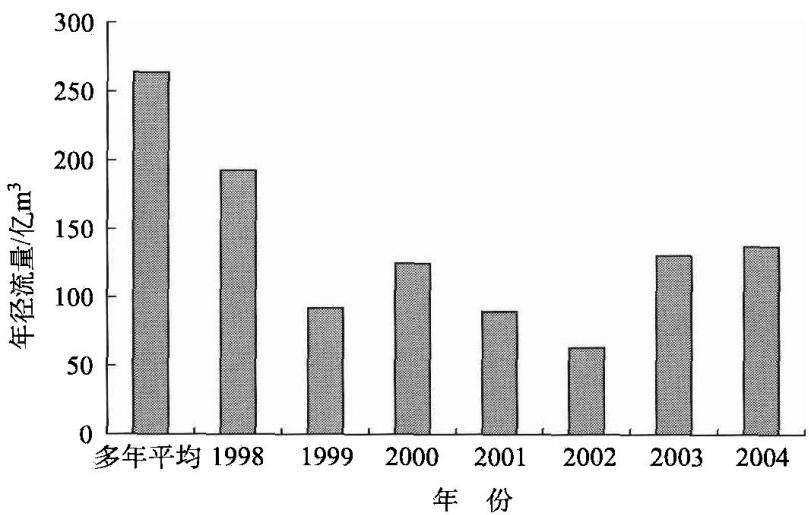  
图1.20 海河流域多年及近年径流量

表1.18 海河流域主要水系悬移质输沙量（1956～1984年）
<table><tr><td rowspan=2 colspan=1>河系</td><td rowspan=1 colspan=2>输沙量</td><td rowspan=2 colspan=1>输沙模数 $/ [ t / (  { \mathrm { k m } } ^ { 2 } \cdot \mathrm { a } ) ]$ </td><td rowspan=2 colspan=1>含沙量 $/ ( \mathrm { k g } / \mathrm { m } ^ { 3 } )$ </td><td rowspan=2 colspan=1>观测站</td></tr><tr><td rowspan=1 colspan=1>万t</td><td rowspan=1 colspan=1>%</td></tr><tr><td rowspan=1 colspan=1>滦河</td><td rowspan=1 colspan=1>1960</td><td rowspan=1 colspan=1>11.4</td><td rowspan=1 colspan=1>445</td><td rowspan=1 colspan=1>4.12</td><td rowspan=1 colspan=1>滦县</td></tr><tr><td rowspan=1 colspan=1>冀东沿海</td><td rowspan=1 colspan=1>53.1</td><td rowspan=1 colspan=1>0.3</td><td rowspan=1 colspan=1>174</td><td rowspan=1 colspan=1>0.88</td><td rowspan=1 colspan=1>小陈庄峪门口、石佛口、徒河</td></tr><tr><td rowspan=1 colspan=1>蓟运河</td><td rowspan=1 colspan=1>64.2</td><td rowspan=1 colspan=1>0.4</td><td rowspan=1 colspan=1>152</td><td rowspan=1 colspan=1>0.60</td><td rowspan=1 colspan=1>泥河</td></tr><tr><td rowspan=1 colspan=1>潮白河</td><td rowspan=1 colspan=1>675</td><td rowspan=1 colspan=1>3.9</td><td rowspan=1 colspan=1>410</td><td rowspan=1 colspan=1>4.27</td><td rowspan=1 colspan=1>苏庄</td></tr><tr><td rowspan=1 colspan=1>北运河</td><td rowspan=1 colspan=1>11.7</td><td rowspan=1 colspan=1>0.1</td><td rowspan=1 colspan=1>117</td><td rowspan=1 colspan=1>0.72</td><td rowspan=1 colspan=1>土门楼</td></tr><tr><td rowspan=1 colspan=1>永定河</td><td rowspan=1 colspan=1>8070</td><td rowspan=1 colspan=1>46.8</td><td rowspan=1 colspan=1>1786</td><td rowspan=1 colspan=1>51.6</td><td rowspan=1 colspan=1>官厅</td></tr><tr><td rowspan=1 colspan=1>大清河</td><td rowspan=1 colspan=1>975</td><td rowspan=1 colspan=1>5.7</td><td rowspan=1 colspan=1>518</td><td rowspan=1 colspan=1>2.86</td><td rowspan=1 colspan=1>张坊、王快、西大洋等</td></tr><tr><td rowspan=1 colspan=1>滹沱河</td><td rowspan=1 colspan=1>2480</td><td rowspan=1 colspan=1>14.4</td><td rowspan=1 colspan=1>1056</td><td rowspan=1 colspan=1>9.58</td><td rowspan=1 colspan=1>黄壁庄</td></tr><tr><td rowspan=1 colspan=1>漳河</td><td rowspan=1 colspan=1>2240</td><td rowspan=1 colspan=1>13.0</td><td rowspan=1 colspan=1>1225</td><td rowspan=1 colspan=1>12.9</td><td rowspan=1 colspan=1>观台</td></tr><tr><td rowspan=1 colspan=1>卫河</td><td rowspan=1 colspan=1>257</td><td rowspan=1 colspan=1>1.5</td><td rowspan=1 colspan=1>345</td><td rowspan=1 colspan=1>1.64</td><td rowspan=1 colspan=1>新村、峪河</td></tr><tr><td rowspan=1 colspan=1>合计</td><td rowspan=1 colspan=1>17214</td><td rowspan=1 colspan=1>100</td><td rowspan=1 colspan=1>908</td><td rowspan=1 colspan=1>9.02</td><td rowspan=1 colspan=1></td></tr></table>

资料来源：唐克丽等，中国水土保持，2004。

## （三）黄 河

黄河发源于青海省巴颜喀拉山北麓海拔4500m的约古宗列盆地，自西向东流经青海、四川、甘肃、宁夏、内蒙古、山西、陕西、河南和山东，在山东东营市注入渤海，全长5464 km，流域面积79.5万km²。黄河地处中纬度地带，其中上、中游位于西北干旱半干旱地区，属于大陆性气候，气候干燥、寒冷、冬季较长，多风沙，夏季短促。下游处于暖温带半湿润季风气候区，冬季寒冷、雨雪少，春季干旱，风沙大，夏季多雨。黄河流域多年平均降水量为467mm，但空间变异很大，降水量从东南向西北逐渐减少。降水年际变化大，70%的年降水集中分布于7～9月，该季节的河流输沙占全年的80%以上。集中降雨的汛期多暴雨，全年85%的泥沙来源于汛期的几场暴雨。

由于大部分地区为干旱半干旱气候，其中游流经大面积的黄土高原地区，因此黄河水沙的基本特征是水少沙多、含沙量高和水沙异源、分布不均匀（表1.19、表1.20、表1.21、表1.22、表1.23)。黄河下游的径流主要来源于河口镇以上，占花园口径流总量的53.4%，而输沙量则不到三门峡总输沙量的10%。中游河口镇到龙门区间，流域面积只占黄河流域总面积的18%，产水量仅为黄河径流量的15%，但该区却产生了黄河56%的泥沙。黄河水少沙多的特点，促使黄河下游河道淤积严重。下游多年平均径流量为480.6亿m³，多年平均输沙量为16亿t，多年平均含沙量为36.9kg/m³。

受流域降水减少及工农业、生活用水量的急剧增加的影响，下游河川径流量明显下降（表1.24），年均输沙量有一定的变化，但下降的趋势不是十分显著，年均含沙量则相对比较稳定，没有明显的变化，持续保持在33.2\~39.8kg/m³。

从1961年到1997年38年间，花园口的天然径流量呈持续下降趋势(图1.21)，在各业用水需求迅速增加、中上游地区用水量过大的情况下，黄河下游干流出现断流则是必然的结果。从1972年开始，黄河下游干流连续26年出现了断流现象，而且断流程度愈演愈烈（图1.22），给黄河下游的工农业生产和人民生活带来了极大的影响。1998年小浪底水库开始发挥其强大的蓄水调洪作用，才从根本上遏制了黄河断流的持续发生，为下游工农业生产、居民生活用水、下游河床生态用水、湿地生态系统的维护提供了保证。

表1.19 黄河干支流主要断面天然径流量（单位：亿m³）
<table><tr><td rowspan=3 colspan=1>河名</td><td rowspan=3 colspan=1>站名</td><td rowspan=3 colspan=1>面积/km²</td><td></td><td></td><td></td><td></td></tr><tr><td rowspan=1 colspan=4>统计时段</td></tr><tr><td rowspan=1 colspan=1>1919~1975年</td><td rowspan=1 colspan=1>1956~1979年</td><td rowspan=1 colspan=1>1919~1989年</td><td rowspan=1 colspan=1>1950~1989年</td></tr><tr><td rowspan=7 colspan=1>黄河</td><td rowspan=1 colspan=1>贵德</td><td rowspan=1 colspan=1>133 865</td><td rowspan=1 colspan=1>202.8</td><td rowspan=1 colspan=1>209.9</td><td rowspan=1 colspan=1>204.4</td><td rowspan=1 colspan=1>216.5</td></tr><tr><td rowspan=1 colspan=1>兰州</td><td rowspan=1 colspan=1>222 551</td><td rowspan=1 colspan=1>322.6</td><td rowspan=1 colspan=1>340.0</td><td rowspan=1 colspan=1>332.0</td><td rowspan=1 colspan=1>348.0</td></tr><tr><td rowspan=1 colspan=1>河口镇</td><td rowspan=1 colspan=1>385 966</td><td rowspan=1 colspan=1>312.6</td><td rowspan=1 colspan=1>344.0</td><td rowspan=1 colspan=1>324.0</td><td rowspan=1 colspan=1>346.0</td></tr><tr><td rowspan=1 colspan=1>龙门</td><td rowspan=1 colspan=1>497 552</td><td rowspan=1 colspan=1>385.1</td><td rowspan=1 colspan=1>411.0</td><td rowspan=1 colspan=1>391.0</td><td rowspan=1 colspan=1>408.0</td></tr><tr><td rowspan=1 colspan=1>三门峡</td><td rowspan=1 colspan=1>688421</td><td rowspan=1 colspan=1>498.4</td><td rowspan=1 colspan=1>544.0</td><td rowspan=1 colspan=1>507.0</td><td rowspan=1 colspan=1>538.0</td></tr><tr><td rowspan=1 colspan=1>花园口</td><td rowspan=1 colspan=1>730 036</td><td rowspan=1 colspan=1>559.2</td><td rowspan=1 colspan=1>605.0</td><td rowspan=1 colspan=1>567.8</td><td rowspan=1 colspan=1>602.0</td></tr><tr><td rowspan=1 colspan=1>利津</td><td rowspan=1 colspan=1>751 869</td><td rowspan=1 colspan=1>580.0</td><td rowspan=1 colspan=1>621.5</td><td rowspan=1 colspan=1></td><td rowspan=1 colspan=1></td></tr><tr><td rowspan=1 colspan=1>汾河</td><td rowspan=1 colspan=1>河津</td><td rowspan=1 colspan=1>38 728</td><td rowspan=1 colspan=1>20.1</td><td rowspan=1 colspan=1>26.6</td><td rowspan=1 colspan=1>20.4</td><td rowspan=1 colspan=1>24.4</td></tr><tr><td rowspan=1 colspan=1>北洛河</td><td rowspan=1 colspan=1></td><td rowspan=1 colspan=1>25 154</td><td rowspan=1 colspan=1>7.6</td><td rowspan=1 colspan=1>9.9</td><td rowspan=1 colspan=1>8.1</td><td rowspan=1 colspan=1>9.0</td></tr><tr><td rowspan=1 colspan=1>渭河</td><td rowspan=1 colspan=1>华县</td><td rowspan=1 colspan=1>106 498</td><td rowspan=1 colspan=1>87.4</td><td rowspan=1 colspan=1>73.1</td><td rowspan=1 colspan=1>88.3</td><td rowspan=1 colspan=1>96.3</td></tr><tr><td rowspan=1 colspan=1>洛河</td><td rowspan=1 colspan=1>黑石关</td><td rowspan=1 colspan=1>18 563</td><td rowspan=1 colspan=1>35.9</td><td rowspan=1 colspan=1>34.7</td><td rowspan=1 colspan=1></td><td rowspan=1 colspan=1></td></tr><tr><td rowspan=1 colspan=1>沁河</td><td rowspan=1 colspan=1>小董</td><td rowspan=1 colspan=1>12 880</td><td rowspan=1 colspan=1>15.1</td><td rowspan=1 colspan=1>18.4</td><td rowspan=1 colspan=1></td><td rowspan=1 colspan=1></td></tr></table>

表 1.20 黄河干流水沙特性
<table><tr><td rowspan=2 colspan=1>站名</td><td rowspan=1 colspan=2>控制面积</td><td rowspan=1 colspan=2>天然年径流量</td><td rowspan=2 colspan=1>实测年泥沙量/亿t</td></tr><tr><td rowspan=1 colspan=1>面积/km²</td><td rowspan=1 colspan=1>占全河比例/%</td><td rowspan=1 colspan=1>径流量/亿m³</td><td rowspan=1 colspan=1>占全河比例/%</td></tr><tr><td rowspan=1 colspan=1>河口镇</td><td rowspan=1 colspan=1>385 966</td><td rowspan=1 colspan=1>51.3</td><td rowspan=1 colspan=1>312.6</td><td rowspan=1 colspan=1>55.9</td><td rowspan=1 colspan=1>1.42</td></tr><tr><td rowspan=1 colspan=1>河口一龙门</td><td rowspan=1 colspan=1>111 586</td><td rowspan=1 colspan=1>14.8</td><td rowspan=1 colspan=1>72.5</td><td rowspan=1 colspan=1>13</td><td rowspan=1 colspan=1>9.08</td></tr><tr><td rowspan=1 colspan=1>龙门一三门峡</td><td rowspan=1 colspan=1>190 869</td><td rowspan=1 colspan=1>25.4</td><td rowspan=1 colspan=1>113.3</td><td rowspan=1 colspan=1>20.3</td><td rowspan=1 colspan=1>5.54</td></tr><tr><td rowspan=1 colspan=1>三门峡一花园口</td><td rowspan=1 colspan=1>41 615</td><td rowspan=1 colspan=1>5.5</td><td rowspan=1 colspan=1>60.8</td><td rowspan=1 colspan=1>10.9</td><td rowspan=1 colspan=1>0.32</td></tr><tr><td rowspan=1 colspan=1>花园口</td><td rowspan=1 colspan=1>730 036</td><td rowspan=1 colspan=1>97</td><td rowspan=1 colspan=1>559.2</td><td rowspan=1 colspan=1>96.4</td><td rowspan=1 colspan=1>16.3</td></tr></table>

表1.21 黄河上游实测年水沙量
<table><tr><td rowspan=2 colspan=1>站名</td><td rowspan=2 colspan=1>控制面积/km²</td><td rowspan=2 colspan=1>时段</td><td rowspan=1 colspan=3>径流量/亿m³</td><td rowspan=1 colspan=3>泥沙量/亿t</td></tr><tr><td rowspan=1 colspan=1>汛期</td><td rowspan=1 colspan=1>非汛期</td><td rowspan=1 colspan=1>全年</td><td rowspan=1 colspan=1>汛期</td><td rowspan=1 colspan=1>非汛期</td><td rowspan=1 colspan=1>全年</td></tr><tr><td rowspan=1 colspan=1>唐乃亥</td><td rowspan=1 colspan=1>121 972</td><td rowspan=1 colspan=1>1934~1990年</td><td rowspan=1 colspan=1>127.56</td><td rowspan=1 colspan=1>83.58</td><td rowspan=1 colspan=1>211.14</td><td rowspan=1 colspan=1>0.086</td><td rowspan=1 colspan=1>0.028</td><td rowspan=1 colspan=1>0.114</td></tr><tr><td rowspan=1 colspan=1>贵德</td><td rowspan=1 colspan=1>133 650</td><td rowspan=1 colspan=1>1934~1990年</td><td rowspan=1 colspan=1>131.42</td><td rowspan=1 colspan=1>87.90</td><td rowspan=1 colspan=1>219.32</td><td rowspan=1 colspan=1>0.157</td><td rowspan=1 colspan=1>0.061</td><td rowspan=1 colspan=1>0.218</td></tr><tr><td rowspan=1 colspan=1>循化</td><td rowspan=1 colspan=1>145 459</td><td rowspan=1 colspan=1>1934~1990年</td><td rowspan=1 colspan=1>137.87</td><td rowspan=1 colspan=1>93.50</td><td rowspan=1 colspan=1>231.37</td><td rowspan=1 colspan=1>0.314</td><td rowspan=1 colspan=1>0.087</td><td rowspan=1 colspan=1>0.401</td></tr><tr><td rowspan=1 colspan=1>兰州</td><td rowspan=1 colspan=1>222 551</td><td rowspan=1 colspan=1>1934~1990年</td><td rowspan=1 colspan=1>191.74</td><td rowspan=1 colspan=1>141.34</td><td rowspan=1 colspan=1>336.08</td><td rowspan=1 colspan=1>0.775</td><td rowspan=1 colspan=1>0.163</td><td rowspan=1 colspan=1>0.938</td></tr><tr><td rowspan=1 colspan=1>头道拐</td><td rowspan=1 colspan=1>367 898</td><td rowspan=1 colspan=1>1934~1990年</td><td rowspan=1 colspan=1>150.98</td><td rowspan=1 colspan=1>105.24</td><td rowspan=1 colspan=1>258.22</td><td rowspan=1 colspan=1>1.158</td><td rowspan=1 colspan=1>0.288</td><td rowspan=1 colspan=1>1.466</td></tr></table>

表1.22 黄河中游主要支流输沙特性
<table><tr><td rowspan=2 colspan=1>流域</td><td rowspan=2 colspan=1>测站</td><td rowspan=2 colspan=1>年输沙量/亿t</td><td rowspan=1 colspan=2>汛期输沙量</td><td rowspan=1 colspan=2>最大 5 天输沙量</td></tr><tr><td rowspan=1 colspan=1>亿t</td><td rowspan=1 colspan=1>占全年比例/%</td><td rowspan=1 colspan=1>亿t</td><td rowspan=1 colspan=1>占全年比例/%</td></tr><tr><td rowspan=1 colspan=1>无定河</td><td rowspan=1 colspan=1>绥德</td><td rowspan=1 colspan=1>1.920</td><td rowspan=1 colspan=1>1.822</td><td rowspan=1 colspan=1>94.9</td><td rowspan=1 colspan=1>0.644</td><td rowspan=1 colspan=1>33.5</td></tr><tr><td rowspan=1 colspan=1>孤山河</td><td rowspan=1 colspan=1>高石崖</td><td rowspan=1 colspan=1>0.355</td><td rowspan=1 colspan=1>0.365</td><td rowspan=1 colspan=1>99.4</td><td rowspan=1 colspan=1>0.161</td><td rowspan=1 colspan=1>45.2</td></tr><tr><td rowspan=1 colspan=1>皇甫川</td><td rowspan=1 colspan=1>皇甫川</td><td rowspan=1 colspan=1>0.591</td><td rowspan=1 colspan=1>0.575</td><td rowspan=1 colspan=1>97.2</td><td rowspan=1 colspan=1>0.190</td><td rowspan=1 colspan=1>32.2</td></tr><tr><td rowspan=1 colspan=1>窟野河</td><td rowspan=1 colspan=1>温家川</td><td rowspan=1 colspan=1>2.880</td><td rowspan=1 colspan=1>2.862</td><td rowspan=1 colspan=1>99.4</td><td rowspan=1 colspan=1>1.823</td><td rowspan=1 colspan=1>63.2</td></tr><tr><td rowspan=1 colspan=1>秃尾河</td><td rowspan=1 colspan=1>高家川</td><td rowspan=1 colspan=1>0.278</td><td rowspan=1 colspan=1>0.256</td><td rowspan=1 colspan=1>87.2</td><td rowspan=1 colspan=1>0.096</td><td rowspan=1 colspan=1>32.1</td></tr><tr><td rowspan=1 colspan=1>延河</td><td rowspan=1 colspan=1>甘谷驿</td><td rowspan=1 colspan=1>0.468</td><td rowspan=1 colspan=1>0.443</td><td rowspan=1 colspan=1>94.5</td><td rowspan=1 colspan=1>0.246</td><td rowspan=1 colspan=1>512.5</td></tr></table>

表1.23 黄河下游水沙特征值
<table><tr><td rowspan=1 colspan=1>站名或区间</td><td rowspan=1 colspan=1>项目</td><td rowspan=1 colspan=1>单位</td><td rowspan=1 colspan=1>1950~1959年</td><td rowspan=1 colspan=1>1960~1969年</td><td rowspan=1 colspan=1>1970~1979年</td><td rowspan=1 colspan=1>1980~1989年</td></tr><tr><td rowspan=1 colspan=1>小浪底+黑石关十小董</td><td rowspan=1 colspan=1>年均径流量年均泥沙量年均含沙量</td><td rowspan=1 colspan=1>亿m³亿tkg/m³</td><td rowspan=1 colspan=1>49218.136.8</td><td rowspan=1 colspan=1>50911.622.7</td><td rowspan=1 colspan=1>38114.237.2</td><td rowspan=1 colspan=1>4008.4321.0</td></tr><tr><td rowspan=1 colspan=1>利津</td><td rowspan=1 colspan=1>年均径流量年均泥沙量年均含沙量</td><td rowspan=1 colspan=1>亿m³亿tkg/m³</td><td rowspan=1 colspan=1>46413.2228.5</td><td rowspan=1 colspan=1>51311.021.4</td><td rowspan=1 colspan=1>3048.8829.2</td><td rowspan=1 colspan=1>270</td></tr><tr><td rowspan=1 colspan=1>铁谢至利津</td><td rowspan=1 colspan=1>年均径流量年均泥沙量年均含沙量</td><td rowspan=1 colspan=1>亿m³亿tkg/m³</td><td rowspan=1 colspan=1>36.80.324.04</td><td rowspan=1 colspan=1>33.60.72-1.303</td><td rowspan=1 colspan=1>78.61.773.40</td><td rowspan=1 colspan=1>10510.80.34</td></tr></table>

表1.24 黄河干流不同年代径流和输沙量的变化
<table><tr><td rowspan=1 colspan=1>年份</td><td rowspan=1 colspan=1>年均径流量/亿m³</td><td rowspan=1 colspan=1>年均输沙量/亿t</td><td rowspan=1 colspan=1>年均含沙量/(kg/m³)</td></tr><tr><td rowspan=1 colspan=1>1920~1929</td><td rowspan=1 colspan=1>351.8</td><td rowspan=1 colspan=1>11.8</td><td rowspan=1 colspan=1>35.3</td></tr><tr><td rowspan=1 colspan=1>1930~1939</td><td rowspan=1 colspan=1>442.5</td><td rowspan=1 colspan=1>17.6</td><td rowspan=1 colspan=1>39.8</td></tr><tr><td rowspan=1 colspan=1>1940~1949</td><td rowspan=1 colspan=1>483.8</td><td rowspan=1 colspan=1>17.1</td><td rowspan=1 colspan=1>35.4</td></tr><tr><td rowspan=1 colspan=1>1950~1959</td><td rowspan=1 colspan=1>432.1</td><td rowspan=1 colspan=1>17.6</td><td rowspan=1 colspan=1>39.1</td></tr><tr><td rowspan=1 colspan=1>1960~1969</td><td rowspan=1 colspan=1>433.0</td><td rowspan=1 colspan=1>17.1</td><td rowspan=1 colspan=1>39.5</td></tr><tr><td rowspan=1 colspan=1>1970~1979</td><td rowspan=1 colspan=1>360.5</td><td rowspan=1 colspan=1>13.5</td><td rowspan=1 colspan=1>37.5</td></tr><tr><td rowspan=1 colspan=1>1980~1984</td><td rowspan=1 colspan=1>348.1</td><td rowspan=1 colspan=1>10.3</td><td rowspan=1 colspan=1>33.2</td></tr></table>

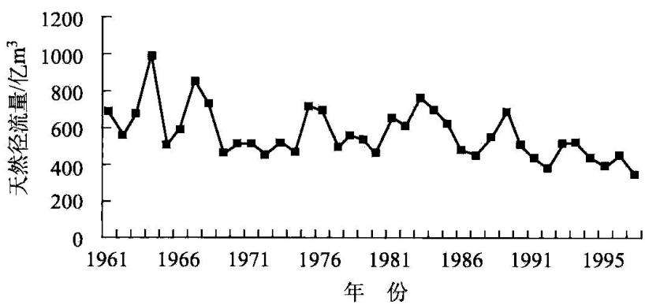  
图1.21 花园口天然径流量变化过程

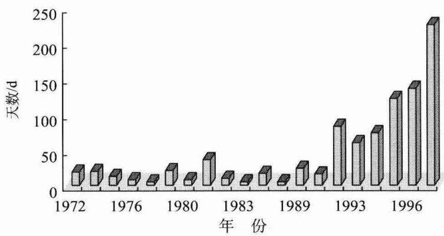  
图1.22 黄河流域断流情况

## (四)长 江

长江是我国最大的河流，居世界第3位。长江发源于青藏高原唐古拉山脉主峰，自西向东流经青海、西藏、四川、云南、重庆、湖北、湖南、江西、安徽、江苏、上海等11个省（自治区、直辖市），支流延展于甘肃、陕西、广西、贵州、河南、浙江、广州等8个省（自治区）。长江全长6300km，流域面积为180.85万km²，占全国总面积的18.8%。长江西以芒康山、云岭与澜沧江水系为界，北隔巴颜喀拉山、秦岭、大别山与黄河、淮河为界，东临东海，南以南岭、武夷山、天目山与珠江、福建、浙江等地的水系为界。宜昌以上为长江的上游，宜昌到湖口区间为长江中游，湖口以下为长江下游。

长江流域大部分地区处于中纬度亚热带季风气候区，雨量充沛，热量丰富，年均降水量为1100mm，5～10月为汛期，主要降水量集中在夏季。流域内地貌类型多样，高原、山地和丘陵占84.7%、平原占11.3%。地势西高

东低，形成三级阶梯。

长江水系发达，宜昌以上的上游长达4500km，集水面积100万 $\mathrm { k m ^ { 2 } }$ 河流补给以高原融雪水和降水为主，主要支流有岷江、沱江、嘉陵江等。中游河段长938km，集水面积为68万km²，主要支流有清江、汉江、洞庭湖水系和鄱阳湖水系。下游河段长835km，集水面积13万km²，主要支流有巢湖水系、青戈江、太湖水系等。

长江多年平均径流量为9513亿m3，90%以上的径流来源于上游和中游地区，其中上游占46.5%，中游占47.3%，而下游只占多年平均径流总量的6.3%（表1.25)。长江是以雨水补给为主的河流，雨水补给占年径流总量的70%\~80%，地下水补给只占20%～30%。发源于青藏高原的通天河、雅袭江和大渡河有部分高山冰雪融水补给。因此，长江流域径流的年内变化情况与年降水比较一致。其汛期有由东南向西北推迟的趋势，汛期径流量可占全年径流总量的70%～80%。长江干流年径流的多年变化比较小，实测最大年径流量与最小年径流量的比值，除汉口外都不到两倍，但具有连续丰水年和枯水年的交替现象。

表1.25 长江干、支流主要控制站多年平均水沙特性（1954～1984年）
<table><tr><td colspan="1" rowspan="1">河流</td><td colspan="1" rowspan="2">测站</td><td colspan="1" rowspan="2">集水面积 $/ \mathrm { k m } ^ { 2 }$ </td><td colspan="1" rowspan="2">年径流量 $/ 1 Z _ { \mathrm { ~ m } ^ { 3 } }$ </td><td colspan="1" rowspan="2">年输沙量/万t</td><td colspan="1" rowspan="2">平均含沙量 $/ ( \mathrm { k g / m ^ { 3 } } )$ </td></tr><tr><td colspan="1" rowspan="1">干流       支流</td></tr><tr><td colspan="1" rowspan="1">金沙江</td><td colspan="1" rowspan="1">渡口</td><td colspan="1" rowspan="1">284 540</td><td colspan="1" rowspan="1">524</td><td colspan="1" rowspan="1">3 950</td><td colspan="1" rowspan="1">0.754</td></tr><tr><td colspan="1" rowspan="1">雅砻江</td><td colspan="1" rowspan="1">小得石+湾滩</td><td colspan="1" rowspan="1">129 294</td><td colspan="1" rowspan="1">564</td><td colspan="1" rowspan="1">3 720</td><td colspan="1" rowspan="1">0.660</td></tr><tr><td colspan="1" rowspan="1">金沙江</td><td colspan="1" rowspan="1">屏山</td><td colspan="1" rowspan="1">485 099</td><td colspan="1" rowspan="1">1 420</td><td colspan="1" rowspan="1">24 000</td><td colspan="1" rowspan="1">1.69</td></tr><tr><td colspan="1" rowspan="1">岷江</td><td colspan="1" rowspan="1">高场</td><td colspan="1" rowspan="1">135 378</td><td colspan="1" rowspan="1">876</td><td colspan="1" rowspan="1">5 020</td><td colspan="1" rowspan="1">0.573</td></tr><tr><td colspan="1" rowspan="1">沱江</td><td colspan="1" rowspan="1">李家湾</td><td colspan="1" rowspan="1">23 283</td><td colspan="1" rowspan="1">127</td><td colspan="1" rowspan="1">1 300</td><td colspan="1" rowspan="1">1.03</td></tr><tr><td colspan="1" rowspan="1">长江</td><td colspan="1" rowspan="1">朱沱</td><td colspan="1" rowspan="1">694 725</td><td colspan="1" rowspan="1">2 660</td><td colspan="1" rowspan="1">31 000</td><td colspan="1" rowspan="1">1.17</td></tr><tr><td colspan="1" rowspan="1">嘉陵江</td><td colspan="1" rowspan="1">北碚</td><td colspan="1" rowspan="1">156 142</td><td colspan="1" rowspan="1">709</td><td colspan="1" rowspan="1">14 500</td><td colspan="1" rowspan="1">2.05</td></tr><tr><td colspan="1" rowspan="1">长江</td><td colspan="1" rowspan="1">寸滩</td><td colspan="1" rowspan="1">866 559</td><td colspan="1" rowspan="1">3 500</td><td colspan="1" rowspan="1">46 500</td><td colspan="1" rowspan="1">1.33</td></tr><tr><td colspan="1" rowspan="1">乌江</td><td colspan="1" rowspan="1">武滩</td><td colspan="1" rowspan="1">83 035</td><td colspan="1" rowspan="1">501</td><td colspan="1" rowspan="1">3 280</td><td colspan="1" rowspan="1">0.656</td></tr><tr><td colspan="1" rowspan="1">长江</td><td colspan="1" rowspan="1">万县</td><td colspan="1" rowspan="1">974 881</td><td colspan="1" rowspan="1">4 030</td><td colspan="1" rowspan="1">49 200</td><td colspan="1" rowspan="1">1.22</td></tr><tr><td colspan="1" rowspan="1">长江</td><td colspan="1" rowspan="1">宜昌</td><td colspan="1" rowspan="1">1 005 501</td><td colspan="1" rowspan="1">4400</td><td colspan="1" rowspan="1">53 000</td><td colspan="1" rowspan="1">1.21</td></tr><tr><td colspan="1" rowspan="1">清江</td><td colspan="1" rowspan="1">长阳</td><td colspan="1" rowspan="1">15 300</td><td colspan="1" rowspan="1">136</td><td colspan="1" rowspan="1">1 020</td><td colspan="1" rowspan="1">0.744</td></tr><tr><td colspan="1" rowspan="1">湘江</td><td colspan="1" rowspan="1">湘潭</td><td colspan="1" rowspan="1">81 638</td><td colspan="1" rowspan="1">645</td><td colspan="1" rowspan="1">1 160</td><td colspan="1" rowspan="1">0.180</td></tr><tr><td colspan="1" rowspan="1">资水</td><td colspan="1" rowspan="1">桃江</td><td colspan="1" rowspan="1">26 704</td><td colspan="1" rowspan="1">227</td><td colspan="1" rowspan="1">260</td><td colspan="1" rowspan="1">0.115</td></tr><tr><td colspan="1" rowspan="1">河流</td><td colspan="1" rowspan="2">测站</td><td colspan="1" rowspan="2">集水面积 $/  { \mathrm { k m } } ^ { 2 }$ </td><td colspan="1" rowspan="2">年径流量 $1 1 2 m ^ { 3 }$ </td><td colspan="1" rowspan="2">年输沙量/万t</td><td colspan="1" rowspan="2">平均含沙量/(kg/m³)</td></tr><tr><td colspan="1" rowspan="1">干流       支流</td></tr><tr><td colspan="1" rowspan="1">沅水</td><td colspan="1" rowspan="1">桃源</td><td colspan="1" rowspan="1">85 223</td><td colspan="1" rowspan="1">657</td><td colspan="1" rowspan="1">1 440</td><td colspan="1" rowspan="1">0.219</td></tr><tr><td colspan="1" rowspan="1">汉江</td><td colspan="1" rowspan="1">皇庄建库前</td><td colspan="1" rowspan="1">142 056</td><td colspan="1" rowspan="1">531</td><td colspan="1" rowspan="1">12 400</td><td colspan="1" rowspan="1">2.33</td></tr><tr><td colspan="1" rowspan="1"></td><td colspan="1" rowspan="1">皇庄建库后</td><td colspan="1" rowspan="1">142 056</td><td colspan="1" rowspan="1">502</td><td colspan="1" rowspan="1">3 010</td><td colspan="1" rowspan="1">0.600</td></tr><tr><td colspan="1" rowspan="1">长江</td><td colspan="1" rowspan="1">汉口</td><td colspan="1" rowspan="1">1 488 036</td><td colspan="1" rowspan="1">7 120</td><td colspan="1" rowspan="1">43 400</td><td colspan="1" rowspan="1">0.611</td></tr><tr><td colspan="1" rowspan="1">赣江</td><td colspan="1" rowspan="1">外洲</td><td colspan="1" rowspan="1">80 948</td><td colspan="1" rowspan="1">658</td><td colspan="1" rowspan="1">1 150</td><td colspan="1" rowspan="1">0.175</td></tr><tr><td colspan="1" rowspan="1">长江</td><td colspan="1" rowspan="1">大通</td><td colspan="1" rowspan="1">1 705 383</td><td colspan="1" rowspan="1">8 910</td><td colspan="1" rowspan="1">47 200</td><td colspan="1" rowspan="1">0.530</td></tr></table>

长江流域的悬移质输沙量的年内分布大体与径流过程相对应，但因产沙与暴雨的关系更为密切，因此，输沙量的年内分布比径流的年内分布更集中。上游的输沙量集中程度通常大于中下游，输沙量最大的月份一般在7月份。长江的多年平均含沙量在渡口为 $0 . 7 5 4 ~ \mathrm { k g / m ^ { 3 } }$ ，向下沿程增加，至金沙江的控制站屏山时，河流含沙量达到了 $1 . 6 9 ~ \mathrm { k g } / \mathrm { m } ^ { 3 }$ 。随后受含沙量较低支流（岷江、沱江等）的稀释作用的影响，含沙量逐渐下降，到朱沱水文站时下降至1.17 $\mathrm { k g / m ^ { 3 } }$ ，受含沙量较高支流嘉陵江的影响，含沙量增大，到宜昌站时达到了 $1 . 2 1 ~ \mathrm { k g } / \mathrm { m } ^ { 3 }$ ，输沙总量达到了5.30亿t，进入中下游地区含沙量逐渐下降（表1.26）。

表1.26 长江流域悬移质输沙模数分布
<table><tr><td colspan="1" rowspan="2">输沙模数/[t/(km²·a)]</td><td colspan="3" rowspan="1">面积/万km²</td><td colspan="1" rowspan="2">占流域面积的比例/%</td><td colspan="1" rowspan="2">主要分布地区</td></tr><tr><td colspan="1" rowspan="1">上游</td><td colspan="1" rowspan="1">中下游</td><td colspan="1" rowspan="1">小计</td></tr><tr><td colspan="1" rowspan="1">&lt;100</td><td colspan="1" rowspan="1">30.4</td><td colspan="1" rowspan="1">28.8</td><td colspan="1" rowspan="1">59.2</td><td colspan="1" rowspan="1">32.9</td><td colspan="1" rowspan="1">江源地区，金沙江、雅砻江与大渡河的上游，乌江上游，长江中下游</td></tr><tr><td colspan="1" rowspan="1">100~200</td><td colspan="1" rowspan="1">13.5</td><td colspan="1" rowspan="1">27.7</td><td colspan="1" rowspan="1">41.2</td><td colspan="1" rowspan="1">22.9</td><td colspan="1" rowspan="1">金沙江中上游，雅砻江、大渡河中游，湘江与资水中上游，鄱阳湖水系上游</td></tr><tr><td colspan="1" rowspan="1">200~500</td><td colspan="1" rowspan="1">29.9</td><td colspan="1" rowspan="1">14.4</td><td colspan="1" rowspan="1">44.3</td><td colspan="1" rowspan="1">24.6</td><td colspan="1" rowspan="1">岷江、沱江、嘉陵江中下游及上游部分地区，赤水河下游，乌江下游，汉江下游地区，唐白河，大别山南麓诸水系的中上游，沅水中游，澧水上游，赣江与修水上游</td></tr><tr><td colspan="1" rowspan="1">500~1000</td><td colspan="1" rowspan="1">19.0</td><td colspan="1" rowspan="1">8.1</td><td colspan="1" rowspan="1">27.1</td><td colspan="1" rowspan="1">15.0</td><td colspan="1" rowspan="1">雅砻河下游，横江、乌江上游，赤水河中上游，渠江上游，长江干流三峡区间，清江、汉江上游干流区间</td></tr><tr><td colspan="1" rowspan="1">1000~2000</td><td colspan="1" rowspan="1">4.0</td><td colspan="1" rowspan="1">0.5</td><td colspan="1" rowspan="1">4.5</td><td colspan="1" rowspan="1">2.5</td><td colspan="1" rowspan="1">嘉陵江上游部分地区，涪江及渠江上游部分地区，大渡河下游，青衣江上游，金沙江下游干流区间</td></tr><tr><td colspan="1" rowspan="1">2000~3000</td><td colspan="1" rowspan="1">3.0</td><td colspan="1" rowspan="1"></td><td colspan="1" rowspan="1">3.0</td><td colspan="1" rowspan="1">1.7</td><td colspan="1" rowspan="1">金沙江下游干流地区，嘉陵江上游支流白龙江中游，西汉水中上游</td></tr><tr><td colspan="1" rowspan="1">&gt;3000</td><td colspan="1" rowspan="1">0.7</td><td colspan="1" rowspan="1"></td><td colspan="1" rowspan="1">0.7</td><td colspan="1" rowspan="1">0.4</td><td colspan="1" rowspan="1">金沙江下游干流区间部分地区，西汉水上游</td></tr></table>

长江上游地区的泥沙主要来源于金沙江，该河的多年平均悬移质输沙量为2.40亿t，占到宜昌站的45.3%；其次是嘉陵江，占上游泥沙总量的27.4%，因此，上游各年泥沙量的大小主要取决于金沙江、嘉陵江的来沙数量及其组成。长江流域悬移质泥沙的沿程分布具有明显的地带性规律，主要来自高产沙地带（表1.26）。

## (五)淮 河

淮河流域西起伏牛山，东临黄海，南以大别山、桐柏山脉与长江流域为界，北以黄河南大堤和沂蒙山与黄河流域分界。河流全长1000km，流域面积26.98万km²，流经河南、安徽、江苏、山东、湖北等省。淮河在三江营汇入长江，洪河口以上为上游，长360km；洪河口以下至洪泽湖出口中渡为中游，长490km；中渡以下至三江营为下游入江水道，长150km。

淮河地处我国南北气候过渡带，以南为北亚热带，以北为暖温度带，本流域属半湿润季风气候区。多年平均降水量888mm，其中淮河水系910mm，沂沭泗水系836mm。山东半岛多年平均降水量为731mm。多年平均降水量的分布状况大致是由南向北递减，山区多于平原，沿海大于内陆。降水量年际变化较大，最大年雨量为最小年雨量的3～4倍。降水量的年内分配也极不均匀，汛期（6～9月）降水量占年降水量的50%～80%。

淮河流域多年平均年径流量为611亿m3，折合平均年径流深230mm，其中淮河水系237mm，沂沭泗水系215mm。山东半岛多年平均径流深199mm。多年平均年径流深分布状况与多年平均年降水量相似。淮河流域的年均输沙模数除北汝河达 $1 8 6 2 ~ \mathrm { t / ( k m ^ { 2 } \cdot { \^ { a } } ) }$ ，多在1000 t/(km²·a)以下。但就地沙石的堆积，影响河道行洪安全。根据流域内不同侵蚀强度等级的侵蚀模数推算，淮河流域丘陵山区的年侵蚀总量为2.32亿t，平原砂石土区年侵蚀量约0.3亿t，全流域总计2.62亿t（表1.27）。

表1.27 淮河流域主要水系水沙特征
<table><tr><td rowspan=1 colspan=1>河名</td><td rowspan=1 colspan=1>测站</td><td rowspan=1 colspan=1>流域面积/km²</td><td rowspan=1 colspan=1>年均径流量/亿m³</td><td rowspan=1 colspan=1>年均输沙量/万t</td><td rowspan=1 colspan=1>输沙模数/[t/(km²·a)]</td><td rowspan=1 colspan=1>含沙量/(kg/m³)</td></tr><tr><td rowspan=1 colspan=1>淮河</td><td rowspan=1 colspan=1>蚌埠</td><td rowspan=1 colspan=1>117 000</td><td rowspan=1 colspan=1>68.9</td><td rowspan=1 colspan=1>1 482</td><td rowspan=1 colspan=1>120</td><td rowspan=1 colspan=1>0.465</td></tr><tr><td rowspan=1 colspan=1>淮河</td><td rowspan=1 colspan=1>息县</td><td rowspan=1 colspan=1>10 190</td><td rowspan=1 colspan=1>30.2</td><td rowspan=1 colspan=1>397</td><td rowspan=1 colspan=1>397</td><td rowspan=1 colspan=1>0.760</td></tr><tr><td rowspan=1 colspan=1>颖河</td><td rowspan=1 colspan=1>搞城</td><td rowspan=1 colspan=1>627</td><td rowspan=1 colspan=1>18.8</td><td rowspan=1 colspan=1>40</td><td rowspan=1 colspan=1>642</td><td rowspan=1 colspan=1>4.690</td></tr><tr><td rowspan=1 colspan=1>北汝河</td><td rowspan=1 colspan=1>紫罗山</td><td rowspan=1 colspan=1>1 800</td><td rowspan=1 colspan=1>146.1</td><td rowspan=1 colspan=1>335</td><td rowspan=1 colspan=1>1 862</td><td rowspan=1 colspan=1>4.360</td></tr><tr><td rowspan=1 colspan=1>甘江河</td><td rowspan=1 colspan=1>管寨</td><td rowspan=1 colspan=1>1 030</td><td rowspan=1 colspan=1>28.7</td><td rowspan=1 colspan=1>101</td><td rowspan=1 colspan=1>983</td><td rowspan=1 colspan=1>2.84</td></tr><tr><td rowspan=1 colspan=1>东淠河</td><td rowspan=1 colspan=1>白连崖</td><td rowspan=1 colspan=1>743</td><td rowspan=1 colspan=1>1.4</td><td rowspan=1 colspan=1>28</td><td rowspan=1 colspan=1>384</td><td rowspan=1 colspan=1>0.51</td></tr><tr><td rowspan=1 colspan=1>沂河</td><td rowspan=1 colspan=1>临沂</td><td rowspan=1 colspan=1>5 912</td><td rowspan=1 colspan=1>33.6</td><td rowspan=1 colspan=1>305</td><td rowspan=1 colspan=1>587</td><td rowspan=1 colspan=1>1.100</td></tr><tr><td rowspan=1 colspan=1>沭河</td><td rowspan=1 colspan=1>莒县</td><td rowspan=1 colspan=1>547</td><td rowspan=1 colspan=1>5.0</td><td rowspan=1 colspan=1>43</td><td rowspan=1 colspan=1>786</td><td rowspan=1 colspan=1>1.16</td></tr></table>

## (六)珠 江

珠江由西江、北江、东江和三角洲网河组成，跨越云南、广西、贵州、广东、湖南和江西6省（自治区）。流域面积为453690km²，其中二级支流左江的上游在越南境内为 $1 1 ~ 5 9 0 ~ \mathrm { k m ^ { 2 } }$ ，中国境内珠江流域面积为442100km²。珠江的4个水系中，西江是主干流，发源于云南省曲靖市的雄山，经南盘山、红水河等支流至广东省三水县思贤窖与九江汇合流入三角洲网河，从企人石流入南海，全长2214km。北江发源于江西省信丰县大茅坑山，流至广东邵关与发源与湖南的武江汇合后称北江，经南水、翁江至思贤窖与西江汇合。东江发源于江西省寻乌县的桠髻钵山，至广东龙川县合河坝会贝岭水后称东江，经纳利江等支流至东莞市石龙镇流入三角洲网河。珠江三角洲由思贤窖以下的西、北江三角洲和石龙以下的东江三角洲以及流溪河、深圳河等河流组成（表1.28）。

表 1.28 珠江流域水系组成情况 (单位： $ { \mathrm { k m } } ^ { 2 } )$
<table><tr><td>区域</td><td>西江</td><td>北江</td><td>东江</td><td>三角洲</td><td>合计</td><td>占全流域/%</td></tr><tr><td>云南</td><td>59 380</td><td></td><td></td><td></td><td>59380</td><td>13.09</td></tr><tr><td>贵州</td><td>60 360</td><td></td><td></td><td></td><td>60 360</td><td>13.30</td></tr><tr><td>广西</td><td>202 410</td><td>30</td><td></td><td></td><td>202 440</td><td>44.62</td></tr><tr><td>广东</td><td>17 960</td><td>42 930</td><td>23 540</td><td>26 820</td><td>111 250</td><td>24.52</td></tr><tr><td>湖南</td><td>1420</td><td>3 690</td><td></td><td></td><td>5110</td><td>1.13</td></tr><tr><td>江西</td><td></td><td>60</td><td>3 500</td><td></td><td>3 560</td><td>0.78</td></tr></table>

珠江流域地处亚热带和热带北沿，高温多雨，热量丰富。年均降水量1200～2000mm，空间和时间分布都不均匀，降雨持续时间长，年雨日140天以上，夏季雨量占年降水量的44%，且多暴雨。珠江流域以高原、山地丘陵和盆地为主，发育于云贵高原的西江支流南、北盘江地区山高坡陡，面蚀、沟蚀比较发育。中游以广西盆地的岩溶区为主，下游是缓丘和三角洲平原。高温湿热的气候条件导致下游地区岩石物理和化学风化都比较强烈，形成抗蚀性弱的厚层风化物。

珠江流域多年平均径流总量为3360亿 $\mathrm { { m ^ { 3 } } }$ ，流域人均水资源量为4700$\mathbf { m } ^ { 3 }$ ，相当于全国人均水资源量的1.7倍。珠江是我国各大河流中含沙量最小的河流，多年平均含沙量为 $0 . 1 2 6 \sim 0 . 3 3 4 ~ \mathrm { k g / \ m ^ { 3 } }$ 。珠江的泥沙主要来源于水土流失强烈的西江流域，该流域水土流失面积 $5 3 ~ 3 2 7 ~ \mathrm { k m ^ { 2 } }$ ，占流域侵蚀总面积的93.44%（张凤洲，1990）。据西江支流北盘江的多年观测资料，土城、大渡口和草坪头水文站的多年平均悬移质输沙模数分别为 $1 2 8 6 ~ \mathrm { t / ( k m ^ { 2 } \cdot { a } ) }$ $1 3 7 3 ~ \mathrm { t / ( k m ^ { 2 } \cdot a ) }$ 和 $\mathrm { 1 0 2 7 ~ t / ( k m ^ { 2 } ~ \bullet ~ a ) }$ ，是珠江流域输沙模数最大的地区（安和平和周家雄，1994)。东江流域的输沙量年际变化很大，据龙川站的观测资料，最大年和最小年的输沙量相差15.4倍（廖安中等，1997)。北江中上游水系中以淡水小古录站的含沙量为最大，为 $0 . 3 3 1 ~ \mathrm { k g } / \mathrm { ~ m } ^ { 3 }$ ，年输沙量47.5万t(表1.29)。

表1.29 北江中上游各水系输沙量和含沙量
<table><tr><td rowspan=1 colspan=1>水系</td><td rowspan=1 colspan=1>观测站</td><td rowspan=1 colspan=1>输沙量/万t</td><td rowspan=1 colspan=1>含沙量/(kg/m³)</td></tr><tr><td rowspan=1 colspan=1>淡水</td><td rowspan=1 colspan=1>小古录</td><td rowspan=1 colspan=1>47.5</td><td rowspan=1 colspan=1>0.331</td></tr><tr><td rowspan=1 colspan=1>武水</td><td rowspan=1 colspan=1>黎市</td><td rowspan=1 colspan=1>95.7</td><td rowspan=1 colspan=1>0.162</td></tr><tr><td rowspan=1 colspan=1>翁水</td><td rowspan=1 colspan=1>典岗</td><td rowspan=1 colspan=1>68.0</td><td rowspan=1 colspan=1>0.134</td></tr><tr><td rowspan=1 colspan=1>连水</td><td rowspan=1 colspan=1>高道</td><td rowspan=1 colspan=1>148.0</td><td rowspan=1 colspan=1>0.156</td></tr><tr><td rowspan=1 colspan=1>北江</td><td rowspan=1 colspan=1>马径察</td><td rowspan=1 colspan=1>224.0</td><td rowspan=1 colspan=1>0.146</td></tr><tr><td rowspan=1 colspan=1>北江</td><td rowspan=1 colspan=1>横石</td><td rowspan=1 colspan=1>470.0</td><td rowspan=1 colspan=1>0.138</td></tr></table>

## 第四节 土 壤

土壤是人类赖以生存的重要资源，是侵蚀作用的主要对象。我国地域辽阔，成土环境复杂，土壤类型多样，土壤特性差异大。本节主要从土壤侵蚀角度，重点介绍了土壤类型、土壤分布、土壤厚度和土壤可蚀性。

## 一、土壤类型

中国是一个古老的农业国，地处黄土高原的西安半坡仰韶文化遗址中的谷粒有5600～6080年之久，长江三角洲海姆渡文化遗址中的稻谷有6890～7040年，湖南澧县彭头山遗址中的稻壳为8200～9100年，说明八九千年前就有土壤耕垦。土壤分类是进行土地管理的依据，经过了不同的发展阶段。龚子同等（1999）将土壤分类划分为3个阶段：古代土壤分类、近代土壤分类和现代土壤分类。我国古代土壤分类最早被认为出自《禹贡》，有4000多年历史，依据土壤肥力、颜色、质地等将土壤分为白壤、黒坟、赤埴坟、涂泥、青黎、黄壤、白坟、垆、埴等9种。除我国外，还有古罗马土壤分类和古希腊土壤分类等。全面科学的土壤分类开始于土壤学创始人道库恰耶夫。1883年他的《俄罗斯黑钙土》一书的出版，标志着近代土壤分类的开始，其主要分类依据是土壤发生学特性，称为发生学分类。此外，欧洲、美国等早期的土壤分类也属此范畴。以美国为代表的、出版于1960年的《土壤系统分类第7次草案》标志着土壤分类进入现代阶段(Soil Survey Staff. Soil Classification，1960)，它以诊断层和诊断特性为依据对土壤进行分类，一般称为诊断分类，属于定量分类系统。

分类是进一步认识、科学归类、合理应用土壤资源的重要基础，是学科发展水平的反映。我国在土壤发生学分类和土壤诊断分类中都取得了重大进展和丰硕成果。水土保持工作者目前对这两种分类都有使用，所以本书对这两种分类做一简要对比介绍。

## （一）土壤发生学分类

我国第一个比较完整的土壤发生学分类方案于1954年出台（中国土壤学会，1955），1978年由中国土壤学会编写的《中国土壤（第二版)》一书对该分类系统进行了全面的介绍（中国土壤学会，1978）。随后不断修订完善（熊毅和李庆逵，1990)。1987年在全国第二次土壤普查基础上，拟定了《中国土壤分类系统》，并于1992年定稿（全国土壤普查办公室，1993)。确定了全国土壤分为12个土纲、30个亚纲、61个土类、233个亚类（表1.30、图1.23）。

表1.30 中国土壤分类系统（1992年发生学分类）
<table><tr><td rowspan=1 colspan=1>土纲</td><td rowspan=1 colspan=1>亚纲</td><td rowspan=1 colspan=1>土类</td></tr><tr><td rowspan=2 colspan=1>铁铝土</td><td rowspan=1 colspan=1>湿热铁铝土</td><td rowspan=1 colspan=1>砖红壤、赤红壤、红壤</td></tr><tr><td rowspan=1 colspan=1>湿暖铁铝土</td><td rowspan=1 colspan=1>黄壤</td></tr><tr><td rowspan=4 colspan=1>淋溶土</td><td rowspan=1 colspan=1>湿暖淋溶土</td><td rowspan=1 colspan=1>黄棕壤、黄褐土</td></tr><tr><td rowspan=1 colspan=1>湿暖温淋溶土</td><td rowspan=1 colspan=1>棕壤</td></tr><tr><td rowspan=1 colspan=1>湿温淋溶土</td><td rowspan=1 colspan=1>暗棕壤、白浆土</td></tr><tr><td rowspan=1 colspan=1>湿寒温淋溶土</td><td rowspan=1 colspan=1>棕色针叶林土、灰化土、漂灰土</td></tr><tr><td rowspan=3 colspan=1>半淋溶土半</td><td rowspan=1 colspan=1>半湿热半淋溶土</td><td rowspan=1 colspan=1>燥红土</td></tr><tr><td rowspan=1 colspan=1>湿暖温半淋溶土</td><td rowspan=1 colspan=1>褐土</td></tr><tr><td rowspan=1 colspan=1>半湿润半淋溶土</td><td rowspan=1 colspan=1>灰褐土、黑土、灰色森林土</td></tr><tr><td rowspan=3 colspan=1>钙层土</td><td rowspan=1 colspan=1>半湿暖温钙层土</td><td rowspan=1 colspan=1>黑钙土</td></tr><tr><td rowspan=1 colspan=1>半干温钙层土</td><td rowspan=1 colspan=1>栗钙土</td></tr><tr><td rowspan=1 colspan=1>半干暖钙层土</td><td rowspan=1 colspan=1>栗褐土、黑垆土</td></tr><tr><td rowspan=2 colspan=1>干旱土</td><td rowspan=1 colspan=1>干旱温钙层土</td><td rowspan=1 colspan=1>棕钙土</td></tr><tr><td rowspan=1 colspan=1>干旱暖钙层土</td><td rowspan=1 colspan=1>灰钙土</td></tr><tr><td rowspan=2 colspan=1>漠土</td><td rowspan=1 colspan=1>干旱温漠土</td><td rowspan=1 colspan=1>灰漠土、灰棕漠土</td></tr><tr><td rowspan=1 colspan=1>干旱暖温漠土</td><td rowspan=1 colspan=1>棕漠土</td></tr><tr><td rowspan=2 colspan=1>初育土</td><td rowspan=1 colspan=1>土质初育土</td><td rowspan=1 colspan=1>黄绵土、红黏土、新积土、龟裂土、风沙土</td></tr><tr><td rowspan=1 colspan=1>石质初育土</td><td rowspan=1 colspan=1>石灰（岩）土、火山灰土、紫色土、磷质石灰土、粗骨土、石质土</td></tr><tr><td rowspan=2 colspan=1>半水成土</td><td rowspan=1 colspan=1>暗淡水成土</td><td rowspan=1 colspan=1>草甸土</td></tr><tr><td rowspan=1 colspan=1>淡半水成土</td><td rowspan=1 colspan=1>潮土、砂浆黑土、林灌草甸土、山地草甸土</td></tr><tr><td rowspan=2 colspan=1>水成土</td><td rowspan=1 colspan=1>矿质水成土</td><td rowspan=1 colspan=1>沼泽土</td></tr><tr><td rowspan=1 colspan=1>有机水成土</td><td rowspan=1 colspan=1>泥炭土</td></tr><tr><td rowspan=2 colspan=1>盐碱土</td><td rowspan=1 colspan=1>盐土</td><td rowspan=1 colspan=1>盐土、滨海盐土、酸性硫酸盐土、漠境盐土、寒原盐土</td></tr><tr><td rowspan=1 colspan=1>碱土</td><td rowspan=1 colspan=1>碱土</td></tr><tr><td rowspan=2 colspan=1>人为土</td><td rowspan=1 colspan=1>人为土</td><td rowspan=1 colspan=1>水稻土</td></tr><tr><td rowspan=1 colspan=1>灌耕土</td><td rowspan=1 colspan=1>灌淤土、灌漠土</td></tr><tr><td rowspan=4 colspan=1>高山土</td><td rowspan=1 colspan=1>湿寒高山土</td><td rowspan=1 colspan=1>草毡土、黑毡土</td></tr><tr><td rowspan=1 colspan=1>半湿寒高山土</td><td rowspan=1 colspan=1>寒钙土、冷钙土、冷棕钙土</td></tr><tr><td rowspan=1 colspan=1>干寒高山土</td><td rowspan=1 colspan=1>寒漠土、冷漠土</td></tr><tr><td rowspan=1 colspan=1>寒冻高山土</td><td rowspan=1 colspan=1>寒冻土</td></tr></table>

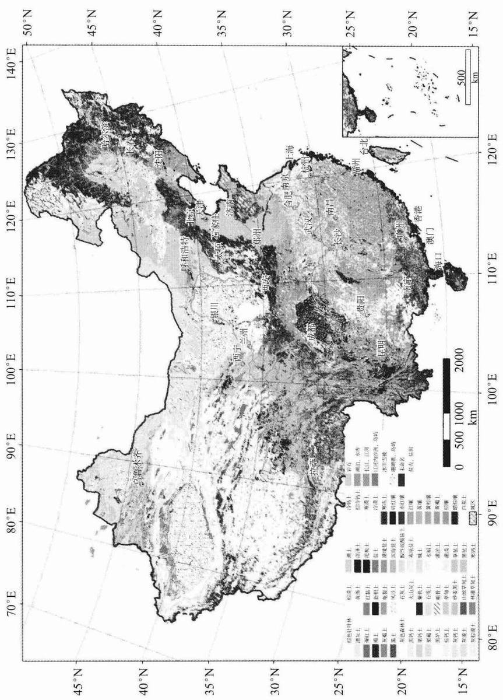

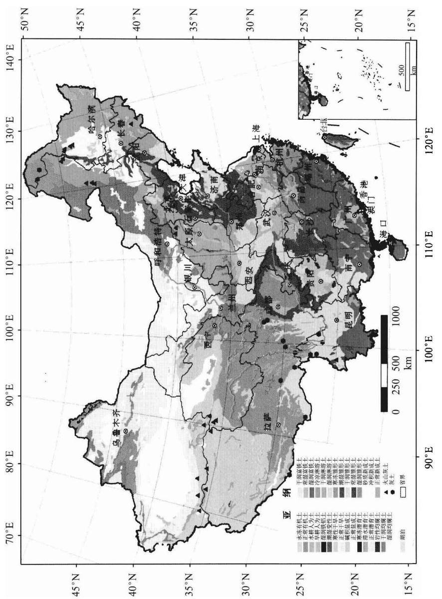

## （二）土壤系统分类

系统分类是诊断分类的进一步发展和提高。我国从1984年开始进行中国土壤系统分类研究，经过近10年的多次讨论修订，于1991年提出了《中国土壤系统分类（首次方案)》（1991），1995年又提出了《中国土壤系统分类(修订方案)》（1995)。最终在《中国土壤系统分类理论·方法·实践》(龚子同等，1999）一书中对10多年的成果进行了系统总结和详细论述。该分类系统将我国土壤共分为14个土纲、39个亚纲、141个土类、595个亚类(表1.31，图1.24)。本书对此稍加详细介绍。

表1.31 中国土壤系统分类检索表
<table><tr><td colspan="1" rowspan="1">土纲</td><td colspan="1" rowspan="1">亚纲</td><td colspan="1" rowspan="1">土类</td><td colspan="1" rowspan="1">土纲</td><td colspan="1" rowspan="1">亚纲</td><td colspan="1" rowspan="1">土类</td></tr><tr><td colspan="1" rowspan="7">有机土(A)</td><td colspan="1" rowspan="3">永冻有机土(A1)</td><td colspan="1" rowspan="1">落叶永冻有机土（A1.1）</td><td colspan="1" rowspan="7">变性土(F)</td><td colspan="1" rowspan="2">潮湿变性土(F1)</td><td colspan="1" rowspan="1">钙积潮湿变性土（F1.1）</td></tr><tr><td colspan="1" rowspan="1">纤维永冻有机土（A1.2）</td><td colspan="1" rowspan="1">简育潮湿变性土(F1.2)</td></tr><tr><td colspan="1" rowspan="1">半腐永冻有机土（A1.3）</td><td colspan="1" rowspan="2">干润变性土(F2)</td><td colspan="1" rowspan="1">钙积干润变性土(F2.1)</td></tr><tr><td colspan="1" rowspan="4">正常有机土(A2)</td><td colspan="1" rowspan="1">落叶正常有机土（A2.1）</td><td colspan="1" rowspan="1">简育干润变性土(F2.2)</td></tr><tr><td colspan="1" rowspan="1">纤维正常有机土（A2.2）</td><td colspan="1" rowspan="3">湿润变性土(F3)</td><td colspan="1" rowspan="1">腐殖湿润变性土(F3.1)</td></tr><tr><td colspan="1" rowspan="1">半腐正常有机土（A2.3）</td><td colspan="1" rowspan="1">钙积湿润变性土(F3.2)</td></tr><tr><td colspan="1" rowspan="1">高腐正常有机土（A2.4）</td><td colspan="1" rowspan="1">简育湿润变性土(F3.3)</td></tr><tr><td colspan="1" rowspan="8">人为土(B)</td><td colspan="1" rowspan="4">水耕人为土(B1)</td><td colspan="1" rowspan="1">潜育水耕人为土（B1.1）</td><td colspan="1" rowspan="9">干旱土(G)</td><td colspan="1" rowspan="4">寒性干旱土(G1)</td><td colspan="1" rowspan="1">钙积寒性干旱土(G1.1)</td></tr><tr><td colspan="1" rowspan="1">铁渗水耕人为土（B1.2）</td><td colspan="1" rowspan="1">石膏寒性干旱土(G1.2)</td></tr><tr><td colspan="1" rowspan="1">铁聚水耕人为土（B1.3)</td><td colspan="1" rowspan="1">黏化寒性干旱土(G1.3)</td></tr><tr><td colspan="1" rowspan="1">简育水耕人为土（B1.4）</td><td colspan="1" rowspan="1">简育寒性干旱土(G1.4)</td></tr><tr><td colspan="1" rowspan="4">旱耕人为土(B2)</td><td colspan="1" rowspan="1">肥熟旱耕人为土（B2.1）</td><td colspan="1" rowspan="5">正常干旱土(G2)</td><td colspan="1" rowspan="1">钙积正常干旱土（G2.1）</td></tr><tr><td colspan="1" rowspan="1">灌淤旱耕人为土（B2.2）</td><td colspan="1" rowspan="1">盐积正常干旱土(G2.2)</td></tr><tr><td colspan="1" rowspan="1">泥垫旱耕人为土（B2.3）</td><td colspan="1" rowspan="1">石膏正常干旱土(G2.3)</td></tr><tr><td colspan="1" rowspan="1">土垫旱耕人为土（B2.4）</td><td colspan="1" rowspan="1">黏化正常干旱土(G2.4)</td></tr><tr><td colspan="1" rowspan="2">灰土(C)</td><td colspan="1" rowspan="1">腐殖灰土(C1)</td><td colspan="1" rowspan="1">简育腐殖灰土（C1.1）</td><td colspan="1" rowspan="1">简育正常干旱土（G2.5)</td></tr><tr><td colspan="1" rowspan="1">正常灰土(C2)</td><td colspan="1" rowspan="1">简育正常灰土（C2.1）</td><td colspan="1" rowspan="5">盐成土(H)</td><td colspan="1" rowspan="3">碱积盐成土(H1)</td><td colspan="1" rowspan="1">龟裂碱积盐成土（H1.1）</td></tr><tr><td colspan="1" rowspan="6">火山灰土(D)</td><td colspan="1" rowspan="2">寒冻火山灰土(D1)</td><td colspan="1" rowspan="1">永冻寒冻火山灰土（D1.1)</td><td colspan="1" rowspan="1">潮湿碱积盐成土（H1.2）</td></tr><tr><td colspan="1" rowspan="1">简育寒冻火山灰土(D1.2)</td><td colspan="1" rowspan="1">简育碱积盐成土（H1.3）</td></tr><tr><td colspan="1" rowspan="2">破璃火山灰土(D2)</td><td colspan="1" rowspan="1">干润破璃火山灰土（D2.1）</td><td colspan="1" rowspan="2">正常盐成土(H2)</td><td colspan="1" rowspan="1">干旱正常盐成土（H2.1）</td></tr><tr><td colspan="1" rowspan="1">湿润破璃火山灰土（D2.2）</td><td colspan="1" rowspan="1">潮湿正常盐成土（H2.2)</td></tr><tr><td colspan="1" rowspan="2">湿润火山灰土(D3)</td><td colspan="1" rowspan="1">腐殖湿润火山灰土（D3.1）</td><td colspan="1" rowspan="2">潜育</td><td colspan="1" rowspan="2">永冻潜育土(I1)</td><td colspan="1" rowspan="1">有机永冻潜育土（I1.1）</td></tr><tr><td colspan="1" rowspan="1">简育湿润火山灰土(D3.2)</td><td colspan="1" rowspan="1">简育永冻潜育土（I1.2）</td></tr><tr><td colspan="1" rowspan="2">铁铝土(E)</td><td colspan="1" rowspan="2">湿润铁铝土(E1)</td><td colspan="1" rowspan="1">暗红湿润铁铝土（E1.1）</td><td colspan="1" rowspan="2">土(I)</td><td colspan="1" rowspan="2">滞水潜育土(I2)</td><td colspan="1" rowspan="1">有机滞水潜育土（I2.1)</td></tr><tr><td colspan="1" rowspan="1">简育湿润铁铝土（E1.2）</td><td colspan="1" rowspan="1">简育滞水潜育土（I2.2）</td></tr><tr><td colspan="1" rowspan="3">潜育土（I)</td><td colspan="1" rowspan="3">正常潜育土(I3)</td><td colspan="1" rowspan="1">有机正常潜育土（I3.1）</td><td colspan="1" rowspan="2">淋溶土(L)</td><td colspan="1" rowspan="2">湿润淋溶土(L4)</td><td colspan="1" rowspan="1">铁质湿润淋溶土（L4.6）</td></tr><tr><td colspan="1" rowspan="1">暗沃正常潜育土（I3.2)</td><td colspan="1" rowspan="1">简育湿润淋溶土(L4.7)</td></tr><tr><td colspan="1" rowspan="1">简育正常潜育土（I3.3）</td><td colspan="1" rowspan="28">雏形土(M)</td><td colspan="1" rowspan="6">寒冻雏形土(M1)</td><td colspan="1" rowspan="1">永冻寒冻雏形土(M1.1)</td></tr><tr><td colspan="1" rowspan="39">均腐土(J)富铁土(K)淋溶土(L)</td><td colspan="1" rowspan="2">岩性均腐土(J1)</td><td colspan="1" rowspan="1">富磷岩性均腐土（J1.1)</td><td colspan="1" rowspan="1">潮湿寒冻雏形土（M1.2）</td></tr><tr><td colspan="1" rowspan="1">黑色岩性均腐土（J1.2)</td><td colspan="1" rowspan="1">草毡寒冻雏形土（M1.3）</td></tr><tr><td colspan="1" rowspan="5">干润均腐土(J2)</td><td colspan="1" rowspan="1">寒性干润均腐土(J2.1)</td><td colspan="1" rowspan="1">暗沃寒冻雏形土（M1.4）</td></tr><tr><td colspan="1" rowspan="1">堆垫干润均腐土(J2.2)</td><td colspan="1" rowspan="1">暗瘠寒冻雏形土（M1.5）</td></tr><tr><td colspan="1" rowspan="1">暗厚干润均腐土(J2.3)</td><td colspan="1" rowspan="1">简育寒冻雏形土（M1.6)</td></tr><tr><td colspan="1" rowspan="1">钙积干润均腐土（J2.4）</td><td colspan="1" rowspan="4">潮湿雏形土(M2)</td><td colspan="1" rowspan="1">叶垫潮湿雏形土（M2.1）</td></tr><tr><td colspan="1" rowspan="1">简育干润均腐土（J2.5)</td><td colspan="1" rowspan="1">砂姜潮湿雏形土（M2.2)</td></tr><tr><td colspan="1" rowspan="3">湿润均腐土(J3)</td><td colspan="1" rowspan="1">滞水湿润均腐土（J3.1)</td><td colspan="1" rowspan="1">暗色潮湿雏形土（M2.3)</td></tr><tr><td colspan="1" rowspan="1">黏化湿润均腐土（J3.2)</td><td colspan="1" rowspan="1">淡色潮湿雏形土(M2.4)</td></tr><tr><td colspan="1" rowspan="1">简育湿润均腐土(J3.3)</td><td colspan="1" rowspan="5">干润雏形土(M3)</td><td colspan="1" rowspan="1">灌淤干润雏形土（M3.1)</td></tr><tr><td colspan="1" rowspan="2">干润富铁土(K1)</td><td colspan="1" rowspan="1">黏化干润富铁土（K1.1）</td><td colspan="1" rowspan="1">铁质干润雏形土（M3.2)</td></tr><tr><td colspan="1" rowspan="1">简育干润富铁土（K1.2）</td><td colspan="1" rowspan="1">底锈干润雏形土（M3.3)</td></tr><tr><td colspan="1" rowspan="3">常湿富铁土(K2)</td><td colspan="1" rowspan="1">钙质常湿富铁土（K2.1）</td><td colspan="1" rowspan="1">暗沃干润雏形土(M3.4)</td></tr><tr><td colspan="1" rowspan="1">富铝常湿富铁土（K2.2）</td><td colspan="1" rowspan="1">简育干润雏形土（M3.5)</td></tr><tr><td colspan="1" rowspan="1">简育常湿富铁土（K2.3）</td><td colspan="1" rowspan="6">常湿雏形土(M4)</td><td colspan="1" rowspan="1">冷凉常湿雏形土(M4.1)</td></tr><tr><td colspan="1" rowspan="5">湿润富铁土(K3)</td><td colspan="1" rowspan="1">钙质湿润富铁土（K3.1)</td><td colspan="1" rowspan="1">滞水常湿雏形土（M4.2)</td></tr><tr><td colspan="1" rowspan="1">强育湿润富铁土（K3.2）</td><td colspan="1" rowspan="1">钙质常湿雏形土（M4.3）</td></tr><tr><td colspan="1" rowspan="1">富铝湿润富铁土（K3.3）</td><td colspan="1" rowspan="1">铝质常湿雏形土(M4.4)</td></tr><tr><td colspan="1" rowspan="1">黏化湿润富铁土（K3.4）</td><td colspan="1" rowspan="1">酸性常湿雏形土（M4.5）</td></tr><tr><td colspan="1" rowspan="1">简育湿润富铁土（K3.5）</td><td colspan="1" rowspan="1">简育常湿雏形土（M4.6）</td></tr><tr><td colspan="1" rowspan="3">冷凉淋溶土(L1)</td><td colspan="1" rowspan="1">漂白冷凉淋溶土（L1.1）</td><td colspan="1" rowspan="7">湿润雏形土(M5)</td><td colspan="1" rowspan="1">冷凉湿润雏形土（M5.1）</td></tr><tr><td colspan="1" rowspan="1">暗沃冷凉淋溶土（L1.2）</td><td colspan="1" rowspan="1">钙质湿润雏形土（M5.2）</td></tr><tr><td colspan="1" rowspan="1">简育冷凉淋溶土(L1.3)</td><td colspan="1" rowspan="1">紫色湿润雏形土（M5.3)</td></tr><tr><td colspan="1" rowspan="4">干润淋溶土(L2)</td><td colspan="1" rowspan="1">钙质干润淋溶土（L2.1）</td><td colspan="1" rowspan="1">铝质湿润雏形土（M5.4)</td></tr><tr><td colspan="1" rowspan="1">钙积干润淋溶土(L2.2)</td><td colspan="1" rowspan="1">铁质湿润雏形土（M5.5）</td></tr><tr><td colspan="1" rowspan="1">铁质干润淋溶土（L2.3）</td><td colspan="1" rowspan="1">酸性湿润雏形土（M5.6）</td></tr><tr><td colspan="1" rowspan="1">简育干润淋溶土（L2.4）</td><td colspan="1" rowspan="1">简育湿润雏形土(M5.7)</td></tr><tr><td colspan="1" rowspan="4">常湿淋溶土(L3)</td><td colspan="1" rowspan="1">钙质常湿淋溶土（L3.1）</td><td colspan="1" rowspan="12">新成土(N)</td><td colspan="1" rowspan="3">人为新成土(N1)</td><td colspan="1" rowspan="1">扰动人为新成土(N1.1)</td></tr><tr><td colspan="1" rowspan="1">铝质常湿淋溶土(L3.2)</td><td colspan="1" rowspan="1">淤积人为新成土(N1.2)</td></tr><tr><td colspan="1" rowspan="2">简育常湿淋溶土(L3.3)</td><td></td></tr><tr><td colspan="1" rowspan="9">砂质新成土(N2)</td><td colspan="1" rowspan="2">寒冻砂质新成土（N2.1）</td></tr><tr><td colspan="1" rowspan="8">湿润淋溶土(L4)</td><td colspan="1" rowspan="2">漂白湿润淋溶土（L4.1)</td></tr><tr><td colspan="1" rowspan="2">潮湿砂质新成土（N2.2）</td></tr><tr><td colspan="1" rowspan="1">钙质湿润淋溶土（L4.2）</td></tr><tr><td colspan="1" rowspan="2">黏磐湿润淋溶土（L4.3)</td><td></td></tr><tr><td colspan="1" rowspan="1">干旱砂质新成土（N2.3）</td></tr><tr><td colspan="1" rowspan="2">铝质湿润淋溶土（L4.4）</td><td></td></tr><tr><td colspan="1" rowspan="1">干润砂质新成土（N2.4)</td></tr><tr><td colspan="1" rowspan="1">酸性湿润淋溶土（L4.5）</td><td colspan="1" rowspan="1">湿润砂质新成土（N2.5)</td></tr><tr><td colspan="1" rowspan="6">新成土(N)</td><td colspan="1" rowspan="5">冲积新成土(N3)</td><td colspan="1" rowspan="1">寒冻冲积新成土（N3.1）</td><td colspan="1" rowspan="6">新成土(N)</td><td colspan="1" rowspan="6">正常新成土(N4)</td><td colspan="1" rowspan="1">紫色正常新成土（N4.2)</td></tr><tr><td colspan="1" rowspan="1">潮湿冲积新成土(N3.2)</td><td colspan="1" rowspan="1">红色正常新成土（N4.3)</td></tr><tr><td colspan="1" rowspan="1">干旱冲积新成土（N3.3)</td><td colspan="1" rowspan="1">寒冻正常新成土（N4.4)</td></tr><tr><td colspan="1" rowspan="1">干润冲积新成土(N3.4)</td><td colspan="1" rowspan="1">干旱正常新成土(N4.5)</td></tr><tr><td colspan="1" rowspan="1">湿润冲积新成土（N3.5）</td><td colspan="1" rowspan="1">干润正常新成土(N4.6)</td></tr><tr><td colspan="1" rowspan="1">正常新成土(N4)</td><td colspan="1" rowspan="1">黄土正常新成土(N4.1)</td><td colspan="1" rowspan="1">湿润正常新成土（N4.7）</td></tr></table>

## （三）主要土壤类型特征与分布

我国土壤分类经历了发生学分类和诊断学分类两个阶段，系统分类是诊断分类的发展和提高，代表了最新成果和方向。这里主要介绍系统分类（龚子同等，1999）的主要土壤类型（土纲）及其分布情况。

## 1. 有机土

有机土是以泥炭化为主要成土过程的一个土纲。泥炭化过程是指土壤中有机物质积累超过其分解作用，使土壤中有机碳含量极高，从而产生有机土壤物质特性。该土纲基本上相当于我国以往发生学土壤分类中的泥炭土（水成土纲、有机水成土亚纲中的一个土类；全国土壤普查办公室，1993)。有机土分布面积虽小，但范围广：从寒温带到热带，从沿海到内陆，从平原到高原乃至山地均有分布。在我国主要集中在寒温带和温带的东北地区和青藏高原东部和北部边缘地带。其中在山地和高原的分布区主要集中在长江、黄河源区及川西北高原；在平原的分布区主要集中在黑龙江省三江平原及松嫩、辽河平原。有机土的形成首先是土壤沼泽化，包括河流、湖泊沼泽化、草甸沼泽化、林地沼泽化和冻结沼泽化。一般由于地势低洼，水分多，空气湿度大，土壤常年为饱和状态，甚至是地表季节性或常年积水所致，因而有机土植被多为莎草科为主的湿生性植被和苔草属的各种苔草。其突出特征是有机碳含量高。有机土土纲包括2个亚纲、7个土类。

## 2. 人为土

人为土是由人类活动深刻影响或者由人工创造出来的土壤。主要集中在人类耕作活动最为频繁和农业活动历史悠久的地区。由于人工搬运、耕作、施肥、灌溉等活动，使土壤的形态和性质都有重大改变，而原来的土壤仅作为母质或埋藏土存在。如原来土壤中的水稻土，陕西关中的搂土和菜园地的土壤等。人为土主要分为水耕人为土和旱耕人为土。前者主要集中在我国水稻产区，从最北的黑龙江省到最南的海南省都有分布。后者则根据不同土类分布在不同地区。由于人类对人为土不同土类的影响过程不同，因而表现出不同的特征。如水耕人为土由于人工控制的水分调控过程，因而具有了强烈的林溶作用，以及相伴的元素迁移和氧化还原特征。人为土土纲包括2个亚纲、8个土类。

## 3. 灰土

灰土是指具有由螯合淋溶作用形成的灰化淀积层的土壤。相当于1992年《中国土壤分类系统》（全国土壤普查办公室，1993）中淋溶土纲下划分出的灰化土类。灰土在我国分布面积较小，主要位于大兴安岭北端、长白山坡及青藏高原南缘和东南缘的山地垂直带中，台湾省也有部分分布。形成灰土的主要气候特点是寒冷湿润，植被以苔藓及针叶林为主。由于寒湿条件下森林凋落物丰富且分解速度慢，导致大量有机物、氮素和各种灰分元素归还和集中于地表，形成凋落物或残落物层（层）。凋落物在微生物作用下的缓慢分解过程中，不断提高土壤酸度，使土体上部的碱金属和碱土金属淋失，土壤矿物中的硅铝铁分离，铁铝胶体淋溶并淀积于下部，形成灰化淀积层。因此在灰土的形成过程中，具有明显的生物累积、矿物破坏和分异、物质的淋溶与淀积过程。灰土土纲包括2个亚纲、2个土类。

## 4. 火山灰土

火山灰土是以火山喷发物为母质，原生硅铝酸盐发生风化成土作用形成短序矿物阶段的土壤。火山喷发物包括火山灰、浮石、火山渣、玄武岩和火山碎屑物等。相当于1992年《中国土壤分类系统》（全国土壤普查办公室，1993）中岩成土纲下划分出的火山灰土类。主要分布在有火山分布的地区。我国目前已发现的火山总数880座以上，其中全新世以来的火山只有200余座（赵其国，1988）。因此总体而言，我国火山灰土的分布面积不大，但范围比较广泛。由于它的发育和风化程度较低，因此土体构型简单，多为A一Bw一C或A一C剖面。主要包括两个成土化学过程：水解作用将火山灰风化成为无定形的硅铝酸盐；腐殖质化作用形成稳定的有机-无机络合物，含有大量的铝，因而表现为强烈的碱性特征。火山灰土土纲包括3个亚纲、5个土类。

## 5. 铁铝土

铁铝土是指由于高度富铁铝化作用，黏粒部分以高岭石类矿物和铁、铝氧化物占绝对优势，粉粒和砂粒部分可风化矿物含量非常少的土壤。相当于1992年《中国土壤分类系统》（全国土壤普查办公室，1993）中铁铝土纲下划分出的砖红壤和赤红壤土类。主要分布在我国南亚热带地区，包括海南、广东、广西、福建、台湾及云南诸省（区）的一些地方，估计约为10万多平方公里（赵其国等，1991）。铁铝土分布地区为高温多雨气候，以热带雨林或季雨林植被为主。高温高湿气候非常利于成土母质的风化淋溶作用，不仅盐基元素遭受强烈淋溶，释放出的硅酸也被强烈排脱淋失，致使铁、铝氧化物产生明显的富集作用，土壤中富含黏粒，并呈现明显酸性。铁铝土土纲包括1个亚纲、2个土类。

## 6. 变性土

变性土是一种富含蒙皂石等膨胀性黏土矿物，具有高胀缩性的黏质开裂土壤。我国土壤发生学分类中没有相应的土纲或土类对应。在我国首次出现于1985年“中国土壤系统分类初拟”中（中国科学院南京土壤研究所土壤分类课题组，1985)。变性土在我国分布比较分散，主要分布在东部地区河湖平原、河谷平原、河谷阶地等低平地区，以及台地丘陵的坡麓或低洼地区。成土母质多为黏质河湖沉积物、基性火成岩和钙质沉积岩等，其中以黏质河湖沉积物为主。气候上比较湿润，在干湿交替条件下，高胀缩性使土壤在干燥时开裂，变湿时裂隙闭合，土体的开裂一闭合产生不同型式的土壤扰动作用和相应的特殊形态特征，如表层土壤物质通过裂隙落入心底土，填充于裂隙间或在裂隙壁形成土膜；契形结构体的形成和结构体表面滑擦面的产生；上、下层土壤的翻转、混合或挤压微地形的形成等。变性土土纲包括3个亚纲、10个土类。

## 7. 干旱土

干旱土是在干旱气候条件下，由于土壤水分缺乏形成了具有低腐殖质和特定形态特征的干旱表层的土壤。相当于1992年《中国土壤分类系统》（全国土壤普查办公室，1993）中钙层土土纲下划分出的灰钙土土类，以及石膏盐层土纲下的各主要土类。主要分布在我国西北和青藏高原的干旱地区。其中寒性干旱土主要位于冈底斯山以北和昆仑山一阿尔金山以南，海拔3500m以上的高寒荒漠和半荒漠地区；正常干旱土主要位于昆仑山一阿尔金山以北，海拔3500m以下的温带和暖温带荒漠和半荒漠地区。植被以耐旱生种属为主。由于气候干旱，土壤除在表层有一个明显的干旱层外，在一定深度上有明显 $\mathrm { C a C O _ { 3 } }$ 淀积物集中的钙积层。此外在荒漠土壤中，受降雨少和渗透浅的影响，还发育有明显的富含 $\mathrm { C a S O _ { 4 } }$ 的石膏层。干旱土土纲包括2个亚纲、9个土类。

## 8. 盐成土

盐成土是在气候、地形、地质、水文等各种自然条件和人为活动因素综合作用下，盐类直接参与成土过程而形成的土壤，主要包括积盐过程和碱化过程。前者是在强烈地表水分蒸发作用下，地下水和地面水以及母质中所含的可溶性盐类，通过水分在土壤中的毛管运动，使盐分在地表和上层土体中不断累积。后者是指土壤吸附钠离子的过程，由于土壤含有较多的交换性钠而呈现明显的碱性。相当于1992年《中国土壤分类系统》（全国土壤普查办公室，1993）中盐碱土土纲下划分出的盐土和碱土土类。我国盐成土面积约99.13万km²，主要分布在大致沿淮河—秦岭一巴彦喀拉山—念青唐古拉山一冈底斯山一线以北的干旱、半干旱和荒漠地区，以及东部和南部的沿海低平原地区。盐成土土纲包括2个亚纲、5个土类。

## 9. 潜育土

潜育土是指因潜育过程形成的土壤，它是土壤长期或经常性处于水分饱和状态而经历物质还原反应、形成典型灰蓝颜色和特殊结构的土壤过程。相当于1992年《中国土壤分类系统》（全国土壤普查办公室，1993）中半水成土土纲下的部分土类，以及水成土土纲下的沼泽土土类。我国潜育土面积约9.444万km²，主要分布在低洼地形区。山区多见于分水岭上的碟形洼地、山间汇水盆地、山前洼地、沟谷地、冲积扇前或扇间洼地、河流泛滥地、河流汇合点、古河道及无尾河下游地带等。潜育土上生长的植物多为水生、湿生植物，中湿生草甸植物等。由于长期的水分饱和状态，整个土体缺乏氧气，加上大量有机质存在，致使有机质分解过程中产生较多还原性物质，如高价铁锰转化为低价铁锰，形成灰蓝色或青色的还原层次，称为潜育层。潜育土土纲包括2个亚纲、9个土类。

## 10. 均腐土

均腐土是指具有暗沃表层和均腐殖质特性的土壤。暗沃表层是有机碳含量高或较高、盐基饱和、结构良好的暗色腐殖质表层。均腐殖质特性则是指草原土壤中腐殖质的生物积累深度较大，有机质剖面分布随草本植物根系分布深度中数量的减少而逐渐减少，无陡减的特性。相当于1992年《中国土壤分类系统》（全国土壤普查办公室，1993）中的草原土壤，包括钙层土土纲中的全部土类，以及半水成土和淋溶土土纲中的部分土类。我国均腐土从温带、暖温带到北亚热带、中亚热带、南亚热带，甚至热带都有分布。主要位于东北地区及内蒙古、山西、陕西、宁夏、甘肃、青海和新疆等省区。植被以草甸、草甸草原和草原为主。均腐土的突出特点是存在明显的腐殖质积累作用和钙积作用两个基本成土过程。前者由于分布地区以夏季温暖多雨、冬季寒冷干燥的气候为主，夏季植物生长茂盛，进入土壤的有机质较多，冬季有机质分解受到抑制，致使有机物得不到充分分解而以腐殖质形态积累于土壤中，形成较厚的、腐殖质含量由上向下逐渐减少的腐殖质层。钙积作用主要发生在半湿润条件下的干润均腐土，由于降水较少，只能淋洗易溶性盐类，而钙镁等盐类只能部分淋洗，仍有部分残留于土中，与植物残体分解所产生的碳酸结合形成重碳酸钙向下移动，并以碳酸钙形式分布于土层中下部，形成钙积层。均腐土土纲包括3个亚纲、9个土类。

## 11. 富铁土

富铁土是土壤形成过程中受中度富铁铝化作用，导致氧化铁相对富集，并呈现铁质特性和低活性黏粒特征的土壤。相当于1992年《中国土壤分类系统》（全国土壤普查办公室，1993）中铁铝土土纲中的红壤、黄壤土类。主要分布于我国亚热带地区，包括海南、广东、广西、福建、台湾、江西、浙江、湖南、贵州、云南等省区，面积约35万km²左右。富铁土形成于温热气候条件下，主要自然植被是常绿阔叶林或常绿针叶林，以丘陵低山地形为主。与铁铝土相比，无论是风化作用，还是富铁铝化作用都未达到强烈阶段，处于中度水平，存在明显的低活性富铁层，但无铁铝层存在。富铁土土纲包括3个亚纲、11个土类。

## 12. 淋溶土

淋溶土是具有以棕色为主的黏化层，并具有较大阳离子交换量的土壤。黏化层是指黏粒含量明显高于上覆土层的表下层。相当于1992年《中国土壤分类系统》（全国土壤普查办公室，1993）中淋溶土和半淋溶土土纲中的全部土类。主要分布在我国北亚热带、暖温带、温带和寒温带的广大地区，面积约12.5万km²。淋溶土的黏化作用包括淀积黏化作用和次生黏化作用，分别形成淀积黏化层和次生黏化层。前者是在湿润地区土壤表层的层状硅酸盐黏粒经过分散，随悬浮液向下迁移至土壤剖面一定深度后进行的淀积作用；后者则是在温带地区土壤剖面一定深度内，在特定的水热条件下发生的土内风化，土层范围内原生物质的原生矿物就地转化为次生矿物的黏粒，并就地聚积。淋溶土土纲包括4个亚纲、16个土类。

## 13. 雏形土

雏形土是剖面发育程度较低的一种土壤。对应于1992年《中国土壤分类系统》（全国土壤普查办公室，1993）中许多土纲中的发育程度较弱的土类。由于在各个气候条件下都会有发育程度低的土壤存在，因此雏形土的分布十分广泛，从热带到极地，从湿润地区到于旱地区，从低海拔的盆地到高海拔的高山或高原都有分布。但不同气候带由于气候条件的差异，形成不同类型的雏形土。如寒冷气候下往往利于有机质积累，形成寒冻雏形土；半湿润半于旱地区一定的降水条件有利于干润雏形土的形成；而热带湿润的气候条件则有利于湿润雏形土的形成。雏形土的最重要特征是土壤物质风化程度较弱，质地一般较粗，以沙粒和粉粒较多。物质淋溶程度很弱，基本无物质淀积。雏形土类型之多居各土纲之首，包括5个亚纲、28个土类。

## 14. 新成土

新成土是具有或无土层分化的土壤，一般有一个淡薄表层或人为扰动层以及不同的岩性特征。淡薄表层是指发育程度较差的淡色或较薄的腐殖质表层。人为扰动层是由平整土地、修筑梯田等形成的耕翻扰动层。在1992年《中国土壤分类系统》（全国土壤普查办公室，1993）中没有相对应的土纲，个别土类散布在不同土纲中。新成土的发育程度较雏形土还低，分布也十分广泛。全国各地大小河流的冲积物上，特别是大江大河的冲积平原和河口三角洲是冲积新成土的集中分布地区；干旱地区风沙物质所在地则是大面积砂质新成土集中分布地区；山丘区的基岩风化物也发育有各种新成土；在人类强烈活动地区，由于人为扰动堆积或引洪放淤使土体增厚形成人为新成土。由于新成土的成土时间短，年轻性是它的重要特性，其土壤性状在很大程度上取决于母质特性，一般为A一C剖面。新成土的类型数量仅次于雏形土，包括4个亚纲、20个土类。

## 二、土壤分布规律与分区

土壤作为母质、生物、气候、地形和时间等五大因素综合作用的产物，

必然表现出各种不同类型在空间的分布特征和组合特征。了解土壤分布规律及其分区特征，有助于深刻认识土壤形成的自然和人为条件背景，进行土壤资源的保护和合理开发利用。

## （一）土壤分布规律

土壤分布规律是指土壤类型随自然条件和社会经济因素的分化，在空间上的组合作有规律变化的特性。它与一定的土壤分类制相关。在我国，一般包括两种：一是从发生学分类制认识土壤地带性分布规律；二是从系统分类制认识土壤类型的空间组合规律。

从发生学分类的观点看，土壤的水平分布主要受纬度地带性和经度地带性共同控制，但大地形（山地和高原）对土壤的水平分布有很大影响。土壤分布的纬度地带性是指地带性土类或亚类大致沿纬线（东西）方向延伸，按经线（南北）方向逐渐变化的规律，这种变化主要受温度差异的影响，但由于沿海和内陆水分条件不同，因而由不同系列的土壤组成。我国东部地区土壤地带主要由森林土壤系列组成，沿海地区由北向南依次是灰化土-暗棕壤棕壤一黄棕壤一黄壤、红壤一砖红壤。内陆地区土壤地带则由草原和荒漠土壤系列组成。土壤经度地带性是指地带性土类或亚类大致沿经线（南北）方向延伸，按纬线（东西）方向由沿海向内陆逐渐变化的规律。这种变化主要受水分差异的影响，由沿海向内陆逐渐由森林土壤过渡为草原土壤和荒漠土壤。如温带地区由东向西依次为暗棕壤—黑土—黑钙土—栗钙土一棕钙土灰漠土-灰棕漠土。

从系统分类的观点看，土壤的诊断层和诊断特性取决于主要成土过程，而成土过程是各种自然和人为因素作用的结果，因此土壤分布规律主要受气候条件和地形的共同影响，形成我国土壤水平规律的三大土壤系列。

（1）东南湿润土壤系列。位于大兴安岭一太行山—青藏高原东部边缘线以东的广大地区。由于气候湿润，以森林土壤为主，自南而北依次出现的主要土壤组合为湿润铁铝土一湿润富铁土，湿润富铁土—湿润铁铝土，湿润富铁土一常湿雏形土，湿润淋溶土—水耕人为土，湿润淋溶土—潮湿雏形土，冷凉淋溶土一湿润均腐土，寒冻雏形土一正常灰土。是我国农业的精华地区，水田、旱地、林地都有分布。

(2)西北干旱土壤系列。位于内蒙古西部—贺兰山—念青唐古拉山一线以西以北的广大地区，气候干旱，并且由东向西干旱程度加强。由南向北的土壤组合依次是寒性干旱土—永冻寒冻雏形土，正常干旱土一干旱正常盐成土。该地区以畜牧业为主，种植业仅限于“绿洲”地区，以灌溉为主。

（3）中部干润土壤系列。位于上述两个土壤系列之间的过渡地带，以半湿润和半干旱气候为主，主要植被类型为草原。自西南向东北以干润雏形土和淋溶土为中心，依次出现的土壤组合为干润淋溶土一干润雏形土，黄土或干润正常新成土—干润淋溶土，干润均腐土一冷凉淋溶土。该土壤系列所在范围内，农业以旱地为主，水田呈块状分布。

## （二）土壤分区简介

土壤是最重要的自然资源之一。我国国土面积广大，气候类型多样，土壤类型多样，土壤性状千差万别，其生产潜力与改良利用途径也不相同。为了因地制宜地合理利用土壤资源，必须进行土壤分区，阐述各地区土壤特征。土壤分区是根据土壤组合类型，以结构和功能上的相似性和差异性为原则，对地域进行划分。总体来说，中国土壤区划大概有以下几种方案：①中国科学院土壤研究所1965年发表的《中国土壤区划》（刘明光，1989)；②1989年张俊民《中国农业自然资源和农业区划》中的中国土壤区划（刘明光，1989）；③席承藩和张俊民提出的中国土壤区划系统（席承藩，1982）；④龚子同等（1999）在《中国土壤系统分类》一书中，依据系统分类进行的分区。本书主要介绍这一分区系统。该分区共包括6级系统，但只完成了土区以上3级划分（图1.25）。各级分区单位为：土壤区域，为土壤分区中最大的单位，是根据我国土壤组合和环境条件的重大差异概括的广域概念；土壤地区，为二级单位，具有相同的光、热、水资源总量和分配特点与类似的土壤组合（土纲至亚纲）。土壤区，具有相似的大地貌、土壤组合（亚纲至土类）及相应的土壤肥力特点。土壤亚区，由一个或几个土片组成，具有相似中地貌特点和土壤组合（土类至亚类）。土壤片，由一个以上土壤样块组成，具有相似的中地貌和土壤组合（亚类至土族）。土壤样块，为分区的基本单位。《中国土壤系统分类》中，根据我国土壤和自然环境中最主要的地域差异，将全国划分为三大土壤区域，即东南部湿润土壤区域、中部于润土壤区域和西北部干燥土壤区域，这是全国土壤分区的第一级。全国二级分区共有16个，三级分区共有55个（图1.25）。下面详细介绍利用土壤系统分类方法提出的我国土壤分区。

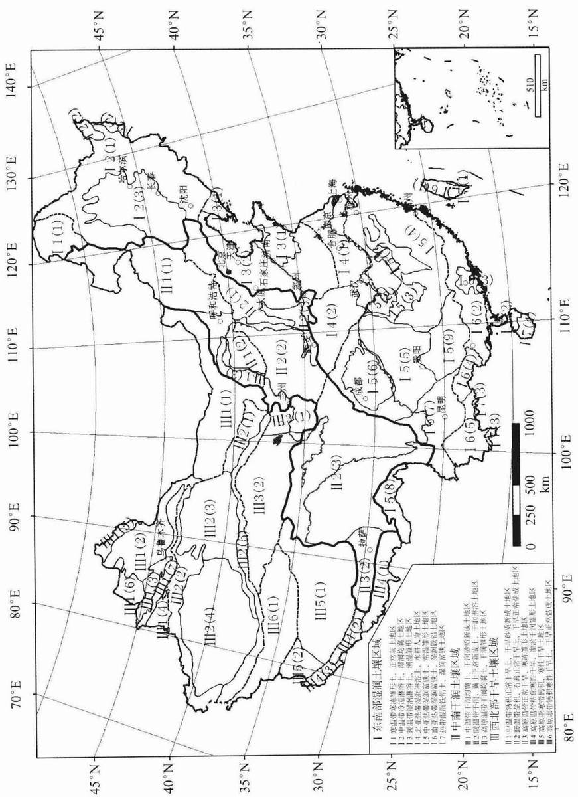

## （三）土壤分区原则及单位系统

土壤是自然与人类活动经过一定时间作用的综合体，又是地球表层物质和能量传输与交换的枢纽，因此在进行土壤分区时除考虑地理环境外，还要强调土壤本身的特色。分区遵循的主要原则包括：

（1）土壤组合类型的结构和功能相似。区分组合类型的结构和功能主要依据的是土壤特性，包括土壤类型、土壤肥力、土壤生产潜力以及土壤对环境污染的延缓效应等。

（2）除考虑自然条件外，还应考虑社会条件的影响。同一区内制约或影响土壤地域分异的自然和社会经济条件基本相同。

（3）注重对土壤资源的利用和保护。同一区内改造、利用和保护土壤资源，提高土壤利用率和生产率的途径基本相同。

在土壤分区中，为实现多级分区及其应用，高级分区级别以土壤区域为基础，然后由上而下分为地区、土区、亚区、土片和土壤样块共6个级别。

## 1. 土壤区域

土壤区域是土壤分区最大的分区单位，是根据土壤组合和环境条件的相似性与差异性概括的。每一个土壤区域具有特定的土壤类型系列（土纲和亚纲系列），以及与其相应的气候特征和大的植被类型特征（如森林、草原、荒漠等)，同时反映同一区域内相同或相似的土地利用现状、农林牧各业比例、及土壤改良的方向性措施。如我国东南部湿润土壤区域，具有湿润的气候特点，以森林植被为主，土地利用以种植业为主。而西北部于旱土壤区域，则具有干旱气候特征，以草原和荒漠植被为主，土地利用以牧业为主。

## 2. 土壤地区

土壤地区是具有相同的光、热、水资源总量和分配特点，具有类似的土壤组合（土纲至亚纲）、植被类型、农业发展方向、农作制度，提高土壤利用率和生产潜力的途径基本相同的区域。如南亚热带、热带湿润铁铝土、湿润富铁土地区，种植业以双季稻一年三熟为主，并可种植椰子、咖啡、剑麻等热带作物；而中亚热带湿润富铁土、常湿雏形土地区，种植业以双季稻三年五熟为主，可种柑桔、油桐、油茶等作物。

## 3. 土壤区

土壤区是具有相似的大地貌、土壤组合（亚纲至土类）及相应土壤肥力

特点的区域，土壤生产配置和生产问题基本相同，土壤利用方式、综合治理途径相似。如冲积平原区以平原为主体但有零星丘陵山地分布；丘陵区由低山和盆地交错构成等。

## 4. 土壤亚区

土壤亚区是由一个或几个土片组成，具有相似中地貌特点和土壤组合（土类至亚类）的区域。区内水文及影响其的地质条件和成土母质等相似，土壤利用方式和改良措施基本相同。

## 5. 土壤片

土壤片是由一个以上土壤样块组成，具有相似的中地貌和土壤组合（亚类至土族)，土壤水分、肥力水平及其上植物群落、作物轮作复种制度等类同，耕作管理及改良措施相似的区域。

## 6. 土壤样块

土壤样块是土壤分区的基本单位。在同一样块内，具有一致的小地貌，土系、植物群丛、作物复种及轮作、间作套种等制度和水肥供应能力与调节节律相同，耕作管理措施相同。

## （四）土壤分区及基本特征

从土壤系统分类角度，根据区域土壤和自然环境及人为因素的差异，我国土壤区划共分为3个土壤区域、16个土壤地区、55个土壤区。以下主要介绍三大土壤区域。

## 1. 东南部湿润土壤区域

该区域共包含7个土壤地区、27个土壤区，占国土面积的41.6%，是范围最大、包括土壤类型最多的区域，主要位于我国东南季风和西南季风控制区。降水丰富，雨热同季，植被以森林为主。但区域内由于纬度跨度大，温度条件差异明显，包括从最南部的热带一直到最北部的寒温带，因此区内土壤差异在很大程度上由温度引起，同时平原面积大，兼有丘陵分布，加之农耕历史悠久，这些自然与人类共同作用的结果，使本区域土壤类型多样。总体而言，南方土壤呈酸性，北方土壤多呈碱性，华北平原土壤有盐碱，东北松辽平原土壤的有机质比较丰富。该区是我国主要农业区，人口稠密，集中了全国85%以上的人口和78%以上的耕地，因此森林面积十分有限，土壤环境污染问题比较突出。区内由北向南划分的7个土壤地区依次是：

（1）寒温带寒冻雏形土、正常灰土地区，占该区域面积的2.9%，国土面积的1.2%。分布在大兴安岭北段的狭小范围内，以海拔500～1000m的山区为主，植被仍是保留原始状态的寒温带针叶林，如兴安落叶松、白桦、樟子松等，覆盖率在70%以上。由于全年冻结期较长，土层浅薄而且瘠薄，是我国重要的林业基地。

（2)中温带冷凉淋溶土、湿润均腐土地区，占该区域面积的20.7%，国土面积的8.6%。包括我国东北除北面大兴安岭北端及南面辽南以外的广大地区。区内山地平原都有分布，是我国重要的林业基地和商品粮基地。由于开发强度较大，土壤肥力普遍降低。

（3）暖温带湿润淋溶土、潮湿雏形土地区，占该区域面积的12.5%，国土面积的5.2%。南界到淮河一线，包括辽河平原和华北平原，是我国最大的冲积平原区，其间有丘陵分布。气候以暖温带湿润半湿润季风气候为主，雨热同季。强烈的人类活动已使原始植被荡然无存，天然植被十分有限，以农田为主，是我国重要的种植业基地，粮食产量占全国的23.2%，棉花占56.8%，油料占28.6%，烟叶占21.7%，水果占27.2%，麻类占31.2%。

（4）北亚热带湿润淋溶土-水耕人为土地区。占该区域面积的10.3%，国土面积的4.3%。主要包括秦岭-淮河一线以南和长江中下游一线以北地区，分为东西两部分，东面是长江中下游平原兼有丘陵分布，西面是汉水中上游，以山地和盆地相间地形为主。水耕人为土主要集中在东部地区。

（5）中亚热带湿润富铁土、常湿雏形土地区，占该区域面积的40.9%，国土面积的17%，包括长江以南和南岭以北的广大地区，是东部湿润土壤区域中面积最大的土壤地区。区域内地形复杂，高原、山地、丘陵、盆地、平原交错分布，加之热量充足，降水丰富，因而除以地带性的湿润富铁土为主外，还发育有类型繁多的常湿雏形土，主要分布于山地区。自然植被为常绿阔叶林，但除山区分布有林地外，主要为农耕区。该区是我国重要的农业和林业基地。

（6）南亚热带湿润富铁土、湿润铁铝土地区，占该区域面积的10.3%，国土面积的4.3%。包括南岭以南雷州半岛以北的横贯东西的狭长区域。地形以山地丘陵为主，兼有小面积盆地和平原分布。由于水热条件好，发育湿润富铁土和铁铝土。

(7)热带湿润铁铝土、湿润富铁土地区，占该区域面积的2.4%，国土面积的1.0%，包括台湾岛南部、雷州半岛、海南岛及南海诸岛屿。水热条件在全国最为丰富，以热带植被为主。

## 2. 中部干润土壤区域

该区域共包含3个土壤地区、8个土壤区，占国土面积的22.7%，是面积最小、包括土壤类型最少的区域。主要位于我国季风区向内陆干旱及高原寒旱区的过渡地带。地形以高原为主，并有山地和盆地分布。与季风区相比，降水明显减少，植被以草原为主，山地有森林分布。区内以干润雏形土和淋溶土为主，但在北部由于温度较低利于有机质积累而出现干润均腐土，中部由于黄土母质影响出现黄土性新成土。该区是我国农、林、牧交错地区，人口占全国的12%，耕地占全国的16%。由于地形复杂，坡耕地面积大，土壤侵蚀比较严重。区内由南至北分布的3个土壤地区分别是：

（1）中温带干润均腐土、干润砂质新成土地区，占该区域面积的26.4%，国土面积的6.0%。包括内蒙古高原和鄂尔多斯高原，地形以波状高原为主，兼有丘陵和河湖阶地。由于降水量由东向西减少，植被类型由东部的典型草原向西逐渐过渡到干草原和荒漠草原，对应的土壤由东向西土层变薄，土壤有机质含量降低，钙积层明显、且深厚。该地区除少部分河流沿岸地区有灌溉农业外，主要以牧业为主。

（2）暖温带于润、黄土正常新成土、干润淋溶土地区，占该区域面积的27.3%，国土面积的6.2%。包括太行山以西、长城以南、秦岭以北、兰州谷地以东的地区，是黄河中游地区、黄土高原的核心所在，以黄土地貌为主，包括川地、塬地、丘陵、盆地及土石山区。天然植被是落叶阔叶林，但由于人类活动历史悠久，仅残留在少数山地。全区以旱作农业为主，川地和塬地是重要的农田集中区，同时有大量的坡耕地分布，是水土流失的主要发生区。土壤侵蚀严重程度居全国之首。

（3）高原温带干润均腐土、干润雏形土地区，占该区域面积的41.4%，国土面积的9.4%。包括青藏高原东南部地区的川西、藏东和雅鲁藏布江中游。高山和峡谷相间分布，相对高差较大，植被和土壤的垂直变化都十分明显。谷地水热条件好，是种植业的集中区。山地具有丰富的林业资源，是我国第二大木材生产基地。

## 3. 西北干旱土壤区域

该区域共包含6个土壤地区、20个土壤区，占国土面积的35.7%。主要位于我国西北内陆于旱地区和青藏高原西北寒旱区。由于地处大陆腹地，全年降水量少，除山地外，以沙漠和荒漠景观为主。由于干旱和高寒的影响，区内以干旱土为主，并有一定的雏形土、盐成土等。农业集中在绿洲区，必须依赖灌溉。全区人口不到全国人口的3%，耕地只占全国的6%。区内包含的6个土壤地区分别是：

（1）中温带钙积正常干旱土、干旱砂质新成土地区，占该区域面积的22.4%，国土面积的8.0%。以长城、北山和天山为界向北到我国北部边境，是西北内陆区的最北部。景观以戈壁、荒漠和沙漠为主，其周围则有绿洲分布，是灌溉农业所在地。区内以牧业为主，但其中的灌区是我国重要的棉花生产基地。灌溉带来的次生盐碱化问题比较严重。

（2）暖温带盐积、石膏正常干旱土、干旱正常盐成土地区，占该区域面积的35.0%，国土面积的12.4%。主要包括河西走廊和塔里木盆地。是我国最为干旱的地区，分布大面积的沙漠、戈壁和荒漠。土壤石膏层明显。盆地周围有雪山融雪灌溉，出现绿洲。区内以牧业为主，有少量种植业分布在绿洲地区。

（3）高原温带正常于旱土、寒冻雏形土地区，占该区域面积的14.0%，国土面积的5.0%。位于青藏高原东北部的柴达木盆地。盆地中央分布有盐层深厚的盐湖，其中青海湖是我国最大的咸水湖。土壤盐渍化严重。该区以牧业为主，但其东部黄河及其支流湟水谷地是重要的种植业基地，以旱作农业为主。该地区是黄土高原的西部边缘，浅山地区水土流失比较严重。

（4）高原温带黏化寒性干旱土、灌淤干润雏形土地区，占该区域面积的5.6%，国土面积的2.0%。位于青藏高原南部，中、西喜马拉雅山与藏南分水岭之间的狭长地带。在南北高山的夹持中，分布有一系列盆地和谷地。由于地处喜马拉雅山雨影区，气候比较干旱，降水量由东向西减少。东部年降水量240～380mm，是西藏的重要农业区。

（5）高原亚寒带钙积、寒性干旱土地区，占该区域面积的14.8%，国土面积的5.3%。位于冈底斯山和念青唐古拉山以北的内陆湖区，是青藏高原的核心区域。高原面完整，周围是高大山系，内部则是波状丘陵，并分布有盆地和谷地，也是咸水湖和盐湖的集中区。本区寒冷于旱，天然植被主要是高山草原和荒漠化草原，以牧业为主。其中有大面积的“无人区”分布。

（6）高原寒带钙积寒性干旱土、干旱正常盐成土地区，占该区域面积的8.4%，国十面积的3.0%。位于青藏高原北缘。地形与第五地区类似，但由于更为寒冷于旱，地表遍布寒冻风化物，并出现碳酸盐表聚，土壤普遍有盐渍化，该区基本是“无人区”。

## 三、全国土体厚度及其空间分布

《中国土种志》（全国土壤普查办公室，1993）共记录了2472个土壤剖面的属性数据。利用这些剖面的土层厚度，通过不同土层加权平均的方法，计算了其中2469个土壤剖面的A层厚度与土体厚度（A层加B层的厚度之和)，并绘制了空间分布图。具体方法如下：

（1）摘录每一个剖面的土层厚度，包括A、AB/AC、B、BC等，同时摘录各剖面的地点。

（2）分别计算A层厚度和整个土壤剖面土体厚度。在计算A层厚度时，考虑到AB或AC层具有过渡层特点，拥有A层的部分特性，因此除包含记录的A层厚度外，还包括AB或AC层厚度的一半。在计算全剖面土体厚度时，同样考虑到BC或AC具有过渡层特性，因此除包含A、AB、B外，还应考虑 BC或 AC层的一半。计算公式分别为

$$
\begin{array} { r l } { T _ { \mathrm { A } } = \left\{ \begin{array} { l l } { h _ { \mathrm { A } } } & { \qquad \mathcal { F } _ { \mathrm { A } } \underline { { \lor } } \underline { { \Psi } } \underline { { \breve { \mathrm { E } } } } \underline { { \breve { \mathrm { S } } } } \underline { { \Psi } } | \overline { { \mathrm { E } \breve { \mathrm { I } } } } | } \\ { h _ { \mathrm { A } } + h _ { \mathrm { A C } / 2 } } & { \qquad \mathrm { A } - \mathrm { A C } - \mathrm { C } \mathrm { ~ \breve { H } } } \end{array} \right. } & { { } } \\ { I _ { \mathrm { A } } + h _ { \mathrm { A B } / 2 } } & { { } \qquad \mathrm { A } - \mathrm { A B } - \mathrm { B } \frac { \mathrm { \breve { H } } } { \mathrm { H } } \overline { { \mathrm { H } } } } \\ { T = \left\{ \begin{array} { l l } { h _ { \mathrm { A } } } & { \qquad \mathrm { A } - \mathrm { A C } \mathrm { ~ \breve { H } } } \\ { h _ { \mathrm { A } } + h _ { \mathrm { A C } / 2 } } & { \qquad \mathrm { A } - \mathrm { A C } - \mathrm { C } \mathrm { ~ \breve { H } } } \end{array} \right. } & { { } } \\ { I _ { \mathrm { A } } + h _ { \mathrm { B } } } & { { } \qquad \mathrm { A } - \mathrm { B } - \mathrm { B } \mathrm { C } \mathrm { ~ \breve { H } } \overline { { \mathrm { H } } } } \\ { h _ { \mathrm { A } } + h _ { \mathrm { B } } + h _ { \mathrm { B C } / 2 } } & { { } \qquad \mathrm { A } - \mathrm { B } - \mathrm { B } \mathrm { C } - \mathrm { C } \mathrm { ~ \breve { H } } } \end{array}
$$

式中， $T _ { \mathrm { A } }$ 是计算的A层厚度（cm）；T是全土壤剖面土体厚度（cm）； $h _ { \mathrm { A } }$ hAB、hB、hBC、hAc分别是记录的各土层厚度（cm)；A、AB、B、BC、AC、C分别表示土层。

根据每一个剖面的记录地点，在1：25万比例尺地形图上查找对应的经纬度。利用ArcGIS软件，使用普通克里格差值方法，分别计算各个网格的土壤A层和全剖面土体厚度。网格大小为 $0 . 5 ^ { \circ } \times 0 . 5 ^ { \circ }$ 0

对全国2469个土壤剖面的统计表明，A层厚度以20～30 cm为主，占43%。<20 cm厚度的占 27%，<30 cm厚度的占 70%（图1.26)，>50 cm厚度的只占5%（图1.26）。A层厚度的空间分布表明（图1.27)，A层厚度比较厚的地区主要分布在北方地区，尤其是黄土高原、内蒙古中部和东北平原地区，40cm以上厚度呈集中连片分布。黄河以南广大地区，A层土壤厚度普遍在30cm以下，尤其是南方红壤丘陵区的江西、福建等省，厚度甚至小于20cm。最薄的集中连片地区是塔克拉马干沙漠和青藏高原北缘。

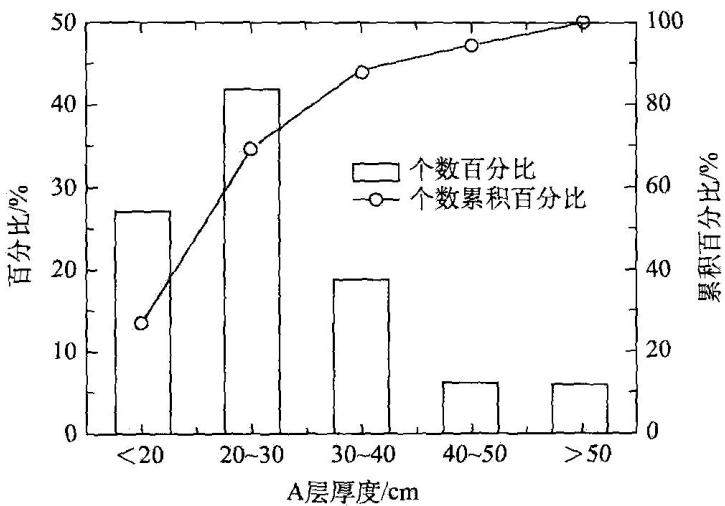  
图1.26 中国2469个土壤剖面A层厚度分布频率图

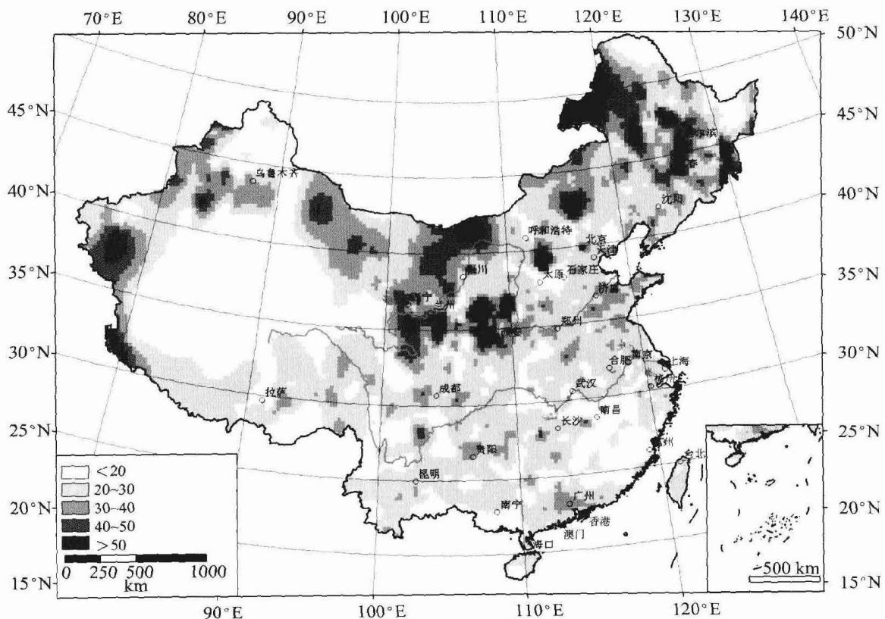  
图1.27 中国土壤A层厚度空间分布图（单位：cm)

全剖面土体厚度的统计结果表明（图1.28），中国土壤厚度以20～40cm为主，占总样本的35%。从累积百分比看，<20 cm的占16%，<40 cm占50%，<60 cm的已达70%以上，>60 cm的样点不到30%。从空间分布看(图1.29)，与A层土壤厚度有着类似的分布规律：北方地区土壤厚度普遍大于南方，尤其是黄土高原、内蒙古东中部和东北地区，土壤厚度大部分在60cm以上，其中呼伦贝尔草原局部地区厚度可达80～100cm。南方地区则普遍在60cm以下。土壤厚度最薄的地区在塔克拉马干沙漠，不到20 cm；其次是青藏高原，20～40cm为主。这与其成土过程有着密切关系。

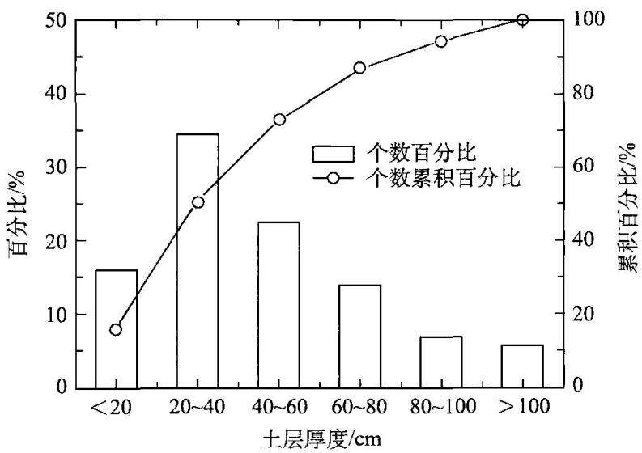  
图1.28 中国2469个土壤剖面土体厚度分布频率图

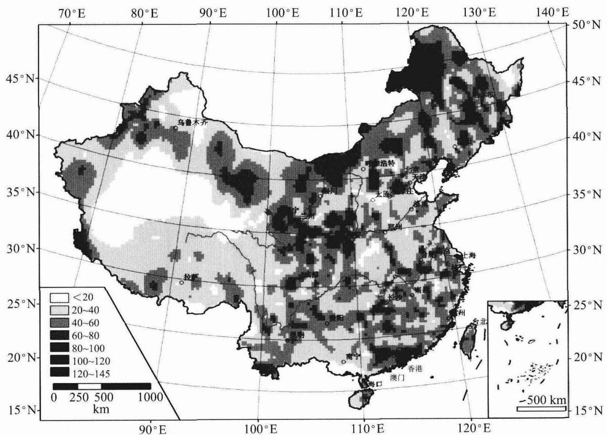  
图1.29 中国土体厚度空间分布图（单位：cm）

## 四、主要土壤的可蚀性

土壤是雨滴击溅和径流冲刷的对象。在其他条件一致情况下，能否容易被降雨分离、并被径流冲刷造成侵蚀，完全取决于土壤的理化性质。土壤可蚀性就是反映土壤是否容易遭受侵蚀的敏感程度指标，是土壤抵抗降雨径流侵蚀能力的综合体现。因此，土壤可蚀性因子应只与土壤本身理化性质有关，在其他自然条件和人为影响因素一致的情况下，土壤流失量大小主要由该指标决定。国内外学者对土壤可蚀性进行了大量研究，目前应用比较广泛的是Wischmeier和Smith（1965）提出的土壤可蚀性因子，即标准小区上单位降雨侵蚀力引起的土壤流失量，单位是 $\mathrm { ~ t ~ } \bullet \mathrm { ~ h m } ^ { 2 } \bullet \mathrm { ~ h / ( h m ^ { 2 } ~ \bullet ~ M J ~ \bullet ~ m m ) }$ 。所谓标准小区，是指水平投影坡长为22.13m，小区宽度一般不小于1.8m，坡度为5.14°（9%），保持连续休闲状态，并实施顺坡上下耕作的径流小区。标准小区的提出，将自然界侵蚀因子组合多样的实际情况，通过比较订正到统一可比的平台，进而只反映土壤性质的影响。为了与其他小区对比，标准小区的维护除不种植农作物外，其他耕作措施应与当地大田措施一致。如：播种前应犁耕到正常耕作深度，且犁耕后立即耕耙两次以上。要对小区进行中耕，消除结皮影响，还要及时拔草或使用除草剂。犁耕和中耕都必须顺坡上下进行，但不能在过湿的土壤上进行。

## （一）土壤可蚀性因子的确定方法

## 1. 标准小区测定法

利用标准小区观测降雨及其产生的土壤流失量，计算降雨侵蚀力；再根据定义计算土壤可蚀性因子，这是获得土壤可蚀性因子的最基本方法，也是建立估算公式的基础数据。具体方法如下：

（1）计算标准小区的年平均土壤流失量；

（2）计算造成这些土壤流失量的年平均降雨侵蚀力；

（3）年平均土壤流失量除以年平均降雨侵蚀力，即得到土壤可蚀性。

利用标准小区确定土壤可蚀性因子，必须建立和维持大量的径流小区，不仅耗费人力物力，而且还受天然降雨产流次数的限制。尤其在我国北方半湿润和半干旱地区，年产流相对较少，累计得到系列足够长的观测资料是一项十分艰巨的工作。因此，可以考虑通过人工模拟降雨试验来代替径流小区观测。进行人工模拟降雨试验需要考虑以下问题：①试验小区面积大小。它会影响试验用水的保证程度、降雨的均匀性、产流的代表性等；②降雨强度的选定与组合，并利用天然降雨一小区观测数据进行率定，使之能够反映天然降雨下的标准小区可蚀性。如果能解决上述两个难点，利用人工模拟降雨试验是研究土壤可蚀性的最佳选择。

## 2. 公式估算法

公式估算法是通过建立土壤理化性质与土壤可蚀性因子值的关系，直接计算土壤可蚀性因子值。但公式的建立必须经过一定天然降雨小区资料的验证，使其能在较大的区域范围应用。利用该方法的前提是能够获得相应的土壤理化性质资料。我国由于缺少实测土壤可蚀性因子值，目前尚没有可进行估算的公式。国际上使用比较多的是Wischmeier等（1971）建立的关系式，但是否适用于我国还需深入研究。Wischmeier等（1971）建立的公式采用的是美制单位，转换为国际单位制的形式如下：

$$
\begin{array} { c } { { K = 2 . 7 6 7 \times 1 0 ^ { - 7 } ( 1 2 - O M ) M ^ { 1 . 1 4 } + 4 . 2 8 2 \times 1 0 ^ { - 3 } ( s - 2 ) } } \\ { { + 3 . 2 9 4 \times 1 0 ^ { - 3 } ( p - 3 ) } } \end{array}
$$

式中，M是修订的粉粒（0.002～0.1mm粒径）含量（%）与粉粒（0.002～0.05mm）和砂粒（0.05～2mm）含量（%）之和（粉粒含量%+砂粒含量%）的乘积；OM为土壤有机质含量（%）；s为土壤结构参数（1～4）；p为土壤渗透性参数（1～6）；K是单位降雨侵蚀力产生的土壤流失量，即土壤可蚀性 $\left[ { \bf t } \bullet \mathrm { h m } ^ { 2 } \bullet \mathrm { h } / ( \mathrm { h m } ^ { 2 } \bullet \mathrm { M J } \bullet \mathrm { m m } ) \right]$

使用上述公式时，需要注意以下几个问题：第一是土壤粒径的分级问题。世界各国在进行土壤粒径分级时采用的标准不尽相同（表1.32）。如我国已经进行的两次土壤普查中，第一次采用的是苏联制，第二次采用的是国际制。上式采用的是美国制土壤粒径分级，应用时涉及土壤粒径分级标准转换问题。第二是不同单位制的问题。根据可蚀性因子定义，它的单位涉及降雨侵蚀力和土壤流失量，由于该公式建立时采用的是美制单位，因此应用时应注意单位的一致，尤其在变换单位时，要考虑到相应系数的改变。前文K的公式已转换为国际单位制。第三是土壤结构等级问题。我国土壤结构划分方法以前苏联为基础，与美国采用的土壤结构划分方法不同。而且在我国土种志中，没有关于结构等级的划分。因此需要将两种划分方法加以对比，并统一到美国 SWAT, Soil and Water Assessment Tool, Theoretical Documentation(Version 2000） 一书定义的 4个结构等级上。

表1.32 常见的土壤粒径分级制
<table><tr><td rowspan=1 colspan=1>当量粒径/mm</td><td rowspan=1 colspan=1>中国制(1978年)</td><td rowspan=1 colspan=1>前苏联制(1957年)</td><td rowspan=1 colspan=1>美国制(1951年)</td><td rowspan=1 colspan=1>国际制(1930年)</td></tr><tr><td rowspan=1 colspan=1>3~2</td><td rowspan=2 colspan=1>砾石</td><td rowspan=2 colspan=1>砾石</td><td rowspan=1 colspan=1>砾石</td><td rowspan=1 colspan=1>砾石</td></tr><tr><td rowspan=1 colspan=1>2~1</td><td rowspan=1 colspan=1>极粗砂粒</td><td rowspan=4 colspan=1>粗砂粒</td></tr><tr><td rowspan=1 colspan=1>1~0.5</td><td rowspan=2 colspan=1>粗砂粒</td><td rowspan=1 colspan=1>粗砂粒</td><td rowspan=1 colspan=1>粗砂粒</td></tr><tr><td rowspan=1 colspan=1>0.5~0.25</td><td rowspan=1 colspan=1>中砂粒</td><td rowspan=1 colspan=1>中砂粒</td></tr><tr><td rowspan=1 colspan=1>0.25~0.2</td><td rowspan=3 colspan=1>细砂粒</td><td rowspan=3 colspan=1>细砂粒</td><td rowspan=2 colspan=1>细砂粒</td></tr><tr><td rowspan=1 colspan=1>0.2~0.1</td><td rowspan=3 colspan=1>细砂粒</td></tr><tr><td rowspan=1 colspan=1>0.1~0.05</td><td rowspan=1 colspan=1>极细砂粒</td></tr><tr><td rowspan=1 colspan=1>0.05~0.02</td><td rowspan=2 colspan=1>粗粉粒</td><td rowspan=2 colspan=1>粗粉粒</td><td rowspan=4 colspan=1>粉粒</td></tr><tr><td rowspan=1 colspan=1>0.02~0.01</td><td rowspan=3 colspan=1>粉粒</td></tr><tr><td rowspan=1 colspan=1>0.01~0.005</td><td rowspan=1 colspan=1>中粉粒</td><td rowspan=1 colspan=1>中粉粒</td></tr><tr><td rowspan=1 colspan=1>0.005~0.002</td><td rowspan=1 colspan=1>细粉粒</td><td rowspan=2 colspan=1>细粉粒</td></tr><tr><td rowspan=1 colspan=1>0.002~0.001</td><td rowspan=1 colspan=1>粗黏粒</td><td rowspan=4 colspan=1>黏粒</td><td rowspan=4 colspan=1>黏粒</td></tr><tr><td rowspan=1 colspan=1>0.001~0.0005</td><td rowspan=3 colspan=1>细黏粒</td><td rowspan=1 colspan=1>粗黏粒</td></tr><tr><td rowspan=1 colspan=1>0.0005~0.0001</td><td rowspan=1 colspan=1>细黏粒</td></tr><tr><td rowspan=1 colspan=1>&lt;0.0001</td><td rowspan=1 colspan=1>胶质黏粒</td></tr></table>

y

## （二）我国主要土壤代表性剖面的土壤可蚀性

摘录了《全国土种志》（1～6卷）中61个土类、205个亚类，共204个典型土属和土种的机械组成、有机质和土壤结构指标，根据前述关系式(Wischmeier et al.，1971)计算了各土种的土壤可蚀性因子值。具体步骤如下：

（1）摘录土壤剖面数据，包括土壤有机质、土壤结构、机械组成，并记录相关土壤类型和剖面地点。

(2)利用摘录的土壤结构获取土壤结构因子值。公式采用的土壤结构划分方法源自SWAT，Soil and Water Assessment Tool，Theoretical Docu-mentation（Version2000）一书，并将各种结构赋结构参数值（1\~4）。《中国土种志》中可查到的土壤结构包括单粒结构、粒块状结构、团粒状结构、片状结构、块状结构等，与勒·恩·阿列克桑德洛娃和奥·阿·娜伊坚诺娃编著的《土壤学实验室作业》一书中的土壤结构分类接近，于是参照美国土壤结构的划分方法，将土种志描述的各种土壤结构与之进行对应（表1.33）。

表1.33 土壤结构和对应的土壤结构等级
<table><tr><td rowspan=1 colspan=1>结构</td><td rowspan=1 colspan=1>大小/mm</td><td rowspan=1 colspan=1>土壤结构等级</td><td rowspan=1 colspan=1>备注</td></tr><tr><td rowspan=1 colspan=1>立体结构</td><td rowspan=1 colspan=1></td><td rowspan=1 colspan=1></td><td rowspan=1 colspan=1></td></tr><tr><td rowspan=1 colspan=1>块状结构</td><td rowspan=1 colspan=1>&gt;20</td><td rowspan=1 colspan=1>4</td><td rowspan=1 colspan=1>不耐水</td></tr><tr><td rowspan=1 colspan=1>团块状结构</td><td rowspan=1 colspan=1></td><td rowspan=1 colspan=1></td><td rowspan=1 colspan=1></td></tr><tr><td rowspan=1 colspan=1>大团块状结构</td><td rowspan=1 colspan=1>20~10</td><td rowspan=1 colspan=1>4</td><td rowspan=1 colspan=1>较耐水</td></tr><tr><td rowspan=1 colspan=1>中团块状结构</td><td rowspan=1 colspan=1>10~1</td><td rowspan=1 colspan=1>3</td><td rowspan=1 colspan=1></td></tr><tr><td rowspan=1 colspan=1>小团块状结构</td><td rowspan=1 colspan=1>1~0.25</td><td rowspan=1 colspan=1>2</td><td rowspan=1 colspan=1></td></tr><tr><td rowspan=1 colspan=1>核状结构</td><td rowspan=1 colspan=1></td><td rowspan=1 colspan=1></td><td rowspan=1 colspan=1>很耐水</td></tr><tr><td rowspan=1 colspan=1>大核状结构</td><td rowspan=1 colspan=1>20~10</td><td rowspan=1 colspan=1>4</td><td rowspan=1 colspan=1></td></tr><tr><td rowspan=1 colspan=1>中核状结构</td><td rowspan=1 colspan=1>10~7</td><td rowspan=1 colspan=1>3</td><td rowspan=1 colspan=1></td></tr><tr><td rowspan=1 colspan=1>小核状结构</td><td rowspan=1 colspan=1>7~5</td><td rowspan=1 colspan=1>3</td><td rowspan=1 colspan=1></td></tr><tr><td rowspan=1 colspan=1>粒状结构</td><td rowspan=1 colspan=1></td><td rowspan=1 colspan=1></td><td rowspan=1 colspan=1>很耐水</td></tr><tr><td rowspan=1 colspan=1>大粒状结构</td><td rowspan=1 colspan=1>5~3</td><td rowspan=1 colspan=1>3</td><td rowspan=1 colspan=1></td></tr><tr><td rowspan=1 colspan=1>中粒状结构</td><td rowspan=1 colspan=1>3~1</td><td rowspan=1 colspan=1>2</td><td rowspan=1 colspan=1></td></tr><tr><td rowspan=1 colspan=1>小粒状结构</td><td rowspan=1 colspan=1>1~0.5</td><td rowspan=1 colspan=1>1</td><td rowspan=1 colspan=1></td></tr><tr><td rowspan=1 colspan=1>棱柱状结构</td><td rowspan=1 colspan=1></td><td rowspan=1 colspan=1></td><td rowspan=1 colspan=1></td></tr><tr><td rowspan=1 colspan=1>柱状结构</td><td rowspan=1 colspan=1>50~30</td><td rowspan=1 colspan=1>4</td><td rowspan=1 colspan=1>不耐水</td></tr><tr><td rowspan=1 colspan=1>棱状结构</td><td rowspan=1 colspan=1>50~30</td><td rowspan=1 colspan=1>4</td><td rowspan=1 colspan=1>不耐水</td></tr><tr><td rowspan=1 colspan=1>板状结构</td><td rowspan=1 colspan=1></td><td rowspan=1 colspan=1></td><td rowspan=1 colspan=1></td></tr><tr><td rowspan=1 colspan=1>板状结构</td><td rowspan=1 colspan=1>5~3</td><td rowspan=1 colspan=1>4</td><td rowspan=1 colspan=1>不耐水</td></tr><tr><td rowspan=1 colspan=1>片状结构</td><td rowspan=1 colspan=1>3~1</td><td rowspan=1 colspan=1>4</td><td rowspan=1 colspan=1>不耐水</td></tr><tr><td rowspan=1 colspan=1>薄片状结构</td><td rowspan=1 colspan=1>&lt;1</td><td rowspan=1 colspan=1>4</td><td rowspan=1 colspan=1>不耐水</td></tr></table>

(3）进行不同粒径分级标准之间的转换。将我国土壤普查采用的粒径制，转换为公式要求的粒径制。《中国土种志》记录的土壤质地采用国际制，共分为4级：2\~0.2mm的粗砂粒，0.2\~0.02mm的细砂粒，0.02～0.002mm的粉粒和<0.002mm的黏粒。美国制土壤质地分级中的砂粒、粉粒和黏粒分别是2\~0.05mm、0.05\~0.002mm、<0.002mm。公式计算土壤可蚀性时采用的是美国粒径分级标准，需要的土壤粒径包括三部分：0.002\~0.1mm粒径含量、2\~0.05mm的砂粒含量和0.05\~0.002mm的粉粒含量。对比两种分级标准，不难看出，只要分别获得0.1mm和0.05mm处的粒径累积百分含量就可以实现不同分级系统的质地转换，满足公

式计算的要求。

我们选择3次样条方法进行插值。公式为

$$
Y = a X ^ { 3 } + b X ^ { 2 } + c X + d
$$

插值时，按照颗粒粒径从小到大（0.002mm到0.2mm）进行百分含量累积，只需在0.05 mm和0.1 mm处插值，得到这两处粒径的累积百分含量。举例说明如下：

运用Matlab 软件。以粒径大小为自变量 x，分别取 0.002 mm，0.02mm，0.2mm，2mm粒径；因变量y表示粒径累积百分比含量，如<0.002mm粒径百分比含量为5.2%，<0.02 mm粒径百分比含量为12.5%，<0.2mm粒径百分比含量为 59.1%，<2 mm粒径百分比含量为100%。为了求0.05 mm 和 0.1 mm 处的粒径累积百分含量，在 Matlab 软件主窗口键入：

$$
y = ~ [ 5 . 2 1 \quad 2 . 5 5 \quad 9 . 1 \quad 1 0 0 \ ] ;
$$

$$
x x = \ [ 0 . 0 5 \quad 0 . 1 ] ;
$$

$$
y y = \mathrm { i n t e r p 1 ~ ( x , ~ y , ~ \mathbf { x x } , ' s p l i n e ' ) } ;
$$

如果需要处理大量的数据，可以编写程序实现插值运算。用计算得到的粒径0.1mm处的累积百分含量减去0.002mm处的累积百分含量，即得到粉砂和极细砂的百分比含量，加上土种志包含的黏粒含量数据，可以计算公式中的M值。计算粒径0.05mm处的累积百分含量后，按照粒级<0.002mm、0.05\~0.002mm、2\~0.05mm的级别。根据表1.34得到土壤质地，然后根据表1.35确定土壤渗透等级。

表1.34 美国制土壤质地分类标准
<table><tr><td colspan="2" rowspan="1">质地分类</td><td colspan="5" rowspan="1">各粒级(mm)含量/%</td></tr><tr><td colspan="1" rowspan="1">类别</td><td colspan="1" rowspan="1">名称</td><td colspan="1" rowspan="1">黏粒(&lt;0.002)</td><td colspan="1" rowspan="1">粉砂粒(0.05~0.002)</td><td colspan="3" rowspan="1">砂粒(2~0.05)</td></tr><tr><td colspan="1" rowspan="1">砂土类</td><td colspan="1" rowspan="1">砂土壤砂土粉砂土</td><td colspan="1" rowspan="1">0~100~150~12</td><td colspan="1" rowspan="1">0~150~3080~100</td><td colspan="3" rowspan="1">85~10070~900~20</td></tr><tr><td colspan="1" rowspan="1">壤土类</td><td colspan="1" rowspan="1">砂壤土壤土粉壤土</td><td colspan="1" rowspan="1">0~208~280~28</td><td colspan="1" rowspan="1">0~5028~5050~88</td><td colspan="3" rowspan="1">43~0023~520~50</td></tr><tr><td colspan="5" rowspan="2">各粒级（mm）含量/%</td></tr><tr><td colspan="2" rowspan="1">质地分类</td></tr><tr><td colspan="1" rowspan="1">黏壤土类</td><td colspan="1" rowspan="1">砂黏壤土黏壤土粉砂黏壤土</td><td colspan="1" rowspan="1">20~3528~4028~40</td><td colspan="1" rowspan="1">0~2815~5340~72</td><td colspan="1" rowspan="1">45~8020~450~20</td></tr><tr><td colspan="1" rowspan="1">黏土类</td><td colspan="1" rowspan="1">砂黏土粉砂黏土黏土</td><td colspan="1" rowspan="1">35~5540~6040~100</td><td colspan="1" rowspan="1">0~2040~600~40</td><td colspan="1" rowspan="1">45~650~200~45</td></tr></table>

表1.35 土壤质地结构对应的土壤渗透等级
<table><tr><td rowspan=1 colspan=1>质地结构</td><td rowspan=1 colspan=1>土壤渗透等级</td><td rowspan=1 colspan=1>饱和导水率/(in/h)</td><td rowspan=1 colspan=1>饱和导水率/(mm/h)</td></tr><tr><td rowspan=1 colspan=1>粉砂黏土(silt clay)、黏土(clay)</td><td rowspan=1 colspan=1>6</td><td rowspan=1 colspan=1>&lt;0.04</td><td rowspan=1 colspan=1>&lt;1.02</td></tr><tr><td rowspan=1 colspan=1>粉砂黏壤土(silt clay loam)、砂黏土(sand loam)</td><td rowspan=1 colspan=1>5</td><td rowspan=1 colspan=1>0.04~0.08</td><td rowspan=1 colspan=1>1.02~2.04</td></tr><tr><td rowspan=1 colspan=1>砂黏壤土(sand clay loam)、黏壤土(clay loam)</td><td rowspan=1 colspan=1>4</td><td rowspan=1 colspan=1>0.08~0.2</td><td rowspan=1 colspan=1>2.04~5.08</td></tr><tr><td rowspan=1 colspan=1>壤土(loam)、粉壤土(silt loam)、粉砂土(silt)</td><td rowspan=1 colspan=1>3</td><td rowspan=1 colspan=1>0.2~0.8</td><td rowspan=1 colspan=1>5.08~20.32</td></tr><tr><td rowspan=1 colspan=1>壤砂土(loamy sand)、砂壤土(sand loam)</td><td rowspan=1 colspan=1>2</td><td rowspan=1 colspan=1>0.8~2.4</td><td rowspan=1 colspan=1>20.32~60.96</td></tr><tr><td rowspan=1 colspan=1>砂土（sand)</td><td rowspan=1 colspan=1>1</td><td rowspan=1 colspan=1>&gt;2.4</td><td rowspan=1 colspan=1>&gt; 60.96</td></tr></table>

（4）利用前三步得到的土壤有机质含量、土壤结构等级、极细砂和粉粒含量、黏粒含量和土壤渗透等级，根据前述公式计算土壤可蚀性因子K值。

利用全国204个典型土属和土种剖面特性计算的土壤可蚀性因子值列于表1.36。全国主要土壤可蚀性变化于 $0 . \ 0 0 5 7 \sim 0 . \ 0 7 8 5 \ \mathrm { t } \bullet \mathrm { h m } ^ { 2 } \ \bullet \ \mathrm { h } / ( \mathrm { h m } ^ { 2 } \ \bullet \ \bullet \ \bullet \ )$ MJ·mm)，其中76.5%的样本值集中于 $\cdot \ 0 . \ 0 2 { \sim } 0 . \ 0 6 \ \mathrm { t } \bullet \ \mathrm { h m ^ { 2 } } \ \bullet \ \mathrm { h / ( h m ^ { 2 } } \ \bullet \ \mathrm { M J } \ \bullet$ mm)。

表1.36 中国主要土壤类型可蚀性K值单位： $\mathrm { t } \bullet \mathrm { h m } ^ { 2 } \bullet \mathrm { h } / ( \mathrm { h m } ^ { 2 } \bullet \mathrm { M J } \bullet \mathrm { m m } ) ]$
<table><tr><td colspan="1" rowspan="1">剖面号</td><td colspan="1" rowspan="1">土类</td><td colspan="1" rowspan="1">亚类</td><td colspan="1" rowspan="1">土属</td><td colspan="1" rowspan="1">土种名</td><td colspan="1" rowspan="1">可蚀性</td></tr><tr><td colspan="1" rowspan="1">30217</td><td colspan="1" rowspan="1">暗棕壤</td><td colspan="1" rowspan="1">暗棕壤</td><td colspan="1" rowspan="1">暗泥土</td><td colspan="1" rowspan="1">棕硅泥土</td><td colspan="1" rowspan="1">0.0272</td></tr><tr><td colspan="1" rowspan="1">20170</td><td colspan="1" rowspan="1">暗棕壤</td><td colspan="1" rowspan="1">暗棕壤性土</td><td colspan="1" rowspan="1">幼暗砾麻砂土</td><td colspan="1" rowspan="1">马牙砂土</td><td colspan="1" rowspan="1">0.0300</td></tr><tr><td colspan="1" rowspan="1">20150</td><td colspan="1" rowspan="1">暗棕壤</td><td colspan="1" rowspan="1">白浆化暗棕壤</td><td colspan="1" rowspan="1">白浆暗麻砂土</td><td colspan="1" rowspan="1">白馅暗麻黏土</td><td colspan="1" rowspan="1">0.0323</td></tr><tr><td colspan="1" rowspan="1">20158</td><td colspan="1" rowspan="1">暗棕壤</td><td colspan="1" rowspan="1">草甸暗棕壤</td><td colspan="1" rowspan="1">锈暗山泥土</td><td colspan="1" rowspan="1">锈黑湿泥土</td><td colspan="1" rowspan="1">0.0181</td></tr><tr><td colspan="1" rowspan="1">20128</td><td colspan="1" rowspan="1">暗棕壤</td><td colspan="1" rowspan="1">灰化暗棕壤</td><td colspan="1" rowspan="1">灰馅暗麻砂土</td><td colspan="1" rowspan="1">灰馅暗麻砂土</td><td colspan="1" rowspan="1">0.0208</td></tr><tr><td colspan="1" rowspan="1">20156</td><td colspan="1" rowspan="1">暗棕壤</td><td colspan="1" rowspan="1">潜育暗棕壤</td><td colspan="1" rowspan="1">暗山泥土</td><td colspan="1" rowspan="1">湿黏泥土</td><td colspan="1" rowspan="1">0.0132</td></tr><tr><td colspan="1" rowspan="1">20198</td><td colspan="1" rowspan="1">白浆土</td><td colspan="1" rowspan="1">白浆土</td><td colspan="1" rowspan="1">白馅土</td><td colspan="1" rowspan="1">黑石白馅土</td><td colspan="1" rowspan="1">0.0442</td></tr><tr><td colspan="1" rowspan="1">40751</td><td colspan="1" rowspan="1">滨海盐土</td><td colspan="1" rowspan="1">滨海潮滩盐土</td><td colspan="1" rowspan="1">海滩盐土</td><td colspan="1" rowspan="1">黏潮滩土</td><td colspan="1" rowspan="1">0.0166</td></tr><tr><td colspan="1" rowspan="1">30401</td><td colspan="1" rowspan="1">滨海盐土</td><td colspan="1" rowspan="1">滨海盐土</td><td colspan="1" rowspan="1">盐砂土</td><td colspan="1" rowspan="1">临高盐砂土</td><td colspan="1" rowspan="1">0.0075</td></tr><tr><td colspan="1" rowspan="1">20558</td><td colspan="1" rowspan="1">草甸土</td><td colspan="1" rowspan="1">白浆化草甸土</td><td colspan="1" rowspan="1">白浆甸黄土</td><td colspan="1" rowspan="1">白馅甸灰黄土</td><td colspan="1" rowspan="1">0.0304</td></tr><tr><td colspan="1" rowspan="1">20524</td><td colspan="1" rowspan="1">草甸土</td><td colspan="1" rowspan="1">草甸土</td><td colspan="1" rowspan="1">甸泥砂土</td><td colspan="1" rowspan="1">潜甸泥砂土</td><td colspan="1" rowspan="1">0.0306</td></tr><tr><td colspan="1" rowspan="1">40459</td><td colspan="1" rowspan="1">草甸土</td><td colspan="1" rowspan="1">碱化草甸土</td><td colspan="1" rowspan="1">苏打碱甸土</td><td colspan="1" rowspan="1">轻苏打碱甸土</td><td colspan="1" rowspan="1">0.0352</td></tr><tr><td colspan="1" rowspan="1">20574</td><td colspan="1" rowspan="1">草甸土</td><td colspan="1" rowspan="1">潜育草甸土</td><td colspan="1" rowspan="1">潜甸泥砂土</td><td colspan="1" rowspan="1">暗潜甸泥砂土</td><td colspan="1" rowspan="1">0.0192</td></tr><tr><td colspan="1" rowspan="1">60463</td><td colspan="1" rowspan="1">草甸土</td><td colspan="1" rowspan="1">石灰性草甸</td><td colspan="1" rowspan="1">火甸湖泥土</td><td colspan="1" rowspan="1">浪卡子灰甸黏土</td><td colspan="1" rowspan="1">0.0420</td></tr><tr><td colspan="1" rowspan="1">20546</td><td colspan="1" rowspan="1">草甸土</td><td colspan="1" rowspan="1">石灰性草甸土</td><td colspan="1" rowspan="1">火性甸砂土</td><td colspan="1" rowspan="1">火性甸泥砂土</td><td colspan="1" rowspan="1">0.0199</td></tr><tr><td colspan="1" rowspan="1">20586</td><td colspan="1" rowspan="1">草甸土</td><td colspan="1" rowspan="1">盐化草甸土</td><td colspan="1" rowspan="1">苏打草甸土</td><td colspan="1" rowspan="1">中卤甸黄土</td><td colspan="1" rowspan="1">0.0218</td></tr><tr><td colspan="1" rowspan="1">50691</td><td colspan="1" rowspan="1">草甸盐土</td><td colspan="1" rowspan="1">草甸盐土</td><td colspan="1" rowspan="1">硫酸盐甸盐土</td><td colspan="1" rowspan="1">底黏甸盐土</td><td colspan="1" rowspan="1">0.0664</td></tr><tr><td colspan="1" rowspan="1">40743</td><td colspan="1" rowspan="1">草甸盐土</td><td colspan="1" rowspan="1">碱化盐土</td><td colspan="1" rowspan="1">苏打碱盐土</td><td colspan="1" rowspan="1">砂咸土</td><td colspan="1" rowspan="1">0.0261</td></tr><tr><td colspan="1" rowspan="1">50709</td><td colspan="1" rowspan="1">草甸盐土</td><td colspan="1" rowspan="1">结壳盐土</td><td colspan="1" rowspan="1">氯化物壳盐土</td><td colspan="1" rowspan="1">斑核灰盐砂</td><td colspan="1" rowspan="1">0.0693</td></tr><tr><td colspan="1" rowspan="1">50711</td><td colspan="1" rowspan="1">草甸盐土</td><td colspan="1" rowspan="1">沼泽盐土</td><td colspan="1" rowspan="1">氯化物洼盐土</td><td colspan="1" rowspan="1">洼盐泥</td><td colspan="1" rowspan="1">0.0487</td></tr><tr><td colspan="1" rowspan="1">50863</td><td colspan="1" rowspan="1">草毡土</td><td colspan="1" rowspan="1">薄草毡土</td><td colspan="1" rowspan="1">薄草毡壤土</td><td colspan="1" rowspan="1">砂质冷薄甸土</td><td colspan="1" rowspan="1">0.0427</td></tr><tr><td colspan="1" rowspan="1">50857</td><td colspan="1" rowspan="1">草毡土</td><td colspan="1" rowspan="1">草毡土</td><td colspan="1" rowspan="1">草毡壤土</td><td colspan="1" rowspan="1">青河冷甸土</td><td colspan="1" rowspan="1">0.0273</td></tr><tr><td colspan="1" rowspan="1">50867</td><td colspan="1" rowspan="1">草毡土</td><td colspan="1" rowspan="1">湿草毡土</td><td colspan="1" rowspan="1">湿草毡壤土</td><td colspan="1" rowspan="1">砂质冷锈甸土</td><td colspan="1" rowspan="1">0.0434</td></tr><tr><td colspan="1" rowspan="1">50865</td><td colspan="1" rowspan="1">草毡土</td><td colspan="1" rowspan="1">棕草毡土</td><td colspan="1" rowspan="1">棕草毡黏土</td><td colspan="1" rowspan="1">黏质冷棕甸土</td><td colspan="1" rowspan="1">0.0184</td></tr><tr><td colspan="1" rowspan="1">10407</td><td colspan="1" rowspan="1">潮土</td><td colspan="1" rowspan="1">潮土</td><td colspan="1" rowspan="1">浅潮砂土</td><td colspan="1" rowspan="1">棕砂土</td><td colspan="1" rowspan="1">0.0494</td></tr><tr><td colspan="1" rowspan="1">50655</td><td colspan="1" rowspan="1">潮土</td><td colspan="1" rowspan="1">灌耕潮土</td><td colspan="1" rowspan="1">表锈淤砂土</td><td colspan="1" rowspan="1">表锈砂土</td><td colspan="1" rowspan="1">0.0622</td></tr><tr><td colspan="1" rowspan="1">30371</td><td colspan="1" rowspan="1">潮土</td><td colspan="1" rowspan="1">灰潮土</td><td colspan="1" rowspan="1">灰潮砂土</td><td colspan="1" rowspan="1">金称河砂土</td><td colspan="1" rowspan="1">0.0354</td></tr><tr><td colspan="1" rowspan="1">40653</td><td colspan="1" rowspan="1">潮土</td><td colspan="1" rowspan="1">碱化潮土</td><td colspan="1" rowspan="1">碱潮泥土</td><td colspan="1" rowspan="1">瓦碱潮泥土</td><td colspan="1" rowspan="1">0.0737</td></tr><tr><td colspan="1" rowspan="1">40603</td><td colspan="1" rowspan="1">潮土</td><td colspan="1" rowspan="1">湿潮土</td><td colspan="1" rowspan="1">湿潮砂土</td><td colspan="1" rowspan="1">湿潮砂土</td><td colspan="1" rowspan="1">0.0537</td></tr><tr><td colspan="1" rowspan="1">40583</td><td colspan="1" rowspan="1">潮土</td><td colspan="1" rowspan="1">脱潮土</td><td colspan="1" rowspan="1">脱潮泥土</td><td colspan="1" rowspan="1">脱潮两合土</td><td colspan="1" rowspan="1">0.0470</td></tr><tr><td colspan="1" rowspan="1">40627</td><td colspan="1" rowspan="1">潮土</td><td colspan="1" rowspan="1">盐化潮土</td><td colspan="1" rowspan="1">氯化物潮壤土</td><td colspan="1" rowspan="1">湿轻盐土</td><td colspan="1" rowspan="1">0.0463</td></tr><tr><td colspan="1" rowspan="1">30051</td><td colspan="1" rowspan="1">赤红壤</td><td colspan="1" rowspan="1">赤红壤</td><td colspan="1" rowspan="1">泥砂赤土</td><td colspan="1" rowspan="1">罗定赤土</td><td colspan="1" rowspan="1">0.0327</td></tr><tr><td colspan="1" rowspan="1">30071</td><td colspan="1" rowspan="1">赤红壤</td><td colspan="1" rowspan="1">黄色赤红壤</td><td colspan="1" rowspan="1">泥砂黄赤土</td><td colspan="1" rowspan="1">泥砂黄赤土</td><td colspan="1" rowspan="1">0.0225</td></tr><tr><td colspan="1" rowspan="1">50575</td><td colspan="1" rowspan="1">粗骨土</td><td colspan="1" rowspan="1">钙质粗骨土</td><td colspan="1" rowspan="1">灰石碴土</td><td colspan="1" rowspan="1">紫石渣土</td><td colspan="1" rowspan="1">0.0607</td></tr><tr><td colspan="1" rowspan="1">30351</td><td colspan="1" rowspan="1">粗骨土</td><td colspan="1" rowspan="1">硅质岩粗骨土</td><td colspan="1" rowspan="1">白粉土</td><td colspan="1" rowspan="1">白粉土</td><td colspan="1" rowspan="1">0.0785</td></tr><tr><td colspan="1" rowspan="1">60447</td><td colspan="1" rowspan="1">粗骨土</td><td colspan="1" rowspan="1">酸性粗骨土</td><td colspan="1" rowspan="1">酸石砂土</td><td colspan="1" rowspan="1">砾石黄泥土</td><td colspan="1" rowspan="1">0.0135</td></tr><tr><td colspan="1" rowspan="1">40407</td><td colspan="1" rowspan="1">粗骨土</td><td colspan="1" rowspan="1">中性粗骨土</td><td colspan="1" rowspan="1">石碴土</td><td colspan="1" rowspan="1">砂石碴土</td><td colspan="1" rowspan="1">0.0404</td></tr><tr><td colspan="1" rowspan="1">40391</td><td colspan="1" rowspan="1">风沙土</td><td colspan="1" rowspan="1">草甸风沙土</td><td colspan="1" rowspan="1">草甸固沙土</td><td colspan="1" rowspan="1">固沙土</td><td colspan="1" rowspan="1">0.0382</td></tr><tr><td colspan="1" rowspan="1">50563</td><td colspan="1" rowspan="1">风沙土</td><td colspan="1" rowspan="1">草原风沙土</td><td colspan="1" rowspan="1">草原固沙土</td><td colspan="1" rowspan="1">定边紧沙土</td><td colspan="1" rowspan="1">0.0653</td></tr><tr><td colspan="1" rowspan="1">50849</td><td colspan="1" rowspan="1">灌漠土</td><td colspan="1" rowspan="1">潮灌漠土</td><td colspan="1" rowspan="1">潮灌漠壤土</td><td colspan="1" rowspan="1">厚潮立土</td><td colspan="1" rowspan="1">0.0456</td></tr><tr><td colspan="1" rowspan="1">50827</td><td colspan="1" rowspan="1">灌漠土</td><td colspan="1" rowspan="1">灌漠土</td><td colspan="1" rowspan="1">灌漠壤土</td><td colspan="1" rowspan="1">薄暗立土</td><td colspan="1" rowspan="1">0.0585</td></tr><tr><td colspan="1" rowspan="1">50843</td><td colspan="1" rowspan="1">灌漠土</td><td colspan="1" rowspan="1">灰灌漠土</td><td colspan="1" rowspan="1">灰灌漠黏土</td><td colspan="1" rowspan="1">灰红土</td><td colspan="1" rowspan="1">0.0423</td></tr><tr><td colspan="1" rowspan="1">50853</td><td colspan="1" rowspan="1">灌漠土</td><td colspan="1" rowspan="1">盐化灌漠土</td><td colspan="1" rowspan="1">硫酸盐灌漠壤土</td><td colspan="1" rowspan="1">硫盐淋淀土</td><td colspan="1" rowspan="1">0.0695</td></tr><tr><td colspan="1" rowspan="1">50813</td><td colspan="1" rowspan="1">灌淤土</td><td colspan="1" rowspan="1">表锈灌淤土</td><td colspan="1" rowspan="1">表锈淤壤土</td><td colspan="1" rowspan="1">薄卧土</td><td colspan="1" rowspan="1">0.0513</td></tr><tr><td colspan="1" rowspan="1">50805</td><td colspan="1" rowspan="1">灌淤土</td><td colspan="1" rowspan="1">潮灌淤土</td><td colspan="1" rowspan="1">潮淤壤土</td><td colspan="1" rowspan="1">厚潮淤土</td><td colspan="1" rowspan="1">0.0535</td></tr><tr><td colspan="1" rowspan="1">50787</td><td colspan="1" rowspan="1">灌淤土</td><td colspan="1" rowspan="1">灌淤土</td><td colspan="1" rowspan="1">淤壤土</td><td colspan="1" rowspan="1">厚黄淤土</td><td colspan="1" rowspan="1">0.0409</td></tr><tr><td colspan="1" rowspan="1">50531</td><td colspan="1" rowspan="1">龟裂土</td><td colspan="1" rowspan="1">龟裂土</td><td colspan="1" rowspan="1">碱裂土</td><td colspan="1" rowspan="1">黏裂土</td><td colspan="1" rowspan="1">0.0365</td></tr><tr><td colspan="1" rowspan="1">60867</td><td colspan="1" rowspan="1">寒冻土</td><td colspan="1" rowspan="1">寒冻土</td><td colspan="1" rowspan="1">寒冻麻砂土</td><td colspan="1" rowspan="1">冷雪土</td><td colspan="1" rowspan="1">0.0144</td></tr><tr><td colspan="1" rowspan="1">50879</td><td colspan="1" rowspan="1">寒钙土</td><td colspan="1" rowspan="1">暗寒钙土</td><td colspan="1" rowspan="1">暗寒钙壤土</td><td colspan="1" rowspan="1">壤质冷甸淡土</td><td colspan="1" rowspan="1">0.0368</td></tr><tr><td colspan="1" rowspan="1">50881</td><td colspan="1" rowspan="1">寒钙土</td><td colspan="1" rowspan="1">淡寒钙土</td><td colspan="1" rowspan="1">淡寒钙壤土</td><td colspan="1" rowspan="1">砂质冷漠淡土</td><td colspan="1" rowspan="1">0.0540</td></tr><tr><td colspan="1" rowspan="1">60781</td><td colspan="1" rowspan="1">寒钙土</td><td colspan="1" rowspan="1">寒钙土</td><td colspan="1" rowspan="1">寒钙麻砂土</td><td colspan="1" rowspan="1">寒钙麻砂土</td><td colspan="1" rowspan="1">0.0479</td></tr><tr><td colspan="1" rowspan="1">50885</td><td colspan="1" rowspan="1">寒漠土</td><td colspan="1" rowspan="1">寒漠土</td><td colspan="1" rowspan="1">寒漠壤土</td><td colspan="1" rowspan="1">砂质冷白土</td><td colspan="1" rowspan="1">0.0580</td></tr><tr><td colspan="1" rowspan="1">60523</td><td colspan="1" rowspan="1">寒原盐土</td><td colspan="1" rowspan="1">寒原草甸盐</td><td colspan="1" rowspan="1">硫酸盐寒甸盐土</td><td colspan="1" rowspan="1">黏寒甸盐土</td><td colspan="1" rowspan="1">0.0354</td></tr><tr><td colspan="1" rowspan="1">60527</td><td colspan="1" rowspan="1">寒原盐土</td><td colspan="1" rowspan="1">寒原碱化盐</td><td colspan="1" rowspan="1">碳酸盐寒碱盐土</td><td colspan="1" rowspan="1">寒盐土</td><td colspan="1" rowspan="1">0.0293</td></tr><tr><td colspan="1" rowspan="1">60521</td><td colspan="1" rowspan="1">寒原盐土</td><td colspan="1" rowspan="1">寒原盐土</td><td colspan="1" rowspan="1">氯化物寒盐土</td><td colspan="1" rowspan="1">泥砾寒盐土</td><td colspan="1" rowspan="1">0.0549</td></tr><tr><td colspan="1" rowspan="1">40169</td><td colspan="1" rowspan="1">褐土</td><td colspan="1" rowspan="1">潮褐土</td><td colspan="1" rowspan="1">潮褐泥砂土</td><td colspan="1" rowspan="1">漏砂潮黄土</td><td colspan="1" rowspan="1">0.0398</td></tr><tr><td colspan="1" rowspan="1">40083</td><td colspan="1" rowspan="1">褐土</td><td colspan="1" rowspan="1">褐土</td><td colspan="1" rowspan="1">褐泥砂土</td><td colspan="1" rowspan="1">杏黄土</td><td colspan="1" rowspan="1">0.0615</td></tr><tr><td colspan="1" rowspan="1">40185</td><td colspan="1" rowspan="1">褐土</td><td colspan="1" rowspan="1">褐土性土</td><td colspan="1" rowspan="1">幼褐黄土</td><td colspan="1" rowspan="1">姜卧黄土</td><td colspan="1" rowspan="1">0.0481</td></tr><tr><td colspan="1" rowspan="1">40133</td><td colspan="1" rowspan="1">褐土</td><td colspan="1" rowspan="1">淋溶褐土</td><td colspan="1" rowspan="1">老褐暗土</td><td colspan="1" rowspan="1">暗泥土</td><td colspan="1" rowspan="1">0.0443</td></tr><tr><td colspan="1" rowspan="1">40105</td><td colspan="1" rowspan="1">褐土</td><td colspan="1" rowspan="1">石灰性褐土</td><td colspan="1" rowspan="1">火褐黄土</td><td colspan="1" rowspan="1">料姜卧黄土</td><td colspan="1" rowspan="1">0.0488</td></tr><tr><td colspan="1" rowspan="1">60247</td><td colspan="1" rowspan="1">褐土</td><td colspan="1" rowspan="1">燥褐土</td><td colspan="1" rowspan="1">燥褐泥土</td><td colspan="1" rowspan="1">厚层燥褐砂土</td><td colspan="1" rowspan="1">0.0484</td></tr><tr><td colspan="1" rowspan="1">20398</td><td colspan="1" rowspan="1">黑钙土</td><td colspan="1" rowspan="1">草甸黑钙土</td><td colspan="1" rowspan="1">锈黑黄土</td><td colspan="1" rowspan="1">黏锈黑黄土</td><td colspan="1" rowspan="1">0.0348</td></tr><tr><td colspan="1" rowspan="1">40233</td><td colspan="1" rowspan="1">黑钙土</td><td colspan="1" rowspan="1">草甸黑钙土</td><td colspan="1" rowspan="1">锈黑黄土</td><td colspan="1" rowspan="1">中锈黑黄土</td><td colspan="1" rowspan="1">0.0250</td></tr><tr><td colspan="1" rowspan="1">20396</td><td colspan="1" rowspan="1">黑钙土</td><td colspan="1" rowspan="1">淡黑黑钙土</td><td colspan="1" rowspan="1">锈黑黄土</td><td colspan="1" rowspan="1">淡锈黑黄土</td><td colspan="1" rowspan="1">0.0371</td></tr><tr><td colspan="1" rowspan="1">40217</td><td colspan="1" rowspan="1">黑钙土</td><td colspan="1" rowspan="1">黑钙土</td><td colspan="1" rowspan="1">黑黄土</td><td colspan="1" rowspan="1">黑黄土</td><td colspan="1" rowspan="1">0.0340</td></tr><tr><td colspan="1" rowspan="1">40069</td><td colspan="1" rowspan="1">黑钙土</td><td colspan="1" rowspan="1">碱化黑钙土</td><td colspan="1" rowspan="1">锈暗泥砂土</td><td colspan="1" rowspan="1">锈暗泥砂土</td><td colspan="1" rowspan="1">0.0162</td></tr><tr><td colspan="1" rowspan="1">50163</td><td colspan="1" rowspan="1">黑钙土</td><td colspan="1" rowspan="1">石灰性黑钙</td><td colspan="1" rowspan="1">火黑红土</td><td colspan="1" rowspan="1">红黑土</td><td colspan="1" rowspan="1">0.0272</td></tr><tr><td colspan="1" rowspan="1">50241</td><td colspan="1" rowspan="1">黑垆土</td><td colspan="1" rowspan="1">黑垆土</td><td colspan="1" rowspan="1">绵垆土</td><td colspan="1" rowspan="1">壤黑垆土</td><td colspan="1" rowspan="1">0.0492</td></tr><tr><td colspan="1" rowspan="1">50265</td><td colspan="1" rowspan="1">黑垆土</td><td colspan="1" rowspan="1">黑麻土</td><td colspan="1" rowspan="1">麻垆土</td><td colspan="1" rowspan="1">旱川台麻土</td><td colspan="1" rowspan="1">0.0556</td></tr><tr><td colspan="1" rowspan="1">50253</td><td colspan="1" rowspan="1">黑垆土</td><td colspan="1" rowspan="1">黏化黑垆土</td><td colspan="1" rowspan="1">老垆土</td><td colspan="1" rowspan="1">韩家黏黑垆</td><td colspan="1" rowspan="1">0.0583</td></tr><tr><td colspan="1" rowspan="1">50255</td><td colspan="1" rowspan="1">黑垆土</td><td colspan="1" rowspan="1">黏化黑垆土</td><td colspan="1" rowspan="1">老垆土</td><td colspan="1" rowspan="1">红垆土</td><td colspan="1" rowspan="1">0.0568</td></tr><tr><td colspan="1" rowspan="1">20328</td><td colspan="1" rowspan="1">黑土</td><td colspan="1" rowspan="1">白浆化黑土</td><td colspan="1" rowspan="1">白浆黄黑土</td><td colspan="1" rowspan="1">黏白馅黄黑土</td><td colspan="1" rowspan="1">0.0306</td></tr><tr><td colspan="1" rowspan="1">20212</td><td colspan="1" rowspan="1">黑土</td><td colspan="1" rowspan="1">草甸白浆土</td><td colspan="1" rowspan="1">锈白馅土</td><td colspan="1" rowspan="1">太平锈白馅土</td><td colspan="1" rowspan="1">0.0306</td></tr><tr><td colspan="1" rowspan="1">40201</td><td colspan="1" rowspan="1">黑土</td><td colspan="1" rowspan="1">草甸黑土</td><td colspan="1" rowspan="1">甸黑黄土</td><td colspan="1" rowspan="1">宜里黄甸黑土</td><td colspan="1" rowspan="1">0.0484</td></tr><tr><td colspan="1" rowspan="1">20304</td><td colspan="1" rowspan="1">黑土</td><td colspan="1" rowspan="1">黑土</td><td colspan="1" rowspan="1">黄黑土</td><td colspan="1" rowspan="1">油黄土</td><td colspan="1" rowspan="1">0.0267</td></tr><tr><td colspan="1" rowspan="1">20220</td><td colspan="1" rowspan="1">黑土</td><td colspan="1" rowspan="1">潜育白浆土</td><td colspan="1" rowspan="1">潜白馅土</td><td colspan="1" rowspan="1">尚志潜白馅土</td><td colspan="1" rowspan="1">0.0285</td></tr><tr><td colspan="1" rowspan="1">50875</td><td colspan="1" rowspan="1">黑毡土</td><td colspan="1" rowspan="1">薄黑毡土</td><td colspan="1" rowspan="1">黑毡黄土</td><td colspan="1" rowspan="1">砂质黑薄甸土</td><td colspan="1" rowspan="1">0.0222</td></tr><tr><td colspan="1" rowspan="1">50873</td><td colspan="1" rowspan="1">黑毡土</td><td colspan="1" rowspan="1">黑毡土</td><td colspan="1" rowspan="1">黑壤土</td><td colspan="1" rowspan="1">黏质黑甸土</td><td colspan="1" rowspan="1">0.0319</td></tr><tr><td colspan="1" rowspan="1">60779</td><td colspan="1" rowspan="1">黑毡土</td><td colspan="1" rowspan="1">湿黑毡土</td><td colspan="1" rowspan="1">湿黑毡麻砂土</td><td colspan="1" rowspan="1">温黑毡麻砂土</td><td colspan="1" rowspan="1">0.0467</td></tr><tr><td colspan="1" rowspan="1">50877</td><td colspan="1" rowspan="1">黑毡土</td><td colspan="1" rowspan="1">棕黑毡土</td><td colspan="1" rowspan="1">棕黑毡壤土</td><td colspan="1" rowspan="1">壤质黑棕甸土</td><td colspan="1" rowspan="1">0.0298</td></tr><tr><td colspan="1" rowspan="1">10213</td><td colspan="1" rowspan="1">红壤</td><td colspan="1" rowspan="1">红壤</td><td colspan="1" rowspan="1">麻红泥</td><td colspan="1" rowspan="1">黄砾泥土</td><td colspan="1" rowspan="1">0.0275</td></tr><tr><td colspan="1" rowspan="1">30105</td><td colspan="1" rowspan="1">红壤</td><td colspan="1" rowspan="1">红壤</td><td colspan="1" rowspan="1">麻红泥</td><td colspan="1" rowspan="1">厚麻红土</td><td colspan="1" rowspan="1">0.0267</td></tr><tr><td colspan="1" rowspan="1">10153</td><td colspan="1" rowspan="1">红壤</td><td colspan="1" rowspan="1">红壤性土</td><td colspan="1" rowspan="1">砾红土</td><td colspan="1" rowspan="1">砾质红泥土</td><td colspan="1" rowspan="1">0.0391</td></tr><tr><td colspan="1" rowspan="1">30141</td><td colspan="1" rowspan="1">红壤</td><td colspan="1" rowspan="1">黄红壤</td><td colspan="1" rowspan="1">泥砂黄红泥</td><td colspan="1" rowspan="1">黄红土</td><td colspan="1" rowspan="1">0.0330</td></tr><tr><td colspan="1" rowspan="1">10125</td><td colspan="1" rowspan="1">红黏土</td><td colspan="1" rowspan="1">复盐基红黏土</td><td colspan="1" rowspan="1">麻红黏泥</td><td colspan="1" rowspan="1">灰棕麻砂土</td><td colspan="1" rowspan="1">0.0412</td></tr><tr><td colspan="1" rowspan="1">40363</td><td colspan="1" rowspan="1">红黏土</td><td colspan="1" rowspan="1">红黏土</td><td colspan="1" rowspan="1">红土</td><td colspan="1" rowspan="1">活红僵瓣土</td><td colspan="1" rowspan="1">0.0390</td></tr><tr><td colspan="1" rowspan="1">50491</td><td colspan="1" rowspan="1">红黏土</td><td colspan="1" rowspan="1">积钙红黏土</td><td colspan="1" rowspan="1">火红土</td><td colspan="1" rowspan="1">界头庙红胶土</td><td colspan="1" rowspan="1">0.0523</td></tr><tr><td colspan="1" rowspan="1">40005</td><td colspan="1" rowspan="1">黄褐土</td><td colspan="1" rowspan="1">黄褐土</td><td colspan="1" rowspan="1">僵黄土</td><td colspan="1" rowspan="1">僵黄土</td><td colspan="1" rowspan="1">0.0407</td></tr><tr><td colspan="1" rowspan="1">60171</td><td colspan="1" rowspan="1">黄褐土</td><td colspan="1" rowspan="1">黄褐性土</td><td colspan="1" rowspan="1">幼僵黄土</td><td colspan="1" rowspan="1">姜石黄砂泥土</td><td colspan="1" rowspan="1">0.0256</td></tr><tr><td colspan="1" rowspan="1">10221</td><td colspan="1" rowspan="1">黄褐土</td><td colspan="1" rowspan="1">黏盘黄褐土</td><td colspan="1" rowspan="1">黏黄泥</td><td colspan="1" rowspan="1">厚黄黏土</td><td colspan="1" rowspan="1">0.0528</td></tr><tr><td colspan="1" rowspan="1">50463</td><td colspan="1" rowspan="1">黄绵土</td><td colspan="1" rowspan="1">黄绵土</td><td colspan="1" rowspan="1">黄墡土</td><td colspan="1" rowspan="1">川台绵鳝土</td><td colspan="1" rowspan="1">0.0602</td></tr><tr><td colspan="1" rowspan="1">30165</td><td colspan="1" rowspan="1">黄壤</td><td colspan="1" rowspan="1">黄壤</td><td colspan="1" rowspan="1">麻山黄泥</td><td colspan="1" rowspan="1">麻黄泥</td><td colspan="1" rowspan="1">0.0278</td></tr><tr><td colspan="1" rowspan="1">60129</td><td colspan="1" rowspan="1">黄壤</td><td colspan="1" rowspan="1">黄壤性土</td><td colspan="1" rowspan="1">砾山黄泥</td><td colspan="1" rowspan="1">正安黄砂泥</td><td colspan="1" rowspan="1">0.0181</td></tr><tr><td colspan="1" rowspan="1">60115</td><td colspan="1" rowspan="1">黄壤</td><td colspan="1" rowspan="1">漂洗黄壤</td><td colspan="1" rowspan="1">黏白山黄泥</td><td colspan="1" rowspan="1">窑泥土</td><td colspan="1" rowspan="1">0.0329</td></tr><tr><td colspan="1" rowspan="1">60153</td><td colspan="1" rowspan="1">黄棕壤</td><td colspan="1" rowspan="1">暗黄棕壤</td><td colspan="1" rowspan="1">暗紫黄棕土</td><td colspan="1" rowspan="1">紫灰泡土</td><td colspan="1" rowspan="1">0.0231</td></tr><tr><td colspan="1" rowspan="1">50007</td><td colspan="1" rowspan="1">黄棕壤</td><td colspan="1" rowspan="1">黄棕壤</td><td colspan="1" rowspan="1">黄棕泥</td><td colspan="1" rowspan="1">灰黄泥</td><td colspan="1" rowspan="1">0.0478</td></tr><tr><td colspan="1" rowspan="1">50335</td><td colspan="1" rowspan="1">灰钙土</td><td colspan="1" rowspan="1">草甸灰钙土</td><td colspan="1" rowspan="1">锈灰钙泥砂土</td><td colspan="1" rowspan="1">白脑锈土</td><td colspan="1" rowspan="1">0.0393</td></tr><tr><td colspan="1" rowspan="1">50083</td><td colspan="1" rowspan="1">灰钙土</td><td colspan="1" rowspan="1">淡灰钙土</td><td colspan="1" rowspan="1">搂黄土</td><td colspan="1" rowspan="1">黑油土</td><td colspan="1" rowspan="1">0.0499</td></tr><tr><td colspan="1" rowspan="1">50307</td><td colspan="1" rowspan="1">灰钙土</td><td colspan="1" rowspan="1">灰钙土</td><td colspan="1" rowspan="1">灰钙黄土</td><td colspan="1" rowspan="1">忠和灰白土</td><td colspan="1" rowspan="1">0.0696</td></tr><tr><td colspan="1" rowspan="1">50343</td><td colspan="1" rowspan="1">灰钙土</td><td colspan="1" rowspan="1">盐化灰钙土</td><td colspan="1" rowspan="1">氯化物灰钙泥砂土</td><td colspan="1" rowspan="1">咸性土</td><td colspan="1" rowspan="1">0.0559</td></tr><tr><td colspan="1" rowspan="1">50107</td><td colspan="1" rowspan="1">灰褐土</td><td colspan="1" rowspan="1">暗灰褐土</td><td colspan="1" rowspan="1">暗灰褐泥土</td><td colspan="1" rowspan="1">暗麻土</td><td colspan="1" rowspan="1">0.0208</td></tr><tr><td colspan="1" rowspan="1">50101</td><td colspan="1" rowspan="1">灰褐土</td><td colspan="1" rowspan="1">灰褐土</td><td colspan="1" rowspan="1">灰褐泥土</td><td colspan="1" rowspan="1">灰褐泥土</td><td colspan="1" rowspan="1">0.0325</td></tr><tr><td colspan="1" rowspan="1">60259</td><td colspan="1" rowspan="1">灰褐土</td><td colspan="1" rowspan="1">灰褐土性土</td><td colspan="1" rowspan="1">幼灰褐泥砂土</td><td colspan="1" rowspan="1">边坝砾泥砂土</td><td colspan="1" rowspan="1">0.0269</td></tr><tr><td colspan="1" rowspan="1">50111</td><td colspan="1" rowspan="1">灰褐土</td><td colspan="1" rowspan="1">淋溶灰褐土</td><td colspan="1" rowspan="1">老灰褐黄土</td><td colspan="1" rowspan="1">昭苏淡灰褐黄土</td><td colspan="1" rowspan="1">0.0255</td></tr><tr><td colspan="1" rowspan="1">50119</td><td colspan="1" rowspan="1">灰褐土</td><td colspan="1" rowspan="1">石灰性灰褐土</td><td colspan="1" rowspan="1">火灰褐黄土</td><td colspan="1" rowspan="1">玉树火黑土</td><td colspan="1" rowspan="1">0.0254</td></tr><tr><td colspan="1" rowspan="1">60219</td><td colspan="1" rowspan="1">灰化土</td><td colspan="1" rowspan="1">灰化土</td><td colspan="1" rowspan="1">麻砂灰土</td><td colspan="1" rowspan="1">麻砂灰土</td><td colspan="1" rowspan="1">0.0179</td></tr><tr><td colspan="1" rowspan="1">50367</td><td colspan="1" rowspan="1">灰漠土</td><td colspan="1" rowspan="1">灌耕灰漠土</td><td colspan="1" rowspan="1">灌灰漠红土</td><td colspan="1" rowspan="1">灰红土</td><td colspan="1" rowspan="1">0.0341</td></tr><tr><td colspan="1" rowspan="1">50353</td><td colspan="1" rowspan="1">灰漠土</td><td colspan="1" rowspan="1">灰漠土</td><td colspan="1" rowspan="1">灰漠黄土</td><td colspan="1" rowspan="1">灰板土</td><td colspan="1" rowspan="1">0.0700</td></tr><tr><td colspan="1" rowspan="1">50361</td><td colspan="1" rowspan="1">灰漠土</td><td colspan="1" rowspan="1">碱化灰漠土</td><td colspan="1" rowspan="1">碱灰漠黄土</td><td colspan="1" rowspan="1">碱漠钙土</td><td colspan="1" rowspan="1">0.0659</td></tr><tr><td colspan="1" rowspan="1">50141</td><td colspan="1" rowspan="1">灰色森林土</td><td colspan="1" rowspan="1">暗灰色森林</td><td colspan="1" rowspan="1">商暗灰土</td><td colspan="1" rowspan="1">暗灰土</td><td colspan="1" rowspan="1">0.0235</td></tr><tr><td colspan="1" rowspan="1">40211</td><td colspan="1" rowspan="1">灰色森林土</td><td colspan="1" rowspan="1">灰色森林土</td><td colspan="1" rowspan="1">砂灰土</td><td colspan="1" rowspan="1">小井砂灰土</td><td colspan="1" rowspan="1">0.0361</td></tr><tr><td colspan="1" rowspan="1">50391</td><td colspan="1" rowspan="1">灰棕漠土</td><td colspan="1" rowspan="1">灌耕灰棕漠土</td><td colspan="1" rowspan="1">灌灰棕漠泥砂土</td><td colspan="1" rowspan="1">厚砂板浆土</td><td colspan="1" rowspan="1">0.0551</td></tr><tr><td colspan="1" rowspan="1">50375</td><td colspan="1" rowspan="1">灰棕漠土</td><td colspan="1" rowspan="1">灰棕漠土</td><td colspan="1" rowspan="1">灰棕漠泥砂土</td><td colspan="1" rowspan="1">砾质漠灰土</td><td colspan="1" rowspan="1">0.0740</td></tr><tr><td colspan="1" rowspan="1">50387</td><td colspan="1" rowspan="1">灰棕漠土</td><td colspan="1" rowspan="1">石膏盐盘灰</td><td colspan="1" rowspan="1">膏盘灰棕漠泥砂土</td><td colspan="1" rowspan="1">膏盘面包土</td><td colspan="1" rowspan="1">0.0425</td></tr><tr><td colspan="1" rowspan="1">20454</td><td colspan="1" rowspan="1">火山灰土</td><td colspan="1" rowspan="1">暗火山灰土</td><td colspan="1" rowspan="1">暗焦砾土</td><td colspan="1" rowspan="1">暗焦砾土</td><td colspan="1" rowspan="1">0.0256</td></tr><tr><td colspan="1" rowspan="1">30281</td><td colspan="1" rowspan="1">火山灰土</td><td colspan="1" rowspan="1">火山灰土</td><td colspan="1" rowspan="1">暗焦灰土</td><td colspan="1" rowspan="1">湖光岩焦灰土</td><td colspan="1" rowspan="1">0.0219</td></tr><tr><td colspan="1" rowspan="1">10283</td><td colspan="1" rowspan="1">火山灰土</td><td colspan="1" rowspan="1">基性岩火山</td><td colspan="1" rowspan="1">暗焦灰土</td><td colspan="1" rowspan="1">前亭黑赤泥</td><td colspan="1" rowspan="1">0.0211</td></tr><tr><td colspan="1" rowspan="1">20678</td><td colspan="1" rowspan="1">碱土</td><td colspan="1" rowspan="1">草甸碱土</td><td colspan="1" rowspan="1">甸碱土</td><td colspan="1" rowspan="1">深位碱土</td><td colspan="1" rowspan="1">0.0297</td></tr><tr><td colspan="1" rowspan="1">50731</td><td colspan="1" rowspan="1">碱土</td><td colspan="1" rowspan="1">龟裂碱土</td><td colspan="1" rowspan="1">裂碱土</td><td colspan="1" rowspan="1">轻碱砂土</td><td colspan="1" rowspan="1">0.0533</td></tr><tr><td colspan="1" rowspan="1">50735</td><td colspan="1" rowspan="1">碱土</td><td colspan="1" rowspan="1">荒漠碱土</td><td colspan="1" rowspan="1">漠碱土</td><td colspan="1" rowspan="1">板碱砂</td><td colspan="1" rowspan="1">0.0477</td></tr><tr><td colspan="1" rowspan="1">50735</td><td colspan="1" rowspan="1">碱土</td><td colspan="1" rowspan="1">荒漠碱土</td><td colspan="1" rowspan="1">漠碱土</td><td colspan="1" rowspan="1">板碱砂</td><td colspan="1" rowspan="1">0.0737</td></tr><tr><td colspan="1" rowspan="1">20686</td><td colspan="1" rowspan="1">碱土</td><td colspan="1" rowspan="1">盐化碱土</td><td colspan="1" rowspan="1">苏打碱土</td><td colspan="1" rowspan="1">结皮碱土</td><td colspan="1" rowspan="1">0.0391</td></tr><tr><td colspan="1" rowspan="1">50883</td><td colspan="1" rowspan="1">冷钙土</td><td colspan="1" rowspan="1">暗冷钙土</td><td colspan="1" rowspan="1">暗冷钙壤土</td><td colspan="1" rowspan="1">天山甸淡土</td><td colspan="1" rowspan="1">0.0153</td></tr><tr><td colspan="1" rowspan="1">60817</td><td colspan="1" rowspan="1">冷钙土</td><td colspan="1" rowspan="1">淡冷钙土</td><td colspan="1" rowspan="1">淡冷钙砾泥土</td><td colspan="1" rowspan="1">淡冷钙砾泥土</td><td colspan="1" rowspan="1">0.0606</td></tr><tr><td colspan="1" rowspan="1">60801</td><td colspan="1" rowspan="1">冷钙土</td><td colspan="1" rowspan="1">冷钙土</td><td colspan="1" rowspan="1">冷钙泥土</td><td colspan="1" rowspan="1">冷钙泥土</td><td colspan="1" rowspan="1">0.0477</td></tr><tr><td colspan="1" rowspan="1">60859</td><td colspan="1" rowspan="1">冷漠土</td><td colspan="1" rowspan="1">冷漠土</td><td colspan="1" rowspan="1">寒冻麻砂土</td><td colspan="1" rowspan="1">寒漠麻砂土</td><td colspan="1" rowspan="1">0.0456</td></tr><tr><td colspan="1" rowspan="1">60843</td><td colspan="1" rowspan="1">冷棕钙土</td><td colspan="1" rowspan="1">冷棕钙土</td><td colspan="1" rowspan="1">老冷棕钙泥土</td><td colspan="1" rowspan="1">老冷棕钙泥土</td><td colspan="1" rowspan="1">0.0415</td></tr><tr><td colspan="1" rowspan="1">60845</td><td colspan="1" rowspan="1">冷棕钙土</td><td colspan="1" rowspan="1">淋溶冷棕钙</td><td colspan="1" rowspan="1">老冷棕钙砾泥土</td><td colspan="1" rowspan="1">老冷棕钙泥砂土</td><td colspan="1" rowspan="1">0.0354</td></tr><tr><td colspan="1" rowspan="1">50183</td><td colspan="1" rowspan="1">栗钙土</td><td colspan="1" rowspan="1">暗栗钙土</td><td colspan="1" rowspan="1">暗栗泥土</td><td colspan="1" rowspan="1">黑红麻土</td><td colspan="1" rowspan="1">0.0508</td></tr><tr><td colspan="1" rowspan="1">40297</td><td colspan="1" rowspan="1">栗钙土</td><td colspan="1" rowspan="1">草甸栗钙土</td><td colspan="1" rowspan="1">锈栗泥砂土</td><td colspan="1" rowspan="1">砾潮栗土</td><td colspan="1" rowspan="1">0.0336</td></tr><tr><td colspan="1" rowspan="1">50215</td><td colspan="1" rowspan="1">栗钙土</td><td colspan="1" rowspan="1">淡栗钙土</td><td colspan="1" rowspan="1">淡栗泥砂土</td><td colspan="1" rowspan="1">栗灰土</td><td colspan="1" rowspan="1">0.0528</td></tr><tr><td colspan="1" rowspan="1">50203</td><td colspan="1" rowspan="1">栗钙土</td><td colspan="1" rowspan="1">栗钙土</td><td colspan="1" rowspan="1">栗泥砂土</td><td colspan="1" rowspan="1">栗麻砂土</td><td colspan="1" rowspan="1">0.0564</td></tr><tr><td colspan="1" rowspan="1">40303</td><td colspan="1" rowspan="1">栗钙土</td><td colspan="1" rowspan="1">盐化栗钙土</td><td colspan="1" rowspan="1">氯化物栗土</td><td colspan="1" rowspan="1">白干卤土</td><td colspan="1" rowspan="1">0.0101</td></tr><tr><td colspan="1" rowspan="1">40331</td><td colspan="1" rowspan="1">栗褐土</td><td colspan="1" rowspan="1">潮栗褐土</td><td colspan="1" rowspan="1">潮栗褐泥砂土</td><td colspan="1" rowspan="1">河黄土</td><td colspan="1" rowspan="1">0.0379</td></tr><tr><td colspan="1" rowspan="1">40327</td><td colspan="1" rowspan="1">栗褐土</td><td colspan="1" rowspan="1">淡栗褐土</td><td colspan="1" rowspan="1">淡栗褐黄土</td><td colspan="1" rowspan="1">薄绵黄土</td><td colspan="1" rowspan="1">0.0447</td></tr><tr><td colspan="1" rowspan="1">40311</td><td colspan="1" rowspan="1">栗褐土</td><td colspan="1" rowspan="1">栗褐土</td><td colspan="1" rowspan="1">栗褐黄土</td><td colspan="1" rowspan="1">二合淡黄土</td><td colspan="1" rowspan="1">0.0422</td></tr><tr><td colspan="1" rowspan="1">50657</td><td colspan="1" rowspan="1">林灌草甸土</td><td colspan="1" rowspan="1">林灌草甸土</td><td colspan="1" rowspan="1">灌林甸土</td><td colspan="1" rowspan="1">灌林甸土</td><td colspan="1" rowspan="1">0.0512</td></tr><tr><td colspan="1" rowspan="1">30331</td><td colspan="1" rowspan="1">磷质石</td><td colspan="1" rowspan="1">磷质石灰土</td><td colspan="1" rowspan="1">磷质珊瑚砂土</td><td colspan="1" rowspan="1">磷珊瑚土</td><td colspan="1" rowspan="1">0.0057</td></tr><tr><td colspan="1" rowspan="1">30333</td><td colspan="1" rowspan="1">磷质石</td><td colspan="1" rowspan="1">硬盘磷质石</td><td colspan="1" rowspan="1">硬盘珊瑚砂土</td><td colspan="1" rowspan="1">硬磷珊瑚土</td><td colspan="1" rowspan="1">0.0175</td></tr><tr><td colspan="1" rowspan="1">50719</td><td colspan="1" rowspan="1">漠境盐土</td><td colspan="1" rowspan="1">残余盐土</td><td colspan="1" rowspan="1">硫酸盐残盐土</td><td colspan="1" rowspan="1">干白盐土</td><td colspan="1" rowspan="1">0.0485</td></tr><tr><td colspan="1" rowspan="1">20648</td><td colspan="1" rowspan="1">泥炭土</td><td colspan="1" rowspan="1">低位泥炭土</td><td colspan="1" rowspan="1">草炭土</td><td colspan="1" rowspan="1">五道沟草炭土</td><td colspan="1" rowspan="1">0.0130</td></tr><tr><td colspan="1" rowspan="1">30357</td><td colspan="1" rowspan="1">砂姜黑土</td><td colspan="1" rowspan="1">黑黏土</td><td colspan="1" rowspan="1">黑泥土</td><td colspan="1" rowspan="1">钙黑黏泥</td><td colspan="1" rowspan="1">0.0273</td></tr><tr><td colspan="1" rowspan="1">10373</td><td colspan="1" rowspan="1">砂姜黑土</td><td colspan="1" rowspan="1">碱性砂姜黑土</td><td colspan="1" rowspan="1">碱黑姜土</td><td colspan="1" rowspan="1">轻碱黑姜土</td><td colspan="1" rowspan="1">0.0527</td></tr><tr><td colspan="1" rowspan="1">40681</td><td colspan="1" rowspan="1">砂姜黑土</td><td colspan="1" rowspan="1">砂姜黑土</td><td colspan="1" rowspan="1">黑姜土</td><td colspan="1" rowspan="1">少姜底黑姜土</td><td colspan="1" rowspan="1">0.0294</td></tr><tr><td colspan="1" rowspan="1">40703</td><td colspan="1" rowspan="1">砂姜黑土</td><td colspan="1" rowspan="1">石灰性砂姜黑土</td><td colspan="1" rowspan="1">淤灰黑姜土</td><td colspan="1" rowspan="1">姜底黏灰姜土</td><td colspan="1" rowspan="1">0.0342</td></tr><tr><td colspan="1" rowspan="1">30361</td><td colspan="1" rowspan="1">山地草甸土</td><td colspan="1" rowspan="1">山地草甸土</td><td colspan="1" rowspan="1">山甸土</td><td colspan="1" rowspan="1">大老岭山甸土</td><td colspan="1" rowspan="1">0.0094</td></tr><tr><td colspan="1" rowspan="1">60483</td><td colspan="1" rowspan="1">山地草甸土</td><td colspan="1" rowspan="1">山地草甸土</td><td colspan="1" rowspan="1">山甸泥砂土</td><td colspan="1" rowspan="1">薄草甸砂土</td><td colspan="1" rowspan="1">0.0114</td></tr><tr><td colspan="1" rowspan="1">50665</td><td colspan="1" rowspan="1">山地草甸土</td><td colspan="1" rowspan="1">山地草原草甸土</td><td colspan="1" rowspan="1">山原甸泥砂土</td><td colspan="1" rowspan="1">软绵土</td><td colspan="1" rowspan="1">0.0263</td></tr><tr><td colspan="1" rowspan="1">20592</td><td colspan="1" rowspan="1">山地草甸土</td><td colspan="1" rowspan="1">山地灌丛草甸土</td><td colspan="1" rowspan="1">山灌甸土</td><td colspan="1" rowspan="1">浪河山甸土</td><td colspan="1" rowspan="1">0.0275</td></tr><tr><td colspan="1" rowspan="1">60335</td><td colspan="1" rowspan="1">石灰土</td><td colspan="1" rowspan="1">黄色石灰土</td><td colspan="1" rowspan="1">黄灰泥土</td><td colspan="1" rowspan="1">油大泥土</td><td colspan="1" rowspan="1">0.0353</td></tr><tr><td colspan="1" rowspan="1">30271</td><td colspan="1" rowspan="1">石灰土</td><td colspan="1" rowspan="1">黑色石灰土</td><td colspan="1" rowspan="1">棕灰泥土</td><td colspan="1" rowspan="1">砾棕灰泥</td><td colspan="1" rowspan="1">0.0268</td></tr><tr><td colspan="1" rowspan="1">30261</td><td colspan="1" rowspan="1">石灰土</td><td colspan="1" rowspan="1">红色石灰土</td><td colspan="1" rowspan="1">黑灰泥土</td><td colspan="1" rowspan="1">石窿土</td><td colspan="1" rowspan="1">0.0244</td></tr><tr><td colspan="1" rowspan="1">10261</td><td colspan="1" rowspan="1">石灰土</td><td colspan="1" rowspan="1">棕色石灰土</td><td colspan="1" rowspan="1">棕灰泥</td><td colspan="1" rowspan="1">乌棕灰泥</td><td colspan="1" rowspan="1">0.0406</td></tr><tr><td colspan="1" rowspan="1">30275</td><td colspan="1" rowspan="1">石灰土</td><td colspan="1" rowspan="1">棕色石灰土</td><td colspan="1" rowspan="1">棕灰泥土</td><td colspan="1" rowspan="1">雨山棕灰泥</td><td colspan="1" rowspan="1">0.0213</td></tr><tr><td colspan="1" rowspan="1">30279</td><td colspan="1" rowspan="1">石灰土</td><td colspan="1" rowspan="1">棕色石灰土</td><td colspan="1" rowspan="1">灰泥土</td><td colspan="1" rowspan="1">鸡窝土</td><td colspan="1" rowspan="1">0.0246</td></tr><tr><td colspan="1" rowspan="1">60329</td><td colspan="1" rowspan="1">石灰土</td><td colspan="1" rowspan="1">棕色石灰土</td><td colspan="1" rowspan="1">棕灰泥土</td><td colspan="1" rowspan="1">棕大泥土</td><td colspan="1" rowspan="1">0.0169</td></tr><tr><td colspan="1" rowspan="1">20464</td><td colspan="1" rowspan="1">石质土</td><td colspan="1" rowspan="1">钙质石质土</td><td colspan="1" rowspan="1">灰石土</td><td colspan="1" rowspan="1">灰石土</td><td colspan="1" rowspan="1">0.0302</td></tr><tr><td colspan="1" rowspan="1">40433</td><td colspan="1" rowspan="1">石质土</td><td colspan="1" rowspan="1">钙质石质土</td><td colspan="1" rowspan="1">灰砾石土</td><td colspan="1" rowspan="1">灰石碴土</td><td colspan="1" rowspan="1">0.0502</td></tr><tr><td colspan="1" rowspan="1">10327</td><td colspan="1" rowspan="1">石质土</td><td colspan="1" rowspan="1">酸性石质土</td><td colspan="1" rowspan="1">红石砂土</td><td colspan="1" rowspan="1">红石砂土</td><td colspan="1" rowspan="1">0.0290</td></tr><tr><td colspan="1" rowspan="1">20458</td><td colspan="1" rowspan="1">石质土</td><td colspan="1" rowspan="1">酸性石质土</td><td colspan="1" rowspan="1">麻石土</td><td colspan="1" rowspan="1">麻石土</td><td colspan="1" rowspan="1">0.0141</td></tr><tr><td colspan="1" rowspan="1">60443</td><td colspan="1" rowspan="1">石质土</td><td colspan="1" rowspan="1">酸性石质土</td><td colspan="1" rowspan="1">酸砾石土</td><td colspan="1" rowspan="1">石渣子泥</td><td colspan="1" rowspan="1">0.0257</td></tr><tr><td colspan="1" rowspan="1">20462</td><td colspan="1" rowspan="1">石质土</td><td colspan="1" rowspan="1">中性石质土</td><td colspan="1" rowspan="1">石位土</td><td colspan="1" rowspan="1">石碰土</td><td colspan="1" rowspan="1">0.0328</td></tr><tr><td colspan="1" rowspan="1">40429</td><td colspan="1" rowspan="1">石质土</td><td colspan="1" rowspan="1">中性石质土</td><td colspan="1" rowspan="1">砾石土</td><td colspan="1" rowspan="1">泥石土</td><td colspan="1" rowspan="1">0.0329</td></tr><tr><td colspan="1" rowspan="1">30725</td><td colspan="1" rowspan="1">水稻土</td><td colspan="1" rowspan="1">漂洗水稻土</td><td colspan="1" rowspan="1">漂黄泥田</td><td colspan="1" rowspan="1">铁子白散泥田</td><td colspan="1" rowspan="1">0.0477</td></tr><tr><td colspan="1" rowspan="1">30693</td><td colspan="1" rowspan="1">水稻土</td><td colspan="1" rowspan="1">潜育水稻土</td><td colspan="1" rowspan="1">青紫黏田</td><td colspan="1" rowspan="1">银河青紫黏田</td><td colspan="1" rowspan="1">0.0416</td></tr><tr><td colspan="1" rowspan="1">60639</td><td colspan="1" rowspan="1">水稻土</td><td colspan="1" rowspan="1">渗育水稻土</td><td colspan="1" rowspan="1">渗潮砂泥田</td><td colspan="1" rowspan="1">沙沱潮砂泥田</td><td colspan="1" rowspan="1">0.0270</td></tr><tr><td colspan="1" rowspan="1">30719</td><td colspan="1" rowspan="1">水稻土</td><td colspan="1" rowspan="1">脱潜水稻土</td><td colspan="1" rowspan="1">黄斑泥田</td><td colspan="1" rowspan="1">紫潮砂泥田</td><td colspan="1" rowspan="1">0.0376</td></tr><tr><td colspan="1" rowspan="1">30741</td><td colspan="1" rowspan="1">水稻土</td><td colspan="1" rowspan="1">咸酸水稻土</td><td colspan="1" rowspan="1">咸酸田</td><td colspan="1" rowspan="1">轻咸酸田</td><td colspan="1" rowspan="1">0.0211</td></tr><tr><td colspan="1" rowspan="1">30525</td><td colspan="1" rowspan="1">水稻土</td><td colspan="1" rowspan="1">淹育水稻土</td><td colspan="1" rowspan="1">浅灰泥田</td><td colspan="1" rowspan="1">红灰土田</td><td colspan="1" rowspan="1">0.0276</td></tr><tr><td colspan="1" rowspan="1">20724</td><td colspan="1" rowspan="1">水稻土</td><td colspan="1" rowspan="1">盐渍水稻土</td><td colspan="1" rowspan="1">盐甸田</td><td colspan="1" rowspan="1">轻水碱黏田</td><td colspan="1" rowspan="1">0.0255</td></tr><tr><td colspan="1" rowspan="1">60051</td><td colspan="1" rowspan="1">水稻土</td><td colspan="1" rowspan="1">潴育水稻土</td><td colspan="1" rowspan="1">斑黄泥田</td><td colspan="1" rowspan="1">瘦红泥</td><td colspan="1" rowspan="1">0.0307</td></tr><tr><td colspan="1" rowspan="1">60549</td><td colspan="1" rowspan="1">水稻土</td><td colspan="1" rowspan="1">潴育水稻土</td><td colspan="1" rowspan="1">斑黄泥田</td><td colspan="1" rowspan="1">斑黄砂泥田</td><td colspan="1" rowspan="1">0.0369</td></tr><tr><td colspan="1" rowspan="1">30417</td><td colspan="1" rowspan="1">酸性硫酸盐土</td><td colspan="1" rowspan="1">含酸性硫酸盐土</td><td colspan="1" rowspan="1">磺酸盐土</td><td colspan="1" rowspan="1">磺酸盐土</td><td colspan="1" rowspan="1">0.0108</td></tr><tr><td colspan="1" rowspan="1">60287</td><td colspan="1" rowspan="1">新积土</td><td colspan="1" rowspan="1">冲积土</td><td colspan="1" rowspan="1">河滩土</td><td colspan="1" rowspan="1">白眼砂土</td><td colspan="1" rowspan="1">0.0474</td></tr><tr><td colspan="1" rowspan="1">30241</td><td colspan="1" rowspan="1">新积土</td><td colspan="1" rowspan="1">珊瑚砂土</td><td colspan="1" rowspan="1">珊瑚砂</td><td colspan="1" rowspan="1">珊瑚砂</td><td colspan="1" rowspan="1">0.0181</td></tr><tr><td colspan="1" rowspan="1">40373</td><td colspan="1" rowspan="1">新积土</td><td colspan="1" rowspan="1">新积土</td><td colspan="1" rowspan="1">山洪土</td><td colspan="1" rowspan="1">山洪土</td><td colspan="1" rowspan="1">0.0633</td></tr><tr><td colspan="1" rowspan="1">20660</td><td colspan="1" rowspan="1">盐土</td><td colspan="1" rowspan="1">草甸盐土</td><td colspan="1" rowspan="1">盐土</td><td colspan="1" rowspan="1">硝碱土</td><td colspan="1" rowspan="1">0.0460</td></tr><tr><td colspan="1" rowspan="1">60227</td><td colspan="1" rowspan="1">燥红土</td><td colspan="1" rowspan="1">淋溶燥红土</td><td colspan="1" rowspan="1">泥燥土</td><td colspan="1" rowspan="1">厚层燥红土</td><td colspan="1" rowspan="1">0.0213</td></tr><tr><td colspan="1" rowspan="1">60231</td><td colspan="1" rowspan="1">燥红土</td><td colspan="1" rowspan="1">燥红砂泥土</td><td colspan="1" rowspan="1">黏褐红土</td><td colspan="1" rowspan="1">砾质燥红土</td><td colspan="1" rowspan="1">0.0301</td></tr><tr><td colspan="1" rowspan="1">30233</td><td colspan="1" rowspan="1">燥红土</td><td colspan="1" rowspan="1">燥红土</td><td colspan="1" rowspan="1">泥砂燥土</td><td colspan="1" rowspan="1">泥砂褐燥土</td><td colspan="1" rowspan="1">0.0167</td></tr><tr><td colspan="1" rowspan="1">40721</td><td colspan="1" rowspan="1">沼泽土</td><td colspan="1" rowspan="1">草甸沼泽土</td><td colspan="1" rowspan="1">洼甸土</td><td colspan="1" rowspan="1">洼甸土</td><td colspan="1" rowspan="1">0.0426</td></tr><tr><td colspan="1" rowspan="1">50671</td><td colspan="1" rowspan="1">沼泽土</td><td colspan="1" rowspan="1">腐泥沼泽土</td><td colspan="1" rowspan="1">腐泥土</td><td colspan="1" rowspan="1">腐泥土</td><td colspan="1" rowspan="1">0.0221</td></tr><tr><td colspan="1" rowspan="1">20640</td><td colspan="1" rowspan="1">沼泽土</td><td colspan="1" rowspan="1">盐化沼泽土</td><td colspan="1" rowspan="1">卤洼土</td><td colspan="1" rowspan="1">卤洼土</td><td colspan="1" rowspan="1">0.0348</td></tr><tr><td colspan="1" rowspan="1">30031</td><td colspan="1" rowspan="1">砖红壤</td><td colspan="1" rowspan="1">黄色砖红壤</td><td colspan="1" rowspan="1">泥黄砖土</td><td colspan="1" rowspan="1">泥黄砖土</td><td colspan="1" rowspan="1">0.0228</td></tr><tr><td colspan="1" rowspan="1">30007</td><td colspan="1" rowspan="1">砖红壤</td><td colspan="1" rowspan="1">砖红壤</td><td colspan="1" rowspan="1">黏砖红土</td><td colspan="1" rowspan="1">淡黏砖土</td><td colspan="1" rowspan="1">0.0310</td></tr><tr><td colspan="1" rowspan="1">60423</td><td colspan="1" rowspan="1">紫色土</td><td colspan="1" rowspan="1">石灰性紫色</td><td colspan="1" rowspan="1">钙紫砾土</td><td colspan="1" rowspan="1">钙紫石膏土</td><td colspan="1" rowspan="1">0.0384</td></tr><tr><td colspan="1" rowspan="1">60371</td><td colspan="1" rowspan="1">紫色土</td><td colspan="1" rowspan="1">酸性紫色土</td><td colspan="1" rowspan="1">酸紫砂泥土</td><td colspan="1" rowspan="1">红紫砂泥土</td><td colspan="1" rowspan="1">0.0430</td></tr><tr><td colspan="1" rowspan="1">60385</td><td colspan="1" rowspan="1">紫色土</td><td colspan="1" rowspan="1">中性紫色土</td><td colspan="1" rowspan="1">紫泥土</td><td colspan="1" rowspan="1">紫胶泥土</td><td colspan="1" rowspan="1">0.0290</td></tr><tr><td colspan="1" rowspan="1">40345</td><td colspan="1" rowspan="1">棕钙土</td><td colspan="1" rowspan="1">草甸棕钙土</td><td colspan="1" rowspan="1">锈棕钙泥砂土</td><td colspan="1" rowspan="1">壤河棕土</td><td colspan="1" rowspan="1">0.0532</td></tr><tr><td colspan="1" rowspan="1">50279</td><td colspan="1" rowspan="1">棕钙土</td><td colspan="1" rowspan="1">淡棕钙土</td><td colspan="1" rowspan="1">淡棕钙泥砂土</td><td colspan="1" rowspan="1">淡棕灰土</td><td colspan="1" rowspan="1">0.0630</td></tr><tr><td colspan="1" rowspan="1">50289</td><td colspan="1" rowspan="1">棕钙土</td><td colspan="1" rowspan="1">碱化棕钙土</td><td colspan="1" rowspan="1">碱棕钙黄土</td><td colspan="1" rowspan="1">托里棕黄土</td><td colspan="1" rowspan="1">0.0561</td></tr><tr><td colspan="1" rowspan="1">50287</td><td colspan="1" rowspan="1">棕钙土</td><td colspan="1" rowspan="1">盐化棕钙土</td><td colspan="1" rowspan="1">硫酸效棕钙泥砂土</td><td colspan="1" rowspan="1">咸黄土</td><td colspan="1" rowspan="1">0.0703</td></tr><tr><td colspan="1" rowspan="1">50271</td><td colspan="1" rowspan="1">棕钙土</td><td colspan="1" rowspan="1">棕钙土</td><td colspan="1" rowspan="1">棕钙泥砂土</td><td colspan="1" rowspan="1">黄平砂土</td><td colspan="1" rowspan="1">0.0692</td></tr><tr><td colspan="1" rowspan="1">50407</td><td colspan="1" rowspan="1">棕漠土</td><td colspan="1" rowspan="1">灌耕棕漠土</td><td colspan="1" rowspan="1">灌棕漠泥砂土</td><td colspan="1" rowspan="1">灌灰土</td><td colspan="1" rowspan="1">0.0688</td></tr><tr><td colspan="1" rowspan="1">50401</td><td colspan="1" rowspan="1">棕漠土</td><td colspan="1" rowspan="1">石膏棕漠土</td><td colspan="1" rowspan="1">膏棕漠泥砂土</td><td colspan="1" rowspan="1">安西漠膏土</td><td colspan="1" rowspan="1">0.0642</td></tr><tr><td colspan="1" rowspan="1">50397</td><td colspan="1" rowspan="1">棕漠土</td><td colspan="1" rowspan="1">盐化棕漠土</td><td colspan="1" rowspan="1">硫酸盐棕漠泥砂土</td><td colspan="1" rowspan="1">盐漠泥砂土</td><td colspan="1" rowspan="1">0.0596</td></tr><tr><td colspan="1" rowspan="1">50395</td><td colspan="1" rowspan="1">棕漠土</td><td colspan="1" rowspan="1">棕漠土</td><td colspan="1" rowspan="1">棕漠泥砂土</td><td colspan="1" rowspan="1">漠砾砂土</td><td colspan="1" rowspan="1">0.0320</td></tr><tr><td colspan="1" rowspan="1">20048</td><td colspan="1" rowspan="1">棕壤</td><td colspan="1" rowspan="1">白浆化棕壤</td><td colspan="1" rowspan="1">白浆棕黄土</td><td colspan="1" rowspan="1">白馅棕黄土</td><td colspan="1" rowspan="1">0.0412</td></tr><tr><td colspan="1" rowspan="1">20078</td><td colspan="1" rowspan="1">棕壤</td><td colspan="1" rowspan="1">潮棕壤</td><td colspan="1" rowspan="1">潮棕黄土</td><td colspan="1" rowspan="1">板潮棕黄土</td><td colspan="1" rowspan="1">0.0351</td></tr><tr><td colspan="1" rowspan="1">40015</td><td colspan="1" rowspan="1">棕壤</td><td colspan="1" rowspan="1">棕壤</td><td colspan="1" rowspan="1">棕麻土</td><td colspan="1" rowspan="1">砂棕堰土</td><td colspan="1" rowspan="1">0.0281</td></tr><tr><td colspan="1" rowspan="1">20090</td><td colspan="1" rowspan="1">棕壤</td><td colspan="1" rowspan="1">棕壤性土</td><td colspan="1" rowspan="1">幼棕麻砂土</td><td colspan="1" rowspan="1">乌棕山砂土</td><td colspan="1" rowspan="1">0.0291</td></tr><tr><td colspan="1" rowspan="1">60215</td><td colspan="1" rowspan="1">棕色针叶林土</td><td colspan="1" rowspan="1">灰化棕色针林土</td><td colspan="1" rowspan="1">灰馅寒棕土</td><td colspan="1" rowspan="1">冕宁酸白砂土</td><td colspan="1" rowspan="1">0.0139</td></tr><tr><td colspan="1" rowspan="1">20182</td><td colspan="1" rowspan="1">棕色针叶林土</td><td colspan="1" rowspan="1">表潜棕色针叶林土</td><td colspan="1" rowspan="1">湿寒棕土</td><td colspan="1" rowspan="1">湿寒棕土</td><td colspan="1" rowspan="1">0.0185</td></tr><tr><td colspan="1" rowspan="1">20178</td><td colspan="1" rowspan="1">棕色针叶林土</td><td colspan="1" rowspan="1">棕色针叶林土</td><td colspan="1" rowspan="1">寒棕土</td><td colspan="1" rowspan="1">厚寒棕土</td><td colspan="1" rowspan="1">0.0249</td></tr></table>

## 第五节 植

植被是指某一地区植物群落的总体，是影响水土流失的重要因素。区域植被类型是反映该区侵蚀类型的重要标志，不同植被类型及其盖度又是反映侵蚀强度的重要指标。植被分区及其类型特征研究不但可以反映土壤侵蚀的类型及其特征，而目还可以反映区域土壤侵蚀过程的变化及其原因，为水土流失治理决策提供科学依据。

## 一、植被类型及其分布规律

## (一）植被分类的原则

《中国植被》（1980）采用植物群落学-生态学原则，分类依据主要为植物群落本身的综合特征，包括植物种类组成、外貌和结构、生态地理分布、植物动态特征（《中国植被》编辑委员会，1980）。这些指标反映了植物群落特征及其与环境关系的不同方面。

## （二）植被分类的单位和系统

《中国植被》采用不重叠的等级分类法，分类单位有3级，即植被型（高级单位）、群系（中级单位）、群丛（基本单位）（表1.37)。每一级之上各设1个辅

助单位（组)，即植被型组、群系组与群丛组。此外，可根据需要在每一级主要分类单位之下设亚级，作为该级分类单位的补充。高级单位的分类依据，侧重于外貌、结构和生态地理特征；中低级单位划分依据侧重于种类组成。

表1.37 中国植被类型简表
<table><tr><td colspan="1" rowspan="1">植被型组（10个）</td><td colspan="1" rowspan="1">植被型（29个）</td><td colspan="1" rowspan="1">植被亚型（54个）</td></tr><tr><td colspan="1" rowspan="6">针叶林</td><td colspan="1" rowspan="2">I.寒温性针叶林</td><td colspan="1" rowspan="1">一、寒温性落叶针叶林</td></tr><tr><td colspan="1" rowspan="1">二、寒温性常绿针叶林</td></tr><tr><td colspan="1" rowspan="1">II. 温性针叶林</td><td colspan="1" rowspan="1">温性常绿针叶林</td></tr><tr><td colspan="1" rowspan="1">III. 温性针阔叶混交林</td><td colspan="1" rowspan="1">一、暖性落叶针叶林</td></tr><tr><td colspan="1" rowspan="1">IV. 暖性针叶林</td><td colspan="1" rowspan="1">二、暖性常绿针叶林</td></tr><tr><td colspan="1" rowspan="1">V.热性针叶林</td><td colspan="1" rowspan="1">热性常绿针叶林</td></tr><tr><td colspan="1" rowspan="22">阔叶林</td><td colspan="1" rowspan="3">VI.落叶阔叶林</td><td colspan="1" rowspan="1">一、典型落叶阔叶林</td></tr><tr><td colspan="1" rowspan="1">二、山地杨桦林</td></tr><tr><td colspan="1" rowspan="1">三、河岸落叶阔叶林</td></tr><tr><td colspan="1" rowspan="3">VII. 常绿、落叶阔叶混交林</td><td colspan="1" rowspan="1">一、落叶、常绿阔叶混交林</td></tr><tr><td colspan="1" rowspan="1">二、山地常绿落叶阔叶混交林</td></tr><tr><td colspan="1" rowspan="1">三、石灰岩常绿、落叶阔叶混交林</td></tr><tr><td colspan="1" rowspan="4">VIII.常绿阔叶林</td><td colspan="1" rowspan="1">一、典型常绿阔叶林</td></tr><tr><td colspan="1" rowspan="1">二、季风常绿阔叶林</td></tr><tr><td colspan="1" rowspan="1">三、山地常绿阔叶苔藓林</td></tr><tr><td colspan="1" rowspan="1">四、山顶常绿阔叶矮曲林</td></tr><tr><td colspan="1" rowspan="1">IX.硬叶常绿阔叶林</td><td colspan="1" rowspan="1"></td></tr><tr><td colspan="1" rowspan="3">X. 季雨林</td><td colspan="1" rowspan="1">一、落叶季雨林</td></tr><tr><td colspan="1" rowspan="1">二、半常绿季雨林</td></tr><tr><td colspan="1" rowspan="1">三、石灰岩季雨林</td></tr><tr><td colspan="1" rowspan="3">XI. 雨林</td><td colspan="1" rowspan="1">一、湿润雨林</td></tr><tr><td colspan="1" rowspan="1">二、季节雨林</td></tr><tr><td colspan="1" rowspan="1">三、山地雨林</td></tr><tr><td colspan="1" rowspan="1">XII. 珊瑚岛常绿林</td><td colspan="1" rowspan="1"></td></tr><tr><td colspan="1" rowspan="1">XIII. 红树林</td><td colspan="1" rowspan="1"></td></tr><tr><td colspan="1" rowspan="3">XIV.竹林</td><td colspan="1" rowspan="1">一、温性竹林</td></tr><tr><td colspan="1" rowspan="1">二、暖性竹林</td></tr><tr><td colspan="1" rowspan="1">三、热性竹林</td></tr><tr><td colspan="1" rowspan="5">灌丛和灌草丛</td><td colspan="1" rowspan="1">XV.常绿针叶灌丛</td><td colspan="1" rowspan="1"></td></tr><tr><td colspan="1" rowspan="1">XVI常绿革叶灌丛</td><td colspan="1" rowspan="1"></td></tr><tr><td colspan="1" rowspan="3">XVII.落叶阔叶灌丛</td><td colspan="1" rowspan="1">一、高寒落叶阔叶灌丛</td></tr><tr><td colspan="1" rowspan="1">二、温性落叶阔叶灌丛</td></tr><tr><td colspan="1" rowspan="1">三、暖性落叶阔叶灌丛</td></tr><tr><td colspan="1" rowspan="4">灌丛和灌草丛</td><td colspan="1" rowspan="2">XVIII. 常绿阔叶灌丛</td><td colspan="1" rowspan="1">一、典型常绿阔叶灌丛</td></tr><tr><td colspan="1" rowspan="1">二、热性刺灌丛</td></tr><tr><td colspan="1" rowspan="2">XIX. 灌草丛</td><td colspan="1" rowspan="1">一、温性灌草丛</td></tr><tr><td colspan="1" rowspan="1">二、暖热性灌草丛</td></tr><tr><td colspan="1" rowspan="5">草原和稀树草原</td><td colspan="1" rowspan="4">XX. 草原</td><td colspan="1" rowspan="1">一、草甸草原</td></tr><tr><td colspan="1" rowspan="1">二、典型草原（干草原）</td></tr><tr><td colspan="1" rowspan="1">三、荒漠草原</td></tr><tr><td colspan="1" rowspan="1">四、高寒草原</td></tr><tr><td colspan="1" rowspan="1">XXI. 稀树草原</td><td colspan="1" rowspan="1"></td></tr><tr><td colspan="1" rowspan="5">荒漠（包括肉质刺灌丛）</td><td colspan="1" rowspan="4">XXII. 荒漠</td><td colspan="1" rowspan="1">一、小乔木荒漠</td></tr><tr><td colspan="1" rowspan="1">二、灌木荒漠</td></tr><tr><td colspan="1" rowspan="1">三、半灌木、小半灌木荒漠</td></tr><tr><td colspan="1" rowspan="1">四、垫状小半灌木荒漠(高寒荒漠)</td></tr><tr><td colspan="1" rowspan="1">XXIII. 肉质刺灌丛</td><td colspan="1" rowspan="1">肉质刺灌丛</td></tr><tr><td colspan="1" rowspan="3">冻原</td><td colspan="1" rowspan="3">XXIV.高山冻原</td><td colspan="1" rowspan="1">一、小灌木藓类高山冻原</td></tr><tr><td colspan="1" rowspan="1">二、草本藓类高山冻原</td></tr><tr><td colspan="1" rowspan="1">三、藓类地衣高山冻原</td></tr><tr><td colspan="1" rowspan="2">高山稀疏植被</td><td colspan="1" rowspan="1">XXV. 高山垫状植被</td><td colspan="1" rowspan="1"></td></tr><tr><td colspan="1" rowspan="1">XXVI. 高山流石滩稀疏植被</td><td colspan="1" rowspan="1"></td></tr><tr><td colspan="1" rowspan="4">草甸</td><td colspan="1" rowspan="4">XXVII. 草甸</td><td colspan="1" rowspan="1">一、典型草甸</td></tr><tr><td colspan="1" rowspan="1">二、高寒草甸</td></tr><tr><td colspan="1" rowspan="1">三、沼泽化草甸</td></tr><tr><td colspan="1" rowspan="1">四、盐生草甸</td></tr><tr><td colspan="1" rowspan="3">沼泽</td><td colspan="1" rowspan="3">XXVIII. 沼泽</td><td colspan="1" rowspan="1">一、木本沼泽</td></tr><tr><td colspan="1" rowspan="1">二、草本沼泽</td></tr><tr><td colspan="1" rowspan="1">三、苔藓沼泽</td></tr><tr><td colspan="1" rowspan="3">水生植被</td><td colspan="1" rowspan="3">XXIX.水生植被</td><td colspan="1" rowspan="1">一、沉水水生植被</td></tr><tr><td colspan="1" rowspan="1">二、浮水水生植被</td></tr><tr><td colspan="1" rowspan="1">三、挺水水生植被</td></tr></table>

引自：《中国植被》编辑委员会，1980。

## （三）植被分布规律

植被地理分布的主要因素是热量和水分。因此，中国植被分布不仅受到纬度（热量）地带性和经度（水分）地带性的影响而表现出水平地带性分布规律，而且沿着海拔变化表现出垂直更替规律，三者合称为植被的“三向地带性”。另外，在同一地带范围内的不同地区，因为各种生态条件的差异，导致植被分布变异的现象，称为植被分布的区域性规律，又称非地带性规律(武吉华等，2004)。

## 1. 分布的水平地带性

中国西部青藏高原隆起，一定程度上破坏高空西风环流及其气候系统，导致我国植被以大兴安岭一吕梁山一六盘山—青藏高原东缘为界，分为东南部、西北部和青藏高原三大区。东南部为季风区，发育各种类型的中生性森林；西北部受季风影响微弱，为无林的旱生性草原和荒漠；青藏高原为高寒植被（《中国植被》编辑委员会，1980）。

东南森林区自北向南，随着热量的递增，植被类型依次更替，呈现出明显的纬度地带性规律：寒温带针叶林带→温带针阔叶混交林带→暖温带落叶阔叶林带→亚热带常绿阔叶林带（北亚热带落叶常绿阔叶混交林亚带、中亚热带常绿阔叶林亚带、南亚热带常绿阔叶林亚带）→热带季雨林、雨林带→赤道雨林带。

我国西北部的内陆地区，由于南部为青藏高原，植被的水平纬度地带系列表现不完整。仅在新疆的温带荒漠地区以天山为界存在南北分异，天山以北的准噶尔盆地为温带荒漠带，天山以南的塔里木盆地为暖温带荒漠带。

因为我国东临太平洋，受到夏季东南季风的影响，从东南向西北，降水逐渐减少，植被也呈现出相应的经向变化。尤其在昆仑山一秦岭一淮河以北的温带和暖温带地区最为明显，从东（南）向西（北），从沿海的湿润、半湿润区到内陆的干旱区，植被呈现出相应的经向更替变化：落叶阔叶林或针阔混交林→草原（草甸草原→典型草原→荒漠草原）→荒漠→草原化荒漠→典型荒漠）。

我国南部的亚热带和热带森林区域，植被的经向差异不显著，但在同一植被类型内，仍存在东西差异。在亚热带东部，降水较多，旱季不明显，为偏湿性的常绿阔叶林；亚热带西部（云贵高原）降水较少，旱湿季分明，具有偏于性的常绿阔叶林。在热带东部以半常绿季雨林为主，局部湿润生境为湿润雨林；热带西部（云南南部）则为偏干性的半常绿季雨林与季节雨林。

青藏高原从东南向西北，不仅海拔逐渐升高，而且由于受到东南太平洋季风和西南印度洋季风的影响，降水也减少，导致高原面上植被类型也表现出按水平方向呈带状由东南向西北更替的高原地带性：高原东南部山地峡谷寒温性针叶林带→高原南部雅鲁藏布江中上游谷地灌丛草原带→高原东南部高寒灌丛与草甸带→高原中部高寒草原带→高原西部（阿里）山地荒漠带→高原西北部高寒荒漠带（郑度等，1985）。

## 2. 分布的垂直带性

我国是一个多山的国家，在各个气候-植被区域都存在不同高度的山地。山地植被的最显著特征是随着海拔高度的升高，植被类型依次更替，表现出植被分布的垂直带性。中国山地植被垂直带性大致分为湿润区和干旱区山地植被的垂直带性两大类型（《中国植被》编辑委员会，1980）。

我国东部湿润区受到季风环流作用的地区，山地植被以各种垂直替代的森林植被类型占优势，其高山植被由低温-中生的灌丛、草甸或冻原类型所构成。按照山地植被垂直带谱所处的纬度地带，可进一步划分为：①湿润寒温带山地植被垂直带谱；②湿润温带山地植被垂直带谱；③湿润暖温带山地植被垂直带谱；④湿润亚热带山地植被垂直带谱；⑤湿润北热带山地植被垂直带谱。例如，湿润温带的长白山海拔高达2691m，具有较完整的带谱，从下往上植被类型依次为：山地针阔叶混交林带→山地寒温针叶林带→亚高山矮曲林带→高山冻原带。

我国湿润区山地植被带谱结构和性质具有下述特点：

（1）由于海洋性季风影响，植被垂直带谱的中生性强（西部干热河谷因焚风引起的旱生植被除外)，不仅各类森林植被占优势，而且高山植被以低温一中生的灌丛与草甸植被为代表。

（2）垂直带位置决定于山地所处的纬度带，其中山地基带植被类型往往就是山体所处的水平植被带，其他各带与森林上限由北向南逐渐增高。

（3）垂直带谱结构从北向南趋于复杂，层次增多。

（4）山体高度一般较低，只有3～5个垂直带，典型的高山或亚高山植被带往往被山顶效应形成的矮林或灌丛所取代。

（5）各水平带都具有其特有的山地植被类型，如小灌木一藓类冻原带只出现在寒温带和温带山顶，常绿革叶灌丛出现在暖温带、亚热带亚高山带。

（6）在旱季显著的温带和西部亚热带及热带山地，同一垂直带内存在显著的坡向差异，阴坡以耐阴树种为主，阳坡以较耐旱树种为主。

我国西北内陆干旱区，受大陆性高压气团控制的干旱草原和荒漠区域，其山地植被具有不同于东部湿润区的植被垂直带谱结构和性质。森林植被在干旱区的山地植被带谱中通常退居次要地位，甚至全然消失，而以旱生的草原或者荒漠植被占据主要地位。随着我国温带和暖温带地区植被的大陆性和旱生程度由东向西加强，大致可划分出下列山地植被垂直带谱类型：①森林草原和草原带（半湿润和半干旱）山地植被垂直带谱；②荒漠草原带（半干旱）山地植被垂直带谱；③温带荒漠带（干旱）山地植被垂直带谱；④暖温带荒漠（极端干旱）山地植被垂直带谱。例如，位于荒漠草原带的阿尔泰山的垂直带谱结构为：荒漠草原或典型草原带→山地寒温性或温性针叶林（阴坡）、草原带（阳坡）→亚高山灌丛草甸带→高山蒿草草甸带→山地冻原带。

我国干旱区山地植被垂直带谱具有下述特征：①山地植被基带从东向西依次为：草甸草原→典型草原→荒漠草原→温带荒漠与暖温带荒漠。②从东向西，气候越干旱、植被带越简化。③草原带位置由东向西升高。④坡向差异显著。

## 3. 分布的非地带性

植被分布的非地带性（又称“区域性”），指同一地带范围内的不同地区，由于地质构造、地貌、地表组成、土壤、水文、盐分、局部气候及其他生态因素的差异，形成植被的异质性和多样性（武吉华等，2004）。例如，在热带季雨林、雨林区域和亚热带常绿阔叶林区域内，由于局部地区焚风作用而出现成片的稀树草原和旱生肉质刺灌丛，在温带针阔混交林区域中积水平原上大面积的苔草沼泽，在温带荒漠区域河谷中的盐生灌丛与草甸等（《中国植被》编辑委员会，1980)。

## 二、植被分区与植被特征

## （一）植被区划的原则、单位和系统

中国植被区划是根据中国植被类型及其地理分布特征，划分出高中低、各级彼此有区别、但内部相对一致的类型及其有规律组合的植被地理区。中国植被区划的根本原则为植被空间分布规律，采取“三向”地带性（尤其是水平地带性）与非地带性相结合的综合原则。植被区划的主要依据为植被类型、植物区系与生态因子三大类。

根据植物区划的原则和依据，按照“先地带性、后非地带性，先水平地带性、后垂直地带性，先高级植被分类单位、后低级植被分类单位，先大气候（水热条件）、后地貌基质”的顺序，划分由高而低的各级植被区划单位如下：植被区域-植被地带-植被区-植被小区。在各级单位还可以划分出亚级，如亚区域、亚地带、亚区等（《中国植被》编辑委员会，1980）。

《中国植被》（1980）把我国植被区划为8个植被区域（包括16个植被亚区域）、18个植被地带（包括8个植被亚地带）、85个植被区（图1.30）。

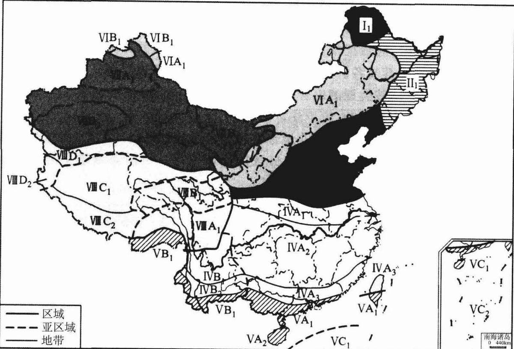

Ⅰ. 寒温带针叶林区域 VI. 温带草原区域  
I1. 南寒温带落叶针叶林地带 VIA. 东部草原亚区域  
Ⅱ.温带针阔叶混交林区域 VIA1. 温带草原地带  
Ⅱ1. 温带针阔叶混交林地带 VIB.西部草原亚区域  
Ⅲ.暖温带落叶阔叶林区域 VIB1.温带草原地带  
Ⅲ1.暖温带落叶阔叶林地带 VII. 温带荒漠区域  
IV. 亚热带常绿阔叶林区域 VIA.西部荒漠亚区域  
IVA. 东部(湿润)常绿阔叶林亚区域 VIIA1.温带半灌木、小乔木荒漠地带  
IVA1.北亚热带常绿落叶阔叶混交林地带 VIB. 东部荒漠亚区域  
IⅣA2. 中亚热带常绿阔叶林地带 VIB1.温带半灌木、灌木荒漠地带  
IVA3. 南亚热带季风常绿阔叶林地带 VIIB2.暖温带灌木、半灌木荒漠地带  
IVB.西部(半湿润)常绿阔叶林亚区域 VII.青藏高原高寒植被区域  
IVB1.中亚热带常绿阔叶林地带 VIIA.高原东南部山地寒温性针叶林亚区域  
IVB2. 南亚热带季风常绿阔叶林地带 VIIA1. 山地寒温性针叶林地带  
V.热带季雨林、雨林区域 VIIB.高原东部高寒灌丛、草甸亚区域  
VA.东部(偏湿性)季雨林、雨林亚区域 VⅢIB1.高寒灌丛、草甸地带  
VA1.北热带半常绿季雨林、湿润雨林地带 VIIC.高原中部草原亚区域  
VA2.南热带季雨林、湿润雨林地带 VIIC1. 高寒草原地带  
VB.西部(偏干性)季雨林、雨林亚区域 VIIC2. 温性草原地带  
VB1.北热带季节雨林、半常绿季雨林地带 VIID.高原西北部荒漠亚区域  
VC.南海珊瑚岛植被亚区域 VIID1. 高寒荒漠地带  
VC1.季风热带珊瑚岛植被地带 VIID2.温性荒漠地带  
VC2.赤道热带珊瑚岛植被地带

图1.30 中国植被区划图

(引自：《中国植被》编辑委员会，1980)

## （二）寒温带针叶林区域

寒温带针叶林区域位于我国最北部，包括东经127°20′（黑河附近）以西、北纬49°20'（牙克石附近）以北的大兴安岭北部及其支脉伊勒呼里山的山地。该区域只包含一个植被地带，即南寒温带落叶针叶林地带。降水少，冬季严寒而漫长，植被组成种类贫乏，维管束植物仅800余种，植被类型较单纯，以兴安落叶松（Larix gmelinii）为单优的明亮针叶林最为普遍。

南寒温带落叶针叶林地带的森林植被覆盖率达70%以上，以兴安落叶松为优势的原生林为主，混生樟子松（Pinus sylvestris var. mongolica）原生林，其他有次生的白桦（Betula platyphylla）林、蒙古栎（Quercus mon-golica）林、黑桦（B. davurica）林、山杨（Populus davidiana）林以及小面积的红皮云杉（Picea koraiensis）原生林，沿河生长钻天柳（Chosenia ar-butifolia）、甜杨（P.suaveolens）林。局部地段还有草甸和沼泽等。主要农作物为较耐寒的各种麦类、甜菜、马铃薯、甘蓝等。

该区受山地条件影响很大，随着海拔高度的上升，垂直带可划分为3个带、3个亚带。山地寒温针叶林带为本区主体部分，林木组成极单纯，以兴安落叶松为单优势种，构成兴安落叶松林。乔木层树种都很单调、结构简单、郁闭度较高，林下灌木、草本层和藓类较发育，下层植被盖度较高。山地寒温针叶疏林带仅分散在个别高峰，地带性植被为偃松-（岳桦）兴安落叶松疏林，郁闭度不超过0.3～0.4，乔木树干矮曲呈“小老头树”状。亚高山矮曲林带以孤岛状分散在个别高峰顶上，地带性植被为偃松矮曲林。

## （三）温带针阔叶混交林区域

温带针阔叶混交林区域位于北纬40°15′～50°20′、东经126°～135°30′之间，包括东北平原以北、以东的广阔山地，全区域成一新月形。该区域只有温带针阔叶混交林地带一个植被地带。地带性植被为由红松（Pinuskoraien-sis）为主构成的温性针阔叶混交林，一般称为“红松阔叶混交林”。

温带针阔叶混交林地带，森林覆盖率70%～80%以上，物种组成极其丰富，仅维管束植物近1900余种。针叶树除红松外，北部有云杉、冷杉和落叶松构成乔木亚层，南部还有沙冷杉（Abies holophylla）等。阔叶树种丰富，大型乔木如紫椴（Tilia amurensis）、风桦（Betula costata）、水曲柳(Fraxinus mandshurica)、核桃楸（Juglans mandshurica)、黄檗（Phello-dendron amurense）、千金榆（Carpinus cordata）等，林下灌木有毛榛(Corylus mandshurica)、刺五加（Acanthopanax senticosus)、暴马丁香(Syringa reticulata var. mandshurica)等，而且藤本植物丰富。农作物主要为小麦、玉米、大豆、马铃薯、水稻和蔬菜等。

小兴安岭、完达山地红松针阔叶混交林区的地带性植被破坏后，形成的蒙古栎林、山杨林、白桦林等次生阔叶混交林分布面积相当大。穆棱、三江平原苔草沼泽区，大部分已经开垦为农田。长白山地红松、沙冷杉针阔叶混交林区的地带性植被保存较少，绝大部分已开垦为农田或破坏后衍生成次生的阔叶混交林、栎树林和山杨林，大片草甸和部分沼泽已开垦为农地。

## （四）暖温带落叶阔叶林区域

暖温带落叶阔叶林区域位于北纬32°30′～42°30'、东经103°30′～124°10'之间，东宽西窄，略呈三角形。该区域只有暖温带落叶阔叶林地带一个植被地带，再划分为暖温带北部落叶栎林和暖温带南部落叶栎林两个亚地带。地带性植被为落叶阔叶林，以栎林为代表。

暖温带落叶阔叶林地带的物种丰富，种子植物约有3500种，其中草本植物约占2/3，植被建群种以松科的松属（Pinus）和壳斗科的栎属（Quercus）为主。针叶林优势种有赤松（Pinus densiflora）、油松（P. tabulaeformis）、华山松（P. armandii)、侧柏（Platycladus orientalis）等；落叶阔叶林最主要的建群种为几种栎属植物，如辽东栎（Quercus liaotungensis）、麻栎（Q. acutissima）、栓皮栎（Q. variabilis)、锐齿槲栎（Q. aliena var.acuteserrata）等。森林植被遭受破坏后出现的次生灌草丛的面积最大、分布最广，主要建群种包括荆条（Vitex negundo var. heterophylla)、酸枣(Zizyphus jujuba)、黄背草（Themeda triandra var. japonica) 和白羊草(Bothriochloa ischaemum)等。

人工引种丰富，如刺槐（Robinia pseudoacacia）、加拿大杨（Populuscanadensis）、钻天杨（Populus nigra var. italica）等。农业生产以两年三熟和一年一熟为主，农作物主要有玉米、高粱、水稻、冬小麦、春小麦、马铃薯、谷子、大豆、花生、芝麻、棉花、油菜、烟草、豌豆、蚕豆、胡萝卜、燕麦、苜蓿、西洋梨、核桃、葡萄、亚麻、甜菜、大麻、瓜类、茄等。

## （五）亚热带常绿阔叶林区域

亚热带常绿阔叶林区域是我国面积最大的一个植被区域，占全国总面积的1/4。首先根据生态外貌和生境水分条件差异，按经向划分为东部和西部两个“亚区域”，即东部（湿润）常绿阔叶林亚区域（含3个植被地带）和西部（半湿润）常绿阔叶林亚区域（含2个植被地带）；然后根据生境热量差异，按纬向划分出若干植被地带或亚地带。

该区域的地带性植被为常绿阔叶林，植物种类极为丰富。蕨类植物45科、140属、1000多种，主要分布在丘陵山地的阴湿沟壑区和森林植被的草本层中。裸子植物11科、32属、150种以上，针叶林在该区森林植被中所占面积最大，如马尾松（Pinus massoniana）林、云南松（P. yunnanensis）林、杉木（Cunninghamia lanceolata）林等。被子植物约14500种，壳斗科常绿种类如栲属（Castanopsis）、青冈属（Cyclobalanopsis）和石栎属(Lithocarpus）是常绿阔叶林的主要成分，尤其以栲属最为重要，其绝大多数种是常绿阔叶林的建群种；樟科约15属、100多种，也是常绿阔叶林的主要成分，尤其以润楠属（Machilus）最为重要；山茶科约11属、100多种，多为亚优势种或伴生种；竹亚科为建群种的竹林是东亚季风热带和亚热带地区特殊群落类型，其中毛竹（Phyllostachys pubescens）林的经济价值最大，占我国竹林面积的80%。

## 1. 东部（湿润）常绿阔叶林亚区域

东部（湿润）常绿阔叶林亚区域是我国面积最大的亚热带常绿阔叶林区，位于北纬22°～34°，东经102°30′～124°，主要包括西南至华南大部分，华中、华东和台湾列岛的北半部，分为北亚热带常绿落叶阔叶混交林地带、中亚热带常绿阔叶林地带和南亚热带季风常绿阔叶林地带共3个植被地带。

北亚热带常绿落叶阔叶混交林地带，为亚热带至暖温带的过渡植被类型。乔木层组成主要由青冈属、润楠属的常绿种类和栎属、水青冈属（Fagus）的落叶种类为优势或共优势种，灌木层主要有柃属（Eurya）、山矾属（Sy mplo-cos)、杜鹃属（Rhododendron)，草本层常有苔草属以及淡竹叶（Lophantherumgracile）、沿阶草（Ophiopogon bodinierii） 和狗脊蕨（Woodwardiajaponica）等。

人为活动的长期影响，常绿阔叶树残存较少，以落叶阔叶树（如麻栎、栓皮栎）占优势，外貌近似落叶阔叶林。平原盆地多为农业植被，以一年二熟为主，如稻一玉米、麦一稻、双季稻等；果树以落叶种类为主，如苹果、梨、桃等；经济林有茶园、油桐林、油茶林和漆树林等。

## 2. 西部（半湿润）常绿阔叶林亚区域

西部（半湿润）常绿阔叶林亚区域，位于我国西南的高原地区，北纬2230′～30°，东经98°10′～106°20′，包括云南高原全部和川西高原的南缘。该亚区域又分为2个植被地带，即中亚热带常绿阔叶林地带和南亚热带季风常绿阔叶林地带。地带性植被为以壳斗科常绿树种（如青冈属和栲属）为主的常绿阔叶林，曾称为常绿栎类林。

中亚热带常绿阔叶林地带的地带性植被为以滇青冈(Cyclobalanopsis glau-coides）、高山栲（Castanopsis delavayi）为主的常绿阔叶林，樟科和山茶科中的喜湿种类少见，藤本和附生植物也较少。南亚热带季风常绿阔叶林地带的典型植被为以喜暖的常绿栎类为主的季风常绿阔叶林和思茅松（Pinus kesiya）林，混生较多的热带林种类。

## （六）热带季雨林、雨林区域

热带季雨林、雨林区域位于我国最南端，东起东经123°附近的台湾省静浦以南，西至东经85°的西藏南部亚东、聂拉木附近，北界从东往西蜿蜒于北纬21°（广东中部）一24°（广西西部）一25°（云南西南部）—28°～29°（西藏东南部）之间，最南端在北纬4°附近。该区域可分为3个亚区域：东部（偏湿性）季雨林、雨林亚区域（2个植被地带），西部（偏干性）季雨林、雨林亚区域（1个植被地带），南海珊瑚岛植被亚区域（2个植被地带）。

低海拔平地和山地上各种雨林的主要组成种类有：龙脑香科、梧桐科、棟科、桑科、无患子科、四数木科等种类。次层乔木种类有山榄科、金刀木科、大戟科、使君子科、隐翼科、远志科等。林下灌木、草本和木质大藤本等的主要种类有番荔枝科、茜草科、藤黄科、使君子科、夹竹桃科、萝摩科、桃金娘科、马鞭草科、棕榈科、蝶形花科等种类。

地带性植被为热带半常绿季雨林，主要种类有：大戟科、椴树科、无患子科、楝科、桑科、榆科、漆树科、苏木科、藤黄科、樟科、梧桐科、山榄科等。下木层主要为茜草科、芸香科、紫金牛科、柿树科、苏木科、番荔枝科、樟科、大戟科、桃金娘科等种类。落叶植物主要有木棉科、漆树科、含羞草科、紫葳科、使君子科、楝科、五桠果科、橄榄科、梧桐科、千屈菜科、八角枫科等。

热带山地的雨林和季风常绿阔叶林，樟科、壳斗科、木兰科等常绿树种占优势，林下棕榈科和竹亚科植物丰富，蕨类植物不丰富。中海拔以上山地，也会出现一些温带科属的落叶树种，如鹅耳枥属（Carpinus)、桦木属（Betula）、桤木属（Alnus）、槭树属（Acer）和蓝果树属（Nyssa）等。更高山地上甚至出现温性和寒温性针叶树种，如罗汉松属（Podocarpus）、陆均松属（Dacrydiu m）、云杉属（Picea)、冷杉属（Abies）等。中山以上的山峰和山脊上出现常绿性矮林、灌丛和苔藓林等，以杜鹃花科、越桔科、蔷薇科植物占优势。

在低平地和丘陵低山，热带性针叶树大面积成林，如海南松（Pinuslat-terii)、思茅松（P. kesiya)）、湿地松（P.elliottii)、加勒比松（P. caribaea)等。红树林以红树科植物为主，并包括有海桑属（Sonneratia）、金刀木属(Barringtonia)、木果棟属（Xylocarpus)、瓶花木属（Scyphiphora）、海漆(Excoecaria agallocha）、银叶树（Heritiera littoralis） 和水椰（Nypafruticans）等典型红树林种类。南海的珊瑚岛屿分布着由麻疯桐（Pisoniagrandis）和草海桐（Scaevola sericea）等组成的热带珊瑚岛常绿林和滨海植被类型。

## 1. 东部（偏湿性）季雨林、雨林亚区域

东部（偏湿性）季雨林、雨林亚区域位于我国东南部沿海地区，西起广西百色的秦皇老山，东至台湾，北至北回归线以南，南至海南岛南缘，主要包括广东、广西和台湾的南部地区。该亚区域包括2个植被地带，即北热带半常绿季雨林、湿润雨林地带和南热带季雨林、湿润雨林地带。

北热带半常绿季雨林、湿润雨林地带的典型植被为热带季雨林，主要为半常绿季雨林和石灰山季雨林，雨林仅分布在局部山前地区、发育不完整。在海岸地带，热性刺灌丛和草丛及红树林分布很广，其中红树林为我国主要分布区之一，组成种类丰富，但没有水椰（Nypafructicans）。大面积分布的次生植被是桃金娘（Rhodomyrtus tomentosa）、岗松（Baeckea frutes-cens）、鹧鸪草（Eriachne pallescens）等组成的热性灌木草丛。作物种类有两熟水稻、番薯、甘蔗、花生、黄麻和各种豆类，果类丰富，有荔枝、龙眼、芒果、波罗蜜、凤梨、番木瓜、香蕉和椰子（年收1～3次）等。

南热带季雨林、湿润雨林地带为发育比较典型的雨林、季雨林，而且热带林的结构和特征显著，分布在500m以下的丘陵地区。500～1500m之间，分布有以鸡毛松（Podocarpus imbricatus）为标志的山地雨林，或者以陆均松（Dacrydium pierrei）为标志的山地常绿阔叶林。1500 m以上的热带山地是以广东松（Pinus kwangtungensis）为标志的小面积常绿阔叶苔藓林，砍伐后常形成山地灌木草丛。海滩地分布以红树（Rhizophora apiculata）、红海兰（R. stylosa）和水椰为标志的半红树林，海滨热性刺灌丛和热性砂生草丛也很典型。作物随收随种、热带种类较多，如三熟水稻、甘蔗、番薯、花生和黄麻等，经济林以橡胶树林为主，椰子可年结果3～4次。

## 2.西部（偏干性）季雨林、雨林亚区域

西部（偏干性）季雨林、雨林亚区域包括云南南部以及西藏东南部东喜马拉雅山的南翼地区，北界东段在北回归线以南，至西段逐渐向北推移，到西藏境内达到北纬29°左右。该区域只有一个植被地带，即北热带季节雨林、半常绿季雨林地带。

地带性植被为热带季节雨林和热带半常绿季雨林，广泛分布在低海拔丘陵地段，物种组成以热带科属为主，优势种类多属于豆科、楝科、无患子科、肉豆蔻科和龙脑香科等。山地分布常绿阔叶林，以壳斗科、木兰科、樟科、山茶科植物为主，垂直分布较为明显。作物有三熟的水稻和玉米，番薯可终年种植，经济作物有槟榔、香蕉、芒果、牛心果、橡胶树等。

## 3. 南海珊瑚岛植被亚区域

南海珊瑚岛植被亚区域位于广东省南部的南海中，北纬20°42′～4°，东经117°50′～109°30′，包括我国南海四大珊瑚岛，即东沙、中沙、西沙和南沙群岛。包含季风热带珊瑚岛植被地带和赤道热带珊瑚岛植被地带两个植被地带。

该亚区域的植物种类比较简单，只有57科、154属、213种，主要以紫茉莉科、茜草科、草海桐科、紫草科、马鞭草科、千屈菜科、藤黄科和禾本科为主。地带性植被为热带珊瑚岛常绿林，乔木林在西沙群岛大面积分布，在南沙群岛个别岛屿，组成树种只有10余种，主要为麻疯桐林和海岸桐(Guettarda speciosa）林，高度较低、优势种单一。灌木林在各岛屿普遍大面积连片分布，组成种类简单、优势种突出，以草海桐林和银毛树（Messer-schmidia argentea）林最常见。草本植被面积不大，断续地分布在高潮线以上的海滩和沙堤以及林迹地。栽培植物有椰子、香蕉、番木瓜、甘蔗、番薯(Ipomoca batatas)、青菜等种类。

## （七）温带草原区域

我国温带草原区域是欧亚草原区域的重要组成部分，位于北纬 $3 5 ^ { \circ } \sim 5 2 ^ { \circ }$ 东经 $8 3 ^ { \circ } { \sim } 1 2 7 ^ { \circ }$ ，主要连续分布在松辽平原、内蒙古高原、黄土高原等地，面积十分辽阔，一小部分坐落在新疆北部的阿尔泰山区。该区域划分为东部草原亚区域和西部草原亚区域两个亚区域，各包含一个植被地带。

温带草原区域共有种子植物约125科、760余属、3600余种，单属种、单种属和少种属的比例高。但是该区面积辽阔，植物种类相对贫乏。其中，菊科种类最多（约400多种），其次为禾本科、蔷薇科、豆科，其他还有毛茛科、莎草科、百合科、藜科、十字花科等。

该区植被的地带性规律明显。以阴山山脉为界可分为南北两类草原。北部以蒙古高原所特有的一些耐寒草原群系占优势，如大针茅（Stipa gran-dis）、克氏针茅（S. krylovii)、戈壁针茅（S. gobica）、羊草（Aneurolepi-dium chinense）和线叶菊（Filifolium sibiricum）等；南部鄂尔多斯和黄土高原地区则以长芒草（S. bungeana）、白羊草（Bothriochloa ischaemum）和短花针茅（S. breviflora）等相对喜暖的群系为代表。

植被的经向分布更加明显，从东南往西北，依次出现森林草原带、典型草原带和荒漠草原带。森林草原带的地带性植被以草甸草原为主，森林以岛状分布在低山丘陵北坡、沙地和沟谷，森林与草甸草原之间有时分布以中生杂类草为主的草甸群落。典型草原带是温带草原区域的主体部分，地带性植被以典型草原占绝对优势，沙地上分布榆树疏林和蒿类（Artemisia）半灌木丛。荒漠草原带的优势种以一组特有的强旱生小型针茅为建群种，并含有一组强旱生小半灌木组成的特殊层片。

## 1. 东部草原亚区域

东部草原亚区域包括松辽平原、内蒙古高原、黄土高原与新疆阿尔泰东部的草原区。该亚区域只有温带草原地带一个植被地带，包含两个亚地带(即温带北部草原亚地带和温带南部草原亚地带)。

草原建群种包括针茅属（Stipa）的针状芒组、膝曲芒组和须状芒组，根茎禾草类的羊草（Aneurolepidium chinense)，糙隐子草属的糙隐子草(Cleistogenes squarrosa)，菊科杂类草的线叶菊（Filifolium sibiricum)，蒿属的 Dracunculus 亚属和 Artemisia 亚属等。另外，无芒隐子草（Cleisto-genes songorica）为该亚区域荒漠草原特有种。

由于受东南季风影响，降水集中于夏季，植物只有一个生产高峰；春季干旱，缺少早春短生和类短生植物层片，丰水年荒漠草原常形成发达的夏季一年生植物层片。一年生植物层片的种类成分，在典型草原群落中以黄蒿（Arteulisia scoparia）和猪毛菜（Salsola collina）最为常见；在荒漠草原中种类非常丰富，如栉叶蒿（Neopallasia pectinata）、黄蒿、角果藜（Echi-nopsilon divaricatum)、地锦（Euphorbia humifusa)、画眉草（Eragrostisminor)、虎尾草（Chloris virgata）、锋芒草（Tragus racemosus）、三芒草(Aristida adscensionis)、狗尾草（Setaria viridis）等。农作物为一年一熟制，主要作物有水稻、春小麦、糜、谷、玉米、高粱、土豆、蚕豆、胡麻、甜菜和多种蔬菜等。

## 2. 西部草原亚区域

西部草原亚区域位于新疆最北部，包括富蕴以西我国境内的阿尔泰山以及塔尔巴哈台山、乌尔卡沙尔山、沙乌尔山等山地及其山前平原的草原地区。该亚区域只有温带草原地带一个植被地带，包含阿尔泰山西部山地草原区一个植被区。

该区以羽状芒组（Pennatae）的大型针茅为主，如吉尔吉斯针茅（Stipakirghisorum）和细叶针茅（S.lessingiana）等，缺少膝曲芒组（Brevigenic-ulata）及须状芒组（Barbatae）的小型针茅，在针状芒组（Capillatae）中仅有该亚区域的两个代表种 Stipa capillata 与 S. stareptana，蒿属中以 Se-riphidium亚属的几种为主。由于受北大西洋气团影响、全年降水均匀，春秋季水分较好因而出现春季短生和类短生植物层片，夏季相对较干旱抑制夏季群落生长。农作一年一熟，主要作物为春小麦和薯类作物。山地典型的植被垂直带结构是以山地草原为主，属于中亚草原地带山地的性质，由下而上为山地草原带、山地针叶林或山地灌丛草原带、亚高山草甸带、高山草甸带。

## （八）温带荒漠区域

我国温带荒漠区域属于“亚非荒漠区”东段，位于北纬36°以北、东经108°以西，包括新疆维吾尔自治区的准噶尔盆地与塔里木盆地、青海省的柴达木盆地、甘肃省与宁夏回族自治区北部的阿拉善高平原，以及内蒙古自治区鄂尔多斯台地的西端，约占我国面积的1/5强，其中沙漠与戈壁面积约100余万平方公里。该区域包括西部荒漠亚区域和东部荒漠亚区域2个亚区域、3个地带。

该区域高等植物有130科、817属，约3900种，但是该区面积辽阔，种类相对较贫乏，单属科、单种属和寡种属的比例很高。其中，数量最多的种为菊科、禾本科、蝶形花科、十字花科和藜科等。

温带荒漠区域植被的经向地带性较明显。如在西北风系作用下的北山一阿拉善高平原，由西北部的北山戈壁稀疏荒漠植被向东南过渡为沙漠植被占优势的阿拉善荒漠，再过渡到东南部的黄土高原。

相对来说，温带荒漠区域植被的纬度地带性不显著，由北向南大致可分为中温带北部的草原化荒漠、中温带荒漠和暖温带荒漠。该区域内有天山、昆仑山、祁连山和阿尔金山等一系列巨大的山系，随着海拔高度的上升，植被也出现有规律更替的3种类型的山地植被垂直带谱：具有山地森林带的山地植被带谱、以草原带占优势的山地植被带谱类型、以荒漠带占优势的山地植被带谱类型。

## 1. 西部荒漠亚区域

西部荒漠亚区域，即中亚细亚荒漠西部亚区域。我国境内南以天山北部山脉，东以古尔班通古特沙漠东缘为界，与亚洲中部荒漠亚区域相区分；在北面沿准噶尔西部的塔尔巴哈台山和萨乌尔山以及阿尔泰南麓平原而与欧亚草原区域为邻；向西侧延入哈萨克斯坦境内。该亚区域在我国只有温带半灌木、小乔木荒漠地带1个植被地带。

地带性荒漠植被以小乔木荒漠（梭梭 Haloxylon ammodendron和白梭梭H.persicum）和半灌木荒漠（尤其是具有中亚西部成分的蒿类）为主，其中常出现春雨型的短生植物和类短生植物层片。在山地具有较完整的植被垂直带谱，有中亚西部类型的山地草原，以及较发育的山地森林草甸带，局部地区有残遗的中亚落叶阔叶野果林。

农业耕作主要为一年一熟制。农作物种类较简单，主要为冬春小麦、玉米、油菜、胡麻、甜菜、大豆、马铃薯、苜蓿、甜瓜、西瓜、烟草等，部分地区可种植早熟陆地棉和水稻。果树主要为苹果、桃、李、杏、海棠、酸樱桃、葡萄等。人工树种有杨树、白柳（Salix alba）、榆（Ulmus pumila）、沙枣(Elaeagnus angustifolia)、洋白蜡（Fraxinus americana var. juglan-difolia)、小叶白蜡（F.sogdiana)、复叶槭（Acer negundo)、欧洲大叶榆(Ulmus laevis)、黄檗、夏栎(Quercus robur)、心木椴（Tilia cordata)、水曲柳、元宝槭（Acer truncatum）等。

## 2. 东部荒漠亚区域

东部荒漠亚区域包括天山分水岭以南的南疆、东疆、甘肃的河西走廊、北山戈壁与甘肃、宁夏、内蒙古之间的阿拉善高平原，以及青海的柴达木盆地。南界为昆仑山与黄土高原的北沿，东界大致在东经107°～108°之间切过鄂尔多斯台地的西部。该区域包括温带半灌木、灌木荒漠地带和暖温带灌木、半灌木荒漠地带2个植被地带。

地带性荒漠植被为超旱生半灌木、半灌木荒漠，春雨性短生植物几乎不存在，而夏雨型一年生荒漠草本在群落中比较发达。山地具有强度大陆性的荒漠型或草原型的植被带谱，结构简化，以山地荒漠或草原占优势，缺乏山地森林带或仅在局部地区出现。

## （九）青藏高原高寒植被区域

青藏高原大致位于北纬28°～37°、东经75°～103°。其南侧为森林繁茂的北热带高山喜马拉雅山南坡，北面为昆仑山脚下浩瀚的中亚温带荒漠，东面为东亚亚热带常绿阔叶林区域，西面为克什米尔高原谷地的荒漠山原。

青藏高原植被区域可分为4个亚区域：①高原东南部山地寒温性针叶林亚区域（1个植被地带）；②高原东部高寒灌丛、草甸亚区域（1个植被地带)；③高原中部草原亚区域（2个植被地带）；④高原西北部荒漠亚区域（2个植被地带)。

植物种类较为丰富，共有维管束植物189科、1174属、4385种。植被区系为高原植被区系，与相邻植被区域的联系明显。高原东南部的山地寒温性针叶林与高寒灌丛、草甸植被，主要由中国-喜马拉雅成分所组成；高原面上的高寒草原与荒漠植被，主要由中亚草原与荒漠成分及青藏特有成分组成。青藏高原植被类型复杂，既表现出明显的水平分布规律，又具有独特的山地垂直带性分布特征。

在广阔的高原面上，植被水平分布规律呈现出由东南向西北方向的“高原地带性”。在东南部的山地峡谷区（海拔3000～4000m），河谷侧坡发育以森林为代表的山地垂直带植被。往西到川西北部、青海南部和藏北东部地区(海拔4000～5000m)，主要植被为高寒灌丛和高寒草甸植被。再往西北到羌塘高原（海拔4500～5000m），大面积分布高寒草原和高寒荒漠草原植被；海拔较低的藏南谷地以及海拔4400m以下的河谷、谷坡、宽谷和盆地，为温性草原和温性干旱落叶灌丛植被，海拔4400m以上为高寒草原和高寒灌丛。继续往西北到达青藏高原最西北部，即喀拉昆仑山与昆仑山之间的山原和湖盆区（平均海拔5000m以上），发育高寒荒漠植被；在海拔较低西部阿里地区，发育以山地温性荒漠或草原化荒漠为基带的植被垂直分布系列。

青藏高原植被的垂直分布具有下述特点：

（1）垂直带类型复杂多样。每个水平地带都具有其特有的植被类型，东南部森林区以森林植被为基带的垂直分布类型，往西北依次出现以高寒灌丛(或高寒草甸）、高寒草原（在藏东南谷地为温性草原）、高寒荒漠（在阿里山西部山地为温性山地荒漠）为基带的垂直分布类型。

（2）垂直带谱结构繁简差异明显，高原内部极度简化。森林区垂直带谱为山地森林带一高寒灌丛草甸与高山垫状植被带—高山亚冰雪稀疏植被带一永久积雪带，阴阳坡差异明显。相反，在羌塘北部高原垂直带谱只有高寒草原带一高山垫状植被与高山流石坡稀疏植被带—永久积雪带，阴阳坡几乎没有差异。

（3）由东南往西北同一植被带的分布高度呈上升趋势。

## 1. 高原东南部山地寒温性针叶林亚区域

高原东南部山地寒温性针叶林亚区域，位于北纬 $2 7 ^ { \circ } 4 0 ^ { \prime } \sim 3 2 ^ { \circ } 4 0 ^ { \prime }$ ，东经92°～103°30′，包括川西、西藏东部和云南西北部。该亚区域只有1个植被地带，即山地寒温性针叶林地带。

该地带的植被类型，在河谷阶地、峡谷下部，普遍以带刺的白刺花(Sophora viciifolia）灌丛为主。3000 m以上的主要植被类型为寒温性阴暗针叶林，即冷杉林（Abies）、云杉林（Picea）和圆柏（Sabina chinensis）疏林。北纬30°以南的山坡上，分布有川滇高山栎（Quercus aquifolioides）林、黄背栎（Q. pannosa）林。高原边缘的山地下部及雅鲁藏布江大拐湾以北，分布以壳斗科为主的常绿阔叶林。寒温性针叶林的上限，一般为4000～4200m（有些地方可达4400 m）。林线以上为高山小叶杜鹃（Rhododendronparvifolium f. alpinum）灌丛和高山草甸。4700 m至雪线，分布有流石滩稀疏植被群落。

农业主要集中在河谷地区，随着海拔的上升，依次由一年两熟制向两年三熟制和一年一熟制过渡。农作物主要有水稻、小麦、玉米、豆类、甘薯、花生、油菜、豌豆、元根、马铃薯、荞麦、青稞、马铃薯、油菜、烟叶等。其他栽培树木有核桃、油桐、乌柏、棕榈、花椒、梨、苹果、桃、李、石榴、柿、葡萄、柑桔等。

## 2. 高原东部高寒灌丛、草甸亚区域

高原东部高寒灌丛、草甸亚区域位于青藏高原东北部，包括青海东南部、四川西北部、甘南西部和藏北高原东部，略呈东北一西南的长方形地带。该亚区域只有高寒灌丛、草甸地带1个植被地带。

植被类型简单，地带性植被以高寒灌丛和高寒草甸为主。高寒灌丛的主要种，包括北温带寒温性落叶灌木金露梅（Potentilla fruticosa）、高山柳（Salix cupularis）和常绿灌木多种杜鹃（Rhododendron）以及青藏高原特有种狭叶鲜卑花（Sibiraea angustata）等。高寒草甸以中亚高山成分多种蒿草为主要建群种，伴生种类以中国一喜马拉雅成分为主，还有不少北极一高山成分和青藏高原特有成分。

垂直带谱也相对较简化。除东南部少数峡谷海拔3800（4000m）以下谷坡分布有小片块状寒温性针叶林外，绝大部分地区无森林植被；3800（4000m）以上为高寒灌丛带，其上限为4200m（东部）至4800m（西部）。再上依次出现高寒草甸带、高山岩屑坡稀疏植被带和永久冰雪带，分布高度与宽度因地而异。草场资源丰富，以牧业为主。农业主要局限于低海拔的小片河谷区，以一年一熟为主，主要农作物有青稞、燕麦、冬小麦、元根、马铃薯、萝卜、大葱等。

## 3. 高原中部草原亚区域

高原中部草原亚区域位于北纬 $2 7 ^ { \circ } 4 5 ^ { \prime } { \sim } 3 8 ^ { \circ } 1 5 ^ { \prime }$ 、东经 $8 0 ^ { \circ } 0 5 ^ { \prime } { \sim } 1 0 0 ^ { \circ } 4 5 ^ { \prime }$ ，包括青海省南部高原的西部、西藏羌塘高原大部和藏南谷地，地域辽阔。该亚区域分为高寒草原地带和温性草原地带两个地带。

地带性植被为草原植被，分布最为广泛，还有一些落叶灌丛、常绿灌丛、草甸、垫状植被。草原植被的主要建群种为禾本科针茅属 $\left( S t i p a \right)$ 、菊科蒿属（Artemisia）和莎草科的硬叶薹草（Carex moorcroftii）等。灌丛植被主要分布于藏南谷地和山坡，多属于干性落叶类型，如锦鸡儿（Caragana）灌丛和金露梅（Potentilla fruticosa）灌丛；在拉孜以下的雅鲁藏布江河谷及其谷坡分布温性灌丛；高山带分布香柏（Sabina pingii var. wilsonii） 常绿针叶灌丛和小片的杜鹃（Rhododendron laudandum，R. nivale等）常绿革叶灌丛；在羌塘高原的干谷谷坡和干河床砾石滩上还有一些矮麻黄（Ephed-ra gerardiana） 和匍匐水柏枝（Myricaria prostrata）灌丛。

## 4. 高原西北部荒漠亚区域

高原西北部荒漠亚区域位于青藏高原的西部与西北部，并包括帕米尔高原东部。高原荒漠植被的植物区系成分和群落类型，是古地中海区在高原面上的残遗和变型。该亚区域又分为高寒荒漠地带和温性荒漠地带2个植被地带。相对来说，高寒荒漠地带具有较多特有种类和群落，而温性荒漠地带则保留有较多的古地中海荒漠成分。

我国境内高寒荒漠地带的植物种类种较少，昆仑内部高原、高寒荒漠区只有100余种高等植物，帕米尔高原、高寒荒漠区内不到620种植物。最重要的建群种为垫状驼绒藜(Ceratoides compacta)、西藏亚菊（Ajania tibeti-ca）、硬叶薹草（Carex moorcroftii）与粉花蒿（Artemisia rhodantha）等。昆仑内部高原、高寒荒漠区，气候严寒，缺乏农业发展条件，牧业也受到很大限制。塔什库尔干谷地为优良的四季放牧场，谷地中的高阶地已开垦为灌溉农地，可种植春小麦、青稞、油菜，并可栽培新疆杨（Populus alba var.pyramidalis）与柳树。

温性荒漠地带的优势植被，为荒漠或草原化荒漠植被与山地一高山的荒漠草原和高寒草原植被。山地植被垂直分带明显，基带为半灌木荒漠和驼绒藜草原化荒漠。随着海拔的升高，依次出现山地荒漠草原带、高寒草原带、草原化高山垫状植被带、高山亚冰雪稀疏植被带（高山亚冰雪稀疏植被亚带、高山亚冰雪裸石亚带）与雪线。该区河谷为半农半牧区。主要农作物有青稞、豌豆、春小麦等，栽培树种有杨、柳、桃、杏、胡桃等。草场面积大、草质优良，牧业潜力大。

## 三、植被变化与土壤侵蚀

## （一）全国植被覆盖及其变化特征

近年来，中国各类植被类型分布面积萎缩，2000年中国有植被覆盖的类型面积仅占55.2%，以裸岩、戈壁和沙漠等为主的无植被覆盖类型占24.9%，农田占17.8%（徐文婷等，2005）。

根据孙睿和朱启疆（2000）的研究，全国1992～1993年陆地植被净初级生产力（NPP）约为 $2 . 4 6 5 \times 1 0 ^ { 9 } \mathrm { t C }$ ，主要受水分条件影响，从东南向西北方向递减。其中，海南岛、台湾东部、云南西南部河谷地带及东南沿海的部分丘陵山地，水热条件好，植被以热带雨林、季雨林及亚热带常绿阔叶林为主，年NPP很大，在 $1 0 0 0 \mathrm { g / ( c m ^ { 2 } \cdot a ) }$ 以上。尤其以台湾最南端、海南岛东南部和云南西南部等地的NPP最大，超过 $1 5 0 0 \mathrm { g / ( c m ^ { 2 } \cdot { a } ) }$ 。亚热带地区常绿阔叶林的 NPP基本在 $5 0 0 ~ \mathrm { g / ( c m ^ { 2 } \cdot { a } ) }$ 以上，温带地区自然植被除部分森林植被的NPP大于 $5 0 0 ~ \mathrm { g / ( c m ^ { 2 } \cdot { a } ) }$ 外，基本上小于 $5 0 0 ~ \mathrm { g / ( c m ^ { 2 } \cdot { a } ) }$ 。在江淮以南，平原地区农地的农作物生长季比较短、植被覆盖较低，其NPP大多在$3 0 0 { \sim } 5 0 0 ~ \mathrm { g / ( c m ^ { 2 } \cdot { \mathrm a } ) }$ 之间，比周围山地丘陵自然植被低。在干旱半干旱地区的温带草原区域，NPP基本小于 $1 0 0 ~ \mathrm { g / ( c m ^ { 2 } \cdot { a } ) }$ ，荒漠地区植被稀疏，NPP很小，基本上 $3 0 ~ \mathrm { g / ( c m ^ { 2 } \cdot { a } ) }$ 以下，甚至为0。

遥感归一化植被指数（NDVI）是近红外与红外两个波段反射率之差与该两波段反射率之和的比值，它是度量地表植被覆盖度的一个重要指标，其变化比较客观地反映了植被覆盖度的变化。以1982～2000年共19年中国春季（3～5月）和夏季（6～8月）的NDVI多年平均值为背景，统计了每5年时间段春夏两季NDVI的变化特征。总体来看，全国NDVI变化幅度很小，其中春季呈现小幅增大趋势，夏季呈现出先增后降的小幅波动趋势。

1982\~2000年的近20年间，中国植被覆盖度变化有以下3个规律：①覆盖度总体比较稳定，绝大部分地区的植被覆盖度保持不变。②部分地区的植被覆盖度增大，并以春季植被覆盖度增加的趋势更为明显，夏季植被覆盖度增加趋势不明显。③只有极少数地区的植被覆盖度降低，并以夏季植被覆盖度降低的趋势更为明显，1982\~2000年夏季植被覆盖度降低所占面积呈现出逐渐增大的趋势，相对来说春季植被覆盖度降低所占面积相对较小，其中以80年代后期至90年代前期减少的面积最大（表1.38）。

表1.38 1982\~2000年中国NDVI春季和夏季变化的面积比例（单位：%）
<table><tr><td rowspan=1 colspan=1>季节</td><td rowspan=1 colspan=1>变化区间</td><td rowspan=1 colspan=1>减少</td><td rowspan=1 colspan=1>不变</td><td rowspan=1 colspan=1>增加</td></tr><tr><td rowspan=4 colspan=1>春季 NDVI变化</td><td rowspan=1 colspan=1>80年代前期至80年代后期</td><td rowspan=1 colspan=1>1.76</td><td rowspan=1 colspan=1>70.37</td><td rowspan=1 colspan=1>27.88</td></tr><tr><td rowspan=1 colspan=1>80年代后期至90年代前期</td><td rowspan=1 colspan=1>9.97</td><td rowspan=1 colspan=1>76.04</td><td rowspan=1 colspan=1>13.98</td></tr><tr><td rowspan=1 colspan=1>90年代前期至90年代后期</td><td rowspan=1 colspan=1>5.89</td><td rowspan=1 colspan=1>78.03</td><td rowspan=1 colspan=1>16.08</td></tr><tr><td rowspan=1 colspan=1>小计</td><td rowspan=1 colspan=1>5.87</td><td rowspan=1 colspan=1>74.81</td><td rowspan=1 colspan=1>19. 31</td></tr><tr><td rowspan=5 colspan=1>夏季NDVI变化</td><td rowspan=1 colspan=1>80年代前期至80年代后期</td><td rowspan=1 colspan=1>4.28</td><td rowspan=1 colspan=1>71. 11</td><td rowspan=1 colspan=1>24.61</td></tr><tr><td rowspan=1 colspan=1>80年代后期至90年代前期</td><td rowspan=1 colspan=1>9.03</td><td rowspan=1 colspan=1>76. 18</td><td rowspan=1 colspan=1>14.79</td></tr><tr><td rowspan=1 colspan=1>90年代前期至90年代后期</td><td rowspan=1 colspan=1>22.21</td><td rowspan=1 colspan=1>72.53</td><td rowspan=1 colspan=1>5.26</td></tr><tr><td rowspan=1 colspan=1>小计</td><td rowspan=1 colspan=1>11.84</td><td rowspan=1 colspan=1>73.27</td><td rowspan=1 colspan=1>14.89</td></tr><tr><td rowspan=1 colspan=1>总计</td><td rowspan=1 colspan=1>8.86</td><td rowspan=1 colspan=1>74.04</td><td rowspan=1 colspan=1>17. 10</td></tr></table>

## （二）区域植被变化特征与土壤侵蚀

植被类型、覆盖度、组成、多样性与生产力等结构与功能受到自然和人为因素的综合影响，针对不同区域特点，许多学者研究了一些典型区域的植被结构与功能变化特征及其对土壤侵蚀的影响。

## 1. 寒温带针叶林区域

大兴安岭寒温性针叶林是我国重要的木材基地，具有保护土壤、过滤污染物、大气碳库等重要生态功能。该区域大部分地区的森林覆盖率较高(>70%)，下层植被盖度也很发达，个别地区达到90%以上，植被的水土保持作用较强。但个别山峰顶部的山地寒针叶疏林带和亚高山矮曲林带的植被覆盖度较低（郁闭度<0.3～0.4）。由于全球气候变化和新中国成立以来森林采伐的影响，寒温性针叶林正面临破碎化、森林火灾和虫灾等多方面的威胁。近年来，国家启动的天然林保护工程对该区植被恢复具有重要意义。

## 2. 温带针阔叶混交林与暖温带落叶阔叶林区域

温带针阔混交林区域曾是我国木材生产基地之一，原生植被森林覆盖率70%～80%以上，下层植被丰富，原生植被的水土保持作用很强。但是该区已大面积开垦为农田，植被覆盖度显著降低，水土流失（尤其陡坡）加剧。

该区域除了少数山区外，大部分自然植被已经遭到严重破坏，以栽培植被为主。森林覆盖率低（<17%）与陡坡开垦，导致山丘区水土流失严重。必须加强水土保持工作，把工程措施和封山育林、植树造林、轮封养草等生物措施相结合，发展水土保持林、农田防护林，实行山、水、田、林、路综合治理。近年来实施的生态退耕工程，促进了该区植被恢复，有利于减少水土流失。

## 3. 亚热带常绿阔叶林区域

该区域是中华民族文化发展的主要基地之一，历史悠久，人口及其需求迅速增长。在人为干扰长期作用下，导致植被严重退化（包维楷、刘照光，1999)。典型原生常绿阔叶林为主的自然植被仅残存在交通不便的一些丘陵和中山地，其他低丘和盆地几乎都已经为次生植被和栽培植被所占据。如果原生常绿阔叶林遭受不断的砍伐破坏或刀耕火种，植被盖度降低，水土流失严重，造成土层瘠薄、形成光山秃岭，不仅自然植被难以恢复，甚至人工造林也很困难。有些低海拔的荒山丘陵地区，因为病虫害和人工林（如马尾松林）的过度采伐，次生植被与人工植被也都遭到严重毁坏，形成大面积的荒山灌草丛，植被稀疏，水土流失严重。

在浙闽山丘甜储木荷林区，通过实地调查发现，浙江绍兴市兰亭林场频繁的人为活动，严重地破坏了天然森林植被，导致植物发生逆向演替，从常绿阔叶林→针叶林→灌丛→裸地。随着地面植被覆盖度的降低，水土流失加剧，土层变薄，土壤砂化，结构变差，有机质和全氮等养分迅速下降，土壤温度和湿度的调控能力减弱（章明奎，1995）。

在南岭山地栲类蕈树林区，对赣南红壤侵蚀地植被的研究表明，由于人为干扰严重，红壤侵蚀地大面积为裸露的冲刷坡，局部地方有稀疏而丛状分布的草被，只有少数陡峭的山坡上有少数次生林存在。在极度退化的红壤严重侵蚀地上，植被受到彻底破坏，土壤侵蚀剧烈，植物种类缺乏，土壤养分贫瘠，小气候环境极为恶劣，地带性植被优势种难以侵入和定居，自然植被恢复很难；在某些土壤条件较好的地段，自然植被恢复相对容易。如果人为干扰停止，靠近林缘的灌丛需20年才可初步恢复成次生乔木林；红壤侵蚀地的稀疏草本群落要恢复至灌丛阶段则需经历几十年甚至更长的时间。这类退化的生态系统应该尽快形成地表覆盖，防止水土流失。现存的草本群落种类组成虽然简单，但对侵蚀地恶劣的环境条件却最具适应性。在草被恢复的措施中，应侧重这些适应侵蚀地恶劣环境条件的乡土草本植物。优良外来种，必须与乡土草种进行合理配置，才能发挥更好的生态效益。在植被恢复与重建中，需要模拟自然群落的特征施加人工的促进措施，例如为了防止凸形坡径流冲走植物种子，需采取地面覆盖等人为措施协助植物完成定居过程。随着植被覆盖度的增加，应因地制宜地配置不同的种群结构组合，对先期先锋群落进行逐步更新，套种上较高阶段的优势植物以缩短恢复的进程（谢宝平等，2001)。

在滇黔桂石灰岩峰林润楠青冈细叶云南松林区，由于人为干扰、破坏和不合理使用，导致植被与生态系统退化、石漠化加剧（姚长宏等，2001）。滇东喀斯特植被调查研究发现，该区植被已经和正在经历各种人为干扰、破坏和不合理使用，处于渐进的逆向演替过程。伴随植被退化，土壤有机质和养分不断流失。以物种组成、群落高度、繁殖体库、土壤、生物量与参照群落间的相异性指数为指标，通过聚类分析可将滇东的喀斯特退化植物群落分为顶级群落、乔林、灌乔、灌丛灌木、草灌和草本群落6个阶段。喀斯特退化植被的恢复应该充分考虑到这种植被退化的阶段性，根据各阶段的特点补充不同数量和种类的当地物种繁殖体，改善土壤基质性状并配以抚育措施（沈有信等，2005）。

## 4. 热带季雨林、雨林区域

该区域自然条件优越，高温多雨，台风侵袭频繁，暴雨多，降雨侵蚀力很高，由于天然植被结构复杂、层次丰富，植被盖度较大，部分山地天然植被保存良好，水土保持作用强。但是，由于森林砍伐和垦殖等人为活动干扰严重，大部分地区都已经不存在自然植被，次生植被和栽培面积增大，常常引起水土流失，导致土壤瘠薄，出现各种旱生性的次生植被类型，更甚者会变成荒芜之地。

## 5. 温带草原区域

我国温带草原区域的东北平原和黄土高原地区，草原大部分已经开垦为农田，尤其是森林草原地区，天然植被已垦殖殆尽，成为重要的粮食生产基地，土地沙化和水土流失已经成为该区最为突出的环境问题。如东北平原的克山、拜泉地区，因为大量开垦，天然植被残存无几，严重的水土流失使该区沟壑纵横、黑土层流失殆尽。在内蒙古高原，天然植被保存相对较好，但是过度放牧、烧荒、搂柴、挖药材，引起草原退化，沙化现象也很严重。频繁的人为活动与地表侵蚀是限制该区草原植被恢复的主要因素（《中国植被》编辑委员会，1980)。

在松辽平原外围栎林草原区，调查分析表明，吉林省长岭羊草（Aneurolepidium chinense）自然保护区的植被退化与土壤盐渍化过程密切相关，土壤肥力下降、植物营养匮乏是草地植被退化的原因之一。土壤有机质和水解氮含量降低导致植被退化程度加重，羊草生物量及其在群落中的重要值和相对盖度降低，导致土壤电导率和碱化度均呈曲线增加，土壤盐渍化程度加剧（张为政，1994）。

在内蒙古高原典型草原区，对锡林河流域植被的研究发现，1999年流域放牧退化草原植被面积为7689.3km²，占总流域面积的71.86%。草原退化的空间格局比较复杂，在流域中下游及河谷阶地、平原和丘陵区，人类放牧利用强度较高，草原植被退化较为明显（仝川等，2002）。朱源等（2004）对河北省丰宁县坝上草原区植物群落的研究表明，植物群落时空分布除了受坡向、坡度和海拔等自然因子的影响而表现出有规律的生态梯度外，还受到放牧、采伐和耕作等人为干扰的影响而表现出退化特征。放牧主要影响草本植物群落，显著提高了冷蒿（Artemisia frigida）和狼毒（Stellera chamae-jasme）等草原退化指示种的优势度；采伐造成白桦（Betula platyphylla）林萎缩和细叶苔草（Carex rigescens）群落扩展。

在乌兰察布高原荒漠草原区，王振嵘和卢贤娥（2001）研究表明，鸟拉山天然次生林区90%以上的林分属于过成熟林，自然枯死现象十分严重。无计划的过度放牧和毁林开矿，严重地啃食和践踏现有森林及其幼苗幼树，阻止森林的天然更新，森林植物群落呈逆向演替趋势，森林植被退化严重，地表裸露、森林覆盖率只有4.9%，水土流失严重，成为荒山秃岭、甚至基岩出露。

在黄土高原中东部草原区，邱扬等（1999）对山西省1990～1995年森林资源连续清查数据的分析发现：①该省森林资源总量增加，但结构变化不合理。森林覆盖率（不包括灌木林地）年均提高3.56%，用材林面积和蓄积分别年均增加0.89%和2.14%，而防护林面积每年减少0.09%，蓄积量年增率只有0.18%。②森林覆盖率较低，林种结构不合理。1995年山西省森林覆盖率只有11.72%，郁闭度0.4以上的有林地不足2/3。用材林的面积（73.8%）和蓄积（83.8%）占据绝对优势，防护林的面积（23.0%）和蓄积（11.0%）都较低。索安宁等（2005）研究发现，黄土高原泾河流域植被退化相当严重，占流域面积60.06%的流域上中游宜林地区现仅存森林和疏林共$5 3 ~ 3 5 0 ~ \mathrm { h m ^ { 2 } }$ ，其中66.93%已退化为其他植被覆盖；占流域面积39.94%的中下游宜灌草地区有 $1 5 0 \ 2 5 0 \ \mathrm { h m ^ { 2 } }$ 退化为植被覆盖稀疏的荒草地，此外79500$\mathrm { h m } ^ { 2 }$ 的各种植被覆盖类型被开垦为各类农业用地，植被生态恢复任务艰巨。黄明斌等（1999）研究表明，黄土高原沟壑区小流域出口的径流量随着植被盖度增大而减小，森林小流域比相同盖度的天然草地小流域的蒸发蒸腾量大、径流量小。陕北黄土丘陵小流域的模拟分析发现，15°以上农地退耕还林（草）后，林地/灌木地的面积由8%增加到38%，农地由44%减少到8%，流域出口的洪峰流速、径流量和侵蚀量减少约40%～50%（傅伯杰等，2002；邱扬等，2003)。

## 6. 温带荒漠区域

该区域干燥风大，土壤风蚀严重。虽然植被盖度较低，但是荒漠植被是荒漠地区干旱气候及其他特定的自然条件综合作用的产物，与当地水热条件达到相对平衡，可以有效地起到防风固沙的作用。但荒漠植被一直受到政治和经济活动（如战争、农垦、放牧等）的直接或间接影响。荒漠植被比较脆弱，一旦被人类的不合理开发利用所破坏，会迅速引起次生荒漠化。目前的破坏主要表现为：①盲目开垦，毁掉天然植被，在其他农业技术和防护措施未跟上时就弃耕撂荒，促使土地风蚀沙化。②过度放牧，造成草场物种组成改变、生产力下降等草场退化现象。③不合理灌溉导致土地次生盐渍化和次生沼泽化。④滥行樵采，造成天然植被萎缩、加剧土地沙化。⑤截引水源，导致河流沿岸生境旱化、植被枯死。例如我国乌兰布和北部沙漠，2000多年前还是一望无际的干草原，北面狼山为森林。由于西汉、清王朝和北洋军阀的大规模滥垦滥伐和民族战争，天然植被破坏殆尽，导致流沙四起，形成沙漠。其他如巴丹吉林沙漠西部的黑城子，塔克拉玛干沙漠中的楼兰废墟、古尼雅、喀拉塘格、安迪尔等古城，以及著名的“丝绸之路”，这些地区古代多为绿洲，天然植被生长良好，后来被流沙淹没，沙进人退。这固然与自然条件变迁有关，但是人类活动无疑加速了荒漠化进程。新中国成立以来，我国在荒漠地区进行了较大规模的农业开垦，同时营造防风固沙林、封沙育草等工程。截至20世纪80年代初，在荒漠地区开垦耕地超过 $2 . 6 7 \times 1 0 ^ { 6 } ~ \mathrm { h m ^ { 2 } }$ ，营造防风固沙林、农田防护林近 $6 . 6 7 \times 1 0 ^ { 5 } ~ \mathrm { h m ^ { 2 } }$ ，封沙育草 $1 . 0 0 \times 1 0 ^ { 6 } ~ \mathrm { h m ^ { 2 } }$ o

## 7. 青藏高原高寒植被区域

青藏高原东南部森林资源丰富，是我国第二大林区即川西林区的一部分，天然森林覆盖率30%左右。但是如果过度采伐会引起严重的水土流失。

青藏高原分布辽阔的各种植被如高寒灌丛、高寒草甸、高寒草原、高寒荒漠等的优势种类，不仅是各类野生食草性昆虫和兽类的食料来源，也是各类牲畜喜食的优良牧草。因此，青藏高原也是我国重要的畜牧业基地之一(李文华、周兴民，1998)。这些野生动物与日益增加的牲畜，严重地破坏了天然植被，改变植物群落的种类组成和结构，大幅降低群落的生物产量，导致植被退化，引发水土流失。据不完全统计，青藏高原约有 $0 . 4 5 \times 1 0 ^ { 8 } \ \mathrm { h m ^ { 2 } }$ 退化草地，约占青藏高原草地总面积的1/3，其中严重退化的次生裸地即“黑土滩”，约占退化草地面积的16.5%（马玉寿等，1999；周华坤等，2003)。原生植被一旦破坏，恢复非常困难。草原毛虫是该区主要害虫之一，主要危害以蒿草为优势的高寒草甸和以蒿草和针茅 $( S t i p a )$ 为优势的草原化草甸。当大规模暴发时，数量多，快速啮食优良牧草的幼嫩部位，相反杂类草迅速生长发育，不仅明显地改变植物群落的种类组成和结构，而且导致生产力降低50%或更多。啮齿动物种类多，分布普遍，对植被的破坏也非常严重。它们不仅啃食各类优良牧草，改变植被物种组成和结构，而且地下洞穴串联，纵横交织，容易坍塌侵蚀，从而大幅度降低植被生产力。

在川西藏东高原高寒灌丛草甸区，对青海省果洛藏族自治州玛沁县大武乡格多牧委会的研究表明（周华坤等，2005），随着高寒草甸退化程度加剧，植被盖度、草地质量指数、地下总生物量和优良牧草地上生物量比例逐渐下降，地下根系浅层化趋势加剧，草地间的相似性指数减小，而植物群落多样性指数和均匀度指数在中度退化阶段最高。同时，随着草地退化程度的加大，表层土壤流失严重，土壤越来越贫瘠。

在那曲—玛多高原高寒草甸区，大量研究已经表明（王启基、周立，1995；刘伟等，1999；周兴民，2001)，抢牧、滥牧、超载过牧和落后的草地利用方式，直接导致植被退化加剧，尤其以过度放牧是导致高寒草地退化的根本原因。1996～1997年调查显示，那曲地区退化草地的面积达12万hm²，每年还以5%的速度扩大（刘淑珍等，1999)；2000～2001年，那曲地区的退化草地面积已占总草地面积的51.3%（杨汝荣，2003）。其中，高山蒿草(Kobresia pygmaea）草地是西藏自治区高寒草甸类草地中分布范围最广、面积最大、地势最高和饲用价值较大的草地类型，占那曲地区草地总面积的17.43%（陈全功等，1991）。魏兴琥等（2005）调查发现，那曲地区中部高山蒿草草地超载严重，定居点附近超载高达3.73倍，超载最轻的草地也达到1.75倍。放牧超载导致那曲地区的高山蒿草草甸呈现退化加剧的趋势，超载草地的多样性指数、植被盖度、地上现存生物量都显著低于围栏禁牧区；随超载程度的加大，莎草科植物、耐旱的杂类草、牲畜不喜食和不食的植物种有增加的趋势。那曲地区高山蒿草草甸已达到重度-中度退化程度，极重度超载区达到重度退化程度，重度和中度超载区达到中度退化程度，其比例分别达到9%和91%，远大于1996年的调查数据。

马世震等（2004）研究发现，黄河源头玛多县扎陵湖北岸地区由于自然环境变迁以及人为活动的影响，紫花针茅草原（Stipapurpurea）和早熟禾(Poa annua）草原植被退化十分明显。退化草地植被盖度比未退化区下降10%～55%；紫花针茅、早熟禾等天然优势种的长势减弱、物候期推迟，逐步演替为以菊科、豆科等杂类草植物为优势种的群落；物种多样性指数下降55%～79%。由于高寒植被的退化，导致了植被群落整体生态功能的下降，进一步加剧了黄河源头的生态环境恶化。在三江源地区的青海省治多县，近30年来超载过牧与气候干旱，约1/3以上的草地处于不同程度的退化状态、高寒草甸面积的缩小，高寒草原及荒漠草原的面积扩大，约有1万hm²的天然草地已经荒漠化或沙化，平均产量降低了50%以上，从而导致该地区草地总生产力下降（汪诗平，2003）。

## 参考文献

安和平，周家雄.1994. 贵州南北盘江流域土壤侵蚀现状及防治对策．水土保持学报，8（3)：36～45

包维楷，刘照光．1999.岷江上游大沟流域驱动植被退化的人为干扰体研究．应用与环境生物学报，5 (3):233\~239

陈家琦，王浩，杨小柳.2002.水资源学．北京：科学出版社

陈雷，焦居仁，刘震，等.2002.中国土壤侵蚀图册．北京：中国标准出版社，2\~3

陈全功，张普金，王春喜等.1991.西藏那曲地区草地畜牧业资源．兰州：甘肃科学技术出版社．26～38

陈永文.1992.长江中下游平原．见：黄秉维（主编）.中国大百科全书（中国地理卷）.北京：中国大百科全书出版社，50

程裕淇.1994.中国区域地质概论．北京：地质出版社，1～502

地图出版社编辑部.1979.中华人民共和国地图集．北京：地图出版社，5

杜恒俭，陈华慧，曹伯勋.1981.地貌学及第四纪地质学．北京：地质出版社，272\~279

杜秀荣，唐建军.2004.中国地图集：北京：中国地图出版社，12\~13

傅伯杰，邱扬，王军，陈利顶.2002. 黄土丘陵小流域土地利用变化对水土流失的影响．地理学报.57(6):717\~722

龚子同等.1999、中国土壤系统分类理论·方法·实践．北京：科学出版社

广东省水利水电科学研究所，广东省水利厅水保农业处.1997，北江上游水土流失与治理．水土保持研究，4（3）：1\~77

国家统计局.2006.中国统计年鉴——2006.北京：中国统计出版社，4～6

黄秉维，郑度，赵名茶等.1999.现代自然地理．北京：科学出版社

黄明斌，康绍忠，李玉山.1999.黄土高原沟壑区森林和草地小流域水文行为的比较研究．自然资源学报，14（3）：226\~231

黄锡铨，李惠明，金伯欣.1998.水文学．北京：高等教育出版社

季子修．江南丘陵.1992.见：黄秉维（主编）．中国大百科全书（中国地理卷）．北京：中国大百科全书出版社，247\~248

景可，王万忠，郑粉莉.2005.中国土壤侵蚀与环境．北京：科学出版社，274～297

勒·恩·阿列克桑德洛娃，奥·阿·娜伊坚诺娃.1960.土壤学实验室作业．王书清译．北京：高等教育出版社

李广贺.2002.水资源利用与保护．北京：中国建筑工业出版社

李容全，邱维理，张亚立，等.2005.对黄土高原的新认识．北京师范大学学报（自然科学版），41(4): 431\~436

李文华，周兴民.1998. 青藏高原生态系统及优化利用模式．广州：广东科技出版社

李昭淑.1992.黄土高原．见：黄秉维（主编）．中国大百科全书（中国地理卷）．北京：中国大百科全书出版社，274\~279

廖安中，张淑光，邓岚等.1997.东江流域水土流失区水土资源评价．水土保持研究，4（3)：78～89

廖克.1999. 中华人民共和国国家自然地图集．北京：中国地图出版社

刘明光.1989.中国自然地理图集．北京：中国地图出版社

刘淑珍，周麟，仇崇善，等.1999.西藏自治区那曲地区草地退化沙化研究．拉萨：西藏人民出版社

刘伟，王启基，王溪，等.1999.高寒草甸“黑土型”退化草地的成因和生态过程．草地学报，7（4）：300\~307

罗来兴，邢嘉明.1980.中国自然地理·地貌．北京：科学出版社，1\~61

马世震，彭敏，陈桂琛，周国英，孙箐.2004.黄河源头高寒草原植被退化特征分析．草业科学，21(4):19\~23

马杏垣.1989.中国岩石圈动力学地图集．北京：中国地图出版社，2，8，12

马玉寿，郎百宁，王启基.1999.“黑土型”退化草地研究工作的回顾与展望．草业科学，16（2)：5～9

邱扬，傅伯杰，王军，陈利顶.2003.黄土丘陵小流域土地利用的时空分布及其与地形因子的关系.自然资源学报，18（1）：20\~29

邱扬，马正岩，张金屯.1999.山西森林资源的动态变化分析．山西大学学报（自然科学版），22（4）：387\~392

全国土壤普查办公室.1993.中国土壤分类系统.北京：农业出版社

全国土壤普查办公室.1993.中国土种志．北京：科学出版社

沈有信，江洁，陈胜国，蔡光丽，张平.2005.滇东喀斯特山地植被退化及其恢复对策．山地学报，23

(4):425\~430

水利电力部.1987.中国水资源评价．北京：水利电力出版社

孙睿，朱启疆．2000.中国陆地植被净第一性生产力及季节变化研究．地理学报，55（1）：36～45

索安宁，周睿，洪军，葛剑平.2005.基于遥感和GIS的黄土高原小流域植被退化研究．北京师范大学学报（自然科学版），41（2）：181\~184

陶炎.1986，森林破坏—水土流失一东北洪灾.水土保持通报，6（2）：17～21

仝川，杨景荣，雍伟义，雍世鹏.2002.锡林河流域草原植被退化空间格局分析．自然资源学报，17(5):571\~578

汪诗平.2003.青海省“三江源”地区植被退化原因及其保护策略．草业学报，12（6)：1～9

王启基，周立.1995.放牧强度对冬春草场植物群落结构及功能的效应分析．见高寒草甸生态系统（第4集）.北京：科学出版社

王振嵘，卢贤娥.2001.乌拉地区森林植被退化原因及对策．内蒙古林业，(4)：24～25

魏兴琥，杨萍，李森，陈怀顺.2005.超载放牧与那曲地区高山蒿草草甸植被退化及其退化指标的探讨．草业学报，14（3）：41～49

吴珍汉，吴中海，江万，等.2001.中国大陆及邻区新生代构造一地貌演化过程与机理．北京：地质出版社，1\~36

武吉华，张绅，江源，康慕谊，邱扬.2004.植物地理学（第4版）．北京：高等教育出版社

席承藩，张俊民.1982.中国土壤区划的依据与分区．土壤学报，19（2)：97～109

谢宝平，牛德奎，杨先锋.2001.赣南红壤侵蚀区植被退化和恢复演替的初步研究．江西林业科技，(6)：4\~9

熊怡，张家桢等.1993.中国水文区划．北京：科学出版社

熊毅，李庆逵.1990.中国土壤（第二版）.北京：科学出版社

徐文婷，吴炳方，颜长珍，黄慧萍.2005.用SPOT—VGT数据制作中国2000年度土地覆盖数据．遥感学报，9（2）：204\~214

杨汝荣.2003.西藏自治区草地生态环境安全与可持续发展问题研究．草业学报，12（6)：24～29

姚长宏，杨桂芳，蒋忠诚.2001.贵州省岩溶地区石漠化的形成及其生态治理．地质科技情报，20(2)：75\~78

尹泽生.1993.中国地貌基本特征．见：杨景春主编．中国地貌特征与演化．北京：海洋出版社，1～17

曾昭璇.1985.中国的地形．广州：广东科技出版社，8～21

张凤洲.1990.珠江流域水土流失治理重点和基本对策．水土保持通报，10（3）：25～29

张为政.1994.松嫩平原羊草草地植被退化与土壤盐渍化的关系.植物生态学报，18（1）：50～55

张养才，何维勋，李世奎．1991.中国农业气象灾害概论．北京：气象出版社

章明奎.1995.亚热带丘陵区植被退化对红壤理化性质的影响.土壤，(5)：241～244

赵其国，龚子同，赵文群，等.1991.中国土壤资源．南京：南京大学出版社

赵其国.1988.中国火山灰土．土壤学报，22（4）：323\~329

郑度，杨勤业，刘燕华.1985.中国的青藏高原．北京：科学出版社

中国地貌制图规范编写组.1987.中国1：1000000地貌图制图规范.北京：科学出版社，33\~34

中国科学院南京土壤研究所．1995.中国土壤系统分类（修订方案）．北京：中国农业科技出版社

中国科学院南京土壤研究所.1991.中国土壤系统分类（首次方案）．北京：科学出版社

中国科学院南京土壤研究所土壤分类课题组.1985.中国土壤系统分类初拟．土壤，71：290～318

中国气象局，2002.中华人民共和国气候图集．气象出版社，6～9

中国土壤学会第一次会员代表大会土壤分类组讨论总结.1955.中国土壤分类问题讨论．土壤学报，3(1):1\~13

中国土壤学会分类委员会.1978.中国土壤分类暂行草案．土壤，(5)：168～169

中华人民共和国水利部.2005. 中国水土保持公报

《中国植被》编辑委员会.1980.中国植被．北京：科学出版社

周华坤，赵新全，周立，刘伟，李英年，唐艳鸿.2005.青藏高原高寒草甸的植被退化与土壤退化特征研究．草业学报，214（3）：31～40

周华坤，周立，赵新全，等.2003.江河源区“黑土滩”型退化草场的形成过程与综合治理．生态学杂志，22(5)：51～55

周兴民.2001.中国蒿草草甸．北京：科学出版社

朱源，邱扬，傅伯杰，张英.2004.河北坝上草原东沟植物群落生态梯度的数量分析．应用生态学报，15 (5):799\~802

Chepil W S, Siddoway F H and Armbrust D V. 1962. Climatic factor for estimating wind erodibility of farm fields. Journal of Soil and water conservation, 17 (4) : 162—165

Hudson N W. 1995. Soil Conservation. Ames, Iowa: Iowa State University Press

Neitsch S L Arnold J G Kiniry J R. 2000. SWAT, Soil and water assessment T tool, Theoretical Documentation (version 2000) . College Station: Texas Water Resources Institute

Soil Survey Staff, Soil Classification. 1960. A comprehensive system—The Approximation. USA. Washington, D. C.

Wischmeier W H, Johnson C B, Cross B V. 1971. A soil erodibility nomograph for farmland and construction cites. Journal of Soil and Water Conservation, 26 (5): 189—193

Wischmeier W H, Smith D D. 1965. Predicting rainfall erosion losses from east of Rocky Mountains. Agriculture Handbook 282. U. S. Department of Agriculture, Washington, D. C.

Wischmeier, W H, D D Smith. 1958. Rainfall energy and its relationship to soil loss. Transactions, American Geophysical Union. 39： 285—291

## 第二章 社会经济概况

第一节 人 口

一、人口增长

2004年底，中国内地人口总数达到12.998亿，人口总量位居世界第一(图2.1)。人口规模庞大，是中国的基本国情，较长时间内人口持续较高水平的增长率则是其主要的特征。

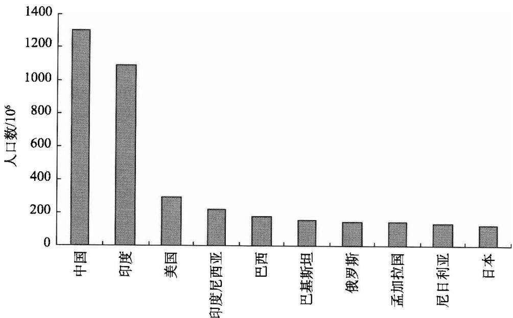  
图 2.1 2004年世界前10 位人口大国  
资料来源： Population Reference Bureau. 2004 World Population Data Sheet

## （一）人口增长的历史和现状

自清朝以来，我国人口就开始进入了迅速增长的时期。相对于新中国成立后，1949年以前，旧中国人口是以高出生率、高死亡率和低自然增长率为主要特征的。1929～1931年间，旧中国农村的人口出生率约为41%，同时死亡率也有着同等的水平。到1954年，中国人口已经超过6亿（图2.2）。长期的历史发展带来了中国人口庞大的基数，是新中国成立后的人口惯性增长和高增长量的重要原因。

新中国成立后，我国人口开始向现代型演变，人口的出生率总体上呈现下降的趋势。1949年，我国的人口出生率是36%0，1950年到1960年这10年期间，除了个别的几个年份，人口出生率一直在30%以上。在1964年，人口出生率达到历史最高水平（41%）。20世纪70年代以后，由于国家计划生育政策的推行，人口出生率开始稳步下降，直到20世纪80年代开始较大幅度地波动回升，从90年代至今，人口出生率一直持续下降，到2005年，这一数值降到约10%，接近发达国家的平均水平（图2.3）。

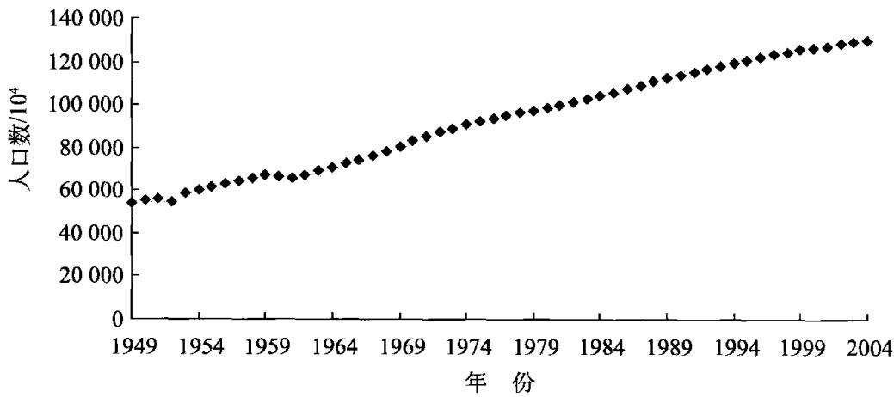  
图 2.2 中国历年人口总数图  
资料来源：中国历年人口统计年鉴

新中国成立以来，人口死亡率也从高向低发展，并越来越表现出向低位均衡的特点。1949年，人口死亡率高达20%，随后持续下降；到1957年，降到了10%。50年代末到60年代初期，由于三年自然灾害的影响，人口死亡率出现较大的波动，并且在1960年创下历史新高（25%）。1964年以后，我国人口死亡率逐年降低，并且趋于稳定。到2004年，这一数值为6.4%。，低于美国的人口死亡率（8.3%）（图2.3）。

从1949年到2004年，除了1960年前后的三年困难时期，中国人口发展趋势一直是持续增长的。1950年，中国的人口总数为5.5亿，到1970年，这一数值达到了8.2亿，人口规模增加了将近50%。除了少数个别年份以外，这20年的年均人口自然增长率都高达20%0～30%。从1971年开始，人口增长率开始逐渐下降。1980年，其数值下降到了11.87%0，到2003年，这一数值降到了6.01%。20世纪90年代以来，中国人口开始进入低出生率、低死亡率、低自然增长率的发展阶段。虽然我国人口自然增长率逐年下降，但由于人口基数庞大，每年的人口绝对增长量仍然很大。

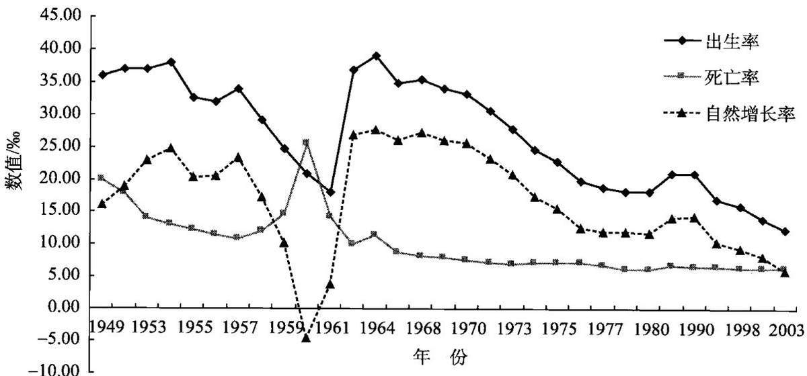  
图2.3 中国历年人口出生率、死亡率与自然增长率  
资料来源：中国历年人口统计年鉴

## （二）人口增长态势

当前中国人口变动和发展呈现出新的态势，其基本特点和主要问题可以概括为以下几个方面：

## 1. 人口总量继续增长

由于全国人口基数大和人口增长的惯性作用，未来十几年平均每年净增人口将仍在1000万以上，到21世纪中叶全国人口接近16亿后才有可能缓慢下降。此外，中国社会经济发展还很不平衡，一些贫困地区人口增长态势并没有得到有效控制。人口压力将伴随着21世纪经济社会的发展而长期存在。人口总量的不断增大，给就业、教育、住房、交通、医疗保险、社会福利等方面带来了很多问题。人口过多过快地增长，增大了对资源环境的压力，在很大程度上引发了诸如植被破坏、土壤侵蚀、环境污染、自然灾害频繁等一系列的环境问题。

## 2. 结构性矛盾日益突出

第一，就业矛盾日益突出。在未来50年中，中国劳动年龄人口将达到10亿左右的高峰。目前中国正处在经济体制转轨和经济结构调整时期，劳动力供给和劳动力需求之间的矛盾日益尖锐。城市每年需要接纳几百万的新增劳动力人口进入就业。农业剩余劳动力已经达到1.9亿，需要寻找新的就业出路。

第二，人口老龄化态势突出。20世纪末，中国已经步入老龄社会行列，面临着人口老龄化带来的挑战。中国的人口老龄化是在生产力不很发达的情况下出现的，这意味着社会养老以及社会保障问题更加突出。这无疑加重了国家各项费用的负担，将直接影响国民收入的分配。

第三，出生性别比达到高峰。20世纪80年代以来，我国出生性别比持续攀升，90年代更为显著。依据2000年第5次全国人口普查，1990～2000年我国逐年的出生性别比分别为：111.4、113.5、114.6、115.2、116.6、117.8、118.5、120.4、122.1、122.7、117.8。国家统计局2002年全国人口抽样调查表明，2001年我国出生性别比为123.6，创造了有统计数字可查的最高峰值；2002年略微下降，达到119.9，但也属相当高的水平。目前我国出生性别比为120左右，在世界各国中属严重偏高的国家。

## 3. 贫穷和生态脆弱区人口增长相对较快

目前，我国农村人口的自然增长率高于城镇，少数民族高于汉族；经济越发达的省份和地区，人口的自然增长率越低。2004年北京、上海、天津等发达城市人口已经步入负的自然增长的行列。而经济发展相对落后、生态环境脆弱的西北地区，人口增长率却居全国第一，总人口在全国的比重不断上升。

我国的老少边穷地区多位于经济发展落后的中西部山区和丘陵地区，如东部的沂蒙山区，闽西南、闽东北地区，中部的努鲁儿虎山区、太行山区、吕梁山区、秦岭大巴山区、武陵山区、大别山区、井冈山区和赣南地区，西部定西于旱山区、西海固地区等。这些地区大多自然条件比较差，山高坡陡，土壤侵蚀严重、灾害频繁。由于少数民族聚居等原因，人口增长率高于全国平均水平，人口素质低下，环境与贫困问题互为因果。

## 二、人口分布

## （一）人口总量分布

中国不仅是一个人口大国，而且人口的区域分布极不平衡（图2.4）。目前，河南省为中国第一人口大省，2003年底，其人口高达9667万，接近1亿，约占全国人口的7.4%；第二、第三人口大省分别为山东和四川，人口规模均在8000万以上，分别占全国总人口的7.1%和6.7%；其次是广东和江苏，分别占全国总人口的6.1%和5.7%。这5个省的人口合计几乎占全国总人口数的33%。而与此同时，人口规模最小的宁夏、青海、西藏三省区的总人口却仅占全国人口总数的0.9%，介于北京（1.1%）和天津（0.8%）之间。人口最大的河南省，其人口规模约是最少的西藏自治区的35.8倍。

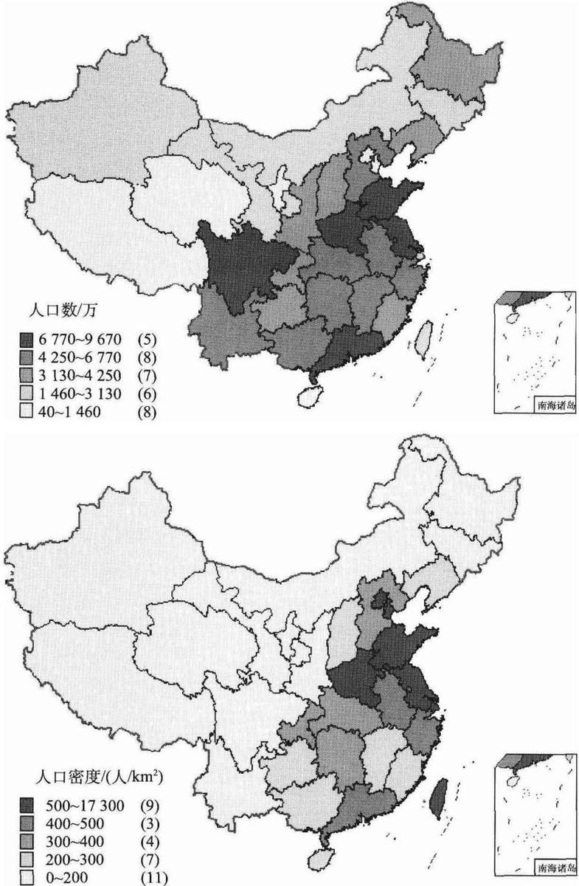  
图2.4 2003年中国各省区人口数量和密度分布图  
资料来源：中国人口统计年鉴2004，中国统计出版社

## （二）人口密度分布

从省区人口的密度分布来看，人口分布的区域差异更加明显，呈现出由东向西递减的趋势（图2.4）。其中，上海市的人口密度高达2744人/km²，位居全国第一位。其次是北京、天津、江苏3省，人口密度分别为892人/km²、869人/km²、735人/km²。这4个高人口密度的省（市）都位于东部发达地区。而位于西北地区的青海、西藏两个省区，平均人口密度不足10人/km²。其中西藏的人口密度只有2.2人/km²，与人口密度最高的上海市相差高达1225倍。

据第5次人口普查数据，2000年我国东、中、西三大地带人口密度分别为452.3人/km²、262.2人/km²和51.3人/km²，东部人口密度是西部的8.8倍。在1990年“四普”时，这一数值分别为392.0人/km²、241.4人/km²和52.5人/km²。10年间东部和中部每平方公里人口分别增加了60.2人和20.8人，而西部减少了1.2人，但是在此期间西部地区的生育率却是较高的，这反映出我国人口已经出现了向东部和中部流动和迁移的趋势。

## （三）人口分布态势

20世纪30年代，人口地理学家胡焕庸先生提出爱珲一腾冲线，根据人口分布的情况把我国划分为东南和西北半壁。几十年来，我国人口东多西少的状况依旧，无论是人口数量的分布，还是人口密度的分布，都呈现由从东南向西北、从沿海向内陆逐渐由稠密转为稀疏的分布趋势（图2.5）。所以，爱珲-腾冲线仍是体现我国人口分布地区差异中一条最基本的分界线。以爱珲-腾冲线为界，我国东半壁约占国土面积的36%，人口占全国总人口的96%；西半壁占国土面积的64%，人口只占4%。

从三大地带看，近20年来，中国人口分布的区域差异总体呈现不断扩大的趋势；进入2000年后，这种差异才开始缩小。20世纪80年代到90年代，中国人口分布的区域差距不断增加，1982～1990年，东部的人口所占比重上升了0.16个百分点，中部上升了0.02个百分点，而西部下降了0.18个百分点。进入20世纪90年代后，这种差距仍在增大，东部地区10年间人口所占比重上升了1.25个百分点，而中部和西部人口比重分别下降了1.02个百分点和0.33个百分点。进入2000年以后，东部人口所占比重下降了0.93个百分点，而中部、西部地区则分别上升了0.4和0.53个百分点，三大地带的人口增长差异开始有缩小的趋势（表2.1）。因此，从总体上来看，我国各地带的人口分布比例没有发生太大的变化，这显示了我国人口分布基本格局的稳定性，也反映了我国区域间自然生态环境差异的稳定性。

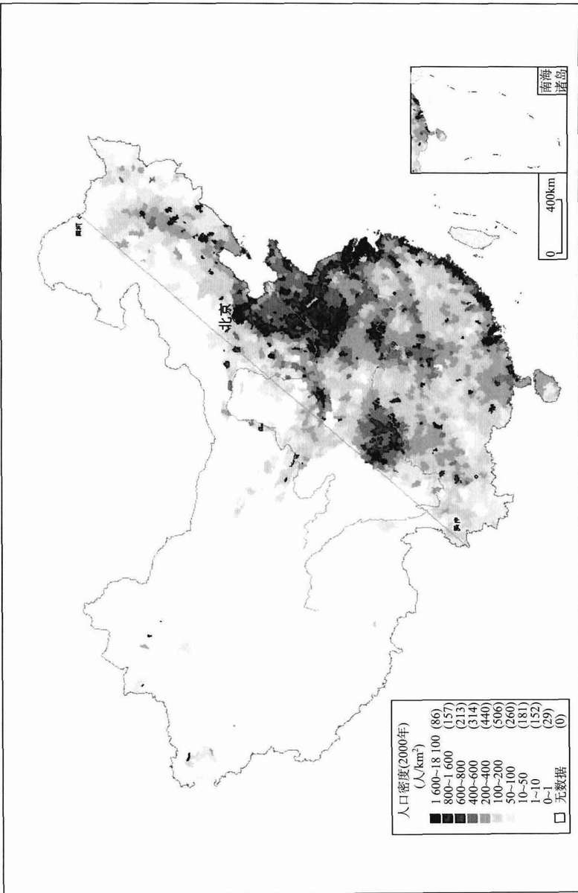  
资：02

表 2.1 中国三大区域人口分布比重  
(单位：%)
<table><tr><td rowspan=1 colspan=8></td></tr><tr><td rowspan=1 colspan=1>地区</td><td rowspan=1 colspan=1>1982年</td><td rowspan=1 colspan=1>1990年</td><td rowspan=1 colspan=1>2000年</td><td rowspan=1 colspan=1>2004年</td><td rowspan=1 colspan=1>1990~1982年</td><td rowspan=1 colspan=1>2000~1990年</td><td rowspan=1 colspan=1>2004~2000年</td></tr><tr><td rowspan=1 colspan=1>东部</td><td rowspan=1 colspan=1>37. 51</td><td rowspan=1 colspan=1>37.67</td><td rowspan=1 colspan=1>38. 92</td><td rowspan=1 colspan=1>37. 99</td><td rowspan=1 colspan=1>0. 16</td><td rowspan=1 colspan=1>1.25</td><td rowspan=1 colspan=1>-0. 93</td></tr><tr><td rowspan=1 colspan=1>中部</td><td rowspan=1 colspan=1>33. 83</td><td rowspan=1 colspan=1>33.85</td><td rowspan=1 colspan=1>32.93</td><td rowspan=1 colspan=1>33.33</td><td rowspan=1 colspan=1>0. 02</td><td rowspan=1 colspan=1>-0.92</td><td rowspan=1 colspan=1>0.4</td></tr><tr><td rowspan=1 colspan=1>西部</td><td rowspan=1 colspan=1>28. 66</td><td rowspan=1 colspan=1>28. 48</td><td rowspan=1 colspan=1>28.15</td><td rowspan=1 colspan=1>28.68</td><td rowspan=1 colspan=1>-0. 18</td><td rowspan=1 colspan=1>-0. 33</td><td rowspan=1 colspan=1>0. 53</td></tr></table>

资料来源：中国历年人口统计年鉴。

## （四）城市化和城市分布

## 1. 城市化

城市化是人口分布变化的一种重要现象。新中国成立以来，中国的城市化进程大致可以分为5个不同的发展时期（图2.6）：从新中国成立到1957年，伴随着国家进入和平发展的阶段，城市化呈现稳步发展的趋势；1958～1962年，由于政策失误和三年自然灾害，城市化的发展产生剧烈变动，出现大起大落的现象；1963～1978年间，由于国家通过户籍制度，采取了控制人口迁移流动的政策，大量的人员被停留在了农村，同时大批知识青年下乡，城市化的变动非常缓慢，甚至出现倒退；1979～1999年，伴随着改革开放和国民经济的发展，由于城市人口的自然增长，城乡人口迁移和新城市的设立，城市化进入较快发展阶段，到1999年城市化水平达到了30.9%；1999年以来，在国家积极财政政策的带动和我国经济高速发展的拉动下，我国城市人口比例增加的速度明显加快，国家步入了快速城市化阶段。2003年底，全国城市化率已达40.53%。与此同时，我国城市数量也从改革开放初期的193个增加到662个，其中超大、特大城市已达46个（图2.7)。城市经济对我国GDP的贡献率已超过70%，成为我国国民经济发展的主要载体。

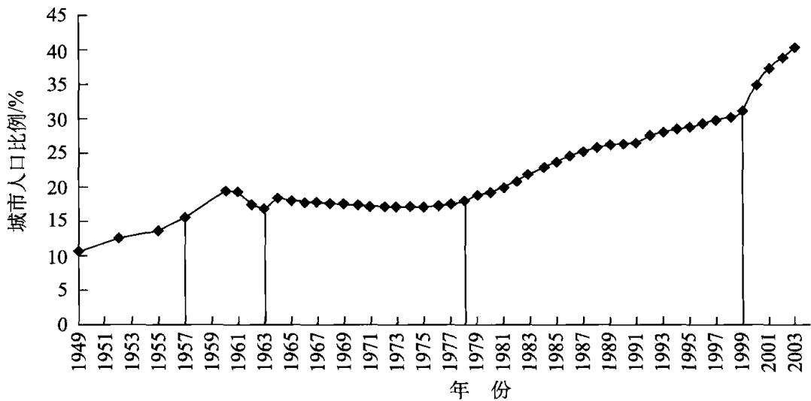  
图 2.6 中国大陆城市化进程  
资料来源：中国历年城市统计年鉴

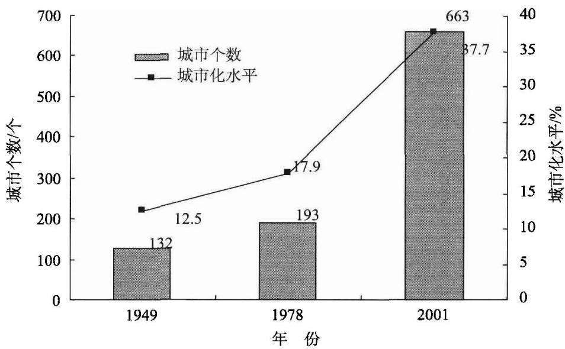  
图2.7 中国城市总数和城市化水平（1949\~2001年）  
资料来源：中国历年城市统计年鉴

中国的城市化存在较大的地域差异。改革开放初期，城市化水平较高的省区主要在北方地区（图2.8）。1985年，上海、北京、天津3个直辖市的城市化水平最高，分别为69.6%、67.6%。和63.6%。山西、辽宁、吉林和新疆位于次高水平，城市化水平在30%～50%。南方地区除了浙江和广东两省的城市化水平较高外，其余省区的城市化水平大都约为20%。在2002年，经济发展相对较快的江苏、广东、海南、湖北等省，以及山西、内蒙古、青海、宁夏、新疆等省区的城市化率也达到较高水平，而在四川、贵州、云南、西藏、广西、河南、安徽、河北、湖南等省区，城市化率还比较低，处于城市化发展的初级阶段（图2.9)。改革开放以来，我国城市化发展的主要特点是：城市化的水平差异由原来的南北差异转变为东北-西南差异。一些城市化水平原先不是很高的东部和南方省区发展较快，中西部地区和北方省区发展相对较慢，城市化水平的区域差异有了开始缩小的趋势。

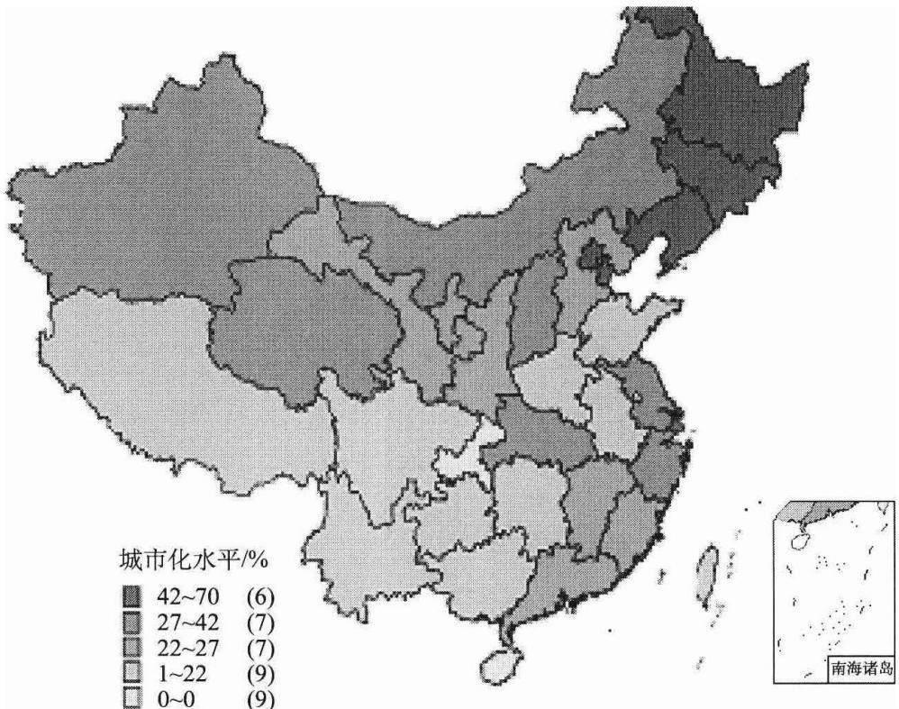  
图2.8 1985 年中国城市化水平省区分布模式资料来源：中国城市统计年鉴1986

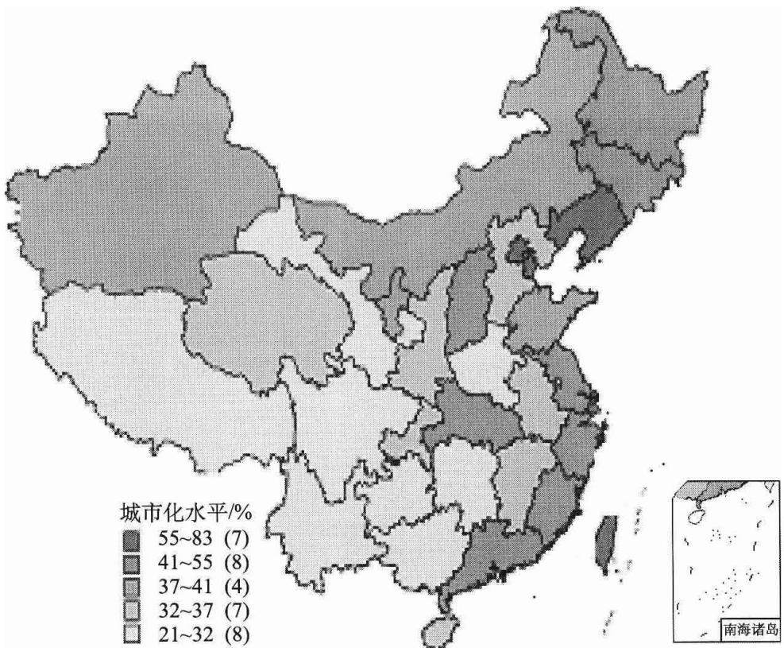  
图2.9 2002年中国城市化水平省区分布模式资料来源：中国城市统计年鉴2003

## 2. 城市分布

改革开放以来，尤其是1986年进一步放宽设市标准以后，我国的城市数量增加迅速，分布范围进一步扩大，并在一定区域内呈组团状分布，形成城市聚集区。我国的城镇体系骨架已经形成，城镇体系的格局已为一些重要的城市所控制。这些重要的城市分别是各个地区规模较大的城市，它们或为全国或者各地区的政治、经济和文化中心，或为交通枢纽，或为与国际联系的重要枢纽。中国东部沿海地带是城市体系发育最好的地带，已经初步形成了京津唐、辽中南、山东半岛、长江三角洲、闽东南沿海、珠江三角洲六大城市分布密集区。这些新的城市空间组织将以城市之间紧密的经济联系为主要纽带，逐步跨越行政界限，成为中国未来城市格局的主体（图2.10、图2.11）。

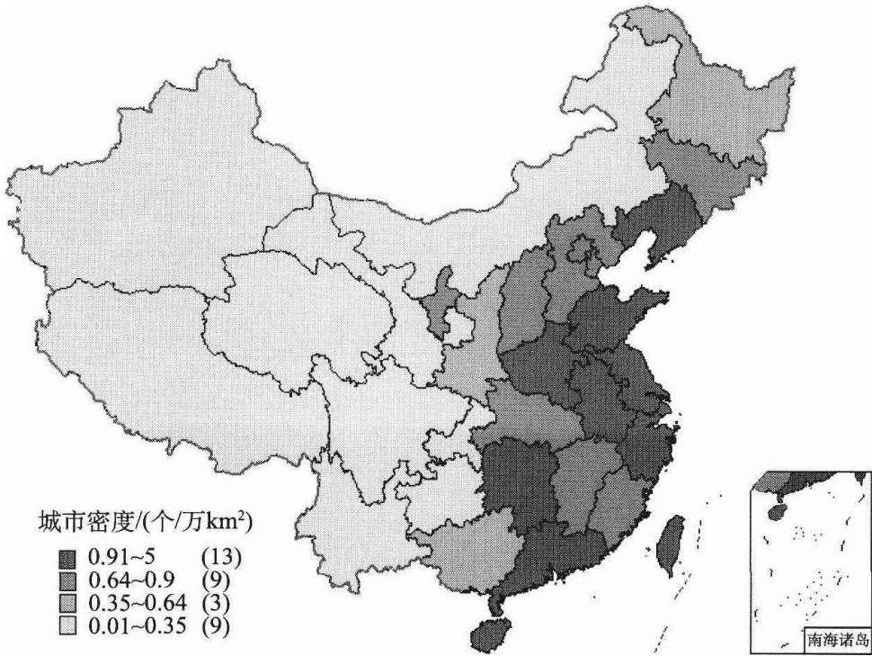  
图2.10 1985年中国城市密度分布模式  
资料来源：中国城市统计年鉴1986

中国生产力布局的不均衡性，造成中国城市分布的不均衡性。在城市总量、不同规模和等级的城市数量上，东、中、西三大地带都呈现出类似于中国地形分布的三级阶梯状，表现出明显的“低密高疏”的垂直分异规律和“东密西疏”的水平分异规律。

2001年全国662个城市中，东部占41.3%，中部占34.3%，西部占  
24.3%。而东部在大中城市中比重较大，如400万人口以上的8个城市中东

部占63%，200万至400万人口的17个城市中东部占65%；100万至200万人口的141个城市中东部占52%；50万至100万人口的279个城市中东部占47%；相反，西部12个省区在中小城市中占的比重较大，如20万至50万人口的180个城市中西部占31%，20万人口以下的37个城市中西部占70%。

尽管从总体上看，新中国成立以来，我国三大地带之间城市人口密度和城市化水平的差距正在缩小，但是改革开放以来，特别是经过上世纪90年代的沿海地区快速发展之后，城市分布迅速向沿海地区集聚，三大地带间的差距越来越大。

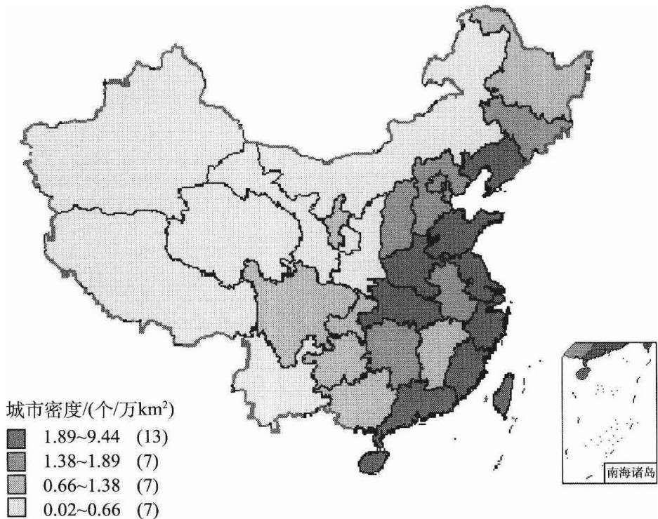  
图2.11 2002年中国城市密度分布模式  
资料来源：中国城市统计年鉴2003

## 三、人口与土壤侵蚀

## （一）人口总体压力与土壤侵蚀

2003年，我国平均人口密度已达118人/km²，为世界人口密度的3.3倍。除了青藏、内蒙古和新疆外，我国其他区域的人口密度普遍较高。即使在密度较小的晋、陕、甘、宁、云、贵和辽、吉、黑，其人口密度也大于法国（表2.2)。我国人均耕地只有0.09hm²，不足世界人均耕地的1/3。我国以占世界7%耕地生产着占世界21%的粮食，养活着占世界22%的人口，人口对土地的压力很大。全国性的高人口密度给通过迁出生态环境脆弱地区的人口、减少这些地区人口对环境的压力，进而减轻人为的土壤侵蚀造成了困难。

表2.2 中国分区域的人口密度和一些国家人口密度
<table><tr><td rowspan=1 colspan=1>地区名称</td><td rowspan=1 colspan=1>人口密度/（人/km²）</td><td rowspan=1 colspan=1>国家名称</td><td rowspan=1 colspan=1>人口密度/（人/km²）</td></tr><tr><td rowspan=1 colspan=1>京津冀鲁</td><td rowspan=1 colspan=1>496</td><td rowspan=1 colspan=1>德国</td><td rowspan=1 colspan=1>230</td></tr><tr><td rowspan=1 colspan=1>辽吉黑</td><td rowspan=1 colspan=1>136</td><td rowspan=1 colspan=1>法国</td><td rowspan=1 colspan=1>108</td></tr><tr><td rowspan=1 colspan=1>内蒙古</td><td rowspan=1 colspan=1>22</td><td rowspan=1 colspan=1>英国</td><td rowspan=1 colspan=1>242</td></tr><tr><td rowspan=1 colspan=1>江浙沪</td><td rowspan=1 colspan=1>663</td><td rowspan=1 colspan=1>荷兰</td><td rowspan=1 colspan=1>371</td></tr><tr><td rowspan=1 colspan=1>豫鄂湘皖赣</td><td rowspan=1 colspan=1>390</td><td rowspan=1 colspan=1>日本</td><td rowspan=1 colspan=1>334</td></tr><tr><td rowspan=1 colspan=1>粤桂琼港澳</td><td rowspan=1 colspan=1>313</td><td rowspan=1 colspan=1>韩国</td><td rowspan=1 colspan=1>465</td></tr><tr><td rowspan=1 colspan=1>闽台</td><td rowspan=1 colspan=1>117</td><td rowspan=6 colspan=2></td></tr><tr><td rowspan=1 colspan=1>川渝</td><td rowspan=1 colspan=1>210</td></tr><tr><td rowspan=1 colspan=1>云贵</td><td rowspan=1 colspan=1>147</td></tr><tr><td rowspan=1 colspan=1>青藏</td><td rowspan=1 colspan=1>4</td></tr><tr><td rowspan=1 colspan=1>晋陕甘宁</td><td rowspan=1 colspan=1>126</td></tr><tr><td rowspan=1 colspan=1>新疆</td><td rowspan=1 colspan=1>12</td></tr></table>

资料来源：中国统计年鉴和国际统计年鉴。

## （二）区域人口压力与土壤侵蚀

张善余（2003）利用“五普”数据对我国各省区的人口数量、素质压力指数以及生态压力指数进行了计算（图2.12）。其中人口数量压力指数为2000年常住人口数与以土地资源生产能力计算的极限人口承载量的比值；人口素质压力指数为：1减去各省份6岁及以上人口受教育年限（E）与10的比值所得的差(1一E/10)；生态压力指数由草场退化、干燥度、森林覆盖、贫困率、土壤侵蚀、荒漠化等12个指标计算得出。这些指数的应用目的，是方便不同省区间人口相对于资源环境的协调程度的比较。

用SPSS进行K-means聚类分析，可以把全国各省区分成如下4类：第1类是北京、天津和上海，其特点是人口数量压力很大，生态压力和人口素质压力很小；第2类是宁夏和陕西，其特点是人口数量压力较小，人口素质压力较大，而生态压力都大；第3类包括河北、山西、内蒙古、辽宁、福建、广东、海南、贵州、云南、西藏、甘肃和青海，其主要特点是人口数量压力、素质压力以及生态压力都比较大；第4类包括黑龙江、江苏、浙江、江西、山东、河南、湖北、湖南、广西、重庆、四川和新疆，其特点是人口数量压力小，而人口素质压力和生态压力中等。

由此可见，尽管从人口密度上来看，我国人口东密西疏，西部地区还有很大的人口迁入空间；然而，相对于土地资源承载能力来看，我国人口数量压力很大的省市不仅包括北京、天津、上海、广东这些人口密度大、经济比较发达的东部省市，还包括山西、内蒙古、西藏、甘肃、青海、贵州等广大中西部地区，并且这些地区人口素质压力和生态压力都大。人口数量压力在全国最小的宁夏和陕西，生态压力却最大。这也充分说明了我国人口东密西疏，呈东南-西北半壁分布这一稳定的宏观格局是有深刻的地理背景的。由于西部地区特别是西北地区大多为荒漠、高原等生态脆弱地带，土地可垦殖率很低，并且远离沿海地区，在全球的经济中处于边缘腹地的地位，因此土地的人口承载力低于东部地区。尽管西部地区人口密度相对较低，但人口数量对环境的压力却远远大于东部很多人口稠密的地区。

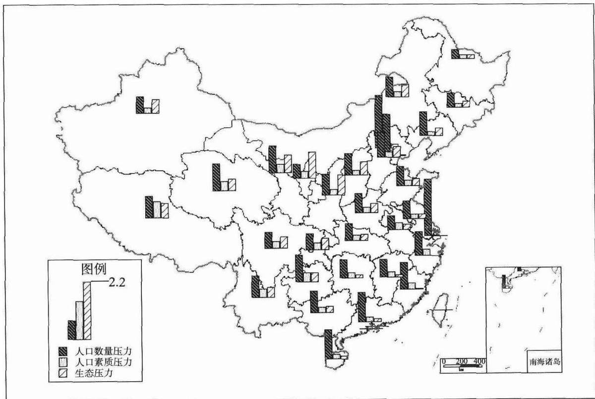  
图2.12 2000年各省区人口压力指数  
资料来源：张善余.中国人口地理：北京：科学出版社，2003

## （三）土壤侵蚀地区人口压力

应该注意的是，即使在一个人口密度比较小的区域内，人口也总是集中在某些相对条件比较好的地区，使得局部地区的人口密度过大。如果这些人口密度大的局部地区与生态脆弱的土壤侵蚀区正好耦合，则会导致或加剧该地区的土壤侵蚀。

我国西部的一些地区实际存在“地广而嫌狭长，人稀而患挤”的矛盾。以青海和宁夏为例，青海人口分布显著集中于西宁一带的湟水流域。这一带只占青海土地面积的3.6%，却居住全省人口的70%左右，人口密度高于全国密度。宁夏的则主要居住在以银川为中心的“千里黄河，独富一套”的河套地区（孟向京，2000）。我国土壤侵蚀问题最为严重的黄土高原地区，20世纪80年代其平均密度就已经超过100人/km²，远远超出国际上公认的半干旱地区的人口承载上限（20人/km²），并且在该地区内部，人口分布不均，东部相对稠密，西部相对稀少，平原阶地区密度最大，塬区和丘陵区次之，山区、风沙区密度最小。由于干旱威胁，农业产量低而不稳。

令人担忧的是，西北5省区人口年均增长率一直高于全国平均水平：1949～1982年，年均25.96%，相当于全国同期人口增长率的137.6%；1982～2003年人口快速增长的势头得到一定程度的遏制，年均增长率下降到15.37%，但人口增长速度仍是全国同期水平的1.15倍。人口的快速增长导致西北人口在全国的比重不断上升，1982年西北人口占全国的6.88%；到2003年，已上升到7.23%。按目前生育水平估计，2015年西北5省区人口总量将突破1亿。在人口快速增长的同时，广大的西北地区经济十分落后，地区人口文化素质普遍偏低，新疆成人文盲率为9.7%（张维庆，2005）。人口增长过快、人口素质低加剧了这一区域的土壤侵蚀。

## 第二节 土地资源和利用

## 一、土地资源概况

## （一）土地资源构成

土地资源是指目前或可预见到的将来，可供人类利用的那一部分土地。它是由气候、地貌岩石、土壤、植被、水文和人类活动等要素共同作用所形成的自然综合体。作为一种最基本、最宝贵的自然资源，土地资源是人类生产、生活和赖以生存的物质基础。我国位于亚欧大陆的东南部，东临太平洋，是一个海陆兼备的国家。我国陆地总面积达960万km²，其中岛屿面积7万多平方公里，大陆海岸线约1.8万多公里。国土面积约占世界总土地面积的1/14，占亚洲面积的1/4，与整个欧洲的土地面积几乎相等。

土地资源按地形可分为山地、高原、盆地、平原和丘陵地等；按照土地利用类型，可以分为耕地、林地、园地、牧草地、居民点及工矿用地、交通用地、水域和未利用地；根据是否为农业利用，还可以分为农业土地资源和非农业土地资源两大类。

## （二）土地资源特点

## 1. 土地类型复杂多样

我国南北约跨50个纬度，温带和亚热带所占面积占全国陆地面积的70%；东西跨将近62个经度，从太平洋沿岸到欧亚大陆的中心，包括土地面积几乎相等的湿润、半湿润与半干旱、干旱两大地理区域。由于位于全球最大陆地和最大海洋之间，加上青藏高原的影响，季风气候显著。我国大部分位于温带和亚热带季风气候区，雨热同期，光热条件优越。但由于受南北纬度和东西海陆位置的影响，各地气候具有明显的差异，从而决定了我国土地资源与水资源在空间上不匹配。我国地势西高东低，呈阶梯状分布。从西向东，分布着海拔4000m以上的青藏高原、海拔1000～2000m的高原和盆地以及1000m以下的丘陵和200m以下的平原，全国地形复杂，类型多样。水、热条件组合的差异和各地区复杂的地形地质条件，多样的土地利用方式，形成了中国极其多种多样的土地资源类型（吴传钧、郭焕成，1997）。根据《中国1：100万土地利用图》，我国土地资源的类型可达2700个左右。这一特点，既有利于农、林、牧、副、渔生产的全面发展，同时也充分说明了在开发利用土地资源时因地制宜的重要性。

## 2. 绝对量大，相对量少，后备耕地资源不足

我国土地资源丰富，各项土地资源的绝对量均居世界前列，但由于人口众多，土地资源的人均占有量很低。我国土地总面积达960万km²，占世界土地总面积的1/14，居世界第3位。其中，耕地面积占全球耕地面积的7.06%，居世界第4位；森林面积占全球森林面积的4.5%，其中有用林约占3.0%，居世界第5位；牧草地占全球牧草地总面积的7.8%，仅次于澳大利亚，居世界第2位。但目前，我国人均土地占有量仅为世界人均占有量的1/3，人均耕地、人均林地以及人均牧草地等指标在世界28个人口、土地大国中均居于后列（刘育成，2000）。

由于历史上以及新中国成立以来的长期开垦，我国目前剩余的可垦荒地资源已经不多，而且剩下来的这部分后备耕地资源存在着许多障碍因素，开垦难度比较大。从《中国土地适宜类资源分布图》中可以看到，宜农耕地高度集中在东北平原、华北平原、长江中下游平原、珠江三角洲、四川盆地、关中平原和汾河谷地。本来这些地区的土地垦殖利用程度就很高，再加上居住、交通等用地，实际上这些地区已经基本上没有未利用土地；西北内陆干旱地区和青藏高原受到水分和热量条件的制约，宜农土地资源有限；其他山区（如西南地区）虽然有不少宜农后备土地资源，但由于这些地区的坡耕地已经占相当大的面积，土壤侵蚀严重，故多数宜林，不宜开垦。根据相关统计，我国可供进一步发展生产的后备土地资源约1.225亿hm²，约占国土面积的12.9%；而且这些后备土地资源主要为宜林地或宜牧地，其中可以作为粮棉等农作物生产基地建设的土地面积还不足总数的10%。

所以我国是一个土地资源相对贫乏的国家，随着我国人口的持续增加和经济的持续发展，人多地少的矛盾将日益突出。为实现土地的可持续利用，“十分珍惜和合理利用每寸土地，切实保护耕地”已经成为我国的基本国策，而且这也决定了我国农业土地利用必须走精耕细作的节地型发展道路。

## 3. 山地多，平地少，难利用土地面积大

我国纵横交错的山系构成了地貌轮廓的基本骨架，控制着山地、丘陵、盆地和平原等土地资源类型的空间分布格局。我国的地形以山地为主，山地、高原、丘陵的面积约占土地总面积的69%，平地仅占31%。而海拔500m以下的低山丘陵与平原面积只占1/4，海拔1000m以上的山地、高原约占58%，其中3000m及3000m以上的山地高原也占到全国总面积的1/4（表2.3)。与俄罗斯、加拿大、美国、巴西、澳大利亚等领土面积较大的国家相比，我国山地占土地总面积的比重最大。

一般说来，平原地势平坦，土层深厚，土壤水分条件较好，耕地集中连片，有利于发展农垦、机耕和灌溉，因此平原地区多为我国的农业基地。山地与丘陵坡度大，土层薄，土壤的水、肥储藏容量低，宜耕性差，生态系统较脆弱，通达性差。但山地林牧资源丰富，自然条件多样，较有利于发展以林业与牧业生产为主的多层次“立体农业”（张风荣，2003)。

表 2.3 我国土地资源构成表
<table><tr><td colspan="3" rowspan="1"></td></tr><tr><td colspan="1" rowspan="1">项目</td><td colspan="1" rowspan="1">面积/10⁴km²</td><td colspan="1" rowspan="1">占总面积/%</td></tr><tr><td colspan="1" rowspan="1">总面积</td><td colspan="1" rowspan="1">960</td><td colspan="1" rowspan="1">100</td></tr><tr><td colspan="1" rowspan="1">按地形分：山地高原</td><td colspan="1" rowspan="1">320250</td><td colspan="1" rowspan="1">33.3326.04</td></tr><tr><td colspan="1" rowspan="1">项目</td><td colspan="1" rowspan="1">面积/10⁴km²</td><td colspan="1" rowspan="1">占总面积/%</td></tr><tr><td colspan="1" rowspan="1">盆地平原丘陵</td><td colspan="1" rowspan="1">18011595</td><td colspan="1" rowspan="1">18.7511.989.9</td></tr><tr><td colspan="1" rowspan="1">按海拔分：500 m以下</td><td colspan="1" rowspan="1">241.7</td><td colspan="1" rowspan="1">25.18</td></tr><tr><td colspan="1" rowspan="1">500~1000 m</td><td colspan="1" rowspan="1">162.5</td><td colspan="1" rowspan="1">16.93</td></tr><tr><td colspan="1" rowspan="1">1000~2000 m</td><td colspan="1" rowspan="1">239.9</td><td colspan="1" rowspan="1">24.99</td></tr><tr><td colspan="1" rowspan="1">2000~3000 m</td><td colspan="1" rowspan="1">67.6</td><td colspan="1" rowspan="1">7.04</td></tr><tr><td colspan="1" rowspan="1">3000 m以上</td><td colspan="1" rowspan="1">248.3</td><td colspan="1" rowspan="1">25.86</td></tr></table>

资料来源：中国统计年鉴，2005。

我国难以利用的土地面积比重较大。砂质荒漠、戈壁、石骨裸露山地、寒漠、冰川与永久积雪约占土地总面积的23%，若加上已被居民点、交通道路占用的6%的土地，全国不能用于农林牧渔业利用的土地约37.25亿亩，占国土面积的26%。

## 4. 土地资源分布不均衡，土地生产力地区差异明显

我国土地资源地区间分布极不平衡。受水分、热量条件、地貌地形、地表水和地下水等因素的影响，耕地主要分布在我国东半部季风区，约占全国耕地的90%以上，尤其集中于东北、华北、长江中下游、珠江三角洲等平原、山间盆地及广大丘陵地区。其中有93%的水田分布在秦岭淮河一线以南地区，85%的旱耕地分布在秦岭淮河一线以北的地区。林地与平原耕地呈交错分布状态，主要分布在东北山地区、西南山地区和东南丘陵区，其中东南部季风区集中全国92%左右的林地。草地主要分布在我国西部内陆地区，集中分布在年降水量400mm等值线以西的半干旱、于旱地区，其次分布在年降水量400mm等值线以东的湿润半湿润地区的山地丘陵岗坡上，此外在各地的低地上也有零星分布。

由于光、水、热、土等自然因素以及人口、技术、经济、发展历史等多种人为因素的综合作用，我国土地生产力的地区差异明显。以大兴安岭-张家口-榆林-兰州-西藏东南部边缘一线为界，将我国划分为东部季风区和西北内陆干旱地区。其中，约占全国土地面积一半的东部季风区集中了我国94%的人口、86%的耕地、80%的林地、66%的水域以及87%的建设用地，是我国农、林、渔业集中产区，土地垦殖系数较高，经济较为发达；而属干旱、半干旱的西北部内陆区，尽管占有全国78%的牧草地，也占有全国79%的未利用与难利用土地，土地承载能力仅为全国值的4.3%，是我国的主要牧区，土地生产力低、开发利用难度大、生态系统脆弱（吴传钧、郭焕成，1997)。

## 二、土地利用

土地利用是人们根据土地资源的特性和社会经济发展的要求，在土地上进行的一整套的生物、技术、经济的活动。我国地域辽阔，土地资源类型多样，开发利用条件和历史过程不同，形成了丰富多样的土地利用类型。

根据国土资源部最新一次土地利用变更调查结果，截至2005年10月31日，全国耕地1.22亿 $\mathrm { { h m ^ { 2 } } }$ ，园地0.115亿hm²，林业用地2.357亿 $\mathrm { h m } ^ { 2 }$ ，牧草地2.62亿 $\mathrm { h m } ^ { 2 }$ ，其他农用地0.225亿 $\mathrm { h m } ^ { 2 }$ ，居民点及独立工矿用地0.26亿 $\mathrm { { h m ^ { 2 } } }$ ，交通运输用地0.023亿 $\mathrm { { h m ^ { 2 } } }$ ，水利设施用地0.036亿 $\mathrm { h m } ^ { 2 }$ ，其余为未利用地。

若按照土地利用现状，全国土地可分为农业用地（农林牧业用地）、非农业用地（居民点、工矿和交通用地）和未利用土地三大类。全国土地总面积中，农业用地、非农业用地等已经利用的土地面积为6.89亿 $\mathrm { h m } ^ { 2 }$ ，占72.4%。其中，农用地面积为6.57亿 $\mathrm { h m } ^ { 2 }$ ，占全国已利用土地面积的95%，占全国土地总面积的69.1%，主要分布在我国的中东部地区。在未利用土地面积中，难利用的土地面积较大，占84.79%，占国土面积的23%，这些土地大部分分布在西北干旱地区和高寒山区，自然条件恶劣，利用难度大（图2.13）。

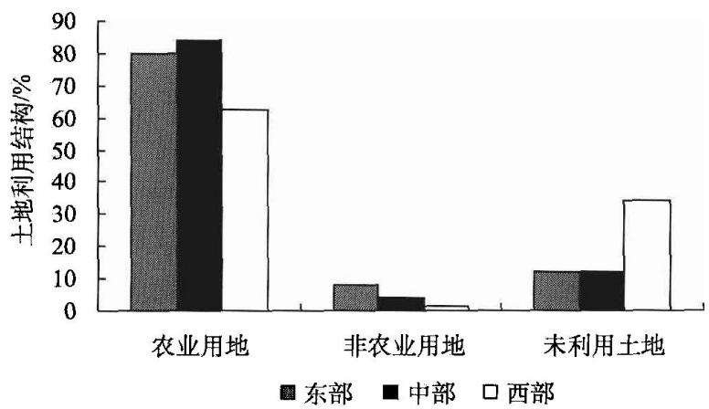  
图2.13东、中、西部土地利用分类比较图  
资料来源：全国土地资源调查办公室1996年10月31日汇总数据(香港、澳门、台湾资料暂缺)

## （一）农业用地

农业用地，简称“农用地”，是指直接或间接为农业生产所利用的土地。我国农业用地包括耕地、园地、林地、牧草地以及水域。在我国的土地利用中，农业用地占主导地位，其中耕地面积仅占农用地面积的17.5%，林业用地占34.19%，而草地占38.02%（相当于耕地的2倍、林地的1.2倍）。与世界平均水平相比，中国具有耕地、林业用地比重低，而草地比重较高的特点。

## 1. 耕地

耕地是指人们经常进行耕耘并能够种植、生长各种农作物的土地。在我国，耕地是我国农业生产最基本的不可替代的生产资料。尽管中国有960万km²的陆地面积，但有55%的地域不适宜人类居住生活，而且中国是一个多山的国家，所以可以开发为耕地的土地极为有限。但由于我国土地开发的历史悠久，垦殖程度较高，故耕地面积较大，仅次于俄罗斯、美国和印度，居世界第4位。据历史资料记载，在西汉公元2年时，我国的耕地面积就达到3713.3万hm²，至1949年已高达0.98亿hm²。新中国成立后，随着人口的急剧增加和国民经济的不断发展，相当数量的荒地被开垦，并以一些林地、草地被破坏为代价，我国的耕地面积进一步扩大，峰值为1965年的1.387亿hm²。从1965年到现在，耕地面积的变化以减少为主。伴随着高速发展的工业化和城市化以及国家对于可持续发展观念的重视，1996～2005年，全国的耕地面积已由1.30亿hm²少到1.22亿hm²，平均每年减少88.8万 $\mathrm { h m } ^ { 2 }$ (图2.14)。其中因生态退耕而减少的耕地占66%，因农业结构调整和建设用地占用的均为14%，灾毁耕地占6%（图2.15）。生态退耕减少的耕地主要是坡耕地和旱地，没有对优质耕地造成影响，从整体上还提高了耕地质量。退耕还林主要分布在坡度大于25°的丘陵山区，有利于防治土壤侵蚀和改善生态环境；退耕还草主要分布在农牧交错带的旱地，也为生态环境建设带来积极的效果。

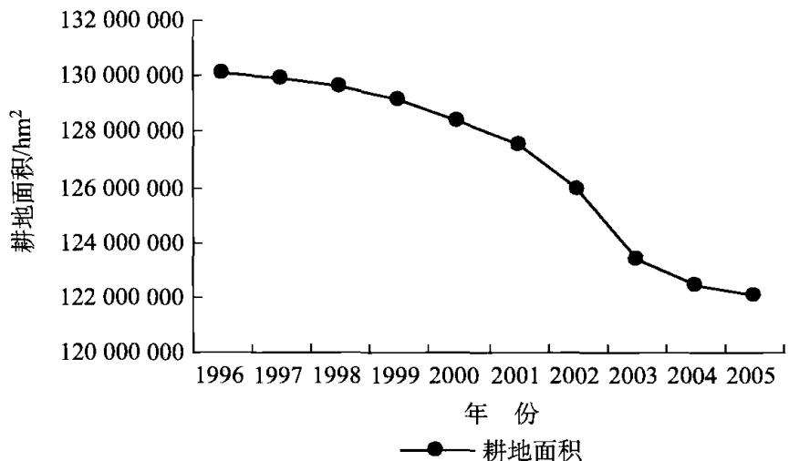  
图 2.14 耕地面积变化趋势图  
资料来源：国土资源部．中国国土资源公报（1996～2005年）

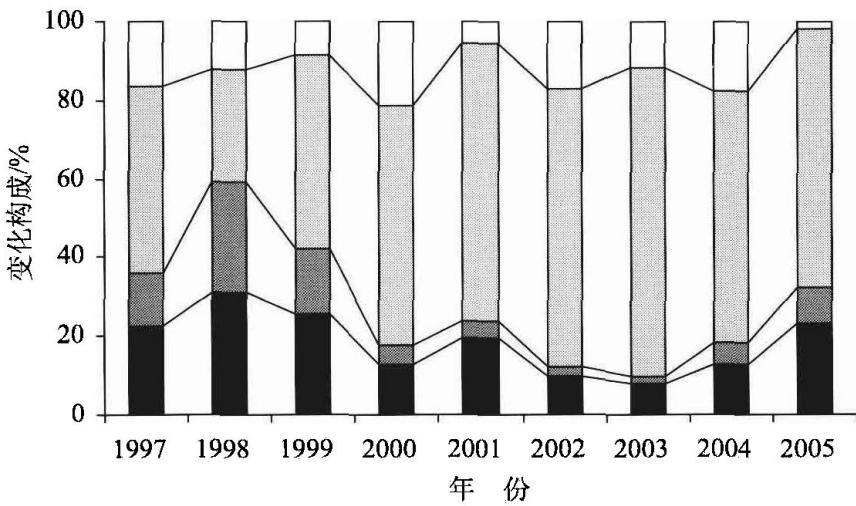  
建设占用灾毁耕地生态退耕农业结构调整  
图2.15 中国耕地减少变化构成图  
资料来源：国土资源部.中国国土资源公报（1997\~2005年）

若按人口平均计算，我国是一个耕地资源相当贫乏的国家。2005年我国人均耕地面积0.093hm²，仅为世界人均耕地面积（0.36hm²）的25%。面对“人多地少”的国情，提高复种指数、挖掘耕地利用潜力一直是我国提高土地粮食供给能力、保证农业持续发展的重要措施。中国是耕地复种率最高的大国之一，大约有近半数的耕地实行多熟种植。在过去的几十年中，我国的复种面积占总播种面积的20%以上，所生产的粮食有1/4来自复种指数的提高。尽管近20年来我国的复种指数总体上有所增加，但值得关注的是同时有15%的耕地复种指数下降，尤其是在生产力高的平原耕地有12%的复种指数降低，而且其中有一半发生在我国农业的精耕细作地区一长江中下游平原。复种指数降低意味着实际播种面积的减少，优质的农田复种指数降低无疑会对粮食生产生不利影响。

由于存在土壤养分失衡、肥效下降、环境恶化等突出问题，我国现有耕地总体质量偏低，土、水、热分布不均衡。主要表现在：①中低产田所占比重偏高。全国高产稳产基本农田仅占耕地总面积的35%，而受干旱、坡陡、瘠薄、洪涝、盐碱等各种障碍因素制约的中低产田占65%。②耕地有机质含量偏低，土壤养分不均衡。全国耕地有机质平均含量为18g/kg，棕壤、褐土等土壤类型比欧洲同类土壤有机质含量低2倍以上。③“占优补劣”现象严重。在耕地“占补平衡”的过程中，有些地区仅重视数量平衡，忽视耕地质量平衡。耕地转化为建设用地主要分布在我国经济比较发达地区，占用的水田、水浇地、旱地大部分是优质耕地，土地生产潜力高。而土地整理复垦开发补充耕地以未利用的荒草地和湿地为主要来源，大部分存在盐碱、冷凉等限制因素。据对全国15个省（市）的调查，大部分新增耕地需要5～10年不懈地培肥，才能达到现有耕地的肥力水平。在西北干旱区，耕地面积的扩大所引起的区域水资源的过度利用，导致生态需水短缺，甚至加剧了生态环境的恶化。

## 2. 园地

我国园地利用类型具有明显的地域特点，形成了多样化的园地优势结构和类型。园地在我国农业用地中虽然所占比重最小，但分布很广泛，除青藏高原腹地外，几乎遍及全国各地。园地的开发和利用，不仅为人民提供果品、茶等农产品，而且也关系到生态环境建设。2005年我国园地面积为0.115亿hm²，占全国土地面积的1.2%。按其经济、生态状况，园地可分为果园、茶园、桑园、热带作物园和其他园地等，其中果园比重最大，占66.4%；其次分别为茶园、桑园等。

目前我国主要的优势园地结构类型自南向北可分为：北纬25°以南的热带作物区，江南丘陵以柑橘为主的常绿果树区，长江中下游的桑茶区，北纬40°附近以苹果为主的落叶果树区和西北干旱区以葡萄、杏为主的果区。即使在同一区内，由于地貌、气候、土壤等条件的不同，也形成了一些不同品种的相对集中产区和当地名优产品。但是，我国的园地绝大部分是利用坡地、河谷发展起来的，一般面积小，布局分散，而且经营管理粗放，产量不稳，单产水平不高（吴传钧、郭焕成，1997）。

## 3. 林业用地

林地包括有林地、疏林地、新造林地（或称未成林造林地）、灌木林地、迹地和苗圃等。林业部门将林地中郁闭度为0.3及以上的乔木林，定为有林地，也称为森林，因此本节中的森林面积就是有用林面积。目前我国的林地共计2.357亿hm²，其中有林地1.75亿hm²，森林覆盖率达到18.21%。

根据《1：100万中国土地利用图》的评价标准，在全国林地中，最适于林业生产、无明显限制因素、质量好的一等林地面积占65%，一般适于林业生产、受土壤等因素的一定限制、质量中等的2等林面积约占27%，林木生长有一定困难、受较大因素限制、质量差的3等林地占总数的8%。这一结果与我国东部季风区水热条件好且多山宜林的特点相吻合，同时表明我国林地的质量较好（赵济、陈传康，2000）。

由于气候及开发历史早晚的影响，我国林地资源的分布呈不均衡态势。中国的有林地主要分布在东部季风区的山地地区，占全国有林地面积的90%以上。其中天然林面积为1.16亿hm²，人工林面积约为0.53亿hm²。包括大兴安岭、小兴安岭和长白山地的东北林区，以及包括横断山区、喜马拉雅山麓、雅鲁藏布江大拐弯等地的西南林区，分别是中国的第一和第二大天然林区；包括秦岭一淮河一线以南，云贵高原以东的广大丘陵山区的东南林区，是中国最主要的人工林区。这三大片林区的林地面积占全国有林地面积的79%。

我国林业用地呈现结构不合理的发展态势。林种结构中基本上是以用材林占绝对优势，而防护林和经济林面积偏少，不利于发挥森林的生态效益和经济效益；树龄结构中幼龄林和中龄林占到了总数的近70%，成熟林比例小，近期可供采伐的森林资源不足。此外，我国有林地的生产力也较低，主要表现在单位面积森林蓄积量少，残次林多，树木生长率不高。我国现有的活立木蓄积量为136.18亿m³，不到世界森林蓄积量的3%，人均森林蓄积量只相当于世界人均水平的13%。我国林业用地的利用率为74%，与世界上一些林业比较发达的地区相比差距还很大，尤其是我国南方林区虽然生长环境很好，但林业利用率却不足50%。但是从另一个方面来说，我国林业用地开发利用的潜力很大。

## 4. 草地

草地指常年生长草本植物，覆盖度在15%以上的土地，草地大多用于畜牧业生产，按其成因可分为天然草地和人工草地。我国草地总面积为2.62亿hm²，占土地总面积的27.56%，其中人工草地比例很小，主要是天然草地。大兴安岭-阴山-秦岭-青藏高原东麓一线以西和以北的广大地区是天然草场的主要分布区，草地集中分布于内蒙古、西藏、新疆、青海、甘肃、宁夏和黑龙江、吉林、川西北、冀北、晋西北、陕北和滇西北，为我国的牧区。人工草场主要分布在这一线的东南部地区，与耕地、林地交错分布。这一区域有相当数量的草坡和草滩可供放牧和割草，主要分布于云贵高原、桂西北、湘西、豫西、辽西山地、四川盆地周围山地及南岭、大别山、太行山等山地、鲁中南和江南丘陵、东部和南部海岸地带（吴传钧、郭焕成，1997）。

中国的草地面积虽大，但可利用面积比例较低，优质草场比例不高，人工草地比例过小，天然草地的质量在不断下降。我国草地约有30%～40%属于低产草地，产草量和营养价值高的草场只占总数的21%，且半数以上分布在高海拔地区，开发利用具一定的局限性。东南部地区的草山草坡，产草量高但耐牧性较差，大多分布零散，坡陡土薄，利用不当易引起强烈的土壤侵蚀。目前牧区草场建设进展迟缓，经过人工改良的草场不及全国草场的2%，基本上停留于靠天养畜状态。此外，由于全球变化影响（增暖、干旱、气候不稳定性等)、草原过度放牧以及不合理开垦等原因，造成大量草地退化、沙化。中国已有90%的可利用天然草地不同程度地退化，全国草地的退化使平均产草量下降了30%～50%。

我国草地牧业基本上处于原始自然放牧利用阶段，草地资源的综合优势和潜在生产力未能有效发挥。草地不仅是广大牧区草食家畜最主要的饲料来源，而且具有调节气候、保持水土、涵养水源、防风固沙的功能，在维护陆地生态系统的能量流动与物质循环方面具有不可替代的重要作用。我国草原和草地大多位于黄河、长江、淮河等水系的源头区和中上游区，具有生态屏障的功能。除了保持水土之外，草地对于防止地表起沙与扬尘也有重要作用。

## 5. 水域

水域通常指河流、湖泊、水库、池塘、苇地、沟渠、沿海滩涂等，我国水域总面积为0.34亿hm²，占全国总土地面积的3.56%。全国内陆水域约有0.226亿hm²，是发展淡水水产的主要场所。其中江河0.126亿hm²，湖泊0.08亿hm²，池塘和水库0.066亿hm²。

我国水域资源地区分布不均衡，东南部多，西北部较少。其中约有92%分布于瑗辉-兰州-腾冲一线的东南部，这一区域的自然条件极有利于当地的淡水水产业；但多年来重捕捞、轻养殖，人工养殖面积占可养面积的比例不断减少。在巨大的人口压力作用之下，为提高粮食产量，对湖泊的不合理围垦活动愈加剧烈，致使湖泊池塘面积大为缩小，湖泊调蓄洪水和环境自净的能力降低，鱼类生态环境受到破坏，湖泊淤积消亡的速度加快。

## （二）非农业用地

非农业用地包括居民点及工矿用地、交通用地两大类。目前全国居民点及工矿用地0.26亿hm²，交通用地0.023亿hm²。近年来，随着我国城市化进程的不断推进以及国家对基础设施建设投资力度的不断加大，我国非农用地面积迅速扩张。与1996年全国土地利用汇总结果相比，目前我国居民点及工矿用地和交通用地面积均增加了近8个百分点。我国的优良耕地大都分布在城乡居民点附近，因此这些新增的非农用地占用的大部分是土地生产率很高的优质耕地。

不论是我国的城镇布局、农村居民点，还是路网建设，都与我国的人口密度分布相一致，主要集中在东部地区。我国非农业用地主要分布在东、中部地区，约占全国非农业用地的八成左右。

## （三）未利用土地

未利用土地是指目前尚未利用的土地，包括荒地、沙地、沙漠、戈壁、盐碱地、冰川、永久雪地以及裸露地（裸岩、裸土）。我国未利用的土地面积为2.62亿hm²，其中有2.22亿hm²是难以利用的土地，另外的0.40亿hm²属于可以利用但尚未利用的后备农用地资源。

我国后备农用地资源数量不足，宜林地较多，宜耕地较少。宜耕的后备农用地面积只有0.08亿hm²，若按60%的垦殖率估算，全部开发也只有0.048亿hm²耕地；其余80%只适宜于开发为林地、牧地或园地。我国的后备农用地资源主要分布在蒙新区，占全国后备农用地资源的29.3%；后备耕地资源主要分布在蒙新区、东北区和长江中下游地区（图2.16）。

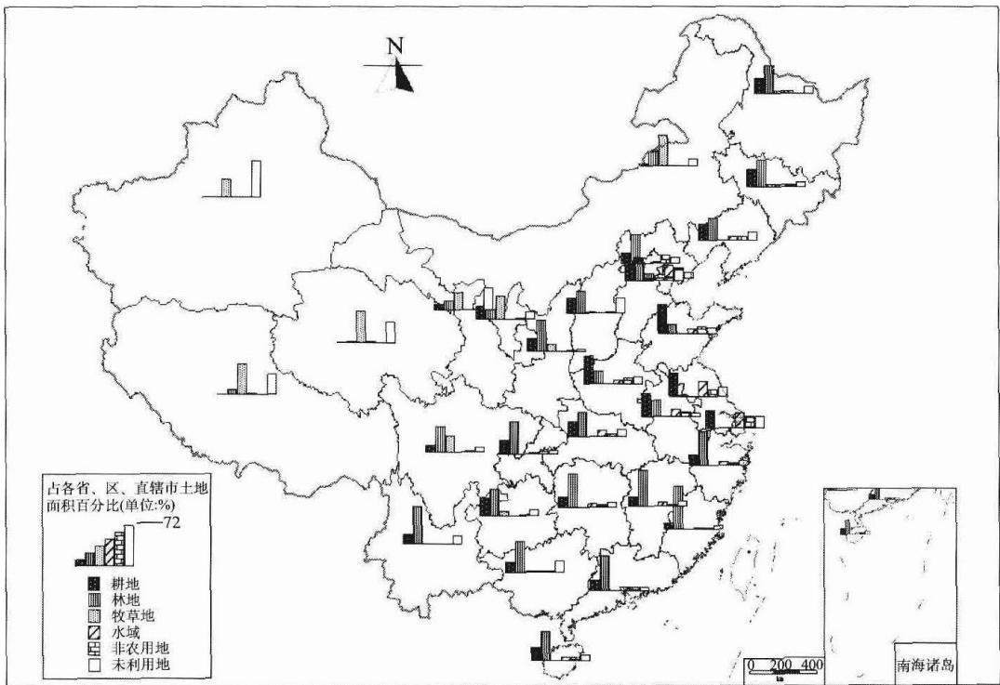  
图2.16 全国土地利用类型结构图  
资料来源：国家统计局.中国统计年鉴2003

## 三、土地利用变化的趋势

由于复杂的地理环境背景和历史原因，我国土地利用存在着一些问题。在东部沿海地区，大量优质耕地被非农建设占用，导致农业普遍出现滑坡甚至萎缩，土地供给的紧缺性与社会经济需求的增长性之间呈失衡发展的态势；在西部地区，长期以来对土地的过度利用所引发的土地退化和重大生态环境灾害问题异常突出，严重威胁着我国的资源和生态安全。如果上述问题不能得到有效的解决，伴随着我国人口持续增长和城镇化、工业化高速发展，对土地利用空间和土地产品的需求随之不断扩大，我国区域性人口、资源、环境与经济发展的矛盾和问题将会更加突出。

据专家预测，2050年我国城市化水平将提高到70%。在未来40多年中，将有约5亿农村剩余劳动力及其家属进城，变为城市人口，这将会推动大批新城市的建立。同时，现有的许多城市都将要不同程度地调整产业结构，进行现代化建设和旧城的更新改造。新城市的建立和老城市的扩大是我国整个经济发展的内在要求，非农建设将继续占用大量耕地。但是，国情又不允许我们过多地占用耕地，特别是基本农田，如果不能坚持严格保护耕地、节约集约用地，不仅我们国家的粮食安全难以保证，经济也难以持续发展，工业化、城镇化和现代化也难以顺利推进。这一矛盾是今后几十年里我国土地利用规划工作中必须面对的。

此外，保护和建设生态环境是我国的一项基本国策，国家把黄河、长江上游地区、风沙区和草原区这些地区作为生态环境建设的重点地区。近10年内，这些地区生态退耕、还林和还草将继续进行，以期更好地保护这些生态脆弱地区的生态环境。

土地是人类赖以生存与发展的重要资源和物质保障，人类利用土地在发展经济和创造物质财富的同时，也对自然资源结构及其生态与环境产生巨大的影响。为了实现人与自然的和谐发展，我国的土地利用方式从粗放走向集约，实现土地的可持续利用将是大势所趋。

## 四、土地利用和土壤侵蚀

土壤侵蚀的发生会导致土壤肥力下降，造成生态环境的破坏和恶化（如旱灾、洪涝灾害)，从而破坏了土地资源持续利用的基础。不合理的土地利用是造成土壤侵蚀的主要直接原因之一。

一般来说，坡度小于 $1 5 ^ { \circ }$ 的坡耕地在有水土保持措施情况下可以种植大田作物，而坡度大于 $1 5 ^ { \circ }$ 的坡耕地一般考虑林用或牧用。我国是陡坡开荒最为严重的国家之一，全国坡度2°以下的耕地占50%左右， $2 ^ { \circ } { \sim } 1 5 ^ { \circ }$ 之间的坡耕地占31.5%，15°以上的坡耕地占14.1%（图2.17)。坡度在 $1 5 ^ { \circ }$ 以上的耕地主要集中在我国的重庆市和四川、贵州、云南、陕西4省，占当地耕地面积的比重分别是：重庆市47.5%，四川省33.9%，贵州省49.9%，云南省46.7%，陕西省43.0%（图2.18)。其实，我国土壤侵蚀也主要发生在这些地区。目前我国土壤侵蚀最为严重的地区是黄土高原区和西南高原山区，这两个地区的耕地土壤侵蚀面积，分别占到全国耕地土壤侵蚀面积的24.85%和22.39%。此外，这两个地区耕地土壤侵蚀面积占本地耕地面积的比重也是全国最高的，分别为71.3%和52.53%。

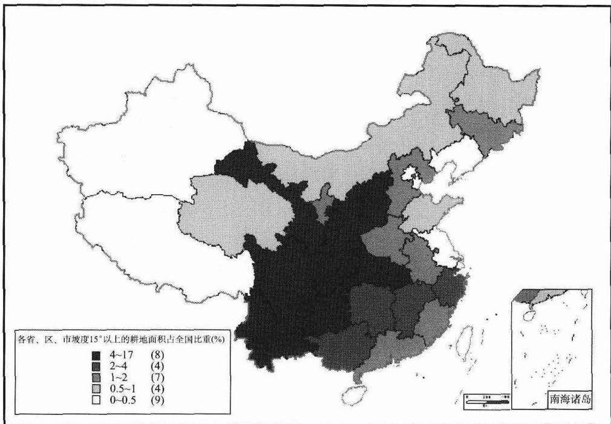  
图2.17 全国各省区15°以上坡耕地占全国耕地面积比重图  
资料来源：全国土地资源调查办公室1996年10月31日汇总数据(香港、澳门、台湾资料暂缺)

为了防止土地退化和保证我国农业可持续发展，应将土壤侵蚀治理与水土资源的合理开发、利用相结合，从而实现提高土地生产力、控制土壤侵蚀和保护生态环境的三大目标。等高耕作、林粮间作、粮草间作、少耕免耕、作物留茬等耕作栽培技术的利用，都在防治土壤侵蚀和改善生态环境方面有着显著效果。一些坡度大于 $2 5 ^ { \circ }$ 的丘陵山区和农牧交错带的旱地应分别进行退耕还林和退耕还草。

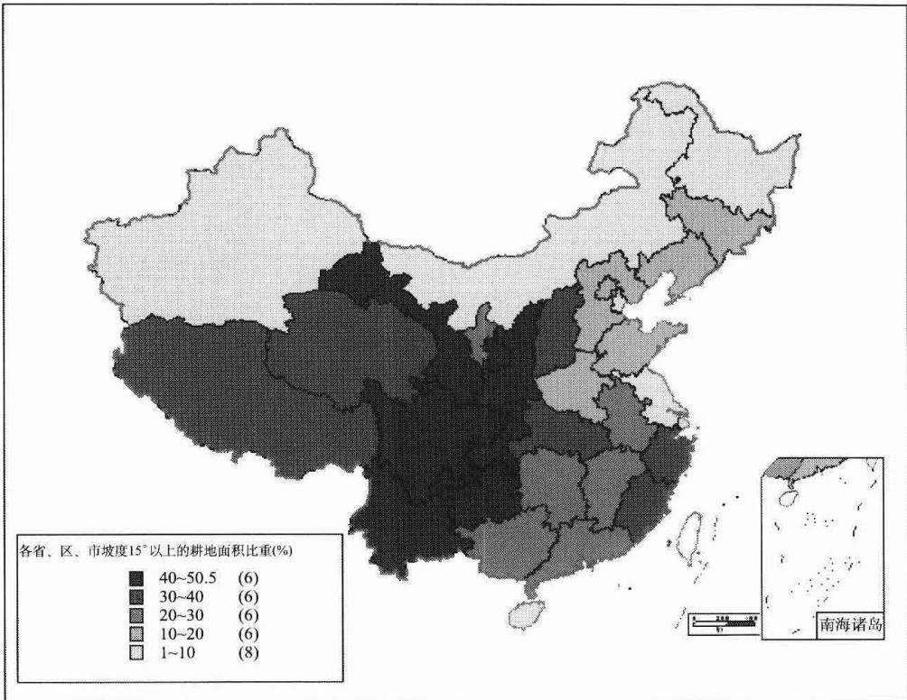  
图2.18 全国各省区 $1 5 ^ { \circ } C ^ { \prime } L$ 上坡耕地占当地耕地面积比重图资料来源：全国土地资源调查办公室1996年10月31日汇总数据(香港、澳门、台湾资料暂缺)

## 第三节 经济发展水平和产业结构

近30年来，我国经济建设有了质的飞跃，经济结构发生了明显变化，国民经济发展呈现多样化的局面。经济发展过程是一个逐步拓宽生存空间和逐步推移的过程，经济发展在一定程度上依赖于土地资源，不同的土地利用结构和土地利用方式对土地资源可能会产生不同程度的影响，甚至造成危害。反过来，国民经济的整体发展和经济结构的合理调整又会对治理土壤侵蚀、保护生态环境产生积极作用。

## 一、经济发展水平

## （一）经济总量及人均水平

改革开放以来，我国经济发展突飞猛进，令世人瞩目。我国国民生产总值（GDP）从1978年的3624亿元增长到2004年的136876亿元（根据经济普查资料初步测算，2004年GDP现价总量为159878亿元)，增长了近40倍；人均GDP从379元上升至10561元，增加了近30倍。1995年我国已实现GDP总量比1980年“翻两番”的目标，1997年已实现人均GDP比1980年“翻两番”的目标。1979～2004年我国GDP年均增长9.6%，其中1993年以后年均增长率达10%，远高于同一时期世界年平均增长速度3%～4%的水平。中国经济的持续高速增长中存在着一定的周期波动，但近年来周期波动基本呈现振幅缩小的稳定态势（图2.19）。

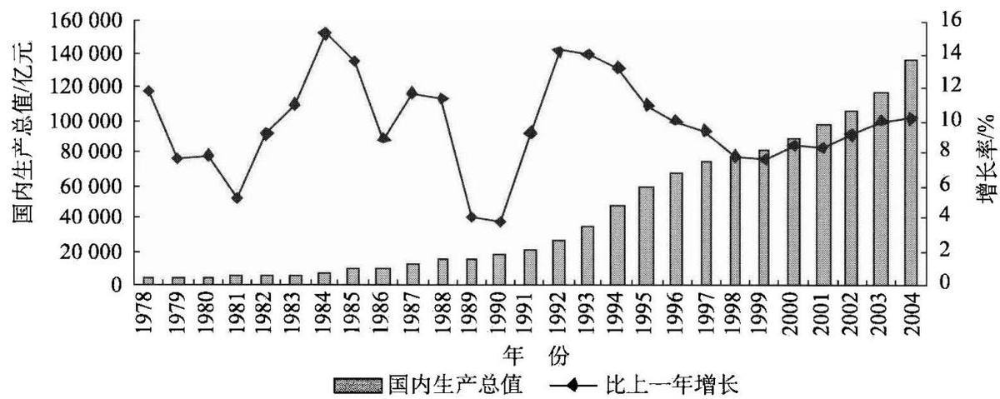  
图 2.19 1978\~2004 年我国 GDP 及其增长率  
资料来源：中国统计年鉴2005

在经济飞速增长的同时，我国城乡人民生活水平大幅提高，城乡差距日益拉大。1978～2004年，农村居民家庭人均纯收入由133.6元增长至2936.4元，城镇居民家庭人均可支配收入则由343.4元升至9421.6元；农村居民家庭恩格尔系数由67.7%下降至47.2%，城镇居民家庭恩格尔系数则由57.5%降至37.7%。城镇居民日益重视文化消费，除食品等生活必需品外，教育、文化、娱乐、服务支出占消费性支出的14%。2004年城乡居民人民币储蓄存款高达119555.4亿元，人均存款超过9000元。

伴随着经济的全面发展，我国对外经济贸易日益频繁。2004年我国外贸进出口总额达到95539.1亿元，是1991年的13倍，成为仅次于美国、德国的第三大贸易国。与东南亚国家以吸引短期、间接资本为主的引资结构不同，中国以吸收外国直接投资为主。1979～2004年间，我国合同利用外资项目510624个，合同利用外资金额12708.13亿美元，其中外商直接投资项目508941项，外商直接投资金额10966.09亿元。

## （二）与世界各国的比较

自20世纪70年代以来，我国与世界发达国家的经济发展水平不断拉近。20世纪70年代，美国的GDP是我国的38倍；在2000年，这个数字降为9倍，我国的GDP增长速度位于世界前列。随着改革开放及市场化进程的不断加快，我国对外贸易飞速发展，进出口贸易额排名已由1978年的世界第27位跃至第3位（表2.4）。目前我国主要工业产品中，钢、煤、水泥、化肥、棉布以及电视机的产量位居世界首位，谷物、肉类、棉花、花生、油菜籽以及水果等农产品产量也名列前茅。

尽管我国经济形势大好，但我国人均经济指标还不容乐观。1978年我国人均国民总收入在188个国家和地区中排在第175位，目前在206个国家和地区中排第133位，基本处于中下水平。我国50%以上的就业人口集中在第一产业；其次分别是第三产业和第二产业；与此相反，美国第一产业就业人口不足3%，而第三产业就业人口高达75%。

表 2.4 世界 GDP 排名 (单位：亿美元)
<table><tr><td rowspan=1 colspan=5></td></tr><tr><td rowspan=1 colspan=1>年份</td><td rowspan=1 colspan=1>美国</td><td rowspan=1 colspan=1>日本</td><td rowspan=1 colspan=1>德国</td><td rowspan=1 colspan=1>中国</td></tr><tr><td rowspan=1 colspan=1>1970</td><td rowspan=1 colspan=1>10255</td><td rowspan=1 colspan=1>2068</td><td rowspan=1 colspan=1>2037</td><td rowspan=1 colspan=1>272</td></tr><tr><td rowspan=1 colspan=1>1980</td><td rowspan=1 colspan=1>27956</td><td rowspan=1 colspan=1>10279</td><td rowspan=1 colspan=1>8261</td><td rowspan=1 colspan=1>3015</td></tr><tr><td rowspan=1 colspan=1>1990</td><td rowspan=1 colspan=1>58033</td><td rowspan=1 colspan=1>30522</td><td rowspan=1 colspan=1>15470</td><td rowspan=1 colspan=1>3878</td></tr><tr><td rowspan=1 colspan=1>1995</td><td rowspan=1 colspan=1>74005</td><td rowspan=1 colspan=1>52929</td><td rowspan=1 colspan=1>24166</td><td rowspan=1 colspan=1>7006</td></tr><tr><td rowspan=1 colspan=1>2000</td><td rowspan=1 colspan=1>98247</td><td rowspan=1 colspan=1>47661</td><td rowspan=1 colspan=1>18752</td><td rowspan=1 colspan=1>10808</td></tr><tr><td rowspan=1 colspan=1>2003</td><td rowspan=1 colspan=1>108572</td><td rowspan=1 colspan=1>42907</td><td rowspan=1 colspan=1>23862</td><td rowspan=1 colspan=1>13720</td></tr></table>

资料来源：历年中国统计年鉴。

## 二、产业结构

## (一) 三大产业比例

改革开放以来，我国的产业结构随着经济发展而不断变动，主要表现为产业结构从低级向高级的演进趋势；且在产业结构日趋合理化的基础上，不断推动经济增长。

<!-- ===== 分片 p201-400（200页，源：参考_中国水土流失防治与生态安全_总卷上（201-400页））===== -->

从产业构成来看，我国产业结构逐步摆脱了第一产业基础薄弱、第二产业发展不均衡、第三产业水平低下的现状，产业结构不断升级和逐步优化。第一产业比重已由1978年的28.1%下降到2004年15.2%，第一产业内部也由单一结构逐渐转变为多种经营。第二产业呈快速上升趋势，由1978年的48.2%上升到2004年的52.9%，成为我国经济快速增长的主要动力，相对完整的工业体系已经建成，制造能力大大增强。第三产业比重呈上升趋势，由1978年的23.7%上升到2004年的31.9%，自1985年开始超过第一产业成为国民经济的第二大产业（图2.20、图2.21）。

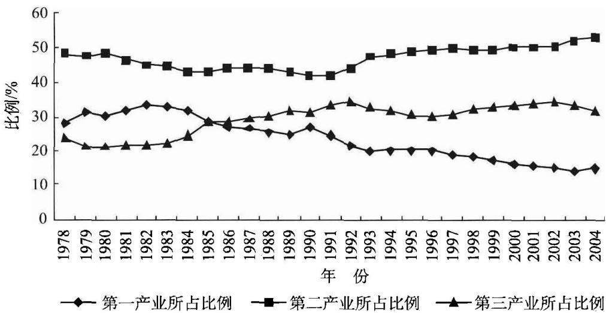  
图2.20 1978\~2004年我国产业结构变化图  
资料来源：中国统计年鉴2005

与此同时，我国产业内部也进行相应调整。农业内部林牧渔业结构比重增加，农业多种经营成效显著。工业内部轻重工业比例关系有较大波动，轻工业所占比重1978年为43.1%，而后3年有较大幅度上升，之后重工业增长速度快于轻工业，重工业比重呈现波动式上升。改革开放以来，我国工业中发展最快的是高消耗、低加工度的行业，包括劳动密集型的一般加工工业，依靠引进支持的组装加工工业以及与这些行业密切联系的基础工业、能源工业等。而高加工度、高附加值的行业，包括机电一体化的装备工业、关键零部件工业、特殊材料、新型材料工业等发展较为缓慢。第三产业内部增长最快、比例上升幅度较高的有金融保险业、社会服务业、科技服务业和邮电通讯业。

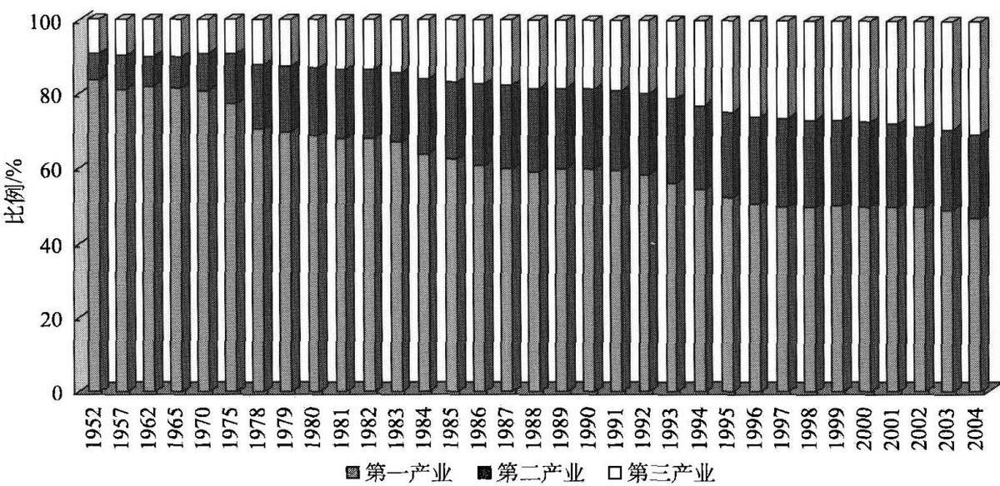  
图2.21 我国三大产业就业人口比重  
资料来源：中国统计年鉴2005

我国产业结构调整虽然有了一定进步，但演变的非均衡性特征较为突出，存在一些不能忽视的问题。一方面，我国产业结构仍不够合理。第一产业劳动力过剩，第二产业比重过大，第三产业发展仍显不足。我国第三产业增加值在GDP中的比重仍然偏低，甚至低于发展中国家平均水平。而第二产业所占比重为52.2%，大大高于31.4%的国际标准；第三产业所占比重为33.2%，大大低于50%的国际标准。另一方面，我国产业内部构成尚不成熟。从产业内部构成看，第一产业组织化程度仍旧偏低，种植业生产结构矛盾日益突出；第二产业企业小而分散，产品结构不合理，高技术产业、环保产业等新兴产业相对落后；第三产业仍以传统的商业、交通运输业为主，吸纳就业能力不强，新兴服务行业发展不足；区域发展不协调，产业结构趋同。

总体说来，第一产业比重的逐渐减少和第二、三产业的快速上升，特别是高新技术产业和现代服务业比重的逐步增大，在一定程度上减轻了对土地资源的开垦和依赖，对我国区域经济发展和水土保持起到了积极作用。

## （二）农业产业结构

由于农业生产对土地的特殊依赖性，因此土壤侵蚀对农业经济造成的危害十分直接，并且农业产业自身结构对土壤侵蚀的影响也较为突出。一方面，土壤侵蚀剥蚀沃土，使土壤养分流失，含水量降低，作物苗期发锈、后期徒长、贪青晚熟，最终导致粮食减产。另一方面，受传统农业以及新中国成立以来农业政策导向的影响，我国种植业初期比重过大，农业产业结构趋同现象严重，效率较低。这种农业产业结构的不合理造成大面积的毁林开荒、陡坡种植，广种薄收现象严重，造成了农业生产和环境破坏的恶性循环，加剧了土壤侵蚀。此外，西部地区由于自然生态环境条件较为恶劣，坡耕地较多，坡度25°以上的坡耕地约占山区耕地面积的1/4，农业科技知识缺乏，耕作技术落后，农业生产方式落后。这种自然状况和不合理的农业产业结构叠加在一起，不仅严重影响了农业生产和地区经济的发展，而且造成了大量人为的土壤侵蚀（王越、林少明，2002）。

目前，现代化科学技术在农业生产中逐步得到推广应用，并对农业生产产生重大作用。农业生产工具以手工农具与农业机械相结合为主；机器在农产品仓储、冷藏、加工、运输过程中得到应用；电力、水利工程、农业设施、公路网络在农业生产中发挥作用。农业生产方式的改进对我国农业发展起到了积极的作用。新中国成立以来，我国第一产业从业人数一直多于第二、第三产业，并呈现逐步递减的态势，所占比重下降了近一半，且劳动力呈现从第一产业大量向第二产业和第三产业流动的态势，但第一产业依旧效率较低，2004年，占我国总人口比重58%的农村人口仅创造了15%的GDP，而42%的城镇人口则创造了近85%的GDP。

## 三、经济发展的区域不平衡性

## （一）“三大地带”差异

从“一五”至今，我国经济发展水平有了质的飞跃。特别是改革开放以来，我国国民经济发展速度加快，宏观资源配置效率提升，地区间合理分工的生产格局正在形成。

由于东、中、西部地区自然条件、资源禀赋、经济基础、人力资本和全球化等因素的影响，我国区域经济自东向西呈现出由高到低的梯度差异分布态势。20世纪80年代以前，我国经济处于低水平发展期，各地区经济水平都很低，而且全国投资建设的重点大都在内地，由此造成东中西区域差异不大；改革开放以后，在非均衡的倾斜性经济发展战略的指引下，这一差距被进一步拉大，目前已经达到非常突出的程度。与经济增长速度的总体格局一致，目前我国三大区域的人均国内生产总值也呈现出东部高、西部低的东、中、西梯度差势排序。1978年我国三大地带人均GDP相对比率为1：0.67：0.57；而到了2004年，该比值达到1：0.52：0.40。不仅如此，我国三大地带间居民年收入水平变化的总体格局也呈现明显的阶梯型差势，且城乡差异显著，差距逐年扩大。1999～2002年，我国东、中、西部地区农村居民家庭人均年纯收入分别从3345元、2065元、1604元增加为3916元、2292元、1792元，而城镇居民家庭人均年收入分别从7284元、4845、5284元增加到9356元、6369元、6675元（表2.5）。

由此可见，我国三大地带的经济发展呈现明显的梯度差异，且东部地区与中西部地区之间、中部地区与西部地区之间的差距日益扩大。

表 2.5 中国三大地带人均国内生产总值 (单位：元)
<table><tr><td rowspan=1 colspan=1>地区</td><td rowspan=1 colspan=1>1978年</td><td rowspan=1 colspan=1>1980年</td><td rowspan=1 colspan=1>1985年</td><td rowspan=1 colspan=1>1990年</td><td rowspan=1 colspan=1>1995年</td><td rowspan=1 colspan=1>2000年</td><td rowspan=1 colspan=1>2004年</td></tr><tr><td rowspan=1 colspan=1>东部</td><td rowspan=1 colspan=1>461.1</td><td rowspan=1 colspan=1>599.7</td><td rowspan=1 colspan=1>1 009.3</td><td rowspan=1 colspan=1>1 983.9</td><td rowspan=1 colspan=1>6 803.3</td><td rowspan=1 colspan=1>11 334</td><td rowspan=1 colspan=1>18 217</td></tr><tr><td rowspan=1 colspan=1>中部</td><td rowspan=1 colspan=1>309.8</td><td rowspan=1 colspan=1>382.6</td><td rowspan=1 colspan=1>694.7</td><td rowspan=1 colspan=1>1 276.2</td><td rowspan=1 colspan=1>3 690.7</td><td rowspan=1 colspan=1>5 982</td><td rowspan=1 colspan=1>9 481</td></tr><tr><td rowspan=1 colspan=1>西部</td><td rowspan=1 colspan=1>264.3</td><td rowspan=1 colspan=1>313.9</td><td rowspan=1 colspan=1>570.6</td><td rowspan=1 colspan=1>1 085.4</td><td rowspan=1 colspan=1>2 959.7</td><td rowspan=1 colspan=1>4 687</td><td rowspan=1 colspan=1>7 219</td></tr></table>

资料来源：历年中国统计年鉴。

## (二)省际差异

改革开放30年来，中国经济创造了一个增长奇迹，但省区间的经济差异却不断扩大。

从空间上来看，经济基础较好的上海、北京、天津、辽宁等省市和经济发展速度较快的江苏、浙江、广东、山东等省市与贵州、云南、四川、甘肃等省区差异在不断扩大。2004年，地区生产总值排在前4位的广东、山东、江苏、浙江的GDP均超过10000亿元，广东、上海两地的财政收入超过千亿元，而西藏、宁夏、青海、海南的GDP不足1000亿元，财政收入不足100亿元。其中，广东的GDP是西藏的76倍，财政收入是西藏的142倍，差距悬殊。从人均情况来看，北京、天津、上海、浙江等省市的人均GDP突破20000元，而贵州、甘肃、广西、云南等省区的人均GDP不足7000元。除西藏、青海等地由于人口稀少等原因而出现人均收入较高外，北京、天津、上海三大直辖市以及浙江、江苏、广东等地的人均货币收入均超过20000元(图2.22)。总体来看，伴随着我国经济水平的不断提高和经济结构的不断完善，我国经济状况明显好转，人民生活水平显著改善，但与此同时，省市间差距的扩大不可避免。

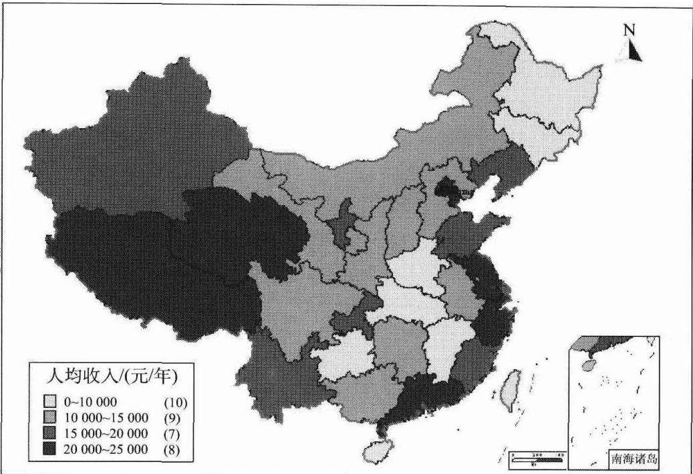  
图 2.22 中国人均收入分布情况  
资料来源：中国统计年鉴2005

## 四、经济发展与土壤侵蚀

土壤侵蚀严重制约了社会经济发展。土壤侵蚀使农耕地耕作层土壤不断变薄，养分和黏粒物质减少，土壤严重退化，加大了农作物生产和管理的难度，造成农作物减产。近50年来，我国因土壤侵蚀毁掉的耕地达333.3多万hm²，年均6.6万hm²。因土壤侵蚀造成退化、沙化、碱化草地约100万km²，约占我国草原总面积的50%。同时，我国土壤侵蚀较为严重的地区也是经济发展水平相对较低的地区。20世纪90年代末，新疆、内蒙古地区的土壤侵蚀面积分别为103.62万km²和74.48万km²，占全国土壤侵蚀总面积的近一半，是我国土壤侵蚀较严重的地区，也是我国经济发展水平较低的地区。目前我国农村贫困人口有90%以上都生活在生态环境恶劣的土壤侵蚀地区，我国常年缺粮区也主要集中在土壤侵蚀较为严重的西部干旱、半干旱地区，而农田受旱面积也大多发生在土壤侵蚀严重的山丘地区（图2.23）。这些地区自然环境恶劣，缺少可耕地，农业生产条件差，自然灾害频繁，生态环境脆弱，农业生产方式落后，土壤侵蚀加剧了对有限资源和环境的压力，导致更加严重的贫困和环境恶化，形成“越穷越垦，越垦越穷”的恶行循环，致使这部分地区人口、粮食、经济发展以及生态环境的矛盾异常突出。此外，土壤侵蚀破坏了土地资源，破坏森林植被，导致水库和江河湖泊淤积，降低了水利设施调蓄功能和天然河道泄洪能力，加剧了下游的洪涝灾害，严重影响了正常的生产生活（彭珂珊，2002）。黄河流域三门峡以上地区年均输入黄河泥沙16亿t，其中约4亿t淤积在下游河床，致使河床每年抬高8～10cm，对沿岸地区构成严重洪水威胁。

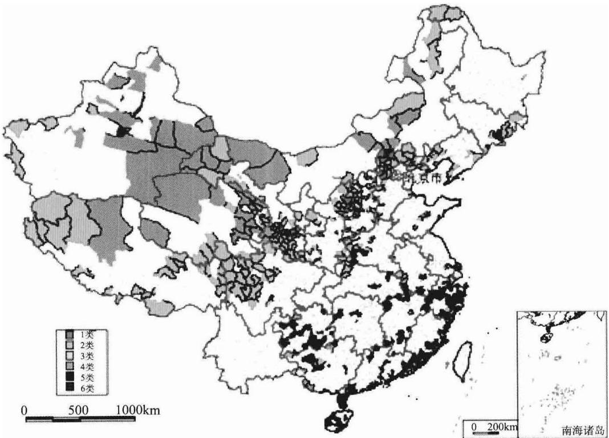  
图2.23 2000\~2003年中国常年缺粮区区域类型分布图资料来源：殷培红，方修琦，田青，马玉玲。21世纪初中国粮食短缺地区的空间格局和区域差异。

在土壤侵蚀影响经济发展的同时，过度的经济开发、不合理的土地利用也会引发土壤侵蚀，破坏生态环境。由于大规模地进行开矿、采石、建水库、修路、农田基建、城市建设等生产建设，尤其是随意倾倒废土、废石、矿碴等，每年由此导致的新增土壤侵蚀面积在1万km²以上，严重破坏了生态平衡。而部分地区依托于自然资源的开采、利用和加工的生产格局必然造成土地的过度开垦和森林植被的破坏，加剧水土资源的流失。此外，经济发展过程中，人与生态争水的矛盾十分突出，水资源的不合理开发利用也加剧了土壤侵蚀作用。

土壤侵蚀的治理有待于国民经济的整体发展和地区经济结构的合理调整。一方面，高水平的经济发展水平能够降低人口出生率，减轻土壤侵蚀严重地区的人口压力；另一方面，产业结构的合理化可以将人口从依赖土地中解放出来，将人口吸引和转移到生产效率更高的行业中去。此外，经济发展还可以提高农业劳动生产率，促进农业和其他行业的技术进步，加大对土壤侵蚀的投入。

## 参考文献

刘育成.2000.中国地理．北京：高等教育出版社

孟向京.2000.西部开发与人口分布．人口学与计划生育，（4)：24～30

彭珂珊.2002.水土流失对经济发展的冲击.重庆大学学报（社会科学版），9（2）：67～71，96

王越，林少明.2002.土壤侵蚀和治理与区域经济发展关系的探讨．中国水利，(8)：76～78

吴传钧，郭焕成.1997.中国土地利用．北京：科学出版社

殷培红，方修琦，田青，马玉玲.2007.21世纪初中国粮食短缺地区的空间和区域差异．地理科学，27(4):463\~472

张凤荣.2003.中国土地资源及其可持续利用．北京：中国农业大学出版社

张善余.2003.中国人口地理．北京：科学出版社

张维庆.2005.解读西北5省区人口现状及面临问题．中新网

赵济，传康.2000.中国地理．北京：高等教育出版社

中华人民共和国水利部.2002. 全国土壤侵蚀公告

中华人民共和国统计局.2004.中国统计年鉴．北京：中国统计出版社

中华人民共和国统计局.2006.中国统计年鉴：北京：中国统计出版社

## 第三章 土壤侵蚀演变

我国是世界上土壤侵蚀最为严重的国家之一，这不仅与我国强烈的新构造运动、多山的地形特点和季风降水的不稳定等诸多自然背景因素有关，更与我国农业开发历史悠久、人口众多等诸多人文因素密切相关。作为世界上重要的农作物栽培起源区之一，中国农业自12000年前出现以来，先后经历了原始农业（掠夺式农业，约500BC以前）、传统农业（循环式农业，500BC～1950AD）和现代农业（投入式农业，1950AD以后）等三个发展时期。农业的发展在养育了具有“多源一体”特征的中华文明的同时，也使我国的土壤侵蚀不断加剧。根据土壤侵蚀作用时空变化的特点，本章以西汉、唐宋、清中叶和新中国成立后等土壤侵蚀发生转折的时间点为界限，将我国土壤侵蚀的历史划分为5个阶段，其中第1个阶段主要处在原始农业时期，基本维持自然侵蚀；第2～4个阶段发生在传统农业时期，人为导致的土壤侵蚀首先于西汉凸显在北方地区、至唐宋扩展到南方地区、到清中叶随着山地的开发而普遍加重；第5个阶段发生在现代农业时期，水土保持措施初见成效。

## 第一节西汉前后

## 一、原始农业时期基本维持自然侵蚀

中国史前时期（2000BC以前）的原始农业按起源和生产方式可明显地区分为南北两大系统：南方是稻的发源地，形成以长江中下游为重心的稻作农业系统；北方是粟、黍等作物的发源地，形成以黄河中下游为重心的粟作农业系统（任式楠，2005）。5000～6500BC的各支文化均已表现出较高的生产和文化水平，至5000～2000BC的仰韶文化、龙山文化时期，史前农业达到发达和兴盛，稻作与旱作栽培的分界大致在 $3 5 ^ { \circ } \mathrm { N }$ 附近的扶风一户县—华县—渑池一洛阳—郑州—衮州—日照一线，较现今偏北2～3个纬度；北方以粟为主的旱作农业的北界达到现今以畜牧为主或半农半牧的内蒙古长城地带及西北的甘青地区。夏商之际，我国的原始农业文化受环境突变的影响而一度衰落，其中长城沿线的原始旱作农业蜕变为以半农半牧、时而农时而牧的土地利用方式为特征的农牧交错带，这种特点一直持续至今；长江以南地区的稻作农业也出现不同程度的衰落；仅在黄河中下游地区得到相对的发展（方修琦，1999；方修琦等，1998）。西周时期（公元前11世纪前后）农耕区主要集中在黄河中下游地区。

火耕方式、木石制工具以及熟荒农作制是原始农业耕作制度的主要成分，即使在商周之际的铜器时代，铜器也很少用作农业工具。原始农业是从以牺牲天然植被为代价的“火耕”开始的（生荒地），在“火耕”之后使用石器或木制工具进行进一步的耕作，通过数年的撂荒使地力自然恢复后再重新开垦（熟荒地）。在旱作农业系统的北方和稻作系统的南方，由于具体耕作方式的显著差别，其对土壤侵蚀的影响也有所不同。但总体来讲，原始农业时期开发的区域主要集中在较平坦的地段，人口数量和开发规模有限，人类的生产、生活活动对自然环境还够不成严重威胁，土壤侵蚀基本还处在自然侵蚀状态。

史前北方旱地农业长期实施的可能是火耕与耜耕结合兼用的耕作方式，而两者的劳动量、技术投入和作用，前后有所变化。火耕即放火烧田，普遍存在于生荒地、熟荒地和连作地整治的前期阶段。新垦殖的生荒地上砍伐和焚烧的主要植物可能是茂密野草和稀疏树木（但不属于标准森林地），耕种一些年后，为恢复地力，实行抛荒休耕，另开新地耕种。经周期性休耕后重新使用的熟荒地上，砍伐和焚烧的主要植物可能为灌木和杂草。即使在数年连续耕种的连作地上，也需焚烧收割谷穗后留下的茎秆以及杂草。草木灰烬成了很好的肥料，焚烧还可消除部分病虫害。接着是以木耒、石耜（铲）、石锄等为主要工具，不同程度地加以翻挖平整田地，这可概称之为“耜耕”。史前旱地农业耕作很长时期的发展变化总趋势，大体是火耕的劳动量渐次降低，而耜耕的劳动量、技术和作用则日益增强（任式楠，2005）。上述耕作方式不仅破坏了原始植被，也对土壤造成扰动，且随着耜耕作用的日益加强，对环境的影响程度也呈逐步加强的趋势。但总体上，人类活动引起的土壤侵蚀仍十分有限，土壤侵蚀基本属于自然侵蚀的范畴。全新世中期（6000～3000BC）黄土高原土壤年侵蚀量为 $1 0 . 8 \times 1 0 ^ { 8 } { \mathrm { t } }$ ，黄河泥沙起因与人类活动的关系较小，黄土高原处于以自然侵蚀为主的阶段（陈永宗，1991）。

大体从史前稻作农业形成以来，原始水稻田普行的基本整治耕作方式可能是火耕、踩耕与耜耕相结合进行的。开辟新稻田普遍选择近水且低洼的地段，一般无整片林木需加砍伐，而主要是焚烧新选地上的芦苇、杂草、灌木等；或是将老田中割取稻穗后留下的稻秆残枝败叶连同杂草一并烧掉。火耕就是用烧田方法整治田地，实际上是“焚而不耕”，并不涉及翻动农田土壤。水稻田多位于黏性土壤地带，干时板结硬实，若要用石骨类工具翻土是无法施展的，经水浸泡后即变得酥软，以人力或动物在水田中来回踩踏，使成细软均匀的烂泥，是为踩耕。长江流域新石器时代晚期普遍饲养家水牛，推测当时可能已会驱牛踩耕，家牛也成为畜力。水田经踩耕之后，用耜、铲之类的工具带水操作，修筑田埂，弄平足印，使田面平整，以便直播谷种（任式楠，2005)。上述耕作方式对土壤侵蚀的影响较之北方地区更为轻微。因此在秦汉之前，长江流域地区土壤侵蚀基本保持自然侵蚀水平。根据对冰后期长江三角洲沉积通量的研究，如果以距今15000年作为古河谷开始接受沉积的时间，且以河口附近的年均泥沙沉积量为年均输沙量的1/2计算，则冰后期长江年均输沙量 $2 . 3 6 \times 1 0 ^ { 8 . }$ t，仅相当于1951～1985年长江年均输沙量4.68$\times 1 0 ^ { 8 } \mathbf { t }$ 的50%（李保华等，2002）。

## 二、西汉时期开始土壤侵蚀凸显于我国北方地区

西周以前，我国的农业主要采用游耕方法，西周时期采用休耕方法，通过土地的自然恢复解决地力耗竭问题。但到战国时期，铁器使用普遍，加之牛耕技术的推广，人类改造自然的能力增大。各诸侯国为增强国力，积极鼓励垦荒，新垦耕地的面积不断增大，同时随着人口增加，许多地方出现“土地狭小，民人众”的土地紧张局面。为在提高土地利用率的同时保持土壤肥力，出现多种补偿方法，包括粟后种麦、或麦后种粟、豆的复种轮作制，以及人工施肥法等。为提高产量，战国时期还发展了自流灌溉和汲水灌溉农业。此时土地利用已经包括高地、平地、低洼地三种类型，但坡陀地和低洼地的开发主要在居民点附近，而远离居民地的平地仍有许多尚未开垦。山林、薮泽主要是人们进行采集、渔猎的场所，大部分地区仍是地广人稀，出现的土地紧张局面也主要是人们不愿到远离居民点的地区开垦土地。这时期土壤侵蚀问题虽已显现，但尚不严重。

西汉的200年间人口增加迅速，人口增加近10倍，达到5900万人，是我国历史上人口第一次快速增长时期。扩大土地开垦面积是我国历史上解决人口增长问题的主要手段。平帝元始二年（2AD），有垦田5351.3亿hm²，较汉初耕地面积增加6.4倍。汉代土地开垦主要集中在以黄河中游为中心的北方地区，至汉武帝时，农区北界的位置在西北远至新疆、河西走廊、陇西地区，北至山西、河北北部，东至辽宁，北方农耕区基本格局已经建立。此后的2000多年中，我国北方地区的耕地面积随社会战乱与稳定局面的交替而出现多次增减，但我国传统农耕区北界的位置大体稳定，只是随中原汉民族与周边少数民族势力的彼此消长而发生一定幅度的摆动。

北方地区农业区域的扩展，使一部分草地和林地受到人为干扰和破坏，其中原始生态环境被破坏最严重的是关中和河套地区，关中地区的森林草地已大规模地消失，取而代之的是村庄、农田。人类的开垦无疑加剧了黄土高原的自然侵蚀过程，在吕梁山以西、六盘山以东的黄土丘陵区，西汉时期的土壤侵蚀量已经比较大。《汉书·沟洫志》上曾记载有“泾水一石，其泥数斗”，“河水重浊，号为一石水而六斗泥”，表明至少从西汉时期黄河泥沙含量高的特点已经出现，黄土高原等北方地区农业开垦引起的土壤侵蚀已经较为明显。

对于东汉时期黄河流域的土壤侵蚀状况尚有不同的看法。一种认为，从东汉时期开始，北方的游牧民族由于政治、经济等多方面的原因南迁而逐渐占据黄土高原，使前期被开垦的大部分耕地逐渐恢复成草原，土地利用方式也由农业转为牧业，草原植被得以恢复，降低了土壤侵蚀量，减少了流入黄河的泥沙量，黄河出现安流局面（谭其骧，1962）。但相反的观点认为，晋陕峡谷区畜牧业的发展不是减少土壤侵蚀，而是加剧了土壤侵蚀。原始的游牧对天然植被的破坏是造成东汉黄河下游水患频繁的主要原因。自47～220AD的173年间，原始游牧对草坡的压力越来越大，天然植被完全没有休养生息和自行恢复的条件，土壤侵蚀越来越严重，导致东汉黄河水患严重，大水记载不绝于史（王尚义，2003）。在明弘治（1488～1505AD）以前的近1700年间，晋陕峡谷区三川河、湫水河流域长期存在着的自然因素作用和某些时期游牧民族南下，是该地区土壤侵蚀加剧的原因（任世芳等，2004）。

## 第二节唐宋之际

东汉以后，北方地区人类活动对自然环境的影响因人口的锐减而减弱，但进入唐宋时期以后，植被破坏重新加剧。唐以前，黄土高原植被的变化更多地表现为自然因素即气候的影响，唐宋以后则更多地受到人类活动的影响(吴祥定等，1994)。至少从宋代开始北方地区已有坡地开垦的记载，如欧阳修记载了吕梁山以西的离石地区“山荒甚多”；到金代时，坡地开垦加剧，“田多山坂硗瘠”（叶青超等，1994)。由于人们的过度开垦，关中平原、汾涑河流域已无天然森林；黄土丘陵、山地植被也遭到破坏，人为加速侵蚀增强，唐代已是“泾水黄，陇野茫”，“去马来牛不复辨，浊泾清渭何当分”。宋代从延安向北沿途所见则是：“随川取路，夹以峻山，暴雨之期，湍流大石”（王义凤等，1991)。目前，关于自然因素和人文因素对黄土高原地区水土流失贡献的估计存在分歧，按以自然侵蚀为主观点的估计，1020BC～1194AD年黄土高原的年侵蚀量11. $6 \times 1 0 ^ { 8 } \mathrm { t }$ ，较全新世中期的侵蚀量增长率7.9%，但仍以自然侵蚀为主（叶青超等，1983）。黄河下游沉积速率2300年以来的变化显示，从战国到南北朝时期，黄河下游沉积速率较低，为2～4mm/a；但从隋唐开始，沉积速率发生阶梯式跃升，达到2.0cm/a，并持续到清代中期，表明公元7世纪以后土壤侵蚀量显著增加（许炯心等，2003）。

在南方地区，土壤侵蚀的加剧主要起因于人类对丘陵山地植被的破坏，开发的次序大体是从平原低地，到低山丘陵，再到深山地区。自夏商至秦汉2000多年间，农业主要集中在黄河流域。西汉之时，“江南地广，或火耕水耨，民食鱼稻”。自东汉后期至宋元时期，大批中原士民为避灾荒战乱，加上铁制农具的普遍使用，南方地区农田的开辟扩大也出现了新的形势，山泽地逐步被开发。移民开发主要以三种方式造成南方低山丘陵地区植被的破坏，加剧土壤侵蚀。

## 一、麦、粟等旱粮作物在丘陵山区的广泛种植

自战国后期到汉魏六朝时期，“火耕水耨”仍广泛流行于南方稻作农业区，是江南水稻种植区的一种主要耕作方式，它是原始稻作农业的先民们在火耕水耨的基础上，吸收刀耕火种的结果。应劭曰：“烧草，下水种稻，草与稻并生，高七八寸，因悉芟去，复下水灌之，草死，独稻长，所谓火耕水耨也”。

随着北方人民在长江流域的定居，粟、麦等旱地作物逐渐推广，加之铁制农具的普遍使用，使得南方地区得到大规模的开发。以四川盆地为例，从东汉后期开始，四川盆地农业垦殖活动就已经在丘陵地区开展。广汉、德阳等地有“山原田”，资中等地亦“多山田，少种稻之利”，说明盆中丘陵区已有规模不小的旱作农业；至于盆东丘陵区，更是“川崖惟平，其稼多黍；……野阜惟丘，彼稷多有”，黍、稷等旱地作物已种植（周宏伟，1999)。到南宋中期时，农地垦殖由盆西、盆中扩大到盆东并进抵盆周高半山区，耕地面积达90万顷（今市制顷）左右，平均垦殖指数约10.7%，土壤侵蚀开始出现，环境开始恶化（郭声波，2003）。

畲田在南方山地的出现是农业开始上山的标志。农民多采用畲田刀耕火种的垦荒方式来开垦土地，唐宋诗词中有较多有关畲田的记载，南宋诗人范成大在《劳畲耕诗序》中写道：“（畲田），峡中刀耕火种之地也。春初砍山，众木尽蹶。至当种时，伺有雨候，则前一夕火之，借其灰以粪，明日雨作，乘热下种，即苗盛倍收。”畲田是一种掠夺式的农业开发方式，简单易行，但却破坏了山坡上的植被，引发土壤侵蚀，土壤侵蚀的强度随山坡地开垦的增多而日趋严重。为减少山地土壤侵蚀、增加生产力，人们发明沿丘陵坡地等高线做成梯田。东汉时今重庆彭水已有少量梯田出现，但梯田的较大发展是在唐宋时期，范成大在袁州（今江西省宜春县）旅行时，“出庙三十里至仰山，缘山腹乔松之磴甚危，岭阪上皆禾田，层层而上至顶，名梯田”，此乃梯田之名的最早记录（刘沛林，1998)，梯田的发明加快了山地开发的速度，在有效控制单位面积土壤侵蚀的同时，总土壤侵蚀量明显增加。

麦、粟等旱粮作物在丘陵山区的扩展，到唐宋时期达到极致，南宋时期长江流域的丘陵低山地带呈现出明显的农业景观。宋代学者描述当时“盖自江而南，井邑相望，所谓闲田旷土，盖无几也”，“凿山而田，高耕入云者，十倍其力”。在四川，“蜀民岁增，旷土尽辟”，“两川地狭，生齿繁，无尺寸旷土”，蜀中丘陵山区多“侧耕危获”之民；皖南丘陵山区（徽州）梯田“层累而上”；赣中丘陵地带（袁州）“岭阪上皆禾田”；湘南丘陵地带即“极高峻回复”之处亦“见犁锄”之人；湘江、资江以西的湘西到广南西路，历来为人少地多的山丘地区，此时也得到较大幅度的开垦（周宏伟，1999；史立人，2002)。

## 二、茶树种植

除麦、粟等旱粮作物之外，唐宋元时盛极一时的种茶之风是南方丘陵开垦的另一重要原因，也严重破坏了丘陵低山地带的森林。茶是原产于我国西南山区的常绿灌木，早在先秦时期四川地区即开始人工栽培茶。入唐以后，茶的生产开始商品化。长江流域种茶区域从唐时30州发展到宋时70余州，其实际植茶面积不会低于33万hm²。元代时，种茶进一步扩大。茶树“大概宜山中带坡峻”的丘陵低山地带生长，为种茶势必砍伐大面积的丘陵山区森林（周宏伟，1999）。

## 三、商业采伐林木

唐宋时期造船、井盐、冶炼业兴盛，商业采伐的林木日渐增多，对丘陵低山地带的森林破坏也有重要影响。唐开元初便有巴人深入大巴山中“随山采木”，砍伐巨松。贞观十八年（644AD），唐太宗命“将作大匠阎立德等，诣洪、饶、江三州，造船四百艘”，又“发江南十二州工人，造大船数百艘。”在四川“伐木造船舰，大者或长百尺，其广半之”（《资治通鉴》）。长江中下游地区的临安（今杭州）、建康（今南京）与平江（今苏州）均为造船中心，扬州、潭州（今长沙）、赣州等地也都设有造船工场。湖南的木材，编筏沿江而下。及至宋代，四川仁寿县近山森林资源已砍伐殆尽，只得“奔走百里之外”采伐林木。今重庆武隆县原来“两边山木相接，薪蒸赡足”，开发强度增大后，“两岸林木芟雉，悉成童山”（史立人，2002）。

对丘陵山区的开垦和森林采伐致使大量的地表植被破坏，以致范成大沿湘水旅行时，满目所见“皆土山，略无峰峦秀丽之意，但荒凉相属耳”。从南宋开始长江流域土壤侵蚀明显化，并随着开发力度的加重而加剧。如在北宋时期，三峡地区绝大部分江河仍以水流清绿为主，苏轼《瞿塘峡》诗称：“长江连楚蜀，万派泻东南。合水来如电，黔波绿如蓝。”而到南宋时，已是“竹香细细禅房静，江水浑浑野渡间”；“上有瑶簪十二尖，下有黄湍三百尺”；“雨后涨江急，黄浊如潮沟”（杨伟兵，2000；郭声波，2003)。江水由清变浑变黄，反映了当时土壤侵蚀严重。据洪痕测量和古文献综合考证，荆江洪水位在汉～宋元时期，平均上升量为0.164cm/a；而从宋元至今平均上升量为1.39 cm/a，为急剧上升期（刘沛林，1998）。

## 第三节 清中叶以后

中国的人口几乎是在2000年前就达到了6000万，此后随着社会的稳定与动荡的交替长期在6000万与1000万～2000万之间波动。6000万曾是我国历史上一个长期不可逾越的人口界限，可能是当时自然社会经济条件下对人口的最大承载量。明朝的人口最多在7000万至1亿上下。在经历明清之际的人口减少后，清康熙至乾隆的100多年间，全国人口由不足1亿骤然增至3亿，约50年后的1840年突破4亿大关，是历史上人口的第二个快速增长期。

在巨大的人口压力下，全国各地都加大了对山地开发强度，尤其是自16世纪适于山地种植的玉米、花生、甘薯、马铃薯等外来旱地农作物传入我国，并在清中期普遍推广后，山地开发明显加速，逐步形成了以旱地垦殖为主的经济格局。一些地区“遍山漫谷，皆包谷矣”，红薯“处处有之”，而马铃薯的传入，更使高寒山地成为种植区，致使大量陡坡旱地、山坡地、丘陵地被开发，导致土壤侵蚀普遍加重。除毁林开荒外，伐木烧炭，经营木材、采矿冶炼也是森林破坏、土壤侵蚀加重的重要原因。进入20世纪上半叶，社会矛盾尖锐激化，政局动荡变革，水旱灾害频繁，致使土壤侵蚀进一步加剧，到新中国成立前，我国水力侵蚀面积大致在150万km²左右。

## 一、南方地区

明代长江流域的丘陵低山地带天然森林已所余无多，由于对山地植被的大肆破坏，导致“山童柴少”，形成“突山赤土”，土壤侵蚀加剧，一些地方出现了有关土壤侵蚀灾害的记载。但在位置偏僻的中、高山地区，人类活动尚未改变这些地区的原始森林植被面貌，开发程度还非常低。

清代人口剧增使南方山地遭到大规模的开垦，其中四川盆地周围山地丘陵区、秦巴山地土石山区、湘赣红壤丘陵区、鄂东北大别山区皆因植被破坏而加重土壤侵蚀。南方山区开发的主要成员是棚民，他们一般来自外地，为谋求生计，不惜远走别处，结棚而居，以开山种地填补饥饿贫穷的岁月。棚民在清代以前已有出现，入清后，从战争中逃出的一部分人，以进入深山为临时安身之计，促成了山区的开发；康乾年间之后，随着人口的增加棚民的数量也日见增多。棚民为开垦土地，必清除地面原有植被，铲除深根，挖松土块，抛去碎石种下作物，如此不仅破坏森林，更严重刨松泥土，一遇骤雨，泥沙奔泻而下，山上土壤侵蚀，山下淤积成灾。自明清以来因过度垦荒，生态失调，至20世纪上半叶问题更加严重。

明代大批来自第一次“湖广填四川”的流民深入长江上游山地毁林开荒，伐木烧炭，经营木材，拉开了长江流域山地森林大规模破坏的序幕，但明清之际的战乱使该地区人口和耕地大减。清初，大量荆襄流民进入三峡地区，另有大批两湖等地贫民流徒四川垦荒谋生，形成规模更大的第二次“湖广填四川”移民高潮。雍正年间（1729AD）四川的耕地面积为53万顷，平均垦殖指数为6.29%，农地的垦殖与森林的破坏局限于丘陵中部及山地坡麓（海拔约800～1500m）以下，土壤侵蚀不明显；至清中叶时，四川耕地面积达到90万顷以上，1820年四川的耕地面积为95万顷，平均垦殖指数为11.27%，农地的垦殖与森林的破坏开始往丘陵顶部、半山上部（海拔约1000～2000m）推进，森林的破坏也已扩展到四川盆地周边并向川西南乃至川西山区逐渐深入，畲田、山田垦辟盛行，虽有梯田出现，土壤侵蚀仍开始明显加剧（郭声波，2003）。除开垦外，乾隆年间，大量江西和湖广商人涌入四川雷波黄琅一带深山砍伐林木，扎筏出卖，清代李芝在《盐业赋》中称富顺一带“有山皆空，无岭不秃”（史立人，2002）。1937年四川的垦殖指数达18.39%，农地的垦殖与森林的破坏开始往川西南中山、川西高山地区（海拔约2000m以上）推进，耕作方式多样化，土壤侵蚀加剧。1935年秋季会理南边的金沙江已是“水色与黄河差不多，色样极浑黄”（郭声波，2003)。20世纪40年代初期，著名地理学家李旭旦先生在对白龙江流域进行考察后即提出：“我国山地面积广大，苟能善加利用，实为无穷利蔽，惜我农耕汉人，为平原民族，伐林焚草，滥加耕犁，以致濯濯童山，荒岩暴露，急流洗冲，泥沙俱去……”（张迪祥，2000)。

清朝中期以前，秦巴山区还有着茂密的原始森林，被统称为“南山老林”和“巴山老林”。其中，秦岭中、西部的砖坪、紫阳、镇平、平利一带，原始森林尤为广袤，“古木丛篁，遮天蔽日”、“长林深谷，往往跨越两三省”（周宏伟，1999)。紫阳县乾隆年间尚未开垦，至乾隆末年则山林“尽已开垦，群兽远迹，石骨峻嶒，向之蔚然深秀者，今已见其濯濯矣”。到嘉庆、道光年间，秦岭中部海拔1400～3000m之间的宁陕、佛坪，巴山地区海拔1400～2000m的定远、镇平、砖坪等地已逐渐被流民所开发。道光时，除了秦岭深处少数地方因山极险峻、交通不便而残存若干“老林”之外，其他地方“有土之处皆开垦无余”，已无成片森林可言，如留坝县之紫柏山一带，道光九年尚古柏翳天，无间杂树，仅十年后，则“山谷依旧，林木全非”（鲁西奇等，1996)。除垦殖外，各类厂矿对森林资源的破坏极大。每年冬春季节，仅在川、鄂、陕三省边界的烧炭者多至千人以上。据严如煜《三省边防备览·山货》记载，山内各州县开厂甚多，如纸厂，西乡有20余座，定远逾百，洋县也有20余座。大厂匠作佣工有数百人，小厂也有四五十人。炭厂则“有树木之处皆有之”（鲁西奇等，1996）。秦巴山地大部分土地位于大于25°的山坡上，对森林资源的砍伐和山地丘陵区的开发，导致山坡失去植被保护，土壤侵蚀成倍增长。大巴山一带“伐林开荒”，“至四五年后，土既挖松，山有陡峭，夏秋骤雨，冲洗水痕条条，只存石骨……”(杨伟兵，2000)；“数十年来，老林开空，山地挖松，每当夏秋之时，山水暴涨，挟沙拥石而行，各江河渐次填高，其沙石往往灌入渠中，非冲坏渠堤即雍塞渠口”，“沿河地亩屡被冲压”（鲁西奇等，1996)。到清末民初，秦巴山区的大相岭诸峰有的山林已童，无可樵采者，于是有“光头山”、“大红山”之名，山南之汉水也变成了名符其实的“流沙河”（郭声波，2003）。

三峡地区明代时山区腹地林木保存尚较完好。清中后期，随着大量以损耗森林植被为代价的土地利用、手工业、矿业生产的出现，三峡万县一带“生聚渐繁”，“垦殖益广”，秀山“垦辟皆尽，无复丰草长林”；巫山大溪“林木多伐，少荫葱之象”；归州一带“山居者半为樵”。宜昌一带则是“开荒过多，山渐为童，…膏腴之壤竟为石田”（史立人，2002)。道光涪州三峡间即有“飞花喷雪，浊浪轰雷”的情景（郭声波，2003）。

南方的其他地区也是如此。在湘西、鄂西、江西、浙江、安徽徽州等地都记载了清中叶以后山地开垦导致土壤侵蚀加剧的情况。其中，清嘉庆十三年（1808AD），徽州休宁乡绅方椿曾历数棚民山地开发的“六大罪”，颇具代表性，其中前三条均与山地开垦导致的土壤侵蚀有关：一是开垦使草皮去尽，沙土不能停留，每遇大雨，沙泥随雨陡泻淤塞溪渠、田地，以致频年粮食歉收，甚至耕地丧失生产能力；二是山沙陡泻，导致支流和干流河道淤积，影响水运交通、商品流通和粮食市场的稳定；三是由于溪涧淤塞，水道为泥沙阻碍，导致洪水泛滥。此外，还会造成当地居民因根株尽掘而出现薪柴紧张。

据洪痕测量和古文献综合考证，近5000年来，荆江洪水位以1954年最高洪水位为上限，抬高了13.6m；而上升幅度最明显的时期是宋末元初以后，抬高了12.5m。具体分为三个上升阶段：①新石器时代至汉：历时约2300年，上升0.2m，平均上升量约为0.0087 cm/a；②汉至宋元：历时1400年，上升2.3m，平均上升量为0.164cm/a；③宋元至今：历时约800年，上升11.10m，平均上升量为1.39cm/a，为急剧上升期。虽然从地质历史过程来看，荆江河段处在新构造的沉降运动地带，本身有一定的下沉量，但荆江河段洪水位的抬升主要是从宋元至今的近800年时间内。因此，沉降幅度对荆江洪水位的抬升作用可以忽略不计。大批文物古迹包括沙市古塔底层入口已埋入现今地面以下数米深的事实表明，泥沙淤积是导致荆江河床上升的重要原因（刘沛林，1998）。至20世纪50年代初期长江流域土壤侵蚀面积达 $3 . 5 0 \times 1 0 ^ { 5 } ~ \mathrm { k m } ^ { 2 }$ 左右（史立人，2002）。长江上游北碚站1948年的平均含沙量为 $1 . 8 2 ~ \mathrm { k g } / \mathrm { ~ m } ^ { 3 }$ ；寸滩站在1953年的平均含沙量为 $1 . 3 5 ~ \mathrm { k g } / \mathrm { ~ m } ^ { 3 }$ ；宜昌站1952年的平均输沙量为 $5 . 1 5 \times 1 0 ^ { 8 } \mathrm { t / a }$ (易哲文，2003)。

长江中下游湖泊面积的缩小与长江泥沙含量有着密切关系。荆江北岸19世纪进行了大量的整修和加固，江水流向南岸，自然改道，冲决出藕池口和松滋口两条支流，与西洞庭湖连成一片（陈国生等，2000），长江泥沙大量涌入洞庭湖，导致湖泊面积显著收缩。清初洞庭湖面积达 $6 0 0 0 \ \mathrm { k m ^ { 2 } }$ ，光绪二十年（1894 AD）缩小到5400 km²，至解放前夕洞庭湖缩小到 $4 3 5 0 ~ \mathrm { k m ^ { 2 } }$ (刘沛林，1998；朱士光，1987)。位于长江中游地区安徽和湖北两省交界的宿松和黄梅境内的龙感湖，系古长江变迁与跨长江两岸古彭蠡泽解体后的残迹湖，入湖河流发源于大别山区，由湖泊沉积物的变化可以反映流域内人类活动所导致的土壤侵蚀的变化情况。1915～1959年间指示流域土壤侵蚀强度的沉积物磁性参数x持续增高，暗示了20世纪上半叶流域土壤侵蚀逐步增强（陈 $\chi _ { \mathrm { i f } }$ 诗越等，2004)。

## 二、黄土高原地区

明朝为抵御北方游牧民族骚扰，在黄土高原上重新修筑长城，大兴军屯和民屯。明代规定驻军“三分戍守，七分屯田”，每名屯田军士必须种地 $3 . 3 \ \mathrm { h m } ^ { 2 }$ (孟庆枚等，1996)，这使得以农业为主的区域扩展到了长城脚下。河套地区原为古老农耕区，明初实行空城政策，农田荒芜。明中期后，又实行屯田，恢复耕种。到万历年间此地遭受严重侵蚀，“移丘换段，水冲沙压，岁岁有之”(马雪芹，1997)。在陕北黄土丘陵区，明代的土地开垦已达到“错列在万山之中，冈阜相连”（孟庆枚等，1996）。自永宁（今离石）至延安、绥德途中“即山之悬崖峭壁，无尺寸不耕”（吴晓军，1999)。位于晋陕峡谷区山西省境内的三川河、湫水河流域，在明弘治初年以后直至现代的500多年间，滥垦坡地和破坏林草植被是造成土壤侵蚀的主要因素（任世芳等，2004）。由于黄土高原上土壤侵蚀加剧，导致黄河含沙量进一步增加。明代潘季驯在《河议辨惑》中曾指出：“黄流最浊，以斗计之，沙居其六，若至伏秋，则水居其二矣”（孟庆枚等，1996）。

清代黄土高原地区，关中、汾河谷地和洛阳地区以及其他河谷地区，不仅平地被开垦殆尽，而且连坡度很陡的一些丘陵沟壑区也全被开垦。陕西终南山，清初以前深山老林绵亘400余公里，但是清乾隆以后人口增加，许多外来流民入山垦荒。1799年嘉庆帝谕旨“将山内老林，量加砍伐，既可拨给流民自行垦种，而所伐林木，可作为建盖庐舍之用”，结果终南山森林大面积被毁，暴雨成灾，土壤侵蚀十分严重（吴晓军，1999）。乾隆时山西省“实无遗弃未尽可以开垦地土”（叶青超等，1994)，就连以前人烟稀少的深山、高山区也逐渐被开垦。吕梁地区岚县在雍正时期就曾出现严重的土壤侵蚀：“年来霪雨漂冲，尽成沟渠，寸土难耕”；石楼县亦是“民间地亩，尽在高岗斜坡之间，潦则洗净肥土，仅存石骨”（孟庆枚等，1996）。明清时期，黄土高原区开垦的很多已是大于25坡耕地，坡耕地的侵蚀又影响到沟谷侵蚀，并激发重力侵蚀，致使土壤侵蚀严重增强。明清时子午岭地区的土壤侵蚀模数估计在 $8 0 0 0 { \sim } 1 0 \ 0 0 0 \ \mathrm { t / ( k m ^ { 2 } \cdot a ) }$ (郑粉丽等，1995)；2300年以来黄河下游沉积速率的变化也表明，清中期以来黄河下游沉积速率急剧上升，反映此时人类活动对地表植被的破坏，增加了土壤侵蚀量（许炯心等，2003）。

据推算，1494～1855年，黄土高原年均侵蚀量 $1 3 . 3 \times 1 0 ^ { 8 } \mathrm { t }$ ，侵蚀量较1020BC一1194AD增长率14.6%（叶青超等，1983）。至20世纪上半叶，水土流失不断加剧，1919～1953年，黄河中游输沙量为 $1 . 5 3 \times 1 0 ^ { 9 } ~ \mathrm { t / a }$ ，可代表黄土高原无治理状况下的侵蚀量（景可等，1993），同期黄河下游河床抬高2 m多，展宽 3km左右，年均淤高超过5.9 cm（钱宁，1986）。叶青超等（1983）推算1919～1949年黄土高原的年均侵蚀量为 $1 6 . 8 \times 1 0 ^ { 8 } \mathrm { t / a }$ ，较1494～1855年增加约26.3%。20世纪20年代中期，黄河第二大支流汾河水网溪流的含沙量已达到22%（Lowdermilk，1926)，汾河最下游的干流水文站河津水文站1934～1939年年输沙量平均值为 $4 . 3 8 \times 1 0 ^ { 7 }$ t，1940\~1949年为 $5 . 1 6 \times 1 0 ^ { 7 }$ t。在这段时间内，流域上的径流、泥沙等水文要素基本上可以反映无治理的天然状况下汾河流域土壤侵蚀情况（梁述杰等，2004）。在渭河上游陇南地区，1933年8月初甘肃省秦安县以南的葫芦河汇入渭河处的淤积达到了50%（南京林业大学林业遗产研究室，1989）。20世纪40年代陕甘宁边区政府的文件描述当时陕甘地区的土壤侵蚀状况时指出：“据陕州水文站所测，陕北各河流（1934年所测）每年输出的土壤为871 $1 6 5 \ : 2 0 0 \ : \mathrm { m } ^ { 3 }$ 。这几年更多……，因森林破坏冲毁的农地面积，如果详细统计，当有惊人的数目”(严艳等，2004)。20世纪50年代初山西省土壤侵蚀面积达10.98万 $\mathrm { k m } ^ { 2 }$ ，占全省总面积的70%（夏方明，2000）。

## 三、东北和内蒙古地区

至清后期，北方开发的另一重要区域是东北及内蒙古地区。清初，清政府为保龙兴之地，限制人民出关开垦荒地。但清末，特别是光绪年间开始，对东北黑土地实行“新政”，其中心内容是“开放蒙荒”、“移民实边”，大量直隶、山东地区的流民进入东北开垦土地。东北的放垦，使东北地区的耕地大幅度向北推进，面积迅速增加，结果使生态与环境遭到空前破坏。黑土缺少植被的覆盖，极易受水蚀、风蚀的侵蚀，致使土壤侵蚀加剧。主要表现在坡耕地上，一些坡耕地地区黑土层每年因水蚀减少可达0.4～0.5 cm，黑土层由开垦初期的60～70 cm减少到 20～30 cm。在开发较早的辽西地区1949年以前土壤侵蚀总面积已达229.6万 $\mathrm { h m ^ { 2 } }$ ，占辽西国土总面积的86.8%（不包括沿海地区)，每年水力侵蚀损失土层的厚度达0.2～1cm，严重流失的地方可达2cm以上（关亚新等，2002）；在辽宁南部大洋河流域，建国初期森林覆盖率下降到50%，土壤侵蚀面积占流域面积的10%（张建华，2000）。

在内蒙古地区，最初为对蒙古人和汉人分而治之，清统治者禁止汉人进入内蒙古地区从事生产活动，长城以北25km内禁止开垦和放牧。至乾隆元年（1736AD）清廷明令恩准内蒙古王公自愿招引汉人越界耕种，收租收利者，听其自便，此后汉族到内蒙古中部垦荒耕种的人口越来越多。岱海60cm柱状岩芯的磁化率、孢粉、粒度等环境指标的分析结果表明，17世纪末到18世纪初岱海地区人类活动加强，特别是人口的增加和土地开垦，加剧了流域土壤侵蚀的程度（张振克等，2001）。

## 第四节 1949 年以后

新中国成立后，土壤侵蚀防治工作受到重视，有计划地开展了土壤侵蚀治理，水土保持工作不断取得成效，土壤侵蚀恶化的趋势得到初步遏制。但是，由于对人与自然关系认识的不足，加之受自然、经济、社会等多方面因素的影响，50多年来我国土壤侵蚀防治工作经历了一个非常曲折的发展过程。

## 一、20世纪50～70年代开垦荒地和森林砍伐使土壤侵蚀加剧

新中国成立后，人口进入中国历史上的第三个快速增长期，1980年全国人口9.8亿，较新中国成立初增加了5.4亿。建国后实现国家工业化、发展经济、解决人民群众的基本生活问题等被放在特别优先的地位，环境变化意识薄弱，为满足粮食需求的耕地开垦和工业化的森林采伐，以前所未有的速度迅速地改变了自然环境，我国农区的土壤侵蚀加剧，很多林区、牧区相继成为新的土壤侵蚀区。

在“人定胜天”、“大跃进”、“以粮为纲”和“向荒山要粮”等指导思想和政策的引导下，出现了严重的滥垦、滥牧、滥樵、滥伐现象，加剧了土壤侵蚀。而在20世纪70年代末以前，森林资源的开发大多采用“皆伐”的作业方式，只注重成本的降低，忽视森林的生态与环境作用，我国天然森林的面积逐步下降；而森林更新多依靠人工造林，追求“速生丰产”，忽视符合森林演替规律的天然更新方式。

根据订正后的耕地数据推算，1949～1979年全国耕地面积从0.979亿 $\mathrm { h m } ^ { 2 }$ 增加到1.3447亿 $\mathrm { h m } ^ { 2 }$ ，在新垦耕地迅速增长的1949～1957年和1969\~1979全国耕地分别净增1393万 $\mathrm { h m } ^ { 2 }$ 和 1943 万 $\mathrm { h m } ^ { 2 }$ ，其中，截至1978年黑龙江省总计开荒达593.3万 $\mathrm { h m } ^ { 2 }$ 。新增耕地主要来自于对原有林地、草地和荒地的开垦，许多地区是生态脆弱地区，除黑龙江省、新疆绿洲和内蒙古草原、云南省等新开垦地区外，其余大部分为原有农耕区内坡地甚至是陡坡地开垦。黑龙江省省森工部门新中国成立后采伐森林466.6万 $\mathrm { h m } ^ { 2 }$ ，其中皆伐森林100多万公顷；1973年到1976年全省46个市、县的天然林由于乱砍滥伐、毁林开荒、毁林搞副业等原因，减少了66.4万 $\mathrm { h m } ^ { 2 }$ ，相当于同期全省造林保存面积的3倍多（中华人民共和国水利部，1979）。长江流域的森林覆盖率20世纪80年代只有50年代的50%。四川省和重庆市境内20世纪70年代森林覆盖率与50年代相比明显下降，嘉陵江流域由19.3%降至13.2%，涪江由16.1%下降到9.9%，渠江由23%下降至16.2%，岷江则由21%下降至17.2%，沱江由7%下降至5%（唐克丽等，2004；史德明等，2005）。

虽然建国后与以前相比，各方面对水土保持工作更加重视，但对水土保持的长期性、艰巨性、复杂性估计不足，出台的一些政策收效甚微。虽然在“农业学大寨”号召的推动下，20世纪60年代以后全国掀起了建设基本农田的高潮，对土壤侵蚀起到了一定的抑制作用，但总体来看，该时段我国对水土资源和生态的破坏速度远远大于治理速度，土壤侵蚀呈加速发展的趋势。20世纪80年代中期开展的我国土壤侵蚀遥感调查结果显示，全国水力侵蚀面积为179万km²，比50年代中期的统计调查数据153万km²，增加了26万km²，全国土壤侵蚀总面积（含风力侵蚀）达367.03万km²，占国土总面积的38.2%。究其原因，一方面，因坡耕地的增加土壤侵蚀进一步加剧；另一方面，东北黑土区、内蒙古草原农垦区、部分林区成为新的土壤侵蚀区。1954\~1970年，黄河输沙量仍达18.6亿t/a，较1919\~1953年的15.3亿t/a有较大的增加，20世纪70年代以后黄土高原土壤侵蚀恶化的情况得到一定的抑制，水利水保措施每年减少入黄泥沙平均3亿多吨，占黄河多年平均输沙量的18.8%，为黄河安澜做出了贡献。黑龙江省黑土区的土壤侵蚀面积由20世纪50年代的24292.4km²增加到80年代的 $3 6 ~ 6 4 9 . ~ 5 2 ~ \mathrm { k m ^ { 2 } }$ 。此间，南方地区土壤侵蚀也呈加剧的总趋势，长江流域50年代的土壤侵蚀面积为3638万hm²，到80年代则达到7000万hm²，长江流域中上游（宜昌以上）20世纪50年代到80年代侵蚀产沙呈增大趋势。湖南省50年代年土壤侵蚀量为0.8亿t，60～70年代为1.5亿t（谢永生，1999）。贵州省土壤侵蚀面积从50年代占全省土地总面积的14.2%、60年代占19.9%，发展到80年代占28.4%（张殿发等，2001）。

## 二、20世纪80年代至90年代中期土壤侵蚀恶化趋势得到遏制但出现新型的侵蚀

进入20世纪80年代后，60～70年代实施的农田基本建设工程相继发挥作用，同时国家开始重视生态环境保护问题，水土保持工作得到了恢复和加强。1980年国家农委恢复了“黄河中游水土保持委员会”，并新建中游治理局，1982年国务院成立了“全国水土保持工作协调小组”。在小流域综合治理试点工作的基础上，从1983年开始，国家有计划、有组织地开展了土壤侵蚀严重区的防治工作，加大了水土保持投入。1983年启动了全国八片水土保持重点防治工程，1986年开始在黄河中游地区进行治沟骨干工程试点建设，1989年开始实施“长治”工程，1991年《中华人民共和国水土保持法》正式颁布实施，水土保持工作由此进入依法防治的新阶段。但从总体来看，这一时期我国水土资源与生态环境仍然体现为“一边治理，一边破坏”的特点，土壤侵蚀恶化趋势得到遏制的同时出现新型的土壤侵蚀。

## （一）开垦和森林破坏主导的土壤侵蚀恶化趋势得到遏制

政府广泛发动群众治山治水，开展基本农田建设，取得了比较好的效果，年度土壤侵蚀治理面积达到2万～3万km²。八片水土保持重点防治一期工程于1992年底结束并通过国家验收，验收的890条小流域新增治理面积11383.1km²，累计治理度达到78.64%。其中，江西省兴国县1982年土壤侵蚀面积1464.99km²，占总面积的45.57%（李德成等，1998)，1983年国务院把兴国县列入全国水土保持重点治理县，1988年全县的森林覆盖率达到42.3%，2000年覆盖率为72.5%，土壤侵蚀状况也相应有了根本转变，1992年土壤侵蚀面积为1142.63 km²，占总面积的35.54%，到2000年土壤侵蚀面积下降到726.27km²（史德明等，2005）。

黄河流域中上游是我国土壤侵蚀最严重的地区，自20世纪70年代以来黄河输沙量明显减少，70年代、80年代、90年代逐渐向减弱趋势发展，这与水利水保措施减沙效益明显是分不开的，同时此区间降水量偏少也是主要原因之一（唐克丽等，1993；徐明权等，1998）。长江流域中上游（宜昌以上）也是土壤侵蚀的严重区，20世纪50年代到80年代侵蚀产沙呈增大趋势，90年代呈减小趋势。长江流域河床正以每年1 cm的速度升高，相同洪水流量，90年代水位要比50年代高2～3m，长江上游干支流含沙量70年代较60年代增减量不大，而80年代后较70年代则分别以1.10～1.35倍和1.18\~2.27倍的速度增加，且支流较干流更明显（邓贤贵，1997；张信宝等，2002；潘久根，1999）。辽河、海河、淮河、钱塘江等流域的侵蚀产沙变化基本相同，从上世纪50年代到90年代均呈现减弱趋势。

20世纪80年代中期和90年代中期两次遥感普查比较，土壤侵蚀不断恶化的趋势得到初步遏制。80年代中期全国土壤侵蚀面积367.03万km²，占国土总面积的38.2%，其中水力侵蚀面积179.41万km²，风力侵蚀面积187.62万km²；90年代中期，全国土壤侵蚀面积355.6万km²，占国土总面积的37.4%，其中水力侵蚀面积164.9万km²，风力侵蚀面积190.7万km²。10年时间土壤侵蚀总面积减少了11万多平方公里，轻度和强度侵蚀面积略有下降，而中度、极强度和剧烈侵蚀面积略有上升；水蚀面积有所下降，10年时间减少了14.5万 $\mathbf { k m } ^ { 2 }$ ，其中东部10个省（区、市）水蚀面积减少29个百分点，中部10省（区、市）减少22个百分点，强度水蚀等级及其以上面积由37.7万 $\mathbf { k m } ^ { 2 }$ 下降到26.3万km²，减少了11.4万 $\mathrm { k m } ^ { 2 }$ ；风蚀面积增加了3.1万km²，其中强度风蚀等级及其以上面积由55.6万 $\mathbf { k m } ^ { 2 }$ 增加到86.7万$\mathrm { k m ^ { 2 } }$ ，增加了31.1万km²。

## （二）大规模工程建设和矿产资源开发产生了新的土壤侵蚀

随着国家工作重心向经济建设的转移和改革开放政策的实行，全国各地开展了大规模的工程建设和矿产资源开发，产生了新的土壤侵蚀。长江上游从80年代初期到90年代中期，小矿山、小煤窑、采金业等不仅对植被和土地表层造成了严重破环，其产生的矿渣、煤矸石等又是重要的土壤侵蚀物质来源。黄土高原多年来投入大量人力、物力和财力治理土壤侵蚀，截至1996年累计治理土壤侵蚀面积2.12万 $\mathbf { k } \mathbf { m } ^ { 2 }$ ，而由于人口增加、大规模的矿产资源开发及基本建设等原因造成人为土壤侵蚀也在不断扩大，据1996年普查统计新增人为土壤侵蚀面积2.82万 $\mathbf { k m } ^ { 2 }$ ，破坏速度大于治理速度（郭百平，1998)。山东省1986年共有3.1万多处开矿、采石点，每年流入、倾入河道和水库的泥沙2259万t，加上其他各种类型生产活动，导致每年流失泥沙5300万t，约占全省总流失量的1/4以上，超过治理面积减少土壤流失量的10倍（赵绪楷，1988）。甘肃省大岔河流域1984～1987年因人为活动造成剥离表土，弃渣、弃土石、倾倒垃圾等总计89.2万 $\mathrm { m } ^ { 3 }$ ，汛期经暴雨径流的冲刷搬运，使河流的含沙量猛增，期间新增土壤侵蚀面积4.2km²（刘东升等，1989)。

## （三）城市发展对土壤侵蚀的影响不容忽视

随着国家改革开放和经济的迅速发展，全国各地城市化进程明显加快，而城市环境的整治和保护工作往往滞后，过分地追求城市建设规模，占用大量的土地，严重地破坏了环境，由此产生的城市土壤侵蚀已引起越来越多的重视。

据对广州、珠海、佛山等12个城市的典型调查，1986～1995年的10年城市建设中，人为造成的土壤侵蚀面积达 $4 7 5 \ \mathrm { k m ^ { 2 } }$ ，弃土、弃石量达23.45亿 m³，其中1/5 的流失量淤积了河道和渠道1191 km（李爱峰等，2002）。 $\mathbf { m } ^ { 3 }$ 深圳市1995年年底的调查显示，全市土壤侵蚀面积 $1 8 4 . 9 9 ~ \mathrm { k m ^ { 2 } }$ ，采石、取土遗留的山体缺口611处（刘伟常等，1999）。重庆市主城区城市建设各类弃土堆（平盘）1992～2000年平均年土壤侵蚀模数是顺坡耕植旱地的 $2 \sim 4$ 倍，丰水年和枯水年土壤侵蚀模数差异可达8倍之多；各类弃土坡1992～2000年平均年土壤侵蚀模数达10万～14万 $\mathrm { { t } } / \mathrm { { k m } } ^ { 2 }$ ，比裸露撂荒地侵蚀模数大 $9 \mathrm { \sim } 1 1$ 倍，是弃土堆（平盘）的19～24倍；丰水年弃土坡年土壤侵蚀模数可达30万～40万 $\mathrm { t } / \mathrm { k m } ^ { 2 }$ ，是枯水年的6倍（赵纯勇等，2002）。20世纪末北京市海淀区在 $1 5 . 6 \mathrm { { k m ^ { 2 } } }$ 典型地域内的调查显示，大规模的房地产开发多达47处，开发面积 $2 1 1 . 4 \ \mathrm { h m ^ { 2 } }$ ，造成裸露面积 $1 6 3 . 1 ~ \mathrm { h m ^ { 2 } }$ ；道路交通建设6处，造成裸露面积 $4 . 2 \ \mathrm { h m ^ { 2 } }$ ；全部开发建设造成裸露面积 $1 9 1 . 6 ~ \mathrm { h m ^ { 2 } }$ ，占调查区总面积的12.3%，此外还产生大量的堆土、弃渣和粉尘，多达9 $7 4 4 ~ \mathrm { m } ^ { 3 }$ ，居民区、学校等非建设区也存在大量的林下裸地（汪西林等，2004）。

## 三、20世纪90年代末期至今水土保持措施初见成效

随着国家经济建设规模扩大，各种资源日益紧缺，水土保持观念越来越深入人心，水土保持越来越受到重视，水土保持方面的法律法规建设得到进一步发展。1991年《中华人民共和国水土保持法》颁布后，又先后出台了《中华人民共和国水土保持法实施条例》、《开发建设项目水土保持方案管理办法》、《开发建设项目水土保持方案编报审批管理规定》、《开发建设项目水土保持设施验收管理办法》、《电力建设项目水土保持工作暂行规定》、《公路建设项目水土保持工作规定》等一系列法规措施。各省（区、市）围绕土壤侵蚀案件查处程序、水土保持方案编报审批、水土保持“两费”征收使用等出台了相关管理规定和规范性文件3000多件，标志着水土保持方案制度成为我国开发建设项目的一个重要程序和内容，建立健全了水土保持监督执法体系。“十五”期间全国共审批各类水土保持方案20多万个，其中国家大型开发建设项目890多个，开发建设单位共投入土壤侵蚀防治经费600多亿元，防治面积7万多平方公里，可减少土壤侵蚀16亿t，这些指标均比“九五”时期翻了一番以上。国家大型水利水电、石油、天然气管道等工程，水土保持方案审批率达到100%，全国有8000多公里新建公路、1万多平方公里新建铁路实施了水土保持方案。20世纪末除继续进行原来的一些大型水土保持工程外，又新启动了京津风沙源治理工程、21世纪初期首都水资源可持续利用项目、国债水土保持工程、晋陕蒙础砂岩区沙棘生态工程等一批国家重点生态建设工程。1998年全国水土保持综合治理面积首次突破5万km²，2001～2005年期间累计治理土壤侵蚀面积24.0万km²，与前期相比治理速度提高了1.34倍，长江上游治理区林草覆盖率由治理前的35%提高到56%，局部地区生态环境面貌显著改观。

1998年以来，随着我国综合国力的提升，国家制定了《全国生态环境建设规划》和《全国水土保持生态建设规划》，全面加大了生态治理与保护投入，启动实施了退耕还林、退牧还草、能源替代、生态移民等一大批有利于生态改善的工程，并逐步增加了防治土壤侵蚀方面的直接投入，在长江、黄河上中游、东北黑土区、珠江上游等土壤侵蚀严重地区开展了重点治理，水土保持与生态治理保护工作进入了前所未有的快速发展时期。2000年试点工程规定的33.33万hm²退耕还林还草任务顺利完成，到2002年年底累计完成退耕还林任务770万hm²，经过数年的试点示范，有效提高了退耕区域的林草植被覆盖率。据国家退耕还林工程评估报告，黄土高原陕西、山西、甘肃、宁夏、青海5省（区）83个试点县1999～2003年退耕还林209.1万hm²，荒山造林 215.1万 hm²，总计造林种草424.3万 hm²（占全国指标的27.7%)，植被覆盖率增加5.6%。黄土高原地区初步治理土壤侵蚀面积累计达到19万km²，2001～2004年间，平均每年完成治理措施面积1.25万km²以上。北方农牧交错区51个典型县域2000～2005年退耕还林还草180.7万hm²，其中退耕地还林还草比例40%，荒山还地造林的比例60%。长江上游及西南诸河区，治理区林草覆盖率由治理前的35%提高到56%，上游“四大片”土壤侵蚀治理程度达到40%，局部地区生态与环境面貌显著改观，部分支流的河流输沙量呈下降趋势。一些经过多年治理的区域，效果逐步显现，局部地区土壤侵蚀严重状况明显缓解。据2003年水土保持公告，截至2003年底，我国东部地区共完成土壤侵蚀治理面积97649.9km²，重点小流域累计治理面积达39 280.4 km²，中部地区共完成土壤侵蚀治理面积 388 965.2km²，重点小流域累计治理面积达137709.4km²，西部地区共完成土壤侵蚀治理面积410 521 km²，重点小流域累计治理面积达179 293.9 km²。

21世纪初，我国土壤侵蚀总面积356.92万km²，占国土总面积的37.18%。其中，水蚀面积161.22万km²，风蚀面积195.70万km²；按侵蚀强度分，轻度、中度、强度、极强度和剧烈侵蚀的面积分别为163.84万km²、80.86万 $\mathbf { k m } ^ { 2 }$ 、42.23万km²、32.42万km²和37.57万 $\mathrm { k m } ^ { 2 }$ 。从东部、中部、西部和东北等4个经济区域的土壤侵蚀分布看，我国西部地区土壤侵蚀面积为296.65万km²，占全国土壤侵蚀总面积的83.1%，占该区土地总面积的44.1%。全国水蚀、风蚀的严重地区主要集中在西部地区，其中风蚀面积占全国风蚀面积的近80%。其他几个区域的土壤侵蚀面积较小，流失面积占本区域土地总面积的比例由大到小依次是中部地区、东北地区、东部地区，分别是27.6%、22.4%、11.8%。

从1985年到2000年的15年间，全国土壤侵蚀总面积减少10.11万$\mathbf { k m } ^ { 2 }$ ，减少了2.8%，变化不大；不同类型的侵蚀变化不同，水蚀面积15年间减少18.20万km²，减少了10.1%，平均每年减少1.21万 $\mathbf { k m ^ { 2 } }$ ，各级强度的面积均呈下降趋势；风蚀面积前10年平均每年增加0.306万 $\mathrm { k m } ^ { 2 }$ 后5年平均每年增长1.006万 $\mathrm { k m } ^ { 2 }$ ，共增加8.09万 $\mathbf { k m } ^ { 2 }$ ，增加了4.3%，各级强度的风蚀面积均呈增加趋势，特别是极强度和剧烈风蚀的面积增幅较大。15年间，我国土壤侵蚀在东部、中部、西部和东北等区域的分布总体格局没有改变，但不同区域的变化差异明显。西部地区，水蚀总面积变化不大但强度下降，风蚀面积扩大且强度增强，土壤侵蚀严峻的状况没有改善；东部地区，水蚀和风蚀的面积均减少，总面积减少了36.2%，侵蚀强度降低，土壤侵蚀整体好转；中部地区，水蚀和风蚀的面积均有所减少，总面积减少了22.9%，土壤侵蚀状况有一定好转；东北地区，水蚀面积减少了25.7%，风蚀面积略微增加。

科考结果显示，20世纪90年代后期以来，长江上游局部地区生态与环境面貌改善显著，长江上游宜昌控制站多年平均输沙量也呈现较明显的下降趋势，嘉陵江出口控制站北碚治理后多年平均输沙量较治理前减少62%，河水含沙量由多年平均 $2 . 0 5 ~ \mathrm { \ k g } / \mathrm { m } ^ { 3 }$ 下降到 $0 . 5 1 ~ \mathrm { { k g / m ^ { 3 } } }$ 。长江流域2003年、2004年的平均径流量和输沙量分别为6988.0亿 $\mathrm { m } ^ { 3 }$ 和10.24亿t，而多年平均值为7659.1亿 $\mathrm { m } ^ { 3 }$ 和23.87亿t，径流量和输沙量分别减少了9%和57%。1995～2004年间黄河、海河、淮河、辽河流域产流和侵蚀产沙均有下降，长江、珠江、闽江、钱塘江流域产流量略大，侵蚀产沙减少，松花江流域产流和侵蚀产沙变化较小。

但值得注意的是，随着我国经济建设不断发展，城镇建设、矿产资源开发、公路铁路建设以及山丘区农林开发等工程建设，已成为新增土壤侵蚀的最重要动力。根据科考资料，长江上游20世纪90年代后期，随着对“十五小企业”的封闭，小矿山、小煤窑、采金等造成的危害减弱，但与此同时，公路、水电工程、大型矿山、铁路等的建设强度加大，又引起新的土壤侵蚀。20世纪90年代长江上游每年人为造成的土壤侵蚀面积在 $9 0 0 \ \mathrm { k m } ^ { 2 }$ 左右，至21世纪初工程建设造成的土壤侵蚀面积达 $1 2 0 0 \ \mathrm { k m } ^ { 2 }$ ，土壤侵蚀强度大，危害严重。如陇南徽县、成县境内的场坝铅锌矿，20余年倾倒的弃渣废石即达1亿多立方米；湖北秭归修建的秭归-兴山、卜庄河-文化乡和风吹垭-茅坪3条公路，总长仅70.8km，但土石方开挖量达523万m3，弃渣达468.4万m³。 $\mathrm { m } ^ { 3 }$ 福建长汀县2002年调查，显示有开发建设项目118处，总面积148.8hm²，其中以工矿侵蚀类型居多，有91处，侵蚀面积105.61hm²，占全县工程侵蚀总面积的70.97%，这些开发建设项目造成的土壤侵蚀成为长汀县新增的土壤侵蚀来源（王维明等，2005）。

## 参考文献

陈国生，杨刚.2000.长江流域水灾与生态环境变迁的历史地理学思考．云南地理环境研究，12（2）：31\~36

陈诗越，金章东，吴艳宏等.2004.近百年来龙感湖地区湖泊营养化过程．地球科学与环境学报，26(4):81\~84

陈永宗.1991.人类活动在黄土高原土壤侵蚀中的地位与作用．见：黄河流域环境演变与水沙运行规律研究文集，第1集．北京：地质出版社

邓贤贵.1997.金沙江流域水土流失及其防治措施．山地研究，15（4)：277～281

方修琦.1999.从农业气候条件看我国北方原始农业的衰落与农牧交错带的形成．自然资源学报，14(3):212\~218

方修琦，章文波，张兰生.1998.全新世暖期我国土地利用的格局及其意义．自然资源学报，13（1）：16\~22

关亚新，张志坤.2002.辽西地区生态的历史变迁及影响．社会科学辑刊，（1)：122～127

郭百平.1998. 内蒙古黄土高原地区水土流失特点与防治对策．水土保持研究，5（3）：51～55

郭声波.2003.四川历史上农业土地资源利用与水土流失．中国农史，（3)：113～117

华绍祖，阎文哲，牟金泽.1996.黄土高原水土保持．郑州：黄河水利出版社

景可等.1993.黄河泥沙与环境．北京：科学出版社

李爱峰，张玉龙，宋佩茹等.2002.城市水土流失特点及防治对策．水土保持科技情报，（2)：35～36

李保华，李从先，沈焕庭.2002.冰后期长江三角洲沉积通量的初步研究．中国科学（D辑），32（9）：776\~782

李德成，史德明.1998.应用卫星遥测技术监测兴国县水土流失动态演变．中国水土保持，(2)：29～32

梁述杰，贾小军.2004.汾河泥沙变化研究．山西水利科技，(1)：47～49

刘东升，丁清光.1989.大岔河流域人为活动对水土流失影响的调查．中国水土保持，（7)：11～13

刘沛林，历史上人类活动对长江流域水灾的影响.1998. 北京大学学报（哲学社会科学版），35（6）：144\~151

刘伟常，谢月如，吴长文.1999.深圳市水土保持生态环境建设调查．水土保持通报，19（5)：49～53

鲁西奇，蔡述明.1996.秦巴山地生态恶化贫困区历史成因分析．山地研究，14（3）：165～170

马雪芹.1997.明清时期黄河流域农业开发和环境变迁述略，徐州师范大学学报（哲学社会科学版），(3):118\~120

孟庆枚.1996.黄土高原水土保持．郑州：黄河水利出版社，1\~535

南京林业大学林业遗产研究室.1989.中国近代林业史．北京：中国林业出版社

潘久根.1999.金沙江流域的河流泥沙输移特性．泥沙研究，(2)：46\~49

钱宁.1986.1855年铜瓦厢决口以后黄河下游历史演变过程中的若干问题．人民黄河，(5)：66～72

任世芳，孟万忠，赵淑贞.2004.历史时期三川河湫水河流域的土地利用．中国历史地理论丛，19(4):17\~22,35

任式楠.2005.中国史前农业的发生与发展．学术探索，(6)：110～123

史德明，史学正，梁音，等.2005.我国亚热带的水土流失与水土保持问题．亚热带水土保持，17 (3):1\~5

史德明，史学正，梁音，等.2005.我国不同空间尺度土壤侵蚀的动态变化．水土保持通报，25（5）：85\~89

史立人.2002.长江流域水土流失历史发展过程探讨．水土保持通报，22（5)：1～4

谭其骧.1962.何以黄河在东汉以后会出现一个长期安流的局面．学术月刊，（2)：23～35

唐克丽，史立人，史德明等.2004.中国水土保持．北京：科学出版社

唐克丽，熊贵枢等.1993. 黄河流域的侵蚀与径流泥沙变化．北京：中国科学技术出版社

汪西林，白占雄，王冬梅，等.2004.可视化技术在城市水土流失调查中的应用．水土保持学报，18(4):182\~185

王尚义.2003.两汉时期黄河水患与中游土地利用之关系．地理学报，58（1）：73～82

王维明，陈明华，林敬兰，等.2005.长汀县水土流失动态变化及防治对策研究．水土保持通报，25(4):73\~77

王义凤，姜恕，孙世洲等.1991. 黄土高原地区植被资源及其合理利用.北京：中国科学技术出版社

吴祥定，钮仲勋，王守春等.1994.历史时期黄土高原植被与人文要素的变化．北京：海洋出版社

吴晓军.1999.论西北地区生态环境的历史变迁．甘肃社会科学，(4)：66～72

夏方明.2000.民国时期自然灾害与乡村社会．北京：中华书局

谢永生.1999.从1998洪灾看洞庭湖、鄱阳湖流域水土保持问题．中国水土保持，（3)：24\~26

徐明权，杨小庆.1998.浅谈黄河水沙变化研究成果．土壤侵蚀与水土保持学报，4（3)：19～25

许炯心，孙季.2003.黄河下游2300年以来沉积速率的变化．地理学报，58（2）：247～254

严艳，吴宏岐.2004. 20世纪前半期黄土高原生态环境研究以陕甘宁边区为例.西北大学学报（自然科学版），34（5）：619\~622

杨伟兵.2000.长江三峡水土流失的历史考察与教训.重庆社会科学，（1)：64～67

叶青超，景可，杨毅芬等.1983.黄河下游河道的演变与黄土高原的关系．见：第2次河流泥沙国际学术研讨会论文集：北京：科学出版社

叶青超，吴祥定，唐克丽等.1994.黄河流域环境演变与水沙运行规律研究．济南：山东科学技术出版社

易哲文.2003.长江上游的泥沙.四川水利，(5)：29～33

张迪祥.2000.春秋、战国时期以来长江流域人口活动对植被变迁的影响．植物资源与环境学报，9（1):47\~53

张殿发，欧阳自远，王世杰.2001.中国西南喀斯特地区人口、资源、环境与可持续发展．中国人口·资源与环境，11（1）：77～81

张建华.2000.大洋河流域水土流失成因分析．东北水利水电，18（1）：35～36

张信宝，文安邦.2002. 长江上游干流和支流河流泥沙近期变化及其原因．水利学报，（4)：56～59

张振克，吴瑞金.2001.近300年来岱海流域气候干湿变化与人类活动的湖泊响应．首都师范大学学报(自然科学版），22（3)：70～76

赵纯勇，杨华，孔德树等.2002.南方山地丘陵城市水土流失及对策研究．中国水土保持，(6)：28～29

赵绪楷.1988.人为水土流失的危害及其法治手段．水土保持通报，8（6)：16\~19，49

郑粉莉，唐克丽，张科利等.1995.自然侵蚀和人为加速侵蚀与生态环境演变．生态学报，15（3）：251\~259

周宏伟.1999.长江流域森林变迁的历史考察．中国农史，18（4）：3～14

朱士光.1987.水土流失与历史时期之环境变迁．地理学与国土研究，3（1）：46～51

Lowdermilk W C. 1926. Forest destruction and slope denudation in the province of Shanxi. China Journal of Science and Arts, 4 (5): 127\~135

第二篇

防治成效与经验教训

## 第四章 水土保持发展历程

我国是一个历史悠久的农业大国，是世界上水土流失最严重的国家之一，在长期的历史实践中，我国劳动人民积累了丰富的水土流失治理经验。从西周到晚清，广大劳动人民创造、发展了保土耕作、沟洫梯田、造林种草、打坝淤地等一系列水土保持措施。当代的水土保持理论方法，很多都是我国历史上水土流失防治实践的延续与发展。从近现代开始，受西方科学传入的影响，国内一批科学工作者相继投身于治理水土流失、改变人民贫困生活的行动中，他们做了大量科学研究工作，并最终提出“水土保持”这门学科，水土保持也从自发阶段进入到自觉阶段。中华人民共和国成立以后，在党和政府的重视和关怀下，水土保持事业进入到一个全新的历史时期，从1950年开始，水土保持经历了示范推广、小流域综合治理、依法防治、全面发展等阶段，并取得了举世瞩目的巨大成就。

## 第一节 古代水土保持

从“平治水土”的传说开始，伴随着农业生产发展的需要，我国劳动人民创造了一系列蓄水保土的水土保持措施，同时在长期生产实践以及对自然现象的观察中，提出了诸如沟洫治水治田、任地待役、法自然等有利于水土保持的思想，这些重要的思想及保持水土的发明创造，是留给我们后代的宝贵财富。

## 一、古代对水土流失现象的认识

在长期的生产生活实践中，古人对地形地貌特征、土地冲蚀等现象已经有了一定的认识，特别是从因森林植被破坏而引起的河水变浊、山川易色等现象中观察和意识到水土流失的巨大危害。《诗经》是汇集西周初年至春秋中叶我国最早的诗歌总集，其中有不少诗篇反映了地形地貌等有关水土保持的内容。《小雅·黍苗》中有“原”、“隰”之分（“原”为高平之地，“隰”为低湿之地），《小雅·甫田》中有“如坻如京”的描述（坻指小丘，京为大丘），《小雅·天保》中有“如山如阜，如岗如陵”的描述（阜为土山，陵指大土山，阜陵为土质丘陵，有别于石质山岗)。《魏风·陟岵》中把多草木和无草木的山区分为“岵”和“屺”。《庄子·胠箧》中载有“川竭而谷虚，丘夷而渊实”的话，意思是河川干涸了，没有流水带来泥沙淤积山谷，山谷就会空而无物；山丘土壤因长年流失，山丘（土壤）被移走，可把深渊填满。《管子·水地》记有“晋之水枯旱而运，淤滞而杂”，“杂”主要指水中泥沙。随着人们对客观自然界认识的逐步深化，对水土流失现象已能做出较为准确的解释，北宋沈括所著《梦溪笔谈》中说：“凡大河、漳水、滹沱、涿水、桑乾之类，悉是浊流…其泥岁东流，皆为大陆之土，此理必然”，将河流混浊和泥沙产生的原因说得已经很清楚了。

## 二、古代水土保持思想及观点

## 1. 平治水土

早在上古时期，黄河流域就有“禹平水土”的传说，《禹贡》、《史记》中对大禹的成就做了赞扬和总结，“惟禹之功为大，披九山，通九泽，决九河，定九州，各以职来贡，不失其宜”，给后世治理江河大地以很大启迪。“平治水土”一词也屡见于古史典籍之中。对于“平治水土”的内容，后世篇文解释不一，《尚书》中箕子说“我闻在昔鲧陲（堵塞）洪水，汩陈（破坏）五行，帝乃震怒”，意指鲧只知“壅防百川”，而乱了五行，才导致失败。《论语·泰伯》中记载，禹“尽力于沟洫”，这是“平治水土”内容的又一个重要方面。《诗经》言有“原隰既平，泉流既清”，据《郑笺》解释：“原隰既平，则土治矣，泉流既清，则水治矣。故云：土治曰平，水治曰清，以此喻治之有本也。”“平治水土”的内容在历史的发展中，其内涵不断丰富，成为一个包含正确处理水与土之间的关系、治理江河大地、保护利用水土资源等含义的代名词。“平治水土”可以说是有记载以来中国最早的水土保持，也是中国最早的水土保持思想。

## 2. 沟洫治水治田

从传说中的禹“尽力于沟洫”开始，“沟洫论”一直是我国历史上治水治田最重要的一项主张。古籍中常把“沟洫”与“井田”联系起来，据《周礼·遂人》记载，大田四百亩（古尺寸）一块为一夫，夫与夫之间有“遂”(小沟)，遂边设小路叫“径”；十夫之间有“沟”，沟边的路叫“畛”；百夫之间有“洫”，洫边的路为“涂”；千夫之间有“浍”，浍边的路叫“道”；万夫之间有“川”，川边的路叫“路”。这样一套完整的沟洫系统，可以用于田间排洪，也可用于蓄水保墒，可以治田，亦可治水。因此，沟洫从西周开始，经春秋战国两汉，一直到南北朝都得到历朝历代的重视和推广。

在以后的历史发展中，沟洫往往又作为治理黄河的一项重要主张。西汉贾让主张治黄应“多穿漕渠，使民溉田，分杀水怒，兴利除害，民虽劳不疲”。明嘉靖时期，总理河道的周用在《治河事宜疏》中说：“治河垦田，事实相因，水不治则田不可治，田治则水当益治，事相表里。若欲为之，莫如所谓沟洫者尔。”并呼吁：“夫天下之水，莫大于河，天下有沟洫，天下皆容水之地，黄河何所不容？天下皆修沟洫，天下皆治水之人，黄河何所不治？……一举而兴天下之大利，平天下之大患”。明万历时任工科给事和营田使的徐贞明也认为“河之无患，沟洫其本也”，并进一步提出治水先治源：“水利之法，当先于水之源，源分则流微而易御，田渐成则水渐杂，水无泛滥之虞，田无冲击之患矣。”明末著名科学家徐光启也进一步对沟洫治河做了论述：“禹之治水，功在治田也”，“治田者，用水者也，用水者，必将储水以待乏者也。水之用于田也多，水之储以待用于田也又多，则其入于川者寡矣。”到了清乾隆时，陕西道监察御史胡定则具体地提出了“汰沙澄源”论：“黄河之沙，多出自三门峡以上及山西中条山一带破涧中，请令地方官于涧口筑坝堰，水发，沙滞涧中，渐为平壤，可种秋麦。”沟洫治河在于正确处理了治上与治下、治田与治河之间的辩证关系，具有合理性，在我国水利水保发展史上产生了重要影响。

## 3. 任地待役

所谓“任地待役”，就是在一个地域内各类土地的利用要保持一定的比例关系，也即要合理规划利用水土资源。《商君书·算地》记述：“山林居什一，薮泽居什一，溪谷流水居什一，城邑蹊道居什一，恶田居什二，良田居什四。”《左传》记载，楚国司马蒍掩《庀赋》有“度山林，鸠薮泽，辨京陵，表淳卤，数疆潦，规偃潴，町原防，牧隰皋，井衍沃，量入修赋”的内容，大意是估测山和林的面积范围，统计沼泽和湖泊湖陂，辨别不宜耕种的高地和丘陵，标出瘠薄的盐碱地，算出易受水淹的地域，规划低洼可蓄水之地，划定平原耕地及河川堤防界限，下湿的水草地做牧场，把肥沃良田划为固定农田，依照各种土地收入的多少定其赋税。成书于战国中期的《禹贡》，则将当时全国土地按照不同的地理地貌划分为九州，并根据“平治水土”的原则对各区的平原、山区做出相宜的土地规划，确定利用途径和适宜作物，以此达到“九州攸同，四奥既宅，庑土交正”的目的。任地待役、因地制宜，无疑对于合理利用水土保持资源、保护生态环境是十分有利的，这也是当代进行水土保持必须遵循的一条重要原则。

## 4. 法自然

当人类还处于蛮荒时代和生产力不发达时期，人们对自然界抱有一种敬畏的态度，并信奉各种自然神。而随着生产力的发展和认识的不断提高，这种敬畏和信奉就转化为对自然规律的遵循。老子讲“道法自然”，《淮南子》中说“上因天时，下尽地利，中用人为”，用今天的话来理解，也就是要按自然规律办事，人与自然要和谐相处。古时这种思想是很朴素和普遍的，并在一定时期上升为一些法令制度。传说舜帝曾“命益为虞治山泽”，西周官制中仍设置有专门管理山泽、薮泽的官员，被称作“山虞”、“泽虞”、“虞师”等。《佚周书》载：“春三月山林不登斧，以成草木之长；夏三月川泽不入网罟，以成鱼鳖之长。”春秋时管仲曾提示齐桓公“山林虽近，草木虽美，宫室必有度，禁伐必有时”。秦始皇嬴政统一中国后，曾行“一山泽”令，诏令全国禁止私人任意砍伐森林、破坏植被。直至清代，为保护“龙兴之地”的东北，清统治者一度对东三省实行封关政策，禁止在这里垦殖樵采等活动。这些“法自然”的思想以及禁止乱砍滥伐的规定，对保护森林植被、维护生态平衡等无疑起到了很大作用，其也为当今进行水土保持提供了思想来源。

## 三、古代主要水土保持措施

## 1. 耕作措施

蓄水保土的耕作措施是随着农业技术的不断成熟而逐步丰富和完善的。最早有“剛田法”，《汉书·食货志》记载：“后稷始圳田，以二耜为耦，广尺深尺，曰圳。长终亩（和亩等长），一亩三圳，一夫三百圳，而播种于圳中。”到了商代，相传伊尹首创区田耕作法，《汜胜之书》记载：“凡区种，不先治地，便荒地为之。”意思是作区田不须先整地，把作物直接种植于荒地内，类似于今天的“掏钵种”、“穴种”、“窝种”、“坑田”等。据该书记载：“区田以粪气不美，非必须农田也。诸山陵、近邑高危、倾阪及丘城上，皆可为区田。”说明区田法在当时不但用于平地，还可用于山陵、坡耕地。区田法一度盛行于北方山丘区，直到清时《马首农言》一书中仍有“区田，剧地为区，可备旱荒”的记载。西汉时，搜粟都尉（农官）赵过在剛田法的基础上进一步总结推广了一种适宜于干旱地区的耕作法，即代田法。《汉书·食货志》中说：“过能为代田，一亩三圳，岁代处（每年轮番），故曰代田，古法也。”也就是作三沟三垄，由于垄和沟的位置逐年代换，所以叫代田。代田法在坡耕地上应用就是横坡沟垄种植法，现在陕北推行的川台地沟垄种植法和晋西推广的抗旱丰产沟耕作法，就是由代田法演替而来。随着生产工具的不断创新和种植技术的不断提高，特别是铁制农具的出现，为深耕、垄作等创造了有利条件，农业逐渐走向精耕细作，轮作倒茬、间作套种等技术也逐渐成熟完善。我们今天所采取的一些有利于水土保持的耕作法，或古已有之，或从古法改进、演替而来。

## 2. 工程措施

（1）梯田。关于梯田产生的原因，元代农学家王祯认为“盖田尽而地，地尽而山”，才“梯山为田”。南方类似于梯田的陂田，其记载最早出现在《史记》、《汉书》中。南宋诗人范成大《骖鸾录》有“岭陂之上皆禾田，层层而上至顶，名梯田”；“梯田”一词可追溯至此。梯田也称“高田”，明代诗人杨慎《出郊》诗：“高田如楼梯，平田如棋局。白鹭忽飞来，点破秧针绿。”唐宋时，梯田得到很大发展，这与当时人口剧增、鼓励垦辟有关。楼钥《咏冯公岭》诗云：“百级山田（梯田）带雨耕，驱牛扶耒半空行。”现存的广西龙脊梯田、云南的哈尼梯田以及北方土石山区的部分石坎梯田，据今均有600多年的历史。

（2）淤地坝。一般认为，淤地坝不是首先由人工修筑的，而是山体滑塌自然形成的，称之为“天然聚湫”。明隆庆三年（1569年），陕西省子洲县裴家湾乡王家圪洞（黄土坬），沟壑两岸滑塌，堵塞沟道，形成淤地坝，群众称之为聚湫，坝高62m，淤地53.33hm²，坝地土质肥沃，年年丰收。人工修筑淤地坝，有文献可考的，最早在明代万历年间（1573～1620年），距今已有400多年的历史，见于山西省《汾西县志》：“涧河沟渠下隰处，淤漫成地，易于收获高田。向有勤民修筑。”汾西一带向有闸沟筑坝澄沙淤地的传统经验，当时的汾西县知县毛炯曾发布告鼓励农民打坝淤地，提出“以能相度砌棱成地者为良民，不入升合租粮，给以印帖为永业”。随着人们对淤地坝认识的不断提高，淤地坝又成为减少泥沙、治理黄河的一项重要措施。清乾隆时胡定提出的“汰沙澄源”论，说的就是利用淤地坝来减沙增地。

(3）引洪淤灌。引洪淤灌的历史，可追溯及先秦时期。《礼记·郊特性》记述有“祭坊与水庸”的祝词：“土反其宅，水归其壑。”后人注释，“坊者，所以蓄水，亦以障水；庸者，所以受水，亦以泄水”。坊与庸都是农田内人工修筑的工程，引含沙量高的洪水于坊内灌溉落淤，即“土反其宅”；经过灌淤或洪漫后的水，通过庸泄入沟中，即“水归其壑”。《史记·河渠书》和《汉书·沟洫志》都有番系引汾引黄溉皮氏的记载。引洪淤灌在秦汉和唐时都得到应用推广，用以改造咸卤地或淤滩成田，增产粮食；在北宋中期曾形成一定规模，据《宋史·河渠志》记载，“绛州（在今山西运城境内）正平县南董村旁有马壁谷水，尝诱民置地开渠，淤瘠田五百余顷。其余州县有天河及泉源处，亦开渠。筑堰凡九州二十六县，新旧之田，皆为沃壤。嘉佑五年（1060年）毕功。”

(4）沟头防护工程。我国北方黄土地区的沟头防护工程历史较长，据考证，山西省太谷县有一处沟头防护工程，初建于明崇祯年间（1628～1644年），重建于清顺治十一年（1654年），距今300余年仍然完好。据碑石铭文记载，该工程曾经历三次改进，最后于顺治十一年“纠众而后筑之”，三年建成，“波循故道，水害除矣；履道坦坦，行人便矣”。山西平陆县的沟头防护工程建于清乾隆四年（1739年），20世纪80年代中期曾部分坍塌，后经修复继续使用。甘肃省西峰市方家沟圈沟头防护工程建于1915年，沟头以上塬面面积0.64km²，自建后沟头没再前进。

## 3. 植物措施

据《国语·齐语》载，管仲任齐国宰相时，提出“十年之计，莫如树木”，并以一国的山、泽中草木生长情况来判断其贫富：“行其山泽，观其桑麻，计其六畜之产，而贫富之国可知。”西汉的《史记·货殖列传》中讲述：“安邑（山西中条山区）千树枣；燕（河北燕山）、秦（陕西秦岭）千树栗；蜀、汉（汉中）、江陵（鄂西）千树橘；齐、鲁千亩桑麻…此其人皆与千户候等。”《逸周书·三十九》中讲述了不宜种植五谷的地方，应栽植树木：“坡沟、道路、聚苴（草丛地）、丘陵不可树谷者，树以材木……”南宋魏岘在其所著《四明它山水利备览》中述及水利工程结合植物措施的优点：“植榉柳之属，令其根盘错据，岁久沙积，林木茂盛，其堤越固，必成高举，可以水久。”

## 第二节 萌芽起步阶段

鸦片战争以后，国内政局动荡，战事频繁，民不聊生，毁林开荒使一些地区森林草原资源遭到很大破坏，黄河水患频发，水土流失加剧。在一些有识之十的奔走呼吁下，水土保持逐渐被提上议事日程，建立了相对专职的机构，并结合西方现代科学技术，开展了科学实验工作，使水土保持这门学科最终得以建立。虽然一些有远见的主张因历史条件所限未能付诸实施，所开展的工作成效也相当有限，但这些具有开创性的工作对新中国成立以后的水土保持事业具有启蒙和奠基作用。

## 一、政策和机构

晚清政府设有司掌农林牧水业务的工部，并曾发布《推广农林简明章程》，但大多一纸空文，流于形式。民国时期，国民政府于1945年制定的《农业政策纲领》中提出要“普遍发展农田水利，厉行水土保持，以其稳定生产，保护资源”。晋察冀边区政府在1946年发布的《荒山荒地荒滩垦殖暂行办法》中强调“坡度在三十度以上者，只许植树造林，不得垦种谷物”。这些政策性的规定，在一定程度上遏制了滥垦滥伐之风。1933年9月，国民政府在南京成立“黄河水利委员会”，并在黄河水利委员会工务处设置林垦组；1940年又设置黄河水利委员会直属的林垦设计委员会，并制定了《水土保持纲要》；还于1945年在重庆成立了“中国水土保持协会”。政策的制定和机构的建立，有效地促进了水土保持工作的开展。

## 二、学科的初步确立

在社会各界有识之士的大力呼吁和水保工作者的辛勤耕耘下，水土保持学科得以逐步确立。李仪祉和张含英先后任黄河水利委员会委员长期间，都曾亲自率领科技人员对黄河上中游的水土流失和水土保持进行调查研究，在此基础上，将水土保持作为治黄之本，纳入治黄计划，还提出了治理坡耕地、荒地与沟壑的具体措施。随着对水土保持重要性认识的不断提高，1932年，金陵大学开设森林改良土壤和保土学课程，开始介绍有关土壤侵蚀及其防治方法的基本原理。1934年开始，以美籍土壤专家梭颇博士为首的一批土壤专家用两年半的时间，在对中国土壤的调查和研究的基础上，编写了《中国土壤地理》一书。1945年，张含英以美国鄂礼士《土壤之冲刷与控制》一书为基础，补充了一些适合于中国国情的内容，编译了《土壤之冲刷与控制》一书。

关于“水土保持”一词的由来，一般认为是1940年在成都召开的黄河水利委员会林垦设计委员会第一次会议上，经与会50多位专家学者讨论研究提出的，至此取代了以往采用的“防止土壤冲刷”等提法。“水土保持”一词首先产生在中国，不仅体现了我国水土保持科学工作者的聪明才智，同时也标志着中国水土保持由自发阶段走向自觉阶段。

## 三、科学实验及推广工作

1924～1926年期间，时任金陵大学农学院森林系研究教授的美国人罗德民博士，为研究黄河泥沙来源及防治措施，会同助教任承统、李德毅、沈学礼等，分别在山西沁源、方山，宁武东寨和青岛林场等处，设置径流泥沙观测小区进行试验，对不同降雨、不同植被条件下的水土流失进行观测研究，写出了《影响地表径流和面蚀的因素》、《山西森林之破坏与山坡土层之侵蚀》等论文。这是我国最早的水土保持试验研究工作，同时他们的研究成果及径流测验方法，对当时国内和国际水土保持科学研究都具有开创性的意义。国民政府先后在福建长汀、重庆北碚、甘肃天水及陕西长安等地建立了水土保持试验站，开始进行水土流失定位观测和水土保持推广工作。关中、陇南、天水等水土保持实验区开展了比较系统的坡沟水土流失测验及梯田、沟洫、保土耕作、沟壑造林、修谷坊等治理措施的试验研究，并进行示范推广，先后在陕西朝邑、平民两县沿黄荒滩造林1万多亩，在甘肃兰州南北二山造林1000多亩，在陕西西安荆峪修留淤土坝2座，坡耕地修软埝1万多亩等。

## 第三节 示范推广阶段（20世纪 50～70年代）

新中国成立后，百废待举，百业待兴。围绕发展山区生产和治理江河等需要，党和政府很快就将水土保持作为一项重要工作来抓，并大力号召开展水土保持工作。在经过一段时间的试验试办及推广后，伴随着农业合作化的高潮，水土保持工作迎来一段全面推广发展的黄金时期，并迎来了水土保持发展的高潮。随即“大跃进”开始，三年自然灾害降临，水土保持转入调整、恢复阶段，以基本农田建设为主成为此后相当长一个时期内水土保持工作的主要内容。文化大革命中，水土保持工作一度陷入瘫痪状态，在广大水土保持工作者的努力下，水土保持工作在曲折中缓慢发展。总体上来讲，20世纪50～70年代水土保持事业伴随着新中国社会主义建设不断成长发展，虽有停顿反复，但总体上仍取得了巨大成就，并为80年代以后更好地开展水土保持工作奠定了基础。

## 一、普遍号召并重点试验试办

## 1. 中央政府的大力号召

新中国成立后，围绕治理江河和发展山区生产等需要，党和政府很快就将水土保持作为一项重要工作来抓，大力号召开展水土保持工作。1950年，淮河流域遭遇水患，毛泽东主席向全国发出了“一定要把淮河治好”的伟大号召。此后不久，政务院发布了治理淮河的决定，要求“上游应筹建水库，普遍推行水土保持”。国家水利部提出了“大力防治水患，有重点地进行河流治本工程，兼及上游水土保持，以求初步消灭严重水灾，同时兴修灌溉工程，以减轻旱灾”的水利方针。1952年10月，毛泽东主席视察黄河，发出“要把黄河的事情办好”的指示，对黄河多泥沙危及下游安全问题，特意强调“必须注意水土保持”。同年12月，政务院发布了《关于发动群众继续开展防旱抗旱运动并大力推广水土保持工作的指示》，对水土保持工作做了较为系统的阐述和要求，这是新中国成立以来有关水土保持工作的一个比较早的重要文件。文件强调：“水土保持工作是一种长期的改造自然的工作。由于各河流治本和山区生产的需要，水土保持工作目前已刻不容缓。”同时指出：“水土保持是群众性、长期性和综合性的工作。必须结合生产的实际需要，发动群众组织起来长期进行，才能收到预期的工效”，要“选择重点进行试办，以创造经验，逐步推广”。

## 2. 水土保持机构及科研站所的设立

中央政府及毛泽东主席的一系列重要决定和指示，促使各级党政领导强化水土保持意识，加强职能部门建设，广泛组织发动群众投身水土保持事业当中。1953年，水利部工务司设立水土保持科，农业部水土利用总局设立水土保持处，以加强水土保持工作。各省、地区、县也根据当地实际，加强了各级水土保持办事机构的建设。各科研院所、流域机构及省区纷纷建立水土保持试验站、推广站，进行各种水土保持试验试办及推广工作。

1950年，农业部召开全国土壤肥料会议，其中的水土保持组讨论了全国分区设立水土保持试验区的意见，对全国建立水土保持试验站、推广站起到了积极的指导作用。同年，新成立的“华东农业科学研究所”设立了10人水土保持组，进行坡地试验和保土植物的研究，并协助山东林业局设立了鲁南水土保持实验区，进行土地利用规划、造林、封山育林、闸山沟河改进梯田沟洫等工作，以配合沂河、沭河的治理工作。1950～1952年，为了根治淮河，华东农业科学研究所、华东区农林部协助安徽、河南两省进行水土流失调查，并分别成立了皖北大别山林区管理处和河南伊阳水土保持工作站，前者以封山育林、打横沟、挖沙凼等为主，后者以修谷坊、种牧草为主。1950～1954年，黄河中上游地区扩建和新建了天水（1941年1月成立，后扩建）、西峰（1951年10月成立）、绥德（1952年9月成立）3个水土保持工作推广站，开展坡地利用试验、小流域规划和治理、水文测验等工作，1954年起又陆续建立了榆林、延安、平凉、定西等水土保持推广站和离山水土保持综合实验站，在不同类型地区进行试验推广工作。其中天水、绥德、西峰3个水土保持试验站技术力量较强，有较好的试验研究基础、丰富的野外观测资料，在我国水土保持试验研究方面发挥了重要作用。在科研院所和流域机构进行水土保持试验的同时，各省区也分别在各自所属流域普遍开展了重点试办、试验及推广工作。浙江省在东台溪、浦阳江、曹娥江上游和西台溪，辽西在绕阳河上游，原热河省在坤头河、老哈河上游，原察哈尔省在大清河、永定河上游，进而扩展到永定河、子牙河、大清河、蓟运河、滦河上游，安徽省在青弋江、皖河上游，陕西省在无定河上游，甘肃省在泾河上游，河南省在象河、颖河，江西省在渣江上游，广东省在韩江上游，四川省在岷江上游，湖南省在杉木河、乌水、武水、涔水上游，山西在汾河，内蒙古在乌力吉木仁河，福建省在晋江西溪。

到1957年底，全国各地已先后建立水土保持科学试验站15个，工作推广站132个。尤其是黄河流域各科学试验站，对多年来群众治理水土流失的经验进行了认真的总结推广，并通过试验观测获得了有关水土流失的许多基本资料，同时培养了一批水土保持技术干部，涌现并逐渐树立起来一批水土保持典型。

## 3. 水土保持查勘

20世纪50年代，在苏联专家的指导、帮助下，水利部、黄河水利委员会和中国科学院先后会同农业部、林业部等有关部门组织了多次考察和调查，其中比较大的有三次：1953年4～7月，由水利部、黄河水利委员会提议，水利部副部长张含英率团对西北水土流失严重区进行考察；1953年5～12月，黄河水利委员会组织约500人，对黄河中游水土流失地区20多条主要支流进行了大规模的水土保持查勘；1955年5月，中国科学院组织成立“黄河中游水土保持综合考察队”，对山西西部进行考察；1956～1958年，黄河中上游水土保持综合考察队又到陕西省北部、甘肃省东部和中部进行考察，前后历时4年，考察范围东起汾河，西至洮河，南至秦岭，北达长城，共约35万km²。这三次考察活动基本上完成了对黄河中游水土流失严重地区 $\mathrm { k m ^ { 2 } }$ 的查勘规划任务。同期，海河、淮河、长江等河流上游也进行水土保持查勘规划工作。

这些考察活动，有计划、有系统地对考察区域的自然条件、社会经济情况、侵蚀规律、水土保持措施、水土保持土地利用情况进行了调查统计和研究分析，进一步加深了对水土流失现状和水土保持工作的认识，推动了水土保持工作的开展。

## 二、逐步推广

## 1. 黄河规划的通过和第一次全国水土保持工作会议

从1955年下半年开始，随着农业合作化运动逐渐进入高潮，水土保持工作迎来了一个较快的发展时期。1955年7月，第一届全国人民代表大会第二次会议通过了《关于根治黄河水害和开发黄河水利的综合规划的决议》，邓子恢副总理在报告中强调指出了水土保持工作的重要性，他说：“从高原到山沟、从支流到干流，节节蓄水，分段拦泥，尽一切可能把河水用在工业、农业和运输业上，把黄土和雨水留在农田上这就是控制黄河的水和泥沙，根治黄河水害、开发黄河水利的基本方法。”决议要求陕、甘、晋三省应根据规划，在国务院有关部门指导下分别制定水土保持工作分期计划，保证按期进行。决议的通过使水土保持为黄河减沙、为当地增产的战略任务得到进一步明确，对群众开展水土保持工作起到了巨大的鼓舞和促进作用。

1955年10月，水利部、林业部、农业部和中国科学院在北京联合召开第一次全国水土保持工作会议，参加会议的有全国除新疆、西藏外的23个省(区)，北京市以及黄河、淮河、长江3个流域机构，包括农林水和科研部门代表124人，连同中央各有关参加会议的代表共180人。会议听取了水利部部长傅作义、林业部部长梁希、中国科学院副院长竺可桢、黄河水利委员会主任王化云所作的报告，国务院副总理邓子恢到会作了讲话，最后由水利部副部长冯仲云作会议总结，会后部分代表赴山西省阳高县和甘肃省天水地区参观了水土保持典型。会议提出了水土保持工作的方针：“在统一规划、综合开发的原则下，紧密结合合作化运动，充分发动群众，加强科学研究和技术指导，并且因地制宜，大力蓄水保土，努力增产粮食，全面地发展农林牧业生产，最大限度地合理利用水土资源，以实现建设山区、提高人民生活、根治河流水害、开发河流水利的社会主义建设的目的。”这个方针紧跟形势发展要求，指出了开展水土保持工作的方式方法，明确了开展水土保持工作的目的，是符合当时水土保持工作发展需要的。会议要求紧密依靠农业合作化运动的高涨发展，广泛发动群众，由点到面开展水土保持工作，全国水土保持工作以黄河中游、永定河上游为实施重点；其他水土流失严重地区和主要河流如淮河、长江、饶阳河、韩江、沂沭河等的上游亦应大力进行；一般水土流失地区，应积极进行重点试办，取得经验后逐步推广。

随着合作化运动的开展，靠发动群众进行集体治理逐渐成为水土流失治理的主要形式和发展方向，山西平顺羊井底村即是这样一个典型。羊井底村原是一个贫瘠的山区村庄，抗战前每年每人平均仅收入125kg粮食，农民少吃没穿。1952年羊井底村成立农业合作社，在有关专家的指导帮助下，制定了《红星生产合作社农林牧水十五年发展规划》，土地连片统一使用，合理安排农、林、牧用地，紧紧依靠合作社，发动群众，按照规划进行了造林、封山育林、种果树、修谷坊和防洪渠等，自然面貌大为改观，水土流失得到基本控制，农产量显著提高。仅1953年和1954年全乡投入水土保持工作劳力即达2万多个工日。

第一次全国水土保持工作会议是在农业合作化高潮即将到来和黄河规划的决议刚刚通过不久后召开的，首先在思想上进一步认识了水土保持工作的重大意义，交流了新中国成立后几年的水土保持工作经验，树立了一批治理典型，同时结合全国形势制定了切实可行的水土保持工作方针，有力地推动了全国的水土保持工作。

## 2. 大泉山运动和漭河治理

1955年，毛泽东主席在《中国农村的社会主义高潮》一书中，对阳高县《看，大泉山变了样子！》一文作了按语，指出：“很高兴地看完了这一篇好文章。有了这样一个典型例子，整个华北、西北以及一切有水土流失问题的地方，都可以照样去解决自己的问题了。并且不要很多的时间，三年，五年，七年，或者更多一点时间，也就够了。问题是要全面规划，要加强领导。我们要求每个县委书记都学阳高县委书记那样，用心寻找当地群众中的先进经验，加以总结，使之推广。”

山西阳高大泉山位于永定河上游，属于黄土丘陵区。这里“天旱担不满锅，雨涝爬不上坡”，水土流失严重，人民生活贫困。1938年、1945年张凤林、高进才先后来到大泉山附近的奶奶庙看庙修行。为了谋生，他俩自发地在周围植树造林、治山治沟，根据山、沟大小等实际情况，采取打土谷坊、沟头埂、旱井，挖卧牛坑、鱼鳞坑、排水沟，修水平田等生态、植物、工程等措施，保持水土不流失。他们还总结出了“水是一条龙，从上往下行，治下不治上，万事一场空”的治理经验。经过两人十几年的辛勤劳动，彻底改变了大泉山的面貌。1951年山西全省农民捐献飞机支援抗美援朝，本是和尚的他俩毅然捐献了2500kg山药蛋，这在当时是个大数字，这桩爱国善举引起县里领导的好奇和重视。1955年，黄河水利委员会主任王化云来大泉山考察，阳高县委总结了大泉山的经验，并写成典型调查报告。后来这篇报告被收进到毛主席主编的《中国农村的社会主义高潮》一书，毛主席把原来的标题改成醒目的“看，大泉山变了样子！”，同时写下了热情洋溢的按语，高度评价了大泉山水土保持这个创举和典型。因毛主席的这篇按语，大泉山所在的西岭村此后改名为“大泉山村”。1957年，国务院水土保持委员会向大泉山授奖旗：“改造山区的榜样，大泉山变成了花果山”。

随着合作化运动的开展，大泉山在个人治理基础上，进而转到集体治理。1956年，大泉山周围的8个初级合作社合并建成大泉山联村高级社，县里组建了30人的青年专业队常驻大泉山搞水保工程。大泉山首任支部书记高进才，受毛主席批示精神的鼓舞，在上级领导的帮助和指导下，做出了治理荒山12年远景规划，开始了更大规模的治水保土工程。

毛泽东主席的按语发出之后，全国有22个省、市、区的几十万名各级干部、中国科学院副院长竺可桢等著名学者、前苏联和美国的水利水保专家纷纷前往大泉山参观，大泉山的治理经验迅速在全国传播。山西省委为了很好地介绍大泉山经验，还专门在铁路旁设置了招待所和交通汽车，以便于参观。

在第一次全国水土保持工作会议的推动下以及大泉山运动、合作化运动的深入开展，水土保持工作从点上向面上逐步推广发展，涌现出一大批治理典型。山西的阳高县大泉山、柳林县贾家塬、平顺县羊井底乡、离山县王家沟，甘肃省的庆阳县、邓家堡、杨家沟、张家岔，陕西绥德县韭园沟、辛店沟、杜家石沟、吴家畔，四川省遂宁县梓橦乡，辽宁得利寺，河南济源，广东五华，江西兴国，山东沂水等都是这一时期比较突出的典型。水土保持工作由过去一家一户分散单项治理，发展为一村一组合作进行一坡一沟成片治理，甚至是在一个农业社的范围内，从分水岭到坡脚，从毛沟到干沟，自上而下、由小到大，成坡成沟地集中连片治理。水土保持工作迅速由一个点或一个村、一个社、一个乡，发展到一个县，甚至由一个县发展到一个流域。河南漭河的治理成为这一时期综合规划、集中治理比较突出的典型。

漭河流经河南省济源县段处，洪水成灾，十年九旱，群众生活贫困。济源县党政领导带领当地群众自1952年开始治理漭河，他们对山上、山下、平原、洼地、上游、下游作出全面规划，因地制宜地开展封山育林等治理活动。经过4年的时间，在1226km²的水土流失范围内已能控制75%的面积，特别是驯服了漭河的洪水，变水害为水利。河南省委系统总结了漭河的治理经验，并在《人民日报》上做了介绍，很快，漭河的治理经验在全国得到了推广。每天到漭河参观的有400多人。在第二次全国水土保持工作会议上，漭河的治理经验也做了重点介绍。

## 3. 机构建设的加强和第二次全国水保会议

经过重点试办、典型带动和大力推广，省、地、县以至乡、社都有了不同类型的典型，积累了丰富的经验；不少地区经过综合治理后，扩大了耕地面积，改良了土壤，促进了农业生产的恢复和发展，使各级政府及部门对水土保持工作有了更高的认识，并鼓舞了建设山区的信心，水土保持工作大大向前发展。据当时不完全统计，到1957年年底，全国已累计完成初步控制面积19.5万km²。

随着水土保持工作形势的快速发展，1957年5月，国务院全体会议决定成立“国务院水土保持委员会”，任命陈正人为主任，水利部部长傅作义、林业部部长梁希、中国科学院副院长竺可桢、农业部副部长刘瑞龙为副主任，罗玉川等8人为委员，并下设办公室负责日常工作。水土保持委员会的成立加强了水土保持工作的统一领导及有关部门的协作配合。同期，山西、甘肃、内蒙古、陕西4个省（区）先后建立了水土保持局，陕西等6个省成立了水土保持委员会，还有几个省建立水土保持处。水土流失严重的地区大都成立了水土保持专管机构，或指定了专人负责。从中央到地方机构建设的加强，进一步强化了水土保持工作的组织领导。

国务院水土保持委员会成立后不久，即于12月份召开了全国第二次水土保持工作会议，全国各省（区）水利水保部门的负责人和科技人员参加了会议，朱德副主席、邓子恢副总理、谭震林书记到会讲话，水土保持委员会主任陈正人作报告，林业部部长梁希、农业部副部长刘瑞龙、水利部副部长何基沣、黄河水利委员会副主任赵明甫、苏联专家札斯拉夫斯基等也做了报告。会议总结交流了1955年以来全国的水土保持工作，对水土保持工作面临的形势和特点做了分析，在此基础上提出了水土保持工作方针，即在全国“治理与预防兼顾，治理与养护并重”，水土流失地区“在依靠群众发展生产的基础上，实行全面规划，因地制宜，集中治理，连续治理，综合治理，坡沟兼治，治坡为主”。这个方针是在全国合作化基本完成的条件下提出来的，突出了综合治理、集中连续治理，强调了预防管护。会议还提出全国和各省此后两个五年计划和1958年的具体任务。

1957年7月，国务院还发布《中华人民共和国水土保持暂行纲要》，这是我国第一部从形式到内容都比较系统、全面、规范的水土保持法规。纲要明确划分了各业务部门担负水土保持工作的范围，并指出山区应该在水土保持的原则下，使农、林、牧、水密切配合，全面控制水土流失，同时对水土保持规划和防治水土流失的具体方法、要求以及奖惩等内容都做了明确规定。

## 三、掀起高潮

## 1. 水土保持工作目标的迅速提前和提高

1958年，随着“大跃进”运动的开展，在全国第二次水土保持会议后8个月，国务院水土保持委员会又在甘肃省武山县召开全国第三次水土保持会议。会议开了将近1个月，参观了3个省、15个县市的治理现场，是一个规模较大的现场会议。会议期间，河南、陕西、甘肃都动员了十万至几十万人开展水土保持工作。会议提出的水土保持工作方针是：“继续贯彻全面规划，综合治理，集中治理，连续治理，坡沟兼治，治坡为主的方针……在依靠群众、发展生产的基础上，要做到治理与预防并重，治理与巩固结合，数量与质量并重，达到全面彻底保持水土，保证农业稳定，保证高产。”会议还提出了水土保持的最高标准，即：“山区园林化、坡地梯田化、沟壑川台化、耕地水利化。”

会议对当时水土保持的形势作了过高的估计，认为虽然从全国第二次水土保持工作会议到第三次会议，时间只有8个月，但已经出现了大跃进的加速胜利的新形势；认为在去冬以来农业大跃进的形势里，共产主义大协作的新事例不断出现，像河北、河南等地上十万、几十万的农民大军自带干粮不取报酬，为着迅速治理水土流失，勇敢地向山区进军了；由于实行了共产主义大协作，使许多人口稀少的山区水土流失迅速获得制止，作到泥不下山、水不出沟。根据当时估计，仅仅8个月全国就实现初步控制水土流失面积25万km²，比解放以来八年来的成就还要多，因而证明水土保持工作和其他各项工作一样也是能够大跃进的。在这种形势下，会议提出了“就全国范围来说水土保持的任务是苦战三年，两年扫尾，五年内达到基本控制”的过高目标。

在大跃进的形势下，以黄河流域为重点，各地普遍都提高了水土保持工作目标和标准，甚至是水土保持科研工作也要求开展技术革命运动，加快技术革新。在黄河水利委员会召开的黄河流域第二次水保试验现场会上，还提出了水土保持科研工作要实现“十化”的目标，即：水土保持典型高标准化、雨量水位自记化、测流取沙机械化、实验室电气化、计算图标化、科学技术大众化、先进经验普及化、规划设计经验合理化、工程施工工效化、造林种草快速化。

“大跃进”中，继全国第三次水土保持会议之后，国务院水土保持委员会还召开过全国水土保持电话会、黄河流域7省（区）水土保持电话会、黄河流域7省（区）水土保持会议等会议，鼓干劲、表决心，要求水土流失严重地区建立治山兵团或基本建设队，坚持常年施工并和突击运动结合，树立高标准典型，全面推广，提出了“政治挂帅”、“依靠群众”等口号和方针，水土保持工作目标不断提高。

## 2. 保卫三门峡

三门峡水利枢纽是黄河干流上修建的第一座大型水利枢纽，也是建国后的第一个大型水利建设工程，1957年4月动工兴建，1958年11月截流，1961年基本竣工。泥沙淤积问题一直是三门峡水利枢纽的一个“顽疾”，根据当时调查，从1960年三门峡水库首次使用到1962年3月，一年半的时间里，水库中已经淤积泥沙15.3亿t，远远超出预计。因此，水库上游的水土保持工作受到党中央和国务院的高度重视。

1958年4月，周恩来总理视察三门峡水库工地，强调水土保持规划的重点在上游，不但要保持水土，而且要利用水土，水土保持对治黄的作用要减径流、拦泥沙、消洪峰。为贯彻这一指示，黄河水利委员会组织力量编写了《1958～1962年黄河水土保持规划草案》，提出要在2～3年内实现山区园林化、坡地梯田化、沟壑川台化、耕地水利化，迅速起到减径流、拦泥沙、消洪峰的作用；保卫三门峡和干支流水利枢纽工程，促进工业农业生产大跃进；在第二个五年计划期间，苦战三年，两年巩固与发展，五年基本控制。1959年10月，周恩来总理又召开三门峡水库枢纽工程现场会，提出根治黄河必须在依靠群众、发展生产的基础上，大面积地实施全面治理与修建于支流水库同时并举；保卫三门峡水库枢纽工程，发展黄河流域山丘区农业生产，必须做到三年小部、五年大部、八年基本完成黄河流域7省（区）水土保持工程和其他措施，逐步达到控制水土泥沙流失的目标。11月，国务院水土保持委员会召开黄河流域7省（区）水土保持会议，传达了国务院总理周恩来对水土保持工作的指示。会议在河南洛阳开幕，在北京闭幕，代表们在会议中间参观了三门峡工程的施工现场，部分代表还乘飞机参观了陕、甘、晋的水土保持现场情况，而后赴京继续开会。期间，北京中央人民广播大厅还召开了黄河、永定河流域中上游地区水土保持广播大会进行动员宣传。“保卫三门峡”运动虽然提出了一些不切实际的目标和要求，但经过广泛的发动和动员，使广大干部群众认识到了水土保持在治理江河、保护水库等方面的根本性作用。

## 3. 水土保持大会战

在社会主义建设总路线、“大跃进”、人民公社化以及水土保持“苦战三年，两年扫尾，五年基本控制”、“保卫三门峡”等口号的号召和推动下，水土保持和其他一些行业一样，形成了一个全党全民性的群众运动。在这种形势下，为适应大规模、高速度、高标准的治理要求，一些地方开始打破社队界限，联村联乡地组织劳力进行水土保持大兵团作战，开展治理大协作。

甘肃省委在全国第三次水土保持会议后，提出了“开展一万个邓家堡运动”等口号，按山系、按流域大面积集中治理。在省委直接领导下，甘肃省成立了通渭、定西、会宁和静宁4县协作指挥部，调集37000个劳力，在西起定西县的宁远镇，东至静宁县的朱家山，沿西兰公路全长100多公里、宽10余公里、总面积1063km²的范围内展开水土保持大会战，广大干部群众夜以继日，奋战了将近1个月。

三年“大跃进”中，在加快治理的紧迫形势和“大跃进”不断升温的影响下，水土保持一味追求高速度、高效率，工作目标不断被提前、抬高，以致谎报成绩，浮夸风盛行一时。同时，各地在发动水土保持大规模运动中，搞“大兵团”、“大协作”的远距离作战，“一平二调”，无偿调拨劳力，追求“红旗招展、挑灯夜战，不分老幼、全民上阵”，不求实效地修建形式主义的参观工程，给人民群众的生产生活带来严重影响，也挫伤了劳动者的积极性。尽管如此，这一时期的水土保持工作动员广泛、规模空前，各级党委政府高度重视，人民群众水保意识普遍增强；在水土保持大会战中，按流域、按山系进行全面规划、集中综合治理，出现了“波澜壮阔”、“高潮迭起”的治山治水宏伟场面；季节性突击治理与专业队常年建设相结合的做法得到普遍采用，“农闲大搞，农忙小搞，雨后突击，见缝插针”等具体办法也被人民群众创造采用。这些经验做法为以后的水土保持工作提供了借鉴。

据黄河水利委员会党组《关于1959～1961年黄河流域水土保持工作问题的报告》，黄河流域1959年9月统计完成治理面积17.4万km²，占流失面积的40%；1960年统计完成了24万 $\mathrm { k m } ^ { 2 }$ ，占流失面积56%；最后落实为10万km²，其中1958年以后完成的有6万km²。1955年和1956年每年平均抽调10%左右的劳动力，治理1万km²；三年“大跃进”中，每年抽30%左右的劳动力，治理2万km²。

## 四、停滞调整

## 1. 机构缩减，破坏植被现象普遍

随着全国政治经济形势的发展，从1960年下半年开始，水土保持形势急转直下，由高峰跌入低谷。特别是从1961年起，中央对国民经济实行了“调整、巩固、充实、提高”的八字方针，水土保持部门和其他许多地方、部门一样，精简机构，紧缩编制。1961年和1962年两年中，因为机构人员过度缩减，一些地方人员调离，资料失散，水土保持工作陷入无人管理的停滞状态。国务院水土保持委员会也在这次精简机构中于1961年8月被撤销（同年11月，国务院恢复并充实了水土保持委员会）。

黄河水利委员会1963年1月在向国务院水土保持委员会和水电部报告当前黄河中游水土保持机构情况时提到，近两年来，陕、甘、晋3省水土保持机构精简过多，与1957年相比，机构撤销了75%～80%，人员减少60%～95%。陕西省全省共有水土保持干部94人，比1957年的985人减少了90.5%，水土保持试验站由16处减为4处。流失严重的榆林专区，水保干部由1957年的260人，减为17人，减少了93.5%。甘肃省1956～1957年全省约有水土保持干部1500人，精简后仅有140人，减少了90.7%。山西省全省原有水土保持干部573人，精简后保留230人，减少了59.9%；全省水土保持试验站由原来的5处170人，减为1处50人，人数减少了71%。

与此同时，受大跃进期间大炼钢铁等的影响，乱砍滥伐、破坏植被的现象相当普遍。随之而来的三年自然灾害给国家经济带来严重困难，人民群众生活受到严重影响，为了自救，群众自发滥垦遍及山区，很多地方都出现了毁林毁草、陡坡开荒、毁坏水利水保设施等行为，生态环境受到极大破坏，造成了新的水土流失。

黄河水利委员会在1962年12月上报国务院水土保持委员会、水电部的《关于开荒破坏水土保持情况的报告》中讲到，据在陕北、晋西重点调查，近两年来新垦荒地约600万亩，占原耕地面积的20%左右。延安大砭沟和二庄科生产队，耕垦指数由原来的22%增加到26.7%，只要能种之地都已开光。绥德一带新开荒地90%以上是25°以上的陡坡，有的竟达60°以上。山西隰县有的生产队因陡坡不能立足，竟用绳子将人吊着开荒，并有的摔伤致残。山西临县段贤大队平均每户开荒5.3亩，每人开荒1.62亩。甘肃省25个县统计，原有108个水土保持典型，因开荒受到严重破坏，现保存下来的只有22个。

## 2. 制止破坏、扭转局面

为了扭转不利的工作局面，国务院采取了一系列有力措施进行调整，充实水保机构，严刹破坏之风。1961年11月，国务院恢复并充实了水土保持委员会，廖鲁言任主任，傅作义、刘文辉、竺可桢、何基沣为副主任。国务院水土保持委员会成立后1个月，就召开了黄河流域7省（区）水土保持工作会议，回顾和总结新中国成立以来的水土保持工作，并提出了“依靠群众，从当地群众的生产生活着手；以生产队为基础，以群众的集体力量为主”等内容的水土保持工作方针。这次会议对恢复和推动全国的水土保持工作起到了积极作用。同时，从1962年起到1963年初，国务院连续发出《关于开荒挖矿、修筑水利和交通工程应注意水土保持的通知》、《关于加强水土保持工作的报告》、《关于汛前处理好挖矿、筑路和兴修水利遗留下来的弃土、塌方、尾沙的紧急通知》、《关于奖励人民公社兴修水土保持工程的决定》、《关于迅速采取有效措施严格禁止毁林开荒陡坡开荒的通知》等5个文件，国务院水土保持委员会发出《关于加强水土保持科学试验工作的几点建议》，转发了山西省《关于水保冬修工程验收和开荒检查的通知》、国务院农林办发出《关于迅速采取有效措施，禁止毁林开荒、陡坡开荒的通知》，各省也发了文件，采取相应措施加强水土保持工作，制止破坏。山东、甘肃两省还在此期间成立了水土保持委员会。通过一系列的措施，三年困难时期影响和破坏水土保持的局面基本得到扭转，水土保持工作逐步转入恢复。

## 3. 加强黄河中游地区水土流失治理工作

从1963年起，全国农业和整个国民经济情况有所好转，水土保持工作在此好的形势下得到了进一步加强。1963年4月，国务院发出《关于黄河中游地区水土保持工作的决定》，将黄河流域作为全国水土保持工作的重点，其中从河口镇到龙门10万km²中的42个县是重点中的重点，要求42个县加强对水土保持工作的领导，制定水土保持规划。决定还提出，水土保持是山区生产的生命线，是山区综合发展农业、林业和牧业生产的根本措施；对水土保持工程设施，应该贯彻“谁治理，谁受益，谁养护”的原则，坚决制止陡坡地开荒和毁林开荒。

黄河中游地区一直是全国水土保持的重点，在三门峡水库建成运行后，这一地区的水土保持工作担负起更重要的作用。之所以选择从河口镇到龙门10万km²（42个县）作为重点中的重点，是因为这一段水土流失尤其严重。根据当时黄河水利委员会资料，三门峡以上多年平均年输沙量17亿t，而其中10亿吨以上是从这一段进入黄河的，平均每平方公里每年流失泥沙1万吨。此后，重点县数量不断扩大，在1964年第三次黄河中游水土流失重点区会议上，决定重点县由42个增加到100个；在1973年于延安召开的黄河中游水土保持工作会议上，重点县增加到115个；在1977年于延安召开的黄河中游水土保持工作第二次会议上，重点县增加到138个。

为加强对黄河中游地区水土保持工作的领导，黄河中游水土保持委员会于1964年8月在西安成立，并开始办公。主任由中共中央西北局农村工作部部长李登瀛兼任，副主任由屈健（1965年1月由鲁钊接替）、惠中权、赵明甫、唐方雷担任。同时，为加快治理黄河中游地区水土流失，1963年1月，经周恩来总理批准同意，陕西、山西、内蒙古3省区在地广人稀、水土流失严重的地区，开始建立水土保持专业队，以吸收城市知青投入水土保持治理工作。1965年10月，黄河中游水土保持建设兵团经中共中央西北局同意成立，并与黄河中游水土保持委员会合署办公，承担地广人稀、边远地区的水土流失治理工作（1966年2月，周恩来总理建议，将黄河中游水土保持建设兵团定名为“中国人民解放军西北林业建设兵团”；后兵团撤销，历时4年）。

在中央政府加强黄河中游地区水土保持工作的同时，其他地区也根据国务院发出的《关于黄河中游地区水土保持工作的决定》的精神，因势利导，提出了加强水土保持工作的计划和意见，使一些地区的水土保持工作得到了不同程度的恢复和发展。

## 五、开展基本农田建设

## 1. 基本农田建设的提出

基本农田建设一直是水土保持工作的一个重要方面，早在1957年山西省就针对山区农业广种薄收、粗放经营，农耕地“越种越多，越多越低，越低越开荒”的恶性循环等问题，正式提出了“建立基本农田制”的构想，即在“人少地多的山区，普遍建立基本农田，把主要精力放在建设好小部农耕地上，实行精耕细作，保证高产；在保证总产不断增加的前提下，逐步退耕其他耕地，实行草田轮作或造林种草，发展林木业生产”。这一做法经山西省委省政府的重视和支持，在地广人稀的晋西地区得到广泛推行。基本农田制把人们关注的山区农业增产问题与开展水土保持、发展林牧生产有机统一起来，既保证了粮食生产，又发展了林牧业，有利于水土保持；但在以后的执行中，基本农田建设逐步演变成只进行粮食用地建设，而忽视了退耕和造林种草。

20世纪60年代初期，面对国民经济严重的困难局面，中央强调要贯彻执行国民经济以农业为基础，全党全民大办农业、大办粮食的方针。此后，“以粮为纲”的方针一直贯穿于六七十年代农业生产始终。为适应这一形势，各级水土保持部门在制止各地滥垦开荒等破坏行为的同时，适时引导群众将基本农田建设作为水土保持工作的中心内容，大力建设梯田、坝地、滩地、水地等高产稳产的基本农田，更多地、直接地为当地农业生产服务。

1961年，黄河水利委员会党组致函中共中央农村工作部和水电部提出：梯田、坝地和水地都是高产田，只要作法对头，当年修建，当年就可以增产；“三田”也是保持水土，拦蓄泥沙最迅速、最有效的措施；水土保持以建设“三田”为中心，对调动群众的积极性、改变山区面貌是关键性的一着。

1964年，毛泽东主席发出“农业学大寨”的号召，水土保持以基本农田建设为主的工作方针得到进一步强化，同时，大寨的“艰苦奋斗、自力更生精神”和旱涝保收、稳产高产农田的建设经验也进一步推动了水土保持基本农田建设向更高标准迈进。

大寨是全国农业的典型，也是治理水土流失的典型。大寨是山西省昔阳县大寨公社的一个大队，原本是一个贫穷的小山村，自然条件很差，全村的耕地都挂在虎头山一侧的“七沟八梁一面坡”上，这里“三天无雨苗发黄，下点急雨地冲光”，土地贫瘠，流失严重，产粮很少。为了改变自然面貌，从1953年到1962年，大寨在陈永贵的带领下，制定十年整地规划，大战白驼沟，三战狼窝掌，经十年功夫，把13.3hm²梁地围起了地埂，26.7hm²坡地变成了水平梯田，把 7条山沟治理成10 m一坝、6.7m一埂的5.3 hm²好地，将4700多块碎地平整连成2900多块，粮食单产从975 kg/hm²增长到5805kg/hm²。大寨治理水土流失、发展农业生产的做法：一是修建梯田，他们靠里切外垫、打桩筑埂、填土垒堰，使小块变大块、斜坡变平地；二是闸沟淤地，他们在全村七条沟里全部分段打上坝，为了增加坝体承受洪水冲击的能力，他们还发明了拱形坝；三是培育“海绵田”，他们对土地深耕深刨，秸秆还田，连年不断施用农家肥，增加保水性能、抗旱能力和土地肥力，旱涝保收、稳产高产，因其一脚踩进去，像踩在棉絮上一样，故名“海绵田”，在全国尤其在北方得到了普遍推广。1963年，大寨遭遇特大水灾，大寨人坚持“三不要”原则，自力更生、忘我劳动，战胜了灾害，取得了胜利。此后，大寨的名声经毛泽东主席的号召传遍全国。

## 2. 以土为首，建设基本农田

随着“文化大革命”的开始，大部分水土保持机构和人员被解散，水土保持事业受到很大干扰和破坏，但以基本农田建设为主的水土保持方针仍得到贯彻。1970年10月，国务院在北京召开北方地区农业会议，进一步强调“农业学大寨”，切实加强农田基本建设和水土保持工作。这是文化大革命开始后召开的第一次抓农业生产的会议，北方17个省（市、区）及建设兵团共1200多人参加了会议，产生了比较大的影响。在此会议推动下，水电部召开了治黄工作座谈会，要求“四五”期间，每个社、队都要分期分批打歼灭战，一道一道沟、一架一架山进行治理，保持水土，变害为利，达到基本实现平均每人一亩旱涝保收、高产稳产田。同时要求加强支流治理工作，并把无定河、泾河、渭河、延河、皇甫河、汾河、清水河等7条支流列为重点治理，由各省（区）安排实施。这一时期的治理典型主要有甘肃正宁县永正公社、秦安县王李大队，陕西米脂县高西沟大队、绥德县韭园沟公社、延安县小寺沟大队，山西河曲县曲峪大队、离石县东红大队等。1971年的《人民日报》对黄河流域的治山治沟典型经验做了报道。

1973年4月，经国务院批准，国家治黄领导小组、水电部、农林部在延安召开了黄河中游水土保持工作会议。会议总结了山西省河曲县曲峪大队、甘肃省正宁县等先进典型经验，要求水土保持工作以土为首，土水林综合治理，为发展农业生产服务；在工作中做到改土与治水相结合、少种高产多收与多种多收相结合、专业队常年治理和群众运动突击治理相结合；当前要着重建设高标准的基本农田，首先做到粮食自给。这次会议进一步明确了水土保持就是要从根本上改变农业的生产条件，为发展生产服务。“以土为首”、建设高标准的基本农田，成为20世纪70年代水土保持的主要工作方针。1977年，黄河中游水土保持工作第二次会议要求继续贯彻“以土为首，土水林综合治理，为发展农业生产服务”的方针，同时要求把农、林、牧三者放在同等地位，在一定程度上纠正了片面强调建设基本农田的偏颇。

## 3. 基本农田建设的得失

以水、坝、滩地和梯田等基本农田建设为主要内容的水土保持，提高了单位面积产量，改善了农业生产条件，推动了农业的发展，取得了重要成就。据黄河水利委员会报送《黄土高原水土流失综合治理及区划意见》中统计：截至1978年年底，陕、甘、晋、内蒙古、青5省（区）黄河流域共建成水平梯田、条田、坝地等近267万 $\mathrm { { h m } } ^ { 2 }$ ，造林227万 $\mathrm { h m } ^ { 2 }$ ，种草53.6万 $\mathrm { h m } ^ { 2 }$ ，人均达到“三田” $0 . 0 5 ~ \mathrm { h m } ^ { 2 }$ 、造林 $0 . 0 4 ~ \mathrm { h m ^ { 2 } }$ 、种草 $0 . 0 1 \ \mathrm { h m } ^ { 2 }$ 。但以基本农田建设为主要内容的水土保持，由于东治一坡、西治一沟，单纯进行整地等工程建设，未能形成综合防治体系，治理的效果并不理想。20世纪70年代中后期，一些水保工作者就开始审视和总结过去的一些思路和做法。于1979年在郑州召开的黄河中下游治理规划学术讨论会认为，1973年延安会议上提出的“以土为首，土水林综合治理，为农业生产服务”的水土保持方针基本可行，但水土保持特点不够突出，过去的综合治理、集中治理、连续治理和治理与预防并重等都很重要，应继续采用。

1978年11月，《人民日报》发表了国家科委副主任童大林和中国科学院副秘书长石山关于黄土高原生产建设方向问题的两篇署名文章，提出黄土高原的生产建设方向应以林、牧为主，认为在黄土高原应大量退耕陡坡、造林种草，群众吃饭问题可从外面调进粮食，群众用林牧产品交换粮食，只有这样才能从根本上解决制止水土流失和改变贫困面貌的问题。两文发表后，引起了一场长达两年多的争论。经过众多专家、学者的讨论，最后认识基本趋于一致，即黄土高原面积很大，应根据自然条件和社会经济条件的不同而因地制宜有所侧重，建设基本农田和大搞造林种草，相辅相成，互相促进，由广种薄收过渡到少种高产多收，实行粮食自给，农林牧全面发展，综合治理。

## 第四节 小流域综合治理阶段（20 世纪 80 年代）

20世纪80年代，随着国家将经济建设作为工作重点并实行改革开放政策，水土保持工作得以恢复并加强，同时由基本农田建设为主转入以小流域为单元进行综合治理的轨道。八片国家水土流失重点治理工程、长江上游水土保持重点防治工程等重点工程的实施，推动了水土流失严重地区和面上的水土保持工作；家庭联产承包责任制在农村普遍实行，促进了户包治理小流域的发生发展，调动了千家万户治理水土流失的积极性；80年代后期在晋陕蒙接壤地区首先开展的水土保持监督执法工作，则为水土保持法的制定颁布做了必要的前期探索和实践。

## 一、水土保持工作的恢复加强

## 1. 扭转不利工作局面

20世纪70年代末80年代初，由于“文化大革命”近10年多的干扰破坏，加以毁林毁草、陡坡开荒严重，不少地方产生了新的水土流失。为扭转这一不利局面，1979～1980年，水利部分别召开了华北5省（区）、东北3省、华东6省、中南5省（区）水土保持座谈会，并将这些座谈会内容以纪要形式下发给各省、市、自治区水利水保等部门（其中《华北五省、市、区水土保持工作座谈会纪要》由农委批转）。此外，国家科委、农业部、水电部、国家林业总局联合在西安召开了“黄土高原水土保持农林牧综合发展科研工作讨论会”，中国水利学会在郑州召开了“黄河中下游治理规划学术讨论会”，国家科委、国家农委、中国科学院联合在西安召开了“黄土高原水土流失综合治理科学讨论会”。在各种形式的座谈会、讨论会上，广大专家学者和水土保持工作者都呼吁，要提高认识，加强组织领导和宣传教育，加强科研工作和技术培训，恢复、健全和充实水土保持机构和人员，坚决制止破坏水土保持设施的行为等。1979年4月，水利部向各省水利部门发了《关于加强水土保持工作的通知》，要求各级水利部门，要根据国务院有关水土保持工作的规定，切实加强对水土保持工作的领导，各省（市、区）对水土保持机构、科研单位、试验站、工作站要加以整顿、充实力量，积极开展试验研究和治理工作。在广大专家学者的大力呼吁和各级有关机构的重视下，水土保持的不利工作局面得到逐步扭转。

## 2. 建立机构及落实经费

1979年，水利部恢复农田水利局，下设水土保持处（1986年，农田水利司更名为“农村水利水土保持司”)；1980年，国家农委恢复黄河中游水土保持委员会，并新建黄河水利委员会黄河中游治理局，一套机构，两块牌子，随后国家农委任命陕西省副省长谢怀德兼任黄河中游水土保持委员会主任，黄河水利委员会副主任王生源兼任副主任（4月，根据中共水利部党组研究决定，王生源兼任黄河中游治理局局长)；1982年，国务院成立全国水土保持工作协调小组（1988年，国务院成立全国水资源与水土保持工作领导小组，同时撤销全国水土保持工作协调小组），协调小组由水电部部长钱正英、国家计委副主任吕克白、国家经委副主任李瑞山、农牧渔业部副部长何康、林业部部长杨忠5人组成，钱正英任组长，后经国务院批准，又增加财政部、中国科学院、国家土地管理局为成员单位；各省区也根据当地实际情况加强了水土保持机构建设。

在机构建设加强的同时，国务院还于1982年4月批转了财政部、水电部《关于水土保持经费问题的请示》，同意从小型农田水利补助费中划出10%～20%的经费用于水土保持，水土流失严重、治理任务大的地方，比例可以大些。这个政策对解决水土保持多年来存在的经费问题、推动面上水土保持工作有重要意义。

## 3. 发布《水土保持工作条例》及召开全国第四次水土保持会议

1982年6月，国务院发布《水土保持工作条例》，要求全国各地遵照执行。河北、北京等省、区还发布了实施细则。《水土保持工作条例》是继1957年《中华人民共和国水土保持暂行纲要》之后又一部水土保持重要法规，条例分水土流失的预防、水土流失的治理、教育与科学研究等共33条，提出了“防治并重，治管结合，因地制宜，全面规划，综合治理，除害兴利”的水土保持工作方针，明确了水土保持工作的主管部门为水利电力部，增加了关于水土流失的预防的内容，提出了“以小流域为单元，实行全面规划、综合治理”等内容，对推动80年代的水土保持工作发挥了重要作用。

《水土保持工作条例》发布不久，全国第四次水土保持会议于1982年8月在北京召开，各省（市、区）农、林、水、牧和水土保持部门的代表以及重点地、县负责人，各流域机构，国务院有关部委、科研、宣传、教育等部门的代表，共250多人参加了会议，其中包括2位省长和12位农委副主任。全国水土保持工作协调组组长钱正英主持了会议。这是继1958年第三次水保工作会议以来又一次全国性的水土保持会议，对引起社会各界对水土保持工作的重视以及加强水土保持工作，都起到了积极的作用。会议要求贯彻中共中央主席胡耀邦关于“两个转变”的指示（一是从单纯抓粮食生产转到同时狠抓多种经营；二是从单纯抓农田水利建设转到同时大力抓水土保持改善大地植被)，按照《水土保持工作条例》的要求，普遍宣传，坚决保护，重点治理。

## 二、小流域综合治理的提出

## 1.13 省区小流域综合治理座谈会

1980年4月，水利部在山西省吉县召开了历时8天的13省、区小流域综合治理座谈会。会议在总结过去经验的基础上，提出了小流域综合治理，认为这是水土保持工作的新发展，符合水土流失规律，能够把治坡与治沟、植物措施与工程措施有机结合起来，更加有效地控制水土流失；能够更加有效地开发利用水土资源，按照自然特点合理安排农林牧业生产，改变农业生产结构，最大限度地提高土地利用率和劳动生产率，加速农业经济的发展，使农民尽快地富裕起来；有利于解决上下游、左右岸的矛盾，正确处理当前与长远、局部与全局的关系，充分调动群众的积极性，团结一致，加快水土保持工作的步伐，便于组织农林牧水农机和科技等各方面的力量打总体战，能使小流域治理速见成效；同时认为进行小流域治理，流域面积在30km²以下为宜，最多不超过50km²。会议要求各省区认真予以推广，加快小流域治理，会后由水利部颁发了《水土保持小流域治理办法（草案)》。

小流域综合治理是在试验、实践的基础上逐步成熟完善起来的。20世纪50年代，为探索有效的治理方法和途径，山西、陕西等省的一些地方，就在支毛沟流域进行了植物措施与工程措施相结合的综合治理试验。黄河水利委员会肯定了“以支毛沟为单元综合治理”为方向性的经验，部署在全流域推广，并逐步影响到全国，为小流域综合治理的提出奠定了基础。60、70年代，水土保持工作转入以基本农田建设为主时期，由于没有以小流域为单元进行综合措施配置，单纯进行整地等工程建设，未能形成综合防治体系，治理的效果并不理想。总结正反两方面的经验教训，逐步认识到以流域为单元综合治理的优势和效果。

13个省区小流域综合治理座谈会标志着水土保持进入到小流域综合治理阶段。在此后长期的水土保持工作实践中，小流域综合治理逐步发展完善，并最终成为我国水土保持的一条基本技术路线。

## 2. 小流域综合治理试点

13个省区小流域综合治理座谈会后不久，在财政部的支持下，水利部和黄河水利委员会等六大流域一道，开展了水土保持小流域治理试点工作。试点小流域是我国第一次有组织、大规模、由国家补助投资开展的水土保持项目，它探索了水土保持快速治理的途径和不同类型区综合治理的模式，进一步确立了小流域综合治理的思路，推动了当时的小流域综合治理、重点治理及面上治理，起到了在全国不同类型小流域治理中的先导作用。

试点小流域到1990年的10年时间，共开展小流域治理204条，总面积$6 6 9 7 ~ \mathrm { h m } ^ { 2 }$ ，其中水土流失面积5572hm²，完成治理面积 $2 2 3 6 \ \mathrm { h m } ^ { 2 }$ 。10年间小流域试点治理共投资2.3亿（包括群众投劳折资），其中国家补助4950万元。试点小流域重视科学研究与科学管理，重视新技术的应用，取得了一批高水平的科研成果。在验收的114条小流域中，获地市级以上科技进步奖的有17条，其中国家级1条、省级7条、地市级9条。黄河中游治理局根据试点小流域取得的成果，结合地方站所已有的试验成果，完成了《黄河中游干旱半干旱地区地表径流的调节和利用》课题研究，长江流域、淮河流域完成了《因粮柴问题造成水土流失的防治途径和对策》研究课题。

## 三、户包治理小流域的兴起

## 1. 因时兴起

20世纪80年代初期，随着农村经济政策的放宽和联产承包生产责任制的建立，过去那种国家要求、集体号召、发动群众治理的形式遇到了严峻挑战，急需一种新的水土保持形式出现，以适应新的发展要求；在这种形势下，“户包治理小流域”在山西忻州地区首先应运而生。

1981年5月，山西省河曲县农民苗混瞒与公社大队签订了承包合同，率先承包了新尧沟小流域，面积约16.7hm²，期限3年，结果他当年就完成治理面积11.7hm²。当时的忻州地区总结了这一经验，并称之为“户包治理小流域”。

1983年，山西省召开“户包治理小流域”政策技术经济讨论会，论证了户包治理小流域的必然性、可行性和科学性，并对发展前景和如何加强科学指导等问题进行了研究探讨。会后不久山西省人民政府发布了《关于户包治理小流域的几项政策规定》，进一步放宽政策、明确权属，鼓励山区农民积极承包治理小流域。“户包治理小流域”的创举很快得到了中央有关领导的首肯和支持，并及时发了简报，明确承包期可以延长、可以转让、可以继承。在党和政府的重视支持下，户包治理小流域很快得到了推广和发展。

户包治理小流域是家庭联产承包责任制政策在水土保持领域的体现和延伸，这种形式责、权、利统一，治、管、用结合，既适应黄土高原小流域多而分散的自然特点，又适应广大农户小规模分散经营的生产方式，把群众的治穷致富的强烈愿望和切实的经济利益与开发利用山区土地资源、治理江河、水土保持紧密结合起来，调动了千家万户治理水土流失的积极性，推动和促进了农民脱贫致富和农村经济的发展。

## 2. 大力推广

1983年，黄河水利委员会在山西省召开“黄河流域水土保持责任制经验交流会议”，探讨交流了各地推广户包治理小流域的经验。会议认为，以户承包治理小流域责任制的形式是农村加强联产承包责任制在山区建设中的发展，是广大群众的一项创造，使黄土高原的水土保持工作进入了新的发展阶段，为山区建设开拓了新的前景。同时，以户承包治理小流域的方向是正确的，但是实践的时间比较短，仍处于由点到面的发展过程中，存在着发展不平衡、政策不够完备、有些措施不当、规划工作和技术服务跟不上等问题。因此，为进一步推动户包责任制，会议要求坚持实行“谁治理，谁管护，谁受益，允许继承”的政策，承包小流域的治理要服从整个流域的统一规划等，以进一步推动户包治理小流域健康、快速发展。这次会议为黄河流域进一步推广户包治理小流域指明了方向。全国水土保持工作协调小组对《山西省户包治理小流域政策技术经济讨论会纪要》、《黄河流域水土保持责任制经验交流会议纪要》向各省（区、市）做了转发。此后，以户承包治理水土流失责任制在全国特别是黄河流域得到大力推广发展。

## 3. 曲折发展

随着经济的快速发展和改革的深入进行，广大农民在商品经济潮中有了更多的选择，小流域承包户除大部分坚持下来并在生产经营上初具一定规模外，一部分承包户退了下来，转入其他领域；一部分承包户因无力继续进行治理而放弃。在这种情形下，一些人认为户包治理小流域已经过时，已经不适合时代发展要求。1988年，山西省召开全省户包小流域工作会议，全国政协副主席钱正英在会上指出，“户包小流域大有可为，户包小流域贵在坚持”，对户包治理小流域做了坚决的肯定；同时会议也根据新的发展形势提出户包治理小流域要充分注意经济效益，把近、中、远期效益紧密结合，以求滚动发展、长期发展。这次会议不仅肯定了户包治理小流域，同时也对户包治理小流域发展中出现的问题作出了回答，推动了户包治理小流域的健康发展。

## 四、重点防治工程的启动

## 1. 八片国家水土流失重点治理

1982年8月，全国第四次水土保持会议要求各地区在普遍号召开展面上治理的同时，都应选择自己的重点，以小流域为单元，进行综合、集中、连续治理，以重点推动面上工作；在全国范围，拟首先抓好八个重点。1983年，经国务院批准，黄河流域的无定河、三川河、皇甫川和定西县，海河流域的永定河上游，辽河流域的柳河上游，长江流域的湖北省葛洲坝库区和江西省兴国县等8个水土流失重点区被列入重点治理区，由财政部每年安排3000万元进行治理，由此拉开了八片国家水土流失重点治理工程的序幕。这8个地区水土流失严重，群众生活贫困，生态环境恶化，区域土地总面积11万km²，水土流失面积达10万km²，约占区内土地总面积的90%，涉及北京、河北、山西、内蒙古、湖北、辽宁、江西、陕西和甘肃9省（区、市）的43个县（市、区、旗）。1992年底，八片国家水土流失重点治理工程顺利结束并通过国家验收，基本实现了“五年初见成效、十年基本治理”的目标。

八片国家水土流失重点治理工程是我国第一个国家列专款、有规划、有步骤、集中连片大规模开展水土流失综合治理的国家生态建设重点工程，取得了较好的生态效益、经济效益和社会效益，为全国大规模生态环境建设提供了可资借鉴的宝贵经验，起到了在我国生态建设中的示范带动作用。

## 2. 黄土高原水土保持沟道治理

1983年3月，国家计委向全国水土保持协调小组发出通知，要求黄土高原7省区组织编制《西北黄土高原水土保持专项治理规划》，经过各级规划队伍历时近3年的调查研究和典型规划工作，到1985年完成了规划报告。1985年8月，国家计委同意将规划中的水土保持治沟骨干工程列人国家基建计划，所需投资在国家分配给水电部的水利投资中统筹安排，资金落实后按基建程序列入“七五”计划，作为小型项目管理。从1986年开始，经国家计委、水利部批准，黄河中游地区治沟骨干工程开始专项建设。治沟骨干工程相对于一般淤地坝而言，建设规模大，防洪标准高，在小流域中起着“上拦下保、骨干控制”作用，成为黄土高原地区治理水土流失的重要工程措施，为减少入黄泥沙、加快黄河流域水土流失治理、促进区域经济的发展发挥了巨大作用。

## 3. 长江上游水土保持重点防治

长江作为我国第一大河流，自近代以来，由于人为活动的增加和自然侵蚀的加剧，上游地区水土流失严重，人们担心有成为“第二条黄河”的可能，同时又鉴于三峡工程建设的需要，长江上游水土保持工作逐渐提上议事日程。1987年7月，全国水土保持工作协调小组召开长江上游水土保持问题座谈会。会上，川、云、贵、甘4省水保部门的同志和有关部委、科研单位、院校的专家、学者，一致呼吁国家加强长江上游的水土保持工作，建议将长江上游列为全国水土保持的重点治理区。根据座谈会意见，全国水土保持工作协调小组于1988年3月向国务院提交了《关于将长江上游列为全国水土保持重点防治区的报告》。同年12月，水电部党组在“长办”（长江流域规划办公室）组建长江水土保持局。1988年4月，国务院批复全国水土保持工作协调小组，同意将长江上游列为全国水土保持重点防治区，同时批准成立长江上游水土保持委员会。

“长治”工程自1989年开始实施，选定水土流失严重的金沙江下游和毕节、陇南及陕南地区、嘉陵江中下游地区、三峡库区等4片为首批重点防治区。长江上游水土保持重点防治工程是我国实施的又一大水土保持生态环境建设工程，对保护长江生命河、保护三峡工程、减轻下游洪涝灾害有重要意义。

## 4. 沙棘资源的开发利用

1985年9月，全国水土保持工作协调小组在北京召开了“沙棘资源开发利用座谈会”，中国水利实业开发总公司总经理钮茂生汇报了赴山西省实地考察的情况及今后开发利用沙棘的意见。会上，林业部、轻工部等8个单位代表发言，认为沙棘生态效益好，是水土保持之宝；同时沙棘经济效益也高，是水土流失地区人民群众驱穷致富的门路。因此，会议要求各部门要同心协力开发利用好沙棘资源，为民造福。

沙棘又名醋柳、酸刺、黑刺，系胡颓子科，属落叶灌木或小乔木，高1～2m，刺粗壮。沙棘枝叶茂盛，根系发达，生长快，3～5年即可郁闭成林，防风固沙、护岸固坡，保持水土效果明显，且耐旱耐涝，特别是在干旱瘠薄地区更显优势。沙棘秋后结浆果，野生状态下鲜果产量达75～100kg，果实富含多种维生素，有很高的经济价值。沙棘虽具有多种利用价值，但一直“藏在闺中人未识”，长期以来，国家开展水土保持工作更多地着眼于生态效益，而农民则更注重经济效益，这就需要有一个很好的结合点，而沙棘正符合这一要求，于是随着经济社会的发展和人们商品意识的增强以及治理水土流失的需要，沙棘逐渐进入人们的视野。

同年11月，钱正英部长在考察了山西沙棘开发利用等情况后向中央提出了“以开发沙棘资源作为加速黄土高原治理的一个突破口”的报告，报告中指出，沙棘下面固土，上面覆盖，有很强的保水保土作用；沙棘生命力强，生长很快，有广泛的适应性，有巨大的经济价值。中共中央总书记胡耀邦对报告作了重要批示，“赞成加以扶助发展”。此后不久，中央成立了全国沙棘协调办公室，钱正英任组长，黄河水利委员会成立了黄河流域开发利用沙棘资源领导小组，山西、甘肃也成立了专门机构，沙棘种植作为治理黄土高原水土流失的一种重要措施得到大力发展。在1998年9月，国家还正式启动了“晋陕蒙砒砂岩沙棘生态工程”，以改变砒砂岩区的生态环境，减少入黄泥沙量，加快当地群众致富步伐，沙棘种植得到进一步推广发展。

## 五、科技教育的振兴

20世纪80年代，随着国家的重视和水土保持工作的深入推进，水土保持科技教育事业在经历了文化大革命10多年的停滞后得到了恢复和振兴。从1984年开始，水利部科技司、农水司、遥感中心联合有关流域机构、大专院校开展了全国水土流失遥感普查，以落实国家计委下达的“应用遥感技术调查我国水土流失现状编制全国土壤侵蚀图”的工作，这是自20世纪50年代统计调查以后，我国首次利用遥感技术普查全国水土流失情况，并由国务院正式公布，对摸清全国水土流失状况、促进新技术在水土保持领域的应用都起到了积极的作用。系统工程、成数抽样法等先进技术也在水土保持中得到的运用。1985年，黄土高原综合治理项目被列为“七五”重点科技项目，经过几年的攻关获得了一批科研成果。教育事业方面，北京林业大学成立了水土保持系，西北农业大学、山西农业大学、甘肃农业大学等一批大专院校增设了水土保持专业；一批水保中等技术学校如山西省水土保持学校、天水水保站水土保持学校等也在这一时期成立，逐步改变了过去靠开办短期训练班的水土保持教育培养方式，初步形成了水土保持学科教育体系。同期，《中国水土保持》等一批有影响的水土保持刊物创刊，《中国水土保持概论》等一批专著也出版发行。1985年3月，中国水土保持学会经国家体改委和中国科学技术协会批准正式成立，一些省区也先后成立了省水土保持学会，进一步加强了学术交流、科学技术培训和科普宣传工作。

## 六、监督管理工作的起步

随着20世纪80年代我国经济的快速发展，开发建设活动造成的人为水土流失愈来愈严重，开展水土保持监督成为经济社会发展的必需。1985年8月，全国水土保持工作协调小组发出通知，要求开矿、修路、建厂和其他基本建设必须做好水土保持工作，水土保持部门要加强督促检查。陕西省人民政府还颁布法令，对生产建设单位应承担的义务和水土保持监督执法作了较为详细的规定，江西省和大连市也在预防人为水土流失方面采取了有力措施，水土保持监督管理工作在探索中起步。80年代中期，晋陕蒙接壤地区被列为国家开发重点，由于没有采取有效的保护性措施，大规模的煤田开发和与之同步进行的公路、铁路修建造成了大量人为水土流失。为此，1988年10月，经国务院批准，国家计委、水利部联合发布了《开发建设晋陕蒙接壤地区水土保持规定》，以加强这一地区开发建设中的水土保持工作，促进该地区经济建设的发展和生态环境的保护。为贯彻落实这一规定，国家计委和水利部于1989年3月联合召开会议成立了晋陕蒙接壤地区水土保持工作协调小组(协调小组设在黄河中游治理局，1992年9月成立晋陕蒙接壤地区水土保持监督局，1998年3月正式组建机构)，山西、陕西、内蒙古制定了一系列的配套法规，并相继成立了水土保持监督处。晋陕蒙接壤地区水土保持工作协调小组成立后多次召开会议，开展水保监督执法，有效地遏制了这一地区的人为水土流失。《开发建设晋陕蒙接壤地区水土保持规定》的颁布实施及这一地区监督执法工作的开展，为20世纪90年代水土保持法的制定实施做了必要的探索和实践。

## 第五节 依法防治阶段（20世纪 90年代）

1991年，《中华人民共和国水土保持法》正式颁布实施，水土保持工作由此走上依法防治的轨道。各级水土保持部门认真履行水土保持法赋予的神圣职责，依法开展水土保持各项工作：法律法规体系建设逐步完善，预防监督工作逐步开展；水土保持重点工程得到加强，治理范围覆盖到全国主要流域，水土流失治理速度大大加快；水土保持改革深入进行，促进了小流域经济的发展，调动了社会力量治理水土流失的积极性。

## 一、水土保持法的颁布

## 1. 水土保持法

1991年6月29日，第七届全国人民代表大会常务委员会第二十次会议通过《中华人民共和国水土保持法》并正式颁布实施，这是水土保持发展史上的一座里程碑，它第一次用法律形式将水土保持工作固定下来，标志着我国水土保持工作由此进入依法防治的新阶段。

从《水土保持暂行纲要》到《水土保持工作条例》，再到水土保持法，我国水土保持逐步走上依法防治的轨道。水土保持法共分总则、预防、治理、监督、法律责任、附则6章，提出了“预防为主，全面规划，综合防治，因地制宜，加强管理，注重效益”的水土保持工作方针，将原来的“治理为主、防治并重”改为“预防为主”；明确了水土保持工作的主管部门，即“国务院水行政主管部门主管全国的水土保持工作。县级以上地方人民政府水行政主管部门，主管本辖区的水土保持工作”；规定了水土保持方案制度，即“在建设项目环境影响报告书中，必须有水行政主管部门同意的水土保持方案”，同时规定“建设项目中的水土保持设施，必须与主体工程同时设计、同时施工、同时投产使用。建设工程竣工验收时，应当同时验收水土保持设施，并有水行政主管部门参加”等。

水土保持法颁布后，一系列配套法律法规也随之逐步建立。作为水土保持法最重要的一个配套法规，《中华人民共和国水土保持法实施条例》于1993年8月由国务院正式颁布实施；各省、自治区、直辖市也结合当地实际，制定了相应的水土保持法实施办法和条例。到2000年，全国已有28个省（区、市）1000多个市、县依法制定了本区域的水土保持法实施办法。同时，26个省（区、市）颁布实施了水土保持补偿费、水土流失防治费征收使用、管理办法，基本形成了较完备的配套法律法规体系。

## 2. 全国第五次水土保持工作会议

1992年5月，全国第五次水土保持工作会议在北京隆重召开。参加会议的有全国30个省（区、市）和计划单列市、科研、大专院校、流域机构以及国务院有关部委局办的负责人，共计250人。全国水资源与水土保持工作领导小组组长、国务院副总理田纪云到会，并作了重要讲话。全国水资源与水土保持工作领导小组副组长、水利部部长杨振怀为大会做报告，全国水资源与水土保持工作领导小组副组长、国家计委副主任刘江作了总结，有6位省长和8个典型代表在会上发了言。这次会议总结交流了10年来水土保持所取得的成就和经验，讨论了《全国水土保持规划纲要》（初稿），并提出下一步的目标主要是：贯彻水土保持法，建立健全水土保持预防监督体系，建立领导“任期内水土保持目标考核制”，多渠道增加投入和制定优惠政策，搞好重点治理，以点带面，逐步推进。

党和国家领导同志高度重视这次会议，中央领导人还专门为大会题词，中共中央总书记江泽民题词“水土保持利在当代功在千秋”，国务院总理李鹏题词“依法保护水土资源开创水土保持工作新局面”，中央顾问委员会副主任薄一波题词“水土保持是山区经济发展的生命线”，全国政协副主席钱正英题词“保持水土为民造福”。

全国第五次水土保持工作会议是时隔10年后又一次全国性的水土保持工作会议，对全面贯彻实施水土保持法，推动20世纪90年代全国水土保持工作发挥了重要作用。

## 3. 国务院 5 号文件

1993年1月，国务院以“国发[1993]5号文”发出《关于加强水土保持工作的通知》，要求各级人民政府和有关部门必须从战略高度认识水土保持是山区发展的生命线，是国土整治、江河治理的根本，是国民经济和社会发展的基础，是我们必须长期坚持的一项基本国策，进一步增强对水土流失治理的紧迫感，把水土保持工作列入重要的议事日程，加快水土流失防治的速度。文件还要求建立政府水土保持工作报告制度、政府领导任期内水土保持目标考核制；建立水土保持方案报告制度，建立健全水土保持预防监督体系，并规定在水土保持经费中安排20%的资金用于预防、监督和管护；对已经发挥效益的大中型水利、水电工程，每年从收取的水费、电费中提取部分资金，用于本库区及其上游的水土保持等。

国务院5号文件从认识、领导、机构、法规、政策、投入等各方面对水土保持工作都作了明确的规定，特别是确立了水土保持的基本国策地位，规定了政府水土保持工作报告制度和政府领导任期内目标考核制度，明确了预防、监督和管护资金来源，还提出了生态补偿机制等，对水土保持工作起到了重要的指导性作用。围绕这一文件，全国省、地、县进一步加强水土保持机构建设，特别是1993年12月水利部在机构调整中将原农村水利水土保持司一分为二，单独成立了水土保持司，这是水利部第一次将水土保持升格为司级单位管理。全国大部分省区建立了各级政府领导任期内的水土保持目标责任制；在福建、黑龙江等水土流失严重地区建立了每年向同级人大常委会及上级水行政主管部门报告水土保持工作的制度。

## 二、水土保持法的实施

## 1. 两批监督执法试点

鉴于水土保持监督是一项新的工作，1992年6月水利部农村水利水土保持司发出《关于开展水土保持监督执法试点的通知》，在全国确定了108个县（市、区）作为第一批水土保持监督执法试点县，首先开展水土保持监督执法工作。监督执法试点的内容主要是水土保持法宣传、执法监督体系建设、人为水土流失和监督对象普查、预防监督规划和地方性配套法规建设、方案报告审批及防治费收缴等。在第一批水土保持监督执法试点县的基础上，从1994年开始，水利部又开展了第二批共100个水土保持监督执法试点县的试点工作，同时规定，凡是列入国家重点防治区的县（市、区）都必须按执法试点县标准开展监督执法工作，验收不合格的，取消“重点”资格。水土保持监督执法试点有的是开发建设集中，造成人为水土流失严重的地区；有的是植被较好需要重点预防保护的地区；有的在沿海开放地区；有的在经济欠发达地区，基本代表了不同的人为水土流失类型区。

经过3年时间，全国先后有两批共343个县（加上国家重点治理县）开展了水土保持监督执法试点县工作，并召开了两次全国水土保持监督执法工作会议，有效地推进了水土保持法的宣传、配套法规和执法监督体系的建立完善、预防监督经费的落实等各项工作，更重要的是通过开展试点取得了宝贵经验，使水土保持监督执法工作以点带面，全面铺开，水土保持法在经济社会中的作用和影响也由此日益扩大和明显。

## 2. 水土保持监督执法

水土保持法颁布后，各级水利部门认真履行法律赋予的神圣职责，围绕水土保持监督检查、方案审批、“两费”征收等内容开展了水土保持监督执法工作。开展水土保持监督执法试点期间，全国共审批水土保持方案3万多件，查处各类案件2000起，征收水土保持补偿费、水土流失防治费5500多万元，生产建设单位投入防治经费达到4.68亿元。

在贯彻水土保持法的过程中，各地都以查处大案要案为突破口，加大执法力度，树立法律权威，以此来推动水土保持监督执法工作。在此过程中，陕西省查处了长庆石油勘探部门、华北石油地质局在陕北水土流失区破坏地貌植被造成水土流失的大案；山西省抓了神朔铁路施工过程中乱弃土石渣的违法案件；甘肃省查处了宝中铁路建设和成县白银矿违法案件；国家计委和水利部联合抓了晋陕蒙接壤地区神府、东胜煤田开发过程中造成严重水土流失的问题，逐步打开了水土保持监督执法的工作局面。

为推动水土保持方案制度的顺利执行，1994年水利部、国家计委、国家环保局联合颁布了《开发建设项目水土保持方案管理办法》，使水土保持方案制度成为开发建设项目立项的一个重要程序和内容。1995年，水利部又根据此办法及相关法律法规，发布了《开发建设项目水土保持方案编报审批管理规定》，对水土保持方案的编制、审批等做了更为详细的规定。同年，水利部又制定颁布了《编制开发建设项目水土保持方案资格证书管理办法》，以加强对开发建设项目水土保持方案编制单位的管理，保证开发建设项目水土保持方案的编制质量，黄河上中游管理局规划设计研究院等17个单位于1996年5月经水利部审查批准，成为第一批甲级《编制开发建设项目水土保持方案资格证书》单位。

## 3. 预防监督体系规范化建设

随着水土保持法的深入贯彻实施，一些不规范的问题在监督执法过程中逐渐出现，为此，水利部水土保持司于1996年和1997年先后两次发出通知，对水土保持法规体系建设，监督执法体系建设，水土保持方案编制、审批及实施，水土保持“两费”的征收、管理及使用，基础性工作等方面做了进一步的要求和规定，以加强预防监督体系的规范化建设，减少和避免执法的随意性；同时要求各省区在巩固提高全国两批执法试点的基础上，进一步开展试点工作。各地根据通知精神，开展了预防监督体系规范化建设，使全国又产生了一批省级执法试点县（市、区），新设了一批县级以上监督机构，查处了一批大案要案，建设了一批恢复治理工程。同时，随着行政处罚法的颁布实施，各地按照行政处罚法的规定，进一步规范了水土保持行政处罚主体，加强了水土保持法制建设及规章、规范性文件的修订和清理工作。

## 三、加强国家重点工程建设

## 1. 《全国水土保持规划纲要》

随着水土保持事业的发展壮大，需要一个全国性的规划来指导全国的水土保持工作。1990年，由国家计委下达编制任务，水利部农水司主持，全国六大流域机构和各省（区、市）水保部门参加编写完成《全国水土保持规划纲要》。这是新中国成立以来我国第一部全国性的水土保持规划，《全国水土保持规划纲要》经过反复论证和征求意见，总结了40多年来的经验，提出了20世纪90年代水土保持工作的方针、任务、目标，即预防为主、全面管护、重点治理，同时还提出了划分“三区”等内容。规划中提出两个比较方案，第一方案平均每年治理2.7万km²，第二方案提出每年治理4万km²。1993年12月，国务院批准实施了《全国水土保持规划纲要》，并原则同意按第二方案安排水土保持治理工作。纲要要求各省（区、市）要根据这个方案制定和修订本地区的规划、计划，在预防人为造成新的水土流失和巩固现有治理成果的基础上，加快治理速度，以适应国民经济发展的需要，并要求把水土保持工作纳入国民经济和社会发展的总体规划。此后，各地在纲要的指导下，制定或修订了本地区水土保持规划并依法纳入当地国民经济和社会发展计划，同时组织实施。

## 2. 国家水土保持重点工程

国家在20世纪90年代继续实施了八片国家水土流失重点治理工程、长江上游水土流失重点防治工程、黄河流域治沟骨干工程、开发利用沙棘等重点项目工程，并在珠江流域、松花江沿岸及乌裕尔河、太行山区、密云水库上游等水土流失重点防治区实施了重点治理，水土保持重点工程基本覆盖到了全国的黄河、长江等主要流域，重点治理范围进一步扩大。

八片国家水土流失重点治理工程于1992年底顺利结束并通过国家验收之后，因为项目实施的效果好，群众满意，国家又从1993年开始开展了八片二期治理，并分两个阶段实施：第一阶段（1993～1997年）中央财政每年投资4000万元；第二阶段为（1998～2002年）中央财政每年投资5000万元。实施范围包括永定河、湫水河、大凌河、柳河、无定河、皇甫川、赣江和定西县，涉及陕西、甘肃、山西、内蒙古、江西、辽宁、河北、北京8省（区、市）的56个县（市、区、旗）。长江上游水土流失重点防治工程按照国务院确定的“重点突破，积极推进”的方针，投入逐步增加，由1989年工程实施之初的4000万元，上升到1994年达到的1.13亿元。实施范围逐步扩大，从长江上游地区逐步扩展到了中游地区的汉江流域丹江口水库水源区、大别山南麓和洞庭湖、鄱阳湖水系。此外，国家还从1989年开始在长江上游地区实施了农业综合开发水土保持项目，由财政部每年安排农业综合开发资金2500万元，涉及贵州、云南、四川、陕西、甘肃和湖北6个省，1999年，治理范围又扩大到黄河中游水土流失严重地区，先后新增了山西、陕西、甘肃、青海和宁夏5个黄河流域项目区。农发水保项目把治理水土流失、改善生态环境与加强农业基础设施建设有机结合起来，提高农业综合生产能力，促进了农村经济的发展，是我国最早的生态建设工程之一。

## 3. 利用外资治理水土流失

为拓宽治理投资渠道、加大投资力度、加快治理步伐，我国政府开始酝酿利用世界银行贷款进行黄土高原水土流失综合治理，这就是黄土高原水土保持世界银行贷款项目（简称“世行项目”）。项目从1990年9月开始分论证，于1993年11月正式通过评估，于1994年5月获得世行董事会批准正式实施，涉及陕西、山西、甘肃、内蒙古4省（区）的7个地（市）、22个县（旗），利用世行贷款1.5亿美元，加上国内配套，总投资21.64亿元人民币。到2001年底，项目累计完成治理总面积达4868km²，超额完成了建设目标，取得了显著的经济、生态和社会效益，被世界银行称为农业项目的“旗帜工程”。

黄土高原水土保持世界银行贷款项目为水土保持引用外资和使用银行资金做了一次有益的尝试。同时，项目在执行过程中，建立了一套统一协调的管理体系，建立了一支素质较高的管理队伍，建立了科学、统一、完善的规划体系，建立了严格的投资监管体制和财务管理制度等等，为我国实施水土保持重点治理项目提供了有益的经验和借鉴。此外，世界粮食计划署粮援、亚洲开发银行贷款等利用外资项目也有水土保持的内容。

## 四、深化水土保持改革

## 1. 小流域经济和水土保持产业

20世纪90年代，社会主义市场经济逐步确立并完善，水土保持的指导思想随之发生了相应变化。1992年，全国政协副主席钱正英在山西省政府召开的全省小流域治理会议上提出“要将小流域治理推向商品经济的大道”，水土保持在治理思路上开始探索和实践如何适应市场经济。1994年8月，水利部水土保持司、政策研究中心和中国水利经济研究会在山东省平邑县联合召开了水土保持小流域经济研讨会，讨论了发展小流域经济、提高水土流失防治效益与经济效益、加快水土流失防治步伐等内容。随着小流域治理商品化的提高，水利部水土保持司颁发了新的《水土保持小流域综合治理开发标准》，其中规定：“小流域经济初具规模，土地产出增长率50%以上，商品率达50%以上。”试点小流域也由以前的主要探索不同水土流失类型区治理模式，转到主要探索发展小流域经济的对位配置等。

发展小流域经济是水土保持在适应市场经济过程中的一种治理思路，它由过去单纯的防护性治理转到治理与开发相结合，将小流域治理同区域经济发展相结合，突出小流域治理的经济效益，寓小流域治理于市场经济发展轨道之中。在此基础上，各地又立足当地资源优势，将小流域经济做大做强，注重规模开发、集约经营，实行区域化布局、专业化生产，发展起水土保持优势产业。

“八片”水土保持重点工程项目区之一的山西阳高县，根据市场需求和当地自然条件发展杏树基地2000hm²，年加工杏脯150万kg，增值1000多万元；河北省怀来县和涿鹿县开发具有当地特色的主导产品和支柱产业，在重点治理区内发展葡萄7300多公顷；贡水流域于都县建成0.8万hm²脐橙、温柑基地，0.4万hm²落叶果基地。这些依靠水土保持发展起来的优势产业大都成为当地的龙头产业和支柱产品，有效地促进了当地的经济发展。

## 2. 投入方式及行业自身改革

在治理思路上更加注重经济效益的同时，水土保持在投入方式上也进行了积极的探索。在1993年国务院5号文件就提出，对水土保持资金要依据受益快慢，逐步实行有偿扶持、滚动周转使用的办法，将回收的资金继续用于水土保持。国家各重点治理工程首先进行了投资改革，通过以息代补、股份合作、变无偿投入为部分有偿投入等方式，使国家投入变一次使用为多次使用，滚动发展，加快治理。同时，在经营管理机制上，各地兴办了事业服务型实体和企业经营性实体，加强水土保持自身建设力度，增强水土保持服务功能，实现“群众富、集体富、行业富”，使水土保持工作呈现出新的活力和生机。

“八片”重点治理工程三川河流域水保部门发挥资金、技术优势，采取村集体出地、出劳力，水利水保局出资金、出技术，按股投入、按股分红的办法，创办了苗木基地、果园基地，既为行业脱贫致富奠定了良好的基础，同时也成为推广新技术、试验新品种、提高治理质量和效应的水土保持试验示范基地。

## 3. “四荒”拍卖

1992年，山西吕梁地区向全区发出了《关于拍卖荒山、荒坡、荒沟、荒滩使用权，加速小流域治理的意见》，率先推出拍卖“四荒”使用权的办法，并很快走向全国。1994年，江泽民总书记在吕梁视察时高度赞扬了这一做法，并指出拍卖“四荒”“卖掉的是使用权，得到的是农民治山治水的积极性”。同年，水利部在黑龙江省穆棱县召开了全国拍卖“五荒”（未治理小流域）使用权现场会议，以总结推广拍卖治理经验。会后，水利部发布了《拍卖“五荒”（未治理小流域）使用权，加快水土流失防治管理办法》。这次会议进一步推动了“四荒”拍卖治理在全国的蓬勃发展。1996年6月，国务院办公厅发布《关于治理开发农村“四荒”资源、进一步加强水土保持工作的通知》（国发办[1996]23号），对治理开发“四荒”资源的重要意义、基本原则、具体政策、规范管理、组织领导等进行了明确规定，进一步稳定和调动了广大群众投入治理“四荒”的积极性。此后，水利部分别于1997年在山西吕梁和1998年在河北怀来召开全国第二次和第三次治理开发“四荒”资源现场经验交流会，进一步贯彻落实了“国办发[1996]23号”文件要求，强调了各级水行政主管部门要主动当好政府参谋，认真履行归口管理部门的职责。

“四荒”拍卖是我国农村实行家庭联产承包责任制的延续和发展，与户包治理小流域一脉相承，它极大地调动了社会力量治理水土流失的积极性，加快了水土流失的治理步伐，以拍卖“四荒”使用权为主，个体承包、联户承包、股份合作、租赁等多种形式并存的社会力量参与治理水土流失的机制逐步建立起来。

## 4. 全国第六次水土保持工作会议

1997年4月，国务院在北京召开全国第六次水土保持工作会议。李鹏总理给会议致信，姜春云副总理到会讲话。李鹏在致信中要求“各级政府要把水土保持工作纳入国民经济和社会发展计划，作为实现可持续发展的重大战略任务来抓”，“到本世纪末，防治水土流失的工作要取得明显的成效”。姜春云副总理在讲话中强调指出，水土保持事关国计民生，事关民族的生存发展。这项事业只能加强、不能消弱，只能前进、不能后退。必须按照经济体制和经济增长方式两个根本性转变的要求，加大改革力度，为水土保持防治注入新的生机与活力。时任水利部部长的钮茂生要求增强宣传的力度、投入的力度、执法的力度、改革的力度，以及自身建设力度。

全国第六次水土保持工作会议系统地总结了我国水土保持工作40多年来取得的成就和经验，分析了水土流失的严峻形势以及防治工作的重要性和紧迫性，阐述了“九五”防治水土流失的目标、任务和对策；同时这次会议也是一次倡导改革的会议，对推动全国水土保持改革、适应市场经济发展要求起到了积极的作用。

## 第六节 全面发展阶段（1997年之后）

1997年后，随着江泽民总书记“再造秀美山川”伟大号召的发出，以及1998年长江流域和嫩江流域大洪水给人们的警示，水土保持生态环境建设工作受到国家前所未有的重视以及全社会的广泛关注。党中央、国务院审时度势，从我国社会经济可持续发展的高度，从国家生态安全的高度，从中华民族生存与发展的高度，把水土保持生态建设摆在突出的位置，并作出一系列重要决定，大力加强生态环境的建设与保护。各级水利水保部门抓住难得的发展机遇，加快治理步伐，强化监督管理，水土保持事业大大发展。

## 一、水土保持战略地位提升

## 1. “再造秀美山川”号召的发出及重要决定

1997年6月，国务院副总理姜春云同有关部门的同志到陕西省的榆林地区和延安市，就治理水土流失、建设生态农业问题进行调查，并写出《关于陕北地区治理水土流失，建设生态农业的调查报告》。报告中记述了两个地区通过搞水土保持、防沙治沙，取得了明显的生态效益、经济效益和社会效益。报告指出：“榆林和延安地区的发展变化，充分展示了沙区和黄土高原治理开发的潜力和希望，为治理沙区和黄土高原的水土流失、改善生态环境、建设生态农业提供了可贵的经验和路子。”并建议国家加大对陕西等黄土高原和沙区治理水土流失的支持力度。

江泽民总书记在看了报告后，做出重要批示，指出：“历史遗留下来的这种恶劣生态环境，要靠我们发挥社会主义制度的优越性，发扬艰苦创业的精神，齐心协力地大抓植树造林、绿化荒漠、建设生态农业去加以根本地改观。

经过一代又一代人长期的、持续的奋斗，再造一个山川秀美的西北地区，应该是可以实现的。”由此向全党全国人民发出了“加强生态建设、再造秀美山川”的伟大号召。

江泽民同志在批示中表示：“看了这个调查报告，感到很高兴。陕北地区治理水土流失，改善生态环境的措施和经验是好的。”

我国是一个有几千年历史的文明古国，包括甘肃、陕西在内的黄河流域是我们中华民族的主要发祥地。陕西曾经是周、秦、汉、唐等十三个王朝的建都之地，在古代历史上相当长的时间内，陕西、甘肃等西北地区曾经是植被良好的繁荣富庶之地，所谓“山林川谷美，天才之利多”就是古来描绘陕西一带自然风物的。司马光的《资治通鉴》中描述盛唐时期陕、甘的发展情景是“闾阎相望，桑麻翳野，天下称富庶者无如陇右”。后来由于历经战乱的破坏，加上自然灾害和滥砍滥伐造成的损失，导致了陕、甘等西北地区的严重沙化、荒漠化，经济文化的发展也因此受到极大制约。

历史遗留下来的这种恶劣生态环境，要靠我们发挥社会主义制度的优越性，发扬艰苦创业的精神，齐心协力地大抓植树造林、绿化荒漠、建设生态农业去加以根本的改观。经过一代一代人长期地、持续地奋斗，再造一个山川秀美的西北地区，应该是可以实现的。

李鹏总理在批示中要求组织有关部门，提出一个治理黄土高原水土流失的工程规划，争取15年初见成效，30年大见成效，为根治黄河做出应有贡献。其他党和国家领导人在看了报告后也做出了批示。

江泽民总书记、李鹏总理的重要批示经新闻媒体向社会公布后，在全国广大干部群众中引起广泛影响。1997年9月，国务院在延安召开了水土保持、生态建设现场会，就批示精神进行了贯彻传达，由此拉开了全国上下兴修农田水利、大规模进行生态环境建设的序幕。

为落实批示精神，水利部组织编写了《全国水土保持生态建设规划》，并纳入到《全国生态环境建设规划》。1998年，国务院批准实施《全国生态环境建设规划》，并将其纳入到国民经济和社会发展计划，要求各地结合本地区的具体情况，因地制宜地制定本地区的生态环境建设规划，调动亿万群众的积极性，组织全社会的力量，投入生态环境建设。同年，国家还批准了《全国生态环境保护纲要》。

《全国生态环境建设规划》对21世纪初期我国水土保持生态环境建设做出了全面部署，根据规划，全国年综合治理水土流失5万km²，到2010年实现初见成效，2030年实现大见成效；到21世纪中叶将全国现有水土流失面积基本治理一遍，在水土流失区及潜在水土流失区建立起完善的水土保持预防监督体系和水土流失动态监测网络，大部分地区农业生产条件和生态环境明显改善，实现山川秀美。同期，根据李鹏总理的批示精神和国务院治理水土流失建设生态农业现场会议精神，水利部还组织编制了《黄河流域黄土高原地区水土保持建设规划》。

## 2. '98 大洪水给人们的启示

1998年6月中旬至9月上旬，长江流域及北方的嫩江流域出现历史上罕见的特大洪灾，给人民生命财产造成巨大损失，在党中央、国务院、中央军委的领导和指挥下，中国人民战胜了洪水的袭击，取得了抗洪抢险的胜利。但洪水的肆虐也敲响了生态安全的警钟。江泽民总书记在视察江西抗洪救灾工作时要求：“加快长江、黄河等大江大河大湖的治理，在中上游地区要大力开展水土保持综合治理，防治水土流失，切实改善生态环境。”朱镕基总理在视察湖南、湖北抗洪抢险工作时强调：“做好江河上游地区的水土保持工作，保护生态环境，对减少江河湖泥沙淤积、提高防洪能力具有根本性的作用，各地一定要下决心抓好这件关系子孙后代的大事。”

98大洪水使人们更加清楚地认识到保护和改善生态环境的重要性，为此，中共中央、国务院下发了《中共中央、国务院关于灾后重建、整治江湖、兴修水利的若干意见》。国务院于1999年8月做出了退耕还林的决定，朱镕基总理提出了明确的方针。同期，中央实施了西部大开发战略，将生态环境建设作为西部大开发的根本点和切入点，并被确定为西部大开发的4个战略重点之一。水利部党组也根据新形势的要求确立了新的治水思路，把水土保持生态建设作为新时期水利建设的一项重要工作，将长江上游、黄河上中游和农牧交错区水土保持重点防治工程作为水利建设的重点工程。

随着一系列政策决定的贯彻落实，一大批生态环境建设与保护工程启动实施，生态环境建设以前所未有的规模在全国范围内蓬勃展开，保护和恢复林草植被的步伐明显加快，再造秀美山川的工作取得了显著成效，使我国生态环境建设进入了新的历史发展阶段。

## 3. 水土保持影响扩大

随着秀美山川号召的发出、大洪水给人们的警示以及党中央、国务院一系列重要决策的贯彻实施，生态环境建设受到全社会的关注和关心，水利水保部门抓住有利时机，在全国范围内开展了广泛深入的宣传，进一步调动了全社会对水土流失的忧患意识和生态环境保护意识，营造了水土保持生态建设的良好氛围，扩大了水土保持的影响。

水利部与全国人大、中宣部、国家环保总局等部委联合举办了“保护母亲河”、“保护长江生命河”、“中华环保世纪行”、山川秀美批示五周年、水土保持法周年纪念、“长江流域可持续发展论坛”等大型宣传教育、纪念活动，在全国产生了强烈反响。各地水利水保部门也结合当地实际，开展了一系列丰富多彩、广泛深入的宣传活动，收到了很好效果。2000年，水利部与中宣部还专门联合下发了《关于加强水土保持宣传工作的意见》的通知，要求各级党委宣传部门、新闻单位要认真学习领会党中央、国务院关于水土保持的一系列重要指示精神，深刻认识水土保持在可持续发展中的地位和作用，重视水土保持宣传工作。2002年5月，我国在北京首次成功召开了第12届国际水土保持大会，来自70多个国家和地区的800多名代表参加了此次会议，国务院副总理温家宝亲自出席会议并致词，他在开幕式上发表讲话时庄严承诺：中国政府将积极履行已签署的有关环境保护的国际公约，在水土保持和生态建设中与各国政府携手共进，为人类的文明与发展做出更大的贡献。水土保持大会的成功召开，加强了水土保持工作的国际合作与交流，扩大了水土保持工作在国内外的影响。同期，第二届国际沙棘大会和中美水土保持研讨会也成功举办。通过开展一系列的宣传活动，全民族建设和保护生态环境的意识显著增强，同时也进一步肯定了水土保持的巨大作用、成就及生态环境建设的主体地位，进一步确立了水土保持的基本国策地位。

## 二、水土流失治理步伐加快

## 1. 水土保持重点工程范围扩大

1997年后，国家对水土保持的投资大幅度提高，重点工程范围进一步扩大，除继续实施八片国家水土流失重点治理工程、长江上中游水土保持重点防治工程、黄河上中游水土保持重点防治工程、黄土高原水土保持世行贷款项目、农业综合开发水土保持项目等重点工程项目并加大了投资力度外，国家又新启动实施了国债水土保持项目、京津风沙源治理水土保持工程、首都水资源水土保持项目、晋陕蒙砒砂岩区沙棘生态工程、东北黑土区水土流失综合防治试点工程、珠江上游南北盘江石灰岩地区水土保持综合治理试点工程、黄土高原地区淤地坝试点工程等一批国家重点生态建设工程，治理范围从传统的黄河、长江上中游地区扩展到东北、南方等水土流失地区以及环京津地区。与水土保持生态环境建设相关的生态工程还有天然林资源保护、“三北”和长江中下游地区重点防护林建设、野生动植物保护及自然保护区建设、重点地区速生丰产用材林基地建设等生态工程。

随着一大批重点工程项目的实施，水土流失治理步伐大大加快。1998年，全国综合治理水土流失面积由过去的每年3万多平方公里首次突破5万km²。同时，水土保持重点工程项目的大批实施，也为水土保持大示范区的建立创造了条件。各地在项目组织实施中，完善多部门参与机制，集中连片，规模治理，在全国建成了一批规模大、标准高、质量和效益好的水土保持大示范区，成为国家相关生态建设工程借鉴、学习的示范样板，得到了社会各界的广泛认可。在中央加强生态建设资金投入的同时，各级地方政府也高度重视水土保持生态环境建设，落实配套资金，加大投入力度。

## 2. 水土保持“十百千”示范工程建设启动

为深入贯彻党中央、国务院关于加强生态环境建设的战略部署，加快水土保持生态环境建设，充分发挥典型样板的示范作用，从1999年2月起，水利部、财政部联合发出通知，决定在全国范围内建设10个示范城市、100个示范县、1000条小流域作为全国水土保持生态环境建设示范工程（简称“‘十百千’示范工程”)。“十百千”示范工程采取动态管理的办法，达标一批，总结验收一批，命名一批。经过验收，2000年，水利部、财政部命名了首批“十百千”示范工程，辽宁省大连市、山东省青岛市、江西省赣州市被命名为“全国水土保持生态环境建设示范城市”；甘肃省定西县、陕西省榆林市等36个县（市、区）被命名为“全国水土保持生态环境建设示范县”；山西省清徐县白石沟等301条小流域被命名为“全国水土保持生态环境建设示范小流域”。此后，水利部、财政部又开展了共4批“十百千”示范工程，全国共建成水土保持示范城市10个、示范县190个、示范小流域1398条，取得了丰硕成果。

“十百千”示范工程建设是加快水土保持生态环境建设的一项重大举措，通过建设一批高标准、高质量、高效益的示范样板，有效地宣传了水土保持生态环境建设事业，指导了水土保持生态环境建设实践，带动和辐射了全国的水土保持生态环境建设工作。

## 三、预防监督工作深入广泛开展

## 1. “三区”划分

按照水土保持法的规定，水土流失重点防治区分为重点预防保护区、重点监督区和重点治理区，由县级以上水行政主管部门提出，分别经国家、省、县级人民政府批准并公告。截至1998年，全国大部分地区已进行了县级“三区”划分。1998年11月，水利部发出《关于开展全国水土流失重点防治区划分及公告的通知》，要求重点进行省级划分，在此基础上进行国家级划分和公告。到2002年，全国大多数省、自治区、直辖市依法进行了“三区”划分，并且分区制定了水土流失防治对策和管理办法，向社会做了公告。全国的水土保持“三区”划分结果于2006年4月向社会公布，划定大兴安岭等16个重点预防保护区、辽宁冶金煤矿等7个重点监督区、东北黑土地等19个重点治理区共42个国家级水土流失重点防治区。水土保持“三区”划分，明确了水土流失防治的重点，落实了水土保持生态环境建设的任务，对于全面推进我国的水土保持生态环境综合防治战略具有十分重要的意义。

## 2. 规范化建设

1999年6月，水利部发出《关于开展全国水土保持生态环境监督管理规范化建设工作的通知》，以水土保持监督管理工作法制化、规范化、正规化建设为核心，在全国60个地（市）、1166个县（市、旗、区）开展了水土保持监督管理规范化建设工作，要求全面开展监督管理，加强水土保持生态环境监督管理正规化建设，全面普查重点监督对象、建立分类档案，进一步落实水土保持方案报告制度和“三同时”制度，严肃查处人为水土流失案件，依法收好管好用好水土保持规费。2000年，水利部水土保持司又发出《关于进一步加强水土保持监督管理规范化建设工作的通知》，要求按照行政处罚法、行政复议法等法律法规进一步加大检查指导的力度，加快规范化建设步伐。到2001年，大部分省完成了规范化建设验收工作。通过水土保持生态环境监督管理规范化建设，各地在水土保持宣传、配套法规、机构能力建设、执法程序规范、返还治理示范过程、水土保持方案落实、两费征收等方面有了明显的提高和推进。同时，为加强水土保持方案的编制管理，水利部颁布了《开发建设项目水土保持方案编制技术规范》、《开发建设项目水土保持方案大纲编制规定》、《规范水土保持方案编报程序、编写格式和内容的补充规定》等技术文件，并印发《水土保持方案编制资格证单位考核办法》，先后审批了7批共122个水土保持方案甲级资质编制单位，组织了培训上岗，各省区也相应地审批乙、丙级资质单位，开展了培训工作，促进了编制单位工作行为的进一步规范化。

## 3. 监督执法

1997年后的水土保持监督执法工作较90年代初期已有很大进步和发展，特别是开展了规格比较高的大型执法检查，有力地推动了水土保持监督工作。1998年，全国人大将水土保持法执法检查作为一项重要工作，由布赫副委员长亲自领导，先后对四川、重庆和陕西、山西进行了严格认真的执法检查；1999年，水利部同国家环保总局、交通部、铁道部联合对建设项目环境管理条例中的水土保持工作进行检查；2002年6月，水利部、国家发展计划委员会、国家经济贸易委员会、国家环境保护总局、铁道部、交通部等6部委局联合印发《关于联合开展水土保持执法检查活动的通知》，对一批重点开发建设项目开展了水土保持联合执法检查，地方水利部门也积极争取各级人大、政府和有关部门的支持，开展了不同级别的联合执法检查。同期，水土保持监督部门加强了对南水北调、西气东输、西电东送、青藏铁路等国家重点资源开发和建设项目的监督管理。

在开展监督执法过程中，水利部与有关部委加强合作，理顺关系，初步形成了水行政主管部门监督管理，有关部门各负其责，共同防治水土流失的局面。水利部在原有同国家计委和国家环保局、同地矿部联合发文的基础上，又先后与国家电力总公司、国家煤炭工业局、国家有色金属工业局、铁道部、交通部、国土资源部等联合发文，进一步加强了行业水土保持工作和同有关部门的合作。2002年，国家环境保护总局下发了《关于涉及水土保持方案的环境影响报告书有关审批问题的通知》，强调了建设单位在向环境影响主管部门报送环境影响报告书（表）报批稿时，应同时附水行政主管部门对水土保持方案的书面审查意见，进一步加强了水土保持方案审批制度的管理和实施。

随着水土保持法的深入贯彻实施，国家级、大型开发建设项目水土保持方案审批工作基本步入正轨，水土保持方案编报审批制度得到全面落实，建成了一批高质量、高水平的开发建设项目水土保持示范工程，起到了典型引路、示范带动的作用。水利部对依法搞好水土保持的开发建设项目先进单位和个人进行了表彰，授予了黄河万家寨水利枢纽有限公司等15个单位“全国水土保持生态环境建设先进单位”荣誉称号。

## 4. 城市水土保持

随着城市化进程的加快，城市水土流失问题日益严重，城市水保逐渐进入水土保持工作议事日程。1995年5月，全国部分沿海城市水土保持工作座谈会在深圳市召开，专题研究了城市水土保持问题，一致认为应充分认识到城市水土保持的重要性和紧迫性，应加强城市水保宣传、建立水土保持机构、建立稳定的资金渠道、做好城市规划等。1996年11月，水利部又在大连市召开了全国城市水土保持工作会议，提出要抓好试点，以点带面，逐步开展城市水土保持工作。1997年9月，水利部发出《关于开展城市水土保持试点工作的通知》，并在各省区推荐的试点城市中，根据地域分布、类型特点、工作基础等因素，选定太原、大连、黄山、三明、赣州、青岛、深圳、涪陵市枳城区、景洪、韩城等10个城市，作为全国城市水土保持的试点，并制定了《城市水土保持工作试点方案》，由此启动实施了全国城市水土保持试点工作。1999年2月，水利部将它们列入“十百千”示范工程。2000年，水利部又在河北承德、山西晋城等30个城市开展了第二批城市水土保持试点工作。一些省份还开展了省级城市水土保持试点工作。通过开展城市水土保持试点，建立了城市水土保持工作机制，加强了城市及周边地区开山采石和各类开发区开发建设活动的管理。

## 四、生态自然修复的提出和实施

随着人们对人与自然关系的重新审视和专家学者的深入研究，生态修复作为快速恢复植被的一项重要措施被逐步认识、接受和选择。2000年11月，全国政协副主席钱正英在考察黄河中游水土保持工作时指出：“黄土高原地区生态建设中最大的问题是植被恢复问题，大面积植被恢复要靠退耕、禁牧、飞播等措施”，由此提出了生态修复的思路。同期，陕西省吴旗县和内蒙古乌兰察布盟这两个地方遵循自然规律和经济规律，将生态建设和经济发展有机结合，大力推进生态自然修复，取得非常显著的成效，促进了生态与经济的协调发展和人与自然的和谐相处，为更大范围内开展生态修复工作提供了实践经验。

2001年11月，水利部发出《关于加强封育保护，充分发挥生态自然修复能力，加快水土流失防治步伐的通知》，要求积极适应新形势，进一步调整工作思路，因地制宜，为生态修复创造条件，采取措施，加大封育保护工作的力度。这是首次以文件形式正式提出开展水土保持生态修复的设想和要求。同年，长江水利委员会和黄河水利委员会分别在长江上游和黄河上中游地区启动实施了水土保持生态修复试点工程，涉及5省（区）22个县，还在青海省“三江”源区安排了专项资金实施了水土保持预防保护工程，封育保护面积30万km²。水利部在塔里木河、黑河等内陆河流域组织实施了生态调水，使塔里木河、黑河下游大片胡杨林恢复了生机。2002年，水利部又在全国的29个省（区、市）、106个县启动实施了全国水土保持生态修复试点工程，初步探索出不同地区开展水土保持生态修复的模式和措施，成为各地开展生态修复工作的示范和样板。在试点的带动下，至2005年年底，全国已有25个省、980多个县发布了封山禁牧、舍饲养畜的政策决定，其中北京、河北、陕西、青海、宁夏5省（区、市）人民政府实行了全境禁牧，生态修复取得历史性突破。

2003年6月，水利部发布了《关于进一步加强水土保持生态修复工作的通知》，再次对水土保持生态修复从认识、规划、政策、监管等方面进行了部署。同年，水利部组织编制了《全国水土保持生态修复规划》（2004～2015年)，汪恕诚部长做出重要批示：“生态自我修复和小流域综合治理一样，都是水土保持工作的重大举措，国家同样要给予资金和政策支持。生态自我修复这件事，要像退耕还林、退田还湖、退牧还草一样，研究制定出具体的实施办法，在各级政府领导下，有计划地组织实施。”2004年9月，水利部与农业部联合发出《关于加强水土保持促进草原保护与建设的通知》，明确了水利、农牧部门之间的分工与协作，以联合推动生态修复和草原保护工作。同年，水利部和中国科学院联合举办召开“全国水土保持生态修复研讨会”，水土保持生态修复的理论、技术路线、标准和相关政策措施不断完善。

## 五、监测预报工作加强

监测预报是水土保持法赋予水行政主管部门的一项重要职责，是水土保持工作的一个重要方面。1998年，国家成立“水利部水土保持监测中心”，各流域机构、各省市相应成立了监测中心站和监测分站，建立健全了水土保持监测机构，充实了监测队伍。水利部水土保持监测中心成立后，开始着手建立覆盖全国的水土保持监测网络和信息系统。经过几年的努力，到2005年全国水土保持监测网络和信息系统建设一期工程全面完成，共建成包括水利部水土保持监测中心，长江水利委员会、黄河水利委员会两个流域机构中心站，山西、内蒙古、陕西、甘肃、青海、宁夏、新疆、湖北、湖南、重庆、四川、云南和贵州等13个省（区、市）监测总站，以及与这些总站对应的100个监测分站，其余流域机构和省市站点将在二期工程中建设完成。全国水土保持监测网络和信息系统的初步建立，标志着我国水土保持监测预报工作进入了一个新的发展阶段。为加强水土保持监测工作的规范管理，水利部于2001年发布了《水土保持生态环境监测网络管理办法》、2002年制定并发布了《水土保持监测技术规程》，水利部水土保持监测中心也组织编制了《水土保持信息管理技术规范》、《水土保持监测设施通用设备条件》等技术文件，一些流域机构和省（区、市）水利水保部门也编制了相应的管理办法与规定。

各级监测机构认真履行法律赋予的职责，开展了重点流域与重点地区监测、国家重点水土保持生态建设项目监测、水土保持生态修复效益监测、开发建设项目水土流失监测等监测工作，建立了数据库，促进了水土保持信息化建设。1999年，水利部组织开展了全国第二次水土流失遥感普查，调查成果经国务院批准公告。从2002年开始，水利部还每年向社会发布全国水土保持监测公报，北京、山西等地区也编制、发布了本地区的水土保持监测公报，引起了社会的广泛关注。

## 第七节 新时期水土保持展望

新的历史时期，水土保持既有大好的发展机遇，也面临着新的挑战。科学发展观的提出、新农村建设以及党和国家的高度重视等都为水土保持提供了新的发展动力，同时大面积的水土流失亟待治理、人为水土流失尚未有效遏制以及人们对生态环境要求的普遍提高，又对水土保持提出了更为紧迫和更高的要求，水土保持需要在新的历史时期做出新的回应。

## 一、党和国家高度重视水土保持工作

21世纪以来，水土保持作为可持续发展和关系民生的重要基础性工作，得到了党中央和国务院的高度重视。胡锦涛总书记在2004年视察了中国科学院水利部水土保持研究所，温家宝总理、回良玉副总理等党和国家领导人对水土保持工作作出了重要批示。同时，水土流失、水土保持问题被多次写入中央重要文件，对水土保持提出了更高的期望和要求。中央领导的视察、批示以及中央文件精神，显示了中央加强生态建设、改善民生的决心，对新时期开展水土保持工作提供了政策支持和精神动力，同时也增强了水土保持工作者的责任感、使命感和紧迫感。

## 二、科学发展观为水土保持提供了思想动力

新的历史时期，中央提出科学发展观的重大战略部署。一方面，科学发展观为水土保持工作提供了新的重要指导思想；另一方面，加强和搞好水土保持，防治水土流失，有效保护和合理利用水土资源，是科学发展观的重要组成部分，是落实科学发展观的重要内容。围绕科学发展观，水土保持提出树立以人为本、可持续发展、统筹协调、人与自然和谐4个基本理念来指导和开展新时期的水土保持工作。2005年，水利部鄂竟平副部长在全国水土保持工作会议上明确提出了水土保持的“两个可持续”目标，即“实现水土资源的可持续地利用和生态环境的可持续地维护”。“两个可持续”的提出是对新的历史形势作出的历史回应，是水土保持落实科学发展观的战略选择，是新时期水土保持工作的重要指导思想。围绕水土保持“两个可持续”发展目标，会上还提出了预防监督、综合治理、生态修复、监测预报、控制面源污染、改善人居环境等6大任务，进一步明确了新时期水土保持工作的具体目标。

## 三、新农村建设为水土保持提供了广阔空间

党的十六届五中全会做出了建设社会主义新农村的重大决定，提出了“生产发展、生活宽裕、乡风文明、村容整洁、管理民主”的新农村建设内容。水土流失是新农村建设的制约因素。广大农村地区一直是水土保持工作的主战场，长期实践证明，水土保持是山区经济发展的生命线，是农村建设的基础性工程，在新农村建设中有着自身独特的和不可替代的作用；水土保持可以通过水土资源的有效治理与保护，提高农业综合生产能力，夯实农业生产发展基础，保障山丘区粮食安全；可以通过水土资源的合理开发利用，提高土地生产力，促进农村经济发展、农民增收；可以结合小流域综合治理，改善农村地区村容村貌，改善人居环境；可以通过治理水土流失，控制面源污染，为农村饮水安全提供保障。因此，建设社会主义新农村的重大战略部署，既对水土保持工作提出了新的更高的要求，也为水土保持提供了广阔的发展空间。

## 四、各地开创性的工作为水土保持提供了实践经验

新的历史时期，水土保持为适应经济社会发展要求，在传统工作领域基础之上做出了新的探索和实践。北京市围绕保障首都饮用水安全，从中山、低山及人烟稀少地区，浅山、山麓、坡脚等农区，河道两侧及湖库周边地区，依次布设生态修复、生态治理、生态保护3道防线，并将农村生活污水、养殖业污水、生活垃圾的治理纳入小流域治理中，加强面源污染控制，提出了“清洁小流域”的概念；东部沿海一些发达省份，根据自身经济发展实力，在治理水土流失的基础上，将改善人居环境、建设美好家园作为水土保持的更高目标，提升了水土保持的层次；山西平鲁、贵州毕节等地区经过几十年连续不断的集中连片治理，逐渐形成了一批规模大、标准高、质量和效益好的水土保持大示范区，成为国家相关生态建设工程借鉴、学习的示范样板，水利部还于2004年制定了《水土保持生态建设示范区建设实施方案》，以进一步推动这项工作的开展。福建等地通过建立水土保持科教示范园区，开展青少年户外教育。这些开创性的工作，为今后的水土保持工作提供了思路和实践经验。

## 五、水土保持工作依然任重道远

从远古时期至当代，在漫漫历史长河里，我国劳动人民做出了伟大的水土保持实践与探索，特别是自新中国成立以来，水土保持事业大大发展，取得了举世瞩目的伟大成就。但我们在看到成绩的同时，更应为不容乐观的形势所担忧：目前，全国水土流失面积仍有356万km²，需要治理的水土流失面积达到200多万平方公里，城市化、工业化、现代化进程的加快，人口、资源、环境矛盾更加突出，人为水土流失尚未得到有效遏制，水土流失成为威胁国家生态安全、经济社会可持续发展、构建和谐社会的重要制约因素。同时随着经济社会的发展和人们生活水平提高，广大人民群众对生态环境提出了更高的要求。而目前我国水土保持还存在着投入严重不足、行业自身发展有待加强等诸多问题，尚不能完全适应新形势发展要求，因此水土保持工作依然任重道远。

从2005年7月起，水利部、中国科学院和中国工程院历时1年多，联合开展了“中国水土流失与生态安全综合科学考察”。这是水土保持发展史上又一次重要的考察活动，对于科学评价我国水土流失现状与发展趋势、摸清当前水土流失防治中存在的主要问题等都具有重要意义。科学考察将为国家生态治理与保护的宏观决策提供新的依据，对今后一个阶段水土保持生态建设的政策也将产生重大影响。

## 参考文献

郭廷辅.1997.水土保持的发展与展望．北京：中国水利水电出版社

黄河水利委员会，黄河上中游管理局.1993.黄河水土保持大事记．陕西：陕西人民出版社

黄河水利委员会，黄河上中游管理局.1993.黄河水土保持志．郑州：河南人民出版社

黄河中游水土保持委员会.1979. 水土保持文件汇编

李文银.2004.水土保持概论．太原：山西省经济出版社

全国水土保持工作协调小组办公室.1985. 水土保持文件选编

全国水土保持工作协调小组办公室.1988.水土保持文件选编

全国水土保持工作协调小组办公室.1994. 水土保持文件选编

山西水土保持志编委会.1998.山西水土保持志．郑州：黄河水利出版社

水利部水土保持司.1997. 水土保持重要文件选编

水利部水土保持司.2000. 水土保持重要文件选编

水利部水土保持司.2005. 水土保持重要文件选编

唐克丽等.2004.中国水土保持．北京：科学出版社

张家齐.1994.三晋水土保持纪略．太原：山西经济出版社

## 第五章 防治工作与成效

水土资源是发展农业生产的基础，也是一个国家国民经济持续发展的基础。保持水土，趋利避害，是我国劳动人民的伟大创造。自西周以来，居住在丘陵山区的先民们就开始了水土流失治理。但在古代，由于人口较少，农业生产不发达，实施的水土保持措施星星点点，不成规模。真正大规模地进行水土流失治理，是在新中国成立之后。为了搞好水土保持，中央自上而下建立了水土保持机构，实施了水土保持重点治理工程，加强了水土保持监督管理，推广应用了水土保持科技，取得了显著的防治成效。

## 第一节 水土保持机构

新中国成立以来，党和政府对水土保持工作十分重视，立即将其纳入了国民经济建设的轨道。1950年，毛泽东主席视察黄河，作出了“要把黄河的事情办好”的重要批示；继之又明确提出“必须注意水土保持工作”的批示。为了搞好水土保持工作，从中央到地方相继成立了相应的组织领导、行政管理、监督执法、监测预报、科学研究、学术团体等水土保持专门机构，为我国水土保持工作的健康发展提供了组织保证。

## 一、水土保持领导机构

## 1. 全国水土保持领导机构

1957年5月，国务院全体会议决定成立“国务院水土保持委员会”，任命陈正人为主任，水利部部长傅作义、林业部部长梁希、中国科学院副院长竺可桢、农业部副部长刘瑞龙为副主任，罗玉川等8人为委员，并下设办公室负责日常工作。从1961年起，由于中央对国民经济实行了“调整、巩固、充实、提高”的八字方针，机构精简，编制紧缩，国务院水土保持委员会于1961年8月被撤销。在“文化大革命”期间，全国的水土保持工作由地方各级政府自行组织开展。十一届三中全会后，为加强对全国水土保持工作的领导，1982年5月，国务院决定成立了“全国水土保持工作协调小组”，成员由国家计委、国家经委、水电部、农牧渔业部、林业部、财政部、国家土地管理局和中国科学院等单位的领导组成，水电部部长钱正英任组长。1988年，“全国水土保持工作协调小组”改为“全国水资源与水土保持工作领导小组”，由国务院副总理田纪云任组长。1993年机构改革时这一机构被撤销。

## 2. 流域水土保持领导机构

为加强各大流域的水土保持领导与协调管理，部分流域设立了水土保持委员会。1964年7月，经国务院批准，成立了黄河中游水土保持委员会，中共西北农村工作部部长李登瀛兼任主任，副主任由屈健（1965年1月由鲁钊接替）、惠中权、赵明甫、唐方雷担任，共设委员18人。1986年，委员增至29人，由陕西省委书记白纪年兼任主任，国家有关部委负责人及流域内的陕西、甘肃、宁夏、青海、山西、内蒙古等省（区）分管农业的领导任副主任委员或成员。

1988年4月，经国务院批准，又成立了“长江上游水土保持委员会”，流域涉及的云南、贵州、四川、湖北等省的副省长，国家计委副主任，农业部、林业部、水利部的副部长，以及国家土地管理局、中国科学院、财政部等有关负责人共11名委员组成，四川省省长任主任委员。

## 3. 地方水土保持领导机构

在全国水土保持领导机构的指导下，各地相继成立了相应的地方水土保持领导机构。除北京、上海、天津、重庆、内蒙古、海南、云南、西藏、陕西等省（市、区）外，其他省（市、区）均成立了水土保持委员会。这些地方水土保持委员会在运行中，有的因后来机构精减而一度被撤销，目前仍保留的有14个。黄河、长江等水土流失较为严重的地区大部分成立了省级水土保持委员会，甚至一些水土流失比较严重的地（市、盟、州）、县（市、区、旗）也成立了水土保持委员会。地方水土保持领导机构，主要由水利、农业、林业、畜牧、计划、财政、环保、司法、交通、经委等部门的领导组成，主任委员由分管农业的领导担任，副主任委员由水利、农业、林业部门的领导担任，成员一般10～20名，对水土保持工作进行组织领导，研究重大事项。

## 二、水土保持管理机构

## 1. 全国水土保持管理机构

水土保持是水利工作的重要组成部分，水利部是全国的水行政管理部门，主管全国的水土保持工作。1953年，水利部工务司设立了水土保持科，农业部水土利用总局设立了水土保持处，这就是我国最早的水土保持行政管理机构。1979年，水利部设立农田水利局，下设水土保持处；1990年，水利部设立农村水利水土保持司；1991年，水利部设立水土保持司，下设规划协调处、生态建设处和监督管理处，负责管理全国的水土保持日常工作。

## 2. 流域水土保持管理机构

水利部所属的流域机构代表水利部在本流域行使水土保持职责。黄河水利委员会（机关设在郑州市）在20世纪50年代初设立了水土保持处，80年代升格为水土保持局（副司局级），下设生态建设处、监督管理处，负责管理黄河流域的水土保持工作。1979年又成立了黄河中游治理局（机关设在西安)，1992年更名为黄河上中游管理局，属黄河水利委员会的直属单位，主要任务是编制水土保持规划，调查研究、总结推广水土保持经验，实施水土保持治沟骨干工程，开展水土保持综合治理试验研究。

长江水利委员会水土保持局成立于1987年12月，原名农村水利水土保持局，机关设在武汉，为长江水利委员会的直属单位，主管长江流域的水土保持工作。

海河、淮河、松辽和珠江水利委员会分别设有水土保持处，负责相应流域的水土保持工作。太湖流域管理局设立的水政水资源处，负责本流域的水土保持工作。

## 3. 地方水土保持管理机构

省级水土保持管理一般由省水利（水电、水土保持）厅（局）设立的水土保持局（处）承担。水土保持任务较重的省（区、市），设立隶属水利（电）厅的副厅级水土保持局，主管水土保持工作。目前，陕西省设立了副厅级水土保持局，山西省水利厅水土保持局局长于2005年1月高配为副厅级。

台湾省1961年在农林厅设立了山地农牧局，主管全省的水土保持工作。1989年，在农林厅设立了水土保持局，并在台北、台中、南投、台南、台东和花莲六个县（市）分别设立了水土保持工程所，分片负责水土保持计划的实施。

地（市、盟、州）水利水土保持局设立的水土保持科（站）、县（市、区、旗）水利水土保持局设立的（站、队、股）和乡（镇）人民政府设立的水利（水土保持）站，是地方的水土保持管理机构。目前，水土流失比较严重的地（市、盟、州）、县（市、区、旗）均在水利部门成立了专门的水土保持机构。据1987年统计，黄河上中游七省（区）设立的地、县水土保持工作站（队、股）共296处，有职工4282人。

## 4. 水土保持监督机构

20世纪90年代以来，为了贯彻落实《中华人民共和国水土保持法》，有效控制开发建设项目在建设与生产过程中造成的人为水土流失，各级水行政主管部门相继成立了水土保持监督管理机构。全国的水土保持监督管理，由水利部水土保持司的负责；省级的水土保持监督管理，由省级水利厅（局）的水土保持局（或监督处）负责；市（地、盟、州）的水土保持监督管理，由市级水利（水务）局的水土保持监督管理站负责；县级的水土保持监督管理，由县级水利（水务）局的水土保持监督管理站具体负责。黄河水利委员会针对晋陕蒙接壤地区黑三角开发建设项目数量较多、规模较大的现实，专门成立了晋陕蒙接壤地区水土保持监督管理局，具体负责监督管理。

据统计，截至2005年年底，全国有31个省（区、市）、200多个地（市）、2400多个县（市、区、旗）建立了水土保持监督管理机构，专职及兼职监督管理人员64000人。

## 三、水土保持监测机构

《中华人民共和国水土保持法》第二十九条规定：国务院水行政主管部门建立水土保持监测网络，对全国的水土流失动态进行监测预报，并予以公告。《中华人民共和国水土保持法实施条例》第二十二条进一步明确：“《中华人民共和国水土保持法》第二十九条所称水土保持监测网络，是指全国水土保持监测中心，大江大河流域水土保持监测中心站，省、自治区、直辖市水土保持监测站以及省、自治区、直辖市重点防治区水土保持监测分站”。水利部第12号令明确规定：“省级以上水土保持生态环境监测机构的主要职责是：编制水土保持生态环境监测规划和实施规划，建立水土保持生态环境监测信息网，承担并完成水土保持生态环境监测任务，负责对监测工作的技术指导、技术培训和质量保证，开展监测技术、监测方法的研究及国内外科技合作和交流，负责汇总和管理监测数据，对下级监测成果进行鉴定和质量认证，及时掌握和预报水土流失动态，编制水土保持生态环境监测报告。”

根据水土保持法律法规的要求，21世纪初期，从上到下相继成立了水土保持监测机构。截至2005年年底，水利部成立了水土保持监测中心，长江、黄河等7大流域机构成立了监测中心站，29个省（自治区、直辖市）成立了监测总站，150个地市成立了监测分站，全国的水土保持监测网络基本形成。各级水利水保部门为了充分发挥监测机构的作用，在明确职责、加强管理的同时，重点加强了人才培养和队伍建设。据统计，全国各级监测机构现有专职人员2500多人，其中博士35人，硕士96人，高级工程师450多人，工程师1100多人，专业涉及水土保持、水利、农业、林业、地理、遥感和计算机等，基本形成了一支专业配套、结构合理的水土保持监测队伍。

## 四、水土保持科研机构

我国水土保持科研工作始于20世纪20年代，真正设立专门机构开展科研是在40年代。1940年，首先在福建长汀、重庆北碚、甘肃天水及陕西长安等地建立了水土保持试验站，开始水土流失定位观测。新中国成立后的20世纪50年代以来，我国相继建立了一大批水土保持科研机构，目前已形成纵横交错的水土保持科研网络。这些科研机构，有的是全国性和流域性的，有的是地方性的，自20世纪90年代后期以来，大部分取得了水土保持规划、方案编制、工程设计、监测、咨询评估、工程监理等甲、乙、丙级资质。

## 1. 国家级水土保持科研机构

中国科学院水利部水土保持研究所成立于1956年2月，是在原中国科学院植物研究所西北工作站和中国科学院南京土壤研究所黄土试验站的基础上组建成立的一个多学科的综合性研究机构，下设流域生态与管理、区域水土保持与环境、林草生态等三个研究室，以及黄土高原土壤侵蚀与旱地农业国家重点实验室、国家节水灌溉杨凌工程技术研究中心、水利部水土保持生态工程技术研究中心，在流域生态与管理研究室下还设有安塞水土保持综合试验站、长武黄土高原农业生态试验站、固原生态试验站等科研基地。该所的研究方向任务为：针对国家发展战略需求，面向全国，以黄土高原为重点，研究解决水土流失地区生态修复与环境保育的重大科学与技术问题，引领中国水土保持科技发展，支撑国家水土保持战略决策，培养水土保持高级人才。自1999年起，该所与杨凌区其他6个科研教学单位共同建成西北农林科技大学。1991年，组建的黄土高原土壤侵蚀与旱地农业国家重点实验室挂靠在该水土保持研究所。2001年，组建的中国科学院教育部水土保持与生态环境研究中心，也挂靠在该所。

联合国教科文组织在我国设立的国际侵蚀与泥沙研究培训中心（简称“国际泥沙研究培训中心”)，其任务之一是开展土壤侵蚀与水土保持研究的国际交流、合作及培训，该机构挂靠在水利部水利科学研究院。

另外，中国科学院水利部成都山地灾害与环境研究所设有水土保持与环境研究室，滑坡、泥石流研究室；中国科学院寒区旱区环境与工程研究所设有土地沙漠化与治沙研究室；中国科学院地理科学与资源研究所设立有包含侵蚀地貌与土壤侵蚀学科的研究室；中国科学院南京土壤研究所设立有包含土壤侵蚀学科的研究室，这些研究室均与水土保持有密切关系。

## 2. 流域水土保持科研机构

1941年1月，国民政府黄河水利委员会在甘肃省天水市建立了陇南水土保持实验区；同年7月，在陕西省长安县建立了关中水土保持实验区。后因经费困难等问题，于1946年10月这两个实验区同时撤销。1942年8月，国民政府农林部在天水建立了天水水土保持实验区，一直保留到中华人民共和国成立，为黄河水利委员会天水水保站的前身。现在设立的流域性水土保持科研机构有5个：水利部黄河水利委员会水利科学院水土保持研究所，水利部长江科学院水土保持研究所，以及黄河中上游管理局所属的绥德、西峰、天水三个水土保持试验站。

·黄河水利委员会水利科学院水土保持研究所 前身为1950年黄河水利委员会在郑州市成立的泥沙研究所，1956年12月改为水利科学研究所，1957年3月增设水土保持室，下设泥沙、径流和措施三个研究组。1964年8月成立黄河中游水土保持委员会后，水土保持室撤销，一部分人员调中游水保委员会，一部分人员调中国科学院西北水土保持研究所。1984年11月成立十壤侵蚀研究室，1986年3月改为水土保持研究室。随着水利科学研究所改为水利科学研究院，水土保持研究室也改为水土保持研究所。

·天水水十保持科学试验站 其前身为1942年8月成立的天水水土保持实验区。新中国成立后，与当地农林机构合并，改名为陇南人民农林实验场，归甘肃省农林厅管辖；1953年移交黄河水利委员会西北黄河工程局，更名为陇南水十保持工作推广站；1956年定为现名。1957年归黄河水利委员会水科所领导，1958年改由黄河水利委员会水土保持处管理，1964年由黄河中游水土保持委员会领导；1970年下放合并到天水地区水电局，1973年恢复建制，由甘肃省水电局管辖；1978年归属黄河水利委员会，1988年4月改由黄河中游治理局领导。站内设办公室、政工科、土地利用研究室、水工径流研究室（含烟铺试验基地）、林园研究室（含龙王沟、梁家坪试验场）、农牧研究室(含罗玉沟试验场)、多种经营科。

·西峰水土保持科学试验站 其前身为1951年10月黄河水利委员会西北黄河工程局在西峰成立的泾河水土保持工作队，随后改名为西峰水土保持工作站，1952年11月改为陇东水土保持工作推广站，1956年改为现名。1957年归黄河水利委员会水科所领导，1958年改由黄河水利委员会水土保持处管理。1958年在环县设立试验场，1960年改为环县分站，在环城乡十八里村及城东塬村树立综合治理样板。1964年由黄河中游水土保持委员会领导，1969年建制被撤销，1973年10月恢复，1978年归属黄河水利委员会，1988年4月改由黄河中游治理局领导。站内设行政办公室、科技办公室、综合治理研究室、土地利用生态研究室、南小河沟试验场、东湖园艺场、环县分站。

·绥德水土保持科学试验站 其前身为1952年9月黄河水利委员会西北黄河工程局筹建的陕北水土保持工作推广站，1956年改为现名。1957年归黄河水利委员会水科所领导，1958年改由黄河水利委员会水土保持处管理，增设靖边试验场及榆林各县治理推广组。1960年将靖边试验场和榆林各县治理推广组改为靖边分站和神木分站。1964年由黄河中游水土保持委员会领导，同年，国家科委把该站重点治理的韭园沟小流域列为农林牧综合实验十大样板之一。1969年下放到榆林地区，更名为榆林地区水土保持站。1973年10月恢复，1978年归属黄河水利委员会，1988年4月改由黄河中游治理局领导。站内设办公室、科研室、政工科和试验场。

## 3. 省级水土保持科研机构

省级水土保持科研机构主要按省级水行政主管部门下设的水土保持科研所，或在水利厅设立的水科院（所）内设立水土保持研究所（室），承担本地区的水土保持科研工作。目前已设立的省级水土保持科研机构有15个：①陕西省水土保持勘测规划研究所（西安市）；②陕西省治沙研究所（榆林市）；③陕西省黄土高原研究所（米脂县）；④甘肃省水土保持科学研究所（兰州市)；⑤宁夏水科所水土保持研究室；⑥四川省水科所水土保持研究室；⑦山西省水土保持科学研究所（吕梁市）；⑧内蒙古水土保持科学研究所（呼和浩特市）；⑨青海省水土保持试验站（西宁市）；⑩河南省水土保持科学研究所（郑州市）；①辽宁省水土保持科学研究所（朝阳市）；②吉林省水土保持科学研究院（长春市）；③黑龙江省水土保持科学研究所（宾县）；江西省水土保持科学研究所（南昌市）；⑤福建省水土保持试验站（福州市）。

另外，新疆生物土壤与沙漠研究所设有包含土地沙漠化防治学科的研究室；台湾中兴大学和屏东科技大学均设有水土保持系暨水土保持研究所。

## 4. 地、市、县水土保持科研机构

目前，我国部分水土流失防治任务繁重的地（市）、县（市）级水行政主管部门，也设立了相应的水土保持研究所（站）。目前已设立的有31个，其中：陕西省2个，即延安市水土保持科学研究所和榆林市水土保持科学研究所；甘肃省2个，即定西地区水土保持科学研究所和平凉地区水土保持科学研究所；山西省6个，即大同市水土保持科学研究所、大泉山水土保持试验站、忻州市水土保持科学研究所、太原市水土保持科学研究所、临汾市水土保持科学研究所、长治市水土保持试验站；内蒙古自治区2个，即伊克昭盟水土保持科学研究所和呼伦贝尔盟水土保持中心试验站；青海省1个，即海东地区水土保持科学研究所；北京市2个，即门头沟区水土保持试验站和怀柔县水土保持试验站；河北省3个，即承德市水土保持科学研究所、保定市水土保持试验站、张家口市水土保持试验站；吉林省3个，即长春市水土保持试验站、吉林市水土保持试验站、延边朝鲜族自治州水土保持试验站；黑龙江省3个，即牡丹江水土保持试验站、齐齐哈尔水土保持试验站、克山水土保持试验站；湖北省1个，即黄岗地区水土保持试验站；湖南省1个，即岳阳县水土保持试验站；江西省1个，即兴国县水土保持试验站；四川省1个，即遂宁市水土保持试验站；云南省1个，即东川市泥石流防治研究所；广西壮族自治区1个，即岑溪县水土保持试验站；福建省1个，即南安市水土保持试验站。

## 五、水土保持教育机构

水土保持在我国是一门新兴的学科，民国之前很少有这方面的专业人才。民国时期，金陵大学曾于1917·年和1933年前后开设有森林改良土壤和保土学课程。直至新中国成立初期，我国还没有专门的水土保持教育机构，从事水土保持工作的主要是农、林、牧、水等专业人员。

20世纪50年代中期，为了适应大规模开展水土保持工作的需要，黄河流域各地以开办短期训练班的方式培养了一批水土保持人员；山西、甘肃、陕西、内蒙古等省（区）委托水土保持试验站开办水土保持中等技术学校，多是招收农村知识青年，半农半读，为水土保持第一线培养技术人才起到了很好的作用。

20世纪50年代后期，我国在北京林业大学（原北京林学院）首次设置了水土保持专业，开创了水土保持高等教育的先河。1983年后，西北农林科技大学（原西北林学院）、内蒙古农业大学、福建农林大学、山东农业大学、山西农业大学、西北大学、沈阳农业大学、南京林业大学、甘肃农业大学、西南大学、吉林农业大学、四川农业大学、辽宁工程技术大学、云南农业大学、新疆农业大学、西南林学院、南昌工程学院、黄河水利职工大学、内蒙古水利职工大学、山西水利职业技术学院等20余所大专院校，相继设立了水土保持系或水土保持专业，为我国的水土保持事业培养了一大批专业技术人才。

## 1. 高等教育

1958年，北京林业大学水土保持专业首次面向全国招生，学制四年。在此基础上，于1980年设立水土保持系，1992年正式成立了水土保持学院。

西北大学地理系于1974年增设水土保持专业，学制三年，同年秋招生35人。1975年招生38人。1976年改称水土保持测绘专科班，学制一年半，招生30人。1977年停办。1985年水土保持专业恢复招生（成人大专班），主要招收陕西、甘肃、宁夏、内蒙古等省（区）水土保持部门的在职职工，至1987年共招生52人。1987年，该校受黄河中游治理局和陕西省水土保持局委托，筹办水土保持函授教育。1988年经陕西省高教局批准，开办大专层次的水土保持函授班和专业证书班，学制分别为三年和一年半，主要招收具有一定工作经验的水土保持在职干部，通过考试录取。

西北林学院于1984年3月设立水土保持系水土保持专业，1986年增设水土保持专业治沙专门化班，学制四年。1985年该系取得硕士学位授予权。至1989年共招收本科生425人，硕士研究生8人。从1989年开始，该系举办水土保持函授大专班，学制三年。

内蒙古林学院于1983年在治沙系增设水土保持专业，学制四年。甘肃农业大学于1986年在林学系增设水土保持专业（专科），学制两年。西北农业大学于1986年12月在水利系增设水土保持专业，1987年9月面向西北各省开始招生，学制四年。山西农业大学于1989年9月在林学系增设水土保持专业，招收经国家统一考试合格的考生，学制四年。山东农业大学1991年在林学系内增设水土保持专科，学制二年。

内蒙古水利职工大学，1985年经自治区水利厅、教育厅和计委联合批准，增设水土保持专业，同年秋开始招生，学制三年，主要招收内蒙古水利水保部门具有两年工龄以上的在职人员，经全国成人高校统考后录取人学。山西水利职工大学于1987年增设水土保持专业，学制三年，面向全国招生，主要招收水利水保部门的在职人员，经全国成人高校统考后录取入学。黄河职工大学于1987年增设水土保持专业，学制三年，1988年开始招生，主要招收黄河流域水土保持基层单位具有高中文化程度的在职职工；1989年又开办大专层次的水土保持专业证书班，主要培训黄河流域水土保持部门的在职人员。

据统计，自20世纪80年代以来，全国设立水土保持与荒漠化防治博士学位授予点的大学共有8所，设立水土保持与荒漠化防治硕士学位授予点的大学和研究所共有34所；共有专职教学人员347人，其中教授101人、副教授142人、讲师67人、助教29人，其他8人；共有博士生导师55人，硕士生导师165人；2003～2006年，共培养水土保持专业本科生3205人；2004～2006年，共培养水土保持专业博士生118人，硕士生566人。

## 2. 中等教育

山西省水土保持学校于1956年9月正式成立，其前身是太原水土保持学校，1957年与太原水利学校合并改称山西省太原水利学校，1959年改为太原水利专科学校，1960年改为山西省水利学院中专部，1962年改为山西省水利学校，在此期间均设有水土保持专业，学制两年或三年，招收初中毕业生。1965年2月，由山西省人民政府批准，省水利学校的水土保持专业和山西省离石中级农业职业学校合并，改称山西省水土保持学校，隶属山西省水利厅领导，按正规中等专业学校安排课程，学制三年，1970年停办。从1958年到1968年，共毕业学生587人。

1960年8月，经内蒙古自治区人民委员会批准，成立内蒙古水电学院附属水土保持学校，隶属自治区水土保持工作局，由试验站站长兼任校长，1961年更名为内蒙古水土保持学校，教职工从水保局和试验站抽调专人担任，招收学生150名，原定学制五年。1962年8月学校被撤销，学生大部分回乡，少量安置。

甘肃省水土保持学校，是1963年9月由兰州水土保持科学试验站试办的一所半工半读学校，共招生120人，其中城市知识青年64人，学制一年。1965年7月，经甘肃省人民政府批准，将该校改名为甘肃省水土保持中等专业技术学校，隶属省水土保持局，同年8月招生80人，学制三年。1969年学校被撤销。

1958年初，创办了天水水保站水土保持学校，学制三年，半工半读，后并入天水农校；1958年5月，西峰水保站水土保持实验学校成立，1961年下半年撤销，共培养毕业生58人；1958年11月，绥德水保站水土保持实验学校成立，学制三年，半工半读，至1960年共招生214人，毕业190人，1961

年下半年停办。

1982年8月，经水电部批准，黄河水利学校正式设立水土保持专业。82级至86级入校学生都是高中毕业生，其中82级、83级学制两年半，84级到86级学制两年。1987年改招初中毕业生，学制四年。据1982～1989年统计，共招生355人，生员主要来自黄河上中游七省（区）。

1956年，甘肃省水利学校增设水土保持专业，招生80人，分两个班级，学制三年。1957年，将水土保持专业改为水工建筑专业。1984年省水利厅决定重建水土保持专业，1985年秋正式招生，学制二年半，1989年学制改为两年。

1986年，陕西省水利学校增设水土保持专业，7月开始招生，主要招收榆林、延安两个地区以及关中各县水利水保局的在职职工，学制三年。1987年后开始面向社会招生（初中毕业生），学制四年。

1962年4月，山西省水利学校增设水土保持专业，学制三年，1965年停止招生，三届共招生153人。1983年恢复水土保持专业，招收初中毕业生，学制四年。据统计，1983～1989年共招生360人。

1986年9月，经河南省教委批准，在郑州水利学校增设水土保持专业，招收初中毕业生，学制四年。1989年9月，又增设水土保持专修班，学制一年，主要招收本省水土保持单位的在职职工。

1985年8月，呼和浩特水利学校设立水土保持专业，主要招收内蒙古自治区水土保持单位的在职职工（职工大专班），学制三年。1988年停招。

1984年，内蒙古自治区包头农牧学校招收一届水土保持中专班，定向招生，定向分配，生员限于包头地区，1988年停招。

## 3. 台湾省的水土保持教育机构

台湾省在1953年举办了第一期水土保持学习班，1964年在台中市的中兴大学设立了水土保持系暨水土保持研究所，成为水土保持教学与科研的主要基地。此外，屏东科技大学工程科技学院设立了水土保持系暨水土保持研究所；嘉义农专设立土工科，目标是为培养水土保持中等技术人员。台湾大学、逢甲大学、成功大学及文化大学等均设置水土保持课程或承担有关水土保持科研课题。自1989年起，在苗栗县大湖乡建立了第一个水土保持户外教室，集水土保持科普教育、旅游和休闲为一体，现已建立类似的户外教室10余处。

## 六、水土保持学术团体

## 1. 全国性学术团体

中国水土保持学会成立于1985年，现有会员9300多人，9个团体会员单位，其中外籍名誉会员3人，台湾籍名誉会员1人，挂靠在北京林业大学。学会设有组织、学术交流、科普、教育、国际联络等5个工作委员会和沙棘、崩岗防治、泥石流滑坡防治、黄河、小流域综合治理、水土流失预测和监督、防护林、水土保持规划设计等8个专业委员会及水土保持学生科技协会，办事机构有办公室、组织联络部、学术交流部、国际联络部、科普部、教育部、咨询部、《中国水土保持科学》编辑部等，共有专职工作人员5名。学会第一届理事长为原水电部部长钱正英，第二届理事长为原水利部部长杨振怀。第三次全国会员代表大会2006年1月中旬召开，会议选举并选出理事139名，常务理事19名，水利部副部长鄂竟平为理事长，副理事长为水利部水土保持司司长刘震、北京林业大学教授朱金兆、中国科学院水利部水土保持研究所所长李锐、农业部种植业司副司长李昌健、国家林业局植树造林司司长魏殿生，秘书长为吴斌，常务副秘书长为黄元，副秘书长为牛崇桓、曾宪芷、彭世琪、黄铁青、岳金山。

中国土壤学会于1983年成立了土壤侵蚀与水土保持专业委员会，挂靠在中国科学院水利部水土保持研究所。另外，中国农学会、中国水利学会、中国土壤肥料研究会等也成立了水土保持耕作、泥沙等与水土保持有关的专业委员会。

## 2. 区域性学术团体

中国南方水土保持研究会成立于1982年，挂靠在江西南昌水利水电高等专科学校。

## 3. 地方性学术团体

截至2006年底，已经成立省级水土保持学会的省份有14个，分别是山西、陕西、福建、山东、吉林、辽宁、黑龙江、甘肃、青海、内蒙古、四川、安徽、江西、云南等。省级水土保持学会一般挂靠在省水利厅水土保持局(处)。台湾省成立了中华水土保持学会，挂靠在台湾省农林厅。除省级学会外，我国还有山西吕梁市、晋城市及福建南安市也成立了地级市水土保持学会。

## 第二节 水土保持重点工程

自1983年以来，为带动面上的水土保持工作的开展，由国家投资相继开展了全国八片治理、长江上游治理、世行贷款水土保持项目、京津风沙源治理工程水土保持项目、首都水资源规划水土保持项目、农业综合开发水土保持项目、国债水土保持项目、东北黑土区水土流失综合防治试点、珠江上游南北盘江石灰岩地区水土保持综合治理试点、黄土高原水土保持淤地坝等一批水土保持重点防治工程，取得了明显的成效。

## 一、八片国家水土流失重点治理工程

## 1. 立项背景

我国是一个水土流失严重的国家，几乎所有的省、自治区、直辖市都有不同程度的水土流失。新中国成立后，党和国家十分重视水土流失问题，采取了一系列措施在全国普遍开展水土保持工作。但是，由于水土流失面积大，治理任务艰巨，加之国家财力有限，难以在短期内高强度地全面治理100多万平方公里的水土流失面积。根据多年的实践经验，以小流域为单元，进行综合治理、集中治理、连续治理，能够收到很好的效果。因此，在1982年全国第四次水土保持工作会议上研究确定，在普遍号召推动面上水土保持工作的同时，要求层层抓重点治理；除省、地、县自行确定重点外，国家也要设立重点治理区。后经国务院批准，黄河流域的无定河、三川河、皇甫川、甘肃省定西县，海河流域的永定河上游，辽河流域的柳河上游，长江流域的葛洲坝库区和江西省兴国县等八片水土流失严重地区被列为国家重点治理区(简称“八片治理”)，由财政部每年安排3000万元专项资金，从1983年开始，实施重点治理。该工程是我国第一个国家列专款、有计划、有步骤、集中连片大规模开展水土流失综合治理的水土保持重点工程。

这八片被选定为国家重点治理区，主要是由于其水土流失十分严重，对国民经济有很大影响。黄河中游的无定河、三川河、皇甫川三条流域，都是处于河口镇至龙门区间水土流失最为严重的多沙粗沙区。“八片”所涉及的43个县中有35个属国家重点扶持的贫困县。甘肃省定西县，干旱多灾，土地贫瘠，农业生产水平很低，群众生活十分困难，素有“十年九旱”、“苦瘠甲天下”之称；江西省兴国县总土地面积3215km²，年泥沙流失总量高达1106万t，许多山上沟壑纵横，植被无存，白沙炫目，基岩裸露，曾被称为“红色沙漠”；永定河上游由于水土流失，使官厅水库淤积严重，不仅影响防洪、发电，而且直接影响到首都北京的工农业生产和生活用水；柳河上游风蚀、水蚀严重，既危害了当地的农牧业生产，且每年输送的1000多万吨泥沙，使下游河道严重淤积，行洪能力下降，洪水经常危及辽河平原粮食生产基地和铁路、石油管道的安全；葛洲坝库区处于著名的长江三峡风景区，改变恶化的生态环境状况与贫穷落后面貌，有利于经济发展与新产业开发。实施八片重点治理，对于整治国土，根治江河，振兴当地经济，加速脱贫致富，推动全国的水土保持工作，都具有十分重要的意义。

## 2. 工程实施情况

到2007年为止，该工程已实施了三期，长达25年。

一期工程（1983～1992年）。中央财政每年补助3000万元，实施范围包括黄河流域的无定河、三川河、湫水河、皇甫川流域和定西县；海河流域的永定河流域；辽河流域的柳河上游和大凌河中游；长江流域的贡水流域、三峡库区、赣江流域。涉及北京、河北、山西、内蒙古、湖北、辽宁、江西、陕西和甘肃9省（区、市）的43个县（市、区、旗）。规划治理面积1.6万km²，实际完成治理面积1.86万km²。

二期工程（1993～2002年）。1992年年底，“一期工程”顺利结束并通过国家验收，基本实现了“五年初见成效，十年基本治理”的目标。因为项目实施的效果好，群众满意，1993年，国家又开展了“二期工程”，并分两个阶段实施。第一阶段（1993～1997年）中央财政每年补助4000万元；第二阶段（1998～2002年）中央财政每年补助5000万元。实施范围包括永定河、湫水河、大凌河、柳河、无定河、皇甫川、赣江和定西。涉及陕西、甘肃、山西、内蒙古、江西、辽宁、河北、北京8省（区、市）的56个县（市、区、旗)。规划治理面积1.5万km²，实际完成治理面积1.95万km²。

三期工程（2003～2007年）。“二期工程”结束后，按照集中连片、规模治理、建设水土保持大示范区的思路，国家又实施了“三期工程”，并将工程名称改名为“国家水土保持重点建设工程”，规划实施42个项目区的359条小流域，中央财政每年补助5000万元。实施范围包括永定河、湫水河、太行山区、大凌河、柳河、无定河、皇甫川、赣江和定西县，涉及陕西、甘肃、山西、内蒙古、江西、辽宁、河北、北京8省（区、市）的42个县（市、区、旗）。规划治理面积0.42万km²，截至2006年末已完成治理面积0.35万km²。

## 3. 防治成效

截至2005年年底，工程建设已累计完成总投资104.3亿元（其中：中央财政补助资金9.5亿元，占总投资的9.1%；群众投劳折资65亿元，带动社会投入29.8亿元)，综合治理小流域2540条，治理水土流失面积4.48万km²，其中建设基本农田78.79万 $\mathrm { h m } ^ { 2 }$ ，栽种水土保护林草245.76万hm²，营造经果林55.54万 $\mathrm { h m } ^ { 2 }$ ，封禁治理70.15万hm²，建塘、坝、井、窖、池、谷坊15.68万处（座）。八片水土保持重点工程在20多年的治理过程中，有效控制了区域水土流失，改善了区域生态环境，提高了当地农业综合生产能力，促进了农业增产、农民增收和农村经济发展。

## 1）水土流失得到控制，生态环境大为改善

项目实施区水土流失面积、侵蚀强度都得到了有效控制。以“二期工程”第二阶段为例，通过综合治理，水土流失治理程度达到70%～85%，中度以上侵蚀面积由 $8 5 2 3 ~ \mathrm { k m } ^ { 2 }$ 减少到 $4 9 5 0 ~ \mathrm { k m ^ { 2 } }$ ，降低了42%；土壤侵蚀量由每年9175万t减少到3646万t，降低了60%。永定河上游经过连续治理，进入官厅水库的泥沙比原来减少70.2%；柳河流域的库仑旗土壤侵蚀模数从6622t/$( \mathbf { k } \mathbf { m } ^ { 2 } \cdot \mathbf { a } )$ 减少到 $1 3 7 2 ~ \mathrm { t / ( k m ^ { 2 } \cdot { \^ { a } } ) }$ ，年侵蚀量从161.8万t下降到31.8万t，林草覆盖率提高了55.8%；江西赣江流域年土壤侵蚀量从786万t减少到203万t，植被覆盖率增加了27.6%。据水利部测算，国家水土保持重点建设工程各项水土保持设施年均减少泥沙能力达到2.8亿t，治理区林草植被覆盖率提高了24%，有效地减少了水土流失面积，降低了水土流失强度，改善了生态环境。江西兴国县素有“红色沙漠”之称，经过20多年重点治理，全县水土流失面积由1980年的 $1 8 9 9 { \mathrm { ~ k m } } ^ { 2 }$ 减少到目前的758.4km²，下降了60%，山地植被覆盖率由治理前的28.8%上升到目前的72.2%，有林地面积由340km²增至 $2 1 2 1 ~ \mathrm { { k m ^ { 2 } } }$ ，农林牧副渔各业用地得到了合理调整，全县河床普遍降低40cm以上。昔日的“江南红色沙漠”，如今林草葱郁，生态环境大为改观。

## 2）加强了农业基础设施建设，提高了农业综合生产能力

通过大力发展基本农田、建设水源工程、培育优势产业等和群众生产、生活密切相关的工程，有力地加强了农业基础设施建设，提高了农业综合发展能力，促进了农业增产、农民增收和农村经济发展。据统计，治理区人均基本农田北方增加 $\mathrm { 0 . 0 6 7 { \sim } 0 . 1 3 4 \ h m ^ { 2 } }$ ，在南方增加0.0134\~0.0201hm²，粮食产量翻了一到两番。项目区治理前后相比，年粮食总产增长了26.4%，人均产粮增加105kg，稳定地解决了群众的基本口粮问题。同时，通过培育优势产业为当地农民开辟增收渠道。山西阳高县根据市场需求和当地自然条件发展杏树基地 $2 0 0 0 \ \mathrm { h m ^ { 2 } }$ ，形成了规模，果品加工成为拳头产品，办起了家庭杏脯加工厂，年加工杏脯150万kg，增值1000多万元；河北省怀来县和涿鹿县重点治理区内开发具有当地特色的主导产品和支柱产业，发展葡萄7300多 $\mathrm { { h m ^ { 2 } } }$ ；贡水流域的于都县经过5年的治理开发，建成了 $8 0 0 0 \ \mathrm { h m ^ { 2 } }$ 脐橙、温柑基地， $4 0 0 0 \ \mathrm { h m } ^ { 2 }$ 落叶果基地。此外，山西阳泉的核桃、甘肃定西的土豆、辽宁朝阳的红枣等都成为当地的龙头产业和支柱产品。据统计，项目区农民人均收入增加300元左右，500多万群众实现脱贫致富。通过治理为农民开辟了稳粮增收的渠道，从根本上解决了陡坡开荒、滥砍乱伐等人为水土流失问题，使治理成果能够稳得住、不反弹。

## 3）重点治理区抗灾能力显著增强，促进了社会发展

连续不间断的治理与保护，在项目区逐渐形成了完整的防护体系，抗御自然灾害的能力大大增强。如无定河治理区的风沙、水旱、霜冻等自然灾害较治理前减少了20%。据对绥德县2006年7月31日暴雨后（降雨量55mm）对比观测，刘家畔流域水平梯田、水平沟整地栽植紫穗槐的坡面几乎没有产生地表径流，没有产生沟蚀，降雨几乎被全部拦蓄，而项目区外则形成大量的侵蚀毛沟和浅沟，据对在坡度为15°的坡耕地典型地块调查， $1 0 0 ~ \mathrm { m } ^ { 2 }$ 面积内形成浅沟10条。项目各治理区缓洪削峰效果都十分显著。兴国县8条小流域河床平均下降了30cm；石城县的琴江河床平均下降了48 cm，在同等降雨条件下，洪峰滞后4～5h，洪峰水位降低了0.9m，洪峰流量减少 $8 1 \ \mathrm { m ^ { 3 } / s } ;$ 梅江河床下降了20cm；2002年6月中旬，上游5月降雨量达416.83mm，大大超过了1984年的268.28mm，洪水位反而比1984年低6cm；广昌县2002年6月中旬，最大日降雨量达393.8mm，但重点治理区的9条小流域与邻近自然条件相似的小流域比较，成灾面积减少近50%，灾害损失减轻45%。

## 二、黄河上中游水土保持重点防治工程

## 1. 项目背景

黄河流域的黄土高原，是我国乃至全世界水土流失最为严重的地区。据第一次全国水土流失遥感调查，土壤侵蚀模数 $> 5 0 0 0 \ \mathrm { t } / ( \mathrm { k m } ^ { 2 } \ \bullet \ \mathrm { a } )$ 的强度以上水蚀面积14.6万 $\mathbf { k m } ^ { 2 }$ ，占黄土高原水土流失面积的32.1%；土壤侵蚀模数 ${ > } 8 0 0 0 \ \mathrm { t / ( k m ^ { 2 } \cdot \ a ) }$ 的极强度以上水蚀面积8.51万km²，占黄土高原水土 $\mathrm { k m } ^ { 2 }$ 流失面积的18.7%；土壤侵蚀模数 $> 1 5 \ \mathrm { ~ 0 0 0 ~ t / ( \ k m ^ { 2 } \ \bullet \ a ) }$ 的剧烈水蚀面积3.67万km²，占黄土高原水土流失面积的8.1%。年均输入黄河的泥沙达16亿t，其中65%来自于黄河中游7.86万 $\mathrm { k m } ^ { 2 }$ 的多沙粗沙区（多年平均输沙模数 $\geq 5 0 0 0 ~ \mathrm { t / k m ^ { 2 } }$ ，且粒径 $\geqslant 0 . 0 5 ~ \mathrm { m m }$ 的粗沙模数多年平均 $\mathrm { \gtrsim 1 3 0 0 ~ t / k m ^ { 2 } }$ 0

## 2. 项目进展与成效

黄河流域水土保持生态建设得到了党和国家的高度重视，先后开展了批水土流失防治工程。“十五”以来，流域内各级党委、政府进一步加强了对水土保持生态建设的组织领导，广大群众参与水土保持生态建设的热情空前高涨。伴随黄河水土保持生态工程、黄土高原地区水保淤地坝试点工程、黄土高原水土保持世行贷款、退耕还林等一大批生态建设重点项目的实施，重点治理大幅度拓展，水土保持生态工程投资力度创历史新高，水土流失治理速度达到历史最高水平。

据统计，“十五”期间，全流域共开展水土流失初步治理面积66995.57$\mathrm { k m ^ { 2 } }$ ，其中基本农田 $1 \ 0 4 1 \ 2 6 3 \ \mathrm { h m } ^ { 2 }$ ，水保林 2 622 571 hm²，经果林 985 453hm²，人工种草1 $3 3 5 3 4 9 \mathrm { \ h m ^ { 2 } }$ ，封禁治理 $7 1 4 \ 9 2 1 \ \mathrm { h m ^ { 2 } }$ ；竣工验收6854座，其中骨干坝718座；建成小型水保工程368149座（处）。黄河中游多沙粗沙区开展综合治理面积 $1 6 ~ 8 1 9 . 8 8 ~ \mathrm { k m ^ { 2 } }$ ，占全流域的25.1%。期间国家投入黄河流域的水土保持生态建设资金达28亿元。黄河流域年均开展水土流失治理面积1.34万 $\mathrm { k m } ^ { 2 }$ ，比“九五”期间提高12.6%。

截至2005年底，黄河流域综合治理面积累计达到 $2 1 5 ~ 0 6 0 . 9 3 ~ \mathrm { k m ^ { 2 } }$ ，其中基本农田 $5 ~ 2 7 2 ~ 9 1 8 ~ \mathrm { h m ^ { 2 } }$ ，水保林 $9 \ 4 6 1 \ 2 5 2 \ \mathrm { h m } ^ { 2 }$ ，经果林 $1 \ 9 6 3 \ 5 5 7 \ \mathrm { h m } ^ { 2 }$ ，人工种草 3 493 798 hm²，封禁治理 $1 3 1 4 5 6 7 \ : \ : \mathrm { h m } ^ { 2 }$ ；建成小型水保工程1760464座（处）；建成淤地坝119834座，其中骨干坝2225座，中小型坝118117座。

## 3. 防治成效

## 1）有效减少了入黄泥沙，为确保黄河安澜做出了重要贡献

据研究分析，20世纪70年代以来，水利水土保持措施年均减少入黄泥沙3亿t左右，占黄河多年平均输沙量的18.8%，减缓了下游河道淤积拾高的速度，为黄河安澜做出了重要贡献。同时，也相应减少了下游输沙用水，为黄河水资源的有效开发利用创造了有利条件。

## 2）改善了生态环境，减轻了水土流失

经过长期不懈地水土保持综合治理，黄土高原治理区的生态环境明显改善，局部地区的水土流失和荒漠化得到了遏制，特别是一些重点治理区，一大批综合治理的小流域，人均基本农田达到0.134hm²左右，坡耕地实现退耕还林还草，林草覆盖率大幅度提高，沟道工程控制了沟壑发育，制止了沟岸扩张和沟头前进，治理程度达到了70%以上，有效控制了水土流失。

## 3）改善了农业生产条件，促进了区域经济发展

现有水土保持措施，使许多水、土、肥流失严重的“三跑田”变成了“三保田”，有效改善了农业生产条件，促进了农村经济发展。据调查，通过水土保持措施的实施，黄土高原地区累计增产粮食670多亿公斤，解决了1000多万人的温饱问题。水土保持林草累计增加木材蓄积量5000多万立方米，生产果品250亿kg，产薪柴350亿kg，产饲草250亿kg；不仅解决了群众的燃料、饲料和肥料问题，而且还给群众带来了可观的经济收入。经过综合治理的小流域，已成为当地发展农林牧副业的基地，促进了区域经济发展和群众的脱贫致富的步伐。

## 三、长江上中游水土保持重点防治工程

## 1. 立项背景

长江是我国最大的河流，流域山丘区面积大，不少地区山高坡陡，雨量集中，易蚀岩层和土壤广泛分布，加之人口密度较高，人为活动强烈，长期对土地不合理的开发利用，水土流失十分严重。全流域水土流失面积62.2万km²，占流域总面积的34%，年土壤侵蚀总量达24亿t，水土流失面积和年土壤侵蚀总量均居我国七大江河之最。长江流域的水土流失主要分布在上中游地区，水土流失面积约55万km²，占全流域水土流失面积的98%。其中，上游年土壤侵蚀总量达14.1亿t，是流域水土流失最为严重的地区，尤以金沙江下游及毕节地区、嘉陵江流域、沱江与岷江中游、乌江上游及三峡库区为甚。中游地区的水土流失集中在清江、汉江上游、洞庭湖水系与鄱阳湖水系中上游，以及大别山南麓诸水系的中上游。

根据长江流域水土流失严重的现实，考虑到三峡工程建设的需要，1987年7月，全国水土保持工作协调小组在北京召开了长江上游水土保持问题座谈会，提出将长江上游作为国家水土保持重点防治区。1988年3月，协调小组向国务院提交了《关于将长江上游列为全国水土保持重点防治区的报告》，建议将金沙江下游及毕节地区、陇南及陕南地区、嘉陵江中下游、三峡库区四片列为重点治理区，并成立长江上游水土保持委员会协调此项工作。1988年4月，国务院以“国函[1988]66号”文件批复同意此报告。1988年10月，长江上游水土保持委员会和水利部分别向国务院上报了《关于长江上游水土保持重点防治区立项的请示》。11月，国务院召开会议研究长江水土保持问题，田纪云副总理主持，有关部门参加。根据会议的研究意见，1989年1月，国务院以“国函[1989]1号”文件批复，正式明确了项目的投资等有关问题。当年国家计委和水利部各安排基本建设投资750万元，财政部安排农业综合开发资金3500万元。

1989年，首批在金沙江下游及毕节地区、陇南陕南地区、嘉陵江中下游、三峡库区等四片实施长江上游水土流失重点防治工程，简称“长治”工程。十多年来，随着国家投入的不断增加，工程建设按照“重点突破，积极推进”的原则，实施范围从一开始的云、贵、川、渝、甘、陕、鄂6省1市的61个县（市）的四片区域，逐步扩展到中游的汉江流域丹江口库区、洞庭湖、鄱阳湖水系和大别山南麓的部分水土流失严重县，治理范围涵盖了长江上游的云、贵、川、甘、陕、渝、鄂、湘、赣、豫10省（市）194个县，治理规模逐步从数条小流域延伸至全县乃至一个地区（市、州），实现了水土流失治理跨行政区域和类型区域的突破。

## 2. 防治工作进展

据统计资料分析，1989～2001年的12年间，“长治”工程以年均治理水土流失面积5000 km²的速度推进，约占全流域年均治理面积1.2万 km²的42%。至2001年年底，已累计完成水土流失治理面积7.2万km²，其中改造坡耕地 58.3 万 $\mathrm { { h m ^ { 2 } } }$ ，栽植经济林果83.6万hm²，营造水土保持林203.8万hm²，种草30.1万hm²，实施封禁治理面积210.9万hm²，采取保土耕作措施135.6万 $\mathrm { h m } ^ { 2 }$ ，修建蓄水池30.1万余个，谷坊2.8万余座，拦沙坝4000多座，沉沙凼680万个，建灌排渠道9万km。国家累计投入资金18亿元，群众投入劳动工日18.1亿个，完成土石方量19亿m³。

“十五”期间，“长治”工程以科学发展观为指导，积极调整防治思路，进一步优化项目布局，完善措施体系，强化项目管理，确保了工程建设顺利推进。在防治思路上，坚持以人为本，把解决群众生产生活的实际问题作为主要目标，从根本上消除水土流失根源，为控制水土流失、改善生态环境创造条件；在项目布局上，选择地域连续、水土流失分布相对集中、治理需求迫切的地方，并优先选择群众生产生活条件差、收入水平低的地方；在措施配置上，坚持以小流域为单元，突出治水，以坡面径流调控为主导，在加大坡面水系工程建设的基础上，从实际出发增加了塘堰整治、溪沟整治及植物护坡、作业便道等措施，同时大力推广沼气池、节柴灶等有利于减轻薪柴需求、改善群众生活条件的措施，标本兼治，为实现大面积生态修复创造了条件，加快了水土流失防治步伐。

据统计，“十五”期间“长治”工程完成水土流失治理面积1.9万km²，占同期全流域水土流失治理面积的1/4。其中，坡改梯13.5万hm²，营造水土保持林49.3万hm²，种植经济果木林26.5万hm²，种草4.5万hm²，采 $\mathrm { h m } ^ { 2 }$ 取封禁治理措施72.8万hm²，实施保土耕作及植物篱措施22.8万hm²，实 $\mathrm { h m ^ { 2 } }$ $\mathrm { { h m ^ { 2 } } }$ 现生态修复面积36.1万hm²；修建塘坝、蓄水池、谷坊、拦沙坝等小型水利 $\mathrm { h m } ^ { 2 }$ 水保工程近10万处，修建排灌沟渠及整治沟道近2万km；新建沼气池近2万口，节柴灶1万口。据初步测算，经过治理，项目区林草覆盖率可提高20%，年可新增拦蓄径流量6亿 $\mathrm { m ^ { 3 } }$ ，增加灌溉面积0.53万hm²，年减少土壤侵蚀量0.5亿t；项目区人均可增加基本农田0.013hm²，粮食平均单产、农民人均纯收入增加50%左右。

## 3. 主要成效

截至2006年年底，“长治”工程已实施七期，治理小流域3000多条，小流域治理程度均达到了70%以上，水土流失面积减少了50%以上，年土壤侵蚀量减少了68.6%，荒山荒坡减少了80%，林草覆盖度由26%上升到了46%，坡耕地减少了近40%，其中>25°的陡坡耕地减少74.3%。治理区基本实现了人均0.067 hm²基本农田、人均0.03 hm²经济林果的目标，为可持续发展奠定了基础。群众的温饱问题得到彻底解决，农民人均纯收入增长水平均高于未治理的同类地区。

“长治”工程作为长江流域生态建设的主体工程实施以来，治理区水土流失得到初步控制，农业生产条件和生态环境明显改善。治理区荒山荒坡面积减少了84.2%，林草植被度从26.3%提高到45.8%，113.3万 $\mathrm { h m } ^ { 2 }$ 坡耕地得到治理，其中60万 $\mathrm { h m ^ { 2 } }$ 退耕还林，治理区 $2 5 ^ { \circ }$ 以上的陡坡耕地减少了74.3%，土壤侵蚀量减少74%，年均土壤侵蚀量减少1.8亿t，可拦蓄径流25亿 $\mathrm { { m ^ { 3 } } }$ 。农业人均产粮由治理前的300多公斤提高到440kg。工程的实施，加快了农村产业结构调整，促进了山区经济发展和群众脱贫致富，800多万人实现脱贫，区域经济呈现出加速发展的强劲势头。“长治”工程为全国大规模开展生态环境建设项目提供了典型示范，摸索出了不同区域水土流失综合治理模式，树立了大规模治理样板。

## 四、黄土高原水土保持世界银行贷款项目

## 1. 立项背景

黄土高原水土保持世界银行贷款项目，是我国利用外资治理水土流失的第一个大型项目。在水利部的组织协调下，黄河水利委员会与山西、陕西、甘肃、内蒙古四省（区）自1990年9月开始进行总体规划和初步设计，并依据《黄土高原水土保持专项治理规划》和《黄土高原世界银行贷款水土保持项目建议书》，完成了《黄土高原世界银行贷款水土保持项目可行性研究报告》的论证编制和报批。1993年11月15日项目通过了世界银行的评估，1994年10月3日正式实施。

项目区位于黄河中游水土流失严重的多沙粗沙区，包括：山西省的蔚汾河、昕水河及河曲、保德、偏关片，内蒙古自治区的罕台川、哈什拉川、呼斯太河，陕西省的延河、佳芦河，甘肃省的马莲河等9条流域（片），涉及7个地区（市、盟）21个县（旗、市）173个乡（镇）2137个行政村。总人口124.04万人，其中农业人口120.69万人，劳动力40.33万个，人口密度80人/km²，人均土地 1.254 hm²，人均耕地 $0 . 3 5 \ \mathrm { h m } ^ { 2 }$ 。项目区总面积15 559km²，其中水土流失面积 $1 3 ~ 9 9 2 ~ \mathrm { k m ^ { 2 } }$ ，占总面积的89.9%，属于严重水土流失区。年输沙模数最低的内蒙古伊克昭盟项目区，为5638t/(km²·a)；年输沙模数最高的陕西省佳芦河项目区，为 $2 6 ~ 4 0 0 ~ \mathrm { t / k m ^ { 2 } }$ ，年输沙量达12702.43万t。项目实施前已治理水土流失面积 $3 6 5 7 . 6 7 2 \ \mathrm { k m ^ { 2 } }$ ，治理程度26.1%；粮食总产量45.6万t，单产 $\mathrm { 1 . ~ } 3 4 \mathrm { ~ t / h m ^ { 2 } }$ ，人均产粮367.6 kg，人均收入288.0元，农民生活贫困。

## 2. 主要建设内容

世行水保项目共分两期实施：一期工程1994年正式启动实施，执行期为8年（1994～2001年），利用世界银行贷款1.5亿美元，加上国内配套资金，总投资折合人民币21亿元。规划治理水土流失面积 $4 8 4 3 \ \mathrm { k m } ^ { 2 }$ ，主要建设内容包括土地开发（梯田、坝地、滩地、水浇地等基本农田建设）、植被建设(乔木林、灌木林、经济林、果园、封禁及配套的畜棚、种畜和小型加工设备）、苗圃、水保工程（骨干坝、淤地坝、谷坊、水窖、沟头防护工程、小型灌溉工程、果库等）及支持服务（考察培训、科研推广、物资采购、监测评价、勘测设计、运行管理、机构建设等）等。

二期工程1999年正式启动实施，执行期为6年（1999～2004年），共利用外资1.5亿美元，其中国际复兴银行贷款（IBRD）1亿美元，国际开发协会信贷（IDA）5000万美元，加上国内配套资金，项目总投资21亿元人民币。项目范围扩大，涉及四省（区）的12个地（市、盟）37个县（旗、市)，总面积1.9万km²，其中水土流失面积1.8万km²，占总面积的93.0%。规划治理水土流失面积4333km²，主要建设内容与一期类同。

项目建设的目标是：围绕世行贷款“扶贫和改善生态环境”的宗旨，基本控制水土流失，改善生态环境和农业生产条件，提高群众生活水平，促进区域经济可持续发展。

## 3. 防治成效

一期项目经过8年的连续治理，累计完成治理面积4889.56km²，占项目计划的101%。累计完成治理投资20.9294亿元，占项目总投资99.5%，其中世行贷款12.47亿元，国内配套8.46亿元。项目实施产生了较大的经济效益、生态效益和社会效益。基本农田面积从1993年的11.98万hm²增加到22.38万 hm²，人均基本农田由0.1 hm²增加到0.17 hm²，坡耕地占总耕地的比例由71.2%降低至34.2%，耕地面积减少了7.53万hm²，粮食总产却由43万t增加到70万t。土地生产率由1209元/hm²增加到3097元/hm²，劳动生产率由8.43元/工日增加到22.6元/工日。项目区农业总产值由实施前的8.97亿元增加到24.49亿元，其中种植业产值由实施前的4.39亿元增加到10.52亿元，增长了1.4倍；林、牧、副等其他各业产值由3.58亿元增加到18.97亿元，增长了4.3倍；各种牲畜存栏数达到149万头，饲养家禽194万只，畜牧业年总收入3.97亿元；农民人均纯收入由306元提高到1263元；贫困农户总数由实施前的14.8万户下降到2.5万户，贫困线以下人口数由64.2万人下降到8.9万人。随着项目的实施，项目区严重的水土流失得到初步治理，累计治理度达到55.24%，年保土能力达到5700万t，较项目评估时的1900万t增加了3800万t。林草面积由$4 3 9 1 ~ \mathrm { h m ^ { 2 } }$ 增加到 $7 6 6 8 ~ \mathrm { h m ^ { 2 } }$ ，林草覆盖率由17.8%提高到41.1%。各种治理措施有效地保了土、固了沙，减轻了风沙危害，调节了河川径流，减少了水土流失，改善了生态环境，增强了区域的生态抗灾能力。项目实施后，项目区农村基础设施建设得到长足发展，新增道路里程1.3万km，道路密度由1. $4 7 ~ \mathrm { k m / k m ^ { 2 } }$ 增加至 $2 . 2 5 ~ \mathrm { { k m } / \mathrm { { k m } ^ { 2 } } }$ ；增加供电线路9369条，农村通电户比例由62%提高到98%；新建提水工程与蓄水设施6.59万处，解决了88万人的饮水问题；农村医疗卫生条件得到改善，新增县、乡卫生院36所，村级卫生站456所；提高了义务教育普及率，增加中小学校772所，在校学生由25万人增加到32万人，适龄儿童入学率由87%提高到98%，文盲与半文盲人数由实施初期的24.08万人减少到15.69万人，所占比例由 22.7%下降到14%。

2002年9月，世界银行委托联合国粮农组织组成项目验收团，对一期项目执行情况和实施效果进行了全面检查与验收。验收团在向世行执董会提交的项目竣工报告中，对项目建设内容、效益产出、可持续发展、机构建设、借款方表现等给予了“非常满意”的最高评价，并在竣工验收报告（ICR）中进行了详细描述：项目第一目标已经实现，也就是通过土地和水资源的高效和可持续利用，提高农业生产和农业收入，超出了评估报告的估计值；减少入黄泥沙第二项目目标也稳定地得到实现。项目在结束时，证明了它是世界上最大的、实施最成功的水土保持项目之一，项目实施给项目区农户和下游人民带来了前所未有的效益。项目树立了一个经济可行和环境可持续发展的流域综合治理的示范典型。项目实施达到了预期目标，同时在国家、地区、地方各级取得了令人满意的生态、经济和社会效益。世界银行与中方的合作成了全世界合作的榜样，这不仅促进了项目的成功，而且为今后的长期合作创造了良好条件。

由于一期项目的成功实施，并取得了显著的综合效益，产生了良好的社会影响，因而有力地促进了二期项目的顺利实施。目前二期项目各项治理任务也已经完成，累计完成治理面积43.8万hm²。二期项目充分吸收和借鉴了一期项目的经验教训，在规划设计和可行性研究中，注重各种治理措施的综合配置和项目效益的持续发挥，提高工程建设和措施质量，取得了更加显著的经济效益、社会效益和生态效益。初步统计分析结果显示，通过6年项目实施建设，项目区农村社会总产值由1998年的29.6亿元提高到2004年的79.9亿元，农民人均纯收入由581元提高到1608元；人均基本农田由0.11hm²增加到0.15 hm²，粮食总产量达到116.5万t，人均 544 kg。项目区增加林草植被面积35.7万hm²，各种治理措施新增减沙2695万t。项目实施促进了大面积退耕还林还草，项目区内的农业生产条件和农村基础设施得到改善，产业结构得到合理调整，农村经济持续增长，生态与环境明显改善，农民生活水平显著提高。项目有效地遏制了水土流失，减少了入黄泥沙，对于保证黄河“堤防不决口、河道不断流、污染不超标、河床不抬高”，“维持黄河健康生命”的终极治黄目标发挥了积极作用，集中体现和成功实践了“人与自然和谐相处”的水利工作新理念。

## 五、京津风沙源治理工程水土保持项目

## 1. 立项背景

沙尘天气是我国北方地区春季比较常见的一种灾害性天气，按能见度大小又可分为浮尘、扬沙和沙尘暴三类，沙尘暴是程度最重的一种。沙尘暴出现时，强风把地面大量沙尘卷入空中，使空气特别浑浊，水平能见度仅在1km以内。沙尘暴发展迅速，影响面积大，破坏力强，给北方地区的农业生产和社会经济发展造成了很大的影响。据有关部门提供的资料，我国20世纪50年代沙尘暴发生过5次，60年代特大沙尘暴发生过8次，70年代发生过13次，80年代发生过14次，而90年代以来已发生过20多次，并且波及的范围愈来愈广，造成的损失愈来愈重。发生于1993年5月5日（“5.5”沙尘暴）和1988年4月16日（“4.16”沙尘暴）的特大强沙尘暴，是我国近百年来所罕见，损失极其惨重。5.5沙尘暴锋面前移速度14～17m/s，最大19.5m/s，瞬时最大风速34 m/s，黑霾墙高度300～400 m，最高700 m，能见度0～100m，横扫甘肃河西走廊、宁夏、陕西、内蒙古四省区72个县100多万平方千米，造成85人死亡，31人失踪，200多人受伤，70万人受灾，丢失、伤亡牲畜6万多头（只），30多万公顷农田受灾。遭灾严重的河西走廊，局部农田风蚀深度达10～50cm，吹失土量平均近 $3 1 5 0 ~ \mathrm { m ^ { 3 } / h m ^ { 2 } }$ ，1万多公顷林果受灾，11万株防护林和用材林被连根拔起或折断，直接经济损失达2.36亿元人民币。近几年来，沙尘暴的发生危害范围也逐渐从西北干旱经济落后区扩展到经济发达的北京、天津及华北平原区，仅2000年3～5月，北京地区发生浮尘天气12次，给居民生产生活造成巨大影响。2002年3月18日至21日，是20世纪90年代以来范围最大、强度最烈、影响最严重、持续时间最长的沙尘天气过程，袭击了我国北方140多万平方公里的大地，影响人口达1.3亿。

沙尘暴带来了多方面的危害：一是生态环境会进一步恶化，破坏了人类和动植物的生存环境；二是给交通带来了隐患，在沙尘天气下，能见度非常低，对公共交通安全影响很大，特别是高速公路；三是农作物受损，轻则影响作物的产量和品质，重则农作物根部裸露而死亡；四是直接影响人体健康；五是沙尘使水源遭到污染；六是由于漫天飞舞的沙粒使电磁波严重衰减，会使无线电通信受到严重干扰。

环京津地区的沙尘源主要分布在内蒙古自治区的浑善达克沙地、科尔沁沙地、内蒙古北部的“三化”草原区以及晋冀蒙接壤地带的农牧交错区。此外，燕山丘陵山地是风沙入京的主要通道和京津地区的重要水源地。京津地区是我国的政治、经济和文化中心，沙尘暴不仅影响到经济发展和居民生活，而且还会造成不良的社会政治影响。因此，搞好环京津地区的生态环境建设，有效遏制沙尘暴的侵袭，具有重要的现实意义。党中央、国务院对此十分重视，中央领导多次做出重要指示，提出了“加强生态建设、遏制生态恶化、抓紧进行环京津生态圈工程建设”的要求。2000年5月，国务院决定启动实施京津风沙源治理工程。

## 2. 工程规划

根据《京津风沙源治理工程水利防沙治沙规划》，京津地区防沙治沙项目建设分为四个类型区：内蒙古北部干旱草原沙化治理区、浑善达克沙地治理区、农牧交错带沙化土地治理区、燕山丘陵山地水源保护区，涉及内蒙古自治区31个旗（县）、河北省24个县（区）、山西省13个县、天津市1个县和北京市8个县（区）。项目区总面积45.8万km²，其中沙化土地面积10.2万km²，总人口1957.7万人，其中农牧业人口1622.2万人。投资总规模达558亿元。

规划建设期确定为2001～2010年，分两阶段实施：第一阶段2001～2005年；第二阶段2006～2010年。规划到2010年，10年规划退耕还林和荒山造林262.87万hm²，营造防风固沙林494.4万hm²，草地治理1066.67万hm²，小流域治理2.3万km²，生态移民18万人；建设水源工程（包括机井、大口井、筒井、水窖、小型水利工程等）103万处，节水灌溉面积156.0万hm²。

工程建设目标是：“十五”期间使治理区生态环境初步好转，风沙天气和沙尘暴天气有所减缓，沙化扩展趋势得到有效控制，北京周围生态环境得到初步改善。到2010年，力争使工程区现有植被得到有效保护和恢复，治理区生态环境明显好转，风沙天气和沙尘暴天气明显减少，从总体上遏制沙化扩展趋势。规划实施后，平均每年可保土固沙1亿t，增加水资源利用量21亿m³。

## 3. 治理成效

京津风沙源治理工程自2000年正式启动后，水利部门紧紧围绕改善治理区农业生产条件，把着力点放在解决群众生产生活实际问题上，与农业、林业部门实施的项目密切配合，精心组织，加强技术指导，严把质量关，取得了十分明显的成效，为发展高效农牧业和促进农村产业结构调整创造了有利条件，促进了工程区植被的恢复和生态环境的改善。

2000～2002年，中央下达河北、内蒙古、山西、北京四省（区）市京津风沙源治理工程水利项目投资7.9亿元，小流域综合治理任务2771 km²，水源工程7758处，节水工程4950处。截至2002年年底，完成中央投资6.17亿元，小流域综合治理2162km²，水源工程5607处，节水工程3624处，分别占计划的78%、78%、72%、73%。

截至2006年5月底，工程建设累计完成退耕还林及配套荒山荒地造林181.6万hm²，营造林181.93万hm²，小流域综合治理5144km²，移民搬迁6.7万人，以及相应的舍饲暖棚、饲料机械、水源工程、节水灌溉等配套设施建设。

北京市的门头沟、昌平、延庆、怀柔、密云、平谷六区（县）项目区，截至2005年底，工程累计投资88407万元，完成造林营林26.67万hm²，人工种草1.33万hm²，水源和节水工程4714处，小流域综合治理772.5km²；天津蓟县项目区到2005年年底，已完成营造林2.74万hm²，其中封山育林1.27万hm²，退耕还林0.73万 hm²，人工造林2066.67 hm²，飞播造林5333.33 hm²，完成种苗工程273.33 hm²；河北省张家口和承德两市的24个县（区）项目区截至2005年上半年，累计完成投资94.2亿元，完成治理任务191.13万hm²；山西省项目区截至2005年，完成治理任务60万hm²，其中包括林业项目45.2万hm²，草地治理9.07万hm²，小流域治理6.67万hm²。

工程建设已取得明显成效：一是林业用地面积呈扩大趋势，森林覆盖率增长明显；二是工程区沙化土地面积明显减少，土地沙化扩展的趋势得到初步遏制：三是林业产业发展良好，森林生态旅游产业已成为工程区重要的后续新兴产业：四是农民生活状况有所改善，农民收入来源中种植业、林业、外出务工比重明显上升。据有关资料，5省（市、区）工程区生态环境得到明显改善，植被覆盖率平均提高4%～12%。北京地区风沙危害明显减少，大气质量明显改善，全市空气质量二级和好于二级的天数由2000年的177天提高到2004年的229天，增加了52天；农民收入增加了1700元，增长了42%。河北省项目工程区林草植被覆盖率由33.7%提高到45.9%，天然草地植被率由2000年前的不足45%提高到70%；农业结构调整实现了新突破，奶牛、牧草、林果、错季蔬菜、食用菌、生态旅游等特色产业迅速发展，带动了农民增收，工程区农民人均纯收入由2000年的1455元增加到2004年的2113元。

## 六、首都水资源可持续利用规划水土保持项目

## 1. 立项背景

北京是世界上严重缺水的大城市之一，当地自产水资源量仅39.99亿$\mathrm { m } ^ { 3 }$ ，多年平均入境水量16.5亿m³，出境水量11.6亿m³，水资源的人均占 $\mathrm { m } ^ { 3 }$ $\mathbf { m } ^ { 3 }$ 有量约 $3 0 0 ~ \mathrm { m ^ { 3 } }$ (如不考虑外来人口，则不足 $4 0 0 ~ \mathrm { m } ^ { 3 }$ ，是世界人均水资源量的1/30，远远低于国际公认的人均 $1 0 0 0 ~ \mathrm { { m ^ { 3 } } }$ 的下限，属重度缺水区，在世界大国首都和大城市中缺水问题十分突出。水资源短缺已成为影响和制约首都社会经济发展的主要因素。

新中国成立以来，北京地区多次出现比较严重的用水危机。特别是20世纪80年代初期连续5年枯水导致的水资源危机，对北京市的发展造成了极为严重的影响。为了缓解北京的水资源危机，国务院果断采取行政措施，做出了密云水库不再向天津、河北供水的决策。相邻省市为确保北京用水做出了重大贡献，也付出了巨大代价。北京市政府也积极采取了计划用水、节约用水和调整产业结构等多种措施，克服水资源紧缺带来的重重困难，初步缓解了水的供需矛盾。但现状的表面平衡是以牺牲环境和制约发展为代价的，并没有从根本上解决首都的水资源紧缺问题。

解决北京地区社会经济发展中的水资源短缺、水环境污染和生态失调，确保21世纪初期首都水资源的可持续利用，成为社会各界关注的重点。近些年来，党和国家领导人对解决北京水资源问题曾多次做出重要指示。全国人大、政协也多次组织代表、委员到北京检查、指导水资源保护、开发和管理工作。1998年12月，水利部在组织实施“21世纪可持续发展水资源保障工程”中，明确提出要从资源配置的战略高度去解决北京水资源短缺的问题。

## 2. 项目规划

1999年2月，北京市政府决定编制21世纪初期首都水资源可持续利用规划，并成立了以岳福洪副市长为组长的规划领导小组，组织市政府研究室和计划、财政、物价、规划、水利、环保、地矿、公用、市政等有关部门共同制定规划，研究如何解决在南水北调引水进京前的首都水资源紧缺的对策和措施。

1999年3月26日，时任国务院副总理的温家宝对解决北京市水资源问题做了重要批示：“北京市水资源匮乏的现状令人堪忧，应引起重视。解决北京市缺水的问题，必须开源与节流并重，以节流为主。要加大节水力度，积极研究和推广节水措施；科学适度地开采地下水，实行地表水与地下水联合调蓄；大力发展节水灌溉，严格控制再建耗水耗能的大企业；防止水污染，提高污水处理能力，择机适当提高水价，促进节约用水和水资源开发。”根据批示，水利部和北京市就开展首都水资源规划进行了协调和分工。北京市的工作重点是立足自身挖潜，研究确定在北京范围内可以采用的对策和措施。经研究，对策措施包括节约用水、再生水回用、雨洪利用、地表地下水联合调度、水资源保护和统一水资源管理体制、制定法规和调整水价政策等方面。在此基础上，完成了《21世纪初期首都水资源可持续利用规划》，并于1999年6月23日通过专家组的审查。水利部的工作重点是协调解决流域内的省际关系和指导制定政策措施。根据汪恕诚部长提出的按流域“一保（护）、二节(水）、三调（水)”的总体思路，组织开展了密云水库、官厅水库上游地区水资源专题调研，提出了“稳定密云，拯救官厅”的上游地区水资源规划目标，完成了《21世纪初期首都水资源可持续利用规划（官厅、密云上游部分）》，统筹考虑北京及周边地区社会、经济、生态、环境等诸多因素，提出了上游地区水资源开发、利用、配置、节约、保护、治理的综合对策和实施方案。

1999年10月11日，水利部和北京市领导就首都水资源可持续利用规划充分交换了意见，并决定将北京市完成的辖区内规划与水利部完成的上游地区规划并稿，请专家审查修改后报送国务院。2001年2月7日，国务院总理办公会专题审议并原则通过了《21世纪初期首都水资源可持续利用规划》。

根据规划，因地制宜采取退耕还林、退耕种草、植树造林等生态工程措施，治理北京市辖区内密云、怀柔、海子等21座水库上游地区水土流失面积21万hm²，新增林地7.17万hm²，林木覆盖率达到55%以上，入库泥沙减少85%，需投资6.1亿元。河北省实施项目涉及密云水库和官厅水库上游两个部分，主要包括农业节水和工业节水、水土保持、水污染治理、京生态农业示范区建设、省市区项目区能力建设等164个子项目，总投资39.84亿元。在农业节水方面，安排密云水库上游承德市和官厅水库上游张家口市发展节水灌溉面积64588hm²，共计16个子项目，总投资3.82亿元；在工业节水方面，共计安排18个子项目，总投资6596万元；在水土保持方面，安排承德市辖范围内治理水土流失面积3413km²，张家口市辖区范围内治理水土流失面积3280km²，共计69个子项目，总投资16.41亿元；在污水集中处理方面，建设张家口市主城区、宣化区、怀来县3座污水处理厂，总处理污水规模每日28万m3，总投资5.3亿元；在点源治理方面，治理张家口市辖范围内的企业点源34项、关停企业4项，承德市辖范围内的3项，共计41个子项目，总投资6.18亿元；在能力建设方面，安排项目投资6000万元。山西省实施项目涉及永定河上游的大同、朔州、忻州三市的17个县区，规划包括工农业节水、水土流失治理、污染治理和水源保护等共173个项目，总投资27.64亿元。其中，大同市17.33亿元，朔州市9.2亿元，省属能力建设1.11亿元。要求上述水土流失治理任务在2005年完成。

## 3. 防治成效

自2001年国务院批准实施《21世纪初期首都水资源可持续利用规划》以来，截至2005年年底：河北省规划中的184个项目，国家批准实施并下达资金的有85个项目，其中开工建设77个，有24个基本完工。完成投资126624万元，占下达投资的65%，其中国家投资103224万元。5年来，项目区建成节水灌溉面积5.33万hm²，治理水土流失面积2100km²，完成河流生态恢复建设工程3项；两座污水处理厂开工建设，完成投资3.7亿元(包括亚行贷款及地方财政)，完成管线铺设54km，土建主体工程基本完成，设备正在安装；27个企业开始点污染源治理。山西项目区的水土流失综合治理项目，完成初步治理面积4984km²，总投资9.79亿元，项目区涉及大同、朔州2市15个县（区）的项目37个，小流域85条，通过治理，项目区水土流失治理度达到70%以上，输入河道泥沙减少70%以上。

通过实施首都水资源项目，项目区节水效果显著。河北省项目区综合灌溉水利用系数由过去的平均0.3～0.4提高到0.6～0.7，大部分灌区灌溉综合毛用水定额由实施前的6000～7500m3/hm²降为实施后的3000～5250 m³/hm²，已完成的5.33万hm²节水灌溉面积在初步运行中发挥了明显的节水效益，年节水量1.6亿 $\mathrm { m ^ { 3 } }$ 。从2001年开始，张家口、承德两市大幅度压缩高耗水作物的种植，共压缩水稻种植面积0.87万hm²，大大减少了农业灌溉用水量，仅此一项，年可节水5200万m³。

官厅、密云水库水质得到明显改善。据环保部门监测分析，2005年上半年与2000年相比，官厅水库上游入河废水中COD含量削减了17%；氨氮削减了22%。据《中国环境报》刊登的每周一次全国主要河流断面水质结果，目前官厅水库入库八号桥断面的COD浓度已降到Ⅱ类水的标准以下，只是氨氮超标。官厅水库多年来因污染已经停止向北京供水，2003年因水质改善恢复了向北京的供水功能。在面源污染方面，按照水土保持监测标准小区年COD排放量1813kg/km²测算，这几年在密云水库上游项目区通过造林、整地和梯田建设，年可减少COD排放量606t，对密云水库能够继续保持Ⅱ类水质水体发挥了重要作用。

首都水资源可持续利用规划水土保持项目的实施，对改善北京上游地区生态环境和水资源环境产生了重要作用，取得了显著效果。据监测分析，项目区通过治理，林草面积达到宜林宜草面积的85%以上，基本完工的项目区林草覆盖率由治理前的平均不足20%提高到目前的50%以上。据水文部门监测，2003年进入官厅水库的泥沙量为55.46万t，比20世纪90年代年均入库泥沙200多万吨减少了100多万吨。2004年进入官厅水库泥沙量不足50万t。

通过古北口地表水质监测断面2001～2005年实测资料表明，在流域降雨量基本持平的情况下，潮河流域径流量增加30%～40%，这与流域实施节水灌溉工程、压缩水稻种植面积、调整产业结构，加大农业节水力度、发展高效节水农业等措施有着密切的关系。2005年末密云水库蓄水量近11亿 $\mathrm { m } ^ { 3 }$ 达到了1999年以来的最高值。

自2003年开始，河北、山西连续3年向首都北京进行了集中输水。2003年册田水库向北京调水5000万 $m ^ { 3 }$ ，2004年和2005年河北省分别向北京输水2200万 $\mathrm { { m ^ { 3 } } }$ 和5020万 $\mathrm { m ^ { 3 } }$

## 七、国家农业综合开发水土保持项目

## 1. 项目概况

国家农业综合开发水土保持项目（简称“农发水保项目”）是国家最早实施的生态建设工程之一。根据国务院的批复，1989年财政部安排农业综合开发资金2500万元开始实施长江上游农业综合开发水土保持项目，项目区涉及贵州、云南、四川、陕西、甘肃和湖北等6个省。1999年，农业综合开发水土保持项目扩大到黄河中游水土流失严重地区，先后新增了山西、陕西、甘肃、青海和宁夏5个黄河流域项目区。到2002年底，项目区由最初的6个省扩展到11个省（区、市）的125个县，其中，长江流域8个省108个县、黄河流域5个省17个县。2003年8月，根据国家农业综合开发的新形势和新要求，水利部对农发水保项目布局进行了调整，编制了《国家农业综合开发水土保持项目规划（2004～2020年）》和2003～2005年项目可行性研究报告，项目区压缩到宁夏、陕西、山西、四川、重庆、江西、湖南7省（区、市）的45个项目区57个县，其中长江流域为4省40个项目区47个县、黄河流域为3省5个项目区10个县。2005年，中央财政的项目资金增加到11200万元。截至2005年10月底，累计安排农发水保项目中央财政资金12.04亿元。

## 2. 项目规划

据《国家农业综合开发水土保持项目规划（2004～2020年)》，按照集中连片、突出重点的原则，农发水保项目2004～2020年规划布局在长江、黄河、淮河3大流域，共涉及150个县（市、区）。规划综合治理水土流失面积8.10万km²。

（1）长江项目区。涉及四川、重庆、湖北、湖南、江西、安徽6省（市）的90个县（市、区），规划综合治理水土流失面积4.86万km²，其中：嘉陵江中下游17820km²，三峡库区4320km²，洞庭湖水系8100km²，鄱阳湖水系 9720 km²，大别山区 5940 km²。

（2）黄河项目区。涉及宁夏、陕西、山西3省（区）、40个县（市、区)，规划综合治理水土流失面积2.16万km²，其中：小浪底库周地区17 280 km²，宁南山区 4320 km²。

（3）淮河项目区。涉及河南、安徽、山东3省20个县（市、区），规划综合治理水土流失面积1.08万km²，其中：大别山区6480km²，沂蒙山区4320 km²。

(4）规划重点。本次规划的重点是“两湖、两库、一山”，即洞庭湖水系、鄱阳湖水系、三峡库区及上游、小浪底库周地区、大别山区，规划综合治理水土流失面积6.64万km²，占总治理任务的82%。

（5）近期规划。规划2004～2010年，国家农发水保项目共治理水土流失面积1.90万km²。分流域、分片区建设规模如下：长江项目区规划治理面积13282km²，占近期治理任务的68.9%，其中嘉陵江中下游5693km²，三峡库区1897 km²，洞庭湖水系2372 km²，鄱阳湖水系2372 km²，大别山区948km²；黄河项目区规划治理面积4032km²，占近期治理任务的21.3%，其中宁南山区949 km²，小浪底库周地区3083 km²；淮河项目区规划启动大别山项目区，治理面积1897km²，占近期治理任务的9.8%。

## 3. 防治成效

农发水保项目自1989年实施以来，总结出了一套成功的技术路线和治理模式，在改善生态环境、加强农业基础设施、实现农民增收等方面，发挥了重要的示范推动作用，取得了显著的经济效益、生态效益和社会效益。截至2005年10月，农发水保项目累计治理水土流失面积4.8万km²，其中坡改梯40.57万hm²，营造水土保持林114.04万hm²，种植经果林44.83万hm²，种草21.13万hm²，封禁治理123.91万 $\mathrm { h m } ^ { 2 }$ ，实施保土耕作100.77万hm²，完成小型水利水保工程的土石方量达2.54亿m³。

## 1）改善生产条件，增强农业后劲

项目以保持水土、整治国土为基础，通过坡改梯、沟建坝，建设高产稳产基本农田，为改善农业基础条件，提高农业综合生产能力创造了条件。“长治”项目区基本实现“农业人均0.067hm²基本农田，人均产粮400kg”的目标。据典型调查，在长江流域实施坡改梯后，粮食单产可提高1125kg/hm²；黄河项目区坝地平均单产4500\~6000 kg/hm²，有的高达 13 500 kg/hm²，是坡耕地的6～10倍。结合“蓄、引、排、灌”小型水保工程配套，增产效果更加显著。

## 2）发展农村经济，增加农民收入

项目以农业增产、农民增收、农村经济发展为目标，充分发挥当地气候和资源优势，综合治理，综合开发，大力发展经济果木和特色产业，为调整农村产业结构、推进农业产业化、发展优质高产高效农业奠定了基础。“长治”项目区已验收小流域人均经济果木林面积由治理前的0.0053hm²增加到0.034hm²，金沙江下游的兰桉、黑荆、苹果、甘蔗，嘉陵江中下游及三峡库区的蚕桑、柑桔、茶叶，陇南、陕南的苹果、花椒、杜仲、银杏等经果林基地，均已初具规模。四川省宁南县充分利用光热资源优势，坡改梯后大力发展甘蔗、地埂桑，现已成为全国蔗糖基地之一，年产量占四川省总产量的1/4，1998年蔗糖及相关加工业上缴财政收入3245万元，治理后该县由财政补贴县变成经济自给县。农村经济的发展，促进了群众生活水平的提高。“长治”三期工程项目区农业人均纯收入较治理前增长了114%，贫困人口较治理前减少了近40%；甘肃陇南地区通过项目实施，使近百万人实现脱贫，一大批农户走上了致富之路。

## 3）增加植被覆盖，改善生态环境

项目建设坚持生态优先的指导思想，加强水土保持林草措施建设，并辅以封禁治理措施，加快生态自然修复的步伐，促进大面积植被恢复。经过多年连续治理，治理区水土流失得到初步控制。据全国第二次遥感调查结果，20世纪90年代中期与20世纪80年代中期相比，长江流域水土流失面积总体上减少了8%。一些治理较早、防治工作得力的重点县，水土流失面积减少幅度已达40%左右。治理后，“长治”项目区荒山荒坡面积减少80%，林草覆盖率平均达到55.8%，比治理前提高20%。云南楚雄州林草覆盖率较治理前提高了41%；嘉陵江中下游近10万km²的地区，通过项目实施，区域生态环境明显改观，逐步步入良性循环的轨道。

## 4）集蓄地表径流，有效利用水资源

水土流失区水资源时空分布不均，利用难度大。农发水保项目通过小型水利水保工程建设，集蓄、利用地表径流，对解决农村生产生活用水发挥了重要作用。黄土高原项目区通过大力兴修水窖、坡面集雨等小型水利水保工程，有效缓解了众多人口“吃水难”的问题。“长治”工程项目区以坡面径流调控为核心，大力兴修塘坝、蓄水池等小型“蓄、引、排”工程，提高了地表水资源利用率。如云南省牟定县有家官河小流域，将125.73hm²坡耕地建成水平梯田，并配套建坝、塘、谷坊16座，开挖引水、排灌沟3.44km，排洪沟4.9km，建抽水站4处，增加、改善灌溉面积70.4hm²，使112.67hm²旱地变成水浇地。

## 5）提高环境容量，促进退耕还林

农发水保项目坚持“建退结合，以建促退”，有力地促进了陡坡耕地退耕还林还草，确保“退得下、还得上、稳得住、能致富”。据统计，到2001年，“长治”项目区共减少坡耕地约133.33万hm²，其中退耕还林66.67万hm²。重点防治工程的实施，有效地提高了人口环境容量。“长治”三期工程治理后，在耕地面积减少18%的情况下，人均产粮由383 kg提高到495 kg，增长29.2%。三峡库区通过水土保持重点治理，1km²提高人口环境容量29人。重庆市巫山县木尔沟小流域通过综合治理，建设坡改梯200hm²，修建蓄水池17口，整修水库1座，并在水平梯田上配套了节水灌溉设施，安置移民1800人。

## 6）缓洪拦泥减沙，保护下游安全

农发水保项目通过实行山水田林路综合治理，层层拦截，发挥了整体防护功能，具有较强的缓洪、减沙作用，有效地防止了洪水泥沙对下游的危害。“长治”项目区治理竣工验收的小流域减沙率均达到70%以上。据嘉陵江中下游镡家坝水文站实测，1999年（治理后）与1989年以前（治理前）相比，多年平均输沙量减少了61%。专题研究表明，三峡库区1989～1996年治理的小流域，可就地减蚀和拦截沙量9929万t，平均每年1241万t，典型小流域的减沙效益达到43%～72%。云南省姚安县弥兴乡在治理前的1992年8月一次降雨120mm，致使202户、810人受灾，毁房7间，48户受淤，54.33hm²农田被埋。农发水保项目实施后，1998年7月23日降雨142mm，为姚安县有历史记录以来的最大日降雨，但该乡安然无恙，无一户受灾。

## 八、中央财政预算内专项资金水土保持项目

## 1. 项目背景

1998年以来，为了扩大内需，拉动经济，增强水利基础设施的抗灾能力，根据《中共中央关于灾后重建、整治江湖、兴修水利的决定》（中发[1998]15号）和国务院印发的《全国生态环境建设规划》的精神，党中央、国务院把大江大河上中游地区水土流失治理作为生态环境建设和江河治理的一项重要任务，国家在财政十分紧张的情况下，在中央财政预算内，通过发行债券的形式筹集资金，专门用于水土保持生态环境建设，故把此项目简称为“国债水保项目”。国债水保项目包括黄河、长江、海河、松辽、淮河、太湖、珠江等七大流域上中游25个省（自治区、直辖市）700多个县（市、区、旗）的近6000条小流域治理及山西、陕西、内蒙古三省（区）砒砂岩区沙棘生态工程，规划治理水土流失面积7.94万km²。

## 2. 防治成效

国债水保项目实施以长江上中游和黄河中上游为重点，坚持以小流域为单元，集中连片，山水田林路统一规划，综合治理，坚持把水土流失治理同改善当地农业生产条件、促进群众脱贫致富紧密结合。注重发挥生态的自我修复能力，加大封育保护、封禁治理力度。通过小流域综合治理、综合开发促进陡坡耕地退耕还林和大面积封育保护，有力地推动了全国的水土保持生态建设。其主要成效：

一是加快了全国水土流失治理进度。据统计，1998～2002年，国债水土保持重点防治工程中央累计投资31.9亿元，实施综合治理小流域5880条，完成水土流失综合治理面积 $4 2 ~ 4 4 5 ~ \mathrm { k m ^ { 2 } }$ ，其中建设小型水利水保工程55.2万处，基本农田47.47万hm²，营造水土保持林130.67万hm²，沙棘林7.44万hm²，经果林50.4万hm²，种草17.33万 $\mathrm { h m } ^ { 2 }$ ，实施封育保护 16 500km²。1997年，中央水土保持投资为2.28亿元。1998年，国债项目实施后，水土保持中央投资从每年的2亿多元增加到10亿元左右，仅国债投资就是过去中央年度投资的2～4倍。每年完成水土流失综合治理面积从过去的3万～4万km²增加到5万余平方公里，从1998年起全国水土流失综合治理面积连续4年突破5万km²。

二是产生了显著的生态效益、经济效益和社会效益。治理区800多万公顷陡坡耕地退耕还林还草，治理区平均水土流失面积由60%下降到25%。治理措施发挥效益后，年均土壤侵蚀量减少1.1亿t，拦蓄径流12亿 $\mathrm { m ^ { 3 } }$ 。项目区农业人均基本农田达到0.067 hm²，经济林果达到0.033 hm²，分别较治理前增加50%和300%，土地利用率提高了15%，农民人均纯收入较治理前增加30%。

三是调动了全社会参与水土保持生态建设的积极性。在国家投资的带动下，地方及群众投入23亿元用于工程建设。同时，形成以承包、拍卖、股份合作、租赁等方式治理开发农村“四荒”资源、防治水土流失的热潮，吸引社会投入52亿元，全国涌现出一大批治理开发“四荒”的大户，经济实力雄厚的国内企业以及外资企业也积极参与农村“四荒”资源治理开发，弥补了国家投资的不足，加快了水土流失治理的步伐。

## 3. 晋陕蒙砒砂岩区沙棘生态工程

1998年在国家发改委的支持下，水利部启动实施了“晋陕蒙础砂岩区沙棘生态工程”。项目涉及山西省的偏关、五寨、岢岚、神池，陕西省的府谷、榆阳、神木，内蒙古自治区的准格尔、伊金霍洛、达特拉、东胜等11个县(旗、区)。

“十五”期间晋陕蒙础砂岩区沙棘种植面积达1996km²，完成投资18950万元，其中中央投资16500万元。沙棘成为该地区继柠条、沙柳之后的第三大灌木。伴随着沙棘资源建设步伐的加快，沙棘产业也蓬勃兴起，水利部沙棘中心联合高原圣果沙棘制品有限公司在内蒙古鄂尔多斯市投入5000多万元建成沙棘加工基地，年加工沙棘鲜果2万t。

## 九、东北黑土区水土流失综合防治试点工程

## 1. 黑土区粮食生产的重要地位

东北的黑土是我国耕作土壤中肥力最高的土壤类型，开垦历史比较短。解放后，经过大规模开垦新的黑土地，逐步确立其重要粮食生产基地的地位，号称“北大仓”。据统计，2004年东北黑土区粮食总产量为7674万t，占全国粮食总产量的16.35%；玉米产量3976万t，占全国玉米总产量的30.52%；大豆产量969万t，占全国大豆总产量的55.69%；上缴商品粮4187万t，占全国的1/3，粮食商品率接近55%。东北黑土区现有耕地2321.1万hm²，专家预计在未来20～25年内，通过优良品种、培肥土壤等措施，1hm²耕地可增产粮食900kg，在保证耕地生产能力不再降低和耕地面积没有明显减少的前提下，可增产粮食1890万t；若充分利用黑龙江流域界河、界湖丰富的水资源，扩大灌溉面积200万hm²（其中水田120万hm²)，则可增产粮食660万t；两项合计，共可增产粮食2500万t。这样可大大缓解我国由于人口增长所造成的粮食压力，保证粮食安全。

## 2. 黑土区的水土流失状况及其危害

东北黑土区总面积103万km²，现有水土流失面积27.59万km²，占总土地面积的26.79%。黑土区坡缓坡长，土质疏松、抗蚀能力弱，加之降雨集中以及过度垦殖、超载放牧、乱砍乱樵等不合理的开发利用，导致水土流失严重。由于黑土区严重的水土流失，将会造成粮食安全的科学预测难以变成现实。据资料，严重的水土流失使黑土层每年剥蚀厚度达0.3～1.0cm，目前黑土层已由原来的 80～100 cm降到20～30 cm。按现有的侵蚀速率推算，如不及时治理，再经过40～50年，大部分黑土层将流失殆尽，后果极为严重。据统计，黑土区共有25万条大型侵蚀沟，仅黑龙江省因严重的水土流失产生的大型侵蚀沟就达14.4万多条，吞噬农田9.6万hm²。据对第二松花江流域的榆树市刘家乡侵蚀沟调查，该乡沿松花江15km范围内侵蚀沟总长度达65005m，其中有大型侵蚀沟49条，小型侵蚀沟257条，沟壑密度达4.44 km/km²，目前已有 209 hm²的耕地被侵蚀沟吞噬，还有 74 hm²高产农田正面临着被迫弃耕的危险。严重的水土流失导致黑土区土地板结，土壤结构恶化，有机质含量下降。据调查，黑土区土壤有机质含量平均由120g/kg现已下降到20～30g/kg，土壤总孔隙度由67.9%下降到52.2%，田间持水量由57.7%下降到26.6%，水稳性团粒由58%下降到35.8%，土壤容重由$0 . 3 9 ~ \mathrm { g } / \mathrm { c m } ^ { 3 }$ 增加到 $\mathrm { 1 . 2 6 ~ g / c m ^ { 3 } }$ 。土壤肥力下降使土地的生产力大为下降，据调查统计，黑土区现有水力侵蚀面积1205万hm²，有侵蚀沟46万条，冲沟吞噬耕地48.3万hm²。据计算分析，冲沟吞噬耕地每年损失粮食290万t，因面蚀每年损失粮食1631万t，水土流失共计每年造成粮食减产1921万t。难怪有人担忧，如再不加以水土流失有效防治，美国20世纪30年代出现的“黑风暴”将会在我国东北黑土区上演。

## 3. 工程规划

面对黑土地严重的水土流失，当地群众深感忧虑，专家学者、新闻媒体广泛关注，也引起了中央领导的高度重视。1999年，辽宁、吉林、黑龙江、内蒙古四省（区）政府联合向国务院上报了松花江、辽河中上游水土保持生态环境建设项目建议书。2002年10月，松辽水利委员会根据国家计委和水利部的有关批示精神，组织编制了《东北黑土区水土流失综合防治试点工程可行性研究报告》。2003年9月，东北黑土区水土流失综合防治试点工程全面启动。规划在东北四省（区）黑土区治理水土流失面积1804.17km²，其中，黑龙江省70000 hm²，吉林省20417hm²，辽宁省60000 hm²，内蒙古自治区30000hm²。试点工程涉及6个地区（市）15个项目县的8个项目区（乌裕尔河、松干、辉发河、大沟、雅鲁河、霍林河、柳河、绕阳河）226条小流域，工程总投资19980万元，实施期限为2003～2005年。

## 4. 防治成效

试点工程启动以来，在项目区所涉及的县（市、旗）地方政府的高度重视下，基本完成了项目建设计划任务。完成工程投资19512.68万元，其中中央预算内专项资金10692万元，地方配套8820.68万元。三年累计治理水土流失面积 1778.87 km²。包括坡耕地治理工程 68 042.47 hm²，其中梯田5870.16 hm²，地埂植物带23 075.72 hm²，改垄39096.59 hm²；荒坡地治理工程 11 151.75 hm²，其中截流沟长 7878.78 km，截流沟控制面积 7906.88hm²，灌木埂控制面积 3244.87 hm²；生态修复工程 72 574.09 hm²，其中围栏 471.7 km，标志牌 12 141 个；林草工程 25 831.44 hm²，其中水保林16 615.51 hm²，经果林 6284.02 hm²，防护林 903.44 hm²，退耕还林面积425.5 hm²，种草1602.97 hm²；沟道治理工程包括治沟286.95 hm²，修谷坊13 680座、跌水328处，沟头防护390.27km，削坡62.34万m3，植物堡带6212 m；小型水保工程包括塘坝58座，蓄水池30座；其他工程包括作业路1528.52 km。水土流失治理工作取得了显著成就：

（1）保护了耕地资源，提高了土地利用率。通过实施水土保持工程，项目区内坡耕地水土流失严重的状况得到有效控制，建成了一批高标准的基本农田，促进了当地农业可持续发展。同时，侵蚀沟快速发展的趋势得到遏制，基本上不再下切和扩展，从而有效地保护了两岸的耕地。许多原来快速发展的侵蚀沟通过治理变为稳定的可再利用的土地，既增加了耕地数量，也提高了土地利用率。据统计，试点工程实施以来，共实施坡耕地治理6.8万hm²，5583km²的黑土地得到有效保护，治理侵蚀沟1981条，增加可利用土地面积1566hm²。坡耕地水土流失程度普遍由治理前的中度、轻度降低为轻度或微度，土地资源得到有效保护，对促进项目区农业增产、农民增收和农村经济发展具有重要作用。

（2）改善了耕地质量，提高了土地生产力。工程实施后，耕地土壤的结构和理化性质得到明显改善，巩固了土壤的肥力，保证了土地质量，提高了土地生产能力。根据黑龙江省拜泉县对试点工程监测分析，实施坡改梯三年后土壤有机质含量由原来的3.48%提高到3.89%，全氮由原来的0.151%提高到0.192%，全磷由原来的0.05%提高到0.056%，全钾由原来的21.2%提高到22.1%；采用改垄措施后坡耕地粮食产量平均提高 $7 5 \small { \sim } 1 5 0 ~ \mathrm { k g / h m ^ { 2 } }$ ；采用地梗植物带措施的坡耕地粮食增产达 $1 0 5 \sim 2 2 5 ~ \mathrm { k g / h m ^ { 2 } }$ ；采用水平梯田措施的坡耕地粮食增 $\vec { \mathrm { \bf \ j } ^ { \mathrm { s c } } } 1 5 0 { \sim } 3 0 0 \mathrm { \bf \ k g / h m ^ { 2 } }$ 。项目区内80%的新修梯田、50%的地埂植物带和30%的改垄地由原来的二等或者三等地升为一等地。可以说，通过水土保持实现了“藏粮与土”，为黑土区农业可持续发展奠定了基础。

（3）控制了水土流失，改善了农业生态环境。试点工程项目区水土流失治理程度达到81%，植被覆盖率由治理前的28.7%提高到35.4%。水土流失强度显著下降，普遍由治理前的强度、中度侵蚀降低为治理后的轻度或者微度。治理区的生态环境发生了显著变化。黑龙江省克山县治理区实地测算表明，有水土保持工程的坡耕地同无工程措施的同等地块相比，年可减少径流67%左右，减少泥沙流失量77%左右。该县葫芦头沟流域经过治理，土壤侵蚀模数由 $3 5 1 0 \mathrm { ~ t / ( k m ^ { 2 } \cdot { \^ a } ) }$ 下降到 $4 8 \mathrm { { 0 } \ t / ( \ k m ^ { 2 } \cdot \ a ) }$ ，侵蚀沟由发展沟变为稳定沟，全县通过治理恢复耕地 $1 1 4 . 5 7 ~ \mathrm { h m ^ { 2 } }$ o

（4）为提高农业综合生产能力提供了保障。水土流失治理提高了农业综合生产能力，为农村产业结构调整，发展高效农牧业，增加农民群众收入提供了保障。许多地方改变了过去农作物单一的经济发展模式，发展起了多种经营，经济收入大幅度增长。比如，黑龙江省拜泉县通过实施水土保持试点工程，项目区内80%的新修梯田、50%的地埂植物带和30%的改垄地上升为一等地，年增产粮食320万kg，产苕条211万kg，水保林年增加活立木0.17万m³，年增加经济收入763.7万元， $5 3 6 \ \mathrm { h m ^ { 2 } }$ 的侵蚀沟变为稳定沟。通过水土保持工程的实施，农业综合生产能力得到明显提高。

## 十、珠江上游南北盘江石灰岩地区

## 水土保持综合治理试点工程

## 1. 项目概况

珠江上游南北盘江石灰岩地区水土保持综合治理试点工程（以下简称“珠治试点工程”）涉及云南省的沾益、马龙、罗平、宣威、江川、澄江、华宁，贵州省的盘县、兴义、晴隆、贞丰、兴仁、册亨、安龙、关岭，广西壮族自治区的隆林、西林等17个县（市）。项目区地处云贵高原向桂粤低山丘陵盆地过渡的斜坡地带，为典型的喀斯特地貌，石灰岩面积占土地面积的46.0%，土地石化、沙化问题严重，危害当地的农业生产，威胁群众的生存基础。项目区总土地面积3.7万km²，其中水土流失面积1.3万km²，占35.1%。据测算，每年流失土壤 3702万 t，年均土壤侵蚀模数2847 t/(km²·a)，是珠江泥沙的主要来源地。虽然水土流失强度不是很大，但破坏性极为严重，且治理难度最大，群众生活最贫困，是需要治理最迫切的地区之一。2000年项目区总人口682万人，其中农业人口602万人，农业人均耕地0.14hm²，粮食总产225.5万t，农业人均产粮374kg，农业人均纯收入1474元。项目区有国家和省扶持的贫困县9个，贫困人口121.63万人，占农村总人口的20.2%。截至2000年年底，累计完成治理水土流失面积1964.4 km²。

## 2. 治理规划

1998年，珠江水利委员会在云南、贵州两省水土保持规划的基础上，完成了《珠江流域南北盘江水土保持生态工程建设规划》。2000年4月，贵州省、云南省人民政府联合以“黔府呈2000]8号”文报国务院请求国家立项治理珠江上游南北盘江水土流失。同时，珠江水利委员会组织编制了《珠江上游南北盘江水土保持生态环境建设工程项目建议书》，于2000年8月通过水利部水利规划设计研究总院的审查并上报水利部。为了切实加快立项工作，珠江水利委员会继续组织编制了《珠江上游南北盘江石灰岩地区水土保持综合治理试点工程可行性研究报告》，并以“珠水计[2002]16号”文上报水利部。2002年6月中旬水利部水利规划设计研究总院在北京召开了审查会，通过了可行性研究报告。2002年10月30日水利部以“水规计2002]460号”文向国家发展计划委员会报送了关于《珠江上游南北盘江水土保持综合治理试点工程可行性研究报告审查意见的函》，2003年6月通过了中国国际工程咨询公司的评估。

依照当地经济社会协调发展的需要，珠治试点工程建设的总体思路是：以小流域为单元，以水为主线，以坡面水系工程、沟道治理工程、坡耕地改造为重点，充分利用生态的自我修复能力，大面积实施封育治理，适当发展水土保持防护林、薪炭林和经济果木林，有效控制水土流失，抢救土地资源，遏制土地石漠化，改善农业生产条件和生态环境，为珠江上游石灰岩地区大面积治理水土流失、遏制土地石漠化提供典型并积累经验，为生态环境恶化的水土流失严重地区农业增产、农民增收、农村经济发展创造条件，加快水土流失贫困地区全面建设小康社会的步伐。

根据《珠江上游南北盘江石灰岩地区水土保持综合治理试点工程可行性研究报告》，珠治试点工程建设期为5年，即2003～2007年。根据项目区的行政区域、水系特点及今后农村经济发展方向，在选定的14个子项目区、144条小流域进行综合治理。计划治理水土流失面积 $1 4 5 0 ~ \mathrm { k m ^ { 2 } }$ ，其中人工治理措施面积 $6 5 0 ~ \mathrm { { k m ^ { 2 } } }$ ，实施封育治理面积800km²。人工治理措施包括：建蓄水池（水窖）7030个，沉沙池4615个，沟洫工程1430.0km，谷坊、拦沙坝1735座，沟道整治175.00 km，建设梯田 $1 0 \ 1 5 0 \ \mathrm { h m ^ { 2 } }$ ，发展经果林13 800hm²，营造水土保持林 $2 7 \ : \ : 2 0 0 \ : \ : \mathrm { h m ^ { 2 } }$ ，种草 $8 5 0 \ \mathrm { \ h m ^ { 2 } }$ ，实行保土耕作13 000hm²；封育治理措施包括补种补植 $8 0 0 0 \ \mathrm { h m ^ { 2 } }$ 、建设沼气池11650个。共需投资19979.79万元，其中，需要国家补助15231.31万元，地方配套4748.48万元，群众投劳988.99万个。平均每年治理水土流失面积290km²，投资3995.96万元，其中国家投资3046.26万元，地方配套949.70万元，群众投劳197.8万个。

## 3. 试点工程进展情况

2003年12月，水利部在贵阳市召开了珠治试点工程启动工作会议。会后，在项目区各级政府和有关部门的高度重视和大力支持下，各级水土保持部门和广大干部群众，按照试点工程建设提出的“依靠科技，创新机制，突出重点，建设高质量、高标准、高效益的精品示范工程”的总要求，精心组织实施，强化措施落实，工程建设进展顺利。

截至2006年年底，珠治试点工程治理了136条小流域，完成水土流失治理面积1417.9km²，占计划的 97.8%。其中人工治理措施面积665.0 km²，占计划的95.8%，实施封育治理面积752.9km²，占计划的99.5%。各项治理措施为：梯田工程7123.0hm²，占计划的93.7%；水保林37 744.8hm²(其中灌木林 2754.3 hm²)，占计划的100.8%；经济林4590.7 hm²，占计划的 73.1%；果木林9015.4 hm²，占计划的91.9%；种草535.7 hm²，占计划的80.7%；保土耕作7494.9hm²，占计划的98.6%；蓄水池（水窖）5596个，占计划的127.2%；沉沙池3219个，占计划的132.1%；谷坊、拦沙坝626座，占计划的87.6%；沟洫工程620.6 km，占计划的105.0%；沟道整治76.9km，占计划的128.0%；作业便道183.8km，占127.9%；补植补种8195.1hm²，占计划的99.4%；沼气池7658个，占计划的97.8%。共到位资金16488.5万元，占计划的82.5%。其中中央专项资金15231.0万元。

## 4. 试点工程成效

（1）抢救了土地资源，保护了群众的生存基础。经过3年的综合治理，水土流失面积由治理前的1813.6 km²，下降到治理后的 395.7 km²，综合治理程度78.2%，项目区的水土流失程度大大降低。作为水土流失主要策源地的坡耕地得到了较好的治理，共建成了水系配套的坡改梯工程7123hm²，增加了项目区高产稳产的基本农田面积。坡改梯措施的实施，不仅有效地保护了石灰岩地区有限的水土资源，同时也培肥了土壤，提高了地力，为农业生产创造了良好的外部环境。据华宁县白龙河小流域2006年的监测成果表明，25°以下的坡耕地改造成水平梯田后，全氮、全磷、全钾、有机质、碱解氮和速效钾的含量分别提高了3.0%、1.2%、0.8%、2.9%、19.2%和7.8%；荒山荒坡营造了水保林后，全氮、全磷、全钾、有机质、碱解氮和速效钾的含量分别提高了3.3%、1.1%、2.2%、13.8%、18.6%和6.1%。

通过3年的综合治理，项目区的土地资源得到了有效的保护，项目区共治理石漠化土地面积 $2 4 4 ~ \mathrm { k m ^ { 2 } }$ ，治理潜在石漠化土地面积336km²，石漠化趋势得到遏制，项目区土壤侵蚀模数由治理前的 $2 1 1 9 \mathrm { ~ t / ( \ k m ^ { 2 } \cdot \ a ) }$ 下降到886$\mathbf { t } / ( \mathbf { k } \mathbf { m } ^ { 2 } \cdot \mathbf { a } )$ 。根据云南省澄江县尖山河小流域对坡耕地、疏幼林地和水保林地的监测结果，在降雨、坡度、土壤等条件基本一致的情况下，坡耕地的土壤侵蚀模数为 $4 7 5 0 \mathrm { \ t / ( k m ^ { 2 } \cdot \mathrm { a } ) }$ ，疏幼林地为 $5 4 0 \mathrm { \ t / ( k m ^ { 2 } \cdot { \ a } ) }$ ，而水保林地仅为 $2 0 0 \ \mathrm { t / ( k m ^ { 2 } \cdot \mathrm { a } ) }$ 。水土保持综合治理抢救了石灰岩地区珍贵的土地资源，保护了群众的生存基础。

（2）改善群众的生活生产条件，为建设社会主义新农村奠定了基础。珠治试点工程的实施，有效地保护了项目区的耕地面积，改善了耕地灌溉条件。经过3年治理，项目区新增保护耕地面积 $2 7 \ 3 7 0 \ \mathrm { h m } ^ { 2 }$ ，有效地保护了项目区现有的耕地。同时，对现有耕地中灌溉条件较差的耕地进行配套完善，共增加灌溉面积 $1 3 ~ 3 6 4 ~ \mathrm { h m ^ { 2 } }$ 。通过对耕地（包括基本农田）的保护和改善，项目区的农业生产有了保障，群众的生产生活条件有了提高，有效地促进了农业生产的进一步发展。在实施水土保持措施的同时，通过实施乡村道改造、耕作便道建设、沼气池建设、引水管道建设及集雨蓄水工程，并辅以适当的改房、改厕、改院等措施，在治理水土流失的同时，大大改善了农村的基础设施水平和整体面貌，改善了人居环境，美化了村容村貌，农民的生产和生活条件得到了提高。

试点工程的实施，不仅改善了项目区群众的生产和生活条件，也使群众开展水土流失综合治理、改善生态环境、发展农业经济、提高生活水平的意识大大提高，群众不仅从治理中得到了实惠，还开阔了眼界，拓宽了发展思路。贵州省关岭县石板桥小流域，部分农户开始接受了综合治理、发展经济的思路和模式，在栽种经果林的同时，套种反季节蔬菜，经济收入大幅度提高。随着试点工程的开展，部分以前很少走出去、接受外部信息较少的群众开始走出了山沟，积极开拓发展思路，探索发展经济、脱贫致富的途径。广西西林县龙英小流域下龙河村在蓄水池、防护堤的实施过程中，当地青年意识到学习技术的重要性，积极学习有关的建筑技术，小流域施工结束后，自发组成一支20多人的施工队伍，在当地承包各种建筑工程，每人每年增加两千多元的经济收入。

(3）探索了治理石漠化地区水土流失的技术路线，为大面积治理石漠化地区水土流失提供了技术支撑。珠治试点工程紧紧围绕石漠化地区水土流失的整治任务，针对石灰岩地区土少水多和降水渗漏快的特点，经过3年的实践和探索，基本形成了以水为主线，以抢救土地资源为目标，以坡耕地整治为重点，以小型水利水保工程为手段，理顺水系，充分利用和合理配置水资源，建设基本农田，促进坡耕地退耕还林还果还草，推进“四荒地”营造水土保持林果，同时利用生态自然修复能力，对土地石漠化严重地区和水土流失较轻地区加强封育治理，重建良好生态系统，注意治理措施与调整土地利用结构和农村产业结构有机结合起来，大力发展特色产业，增加农民收入，为建设社会主义新农村和小康社会奠定基础的技术路线。实践证明，这条技术路线是一条符合当地实际情况、事半功倍的成功之路，为大面积治理石漠化地区水土流失提供了技术支撑。

（4）改善了生态环境，为建设珠江生态屏障服务。珠治试点工程通过大面积营造水土保持林、种草和实施封育治理，项目区的林草植被得到了较大程度的恢复，增加林草植被面积，提高林草覆盖率。项目区的林草面积由治理前的$1 2 4 8 { \mathrm { ~ k m } } ^ { 2 }$ 增加到治理后的2001 km²，林草覆盖率由治理前的37%增加到治理后的59%。同时，通过实施能源改造工程，如沼气池建设，能源结构得到了调整，减少了对现有植被的破坏。据各项目县监测成果表明，建设一口沼气池平均每年可减少山林植被破坏面积约 $7 0 0 ~ \mathrm { m ^ { 2 } }$ ，项目区一年有 $5 3 6 \ \mathrm { h m } ^ { 2 }$ 的植被面积免遭破坏。另据贵州省兴仁县监测结果，在原有荒坡地上实施3年的水保林，平均郁闭度已达到0.22，而在封育治理地块上，林草的覆盖率达到41.2%。而水土流失面积的减少和植被的恢复，使项目区的河流泥沙含量大大减少。云南省澄江县尖山河小流域卡口站监测表明，小流域的河流年输沙模数为204t/$( \mathrm { k m ^ { 2 } \cdot a } )$ ，比治理前的1372 $\mathrm { t } / ( \mathrm { k m } ^ { 2 } \cdot \mathrm { a } )$ 降低了85%。

通过治理，减轻了水土流失对生态环境的危害，项目区生态环境日渐良好，项目区生物多样性也得到一定程度的提高。监测结果表明，随着先锋林种的逐步郁闭，其下层植被也逐步得以丰富，初步形成了乔、灌、草多层次、多结构的植被群落分布。同时，项目区的动物多样性也发生了变化，据各项目县的监测结果，由于区域生态环境的改善，一些失踪多年的小动物和鸟类，如野鸟、野兔，已开始在项目区内落脚，逐步转变了过去穷山恶水的面貌，呈现出一片青山绿水，人类以及动植物赖以生存的环境逐步向良性循环的方向改变。

(5）促进地方经济发展，为解决“三农”问题创造了条件。通过结合珠治试点工程的实施和当地的农村产业政策，合理调整土地利用结构，优化农业产业结构，有效地改善了当地农业生产条件，提高土地利用率、劳动生产率和土地产出率，实现人口、粮食、生态和经济的良性循环，使项目区实现了梯田数量、粮食产量、群众收入“三增加”，农业生产条件、群众生活水平、生态环境“三改善”，水土流失量、坡耕地、贫困人口“三减少”。项目区的粮食总产量由3.3 亿 kg 提高到 3.5 亿 kg，人均粮食由 460 kg提高到477 kg，人均基本农田由0.09 hm²提高到0.1 hm²，农业人均产值由治理前的185元提高到治理后的240元，农民人均纯收入由治理前的108元提高到治理后的137元，贫困人口由治理前的13.74万人减少到治理后的10.02万人。云南宣威市在治理过程中，对9户典型农户进行调查统计，结果表明，2006年各农户的人均纯收入均比治理前有不同程度的增加，增加幅度为20%～30%。项目区的农村经济发展条件的逐步改善，农业发展基础的逐步增强，以及农民经济发展水平的逐步提高，为项目区解决“三农”问题创造了较为有利的条件，打下了扎实的基础。

## 十一、黄土高原地区水土保持淤地坝工程

## 1. 淤地坝的作用及工程立项背景

淤地坝是在水力侵蚀严重地区的小流域各级沟道内，人工修筑的蓄水、拦泥、淤地建筑物，是小流域控制水土流失的最后一道防线。在黄土高原多沙粗沙区，大规模开展淤地坝工程建设，将流域泥沙就地、就近拦截，不仅是有效减少入黄泥沙、延长黄河于流大型水利工程使用寿命的基本要求，而且是建设高标准基本农田，促进农业高产稳产，调整农村经济结构，发展农村经济的客观需要，同时也是改善生态环境、巩固退耕还林还草成果、实现区域经济社会发展的切入点。

黄土高原水土保持淤地坝建设，引起了全社会的广泛关注。2002年底召开的全国经济工作会议，把淤地坝作为山区人民生产、生活和生态问题的主要措施进行了认真讨论。2003年1月中央召开了全国农村工作会议，把淤地坝建设作为解决山区农业、农村、农民问题的重要措施写进了会议文件。

2003年初，在水利部召开的全国厅局长会议上，把淤地坝建设作为2003年水利工作的三大亮点工程之一提了出来。原全国政协副主席钱正英在给国务院的汇报中也特别强调，淤地坝建设是实现黄河标本兼治的重要措施，是水土保持生态、经济、社会三大效益整体发挥的结合点。

## 2. 黄土高原淤地坝规划

在总结多年来黄土高原地区淤地坝建设成就和经验的基础上，2003年，根据《全国生态环境建设规划》和《黄河近期重点治理开发规划》，水利部组织编制完成了《黄土高原地区水土保持淤地坝规划》，提出了2003～2020年黄土高原地区淤地坝建设的指导思想、目标任务、总体布局，以及近期实施意见和保障措施。规划近期（2003～2010年）在黄土高原地区建设淤地坝6万座，总投资299.50亿元。在多沙粗沙区的各支流上初步建成较为完善的沟道坝系，年减少入黄泥沙2亿t。到2015年，在多沙区的各支流上初步建成较为完善的沟道坝系，累计建设淤地坝10.7万座，年减少入黄泥沙3亿t。到2020年，在黄土高原地区的主要入黄支流，建成较为完善的沟道坝系，累计建设淤地坝16.3万座。工程建成后，可新增拦泥能力400亿t，可巩固与促进220多万公顷坡耕地退耕还林，年减少入黄泥沙可达到4亿t。

## 3. 淤地坝建设成效

黄土高原地区水土保持淤地坝建设项目自2003年启动实施以来，在国家发改委和项目区各级有关政府的大力支持下，坚持前期工作高标准、工程建设高质量、项目管理规范化，扎实工作，黄土高原地区淤地坝工程建设工作取得了新进展。首先启动实施的83条小流域坝系建设工程，共下达国补投资5.38亿元，在各地的精心组织实施下，据初步统计，2004年已有222座淤地坝竣工，其中骨干坝52座、中型坝70座、小型坝100座。

## 第三节 水土保持预防监督

随着《水土保持法》的颁布实施，我国的水土保持工作走上了依法防治的轨道。我国的开发建设项目的大规模立项实施，人为水土流失问题越来越突出，加强预防监督，有效防治人为新增水土流失成为水土保持部门的一项重要任务。各级水土保持部门通过建立专门的监督管理组织机构，广泛宣传水土保持法律法规，加强水土保持执法检查，查处水土保持违法案件，严格水土保持方案审批，合理征收水土保持“两费”，开展城市水土保持试点等项工作，有效地遏制了开发建设项目造成的人为水土流失，极大地推动了水土保持预防监督工作的快速开展。

## 一、预防监督的主要任务

预防监督工作主要是针对人为破坏与不合理的生产建设活动加剧水土流失而言的，包括两个方面：一是对于植被覆盖率较高、水土流失较轻的区域，要加强管理，采取切实可行的措施保护和恢复植被，预防人为破坏，制止水土流失强度升级，把水土流失消灭在萌芽状态；二是对于工矿、工程建设项目及不合理的大农业生产，则要加强监督，让其业主和主管单位按照水土保持要求实施必要的水土流失防治工程，把开发建设和生产活动可能造成的人为水土流失减轻到最低程度。

水土保持监督管理是法律赋予水行政管理部门水土保持工作者的神圣职责，是一项具体的行政行为和行政管理活动。通过运用法律的、行政的、经济的、教育的等各种手段，对可能出现和已经出现的人为水土流失及破坏水土保持的行为加以检查和督促补正，使水土保持与社会经济协调发展，实现水土保持经济效益、生态效益和社会效益相统一。水土保持监督管理机构的主要任务包括：一是宣传普及水土保持法规和政策，增强全民的水土保持意识；二是依法保护和管理水土保持设施与水土资源，防止人为破坏；三是依法对本辖区的有关部门、厂矿、企事业单位及个人的生产经营活动进行监督管理，对违犯水土保持法规的行为依法做出行政处理、行政处罚或采取其他行政措施；四是批复本辖区生产建设单位和个人的新建、技改项目的水土保持方案，同时监督水土保持方案的实施，保证水土保持设施与主体工程同时设计、同时施工、同时投产使用；五是负责本辖区内水土流失防治纠纷的调解与仲裁；六是负责本辖区水土流失防治费、补偿费的征收、管理和使用；七是行使行政法规与各级政府赋予的其他职权，配合公安、司法机关查处有关水土保持治安、刑事案件。

## 二、水土保持预防监督工作及其成效

近十多年来，各级水利水保部门按照中央提出的依法治国、依法行政的要求，紧紧围绕“加强预防保护，突出行业管理，提高科技含量，开展规范化建设，有效遏制人为水土流失”的工作思路，积极推动工作，在水土保持预防监督工作上取得了明显成效。

## 1. 监督执法

（1）执法检查。执法检查是依法履行水土保持监督管理职责的重要手段。水利部、流域机构和各省（自治区、直辖市）切实履行《水土保持法》赋予的职责，加大水土保持监督和执法力度，以严格落实开发建设项目水土保持“三同时”制度为核心，重点强化了水土保持方案实施情况的监督检查力度。据统计，“十五”期间，全国共执行检查任务近5万次，检查项目6万多个，曝光和处理了一批重大项目，树立了西气东输、青藏铁路等一批人为水土流失防治方面的先进典型。仅2005年，全国对3244个开发建设项目的水土保持设施进行了检查，对745个开发建设项目的水土保持设施进行了竣工验收，查处了241起水土保持违法案件。通过执法检查，促进了开发建设单位水土保持方案的落实，提高了建设单位编报水土保持方案、履行水土流失防治义务的主动性和自觉性，树立了水土保持部门的权威。

云南省认真贯彻“预防为主、保护优先”的方针，切实加强水土保持预防监督工作，初步构建了人大监督、行业监督、舆论监督、技术监督、社团监督、群众监督等六大监督体系，在水土流失防治中发挥了重要作用。“十五”期间，全省共开展水土保持监督执法检查9269次，审批水土保持方案5848件，征收水土流失防治费和水土保持设施补偿费6338万元，督促生产建设单位投入水土保持资金33.68亿元，建立水土保持“三同时”示范工程121个（处），验收开发建设项目水土保持设施1099件，防治水土流失面积2317km²，减少人为水土流失1亿t左右。

广西壮族自治区水利厅配合自治区人大开展了两次全区《水土保持法》执法大检查、一次全区《水土保持法》实施情况检查调研工作。2005年，钦州市钦北区在查处非法采矿造成严重水土流失的违法行为中，积极争取区委、区政府领导支持，由钦北区委、区政府成立打击非法采矿专项整治行动领导小组，组织国土资源、公安、司法、水利等10多个部门统一执法，取缔关闭了200多家非法采矿点，促使全区38家企业主动编报了水土保持方案，生产建设单位自行投入水土保持治理资金累计72万元，从而树立了法律的权威，促进了矿产的健康有序开采。

辽宁省近5年来，加强了水土保持方案实施监督检查，每年定期不定期地对建设单位水土保持方案实施情况进行监督检查，在检查过程中认真填写《生产建设项目水土保持监督检查表》，在肯定成绩、提出问题的同时，明确下一步工作，并由被检查单位负责人签字。同时加强了水土保持设施的竣工验收工作，已对辽宁大学、铁新水泥公司、沈大500kV输变电和其他一些电力工程等多项水土保持设施进行了竣工验收。多年来，省水利厅一直坚持请省人大对生产建设单位贯彻落实《水土保持法》的情况进行重点检查，每年至少一次，并根据实际情况，不断深化检查工作。辽宁省矿产资源丰富，全省有各类矿山企业6881个，在建设、生产过程中造成了严重的水土流失。为了促进矿山企业搞好水土保持，2005年10月，省人大带领省水利厅、发改委、林业厅、国土资源厅、环保局等部门的负责同志，赴本溪、辽阳、阜新、朝阳四个市，对矿山企业的水土保持工作进行了一次重点检查，针对发现的问题给省政府下达了交办件，并引起了省政府主要领导对水土保持工作的高度重视。为了加强水土保持工作，省政府拟定了下发文件，其核心是：水土保持行政许可是其他一切行政许可的前置条件，要求政府相关部门严格遵守许可程序；同时还规定，对违反行政许可程序的当事人，要给予纪律处分。

海南省针对一些企业单位和个人以发展热带高效农业为名，肆意在水库周边毁林开垦，破坏地表植被，造成了水土流失的现象，加大了检查打击力度。先后组织查处了东方市祥麟百果园基地在陀兴水库周边违法毁林、修路以及松涛水库周边毁林开垦等重大案件，遏制了水库周边毁林开荒、乱砍滥伐之风。通过大案要案的查处，不仅严重打击了违法犯罪分子的违法行为，也大大提高了水土保持监督执法的社会地位。

（2）联合执法。随着监督执法工作的深入开展，水利部门强化了与国家发改委、环保、交通、国土、电力等部门的联系和沟通，逐步加强了部门联动机制，开发建设项目水土保持监督管理工作的合力逐步形成，推动了开发建设项目区的水土流失防治与“两费”征收工作。省级水利水保部门在人大的支持下，每年都组织发改委、经贸委、环保、交通、电力等部门，对大型开发建设项目进行水土保持监督执法检查。

2002年，福建省发改委、水利、交通、国土资源等八大厅局联合印发了《关于加强开发建设项目水土保持工作的通知》；2003年省水利厅联合省财政厅、农业厅、林业厅、省政府农业综合开发办等六个部门下发了《关于加强山地开发水土保持工作的意见》；2004年，省水利厅出台了《关于加强水土保持预防监督工作的意见》。这些配套制度的制定出台，有力地促进了水土保持法律法规的贯彻执行。

湖南省水利水保部门加强了与计划、环保、交通、国土、电力等部门的联系，建立起了较为高效的部门联动机制。为争取各部门对水土保持工作的支持和配合，坚持晓之以理、动之以情，既讲原则、又讲感情的工作方法，使一些本不太了解水土保持工作的部门和单位领导加深了对水土保持工作重要意义的认识，进而理解和支持水土保持工作。经过反复沟通与协商，长沙、岳阳、株洲、衡阳、益阳等市国土部门将水土保持方案审批和水土法保持规费征收列为前置条件，在用地审批程序中严格把关，从源头上杜绝了漏报或不报水土保持方案、不缴纳水土保持规费的现象。省水利厅每年配合省人大组织的“三湘环保世纪行”活动，对开发建设项目进行水土保持专项督查，先后重点解决了张家界市武陵源区、永州市芝山区、长株潭（长沙、株洲、湘潭）三市经济开发区部分开发建设项目不履行法定义务、造成严重水土流失的问题，引起了很大的社会反响。

山东省水利厅于2003年联合省计委、省环保局、省交通厅等七部门，对全省在建、新建开发建设项目进行水土保持监督执法大检查，总结经验，查找不足，并将检查活动情况在全省进行通报，对存在问题的单位下发限期整改通知，要求限期落实。烟台、济宁、泰安、淄博等地，召开由水利、计划、建设、交通等部门参加的水土保持监督执法座谈会，就水土保持方案审批、规费征收等问题达成共识，推动了预防监督工作的深入开展。省人大通过了《山东省实施<水土保持法>办法（修订案)》，特别是第一次以地方性法规的形式，界定了水土保持设施补偿是一种功能补偿、资源补偿和生态补偿，使这一既敏感、又扯皮的问题得以解决。水利厅先后与计委、财政厅、环保局、铁路局、交通厅等十几个部门联合下发、转发规范性文件10多个，理顺了电力、公路、铁路、煤炭、油气等多个行业的水土保持监督管理。会同物价局、财政厅就《山东省水土保持设施补偿费、水土流失防治费收取标准和使用管理暂行办法》的修订、调研做了大量前期准备工作，完成了收费办法草案。招远、滕州、莒县、长岛等70多个县（市、区）做到了没有水行政主管部门审批的水保方案，计划部门、环保部门、土地部门不予办理相关手续。

（3）“两费”征收。在水土保持“两费”（水土流失防治费、水土保持补偿费）征收方面，各地加大了力度，同时督促开发建设单位投入资金进行水土保持工程建设，成效显著；据统计，全国各地的“两费”征收率普遍达到了80%以上。近十年间，云南省征收“两费”达2380万元，督促生产建设单位投入水土保持资金达3.4亿元；山西省征收“两费”达4800万元，督促生产建设单位投入水土保持资金2.8亿元；内蒙古自治区近5年间审批中型开发建设项目水土保持方案74项，依法征收水土保持“两费”3824万元，生产建设单位用于水土流失的防治资金达1.028亿元。广西壮族自治区近几年来，征收水土保持“两费”3000多万元，督促开发建设项目单位自行投入水土流失防治经费4亿多元。辽宁省近5年来，收缴水土流失补偿费1亿元，其中省本级收缴3675万元。河南省“十五”期间，征收水土流失防治费和补偿费6000多万元，督促开发建设单位投入水土流失防治资金3.5亿元。宁夏回族自治区近五年间，收缴水土流失防治费与补偿费892.05万元，落实生产建设单位投入水土流失防治资金6703.7万元，保障了经济建设与水土保持生态环境和谐发展。

## 2. 方案审批

水土保持方案的编报审批是监督管理工作中的重要基础工作。据统计，“十五”期间，全国共审批水土保持方案20多万个，开发建设单位投入水土流失防治经费600亿元，防治面积7万km²，减少水土流失量16亿t。其中，国家大型开发建设项目698个，开发建设单位投入水土流失防治经费400亿元，防治面积近1万km²，减少水土流失量5亿t。全国有7000多公里的新建公路、1万多公里的新建铁路实施了水土保持方案。国家大型水利水电和石油、天然气管道工程水土保持方案编报率达到了100%，拦渣率在95%以上，植被恢复系数、扰动土地治理率均在90%以上。

江西省在强大的监督管理攻势下，开发建设项目业主编报水土保持方案的主动性增强，编报率明显提高。近几年省级以上立项的基建项目100%编报了水土保持方案。在“三同时”制度方面，提出了项目建设要做到“施工不流土，竣工不露土”，竣工后地表达到“硬化、绿化和美化”的要求，实现施工前、中、后期全面防治人为水土流失。“十五”期间，全省共审批水土保持方案1.3万多个，督促开发建设单位投入水土流失防治经费36.5亿元，防治人为水土流失面积17.5万hm²，有效地保护了生态环境，巩固了水土流失治理的成果。

广东省针对“九五”期间公路建设造成水土流失危害严重的情况，通过中央电视台、人民日报、广东电视台、南方日报等媒体对京珠高速公路粤北段（乳源南水河段）、花都市段建设造成严重水土流失情况进行曝光，对205国道（五华至龙川段）建设造成水土流失的危害进行查处，引起了各级政府的高度重视、有关部门的强烈反响和全社会的广泛关注。2001年7月份与省交通厅联合转发了水利部、交通部印发的《公路建设项目水土保持规定》，并结合省域实际，提出了贯彻意见。京珠高速公路粤北段、广东揭普高速公路等10多个公路建设项目的水土保持方案通过了省水利厅、交通厅的评审和批复。据统计，近5年来，全省共审批水土保持方案5183个，涉及水利、交通、电力、石化、房地产开发、高尔夫球场等各个方面，其中部、省级218个，地（市）级242个，县级4723个，核定生产建设单位投入治理经费达15.35亿元，有效地遏制人为水土流失。

## 3. 城市水保

随着我国城市化的发展，城市建设规模不断扩大。在城市建设过程中，不可避免地要进行挖填扰动，极易形成新的水土流失，不仅影响城市基本建设步伐，而且给经济建设和居民生活造成了一定的不利影响，开展城市水土保持十分必要。1997年9月，水利部在10个城市开展了城市水土保持试点，经过3年试点实践，取得了丰硕成果。为进一步推动城市水土保持工作，2000年11月，水利部根据地域分布、类型特点和工作基础等因素，选定承德等30个城市开展了第二批全国城市水土保持试点工作。

深圳市位于广东省南部，与香港毗邻，总土地面积2020km²，是我国第一批改革开放的重点城市之一，也是全国首批开展城市水土保持试点之一。经过20多年的建设，已由初期的边陲小镇发展成为一个现代化的大都市。但是，在快速发展的城市建设过程中，产生了严重的水土流失。据1995年调查，深圳市有水土流失面积184.99km²，占全市总土地面积的9.16%。水土流失破坏了城市的生态景观，影响到基础设施建设速度，泥沙淤积河道降低了泄洪能力，恶化了投资环境，对深圳市的社会经济持续发展构成了严重威胁。1997年1月，深圳市人大颁布了《深圳经济特区水土保持条例》，为依法开展城市水土保持提供了法律保障。深圳市政府针对人为水土流失严重的实际，实行了生产建设项目水土保持方案申报审批制度，把生产建设项目的水土保持方案作为项目报建的必备条件纳入了基建审批程序。对于基本建设的土石方工程，制定了《深圳市土石方工程管理办法》，明确土石方工程（包括推山建地、采石取土、弃渣排放等）必须申报水土保持方案；对于陡坡种果，市政府发出了《关于严禁在陡坡毁林种果的通知》。水土保持监督部门认真监督执法，开展了城市的人为水土流失防治。在城市水土保持过程中，根据地域特点和功能，进行了合理分区：对已经发生严重水土流失且对城市环境质量有严重影响的地区，划为重点治理区，面积88.8km²，采取“以治为主，治管结合，工程措施与植物措施相结合”的防治对策；对严重影响城市景观、环境质量的669个采石取土场，采取“一关闭、二封口、三护坡、四绿化”的防治方案；对水土流失尚不严重，但开发基础条件较好，建设项目多，水土流失潜在危险大的地区，划为重点监督区，采取坚持封禁、改善植被、保持原地貌，加强对开发建设项目的监督，认真落实“三同时”制度的防治对策；对自然资源集积，对城市环境质量、市民生活质量和实现可持续发展关系密切的地区，划为重点保护区，面积800km²，采取改造林相、提高质量、净化环境、保护资源的防治方法。1995年以来，全市治理水土流失面积101km²，治理程度67.6%。年土壤侵蚀量从411.12万t减少到2000年的72.01万t。市级水保方案申报率达到97%，实施率达到100%。水土流失的防治，使城市基础设施受到保护，灾害明显减轻，生态环境大为改善，生活质量不断提高，城市形象大为改观，经济实力明显增强，2000年被财政部、水利部命名为“全国水土保持生态环境建设示范城市”，同年被评为“世界花园城市”。

河北省的承德市，2000年被列为全国第二批城市水土保持试点。按照水利部的要求，承德市成立了领导组织，完善了配套法规，制定了实施方案，通过强化监督管理，使城区开发建设项目水土保持方案编报率、水保“三同时”落实率、水保“两费”收缴率以及城市降雨蓄滞能力、水土流失控制率、水系绿化率、人均占有公共绿地面积、林草覆盖率等各项指标都有了大幅度的提高。试点工作于2003年顺利通过了国家验收。为全面推广承德市的经验，2004年，河北省水利厅联合省发展和改革委员会、财政厅、环境保护局、国土资源厅、建设厅等6个部门，在10个城镇共同开展了水土保持试点，按照“预防为主，保护优先，分区防治，强化管理”的原则，各有关部门分工合作，齐抓共管，根据不同区域和设施的潜在环境问题及水土流失特点，划定重点保护区、重点监督区和重点治理区，确定相应的防治措施。在城市开发建设中，尽量减少地面硬化和裸露地表，增加林地、草地等植被覆盖；对地面硬化产生的径流，增加渗水工程，最大限度地补充地下水，减少地表径流外排；积极开展水生态环境的保护和修复工作，加强了对生活污水、垃圾处理的管理，促进了城乡生态和谐发展。为促进城镇水土保持工作深入开展，2005年，经省政府同意，省直6部门联合召开了“全省城镇水土保持生态建设工作会议”，有力地推动了城镇水保乃至水土保持整体工作的开展。“十五”期间，10个示范城镇现已规划实施各类生态环境建设、污染防治工程50多项，小区绿化320hm²，建设林带1300hm²，河道整治62km，修建防洪堤坝59km，建设垃圾处理厂4个。城镇水土保持工作的开展，进一步引起了各级政府对水土保持工作的重视，密切了各有关部门的相互协调与配合，促进了水土保持整体工作的健康发展。

安徽省城市水土流失状况引起了社会各界的高度关注，水土保持工作由农村向城市发展。1994年，全省开展了城市水土流失状况调查，黄山市的屯溪区率先开展城市水土保持试点。随后，滁州市的南谯区、安庆市、淮北市等城市先后被列为全国、全省城市水土保持试点，经过短期的强化防治，成效显著。其中，黄山市先后被水利部命名为“全国城市水土保持生态环境建设示范市”和“全国城市水土保持监督管理规范化建设示范市”。随后，安庆市于2004年通过全国第二批城市水土保持试点验收。城市水土保持工作的开展，使水土流失防治和城市化进程同步进行，为创造优美的城市环境、提高市民生活质量、促进经济的可持续发展创造了条件。

山东省立足“大水保”，实践“人水和谐”理念，从城市水系整治绿化入手，合理配置城市水土资源，将城市水系、绿地、树木、园区、景观等进行一体化整治，全省已建成90多处风格各异的城市亲水乐园、河道公园，青岛、烟台、东营、滨州4个市被命名为“全国水土保持生态环境建设示范城市”。示范城区内，开发建设项目水土保持方案编报率、水土保持设施补偿费征收率达到了90%以上，“三同时”制度落实率达到95%以上，对开山采石、取土挖沙等实施了有效监管，市区人均公共绿地达到 $1 2 \ \mathrm { m ^ { 2 } }$ ，城市水系绿化率达到85%以上，人居环境显著改善。青岛市在城市功能区划、道路、给排水、公共绿地、山头绿化建设中充分考虑水土保持生态环境建设的要求，对全市82个居住小区全部采取了水土保持措施，增加公共绿地 $3 8 0 \ \mathrm { h m ^ { 2 } }$ 。烟台市将水土保持监督执法纳入了“110社会联动”服务体系，在素有烟台“母亲河”之称的外夹河治理过程中，水土保持工程与主体工程同时设计、同时施工、同时竣工验收，建成了一道规模大、标准高、效益好的靓丽风景线。东营市建成“上连黄河、下通渤海”的景观大水保。滨州市在城市不同方位建设5个平原水库，与环城公路、环城水系、环城绿化、环城景点珠联璧合，形成“四环五海”，城区水面面积达 $1 3 0 0 \ \mathrm { h m } ^ { 2 }$ ， $\boxed { 5 }$ 显了“秀水、绿脉、新城”的生态园林型城市整体形象。“一河清水，两岸绿色，城景交融，人水和谐”，正成为山东城市水保的得意之作。

## 4. 规范管理

1999年，为深入贯彻水土保持法规，加大执法力度，提高执法效率，推动水土保持事业不断向法制化、规范化迈进，水利部以“水保[1999]315号”文件下达了在全国开展水土保持生态环境监督管理规范化建设的通知。随后，又以“保监[1999]29号文”印发了验收标准。监督管理规范化的内容可概括为：监督机构网络化、监督任务明确化、执法队伍正规化、执法装备现代化、法规制度系列化、宣传培训经常化、方案审批制度化、两费征收合理化、案件查处程序化、恢复治理标准化。经2001年组织验收，在短短3年时间内，全国开展监督管理规范化建设的1100余个县（市、区、旗）95%以上达到了标准。这些监督管理规范化建设达标县，不仅组织机构健全，人员设备齐备，制定出台了操作性较强的地方水土保持法实施细则等规范性文件及其管理制度，而且利用宣传媒体，大力开展水土保持法制宣传，有效地增强了全民的水土保持意识，取得了良好效果。

## 5. “三区”划分

为了搞好预防监督工作，全国及水土流失严重的省份都进行了“三区”划分。“三区”指的是重点预防保护区、重点治理开发区和重点监督管理区。重点预防保护区主要为潜在侵蚀危险的区域、水土流失轻微区域、森林水土流失区域、草地水土流失区域、农业区小片林地草地和治理成果保护区域，这些区域通常具备产生土壤侵蚀的条件，尤其是随着人口增长和经济发展，水土流失的潜在危险越来越大，因此需要加强预防保护；重点治理开发区主要为轻度以上的水土流失区，现有的水土流失状况已影响到农林牧业的正常生产，必须采取综合防治措施进行治理开发；重点监督管理区主要为对资源开发和生产建设活动比较集中而且可能造成强烈水土流失的区域，要依法开展监督管理，全面实施开发建设项目水土保持方案编报审批制度和“三同时”制度，防止人为造成新的水土流失。各省（区、市）的“三区”划分成果，均以通告的形式，以省（区、市）人民政府的名义向社会公布。目前，水土流失较为严重的省（区、市）均向社会发布了水土保持“三区”划分通告。全国的水土保持“三区”划分结果也于2006年5月上旬向社会公布。水土保持“三区”划分成果，为预防监督工作提供了准确的定位。

多年来水土保持监督执法工作的开展，普遍增强了全民的水土保持意识和法制观念，执法环境明显改善，“一方治理、多方破坏”的局面有所改变，“预防为主”的水土保持工作方针逐步得到贯彻落实。加强监督检查，督促开发建设单位积极履行水土流失防治义务，初步形成了水行政主管部门行业监督管理，有关部门各负其责，共同防治水土流失的局面，使人为水土流失在一定程度上得到遏制。开发建设项目按照水土保持“三同时”制度，在实施水土保持方案的过程中，不仅控制了水土流失，而且美化了周边环境，改善了区域的生态环境，公路、铁路两边成了风景线，水库、矿区成了风景点，为改善人居环境、提高人民生活质量做出了贡献。通过监督管理规范化建设，水十保持预防监督工作步入了规范化的轨道，实现了执法工作有制度、有标准、有程序。

## 第四节 水土保持监测预报

## 一、监测概述

我国的水土保持监测始于20世纪30年代，首先在福建长汀、重庆北碚、甘肃天水及陕西长安等地建立了水土保持试验站，开始进行水土流失定位观测。新中国成立后，我国的水土保持监测进入了由点向面的发展阶段。1955年，水利部首次组织了全国范围的水力侵蚀人工调查；随后，有关流域机构、省市和大专院校、科研单位相继建立了水土保持试验站所，布设了一大批观测站点，进行了水土流失规律、单项或综合防治措施及其效果评估，以及水土流失预报模型等方面的试验研究，取得了一批成果，为大范围、区域性水土流失动态监测奠定了基础；20世纪80年代末，水利部利用卫星影像，组织进行了全国第一次水土流失遥感普查，在监测技术、监测手段上有了新的突破。水土保持监测预报作为水土保持生态建设的一项重要的基础性工作，愈来愈受到各级政府的高度重视和社会的广泛关注。1991年《中华人民共和国水土保持法》的颁布，明确了水土保持监测工作的地位和作用，标志着我国的水土保持监测工作进入了新的发展阶段。

## 1. 监测制度建设

为使水土保持监测工作健康有序开展，水利部门先后制定了一系列规章制度和技术标准。2001年，水利部以12号令发布了《水土保持生态环境监测网络管理办法》，明确了各级监测机构的职责，以及监测站网建设、资质管理、监测成果发布等制度。2002年，水利部16号令《开发建设项目水土保持设施竣工验收办法》中，明确规定了开发建设项目水土保持监测报告制度；同年，水利部制定并发布了《水土保持监测技术规程》，规定了水土保持监测的方法、步骤、内容、范围、技术要求以及数据处理、资料整编和质量保证的标准。根据近年来水土保持监测工作的实践和经验，结合3S技术在国家“863计划”等重大水土保持项目中的应用，水利部水土保持监测中心组织制定了《水土保持信息管理技术规范》、《水土保持监测设施通用设备条件》等技术文件。

一些流域机构和省（自治区、直辖市）水利水保部门根据监测工作需要，也制定了相应的管理办法与技术规定，如：长江水利委员会制定的《长江中上游水土保持重点防治工程区滑坡泥石流预警系统管理办法》；黄河水利委员会制定的《黄河水土保持生态建设工程监测管理规定》；山西省制定的《山西省水土保持监测网络管理暂行规定》、《山西省水土保持监测数据信息管理暂行规定》、《山西省水土保持监测设备仪器使用管理暂行规定》等；北京市水土保持监测总站制定完成的《北京山区水土流失防治单元小流域划分》、《坡地径流观测场观测规范》、《沟道控制站观测规范》等，均已纳入《北京市水利工程名称代码》体系，实现了小流域管理的标准化、数字化和规范化；四川省制定了《四川省水土保持监测泥沙简易分析方法》、《四川省水土保持监测小区建设标准》和《四川省水土保持监测生物多样性样方的设置与监测方法》等。这些标准与规范的制定，有力地促进了监测工作的开展。

## 2. 监测网络与信息系统建设

依据国务院批准的《全国水土保持规划纲要》，1994年水利部对水土保持监测网络和信息系统建设工作进行了安排部署，开展调研和论证工作，编制了《全国水土保持监测网络与信息系统建设规划》。在此基础上，2001年完成了《全国水土保持监测网络和信息系统建设可行性研究报告》，并上报国家发展和改革委员会审批立项。2002年7月，国家发展和改革委员会批复了《全国水土保持监测网络和信息系统建设一期工程可行性研究报告》。据此，水利部水土保持监测中心组织完成了一期工程初步设计，2003年11月国家发展和改革委员会批复了一期工程初步设计概算。经过两年的努力，全国水土保持监测网络和信息系统建设一期工程顺利建成，现已正式投入使用。

## 3. 监测资质管理

2003年，水利部颁布了《水土保持监测资格证书管理暂行办法》，据此组织开展了全国水土保持监测资质认证工作，加强了对水土保持监测工作的行业管理，目前已有42个单位获得了甲级资格证书，4个单位获得乙级资格证书。

## 二、监测主要成果

各级水土保持监测机构积极开展水土流失动态监测，取得了一批重要成果。

## 1. 全国水土流失普查

继20世纪80年代末全国第一次水土流失遥感调查后，1999年水利部又组织开展了全国第二次水土流失遥感普查。此次普查利用最新信息源和最新成果数据，立足于高起点、高水准、高技术，全面查清了20世纪末我国水力侵蚀、风力侵蚀和水蚀风蚀交错区的面积、分布状况和侵蚀强度，是现代高新技术应用于水土保持的一次重大尝试。调查成果经国务院批准公告后，得到了社会各界的广泛关注。

## 2. 重点流域与重点地区监测

2000年初，根据水利部关于在重点地区和重点流域开展水土保持遥感监测的部署，长江流域先后在三峡库区、嘉陵江流域、南水北调中线水源区等重点区域开展了水土保持动态监测。黄河流域结合“948”项目的开展，完成了黄河流域水土保持遥感普查，调查成果在“数字黄河”工程建设中发挥了重要作用。

## 3. 重点生态建设项目监测

水土保持监测作为生态建设项目的重要组成部分，已在七大流域水土保持重点防治工程建设中逐步得到落实。长江上中游水土流失重点防治工程、黄河水土保持生态工程以及黄土高原地区淤地坝建设工程都相继开展了监测工作。海河流域在21世纪首都水资源可持续利用项目中，将项目区水土流失动态监测作为专项实施。珠江水利委员会和贵州省对喀斯特地貌区的石漠化进行了调查监测，基本摸清了喀斯特地貌区石漠化的分布状况。松辽流域启动实施了东北黑土区水土保持试点工程监测工作。

## 4. 生态修复效益监测

生态修复效益监测是水土保持监测工作的一项重要内容。近几年，各级水利水保部门围绕生态修复工程，开展了监测工作。2001～2003年，水利部水土保持监测中心组织开展了黄河源头区水土流失背景调查，为“三江源区”开展生态修复提供了依据。2002～2004年，新疆水利厅组织进行了塔里木河下游生态修复监测工作，全面调查了塔河五次应急输水后地表水、地下水和植被恢复状况，系统分析了不同输水方案对地下水位和植被恢复的影响，提出了植被恢复的最优调水方案。各地根据水利部《关于进一步加强水土保持生态修复工作的通知》精神，积极开展了生态修复试点工程效益监测。

## 5. 开发建设项目监测

据不完全统计，全国已对60多个大型开发建设项目进行了水土流失监测。水利部组织力量，对西气东输西段及支干线工程、广东飞来峡水利枢纽工程、广东东深供水改造工程等开发建设项目进行了水土保持监测；淮河流域加强了对淮河入海水道二河、临淮岗洪水控制等国家水利重点工程监测；陕西、贵州、江西、广东、广西、河南、山西、福建等省（区）也相继开展了开发建设项目水土保持监测工作。

## 6. 水土保持监测公告

水利部水土保持监测中心根据近几年来的监测成果与有关资料，编制了全国2002年、2003年、2004年、2005年的水土保持监测公告，向社会公开发布。北京、河北、山西、陕西、云南、重庆、湖南、四川等省（区、市）也编制出了本省（区、市）近几年来的水土保持监测公告，向社会公开发布。一些地市也编制出了本地市近几年来的水土保持监测公告。这些公告汇集了大量的水土保持基础数据与水土保持重大事件，引起了社会有关部门的广泛关注。

## 三、水土保持信息化建设

近年来，各地按照水利部党组提出的“以水利信息化带动水利现代化”的发展思路，积极推动水土保持基础数据库和信息化建设。目前全国建成的水土保持基础数据库数据总量达870GB，初步形成了不同空间尺度的数据库系统，为实现水土保持信息化奠定了基础。

## 1. 建立了全国水土流失空间数据库

水利部结合全国第二次水土流失遥感调查，建立了以县为单位1：10万水土流失空间数据库，数据总量超过200GB。

## 2. 建立了部分重点地区水土流失数据库

2001年以来，各级通过对重点区域的监测，初步建立了长江三峡库区、黄土高原区、环京津风沙源区、东北黑土区、珠江上游、新疆塔里木河下游等重点地区水土流失数据库。

## 3. 初步建立了试验观测数据库

抢救和挖掘历史数据，是水土保持监测工作的一项重要任务，一些地方在抢救和挖掘历史数据方面做了大量工作，整理汇编了一批时间序列长、观测指标完整的历史观测数据，初步建立了试验观测数据库。

## 4. 初步建立了小流域数据库

各级监测机构，在微观尺度水土流失观测与调查工作中，将大量典型小流域监测数据整编入库，极大地丰富了全国水土保持基础数据信息库的内

容，为从小流域尺度向区域尺度转化奠定了基础。

## 四、监测技术研究与开发

各级水利水保部门和大专院校、科研单位紧密结合生产实践，在预测预报模型建立、3S技术应用、信息系统研发、重大专题研究以及技术合作与交流等方面做了大量工作，有18个项目或课题获得了省级以上科技进步奖。

## 1. 区域水土流失预测预报模型研究

通过坡面、小流域和区域水土流失及其防治效果试验观测，在黄土高原地区、东北黑土区、华北山丘区、南方丘陵区等不同类型区开展了不同尺度水土流失预测预报模型的探索和研究，取得了初步成果。

## 2. 3S 技术推广应用

水利部2001年在黑龙江省举办了“全国水土保持生态建设应用3S技术大赛”，2002年在河南省举办了“全国水土保持生态建设规划设计应用3S技术研讨会”，通过这些活动，推动了3S技术在水土保持监测工作中的应用，提高了监测水平。

## 3. 水土保持信息系统研发

各级水利水保部门组织高等院校、科研单位和软件公司研发了一批水土保持应用软件，如水利部组织开发的水土保持公务管理软件和GPS在水土流失动态监测中的应用系统，黄河水利委员会组织开发的、基于3S技术的水土保持管理信息系统和黄河流域淤地坝信息管理系统等专业应用系统，松辽水利委员会开发的水土保持监测与管理信息系统，陕西省水土保持局与海星现代科技公司联合开发的水土保持生态建设数据库和公务管理系统，湖北省水利厅组织研发的空间数据库管理系统和水土保持遥感监测信息系统等。

## 4. 实施重大专题研究

水利部实施了国家863计划课题一重大行业3S水土保持应用示范研究，长江水利委员会实施了南水北调水源区水土流失监测3S技术引进项目，黄河水利委员会实施了黄土高原严重水土流失区生态农业动态监测系统技术引进项目，松辽水利委员会组织开展了东北黑土区土壤侵蚀机理与土地退化预警研究。

## 5. 开展技术合作与交流

各级监测机构先后与50多所高校、40多个研究单位协作，开展科技攻关和技术交流。2001年，中国水土保持学会监测专业委员会成立后，在广州举办了全国第一届水土保持监测学术研讨会。从2000年开始，水利部与日本国际协力组织（JICA）协作，先后举行了五次水土保持技术研讨会。2002年，水利部水土保持监测中心以国家协调员的身份，加入了世界水土保持方法与技术协作网（WOCA），就中国水土保持技术、方法等方面的信息与世界各国进行长期交流。

## 五、区域水土保持监测典型

## 1. 长江流域监测

“十五”期间，长江流域水土保持监测工作从无到有，发展极为迅速。按照水利部全国水土保持监测网络一期工程建设的部署，流域各省（市）抓住全国水土保持监测网络和信息系统建设工程实施的有利时机，及时组建了监测机构，落实了人员，配备监测设备，使流域水土保持动态监测网络体系初具规模。目前，流域监测中心站及流域内7个省市监测总站已建成，监测分站已经达到37个。

在水利部的统一安排下，长江流域内各省（市）先后完成了两次土壤侵蚀遥感调查，其中云南、重庆、湖南、四川、贵州、安徽等省（市）还发布了水土流失监测公告。从2001年开始，积极推进重点区域大比例尺的水土流失动态监测工作，三峡库区、南水北调中线工程水源区、嘉陵江流域的监测工作已经完成，其成果已经应用于三峡区产业发展规划和南水北调中线工程水污染与水土保持防治规划中。金沙江流域、洞庭湖、怒江流域等重点区域水土流失遥感调查正在按计划进行。目前，精度达到1：5万的重点地区监测范围已近60万km²，占整个流域面积近1/3，这些高质量的动态监测成果，为建立流域水土流失本底数据库、定期发布水土保持公告和为国家制订区域生态环境建设规划奠定了科学的基础。

长江上游滑坡泥石流预警系统包括1个中心站、8个二级站、56个监测点、18个群测群防县，监测预警范围达到11.34万km²。为了加强对预警系统的建设管理，“十五”期间组织开发了“长江上游滑坡、泥石流预警信息管理系统”，共预报处理滑坡、泥石流灾害86处，其中站点成功预报灾害险情6处，群测群防预报灾害险情和防治处理灾害险情80处，共撤离和转移保护群众0.52万人，避免直接经济损失1.32亿元，取得了防灾减灾成效。2005年，长江委组织长江上游各省（市）对滑坡泥石流的分布、数量等进行了全面调查，建立了本底数据库，并且在此基础上编制了《长江上游滑坡泥石流规划》报告，为“十一五”期间部署泥石流预警工作提供了科学依据。

## 2. 黄河流域监测

黄河流域水土保持监测工作在“十五”期间全面展开，有效地促进了“数字水保”建设和黄河流域水土保持工作的现代化、规范化、制度化，为高效管理和科学决策提供了重要依据。一是“数字水保”工程框架体系基本形成。完成了《“数字水保”需求分析报告》、《黄河流域水土保持生态环境监测系统总体设计报告》等前期工作，确保了监测系统的高水平建设。二是黄河水土保持监测站网初步建立。建成了黄河水利委员会水土保持生态环境监控中心和黄河水士保持生态环境监测中心，成立了黄河水土保持生态环境监测天水、榆林、西峰三个分中心。三是以遥感为重点的水土保持信息采集体系进一步完善。基本建成了以遥感监测、地面监测、调查统计和巡测等多种方式组成的水土保持信息采集体系，先后实施了“黄河流域水土保持遥感普查”项目、开展了黄河源区生态环境的遥感监测等，为流域水土保持工作的开展提供了科技支撑。四是以多沙粗沙区为重点的水土保持基础数据库建设取得重大进展。初步建成了水土保持监测西安数据分中心和郑州数据分中心，基本形成统一的数据存储与管理机制，促进了对水土保持历史数据的共享和继承。五是水土保持应用系统研发步伐加快、功能逐步发挥。开发完成了水土保持信息服务系统、小流域水土保持三维可视化规划系统、水土保持生态工程管理系统和水土保持模拟演示系统等应用系统，并开展了黄河中游粗泥沙集中来源区电子地图系统的开发建设工作。六是工程标准体系得到完善。制定并颁布了我国首套综合性水土保持数据库建设标准。七是改善决策会商环境，管理水平与服务能力大幅提升。通过“数字黄河”工程数据中心和黄河水利委员会网络中心实现了与西安中心站及“数字黄河”工程的其他应用系统宽带网络链接，形成了一个快速、高效、稳定的信息通道，能够对黄河水土保持生态环境监测工作进行有效和快捷的组织、管理、协调和技术指导，成为流域水土保持的决策会商、水土保持监测的指挥和调度的技术平台。

## 3. 淮河流域监测

淮河流域水土保持监测中心站成立后，先后对石梁河水库扩大泄量工程、蚌埠闸扩建工程等水利工程建设项目开展了水土保持监测。2004年淮河流域各级监测机构先后启动了洪汝河下游河道近期治理工程、宁西铁路等新建大型项目的水土保持监测工作，使流域大型开发建设项目的水土保持监测工作步入正轨。利用2002年公布的全国水土流失公告资料，在地理信息系统（GIS）技术支持下，建立了覆盖全流域（含山东半岛）各主要支流水系的分省、分县等各级水土流失数据库。2003年，与河南省水文局合作，选择淮河上游的息县水文站和颍河上游的诰城水文站，利用两站50多年的长系列水沙资料，开展了淮河源、颖河源水沙规律研究及水土保持工程蓄水拦沙效益评价。2004年，与南京农业大学合作，开展了以地理信息系统ArcGIS软件为平台的流域水土保持查询系统研发，并选择沙颍河昭平台水库上游作为研究区，与有关高校开发研制了水土流失监测预测模型。

## 4. 北京市监测

北京市“十五”以来，在全市范围内大力推进水土保持监测工作。截至2005年，北京市利用“3S”技术完成了两次全市土壤侵蚀遥感调查，查清水土流失现状，在全市范围内统一规划建设水土流失监测网点，观测山区坡面和小流域的径流量、泥沙量和总磷、总氮及COD流失量，初步建成了北京市水土保持自动化监测系统，实现了坡地水土流失和小流域水土流失主要参数的自动采集、传输和入库，基本形成了覆盖全市的水土流失监测网络，为准确监测全市水土流失情况打下了基础。经过几年努力，积累了一大批科学数据，连续5年发布全市水土流失监测简报（公报），7个山区县先后发布了本区县水土流失监测简报（公报），监测结果已被多个部门所引用，水土保持监测系统已初具规模。

## 5. 河北省监测

河北省在水土保持监测上，一是逐步健全水土保持监测机构。经省编委批准，省水利厅于2002年成立了“河北省水土保持生态环境监测总站”，在拟建的6个监测分站中，已有张家口、保定、石家庄、邯郸4个分站经当地编委批准成立，桃林口和承德监测分站的筹备工作已经就绪。二是加强监测的前期工作。先后组织编写了《河北省水土保持监测网络总体规划》、《河北省水土保持监测网络与信息系统建设实施方案》、《河北省风沙源水土流失治理效益监测与评价应用研究（可研与初设）》和《河北省官厅、密云水库上游地区水土保持监测系统（可研与初设)》。三是开展技术培训。先后组织了水土保持监测技术、计算机技术、三维技术等7次技术培训，培训市、县技术人员300多人次。四是分别完成了全省水土保持“三区”划分和第二次水土流失遥感调查解译工作，经省政府批准向社会公布。五是建设完成了省级桃林口水土保持监测站的建设任务。六是先后开展了21世纪首都水资源项目区、城镇水土保持试点区和部分开发建设项目的水土保持监测工作，共建设水土保持观测小区62个。监测工作的开展，为全省水土保持监测网络建设的全面启动奠定了坚实的基础。

## 第五节 水土保持科技成果

水土保持是一门专业性、技术性很强的学科。新中国成立以来，全国水土保持事业所取得的成就，与水土保持科学技术的不断创新发展密切相关。长期研究积累的各项水土保持科技成果，对逐步建立完善的水土保持理论体系、技术体系，提高全国水土流失治理水平，推动我国水土保持工作的发展，发挥了重要的作用。

## 一、主要科技成果

自20世纪50年代中期开始，全国广大水土保持科技工作者为改变我国水土保持科技空白的现状，白手起家，不畏艰辛，坚持为当前生产服务为主、以当地群众为主，定位试验与调查研究相结合、试验研究与示范推广相结合、专业研究与群众科研相结合的“两主三结合”科研指导思想，针对水土流失区农、林、牧、水等大农业生产中存在的亟待解决的问题，相继开展了水土流失规律、治理措施及效益、小流域规划与综合治理等多方面的试验研究与示范推广，取得了丰硕的研究成果。

据初步统计，全国已通过鉴定验收的水土保持科技成果共有3000多项，其中获得省部级以上科技奖的达300多项。通过对黄河流域多沙粗沙问题以及黄土高塬沟壑区和黄土丘陵沟壑区水土流失特征的研究，从理论上解决了黄河整治和黄河流域水土流失的防治方法、工程布局和工作重点等一系列重大的宏观战略问题，为制定黄河中游水土保持生态建设战略，部署水土流失防治重点，合理布置水土保持措施奠定了理论基础，为国家制定黄河流域经济和社会发展的宏观决策提供了科学依据；通过对长江中上游泥沙来源的分析研究，为长江流域水土保持生态建设工程重点的确定提供了理论依据；通过对水土保持预防和治理关系的研究，提出了“预防为主”的工作方针；通过对单项措施、综合措施和实用技术的配套集成研究，建立高标准示范基地，为加快治理速度、提高治理质量、充分发挥治

理效益提供了科学依据和经验。

“十五”期间，黄河流域以“模型黄土高原”建设为突破口，大力开展水土保持科学技术研究，不断提高水土保持建设与管理的科技含量和现代化水平。黄河水利委员会在水土保持科研工作上突出重点，致力于水土保持基础理论和应用技术研究与“3S”等高新技术的引进推广，在水土流失规律及其防治途径研究、水土保持措施与效益研究、监测关键技术研究、水土保持综合治理关键技术研究等方面，取得了一系列科技成果，为黄河流域水土保持科学决策和实践提供了技术支撑，加速了黄河流域水土保持生态建设步伐。尤其是黄河水利委员会在总结前人多年来对多沙区、多沙粗沙区、粗沙区范围探究的基础上，研究完成了黄河中游粗泥沙集中来源区界定，确定的1.88万km²的粗泥沙集中来源区，已成为黄土高原治理的重中之重。近5年来，黄河水利委员会共承担国家、部、委科研项目35项，已完成17项，其中7项获省、部级科技进步奖，2项获委科技创新奖，建立科研推广示范基地50多个，在国际国内核心刊物和各级学术交流会上共发表科技论文200余篇。恢复了天水、西峰、绥德“三站”径流泥沙测站、各类径流小区和雨量站，建立了较完善的典型小流域原型观测体系。2004年，黄河水利委员会在西安组织召开了“模型黄土高原”专家研讨会，集中交流了国内外模型研究的成果，并出版了《模型黄土高原建设方略纵论》，极大地推动了黄土高原科学研究工作的发展。

我国的水土保持科技成果，大体可分为以下几个方面

## 1. 建立了一大批试验示范基地

20世纪40年代，天水水土保持试验站开始在大柳树沟进行了小流域综合治理试验。20世纪50年代以来，水土保持科研机构立足小流域科研基点，先后开展了小流域综合治理试验，同时把大部分单项研究课题布设在综合治理试验的小流域内，与治理结合起来进行试验研究。如中国科学院、水利部水土保持研究所的长武、固原、安塞（纸坊沟）试验基点，黄河水利委员会绥德水土保持试验站的韭园沟，西峰水土保持试验站的南小河沟，天水水土保持试验站的吕二沟和罗玉沟，山西省水土保持科学研究所的王家沟等。特别是在“七五”、“八五”、“九五”期间开展的国家科技攻关项目“区域综合治理试验黄土高原综合治理”研究，对11个试验示范区（部分是原有的试验基点）进行治理措施优化配置，高标准治理开发。实验成果表明，小流域综合治理生态、经济、社会三大效益非常显著。这些科研基点，既是科研基地，又是新成果的示范推广基地，治理开发起点高，科技含量高，已形成了较为成功的治理模式，在同类型区的小流域水土流失治理中起到了典型示范作用。1982年，国家科委、国家农委联合授予“小流域综合治理研究成果推广”农业科技推广奖。黄河流域水土流失综合治理具有典型示范作用的小流域见表5.1。

表 5.1 黄河流域水土保持示范基地基本情况
<table><tr><td>流域面 序号流域名称 积/km²</td><td>地点</td><td>代表类型区 创建单位</td></tr><tr><td>1 韭园沟 70.7</td><td>陕西省绥德县黄土丘陵沟壑区第一副区</td><td>绥德水保试验站</td></tr><tr><td>2 王家沟 9.1</td><td>山西省离石区黄土丘陵沟壑区第</td><td>副区 山西省水保科学研究所</td></tr><tr><td>3 五分地沟 7.7</td><td>内蒙准格尔旗 黄土丘陵沟壑区第</td><td>副区 内蒙古自治区水利科学研究所</td></tr><tr><td>4 泉家沟 5.6</td><td>陕西省米脂县 黄土丘陵沟壑区第</td><td>一副区 陕西省黄土高原综合治理研究所</td></tr><tr><td>5 上砭沟 18.37</td><td>陕西省延安市</td><td>黄土丘陵沟壑区第二副区 延安市水保研究所</td></tr><tr><td>6 纸坊沟 8.21</td><td>陕西省安塞县</td><td>黄土丘陵沟壑区第二副区 中国科学院水保研究所</td></tr><tr><td>7 王洼沟 9.25</td><td>宁夏回族自 治区彭阳县</td><td>黄土丘陵沟壑区第二副区彭阳县水保试验站</td></tr><tr><td>8 吕二沟 12.0</td><td></td><td>甘肃省天水市黄土丘陵沟壑区第三副区天水水保试验站</td></tr><tr><td>9 阿滩小流域 21.78</td><td></td><td>青海省湟中县黄土丘陵沟壑区第四副区青海省水保局试验站</td></tr><tr><td>10 官兴岔 20.76</td><td></td><td>甘肃省定西县黄土丘陵沟壑区第五副区兰州水保试验站、定西水保试验站</td></tr><tr><td>11 关庄沟 52.0</td><td>宁夏海原县</td><td>黄土丘陵沟壑区第五副区海原县水保试验站</td></tr><tr><td>12 南小河沟 36.3</td><td>甘肃省西峰市</td><td>黄土高塬沟壑区 西峰水保试验站</td></tr><tr><td>13 纸坊沟 19.0</td><td>甘肃省平凉市</td><td>黄土高塬沟壑区 平凉市水保试验站</td></tr><tr><td>14 卫家峪 90.8</td><td>山西省隰县</td><td>黄土高塬沟壑区 临汾市水保科学研究所</td></tr><tr><td>15 荆峪沟 119.9</td><td>陕西省西安市</td><td>黄土阶地区 原黄河水利委员会关中水保实验区</td></tr><tr><td>16 火烧阳沟 43.5</td><td>河南省陕县</td><td>黄土阶地区 陕县水保试验站</td></tr><tr><td>17 漭河流域 650.0</td><td>河南省济源市</td><td>土石山区 济源市水保试验站</td></tr><tr><td>18德亭川流域 237.9</td><td>河南省嵩县</td><td>土石山区 嵩县水保科学研究所</td></tr><tr><td>19南留屯流域 3.3</td><td>山东省东平县</td><td>土石山区 泰安市水保科学研究所</td></tr><tr><td>20 臭河沟 38.5</td><td>内蒙古乌审旗</td><td>风沙区 伊克昭盟水保研究所</td></tr><tr><td>21 枣子沟 8.5</td><td>陕西省乾县</td><td>黄土台塬区 原西北农业大学</td></tr><tr><td>22 泥河沟 9.2</td><td>陕西省淳化县</td><td>黄土高塬沟壑区 原西北林学院</td></tr><tr><td>23 王东沟 8.3</td><td>陕西省长武县</td><td>黄土高塬沟壑区 中国科学院水利部水保研究所</td></tr><tr><td>24 黄家二岔 5.62</td><td>宁夏西吉县</td><td>黄土丘陵沟壑区 北京林业大学</td></tr><tr><td>25 高泉沟 9.2</td><td>甘肃省定西县</td><td>黄土丘陵沟壑区 甘肃省农业科学院</td></tr><tr><td>26 上黄沟 15.1</td><td>宁夏固原县</td><td>黄土丘陵沟壑区 中国科学院水利部水保研究所</td></tr><tr><td>27 砖窑沟 28.7</td><td>山西省河曲县</td><td>黄土丘陵沟壑区 山西大学黄土高原研究所</td></tr><tr><td>28 河沟流域 8.9</td><td>山西省隰县</td><td>黄土残塬沟壑区 山西省农科院、山西农业大学</td></tr></table>

长期以来，在不同水土流失类型区研究总结出了许多小流域综合治理模式，如以坝系建设为中心的陕北绥德韭园沟、王茂沟小流域综合防治模式；坡沟兼治、治坡为主的陕北米脂高西沟综合治理模式；以水土保持生态农业建设为中心的陕北安塞纸坊沟小流域综合治理模式；生态、经济效益同步发展的长武王东沟小流域治理开发模式；以防治水蚀风蚀复合侵蚀为中心的神木六道沟小流域环境整治模式；以林草植被建设为中心的江西兴国塘背（河）小流域综合治理模式等，在同类型区已经得到大面积推广和应用。

山东省在水土流失综合防治实践中，以小流域为单元，以治水为中心，坚持山水林田路村统一规划、综合治理，结合区域经济发展、产业结构调整、旅游开发、景观水利建设、农民增收等工作，大力推进工程综合治理和生态修复进程，创造探索了一系列水土流失综合治理模式，如“一河清泉水、一条经济带、一根产业链、一道风景线”的小流域综合治理模式；鲁中南山区节节拦蓄，层层建坝，“上看瀑布连瀑布、下看水库连水库”的沟道梯级开发模式；沿海地区建设“绿色水库”、“土壤水库”、“地下水库”模式；平原风沙区的“治理规模化、产品市场化、形式庄园化”模式等。目前，这些水土保持综合治理模式已在同类型区得到广泛推广应用。

东北黑土区在水土流失综合防治试点工程中积极开展新技术的推广应用，分别在榆树大沟、霍林河两个项目区建立陡坡地和退化草场应用聚炳烯酰胺防治水土流失的示范区。同时，在榆树大沟项目区还建立了一个1万m²的应用“干根网格护坡”技术治理侵蚀沟的示范区，同期开展小区对比试验与技术研究。通过探讨东北地区沟坡地和退化草场应用聚丙烯酰胺防治水土流失的相应技术措施和技术规程，评价聚丙烯酰胺防治水土流失的效益，为东北不同类型地区应用聚丙烯酰胺防治水土流失的可行性提供了科学依据。

## 2. 水土流失基本规律研究

中国科学院水利部水土保持研究所等单位通过对试验小流域多年实测径流泥沙资料的整理分析，探讨了黄土丘陵沟壑区、黄土残塬沟壑区、黄土丘陵缓坡风沙区、土石山区等土壤侵蚀类型区的产流、产沙规律及综合治理的减水、减沙效益；通过设置试验小区观测，探讨了降雨、地形、植被、土壤等影响因素与水土流失的关系以及单项治理措施的蓄水保土效益。这些研究成果，为小流域水土保持规划的制定和科学治理提供了科学依据，避免了水土保持宏观决策上的盲目性和实施治理措施上的随意性。

## 1）水土流失与降雨

通过多年的研究认为，暴雨是产生水土流失的主要因素，水土流失量的

大小与汛期降雨量、降雨强度、雨型、前期降雨量等高度相关。

天水水土保持实验站梁家坪试验场1945～1956年的径流泥沙观测资料表明，汛期5～8月份降雨量占年降雨量的58.9%，汛期径流量占年径流总量的96.8%，冲刷量占年侵蚀总量的94.6%。

据绥德水保站辛店沟试验场小区试验结果，1956年7月22日降雨量44.7 mm，平均降雨强度 0.15 mm/min，径流量 $1 1 6 . 2 \ \mathrm { m ^ { 3 } / h m ^ { 2 } }$ ，冲刷量$3 4 . 8 ~ \mathrm { t / h m ^ { 2 } }$ ；同年8月8日，降雨量45.0mm，平均降雨强度0.3mm/min，径流量231.7m³/hm²，冲刷量141.8t/hm²；两次降雨量相近，但由于降雨强度不同，径流量后者比前者大1倍，冲刷量大3倍。

中国科学院水土保持研究所根据1975～1980年的观测资料进行了降雨强度对土壤侵蚀的影响研究，结果表明，黄土地区土壤流失的主要因素是短历时（1～4h）、中雨量（20～50mm）、高强度（平均雨强为5～20mm/h，5 min最大降雨量超过7mm）的暴雨；10～30 min最大降雨强度是引起土壤侵蚀最重要的因素；黄土地区每年引起土壤流失的年平均降雨量为140mm，占年降雨量的26.4%；坡度15°左右，不同土地利用方式下引起土壤流失的基本雨量标准是：农地8.1mm，人工草地10.9mm，林地14.2mm。

## 2）水土流失与地形

影响水土流失的地形因素，主要表现为坡度、坡长及坡面与沟道形态等。据天水水保站对1945～1953年的小区观测资料分析，当地面坡度分别为4.5°、7.6°、14.1°和17.5°时（其比例关系为 $1 . \ 0 0 : \ 1 . \ 6 9 : \ 3 . \ 1 3 : \ 3 . \ 8 9 )$ ，土壤冲刷量的比例关系为1.00：1.78：2.43：3.52。1949年7月24日，一次降雨量31.3mm，历时38分钟，上述四个坡级的土壤冲刷量之比为1.00：1.58：5.89：9.63。得出结论是，坡度越大，冲刷量越大。各地水土保持研究机构的观测资料均得出了基本相同的结论。

## 3）水土流失与土壤

土壤对水土流失的影响主要表现在因土壤质地不同使水土流失量差异较大，而对同一土壤质地来讲，土壤表层有无结皮以及耕层下有无犁底层使水土流失量差异悬殊。

据山西省水土保持科学研究所的观测资料表明，黄土荒坡年均径流量$2 6 0 ~ \mathrm { m ^ { 3 } / h m ^ { 2 } }$ ，冲刷量 $2 4 8 ~ \mathrm { t / h m ^ { 2 } }$ ；红黏土荒坡年均径流量 $4 2 2 ~ \mathrm { m ^ { 3 } / h m ^ { 2 } }$ ，冲刷量 $\mathrm { 1 6 5 ~ t / h m ^ { 2 } }$ 。黄土荒坡比红黏土荒坡径流量小而冲刷量大。

据山西省水土保持科学研究所与中国科学院地理科学与资源研究所、加拿大多伦多大学地理系1985～1987年的人工模拟降雨观测资料和陕北子洲径流站团山沟径流场1967年的观测资料分析，对于坡耕地，当降雨前期有表土结皮时，在相同降雨条件下，坡面径流系数和累计径流量、土壤侵蚀模数和累计产沙量，比前期没有表土结皮的情况下增加6～50倍。随着前期形成表土结皮，土壤密实程度增加，其对坡面径流、侵蚀产沙的影响会更大。

据山西省水土保持科学研究所与中国科学院地理所、加拿大多伦多大学地理系1985～1987年通过对晋西黄土丘陵沟壑区坡地野外调查，当地畜力耕作犁底层出现在12～15 cm深处，层厚8～12 cm；机械耕作犁底层出现在25～30 cm深处，层厚15 cm左右。人工模拟降雨同时施于不同犁底层的试验小区上，雨强1.1mm/min；当降雨历时超过11min后，有犁底层小区的径流量与冲刷量越来越大于打破犁底层小区；当降雨历时到21min时，前者的径流量与冲刷量分别是后者的1.4倍和1.5 倍；当降雨历时到31 min时，前者的径流量与冲刷量分别是后者的1.94倍和1.79倍。

## 4）水土流失与植被

20世纪50～80年代，水土保持科研机构试验研究获得的资料表明，林地植被覆盖率越高，减少水土流失的效益越大。荒坡林地比牧草地和坡耕地水土流失量均小，树冠截留效益和枯枝落叶层保持水土的作用均很显著。苜蓿、草木樨、沙打旺等草地均有良好的水土保持效益。

据西峰水保站1956～1962年将子午岭林区小流域堡子沟（面积2.86km²，植被覆盖率达90%）与无林地小流域董庄沟（面积1.06km²，耕地占41.7%）进行对比观测，在9次洪水中，前者比后者减少径流81.3%～100%，削减洪峰流量86.2%～100%，历年减少泥沙99.9%。

中国科学院西北水土保持研究所20世纪70年代在六盘山、黄龙山、子午岭等地，对树冠截留降雨作用和枯枝落叶层保持水土的能力进行了测定：森林植被的树冠截留降水占降水量的10%～40%，灌丛植被可截留降水0.67～1.61mm，草地可截留降水0.55～2.55mm，农田植被（作物）可截留降水0.57～0.8mm；枯枝落叶层的保水作用，森林一次最大吸水量为19.74\~37.09m³，灌丛为0.28～18.8m³，草地为0.37～6.51m³；不同植被坡面与坡耕地比较，柠条灌木林可减少土壤冲刷99%，沙打旺人工草地减少土壤冲刷95%，牧荒坡地减少土壤冲刷63%。

## 5）不同水土保持措施的拦沙效益

据山西省水土保持科研所（站）长期对比观测资料分析，不同单项治理措施每年的平均拦沙指标为：一般保土耕作措施16.95t/hm²，高标准抗旱丰产沟 67.5 t/hm²，坡地果园 $3 0 . \mathrm { ~ 9 ~ } \mathrm { ~ t ~ / h m ^ { 2 } }$ ，植被覆盖度60%以上人工草地$5 4 . 0 ~ \mathrm { t / h m ^ { 2 } }$ ，水平梯田67.5 t/hm²，高标准工程整地或覆盖度大于60%的人工林地 95.7 $\mathrm { { t } } / \mathrm { { h m } } ^ { 2 }$ ，坝地4.5万～7.5万t/hm²。

## 6）小流域综合治理的拦沙效益

据山西省水土保持科研所（站）研究分析，小流域综合治理的拦沙效益主要取决于治理度和措施配置。治理度达到50%～70%，可减少土壤流失量50%左右；如果沟道工程与坡面治理措施配套，坝地面积与流域面积之比大于1/15时，拦沙效益可达90%左右。

## 3. 坡耕地治理措施及效益研究

坡耕地是水土流失发生的策源地。在控制坡耕地水土流失方面，20世纪50年代至60年代多试验推广保土耕作法，如等高耕作、沟垄耕作、山地水平沟耕作、草田轮作、复种绿肥、间作套种等，20世纪50年代后期开始试验推行人工修梯田，70年代中期至80年代初研究成功了机械化修梯田；同时，在坡耕地上试验成功了经济林栽植，并深入研究了新修梯田培肥改土增产措施。

## 1）保土耕作

据天水水保站1945～1956年间进行垄作区田试验成果，比平作减少径流82.8%，减少冲刷92.9%，种植玉米、黄豆增产17%。据绥德水保站1954～1957年间在辛店试验场进行垄作试验，与平作比较，减少径流26%，减少冲刷87.5%，种谷子增产81%。据天水水保站1955～1957年采用苜蓿与作物草田轮作试验成果，3年平均比平作减少径流61%～68%，减少冲刷68%～69%。据西峰水保站1957年在11°农耕地上观测资料，深耕40cm比浅耕15～18cm，减少径流47.3%，减少冲刷16.5%，种植玉米、小麦分别增产10%和58%。

抗旱丰产沟是山西省水土保持科学研究所在“坑田”和“沟垄种植”两种保土耕作法的基础上，试验研究成功的一种适宜于山区、丘陵区旱地的耕作技术措施。试验始于1965年，“文化大革命”期间研究中断，1978年接续研究，1979年开始大面积示范推广，1982年获山西省人民政府科研成果二等奖。一般在梯田上比常规耕作可增产30%～80%，坡耕地上比常规耕作可增产50%～120%。随着大型机引专用犁、中型ILX-2（70）机引犁和小型

ILS-2（66)机引犁的研制成功与投入使用，抗旱丰产沟在甘肃、辽宁、山东、内蒙古、河北、湖北等省（区）得到了大面积的推广应用。据统计，1988～1992年间，在山西和北方9省（区）推广面积达58.27万 $\mathrm { { h m ^ { 2 } } }$ ，增产粮食10.925亿kg，增收6.55亿元。

## 2）修筑水平梯田

山西省水土保持科学研究所1957年进行人工修筑水平梯田试验，田面宽10m，在10°、15°、20°、25°不同坡地上， $1 ~ \mathrm { { h m ^ { 2 } } }$ 用工量分别为747工日、873工日、1342.5工日和1767工日，与坡地相比，粮食单产提高1～3倍，减少径流92.4%，减少冲刷91.0%。天水水保站1958年将梁家坪试验场 $3 . 3 \ \mathrm { h m ^ { 2 } }$ 坡地和坡式梯田全部修成水平梯田，粮食单产比原坡地提高2.1倍，比原坡式梯田提高1倍；1959年在武山县东梁山修的水平梯田，通过人工降雨试验，可以纳蓄90～120mm的暴雨。

在人工修建水平梯田的基础上，针对费工、费力、速度慢的情况，研究成功了机械化修梯田。该项成果由黄河中上游的山西、陕西等六省区20多个科研单位，历时7年（1975～1982年）协作完成，1988年获黄河水利委员会重大科技成果二等奖。成果主要包括三方面：

一是机械修梯田的规划设计。在缓坡塬、阶地区，以道路、渠系为骨架，将耕作区划分为矩形或梯形，使耕作区内每块梯田基本沿等高线等宽布设，以保证地块规整，又有道路可通；丘陵陡坡区，以一面坡或一道梁划分耕作区并布设道路；地块布设上遵照“等高为主，兼顾等宽，大弯就势，小弯取直”原则，塬、阶和缓坡地区梯田长度一般不小于300m，丘陵陡坡区梯田长度一般不小于200m；田面宽度与地坎高度，地面坡度小于 $\boldsymbol { 1 0 ^ { \circ } }$ 时为15\~30m和1.05～3.70 m，地面坡度 ${ 1 0 } ^ { \circ } \mathrm { \sim } 2 0 ^ { \circ }$ 时为10\~18m和2.22～6.56 m，地面坡度 $2 0 ^ { \circ } \sim 2 5 ^ { \circ }$ 时为8\~12m和3.36～7.65m；埂坎外侧坡，地坎高度小于2 m时为 $7 5 ^ { \circ } \sim 8 0 ^ { \circ }$ ，地坎高度2～4m时为 $7 0 ^ { \circ } \sim 7 5 ^ { \circ }$ ，地坎高度4～6m时为$6 5 ^ { \circ } \sim 7 0 ^ { \circ }$ o

二是机械修梯田的施工技术。在小于 $5 ^ { \circ }$ 均整的缓坡地上，应用机引犁修梯田，即用拖拉机带翻转犁往返向下翻土平地，或用拖拉机牵引普通铧式犁，以1/3田面作为上翻区，2/3田面作为下翻区，上下结合翻土，田宽20～30m，每台班可修梯田 $0 . 3 3 { \sim } 0 . 5 3 ~ \mathrm { h m } ^ { 2 }$ ；在小于5°不均整的缓坡地，应用推土机修梯田，顺坡就近上下推土，田宽20～30m，每台班可修梯田0.20～$0 . 2 7 \ \mathrm { h m } ^ { 2 }$ ;在均整的 $5 ^ { \circ } \sim 1 0 ^ { \circ }$ 坡地，田宽10～15m，适宜采用平地机侧向全面向下刮土修梯田，每台班可修梯田 $0 . 2 7 { \sim } 0 . 3 3 ~ \mathrm { h m } ^ { 2 }$ ；在均整的 $5 ^ { \circ } \sim 1 0 ^ { \circ }$ 坡地，田宽15～20m，适宜采用机引翻转犁全面向下翻土修梯田，每台班可修梯田0.17～0.20hm²；对不均整的5°～10°坡地，田宽15～20m，适宜采用推土机顺坡推土与埂底开沟相结合修梯田，每台班可修梯田0.13～0.17hm²。在丘陵陡坡地区修梯田，主要采用推土机，先修筑第一道作业平台，然后进行平地作业，主要方法有平台逐步扩大法、埂底开沟起高垫低法，顺坡推土与傍坎切削相结合施工。对11°～25°坡地，田宽8～15m，采用推土机埂底开沟、扩大平台作业方式，每台班可修梯田0.04～0.07hm²；若采用推土机开创工作面、铲抛机铲抛土方作业方式，每台班可修梯田0.05～0.08hm²。

三是修梯田机具研制及配套作业。推土机是修筑梯田的主要作业机具，具有正向运土、自行开路、适应性强、工效较高等特点，但对使用较多的东方红-60/75型推土机来讲，液压系统容量较小，不能在机身前后同时配置推土或铲运机具，原推土铲的集土性能也较差，远距离运土工效低。针对此，通过液压系统的改装，可在机身前后分别配带施工机具，使其具有前推后抛等多种功能。同时，改装了“一字推土铲”，研制了“八字形推土铲”和“八字形松推铲”，改善了推土机的集土、松土性能，一般可分别提高工效15%～20%和60%左右。破冻土机的研制，解决了黄土高原冬季农田建设的施工问题，延长了机械施工时间，提高了工效。研制的液压翻转犁可用于12°以下坡地往返向下翻土修梯田。在通常情况下，一种机具只能完成修梯田的一道或几道工序，为了提高工效，需要联机作业。通过试验研究，提出了多机作业修梯田机组配套方案：对于均整坡面，侧向运土，宜采用机引犁、筑埂犁、推土机、松土平抛机、铲抛机联合作业；对于起伏不平坡面，侧向运土，宜采用推土机、平地机、铲抛机、铲运机联合作业；对于均整坡面，正向运土，宜采用推土机、平地机、铲运机、松土平地机联合作业；对于起伏不平坡面，正向运土，宜采用推土机、松土平地机、铲运机联合作业；对于均整坡面，上下运土，宜采用推土机、铲抛机联合作业；对于起伏不平坡面，上下运土，宜采用推土机、铲运机、松土平地机联合作业。

据黄河中上游六省（区）的不完全统计，至1987年底，机械化修梯田面积已达7.3万余公顷。据1987年统计，山西省有40个县利用各种动力机械修梯田1.99万hm²。左云县1981年从地方财政收入中筹集资金200万元，资助乡村购置推土机100台，6年间机修梯田2033.3hm²。自1985年以来的20年间，黄土高原地区的新修梯田80%以上均为机修梯田。

机修梯田一般田面较宽，蓄水保土效果好，抗旱力强，增产效益显著。据各地调查，机修梯田一般年可增产粮食750～1500kg/hm²；丰水年比人工梯田增产9%，比坡地增产1.24倍；平水年比人工梯田增产16%，比坡地增产2倍；干旱年比人工梯田增产60%，比坡地增产4倍。据调查测算，黄河中上游六省（区）每年因机修梯田可增产粮食8000余万公斤。

## 3）建立山地果园

1951年，天水水保站在梁家坪试验场建立了第一个山地果园，在设有沟洫的0.33 hm²坡地上栽植苹果42株，1958年植株高达4.35 m，单株产量达6.6 kg；1959年单产3727.5 kg/hm²，收人超过种植小麦、玉米的 2.5～3倍。西峰水保站1955年在南小河沟引进良种苹果14种、梨12种，坡地定植面积3.73hm²，建立了陇东第一个山地果园，1959年开始挂果，1964～1983年共产果品52.6万kg，经济收入比粮田提高5倍多。山塬地果园的示范推广，带动了甘肃省庆阳地区苹果的发展，建成了48个万亩以上的苹果新基地，年产量达5000多万公斤，成为当地农民脱贫致富的重要措施之一。

## 4）新修梯田培肥增产措施

20世纪50年代后期以来，各地水保科研部门把新修水平梯田生土熟化、精耕细作、尽快增产作为一项研究课题，进行了试验研究。其主要措施：一是深耕。据绥德水保站试验资料，新修梯田深耕24 cm，较12 cm可增产粮食8.7%～26.7%；二是增施有机肥料。据西峰水保站1958年试验，新修水平梯田在未保留表土情况下，1hm²施农家肥3.75万～7.5万kg，种植黄豆或马铃薯，比原坡地增产1～2倍；三是施黑矾。据山西省水土保持科学研究所20世纪60年代试验，新修梯田在施用有机肥的同时，配合1hm²施黑矾1125～2250kg，三年内不同作物分别增产9.6%～18.9%；四是草田轮作。20世纪60年代前期，绥德水保站在新修梯田上进行草田轮作试验，在一年生草木樨和二年生草木樨茬地上种高粱，比连作施12000kg/hm²圈肥分别增产21%和35%。“新修梯田培肥改土增产技术”研究成果，在黄土高原地区得到了大面积的推广应用。

## 4. 林草植物措施研究

林草植物措施研究，主要从造林立地条件类型划分、适地适树、植被资源调查与区划、优良品种筛选与选育、草场改良、林草建设途径等方面开展。

## 1）造林立地条件类型划分与适地适树

通过对土壤水分、土壤养分、土壤质地、地面坡度、坡向、海拔等指标的测定分析，科学地划分了造林立地条件类型，并进行适地适树试验，筛选出了适宜的造林树种。民国时期，天水水土保持实验区在植树造林中，就注意研究适地适树，将喜水的柳树、杨树等树种栽在沟底，把耐干旱的刺槐、国槐等树种栽在沟坡上。1944年在天水市郊的大柳树沟、龙王沟荒坡隙地栽树20多万株，共20多个树种，经过多年观察，刺槐、沙棘、国槐、白榆、侧柏、核桃等生长良好，而刺槐占绝对优势，成为沟壑造林的主要树种。“七五”期间，山西省水土保持科学研究所在离石县王家沟流域，以14年生刺槐优势树高与4～6月份0～100 cm深土壤含水量为标准，划分出了造林立地条件类型，并筛选出了适生树种。

## 2）区域性植被资源调查与区划

20世纪50～70年代，中国科学院西北水土保持研究所对区域性植被资源进行了调查研究，并进行了植被类型与植被区划研究。

1958～1960年，对青甘地区植被资源进行了全面考察，编著了《青甘地区资源植物及其评价》和《柴达木盆地资源植物》两部专著，对该地区植物的合理利用起到了重要指导作用；1955～1956年，对黄土高原地区的甘肃会宁、皋兰，山西离石等地重点流域的植被资源进行了详细调查，分析研究了这些区域的植物群落特征与分布状况；20世纪70年代，又分别对陕北杏子河流域、宁夏固原县以及六盘山、子午岭等地的植被资源进行了考察，提出了这些地区植物的类型、分布、资源状况及其与农林牧关系的多种调查报告，并重点对灌丛植被、野生果树种质资源、野生油料植物资源、牧草资源进行了研究和评价，提出了经营管理意见。

20世纪60年代初，根据秦岭地区的植被类型，提出了该地区的植物区划方案，并划分出了暖温带针阔叶混交林带、夏绿阔叶林带与亚热带含常绿阔叶树的针阔叶混交林带的界线；20世纪60年代初，在研究黄河中游植被类型的基础上，提出了这一地区的植被区划大纲，将黄河中游植被分为山地森林、森林草原、草原、荒漠草原和荒漠5个植被带；20世纪60年代，在分析陕西省植被发生、发展影响因素的基础上，提出了其主要植被类型为：沙生旱化草原、沙生植被、草甸盐生植被、草原化森林草原、次生变绿阔叶林、针阔叶混交林、亚高山灌丛及亚高山草甸；20世纪70年代，在分析陕北黄土区植被类型及分布规律的基础上，将本区分为两个植被带和三个植被省，即：华北北部暖温带落叶阔叶林带和陕北黄土丘陵沟壑区暖温带森林草原带，黄陵-延长落叶阔叶林省、志丹-府谷森林草原省和白于山地灌丛草原省。

## 3）黄土高原主要水土保持灌木研究

20世纪80年代末至90年代初，由黄河水利委员会农村水利水土保持局与北京林业大学水土保持学院主持，黄河流域18个水土保持科研所站联合完成了黄土高原主要水土保持灌木研究。

研究采用路线调查方法，总行程34337km，涉及黄土高原145个县，面积达31.5万km²。共调查灌丛样方734个，灌丛类型140余个，采集灌木树种标本2239份。所调查到的灌木共达68科177属646种，其中裸子植物2科3属7种，被子植物66科174属639种。从所调查灌木树种的分类来看，以蔷薇科最多，达21属141种；其次是豆科，17属71种；第三是忍冬科，7属46种；第四是杨柳科，1属28种；第五是木樨科，7属24种；第六是虎耳草科，4属28种；第七是卫矛科，2属24种；第八是小蘖科，3属20种。

根据调查资料，将主要灌木树种按经济用途分为15类：油脂灌木，如花椒、山桃、北京丁香等，计有88种；纤维灌木，如桑树、柽柳、毛叶水旬子等，计有60种；芳香油灌木，如玫瑰、紫丁香、黄蔷薇等，计有42种；蜜源灌木，如黄刺梅、柠条锦鸡儿等，计有191种；鞣料灌木，如山合欢、鹅耳枥、茅莓等，计有53种；药用灌木，如杜仲、冬凌草、连翘等，计有244种；淀粉及糖类灌木，如野山楂、毛叶欧李、杜梨等，计有76种；野生果树，如毛樱桃、山桃、文冠果等，计有105种；观赏灌木，如月季、黄刺梅、紫丁香等，计有241种；绿肥灌木，如紫穗槐、胡枝子、苦马豆等，计有46种；饲料灌木，如柠条锦鸡儿、沙枣、杠柳等，计有114种；薪炭灌木，如杭子梢、山合欢、火炬树等，计有122种；栲胶灌木，如金露梅、茶条械等，计有15种；编织灌木，如荆条、沙柳等，计有83种；制农药灌木，如刺五加、夹竹桃等，计有12种。

在查清灌木资源的基础上，对灌木林的小气候效应、林冠截留降雨作用、林地蓄水效应、水土保持效益及对土壤的改良等生态效益进行了较深入的研究，并对53种已被广泛人工栽植或普遍认为具有开发利用价值的主要水土保持灌木，如柠条、沙棘、红皮柳、白刺花、翅果油树、欧李等，就其树种的生物学特性、形态特征、生态经济效益、开发利用方向及途径、育苗造林技术等方面进行了深入研究。同时，建立灌木栽培园10处，面积达74hm²。

在调查研究和试验观测的基础上，编写了《黄土高原水土保持灌木》一书，计71万字，1994年7月由中国林业出版社出版发行。该项成果1994年获黄河水利委员会科技进步二等奖，对合理开发利用黄土高原地区的灌木资源，加速水土流失治理步伐具有重要意义。

## 4）优良牧草引进优选

在荒坡、荒沟、荒滩、退耕地以及休闲地上大量种植牧草，利用草被覆盖地面，可以减少雨滴对地面的直接打击，增加土壤入渗，减少径流冲刷。优良牧草既是牲畜的优质饲料，又是农作物的肥料。用牧草作绿肥，可以改良土壤，提高肥力，使农作物高产稳产。豆科草类的根部还有根瘤，与其共生的根瘤菌可以吸收固定空气中的游离氮素，属低耗地植物，能够实现用养结合。用优质牧草饲喂家畜，能使家畜生长旺盛，膘肥体壮，少生疾病，增加畜产品数量，提高农民收入。为了大力发展水土保持牧草，多年来水土保持科研机构引进了一大批牧草品种，进行试种、驯化、繁育和栽培技术研究，为水土流失治理提供了技术保证。

甘肃天水水保站1944年在苗圃创立牧草原种场，从国内外引进草种797个，分属14个科、83属、237个品种。到1958年保留牧草品种118个，经试验选出了优良牧草50种，其中禾本科33种、豆科17种。经过栽培利用，水土保持效果好、经济价值高的牧草有苜蓿、草木樨、葛藤、毛叶苕子等。山西省水土保持科学研究所1956～1985年间，先后引进牧草品种179个，通过在官道梁试验场建立山地草圃栽培观察，认为苜蓿、草木樨、沙打旺、红豆草、小冠花等12种豆科牧草，无芒雀麦、披碱草、冰草等13种禾本科牧草，都有较好的适应性和利用价值，均可大面积推广。为了指导牧草栽培，根据试验观察资料，提出了适宜推广优良牧草的栽培技术。绥德水保站1954年在辛店试验场，引进国内外优良牧草和采集当地野生牧草品种共224个，通过驯化培育，选出了抗逆性强、利用价值高、适宜当地推广的山菠菜、天兰草木樨、红豆草、沙打旺、一二年生白花草木樨、聚合草、无芒雀麦、多变小冠花等24种优良牧草。青海省水保局科学试验站，1981年在浅山地区互助县西山乡邵代家沟进行了牧草引进栽种试验，经过5年观察，1986年获得成果。选育的优良牧草有草木樨、红豆草、芨芨草、苜蓿、无芒雀麦、沙打旺、马兰、披碱草、老芒麦等。其中，马兰生长茂盛，新老根纵横交错网络土壤，对护渠、护路、固沟、护坝具有显著作用。

## 5）低产人工林改造

1986年，山西省忻州市水土保持科学研究所在五寨县城关镇坡底村针对低产水土保持林，布设了杨树“小老树”试验。试验地有杨树人工林45.6hm²，造林密度222株/667m²，树种以合作杨为主。由于立地条件差，树龄已长达10年，平均树高3.16m，平均胸径3.18cm，且有蛀虫为害，生长期叶面枯黄，具有明显的“小老树”特征。

低产林改造采取的试验措施有施肥、拦蓄地表径流、施用吸水树脂、铺地膜等，到1990年取得了明显效果。据逐年对比观测资料表明，采取单项措施进行改造的树木生长情况是：施肥措施区，树木胸径年均增长率为19.6%，树高年均增长率为12.0%；施用吸水树脂措施区，树木胸径年均增长率为12.0%，树高年均增长率为7.7%；拦蓄地表径流措施区，树木胸径年均增长率为13.0%，树高年均增长率为12.0%；铺地膜措施的裸露铺膜区，树木胸径年均增长率为11.0%，树高年均增长率为7.6%；铺地膜措施的埋土铺膜区，树木胸径年均增长率为11.0%，树高年均增长率为8.0%。在施肥措施区内，组合措施比单项措施效果更好：施肥+间伐+蓄水工程，树木胸径年均增长率为20.0%，树高年均增长率为12.0%；施肥+蓄水工程，树木胸径年均增长率为16.0%，树高年均增长率为13.0%。该项研究成果为水土流失区的低产林改造提供了思路与技术经验。

## 6）农田林网防风固沙

丘陵风沙区，农田沙害十分严重，春季大风常常刮跑种籽，打坏青苗，造成严重减产。针对农田沙害，山西省的右玉水保站在右玉县盆儿洼村进行了农田林网防护效益研究。该村位于右玉县北部，与内蒙古自治区接壤，干旱多风，气候寒冷，灾害性天气时有发生，特别是春秋季节，常受风、冻灾害威胁，粮食产量低而不稳。从1965年开始，该村大力开展农田林网防护体系建设，共营造了总长度12km、面积16.7hm²的主副林带11条，加上风口造林和成片造林86.7hm²，初步形成了农田防护林网，使220hm²耕地全部实现了林网化。

据研究资料，林带对风速的减小作用十分明显，其防风范围均在20倍树高以上，在此范围内的减风效能为36%，在7倍树高范围内的减风效能为41.8%。林带减弱风速的效能取决于林带结构与树高。透风结构垂直主风向的一条主林带，平均树高6.7m，带宽27m，背风面有效防风范围可达20.2倍树高，平均减小风速37.9%；减弱风速的最佳范围为7倍树高以内，可减小风速44.4%；迎风面减小风速范围在7倍树高左右。林带形成后，与旷野相比，冬春可减少风蚀量22%～28%，夏季可减少风蚀量40%。由于林带的消能作用，在林带后4倍树高范围内集沙量增加0.8～2.1倍。

据测定，在林带有效防护范围内，年日均地表温度提高0.4℃，防风最佳范围内提高0.5℃，在整个作物生长期可增加土壤积温60℃；年水面蒸发量减小8.8%，作物生长期的6\~9月份蒸发量减小5.7%；30cm土层土壤含水量提高0.6%～1.5%；冻灾减轻，作物提早出苗1～2天，增产17.8%\~60.3%。

## 7）黄土高原林草建设的主要途径

20世纪50年代至60年代，中国科学院西北水土保持研究所通过对天然植被演替规律的研究，提出了对残留植被采用封山育草和人工补播相结合，加速植被恢复的研究成果。20世纪80年代，在陕北杏子河、宁夏固原和云雾山自然保护区等地进行了造林种草、加快植被恢复的试验。通过试验，提出了加速黄土高原林草植被建设的途径：以人工造林种草为主，结合进行封山育草，在适宜地区采用飞机播种造林种草。林草建设的方针是草灌先行，实行乔灌混交。黄土丘陵地区种草应以草地建设为主、人工种草为主、退耕种草为主。

## 8）飞播造林种草

飞播适宜于地广人稀、劳力缺乏、交通不便的偏远山区，具有治理速度快、成本低、节省劳力和不失时机进行突击作业等特点。自1975年开始，中国科学院西北水土保持研究所分别在陕西省的宜川县和吴旗县、宁夏回族自治区的固原县和同心县建立了飞机播种林草试验区。经过近十年的试验研究，取得了一批科研成果，并于1986年获国家科技进步二等奖。

1975～1978年，在吴旗县进行了4年飞播沙打旺试验，并开展了飞播效果影响因素研究。4年共飞播面积3093.3hm²，出苗率20%。试验结果表明，飞播沙打旺的适宜播量为2.25～3.0kg/hm²，植株密度以4.5万～15万株/hm²为宜。在较干旱的黄土丘陵区播期一般为6月下旬至7月间。为了解决沙打旺衰败后的植被接替问题，1980～1983年进行了沙棘、沙打旺带状间播试验。结果表明，它是一种比单播沙打旺更有效的飞播草灌组合方式，在2\~7年混交期间，平均产鲜草13500kg/hm²，地表径流比荒山减少42.9%，土壤流失量减少85.9%。1976～1978年，在宜川县进行了3年飞播油松试验。共飞播油松2306.7hm²，幼苗生长良好。3年生油松最高株30～35 cm，有苗面积达40.3%。在试验研究中，主要分析了种子萌发特性、生根特性、幼苗抗旱抗寒林学特性以及播期选择、播种质量、植被等条件与出苗的关系。1981～1983年，在固原县飞播沙打旺766.7hm²。试验表明，在年降水量350mm左右条件下飞播沙打旺是可行的。沙打旺播后2～3年内即可形成郁闭的高草地，成苗面积可达到90%～100%，可产鲜草8250～9750kg/hm²，比同期封禁荒山产草量提高5～8倍。研究结果，影响该区飞播效果的主要限制因素是干旱和霜冻，提高飞播效果的关键技术措施是选择水肥条件结合较好、又能安全越冬的适播期（一般为6月下旬至7月上旬）和实行地面处理。1982～1983年，在同心县（年降水量250 mm左右）飞播沙打旺665.3hm²。试验结果表明，在退耕地和撩荒地，3年内可形成郁闭的高草地，成苗面积可达85.8%～100%，产鲜草10875～30375kg/hm²。荒地成苗面积可达到60.2%，产鲜草3000 kg/hm²。试验表明，即使在年降水量250 mm的荒漠草原地区，只要播区（有大面积退耕地和撩荒地）选择适宜，飞播沙打旺也是可行的。

为使飞播造林种草技术进一步配套完善，在更大面积上推广应用，加快水土流失治理步伐，继之开展了黄土高原适宜飞播树草种的选择和提高飞播效果技术措施研究。1981～1983年分别在固原、同心等地进行了适宜飞播树草种选育、沙打旺播区地面处理、种子处理试验。结果表明，选择适宜的树草种，以中小粒、发芽扎根快、幼苗越冬力强的乡土树草种或引种成功的植物种为好，沙打旺、柠条、沙棘、油松、红豆草等经过实践比较成功，适宜飞播；确定适宜的播期，以保证幼苗安全越冬为前提；缩小播带设计宽度，以减少漏播，增加落种的均匀度；实行混交，以建造更为有效、更为稳定的飞播植被类型和有苗面积比例；在降水量250～300mm以下的干旱地区，进行地面处理和种子处理等均是提高飞播效果的重要技术措施。

1983～1984年，综合研究了吴旗、固原、同心等县沙打旺飞播，并在对宁夏、内蒙古、甘肃、陕西、山西等省（区）沿降水梯度300～450mm地区飞播效果调查和总结我国北方省（区）飞播沙打旺有关资料的基础上，以降水为指导，结合气温、植被生态因子分析，提出了黄土高原适宜沙打旺飞播的区划原则，并将其划分为适播、次适播和非适播三个区。同时，在区内又按人口、土地利用状况等因素区分为若干亚区，为黄土高原有计划、有步骤地推广沙打旺飞播提供了可靠的依据。

流动沙地飞播能否成功，关键在于播期选择。通过对榆林流动沙地的飞播研究，播期选择主要取决于大气降水和起沙风的密切配合，以培植抗风蚀的壮苗。5月份多东南起沙风，有利于种子覆沙；而对覆沙种子发芽出苗有利的20mm左右连续降水，主要集中在6月中旬以后。试验表明，只有7月中旬以前降水后长出的植株，才具有较强的抗风蚀性能。据此分析，提出飞播日期从5月上旬到6月上旬，尤以5月中下旬为宜。

飞播造林种草自20世纪70年代中期试验研究开始，到80年代形成高潮。据不完全统计，至1997年年底，陕西、宁夏、山西、甘肃四省（区）累计飞播造林种草超过10万hm²。据调查，飞播林草成苗率一般可达54%～

87%，平均投资66.3元/hm²，比人工播种林草成本降低18%；飞播牧草产草量一般比天然草地高4～5倍，多的高达十几倍，草质明显提高；播区飞播后的土壤侵蚀模数比飞播前降低28%～72%。

## 9）径流整地造林

该技术由北京林业大学20世纪90年代在山西省方山县峪口村试验成功。主要针对多年来黄土高原地区干旱少雨、荒山荒坡造林成活率低的现实，在造林整地时，人为把栽树坑周围或上部修成集流面，使降水集中到树坑内，从而提高造林成活率。该项成果现已在黄土高原地区得到了较大面积的推广应用。据山西省水土保持科学研究所1999年的调查资料，在三川河流域重点治理区推广面积达 15 600 hm²，其中方山县 4466.7 hm²，离石区 800 hm²，中阳县4666.7hm²，柳林县5666.7hm²，造林成活率一般可达70%\~90%，比常规造林方法成活率提高40%～50%，取得了显著的生态效益与经济效益。

## 5. 淤地坝建设研究

淤地坝建设研究的发展历史是在研究淤地坝的规划布设、单坝设计、不同坝控面积与不同侵蚀强度下的工程结构的基础上，扩展到研究淤地坝的建设施工方法。到20世纪80年代以后则侧重对已建淤地坝工程的保护措施、已淤坝地的合理利用以及坝系的科学规划和建设等方面的研究。

## 1）水力冲填筑坝

水力冲填筑坝也叫水坠法筑坝，是一种快速建坝方法，所修筑成的坝叫水坠坝。1973年水电部责成黄河水利委员会和陕西、山西水利水保部门组成“陕晋两省水坠坝试验研究工作组”，开展了水力冲填筑坝技术的研究与推广。在筑坝试验过程中，对水力冲填坝的设计理论、施工技术、管理运用、观测试验方法等进行了系统研究，现场观测了土坝位移、孔压、土压力、含水量等变化规律。据试验资料，轻、中粉质壤土冲填坝平均冲填强度0.16m/d，最高达0.43m/d；适宜泥浆水土体积比2.3～2.4，冲填土上坝工效22.4m³/d；围埂采用人工堆土轻碾筑埂，顶宽4～6m，或用淤泥拍1m宽的埂，冲填土方占坝体总土方量的80%以上，冲填加筑埂的综合工效14.2 m³/d。重粉质壤土平均冲填强度0.1 m/d，最高达0.25 m/d;适宜泥浆水土体积比2.7左右，冲填土上坝工效14.0m³/d；围埂宽度15～20m，采用拖拉机碾压，冲填土方占坝体总土方量的50%左右，冲填加筑

埂的综合工效 4.6 m³/d。

泥浆自流式水力冲填坝，是我国首创的一种筑坝新技术，与国外水力冲填筑坝相比，具有泥浆浓度高、颗粒分选小、土料适宜范围广、施工机具简单等特点。与碾压坝相比，省去了装、运、卸、碾（夯）四道工序，具有工效高、质量好、成本低等优点。该项研究成果，由黄河上中游七省区协作，新疆、广东、广西、云南、河北等省（区）共同参加完成，历时7年(1973～1979年)，1978年获全国科学大会奖，1982年获国家科委、国家农委农业科学技术推广奖。水坠法筑坝技术自20世纪70年代开始研究以来，现已在全国10多个省（区）的沟道治理中得到了较为广泛的应用，取得了较为显著的拦沙效益。据1983年的不完全统计，陕晋两省共建水坠坝8164座，坝高超过20m的2200座，其中最大坝高70m；库容超过1000万 $\mathbf { m } ^ { 3 }$ 的30座，最大库容9400万m³。另外，据统计，内蒙古建水坠坝1557座，宁夏54座，甘肃28座，青海15座，新疆9座，广东60座，广西23座，云南8座。

## 2）坝体植物护坡

定西水保试验站20世纪50年代后期，在安家沟土坝外坡密植柠条护坡试验。1963年6月4日一次降雨量101.4mm，洪水漫顶，坝顶最大过水深0.4m，由于柠条已经郁闭，洪水将柠条冲倒，被覆在坝坡上，保护坝体未遭受冲刷溃决。山西省水土保持科学研究所根据中小型淤地坝建设中普遍存在防洪标准低，容易引起洪水漫顶导致垮坝问题，依照丘陵山区沟道洪水峰高、量小、历时短的特点，为探究经济有效而又易于推广的土坝护坡措施，1981～1988年间进行了淤地坝植物护坡过水试验研究。据模拟过水试验，野牛草护坡区放水10分钟后整个坡面水流平稳，无明显冲刷；20分钟时，除5m处右侧坡脚因一丛苜蓿阻水而使水流跳跃外，整区水流平稳，尚无明显冲刷；30分钟时，在6～7m处因苇根影响也出现微弱水跃，其余各段水流仍保持平稳。过水试验结果表明，在坝体质量基本一致的情况下，有草灌植物的坝坡，其抗冲能力明显好于无植物的对照区；在护坡植物中，草本植物护坡效能明显好于灌木；两种禾本科草种相比，野牛草最好，羊草较好。

## 3）坝地防洪保收

黄土高原地区具有雨热同步和汛期降雨多以暴雨形式出现的特点，坝地作物生长期经常遭受不同程度的洪涝灾害，轻则减产，重则颗粒无收。为了最大限度地保证坝地安全生产，山西省水土保持科学研究所“八五”期间在离石王家沟流域进行了坝地防洪保收技术研究。据研究结果，当洪水频率为20年一遇时，晋西黄土地区坝地防洪保收必须满足坝地面积与其坝控面积之比大于1/50这一先决条件，比值小于1/50的坝地属初步利用阶段，比值1/50～1/30的坝地属基本保收阶段，比值大于1/30的坝地可实现水沙平衡达到保收；从保收角度出发，坝地宜于布局玉米、高粱等高秆作物，其防洪保收的淹水临界值为最大淹水深度60cm，淹水时间7天；当坝地面积与其坝控面积之比大于1/50时，为了坝地防洪保收，可考虑在坝地一侧开挖排洪渠，其设计洪水标准为20年一遇。

## 4）盐碱化坝地利用

坝地由于经常积水，盐碱化问题比较突出。据黄河水利委员会1982年的调查，陕北、晋西有的地方坝地中有1/3～1/2的面积盐碱化，不能种庄稼。1956年甘肃省定西地区水保试验站在安家沟小流域修坝1座，坝高20.5m，库容35万m³，淤成坝地6.7hm²。由于坝地含碱量大，多次种植粮食作物都未成功。1975年改种红柳、枸杞、紫穗槐，又几次遭受洪水淹没，枸杞和紫穗槐全部死掉，红柳仅保存14%。1978年在坝地四周修防洪堤、挖排洪渠、排碱渠，并建造“隔离层”，进行隔碱试验。在此基础上，坝地全部种植红柳，取得成功。1987年红柳一般株高2m以上，已郁闭成林，年产种条2万kg，效益十分显著。

## 6. 新技术应用

20世纪80年代以来，在水土保持工作中研究应用了许多新技术，如小流域土地资源信息库、成数抽样与航片结合进行土地利用现状调查及成图方法、采用单公里网点编制1：50万土地利用现状图、多目标数学规划方法、遥感数字图像处理方法等，提高了水土保持工作的质量和效率。

近年来，在水土保持工作中逐步推广应用了遥感监测技术、信息管理技术和一些生物化学技术等高新技术。水利部，长江、黄河、松辽河等流域机构以及一些省区率先应用信息管理系统和数据库系统，并开通了网站。特别是GIS、RS、GPS技术的应用，推动了水土保持的信息化建设。

## 二、水土保持标准规范

水土保持标准化，是水土流失防治发展到一定阶段的必然要求。随着我国水土流失防治步伐的加快和防治技术的日益完善，逐步实施了相应的标准规范。自1987年颁发《水土保持试验规范》和《水土保持技术规范》以来，陆续制定颁布了一系列专业技术规范与标准，与其他相关规范一起，构成了水土保持标准规范体系，对水土保持前期工作、综合防治工作、监督管理工作起到了宏观把握与微观指导作用。

目前，我国已颁布施行的水土保持标准规范主要有五大类。

## 1. 国家水土保持专业标准

主要有：《水土保持综合治理 规划通则》（GB/T15772—1995)，《水土保持综合治理 技术规范》（GB/T16453.1～16453.6—1996)，《水土保持综合治理 验收规范》(GB/T15773—1995)，《水土保持综合治理 效益计算》(GB/T 15774—1995)。

## 2. 适用于水土保持的其他国家标准

主要有：《育苗技术规程》（GB6001—1985)，《豆科主要栽培牧草种子质量分级》（GB6141—1985)，《禾本科主要栽培牧草种子质量分级》（GB6142—1985），《飞机播种造林技术规程》（GB/T15162—1994），《封山（沙）育林技术规程》（GB/T15163—1994)，《防洪标准》（GB50201—1994)，《造林技术规程》（GB/T15776—1995)，《飞机播种治沙技术要求》（LX/T1186—1996），《主要造林树种苗木质量分级》（GB6000—1999)，《碾压式土石坝设计规范》(SDJ 218—1984)，《溢洪道设计规范》（SDJ 341—1989)，《水利水电工程施工组织设计规范》（SDJ218—-1989)，《浆砌石坝设计规范》（SL25—1991)，《工程测量规范》（GB50026—1993)，《水利水电工程设计洪水计算规范》（SL44—1993)，《水利水电建筑工程概算定额》，《水利水电工程设计收费定额》，《水利水电工程勘测收费定额》，《水利水电工程施工机械台班费定额》，《水利水电工程等级划分及洪水标准》（SL252—2000）。

## 3. 水土保持行业技术标准

主要有：《水坠坝设计施工暂行规定》（SD122—1984），《水土保持治沟骨干工程暂行技术规范》（SD175—1986)，《水土保持试验规范》（SD239—1987)，《土壤侵蚀分类分级标准》（SL190—1996)，《开发建设项目水土保持方案技术规范》（SD204—1998），《水土保持规划编制暂行规定》（2000年），《水土保持工程项目建议书编制暂行规定》（2000年），《水土保持工程项目建议书编制暂行规定》（2000年），《水土保持工程可行性研究报告编制暂行规定》（2000年），《水土保持工程初步设计编制暂行规定》（2000年），《水利水电工程制图标准 水土保持图》（SL73.6—2001），《水土保持监测技术规程》(SL277一2002），《水土保持工程概（估）算编制规定》（2003年），《水土保持工程概算定额》（2003年）。

## 4. 水土保持行业岗位标准

主要有：《水利行业岗位规范 农田水利、水土保持岗位》（SL301.41993)，《水利行业岗位规范 科研、设计岗位》（SL301.7—1993）。

## 5. 地方水土保持标准

除上述标准外，水土流失严重的省份还根据实际制定了一些地方标准。如山西省制定的《淤地坝工程技术规范》、《梯田技术规范》、《水土保持林技术规范》、《治滩造地技术规范》、《工矿和工程建设区水土保持技术规范》等。

## 三、水土保持科技专著

长期以来，我国水土保持科技工作者潜心钻研，认真总结，撰写出版了一大批水土保持科技论著，为传播普及水土保持科学技术、提高水土保持工作的科技含量作出了巨大贡献。对我国水土保持工作影响较大的水土保持科技论著主要有以下几种。

## 1. 《土壤之冲刷与控制》

该书是我国最早的一部水土保持理论专著，由我国著名水利专家张含英于1937年以美国鄂礼士（Q.C.Ayres）1936年所著的《土壤之冲刷与控制》(Soil Erosion and It Control) 一书为基础编译而成，1945 年商务印书馆出版。张含英先生编译时删去了其中离中国实际较远的内容，补充增加了一些适合中国实际的内容，特别是提出了黄河流域的水土流失治理问题。在该书的序和绪论中，都论及了黄河流域土壤冲刷的严重性和防治冲刷的重要意义。全书约30万字，包括绪论、冲刷之因素、防护之办法、雨量与径流、阶田之设计、阶田定线理论及实施、阶田之修筑、阶田修筑之费用及其维护、阶田之排水出路、沟壑之控制、临时性及半永久性节制坝、永久性节制坝或保护坝、植物之特殊效能、土壤之保护及田地之应用等14章。

## 2. 《黄河治本论》

该书由成隆甫编著，全书约7万字，1947年由北平平明日报社印刷出版。作者生长在黄河流域水土流失最为严重的黄土丘陵沟壑区（山西省临县)，在生产实践中，作者逐步认识到水土流失的危害和沟中筑坝淤地的作用，又根据当地群众筑坝淤地的经验，结合自学有关黄河泥沙和水利工程的基本知识，撰写成此书。主要内容是论述丘陵沟壑区筑坝淤地是发展当地生产、减少黄河泥沙的治本措施，全书分为黄河治本施策应具的基本概念、黄河流域的现状、对于各种治河方策的评论、黄河治本施策之唯一良策山沟筑坝淤田等4章。

## 3. 《小流域水土保持勘测技术》

由河南省水利厅杭载瑾编著，全书约10万字，1958年由中国科学技术出版社出版。主要内容分为地形地势调查、地质调查、地下水调查、土壤调查、土壤侵蚀调查、植物调查、水文气象调查、河道工程调查、水利资源调查、社会经济调查、对调查材料的整理和分析意见等11章。

## 4. 《黄河中游黄土地区水土保持手册》

1959年5月由中国科学院黄土高原水土保持综合考察队编著，科学出版社出版。全书约30万字，共9章。在分析黄河中游各地区的自然条件、社会经济特点的基础上，提出了水土保持工作的发展方向，介绍了土地合理利用规划与规划工作方法，分别叙述了水土保持各种措施的适用范围、规格和功用。

## 5. 《水土保持林草措施》

该书由中国科学院西北水土保持研究所的孙林夫、曹淑定和陕西省水土保持局的曹建中、丁登山等于20世纪70年代中期在广泛搜集、整理过去水土保持科研有关资料，调查总结群众造林经验的基础上编著而成，1979年由陕西科技出版社出版。本书比较详尽地介绍了水土保持林草的防护原理、水保效益、配置、营造、管护等方面的技术措施，并对黄土地区82种主要水土保持树草种的形态、生态特征、分布、水土保持作用、经济用途、栽培技术等方面做了详细叙述，对黄土高原的林草建设具有较强的指导作用，是我国第一部比较系统、完整的水土保持林草专著。

## 6. 《水坠坝》

该书由陕晋水坠坝试验研究工作组编写，约20万字，1980年8月由水利电力出版社出版。1973年，黄河水利委员会、陕西省水电局、山西省水利局共同组成陕晋两省水坠坝试验研究工作组，先后有42个生产、科研单位和大专院校参加，对水坠坝进行试验研究。该书就是根据试验研究成果整理编写而成。全书分为水坠坝概述、水坠坝施工期现场观测试验、现场观测与施工期坝体稳定、土坝裂缝计算等4章，是我国第一部全面论述水坠坝施工方法的科技书籍。

## 7. 《机械化修梯田》

该书由黄土高原农田工程施工机械化研究协作组编，约10万字，1980年8月由山西人民出版社出版。全书分为概述、梯田的规划与设计、施工前的准备工作、推土机修梯田、机引犁修梯田、铲抛机修梯田、平地机修梯田、修梯田的其他机具和多种机具联合作业等8章。

## 8. 《黄土高原森林与草原的变迁》

该书由陕西师范大学史念海、曹尔琴、朱士光编著，1982年4月由陕西人民出版社出版。作者根据大量的历史文献资料、近代的考古发现及现场实际考察，提出了黄土高原在古代曾分布大量森林草原地区的重要论点。全书约12万字，分为黄土高原自然地理特征、早期的农林牧交错地区、农牧地区的推移、黄土高原森林地区的缩小和破坏、生态平衡的变化及其影响、种草种树与黄土高原的改造等6章。

## 9. 《中国水土保持概论》

该书由原西北农学院院长辛树帜与陕西省水土保持局总工程师蒋德麒主持编写，1982年11月由农业出版社出版。本书是我国第一部比较全面反映我国水土保持的专著。全书约20万字，主要内容包括绪论、我国历史上的水土保持、水土流失情况、水土保持区划、水土保持规划、水土保持措施等6章。

## 10. 《黄土高原现代侵蚀与治理》

该书由中国科学院地理研究所陈永宗、蔡强国编著，全书约20万字，1988年3月由科学出版社出版。全书分为侵蚀区的地理环境、侵蚀类型、侵

蚀强度、影响侵蚀的因素、谷间地和沟谷侵蚀、现代侵蚀治理等6章。

## 11. 黄土高原综合考察研究系列专著

1984～1989年，中国科学院黄土高原综合考察队和有关科研单位及高等院校的专家、科技人员共200多人，对黄土高原地区进行综合治理开发科学考察，获得了丰富资料。1990年，由各专题组根据考察资料分别撰写出了20部考察研究专著，共660余万字，由科学出版社出版，其中2/3属水土保持范畴，1/3与水土保持有关。所有书目为：《黄土高原地区综合治理与开发》、《黄土高原地区土壤侵蚀区域特征及其治理途径》、《黄土高原地区自然环境及其演变》、《黄土高原地区北部风沙区土地沙漠化综合治理》、《黄土高原地区土地资源》、《黄土高原地区土壤资源及其合理利用》、《黄土高原地区植被资源及其合理利用》、《黄土高原地区水资源问题及其对策》、《黄土高原地区农林牧业综合发展与合理布局》、《黄土高原地区综合治理开发分区研究》、《黄土高原地区重点县综合治理与经济发展战略规划》、《黄土高原地区的人口问题》、《黄土高原地区能源资源的合理利用及农村能源的解决途径》、《黄土高原地区地下水资源合理利用》、《黄土高原地区乡镇建设及繁荣农村经济的途径》、《黄土高原地区矿产资源综合评价》、《黄土高原地区工业发展与城市工矿区的合理布局》、《黄土高原地区工矿和城市发展的环境影响及其对策》、《黄土高原地区综合运输网的发展及合理布局》、《黄土高原地区旅游资源及其开发》。这些专著分别由中国科学院综考会、水土保持研究所、地理研究所、地质研究所、兰州沙漠所、植物研究所、能源研究所、西安交通大学人口研究所、地矿部水文地质工程地质司、西北农业大学、地矿部地质资料局、中国人民大学、北京师范大学环境科学研究所、国家计委综合运输研究所等单位主持编写。

## 12. 《黄土高原区域治理与评价》

该书在综合国家“七五”攻关项目“黄土高原综合治理研究”11个试验示范区研究成果的基础上，由中国科学院西北水土保持研究所杨文治、余存祖等编著而成，全书约62.8万字，1992年3月由科学出版社出版。主要内容包括：黄土高原的自然与社会经济概况和综合治理试验示范区的建立，土地资源及其优化利用，主要粮食作物的生产力及增产技术体系，低产田土壤养分状况与培肥技术体系，农田水量平衡，人工林草地水分生态条件及生产力，试区小流域土壤侵蚀和综合治理减沙效益，试区航空遥感监测试验研究，区域治理生态效益、经济效益和社会效益的综合评价等。

## 13. 《黄河水土保持志》

该书是我国第一部水土保持志书，比较全面地反映了黄河流域水土保持的历史与现状，记述了水土保持的成就、经验和问题，对于进一步推动黄河流域的水土保持、改变黄土高原面貌、治理开发黄河具有重要指导作用，对国内其他地区开展水土保持工作也有借鉴价值。全书约70万字，分为流失区概况、水土流失、防治概要、基础工作、治理措施、科学研究、政事等7篇27章，由黄河水利委员会与黄河中游治理局编，1993年12月由河南人民出版社出版。

## 14. 《黄土高原水土流失与治理模式》

该书由中国科学院水土保持研究所蒋定生等编著，共分三篇24章，69.2万字，1997年9月由中国水利水电出版社出版。该书是作者多年来对黄土高原水土流失及其综合治理深入研究的结晶，是一部把水土保持科学技术与工程实践紧密联系的专著。主要内容包括：黄土高原水土流失环境因素（地貌、植被、降雨及土壤入渗、抗冲、崩解等特征），综合治理模式（长城沿线风沙丘陵地带、黄土丘陵沟壑区和黄土高原沟壑区的治理模式以及小流域综合治理开发等），水土保持优化设计（隔坡梯田、水平梯田、淤地坝等规划设计）以及耕作、植物措施及其效益评价等。

## 15. 中国水利百科全书《水土保持分册》

由北京林业大学王礼先教授主编，全书29万字，2004年1月由中国水利水电出版社出版。该书是一部水土保持辞书，系统介绍了古今中外特别是当代水土保持科学技术知识，主要内容包括：水土保持与水土流失基本概念、水土流失观测方法、水土保持规划、小流域综合治理、荒漠化防治、水土保持措施等。本书以条目为基本知识单元，介绍相关的基本概念、基本理论、基本方法和基本事实。

## 16. 《中国水土保持》

该书由中国科学院水利部水土保持研究所唐克丽主编，是一部系统介绍20世纪前我国水土保持的特色、经验和科技成果的巨著。全书分为两大篇，第一篇土壤侵蚀，系统论述了我国土壤侵蚀发生的因素、类型、过程、区域特征、侵蚀环境演变、侵蚀产沙和主要水系的河流产沙状况以及土壤侵蚀的研究方法；第二篇水土保持，主要论述了水土保持工程、农业、林草措施及其效益评价，区划与规划，监督与管理，流域与区域的治理成效，以及水土保持与防灾减灾、可持续发展的关系。全书125万余字，共分18章，2004年4月由科学出版社出版。

## 17. 《水土保持监测技术》

该书由水利部水土保持司司长刘震主编，共55.8万字，2004年7月由中国大地出版社出版，是我国第一部系统论述水土保持监测及其实用技术的专著。主要内容包括：中国水土保持监测概论、水蚀及其防治效益地面观测、风蚀和重力侵蚀及其他侵蚀观测、遥感技术在水土保持监测中的应用、地理信息系统及全球定位系统在水土保持监测中的应用、调查监测方法、开发建设项目水土保持监测等7章。

## 18. 《黄土高原坝系生态工程》

该书由山西省水利厅水土保持局范瑞瑜主编，全书共分17章，119.2万字，2004年7月由黄河水利出版社出版。本书是在总结黄土高原地区坝系建设实践经验的基础上，从规划、设计、施工、管理、坝地及水面开发利用、效益分析等方面，全面系统地论述了坝系建设的理论、技术和方法。

## 19. 《水土保持径流调控理论与实践》

该书由原水利部水土保持司的两位司长郭廷辅、段巧甫著，全书共分8章，39.6万字，2004年9月由中国水利水电出版社出版。本书总结探索了我国水土保持事业的经验和所面临的问题，首次提出了水土保持径流调控理论，系统阐述了径流调控理论及其内涵和实质，并以径流调控理论为指导，紧密联系实际，比较详尽地总结剖析了我国不同水土流失类型区的坡面、沟道、小流域以及黄土高原地区、风沙区、草原区、砒沙岩区、崩岗区、滑坡崩塌区、泥石流区、国家水土保持重点工程区和江河等的径流调控开发利用体系。同时，阐述了径流调控开发利用体系在发展小流域经济和水土保持产业化中的作用，全面介绍了径流调控理论在非农领域诸分支中的地位和作用。

## 20. 淤地坝系列丛书

由黄河上中游管理局主持编纂，全书共分8册，共计约250万字，2004～2005年间由中国计划出版社出版。该系列丛书涵盖了淤地坝工程建设与管理工作的各个方面，具有系统完整、技术先进、科学实用等特点，是我国第一部关于淤地坝的系列专著，代表了现阶段淤地坝建设与管理技术的发展水平。《淤地坝概论》介绍了淤地坝及坝系的概念、形成、发展、分类、作用与地位等；《淤地坝规划》重点阐述了规划的原理、方法、关键技术、经济技术评价和典型规划等；《淤地坝设计》简要介绍了设计的原则、程序、标准、理论、CAD辅助设计等；《淤地坝施工》主要介绍了各种施工技术、施工方法、施工组织设计、工程结算与决算等；《淤地坝监理》简要介绍了淤地坝工程建设监理的基本理论、方法、内容、程序、实践经验和常用文本等；《淤地坝管理》重点介绍前期管理、施工管理、财务管理、竣工验收、运行管理、监管及管理软件等；《淤地坝监测》主要阐述了监测的内容、监测技术与方法、监测网络建设、监测信息管理系统等；《淤地坝试验研究》重点介绍了淤地坝科学研究概况、科研管理、基础研究、规划与设计技术研究、施工技术研究、运行管理与坝地利用技术研究等。

## 四、水土保持科技刊物

我国的水土保持科技刊物大部分创办于20世纪80年代，目前公开出版发行的有9种：《中国水土保持》（月刊），创刊于1980年，由黄河水利委员会主办；《水土保持通报》（双月刊），创刊于1981年，由中国科学院水利部水土保持研究所主办，科学出版社出版；《水土保持研究》（双月刊，原《中国科学院西北水土保持研究所集刊》)，创刊于1985年，由中国科学院水利部水土保持研究所主办；《水土保持学报》（双月刊，原《土壤侵蚀与水土保持学报》)，创刊于1987年，由中国科学院水利部水土保持研究所主办，科学出版社出版；《中国水土保持科学》（双月刊），创刊于2003年，由中国水土保持学会主办；《山西水土保持科技》（季刊），创刊于1974年，由山西省水土保持科学研究所、山西省水土保持学会主办；《水土保持应用技术》（双月刊，原《水土保持科技情报》)，创刊于1984年，由辽宁省水土保持科学研究所主办；《亚热带水土保持》（季刊，原《福建水土保持》)，创刊于1989年，由福建省水土保持委员会、福建省水土保持学会主办；《中华水土保持学报》（半年刊)，由台湾省中华水土保持学会主办。

内部出版发行的水土保持刊物有3家：《陕西水土保持》（双月刊），创刊于1979年，由陕西省水土保持局和陕西省水土保持学会主办；《长江水土保持》（季刊），创刊于1996年，由长江水利委员会水土保持局主办；《湖北水土保持》（季刊），由湖北省水利厅农水处主办。

上述这些刊物大力宣传国家的水土保持方针政策，及时报道我国的水土保持科技成果，广泛普及水土保持基础知识与实用技术，交流介绍全国各地小流域治理的新经验，深入开展水土保持学术讨论，为提高我国水土保持工作的科技含量、加快水土流失治理步伐起到了至关重要的作用。

## 第六节 水土流失防治成效

新中国成立以来，全国水土保持工作不断发展，以小流域为单元的水土流失综合防治取得了辉煌成就，生态效益、经济效益和社会效益十分显著。

## 一、水土流失治理现状

1949年前，由于多种因素影响，水土流失治理规模较小。新中国成立以后才真正开展大规模集中连片的水土流失治理。通过50多年长期不懈的努力，我国水土保持取得了显著成效。据统计，至2005年底，全国累计初步治理水土流失面积104.44万km²，治理程度29.34%。其中，兴修梯田1719.66万hm²，筑坝淤地、治沙造田287.29万hm²，营造水保林6153.83万hm²，栽植经济林1219.76万hm²，人工种草1063.32万hm²；建治沟骨干坝89817座、中小型淤地坝16.37万座，修建水窖、涝池、塘坝、谷坊与小型蓄水工程879.30万座（处）。分区治理情况见表5.2和表5.3。

表5.2全国水土保持措施新增数量统计表（1950\~2005年）  
m
<table><tr><td rowspan=1 colspan=1>项目</td><td rowspan=1 colspan=1>梯田/万 hm²</td><td rowspan=1 colspan=1>坝滩地/万 hm²</td><td rowspan=1 colspan=1>乔木林/万 hm²</td><td rowspan=1 colspan=1>灌木林/万 hm²</td><td rowspan=1 colspan=1>经济林/万 hm²</td><td rowspan=1 colspan=1>种草/万 hm²</td><td rowspan=1 colspan=1>合计/万 hm²</td></tr><tr><td rowspan=1 colspan=1>东北</td><td rowspan=1 colspan=1>180.05</td><td rowspan=1 colspan=1>2.41</td><td rowspan=1 colspan=1>696.19</td><td rowspan=1 colspan=1>174.53</td><td rowspan=1 colspan=1>176.96</td><td rowspan=1 colspan=1>54.08</td><td rowspan=1 colspan=1>1 284.22</td></tr><tr><td rowspan=1 colspan=1>华北</td><td rowspan=1 colspan=1>458.21</td><td rowspan=1 colspan=1>97.74</td><td rowspan=1 colspan=1>1 104.87</td><td rowspan=1 colspan=1>317.30</td><td rowspan=1 colspan=1>398.94</td><td rowspan=1 colspan=1>200.12</td><td rowspan=1 colspan=1>2 577.18</td></tr><tr><td rowspan=1 colspan=1>南方</td><td rowspan=1 colspan=1>221.74</td><td rowspan=1 colspan=1>61.54</td><td rowspan=1 colspan=1>599.43</td><td rowspan=1 colspan=1>394.41</td><td rowspan=1 colspan=1>112.72</td><td rowspan=1 colspan=1>101.79</td><td rowspan=1 colspan=1>1 491.63</td></tr><tr><td rowspan=1 colspan=1>西北</td><td rowspan=1 colspan=1>719.92</td><td rowspan=1 colspan=1>101.44</td><td rowspan=1 colspan=1>1 347.77</td><td rowspan=1 colspan=1>924.99</td><td rowspan=1 colspan=1>380.83</td><td rowspan=1 colspan=1>639.89</td><td rowspan=1 colspan=1>4 114.84</td></tr><tr><td rowspan=1 colspan=1>西南</td><td rowspan=1 colspan=1>139.74</td><td rowspan=1 colspan=1>24.16</td><td rowspan=1 colspan=1>425.98</td><td rowspan=1 colspan=1>168.36</td><td rowspan=1 colspan=1>150.31</td><td rowspan=1 colspan=1>67.44</td><td rowspan=1 colspan=1>975.99</td></tr><tr><td rowspan=1 colspan=1>全国</td><td rowspan=1 colspan=1>1 719.66</td><td rowspan=1 colspan=1>287.29</td><td rowspan=1 colspan=1>4 174.24</td><td rowspan=1 colspan=1>1 979.59</td><td rowspan=1 colspan=1>1 219.76</td><td rowspan=1 colspan=1>1 063.32</td><td rowspan=1 colspan=1>10 443.86</td></tr></table>

表5.3全国水土保持工程措施新增数量统计表（1950\~2005年）
<table><tr><td rowspan=1 colspan=1>项目</td><td rowspan=1 colspan=1>骨干坝/座</td><td rowspan=1 colspan=1>淤地坝/座</td><td rowspan=1 colspan=1>谷坊/座</td><td rowspan=1 colspan=1>涝池/个</td><td rowspan=1 colspan=1>蓄水池/个</td><td rowspan=1 colspan=1>水窖/眼</td><td rowspan=1 colspan=1>塘坝/座</td></tr><tr><td rowspan=1 colspan=1>东北</td><td rowspan=1 colspan=1>13</td><td rowspan=1 colspan=1>12 401</td><td rowspan=1 colspan=1>1 954 943</td><td rowspan=1 colspan=1></td><td rowspan=1 colspan=1></td><td rowspan=1 colspan=1>337</td><td rowspan=1 colspan=1>4 622</td></tr><tr><td rowspan=1 colspan=1>华北</td><td rowspan=1 colspan=1>602</td><td rowspan=1 colspan=1>560</td><td rowspan=1 colspan=1>1 694 298</td><td rowspan=1 colspan=1>7 978</td><td rowspan=1 colspan=1>59 776</td><td rowspan=1 colspan=1>212 407</td><td rowspan=1 colspan=1>50 259</td></tr><tr><td rowspan=1 colspan=1>南方</td><td rowspan=1 colspan=1>82 932</td><td rowspan=1 colspan=1>34 710</td><td rowspan=1 colspan=1>200 759</td><td rowspan=1 colspan=1>23 725</td><td rowspan=1 colspan=1></td><td rowspan=1 colspan=1>7 974</td><td rowspan=1 colspan=1>314 274</td></tr><tr><td rowspan=1 colspan=1>西北</td><td rowspan=1 colspan=1>3 200</td><td rowspan=1 colspan=1>107 884</td><td rowspan=1 colspan=1>447 858</td><td rowspan=1 colspan=1>20 272</td><td rowspan=1 colspan=1></td><td rowspan=1 colspan=1>2 375 440</td><td rowspan=1 colspan=1>868</td></tr><tr><td rowspan=1 colspan=1>西南</td><td rowspan=1 colspan=1>3 070</td><td rowspan=1 colspan=1>8 156</td><td rowspan=1 colspan=1>36 064</td><td rowspan=1 colspan=1>363 948</td><td rowspan=1 colspan=1>3 966</td><td rowspan=1 colspan=1>655 108</td><td rowspan=1 colspan=1>358 142</td></tr><tr><td rowspan=1 colspan=1>全国</td><td rowspan=1 colspan=1>89 817</td><td rowspan=1 colspan=1>163 711</td><td rowspan=1 colspan=1>4 333 922</td><td rowspan=1 colspan=1>415 923</td><td rowspan=1 colspan=1>63 742</td><td rowspan=1 colspan=1>3 251 266</td><td rowspan=1 colspan=1>728 165</td></tr></table>

## 二、水土流失防治成效

水土流失防治成效主要体现在三个方面，即生态效益、经济效益和社会效益。

## 1. 生态效益

（1）遏制水土流失，保土减沙效果明显

1950～2005年期间，全国水土保持措施累计保土737.74亿t，年均13.41亿t。按不同时段综合价格计算，累计实现保土效益504.97亿元，按2005年综合价格计算，累计实现保土效益1032.84亿元（各时段和时段末保土效益见表5.4)。

表5.4 水土保持措施保土量及保土效益表
<table><tr><td rowspan=1 colspan=2>时段</td><td rowspan=1 colspan=1>1950~1955年</td><td rowspan=1 colspan=1>1956~1965年</td><td rowspan=1 colspan=1>1966~1978年</td><td rowspan=1 colspan=1>1979~1990年</td><td rowspan=1 colspan=1>1991~1995年</td><td rowspan=1 colspan=1>1996~2000年</td><td rowspan=1 colspan=1>2001~2005年</td><td rowspan=1 colspan=1>合计</td></tr><tr><td rowspan=1 colspan=2>保土量/亿t</td><td rowspan=1 colspan=1>2.77</td><td rowspan=1 colspan=1>36.25</td><td rowspan=1 colspan=1>173.68</td><td rowspan=1 colspan=1>143.03</td><td rowspan=1 colspan=1>121.61</td><td rowspan=1 colspan=1>154.25</td><td rowspan=1 colspan=1>106.15</td><td rowspan=1 colspan=1>737.74</td></tr><tr><td rowspan=1 colspan=1>保土效</td><td rowspan=1 colspan=1>现价</td><td rowspan=1 colspan=1>0.16</td><td rowspan=1 colspan=1>2.71</td><td rowspan=1 colspan=1>13.24</td><td rowspan=1 colspan=1>25.08</td><td rowspan=1 colspan=1>25.61</td><td rowspan=1 colspan=1>46.80</td><td rowspan=1 colspan=1>80.07</td><td rowspan=1 colspan=1>193.66</td></tr><tr><td rowspan=1 colspan=1>益/亿元综</td><td rowspan=1 colspan=1>合价</td><td rowspan=1 colspan=1>1.51</td><td rowspan=1 colspan=1>18.95</td><td rowspan=1 colspan=1>61.78</td><td rowspan=1 colspan=1>87.77</td><td rowspan=1 colspan=1>51.22</td><td rowspan=1 colspan=1>65.51</td><td rowspan=1 colspan=1>80.07</td><td rowspan=1 colspan=1>366.82</td></tr></table>

## （2）植被覆盖增加，生态环境改善

据统计，1950～2005年期间，全国水土流失防治累计增加乔木林696.19万hm²，灌木林174.53万hm²，经济林176.96万hm²，人工种草

54.08万hm²，植被覆盖率提高11.46%，有效改善了生态环境。据水土保 $\mathrm { h m } ^ { 2 }$ 持科考效益评估分析资料，水土保持林草措施带来的生态服务功能价值总量为62813.82亿元，其中，保土价值为1404.97亿元，保水和涵养水源的价值为875.86亿元，改良土壤带来的效益为1323.26亿元，防风固沙效益为9821.68亿元，年固碳供氧价值为1901.94亿元，生物多样性价值为20643.63亿元，净化空气价值为84.7亿元，环境景观效益为3181.66亿元。保水、保土和防风固沙，三项功能在总价值中所占份额为36.2%，但在总价值中占有份额最大的服务功能却是保持生物多样性，其比例达到55.7%。由此可见，水土保持林草措施的实施，对生态系统的改善起到了重要的推动作用。

根据2004年水利部监测公告中的全国生态修复面积512万 hm²进行计算，该年度由生态修复措施带来的保土价值为7895.99亿元，其中保存土壤肥力价值为5361亿元，减少土壤侵蚀量价值为2534.83亿元，减少泥沙淤积量价值为0.16亿元；保水及涵养水源的价值总计为151.75亿元，其中保水价值为51.2亿元，防洪价值为62.26亿元，保护水资源价值为38.29亿元；生态修复措施带来的固碳价值为21.69亿元，供氧价值为40.99亿元，保持生物多样性价值为1360.79亿元，环境景观价值为37.1亿元；净化空气的总价值为5.311亿元，其中吸收 $\mathrm { S O _ { 2 } }$ 为4.67亿元，吸收氟化物为0.021亿元，降低粉尘为0.62亿元。

## 2. 经济效益

## （1）改善生产条件，保证粮食安全

据统计，1950～2005年期间，全国水土保持措施新增基本农田面积2006.95万 $\mathrm { h m } ^ { 2 }$ ，其中梯田1719.66 万 $\mathrm { h m } ^ { 2 }$ ，坝滩地 287.29万 $\mathrm { { h m ^ { 2 } } }$ 。据黄土高原测定，建成10年的水平梯田与坡地比较，土壤有机质含量由 $7 . 2 5 ~ \mathrm { g / k g }$ 提高到 7.98 g/kg，全氮含量由 0.64 g/kg 提高到 $0 . 6 9 ~ \mathrm { g / k g }$ ，全磷含量由$1 . 5 3 8 ~ \mathrm { g / k g }$ 提高到 $1 . 6 2 8 ~ \mathrm { g / k g }$ ，对降水的利用率则由31.1%提高到42.6%。随着土壤养分和水分的增加，土壤容重也由 $1 . 2 3 ~ \mathrm { g } / \mathrm { c m } ^ { 3 }$ 减少到 $1 . 0 9 \ \mathrm { g } / \mathrm { c m } ^ { 3 }$ 土壤孔隙度由53.6%增大为58.0%。土壤理化性质的改良，改善了农业生产基本条件，并在提高单位产量水平的同时促使农村生产结构调整，提高了土地的集约化经营程度，进而提高了土地生产率。据分析计算，全国水土保持措施新增的基本农田，累计增产粮食3069.20亿 $\mathbf { k g }$ 。按各类大农业产品各时期的综合价计算，全国累计实现效益8332.00亿元，按2005年价格计算累计实现效益13480.95亿元，其中粮食及副产品效益为4787.95万元，

表 5.5 水土保持措施产值表  
(单位：亿元)
<table><tr><td rowspan=2 colspan=1>项目</td><td rowspan=1 colspan=2>1950~1955年</td><td rowspan=1 colspan=2>1956~1965年</td><td rowspan=1 colspan=2>1966~1978年</td><td rowspan=1 colspan=2>1979~1990年</td></tr><tr><td rowspan=1 colspan=1>现价</td><td rowspan=1 colspan=1>综合价</td><td rowspan=1 colspan=1>现价</td><td rowspan=1 colspan=1>综合价</td><td rowspan=1 colspan=1>现价</td><td rowspan=1 colspan=1>综合价</td><td rowspan=1 colspan=1>现价</td><td rowspan=1 colspan=1>综合价</td></tr><tr><td rowspan=1 colspan=1>粮食及副产品</td><td rowspan=1 colspan=1>0.99</td><td rowspan=1 colspan=1>10.56</td><td rowspan=1 colspan=1>22.53</td><td rowspan=1 colspan=1>170.63</td><td rowspan=1 colspan=1>155.03</td><td rowspan=1 colspan=1>728.46</td><td rowspan=1 colspan=1>1 122.00</td><td rowspan=1 colspan=1>1 234.93</td></tr><tr><td rowspan=1 colspan=1>林产品</td><td rowspan=1 colspan=1>0.16</td><td rowspan=1 colspan=1>2.26</td><td rowspan=1 colspan=1>24.42</td><td rowspan=1 colspan=1>244.00</td><td rowspan=1 colspan=1>237.72 1</td><td rowspan=1 colspan=1>598.21</td><td rowspan=1 colspan=1>651.22</td><td rowspan=1 colspan=1>2 025.52</td></tr><tr><td rowspan=1 colspan=1>饲草</td><td rowspan=1 colspan=1>0.12</td><td rowspan=1 colspan=1>1.87</td><td rowspan=1 colspan=1>2.04</td><td rowspan=1 colspan=1>15.30</td><td rowspan=1 colspan=1>3.25</td><td rowspan=1 colspan=1>24.38</td><td rowspan=1 colspan=1>12.72</td><td rowspan=1 colspan=1>44.42</td></tr><tr><td rowspan=1 colspan=1>合计</td><td rowspan=1 colspan=1>1.27</td><td rowspan=1 colspan=1>14.69</td><td rowspan=1 colspan=1>48.99</td><td rowspan=1 colspan=1>429.93</td><td rowspan=1 colspan=1>396.002</td><td rowspan=1 colspan=1>351.05</td><td rowspan=1 colspan=1>1 785.94</td><td rowspan=1 colspan=1>3 304.87</td></tr><tr><td rowspan=2 colspan=1>项目</td><td rowspan=1 colspan=2>1991~1995年</td><td rowspan=1 colspan=2>1996~2000年</td><td rowspan=1 colspan=2>2001~2005年</td><td rowspan=1 colspan=2>合计</td></tr><tr><td rowspan=1 colspan=1>现价</td><td rowspan=1 colspan=1>综合价</td><td rowspan=1 colspan=1>现价</td><td rowspan=1 colspan=1>综合价</td><td rowspan=1 colspan=1>现价</td><td rowspan=1 colspan=1>综合价</td><td rowspan=1 colspan=1>现价</td><td rowspan=1 colspan=1>综合价</td></tr><tr><td rowspan=1 colspan=1>粮食及副产品</td><td rowspan=1 colspan=1>533.38</td><td rowspan=1 colspan=1>698.96</td><td rowspan=1 colspan=1>821.05</td><td rowspan=1 colspan=1>866.68</td><td rowspan=1 colspan=1>1 090.35</td><td rowspan=1 colspan=1>1 077.72</td><td rowspan=1 colspan=1>3 046.36</td><td rowspan=1 colspan=1>4 787.95</td></tr><tr><td rowspan=1 colspan=1>林产品</td><td rowspan=1 colspan=1>816.69 1</td><td rowspan=1 colspan=1>028.91</td><td rowspan=1 colspan=1>1 355.48</td><td rowspan=1 colspan=1>1 469.77</td><td rowspan=1 colspan=1>2 122.62</td><td rowspan=1 colspan=1>2 161.19</td><td rowspan=1 colspan=1>5 208.31</td><td rowspan=1 colspan=1>8 529.86</td></tr><tr><td rowspan=1 colspan=1>饲草</td><td rowspan=1 colspan=1>15.23</td><td rowspan=1 colspan=1>23.57</td><td rowspan=1 colspan=1>18.23</td><td rowspan=1 colspan=1>23.01</td><td rowspan=1 colspan=1>25.75</td><td rowspan=1 colspan=1>30.59</td><td rowspan=1 colspan=1>77.33</td><td rowspan=1 colspan=1>163.14</td></tr><tr><td rowspan=1 colspan=1>合计</td><td rowspan=1 colspan=1>1 365.301</td><td rowspan=1 colspan=1>751.442</td><td rowspan=1 colspan=1>194.762</td><td rowspan=1 colspan=1>359.39</td><td rowspan=1 colspan=1>3 238.70</td><td rowspan=1 colspan=1>3 269.50</td><td rowspan=1 colspan=1>8 332.00</td><td rowspan=1 colspan=1>13480.95</td></tr></table>

元，占35.52%（见表5.5）。

## （2)调整经济结构，增加农民收入

在水土保持治理开发中，通过发展经济林果草和畜牧养殖业，提高特色农产品的商品率，增加了农民的收入。据统计，1950～2005年期间，全国水土保持措施累计增加活立木7.71亿m³，果品2187.99亿kg，枝条6195.96亿kg，饲草543.62亿kg，秸秆3989.96亿kg，在保证粮食生产的前提下，发展多种经营，调整农业经济结构，加速脱贫致富。按2005年价格计算，林产品及饲草两项累计实现效益8693.00亿元，所占比例高达64.48%。

## 3. 社会效益

## （1）加强基础设施建设，促进社会可持续发展

八片重点治理区都是丘陵山区，山高坡陡，交通不便。这些地方的群众认识到：要想富，先修路。他们抓住实施重点治理项目的契机，积极投劳投工，筹集资金，新修了县乡村公路，有效地改善了交通条件。据统计，八片一期重点治理期间，43个县（旗、市）平均每县改造、新修县乡村公路250km，各地基本上实现了乡镇有公路，村村通汽车，为促进山区物质文明建设和精神文明建设打下了基础，为繁荣农村经济、扩大农副产品交

流提供了条件。

山东省栖霞市利用流域内良好的生态环境和人文环境，开发了“农家乐山乡风情游”项目，吸引了省内外众多游客前来观光旅游，扩大了小流域综合治理的知名度。村里还投资120万元建起了广播室、图书室、报刊阅览室和文化娱乐室，组建了162人的文艺演出队，安装了2000门程控电话，开通了卫星电视，极大地丰富了群众的业余生活，提高了群众的文化道德修养，全村十星级文明户达到91%以上，多次被上级命名为“文明单位”和“文明示范村”。

## （2）开发利用水源，保证饮水安全

据计算分析，1950～2005年期间，全国梯田、坝滩地、乔木林、灌木林、经济林、人工种草等6类水土保持措施累计保水量6604.43亿 $\mathrm { m } ^ { 3 }$ ，年均120.08亿 $\mathrm { m ^ { 3 } }$ 。历年修建骨干坝、中小型淤地坝、蓄水池、水窖、涝池、塘坝、谷坊等水土保持工程措施904.65万座（处），在有效利用期内累计蓄水量240.45亿 $\mathrm { m ^ { 3 } }$ ，其中东北19.31亿 $\mathbf { m } ^ { 3 }$ ，华北58.92亿 $\mathrm { m } ^ { 3 }$ ，南方23.57亿$\mathrm { m } ^ { 3 }$ ，西北77.22亿 $\mathrm { m } ^ { 3 }$ ，西南61.42亿 $\mathbf { m } ^ { 3 }$ 。东北、华北、西北三大分区累计蓄水量中按40%利用率解决人畜饮水、30%利用率解决灌溉用水计算，西南、南方两大分区按15%利用率解决人畜饮水、40%利用率解决灌溉用水计算，累计人畜饮水量和灌溉用水量分别为74.93亿 $\mathrm { m ^ { 3 } }$ 和80.64亿 $\mathbf { m } ^ { 3 }$ ，实现人畜饮水和灌溉不同时段综合价效益68.06亿元，累计实现人畜饮水和灌溉2005年综合价格效益99.59亿元（见表5.6）。

表5.6 水土保持措施保水蓄水情况表
<table><tr><td rowspan=1 colspan=2>时段</td><td rowspan=1 colspan=1>1950~1955年</td><td rowspan=1 colspan=1>1956~1965年</td><td rowspan=1 colspan=1>1966~1978年</td><td rowspan=1 colspan=1>1979~1990年</td><td rowspan=1 colspan=1>1991~1995年</td><td rowspan=1 colspan=1>1996~2000年</td><td rowspan=1 colspan=1>2001~2005年</td><td rowspan=1 colspan=1>合计</td></tr><tr><td rowspan=1 colspan=2>措施保水量/亿 $\mathbf { m } ^ { 3 }$ </td><td rowspan=1 colspan=1>28.82</td><td rowspan=1 colspan=1>349.81</td><td rowspan=1 colspan=1>1176.96</td><td rowspan=1 colspan=1>1642.93</td><td rowspan=1 colspan=1>924.61</td><td rowspan=1 colspan=1>1145.82</td><td rowspan=1 colspan=1>1335.48</td><td rowspan=1 colspan=1>6604.43</td></tr><tr><td rowspan=3 colspan=1>工程措施蓄水</td><td rowspan=1 colspan=1>数量/亿 $\mathrm { m } ^ { 3 }$ </td><td rowspan=1 colspan=1></td><td rowspan=1 colspan=1>1.26</td><td rowspan=1 colspan=1>13.41</td><td rowspan=1 colspan=1>28.38</td><td rowspan=1 colspan=1>51.79</td><td rowspan=1 colspan=1>75.06</td><td rowspan=1 colspan=1>70.55</td><td rowspan=1 colspan=1>240.45</td></tr><tr><td rowspan=1 colspan=1>现价/亿元</td><td rowspan=1 colspan=1></td><td rowspan=1 colspan=1>0.08</td><td rowspan=1 colspan=1>1.19</td><td rowspan=1 colspan=1>3.49</td><td rowspan=1 colspan=1>10.30</td><td rowspan=1 colspan=1>24.10</td><td rowspan=1 colspan=1>28.90</td><td rowspan=1 colspan=1>68.06</td></tr><tr><td rowspan=1 colspan=1>综合价/亿元</td><td rowspan=1 colspan=1></td><td rowspan=1 colspan=1>0.65</td><td rowspan=1 colspan=1>6.92</td><td rowspan=1 colspan=1>13.61</td><td rowspan=1 colspan=1>20.60</td><td rowspan=1 colspan=1>28.87</td><td rowspan=1 colspan=1>28.90</td><td rowspan=1 colspan=1>99.59</td></tr></table>

## 参考文献

蔡继清.2006.全面推进山西省的水土保持监督工作．山西水土保持科技，1：37～39

鄂竟平.2006.扎实做好“十一五”水土保持工作 努力为社会主义新农村建设服务．中国水土保持，6：1\~4

范瑞瑜.2004.黄土高原坝系生态工程．郑州：黄河水利出版社

郭廷辅，段巧甫.2004.水土保持径流调控理论与实践．北京：中国水利水电出版社

郭文元，贾志军.2000.晋西淤地坝试验研究文集．郑州：黄河水利出版社

黄河水利委员会，黄河中游治理局.1993. 黄河水土保持志．郑州：河南人民出版社

黄土高原水土保持世界银行贷款项目办公室.1997.黄土高原水土保持世界银行贷款项目可行性研究.郑州：黄河水利出版社

黄自强.2005.黄土高原世行贷款项目谱写水土保持工作新篇章．中国水利，12：8\~10

焦居仁.2001. 水土保持志生态建设法规与标准汇编．北京：中国标准出版社

李文银．2004.水土保持概论．太原：山西经济出版社

刘震.2004.水土保持监测技术．北京：中国大地出版社

马国顺，郭文元，许国平，等.1990.兴县淤地坝“89722”暴雨水毁情况调查．中国水土保持，8：33\~35

山西省水土保持学会.1997.山西省水土保持获奖科技成果概览．太原：山西经济出版社

山西水土保持志编委会.1998.山西水土保持志．郑州：黄河水利出版社

水利部水土保持司.2003. 水土保持监督管理论文选编．北京：中国大地出版社

王福堂，卫元太，杨才敏.1989.山西省水土保持科研的历史回顾．山西水土保持科技，4：11～14

王礼先.2004.中国水利百科全书水土保持分册．北京：中国水利水电出版社

杨才敏，吴志莲，呼起跃，等.2001.水土保持监督管理规范化建设探讨．山西水土保持科技，4：45\~47

杨才敏.1991. 推广科研成果 推进小流域治理．水土保持科技情报，3：7\~12

张家齐.1994.三晋水土保持纪略．太原：山西经济出版社

中国科学院水利部西北水土保持研究所.1991. 黄土高原综合治理试验示范区专题地图集．西安：西安地图出版社

## 第六章 主要经验与问题

我国的水土保持事业之所以能取得今天的巨大成就，其重要原因之一，就是在水土保持的发展过程中，各级党委、政府特别是广大水土保持工作者能够认真总结成功经验，并不断加以完善和提高。回顾中国水土保持发展历程，在每个时期都有其特色鲜明的经验和创举。本章从防治方略、组织管理方面总结了我国水土保持工作的主要经验，相信能为今后开展水土保持工作提供有益的借鉴。

## 第一节 主要防治经验

预防和治理，是人类应对水土流失危害的直接举措。如何开展防治工作，使宝贵的水土资源得以永续利用、造福人类？从古至今，人类为此做出了艰苦卓绝的努力。新中国成立以来，党和国家高度重视水土保持工作，各级水土保持工作者实事求是、解放思想、与时俱进，在与大自然的直接较量中探索和实践了一系列成功的做法。

## 一、依法开展预防监督，控制人为水土流失

水土保持预防监督工作，就是通过法律、行政、经济和技术等手段，控制人为造成的水土流失和生态环境破坏，使开发建设过程和人类活动对生态环境的破坏降低到最低限度。只有协调好开发建设和保护生态环境的关系，才能保障经济社会健康发展。

新中国成立以来，我国高度重视水土保持生态建设工作，并取得了巨大成效。同时，在经济社会的快速发展过程中，由于一些单位和个人只重视开发建设，不注重生态保护，缺乏全面考虑和整体规划，加之较为落后的生产生活方式、不合理的产业结构等因素，自然生态环境遭到严重破坏，不少地方存在着“边治理、边破坏”，甚至破坏大于治理的问题。20世纪80年代以来，随着我国工业化和城市化进程的快速发展，城镇、工矿、交通、能源等开发建设活动都在大规模进行，对水土资源的开发强度越来越大，造成了大量的人为水土流失。据调查，全国每年因人为活动新造成的水土流失面积达1万多平方公里，开发建设造成的水土流失是一般情况下的几十甚至几百倍，而且后果非常严重。在山区修建1km的公路、铁路，如不采取防护措施将流失几万吨的弃土弃渣，并且直接进入江河湖库。在生态脆弱地区大规模的油气田和矿产开发，导致植被破坏、土地沙化，很难恢复。开发建设过程中的弃土弃渣直接进入江河湖库，很难清理，损失的库容基本不能恢复。如不依法加强监督管理，不断加剧的人为水土流失，必将进一步恶化本来就很脆弱的生态环境，从而影响到国民经济的健康发展。因此，应把水土流失预防监督工作摆到十分紧迫和重要的位置。

随着我国水土保持法律法规体系的建立健全，社会各界越来越多地重视和参与到水土保持工作中来。在预防和控制人为水土流失过程中，各级水行政主管部门认真贯彻执行水土保持法等相关法律法规，完善制度建设，规范管理，积极探索强化执法与主动服务相结合的路子。随着开发建设项目水土保持方案的编报、实施、监督、检查和验收等工作的推进，有效地推动了开发建设项目水土保持“三同时”制度的落实，对防治和减少开发建设项目造成的人为水土流失，改善生态环境起到了积极作用，并积累了丰富的实践经验。

## （一）建章立制是根本

完善的法律法规体系和行业制度建设是水土保持基本国策贯彻落实的根本保障。为从根本上防治人为水土流失，我国大力加强水土保持法律法规体系建设，基本形成了一套具有中国特色的水土保持法规体系和指导监督执法工作的规范性文件。在制度建设方面，综合考虑开发建设项目水土流失产生的特殊性、区域性及时段性特点，建立了水土保持方案报告制度、水土流失防治费收缴制度，确定了开展水土流失预防工作的重点内容。

一是水土保持法律法规体系建设不断加强。水土保持相关法律、法规、办法、条例的出台和实施，使我国水土保持法制化进程得到了稳步、扎实的推进，水土保持法律体系实现了从无到有、从有到不断完善，奠定了监督执法的法律基础，对我国预防和治理水土流失、保护和合理利用水土资源、改善水土流失区生产条件和生态环境发挥了重要作用，有力地保证了开发建设项目与水土保持工作的和谐统一和可持续发展。

我国水土保持法律法规体系如图6.1所示。

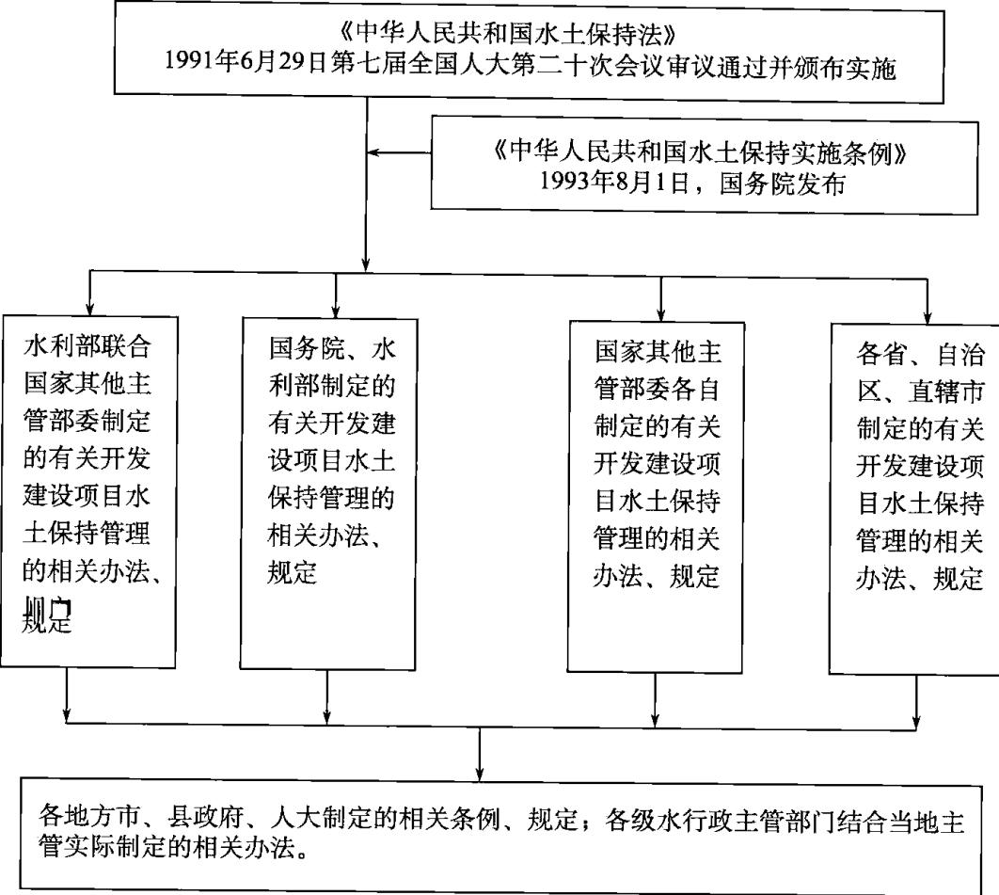  
图6.1 水土保持法律、法规体系

此外，水利部与国土资源部联合印发了《关于进一步加强土地及矿产资源开发水土保持工作的通知》，要求各级水行政主管部门与国土资源行政主管部门通过严把项目审批关，加强对土地及矿产资源开发所导致的人为水土流失的控制，遏制以牺牲水土资源和生态环境为代价获取短期经济利益的建设行为。水利部和交通部联合制定了《公路建设项目水土保持工作规定》，为在公路建设中保护生态环境、做好水土保持工作提供了有力的保证。水利部、国家发展和改革委员会、国家经济贸易委员会、国家环境保护总局、铁道部、交通部联合印发了《关于联合开展水土保持执法检查活动的通知》，进一步促进了开发建设项目水土保持“三同时”制度的落实。

围绕重点落实《水土保持法》赋予的审批权、收费权、监督权，严格落实水土保持“三同时”制度，水利部先后出台了“开发建设项目水土保持设施验收管理办法”、“水土保持监测资格证书管理暂行办法”、“关于加强大中型开发建设项目水土保持监理工作的通知”，发布了“全国水土保持预防监督纲要”等规章和规范性文件。各省（自治区、直辖市）在水土保持法实施办法和“两费”征收使用管理办法的基础上，针对水土流失案件查处程序、水土保持方案编报审批、水土保持“两费”征收使用和“三区”划分等内容，出台了省级《水土保持设施补偿费、水土流失防治费征收使用管理办法》等有关管理规定和规范性文件，并发布了水土流失重点防治区公告。这些工作的开展使水土保持配套法规建设得到了进一步规范和完善。

二是制定更具操作性的地方实施办法。各地方政府从自身发展及地域条件的实际出发，根据当地水土保持工作的具体要求，按照水土保持法及其他相关法律法规的有关规定，制定、出台了更具操作性的办法、细则、规定和规范性文件。据统计，截至2004年初，全国共有相关文件3000多件，保证了水土保持工作有法可依、有规可循。同时针对开发建设项目的特殊性，出台了管理规定和规范性文件，为规范执法创造了条件，为落实开发建设项目的“三权一案”和“三同时”制度，提供了更加具体、更有针对性和操作性的依据，为开发建设项目水土保持工作和水土保持监督执法工作的顺利开展提供了有效保障。

截至2004年，深圳市共出台地方性水土保持政策法规六部：1997年2月市人大立法颁布了《深圳经济特区水土保持条例》，启动了全市的城市水土保持依法行政工作；1998～2002年，市政府先后出台了《关于实施开发建设项目水土保持方案申报审批制度的通知》、《深圳市土石方工程管理办法》、《加强采石取土场管理与整治工作实施方案》、《批转深圳市水土保持生态环境建设规划的通知》、《深圳市治理严重影响城市景观的裸露山体缺口工作实施方案》等配套法规文件，形成了深圳市开发建设项目水土保持方案申报审批的管理架构，进一步明确了把市、区审批的水土保持方案作为项目报建的必备条件，全面推动了深圳市采石场关闭复绿、废弃石场治理和裸露边坡的生态防护及绿化工作。

上述地方性法规、规章和规范性文件不仅具有明显的地域特性，而且具有较强的可操作性，使水土保持监督执法工作得以顺利开展，促进了开发建设项目单位在其施工和生产运行过程中将水土保持工作作为其重要的组成部分，有效遏止了人为水土流失的发生，保证了区域经济发展与生态环境的和谐统一。

三是狠抓水土保持方案编制工作。开发建设项目水土保持方案，是在调查、分析开发建设项目区域水土流失及水土保持现状的基础上，根据工程及其施工工艺的特点，对工程建设过程中和运行期间可能造成的水土流失及其危害进行预测与分析，并提出应采取的水土流失防治措施，使其产生的水土流失能够得到有效控制。

水土保持方案报告书的管理对象是各种类型的开发建设单位。如国家或省、地开办的大型煤矿，兴修的铁路、公路、水利水电工程，大面积的农林开发建设项目等。这些开发建设项目，对植被破坏面积大，弃土弃渣量多，扰动区域生态环境严重，往往对当地河流下游造成严重危害。对此类项目必须要求提交水土保持方案报告书，其内容要求背景材料详细，防治措施具体。开发建设项目水土保持方案报告书由建设单位委托具有编制资质的业务技术部门编写，在编报结束后报相关级别的水土保持监督机构审批。

1994～2005年间，水利部联合国家发改委、国家环保局以及地矿、电力、铁道、煤炭、有色金属等部委，先后出台了《开发建设项目水土保持方案管理办法》（水保1994]513号）、《开发建设项目水土保持方案编报审批管理规定》（水利部令第5号）、《编制开发建设项目水土保持方案资格证书管理办法》（水保[1995]155号）、《水土保持方案编制资格证单位考核办法》（水保[1997]410号）等一系列规范开发建设项目水土保持方案编制工作的办法、文件。为了确保水土保持方案编制及批准后的科学组织实施，水利部以“水科技[1998]47号”文发布《开发建设项目水土保持方案技术规范》，对开发建设项目水土流失防治的任务、目标责任范围、主要防治工程等做了具体规定。

四是收缴水土流失防治费成为制度。对从事资源开发、生产建设的单位和个人收缴水土流失防治费已经成为水土保持监督管理的一个重要手段。从中央到地方，各级水土保持法规都明确规定，“谁造成水土流失，谁负责治理”，“谁破坏了水土保持，谁负责补偿。”各地在名称上叫法不同，但实质是解决两个问题：一是补偿问题。补偿费是指在水土保持预防保护区和经过治理的水土流失区，单位和个人因从事资源开发、生产建设活动，毁坏了地貌植被和水土保持设施，而降低或减弱其原有水土保持功能所必须为此补偿的费用。补偿费不同于因造成直接经济损失的赔偿费。二是防治问题。防治费是指在山丘区、风沙区从事开发建设的单位或个人因毁坏地貌植被造成水土流失而必须采取的防治措施所需要的费用。

## （二）技术体系是基础

一是技术服务体系初步形成。开展开发建设项目水土流失的预防、治理及监督工作，离不开先进的科学技术和完善的服务体系。水利部先后颁布了开发建设项目水土保持方案编报审批管理办法和编制资格证书管理办法，使方案编制、审批、实施、验收等各个环节逐步规范。多年来，逐步制定和完善了相应的技术规程规范，明确了方案编制的深度、标准，使方案内容得到了进一步细化、深化。加强了对资质单位的考核和对技术人员的培训。截至

2005年12月，完成了对全国104个甲级水土保持方案编制资格证单位和1200多个乙、丙级水土保持方案编制资格证单位的资质审查和审批工作；水利部先后举办了17次编制水土保持方案人员上岗培训班，培训人员2800人次，各省也举办监督执法人员和编制方案人员培训班；并聘请40多名水土保持知名专家作为全国水土保持生态建设咨询专家。

截至2004年，福建省共有水土保持方案编制资质单位89个，其中甲级单位1个，乙级单位38个，丙级单位50个。2000年以来，福建省水保监督站举办各类培训班20期，培训人数2568人次，做到了坚持培训→发证→上岗的程序，有效地把好了执法人员的素质关。目前全省持有水土保持监督执法证件人员529人、持有水土保持方案编制证件人员225人，持有乙级、丙级上岗证书的编制人员共335人，全部做到持证上岗。建立起由科研单位、高等院校、厅属有关单位和水利部门专家组成的近50人技术专家队伍，负责把好水土保持方案技术审查关。近年来，依照省水利厅的委托，省水保监督站严格按照《开发建设项目水土保持方案管理办法》、《开发建设项目水土保持方案编报审批管理规定》、《编制开发建设项目水土保持方案资格证书管理办法》的规定，对水土保持方案编制、申报、审批进行管理。每两年成立考核小组，对乙、丙级资质单位进行一次全面考核，对其方案编制质量、编制人员、水土保持方案编制人员的专业组成及水土保持专业技术培训学习情况等进行全面考核，考核小组对每个资质单位提出书面考核意见，经审定后予以通告。

内蒙古自治区各类开发建设项目水土保持方案编制、审批严格执行资质管理和分级审批制度。在抓好新上项目水土保持方案编报、审批的同时，通过积极宣传，对依照法律规定需要补报水土保持方案的建设项目进行督促。截至2005年12月，全区共有3个编制开发建设项目水土保持方案甲级资质证书单位，水利厅审批共发放了35个乙级和28个丙级资质证书。

二是防治技术不断提高。目前，成功应用的防治技术主要包括计算机辅助设计系统、“3S”集成技术、边坡防护技术及主体工程中采用的新技术与新设备等方面。

随着计算机技术的发展，各种软、硬件措施被越来越多地应用到开发建设项目水土流失危害的防治中来。这些高科技产品的投入使用，极大地提高了开发建设项目水土保持工作效率和标准化程度。在开发建设项目水土保持制图工作中，高分辨率打印机、扫描仪等仪器的使用，计算机辅助设计系统等软件的应用，使开发建设项目水土保持方案的编制效率得到极大提高，促进开发建设项目水土保持工作逐步走上标准化。

根据我国水土保持工作的实际及开发建设项目水土流失特点，我国的科研工作者自主开发研制了一系列适合我国水土保持工作人员使用的应用软件和应用平台，方便了建设单位了解开发建设项目区水土流失及水土保持基本情况，也便利于开发建设项目水土保持方案编制单位进行水土保持方案的编制工作。如由北京地拓科技发展有限公司开发的RegionManager软件系统便被广泛应用到了开发建设项目的水土流失防治工作中。又如，深圳市城市水土保持管理信息系统于2001年建成并投入运行。该系统是一个以信息库为基础、以网络为媒介、以分析管理为手段的水土保持应用管理信息系统。这套系统可以集成与快速处理多种水土流失数据，实现了水土保持信息传输的网络化。通过该系统，可实现地图查询、专题图制作、流失地块编辑、流失地块审核、水保方案管理、项目规划、流失量估算等功能。这些软件、系统的应用极大地促进了我国开发建设项目水土流失防治的进程。

“3S”集成技术遥感（RS）、地理信息系统（GIS）和全球定位系统(GPS)]被越来越多地应用到水土保持工作中。在规划设计的前期调查、措施实施后的监理、监测工作中得到了广泛的应用，可直观、高效、准确地为开发建设项目水土流失防治工作的前期外业调查、后期工程验收等服务，提高工作效率和数据精确程度。

边坡防护技术主要用于公路、铁路等线性开发建设项目的水土保持工程。通过对国外先进技术的学习和引进，结合我国实际，我国水土保持科研工作人员经过多年努力，探索出了一些适合我国具体地域条件的水土流失防治方法和措施。目前推广应用的主要有SNS固坡系统、液压喷播植草护坡技术、岩石边坡喷混植生技术、蜂巢式网格植草护坡、客土植生植物护坡等技术。不但有效地防治了边坡水土流失，而且美化了环境，取得了很好的效果，做到了水土保持与环境景观和谐统一。

在主体工程建设过程中，采用新技术、新设备进行“三通一平”等基础建设活动，减少了项目占地范围和影响面积，从而在一定程度上减少了对原始地貌的扰动和破坏，同时加快了施工进度。例如，中山市在高压线的架设工程中采用了新型技术设备的施工工艺飞艇架线，不但减少了对地表的扰动及对水土保持措施的破坏，而且大大提高了施工的效率和速度，取得了很好的社会效益和经济效益。

三是防治工作的指导思想更加科学。针对各地自然条件和各类开发建设项目水土流失的特点，通过大量的调查、考察和总结，在有效防治开发建设项目水土流失方面形成了科学合理的指导思想，这就是：以生态经济学理论为指导，以坡面生态工程为载体，以治水技术、治坡技术和植被恢复技术的时空优化配置为手段，因害设防、因地制宜地进行分区综合防治，大力重建和恢复被破坏的地表生态，以达到减少水土流失、提高土地生产力的目的。根据这样的指导思想，开发建设项目水土流失的综合防治工作形成了以下基本原则：因害设防原则；技术的可行性、安全性和有效性相统一原则；多种措施时空优化配置原则；经济合理性原则；水土流失防治要与土地复垦利用相结合原则。

四是设计理念不断更新。随着现代景观设计的发展，开发建设项目水土流失的防治设计也越来越重视景观文化设计理念，逐渐结合了园林学、景观学、美学以及所在地的地域文化特点等一系列学科内容。开发建设项目水土保持措施不仅是作为一种对水土流失防治的措施，更是为当地展现一种景观美，在水土流失得到防治的同时，给人们提供一种精神上的享受，使生产活动和自然环境达到和谐统一。如在青藏铁路建设中，广大参建者集思广益，充分发挥其聪明才智，积极探索出了许多不同于一般常规地区的环保与水保工作方法：路基及挡水埝填土施工时坡脚两侧不设置纵向施工便道，土方运输车辆采用倒行驾驶的方法卸土；挡水埝开挖的临时弃土下铺垫土工布来保护地表植被；错那湖沿湖路段路基坡脚设置沙袋和片石临时防护措施；湿地桥梁桩基施工时采用围栏控制施工范围及施工场地，地表草皮移植养护用于桩周植被恢复；对铁路公路取土场进行综合利用以及对青藏公路取土坑进行平整和植草防护；多年冻土区桩基施工采用干法成孔技术等等。

## （三）执法监督是保障

经过多年努力，水土保持监督执法工作得到了进一步加强，取得了显著成绩。在监督执法队伍建设方面，初步建立了各级监督执法机构，形成了一支覆盖流域机构、省、地、县、乡5级的监督执法队伍，为监督执法工作的顺利开展提供了组织保障。从1999年6月开始，水利部在全国60个地（市）、1166个县（市、区）组织开展了水土保持监督管理规范化建设。通过规范化建设，水行政主管部门在有效行使《水土保持法》赋予职能的同时，树立了水土保持监督执法的权威，确立了水土保持预防监督工作在保障经济社会可持续发展中的地位。在强化监督管理职能方面，通过行使水土保持监督检查、水土保持方案审批和“规费”征收三项基本行政职权，建立了一系列相应的制度，规范了开发建设单位和个人的行为，落实了“谁开发，谁保护；谁造成水土流失，谁负责治理”的规定，依法监督管理，成为水土保持一项新的重要职能，充分发挥了社会力量的监督作用。在执法过程中，不仅取得了各级人大、政府的支持，而且广泛发动社会各界力量，采用行政、舆论、司法等多种手段，充分利用群众监督、舆论监督、执法监督的力量，促使有关单位和个人履行防治水土流失的责任和义务。

一是群众监督。各级水行政主管部门认识到，必须加大宣传力度，充分调动广大人民群众参与水土保持工作的积极性；只有充分发挥广大人民群众的力量，才能在开发项目建设中真正开展水土保持工作的全方位监督。当广大人民群众认识到了水土流失的危害性后，水土保持意识才能得到提高，从而对违法、违规的开发建设项目进行举报。各地水行政主管部门通过设立举报电话、举报信箱等不同形式的举报途径，使广大群众反映的有关开发建设项目造成水土流失的违法行为得到了遏止。通过广大群众的参与，有力推动了开发建设项目水土流失危害防治，促进了水土保持监督执法工作的全面开展。

河北省内丘县水行政主管部门设立举报电话后，根据群众举报，依法查处了太行选矿厂和小西选矿厂两起违法向河道排放尾矿、人为造成水土流失案件，将群众的举报落到了实处，树立了水保执法的良好形象。同时对造成水土流失的行为的制止，使人民群众的生活环境得到了改善，使广大群众体会到了举报违法案件带来的切实利益，形成了相互促进的良性循环，收到了很好的效果。

二是舆论监督。随着传媒手段的改进和社会舆论力量的加强，在水土保持监督执法工作中，通过各种传媒对违法项目进行曝光和跟踪报道，以更强的力量推进开发建设项目水土保持工作的开展，对于水土保持工作意义重大。

如中央电视台《焦点访谈》报道的“修了公路伤了水库”，有效地发挥了社会舆论的监督作用，促进有关行业提高了认识。又如广东省针对高速公路建设过程中人为水土流失严重的状况，以京珠高速公路粤境段建设造成严重水土流失的事件作为突破口，2000年，通过中央电视台、人民日报、广东电视台、广东广播电台等新闻媒体，对该段高速公路建设造成的严重水土流失进行了曝光，引起了各级政府的高度重视和群众的强烈反响。

三是执法监督。执法检查是《水土保持法》赋予各级水行政主管部门的一项重要权力，运用好执法检查权是依法履行职责的重要手段。宁夏回族自治区水利厅紧紧抓住全国人大常委会开展《水土保持法》执法检查的有利时机，及时提请自治区人大常委会对宁夏贯彻执行《水土保持法》及《宁夏实施（水土保持法〉办法》的情况进行检查。自治区人大常委会于1998年9月组成执法检查组，对宁夏贯彻执行《水土保持法》情况进行了第一次执法检查，取得了良好效果。在随后的4年时间里，水利厅都提请人大开展执法检查。自治区人大常委会也把贯彻执行《水土保持法》和《宁夏实施〈水土保持法〉办法》列入人大监督工作重点，开创了在自治区人大执法检查史上连续5年对一部法律的执行情况进行执法检查的先例。自治区人大《水土保持法》执法检查组在5年的检查中，先后深入全区16个市、县（区），对公路、电力、石油天然气、建材、水利等36个生产建设项目和24个水土保持综合治理区进行了130多项次的执法检查和考察。执法检查组除深入各市、县及生产建设单位实地了解情况，听取当地政府及有关部门、单位、企业关于水土保持工作的汇报外，还在执法检查结束后，专门召开自治区政府及水利、计委、环保、林业、农业、交通、电力、土地、矿产、城建等部门参加的会议，听取政府及各部门贯彻落实《水土保持法》及《宁夏实施〈水土保持法〉办法》情况的汇报，并针对检查中发现的突出问题提出质询，监督整改。自治区人大常委会还对检查情况及相应意见、建议进行审议，将审议意见转送自治区政府，督促政府研究办理。自治区人大执法检查组始终把《水土保持法》确立的水土保持“三权一方案”制度落实情况作为检查的切入点，有针对性地选择一些重点行业和执法难点进行执法检查。通过检查重点、攻克难点，达到查处典型、树立权威、影响一片的目的。如长庆石油勘探局在宁夏境内开发石油造成人为水土流失一案，从1994年自治区水行政主管部门就会同市、县水利水保部门进行了多次查处，但始终没有结果，成为自治区水土保持监督执法中的一个老大难问题。自治区人大执法检查组在听取了水利厅的汇报后，果断决定，将其列入执法检查对象。通过连续检查，督促建设单位按照水土保持法有关规定编报了水土保持方案，并按照批准的方案进行了恢复治理。以此带动了石油天然气等其他行业开发建设项目水土保持“三同时”制度的顺利落实。

各地结合实际情况，还积极与其他执法部门联合办案，加大了水土保持执法监督的力度。福建省三明市水土保持监督站根据实际情况及三明市特殊地理位置的需要，于1999年12月8日加入该市110社会联动体系，成为三明市110联动单位。水保监督站加入110联动后，一方面，根据110体系“快捷、及时出警，高效优质为民众服务和排忧解难”的总要求，查找本系统自身建设方面的薄弱环节，切实补缺补漏，有力地推动了自身建设，提高了执法能力和水平。另一方面，拓宽了本系统与110体系等其他执法部门或单位的联系方式和渠道，遇到特殊情况，可以相互借用执法力量，联合行动，形成合力，实现执法资源的共享。另外，水保监督站加入110联动后提高了本系统执法的公信力。参加联动之前，执法人员在查处案件时，都会不同程度地遇到行政干涉或说情干扰现象。参加联动后，由于110有严格的登记在案、督查反馈制度，要求件件都要有查处结果，事后都要将结果以书面形式汇报到110联动指挥部和联动办，所以行政干涉或说情干扰现象大为减少，有利于案件的公正查处，从而大大提高了水保执法的公信力。

## （四）各方参与是动力

开发建设项目涉及各个行业，预防和治理开发建设项目所造成的水土流失危害也必须有各个行业的参与。各方能积极主动地参与支持水土保持工作，是依法开展水土保持预防监督的动力。

经过多次协调沟通，水利部先后同国家计委、环保、铁路、交通、电力、煤炭、有色、三建办等行业主管部门联合发文，规范开发建设项目水土流失防治工作，各地转发并制定了比较详细的实施细则，各部门通过联合行动，提高了认识，统一了思想，增强了防治开发建设过程中水土流失的自觉性。

山东省水利厅加强与法院、环保、计划等部门的协调，联合把关，执法效果大幅提高。省水利厅与济南铁路局、山东省地方铁路局、省电力集团、省煤炭局、省黄金集团、省冶金集团等部门联合制发了10多个规范性文件，都明确规定，没有水行政主管部门审批的水土保持方案，环保部门不进行环境影响评价，计划部门不予立项。蓬莱、平邑、即墨等地将水土保持方案审批进入市行政审批大厅，与计委、环保等部门联合办公，将水土保持方案列为动土项目审批的前置条件，从源头上杜绝了方案漏报或不报的现象。招远、滕州、莒县、长岛等70多个县（市、区）均做到了如没有水行政主管部门审批的水保方案，计划部门、环保部门、土地部门就不予办理相关手续，大大提高了水土保持方案的申报率。2003年，省水利厅联合省计委、省环保局、省交通厅等7部门，对全省在建、新建开发建设项目进行水土保持监督执法大检查，总结好的经验，查找不足，并在全省进行通报，对存在问题的单位限期整改。烟台、济宁、泰安、淄博等地召开由水利、计划、建设、交通等部门参加的水土保持监督执法座谈会，就水土保持方案审批、规费征收等问题达成共识。烟台市抓住被列入全国城市水土保持试点的大好机遇，狠抓“三权”落实，联合计委、国土、环保等有关部门，严把水土保持方案审批关，做到水土保持方案申报、审批、收费、监督检查、验收“一条龙”管理，并将水土保持监督执法纳入了“110社会联动”服务体系。烟台市莱山区自2002年建立6部门联合把关机制后，在审批水土保持方案的同时，一并收缴水土保持设施补偿费，使收费的到位率提高到90%以上。

## 二、以小流域为单元，因地制宜，综合治理

流域是指以分水岭和出口断面为界形成的闭合集水区。流域大小的划分是相对的。目前水土保持工作上讲的小流域，一般是指面积小于50km²的流域。

小流域是水土流失的基本单元，以小流域为单元进行水土流失治理，针对性强，目标集中，重点突出，符合自然规律。

小流域具有立体性特征。在同一小流域内，有山、梁、坡、沟、川，土地分布在不同高程、坡度和坡向上，而且小流域内的光、热、气温、降水等也是立体分布，从而形成小流域高处与低处、左岸与右岸、上游与下游、阳坡与阴坡等区域水、肥条件和生物种群分布的不同。如土壤侵蚀轻微的沟谷底部和阴坡等处，比土壤侵蚀严重的山顶陡坡和阳坡等处的水分充足；沟壑台地避风温暖，土层较厚，水土流失轻微，土质较好；沟崖、塌积体沟谷，水土流失严重，土质较差；上游、阴坡、缓坡的植被好，单位面积资源量大；下游、阳坡、陡坡的植被比较差，单位面积资源量小。同时，每个流域内的人口、经济和社会发展程度也不尽相同。因此，小流域不仅有独立性，还有立体性、多样性。小流域立体性、多样性的特点，要求在以小流域为单元治理水土流失时，必须因地制宜，全面规划，综合治理，工程、植物和农业耕作措施相配套，建立起多目标、多功能、立体、高效的水土保持综合防治体系。

以小流域为单元全面规划，综合治理，既全面有效地控制了不同部位和不同形式的水土流失，又促进了小流域内农、林、牧、副、渔、加各业生产的协调发展，是防治水土流失的正确的技术路线，已成为指导水土保持生态建设最具有中国特色的有效办法和关键措施。具体地说，它有四项突出优势。一是综合治理符合水土流失的客观规律，能够充分发挥植物措施、工程措施、耕作措施等不同治理措施相辅相成的群体作用，以更加有效地控制和预防水土流失。如植物措施与工程措施的紧密结合，骨干工程与一般工程的全面配套，就有效避免了片面安排、单打一简单治理的弊端。二是能够合理确定农林牧用地比例，最大限度地提高水土资源的利用率和生产力，充分调动群众的积极性，促进农村经济的发展，使农民尽快富裕起来。三是便于统一规划，做到上下游、左右岸治理中的合理布局，最大限度地发挥治理效益。以小流域为单元综合治理，有利于解决上下游、左右岸的矛盾，处理好局部与全局的关系，克服顾此失彼、一岸得利一岸受害、上游得利下游受害的弊端，使方方面面团结一致，加快水土流失防治步伐。四是便于统一领导，使有关部门密切配合，组织农林牧水等各方面的力量打总体战，集中人力、物力、财力攻克影响当地农业生产的主要问题，发展主导产业，收到事半功倍的效果。

山西省离石市王家沟小流域综合治理就是一个典型。王家沟小流域地处晋西黄土丘陵沟壑区，流域面积9.1km²。该流域沟壑纵横，沟坡陡峭，梁昴交错，支离破碎。治理前，该流域年输沙模数15800t/(km²·a)，水土流失严重。粮食单产低于700kg/hm²，人均收入仅30～40元，群众生活十分贫困。20世纪50年代初期，王家沟小流域就被作为晋西水土保持综合治理的示范点，经过多年的探索和完善，特别是经过“七五”期间的强化治理，在该流域治理的指导思想上，坚持工程、植物、耕作三大措施一齐上，沟坡兼治，综合治理；在治理措施的组合配置上，梁昴顶和梁峁坡修梯田、种草或营造经济林，沟坡营造乔木和灌木林，沟底布设淤地坝，形成了一个较为完整的水土保持综合防护体系，做到了节节截留，层层拦蓄，并将生态效益、经济效益、社会效益紧密地结合起来。截至1990年，各项治理措施面积累计达到703.44 hm²，占流域总面积的77.3%。其中梯田216.27 hm²，乔木林164.31 hm²，灌木林 162.2 hm²，果园 40.14 hm²，人工种草 31.84 hm²，建设淤地坝23座，淤成坝地35.71hm²。1990年与1985年相比，流域农耕地由 385.3 hm² 下降为 313.4 hm²，林地由 198.13 hm² 上升为 366.7 hm²，牧业用地由4.02hm²上升为84.8hm²，农、林、牧土地利用结构由65：34：1调整为41：48：11，土地利用率由69%提高到84%，流域粮食总产由30.66万kg提高到76.25 万kg，每公顷产量由714.6 kg提高到2733 kg，人均纯收入由148元提高到767.95元。“七五”期间，流域内农民购置大小机动车辆41台、电视机147台，新修砖窑620眼，过上了安居乐业的幸福生活。

随着经济社会的持续快速发展，人们关注的重心开始逐渐向人居环境、生活质量和休闲娱乐等方面转移，以小流域为单元综合治理的技术路线也在不断发展。一些经济相对发达的地区，在以小流域为单元的综合治理中，以不同程度和方式增添了防治面源污染和清除生活污水、垃圾等内容，在继续做好治理水土流失、改善农业生产条件的基础上，把水源保护、面源污染控制、产业开发、人居环境改善、新农村建设等有机结合起来，从而大大延伸了水土保持工作的领域，丰富了小流域建设的内涵，为保护水源和改善生态环境，促进当地农村产业结构的调整，改善村镇人居生活条件等发挥了重要的作用。近年来，北京、江苏、浙江、四川和重庆等省市开展了清洁型小流域建设的实践与探索，积累了一些初步经验，并形成了一些比较完善的模式。

北京市清洁型小流域建设就是一个典型。北京市总面积16800km²，其中山区面积10418km²，占全市总面积的62%。山区是首都主要的水源涵养及供给源地，是天然生态屏障，也是居民休闲旅游度假胜地。水源区主要分布在密云、怀柔和官厅水库上游，共约5000km²，占山区面积的48%，其中一二级保护区约1000km²。密云、官厅两大水库是北京市地表水主要供水源地，年均供水量占全市地表水量的2/3以上。水库上游地区的水源保护直接关系到首都饮水安全，对首都经济社会的可持续发展具有重要的战略意义。北京山区的水土流失，化肥农药等面源污染、农村生活垃圾、废水都对北京的水质造成严重污染。

北京市水务部门探索出了新的生态清洁型小流域治理思路：以流域为单元，以流域内水资源、土地资源、生物资源承载力为基础，以调整人为活动为重点，从山顶到河谷依次建设“生态修复、生态治理、生态保护”三道防线，将流域建设成“有水则清，无水则绿”的水土保持生态系统。

北京市生态清洁型小流域建设中的“三道防线”。第一道防线是生态修复防线，即在中、低山及人烟稀少地区，采取封、移、补等措施，实行全面封禁，进行自然修复，达到自然保水保土的目的。封：市政府印发了《关于进一步加强禁止放牧管理工作的通知》，截至2005年全市累计实施封禁面积1523km²。移：对一级泥石流易发区、采空区险村险户2.8万人逐步进行生态移民，现已搬迁7000余人。补：从2004年开始，对郊区60多万公顷农村集体所有的水源涵养林、水土保持林所在村的4万农民，每人每月补助400元，支持该地区农民做好水源保护工作；设立水源地保护专项资金，2005年度从水资源费中安排专项8000万元资金用于郊区县水源地保护；投入资金420万元，对白河沿线退稻农民进行补助。

第二道防线是生态治理防线，即在人口相对密集的浅山、山麓、坡脚等农区，采取节、治、调等措施，调整农业种植结构，控制化肥农药施用，发展生态农业，减少面源污染；规范开发建设活动，减少人为水土流失；建设小型水利水保设施，因地制宜加强农村污水、垃圾治理，改善人居环境。节：以发展节水型产业为重点，建设基本农田，发展节水灌溉，营造水土保持林；修建透水型谷坊、塘坝等，减少耗水，增加水库蓄水；完成农业高效节水工程2万hm²，建成小型水利水保工程1万余处。治：以综合治理为重点，将农村污水、垃圾集中处理，达标排放，要求开发建设项目严格执行《水土保持法》；以水源地为重点，改造26000余个农厕，建设小型污水处理设施139处，日处理能力1530t，有效防治了农村污水造成的水源污染；积极推动垃圾定点分类堆放，定时清理，建设垃圾处理设施92处，并建立农村垃圾的“村收、镇运、县处理”的管理机制，解放了水源地4万户的生活垃圾污染问题。调：调整农业种植结构，减少化肥农药的施用量；在密云水库上游白河沿线实施退稻 $4 0 0 \ \mathrm { { h m ^ { 2 } } }$ ，减少化肥施用243t，有效减少了面源污染。

第三道防线是生态保护防线，即以河道两侧及湖库周边为重点，采取清、育、保等措施，保育植被，恢复湿地，清理河道垃圾、障碍物，恢复景观生态，有效发挥灌木和水生植物的水质净化功能，维护河道及湖库周边生态平衡，控制侵蚀，改善水质，美化环境。清：整治河道，清理河道垃圾、障碍物；在密云、怀柔水库上游16条一级支流以及潮白河、永定河、温榆河、拒马河等河道实行禁沙、封河、育草、育灌，杜绝人为破坏，建设生态河道，维护河流自然健康。育：保育植被，恢复湿地，生态治污，改善水质；在密云水库高岭镇库滨带建设66.6hm²水源保护示范工程建设，建设水库拦污缓冲过滤带；实施了官厅黑土洼、延庆三里河、昌平白各庄、海淀翠湖、顺义汉石桥、密云和怀柔水库入库口等湿地恢复工程，共保护和恢复湿地$1 7 1 3 \ \mathrm { h m ^ { 2 } }$ ，有效保护了水源地的水环境。保：保护库边、河边、渠边、河口，减少人为扰动，恢复景观生态；通过制定密云水库一级水源保护区保护政策，加强种植业管理，减少化肥使用，要求居住在密云水库一级水源保护区、耕种淹没区土地的3.5万农民，严格执行“七不准”，即不准机械翻耕，严格执行保护性耕作，不准施用化肥，不准使用化学农药，不准建筑设施，不准栽植林木，不准用水库水灌溉，不准放养牲畜，使当地农民生产生活与密云水库水源保护工作有机结合。

通过三道防线的建设，初步实现了“有水则清、无水则绿”的目标。

## 三、治理与开发相结合，实现三大效益相统一

治理与开发相结合，就是要认真贯彻以人为本的科学发展观，妥善处理生态建设与经济发展、群众生活的关系，以保水保土为基础，以利益机制为动力，围绕区域资源优势，优化组合生产要素，合理保护和集约利用水土资源，将开发寓于治理之中，把两者紧密结合起来，使群众在治理水土流失、保护生态环境的同时，取得明显的经济效益，激发其治理水土流失和保护水土资源的积极性，实现生态效益、经济效益、社会效益三者之间的统一。所以，治理与开发相结合是持续开展水土保持的不竭动力。

实现三大效益相统一，其核心内容在于突出生态效益，注重经济效益，兼顾社会效益。生态效益是指实施水土保持措施后达到生态环境向良性发展的效益，如地表植被度增加、水土流失减少、空气净化、环境美化等。水土保持经济效益包括通过水土保持措施，新增的粮食、经济作物、木材蓄积等直接经济效益，以及产生直接经济效益的同时连带产生的间接经济效益。间接经济效益，如计算直接经济效益的各类产品经过一次性加工转化后提高的产值。水土保持的社会效益可以概括为：完善农业基础设施，改善广大山区群众的生产生活条件；调整土地利用结构，提高土地生产率，缓解人地矛盾；提高劳动者素质，开辟农村剩余劳动力出路；促进社会进步，减轻自然灾害等。水土保持生态效益是产生其他效益的基础。

为什么在水土保持工作中要强调治理与开发相结合？首先是因为国家用于水土流失治理的投资有限，需要全社会的参与，而要调动全社会治理水土流失和保护水土资源的积极性，最重要的是通过这项活动能够产生显著的经济效益。其次是因为我国人口众多，而水土资源有限，必须要考虑通过水土流失治理来改善水土流失区群众的基本生存条件。而要实现上述目的，就不能只从防治水土流失的角度单纯考虑治理措施，必须同时考虑改善群众基本生存条件，产生显著经济效益的开发措施，将治理与开发紧密结合起来。

实际上，水土保持兴起之初，就是根据发展山区农业生产、防治山洪的需要而提出的，注重通过修梯田、淤滩漫地等措施来增产粮食，调动了群众治理水土流失的积极性。特别是20世纪80年代以来，小流域承包户在治理过程中因地制宜地发展种植、养殖和加工业，产生了更大的经济效益，社会力量治理水土流失的积极性进一步高涨。但是也有一些地方在治理水土流失的过程中，只考虑了生态效益，忽略了经济效益，由于实际产出低，在一定程度上挫伤了农民治理水土流失和自觉保护生态环境的积极性，甚至造成一边治理、一边破坏的局面，使水土保持成果难以巩固，从而阻碍了水土保持工作的可持续发展。实践证明，没有群众的经济利益，就没有国家的生态效益。水土保持事业能不能健康持续发展，关键在于能不能以人为本，充分考虑治理区群众的生存、生产和生活，能不能把握和处理好治理和开发的关系。单纯就水保论水保、就生态论生态，脱离人民群众所关心的经济利益搞生态建设是难以奏效的，是没有生命力的。

在水土流失治理过程中，治理措施与开发措施并不是截然分开的，在大多数情况下两者是融为一体的。如修梯田、打坝淤地、种植经济林等，既是治理措施，也是开发措施，这就是将开发寓于治理之中。当然，像发展养殖业、加工业等，这是在治理基础上的深度开发措施，这时，治理与开发又是相互促进的。因此，在水土流失治理过程中，将治理与开发有机结合起来，既是必要的，也是能够做到的。

坚持治理与开发相结合，必须紧密联系市场，选择最有效的治理开发措施，也就是要选准项目，能够取得最大的生态效益、经济效益和社会效益。

长期以来，各地在治理开发实践中，根据市场供求情况，立足本地资源条件和产品优势，选择潜力大、投资少、见效快、效益高的优势项目，既加快了水土流失治理速度，产生了良好的生态效益，又取得了显著的经济效益和社会效益，调动了广大群众治理水土流失的积极性。

## 典型案例一：甘肃省文县黄路村以基本农田和经济林为重点进行综合治理开发

甘肃省文县黄路村，属半干旱山区，海拔1300～1800m，有128户、582口人。该村是碧口水库的移民村，原有良田全部被水库淹没，为求生存当地农民不得不上山垦殖。治理前，全村耕地面积87.33hm²，大部分为坡耕地，土壤瘠薄，水土流失严重，泥石流频繁，生态环境和生产条件很差，群众生活十分困难，年人均产粮只有200kg，人均纯收入仅有390元。1999年，该村被列入“长治”五期工程。在治理过程中，该村以改善群众生产生活条件和生态环境为目标，以建设基本农田为突破口，以发展经果林为支柱产业，经过5年努力，在山坡上部等高整地种植水土保持林 $6 8 ~ \mathrm { h m } ^ { 2 }$ ；在山腰修建高标准土坎梯田63.33 hm²，并种植地埂花椒，还配置集流水窑3个，修建引水渠2.9km，解决了全村人畜饮水困难；在山坡下部种植花椒、核桃、银杏、苹果、雪梨等经济林果1333.33hm²；修建乡村公路3km。截至2003年，全村人均基本农田达0.11hm²，人均经果林达0.23hm²，粮食总产量由治理前的13万kg增加到20万kg，人均纯收入翻番，群众生产生活条件得到明显改善，基本解决了温饱问题。

## 典型案例二：四川省会理县石榴产业基地

四川省会理县是全国著名的石榴产地，有“全国石榴第一大县”之称，由于石榴品质好，远销北京等40多个城市。石榴种植是当地群众脱贫致富的主要途径。该县石榴产业的发展与水土保持工程建设密切相关。1988年开始的“长治”工程，治水改土，为大面积种植石榴创造了条件。全县人民经过10多年连续不断的治理，累计治理水土流失面积 $8 7 5 \ \mathrm { k m } ^ { 2 }$ ，占全县水土流失面积的30%。治理前，全县的石榴种植面积仅为257.8hm²，到2004年已达到0.87万 $\mathrm { h m } ^ { 2 }$ ，产量由91.55万kg增长到4977万kg，产值由191万元增加到9954万元。

铜矿村所在的小流域属金沙江一级支流城河流域，于旱缺水，荒山荒坡和坡耕地面积大，水土流失严重。铜矿村1989年以来连续16年进行综合治理，坚持不懈地开展坡耕地改造，建设坡面水系配套工程，大规模种植石榴。

因为有了经济效益的吸引，广大群众积极参与到了水土流失治理中。综合治理总投资2015.12万元，其中群众自筹资金250万元，群众投劳折资670.88万元，拍卖“四荒”地筹集治理资金700万元。2004年该村仅石榴种植面积就达586hm²、60余万株。目前，全村石榴产量已超过400万kg，产值1059万元，人均产值达1万元，农民人均纯收入从550元提高到7000元。并涌现出一大批石榴种植大户，其中收入达30万元的有2户，20万元的有5户，10万元的有25户。

铜矿村通过治水改土，种植石榴，有效地控制了水土流失，改善了生态环境，同时产生了良好的经济效益。而良好的经济效益进一步激发了群众治水改土的热情，流域生态环境恶化的趋势实现了逆转，取得了生态和经济“双赢”的效果。

## 典型案例三：黑龙江省穆棱市苇子沟城郊经果型治理开发

穆棱市苇子沟小流域地处黑龙江省东南部低山丘陵区，流域总面积8.77km²。苇子沟村共有145户，全村耕地面积79 hm²，人均耕地0.14 hm²。流域地形复杂，坡陡沟深，土质疏松，植被稀少。特别是在20世纪六七十年代，由于大面积陡坡开荒，使苇子沟变得到处是荒山秃岭，砂石裸露，沟壑遍布，暴雨成灾，生态环境极为恶劣，全流域水土流失面积达7.46km²，占总面积的85%。受恶劣生态环境的制约，经济陷入了“越穷越垦，越垦越流，越流越穷”的恶性循环之中，群众吃粮靠返销，生产靠贷款，生活靠救济。到20世纪80年代初，人均收入只有100元左右，人均口粮不足150kg。

严酷的现实，唤醒了苇子沟流域干部群众的生态保护意识。他们认识到，严重的水土流失和单一的粮食经营结构是贫穷落后的根本原因，贫穷的根源在山，致富发展的潜力也在于山，苇子沟要想富，必须山、水、林、田、路综合治理，紧紧抓住苇子沟小流域距离牡丹江市大市场比较近、交通十分便利这一地缘优势，在积极退耕还林、增加植被、治理水土流失、改善生态环境的同时，调整农作物种植结构，大力进行“三瓜”（地瓜、西瓜、香瓜）、“两花”（黄花、花生）、“一果”（果树）基地建设，促进小流域经济的发展。

在治理中，他们在山体上部土层较薄处栽植青松等防护性的用材林，对经果基地起防护作用；在土质较好、土层较厚的地方，退耕还果，修筑果树台田，建设经果基地。山体中下部修筑水平梯田和坡式梯田，一部分种植粮食，一部分发展果树；缓坡地作为“三瓜”、“两花”的基地。沟头布设乔灌防护林，防止沟头扩张；沟道兴建谷坊，抬高地下水位；沟道下游和小河道修池蓄水，并建设提水站，为果树瓜园节水灌溉提供水源。

十几年来，全流域共治理水土流失面积 $4 6 3 \ \mathrm { h m ^ { 2 } }$ ，占应治理面积的65%，其中退耕还果面积 $1 0 0 \ \mathrm { h m } ^ { 2 }$ ，还林面积 $6 3 ~ \mathrm { h m } ^ { 2 }$ ，修水平梯田 $1 0 0 \ \mathrm { h m ^ { 2 } }$ ，修坡式梯田 $8 0 ~ \mathrm { h m ^ { 2 } }$ ，修建池塘、鱼池面积 $1 0 \ \mathrm { { h m ^ { 2 } } }$ ，建谷坊176座，治理侵蚀沟18条，建机电井4口，修蓄水池12处，修乡村公路、生产作业路近10km。通过上述措施，苇子沟小流域发生了巨大变化：山绿了，水清了，人富了。到2000年人均收入达3500元，成了远近闻名的富裕村。随着农民人均收入的不断增长，村里砖瓦结构住房达到100%，家家有机动三轮车，农忙务农，农闲贩运果菜。新建砖瓦结构校舍 $3 8 0 ~ \mathrm { m } ^ { 2 }$ ，过去村集体经济的“空壳村”，现在有了50万元固定资产的家底。

## 四、以重点工程为依托，集中连片、规模推进

以重点工程为依托，集中连片，规模推进，是当前我国水土保持生态建设的一条重要经验。随着经济社会的快速发展，水土保持生态建设受到各级政府的高度重视，国家水土保持投入不断加大，一批重点工程项目陆续上马。各地在重点工程项目的实施过程中，将治理区集中连片规划，资金集中连续投放，建设成一批面积在数百平方公里、甚至上千平方公里，包含数十条小流域的水土保持大规模治理区，实现了水土流失治理的大规模持续推进，大大加快了水土流失治理的速度。

重点工程项目的实施是水土流失治理集中连片、规模推进的重要条件。1982年全国第四次水土保持工作会议研究确定，要在普遍推动面上治理的同时开展重点治理。经国务院批准，财政部支持，1983年，首先选定了涉及43个县的无定河、皇甫川、定西县、三川河、永定河、柳河、兴国县、葛洲坝库区等8个水土流失十分严重、危害大、群众贫困、对国民经济发展影响较大的区域开展重点治理，这项工程就是八片水土保持重点工程。它是我国第一个国家列专款、连续投入的水土保持重点项目。该项目投入较大，治理时段较长，各项目区以小流域为单元开展治理，按年度集中投入，治一条成一条，条条相连，连片规模推进。经过20多年连续3期实施，各片都建成了一大批水土保持生态建设示范工程，每片都有数百条小流域的治理规模，取得了显著的生态效益、经济效益和社会效益。

随着我国社会主义市场经济的快速发展，国家更加重视生态环境建设，不断加大生态建设投入。“十五”期间，国家在继续实施长江、黄河上中游水土保持重点防治项目、京津风沙源治理项目、黄土高原水土保持世行贷款二期项目等水土保持重点工程建设的基础上，新启动实施了“首都水资源可持续利用水土保持项目”、“黄土高原地区淤地坝建设项目”等水土保持重点工程项目，并提出要依托重点治理项目建设水土保持大示范区。在这些重点治理项目的带动下，水土流失治理进一步导入以大流域规划为指导、以小流域治理为基础、集中连片、规模推进的发展轨道，治理速度也进一步加快。

在重点工程项目实施过程中，客观上要求其必须集中连片，规模推进。在20世纪80年代以前，我国水土保持投入较少，各地只能选择一些条件相对较好的小流域开展水土流失治理，产生了一大批治理程度高、综合效益好的典型小流域。但这些小流域在空间分布上相对比较分散，对于一个较大的区域而言，还不能起到从根本上控制水土流失的作用；也就是说，这些典型小流域的宏观效益有限。

而随着我国经济社会的快速发展，一方面对生态环境提出了更高的要求；另一方面某些生产建设单位在生产建设过程中也产生了大量的人为水土流失，对生态环境造成了破坏。水土流失等生态环境问题已经成为我国经济社会快速发展的一个制约因素。因此，国家对水土保持生态建设高度重视，要求加大治理力度，建设秀美山川。国家及各省连续上马了一大批水土保持重点治理项目，投入力度大，建设范围广，标准要求高。高标准要求的一个重要方面就是要集中投入，连片治理，规模推进，因为只有这样才能充分发挥投资的效益，在较大的范围内从根本上控制水土流失，实现建设秀美山川的目标。

从20世纪80年代初“八片”工程实施到“十五”期间一系列水土保持重点工程项目上马，开始全力建设水土保持大示范区，集中连片、规模推进的水土保持建设思路逐渐成熟。系统总结这一思路，有以下5个特点：一是依托水土保持重点工程，资金有保障；二是在时间上按年度连续投入，连续治理；三是在空间上以大流域为单位规划，以小流域为单元治理，连片推进；四是在总体规划指导下，除利用水土保持重点工程项目本身的投资外，尽量捆绑其他生态建设项目并广泛吸纳社会资金共同参与治理；五是参照基本建设程序进行项目管理；六是进行水土保持综合治理开发，治理范围大，标准要求高，综合效益好。

山西省于2004年提出了“大流域规划，小流域治理，建设大示范区”的发展思路，2005年进一步明确了搞好这项工作的目标、重点和方法。全省划定了九大水土保持示范区，即永定河上游、汾河上游、三川河流域、偏关平鲁片、昕水河流域、县川河流域、桃河流域、湫水河流域、小浪底和三门峡库区。汾河上游水土保持综合治理项目是山西省起步较早的一个水土保持大示范区建设项目。项目区总面积7727km²，其中水土流失面积5317km²，从

1988年开始已经连续实施了近20年，每年投资2000万元。该项目利用投资连续稳定的优势，以大流域为单位进行规划，以小流域为单元进行治理，高密度集中投入，大规模连片推进，多措施综合配套，加快了水土流失防治步伐，起到了高效拦截泥沙、快速恢复生态、促进特色产业形成的重要作用。目前，汾河上游已形成数十处跨乡甚至跨县的综合治理片。如宁武县暖泉一天池一汾河干流治理片，静乐县以汾河干流和东碾河为轴线向外辐射的治理片，岚县以县城为中心向外辐射的治理片，娄烦县以县城和汾河水库为中心向外辐射的治理片等。宁武县的汾河干流两侧边山重点治理区，制定了以每年10%的进度，10年基本完成的总体规划，确立了“粮田下滩、植被上山、牲畜入圈”的治理思路，在具体实施中又将汾河干流一条线划分为3个段、9个流域，逐步推进，积点成面。目前，宁武县汾河干流两侧边山已建设植被2666.6多公顷，汾河川淤滩造地2000多公顷，百里生态经济长廊初具规模。随着治理片的逐步扩展连接，汾河上游正在快速形成一个生态、经济、社会效益综合发挥的水土保持大示范区，具有治理规模较大、措施配置合理、主导产业明确、治理效益显著的特点。

位于嘉陵江中游的四川省南充市现有水土流失面积6440km²，占全市总面积的51.55%，是全省乃至全国水土流失严重地区之一。1989年以来，9个县、区先后被列为长江上游水土流失重点防治区。经过广大干部群众的艰苦努力，累计治理水土流失面积 $3 7 4 0 . 0 6 \ \mathrm { k m } ^ { 2 }$ ；全市森林覆盖率由18.9%提高到30.6%；侵蚀模数由7078 t/(km²·a）减少到 $4 3 3 5 \ : \mathrm { \ t / ( k m ^ { 2 } \cdot \mathrm { a } ) }$ ；年均流失泥沙减少到2792万t，比治理前减少了2889万t；治理区人民生活水平也有明显提高。该市还建成6个城郊旅游观光型水土保持生态示范区和7个名特优水果基地。在实践中探索出坡耕地改造模式、蓄排水配套工程模式和综合治理开发模式。其中在综合治理开发模式中，又探索出集中项目治理模式，引进业主和社会资金实行产业开发治理模式和“参与式”治理模式。这些模式的不断改进与完善，调动了各方面的积极性，推动了该市水土保持工作的快速发展。

青海省西宁市通过集中资金、捆绑项目、落实目标、分类实施等措施，使西宁地区市郊水土保持大示范区雏形显现。截至2004年年底，示范区内初步综合治理小流域14条，治理水土流失面积182.06 km²，治理程度达到65.02%，林草覆盖率由23%提高到41.14%。各项措施的综合防护功能减轻了土壤侵蚀，增加了土壤入渗，提高了土壤肥力，改善了项目区内的生态环境，促进局部小气候在一定程度上有所好转，减轻了自然灾害，初步解决了西宁市自然条件差、防护能力弱、生态环境差的大问题。目前，城郊南北两山基本得到绿化，提升了城市品位，生态和人居环境有较大改善。该示范区建设的基本经验：一是集中资金，捆绑项目。按照项目统一规划设计，全面统筹协调，实施了退耕还林还草、南北两山绿化、黄河水保生态建设、城市水保试点、国债水保小流域治理及水利配套等工程项目。其中南北两山绿化项目共治理水土流失面积 $5 8 ~ \mathrm { { k m } } ^ { 2 }$ ，退耕还林项目完成退耕还林面积 $5 \ \mathrm { k m ^ { 2 } }$ 水土保持项目共治理水土流失面积 $1 1 9 . 0 6 ~ \mathrm { k m ^ { 2 } }$ ，修建淤地坝18座、谷坊464座、道路25条总长85km以及其他工程12项。二是落实目标，分类实施。按照因地制宜、分类指导的思想，在大的方面将示范区分为4个综合治理片（西郊南山区、东郊南山区、西郊北山区、东郊北山区）进行治理。在具体实施中，沟道措施主要以谷坊群为主，从沟头到沟口层层设防；坡面措施以乔灌混交林为主，从沟坡至沟底种植适合高原气候的树种；降水条件适宜、人类活动较少的地区，以生态修复为主。通过落实上述指导思想及各项措施达到了集中连片、综合配套、规模推进的目标，形成了较为完善的、以小流域为单元的水土保持综合防治体系，提高了示范区的治理效果。

## 五、发挥大自然的力量，促进生态的自我修复

水土保持生态自然修复，是我国本世纪初根据我国国情、为加快水土流失防治步伐而做出的重大战略决策。水土保持生态修复，是指在存在水土流失问题、生态环境脆弱、但条件适当的地区，以人与自然和谐共处的思想为指导，通过一定的人工辅助措施，促使自然界本身固有的再生能力得以最大限度地发挥，促进植被的持续生长发育和发展演替，保护和改善受损生态系统的结构和功能，加快水土流失防治步伐，建立和维系与自然条件相适应、与经济社会可持续发展相协调、相对稳定并良性发展的生态系统。生态自然修复是水土保持生态建设的深化和发展，也是水土保持生态建设思路的重大战略调整。经过多年的试验观测研究，通过生态自然修复来防治水土流失、改善生态环境，不仅是可行的，而且是一种快速恢复良好生态的路子，是解决我国水土流失量大面广、程度严重，而经济又欠发达、治理资金投入有限之间的矛盾的新途径。

根据中国科学院水利部水土保持研究所安塞站30年定位研究发现，黄土丘陵区生态退化没有从根本上破坏植被恢复演替的物种和环境生态基础，可以通过自我修复恢复植被。只要停止人为干扰，植物生态系统就有向着更稳定、更复杂的方向发展的趋势。同时，可以使土壤质量逐步得到改善。坡地退耕后，每年可以使有机质含量提高 $0 . \mathrm { ~ 1 ~ g / k g }$ ，土壤抗侵蚀能力和生产力有

效提高。

中国水土流失与生态安全综合科学考察西北黄土区考察组在山西、陕西考察期间发现，近年来植被覆盖度提高，林草植被质量整体提高非常明显，封禁措施功不可没。在陡峭的山坡，甚至绝壁上，或者封禁3～5年的退耕地，只要人畜不去干扰，无论土层薄厚，都能看到绿草覆被，有的还有一层苔藓地衣保护层，这些都发挥着水土保持功能。封禁措施在晋陕两地普遍通过政府令形式实行，全面实施已有5年。与这一措施相配套的是牛羊圈养，涉及千家万户，区域之广，执行效果之好，都是前所未有的。据分析，陕西榆林地区5年内林草植被覆盖率年平均提高了2%，山西省年提高1.5%。封禁措施和牛羊圈养的后续生态效果将会进一步释放，对黄土高原地区水土保持、生态环境根本好转将产生重要影响。

从水土保持生态建设面临的发展机遇来看，采取大面积封育保护，条件成熟。一是随着经济社会的快速发展，人们对生态环境提出了更高的要求，全社会生态保护意识普遍提高。二是农村经济条件的改善，农业产业结构的调整，农村能源结构的变化，城镇化的发展以及几十年水土保持的基础都有利于在大范围内实施生态的自我修复。

发挥生态的自我修复能力是费省效宏、快速治理水土流失的有效途径之一。实践证明，实行封育保护，加强管护，依靠生态自然修复能力恢复自然植被，不仅能加快水土流失治理的速度，尽快改善生态环境，而且省钱、省工，效果好。实施封育保护后，保护区内灌草植物自然萌生速度明显加快，裸地自然郁闭，植被覆盖度大幅度提高，生态环境明显改善。根据黄河上中游24个试点县的监测分析，修复区内有近1000km²的面积林草覆盖度由实施前的27.5%提高到60%，原先被认为不可能治理的沟沟梁梁长满了野生草灌。植被的恢复，盖度的提高，直接的效果就是提高土壤蓄水保土能力，减轻水土流失。据甘肃省安定区监测，修复区林地蓄水能力一般提高40%左右，保土能力提高约26%；天然草地蓄水能力提高约31%，保土能力提高约22%。内蒙古自治区乌兰察布盟1994年开始实施大面积的封山禁牧，到2000年，已治理水土流失面积8477km²，林草植被覆盖率由1994年的20%提高到40%，6年治理面积比前45年的总和还多1354km²。据有关专家典型调查，在毛乌素沙地野生植物以油蒿为主的固定沙丘和平缓沙地区域，撂荒后，一般封育4～5年，植被覆盖度可达60%～70%。鄂托克旗年降水量300mm左右，开垦的沙化草原，风蚀剧烈，但一经弃耕撂荒，天然植被恢复很快，弃耕1～2年，就生长了画眉草、狗尾草、藜、蒺藜等杂草，覆盖度达到60%～70%；继续封育3～5年，顿草、白草等根茎型植物繁生，6～10

<!-- ===== 分片 p401-558（158页，源：参考_中国水土流失防治与生态安全_总卷上（401-558页））===== -->

年恢复到开垦前的原生植被状况，以冷蒿、兴安胡枝子、草木樨状黄芪、沙生针茅、短花针茅等植物占优势。在甘肃腾格里沙漠南缘绿洲周围，封育5年，生长的油蒿、盐瓜瓜、碱蓬、白刺等植物覆盖度达50%。从实行封禁治理的情况来看，在降水量丰沛的南方地区，实行封禁治理效果更好，利用光、热、水等自然资源优势，对水土流失区实行封禁治理，3～5年即可恢复植被，大大提高生物量，有效控制水土流失，改善生态环境。福建省从20世纪80年代中期开始对中、轻度水土流失区采取封禁治理，取得显著效果，1984年遥感普查水土流失面积为2.13万km²，2000年普查下降至1.31万km²，减少8000多平方公里，其中2/3是通过封禁后，依靠生态的自然修复能力实现的。一般对侵蚀劣地封禁3年后，植被覆盖度可由原来的40%左右提高到60%\~70%。

另一方面，采取自然封育比人工造林种草大大节省投资。据调查，人工种树、种草每公顷需1050～2250元，而一般围栏封禁治理每公顷只需225～300元。如在内蒙古自治区乌兰察布盟的调查，人工种草每公顷需人工、籽种费1050元，人工造林每公顷需人工、种苗费1950元，而围栏封禁治理每公顷只需225～300元。

实施生态自然修复，可有效推动农牧业生产方式向良性方向转变，促进水土流失地区生态、经济的协调发展。随着生态修复工作的不断开展和深入，近年来许多地方的政府和群众逐步摒弃了传统的生产经营方式，走出“超载放牧，越牧越荒”的怪圈，接受了禁牧舍饲，走上“立草为业、引种入牧、引草入田、为养而种、以种促养、集约经营”道路。这一积极转变，妥善解决了“国家要被子、群众要票子”的矛盾，实现了人与自然和谐发展和改善生态、发展经济的“双赢”。1998年至2001年期间，由于连年的于旱，整个内蒙古0.86亿hm²草场中，近0.4亿hm²中度沙化，0.2亿hm²轻度沙化，牲畜无草可吃，畜牧业遇到一场前所未有的生态危机。2001年，内蒙古自治区痛下决心，在全区推行了禁牧和休牧的政策，由政府资助修建饲草和饲料基地，配套建设青草贮窖和标准化棚圈，大力实行设施养殖的新型畜牧方式，几年下来效果非常明显。全区畜牧业不但没有出现大的滑坡，反而实现了更加稳步、健康的发展，许多地方出现了土地增绿、农业增效、农民增收的可喜局面。据抽样调查，鄂尔多斯市推进舍饲养殖后，羊的平均出栏率由28%提高到44%，平均出栏时间由21个月缩短为9个月，养羊效益提高了。也有个别地方，在封禁初期牲畜数量有一定的下降，畜牧业发展停滞，但随着植被的恢复，土地生产力的提高，牲畜出栏率明显提高，畜牧业发展很快回升。

在实施生态修复工程的地区，林地、草地在面积增加的同时，质量也普遍提高，植物群落盖度、高度、多样性、稳定性均在增加，农民的直接感受是“草多了，草高了，圈养牛羊容易了”。近年来，各地在实施生态自然修复的过程中，采取了许多成功的做法。

## 1. 多种措施并举

依靠大自然的力量，实现生态的自我修复，关键是一个“封”字。但能不能封得住，关键又在于能否解决好封禁区群众的生活问题、收入问题和经济发展问题。多年来，各地在探索和实践生态修复工程过程中，根据当地社会经济和自然条件，千方百计创造充分发挥生态自然修复能力的条件，因地制宜地采取了以改促封、以建促封、以调促封、以移促封及生态调水、轮牧禁牧、以电代柴等辅助措施，确保了生态修复工程封得住，有效果，不反复。

一是“以改促封”，即改传统畜种为优良畜种，改本地山羊和绵羊为适合圈养的小尾寒羊，改传统的放牧为舍饲或轮封轮牧，改粗放的饲养方式为科学的饲养方式，发展集约化养畜产业。二是“以建促封”，在农牧交错区，建设好旱涝保收的基本农田，合理利用水资源，提高单位面积土地的生产率和产出效益，提高水资源的利用效率，切实压缩耕地，改广种薄收为精耕细作，保证了群众的吃饭问题；在“三化”草原区，搞好草库仑建设，发展基本草场，减轻植被压力。三是“以调促封”，即调整农林牧结构，调整种植业结构，大力发展经济作物和特色产业，不断增加群众经济收入。四是“以移促封”，即在一些居民分散的边远地区，采取生态性移民，结合小城镇建设，实行移民并村，集中安置，使移出区的生态尽快恢复。五是解决能源问题，即因地制宜地发展小水电，或利用风能、太阳能发电，对用煤户在价格上给予适当补贴等，实行以电代柴、以煤代柴。六是实行部门联合，齐抓共管，严格禁止乱砍滥伐、滥挖中草药等，大面积进行封育保护。

在人口密度较大的长江上游、黄河中游的一些水土流失严重地区，普遍在小流域综合治理中的部分区域实行封禁治理，除了必要的基本农田和经济林外，尽可能地采取封育措施，尽量不破坏原生地貌植被。有的地区还推行了“猪-沼-果”的生态治理模式，大力推广沼气和节柴灶，很好地解决了能源问题，为生态修复创造了条件。

在一些水土流失轻微地区、重要水源型水库库区、江河源头地区，则坚决实施封禁保护。在黑河、塔里木河等内陆河流域和湿地，还采取了生态调水的措施，合理安排生态用水，促进河流下游绿洲生态系统恢复。

## 2. 出台政策扶持

除因地制宜地采取上述措施外，各地在实施大面积生态修复工程中，还制定出台了封山禁牧的政策规定，特别是制定了一系列优惠政策，包括税收政策、扶持政策等。

近年来，许多省、市、县以政府或人大的名义相继出台或发布了实施封山禁牧的决定或政策性文件，为扎实推进生态修复工作提供了政策保障。截至2005年底，全国已有25个省、526个县发布了封山禁牧、舍饲养畜的政策规定。2003年4月1日，陕西省人民政府颁布了《关于实行封山禁牧的命令》。该命令规定，严禁在封山禁牧区内放牧、采石、采矿、取土，严禁非法砍伐林木、侵占林地，严禁毁林开荒、毁林采枝、剥皮、挖根和乱挖野生苗木等。该命令的颁布执行，保证了封山禁牧工作的顺利开展。同时，不断加强水土保持执法监督工作，突出预防保护，加大监督力度，切实落实“三权、一方案、三同时”制度，依法保障生态修复和治理成果。

有的地方在推动生态修复工作的过程中，出台了一些优惠和扶持政策，调动了农民群众参与的积极性。宁夏回族自治区政府采取五大扶持政策促进了生态修复工程的顺利实施。一是大力扶持贫困户舍饲养畜。凡是在千村扶贫开发工程覆盖范围内的贫困户，自治区通过实施“10万贫困户养羊工程”扶持农户发展舍饲养羊，采取“给一还一”的方式，扶持10万贫困户户均饲养2只以上的基础母羊。二是引导扶持中部干旱带发展草畜产业。从2003年起，自治区每年安排1000万元资金，连续3年，作为支持草畜产业发展的专项补助资金，对不在各类项目覆盖范围内退耕种草的农户进行扶持，每公顷给予375元的草籽补助；对农户的舍饲圈棚建设、饲草料加工机械设备和基础母羊购置给予适当贴息补助。三是为禁牧后的草原区农牧民解决后顾之忧。对禁牧后的草原，优先安排草场围栏、补播改良和生态移民等项目。列入项目的草原围栏封育每公顷补助450元；实行生态移民的，按照国家有关规定予以补助。四是为区内外参与中部干旱带生态建设和草畜产业发展的企业提供优惠政策。凡参与中部干旱带生态环境建设和产业化经营的各类企业，与农户一视同仁，可享受国家西部大开发有关项目的优惠政策。凡承包草场的承包期50年不变。在当地固定资产规模达到1000万元以上、年销售额3000万元以上、年出口创汇500万元以上的企业，各级政府可在土地使用、信贷税收、财政补贴等方面给予更加优惠的扶持和奖励。五是制定优惠政策鼓励科研单位和农业技术人员参与生态建设和发展草畜产业。农林牧业科研单位和农业技术人员可以离岗，通过技术服务、技术承包、技术入股、技术转让等形式参与中部干旱带开发和产业化经营。离岗期间，身份不变。5年内保留基本工资和福利待遇，养老、医疗等各项社会保险视同在职人员办理。宁夏生态修复工作之所以能够顺利开展，自治区政府采取的五大积极扶持政策发挥了重要作用。

## 3. 试点示范

2001年，由水利部统一部署，长江水利委员会和黄河水利委员会分别在长江上游和黄河上中游开展了水土保持生态修复试点工程，范围涉及5省(区)、22个县；还在青海省“三江”源区安排了专项资金，开展了水土保持生态修复工作，封育保护面积达30万km²。2002年，水利部在总结各地生态修复经验的基础上，在包括全国29个省（区、市）、128个县的3.8万km²范围内，正式启动实施了第一批全国水土保持生态修复试点工程，明确了生态修复的目标、任务及投资渠道。这些试点工程取得了明显成效，对当地开展生态修复工作发挥了很好的示范带动作用。2006年，在成功实施第一批全国水土保持生态修复试点工程的基础上，水利部又继续开展了第二批全国水土保持生态修复试点工程，涉及29个省（自治区、直辖市）、95个县。

为保证第二批试点工作顺利开展并确保试点工作的质量，水利部制定了《第二批全国水土保持生态修复试点工程实施方案》，明确规定，各试点县要根据水土保持法律法规，以地方人大、政府名义出台有关封育保护的法规政策；试点工程范围乡镇、村要制定相应的乡规民约和管护制度；要以县为单位，发挥水土保持委员会或领导小组在生态修复试点工作中的协调作用，围绕生态修复试点工程建设明确各部门责任，研究解决试点工作中的突出问题；在试点工程实施区，要制定监督管护方案，配备管护人员，把生态修复区监督管理工作纳入水土保持监督执法日常工作等。

## 典型案例一：内蒙古乌兰察布盟“建一退二还三”战略

内蒙古乌兰察布盟总土地面积5.5万km²，总人口274万人，由南到北多年平均降水量150～300mm，是典型的干旱半干旱地区。1994年全盟160万hm²耕地中，沙化面积占73.8%，天然草场有一半沙化退化，水土流失面积占到总土地面积的93%，生态环境恶化，自然灾害频繁发生，严重制约着地区经济和社会的发展。1994年盟委和行署决定实施“建一退二还三”的战略，即每建成一亩水旱高标准基本农田，退下二亩陡坡旱薄地，将退下的二亩陡坡旱薄地再加一亩荒山荒坡种植林草。通过对土地资源利用结构的调整，发挥地区优势，建设畜牧业大盟。经过8年努力，取得了明显成效。一是全盟有一半的耕地退耕，种植草和灌木，林草覆盖率由原来的20%提高到40%，水土流失治理程度达到了31%。二是全盟在耕地减少一半的情况下，这几年粮食年均总产量反而提高为1994年以前的1.5倍，贫困人口提前两年基本解决了温饱。三是全盟国内生产总值、财政收入、农牧民的人均纯收入和城镇居民人均可支配收入，在1998年就比1994年翻了一番。

## 典型案例二：内蒙古锡林郭勒盟“生态移民”工程

内蒙古锡林郭勒盟以生态移民为突破口推进生态修复，2002年共移民3430户，14691名牧民迁移到水土条件较好的地区，将长期形成的靠天养畜、自然放牧的生产方式转变为舍饲、半舍饲，有的牧民还转向其他产业，对腾出的草场实施禁牧、休牧或轮牧，使24万多公顷草场得到休养生息。

## 典型案例三：陕西省吴旗县“封山禁牧、舍饲养羊”做法

陕西省吴旗县全县总面积3791km²，总人口12万人。年降水量400mm左右，为于旱半干旱地区。有水土流失面积3696km²，占到全县总面积的97%，是黄土高原水土流失最严重的县之一。1998年县委、县政府做出“封山退耕、植树种草、舍饲养畜、林牧主导、强农富民”的治理战略，在坚持每人建设0.16hm²基本农田的同时，将10.3万hm²坡耕地退耕，全部还林还草；在改放牧为舍饲的前提下，将13.4万hm²荒山、荒坡、荒沟全部进行封禁，依靠自然力量恢复植被。经过几年坚持不懈的退耕还林、封山禁牧，截至2005年，全县林草覆盖率由封禁前的19.2%增加到62.9%，生态环境得到显著改善。在实施这一战略的过程中，吴旗县不是将养羊这一农民的主要致富门路一下切断，而是出台优惠政策，鼓励农民舍饲养羊，县财政每年拿出1000万元支持农民发展草畜业。因此，封山禁牧后，吴旗县养羊业不但没有萎缩，反而壮大了。2005年，全县以羊为主的草畜业人均收入1019元，占到农民人均纯收入的54%。

## 典型案例四：山西省右玉县四五道岭生态修复工程

山西省右玉县四五道岭生态修复项目区总面积28.6km²，其中水土流失面积占项目区总面积的75.1%。自1998年实施生态修复以来，该项目完成机修梯田 140 hm²，水保造林 433.3 hm²，建设滩湾地 140 hm²，人工种草206.6 hm²，完成机械围栏36.2km，封山育林1613.3 hm²，开通林区道路16 km，流域内林草覆盖率达到85.4%。

## 典型案例五：湖北省宜昌市夷陵区“生态家园示范户”活动

湖北省宜昌市夷陵区为了改善生态、保护植被、抓住烧柴这个主要矛盾，开展了争创“生态家园示范户”活动。规定以薪柴为主要生活能源的农户，必须建省柴灶。要求1年内至少有6个月以上的时间用电、用煤、用沼气、用太阳能代柴。对于有两种以上替代能源的农户，由区政府命名为“生态家园示范户”。同时，加强替代能源建设：一是大力发展沼气、省柴灶、太阳能；二是推广以煤代柴；三是以电代柴。开展生态修复试点的大坪小流域现有1260户，沼气使用率为35%，省柴灶使用率86%，以煤代柴20%，以电代柴45%，还有8%的农户使用液化气，2%的农户使用太阳能。由于替代能源建设力度大，该流域的封禁治理效果十分显著，宜林地林草覆盖率达90%。

## 典型案例六：黑龙江省穆棱市人工治理与“大地休息”并举

穆棱市位于黑龙江省东南部，属低山丘陵土石山区。多年来，由于过量采伐，导致林草植被资源遭到严重破坏，全市水土流失面积一度达到15.3万hm²，造成农业耕作区植被覆盖率仅为12%，7.3万hm²耕地中有5万hm²易受水土流失危害。由于人力、物力、财力所限，为加快治理速度，该市初步探索出了人工治理与“大地休息”相结合的治理水土流失路子，即在强力推进以小流域为单元，以坡耕地为治理重点的水土流失综合治理工作的同时，对地广人稀、土地利用率不高的强度水土流失区域实施封育保护，进行大面积的生态修复，采取封育退耕一步到位，逐年分步进行治理的做法。该市还实行了“三个一律”，即拍卖“四荒”的荒山一律封育保护；植被覆盖率低于30%的荒山一律封育保护；村边、河边的次生林地一律封育保护。截至2006年，全市水土流失治理保存面积达到8.6万 $\mathrm { h m } ^ { 2 }$ ，占应治理面积的56.5%，其中封育保护面积2.06万hm²，退耕还林面积1.98万hm²，生态环境得到初步改善。

为了巩固封育保护成果，穆棱市主要采取了加大管护力度和为农民解决生产生活出路相结合的办法。一是建立了完整的监督管护网络。该市对封育保护区和退耕还林地实行了市、乡镇、村、承包户“四级联管”责任制。市里成立了管护大队，各乡镇成立了管护中队，村里成立了管护小队，专职管护人员达到206人，逐级签订了《管护责任状》。管护费用实行市乡财政补一块、水保资金投一块、村里自行筹一块的办法，年支出管护费用57万元。2002年3月，该市又设立了水务公安派出所，有效解决了水保监督工作刚性不强的问题。二是坚持因地制宜，发展相关产业，为农民解决生产生活出路。该市通过实施轮采扶育、发展薪炭林、发展替代产业、调整种植业结构等措施，确保了封育退耕后农民群众减地不减收。轮采扶育，就是每年有计划地组织农民群众对郁闭度高于0.8的次生林地进行定期轮采扶育，既保证了次生林的正常生长，又解决了烧柴问题。发展薪炭林，就是号召和引导农民群众在村边、路边、河边栽种萌动力强、生长快、热量高的灌木，积极营造薪炭林，不仅起到了村屯绿化、防沙固土的作用，而且避免了农民群众到封育区内打烧柴现象的发生。发展替代产业，就是积极推进绿色生态农业产业化，推进畜牧业由副业向主业转变。全市已发展绿色食品基地3.5万 $\mathrm { h m } ^ { 2 }$ ，建成高效节能日光温室20万 $\mathbf { m } ^ { 2 }$ 、普通温室30万 $\mathbf { m } ^ { 2 }$ ，林木、山野菜、食用菌、北药等特色农业的基地面积逐年扩大。以吉林皓月集团落户该市为契机，大力实施“金牛富民工程”。调整种植业结构，就是由适应性调整向战略性调整转化，由粮经比例的二元结构向粮食、经济作物和饲料的三元结构转变，充分发挥全国“大豆之乡”和省“绿色水稻基地”的品牌效应。

## 六、根据不同类型区特点，科学确定治理模式

我国地域辽阔，各地的水土流失类型多种多样。多年来，各地在治理水土流失的实践中，遵循以小流域为单元综合治理的技术路线，因地制宜，不断创新，综合分析每个流域自然资源的有利因素、制约因素和开发潜力，结合当地实际情况和经济发展要求，科学确定每个流域的措施配置模式及发展方向和开发利用途径，在不同类型区探索了多种成功的水土保持生态建设模式。

普遍而言，对于西北黄土高原区，在坡度较缓、土层较厚、离村较近的坡地上建设水平梯田，保障群众粮食需求，增加群众收入，促进退耕还林还草；在荒山荒坡和退耕的陡坡地上，营造乔木林、灌木林，在光、热、水、土等资源较好的坡地上还可以营造经济林，控制土壤侵蚀；沿沟沿线修筑沟边埂，防止沟头前进、沟底下切和沟岸扩张；在干、支、毛沟，修建谷坊、淤地坝，拦泥蓄水，发展坝系农业，实现“米粮下川”；选择村庄、道路、坡面等有聚水蓄水条件的地方，兴修旱井、水窖、涝池等雨水集蓄工程，解决农村饮水困难，并采用节水灌溉技术发展山地灌溉，促进粮食增产；在边远山区进行封山禁牧，充分发挥生态的自我修复能力，恢复植被。

对于北方土石山区，主要以梯田、条田建设为突破口，改造坡耕地，提高粮食产量，改广种薄收为精种多收；在荒山荒坡和退耕坡地，大力植树造林，既营造水土保持林、水源涵养林，又培育经济林、用材林及牧草，全面绿化，林、果、牧各业并举；在沟道比降大，下切强烈的支毛沟修筑谷坊；在沟道开阔处，顺沟修筑防洪石堤，治沟造田、导水归槽，减轻下游洪水危害。

对于东北黑土漫岗区，主要在岗脊坡顶植树戴帽，林地与耕地交界处开挖截水沟，就地就近拦蓄径流、泥沙；在坡耕地上，大力推行横坡垄作；沿沟沿线修沟边埂、蓄水池；在沟底修谷坊、建塘坝，营造沟底防冲林；通过植物、工程、农业技术三大措施的立体复合配置，实现高水高蓄、坡水分蓄、沟水节节拦蓄，有效控制水土流失；同时，大力调整产业结构，粮、畜、林、果、药、杂全方位开发，建立优质高效的水土保持生态经济系统。

对于南方红壤丘陵区，主要采取封禁治理和造林种草相结合的方式，恢复提高植被覆盖度，保护表土层免于冲刷流失；工程措施、植物措施并举，采用上拦、下堵、中间封的方法治理崩岗流失；挖“三沟”（拦洪沟、排水沟、灌溉沟）、排“五水”（地下水、铁锈水、黄泥水、积水、山洪水），拦、排、灌结合，改造中低产田，提高粮食产量，为退耕还林还草打好基础；发挥丘陵山区水土资源优势，种植经济林果，发展商品经济，增加农民收入，把资源优势转化为商品优势；大力发展沼气、节柴灶、小水电，采取多能互补措施，解决农村能源问题。

对于南方石质山区，治理的重点是石灰岩山区和泥石流多发区。在石灰岩山区，治理的首要任务是抢救土地资源，维护群众基本的生存条件；将25°以下坡耕地修成水平梯地，配置坡面截水沟、蓄水池等小型排蓄工程，制止土壤冲刷，保护耕地土层，解决群众生活困难；在梯地中积极栽培绿肥，提倡秸秆还田，改良土壤；对尚未修成梯田的坡耕地，推行等高沟垄等保土耕作措施，减轻天然侵蚀，提高作物产量；种植经济价值高，又能适应石灰岩山区土层薄、肥力底、易受旱等特点的树、草；利用当地雨量多、气温高的特点，搞封禁治理，恢复天然植被；就地取材，在沟中修筑土石谷坊，抬高侵蚀基面，拦截泥沙。在泥石流多发区，开展小流域综合治理，制止陡坡开荒与顺坡耕作；陡坡耕地退耕还林种草，适宜作为农地的坡耕地尽快修成梯田、梯地，或采取保土耕作措施；在农地、林地、草地、荒地间适当位置，开挖截水沟；在沟岸存在崩塌与滑坡的上部坡面，开挖排水沟，水田改旱田；在沟中修建石谷坊群，抬高沟床，稳定沟坡；对产生大量泥石流的沟岸和沟段，进行稳定和拦蓄处理；在泥石流沟下游堆积扇和出口处，修建排导工程；尚未得到控制的泥石流沟，建立预警系统，加强监控观测报警。

对于风沙区，主要在垂直沙丘移动方向营造防风固沙林带；在已固定的丘间低地成片种草或营造以灌木为主的薪炭林、放牧林；在流动沙丘上设置植物沙障和机械沙障，固定沙丘，实行封沙轮牧；在有水源条件的地方引水拉沙，治沙造田；在农田四周，营造乔、灌、草相结合的防护林网，改善小气候，为发展农、林、牧业创造条件；改良风沙农田，改造沙漠滩地；内陆河流域，开发利用水资源，大力节水，发展高效农、牧业；特别是在塔里木河和黑河下游等地区要合理安排生态用水，恢复生态绿洲。

对于草原区，主要以保护现有草地植被为重点，根据草场的承载能力，确定合理的畜群数量，做到以草定畜。通过牧区水利建设、围栏、封育、防护林网建设和改良草种，建立高标准的人工草地；生态十分脆弱地区，实行生态移民，推行先进放牧技术，建设“草库仑”，实行划区轮牧和舍饲养畜相结合，变粗放经营为集约经营，恢复草原植被，同时发展畜产品的深加工，提高商品率。

## 典型案例一：甘肃省泾川县茜家沟流域治理模式

甘肃省泾川县茜家沟流域属典型的黄土高塬沟壑区。按地形地貌可划分为塬面、沟坡、沟谷三部分，水土流失的特点是塬面侵蚀较轻，沟谷侵蚀严重，沟底下切，沟头溯源侵蚀强烈，使塬面不断遭到蚕蚀，沟坡泻溜、崩塌、滑坡等重力侵蚀活跃。茜家沟流域是泾河支流黑河左岸的一级支沟，流域总面积53.78km²，涉及高平、梁河、飞云、窑店4个乡的16个行政村，2904户，13743人，人口密度256人/km²，人均耕地面积0.2hm²，人均基本农田面积不足 0.13 hm²。

治理前流域内植被稀疏，占总面积60%以上的耕地多用于种植小麦，夏收后土地大部裸露，每逢暴雨，极易遭受侵蚀，年侵蚀模数达8000t/(km²·a)，属强度侵蚀。大量的水土流失导致土地肥力下降，地力衰竭，生产能力低下，年人均产粮仅293kg，年人均纯收入仅86元，经济基础薄弱，群众生活困难。

1983年，茜家沟流域被列为黄土高塬沟壑区综合治理的试点流域后，根据塬面、沟坡、沟谷不同的水土流失特点，坚持“保塬、护坡、固沟”的水土保持综合治理原则，提出了“改善生态环境，减轻自然灾害，改善生产条件，活跃农村经济”的发展思路。

在治理体系及治理格局上逐步形成：塬面一条田、道路林网；沟坡一梯田、防护林带；沟谷一刺槐、谷坊群落，综合配套，塬、坡、沟兼治的“全方位综合治理模式”。所谓全方位是指在空间上从塬面到沟底，塬坡沟兼治，在土地类别上从农田到“三荒”地，包括村庄、道路全面设防。所谓综合治理是指工程措施、耕作措施和植物措施相结合，农、林、牧全面发展。

塬面防护体系：塬面自然坡度较小，但坡面较长，是产生径流的重要区域；治理中，以方便耕作、拦蓄径流、改变微地貌为中心，合理布设道路，以道路为骨架，兴修水平条田，营造道路林网和农田防护林网，同时在适当部位修筑涝池、水窖、沟头防护等拦蓄工程，使塬面降水就地得到拦蓄，基本达到了肥不出田、水不下塬，从而形成了以水平条田为主体，田、林、路、拦蓄工程相配套，工程措施与植物措施有机结合的塬面综合防护体系。

坡面防护体系：坡面地形复杂，侵蚀强烈；治理前，由于植被稀少，地面坡度较大，是产生径流、形成泥沙的重点区域。治理中，根据地形地貌特征，因地制宜，兴修水平梯田，并在背风向阳、光照充足的梯田上建造以苹果为主的果园，发展地埂经济林，栽植以刺槐为主的坡面防护林，退耕地种植紫花苜蓿、沙打旺、红豆草等多年生牧草，就地消化径流，减轻了冲刷侵蚀，从而形成了以梯田、果园、护坡林草为核心的坡面综合防护体系。

沟道防护体系：沟道是径流、泥沙的聚集区。治理中，以控制沟床下切，抬高侵蚀基点，拦蓄径流和泥沙为目的，针对不同的沟道类型，采取相应的治理措施，按照自上而下，毛、支、干沟顺序的治理原则，开展综合治理，对“V”形沟采用反坡台营造乔灌固沟林，修筑土、柳谷坊；对“U”形沟修建小块沟台地种植经济作物或防冲林；对地形破碎的支沟，修筑土、柳谷坊群，营造防冲林，有效地防止了沟道侵蚀，拦蓄了径流和泥沙，起到了显著的防冲固沟、拦泥淤地、蓄水保土作用，从而形成了以谷坊、防冲林为主体的沟道防护体系。

截至2000年底，全流域累计完成水平梯条田2111hm²，造林2145hm²，种草 162 hm²，水保工程 1135 项，治理面积 44.17 km²，治理程度达到82.1%。水保防护体系的建设，有效地控制了水土流失，使生态环境开始向良性循环转变。据测算，年拦蓄径流量211.93万m3，年减少侵蚀量38.985万t，效益达87.5%，保土效益达90.6%，沟头延伸、沟岸扩张、沟底下切、崩塌、滑坡等得到有效控制，土地资源得到合理利用，林草覆盖率由治理前的16.6%提高到42.9%。

截至2000年底，茜家沟流域农村经济总产值由1983年的745.6万元增加到5265.72万元，增加了606%；粮食总产由402.67万kg增加到1579.75万kg，人均产粮由293 kg增加到1150kg，增加了292.3%；人均年收入由86元提高到1410元，增加了近16倍。茜家沟流域通过综合治理，使农业产业结构得到合理调整，改变了单一粮食生产的状况，逐渐向农、林、牧、副各业全面发展。流域内土地利用率由初期的68.8%提高到治理后的89.4%，流域内群众的温饱问题基本得到解决，同时，坚持治理与开发同步，集约经营，规模发展，增强农村经济活力。

## 典型案例二：河北元氏县蟠龙湖小流域治理模式

蟠龙湖小流域位于河北省元氏县八一水库库区，属北方土石山区，流域面积16.32km²，涉及七个水库移民村，共有932户，4169人，1661个劳动力；耕地面积388hm²，水土流失面积 $1 1 . 3 2 \ \mathrm { k m } ^ { 2 }$ ，侵蚀模数653.7 t/(km²·a)。严重的水土流失造成耕地破坏，土壤肥力下降，水利工程淤积。据实测，八一水库自建库以来，已淤积泥沙315万t。

蟠龙湖小流域于1986年列为海河流域水土保持综合治理试点，同年制定了规划，开始进行综合治理。经过7年治理，到1993年该流域治理程度达到98.3%，林草面积达到宜林宜草面积的97.5%，综合治理过程中，坡面防治体系按5年一遇标准设计，在标准以内使地面径流得到最大限度的蓄渗，做到雨不下坡，为农林各业生产创造良好的环境条件；当降雨超过标准时，使径流在不形成严重土壤侵蚀情况下，按预留的排水道向沟道排泄。

在措施布置上，做到工程措施与植物措施相结合，通过修、填、开、挖等方法，本着顺上利下、距短省工、运用灵活的原则，布置鱼鳞坑、水平梯田、果树坪等水保工程和田间路、盘山渠等配套工程。在工程措施布置的基础上，按照土地利用规划，因地制宜地布置坡面造林措施，在树种选择上尽量安排适合当地条件的耐旱、优质、高效树种，在上坡以挖鱼鳞坑营造水土保持林为主，在坡脚梯田，以发展苹果、梨等鲜果经济林为主。形成山顶水保林戴帽，山坡干果拦腰、山下水果包脚的立体开发格局。

沟道防治体系按照先上游后下游、先毛沟后支沟的顺序，全面布置、层层设防、分类施治，通过削、垫、筑、淤等方法，改造消除坡沟陡坡，逐级修建谷坊坝、沟坝及护沟护岸工程。结合沟道立地条件，本着适地适树原则，布置用材林、经济林、护岸林等林种，形成沟道防治体系。

在综合防治体系植物措施布置时，考虑到旅游开发需要，在树种布置上，安排既有观赏价值、又有保水作用的树草种，在沿路、沿湖及景点周围尽量安排常绿树种、有花灌木等。在措施安排上，注意开发利用当地生物资源，特别是利用酸枣资源丰富的条件嫁接大枣，收到事半功倍的效果。

综合开发中，一是重点开发荒地资源，发展优质高效林果，作为提高经济效益的突破口；在建设经济林的同时，利用果树行间、梯田地埂种植瓜菜粮油等作物，做到近期效益与长远效益相结合。二是重点开发水面养殖。既能使治理所增加的绿色植物被充分利用，又可产生较高的经济效益。三是把发展旅游业做为开发重点。该流域具有丰富的自然景观和人文景观，也具有临近省会、交通便捷、水面宽阔等优势，把蟠龙湖建成以山水湖泊自然风光为特色，集美学欣赏、历史文化考察、科普教育、游览观光和现代娱乐为一体的综合旅游开发区。带动流域内饮食服务业、交通运输业、旅游产品加工、养殖及其他行业的发展。四是配套库区水电路工程，形成四通八达的交通网络。

蟠龙湖小流域自列入治理试点以来，共治理水土流失面积11.11 km²。完成开发荒地253.3 hm²，砌谷坊坝360道，整修梯田309.3 hm²，水平条田8.91万m，挖鱼鳞坑52.08万个，果树坪8.95万个；造林569.6hm²，其中鲜果林 158 hm²，坡面耐旱果树 69.7 hm²，水保林 203.4 hm²，用材林 93hm²，风景林48.8 hm²，封山育林191.4 hm²，建成育苗基地3.3hm²。有林面积由治理前的2.5%提高到37.8%。此外，架设高压线路2.875km，安装变压器三台，容量255kVA。建成扬水站3处，新修配渠道2.0km，可解决106.6 hm²果园和100 hm²农田灌溉用水。新修4级油路6.25 km，田间路26条，计11.45km。建成长岛及北门景区，宾馆、饭店、别墅7处，游泳场1处，恢复整修了蟠龙寺及岩洞2处，购进各种游船36艘，具备了一定规模的旅游接待能力。

生态效益方面，通过封山育林，使以黄背草、白茅草为主的杂草类植被群落，演替成了典型的灌草立体复合群落，覆盖度由治理前的20%提高到了45%。水土流失得到了控制，侵蚀量由治理前的653.7t/（km²·a)，减少到 60.6 t/(km²·a)，土壤年侵蚀量由试点前的8177 t减少到了758.6 t,7年累计减少土壤侵蚀量45 416.1 t。保土保肥效率达到了79.5%，减少了水利工程淤积，增加了土壤肥力。通过坡面工程的建设，使设计标准内降雨得到了就地蓄渗，增加了土壤含水量，改善了农林牧用地的条件，提高了农作物产量，据测算，坡面工程累计拦蓄雨量1032.9万m³，蓄水效率达到64.3%。

经济效益方面，通过开发荒地、整修梯田、修建水利工程等措施，粮食亩产由治理前的 176 kg，1993 年提高到 281 kg，人均口粮由 130 kg提高到240 kg，基本实现了粮食自给。果品产量由治理前1.1 t提高到了5.7 t，仅林木增值一项就达449.2万元。畜牧业7年累计纯收入270.1万元。网箱养鱼总产值由1986年的5.1万元增加到49.6万元。环境的改善，为旅游业发展打下了基础。据效益分析计算，流域总产值由1986年的114.5万元，增加到816.2万元。纯收入由48万元增加到327.1万元，人均纯收益由治理前的101.5元提高到了627.0元。

社会效益方面，蟠龙湖小流域治理取得了显著的社会效益，一是实现了移民村脱贫致富，人均收入、人均生活水平都有明显提高，流域内7年新增住房4000多间，标准大都为砖混结构，新增汽车21辆、拖拉机250台、彩电140台。二是促进了蟠龙湖旅游区的开发和县域经济的发展。

## 典型案例三：陕西省神木县六道沟小流域治理模式

六道沟小流域属北方农牧交错区。主沟道长4.21km，是窟野河的二级支流。流域面积6.89km²，海拔高度1081.0～1273.9m。沿沟有4个自然村，共592人，人口密度85人/km²。流域的地貌类型为片状沙覆盖的梁峁状丘陵，梁峁坡地形相对较平缓，植被类型为干旱灌丛草原，天然植被多已破坏，残存的天然草场多数严重退化、沙化。作物种植一年一熟，以玉米、糜谷为主。区内已营造较大面积以柠条为主的人工灌木林和以苜蓿为主的人工草场，由于管护差，多已衰败退化，不能有效发挥防风固沙和保持水土的作用。

自20世纪70年代起，六道沟小流域即被列为重点治理流域。1990～1995年期间，又在小流域内布设了以六道沟村为主体、面积190hm²的综合治理试验示范区，开展水蚀风蚀交错带的小流域综合治理措施配套体系实验示范。通过综合治理，林草覆盖率由1990年的15%提高到1995年的35%，水土流失治理度达到40%。人均基本农田由0.67hm²（其中水浇地0.04hm²）提高到 0.92 hm²（其中水浇地 0.065 hm²）；新增果园 6.7 hm²。水浇地单产由 6705 kg/hm² 提高到 8058 kg/hm²，旱地单产由 873 kg/hm² 提高到1269 kg/ hm²，分别增长 20.2%和 45.4%；人均粮食由 390 kg 提高到 508kg，增长30.4%；人均纯收入（包括工副业）由830.2元提高到2105元。

该流域的综合治理措施配置可以概括为“一改、二调、三扩大”，即改造现有治理措施，重点是林草措施，增加有效覆盖度；调整治理措施布局，真正做到因地制宜；扩大防治范围，以防为主，防治结合，以开发促治理，以治理保开发。具体措施配置：

（1）坡耕地是水力侵蚀非常严重、风力侵蚀非常强烈的地段，采取草田轮作、等高耕作、冬季留荐等措施，尽可能地提高地面覆盖度，减少侵蚀。

（2）对于梯田，主要进行培肥改良，提高粮食产量。为防止风蚀，采取冬季留茬的措施。

(3）盖沙地是流域内背风坡面的风成片沙地，上部径流相对不足，肥力相对较低，采取死沙障固定；上部径流相对充足，肥力相对较好的片沙地采取活沙障固定；低平部位、水分条件较好的片沙地采取林草措施固定；泻溜沙活跃、难于配置措施的陡坡片沙地段直接引水拉沙造田，果断整治。

（4）荒草地，包括退化草坡、撂荒地以及梁昴顶的砂礓石光板地，采取水平沟种植灌草、隔坡种植灌草、草田带状轮作以及深浅根草轮作等措施，特别是针对每年四五月份的风蚀，引进常绿草树种进行植物治理。

(5）沟谷地是主要产沙地段，也是投资大、见效慢、治理难度最大的地段。在难以治理的冲沟、干沟段修淤地坝，适当促使加速侵蚀，淤地造田，不失为一项行之有效的方法，但是选择合适的坝址并配置坝体防扩工程，防止了“零存整取”雨季垮坝，严重冲刷；在土沟和常流水沟，在修筑谷坊的基础上，修建坝库，蓄水灌溉。

(6）对坡面切沟从沟头防护入手，减少了耕地损失。

(7）对修路、开矿等造成严重人为水土流失的建设活动，严格进行水土保持监督执法，加强场地复垦及环境绿化美化。

在综合治理的同时，该流域在农业生产上改变传统的施肥方法，调整夏秋作物种植结构，扩大经济作物种植比例，增加商品性豆类作物面积，提高复种指数，促进了粮食增产，农民增收。

为了提高植被生态经济效益，还采取了一系列技术措施。改造衰败的人工草地，破除地表板结，增加就地入渗，或更新重种禾本科作物和饲草，结合增施氮、磷肥，提高产草量；对以柠条为主的人工灌丛实施高位平茬，更新复壮；对现有人工乔木林采取施肥复壮及林下设置沙障等，促进生长；集流蓄水造林，解决干旱缺水矛盾；根据当地土壤、气候特点，采用良种、壮苗、壕栽（或大规格坑栽）、客土、合理施肥、浇水、防虫、防冻等技术，提高果树成活率，实施果-农、果-瓜、果-经济作物间作，提高经济效益。

## 典型案例四：黑龙江省拜泉县黑土漫岗区治理模式

黑龙江省拜泉县地处小兴安岭余脉与松嫩平原的过渡地带，属东北黑土漫岗区。这里丘陵起伏，坡度较缓，多在3°～8°，坡长较长，多在700m以上。多年平均降水量500mm左右，但分配不均，多集中在7、8、9三个月；降雨历时短，强度大，易形成地表径流，发生水蚀，多形成侵蚀沟，造成严重的水土流失。土壤属于黑土、黑钙土和草甸黑土，有机质含量较高，开垦初期 $8 0 ~ \mathrm { \ g / k g }$ 以上，是典型的丘陵漫岗黑土侵蚀区。全县总面积3593.33km²，耕地面积 $2 4 0 6 . 6 7 ~ \mathrm { k m } ^ { 2 }$ 。治理前全县水土流失面积达 $2 1 5 5 . 3 3 ~ \mathrm { k m } ^ { 2 }$ ，占总面积的60%；坡耕地水土流失面积 $1 7 0 6 . 6 7 \ \mathrm { k m ^ { 2 } }$ ，占耕地面积的70%。黑土层厚度已由垦初的1m下降到20～30 cm，有机质含量下降到 $3 7 ~ \mathrm { g / k g }$ 。据测算，全县年跑水达1亿 $\mathrm { m ^ { 3 } }$ ，跑肥11.9万t，跑土1400万t。全县大小侵蚀沟近3万条，侵占耕地53.33km²，昔日丰腴肥沃的土地被切割得支离破碎，剧烈恶化的生态环境，严重地阻碍了经济的可持续发展。

根据全县122条小流域的不同地形、地貌、自然资源特点，并结合生物因子、环境因子、人工调控系统，把全县划分为4个水土保持类型区，确立了4种治理开发模式。在丘陵区，从坡上到坡下布设三道防线，形成梯级的综合防治体系，建立坡、水、田、林、路综合防治模式。包括三道防线：第一道防线是坡顶岗脊防护体系。即岗脊、荒坡营造防护林，在林缘与耕地接壤处开挖截流沟，控制坡水下山。第二道防线是坡面防护体系。对 $3 ^ { \circ }$ 以下的坡耕地实行等高种植； $3 ^ { \circ } \sim 5 ^ { \circ }$ 的坡耕地在改垄的基础上按照坡度和土层的差别，每隔一定的宽度种植笤条防冲带，以截短坡长，分割水势； $5 ^ { \circ } \sim 7 ^ { \circ }$ 的坡耕地修筑坡式或水平梯田，拦截径流，并以植物固埂；对7°以上的坡耕地全部退耕还林还草。第三道防线是沟道防护体系。对侵蚀沟采取工程和植物措施相结合的办法进行治理，沟头修跌水，沟底修谷坊，两岸削坡栽种松、杨树，封沟育林，控制沟岸扩张，吞食耕地。在漫川漫岗区，以改造坡耕地为主，按照坡度的差异，分别采取调整垄向，修坡式梯田和水平梯田，种植以笤条为主的植物防冲带等措施，发展粮牧和经济作物。在平原区，以营造农田防护林为主，并采取农业、水利措施，实行综合防治，改良土壤，建设灌溉系统，发展林草畜粮和综合经营。在河道沿岸低洼易涝区，退耕还湖还牧，或旱改水，以稻治涝，发展禽畜渔稻。到2000年，共营造人工林7.9万$\mathrm { h m } ^ { 2 }$ ，使全县森林覆被率达到22%，活立木蓄积量243万 $\mathrm { m } ^ { 3 }$ ，形成了1万多个 $5 0 0 ~ \mathrm { m } { \times } 5 0 0 ~ \mathrm { m }$ 的农田防护林网络，有效地保护了24万 $\mathrm { h m } ^ { 2 }$ 的农田。通过营造以水保林为主的多林种、网带片、乔灌草相结合的人工调控体系，基本控制了水土流失。通过实施农机配套改革工程，不仅解决了资源开发和劳动强度之间的矛盾，而且极大地提高了土壤的蓄水、保墒能力，增强了土壤的通透性，有效地防止了水土流失。经受住了1998年特大洪水和2000～2001年百年不遇旱灾的严峻考验，为旱作农业和农村经济的持续、协调发展创造了有利条件。

到2000年，全县水土流失治理程度达到80%，生态环境明显改善。年拦蓄径流量达到4700万 $\mathrm { m } ^ { 3 }$ ；年拦蓄泥沙总量达800万t，泥沙流失量减少88%；年土壤侵蚀模数由治理前的 $4 0 0 0 ~ \mathrm { \ t / ( \ k m ^ { 2 } ~ \cdot ~ a ) }$ 减少到 1750 t/$( \mathbf { k } \mathbf { m } ^ { 2 } \cdot \mathsf { a } )$ ;保肥能力提高51%，土壤有机质含量增加5.1 $\mathbf { g } / \mathbf { k } \mathbf { g }$ ，风速降低58%，空气湿度提高10%～14%，蒸发量减少14.6%～17.8%，连续10多年没有发生“风剥地”现象。土壤物理性能发生了显著变化。据测定，土壤平均容量减轻0.05～0.12g，总孔隙度增加1.9%～4.1%，透水速度增加0.58～1.39mm/min。坡耕地通过修梯田、调整垄向、梯田埂上种笤条等，保持了土壤水分，提高了蓄水能力，土壤肥力与治理前相比也有明显提高。

全县粮、豆、薯总产达5.1亿kg，比治理前的1985年提高了54%。全县人均粮食达到1100kg。全县农业总产值、总收入和人均收入分别达到8.2亿元、15.1亿元和2079元，分别比1985年提高了30.2%、47.1%和365%。

## 典型案例五：四川省遂宁市老池小流域治理模式

四川省遂宁市中区的老池小流域，位于川中丘陵区腹地，流域面积12.6km²。地形波状起伏，群丘林立，槽沟棋布，相对高度变幅多在35～100m之间。年均降水量993.3mm。由于地形破碎，土质疏松，降雨强度大，使土壤侵蚀加剧。治理前有水土流失面积8.19km²，其中中强度以上流失面积7.27 km²，土壤侵蚀模数为 $7 1 3 1 ~ \mathrm { t / ( k m ^ { 2 } \cdot { a } ) }$ ，属强度侵蚀区。

针对川中丘陵区的自然、社经及水土流失的规律和特点，老池小流域采取建立坡面水系为骨架，科学合理配置各种措施的综合治理模式，提出平、厚、壤、固、乔、灌、草、经、封、禁、管、育、沟、渠、凼、窖、池、塘、垄、间、套、盖“22字诀”治理模式。

首先，建立坡面水系工程骨架。坡面水系按10年一遇24小时最大暴雨的径流量设计标准进行布设，把川中丘陵区坡面水系工程骨架归纳为“沟、渠、凼、窖、池、塘”。“沟”就是修建蓄水沟，包括等高撩壕、水平和竹节等蓄水沟。在荒山营造水土保持林时进行等高撩壕整地，植树后形成蓄水沟。水平和竹节蓄水沟布设在每块旱耕地内边和梯土内侧，在坡耕地修竹节蓄水沟，分段求平，开沟筑挡埂，挡埂高为沟深的1/2～2/3，挡埂可采用土筑后用草本植物护埂或沙岩砌筑。“渠”就是建设排灌渠。排灌渠作用：一是引导坡面地表径流至坡面蓄水工程或直接引至农田灌溉；二是排泄多余洪水至河溪。排灌渠分沿山排灌渠和下山排灌渠。沿山排灌渠布设在林地和农耕地交界处，沟底坡降一般为1/500至1/3000；下山排灌渠可按梯土分台修建，梯埂处可修成陡槽跌水，跌水下建消力沉沙凼，在布设时与道路结合。“凼”就是修建沉沙函，分土边沉沙函、骨干沉沙函和连珠式沉沙函。土边沉沙函主要布设在每块旱耕地的蓄水沟出口处。骨干沉沙函布设在蓄水池前2～3m的排灌渠道内，与排灌渠同时修建；修建时在渠底部向下挖深50cm，挖长150～250cm，可用条石浆砌，也可在基岩上直接开挖。“窖”就是蓄水窖。主要布设在每块旱耕地的沉沙函之后，蓄水窖靠高陡坎时，则在陡坎内往下瓦挖，出口露在外面，成为隐蔽水窖；若蓄水窖尚未靠高陡坎时，则在蓄水沟的位置向下深挖加宽，成为露天蓄水窖。“池”就是修建蓄水池。一般布设在洪水汇流的坡面、平地的低凹处和排灌渠的旁边，其形状可为圆形或长方形，容积一般为50～200m³，可用条石浆砌，也可在基岩上直接开挖。“塘”

就是修建山平塘。以拦蓄整个坡面经沟、凼、窖、池拦蓄后多余的径流。一般布设在支、毛沟的沟口，容积在1万m3以下。

二是，科学合理配置坡改梯、植物和耕作措施。其一是坡改梯做到“平、厚、壤、固”。平就是梯土面平，坡度小于5°；“厚”就是梯土耕作土层厚度不少于0.5m；“壤”就是对泥质坡耕地渗沙，对沙质坡耕地渗泥，使之成为壤土；“固”就是梯土地埂砌筑牢固，安全稳定。其二是造林时合理配置乔、灌、草、经。“乔”就是以乔木为主营造水土保持林；“灌”就是在乔木林中间套灌木林；“草”就是在乔、灌木林中间套各种草类，使之形成乔、灌、草相结合的复合型林体；“经”就是发展适度规模的经济林木。

三是对幼林地实行封、禁、营、育。“封”就是对幼林地建立封山标记；“禁”就是在封山的范围内禁止牲畜上山和人为破坏；“营”就是落实营护人员，制定管理措施；“育”就是对封山育林的幼林定期进行除草、施肥抚育。

四是在坡耕地普及“垄、间、套、盖”保土耕作。“垄”就是在坡耕地上进行横坡等高沟垄耕作；“间”就是进行高、中、矮秆作物间作；“套”就是实行多品种作物套种；“盖”就是增加坡耕地在暴雨季节的作物覆盖。

通过综合治理，该流域水土流失面积由治理前的8.19km²下降到3.38km²，减少53.68%；年土壤流失量由治理前的5.84万t下降到1.12万t，减少81%。新增蓄水能力45.95万m³，新增灌溉面积1700hm²。经调查估算，土地生产率由治理前的2413元/hm²增加到17094元/hm²，增长了6倍；人均纯收入治理区较非治理区高出31%。全流域植被覆盖度由治理前的6.21%提高到34.70%，增加28.49个百分点。小气候大为改善，据测定，水土保持林地与荒山相比，气温降低2.4℃，地表温度降低12.3℃，相对湿度增加13个百分点，土壤含水率增加7.3个百分点。果粮间作地与纯粮地相比，气温降低1.8℃，地表温度降低4.7℃，相对湿度增加11个百分点，土壤含水量增加2.19个百分点。

## 典型案例六：广西壮族自治区兴安县开山河小流域治理模式

开山河小流域位于广西壮族自治区兴安县界首镇内，属典型的石灰岩山地类型区。流域面积22.9km²，其中山地占83%，耕地占10.1%，村庄道路、水域占6.9%。流域内有6个自然村，787户，3231人，1200个劳动力，人均耕地 0.7 hm2.。

该流域年降雨量1788.7mm，多年平均径流深1050mm。由于降雨量大，暴雨集中，林草植被稀疏，表土疏松，极易冲刷，水土流失严重。据调查统计，小流域有水土流失面积15.98km²，占土地总面积的69%，土壤侵蚀模数2460t/(km²·a），年侵蚀总量3.9万t。水土流失形式以水力侵蚀为主。

严重的水土流失，导致流域内环境恶化，土壤肥力下降，农业生产力水平低下，加上交通不便、信息闭塞、产业结构单一，制约了当地经济的发展和群众生活水平的提高。治理前的1991年，广种薄收，生产率低，粮食总产130.55万kg，人均占有粮404kg，全年总收入135.7万元，人均收入420元，生活贫困。

1992年，开山河小流域列为广西小流域水土保持综合治理示范点。1998年通过自治区验收，累计完成治理水土流失面积15.63km²，其中经济林696hm²，用材林551 hm²，水土保持林 200 hm²，封山育林116 hm²，完成坡改梯534 hm²（用于种植经济林，不重复计算治理面积），修建蓄水池35个，改造节柴灶708个，建设沼气池630个、生产及管理房700m²、猪舍300m²，衬砌排水沟2500m，修交通道路18km，疏浚河道5000m，修建拦沙坝4座，砌挡土墙5000m，架设输电线路800m，治理程度达到97.8%。

开山河小流域的治理，以治理坡耕地、荒山荒地、河道为重点，治理与开发相结合，植物措施、工程措施、农业技术措施科学配置，总结出“封、造、建、拦、排、通”综合治理模式。

封：疏残林地，实行以封育治理为主，封、补、管、造相结合的综合措施，使其尽快恢复植被，达到提高植被覆盖率，减少地面径流，防止雨水冲刷，涵养水源、保持土壤的目的。

造：坡度大于25°的荒山荒坡、退耕地，以营造水土保持林、薪炭林和用材林为主，加强管护抚育，形成乔、灌、草多层次防护体系，有选择地发展经果林。推广节柴灶、沼气池等措施，彻底解决群众的燃料问题，保护植被。

建：坡度较缓的坡耕地，兴修水平梯田；对未进行坡改梯的，采用等高耕作、合理套种等措施，减少径流的汇集和冲刷，使原来“跑水、跑肥、跑土”的“三跑地”，变为“保水、保肥、保土”的“三保田”。

截：在坡面上修建拦水沟、排洪沟、蓄水池等与坡面基本农田相配套的坡面水系工程，拦截雨水与泥沙。在侵蚀沟的中上部修筑谷坊、拦沙坝，拦截泥沙，抬高侵蚀基准面，防止沟床下切。利用蓄水可发展灌溉及养殖。

排：在侵蚀沟的中下部开挖或整治排洪沟，将上游泄下的水沙引排到指定的地方去，减少泥沙在沟道中的淤积。

通：修建乡村及田间道路，架设输电线路，通路通电，改善群众的生产生活条件。

通过7年的治理，开山河小流域生产条件和生态环境明显改善，促进了农业生产结构的调整和社会经济的发展，农村面貌大为改观，群众的生活水平有了较大提高。与治理前相比，水土流失面积由15.98km²下降到3.2km²，土壤侵蚀量由3.9万t减少至1.08万t，水土流失得到初步控制；小流域的森林覆盖率由治理前的23%提高到56%，林草面积达到宜林宜草面积的85%，生态环境明显改善；粮食总产量由130.55万kg增加到197.76万kg，人均占有粮食600kg，增长了148.5%；经济总收入达943万元，其中经果林收入占63%，人均收入由420元提高到1999年的2860元，高出当地平均水平的32%，群众的生活水平明显改善。流域内的土地利用率由原来的20%提高到78%；土地生产率由592元/hm²增加到4118元/hm²；土地产出率与商品率明显增长。小流域内农村两个文明建设也得到了前所未有的发展，多数农民群众通过小流域综合治理掌握了1～2门实用技术，涌现了一大批种果专业户、运输专业户；小流域内实现了“水、电、路”三通，50%以上的农户用上了沼气，家家户户有了电视机、录音机，群众文化生活有了很大改善。昔日穷山恶水、贫困落后的穷山村，如今变成了经济繁荣、环境优美、富裕文明、安居乐业的社会主义新农村。

## 第二节 主要管理经验

水土保持既是一项技术性、专业性很强的建设工作，又是一项涉及各个方面的社会系统工程。从水土保持工程建设的各个环节看，必须科学规划设计，严格按规划设计组织实施；从确保水土保持工作顺利开展所涉及的各个方面看，必须搞好统筹协调，调动全社会力量共同参与治理。长期以来，各级政府和水利水保部门，在水土保持工程建设的各个环节以及所涉及的各个方面，不断加强组织管理，保证了水土保持工作的健康发展。

## 一、科学规划，坚持不懈开展治理

长期以来，许多地方把水土保持作为经济社会发展的重要内容，列入政府工作的重要议事日程，制定科学合理的规划，一届接着一届干，一张蓝图绘到底，做出了坚持不懈的努力。

## （一）科学规划

水土保持规划，是以有效控制水土流失、不断改善农业生产条件为目的，按一个流域或地区，根据其水土流失成因、规律、程度以及其他自然和经济社会条件，在水土保持区划的基础上，在规定的时段内，确定科学的治理原则、正确的生产发展方向和合理的农林牧生产结构，具体制定水土保持综合治理开发的总体部署和实施计划。

水土保持工作量大、面广、时间长。它要求塬、峁、坡、沟、川综合治理，包括梯、坝、滩、林、果、草多项措施，涉及农、林、牧、水、地理、气象等许多学科。它既是基本建设活动，又紧密联系着当前农业生产。水土保持综合治理所涉及的各种因素之间又相互影响，相互作用。因此，要做好水土保持工作需要综合考虑防治土壤侵蚀、保护水土资源、改善生态环境、促进农林牧等各业发展的多方面因素，进行认真的分析、计算和科学的预测、安排，也就是需要有一个科学、缜密的规划。

长期以来，各级政府很重视水土保持的近期、中期和长远规划工作，各项水土保持治理活动都是在各种水土保持规划的指导下开展。水土保持规划成为水土保持工程立项和实施所必需的基础工作，成为水土保持行业管理的重要手段。

我国已形成一套较为完善的编制水土保持规划的方法和程序。一是坚持建立领导、科技人员和农民群众“三结合”的参与机制。这使规划工作更加切合于人民群众的利益和需要，更有利于组织和推动规划的制定和实施。二是坚持全面普查和典型重点调查相结合。在制定规划前，首先进行区域全面考察，查明家底，建立数据库，确定土壤侵蚀和水土保持区划。同时，确定重点调查的典型流域和试点示范区，以点逐步推进大面积水土保持的实施。三是坚持个别与全局、当前与长远的协调。例如，在人少地多地区需要进行集中连片封山育林规划时，对于封育范围内分布的小片零星农田，也要服从全局确定为退耕对象。在这种情况下，政府落实了相应的补偿政策，或调整其他适宜农田，或补偿相应的粮食和款项。

为了从宏观上指导全国或一个大流域的水土保持工作，首先是编制全国性或一个大流域的水土保持规划。1954年，在国家计委领导下，由黄河规划委员会主持编制了《黄河综合利用规划技术经济报告》，其中包括水土保持规划。这一规划明确黄河流域水土保持的目的：一是减少入黄泥沙；二是充分利用流域内的水土资源发展生产。该规划分析研究了流域内土壤侵蚀的情况与发展条件，确定了土壤侵蚀的主要区域和必须进行水土保持工作的范围；在总结当地群众水土保持工作经验的基础上，拟定了农业、林业、水利和水土保持综合治理措施；确定了实施范围内各种措施的远景目标，以及第一期工作所需的劳力、材料及经费，并估算其效益；提出了需要进行的勘测、设计和试验研究工作的意见。对黄河流域的水土保持工作起到了重要的指导协调作用。

1990年11月，国家计委向水利部下达编制《全国水土保持规划纲要》的任务，要求在全国30个省（自治区、直辖市）和长江、黄河、珠江、海河、淮河、松辽流域水土保持规划的基础上进行。1992年5月该规划纲要报全国水资源与水土保持工作领导小组审查通过。20世纪90年代末国家又批准实施《全国生态建设规划》，将水土保持生态建设作为我国可持续发展战略和西部大开发战略的重要组成部分，进一步明确了水土保持生态建设的目标、任务和措施。

近年来，水利部在《全国水土保持规划纲要》、《全国生态环境建设规划》和全国第二次土壤侵蚀遥感调查成果的基础上，完成了“三区”（水土流失重点预防保护区、重点监督区和重点治理区）划分，划定42个国家级水土流失重点防治区。2006年5月8日，国务院批准了“三区”划分并向全社会公告，这对于指导全国水土流失防治具有重要意义。

为了给水土保持重点工程的实施提供科学依据，根据国家的总体规划，积极编制地方或流域水土保持工作专项规划。如“黄土高原水土保持淤地坝规划”、“京津风沙源地区水利防沙治沙规划”、“农业综合开发水土保持项目规划”等一批重点规划经批准相继实施，大大促进了全国水土保持工作的发展。

## （二）长期坚持

我国的水土流失范围广、面积大、类型复杂，其防治工作具有长期性、艰巨性的特点。实践证明，只有坚持长期的综合治理，水土流失才能得到有效控制，生态才能得到全面的恢复。对一条小流域来说，坚持5年左右的时间，可以得到初步治理；坚持10年左右的时间，可以见到显著成效。对一个县级以上的区域，则要坚持20年左右的时间才能真正见效。山西省的三川河流域，陕西省的无定河流域，甘肃省的定西县、庄浪县等，都是经历了20年以上的综合治理，才取得了现在的成效。

许多地方把水土保持列入区域经济社会发展的重要内容，作为致富工程、基础工程来抓，有的还结合实际提出“水保立县”的发展战略，主要领导带头抓水保工作，一届接着一届干，组织发动广大群众投身水土保持生态建设，并把国家水土保持重点工程建设管理工作纳入了地方行政领导任期目标责任制考核的范畴。

从1988年开始，山西省连续两期用两个10年对汾河上游的水土流失进行综合治理。1987年7月，山西省委、省政府领导率队踏勘汾河水库上游，作出采取特殊政策和措施治理汾河水库上游水土流失的决策。1988年3月，省政府召开常务会议，果断敲定每年由省里投资2000万元进行汾河水库上游水土保持综合治理的10年规划。1997年，在第一期10年治汾工程即将结束之际，为巩固和扩大战果，进一步提高治理程度，省委、省政府又作出从1998年开始，继续开展第二期为期10年的治汾的决定。经过两期近20年的综合治理，汾河上游严重的水土流失得到了基本控制，进入汾河水库的泥沙大幅度减少，当地群众的生产生活条件显著改善。

## 二、加强领导，强化部门统筹协调

水土保持是一项跨学科、跨行业、跨部门的综合性很强的工作，责任的主体在各级地方政府，涉及水利、农业、林业、计划、财政、环保、交通、铁路、国土、建设、电力等多个部门和行业。水土保持跨行业、跨部门的特性，决定了必须在各级政府统一领导、统筹安排、积极协调下，加强相关部门之间的协作关系，共同开展这项工作。

多年来，各地不断强化政府行为，切实加强对水土保持工作的领导。一些地方建立起政府领导任期内的水土保持目标考核制度和政府每年向同级人大常委会报告水土保持工作的制度，把水土保持工作列入重要议事日程，定期讨论研究，及时解决问题，保证了水土保持事业的健康发展。很多地方采取“政府导演，水保搭台，各部门唱戏”的做法，由政府统筹协调，水保部门编制规划设计，水保、水利、林业、农业、扶贫等各有关部门按照统一规划，将水土保持、退耕还林、天然林保护、农业综合开发、农村环境建设等项目，按照各自的要求和特点，以小流域为单元，统筹安排，分工协作，各投其资，各负其责，各记其功，提高了资金的使用效率，加快了治理速度，大大推进了规划区水土流失的防治工作。

## （一）国家统筹协调

1957年国务院就成立了水土保持协调机构国务院水土保持委员会，虽然这一机构后来发生了几次变动，但对全国的水土保持工作发挥了巨大的领导和协调作用。20世纪50年代，在国务院水土保持委员会的组织领导下，先后召开了三次全国水土保持工作会议，党和国家领导人朱德、邓子恢、谭震林等出席了会议，对我国的水土保持方针、政策、规划、组织机构、科学研究等做出了重大决策。在1957年12月召开的第二次全国水土保持工作会议上，提出了我国的水土保持工作方针，即“预防与治理兼顾，治理与养护并重，在依靠群众发展生产的基础上，实行全面规划，因地制宜，集中治理，连续治理，综合治理，坡沟兼治，治坡为主”。1982年6月，由当时的全国水土保持工作协调小组主持，召开了全国第四次水土保持工作会议，制定、颁布了《水土保持工作条例》，这是我国第一部比较系统完整的水土保持法规。1983年3月，主持召开了第一次全国水土保持重点治理工作座谈会，会后颁发了《关于加强水土流失重点地区治理工作的暂行规定》，拉开了全国八片重点治理的序幕。从1983年开始，组织黄河中上游7省（区）编制了《黄土高原水土保持专项治理规划》。1984年4月，向各省（市、区）人民政府发出了《关于开矿、修路、建厂和其他基本建设必须做好水土保持工作的紧急通知》。1985年11月，协调小组组长钱正英向中央领导提交了《以开发利用沙棘资源作为加速黄土高原治理的一个突破口》的考察报告，推动沙棘资源建设在黄土高原地区迅速展开。

## （二）大流域范围内统筹协调

大流域内各省、区、市水土保持工作的统筹协调，是做好流域内水土保持工作的一个重要环节。在长江和黄河上中游水土保持重点防治工程建设中，长江上游水土保持委员会和黄河中游水土保持委员会发挥了重要的领导协调作用，他们定期召开有关省（市、区）政府和有关部委领导参加的会议，研究水土保持生态建设发展战略、水土保持工程建设规划及有关政策等重大问题，推动了流域内水土保持工作的发展。

譬如长江上游水土保持重点防治工程的实施涉及众多部门和行业，区域上又涉及多个省区，需要很好地协作。这项工程能否实施好，不仅关系到治理区人民生活的改善和提高，也直接关系到三峡水利枢纽工程能否更好地发挥效益，以及能否稳定和维护南水北调中线工程优良水质的大问题。要实施好这项工程，必须建立起高效的协调管理机制。鉴于此，经国务院批准，在长江上游区域专门成立了由国务院有关部委、相关省区以及长江水利委员会等单位组成的“长江上游水土保持委员会”。该委员会由四川省省长任主任委员，定期召开会议研究和部署相关工作。自1989年开始已召开了13次水土保持委员会会议，从高层次进行全方位的协调与管理，提高了各级政府对水土保持工作的认识，协调了流域内各省和各相关部门的水土流失防治工作，保证了长江上游水土保持工作的顺利开展。

长江上游、黄河中游水土保持委员会的运行机制可归纳为：①定期召开全体会议，以此为基本形式研究、协调解决本区域水土保持生态建设中的重大问题。②以多种形式加强区域内各省、区、市综合防治水土流失的经验交流。③以委员会文件形式制定水土保持生态建设的目标与任务。④通过委员会统一本区域综合防治水土流失的工作思路和工作重点。⑤推动区域内各省、区、市水土保持政策的出台和实施。

## （三）省级统筹协调

随着国家和各省（区、市）对水土保持投入的不断加大，加强高层的统筹协调十分重要。多年来，黑龙江、内蒙古、山西等省、区都定期由省（区）人民政府组织召开全省水土保持工作会议，研究部署水土保持生态建设工作。山西省人民政府从1986年开始，坚持每两年召开一次小流域治理工作会议，总结交流前一阶段各地的经验和做法，安排部署下一阶段的工作思路和任务，从政策、机制、投入、技术等各方面推进小流域治理。

福建、江西、山西等16个省（区、市）还设有水土保持委员会的机构建制，水土保持委员会作为政府水土保持工作的协调决策机构，在全国水土保持发展历程中发挥了重要的组织、协调作用。

福建省水土保持委员会的机构设立及其运行机制较好地解决了目前水土保持生态建设中部门间职能重叠又相互割裂、各行其是、投资分散等老大难问题。福建省水土保持委员会由福建省委宣传部，省发改委、财政厅、水利厅、经贸委、科技厅、建设厅、农业厅、林业厅、司法厅、交通厅、国土资源厅、环保局，福建团省委等22个部门和企事业单位组成，由一名省领导担任委员会主任。委员会在水利厅设办公室，作为日常办事机构，同时承担水利厅的水土保持行政职能。在福建省委、省政府的高度重视下，自20世纪80年代以来，虽历经几次机构改革，水土保持委员会及其办公室不仅没有削弱，反而不断加强。有水土保持工作任务的各地（市）和绝大部分县都设立了水土保持委员会及相应的办公室，全省共设立水土保持委员会及办公室85个。福建省水土保持委员会作为省政府水土保持工作的协调决策机构，统筹各方面的力量，形成了一整套行之有效的运行机制。一是定期召开会议，研究决定水土保持的重大方针政策。委员会一般每年召开1次由全体成员单位参加的工作会议，听取并审议全省水土保持年度工作报告和第二年的工作安排，审议水土保持规划，研究水土保持政策，对重大项目做出安排，讨论表彰决定等。二是明确各成员单位的责任和义务。委员会特别注重发挥各成员单位的作用，明确提出各成员单位都有责任和义务防治水土流失，有义务对福建省水土流失区的治理提供政策、财力等方面的支持，有义务在工作中贯彻、执行和宣传水土保持法规及政策。如省委宣传部负责协调媒体宣传水土保持的方针政策、示范样板、先进经验、典型事件；省发展和改革委员会负责将水土保持规划纳入经济社会发展计划并分期安排建设项目；省财政厅负责水土保持资金的筹措和落实工作；省水利厅承担委员会办公室的日常工作并行使水土保持行政职能等。委员会还明确规定各成员单位每年要向省水土保持委员会书面汇报各自职责范围内的水土保持工作。三是发挥统筹、协调、指导作用，合力推动水土保持生态建设。在水土流失治理任务的分解上，水土保持委员会在征求有关成员单位的意见后，统筹安排各成员单位承担的工作任务，统一下达。水土保持委员会成员单位之间相互支持、配合、沟通和交流，发挥了各自的行业优势，实现了政府部门间水土保持生态建设职能的相互补充，形成了生态建设的合力，提高了工作和投资效率，真正使水土保持成为了一项各部门都参与支持的社会工程。四是充分发挥委员会办公室的沟通、协调作用。在日常工作中，委员会各成员单位指派专门的联络员，由省水土保持委员会办公室定期或不定期召开联络员会议，讨论交流和协调有关工作，具体贯彻落实委员会的各项工作安排。

## （四）县级统筹协调

各县是水土流失治理活动的具体实施者，实现政府统筹、部门协作，关键在县级行政区域。多年来，一些水保项目县成立了由县政府主要领导负责的工程建设领导小组，负责研究、协调、解决工程建设中遇到的问题，组织各部门和基层搞好工程实施，发动项目区群众参与工程建设管理，为工程的顺利实施提供了组织领导保障。甘肃省定西县把水土保持工作作为县、乡、村农村经济责任考核的主要内容，对完不成任务者实行一票否决。在每年的水土保持生态建设中，县几大班子领导都要深入流域治理第一线，现场指导，督促检查，帮助解决具体问题。县直农林、水、畜牧、农机、农电、交通等部门也都整合资金和项目投入到小流域内，根据各自的行业特点，进行治理开发。辽宁省朝阳市确立了“生态立市”的发展战略，把水土保持工作纳入当地经济社会发展规划，列入政府重要议事日程。陕西省榆林市下决心整合过分分散投资的做法，按大项目区组织实施，政府主要领导十分重视项目管理机构设置、人员配备、组织发动等工作，保证了工程的顺利实施。山西省临县把对项目实施乡镇主要领导的目标考核与奖惩挂钩，年度检查验收后，对工程建设搞得好的，县政府对乡镇主要领导给予一定数额的奖金；搞得不好的，就对所在乡镇主要领导进行处罚，从而使领导干部增强了责任感，调动了积极性。

江西省赣州市南康市加强政府各部门的协调管理，按照“各负其责、各尽其力、各投其资、各记其功”的原则，集中各部门项目的有限资金，向小流域综合治理倾斜，多管齐下，齐抓共管，开展小流域综合治理农业开发的总体战。一是要求水保部门搞好小流域治理规划和抓好小流域综合治理项目的实施，加大科技含量，在流域内推广水保科研新技术、新方法，强化预防监督管理，做好各部门、各方面的衔接工作。二是要求林业部门抓好小流域内“长防林”和“退耕还林”建设工程，搞好残疏林补植和封山育林育草，加强林政管理，制定封禁管护公约，有效地制止乱砍滥伐。三是要求水利部门抓好小流域内库、塘防汛和人畜饮水工程，搞好农田水利设施建设，切实解决农民群众人畜饮水问题和农田灌溉问题。四是要求农业部门抓好小流域内低产田改造项目的实施，推广保土耕作技术，抓好农村能源建设，大力发展沼气，推行省柴灶、省煤灶，以电代柴，以煤代柴，减轻生活烧柴对山上林地的压力。五是要求土地、交通等部门抓好治理小流域内土地的合理开发利用，搞好乡村公路建设。

## 三、依靠政策，调动社会力量投入

我国水土流失面积大，治理任务非常艰巨。水土保持工程的建设、管护都需要大量的资金和劳动投入。但是，由于国家财力有限，仅靠国家投入远不能满足经济发展和社会进步对水土保持生态建设的需求。因此，长期以来，我国水土保持生态建设的投入一直是以国家补助为辅、群众投入为主。改革开放前，各地主要通过行政手段，发动组织广大群众投工投劳，开展农田水利基本建设，补充水土保持生态建设投入的不足，取得了很大成效。20世纪80年代初，农村开始实行家庭联产承包责任制，大规模组织广大农民群众开展水土保持生态建设的做法，已不适应形势的发展。在这种情况下，各地坚持以改革求发展，不断创新机制，制定优惠政策，有效调动了全社会参与治理水土流失的积极性，初步形成了治理主体多元化、投入来源多样化的多渠道多层次投资治理、全社会办水保的新格局。

通过优惠政策调动全社会参与治理水土流失积极性的做法，主要有以下几种：

一是鼓励以户承包治理小流域。1982年，随着农村家庭联产承包责任制的实行，山西省河曲县农村率先产生了“以户承包治理小流域”的组织形式，山西省委、省政府及时总结这一典型做法，出台优惠政策，对这一新生事物给予大力支持，这一经验很快在全省、全国推广开来。各地鼓励以户承包治理小流域的政策内容主要有：谁承包，谁治理，谁管护，谁受益；对小流域的经营使用权在一个较长时期内（各地根据实际情况期限长短不等）保持不变；允许继承、转让；在税收等方面给予优惠等。户包治理小流域解决了多年来水土保持工作中责、权、利分离和治、管、用脱节的弊端，从而真正解决了水土保持工作长期在农民群众中扎根的问题。户包治理小流域的发展，使水土保持工作呈现出“千家万户治理千山万壑”的局面，大大加快了水土流失治理步伐，同时促进了广大农民群众的脱贫致富。

二是鼓励购买治理“四荒”地。随着改革的不断深入和社会主义市场经济的发展，20世纪90年代初，在山西、黑龙江等省产生了拍卖“四荒”地使用权的做法。各地都很快认识到了这一做法对于水土保持工作的重要意义，认真总结经验，出台政策规定，互相观摩学习，使“四荒”地拍卖治理快速发展。水利部分别于1994年、1997年和1998年在黑龙江省、山西省和河北省召开治理开发“四荒”资源现场经验交流会，总结经验，推动工作。1998年，水利部在深入调查研究的基础上，制定了《治理开发农村“四荒”资源管理办法》，在“四荒”地拍卖所涉及的各个方面，都作出了详细规定，加强了管理，规范了程序，进一步促进“四荒”地拍卖治理向前发展。水利部及各地制定的“四荒”地拍卖治理的优惠政策，其主要内容有：允许将未治理的“四荒”地及国家投资补助和集体投资出劳治理的小流域成果的使用权有偿拍卖；购买的主体是农户，也鼓励机关团体、干部职工购买；谁购买、谁治理，谁管护、谁受益；拍卖期限一般规定50～100年，在所定期限内治理成果允许子女继承，允许转让和转卖。有的地方还规定，在购买的“四荒”地内开发的基本农田，不征购、不提留，种粮10年内免缴农业税，栽果树免缴农林特产税；允许购买者经批准在“四荒”地内修房建窑，兴办农、林、牧业和农副产品加工业。“四荒”地拍卖治理政策进一步强化了农民的主体意识和权属观念。通过拍卖，把土地使用权更加彻底地交给了农民，产权明晰，利益直接，使农民有了使用土地的真实感和稳定感。农民成为土地的主人，也真正成为治理水土流失的投入主体。拍卖治理“四荒”地的做法，加快了水土流失治理速度，促进了农业规模经营和农民脱贫致富。据统计，目前全国已有878万户农民、专业大户和企事业单位参与“四荒”地治理开发，已注入资金108亿元，治理水土流失面积12.7万km²。

除上述两种做法外，各地还出台政策，允许以股份制形式治理小流域，鼓励工矿企业反哺水土保持生态建设等，都取得了很好的成效。政策在促进水土保持生态建设的过程中发挥了巨大作用，很多地方总结为：“人叫人干人不于，政策调动千千万”；“资金是投入，政策是更大的投入”。

为促进社会办水保事业的健康发展，各地在出台优惠政策的基础上，还制定一系列规定，采取多种措施，加大对小流域承包户、“四荒”地治理开发者的权益保障、技术服务和资金扶持力度。

（1）保障合法权益。各地根据实际情况，应用法律、行政等手段保障“四荒”治理开发者的合法权益，使他们的治理开发、生产经营及成果收益等权益不受侵害。总结各地的保障措施，一是加强合同管理。要求由农村集体经济组织、“四荒”资源购治者、地方人民政府三方共同订立“四荒”资源使用权转让合同或协议书，并进行公证。二是及时确权发证。在签订合同的基础上，对产权进行进一步确认，对购买治理开发的土地颁发土地使用证，对经果林、水保林和用材林颁发林地使用证，赋予购治者在一定期限内的稳定的经营权和所有权。三是对侵犯损害“四荒”治理开发者合法权益的，依照有关法律、法规严肃处理，确保“四荒”治理开发者的合法权益不受侵犯。

（2）提供技术服务。小流域综合治理是一项专业性、技术性很强的建设活动，而大多数承包或购买小流域的农户缺乏必要的专业知识。为使承包购买户从一开始就科学治理，优化开发，各级人民政府特别是县级人民政府组织水、农、林、牧等各有关部门，及时提供必要的技术服务。一是举办小流域治理开发实用技术培训班，实地操作，现场示范，对承包购买户进行技术培训；二是组织科技人员深入小流域治理开发现场，在规划设计、测量放线、果树修剪、疫病防治等各方面开展技术指导；三是及时提供市场信息，帮助疏通销售渠道。

（3）予以资金扶持。针对一些小流域治理开发者资金非常短缺的情况，各地采取多种办法，予以资金扶持。有的地方对那些在水土保持重点项目区范围内的治理开发户，利用国家投入的水土保持专项资金和地方配套资金给予适当扶持；有的地方对一些需要贷款的大户，积极协调金融部门为他们争取贷款；还有的地方从地方财政中专门列出扶持水保大户的资金，依据实际情况给予适当的扶持。

## 典型案例一：山西省不同阶段的社会办水保事业

20世纪80年代以来，山西省适应形势发展的需要，不断创新小流域治理的政策机制，率先在全国推出了户包治理小流域、“四荒”拍卖、扶持民营水保大户等一系列政策措施，为全国各地输送了宝贵经验。1983年8月，山西省人民政府颁发了《关于户包治理小流域的几项政策规定》，制定了鼓励全社会承包治理小流域的一系列优惠政策。为了打消承包户怕政策有变的疑虑以及尽量避免再经常发生小流域治理开发纠纷等问题，1984年3月，山西省人民政府办公厅发出了《关于印发“土地使用证”和“小流域治理开发使用证”的通知》。根据形势的发展，1989年2月，山西省人民政府颁布了《关于户包治理小流域政策的补充规定》，对小流域承包户应承担的劳动积累工、转让承包、联户合股治理、实行有偿服务、鼓励各级干部停薪留职承包治理以及奖励办法等作出明确规定。1990年10月，山西省人民政府发出《关于进一步落实户包治理小流域政策规定的通知》，明确了用于扶持户包治理小流域的资金要占到国家水土保持投资30%以上的政策。1993年3月，山西省人民政府印发了《关于继续抓好以户包为基础开发治理小流域的决定》，引导小流域治理要向建设优质高效小流域的方向发展。1997年12月，山西省人民政府印发了《关于拍卖农村“四荒”地使用权，搞好小流域综合防治的若干规定》，就拍卖和治理开发“四荒”地作出了20条规定。明确凡“四荒”地，都可以拍卖其使用权，实行“谁购买，谁治理，谁管护，谁受益”，允许继承和转让。2005年8月，山西省人民政府办公厅又转发了省财政厅省水利厅《关于发展民营水保大户的资金扶持办法》，具体确定每年从水利建设基金中安排500万元，对非水保重点治理项目区的民营水保大户进行扶持，在国家和省级水保重点治理项目区利用水保重点项目投资进行扶持，还要求省财政支农资金、扶贫资金、省级结构调整支持资金、各项产业发展扶持资金和省财政中小企业专项资金都要积极向民营水保大户倾斜。在工矿业发达的地方，可以从煤炭、电力收入中拿出一定资金支持民营水保大户，给生态建设以合理的补偿；同时《办法》还要求，各级水利水保、农业、林业、国土资源等部门要加强对民营水保大户的技术指导、人员培训和信息咨询等服务，及时为大户排忧解难；林业部门要优先考虑造林面积较大、林木已成材的民营水保大户，合理安排人工林间伐指标，促进治理开发的良性循环；各级人民政府和执法部门要依法保护民营水保大户的治理成果不受侵害，对发生在本辖区的侵权行为要依法追究有关部门及当事人的责任，构成犯罪的，依法追究刑事责任。这些政策措施在实践中不断丰富和完善，为水土保持生态建设提供了不竭动力。截至2005年，山西省共发展承包、购买、租赁“四荒”户38.9万户，承包、购买、租赁“四荒”地总面积146.3万hm²，已治理面积75.4万hm²。购买33.3hm²以上的民营水保大户共4474户，其中333.3hm²以上的1379户。这些民营水保大户共购买“四荒”地75万hm²，已治理26万hm²，累计投入15.6亿元。民营水保大户已经成为山西省水土保持生态建设的一支重要力量，并带动了周围一大批农民脱贫政富，成为壮大农村经济的一支生力军。

## 典型案例二：黑龙江省穆棱市拍卖治理“四荒”

穆棱市位于黑龙江省东南部，属低山丘陵土石山区，素有“九山半水半平川”之称，水土流失严重。面对严峻的生态形势，紧迫的治理任务和人民群众要求改善生产生活条件的强烈愿望，在全市水土流失面积大和人力、财力、物力投入相对不足的情况下，1993年，穆棱市委、市政府在调查研究的基础上，制定了《“四荒”资源治理开发总体规划》，出台了《关于拍卖小流域“四荒”使用权的试行办法》和《“四荒”拍卖治理开发验收实施方案》。政策规定：购买“四荒”的主体是农民，但同时鼓励机关、企事业单位职工、科技人员和外商购买“四荒”地开办相关实业；拍卖的“四荒”经营期限为30～50年，在规定期限内允许继承和有偿转让；经营者在“四荒”治理中的收益受法律保护，人工林在得到林业、水务部门的审批后，允许间伐，收入归己，但必须保证更新造林。优惠的政策，宽松的环境，极大地调动了社会各界人士参与购买治理“四荒”的积极性，全市2万hm²“四荒”已有1.68万hm²的使用权被3310户农民、37个社会团体和120名干部职工以及离退休、下岗人员购买、承包和租赁，拍卖金额达322.6万元。经验收，2005年已有1.426万hm²“四荒”得到了有效治理，占拍卖后应治理面积的71.3%。

## 典型案例三：云南省元谋县多措施扶持民营水保大户

云南省元谋县以距今170万年前的“元谋人”闻名于世。由于自然和人为原因，这里的水土流失十分严重。1989年以前，水土流失面积占到全县总土地面积的74.4%。这里有着近0.66万hm²土地近似于黄土高原地貌，监测数据显示，这些土地的沟蚀强度不亚于黄土高原。为了治理这片黄土坡，元谋县抓住“长治”工程的契机，扶持发展水保专业户和重点户进行开发治理。制定了“三打破、三不限、一保障”的优惠政策，即打破行政区域界限、所有制界限、承包的短期性，不限投资治理者的经营规模、范围、方式，保障投资者的合法权益，允许继承、转让、抵押。该县积极帮助民营水保大户成立协会、公司，推行“协会十公司十经纪人”三位一体的组织形式和“好品种+订单”的经营模式。除县上的水土保持科技推广服务中心、水土保持科学协会外，还成立了石榴协会、枣类协会等各类协会120余个，会员超过

1.4万人。协会为承包购买治理户开展水土保持技术、产品物资购销等各种服务。目前，全县共扶持开发治理“四荒”面积3.3hm²以上的水保专业户和重点户203户，累计拍卖、租赁、承包“四荒”面积近0.66万hm²。除了国家的资金扶持外，引入民间投资近5000万元。治理的水土流失面积超过60km²，每年增加的经济收入超过3000万元。加快了水土流失治理和农民脱贫致富的步伐。

## 典型案例四：陕西省延川县多元化筹资、社会化建坝

延川县位于陕西省延安市东北部。该县县委、县政府非常重视淤地坝的建设和管理，把其作为控制水土流失、改善生态环境、发展县域经济、促进群众脱贫致富的大事来抓。他们以产权制度改革为突破口，出台优惠政策，建立多元化投资模式，较好地解决了淤地坝建设管理资金短缺的矛盾，加快了新坝建设及旧坝维修的进程。在淤地坝建设管理中，延川县大力推行以下5 种方式：

一是企业承建，农民土地入股，利益共享。农民提供土地，企业出资建坝，共同分享利益。如高家屯乡私营企业明珠公司以这种形式承包了贺家崖村一条荒沟，承包期50年。公司投资62万元，建坝一座，控制流域面积5km²，可淤坝地6.7hm²。淤成后的坝地公司与农民“四六”分成，50年后公司将完好的淤地坝及坝地全部移交给农民。

二是大户承包建坝。鼓励有经济实力的大户承包建坝，实行“谁投资，谁建设；谁管护，谁受益”的办法。由承包者与村组签订合同，将需要建设淤地坝的沟道或流域一次性出让使用权30～50年，承包者自己投资建设淤地坝。全县通过这一形式兴建淤地坝20座。延水关镇柏树洼村农民李宝是以经营红枣为主业的私营企业主，他承包了本村一条5km长的沟道，承包期36年，现已投资50万元，建设淤地坝2座，可淤地12hm²，同时对沟坡进行了绿化。

三是联户承包建坝。鉴于大多数群众资金短缺，个人建坝有困难，延川县鼓励农民联户承包兴建淤地坝。如禹居镇樊家沟村29户村民筹资14.8万元（其中贷款7.5万元），新建淤地坝一座，可淤地3.1hm²，加固修复旧坝2座，恢复坝地14hm²，由投资户共同管理、受益。

四是集体扶持群众建设。有一定经济实力的乡镇村，推行由乡镇供应材料、村组解决伙食、群众投劳建设的办法，淤地坝建成后拍卖使用权，盘活资金，滚动发展。如关庄镇分别为齐家坪等3个村提供柴油33t，每村建坝一座，可淤地16.6hm²。这些坝地的使用权均拍卖到户，所得资金又用于建

设新坝或加固改造旧坝。

五是明晰产权，落实管护责任。对过去国家、集体投资修建的淤地坝，将坝地使用权承包或拍卖到户，由承包购买者对淤地坝进行维修加固，或由承包者交纳承包费，村组统一组织维修加固，达到以坝养坝的目的。黑龙关乡高家圪台村一座已淤地5.3hm²的淤地坝，因年久失修，处于病险状态，村委会决定拍卖使用权15年。高玉林等2户农民通过竞争购买后，投资10余万元，对大坝进行了维修加固，配套了浆砌石溢洪道，淤地坝安全得到了保障。目前，全县已有1260座淤地坝通过这种方式落实了管护责任。

## 典型案例五：山西省以工业反哺水土保持生态建设

山西省以工业反哺水土保持生态建设的政策为全社会治理水土流失增添了新的力量。近年来，山西省的柳林、中阳、灵石、左云等县针对区域内煤炭资源丰富，在煤炭开采中产生地表塌陷、地下水破坏等水土流失问题严重的现实，提出并实施了“一矿一企治理一山一沟”、“一矿一机、一年四季”、“一矿治理一条小流域”等以煤炭开采收入补偿水土保持生态建设的水土保持新机制。山西省柳林县是一个煤炭大县，也是紧依黄河的一个水土流失大县。近年来，依托煤炭产业，全县经济迅速壮大。但与“钱袋子”同时到来的还有水土流失加剧、农业生产条件越来越差等生态环境问题。为了处理好经济建设与资源利用、环境保护的关系，实现全县经济社会的可持续发展，2003年，柳林县委、县政府作出“一矿一企治理一山一沟”的决定，明确规定：凡在本县境内从事煤炭及其他矿产资源开采的企业，均承担一条流域水土流失治理的任务，流域面积界定、治理标准和治理时限根据煤矿区位、规模、效益确定，由所在乡镇督促实施，县级有关部门组织验收。柳林县各级各类矿井共划定流域120条，规划治理面积66km²，当年投入资金1500万元，完成初步治理面积0.2万hm²。

## 四、广泛宣传，增强全民水保意识

全民的水土保持生态环境意识，对于水土保持生态建设工作能否顺利推进影响重大。只有让广大人民群众充分认识水土流失、生态破坏对自己生产生活的重大危害，不断增强其水土流失的危机感和水土保持的责任感，才能使其从“要我治”、“要我管”，变为“我要治”、“我要管”，也就是从被动变为主动。而在各种传媒迅速发展的当代社会，宣传教育工作是提高全社会水土保持意识的重要手段。因此，除制定各种优惠政策规定，采取法律、行政、经济等多种手段外，还必须不断加强宣传教育工作。

从20世纪50年代开始，各级党委政府和水利水保部门都把搞好宣传教育作为推动水土保持工作的重要措施，采取多种宣传形式，不断提高宣传工作水平，收到了很好的效果。《中华人民共和国水土保持法》颁布实施以来，各地紧紧围绕党中央、国务院的重大战略部署，广泛开展了有关法律法规、水土流失危害性以及水土保持建设成就的宣传，增强了全社会的水土保持意识，初步形成了水土保持人人有责、合理利用水土资源、自觉维护生态环境的氛围。特别是“十五”以来，水利部与中宣部联合下发了《关于加强水土保持宣传工作的意见》，进一步推动水土保持宣传工作深入开展，为搞好水土保持生态建设工作营造了良好的社会舆论氛围。我国开展水土保持宣传教育主要有五方面的做法：

一是加强对宣传工作的领导。长江上游水土保持委员会办公室成立了由各省（市）水土保持部门主要负责人为成员的宣传工作领导小组，协调重点防治区的水土保持宣传工作，并对宣传工作开展好的省（市）进行奖励。山东省多年来始终把宣传工作作为水土保持工作的一件大事来抓，截至2003年底，全省投入水土保持宣传的专项经费达4000多万元。

二是重点通过新闻媒体进行宣传。多年来，新华社、人民日报、中央人民广播电台、中央电视台、中国水利报及各地媒体，充分发挥舆论监督和宣传鼓劲的作用，对各地的水土流失状况、危害及水土保持成就、经验、典型进行了全面报道。据不完全统计，“十五”期间，全国共在县级以上新闻媒体播发各种水土保持宣传报道1.1万多次。重庆市近6年来，在报纸、电视、电台上宣传水土保持共计426次，其中广播电视报道219次，报刊报道207次。

三是开展主题宣传活动。如“十五”期间，水利部与中宣部、国家环保总局等部委局联合举办了“保护长江生命河”、“保护母亲河”、“中华环保世纪行”、《水土保持法》颁布周年纪念、“长江流域可持续发展论坛”等大型宣传教育、纪念活动，在全国产生了强烈反响。

四是建立科普教育基地。有的地方选择条件适宜的小流域，将其划分为治理区与非治理区，治理区建成精品小流域，非治理区保持原貌，以此作为青少年水土保持教育基地。有的以现有的水土保持项目为依托，组织青年学生到水土流失治理现场参观学习或参与治理，增长他们的水土保持知识，提高他们的水土保持意识。如四川省在青神县建立了四川省青少年水土保持科技教育基地，还组织开展水土保持科普夏令营活动，取得了很好的教育宣传效果。

五是结合中小学生课堂教学开展水土保持宣传教育。1999年，黑龙江省水土保持科学研究所牡丹江试验站倡导并会同牡丹江市水土保持办公室组织发起了题为“保持水土从少年抓起”的宣教工程，该项活动主要是将水土保持科学知识、《水土保持法》的宣教贯穿到小学生第二课堂。通过一系列的宣教活动，受教育的学生自觉组成“护绿小组”，学生家长与村委会主动联合成立“爱土保水绿化荒山小分队”，增强了学生及家长对水土保持的认识，唤起了全社会保护生态环境的意识。

## 典型案例：福建省水土保持科教园区建设和中小学水土保持科普教育活动

福建省水土保持科教园区建设标准高、规模大，在科研试验、科技培训、宣传教育、示范推广、咨询服务、对外交流等方面发挥了很好的示范、带动作用。20世纪90年代初，福建省从台湾省水土保持科教工作采取建设“户外教室”和教学园区，开展水土保持教学或观摩研习活动的办法来提高社会民众的水土保持意识，传播水土保持科普知识，营造关心水保、关注环境的社会氛围中得到启迪，在学习借鉴和总结经验的基础上，因地制宜地开展科教园建设统筹规划工作，提出采取水保科教园的形式，增进全民的“水土保持人人有责”的意识，得到省政府领导的重视和水保委有关部门的配合。从1999年开始，由福建农林大学无偿地提供园区建设用地，省发改委支持国债资金120万元，福州金山水保科教园建设正式启动，富有福建特色的集宣传教育、典型示范和推广服务为一体的水土保持科教生态园建设应运而生。福建省在水土保持科教园建设中坚持与宣传教育相结合，为中小学生水土保持普及教育活动提供实践基地和“户外教室”。建瓯水土保持科教园已接待中小学生人数4000多人次，金山水土保持科教园已接待大中小学生参观实习1800多人次。

福建省还在中小学广泛开展水土保持科普教育活动。水土保持、宣传、教育等部门密切配合，从编写教材、建设基地和培训师资着手，广泛、系统地开展形式多样的水土保持科普实践活动，形成了保护水土资源、建设秀美家园的良好社会氛围。全省各地结合当地实际，依托水土保持科教园、地球村、素质教育基地、水土保持普及教育基点学校等，开展生态环保教学和水土保持科研实践活动，大力宣传水土保持法律法规，普及水土保持科学知识，促进青少年树立起生态恶化的忧患意识、改善生态的责任意识和保护生态的法律意识，增强建设人与自然和谐相处的美好家园的理念。全省建立了90所水土保持教育行动基点中小学，挂钩22个学生素质教育基地或德育基地，每年接受科普教育的中小学生达十几万人次。南平市水土办与市普教室还联合策划组织编撰了《水土保持》课本教材，作为对初、高中学生进行较规范、全面的水土保持教育的教材。2005年，省水保委又发出《关于开展全省水土保持科教普及活动的通知》，进一步推动水土保持普及教育活动深入开展，仅2005年，全省就有30.6万人次青少年接受水土保持普及教育。通过积极探索，福建全省已形成了以青少年为重点的水土保持普及教育四大体系与五项机制。“四大体系”即组织体系、目标体系、责任体系和合作体系，“五项机制”即分工协作机制、学科渗透机制、科教实践机制、示范联动机制和评估激励机制。

## 典型案例：北京市灵溪水土保持户外教室

灵溪水土保持户外教室位于北京市门头沟区妙峰山西麓，依托3km长的灵溪沟而建，占地面积200hm²，距市中心42km，紧临109国道，交通便利。灵溪水土保持户外教室于1999年开始建设，最初是门头沟区教委为培养学生的科技兴趣、减轻学生的课业负担而建立的课外活动基地；2001年成为北京市百所科普教育基地之一；2003年进行了农业观光园建设；2004年进行水土保持建设，新建了农业节水灌溉设施、量水堰模型、山区小型湿地、气象观测站、都江堰式石笼坝等多种设施，形成了一个从山顶到山坡再到沟底的水土流失综合防治体系，几乎将门头沟区所有的水土保持措施类型展现在灵溪沟谷中，使之成为一个理想的水土保持户外大课堂；2005年灵溪水土保持户外教室正式对外开放。

目前，灵溪水土保持户外教室每年接待游客15000多人。园区由固定的管理人员进行管理，并设课外辅导员10名，负责为中小学生和游人讲解和授课。其日常管理费用从旅游收入中列支。该户外教室的建立，为广大青少年搭建了一个学习水土保持知识、接受生态保护教育的平台，使他们能够通过在这里的参观学习，增长水土保持知识，了解水土资源可持续利用的重要性，提高水土保持生态保护意识。

## 五、严格管理，确保工程质量效益

过去，国家对水土保持的补助资金大都属于事业经费，水土保持工程也大都属于农建工程，工程建设主要靠组织发动广大农民群众来完成。工程建设管理方式是高度集中的计划经济体制下的行政安排、缺乏活力的计划管理方式。改革开放以来，我国在基本建设领域里进行了一系列改革，逐步推行符合社会主义市场经济体制的基本建设管理制度。特别是近年来，国家上马了一大批水土保持重点工程，建设资金的性质也逐步变为基本建设投资，适应这一变化，水土保持重点工程建设管理也逐步参照基本建设程序进行。这些年来，各地积极探索，逐步推行了既符合水土保持工程特点、又适应社会主义市场经济体制的一系列管理制度，提高了工程建设的质量、效益与速度。

一是推行项目立项审批制度。规定水土保持重点工程建设必须开展扎实的前期工作，必须经严格审批后，方能立项。根据水土保持工程的特点，明确了前期工作按项目建议书、可行性研究、初步设计3个阶段进行。只有可行性研究报告按权限经有关主管部门审批后，才能安排中央投资；初步设计审批后方可开工建设。各级水利水保部门不断加强前期工作，优化设计，各有关部门严把审批关，从水土保持重点工程立项阶段就加强了管理，避免了过去在安排一些工程建设时比较随意的弊端。

二是推行基本建设“三项”制度。在水土保持重点工程建设管理中，推行项目法人责任制、工程建设监理制和招标投标制。推行项目法人责任制，就是按照政事分离的原则和工程类别，组建相应的项目法人或项目责任主体，由项目法人或项目责任主体对工程建设管理负总责。实际上目前在水土保持重点工程建设管理中，主要是明确工程建设单位。推行工程建设监理制，就是选择有资质的工程监理单位对工程建设实行全面监理。推行招标投标制，就是对有条件的工程，通过公开招标的方式，选择有资质、有信誉的施工企业或专业队承担工程建设任务。基本建设三项制度的推行，使工程建设的职能分工趋于完善，协调与约束机制得到加强，技术功能得以充分发挥，加快了工程建设进度，提高了工程建设质量和效益。

三是实行一系列资金监管制度。各级水利水保部门始终把资金使用安全作为大事来抓，采取了一系列有效的监管手段。各项重点工程严格执行国家财经管理制度，建立健全资金审批、使用的内部监督机制。省级水行政主管部门和财政部门普遍加强了对项目资金使用情况的监督，定期对资金使用情况进行检查。所有国家水土保持重点工程都主动接受审计部门的审计监督，许多省还把审计作为工程竣工验收前的一项重要工作来安排。通过实行严格的资金管理制度，保证了资金专款专用，提高了资金使用效益。

在推行上述制度的同时，水利部及各地还出台了许多管理办法、实施细则和技术规范标准。水利部单独或与有关部委联合制定出台了一系列工程建设管理办法，流域机构和许多省（区、市）也制定了相应的管理办法和实施细则。目前，基本上每一个国家水土保持重点工程都有相应的建设管理办法。近年来，水利部还狠抓了有关技术规范标准的制定工作，先后出台了“水土保持综合治理技术规范”、“水土保持工程概（估）算定额及编制说明”等一批技术规范标准，基本形成了水土保持技术标准体系，为规范工程建设管理提供了技术保障。

## 典型案例：黄土高原水土保持世界银行贷款项目建设管理模式

黄土高原水土保持世界银行贷款（一期）项目1991年开始前期准备，1994年10月正式生效实施，实施期8年。该项目是我国利用外资的第一个大型水土保持项目，在项目的建设管理中，按世界银行规定的一套项目建设管理办法运作，取得了良好效果。

## 1）前期管理

世界银行经过多年的工作经验，把项目管理分为6个互相关联的程序，即：①项目选定；②项目准备；③项目评估；④项目谈判和执董会批准；⑤项目执行；⑥项目评价（总结）。6个程序的前4项为前期管理工作。世界银行非常重视前期工作，因为这是一切工作的基础，决策的正确与否决定着项目的成效。

根据世界银行要求和国内规定，黄河水利委员会和四省（区）组织近千名技术人员，历时3年，先后完成了《项目准备报告》、《项目立项建议书》、《项目可行性研究报告》、《项目环境影响评价报告》和《项目利用外资方案》等报告。对项目进行了预评估和正式评估。并分期分批完成了各小流域综合治理工程设计。

在该项目的前期工作中，引进使用了系统工程理论、地理信息系统、计算机等先进理论和技术，在项目经济分析、财务分析、工程概算和成本分析中使用了世界银行研制的Costab和Farmod等计算机软件，使项目建设管理从一开始就站在了一个较高的起点上。

## 2）实施管理

（1）组织机构。为保证项目顺利实施，从中央到地方设立领导小组及项目办公室。中央项目领导小组主要负责制定有关项目建设的方针、政策，审批项目总体规划，协调四省（区）及中央各部门之间的关系，解决重大的项目问题。地方各级项目领导小组主要负责辖区内项目实施中重大问题的决策。

各级领导小组下设以水保部门为主、吸纳农、林、牧等部门技术专家组成的项目办公室，负责项目日常实施和管理工作。此外，中央和省、地级还成立了项目技术委员会或专家咨询小组，负责解决项目实施中的重要技术问题。

（2）计划管理。中央项目办负责协调和审查各省（区）项目年度计划，并报上级主管部门和世界银行审定；负责审查项目实施过程中各省（区）对项目计划的改变和调整建议，经过充分权衡各方面因素，必要时征得世界银行同意后对项目计划做出调整。四省（区）项目办依据项目建设总体目标及上年度计划执行情况，组织编制本省（区）项目年度实施计划，并负责本省（区）项目计划实施的原始记录、统计报表、会计核算等资料的填报、汇编。

（3）财务管理。项目在资金支付方式上采用报账制，即在单位工程完成并通过监测合格后方可报账付款。项目特别账户设在财政部，项目建设资金由财政部通过各省（区）财政部门负责统一管理并下拨。四省（区）项目机构负责对贷款的发放和使用进行宏观控制与监督。贷款由省（区）财政部门转贷给地、县、乡各级人民政府，地方人民政府和项目机构根据完成任务情况与所签订的合同条款，开展贷款发放兑现工作。各省（区）在当地审计部门的监督下，定期组织编制本省（区）财务报告，由中央项目办审核汇总编制总项目财务报告，报国家有关部门和世界银行。同时，为建立有效的资金使用监督机制，每年定期由同级审计部门对项目资金的使用情况进行审计，并提出审计报告，发现问题及时纠正，保证项目资金的合理使用。

（4）物资管理。项目涉及的大宗物资采用招标的方式进行采购。如工程建设中使用的材料和车辆就采用了国际竞争性招标的方式采购，仪器设备采用了国际有限招标的方式采购。中央项目办组织开展物资的招标采购工作，成立了由中央项目办牵头、四省（区）项目办参加的项目物资国际招标采购工作小组，负责项目的国际招标采购工作。

（5）中期调整。在项目实施过半时，应对项目实施情况进行评价并根据实际需要对项目建设内容进行调整，即中期调整。该项目的调整是根据项目执行中遇到的干旱、汇率变化和物价上涨等因素对项目造成的影响，对各项治理措施结构做了优化，对项目计划做了适当调整。调整后的项目计划与原计划比较，更加经济、可行，生态效益更加明显。

## 第三节 目前存在的主要问题及历史教训

在总结近年来水土保持工作成绩和基本经验的同时，还要清醒地看到目前水土保持工程建设管理面临着不少薄弱环节和突出问题。同时，在长期的水土保持与生态建设实践中，也存在不少历史教训，值得认真总结和汲取。

## 一、目前存在的主要问题

关于当前我国水土保持工作中面临的问题，归纳起来，主要体现在以下几个方面。

（一）法律法规方面

一是水土保持法律法规体系不健全。水土保持法律体系是开发利用和保护以水土资源为主的自然资源，保护、改善和建设生态环境的各种法律规范所组成的相互联系、相互补充、内部协调一致的统一整体。现行法律体系构成为：宪法关于生态环境保护的有关规定；水土保持基本法水土保持法；国务院和地方水土保持法规；水土保持规章；规范性文件；水土保持国家标准和行业标准；其他法律法规中的水土保持规定。从整体框架看，已有了一个相对完善的水土保持法律体系，标志着我国水土保持法律建设和水土保持管理已发展到一个较高的水平。但是，从现行法律体系构成的各个部分看，还存在不完善的地方：①市县法律配套方式五花八门，有的叫“细则”，有的叫“转发通知”；②配套缺乏严格系统的审查程序，出现与水土保持法矛盾、超越或不及，以及条款“寿命短促”等问题；三是规范性文件虽多，但却有不够系统、标准不一、力度不大等问题；四是水土保持国标和行标不能及时更新，可操作性不强。

二是水土保持法某些规定不够全面。水土保持法中某些规定涵盖内容不够全面，在实际执法过程中遇到的一些问题难以有效解决。如水土保持法第十九条规定“在山区、丘陵区、风沙区修建铁路、公路、水工程，开办矿山企业、电力企业和其他大中型工业企业，在建设项目环境影响报告书中，必须有水行政主管部门同意的水土保持方案”。在实际执法时会产生以下问题：①在山区、丘陵区、风沙区以外的其他地貌类型区（如河谷地、盆地、岗台地等）从事开发生产建设活动，是否属于管理范围？②除该条所列举的铁路、公路、水工程三类工程外，其他的开发建设工程是否属于管理范围？③除了矿山、电力企业和其他大中型工业企业外，其他的小型企业是否也属于管理范围？还如《水土保持法》第三十六条规定：“企事业单位在建设和生产过程中造成水土流失，不进行治理的，可以根据所造成的危害后果处以罚款”。这样对其他性质的单位或个人造成人为水土流失时就难以处置。

三是水土保持法操作性不强。水土保持法中某些规定过于笼统，不便于操作。如未报批水土保持方案就开工建设、水土保持方案不付诸实施或不经水土保持部门验收，主体工程就投入使用等，应承担什么法律责任？水土保持法均没有明确规定。还如，水土保持法第三十六条规定：“企业事业单位在建设和生产过程中造成水土流失，不进行治理的，可根据所造成的危害后果处以罚款，或者责令停业治理”。如果企事业单位因开发建设造成了水土流失后，不是不进行治理，而是进行了简单治理，效果不理想，怎样适用处罚？另外，造成多大的危害可以适用罚款，多大的危害又可以适用责令停业治理，难于操作。还如：立案是水行政主管部门认为有违反水土保持法的事实发生，并且需要依法对违法行为追究法律责任的时候，作为对违反水土保持法案件进行调查处理的一种准备工作。只有完善立案程序，水行政主管部门才能依其职权开展对水土保持违法案件的调查处理工作。而立案的条件（依据）在水土保持法中没有作出详细的规定，操作起来难度大。立案程序也没有在水土保持法中加以规定，但它是水土保持违法案件能够及时、正确地得到查处的关键。又如：对开发建设项目水土保持设施的工程监理、监测、专项验收等都没有明确的规定。

四是水土保持法约束力不强。水土保持法是我们与破坏水土资源、造成新的人为水土流失的行为作斗争的有力武器。但是水土保持法与环境保护法、森林法、土地管理法、水法等其他环境资源类法律相比，约束力和强制性明显不够。如水土保持法没有对违反其规定的当事人明确便于执法者操作的硬性措施。水法中拖延或者拒缴水资源费的，从滞纳之日起按日加收滞纳部分千分之二的滞纳金，并处应缴或者补缴水资源费1倍以上、5倍以下的罚款，有明确的惩处措施。而在水土保持法中则没有这类条款。由于缺乏约束力和强制性，导致水土保持两费的收缴非常困难。还如水保法中一些罚款规定额度太低。新水法的各类罚款额度，最低限都是万元以上；水污染防治法对污染水的行为，罚款上限达到20万元。而水保法实施条例第三十条规定：“依照《水土保持法》第三十六条的规定处以罚款的，罚款幅度为1000元以上、10000元以下。”但是有时一个生产建设项目，按规定防治生产建设过程中造成的水土流失，可能需要几万元、几十万元甚至更多。因而微薄的罚款数额，造成了违法成本低，守法成本高，起不到遏制和震慑违法行为的作用，就会出现有法不依、屡越雷池的违法行为。再如水保法规定对企事业单位的各类罚款均须报县人民政府批准，停业治理须报请对企事业单位有管辖权的一级人民政府批准，因为许多开发建设项目都是经县人民政府研究批准的，甚至是政府主办的，所以县人民政府本身也在监督范围之内，由其来审批水土保持行政处罚决定，在一定程度上相当于让违法的当事人审批对自己的行政处罚，难以对造成水土资源破坏的行为实施有效打击。

## （二）政策机制方面

一是缺乏有效的水土保持筹资政策。新中国成立以来，国家在水土保持方面投入了大量资金，取得了明显成效。但是由于我国底子薄，国家财力有限，仅靠中央投资不能满足水土流失治理的需求，需要地方和群众投入配套，因此长期以来水土保持工程属于补助性工程。按照中央与地方事权划分，水土保持工程建设投资以地方和群众为主，中央补助为辅。这就是说水土保持工程建设主要依靠地方财政资金和群众投入。但是水土流失严重地区，大都是我国经济社会发展相对滞后、群众生活相对贫困的地区，地方财政都很困难，地方财政配套资金很难落实，要求群众投入资金更不现实。就国家水土保持重点建设工程来讲，中央财政补助资金是以地方财政转移支付的方式下达，地方配套资金落实更为困难。另一方面，利用市场机制融资难度也非常大，因为市场融资的前提是良好的经济收益与回报，而水土保持工程所产生的主要是生态效益和社会效益。

在地方资金配套不落实的情况下，主要通过组织群众投工投劳来弥补国家投资的不足。长期以来，各地组织广大农民群众以投入劳动积累工和义务工的形式开展农田水利基本建设，完成了大量的水土保持工程建设任务。据调查，海河流域以前水土流失治理投入中农民出工投入占总投入的1/3以上，淮河流域则更高。而现在随着农村税费改革的全面落实，取消了农村“两工”，组织群众开展工程建设，要按照“一事一议”的办法进行，干什么，干与不干，要取决于农民的自主决定。对于以生态效益和社会效益为主的水土保持工程，群众投工投劳的积极性不高，再加上农村劳动力外出务工增加，组织农民投入水土流失治理的难度加大，群众投劳明显减少。现阶段国家还没有明确的水土保持社会资金筹集政策，地方配套资金不落实和劳力组织困难已经对水土保持工程建设的顺利开展产生了很大影响。

二是社会力量投入政策机制不完善。20世纪80年代以来，随着家庭联产承包责任制的推行，出现了以户承包治理小流域等新做法。为了大力推广这一经验，最大限度地调动广大群众承包购买治理小流域的积极性，各地逐步制定、出台了以户承包治理小流域、以股份制形式治理小流域、拍卖治理“四荒”等一系列优惠政策规定，“谁承包，谁治理；谁管护，谁受益”，一大批农户、企业承包购买治理小流域，投入大量人力、物力、财力，取得很好的治理效果。但是通过实践发现，一部分群众承包治理后，按照现行政策他们很难受益。如按照国家林业政策特别是天然林禁伐政策，小流域承包购买户经过多年投资营造的用材林，成林后很难或者根本不能间伐利用，也没有水土保持生态补偿优惠政策，实际上是只有投入，没有收益，“守看金山受穷”。陕北农民石光银、牛玉琴和宁夏农民白春兰近20年坚持不懈地种树治沙，分别营造起大片生态效益明显的林地。但是禁伐政策使“绿色银行”只能存不能取，他们都变成了欠债大户，牛玉琴现在欠外债252万元，白春兰和石光银分别欠债60万元和1000万元。近几年治沙变得举步维艰。像这样的治理虽然能够带来显著的生态效益，但是却无法带来经济效益。国家生态补偿政策的长期空白使得这部分群众的利益得不到补偿，群众继续进行水土保持的积极性和经济能力都受到了很大限制。此外，对实施水土保持种植、耕作措施（如免耕、黑土地横坡种植）的农户，政府没有经济上的补偿，这些也都直接影响了农户在农事活动中采取水土保持种植、耕作措施的积极性。

三是水土保持生态补偿政策亟待建立。西部水土流失面积占全国水土流失面积的77%，其生态质量对东部乃至全国都具有重大意义。西部同时又是我国“资源与能源的战略基地”，长期以来向发达地区输出资源，承担生态破坏的成本。如煤炭、石油、铁矿等资源的开发，都造成了大量的人为水土流失，对生态环境造成了破坏，破坏后治理难度很大。一方面资源开发输出造成生态破坏，但没有得到相应的生态补偿，不能进行有效治理，是该地区生态不断恶化的重要原因。结果是“资源开发了，环境破坏了，企业受益了，群众受害了”。另一方面，上游水土流失地区的群众为防治水土流失付出了代价，但由于经济不发达，防治速度缓慢。尤其是重要水源区，为了保护水质，控制污染，许多产业的发展受到限制，上游的群众付出了很大代价。而下游地区是防治水土流失、保护水源地的受益区，又处于经济发达地区，但没有给予上游地区应有的生态补偿，影响上游地区群众持续治理的能力和积极性。再就是东北黑土区是国家重要的商品粮基地，但由于对土地的过度利用及保护不够，土壤流失退化严重，威胁商品粮基地的安全，亟需建立国家商品粮基地的土壤退化补偿机制。

## （三）组织协调方面

一是水土保持协调机制不健全。水土保持是一门综合性学科，在生态建设中具有综合统筹的特点和基础性地位。水土保持长期坚持的技术路线和防治措施的最大特点在于综合，工作内容包括工程、植物、农耕、保护、修复、监督等多项措施。尽管《水土保持法》明确规定，由水行政主管部门主管水土保持工作，但事实上，从目前来看，我国的水土保持工作基本上就是按照治理措施在水利、林业、农业等部门中分工负责（按照“三定”方案，水利部承担拟定水土保持工程措施规划并组织实施的职能，国家林业局承担植物措施防治水土流失的职能)。因此，虽然协调水土流失防治是水土保持主管部门的重要职能，但是受行政权力限制，水利部门很难具体指导其他相关部门的水土保持行为，协调作用十分有限。这种按措施分工的现状成为现有水土保持管理体制的一个弊端。

为协调各有关部门的工作，国家、各大流域及各省都曾成立“水土保持委员会”或“水土保持工作协调领导小组”等协调机构。这一机构由于组成部门多，领导层次高，大大加强了对水土保持工作的领导，协调了各有关部门之间的工作关系，促进了各有关部门从不同的业务角度推动水土保持工作的开展。目前，长江流域上游、黄河流域中游仍然保留流域水土保持委员会，湖北、湖南、江西、福建等16个省设有水土保持委员会。但是由于机构的调整改革，水土保持协调机构的设立不能稳定，自20世纪90年代以来，一直没有国家层面的水土保持工作协调（领导）机构，水土保持工作协调缺乏高层的组织保障。在设有水土保持委员会这一协调机构的各省中，其工作情况也相差很大，有的虽然有机构，但不能发挥应有的作用，名存实无。由于水行政主管部门在部门间的协调上缺乏权威性，又缺乏水土保持协调机构，致使生态建设这项宏观的系统工程被人为割裂，造成了政府各部门事实上的多头管理，职能交叉，权责不清，投资分散，形不成合力，使水土保持在生态建设中的基础作用和综合效益难以得到充分发挥。

二是一些地方对水土保持生态建设不够重视。一些地方的领导对经济发展很重视，但对于生态环境保护却不够关心。很多地方领导责任制考核中水土保持工作的份量较低，甚至没有水土保持工作的内容。只看GDP的增长，只看当年财政收入的增加，至于生态环境如何，不管不问，从而很多地方经济快速发展，生态环境加速恶化，水土流失不断加剧。

## （四）资金投入方面

一是国家水土保持投入总量偏少。目前，水土保持国家投入与国家经济总体发展水平及水土流失治理任务相比仍显不足。根据规划，“十五”期间水土保持需总投资1250亿元，其中中央投资500亿元，年需安排中央投资100亿元。实际上，“十五”期间中央水土保持总投资仅81.55亿元，年均16.31亿元，只有计划的16.3%，占同期中央水利总投资的3%。我国现有水土流失面积356万km²，据亚洲开发银行中国3548技术援助项目《中国水土保持战略研究报告》，我国因土壤侵蚀导致农业产出减少4%～6%，因土地退化造成的经济损失相当于GDP总量的4.1%。而水土保持投入，即使按最多的2004年计算，也仅占GDP总量的0.04%。这样比较可看出水土保持投资比例偏低，与水土保持应有的战略地位不相适应。

二是单位面积治理补助标准低。长期以来，水土保持工程属于一项补助性工程，虽然补助标准也在逐步提高，如水利部安排的八大片重点治理工程，开始时补助标准为1万元/km²，后来逐步增加到3万元/km²、6.5万元/km²；有个别工程的补助标准也基本达到了在当地自然条件下的治理成本所需，如京津风沙源治理项目及21世纪首都水资源治理项目，补助标准都为20万元/km²。但是，目前大部分水土流失区在水土保持方面的政府补助标准与治理实际所需相比都很低。水利部安排的八大片重点治理区国家补助6.5万元/km²，黄河小流域治理6万元/km²，部分地区补助标准甚至低于2万元/km²，如淮河流域平均国家补助1.85万元/km²。单位面积补助标准低的现状，导致治理面积不少、达标面积不多。治理标准相对较低，工程质量较差，且配套设施不完善，效益不高。通过在西南石漠化区的考察，在当地自然条件下比较有成效的水土保持工程每平方公里至少需要15万元，而考察所见的大多数水土流失综合治理工程每平方公里只投入1万元左右，不但治理进度慢，治理成效也差，没有可持续性。还如北方土石山区部分地区每平方公里政府投入只有2万元，治理过的小流域，未能形成较为稳定的生态系统，遇暴雨水土流失现象极可能出现反弹，甚至出现工程“零存整取”现象。一些工程由于泥沙淤积，缺乏资金处理，致使防洪、拦泥、灌溉效能衰减，垮坝、垮堤隐患日增。一部分库坝、梯田年久失修，林草的成活率、保存率不高，最终导致治理速度缓慢。

## （五）综合治理方面

一是总体治理进度慢。截至2005年底，全国还有水土流失面积356万km²，需要治理的水土流失面积有200多万平方公里。特别是20世纪90年代以来，我国每年新增水土流失面积1.5万多平方公里，新增草地退化面积2万km²、土地“沙化”面积2460km²、土地“石化”面积2500km²，东北黑土地年平均损失黑土层厚度超过1cm。截至2005年底，全国累计水土流失治理保存面积达到92万km²，新中国成立以来年平均水土流失治理保存面积1.64万 $\mathbf { k m } ^ { 2 }$ 2。由此可以看出，我国水土流失治理的进度在总体上还十分缓慢。

二是老少贫地区治理任务艰巨。在水土流失严重县中，革命老区县（指老区乡镇比重大于50%的老区县）为264个，占水土流失严重县总数的35.4%；在老区县中，水土流失严重县的比例占到32.6%。战争年代里这里为中国革命付出了很大代价，做出了巨大贡献，但现在这些地区仍然水土流失严重，土地退化，生产力低下，生活贫困。

在水土流失严重县中，少数民族地区县为242个，占水土流失严重县总数的32.4%；在少数民族地区县中，水土流失严重县的比例占到44.4%。他们都迫切要求治理水土流失、改善生产生活条件。

在水土流失严重县中，国定贫困县为338个，国定、省定贫困县为449个，分别占水土流失严重县总数的45.3%和60.3%。在国定贫困县中，水土流失严重县的比例占到57.1%；在国定省定贫困县中水土流失严重县的比例占到75.8%。严重的水土流失极大地制约着贫困县的脱贫致富。

东北黑土区、西南石漠化区、南方红壤区和北方土石山区等地区水土流失后果严重，潜在危害大，对国家粮食生产基地和中华民族赖以生存的土地构成了威胁。如东北黑土区因水土流失形成的沟蚀和面蚀已造成每年粮食减产1921万t。目前东北黑土区水土流失面积仍不断扩大，黑土层逐渐变薄，土壤养分持续下降。保护黑土地、抢救石漠化区、红壤区、土石山区的土地资源十分紧迫，刻不容缓。但现在这些地区还没有开展有效的、大规模的水土流失治理，只在很小范围开展了治理。

一些地方对农村饮水水源地保护不足，在水源地周围乱采滥挖、乱砍滥伐现象严重，使水源地受到破坏，泉水枯竭，导致群众饮水困难。还有一些地方至今仍没有把城市饮用水源地上游及周边的水土保持工作列入议事日程。

三是大量水土流失严重的坡耕地未得到有效治理。许多地区经过几年的大面积封山禁牧、生态修复和局部综合治理，面上的植被有所恢复，覆盖度提高，局部地区生态好转，水土流失程度有所减轻。但大量水土流失严重的坡耕地仍未得到有效治理。如淮河流域的坡耕地、坡式梯田面积占水土流失面积的34.4%，其中15°以上水土流失区内的坡耕地平均每年流失约1.5 cm到3 cm厚的表层。目前已有近17万hm²的坡耕地变成裸岩和难以利用的沙地。海河流域的坡耕地占山区耕地面积的36%，占区域水土流失面积的12.61%。其中滦河上游的坡耕地平均侵蚀模数达到 $7 3 7 0 \ t / ( \mathrm { k m ^ { 2 } \cdot { \circ } a } )$ ，是该区梯田的192倍、林地的231倍。由坡耕地进入滦河的泥沙量占泥沙总量的70%以上。长江上游地区坡耕地占总耕地面积的60%以上。由于山高坡陡、地形破碎，加之人多地少，复种指数高，土地得不到休养，致使坡耕地长期处于裸露和松散状态，极易产生水土流失，大部分坡耕地土壤流失量每年5000t/(km²·a）以上，属强度以上水土流失区。由三峡库区不同土地利用土壤流失量调查研究资料表明，占库区面积22.6%的坡耕地，年侵蚀量达9450万t，占库区年总侵蚀量的60%，来自坡耕地的入江泥沙量占三峡库区入江泥沙总量的46.16%。北方土石山区土薄石厚，耕地缺乏，由于长期的水土流失，不仅大量耕层表土白白流失，同时还造成肥力下降，生产力水平降低。太行山区坡耕地每流失1t表土，损失全氮0.18～1.5kg，全磷1.5kg，全钾20kg。淮河流域山丘地区，表土平均每年流失厚度约2～5mm，每公顷坡耕地一年流失土壤约60 t，每公顷坡耕地每年约冲走氮肥120 kg，磷肥180kg，钾肥2400kg，全流域8133.3hm²坡耕地，每年约流失氮、磷、钾肥21960t，其中氮肥976t。另据山东省农业环境检查站资料，由于长期的水土流失，鲁中南地区土壤有机质含量20世纪70年代末期比50年代下降了10.3%。建国以来山丘区的坡耕地已累计被冲刷掉土层厚度的30%～50%，致使有些土地已无法耕种，只好垫土种植。

坡耕地成为目前主要的水土流失来源区，在全国各地具有普遍性。据统计，全国现有坡耕地0.21亿hm²，其中25°以上的坡耕地333.3万多公顷。坡耕地主要分布在山丘区，特别是大江大河中上游、人口相对密集的浅山区和高位浅山区最为集中。由于这些区域人口多，耕地少，耕垦率很高，如淮河流域的耕垦率达到46.5%，是全国的4.5倍。人口带来的土地压力又不能完全将坡耕地退耕以便进行大面积封禁恢复，那么要实现这些区域人与自然的和谐发展，就必须要对这些造成水土流失的坡耕地进行综合治理。此外，侵蚀沟、崩岗、滑坡、泥石流在有些区域产生的水土流失也十分严重，但治理速度缓慢。

## （六）科技支撑方面

一是科技支撑能力建设有待加强。新中国成立之后，为加强水土保持科学技术研究，从20世纪50年代开始各地相继建立了一大批水土保持研究机构，经过几十年发展，初步形成了一个自上而下的水土保持科研网络。但是由于科研经费相对不足，目前在水土保持科研机构建设上仍然欠账较多。科研队伍、科研设施建设等基础工作发展缓慢，有的甚至后退。全国各级现有的53个水土保持科研所站，由于经费不足，普遍缺乏高新科技研究分析设备，已有的设备老化，测试手段落后，科技人员能力难以发挥。有的科研所站甚至连人员工资都难以全部发放，有些已坚持40多年的水土保持试验观测站难以为继。科技人员待遇低，难以留住高水平人才，科研队伍素质下降。

二是一些重大基础理论问题亟需解决。经过全国广大水土保持工作者，特别是科技工作者50多年的不懈努力，取得了大量的水土保持科研成果。但仍有一些水土保持重大基础理论问题亟需解决。如不同区域水土流失分类分级标准需要进一步研究细化。我国地域辽阔，自然条件差异很大，相同侵蚀强度时，水土流失所造成的危害程度各地差异较大。例如东北黑土区，是我国重要的商品粮基地，但黑土层很薄。黑土区地形地貌的最大特点是坡缓坡长。即使坡度不大，而坡长较长的耕地水土流失也十分严重，对黑土层造成的危害非常大；西南石漠化区，土壤侵蚀模数评价指标不足以说明该区水土流失的严重性，因为这里大多数地区已几乎无土可流，每流失一点土就丧失一点耕地，形势非常严峻。因此利用目前的土壤侵蚀强度分级标准难以真正反映这些地区的土壤侵蚀危害程度。应根据各地土地的保护目标，充分考虑坡度、坡长、植被覆盖度、土壤厚度、土壤抗蚀性、冻融作用等因素，制定对应的土壤侵蚀分类分级标准。

上游水土保持对下游水资源供给的影响需要有一个明确的结论。上游水土保持对下游水资源的影响表现为多种形式和不同的时空尺度，而最直接的表现是对流域水量和水质的影响。上游水土保持在减少泥沙下移的同时，一方面减少了下游的入库水量；另一方面也减少了下游地区由上游水土流失造成的面源污染。但是，这两方面的影响究竟有多大？仍存在很大争议。这一争议提出了一个亟需研究解决的重大学术问题：从自然科学角度准确评估各种水土保持生态建设措施的水资源效应；从社会科学角度探讨如何化解利益冲突、统筹协调上下游的关系。其他还如水土保持评价体系，水土保持治理措施与江河泥沙的关系，人工治理与生态修复的比例、布局，不同类型区的治理模式及不同区域的治理标准，由于水土流失造成的水体污染等一些重大问题需要进一步研究解决。

## （七）公众参与方面

一是公众对保护生态、防治水土流失的重要性、紧迫性认识不足。经过多年的宣传教育，公众水土保持意识明显增强。但是从水土保持事业持续发展的要求来看，还需要全民水土保持意识的普遍提升。许多专家说，我国水土保持的技术、手段、思路都不比国外差，就是差在公众的意识上。由于水土流失是渐变过程，危害是逐渐显示出来的，在水土资源没有破坏到难以挽回的程度时，不会引起社会的广泛关注。在很多人的思想中，水冲土走，风起沙跑，多少年都是这样，司空见惯，不以为然。广种薄收、粗放经营的传统农牧业生产方式普遍存在，大面积开荒、撂荒现象时有发生，陡坡耕种和草原垦殖的状况依然严重，超载过牧、过度开发利用、掠夺式经营非常普遍。特别是在严重水土流失区域，不少地方仍沿袭顺坡耕作的习惯，相当一部分群众缺乏保护水土资源的意识。如东北黑土地的水土流失问题非常严重，但目前黑土地的使用者农民自身并没有广泛认识到水土流失的严重危害。

二是一些开发建设单位水土保持法制观念不强。一些开发建设单位和个人在开发建设过程中，水土保持意识、法制意识淡薄，工程建设过程中往往缺乏必要的水土保持措施，随意破坏地貌植被，随地弃土弃渣，造成新的人为水土流失。

## 二、值得吸取的主要历史教训

应该清醒地看到，长期以来我国在生态建设方面走过了曲折的发展道路，从中吸取深刻的历史教训。值得吸取的主要教训有以下几个方面：

一是一些地方在基本农田建设上与当地实际情况结合不紧。农业学大寨时期，北方地区为了大力发展基本农田，有的地方不顾自身实际，盲目学大寨，生搬硬套，在当地石料极度缺乏的情况下，远距离采石运输，修建石坎梯田；有的地方甚至开砖窑烧砖修建砖坎梯田；还有的地方在修梯田时不遵循“大弯就势、小弯取直”的原则，一味追求幅宽块大，搬山填沟造平原，大大增加了建设成本；有的地方低估了暴雨、洪水的毁坏作用，不进行工程设计，随意束窄河道进行治滩造地，结果遭到洪水肆虐袭击，河坝工程与新建滩地毁于一旦；还有的地方毁林毁草开荒扩种，加剧了水土流失。而在南方的一些地方为了增加农田面积，围湖造田，开垦湿地，破坏了自然生态平衡。近年来，有的地方规划不当，将梯田修建在离村比较远的山梁上，但无人耕种，大片土地荒芜，造成很大浪费。

二是一些地方在植被建设上没有真正做到因地制宜、适地适树。植物在分布上遵循地带性规律，因此，在水土保持植物措施的配置上必须因地制宜。但是，有的地方在立地条件很差的阳坡上营造乔木林，结果难以成活，年年造林不见林；有的地方在沙丘上栽植杨树，投入巨大，但乔木却长成了灌木或“小老头树”；有的地方不尊重引种规律，从纬度相差很大的地方引进乔木树种，虽然苗木质量很高，但仍然难以成活。还有一些地方在经济林建设上没有充分考虑水资源承载力，大量发展高耗水的苹果类水果，效果很不理想，使本该3年就挂果的经济林五六年也挂不了果，即使结了果，也因个头小、着色度差、口感不好，在市场上缺乏竞争力，卖不了好价钱，影响了群众投入的积极性。

三是片面强调人工治理，而忽视自然修复能力。客观上讲，长期以来我们对生态自然修复重视不够，由于片面强调人工治理，结果既加大了生态治理的成本，客观上又影响了生态恢复的效果和进度。实际上，在条件允许的情况下，生态自然修复是一条多、快、好、省的生态恢复途径，通过生态自然修复形成的生态系统适应当地条件，能顺利实现系统由低级向高级的演替，一般不会反弹。譬如在黄土高原地区，只要停止人为干扰，生态系统就有向着更稳定、更多样的方向发展的能力，多数可以依靠自然力恢复当地植物群落。如陕西省吴旗县过去以人工造林为主进行治理，植被恢复得十分缓慢。从2000年开始实施全境禁牧封育，让大片荒漠草原休养生息，同时辅助移民搬迁等措施。封禁3年林草覆盖率提高了24%，年均土壤侵蚀模数由1.1万 $\mathbf { t } / ( \mathbf { k } \mathbf { m } ^ { 2 } \cdot \mathbf { a } )$ 降低到0.6万 $\mathbf { t } / ( \mathbf { k } \mathbf { m } ^ { 2 } \cdot \mathbf { a } )$ 。福建省永泰县封育治理后，植物种类较过去增加三成以上，森林覆盖率由23%增加到43%。而目前由于国家对封禁治理、自然修复扶持很少，很多地方为争取投资愿意上一些投入较大的治理工程，而不愿意搞生态修复，这对恢复和形成稳定和谐的生态系统非常不利。

## 参考文献

段巧甫.1994.小流域经济．哈尔滨：哈尔滨出版社

郭廷辅.1997.水土保持的发展与展望．北京：中国水利水电出版社

黄河水利委员会，黄河中游治理局．1993.黄河水土保持志．郑州：河南人民出版社

焦居仁，刘震，张学俭，等.1999.山川秀美铸辉煌．郑州：黄河水利出版社

刘俭等.2001.希望之路—水土保持生态环境建设的探索与实践．兰州：兰州大学出版社

刘润堂.1999.山西水土保持志．郑州：黄河水利出版社

水利部，中国科学院，世界银行.2005.中国水利保持探索与实践．北京：中国水利水电出版社

唐克丽等.2004.中国水土保持．北京：科学出版社

张家齐等.1994.三晋水土保持纪略．太原：山西经济出版社

周万龙.2003.陕西山川秀美建设探索与实践．西安：陕西人民出版社

## 第三篇

新时期水土保持的战略地位和作用

进入21世纪，随着现代化进程的加快和人口、资源、环境之间矛盾的日益尖锐，水土保持在我国经济社会发展中的地位和作用越来越突出。长期实践证明，水土保持既是实现可持续发展的重要保证，又是促进人与自然和谐的重要手段，更是我国全面建设小康社会的基础工程和关系中华民族生存发展的长远大计。

## 第七章 水土保持是可持续发展的重要保障

实施可持续发展战略是我国的一项基本国策。选择可持续发展的道路，是人类社会在面临一系列人口、资源、环境等重大问题时，进行长期反思的结果。可持续发展相对于传统的发展观强调的是可持续性，其核心是经济发展应当建立在资源可持续利用、环境可持续维护的前提下，既满足当代人的需要，又不对后代人满足其需要的能力构成威胁。传统的发展模式之所以难以为继，主要是因为资源、环境存在着不可持续的隐患。水土资源和生态环境是人类繁衍生息的根基，是社会发展进步过程中不可替代的物质基础和条件，实现水土资源的可持续利用和生态环境的可持续维护，是经济社会可持续发展的客观要求。

水土流失既涉及资源，又涉及环境，是我国重大的生态与环境问题。严重的水土流失导致资源破坏、生态环境恶化，加剧自然灾害和贫困，危及国土和国家生态安全，严重制约着经济社会的可持续发展。搞好水土保持，防治水土流失，是保护和合理利用水土资源、维护和改善生态环境不可或缺的有效手段，是可持续发展的重要保证。

## 第一节 水土资源与可持续发展

## 一、水土资源的概念

## 1. 水土的含义

水是生命之源，土是万物之本。水和土是人类生存发展不可缺少的重要物质。人类对水土的认识是不断发展的。在中国古代，人们认为金、木、水、火、土是构成宇宙万物的基本元素。水和土既相对立，又相统一，相互联系、相互作用，水土化生万物，是自然物质环境当中最重要的因素，人们常常用“水土”来代表一方的自然环境，也就是通常所说的“一方水土养一方人”。随着科学技术的发展和实践的不断丰富，人类对水土及其重要性的认识愈来愈深刻，但目前尚没有确切的定义。在水土保持界对“水土”一词也有不同的理解。有的认为，水就是指淡水，土就是土壤；也有的认为水是指所有的水体，土是指土地。许慎《说文解字》中，对“土”的解释为：“土者，吐也，吐生万物”。《管子》中则说“有土斯有财”，这里的“土”，有人解释为土壤，也有人解释为土地。英文中的土壤一词“soil”是从拉丁文“Solum”衍生的，“Solum”的原义是指土地。可见，土壤与土地两者的概念很易混淆，实际上，土壤与土地是两个截然不同的概念。土壤是指地球陆地表面具有肥力、能够生长植物的疏松表层，它是在气候、母质、生物、地形等诸因子综合作用下形成的独立的历史自然体，包括矿物质、有机物、水和空气。狭义的土地是指地球陆地表层，在自然历史过程中所形成的，由土壤、植被、地表水、地下水等诸要素组成的自然综合体；广义的土地不仅包括陆地部分，而且包括光、热、空气、海洋等。从两者的本质特征上看，土壤与土地的区别在于土壤具有肥力，即土壤具有为植物生长供应和协调营养、环境条件的能力；而土地的本质特征是生产力或效益。对于农业用地，土地的本质特征是生产力，而生产力是由土壤本身的肥力属性和发挥肥力作用的外界条件所决定的，肥力是生产力的重要因素。对于城市用地而言，土地作为场所，其本质特征是效益，效益的大小则主要取决于土地的区位要素，与土壤肥力几乎没有直接联系。因此，从某种意义上说，土壤是土地一个重要的组成要素，没有土壤的土地虽然具有一定的使用价值（如沙漠、戈壁因缺乏土壤难以生长植物，但可以作为其他用地)，但不具有生产力。

水土保持是应对水土流失而产生的一门科学。从水土保持角度看，“土”应该指的是土壤及其母质而不是土地。从自然属性看，土地具有位置的固定性、面积的恒定性，土地不可能流失，流失的只能是构成土地的水、土壤及其母质等物质，流失的结果是土地结构和功能的变化（对农业而言，就是土地生产力的下降或丧失)，土地的面积和位置不会发生任何变化。

综上所述，我们认为，广义的水土应该是指地球上一切形态和不同性质的水体和土体的总称，这里的“土”不仅包括自然状态下的土壤及其母质，而且也包括各种因生产建设活动产生的回填土、污染土、废弃固体物等。狭义的水土，则指陆地上一切形态的淡水和土壤的总称。

## 2. 水土资源的内涵

资源是创造人类社会财富的源泉，按其属性可以分为自然资源和社会资源两类。自然资源是指人类可以利用的自然生成的物质与能量，它是人类生存的物质基础。《不列颠国际大百科词典》将“自然资源”定义为“人类可以利用的、自然生成的及其生成源泉的环境能力，前者为土地、水、大气、岩石、矿物、生物及其积聚的森林、草场、矿床、陆地与海洋等，后者为太阳能等”。联合国环境规划署对“资源”的定义是“所谓资源，特别是自然资源，是指在一定时间、地点、条件下能够产生经济价值，以提高人类当前和将来福利的自然环境因素和条件。”水土资源属于自然资源，但关于水土资源的定义目前还众说纷纭。一种观点认为，水土资源是水资源以季节性和空间分布的不均匀性对土地资源的叠加；另一种观点则认为，水土资源是一种综合性的自然资源，它由众多的要素构成，包括淡水、土壤、与水土匹配的自然背景以及一定水土结构的空间分布等。

依照自然资源的定义，结合水土的概念，我们认为水土资源的定义应有广义与狭义之分。广义的水土资源是指在一定的技术经济条件下和时间范围内，可为人类利用或待利用的一切形态和不同性质的水体与土体按不同的耦合方式（匹配）形成的综合自然资源；狭义的水土资源是指在现有的技术经济条件下可为人类利用的淡水资源和土壤资源按不同的耦合方式（匹配）形成的自然综合体。

## 二、水土资源的特性

水土资源除了与其他可再生自然资源所共有的有限性、整体性、可用性等属性外，还具有以下特性。

## 1. 不可替代性

不可替代性指水土资源是人类社会赖以生存和发展的基础条件和前提。迄今为止，水土资源为人类延续生命提供必需的物质和能量的作用，是其他资源所无法替代的。

## 2. 可移动性

可移动性是指水土资源中的水体和土体在自然应力作用或人为扰动下，发生位移的特征。在常态下，水是以液态形式存在的，当存在有比降的路径时，水就以流动的形式产生位移，直至比降消失或受到拦截阻力。由于土壤是以松散颗粒组成的，结构疏松，微小的扰动（如风力、水力、重力等自然因素和人为活动）就会破坏土壤的结构，使土粒产生位移，甚至导致组成土壤的要素发生变化，出现养分的流失和土壤肥力的下降。水土资源的可移动性是水土流失发生的基础。

## 3. 有限再生性

水土资源的有限再生性指水资源总量和循环、更新的数量是有限的，土壤资源形成过程是漫长的。水资源与其他资源不同，其特征是循环的无限性和数量的有限性。一方面，地球上的水分循环过程是永无止境、无限的，因此在这个意义上说，水资源是可再生的、无限的。另一方面，由于地球上每年得到的太阳能是一定的，每年通过蒸发参加水分循环的水量是有限的，加之下垫面条件的限制和人为活动的影响，每年能够得到更新和补给的水量也是有限的。所以，水资源是有限的再生资源。土壤资源的更新、再生也是有一定限度的，主要是因为人们在使用过程中，土壤肥力的更新和改善必须建立在合理利用的前提下，而且其更新和改善的程度是有限的；同时，土壤的形成是一个漫长的过程，正常情况下，形成1cm厚的土壤大约需要120～400年。

所以，虽然从长远看，水土资源是可再生资源，只要人类利用的强度不超过它的再生更新速度，它的数量可以说是无限的。但是人类利用的强度如果超过它的再生更新速度，它的数量就满足不了人类的需要，这是水土资源有限性的一个方面。事实上，水土资源在一定的时间和空间范围内，它的数量总是有限的，是可以耗竭的。

## 4. 脆弱性

脆弱性是指水土资源极易受到人类利用方式的影响，在利用不当的情况下，会导致土地生产力的急剧下降，甚至完全丧失生产力。当这种情况出现时，要想恢复是非常困难的，如我国西南地区的石漠化问题。

## 5. 可重复利用性

可重复利用性是指在合理利用的前提下，水土资源可以为人类持续服务，源源不断地提供物质、能量和产品。如工业中的冷却水，当其温度降低之后，可以再次作为冷却水被重复利用；生活用水可以作为灌溉用水被重复利用；污水被处理之后形成的中水也可被人们重复利用。土壤可以反复被耕种，如果利用方法得当，那么其肥力不仅不会降低，而且还可能提高，但这决不意味着人们对水土资源可以只索取不给予。

## 6. 时空分布的差异性

水土资源有很强的地域性，其分布既受地带性因素的影响，又受非地带性因子的制约，各地的水土资源无论在数量上还是在质量上都有明显的差

异，如南方水多土少，北方土多水少。水土资源在空间分布上的差异性特征，决定了对水土资源的开发利用必须坚持因地制宜的原则。

## 7. 相互依赖性

对植物而言，在光照、温度、空气等其他条件给定的情况下，单纯的水资源和土壤资源是没有任何意义的，只有当水土资源相互结合、合理匹配后才能获得应有的使用价值，发挥最佳的效益。从这个意义上说，水土资源是一个有机的整体；在这个有机体内，水资源和土壤资源相互依赖，相辅相成，缺一不可。

## 三、水土资源是实现可持续发展的重要基础

水土资源具有生产食物、孕育生命、提供原材料、消纳废物、净化环境、服务生态等多种功能，是人类社会可持续发展的重要基础性资源。

## 1. 水土资源是人类和一切生物繁衍生息的根基

生命诞生于海洋，生命的维系离不开水，这是一个不争的事实。同时，在生命从海洋走向陆地、不断繁衍、进化、发展的过程中，土壤起到了至关重要的作用。而人类作为生物进化的最高产物、地球生命的最高形式，和其他生命体一样，其繁衍、进化、发展也离不开水，更离不开土壤。土壤的形成和存在为生命从海洋登上陆地并寄生于陆地创造了条件。据考证，大约3亿5000万年前，地球上并没有土壤，绝大多数陆地表面只有裸露的石块和砂石碎粒，不具备生命寄存的条件，原始生命一直局限在海洋中。

千百万年之后，一些植物逐渐适应陆地环境远离海洋，不断蔓延，通过其根茎固结砂石碎粒，增加微生物和有机质，在光热和水力、风力等营力的作用下，促进了地球表面风化物的成土和熟化过程，形成最初的土壤，从而使其他动植物和人类在陆地上诞生、进化和发展有了条件。这些土壤和动植物相互依存，相互作用，随着时间的推移，土壤越来越深厚，越来越肥沃，动植物的数量和种类也越来越多，形体也越来越大，人类获取食物的机会也越来越多，促使人类逐步从低级向高级不断进化。

摄取食物是人类从自然界中不断获取能量、进行新陈代谢的唯一途径，而依赖于土壤才得以生存的大量动植物是人类全部食物的唯一来源。因此，土壤和水、阳光、空气等一样是人类维系生命必不可少的前提和条件，是人类这个自然界最高等动物繁衍生息的根基。也正是因为有了土壤这个根基，人类不但得以在地球上生存，而且随着土壤的肥沃和土地产出的丰富，人类社会才不断从低级向高级演进和发展。从人类已有的认识水平来看，即使在经济技术高度发达的今天，人类社会的生存和发展仍然离不开土壤和水。如果没有水和土壤，陆地上所有动植物包括人类只能走向灭亡，没有任何东西可以替代水和土壤的重要作用。从这个意义上说，水是生命之源，土是生命之本。换句话说，水土资源不仅是人类社会生存发展的根基，也是地球上一切生物繁衍生息的根基；人类如果毁灭了这个根基，就等于毁灭了人类自身。

## 2. 水土资源是人类社会可持续发展的基础性资源

自然资源是人类社会可持续发展的重要物质基础。人们普遍认为，在众多的自然资源中，土地资源是最基本的资源。的确，土地资源对人类是至关重要的。土地是人类和一切动植物的栖息地，为人类的生存和发展提供了客观的、必要的物质基础。对于非农业领域的土地，是当作基地；当作场所，当作空间的操作基础来发挥作用的；对于农业领域，土地的重要性更为特殊。土地是农业最基本的生产资料，是人类一切社会生产的源泉。在农业生产中，土地不仅是劳动的基地、场所和空间，而且是劳动的对象和最好、最重要的劳动资料。可以说，没有土地就没有农业生产，没有土地创造出来的剩余产品，就不可能有社会分工和社会再生产，也不会有工业和城市的出现。同时，人类社会生存发展所需要的许多重要资源都依附于土地，如森林资源、草地资源、动物资源、矿产资源、海洋资源、淡水水产资源、水力资源等都与土地息息相关，特别是森林资源、草地资源、动物资源和对人类极其重要的耕地资源都不能离开土地资源而单独存在。从这一角度来说，土地资源是经济社会可持续发展的基础性资源。

但是，从土地的构成来看，它是一个复杂的自然历史综合体，包括土壤、地貌、岩石、植被、水文以及受人类活动影响的地理位置等多种因素。在这些因素当中，土壤和水是两个最重要的因素。换句话说，土地之所以具有生产力，是因为它拥有土壤和水。水和土壤在自然界中是死的地壳和生活在地壳上的有机体之间的媒介，它把无机界和有机界联系起来，把非生物和生物界联系起来。马克思认为，“肥力是土壤的客观属性”。前苏联著名的土壤学家瓦西里·罗伯托维奇·威廉斯更加具体地指出：“土壤的概念及其肥力的概念是不可分割的，土壤肥力是指土壤在植物生长的全过程中同时、不断地供应植物以最大的数量的有效养分和水分的能力，肥力的要素是养料和水分。”所以，土壤和水是土地生产力的前提和条件。没有土壤和水，土地就会失去生产力，就不能生长植物，也不能繁衍动物，更不能为人类提供充足的食物和良好的生存环境。没有土壤和水，“地球村”这个庞大的生态系统就会难以为继，甚至毁灭。没有土壤和水，土地就没有生命力，地球就会失去生机，人类也将不复存在。因此，如果说土地资源是农业生产和经济社会可持续发展的基础，那么水土资源就是这个基础的基础。水土资源的不可替代性、可移动性、有限再生性等特点决定了人类在利用土地资源的同时，应该加倍珍惜、爱护和合理利用水土资源。人类社会如果不珍惜、不爱护水土资源，无节制地滥用水土资源，土地资源就难以有效地发挥作用，森林资源、草地资源等其他自然资源也将难以持续利用，经济社会的可持续发展就会失去重要物质基础而成为空中楼阁。

## 3. 水土资源是决定可持续发展规模和水平的重要因素

农业是经济社会可持续发展的基础，是供给人类粮食、燃料和许多工业原料的唯一生产部门。没有农业提供的剩余产品，就没有产业工人的出现，也就没有生产精神产品的思想家、艺术家、科学家的诞生。没有农业的支持，就没有工业的兴旺、城市的繁荣和社会的进步。农业是经济社会发展的动力源泉。没有农业的可持续，就没有工业的可持续，也就没有国民经济和社会发展的可持续。而农业的可持续发展规模和水平取决于水土资源的状况、利用方式和效率。可以说，水土资源的数量、质量及其匹配程度和利用状况等决定了土地利用的方向、种植业结构和农业的产出水平，进而决定了国民经济其他部门可持续发展的潜力。

水土资源除了作为农业生产的基本资料，对国民经济其他部门产生重大影响外，还是这些部门从事各种生产建设活动必不可少的物质条件。如在水利、交通、能源、通讯等基础设施和城市建设中，土壤及其母质是重要的建筑材料，而且工程的质量与土壤的结构、物理性能等有很大的关系。土壤的水分状况及其他性质，特别是土壤中可能含有的致病微生物，对一个地区的卫生状况和人体健康产生很大的影响；另一方面土壤可以消化吸纳废物，对环境又有净化作用。同时，水是工业的血液，任何工业生产都离不开水，工业用水一般占城市用水的80%左右，如发电、冶金、机械、化工、石油、印染、造纸、采矿、食品等工业的用水量都很大，水在工业上的主要用途：一是冷却用水；二是动力用水；三是以水为主要原料；四是生产技术用水。水土资源的数量、质量决定了一个国家产业布局、产业结构、城市的规模、经济增长方式等。同时，在维持生态系统良性循环和美化、绿化环境方面，水土资源意义重大。

综上所述，水土资源对农业、工业和国民经济社会具有重要的作用，水土资源的状况决定了经济社会可持续发展的规模和水平。

## 第二节 生态环境与可持续发展

生态环境是指围绕一切生命体（包括人类）的全部空间及其一切可以影响生命体生存和发展的各种天然的与人工改造过的自然要素，以及特定生物与外界生物、非生物之间相互影响、相互依赖的各种要素的总称。

生态环境具有整体性、约束性、不可逆性和长期性的特征。整体性是指生态环境是相连相通的，任何一个局部环境的破坏，都有可能引发全局性的灾难，甚至危及整个区域的生存条件，如上水、上风地区的水土流失对下水、下风地区有很大的影响①。约束性特征表明，生态环境的优劣直接关系到经济社会的发展，恶劣的生态环境对经济发展会形成极大的制约。不可逆性特征是指生态环境的支撑能力有一定限度，一旦超过其承载能力的“阈值”，往往造成不可逆转的后果；动植物一旦灭绝，就永远消失了，人力无法使其恢复。长期性特征是指许多生态环境问题一旦形成，要想解决必须在时间和经济上付出很高的代价，如沙化的土地要恢复到原来的面貌，往往要数十年甚至几代人的努力，经济代价也十分高昂。

生态环境在人类社会可持续发展中的作用是由其特性和功能决定的。人类社会的生产是生产力、生产资料和生产关系的反映，因此人类社会的可持续发展也是生产资料可持续的反映。人类社会的生产包括物质生产、精神文明两个方面；与此相对应，生产资料包括物质生产资料和精神文明的物质源泉。生态环境作为一种非劳动的物质生产基础、人类精神文明的物质源泉和人类废弃物消纳的场所，对人类社会可持续发展的决定作用，体现在物质、精神和环境三个方面。

## 一、生态环境为人类社会可持续发展孕育物质资源

## 1. 生态环境是人类永续利用生物资源的重要保障

人类生产离不开生产资料，如土地、工具、材料等。当人类社会发展到一定程度以后，劳动工具等物质资料就以实物的形式被固定下来；除此之外，绝大多数生产资料在数量和质量上则依赖于资源的非劳动性生产能力。由于人们过去认识上的不足，把资源看作无限、不可耗竭的物质，过分夸大了生产资料中生产工具的作用，而忽视了资源的意义。随着经济社会的发展和人口的大幅度快速增加，引发的资源短缺使人们对资源的有限性有了深刻体会，从而对生产中必不可少的生产资料重新定位，即生产的持续发展必须是以生产资料的持续供给为前提。资源发生短缺，生产资料的供给就可能中断，则人类社会的物质生产也将难以为继。

除可耗竭的矿产资源以外，人类社会所能依赖的是那些可再生的生物资源。生物资源是指生长在自然界中能够直接或间接被人类利用的动植物资源的总称。在一定条件下，如在水土流失还未严重到使土壤流失殆尽之前，由于生物资源生存的基础还存在，生物资源繁衍生息的条件依然残存，因而生物资源是不可耗竭的，是可以再生的。生物资源的再生性使其能够为人类生产源源不断地提供生产资料，并通过生物的进化和更新进而推动生产资料的更新，这是人类物质生产的源泉。如果没有生物资源提供生产资料，人类仅靠工具、厂房、无生命的土地是不可能持续生产的，人类社会的发展将会面临危机。

生态环境的好坏决定了生物资源的质量和数量，只有良好的生态环境，才能源源不断、可持续地为人类提供生产资料，包括农业生产所必须的土壤。因此，生物资源是人类物质生产所依赖的生产资料可持续的前提，而良好的生态环境是人类永续利用生物资源的重要保障。

## 2. 生态环境是人类社会产业多样化的重要条件

人类社会的可持续发展除了要有源源不断的物质保障外，还需要多样化的产业，生产丰富多彩的产品。而产业的多样性是由生态环境的优劣状况决定的。这是因为良好的生态环境，是以生物种类、基因和数量的多样性为标志的，生物多样性又为人类生产提供了多样化的非劳动物质资料，是产业多样发展的基础。一方面，生物多样性的可持续保证了产业多样性的可持续，没有多样的生物品种和形式，人类生产的产业种类就会减少、萎缩直至消失；另一方面，生物多样性的可持续发展，会更加扩充生物的内容和形式，进而丰富人类的产业种类。物种的进化，经过人类开发，就可能成为一项新的产业。因此，稳定发展的生物多样性为人类可持续发展提供了多种产业的可能，拓展了产业空间。如人们利用基因工程技术，已在多个领域开辟了新的产业。

## 二、生态环境是人类精神文明的源泉

人类劳动分为脑力劳动和体力劳动，脑力劳动是人类意识产生和存在的基础，即生产道德、科学、文化等精神产品的基础。马克思认为，“社会存在决定社会意识”，意识是物质的反映。因此，人类精神、文化、科技等都是人类对自然和社会认识的产物。丰富多彩的自然物质决定了丰富多彩的人类意识。良好的生态环境包含着和生产了众多的自然物质，是人类意识存在、不断得到丰富和可持续发展必不可少的前提，是人类精神文明发展的动力所在。

## 1. 生态环境是人类形成不同文化的基础

文化作为人类意识的一部分，是对人类依存的生态环境的反映。俗话说，“一方水土养一方人”，是指生态环境的不同，形成了不同文化的差异。生态环境在某种程度上决定着文化的方式，各种文化都有其深刻的生态环境背景，不可避免地印上了其所依存的生态环境的烙印。从中华文明起源的生态环境来看，我国地域广阔、腹地纵深，有东西走向和东北-西南走向的大型山脉以及横贯东西的黄河与长江，形成了包含众多地形地貌的复杂地理条件，河湖交错密布，气温、水热条件丰富多样，土壤、植被以及动物资源纷繁复杂。这些因素使得我国拥有类型多样的生态区域，形成了以黄河流域为起源的多元文化，产生了仰韶文化、大河村文化、龙山文化、大汶口文化、屈家岭文化、河姆渡文化、马家浜文化等。著名社会学家费孝通先生对生态环境在文化形成中的作用也有非常精辟的解释，他在《甘南篇》一文中谈到：“海拔超过3000m以后，体质上不具备一定特有适应能力的人是住不长的，而且高原上的生态环境与平原地带的不同，这里一般不宜耕种；如果耕种，不长稻麦，且长青稞，但广阔的草原却适宜放牧。那些地方对于习惯农业生活的民族是不具吸引力的。所以青藏高原长期以来几乎成为藏族所独占的生息之地。”生态环境的不同，人们开发利用自然资源的方式就不同，在此基础上形成的文化也不同。如果生态环境及其演替情况较为接近，就有可能促成类似的文化。民族学界提出了一个“经济文化类型”的概念，对一个民族经济文化类型界定的一个重要依据，就是要居住在相似的生态环境之下，生态环境对于人类文化形成的重要作用，由此可见一斑。

## 2. 生态环境为人类精神世界不断注入新的活力

人类不可能孤零零地生活在这个星球上，成千上万种生物及其相应的环境因素构成的系统支持人类的生存。人类不仅需要在自身之间进行沟通和交流，也需要与其他生命以及非生命物质发生这样或那样的联系，人类特有的精神产品也在这些过程中相应产生。联系越密切，作用方式越多，作用对象越广，则人类相应形成的认知和感受越多，形成的精神产品的类型就会越丰富。因此，人类精神产品的可持续生产，既需要人类与生态环境的组成要素不断发生作用，更需要这些作用的方式与对象的多样化。单调的物质世界会使人类精神缺乏活力。构成单一、关系简单的世界缺乏生机，会将人类精神世界带入无机的荒漠，而因此枯萎。而现存世界任何生物的灭绝都可能造成人类文化的单调、萎缩，进而影响整个人类文明的进程。因此，生态环境只有经历从低等向高等、从简单到复杂又循环和演替，才能不断扩充人类精神世界的内涵和外延，也才能使人类精神产品的生产具备源源不断的发展源泉，从而更加持久地促进人类精神世界的多姿多彩。

生态环境良性循环表现为生物多样性数量、多样性指数与多样性质量、多样性价值、多样性功能对等或在此基础上的改善和提高，各子系统之间的层次结构以及食物网结构的复杂化，能量、物质与信息流加强，生态环境的生产能力、协调平衡能力提升，生态环境的服务功能增强。良好的生态环境能够持久地为人类精神世界创造更多的物质基础，扩充人类的精神空间，使人类智慧不断累加，人类精神产品不断丰富，人类精神世界持续充满活力。除此之外，良好的生态环境始终给人类带来美的精神享受，正在兴起的生态旅游利用优越的生态环境为人类提供美好的享受，丰富人类的精神世界。

## 3. 生态环境为科学技术发展提供动力源泉

生态环境蕴藏了大量的、难以计数的信息资源。获取这些信息资源并理解其中的深刻内涵，往往成为科学技术发展的先导。以生物能的发现和应用为例，揭示生物能的奥妙为人类科学研究提供多种启示，一些动物特有的奇异功能和结构，为人类先进技术设备提供了关键性的启示。动物的走、跑、飞、游的机理，鸟类、海龟所独有的星象导航和地磁感应能力，蝙蝠、海豚特有的超声波回声功能等，现在已在交通设计、定向、导航、探测、调节控制及生物合成等方面，被人类所仿效和应用。生物是人类科学研究的主要对象。这使生物的科学研究更显神秘，同时也揭示了人类对生物的研究还处于非常肤浅的阶段，生物能够也应当为人类做出更大的贡献。今天，绿色革命(green revolution)、生物工程（bioengineering）、转基因食品、生物农药、克隆技术、无土栽培、航天育种等概念才刚刚进入人类生活，其更大的生产潜力还有待于进一步研究。因此，只有保护好生态环境，保护好生物的多样性，才能让它为人类做出更大的贡献。

## 三、生态环境是人类社会生息繁衍的动力

人类有消费，就有副产品，就有废物排放。人类通过经济活动从生态环境中获取物质产品、享受自然生态提供服务的同时，也产生了大量的副产品和废弃物。由于经济、技术和人们认识水平的限制，这些副产品和废弃物大多还不能被利用，而被排入生态环境当中。这些副产品以及废弃物大多对人体是有害的，如果当其量累加到一定程度，不仅会对人类自身产生危害，而且还会扰乱人类生存所必须依赖的物质流、能量流和信息流的正常循环，人类的生存将会受到威胁，经济社会的持续发展有可能因此而中断。只有实现排放与消纳平衡，才能保持人类正常的生存，经济社会的可持续发展也才有了可能。而生态环境以其强大的消纳废物功能有效调节排放与消纳之间的关系，并尽可能维持其平衡状态。

生态环境是一个由固、液、气三相组成，包含了从无机到有机、从微生物到人类的多组分的开放系统，具有强大的自净功能，能够消纳人类经济活动和生命活动排泄的大量以固、液、气体形式存在的废弃物，从而保障人类生命和社会系统的正常循环。据测定，一个成年人每天排放出0.9 $\mathbf { k g } \ \mathrm { C O } _ { 2 }$ 同时吸入 $2 0 . 7 5 \mathrm { ~ k g ~ O 2 }$ ；而 $1 \ \mathrm { k m ^ { 2 } }$ 阔叶林1天可以吸收 $1 0 0 0 \ \mathrm { k g \ C O _ { 2 } }$ ，释放出$7 3 0 \ \mathrm { k g \ O _ { 2 } }$ 。可以推算出，如果不考虑工业生产排放 $\mathrm { C O _ { 2 } }$ 的作用，1hm²的森林可以消纳1000多人呼出的 $\mathrm { C O } _ { 2 }$ 。尽管现代科学技术的发展水平可以实现人工分解 $\mathrm { C O _ { 2 } }$ 和制造 $\mathrm { O _ { 2 } }$ ，但是通过大规模人工生产来消纳人类呼吸和工业生产排出的 $\mathrm { C O _ { 2 } }$ 却还不具备条件，因而主要还有赖于生态环境。生态环境通过各种物理、化学、生物反应过程，将副产品及废弃物溶解、稀释、转化，使之成为可以为人类重新利用的有用物质。存在于大气、水体和土壤中的大量微生物通过代谢作用，可以将其中的一些有机物分解成为稳定的无机物，重新进入不同元素的循环当中。污染物进入土壤后，经过细菌、真菌、放线菌、藻类等微生物以及有鞭毛虫、纤毛虫等低等动物的代谢吸收，降解、转化、清除或降低它们的毒性，并将它们分解为无机化合物或改造成土壤腐殖质，成为可以利用的土壤养分和其他元素，使其对环境的危害消除或降低，例如对地下水水质和大气的污染减小或消除。进入大气当中的粉尘、飘尘、炭粒、油烟、尘埃以及金属微粒等，在植物的阻挡、滞留、黏附、过滤等作用下，其中一大部分就可消除。据测定，许多树木还能够分泌植物杀菌剂杀死空气中细菌，这对于净化空气保持空气清洁具有重要意义。享有“自然之肾”的湿地，在净化水质、降解污染方面具有非常重要的作用；生长在湿地当中的植物和微生物，通过物理过滤、生物吸收、化学合成与分解作用，就可将人类排入湖泊、河流等的有毒有害物质降解和转化为无毒无害甚至有益的物质。

人类之所以能够在地球表面繁衍生息、生存发展下来，不仅需要食物、水分的给养，而且还需要将生产生活中产生的废弃物净化吸收或转化为有用物质。生态环境以其特有的净化吸收功能使得大量废弃物被转化或吸收，为人类的生存繁衍提供清洁、健康的环境保证。但是，必须指出的是，生态环境的自净功能并不是无限的，如果人类生产的废弃物一旦超出其消纳的能力，将会使大量废弃物因不能及时处理而危及人类自身的生存。因此，只有保持排放与消纳的动态平衡，才能保障经济社会的可持续发展。

人类社会要发展必然有排放，要实现排放与消纳的平衡，除了严格控制排放外，更重要的是要改善生态环境，提高其自净功能和消纳废弃物的水平。只有这样，才能促使人类社会的排放与生态环境的消纳在更高层次上实现平衡，从而保障经济社会的可持续发展。

## 第三节 中国水土资源和生态环境面临的挑战

进入21世纪，人口、资源、环境与可持续发展问题，已经波及全球每一个角落、每一个民族、每一个国家和地区，成为影响人类社会现在和未来生存发展的重大现实问题。水土资源和生态环境作为可持续发展不可替代的基础性资源和重要的先决条件，是我国实施可持续发展战略急需破解的两大制约因素。

## 一、水土资源形势严峻

## 1. 水土资源总量大，人均占有量小

我国地域宽广，从水土资源的总量看，居世界前列。我国多年平均年降水总量62000亿 $\mathrm { m ^ { 3 } }$ ，除通过土壤水直接利用于天然生态系统与人工生态系统外，可通过水循环更新的地表水和地下水的多年平均水资源总量为28000亿 $\mathrm { { m ^ { 3 } } }$ 仅次于巴西、俄罗斯、加拿大、美国和印度尼西亚，位居世界第六位。我国耕地、草地、林地、园地占用的土地总面积约为6.3亿 $\mathrm { h m ^ { 2 } }$ (耕地 1.3亿 hm²、草地2.6亿 $\mathrm { h m } ^ { 2 }$ 、林地2.3亿 $\mathrm { h m } ^ { 2 }$ 、园地0.1亿 $\mathrm { h m } ^ { 2 } )$ ，其中耕地、草地、林地的面积分别居世界的第四、第三和第八位。但由于我国人口众多，因此人均占有量很少。如人均耕地占有量只有1.40亩，不到世界人均水平的40%，全国已有666个县低于联合国粮农组织确定的人均耕地0.8亩的警戒线，有463个县人均耕地已不足0.5亩。这对我国庞大的人口吃饭问题来说，是一个严重威胁。我国人均水资源占有量 $2 2 0 0 ~ \mathrm { m ^ { 3 } }$ ，仅相当于世界人均水平的32%，接近国际公认的警戒线。在联合国公布人均水资源占有量的149个国家和地区中，我国排在第109位，属于世界13个缺水国家之一。

## 2. 分布不均，匹配不合理

我国地域辽阔，国土面积居世界第三。但由于海陆位置和地形地貌的关系，水土资源在不同区域的分布存在很大差异，水资源和土壤资源在时间和空间上匹配不合理，很大程度上限制了水土资源的开发和有效利用。从总体来看，我国北方缺水、南方缺土。北方地区耕地占到全国耕地总面积的60%以上，而水资源总量仅占全国的20%，南方地区耕地面积不到全国的40%，而水资源量却占全国的80%。南方地区耕地水资源平均占有量为28695m³/hm²，而北方地区只有9465m³/hm²，前者是后者的3倍。据科考调查，全国少雨面积占国土面积的47.5%，水土资源的不匹配导致受干旱威胁的农田达2000万亩。由于水土资源的不匹配和分布不均，严重影响土地生产力，土地不能充分发挥综合效益的问题，在西南土石山区和西北黄土高原区尤为明显。西南土石山区多年平均降水量在1500mm以上，而土层浅薄，土壤分布零散，绝大部分地区的土层仅几十厘米厚，有的甚至不到10mm。因水多土少，土壤涵养水源能力差，且易水蚀，干旱内涝并存，水土流失愈来愈严重。西北黄土高原区多年平均降水量不足500mm，但土层厚度一般在50～150m，有的达200m。虽然土层深厚但水少，土的作用难以发挥，十年九旱，这也是长期困扰黄土高原的一大难题。同时，由于我国大部分地区的降雨都集中在夏季，且多以暴雨形式出现，极易产生严重的水土流失。

## 3. 过度利用和消耗，破坏严重

由于历史原因和人口因素，长期以来过度开发利用土壤资源，广种薄收，并大量使用农药化肥，对淡水资源进行粗放式利用，这种无节制的行为对水土资源造成了难以承受的压力。

我国是一个多山国家，山丘区面积比重大，高原、山地和丘陵面积占国土面积的69%。因此，山地多、平地少，土地资源呈典型的山丘主导型数量结构，土壤资源立地条件差，高低起伏，坡度大，土层较薄，在长期传统粗放的生产方式下，土壤资源特别是耕地土壤资源水土流失严重，由此导致大片良田被毁、山丘区耕地质量整体下降。据考察，新中国成立50多年来，我国因水十流失而损失掉的耕地达330多万公顷，平均每年减少6.67万hm²。我国每年流失的表土相当于120多万公顷耕地损失30 cm厚的耕作层，基本丧失了生产能力；全国每年流失的氮、磷、钾总量近1亿t，其中黄土高原约4000万t。东北黑土区初垦时黑七层厚度为50～80cm，现已平均减少了一半，有些地方的黑土已流失殆尽，无法耕种，仅侵蚀沟扩展损失掉的耕地达

48万hm²。西南地区石漠化面积已发展到15多万公顷，而且每年还在以2%～4%的速度扩展，许多地方到了无土可流、无地可耕的境地。据调查，仅贵州省每年因水土流失减少的耕地达30多万亩；云贵地区在近几十年时间内，由于土壤的迅速流失，很多地方成块的耕地消失，农民不得不种窝窝地、草帽地。我国目前共有坡耕地2133万hm²，这些坡耕地基本上是“跑水、跑土、跑肥”的“三跑田”，群众俗称是“种一年地，扒一层皮”。据测定，在坡耕地上每生产1kg粮食会造成40～60kg的土壤流失。由于水分和肥力随土壤流失而流走，耕地质量不断下降，数量不断减少，生产力越来越低下。如果照此发展下去，50年后东北黑土区上千万亩土地的黑土层将彻底流失掉，我国最大的“粮仓”将不复存在；80年后西南岩溶区将全部石漠化，有近1亿人失去生存空间。

同时，土壤的大量流失，又加剧了面源污染。据调查，我国近一半的湖泊处于严重的富营养化状态，水体中氮磷污染物有至少1/3来源于农业面源污染。以太湖为例，流域内的农田每亩使用化肥约为40kg，而平均利用率只有35%左右，剩余的大量养分随地面径流进入河流湖泊。环保部门测算的结果显示，太湖面源污染排放的总磷和总氮分别占太湖地区排放总量的28%和55%。据调查，黄河的水污染主要受侵蚀泥沙的影响，尤其是细颗粒泥沙影响最大。试验研究表明，细颗粒泥沙不仅对氮、磷、钾、有机质、碳酸钙等营养物质有很强的吸附力，而且对砷、汞等有害物质也有很强的吸附力。根据黄河流域水土保持试验站测定，河流泥沙中砷的含量比耕地土壤高8.6%，汞的含量比耕地土壤高70%，营养元素水解氮、高效磷、高效钾和有机质分别比耕地高2.5倍、4.1倍、1.6倍，特别是浑水中有害物质含量比清水高3.6\~48.9倍。

尽管我国水资源短缺状况较为明显，但是我国水资源利用效率呈现较低水平，水资源粗放利用的现象也较为突出。我国的产业结构属于耗水型。研究表明，一个国家经历人均GDP1000～3000美元的经济发展阶段时，所消耗水资源的量是十分巨大的。我国正值工业化初期阶段，工业生产的设备陈旧、工艺落后，造成平均单位产品耗水率高且水资源循环利用率很低。而农业用水效率也十分低下，仅相当于发达国家的50%～70%。居民生活用水和诸如酒店、洗浴、学校等公共用水部门也存在较为严重的浪费现象。尽管“以河行水、以水养河”是河流管理的基本原则，但我国北方河流普遍存在的问题是，对水土流失严重、径流泥沙含量高的流域，采用过量的径流养河来减少河床淤积速度。黄河下游平均每年需舍弃200亿～300亿m³的水资源，用于冲沙入海，降低河床。

## 4. 后备资源不足，压力持续增加

目前，我国人口约13亿，且每年以1000万左右的速度递增。人口持续增长和现代化进程的加快，不断加大对水土资源的压力，供需矛盾将会日益尖锐。

从水土资源潜力看，无论是水资源还是土壤资源都十分有限。据全国水中长期供求计划研究，预计到2010年全国总需水量6600亿～6900亿m³，总供水量6400亿～6700亿m³，缺水170亿～300亿m³。因此，未来我国仍将面临着更加严重的缺水危机。我国作为四大文明古国之一，农耕文明历史悠久，绝大部分适宜耕作的土壤资源已被早已利用。根据国土资源部2004年调查结果，全国目前耕地后备资源总量仅为753.3万hm²，且开发难度大、成本高，后备资源严重不足。

从未来发展趋势看，随着人们生活水平的提高，人们追求生活质量的过程必然驱动居民点用地、交通用地、各类工矿用地以及水利设施用地等各种非农用地的扩大，并将导致农业用地急剧减少。这是由于人类繁衍生存往往以质量较高的耕地资源周边为其生产、生活场所的优先选择，因而人类也会将其周边的土地生产力较高的优质耕地由农用转化为非农业用地来为自身谋求舒适、便捷的生活环境。为了维持基本的生存物质资源的生产量，加大土地资源的生产压力是不可回避的事实。但是，从目前的科学技术发展水平来看，还难以弥补耕地资源数量减少和质量下降对农业生产造成的损失。依据各项建设占用耕地的需求和发展趋势估计，到2010年，我国耕地供需缺口将达到1000万hm²以上。如此一来，必然会出现对耕地资源超常规加速利用，进一步加剧水土流失的现象，由此可能引发土地资源危机，最终导致土壤资源无法持续利用。

## 二、生态环境面临巨大压力

## 1. 生态环境恶化趋势未能有效遏制

我国生态环境的基础比较脆弱，承载力十分有限。仅沙漠、戈壁、冰川、永久冻土及石山、裸地等生态环境脆弱区就占国土总面积的28%。长期以来，我国在生态环境建设方面的欠账很大，特别是在过去几十年里，数量庞大的人口给生态环境带来了巨大而持久的压力。粗放的传统发展模式，以牺牲环境为代价，使本来就十分脆弱的生态环境更加不堪重负，经济发展与生态环境可持续维护之间的矛盾十分突出，人口的压力、强烈的经济社会活动对生态环境造成了很大的破坏。同世界平均水平相比，我国经济社会活动的强度高出世界平均水平的3～3.5倍，平均每人每年搬动的土石方量是世界平均值的1.4倍。2000年全国生态环境质量评价结果表明，目前我国只有不到1/3的国土生态环境质量达到优良，另有1/3的国土生态环境处于差或较差水平。2006年6月4日国家环保总局最新发布的《中国生态保护》也显示，我国生态环境恶化的趋势仍未得到有效遏制。具体表现为：全国森林资源总量不足、分布不均、质量不高、过度采伐；国土面积的41%为天然草原，这其中的90%正在或已经出现不同程度的退化。退化、沙化草原成为中国主要的沙尘源；尽管我国湿地面积居亚洲第一，且约有40%的天然湿地得到有效保护，但天然湿地大面积萎缩、消亡和退化状况仍很严重；我国耕地占国土面积的12.7%，由于化肥、农药和农膜等大量使用，对农田生产力和周围自然生态系统造成了一定负面影响，农业面源污染严重；我国海域面积约为陆地面积的1/3，沿海滩涂、湿地生态破坏加剧；我国是世界上荒漠分布最多的国家之一，约占我国国土面积的27.5%，集中分布在西北干旱地区，内陆河上游水资源过度开发等导致荒漠植被和绿洲的生态退化严重。特别是严重的水土流失，已成为我国的头号环境问题。

生态环境的破坏，导致生态环境各子系统的生态服务功能严重衰退，自我调节能力下降，稳定性变差，抗干扰能力下降，各种自然灾害频繁发生。据考证，我国自然灾害发生频率比世界平均水平高出20%。1998年在我国发生的特大洪水以及前些年黄河断流、沙尘暴频发等灾害事件，都是我国生态恶化的信号。

## 2. 开发建设活动加剧水土流失，恶化生态环境

当前在经济社会活动中，重经济利益而忽视对生态环境的保护，重建设、轻保护，以牺牲环境为代价换取一时经济利益、掠夺式开发利用资源和环境的现象仍然十分普遍。

据统计，20世纪90年代以来，我国每年新增水土流失面积约1.5万km²，新增水土流失量约3亿t。据对全国各省、自治区、直辖市（除香港、澳门、台湾外）上报的2001～2005年间开发建设项目统计资料进行汇总分析，全国新建各类开发建设项目共有76810个，其中西、东、中、东北各占比例39%、32%、18%、11%，占地面积达到552.8万 $\mathrm { h m ^ { 2 } }$ ；新增弃土弃渣总量92.1亿t，新增水土流失总量9.5亿t以上。据调查，井采矿工程中，平均每生产1 t煤将会使1. 48 t 的水资源遭受污染或其他危害；每采10 000 t煤引发地表塌陷面积 $0 . 2 2 \ \mathrm { h m } ^ { 2 }$ ，并毁坏 $0 . 8 7 ~ \mathrm { \ h m ^ { 2 } }$ 的土地资源用于排放

0.1万t的煤矸石。而露采矿工程中，每生产1000t煤约需要开挖1hm²的土地，地表形成约 $2 0 0 ~ \mathrm { { m } ^ { 3 } }$ 的岩土堆积体。1986～1993年晋陕蒙接壤区以煤炭为主的生产建设活动，累计弃土弃渣达1.2亿t，使该地区河流泥沙含量增加26.9%。重庆万州至开县高速公路，施工过程中扰动区土壤流失强度达2.39万 $\mathbf { t } / ( \mathbf { k } \mathbf { m } ^ { 2 } \cdot \mathbf { a } )$ ，比施工前增加了10倍。

综合各地情况来看，当前我国人为水土流失，主要是由公路铁路、城镇建设、露天煤矿和水利水电等工程造成的。从省份看，广东、湖南、福建、江西、广西、辽宁、四川、浙江、新疆、贵州等省区的开发建设项目较多，开发强度也大，造成的水土流失较为严重。

根据各类开发建设项目“十一五”发展规划估算，“十一五”期间我国开发建设项目可能产生的水土流失总面积1526.6万hm²，弃土弃渣总量100.27亿t，造成的水土流失总量10.09亿t，较“十五”期间分别增加11.5%、8.8%和6.7%。如果按这一趋势发展，现代化进程中超强度、大规模的开发建设活动，将很可能超出生态环境对经济社会发展的支撑能力，生态环境面临巨大挑战。

## 3. 我国生态环境恶化的原因分析

我国地域辽阔，自然环境类型多样复杂，区域差异明显。从经济发展的多样化角度来说是有利的，但同时也带来不少限制因素。很多地区自然生态系统脆弱，自我调节能力非常差，易于失衡，如果开发利用不当极易破坏。只有将保护生态环境的意识贯彻到日常生产生活的每一个细节当中，才有可能真正实现生态环境的维护和改善。因此，在全社会形成保护生态环境的意识非常重要。但是，传统的、粗放式的、非可持续的经济发展方式忽视了自然资源的有限性，而且在社会意识形态中依然具有重要的影响，造成自然资源的不合理开发和过度消耗，成为我国生态环境在意识形态领域面临的巨大挑战。

传统的、掠夺式的发展方式获取收益的代价绝非在经济上的损失，而是整个生态环境状况的恶化。我国是世界上人口密度最大的国家之一，不断增加的人口和有限的自然资源之间的矛盾日益尖锐化，局部地区已经出现人口超载现象。人口持续增长形成对自然资源的长期压力，致使生态环境已经接近或超过承载极限。在人口压力和自然资源之间存在尖锐矛盾的形势下，对自然资源采取盲目的、非理性的、单纯的外延扩大式的利用方式，不仅造成自然资源数量上的急剧减少，而且也导致了自然资源质量上的退化；生态环境的生物产出量降低又进一步激发了对自然资源的非理性、过度利用，引发了新一轮对自然资源的掠夺式利用。由于过度放牧，加之气候变暖等，人为因素与自然因素互相影响、相互渗透，使得位于黄河源头的玛多县生态环境急剧恶化。据1998年的统计资料显示，玛多县退化草地面积达160.96万hm²，占全县草地面积的70%；沙化面积达78.41万hm²，占全县草地面积的35%；而且退化、沙化草场每年还以20%的速度不断扩展。自然资源遭受严重破坏，导致了生态环境中某些自然物质和自然能量的短缺，打破了生态环境各子系统的平衡，进一步导致原有系统的演替路径发生变化，甚至发生逆转，生态环境出现恶变趋势。1988～1996年黄河源头地区来水量比正常年份减少23.2%，来水量减少共计达277亿m³。。

数量型的、外延式的发展方式是传统发展模式的核心内容，这种发展方式的一个致命缺陷就在于对自然资源有限性认识的欠缺，认为自然资源是取之不竭、用之不尽的。这种错误的发展观指导实践的结果就是在开发自然资源时，忽视对资源的保护。我国农业发展曾经一度依靠外延式扩张的增长模式，结果导致质量原本就不高的耕地资源整体退化。统计表明，1949～1996年，全国累计新增耕地4513.4万hm²，主要靠新开垦耕地或复垦得到，而1972～1993所增加的耕地中54.4%是新垦耕地。这种只注重数量并且只顾当前利益而不顾长远利益的外延性掠夺式的耕地扩展对生态环境造成了极大的破坏。在没有梯田等任何坡地水土保持措施的情况下，开发坡耕地，导致水土流失加剧，造成较为脆弱的坡地生态系统的严重退化，有些地区几乎失去恢复的可能。覆盖黄河中游大部分地区的黄土高原，因其土层深厚、土壤颗粒细小、疏松多孔、质地肥沃，非常适合于植物生长，早在4000多年前，这里就出现了农业，黄河流域一度成为“草木葱郁、麦浪翻滚”的富饶之乡。严重水土流失已经将黄土高原的地形蚕食得支离破碎，现在分布这一地区的许多县域都处于贫困落后状态。由于对资源的无度利用、滥砍滥伐、破坏植被，导致土壤涵养水源和固持土粒的能力下降，在降水等因素的作用下，地表径流损失增加，并剥离表土层，裹挟大量泥沙进入下游水系，从而使自然环境恶化，干旱、山洪等自然灾害频繁，土地资源严重退化。另外，在没有任何生态环境保护和规划措施的条件下，开采矿藏资源不仅大面积的破坏植被，而且弃土、弃渣以及尾矿因为没有采取合理的防治措施被任意倾倒，流入河道水系，造成河床淤积，其结果是对矿藏资源周边的生态环境造成了巨大的创伤。

由于对自然生态环境重要性的认识不足，滥用自然资源的现象十分普遍。统计表明，1949～1996年，全国累计新增耕地中大部分是由新开垦坡地、湿地、林地、水面、草地转化而来。从20世纪50年代初至80年代初的

30年里，长江上游天然林减少了337.5万hm²，造成拦洪蓄水能力减少100多亿m³；由于围湖造田，长江中游涌蓄洪水能力较大的六大湖泊的湖面由新中国成立初的13 332 km²减少到1980年的 7980 km²。自然资源滥用造成严重的后果，水土流失加剧，大量耕地、草场废置，绿洲萎缩，湖泊干枯，洪水泛滥，干旱频繁，沙尘严重。

综上所述，水土流失已对水土资源可持续利用构成严重威胁，是生态恶化的集中反映，防治水土流失是我国一项重大而紧迫的战略任务。

## 第四节 水土保持与可持续发展

水土保持与人类生存和发展有着十分密切的联系。从中国远古时期的“平治水土”到现在预防为主、综合防治，以及近些年来形成的人工治理与生态修复相结合，水土保持始终是人们长期同水土流失作斗争、有效保护和合理利用水土资源、有效保护和改善生态环境的重要手段。实践证明，水土保持所具有的“防灾减灾，保护和培育资源，恢复、调节与改善生态，推动经济发展，促进社会进步”等功能，使其在促进生态、经济与社会的可持续发展中具有独特优势和重要地位。

## 一、水土保持的内涵及特性

水土保持的思想在我国源远流长。早在4000多年前，就已经出现了水土保持思想的萌芽，而有关保护水土草木及其整治思想和方法的文献记载则可以追溯到3000多年前的西周时期。当今我国及世界上有关水土保持的理论和实践，多为我国历史上成功经验的延续和发展。

## （一）水土保持的内涵

水土保持是指防治水土流失，保护、改良与合理利用水土资源，维护和提高土地生产力，以利于充分发挥水土资源的经济效益和社会效益，减轻水旱灾害，建立良好生态环境，支撑可持续发展的社会公益事业。从这个定义中可以看出：

一是水土保持是水及土壤两种自然资源的保护、改良与合理利用，而不仅仅限于土壤资源，水土保持不等同于土壤保持。

二是保持的含义不仅限于保护，而是保护、改良和合理利用。水土保持

不能单纯地理解为水土保护、土壤保护，更不能等同于土壤侵蚀控制。

三是水土保持的目的在于充分发挥水土资源的生态效益、经济效益和社会效益，改善生态环境，为发展生产，整治国土，治理江河，减少水、旱、风沙灾害等服务。

## （二）水土保持的特性

## 1. 综合性

尽管水力、风力以及冻融等是产生水土流失的直接动力，但是水土流失现象发生的机理十分复杂，不仅与土壤本身的特性有关，而且与植被、气候等其他因素有关，并且人类的行为方式以及人类社会经济技术发展水平也对水土流失的发生发展产生重要的影响。因此，必须在多层次、多领域采取多种措施才可能实现防治水土流失的目的，这就决定了水土保持的综合性。即以大流域为骨架，以小流域为单元，山、水、田、林、路统一规划，工程措施、生物措施和农业技术措施相结合，形成综合防护体系，发挥综合措施的群体效应，实现生态、经济和社会三大效益。实践证明，综合治理是防治水土流失最成功的技术路线，任何单一措施都难以奏效。尤其是黄土高原地区，有一半以上的泥沙来源于沟道侵蚀，如果不采取沟坡兼治、综合治理，不但不能改善当地生产、生活条件，而且黄河泥沙问题也难以根本解决。

## 2. 社会性

人类生存、发展必须依赖水土资源。水土资源的社会性决定了水土保持的社会性，防治水土流失不可能脱离社会经济发展而孤立存在。特别是在解决水土流失异地危害、人类活动与水土流失关系等问题上，既要充分考虑区域之间、经济活动之间的关联性，统筹兼顾，又要约束各种经济活动服从水土保持规范，更要充分依靠社会力量共同维护和建设。同时，经济社会的不断发展，对水土保持也提出了更多、更高的要求。因此，水土保持的发展必须紧跟时代以满足经济发展和社会进步的需要。

## 3. 公益性

水土保持以生态效益和社会效益为主，而生态效益和社会效益是广域的，不可能被哪个部门或者个人单独享用。上游开展水土流失治理，减少河道泥沙淤积，减轻洪水灾害，下游地区受益极大；维系和改善生态环境，促进宏观社会经济可持续发展，为全社会所共享。由于水土保持的公益性，加之目前对于生态效益、社会效益的计量困难，客观上造成了防治水土流失资金筹措和地区之间利益分配的难度。因此，水土流失防治必须保证国家一定的资金投入。

## 4. 基础性

水土保持是保护水土资源、改善基本生产生活条件、维系良好生态环境、促进经济社会可持续发展的基础性工作。水土保持促进生态环境的良性循环，有效改善农业生产条件，不仅为经济社会发展创造良好基础，而且也为经济的进一步发展提供基础平台，促进科学技术的应用和推广创造条件，加快社会进步。

## 5. 长期性

治理水土流失的艰巨性和反复性决定了水土保持的长期性。我国是世界上水土流失最为严重的国家之一，由于特殊的自然地理和社会经济条件，水土流失分布范围广、面积大；侵蚀形式多样，水蚀、风蚀、冻融侵蚀、重力侵蚀并存，治理难度大；人口压力大，导致生态系统平衡协调功能较差，治理具有反复性，因此一次治理不可能完全根除水土流失。并且，随着人们生活质量的提高，要求达到的治理程度、标准也要进一步提高。水土保持的长期性决定了在实践中要充分估计水土流失治理的长期性和复杂性，分阶段制定出实事求是的目标，将水土保持作为长期任务坚持不懈地开展下去。

## （三）水土保持的基本功能

水土保持综合防治在实践中形成独特的优势，具有保护资源、培育资源、改善生态、发展经济、促进社会进步等五种功能。

## 1. 防灾减灾，保护资源

一是小流域综合治理开发体系中各种高标准、高质量的水保工程，能够层层拦蓄径流，发挥缓洪削洪的作用，为防洪安全创造了条件。二是坡面治理开发体系的保土蓄水作用好，增强了抗旱和防洪的能力。坡面工程措施体系能有效地拦蓄暴雨径流和减少地表径流的汇集。坡面植物体系能起到固结土壤、截蓄雨水、消减暴雨击溅强度的作用，大大降低了土壤侵蚀模数和输沙量。由于坡面水系工程延长了汇流时间，对下游水库、塘坝调洪错峰起到了重要作用。三是沟道治理开发体系的拦沙缓洪作用显著。在具有完整的沟道治理体系的小流域中，可消减洪峰流量的60%～80%。

## 2. 开发利用，培育资源

一是增加可利用的水资源量。通过修建蓄水工程，增加径流拦蓄能力，调节和重新分配径流，提高径流和降雨的利用率。二是增加可利用的土地资源。结合综合治理，提高耕地的开发程度，充分挖掘荒山、荒坡、荒沟、荒滩等资源潜力，增加梯田、坝地、水田等高产稳产基本农田面积。三是植被建设得到加强。通过调整土地利用结构，改变农林牧用地不合理的状况，增加林草地比重，封山育林育草，达到改善生态环境的目的。

## 3. 恢复调节，改善生态

通常讲，一个良性循环的生态系统在受到一定外来干扰时，能够通过系统本身的自我调节，恢复到比较稳定的状态，实现系统的动态平衡。但当生态系统受到的干扰超出系统承载能力，自我调节机制就不再发挥作用，系统的结构和功能就会遭到破坏。这时，就必须采取人工辅助措施帮助恢复。开展水土保持的过程，就是对生态系统的重建和维护过程。当不合理的经济活动导致严重水土流失，生态系统遭到严重破坏且难以自我修复时，水土保持措施就可以助其重建和恢复。当生态系统的结构恢复到一定程度，形成自我修复能力时，则可以通过封禁保护，减小干扰，实现其自我良性发展。可以说，水土保持的生态调节功能是我们开展水土保持人工治理或生态自我修复的基本理论依据。

## 4. 优势互补，发展经济

结合流域或地区的生产布局，科学配置各项治理开发措施，使工程措施体系成为保护和利用资源的基础，使植物措施体系成为培育资源和开发利用资源的条件。坡面治理开发与沟道治理开发相结合，按不同层次、不同部位合理配置治理开发措施，实行立体开发；植物措施体系与工程措施体系相结合，发挥开发利用资源的互补效应；种植林草与封禁治理相结合，增加持续利用的再生资源；田间工程措施体系与农业耕作措施体系相结合，发展优质高效农业，最终变水土流失区为经济小区和商品生产基地，促进农村经济发展。

## 5. 改善生存环境，推动社会进步

水土保持建设不仅改善了山区农业生产条件，而且极大地改善了群众的

生活条件，提高了群众生活质量，促进水土流失区与外界的沟通，加快了社会进步。经过综合治理，全国许多封闭、落后、荒凉的山村，发展成了开放、富裕、文明、优美的社会主义新山村。

## （四）水土保持与可持续发展的辩证关系

水土保持与可持续发展相辅相成，两者既相互制约，又相互作用，相互促进，是辩证统一的关系。

## 1. 水土保持与可持续发展在内涵和外延上具有统一性

可持续发展产生的背景是人类赖以生存和发展的环境和资源遭到越来越严重的破坏，人类已不同程度地尝到了环境破坏的苦果。可持续发展的基本内涵是：增长不等于发展，发展不等于可持续，可持续发展不等于供求平衡，也就是经济增长不能以破坏资源、牺牲生态环境为代价。水土保持的基本内涵则是既要防治水土流失，又要有效保护和合理利用水土资源，提高土地生产力，建立良好的生态环境，实现统筹经济效益、生态效益和社会效益。同时水土保持和可持续发展在外延上，都涵盖了资源、环境以及经济、社会的各个领域，关乎国计民生和人类的生存和发展。因此，水土保持无论是在内涵还是在外延上都与可持续发展有着密切的联系，具有统一性。

## 2. 水土保持与可持续发展在目标指向上具有一致性

可持续发展的目标是提高人类生活质量，实现代内公平和代际公平，也就是经济发展应当建立在资源可持续利用、环境可持续维护的前提下，既满足当代人的需要，又不对后代人满足其需要的能力构成威胁。水土保持的根本目标是：着眼于水土资源的可持续利用和生态环境的可持续维护，支撑经济社会的可持续发展，而着力点不仅在于解决群众生产生活中的实际问题、改善农业生产基本条件、发展农村经济和增加农民收入上，更在于为全社会成员提供良好的生态环境和国民经济健康运行的环境基础，实现全体社会成员在代内和代际间对生活和生态资源占有和享用上的公平，促进经济社会的持续发展。因此，水土保持与可持续发展在目标上是一致的。

## 3. 水土保持与可持续发展相辅相成

水土保持为可持续发展提供物质基础和环境保证。可持续发展最基本的、必不可少的前提条件，就是保证资源供给的持续性和生态环境的稳定性。

如果自然资源在不断减少，直至耗竭，生态环境持续恶化或遭到毁灭性破坏，那么可持续发展就会受到严重影响，甚至难以为继。因此，资源与环境承载力对可持续发展具有决定性意义。而水土保持以防治水土流失为己任，以促进水土资源的可持续利用和生态环境的可持续维护为根本目标。通过综合治理，可以有效保护和合理开发、高效持续利用水土资源，不断改善生态环境，为确保可持续发展所需的不可替代的水土资源特别是土壤资源的持续供给和良好生态环境的支撑打下了坚实的基础。

同时，水土保持本身也需要通过可持续的发展来提供强大的技术和经济支持。水土流失是自然和人类活动长期作用的结果，其治理是一项具有复杂性、综合性、长期性的系统工程，除科学技术外，需要大量的人力、物力和财力。如果没有持续的发展提供支撑，那么水土保持也就难以长期深入开展下去。

## 二、水土保持是实现“两个可持续”的有效途径

水土保持充分考虑自然、经济、社会等各方面因素，统筹协调各种力量，科学配置各项措施，确保人口、资源、环境和经济的协调、持续发展。新时期，将“水土资源可持续利用和生态环境可持续维护”，即“两个可持续”，作为我国水土保持的根本目标，既是基于当前国情的现实选择，又是由于水土保持在保护与培育资源、改善生态、发展经济、促进社会进步方面具有举足轻重的作用所决定的，也是贯彻落实科学发展观所作出的重大抉择。

## 1. 恢复调节，改善水土资源的循环再生机制

恢复和改善水土资源的再生循环机制是水土保持促进“两个可持续”的微观机理。水土保持对于水土资源的再生循环机制的调节和改善作用体现在：一方面控制水土流失，减缓土壤与水分流失的趋势，为水土资源再生循环创造稳定的环境条件；另一方面，通过增加地表植被覆盖度，土壤表面枯枝落叶层大量增加，昆虫、动物数量增加且活动频繁，腐殖质增加，促进土壤的团粒结构形成，为提高土壤再生能力、改善土壤质量创造了基础条件。同时，土壤结构改善、植被覆盖度增加且结构优化，扩大了“土壤水库”的库容，土壤入渗率提高，既增加了水资源又为改善生态环境创造了条件。区域土壤调节水分的能力增强，对于区域水分微循环中降水的时空分布均匀性有一定的改善作用，促使区域水分循环向良性转化，即在洪水期河川径流量显著减少，在枯水期径流量明显增加，使流域内径流在年内分布趋于均匀。

据测定，在旱作地区水土保持措施可以使得土壤含水量提高20%～50%。山西省中阳县洪水沟流域，面积23.87km²，全部为水土流失区，1982年以来，通过综合治理，各项措施的蓄水率由29%提高到77%，减沙率由32.4%提高到84.2%。水土保持通过保水、保土和改善农业生产的土壤环境，使得土壤涵养水源的能力大大提高，进而提高了农田抗御干旱能力，减少旱灾的发生概率，尤其是对于旱作农作物的生长十分有利。

## 2. 优化配置，综合防治，有效保护水土资源和生态环境

我国地处北纬4°～53°31、东经73°40'～135°5'之间，全国约有90%的土地处于温带和亚热带，8%的面积处于热带。尽管光热资源丰富，但是由于水土流失使水土资源南北分布不均、匹配失衡情况日趋严重，生态环境十分脆弱。

水土保持坚持以大流域为骨架，以县为单位，以小流域为单元，山、水、田、林、路统一规划，因地制宜，因害设防，科学布设工程措施、培植植物措施、优选保土耕作措施，建立水土流失综合防治体系。通过节节控制、分段拦蓄，阻断了水土流失路径。一方面有效防止了水土资源和生态环境恶化趋势的继续扩展；另一方面对水土资源进行有效配置，提高了其生态学价值，促进生态环境的改善。从大范围来看，我国北方地区土壤资源相对丰富而水资源相对匮乏。水土保持综合治理，不仅有效控制水土流失的发生和发展，而且更为重要的是将宝贵的降水资源最大限度地拦截在当地，成为当地生态用水一个较为重要的水源。目前在黄土丘陵沟壑区防治效果较为理想的“五道防线”，即梁峁顶林草戴帽、梁昴坡梯田缠腰、昴缘线锁边防冲、沟坡封禁造林、沟底打坝穿靴的综合防护体系，有效控制水土流失并高效拦截和利用降水，水土资源有效配置，为生态环境的恢复和改善提供了较好的物质基础。在我国南方，水资源丰沛，土壤资源十分稀缺。水土保持综合治理通过控制水土流失，使良好的光、热、水资源与弥足珍贵的土壤资源实现了优化配置，促进了这些地区生态环境的有效恢复和改善。如西南石灰岩地区采取的“封、造、建、拦、排、通”等综合防治措施，在控制水土流失、保护土壤资源方面发挥了显著作用。实践证明，水土保持建立的综合防治体系，在优化配置资源方面是任何单一措施都无法比拟的，是水土资源可持续利用和生态环境可持续维护的必要前提和坚实基础。

## 3. 合理开发，充分挖掘潜力，培育资源，改善生态环境

水土流失综合治理，能够充分挖掘治理区的资源潜力。对于资源潜力的挖掘主要体现在两方面：一是充分挖掘资源的生物潜力，积极培育生物资源。

通过合理开发荒山、荒坡、荒沟、荒滩等劣质土地进行植树造林，有效利用梯田地埂以及窖、塘、库、坝周边和渠道两旁的土壤培植植物带，可实现增加生态资源、改善生态环境的目的。二是充分挖掘生物资源的经济价值。水土保持统筹兼顾生态、经济和社会效益，实现资源生态价值与经济价值的有机结合，极大地调动广大水土流失地区群众保护和改善生态环境的积极性。例如，近年来在小流域治理中，许多地方利用地埂种植保水固土作用强的经济作物，既创造经济效益又达到保持水土的目的。山东省平邑县在多年水土流失治理中利用地埂栽植金银花1.2万km，陕西韩城市经过20多年的努力已培育出总面积780km²的花椒林带，推动了当地经济的发展。

## 4. 集约经营，持续利用，促进生态环境良性循环

通过综合治理，增加了基本农田，配套了小型水利水保工程和生产道路，调整了土地利用结构和农村产业结构，改善了农业生产基本条件。农业综合生产能力的提高和农民温饱问题的解决，使得从根本上转变传统粗放式、广种薄收农业生产方式，扭转“越穷越垦、越垦越穷”的局面，实现高效集约化经营成为可能。进而为大面积陡坡退耕、恢复植被，增强区域生态环境各子系统的抗逆能力，减少灾害发生的频次，改善生态环境创造条件。特别是在生态环境脆弱区，修建水土保持拦蓄工程，实施植树造林、种草绿化等植被恢复措施，不仅有效地提高了抗御水旱、风沙等自然灾害和风险的能力，而且随着水土保持措施功能的逐渐显效，区域气候、生物等资源状况都得到有效改善，生态环境稳定性提高、健康指数升级。同时，生态环境的改善，不仅为人类提供了良好的生存环境，而且为野生动物提供了栖息之地，保护了生物多样性，真正实现水土资源的可持续利用和生态环境的可持续维护。

综上所述，最大限度地减少水土流失，实现水土资源的可持续利用和生态环境的可持续维护，是水土保持义不容辞的责任；以“两个可持续”支撑经济社会可持续发展，是水土保持的根本目标。

## 三、水土保持促进经济社会可持续发展

## （一）水土保持促进经济可持续发展

## 1. 水土保持是实现资源消耗和生态退化“零增长”的重要条件

自然资源存量和再生速度的有限性，决定了自然资源消耗速度与生态环境退化速度的“零增长”；是经济可持续发展所必需的前提条件。但是，在现代经济技术水平条件下，自然资源的再生水平还远远落后于其消耗的水平，而现代经济活动对水土资源的破坏和生态环境的创伤达到了前所未有的水平。因此，要实现“零增长”，一方面必须降低自然资源的消耗水平和对生态环境的破坏程度；另一方面，则必须充分挖掘自然资源的再生潜能，提高生态环境抗逆能力。

水土保持的一个基本思路是通过提高对自然资源的利用效率来减轻自然资源的压力，达到控制水土流失的目的。水土保持综合措施的实施，能有效改善农业综合生产能力，提高资源产出效率，使资源在不被过度利用的情况下实现人们经济活动的预期目的，将水土、生物等自然资源的开发利用控制在合理和适度范畴之内。新中国成立以来，通过水土保持综合治理，共建设基本农田1300万hm²，为农业稳产高产创造了条件。经测定，梯田每公顷可增产粮食近1500kg左右，仅此一项就可使全国粮食每年增产180亿kg。长江上中游水土保持重点防治工程治理区人均基本农田达到0.07hm²，人均产粮达到450kg，比治理前增长18%。赣江重点治理区经过治理，土地利用率提高到94.6%，比治理前提高了27个百分点，土地产出率由每公顷3711元增加到5772元，农业总产值增长了56%。基本农田的建设不仅使得水土流失得到有效控制，而且还为推行陡坡退耕、退耕还林、退耕还草准备了条件，使过度开发利用资源的状况得到有效改善，降低了自然资源消耗水平。据统计，通过综合治理，全国已有21.8万hm²陡坡耕地退耕还林，农村产业结构和土地利用结构得到调整，土地利用率和产出率明显提高。水土保持综合治理的另一个思路就是积极挖掘资源潜力，培育资源，促进资源消耗与补给的动态平衡。例如对荒山、荒坡、荒沟实行封育治理、人工种草，不仅有效控制了水土流失，而且已经在很大程度上解决了当地群众燃料、饲料和用材短缺的矛盾。据统计，黄河流域水土保持不仅使区域生态环境大幅改善，而且有效地解决了水土流失区“三料”俱缺的问题；与此同时，小型水土保持工程还解决了1000多万人和1500多万头牲畜饮水难的问题，提高了天然降雨的利用率。

实践证明，水土保持对于调节资源消耗水平和防止生态环境退化都具有十分重要的作用。无论从降低自然资源的消耗水平、提高再生潜力，还是从提高生态环境抗逆性能等方面来看，水土保持的效果都是十分显著的。

## 2. 水土保持是建立循环经济的重要基础

大自然服从热力学第二定律，即在封闭系统中，热现象宏观过程总是向着熵增方向进行。熵是人类消耗掉的、不能再做功的能量总和。熵越大，说明人类消耗掉的、不能再做功的能量总和越大，表明社会自组织能力越低。不论将来科学技术怎样发达，人类都不可能使地球的总熵减少，而只能加速或延缓熵值增加的过程。水土保持通过综合治理，有效控制了水土流失，改善了生态环境。不但使水土得以保持，而且还可起到消纳废物、净化水质等作用，有助于延缓熵值增加的过程。这就是水土保持促进循环经济发展的生态物理学基础。

水土保持的指导思想是依据当地资源、生态环境的特征，在改善区域生态环境同时为当地培育优势主导产业，并把对生态环境造成影响和破坏的因素转化为再生资源加以利用，促进当地经济的发展。在水土保持实践中，已经形成了诸如：农林草复合立体经营、封山育林-人工种草-舍饲养殖、大棚-养殖-沼气果树、桑基鱼塘等水土保持综合治理的模式。这些水土保持模式，不但对控制水土流失具有重要作用，而且直接促进了循环经济的形成。

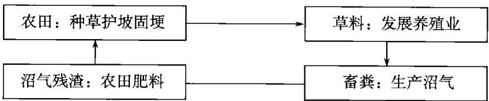  
图 7.1 水土保持：草-畜-沼-农综合治理模式

以草-畜-沼-农模式为例（如图7.1所示），通过水土保持生物措施如植草护坡固埂，将农田中的径流与土壤资源就地拦截可有效防治水土流失。而埂坡所种植的草可以作为饲料来发展养殖业，利用动物的粪便又可以生产沼气作为生活能源，沼气的残渣是优质有机肥料，若回归于农田则可有效提高土地生产力。这种水土保持综合治理模式实施的结果是当地经济结构得到优化、经济收入增加。在一个封闭循环的经济过程中，将每一环节所产生的废弃物全部作为下一环节的原料加以利用，不仅没有废弃物的产生，而且使生态环境大幅改善，不仅巩固了当地水土保持措施的效益，而且带动了当地循环经济的发展。因此，水土保持综合治理为改善生态环境、保持经济社会的可持续发展提供了重要的途径。

## （二）水土保持推动社会可持续发展

## 1. 促进社会公平与经济效率的有机统一

社会可持续发展中公平概念在横向体现为社会成员之间对自然资源的占有和生态环境的享受上的公平性；纵向体现为代际之间对自然资源和生态环境所有上的公平性。水土保持改善生态环境脆弱地区的生态环境，为脆弱生态环境中的社会成员与优良生态环境中的社会成员创造了享受同等福利的条件；并且，随着脆弱生态环境不断得到改善，后代社会成员将会在更加优良的生态环境中享受到更多的福利，水土保持较好地实现了可持续发展的公平原则。

水土保持在改善生态环境的同时也带动了区域经济的发展，对于生态脆弱地区脱贫解困十分有效。因此，水土保持措施改善生态环境的过程就是将社会公平与经济效率有机统一的过程。甘肃省长江治理一、二期工程使人均基本农田提高90.2%，贫困面由治理前的66%下降到24%，流域90%的农户解决了温饱问题。黄河流域国家重点治理区的无定河和皇甫川流域，在1983年开始治理开发的160多条小流域中，先后出现了116个小康村，高收入户比例大幅度增加，群众生活有了翻天覆地的变化。治理与开发相结合，不仅直接增加了农民的收入，而且推动了农村农、林、牧、副、渔、工、商、运、建、服等连带产业的发展及其一体化建设。新中国成立以来，水土保持设施累计增加产值630亿元；山地干鲜果生产成为水土流失区经济发展和群众脱贫致富的支柱产业，以山地果园建设为主的种植业生产成为黄土高原水土流失区经济发展的一个强劲增长点。陕西省自20世纪80年代苹果由秦岭北麓转向渭北旱塬以来，目前的苹果种植面积达到50万hm²，产量占全国苹果产量的17.4%，成为经济园艺作物中农民收入最大的生产项目。我国沙棘资源的建设和产品开发走出了规模化、集约化、产业化发展的路子，截至1995年沙棘资源保存面积超过113万hm²，沙棘利用由放牧向以沙棘油、沙棘医药保健品开发方向发展，全国建立各类沙棘加工厂200余家，生产沙棘饮料、食品、保健品、药品、化妆品和色素等8类产品、200多个品种，年产值3亿多元。

## 2. 水土保持为社会稳定和进步创造条件

水土保持措施的建设有效地缓解了区域人地关系紧张的矛盾，基本农田的持续快速发展推动了粮食产量的稳步增长，为“两高一优”农业打下了基础，并且也为生态脆弱地区发展医疗卫生、文化教育和其他公共事业创立了基础，促进了生态脆弱地区社会的全面进步、区域社会可持续发展能力增强，社会发展进入良性循环状态。新中国成立以来，通过综合治理，建设基本农田1300万公顷，为农业稳产高产创造了条件。经测定，梯田每公顷可增产粮食近1500kg左右，全国仅此每年可增产粮食180亿kg。“长治”工程经过十五年连续的治理，治理区人均产粮由治理前的363kg提高到510kg，累计增产粮食51.3亿kg，有效解决了1000多万群众的温饱问题。黄土高原现有梯条田约300万hm²，按每公顷较坡耕地增产粮食750kg计算，每年增产粮食约22.5亿kg，可满足1023万人（注：以每人每年200kg的标准计）的口粮需要，从而缓解了人口增长对粮食的压力。

# 第八章 水土保持是实现人与自然和谐的重要手段

实现人与自然和谐是人类对人与自然关系认识的一次质的飞跃，是社会发展史上的一个重大研究成果。人与自然和谐是我国构建社会主义和谐社会的重要内容，是社会主义现代化建设的客观要求，是经济社会可持续发展的一个必然选择。人与水土和谐是人与自然和谐的一个重要组成部分。水土保持正是人类在不断追求人与水土和谐的基础上产生的一门科学，可以说，水土保持的发展史就是一部人类积极探索与自然和谐相处的历史。

## 第一节人与自然

## 一、人与自然关系的演变

人与自然的关系是一个古老的话题，人对自然的认识经历了一个漫长的过程。人是自然界长期发展、进化到一定阶段的高级产物。自从人类诞生的那一刻起，人类就与自然相互作用、相互联系，构成了一对既相对立、又相统一的矛盾。人类不能离开自然而存在，同时人类又对自然产生巨大的反作用，推动或阻碍自然的进化和演替。人与自然的关系既影响人及其所构成社会的发展，也影响着自然界自身的演化。

人与自然的关系是一个复杂的哲学命题。人与自然关系中的“人”，不是指单个的生命体，而是泛指人类，是具有生命的对象性的存在物、能动性的存在物和社会性的存在物。人与自然关系中的自然泛指“自然界”，不仅包含自然科学所研究的无机界和有机界，而且涵盖了包括社会和人类在内的整个宇宙。按照马克思主义哲学的观点，自然界具有客观性、可变性、可知性、先在性和前提性等特征，从这种意义上讲，自然界就是指与精神世界相对应的整个物质世界。

随着人类社会的发展和经济技术水平的提高，人类对自然的认识程度不断深化，人与自然在其相互关系中所处角色和地位也在不断改变，大体经历了从被动和谐、互动、对立以及至当今积极寻求和谐等几个不同阶段。

(1）人与自然被动和谐时期。人类的先祖脱胎于自然，从高级动物中分化出来，初步具有适应生态系统的自发行为和模糊意识，但由于限于其自身理性思维成分的缺乏，只能作为自然生态系统食物链上的一个天然环节。在距今10000年以前的数百万年间，人类以狩猎和采集方式从事生产活动，过着逐水草而生的日子。自发行为与模糊意识使得人类在与自然的关系中处于绝对劣势状态，人类只能被动地服从自然规律，人类生产和生活受自然环境和自然资源的制约明显，人对自然的依赖性强，从而形成了人与自然被动和谐的关系。

（2）人与自然互动时期。在农业社会，人类初步稳定繁衍并进入简单再生产的初级循环。人类在与自然的相互作用中，初步掌握了一些自然规律，人类的行为逐渐由自发转向自觉，人类的生活方式也逐渐由游走过渡到定居状态。这一时期，是农耕文明从萌芽到成熟的发展时期，人类对自然规律的掌握是十分有限的，并且采用原始农耕器具支撑的生产活动规模小、强度低，对自然的破坏力也相对较小，人类与自然整体上保持较为融合的关系。但是在一些局部区域也出现了过度开垦与砍伐等现象，特别是为了争夺水土资源而频繁发动战争，使得人与自然关系在整体保持相对和谐的同时出现了阶段性或区域性的不和谐现象。因此，这一时期人与自然的关系呈现总体和谐、局部或阶段的不和谐，也被称为互动状态。

（3）人与自然对立时期。工业社会时期，由于工业革命使人类攫取自然资源的能力空前提高，消费欲望高度膨胀，极大地刺激了生产力的发展，人类活动的范围已扩张到全球的各个角落，对自然干扰的强度越来越大，打破了自然生态平衡和结构。在人类社会繁荣进步的表象背后，隐藏着日益积累的人与自然的矛盾：人口剧增、资源短缺和生态环境恶化等，使得人与自然对立起来。

（4）积极寻求人与自然和谐时期。20世纪以来，随着科学技术的突飞猛进，社会生产力得到极大提高，促进人类社会在总体上进入一个新的历史性发展阶段。但与此同时，各种生态危机相继爆发，其酿成的恶果使人们饱尝艰辛，迫使人们重新反思人与自然的关系问题，作为反思的积极结果便是生态文明对工业文明的扬弃，寻求人与自然之间的和谐共存之道，以实现人类的永续发展。

追溯人与自然关系的历史，不难有这样的发现：首先，人与自然的关系是人类生存发展过程中的基本关系。人类的繁衍与社会的发展离不开大自然，必须以大自然为依托；同时人类又必须利用自然，让大自然造福于人类，服务于人类。只有保持较为适当的人与自然关系，人才能保持其正常的生产生活。其次，人与自然的关系是随着历史发展而变动的。科学技术和经济条件的发展变化，为人类越来越多地提供了可以利用自然的工具，使人类与自然相互作用的范围不断扩大，强度不断加大，形式日益多样化、复杂化。在最初，人类的生存与消亡对自然几乎无关紧要，但是在现代，人类活动对自然的影响越来越大，人类在某种程度上可以推动或阻碍自然的正常演替秩序。人与自然关系的历史演变是一个从和谐到失衡、再到新的和谐的螺旋式上升过程。最后，人在调整和改善人与自然的关系方面应担当主导角色。科学技术发展到今天，人类在不自觉中已经处于与自然对立的状态，人类必须积极寻求改善人与自然关系的方法，否则只能被动地等待自然规律的惩罚。要调整和改善与自然的关系，人首先要从调整和约束自身的行为做起。

## 二、人与自然和谐相处

## 1. 和谐的内涵

和谐，是指协调、融洽、合作等意义。和谐，作为一种思想，是中国传统文化的核心理念和根本精神。从《尚书》、《周礼》到《说文解字》，“和谐”两字都是指音乐的合拍与禾苗的成长，“和”即是“谐”，引申表示为各种事物有条不紊、井然有序和相互协调。

在西方，“和谐”（harmony）的概念一般认为是由古希腊著名的哲学家、数学家、天文学家、音乐理论大师毕达哥拉斯最先提出的。毕达哥拉斯从数字出发来理解和谐，认为数字组成了声音，依此又推论出天体的声音，关注天体数字及其比例，认为自然的和谐、宇宙的和谐是数字的和谐。不仅如此，他还将这个蕴含诸多美学成分的概念创造性地引入到科学研究当中。在此之后，西方关于“和谐”的概念一直沿着这一思想不断发展变化，使西方出现了各种各样艺术流派。

从自然辩证法角度对和谐概念的科学理解，即为矛盾双方在一定条件下达到统一而出现的状态，它标志着自然界内部、人与人、人与社会、人与自然之间诸多元素实现均衡、稳定、有序，相互依存，共同发展。多样性的东西共存而达到平衡，才能形成和谐；如果多样性的东西彼此冲突，达不到平衡，也就无所谓和谐。这也就是说，和谐是把“多杂”和“不协调”转化为“统一”和“协调”的过程。

## 2. 人与自然和谐的内涵

人与自然和谐，从理论层面上看，应该是人与自然互相适应、互动和谐的辩证统一；从实践层面上讲，人与自然和谐即人与自然双方均处于既被利用又被保护的关系之中。人与自然和谐揭示了这样一些深刻道理：

一是人与自然协同进化。人类来自于大自然，是大自然的有机组成部分，人类与自然万物唇齿相依、息息相关，人类虽然是自然万物的灵长，但又是自然生态链条中的一个环节。人类不仅要与动物、植物和微生物等有生命的种群和谐共生，也要与自然界的水、土壤、空气等自然因素相互适应和协调。因此，人要在全面、深刻地把握自然界规律和人与自然复杂的相互作用机制的前提下，主动地适应自然规律，并科学地利用自然规律来为人类的生存、发展服务，同时还要利用其来恢复和促进自然向更高级演替，实现人与自然相辅相成、协同进化。

二是价值理性与工具理性和谐统一。人与自然和谐强调了人与自然万物都是有价值的。但是，人类并不会因为自然物具有自身的价值而对其不加利用，人和万物都应各自按照自身的性质和在自然界中的价值关系来发生相互作用。另一方面，人类获取自然物的价值，必须遵循自然循环的规律，而不能只从人类自己过度的物质欲望出发，掠夺性地索取自然资源，毁灭性地利用生命物种。

人与自然和谐理念要求人们在维持自身生存与发展的实践中，首先必须热爱和尊重自然，进而保护和合理利用自然。人类对自然资源的获取只能遵守自然法则。在社会实践中，要通过道德和法律协调人、规范人、约束人、提高人的素养，使人正确处理人与自然的关系，实现社会生产力与自然生产力相和谐、经济再生产与自然再生产相和谐、经济系统与生态系统相和谐。

## 3. 人与自然和谐是历史的选择

人是自然的产物，自从人类诞生的那一刻起，人类就不得不思考人应该如何与自然相处。在人类社会的发展史中，人们一直致力于这方面的探索，无论是东方文化还是西方文化，都蕴藏了非常丰富的有关人与自然如何相处的思想。人们所处的历史条件、社会经济发展水平的不同，使得人们对自然界的认知水平不同，进而形成了关于人与自然如何相处的多种观点。概括起来，大体分为三类，即极端人权论、极端自然论和人与自然和谐论。纵观历史，不同观点指导人们实践产生了不同的结果；实践证明，人类只有坚持人与自然和谐的观点，与自然和谐相处，才能实现人类社会持久永续的发展。

人类中心主义，也被称为极端人权论，即认为人是万物之灵，是自然的中心、主宰，是征服者、统治者，人对自然有着绝对的自由支配权利，一切从人的利益出发甚至从某个阶级、阶层，某个实体、政体的利益出发对待自然。极端的人类中心论从根本上否认自然的价值、尊严和权利，否认和反对人与自然的协调与和谐共处。人类中心主义强调人类中心地位，无限、过分、不当夸大人的重大作用。尤其是在工业革命以后，以大规模机械制造为标志的生产力得到空前解放，人类占用自然资源的能力大为提高，活动空间更加宽广，使得人类误以为自身无所不能。然而，随着世界人口的急剧膨胀，以及人们采取的不断追求更为丰富的物质与精神享受的生活方式和消费模式，其结果造成自然资源急剧消耗、污染物大量排放、生态环境急剧恶化、各种生态危机相继爆发、人与自然的关系变得十分紧张，人类的生存和发展受到了前所未有的挑战。事实表明，20世纪50～70年代，极端人权论思想对我国也产生了巨大的影响。“大跃进”和“十年动乱”，在“人定胜天”、“人有多大胆地有多大产”的唯意志论的支配下，盲目推行毁林毁草开荒、围湖围海造田、打虎灭雀的征服大自然的运动，“开荒开到山顶、种地种到湖底”和“大炼钢铁”，其结果是植被覆盖率大幅度降低、水土资源严重破坏、水土流失加剧、生物多样性锐减、人与自然关系尖锐对立，导致生态环境恶化。尽管改革开放以来我国政府采取了许多保护自然环境和野生动植物的措施，但由于历史欠账太多，积重难返，生态环境的恢复和改善十分缓慢，直至现今自然生态的恶化趋势还没有从根本上扭转。正如恩格斯指出：“我们不要过分陶醉于我们对自然界的胜利。对于每一次这样的胜利，起初确实取得了我们预期的结果，但是往后和再往后却发生完全不同的、出乎意料的影响，常常把最初的结果又消除了。”

自然中心主义，也被称为极端自然论或生态中心主义，强调人与动物的共性，赞美、突出大自然。自然中心主义否认人的中心地位，轻视人的利益和创造力，主张以生态为中心，一切顺应自然，甚至将人的消极作用喻为“宇宙之癌”，夺取了其他生物的生存空间，破坏了宇宙的和谐。自然中心主义无限夸大人与自然的共性和人的消极面，过分轻视人的地位和作用，是人类误以为人在自然面前无所作为，只有被动地适应自然，从长远来说最终也会影响人类的生存。这是因为，遵从自然中心主义，人类仅仅以顺应自然的日常经验和适用技术去利用资源，而非积极对生物规律、生态规律寻求深刻的认识，进行深度地开发利用自然资源，结果是不能充分挖掘和利用自然物的潜在价值，无法实现物尽其用，无法做到以较少的资源耗费来产生最大的使用价值。当今，世界的人口数量已经濒临地球生物圈的承载极限，人类的物质生产技术方式还没有从破坏自然的方向上根本扭转过来。如果依然沿袭自然中心主义的思路，人与自然的关系将会越来越向着不和谐的方向发展，

势必将人类带向最终毁灭的境地。

人与自然和谐，是人类饱尝生态灾难恶果后，重新思考与定位人与自然的关系所得到的重大理论成果。历史经验表明，当人类与自然处于破坏、对抗关系，以征服自然为目标的时候，自然总会以特殊的方式威胁人类；当人类与自然处于平等、互利、和谐关系的时候，自然也能为人类提供良好的生存和发展环境。因此，只有摒弃人类中心主义价值观念，修正生态中心主义的缺陷，建立人与自然和谐价值观念，才能摆脱困境，步入人与自然和谐有序、持久共生的正确途径。人与自然和谐相处首先是尊重自然、保护自然。人类应将眼前利益与长远利益统一，既考虑实用性，也要考虑理性，尊重社会经济规律的同时使自然生态规律也受到尊重，既保障人的利益又要保护自然，如此，人类社会才能长久地发展下去。

## 4. 人与自然和谐是构建和谐社会的重要内容

建立和谐社会是中华民族的伟大理想。早在2000多年前，孔子便提出“大同世界”的思想，即“人与人之间无纷争，没有贫富悬殊，没有盗贼”等等的一种社会形态。和谐社会是一个十分复杂的系统，在这一系统中，要求矛盾的双方或多方能够在统一体内相互包容，协调运作，良性转化和融合，使社会始终处于健康的、富有生机和活力的状态之中。构建社会主义和谐社会是中华民族追求的宏伟目标，党中央站在马克思主义哲学的高度，对“和谐社会”的社会形态具体刻画，即社会主义和谐社会是指使社会中绝大多数人感到心情舒畅、相得益彰、配合默契、公平公正的一个社会。社会的和谐应具体体现在政治和谐、发展和谐、家庭和谐、人与自然的和谐等方面。

人与自然的和谐是建设社会主义和谐社会的基本要求。实现人与自然的和谐发展，是人类社会发展的必然要求。正确处理人与自然的关系，实现人与自然和谐发展，是人类文明得以延续和发展进步的基本条件。2002年，党的十六大把增强可持续发展能力、促进人与自然和谐作为全面建设小康社会的四大目标之一。党的十六届三中全会提出了以人为本、树立全面协调可持续的科学发展观。2005年，胡锦涛同志在提高构建社会主义和谐社会能力的讲话中，提出人与自然和谐相处是社会主义和谐社会的重要内容。在《中共中央关于构建社会主义和谐社会若干重大问题的决定》中，社会主义和谐社会被界定在人与人和谐以及人与自然和谐两个方面。这是我们党在对自然和人类社会规律深刻认识的基础上，将人类文明成果的兼收并蓄，对人与自然关系做出的科学定位。

人与自然和谐是建设社会主义和谐社会的必然选择。具体地讲，社会主义和谐社会既强调人与人的和谐，又要达到人与自然、社会的和谐；既注重内部各阶层、各利益团体之间的和谐，又要争取外部世界的和谐发展；既要培育微观的各个社会组织细胞的和谐发展，又要促进宏观的整个社会的和谐发展；既要经济、政治、文化等各个系统内部的和谐，又要形成各子系统之间的和谐关系，使之共同发展。由此看来，没有人与自然的和谐，人与人之间不可能实现真正的、持久的和谐；没有人与自然的和谐，我们将逐渐失去家园，中华民族将失去生存的空间，其他一切和谐民主法治、公平正义、诚信友爱、充满活力、安定有序将无从谈起。因此，高度重视人与自然的和谐，重视资源和生态环境问题，既是全面建设小康社会的重要目标之一，又是建设社会主义现代化的根本要求。

## 三、水土资源是影响人与自然关系的重要因素

## 1. 人与水土和谐的内涵

人与水土和谐是人与自然和谐在资源层面上的反映。水土作为人类产生、存在和发展所必须依赖的基本自然资源，与人类关系的历史可以追溯到人类诞生之时。人与水土共处在地球生物圈之中，人类的繁衍与社会的发展离不开水土资源，必须以水土资源为基础；同时人类还必须认识水土资源、作用于水土资源，使其造福于人类。人与水土关系处于一种动态变化和相对平衡的状态之中。一方面，人类作用于水土资源获取物质产品和服务；另一方面水土对人类具有反作用，即水土资源对人类生存发展的制约，如水土资源恶变引发的灾害和生态环境退化对人类的负面影响等。

人与水土的和谐是指人类的生存和发展必须依赖水土资源，人类从水土资源获取物质产品和精神享受的同时，还要保护和改善水土资源，使其及其所支撑的生态环境不断优化，源源不断地为人类的生存发展提供更多、更好的物质与精神产品。水土资源是自然界中具有循环再生特性的资源，但其循环再生能力是有限的。依照水土资源有限的循环再生特性，人类通过农业生产从水土资源中获取生存生产的物品，或者直接获取作为原料的水土资源，无论是手段、方法，还是强度、时机，最低限度都必须控制在其再生循环能力可以承受的范围之内，即人类利用水土资源为自身服务但不能对水土资源造成根本的损害。人与水土和谐的理想状态是人类利用水土资源不仅不会造成对水土资源的损害，而且还能使其状况更加优良。

## 2. 人与水土和谐是人与自然和谐的前提

人与水土和谐是人与自然和谐的前提条件。水土是自然界的组成要素，水土资源是生态环境的重要基础，是自然界一切生物的载体，水土资源的再生循环是推动自然界物质、能力与信息流动的重要动力。水土资源状况的优劣决定了自然生态状况的优劣，从而决定了自然对人类提供生态服务的质量、数量以及持续状况。只有人与水土实现了和谐，人与自然和谐才有可能。如果人与水土失去和谐，那么在特定的时间和空间内，人类就会因需求增长超过水土资源提供服务的能力，而无法得到足够的物质产品和良好精神享受；或者是人类利用水土资源获取产品时，对水土资源造成了较大的于扰和破坏。上述第一种情况将会导致人类加速度利用水土资源，发展的结果是生态环境遭受破坏，而第二种情况也必然引发生态环境的恶化，最终导致人与自然的关系紧张甚至对立。因此，没有人与水土的和谐，人与自然和谐就成为一纸空谈。

人与水土和谐是人与自然和谐的重要内容，也是人与自然和谐的必然要求。由于自然万物是相互联系、相互作用的，一个组成要素的非正常变动将会引发整个生态脱离正常轨道而变异。因此，人与自然和谐，宏观层面表现为整个人类与自然界在保持各自良好发展态势的同时，相互促进推动另一方向着更好的方向发展；具体到微观层面，则表现为人与自然万物直接的相互促进、和谐共生的状态。而水土是自然界的核心组成要素，因而人与水土和谐是人与自然和谐的重要内容。体现到人与自然和谐的本质层面，则人与水土和谐是人与自然和谐的必然要求。

## 第二节 水土流失对人与自然关系的影响

水土流失是一个古老的自然现象。在人类出现以前的漫长年代里，水土流失仅表现为在水力、风力、冻融和重力作用下产生的正常侵蚀现象，水土流失与水土资源的再生循环处于相对平衡状态。随着人类的出现，人口数量的不断增加，人类对水土和植物资源的开发利用范围不断增大，程度不断加深，正常侵蚀的速度逐渐加快，产生加速侵蚀，使得水土流失对水土资源的破坏已经超出了其再生循环所能补偿的范围，这种侵蚀现象对人类构成了威胁。因此，此处所讲的水土流失，就是指的这种加速侵蚀。

一方面，水土流失是人与自然失于和谐的重要表现，是人类不合理开发水土资源或者滥用水土资源产生的严重后果。另一方面，由于水土流失具有较大的破坏性，即破坏土地资源，导致生态环境恶化，引起江河湖库泥沙淤积，加剧自然灾害，因此水土流失的进一步发展又会引发和加剧人与自然之间更加尖锐的矛盾和冲突。

## 一、水土流失是人与自然不和谐的重要表现

在人与自然关系演变的几个阶段中，水土流失的状况各不相同，由此可以看出水土流失是反映人与自然关系的一个重要信号。原始社会、蒙昧时代，人类居无定所、露宿野处，靠采摘果实和狩猎为生。人类的原始需求对自然造成的压力十分有限，人与自然的关系处于被动和谐。这一时期人类对水土资源的破坏很小，与此相适应，人与水土也是被动和谐的。尽管这一时期也存在水土流失，但仅表现为自然力的此消彼长。

至农业社会，生产力水平较原始社会有很大提高，产生了以耕种与驯养技术为主的农业生产方式，形成了基本自给自足的生活方式，人与自然仍基本上处于和谐。人类利用较为简单、落后的生产工具从水土资源获取生存资料。这一时期，人口数量相对于自然承载能力来说相对较小，人类的活动对自然生态不会造成太大的压力；另一方面，人类的认知水平和生存能力较差，人类只能“择水而居”，选择自然生态较为优良的区域定居，而这些地区自然生态的自调节和恢复机能较强。这一时期，尽管以木质和铁质器具为主的经济活动对水土资源会造成破坏，引发水土流失，但破坏作用基本可以通过自然生态的自调节机能得到恢复，从世界范围看，加速侵蚀的现象只是局部的。也正是在这一时期，由于人类活动范围的不断拓展，屯兵戍边活动以及为帝王将相建造城池、宫殿，出现了过度开垦与砍伐等现象，特别是为了争夺水土资源而发生的大规模农民战争也导致人与自然阶段性的、局部的不和谐，引发了较为严重的水土流失。据历史考证，大约在公元前三世纪前，即我国历史上的先秦时期，人口仅为2000万人，黄河流域林草覆盖率达到53%，黄河水泥沙含量不高。但是从秦到西汉，人口激增到将近6000万人，为了解决吃饭问题，国家鼓励屯垦戍边，使位于黄土高原上的多个游牧区被开垦为农业区，植被遭破坏，水土流失加剧，黄河的泥沙含量逐渐加大，逐渐变为混黄并伴有水患加剧的现象，使黄河水患成为国家的“心腹大患”。

农业文明后期，特别是进入工业时期后，水土流失问题在世界范围内愈来愈凸显。工业文明推动生产力空前发展，人类获取自然资源的手段产生了质的飞跃，人类对于自然生态的掌控范围深度发展，人类生产物品的能力急速增强，生产的物品空前丰富。加之，全球人口急剧膨胀，对自然生态造成的压力极度增大。人与自然的关系紧张，表现在水土资源层面，人与水土之间的矛盾加剧。一方面，人口增加，不断增多的食物需求，对农业生产提出了更高的要求，驱使人们毁林开荒、毁草开荒、陡坡垦殖、过度放牧，引发了较为严重的水土流失。另一方面，工业化和城镇化的加快，无节制地利用和破坏水土资源，忽视保护，导致严重的水土流失。目前，水土流失问题已是世界性的，无论是发展中国家还是发达国家都存在不同程度的水土流失。严峻的水土流失已引起世界各国的高度关注，联合国已将水土流失列为全球三大环境问题之一。从总的趋势看，全球水土流失还在向加剧方向发展。根据有关国际组织的研究结果，全世界现有水土流失总面积为1650万km²，占 $\mathrm { k m } ^ { 2 }$ 全球土地总面积的12.6%。其中水力侵蚀总面积为1100万 f $\mathbf { k m } ^ { 2 }$ ，风力侵蚀总面积为550万 km²。

从以上的分析可以清晰地看到，人与自然不和谐导致水土流失大致遵循这样的路径：人与自然关系失调，造成土地资源上的植被破坏，使水土资源失去保护层，导致水土资源的组分、结构、匹配关系等发生质的恶变，功能异化，无法为人类提供充足的产品和服务；人与水土关系恶化，人类加剧对水土资源的开发利用，引发水土流失；同样，严重的水土流失，又导致土地生产力大幅度下降、生物多样性减少、自然灾害加剧，进而又不断地恶化人与自然的关系。因此，水土流失既是人与自然不和谐的重要表现，也是人与自然不和谐的诱因。

## 二、水土流失降低大自然的人口承载力

人类对自然的压力加大必然引发人与自然的关系紧张。水土流失，是人与水土失和的重要表现，反过来又加剧了人与水土之间的紧张关系。当水土资源遭到破坏后，其为人类提供产品和服务的能力下降，自然生态的服务功能也会相应减弱，相对于不变的人口总量，单位水土资源或单位生态环境所须承载的人口数量增加，自然生态承受的压力增大。据统计，我国每年因水土流失而损失耕地100万亩，如果按全国平均亩产300kg推算，则可使粮食产量减少3亿kg，相当于减少全国粮食总产量的6.4%。黄土高原地区是我国水土流失最为严重的地区，据调查，这一区域 $1 5 ^ { \circ } \sim 2 5 ^ { \circ }$ 的坡耕地每年每公顷流失表层土壤30～150t；土壤中的氮、磷、钾、有机质等养分不断流失，土地日益瘠薄，土壤持水能力降低，导致农作物产量低而不稳。许多地方灾年甚至颗粒无收，只能依靠国家从外地调进粮食实行救济。据对位于北方农牧交错区的达拉特旗的测定，由于水土流失，垦荒地表土层平均每年减少2～3cm，风沙区减少 $5 \sim$

7 cm，与此同时土壤中养分也大量损失。西南岩溶地区，土层浅薄，水土流失严重，据统计，大约每3年就要流失到1cm厚的土层，石漠化面积不断扩大，人口承载力急剧下降，许多地方不得不搬迁移民。水土流失不仅使得当地赖以生存的水土资源不断减少，人口承载力下降，同时在人口日益饱和的今天，也加重了其他地区的压力，导致整个区域人口承载力的下降。

## 三、水土流失加速资源短缺

资源短缺是人与自然不和谐的主要症结之一。水土流失加速资源短缺主要体现在以下三方面。

一是生产物质产品的资源流失。水土流失直接加剧了水土资源的损失。我国每年因水土流失而流失的土壤总量达到50亿t之多，其中长江流域年土壤流失总量24亿t（中上游地区水土流失最为严重，土壤流失量达15.6亿t)；黄河流域黄土高原区每年仅输入黄河三门峡以下河道泥沙就达16亿t，特别是内蒙古河口镇至龙门区间的7万多平方公里范围内，年均流入黄河的泥沙约占黄河年总输沙量的一半以上。水土流失同样也引发水资源的流失，据对黄土高原的调查，这一区域 $1 5 ^ { \circ } \sim 2 5 ^ { \circ }$ 的坡耕地每年每公顷流失水量高达$4 0 0 { \sim } 6 0 0 \ \mathrm { m } ^ { 3 }$ ，由此可见水土流失对水资源的影响，对于黄土高原这样一个水资源短缺的地区，这无疑会导致缺水现象极度加剧。另外，水土资源在为人类提供产品和服务的同时，其上生长的生物资源也为人类提供大量物质和精神产品，水土资源的损失使得这些生物不能进行正常的生产，为人类提供的产品和服务减少。因此，水土流失导致人类获取自然资源和服务的减少效应是按指数倍数扩张的。

二是提供生态服务功能的资源减少。人类的生存不只依赖于食物、水分的给养，还要有充足的氧气、适宜的温度和湿度等条件。而这些条件的供给则有赖于自然界中大量植物、微生物以及动物的连续不断地生产。据测算，在一个有工业的城市人均大约需要 $3 0 \mathrm { \sim } 4 0 \ \mathrm { m } ^ { 2 }$ 的森林绿地才可以维持空气中$\mathrm { O } _ { 2 }$ 和 $\mathrm { C O } _ { 2 }$ 的比例，以保证人类有新鲜空气。而土壤、植物、微生物等对于调节和维持人类生存空间中的温度和湿度平衡具有重要作用。水土流失不仅导致土壤与水资源的直接损失，更使得大量动物、植物、微生物无法正常生存而不能有效发挥其生态服务的功能。生态赤字是指一个国家消费所需的生物生产型土地面积超出该国生态承载力范围内可提供的生态足迹量。而据《2004年地球生存报告》，我国人均生态赤字高达 $0 . 8 \ \mathrm { h m ^ { 2 } }$ ，排名第75位，比全球人均生态赤字高 $0 . 4 ~ \mathrm { h m ^ { 2 } }$

三是水土流失加重了能源危机。水土流失造成的土壤有机质无效损失十分惊人。如甘肃、宁夏两省区每年流失的氮磷钾就相当于2222万t化肥当量，其损失量相当于我国1年的化肥生产总量。而生产如此巨量的化肥所需的能量折算为单位燃料，相当于我国煤炭年产量的1/10，或者相当于2000万t石油。由于水土流失，北方许多河流含沙量高，人们不得不从300m甚至500m的地下抽取地下水，而深井提水意味着大量能源的消耗。因此，日益严重的水土流失正在加速我国的能源危机。

## 四、水土流失引发生态危机

生态危机是人与自然矛盾尖锐化的表现。人口的增加，生态环境的承载压力急剧增加，局部地区已经出现了突破生态环境承载容量的现象，人类盲目的生产活动造成对自然资源掠夺式开发，结果是土地退化和沙尘暴、水灾旱灾等频发，而水土流失则是导致这些现象产生的重要诱因。

水土流失对生态灾害的影响可以从源头和末梢两个方面分析。在源头，即水土流失的产生地，由于水土流失使土壤结构变差，土壤调节水分的能力降低，土壤养分和腐殖质、土壤微生物减少，土壤体渗透率降低，植物生长状况变差。结果，一方面，在遇到大雨或暴雨时，地表径流急速增大，十分容易形成山洪，并诱发滑坡、泥石流等灾害；另一方面，地表径流增大无疑使得区域土壤和植物储藏的水分减少，一旦降水或地表水、地下水不能及时满足区域生态用水，就很有可能形成干旱灾害。水土流失诱发生态灾害的末梢效应是与水土流失的整体性特征有密切关系的。水土资源具有可移动的特性，因而导致水土流失具有整体性的特征，即局部水土流失可能引发全局性的灾难，上水、上风地区的水土流失对下水、下风地区的自然生态具有很大的影响。局部地区的破坏会波及到更多地区和更大范围，甚至危及整个区域的生存条件。水土流失发展的结果就是向下游地区输送大量的泥沙，导致下游江河湖库的淤积，给洪水的爆发创造条件。近年来，在我国境内爆发的大洪水几乎都可以寻到水土流失的根源。随着农药、化肥的大量施用，水土流失又成为面源污染的载体，对我国生态环境造成较大的损害。除此而外，水土流失为沙尘暴的爆发供给了大量沙尘，因而与沙尘暴的关系也十分密切，并且水土资源的可移动性使得局部地区的沙尘暴波及其他地区或国家而演化为全球的生态危机。

综上所述，一方面水土流失是人与自然不和谐的产物；另一方面水土流失的发生、发展又进一步加剧了人与自然的不和谐。

## 第三节 水土保持是实现人与自然和谐的重要举措

人与水土和谐不仅是人与自然和谐的前提和必然要求，也是人与自然和谐的重要内容。只有实现人与自然在水土层面的和谐互动，才有可能进一步实现人与自然全面的和谐。水土保持不仅是促进人与水土和谐的重要手段，也是促进人与自然和谐的必然选择，在推动人与自然实现和谐的过程中具有特殊的重要作用。

## 一、人与自然和谐是水土保持的核心理念

人类在长期的生产实践中认识到，水土资源并不是取之不尽、用之不竭的，人类的生存和发展建立在人与水土和谐相处的基础上。人类必须顺应自然规律，保护和合理利用水土资源，防治水土流失。因此，水土保持是人类在追求人与水土和谐、人与自然和谐过程中产生的一门科学。早在远古时代，黄河流域就有“平治水土”之说。当今中国及世界上有关水土保持的理论和实践，多为中国历史上成就的延续和发展。

水土资源是重要的农业资源，我国历史上水土保持几乎都是围绕粮食生产、农业生产条件的保护和改善而展开的。保护水土资源既是古代水土保持的出发点，也是人与自然和谐思想的重要部分。黄帝教导人们要“顺天地之纪，幽明之占，死生之说，存亡之难，时播百谷草木、淳化鸟兽虫蛾，旁罗日月星辰水波，土石金玉，劳勤心力耳目，节用水火财物”，意即为保障农业生产的顺利进行，除了顺天之时、因地之宜和尽人之力外，还要植树造林、保护水源、疏浚河道、禁放山火，适时收采野生植物、水果和捕猎禽兽等。据《尚书·舜典》记载，舜对禹说：“汝平水土，惟时懋哉。”于是大禹受命，担任治理河湖的司空，使农田不淹不旱。在春秋晚期，楚国司马提出：“书土田，度山林，鸠薮泽，辨京陵，表淳卤，数疆潦，规偃潴，町原防，牧隰皋，井衍沃，量入修赋”，意即对水土的利用，要根据不同的自然生态条件如耕地、山林、沼泽、湖泊、山地、丘陵等的特性进行统筹规划，综合治理，用树木保护土壤，并制定相应的税赋政策来促进规划的实施。

水土保持是人与自然和谐观的反映。水土保持并不完全排斥人对水土的开发利用，而是倡导开发利用要建立在水土资源的承载范围之内。一般来说，人类利用水土资源的目的是在水土资源利用中获取经济效益。但是，如果违背自然规律，掠夺式开发利用水土资源，如农业生产中的“顺坡耕作”、垦耕

25以上的坡耕地等等，会造成严重水土流失。因此，水土保持强调在控制水土流失的同时要合理地开发利用水土资源，如兴修水平梯田、修筑坝地等，促进农业生产效率提高，使水土资源持续为人类服务。

实现人与自然和谐是整个水土保持工作核心理念，表现为：①水土保持最初被定义为“在合理利用土地的基础上，防治土壤侵蚀，保持土壤的永续利用”。水土保持立足于人合理利用土壤资源，在保障水土资源质量不下降的前提下，使之源源不断地生产动植物产品满足人类的需求。②水土保持是以合理利用水土资源为其核心的理性实践。在实践中，水土保持通过对人的行为加以约束和限制，将其约束到水土资源承载力允许的尺度范围内，使人的活动符合自然规律，人与自然协调统一。在一定限度内开发利用水土资源，最为有效的措施就是利用土壤并保持土壤结构的良好状况，在成土作用下使土层不断变厚、土壤养分维持在较高水平。水土保持是针对人类与自然不和谐特别是与水、与土壤不和谐的现象，在探索水土规律的基础上，研究人与水土和谐的方法和实现途径的过程，通过各种措施实现土壤与其他生态环境因子的合理搭配，持续地为人类服务，实现人与自然的和谐。③水土保持的目的是保护水土资源，从规范和约束人的行为出发，遵循因地制宜的原则，倡导人们有效保护和合理利用水土资源。水土保持亦从人的总体需要出发，综合考虑当代人以及后代人的需求。目前看来，不合理垦殖土地对水土资源造成的破坏最大，在人口压力日益加大的情况下，人们不得不占据更多的土地用以谋生，但却对土壤造成较大的破坏。水土保持的诸多措施一方面确保人们正确开发利用土地资源；另一方面又保障了食物和其他动植物产出品的产量，维持人们较好的生存条件，即在保护生态和自然的前提下实现人类的生存和发展，达到人与自然和谐。

## 二、水土保持科学统筹水土资源，改善人与自然的关系

## 1. 科学管理水土资源

人类经济社会与生态均离不开水和土壤资源，而生态和人类经济社会占用水土资源的多寡是决定一个社会可持续发展极为重要的指标。千百年来，人类无论采用何种方式利用水土资源，若不注重培育和保护，都会使资源向着耗竭的趋势发展。例如，西北地区的荒漠化、西南地区石漠化，正是由于人类对水土资源认识不深刻，采取不合理、无节制的单向利用方式的结果。因此，有限度、有计划地开发利用水土资源，实现对水土资源的科学管理是十分必要的。水土保持将国家的生态需要与群众自身的需要相互结合，考虑各种需求，系统规划、综合治理，实现多目标、多赢的目的。具有中国特色的水土保持是在我国人口多、生态问题突出的形势下形成的，是实现水土资源可持续利用和生态环境可持续维护费省效宏的最佳途径。

水土保持借助于自然生态系统演替规律，实现水土资源可持续利用，即生态式的管理和利用。生态式的利用水土资源是双向、有机的，也是最为科学的方法。也就是说，生态式利用土壤，既可以促进生态状况的好转，也可以促进土壤母质更快地转化为土壤，并增加土壤有机质含量和肥力。水和土壤为整个生态系统提供了养分和由太阳能转化来的热量，扩充和丰富生态系统内物质的数量和质量，促进生态系统中生物的生长以及生态系统的自行运转，反过来，生态系统又为土壤母质转化为土壤提供了更为丰富的物质条件和环境条件，加速和促进了土壤母质向土壤的转化。水土保持秉承的理念就是限制人类活动的尺度，在充分考虑人的生存发展的基础上，通过提高土地质量为自然生态创造更多的条件，让大自然休养生息，使自然生态不仅为人类提供良好的环境条件，而且也为人类提供更多、更优质的土壤资源。在这种理念指导下，水土保持首先通过科学规划，既包括生产规划，又包括生态规划，划定生产空间、经济收入来源空间、人居空间、生态活动空间等，实现对水土资源的有效管理和利用。实践证明，水土保持是合理规划、管理利用水土资源，提高水土资源质量的一门科学技术。

水土保持对于水土资源管理的科学性还体现在水土保持已经具备科学的评价体系和先进的评价手段。水土保持以小流域为单元，开展山水田林路沟坡综合治理，布设了一整套评价数据收集系统。为了准确、科学地把握治理效果，并对自然灾害损失进行评价，水土保持部门利用小流域出口断面，设立监测站点，进行泥沙和径流监测，收集径流和泥沙变化的数据，就可以很直观判定治理效果的好坏。因此，水土保持无论在统筹规划、评价手段、综合应用上都能对水土资源实行有效管理。

## 2. 合理利用水土资源

当今生态环境问题的出现，是基于人类长期、无节制严重侵占自然生态所应占有的水土资源，加剧水土流失，导致人类与自然关系恶化的结果。具体表现在：人类占用水土资源，在时间和空间上无限扩张，质量上优先。构建和谐社会，实现人与自然和谐相处，关键是既要考虑人对水土资源的需要，也要考虑自然对水土资源的需要。

以水土资源的再生（循环）有限性、不可替代性、可移动性、时空分布差异性等特性为出发点，以水和土壤资源的总体状况和合理开发利用为前提，在遵循水和土壤运行自然规律的基础上，综合考虑人类的各种需求（包括当前和长远）和自然生态的各种需要，因地制宜，采取有效措施，强调在提高土地质量、单产上下功夫，用有限的土地解决人的吃饭问题，规划出一定的土地解决经济收入问题，尽可能提高生态占用水土资源的比例，促进人与自然的和谐。

## 3. 改善生态与改善生计有机结合

水土保持以改善生态环境为出发点，以全面、综合规划为切入点，着眼于水土流失防治，着力点在于改善当地群众的生产生活条件，推动区域经济社会全面发展。

实践证明，水土保持不能就治理论治理，而要与当地经济发展紧密结合起来，尤其要与区域产业开发结合起来，把生态效益与经济效益统一起来，才能取得理想的效果。近年来，许多地方正是由于坚持了这一点，才得到群众的拥护，实现了生态建设与经济发展的协调统一。既治山治水，又使群众富裕；既注重自然资源的保护和培育，又重视资源的合理开发和利用，把治理水土流失与开发利用水土资源密切结合起来，将水土保持的生态优势转化为经济优势，做到“治理一方水土，改善一方环境，发展一方经济，富裕一方群众”。

## 三、水土保持促进人与自然和谐

人与自然和谐的理念贯穿水土保持的前期规划、措施优化配置与落实，以及后期管护的每一个环节。凡是采取综合治理的地区，生态得到改善，灾害明显减轻，群众生活质量显著提高，人与自然趋于协调发展。

## 1. 系统规划

在配置水土流失防治措施前，首先综合评价水土流失状况以及当地自然、社会经济条件等。以小流域为单元，实地调查踏勘，采集相关数据，分析系统组成要素特征及其之间相互关系，例如当地群众生产生活方式对水土资源的影响、经济社会可持续发展对自然资源的占有水平（包括长期与短期、局部与整体等）等等，在此基础上，对水土流失发生原因、规律做出综合评价。

依据评价结果，结合当地水土资源利用的方式、规模和水平等，优化配置防治措施，制定开发利用和保护水土资源的具体实施方案，指导人们经济活动与水土资源开发利用实践。规划遵循适度、适宜、可持续等原则，充分

体现了人与自然和谐的理念。

## ·适度原则

依据防治目标，结合系统特性，进行综合评价，兼顾人与自然、当代与未来，合理确定土地利用方向、结构和方式，以及相关指标，使土地既满足人的需要，又维护自然生态正常的循环转化。

## ·适宜原则

适宜原则即尊重自然规律和客观经济规律，因地制宜，因害设防，是水土保持工作的一个重要原则。

## ·可持续原则

水土资源可持续利用和生态环境的可持续维护是水土保持的根本目标。工程、生物、农业技术三大措施相结合，建立完善的综合防护体系，实现生态、经济、社会三大效益相统一。

## 2. 综合治理

小流域综合治理是人们长期同水土流失作斗争、改善生态环境的经验积累，是具有中国特色防治水土流失最成功的技术路线。

小流域综合治理在系统理念的指导下，既治山又治水，既治沟又治坡，既治田又治路，既修地又种草，既造林又打坝，既封禁又养畜，既解决温饱又促进长远发展，兴利除害并举，促进经济社会协调发展。水土保持从促进人和水土和谐入手，从根本上解决水土流失问题。长期实践证明，综合治理在开发资源、发展经济、满足人的需要和改善生态环境、促进人与自然和谐的过程中，发挥的作用是任何单一措施难以比拟的。综合治理既关注人，也关注自然；既满足人的需要，也维护自然的平衡。善待自然，让生态系统保持在良好的状态，良性循环，更好地造福于人类。

## 3. 兴利减灾

在整治江河水患方面，通过综合治理，改善农业基础条件，从根本上解决农民的吃、穿、住、行等问题，有效防止乱垦滥挖，增强江河湖库上游区域涵养水源、保持水土的能力。做到“土不下山、泥不出沟”，减小了汇水流量，增强行洪滞洪能力，降低洪水灾害发生频率，减轻洪水危害，促进人与自然和谐。

在减轻干旱灾害方面，通过改变于旱易发区域的微地形，增加地表植被，提升土壤及其植被存蓄水分能力，推动小气候朝着有利于改善干旱状况的方向转变。

在控制沙尘灾害方面，通过在干旱风沙草原区大面积封山禁牧，调整产业结构，以水定牧，以草定畜、发展草库仑，降低人为因素对自然的干扰强度，有效控制风沙灾害，从根本上扭转人与自然对立、违背自然规律的局面。

历史表明，水土资源作为自然界的其他生命和人类社会都离不开的自然资源，是人类生存的根基，也是链接人类社会与自然生态的桥梁，水土保持促进了人类与水土资源互相兼容、互相促进，为人与自然和谐相处创造了极为宝贵的重要条件。

## 第九章 水土保持是全面建设小康社会的基础工程

党的十六大提出的全面建设小康社会的目标，是新时期建设中国特色社会主义的行动纲领。从我国的国情看，全面建设小康社会最繁重、最艰巨的任务集中在农村，特别是水土流失严重的山丘区。长期实践证明，水土保持不仅是山区发展的生命线，而且还是全面建设小康社会的基础工程。

## 第一节 水土保持是山区发展的生命线

## 一、我国山区发展的重要性

## （一）山区发展是全面建设小康社会的重点

我国是一个多山的国家，山区面积占到总国土面积的69%，山区人口占全国总人口的56%，山区县的数量占全国总县（市、区）数的54.5%。在我国进入全面建设小康社会、加快推进社会主义现代化的新的发展阶段，山区的建设和发展至关重要。

山区大部分自然环境恶劣，基础设施条件差，经济发展落后，群众生产生活困难，特别是“三农”问题最为突出。因此，山区的发展问题，是我国化解“三农”问题的重点，也是全面建设小康社会的一个难点。先天条件不足，交通落后，信息闭塞，接受外界信息、事物的渠道不畅，经济社会发展呈现较为落后的状态，这样的区位条件决定了我国大部分山区的农业、工业和其他产业普遍与发达地区存在较大差距。据统计80%的山区人口生活在农村且依靠农业为生。目前占全国农业人口总数44%山区农民的收入水平处于较低状态。全国贫困县的83.8%（496个）和约2600万贫困农村人口主要集中在山区，山区群众的收入水平远低于富裕地区的收入水平，大多数山区群众的收入仅限于维持温饱。另外，交通不便给山区群众的生产生活带来困难，而且也限制了山区与外界联络的信息渠道。信息闭塞使得山区群众的文化素质普遍较低。党的十六大指出全面建设小康社会，重点和难点在农村。可以说，山区农村是重中之重，没有山区的小康，不可能实现惠及全体中国人民的全面小康。

## （二）山区发展有利于国民经济持续稳定发展

## 1. 促进国民经济持续增长

一方面，山区作为落后农村、贫困农民的主要集中区域，农业发展滞后，基础设施差，是全国经济的薄弱环节。另一方面，加大山区投入，加快基础设施建设，又可带动相关行业发展，刺激国民经济的快速增长。

从整体经济宏观走势来看，近些年来我国经济增长主要依靠外需和投资拉动，然而，当今国际市场变幻无穷，完全依赖国际大环境支撑我国经济的快速发展，势必存在较高风险，只有依靠内部动力才能保持我国经济平稳、较快发展。山区无疑成为今后投资拉动的主要对象。国家财政投资山区基础设施建设项目以及提高山区农村劳动生产率和山区群众生活水平的其他项目，将会带动投资增长和相关行业的发展。山区具有一定的资源优势，挖掘潜力大，积极合理开发对促进国民经济持续稳定较快增长有着极为重要的作用。

## 2. 保障国民经济平稳发展

加快山区发展是促进我国经济增长由投资拉动型向需求带动型转变的一个重要途径。

我国长期以来经济增长都是依靠投资拉动。这种增长方式不仅对资源和环境造成巨大压力，而且容易导致投资过热、产能过剩，使经济在通胀和通缩之间来回振荡，危及整体国民经济的平稳健康发展。消费需求带动投资，有市场终端，必然产生效益，由此带动的经济增长能有效克服投资拉动对国民经济发展的不利影响，促进国民经济健康发展。在城市消费需求趋于饱和的情况下，山区群众的消费需求还有很大潜力，如果能够促进山区群众的收入增加，对于推动整个国民经济的发展具有很重要的作用。

更深一步讲，我国工业经济多年高速发展积累了大量生产能力，但需求市场已相对饱和，使得工业生产能力相对于市场消化能力相对过剩，工业品价格持续走低，不仅使企业获利空间逐步收窄、生存陷入困境，而且使整体经济面临通货紧缩的压力，对我国经济健康成长构成威胁。山区发展无疑为工业产品创造巨大的消费空间，企业获得新的生机，进而带动整个国民经济快速发展。

## 3. 缓解经济发展资源瓶颈

经济发展在很大程度上依赖于资源富集程度和开发利用效率。山区生物、矿藏、旅游、水、热资源丰富，有着极为广阔的开发前景。山区是我国的资源宝库和大江大河的源头，分布着天然林和次生林的全部以及人工林的绝大部分，山区森林面积占我国森林总面积的98.8%。另外，全国77%的草场、76%的湖泊和98%的水能也都集中在山区。我国是世界上仅次于马来西亚、巴西之后的植物区系最丰富的国家，山区分布着种子植物343科、3150属，约3050种，占世界同类科数的61%、属数的25%、种数的13%以上。复杂多样的山区生态系统是山区成为生活资料的集中产区，也是关系我国国计民生的重要原材料、燃料的主要输出地。山区生产的粮食占全国粮食总产量的一大部分，大多数木材、橡胶、松脂、生漆、油桐籽、干鲜果品、中药材以及林特产品也产于山区。山区矿藏资源也十分丰富，我国西部山区煤炭储量1670亿t，石油储量200亿t，水能总蕴藏量5100万kW，仅青海龙羊峡到宁夏青铜峡段长918km的黄河，总落差就为1400多米，可建15个梯级电站，装机1300万kW，年发电量5000亿kW·h。

山区发展将推动山区基础设施建设，改善山区交通不畅、通信落后、信息闭塞的状况，山区的潜能得到有效释放，提高资源开发利用水平。一些在国际上需求较旺的矿产如金、银、铝、汞、锡、锌、重晶石、石膏、石棉等资源的合理高效开发，可缓解国民经济发展的资源瓶颈；同时可推动医药、化工、能源等产业的发展，增添国民经济发展的后劲，培育新的经济增长点。

## （三）山区发展是老、少、边、穷地区实现繁荣的需要

“老、少、边、穷”地区大都集中在山区。革命老区，如井冈山、大别山、吕梁山、太行山、沂蒙山等地区，都曾经为中国革命胜利做出过重大牺牲和贡献。我国55个少数民族绝大部分都居住在山区，很多地方又地处边疆、边远山区。在空间分布上，这些地区往往与贫困地区相互重合，统称为“老、少、边、穷”地区。

“老、少、边、穷”地区发展是党和国家领导人高度重视和关心的重要问题之一。由于自然条件恶劣，大部分“老、少、边、穷”地区生产手段落后，产业结构单一，市场发育程度极低，教育、文化等公共事业发展缓慢。加快山区建设步伐，促进落后山区早日脱贫致富，是逐步缩小“老、少、边、穷”

地区与发达地区差距的重要途径，是加强各民族团结的重要经济前提，也是我国进行现代化建设、实现全面小康必须解决的一项艰巨任务。

山区摆脱贫困、实现繁荣振兴，不仅对我国全面建设小康社会具有重要的经济和社会意义，而且也有特殊的政治意义和战略意义。可以说，没有山区的快速发展，就没有全国的快速发展；山区群众收入不能增加，就不可能提高农业发展水平、开拓农村市场；山区群众不致富，也不可能实现全国人民共同富裕。

## 二、水土流失是制约山区发展的主要因素

## （一）水土流失破坏耕地资源，粮食产量低而不稳

大量肥沃的表层土壤在水土流失作用下从耕地流失，土地生产力下降。这是因为土壤含水量和土壤养分含量是决定耕地产出率的两个重要特征值，在土体构型中，表层土壤的养分含量和水分含量都是最丰富的，表层土壤是耕地中最肥沃的。山区广布的坡耕地是水土流失的主要策源地，大量表层土壤在水土流失的裹挟作用下快速流失，耕地生产力急速下降。随着水土流失的加剧，耕地生产力下降呈加速趋势，甚至彻底丧失。据1979全国第二次土壤普查数据显示，黑土区81个典型剖面厚度在16～72cm范围之内，平均厚度43.7 cm；2003\~2005年黑土区856个剖面中约 50%的黑土层厚度都小于40 cm。黑龙江省水保所的定位观测数据显示，坡耕地每年以0.6～1.0 cm的速度流失。土壤水分和养分随土壤流失而损失，即所谓的“跑土、跑水、跑肥”。表9.1显示的是黄土高原南部坡耕地上氮素的损失量，最高可以达到$3 7 . 2 7 ~ \mathrm { k g / ( h m ^ { 2 } \cdot \hat { a } ) }$

表9.1 黄土高原南部坡耕地不同坡度土壤侵蚀引起的氮素损失  
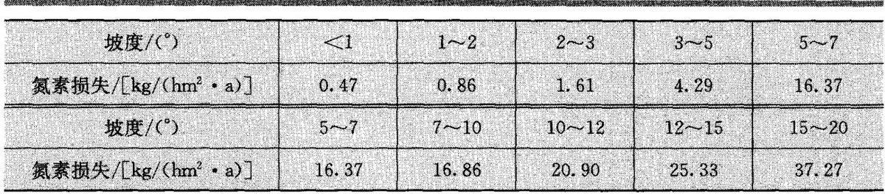

严重的水土流失直接冲毁山区的大量良田和耕地。水土流失使坡地上的土壤肥力降低，蓄水保墒能力减退。强烈的沟道侵蚀使得地面支离破碎、起伏不平、千沟万壑，切割、蚕食、淤积甚至埋压农田。据山西省部分区域的调查，每平方公里内干、支沟总数多达30～50条，沟道长度2～7km不等，全省沟壑面积12.36万km²，占全省总土地面积的79%。黄土高原的一些沟壑至今还处于活跃发展期，沟头前进速度非常迅速，有的每年前进达数十米，使塬面面积逐年减少。曾经是黄土高原上赫赫有名的董志塬，平坦、辽阔、富庶，这一地区世代相传的民谣称颂道，“八百里秦川，抵不上董志塬的一条边。”但是，自唐朝后，水土流失已使这个黄土高原上最大塬面和黄土堆积中心的面积损失掉一半。更为极端的情况，在西南岩溶地区，水土流失的直接后果是土壤被冲蚀殆尽，土地生产力完全丧失。如贵州省的一个乡，耕地土壤大面积流失，仅在1.8万个石缝中残存有少量土壤。三峡库区秭归县的部分农田，在短短的几十年中，水土流失使其成为寸草不生的裸岩。

山区中有限的川台地，土壤肥沃、灌溉方便，是当地十分宝贵的优质农业资源，却因位处低势，常常受到水土流失的破坏。大量的泥沙土石从山坡上流失到河谷或平川地上沉积起来，造成水冲沙压，淹没大量农田，颗粒无收。

土壤是山区群众维系生计的基础，水土流失导致山区良田被毁、耕地减少，耕地产出率下降，有时连种子都无法收回，山区群众温饱成为困难。据统计，我国山区人均年粮食不足200kg，不到全国平均数的1/2；如果按照我国贫困的食物标准（人均每天至少需消耗8778J的热量才能维持机体的基础代谢)，则连最基本的温饱需求都不能满足。

## （二）水土流失加剧自然灾害，危及群众生命财产安全

水土流失加剧自然灾害、恶化生态环境。土壤具有很高的调蓄水分的能力。在降水时，土壤毛细管不仅可以吸收较多的水分，而且还可以向土壤下层疏导较多的水分，减少地表径流。在气候干旱时，土壤含水量降低到一定水平时，土壤下层的水分通过土壤毛细孔隙补充到表层土壤中保证作物的生长。土壤调节水分的能力受到土壤孔隙含量的影响，水土流失使土壤板结，结构变差，孔隙率降低，土壤的渗透功能和存蓄能力萎缩。水土流失严重，土地退化，植被生存环境遭到于扰和破坏，植被覆盖率降低，生物多样性减少，区域水分循环受到影响，致使山洪、干旱、干热风、风沙、滑坡、泥石流等灾害频繁发生。

水土流失加剧自然灾害，威胁山区群众的生命安全。水土流失加剧灾害主要表现为灾害发生的频次增高，即使在灾害诱导因素并不强烈时，也可以形成灾害。例如，水土流失使得土壤渗透性变差，降水大部分转化为地表径流，很容易汇聚形成山洪。地处黄土高原北部丘陵沟壑区和库布齐沙漠腹地的十大孔兑，水土流失造成生态环境极度脆弱，每逢夏秋季降雨集中期，山洪暴发频次很高，常常是洪水漫溢泛滥成灾，淹没农田，淹死人畜，给沿滩群众安全带来严重威胁。另一方面，水土流失导致山区土壤的存蓄水份能力降低，使区域水分总储量下降，水分循环变差。因而，在无降水补充的情况下就发生季节性缺水。而我国山区地形地貌特征决定了人与水的关系往往是“人高水低”，若遇干旱，地下水埋藏深，不易开采，人畜饮水随即发生困难。黄土高原丘陵沟壑区，黄土层厚度一般在50～150m，由于黄土质地疏松，具有垂直节理，易于崩塌侵蚀，水土流失极为严重，加之近年来连续于旱，人畜饮水极为困难。水土流失也使得滑坡、泥石流等灾害加剧，造成的危害和后果十分严重。1989年7月9日，四川省南充地区华莹市澳口镇发生100万m3的滑坡，滑体在滑动过程中破碎解体，在大量暴雨和地表径流的参混下旋即转化为泥石流。泥石流顺坡奔腾而下，所经之处，农田、村庄全部被毁。

## （三）水土流失制约山区资源开发

山区是我国的资源宝库，但由于严重水土流失，地表切割，沟壑密布，开发资源十分困难。水土流失造成山区道路崎岖不平，交通运输等基础设施落后，诱发山洪、滑坡、泥石流，对山区基础设施的安全运转提出了严峻挑战，成为限制山区资源开发的障碍性因素。有些已经开发的资源也由于水土流失而受到影响。神府-东胜矿区是晋陕蒙能源基地核心区，近几年来煤炭开发中剧烈的人为因素作用，使水土流失加剧，土地沙化蔓延，沉陷崩塌，泥石流产生，河道弃土(石)堆淤积严重使行洪能力锐减，水资源遭破坏与污染，土地和植被退化，严重影响能源基地建设，使得资源开采的效率大打折扣。

水土流失也限制了山区群众利用当地自然资源维持生计和增加收入的机会，大部分山区群众生活贫困、致富无路。收入微薄，群众和集体的积累有限，根本没有能力发展教育、文化、医疗卫生和社会保障等公共事业。

可以看出，水土流失是导致我国山区发展滞后于平原、滞后于东部沿海发达地区的根源。山区从落后状态中解脱出来的唯一办法在山区积极开展水土保持，有效防治水土流失，只有如此，才能实现山区真正意义上的脱贫致富奔小康。多年实践表明，我国山区一些富裕起来的地区，无一例外地将水土保持作为当地发展战略的一个重要部分。毋庸置疑，水土保持是山区发展的生命线。

## 三、水土保持是山区发展的根本出路

山区作为一个“区域”，同其他区域一样，其最理想状态是人口、资源和环境协调发展，兼顾经济、社会、生态效益。换言之，这种目标追求的不是单方面效益的最大化，而是以山区各个发展要素的相互协调为基础，实现三者综合效益的最大化。唯有如此，才能够实现山区经济的协调发展和永续发展。水土保持是当前山区全面建设小康社会，实现经济、社会、生态效益有机结合的最有效方式。这是由于水土保持在山区发展中具有以下几方面的重要作用决定的。

## （一）水土保持是山区实现粮食自给的重要保障

## 1. 山区粮食实现自给的重要意义

人多地少的现实国情决定了山区必须立足粮食自给。如果以2003年人口基数129227万人为准，则人均耕地面积约为0.10hm²，仅为世界人均水平的35%。近年来，随着国际粮食市场的波动、国内粮食价格的影响，我国粮食种植面积也是波动较大，特别近两年，粮食产量小于需求，还有部分依赖进口。在总体需求还未得到有效满足的情况下，通过外援满足山区粮食需求的可能性就变小。全国现有耕地中仅1/3属于优质高产田，另外2/3则属于中、低产田。而50%的耕地资源分布在山区，坡耕地又占耕地总面积的60%。以当前的经济技术发展水平来看，我国平原区还不能以50%的耕地提供13亿人口的粮食。并且，随着城镇化、工业化的推进，平原中的优质耕地不断被占用，这在很大程度上又削弱了平原地区的粮食生产能力。

山区落后的交通运输等基础设施也不能动态满足山区粮食需求。落后的基础设施决定了向山区调运粮食的时间、资金成本都较大，而且自然灾害有可能造成交通中断，导致在非常时期不能将粮食及时运送到需求地点。1965年，陕西省榆林地区发生大旱，国家决定给榆林调拨2亿kg粮食，动员了3个省的几千辆汽车，整整运了半年。而且，汽车只能将粮食运到大路边，农民还要靠扁担扛回家。尽管山区现在的状况好于过去，但是从山外调运粮食的各种成本相对于山区群众的承受力来说较高，并且仍然无法

保证非常之需。

另外，粮食的市场供求也决定了山区必须实现自给。目前，我国的粮食价格基本由市场供求来决定，如果山区的粮食不能自给，则必然通过市场渠道来补给。正常情况下，供求平衡，价格较易为山区群众接受；一旦平原由于各种原因歉收，则粮价必然走高，我国这几年粮价的波动情况也充分说明了这一点，而且往往是粮价变动先于供求关系变动。对于相对贫困的山区群众来说，在国家补贴有限的情况下，粮价的市场波动一般是他们所不能承受的。因此，实现粮食自给对山区发展至关重要。

## 2. 水土保持保障山区粮食高产稳产

防治水土流失、改善生态环境、消除群众贫困的根源，改变山区“人口多、耕地少，坡地多、平地少，旱地多、水地少”的状况，兴利除害，化害为利，是水土保持一直以来的重要目标。在山区修建淤地坝、把坡耕地改造为梯田，将中低产田改造为优质高产田，挖掘农业资源的潜在生产力，确保粮食高产稳产。据统计，新中国成立以来，我国水土保持综合治理建设基本农田共计1300万hm²，仅此一项就可使全国每年增产粮食180亿kg。

实行坡耕地改造是解决目前山区耕地资源短缺、优质耕地匮乏的一个有效途径。我国山区中大部分耕地是坡耕地，坡耕地综合整治是水土保持的重要内容，修建梯田降低坡度，将坡耕地改造为“平地”，减小土粒的位势能增强土粒的稳定性，一改坡耕地以往“跑水、跑肥、跑土”的状况，成为“保水、保土、保肥”优质高产稳产的基本农田。水土保持淤地坝是我国黄土高原治理水土流失的一种成功措施，即在沟壑中筑坝拦泥，巩固并抬高侵蚀基准面，以此来减轻沟蚀，减少入河泥沙。由于淤成的坝地水肥条件优越，已成为黄土高原稳产高产的基本农田。据统计，黄河流域在1995年以前已经建成淤地坝10万座，淤成坝地33万hm²，年增产粮食约10亿kg，淤地坝已经成为当地粮食主要生产基地。表9.2反映出淤地坝粮食产量占总产量的比例。引洪漫地也是将“水害”变为“水利”的一项水土保持措施，在发生暴雨时利用挟带大量泥沙的坡洪、路洪、沟洪漫灌农田或贫瘠荒滩，既减小了洪水泥沙的危害，又改良了土壤，扩大了耕地面积，提高了产量。

表9.2 淤地坝粮食产量占总产量的比例
<table><tr><td rowspan=1 colspan=4></td></tr><tr><td rowspan=1 colspan=1>小流域名称</td><td rowspan=1 colspan=1>县名</td><td rowspan=1 colspan=1>坝地占耕地面积/%</td><td rowspan=1 colspan=1>坝地产量占总产量/%</td></tr><tr><td rowspan=1 colspan=1>红石昴沟</td><td rowspan=1 colspan=1>横山</td><td rowspan=1 colspan=1>10.6</td><td rowspan=1 colspan=1>29~35</td></tr><tr><td rowspan=1 colspan=1>米家村</td><td rowspan=1 colspan=1>米脂</td><td rowspan=1 colspan=1>6.9</td><td rowspan=1 colspan=1>24.7</td></tr><tr><td rowspan=1 colspan=1>张家湾</td><td rowspan=1 colspan=1>子长</td><td rowspan=1 colspan=1>9.3</td><td rowspan=1 colspan=1>40~60</td></tr><tr><td rowspan=1 colspan=1>胶泥庄</td><td rowspan=1 colspan=1>靖边</td><td rowspan=1 colspan=1>16.0</td><td rowspan=1 colspan=1>37.7~70.3</td></tr><tr><td rowspan=1 colspan=1>王茂沟</td><td rowspan=1 colspan=1>绥德</td><td rowspan=1 colspan=1>6.5</td><td rowspan=1 colspan=1>38.2~48.0</td></tr><tr><td rowspan=1 colspan=1>高西沟</td><td rowspan=1 colspan=1>米脂</td><td rowspan=1 colspan=1>18.6</td><td rowspan=1 colspan=1>53.9</td></tr></table>

## （二）促进山区农业综合生产能力提高

增强农业综合生产能力是提高山区农村生产力的关键。农业综合生产能力是指一定时期内，某一区域在当时的经济技术条件下，由农业生产诸要素综合投入所产生的相对稳定的农业综合产出水平。山区水土资源质量状况、基础设施条件是制约当地农业综合生产能力长期处在较低水平的关键性因素，水土保持能有效提高水土资源质量水平和水土资源的开发利用效率，促进基础设施建设，改善生产条件，促进农业产出水平的大幅提高，因而对于提高水土流失地区农业综合生产能力意义重大。

## 1. 增强耕地资源产出能力

山区是以坡地农业系统占主导的，无论农业和区域经济发展，还是生态环境建设，开展水土保持、防止水土流失是基本前提。以“坡改梯”为主要内容的水土保持基本农田建设，可促进农田水土资源匹配状况的改善、农田养分含量的提高，实现农田单位面积的产量提高，促进粮食和其他农产品总量的增加。已经竣工的全国八片重点治理区的统计数据显示，一、二期工程中坡地改造为梯田和淤地坝建设等工程建设使基本农田新增20万hm²，粮食单产平均提高了98.7%，各流域粮食单产增加值如表9.3所示。

表9.3 全国八片重点治理二期工程粮食单产增加（单位：kg/hm²）
<table><tr><td rowspan=1 colspan=11></td></tr><tr><td rowspan=1 colspan=2>流域</td><td rowspan=1 colspan=1>无定河</td><td rowspan=1 colspan=1>黄甫川</td><td rowspan=1 colspan=1>三川河</td><td rowspan=1 colspan=1>定西</td><td rowspan=1 colspan=1>永定河</td><td rowspan=1 colspan=1>柳河</td><td rowspan=1 colspan=1>大凌河</td><td rowspan=1 colspan=1>贡水</td><td rowspan=1 colspan=1>八片流域均值</td></tr><tr><td rowspan=2 colspan=1>粮食单产</td><td rowspan=1 colspan=1>项目初期</td><td rowspan=1 colspan=1>738.0</td><td rowspan=1 colspan=1>579.0</td><td rowspan=1 colspan=1>948.0</td><td rowspan=1 colspan=1>720.0</td><td rowspan=1 colspan=1>1852.5</td><td rowspan=1 colspan=1>900.0</td><td rowspan=1 colspan=1>3699.0</td><td rowspan=1 colspan=1>5746.5</td><td rowspan=1 colspan=1>1897.9</td></tr><tr><td rowspan=1 colspan=1>项目末期</td><td rowspan=1 colspan=1>1896.0</td><td rowspan=1 colspan=1>3250.5</td><td rowspan=1 colspan=1>2410.5</td><td rowspan=1 colspan=1>1455.0</td><td rowspan=1 colspan=1>2640.0</td><td rowspan=1 colspan=1>5517.0</td><td rowspan=1 colspan=1>5905.0</td><td rowspan=1 colspan=1>7090.5</td><td rowspan=1 colspan=1>3770.6</td></tr><tr><td rowspan=1 colspan=2>增加比例/%</td><td rowspan=1 colspan=1>156.9</td><td rowspan=1 colspan=1>461.4</td><td rowspan=1 colspan=1>154.3</td><td rowspan=1 colspan=1>102.1</td><td rowspan=1 colspan=1>42.5</td><td rowspan=1 colspan=1>513.0</td><td rowspan=1 colspan=1>59.7</td><td rowspan=1 colspan=1>23.4</td><td rowspan=1 colspan=1>98.7</td></tr></table>

## 2. 促进基础设施建设，提高生产效率

田间道路、小型蓄水灌溉等设施建设也是水土保持综合防治的重要内容。山区的耕地主要集中在沟坡上，农机具甚至人畜在田间通行有较大的难度。田间道路网的加密和道路标准的提高，为农机具和人畜在田间活动的畅通创造了十分有利的条件，进而促进了农田机械化水平的大幅度提高。农业机械参与作物的播种、施肥、收获，节省了大量人力和物力，肥料、种子等的运输效率也大大提高；机械化也使得依靠肩背人扛根本无法实现的农业新技术手段在田间推广有了可能。如表9.4所示，陕西长武县王东沟小流域经过综合治理，道路网密度已达4.55km/km²，基本能满足各土地单元对交通的要求。在南方稻作梯田区，用作支线道路使用的田塍密如蛛网，干、支线道路网密度已超过5km/km²，促使农业机械化水平提高。总之，水土保持促进农业生产条件的改善，不仅有效地降低了生产劳动强度和生产劳动成本，而且也为农业新技术手段的推广创造了良好的前提条件，使得生产效率大幅提高。

表9.4 黄土高原沟壑区部分治理小流域道路网密度统计
<table><tr><td rowspan=1 colspan=1>项目</td><td rowspan=1 colspan=1>乾县枣子沟</td><td rowspan=1 colspan=1>淳化泥河沟</td><td rowspan=1 colspan=1>长武王东沟</td></tr><tr><td rowspan=1 colspan=1>流域面积/km²</td><td rowspan=1 colspan=1>10.40</td><td rowspan=1 colspan=1>9.17</td><td rowspan=1 colspan=1>8.30</td></tr><tr><td rowspan=1 colspan=1>干道密度/(km/km²)</td><td rowspan=1 colspan=1>1.52</td><td rowspan=1 colspan=1>0.24</td><td rowspan=1 colspan=1></td></tr><tr><td rowspan=1 colspan=1>干线与支线网密度/(km/km²)</td><td rowspan=1 colspan=1>2.54</td><td rowspan=1 colspan=1>2.09</td><td rowspan=1 colspan=1>4.55</td></tr></table>

## 3. 增强农业抗御灾害能力

山区水土流失导致生态环境恶化、自然灾害加剧的根本原因还在于对降水资源的低效利用上。水土保持生物、工程、农业技术措施综合运用使得土壤稳定性增强，土壤养分增加，孔隙率增大，土壤含水率提高，并最大限度地实现本区域内降雨的有效利用，山区农田应对干旱、山洪、冻害等灾害的能力明显加强。根据尹传逊的观测，隔坡梯田水平田面1m深土层内的土壤水分含量比坡地增加了3.3%\~12.2%。水土保持综合治理还使得生态环境改善，水旱等灾害暴发的频率明显降低，水旱等灾害对山区农业造成的损失也相应降低。地处四川东部的达县，在2004年、2005年连续两年遭受特大暴雨洪灾后，2006年夏天又遭遇50年一遇的特大旱灾。灾后回访调查发现，实施过水保工程的村社几乎没有受到影响。2003～2005年，达县水土保持项目加大了基本农田和坡面水系工程（小型蓄排引水工程）的保护、建设和整治力度。在治理区共修建蓄水池45口，排灌沟渠36.78km，整治山坪塘6座，新修人饮工程1处。2006年，治理区修建的蓄排引水工程有效蓄（引）水总量2.6万m³，缓解了300余人及100多头牲畜饮水难的问题，并抗旱保苗53 hm²多。水土保持综合治理也促使山区生态环境的明显改善、生物多样性增加、山区农业生态系统复杂性和应对生物灾害的能力也相应提高。

## 4. 增强农业综合发展能力

在山区水土保持重点治理工程中，注重生态效益与经济效益有机结合。以流域治理为主导形式的水土保持综合整治体系，改善流域生态环境明显，水、土、气、生等农业资源得到有效保护和高效开发利用。水土保持的经济效益体现为：增强了农产品加工业转化能力，提高农产品的商品转化率，并通过基地建设，培植了一批名优特产品，增加农产品的附加值，促进山区农业综合发展能力提高。

水土保持综合治理促进山区土地产出率大幅提高，农产品竞争力迅速提升，使得水土流失地区的农业抵御自然风险和防范市场风险的能力有效增强。山区农业综合生产能力的显著提高，不仅有利于增加粮食安全，而且也促进农民收入增加，促进农业现代化建设，促进农村经济社会繁荣，为山区全面建设小康社会作出重要贡献。

## （三）改善山区群众的生活条件

## 1. 改善饮水条件

水土保持综合措施有效蓄积、吸收区域内的降水资源，最大限度地减少区域内降水资源的流失，有效增加区域内水资源总量并加强区域内水分的循环，努力实现水分消耗与补充的平衡。不仅从量上保证了水分供给的充足，而且促进区域内水分良性循环，使山区群众取水方便程度增加、饮水质量提高。水土保持通过调节降水、控制泥沙、保护水土资源等途径实现水问题的标本兼治，为我国彻底解决山区群众水资源短缺问题奠定了良好基础。

在缺水地区，水土保持治坡工程措施、生物措施以及农业技术措施较为有效地调节山区水分循环状况，改善区域小气候，增加区域水分存量。发挥了很好的集蓄雨水作用。水土保持工程措施中的塘坝、水窖、涝池、旱井等是中国现行雨水汇集的主体，能较为有效地解决山丘区人畜饮水问题。对陕西省北部地区进行估算，该区每年可集雨量达6.27亿m3，其中雨季达4.24 $\mathbf { m } ^ { 3 }$ 亿m³。定西县在1983～1992年的水土流失治理中，修建水窖、涝池等措施， $\mathbf { m } ^ { 3 }$ 使该县缺水人口从1982年的15.1万人减少到1992年的7.62万人。实践证明，依据水土保持的思路，利用集蓄雨水解决农村饮水困难是一种行之有效的办法。水利部在“十五”期间，建设集雨工程100万处，解决近600万人的饮水困难。

## 2. 促进能源结构的调整

水土保持在培育速生薪炭林、解决群众烧柴问题的同时，积极发展农村新型能源。不但有利于减少因烧柴对林木的大量砍伐，而且改善了山区群众的生活条件。

水土保持对于山区能源问题的解决主要通过以下几个途径：一是能源替代，即通过煤炭、天然气、沼气等非薪柴燃料替代秸秆、灌木藤茎，以减少薪柴砍伐引发的水土流失。二是培育速生薪炭林。通过有目的、有规划地引进或推广速生林木替代盲目的砍伐，降低水土流失发生的概率。通过水土流失综合治理，发挥山区农村生态资源的比较优势，培育出了具有山区农村特色的水果、药材等特色产业，建立规模化、标准化的“果业家园”、“养猪家园”等生态小区，引导农民在庭院建设中通过发展“猪-沼-草”、“猪-沼-果”等生态农业模式，既增加收入又可以用清洁、高热量的沼气代替传统的薪柴，减轻了对生态环境的压力。

## 3. 改善人居环境

水土保持规划所体现的山、水、田、林、路、舍等统一规划和布局的思想，不仅有效提高植被覆盖度，而且还最大限度地将山区农村生活所产生的废物引入自然界生物能量与物质循环的过程中，将废物变害为宝。因此，水土流失综合治理不仅使得山区农村群众的温饱问题得到有效解决，而且使得山区群众的生活环境大幅度改善，使得昔日青山、绿水、洁净空气等重新回归到今天的山村当中，山区群众依存的生态质量明显提高。同时，随着水土保持综合治理的深入开展，农田道路、农村道路都得到一定程度修建和改善，路网加密、道路质量提高。交通条件的改善一方面使得山区群众生产生活的条件改善；另一方面则使得山区群众物质、信息的流动加快，对于推动山区经济社会发展具有十分重要的意义。

## 第二节 水土保持提升区域经济发展能力

水土保持以改善农业基础条件为切入点，在优先发展农业生产、突出稳定粮食生产、解决温饱问题的基础上，推动农民增收和区域经济发展。一是按照水土资源综合利用规划的总体安排部署，增加有效投入，采取有力措施，稳定农村水土资源，提高资源质量和利用效率，防止和减轻水旱风沙灾害，优化农、林、牧、生态等水土资源的利用比例；二是夯实产业基础，瞄准市场需求，加大科技投入，培育特色产业，转变农业经营和区域经济增长方式，使水土流失区经济发展和生态环境的改善步入良性循环的轨道。

## 一、优化农业产业结构

## （一）优化土地利用结构

## 1. 统筹协调农村水土资源布局，提高利用效率

水土保持结合区域生产布局，科学配置治理开发措施，使农、林、牧各业用地实现最佳组合，土地利用结构得到优化配置，使工程措施体系成为保护和利用资源的基础，植物措施体系成为培育资源和开发利用资源的条件。坡面与沟道治理开发结合，合理配置治理开发措施，实行立体开发；植物措施体系与工程措施体系结合，发挥资源的互补效应；种植林草与实施封禁治理相结合，增加持续利用的再生资源量；田间工程措施体系与农业耕作措施体系相结合，发展优质高效农业。实现资源与产业的最佳结合和合理配置，化优势资源为优势产业，产业发挥资源优势，最终变水土流失区为经济小区和商品生产基地，促进农村经济发展和区域经济的全面升级，带动区域经济又快又好地发展。

## 2. 建立完善的综合防护体系

水土保持小流域综合治理开发体系中的水土保持工程，层层拦蓄径流，发挥缓洪削洪的作用，为防洪保安打下良好基础；坡面治理开发体系中的工程措施和植物措施，保土蓄水作用好，增强了当地抗御灾害的能力。同时，坡面工程能有效延缓汇流时间，削减洪峰流量，降低洪水危害；沟道治理体系拦沙缓洪，形成完整的小流域沟道治理体系，可削减洪峰流量的60%～80%；当不合理活动导致严重水土流失，生态系统遭受严重破坏且难以自我修复时，水土保持又能够促进生态的重建和恢复，改善生态环境，化解和减轻生态灾害。

总之，水土流失区综合立体防护体系的建立，可有效降低各类自然灾害的强度，大大加强对各类生产建设活动的保护，免除或减轻经济活动遭受自然灾害所带来损失，促进区域经济的良性发展，在为水土流失区提供良好的生态保障的同时，还可以改善水土流失区招商引资、对外开放的软环境。

## 3. 培育资源，夯实产业基础

水土保持通过生物和工程的手段，修建蓄、排、引、抽水工程，增加径流拦蓄、涵养水源的能力，跨季节调节和重新分配径流，提高径流和降雨的利用率，发挥小水源、大群体的资源优势，为产业发展用水提供充足的用水保障。

结合综合治理，将坡耕地改造为更高质量、更高生产力的梯田、水田，通过打坝淤地或闸沟造田等形式，扩充高质量耕地的数量。一是在稳定粮食生产的基础上，切实保证粮食问题不对产业开发和区域经济发展构成影响，使区域经济发展有一个稳定的发展前提，为产业开发打下良好的经济环境基础；二是可以节约出更多的水土资源发展其他产业，为产业开发打下良好的资源基础，在数量上拓展产业空间，在质量上提升资源质量，促进产业在较高水平和较稳定的环境中发展壮大；三是水土保持促使农业产业基础发展到新的水平，也使山区农业进入新的发展时期，为产业发展提供了现代化基础。

通过调整土地利用结构，改变农林牧用地不合理的状况，增加林草地比重，封山育林育草，达到改善生态环境的目的。而生态环境既是影响生产发展前景的重要因素之一，对于劳动生产率、生产发展速度有着重要影响，又为开展多种经营、增收创收培育更大发展潜力，拓展更大发展空间。

水土保持结合重点防治项目实施，在确保解决群众生产生活实际问题的基础上，统筹考虑农村产业发展的各方面问题，如农产品和农用物资的运输问题，农业机械的使用问题，农业科技的推广普及问题等等。特别是把乡村生产道路规划和建设置于突出位置，在农村地形极其复杂的情况下，完善农村道路建设。黄土高原水土保持世行贷款项目区、国家重点治理的七大流域水土保持项目区都形成了四通八达的生产道路体系，大大提高农业运输效率，降低了劳动强度。

## （二）优化产业结构

长期的实践证明，仅靠单一的粮食生产是难以解决山区问题的，必须在解决温饱的同时，解决群众的经济收入和山区长远发展的问题。因此，要坚决突破“就粮食抓温饱、靠救济扶贫”的老路子，把“输血”变为“造血”，使山区立足资源抓产业，立足自身谋发展。在产业结构上，突破单一的粮食产业结构，按照“多元化、特色化、规模化”的模式，积极参与和推进各地区域产业结构的优化，强化产业优势。

## 1. 促进产业结构多元化

由于温饱问题困扰，水土流失区长期以粮为纲，单纯靠扩大耕地面积来提高粮食产量，其结果是粮食问题未能解决，水土流失反而加剧。因此，解决农业产业化，关键在于提升农业的综合发展能力。水土保持生态建设正是以小流域综合治理为基础，通过合理确定农、林、牧各业的用地比例，正确配置工程措施、植物措施与农业措施，坚持山水田林路统一规划，以保护水土资源为中心开展治理，围绕水源修梯田，围绕梯田建水源，将“跑水、跑土、跑肥”的“三跑田”变成“保水、保土、保肥”的丰产、高产田，既有效治理水土流失、促进当地农业生产结构的调整、提高土地生产力，又改善当地农业生产条件和生态环境，实现合理开发利用水土资源发展经济的目的。

水土保持在建立全方位立体综合防护体系、实现生态环境良性发展的基础上，又为山区产业发展奠定了良好基础，培育了良好的水土资源和基础设施条件，使农业的综合生产能力大为增强，为产业的发展提供了良好的生态保障和生物资源保障，提供了效益日益明显的防灾减灾保障，培育了优良的水土资源条件，极大地改善了农村的基础条件，使产业多元化具备了发展的基础。

在培育产业上，水土保持首先依据当地立地条件，在解决粮食稳产高产的大前提下，以小流域为单元，突出一至数个种植品种，使之在当地形成农业经济支柱。其次，结合水土保持经、果、林、草措施发展地方名优干杂鲜果。三是大力发展人工种草，实施舍饲养畜，使养殖业建立在良性发展的基础上，在肉、蛋、奶、禽上形成规模。陕西省韩城市结合水土流失治理，把发展花椒为主的经济林作为产业发展的主攻目标，专门成立了花椒开发领导小组和办公室，投入专项资金，种植15万多公顷，其中在1.6万hm²、19万条总长2.7万km的地埂上，种植优质大红袍花椒2300多万株，年产值超过1亿元，全市农业人均花椒收入350元，椒区人均收入千元以上，真正实现了水保搭台、经果致富的目标。

## 2. 以市场为导向，体现地方特色

水土流失区往往地处偏远，地方特色明显，但市场发育程度低，因此应优化产业结构，立足于发挥本地资源优势，广借外力，以市场为导向，以科学为支撑，大力培植特色优势产业，努力实现产业开发突破。所谓特色优势产业，就是人无我有、人有我优、人优我特，市场前景广阔，能带动农民增收、财政增长的产业。水土保持部门发挥自已技术力量强、人才资源丰富、市场信息灵通的优势，开展科技示范推广，大力应用新技术，引导农民积极参与，增加投入，发展具有当地优势的干、鲜杂果和历史、传统名果，做强做大。如陕西北部地区在黄河干热河谷地带发展红枣，在水土保持项目的支持下，其规模已达13多万公顷，丹江水土保持工程建设中，大力发展板栗等地方特色品种，大规模开发建设，不仅开拓了巨大的市场潜力，每年又为项目区群众带来4500万元的经济收入。

## （三）培育特色产业

## 1. 培育优势产业

依据经济学中比较优势的原理，了解贫困地区的自然资源、传统文化、风土人情等方面的比较优势，在进行水土保持前期规划时，注意选择优势突出、市场前景好的项目，进行重点培育，逐步扩大规模，以带动当地的经济发展。尤其是随着人们生活水平和生活质量的提高，人们对食品安全格外关注，绿色无污染食品的消费成为一种时尚，对贫困地区来说应该是一个比较好的机遇。贫困地区的工业化程度较低，遭受工业污染较小，很多山区具有独特的资源条件和气候条件，水土保持生态建设结合这些优势，引进一些优质作物品种和较为先进的农耕技术，利用这些特色，引导群众发展绿色食品等，既发展了优势产业，又保证了按科学规划利用水土资源，避免了盲目发展对生态环境的又一次破坏，也协调了生态环境建设与经济发展的关系。

水土保持培育特色产业，一靠科技，二靠宣传，三靠示范。靠科技，是指水土保持在培育优势产业时，将水土保持综合规划防治技术与农业产业科技紧密结合，在充分调查、科学评价的基础上，切实把握区域比较优势，合理布局区域产业，确保各区生产自己相对有优势的产品，实现资源的合理、有效配置。靠宣传，是指水土保持项目实施中，不断向项目区群众宣传党的方针政策，合理开发和有效保护水土资源的意义，引导农民转变观念，强化市场意识，加强对农民的致富技能培训，调动农民的积极性。靠示范，是在水土保持项目实施中，为了引导农民开展产业结构调整，水土保持部门建立科研示范基地，逐村选准、选好带头人，以点带面，使产业的发展由小变大，由量变到质变，逐次发展。

近年来，我国水土保持重点工程的成效显著且普遍受到当地群众的欢迎，其中很重要的一点，就是水土保持工程在防治水土流失时，依据当地的自然条件和社会历史传统，培育和扶持了一批当地的优势产业，如甘肃定西的土豆产业、内蒙古的沙棘种植和加工、江西赣南的柑橘、四川会理的石榴、贵州的花椒、陕西渭北大面积的苹果产业等，既具有了规模优势，又具有了较高的科技含量；既开拓了良好的市场前景，又促进了深加工的大规模出现，为当地经济增收创收增添了活力。其中，许多产业，如甘肃定西的土豆业已经成为当地主导产业并成为全国乃至全球的生产基地；陕西渭北的苹果产业不仅远销东南亚诸国，其引来的深加工企业已达10多家。

## 实例1：甘肃安定的马铃薯产业

素有“苦瘠甲天下”之称的甘肃定西市安定区，曾经是全国水土流失最严重的地区之一，境内水土流失面积占总土地面积的91%，年均土壤侵蚀模数达5460t/(km²·a)。正常年份降水量为 380 mm左右，蒸发量则是降水量的3.6倍。由于缺水，生长了十几年的树木往往只有碗口粗细，被当地人称为“小老树”。农民赖以生存的是贫瘠的坡耕地，雨季不仅集蓄不了雨水，还成为导致土壤、肥料流失的动力，成为跑水、跑土、跑肥的“三跑田”。农民辛苦1年种植十几亩地才能收获几十公斤小麦，干旱年景更是连维持基本生存所需的饮用水都无法保证。

1983年，安定区被列为“三西”建设和全国八片水土保持重点治理区之一，此后全区有145条流域被列入全国水土保持重点防治工程项目，深入展开了以小流域为单元，实行山、水、田、林、草、路、电综合整治的水土保持生态建设，圆满完成了治理任务，全区的生态环境得到有效改善。截至2004年，林草覆盖率达到32%，在九华沟、官兴岔等地区的降水量比原来多了40mm。安定区在水土保持生态建设实践中，开创了“梯田十水窖十科技=解决温饱”的旱作农业发展模式；全区共修建梯田10多万hm²，农民人均梯田达到0.27hm²；建成骨干工程54座、淤地坝34座，形成了5条完整的坝系流域；建成集雨水窖18万余眼，解决了近30万人、35万头牲畜的饮水困难。

水土保持生态建设极大地促进了农业基础条件的改善，农业综合生产能力显著提高。据测算，全区现有梯田每年可增产7500万kg粮食，农民人均近200kg。农业综合生产水平的整体提高，为区域拓展基础产业和产业结构的优化创造了良好的基础条件。安定区在水土保持生态建设过程中坚持“以小流域为单元、以水定业”的原则。由于安定独特的自然条件下培育出的马铃薯具有品质好、淀粉含量高等优点，因而在水土保持生态建设过程中，马铃薯作为当地优势经济品种重点向当地群众推荐，并引导农民采取规模经营、科学管理。2004年，全区种植马铃薯4.93万hm²，总产量80万t，实现产值3.4亿元，已经成为全国马铃薯三大主产区之一。预计在2008～2010年，单种植马铃薯就可使区内农民人均收入达到1000元以上，加之牧草和劳务输出两项收入，农民人均纯收入可以达到3000元以上。

## 2. 延伸产业链

非农产业部门的劳动生产率远高于农业生产部门的劳动生产率，创造的价值也高于农业生产部门，发展第二、三产业，对于水土流失区群众来讲也非常必要。通过水土保持综合治理规划的实施，山区自然环境、生态环境发生了明显转变，一大批经济林果园的建设促进了当地以种植业、养殖业为主的优势产业的形成，同时，具有一定规模的瓜果产品、畜产品等，也吸引和带动了相应加工业的发展，形成了既有投资又带有更高科技和先进管理方式的龙头企业，种植产品和养殖产品的深加工，产业链延长，真正使资源优势转化为产品优势，促进区域经济增长，增加当地群众的收入，而且又反过来促进各项产业在更高水平、更大规模上发展。

## 实例2：赣南安远县的柑橘业

位于江西省南部的安远县，是南方典型的“八山半水一分田，半分道路和庄园”的山区农业县，土地面积 $2 3 7 5 \ \mathrm { k m } ^ { 2 }$ ，人口34.7万人。安远境内的三百山即是向香港供水的东江的源头。2001年，安远县被水利部、财政部命名为全国生态环境建设示范县；2002～2004年，安远县作为全国十个水土保持生态修复试点县之一，开始实施生态修复试点工程，并于2005年通过验收。安远县通过大力发展生态经济产业，提高农业的集约化水平，谋求生态环境保护与经济的协调发展，项目区农民走产业富民的道路，为水土保持生态修复和建设打下坚实的基础。安远县充分利用适宜种植脐橙的优越自然条件，大力发展无公害脐橙产业，引导当地群众开荒种果，并坚持由水保部门牵头联合林业、环保、农业开发办、果业等部门统一规划，推行无公害生产技术，共发展无公害脐橙13多万公顷。在此基础上，利用无公害脐橙的规模、质量优势延伸脐橙的产业链，通过以果招商的方式，引进国内外客商创办脐橙保鲜剂厂、脐橙包装彩印厂、生物有机肥厂等10多家大型脐橙加工企业。2004年，全县脐橙产量达10万t，果农人均增收500元。

## 实例3：东胜的沙棘产业

地处鄂尔多斯高原中部的东胜区，水土流失面积占全区总面积的90%，其中号称“地球癌症”的砒砂岩区面积1429.7km²，是黄河主要的多沙区里粗沙区之一，曾经一度成为无地可种、无水可饮、无草可牧和人类无法生存的生命禁区。1985年钱正英同志提出“把沙棘建设作为治理黄土高原的突破口”之后，东胜区开始大规模种植沙棘。1999年，东胜区被水利部命名为“全国沙棘生态建设示范县”。由于沙棘生命力极强，极耐干旱，对控制水土流失、涵养水源、改善生态环境具有显著的作用，同时具有较高的药用价值和保健作用。因此，推广种植沙棘使得当地生态环境改善与农民收入增加出现良性互动。水利部沙棘开发管理中心也于1998年开始实施“晋陕蒙砥砂岩区沙棘生态工程”，采用“公司+农户”的种植模式，将生态建设与当地的经济发展和农民增收紧密结合，通过产业拉动植被建设，维护生态建设的成果。截至2006年6月，东胜区种植沙棘达5.4万hm²，目前挂果面积2万hm²，其中有1.33万hm²进入盛果期。东胜及周边地区沙棘种植总面积达到40多万公顷。东胜区2.5km²的沙棘产业加工基地是世界上规模最大的沙棘加工基地，有力地带动了相关产业的发展，成为该区新的经济增长点。

## 二、转变生产方式

我国水土流失区生产落后，经济欠发达，原因是多方面的，但一个很重要的原因是这些地区对水土资源的利用方式粗放，生产经营观念落后。在这些地方开展水土保持，解决合理利用水土资源的问题，促进生产方式的转变，进而促进经济增长方式的转变，实现经济增长的新突破。

## （一）促进生产经营方式转变

水土资源是山区经济发展的基础，山区本身基础条件差，加之长期存在不合理的生产方式和水土资源不合理的利用方式，又导致山区水土流失严重，反过来又进一步恶化了水土资源的状况，使山区生产陷入连温饱也难以

保障的艰难境地。

我国山区大部分地处偏远，地形破碎，交通不便，水土资源状况不佳，开发利用难度极大，水土资源极不匹配，不是水多土少就是水少土多，并且这些地方大多对水土资源管理粗放，广种薄收的现象比较普遍。水土资源质量严重下降，土地产出低而不稳，缺乏科学合理经营和管理水土资源的理念，只种不管，只收不养，只产出不培育，加剧了水土资源利用的难度。

水土保持通过对山区水土资源的认真调查，科学考察，精确评价，科学管理水土资源，有针对性地选取措施体系保护水土资源，促进农业土地生产力的提高。籍此培育群众科学利用水土资源观念，转变人们管理水土资源方式，使水土流失区生产逐步由粗放型向集约型转变，促使开发利用水土资源方式从数量型向质量效益型转变，为山区产业培育、区域经济发展奠定良好的基础。

## （二）促进区域经济增长方式转变

水土流失地区的经济发展，多年来随着人口的增加，一直重复着以扩大生产要素为主的路子，由于生态环境的破坏，水土流失严重，水土资源质量严重下降，利用难度不断加大，为了应对人口压力，只懂得通过开荒、扩大耕地数量的方式来发展生产以至广种薄收，使当地群众致富困难。

长期以来，我国水土流失地区经济的增长完全依赖于资源的消耗，一些地方政府，重建设、轻保护，重眼前、轻长远，以牺牲水土资源和生态环境为代价，片面追求经济增长，生态环境恶化，产业发展后劲不足，区域经济发展受到制约。开展水土保持工作，改变这种以牺牲生态环境为代价的经济增长方式，向科学、向市场要效益，走质量效益型的新路子。水土保持从解决水土资源和生态资源质量出发，逐步稳妥地实现经济发展，走出了一条具有各地特色的区域经济发展的新路子。

## 1. 培植新的经济增长点

水土保持通过改善农业基础条件，提高了资源质量，实现了水土资源、生态资源的合理有效利用，稳定地解决了农村地区的温饱问题，突破了单一的、以粮食为主的经济结构，通过水土保持林草措施的实施，新增了既具有一定规模和较高科技含量，又具有优势和特色的干杂鲜果基地，如水土保持在各地发展柑橘、板栗、核桃、红枣、苹果等产业时，既突出地方特色，充分考虑水土资源的实际，又力求选择最新、最佳的果树品种，使优势产业的发展成为水土流失区经济发展新的增长点。许多小流域在完成水土保持综合治理后，生态环境良好，水土资源更加肥沃，经济社会更加稳定。

## 2. 促进区域经济良性发展

传统的经济增长方式主要是从数量上进行了大规模的开发利用以满足不断增加的需求，这不仅不能有效发挥水土资源的潜力，而且还对水土资源破坏严重，造成水土资源使用效率低下。

水土保持以小流域为单元，实行全面规划，综合治理，始终坚持“依法防治、预防为主”的方针。经过科学规划，合理培育，实现了资源与经济的优化组合，良性互动，全面落实了维护、永续利用水土资源的核心科技理念，形成了以科技为先导、以质量为根本、以效率为核心的资源利用新方式。同时，注重培养区域经济主导产业，区域经济的发展又反过来支持了水土保持在更大范围内的开展；实现了生态环境恢复改善，经济发展纳入社会主义市场经济的快车道，走上了生态与经济的良性循环。

## 三、实现区域经济增长

我国水土流失严重地区的经济增长，一直是个老大难问题，在全面实现小康社会建设中，也是一个不容回避的实际问题。由于这些地方基础差、底子薄、欠账多、“造血”功能差、自我发展的能力弱，经济增长缓慢。并且，这些地方大多处于经济发展的末梢，大规模聚集资金、技术、人才等生产要素的难度较大，转变经济增长方式，实现区域经济发展更富挑战性。以综合防治水土流失为核心的水土资源综合整治，既促进了生态环境好转，又实现了农民增收、农村发展，区域整体经济竞争水平提高。

## 1. 促进农民增收

水土保持立足于农民自身的发展，是向农民和农民群众使用的水土资源输血的过程，强化其机体的过程，一切围绕农民，一切为了农民，只有让农民饱了、富了，才能使农民追求生态环境，才能使农民享受生态良好的意愿与国家改善生态环境政策保持一致，农民才会将一部分“命根子”“贡献”给生态环境。因此，解决农民的温饱、富裕是水土保持长期的宗旨，也是根治水土流失的手段。

在水土保持项目建设中，所谓综合就是既要考虑水土流失的诸多因子，又要考虑水土流失发生地主体农民的意愿，考虑群众生计与发展的问题。因此，打坝修筑水平梯田，引水、修渠浇地，建设基本农田，稳定提高粮食产量，解决水土流失区群众吃饭问题。同时，引导当地群众发展园林经济、庭院经济等，切实增加群众收入。修筑田间道路，便于使用农业机械和运输农副产品、农用物资等。

## 2. 推动农村经济增长

农业是造成水土流失最主要的原因。广大水土流失地区，农业经济增长乏力，发展缓慢，其根源在于农村广大地区长期以来水土资源未得到有效保护，未实行有效维护，致使生态环境恶化和水土资源大量流失，质量严重下降，利用难度加大。因此，发展农村经济，必须搞好水土保持，在提高水土资源的质量上下功夫。

水土保持实施全面规划、综合治理，实际上是对农村发展的规划和治理，提升农业综合生产能力。水土保持规划与各级政府发展的目标一致，同时，水土保持具有科学的水土资源、生态环境评价方法，具有因地制宜合理布设各类措施的科学理念，具有将资源优势与产业优势进行最佳搭配的科学方法，具有良好的、以建设基本农田为主的切入点。这些都使水土保持成为农村经济增长的基础和必不可少的重要组成部分。水土保持搞好了，农业就有了内力，就有了后劲，就会充满活力。按照水土保持的方法，既保护了生态环境，发展了农村经济，又化解和减轻了农村灾害，解除了农村发展的瓶颈和后顾之忧，使农村经济增长势头日益强劲。

## 3. 带动农村地区相关产业发展

水土保持不仅解决农民温饱，富裕了农民，促进了农村经济的全面增长，而且也会带动加工等产业的发展。在水土保持规模化、产业化发展的促动下，农村地区的农副产品也将会出现规模化、优势化的发展，大量的果、肉、蛋、禽产品也会为当地带来巨大的商机。有了大量的农副产品，社会资源和生产要素就向这里集中，加工业、制造业就会逐步建立和发展。陕西渭北地区目前已经建成的10多家大型果品加工厂，正是因为这一地区苹果产业已经发展33多万公顷的规模。

## 4. 促进国民经济的增长

水土保持是支撑我国农业长足发展的基础。农业是国民经济的基础，是发展其他任何经济形式都不能离开的行业；没有农业的稳定，就没有充足的粮食保证，缺粮断炊，任何事情也难以保证，工业、科技、文化、艺术、国防军事都离不开农业提供的食物保障。解决粮食问题离不开水土资源，水土资源不好，质量不高，利用难度大，粮食产量就不会高，质量就不会好，种类就不会多。因此，水土资源的好坏决定着我国粮食生产的质量、水平，是国民经济增长的前提。

农业是国民经济重要的组成部分，大量农副产品以及原材料又为工业发展奠定了良好基础，没有好的水土资源，这种生产就会萎缩，甚至稀缺，直接影响其他行业的发展。

通过实施水土保持项目，将大量资金直接用于农业基础设施的改善，水土保持投资又可以补偿给农民投劳，既可以拉动内需，又可以帮助弱势群体。水土保持使农村地区的“输血”和“造血”完美结合，既发展了农业、富裕了农民，又促进了工业以至国民经济的发展。

## 第三节 水土保持推动社会进步

水土保持改善生态环境，减轻水旱风沙灾害，保障粮食、生态、饮水、公共安全，对于缩小城乡差距、促进社会和谐发展与全面进步具有十分重要的意义。

## 一、水土保持促进农村社会的全面进步

水土保持调整和改善了土地利用结构，培育了优势产业，优化了产业结构，转变了经济增长方式，有效改善了广大水土流失地区农村的生产生活条件，强化了农民的环境意识，提高了农民的科技素质，带动了农村社会的全面进步，对于推动水土流失地区社会主义新农村建设具有重大意义。

## 1. 有助于形成保护生态新风尚

优良的民风是构建和谐社会和建设新农村的一个重要内容。中华民族是礼仪之邦，尊老爱幼、乐于助人、诚实守信等优良社会风尚，历来为人们所推崇。水土保持为农村社会主义新风尚建设增添了新的内容。水土保持实践不仅使广大群众认识到水土保持对经济发展的重要作用，而且使群众认识到生态环境与经济发展相互促进的关系，极大地增强了全社会尤其是农民群众的生态保护意识和水土保持法制观念，促进全社会形成人人爱护环境、保护水土资源的新风尚。

无论是行政官员还是寻常百姓，在水土保持综合治理的过程中真实地感受到水土资源和生态环境于人、于社会的重要意义，自觉树立起保护水土资源和生态环境的意识，从而形成保护和合理利用水土资源的良好习惯。

在我国广大的水土流失地区，人们往往将自身的贫困归咎于自然条件和生态环境的恶劣，很少有人会想到自身盲目、过度地利用自然资源和无意识地破坏生态环境行为才是导致贫困问题的根源。世代相传的刀耕火种和粗放耕作的生产方式使许多人漠视环境，有些人则把发家致富的希望寄托在上天的恩赐上，致使农村封建迷信盛行。大量的水土保持工作者深入基层，从改善农业基础条件和农村人居环境入手，手把手辅导农民转变生活、生产方式，教授他们修筑淤地坝、水平梯田的技术，帮助他们掌握一技之长。水土保持实践使当地群众亲身经历山乡巨变的全程，了解掌握和亲自参与改造贫困的实践促使保护生态的意识逐渐得到增强，自觉或不自

觉地抛弃传统因袭的破坏自然生态维持生计的方法。在我国南方水土流失地区，许多治理大户将经济林下的植被清理得干干净净，认为这样是保护生态环境，结果是“远看青山在，近看水土流”。造成这种现象的重要原因是许多种植大户对水土流失的规律、机理几乎没有概念，对于维护生态的意义不甚清楚。在水土保持主管部门的多次巡查中，当地水土保持主管官员及时地向这些群众宣传水土保持的规律和知识，以及在具体的治理过程中给以技术上的指导，促使群众树立正确的水土资源和生态保护观念，实现致富和生态环境改善的双重目标。

经济发展了，环境改善了，生活质量提高了，就会潜移默化地改变千百年来农村落后的习惯和不文明的东西，改变人的精神面貌，提高农民的文明素质，形成新的社会风尚。

## 2. 有助于提高农民素质

农民的科学文化素质和生产技能素质主要表现在农民群众运用其所拥有的知识技能和经验，判断是非曲直，发展农业和农村经济，增加收入、改善生活条件能力的高低上。在广大的水土流失区，大部分农民没有受过系统、正规的农业技术教育和职业培训，种田不靠科技，而是依靠长辈们言传身教来获得技术，无法获得搞副业的思路和方法，也没有主动地学习新知识、运用新技术的动力，因而在市场经济的大潮中十分被动。技能和技术培训是水土保持综合治理的一个重要内容，在实践中坚持“学用结合，按需施教”的原则，突出“本土性”的特征，充分考虑到不同水土流失地区的实际情况，设置体现乡土特色和本地经济特点的内容，并采取短、平、快的方式，把一看就懂、一学就会，并且能够在短时间内创造价值的知识技能传授给农民。

通过对水土流失地区群众进行有关农业科技和农耕技术的培训，不仅可有效提高农民生产技能素质，而且也使得广大农民文化知识有所丰富，提高了当地群众接受新知识和各种信息的能力，丰富了他们的思维，极大地激发了广大农民的学习热情，增强学习的积极性，为当地农村经济及二、三产业的发展培养大批有用之才。

对农民的培训不仅有利于防止水土流失和改善生态环境，而且为农业生产结构和农村产业结构调整准备了前提条件，有效地促进了水土流失地区的农业和农村经济发展。同时，水土保持有助于增强农民的开拓意识、市场意识、风险意识，使广大农民冲破传统小农经济思想的束缚，精神境界得到提升。水土流失地区的群众，多被严重的小农经济思想束缚，缺乏社会主义市场经济的新观念，满足于“三亩地一头牛，老婆孩子热炕头”的温饱水平，缺少开拓精神，不敢试也不敢闯，安于现状。思想观念的落后，在很大程度上束缚了区域经济发展。通过水土保持工程建设，水土流失地区出现了一批脱贫致富奔小康的带头人，在他们的示范带动下，周围群众受到影响，也学会和掌握了致富的技巧和本领。

水土保持极大地提高了农村劳动生产率，使大批农民从土地上解放出来进入非农行业工作或外出进入城市工作，这不仅能提高收入，而且还能促进人力资本的增长。农民的流动促进了文化、科学、技术、信息的传播，农民的文化科技素质得以提高。许多农民走出乡村，开阔了眼界，增长了见识，学到了本领。特别是经过市场经济的洗礼，原本保守的农民不再安于现状，开拓进取的意识大大增强。

## 3. 促进农村各项社会事业的发展

水土保持改善了广大水土流失地区农民的生产生活条件，促进了当地文化卫生教育事业的发展，解决了贫困山区群众的看病难、上学难等问题，活跃了农村文化生活。

水土保持综合措施是将水土流失防治、生态环境建设与推动当地经济发展的目标捆绑，联动发展。这将为改善农村的文化教育、医疗卫生创造基础条件。水土保持综合治理带动了区域经济发展，当地群众不仅告别了广种薄收的苦难生活，而且文化教育卫生事业也得到发展。水土保持从改善水土流失地区群众最基本生产生活条件入手，从贫瘠的土地上挖掘潜在的生产能力和培育新的经济增长点，极大地降低了群众的劳动强度，有效提高土地产出率和劳动生产率，广大群众从终日劳作的状态中解脱出来发展其他事业。

随着收入的增加，群众对文化教育卫生方面的支付能力增强。一直以来，文明进步是广大群众的理想，然而生活的拮据迫使水土流失地区的群众放弃这种奢望。水土保持综合治理使这些地区变得富裕，使这里的群众将梦想转化为现实有了可能。据调查，水土流失地区的群众对发展教育事业有很强烈的愿望，一旦致富，首先想到的是为下一代教育进行投资，这无疑为当地教育事业的发展注入了强大动力。医疗卫生保障是生活富足、健康、平安、幸福生活的前提，收入的提高必然会增加在医疗保健方面的需求，支付意愿也更强烈，这也就刺激当地医疗卫生事业的发展。水土流失地区群众收入的增加，从各个方面推动和影响当地文化教育、卫生、社会保障等社会公共事业的发展，群众对各项社会公共服务的需求也会得到极大的满足。

## 二、加快城镇化和工业化进程

## 1. 有助于劳动力向城市转移

水土保持促进水土流失地区经济发展，实现了产业结构调整，使得从事农业生产的劳动力大量剩余。农业剩余劳动力大规模向城市转移，跨区域流动进城务工，城市农民工迅速增加，为我国的城市建设、城市经济发展、城市居民生活质量的提高做出了巨大贡献，已经成为推动我国城市化进程的一股重要力量。这些农民在城市中从事建筑、零售、餐饮、保姆、修理、运输等经济活动，对城市产业结构调整发挥了互补作用。据统计，在1978～1997年的19年间（按1990年的不变价格计算），在促进全社会劳动生产率提高的多种因素中，农村劳动力转移的贡献约为23.4%。

## 2. 提供丰富的农副产品和原料

水土保持基本农田建设不仅解决了水土流失地区群众的吃饭问题，而且为水土流失地区发展农副产业创造了良好的机遇。水土保持综合措施有效改善了水土流失地区农业生产的立地条件，田间水系等农业生产配套基础设施的改善，使得粮食产量大幅增加；除此之外，还为水果基地、大棚蔬菜基地、花卉基地、药材基地、水产基地等的建立创造了条件，刺激了农副产业的发展。粮食和农副产品的大量生产大大丰富了城市市场供应，促进了城市居民生活水平的提高，也成为城市居民不可或缺的生存基础。

水土保持综合治理不仅促进了当地农业生产结构的优化，还因地制宜地培育了当地特优产业；这些特优产业的产品又作为加工产业的原料，促成了一批联动产业的形成，相关企业迅速得到发展。全国水土保持综合治理培育出了许多独具地方特色的名优产品，带动了许多连带产业快速发展。水土保持综合治理促成的全国知名产品，如四川会理的石榴、江西赣南的脐橙、陕西的红枣、甘肃定西的土豆以及内蒙古东胜的沙棘等等，因其品质优良，逐渐为消费者认可和喜爱，市场份额不断扩大。与此同时，与这些产业关联的果汁、包装、医药保健等加工业和高新技术产业有了长足发展。

## 3. 改善城市生态环境质量

城市与自然生态距离较远，并且人口高度密集，自然生态在城市的绝迹和人工生态在城市的有限性，导致城市人工生态系统是复合的、高度人工化的、不完善不稳定的生态系统，是一个消费者占据优势的系统。由于人工城市生态系统的物质循环基本呈线状，分解功能不充分甚至很差，导致大量的物质能源常以废物形式输出，造成严重的环境污染。尤其是在城市建设过程中，产生大量固体废弃物，处理利用较差加之生态系统的分解功能有限，使得其分解还原率极低甚至根本没有被还原，并且占据大量的生态空间，对生态环境造成的污染相当严重。

城市化过程中出现的生态问题的根源在于经济活动中较低的资源利用率和不合理的资源开发，导致过多的物质和能量释放，改变了自然环境的物质流和能量流。水土保持引导人们以正确的方式参与生态系统的代谢与能量、物质、信息的循环，实现维持城市生态环境平衡的目标。城市建设环节维持自然力的平衡，促使投入与产出对应，使得自然生态系统得到足够的补偿、缓冲和保养生息，从而有效改善城市生态环境问题。在城市运转过程中，从细微处着手，不仅保存了宝贵的城市生态基础，而且将垃圾、废物资源化，有效地增加了城市生态基础的存量，同时还采取高效利用资源的方式，有效改善城市生态环境质量。

## 三、促进和保障社会和谐

## 1. 促进城乡差距缩小

水土保持综合治理使农民收入大幅度提高，缩小了城乡差距，维护了社会公平，保障了社会稳定，促进社会的和谐发展。根据国家统计局10万住户抽样调查计算，农民的贫富收入差距从1978年由2.9倍扩大到1993年的6.6倍。而我国城乡居民的收入比已由改革开放之初的2.57：1扩大到2002年的3.1：1。贫富收入差距的持续拉大，不仅不利于农村全面建设小康社会目标的顺利实现，而且收入差距的大小直接影响社会成员社会心态的平和程度、社会关系的协调程度和社会形势的稳定程度。西部贫困地区多数是少数民族集中地区或边境地区，从某种程度上讲，贫困问题是一个民族问题，而贫困的长期困扰，与东部地区差距的拉大，有可能对安定团结局面产生消极的影响。因此，通过水土流失综合防治缩小城乡收入差距，促进贫困地区的经济社会发展，对于维护社会稳定和国家安定团结的政治局面，以及保持改革开发、现代化发展的成果具有十分重要的意义。

## 2. 保障公共安全

随着我国城市化进程的加速，城市人口的增加，城市的扩容、城市规划的调整优化、农村的城镇化发展，基础设施、土木工程的大量兴建是必然趋势。在基础设施建设过程中，大量频繁的人为活动，如地基开挖、采石筑路、架桥、引水和排水设施及城市垃圾处理等等破坏原始下垫面结构并对地表和地下岩层造成剧烈扰动，城市自然生态环境受到人为强烈于扰、改变和破坏，导致城市生态平衡失调。据测算，城市侵蚀模数往往是自然侵蚀模数的几十倍甚至几百倍，人与生态环境的矛盾尖锐。1993年，深圳市“6.16”清水河武警医院后山滑坡泥石流造成多人死伤事件；布吉河上游严重的水土流失造成严重淤积，使布吉镇、罗湖市区1993年、1994年洪灾损失严重。这些灾害的加剧对防治城市水土流失提出了迫切的要求。

城市水土保持作为城市公共安全的一个重要组成部分，对于维护城市安全、促进城市社会稳定具有十分重要的意义。针对开发建设项目中的水土流失，一方面着力于防止工程施工等活动引发的较大的滑坡、崩塌、泥石流等灾害；另一方面则是针对随意堆弃工程施工过程中所产生的各种废弃物而造成的水土流失进行防治。为此，水土保持管理部门制定实施了水土保持方案报告制度，通过对开发建设项目中的开挖行为、土木工程等扰动地表的范围和生成废弃物的堆放进行规范，选择合理的施工方式，选取合理的弃渣堆放点，并采取合理的防护措施防止堆渣流失甚至产生滑坡、泥石流等灾变。应对工程施工扰动地表和地下基岩诱发的滑坡、崩塌、泥石流等灾变，在工程实施过程中贯彻预防为先的理念。

随着新技术的不断涌现，水土保持措施防治水土流失、防灾减灾以及改善生态的综合功能越来越明显。鉴于此，生物措施的重要意义逐渐为人们所认识和接受，成了防护措施中的一个重要组成部分。近年来边坡防护措施中采用的液压喷播植草技术，工厂化生产、现场铺设的植生带，以及由风化砂、有机质、黏合剂和草种制成的软质岩边坡植草混凝土技术等，都具有施工方便快捷、植被成活率高的特点，为生物措施的推广应用提供了强有力的技术支撑。及时消纳城市生活的废弃物、将垃圾资源化是近年来城市水土保持的一个亮点，将城市建设和水道清淤所产生的泥土进行统一、有计划地存放，处理后作为城市绿化所用，既节约了土地资源，又增加了土壤的肥力，促进植物的良好长势，增强了城市自然生态基础。

## 第十章 水土保持是中华民族生存发展的长远大计

纵观历史，人类在经历了原始的采猎文明、传统的农业文明和近代的工业文明之后，进入生态文明是社会发展的必由之路。土是基础，水是命脉，水土保持是治理江河、根除水患的治本之策，是国土整治、粮食安全的重要保证，是解决饮水安全和实现水资源可持续利用的有效途径，是中华民族走向生态文明、确保生存发展的长远大计。

## 第一节 水土保持与江河治理

## 一、江河水患

江河水患是发生频率最大、也是对人类危害最严重的一种自然灾害，每年造成的损失在全球各种自然灾害中排在首位。

## 1. 江河水患严重威胁经济社会发展

我国疆域辽阔、河湖众多，是一个水灾多发的国家，长期以来，江河水患一直是中华民族的心腹大患。据统计，从公元前206年到公元1949年的2155年间，我国共发生较大水灾达1092次。水灾主要发生在黄河、长江、淮河、海河、珠江、辽河和松花江等七大江河的中下游地区。在我国各大江河中，以黄河下游洪水决溢最为频繁，从先秦时期到中华人民共和国成立前约2500多年间，黄河下游决口泛滥达1593次，波及范围北至天津，南达淮河。从唐代开始，长江水灾也日渐严重。自唐至清的1300年间，长江水灾共223次，其中汉江42次。淮河自公元前185年至公元1194年的1379年间有175年发生洪涝灾害；自1194年黄河夺淮后的669年间，有128年发生洪涝灾害。明代万历三年（1575年）至清代咸丰五年（1855年）的280年间，洪泽湖大堤决口140余次，平均2年1次。海河流域自1368年（明洪武元年）至1948年的581年间，共发生较大洪灾387次。珠江流域15～19世纪的500年间曾发生洪灾128次。松花江、辽河近100年来也是洪灾不断。新中国成立以来，水患依然猖獗，大江、大河、大湖经常发生大洪水。近50多年来共发生了7次大洪水，其中仅20世纪90年代就发生了3次大洪水。全国中小河流特别是山区的山洪、泥石流、滑坡灾害接连不断，几乎年年都有，严重危及人民生命财产安全。

严重的暴雨洪水，常常使农田大面积被淹，造成作物减产甚至绝收。20世纪50年代以来，全国水灾受灾面积总体呈现上涨趋势。50年代平均每年为790万hm²，80年代为1043万hm²，90年代为1523万hm²。1991年由于严重水灾，全国农田受灾面积达2459.6万hm²，全国粮食总产量减少2.45%。

洪水灾害严重威胁基础设施和城镇安全，对国民经济造成巨大损失。1981～1990年全国主要铁路干线平均每年因洪水中断行车120余次，停车时间累计1850h。水灾造成公路运输中断的影响遍及全国，山区公路不同程度地受到山洪、泥石流的危害。1954年长江洪水直接经济损失100亿元，1998年长江、松嫩大洪水造成直接经济损失2500亿元，约占同期全国GDP总量的3%\~4%。

历史上每发生大水灾，都会产生大批灾民。1931年的全国性大水灾，仅江淮8省灾民就达5100余万人，农村人口流离失所。据史料记载，湘、鄂、赣、皖、苏各省农村人口每1000人中约有125人背井离乡，占灾区总人口的40%。1983年汉江上游发生大洪水，安康城遭到毁灭性的灾害，8.96万人受灾。1988年广西柳江大水，柳州市18.8万人受灾。

## 2. 防洪形势严峻

新中国成立以来，在党中央和国务院的高度重视下，国家投巨资加快了大江大河治理，加高加固江河堤防，设置了许多分滞洪区，兴建了一大批防洪水库和河道整治工程，使大江大河防御洪水的能力有了显著提高。目前，长江中下游沿江有干堤3500多公里，全流域干流、支流与民垸支堤共有3万多公里，各类水库接近5万座，已初步形成以堤防工程为骨干的防洪体系。特别是长江三峡工程和黄河小浪底工程的兴建，标志着中国对几千年来灾害频繁的两大江河的治理进入了一个新阶段。

但是，我国的防洪形势依然面临着严峻的挑战。一是由于我国自然地理和气候条件特殊，洪水发生频率高，灾害范围广；二是人与水争地矛盾突出，江河行洪和湖泊调蓄能力降低；三是洪涝灾害高风险区域与人口高密度区域、经济财富集中区域相互重合，洪水危害大；四是洪涝灾害与干旱缺水等问题相互交织、相互转化，使得防洪问题变得更为复杂，传统的防洪模式受到挑战。据统计，我国平均每2年发生1次较大洪水，约有1/2的人口面临洪水威胁。目前我国大江、大河、大湖的防洪标准还比较低，长江荆江河段防洪标准仅十年一遇，即使动用荆江分洪工程，也只能防御40年一遇的洪水。50多年来，黄河虽然岁岁安澜，但是由于下游河床平均高出地面3～10m，最高达13m，潜伏着巨大隐患。

## 3. 治国必先治水

“治国必先治水”是历朝历代治国安邦定天下的至理名言。从某种意义上说，中国的历史就是一部治水史。千百年来，中华民族与旱涝灾害进行了艰苦卓绝的斗争，5000年的历史长河中，江河安澜、风调雨顺一直是当政者孜孜以求的目标。

中国历史上，凡是有远见卓识的政治家，无不重视治水。远古时期，洪水泛滥，尧帝和舜帝先后命鲧禹父子治水，鲧因治水不力被杀。禹总结父亲的治水失败教训，采取疏导的方法，历时13年，终于制服了洪水，并因此接替舜登上了帝王的宝座，建立了中国历史上第一个王朝夏。春秋时期的政治家管仲认为：“善为国者必先除五害。水一害也，旱一害也，风雾雹霜一害也，厉一害也，火一害也，此谓五害。五害之属水为大”；主张在国家机关中设置专管水利的官员。汉武帝时期，黄河决口，洪水连续23年泛滥横流，灾区人民流离失所，苦不堪言。为了稳定封建统治，汉武帝亲率文武百官到瓠子决口处指挥封堵战役。经过几万人不分昼夜的艰苦奋战，终于制服了洪水。隋炀帝时期开凿的1700余公里京杭大运河，连接了6省市5大水系，为中华民族的发展奠定了基础。对此，唐代诗人皮日休曾说“运河在隋之民不胜其害也，在唐之民不胜其利也”，并把隋炀帝比作大禹。以开“康乾盛世”著称的康熙皇帝，对治水的重视达到了无与伦比的程度，曾言：“听政以来，三藩及河务、漕运为三大事，夙夜廑念，曾悬之宫中柱上。”所谓“河务”，指的是黄河的防洪问题；“漕运”指的是通过运河转运粮食物资问题。除“三藩”属政治问题外，“河务”和“漕运”都属水利问题，足见康熙对治水的重视程度以及治水在当时国家政治生活中所处的重要地位。

新中国成立以来，党和国家领导人一直高度重视江河治理。毛泽东同志从定国安邦、除害兴利、造福人民的高度，把大江大河的治理与开发摆到了重要工作日程，发出了“要把黄河的事情办好”、“要根治海河”、“一定要把淮河修好”的号召，并多次视察黄河、长江，领导全国人民自力更生，艰苦奋斗，开展了大规模的治水运动。1972年周恩来同志在长江葛洲坝工程汇报会上意味深长地说：“二十年我关心两件事，一个上天，一个水利。这是关系人民生命的大事，我虽是外行，也要抓。”1998年长江大水，江泽民同志亲临抗洪第一线，并反复强调“洪涝灾害历来是威胁人民生命财产安全的心腹之患，必须引起全党的高度重视。”进入新世纪，以胡锦涛同志为总书记的党中央把治理江河水患、保障人民生命财产安全和饮水安全作为落实科学发展观的一项重要任务。

## 二、水土流失与洪水灾害

水土流失是洪水灾害的重要根源。大量的水土流失，一方面造成上中游地区滑坡、泥石流灾害频繁发生，人民生命财产受到威胁，同时，水源涵养、径流调节和缓洪滞洪能力持续降低，洪水频次增多，洪量加大；另一方面，产生的泥沙不断淤积在中下游地区的江河湖库，抬高河床，减少防洪库容，削弱防洪能力，加剧洪水灾害。

## 1. 水土流失加速洪水的形成

洪水主要源于暴雨。从径流形成的机理看，从暴雨开始到产生洪水要经历3个阶段：一是蓄渗过程。降雨初期，除一少部分降落在河床上的雨水直接进入河流形成径流外，其余大部分降水被植物截留、枯枝落叶吸收，渗入土壤、贮存洼地与蒸发。二是坡面汇流过程。经过截留、吸收、蓄存和蒸发后剩余的降雨在坡面上以片状流、细沟流的形式沿坡面向沟溪流动。三是河网汇流过程。这一过程自沟溪径流注入河网开始，直至输送到干流出口为止。坡面汇流注入河道后，增加河流水量，提高水位。径流形成的过程实质上是降水在时间和空间上再分配的过程。

影响径流形成和变化的主要因素有：降雨、蒸发等气候因素，地形地貌、地质土壤、植被等下垫面因素，人类活动等。人为活动如不重视水土保持，就会改变地形地貌，扰动地表，破坏植被，降低土壤入渗，缩短汇流时间，加速洪水形成过程，加大洪峰流量，甚至诱发滑坡、泥石流灾害。

我国山丘区面积占国土面积的69%，林草覆盖率低，加之毁林开荒、垦草种粮、超载放牧和开发建设不注重水土保持，使我国成为世界上水土流失最严重的国家之一。严重的水土流失使江河上游涵养水源、调节径流的功能不断下降，加剧了洪水、泥石流等自然灾害。

## 2. 水土流失削弱防洪能力

水土流失增加了河流含沙量、淤积河道、抬高河床、降低河道行洪能力。

黄土高原每年流入黄河的泥沙达16亿t，使下游河床每年抬高10 cm，形成地面“悬河”。据调查，1985年与1958年相比，相同流量下，黄河水位抬高1.0～1.8m；1973年花园口站洪峰流量为 $5 0 2 0 ~ \mathrm { m ^ { 3 } / s }$ ，与1958年22300m³/s洪水相比，水位高出20～40cm，形成了小洪水、高水位。由于泥沙淤积，长江荆江段河床平均高出地面2m左右，汛期水位比地面高12～15m，增大了洪水的威胁和防洪难度。辽河干流柳河口以下170km河道，已逐渐淤成了地上河，造成1985年大面积水灾。

水土流失造成水库、湖泊淤积，降低了蓄洪、滞洪、调洪能力。由于水土流失，全国各类水库、山塘累计损失库容200亿 $\mathbf { m } ^ { 3 }$ 以上，年平均淤积速率为2.3%；据20世纪80年代初对256座大中型水库实测，泥沙累计淤积量达115亿 $\mathrm { m } ^ { 3 }$ ，占这些水库总库容的14.3%，平均每年约淤损库容8亿$\mathrm { m ^ { 3 } }$ 。据观测，每年有1.06亿 $\mathbf { m } ^ { 3 }$ 泥沙沉积于洞庭湖，加之围湖造田，蓄水能力损失119亿 $\mathbf { m } ^ { 3 }$ ；1949年前，长江分洪流入洞庭湖的水量占宜昌站的50%，1951～1960年下降到37%，1972～1985年仅为26%，而1998洪水期间不仅不能分流，反而以3.51万m³/s的流量流入长江，增大了长江的防洪压力。

综上所述，水土流失对洪涝灾害的影响可概括为以下四个方面：一是不断为洪水提供物质和能量；二是泥沙淤积增加洪涝灾害频次，加重危害程度，扩大洪灾范围；三是诱发泥石流、滑坡，增加洪水破坏性；四是恶化区域生态环境，加剧洪涝灾害。

## 三、水土保持是整治江河、防治洪灾的治本之策

## 1. 减低洪水形成的频率

水土保持主要通过改变下垫面条件，直接或间接地影响径流量和径流过程。一是修建梯田、水平沟、水平阶、鱼鳞坑和沟垄种植等，减缓地面坡度、截短坡长、增加地表糙率，增加入渗量，延长径流时间，降低洪水动能；二是修建坝、塘、库、窖、池等拦蓄工程，拦蓄地表径流，削减洪峰流量，调节径流过程；三是通过生物措施，增加林草覆盖率，涵养水源，削减洪峰，增加枯水径流；四是科学配置各项水土保持措施，形成综合防治体系，更好地发挥水土保持拦洪、蓄洪、调洪、削洪的作用。

内蒙古准格尔旗川掌沟流域，1989年7月21日降雨118.9mm，暴雨重现期为150年一遇，产洪总量1233.7万 $\mathbf { m } ^ { 3 }$ ，流域内12座治沟骨干工程共拦蓄洪水泥沙593.2万 $\mathrm { m ^ { 3 } }$ ，缓洪514.8万 $\mathrm { m ^ { 3 } }$ ，削减洪峰流量达89.7%。

列入全国重点治理的江西省石城县秦江河流域，经过水土保持综合治理，河床平均下降了48 cm，行洪断面扩大了近 $6 0 ~ \mathrm { m } ^ { 2 }$ ；与治理前相比，在同等降雨条件下，洪峰滞后4～5h，洪峰水位降低了0.9m，洪峰流量减少了 $8 0 ~ \mathrm { m } ^ { 3 } / \mathrm { s }$

据黄河水利委员会天水水土保持试验站观测分析，在5%的洪水频率下，梯田拦蓄径流量为6万～12.6万 $\mathrm { m } ^ { 3 } / \mathrm { k m } ^ { 2 }$ ，减少径流量59%～88%；人工林地拦蓄径流量为2.9万～5.1万 $\mathrm { { m } ^ { 3 } / \mathrm { { k m } ^ { 2 } } }$ ，减少径流量16%～52%；人工草地拦蓄径流量为1.05万～3.4万 $\mathrm { { m } ^ { 3 } / \mathrm { { k m } ^ { 2 } } }$ ，减少径流量12%\~27%。

据黄河流域56条小流域试验资料分析，各项水土保持措施平均每年可拦蓄径流 7676万 $\mathrm { m ^ { 3 } }$ ，减少土壤流失1140万 $\smash { \mathbf { t } _ { \perp } }$ 与治理前相比，径流模数由6.5万 $\mathrm { m } ^ { 3 } / ( \mathrm { k m } ^ { 2 } \cdot \mathrm { ~ a ~ } )$ 减少到2.85万 $\mathbf { m } ^ { 3 } / ( \mathbf { \lambda } \mathbf { k } \mathbf { m } ^ { 2 } \mathbf { \lambda } \cdot \mathbf { \lambda } \mathbf { a } )$ ，土壤侵蚀模数由 9425 t/$( \mathrm { k m } ^ { 2 } \cdot \mathrm { ~ a ~ } )$ 减少到 $3 9 4 4 ~ \mathrm { t / ( k m ^ { 2 } \cdot { \Omega a } ) }$ ，蓄水、保土效益分别达到56.2%、57.6%。对长江中上游山地丘陵综合治理效应的测算结果表明，每治理1 km²水土流失面积可增加蓄水能力 5万 $\mathrm { m } ^ { 3 }$ ，减少地表径流量8%～10%，滞洪削峰20%。如果对现有56万 $\mathrm { k m ^ { 2 } }$ 水土流失面积全部实施整治，拦蓄水量能力将提高280亿 $\mathbf { m } ^ { 3 } / \mathsf { a }$ ，可以从根本上抑制洪水的产生，极大地减轻长江下游防洪压力。

## 2. 减少泥沙淤积，提高下游防洪能力

水土保持把工程措施、植物措施、保土耕作措施合理地配置，形成完整的防护体系，层层设防、节节拦蓄，有效地减少下游河道、湖、库淤积，提高了防洪能力。

据中国科学院原黄土高原综合科学考察队对20世纪50年代以来黄土高原典型小流域试验区资料分析，综合治理减沙率达50%～97%。陕西省绥德县韭园沟小流域面积 $7 0 . 1 \ \mathrm { k m ^ { 2 } }$ ，1953年开始治理，到1988年治理程度为56.3%，输沙模数由治理前的1.94万 $\mathbf { m } ^ { 3 } / ( \mathbf { k } \mathbf { m } ^ { 2 } \cdot \mathbf { a } )$ 减少到0.79万 $\mathrm { m } ^ { 3 } / ( \mathrm { k m } ^ { 2 } \cdot \mathrm { a } )$ ，减沙率达59.0%。黄土高原无定河流域，到1993年底全流域累计治理面积1.29万km²，占水土流失面积的56.76%，使无定河的水沙过程发生了显著变化：与基准期1956～1969年相比，20世纪70年代平均年输沙量减少1.02亿t，占基准期平均年输沙量的46.7%，其中水土保持措施减沙8782万t，占基准期平均年输沙量的40.4%；80年代平均输沙量减少了1.65亿t，占基准期平均年输沙量的75.8%，其中水土保持措施减沙1.14亿t，占基准期平均年输沙量的52.3%；90年代，水土保持措施减沙达到55%。1970～1996年，黄河河龙区间及泾河、北洛河、渭河流域淤地坝年均减沙达1.138亿t，使黄河下游减少淤积0.285亿t以上。据分析，黄河花园口河流输沙从20世纪50年代15.6亿t（花园口）降到7.0亿t，除降雨、水库淤积、用洪用沙等因素外，水土保持年平均减沙2亿t，占总减沙量的34%，占黄河多年平均输沙量的18%。据1980～1999年全国已验收的249条试点小流域分析，各项水土保持措施每年可减少泥沙流失60%～70%。北京市延庆县庄户沟小流域治理程度达到91.5%，土壤侵蚀模数由治理前的 $1 4 5 6 ~ \mathrm { t / ( k m ^ { 2 } \cdot { a } ) }$ 减少到 $3 4 8 ~ \mathrm { t / ( k m ^ { 2 } \cdot { \dot { a } } ) }$ ，每年拦截泥沙8.2万t，拦泥效益达76.1%。

## 3. 根除水患必须搞好水土保持

中华民族与江河水患斗争了几千年，可以说中华民族发展史就是一部逐水而居、与水抗争的历史。几千年来，人们在治水方略上争论不休。关于黄河的治理，早在远古时期，就有鲧、禹父子的“堵”、“疏”之争。汉代发生了治黄思想上的第一次大辩论，产生了7种理论，其中以“贾让三策”最为有名。北宋时期，围绕黄河人工改道有3次“回河”之争。明清时期有多支分流和束水攻沙之争。新中国成立以后，关于治黄争论更加激烈，有治上与治下、治流与治源、治水与治沙之争。当前治理江河水患的措施有河道整治、建设蓄洪滞洪工程和开展水土保持。疏浚河道、加高河堤、建设蓄洪滞洪工程见效快，但时效短，是治标措施；水土保持工作量大面广，治理难度大，短期内难以见效，但具有削减洪峰、减少洪量和泥沙淤积的作用，是治本措施。如果以单纯加高加固堤防来治理水患，加高的部分会被泥沙淤积所抵消，形成“越加越险、越险越加”的恶性循环。蓄洪滞洪工程也会因泥沙淤积丧失功能，新中国成立后的第一个大型治黄工程——设计库容77亿m³、使用寿命50～70年的三门峡水库，1960年建成，1964年即被泥沙淤掉58.4%的库容，同时导致渭河倒灌，危及关中平原和古城西安。实践证明，“水是一条龙，自上往下行，治下不治上，万事一场空”，江河水患的问题在下游，根子在上游的水土流失，因此搞好水土保持是根除水患的治本之策。

## 第二节 水土保持与粮食安全

## 一、粮食安全的重要性

## 1. 粮食问题事关国计民生

国以民为本，民以食为天。粮食与其他产品相比，无论在人们的基本生活中，还是在整个国民经济中都具有极其特殊而重要的地位。粮食作为一种产品，具有消费的不可替代性。粮食是人类生存和生活中具有普遍性和经常性的必需品，无论哪个国家、地区、民族，无论当时当地的经济状况如何，粮食都是人们必不可少的生活资料。毛泽东同志曾经说过：“世界上什么问题最大？吃饭问题最大。”马克思认为，人类社会的第一个历史活动就是生产生活资料，特别是食物的生产是人类从事其他一切经济活动和非经济活动的前提和条件。随着人类社会的发展，作为直接食用的口粮比重虽然有所减少，但是粮食依然是人类最重要的食物来源，而且大多数动物性食物也是由粮食饲料转化而来的。到目前为止，世界上以谷物为主食的人口仍达40亿以上，约占总人口数量的3/4。

“为政之要，首在足食”，“粮食稳则天下稳，粮食乱则天下乱”，粮食安全关乎社稷，历朝历代无不给予高度重视。历史记载，孔子的得意门生子贡要出任地方长官，临行前向孔子请教治理政事的方法和秘诀。孔子说“曰食，曰兵，民信之矣。”把解决老百姓的粮食问题排在了第一位。《老子》云：“是以圣人之治也，为腹不为目”。楚汉相争，项羽的大军围攻荥阳，刘邦打算撤退。谋士郦坚决反对，认为“王者以民人为天，而民人以食为天，敖山粮仓储藏了大量粮食，放弃了荥阳，也就放弃了敖山粮仓，对战局非常不利。”刘邦采纳了他的建议，最终打败了项羽，做了开国君主。三国时期的曹操，由于实行屯田制，不仅解决了百姓的吃饭问题，也为军队提供了源源不断的粮草，受到老百姓的拥护，为统一中原奠定了基础。唐太宗李世民把“食为人大，农为政本”作为治国的纲领，开创了“贞观之治”的大好局面。清代康熙、乾隆由于重视粮食问题，实行了一系列鼓励粮食生产的政策，才有了康乾盛世。相反，凡是不重视农业生产，不重视百姓疾苦，不重视吃饭问题的朝代，政局不稳，社会动荡，容易爆发大规模的农民起义，最终导致改朝换代，政权更替。李瑞环在《学哲学用哲学》一书中说过：“许多事情我们可以讲一千个理由、一万个理由，但老百姓吃不上饭，就没有理由。民以食为天’，‘饭’字半边是‘食’字，半边是‘反’字，没有食就会反。”千百年来，无论是秦朝的陈胜吴广起义、明朝的李自成起义，还是清朝的太平天国起义，无一不是把解决粮食问题作为其政治纲领的核心内容。

## 2. 粮食问题是一个重要的战略问题

粮食生产是一切社会生产的基础。粮食既是人们生活的必需品，又是工农业生产中的重要生产资料，是人类所有物质和精神生产的基础。以粮食生产为核心的农业是社会再生产的起点，它为扩大再生产提供剩余劳动和剩余产品。所以邓小平同志说：农业搞不好，工业就没有希望。农业是国民经济的基础，粮食是基础的基础。同时粮食还是一种特殊的战略性商品，它不仅涉及国家经济社会的各个领域，而且也是国际贸易、国际商战、国际政治斗争的一种战略武器和重要砝码。粮食安全是国家安全的重要组成部分，是事关国计民生、社会稳定的首要问题。在中国这个拥有十几亿人口的大国，粮食战略地位尤为重要。

新中国成立以后，党和国家几代领导人历来十分重视粮食问题。早在1957年，毛泽东同志就指出：“要注意，不抓粮食很危险。不抓粮食总有一天要天下大乱”。邓小平同志多次说过：“要重视发展农业。不管天下发生什么事，只要人民吃饱肚子，一切就好办了”。胡锦涛总书记强调：“要稳定发展粮食生产。粮食安全这根弦什么时候都不能放松，必须坚持粮食供给基本立足国内的方针”。温家宝总理指出：“粮食始终是经济发展、社会稳定和国家自立的基础，任何时候都不能出现闪失”。

新中国成立50多年了，党和国家领导人对粮食问题之所以如此重视，是因为我国在粮食问题上有过惨痛的教训。公元108～1911年发生了1828次饥荒，几乎每年都有。1959～1961年发生的大饥荒，使神州大地一片苍凉，逃荒要饭、流离失所的人到处可见。

中国是世界人口大国，也是粮食生产和消费大国，解决了中国粮食安全问题，也就解决了世界1/5人口的吃饭问题。从某种意义上说，中国的粮食安全，不仅关乎中国的命运，而且关乎世界的命运。正如胡锦涛总书记所说：“在中国这样一个有13亿人口的国度里，农业发展水平和粮食生产能力，始终对国计民生具有决定性影响”。解决好中国的粮食问题，不仅对中国的经济发展和社会稳定至关重要，而且对世界经济发展和粮食安全也有重大意义。

## 3. 粮食安全形势严峻

我国是世界上人口最多、粮食消耗量最大的国家。进入21世纪，中国的粮食安全将面临更为严峻的挑战。一是人口增长。据测算，2025年我国的人口数量将从现在的13亿增加到16亿，按年人均消费300kg计算，届时粮食需求量将增加到4.8亿t。二是耕地递减。中国目前只有世界7%的耕地，而所养活的人口却占世界的22%，人均占有耕地面积不足0.1hm²，不到世界平均水平的40%。新中国成立以来，我国耕地面积持续递减，仅1987～1997年这10年间，年均减少19.33万hm²，相当于3个中等县的耕地面积，也相当于每年减少25亿kg的粮食生产能力。三是生态恶化和环境污染。全球性的生态恶化还将进一步加剧水旱灾害，粮食产量低而不稳时刻威胁我国粮食安全。同时，环境污染也对粮食质量安全构成严重威胁。据国家环保局介绍，全国每年因重金属污染的粮食达1200万t，造成的直接经济损失超过200亿元。四是国际市场的挑战。中国粮食生产和发达国家相比不具备竞争优势，随着国内市场的开放，粮食生产势必要受到国外粮食产品的冲击，应对不好将严重挫伤农民种粮的积极性。五是水资源的严重短缺，将影响粮食生产力的稳步提高。

## 二、水土流失对粮食安全的影响

水土流失危及粮食安全，主要体现在以下几个方面。

## 1. 加剧人地矛盾

水土流失减少耕地主要表现在以下方面：一是通过剧烈侵蚀（包括水力侵蚀、风力侵蚀和重力侵蚀)，导致土壤严重流失、岩石裸露、土地沙化及生产力下降，最终使耕地丧失农业利用价值；二是大量表土层的流失，使土壤肥力下降、养分减少、土层变瘦变薄、耕地质量下降；三是水土流失导致沟头延伸、沟岸扩张、沟床下切，吞噬耕地，使原本平坦宽阔、耕种便利的土地日益破碎，利用难度增加；四是滑坡、泥石流、崩岗等冲毁淤埋下游大量耕地。

目前全国受水土流失危害的耕地面积占全国耕地总面积的1/3，近50年来我国因水土流失毁掉的耕地达333多万公顷，平均每年毁掉6.67万 $\mathrm { h m } ^ { 2 }$ 以上。被誉为“北大仓”的东北黑土地，因水土流失产生的大型侵蚀沟达25万多条，减少耕地48.3万 $\mathrm { h m } ^ { 2 }$ ，仅黑龙江省的大型侵蚀沟就有14.4万多条，吞噬农田近10万hm²。黑龙江省拜泉县黄家沟等6条小流域有侵蚀沟1764条，侵吞耕地 $1 8 9 0 ~ \mathrm { h m ^ { 2 } }$ ，占该区耕地面积的14.35%。吉林省榆树市刘家镇松花江沿岸15 km的范围内，已形成侵蚀沟 306条，侵蚀沟总长度65 km，侵吞耕地 $2 7 5 \ \mathrm { h m ^ { 2 } }$ 。东北黑土区有近30%的土地存在不同程度的水土流失，每年黑土层以0.7～1cm的速度流失。如果以此速度，50年后大部分黑土层将基本消失，“北大仓”将变成“北大荒”。

据调查，全国其他地区因水土流失损失掉的耕地数量也很惊人，而且还有进一步加剧的趋势。河南省2004年调查统计，该省淮河流域山丘岗区近几年年均土地沙化面积 $2 \ 5 1 9 \ \mathrm { h m } ^ { 2 }$ ，石漠化面积 $8 0 6 \ \mathrm { \ h m ^ { 2 } }$ ，水冲沙压农田达$2 \ 3 6 2 \ \mathrm { h m ^ { 2 } }$ 。截至本次科考，安徽省淮河流域已有近17万 $\mathrm { h m } ^ { 2 }$ 的土地变成裸岩，2.5万 $\mathrm { h m } ^ { 2 }$ 的土地成为难以利用的沙地，还有超过2.7万 $\mathbf { k m ^ { 2 } }$ 土层厚度不足30 cm的土地正在以每年流失3～5 mm厚度的速度逐步丧失可利用能力。专家分析，如果任其发展，20年左右的时间内淮河流域山丘区将累计失去近1万km²的可耕作土地，这对本来人均土地就比较少的淮河流域来说，其威胁十分巨大。沂蒙山石灰岩地区60%左右的坡地耕作层已经流失，基本丧失粮食生产能力。贵州省毕节地区坡耕地因严重的水土流失，裸岩和砂砾化土地面积平均每年以1500～2000hm²的速率递增；重庆南川市因水土流失造成石漠化土地18652hm²，潜在石漠化土地 $1 3 ~ 9 6 5 ~ \mathrm { h m ^ { 2 } }$ ；重庆万县市自20世纪50年代以来，裸岩面积平均每年扩大 $2 5 0 0 \ \mathrm { h m } ^ { 2 }$ 。湖南全省因表土流失而沦为石山的面积高达37.33万hm²，比1个县的面积还要大；该省地处山区的新化县由于表土严重流失，裸露石山面积由20世纪50年代的8000 hm²增加到2000年25000hm²，增加了2.12倍。湖北秭归县坡耕地因水土流失，砾石含量超过30%的占36%。长江流域耕地由于严重的水土流失，每年减少约13万～20万hm²。

## 2. 加速土地退化，降低土地生产力

土地生产力来自土壤。土壤是植物获取营养和水分、进行能量交换的重要场所，是联系有机界和无机界、生物界和非生物界的媒介。没有土壤，植物就不能生长，而土壤肥力的高低则决定了植物生长的状况。在土壤分层中，位于土壤表层的表土（A层），结构疏松，养分充足，有机质含量丰富，生命物质十分活跃，最有利于植物生长。对耕地来讲，最珍贵的是表土，但不幸的是，水土流失侵蚀的第一个对象就是表土层。随着大量表土的丧失，土壤养分和肥力下降，土壤结构遭到破坏，造成土壤水、肥、气、热失调，最终导致土地生产力的大幅度下降。东北黑土地初垦时黑土层厚度一般在60～80 cm，深的可达100 cm，开垦20年的黑土层厚度减至60～70 cm，开垦40年的减至50～60cm，开垦70～80年的黑土层只剩下20～30 cm。据吉林省第二次土壤普查资料统计，因水土流失全省黑土腐殖质层厚度在20～30cm的面积已占黑土总面积的 27.74%，腐殖质层厚度小于20 cm的面积占11.46%，完全丧失腐殖质层而裸露新土的面积占2.8%，三者合计达38.7%。随着侵蚀程度的加重，各种养分均呈较大幅度的下降。与荒地的土壤有机质、全氮、全磷含量相比，轻度侵蚀的分别下降42.1%、50.0%和69.2%；中度侵蚀的分别下降55.6%、58.3%和73.1%；强烈侵蚀的分别下降66.1%、68.3%和80.8%；极强烈侵蚀的分别下降91.9%、93.3%和92.3%。据调查，目前整个黑土区的土壤有机质含量已由开垦初的12%下降到2%左右。由于水土流失导致土壤结构恶化和土壤肥力下降，生产能力降低。在相同措施的情况下，坡耕地因水土流失，粮食单产比平地黑土低

20%～30%，有些地方甚至降低约1倍。黑龙江省每年因水土流失减产粮食20亿～40亿kg。海河流域山丘区每年流失土壤中的氮、磷、钾元素折合成标准化肥达200万～400万t。

据监测，淮河流域流失土壤的粒径大部分小于0.5mm，有机质含量一般高达2.5%～3.3%，不仅破坏了土壤的团粒结构，而且还使土壤质地变粗。在安徽，严重的水土流失造成土层瘠薄、地力下降、土壤沙化，使生态环境日趋恶化，极大地影响了工农业生产的发展。据六安地区调查测算表明，在8200km²的山丘区中，每年流失泥沙达970万t，每年流失有机质22.55万t，氮素1.3万t，速效磷1.02万t，速效钾19.26万t。安庆地区14000km²的山丘区，每年流失的泥沙中含氮0.2万t、磷1.6万t、速效钾16.7万t。由于土层中大量养分流失，导致在农业生产上使用大量化肥，过量化肥的使用，又使土壤有机质含量下降，土壤结构受到破坏。四川省由于水土流失，使旱作紫色土耕地发生退化，其中物理性退化面积达150.5万hm²，占紫色土耕地面积（下同）的37.1%；发生构造性退化面积116.9万hm²，占28.8%；发生氮素贫瘠化面积217万hm²，占53.4%；发生有机质贫化面积144.7万hm²，占35.6%。

## 3. 加剧水旱风沙灾害，影响粮食生产

水旱风沙灾害的产生，与水土流失有密切的关系。一方面，水土流失造成生态环境的恶化，导致水旱风沙等自然灾害加剧，影响粮食生产。另一方面，水土流失造成大量宝贵的水土资源丧失和功能下降，使广大山丘区、风沙区抗御自然灾害的能力降低。这两种因素叠加在一起，加大了自然灾害影响的程度和范围，降低了粮食产量。据统计分析，20世纪90年代平均每年因水、旱、风、沙等灾害造成的粮食损失量为2302.87万t，约占总产量的5%；平均每年旱灾面积2000万hm²，减产粮食达150亿kg。

## 4. 影响农业灌溉，制约粮食生产

世界粮农组织预测，到2030年，世界粮食需求量将比目前增长60%，其中绝大部分粮食增产依靠灌溉维持的集约化农业。我国是一个水资源短缺的国家，人均水资源占有量只有2200m³，加之严重的水土流失影响了灌溉农业的发展，制约了粮食生产。

水土流失对农业灌溉的影响主要表现在以下几个方面：①大量泥沙淤积江河湖库和灌溉工程，缩减了蓄水库容，降低了灌溉功能，减少了灌溉面积；②为了减少河库淤积，不得不采取蓄清排浑、冲沙入海的方式，消耗了大量水资源，减少了灌溉用水量；③水土流失带来的面源污染，恶化水环境，使水质下降。

## 三、水土保持是整治国土、保障粮食安全的重要手段

保障中国的粮食安全，既是中国政府一项神圣而又光荣的任务，也是中国政府对全世界的庄严承诺，其基本方针是：立足国内资源，实现粮食基本自给，保持粮食供求大体平衡；立足保护和提高粮食综合生产能力，稳步提高粮食生产水平；立足调动农民种粮积极性，切实保护种粮农民利益。水土保持是山丘区农业生产的生命线，是保障粮食安全的重要途径。

## 1. 防治土地退化，增加耕地面积

## 1）防止土地退化、沙化、石漠化

陕西省榆阳区芹河流域位于毛乌素沙漠南缘，属典型的风沙区，流域总面积205.2km²，通过带、片、网相结合的防风固沙林和基本农田建设，治理程度达到了84.56%，近地表平均风速降低了52.54%，控制了流沙，新增水地面积586hm²。云南省昭通朝阳区采取“整地建园、水陆配套、林带防护”的模式治理水土流失，治理程度达到76.3%，年拦蓄水量达300万m³、减少土壤侵蚀量29.06万t，蓄水保土保肥，防止了土地退化。地处岩溶地区的贵州省水城县俄角河小流域，采取封、造、截、排、建相结合的治理模式，治理程度达到93.1%，不仅有效地控制了石漠化的发展，而且使占总土地19%的石漠化面积重新披上了绿装。

## 2）打坝淤地，引水拉沙造田，引洪漫地，治滩造田，增加耕地面积

截至2002年黄土高原地区建成淤地坝11.35万座，共淤成坝地32万hm²。内蒙古自治区东胜区建设“一坝一塘工程”54处，保护基本农田100 hm²，发展水浇地1300多公顷，新增耕地288 hm²。内蒙古达拉特旗新建了12处引洪漫地工程，淤漫土地2200hm²，变荒沙为良田。山西省离石市任家沟小流域主沟道长6.8km，大于1km的支沟有7条，沟壑密度4.8km/km²，全流域共建大小淤地坝18座，其中控制性骨干坝3座，形成了生产坝与调洪坝配套的坝系，总库容690万 $\mathrm { m } ^ { 3 }$ ，拦泥库容420万 $\mathrm { m ^ { 3 } }$ ，可淤地82hm²，已淤成73.9hm²。引水拉沙措施使荒沙变为良田，变旱地为水地。

## 2. 改善农业生产条件，促进粮食增产

水平梯田、引洪漫地、打坝淤地、保土耕作等措施都起到了促进粮食生产的作用。山、水、田、林、路统一规划，科学配置工程措施、植物措施和保土耕作措施，形成综合防护体系，更有效地改善农业生产条件，提高土地生产力。

据观测，坡耕地修成水平梯田土壤水分增加了4%～6%，有机质含量增加了5.1\~8.0g/kg，全氮含量增加了0.35 g/kg，有效磷增加了3\~6 mg/kg，提高了耕地的蓄水、保土、保肥和抗御自然灾害的能力。全国累计建成1086.67万hm²水平梯田，每年增产粮食122亿kg。甘肃省庄浪县是我国第一个梯田化县，累计兴修水平梯田6.67万hm²，人均0.17 hm²，年增产粮食5500万kg，相当于15.7万人1年的口粮。打坝淤出的土地地平、墒好、肥多、土松，易于耕作，抗旱能力强，增产效果显著，平均每公顷产量4500～6000kg，高的可达900kg，是坡耕地产量的6～10倍。山西省汾西县康和沟小流域坝地面积占流域总耕地面积的28%，坝地的粮食产量却占该流域粮食总产量的65%。陕西省靖边县发展引洪淤灌面积0.76万hm²，淤灌后的土地有机质含量增加了21.8%，全氮含量增加了13%，土壤水分提高了10%，全县仅引洪淤灌一项每年增产粮食1700万kg。

全国已经验收的338条综合治理小流域，粮食单产提高了30%～60%，粮食总产增加50%以上。广西灵山县笪桥小流域，属花岗岩丘陵山区，保水能力差，“三天无雨成小旱，七天无雨成大旱，大雨一来洪成灾”，严重地制约了农业生产；综合治理后，林草覆盖率达到88.3%，建设基本农田85hm²，实施保土耕作措施40hm²，配置各种拦、排、蓄工程，控制了水土流失，提高了粮食产量。治理前后相比，粮食产量由4200kg/hm²提高到5955 kg/ hm²，总产量由 268.8 万 kg 提高到 350 万 kg，人均产粮由 302 kg提高到 373 kg。

据统计分析，我国现有水土保持设施每年可增产粮食180亿kg；黄河流域各项水土保持措施增产粮食1000多万吨；长江上中游水土保持重点防治工程治理区人均基本农田达到0.07hm²，人均产粮达到450kg，比治理前增长18%；全国“八片”水土保持重点工程治理区人均粮食由460kg提高到700 kg。

## 3. 提高水资源利用率，促进粮食生产

水土保持通过径流调控利用体系的建设，实行蓄、排、灌、渗相结合，充分、合理利用了降水资源；减少了土壤流失，降低了径流含沙量，减轻了对水库、渠道、江河湖泊的淤积，保证了水利工程效益的发挥和永续利用，提高了水资源的利用率，促进了粮食生产。

甘肃省定西县运用系统工程和生态经济学原理，合理调控、开发利用降水资源，高度集成，优化组装，科学配置综合治理措施，建立了较为完善的径流调控利用体系，各项措施蓄水效益达90.8%，减沙效益达83.1%，人均产粮由427kg增加到654kg，实现了自给有余。河北省围场县大碾子小流域，采取强化入渗、拦泥蓄水、输排结合的水土保持治理模式，治理程度达到70.2%，蓄水效益52.7%，每公顷增加蓄水量 $6 0 0 ~ \mathrm { { m ^ { 3 } } }$ ，与治理前相比，粮食总产由49.6 万 kg增加到107.2万 kg，年人均产粮达到640 kg，增长了120.7%。

据统计，全国现有水土保持措施每年可减少土壤侵蚀量15亿t，大大减少了江河湖库的泥沙淤积，增加蓄水能力250多亿立方米；长江上中游水土保持重点防治工程已治理水土流失面积约8万km²，增加蓄水能力20多亿立方米；海河流域官厅水库上游一期水土保持工程，在河北、山西、北京、内蒙古所属的18个县开展了综合治理小流域176条，完成治理面积1907 km²，使水库年来沙量由治理前2000多万吨下降到300多万吨，延长了水库寿命，提高了蓄水能力，增加了灌溉用水，促进了粮食生产。

## 4. 改善生态环境，促进粮食生产

水土保持实行山、水、田、林、路综合治理，建设综合防护体系，增加了地表植被，提高了土壤蓄水保土能力，防治了土地沙化，减少了水旱灾害，改善了生态环境，促进了粮食生产。

全国八片水土流失重点治理区二期工程，新增水土保持林、经果林、草地和封禁治理面积共计72.1万hm²，使林草覆盖率提高了43%、粮食总产由原 10.53 亿 kg 增加到 13.31 亿 kg，人均产粮由 475 kg增加到 580 kg。

黄土高原长城沿线风沙区，通过综合治理，有效制止了沙丘南移，减轻了风沙灾害，遏止了“沙进人退”势头，数百万亩沙荒地变成了林牧业基地。陕西省榆林市建成了带、片、网相结合的防护体系，林草覆盖率由20世纪50年代的1.8%提高到39.8%，使42.7万hm²流沙得到固定或半固定，年均沙尘暴日数由66天减少到24天，有效保护了耕地，粮食总产量由50年代的11.9万t增加到了2005年的81.6万t，提高了5.8倍。

地处黄土高原丘陵沟壑区的陕西省吴旗县，1998年确立了“封山退耕，植树种草，舍饲养羊，林牧主导、强农富民”的治理开发战略，在坚持每人建设0.17 hm²基本农田的同时，将10.33 万 hm²坡耕地退下来，全部还林还草；在改放牧为舍饲的前提下，将13.4万 $\mathrm { h m } ^ { 2 }$ 荒山、荒坡、荒沟全部进行封禁，依靠自然力量恢复植被，保护和改善生态环境，取得了农业增产和生态恢复的双赢效果，2000年在遭受特大旱灾的情况下，人均产量仍达到500kg。内蒙古乌兰察布市1994年实施封禁治理，每建1亩高标准基本农田，退下2亩旱坡薄地，还林还草、恢复植被，促进生态环境改善和粮食增产，全市累计种草8万hm²，实行围栏封禁治理20万hm²；“九五”期间，全市粮食总产年均达到12.14亿kg，比实施前的年均总产高出6亿kg。

据江西省赣江流域列入重点治理的112条小流域统计，治理后与治理前相比，项目区水土流失面积由1694.91 km²减少到855.41km²，年土壤流失量由785.94万t减少到203.01万t；林草覆盖率提高了27.6个百分点，达到73.8%；粮食总产由2.71亿kg增加到3.31亿kg，增加22.1%。河南省鲁山县清水河小流域治理程度达90%以上，保土效率82.8%，造林种草面积占宜林宜草面积的98%，粮食总产由治理前的43.48万kg增加到106.1万kg。

## 第三节 水土保持与饮水安全

## 一、我国饮水安全存在的突出问题

饮用水资源是人类生存的基本条件。我国农村有3.12亿人存在饮水不安全问题；在全国600多座城市中，有400多座城市供水不足。由于大量污水排入江河湖库，使饮用水源受到污染，进一步加剧了水资源紧缺的矛盾。做好饮用水安全工作，是关系人民健康、社会稳定和经济社会可持续发展的大事。为此，胡锦涛总书记多次指出，水利工作要把切实保护好饮用水源，让群众喝上放心水作为首要任务。温家宝总理在政府工作报告强调：“一定要让人民群众喝上干净的水，呼吸清新的空气”。2000年以来，我国政府为了解决饮水安全，采取了一系列重大措施，取得了一定的成绩，“十五”期间共解决了6700万人的饮水困难。但是，由于种种原因，我国的饮水安全形势依然严峻。

## 1. 水资源量趋于减少，需求增加，给饮水安全带来严峻挑战

饮水安全问题首先表现在饮水数量上，而饮水数量涉及供水量和需求量两个方面。

供水数量减少。供水数量受到水资源总量的限制，根据有关资料分析结果，自1980年以来，我国水资源总量趋于减少，人均占有水资源量下降。2000年全国平均年降水量612mm，折合降水总量58122亿m³，比多年平均 $\mathbf { m } ^ { 3 }$ 减少4.1%；全国地表水资源量25933亿m³，比1980年减少4.4%；全国地 $\mathrm { m ^ { 3 } }$ 下水资源量8390亿m³，大部分与地表水资源量重复，不重复的只有935亿 $\mathrm { { m ^ { 3 } } }$ $\mathrm { m } ^ { 3 }$ 。将地表水资源量与地下水资源量中的不重复量相加，全国水资源总量为26 868 亿 $\mathrm { m ^ { 3 } }$ ，比1980年减少4.5%，比多年平均减少2.2%。

饮用水的需求量增加。1980～2000年，中国社会经济总用水量增加了约23.9%，从4437亿m³增加到5498亿m³。其中，工业用水从457亿m³增加 $\mathrm { m } ^ { 3 }$ $\mathrm { m } ^ { 3 }$ $\mathrm { m ^ { 3 } }$ 到1138亿m³，增加2.5倍；城镇生活用水量（含居民用水和公共设施用水） $\mathrm { m } ^ { 3 }$ 增长了4倍，为同期城镇人口增长率的2倍；城镇人均生活用水量为每日223L，比1980年提高90.6%；农村人畜平均用水量为每日89L，比1980年提高196.7%。

我国水资源总量趋于减少，需求量猛增，加之水资源的时空分布不均，使饮水安全面临严峻的挑战。

## 2. 水体污染日趋严重，饮水质量下降，危及人类健康

饮水安全面临的问题，除了饮水数量上的不足以外，更为严重的是饮水质量的下降。2000年，全国受到污染或严重污染的湖泊占湖泊总数的58%，污染的水库占水库总数的20%；受到污染和严重污染的河流长度已占到河流总长度的58.7%。造成水体污染的来源主要有工业废水和污染物排放、城市生活污水排放和农业面源污染。1980～2000年工业废水排放总量增加了56.7%，生活污水排放总量增加了290%，特别是城市污水和农业面源污染呈直线上升。1998年城市污水排放量占污水排放总量的49.3%，一些大中城市如广州和深圳的生活污水排放量已经超过废水排放总量的50%。太湖流域内的农田每公顷使用化肥600多公斤，而利用率只有35%左右，大量养分随地表径流进入湖内，加之数以千计的畜禽养殖场排放的COD、有机磷、有机氮，使太湖面源污染排放的总磷和总氮分别占到排放总量的28%和55%。

据监测，2000年长江、黄河、淮河、辽河、海河、松花江、珠江等七大流域，57.7%的断面为Ⅲ类水质，21.6%的断面为Ⅳ类水质，20.7%的断面为V类和劣V类水质。其中北方的河流尤其严重，辽河、海河流域以V类和劣V类水质为主；黄河干流以Ⅲ类水质为主，悬浮物含量很高；松花江以Ⅲ至Ⅳ类水质为主。与大江大河一样，农村的小河、小湖污染也在加剧。水体污染的加剧，使许多地方特别是农村饮水质量下降甚至恶化，严重危及人民群众的身体健康。

## 二、水土流失对饮水安全的影响

## 1. 制约水资源开发利用，影响供水能力

水土流失严重制约了水资源的有效开发利用，威胁供水工程的安全运行，影响供水能力，危及饮水安全。主要表现在以下几个方面：

一是降低径流调控能力，加剧水资源损失。水资源的补给来源主要为大气降水，受气候的影响，我国大多数地方降水多以暴雨形式出现，使2/3的水资源成为难以利用的洪水，致使大量的水资源白白流走。水土流失使地表对暴雨的拦截、入渗、含蓄能力下降甚至丧失，削弱了地表对降水的再分配作用，缩短了洪水历时，增大了洪峰流量、洪水总量，加剧了水资源损失。

二是泥沙淤积降低了水资源利用率。新中国成立以来全国兴建了816万座水库，总库容为4000多亿 $\mathrm { { m ^ { 3 } } }$ ，由于泥沙淤积损失库容1/10，淤废重点水库22座，水土流失严重的黄河流域泥沙淤积损失的库容达20.8%；江西省的9000余座水库，每年因泥沙淤积损失库容达0.11亿 $\mathrm { { m ^ { 3 } } }$ ，相当于损失一座中型水库；湖南省258座水库，有30%严重淤积，损失库容超过1.5亿 $\mathrm { m } ^ { 3 }$ 黄河下游每年需要200亿 $\mathrm { m ^ { 3 } }$ 的水来冲沙入海，占产流量的34%～41%，使可开采利用的径流资源相对减少。

## 2. 扩散面源污染，恶化水质

农田超量使用化肥和农药是产生面源污染的根源，水土流失导致面源污染扩散，造成水体污染，危及饮水安全。近年来，随着化肥、农药使用量的上升和农村生活污水数量的急剧增加，面源污染对水资源的影响越来越大。资料显示，1995年全国的化肥使用量是1980年的2.8倍，2000年农药的使用量是1980年的1.8倍。2003年，全国使用农药130余万吨，化肥4400余万吨。化肥、农药通过径流和淋溶两种途径进入水体，致使全国各大水系均可检测出化肥、农药成分，2/3的湖泊受到不同程度富营养化污染的危害。据监测，河北省滦河上游的伊逊河，面源污染是点源污染的200倍；云南滇池的污染80%是由径流泥沙携带污染物造成的。

## 3. 降低水资源利用率，加剧饮水困难

水土流失加剧饮水困难主要表现为：一是使地表涵养水源能力降低，造成有限水资源的大量流失，可供饮用水量减少；二是减少了地下水补给量，造成地下水位下降，泉水枯竭，溪水断流；三是把地表切割得千沟万壑，人

在高处住，水在低处流，利用困难。甘肃定西、宁夏西海固等干旱地区的群众说“滴水贵如油，吃水倒比吃油愁”。

## 三、水土保持是保障饮水安全的有效途径

## 1. 调节径流，提高供水能力

水土保持是一项综合性、系统性的工程，通过各种措施，改变下垫面，最大限度地增强土壤和植被对降水的拦截、入渗、含蓄能力，调节径流，延缓地表产流过程，抑制洪水发生频率和强度；减少了江河湖库的泥沙淤积，增加了蓄水量，节约了冲沙水量，提高了水资源利用率，增强了供水能力。

甘肃省西峰市南小河沟流域综合治理的杨家沟与未治理的董庄沟的对比观测说明，不同降水年型下，治理后的流域产洪次数在枯水年减少26%、丰水年减少13%，单位面积最大洪峰流量平均降低82%。黄河的二级支流大理河，流域面积 $3 5 6 0 ~ \mathrm { k m ^ { 2 } }$ ，经过多年的水土流失综合治理，调节了洪水径流，使非汛期径流量增加了40%。

湖南省芷江县晓坪溪小流域通过高山远山建植被、中低山丘建果园、冲坪地修塘造田，经过4年的综合治理，造田24.6hm²，修谷坊29座、堰坝5座、山塘39座，林草覆盖率达到87%。据估算，流域内植被每年可增加涵养水源量569万 $\mathrm { m } ^ { 3 }$ ，水土保持工程每年可增加蓄水量65万 $\mathbf { m } ^ { 3 }$ ，改善农田灌溉面积 $2 8 0 \ \mathrm { h m ^ { 2 } }$ ，减少泥沙下泄量49万t。

## 2. 防治面源污染，提高饮水质量

水土保持防治面源污染，提高饮水质量主要表现在以下几个方面：

一是建设清洁小流域，实施生态治理模式，从根本上减少农药、化肥等有害污染物质的使用量。北京市建设清洁小流域采取的方法是：在远山、中山及人烟稀少地区，实行全面封禁，依靠生态自我修复功能自然保水；在人口相对密集的浅山、山麓、坡脚等地区，调整种植结构，减少化肥农药使用量，建设小型污水、垃圾处理设施，控制面源污染；在河道两侧和湖库周边，通过清淤、疏浚、生物护岸、封河育草、湿地保护等措施，建设林草生物缓冲带，净化水质。其他区域大面积推广的“猪-沼-果”治理模式和草田轮作、绿肥压青、秸秆还田等措施，既提高了地力，发展了生产，又减少了化肥使用量和粪便的排放量，减轻了面源污染。

二是变地表径流为地下径流，发挥土壤的缓冲和净化作用。污染物质进入土壤后，随着降水的入渗，通过稀释、过滤、沉淀等物理作用，降低了污染物质的浓度；通过酸碱反应、配位反应、氧化-还原反应，改变了污染物的形态和毒性；通过土壤胶体表面的吸附、沉淀和固持，减少了污染物的流失；通过土壤中生物、微生物对污染物降解、吸收和转化，净化了水质。

三是防治土壤侵蚀，减少流入江河湖库泥沙，减轻了土壤中有害物质对水体的污染，提高了水的质量。

## 3. 缓解干旱地区农村饮水困难

干旱地区地表水、地下水缺乏，降雨少但集中，且多以暴雨形式出现，采取兴修塘坝、涝池、水窖，集蓄雨洪，是解决人畜饮水困难的有效途径。“十五”期间，全国共建设集雨工程100万处，解决了近600万人的饮水困难。甘肃省大力推行“121”工程，即每户农民院子里建 $\mathrm { 1 0 0 m ^ { 2 } }$ 左右的混凝土集雨场，修建2口水窖，发展1亩左右的庭院经济，解决了120万人、25万户的饮水困难问题。黄土高原已建成的淤地坝，解决了1000万人的饮水困难。甘肃省环县七里沟坝系平均每年提供有效水资源160多万立方米，解决了附近厂矿企业、4个行政村的居民和700多头牲畜的饮水问题。宁夏回族自治区海源县西河上游面积 $9 2 9 \ \mathrm { k m ^ { 2 } }$ ，其中水土流失面积 $7 1 0 ~ \mathrm { { k m ^ { 2 } } }$ 。根据“流而不失，就近拦蓄”的原则，在小流域建设坝系，在干流修建坝库，坝库联合运用年可拦蓄洪水量800万～1200万 $\mathrm { { m ^ { 3 } } }$ ，不仅发展了生产，还保证了流域内1.67万人、2.2万头牲畜的用水。

## 第四节 水土保持与生态文明

## 一、生态文明是人类社会发展的必由之路

人类生存繁衍发展的历史也就是人类社会同大自然相互影响、相互作用、不断演变的历史，经历了原始的狩猎采集文明、传统的农业文明和近代的工业文明，正在走向生态文明。

从公元前200万年人类诞生，到公元前1万年的原始狩猎采集时期，是人类社会发展的第一个阶段。相对于农业文明和工业文明，这个阶段占去了人类有史以来99%的时间。这一时期，人口数量只有300万～1000万，认识水平有限，生产力十分低下，生产工具主要是石器，人们只能依靠自然界现成的生活和生产资料勉强维持生计，如采集果实、打鱼狩猎等。人类只能依附于自然，生存的规则是“物竞天择，适者生存”，人类活动对自然环境的影响微乎其微。总体上说，这是一个纯自然历史过程，人与自然保持在原始的协调状态，这是自然控制人类力量最强大的时期。那时的自然不是人类平静、和谐的伙伴，而是庞大的、严厉的、危险的对立面。

随着生产力的发展，尤其是由于畜力和金属工具的使用，人类社会在距今大约1万年开始，由原始状态进入到农业文明阶段。这时人类开始模仿自然进行有目的的种植，发展了农业；把多余的猎物圈养起来，形成了畜牧业；改变了原始动荡不安的迁徙生活；人类开始按照自己的需要对自然生态系统进行改造，建立了多种类型的农业生态系统，推动了人类社会的发展。巴比伦文明、古埃及文明、古印度文明、华夏文明、玛雅文明相继在这个时期出现。这个时期，人类对自然资源的利用能力有限，手工业规模较小，社会产品一般具有可再生性，生产和生活过程中所产生的废物大部分能够被自然系统消化吸收，对自然的索取在总体上尚未超过自然界自我调节和再生的能力，基本处于平衡状态。

18世纪英国的工业革命标志着人类进入了工业文明，这是人类历史上又一次伟大进步，科学技术发挥了重要作用，彻底改变了人类的生产方式，这一时期社会生产力空前发达，人类改造和征服自然的能力空前提高。工业文明强调人类对自然的征服、占有、掠夺和索取，把人当成自然的主宰，把经济和生态的有机联系割裂开来，把资源的供给和环境的自净能力看成是无限的，以牺牲生态环境和耗费大量资源来发展经济，迷信工业化和科学技术可以解决人类发展过程中面临的一切问题。这一时期，人类开始以自然的“征服者”身份而自居，由过去的恐惧自然、崇拜自然，转变成为所欲为地支配自然、征服自然，人和自然的关系完全对立起来，人类对自然生态系统的影响越来越大。在短短的二三百年里，虽然人类所创造的物质财富比以往任何时候都要多得多，但由于人类过高地估计了自己对自然界的支配能力，并开始滥用人对于自然的开发能力，最终受到了自然的惩罚。造成了前所未有的资源短缺、环境污染、生态恶化；温室效应、酸雨、臭氧层的破坏等打破了大气层原有的动态平衡；大量的污染物排向江河湖海，使水生态系统失去平衡；水土流失、农药污染、沙漠化导致土壤质量下降，功能失调，以至农作物产量和质量下降。对此，恩格斯在100多年前就向人们警告过：“我们不要过分陶醉于人类对自然界的胜利。对于每一次这样的胜利，自然界都对我们进行报复。因此我们每走一步都要记住：统治自然界，决不像征服者统治异族人那样，决不是像站在自然界之外的人似的，相反地，我们连同我们的肉、血和头脑都是属于自然界和存在于自然之中的。”

自20世纪中叶以来，接连不断的全球生态危机迫使人类开始重新审视人与自然、生态与经济之间的辩证关系，逐渐认识到自然并不是人类的敌人，更不是可以肆无忌惮地加以征服的对象，而是和人类休戚与共的朋友。于是，伴随着世界性环保运动的兴起，一种新的文明—生态文明逐渐发展起来。生态文明是一种新型文明形态，它是物质生产与精神生产都高度发展、自然生态和人文生态和谐统一的更高层次的文明。生态文明的核心是人与自然和谐相处，具体表现为可持续发展。它要求人类以自觉的生态意识反省工业时代的文明观，以平等的心态调整人与自然的关系，尊重自然，与自然建立和谐、亲密的关系，它要求经济的发展既要满足人类不断增长的物质文化生活的需要，又不能超出自然资源的再生能力和环境的自我净化能力，使自然资源的生产能力、恢复能力、补偿能力始终保持较高水平。生态文明是建立在知识、教育和科技发达基础上的文明，是人类在环境问题的困扰中，为了可持续发展而进行的理性选择，是人类社会发展的必由之路。

## 二、水土资源是人类文明的基础

水是命脉，土是基础，水土资源是人类生存之本。水土资源是连接无机界和有机界、生物界和非生物界的桥梁和纽带，是整个自然生态系统进行物质、能量交换的重要媒介，是地球上包括人类在内的一切生命体得以繁衍生息的基础。

土壤是地球有机界和无机界、生物界和非生物界长期相互作用的结果，土壤的出现把死的地壳和生活在其上的活的生命体联系起来，构成了一个庞大的生态系统，并维持着这个系统的平衡和自然演替。农业灌溉的出现、铁器的使用、粮食的稳定增加和剩余产品的出现，把人类社会从原始的蒙昧时代推进到文明时代。进入文明时代的基本条件一是肥沃的土壤，二是灌溉农业，三是有平坦不受冲刷而流失的土地。

肥沃的土地与可靠的供水使农民能生产出大量的剩余粮食并能保证食物的持久供应。于是，许多人得以从农业劳动中解放出来，变成了手工匠，从事贸易或者从事于文明艺术事业，持久的地力使农民能得以连续多个世代在同一块土地上耕种。这就给人们提供了定居的机会并修建起永久的住所，从而发展建立了相对稳定的政府组织形式并开发了有限的贸易通商渠道，最终建立了城市。城市是人类文明的象征，是人类文明的集中体现。对此，马克思作了精辟的概括：“最文明的民族也同最不发达的未开化民族一样，必须先保证自己有食物，然后才能去照顾其他食物；财富的增长和文明的进步，通常都与生产食物的劳动和费用的减少成正比例”，“从事加工业等完全脱离农业的工人数目，取决于农业劳动者所生产的超过自己消

费的农产品的数量”。

但是在几千年前，人类并没有强烈地意识到这一点。大多数文明在经历了几个世代之后便衰亡了。人们曾试图用各种原因去解释这些文明之所以消亡，包括战争、气候的变化、道德的败坏、政治的腐败、经济失调、种族的退化以及无能的领导等等。的确，这些因素或多或少对这些文明的中断和消亡起到了推动作用，但他们不是文明在地球上永远消失的最根本原因，根本原因是人们破坏了帮助人类发展文明的环境。这个环境主要是指支持文明发展的我们脚下肥沃的土地和身旁流淌的河水，还有阳光、空气等自然资源。事实有力地证明了这一点。

诞生于尼罗河流域的古埃及文明可以说是“尼罗河的赐予”。在历史上，每到夏季，来自上游地区富含无机物矿物质和有机质的淤泥随着河水的漫溢，都要给下游埃及留下一层薄薄的沉积层，其数量不至于堵塞灌渠、影响灌溉和泄洪，但却足以补充从田地中收获的作物所吸收的无机矿物质养分，近乎完美地满足了农田对于有机质的需要，从而使这块土地能够生产大量的粮食来养育生于其上的众多人口。然而由于尼罗河上游地区的森林不断地遭到砍伐，以及过度放牧、垦荒等，使水土流失日益加剧，尼罗河中的泥沙逐年增加，埃及再也得不到那宝贵的沃土，昔日的“地中海粮仓”从此失去了往日的辉煌，现已成为地球上的贫困地区。

美索不达米亚平原位于幼发拉底河和底格里斯河之间，是著名的巴比伦文明的发源地。公元前，这里曾经是林木葱郁、沃野千里，富饶的自然环境孕育了辉煌的巴比伦文化—“楔形文字”、《汉穆拉比法典》、60进制计时法等等。巴比伦城是当时世界上最大的城市、西亚著名的商业中心，巴比伦国王为贵妃修建的“空中花园”被誉为世界七大奇迹之一。然而，巴比伦人在创造灿烂的文化、发展农业的同时，却由于无休止地垦耕、过度放牧、肆意砍伐森林等，破坏了生态环境的良性循环，使这片沃土最终沦为风沙肆虐的贫瘠之地，2000年前漫漫黄沙使巴比伦王国在地球上销声匿迹。

与古埃及文明和巴比伦文明齐名的古印度文明，发祥于印度河流域。印度河流域的自然环境和开化历史都和美索不达米亚极其相似。4000～5000年前，这里的农业就很发达，人们利用印度河四季充沛的河水种出了丰盛的庄稼，是名副其实的粮仓。然而，毫无顾忌地开垦，无休止地砍伐森林，使温德亚山和喜马拉雅山南麓的水土大量流失，淤塞了河道，破坏了生态平衡，土地沙化出现了，昔日的沃野良田逐渐变成了荒地。

玛雅文明是古老的中美文明，它在低地热带森林中发展起来。公元250年，玛雅文化进入鼎盛时期，人口密度多达每平方公里200～500人。由于人口增长超过了土地的承载能力，导致了生态环境破坏，至公元800年，玛雅文明开始衰落，不到100年，这块昔日繁华的土地几乎人烟绝迹。

上面的这些例子都有惊人的相似之处，正如有人曾经说过的“文明人跨越过地球表面，在他们的足迹下留下一片沙漠”。对此恩格斯做过深入透彻的分析，他说：“美索不达米亚、希腊、小亚细亚以及其他各地的居民，为了想得到耕地，把森林都砍完了，但是他们梦想不到，这些地方今天竟因此成为荒芜不毛之地，因为他们使这些地方失去了森林，也失去了积聚和贮存水分的中心。阿尔卑斯山的意大利人，在山南坡砍光了松林，他们没有预料到，这样一来，把区域里的高山牧畜业的基础给摧毁了；他们更没有预料到，他们这样做，竟使山泉在一年中的大部分时间内枯竭了，而在雨季又使洪水更加凶猛地倾泻到平原上。”

## 三、水土保持是中华民族走向生态文明的必然选择

大约在5000年前，我们的祖先炎黄部落在黄河流域创造了灿烂的古代中华文明。黄河流域之所以成为我国古老文明的发祥地，得益于它得天独厚的自然条件。这里气候温和，雨量充沛，森林茂盛，水草丰美，土地肥沃，易于垦殖，水源充足，利用方便，有利于农牧业发展，适宜于人类生存。远古时期，一些氏族部落开始在黄河中下游地区出现，随后炎帝、黄帝融合其他部落，最终形成了华夏民族。从公元前21世纪夏朝开始，迄今4000多年的历史，黄河流域一直是中国的政治、经济、文化中心，历代王朝在此建都长达3000多年。公元前2000年，黄河流域已出现青铜器，到商代青铜冶炼技术已达到相当高的水平，同时开始出现铁器冶炼，标志着生产力发展到一个新的阶段。中国古代的“四大发明”造纸、活字印刷、指南针、火药，都产生在黄河流域。

但是，我们的祖先在发展农业文明的同时，也犯了其他民族同样的错误，忽视对农田、森林、草原的保护，破坏了文明赖以存在的水土资源，特别是土壤资源。自秦汉开始，由于毁林开荒、垦草种粮及战争的影响，林草植被遭到大面积破坏，使水土流失日益加剧。严重的水土流失把黄河上中游的黄土高原切割得支离破碎，形成了千沟万壑，使沙化日益严重，沙漠面积逐渐扩大，黄河成为世界上含沙量最高的河流。由于泥沙的淤积，抬高了黄河下游河床，平均高出地面3～10m，最高的达13m，形成“悬河”，加剧了洪水灾害，使黄河成为历史上“三年两决口”的害河。

因水土流失导致文明衰落、王朝更迭的事例，在中国历史上俯拾皆是。

如大家熟知的楼兰古城，曾经盛极一时，城中屋宇鳞次栉比，周围水道纵横，绿树成荫，是“丝绸之路”上的重镇，但是却在公元5世纪末神秘消失了，由一个繁荣的绿洲变成了鲜有生命的荒漠。据考证，其消失的主要原因是植被破坏、不合理的利用土地，导致土壤的流失和沙化。鄂尔多斯草原辽阔，历史上是依山带水，气候适宜；黄河两岸，一望平川，沃野千里，阴山脚下，草木茂盛，生态环境得天独厚，为农牧业发展提供了有利条件，建成了白城子、宥州、十二连城等一批古城。公元413年，匈奴首领赫连勃勃建都统万城（今陕西省靖边县境内），他登高瞭望时说“美哉斯阜，临广泽而带清流，吾行地多矣，未有若斯之美”。但是，由于历代的大肆烧山伐木，毁林开荒，过度放牧，水土流失严重，昔日的草原被沙漠吞噬，古城被掩埋。

中国是世界上水土流失最严重的国家之一。严重的水土流失导致土地退化，耕地面积减少，生产力降低；造成了河湖库塘淤积，恶化了水质；恶化了生态环境，加剧了洪涝、干旱、风沙等自然灾害；影响了工业、城镇、交通和经济的发展，恶化了人居环境，使我国面临着日益严峻的国土安全、粮食安全、能源安全、饮水安全、防洪安全、生态安全，威胁着中华民族的生存发展。水土保持蓄住了水、保住了土，提高了土地利用率和生产力；促进了土地利用结构调整，变单一农业生产为农林牧全面发展；增加了地表植被，建设秀美山川；减少了入河泥沙，减轻了洪涝灾害；防风固沙，减轻了风沙危害；促进了农业增产、农民增收、农村经济发展。因此，朱德委员长指出“水土保持是山区生产的生命线”。毛泽东主席在《看，大泉山变了样子！》一文后批示：“很高兴地看完了这一篇好文章。有了这样一个典型例子，整个华北、西北以及一切有水土流失问题的地方，都可以照样去解决自己的问题了。”江泽民主席发出了“治理水土流失，改善生态环境”、“再造一个山川秀美的西北地区”的伟大号召。进入21世纪，以胡锦涛为总书记的党中央、国务院高瞻远瞩，提出全面建设小康社会的奋斗目标，并把增强可持续发展能力、改善生态环境、促进人与自然和谐相处，推动整个社会走上生产发展、生活富裕、生态良好的文明发展道路作为实现这一宏伟目标的重要指标。

实践证明，水土保持是中华民族走向生态文明的必然选择，是可持续发展的重要保证，是实现人与自然和谐的重要手段，是全面建设小康社会的基础工程，是中华民族发展的长远大计。1993年国务院5号文件确定“水土保持是我国必须长期坚持的一项基本国策”。

鄂竟平．控制面源污染维护饮水安全是水土保持部门义不容辞的责任．中华人民共和国水利部网站/部长之声，gov.cn/xwpd/slyw/20050330000000049618.aspx，2005-03-30

## 参考文献

蔡运龙.1992.我国土地利用的问题与对策．中国人口·资源与环境，（2)

曹伟.2004.城市生态安全导论．北京：中国建筑工业出版社

陈同斌.2001. 拯救走向荒芜的土地．北京：商务印书馆

陈兴鹏.2004.甘肃水土资源与社会经济可持续发展研究．北京：民族出版社

褚跃生.2004. 浅议水土流失的危害．科技情报开发与经济，(9)

戴斯·贾丁斯著.2002.环境伦理学：环境哲学导论．林官明，杨受民译．北京：北京大学出版社

邓楠.1999.可持续发展：人类安全与生存．哈尔滨：黑龙江教育出版社

董险峰.2006.持续生态与环境．北京：中国环境科学出版社

董雨亭，赵光耀.1998.水土保持与社会经济的持续发展．水土保持研究，（4)

段昌群.2006.生态约束与生态支撑——对生态环境与经济社会关系互动的案例分析．北京：科学出版社

冯之浚.2004.循环经济导论．北京：人民出版社

高国顺，陈国秀.2004.收入差距、社会稳定与经济增长．湖北大学学报，（9)

郭廷辅，段巧甫.2004.水土保持径流调控理论与实践．北京：中国水利水电出版社

韩劲.2006.走出贫困的循环中国贫困山区可持发展理论与对策．北京：中国经济出版社

何大章，钟华琰.1985.人类生存和环境保护．天津：天津人民出版社

何方.2002.中国山区生态保护与开发建设．中南林学院学报，（4)

胡靖.2003.入世与中国渐进式粮食安全．北京：中国社会科学出版社

胡涛，陈同斌.1995.中国的可持续发展研究．北京：中国环境科学出版社

胡岳岷.2006.中国未来粮食安全论．北京：科学出版社

黄昌永.2002.土壤学．北京：农业出版社

江世银.2003.区域经济发展宏观调控论．成都：四川人民出版社

金磊.1998.中国21世纪安全减灾战略．开封：河南大学出版社

匡跃辉.2001.中国水资源与可持续发展．北京：气象出版社

李洪远，鞠美庭.2005.生态恢复的原理与实践．北京：化学工业出版社

李文华，王如松.2002.生态安全与生态建设．北京：气象出版社

李文华.2002.生态农业：中国可持续农业的理论与实践．北京：化学工业出版社

林培.2000.中国耕地资源与可持续发展．南宁：广西科学技术出版社

刘成武.2004.资源科学概论．北京：科学出版社

刘世海.2006.黄土高原南部坡耕地土壤氮素径流损失特征研究．泥沙研究，（2)

刘仕清.1999.人类永恒的主题：可持续发展一人与自然和谐发展的正确抉择．长沙：湖南人民出版社

刘湘溶.2004.人与自然的道德话语：环境伦理学的进展与反思．长沙：湖南师范大学出版社

刘颖秋.1999.土地资源与可持续发展．北京：中国科学技术出版社

刘震.2003.中国水土保持生态建设模式．北京：科学出版社

马蔼乃.1999. 可持续发展与长江地区发展战略．武汉：武汉出版社

毛文永.2003.生态环境影响评价概论.北京：中国环境科学出版社

牟树森，青长乐.1993.环境土壤学．北京：中国农业出版社

穆兴民，李锐.1999.论水土保持在解决中国水问题中的战略地位．水土保持通报，(3)

欧阳惠.2001.水旱灾害学．北京：气象出版社

秦大河，张坤民，牛文元.2002.中国人口资源环境与可持续发展．北京：新华出版社

曲格平.2004.关注中国的生态安全．北京：中国环境科学出版社

任树梅.2002.水资源保护．北京：中国水利水电出版社

沈殿忠.2004.环境社会学．沈阳：辽宁大学出版社

舒惠国.2005.生态环境与生态经济概述．北京：中国人事出版社

宋越飞.2000.饱和的贫困一—真正的贫困是精神的贫困．商业文化，（4)

孙鸿烈，胡鞍钢，傅伯杰.1991.中国土地资源合理开发利用的经验与模式．中国人口·资源与环境，（1)

孙鸿烈.2000.中国资源百科全书（中国大百科全书）．北京：中国大百科全书出版社，石油大学出版社

孙振玉.2005.人类生存与生态环境．哈尔滨：黑龙江人民出版社

谭见安，王五一，雒昆利等.2000.地球环境与健康．北京：化学工业出版社

唐克丽等.2004.中国水土保持．北京：科学出版社

唐孝炎.2000.环境保护与可持续发展．北京：高等教育出版社

王家枢.2002.水资源与国家安全．北京：地震出版社

王兰州，阮红.2006.人文生态学．北京：国防工业出版社

王礼先，朱金兆，周心澄等.2005.水土保持学．北京：中国林业出版社

王礼先.2004.中国水利百科全书·水土保持．北京：中国水利水电出版社

王梦奎.2003.全面建设小康社会的中国：中国发展高层论坛．北京：人民出版社

王秋兵.2002.土地资源学．北京：中国农业出版社

王如松.2005.生态环境内涵的回顾与思考．科技术语研究，（7)

王石生，余天心.2004.我国可持续发展问题的探索．北京：经济科学出版社

威林斯基.1955.土壤学．北京：高等教育出版社

吴次芳，鲍海君.2003.土地资源安全研究的理论与方法．北京：气象出版社

吴季松.2003.循环经济：全面建设小康社会的必由之路．北京：北京出版社

吴松.2002.论全面建设小康社会．北京：人民出版社

夏保成.2002.国家安全论．长春：长春出版社

夏军，周安伯.1992.人类生存面临的挑战．深圳：深圳大学出版社

徐春.1994. 人类生存危机的沉思．北京：北京大学出版社

徐建华，余庆余.1993.类生态系统．兰州：兰州大学出版社

徐琪.1991.土地资源利用保护与农业生态建设．中国人口·资源和环境，（1）

阎树文.2002.水土保持科学理论与实践．北京：中国林业出版社

阳含熙，李飞.2002.生态系统浅说．北京：清华大学出版社

杨京平.2002.生态安全的系统分析.北京：化学工业出版社

杨庭硕.2004.人类的根基：生态人类学视野中的水土资源．昆明：云南大学出版社

姚玉珍.1999.借鉴香港城市水土保持管理的经验．特区理论与实践，（12)

詹武.1997.中国农村小康之路.北京：中国物价出版社

张凤荣.2002. 土壤地理学.北京：中国农业出版社

张洪江.2000.土壤侵蚀原理．北京：中国林业出版社

张雷.2005.经济建设与全面小康.北京：社会科学文献出版社

张平军.2005.西北水资源与区域经济的可持续发展研究．北京：中国经济出版社

张泽荣，盛毅.2000.中国西部特色经济．成都：四川辞书出版社

赵其国，龚子同.1989.土壤地理研究法．北京：科学出版社

赵其国.1990. 我国的土地资源．地理学报，（45)

赵羿.2005.土地与景观—理论基础、评价、规划．南京：广西师范大学出版社

郑杭生.2005.中国水问题．北京：中国人民大学出版社

中国21世纪议程管理中心可持续发展战略研究组.2004. 发展的基础.北京：社会科学文献出版社

中华人民共和国水利部，中国科学院，世界银行.2005.中国水土保持探索与实践：小流域可持续发展研讨会论文集（上册）．北京：中国水利水电出版社

中华人民共和国水利部水土保持司，中国科学院资源环境科学与技术局.2004. 全国水土保持生态修复研讨会论文汇编：北京：中国水利水电出版社

周海林，谢高地，2003.人类生存困境一发展的悖论：北京：社会科学文献出版社

「美Anderson，J.M. 著.1987.环境生态学生物圈、生态系统和人.蒋志学，温世生译．沈阳：辽宁大学出版社

「美弗·卡特，汤姆·戴尔，庄崚鱼姗玲.1987.表土与人类文明．北京：中国环境科学出版社

「英安东尼·吉登斯著.2006.社会学（第4版）.赵旭东、齐心、王兵等译．北京：北京大学出版社

B. A. 柯达夫著.1981.土壤学原理(上、下）.陆宝树译．北京：科学出版社

Gary M I et al. 2000. Soil Environmental Quality. New York: CRC Press

Nyle C. Brady, Ray R. Weil. 2001. The Nature and Properties of Soils. London: Prentice Hall

Rowell D L. 1994. Soil Science: Method and Applications. New York: Longman Group UK Ltd

Singer M J. Munns D N. 1999. Soils: An Introduction (4th ed. ) . NJ. USA: Prentice-Hall

Sumner M E (ed. ). 2000. Handbook of Soil Science. Florida: CRC Press

"pdg\_main\_pages\_max": 540,

Images have been losslessly embedded. Information about the original file can be found in PDF attachments. Some stats (more in the PDF attachments):

"sha1": "b7b70f41ecd8a3a2de34dcc04d14dfdaff0d2f65",

"sha256": "a585c846ce8a44813c96cc760ef7ff431d47abdedbd3f558ac29c46bff776bf1",

"header\_md5": "14181e00fa0766bbf792de2ccab694e7",

"md5": "db0c37c9deaa1eb216ed26a5454c2c3c",

"crc32": 3214651760,

"zip\_password": "",

"pdg\_main\_pages\_found": 540,

"total\_pages": 557,

"total\_pixels": 3615452096,

"pdf\_generation\_missing\_pages": false
