# 参考_中国水土流失防治与生态安全_总卷下

<!-- 由 MinerU 分片产物合并生成；共 4/4 片；源目录：md文件/参考_中国水土流失防治与生态安全_总卷下/ -->

<!-- ===== 分片 p1-200（200页，源：参考_中国水土流失防治与生态安全_总卷下（1-200页））===== -->

# 中国水土流失防治与生态安全

·总卷·

(下)

## 水利部 中国科学院 中国工程院

中国水土流失防治与生态安全总卷（上、下册）  
中国水土流失防治与生态安全东北黑土区卷  
中国水土流失防治与生态安全北方土石山区卷  
中国水土流失防治与生态安全西北黄土高原区卷  
中国水土流失防治与生态安全南方红壤区卷  
中国水土流失防治与生态安全西南岩溶区卷  
中国水土流失防治与生态安全北方农牧交错区卷  
中国水土流失防治与生态安全长江上游及西南诸河区卷  
中国水土流失防治与生态安全开发建设活动卷  
中国水土流失防治与生态安全水土流失数据卷  
中国水土流失防治与生态安全水土流失影响评价卷  
中国水土流失防治与生态安全水土流失防治政策卷

# 中国水土流失防治与生态安全

总 卷

(下)

水利部 中国科学院 中国工程院

科学出版社

北京

## 内容简介

本书系《中国水土流失防治与生态安全·总卷》，全书以“中国水土流失与生态安全综合科学考察”各考察组和专题研究组的成果为基础，从我国自然和社会经济状况、历史演变、防治现状切入，全面分析了水土流失防治的成效和经验教训，梳理出当前存在的主要问题，系统阐述了水土保持在新时期社会经济发展中的地位和作用，提出今后一段时间的发展战略和相应的保障措施。

本书可作为国家和地方政府制订发展规划、提出决策的参考依据，也可供相关科研院所及大专院校师生参考。

图书在版编目(CIP)数据

中国水土流失防治与生态安全·总卷/水利部，中国科学院，中国工程院编.—北京：科学出版社，2010

ISBN 978-7-03-026199-1

I.中…Ⅱ.①水…②中…③中…Ⅲ.①水土流失-防治-研究-中国②生态环境-环境保护-研究-中国 Ⅳ.S157 X321.2

中国版本图书馆CIP数据核字(2009)第226707号

责任编辑：彭胜潮关焱/责任校对：钟洋

责任印制：钱玉芬/封面设计：黄华斌

科学出版社出版

北京东黄城根北街16号

邮政编码：100717

http://www.sciencep.com

中国科学院印副厂印刷

科学出版社发行 各地新华书店经销

2010 年3月第 一 版 开本：787×1092 1/16

2010年3月第一次印刷 印张：75

印数：1—1500

字数：1725000

定价：280.00元

(上、下册)

(如有印装质量问题，我社负责调换)

# 中国水土流失防治与生态安全

## 总编辑委员会

## 领导小组

<table><tr><td>组长</td><td>汪恕诚 陈雷</td><td></td><td></td><td></td><td></td><td></td><td></td></tr><tr><td>副组长</td><td>鄂竟平</td><td>李家洋</td><td>沈国舫</td><td></td><td></td><td>郭玮</td><td>黄传芳</td></tr><tr><td>成员</td><td>刘宁</td><td>刘震</td><td>傅伯杰</td><td>高中琪</td><td>王韩民 赫崇成</td><td>陈明忠</td><td>匡尚富</td></tr><tr><td></td><td>高俊才</td><td>曹广生</td><td>杨得瑞</td><td>庞进武</td><td></td><td></td><td></td></tr><tr><td></td><td>李锐</td><td></td><td></td><td></td><td></td><td></td><td></td></tr></table>

## 专家指导委员会

<table><tr><td rowspan="2">主 任 钱正英</td><td colspan="7"></td></tr><tr><td>孙鸿烈</td><td>沈国舫</td><td>曲格平</td><td>陈佳贵</td><td>刘 宁</td><td></td><td>卢耀如</td></tr><tr><td rowspan="5">副主任 成员</td><td>刘东生</td><td>关君蔚</td><td>朱显谟</td><td>山 」仑</td><td>文伏波</td><td>石玉林</td><td></td></tr><tr><td>安芷生</td><td>刘昌明</td><td>孙铁珩</td><td>李文华</td><td>陈志恺</td><td>陈明致</td><td>张新时</td></tr><tr><td>郑度</td><td>赵其国</td><td>袁道先</td><td>徐乾清</td><td>程国栋</td><td>王浩</td><td>刘兴土 王光谦</td></tr><tr><td>王礼先</td><td>史培军</td><td>孙佑海</td><td>郭廷辅</td><td>段巧甫</td><td>焦居仁</td><td>李玉山</td></tr><tr><td>王毅</td><td>王仰麟</td><td>卢宗凡</td><td>张凤荣</td><td>张守攻</td><td>李周</td><td></td></tr></table>

## 领导小组办公室

<table><tr><td rowspan="2">主任</td><td rowspan="2">刘</td><td rowspan="2">震</td><td rowspan="2">傅伯杰</td><td colspan="5"></td></tr><tr><td>张学俭</td><td>高中琪</td><td>李锐</td><td>郭索彦</td><td>邰源临</td></tr><tr><td>副主任</td><td>刘</td><td>健</td><td>冯仁国</td><td></td><td>庄绪亮</td><td>谢永生</td><td>姜德文</td><td>徐双民</td><td></td></tr><tr><td>成 员</td><td></td><td>宁堆虎</td><td>黄铁青</td><td>高战军</td><td></td><td></td><td></td><td></td><td></td></tr></table>

# 中国水土流失防治与生态安全

# 总 卷

## 编 写 组

## 主要统稿人

鄂竟平 刘 震 冯仁国 高中琪 王礼先 刘宝元

## 编写人员

第一篇 邱维理 谢 云 李智广 张光辉 邱 扬 梁进社 方修琦

章文波 王志强 吕晋美 张灵燕 林小鹃 欧廷海

第二篇 张文聪 张 鹏 杨才敏 张志勇 王洪斌 谢永生 鲁胜力

第三篇 张长印 宋晓强 唐润芒 王海燕 牛 栋

第四篇 宁堆虎 高战军 屈丽琴 赵建文 翟李越 王 莹 戈素芬

第五篇 徐双民 庄绪亮 曹建华 范建容 梁 音 李秀彬 刘国彬

屈建军 阎百兴

第六篇 姜德文 毕华兴 刘大根 郭孟霞 李 俊 刘鑫

## 目 录

第四篇 水土保持发展战略  
第十章 指导思想与目标任务……543  
第一节 面临的挑战和机遇……  
一、水土流失成为新时期人口、资源、环境问题的焦点……543  
二、水土流失防治任务依然十分艰巨……544  
三、现代化进程给水土保持工作带来了巨大压力…544  
四、科学发展观为水土保持工作指明了方向…545  
五、综合国力的增强为水土保持工作提供了物质基础…545  
六、50多年的实践为水土保持工作积累了丰富经验…545  
第二节指导思想…… …546  
、坚持以科学发展观为统领……547  
二、坚持以法律为保障………548  
三、坚持以科技为先导……549  
四、坚持以机制体制创新为动力……………550  
第三节 防治目标……  
一、近期目标(到2010年) 552  
二、中期目标(到2020年) …552  
三、远期目标(到2030年）…553  
第四节主要任务………………………………………………………………553  
、预防监督…553  
二、综合治理…554  
三、生态修复………  
四、监测评价555  
五、控制面源污染………………… 556  
六、改善人居环境… …556  
第五节总体布局…………………………………………………………………557  
、西部地…558  
二、东北地区…561  
三、中部地区…562  
四、东部地区…563  
第十二章 保护优先战略……………………565  
第一节 实施保护优先战略的意义…………………565  
一、保护优先战略是落实科学发展观的重大行动……565  
二、保护优先战略是全面建设小康社会的具体要求……566  
三、保护优先战略是贯彻人与自然和谐理念的具体体现…567  
第二节 保护优先战略的内涵…………568  
一、思想理念上树立“保护优先”…………………569  
二、工作思路上体现“保护优先”……570  
三、法规建设上强化“保护优先”…572  
四、防治措施上落实“保护优先”……572  
第三节 保护优先战略的重点…………………………573  
一、强化保护优先战略的普遍认同…574  
二、建立保护优先战略依法实施的制度体系…576  
三、保护优先战略在不同区域实施的重点……579  
第十三章分区防治战略……………583  
第一节 实施分区防治战略的意义……583  
一、分区防治战略是提升水土保持决策科学化的需要…583  
二、分区防治战略是构建水土保持新格局的需要…584  
三、分区防治战略是实现水土流失综合防治重点突破的需要…584  
第二节 分区原则、标准及结果………………585  
划分原则585  
二、划分标准…586  
三、划分结果…587  
第三节国家水土流失重点防治区任务和布局…………………588  
、重点预防保护区……589  
二、重点监督区…593  
三、重点治理区595  
第十四章项目带动战略………………………………601  
第一节 实施项目带动战略的重大意义…………………601  
一、项目带动战略符合我国基本国情和生产力发展水平……601  
二、项目带动战略符合水土流失防治特点……601  
三、项目带动战略可以加快我国水土流失治理步伐……602  
第二节 坡耕地水土流失综合治理工程……603  
一、工程建设的必要性…………………………………………………603  
二、目标任务…605  
三、总体布局…607  
第三节 多沙粗沙区淤地坝建设工程……611  
、必要性…612  
二、目标与任务…614  
三、总体布局…615  
第四节 红壤区崩岗综合治理工程……615  
、必要性…616  
二、目标任务…619  
三、总体布局…620  
第五节 高效水土保持植物资源建设与开发利用工程………………621  
、必要性…622  
二、目标任务624  
三、总体布局…626  
第六节 湖库型水源地泥沙和面源污染控制工程……………………630  
、必要性633  
二、目标和任务…634  
三、总体布局…635  
十五章生态修复战略…………637  
第一节 实施生态修复战略的意义………637  
、生态修复的内涵…637  
二、实施生态修复战略的意义………………………………………………638  
三、实施生态修复战略的有利条件………639  
第二节 分区依据和结果……………………641  
、分区依据…641  
二、划分结果…642  
第三节生态修复目标及总体布局…………642  
、目标…642  
二、总体布局…642  
第十六章科技支撑战略……………647  
第一节 实施科技支撑战略的意义………647  
一、实施科技支撑战略是增强水土保持工作创新能力的需要…647  
二、实施科技支撑战略是解决制约水土保持发展重大技术理论问题的需要  
三、实施科技支撑战略是加强水土保持科技成果推广的需要…648  
第二节 科技支撑战略的目标和任务………649  
、战略原则…649  
二、总体目标…650  
三、近期主要任务…650  
第三节 科技支撑战略实施的重点方向………652  
、重大基础理论………………653  
二、关键技术…658  
三、主要土壤侵蚀区水土保持研究与示范的重点…661  
第五篇 分区防治目标与措施配置  
第十七章 西北黄土高原区………669  
第节现状…669  
、自然与社会经济概况…669  
二、水土流失状况…676  
三、水土保持现状…687  
第二节分………………696  
、水土流失分区原则与方案……696  
二、水土保持分区原则与方案…701  
第三节 战略目标、总体布局与措施配置………709  
、战略目标与任务……709  
二、总体布局与措施配置……………………711  
三、主要水土保持措施成本分析……………………………………………719  
四、主要对策…725  
第四节 专题研究成果……………………………727  
、区域治理开发与农村经济发展……………………727  
二、区域水土保持与黄河水资源利用……729  
三、植被恢复与建设策略…………………………………………………731  
四、黄土高原地区水土流失治理核心区域…736  
五、小流域生态经济系统健康定量评价……………………………………………739  
第十八章 长江上游及西南诸河区……743  
第节现状……………………743  
一、自然地理和社会经济概况………………………………743  
二、水土流失情况…746  
三、水土保持现状……752  
第二节分…………763  
一、分区原则与方案…763  
二、分区特征概述…765  
三、分区治理目标…765  
第三节 战略目标、总体布局与措施配置…………768  
一、战略目标与任务…768  
二、总体工程布局与措施……769  
三、成本分析…772  
四、对策及建议…775  
第四节 专题研究成果……………………785  
一、长江上游坡耕地水土流失及其防治对策…785  
二、长江上游与西南诸河区泥石流、滑坡灾害及其防治……787  
三、长江源区生态与环境保护………………791  
四、长江上游侵蚀泥沙及其环境影响……………………………………………793  
第十九章东北黑土区………796  
第节现状……………………………………………………………………………………………796  
、自然地理与社会经济概况…………………………796  
二、水土流失状况…816  
三、水土保持现状…831  
第二节分……………………………………835  
一、分区原则和方案……………………835  
二、分区特征概述………………………………836  
三、分区治理标准…838  
第三节战略目标、总体布局与措施配置………………………839  
、战略目标与任务……839  
二、总体布局与措施配置……844  
三、主要措施成本效益分析………………………………………………………845  
四、主要对策与建议…846  
第四节 专题研究：东北黑土区黑土层厚度现状、变化趋势与抗蚀  
年限…848  
参考文献………861  
第二十章 北方土石山区……………………………………863  
第节现状……………863  
一、自然地理与社会经济概况……………………863  
二、水土流失状况…871  
三、水土保持现状…875  
第二节分区…………………………………………………………………880  
一、分区原则和方案…………………880  
二、分区特征概述…883  
第三节 战略目标、总体布局与措施配置………886  
一、战略目标与任务………886  
二、总体布局与措施配置………………………………887  
三、水土保持措施成本分析…………………………892  
四、对策与建议……895  
第四节 专题研究成果……………899  
一、水土保持对水库河道泥沙淤积的影响……899  
二、北方土石山区水土保持措施经济成本研究…………903  
三、新时期水土保持事业的定位……………………………911  
参考文献…… 914  
第二十一章南方红壤区………915  
第节现状……915  
一、自然地理与社会经济概况…………………………………………………915  
二、水土流失状况……920  
三、水土保持现状…929  
第二节分…………………………………………………………934  
、分区原则和方案…………934  
二、分区特征概述……………935  
第三节 战略目标、总体布局与措施配置………939  
、战略目标与任务……939  
二、总体布局与措施配置……………………………………………………………941  
三、主要措施成本分析………………………………………………………………947  
四、主要对策…949  
第四节 专题研究成果……………953  
专题一 福建省水土保持委员会的组织体系及运行机制…953  
专题二 兴国县水土保持范例研究……………………………………958  
第二十二章 北方农牧交错区………966  
第节现状…967  
、自然概况968  
二、社会经济概况………………972  
三、水土流失情况…974  
四、水土保持现状…984  
第二节分区…………………………987  
一、分区原则和方案………………987  
二、分区特征概述…………………990  
三、分区治理标准……………996  
第三节 战略目标、总体布局与措施配置………997  
、战略目标与任务……997  
二、总体布局与措施配置………………………………………………999  
三、主要措施成本分析……………1001  
四、主要对策…1002  
第四节 专题研究成果……………………………1005  
专题一黄河内蒙古段入黄泥沙来源分析研究…1005  
第二十三章 西南岩溶石漠化区……1011  
第节现状1011  
、自然地理与社会经济…………1011  
二、水土流失状况…1013  
三、水土保持现状…1021  
第节分……1023  
、分区原则和方案…………………………………1023  
二、分区特征概述………1027  
三、分区治理标准……1032  
第三节战略目标、总体布局与措施配置………1035  
、战略目标与任务…1035  
二、水土流失治理总体布局与措施配置……1037  
三、主要措施成本分析…………………………………………………………………1038  
四、主要对策…1045  
第四节 专题研究成果………… …1049  
专题一 西南岩溶石漠化区土壤侵蚀强度分级标准初步厘定…1049

## 第六篇保障措施

第二十四章 完善法规政策 加强监督管理……1055  
第一节 完善水土保持法律法规体系…………1055  
一、水土保持法律法规体系框架…………………1055  
二、水土保持法规应明确的主要内容………1058  
三、水土保持法及相关法律……………………1059  
第二节 制定配套政策…………………1064  
、水土资源保护…1065  
二、水土流失防治责任………1065  
三、水土保持鼓励扶持…………………………1069  
四、相关配套政策……1073  
第三节 建立水土保持生态补偿机制…………1077  
、水土保持生态补偿的必要性……………1077  
二、水土保持生态补偿机制的建立……1078  
三、水土保持生态补偿试点与推广…………1081  
第四节 建立水土保持监督机制…………………1081  
、水土保持监督的主要内容……………………1082  
二、完善监督执法体系………………………………………………………1083  
三、建立社会和公众监督机制………………………1085  
第五节 建立监测评价制度………………………………1088  
一、建立监测评价制度的必要性………………………………………1088  
二、水土保持监测评价制度……1089  
三、考评内容与指标…1089  
第二十五章加强统筹规划实行多元化投入………1090  
第节统筹规划……………………………………………………………………………………1090  
、统筹规划的重要性………………………………………1090  
二、水土保持规划体系…1091  
三、规划的重点…1092  
四、规划的编制…1094  
五、规划的实施…1094  
第二节多元化投入…1095  
一、中央和地方财政投入……………………………………………1096  
二、社会投入……1099  
三、水土保持补偿资金投入…………………………………………1101  
四、利用外资…1102  
五、协调相关建设资金…………………………………………1103  
第三节资金投向………………………1105  
一、西部、中部及东部局部地区…………1105  
二、国家级重点防治区…………1106  
三、老少边穷地区…………………………………………1106  
四、水土保持科技…1107  
五、水土保持公益机构…………1107  
六、治理成果管护………………1108  
七、不同类型区资金投向……………………………………1108  
第二十六章 依靠科技进步提升防治水平……1111  
第一节 推进水土保持数字化………………1111  
一、水土保持数字化的必要性…………1111  
二、水土保持数字化目标……………1112  
三、水土保持数字化主要建设内容……1113  
第二节推进水土保持科技示范……………1116  
一、完善科技示范推广体系………………………………………………………………1116  
二、建立水土保持科技示范园…………1117  
三、加强户外科普教育………1118  
四、推广实用新技术……1119  
第三节 完善技术标准体系………1120  
一、技术标准体系框架…………………………………………………………………1120  
二、标准的制定与实施………1122  
第四节 建立水土保持科技支撑体系………1123  
、科技支撑体系框架…………………………………1123  
二、增强科技实力……1124  
三、建立人才激励机制……………………………………………………1124  
四、构建科技平台……1126  
第二十七章 加强组织协调 做好管理服务……1129  
第一节 组织协调…………………………………………1129  
、强化协调的重要性…1129  
二、部门及区域协调…1131  
三、监管与服务…1134  
四、落实领导责任…1135  
第二节 水土流失重点防治区管理………1136  
一、按国土功能区划分制定相应政策措施……………1136  
二、按水土流失重点防治区划分实施分类指导………1138  
第三节 水土保持市场准入制度………………1140  
一、实施水土保持市场准入的重要性……………………………1140  
二、水土保持市场准入制度……………………………………………………1141  
第四节 管理服务能力…………………………………1143  
一、提高水土保持机构管理服务能力…………………1143  
二、健全水土保持服务体系…………………………………1144  
三、提高队伍素质…1145  
第五节 水土保持监测………………………………………………1146  
、水土保持监测工作的重要性……………1147  
二、各级监测机构的主要职责……………………………1147  
三、监测目标与主要任务………………1149  
四、动态监测与公告…1151  
第二十八章 做好社会协调 强化宣传教育……1152  
第节社会协调…………………………………………………1152  
一、控制水土流失地区人口增长…1152  
二、建立和完善农村社会保障………………1154  
三、提高农民综合素质……………1155  
四、加快农村城镇化……1156  
五、鼓励农民多渠道就业…………1157  
六、成立农户水土保持协会………1159  
第二节水土保持教育…………………………………………………1159  
一、大力培养水土保持高级人才……1159  
二、开展中小学水土保持科普教育……1160  
三、积极开展农村户外教育……………1161  
第三节 水土保持宣传……………………………………………1162  
、积极开展社会媒体公益宣传…………1162  
二、提高公民和全社会水土保持意识……1163  
三、设立“中国水土保持日”……1164

第四篇

# 水土保持发展战略

水土保持是我国的一项基本国策。1993年《国务院关于加强水土保持工作的通知》中明确指出：“水土保持是山区发展的生命线，是国土整治、江河治理的根本，是国民经济和社会发展的基础，是我们必须长期坚持的一项基本国策。”防治水土流失，保护和改善生态环境，进而保障国家生态安全、粮食安全和防洪安全是我国的一项长期战略任务。在全面建设小康社会、加快推进社会主义新农村建设新的历史时期，水土保持工作的基础地位更加凸现，西部大开发战略的实施、新型工业化的推进、城镇化进程的加快、城乡居民生活水平的提高等都对水土资源的可持续利用、生态环境的可持续维护提出了新的、更高的要求。水土保持事业的发展，事关我国经济社会的可持续发展，事关全面建设小康社会、社会主义新农村建设乃至构建和谐社会宏伟目标的实现。必须从可持续发展的高度，研究和确定我国水土保持今后发展的战略，进一步推动水土保持事业快速健康发展，以水土资源的可持续利用和生态环境的可持续维护，支撑和保障经济社会的可持续发展。

“战略，乃谋全局与久远之道也。”新时期我国水土保持发展战略必须以科学发展观为指导，以系统的理论全面、辩证地统筹水土流失防治的方略和措施布局，提出水土保持工作的战略性思路或规划，促进水土保持工作不断创新与发展，适应我国经济社会可持续发展的需要。

本篇在本次科学考察的基础上，通过对前面各篇内容的总结分析，针对我国自然、社会、经济发展现状和趋势，结合水土流失防治工作中出现的新情况、新问题，汲取历史经验和教训，立足新时期水土保持的地位和作用，从我国经济社会可持续发展的需要出发，提出了今后一个时期我国水土保持工作的指导思想、目标和任务，并以此为指导提出了水土保持发展战略，即：保护优先战略、分区防治战略、项目带动战略、生态修复战略和科技支撑战略。

## 第十一章 指导思想与目标任务

第一节 面临的挑战和机遇

当前和今后的十几年，是我国经济社会发展的重要战略机遇期，也是全面建设小康社会、构建社会主义和谐社会的关键时期。这一时期，我国水土保持工作处于重要的战略抉择期，随着社会主义新农村建设的起步和全面推进，水土保持工作面临着新的挑战和机遇。

## 一、水土流失成为新时期人口、资源、环境问题的焦点

20世纪90年代以来，我国经济社会迅速发展，人口、资源、环境的矛盾日益尖锐，铁路、公路、水利、电力等基础设施的建设，水、土地、矿产资源、能源的大规模开发利用以及城市化进程的加快都对资源的合理利用构成巨大威胁。人口的膨胀、资源的超采，对自然界的过度索取，都导致生态系统的失衡和生态功能的退化，而生态系统的失衡和功能退化又导致水土流失的加剧，如对山地的过度开垦、草场的过度放牧，最终都反映在水土流失上；换而言之，水土流失问题是生态环境恶化的集中体现。资源集中开发区中超强度、大规模的开发建设活动，往往超出了水土资源和生态环境的承载能力，人为造成小范围高强度的严重的水土流失。水土流失又进一步加剧生态恶化，破坏人类赖以生存的基础，如中西部地区严重的土地沙化、东北黑土地的退化、西南岩溶区的石漠化等都对当地人民的生存或国家的粮食安全构成了严重威胁，最根本的原因都是水土流失。严重的水土流失使山丘区耕地减少，粮食产量低而不稳，淤积河道、湖泊和水库，加剧洪涝灾害，极大地制约着山丘区农业和农村经济的发展，加剧了贫困程度。在本次科学考察也证实了水土流失严重地区的分布与贫困地区的分布具有非常强的一致性，而且两者形成互为因果、相互促进的恶性循环。因此，作为新时期人口、资源、环境问题的焦点体现的水土流失问题，如得不到有效遏制，将严重制约我国经济社会的可持续发展。

## 二、水土流失防治任务依然十分艰巨

新中国成立以来，我国水土保持工作取得了巨大成就，特别是近年来局部地区的治理工作效果显著，水土流失在一定程度上有所减轻。但是，从总体上来看，水土流失的形势仍十分严峻，“一边治理、一边破坏”的局面尚未根本扭转。由于我国特殊的自然地理条件极易引发水土流失，加之长期过度利用水土资源，历史欠账多，水土流失严重地区的比例依然很大，而且大多数地区的土壤侵蚀量远远高于土壤容许侵蚀量。在本次科学考察中，专家们经过实地考察和仔细科学论证后提出，目前全国水土流失状况仍然十分严重，有近200万km²的水土流失面积亟待治理，而水土流失治理的投入有限，治理速度缓慢。除众所周知的黄土高原、长江中上游地区水土流失十分严重外，西南地区的石漠化、西北地区的土地沙化、东北黑土区的黑土流失，以及遍布全国的坡耕地和侵蚀沟水土流失问题也十分突出，严重制约着当地经济社会的可持续发展，阻碍着社会主义新农村建设的进程，进而威胁国土资源安全和社会稳定，危及子孙后代的生存与发展。另一方面，由于现行《水土保持法》中对破坏水土保持设施、加剧水土流失行为的管理和处罚规定的力度不足，措施不够具体，可操作性不强，难以对造成水土资源破坏的行为实施有效的遏制，致使边治理、边破坏的现象仍然时有发生，开发建设与水土保持的矛盾日趋尖锐。另外，就水土保持工作本身而言，管理体制、运行机制等深层次问题尚未得到有效解决，也在一定程度上制约了水土保持事业的发展。

## 三、现代化进程给水土保持工作带来了巨大压力

随着我国经济建设的快速发展，现代化、城市化和工业化的进程加快，各种开发建设活动大量增加，一些地方人为造成的水土流失已到了触目惊心的地步，给水土保持带来了巨大的压力。据统计，20世纪90年代后期以来，全国每年新上各类开发建设项目上万个，其中国家级大型开发建设项目就达数百个。数以万计的城镇建设、资源开发、公路铁路建设和农林开发建设项目，扰动地面的规模和强度达到前所未有的程度，由此引发的开发与保护的矛盾十分尖锐，人为水土流失呈不断加剧趋势。据对典型流域的调查，开发建设项目新增水土流失量是同期各项水土保持措施减沙量的1.53倍。随着我国现代化进程的加快，水土流失造成生态环境破坏的损失也随之增大。“十五”期间，达到一定规模以上的各类开发建设项目共有7.68万个，扰动土地面积达5.53万km²，弃土弃渣量92.10亿t，农林开发、公路铁路、城镇建设、煤矿、水利水电等工程建设造成的水土流失都很严重。大量的群众采石、挖砂、取土等生产建设活动，也造成大面积的植被破坏和严重水土流失。

## 四、科学发展观为水土保持工作指明了方向

党的十六大提出了全面建设小康社会的宏伟目标，将“可持续发展能力不断增强，生态环境得到改善，资源利用效率显著提高，促进人与自然的和谐，推动整个社会走上生产发展、生活富裕、生态良好的文明发展道路”作为小康社会的重要标志，并提出了到2010年基本遏制生态环境恶化趋势的要求；党的十六届三中全会确立的“坚持以人为本，全面、协调、可持续的科学发展观”，将“统筹人与自然和谐发展”作为“五个统筹”之一。水土资源作为基础性的自然资源和战略性的经济资源，对实现国家经济社会可持续发展具有不可替代的作用和地位。因此可以说科学发展观的提出，极大地丰富了可持续发展思想的内涵，不但是我国经济社会实现可持续发展的指针，也为水土保持工作指明了方向。

党的十六届五中全会作出的社会主义新农村建设的一系列重大战略部署，都把水土保持作为新农村建设的一项重要内容，给水土保持工作的发展带来了前所未有的历史机遇。

## 五、综合国力的增强为水土保持工作提供了物质基础

改革开放以来，我国国民经济持续快速健康增长，综合国力显著增强，国家可支配财力大幅度增加。随着人民生活水平的提高和经济增长方式的转变，广大人民群众对改善生态环境的要求更高、更为迫切，也使加大生态建设投入成为可能。我国综合国力的增强，为水土保持工作提供了雄厚的物质基础，使一批过去无力实施的具有战略性、全局性和持续性的水土保持规划得以实施，规模化的水土资源综合整治得以开展。另一方面，在总量增加的同时，经济结构不断优化，第一产业比重降低，土地压力减轻，在水土流失治理措施中调整和优化土地利用结构更易开展。综合国力的增强为水土保持事业的发展提供了物质保障。

## 六、50多年的实践为水土保持工作积累了丰富经验

经过50多年的探索与实践，我国水土保持工作积累了丰富经验。探索总结出了一条适合我国国情、符合自然规律和经济规律的水土流失防治路线；总结出了依法防治、综合治理、治理开发相结合、以重点工程为依托、人工治理与自然修复相结合等一整套行之有效的防治方略；探索出了以小流域为单元，因地制宜，综合布设各项工程、生物和农业耕作措施，统筹生态、社会和经济三大效益等成功经验。在水土流失规律、机理等水土保持基础理论研究方面取得了一系列重大成果，水土流失防治技术日臻成熟，对于各种成因、类型的水土流失防治探索出了一整套成功模式、有效途径和措施，为新时期水土保持的创新发展提供了有力的技术支撑；同时，培养造就了一支各种层次、覆盖全面、经验丰富、素质过硬的水土保持专业建设与管理队伍，为做好新时期的水土保持工作提供了可靠的组织、人力保障。

因此，在矛盾凸显与战略机遇并存的关键时期，我们要有高度的历史责任感、强烈的忧患意识和具有睿智的前瞻性眼光，准确把握我国的国情基础和发展的阶段特性，立足科学发展，着力创新发展，完善体制机制，从经济社会可持续发展的高度把握机遇，迎接挑战。

## 第二节指导思想

生态建设与环境保护，既是建设小康社会的重要内容，又是可持续发展的基础。水土流失作为当前我国生态环境的重大问题，与其他生态问题紧密相关，已经成为制约经济社会可持续发展的一大障碍。“十一五”是我国全面建设小康社会、完善社会主义市场经济的关键时期。坚持以人为本，树立全面、协调、可持续的发展观，加快水土保持生态建设，对于落实“五个统筹”，推动我国全面走向生产发展、生活富裕、生态良好的文明发展道路，实现全面建设小康社会的目标具有极为重要的意义。

我国水土保持工作的发展，始终以经济社会发展的需要为出发点和落脚点，围绕各个时期的中心任务开展工作，其指导思想也始终是基于国民经济发展的总体指导方针而提出的。党中央、国务院将水土保持作为必须长期坚持的一项基本国策，给予高度重视，水土保持事业得到了不断发展。在国民经济发展的不同阶段，水土保持从提高土地生产力、维护粮食安全；降低江河湖库淤积，保障防洪安全；解决山区贫困问题，促进小康社会建设；防治面源污染，提高生态系统调节功能等方面，为促进我国经济、社会、资源和环境的可持续发展作出了重要贡献。在新的历史时期，水土保持作为我国现代化建设中的一项长期而艰巨的战略任务，必须与时俱进，根据现阶段我国经济社会发展的需要，不断创新发展思路，确定新的指导思想，提出切实可

行的发展战略和重点任务。

确定我国新时期水土流失防治工作的指导思想，最为重要和关键的问题就是转变发展观念，以生态环境的可持续维护和水土资源的可持续利用为出发点，以满足经济社会可持续发展和提高水土流失区人民生存质量作为最终目标，以预防监督、综合治理、生态修复、监测预报、控制面源污染和改善人居环境六大任务为主线，通过机制创新为水土保持注入新的活力，以科技为先导、法律为保障，促进水土保持工作不断发展。党中央科学发展观的提出和建设社会主义新农村的战略部署，为水土保持的进一步创新发展提供了强大的思想和动力源泉。

总结历史经验，根据《全国生态建设规划》和《全国生态环境保护纲要》，结合新时期水土保持工作面临的形势和任务，今后一个时期，我国水土保持工作的指导思想是：以科学发展观为指导，牢固树立人与自然和谐的理念，紧紧围绕全面建设小康社会、服务社会主义新农村建设、建设资源节约型、环境友好型和谐社会的目标，以满足经济社会发展需求和提高人民生活质量为出发点，以体制、机制创新为动力，以法律为保障，以科技为先导，遵循自然规律与经济规律，落实预防监督、综合治理、生态修复、监测预报、控制面源污染和改善人居环境等综合任务，达到“减蚀减沙”、控制面源污染、改善生态环境和生产生活条件、提高防灾减灾能力的目的，与时俱进，求真务实，努力实现水土资源的可持续利用与生态环境的可持续维护，支撑社会经济可持续发展。

贯彻新时期水土保持工作的指导思想，应把握好以下四个要点。

## 一、坚持以科学发展观为统领

当今世界处在一个以工业文明向生态文明转变、物质经济向知识经济转变、非可持续发展向可持续发展转变的三大转变为标志的变革时期，而科学发展观就是这三重巨变的集中体现。坚持以人为本，全面、协调、可持续的发展观，是新世纪新阶段党中央提出的重大战略思想，是我们开展各项工作的基本指针。水土资源和生态环境两者相互关联，在水土流失防治中，必须统筹考虑资源、环境之间的关系及资源、环境的承载能力。贯彻落实科学发展观，就是要用科学发展观的理念指导水土保持工作的具体实践，把国家经济社会发展的要求与水土保持工作的着眼点紧密结合起来，树立可持续发展的观念。

首先，坚持以水土资源的可持续利用和生态环境的可持续维护的“两个可持续”为根本目标，有效保护和合理利用水土资源，有效保护生态环境，既充分利用水土资源，又确保大自然能够承受，资源与环境不衰退；既考虑当前，又考虑长远；既顾及当代人，又顾及后代人，而且在水土保持具体工作的目标确定、政策制定、措施研究、工作落实、成效评价中按照“两个可持续”的标准来衡量和检验。

其次，树立统筹协调的理念。水土保持是一项边缘性工作，最大的特点在于综合、在于协调。这项工作涉及多个因素、多个目标，包含了许多对立统一的方面和问题，比如当前与长远、局部与全局、政府与市场、生态与经济、保护与利用、治理与开发、工程措施与生物措施、人工治理与自然修复，等等。在工作中，必须处理好它们之间的辨证关系，使之协调发展。在技术路线上，要始终坚持综合治理，山、水、田、林、路统筹安排，工程、生物、农业、管理措施综合运用，同时要突出生态修复措施。在区域布局上，要全面兼顾，上下游统筹。在把工作重心放在西部的同时，也要关注东部的生态问题，实现东中西协调发展、整体推进。在继续抓好以农村为重点的水土保持工作的同时，也要重视城镇地区的水土流失防治工作，实现水土保持全面协调发展。

第三，树立以人为本的理念。正确处理生态建设和改善民生的关系，既要发挥人的主观能动性，又要充分考虑自然承载力；既要重视生态效益，又要重视群众的切身利益，真正做到合理改造自然、充分利用自然和有效保护自然，真正做到既能有效保护水土资源，又要合理高效集约利用水土资源。把解决群众生产生活中的突出问题特别是严重水土流失地区的粮食安全问题作为生态建设的前提和手段。同时，要找准结合点，把水土流失治理与长远的农业增产、农民增收和农村经济发展紧密结合起来，帮助群众解决好长远发展的问题。

第四，树立人与自然和谐的理念。首先是尊重自然规律。在深入研究水土资源和生态环境的承载能力的基础上，根据水土资源、生态环境的承载能力，因地制宜，因水制宜，分类指导，合理选择防治模式和措施，合理选择适宜的植被类型；同时要处理好开发与保护中人与自然的关系。在开发资源、发展经济、满足人的需要的过程中，也要维护自然的平衡。

## 二、坚持以法律为保障

依法治国，建设社会主义法制国家，是治理国家的基本方略。依法防治水土流失，是依法治国在水土保持领域的具体体现。水土保持工作涉及不同地区、行业、部门、集体或个人的利益协调，也涉及不同时期经济与生态、开发与保护、近期与长远等诸多方面的统筹。只有以法律为保障，将水土保持建立在完善立法和严格执法的基础上，才能使水土保持的各项工作真正落到实处，才能协调处理好各方面的利益关系，也才能将预防监督工作纳入法制化轨道。贯彻法律为保障的思想就要进一步完善水土保持的法律、法规体系和相关配套法规，通过法律法规修改、完善和配套，做到有法可依、有法必依、违法必究，解决目前工作中存在的盲点和问题，增强法律法规的操作性、针对性和实效性；贯彻法律为保障的思想就要进一步加大水土保持工作的监督执法和方案审批。依法严厉查处人为破坏造成的水土流失案件，巩固治理成果，加大对开发建设项目的监管力度，加强对农林开发过程中水土保持监督和管理。严格水土保持方案审批，在影响国家重大生态安全的区域，以及对生态破坏严重或对生态有较大影响的项目要叫停；对建设项目未履行水土保持方案审批程序即擅自开工建设或者擅自投产的，要责令其停建或者停产，补办水土保持方案审批手续；贯彻法律为保障的思想就要规范水土保持行业管理，加强各种形式的教育和培训，提高水土保持从业人员的素质，增强法制观念、依法行政意识，自觉遵法守法，依法办事。加强对水土保持方案、监理、监测、评估等全过程的监督管理，提高水土保持工作水平；贯彻法律为保障的思想就要更新执法理念，强化社会监督，在适应新形势的要求下，更新执法理念，完善执法程式，创新管理手段和管理内容，强化社会化管理和社会化服务；贯彻法律为保障的思想就要大力推行政务公开，广泛接受公众监督，做到合法行政、合理行政、程序正当、高效便民。

## 三、坚持以科技为先导

科技是第一生产力。水土保持工作必须充分发挥科技的先导作用，一如既往地推进科技创新，依靠科技进步，提高水土保持科技含量，加强科研和探索，解决水土保持生产实践中的相关技术难题，强化国内外高新技术及现代化手段在水土流失防治工作中的应用。贯彻科技为先导的思想就要推进水土保持科技创新，提高水土保持生态建设的科技含量。特别是在本次科学考察的基础上，组织有关科研单位和大专院校，有计划、有重点地对一些关系水土保持事业发展的重大课题进行攻关，推动水土保持科技发展不断取得新突破。特别要加强水土保持灌草品种及其合理配置方面的研究，延伸水土保持产业的链条，提高水土保持成效；贯彻科技为先导的思想就要加大实用技术的推广力度。认真梳理现有水土保持科技成果，确定重点推广项目，明确推广计划，落实推广经费。加强对广大群众的技术培训，促进科技成果向现实生产力的转化。大力推广现代先进技术，建立和完善网络信息系统，加快管理的现代化；贯彻科技为先导的思想就要进一步发挥专家的作用。完善水土保持重大问题的决策程序，推进决策的科学化、民主化和规范化。建立和完善重点建设项目专家咨询制度。加强同科研院所、大专院校的联系与合作，加强各级水土保持学会建设，充分发挥广大科技人员的作用；贯彻科技为先导的思想就要强化基础工作。不断完善水土保持监测预报体系，强化监测评价的服务职能，为国家经济社会发展服务。全面落实水土流失公告制度，使监测成果更好地服务于政府决策。建立水土保持对经济发展影响评价模型，将水土保持纳入经济发展评价体系；贯彻科技为先导的思想就要加强国际合作项目与学术交流。及时了解和掌握国际水土保持科技发展的最新动态，不断引进和吸收国外先进的水土保持科技理论、技术和管理模式，提高我国水土保持科技水平。

## 四、坚持以机制体制创新为动力

体制和机制创新，是水土保持永葆生命力和前进动力的关键性工作。好的体制和机制能够适应时代发展的要求，适应群众的要求和意愿，使工作高效运作、充满活力，推动事业快速发展。事物总是不断在发展变化，随时可能出现这样或那样的矛盾和问题，只有与时俱进、努力探索、不断创新，建立和完善符合发展规律的有效机制，才能解决各种纷繁复杂的问题，推进事业向前发展。改革开放近30年来，我国水土保持事业正是通过不断的体制和机制创新，才获得了巨大的发展动力，取得了今天这样的显著成效。但是，目前水土保持在体制、机制方面还有许多不适应之处，一些制约发展的问题亟待通过深化改革，创新体制、机制来加以解决。要着力推进水土保持投入机制和建管机制的创新，水土保持是一项规模宏大和异常艰巨的长期工程，需要大量的财力、物力投入，单靠国家投资是远远不够的。因此，必须大力推进水土保持投资管理体制和运行机制的创新，充分发挥中央和地方政府投资的主导作用和市场机制的作用，建立多层次、多渠道的投融资机制，调动社会各界特别是广大群众投身于水土保持生态建设的积极性，形成治理主体多元化，投入来源多样化，资源开发产业化，多渠道、多层次的投入机制和全社会办水保的新格局。长期以来，水土保持措施建、管、用脱节，责、权、利不明，一直是制约水土保持发展的突出问题。要通过深化水土保持建管机制改革，建立起建、管、用相结合，责、权、利相统一的建管机制，不断增强水土保持活力，促进水土保持事业快速、持续、健康发展。

## 第三节防治目标

新中国成立以来，水土保持工作在50多年的实践中，为适应我国经济社会发展的要求，在各个阶段都制定了不同的发展目标，尽管在个别阶段由于对水土保持工作的长期性、复杂性和艰巨性认识不足而存在目标过高的问题，但大部分阶段制定的目标都比较切合实际，成为水土保持工作努力的方向，全面引领和加速了水土保持工作前进的步伐，鼓舞和激励了几代水土保持工作者的信心和决心。

我国生态环境建设的总体目标是：动员和组织全国人民，依靠科学技术，加强对现有天然林及野生动植物资源的保护，大力开展植树种草，治理水土流失，防治荒漠化，建设生态农业，改善生产和生活条件，加强综合治理力度，完成一批对改善全国生态环境有重要影响的工程，扭转生态环境恶化的势头。力争到21世纪中叶使全国适宜治理的水土流失地区基本得到整治，适宜绿化的土地植树种草，“三化”草地基本得到恢复，建立起比较完善的生态环境预防监测和保护体系，大部分地区生态环境明显改善，基本实现中华大地山川秀美。

根据全面建设小康社会的总体要求，“十一五”时期是全面建设小康社会的关键时期，具有承前启后的历史地位。在水土保持领域贯彻落实以全面、协调、可持续发展为基本内容的科学发展观，就是要致力于在经济发展和国土资源保护利用之间寻找最佳平衡点，既满足当代人的需求，又不以牺牲后代人的利益为代价，转变经济增长方式，通过大力发展循环经济，实现可持续发展能力不断增强，资源利用效率显著提高，推进整个社会走上生产发展、生活富裕、生态良好的文明发展道路。

基于上述考虑，通过本次科学考察和认真研究分析，立足并服务于落实科学发展观全面建设小康社会的目标，新时期我国水土保持工作总体目标的基本定位是：紧紧围绕水土资源的可持续利用和生态环境的可持续维护的根本目标，经过45年左右的努力，即到21世纪中叶，使全国现有195.54万km²宜治理的水土流失地区基本得到治理，实施一批水土保持生态建设重点工程项目；控制各种新的人为水土流失的产生；在水土流失区及潜在水土流失区建立起完善的水土保持预防监督体系和水土流失动态监测网络；水土流失防治步入法制化轨道，农业生产条件和生态环境明显改善，为经济和社会可持续发展创造良好支撑条件。

上述总体目标，按照近期、中期和远期三个阶段推进。

## 一、近期目标(到2010年)

全国水土流失面积占国土面积的比例较“十五”期末减少2%，25°以上陡坡耕地尽可能退耕；生态修复面积累计达到80万km²；大江大河减沙15%（南方）至20%（北方）；黄河中游、长江上中游、东北黑土区和西南岩溶区的水土保持工作全面开展；加大实施以淤地坝为主的黄土高原沟道治理、坡耕地水土流失综合治理以及崩岗治理等重点工程；重要湖库型水源地泥沙和面源污染得到有效控制。建立起覆盖全国的水土流失监测网络，部、流域中心监测站实现正常运行，省级监测系统全部建立，对重要水源区实现动态监测和定期公告；水土保持法律、法规及相应的监督管理体系进一步健全；进一步完善开发建设项目水土保持方案审批制度，大型开发建设项目水土保持方案报批率达到100%，实施率达到80%以上；中型开发建设项目水土保持方案报批率达到80%，实施率达到60%；小型开发建设项目水土保持方案报批率达到70%，实施率达到50%。人为水土流失得到有效遏制，生态环境恶化趋势基本遏制。

## 二、中期目标(到2020年)

全国水蚀为主的地区初步治理一遍，水土流失面积占国土面积比“十一五”末再下降5个百分点，即水土流失面积占国土面积比例降至30%，生态修复面积累计达到100万km²。以水力侵蚀为主的黄河中游、长江中上游、黑土区和岩溶石漠化地区等重点流域(区域)的水土流失治理初见成效。全面实施坡耕地水土流失综合治理工程，重点治理区基本农田面积北方达到人均1～2亩，南方达到人均0.5～1.5亩；建立健全滑坡泥石流预警系统。水风蚀交错区土地利用结构得到合理调整；风蚀区沙化草地退化趋势得到遏制。对于冻融侵蚀区治理的相关研究进一步开展。地市级以上的水土保持监测评价体系全部建立并实现正常运转，实现国家级重点预防保护区和重点监督区的动态监测、预报和定期公告，建立形成高效便捷的信息采集、管理、发布和服务体系。重要湖库型水源地上游水土流失和面源污染基本得到遏制；形成完善的水土保持法律、法规体系和监督管理体系，大型开发建设项目水土保持方案报审批率和实施率达到100%；中型开发建设项目水土保持方案报批率达到100%，实施率达到90%；小型开发建设项目水土保持方案报批率达到90%，实施率达到70%。全面控制各种人为造成的新的水土流失，生态环境明显改善。

## 三、远期目标(到2030年)

水土流失面积占国土面积比例降至26%。适宜进行生态修复的地区生态基本得到恢复。以水力侵蚀为主的黄河中游、长江中上游、黑土区和岩溶石漠化地区等重点流域（区域）生态条件根本改观。重点水土流失治理工程大见成效，侵蚀沟道得到有效控制，崩岗泥石流等得到根本整治，适宜并有必要改造的坡耕地全部得到整治，形成完善的滑坡泥石流预警系统。水风蚀交错区生态功能基本恢复；风蚀区实现草地的可持续利用，沙漠化趋势得到逆转；实现冻融侵蚀区试点治理；形成体系完备、运行可靠的监测评价体系；水源地上游水土流失实现全面治理，面源污染得到有效控制；形成良性运作的水土保持法律、法规体系和监督管理体系，所有开发建设活动均报批水土保持方案，并得到实施，“三同时”制度得到全面贯彻落实，因开发建设活动造成的人为水土流失得到全面有效控制，生态环境步入良性循环轨道。

## 第四节主要任务

水土保持工作是一项长期、复杂的系统工程，其工作任务涉及方方面面。近期内，要按照上述目标，突出重点抓好预防监督、综合治理、生态修复、监测评价、控制面源污染和改善人居环境六个方面的主要工作。

## 一、预防监督

总体任务是：综合运用法律、行政、经济和舆论等手段，加强对现有植被和治理成果的保护，突出抓好开发建设项目水土保持设施必须与主体工程同时设计、同时施工、同时投产使用的“三同时”制度的落实，切实控制新增人为水土流失，遏制生态环境恶化的趋势，实现开发建设与水土资源和生态环境保护同步开展。近期要尽快完善水土保持法律法规，健全地方配套法规，建立起完善的监督执法体系。加大水土保持监督执法力度，全面开展开发建设项目水土保持执法检查和督察。初步建立起水土保持生态补偿机制，在水电、煤炭、石油、天然气等行业开展1～2批水土保持生态补偿试点。重点抓好“三江”源区、首都水源区、丹江口水源区等生态良好区域和特殊生态功能区的预防保护工作，加强对南水北调、西气东输、西电东送等水利、公路、铁路、矿山等国家重点资源开发和建设项目的监督管理。各地根据当地实际情况，建立重点预防保护区和重点监督区，实施重点监督管理。对集中连片、动土量大的开发建设区域，要严格执行“三同时”制度。在滑坡、泥石流易发区和其他生态极度脆弱区、生态敏感区，严格控制进行任何形式的开发建设活动；对特殊情况必须建设的，要深入研究工程建设对生态环境的影响并采取有效的防护措施。加强城镇化过程中的水土保持工作，做好城镇周边和开发区的水土流失防治，搞好绿化美化，保护和改善城市生态环境，在全国验收和命名100个水土保持示范城市。以监督执法为切入点，加大对农村“四荒”治理开发的监督管理，切实控制农林开发中造成的水土流失和生态破坏。

## 二、综合治理

大力开展以小流域为单元的综合治理，近期每年新增水土流失综合治理面积5万km²。按照“突出重点，逐步推进，分步实施”的原则，进一步扩大重点治理的范围，提高重点工程建设的标准和质量。优先选择水土流失特别严重、人口密集、对群众生产生活和经济社会发展影响较大的区域进行综合整治。在继续组织实施好黄河中游、长江上中游等重点工程的基础上，开展珠江上游石漠化治理、东北黑土地保护、南水北调水源区水土保持及云贵鄂渝四省世界银行贷款等水土保持重点工程；全面实施以坡耕地水土综合整治和淤地坝建设为主的沟道治理工程；在水、风蚀交错区实施土地沙化治理；在风蚀区实施大规模沙化草地治理。重点治理要按照项目区的模式开展，实行集中连片、规模治理。近期在全国建成100个高标准、大规模和社会影响大的水土保持大示范区，建成100个水土保持科技示范园区。要始终坚持因地制宜、因害设防、科学施治，黄河中游地区重点是搞好以淤地坝为主的坝系工程建设和以沙棘、柠条等灌草为主的植被建设；长江上中游地区重点是搞好坡改梯和坡面水系建设；珠江上游重点是土地资源的抢救保护，加大坡改梯建设的力度，强化沟道整治；北方农牧交错区重点是搞好小型水利水保工程建设，发展高效农牧业，促进草原的恢复与保护；东北黑土地的紧迫任务是改垄耕作，将流失严重的顺坡垄改为横坡垄，开展侵蚀沟综合治理。同时，要积极采取保护和改良土壤的农业技术措施，不断改善土壤结构和理化性质，提高土地生产力，确保土地不退化。在治理措施的安排上，要重点放在水土资源的综合整治上，加强小型水利水土保持工程建设，大力改善农业生产条件，提高农业综合生产能力，为农业增产、农民增收和农村经济发展服务。

## 三、生态修复

充分发挥生态自然修复能力是加快水土流失防治步伐的一项重大举措。推进生态自然修复，关键在于转变农牧业生产方式，实行封育保护、舍饲禁牧等。在人口密度小、降雨条件适宜、水土流失比较轻微地区，特别是广大的西北草原区、南方雨热条件适宜的山丘区及其他人口压力较小的地区，应优先考虑生态修复的办法，通过采取封育保护、封山禁牧、轮牧轮封，推广沼气池、省柴灶、节能灶，以电代柴、以煤代柴、以气代柴等人工辅助措施，减轻生态压力，促进大范围生态恢复和改善。在人口密度相对较大、水土流失较为严重的地区，也要把人工治理与自然修复有机结合起来，实行“小治理、大封禁”，“小开发、大保护、以小促大”。通过小范围高标准的人工治理，改善人居环境，增加旱涝保收基本农田、草料场，解决农民的吃饭、花钱问题，提高人口环境容量，为大面积封育保护创造条件。在水土流失特别严重、生态极端恶化的地区，应大力推进生态移民，减小生态压力，使生态得以修养生息。当前，各级政府应进一步加大生态修复推动力度，制定配套政策和措施，给予必要的资金扶持，为生态保护作出相应补偿，以形成生态自然修复良性发展长效机制。在推进生态修复过程中，应把自然修复与土地利用结构和农村产业结构调整、改善农业基础设施和群众生产、生活条件有机结合起来。把推进生态自然修复工作与退耕还林还草、国家水土保持重点防治工程、农村能源建设、生态移民、山区小城镇建设、牧区水利等生态工程的实施有机结合起来，多措并举，推动生态自然修复。对牺牲经济利益的生态修复区，积极推行生态补偿。加强宣传教育，提高广大群众对生态修复重要性、紧迫性的认识和参与生态修复的自觉性。各级水土保持部门要把生态修复作为水土保持工作的核心理念，贯穿于工作的始终，要把生态修复放在水土保持生态建设突出重要的位置，采取一切有效措施，强力推动。各地也要结合当地实际，全力抓好生态修复试点和示范工作，及时总结和推广成功经验，推动本地区生态修复工作蓬勃开展，引导广大群众转变思想观念和生产生活方式，走生态经济的良性发展之路。要组织有关科研单位，加强对生态修复基础理论和应用技术的研究，进一步摸清生态修复的规律，推进生态修复工作有序开展。

## 四、监测评价

水土保持监测评价工作是一项十分重要的基础性工作，也是法律赋予水十行政主管部门的一项重要职能。长期以来，由于种种原因，监测评价始终是水土保持工作的一个薄弱环节。近期要全面加强水土保持监测评价工作。主要任务是加快推进全国水土保持监测网络和信息系统建设，在完善一期工程建设的基础上，全面实施全国水土保持监测网络二期工程建设，合理布设监测站点，建立健全全国水土保持监测网络，完善各级监测机构和制度建设。定期开展全国水土流失遥感普查；加强对三峡库区、晋陕蒙接壤区、环京津风沙源区、退耕还林区、塔里木河及黑河下游区、南水北调等区域的重点监测：建成国家级水土保持重点监测数据库。完善长江上游滑坡、泥石流预警系统和监测评价体系；建立西南地区滑坡、泥石流预警系统和监测评价体系；建立坡面水蚀预报、小流域分布式水蚀预报、风蚀预报、区域水土流失预测模型，为预测预报奠定基础。水土保持监测网络在服务水土保持生态建设的同时，要面向社会服务，加强与国土资源、农业、林业、环保等相关部门和学科的协作配合，充分利用相关行业成果，建立监测数据共享机制，扩大监测成果的应用范围，为宏观决策提供依据，更好地满足国家生态建设的需要。

## 五、控制面源污染

控制面源污染，维护饮水安全，是新时期我国经济社会发展和人民群众日益提高的生活水准对水土保持工作的迫切要求。目前，该项工作还处于探索阶段，许多方面仍属空白。近期，要尽快建立相关的政策框架和配套制度，研究制定控制面源污染的防治措施体系。重点抓好湖库型水源地泥沙和面源污染的控制工作，搞好首都水源地水土流失的综合防治，加快南水北调中线水源区水污染与水土保持工程建设，加大东江源、万家寨、小浪底库区周边水土流失防治力度。做好水土流失面源污染防治的基础工作，摸清水土流失导致面源污染的基本情况；加强水土保持对防治面源污染、减少泥沙、改善水质的监测与研究，掌握其防治规律，建立面源污染监测体系；在全国开展100个生态清洁型小流域建设试点，探索不同区域水土保持防治面源污染的技术路线和经验。加强对广大农牧民防治面源污染知识和技术的宣传和培训，为开展水土保持防治面源污染工作营造良好的社会环境。

## 六、改善人居环境

人居环境是衡量人们生活质量的一个重要指标。改善人居环境是更高层次上水土流失的防治，是水土保持与时俱进的一个重要切入点，也是水土保持工作发展的新境界。今后一个时期，水土保持工作要把为人们创造更加秀美的生态环境作为主要任务之一，加大对水土流失区城市水系和生活区周边的综合整治，增加城市绿地，提高绿化指数和雨洪调蓄能力，恢复和提高城市生态系统功能。要将水土流失防治与城市美化、城郊旅游观光、生态休闲、水土保持户外教室、科技生态园区建设等结合起来，积极开展城市美化型、城郊旅游观光型、生态休闲型、户外教室、生态科技园区等水土保持试点示范工程建设，为人们提供促进身心健康的生态环境和良好的居住、休闲、观光、旅游场所，提高人们的生活质量。在全国开展100条水土保持人居环境建设试点、示范小流域，探索、推广水土保持促进人居环境改善的建设模式和经验，推动此项工作深入开展。

这六个方面的工作是当前和今后一个时期我国水土保持工作的主要任务，它们相互联系，各有侧重，不同地区的重点也不一样。各地要根据当地自然条件、经济社会发展状况和人民生活质量提高的要求，因地制宜，突出重点，创造性地开展工作。通过搞好这六个方面的工作，促进水土资源的可持续利用，推动生态环境的可持续维护和经济社会的可持续发展。

## 第五节总体布局

我国地域辽阔，地区间自然条件和经济发展状况差异很大。水土保持工作要根据不同地区之间自然条件和水土流失状况，立足当地生态建设和经济发展的主要矛盾和问题，结合国家区域发展规划，谋划总体布局。

自“七五”计划以来，我国主要是按照东部、中部、西部三大地带的格局来安排全国的经济布局，实行梯度推进的战略。在“十五”计划中，国家调整了区域发展战略思路，提出按照西部、中部、东部的先后次序来统筹安排和部署全国的经济布局，并将过去属于东部的广西和属于中部的内蒙古纳入到西部大开发中，由此形成了“新三大地带”的地域框架。近年来，中央实施了振兴东北地区等老工业基地战略，最近又提出促进中部地区崛起，并在“十一五”规划中确立了“促进西部大开发，振兴东北老工业基地，促进中部地区崛起和鼓励东部地区率先发展”的地域发展框架。

根据我国水土流失现状和经济社会发展需要，水土保持工作必须立足于区域经济社会的总体发展战略，结合我国西部、东北、中部和东部的区域发展格局进行布置。

## 一、西部地区

西部地区包括重庆、四川、贵州、云南、西藏、陕西、甘肃、青海、宁夏、新疆、内蒙古、广西等12个省、自治区、直辖市，总面积685万km²，占国土面积的71.4%。到2002年末，西部地区人口达3.67亿，占全国人口的28.8%。2002年西部地区国内生产总值19886亿元，占全国生产总值的17%。西部地区资源丰富，市场潜力大，战略地位十分重要。但由于自然、历史、社会等原因，西部地区经济发展相对落后，人均国内生产总值仅相当于全国平均水平的67%和东部地区的40%。

实施西部大开发战略，加快中西部地区发展，是我国政府在世纪之交，从建设社会主义和谐社会的全局出发作出的重大决策。然而，西部地域广大，人口众多，发展极不平衡，与东部地区的差距甚大，特别是基础设施落后，生态环境脆弱，水土流失严重，与西部大开发的战略要求还有相当大的差距。

西部地区的生态环境脆弱固然有自然条件的作用，但其症结所在却是人类的不合理开发活动加剧了生态环境的恶化。一方面，西部地区社会经济发展落后，迫于生存的压力，往往以牺牲生态环境为代价而换取经济的短期发展；另一方面，脆弱的生态环境和有限的环境容量，危及人类的生存基础，大大制约了西部地区的脱贫致富。在西部的生态脆弱地区往往是生态贫困导致经济贫困，经济贫困加剧生态贫困。生态环境脆弱既是贫困的根源，又是贫困的结果。

因此，必须把以水土保持为主体的生态建设作为实施西部大开发的切入点，建设良好的生态屏障，支撑和保障西部大开发战略顺利实施，实现西部地区经济社会的跨越式发展。

西部地区生态环境建设是一项长期艰巨的工程，特别是由于地方经济发展水平的限制，水土保持工作在总体布局上必须集中力量，突出重点，以点带面，分层推进。要围绕坡耕地水土流失综合治理工程、黄河中游多沙粗沙区淤地坝建设工程、沙棘建设与开发利用工程和生态修复工程，搞好黄河河龙区间多沙粗沙重点治理区、泾河北洛河上游重点治理区、祖历河渭河上游重点治理区、湟水洮河中下游重点治理区、嘉陵江上中游重点治理区、长江三峡库区重点治理区、金沙江下游重点治理区、乌江赤水河上中游重点治理区、珠江南北盘江重点治理区、红河上中游重点治理区等国家级水土流失重点治理区的水土流失综合治理工作。同时加强黑河绿洲预防保护区、塔里木河绿洲预防保护区、子午岭预防保护区、六盘山预防保护区、“三江源”预防保护区、金沙江预防保护区、岷江上游预防保护区、汉江上游预防保护区等国家级重点预防保护区的保护工作，做好陕甘宁蒙接壤区石油天然气开发监督区、新疆石油天然气开发监督区、长江三峡工程库区监督区等国家级重点监督区的人为水土流失预防监督工作。其中：

黄土高原区：要围绕多沙粗沙区淤地坝建设工程、础砂岩区的沙棘建设与开发利用工程和生态修复工程，以建设高产稳产的基本农田为突破口，保障群众基本粮食需要，不断增加群众收入，促进退耕还林还草。在荒山荒坡和退耕的陡坡地上，大力营造以柠条、沙棘等灌木为主的水土保持林、水源涵养林，减轻土壤侵蚀。在沟壑区要开展沟道治理，防止沟头前进、沟底下切和沟岸扩张。沿沟缘线修筑沟边埂，在干、支、毛沟，建设以淤地坝治沟骨干工程为核心，谷坊、淤地坝、小水库相配套的坝系，拦泥蓄水，发展坝地农业，实现“米粮下川”。利用村庄、道路、坡面、沟道的径流、洪水，以及地下水资源，兴修水窖、涝池等雨水集流工程、小水库和引水工程，推广节水灌溉技术，有效利用水资源，解决农村饮用水困难，为农、林、牧业发展创造条件。积极开展封山禁牧，充分发挥生态的自然修复能力，恢复植被。建设生态型农业，因地制宜，多业并举，逐步形成各具特色的主导产业，实现农民脱贫致富、农村经济社会持续发展。

长江上游及西南诸河区：突出坡耕地改造和基本农田建设，加强坡面水系工程建设，有效防治水土流失，加大经济林果业种植比例，提高农业生产能力，增加群众收入，提高环境人口容量。推动陡坡退耕和生态修复，发挥生态系统的自然修复能力，加快水土流失治理速度。在金沙江下游和陇南、川西山地泥石流分布集中、暴发频繁、危害严重的地区，加强泥石流监测和预警预报工作，扩大山地灾害预警系统的控制范围，把泥石流可能造成危害的地区都纳入预警范围，积极防治，采取综合措施控制泥石流。加强对开发建设项目的监督管理，特别是加大对山地农林开发的管理力度，禁止全垦造林和炼山造林，控制人为新增水土流失。

西南岩溶石漠化地区：该地区的首要任务是抢救正在石漠化的土地资源，维护群众的基本生存条件。继续严格实行25°以上陡坡地退耕，并将25°以下坡耕地修成水平梯地，配置坡面截水沟、蓄水池等小型排蓄工程，控制土壤冲刷，保护耕作土层，同时积极改良土壤，为农业生产创造基本条件。对尚未修成梯田的坡耕地，推行等高沟垄等保土耕作措施，减轻水土流失，提高作物产量。根据石灰岩山区土层薄、肥力低的特点，选种适生林草；因地制宜，大力发展经济林、草，增加群众收人。利用当地雨量多、气温高的特点，搞好封禁治理，恢复植被。就地取材，在沟道中修筑土石谷坊，抬高侵蚀基准面，拦截泥沙。

风沙区：我国的风蚀面积达191.6万km²，主要分布在西北地区几大沙漠及其邻近地区、内蒙古草原和东北部分平原地区。该区的主要任务是合理开发利用水资源，发展林草植被，保护绿色生态系统，实行轮封轮牧，防止草场退化、沙化和盐碱化。已沙化的移动沙丘区在垂直沙丘移动方向营造防风固沙林带，设置植物和工程沙障，固定沙丘。已固定的沙丘间低地种草或营造以灌木为主的薪炭林、放牧林。在有水源条件的地方引水拉沙，治沙造田。在农田四周，营造乔、灌、草相结合的防护林网，改善小气候，为发展农、林、牧业创造条件。改良风沙农田，改造沙漠滩地。在内陆河流域，开发利用水资源，大力节水，发展高效农牧业。在塔里木河、黑河等水资源严重短缺的河流，要统筹规划，合理安排生态用水，恢复生态绿洲。

草原区：主要分布在内蒙古、新疆、青海、四川和西藏等地，有可利用草场近30万km²，是我国主要的畜牧业生产基地。针对草原区气候干旱、风蚀严重、植物种类少、生态环境十分脆弱，以及过度放牧、鼠害严重，导致草地退化、沙化和盐碱化加剧的现状，以保护现有草地植被为重点，恢复和改良草场，配套水利基础设施，改良草种，提高草场载畜能力。大力推行先进的放牧技术，建设“草库仑”，以草定畜，变粗放经营为集约经营，实行围栏、封育和轮牧，提高牧业生产水平。增加投入水平，建立高标准的人工草地，发展舍饲养畜，防止草场过度放牧。同时，大力发展畜产品深加工业，形成“种、养、加”一体化，“产、供、销”一条龙的畜产品生产、经营体系，将资源优势转化为商品优势。

农牧交错区：重点是合理调整农业产业结构，退耕还草，小范围开发，大范围保护，依靠生态自然修复能力恢复植被。对以农为主的地区，减少农耕地面积，高效开发利用有限的水资源，增加单产，进一步实施退耕还牧，控制和减轻水土流失，促进农牧业协调发展；对传统牧区，采取禁牧与限牧、轮牧、休牧结合的办法。牧区应以保护现有草地植被为重点，根据草场的承载能力，确定合理的畜群数量，做到以草定畜。通过牧区水利建设、围拦、封育、防护林网建设和改良草种，建立高标准的人工草地。推进舍饲养畜，变粗放经营为集约经营，恢复草原植被。生态十分脆弱地区实行生态移民。

冻融侵蚀区：我国的冻融侵蚀地区主要分布在西部的青藏高原、新疆大山等地。该区以自然侵蚀为主，人为活动影响较小，水土保持工作主要是加强预防监督保护，并积极开展冻融侵蚀规律、发展趋势和冻土扰动对侵蚀的影响等重大课题的研究，加强水蚀和冻融侵蚀交互作用的过程研究，开展治理示范工程建设，保护和建设青藏高原生态屏障。

## 二、东北地区

东北地区包括辽宁、吉林、黑龙江三省，总面积79万km²，2001年总人口10696万。东北地区土地辽阔，地势平坦，人口密度相对较小，人均耕地面积、森林面积和积蓄量及宜农荒山荒地面积居全国之首。东北地区人少地多，作为东北象征的700多万公顷黑土地是世界上三大黑土带之一，生产潜力极大，是我国重要的“粮仓”和木材生产基地。但由于长期以来东北地区的发展主要靠资源型经济拉动，对自然资源的过度索取，导致了一系列的生态和环境问题，突出表现为土地退化、水土流失严重。

该区水土流失面积大、范围广，水土流失类型以水力侵蚀为主，并且各种类型的侵蚀交互作用，特别是水力侵蚀和冻融侵蚀的交互作用，进一步加剧了黑土地的水土流失。目前，东北黑土区水土流失面积达27.16万km²，占黑土区总面积的27.11%，而且土质严重退化，黑土层厚度由开垦初期的80～100 cm，下降到目前的 20～30 cm，平均每年流失表土0.17～1 cm。东北地区严重的水土流失问题已经引起了有关部门的高度重视和社会各界的广泛关注。该区列为国家级重点预防保护区的有大兴安岭预防保护区、呼伦贝尔预防保护区、长白山预防保护区，国家级重点监督区有辽宁冶金煤矿开发监督区，国家级重点治理区有东北黑土地重点治理区、西辽河大凌河上中游重点治理区。水土保持工作布局的重点是突出坡耕地综合治理，加大侵蚀沟治理力度。具体如下：

东北黑土漫川漫岗区：该区主要分布在松花江中上游、大兴安岭向平原过渡的山前波状起伏台地，是我国主要的商品粮基地之一。水蚀面积约13万km²，地形坡度虽缓，但坡面较长，一般达800～1500m。该区水土保持工作以坡耕地面蚀治理为重点，兼顾沟蚀和风蚀治理。主要治理措施包括：在岗脊坡顶植树造林，林地与耕地交界处开挖截水沟，就地就近拦蓄径流、泥沙；大力推行坡耕地横坡垄作，在3°～5°的坡耕地上修筑地埂，埂上配置植物篱，将5°～7°的坡耕地修成水平梯田，>7°的坡耕地全部退耕还林还草。荒山荒坡采用鱼鳞坑整地，营造水保林；沿沟缘线修沟边埂、蓄水池，在沟底修谷坊、建塘坝，营造沟底防冲林。通过植物、工程、耕作三大措施的立体复合配置，实现“高水高蓄、坡水分蓄、沟水节节拦蓄”，有效控制水土流失。同时，大力调整产业结构，实行粮、畜、林、果、药、杂全方位开发，发展优质高效农业，实现水土保持生态建设与经济协调发展。

丘陵沟壑区：该区主要分布在嫩江、第二松花江中上游，主要是农区和农林混合区，水土流失主要发生在坡耕地、荒山荒地、侵蚀沟、疏林地等，农区的坡耕地多为3°以上，坡耕地年平均流失表土层厚0.2～0.5 cm，沟壑密度1.5～2.0 km/km²，多年平均土壤侵蚀模数为5000 t/km²。水土保持综合治理以坡顶植树造林为主，种草植灌为辅，采取分水岭防护林与水流调节林相结合；水源涵养林、用材林与水保经济林相结合。坚持多林种、多层次、多功能、低成本、高效益的防护体系配置模式，做到网、带、片相结合，乔、灌、草相结合，防护、经济、用材林相结合，固沟林与薪炭林相结合。在树种、草种选择上，以乡土树种为主，积极引进成活率高、保持水土效果好、经济价值高的树种、草种和灌木等。

风水蚀交错区：分布在嫩江下游的黑龙江、吉林的西部及辽宁的北部，面积10.41万km²，主要特征是地势开阔平坦，植被稀少，土地利用方式以农业和畜牧业为主。主要采取“乔、灌、草”结合，建设植物网带，大力种植柠条、苜蓿草、羊草等，发展草田林网，控制农地和放牧地的水土流失。

## 三、中部地区

中部地区包括山西、河南、安徽、江西、湖北、湖南六省。中部地区地处我国腹地，位于东部沿海和西部山地高原之间，纵贯南北，横连东西，是全国商品粮和优质农副产品生产加工基地，最明显的优势是自然资源非常丰富，在人口密度上也高于西部。经济上处于农业经济向工业经济的过渡和产业结构的转型时期，区域内开发建设项目数量多、规模大，城市化的进程较快。该区处于东部平原和西部高原的过渡地带，地形复杂，生态环境脆弱，长期以来由于资源过度利用，水土流失问题严重。中部地区的国家级重点预防保护区有桐柏山、大别山预防保护区，重点监督区有豫陕晋有色金属开发区等，重点治理区有太行山重点治理区、丹江口水源区重点治理区、湘资沅澧中游重点治理区、赣江上游重点治理区。

中部地区水土保持工作的重点是加强开发建设活动造成水土流失的预防监督，加强水土保持法制建设，加大执法和监管的力度，将企业参与的大规模农地开发纳入开发建设项目水土保持管理的范畴，切实落实“三同时”制度，遏制人为水土流失；对严重水土流失区尽快开展治理，提高人口环境容量，促进生态经济良性循环。加大水土流失综合治理开发的力度，加快永定河上游、太行山区、桐柏山区、大别山区、湘西鄂西、丹江口水源区和南方红壤丘陵地区水土流失治理工程建设，有效减轻水旱灾害，遏制生态环境恶化趋势。同时，完善生态环境恢复补偿机制，加强城镇化过程中的水土保持工作，严格执行开发建设项目“三同时”制度，做好城镇周边和开发区的水土流失防治工作。

## 四、东部地区

东部地区包括北京、天津、河北、上海、江苏、浙江、福建、山东、广东、海南，该区是我国经济发达地区，农耕地比例小，降水充足，植被良好，水土流失较为轻微。

该区水土保持工作的特点是以改善人居环境为目标，开展更高层次上的水土流失防治，推进水土保持创新发展。工作的重点是巩固已有的治理成果，提高水土资源利用效率，加强生态环境的保护。具体包括加强沿海水土保持防护林体系建设，治理和减少台风和风沙灾害；搞好水土保持预防和监督执法，坚决控制新的人为水土流失的发生和发展；加大植被保护力度，采取有效措施控制林下水土流失；开展清洁型小流域建设，加强重要水源地的保护和面源污染的控制；加强城市水土流失的防治，加大对城市水系和生活区周边水土流失的治理和监督管理，提高绿化指数和雨洪调蓄能力，增加城市绿地，提高城市生态系统功能，实现生态环境的良性循环，保障经济社会的可持续发展。同时，鼓励东部地区自主创新、积极实践，探索生态环境可持续发展模式，为中西部地区的发展探索积累经验。东部地区的国家级重点预防保护区有滦河预防保护区、新安江预防保护区，重点监督区有东南沿海开发建设监督区，重点治理区有永定河重点治理区。

北方土石山区：主要分布于松辽、海河、淮河、黄河等四大流域，面积75.4万km²，其中水蚀面积48万km²。本区地表土石混杂，石多土少，细粒物质流失后，地面极易砂砾化或石化，甚至失去农业利用价值。本区植物资源丰富，在积极保护现有林草植被前提下，应结合治理，充分发挥资源优势，积极培育各类经济林、草，发展商品经济。本区的主要治理措施是：以梯田、条田建设为突破口，改造坡耕地，提高粮食产量，改广种薄收为少种多收；开发治理荒山荒坡和退耕坡地，多林种配置；既发展水土保持林、水源涵养林，又重视经济林、用材林、牧用林（草）培育，全面绿化，林、牧、果各业并举；在沟道比降大，下切强烈的支、毛沟修筑谷坊，在沟道开阔处，顺沟修筑防洪石堤，治沟滩造田，导水归槽，防治洪水危害。

南方红壤丘陵区：主要分布在长江中下游和珠江中下游以及福建、浙江、海南等省，土壤为赤红壤（或砖红壤），总面积约200万km²，其中丘陵山地100万km²，水蚀面积50万km²，是我国水土流失较严重且涉及范围最广的类型区。本区的水土保持措施，应考虑南方雨量大、气温高的特点，利用优越的水热条件，将防护性治理与开发性治理紧密结合起来，发展优质高效农业和生态经济。主要治理措施包括：封禁治理和造林种草相结合，提高植被覆盖度，减轻地表土层流失；植物措施、工程措施并举，采用上拦、下堵、中间封的方法治理崩岗产生的水土流失，即在崩岗上方修筑天沟，引走径流，控制溯源侵蚀；在崩岗口修筑谷坊，抬高侵蚀基准面，稳定崩岗体；采用生物措施覆盖崩岗面，固土保水，减少流失。通过挖“三沟”（拦洪沟、排水沟、灌溉沟)，排“五水”（地下水、铁锈水、黄泥水、积水、山洪水)，拦、排、灌结合，改造中低产田，提高粮食产量，为退耕还林还草创造条件。应因地制宜地采取多种能源互补的措施，除栽植薪炭林草外，修建沼气池，发展小水电，推广节柴灶和以煤代柴等，解决农村能源问题，保护现有植被，促进封禁治理。充分利用丘陵山区水土资源优势，种植经济林果，发展商品经济，把资源优势转化为商品优势，增加农民收入。

平原地区：我国平原地区面积近200万km²，主要分布在东部地区。平原地区地势平坦，土质肥沃，水利设施较完备，农作物产量高，交通发达；城市村镇密集，人口密度大。该区水土流失总体较轻微，但河流两岸向河倾斜的地方，往往存在轻度的水力侵蚀，局部地面起伏较大，有中度侵蚀。加之由于平原区地势开阔，风力畅行无阻，存在不同程度的风蚀。其危害主要表现在：河流两侧的土质河岸，常因水流淘刷产生崩塌，蚕蚀农田，甚至危及附近的村镇和交通安全；平原灌渠的填方渠段，渠岸常因雨水冲刷，造成不同程度的破坏，特别是部分傍山渠道，常因山坡产生的水土流失造成渠内泥沙淤堵，甚至冲坏渠槽，影响渠道正常输水。平原区在搞好水利建设的同时，要加强水土保持工作，着重采取以下措施：开展河道综合整治，在河流两岸最高洪水位以上的河滩地，有条件的应按河流治理规划的治导线修建河堤，治河造田，增加粮食生产；没有造田条件的，应按治导线，利用河滩地营造乔灌混交护岸林或经济林、果园等。结合渠系与道路建设，营造农田防护林网，搞好渠、路、树结合的规划，同步实施。在河道整治中，尽可能采取深根性林草保护土质河岸。在填方渠道的岸坡上，种植有经济价值的浅根性草类，减轻坡面雨水冲刷。开展傍山渠道山坡的综合治理，在坡面造林种草，开挖截水沟，控制水土流失，减少坡面径流。

## 第十二章 保护优先战略

## 第一节 实施保护优先战略的意义

按照新时期水土保持工作的指导思想，为完成上述目标任务，水土保持工作必须实施保护优先、分区防治、项目带动、生态修复和科技支撑五大战略。在这五大战略中，保护优先战略是引领新时期水土保持工作创新发展的首要战略，对于其他战略的有效实施具有重要的基础作用。实施保护优先战略有其必然性和重大而深远的意义。

## 一、保护优先战略是落实科学发展观的重大行动

保护优先战略是站在可持续发展的角度，坚持科学发展观和以人为本思想，把保护生态脆弱区的生态环境看成是保护国家的生态环境，乃至人类的生存环境而提出的。

新中国成立以来，我国水土保持工作从单项措施、分散治理到以小流域为单元不同类型区分类指导的综合、规模治理；从防护性治理到治理开发相结合；从注重治理到防治并重；从单纯依靠行政手段到行政、法律手段并重，依法防治；从人工治理为主到人工治理与自然修复相结合，走出了一条具有中国特色的水土保持成功之路。这个过程，是对水土流失防治规律认识不断深化的过程，是不断总结经验教训探索前进的过程，也是不断拓展水土保持内涵，创新水土保持理论、方略、途径和技术，推进水土保持不断发展的过程。新时期水土保持的创新发展，必须立足我国的国情，适应我国经济社会发展的需要。

目前，我国经济社会已步入了全面协调可持续发展的历史新阶段，水士保持工作的发展也面临重大历史抉择。按照党的十六大提出的科学发展观和“可持续发展能力不断增强，生态环境得到改善，资源利用效率显著提高，促进人与自然的和谐，推动整个社会走上生产发展、生活富裕、生态良好的文明发展道路”的奋斗目标，以及我国生态治理与环境保护“三步走”战略目标的要求，即：到2010年基本遏制生态环境恶化的趋势；到2030年全国各类生态系统的承载能力显著提高，各类生态系统得到休养生息，环境质量明显改善，实现确保生态安全的目标；到2050年基本建立起适应经济社会与自然生态系统之间的全面、和谐、协调与可持续发展的良性生态经济系统，实现建立生态文明社会目标。新时期水土保持工作肩负着更加繁重而艰巨的历史使命，必须在现有基础上不断创新发展，实现发展思路的根本性转变及工作质量和成效的进一步提高，为实现上述目标作出应有贡献。

胡锦涛同志强调指出：“要牢固树立人与自然和谐的观念。自然界是包括人类在内的一切生物的摇篮，是人类赖以生存和发展的基本条件。保护自然就是保护人类，建设自然就是造福人类。要加倍爱护和保护自然，尊重自然规律。对自然界不能只讲索取不讲投入、只讲利用不讲建设。发展经济要充分考虑自然的承载能力和承受能力，坚决禁止过度放牧、掠夺性开采、毁灭性砍伐等掠夺自然、破坏自然的做法。”这一精辟论述充分说明了党中央对生态与环境问题的高度重视，也为新时期水土保持工作的创新发展指明了方向。新时期的水土保持工作决不能再走“先破坏，后治理”的老路，必须从根本上转变思路，把生态与环境的保护摆到更加突出的位置，把预防监督放在水土保持工作的首位，强化预防保护，促进经济建设与生态环境同步发展。

## 二、保护优先战略是全面建设小康社会的具体要求

建设高度的生态文明是全面建设小康社会的迫切需要，也是全面建设小康社会的重要内容，而保护优先战略是生态问题的必须途径。全面小康必须是可持续发展的小康，是人与自然和谐相处的小康，是高度生态文明的小康。人们除了有富足的物质生活，还需要新鲜的空气、蔚蓝的天空、秀美的山川。但是，我国的生态与环境问题十分严重，如频繁发生的弥漫我国大半个天空的沙尘暴；黄土高原每年大量的入黄泥沙给下游地区的防洪安全造成巨大的压力；严重的水土流失问题正蚕食着素有“粮仓”之称的东北黑土地，使黑土层变薄，土壤肥力下降；严重的西南岩溶地区石漠化问题在很多地方已经演变为无土可流的感叹，直接威胁着区域内人民的生存空间。造成这些生态问题的原因，从历史上看，在特定生产力条件下，超过土地承载力的人口繁衍造成了几千年来对土地、对环境的反复过度索取。从现实来看，在我国城市化进程刚刚起步，大量人口聚集在农村，二元经济结构形成的城乡差别使得贫穷的农村人口对大自然过度索取以维持生存。生态环境的恶化也与人们对自然规律的认识有关。在过去的一些年代，我们过分强调人类征服自然的能力，“人定胜天”、“向沙漠进军”、“围湖造田”都是当时人与自然关系上的反映。从“人定胜天”到人与自然和谐相处，是我们对长期以来与自然界的关系进行深刻反思的结果，这不能不说是一个伟大的进步。生态环境的不断恶化，不仅影响全面建设小康社会的进程，而且对整个中华民族的生存和发展也构成严重威胁。要建设高度的生态文明，必须实施保护优先战略。

## 三、保护优先战略是贯彻人与自然和谐理念的具体体现

生态系统有其特有的自然演替规律。历史和大量的事实证明，生态系统一旦遭受破坏便难以恢复或恢复的成本极高，而且受到影响的不仅是当前或某个局部，而是整个国家和民族的生存和长远发展。另一方面，尽管从长远和全局看，生态系统的物质、能量供给丰富而无尽，但从短期和局部看，又是有限的，它客观上存在一个上限即生态生产力的阈值。人类各种生产活动的索取若超过这个阈值，则必然破坏生态系统物质的有机循环和能量流动的内在均衡以及固有的组织机制，导致生态生产力的衰减，而这种衰减是渐变的和隐蔽的，初期变化很小，但当超过其阈值时，衰减就会急剧加速，生态系统的恶化程度就会迅速加剧，这时补救为时已晚。根据生态系统的自然演替规律，生态保护和建设的重点必须从事后治理向事前保护转变。实施保护优先战略就是实现这种转变的重要内容，保护优先就是要能够从源头上预防生态系统的恶化，防患于未然，促进生态系统有机体的再生和能量的有序循环，从而保障经济社会的可持续发展。

水土流失的发生和发展也有其内在的规律，水土流失的危害也同样具有渐变性和隐蔽性。防治水土流失必须根据水土流失的规律，坚持防治结合、标本兼治，既要治标，更要注重治本；既要采取应急性的治理措施，更要把预防性的保护措施放在第一位，从源头上预防水土流失的发生和发展。实施保护优先战略就是从源头上治理水土流失的战略性举措。另一方面，就水土保持措施而言，人工措施是在短时间内控制水土流失的有效措施，而生态自然修复措施是治理水土流失的根本措施。在我国尤其是西部干旱地区生态系统建设中最大的问题是植被恢复问题，单靠人工的力量来恢复植被难度极大，而大自然具有自我修复功能，在不同的降雨条件下，会有相应种类的植物生长繁衍，而且自然植被的生态功能远远优于人工植被，其必要条件是停止或减少人类的干扰影响。实践证明，遵循水土流失防治规律，坚持“预防为主，保护优先”的方针，因地制宜地采取保护性措施，注重和利用生态系统的自然修复功能，宜林则林、宜草则草、宜荒则荒，促进植被大面积恢复，是一条多、快、好、省的水土保持生态建设新途径。近年来，我国水土保持工作按照这一方略，贯彻人与自然和谐的理念，大力推进生态自然修复和预防保护工作，使许多生态良好区得到有效保护，许多水土流失区的植被得到大面积快速恢复，有效地加快了水土流失防治步伐。尤其是黄土高原地区实施封禁保护面积达30万km²，林草植被建设取得了历史性突破。

实践证明，坚持“预防为主，保护优先”的方针，符合我国基本国情，符合水土流失防治规律。本次科学考察在深入调查总结的基础上，提出我国新时期水土保持工作创新发展的总体思路应当是：“从事后治理向事前保护转变，从人工治理为主向人工重点治理和自然修复相结合转变，实施分区防治，分类指导。坚持预防为主，保护优先，坚持小流域综合治理，充分发挥生态自然修复能力。通过预防保护和监督管理，严格执法，有效控制新增水土流失；通过重点治理，改善水土流失特别严重、人口密集、土地压力大的山丘区农业生产基本条件和生态环境，促进三农’问题的解决；通过自然修复，促进地广人稀地区大范围生态恢复。努力实现以水土资源的可持续利用和生态环境的可持续维护，支撑经济社会的可持续发展。”因此，实施保护优先战略，是落实科学发展观的具体体现，是实现我国生态治理与环境保护“三步走”战略目标迫切需要，是新时期水土保持工作创新发展的必然抉择。通过实施保护优先战略，推进水土保持从事后治理向事前保护转变，进一步加快水土流失防治步伐，促进水土资源和生态环境“在保护中开发，在开发中保护”，实现可持续利用和维护，支撑和保障我国经济社会的可持续发展。

实施保护优先战略，符合我国的基本国情，符合水土流失防治规律，是我国长期水土保持工作经验的基本总结，体现了科学发展观和人与自然和谐相处的理念，对于从源头上遏制水土流失，推动新时期水土保持事业的快速、持续、健康发展，具有十分重大的意义。

## 第二节 保护优先战略的内涵

随着可持续发展思想在全球的兴起和普及，生态优先已成为现代可持续发展思想的一个重要理念，同时也是生态与环境相关领域行动的一项重要指导原则。生态优先理念的主要内容包括：生态系统是人类赖以生存和发展的基础，生态系统的水、土、生物和光、热等物理环境要素都是经济发展的资源和人类生存的必要条件；不管经济增长和社会如何向知识经济、信息经济时代发展，自然资源都是不可替代的人类发展的重要物质基础。在经济、社会发展系统中，一切活动都要首先考虑生态和环境的承载能力，各个系统的运行都要服从于生态系统免遭破坏，以实现稳定并不断改善的要求，而生态系统则同步服务于经济社会领域各个系统的可持续发展。水土资源在生态系统中又处于最重要的基础地位，是生态系统的根基。伴随着这一理念的不断深化，我国水土保持工作的思路也不断创新发展，“预防为主，保护优先”已成为我国水土保持工作的基本方针。保护优先战略正是基于生态优先理念和我国水土保持工作基本方针的根本要求而提出的。

保护优先战略有着丰富的内涵，概括起来其核心内容主要包括以下四个方面。

## 一、思想理念上树立“保护优先”

思想是行动的先导和指南，树立保护优先的思想和理念是实施保护优先战略的重要前提条件。实施保护优先战略，必须牢固树立和坚持以人为本，全面、协调、可持续的科学发展观，统筹人口、资源、环境与经济社会的协调发展；必须树立支撑和保障经济社会可持续发展的水土资源的可持续利用和生态环境的可持续维护的思想理念。在国家制定的国民经济发展大政方针中，要确定“以水土资源和生态环境承载力确定发展”的战略思路，要把水土资源与生态环境的保护作为经济发展的前提和基础，放在首位，优先考虑，率先实施。各地区、各行业制定的区域发展战略和规划，都要把水土资源和生态保护作为重要的前提条件，确保优先落实。国家及各地区实施的重大开发建设项目和各种开发建设活动，必须充分考虑水土资源和生态环境的承载能力，在加强保护的前提下，谋求经济建设的进一步发展。同时，要营造强大的社会舆论环境，加强环境道德教育，着力提高全民的水土保持生态保护意识和环境道德水准，使生态与环境的保护成为全社会共同的自觉行动。保护优先作为中国水土保持的战略之一，在从意识和理念上的接受到实践和工作中的落实过程中，法律保障与道德约束是相辅相成的重要手段，同时也是保护优先战略实施的重要内容。

保护优先战略更大程度上是偏重于道德理念范畴的战略，是一种自上而下、自内而外的战略。而生态环境的建设本来就是一项立足于未来、着眼于人类长远发展的前瞻性领域，生态道德——这一伴随着人们对环境问题日益重视而孕育产生的新的哲学范畴，是科学发展观所关注的重要内容，同时也是我们保护优先战略的基础，也可以说是其在水土保持领域的一种具体阐释。因此，保护优先战略在实现过程中，环境道德教育生态文化与道德支撑体系的建设应该得到突出和强化，让先进的生态文化和道德思想深入人心，使水土保持与生态环境的保护成为人们的共同准则和自觉行动，将是保护优先战略成功实现的有利保障和重要内容。

法律的实施离不开守法和执法两个环节。在守法的环节上，公民的道德水准愈高，对环境保护的认识愈高，守法意识和保护环境的意识就愈强。当然法的强制威慑也可迫使人们遵守，但很难持久，只有道德观念的认同义务感、知耻感，才是守法的深厚、持久的力量。对于水土资源的珍贵性具有深切认识的公民，把遵守相关的法律规范视为自己的道德义务，便会自觉地依法行事。如果一个人道德水平低下或是对于生态环境保护的重要性没有基本的认识，法制观念势必淡薄，就会有意无意地造成对水土资源的破坏。此外，道德建设有助于提高社会成员的法律意识，确立对法律的信仰，使社会成员既能自律守法，又善于运用法律武器维护自身与他人权益免受侵害，从而形成全民性的保护水土资源的氛围。

从执法的环节上看，法律是由一大批行政管理人员和司法人员加以执行的，这批人具有良好的职业道德，也就是具有生态环境建设和水土资源保护的责任感，就能够秉公执法，不徇私情，促进法律法规在水土保持工作中的正确执行。对立法者而言，也要首先理解科学发展观的可持续发展思想的内涵，在立法阶段就把保护优先的战略思想贯穿到水土保持法律法规的各个层面。

此外，面对复杂多变的社会生活，法律不可能包罗万象，不可能对社会的所有方面都详细地无一遗漏地做出明确规定和调整。而且法以国家意志的形式出现，法律规范具有确定性和稳定性，其制定、公布、修改和废除，具有严格的程序性。近年来日益严重的人为水土流失问题，是随着社会发展和城市化进程加快而产生的新问题，相关的立法还不可能一蹴而就地完善。因此很多破坏生态环境、人为导致水土流失的新违法行为，由于没有相应的法律依据，而得不到及时的纠正。而且新的问题也总是随着社会经济的发展不断产生，在法无具细的情况下，切实提高全民的生态环境保护意识，清醒认识水土流失问题的严重性，切实树立保护优先的人与自然和谐理念，才是更广泛意义上的水保之路。

## 二、工作思路上体现“保护优先”

实施保护优先战略的根本出发点和落脚点，关键是推进水土流失防治由事后治理向事前保护的根本性转变，在具体工作中充分体现保护优先。我国水土保持工作的发展思路，要始终围绕国民经济和社会发展需要而不断调整、不断探索前进、不断创新发展。实践表明，任何时候一旦偏离了我国基本国情和经济社会发展的根本要求，水土保持就会走弯路，就会遭受挫折。过去一个时期水土保持工作“重治理，轻保护”、“先破坏，后治理”带给我们的教训是深刻的，所付出的代价也是十分沉重的。新时期，我国经济社会的发展要求水土保持工作必须有所创新和发展。实施保护优先战略，就要根据我国基本国情和新时期生态环境所面临的严峻形势与艰巨而紧迫任务的需要，从战略的高度集中体现“预防为主，保护优先”的基本方针，并具体落实到水土保持的工作思路当中。通过实施保护优先战略，推进水土保持由事后治理向事前保护转变，实现跨越式前进，从而以最小的投入获取最大的防治效果，进一步加快水土流失防治步伐，向生态环境的可持续维护和水土资源的可持续利用这两个“可持续”的目标迈进，为我国经济社会的可持续发展提供有力的支撑和保障。

保护优先战略的实施要求根据环境承载能力、现有开发密度和发展潜力，统筹考虑未来我国人口分布、经济布局、土地利用和城镇化格局，在全国范围内统筹协调保护与发展的关系，而不是在每一个小的地域范围内割裂地考虑发展与保护的关系。

建立水土保持生态补偿机制，是保护优先战略实施的重要保障，也是将保护与发展的关系纳入全局高度考虑的必然要求。水土保持生态补偿机制的主要功能就是协调水土流失防治工作中危害与补偿、投入与效益、开发与保护、局部与全局、当前与长远的有效措施，对于实施保护优先战略具有重要的促进作用。借鉴发达国家的成功经验和国内一些地方和部门好的做法，应抓紧建立水土保持生态补偿机制。在充分考虑水土保持工作特点的基础上，正确处理好上下游、左右岸的利益关系，使各有关方面的权利与义务、利益与责任等协调统一。根据国家有关政策，按照“谁开发、谁保护，谁破坏、谁恢复，谁受益、谁补偿”的原则，从已经发挥效益的大中型水利、水电工程的收益中，提取一定比例的资金用于库区及上游的水土保持。从煤炭、矿山、石油、天然气、水电站等资源开发项目收益中，提取一定比例的资金用于所在区域水土流失防治工作，恢复和改善当地的生态状况。从水土保持受益地区提取一定比例的效益资金，用于水土流失治理区及上游地区的水土保持。

进入全面建设小康社会的新时期，人们越来越强调人与自然的和谐发展，越来越重视生态环境保护，就我国目前的生态退化现状和社会经济发展背景来看，生态恢复必须为社会经济发展提供可持续的资源环境基础，一方面要保障人类的生存需求；另一方面要进行生态修复，抢救人们赖以生存的水土资源，保护环境，这是一个对立统一体。在局部范围内，保护和发展很有可能成为一对矛盾直接对立，特别是在以行政区划为单元进行的水土保持实际工作中，更应注意保持与发展的关系。

## 三、法规建设上强化“保护优先”

保护优先的战略理念作为重要的生态道德规范内容，其完善和发展一方面靠教育，另一方面则靠制度建设，而法规建设正是制度中最有效的一种。

由于法是利用公共机构、公共权力保障其运转实施，是在全国范围内对所有公民都起作用的唯一规范，它更适合于解决全国范围内公共生活领域的问题，更适合解决那些涉及综合性、集体性主体的问题。对这些问题法律的调节更有效、更公平、更可行。因此，对涉及范围较广、人数较多的复合型的对象，比如以开发建设单位为主体的开发建设水土流失问题的防治，通过法律的调控才更有效果，甚至是只有通过法律的手段才能实现和控制。

法制在水土保持保护优先战略的实施中应该发挥重要的教育作用。这种教育作用表现在两个方面：其一，法律的制定客观上也能够促使人们形成和提高道德意识。因为法律规范的制定，不仅要符合政治、经济的客观规律，而且必须符合道德的要求。所以，每一个新法律的制定、颁布，都有利于帮助人们树立和提高社会道德观念。其二，法律实施的过程，也是人们进行具体、生动的道德教育的过程。因为通过法律的实施，表彰、奖励那些对国家和人民作出积极贡献的先进人物，制裁和处罚违法犯罪，这就表明什么样的行为是法律鼓励的，什么样的行为是法律反对的，使人们从法律的肯定与否定中判断是非、善恶，用以指导和规范自己的行为。因此，各项法律法规在制定和宣传执行过程中要注意引导和教育树立爱护自然的意识、行为和风尚，培养造就一代又一代具有良好生态环保观念和道德的、能够自觉地关注和维护生态平衡的“生态人”。同时，要通过制定环境道德公约、举办环境道德讲座等多种途径和形式，开展公众环境道德教育，使广大公众自觉转变观念，变换角色，由自然的征服者变为自然的调解者和保护者，增强水土保持意识、生态意识、危机意识，超越自私和浅薄的视野，自觉作“大自然的守法公民”。

## 四、防治措施上落实“保护优先”

保护优先战略，必须通过具体的措施来落实，始终把防治措施放在第一位是落实保护优先战略的关键所在。实施保护优先战略，要求在水土流失防治中，必须首先加强生态与环境的预防和保护，要把保护措施放在第一位，采取各种法律、行政、技术、经济和舆论等预防性、前瞻性的手段和措施：通过加强法制建设，完善水土保持法律法规体系，强化监督执法，把水土保持纳入法制化轨道，控制各种人为活动产生的新的水土流失；通过进一步强化各级政府的水土保持责任，落实科学发展观和正确的政绩观，严格目标考核、责任追究，提高水土保持行政管理的效力；通过推进技术创新，优化集成生态修复的封育保护、舍饲养畜、能源替代、生态移民等一系列技术措施，充分体现“大封禁，小治理”的思路，提高防治效果；通过建立水土保持生态补偿机制，充分发挥经济手段在防治水土流失中的调控作用，有效协调开发与保护、局部与全局、当前与长远的关系；通过加强舆论监督，营造依法防治水土流失的强大舆论环境和社会公众监督氛围。总之，通过首先实施这些防护措施，使保护优先战略得到具体落实，从源头上遏制水土流失和生态破坏，保护水土资源和生态环境，促进生态环境的恢复和改善。

在我国农村，由于生活用能大量燃烧秸秆和薪柴，氮、磷等营养元素和有机质难以还田，土壤肥力下降，结构破坏；树木当柴，难使树木成林，秸秆作柴，使牲畜饲料短缺，工副业原料匮乏，破坏了农、林、牧、副业的物质循环，限制了各业发展。燃料不足是引起饲料、肥料俱缺，加剧农村水土流失、造成生态环境恶化的部分原因。因此保护优先战略的实施就要有效地解决这一问题，要在大力推广营造薪炭林的同时，更加积极地采取沼气、太阳能、秸秆气化、节柴灶等一些能源替代措施。此外在经济发达地区，或电力、煤炭等自然资源丰富的地区，应因地制宜地逐渐调整能源结构。另外，还应积极探索新的环保型的能源技术，提高能源利用效率，也有利于节约资源，获得实效。

生态环境在一定程度上具有自我恢复功能，在生态环境遭到破坏的地区，一旦停止人类活动，生态自然恢复的速度会明显加快。我国西部生态环境脆弱区地域广阔、地形复杂，要想全部治理无论从技术上还是经济上都不可能，实施生态移民，把那些生态条件不适合人类生存或因人类存在会对生态环境造成严重破坏地区的人群进行迁移，异地安置，对于恢复西部地区生态环境具有重要作用。

## 第三节 保护优先战略的重点

实现保护优先战略是一项十分复杂的系统工程，既包括意识形态领域的革命，又包括管理手段方式的变革，其战略重点是采取政府组织、舆论导向、教育介入的形式，广泛、深入、持久地开展宣传，并充分发挥各级人大的作用，开展经常性的监督检查，同时不断强化群众监督，唤起全社会水土保持意识，大力营造防治水土流失人人有责、自觉维护、合理利用水土资源的氛围。

## 一、强化保护优先战略的普遍认同

保护优先战略的实施必须以意识认知的宣传为先导，宣传普及工作具有重要而且深远的意义。近年来，由于认知的偏差，一些地区没有树立起与科学发展观要求相一致的科学政绩观，盲目追求经济利益，忽视水土资源的保护，对水土保持本身和保护优先战略的重要意义缺乏认识，部分地区水土保持的宣传力度不够，社会公众的水土保持生态保护意识淡薄，“重开发、轻保护”、“先破坏、后治理”的掠夺式发展模式严重阻碍了我国经济社会的可持续发展和群众生活质量的提高。因此，应加强水土保持，增强全社会的水土保持国策意识，鼓励全社会积极参与保护优先战略的实施，促进保护优先战略的全面贯彻落实，提高社会公众保护水土资源的技能和积极性。

## 1. 面向水土保持职能队伍，全面贯彻保护优先战略

尽管我国水土保持工作特别强调“预防为主、防治并重”的科学原则，水土保持工作中以往的工作思路更多地是将精力投在“治”上或者没有进行有效的“防”、主动的“防”，因此，面向水土保持职能队伍应更多是强调观念的更新和思路的转变，也就是提高对保护优先战略思想的普遍认同感，进而自觉加强对保护优先具体战略的全面贯彻。

观念的更新，就是要把生态保护和建设的重心从“事后治理”向“事前保护”转变，工作思路的转变就是要以保护性措施为主开展水土流失防治，从人工建设为主向自然恢复为主转变，以保护优先的战略思想从源头上扭转生态恶化的趋势。

“十一五”期间，我国各类开发建设项目活动数量将进一步增加，全面贯彻保护优先的战略思想要求水土保持各级职能部门加强重点预防保护区水土资源保护。对重要的生态保护区、水源涵养区、江河源头和山地灾害易发区，必须严格控制任何形式的开发建设活动，有特殊情况必须建设的，应充分进行水土保持方案论证，切实采取水土流失防治措施，保护现有植被。对扰动地表、可能造成水土流失的各类生产建设项目，必须编报水土保持方案，全面落实水土保持“三同时”制度。严厉查处未履行水土保持方案程序即擅自开工建设或水土保持设施未经验收擅自投产的案件。同时应该尽快建立水土保持生态补偿机制。坚持“谁开发、谁保护，谁受益、谁补偿”，政府补助和市场机制补偿相结合、多层次补偿相结合、保护地区与受益地区共同发展等原则，引导经济发达地区对水土流失地区在经济社会发展上给予必要的扶持，抓紧建立和完善水土流失地区的生态补偿机制。

## 2. 面向广大青少年，树立水土保持国策意识

水土流失与贫穷落后互为因果，水土流失治理也不是一朝一夕就能完成的。为提高社会民众的水土保持意识，保证人人都能接受到水土保持的知识教育，最好的办法就是应将水土保持面向广大青少年。通过在青少年中普及水土保持的法律法规和科学知识，强化全体公民的水土保持国策意识，使保护水土资源成为广大青少年树立正确的人生观、价值观和社会责任感的重要内容。

首先，需要与教育部门合作，组织专家针对不同年龄层次学生的心理特点和接受能力，因地制宜地编写寓教于乐、深入浅出的水土保持教材和科普知识宣传材料；通过对教材的系统学习，让他们深刻认识到水土保持的重要性，认识到自己有责任、也有义务为了保护好自己的生存家园而做好水土保持工作。在中小学课程中设置关于水土保持的实践课程。学校应该定期组织学生到大自然中参观，让孩子们既能认识到大自然的美丽，同时也能看到水土流失的危害，在他们的心目中形成水土保持保护生态环境的意识，并将这种意识贯穿到人生的始终。

其次，以在校学生为主体，要充分发挥各地水土保持科技示范园区和水土保持教育基地的作用，采取课堂教育与课外教育相结合、常规教育与主题活动相结合、教学与实践相结合的原则，采取图文并茂、生动形象、参与性强、行之有效的灵活形式，普及《水土保持法》有关知识，培养青少年学生保护水土资源，维护良好生态的自觉性和责任感。加强教师水土保持知识的培训，强化水土保持意识。在西部欠发达的地区，受教育程度较低，水土保持宣传教育要适当地前置，重点强化小学生水土保持意识。另外可以通过公益动画短片、青少年水土保持夏令营、水土保持科普训练营等形式多样的活动，在丰富课余生活的同时，培养广大青少年的水土保持国策意识。

## 3. 面向社会公众和基层群众，提高保护水土资源的技能和积极性

水土是生命存在的基础条件，人民的物质生产和生活等活动都是建立在水和土之上的。人类的生产、生活等活动都可能造成水资源的浪费和污染，都可能造成植被的破坏以至于土壤流失和沙漠化。因此，教育全社会的人们深刻地认识到水土的重要性，用自己的实际行动去保护水资源，保护我们赖以生存的土地，同时用他们自己的实际行动去影响和教育他人养成保护水、保护土地的习惯，在全社会营造“人人珍惜水资源、人人爱惜土壤”的社会氛围，把水土资源的保护提升并覆盖到全民的高度，在全社会营造水土保持的社会氛围，这样水土保持工作就会得到来自方方面面的帮助，所能遇到的阻力就会相应减小，有利于提高水土保持工作的成效。

通过普及水土保持的法律法规和科学知识，强化全体公民的水土保持国策意识，使保护水土资源成为基层群众保护生产生活条件的自觉行动，增强全社会学法、守法、用法，监督和抵制违法行为的自觉性。面向社会公众和基层群众的宣传与普及工作，应该有计划地以国家水土保持重点工程、试点工程项目区的农民群众为对象，开展水土知识更新和技能更新培训，宣传水土保持与农民切身利益、与生态环境保护、与村容村貌改善、与农民脱贫致富的密切关系和重要作用，提高项目区群众参与水土保持的技能，夯实水土保持的群众基础。各地要面向开发建设单位，深入厂矿企业、街道乡村向广大群众宣传《水土保持法》有关规定。积极主动地向开发建设单位有关领导同志做好宣传工作，争取支持，提高他们执行《水土保持法》的自觉性，为水土保持工作创造良好的社会氛围。

## 二、建立保护优先战略依法实施的制度体系

## 1. 加强法律法规体系建设，依法确立保护优先战略

依靠法律手段来调节人与生态环境的关系，与行政、经济手段相比，更具权威性、强制性和规范性。而法律手段则通过制定和实施有关法律、法规、制度来实现。实践证明，开展水土保持工作，必须以法制建设为保障。水土保持法律法规体系建设的加强是实施保护优先战略的基础。

针对现有水土保持法律、法规体系中存在的缺陷和不足，修订《水土保持法》及相关法律法规已经成为水土保持法律法规体系建设的一项重要内容。是适应新形势、新任务的需要，建立完善配套的水土保持法规体系，可以为保护优先战略的顺利实施提供强有力的支撑和保障。

在修订《水土保持法》的过程中，要充分落实保护优先的战略思想，进一步强化政府的水土保持职责，落实各有关方面在生产建设活动中的水土流失防治责任，使保护优先在具体层面的工作和不同区域的约束机制真正做到有法可依。同时，坚持法制统一原则，要充分地把保护优先的战略贯彻到与《水土保持法》相关的法律、法规中。各省（区）、地（县）要根据《水土保持法》和相关法律法规，制定和完善本区域落实《水土保持法》的相关法规、实施细则等，形成自上而下的一整套完善配套的水土保持法律法规体系，使保护优先的战略渗透到水土保持法律法规体系的各个层面。

在完善法律法规体系基础上，要重点对现行的农村土地、林草植被、水土保持治理成果等管理制度进行创新。要继续实行最严格的耕地保护政策，严格实行基本农田保护区制度和土地用途管制使用管护制度，并在内容上进行细化和创新。明确并严格监督落实土地承包者对土地的使用和生态与环境保护的责任，必须以防止水土流失和土地荒漠化为前提，进行合理开发利用，严禁一切损害和破坏耕地行为。对公共用地和生态用地，要采取更加有力的管护措施。要进一步创新林草植被、水土保持治理成果等的管理制度，采取更为有效的经济、行政、技术等手段，加强管护，禁止一切毁林、毁草和破坏水土保持措施的行为，使治理成果和林草植被得到切实有效保护，持续发挥效益。

## 2. 建立水土资源监测评价体系，依法推进保护优先战略

水土保持监测评价体系是保护优先战略从意识领域走入执行领域的支撑体系，是对水土资源保护情况进行监督的关键基础。建立拥有现代化设备、应用高新技术和先进管理方法的监测信息网络体系，开展适时监测预报和公告，形成水土资源监测评价体系，对国家和地方各级政府及有关部门全面贯彻水土资源保护优先战略具有重要作用。

从我国水土保持监测网络体系建设的现状看，全国水土保持监测网络和信息系统还不健全，对水土流失的监控时效性差，还难以高效及时地提供保护优先战略实施所需求的评价内容。监测评价体系的建立应该从硬件、标准体系、管理制度和队伍等方面逐步建立完善。

首先，完成全国水土保持监测网络和信息系统工程建设。包括水利部水土保持监测中心、7个流域机构监测中心站、31个省级监测总站和分布在不同类型区的监测分站。建设水土保持基础数据库。在地理信息系统和数据库系统的支撑下，建立包括全国水土流失动态数据库、国家水土保持重点建设项目数据库、开发建设项目水土保持管理数据库、水土流失试验观测数据库等，为水土保持管理、行政决策、预测预报和公告奠定数据基础。

第二，完善监测技术标准体系。在总结经验、引进先进技术的基础上，进一步制定并完善水土流失数据采集、信息管理、设施设备通用条件等标准，实现监测预报技术的规范化。

第三，依法实施水土流失监测定期公告制度。水利部要定期对国家重点水土保持生态建设项目、水土保持重点地区以及全国水土流失状况进行公告。各地要结合当地生态建设的实际需要，特别是对保护优先战略实施的重点区域要根据《水土保持法》确定的保护要求和监督执法的实施的监督内容，确定水土资源监测评价的内容和相应指标，并根据监督执法的需求同步发布水土流失公告或公报。

第四，建立一支监测预报技术队伍。通过系统培训、岗位考核，提高监测人员的业务素质，建设一支熟悉业务，熟练掌握运用计算机和网络信息技术的专业技术队伍，适应水土保持监测预报工作的需要。

## 3. 健全监督执法体系，依法执行保护优先战略

水土保持监督执法工作，是实施保护优先战略的重要手段。监督执法是以法律法规为准则，以监测评价结果为依据，对保护优先战略的具体实施的过程。水土保持预防监督执法工作是《水土保持法》赋予水行政主管部门的一项重要职能，随着国家可持续发展战略和依法治国战略的深入实施，水土保持预防监督执法工作在遏制人为水土流失、保护生态环境、减少自然灾害、提高人民生活质量、促进经济社会发展中的地位越来越重要，发挥着越来越大的作用。在新的历史时期，加强水土保持监督执法体系建设，完善监督机制，加大执法力度，是我国水土保持事业发展的需要，也是实施保护优先战略的需要。通过健全监督执法体系，有效解决有法不依、执法不严、违法不究和“边治理，边破坏”等问题，进一步提高水土保持监督执法的效力和水平，推进保护优先战略的顺利实施。

首先，按照“关系顺畅、组织严密、纪律严明、运行有力”的要求，进一步加强水土保持监督执法队伍建设。同时，应该按照《水土保持法》，建立和完善水土保持监督管理制度。进一步贯彻执行防治人为水土流失的监督检查制度、开发建设项目水土保持方案报告制度、开发建设项目“三同时”制度、损坏水土保持设施补偿制度的同时，在水土保持方案报告制度中，今后还需增加城镇基础设施建设项目水土保持方案报批的有关内容；在“三同时”制度中，需要补充和拓展水土流失监测、水土保持工程质量监理、后续设计的落实和审查程序等内容。因此，要在国家行政许可的范围内，建立健全与《水土保持法》相配套、同其他生态环境保护和建设相关法律相衔接、操作性强的水土保持预防监督管理制度。

其次，执法过程中要做到：执法主体、执法行为、执法程序和执法形式“四合法”；水土保持方案审查审批工作公开、透明、高效，保证公众的知情、参与和监督权；行政执法文书和档案资料标准化；执法检查经常化、制度化；

在执法过程中，要充分发挥社会力量的监督作用，不仅要取得各级人大、政府的支持，而且要广泛发动社会各界，采用行政、舆论、司法等多种手段，充分利用行业监督、舆论监督、社团监督、群众监督的作用，促使不遵守法律规定的单位和个人履行防治水土流失的责任和义务。

另外，以保护优先的战略为指导，新时期水土保持预防监督工作要从以下6个方面来扩大监督执法覆盖面。第一，对生态良好的区域和特殊的生态功能区的监督保护，如“三江”源区、重要的水源区、林区的保护，要作为预防监督工作的重要内容之一。第二，加强治理成果区的管护。第三，加强生态修复区的管理和保护工作，严格限制不合理的生产建设活动，促进生产方式的转变，为依靠生态的自我修复能力恢复植被创造条件，实现人与自然和谐。第四，加强城镇化过程中的水土保持工作，保护和绿化、美化环境，重点要做好开发区的水土流失防治工作。第五，加强对开山、采石、取土等矿产资源开发区的监督管理，严格落实水土保持“三同时”制度，开展开发建设项目水土保持执法督察；同时，要加强“四荒”资源开发的监管，控制农林开发中的生态破坏和水土流失。

在保护优先战略的制度体系中，监督执法体系是保护优先战略的执行体系。应该从加强水土保持监督执法队伍建设，完善水土保持监督管理制度，规范水土保持监督执法程序和扩大水土保持监督执法覆盖面四个方面全面强化监督执法体系主体作用，从而使保护优先战略从意识领域延伸到执行领域。

## 三、保护优先战略在不同区域实施的重点

国家的在“十一五”规划中，对于国民经济和社会发展提出了根据资源环境承载能力、现有开发密度和发展潜力，统筹考虑未来我国人口分布、经济布局、国土利用和城镇化格局，将国土空间划分为优化开发、重点开发、限制开发和禁止开发四类主体功能区，按照主体功能定位调整完善区域政策和绩效评价体系，规范空间开发秩序，形成合理的空间开发结构。保护优先战略是水土保持总体战略的核心理念，应该是渗入水土资源可持续利用的各个领域和层面。在四类主体功能区的发展规划与实施中，对于水土资源和开发利用必须体现保护优先战略并以此作为最终处理矛盾的依据。

## 1. 禁止开发区

禁止开发区域是指依法设立的各类自然保护区域。重要生态功能区如江河源头区、江河入海口的三角洲地带、重要水源涵养区、水土保持重点预防保护区、江河洪水调蓄区、防风固沙区等都是保护优先战略实施过程中禁止开发的重点区域。这些区域生态功能的大小、强弱对于保持流域、区域生态平衡，减轻自然灾害，保护国家和地区生态安全具有极其重要的作用。鉴于这些重要生态功能区大都地处生态脆弱带，破坏容易恢复难，保护优先战略的实施重点首先就是要对它们实施强制性抢救保护。

对于这类区域要依据法律法规和相关规划实行强制性保护，控制人为因素对自然生态的干扰，依法保护森林、草原、水土资源，要把具有重要生态功能的林区、草原划为禁垦区、禁伐区或禁牧区，严格管护；停止一切不符合主体功能定位、导致生态功能退化的开发活动和其他人为破坏活动，停止一切产生严重环境污染的工程项目建设，保护好现有林草植被；严格控制人口增长，对区域内人口已超出环境承载能力的区域要采取必要的移民措施，防止毁林毁草开荒；要改变区域粗放的生产经营方式，走生态经济发展道路；对已经破坏的区域和生态系统，要因地制宜地采取生态与环境的保护和建设措施，进行恢复与重建；对有潜在侵蚀危险的地区，积极开展封山封沙、育林育草，坚决制止毁林毁草、乱砍滥伐、过度放牧和陡坡开荒，防止产生新的水土流失；搞好已有水土保持治理成果的管理、维护、巩固和提高，使之充分发挥效益。此外，对于禁止开发区域的绩效评价和政绩考核中，要特别突出和强调生态环境保护的权重。

## 2. 重点开发区

重点开发区域是指资源环境承载力较强、经济和人口集聚条件较好的区域，并且承接限制开发和禁止开发区域的人口转移，是支撑全国经济发展和人口聚居的重要载体。在该区域保护优先战略的实施重点是依法对水源、土地、森林、草原、矿产等重要自然资源的环境管理，做好资源开发利用中的生态与环境保护工作，特别要强调对以开发建设项目为主的人为水土流失的预防、监督和保护。对水资源的开发利用要坚持全流域统筹兼顾，生产、生活和生态用水平衡，确保生态用水；开源与节流并举，节流优先，综合利用。加强对交通、能源、水利等重大基础设施建设的生态与环境保护监管，建设线路和施工场址要科学选比，尽量少占用林地、草地和耕地，防止水土流失和土地沙化；加强土地开发利用的生态监管；大江大河上中游陡坡耕地要按照有关规划，有计划、有步骤地退耕还林还草。要切实保护好各类水源涵养林、水土保持林、防风固沙林和特种用途林等生态公益林；对毁林、毁草开垦的耕地和造成的废弃地，要按照“谁批准谁负责，谁破坏谁恢复”的原则，限期退耕还林还草。

各类自然资源的开发，严格遵守相关法律法规，依法履行有关审批程序；资源开发重点建设项目要依法编制水土保持方案；加强开发建设项目的管理，对开发建设项目水土保持方案的编报及实施进度、质量、完成情况进行严格审批与监督，使其严格执行《水土保持法》规定的水土保持方案与主体工程同时设计、同时施工、同时投产使用的“三同时”制度，尽可能减少对地表、植被的破坏，把人为造成的水土流失减少到最低程度，并对已破坏的地表、植被和造成的水土流失进行恢复治理；对违法案件，依法及时进行立案处理。

## 3. 限制开发区

限制开发区域是指资源环境承载能力较弱、大规模集聚经济和人口条件不够好并关系到全国或较大区域范围生态安全的区域。要坚持保护优先、适度开发、点状发展，因地制宜发展资源环境可承载的特色产业，加强生态修复和环境保护，引导超载人口逐步有序转移，逐步成为全国或区域性的重要生态功能区。水土流失严重的长江上中游、黄河上中游等七大江河上中游和京津风沙源区、东北黑土区、西南石漠化地区作为水土资源限制开发的区域是实现水土资源可持续利用的关键，也是全国水土保持工作的重中之重。

实施限制开发区域的优先保护，就是要按照“预防为主，保护优先”的方针，把预防监督工作放在首位，在坚持不懈地实施重点治理的同时，把预防保护措施放到第一位，加强监督执法，加强水土资源和生态环境的保护。加强宣传教育，增强全民的生态保护意识；加大现有植被的保护力度，严格限制森林砍伐，禁止毁林毁草开荒，实施退耕陡坡耕地还林、退牧还草；坚持人与自然和谐相处的理念，把人工治理与生态自然修复有机结合，尊重和顺应自然规律，按照不同区域、不同部位的水资源状况，以水资源的承载能力为重要前提条件，量水而行地发展植被，借助和依靠大自然的自我修复能力，采取封山禁牧、舍饲养畜、飞播封育、生态移民等措施，大力推进生态修复工作，促进植被的大面积恢复。严格监督执法，严厉打击一切破坏生态与环境的行为；落实管护责任，加强治理成果的管护。重点加强对黄河中游多沙粗沙区、长江上中游重点支流区、京津周边风沙源区、草原区、西辽河上游区、东北黑土区、海河流域太行山区、珠江上游岩溶区等国家重点治理区的监督管护，保护、巩固和扩大治理成果。

## 4. 优化开发区

优化开发区域是指国土开发密度已经较高、资源环境承载能力开始减弱的区域。要改变依靠大量占用土地、大量消耗资源和大量排放污染物实现经济增长的模式，把提高增长质量和效益放在首位，提升参与全球分工和竞争的层次，继续成为带动全国经济社会发展的龙头和我国参与经济全球化的主体区域。优化开发区域一般生态良好生态、经济与社会的复合生态系统处于良性循环的生态经济平衡状态。主要包括三大类地区：一是自然生态的良性循环区域；二是经过人类重建的生态良性循环区域；三是始终保持良性循环状态的人类聚居区，社会、经济与生态之间保持着和谐、协调状态。其中自然生态的良性循环地区是保护的重中之重。

该地区保护优先战略的重点是积极保护，就是要维持和促进这些区域的生态、经济与社会的复合生态系统始终处于良性循环的生态经济平衡状态。特别对物种丰富、具有自然生态系统代表性、典型性、未受破坏的地区，要抓紧抢建一批新的自然保护区；要十分重视城镇化进程中的生态与环境保护，切实保护好各类重要生态用地，使生态良好地区的范围得到巩固和不断扩大。

从全国范围看，这些生态良好地区，特别是物种丰富区，对于全国生态与环境的改善具有重要的影响和促进作用，是生态与环境保护的重点区域。在全面建设小康社会的进程中，尽管这些区域生态与环境的历史包袱较轻，但是经济发展也必须建立在资源环境永续供给、循环利用的基础之上，更要全面落实科学发展观，走可持续发展道路，始终保持良好的生态与环境，实现经济、社会与生态、环境的协调发展。

## 第十三章 分区防治战略

## 第一节 实施分区防治战略的意义

我国幅员辽阔，各地区间自然环境条件和社会经济状况差异很大，“因地制宜，因害设防，分区施治”是我国水土保持工作多年总结出的基本经验。长期的实践表明，按照这条经验开展水土流失综合防治，针对不同地区的水土流失类型、特点和社会经济状况，采取既符合自然规律，又符合经济规律的防治措施，就能够取得事半功倍的防治效果，从而有效加快水土流失防治步伐，实现各种效益的最大化。本次科学考察也进一步验证了“分区防治”所取得的巨大成效，并提出今后工作中应始终遵循和坚持这条经验，把其作为水土保持工作的一条基本原则。新时期实施分区防治战略，是对“分区防治”这一基本经验的升华，对于提升水土保持决策科学化水平，构建适应我国经济社会可持续发展的水土保持工作新格局，以及实现水土流失综合防治的重点突破，都具有重大的现实意义。

## 一、分区防治战略是提升水土保持决策科学化的需要

水土保持是一项涉及面广、影响因素多的综合性工作，搞好决策至关重要。而科学的决策是建立在对主要矛盾、问题的准确把握和科学的区划、规划基础之上的。我国水土流失类型复杂多样，分布广泛，各地区间的生态环境和经济社会发展状况也千差万别，决定了各地水土保持工作的内容、重点、途径和措施各不相同。必须因地制宜，科学决策，突出重点，对位防治，才能取得实效。多年的实践表明，按照“分区防治”的原则开展水土保持工作，能够抓住各地水土流失防治的要害和关键，搞好区划和规划，从而有效提高科学决策水平，指导水土保持工作取得实效。新时期，随着我国现代化建设的加快推进，各方面对水土保持工作的要求更高、更为迫切，亟需进一步提高水土保持工作的科学决策水平。通过实施分区防治战略，把“分区防治”这一基本原则提升到战略高度，更加深入地研究各个不同地区的自然条件和经济社会发展状况，准确把握各地水土流失类型、特点和产生的根源，抓住主要矛盾和问题，制定切合实际的区划和规划，进一步提升水土保持决策的科学化水平，用以指导水土保持工作实践，从而采取更为有效的对策和措施，因地制宜，分类指导，有效施治，加快水土流失防治步伐，适应新形势、新任务的需要。

## 二、分区防治战略是构建水土保持新格局的需要

水土保持工作主要包括预防监督、综合治理、生态修复、监测评价、控制面源污染和改善人居环境六方面的内容。水土保持的工作格局必须符合各地的实际情况，服务于我国经济社会的发展。长期以来，我国水土保持工作遵循“分区防治”的原则，形成了切合各地实际的工作格局，取得了显著成效，有力地促进了区域经济社会的发展。新时期，随着我国现代化建设的飞速发展，各地资源开发、经济建设的规模和强度进一步加大，出现了很多新情况和新问题，水土保持工作的内容、重点和标准要求等也发生了很大变化，必须进行相应的调整，构建适应我国经济社会可持续发展需要的水土保持工作新格局。而分区防治战略是构建水土保持工作新格局的主要途径。通过实施分区防治战略，对各地的实际情况进行具体研究、具体分析，根据各地自然条件和水土流失状况，从防治水土流失、服务于当地经济社会发展的需要出发，划分不同工作内容、工作重点和工作标准的区域，各有侧重，采取相应的预防保护、监督执法和综合治理的措施；同时，根据各地的经济社会发展状况，采取切实有效的水土保持组织管理形式和运行机制，确保区域水土流失防治工作有效、顺利开展，从而构建起新的水土保持工作格局，适应我国经济社会可持续发展的需要。

## 三、分区防治战略是实现水土流失综合防治重点突破的需要

我国水土流失量大面广，防治任务十分艰巨。立足我国的基本国情，水土流失防治工作必须按照突出重点、集中突破、以点带面的战略步骤，分层、分步推进。多年的实践表明，按照这一战略步骤推进我国水土流失的综合防治，不但见效快，而且经济可行。新时期加快我国水土流失综合防治步伐，更需要在防治的重点和难点上取得突破。而实施分区防治战略是实现水土流失综合防治重点突破的根本要求和必然选择。通过实施分区防治战略，根据我国水土流失现状和经济社会发展需要，结合我国西部、东北、中部和东部的区域发展格局，划定不同类型、不同等级的水土流失重点防治区域，包括国家级、省区级和地县级的水土保持重点预防保护区、重点监督区和重点治理区；针对这些重点区域的水土流失特点和生态建设与经济发展的主要矛盾和问题，采取相应的防治措施，集中国家、地方和社会各方面的力量，集中、强化防治，攻难点、出亮点，从而实现重点突破，进而带动全国范围的水土流失综合防治工作蓬勃开展，进一步加快水土流失防治步伐。

## 第二节 分区原则、标准及结果

实施分区防治战略的重要内容就是“三区”划分工作。为了落实《水土保持法》的要求，明确国家级水土流失防治重点，实施分区防治，分类指导，有效预防和治理水土流失，依法划定水土保持管理功能区并向社会公布，有利于我国生态环境建设的宏观决策，有利于集中力量办大事，有利于引起全社会的关注和共同参与。对于加快重点治理区的防治进度，强化对重点监督区的社会、舆论和公众监督，全面保护和管理预防保护区的生态环境，都具有十分重要的现实意义。根据全国水土流失的现状和特点，划分确定全国国家级、省区级和地县级的水土保持重点预防保护区、重点监督区和重点治理区，根据各区的特点，分类指导，突出重点，分区防治。

水利部从1998年开始部署省级水土流失重点防治区的划分公告工作。到2000年，全国31个省、自治区、直辖市公告了省级水土流失重点防治区。国家级水土流失重点防治区划分工作于1999年正式开始。2006年水利部在全国水土流失遥感调查的基础上，组织开展了大量的调查研究、专家咨询和科学论证，并多次征求各省、自治区、直辖市和有关部门的意见，完成了国家级水土流失重点防治区的划分工作。经国务院批准，由水利部向全社会公告。国家水土流失重点防治分区的原则、标准和划分结果如下。

## 一、划分原则

总的原则是按照《水土保持法》及其相关法律法规的规定，坚持科学发展观，坚持服务经济社会发展大局，坚持“预防为主、保护优先”的原则，突出监督执法和人为水土流失的控制，加强对重点区域的治理。国家水土流失重点防治区的划分，优先对重点区域实施保护，力求达到费省效宏的效果；重点监督区根据目前国家开发建设重点布局进行划分，强化对在建的国家重点能源重化工基地的监督管理；重点治理区的划分主要是突出重点，根据国家投资可能，确定合理的范围，面积不宜过大。

## 二、划分标准

“三区”划区工作主要依据全国第二次遥感普查的土壤侵蚀强度分布图，参考了省级“三区”划分成果、全国植被盖度图，根据流域边界和行政边界，按适当集中连片的原则划分。国家级“三区”的具体标准为：

## （一）重点预防保护区

（1）水土流失轻微，土壤侵蚀强度在轻度以下〔东北黑土区和北方土石山区为 $2 0 0 ~ \mathrm { t / ( k m ^ { 2 } \cdot { a } ) }$ ，南方红壤丘陵区和西南土石山区为 $5 0 0 ~ \mathrm { t / ( k m ^ { 2 } \cdot { a } ) }$ 西北黄土高原为 $1 0 0 0 ~ \mathrm { t / ( k m ^ { 2 } \cdot a ) } ]$ o

（2）目前存在人为扰动和破坏现象，具有水土流失加剧的潜在危险。

（3）水土保持功能和生态功能对国家影响较大，是我国重要生态屏障。

（4）集中连片，面积在10000km²以上，有利于统一管理。

该区划分的区域主要为次生林区、草原区、重要水源区、萎缩的自然绿洲区等区域，对大面积的林区、保护较好的草原区、潜在危险较轻的区域，考虑到面积较大、目前有关部门管理较好，此次未划入水土流失重点预防保护区。

## （二）重点监督区

（1）资源开发和基本建设活动较密集和频繁。

(2）工程建设和生产过程中极易造成严重水土流失。

（3）人为活动造成的水土流失侵蚀强度在中度 $\left[ 2 5 0 0 \ \mathrm { t } / ( \mathrm { k m } ^ { 2 } \cdot \mathrm { a } ) \right]$ 以上。

(4）一旦造成水土流失直接威胁大江大河安澜，造成严重生态灾害。

（5）集中连片，面积在 $1 0 ~ 0 0 0 ~ \mathrm { k m ^ { 2 } }$ 以上，有利于统一监管。

该区主要为目前已建和在建的矿山集中开发区、石油天然气开采区、特大型水利工程库区、交通能源等基础设施重点建设区以及在建的国家特大型工程区。

## （三）重点治理区

（1）水土流失严重，土壤侵蚀强度在中度 $\left[ 2 5 0 0 \ \mathrm { t / ( k m ^ { 2 } \cdot \mathrm { a } ) } \right]$ 以上。

（2）水土流失严重制约当地及下游地区的国民经济和社会发展。

(3）水土流失加剧水旱风沙灾害，泥沙淤积威胁大江大河，植被破坏危及区域生态安全。

(4）集中连片，面积在10000km²以上，利于集中连片治理。

该区主要为大江、大河、大湖的中上游地区。

各省区、地县要根据全国“三区”划分原则和标准，结合本地区实际，制定相应的原则和标准，做好本地区的“三区”划分和公告工作。

## 三、划分结果

国家级水土流失重点防治区包括重点预防保护区、重点监督区和重点治理区共42个，涉及25个省、自治区、直辖市，总面积222.98万km²，占国土总面积的23.2%。其中水土流失面积95.46万km²，占全国水土流失总面积的26.8%。

国家级水土流失重点预防保护区共16个，包括大兴安岭、呼伦贝尔、长白山、滦河、黑河绿洲、塔里木河绿洲、子午岭、六盘山、三江源、金沙江上游、岷江上游、汉江上游、桐柏山大别山、新安江、湘资沅江上游和东江上游等，涉及21个省、自治区、直辖市，总面积97.63万km²，其中水土流失面积29.45万km²。这些地区是我国重要的次生林区、草原区、水源区和自然绿洲区，目前水土流失比较轻微，生态环境比较好，但存在水土流失发生和加剧趋势，一旦发生严重水土流失，将对我国水土资源和生态环境构成重大威胁，需要加强重点预防保护，确保国家生态屏障。

国家级水土流失重点监督区共7个，涉及13个省、自治区、直辖市，总面积30.60万km²，其中水土流失面积17.98万km²，主要是矿山集中开发区、石油天然气集中开采区、特大型水利工程库区、交通能源等基础设施建设区以及在建的国家特大型工程区，包括辽宁冶金煤矿区、晋陕蒙接壤煤炭开发区、陕甘宁蒙接壤石油天然气开发区、豫陕晋接壤有色金属开发区、东南沿海开发建设区、新疆石油天然气开发区、长江三峡工程库区，开发历时长、强度大，造成的水土流失及其危害比较严重。

国家级水土流失重点治理区共19个，涉及21个省、自治区、直辖市，面积108.88万km²，其中水土流失面积59.31万km²，主要为大江、大河、大湖的中上游地区，包括东北黑土地、西辽河及大凌河中上游、永定河上游、太行山、河龙区间多沙粗沙区、泾河北洛河上游、祖厉河渭河上游、湟水洮河中下游、伊洛河三门峡库区、沂蒙山、嘉陵江上中游、丹江口水源区、三峡库区、金沙江下游、乌江赤水河上中游、湘资沅澧中游、赣江上游、珠江南北盘江、红河中游等。这些地区的水土流失十分严重，严重阻碍了当地经济社会的发展；同时，对当地和下游产生了严重的水土流失灾害。

## 第三节 国家水土流失重点防治区任务和布局

实施分区防治战略，首要任务是抓好国家级水土流失重点防治区的综合防治工作。从全国来讲，有潜在侵蚀危险的森林区、草原区、植被覆盖度在40%以上的风沙区，以及已经形成一定规模的治理成果区是今后保护的重点。尤其要加强对青海“三江”源区、新疆草原区、内蒙古草原区等重要生态草原区，东北大小兴安岭林区、长白山林区、黄河子午岭林区等重要森林生态功能区，南水北调、甘南黄河水源补给区等重要水源地库区，以及其他生态环境良好区域的保护。国家近期建立一批水土保持重点预防保护区，重点抓好子午岭、六盘山、桐柏山、大别山、大兴安岭，岷江、大渡河、白龙江、赣江、湘江上游山地植被保护区；呼伦贝尔、锡林郭勒草原植被保护区；首都水资源保护区、丹江口水源保护区、鄱阳湖周边保护区等预防保护重点工程。各级地方人民政府要根据本地区实际，建立本辖区的重点预防保护区。加大对现有植被的保护力度，严格限制森林砍伐，禁止毁林毁草开荒，充分发挥林草植被的生态功能。

在重点监督区，加强对各类资源开发和建设项目的监督管理。国家重点抓好黄河中游晋陕蒙接壤区煤炭开发区、黄河中游豫陕晋有色金属开发区、新疆石油天然气开发区、陕甘宁蒙接壤石油天然气开发区、长江三峡库区以及国家重点建设的南水北调、西气东输、西电东送、青藏铁路等重点工程的监督管理。各级地方人民政府也要确定本级重点监督区和监督的重点工程，对本辖区的所有重点监督区和重点工程实施有效监督。要严格依法行政，强化监管力度，全面落实开发建设项目水土保持“三同时”制度，把人为造成的水土流失降低到最小程度；在监督管理区建立一批恢复治理示范工程。要突出抓好城市建设产生的水土流失预防，把可能产生的水土流失减少到最低程度，改善城市居民生活环境。

对长江上中游、黄河上中游、京津风沙源区、东北黑土区、西南石漠化地区等七大江河上游水土流失严重地区，应加大投入，坚持不懈地实施重点治理，加强对重点治理工程区的管护。国家重点抓好黄河中游多沙粗沙区、长江上中游重点支流区、京津周边风沙源区、草原区、西辽河上游区、东北黑土区、海河流域太行山区、珠江石灰岩区等重点地区的治理。各级地方人民政府要确定本辖区重点治理区，多渠道加大投入，加强对重点治理成果的管护。要制定保护治理成果的相关政策，制定管护制度，落实管护责任，设立管护标志，建立管护设施，依法严厉打击一切破坏治理成果的行为。

国家级水土流失重点防治区的任务和布局如下。

## 一、重点预防保护区

国家级水土流失重点预防保护区主要是大江大河源头、重要的供水水源区、森林和草原区、自然绿洲区，是我国重要的生态屏障。为了确保这一屏障的可持续维护，国家将坚持“预防为主、保护优先”的方针，通过建立健全管护机构，强化监督管理。对大兴安岭、长白山、桐柏山、大别山、子午岭、六盘山等重要的林区，以及“三江源”、金沙江上游、岷江上游、湘资沅江上游和东江上游等江河源头地区实施严格的森林保护制度，大力开展封山育林，加强天然林保护和生态修复。严格控制林木采伐强度，坚决禁止毁林开垦和乱砍滥伐，限制大规模、高强度的开发建设活动。对呼伦贝尔、“三江源”等草原区，国家加大牧区水利、草库仑和草场改良等工程建设，严格控制开发建设活动，禁止毁草开垦、超载过牧，鼓励舍饲圈养和轮封轮牧，保护草原植被，改善草原生态。对黑河绿洲和塔里木河绿洲要严格控制用水，落实绿洲生态用水需求，确保绿洲生态的可持续维护；对汉江上游、新安江、滦河等重要水源区，要加强林草植被保护，严格控制大规模开发建设，特别是要控制大规模、重污染、高消耗的工业项目，加强农业和生活废弃物等面源污染的控制和治理，确保重要水源的清洁和安全。国家级水土流失重点预防保护区的具体分布及其特点和保护重点分别如下。

## 1. 大兴安岭预防保护区

大兴安岭林区是我国重要的森林资源基地，也是保护东北地区生态环境的主要屏障。近几十年来，随着人类对大兴安岭木材资源的无节制索取，使大兴安岭林区的林分质量下降，部分地区形成了资源的全面衰退。将大兴安岭林区纳入国家重点预防保护区的主要目的是：①重建大兴安岭的森林木材资源；经过一段时期的抚育保护，使大兴安岭林区木材资源持续增长。采用限伐、间伐、渐伐的形式，使本区木材资源永续利用。②使大兴安岭的生态功能得到全面的恢复；主要是大兴安岭的林相得到全面恢复，生态功能得到加强，对东北地区抗御西北风沙危害、保障东北地区的生态环境和工农业生产作出贡献。该区面积20.27万km²，土壤侵蚀面积为6.70万km²；其范围包括内蒙古自治区8个县（旗）和黑龙江的3个县。

## 2. 呼伦贝尔预防保护区

呼伦贝尔草原是我国最优良的草场和牧业基地之一，这里地势平坦，水草丰美，生态环境较好。由于人口的增加、牲畜种群的扩展，草场载畜量逐年增加，草场有全面退化之势，“三化”现象日益突出。将呼伦贝尔草原纳入国家预防保护区范围的目的在于：①使草原得到休养生息，逐步恢复水草丰美的自然景观；②采用限牧、轮牧、建设草库仑的形式降低草场负载，提高草原的利用率，促进当地畜牧业生产的发展。该区面积11.84万km²，土壤侵蚀面积为5.26万km²。范围涉及内蒙古自治区8个县（市）。

## 3. 长白山预防保护区

长白山是松花江的发源地，长白山林区是我国最好的林区之一，具有森林覆盖率高、生物种类多样等特点。长白山原始林分布广泛，随地势的变化林相呈明显的垂直分布。将长白山纳入国家重点保护区的主要目的是：①对长白山森林实施有效的保护；②对松花江源头实施保护，防治源头污染；③对长白山的生物多样性实施保护，特别是对珍稀物种（如东北虎等）的保护。该区面积3.62万km²，土壤侵蚀面积为0.30万km²。范围涉及吉林省7个县。

## 4. 滦河预防保护区

滦河上游地区是天津、唐山等地区的重要水源地，属北方土石山区。为治理水土流失，保护水源地，从1991年开始将滦河潘家口水库（含大黑汀、于桥水库）上游列为国家水土保持重点防治区，经过多年治理，水土流失情况有所好转。该区植被相对较好。为保护天津、唐山等地区的重要水源地，将其列为预防保护区十分必要。本区涉及河北、北京两省市的15个市县(区)，该区范围3.51万km²，土壤侵蚀面积1.48万km²。

## 5. 黑河绿洲预防保护区

黑河发源于祁连山，按保护类型可分为上、中、下三个类型区，上游段为祁连山区，为森林草原保护区；中游段为河西走廊平原，主要为绿洲农业经济区：下游地区为天然荒漠绿洲区。将黑河绿洲保护区纳入国家重点预防保护区旨在：①加强上游森林草原的保护；②对中游的灌溉绿洲实施保护；③合理调配水资源，加强节水工程建设，保障下游荒漠绿洲的供水需求。包括甘肃、青海、内蒙古自治区三省区的8个县（旗、市）。该区总面积3.84万km²，土壤侵蚀面积1.35万km²。

## 6. 塔里木河绿洲预防保护区

塔里木河地处欧亚大陆腹地，历史上塔河流域曾有九大水系汇入干流，20世纪40年代前后相继有6条水系与塔里木干流失去联系，其中英苏一带由于上游的开发利用，干流区水量逐年减少，以致断流，造成大面积的胡杨林枯死，农业生产也遭到严重损失。将塔里木河绿洲纳入国家重点保护区的目的在于：①恢复英苏下游的生态环境。②向英苏下游供水，保障下游地区的正常农牧业生产。该区总面积0.20万km²，土壤侵蚀面积为0.12万km²。

## 7. 子午岭预防保护区

子午岭林区位于黄土高原中部的陕西、甘肃交界处，地貌类型以黄土丘陵沟壑和土石质低山丘陵为主，间有小部分残塬、河谷阶地等地貌。本区属暖温带大陆性气候，山地降水充沛，区内植被以暖温带落叶阔叶林为主，植物种类繁多。子午岭林区是黄土高原的主要生态屏障之一，历史上经历多次破坏，森林资源大量减少，解放后50多年共损失天然次生林近5000km²。必须加强该区的森林保护工作。该区总面积1.13万km²，土壤侵蚀面积0.43万km²。

## 8. 六盘山预防保护区

六盘山林区位于黄土高原西部的宁夏、甘肃交界处，地貌类型以石质低山地为主，间有小部分河谷等地貌。本区属温带大陆性气候，降水充沛，区内植被以温带落叶阔叶林为主，植物种类繁多。子午岭林区是黄土高原的主要生态屏障之一，历史上经历多次破坏，森林资源大量减少，1949年以来六盘山、关山林区林线后退3\~20km，森林面临解体，必须加强该区的森林保护工作。该区总面积0.51万km²，土壤侵蚀面积0.21万km²。

## 9. “三江源”预防保护区

“三江源”是指长江源头、黄河源头和澜沧江源头，“三江源”位于青海省南部，属青藏高原寒带半湿润区和羌塘高原半干旱区，“三江源”自然保护区具有很高的生物多样性和生态环境的稀有性、典型性、代表性；三江源区的土地资源主要有草原、森林、沙漠和湖泊，其中草原面积占80%，森林资源占6.4%，沙漠资源占10.7%，湖泊占1.9%。将“三江源”纳入国家预防保护区，旨在对该区的森林、草原、沙漠、湖泊、湿地以及野生动物、珍稀植物实施全面保护。该区总面积24.74万km²，土壤侵蚀面积为6.63万km²。

## 10. 金沙江上游预防保护区

该区位于四川省境内，处于长江上游的前段，包括金沙江和金沙江的支流一雅砻江，植被条件较好，地质构造复杂，地层破碎，植被一旦破坏就极难恢复。目前该区的开发利用力度在不断增大，因此亟需划为国家预防保护区进行保护。该区总面积9.34万km²，土壤侵蚀面积为2.86万km²。

## 11. 岷江上游预防保护区

岷江流域（包括其两大支流—沱江和大渡河）是四川省经济最发达的区域，因此保护岷江上游是保障四川省农业经济可持续发展的关键。对岷江进行保护的主要目的是：①对四川盆地的重要水源地实施保护；②该区是重要的生态环境保护区。该区总面积6.01万km²，土壤侵蚀面积为1.98万km²。

## 12. 汉江上游预防保护区(丹江口南水北调水源区)

主要为减少进入南水北调中线工程水源区的泥沙和面源污染物，切实保护水源区水质。该区总面积1.41万km²，土壤侵蚀面积为0.29万km²。

## 13. 桐柏山、大别山预防保护区

桐柏山、大别山区是生态系统较差的地区，项目区以低山丘陵为主，一般高程为200～1000m，属北亚热带气候区。本区高中山主要分布天然林，低山以人工植被为主。近几十年，森林资源不同程度地遭到破坏，加重下游旱涝灾害，对桐柏山区的保护旨在对森林生态系统的恢复，改善农业生产条件，促进农业增产和农民增收。范围包括河南省、安徽省和湖北省的22个县（区)，预防保护区面积2.17万km²，土壤侵蚀面积0.37万km²。

## 14. 新安江预防保护区

新安江水源地预防保护区位于钱塘江流域上游，区域内植被覆盖较好，水土流失程度较轻，新安江水库是浙江省重要的水源地，保护区包括安徽省歙县、休宁县全部和黄山市、绩溪、黟县、祁门县部分地区以及浙江省建德市、淳安县、桐庐县的全部。该区面积1.49万km²，土壤侵蚀面积0.41万km²。

## 15. 湘资沅水上游预防保护区

项目区涉及广西、湖南、贵州、重庆四省市，为中亚热带常绿阔叶落叶林区，由于人为活动的影响原始天然林逐渐演变为次生林-人工林，水土流失

加剧，河道防洪能力降低，将该区列为国家重点保护区，可减少洞庭湖泥沙淤积，提高其调蓄洪能力，减少中下游地区的洪旱灾害。该区面积3.42万km²，土壤侵蚀面积0.38万km²。

## 16. 东江上游预防保护区

东江上游预防保护区涉及江西、广东两省12个县（市、区）。保护区有新丰江、枫树坝和白盆珠三座大型水库，水资源较丰富，是东莞、深圳和香港的主要水源地。近年来，由于人类活动频繁，造成水土流失日趋严重，水质下降，直接影响下游东莞、深圳和香港的供水安全。该区面积2.70万km²，土壤侵蚀面积0.20万km²。

## 二、重点监督区

重点监督区都是我国矿山、石油和天然气开采最为集中的区域，特大型水利工程库区和交通能源等基础设施建设区，由于开发建设的规模和强度都很大，极易造成严重的水土流失，引发重大的水土流失灾害，在过去我们已有很多的经验和教训。因此，对这些区域，国家将依据《水土保持法》的要求，加大人为水土流失控制，加快生态补偿政策的制定和实施。重点加强执法检查和社会监督，严格贯彻落实水土保持“三同时”制度，在工程建设和资源开发的同时，采取切实有效的水土保持措施，最大限度地减少水土流失，最大限度地减轻水土流失灾害，最有效地保护和改善当地的生态环境，实现经济、资源与环境的协调发展。国家级水土流失重点监督区的具体分布及其特点和监督重点分别如下：

## 1. 辽宁冶金煤矿开发监督区

本项目区包括辽宁的16个县（市、区），本区域是辽宁省重要的工业生产基地，人口密集，工矿集中，人类活动频繁。该区域既有“鞍钢”、“本钢”等大型钢铁加工企业，又有沈阳、抚顺、铁法、康平煤矿等大型煤田，小型钢铁、煤矿、镁矿、采石等在该区域分布广泛。由于人为无序开矿、采石等破坏水土资源的活动日益频繁，造成该地区严重的水土流失，因此，有必要对此区域进行重点监督。该区面积2.62万km²，土壤侵蚀面积0.68万km²。

## 2. 晋陕蒙接壤区煤炭开发监督区

晋陕蒙接壤区地处温带大陆性半干旱气候类型区。该区是我国煤炭蕴藏最为丰富的地区，目前，已探明的储量600多亿吨，占全国储量的1/3。晋陕蒙接壤区位于黄河中游多沙粗沙区，是我国水土流失重点治理区，该区水蚀、风蚀并存，生态环境脆弱。煤炭开发进一步加剧了水土流失和生态恶化的趋势，河流水文泥沙含量大幅度增加。该区面积4.89万km²，土壤侵蚀面积4.22万km²。

## 3. 陕甘宁蒙接壤区石油天然气开发监督区

陕甘宁蒙石油天然气开发区包括陕西省榆林延安地区、甘肃省的庆阳地区、宁夏吴中地区和内蒙古伊克昭盟，该区地处温带大陆性半干旱气候类型区，区域能源资源储量丰富，其中石油储量11亿t、天然气储量4500亿m³。该区属黄土丘陵沟壑区，水蚀、风蚀并存，侵蚀剧烈。石油、天然气的开发进一步加剧了水土流失和生态恶化的趋势。该区面积6.65万km²，土壤侵蚀面积5.87万km²。

## 4. 豫陕晋接壤区有色金属开发监督区

项目区位于河南、陕西、山西接壤地带，属于暖温带半湿润气候类型，本区矿产资源丰富，已探明的主要矿产资源有金、铜、铁、锌、钼、锰等，非金属矿产主要有石灰石、大理石、石膏等。自20世纪80年代后期，矿产数量剧增，破坏植被达400多平方公里，造成的弃土弃渣量近1亿t。有必要对该区水土流失状况实施强化监督。该区面积1.17万km²，土壤侵蚀面积0.56万km²。

## 5. 东南沿海开发建设监督区

东南沿海开发建设区包括浙江、福建、广东三省。随着我国经济建设的发展，东南沿海地区的经济在迅速崛起，成为我国经济发展的龙头。如公路、铁路、机场、水利枢纽建设，以及煤矿、钨矿、铁矿、金矿、锌矿、磷矿等基础原料的开发等，对当地经济发展起到重要作用。由于开发建设的频繁，大量土地被扰动，大面积的植被遭到破坏，对当地的生态环境造成破坏，必须加大监管力度。该区总面积7.20万km²，土壤侵蚀面积为0.78万km²。

## 6. 新疆石油天然气开发监督区

新疆石油、天然气资源丰富，截至2000年年底，累计探明地质储量：石油22亿t，天然气2900亿m³。该区气候属干旱荒漠类型，主要植被为旱生荒漠植被，土壤侵蚀以风力侵蚀为主。该区面积5.13万km²，土壤侵蚀面积4.18万km²。

## 7. 长江三峡工程库区监督区

长江三峡工程库区开发建设和移民迁建工程规模大，密度高，土地开垦和城镇建设造成了大量人为的水土流失，故应加大监督力度。该区面积3.50万km²，土壤侵蚀面积2.32万km²。

## 三、重点治理区

水土流失重点治理区基本上都处在中西部地区，现有的水土流失十分严重，不仅导致当地生态环境的破坏，而且极大地加剧了流域中下游的洪水灾害。特别是坡耕地，既是当前水土流失最为严重的地段，也是山区、丘陵区农村经济发展缓慢，群众生活长期贫困的关键因素，是社会主义新农村建设的最大障碍。因此，对重点治理区，国家应进一步加大政策、资金和科技投入力度，加强规划，优化设计，整合项目，以国家水土保持重点工程为龙头，加快开展水土流失综合治理，改善生态环境，改善生产条件，提高群众生产和生活水平。一是大力开展坡耕地改造，建设水平梯田、沟坝地等基本农田，配套建设灌溉排水等小型水利设施，稳定地解决群众吃粮困难。二是加快发展林果基地和经济作物的种植，提高群众的经济收益。三是加强小水电、沼气、风能、太阳能等替代能源建设，有效解决燃料供给，减少薪柴消耗，保护林草植被。四是加快植树种草，实施生态修复，促进林草植被恢复。五是充分调动广大人民群众的积极性，吸引个人、集体、企业和社会团体的投资，整合全社会的力量，共同开展水土流失治理工作。国家级水土流失重点治理区的具体分布及其特点和治理重点如下：

## 1. 东北黑土地重点治理区

东北黑土区是世界三大黑土区之一，黑土是由长期的草原植被形成的土壤，主要分布在低山丘陵区和漫川漫岗区，黑土土壤肥沃，开垦广泛，黑土区已成为我国重要的商品粮基地，被誉为中国的“北大仓”。近几十年，由于人类的不合理耕作，黑土区水土流失日趋严重。据资料反映，黑土层已由开垦初的70～80 cm下降到目前的 $2 0 \sim 3 0 ~ \mathrm { c m }$ ，土壤养分含量也大幅度降低。对黑土区实施重点治理，将对保护我国的“北大仓”起到重要作用。该区范围包括黑龙江省的克山县等32个市县、吉林省榆树市等18个市县、辽宁省7个市县及内蒙古的5个旗市。该区面积22.57万 $\mathrm { k m ^ { 2 } }$ ，土壤侵蚀面积6.93万km²。

## 2. 西辽河大凌河上中游重点治理区

西辽河中上游的土壤侵蚀是辽河泥沙的主要来源，这一地区植被稀少，水土流失严重，对这个地区的水土流失进行治理，不仅能够改善当地农牧业生产环境，减少入河泥沙，缓解辽河防洪压力，还将大大降低东北西部的沙尘天气的产生，因此列为国家重点治理区，范围包括内蒙古自治区和辽宁省的20个区县(旗)。该区面积10.44万km²，土壤侵蚀面积6.93万km²。

## 3. 永定河上游重点治理区

永定河上游山区为北方土石山区，该区降雨量小，气候条件差，植被稀疏，水土流失严重。由于特殊的地理和气候原因，虽经过多年重点治理，水土流失趋势仍未得到有效遏制，因此，列为重点治理区十分必要。该区涉及山西、河北、北京3省市的25个市县（区）。该区面积4.09万 $\mathrm { k m ^ { 2 } }$ ，土壤侵蚀面积1.92万km²。

## 4. 太行山重点治理区

太行山区是革命老区，地处海河流域西部，属大清河、子牙河和漳卫河上游土石山区。由于历史原因和人类不合理生产活动的影响，太行山区水土流失严重，生态环境恶化，群众生活贫困。据第二次遥感调查统计数据，子牙河和漳卫河上游山区在海河流域诸河系中植被覆盖率最低，植被盖度大于75%面积仅占13.0%和9.5%，各类水土流失面积占总面积的58.3%。本区涉及河北、山西两省35个市县（区）。该区面积4.84万km²，土壤侵蚀面积3.07万km²。

## 5. 河龙区间多沙粗沙重点治理区

位于黄土高原丘陵一副区，该区千沟万壑、地形破碎，沟壑密度达到3～6km/km²，水土流失剧烈，是我国水土流失最为严重的地区。将该地区列入立国家重点治理区的目的在于：①恢复植被，改善当地的生态环境；②加强坡耕地改造和基本农田建设（主要指坝地建设），促进当地农业生产；③加强综合治理措施控制该区水土流失。该区面积12.38万 $\mathrm { k m } ^ { 2 }$ ，土壤侵蚀面积10.44万km²。

## 6. 泾河北洛河上游重点治理区

泾河北洛河上游重点治理区位于黄土高原南部，属黄土高塬沟壑区，该区塬面较平整，塬边侵蚀沟壑发育，沟壑宽阔深切，水土流失严重。将该区纳入国家重点治理区的目的在于：①加强沟头、沟边防护，控制塬面侵蚀切割。②对沟壑加强治理，建设具有农、林、牧综合效益的生态经济园。该区面积4.46万km²，土壤侵蚀面积4.00万km²。

## 7. 祖厉河渭河上游重点治理区

祖厉河渭河流域位于黄土高原地区，属黄土丘陵沟壑二副区和三副区。该区属半干旱半湿润地区，土壤侵蚀以水力侵蚀为主，祖厉河上游兼有风力侵蚀，土壤侵蚀模数 $4 0 0 0 ~ \mathrm { { t / ( k m ^ { 2 } \cdot a ) } }$ 左右，将该地区纳为国家重点治理区，主要为了改善当地生态环境，促进农牧业生产。该区面积3.93万 $\mathrm { k m ^ { 2 } }$ ，土壤侵蚀面积3.49万 km²。

## 8. 湟水洮河中下游重点治理区

湟水洮河中下游重点治理区位于黄土高原西南，属黄土高原第三、第五副区，土壤侵蚀以水力侵蚀为主，风力侵蚀为辅，土壤侵蚀模数为3000～4000$\mathrm { t } / ( \mathrm { k m } ^ { 2 } \cdot \mathrm { a } )$ ，将该地区列入重点治理区的主要目的在于：控制水土流失，改善农业生产条件。该区面积1.67万km²，土壤侵蚀面积1.23万km²。

## 9. 伊洛河三门峡库区重点治理区

该区位于河南、山西、陕西接壤地带，以土石山区为主，兼有黄土丘陵沟壑区、黄土残塬沟壑区，该区地处暖温带亚湿润气候类型，主要土壤类型有棕壤褐土和潮土。该区以水力侵蚀为主，近几十年来，由于开发建设活动频繁，人为造成水土流失的规模在不断扩大。该区面积1.40万km²，土壤侵蚀面积0.75万km²。

## 10. 沂蒙山重点治理区

该区生态环境脆弱，是淮河流域水土流失最严重的地区，属石质、土石质低山丘陵区，地表岩性主要有花岗岩、片麻岩和石灰岩，水土流失严重，石漠化现象较为普遍。该区范围包括山东省的沂源等10个县(区)，面积1.19万km²，土壤侵蚀面积0.69万km²。

## 11. 嘉陵江上中游重点治理区

嘉陵江上中游涉及甘肃、陕西、四川三省，上游属山区，属亚热带季风气候区，山高坡陡，植被较差，地质构造复杂，岩层破碎，泥石流发育；中游由北向南纵贯川中盆地，以紫色土为主，土质疏松，保土抗蚀力弱，人口密度大，人类活动频繁，土地垦殖指数高，坡耕地多，植被覆盖率低。该流域大致可分为北部山区和南部丘陵盆地两类。嘉陵江是长江上游主要产沙河流之一，其含沙量居各大支流之首。将嘉陵江上中游地区纳入重点治理区旨在：①建设基本农田，改造侵蚀劣地，提高可利用地；②建立预警系统，加强对滑坡、泥石流预警监测，开展群测群防工作。该区面积5.91万km²，土壤侵蚀面积3.22万km²。

## 12. 丹江口水源区重点治理区

丹江口水源地位于汉江中游地区，为我国南水北调中线工程的水源地，将该地区列入国家重点治理区的主要目的在于控制面源污染，维持优良水质，同时改善当地群众的生产、生活条件。该区面积3.34万km²，土壤侵蚀面积1.96万km²。

## 13. 长江三峡库区重点治理区

三峡库区地形起伏，易风化的软弱岩层出露面积广，降雨强度大，水土流失严重。库区沿岸山高坡陡，岭谷交错，溪河纵横、冲沟发育、地形破碎、重力侵蚀严重，故应对其进行重点治理。该区面积3.50万km²，土壤侵蚀面积2.32万km²。

## 14. 金沙江下游重点治理区

金沙江流域的水土流失主要集中在中下游地区。流失类型以水力侵蚀为主，滑坡、泥石流等重力侵蚀也非常发育，下游谷地因降水较少，形成植被凋零的干热河谷。开展下游综合治理的目标是：①配套坡面水系工程，加强坡耕地改造，提高粮食产量。②干热河谷区要突出蓄水问题，解决人畜饮水及生产用水困难。③在金沙江下游河谷区，充分利用光热条件，发展经济价值较高的经济林果及蔬菜。④在滑坡、泥石流严重地区建立预警系统，加强监控预测报警。⑤对产沙量大的沟道，建设沟头防护、谷坊、拦沙坝或淤地坝等沟道治理工程，以拦蓄泥沙，控制沟底下切、沟头前进和沟岸扩张。该区面积8.00万km²，土壤侵蚀面积4.15万km²。

## 15. 乌江赤水河上中游重点治理区

乌江赤水河上中游地区位于长江干流南侧，涉及贵州、四川、重庆三省市；该区山高坡陡，是我国石漠化最严重的地区，部分石质山区土壤流失殆

尽，岩石裸露，群众已无地可种。将该地区纳入国家重点治理区，旨在抢救土地资源，维护该地区群众生存和发展的基础。项目区面积4.05万km²，土壤侵蚀面积2.36万km²。

## 16. 湘资沅澧中游重点治理区

该区位于湖南省中西部，处于二三级台地过渡带。本区域多高山峻岭，河谷深切，降水量大，垦殖率高，是少数民族集中分布区之一。坡耕地大量分布，为中亚热带常绿阔叶林区，由于耕垦的发展，山地开垦指数较高，为了谋求燃料，部分林木遭到砍伐，水土流失严重，是洞庭湖泥沙的主要来源区。将该区纳入国家重点治理区，重点在于改善当地少数民族的生产生活条件，减轻洞庭湖泥沙淤积，同时控制马尾松林地水土流失，改善农业生产条件。该区面积1.91万km²，土壤侵蚀面积0.53万km²。

## 17. 赣江上游重点治理区

该区位于江西省中部，为中亚热带常绿阔叶林区，该区山地开垦指数较高，为了解决燃料问题，部分林木遭到砍伐，许多马尾松枯枝落叶都被当地群众当作生活燃料使用，水土流失严重。将该区纳入国家重点治理区，主要目的是治理马尾松林地水土流失，改善农业生产条件。该区面积1.31万km²，土壤侵蚀面积0.39万km²。

## 18. 珠江南北盘江重点治理区

珠江上游南北盘江重点治理区涉及云南、贵州和广西的55个县（市、区)，是珠江流域水土流失最严重、治理最迫切、群众生活最贫困的地区，是珠江泥沙的主要策源地。该区是典型的喀斯特地区，石灰岩面积占土地总面积的70%以上。区内山高坡陡，地形破碎，河流切割深，坡耕地广布，水土流失和土地石漠化危害严重，许多地方已成为不毛之地，直接影响着该地区群众的脱贫致富奔小康，阻碍当地农村经济的可持续发展。该区面积11.26万km²，土壤侵蚀面积4.08万km²。

## 19. 红河上中游重点治理区

红河上中游重点治理区涉及云南省的10个县，是少数民族聚居、贫困、落后地区。区内山高坡陡，河流切割深，坡耕地广布，水土流失十分严重，河流泥沙淤积严重，直接威胁着下游（主要在越南境内）的防洪安全，并有可能引起国际争端。该区面积2.71万km²，土壤侵蚀面积1.03万km²。

上述国家级水土流失重点防治区的综合防治工作，是全国水土保持工作的重中之重，也是实施分区防治战略的主要任务。现阶段和今后一个时期，要集中力量，强化防治，务求突破，进而带动省区级、地县级水土流失重点防治区的综合防治工作，全面推进全国水土流失综合防治的进程。

## 第十四章 项目带动战略

第一节 实施项目带动战略的重大意义

依托重点项目，重点突破，带动全局工作，是一种行之有效的工作方法，也是一项重大战略举措。项目带动战略符合我国的基本国情，适应现阶段生产力发展水平，把握住了水土流失防治规律，在水土保持实践中发挥了重要作用。我们认为，在今后相当长的时期内，它仍然是我们应该坚持的一项重要的战略措施。

## 一、项目带动战略符合我国基本国情和生产力发展水平

我国幅员辽阔，疆域广大，从南到北、从东到西，分布着不同的自然类型区，水土流失的成因和形态异常复杂。从历史上看，由于文明发育早，特别是农耕文明发达，对水土资源的利用强度很大。而人口的持续增长，使得这一问题更加强化。加之历代战乱的破坏、自然灾害的影响，使水土流失越来越成为影响中华民族生存和发展的重大环境问题。从现实看，目前我国水土流失面积很大，占到国土总面积的37.2%，绝大部分省区都存在水土流失，涉及范围很广，但在区域分布上呈现不均衡状态，尤以黄河中上游地区、长江上中游地区、西南石漠化地区、东北黑土区等最为严重。就是在某一区域内，也有轻重缓急之别。面对这样的实际，水土保持工作是全面铺开，还是集中力量，重点突破，就不仅仅是一个治理方法问题，更是一个防治战略问题。目前，我国还处在社会主义初级阶段，生产力发展依然处在较低的水平，国家还拿不出更多的资金用于水土保持工作。在这种情况下，突出重点，紧缩拳头，重拳出击，实施重点项目带动战略，就不失为一个明智的选择。

## 二、项目带动战略符合水土流失防治特点

水土流失是生态恶化的集中反映，治理水土流失必须逆向前溯，寻找根本症结，进行综合防治。应该充分尊重自然规律，因地制宜地采取综合防治措施。但是在相当一段时期内，由于种种原因，我们对水土流失防治规律把握得并不准确，治理中走过不少弯路。在长期实践中，历经几代人的艰难探索和努力，我国水土保持工作的思路和技术路线基本成熟。特别是以小流域为单元，山、水、林、田、路、草综合治理的办法，着眼于全流域的综合防治，立足于各项措施的相互配套，致力于各方力量的有机整合，有效解决了工作上零敲碎打、力量分散的问题，从根本上扭转了治理中措施单一、收效不大的问题，在实际工作中发挥了极大的作用。而这一措施的要义，就在于深刻洞悉了水土流失规律，充分尊重水土流失防治特点，变单一为综合，变分散为集中，突出重点，集中力量，打歼灭战。所以，实施项目带动战略，也符合我国水土流失的防治特点。

## 三、项目带动战略可以加快我国水土流失治理步伐

科考中我们发现，凡是生态环境治理成效好的流域和地区，无一不是由工程项目和示范区带动，由点到面、渐次推进的结果。实践表明，重点工程既有标准化、规模化、高效化的优势，又有极大的试验示范、辐射带动的功能。

实践充分证明，实施重点工程建设，可以大大加快水土流失治理步伐。自1983年开始水利部和财政部联合开展的全国八片水土保持重点防治项目，是我国第一个由国家列专款，有计划、有步骤、集中连片、大规模开展的水土保持重点工程。该工程选择在全国八个水土流失严重、群众生活贫困、生态与环境恶劣的区域开展，开始时项目区范围包括黄河流域的无定河、三川河、皇甫川流域和定西县，海河流域的永定河上游，辽河流域的柳河上游，长江流域的葛洲坝库区和兴国县，涉及陕西、甘肃、山西、内蒙古、湖北、江西、辽宁、河北、北京等9省（自治区、直辖市）56个县（1993年后根据投资情况有所扩大和调整）。项目区总面积11万km²，水土流失面积10万km²。20多年来，国家累计投资7.5亿元，综合治理小流域2168条，治理水土流失面积4.7万km²。治理成效十分明显，极大地改善了当地的生态、环境和生产、生活条件，促进了农业增产、农民增收和农村经济发展，增强了经济社会可持续发展能力。治理区年均土壤侵蚀总量减少了5529.4万t，降低了63.3%，林草覆盖率提高了43个百分点。像陕西延安市宝塔区的枣花流域、飞马河流域，曾被世界银行官员称为“矗立在黄土高原上的金字塔”。目之所及，梯田层层，道路交织，山坡林草茂盛，田里粮果飘香，群众安居乐业。而治理前，这里却是满目荒凉的不毛之地。取得这些成效，就是因为他们以小流域为单元，依托项目，集中攻坚，把有限的资金用在了“刀刃”上，发挥了资金的最大效益。

实施项目带动战略，可以抓住当前水土流失中的主要矛盾，集中力量，攻坚克难，避免不分轻重缓急、胡子眉毛一把抓。根据这次科考的情况，我们认为，在“十一五”乃至更长的一段时期内，我国水土保持应该重点抓好坡耕地水土流失综合治理、多沙粗沙区淤地坝建设、红壤区崩岗综合治理、高效水土保持植物资源建设与开发利用、湖库型水源地泥沙和面源污染控制以及生态修复等六大重点项目建设。

## 第二节 坡耕地水土流失综合治理工程

我国1/3的耕地在山区，1/4的粮食生产在山区，加之我国人口多、耕地少，人地矛盾十分突出，人均耕地仅为1.43亩 $( 0 . 0 9 6 \ \mathrm { h m } ^ { 2 } )$ ，相当于美国人均耕地的1/8，仅仅高于日本和埃及，居世界倒数第三位。由于人多地少，耕作频繁，复种指数高，土地得不到休养，加上自然灾害、耕作不当和技术落后，致使坡耕地长期处于裸露和松散状态，极易产生水土流失。我国坡耕地面积21.17万km²，全部为水土流失面积，特别是长江和黄河上中游地区的一些坡耕地，土壤流失量超过每年 $5 0 0 0 \ \mathrm { t / ( k m ^ { 2 } \cdot { a } ) }$ ，属强度以上水土流失区。据调查，坡耕地流失的土壤：西北黄土高原为 $5 7 5 { \sim } 1 0 1 5 0 \mathrm { t / ( h m ^ { 2 } \ \bullet \ a ) }$ 北方土石山区和南方丘陵区为 $4 6 0 { \sim } 6 9 0 ~ \mathrm { t / ( h m ^ { 2 } \cdot { \ : } a ) }$ ；东北黑土区为345～575$\mathbf { t } / ( \mathrm { h m } ^ { 2 } \cdot \mathrm { a } )$ 。陕西省每年流入黄河的泥沙在5亿t以上，这些泥沙40%～60%来自坡耕地。在三峡库区，坡耕地的年土壤流失量占到土壤流失总量的60%，来自坡耕地的入江泥沙量占三峡库区入江泥沙总量的46.16%。长江干流宜昌站以上每年流入长江的泥沙达5.33亿t。海河流域年平均土壤侵蚀总量为4.02亿t，其中的四分之一来源于坡耕地。由此可见，坡耕地已成为我国水土流失的主要策源地，已到了非治理不可的地步。

## 一、工程建设的必要性

## 1. 坡耕地治理是确保山丘区粮食安全的需要

粮食问题是一切问题的基础。这不仅体现在粮食是人民赖以生存的物质基础，而目体现在粮食是整个国民经济发展、社会稳定以及农村各类产业发展的物质基础和保障。我国人口众多，人均耕地本来较少，随着城镇发展、工业开发、基础设施建设等占用大量耕地，人地矛盾问题日益突出，直接威胁到国家的粮食安全。特别是大量的坡耕地，先天禀赋不足，质量较差，加之年复一年的水土流失，使土层变薄，土壤田间持水量下降，“沙化”、“石化”趋势明显，生产力降低，粮食产量低而不稳。正常年份，坡耕地的亩产量一般只有50～100kg左右，遇到灾年就更低甚至绝收。为了确保粮食生产，确保能吃饱肚子，农民被迫开荒种地，扩大种植面积，这无疑进一步加剧了水土流失。所以在山丘区，要防治水土流失，首先必须解决好农民的吃粮问题。而加快坡耕地水土综合整治，建设高质量的基本农田，就显得异常重要和迫切。

## 2. 坡耕地治理是水土资源可持续利用的需要

长期以来，一些地方对包括水土资源在内的自然资源进行掠夺式开发利用，忽视了其可持续能力的保护和建设。在现实生活中，超载过牧、滥垦乱伐、滥挖乱弃等现象屡禁不绝，导致河湖干涸、植被退化、水土流失加剧，生态环境不断恶化，已经严重影响了我国国民经济与社会的可持续发展。在这一过程中，由于坡耕地自身特殊的地理方位和立地条件，其受到的扰动较之于其他地域有过之而无不及，产生的危害性也尤为剧烈。通过坡耕地水土流失综合治理，把坡地改造成水平梯田，并配置小型拦、蓄、排、灌等水系工程，提高耕地的蓄水保土保肥能力，有效拦蓄坡面径流，干旱时进行灌溉，提高耕地的抗灾能力，同时也可以减少氮、磷、钾等对水体的污染，变“三跑田”为“三保田”，改善耕作条件，从而达到水土资源的可持续利用。

## 3. 坡耕地治理是实现江、河、湖、库长治久安的需要

坡耕地是水土流失的主要策源地，而且大多处在江河湖库的上中游地区。只有控制了坡耕地水土流失，江、河中下游河道及湖、库的泥沙淤积、河床抬高等问题才能得到根本解决，“河床不抬高、堤防不决口”的目标才能真正实现。加快坡耕地整治，形成梯田、坡式梯田或退耕还林还草，就地拦蓄径流、泥沙，控制水土流失，是实现江、河、湖、库长治久安的需要。

## 4. 坡耕地治理是巩固退耕还林还草成果，保证生态安全的根本措施

生态安全事关人类自身的生存和发展，是国家安全的重要组成部分。面对日益恶化的生态环境，在20世纪末，国家投入大量的财力，在全国范围内实施了退耕还林还草工程，其着眼点就是将大于25°的坡耕地退耕，其总体思路就是以粮食换植被。但对退耕地国家不能永远给予补助，在国家不给予粮食和资金补助的情况下，退耕地区能不能稳得住、不反弹，是确保退耕还林成果的关键。在这次科考中，我们与一些退耕地区的干部群众就这一问题进行了深入的了解和座谈。据他们反映，当初一些地方为了争取项目，争取补助，退耕的面积都不小。由于面积大，任务重，时间紧，根本没有考虑后续产业的培育问题，只是栽上树、种上草而已，几年过去了，林草几乎没有什么收益。加之退耕后可耕种土地减少，虽然投入相对集中，但由于耕地的质量并未提高，产量增幅不大。一些群众说，如果国家的粮食补助取消了，吃饭就又成了问题。由此可见，如果不从现在起切实从根本上解决好退耕区群众的粮食问题，势必引发新一轮毁林毁草开荒。现实的选择就是，加快坡耕地水土流失综合治理，着力改善农业生产条件，提高农业综合生产能力，促进农业产业结构调整，实现少种、高产、多收，增加农民收入，解除后顾之忧。只有这样，才能巩固退耕还林还草成果，为植被恢复创造条件，保证国家的生态安全。

## 5. 坡耕地治理是发展特色经济，增加农民收入的需要

坡耕地水土流失综合治理在建设高产稳产基本农田、确保粮食安全的前提下，剩余的梯田可以储粮于地，发展地方特色经济作物，提高农民群众的经济收益。比如北方地区可以在解决粮食安全基础上，以建设优良草地和水保示范园为突破口，形成以畜牧业或经济林加工业为主的产业，促进地方经济发展，实现群众脱贫致富。南方地区可以利用区位优势和自然条件，注重经果林的建设和加工，通过产业结构调整和新技术推广，提升梯田的综合效益。

## 二、目标任务

(一)工程目标

全国坡耕地水土流失综合治理工程的总体目标是：以建设高标准的基本农田为核心，梯田、经果林、水土保持林、种草、生态自然修复等统筹规划，工程措施、生物措施、耕作措施等多种措施并举，经过20多年的努力，整治坡耕地面积0.2亿hm²。规划实施后，在实现人均产粮食400kg、基本自给的基础上，扩大经济作物、经果林、牧草的种植面积，促进山丘区多种经营的发展，改单一农业生产为农林牧副全面发展，使农业生产结构得到合理调整。以水土资源可持续利用维护山丘区粮食安全和生态安全，支撑山丘区经济社会的发展，推动山丘区走上生产发展、生活富裕、生态良好的文明发展道路。

2006～2010年，在开展坡耕地综合治理试点工程的基础上，以长江、黄河上中游地区为重点，推动全国坡耕地整治工作。整治坡耕地面积536万hm²以上，改造梯田面积335万hm²以上，坡耕地治理程度达到30%左右。坡耕地水土流失状况得到缓解，农业基础条件得到一定改善，土地利用和产业结构趋向合理，粮食产量稳定增长，农民稳定增收，生态环境明显改善。

2011～2020年，在加快长江、黄河上中游重点地区坡耕地整治速度的同时，全面开展全国坡耕地水土流失综合治理工程。整治坡耕地面积938万hm²以上，改造梯田面积536万hm²以上，坡耕地治理程度达到80%左右。坡耕地水土流失防治大见成效，生态环境明显改善，山丘区农业生产能力、农民生活水平大幅度提高，农村土地利用和产业结构趋于合理。

2021～2030年，完成全国剩余的坡耕地整治任务，使坡耕地的水土流失得到遏制，实现山丘区粮食安全，农民生活富裕，生态环境良性循环，为全面建设小康社会做出贡献。

## （二）主要任务

## 1. 近期任务

近期(2006～2010年)完成坡耕地综合治理工程总任务的30%。修建梯田351.57万hm²，种植经果林94万hm²，种草136.44万hm²，栽植水土保持林16.93万hm²，实施生态修复39.49万hm²；修建蓄水池（水窖）111.47万处，排灌沟渠86.65万km，田间道路42.92万km。

这一时期重点安排标准低、坡面水系工程不配套、毁坏严重的老梯田改造，在不同区域完成一些示范小流域坡耕地综合治理工程。完成坡耕地治理工程建设管理及运行机制、应用技术、宏观政策等三个方面的科学研究和监测体系建设。

## 2. 中期任务

中期(2011～2020年)完成坡耕地综合治理工程总任务的50%。安排修建梯田585.95万 hm²，栽植经果林156.67万hm²，种草 227.41万hm²，栽植水土保持林28.21万hm²，实施生态修复65.82万hm²；安排修建蓄水池（水窖）184.11万处，排灌沟渠144.41万km，田间道路71.64万km。

## 3. 远期任务

远期(2021～2030年)完成坡耕地综合治理工程总任务的20%。安排修建梯田面积234.38万hm²，种植经果林面积62.67万hm2，种草面积90.96万hm²，栽植水土保持林面积11.23万hm²，实施生态修复面积26.33万hm²；安排修建蓄水池（水窖）73.64万处，排灌沟渠57.76万km，田间道路28.65万km。

## 三、总体布局

全国坡耕地水土流失综合治理工程措施布局的原则是：突出重点，兼顾一般；因地制宜，先易后难。为实现本次规划目标，在总体布局上，以长江和黄河中上游地区为重点，在流域布局中突出重点省（市、区），保证重点地区能够进行优先治理、重点治理，同时兼顾一般地区，充分发挥工程的治理成效；形成以坡改梯为主，坡面水系工程、田间生产道路合理配置，高起点、高质量、高效益的建设布局，为控制水土流失、保证国家粮食和生态安全、全面建设小康社会和山丘区经济的可持续发展创造条件。

坡耕地在我国广泛分布，由于不同地区自然及经济条件各异，对坡耕地整治的技术路线和措施布设要求也不相同。按照土壤特性、自然条件和水土流失特点等因素的相似性及区域上的差异性，将全国划分为6个类型区（不包括风沙区），即西北黄土高原区、北方土石山区、东北黑土区、西南石质山区、青藏高原区、南方红壤丘陵区。

## 1. 西北黄土高原区

该区主要特点是山多川少，以丘陵山地和丘陵沟壑为主，土层深厚，土质松软，降水量少而集中，坡耕地面积大、分布广，人均耕地面积较多，土地瘠薄，干旱严重，植被稀疏。这一地区的主要问题是水土流失严重，广种薄收，靠天吃饭，粮食和经济作物产量低而不稳，群众生活贫困，生态环境恶劣，农村产业结构不尽合理，产业优势不突出。

坡耕地综合治理的技术路线是：以建设高产稳产基本农田为突破口，把坡耕地特别是15°以下的缓坡耕地改造为梯田，结合沟道淤地坝建设，争取人均2～3亩（0.13～0.2hm²）梯田和坝地，改广种薄收为少种、高产、多收，保障粮食和经济作物用地需求，加大坡耕地退耕还林草和生态自然修复的力度。在退耕缓坡耕地上适度改造经果林用地，针对这一地区是牧区和农牧交错区，加大改造种草用地力度。发展经果林、畜牧、农副产品及其加工业，逐步形成各具特色的主导产业，建立生态型农业，实现群众脱贫致富奔小康。在退耕的陡坡地上，采取生态自然修复和人工灌木林建设结合方式，以改善当地的生态环境。这一地区要加强水窖、涝池等雨水集流工程建设，采用节水灌溉技术，保障作物旱季生存，农业持续增产。

针对该区的地形地貌地质条件，坡改梯工程以土坎梯田为主，宽面水平梯田主要布设在山腰坡度小于 $1 5 ^ { \circ }$ 的缓坡坡耕地上，缓坡梯田主要布设在15°～25°的坡耕地上，保持梯田相对集中连片，在坡耕地上部和荒坡结合部位修建排灌沟渠，在田与田之间修建田间道路，沿排灌沟渠和田间道路修建水窖、涝池集雨蓄水工程；形成沟道坝地、山腰梯田的粮食和经济作物生产区。在山腰15°～25°交通方便、离村庄较近的阳坡耕地上，采取工程整地措施（窄面梯田、水平阶等），配套水窖、灌、排水系和田间道路，发展适宜当地条件的优良经果林品种；在山腰 $1 5 ^ { \circ } \sim 2 5 ^ { \circ }$ 的阴坡耕地上，采取工程整地措施（坡式梯田或窄面水平梯田），发展牧草地，形成山腰生态经济区。在 $2 5 ^ { \circ }$ 以上土层较厚的陡坡耕地上，采取水土保持工程整地措施（鱼磷坑、水平阶等），发展灌木水保林，其余陡坡耕地采取生态自然修复。

## 2. 北方土石山区

该区的特点是山大、坡陡、土质疏松，表土层石多土少，人口密度大，降雨集中，强度大，坡耕地分布零散。这一地区的主要问题是水土流失强度大，表土层“石砾化”日益严重，人多地少，耕地质量差，农村产业优势明显，但没形成规模经营。

坡耕地综合治理的技术线路是山顶植被戴帽，山腰果树围绕，山下梯田高效，建成粮食、经济、生态协调发展的生态型农业，形成各项产业规模、高效化发展。即把山下坡度在 $1 5 ^ { \circ }$ 以下土层深厚、地势平坦的坡耕地修成石坎水平梯田，建设基本农田和经济作物用地。把山腰15°～25°坡度较大、土层较薄、耕作不方便、农作物产出率低的坡耕地上改造为经果林用地。在山地上部和顶部大于 $2 5 ^ { \circ }$ 的坡耕地改造为水保林用地或采取生态自然修复。

针对该区的地形地貌地质条件，坡改梯工程以石坎梯田为主，主要布设在山下15°以下土层深厚、地势平坦的坡耕地上，在坡耕地上部修建排、灌沟渠，沿排灌沟渠修建水窖、蓄水池等雨水集流工程，形成山下粮食和经济作物高效生产区。在山腰坡度 $1 5 ^ { \circ } \sim 2 5 ^ { \circ }$ 的缓坡坡耕地采取工程整地措施（石坎条田、水平阶等)，配套水窖、灌、排水系和田间道路，发展适宜当地条件的优良经果林品种；在 $2 5 ^ { \circ }$ 以上土层较厚的陡坡耕地上，采取水土保持工程整地措施（鱼磷坑、卧龙沟、水平阶等），发展水保林和牧草用地，其余陡坡耕地采取生态自然修复。

## 3. 东北黑土区

该区的主要特点是土地的垦殖率和农业机械化程度高，坡耕地坡度多在$3 ^ { \circ } { \sim } 8 ^ { \circ }$ ，坡度不大，但很长，一般达800～1500m，土地疏松，抗侵蚀能力差，坡面侵蚀沟发育。该区的主要问题是水土流失面积大，土层逐年变薄，有机质含量降低，地力减退，粮食产量下降，耕地沟壑增多，影响机械化作业。

坡耕地综合治理的技术路线是控制水土流失，改善生产条件，提高土壤持水能力，增加粮食产量，大力发展等高耕作和坡改梯工程，坡度在 $2 ^ { \circ } { \sim } 3 ^ { \circ }$ 的坡耕地，大力推广等高耕作措施，调整垄向；坡度在 $3 ^ { \circ } \sim 5 ^ { \circ }$ 的坡耕地，修筑地埂植物带，截断坡面径流，减少坡面冲刷；坡度在 $5 ^ { \circ } \sim 1 5 ^ { \circ }$ 的坡耕地，修成水平梯田，根本性地控制水土流失；大于15°的坡耕地，根据地方性法规 $1 5 ^ { \circ }$ 的规定，全部退耕还林还草，对土质较好的坡耕地整治为经果林和牧草用地，种植特色经果林和牧草，建立优质高效的水土保持生态经济系统，对于土质差的坡耕地整治为水保林用地或采取生态自然修复。通过坡耕地整治，控制水土流失，提高粮食产量，增加群众经济收入，改善生态环境，使当地产业结构得到合理调整，群众生活质量得到提高。

针对该区的地形地貌地质条件，改垄加地埂，配置植物防冲带布设在坡面5°以下的坡耕地上，配套建设截水沟和田间道路。坡式梯田主要布设在5°～8°的坡耕地上，按照“看山形，定垄向；看土质，定坡降；看坡度，定田宽”的原则修筑，配套建设截水沟、植物护埂和田间道路。水平梯田主要布设在8°～15°的坡耕地上，配套建设截水沟、植物护埂和田间道路。沟头防护工程布设在侵蚀沟上方。在山丘顶部局部水土流失严重的坡耕地采取鱼鳞坑和水平阶整地，布设水保林，其余坡耕地采取生态自然修复，控制水土流失，保护坡面耕地。

## 4. 西南石质山区

该区的主要特点是山高坡陡，降水量大而集中，水土流失严重，基岩成土速度慢，土地瘠薄，岩石裸露，水源涵蓄能力差，降水地面汇流快，雨大则涝，无雨则旱，人口密度大，人均耕地面积小。但该区坡耕地面积大，大于25°的坡耕地面积占耕地面积的40%以上，甚至有坡度在 $6 0 ^ { \circ } \sim 7 0 ^ { \circ }$ 的坡耕地。这一地区的主要问题是水土流失危害大，地表石漠化日益严重，农业生产条件和生态环境恶化，生态平衡严重失调，粮食紧缺，地方经济落后，群众生活贫困，农村产业结构不合理。

这一地区坡耕地综合治理的技术路线是：以改善群众生产生活为切入点，以治理水土流失、抢救土地资源、防止土地石漠化、促进生态环境与社会经济持续发展为目标。以建设基本农田为核心，解决集雨蓄水和排灌工程为重点，以发展经果林、种草养畜为突破口。即首先是保护好有限的耕地资源，特别是15°以下的缓坡地，坚决实施坡改梯工程，形成水、肥、土条件较好的基本农田。对15°～25°的坡耕地，也要大力实施坡改梯工程，有计划地修造梯田（地）。同时，对25°以上的坡耕地实施退耕还林草。通过坡耕地的合理开发与利用，搞好基本农田建设，种植特色经济果木林，发展畜牧业，调整农业产业结构，从而减少坡耕地的垦殖率，达到减少水土流失，减缓石漠化的扩展和蔓延，建立经济社会可持续发展的生态保障系统，促使区域经济持续稳定协调发展。

针对石漠化地区地形地貌地质特点，坡改梯工程主要是石坎坡改梯，布设在5°～25°相对平缓的河谷坡地、半高山台地和丘陵坡地适宜坡改梯的地块，在坡耕地的上部与光山秃岭结合部修建排、灌水沟渠，沿排灌沟渠修建蓄水池、水窖，田间配套生产道路。经果林主要布设在“鸡窝地”、“碗碗土”地块和25°以上坡耕地上，采取工程整地措施（果梯、水平阶、竹节沟等），配套小型蓄排工程和田间道路，发展适宜当地条件的优良经果林品种；同时对土质条件较差的坡耕地，采取水平阶和窄条梯田方式整地，发展牧草地。由于该区地形破碎，坡改梯工程要因地制宜，不过分强调规模治理、集中连片。

## 5. 青藏高原区

该区域的特点是绝大部分是海拔3000m以上的高寒地带，坡耕地面积较小，主要分布在海拔较低、水热条件较好的河谷两侧阶地上，以畜牧业为主。主要问题是草场退化严重，生态环境逐步恶化，水土流失日益严重。

该区坡耕地综合治理的技术路线是：注重基本农田建设，稳定粮食产量，解决当地群众温饱问题；同时，加大坡耕地退耕还林草和生态自然修复的力度。以草地建设为突破口，发展畜牧业，形成以畜牧业为主导产业，促进地方经济发展，农民增收，实现群众脱贫致富奔小康。对退耕的海拔较高的陡坡地，采取生态自然修复为主、人工灌木林建设为辅的生态建设，改善当地的生态环境。

针对该区域的地形地貌地质条件，坡改梯工程以土坎梯田为主，坡改梯和草地布设在海拔较低、水热条件较好的河谷两侧的阶地上，采取水平阶等高沟垄种植多年生牧草，种草不能过密。水保林和生态修复布设在海拔较高的坡耕地上，水保林选择适宜的耐旱树种，减小种植密度，以水定苗，种植方法可以采用水平聚流沟、鱼鳞坑、卧牛坑种树，同时为每棵树修一定形式的微型聚流工程。

## 6. 南方红壤丘陵区

该区域的特点是以丘陵、岗地为主，雨量充沛，但土壤粒径较大，蓄水性能差，干旱严重。坡耕地面积大，低丘岗地区坡耕地坡度较缓，一般坡度小于15°，中浅丘陵区坡耕地坡度较大，一般坡度在 $1 5 ^ { \circ } \sim 3 0 ^ { \circ }$ 。耕地土层较薄，但土壤养分含量丰富，具有较大的开发利用潜力。这一地区的主要问题是水土流失严重，危害大，人多地少，人地矛盾突出，人均基本农田少，农村产业结构不合理。

坡耕地综合治理的技术路线是以治理水土流失，抢救土地资源，确保粮食安全，促进生态改善、社会经济可持续发展为出发点，大力发展坡改梯工程，以建设基本农田为核心，形成保水、保肥、保土的高产基本农田和经济作物用地，解决当地粮食生产和经济作物用地矛盾，同时配套坡面蓄水和排灌工程；利用区位优势和自然条件，注重经果林和牧草建设，确保粮食安全，经济发展和生态改善。通过坡耕地整治，达到控制水土流失，提高水源涵养能力，促进粮食、经济、生态共同协调发展，建立经济社会可持续发展的生态保障系统。

针对该区的地形地貌和地质条件，坡改梯工程布设在山腰 $2 5 ^ { \circ }$ 以下近水、近路和居民点附近土层厚度在30 cm以上易进行坡改梯的坡耕地上，梯坎应就地取材，按宜土则土、宜石则石的原则修筑，梯田相对集中连片，作为基本农田和经济作物用地。在坡耕地的上部修建排、灌水沟渠、沿排灌沟渠修建蓄水池、水窖，田间配套生产道路。坡度在25°以下交通方便、土层厚度15至30 cm的坡耕地改造为经果林用地，采取工程整地措施（果梯、水平阶、竹节沟等)，发展为果园梯田、茶园梯田等，发展适宜当地条件的优良经果林品种。在坡度大于 $2 5 ^ { \circ }$ 的坡耕地上，采取水平阶和窄条梯田方式整地，改造成牧草地，发展畜牧业。

## 第三节 多沙粗沙区淤地坝建设工程

黄土高原地形破碎、沟壑纵横，植被稀少，土壤裸露，气候干旱，降雨时空分布不均，多暴雨，是我国水土流失最严重、生态环境最脆弱的地区。由于特殊的自然地理和社会经济条件，加之不合理的开发利用活动，黄土高原水土流失强度大、分布范围广，给当地经济社会发展，人民群众生产、生活和黄河防洪安全带来严重危害。

长期的水土保持实践经验证明，淤地坝是黄土高原水土流失防治的关键措施。大规模开展淤地坝建设，发挥拦沙蓄水淤地等综合功能，对促进当地农业增产、农民增收、农村经济发展，巩固退耕还林成果，改善生态环境，实现再造秀美山川，全面建设小康社会以及有效减少入黄泥沙、确保黄河长治久安具有非常重大的现实意义。

## 一、必要性

## 1. 淤地坝建设是从根本上改变黄土高原区生存环境的需要

黄土高原地区是我国贫困人口集中、经济基础薄弱的地区，目前仍然有近1000万贫困人口。该区人民群众能否脱贫致富，将直接影响我国全面建设小康社会总目标的如期实现。严重的水土流失是黄土高原地区人民贫困的根源。水土流失造成耕地面积减少、土壤肥力下降、农作物产量降低，人地矛盾突出。当地群众为了生存，大量开垦坡地，广种薄收，形成了“越穷越垦，越垦越穷”的恶性循环，使生态环境不断恶化，加剧了贫困，制约了经济发展。在国家“八七”扶贫计划中，黄土高原地区贫困县就有126个，贫困人口2300万。虽经多年扶贫攻坚，目前仍是我国贫困人口集中分布的地区之一。

淤地坝是控制水土流失的主要措施，能就地拦截泥沙，形成高产稳产的基本农田，既改善了农业生产条件，又解决了交通困难问题，促进了城乡贸易；通过有效的滞洪，调节汛期洪水，使水资源得到合理利用，解决当地人畜饮水乃至发展灌溉等；淤地坝建设还可以吸收农村劳动力就业，拉动内需，实现群众的脱贫致富奔小康。因此，加快黄土高原地区淤地坝建设，对促进地方经济发展和群众脱贫致富，全面建设小康社会具有重要的现实意义。

## 2. 淤地坝建设是改善黄土高原区生态环境的需要

黄土高原地区是我国重要的能源和原材料基地，在我国经济社会发展中具有重要地位。该地区严重的水土流失和极其脆弱的生态环境与其在我国经济社会发展中的重要作用极不相称，这就要求在开发建设的同时，必须同步进行水土保持生态建设。淤地坝建设是水土保持生态建设的重要措施，也是开发建设的基础工程。加快淤地坝建设，可以有效控制水土流失，提高水资源利用率，促进退耕还林及封禁保护，发挥生态的自然修复能力，加快水土流失防治步伐，实现经济社会与生态环境的协调发展，对于国家实施西部大开发的战略具有重要的保障作用。

## 3. 淤地坝建设是巩固和扩大退耕还林还草成果的需要

巩固退耕还林还草成果的关键是当地群众要有长远稳定的基本生活保证。淤地坝建设形成了旱涝保收、稳产高产的基本农田和饲料基地，使农民由过去的广种薄收改为少种高产多收，促进了农村产业结构调整，为发展经济创造了条件，解除了群众的后顾之忧，与国家退耕政策相配合，就能够保证现有坡耕地“退得下、还得上、稳得住、能致富”，为植被恢复创造条件，实现山川秀美。

## 4. 淤地坝建设是实现黄河长治久安的需要

黄河的根本问题是泥沙。黄土高原地区，特别是7.86万 $\mathrm { k m ^ { 2 } }$ 的多沙粗沙区，是黄河粗泥沙的主要来源地。该区多年平均输入黄河的16亿t泥沙中，约有4亿t沉积在下游河床内，造成河床逐年抬高，平均高出地面4～6m，成为举世闻名的“地上悬河”，直接威胁着下游两岸地区广大人民生命财产安全。人民治黄以来，虽经四次全面加厚加高下游堤防，但仍未从根本上解决“越淤越高、越高越险”的状况，依然是中华民族的“心腹之患”。如1996年黄河郑州花园口洪峰流量仅 $7 6 0 0 ~ \mathrm { ~ m } ^ { 3 }$ /s，其水位却比1958年$2 2 \ 3 0 0 \ \mathrm { m } ^ { 3 }$ /s流量的水位高出0.91m，淹没下游滩地2305万hm²，使107万人受灾。

只有加快黄土高原地区，特别是多沙粗沙区的水土保持生态建设，制止该区大量的粗泥沙进入黄河，下游河道淤积才能得到根本性缓解，“河床不抬高”的治黄目标才能真正实现。

淤地坝能拦蓄坡面来沙，并抬高侵蚀基准面，稳定沟床，有效制止沟底下切和沟岸扩张，减轻沟道侵蚀，控制水土流失，减少入黄泥沙，是水土保持生态建设的重要措施。《黄河近期重点治理开发规划》明确提出，到2010年要达到年均减沙5亿t；2020年实现年均减沙7亿t。根据现有淤地坝的拦沙效益，通过骨干坝和中小型淤地坝合理配置的沟道坝系建设，辅以其他水土保持治理措施，就完全能够实现上述减沙目标。因此，加快黄土高原地区的淤地坝建设是实现黄河长治久安的关键措施。

## 二、目标与任务

## 1. 分阶段目标

到2010年，建设淤地坝6万座。重点在黄河中游多沙粗沙区的25条主要支流，初步建成较为完整的沟道坝系；在黄土高原的其他地区，建成一批示范坝系。新增高产稳产坝地面积18.1万hm²，新增拦泥能力143亿t，蓄水能力98亿m³，发展灌溉面积8.04万hm²，促进退耕还林还草144.7万hm²，水土流失治理程度和植被覆盖度明显提高，水土资源得到有效和合理利用。工程实施区域内土地利用结构和农村产业结构趋于合理，促进农民持续、稳定增收，人居环境显著改善，农村经济快速发展。淤地坝控制流域面积达9万km²，结合其他水土保持措施的实施，年减少入黄泥沙达到2亿t。

到2015年，建设淤地坝10.7万座。整个黄土高原地区淤地坝建设全面展开；在黄河中游多沙区的39条主要支流，建成较为完整的沟道坝系。累计新增高产稳产坝地面积31.76万hm²，累计新增拦泥能力248亿t，蓄水能力143亿m³，发展灌溉面积13.67万hm²，促进退耕还林还草221.1万hm²，生态环境明显改善，农业生产能力、农民生活水平大幅度提高。淤地坝控制流域面积达15.8万km²，年减少入黄泥沙达到3亿t。

到2020年，建设淤地坝16.3万座。在前13年建设的基础上，通过5年的努力，使黄土高原地区的主要入黄支流，建成较为完善的沟道坝系；黄河中游的多沙粗沙区，全面建立起以沟道坝系为主体的水土保持防护体系。累计新增坝地50.85万hm²，累计新增拦泥能力427亿t，蓄水能力176亿m³，发展灌溉24.12万hm²，促进退耕355.1万hm²；以坝地、水地为主的高产稳产基本农田大幅度增加，农村可持续发展能力得到提高，推动农村走上生产发展、生活富裕、生态良好的文明发展道路；淤地坝控制流域面积达21万km²，年减少入黄泥沙达4亿t。为实现山川秀美、区域经济社会可持续发展，全面建设小康社会，以及黄河长治久安做出贡献。

## 2. 主要任务

黄土高原地区淤地坝分区、分时段建设规划数量见表14.1。

表14.1 黄土高原地区淤地坝分区分时段建设规模（单位：座）
<table><tr><td rowspan=1 colspan=1>分区</td><td rowspan=1 colspan=2>名称</td><td rowspan=1 colspan=1>到2020年</td><td rowspan=1 colspan=1>到2015年</td><td rowspan=1 colspan=1>到2010年</td></tr><tr><td rowspan=5 colspan=1>黄土高原地   区</td><td rowspan=3 colspan=1>骨干坝</td><td rowspan=1 colspan=1>新建</td><td rowspan=1 colspan=1>27000</td><td rowspan=1 colspan=1>14 000</td><td rowspan=1 colspan=1>7 000</td></tr><tr><td rowspan=1 colspan=1>改建</td><td rowspan=1 colspan=1>3 000</td><td rowspan=1 colspan=1>3 000</td><td rowspan=1 colspan=1>3 000</td></tr><tr><td rowspan=1 colspan=1>合计</td><td rowspan=1 colspan=1>3 0000</td><td rowspan=1 colspan=1>17 000</td><td rowspan=1 colspan=1>10 000</td></tr><tr><td rowspan=1 colspan=2>中小型淤地坝</td><td rowspan=1 colspan=1>133 000</td><td rowspan=1 colspan=1>90 000</td><td rowspan=1 colspan=1>50 000</td></tr><tr><td rowspan=1 colspan=2>总合计</td><td rowspan=1 colspan=1>163 000</td><td rowspan=1 colspan=1>107 000</td><td rowspan=1 colspan=1>60 000</td></tr><tr><td rowspan=5 colspan=1>其中：多沙区</td><td rowspan=3 colspan=1>骨干坝</td><td rowspan=1 colspan=1>新建</td><td rowspan=1 colspan=1>24 000</td><td rowspan=1 colspan=1>12 300</td><td rowspan=1 colspan=1>6 000</td></tr><tr><td rowspan=1 colspan=1>改建</td><td rowspan=1 colspan=1>3 000</td><td rowspan=1 colspan=1>3 000</td><td rowspan=1 colspan=1>3000</td></tr><tr><td rowspan=1 colspan=1>小计</td><td rowspan=1 colspan=1>27 000</td><td rowspan=1 colspan=1>15 300</td><td rowspan=1 colspan=1>9 000</td></tr><tr><td rowspan=1 colspan=2>中小型淤地坝</td><td rowspan=1 colspan=1>119 700</td><td rowspan=1 colspan=1>81 000</td><td rowspan=1 colspan=1>45 000</td></tr><tr><td rowspan=1 colspan=2>合计</td><td rowspan=1 colspan=1>146 700</td><td rowspan=1 colspan=1>96300</td><td rowspan=1 colspan=1>54000</td></tr><tr><td rowspan=5 colspan=1>其中：多沙粗沙区</td><td rowspan=3 colspan=1>骨干坝</td><td rowspan=1 colspan=1>新建</td><td rowspan=1 colspan=1>18 900</td><td rowspan=1 colspan=1>8 530</td><td rowspan=1 colspan=1>4900</td></tr><tr><td rowspan=1 colspan=1>改建</td><td rowspan=1 colspan=1>2100</td><td rowspan=1 colspan=1>2 100</td><td rowspan=1 colspan=1>2 100</td></tr><tr><td rowspan=1 colspan=1>小计</td><td rowspan=1 colspan=1>21 000</td><td rowspan=1 colspan=1>11 900</td><td rowspan=1 colspan=1>7000</td></tr><tr><td rowspan=1 colspan=2>中小型淤地坝</td><td rowspan=1 colspan=1>93100</td><td rowspan=1 colspan=1>63 000</td><td rowspan=1 colspan=1>35 000</td></tr><tr><td rowspan=1 colspan=2>合计</td><td rowspan=1 colspan=1>114 100</td><td rowspan=1 colspan=1>74900</td><td rowspan=1 colspan=1>42 000</td></tr></table>

## 三、总体布局

考虑到黄土高原地区水土流失危害程度、经济社会发展和黄河治理开发的实际需要，淤地坝建设按照突出重点、兼顾一般的原则进行布局。布局范围涉及黄土高原全部水土流失面积，共45.4万km²，规划修建淤地坝16.3万座。其中骨干工程3万座、中小型淤地坝13.3万座。

在规划总面积中，水土流失严重的19万km²的多沙区，是本次规划的重点地区，淤地坝主要安排在39条主要入黄支流，规划修建淤地坝14.67万座，占规划总数的90%。其中，骨干工程2.7万座，中小型淤地坝11.97万座。同时，在其他水土流失地区安排淤地坝1.63万座，占规划总数的10%。

本工程建设的重中之重是7.86万km²的多沙粗沙区。淤地坝主要安排在25条重要入黄支流，优先实施。规划淤地坝11.41万座，占本次规划总数的70%，其中骨干工程2.1万座、中小型淤地坝9.31万座。

## 第四节 红壤区崩岗综合治理工程

崩岗是我国南方红壤区一种特殊的水土流失形式，造成的水土流失非常严重。在热带、亚热带地区的花岗岩、砂砾岩、砂页岩、泥质页岩等母质岩类上均有不同程度的分布，其中主要发生于花岗岩上。崩岗的产生和发育需要具备三个基本条件：一是有深厚的土层或风化母质层；二是有较高的气温条件，促进岩体本身机械崩解，降低抗蚀力，崩岗发生区域位于我国年均温度16℃等温线以南，严重区域位于18℃等温线以南；三是有较强的暴雨径流作用，崩岗多发于年降雨1400～1600mm等雨量线的区域内。崩岗在我国集中分布于长江以南的江西、广东、湖南、福建、广西等省（自治区），湖北、安徽等省也有少量分布。红壤区崩岗综合治理工程范围涉及安徽、福建、江西、湖北、湖南、广东、广西等7省（自治区）的70个地（市）、331个县(市、区)，总面积43.83万km²。地理位置在东经108°～120°、北纬21°～32°的范围之内。包括安徽省9个市的34个县（市、区）；福建省8个市的27个县（市、区）；江西省11个地（市、州）的77个县（市、区）；湖北省6个地（市、州）的22个县（市、区）；湖南省12个地（市、州）的71个县(市、区)；广东省13个市的54个县（市、区)；广西壮族自治区11个地（市、州）的46个县（市、区）。据2003年资料统计，该区土地总面积438 301.90 km²，总人口16 010.99万人。

根据7省（区）的普查资料统计，规划区共有大、中、小型崩岗22.19万个，崩岗总面积1172.69km²，崩岗防治总面积2103.04km²。7省（区）崩岗数量和面积分别为：安徽省0.11万个，356hm²；福建省0.88万个，2603 hm²；江西省4.81万个，20 675 hm²；湖北省0.24万个，537hm²；湖南省2.58万个，3739hm²；广东省10.79万个，82760hm²；广西壮族自治区2.78万个，6598hm²。崩岗数量最多的是广东省，占崩岗总数的48.65%，其次为江西省占21.66%。崩岗面积最大的是广东省，占崩岗总面积的70.57%，其次为江西省占17.63%。崩岗防治总面积包括集雨区面积、崩岗面积和冲击扇面积。

据7省（区）1949～2005年不完全统计，崩岗造成的灾害损失巨大。其中沙压农田38.04万hm²，损毁房屋55.43万间，损坏道路3.68万km，桥梁1.09万座，水库9035座，塘堰7.30万座，直接经济损失达216.45亿元，年均直接经济损失达3.8亿元，受灾人口达1159.07万人。

## 一、必要性

崩岗在水土流失面积中所占的比例不大，但侵蚀量大，影响面积大，造成的危害很大。损毁土地资源，破坏生态环境，造成严重的水旱和泥沙灾害。

崩岗切割地形，破坏环境，大量泥沙下泻，沙埋农田，淤积水库、河道，影响土地安全。破坏桥梁、水库，威胁当地居民的财产和生命安全，影响社会公共安全。崩岗的危害可概括为“光了山，冲了土，塞了河，压了田，穷了人”，结果就是“山光、水恶、地瘦、人穷”。崩岗侵蚀是南方红壤丘陵山区生态安全、粮食安全、国土安全、防洪安全和人居安全的主要威胁，是当地发展生态经济、振兴农业的最大障碍，严重制约了当地社会经济的可持续发展，影响社会的稳定。

## 1. 崩岗综合治理工程是治理崩岗区剧烈侵蚀的需要

崩岗规划区域7省（区）水土流失面积为88623.14km²，崩岗总面积为$1 1 7 2 . 6 8 ~ \mathrm { k m ^ { 2 } }$ ，崩岗面积占水土流失面积的1.3%。但是崩岗的影响区范围较大。为了定量摸清崩岗集水面积和影响区面积的数据，通过对安徽、湖南、江西、广东、广西、福建安溪县、湖北通城县的崩岗开展了典型调查，根据实际调查的崩岗影响区面积与崩岗面积的关系，测算出各省（区）下游影响区与崩岗面积的比例，经统计分析，崩岗下游直接影响区面积为7751.44km²，集雨区面积为 $8 3 7 . 3 2 ~ \mathrm { k m ^ { 2 } }$ ，崩岗防治面积达 $2 1 1 0 . 9 4 ~ \mathrm { k m } ^ { 2 }$

据调查分析，单个崩岗每年产沙量可达 $5 0 0 { \sim } 1 0 0 0 ~ \mathrm { m } ^ { 3 }$ 以上，崩岗的侵蚀模数一般达 $3 0 \ 0 0 0 { \sim } 5 0 \ 0 0 0 \ t / ( \mathbf { k } m ^ { 2 } \ \bullet \ a )$ ，严重的每平方公里可达十几万吨。江西省信丰县大阿镇光明村乌样坑，由于森林植被被毁，植被覆盖率低，一条长412m、集雨面积仅 $8 . 2 \ \mathrm { h m ^ { 2 } }$ 的小坑内就发生崩岗3处，崩岗总面积$8 8 0 0 ~ \mathrm { { m ^ { 2 } } }$ ，其中最大的崩岗面积达 $5 5 0 0 ~ \mathrm { m } ^ { 2 }$ ，深28m、宽63m，年土壤侵蚀量高达几十万吨，一遇暴雨，雨水夹带大量泥沙、砾石滚滚而下，势不可挡，高强度的侵蚀危害十分惊人。江西省兴国、宁都等县由于严重的崩岗所形成的沙丘景观被中外水土保持专家称为“江南沙漠”。据江西省崩岗典型调查数据显示，单个崩岗的年土壤侵量为3.0万～35.0万t，平均土壤侵蚀模数为12.4万 $\mathbf { t } / ( \mathbf { k } \mathrm { m } ^ { 2 } \cdot \mathbf { a } )$ ，其中面积最大的崩岗分布在吉安县万福乡炯村老山白沙沟，面积为63.0hm²，年均土壤侵蚀量高达12.0万t，可见崩岗发育区域的产沙量惊人。广东省梅县石扇镇瓜窝坑大崩岗，70年前还只是人们可以跨越的冲沟，而现在却已发育为长200m、宽80～100m的大崩岗。据估算，在此70年时间内，此崩岗至少向下游输送泥沙20万 $\mathrm { m } ^ { 3 }$ ，年平均输出泥沙 $3 0 0 0 ~ \mathrm { m } ^ { 3 }$

为统计出7省(区)崩岗的平均侵蚀模数，对江西、福建和湖北的崩岗进行典型调查，结合长江委监测中心典型调查的数据得出：江西省大型崩岗的侵蚀模数为13.5万 $\mathbf { t } / ( \mathbf { k } \mathbf { m } ^ { 2 } \cdot \mathbf { a } )$ ，中型崩岗侵蚀模数为9万 $\mathbf { t } / ( \mathbf { k } \mathbf { m } ^ { 2 } \cdot \mathbf { a } )$ ，小型崩岗侵蚀模数为2.3万 $\mathbf { t } / ( \mathbf { k } \mathbf { m } ^ { 2 } \cdot \mathbf { a } )$ ，将三个模数进行加权平均得出江西省崩岗侵蚀模数12.4万 $\mathrm { t } / ( \mathrm { k m } ^ { 2 } \cdot \mathrm { a } )$ 。福建省的崩岗侵蚀模数为13.6万t/$( \mathrm { k m } ^ { 2 } \cdot \mathrm { a } )$ 。湖北省通城崩岗侵蚀模数为21万 $\mathbf { t } / ( \mathbf { k } \mathbf { m } ^ { 2 } \cdot \mathbf { a } )$ 。广东省单个崩岗侵蚀量在3万～20万 $\mathrm { t } / ( \mathrm { k m } ^ { 2 } \cdot \mathrm { a } )$ 。综合平均，整个崩岗区平均侵蚀模数为15.67万 $\mathbf { t } / ( \mathbf { k } \mathrm { m } ^ { 2 } \cdot \mathrm { a } )$ ，年崩岗侵蚀总量为17612.31万t。规划区每年水土流失造成的侵蚀总量为4亿t，崩岗侵蚀量占总量的45%。只有对崩岗进行综合治理，才能从根本上治理本区域的水土流失。

## 2. 崩岗综合治理工程是确保粮食安全的需要

我国粮食产量与消费量处于“紧平衡”。我国的粮食生产能力不足，基础不稳，年度波动较大，主要受制于耕地短缺和自然灾害。人均土地资源越来越少。规划区农业人均耕地仅 $0 . 0 6 ~ \mathrm { { h m ^ { 2 } } }$ ，远远低于全国农业人均耕地0.17hm²的平均水平，耕地资源显得尤为宝贵。但是崩岗侵蚀使大量耕地因崩岗产生的泥沙被压埋，使本来有限的耕地资源更显紧张，严重影响国土安全、粮食安全。广东省梅县荷泗小流域以前下游有农田 $1 3 . 3 ~ \mathrm { h m } ^ { 2 }$ ，由于崩岗冲下来的泥沙，现在下游的13.3hm²农田全部被沙埋。梅县松源镇采山村乌坭坑，100多年前曾居住着8户农家，耕种100多亩良田，由于崩岗危害，良田被淹，农户被迫搬迁。据调查，该处过去曾是山青水秀，山上没有崩岗或崩岗很小，而现在崩岗已发展到山脊，大片农田已成砂砾石滩。由此可见，治理崩岗，阻止崩岗泥沙下泻压埋农田，保护有限的耕地资源，保障粮食安全已刻不容缓。

## 3. 崩岗综合治理工程是恢复红壤区良性生态环境的需要

崩岗侵蚀极大地破坏了地形的完整性，树枝状冲沟发育，沟壑纵横，山脚、坡面被切割得支离破碎。严重崩岗侵蚀区的崩岗面积可达坡面面积50%以上，崩岗密度达380处 $^ { / } \mathrm { { k m } ^ { 2 } }$ ，有的高达600～700处 $/ \mathrm { k m } ^ { 2 }$ ，地面壁陡坑深，难以利用。福建省安溪县仅崩岗每年造成土壤流失量达127.14万t，占全县土壤流失总量的47.1%，全县因崩岗冲毁、埋压耕地的面积达 $7 6 9 . 8 ~ \mathrm { h m } ^ { 2 }$ 占耕地总面积的2.8%，其中有1/4的埋压耕地无法复垦，宝贵的土地资源无法利用，严重影响了当地的粮食安全。据典型调查结果显示，江西省宁都县璜陂、赣县田村及南康县龙回村等地，大小冲沟面积占土地总面积的20%～40%，冲沟密度达 $6 \sim 1 0 ~ \mathrm { k m / k m ^ { 2 } }$ 。崩岗切沟沟头前进速度也相当迅速，据南康县龙回村部分崩岗沟头的测定结果，溯源侵蚀速度平均为0.8～$1 . 5 ~ \mathrm { m } / \mathrm { a }$ ，最快可的超过6.0m/a。南康市龙回窝婆孜里村的一处低丘，崩岗沟头从四周自下而上扩展，现丘顶仅存不到 $\mathrm { 1 0 m ^ { 2 } }$ 的地块，周围全部为陡壁深坑。赣县田村乡一处崩岗群面积达 $2 0 \ \mathrm { k m } ^ { 2 }$ ，植被覆盖率不到10%。

## 4. 崩岗综合治理工程是确保当地人民生命财产安全的需要

一场暴雨，可使崩岗面积扩大两倍左右，溯源推进5～10m以上。福建省安溪县1960年建成的龙门锁蛟水库（库容74万m3），由于库区的87处崩 $\mathrm { m } ^ { 3 } )$ 岗（面积0.124km²）没有得到治理，大量泥沙淤积水库，1980年已淤满报废。1999年10月9日14号台风时，普降大暴雨，导致大坝坝体崩塌、下游厂房被冲毁，5人死亡，1人失踪，3人受伤。广东省梅县由于崩岗形成的泥石流对该县部分乡（镇）构成严重威胁。其中松源镇从建国以来至1983年，泥石流危害使 $4 2 \ \mathrm { h m } ^ { 2 }$ 良田变成了沙滩， $8 2 ~ \mathrm { { h m ^ { 2 } } }$ 农田受黄泥水威胁，25.8$\mathrm { h m } ^ { 2 }$ 农田内涝积水。泥石流还淤塞溪河8条，输水主渠道18000m，淤塞塘库20座，减少库容7.1万 $\mathbf { m } ^ { 3 }$ ，使松源河逐级开发的12座电站（装机25台9195千瓦）不能充分发挥发电效益。据1983年统计，全县被泥石流淤埋的农田有66.6公顷多，受黄泥水威胁的农田达866.6公顷多，有16条溪河、25座塘库被淤塞，已减少蓄水库容40万 $\mathrm { m } ^ { 3 }$ 。此外，崩岗形成的泥石流还威胁着68户260多名农民的人身安全。

## 二、目标任务

## 1. 目标

规划总体目标为：经过15年的治理，使规划区内活动型崩岗的40%初步治理，使相对稳定型崩岗的100%得到封禁治理，崩岗集雨区范围得到封禁治理，崩岗侵蚀得到有效控制，崩岗分布区生态环境恶化趋势基本遏制，耕地减少状况得到有效控制，生态景观明显改善；建成较完善的崩岗动态监测体系，并开展崩岗监测；完成崩岗科技示范推广规划项目。

近期目标(2006～2010年)：规划区崩岗治理率（把活动型崩岗治理成相对稳定型崩岗的个数占活动型崩岗总数的百分比）达到10%以上，使40%的相对稳定型崩岗和崩岗集雨区范围得到封禁治理；加强崩岗各项治理措施的保护，使相对稳定型崩岗植被覆盖度不断提高，严禁对崩岗区内植被的破坏，杜绝不合理的土地开发与利用，并严格控制人为因素造成新的崩岗产生，基本建立起水土保持预防监督体系；初步建立崩岗侵蚀区监测网络，开展崩岗侵蚀动态监测。完成崩岗科技示范推广规划项目，达到预期目标。

远期目标(2011～2020年)：规划区崩岗治理率达到30%以上，已治理崩岗植被覆盖度达到60%以上，使剩余的60%相对稳定型崩岗和崩岗集雨区范围得到封禁治理，并建立起完善的水土保持预防监督体系和崩岗侵蚀区监测网络系统，定期发布崩岗侵蚀区水土流失动态监测公告。

## 2. 主要任务

根据上述规划，2006～2020年的15年内共治理活动型崩岗78539个，治理崩岗面积 43 417.29 hm²；治理相对稳定型崩岗 25 511个，治理崩岗面积8725.26 hm²；治理集雨区面积 83 732.44 hm²；治理冲积扇面积 9303.60 hm²。其中坡改梯工程 3103.20 hm²，种植水保林 27 141.28 hm²，经济林7097.97 hm²，果树 5158.73 hm²，种草 10 217.78 hm²，修筑谷坊 84 223 座，拦沙坝 8490 座，开挖截排水沟 28 117 576 m，建跌水 12 438 处，挡土墙2 170 864 m，修崩壁小台阶489.72 hm²，封禁治理 92 457.69 hm²。

近期(2006～2010年)：5年共治理活动型崩岗19634个，治理崩岗面积10 854.32 hm²，平均年治理崩岗 3927个，平均年治理崩岗面积2171 hm²；治理相对稳定型崩岗10204个，治理崩岗面积3490.10hm²；治理集雨区面积 33 492.98 hm²；治理冲积扇面积 3721.44 hm²。其中坡改梯工程775.80 hm²，种植水保林 7901.75 hm²，经济林 1950.33 hm²，果树 1392.95hm²，种草2554.45hm²，修筑谷坊21056座，拦沙坝2122座，开挖截排水沟7 029 394m，建跌水 3109处，挡土墙 542716 m，修崩壁小台阶122.43hm²，封禁治理 36 983.07 hm²。

远期(2011～2020年)：10年共治理活动型崩岗58905个，治理崩岗面积 32 562.97 hm²，平均年治理崩岗5890个，治理崩岗面积 3256 hm²；治理相对稳定型崩岗15 307个，治理崩岗面积 5235.16 hm²；治理集雨区面积49 639.46 hm²；治理冲积扇面积5582.16hm²。其中坡改梯工程2327.40 hm²，种植水保林 19 239.53 hm²，经济林 5147.64 hm²，果树3765.78 hm²，种草7663.34hm²，修筑谷坊63168座，拦沙坝6367座，开挖截排水沟21088182m，建跌水9328处，挡土墙1628148m，修崩壁小台阶 367.29 hm²，封禁治理 55 474.61 hm²。

## 三、总体布局

在规划区全面开展预防保护和监督工作，制定管护制度，落实管护人员，禁止人为不合理活动，改善生态环境，加强预防保护；对崩岗分布区进行重点监督，把交通、水利工程、工矿企业等生产建设与土地资源开发等活动对环境的影响和破坏降低到最低。在崩岗分布区，根据各县崩岗分布数量，参照崩岗面积和崩岗分布密度划分重点治理区和一般治理区，近期综合治理措施布置以重点治理区为主，远期综合治理措施布置以一般治理区为主，兼顾重点治理区未治理的崩岗，各期优先实施对人民财产、农田、基础设施等安全造成直接威胁的活动型崩岗的综合治理，对相对稳定型崩岗同时实施治理。在崩岗集雨区和冲积扇区同步实施治理。

措施布局上，综合治理主要布置在崩岗区、崩岗集雨区和崩岗冲击扇区。在崩岗集雨区主要布置封禁治理措施，进行适当补植补种，使植被尽快恢复。对相对稳定型崩岗采取封禁治理措施；对活动型崩岗实行综合治理，工程措施和林草措施相结合，拦截径流泥沙，减缓沟床比降，稳定沟床，改善沟床中的植物生长条件，控制崩岗发展，促进崩岗稳定。在崩岗冲积扇区主要布置水保林和经济林等措施，防止泥沙向下游移动。

## 第五节 高效水土保持植物资源建设与开发利用工程

目前，我国生态脆弱的“四荒地”、不适宜进行粮食作物种植的坡耕地等边际土地面积有近6000万hm²。利用边际土地大规模种植水土保持植物，对于解决我国大部分地区存在的生态治理问题、资源和能源安全问题，以及发展偏远地区经济等，都具有深远的战略意义。

多年来的实践证明，我国治理水土流失的重点之一为坡耕地和坡度较陡的“四荒地”，因为它们的产沙量大、面积大、分布广。坡度较缓、水热条件好的适宜改造为基本农田，坡度很陡、地力差的则宜于实施封育保护，处于两者之间的边际土地则宜于采取植物措施。植物措施又必须有较好的生态经济效益，否则就得不到地方群众的支持，前面治理，后面破坏，难以持久发挥作用。

全国各地都有一些适合当地的水土保持植物，它们既有良好的水土保持作用，又具有很高的经济开发潜力。但长期以来由于在水土保持植物措施上更重视种植，对其经济价值开发重视不够，投入很少，只有少数品种如沙棘等形成了产业，带动了大面积植被建设。还有很多可适用不同地区的水土保持植物，或因资源利用的基础研究未开展，无人问津；或因生产工艺的制约，产业难于上规模：或因信息传递的瓶颈，需要资源的不知到哪收，有资源的不知卖给谁，致使资源规模和产业规模都上不去。

通过科学规划部署，对水土保持植物新资源的系列开发、研究和推广，将每种适宜的植物新资源逐步培育成一项产业，发挥市场杠杆，把只有生态效益良好而经济效益有待开发的植物资源充分利用起来，让企业获得开发利润，有利可图，迅速扩大生产规模，让农民通过生态建设增加收入，从而促进“坡耕地”和“四荒地”等边际土地治理步伐，加快和谐社会建设。

## 一、必要性

## 1. 高效水土保持植物资源建设是治理水土流失的重要措施

水土保持植物措施是在林草植被遭破坏的水土流失地区，通过封禁、自然恢复或人工造林种草的措施，以增加地面植被覆盖、防止水蚀风蚀和改善生态为主要目标。而高效水土保持植物资源建设，是在较大面积上人工种植某种水土保持植物，在考虑生态效益的同时，兼顾林草资源的合理开发利用。它与森林培育密切相关却又不同，森林培育一般以提高林分木材生产量为主，而水土保持林草的主要任务是防治水土流失，发挥植物措施保护与改造生态的功能。水土保持林草在选用植物方面，要求兼具耐瘠薄、速生、根系发达、防风固沙、水源涵养和固土作用强以及适宜经济开发等特性。

以小流域为单元的综合治理与开发，已成为我国水土保持卓有成效的基本模式。与工程措施、耕作措施一起构成“水土保持三大措施体系”的水土保持植物措施，是协调人与自然和谐，实现资源、环境可持续发展的关键性措施，也是我国大江大河治理和防灾减灾的根本性措施之一。在水土流失较为严重的边际土地上，高效水土保持植物资源建设大有可为。

## 2. 水土保持植物开发可以更好地实现水土保持经济效益

在水土保持工作中，植被建设十分重要。但是，如果不注意开发利用，则植被建设成果很难维系、保护和发展。高效水土保持植物资源建设与开发利用应该互相协调、互相促进、共同发展。在生态严重退化的水土流失地区，没有生态效益就没有经济效益；而没有经济效益，生态效益也很难保障。如果追求生态效益不能同时实现经济效益，后续产业不能保证农民收入的稳定增长，那么整个植被建设工作就不能健康发展。

植被建设与开发和老百姓切身利益密切相关，是和谐社会建设的重要突破口。在水土流失地区开展高效水土保持植物资源建设时，就应特别重视水土保持植物的开发工作，在规划设计时应全盘统一考虑，确定适宜的植物资源面积、开发规模，以此推动水土保持植物措施建设工作。通过一定规模的植被建设，在控制水土流失的同时，可以进行有效的开发利用，增加群众收入，体现三大效益。

## 3. 高效水土保持植物资源建设与开发已取得一些经验

新中国成立以来，我国在水土保持植被建设方面取得了很大成就，在水土保持林草措施保持水土的功能，林草植被的营造、布局和配置模式等方面的研究和实践，有力地促进了水土保持生态环境建设工作。

特别是对沙棘的系统开发利用，取得了显著成效。目前全国沙棘总面积达到267万hm²（4000万亩），有效地提高了“三北”地区的地面覆盖，加快了水土流失的防治速度，减轻了风沙危害，改善了生态环境；同时，通过推动沙棘产业全面发展，有效促进了地方经济发展，增加了农民群众的收入。全国现有各类沙棘加工企业200多家，产品100多种，年产值10亿多元，年上缴利税上亿元；沙棘主要种植区农民靠采摘沙棘果和叶，每年人均增加收入100多元，有5万多农户靠沙棘养羊、养牛，实现了脱贫致富。沙棘产业的发展，推动了沙棘植被建设。以加工促种植，以种植保加工，实现了生态经济同步协调发展的双赢目标。

## 4. 水土保持植物资源建设与开发具有很大潜力

近年来，我国先后实施了“退耕还林”等多项生态建设工程，发挥了一定效果。但退下来的耕地还什么林，如何保证“退耕还林”的成果能够继续发挥作用，农民应该怎么增收，才能使生态效益、经济效益不相背离，已成为一个焦点问题。生态效益需要一定的经济效益才能维持。在过去的生产实践中，水土保持植物综合开发利用的经济价值没有得到足够重视，推广的一些水土保持植物虽然具有一定的生态效益，但经济收益低，得不到当地群众的支持，前面治理，后面破坏。同时，对许多具有一定经济价值的植物定位不准，认识不深，系统开发不够，市场开发水平低，影响其应用推广，影响社会其他行业投资办水保的积极性。对兼有显著生态、经济价值的水土保持植物资源现状掌握不系统、不深入，也是影响有关部门决策的另外一个重要原因。

我国有着丰富的水土保持植物资源，比如东北地区的黑加仑、刺五加、蓝莓、树莓等，西北地区的沙棘、柠条、沙枣、山杏、金针菜等，华北地区的金银花、欧李、文冠果、葛藤等，西南地区的麻疯树、绿玉树、光皮树、黄栀子、苎麻等，东南地区的杨梅、余甘子、百喜草、香根草等。上述植物资源中，既有显著的水土保持生态效益，又有一定的需求市场，但是由于缺乏有组织的规模化种植开发利用，导致人们对野生资源的乱挖滥采，既耗费了资源，又破坏了生态环境。除沙棘外，其他一些水土保持植物资源在局部地区进行了试验，但都没有广泛推广，其工业开发价值有待进一步深入研究和试验示范。

## 二、目标任务

（一）规划目标

高效水土保持植物资源建设与开发工程的目标是以全国五大水蚀区为重点，因地制宜，种植适生的生态经济型水土保持植物，迅速恢复日益恶化的生态环境，实现山川秀美。同时，对不同地区的植物资源进行深度开发，通过开发，有效保护和促进植物资源建设，形成良性循环。在近期（2010年）、中期（2020年）、远期（2030年），通过治理使新增水土保持植物累计种植面积分别达到500万hm²、1500万hm²、2500万hm²，占全国边际土地 6000万hm²的近一半；区域内新建水土保持植物加工企业分别达到30家、60家和100余家；其中远期目标实现后，主要开发植物拥有大型龙头企业3～5家。项目区群众通过采收水土保持植物原料而获得人均纯收入700元以上，水土保持植物加工企业成为当地重要的创税大户之一。

## （二）主要任务

依照规划总体目标，在2006年到2030年的工程建设期内，分近、中、远3期完成2500万hm²的水土保持植物种植面积，按不同水蚀区的分阶段治理进度目标如下。

## 1. 近期目标(2006～2010 年)

工程建设期5年，共计新增水土保持植物种植面积500万hm²，平均每年新增面积100万hm²；其中，在黄河、海河和松辽河等流域建设沙棘生态经济林100万hm²以上。按5大水蚀类型区来分，西北黄土高原区、东北黑土丘岗区、北方土石山区、南方红壤丘陵区、西南土石山区水土保持植物种植面积分别为150万、100万、100万、50万、100万hm²，年种植进度分别为30万、20万、20万、10万和20万hm²。其中，西北黄土高原区的植被建设与开发利用以沙棘为主规划种植面积为80万hm²，年种植速度为16万hm²；此外，沙棘在东北黑土丘岗区、北方土石山区和西南土石山区的植被建设中也将占有一定比例，规划种植面积分别为20万、10万和1万hm²，年种植进度分别为4万、2万和0.2万hm²。

近期工程结束后，项目区将减少入河泥沙年均达到4亿t以上，初步遏制区域生态环境恶化的趋势，减轻下游各大水库泥沙淤积的负担；同时，北方水蚀风蚀交错区将有效地阻止沙漠南侵，促进沙化、碱化的土地得以恢复，促进该区域的农牧业生产。

区内除继续扶持现有上百家沙棘加工企业外，在5大水蚀类型区平均每区开发1种当家植物，每种植物建设相关加工企业30余家，使项目区群众通过采收水土保持植物原料而获得人均300元以上的纯收入。

## 2. 中期目标(2011～2020 年)

工程建设期10年，共计新增水土保持植物种植面积1000万hm²，平均每年新增面积100万hm²；其中，在黄河、海河和松辽河等流域建设沙棘生态经济林157万hm²。按五大水蚀类型区来分，西北黄土高原区、东北黑土丘岗区、北方土石山区、南方红壤丘陵区、西南土石山区水土保持植物种植面积分别为200万、200万、300万、200万、100万 $\mathrm { h m } ^ { 2 }$ ，年种植进度分别为20万、20万、30万、20万和10万 $\mathrm { h m } ^ { 2 }$ ；其中西北黄土高原区、东北黑土丘岗区、北方土石山区和西南土石山区的植被建设中沙棘的规划种植面积分别为100万、30万、25万和2万 $\mathrm { h m } ^ { 2 }$ ，年种植进度分别为10万、3万、2.5万和0.2万hm²。

中期工程结束后，项目区将减少入河泥沙年均累计达到8亿t以上，基本遏制区域生态环境恶化的趋势，有效减轻下游各大水库泥沙淤积的负担；同时，北方水蚀风蚀交错区的边缘北移，沙化、碱化土地面积继续减少，区域内农牧业生产条件稳步提高。

在五大水蚀类型区，平均每区新增生态经济型水土保持植物2种以上，累计达到3种以上的当家水土保持植物，每种植物建设相关加工企业累计达到60余家，使项目区群众通过采收水土保持植物原料而获得人均500元以上的纯收入。

## 3. 远期目标(2021～2030 年)

工程建设期10年，共计新增水土保持植物种植面积1000万hm²，平均每年新增面积100万hm²；其中，在黄河、海河和松辽河等流域建设沙棘生态经济林252万 $\mathrm { h m } ^ { 2 }$ ，平均每年新增25.2万 $\mathrm { h m } ^ { 2 }$ 。按五大水蚀类型区来分，西北黄土高原区、东北黑土丘岗区、北方土石山区、南方红壤丘陵区、西南土石山区水土保持植物种植面积分别为300万 $\mathrm { { h m ^ { 2 } } }$ 、200万 $\mathrm { { h m ^ { 2 } } }$ 、300万 $\mathrm { h m } ^ { 2 }$

100万hm²、100万hm²，年种植进度分别为30万hm²、20万hm²、30万hm²、10万hm²和10万hm²；其中，在西北黄土高原区、东北黑土丘岗区、北方土石山区和西南土石山区的植被建设中，沙棘的规划种植面积分别为150万hm²、50万hm²、50万hm²和2万hm²，年种植进度分别为15万hm²、5万hm²、5万hm²和0.2万 hm²。

远期工程结束后，项目区将减少入河泥沙年均累计达到12亿t以上，根本遏制区域生态环境恶化的趋势，显著减轻下游各大水库泥沙淤积的负担，区域内抗御自然灾害能力增强，农牧业生产条件根本好转，群众收入稳定增加。

在五大水蚀类型区平均每区再新增生态经济型水土保持植物2种以上，累计达到5种以上的当家植物，每种植物建设相关加工企业累计达到100余家，其中大型龙头企业3～5家，使项目区群众通过采收水土保持植物原料而获得人均700元以上的纯收入，水土保持植物加工企业成为当地创税大户。

## 三、总体布局

根据现有水土保持植物的天然分布和适生种植区的研究，可将发展水土保持植物的地域界定为五大水蚀类型区。在远期规划完成后，水土保持植物累计种植面积将达到2500万hm²，其中：西北黄土高原区、东北黑土丘岗区、北方土石山区、南方红壤丘陵区、西南土石山区的累计水土保持植物种植面积将分别新增650万hm²、500万hm²、700万hm²、350万hm²、300万hm²。

## 1. 西北黄土高原区

西北黄土高原区地跨暖温带、中温带的半湿润、半于旱和于旱地区，西为祁连山余脉的青海日月山，西北为贺兰山，北为阴山，东为管涔山及太行山，南为秦岭。该区属我国的二级阶地，海拔一般在800～2000m。

按照侵蚀分类，本大区下主要包括高塬沟壑区、丘陵沟壑区、河谷阶地区3个亚区。其中高塬沟壑区又划分为2个类型区：晋陕黄土高塬沟壑类型区、陇东南部黄土高塬沟壑类型区；丘陵沟壑区又划分为8个类型区：豫西黄土丘陵沟壑类型区、晋陕黄土丘陵沟壑类型区、陇中南部黄土梁状丘陵沟壑类型区、陇中西部黄土丘陵类型区、蒙晋西北黄土缓坡丘陵类型区、陕甘宁黄土丘陵沟壑类型区、甘宁梁状黄土丘陵沟壑类型区、青海东部黄土丘陵类型区：河谷阶地区又划分为2个类型区：关中平原汾河谷地类型区、陇中

北部河谷黄土丘陵盆地类型区。

本大区适宜种植的水土保持植物主要有刺槐、杜梨、山杏、油松、侧柏等乔木树种，沙棘、柠条、黄刺玫、沙柳等灌木，紫花苜蓿、沙打旺、多年生香豌豆、金针菜等草本植物。其中近期、中期、远期规划分别实施150万hm²、200万hm²、300万hm²，共计650万hm²。适宜进行工业化开发的植物主要有沙棘、柠条、沙柳等灌木树种，紫花苜蓿、沙打旺、多年生香豌豆、金针菜等草本植物。

沙棘目前在本区已有180万hm²面积（含天然林），区内已有数十家企业。但每年可用于工业化利用的沙棘果实资源量还不足，需要继续规划扩大优良品种的面积。规划中安排的近期、中期、远期种植面积分别为80万hm²、100万hm²、150万hm²，共计规划330万hm²。远期规划完成后，区内沙棘资源总面积将达到510万hm²，其中优良品种面积将占到一半以上，果实年产量将达到150万t，可保证年加工能力2万t的70多家大型沙棘企业加工利用。

柠条、沙柳等主要用于开发固体生物能源或人造板等产品；紫花苜蓿、沙打旺、多年生香豌豆主要用于生产草颗粒；金针菜主要用于生产食用型干货，出口创汇。

## 2. 东北黑土丘岗区

东北黑土丘岗区的南界为吉林省南部，东、西、北三面为大、小兴安岭和长白山所围绕。漫川漫岗区为松嫩平原，是大小兴安岭延伸的山前冲积洪积台地。地势大致由东北向西南倾斜，具有明显的台坎。坳谷和岗地相间是本区的重要地貌特征。砂页岩上发育典型黑土，在松花江的二级阶地上侵蚀严重（中度～强度）。主要流域为松花江流域、辽河流域。

按照侵蚀分类，本大区下包括呼伦贝尔高平原区、漫川漫岗区、长白山山地区3个亚区。呼伦贝尔高平原区分为4个类型区：西北部栗钙土类型区、中东部黑钙土类型区、东部灰色森林土类型区和西南部淡栗钙土类型区；漫川漫岗区分为3个类型区：松嫩平原北部类型区、松辽平原东部类型区和松辽平原西部类型区；长白山山地区涉及水土保持植物资源建设的类型区只包括长白山南部山地丘陵类型区。

本大区适宜种植的水土保持植物主要有白桦、兴安落叶松、长白落叶松、樟子松、红松等乔木树种，大果沙棘、黑穗醋栗、树莓、刺五加等灌木，红三叶、白三叶、金针菜等草本植物。其中近期、中期、远期规划均分别实施100万hm²、200万hm²、200万hm²，共计500万hm²。适宜进行工业化开发的植物主要有大果沙棘、树莓等灌木树种和金针菜等草本植物。

沙棘目前在本区已有10万hm²的种植面积，其中大果沙棘1万hm²，区内已有10余家企业。规划中安排的近期、中期、远期大果沙棘种植面积分别为20万hm²、30万hm²、50万hm²，共计规划100万hm²。远期规划完成后，区内沙棘资源总面积将达到110万hm²，其中优良品种面积占到80%以上（大果沙棘面积15万hm²），果实年产量将达到80万t，可保证年加工能力2万t的40家大型沙棘企业加工利用（包括鲜果或冷冻果出口）。

树莓、蓝莓、草莓等所谓“三莓”产品以及黑穗醋栗、越桔等浆果类产品，将主要采用鲜果方式出口，部分用于生产饮品；金针菜主要用于生产食用型干货，保证东北市场需要。

## 3. 北方土石山区

北方土石山区位于东北黑土丘岗区以南，西北黄土高原区以东，淮河以北，包括东北南部，河北、山西、内蒙古、河南、山东等部分。主要流域是黄河中下游、淮河流域、海河流域。

按照侵蚀分类，本大区下包括河北坝上高原区、辽西冀北山地区、太行山山地区和山东丘陵区4个亚区。河北坝上高原区下涉及1个类型区—河北坝上高原类型区；辽西冀北山地区下划分为2个类型区：辽西冀东低山丘陵类型区、冀北山地类型区；太行山山地区下划分为4个类型区：太行山北段山地类型区、冀西石质山类型区、晋东土石山类型区和太行山南段山地类型区；山东丘陵区下划分为2个类型区：泰山鲁山北部类型区、泰山鲁山南部类型区。

本大区适宜种植的水土保持植物主要有刺槐、栎类、黄连木、油松、侧柏、华北落叶松等乔木树种，沙棘、金银花、文冠果、欧李等灌木，紫花苜蓿、鲁梅克斯、籽粒苋等草本植物。其中近期、中期、远期规划分别实施100万hm²、300万hm²、300万hm²，共计700万hm²。适宜进行工业化开发的植物主要有沙棘、金银花、欧李等灌木树种，紫花苜蓿、鲁梅克斯等草本植物。

沙棘目前在本区有60万hm²的面积（含天然林），区内已有十余家企业。但每年可用于工业化利用的沙棘果实资源量明显不足，需要继续规划扩大优良品种的面积。规划中安排的近期、中期、远期种植面积分别为10万hm²、25万hm²、50万hm²，共计规划85万hm²。远期规划完成后，区内沙棘资源总面积将达到145万hm²，其中优良品种面积将占到一半以上，果实年产量将达到60万t，可保证年加工能力2万t的30家大型沙棘企业加工利用。

金银花主要用于药用产品开发；文冠果、欧李等主要用于开发果油；紫花苜蓿等主要用于生产草颗粒，出口创汇。

## 4. 南方红壤丘陵区

以大别山为北屏，巴山、巫山为西障（含鄂西全部)，西南以云贵高原为界（包括湘西、桂西），东南直抵海域并包括台湾岛、海南岛及南海诸岛。广泛分布着红壤及黄壤，它是我国热带及亚热带地区的地带性土壤，此外还有紫色土、石灰土等。在高温条件下，土壤矿物质强烈风化。主要流域是长江中游及汉水流域、洞庭湖水系、鄱阳湖水系、珠江中下游。

本大区下包括江南山丘区、江南丘岗区和岭南丘陵区3个亚区。江南山丘区下分为9个类型区：幕阜山北部低山高丘类型区、幕阜山南部山地类型区、浙皖低山丘陵类型区、浙皖赣中低山类型区、浙东低山丘陵类型区、武夷山北部类型区、武夷山西坡类型区、武夷山东坡类型区、赣南闽西南山地类型区；江南丘岗区下分为5个类型区：江淮丘陵类型区、皖南北部丘陵岗地类型区、湘赣浙西部高丘类型区、湘赣浙东部低丘岗地类型区、赣南于山丘陵类型区；岭南丘陵区涉及到的水土保持植物资源建设区只包括粤东闽西南丘陵类型区1种。

本大区适宜种植的水土保持植物主要有马尾松、相思类、栎类、桉树、银杏、杜仲、黄连木等乔木树种，余甘子、胡枝子等灌木，苎麻、车桑子、香根草、矮象草、狗牙根、岩垂草、金针菜等草本植物。其中近期、中期、远期规划分别实施50万hm²、200万hm²、100万hm²，共计350万hm²。适宜进行工业化开发的植物主要有银杏、余甘子、使君子等树种。

银杏、杜仲、余甘子、使君子等主要用于开发药品或功能性食品；苎麻主要用于开发麻织产品；金针菜主要用于生产食用型干货，出口创汇。

## 5. 西南土石山区

西南土石山区北与西北黄土高原区接界相邻，东与南方红壤丘陵区接壤，西接青藏高原冻融区，包括云贵高原、四川盆地、湘西及桂西。地处亚热带，除碳酸盐类广泛分布外，还有花岗岩类、紫色砂页岩、泥岩、灰岩等。山高坡陡，石多土少，高温多雨，岩溶发育。山崩、滑坡、泥石流分布广，频率高。主要流域为长江上中游及珠江上游。

按照侵蚀分类，本大区包括四川盆周山地丘陵区、云贵高原山地区、横断山脉山地区和秦岭大别山鄂西山地区4个亚区。四川盆周山地丘陵区下分为4个类型区：川西北高山类型区、四川盆地西缘山地类型区、四川盆地北缘山地类型区、四川盆地南缘山地类型区；云贵高原山地区下分为4个类型区：滇西南北部中山宽谷类型区、滇西南南部中山宽谷类型区、川黔湘鄂山地丘陵西部类型区、川黔湘鄂山地丘陵东部类型区；横断山脉山地区涉及水土保持植物，资源建设的类型区只涉及横断山脉类型区1种；秦岭大别山鄂西山地区下分为3个类型区：桐柏山山地类型区、大别山山地类型区、伏牛山北坡山地类型区。

本大区适宜种植的水土保持植物主要有相思类、栎类、云南松、光皮树等乔木树种，麻疯树、绿玉树、黄栀子等灌木，苎麻、蓖麻、黄竹草、金针菜等草本植物。其中近期、中期、远期规划分别实施100万hm²、100万hm²、100万hm²，共计300万hm²。其中适宜进行工业化开发的植物主要有绿玉树、麻疯树、光皮树等灌木树种，苎麻、蓖麻、金针菜等草本植物。

西南地区的喜马拉雅山及横断山脉是沙棘属植物的起源地，区内种、亚种和品种最为丰富，沙棘主要为天然林，近年来已在长江上游于热河谷地区种植沙棘3万 $\mathrm { h m } ^ { 2 }$ 左右。在本次规划中的面积为5万 $\mathrm { h m } ^ { 2 }$ 左右（近期、中期、远期分别为1万 $\mathrm { h m } ^ { 2 }$ 、2万 $\mathrm { h m ^ { 2 } }$ 、2万 $\mathrm { h m ^ { 2 } ) }$ ，主要布设于干热河谷地区，发挥其水土保持等生态功能。

绿玉树、麻疯树、光皮树等主要用于开发生物柴油；苎麻用于生产麻纺织品；金针菜主要用于生产食用型干货，出口创汇。

## 第六节 湖库型水源地泥沙和面源污染控制工程

湖库型水源地泥沙和面源污染控制工程主要针对水土流失和面源污染严重的大型湖库型饮用水水源地，全国共有湖库型城市饮用水水源地1106个，根据水源地调查评价成果，综合分析湖库型水源地水土流失和泥沙入库情况、富营养化状况、面源污染状况等，确定全国开展泥沙和面源污染控制规划的水源地共计170个，其中建制市供水的水源地140个，其他县镇水源地30个，涉及全国29个省（自治区、直辖市），规划水源地涉及供水城市155个。与水源地保护内容衔接，本规划的工作范围主要针对水源地准保护区。根据水源地保护区和准保护区划分、面源污染和泥沙入库情况，确定规划区总面积为4.02万 $\mathrm { k m ^ { 2 } }$ 。湖库型城市饮用水水源地泥沙和面源污染控制规划范围详见表14.2。

表14.2 湖库型水源地泥沙和面源污染控制规划范围表
<table><tr><td colspan="1" rowspan="1">省、自治区、直辖市</td><td colspan="1" rowspan="1">规划水库数量/个</td><td colspan="1" rowspan="1">规划区面积/km²</td><td colspan="1" rowspan="1">水源地</td></tr><tr><td colspan="1" rowspan="1">北京市</td><td colspan="1" rowspan="1">3</td><td colspan="1" rowspan="1">966</td><td colspan="1" rowspan="1">密云水库、怀柔水库、官厅水库</td></tr><tr><td colspan="1" rowspan="1">天津市</td><td colspan="1" rowspan="1">1</td><td colspan="1" rowspan="1">195</td><td colspan="1" rowspan="1">于桥水库</td></tr><tr><td colspan="1" rowspan="1">河北省</td><td colspan="1" rowspan="1">6</td><td colspan="1" rowspan="1">1 016</td><td colspan="1" rowspan="1">岗黄水库、陡河水库、洋河水库、石河水库、西大洋王快水库、桃林口水库</td></tr><tr><td colspan="1" rowspan="1">山西省</td><td colspan="1" rowspan="1">8</td><td colspan="1" rowspan="1">979</td><td colspan="1" rowspan="1">汾河水库、赵家窑水库、山南水库、漳泽水库、张峰水库、石匣水库、横泉水库、陈家湾水库</td></tr><tr><td colspan="1" rowspan="1">内蒙古自治区</td><td colspan="1" rowspan="1">6</td><td colspan="1" rowspan="1">2 575</td><td colspan="1" rowspan="1">昆都仑水库、红吉水库、锡林河水库、呼和乌素水库、察尔森水库、扬旗山水库</td></tr><tr><td colspan="1" rowspan="1">辽宁省</td><td colspan="1" rowspan="1">6</td><td colspan="1" rowspan="1">847</td><td colspan="1" rowspan="1">大伙房水库、白石水库、碧流河水库、汤河水库、闹德海水库、乌金塘水库</td></tr><tr><td colspan="1" rowspan="1">吉林省</td><td colspan="1" rowspan="1">7</td><td colspan="1" rowspan="1">3 124</td><td colspan="1" rowspan="1">石头口门水库、新立城水库、二龙山水库、杨木水库、下三台水库、卡伦水库、五道水库</td></tr><tr><td colspan="1" rowspan="1">黑龙江省</td><td colspan="1" rowspan="1">5</td><td colspan="1" rowspan="1">1 557</td><td colspan="1" rowspan="1">桃山水库、团山子水库、闹龙河水库、哈达水库、东方红水库</td></tr><tr><td colspan="1" rowspan="1">江苏省</td><td colspan="1" rowspan="1">4</td><td colspan="1" rowspan="1">580</td><td colspan="1" rowspan="1">横山水库、小塔山水库、天目湖、龙王山水库</td></tr><tr><td colspan="1" rowspan="1">浙江省</td><td colspan="1" rowspan="1">8</td><td colspan="1" rowspan="1">1 224</td><td colspan="1" rowspan="1">横山水库、白溪水库、赵山渡水库、对河口水库、汤浦水库、金兰水库、湖南镇黄坛口水库、长潭水库</td></tr><tr><td colspan="1" rowspan="1">安徽省</td><td colspan="1" rowspan="1">8</td><td colspan="1" rowspan="1">3 266</td><td colspan="1" rowspan="1">董铺水库、大房郢水库、城西水库、梅山水库、众兴水库、佛子岭水库、瓦埠湖、城东湖</td></tr><tr><td colspan="1" rowspan="1">福建省</td><td colspan="1" rowspan="1">7</td><td colspan="1" rowspan="1">2 081</td><td colspan="1" rowspan="1">塘坂水库、东圳水库、东张水库、东牙溪水库、南溪水库、鸭母潭水库、峰头水库</td></tr><tr><td colspan="1" rowspan="1">江西省</td><td colspan="1" rowspan="1">5</td><td colspan="1" rowspan="1">632</td><td colspan="1" rowspan="1">碧山水库、南华水库、江口水库、七一水库、幸福水库</td></tr><tr><td colspan="1" rowspan="1">山东省</td><td colspan="1" rowspan="1">8</td><td colspan="1" rowspan="1">1 400</td><td colspan="1" rowspan="1">卧虎山水库、锦绣川水库、产芝水库、尹府水库、沐浴水库、王屋水库、龙角山水库、米山水库</td></tr><tr><td colspan="1" rowspan="1">河南省</td><td colspan="1" rowspan="1">7</td><td colspan="1" rowspan="1">1 885</td><td colspan="1" rowspan="1">尖岗水库、白龟山水库、南湾水库、鸭河口水库、板桥水库、陆浑水库、坞罗水库</td></tr><tr><td colspan="1" rowspan="1">湖北省</td><td colspan="1" rowspan="1">6</td><td colspan="1" rowspan="1">1 196</td><td colspan="1" rowspan="1">漳河水库、先觉庙水库、官庄水库、巩河水库、北郊水库、浮桥河水库</td></tr><tr><td colspan="1" rowspan="1">湖南省</td><td colspan="1" rowspan="1">6</td><td colspan="1" rowspan="1">882</td><td colspan="1" rowspan="1">水府庙水库、小东江水库、肖家山水库、卧龙水库、兄弟河水库、威溪水库</td></tr><tr><td colspan="1" rowspan="1">广东省</td><td colspan="1" rowspan="1">6</td><td colspan="1" rowspan="1">1 657</td><td colspan="1" rowspan="1">合水水库、高州水库、黄田水库、桂田水库、新西河水库、深圳水库</td></tr><tr><td colspan="1" rowspan="1">广西壮族自治区</td><td colspan="1" rowspan="1">8</td><td colspan="1" rowspan="1">1 014</td><td colspan="1" rowspan="1">苏烟水库、合浦水库、青狮潭水库、布见水库、宁冲水库、澄碧河水库、龟石水库、土桥水库</td></tr><tr><td colspan="1" rowspan="1">海南省</td><td colspan="1" rowspan="1">4</td><td colspan="1" rowspan="1">610</td><td colspan="1" rowspan="1">松涛水库、赤田水库、万宁水库、石碌水库</td></tr><tr><td colspan="1" rowspan="1">重庆市</td><td colspan="1" rowspan="1">7</td><td colspan="1" rowspan="1">407</td><td colspan="1" rowspan="1">新桥水库、甘宁水库、上游水库、双河水库、肖家沟水库、弹子台水库、盐井河水库</td></tr><tr><td colspan="1" rowspan="1">四川省</td><td colspan="1" rowspan="1">8</td><td colspan="1" rowspan="1">1 091</td><td colspan="1" rowspan="1">双溪水库、黑龙滩水库、江口水库、老鹰水库、木桥沟水库、长沙坝葫芦口水库、乌木滩水库、邛海</td></tr><tr><td colspan="1" rowspan="1">贵州省</td><td colspan="1" rowspan="1">9</td><td colspan="1" rowspan="1">905</td><td colspan="1" rowspan="1">松柏山水库、倒天河水库、海龙水库、里禾水库、兴西湖水库、茶园水库、玉舍水库、附廓水库、百花湖</td></tr><tr><td colspan="1" rowspan="1">云南省</td><td colspan="1" rowspan="1">6</td><td colspan="1" rowspan="1">2 178</td><td colspan="1" rowspan="1">松华坝水库、潇湘水库、西河水库、东风水库、抚仙湖、洱海</td></tr><tr><td colspan="1" rowspan="1">陕西省</td><td colspan="1" rowspan="1">7</td><td colspan="1" rowspan="1">1 459</td><td colspan="1" rowspan="1">王瑶水库、黑河金盆水库、冯家山水库、石头河水库、石砭峪水库、薛峰水库、桃曲坡水库</td></tr><tr><td colspan="1" rowspan="1">甘肃省</td><td colspan="1" rowspan="1">4</td><td colspan="1" rowspan="1">625</td><td colspan="1" rowspan="1">巴家咀水库、锦屏水库、金川峡水库、崆峒水库</td></tr><tr><td colspan="1" rowspan="1">青海省</td><td colspan="1" rowspan="1">2</td><td colspan="1" rowspan="1">1 363</td><td colspan="1" rowspan="1">黑泉水库、石头峡水库</td></tr><tr><td colspan="1" rowspan="1">新疆维吾尔自治区</td><td colspan="1" rowspan="1">2</td><td colspan="1" rowspan="1">400</td><td colspan="1" rowspan="1">乌拉泊水库、头屯河水库</td></tr><tr><td colspan="1" rowspan="1">新疆生产建设兵团</td><td colspan="1" rowspan="1">2</td><td colspan="1" rowspan="1">170</td><td colspan="1" rowspan="1">胜利水库、多浪水库</td></tr><tr><td colspan="1" rowspan="1">长江水利委员会</td><td colspan="1" rowspan="1">1</td><td colspan="1" rowspan="1">450</td><td colspan="1" rowspan="1">陆水水库</td></tr><tr><td colspan="1" rowspan="1">松辽水利委员会</td><td colspan="1" rowspan="1">1</td><td colspan="1" rowspan="1">1 020</td><td colspan="1" rowspan="1">尼尔基水库</td></tr><tr><td colspan="1" rowspan="1">海河水利委员会</td><td colspan="1" rowspan="1">2</td><td colspan="1" rowspan="1">2 410</td><td colspan="1" rowspan="1">潘家口大黑汀水库、岳城水库</td></tr><tr><td colspan="1" rowspan="1">合计</td><td colspan="1" rowspan="1">170</td><td colspan="1" rowspan="1">40 162</td><td colspan="1" rowspan="1"></td></tr></table>

该工程水源地涉及范围广，从北到南都有分布；地貌类型复杂多样，包括高原、山区、丘陵、平原。大部分水库位于山区和丘陵区，人口相对集中，水土流失较严重。在漫岗和平原区的水源地，人口较密集，土地垦殖率高，水土流失较轻，但是人类活动带来的面源污染相对较严重。西北地区干旱少雨，东北和东南地区温湿多雨，暴雨集中。年均降水量南北差别较大，在241～1814mm，全年约70%的降水量集中在6～9月，常有暴雨发生。规划区林草覆盖率总体上是东南部大于西北部，在18～80%，平均为46%。

该工程涉及供水城市155个，其中建制市124个，县城31个。供水城市人口4924.94万人，综合生活供水量32.38亿m3/a。水源地涉及总人口1100.55万人，其中农业人口725.11万人，现有坡耕地面积50.05万hm²。

工程涉及地区水土流失类型以水力侵蚀和风力侵蚀为主，本工程实施的重点是控制水力侵蚀产生的入库泥沙和面源污染。区域内水土流失面积为15058.88km²，占土地总面积的37.5%，其中中度流失面积5943km²，占水十流失面积的39.5%。根据各省区统计，规划区大部分水源地没有实施国家水土保持工程。

工程涉及地区面源污染较严重，规划的170个水源地中，有159个水源地存在富营养化问题。面源污染的主要来源为耕地施用的化肥农药、水土流失产生的入库泥沙、农村生活污水和固体废弃物。

## 一、必要性

在我国，一些大中型水库库区水土流失严重，水库富营养化问题突出，水质达不到国家生活饮用水水源标准。水土流失作为面源污染物传输的载体，是造成水库水质恶化的重要原因。为保护水资源，保障饮水安全，探索开展水土保持生态建设、防治面源污染的有效途径，在一批重要水源型水库库区（或水源区）开展防治面源污染水土保持工程建设是非常必要的。

## 1. 保障广大人民群众饮水安全的需要

根据水源地安全评价结果，虽然绝大多数水源地保护区和准保护区没有点源污染源，但部分水源地水质还是达不到饮用水水源地水质要求，主要原因是上游来水水质较差及保护区内存在面源污染所致。因此，为保证水源地水质能够满足要求，一方面需要加大水源地上游污染治理力度；另一方面需要加强对水源地保护区内农业面源污染治理，控制保护区内面源污染物的进入，主要控制措施为减少农药和化肥用量，施用有机肥，使用高效、低毒、低残留的农药。通过采取污染治理措施，使水源地水质满足饮用水水源地水质要求。

## 2. 全面整治农村生态环境的需要

农业面源污染正在成为我国农村生态环境恶化的主要原因之一，严重制约了农业和农村经济可持续发展。因此，控制农业面源污染是确立和认真落实科学发展观的需要。目前种植业中化肥和农药的过量使用而引起农业土壤、水体（河流、湖泊、海湾）环境质量衰退。导致农业面源污染的主要原因包括：化肥、农药投入的增加，肥料和灌溉水的利用效率低，缺乏农业技术推广服务和公众环境意识。农业面源污染还引起经济方面的损失，包括两个方面：一是过量使用化肥和农药，增加了农业投入成本，降低了农民纯收入；二是湖泊富营养化导致了经济损失。中国农业在短短20多年的迅猛发展过程中，已经在沿海发达省市出现了严重的水环境污染问题，而且愈演愈烈。

## 二、目标和任务

## 1. 目标

近期(2006～2010年）：基本解决建制市和问题突出的其他城市的集中式饮用水水源安全保障问题。提出新水源建设方案，实施保护饮用水水源地的工程和非工程措施；划定饮用水水源保护区，建立完善的管理保护制度、监测体系和突发事故应急预案；影响水源地安全的区域水土流失得到基本控制，大幅减少进入水源地水域的泥沙，初步恢复水源涵养能力；水质达到饮用水水源的水质功能标准，水量和供水保证率满足供水目标要求。

远期（到2020年）：全面解决所有城市的集中式饮用水水源地安全保障问题。集中式饮用水水源地得到有效保护，重要城市应急水源储备水平显著提高。水源区水土流失得到控制，全面恢复和保障水源涵养能力。进一步提高供水保证率，城市饮水安全得到全面保障，满足全面实现小康社会目标对饮水安全的要求。

## 2. 主要任务

对于重要的湖库型饮用水水源保护区，在采取隔离防护及综合整治工程方案的基础上，根据需要和可能，有针对性地在主要入湖库支流、湖库周边及湖库内建设生态防护工程，通过生物净化作用改善入湖库支流和湖库水质。注意生态修复工程中植物措施的运行管理与保障措施，以免对水体水质造成负面影响。

该工程以水土流失综合治理为切入点，开展小流域综合治理、生态修复、农村生活污水及畜禽污染物处理和绿色农业示范等工程建设。在工程区制定出台封山禁牧、封育保护的政策和乡规民约；规定化肥、农药使用推荐种类目录和科学施用量及方法；加强农村生活垃圾、畜禽和水产养殖污染排放的控制管理和对试点区工业企业、饮食服务等行业排污的监督管理；落实开发建设项目水土保持“三同时”制度。积极探索水源区综合防治的有效模式，建设生态清洁型小流域，改善农业和农村生态环境，确保饮水安全，维护人民群众的生命健康。

对污染严重且有条件的入湖库支流下游，建设生态滚水堰工程，形成一定的回水区域，增加水流停留时间，提高水体的含氧量。同时，可根据实际情况在滚水堰上游的湿地和滩地营造水生和陆生植物种植区，提高水体的自净能力。水生植物的选择应以土著物种为主，并适应当地条件，选择具有较强的污染物吸收能力、便于管理的植物。

对污染严重的湖库型饮用水水源地，在支流口建设前置库，一方面可以减缓水流，沉淀泥沙，同时去除颗粒态的营养物质和污染物质；另一方面可以降解和吸收水体和底泥中的污染物质，蓄浑放清，改善水质。在满足防洪要求的前提下，合理选择拦河堰的堰址和堰高，因地制宜布置前置库生物措施，合理选取适应性、高效性和经济性的生物物种。

通过对支流河岸的整治、基底修复，种植适宜的水生、陆生植物，构成绿化隔离带，维护河流良性生态系统，兼顾景观美化。

对湖库周边生态破坏较重区域，结合饮用水水源保护区生物隔离工程建设，在湖库周边建立生态屏障，减少农田径流等面源对湖库水体的污染，减轻波浪的冲刷影响，减缓周边水土流失。对湖库周边的自然滩地和湿地应选择合适的生物物种进行培育，为水生和两栖生物等提供栖息地，保护生态系统。

对于生态系统遭受破坏，水污染、富营养化较重，存在蓝藻暴发等问题的湖库，可在湖库内采取适当的生态防护工程措施，保障水源地供水与生态安全。在取水口附近及其他合适区域布置生态浮床，选择适宜的水生植物物种进行培育，通过吸收和降解作用，去除水体中的氮、磷营养物质及其他污染物质。生态浮床宜选择比重小、强度高、耐水性好的材料构成框架，其上种植能净化水质的水生植物。在受蓝藻暴发影响较大的取水口，应采取适当的生物除藻技术，或建设人工曝气工程措施减轻蓝藻对供水的影响。

## 三、总体布局

针对规划区水源地泥沙和面源污染的主要来源，采取以小流域为单元的水土流失综合治理措施，控制入库泥沙和农田面源污染，通过建设农村生活垃圾集中处理场和小型污水净化处理设施，控制农村面源污染。

（1）综合治理。针对坡面水土流失，采取坡改梯、配套坡面工程（蓄水池窖、沉沙池、排灌沟渠、田间道路、等高植物篱)，配合营造水土保持林草措施（水土保持林、经济林果、种草）；针对沟道水土流失，采取谷坊、拦沙坝、淤地坝、溪沟整治和塘堰整治等措施。

（2）自然修复。在人口稀少地区，实行封山禁牧，设置必要的网围栏和封禁标牌，对于疏幼林采取补植措施；开展舍饲养畜，通过“疏堵”结合，减少对林草植被的破坏，依靠大自然的自我修复能力，减少水土流失和面源污染。

（3）农村面源污染控制。对农村生活垃圾和污水采取集中堆放、收集和处理，结合新农村建设，建设小型污水净化处理设施和农村生活垃圾集中处理场。农村生活垃圾集中处理场按每村一处建设，小型污水净化处理设施在各省重要的水源地水库周边选择一个村进行试点。

表14.3 规划分区泥沙与面源污染控制措施表
<table><tr><td rowspan=1 colspan=1>规划分区</td><td rowspan=1 colspan=1>规划治理水源地数量1个</td><td rowspan=1 colspan=1>规划治理面积/hm²</td><td rowspan=1 colspan=1>坡面治理工程面积/hm²</td><td rowspan=1 colspan=1>沟道治理工程量/km</td><td rowspan=1 colspan=1>林草措施面积/hm²</td><td rowspan=1 colspan=1>自然修复措施面积/hm²</td><td rowspan=1 colspan=1>农村污染控制措施生活垃圾集中处理场/处</td></tr><tr><td rowspan=1 colspan=1>1 区(京、津、冀、鲁)</td><td rowspan=1 colspan=1>20</td><td rowspan=1 colspan=1>260 902</td><td rowspan=1 colspan=1>43 273</td><td rowspan=1 colspan=1>374</td><td rowspan=1 colspan=1>113 365</td><td rowspan=1 colspan=1>104 264</td><td rowspan=1 colspan=1>997</td></tr><tr><td rowspan=1 colspan=1>2区(苏、浙、沪)</td><td rowspan=1 colspan=1>12</td><td rowspan=1 colspan=1>56 857</td><td rowspan=1 colspan=1>6 849</td><td rowspan=1 colspan=1>136</td><td rowspan=1 colspan=1>19 803</td><td rowspan=1 colspan=1>30 205</td><td rowspan=1 colspan=1>247</td></tr><tr><td rowspan=1 colspan=1>3·区(粤、闽、琼)</td><td rowspan=1 colspan=1>17</td><td rowspan=1 colspan=1>142 991</td><td rowspan=1 colspan=1>24 078</td><td rowspan=1 colspan=1>228</td><td rowspan=1 colspan=1>48 422</td><td rowspan=1 colspan=1>70 491</td><td rowspan=1 colspan=1>386</td></tr><tr><td rowspan=1 colspan=1>4区(黑、吉、辽)</td><td rowspan=1 colspan=1>19</td><td rowspan=1 colspan=1>251 090</td><td rowspan=1 colspan=1>65 938</td><td rowspan=1 colspan=1>564</td><td rowspan=1 colspan=1>45 904</td><td rowspan=1 colspan=1>139 248</td><td rowspan=1 colspan=1>723</td></tr><tr><td rowspan=1 colspan=1>5 区(晋、豫、皖)</td><td rowspan=1 colspan=1>23</td><td rowspan=1 colspan=1>228 357</td><td rowspan=1 colspan=1>41 714</td><td rowspan=1 colspan=1>2 148</td><td rowspan=1 colspan=1>81 911</td><td rowspan=1 colspan=1>104 732</td><td rowspan=1 colspan=1>459</td></tr><tr><td rowspan=1 colspan=1>6区(鄂、湘、赣)</td><td rowspan=1 colspan=1>18</td><td rowspan=1 colspan=1>97 552</td><td rowspan=1 colspan=1>15 748</td><td rowspan=1 colspan=1>271</td><td rowspan=1 colspan=1>32 417</td><td rowspan=1 colspan=1>49 387</td><td rowspan=1 colspan=1>491</td></tr><tr><td rowspan=1 colspan=1>7区(陕、甘、宁、青、新、蒙)</td><td rowspan=1 colspan=1>23</td><td rowspan=1 colspan=1>240 056</td><td rowspan=1 colspan=1>44 395</td><td rowspan=1 colspan=1>711</td><td rowspan=1 colspan=1>76 968</td><td rowspan=1 colspan=1>118 693</td><td rowspan=1 colspan=1>739</td></tr><tr><td rowspan=1 colspan=1>8区(渝、川、滇、黔、桂、藏)</td><td rowspan=1 colspan=1>38</td><td rowspan=1 colspan=1>228 083</td><td rowspan=1 colspan=1>39 008</td><td rowspan=1 colspan=1>455</td><td rowspan=1 colspan=1>89 540</td><td rowspan=1 colspan=1>99 535</td><td rowspan=1 colspan=1>675</td></tr><tr><td rowspan=1 colspan=1>合计</td><td rowspan=1 colspan=1>170</td><td rowspan=1 colspan=1>1 505 888</td><td rowspan=1 colspan=1>281 003</td><td rowspan=1 colspan=1>4 887</td><td rowspan=1 colspan=1>508 330</td><td rowspan=1 colspan=1>716 555</td><td rowspan=1 colspan=1>4 717</td></tr><tr><td rowspan=1 colspan=1>其中建制市</td><td rowspan=1 colspan=1>140</td><td rowspan=1 colspan=1>1 328 797</td><td rowspan=1 colspan=1>248 567</td><td rowspan=1 colspan=1>4 540</td><td rowspan=1 colspan=1>444 690</td><td rowspan=1 colspan=1>635 540</td><td rowspan=1 colspan=1>4 582</td></tr></table>

## 第十五章 生态修复战略

## 第一节 实施生态修复战略的意义

## 一、生态修复的内涵

依靠生态自然修复能力，促进大面积植被恢复，是水土保持生态建设中一次重大战略调整。通过近些年的试点，初步探索了一条“小治理、大封禁；小开发、大保护’，建、改、还、封、退’等多种措施并举”的生态修复技术路线，取得了显著成效。

生态修复是指自然生态系统在遭受破坏的情况下，在破坏因素被解除以后，依靠大自然自身的作用，逐步发展或恢复原有的生态群落，或生成新的生态群落，从而重建生态功能的过程。

水土保持生态修复是指在特定的土壤侵蚀地区，通过解除生态系统所承受的超负荷压力，根据生态学原理，依靠生态系统本身的自组织和自调控能力，或辅以外界人工调控能力，使部分或完全受损的生态系统恢复到相对健康的状态。生态修复战略的核心是发挥自然生态系统的自然修复功能和自我更新能力，在不耗费或很少耗费经济成本的前提下，使生态生产力得以恢复、发展。从长远和全局看，生态生产力是无限的，但是从短期和局部看，生态生产力又是有限的。也就是说，具体的生态生产力有一个上限，即生态生产力的阈值，不同类型的生态系统，其生产力的阈值也各不相同。对于失去更新能力的生态系统，当务之急是使其生产力恢复到阈值的下限以上，并把人们对水土资源的收获量控制在阈值以内。

生态修复战略的关键是对脆弱的生态系统进行抢救性重点保护和强制性休养生息，彻底停止人类对生态系统的掠夺式开发，逐步偿还“生态债务”，维护自然生态与经济发展之间的平衡，使人类的经济活动始终约束在自然生态的承载力之内。

近几年，水土保持生态修复的普遍做法是：充分依靠和发挥大自然的力量，在生态系统脆弱、地广人稀、水土流失相对较轻的地方，加大封育保护力度，并适当辅以人工措施，取得了明显效果。不仅促进了大面积植被恢复，减轻了水土流失，加快了水土流失治理的步伐，还促进了当地农牧业生产方式的转变和区域经济的协调发展。生态修复不仅在雨水丰沛的南方地区是成功的，而且在干旱少雨的北方地区也是可行的。实践证明，在开展水土流失重点治理的同时，实施大面积的封育保护和生态修复，可以取得事半功倍的效果。

## 二、实施生态修复战略的意义

## 1. 实施生态修复可以使遭受掠夺式开发的自然生态得到休养生息，有效降低水土流失的强度和危害

水土流失是自然生态恶化的集中表现。换句话说，只要自然生态恢复和好转，水土流失的强度就会减弱，危害就会降低。千百年来，由于自身繁衍和生存发展的需求，人类对大自然的索取大大超出了其承受能力。特别是工业文明产生之后，“人类中心主义”的价值观为掠夺式开发利用披上了合法性的外衣，更加强化和助长了这一行为，使得自然生态系统严重失衡，产生了诸多环境问题。例如，草原负荷加剧，生态屏障作用降低，森林生态系统严重退化，集中表现在土地沙化、荒漠化严重等等。所有这些生态问题，最终都导致和加剧了水土流失。实施生态修复战略，可以有效地限制和减少人类活动对自然生态的干扰和破坏，给自然生态创造一个休养生息的环境，使其依靠自我修复功能，恢复和重构系统链条，从根本上减轻水土流失。

## 2. 实施生态修复可以依靠生态系统强大的自我修复功能，有效加快生态恢复和水土流失治理步伐

我国地域辽阔，水土流失几乎遍及所有国土面积。局部的、重点区域的人工集中治理，是面对严重的水土流失危害采取的应急之策，是一种抢救式保护和恢复，其成效也是局部的、有限的，远远不能达到治理的最终目标。而受制于目前的国情和生产力发展水平，我们不能也不可能拿出更多的资金用于大面积的水土流失治理。要加快水土流失的治理步伐，使我国的生态状况在较短时间内实现根本好转，最现实的选择就是实施生态修复，依靠自然的自我修复功能，大面积恢复植被，增加地表覆盖，减缓和降低水土流失。

## 3. 实施生态修复可以用更小的经济成本，换取更大的生态效益，费省效宏

改革开放以来，我国的综合国力有了极大提高，人民生活得到改善，社会总体上进入小康。但是，由于底子薄，欠账多，地区发展不平衡，需要花钱的方面很多，国家一时还难以拿出更多的资金投向生态建设，地方财政的投资更少。这次科考中我们发现，国家投资的重点项目都要求地方财政按比例投入相应的配套资金，但事实上很少有地方能按要求完全配套。面对这一问题，我们必须采取积极有效的应对之策，以求用最小的投入换取最大的生态效益。从经济学的角度讲，成本和效益决定着投资主体的意向和力度。由于水土保持是社会公益事业，其效益更多地体现在生态效益和社会效益上，经济效益只是其中很小的一部分，所以对社会资金的吸引力很弱。在此情况下，我们既不能企求国家财政拿出更多的钱，也无法筹集到更多的社会资金，务实的选择就是少花钱，多办事，花小钱，办大事。而生态修复主要是依靠生态系统的自我修复功能恢复和重构生态系统，可以在一定程度上缓解投资少与治理面积大的矛盾，加快治理步伐。

## 三、实施生态修复战略的有利条件

## 1. 要有良好的降水条件

根据有关研究成果，在无客水补充的地区，乔木生长所需最少年降水量为400mm，而我国约有1/2以上国土面积的年降水量达到400mm；在乔木生长分界线以下(年降水量为400 mm)至200mm年降水量地区，适合灌木和草本植物生长，约占国土总面积的1/4左右；年降水量200mm以下区域的面积不到国土总面积的1/4。由此可见，全国绝大多数地区适合植被自然生长，除大力加强重点区域的人工治理外，要更加注重发挥大自然的自我调节和自我修复能力，加快植被恢复和生态系统的改善，尽快扭转水土保持生态环境恶化的局面。

## 2. 要有日趋好转的外部环境

随着全面建设小康社会的推进，城镇化建设进程加快，许多农村劳动力进城务工或转移到非农牧产业，土地压力逐步减轻，为封山禁牧、封育保护创造了条件。农村生产方式也由粗放经营逐步向集约经营转变，许多地方的农牧民已经逐步走出了“超载放牧，越牧越荒”、“越垦越穷，越穷越垦”、“自给自足，广种薄收”的怪圈，树立起集约经营的新观念，进一步释放土地超载压力，进而可腾出更多的土地用于水土保持生态修复。与此同时，社会经济的进一步发展，人民生活水平不断提高，农村能源结构发生了一定变化。以电代柴、以气代柴、以煤代柴的推广应用，大大缓解了农民对生物质能源的依赖性，减轻了植被压力，为生态修复创造了条件。

## 3. 实践已积累了成功的经验和成熟的技术路线

水利部于2001年开始水土保持生态修复试点工作。目前，除国家开展的128个生态修复试点县以外，各省（区、市）也开展了一批地方性生态修复试点工程。据初步统计，全国累计实施生态修复的面积达到60万km²。2002年全国完成水土流失治理面积16万km²，是以往年度治理速度的3倍，其中封育保护面积10万km²以上，接近过去年人工治理面积的2倍。

陕西、内蒙古、山西、河北、贵州、四川、福建等省（区）生态修复的效果明显，不仅促进了大面积植被恢复，减轻了水土流失强度，加快了水土流失防治步伐，而且还促进了当地农牧业生产方式的转变和区域经济的协调发展。黑河、塔里木河的生态调水，给当地带来了宝贵的水资源，为胡杨林的复活创造了条件，取得了很好的效果。青海三江源地区30万km²范围的试点，也取得了较为满意的效果。

封育保护解除了生态系统所承受的超负荷压力，生态系统自我调控作用增强，区域林草植被的种类和数量增多，水土流失强度逐年减轻。生态修复使原来低产的林草资源变成了高产的林草资源，促进了生态环境改善和农牧业稳定发展的良性互动，为土地资源的合理开发利用和农牧业的进一步发展奠定了坚实的基础。

通过几年的实践，各级政府、人民群众对生态修复的认识也普遍提高。人与自然和谐的理念、依靠生态自我修复的理念已得到社会各界的广泛认同。一些地方把封育保护、生态修复纳入了生态建设的重要内容，并作为实现经济社会可持续发展的战略措施。一些地方还把生态修复确立为当地经济社会发展的指导思想，纳入经济社会发展总体规划。大多数农牧民在政府的大力宣传和积极引导下，逐渐接受了这一新生事物，参与封禁治理的积极性很高。一些专家、学者还从理论上对其进行了深入的研究，认为生态修复符合生态演替的基本规律，是我国改善生态环境的有效途径和最有效、最经济、最科学的选择。

生态建设的基本任务是保护和恢复自然生态环境，并尽可能重建已被破坏的自然生态环境，达到适应当地自然条件并能保持相对稳定和良性发展的水平。近年的实践表明，在地广人稀、降雨条件适宜、经济开发强度较低的水土流失区，依靠生态的自我修复能力可大面积地恢复植被，改善生态环境，加快水土流失防治步伐。这不仅是恢复重建一个稳定的生态系统的需要，也是在我国当前经济社会条件下水土保持生态建设的最佳选择。近几年的实践也充分证明了大面积进行生态修复是可行的。

## 第二节 分区依据和结果

我国幅员辽阔，地跨30多个纬度，自然条件、社会经济状况和水土流失情况差异较大。从制约自然修复能力的主导因子水分情况来看，由东南至西北，从湿润带、半湿润带到半干旱带、干旱带，多年平均降水量从2000多毫米到几十毫米，甚至十几毫米，干燥指数（蒸发能力与降水量之比）从<1.0到>100不等，可见其变化之大。从人口密度情况分析，除城市外，东部人口密度高的地方>400人/km²，而西部人口密度稀的地方<1人/km²。面对如此大的差异，要因地制宜地防治水土流失，必须根据自然规律和社会经济情况，对全国水土保持生态修复进行科学分区、分类指导。

## 一、分区依据

根据以上分析，水土保持生态修复分区的依据是：

（1）以干燥指数为主导因子划分生态修复一级类型区。

水是影响生态修复和植物生长的控制性因素，干燥指数是反映水分状况的核心指标，故以干燥指数作为划分生态修复一级类型区的主导因子。

干燥指数>5、多年平均降雨量<200mm的地区，乔、灌、草生长困难，属干旱区。

干燥指数为2～5、年降雨量<400mm的地区，仅利于灌、草生长，不宜乔木生长，属半干旱区。

干燥指数为1～2、年降雨量>400mm的地区，适宜乔、灌、草生长，属半湿润区。

干燥指数<1、年降雨量>800mm的地区，利于乔、灌、草生长，属湿润区。

（2）按照全国水土流失一级类型区划分生态修复二级类型区。

全国水土流失一级类型区即西北黄土高原区、东北黑土漫岗区、南方红壤丘陵区、北方土石山区、南方石质山区、风沙区、冻融侵蚀区等，依据全国水土保持工作分区划分生态修复二级类型区。

（3）兼顾区内相似性、区间差异性和社会经济条件。

由于生态修复还与人均土地资源有密切关系，故在采纳主导因子干燥指数的同时，还要考虑人口密度和水土流失强度两方面的因素。

## 二、划分结果

以影响水土保持生态修复中植物生长的控制性因素——水，全国水土保持工作分区情况以及人口密度等因素对水土流失地区进行生态修复适宜性分析，划分出水土保持生态修复分区，将全国划分为4个一级水土保持生态修复类型区和13个二级水土保持生态修复类型区。

一级类型区：长白山区及东南部湿润带生态修复区；华北、东北部分及青藏高原东部半湿润带生态修复区；内蒙古高原、黄土高原、青藏高原半干旱带生态修复区；新疆大部、内蒙古西部、青藏高原西北部荒漠干旱带生态修复区。

二级类型区：长白山黑土漫岗区、长江以北土石山区、长江以南红壤丘陵区、哈（尔滨）沈（阳）黑土漫岗区、北方土石山区、太（原）兰（州）以南黄土高原区、西南石质山区、内蒙古高原风蚀区、太兰以北黄土高原区、青藏高原区、内陆河流域风蚀区、“三化”（沙化、碱化、退化)草原区、戈壁沙漠区。

## 第三节 生态修复目标及总体布局

## 一、目 标

2006～2020年，用15年的时间，以西部地区为重点，在不同类型区分期分批开展水土保持生态修复试点工程的基础上，全面推动水土保持生态修复工程，使全国水土保持生态修复面积达到123万km²，大部分地区水土流失强度减轻。东部地区率先实现生态良好的目标，中部地区生态环境明显改观，西部地区生态修复取得突破性进展，促进经济社会发展和人居环境的全面改善，为实现山川秀美和可持续发展、全面建设小康社会提供保障。

## 二、总体布局

生态修复工程将在此基础上形成以生态修复分区一级分区为重点的总体布局。各分区的具体情况如下。

## 1. 长白山区及东南部湿润带

分布范围：本区分布在长白山脉和淮河以南、云贵高原以东的大部分地区，包括广东、广西、湖南、湖北、江西、浙江、福建、海南、上海、重庆及云南、贵州、四川、安徽、河南、江苏六省的部分和长白山脉以东一带，总面积约236.47万 km²。

主要特点：本区大部分地方的降雨量充沛，且蒸发能力弱。多年平均降雨量800mm以上，且湿热同季，有利于植物生长和自然生态修复。除长白山区外，秦岭以南，原生植被为南亚热带、亚热带季风雨林，干燥指数小于1.0。但季节性干旱时有发生，有的地方50年一遇连续干旱天数超过6个月。

本区水土流失类型，除福建等沿海省份有少部分风蚀外，其余均为水蚀。水土流失按发生地类分析，主要发生在以下三类地：一是耕地中的坡耕地；二是林地中的稀疏林地，包括幼林和管理粗放的经济林地；三是未利用地中的半裸露荒地。大部分地方的流失强度在中轻度或者以下，少数地方有强度流失。本区重力侵蚀发育，重力侵蚀类型有崩岗、滑坡、泥石流等。崩岗主要发生在花岗岩区；滑坡、泥石流灾害主要发生在变质岩区，如云南省东川泥石流区，三峡库区滑坡等。广西、贵州等省（区）的岩溶地貌发育，土地石漠化现象严重。

本区东部省份的社会经济较发达，生态修复有一定的经济基础；但人口密度较大，土地资源相对较缺乏，生态修复空间受到一定的限制。本区人口密度100～400人/km²。四川大部、长江三角洲以及沿海地带的人口密度大于400人/km²，而长白山区的人口密度1～50人/km²。

针对本区水土流失发生的土地类型，确定本区水土保持生态修复的对象为以下三类：一是稀疏林地，包括管理粗放的经济林果地、竹林地等；二是灌草植被覆盖度较差的荒山、荒坡，这类地一般远离村庄，原始植被破坏已有较长时间；三是坡耕地，结合坡改梯，理顺水系，并绿化山顶地边，实现林网化。其中根据不同的自然地理条件因地制宜采取不同的措施。

长白山区以保护天然林资源为中心，重点强化对山麓坡地次生稀疏林地的封禁管育；宜昌以下湖北部分、安徽部分、江苏部分，多丘陵荒山的长江以北土石山区，生态修复的主要措施是强化封禁，配合必要的水利工程措施，尽快提高荒山丘陵的森林覆盖率，并补植乔灌木，改造林相；湖南、江西、广东、广西、湖南、浙江、福建的全部和湖北、安徽、江苏、重庆、云、贵、川的部分地区的长江以南红壤丘陵区生态修复措施：一是要优先绿化稀疏林地和荒山荒坡，以封禁为主，适当补植乔、灌木。同时要采取相应的辅助措施，例如开发农村新能源，多种能源互补，多途径解决农村能源，包括以煤代柴、以电代柴、以气（沼气、液化汽）代柴等，充分利用本区丰富的水力资源，发展农村小水电。二是要对管理粗放的果园，采取更新改造措施，尽快改善果树的长势，以提高果园的植被覆盖度，并推广旱地果园绿肥新技术，培育果园土壤，提高土壤抗蚀强度，减轻果园水土流失。同时要理顺果园路渠水系，大力推广果园喷灌、滴灌技术，提高果品产量和质量。三是要在坡耕地推广农作保土技术，同时要搞好坡面水系工程，建设林网化，为旱作农业创造良好的农业生态环境。四是要巩固退耕还林（草）和综合治理成果，全面改善长江中上游生态环境。五是要加快城市化过程和基本建设中遗留的裸露山体缺口和边坡的生态修复工程建设。六是要结合红壤开发，实施水利水保工程，全面改善红壤丘陵区的生态环境。

## 2. 华北、东北部分及青藏高原东部半湿润带

本区呈东北至西南斜轴线走向，以哈尔滨、长春、北京、拉萨为一线，包括山东、河北、北京、河南以及宁夏、山西、陕西、甘肃、四川、西藏等省（区）的部分和东北三省部分，总面积239.22万km²。

本区大部分地方属于半湿润区，多年平均降雨量大于400mm，干燥指数1～2。原生植被西部为亚热带季风雨林、中东部为温带森林和典型温带森林草原。本区大部分地方的光热资源充沛，有利于乔灌木生长。但降雨量偏小，部分地方的造林成活率不高。

本区水土流失主要发生在东北的黑土地、黄土高原地区、华北的半裸石质山地、云贵高原干热河谷区以及西南丘陵山地的坡耕地。西南部分地方泥石流沟发育。

本区长江流域上游自然植被破坏严重，少数民族聚居，耕作方式落后。有的地方仍沿用刀耕火种，“烧一山，种一坡，收一箩，煮一锅”，导致严重的水土流失。长江流域上游严重的水土流失，同时也影响三峡工程的安全运行。此外，东北肥沃的黑土地资源也因为不合理的开发，导致地力急剧衰退，部分地区已露出黄土层，土地生产力严重丧失。

本区还包含大兴安岭部分地区的水蚀和冻融侵蚀交错区，以及青藏高原部分冻融侵蚀区。区内社会经济发展差距较大。大城市和平原区的经济较发达，而偏远山区的经济相对落后。水土保持生态修复的重点在丘陵山区。本区人口密度，西安至哈尔滨一线以东大部地区100～400人/km²。其中，黄、淮、海平原的人口密度大于400人/km²；西安至哈尔滨一线以西大部地区1\~50人/km²。

针对本区水土流失特点和水土流失所发生的地类，水土保持生态修复的对象选择在已退化的黑土地，半干旱石质山地，稀疏灌、草、林地和坡耕地上部，其中黑土漫岗区水土保持生态修复措施主要应针对退化黑土地。非耕地实施封禁管育，坡耕地实施水利土壤改良措施，一方面要合理灌水用水，防止土壤盐碱化；另一方面要改进坡面水系，防止水土流失；北京、河北、山西大部和陕西、甘肃两省部分的北方土石山区土层浅薄，部分地区降水量不足，造林成活率不高。本区水土保持生态修复的重点是半石质山地，加强封育，补植乔灌木耐旱品种，并采取适当的拦洪排水措施，防止水土流失。农、牧业交错的地方，应加强围栏禁牧，变放养为圈养。秦岭以北的陕西、甘肃部分黄土高原区，则应修复以灌草为主要植物群落的温带生态系统；太原、兰州以南黄土高原区生态修复以建设淤地坝为中心，搞好生态移民，降低生态脆弱区人口密度；四川大部及云南部分的西南石质山区多石化山地和紫色岩系山地，土层浅薄，土壤干燥缺水。该区水土保持生态修复主要措施：一是对稀疏灌草林地，首先必须理顺水系，预防滑坡、泥石流发生。同时，以封禁为主，适当补植适于当地生长的乔、灌木品种，因地制宜，乔、灌、草结合，多品种结合，合理搭配，以形成良好的林分结构，提高生态系统的效能。二是在立地条件差的石化地和土层浅薄的紫色岩系山地，则要修复以灌草为主体的植物群落，适当点植乔木。三是改善少数民族地区的生产生活条件，退出不宜耕种的山地。

## 3. 内蒙古高原、黄土高原、青藏高原半干旱带

本区分布在大、小兴安岭至呼和浩特、银川、西宁、喜马拉雅山一线，呈东西走向，包括辽宁、吉林、内蒙古、山西、陕西、甘肃、宁夏、青海、四川、西藏、新疆等省(区)的部分或大部分地方，总面积349.84万km²。

本区大部分地方降雨稀少，多年平均降雨量小于400mm，而蒸发能力强，干燥指数2～5，属半干旱区，自然植被为温带灌木林或乔灌林，自然特点是水资源缺乏。水土流失历史长，强度大，水土流失异地危害特别严重。荒漠化现象也很严重，且每年以数以万公顷的速度扩展。草地“三化”(沙化、碱化、退化），农地沙化，生态环境恶化的势头仍未被遏制。因此该区是全国水土流失治理的重点区，也是全国水土保持生态修复的重点区。由于本区水资源缺乏，降水量不足，需要加大生态修复过程中的人为参与力度。

本区大部分地方社会经济欠发达，生产方式较落后。

本区水土保持生态修复的重点：一是内蒙古高原东侧、沿长城一线，农牧交错区的中低覆盖度草地、荒地和部分沙地边缘；二是黄土高原稀疏乔灌林地或稀疏灌草地；三是长江上游部分荒山荒坡；四是三江源区。总面积

49.51万km²。

其中内蒙古高原风蚀区包括内蒙古大部、吉林、辽宁、山西、河北部分，环京津地区。水土保持生态修复措施：一是要强化农牧业交错区的水土保持措施，改变放养制，实施圈养制，围栏禁牧；二是要加强牧区水利建设，提高灌、草生长量；三是要改良“三化”草场，建设牧草基地；四是要改变畜种结构，提高畜牧业生产效益。同时要引进和推广地面松土固结技术，在沙地周边和风沙源区，用生物的、化学的方法，固结地表细颗粒，大力减少风沙的异地危害。太原、兰州以北黄土高原区包括陕西大部、山西部分、宁夏部分、甘肃部分。水土保持生态修复的措施：一是要加强对野生植物资源的管理，严禁乱采滥挖（如滥挖发菜、甘草等）；二是要巩固退耕还林（草）和生态移民的成果；三是要大力推广灌木林建设，在梁顶、峁边营造灌木带(片)；四是要在部分农牧交错区，加强对放养牲畜的管理；五是结合小流域综合治理和淤地坝建设，拦截入黄泥沙，以减轻水土流失的异地危害；六是要搞好牧区水利，修复受损草原生态系统。此外，包括青海、西藏两省（区）的青藏高原区主要是保护现有高寒生态系统，尽量减少人为干扰。

## 4. 新疆、内蒙古西部、青藏高原西北部荒漠干旱带

本区分布在我国西北部，包括内蒙古、宁夏、甘肃、青海部分和新疆。总面积123.19万km²。本区绝大部分地方降雨稀少，多年平均降雨量小于200mm，个别地方甚至小于50mm。如吐鲁番盆地多年平均降雨量仅15.2mm。而蒸发能力特别强，干燥指数大于5，有的地方甚至高达100以上，属于温带大陆性干旱区。

本区水土流失类型以风蚀为主。主要发生在退化草原和宁夏、甘肃、青海等省（区）的部分牧区。乱开滥挖野生资源（如甘草、发菜等）和草原鼠害、虫害，是加剧本区水土流失的重要原因。在雪山高原区为冻融侵蚀区。人口稀少，人口密度小，大部分地方1～50人/km²，西部大部分地方不到1人/km²，区内油、气资源丰富。

针对水土保持生态修复目标，以内陆湿地生态系统恢复为主要对象。其中，“三化”草原区要以牧区水利为中心，以建设草原基地为重点，采取围栏、圈养、轮牧、调整畜种等措施，修复受损草原生态系统；内陆河流域风蚀区根据水资源条件，以调水为中心，采取节水措施，修复部分内陆河湿地生态系统；隔壁沙漠区水土保持生态修复以维持现状为主的，强化沙漠地区油、气资源开发过程中的管理，控制因此而造成的风蚀危害。

## 第十六章 科技支撑战略

## 第一节 实施科技支撑战略的意义

进入21世纪，我国作为一个发展中的大国，加快科学技术的发展、建设创新型国家，构筑和谐社会，实现生态与经济的持续发展成为我国的一个基本国策，国家把“实现生态环境改善，资源有效利用，促进人与自然和谐相处，以水土资源的可持续利用维系良好的生态环境，促进经济社会可持续发展”作为社会发展的重要目标。

科学技术是第一生产力。在人类历史上，每一次科学技术的重大突破都给经济发展带来了质的飞跃，引发生产力和生产关系的巨大变革。在水土保持工作中，只有重视科技，依靠科技，才能准确把握水土流失的规律，提高工作的针对性、科学性；才能加快科技成果转化，提高防治措施的科技含量；才能提高农民群众的科学文化素质，降低科技推广的阻力。实施科技创新战略，是水土保持工作实践的需要，也是水土保持工作开拓新领域、再创新辉煌的需要。

## 一、实施科技支撑战略是增强水土保持工作创新能力的需要

创新是一个民族进步的灵魂，是国家兴旺发达的不竭动力。新时期、新阶段，水土保持工作要在社会主义现代化建设中发挥应有的作用，必须切实增强自主创新能力，高度重视和加强科技工作。胡锦涛同志在2004年6月召开的中国科学院第七次院士大会上指出：“我们必须清醒地看到，我国人口多、资源人均占有量少的国情不会改变。从长远看，经济发展和人口、资源、环境的矛盾会越来越突出，可持续发展的压力会越来越大。我们必须按照科学发展观的要求，立足当前，着眼长远，坚持用改革和发展的办法，坚持依靠科技进步和创新，抓紧解决这些问题。”20世纪80年代以来，世界范围内的科学技术迅猛发展，信息技术、生物技术、新材料技术、能源和再生能源技术、先进制造技术等的发展，推动了生产力、生产关系以及生活方式的巨大变革。面对新一轮科技革命的兴起，水土保持工作只有制定出正确的科技支撑和创新战略，积极主动地迎接挑战，才能跟上科技发展的时代潮流，占领世界水土保持科研前沿。只有注重消化、吸收新的科技知识，加快科技成果转化和应用，才能提高水土保持工作的科技含量。

## 二、实施科技支撑战略是解决制约水土保持发展重大技术理论问题的需要

水土保持生态建设，从宏观上讲，涉及政治、经济、社会等方面。从技术上讲，涉及基础理论研究、实用技术应用、技术培训推广等多个环节。从这次科考的情况看，当前我国水土保持科技工作存在的主要问题是：一是水土保持基础研究薄弱。在国家高等教育层面，没有建立起独立的水土保持学科，现有的学科结构不能满足科研的要求。缺少在世界上有广泛影响的学术带头人。由于受科研经费的制约，机构改革的压力，现有的水土保持研究机构真正投入基础研究的精力很少，大多数时间里大多数人在找门路、搞创收。一些基础的理论体系和评价体系还显零碎或者完全匮缺。如不同类型水土流失（土壤侵蚀）形成机理和力学过程，土壤侵蚀预报模型和尺度转化规律，水土保持措施的防蚀机理和技术规范，区域水土流失与水土保持环境效应评价，水土保持与江河水沙变化的相互作用机理以及水土流失对社会经济和生态安全影响的评价，等等。二是许多关系水土保持事业长远发展的重大问题亟待在理论上予以阐释。如水土保持与生态环境的关系问题，水土保持与经济社会发展的关系问题，水土保持与民族生存发展的关系问题，等等，都需要从理论的层面上作出准确的、令人信服的阐释。三是科技成果转化、推广缓慢，水土流失防治中的科技含量较低。这些都是影响我国水土保持事业健康发展的关键问题，必须依靠科技创新，切实加以解决。

## 三、实施科技支撑战略是加强水土保持科技成果推广的需要

水土保持工作的主体是农民。农民科学文化素质的高低，在一定程度上决定了科技应用程度的高低。在我国，严重的水土流失区大多是老、少、边、贫地区，农民的文化程度很低，科技意识和素质更低。在水土保持实践中，一些先进适用技术之所以难以推广应用，就在于农民不愿用、不会用。所以，只有加强对农民文化科技知识的教育和培训，使他们认识到科技的重要性，增强运用科技的自觉性，才能降低科技推广的阻力，提高防治的科技含量。

在新的历史时期，我国水土保持科技创新战略的主要内涵是：以统筹人与自然和谐发展为目的，以水土保持基础研究为依托，以解决生态与环境治理中的重大现实问题为基本出发点，以科技示范和推广为重要手段，通过自主创新与综合集成研究，建立起符合我国国情的水土保持基础研究体系、重大科研攻关体系、示范和推广体系，真正把水土保持工作转移到依靠科技进步的轨道上来。

## 第二节 科技支撑战略的目标和任务

## 一、战略原则

## 1. 面向生产，理论研究与生产实践相结合

经济建设必须依靠科学技术，科学技术必须面向经济建设，这是我国科学技术发展的一贯方针。水土保持是国家公益性的研究范畴，但公益性研究也应坚持面向生产实践，要从生产实践的紧迫需求出发，要紧紧围绕生态建设和水土保持重点治理工程，特别是国家重点项目，研究解决重大技术问题和关键性突破技术。坚持理论研究与技术推广应用相结合、公益性研究与市场化开发相结合，不断提高科技成果的转化率。

## 2. 科技自主创新与引进吸收相结合

创新是一个民族进步的灵魂。要根据中国土壤侵蚀的特点，研究探索具有创新性的治理途径，特别要倡导原始性创新和关键技术突破性创新。广泛研究和应用推广水土保持新材料、新技术、新工艺，提高水土保持的科技含量和创新内容。并在自主创新的同时，积极引进、吸收和消化国际水土保持与生态建设的科学理论与研究成果，使国际水土保持与生态建设先进的科学理论与研究成果和中国实际相结合，开创具有中国特色的水土保持科技新领域。

## 3. 重点跨越，长期目标和近期目标相结合

水土保持科研领域面临着许多重大的理论问题和实际问题，要坚持有所为、有所不为的原则。实施重点跨越，优选一批对水土保持生态建设影响重大的项目，集中力量，攻破难点。同时，依据水土保持学科发展与国家水土保持治理的需求和国家投入能力的客观实际，将近期目标与长远目标相结合。超前部署前沿技术和基础研究，引领未来经济社会的发展，循序推动水土保持学科发展与水土保持工作。

## 4. 实用开发与高新技术相结合

水土保持是一门传统行业，也是一门应用性强的行业。一方面大量实用技术的开发、集成与传统工艺的改造，具有实用性强、易接受、投入少、成本低、见效快的特点，在土壤侵蚀治理中具有不可替代的作用；另一方面高新技术的发展，又为土壤侵蚀治理提供了全新技术手段，不仅拓宽治理的途径，还提高了治理的速度与效益。因而在水土保持科技发展中应坚持实用技术开发与高新技术研究相给合的原则，对传统土壤侵蚀治理技术进行集成与改造创新的同时，不断开发和应用高新技术，以提高全行业的现代化水平。

## 二、总体目标

到2020年，建立一个完备的集国家、地方与企业为一体的水土保持科学研究体系；建设一批集土壤侵蚀监测、科学研究、试验示范、人才培养、科学普及为一体，国际一流的水土保持科学园区；在土壤侵蚀预报模型、数字水土保持、退化生态系统的修复机理与技术等方面有所突破，形成具有中国特色的水土保持理论与技术体系；水土保持与生态建设队伍自主创新能力显著增强，培养和凝聚一批优秀科技人才。为国家进入创新型国家行列，在本世纪中叶达到中等发达国家水平，提供水土保持发展所需的科技支撑。

近期经过5～10年的努力，以国家水土保持科学园区建设为核心，构筑我国水土保持科技示范推广体系和水土保持监测体系；以国家级研究院（所)、重点院校为依托构建国家基础理论研究平台；以国家水土保持科技协作网建设为依托，形成完善的水土保持科技协作平台；以数字化水土保持重大基础性工程为支撑，建设国家水土保持科学决策与工程设计支撑平台，在多尺度水土保持预测预报模型、数字水土保持等方面形成突破。建成水土保持一类科学园区100个，建成水利部水土保持监测中心、各流域监测中心站(长江和黄河)、各省监测总站和一定数量的监测分站，形成中国水土保持科学监测平台，科技进步贡献率达到55%以上。

## 三、近期主要任务

## 1. 强化基础理论研究，建立国家土壤侵蚀预报体系

基础理论的研究水平，标志着学科的发展状况，同时也深刻影响着土壤侵蚀控制与生态建设的途径和效益，影响着水土保持服务国家经济建设与社会发展的水平。依托国家基础理论研究体系，近期重点强化基础理论研究，进一步完善水土保持科学研究体系，提出适应自然生态过程和经济发展规律的土壤侵蚀调控原理；建立多尺度土壤侵蚀预报模型，包括坡面模型、小流域分布式模型、区域模型，完善和丰富土壤侵蚀与水土保持环境效应评价的理论与指标体系；建成具有特定物理意义的土壤侵蚀过程模型，占领国际土壤侵蚀模型研究前沿。

## 2. 开展数字水土保持工程，构建数字化决策支撑平台

“数字水土保持”是将与水土保持有关的不同时空尺度、不同来源和分辨率的资源，从局部到整体，进行整合、融合及多维显示，并能为实现土壤侵蚀实时监测、水土保持信息共享，可为水土保持规划设计提供智能和技术支持，是水土保持战略制定之基础和科学技术发展之必然。近期重点是构筑“数字水土保持”基础信息设施，兼顾对规划和决策的支持研究。建设内容包括：土壤侵蚀环境因子数据库；土壤侵蚀数据；水文泥沙数据；土壤侵蚀调查数据；水土保持统计数据及水土保持政策法规与技术文件等；并初步建成我国严重土壤侵蚀区“数字水土保持”决策支持平台，如“数字黄河”、“数字黄土高原”、“数字长江”等数字化水土保持工程。

## 3. 强化科技合作，建设水土保持科技协作平台

长期以来，我国的水土保持科学研究工作隶属多个部门，缺乏密切的合作与协调，不能满足国家土壤侵蚀控制、生态建设对科学技术的迫切需求。近期我们的工作重点是，联合水土保持科研、教育、管理与生产单位的科技力量，探索水土保持科技协作的机制，建成一个全国性的信息交流、资源共享、协同攻关的水土保持科技协作网和科学研究体系，依托国家科技协作网的建设，形成水土保持科技平台，最大限度地发挥现有科技资源的潜力，为全面提高我国水土保持科学研究的水平、加速科技成果的转化、促进水土保持科学的发展服务。

## 4. 建设水土保持科技园区与示范技术推广体系

水土保持科学是一门试验科学，具有群众参与性的特点；水土保持科学园区是集科学研究、示范推广、土壤侵蚀监测与技术培训为一体的基础性工程，是国家水土保持科学研究与示范推广体系和水土保持监测体系建设的重要组成部分。长期以来困扰我国水土保持科学研究的主要问题是水土保持试验示范基地和监测站点缺少统一协调的组织机构，造成试验基地与监测站点建设不规范、缺乏统一的监测指标与标准，区域布局不合理，试验监测数据难以对比分析。因而，近期水土保持科技研究工作需要完成的首要任务是，以水土保持科学园区为依托，建成水土保持科学研究与示范推广体系；完成国家水土保持科技试验园区设计、建设标准与科学布局，建成100～150个水土保持试验示范基地及科普教育基地；建成1000个水土保持监测站点；50个博士生工作站。

## 5. 加强技术标准化、规范化体系建设，关键实用技术研究取得突破

针对我国几大土壤侵蚀严重区的土壤侵蚀控制与生态建设迫切需求，近期突破的关键技术为坡面降雨径流调控新技术与工程结构标准；较高坡面治理度条件下坝系优化规划设计技术及技术规范；黄土高原人工适度干扰加速植被自然恢复技术及区域适宜性；黄土高原区域土壤侵蚀监测模型的单元模型设计；长江和黄河上游地区、喀斯特岩溶地区、干旱荒漠区和典型海岸带等我国典型生态脆弱地区退化生态系统恢复重建关键技术和模式；土壤保持性耕作关键技术及其标准化、农田地表覆盖保护技术与标准、保护性耕作条件下稳产高效栽培技术、农田面源污染物流失过程及阻断技术；防沙治沙植物材料筛选与扩繁、风沙区植被快速恢复技术；风沙区水土资源优化配置与高效利用技术研究；风沙区人居环境安全保障与工程防沙技术及标准等。

## 6. 加强水土保持科技成果转化，提高科技贡献率

深化水土保持科学研究体制改革，强化水土保持科学研究单位与生产实践部门的结合，建立一套较为完整的既有利于水土保持科技成果形成，又有利于成果转化，上下游紧密联系的有效的集水土保持科研、生产为一体的新型管理体制，不断提高水土保持科研成果的推广面，使水土保持科技贡献率有明显提高，力争达到55%以上。

## 第三节 科技支撑战略实施的重点方向

水土保持科学是研究土壤侵蚀地区资源与环境演化规律及各要素之间相互作用过程，建立土壤侵蚀综合防治理论和技术体系，实现人与自然的协调和社会可持续发展。科技支撑战略的实施将从水土保持重大基础理论、关键技术和研究示范等几个方面开展。

## 一、重大基础理论

## （一）土壤侵蚀过程及其动力学机制

## 1. 水力侵蚀过程与动力学机理

主要包括：水力侵蚀发生演变过程的水文及水动力学特征与临界条件；土壤抗侵蚀力或土壤可蚀性的物理描述；坡地降雨径流侵蚀与输沙过程及其动力学机制；坡沟系统水沙汇集与输移过程；小流域水蚀过程及其机制；侵蚀形态发生演变过程数值模拟。

## 2. 风力侵蚀过程与动力学机制

主要包括：风和风沙流动力学特征及风蚀作用；沙粒与沙丘的运动过程与机制；沙尘暴发生机制及源区界定。

## 3. 重力侵蚀与泥石流

主要包括：重力侵蚀与泥石流发生的力学机制；重力侵蚀与泥石流发生的条件；重力侵蚀与泥石流对河流泥沙与河道淤积的贡献。

## 4. 人为侵蚀与特殊侵蚀过程机制

主要包括：耕作侵蚀过程机制；开发建设项目造成的土壤侵蚀过程机制；植被破坏或恢复重建对土壤侵蚀过程的影响评价；农牧草交错带风蚀水蚀交互作用过程与机制。

## （二）土壤侵蚀预报模型研究

土壤侵蚀模型是用数学方法定量描述各个因子对土壤侵蚀的影响，以及侵蚀过程，最终预报土壤流失量。近期土壤侵蚀模型研究的重点：

## 1. 土壤侵蚀因子定量评价

主要包括：陡坡(坡度>25°)和长坡（坡长>30m）条件下的土壤侵蚀规律，建立陡坡和长坡侵蚀的数学模型；土壤可蚀性。通过野外观测、模拟实验、数学模型等一系列手段系统研究我国各不同土种的土壤可蚀性及其与土壤性质的关系，确定估算土壤可蚀性的基本方法；各种水土保持措施因子评价。

## 2. 坡面水蚀预报模型

坡面水蚀预报模型是进行国土资源调查、进行水土保持规划的重要技术工具。美国建立了USLE和 RUSLE，但是USLE在中国的应用存在诸多方面的限制，目前我国还没有得到比较公认的土壤侵蚀模型。建立中国坡面水蚀预报模型，预报不同土地利用条件下坡面的多年平均土壤流失量，对指导生态环境建设具有重要意义，同时也是学科发展的重要方向。

## 3. 小流域分布式水蚀预报模型

流域是一个完整的自然汇水单元，也是使水土保持规划容易实施的规划单元。小流域内部的土壤侵蚀过程有其自身的发生发展和变化规律，仅仅预报总量的模型难以反映这些规律，也无法指导流域的水土保持规划。小流域分布式水蚀预报模型模拟小地块产流产沙，到流域的汇流汇沙全过程，可以理解流域侵蚀过程，指导流域管理。

## 4. 风蚀预报模型

风蚀是干旱和半干旱地区的主要侵蚀过程之一，不仅导致土地退化，而且造成空气质量下降。目前我国对风蚀的研究从影响因子定量评价到风蚀模型的建立都很薄弱，有待深入开展。

## 5. 区域土壤侵蚀预测模型

区域土壤侵蚀过程与趋势预测模型，是人们普遍关注和迫切需要解决的问题，该研究是以坡面和小流域土壤侵蚀为基础，分析区域尺度土壤侵蚀过程与格局，基于GIS技术开发适用于较大区域的土壤侵蚀模型，目前我国只开展了不同下垫面区域可蚀因子及模式的构筑，整体研究尚处于探索阶段，有待深化。

## 6. 农业非点源污染模型

基于坡面和小流域水蚀预报模型，通过研究土壤营养物质伴随水土流失过程的迁移转化规律，如土壤养分元素在侵蚀泥沙上的富集规律，径流中溶解态养分的流失规律，农药在植物、土壤中的衰减规律以及在固、液相中的分配规律等，建立集产流产沙预报模型与土壤营养物质、农药等非点源污染物流失预报模型为一体的农业非点源污染模型。

## （三）退化生态系统植被恢复机制及途径

我国气候类型多样，不同类型区生态系统植被退化的类型及成因各不相同，不同类型区退化生态系统植被恢复机制和途径及可恢复程度各不相同。需要重点研究的内容为：我国不同类型区植被自然恢复过程人工干预的条件和方法；不同类型区植被潜力、稳定性维持机制；不同区域植被生态系统与生境环境因子耦合关系；不同区域植被的生态功能评价标准、不同类型区植被的区域布局、不同尺度的景观格局及其与生态系统的相互关系。

## （四）土壤侵蚀与水土保持环境效应评价

长时期和大范围的土壤侵蚀，特别是长期开展和正在实施的重大生态工程，已对环境构成多方面的深刻影响，使得水土保持和土地利用活动成为侵蚀地区现代环境发展演化的主要驱动力之一。分析揭示土壤侵蚀、水土保持对本地、异地区域环境过程和环境要素的影响，为区域社会经济持续发展和进一步的水土保持决策提供支持。需要重点研究的内容为：

## 1. 土壤侵蚀或水土保持对环境要素和环境过程影响的研究

主要包括：土壤侵蚀或水土保持对水文水资源的影响，对土壤质量的影响，对局域大气要素和小气候过程的影响，对植被演替过程的影响，对旱涝灾害发生频率和危害强度的影响，对面源污染的影响，对河流含沙、输沙和河床演化的影响，对人民群众经济发展的影响；土壤侵蚀与水土保持环境效应的综合评价和预测。

## 2. 土壤侵蚀与全球变化关系

主要包括：不同生物气候区域土地利用变化及其对土壤侵蚀的影响；区域性土壤侵蚀和水土保持对土壤有机碳和大气 $\mathrm { C O _ { 2 } }$ 含量等的影响；水土保持与区域可持续发展。

## 3. 土壤侵蚀与水土保持的社会经济学研究

主要包括：土壤侵蚀过程的社会经济学分析，主要研究区域土壤侵蚀与经济发展的关联分析及经济损失评估；土壤侵蚀产生发展的社会经济根源分

析；水土保持的区域生态补偿研究；水土保持对生态效益、经济效益、社会效益的标准化评价指标与方法；水土保持的社会经济对策。

## （五）水土保持措施的防蚀机理及适用性评价研究

我国治理土壤侵蚀历史悠久，水土保持措施形式多样，系统分析总结各地区水土保持措施，阐明各种措施的防治机理适用区域，对我国生态建设有重要作用，也将丰富世界水土保持措施知识库。其研究重点主要为：

## 1. 水土保持措施防蚀机理

水土保持措施主要包括生物措施、工程措施和耕作措施。植被覆盖对水土保持措施具有重要作用，但在半干旱地区水分不足限制了植物生长，植物需水及其与土壤水分相互影响关系复杂，如果植被选择不当就会加剧土壤干层发展，破坏土壤水分环境，导致另外一个环境问题。梯田、谷坊和拦沙坝等是我国主要采用的工程措施，它们在不同频率暴雨条件下、不同立地条件下有不同的作用。水平沟和带状耕作是主要的耕作措施，它们在不同坡度情况下的作用机理差异较大。对上述问题的理解是进行各种水土保持措施设计和实施的理论基础。

## 2. 水土保持措施适用性评价

我国地域辽阔，侵蚀类型复杂多样，同样的水土保持措施在不同地区会有不同的效果，必须对各种水土保持措施进行不同地域的适用性评价，从而在理论上指导区域水土保持工作。

## 3. 水土保持措施效益分析

水土保持效益评价是分析各种水土保持措施的投入和产出关系，为水土保持规划提供依据，它关系到水土保持措施能否实施及其可持续性。

## （六）流域生态经济演替过程和水土保持措施配置

流域是相对完整的自然单元，它既是地表径流泥沙汇集输移的基本单元，也是水土保持措施配置的单元，形成相对完整、有序的生态系统。根据流域土壤侵蚀、水土资源的时空分异规律，综合布设各种治理措施，是我国水土保持多年工作的一条成功经验和科技创新。研究小流域尺度的土壤侵蚀过程、土壤侵蚀控制过程及其两者共同驱动下的生态经济系统演替过程，是土壤侵蚀与水土保持学科的重要组成部分。

## 1. 小流域土壤侵蚀及其环境演化过程研究

主要包括：小流域土壤侵蚀因子时空格局研究，包括地貌条件、土壤条件和土壤抗侵蚀能力或土壤可蚀性、暴雨时空不均匀性、土地利用动态等；分析小流域降水径流时空变化，以及相应的微地貌演化过程；小流域土壤侵蚀过程及其尺度效应：在坡面土壤侵蚀机理研究基础上，考虑径流泥沙产生、汇集和沉积，考虑地块到流域之间的尺度效应，对小流域土壤侵蚀过程、侵蚀形态的变化做出系统分析研究；小流域侵蚀环境演变，主要利用第四纪地质学方法和变化模拟分析方法，分析研究小流域侵蚀环境的发生、演化过程。

## 2. 侵蚀-治理双向驱动下小流域生态系统结构与功能研究

主要包括：小流域土壤肥力和土地生产力形成、演变和空间变异；小流域土地利用变化及其驱动机制研究；土壤侵蚀和水土保持驱动下的小流域植被演替过程和生物多样性研究；流域营养物质最优转化下的传输模型及其调控和流域生态系统中能流特征与调控。

## 3. 小流域水土保持措施配置和流域健康诊断

主要包括：水土保持措施多种配置模式的水土保持效益试验和评价研究；流域生态、经济系统的相互作用及演变规律；水土保持的流域土壤质量及水文响应；流域生态系统健康诊断指标体系及模型。

## 4. 数字流域及其流域过程模拟

主要包括：数字流域建设的基础理论研究，包括小流域模拟计算单元划分方法和数字流域栅格单元系统建设，小流域土壤侵蚀与水土保持数据的标准体系建设，小流域土壤侵蚀和生态分析基础数据库建设等；小流域水土保持快速动态规划，即基于小流域基础数据库和动态监测系统，将水土保持措施配置和土地利用优化的规则和知识条理化，通过计算机编程方法，实现水土保持、土地利用规划的动态化，为水土保持措施的布设和实施提供支持工具；小流域生态景观结构功能模拟：利用现代景观生态学理论方法，对地块尺度和小流域尺度生态过程、景观生态过程做出模拟分析。

## （七）区域土壤侵蚀控制目标与土壤容许侵蚀量研究

新中国成立以来，国家投入了大量的人力与物力，用于土壤侵蚀综合治理，并涌现出了一系列生态恢复与水土保持先进典型，但长期以来各类型区综合控制土壤侵蚀的结果与土壤容许侵蚀量依然存在相当的差距，无法科学评估治理效益。迫切需要重新认识和制定不同类型区土壤侵蚀综合治理减蚀评价标准，为土壤侵蚀科学治理及效益评价提供依据。

## （八）水土流失对社会经济影响评价研究

土壤侵蚀和水土保持都是与一定社会经济条件相适应的。农业文明的发展，人口的增加，人类活动范围的扩大，都是土壤侵蚀发生和加剧的主要原因。水土保持是一项人类改造大自然、建设美好家园的社会生产实践活动。所以，水土保持研究有必要在自然科学方法和手段研究的同时，利用人文与社会经济学的方法进行社会经济、法律、道德伦理、文化、管理体制等方面的研究。迄今为止，学术界对于水土流失影响的定量评估缺乏系统全面的研究，也尚未有较为公认的研究成果。因此，开展水土流失经济影响的系统评估，综合计量水土流失造成的经济损失，不仅能引起政府和公众的高度重视，也可为国家的战略决策提供科学依据。对水土流失的危害进行经济计量，一直是水土保持科学亟待解决的基础理论问题，也是各级政府制定水土保持政策时迫切关心的议题。国内外已有不少专家学者从多个方面进行了分析评估，其中包括水土流失的现状分析、危害辨识和损失评估等，但对于指导实际工作还存在一定的差距，对相关的方法和指标需要进行更系统的研究。

## 二、关键技术

## 1. 生态退化区植被快速重建与生态修复关键技术

针对我国目前土壤侵蚀区区域植被结构不尽合理、林草成活率与保存率低、植被生产力及经济效益不高等问题，重点研究以植被规模化营造为中心的区域植被快速建造与持续高效生产科学管理技术。主要问题如下：高效、抗逆性速生林草种选育与快速繁殖技术：林草植被抗旱营造与适度开发利用技术：林草植被立体配置模式与丰产经营利用技术；特殊类型区植被的营造及更新改造与综合利用技术；不同类型区生态自我恢复的生物学基础与于预技术。

## 2. 水土流失面源污染与水土资源高效利用关键技术

水土流失不但造成大量肥沃表土的流失，而且流失土壤及其携带的氮素、磷素、农药等物质又是主要的面源污染物。地表径流冲刷是物质流失主要动力之一，弃则害，用则利。收集、利用和调控地表径流，既可以使水土资源得以高效利用，缓解日益严重的水资源短缺的矛盾，也可以减轻水土流失带来的面源污染。重点研究降雨-地表径流资源利用潜力分析与计算方法；降雨径流安全集蓄共性技术；降雨径流网络化利用技术；降雨地表径流高效利用的配套设备；氮磷流失过程的综合阻控技术；流失养分的局域多层空间优化配置阻控技术；水源地面源污染防治技术；生态清洁型小流域建设技术；流域尺度面源污染防治措施及控制技术体系等。

## 3. 土壤侵蚀区环境整治与新农村建设关键技术

严重土壤侵蚀区多是我国经济发展滞后的地区，水土保持工作应与农村经济发展相结合，农村家园建设应与环境整治相结合，以改变当地生产条件，提高当地农民生活水平为主要目标，这是新农村建设的首要任务。因而，需要研究和开发的关键技术如下：土壤侵蚀区农村生态家园规划方法及景观设计技术；土壤侵蚀区农村环境整治与山水林田路立体绿化技术；农村饮用水源的生态保护与生活污水处理技术；生物质能源物种的筛选与水土保持栽培管理技术；经济与生态兼营型林、灌、草种的选育与栽培技术；高效、优质水土保持产品开发技术；水土保持产业基地建设与示范；水土保持产品开发与经营模式。

## 4. 开发建设项目与城市水土保持关键技术

针对新时期我国经济社会快速发展带来的城市化步伐加快，开发建设项目剧增，造成土壤侵蚀加剧、危害严重的问题。加快城市水土保持与开发建设项目生态建设关键技术研究是当前水土保持生产实践的迫切需求。需要研究和开发的关键技术如下：不同下垫面开发建设项目弃土弃渣土壤流失形式、流失量及危害性评价；城市土壤侵蚀特点、流失规律、危害与对策，开发建设项目与城市十壤侵蚀综合防治规划与景观设计；严重扰动区植被快速营造模式与技术：不同类型区开发建设项目水土流失综合治理模式与技术标准。

## 5. 土壤侵蚀试验观测与水土保持动态监测关键技术

长期以来限制我国水土保持科学研究工作的主要问题之一，是实地试验观测工作非常薄弱，亟待加强，这是许多研究工作的基础。同时还应解决全国统一的监测技术体系与方法，以便各地观测资料统一对比分析。亟需研究的关键技术如下：

（1）土壤侵蚀试验观测技术。主要包括：研究雨滴能量观测、坡面水流（薄层水流及股流）水力学参数的观测技术与仪器研制、坡面侵蚀泥沙监测技术、沟蚀过程监测技术、高含沙水流含沙量观测、风蚀监测技术、滑坡和泥石流监测的技术、坡面和小流域径流泥沙监测技术。

（2）水土保持动态监测技术。主要包括：全国水土保持监测网络结构、监测站点布设、监测指标体系、动态数据采集、水土保持管理信息系统开发等。

## 6. 坡地整治与坝系优化建设技术

坡耕地改造是改变侵蚀下垫面，有效遏制水土流失的关键技术，也是相对成熟的技术。研究重点是不同类型区高标准梯田、路网、水系合理布局与建造技术；不同生态类型区坡地改造与耕作机具的研制与开发；梯地快速培肥与优化利用技术。

沟壑整治与沟道治理开发是水土保持生态环境建设的主要内容之一。重点研究坝系合理安全布局设计与建造技术；沟壑综合防治开发利用技术；淤地坝建设与提高利用率技术；泥石流预警与综合防治技术。

## 7. 水土保持保护性综合耕作技术

针对我国的国情，缓坡耕地将在我国一定时期内的农业生产中长期存在，大量坡耕地的存在又是我国土壤侵蚀的主要来源地，特别是土石山区，由于土层薄，以及受地形和投入的限制，大量坡耕地难以通过基本农田建设实现改造。因而开展新形势下水土保持保护性耕作与保护性栽培管理技术，是我国亟需加强的关键技术。主要研究问题如下：水土保持土地整治与带状种植模式技术；缓坡耕地水土保持保护性耕作机具研究；不同作物水土保持保护性耕作专用技术与模式。

## 8. 水土保持新材料、新工艺、新技术

在土壤侵蚀规律研究方面，近年来核素示踪技术在土壤侵蚀过程与规律的研究中受到广泛的重视，也是近年来新兴的土壤侵蚀研究新技术，应重点加强该方法本身的研究，以发挥其在土壤侵蚀研究方面的作用；同时还要加强土壤侵蚀动态监测的“3S”技术开发和应用。加强风沙区表土固结材料与技术、工程开挖造成的陡峭崖壁喷混植生技术、坡面植被恢复过程中土壤保湿剂使用技术等研究和应用。

## 三、主要土壤侵蚀区水土保持研究与示范的重点

我国地域辽阔，自然环境复杂，南北差异很大，土地利用的区域类型复杂多样，农业发展极不平衡性，水土流失的严重程度和影响因素的复杂性都是世界少有的，特别是不同类型区水土流失的形成因素、流失特点、强度和规律均不相同。我国自然环境与水土流失的地域性决定了水土流失的治理途径必须因地制宜，建立适宜不同地域资源、环境禀赋和社会经济发展阶段需求的治理模式，为综合治理提供理论依据和技术支撑。为此，针对不同水土流失类型区所要解决的重大技术问题也有所不同。

## （一）东北黑土区

## 1. 研究重点

东北黑土资源退化规律与黑土地生态系统修复技术；黑土区土壤侵蚀强度分级标准、侵蚀危险度评价及其对粮食产量的影响和预警；东北黑土土壤侵蚀综合治理关键技术研究与模式示范；冻融作用在黑土土壤侵蚀中的作用；黑土土壤侵蚀和水土保持的环境效益评估。

## 2. 近期推广治理模式与技术

模式：东北黑土区以遏制耕坡地水土流失为核心的水土保持措施立体配置模式为主。岗脊坡顶植树戴帽，林地与耕地交界处开挖截水沟，就地就近拦蓄径流、泥沙。平缓坡耕地将顺坡垄与斜坡垄改为横垄，顺坡耕作改为等高耕作；缓坡耕地通过修建梯田和地埂植物带，并结合水源工程等小型水利水保工程，建设基本农田；陡坡耕地通过坡面工程整地后退耕还林，因地制宜营造水土保持林、用材林、经济林等。

技术：坡耕地耕作及工程防治技术，黑土地保护性耕作技术，荒地土壤侵蚀防治技术，沟道防护技术沟沿线修沟边埂，沟底修谷坊、建塘坝、营造防冲林等综合措施，林下特种药材栽培技术，工程、生物措施的立体配置技术。

## （二）北方土石山区

## 1. 研究重点

该区研究重点是：上游水土保持对下游水资源供给的影响；水土保持的生态服务功能与生态补偿机制；生态补偿区土地资源生态经济功能定位及土壤侵蚀综合防治技术与标准研究；北方土石山区坡耕地改造与保护性耕作技术与模式；优质水土保持经济林果品种培育及栽培技术；生态家园、清洁小流域规划设计与水土保持型生态旅游建设关键技术与模式研究。

## 2. 近期推广治理模式与技术

模式：以梯田、条田建设为突破口，改造坡耕地，推行蓄水保土和水土保持耕作措施，结合沟道治理，改善农田灌溉条件，提高粮食产量，改广种薄收为精种多收。近山区大力开发治理荒山荒坡和退耕坡地，多林种配置，既发展水土保持林、水源涵养林，又重视经济林、用材林、牧草培育，经济林发展采取有效水土保持措施，避免产生坡林地土壤侵蚀。远山区主要采取封育进行生态自然修复，林、牧、农各业并举。在沟道比降大，下切强烈的支毛沟修筑谷坊，在沟道开阔处，顺沟修筑防洪石堤，治沟滩造田、导水归槽，减轻下游洪水危害。

技术：旱作保墒技术、经济林果栽培技术、坡耕地保土耕作栽培技术、石质山地造林技术、埂坎经济利用技术、田园风光旅游(农家乐)管理技术。

## （三）西北黄土高原区

## 1. 研究重点

该区研究重点是：退化生态系统植被恢复机制及途径；生态修复与适度于预技术与模式：降雨地表径流调控与高效利用技术；坡地整治与坝系优化建设技术：水沙调控与淤地坝等工程的科学布局及建设技术；晋陕蒙粗沙多沙、能源重化工区土壤侵蚀治理与环境演变；农牧交错区风沙源控制综合防治技术。

## 2. 近期推广实用模式与技术

模式：坝系农业为主的沟坡兼治模式，在治沟和治坡上采用工程措施与林草生物措施有机结合的方法。在梁昴缓坡地采用修建水平梯田用于发展生产，退耕地也要进行整地工程，改造立地条件，增加雨水资源的利用；或修建窄条梯田、水平阶等用于发展经济林；沟谷陡坡地采用封育措施；沟道修筑坝系，筑坝拦蓄泥沙发展淤地坝系农业。水土保持型生态农业治理模式，以强化降水就地入渗防治土壤侵蚀为中心，以土地和水资源合理利用为前提，建立以恢复植被、建设基本农田、发展经济林和养殖业四项主导措施为主体的水土保持型生态农业模式。

技术：坡面径流调控利用技术、水沙调控与引水拉沙造地技术、淤地坝建设技术、灌（药）粮条带状耕种、优质经济林果栽培技术、坡面截流技术、节水灌溉技术、梯田埂坎利用、半干旱地区造林技术、耕作保墒技术。

## （四）北方农牧交错区

## 1. 研究重点

该区研究重点是：风沙草原区土地利用模式、承载力及其预警体系研究；保护性耕作与栽培管理技术体系；水蚀风蚀复合区流域侵蚀产沙机理与运移规律；水蚀风蚀复合区水土流失预测预报模型；胡杨林生态演变及恢复技术；草原鼠害综合防治、草库仑建设及牧业制度改革技术与途径；沙地表土固结技术。

## 2. 近期推广治理模式与技术

模式：以牧为主，农牧结合。采取农区禁牧，牧区禁牧与限牧、轮牧、休牧结合。以保护现有草地植被为重点，根据草场的承载能力，确定合理的畜群数量，做到以草定畜。通过牧区水利建设、围拦、封育、防护林网建设和改良草种，建立高标准的人工草地。生态十分脆弱地区，实行生态移民，推行先进放牧技术，建设“草库仑”，实行划区轮牧和舍饲养畜相结合，变粗放经营为集约经营，恢复草原植被，同时发展畜产品的深加工，提高商品率。

技术：草库仑建设、优质牧草品种栽培、圈养羊技术、优质牛羊品种饲养、小型风力发电站、家庭太阳能利用技术、草原生态旅游。

## （五）长江上游及西南诸河区

## 1. 研究重点

该区研究重点是：泥石流、滑坡等山地灾害防治技术；三峡库区山地灾害与面源污染监测；移民和城镇化过程中新增土壤侵蚀综合防治技术；大江大河水沙环境与区域水资源、生态环境演变的关系；长江侵蚀泥沙定量评估；降水地表径流调控与高效利用技术、坡地整治与沟壑塘坝优化建设技术；林草植被快速恢复与营造技术；农村能源开发新途径和相关政策；云、贵高原干热河谷生态系统修复技术。

## 2. 近期推广治理模式与技术

模式：在山腰建设茶叶、柑橘等经果林带，在山顶营造水源涵养林，形成以堰塘、蓄水池、沉沙函为点，以灌、排水渠为线，以基本农田、经果林和水保林为面，点、线、面结合的综合防治体系。

技术：中、轻度土壤侵蚀区封禁补育技术，农村沼气、以电代柴技术，滑坡泥石流预警技术，紫色岩系爆破造地、民族地区耕作制度改进技术，低产果（茶）园改造、速生丰产林栽培、梯田地埂经济利用、优质经济林果栽培技术。

## （六）西南石漠化区

## 1. 研究重点

该区研究重点是：岩溶地区的土壤侵蚀过程、机理及其预测预报模型；土壤侵蚀危险度评价与水土保持技术标准；西南岩溶地区小流域综合治理模式和实用技术；不同的岩溶流域农业和林业发展模式与种植品种；岩溶地质背景生态修复物种选育与干预途径；适宜于岩溶发育规律和水文网结构的水土调控和地下水开发工艺与技术；不同岩溶土壤的改良与快速培肥技术；岩溶流域的人口承载力与生态移民的规模及其相关政策。

## 2. 近期推广治理模式与技术

模式：核心任务是抢救土地资源，维护群众基本的生存条件。将25以下坡耕地修成水平梯地，配置坡面截水沟、蓄水池等小型排蓄工程，制止土壤冲刷，保护耕地土层，解决群众生活困难。在梯地中种植绿肥，提倡秸秆还田，改良土壤。对尚未修成梯田的坡耕地，推行等高沟垄等保土耕作措施，减轻土壤侵蚀，提高作物产量。因地制宜修建小型水利水保工程，开发利用水资源。发展经济价值高，具有市场优势，又能适应石灰岩山区土层薄、肥力低、土壤易旱特点的树、草种，如金银花、苦丁茶、砂仁及优良牧草等。

技术：封禁治理与人工干预恢复植被技术；岩溶土壤改良与高效培肥技术；与脆弱岩溶环境相适应的农村循环经济模式构建技术；农村沼气、小水电等能源开发技术；修筑土石谷坊，抬高侵蚀基面与拦截泥沙技术；水土保持耕作与田间管理技术。

## （七）南方红壤区

## 1. 研究重点

该区研究重点是：适合不同地区自然和社会经济条件的土壤侵蚀容许阈值和水土保持技术标准；高效、准确的土壤侵蚀监测技术与土壤侵蚀机理和预报模型；崩岗的治理开发与纯林林分改造；土壤侵蚀与污染物的迁移、扩散的关系和生态环境演变评价；林下径流防控技术；城市水土保持关键技术；开发建设引起的人为土壤侵蚀防治技术和生态修复技术；泥石流、滑坡等山地灾害防治技术及预警技术与机制。

## 2. 近期推广治理模式与技术

模式：丘陵上部采取封禁治理和营造用材林、薪炭林和水保林相结合，树种选用马尾松、湿地松、木荷、胡枝子等水土保持先锋植物，恢复提高植被覆盖度，涵养水源，保持水土，减少径流冲刷。山中下部修建水平梯田，进行坡耕地改造。沟底采取水土保持工程措施，筑坝拦沙。采用上拦、下堵、中间封的方法治理崩岗流失。挖“三沟”（拦洪沟、排水沟、灌溉沟）、排“五水”（地下水、铁锈水、黄泥水、积水、山洪水），拦、排、灌结合，改造中低产田，提高粮食产量，为退耕还林还草奠定基础。

技术：崩岗防治技术、薪炭林营造技术、边坡生态修复技术、小流域综合治理技术、低产橘园改造技术、沼气池与省柴灶技术、废弃采石取土场（裸露山体缺口）生态修复技术、花卉草坪培育、第四系红土改良利用、优质竹林栽培及竹产品开发、果园土鸡放养、猪-沼-果技术、香根草绿篱技术。

## （八）开发建设项目区

## 1. 研究重点

该区研究重点是：不同下垫面弃土弃渣土壤流失形式、流失量及危害性评价；不同下垫面弃土弃渣的类型与土壤流失过程；不同下垫面土壤侵蚀预报模型研究；开发建设严重扰动区植被快速营造模式与技术；不同类型区开发建设项目水土保持标准化治理模式与技术标准。

## 2. 近期推广治理模式与技术

模式：公路工程防治模式——衡昆国道主干线砚山至平远街公路；铁路工程防治模式神朔铁路增建第二线工程；管线工程防治模式—西气东输管道工程东段（靖边一上海）；火电开发项目防治模式—达拉特电厂工程；水利水电项目防治模式—黄河小峡水电站工程；采矿工程防治模式—宁夏灵州羊家湾煤矿煤矿；城镇建设项目防治模式—江西省赣州市城市水土保持试点。

技术：边坡防护技术、液压喷播植草护坡技术、岩石边坡喷混植生技术、蜂巢式网格植草护坡技术、客土植生植物护坡技术、植生带护坡技术、生态植被毯护坡技术、生态植被袋生物护坡技术、土工格室植草护坡技术、浆砌片石骨架植草护坡技术、蜂巢式网格植草护坡技术、挖沟植草护坡技术、岩面垂直绿化技术、生态灌浆技术、钢筋混凝土框架内填土植被护坡技术、厚层基材喷射植被护坡技术。

## 第五篇

分区防治目标与措施配置

此次科考的主要对象是以水力侵蚀为主的地区。这个区域也是我国人口相对密集、生产建设活动频繁、对国家经济社会影响较大的区域。区域涉及我国所有省（区、市），总面积约540万km²，覆盖人口约12.5亿人，其中农业人口约7亿。由于区域内各地自然条件和人为活动不同，水土流失的形成因素，流失特点、强度和规律均不相同。区域自然环境、社会经济状况与水土流失的强地域性决定了水土流失的治理途径必须因地制宜，建立适宜不同地域自然条件特点和社会经济发展阶段需求的治理模式。

根据区域各地自然条件、社会经济状况及水土流失的差异，此次科考划分了西北黄土高原区、长江上游及西南诸河区、东北黑土区、北方土石山区、南方红壤区、西南岩溶区、北方农牧交错区7个片区。对各片区自然地理和社会经济基本情况，水土流失现状、成因、特点、危害、趋势，水土保持进展、成效、经验及主要问题进行全面考察研究。在此基础上，提出了各片区水土保持战略目标、总体布局、措施配置及主要对策。

## 第十七章 黄土高原地区

黄河上中游黄土高原地区位于北纬 $3 3 ^ { \circ } 4 1 ^ { \prime } \sim 4 1 ^ { \circ } 1 6 ^ { \prime }$ 、东经 $1 0 0 ^ { \circ } 5 2 ^ { \prime } \sim$ $1 1 4 ^ { \circ } 3 3 ^ { \prime }$ 之间，西起日月山，东至太行山，南靠秦岭，北抵阴山，面积64.2万km²，涉及青海、甘肃、陕西、山西、河南、宁夏、内蒙古等七省（区）50余个地（市）。黄土高原是我国的四大高原之一，以其独特的地貌形态著称于世，与深海沉积物、南极冰盖和格陵兰冰盖一起被誉为研究全球变化的三本“秘笈”。该区既是我国干旱半干旱农牧业发展的典型区域，也是我国最重要的能源与化工基地之一。黄土高原地区也是我国水土流失最严重的地区和黄河泥沙的主要来源区。各级政府历来对于治理这里的水土流失均给予了极大重视，近50多年来，为治理这里的水土流失，中央和区域内的各级政府在政策、资金、科技等方面给予了足够的重视与巨大投入，农民群众也付出了巨大努力，取得了举世瞩目的成就，有力地推动了该区甚至全国水土保持事业的发展，也为世界水土流失治理提供了典型范例。进入21世纪以来，我国经济社会情况发生了巨大变化。西部大开发、社会主义新农村建设、落实科学发展观、构建和谐社会都把西部地区的生态与环境问题摆在突出位置。为贯彻科学发展观，构建社会主义和谐社会，迫切需要研究确定新形势下黄土高原地区水土流失治理战略目标，以指导和科学推进区域水土流失治理工作。

## 第一节 现 状

## 一、自然与社会经济概况

## 1. 地形与地貌

黄土高原地区位于我国三大阶梯地势的第二级阶梯，其地势表现出西北高、东南低。该区中部的六盘山以西的地区海拔2000～3000m；六盘山以东、吕梁山以西的陇东、陕北、晋西地区为典型的黄土高原，海拔1000～2000m；吕梁山以东，太行山以西的晋中、晋东北地区由一系列山岭和盆地构成，海拔500～1000m，个别山岭超过1000m。黄土高原地区地貌类型复杂，中部及南部是以水蚀形成的黄土丘陵和高塬地貌为主，北部以干旱、风蚀形成的干旱荒漠沙丘地貌为主。境内有较为高峻的山地和广泛分布的黄土丘陵，也有土壤肥沃的冲积平原以及高塬和台地。依据地形地貌等自然条件和侵蚀特点，黄土高原地区被划分为黄土丘陵沟壑区（该区又分为5个副区）、黄土高塬沟壑区、土石山区、风沙区、黄土阶地区、冲积平原区、干旱草原区、高地草原区、林区等九大类型区（见表17.1）。

表17.1 黄土高原地区主要类型区概况
<table><tr><td rowspan=1 colspan=1>类型区</td><td rowspan=1 colspan=1>面积/km²</td><td rowspan=1 colspan=1>占全区面积/%</td><td rowspan=1 colspan=1>沟壑密度/(km/km²)</td><td rowspan=1 colspan=1>切割深度/m</td><td rowspan=1 colspan=1>地面组成物质</td><td rowspan=1 colspan=1>植被覆盖率/%</td><td rowspan=1 colspan=1>人口密度/(人/km²)</td><td rowspan=1 colspan=1>耕垦指数/%</td><td rowspan=1 colspan=1>侵蚀模数/[t/(km²·a)]</td></tr><tr><td rowspan=1 colspan=1>黄土丘陵沟壑区</td><td rowspan=1 colspan=1>211 896</td><td rowspan=1 colspan=1>33.00</td><td rowspan=1 colspan=1>2.0~7.0</td><td rowspan=1 colspan=1>100~200</td><td rowspan=1 colspan=1>黄土</td><td rowspan=1 colspan=1>10~30</td><td rowspan=1 colspan=1>167</td><td rowspan=1 colspan=1>10~45</td><td rowspan=1 colspan=1>3 000~30 000</td></tr><tr><td rowspan=1 colspan=1>黄土高原沟壑区</td><td rowspan=1 colspan=1>35 573</td><td rowspan=1 colspan=1>5.54</td><td rowspan=1 colspan=1>1.0~3.0</td><td rowspan=1 colspan=1>100~200</td><td rowspan=1 colspan=1>黄土</td><td rowspan=1 colspan=1>20~30</td><td rowspan=1 colspan=1>180</td><td rowspan=1 colspan=1>14~50</td><td rowspan=1 colspan=1>2 000~5 000</td></tr><tr><td rowspan=1 colspan=1>土石山区</td><td rowspan=1 colspan=1>132 780</td><td rowspan=1 colspan=1>20.68</td><td rowspan=1 colspan=1>2.0~4.0</td><td rowspan=1 colspan=1>100</td><td rowspan=1 colspan=1>土石</td><td rowspan=1 colspan=1>20~40</td><td rowspan=1 colspan=1>29~80</td><td rowspan=1 colspan=1>1~20</td><td rowspan=1 colspan=1>1 000~5 000</td></tr><tr><td rowspan=1 colspan=1>其他类型区</td><td rowspan=1 colspan=1>261 747</td><td rowspan=1 colspan=1>40.78</td><td rowspan=1 colspan=1></td><td rowspan=1 colspan=1></td><td rowspan=1 colspan=1></td><td rowspan=1 colspan=1>一</td><td rowspan=1 colspan=1></td><td rowspan=1 colspan=1></td><td rowspan=1 colspan=1></td></tr></table>

注：其他类型区包括黄土阶地区、冲积平原区、风沙区、干旱草原区、高地草原区、林区等。

黄土丘陵沟壑区分布面积最广，涉及7省（区）21.18万km²的面积，地形破碎，千沟万壑，坡度15°以上的土地面积占50%～70%，水土流失最为严重。依据地形地貌差异又可分为5个副区，Ⅰ～Ⅱ副区主要分布于陕西、山西、内蒙古3省（区），面积为9.17万km²，该区以梁昴状丘陵和残塬为主，沟壑密度2\~7km/km²，沟道多呈“U”字型或“V”字型，切割深度100\~300m，是黄河泥沙特别是粗泥沙的主要来源区。III\~V副区主要分布于青海、甘肃、河南、宁夏4省（区），面积12.01万km²，该区以梁状丘陵为主，沟壑密度 $2 { \sim } 4 ~ \mathrm { k m / k m ^ { 2 } }$ 。V副区的小流域上游一般为“涧地”和“掌地”，地形较为平坦，沟道较少。

黄土高塬沟壑区主要分布于甘肃东部、陕西延安南部和渭河以北、山西西南部等地，面积3.56万km²，其中甘肃董志塬和陕西洛川塬面积最大，塬面较为完整。该区塬面宽平，坡度1°～\~3°，沟壑密度 $1 { \sim } 3 \ \mathrm { k m / k m ^ { 2 } }$ ，沟道多呈“V”字型，坡陡沟深，面积较小。

风沙区主要分布在长城沿线以北、阴山以南的宁夏、内蒙古和陕西北部，包括毛乌素沙地和库布齐沙漠，面积7.04万km²。该区地广人稀，垦殖指数低，年降雨量450mm以下。风蚀极为剧烈，“沙暴”灾害频繁，土地沙化，风沙危害严重。该区东南边缘地带通过风力搬运，大量尘沙散落在邻近的黄土丘陵区，形成侵蚀模数极大的高产沙地区，是粗泥沙的重要补给源。

土石山区主要涉及秦岭、吕梁山、阴山、六盘山、太行山等山地，面积13.28万km²。该区山高坡陡谷深，沟道比降大且多呈“V”字型，沟壑密度2\~4 km/km²。

其他类型区包括干旱草原区、高地草原区、林区、黄土阶地区、冲积平原区，由于地形、地表组成物质、植被等诸多原因，这些类型区沟壑密度小。

## 2. 气候特征

黄土高原地区气候是东南湿润季风气候向西北内陆干旱气候区的过渡带，大部分地区降水量少，气候偏旱，属大陆性季风气候，冬春季寒冷干燥多风沙，夏秋季炎热多暴雨（见表17.2)。不同地区年平均气温变化于2.2～13.0℃，年平均降雨量主要变化于200～600mm，气温、降雨量表现出从东南到西北的地带性递减规律。黄土高原地区东南部地区的年平均降雨量可达650～700mm，再向西北至呼和浩特—兰州一线降至400mm，到宁夏的银川平原降水量不足200mm。其次，黄土高原地区降雨量年内分布极不均匀，降水量一般集中在夏季，占全年的56.7%，秋季次之，占全年的26.7%，春季较少，占4.5%；冬季最少，仅占2.1%。夏秋季节的降雨还集中在几次较大的降雨过程，24小时暴雨笼罩面积可达5万～7万km²。河口镇至龙门、泾洛渭汾河、伊洛沁河为黄土高原地区三大暴雨中心。三是降雨量年际之间变率大，该区丰水年降雨量达695mm，干旱年只有200mm，500～550mm降水量保证率只有17.7%。降雨量不足和降雨时空分布极度不均的共同作用，造成该区生物产量呈现明显的低且不稳定状态，也是导致土壤侵蚀处于严重状态的主要因素。

表17.2 黄土高原地区七省（区）气候特征
<table><tr><td rowspan=2 colspan=1>省(区)</td><td rowspan=1 colspan=3>气温/℃</td><td rowspan=2 colspan=1>≥10℃积温/℃</td><td rowspan=2 colspan=1>年日照数/h</td><td rowspan=2 colspan=1>无霜期/d</td><td rowspan=2 colspan=1>总辐射量/kcal</td><td rowspan=2 colspan=1>大风日数/d</td><td rowspan=2 colspan=1>平均风速/(m/s)</td></tr><tr><td rowspan=1 colspan=1>年最高</td><td rowspan=1 colspan=1>年最低</td><td rowspan=1 colspan=1>年平均</td></tr><tr><td rowspan=1 colspan=1>青海</td><td rowspan=1 colspan=1>24.7</td><td rowspan=1 colspan=1>-24.8</td><td rowspan=1 colspan=1>0.5</td><td rowspan=1 colspan=1>1563</td><td rowspan=1 colspan=1>2500</td><td rowspan=1 colspan=1>100</td><td rowspan=1 colspan=1>150</td><td rowspan=1 colspan=1>85</td><td rowspan=1 colspan=1>11.6</td></tr><tr><td rowspan=1 colspan=1>甘肃</td><td rowspan=1 colspan=1>23.1</td><td rowspan=1 colspan=1>-17.4</td><td rowspan=1 colspan=1>8.3</td><td rowspan=1 colspan=1>1928</td><td rowspan=1 colspan=1>2289</td><td rowspan=1 colspan=1>108</td><td rowspan=1 colspan=1>126</td><td rowspan=1 colspan=1>37</td><td rowspan=1 colspan=1>3.2</td></tr><tr><td rowspan=1 colspan=1>宁夏</td><td rowspan=1 colspan=1>23.5</td><td rowspan=1 colspan=1>-10</td><td rowspan=1 colspan=1>8.9</td><td rowspan=1 colspan=1>2645</td><td rowspan=1 colspan=1>2828</td><td rowspan=1 colspan=1>135</td><td rowspan=1 colspan=1>136</td><td rowspan=1 colspan=1>17</td><td rowspan=1 colspan=1>2.8</td></tr><tr><td rowspan=1 colspan=1>内蒙古</td><td rowspan=1 colspan=1>25.7</td><td rowspan=1 colspan=1>-18.2</td><td rowspan=1 colspan=1>5.5</td><td rowspan=1 colspan=1>2716</td><td rowspan=1 colspan=1>3075</td><td rowspan=1 colspan=1>149</td><td rowspan=1 colspan=1>138</td><td rowspan=1 colspan=1>30</td><td rowspan=1 colspan=1>3.7</td></tr><tr><td rowspan=1 colspan=1>山西</td><td rowspan=1 colspan=1>27.1</td><td rowspan=1 colspan=1>-13.1</td><td rowspan=1 colspan=1>8.7</td><td rowspan=1 colspan=1>3574</td><td rowspan=1 colspan=1>2544</td><td rowspan=1 colspan=1>158</td><td rowspan=1 colspan=1>155</td><td rowspan=1 colspan=1>39</td><td rowspan=1 colspan=1>2.6</td></tr><tr><td rowspan=1 colspan=1>陕西</td><td rowspan=1 colspan=1>27</td><td rowspan=1 colspan=1>-9.9</td><td rowspan=1 colspan=1>10.9</td><td rowspan=1 colspan=1>3678</td><td rowspan=1 colspan=1>2354</td><td rowspan=1 colspan=1>188</td><td rowspan=1 colspan=1>125</td><td rowspan=1 colspan=1>35</td><td rowspan=1 colspan=1>12.6</td></tr><tr><td rowspan=1 colspan=1>河南</td><td rowspan=1 colspan=1>28</td><td rowspan=1 colspan=1>-2</td><td rowspan=1 colspan=1>13.5</td><td rowspan=1 colspan=1>4436</td><td rowspan=1 colspan=1>2336</td><td rowspan=1 colspan=1>225</td><td rowspan=1 colspan=1>120</td><td rowspan=1 colspan=1>29</td><td rowspan=1 colspan=1>2.5</td></tr></table>

引自：黄土高原水土保持淤地坝规划（中华人民共和国水利部，2003年6月）。

## 3. 水文水资源特征

黄土高原地区的河流主要属黄河流域及其内陆河流域，从该区发源而直接流入黄河的支流有200余条，流域面积大于 $1 0 0 0 \ \mathrm { k m ^ { 2 } }$ 的河流48条。在流入黄河的48条河流中，龙羊峡至河口镇区间18条，河口镇至龙门区间21条，龙门至桃花峪区间9条。黄土高原地区的径流主要由暴雨洪水形成，受汛期降雨和超渗产流的共同作用，河川径流过程表现为急起急落、水少沙多，季节分配明显。然而，受人类活动和气候变化的综合影响，有些河流在旱季常处于零流量状态，故有变成为“季节性河流”的趋势。在兰州至河口镇区间，黄河两岸多为荒漠或沙漠地区，气候干旱，降雨量小，洪水过程更趋平缓；在河口镇至花园口区间（河花区间），河道内暴雨洪水频繁、洪峰高、含沙量大、历时短、洪水过程陡涨陡落，区间径流量占黄河总径流量的40%，但泥沙量占黄河输沙量的90%。河花区间的三大暴雨中心，相应形成河口镇至龙门、龙门至三门峡、三门峡至花园口等黄河的三大洪水来源区，常常形成大洪水和特大洪水，危害极大。黄河泥沙的主要特点是：

(1）含沙量高、输沙量大。黄河三门峡站多年平均输沙量约16亿t(1919～1958年平均)，多年平均含沙量 $3 5 ~ \mathrm { k g } / \mathrm { m } ^ { 3 }$ 。河龙区间的皇甫川、孤山川和窟野河，洪水期含沙量常常超过 $1 0 0 0 ~ \mathrm { k g } / \mathrm { m } ^ { 3 }$

(2)地区分布不均，水沙异源。泥沙主要来自中游的河口镇至三门峡地区，来沙量占全河的91%，来水量仅占全河的32%；河口镇以上来水量占全河的54%，来沙量仅占9%。

（3）年内分配集中，年际变化大。黄河泥沙年内分配极不均匀，汛期6～9月沙量占全年的90%，尤其是7、8两个月来沙更为集中，占全年的71%。黄河沙量的年际变化不均，泥沙往往集中在几个大沙年份，三门峡站最大年输沙量39.1亿t（1933年），是最小年输沙量3.75亿t（2000年）的10.4倍。

黄土高原地区水资源贫乏。该区土地面积占全国的6.7%，而年径流量只占全国的1%～2%，人均水量 $5 2 7 \ \mathrm { m } ^ { 3 }$ ，为全国人均水量的22%；耕地每公顷平均水资源量 $4 \ 4 1 0 \ \mathrm { m } ^ { 3 }$ ，仅为全国的16%。河川径流量年内、年际变化大，区域河川径流主要集中在汛期6～9月，占全年的60%～70%，最大年径流量是最小年的3～4倍，如花园口年最大径流量为940亿 $\mathbf { m } ^ { 3 }$ ，最小年为

274亿m³。整体看来，黄土高原地区水资源具有以下特点：资源性缺水问题 $\mathbf { m } ^ { 3 }$ 明显，地表径流的含沙量大，空间分布极不均匀，年际和年内分配不均。

## 4. 土壤与土地资源特征

黄土高原地区大部分为黄土母质所覆盖，是世界上黄土母质所分布最集中、覆盖厚度最大的区域。黄土母质厚度一般在50～100m。据调查，洛川塬超过150m，董志塬最大厚度超过250m，兰州则可达300m。黄土高原地区的黄土主要为风成黄土，粉粒占黄土总重量的50%，其结构疏松、富含碳酸盐、孔隙度大、透水性强、遇水易崩解、抗冲抗蚀性弱。

随气候、植被等生物地带性变化，黄土高原的土壤具有水平地带性分布特征。从东南到西北依次为褐土带、灰钙土地带、棕钙土地带。在一些高山地区，垂直地带性也很明显。如在吕梁山，基带土壤为黑垆土，建谱土壤为灰褐土，垂直分布为黑垆土一灰褐土一淋溶灰褐土一山地草甸土。此外，由于局部地形、气候、地面物质的差异，也具有区域性特点。黄土高原地区的土壤类型主要有褐土、黑垆土、栗钙土、棕钙土、灰钙土、灰漠土、黄绵土、风沙土等。据对黄土高原地区土壤养分含量综合分级评价，养分含量极低的土壤所占面积为21.1%，养分低的土壤面积占19.4%，中等养分的土壤所占面积为26.7%。在黄土高原地区，除一些盆地、河谷平原土壤外，分布最广、占据面积最大的几种土壤都存在土壤干燥和肥力低下等问题。丘陵沟壑区特别是黄绵土分布区域和风沙土分布区域，土壤剖面发育不明显，具有成土母质的固有特征，土壤养分含量较低，加之耕作利用粗放，限制了土地生产力的提高，使之难以达到较高经济效益；绝大多数土壤都遭受着严重的侵蚀。该区域的地质、地形、气候、植被及强烈的土地不合理利用，决定了该区侵蚀极其严重，尤其是黄土丘陵区的水蚀和北部风沙区的风蚀。同时，土壤侵蚀与土壤颗粒组成、性状有密切关系，因此，在土地资源开发利用中不断培育、改良土壤，防止土壤侵蚀是十分重要的。

尽管黄土高原地区土地资源相对较为丰富，但山地面积大，难利用土地多。区内土地资源最大特点是坡地面积大、分布广，制约土地资源的开发和利用，同时也是黄河泥沙主要策源地。耕地资源主要特点是：①面积大但质量差，水浇地少而旱耕地多，平地少而坡耕地多；②不同地区土地资源分布不平衡，人均土地面积区域差异大。在土石山区、风沙区、干旱草原区、高地草原区和林区，土地面积31.7万 $\mathbf { k m } ^ { 2 }$ ，人口数量少，人均1.6～$1 0 . 0 \ \mathrm { h m ^ { 2 } }$ 。在黄土丘陵沟壑区，土地面积21.7万 $\mathbf { k m } ^ { 2 }$ ，人口密度较大，人均$0 . 5 { \sim } 1 . 7 \ \mathrm { h m } ^ { 2 }$ 。在黄土高塬沟壑区，土地面积3.3万 $\mathbf { k m } ^ { 2 }$ ，人口较密，人均

0.6 $\mathrm { h m } ^ { 2 }$ 。在平原和阶地区，土地面积7.3万 $\mathbf { k } \mathbf { m } ^ { 2 }$ ，人口稠密，人均0.1～0.3 $\mathrm { h m ^ { 2 } }$ (见表17.3)。黄土高原地区现有耕地1210万 $\mathrm { h m } ^ { 2 }$ ，以坡耕地为主，坡耕地占62%，基本农田占38%。坡耕地保水保肥能力差，一般单产仅为375\~600 kg/hm²，遇干旱就会严重减产，甚至颗粒无收。

表17.3 黄土高原地区不同类型区土地资源情况（单位：hm²/人）
<table><tr><td>类型区</td><td>土地</td><td>基本农田</td><td>坡耕地</td><td>林地</td><td>草地</td><td>水域</td><td>难利用土地</td></tr><tr><td>丘1</td><td>1.31</td><td>0.09</td><td>0.29</td><td>0.23</td><td>0.06</td><td>0.02</td><td>2.27</td></tr><tr><td>黄土 丘2</td><td>1.73</td><td>0.11</td><td>0.38</td><td>0.18</td><td>0.11</td><td>0.02</td><td>0.62</td></tr><tr><td>丘陵 丘3</td><td>0.45</td><td>0.07</td><td>0.13</td><td>0.05</td><td>0.03</td><td>0.01</td><td>0.09</td></tr><tr><td>沟壑区 丘4</td><td>0.57</td><td>0.06</td><td>0.07</td><td>0.05</td><td>0.01</td><td>0.03</td><td>0.33</td></tr><tr><td>丘5</td><td>1.16</td><td>0.12</td><td>0.21</td><td>0.10</td><td>0.06</td><td>0.04</td><td>0.66</td></tr><tr><td>高塬沟壑区</td><td>0.55</td><td>0.11</td><td>0.12</td><td>0.07</td><td>0.03</td><td>0.03</td><td>0.13</td></tr><tr><td>土石山区</td><td>1.59</td><td>0.07</td><td>0.15</td><td>0.17</td><td>0.03</td><td>0.01</td><td>0.56</td></tr><tr><td>风沙区</td><td>6.34</td><td>0.09</td><td>0.13</td><td>0.92</td><td>0.17</td><td>0.09</td><td>4.02</td></tr></table>

引自：黄土高原水土保持淤地坝规划（中华人民共和国水利部，2003年6月）。

## 5. 植被特征

黄土高原处于暖温带半湿润、半干旱气候区，其植被类型复杂多样，有森林，有草原，也有以旱生小灌木、半灌木、灌木占优势的荒漠草原。黄土高原地区的植被种类较多，已发现草本植物500余种、木本植物250余种，资源植物3000余种，但各类植物的资源量不大。

黄土高原地区处于暖温带华北落叶阔叶林区与蒙新荒漠带之间的过渡地区，地带性植被随着降水量自东南而西北的变化，依次为森林带、森林草原带、典型草原带、荒漠草原和草原化荒漠带等。由于长期的人为活动干扰，黄土高原地区原生森林植被和草原植被破坏殆尽，现存自然森林植被均为次生森林植被，多分布于子午岭、吕梁山、六盘山和黄土高原地区周边的秦岭、太行山等，主要有辽东栎、山杨、白桦林、丁香、虎榛子、绣线菊灌丛等。在黄土丘陵区和风沙区现存的草原植被多是经过破坏后形成的次生草原植被，生长不良，盖度很低。

现有人工林草植被主要为新中国成立以来所营造，人工林植被呈现斑块状存在，主要类型有刺槐林、杨树林、油松林、侧柏林和柠条、沙棘等。人工草地也是黄土丘陵和风沙区的重要植被类型，大多人工草地为苜蓿，在农田栽培。黄土高原地区经过50余年的植被建设，全区植被状况有所改善，森林覆盖率为14%左右，包括灌木在内，为18%左右。黄土高原地区人工林草也存在一些问题：大面积小老树、土壤干层、人工植被树草种单一等。

## 6. 矿产资源特征

黄土高原地区矿产资源丰富（见表17.4）。稀土、石膏、玻璃用石英岩、铌、煤、铝土、钼、耐火黏土等储量占全国总储量的1/3以上；石油和芒硝储量占全国总储量的20%～30%；天然碱、硫铁矿、水泥用灰岩、钨、铜、岩金等的储量占全国总储量的10%～20%。位于晋陕蒙接壤地区的神府、东胜、准格尔、河东四大煤田，储量占全国煤炭总储量的50%以上；陕甘宁蒙接壤地区的石油、天然气储量也相当丰富，是我国重要的能源重化工基地。

表17.4 黄土高原地区主要优势矿产资源
<table><tr><td rowspan=1 colspan=3></td></tr><tr><td rowspan=1 colspan=1>种类</td><td rowspan=1 colspan=1>储量/亿t</td><td rowspan=1 colspan=1>占全国总量/%</td></tr><tr><td rowspan=1 colspan=1>煤</td><td rowspan=1 colspan=1>4492.4</td><td rowspan=1 colspan=1>46.5</td></tr><tr><td rowspan=1 colspan=1>石油</td><td rowspan=1 colspan=1>41.0</td><td rowspan=1 colspan=1>26.6</td></tr><tr><td rowspan=1 colspan=1>铜</td><td rowspan=1 colspan=1>724.2</td><td rowspan=1 colspan=1>11.8</td></tr><tr><td rowspan=1 colspan=1>铝土</td><td rowspan=1 colspan=1>9.2</td><td rowspan=1 colspan=1>44.4</td></tr><tr><td rowspan=1 colspan=1>钨</td><td rowspan=1 colspan=1>64.2</td><td rowspan=1 colspan=1>12.5</td></tr><tr><td rowspan=1 colspan=1>钼</td><td rowspan=1 colspan=1>370.5</td><td rowspan=1 colspan=1>43.2</td></tr><tr><td rowspan=1 colspan=1>岩金</td><td rowspan=1 colspan=1>185.0</td><td rowspan=1 colspan=1>11.4</td></tr><tr><td rowspan=1 colspan=1>铌</td><td rowspan=1 colspan=1>136.3</td><td rowspan=1 colspan=1>50.0</td></tr><tr><td rowspan=1 colspan=1>稀土</td><td rowspan=1 colspan=1>9024.0</td><td rowspan=1 colspan=1>97.9</td></tr><tr><td rowspan=1 colspan=1>硫铁矿</td><td rowspan=1 colspan=1>6.4</td><td rowspan=1 colspan=1>14.3</td></tr><tr><td rowspan=1 colspan=1>芒硝</td><td rowspan=1 colspan=1>55.4</td><td rowspan=1 colspan=1>20.0</td></tr><tr><td rowspan=1 colspan=1>天然碱</td><td rowspan=1 colspan=1>885.1</td><td rowspan=1 colspan=1>15.5</td></tr><tr><td rowspan=1 colspan=1>耐火黏土</td><td rowspan=1 colspan=1>7.8</td><td rowspan=1 colspan=1>37.1</td></tr><tr><td rowspan=1 colspan=1>石膏</td><td rowspan=1 colspan=1>433.3</td><td rowspan=1 colspan=1>75.5</td></tr><tr><td rowspan=1 colspan=1>水泥用灰岩</td><td rowspan=1 colspan=1>53.2</td><td rowspan=1 colspan=1>13.4</td></tr><tr><td rowspan=1 colspan=1>玻璃用石英岩</td><td rowspan=1 colspan=1>17.3</td><td rowspan=1 colspan=1>74.9</td></tr></table>

引自：黄土高原水土保持淤地坝规划（中华人民共和国水利部，2003年6月）。

## 7. 社会经济特征

据统计资料，2003年黄土高原地区总人口8877.64万人，其中农业人口6786.48万人，占总人口的76.44%，农业劳动力3219.42万人，人口密度138人/km²。受自然条件和社会经济因素影响，黄土高原地区人口分布不均，东部相对稠密，西部相对稀少，平原阶地区密度最大，塬区和丘陵区次之，山区、风沙区密度最小。

黄土高原地区主要工业企业集中于西安、太原、兰州等大中型城市，其他多数地区工业基础薄弱。该区石油产量约占全国的1/4，原煤产量占全国的50%以上。近年来，随着煤炭、石油、天然气的大规模开发，带动了相关产业和地方经济的发展。例如，晋陕蒙接壤地区形成了神府、东胜、准格尔、河东四大经济增长中心。但黄土高原地区大多属于资源型工业，高新技术产业还相当落后，工业产值、经济效益均低于全国水平。

黄土高原地区以农业经济为主，农业产值中种植业占59.5%，林牧副业仅占40.5%。宁蒙河套平原引黄灌溉历史悠久，汾渭平原是我国小麦、棉花、油料作物的主要产区，农业相对发达。广大丘陵山区水土流失严重，生态环境脆弱，80%以上的耕地经常遭受不同程度的干旱威胁，农业产量低而不稳。

黄土高原地区自然灾害频繁，生产力水平低下，加之人口增长过快，致使该区的群众收入低下，人居环境恶劣，生活艰难，是我国贫困人口的主要集中地区，贫困县约占全国贫困县的1/5，也是国家重点扶贫地区之一。

## 二、水土流失状况

## （一）水土流失现状

水土流失现状分析采用了水利部水土保持监测中心黄土高原土壤侵蚀遥感分析资料（2002年），其所涉地区详见图17.1，所分析的区域面积为62.40万km²。2002年土壤侵蚀面积达39.08万km²，占总面积的62.63%。其中水力侵蚀33.41万km²，占总面积的53.54%；风力侵蚀面积5.62万km²，占总面积的9.01%；冻融侵蚀面积0.05万km²，占总面积0.08%（见图17.2)

水力侵蚀是黄土高原地区最主要的土壤侵蚀类型且分布广泛，总体反映了黄土高原地区土壤侵蚀特点。根据遥感资料，黄土高原地区水力侵蚀中，轻度水力侵蚀面积占30.32%，中度水力侵蚀占32.37%，强度以上水力侵蚀占37.31%。

在黄土高原地区水土流失最为严重的区域是多沙区，面积21.2万km²，多年平均输入黄河的泥沙量为14亿t，占黄河总输沙量的87.5%。其中，多沙粗沙区面积7.86万km²，多年平均输沙量11.82亿t，占黄河同期总输沙量的62.8%；粗泥沙输沙量为3.19亿t，占黄河粗泥沙总量的72.5%；粗泥沙集中来源区面积约1.88万km²，年均输入黄河的粗泥沙达1.52亿t，对黄河下游的危害最大。风力侵蚀主要发生在黄河流域东北部地区，分布于内蒙古、陕北和宁夏境内，强度以上的风力侵蚀占总风力侵蚀面积的48.97%。

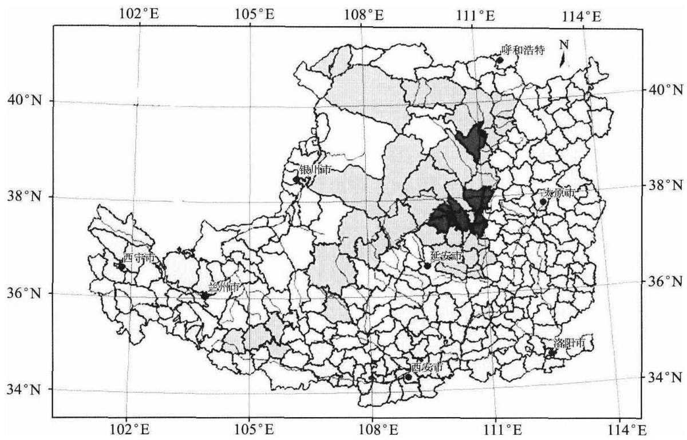  
图17.1 黄土高原地区示意图

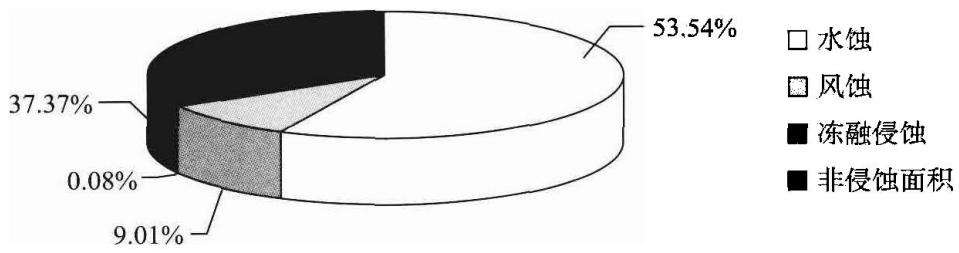  
图17.2 2002 年黄土高原地区土壤侵蚀分布

## （二）水土流失成因

影响黄土高原地区水土流失的因素可分为自然和人为因素。自然因素包括地质地貌、气候、土壤、植被等，人为因素包括破坏植被、矿产开发等引

起土壤侵蚀的各类活动。

## 1. 自然因素

## （1）地形破碎，沟壑纵横

黄土高原地区地形破碎，沟深坡陡，缓平地只占土地面积的1/5。据不完全统计，黄土高原地区长度大于1km的侵蚀沟达30余万条，总长度超过100万km。在面积达24.71万km²黄土丘陵区中，坡度为3°～7°的平坡地仅占16.2%，7°\~15°的缓坡地占27.3%，15°～25°的斜坡地占33.0%，>25°的陡坡地占23.5%；仅在黄河中游河龙区间12.1万km²范围内，就有大小沟道8万多条。

地貌与侵蚀的关系十分密切，在以黄土塬为主的地貌类型区，土壤侵蚀方式以沟蚀为主，沟蚀量可占小流域侵蚀总量80%以上。在以黄土梁峁为主的黄土丘陵区中，晋西、陕北等地坡面侵蚀和沟谷侵蚀都很严重，但沟谷地的产沙量仍占主要部分。陇中地区谷间地面积较大，坡度较小，坡长较大，土壤侵蚀方式以坡面侵蚀为主。长城沿线和高原北部地区，涧地、掌地等地貌类型分布广泛，沟头朔源侵蚀活跃，形成以坡涧为主的独特的现代侵蚀类型区。无定河上游及其以北的黄土丘陵区，地表有零星沙丘覆盖，沟谷中广泛出露中生代石砂岩和泥页岩，风蚀、水蚀和重力侵蚀很活跃。坡度陡峻是黄土高原地区地貌的又一重要特点，坡度的陡缓不仅决定土壤侵蚀的强弱，而且影响土壤侵蚀的类型，在临界坡度以下土壤侵蚀以面蚀和沟蚀为主（兼有浅沟和切沟侵蚀），超过此坡度则重力侵蚀活跃，发生滑坡、滑坍、泻溜侵蚀。

## （2）暴雨集中，降雨强度大

黄土高原地区的年降水量变化于200～600mm，但降水年季分布极不均匀，大部分地区5～9月的降水量占年总降水量的70%以上。水土流失的发生过程与暴雨径流及由此产生的暴雨洪水密切相关，暴雨径流导致高的侵蚀量和产沙量。本地区暴雨历时普遍较短，小于或等于60min暴雨多数地区占50%以上，大于或等于180min占70%以上。暴雨多发生在7～9月，空间分布有由东南西北递减特点。黄土高原地区的大面积暴雨区一般成东西带状分布，笼罩面积较大，为5万～15万km²，日最大点雨量100～150mm。黄土高原地区暴雨频繁、雨强大，一般一次暴雨量可占全年暴雨量的20%～50%。据气象资料，黄土高原地区大于100mm的降水几乎每年有1～2次，大于200mm的暴雨每3年有一次。如呼和浩特年雨量400mm左右，而一次最大雨量竟达193.2mm，约占年雨量的50%。黄土高原地区由于地势起伏不平，植被稀少，一旦暴雨出现，极易酿成洪水灾害。

## （3）土壤结构疏松，抗蚀性差

黄土高原地区地形破碎，绝大部分地区的土壤都属于侵蚀性黄绵土，有机质含量低，抗侵蚀能力低；黄土土层深厚，垂直节理发达，易发生崩塌，这是形成该地区严重的水土流失的物质基础。

黄土特殊的堆积成土方式形成了黄土颗粒的“点棱接触侧斜支架式多孔结构”，造成黄土抗冲性较弱，在雨滴打击下，极易在表层形成结皮，造成土壤渗透能力急剧减弱，抗冲性能进一步降低，为少数几次暴雨条件下地面超渗径流冲刷动力的形成创造了条件。土壤的渗透性和崩解性是判断其抗蚀能力的重要指标。黄土中0.5～0.05mm颗粒含量越高，其渗透率越大，黄土高原大部分地区的稳渗率都在0.5～1.5mm/min，这对于减少径流冲刷是很有利的。

## （4）植被覆盖率低，质量低下

由于战乱、农业开垦等使黄土高原大部分地区天然植被破坏殆尽，现有天然及人工林草植被覆盖度极低，质量差。经过近几十年的水土流失治理和植被恢复建设，植被覆盖率有一定上升，但森林覆盖率仍很低，且分布不均，大约50%以上的森林和90%以上的天然森林分布在几个林区。子午岭是黄土高原地区上黄土覆盖区森林植被保存较好的唯一地区，近几十年来同样遭到严重破坏，目前其林区范围缩小了将近20km，森林边界线平均年退缩0.5km。甘肃黄土高原地区1998年的森林面积为146.8万hm²，森林覆盖率仅为13.03%，虽然比1998年底全省森林覆盖率9.37%高，但仍低于20世纪90年代中期全国平均森林覆盖率13.92%，远低于世界平均25%的森林覆盖率。黄土高原地区的草灌覆盖度同样很低，天然草场的覆盖度只有25%～65%，其中山区草地的覆盖率较高，黄土丘陵和黄土塬区较低。由于过度放牧和滥垦、滥伐、滥挖等影响，大部分草场都向沙漠化方向发展。据文献记载，历史时期甘肃黄土高原地区曾是植被良好的繁荣富庶之地。据记载，历史时期黄土高原地区的森林覆盖率在40%～50%。甘肃黄土高原地区的草地面积为366.7万hm²，草地面积占整个甘肃黄土高原面积的32.55%。但草地的植被覆盖度普遍较低，一些地方的草场退化严重，载畜能力不高。覆盖率低的森林和草地难以起到保持水土、涵养水源的应有作用，其保护水土的功能低下。

## 2. 人为因素

长期以来，黄土高原地区的人为加速土壤侵蚀的方式主要有三种：一是陡坡耕垦；二是滥砍、滥伐、滥樵和滥牧；三是开发建设乱挖、乱堆、乱放，造成植被、土体结构和原有地表形态被破坏。长期以来，前两种破坏是主要方式。20世纪中期以来，由于生产建设和人口增加，人地矛盾突出，治理与开发的矛盾没有很好解决，造成陡坡耕垦和滥砍、滥伐、滥樵和滥牧，加剧了水土流失。

近年来，随着黄土高原地区社会经济的快速发展，特别是由于生产建设的发展和能源重化工基地建设，开发建设项目不断增加，新的人为破坏影响的强度和程度日益突出，开发建设已成为黄土高原地区水土流失的重要方面。

## (1) 陡坡开垦

黄土高原地区的人口由1953年的3733.56万人，增加到2003年的8877.64万人，人口增加了2.38倍，人口自然增长率远高于全国平均状况。在人少地区的黄土丘陵沟壑区，人口增长率更高。在1977～1979年的3年内，延安地区开荒12万hm²，同期建设基本农田和造林种草共4万hm²，破坏植被的速度为建造速度的3倍。研究表明，黄土高原地区现代侵蚀进一步加剧的主要原因是人类破坏活动造成的。数千年来，黄土高原地区农业垦荒种植，加上近代随着人口的剧增，土地利用更加不合理，任意掠夺土地资源，滥牧、滥樵、滥采、滥伐成风，原始植被彻底被破坏，使本身就非常疏松、抗冲性能弱的黄土及其上面发育的土壤失去根系的固结作用，渗透能力急剧减弱，抗冲性能进一步恶化，为少数几次暴雨条件下侵蚀的发生创造了条件。

## (2) 矿产资源开发

黄河中游大型煤田，地处多沙粗沙产区，又多处于暴雨中心地带，水土流失本来就非常严重，而煤炭的大规模开采，铲除地表原有的稀疏植被，占用破坏土地，移动大量岩石土体，造成地表土层松动，地下沙岩性物质堆积地表，这些新翻动的岩土，在风雨作用下极易风化成碎屑，并伴以滑坡、崩坍等重力侵蚀，必将加剧水土流失。尤其是露天采矿，剥离大量岩石土体，每开采1.0t煤剥离的弃土弃石数量（m³）称为剥采比。黄河中游大型煤田露天矿平均剥采比见表17.5。尽管平均剥采比不算太大，但因可采煤量较大，剥离数量还是很大的。初步普查表明，在总面积为4.57万 J $\mathbf { k m } ^ { 2 }$ 的晋、陕、蒙接壤地区，煤矿点1107处，电厂、化工厂、水泥厂、硫磺厂、铅钒厂、硅铁厂、采石场、砖厂等800多处，修建铁路200多公里，公路2000多公里，已经破坏植被面积 $1 7 0 \mathbf { k m } ^ { 2 }$ ，废弃物总量已达3300多万立方米。

表17.5 黄河中游大型煤田露天矿平均剥采比
<table><tr><td rowspan=2 colspan=1>矿名</td><td rowspan=2 colspan=1>准格尔煤田黑岱沟</td><td rowspan=1 colspan=4>神府东胜煤田</td></tr><tr><td rowspan=1 colspan=1>柠条塔</td><td rowspan=1 colspan=1>活鸡兔</td><td rowspan=1 colspan=1>马家塔</td><td rowspan=1 colspan=1>武家塔</td></tr><tr><td rowspan=1 colspan=1>可采煤量/104t</td><td rowspan=1 colspan=1>137 300</td><td rowspan=1 colspan=1>40 727</td><td rowspan=1 colspan=1>36 000</td><td rowspan=1 colspan=1>22 231</td><td rowspan=1 colspan=1>23 082</td></tr><tr><td rowspan=1 colspan=1>平均剥采比/(m³/t)</td><td rowspan=1 colspan=1>5.22</td><td rowspan=1 colspan=1>7.59</td><td rowspan=1 colspan=1>6.01</td><td rowspan=1 colspan=1>6.80</td><td rowspan=1 colspan=1>6.24</td></tr></table>

在地下矿产资源的开采过程中，除部分地面扰动外，更长期的是通过对地层、地下水等的影响，间接地使地下水位下降，地面植被退化，地面塌陷，从而加剧了水土流失。同时还具有突发性、灾难性的特点，造成巨大损失，已成为影响经济发展和社会稳定的重要因素之一。此外，在矿产资源的开发建设过程中，大量抽取地下水，造成地下水位急剧下降，加速地表植被退化和生态系统退化，进一步加剧了当地的水土流失。

## (3) 开发建设

随着区域工业化发展，人口剧增，城镇崛起，人类活动强度增大，人为践踏、施工建设等，再加之人们的环境保护意识薄弱及管理问题，造成地表植被覆盖率下降，土壤抗蚀能力减弱以及弃土弃石乱堆乱放，可动沙源急剧增加，所有这些都可能加剧水土流失，给河流泥沙带来严重影响。

开发建设项目严重水土流失造成大量泥沙淤积河床水库，降低了水利设施寿命和防洪效率，加剧洪涝灾害，严重危及建设项目和周边人民生命财产的安全，制约着当地经济和社会的可持续发展。特别是近数十年来，由于不合理的人类生产活动造成的水旱灾害、滑坡、崩塌、泥石流等，给国家经济和人民生活造成了严重危害。例如，山西省水土保持研究所进行的对比观测结果表明，修路沟道的输沙量比对照沟的输沙量多66%，该省因开矿、采石年增加土壤流失量7500万t。

开发建设项目水土流失的成因、侵蚀方式、规律等极为复杂，与一般的水土流失不同的是，开发建设项目水土流失造成的危害具有多样性、突发性、灾难性的特点。开发建设项目类型多种多样，造成水土流失的形式和危害也不相同。随着我国的人口和经济的持续增长，生产建设和资源开发活动仍将急剧增加，开发建设项目所造成的新的水土流失也仍呈继续扩大发展的趋势。

## （三）水土流失特点

## （1）土壤侵蚀面积大，强度高，类型多

黄土高原地区几乎到处都存在水土流失，黄土高原地区的水土流失面积中，土壤侵蚀模数 $\geq 5 0 0 0 \ \mathrm { t } / ( \mathrm { k m } ^ { 2 } \ \bullet \ \mathrm { a } )$ 的强度以上水蚀面积达19.1万km²，占全国同类面积的38.8%；侵蚀模数 $\geq 8 0 0 0 \ : \mathrm { ~ t / ( k m ^ { 2 } ~ \bullet ~ a ) }$ 的极强度以上水蚀面积8.51万km²，占全国同类面积的64.1%；侵蚀模数≥15000t/(km²·a）的剧烈水蚀面积3.67万km²，占全国同类面积的89%；局部地区的侵蚀模数甚至超过 $3 0 ~ 0 0 0 ~ \mathrm { { t / ( k m ^ { 2 } \cdot a ) } }$ 。黄河多年平均输沙量为16亿t，平均含沙量37.4kg/m³（是长江的29倍），支流最大含沙量达1700kg/m³（窟野河）。

水土流失类型多样。黄土高原地区特殊的地形、地貌、土壤及气候等条件，造成土壤侵蚀类型涵盖了水力侵蚀、风力侵蚀和重力侵蚀。在水力侵蚀中，有溅蚀、面蚀、细沟侵蚀、切沟侵蚀、冲沟侵蚀；重力侵蚀中有崩塌、泻溜、滑坡等类型。

（2)重力侵蚀活跃、沟道侵蚀严重

坡陡沟深是导致黄土高原地区水土流失严重的主要原因之一。破碎的地形在外营力作用下极易产生水土流失，沟底下切、沟岸扩张、沟头前进等形式的沟蚀十分剧烈。黄土高原地区沟壑密度大，沟长大于1.0km的沟道约30万条，总长超过100万km，仅河口镇至龙门区间沟长0.5～30km的沟道就有8万多条。黄土丘陵沟壑区，沟壑密度达3.4～7.6km/km²，局部地区高达12km/km²，切割深度100～300m。在黄土丘陵区，地貌单元可分为沟间地和沟谷地两类，沟缘线以上为沟间地，以下为沟谷地。据黄河水利委员会绥德水保站观测分析，沟间地和沟谷地面积分别占总面积的56.5%和43.4%，而沟谷径流量占总径流量的59.3%～83.5%，平均为64.7%；泥沙量占总输沙量的57.9%～69.5%，平均为61.3%，可见沟谷地的侵蚀量比例较高。黄土丘陵沟壑区和高塬沟壑区的大部分地区沟头每年前进1～3m，有的地方一次暴雨就使沟头前进20～30m。宁夏固原县在1957～1977年的20年间，由于沟蚀损失土地7万hm²左右。甘肃董志塬在近1000年间，由于沟蚀，塬面面积减少了580km²，接近董志塬面积的50%。

## （3）土壤侵蚀发生的时间和空间集中

黄土高原地区水土流失多集中在汛期（7～9月），侵蚀产沙量约占全年的60%～90%。来沙又往往集中于几场大的暴雨洪水，许多地方一次暴雨的侵蚀量占全年总侵蚀量的60%以上；陕蒙接壤区两川两河汛期输沙量占全年的90%以上。

黄土高原地区多年平均输入黄河的泥沙量为14亿t，占黄河年均输沙量的87.5%，其中，多沙粗沙区面积7.86万km²，多年平均输沙量11.82亿t，占黄河同期总输沙量的62.8%；粗泥沙输沙量为3.19亿t，占黄河粗泥沙总量的72.5%；粗泥沙集中来源区面积约1.88万km²，年均输入黄河的粗泥沙达1.52亿t，对黄河下游的危害最大。

## （四）水土流失的危害

黄土高原地区严重的水土流失导致区内地形破碎、耕地退化，加剧了于旱、荒漠化的发展和其他灾害的发生，特别是大量泥沙淤积在黄河下游河道，使河床不断抬高，成为地上悬河，加剧了洪水威胁。同时，大量的泥沙污染水体，淤塞水库和渠道，造成水资源利用困难。为减轻下游河道淤积，还必须保证有一定的水量输沙入海，进一步加剧了水资源供需矛盾。长期严重的水土流失，导致生态环境恶化，给区域内及其毗邻地区经济社会发展和人民群众生产、生活带来严重危害，制约了经济社会的可持续发展。

## （1）导致生态环境恶化

水土流失造成了地形支离破碎、千沟万壑。严重的水土流失和原有地面植被的破坏，恶化了生态环境，加剧了土地和小气候的干旱程度以及其他自然灾害的发生。据统计，该区每年旱灾面积超过60万hm²，大灾年份的成灾面积高达260万hm²。冬春季节大风和沙尘暴频繁出现。国家环保总局和中国科学院联合组织“探索沙尘暴”考察结果表明，内蒙古中部农牧交错带及草原区、蒙陕宁长城沿线旱作农业区，是形成我国北方沙尘暴的两个主要源区；毛乌素沙地、库布齐沙漠是入黄泥沙的重要补给源。水土流失不仅恶化该地区的生态环境，对京津及华北地区的生态环境也产生十分不利的影响。

## （2）造成土地减少，土壤退化

随着水土流失程度的加深，沟壑发展也日益加剧。在晋、陕、甘等省内，每平方公里一般有支、干沟50条以上；沟道长度可达5～6km，个别地区达10km以上；沟谷约占流域面积的10%，个别可达40%～50%。水土流失使大面积坡耕地支离破碎，耕种不便，以致弃耕荒废。

陡坡耕地的水土流失特别严重，而流失的正是土壤肥力高、生产性能好的表土。据研究，黄土高原地区 $1 5 ^ { \circ } \sim 2 5 ^ { \circ }$ 的坡耕地流失水量400～600m3/$( \mathrm { h m } ^ { 2 } \cdot \mathrm { a } )$ ，流失表层土壤 $3 0 { \sim } 1 5 0 \ \mathrm { t / ( h m ^ { 2 } \ { \bullet } \ \mathrm { a } ) }$ ；土壤中的氮、磷、钾、有机质等养分都同时流掉，造成土地日益瘠薄，土壤持水能力降低，加剧了干旱的发展，其结果是农作物产量低而不稳。例如，黄土高原地区，许多地方治理前一般每年人均粮食只有250～300kg，灾年甚至颗粒无收，靠国家从外地调进粮食救济。

## （3）泥沙淤积河道，加剧黄河洪水威胁

黄土高原地区的水土保持关系黄河流域及其与下游毗邻的华北平原地区

25万km²、1亿多人口的生命财产安全和社会稳定。黄土高原地区水土流失 $\mathbf { k m } ^ { 2 }$ 产生的泥沙在黄河下游河床淤积，改变了河势，减小了行洪能力，加剧洪水威胁。黄土高原地区每年输入黄河的大量泥沙不能入海而沉积在下游河床，使河道高出两岸外平地3\~10m，最高处达10m以上，成为举世瞩目的“地上悬河”。根据实测资料统计分析，1950～1999年下游河道共淤积泥沙92亿t，与20世纪50年代相比，河床普遍抬高2～4m。人民治黄以来，虽曾4次全面加厚加高下游堤防，但仍然不能从根本上解决“越淤越高，越高越险”的状况，1996年8月黄河花园口站洪峰流量仅 $7 \ 6 0 0 \ \mathrm { m } ^ { 3 } / \mathrm { s }$ ，其水位比1958年22 300 m³/s流量的水位还高 0.91 m，淹没下游滩地约 23 万 $\mathrm { h m } ^ { 2 }$ ，使107万人严重受灾。近20年来，由于自然因素和人类活动因素共同的影响，使得进入黄河下游河道的水沙关系更不协调，造成主河槽泥沙淤积进一步加重，“二级悬河”问题突出，河势呈现出“槽高于滩，滩高于背河地面”的局面。下游出现的“地上悬河”使黄河成为套在下游群众头上的“紧箍咒”。汛期洪水奔腾咆哮在两岸大堤中，居高临下，十分危险，成为中华民族的心腹之患。

## (4)影响水资源合理开发利用

为了减少黄河下游河道淤积和河床的急剧抬高，每年需舍弃大量的水资源用于冲沙入海，以降低河床淤积抬升，严重影响黄河流域水资源的合理有效利用。多年研究结果表明，为不使黄河下游河道淤积进一步加剧，每年约需200亿\~240亿 $\mathbf { m } ^ { 3 }$ 的输沙水量（主要是汛期洪水），平均冲沙需水量（即输沙措施的水沙代价）为33～60m³/t。调水调沙被认为是解决黄河下游泥沙淤积的有效措施。根据2002～2004年的3年（次）不同类型的调水调沙试验测算结果，用97.89亿 $\mathbf { m } ^ { 3 }$ 的水冲刷了黄河主槽中的1.483亿t泥沙，总输沙量2.327亿 t，平均每冲走1.0t主河槽的泥沙用水量为53.21m³。

水土流失产生大量泥沙下泄，淤积水库，降低了水利设施的蓄水功能，影响了水资源的开发利用。中华人民共和国成立以来，黄土高原地区各地在沟道中兴建的近3000座小水库，大部淤满失效，被迫改作坝地使用。20世纪50年代以来黄河流域共修建大中型水库601座，总库容523亿 $\mathbf { m } ^ { 3 }$ ，至1989年20.8%库容损失，总淤积库容109亿 $\mathbf { m } ^ { 3 }$

黄土高原地区水资源相对匮乏，但严重的水土流失使干、支流众多水库等水利设施淤积加快。为了减轻泥沙淤积造成的库容损失，部分黄河干支流水库不得不采用蓄清排浑的运行方式，效益不能得到充分发挥，缩短了使用年限，浪费了宝贵的水资源。据调查，黄土高原地区1950～1998年各类水库泥沙淤积量143.2亿t，其中干流水库的淤积量占56.7%，支流水库的淤积量占43.3%。三门峡水库运用初期，4年淤积泥沙44亿 $\mathbf { m } ^ { 3 }$ ，占335m高程总库容的45.6%。另外在黄河下游，为了将水土流失造成的泥沙输送入海，减少河床泥沙淤积，平均每年需要150亿m3左右的水资源用于冲沙入海，影响了水资源的合理配置和有效利用，使本已紧缺的黄河水资源更趋紧张。

## （5）制约黄土高原地区经济社会发展，影响和谐社会构建

黄土高原地区生态环境整治的严峻形势和压力主要表现在：人口-资源环境的矛盾仍很突出，不合理土地资源开发依然存在，水土流失造成土壤和土地质量退化，土地生产力低下；天然草地破坏，草地资源退化；滥伐滥垦致使天然林丧失殆尽。严重的水土流失，恶化了生态环境，加剧了于旱等自然灾害的发生，粮食产量低而不稳，坡耕地正常年景的产量一般只有375～750kg/hm²。广种薄收，形成了“越穷越垦，越垦越穷”的恶性循环，使生态环境不断恶化，制约了经济发展，加剧了贫困。水土流失是各种生态与环境问题的集中表现，也是导致生态进一步恶化和贫困的原因之一。

## （五）水土流失变化趋势

## （1）土壤侵蚀变化过程

据水利部水保监测中心的资料（见图17.3和图17.4)，比较1986年和2000年黄土高原地区土壤侵蚀强度及其面积变化，可以看出，1986年土壤侵蚀强度主要为2\~5级，以5级面积较大，占总面积的27.40%；其次为2级、

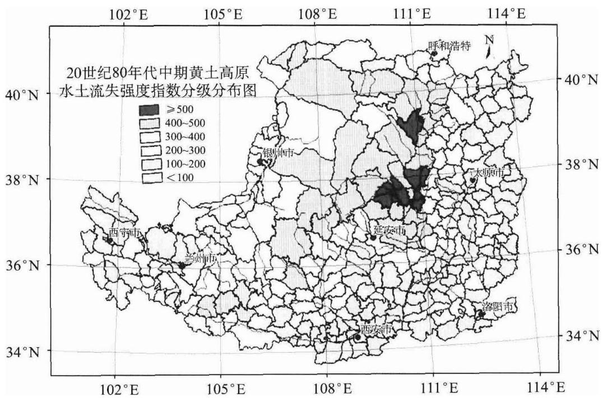  
图17.3 1986年黄土高原地区土壤侵蚀强度指数分级

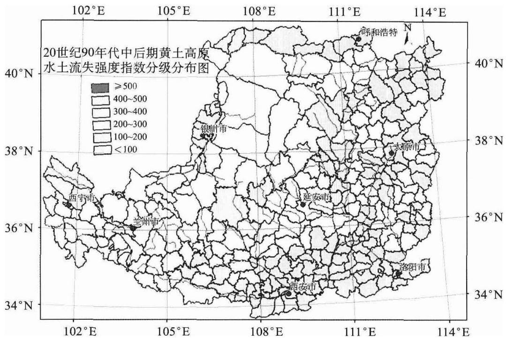  
图17.4 2000年黄土高原地区土壤侵蚀强度指数分级

4级和3级，分别约占总面积的1/4。土壤侵蚀强度最大的1级的面积约占2.0%。到2000年，土壤侵蚀强度集中在3～5级，以4级面积最大，占总面积的39.08%，5级面积由1986年的27.40%增加到30.61%，3级面积略有上升，而2级面积锐减到6.72%。

对比分析黄土高原地区1986年、2000年和2002年土壤侵蚀面积和侵蚀强度的变化（见表17.6），可以看出：从1986年到2000年，黄土高原地区土壤侵蚀面积增加了0.53万km²，面积比例由66.33%上升到67.19%，增加了0.86%，主要是水力侵蚀面积大量增加所致。虽然风力侵蚀面积减少了5.76万km²，但水力侵蚀面积增加了4.30万km²，面积比例增加了6.88%。自2000年到2002年，黄土高原地区土壤侵蚀面积减少了2.84万km²，面积比例由67.19%下降到62.63%，下降了4.56%，主要是风力侵蚀大量减少所致。其中，水力侵蚀面积比例增加了0.47%，风力侵蚀面积比例减少了5.09%。

总体看来，20世纪80年代中期以来到90年代中后期，土壤侵蚀面积略有增加，主要是由于本地区开发能源、矿产资源的速度不断加大，建设速度加快所致。这些开发建设项目及其活动具有点多面广、土地扰动程度高、水土流失强度大等特点，再加上防治措施不到位等原因，产生新的水土流失的因素增多，进一步恶化了当地的水土流失环境，加剧了水土流失。

表17.6 黄土高原地区土壤侵蚀面积动态变化
<table><tr><td rowspan=1 colspan=1>年份</td><td rowspan=1 colspan=1>研究区总面积/104km²</td><td rowspan=1 colspan=1>总侵蚀面积/104km2</td><td rowspan=1 colspan=1>侵蚀面积比例/%</td><td rowspan=1 colspan=1>水蚀面积 $/ 1 0 ^ { 4 } \mathrm { k m } ^ { 2 }$ </td><td rowspan=1 colspan=1>水蚀面积比例/%</td><td rowspan=1 colspan=1>风蚀面积/104km2</td><td rowspan=1 colspan=1>风蚀面积比例/%</td></tr><tr><td rowspan=1 colspan=1>1986</td><td rowspan=1 colspan=1>62.40</td><td rowspan=1 colspan=1>41.39</td><td rowspan=1 colspan=1>66.33</td><td rowspan=1 colspan=1>28.68</td><td rowspan=1 colspan=1>45.96</td><td rowspan=1 colspan=1>12.39</td><td rowspan=1 colspan=1>19.86</td></tr><tr><td rowspan=1 colspan=1>2000</td><td rowspan=1 colspan=1>62.40</td><td rowspan=1 colspan=1>41.92</td><td rowspan=1 colspan=1>67.19</td><td rowspan=1 colspan=1>32.98</td><td rowspan=1 colspan=1>52.84</td><td rowspan=1 colspan=1>8.80</td><td rowspan=1 colspan=1>14.10</td></tr><tr><td rowspan=1 colspan=1>2002</td><td rowspan=1 colspan=1>62.40</td><td rowspan=1 colspan=1>39.08</td><td rowspan=1 colspan=1>62.63</td><td rowspan=1 colspan=1>33.41</td><td rowspan=1 colspan=1>53.55</td><td rowspan=1 colspan=1>5.62</td><td rowspan=1 colspan=1>9.01</td></tr></table>

\*总侵蚀面积中还包括冻融侵蚀面积。

在2000～2002年，随着国家对水土保持生态环境建设工作的重视和投入的增加，区域水土流失状况有所改善，植被覆盖有所增加，土壤侵蚀面积有所减少，区域水土流失状况有所改善，局部治理成效明显。但10多年来，土壤侵蚀面积比例都在60%～70%之间，土壤侵蚀总体状况并没有大的改变。水土流失治理任务仍然艰巨，形势依然严峻。

## (2)水土流失变化趋势预测

以《黄河流域水土保持基本资料》上的数据为现状资料，在对不同水土保持治理措施作用机制和效益综合分析的基础上，结合水土保持生态环境建设规划，根据不同水土保持治理措施作用的动态过程及其效益的相应变化，运用黄土高原地区分布式流域水土流失预报概念模型，对黄土高原地区典型流域未来水土流失变化趋势进行预测，提出了黄土高原地区未来10年、15年、20年、30年和50年的坝系建设规划图、植被覆盖变化图、径流模数图、侵蚀模数图等系列资料（见图17，5）。可以看出，在未来大规模水土流失治理情况下，黄土高原地区的水土流失情况将得到有效治理，水土流失模数明显降低，生态环境得到有效改善。

## 三、水土保持现状

黄土高原地区的水土保持与生态建设是治理黄河根本任务，始终是党和政府长期关注的问题。经过长期治理，黄土高原地区水土流失得到初步控制，生态环境有所改善；地区间发展极不平衡，重点投资区治理成效显著，开发建设项目区仍存在潜在的恶化趋势。

国家对黄土高原地区水土保持生态建设的支持力度不断加大，改革开放以来，先后实施了国家水土保持重点建设工程、黄河水土保持生态工程、黄土高原地区世界银行贷款项目、砥砂岩地区沙棘生态工程、黄土高原地区淤

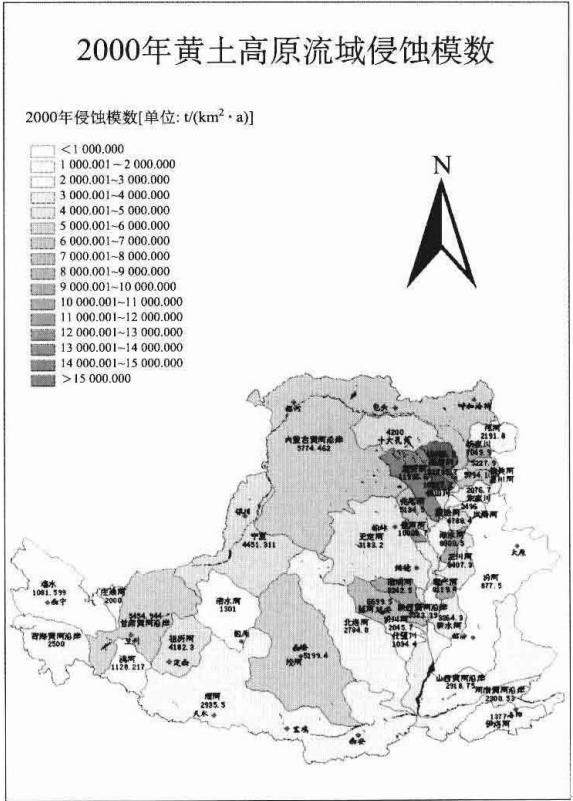

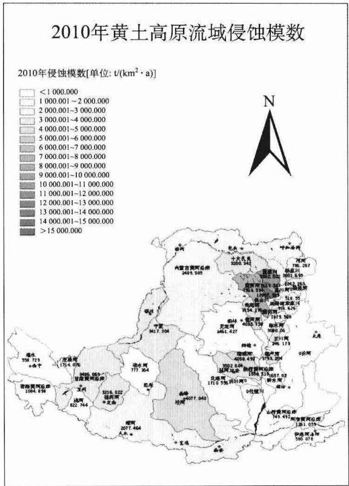

## 2030年黄土高原流域侵蚀模数

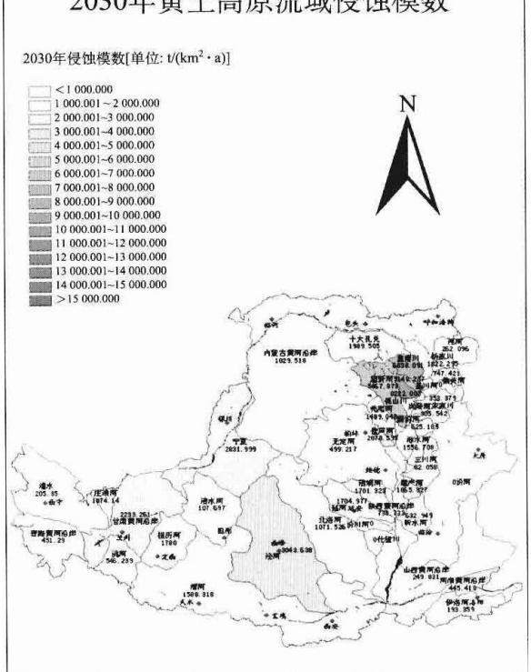

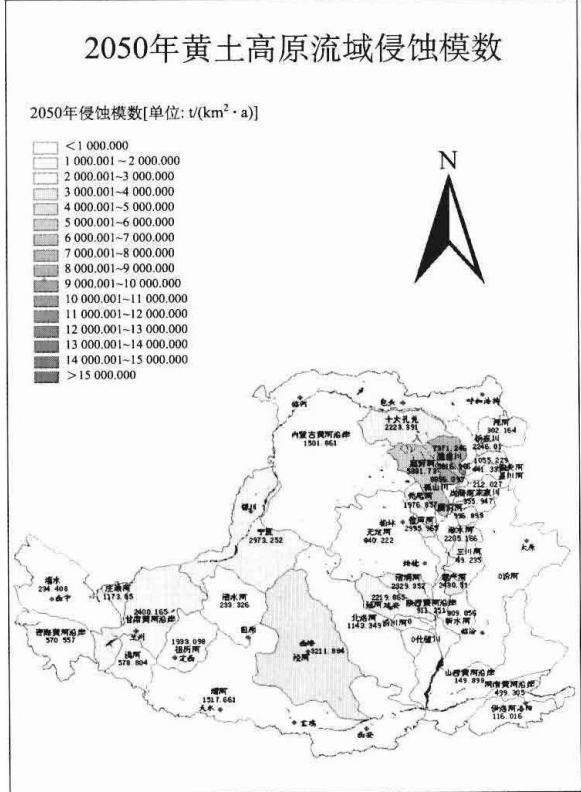  
图17.5 黄土高原地区未来10年、30年和50年流域侵蚀模数变化

地坝工程、中央财政预算内专项资金水土保持工程、退耕还林工程等一大批水土保持生态建设重点项目，其投资力度之大、覆盖范围之广、效果之显著，都是前所未有的。截至2005年底，黄土高原地区累计完成水土流失综合治理面积21.4万km²，其中，建设基本农田768.26万hm²，营造水土保持林1052.88万hm²、建设人工草地318.86万hm²，建成淤地坝11.4万座，其中骨干坝2000余座。2000年启动实施的黄河水土保持生态工程，累计治理水土流失面积7186km²，已成为影响广泛、效益显著、示范作用强的生态环境建设标志性工程，涌现出了青海互助和大通、甘肃天水、宁夏彭阳和盐池、内蒙古准格尔旗、山西吉县和平鲁、河南偃师、陕西吴起和志丹等一批治理规模大、标准高、质量好、建管机构健全的水土保持示范区样板，黄土高原地区的水土保持工作取得了举世瞩目的成就。

## （一）治理成效显著

## （1）土壤侵蚀强度降低，入黄泥沙显著减少

据水利部水土保持监测中心的资料（见表17.7及图17.3～图17.4）。2000年与1986年相比，黄土高原地区土壤侵蚀强度及其面积发生显著变化，强度侵蚀面积显著减少。从黄河输沙量看，黄河干流年均输沙量减少50%。截至2005年底，黄土高原地区水土保持措施平均每年减少入黄泥沙4.1亿\~4.5亿t，占黄河输沙减少量的50%，表明近15年来黄土高原地区土壤侵蚀强度明显降低，进入黄河的泥沙量减少。

表17.7 黄土高原地区土地侵蚀强度指数分级及其动态变化
<table><tr><td rowspan=2 colspan=1>土壤侵蚀强度指数</td><td rowspan=2 colspan=1>等级</td><td rowspan=1 colspan=3>1986年</td><td rowspan=1 colspan=3>2000年</td></tr><tr><td rowspan=1 colspan=1>县数/个</td><td rowspan=1 colspan=1>面积/104km²</td><td rowspan=1 colspan=1>面积比例/%</td><td rowspan=1 colspan=1>县数/个</td><td rowspan=1 colspan=1>面积/104km</td><td rowspan=1 colspan=1>面积比例/%</td></tr><tr><td rowspan=1 colspan=1>&lt;100100~200200~300300~400400~500≥500</td><td rowspan=1 colspan=1>654321</td><td rowspan=1 colspan=1>91067754356</td><td rowspan=1 colspan=1>0.5417.1014.5214.3814.621.24</td><td rowspan=1 colspan=1>0.8627.4023.2823.0523.431.98</td><td rowspan=1 colspan=1>01319842160</td><td rowspan=1 colspan=1>0.0019.1024.3914.724.190.00</td><td rowspan=1 colspan=1>0.0030.6139.0823.596.720.00</td></tr></table>

（2）坡改梯和淤地坝工程加速了基本农田建设，促进了农民增产增收和退耕还林（草）工程的稳步发展

坡改梯是坡地整治的一项重要措施，能有效减少水土流失、提高农田生产能力。在陕北的延安、安塞等地试验结果表明，坡地改成梯田后，土壤含水量提高4%～12%，土壤有机质含量由 3.7\~7.6 g/kg增加到11 g/kg；含氮由 0.24\~0.25 g/kg 增至 0.88 g/kg，有效磷由 2\~5 mg/kg 增至 8 mg/kg。据试验观测和生产实践调查，水平梯田可以拦蓄坡面径流的70%～95%，保土90%～100%，平均每公顷可增产粮食1125kg以上。黄土高原地区已建成梯田440.95hm²，每年共可增产500余万吨粮食，对控制水土流失、提高土地生产能力起到有效作用。在全国率先实现梯田化的甘肃省庄浪县，至1999年底，全县农民人均建成水平梯田0.167hm²，1997年在遭受50年一遇特大旱灾的情况下，梯田粮食每公顷产量达2292.0kg，而坡耕地几乎绝收，全县粮食仍保持自给。

淤地坝工程是黄土高原地区水土保持的关键措施之一。“沟里筑道墙，拦泥又收粮”，这是黄土高原地区群众对淤地坝作用的形象总结。坝地与坡耕地相比较，土壤含水量高80%，土壤养分提高30%。据典型调查，坝地平均单产一般为 4500～6000 kg/hm²，有的高达13 500 kg/hm²，是坡耕地的 6～10倍。山西省汾西县康和沟流域，坝地面积占总耕地面积28%，粮食总产却占该流域粮食总产量的65%。1995年陕西省遭遇特大干旱，榆林市横山县赵石畔流域 106.67 hm² 坝地粮食产量均达到 4500 kg/hm²以上，而 1666.6 hm²坡耕地单产量仅150kg/hm²。当前黄土高原地区已建成淤地坝约11.4万座，拦截泥沙210多亿t，淤地31.33万hm²，发展灌溉面积0.53万hm²，保护下游沟、川、台地1.33万hm²。长期的实践证明，大规模开展淤地坝建设，发挥拦沙、蓄水、淤地、增产等综合功能，对促进当地农业增产、农民增收、农村经济发展，巩固退耕还林成果，改善生态环境，再造秀美山川，有效减少入黄泥沙，实现区域经济社会可持续发展具有非常重要的现实意义。

## （3）扭转了长期以来植被数量、质量持续下降的不良局面，生态系统得到改善

黄土高原地区是国家退耕还林还草的重点实施区，在国家退耕还林草政策的支持下，黄土高原地区林草地覆盖率显著提高。据国家林业局对退耕还林（草）质量核查结果，2002年退耕还林草面积核实率为95.8%，造林质量合格率为89.6%。陕西省榆林市调查的3个县植被覆盖率增加到43%（年均增幅2%）。山西全省植被覆盖率增加到18%（年均增幅1.5%）。尽管各地区发展不平衡，但植被覆盖率整体增加、质量提高是一个不争的事实，农民的直接感受是“草多了，草高了，圈养牛羊容易了”。在黄土高原地区植被的数量和质量长期以来处于下降局面下，退耕还林还草工程的实施首次实现了植被覆盖率整体增加趋势；封禁措施发挥自然恢复潜力，投资少、见效快，更具生命力。

## （4）促进了农村经济结构调整和区域经济社会的协调发展

通过坡耕地综合整治以及坝地建设，促进了旱涝保收基本农田、经济园林和水土保持林草建设，为发展优质高效农林产业结构调整奠定了基础，使过去相对单一的粮食生产经济结构，转变为农、林、牧、副多种经营，发展了农村经济，增加了农民收人，保证了粮食的自给，解决了群众的后顾之忧。使农民由过去的广种薄收改为少种高产多收，优化了土地利用结构，促进了陡坡耕地退耕还林草，推动了大面积植被的恢复，改善了生态环境，确保真正实现“退得下，还得上，稳得住，能致富”。分析国家八大片水土保持重点治理区中的无定河流域二期治理工程实施效果看，仅治理5年时间，治理度提高了3.2倍，植被覆盖率增长3.7倍。由于重视了以基本农田建设为主的坡耕地整治工程建设，人均增加粮食3.8倍，养殖业、经济果林得以发展，农村劳动力也逐步向外转移，人均纯收入比治理前增长近5倍。另据对陕西省绥德县正茂庄小流域的调查研究，在人口增长、大量坡耕地退耕还林还草、粮食播种面积缩小的情况下，粮食总产稳定增加。该流域耕地面积由占总面积的57%下降到28%，林地面积由3%上升至45%，草地面积由3%上升到7%，实现了人均林地2.4hm²、草地0.3 hm²，全部荒山荒坡实施了生态自然修复，治理区的生态环境得到了明显改善。

## (二）主要经验

在50多年的生态治理实践中，黄土高原地区的水土保持工作积累和总结出了丰富经验，不仅为本地区水土流失治理走出了一条具有特色的道路，而且为带动全国水土保持工作的开展发挥了重要作用。可以说，世界的水土保持看中国，中国的水土保持看黄土高原地区。

## 1. 以流域为单元进行水土保持综合治理，促进生态改善与经济同步发展

从黄土高原地区实际情况出发，多年来已初步创造出新的治理经验。以县为基本单位，以小流域为单元，以修建基本农田和发展林果业为突破口，由单一措施、分散治理，转向以小流域为单元，全面规划，综合治理，集中连片治理。这一做法在解决群众基本口粮和一定经济收入的基础上，为退耕还林还草打下基础，并在广大地区得到不同程度的实施。据1999年报道，黄土高原地区开展治理的小流域已达2300条，都不同程度地取得了较好效果。

例如，陕西省延安市宝塔区坚持统一规划，实行“五个结合”，狠抓小流域综合治理，治理程度已达61.6%，林草覆盖率达50%，农民人均粮食600多公斤。因此，以小流域为单元，山、水、田、林、路统筹规划，综合治理，既符合自然规律，也符合经济规律，深得当地群众和各级政府赞同。在以小流域为单元的基础上，以支流为骨架，集中连片治理，取得明显的群体效益。

## 2. 以淤地坝建设为核心的沟道治理，形成拦截泥沙屏障

通过试验和示范，探索、总结出了“以小流域为单元，骨干坝控制，中小型淤地坝合理配置、联合运用”的沟道坝系建设技术路线，建成了一批防洪标准高、综合效益好的典型坝系。大规模开展淤地坝建设，发挥拦沙蓄水淤地等综合功能，建设高产稳产基本农田，对促进当地农业增产、农民增收、农村经济发展，巩固退耕还林成果，改善生态环境，再造秀美山川，有效减少入黄泥沙，实现区域经济社会可持续发展具有非常重要的现实意义。当前黄土高原地区已建成淤地坝约11.3万座，实现拦截泥沙210多亿吨，淤成坝地30多万公顷，发展灌溉面积5300多公顷，保护下游沟、川、台地1.33多万公顷。据典型调查，坝地平均每公顷粮食产量一般为4500～6000kg，有的高达13500kg，是坡耕地的6～10倍。因此，黄土高原地区广泛流传着“宁种一亩沟，不种十亩坡”、“打坝如修仓，拦泥如积粮，村有百亩坝，再旱也不怕”的说法。

## 3. 重视基本农田建设，保障黄土高原地区粮食安全

多年来，黄土高原地区各省区始终以满足区域粮食基本自给为目标，坚持把农田水利基本建设作为提高农业综合生产能力的基础工程和根本措施来抓。通过开展坡改梯、建设淤地坝等方式不断扩大基本农田面积，为粮食稳产奠定坚实基础，确保了农村粮食增产、农民增收，促进了农业产业结构的调整。典型的例子就是延安市宝塔区的新庄科流域，数十年来这里坚持综合治理不动摇，不懈地开展了农田水利基本建设，累计建成高标准基本农田437hm²，大中小淤地坝61座，退耕还林还草1600hm²，到2002年底农民人均产粮500kg，人均纯收入1600元，基本实现了“山绿、水清、人富”的目标。

黄土高原地区各地均将淤地坝建设列为水土保持与生态建设的首选治理措施，也是各地高标准基本农田建设的重要措施之一。陕北和渭北黄土高原地区围绕粮食安全，持续掀起了以淤地坝建设为主要内容的农田水利基本建设，累计建起了3.8万多座淤地坝，淤地能力达到6.7万hm²，已经淤地5.3万hm²。榆林市现有坝地3万hm²，面积仅占全市耕地的2.4%，但粮食产量占全市总产量的20%左右。近年来，陕北各地充分利用坝地高水高肥的优势发展高效农业，加快了群众脱贫致富步伐，促进了区域经济快速发展。

## 4. 重视生态自我修复，实现人与自然和谐

水利部提出“加强封育保护，充分发挥生态自我修复能力，加快水土流失防治步伐”的水土流失防治新思路，是水土保持生态建设理论和实践的深化与发展，也是水土保持生态建设思路的重大战略调整。在黄土高原地区，绝大多数植物生态系统演替的基础都存在，只要停止人为干扰，植物生态系统就有向着更复杂多样、更稳定的方向发展的趋势。中国科学院水利部水土保持研究所安塞水土保持试验站经过30多年的定位研究表明，黄土丘陵区生态退化区没有从根本上破坏植被恢复演替的物种和环境生态基础，可以通过自我修复恢复植被。植物群落被封禁后，恢复的原动力来源于植物生态系统演替。封禁措施（包括禁伐、禁牧）在晋陕两地全面实施5年来，效果明显，深受群众欢迎。

## 5. 建立以国家投入为主体的多元化投入机制，探索出水土保持生态建设的政策新机制和组织形式

近年来，陕西省和山西省由于煤气资源开发，各地经济运行状况得到明显改善，人们的生态意识日趋增加，同时也促进了水土保持生态建设管理机制的创新。山西省在流域治理中，十分注重引入市场机制，不断创新水土保持与生态建设的政策机制与组织形式。从20世纪80年代的户包治理小流域，到90年代的拍卖“四荒地”，再到现在退耕还林“个体承包”，生态建设重点项目国家投资直接到户，其目的都是要用政策调动广大农民群众的积极性，用利益引导农民投身到小流域治理和生态建设中来。目前，山西省承包治理的农户达到23万户，购买治理的农户达到34万户，总面积达到170万hm²。同时，适应生态建设大规模推进的需要，水保专业队、植树专业队应运而生，并迅速发展壮大，成为小流域综合治理的一支重要力量。山西临汾市通过建立“护坝田”制度，解决了淤地坝管理维修资金来源问题，使淤地坝建设步入了良性循环的发展轨道。山西省柳林县昌盛农场是在吕梁市“四荒”拍卖治理政策的推动下，由企业与职工、农民以股份制形式创办的农业综合开发企业，自1996年创办以来，通过科学规划、综合治理、全面建设，已建成“种、养、加”协调发展绿色产业企业。

## 6. 以预防保护为主的监督执法，有效遏制了开发建设造成的人为水土流失

黄土高原地区水土保持预防监督工作以《水土保持法》为准绳，进一步加大了规范化建设的力度，全面落实水土保持设施与开发项目主体工程同时设计、同时施工、同时投产使用的“三同时”制度，使区域水土保持工作取得了明显进展。目前黄土高原地区启动了水土保持监测工作，已建成7个省（区）监测总站和39个地区监测分站，开展了重点区域、重点流域和项目区的水土保持动态监测，定期向社会发布水土流失监测公告，为水土保持工作提供了有力的技术支撑。

黄土高原地区水土保持预防监督管理得到长足发展，表现在建立较为完善的执法文书体系和档案管理制度；坚持法律面前人人平等，不论大小轻重，只要破坏治理成果，造成水土流失的都要按水土保持法的有关规定办理；推行公开监督承诺制度，建立监督管护示范窗口，从事实的角度向社会宣传水土保持预防监督在生态建设中的地位和作用；推行“政府防治水土流失目标责任制”和“政府向同级人大报告水土保持工作制”，充分发挥人大与上级业务主管部门的监督、指导职能；按照“谁治理、谁受益、谁管护”的政策，建立管护体系，确立管护主体，实行目标责任制、奖惩制，突出管护效果。

目前，黄土高原地区已初步形成了流域机构统筹，当地政府负责，协调一致、各负其责、相互配合的流域水土保持工作管理机制。实践证明，实行流域管理与区域管理相结合的管理机制，符合黄土高原地区的实际，对于推动黄土高原地区水土保持工作健康、持续发展起到了十分重要的作用。

## 7. 科学技术在促进水土流失治理中具有不可替代的作用

黄土高原地区土壤侵蚀研究工作，经过几代人长达半个多世纪的努力，积累了大量的调查和观测资料，在土壤侵蚀类型和侵蚀方式、土壤侵蚀定量评价、土壤侵蚀分区、土壤侵蚀预报、土壤侵蚀研究方法、土壤侵蚀危害及其评价、土壤侵蚀防治、径流调控与科技示范技术模式等方面取得了明显进展。

在黄土高原地区水土保持科学研究方面，建立了较为合理、完善的土壤侵蚀分类系统，编制了黄土高原地区1：50万土壤侵蚀类型图和土壤侵蚀强度等分区图，明确划分出水蚀风蚀类型区；提出了适合黄土高原雨滴动能计算公式，探讨了较为通用降雨侵蚀力指标，提出了适合本地区的侵蚀性暴雨标准，较为系统研究了坡面细沟侵蚀、浅沟侵蚀的发生发展过程；建立了在地理信息系统支持下的坡面侵蚀预报模型、沟坡侵蚀预报模型和流域的侵蚀预报模型；利用示踪元素、信息技术与空间技术在土壤侵蚀研究的新方法与新技术方面也取得长足进步。尤其是建立了符合该区域自然条件的土壤侵蚀研究方法体系，在坡耕地土壤侵蚀过程、土壤抗冲抗蚀性、水力风力两相叠加侵蚀、侵蚀环境演变等方面取得了一批对西部生态环境建设具有重大指导意义的科研成果。

在黄土高原地区水土保持科技推广与示范方面，围绕径流资源调控利用技术，结合新材料技术、信息技术、智能技术，对相关关键技术进行集成与组装，建成了具有产、学、研相结合的径流高效调控科技示范区和辐射推广区；在黄土高原不同类型区，建立了一系列水土保持治理技术模式，并在国家实施的退耕还林还草工程中得到广泛的应用与推广，极大地促进了水土流失治理成效的提高和地方经济的发展。

## （三）存在的主要问题

## 1. 水土流失形势依然严峻，而投资强度不足和工程建设标准低，治理进度及生态环境现状与全面建设小康社会的需求存在较大差距

近年来，国家已加大了对黄土高原地区生态环境建设的投入，无疑将有力地推动黄土高原地区的生态环境建设的进程，但与黄土高原地区水土流失面积以及治理任务的艰巨性相比，国家投入的资金还是十分有限，致使目前黄河泥沙与水量关系发生显著变化，黄河水沙关系更加恶化。大量的治理经验和研究结果业已表明，该地区生态环境建设需加大投入力度。国际组织援助的黄土高原地区治理项目，每平方公里投资在40万～60万元左右，而国内项目仅有6万元左右，投资标准过低，治理的质量与进度难以保证。

## 2. 水土保持生态建设的管理体制不顺，缺乏统一的规划和技术标准，综合协调不足，与全社会、多部门广泛参与的形势不相适应

水土保持生态环境建设参与部门众多、涉及面广，且在多数地区肩负着改善生态环境和发展经济的双重使命。目前由计划、农业、林业、水利水保、土地、环保等多部门，以条块分割的形式所形成的分散投资、各自实施的局面，不仅严重降低国家生态环境建设投资效率，而且由于各部门更多地强调行业特点，致使本应高度综合的生态环境建设往往具有单一化的现象。监督管理薄弱，开发建设项目造成的人为水土流失尚未得到全面有效的遏制，一些地区破坏大于治理的状况依然存在。不少地区部门间尚缺乏相互协调和有机联系，条块分割的投资与管理机制的弊端，已对生态环境建设造成不利的

影响，应引起高度重视。

## 3. 科学研究和技术推广仍然滞后，水土保持生态建设工程缺乏有力的科学支撑

由于黄土高原地区水土流失类型复杂，影响因素众多，目前对水土保持机理研究较为薄弱，特别是对水土流失基本规律、土壤侵蚀发生和调控机理等科学问题认识不清，致使水土流失科学研究不能满足水土保持与生态建设的需求，制约着生态的改善和经济的发展。诸如对水土保持工作中治坡与治沟的关系、上下游治理的关系、生物与工程措施的关系等一系列重大问题都存在疑问与争议，影响了国家水土保持生态治理战略布局与实施。在林草植被建设中，长期以来由于认识、技术和管理方面存在诸多问题，难以实现有规模的退耕还林还草，林草植被建设几起几落，致使总体上林草植被建设薄弱制约着区域生态建设。由于我国科技投入的整体不足，水土流失预报模型尚未真正建立，制约着我国水土保持工作。

## 第二节 分 区

近50年来，对黄土高原地区水土保持与生态建设提出过不少方案和建议，见仁见智，众说纷纭，至今尚未统一。由于有些方案过细或者过粗，均不利于宏观调控。进行水土保持分区的目的是反映一个区域水土保持工作的方向、目标、措施及其配置、效益等的地域分布规律，而一个区域水土保持方向、目标、措施及其配置和效益是与当地的自然环境、社会经济条件、水土流失类型及强度密切相关。水土保持分区就是要把自然环境与社会经济条件、土地利用方向、水土流失类型、水土保持方向、措施配置基本一致或相似区域加以归并，找出水土保持的区域分异规律。黄土高原地区水土保持分区要反映不同区域土壤侵蚀特征及其差异性，要求同一区域自然条件、土壤侵蚀类型和防治措施基本相同，而不同类型区之间则有较大差别。

## 一、水土流失分区原则与方案

## （一）水土流失分区原则

进行水土流失分区的目的是反映区域水土流失的地域性分布规律。区域水土保持方向、目标、措施及其配置和适宜性与当地的自然环境、社会经济条件分区密切相关。通过水土流失分区，把自然环境与社会经济条件、土地利用方向、水土流失类型、水土保持方向、措施配置基本一致或相似区域加以归并，找出水土保持的区域分异规律。因此，科学合理的水土流失分区可为区域水土保持工作提供科学依据。黄土高原地区水土流失分区应反映不同区域土壤侵蚀特征及其差异性，要求同一区域自然条件、土壤侵蚀类型和防治措施基本相同，而不同类型区之间应有较大差别。

黄土高原地区水土流失分区应遵循以下原则：同一区内的土壤侵蚀类型和侵蚀强度应基本一致；同一区内影响土壤侵蚀的主要因素等自然条件和社会经济条件基本一致；同一区内的治理方向、治理措施和土地利用方向基本相似；各区在侵蚀形态、侵蚀程度、侵蚀因素（自然因素中的地形、降雨、土壤、植被，社会经济因素中的人口密度、耕垦指数等）等方面都有明显的差异；分区以自然界线为主，适当照顾行政区域的完整性和地域的连续性。

## （二）水土流失分区方案

在对地区综合考察的基础上，参考全国生态环境建设规划，黄土高原地区面积64.2万km²，结合当前的水土流失现状、经济发展水平、治理次序和国家相关科技发展规划，以及目前黄土高原地区水土保持与生态环境治理的实际情况，主要参考黄秉维等人根据黄土高原地区水土流失特点，将黄土高原地区划分9个水土流失类型区，依次是丘陵沟壑区、高塬沟壑区、风沙区、丘陵林区、干旱草原区、高地草原区、土石山区、冲积平原区、阶地区（见图17.6)。考虑到黄土高原地区西北部与东南部在雨量和温度上差异较大，在冲积平原中将宁夏、内蒙古平原与陕、晋、豫平原分开；在土石山区中将青、甘、宁、内蒙古等4省（区）的土石山区与陕、晋、豫3省的土石山区分开，与原来丘陵区下属的5个副区一起，都作为第三级区划。黄土高原地区水土流失分区基本自然条件情况和主要特征分别见表17.8和表17.9。

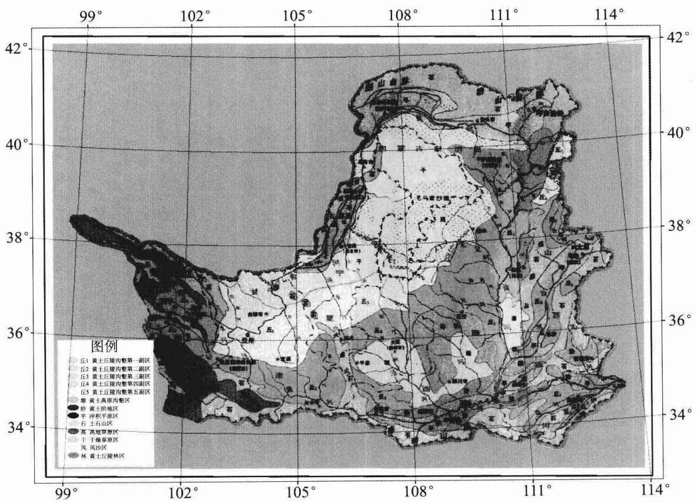  
图17.6 黄土高原地区水土流失分区

表17.8 黄土高原地区水土流失分区及水热条件简况
<table><tr><td rowspan=1 colspan=4></td><td rowspan=1 colspan=3></td><td rowspan=1 colspan=1></td></tr><tr><td rowspan=2 colspan=2>水土保持分区</td><td rowspan=1 colspan=2>面积/万 km²</td><td rowspan=2 colspan=1>年均降水量/mm</td><td rowspan=2 colspan=1>年均径流深/mm</td><td rowspan=2 colspan=1>年均气温/℃</td><td rowspan=2 colspan=1>≥10℃积温/℃</td></tr><tr><td rowspan=1 colspan=1>总面积</td><td rowspan=1 colspan=1>流失面积</td></tr><tr><td rowspan=5 colspan=1>丘陵沟壑区</td><td rowspan=1 colspan=1>第一副区</td><td rowspan=1 colspan=1>7.03</td><td rowspan=1 colspan=1>6.02</td><td rowspan=1 colspan=1>400~500</td><td rowspan=1 colspan=1>40~50</td><td rowspan=1 colspan=1>6.5~9.2</td><td rowspan=1 colspan=1>3400</td></tr><tr><td rowspan=1 colspan=1>第二副区</td><td rowspan=1 colspan=1>2.70</td><td rowspan=1 colspan=1>2.01</td><td rowspan=1 colspan=1>450~500</td><td rowspan=1 colspan=1>30~60</td><td rowspan=1 colspan=1>7.7~9.7</td><td rowspan=1 colspan=1>3000</td></tr><tr><td rowspan=1 colspan=1>第三副区</td><td rowspan=1 colspan=1>3.55</td><td rowspan=1 colspan=1>2.61</td><td rowspan=1 colspan=1>500~550</td><td rowspan=1 colspan=1>80~130</td><td rowspan=1 colspan=1>6.6~11.3</td><td rowspan=1 colspan=1>2500</td></tr><tr><td rowspan=1 colspan=1>第四副区</td><td rowspan=1 colspan=1>2.33</td><td rowspan=1 colspan=1>2.00</td><td rowspan=1 colspan=1>400~450</td><td rowspan=1 colspan=1>25~50</td><td rowspan=1 colspan=1>3.8~7.8</td><td rowspan=1 colspan=1>2300</td></tr><tr><td rowspan=1 colspan=1>第五副区</td><td rowspan=1 colspan=1>6.15</td><td rowspan=1 colspan=1>5.50</td><td rowspan=1 colspan=1>300~400</td><td rowspan=1 colspan=1>10~25</td><td rowspan=1 colspan=1>5.2~8.2</td><td rowspan=1 colspan=1>2300</td></tr><tr><td rowspan=1 colspan=2>高塬沟壑区</td><td rowspan=1 colspan=1>3.24</td><td rowspan=1 colspan=1>3.06</td><td rowspan=1 colspan=1>500~600</td><td rowspan=1 colspan=1>30~50</td><td rowspan=1 colspan=1>8.5~10.5</td><td rowspan=1 colspan=1>3700</td></tr><tr><td rowspan=1 colspan=2>干旱草原区</td><td rowspan=1 colspan=1>6.50</td><td rowspan=1 colspan=1>3.7</td><td rowspan=1 colspan=1>180~240</td><td rowspan=1 colspan=1>2~5</td><td rowspan=1 colspan=1>7.2~8.5</td><td rowspan=1 colspan=1>3200</td></tr><tr><td rowspan=1 colspan=2>高地草原区</td><td rowspan=1 colspan=1>5.70</td><td rowspan=1 colspan=1>2.65</td><td rowspan=1 colspan=1>400~600</td><td rowspan=1 colspan=1>25~80</td><td rowspan=1 colspan=1>1.1~3.7</td><td rowspan=1 colspan=1>600</td></tr><tr><td rowspan=1 colspan=2>林区</td><td rowspan=1 colspan=1>3.68</td><td rowspan=1 colspan=1>1.58</td><td rowspan=1 colspan=1>600~700</td><td rowspan=1 colspan=1>25~100</td><td rowspan=1 colspan=1>7.4~11.5</td><td rowspan=1 colspan=1>3000</td></tr><tr><td rowspan=1 colspan=2>黄土阶地区</td><td rowspan=1 colspan=1>1.96</td><td rowspan=1 colspan=1>0.88</td><td rowspan=1 colspan=1>500~650</td><td rowspan=1 colspan=1>50~150</td><td rowspan=1 colspan=1>9.3~12.6</td><td rowspan=1 colspan=1>3400</td></tr><tr><td rowspan=2 colspan=1>土石山区</td><td rowspan=1 colspan=1>青甘宁蒙副区</td><td rowspan=1 colspan=1>2.50</td><td rowspan=1 colspan=1>2.12</td><td rowspan=1 colspan=1>200~400</td><td rowspan=1 colspan=1>50~100</td><td rowspan=1 colspan=1>6.0~8.0</td><td rowspan=1 colspan=1>2500</td></tr><tr><td rowspan=1 colspan=1>陕晋豫区</td><td rowspan=1 colspan=1>6.42</td><td rowspan=1 colspan=1>4.76</td><td rowspan=1 colspan=1>500~700</td><td rowspan=1 colspan=1>100~200</td><td rowspan=1 colspan=1>8.5~10.5</td><td rowspan=1 colspan=1>3500</td></tr><tr><td rowspan=1 colspan=2>风沙区</td><td rowspan=1 colspan=1>7.04</td><td rowspan=1 colspan=1>4.55</td><td rowspan=1 colspan=1>150~400</td><td rowspan=1 colspan=1>15~20</td><td rowspan=1 colspan=1>6.0~8.0</td><td rowspan=1 colspan=1>3200</td></tr><tr><td rowspan=2 colspan=1>冲积平原区</td><td rowspan=1 colspan=1>宁蒙副区</td><td rowspan=1 colspan=1>3.10</td><td rowspan=1 colspan=1>2.00</td><td rowspan=1 colspan=1>200~300</td><td rowspan=1 colspan=1>5~25</td><td rowspan=1 colspan=1>6.0~8.0</td><td rowspan=1 colspan=1>3000</td></tr><tr><td rowspan=1 colspan=1>陕晋豫副区</td><td rowspan=1 colspan=1>2.30</td><td rowspan=1 colspan=1>1.96</td><td rowspan=1 colspan=1>500~600</td><td rowspan=1 colspan=1>5~150</td><td rowspan=1 colspan=1>10.5~13.8</td><td rowspan=1 colspan=1>4000</td></tr></table>

表17.9 黄土高原水土流失分区特征
<table><tr><td rowspan=3 colspan=2>水土保持分区</td><td rowspan=1 colspan=6>地形地貌</td><td rowspan=3 colspan=1>林草覆盖率/%</td><td rowspan=3 colspan=1>水土流失特点</td><td rowspan=3 colspan=1>侵蚀模数/[t/(km²·a)]</td></tr><tr><td rowspan=2 colspan=1>主要特征</td><td rowspan=2 colspan=1>沟壑密度/(km/km²)</td><td rowspan=1 colspan=4>地面坡度组成/%</td></tr><tr><td rowspan=1 colspan=1>&lt;5°</td><td rowspan=1 colspan=1>5°~15°</td><td rowspan=1 colspan=1>15°~25°</td><td rowspan=1 colspan=1>&gt;25°</td></tr><tr><td rowspan=5 colspan=1>黄土丘陵沟壑区</td><td rowspan=1 colspan=1>第一副区</td><td rowspan=1 colspan=1>峁状丘陵地形破碎</td><td rowspan=1 colspan=1>3~7</td><td rowspan=1 colspan=1>9</td><td rowspan=1 colspan=1>7</td><td rowspan=1 colspan=1>16</td><td rowspan=1 colspan=1>68</td><td rowspan=1 colspan=1>10~15</td><td rowspan=1 colspan=1>沟蚀面蚀都很严重</td><td rowspan=1 colspan=1>10 000~30 000</td></tr><tr><td rowspan=1 colspan=1>第二副区</td><td rowspan=1 colspan=1>峁状丘陵间有残塬</td><td rowspan=1 colspan=1>3~5</td><td rowspan=1 colspan=1>7</td><td rowspan=1 colspan=1>19</td><td rowspan=1 colspan=1>22</td><td rowspan=1 colspan=1>52</td><td rowspan=1 colspan=1>15~20</td><td rowspan=1 colspan=1>沟蚀面蚀都很严重</td><td rowspan=1 colspan=1>5 000~15 000</td></tr><tr><td rowspan=1 colspan=1>第三副区</td><td rowspan=1 colspan=1>梁状丘陵为主</td><td rowspan=1 colspan=1>2~4</td><td rowspan=1 colspan=1>7</td><td rowspan=1 colspan=1>32</td><td rowspan=1 colspan=1>42</td><td rowspan=1 colspan=1>19</td><td rowspan=1 colspan=1>20~25</td><td rowspan=1 colspan=1>面蚀为主、沟蚀次之</td><td rowspan=1 colspan=1>5 000~10 000</td></tr><tr><td rowspan=1 colspan=1>第四副区</td><td rowspan=1 colspan=1>梁状丘陵为主</td><td rowspan=1 colspan=1>2~4</td><td rowspan=1 colspan=1>8</td><td rowspan=1 colspan=1>21</td><td rowspan=1 colspan=1>40</td><td rowspan=1 colspan=1>31</td><td rowspan=1 colspan=1>25~30</td><td rowspan=1 colspan=1>面蚀为主、沟蚀次之</td><td rowspan=1 colspan=1>7 000~10 000</td></tr><tr><td rowspan=1 colspan=1>第五副区</td><td rowspan=1 colspan=1>平梁大峁有山间盆地</td><td rowspan=1 colspan=1>1~3</td><td rowspan=1 colspan=1>21</td><td rowspan=1 colspan=1>27</td><td rowspan=1 colspan=1>39</td><td rowspan=1 colspan=1>13</td><td rowspan=1 colspan=1>10~20</td><td rowspan=1 colspan=1>沟蚀为主、面蚀次之</td><td rowspan=1 colspan=1>3 000~6 000</td></tr><tr><td rowspan=1 colspan=2>黄土高塬沟壑区</td><td rowspan=1 colspan=1>塬面宽平沟壑深切</td><td rowspan=1 colspan=1>1~3</td><td rowspan=1 colspan=1>39</td><td rowspan=1 colspan=1>17</td><td rowspan=1 colspan=1>21</td><td rowspan=1 colspan=1>23</td><td rowspan=1 colspan=1>20~30</td><td rowspan=1 colspan=1>沟蚀较重、面蚀较轻</td><td rowspan=1 colspan=1>2 000~5 000</td></tr><tr><td rowspan=1 colspan=2>干旱草原区</td><td rowspan=1 colspan=1>低丘宽谷间有滩地</td><td rowspan=1 colspan=1>1~2</td><td rowspan=1 colspan=1>2</td><td rowspan=1 colspan=1>58</td><td rowspan=1 colspan=1>30</td><td rowspan=1 colspan=1>10</td><td rowspan=1 colspan=1>30~40</td><td rowspan=1 colspan=1>风蚀为主、水蚀轻微</td><td rowspan=1 colspan=1>200~2 000</td></tr><tr><td rowspan=1 colspan=2>高地草原区</td><td rowspan=1 colspan=1>高山丘陵间有滩地</td><td rowspan=1 colspan=1>1~2</td><td rowspan=1 colspan=1>12</td><td rowspan=1 colspan=1>24</td><td rowspan=1 colspan=1>31</td><td rowspan=1 colspan=1>33</td><td rowspan=1 colspan=1>40~80</td><td rowspan=1 colspan=1>坡耕地上有面蚀</td><td rowspan=1 colspan=1>200~500</td></tr><tr><td rowspan=1 colspan=2>林区</td><td rowspan=1 colspan=1>梁状丘陵覆盖次生林</td><td rowspan=1 colspan=1>2~4</td><td rowspan=1 colspan=1>8</td><td rowspan=1 colspan=1>3</td><td rowspan=1 colspan=1>44</td><td rowspan=1 colspan=1>45</td><td rowspan=1 colspan=1>60~70</td><td rowspan=1 colspan=1>坡耕地上有面蚀</td><td rowspan=1 colspan=1>100~200</td></tr><tr><td rowspan=1 colspan=2>黄土阶地区</td><td rowspan=1 colspan=1>有二三级宽平台阶</td><td rowspan=1 colspan=1>1~2</td><td rowspan=1 colspan=1>84</td><td rowspan=1 colspan=1>14</td><td rowspan=1 colspan=1>1</td><td rowspan=1 colspan=1>1</td><td rowspan=1 colspan=1>3~6</td><td rowspan=1 colspan=1>面蚀轻微略有沟蚀</td><td rowspan=1 colspan=1>1 000~3 000</td></tr><tr><td rowspan=2 colspan=1>土石山区</td><td rowspan=1 colspan=1>青甘宁蒙副区</td><td rowspan=1 colspan=1>山高坡陡谷深</td><td rowspan=1 colspan=1>1~3</td><td rowspan=1 colspan=1>3</td><td rowspan=1 colspan=1>4</td><td rowspan=1 colspan=1>21</td><td rowspan=1 colspan=1>72</td><td rowspan=1 colspan=1>20~40</td><td rowspan=1 colspan=1>坡耕地上有面蚀</td><td rowspan=1 colspan=1>100~5 000</td></tr><tr><td rowspan=1 colspan=1>陕晋豫区</td><td rowspan=1 colspan=1>山高坡陡谷深</td><td rowspan=1 colspan=1>2~4</td><td rowspan=1 colspan=1>3</td><td rowspan=1 colspan=1>4</td><td rowspan=1 colspan=1>21</td><td rowspan=1 colspan=1>72</td><td rowspan=1 colspan=1>20~40</td><td rowspan=1 colspan=1>坡耕地上有面蚀</td><td rowspan=1 colspan=1>100~5 000</td></tr><tr><td rowspan=1 colspan=2>风沙区</td><td rowspan=1 colspan=1>沙丘密布间有滩地</td><td rowspan=1 colspan=1>2~3</td><td rowspan=1 colspan=1>90</td><td rowspan=1 colspan=1>6</td><td rowspan=1 colspan=1>3</td><td rowspan=1 colspan=1>1</td><td rowspan=1 colspan=1>20~30</td><td rowspan=1 colspan=1>风蚀为主、沙丘移动</td><td rowspan=1 colspan=1>200~2 000</td></tr><tr><td rowspan=1 colspan=1>神塑</td><td rowspan=1 colspan=1>宁蒙副区</td><td rowspan=1 colspan=1>广阔平缓无割切</td><td rowspan=1 colspan=1>0.2~0.3</td><td rowspan=1 colspan=1>100</td><td rowspan=1 colspan=1></td><td rowspan=1 colspan=1></td><td rowspan=1 colspan=1></td><td rowspan=1 colspan=1>3~5</td><td rowspan=1 colspan=1>流失轻微</td><td rowspan=1 colspan=1>100~200</td></tr><tr><td rowspan=1 colspan=1></td><td rowspan=1 colspan=1>陕晋豫副区</td><td rowspan=1 colspan=1>广阔平缓无割切</td><td rowspan=1 colspan=1>0.2~0.3</td><td rowspan=1 colspan=1>100</td><td rowspan=1 colspan=1></td><td rowspan=1 colspan=1></td><td rowspan=1 colspan=1>一</td><td rowspan=1 colspan=1>3~5</td><td rowspan=1 colspan=1>流失轻微</td><td rowspan=1 colspan=1>100~200</td></tr></table>

(1）黄土丘陵沟壑区 主要分布于陕北、晋西、晋南、豫西、陇东、陇中、陇南，内蒙古南部以及青海、宁夏东部等地，面积约21.76万km²。区内丘陵起伏，沟壑纵横，黄土覆盖较薄，地形破碎，植被稀少，面蚀、沟蚀均很严重，年侵蚀模数达1万～3万 $\mathbf { t } / ( \mathbf { k } \mathbf { m } ^ { 2 } \cdot \mathbf { a } )$ 。依据地形地貌差异，可将黄土丘陵沟壑区划分为5个副区，其中第一、第二副区主要分布于陕西、山西、内蒙古3省（区），面积为9.79万 $\mathrm { k m } ^ { 2 }$ ，以梁昴状丘陵和残塬为主，沟壑密度 $2 { \sim } 7 ~ \mathrm { k m / k m ^ { 2 } }$ ；第三、第四、第五副区主要分布于青海、宁夏、甘肃、河南4省区，面积12.08万km²，以梁状丘陵为主，沟壑密度2\~4km/km²。

（2）黄土高塬沟壑区主要包括陇东的董志塬、早胜塬、合水塬，渭北的长武塬以及陕北的洛川塬等，面积约3.24万km²。区内塬面平坦，黄土深厚，其中洛川塬、董志塬的黄土厚度都在170m以上；区内沟壑部分，地形破碎，坡陡沟深，相对高差100\~200m，沟壑密度0.5\~2km/km²，土壤侵蚀形态主要是沟头前进、沟岸扩张和沟床下切，年侵蚀模数5000～10000$\mathbf { t } / ( \mathbf { k } \mathbf { m } ^ { 2 } \cdot \mathbf { a } )$ 。其中甘肃董志塬和陕西洛川塬面积最大、塬面较为完整。该区地形由塬、坡、沟组成。塬面宽平，坡度 $1 ^ { \circ } \sim 3 ^ { \circ }$ ，坡陡沟深，沟壑密度1\~3$ { \mathrm { k m } } /  { \mathrm { k m } } ^ { 2 }$ (见表17.10)。

表17.10黄土丘陵沟壑区、高塬沟壑区主要特征
<table><tr><td rowspan=3 colspan=2>类型区</td><td rowspan=1 colspan=6>地形、地貌</td><td rowspan=3 colspan=1>水土流失特点</td></tr><tr><td rowspan=2 colspan=1>地貌特征</td><td rowspan=2 colspan=1>沟壑密度 $/ (  { \mathrm { k m } } /  { \mathrm { k m } } ^ { 2 } )$ </td><td rowspan=1 colspan=4>地面坡度组成/%</td></tr><tr><td rowspan=1 colspan=1>&lt;5°</td><td rowspan=1 colspan=1>5°~15°</td><td rowspan=1 colspan=1>15°~25°</td><td rowspan=1 colspan=1>&gt;25°</td></tr><tr><td rowspan=2 colspan=1>黄土丘陵沟壑区</td><td rowspan=1 colspan=1>1~2副区</td><td rowspan=1 colspan=1>以梁昴状丘陵和残塬为主</td><td rowspan=1 colspan=1>3~7</td><td rowspan=1 colspan=1>7</td><td rowspan=1 colspan=1>16</td><td rowspan=1 colspan=1>19</td><td rowspan=1 colspan=1>58</td><td rowspan=1 colspan=1>沟蚀、面蚀均很严重</td></tr><tr><td rowspan=1 colspan=1>3~5副区</td><td rowspan=1 colspan=1>以梁状丘陵为主</td><td rowspan=1 colspan=1>2~4</td><td rowspan=1 colspan=1>9</td><td rowspan=1 colspan=1>25</td><td rowspan=1 colspan=1>41</td><td rowspan=1 colspan=1>25</td><td rowspan=1 colspan=1>面蚀为主，沟蚀次之</td></tr><tr><td rowspan=1 colspan=2>黄土高塬沟壑区</td><td rowspan=1 colspan=1>塬面宽平，沟壑深切</td><td rowspan=1 colspan=1>1~3</td><td rowspan=1 colspan=1>39</td><td rowspan=1 colspan=1>17</td><td rowspan=1 colspan=1>21</td><td rowspan=1 colspan=1>23</td><td rowspan=1 colspan=1>沟蚀为主，面蚀次之</td></tr></table>

(3)干旱草原区主要分布于内蒙古的鄂尔多斯和宁夏盐池长城沿线等地，面积达6.5万 $\mathbf { k m } ^ { 2 }$ 。本区气候干旱，区内地面宽阔平缓，有轻度起伏，地广人稀，人口密度10～20人 $/ \mathrm { k m } ^ { 2 }$ ，水蚀轻微。北部干旱草原区的地形由平缓的波状平原与封闭的风蚀洼地组成，部分地区保留着剥蚀残丘与梁状丘陵，地表多堆积着薄层风沙。

（4）高地草原区主要分布于甘肃南部和青海省贵德、门源等地，面积5.7万km²。区内特点是海拔较高，多在2000m以上，气候寒冷，植被较好，地广人稀，水土流失轻微，土壤侵蚀模数在200t/（km²·a）以下。

(5)土石山区主要分布在青甘宁蒙区和陕晋豫区，主要包括内蒙古的大青山、狼山，宁夏的贺兰山，陕、甘两省的秦岭、六盘山、兴隆山、马衔山，山西省的吕梁山、太岳山、中条山，河南省的伏牛山、太行山等地，总面积8.92万km²，区内山高坡陡谷深，坡耕地面蚀严重，土壤侵蚀模数100\~5000 t/(km²· a)。

(6） 林区主要包括黄龙山和子午岭林区，面积3.68万km²。区内气候湿润，林草茂密，人口稀少，土壤侵蚀模数100～1000t/(km²·a)。

(7) 风沙区主要包括库布其沙漠和毛乌素沙地南部毛乌素沙漠区等，面积7.04万km²。区内堆积了100m厚由砂岩风化的第四纪中细沙层，地形主要由固定及半固定沙丘、流动沙丘和水草丰茂的丘间低湿滩地组成。

(8)黄土阶地区主要分布在山西的汾河、陕西的渭河和河南的伊洛河两岸，面积1.96万km²。该区介于平原与高原之间，地面广阔与平原相似，但有少量类似高塬地区的侵蚀沟。

（9）冲积平原区主要分布在宁夏、内蒙古黄河两岸及渭河、汾河和伊洛河流域的川地，土地面积约5.4万km²，约有50多个县（旗、市、区）。区内特点是地面平坦，土壤肥沃，耕垦历史悠久，人口稠密。宁夏和内蒙古境内黄河两岸平原区，海拔400～1400m，自古以来就是我国北方有名的灌溉农业区，人口密度100～500人/km²。汾河、渭河和伊洛河平原区海拔300～800m，地下水埋藏较浅，一般由数米至十几米，潜水蕴藏量丰富，灌溉条件好，农业生产水平高，人口密度400～600人/km²，这个地区的土壤侵蚀主要形态是暴雨洪水冲塌堤岸。

## 二、水土保持分区原则与方案

(一)分区原则

进行水土保持分区的目的是反映一个区域水土保持工作的方向、目标、措施及其配置、效益等的地域分布规律，而一个区域水土保持方向、目标、措施及其配置和效益是与当地的自然环境、社会经济条件、水土流失类型及强度密切相关。水土保持分区就是要把自然环境与社会经济条件、土地利用方向、水土流失类型、水土保持方向、措施配置基本一致或相似区域加以归并，找出水土保持的区域分异规律。黄土高原地区水土保持分区的主要依据具体表现在以下6个方面：

（1）人与自然和谐相处的理念。从人口、资源、环境协调发展的高度，注重建立既符合自然规律，又符合经济社会规律的自然-经济-社会系统，建立人与社会和谐相处的环境。

（2）突出重点的措施安排。将目前生态环境最脆弱、群众生活最贫困、对黄河减沙和改善流域生态环境最有影响的多沙粗沙区治理及减沙作用突出，在小流域治理中具有控制性作用的沟道坝系建设作为重中之重，加大投入，加快治理，力争短期内有所突破。

(3）因地制宜，综合治理的思想。坚持以重点支流为骨架，以小流域为单元，山水田林路统一规划，综合治理开发；集中连片治理，发挥规模效益；因地制宜，因害设防，科学配置工程、生物和耕作措施；经济、生态和社会效益统筹兼顾。

（4）注重发挥生态自我修复能力的思路。采取封山禁牧、封育轮牧、舍饲养畜等措施，充分依靠大自然的力量加快植被恢复和生态环境改善。适度发展基本农田和饲料基地，为实现米粮下川、林草上山，促进大面积退耕还林还草和禁牧创造条件。

（5）预防为主，保护优先的方针。把保护生态环境放在首位，突出生态效益，加强预防保护和监督执法力度，防止人为新的水土流失的发生。

（6）制订规划的主要依据。主要包括《中华人民共和国水土保持法》及其实施条例等法律法规、《全国生态环境建设规划》、《全国生态环境保护纲要》、《全国水土保持生态建设规划》、《黄河的重大问题及其对策》、《关于加快黄河治理开发若干重大问题的意见》、《黄河治理开发规划》、《黄河流域黄土高原地区水土保持建设规划》、《水土保持规划通则》、《水土保持建设项目前期工作暂行规定》、《水土保持综合治理技术规范》、《水土保持综合治理效益计算方法》等。

## （二）水土保持分区方案

综合考虑黄土高原地区水土流失现状，经济发展水平、治理次序和国家相关科技发展规划。黄土高原地区从总体上划分为水土流失治理区、监督区和预防保护区等3类不同的水土保持工作区域。按照上述思路和目标，黄土高原地区水土保持生态建设的总体布局是：在水土流失预防保护区、治理区和监督区，因地制宜配置各种治理措施，分区治理。在预防保护区，依法保护森林、草原植被和现有水土流失防护设施；在治理区，建设以沟道坝系、林草植被为主体的水土流失综合防治体系，兴利减沙，改善生态环境；在监督区，建立健全以水土保持执法机构为主体的执法体系，建设水土流失监测网络，有效遏制人为水土流失。

## 1. 水土流失重点治理区

黄土高原地区重点治理区涉及范围45.4万 $\mathrm { k m } ^ { 2 }$ ，其中国家级重点治理区有河龙区间多沙粗沙治理区、泾河北洛河上游治理区、祖厉河渭河上游治理区、湟水洮河中下游治理区、伊洛河三门峡库区治理区（表17.11）。该区主要防治任务是以小流域为单元，集中连片、规模治理，工程、生物和耕作措施相结合，实施综合治理，减少水土流失，改善生态环境。

表17.11 黄土高原地区国家级重点治理区分布
<table><tr><td colspan="1" rowspan="1">名称</td><td colspan="1" rowspan="1">涉及省(市、区)</td><td colspan="1" rowspan="1">涉及县(市、区、旗)</td></tr><tr><td colspan="1" rowspan="3">河龙区间多沙粗沙治理区</td><td colspan="1" rowspan="1">内蒙古</td><td colspan="1" rowspan="1">清水河县、和林格尔县、凉城县、达拉特旗、准格尔旗、托克托县、乌审旗、伊金霍洛旗、东胜市</td></tr><tr><td colspan="1" rowspan="1">山西</td><td colspan="1" rowspan="1">右玉县、神池县、五寨县、岢岚县、静乐县、岚县、娄烦县、古交市、离石市、方山县、临县、柳林县、中阳县、石楼县、交口县、隰县、汾西县、永和县、大宁县、蒲县、吉县、乡宁县、朔州市平鲁区、偏关县、河曲县、保德县、兴县</td></tr><tr><td colspan="1" rowspan="1">陕西</td><td colspan="1" rowspan="1">佳县、吴堡县、绥德县、清涧县、宜川县、韩城市、米脂县、府谷县、神木县、横山县、榆林市榆阳区、定边县、靖边县、延川县、延长县、子洲县、子长县、安塞县、延安市宝塔区</td></tr><tr><td colspan="1" rowspan="3">泾河北洛河上游治理区</td><td colspan="1" rowspan="1">甘肃</td><td colspan="1" rowspan="1">灵台县、泾川县、镇原县、庆阳市西峰区、平凉市崆峒区、合水县、宁县、正宁县、环县、庆城县、华池县</td></tr><tr><td colspan="1" rowspan="1">陕西</td><td colspan="1" rowspan="1">旬邑县、彬县、麟游县、长武县、吴起县、志丹县</td></tr><tr><td colspan="1" rowspan="1">宁夏</td><td colspan="1" rowspan="1">固原市原州区、彭阳县、同心县、海原县</td></tr><tr><td colspan="1" rowspan="2">祖厉河渭河上游治理区</td><td colspan="1" rowspan="1">甘肃</td><td colspan="1" rowspan="1">武山县、甘谷县、秦安县、漳县、通谓县、陇西县、静宁县、会宁县、渭源县、定西县、榆中县、靖远县、天水市北道区、天水市秦城区、张家川回族自治县、清水县、庄浪县</td></tr><tr><td colspan="1" rowspan="1">宁夏</td><td colspan="1" rowspan="1">海源县、隆德县、西吉县</td></tr><tr><td colspan="1" rowspan="2">湟水洮河中下游治理区</td><td colspan="1" rowspan="1">甘肃</td><td colspan="1" rowspan="1">康乐县、和政县、东乡族自治县、积石山保安族东乡族撒拉族自治县、临夏县、临洮县、广河县、兰州市辖区、永靖县、临夏市</td></tr><tr><td colspan="1" rowspan="1">青海</td><td colspan="1" rowspan="1">循化撒拉族自治县、民和土族回族自治县、乐都县、贵德县、尖扎县、化隆回族自治县、湟中县、平安县、西宁市辖区</td></tr><tr><td colspan="1" rowspan="2">伊洛河三门峡库区治理区</td><td colspan="1" rowspan="1">河南</td><td colspan="1" rowspan="1">三门峡市湖滨区、灵宝县、陕县、嵩县、洛宁县、卢氏县、栾川县、渑池县、巩义市、新安县、孟津县、伊川县、偃师市、洛阳市洛龙区、义马市、宜阳县、汝阳县、汝阳市</td></tr><tr><td colspan="1" rowspan="1">山西</td><td colspan="1" rowspan="1">垣曲县、运城市盐湖区、夏县、平陆县、芮城县</td></tr></table>

根据《全国生态环境建设规划》，整个黄土高原地区都是国家水土流失治理的重点，但由于该区水土流失面积广，任务繁重，近期宜以多沙粗沙区为水土流失治理的重点。黄河中游多沙粗沙来源区主要分布于黄河河口镇至龙门区间、泾河与北洛河上游等地区，涉及陕西、山西、甘肃、内蒙古、宁夏5省区的44个县（旗、市），总面积7.86万km²。其中，涉及河龙区间23条支流，面积5.99万km²；泾河、北洛河上游3条支流，1.87万km²。从水土保持区划来看，属于黄丘一副区的面积52960km²，黄丘二副区12577km²，黄丘五副区11 334 km²，高塬沟壑区1729 km²（见表17.12）。

粗泥沙集中来源区基本地形可划分为沟间地和沟谷地两类，全区地形起伏，坡度较大。据9条支流坡度统计，大于15°的面积占总面积的54%，大于25°面积占总面积的20.1%。

重点治理区的防治目标是减少水土流失，改善生态环境。要实现这一防治目标，是一项长期而艰巨的任务。在今后10年或更长的一个时期内，必须突出重点，集中力量，以点带面，分层推进，力求尽快取得成效。根据《黄河近期重点治理开发规划》，近期应以多沙粗沙区为重点，以粗泥沙集中来源区为重中之重，集中投资，加快沟道拦沙工程建设，有效控制水土流失，减少入黄泥沙。应全面、系统、合理地确定坝系建设中骨干坝和中、小型淤地坝的建设时序，以支流为骨架，实施以沟道坝系建设为主体的小流域综合治理。坚持工程、生物、耕作三大措施并举，正确处理好人工治理与生态自我修复的辩证关系，合理划分生态类型区，充分发挥大自然的自我修复能力，促进植被快速恢复。

在黄土高原地区采取以点带面的方法，抓好黄土高原地区淤地坝试点工程和重点支流治理、重点小流域治理、生态修复、城郊治理、沙棘资源建设等典型示范工程建设，建成一大批布局合理、措施科学、管理规范、效益显著，高标准、高质量的“黄河水土保持生态工程”的品牌、精品工程，示范、带动整个黄土高原地区水土保持生态建设快速、持续、健康发展。

表17.12 多沙粗沙区的主要地形、地貌及土壤侵蚀特征  
.
<table><tr><td rowspan=4 colspan=1>水土保持类型区</td><td rowspan=2 colspan=2>多沙粗沙区</td><td rowspan=1 colspan=5>地形、地貌</td><td rowspan=4 colspan=1>土壤侵蚀模数/[t/(km2·a)]</td></tr><tr><td rowspan=3 colspan=1>主要特征</td><td rowspan=3 colspan=1>沟壑密度/(km/km²)</td><td rowspan=2 colspan=3>地面坡度组成/%</td></tr><tr><td rowspan=2 colspan=1>面积/万 km²</td><td rowspan=2 colspan=1>比例1%</td></tr><tr><td rowspan=1 colspan=1>&lt;5°</td><td rowspan=1 colspan=1>5°~25°</td><td rowspan=1 colspan=1>&gt;25°</td></tr><tr><td rowspan=1 colspan=1>黄丘一副区</td><td rowspan=1 colspan=1>5.30</td><td rowspan=1 colspan=1>67.4</td><td rowspan=1 colspan=1>峁状丘陵地形破碎</td><td rowspan=1 colspan=1>3~7</td><td rowspan=1 colspan=1>9</td><td rowspan=1 colspan=1>23</td><td rowspan=1 colspan=1>68</td><td rowspan=1 colspan=1>10 000~30 000</td></tr><tr><td rowspan=1 colspan=1>黄丘二副区</td><td rowspan=1 colspan=1>1.26</td><td rowspan=1 colspan=1>16.0</td><td rowspan=1 colspan=1>峁状丘陵间有残塬</td><td rowspan=1 colspan=1>3~5</td><td rowspan=1 colspan=1>7</td><td rowspan=1 colspan=1>41</td><td rowspan=1 colspan=1>52</td><td rowspan=1 colspan=1>5 000~15 000</td></tr><tr><td rowspan=1 colspan=1>黄丘五副区</td><td rowspan=1 colspan=1>1.13</td><td rowspan=1 colspan=1>14.4</td><td rowspan=1 colspan=1>平梁大昴有山间盆地</td><td rowspan=1 colspan=1>1~3</td><td rowspan=1 colspan=1>21</td><td rowspan=1 colspan=1>65</td><td rowspan=1 colspan=1>13</td><td rowspan=1 colspan=1>4 000~8 000</td></tr><tr><td rowspan=1 colspan=1>高塬沟壑区</td><td rowspan=1 colspan=1>0.17</td><td rowspan=1 colspan=1>2.2</td><td rowspan=1 colspan=1>塬面宽平沟壑深切</td><td rowspan=1 colspan=1>1~3</td><td rowspan=1 colspan=1>39</td><td rowspan=1 colspan=1>38</td><td rowspan=1 colspan=1>23</td><td rowspan=1 colspan=1>80 00~15 000</td></tr><tr><td rowspan=1 colspan=1>合计</td><td rowspan=1 colspan=1>7.86</td><td rowspan=1 colspan=1>100</td><td rowspan=1 colspan=1>一</td><td rowspan=1 colspan=1>一</td><td rowspan=1 colspan=1></td><td rowspan=1 colspan=1>一</td><td rowspan=1 colspan=1></td><td rowspan=1 colspan=1>15 044</td></tr></table>

## 2. 水土保持重点监督区

黄十高原地区水土保持监督区总面积19.74万km²，主要为资源开发、建设项目和工矿集中、对地表及植被破坏面积大、人为造成水土流失严重的地区，大部分与治理区重叠。其中国家级重点监督区包括晋陕蒙接壤地区、豫陕晋接壤地区和陕甘宁蒙接壤地区，主要分布在以煤炭开采为主的晋陕蒙接壤区和以黄金开采为主的豫陕晋接壤区（见表17.13）。

晋陕蒙接壤区既是黄土高原地区水土流失最严重的多沙粗沙区，又是我国近期开发建设的、以煤炭开采为主的特大型能源重化工基地，涉及3省（区）5个地（市）13个县（旗、区），总面积5.44万km²；晋陕豫接壤地区涉及3省6个地（市）19个县（区），总面积3.22万km²；陕甘宁蒙接壤地区涉及4省（区）5个地（市）15个县（旗、区）。近年来，晋陕蒙接壤区国家与地方煤矿（窑）达1000多个，豫陕晋接壤区以金、铜、铝等有色金属开采为主的各种矿点达3900多处。矿产资源的大规模开发对生态环境具有重大的潜在危害，因此必须依法加强这两个地区的水土保持监督管理。

表17.13 黄土高原地区国家级重点监督区分布
<table><tr><td rowspan=1 colspan=1>名称</td><td rowspan=1 colspan=1>涉及省(区、市)</td><td rowspan=1 colspan=1>涉及县（市、区、旗）</td></tr><tr><td rowspan=3 colspan=1>晋陕蒙接壤区</td><td rowspan=1 colspan=1>内蒙古</td><td rowspan=1 colspan=1>达拉特旗、准格尔旗、托克托县、伊金霍洛旗、东胜区</td></tr><tr><td rowspan=1 colspan=1>山西</td><td rowspan=1 colspan=1>偏关县、河曲县、保德县、兴县</td></tr><tr><td rowspan=1 colspan=1>陕西</td><td rowspan=1 colspan=1>府谷县、神木县、横山县、榆林市榆阳区</td></tr><tr><td rowspan=4 colspan=1>陕甘宁蒙接壤区</td><td rowspan=1 colspan=1>陕西</td><td rowspan=1 colspan=1>定边县、靖边县、子洲县、子长县、安塞县、延安市宝塔区、吴旗县、志丹县</td></tr><tr><td rowspan=1 colspan=1>甘肃</td><td rowspan=1 colspan=1>环县、庆城县、华池县</td></tr><tr><td rowspan=1 colspan=1>内蒙古</td><td rowspan=1 colspan=1>乌审旗、鄂托克前旗</td></tr><tr><td rowspan=1 colspan=1>宁夏</td><td rowspan=1 colspan=1>灵武市、盐池县</td></tr><tr><td rowspan=3 colspan=1>豫陕晋接壤区</td><td rowspan=1 colspan=1>河南</td><td rowspan=1 colspan=1>三门峡市湖滨区、灵宝县、陕县、嵩县、洛宁县、卢氏县、栾川县</td></tr><tr><td rowspan=1 colspan=1>山西</td><td rowspan=1 colspan=1>垣曲县、运城市盐湖区、夏县、平陆县、芮城县</td></tr><tr><td rowspan=1 colspan=1>陕西</td><td rowspan=1 colspan=1>潼关县、渭南市临渭区、西安市辖区、蓝田县、华县、华阴县、洛南县</td></tr></table>

根据各省区人民政府发布的水土保持“三区”（重点治理区、重点监督区和重点保护区）划分通告，黄土高原地区省级水土保持重点监督区总面积10.93万km²。该区防治的目标是加强开发建设项目的管理，对开发建设项目水土保持方案的编报及实施进度、质量、完成情况进行严格审批与监督，严格实行水土保持“三同时”制度，尽可能减少对地表、植被的破坏，把人为水土流失减少到最低程度；并对已破坏的地表、植被和造成的水土流失实施恢复治理；对违法案件，依法进行查处。

## 3. 水土保持重点预防保护区

黄十高原地区水土保持重点预防保护区涉及面积13.38万km²，包括轻微水蚀区、植被度在40%以上的风沙区、次生林区和治理程度达70%以上的小流域等。

国家级预防保护区为跨省区的水土流失比较轻微的子午岭林区、六盘山林区，面积为2.34万km²。子午岭林区位于北洛河与马莲河中上游，涉及甘肃、陕西两省的4个地（市）15个县73个乡镇，林区面积1.59万km²；六盘山林区位于泾河与渭河的分水岭地带，涉及宁夏、甘肃、陕西3省（区）

的4个地（市）13个县72个乡镇，林区面积0.75万 $\mathrm { k m } ^ { 2 }$ 。两个林区森林资源破坏严重，因此必须加以重点保护，以免再遭破坏。

省级预防保护区为侵蚀模数在 $2 ~ 5 0 0 ~ \mathrm { t / ( k m ^ { 2 } \cdot { a } ) }$ 以下，地表植被覆盖度在40%以上的水土流失轻微的地区，总面积为11.04万 $\mathbf { k m } ^ { 2 }$

该区防治的总体目标是保护好现有植被，防止毁林毁草开荒。依法保护森林、草原、水土资源，对有潜在侵蚀危险的地区，积极开展封山育林、封坡育草、轮牧禁牧，坚决制止毁林毁草、乱砍滥伐、过度放牧和陡坡开荒，防止产生新的水土流失；对已有的水土保持成果，搞好管理、维护、巩固和提高，使之充分发挥效益。

## （三）水土保持分区特征概述

## 1. 水土流失重点治理区

主要包括黄土高塬沟壑区与黄土丘陵沟壑区，面积约45.4万 $\mathrm { k m ^ { 2 } }$ ，水土流失最为严重，每年输入黄河泥沙约占黄河总输沙量的90%，其中黄土丘陵沟壑区面积约32万 $\mathbf { k m } ^ { 2 }$ ，主要分布于陕北、晋西、晋南、豫西、陇东、陇中、陇南，内蒙古南部以及青海、宁夏东部等地。该类型区丘陵起伏，沟壑纵横，黄土覆盖较薄，地形破碎，植被稀少，面蚀、沟蚀均很严重，年侵蚀模数达1万～3万 $\mathrm { t } / ( \mathrm { k m } ^ { 2 } \cdot \mathrm { a } )$ 。黄土高塬沟壑区包括陇东的董志塬、早胜塬、合水塬，渭北的长武塬，陕北的洛川塬，晋南的万荣、乡宁、隰县一带，面积约13.4万km²。区内塬面平坦，黄土深厚，洛川塬、董志塬的黄土厚度都在170m以上；但沟壑部分地形破碎，坡陡沟深，相对高差100～200m，沟壑密度0.5～2km/km²，土壤侵蚀形态主要是沟头前进，沟岸扩张，沟床下切，年侵蚀模数5000～10 000t/（km²·a)。

本区总人口约为3010万人，平均人口密度为104人/km²，人均土地$0 . 1 \ \mathrm { h m ^ { 2 } }$ 。年降雨量400～500mm，年平均气温 $7 \mathrm { \sim } 1 0 \mathrm { ‰ }$ ，耕垦指数一般为40%～50%，高的达60%左右，丘陵区90%以上是坡耕地，农村总产值中农业产值占60%以上。

本区土地利用方向是农、林、牧并举，通过基本农田建设，改善土地质量，提高粮食单产，促进陡坡退耕，开展自然封育，大力造林种草，改广种薄收为少种高产多收，改单一农业经营为农林牧副业综合经营。水土保持必须采取工程与林草协调，治坡与治沟并举的综合治理措施。在措施布局上，高塬沟壑区采取塬面、塬边（沟头）、沟坡、沟底四道防线，保塬固沟；丘陵沟壑区一般采取坡耕地修梯田，荒坡种林草，沟底修谷坊、淤地坝三项建设。

丘陵区的5个副区，由于地形、人口等因素的差异，在措施布局上应各具侧重；第一、第二副区沟中修坝淤地在农田基建中占相当比重；第三、四副区农田基建则以坡地修梯田为主；第五副区中的地，则主要搞引洪漫地，保垌固沟。

## 2. 水土保持重点预防保护区

主要包括林区、高地草原区和干旱草原区，面积共13.38万 $\mathrm { k m } ^ { 2 }$ ，总人口450万人，人口密度平均为 $2 6 \wedge / \mathrm { k m } ^ { 2 }$ ，人均土地 $3 ~ \mathrm { { h m ^ { 2 } } }$ 。这一类区域气候干旱或高寒，干旱草原区年降雨量在200mm以下，林区和土石山年降雨量可达500～700mm。高地草原最低年平均气温达1.1～3.7℃，各区一般年均气温 $6 { \sim } 8 ^ { \circ } \mathrm { C }$ 。本区地多人少，耕垦指数平均在10%以下，农业生产中林业和牧业占相当比重。地面大部分有不同程度的林草植被，水土流失轻微；林草植被破坏的局部地区，水土流失也很严重。一般年侵蚀模数 $\mathrm { 1 0 0 { \sim } 2 0 0 ~ t / ( k m ^ { 2 } ~ \bullet ~ a ) }$ 局部严重地方可达 $2 0 0 0 \ : \ : \mathrm { t / ( \ k m ^ { 2 } \cdot \ a ) }$ ，每年入黄泥沙占黄河总输沙量的5.4%，其中土石山区和林区主要分布在山西省的吕梁山、太岳山、中条山，陕、甘两省的秦岭、六盘山、黄龙山、子午岭、兴隆山、马衔山，河南省的伏牛山、太行山，内蒙古的大青山、狼山，宁夏的贺兰山等地。林区气候高寒湿润，林草茂密，人口稀少，土壤侵蚀模数 $1 0 0 { \sim } 1 0 0 0 ~ \mathrm { t / ( k m ^ { 2 } \cdot \ a ) }$ 。高地草原区主要分布于甘肃南部和青海省贵德、海晏、门源以西等地，土地面积3.6万km²，区内特点是地势较高，气候寒冷，植被较好，地广人稀，水土流失轻微，土壤侵蚀模数在 $2 0 0 \ : \ : \mathrm { t / ( \ k m ^ { 2 } \cdot \bar { \Omega } a ) }$ 以下。干旱草原区主要分布于内蒙古的鄂尔多斯市和长城沿线等地，土地面积达5.8万 $\mathrm { k m } ^ { 2 }$ ，区内地面宽阔平缓，有轻度起伏，历史上多为游牧区，特点是地广人稀，气候干旱，水蚀轻微，人口密度10～20人/km²。北部干旱草原区的地形由和缓的波状平原与封闭的风蚀洼地组成，部分地区保留着剥蚀残丘与梁状丘陵，地表多堆积薄层风沙。

本区的主要防治任务是保护好现有植被，防止毁林毁草开荒。依法保护森林、草原、水土资源，对有潜在侵蚀危险的地区，积极开展封山封沙、育林育草，坚决制止毁林毁草、乱砍滥伐、过度放牧和陡坡开荒，防止产生新的水土流失；搞好已有水土保持治理成果的管理、维护、巩固和提高，使之充分发挥效益。

## 3. 水土保持重点监督区

包括黄土阶地区与冲积平原区，面积共19.74万 $\mathrm { k m ^ { 2 } }$ ，总人口5325万人，人口密度为230人/km²。本区大部地势平坦，土质肥沃，雨量充沛，气候温和。年雨量和气温南北有一定差异，南部和中部年降雨量500～700mm，年均气温10～14℃；北部年降雨量200～400mm，年均气温8～10℃。由于自然条件较好，且有利灌溉之便，人口密度较大，耕垦指数一般在60%以上，历来就是粮食生产基地。

本区主要分布在以煤炭开采为主的晋陕蒙接壤区和以黄金开采为主的豫陕晋接壤区。本区除阶地上有少量沟蚀处，大部地面平坦，水土流失轻微，每年输入黄河泥沙约占黄河总输出沙量的4.6%。土石山区一般多是山脊部分为岩石或岩石的风化碎屑，形成石质山岭，山腰、山麓等部位有小片黄土分布，或是岩屑中混合有大量泥土，形成土石山区。其特点是石厚土薄，植被较好，水土流失较轻，大暴雨时常有山洪发生，年土壤侵蚀模数1000～5000t/(km²·a)。宁夏和内蒙古境内黄河两岸平原区，海拔400～1400m，自古以来就是我国北方有名的灌溉农业区，人口密度100～500人/km²。南部毛乌素沙漠区堆积了100m厚由砂岩风化的第四纪中细沙层，地形主要由固定及半固定沙丘、流动沙丘和水草丰茂的丘间低湿滩地组成。

本区的主要防治任务是加强开发建设项目管理，对开发建设项目水土保持方案的编报及实施进度、质量、完成情况进行严格审批与监督，使其严格执行《水土保持法》规定的水土保持方案与主体工程同时设计、同时施工、同时投产使用的“三同时”制度，尽可能减少对地表、植被的破坏，把人为造成的水土流失减少到最低程度，并对已破坏的地表、植被和造成的水土流失进行恢复治理，对违法案件要依法及时进行立案处理。

## 第三节 战略目标、总体布局与措施配置

## 一、战略目标与任务

## （一）水土保持生态建设指导思想

在水土保持理念上，以人与自然和谐相处、生存与发展双赢的思想；在水土保持方略上，坚持“防治结合，保护优先，强化治理”；在治理的战略布局上，突出多沙粗沙区治理重点，以点带面，分层推进；在治理措施的安排上，把沟道坝系工程建设摆在突出重要的位置，大力推进生态自我修复；在管理上，坚持流域管理与区域管理相结合，统筹水土保持生态建设管理。

黄土高原地区生态恶化，水土流失严重，是特殊的区位环境条件与人类

不合理活动长期共同作用的结果。在综合治理中应坚持以下方针和原则：

（1）坚持“因地制宜，分类指导，突出重点，整体推进，加强管理，注重效益”的原则，以水土资源的可持续利用和生态环境的可持续维护为根本目标，遵循自然规律和经济规律，防治结合，强化治理，切实抓好预防保护和监督执法工作，实行“谁投资、谁开发、谁管护、谁受益”的政策。

（2）坚持“治理与开发结合，近期效益和远期效益相结合，经济效益、社会效益与生态效益同步发展”的原则，以粗泥沙集中来源区为重点，以小流域为单元，把沟道坝系建设作为小流域综合治理的主要措施，规模治理，集约经营，综合开发，加快山区农民脱贫致富步伐。

（3）工程措施与生物措施相结合，治坡与治沟相结合，基本农田建设与林草植被建设紧密结合，促进农林牧副渔的全面发展。

（4）加大生态修复的力度，集中连片、规模治理，加强预防监督，强化监测评价与科技支撑。

(5）改革投资体制，建立多元化投入机制，在坚持群众自力更生的基础上，增加国家扶持，多层次、多渠道筹集资金，加大投资力度。

（6）加快黄土高原地区水土保持建设步伐，减少入黄泥沙，服务于社会主义新农村建设，实现人与自然和谐相处，为维持黄河健康生命和构建和谐社会提供支持与保障。

## （二）战略定位及其目标

黄土高原地区在国家水土保持与经济建设中的战略定位：水土保持与生态环境重点建设区；国家能源重化工基地；果业和草畜业生产基地。以实现黄土高原地区生态安全、粮食安全和经济可持续发展为总体目标，加快综合治理步伐，加强水土保持预防监督，科学合理地配置各项措施，基本建立起适应国民经济可持续发展的良性生态系统，实现环境优美、生产发展、群众富裕。

在2016年前完成水土流失综合治理面积12.1万km²，使黄土高原地区水土流失治理初见成效。现有坡耕地有计划、有步骤地实施改造和退耕；按农业人口粮食生产基本自给的标准，稳定基本农田规模，群众生活稳定脱贫；人为新的水土流失基本得到控制，生态环境恶化的趋势得到基本遏制；水土保持措施年减少入黄泥沙达到5亿t；基本建立健全水土保持预防监督管理机构，水土保持法规体系进一步完善，基本建立起水土流失监测和评价体系。

在此基础上，继续开展治理，到本世纪中叶（2030年），整个黄土高原地区适宜治理的水土流失面积基本得到治理；已造成的人为水土流失全部得到恢复治理，生态环境走上良性循环的轨道；稳定减少入黄泥沙8亿t左右，为黄河下游河床不抬高创造有利条件，有效缓解下游严峻的防洪形势；建立起基本适应国民经济可持续发展的良性生态系统，黄土高原大部分地区实现环境优美、生产发展、群众富裕的宏伟目标。

## 二、总体布局与措施配置

## （一）水土保持工程的总体布局与阶段目标

## 1. 总体布局

按照战略目标，2006～2030年共开展治理措施面积30.25万km²（折合3025万hm²)，其中，新增治理面积24万km²，巩固提高面积6.25万km²。在开展的面积中，林草植被建设2788万hm²（含退耕还林还草250万hm²），新修基本农田 237万 hm²（包括坡改梯 196 万hm²，沟坝地 40.7 万 hm²）。在林草植被建设当中，水保林1691.3万hm²，经济林306.3万hm²，人工种草790.26万hm²。小型水保集雨工程500万处。根据《黄土高原地区水土保持淤地坝规划》，2006～2030年共建设淤地坝14.48万座，其中骨干坝2.6万座（见表17.14）。

表17.14 黄土高原地区2006～2030年水土保持综合治理措施安排
<table><tr><td rowspan=2 colspan=1>时段</td><td rowspan=2 colspan=1>治理面积/万km²</td><td rowspan=2 colspan=1>基本农田/万hm²</td><td rowspan=1 colspan=3>林草植被/万hm²</td><td rowspan=1 colspan=3>沟道工程/座</td><td rowspan=2 colspan=1>小型水保集雨工程/万处</td></tr><tr><td rowspan=1 colspan=1>水保林</td><td rowspan=1 colspan=1>经济林</td><td rowspan=1 colspan=1>人工种草</td><td rowspan=1 colspan=1>拦泥库</td><td rowspan=1 colspan=1>骨干坝</td><td rowspan=1 colspan=1>中小型淤地坝</td></tr><tr><td rowspan=1 colspan=1>2006~2010年</td><td rowspan=1 colspan=1>6.05</td><td rowspan=1 colspan=1>47.4</td><td rowspan=1 colspan=1>338.3</td><td rowspan=1 colspan=1>61.3</td><td rowspan=1 colspan=1>158.1</td><td rowspan=1 colspan=1>5</td><td rowspan=1 colspan=1>6 000</td><td rowspan=1 colspan=1>35 800</td><td rowspan=1 colspan=1>75</td></tr><tr><td rowspan=1 colspan=1>2011~2020年</td><td rowspan=1 colspan=1>12.1</td><td rowspan=1 colspan=1>94.9</td><td rowspan=1 colspan=1>676.5</td><td rowspan=1 colspan=1>122.5</td><td rowspan=1 colspan=1>316.1</td><td rowspan=1 colspan=1>5</td><td rowspan=1 colspan=1>20 000</td><td rowspan=1 colspan=1>83 000</td><td rowspan=1 colspan=1>150</td></tr><tr><td rowspan=1 colspan=1>2021~2030年</td><td rowspan=1 colspan=1>12.1</td><td rowspan=1 colspan=1>94.9</td><td rowspan=1 colspan=1>676.5</td><td rowspan=1 colspan=1>122.5</td><td rowspan=1 colspan=1>316.1</td><td rowspan=1 colspan=1></td><td rowspan=1 colspan=1></td><td rowspan=1 colspan=1></td><td rowspan=1 colspan=1>150</td></tr><tr><td rowspan=1 colspan=1>合计</td><td rowspan=1 colspan=1>30.25</td><td rowspan=1 colspan=1>237.1</td><td rowspan=1 colspan=1>1691.3</td><td rowspan=1 colspan=1>306.3</td><td rowspan=1 colspan=1>790.3</td><td rowspan=1 colspan=1>10</td><td rowspan=1 colspan=1>26 000118</td><td rowspan=1 colspan=1>800</td><td rowspan=1 colspan=1>375</td></tr></table>

在具体实施中，按照“突出重点，兼顾一般”，强化粗泥沙集中来源区治理，加强多沙粗沙区治理。其中，为加强黄河粗泥沙集中来源区的治理，根据黄委会组织编制的《黄河粗泥沙集中来源区治理项目建议书》，在以上任务中包括2006～2015年建设淤地坝2293座，控制面积8809.1km²。其中骨干坝1449座（旧坝加高185座），中型淤地坝834座（旧坝加高159座），坡面措施4071.7km²，同时新建设拦泥库10座。

## 2. 阶段目标

鉴于黄土高原地区水土保持的长期性、复杂性和艰巨性，划分为近期（2006～2010年）、中期（2011～2020年）、远期（2021～2030年）3个时段。

## （1）近期（2006～2010年）目标

用5年的时间，完成治理措施面积6.05万km²，每年完成治理措施面积1.21万km²，水土流失治理程度提高到50%，其中粗泥沙集中来源区沟道拦沙工程建设是“十一五”期间治理的重中之重，继续实施淤地坝建设工程，进一步开展坡改梯建设和坡耕地退耕还林还草，林草覆盖率提高到45%；水土保持预防监督管理机构进一步健全，水土保持法规体系进一步完善，水土保持预防监督工作得到进一步加强，人为水土流失基本得到基本控制，生态环境恶化的趋势得到基本遏制；使水土流失治理初见成效，水保措施年平均减少入黄泥沙5亿t左右。

建设基本农田面积47.4万hm²，小型水保集雨工程75万处；全区农村人口粮食基本自给，基本实现稳定脱贫，农民人均纯收入提高500元。

## （2）中期（2011～2020年）目标

用10年时间，完成水土流失治理措施面积12.1万km²，年治理1.21万km²，水土流失治理程度提高到60%；使当地林草覆盖度提高到50%，生态环境恶化的趋势得到初步遏制。在巩固近期治理成果的基础上，继续保持比较高的治理速度；进一步加强淤地坝工程建设和粗泥沙集中来源区沟道拦沙工程建设，提高基本农田的质量标准，全面建立健全的水土保持监督执法体系和法规体系，水土保持预防监督工作得到充分加强，人为造成的水土流失基本得到恢复治理，生态环境明显改善，水土流失治理大见成效，各项水土保持措施平均年减少入黄泥沙8亿t左右。

建设基本农田面积94.9万hm²，小型水保集雨工程150万处；初步改善农业生产条件，农村产业结构得到合理调整，农民人均纯收入在目前的基础上提高1000元；保证农业人口粮食需求，群众生活步入富裕。

## （3）远期（2021～2030年）目标

继续完成水土流失治理措施面积12.1万km²，年治理1.2万km²，水土流失治理程度提高到70%。到2025年整个黄土高原地区适宜治理的水土流失面积全部初步治理一遍；同时为巩固已治理的成果，2026～2030年对已有措施面积进行巩固提高，实施面积6.25万km²。已造成的人为水土流失面积全部得到恢复治理，生态环境走上良性循环的轨道；水土保持措施平均年减少入黄泥沙稳定在8亿t左右。

建设基本农田面积94.9万hm²，小型水保集雨工程150万处；建立起基本适应国民经济可持续发展的良性生态系统；黄土高原大部分地区实现环境优美、生产发展、群众富裕。

## （二）水土保持措施配置

## 1. 水土保持工程措施安排

## (1) 重点治理区

治理区涉及范围45.4万km²，其中国家级重点治理区有河龙区间多沙粗沙治理区；泾河北洛河上游治理区；祖厉河渭河上游治理区；湟水洮河中下游治理区；伊洛河三门峡库区治理区。治理区防治的目标是减少水土流失，改善生态环境。采取以小流域为单元，集中连片，规模治理，工程、生物和耕作措施相结合，实施综合治理。

## ①国家级重点治理区的多沙粗沙区是黄土高原地区治理的重点

该区总面积7.86万km²，分布于河口镇至龙门区间的23条支流和泾河上游（马莲河、蒲河）部分地区；北洛河上游（刘家河以上）部分地区；主要涉及黄土丘陵沟壑区、黄土高塬沟壑区。该区多年平均输沙量（1954～1969年系列）11.82亿t，占黄河同期总输沙量的62.8%；粗泥沙输沙量为3.19亿t，占黄河粗泥沙总量的72.5%。多沙粗沙区支毛沟发育，沟壑面积占总面积的50%～60%。该区大于3 km²的沟道有6785条，其中流域面积为100～300 km²的沟道有265条，50～100 km²的有435 条，10\~50 km²的有1792条，5\~10 km²的有1771条，3\~5 km²的有2495条。

多沙粗沙区既是黄河粗泥沙的来源区，也是国家西部大开发的重点区域，同时也是革命老区和贫困人口集中的区域。因此加强多沙粗沙区的治理对于促进国家经济稳定增长，保障区域社会和谐和生态安全具有重要的现实意义。

根据该区小流域侵蚀特征，综合治理由五道防护体系构成，即梁昴顶防护体系主要是以灌草为主，防风固沙，保护梁昴及其附近地域；梁昴坡防护体系一主要是以水平阶、鱼鳞坑等小型水保工程为主，拦蓄降水，保持水土，把梁昴坡变成农业和果品生产基地；昴缘线防护体系主要是以沟头防护工程为主，拦截梁昴坡防护体系的剩余径流，分割水势，防止溯源侵蚀；沟坡防护体系一主要是进行工程造林种草，发展径流林业，遏制产流，进一步拦截上段防护体系的剩余径流，固土护坡；沟底防护体系—主要是修建以治沟骨干工程为主的工程体系，拦截坡面防护体系没有拦截住的产流、产沙，提高侵蚀基准面，变荒沟为坝地。

## ②粗泥沙集中来源区是黄土高原地区水土保持的重中之重

在国家级重点治理区的多沙粗沙区中，粒径大于0.1mm的粗泥沙输沙模数为1400t/（km²·a）以上的区域为粗泥沙集中来源区。该区产沙集中，水土流失特别严重，对黄河下游河道淤积有重要影响，是黄土高原地区水土流失治理的重中之重。粗泥沙集中来源区主要涉及黄土丘陵沟壑区的第一副区和少量的风沙区，分布在黄河中游右岸皇甫川、清水川、孤山川、窟野河、秃尾河、佳芦河、无定河、清涧河、延河等9条主要支流，总面积1.88万km²。涉及陕西、内蒙古两省（区）的延安、榆林、鄂尔多斯3个市的15个县（旗、区）。

粗泥沙集中来源区的措施配置是以沟道拦泥工程为主，大力建设淤地坝，合理布设拦泥库，结合生态修复等坡面措施，最大限度拦截对黄河下游危害最大的粗泥沙。

## (2) 重点监督区

主要为资源开发、建设项目和工矿集中、对地表及植被破坏面积大、人为造成水土流失严重的地区，大部分与治理区重叠。其中国家重点监督区包括晋陕蒙接壤地区、陕甘宁蒙接壤地区和豫陕晋接壤地区。该区防治目标是加强开发建设项目管理，对开发建设项目水土保持方案的编报及实施进度、质量、完成情况进行严格审批与监督，使其严格执行《水土保持法》规定的水土保持方案与主体工程同时设计、同时施工、同时投产使用的“三同时”制度，尽可能减少对地表、植被的破坏，把人为造成的水土流失减少到最低程度；并对已破坏的地表、植被和造成的水土流失进行恢复治理；对违法案件，依法及时进行立案处理。

## (3) 预防保护区

主要为轻微水蚀区；植被度在40%以上的风沙区、林区、高地草原区和治理程度达70%以上的小流域等。其中国家重点预防保护区包括子午岭、六盘山等林区，以及黄河源区。该区防治的总体目标是保护好现有植被，防止毁林毁草开荒。依法保护森林、草原、水土资源，对有潜在侵蚀危险的地区，积极开展封山封沙、育林育草，坚决制止毁林毁草、乱砍滥伐、过度放牧和陡坡开荒，防止产生新的水土流失；对已有水土保持治理成果，搞好管理、维护、巩固和提高，使之充分发挥效益。

## 2. 非工程措施安排

## （1）水土保持预防监督

近期预防监督的主要工作任务是：全面开展水土保持预防监督管理规范化建设，加大预防监督工作力度，建立起预防监督基本运作机制，建立示范工程，全面实行监督管护责任制。在国家重点防治区和大型开发建设项目单位，建立6个预防监督示范区和3个监督监测示范区；2010年后，全面建立起健全的水土保持预防监督工作体系，使预防监督管理、管护的效益得到充分体现。

## （2）建立高起点的水土保持监测信息网络

主要任务是：监测水土流失面积、分布、流失量、流失发展趋势及危害、水土保持预防监督、治理开发情况及治理效益等，为水土流失预报、水土保持公告和各级领导及时、准确、科学决策提供依据。在重点治理区，着重监测小流域及沟道水文要素和水土保持设施、质量、效益；在保护区主要对植被面积、结构、总体效益和生态环境变化进行监测；在监督区重点监测开发建设项目造成的人为水土流失面积、弃土弃渣位置、数量和造成的危害，治理后的效果。

水土保持监测与信息网络的建设与现有水文、水保等机构和设施相结合。近期在郑州建成终端站1个，在西安建成中心站1个，在各省（区）建成省级监测站7个；在重点防治区域建成36个监测分站；在重点支流及黄河干流建成控制监测站40个。做好遥感调查和基本信息库的建立，做好基本数据、基本资料、基本情况的搜集和处理。中期建成监测站点528个，初步形成监测与信息网络体系，并实现全面监测预报和技术服务等工作。

## 3. 粮食生产与基本农田建设安排

对于黄土高原地区这样一个自然环境严酷、人民生活水平低下的区域，解决食物安全又是关系到建设生态环境、实现区域可持续发展的大事。但从黄土高原水土流失区的经济发展水平、人民膳食结构以及区位、交通的现状看，当前及今后相当一段时间内黄土高原地区的生态安全问题的核心还是粮食安全问题，考虑到粮食是一个特殊的战略物质，仅依靠国家的几个粮食基地进行大规模的供给也是困难的。

黄土高原地区坚持因地制宜、分类指导的原则，人口密度高和地形破碎的区域退耕还林草后，应列入以粮代赈的重点区域。风沙交错的沙黄绵土区，水土保持耕作法应与梯田建设同等对待。水土流失相对较轻的高塬沟壑区和其他地区，通过建设基本农田，在保障粮食自给或自给有余的基础上，进一步增加林草覆被。今后粮食生产的目标宜定位在：立足区域，基本自给，适当调剂，以丰补歉，突出特色。

长期而稳定地解决黄土高原地区的粮食，是一个重大而关系到全局的问题。20世纪80年代以前，黄土高原地区的粮食问题一直没有得到很好解决，农民群众长期不得温饱。据调查，到1985年全区粮食总产量仍只有231亿kg，人均粮食仅为284kg。严重缺粮，造成开荒，使坡耕地面积扩大，是黄土高原地区原有植被不断遭到破坏、造林种草难以推进的根本原因之一。黄土高原地区的粮食问题逐步得到解决，是在20世纪80年代中期以后，这主要得益于国家农业政策的成功和耕作与生产条件的改善。20世纪80年代以来，黄土高原地区在水土保持建设中，每年兴修的基本农田连跨6.7万hm²、13.4万 $\mathrm { h m } ^ { 2 }$ 和20.1万hm²3个台阶，现在全地区农业人口平均拥有基本农田0.067hm²以上，仅基本农田年均就可为农业人口人均提供粮食250kg以上。据有关资料，1997年黄土高原地区粮食总产约320亿kg，粮食基本实现自给。但这种粮食自给却是建立在大面积坡耕地种植基础上的，是牺牲生态环境而取得的。

通过对黄土高原地区粮食产量情况分析，2005年社会人均粮食达到320kg，可满足基本自给水平（生存自给水平）。根据人口自然增长和城市化发展趋势预测，到2010年、2020年和2030年该地区农业人口为7367万人、7462万人和7552万人。考虑到农业人口的种子粮问题和一定的粮食增长需求，按人均粮食380kg的基本自给水平预测，到2010年、2020年和2030年全区农业人口粮食总需求量为280亿kg、284亿kg 和 287亿 kg。

黄土高原地区20多年的国家科技攻关结果证明，因地制宜地发展基本农田，是提高土地生产力的有效途径。在此基础上，实现少种高产多收，促进退耕还林草和大面积的植被恢复，修复生态，才是可行之道。为实现区域粮食基本自给的目标，按照粮食的需求量和目前多年平均基本农田粮食产量按3300kg/hm²计算，到2030年，在现有基本农田面积的基础上，25年仍需要新增基本农田面积237.15万 $\mathrm { h m } ^ { 2 }$ （见表17.15)，2006～2010年新增基本农田47.4万 $\mathrm { h m } ^ { 2 }$ ，2011～2020年新增基本农田94.9万hm²，2021～2030年新增基本农田94.9万 $\mathrm { h m } ^ { 2 }$ 。目前黄土高原地区共有坡耕地面积826.84万hm²，规划的基本农田建设主要集中和选择在距离村庄较近、有水源条件、坡度在15°以下的坡耕地上。

表17.15 基本农田建设与退耕情况
<table><tr><td rowspan=2 colspan=1>省区</td><td rowspan=1 colspan=3>现有坡耕地/万hm²</td><td rowspan=1 colspan=2>需改造坡耕地/万 hm²</td></tr><tr><td rowspan=1 colspan=1>小计</td><td rowspan=1 colspan=1>25°以下</td><td rowspan=1 colspan=1>25°以上</td><td rowspan=1 colspan=1>基本农田</td><td rowspan=1 colspan=1>退耕</td></tr><tr><td rowspan=1 colspan=1>青海</td><td rowspan=1 colspan=1>45.77</td><td rowspan=1 colspan=1>43.33</td><td rowspan=1 colspan=1>2.44</td><td rowspan=1 colspan=1>16.17</td><td rowspan=1 colspan=1>33.60</td></tr><tr><td rowspan=1 colspan=1>甘肃</td><td rowspan=1 colspan=1>222.13</td><td rowspan=1 colspan=1>199.83</td><td rowspan=1 colspan=1>22.30</td><td rowspan=1 colspan=1>59.12</td><td rowspan=1 colspan=1>168.35</td></tr><tr><td rowspan=1 colspan=1>宁夏</td><td rowspan=1 colspan=1>65.36</td><td rowspan=1 colspan=1>62.21</td><td rowspan=1 colspan=1>3.15</td><td rowspan=1 colspan=1>21.62</td><td rowspan=1 colspan=1>49.07</td></tr><tr><td rowspan=1 colspan=1>内蒙古</td><td rowspan=1 colspan=1>110.00</td><td rowspan=1 colspan=1>109.03</td><td rowspan=1 colspan=1>0.97</td><td rowspan=1 colspan=1>35.18</td><td rowspan=1 colspan=1>78.16</td></tr><tr><td rowspan=1 colspan=1>陕西</td><td rowspan=1 colspan=1>177.30</td><td rowspan=1 colspan=1>131.35</td><td rowspan=1 colspan=1>45.95</td><td rowspan=1 colspan=1>43.43</td><td rowspan=1 colspan=1>142.53</td></tr><tr><td rowspan=1 colspan=1>山西</td><td rowspan=1 colspan=1>159.38</td><td rowspan=1 colspan=1>145.48</td><td rowspan=1 colspan=1>13.91</td><td rowspan=1 colspan=1>45.00</td><td rowspan=1 colspan=1>118.98</td></tr><tr><td rowspan=1 colspan=1>河南</td><td rowspan=1 colspan=1>46.90</td><td rowspan=1 colspan=1>44.10</td><td rowspan=1 colspan=1>2.80</td><td rowspan=1 colspan=1>16.63</td><td rowspan=1 colspan=1>34.93</td></tr><tr><td rowspan=1 colspan=1>合计</td><td rowspan=1 colspan=1>826.84</td><td rowspan=1 colspan=1>735.45</td><td rowspan=1 colspan=1>91.39</td><td rowspan=1 colspan=1>237.15</td><td rowspan=1 colspan=1>625.62</td></tr></table>

## 4. 科技支持体系建设

## （1）水土流失治理关键技术研究

针对水土保持技术研究薄弱环节，研发在黄土高原地区水土流失综合治理中亟需的关键支撑技术，主要开展以下5个方面的研究：①坡面降雨径流调控与高效利用技术，从生态恢复与水土保持工程引起的坡面径流产生与转移变化过程入手，探索增强降雨径流入渗拦蓄利用和减少侵蚀新技术、新方法，以有效实施坡面径流调控利用；②沟壑整治工程优化配置建设技术，以国家淤地坝建设工程科技支撑需求和完善流域水土保持立体布局为目标，针对退耕还林（草）工程坡面植被恢复已快速推进的新形势，研究在坡面侵蚀模数变化的新特点下，沟道水土保持的新思路，重点解决如何发挥淤地坝对水沙的淤蓄双重功能技术难题；③黄土高原地区植被景观配置与可持续建设关键技术，以遵从区域植被演替科学规律、恢复区域植被景观格局为目标，以目前生态恢复中的主要问题为导向，重点研究提高植被建设成活率、保存率及可持续性的技术，加速自然恢复为主人工适度干预的植被恢复方略有效实施：④黄十高原地区水土保持耕作新技术，以加速土壤水库功能恢复，提高土壤肥力和土地生产力，减少水土流失为目标；⑤黄土高原地区开发建设工程生态保护综合防治技术，针对经济开发工程中产生的水土流失新问题、新特点，重点研究开发快速水土保持与生态恢复的新技术、新方法，确保经济开发与生态恢复协调发展。

## (2)水土流失治理模式与技术集成示范

针对不同区域水土流失特征和立地条件，在综合治理由农民投入为主体的小流域治理向国家加大投入快速推进植被建设强化区域治理转变，治理重点由中低产改造脱贫为重点向区域生态恢复为目标转变的关键时期，调整原有研究思路，以区域治理措施优化布局整体观和实现综合治理的技术支撑体系构建为重点，研究水土流失综合治理和区域农业经济协调与可持续发展的科学方法与途径，建设水土保持生态恢复综合治理模式示范样板和关键技术的中试与示范推广基地。以黄土高原地区4个主要水土流失类型区为对象，主要开展如下4个技术集成示范研究：水蚀风蚀复合区综合治理模式与试验示范，丘陵沟壑区生态经济模式与支撑技术研究与示范，宽谷丘陵区农牧综合开发模式与示范，高塬沟壑区农果林多元经济发展与综合治理模式。

## （3）水土流失防治宏观发展战略

随着商品经济发展和西部大开发战略实施，黄土高原地区治理投资和治理速度空前增加；诸多大型生态建设工程建设并逐步生效，高原北部能源基地和南部苹果基地建成，使侵蚀环境和人地关系发生较大变化。水土保持生态建设不再是单纯的减沙和中低产田改造，而是转向区域生态恢复和促进生态经济协调发展。为此，迫切需要对区域水土流失及其治理的地域分异与空间变异研究，区域水土流失现状与动态的定量评价和分析，黄土高原地区水土流失趋势预测，水土保持对环境要素和环境过程的影响，水土保持生态经济效益评价，水土保持的区域环境效应评价预测，区域生态环境质量综合评价，服务于生态经济综合协调发展的水土流失治理标准，由典型地区治理向区域上的推广策略，新时期区域水土保持生态建设方略与农村经济协调发展等做出科学评估，确定新形势下黄土高原地区水土保持宏观战略。

## （4）技术推广与培训

注重水土保持成果推广和技术培训，加大水土保持综合治理中的科技含量。根据目前水土保持科技水平和规划实施中亟需解决的关键技术问题，重点加强宏观管理决策、综合治理关键措施、监测管理、基础数据库等方面的研究，实行试验、示范、推广相结合；到2030年，黄土高原地区水土保持科技成果转化率达到80%以上。加强对中国科学院水利部水土保持研究所和黄河水利委员会所属西峰、天水、绥德3个试验站的试验基地建设。加强科技培训，包括高层次培训和农民技术员培训，培养造就一支高层次的科技带头人和有一定专长的农民技术员队伍。其中，近期重点开展数字水土保持研究、模型黄土高原地区建设等关键技术研究项目，为今后的水土保持治理提供强有力的科技支撑。

## 三、主要水土保持措施成本分析

## （一）成本分析计算

## 1. 分析计算依据

本次科考采用了《黄河近期重点治理开发规划》（2002年）、《黄土高原地区水土保持淤地坝规划》（2003年）、《全国坡耕地水土综合整治工程规划》(2005年)、《黄河流域水土保持生态修复规划》（2005年)、《“模型黄河”工程规划》（2003年）等规划。这些规划投资概（估）算的主要编制依据包括：

（1）国家有关的法律、法规和水土保持行业的规程规范。

（2）水利部“关于发布《水利建筑工程预算定额》、《水利建筑工程概预算定额》、《水利工程施工机械台时定额》及《水利工程设计概（估）算编制规定》的通知”（水总〔2002〕116号），水利部《水土保持生态建设工程概（估）算编制办法》和《水土保持生态建设工程概（估）算定额》。

（3）国家计委、建设部《工程勘察设计收费标准管理规定》（计价格[2002〕10号）。

（4）各典型工程提供的设计资料。

## 2. 分析计算原则

（1）根据我国的国情和国家财力状况，水土保持工程建设坚持国家、地方、群众共同投入的原则。基本农田、植被建设、中小型淤地坝建设、小型水保集雨工程投资，中央与地方比例为1：1。

（2）拦泥库和骨干坝由于工程量大，施工质量要求高，对黄河减沙和防洪影响大，属国家重点建设的大江大河治理工程范畴，全部投资由中央承担。

（3）预防监督、监测和支持服务体系建设投资全部由中央承担。

（4）各种投资均采用静态计算方法。

## 3. 主要治理项目

（1）基本农田：只计算梯田的投入，坝地是沟道工程建设后淤积的面积，其投入可不考虑。

（2）林草植被：水保林、经济林、种草。

（3）沟道工程：拦泥库、骨干坝、中小型淤地坝。

(4）小型水保集雨工程。

（5）预防监督与监测：预防监督项目含机构建设、执法装备、监督执法、规范化建设、预防监督与监测示范区建设和水土保持治理成果的管护等项内容；水土保持监测项目含监测站网与信息网络建设、设备购置、监测等项内容。

（6）科技支持体系建设：水土流失治理关键技术研究，水土流失治理模式与技术集成示范，水土流失防治宏观发展战略，科技成果推广等项内容。

(7)支持服务体系建设：现代化技术管理、遥感监测及监测评价、技术培训、项目前期工作、宣传推广、工程监理等项内容，取（1）、（2）、（3）、(4)投资之和的4.5%。

## 4. 主要治理措施定额

在黄土高原地区主要水土保持工程措施项目的投资定额如表17.16和表17.17。

表17.16 黄土高原地区水土保持措施投资定额
<table><tr><td rowspan=1 colspan=1>类别</td><td rowspan=1 colspan=1>省区</td><td rowspan=1 colspan=1>水土保持林 $/ ( \overrightarrow { \pi } / \mathrm { h m } ^ { 2 } )$ </td><td rowspan=1 colspan=1>人工种草/(元/hm²)</td><td rowspan=1 colspan=1>经济林 $/ ( \overrightarrow { \pi } / \mathrm { h m } ^ { 2 } )$ </td><td rowspan=1 colspan=1>基本农田 $/ ( \overrightarrow { \pi } / \mathrm { h m } ^ { 2 } )$ </td><td rowspan=1 colspan=1>小型水保集雨工程/(万元/座)</td><td rowspan=1 colspan=1>淤地坝/(万元/座)</td><td rowspan=1 colspan=1>骨干工程 $1 ( \sqrt { 5 } - \pi$ /座)</td></tr><tr><td rowspan=14 colspan=1>中央投资地方投资</td><td rowspan=1 colspan=1>青海</td><td rowspan=1 colspan=1>930</td><td rowspan=1 colspan=1>300</td><td rowspan=1 colspan=1>2205</td><td rowspan=1 colspan=1>3795</td><td rowspan=1 colspan=1>0.15</td><td rowspan=1 colspan=1>11.0</td><td rowspan=1 colspan=1>96.55</td></tr><tr><td rowspan=1 colspan=1>甘肃</td><td rowspan=1 colspan=1>870</td><td rowspan=1 colspan=1>285</td><td rowspan=1 colspan=1>2190</td><td rowspan=1 colspan=1>3780</td><td rowspan=1 colspan=1>0.12</td><td rowspan=1 colspan=1>10.6</td><td rowspan=1 colspan=1>90.28</td></tr><tr><td rowspan=1 colspan=1>宁夏</td><td rowspan=1 colspan=1>855</td><td rowspan=1 colspan=1>270</td><td rowspan=1 colspan=1>2130</td><td rowspan=1 colspan=1>3750</td><td rowspan=1 colspan=1>0.12</td><td rowspan=1 colspan=1>10.5</td><td rowspan=1 colspan=1>88.68</td></tr><tr><td rowspan=1 colspan=1>内蒙古</td><td rowspan=1 colspan=1>855</td><td rowspan=1 colspan=1>270</td><td rowspan=1 colspan=1>2130</td><td rowspan=1 colspan=1>3720</td><td rowspan=1 colspan=1>0.10</td><td rowspan=1 colspan=1>10.5</td><td rowspan=1 colspan=1>89.67</td></tr><tr><td rowspan=1 colspan=1>陕西</td><td rowspan=1 colspan=1>930</td><td rowspan=1 colspan=1>300</td><td rowspan=1 colspan=1>2220</td><td rowspan=1 colspan=1>3750</td><td rowspan=1 colspan=1>0.14</td><td rowspan=1 colspan=1>10.8</td><td rowspan=1 colspan=1>90.67</td></tr><tr><td rowspan=1 colspan=1>山西</td><td rowspan=1 colspan=1>930</td><td rowspan=1 colspan=1>300</td><td rowspan=1 colspan=1>2220</td><td rowspan=1 colspan=1>3780</td><td rowspan=1 colspan=1>0.16</td><td rowspan=1 colspan=1>10.8</td><td rowspan=1 colspan=1>91.86</td></tr><tr><td rowspan=1 colspan=1>河南</td><td rowspan=1 colspan=1>945</td><td rowspan=1 colspan=1>315</td><td rowspan=1 colspan=1>2250</td><td rowspan=1 colspan=1>3825</td><td rowspan=1 colspan=1>0.16</td><td rowspan=1 colspan=1>11.0</td><td rowspan=1 colspan=1>93.43</td></tr><tr><td rowspan=1 colspan=1>青海</td><td rowspan=1 colspan=1>930</td><td rowspan=1 colspan=1>300</td><td rowspan=1 colspan=1>2205</td><td rowspan=1 colspan=1>3795</td><td rowspan=1 colspan=1>0.15</td><td rowspan=1 colspan=1>11.0</td><td rowspan=1 colspan=1></td></tr><tr><td rowspan=1 colspan=1>甘肃</td><td rowspan=1 colspan=1>870</td><td rowspan=1 colspan=1>285</td><td rowspan=1 colspan=1>2190</td><td rowspan=1 colspan=1>3780</td><td rowspan=1 colspan=1>0.12</td><td rowspan=1 colspan=1>10.6</td><td rowspan=1 colspan=1></td></tr><tr><td rowspan=1 colspan=1>宁夏</td><td rowspan=1 colspan=1>855</td><td rowspan=1 colspan=1>270</td><td rowspan=1 colspan=1>2130</td><td rowspan=1 colspan=1>3750</td><td rowspan=1 colspan=1>0.12</td><td rowspan=1 colspan=1>10.5</td><td rowspan=1 colspan=1></td></tr><tr><td rowspan=1 colspan=1>内蒙古</td><td rowspan=1 colspan=1>855</td><td rowspan=1 colspan=1>270</td><td rowspan=1 colspan=1>2130</td><td rowspan=1 colspan=1>3720</td><td rowspan=1 colspan=1>0.10</td><td rowspan=1 colspan=1>10.5</td><td rowspan=1 colspan=1></td></tr><tr><td rowspan=1 colspan=1>陕西</td><td rowspan=1 colspan=1>930</td><td rowspan=1 colspan=1>300</td><td rowspan=1 colspan=1>2220</td><td rowspan=1 colspan=1>3750</td><td rowspan=1 colspan=1>0.14</td><td rowspan=1 colspan=1>10.8</td><td rowspan=1 colspan=1></td></tr><tr><td rowspan=1 colspan=1>山西</td><td rowspan=1 colspan=1>930</td><td rowspan=1 colspan=1>300</td><td rowspan=1 colspan=1>2220</td><td rowspan=1 colspan=1>3780</td><td rowspan=1 colspan=1>0.16</td><td rowspan=1 colspan=1>10.8</td><td rowspan=1 colspan=1></td></tr><tr><td rowspan=1 colspan=1>河南</td><td rowspan=1 colspan=1>945</td><td rowspan=1 colspan=1>315</td><td rowspan=1 colspan=1>2250</td><td rowspan=1 colspan=1>3825</td><td rowspan=1 colspan=1>0.16</td><td rowspan=1 colspan=1>11.0</td><td rowspan=1 colspan=1></td></tr></table>

表17.17 黄土高原地区水土保持措施群众投劳定额
<table><tr><td rowspan=1 colspan=1>省区</td><td rowspan=1 colspan=1>水土保持林/(工日/hm²)</td><td rowspan=1 colspan=1>人工种草/(工日/hm²)</td><td rowspan=1 colspan=1>经济林/(工日/hm²)</td><td rowspan=1 colspan=1>基本农田/(工日/hm²)</td><td rowspan=1 colspan=1>小型水保集雨工程/(工日/座)</td><td rowspan=1 colspan=1>淤地坝/(工日/座）</td><td rowspan=1 colspan=1>骨干工程/(工日/座）</td></tr><tr><td rowspan=1 colspan=1>青海</td><td rowspan=1 colspan=1>180</td><td rowspan=1 colspan=1>75</td><td rowspan=1 colspan=1>225</td><td rowspan=1 colspan=1>360</td><td rowspan=1 colspan=1>150</td><td rowspan=1 colspan=1>890</td><td rowspan=1 colspan=1>9000</td></tr><tr><td rowspan=1 colspan=1>甘肃</td><td rowspan=1 colspan=1>180</td><td rowspan=1 colspan=1>75</td><td rowspan=1 colspan=1>210</td><td rowspan=1 colspan=1>390</td><td rowspan=1 colspan=1>120</td><td rowspan=1 colspan=1>910</td><td rowspan=1 colspan=1>9100</td></tr><tr><td rowspan=1 colspan=1>宁夏</td><td rowspan=1 colspan=1>180</td><td rowspan=1 colspan=1>90</td><td rowspan=1 colspan=1>240</td><td rowspan=1 colspan=1>375</td><td rowspan=1 colspan=1>120</td><td rowspan=1 colspan=1>910</td><td rowspan=1 colspan=1>8900</td></tr><tr><td rowspan=1 colspan=1>内蒙古</td><td rowspan=1 colspan=1>165</td><td rowspan=1 colspan=1>60</td><td rowspan=1 colspan=1>240</td><td rowspan=1 colspan=1>375</td><td rowspan=1 colspan=1>110</td><td rowspan=1 colspan=1>920</td><td rowspan=1 colspan=1>8950</td></tr><tr><td rowspan=1 colspan=1>陕西</td><td rowspan=1 colspan=1>150</td><td rowspan=1 colspan=1>75</td><td rowspan=1 colspan=1>210</td><td rowspan=1 colspan=1>375</td><td rowspan=1 colspan=1>130</td><td rowspan=1 colspan=1>890</td><td rowspan=1 colspan=1>9050</td></tr><tr><td rowspan=1 colspan=1>山西</td><td rowspan=1 colspan=1>150</td><td rowspan=1 colspan=1>75</td><td rowspan=1 colspan=1>225</td><td rowspan=1 colspan=1>360</td><td rowspan=1 colspan=1>130</td><td rowspan=1 colspan=1>890</td><td rowspan=1 colspan=1>9050</td></tr><tr><td rowspan=1 colspan=1>河南</td><td rowspan=1 colspan=1>150</td><td rowspan=1 colspan=1>75</td><td rowspan=1 colspan=1>210</td><td rowspan=1 colspan=1>360</td><td rowspan=1 colspan=1>150</td><td rowspan=1 colspan=1>900</td><td rowspan=1 colspan=1>9100</td></tr></table>

梯田：采用机械修平田面、人工整修田坎方式施工确定定额。

林草：造林方面国家投入主要包括整地、苗木费，种草按半机械化方式、种子费等分析确定定额。

小型水保集雨工程：主要有谷坊、涝池、沟头防护、集雨窖等工程措施。其定额是根据历年来地方群众修建该项小型工程的投入及近几年来国家投入的集雨工程等进行分析确定。

拦泥库、骨干坝及中小型淤地坝：依据多年来骨于坝建设成果和典型小流域坝系规划成果确定骨干坝、淤地坝的工程量；根据黄河上中游管理局实际勘测，确定拦泥库工程量。费用构成包括建筑工程费、临时工程费（取3%）、其他费用(包括建设单位管理费5%、监理费3%、勘测设计费6%）、基本预备费（取10%）。

## （二）分析计算结果

根据黄土高原水土保持到2030年是总体治理任务，按照以上成本分析，各项投资见表17.18及表17.19，并进行如下具体分析。

## 1. 总投资

2006\~2030年25年间共需资金1591.042亿元，其中中央投资1002.986亿元，平均每年40.119亿元；地方匹配投资588.056亿元，平均每年23.522亿元。

表17.18 黄土高原地区水土保持措施投资（单位：亿元）
<table><tr><td rowspan=1 colspan=1>项目</td><td rowspan=1 colspan=1>水土保持林</td><td rowspan=1 colspan=1>人工种草</td><td rowspan=1 colspan=1>经济林</td><td rowspan=1 colspan=1>基本农田</td><td rowspan=1 colspan=1>小型水保集雨工程</td><td rowspan=1 colspan=1>合计</td></tr><tr><td rowspan=1 colspan=1>2006~2010年</td><td rowspan=1 colspan=1>60.887</td><td rowspan=1 colspan=1>9.009</td><td rowspan=1 colspan=1>26.832</td><td rowspan=1 colspan=1>29.583</td><td rowspan=1 colspan=1>21</td><td rowspan=1 colspan=1>147.311</td></tr><tr><td rowspan=1 colspan=1>2011~2020年</td><td rowspan=1 colspan=1>121.774</td><td rowspan=1 colspan=1>18.018</td><td rowspan=1 colspan=1>53.664</td><td rowspan=1 colspan=1>59.166</td><td rowspan=1 colspan=1>42</td><td rowspan=1 colspan=1>294.622</td></tr><tr><td rowspan=1 colspan=1>2021~2030年</td><td rowspan=1 colspan=1>121.774</td><td rowspan=1 colspan=1>18.018</td><td rowspan=1 colspan=1>53.664</td><td rowspan=1 colspan=1>59.166</td><td rowspan=1 colspan=1>42</td><td rowspan=1 colspan=1>294.622</td></tr><tr><td rowspan=1 colspan=1>合计</td><td rowspan=1 colspan=1>304.435</td><td rowspan=1 colspan=1>45.045</td><td rowspan=1 colspan=1>134.160</td><td rowspan=1 colspan=1>147.915</td><td rowspan=1 colspan=1>105</td><td rowspan=1 colspan=1>736.555</td></tr></table>

表17.19黄土高原地区水土保持沟道工程投资（单位：亿元）
<table><tr><td rowspan=1 colspan=1>项目</td><td rowspan=1 colspan=1>拦泥库</td><td rowspan=1 colspan=1>骨干坝</td><td rowspan=1 colspan=1>中小型淤地坝</td><td rowspan=1 colspan=1>合计</td></tr><tr><td rowspan=1 colspan=1>2006~2010年</td><td rowspan=1 colspan=1>2.465</td><td rowspan=1 colspan=1>66.6</td><td rowspan=1 colspan=1>132.46</td><td rowspan=1 colspan=1>201.525</td></tr><tr><td rowspan=1 colspan=1>2011~2020年</td><td rowspan=1 colspan=1>4.753</td><td rowspan=1 colspan=1>222</td><td rowspan=1 colspan=1>307.10</td><td rowspan=1 colspan=1>533.853</td></tr><tr><td rowspan=1 colspan=1>合计</td><td rowspan=1 colspan=1>7.218</td><td rowspan=1 colspan=1>288.6</td><td rowspan=1 colspan=1>439.56</td><td rowspan=1 colspan=1>735.378</td></tr></table>

## 2. 分项投资

分项投资中包括基本农田建设、植被建设、小型水保集雨工程、沟道工程、预防监督与监测、科技支持体系建设、支持服务系统建设等6个项目。

## (1) 基本农田建设

2006\~2030总投资147.915亿元，其中2006\~2010年投资29.583亿元，2011\~2020年投资59.166亿元，2021\~2030年投资59.166亿元。

## (2) 植被建设

2006\~2030年总投资483.640亿元，其中2006\~2010年投资96.728亿元，2011\~2020年投资193.456亿元，2021\~2030年投资193.456亿元。

## (3) 沟道工程

2006\~2020年总投资735.378亿元，其中2006\~2010年投资201.525亿元，2011\~2020年投资533.853亿元。

## (4)小型水保集雨工程

2006\~2030年总投资105亿元，其中2006～2010年投资21亿元，2011\~2020年投资42亿元，2021\~2030年投资42亿元。

## (5)预防监督与监测

2006\~2030年需投资52.87亿元，平均每年2.11亿元。其中：2006～

2010年需投资15.27亿元，2011\~2020年需投资18.80亿元，2021～2030年需投资18.80亿元。

## (6) 支持服务体系建设

2006～2030年需投资66.24亿元，平均每年2.65亿元。其中：2006～2010年需投资15.70亿元，2011\~2020年需投资37.28亿元，2021\~2030年需投资13.26亿元。

## (三)经济评价

经济评价的依据主要为《水利建设项目及经济评价规范》(SL72—94)及《水土保持综合治理效益计算方法》（GBD15774—1995)。本规划属水土保持生态工程，根据《规范》要求，主要从国民经济发展的角度，评价工程建设对国民经济的贡献及工程规划的经济合理性。

分析时考虑资金的时间价值，采用动态分析方法，经济计算期为30年，基准年为各规划确定的基准年。

根据《规范》，淤地坝、坡改梯、生态修复等水土保持生态工程项目是以提高水土流失区农业生产条件、增加农民收入、减少河流泥沙和改善生态环境为主要目的，以社会公益性为主要内容的建设项目，在进行经济评价时，选用7%贴现率。主要的分析指标为：经济内部回收率以项目计算期内各年净效益值累计等于零时的折现率表示；净现值为用所选的贴现率将计算期内各年净效益折算到基准年的现值之和；效益费用比为在选定的贴现率时项目效益与费用的现值之比。

## （1）黄土高原淤地坝工程

工程建设的拦泥、灌溉、防洪保护、养殖、种植等各种效益发挥的年限各不相同。拦泥效益从坝建成后开始计算，灌溉效益从淤积年限减3年计算，养殖效益从工程建成后第2年开始计算，养殖年限为淤积年限减5年，种植效益从工程淤积期满后计算。工程建设的经济评价指标见表17.20。

表17.20 水土保持生态建设的经济评价分析
<table><tr><td rowspan=2 colspan=1>项目</td><td rowspan=2 colspan=1>经济内部回收率/%</td><td rowspan=1 colspan=1>净现值/亿元</td><td rowspan=1 colspan=1>效益费用比</td></tr><tr><td rowspan=1 colspan=1>i=7%</td><td rowspan=1 colspan=1>i=7%</td></tr><tr><td rowspan=1 colspan=1>指标</td><td rowspan=1 colspan=1>7.6</td><td rowspan=1 colspan=1>21.68</td><td rowspan=1 colspan=1>1.06</td></tr></table>

从表17.20可以看出，在贴现率i=7%时，工程建设各项经济评价指标均符合经济可行的标准。

黄土高原地区近期水土保持淤地坝建设的主要目的是改善生态环境，帮助群众脱贫致富，减少入黄泥沙，减轻下游防洪压力。其效益主要表现在社会和生态环境方面，直接的经济效益并不可观。但从国民经济的角度分析，其整体规划是经济可行的。

## (2)粗泥沙集中来源区拦沙工程

国民经济评价主要采用经济内部收益率和经济净现值两项指标评价。动态总费用为13.64亿元，动态总经济效益为18.25亿元。评价结果见表17.21、表17.22，说明该项目经济内部收益率为10.92%，从国民经济发展的角度评价，该项目建设是合理可行的。

表17.21 项目经济效益分析成果
<table><tr><td rowspan=1 colspan=1>项目</td><td rowspan=1 colspan=1>单位</td><td rowspan=1 colspan=1>指标</td><td rowspan=1 colspan=1>备注</td></tr><tr><td rowspan=1 colspan=1>总经济效益</td><td rowspan=1 colspan=1>万元</td><td rowspan=1 colspan=1>182 532.98</td><td rowspan=6 colspan=1>社会折现率7%</td></tr><tr><td rowspan=1 colspan=1>总费用</td><td rowspan=1 colspan=1>万元</td><td rowspan=1 colspan=1>136441.54</td></tr><tr><td rowspan=1 colspan=1>净现值</td><td rowspan=1 colspan=1>万元</td><td rowspan=1 colspan=1>46 091.44</td></tr><tr><td rowspan=1 colspan=1>内部收益率</td><td rowspan=1 colspan=1>%</td><td rowspan=1 colspan=1>10.92%</td></tr><tr><td rowspan=1 colspan=1>效益费用比</td><td rowspan=1 colspan=1></td><td rowspan=1 colspan=1>1.34</td></tr><tr><td rowspan=1 colspan=1>回收年限</td><td rowspan=1 colspan=1>年</td><td rowspan=1 colspan=1>15</td></tr></table>

表17.22 项目经济评价结果
<table><tr><td rowspan=2 colspan=1>项目</td><td rowspan=1 colspan=2>经济内部回收率/%</td><td rowspan=1 colspan=1>净现值/万元</td><td rowspan=1 colspan=2>效益费用比</td></tr><tr><td rowspan=1 colspan=1></td><td rowspan=1 colspan=1>i=7%</td><td rowspan=1 colspan=1>i=12%</td><td rowspan=1 colspan=1>i=7%</td><td rowspan=1 colspan=1>i=12%</td></tr><tr><td rowspan=1 colspan=1>指标值</td><td rowspan=1 colspan=1>10.92%</td><td rowspan=1 colspan=1>46 091.44</td><td rowspan=1 colspan=1>-8 250.36</td><td rowspan=1 colspan=1>1.34</td><td rowspan=1 colspan=1>0.93</td></tr></table>

## （3）黄土高原坡改梯工程

工程建设的种植、拦泥、经济作物等产出效益发挥的年限各不相同，粮食作物从工程建成后的第2年开始计算，拦泥效益从当年开始计算，各类型区经济作物从产生效益的具体年份开始计算。工程建设的经济评价指标见表17.23。从表17.23结果中看出，在贴现率7%时，工程建设各项经济评价指标符合经济可行的标准。

<!-- ===== 分片 p201-400（200页，源：参考_中国水土流失防治与生态安全_总卷下（201-400页））===== -->

表 17.23 经济评价结果
<table><tr><td rowspan=2 colspan=1>项目</td><td rowspan=2 colspan=1>经济内部回收率/%</td><td rowspan=1 colspan=1>净现值</td><td rowspan=1 colspan=1>效益费用比</td></tr><tr><td rowspan=1 colspan=1>i=7%</td><td rowspan=1 colspan=1>i=7%</td></tr><tr><td rowspan=1 colspan=1>指标</td><td rowspan=1 colspan=1>7.4</td><td rowspan=1 colspan=1>23.6</td><td rowspan=1 colspan=1>1.04</td></tr></table>

坡耕地水土综合整治工程主要目的是在确保粮食安全的基础上，改善生态环境，提高耕地的抗旱防涝能力，帮助农民脱贫致富，减少泥沙，清洁水源。其效益主要表现在社会和生态方面，直接的经济效益并不可观。但从整个国民经济的角度分析，其整体规划是经济可行的。

## (4) 综合治理工程

水土保持生态建设的综合治理工程包括沟道工程和坡面工程。根据黄河上中游管理局编制的宁夏清水河流域水土保持综合治理规划的经济分析（选用7%贴现率进行计算，同时采用国家统一规定12%的贴现率进行复算)，该流域综合治理的国民经济内部收益率、经济净现值、经济效益费用比和投资回收期的计算如表17.24。

表 17.24 国民经济评价结果
<table><tr><td rowspan=2 colspan=1>规划</td><td rowspan=2 colspan=1>经济内部回收率/%</td><td rowspan=2 colspan=1>回收期/年</td><td rowspan=1 colspan=2>净现值/万元</td><td rowspan=1 colspan=2>效益费用比</td></tr><tr><td rowspan=1 colspan=1>i=7%</td><td rowspan=1 colspan=1>i=12%</td><td rowspan=1 colspan=1>i=7%</td><td rowspan=1 colspan=1>i=12%</td></tr><tr><td rowspan=1 colspan=1>指标</td><td rowspan=1 colspan=1>9.90</td><td rowspan=1 colspan=1>20.5</td><td rowspan=1 colspan=1>50 634.80</td><td rowspan=1 colspan=1>21 010.50</td><td rowspan=1 colspan=1>1.22</td><td rowspan=1 colspan=1>1.22</td></tr></table>

从表17.24结果看出，在贴现率7%时，工程建设各项经济评价指标符合经济可行的标准。位于宁夏的清水河流域处于黄土高原西部，气候干旱。水土保持综合治理工程主要包括沟道的淤地坝和坡面的梯田、林草。由于气候干旱，梯田的粮食产量较低，林草的生物量积累较慢，因此，在黄土高原地区，这里的投资成本相对较大，而经济效果相对较小。

## 四、主要对策

（1）修订和完善有关法规与规划，增强法规和规划的权威性和可操作性。

首先修改《中华人民共和国水土保持法》，完善相关条文，明确各方法律责任。其次修订20世纪80年代编制的《黄土高原地区水土保持规划》，增强其权威性和可操作性。

（2）完善相关政策，恢复和健全跨省区的组织协调机构。

首先制定和完善有利于水土保持和生态环境保护的政策，从狭义（地方、企业）和广义（国家、流域）等不同层面出台生态补偿政策和规定；其次恢复国家水土保持委员会，加强主要流域的水土保持委员会，协调各部门和各省区，保障水土保持资金的足额到位，促进区域和流域的水土保持治理。

(3）提高黄土高原地区投资力度，加快治理进度，对粗泥沙集中来源区的治理单独立项。

粗泥沙集中来源区是影响黄河下游河道淤积最关键区域，尽快开展治理十分必要。为尽快减轻黄河下游淤积，减缓黄河下游河床抬高速度，建议将黄河粗泥沙集中来源区治理专门列为国家级重点项目。

（4）加大淤地坝建设力度，实施坡改梯工程，扩大生态修复规模。

淤地坝在黄土高原地区具有不可替代的作用和得天独厚的建设条件，各地普遍要求扩大建设规模，为此建议国家进一步增加黄土高原地区淤地坝建设中央投资。建议国家对该区坡改梯工程给予重点支持，用15年左右的时间完成黄土高原地区坡耕地改造任务。进一步完善生态修复规划，扩大生态修复规模，加强相关配套措施建设，形成生态修复良性发展的长效机制，加速黄土高原地区生态建设进程。

（5）加强水土保持科学与技术研究，为治理工程提供有效的科技支撑。

黄土高原地区水土保持科学研究滞后于水土保持工程实践。同时，在新的市场经济发展、开发建设和社会主义新农村建设中，不断产生新的科学和技术问题亟需解决。原有的以小流域为单元的综合治理模式也需要在规模、产业化的新形势下，扩大尺度。针对水土保持技术研究薄弱环节，研发在黄土高原地区水土流失综合治理中亟需的关键支撑技术，包括坡面降雨径流调控与高效利用技术、沟壑整治工程优化配置建设技术、植被景观配置与可持续建设关键技术、水土保持耕作新技术、开发建设工程生态保护综合防治技术、水土流失治理模式与技术集成示范等。

（6）建立稳定的投入机制，加大投入力度。

要建立健全稳定的投入机制，在加大中央投资力度的同时，将水土保持生态建设资金纳入地方各级政府公共财政框架。要继续建立和完善多元化的投入机制，调动社会各界的积极性，吸引企业、社会团体、群众个人投资，引进和扩大利用外资，进行水土保持生态建设。工程治理中应有一定比例用于技术研究与后期效益监测与分析。

建议国家实行水土保持补偿政策，允许地方从煤炭、矿山、石油、天然气、水电站等资源开发项目收益中提取一定比例的经费用于所在区域水土流失防治工作，改善当地生态状况；从受益地区提取一定比例的效益资金，用于上游地区的水土保持。

## 第四节 专题研究成果

## 一、区域治理开发与农村经济发展

## （一）区域治理与开发的主要特征及成效

## 1. 区域治理与开发的多目标性

区域治理与开发过程中所面临的不只是生态环境恶化问题，而且还有经济发展及满足区域人口的社会需求问题。因此，黄土高原区域治理与开发具有多目标性，在区域治理与开发过程中必须实现生态目标、经济目标、社会目标的有机统一。

## 2. 多项水土保持与生态建设措施实施，取得了显著效益

自1999年中央实施西部大开发战略以来，先后启动实施了淤地坝建设、退耕还林（草）工程、封山禁牧等一大批水土保持生态建设重点项目，投资标准从“九五”期间的1.5万～3万元/km²提高到4万～6万元/km²。黄土高原地区累计完成水土流失综合治理面积7.8万km²，建设基本农田124.1万hm²、大中型淤地坝4800座，水土保持林草626.7万hm²。

## 3. 建立了不同尺度示范样板

20世纪50年代水利部就在甘肃的天水、西峰和陕北绥德设立了水土保持试验站，70年代中国科学院水利部水土保持研究所在安塞、长武、固原设立了综合试验定位站和子午岭、神木等监测点，80年代起科技部在黄土高原地区设立了11个小流域水土流失综合治理试验示范区；2000年中国科学院在黄土高原地区开展水土保持与生态环境建设试验示范研究，在项目研究区707km²内，选择了具有代表性的县南沟、燕沟、高桥、飞马河、河压坪作为不同生态经济模式研究与示范区，已建立了不同尺度试验示范样板。

## （二）新时期黄土高原区域农村经济发展策略

黄土高原地区农村经济发展过程中必须解决经济增长与生态改良相协调

问题，因而其发展思路为抓住目前社会主义新农村建设和退耕还林工程等机遇，充分利用工业反哺农业的经济社会力量，在农村范围内构建“商品型生态农业”模式，实现生态经济系统的良性循环，促进农村经济的发展。

## 1. 发展商品型生态农业，实现区域生态系统与经济系统相协调

所谓商品型生态农业，即以商品输出为主要生产经营目的，寓生态系统于经济系统之中，通过农业商品生产对环境的需求，促使人们自觉地改善农业生态环境和经济、社会环境，达到农业生态经济系统的良性循环，形成农业产业化生产经营循环系统。这个模式包含了如下要点：把生态系统的改良措施作为农业商品生产的生产条件，因而可以提高农民改良生态环境的积极性；商品生产是建立在生态系统与经济系统协调发展的基础上。

## 2. 调整产业结构，促进产业优化升级

推进产业结构调整和优化升级，是转变经济增长方式、提高经济增长质量的重要途径和迫切任务。黄土高原地区在已有农业结构调整的基础上，按照商品型生态农业发展模式，构建农产品加工企业，延伸农业产业链，实现农业系统增值。

## 3. 构建城乡一体化机制

为了实现城市支持农村、工业反哺农业，必须建立城乡一体化循环机制。在这个过程中，强化政府对农村公共资源的配置。

## （三）水土保持与生态建设中主导产业培育与发展

黄土高原地区的主导产业主要以果树和畜牧业为主。黄土高原地区是我国最大的苹果和红枣生产基地，应积极开展优良品种选育及品种区域化试验，探寻不同区域最佳的栽培品种，扩大生产规模，促进产品由数量效益型向质量效益型转变，建立鲜食、加工生产基地，达到区域化、专业化、商品化生产。贺兰山麓和毛乌素沙地葡萄的基地建设，应围绕优良品种的引进与筛选、抗逆栽培（抗霜冻、抗盐碱）、加工工艺的改良为主，扩大基地建设规模，打造黄土高原地区葡萄及葡萄酒名牌。果树主导产业建设中，应充分发挥地域产品，如韩城、富平等地的花椒，宁夏的枸杞，晋、陕、蒙接壤区的海红果，丘陵沟壑区的山杏，临潼的石榴等。

在发展畜牧业中，注重发展区域特色经济，稳定耗粮型猪禽数量，发展节粮型草畜牛、羊，加大草食畜牧产业比重。加强天然草场改良，扩大人工草场和林草地种植面积，在有条件的地方建立饲料加工厂。科学合理利用农作物秸秆，积极研制、筛选和推广肉牛、肉羊育肥饲料产品，加强畜禽产品的开发。在产业化经营中，必须坚持有机农业与无机农业相结合，生态农业与常规农业相结合和资源综合利用的可持续农牧业发展方向，走农、林、草、牧并重，种、养、加相结合的道路。

## 二、区域水土保持与黄河水资源利用

黄河流域面临一系列严重水问题，如水土流失、水资源短缺、河床拾高、河势恶化、水污染持续严重等，这些问题已经制约着整个流域自然、经济与社会的协调发展。水土保持在有效减少入黄泥沙的同时，也会相应减少黄河于支流的水资源量。随着黄河流域水资源供需矛盾的日渐加剧，水土保持对地表径流的影响与黄河水资源短缺之间的问题就成为人们关注的焦点之一。通过多年深入研究与总结，认为黄土高原地区水土保持是解决黄河一列水文问题的有力措施，甚至是根本措施；在水资源保护方面，其效果堪与南水北调工程相媲美。

（1）水土保持措施水沙代价低，可实现最大限度的拦沙、最小量的蓄水。

治理黄河泥沙主要有以水行（输）沙、调水调沙和水土保持拦沙，但不同方法的水沙效应差异显著。“水沙代价”可比较不同措施水沙效应的差异，其值为措施所拦蓄地表径流量与措施拦截的泥沙量之比。水沙代价值越大，说明其减少单位泥沙量所用径流水量越大。黄土高原地区水土保持措施的水沙代价值具有明显区域分异；各项措施差异显著，梯田、林地、草地及淤地坝等水土保持措施的平均水沙代价值分别为13.72m³/t、12.07m³/t、16.89m3³/t、1.11m³/t，平均水沙代价值为10.95m³/t，即水保措施每控制1t泥沙将减少地表径流量10.95m³/t。

“输沙用水量”的概念最早在20世纪70年代制定黄河分水规划方案时而提出，是中国特有。历经多年研究认为，为不使黄河下游河道淤积进一步加剧，每年约需 $\mathrm { 2 . 0 0 { \times } 1 0 ^ { 1 0 } { \sim } 2 . 4 { \times } 1 0 ^ { 1 0 } { \mathrm { m } } ^ { 3 } }$ 的输沙水量（主要是汛期洪水），平均每输1t泥沙需水量（即输沙措施的水沙代价）为33～60m3/t。

黄河小浪底水库的运用使人工调控黄河下游河道泥沙成为现实，黄河“调水调沙”被认为是消除地上悬河的重要措施之一。2002～2004年3次调水调沙试验的平均水沙代价为64.74m³/t。

按照水沙代价最优的治沙目标，黄河流域水土保持措施就地拦沙水沙代

价最优，河道自然输沙其次，调水调沙再次。但在黄河下游河已成“悬河”的情况下，调水调沙仍是一个不得已且最经济的解决方法。

（2）水土保持措施就地拦沙能有效减少输沙用水量，提高可供水资源量。

水土保持措施通过就地拦沙能减少河道输沙用水量，从而增加黄河可利用水量。黄河可利用天然径流量为 $5 . 8 0 \times 1 0 ^ { 1 0 } \mathrm { m } ^ { 3 }$ ，但为减少泥沙在下游河道的淤积、抬升河床，平均每年需30%～40%的径流量用于河道输沙。20世纪70年代以来，黄河中游地区水土保持措施平均每年减少入黄泥沙量约3.4亿t，而年均直接减少入黄水量约 $2 . 8 \times 1 0 ^ { 9 } \mathrm { m } ^ { 3 }$ 。参考河道输沙用水和调水调沙试验结果，下游河道输沙用水定额如按每1t输沙用水 $4 0 \ \mathrm { m } ^ { 3 }$ 估算，水土保持措施减少的入黄沙量相当于每年可减少黄河输沙用水 $1 . 3 6 \times 1 0 ^ { 1 0 } \mathrm { m } ^ { 3 }$ ，再扣除水土保持措施的直接拦蓄水量，区域水土保持措施拦沙总体可相对增加黄河可供水量 $1 . 0 8 \times 1 0 ^ { 1 0 } \mathrm { m } ^ { 3 }$ ，约为20世纪80年代黄河流域灌溉引水量 $( 1 . 5 5 \times$ $1 0 ^ { 1 0 } \mathrm { m ^ { 3 } } ,$ 的70%。南水北调工程是一项宏伟的、跨流域人工调水工程，其东线工程设计调水 $3 . 0 0 \times 1 0 ^ { 1 0 } \mathrm { m } ^ { 3 }$ (调过淮河的水量 $1 . 0 0 \times 1 0 ^ { 1 0 } \mathrm { m } ^ { 3 } )$ ，中线工程设为 $1 . 3 0 \times 1 0 ^ { 1 0 } { \sim } 1 . 4 0 \times 1 0 ^ { 1 0 } \mathrm { m } ^ { 3 }$ ，西线工程为 $2 . 0 0 \times 1 0 ^ { 1 0 } \mathrm { m } ^ { 3 }$ 。如果完成黄河中游的水土保持工程，使进入黄河的泥沙减少90%以上，每年就可节约输沙用水量约 $2 . 2 0 \times 1 0 ^ { 1 0 } \mathrm { m } ^ { 3 }$ 。在水资源保护方面，水土保持工程可与任何一条南水北调工程的调水效果相媲美。

（3）区域水土保持措施就地蓄水对黄河径流量影响较小。

黄河流域的水土流失主要发生在黄土高原地区，尤以中游的河口镇到龙门区间最甚。该区域也是黄河流域水土保持重点地区，其水土流失治理的规模大、强度高、效益显著，水土保持措施的水沙效应研究也最为深入。据研究，20世纪70～90年代，水土保持主体措施使区间年入黄水量分别减少4.68亿 $\mathrm { m } ^ { 3 }$ 、4.86亿 $\mathbf { m } ^ { 3 }$ 、5.83亿 $\mathrm { m ^ { 3 } }$ ，平均占区间同期天然径流量的8.3%、10.0%、11.4%；占黄河流域同期天然径流量的0.8%、0.8%、1.1%，平均不足黄河流域天然径流量的1%，说明区域水土保持措施就地蓄水所减少的入黄径流量占黄河径流量的比例甚微。

（4）水土流失综合治理能拦蓄地表径流，降低洪水威胁。

水土保持措施改变了流域产流和汇流的下垫面条件，水土流失综合治理达到一定程度将影响或根本改变流域水文情势。采用流域对比分析方法对黄土高原地区21条小流域、采用时间对比分析方法对佳芦河、大理河、清涧河、延河和皇甫川等较大流域以及黄河花园口水文站暴雨洪水特征分析表明，水土保持措施能拦蓄地表暴雨产流，使流域产洪次数减少，产洪起始时间延迟，洪水历时缩短，洪峰降低及洪水总量减少。同时，由于黄土高原地

区洪水与泥沙的同步特征，水土流失治理更使洪水产沙量显著减少。

黄土高原地区的水土保持措施还有其他工程措施不可比拟的综合效益，因此，它是一项事关全流域经济社会稳定与发展的保障体系。目前，我们应针对流域水土保持中的一些重大关键技术问题开展综合研究，提升水土保持科技创新能力和水平，实现水土保持规划、实施与决策的科学化。强化国家投资主渠道，加大治理投资规模，提高单位面积治理投资标准，减（免）经济不发达地区治理投资匹配资金，使水土流失治理资金真正落到实处。

## 三、植被恢复与建设策略

为了治理水土流失，修复生态环境，在黄土高原地区大力开展植被建设。经过几十年的努力，尤其从1999年退耕还林工程实施以来，植被建设速度加快，植被治理措施的面积占治理总面积的75%，并且许多项目取得了明显成效。随着当前区域经济的发展和实力的增强、劳动力转移和高效农业的出现，退耕还林工程深得农民的拥护，“退耕速度快、面积大，植被建设质量有所提高”是当前植被建设的特点。地方政府为了保证退耕还林顺利实施，采取了许多保障措施，甚至采取了“全面禁牧”的强硬措施，有力地保证了退耕还林还草的顺利实施。但是，在这种植被建设的新形势下，原有的植被建设思路和技术体系与当前植被建设的形势已经不相适应，而且，过去植被建设中存在的很多问题尚未得到合理的解决，所以，有必要探索新的植被建设途径。

## （一）黄土高原地区植被恢复的基础

## 1. 现存植被片段是植被恢复的参照系和物质基础

尽管黄土高原地区的植被遭到了严重破坏，大部分植被退化到演替初期的草本群落阶段，还是保留了一定数量的、能体现植被地带性特色、片段化分布的植被类型，为未来植被恢复提供理论依据和物质保障。由于黄土高原地区处于植被地带过渡区，植被类型多样性丰富，为植被恢复提供了参照系和植被自我恢复的基础。不利的是，严重的水土流失和生境旱化，使植被天然恢复困难而需要较长的时间。

## 2. 植被恢复的水分条件

黄土高原地区位于湿润森林带向干旱草原带和荒漠草原带过渡的中间地带，同时，植被遭到严重破坏并诱发了严重水土流失，生态环境趋于旱化，水分条件成为制约植被恢复的重要因素。由于黄土高原地区地下水水位较深，很难为植物所利用，水分来源主要是降水。由于地处生态过渡地带，环境因素变化剧烈，波动性大，降水也不例外，增加了植被恢复的难度。但是，这种环境因素的波动并没有从根本上影响到植被的演替和恢复。根据在延安研究区的多年观测，20世纪90年代的干旱并没有对植被产生实质性的影响，首先，没有对植被的演替产生根本的影响。例如燕儿沟于连续干旱的1998年开始封育，经过8年时间，植被发生了明显的变化，大面积灌丛已经形成，并有部分地块朝森林植被方向发展。其次，包括乔木群落在内的主要植被类型的土壤水分也没有发生根本性变化，作为顶级群落的辽东栎林土壤含水量保持在能够维持其生存的水平。所以，水分条件有剧烈波动，但是并没有从根本上影响植被的自我恢复。

## 3. 植被恢复的物种资源

物种资源是进行植被建设（无论人工建造，还是自然恢复）的最为基本的物质基础。由于黄土高原地区地处生态过渡带，物种资源丰富，根据调查，仅在延安周边地区现存的物种就有蕨类植物和种子植物105科，374属，790多种，其中木本植物260多种。以位于安塞县沿河湾乡县南沟为例，虽然县南沟植被遭到严重破坏，但是，仍有36科90属117种，这表明植被虽然遭到破坏，但物种并没有发生太大的变化，物种多样性的繁殖体大量存在，只要能够采取封禁或者封禁与人工修复相结合基本措施，就能够达到恢复目的。尤其在延安研究区南部，至今仍保存着一定数量的天然森林植被和灌丛植被，其植物区系成分来源有华北、蒙古、欧洲-中亚等成分，华北成分占主导成分，是本区建群种和优势种。这些保存下来的物种资源在植被恢复过程中具有重要作用。

## （二）植被建设战略

## 1. 植被恢复的目标

根据黄土高原地区生态、社会、经济和文化条件，决定了黄土高原地区生态恢复功能类型是：以恢复自然景观（接近自然景观）、充分发挥系统生态功能，特别是水土保持功能为主要目的。结合自然植被分布现状、演替理论和地带性植被分布规律，以对照参照系的生物多样性、群落结构、功能、干扰体系以及非生物的生态服务功能，确定植被恢复的总目标为维持生态系统自身可持续性恢复和稳定。所以，黄土高原地区植被恢复的目标应是地带性植被类型占主导地位，即在不同区域应有不同的目标。

## 2. 植被恢复的途径

针对黄土高原地区自然条件、植被现状、存在的问题和恢复的近期目标和最终目标，确定植被恢复的途径应是“遵循植被地带性分布规律和植被演替规律，自然恢复与人工恢复相结合，以自然恢复为主，人工适度干预加速自然恢复，建立以乡土树草种为主体，合理应用外来种，以恢复自然景观为目的，具有较好的水土保持功能和稳定的防护型植被。”采取封禁、封育和人工促进相结合方式。以乡土树草种为主体，合理应用外来种，人工林和人工草地通过天然化培育，实现功能持续发挥、持续经营利用。建设水保与经济兼顾型复层经济生态林、经济生态草地，实现水土保持功能和经济效益均衡发展。

## 3. 植被恢复区域实施方案

由于黄土高原地区植被遭到严重破坏，再加上严重的水土流失和环境旱化，其地带性属性难以判别，所以，本次采取以自然植被现状为主要参照系，认识植被地带性，制定实施方案。

在暖温带森林地带，植被恢复主要目标应是充分利用水热资源，快速恢复具有防护功能和涵养水源功能的森林植被。本区植被恢复的重点是高塬沟壑区、土石山地和黄土丘陵区。高塬沟壑区植被恢复的重点是恢复沟坡植被，以水土保持植被为主，土石山地和丘陵沟壑区应是全面恢复植被，土石山地以水源涵养为主，兼顾水土保持，丘陵沟壑区以水土保持植被为主。植被恢复的主要措施有：在现有植被条件较好地区，依靠自然恢复潜力，通过封禁措施、禁伐禁牧措施、人工促进恢复措施恢复森林植被；将原有人工林天然化培育，通过人工促进植被更新措施，改造成可自我更新的森林植被。例如导入目的树种、优势建群种，加速形成复层植被等；在人为破坏较为严重、环境条件较为恶劣的地区，采取人工营造和自然更新相结合的方法，建立可天然更新的水土保持林；在环境条件较好、土地平缓而肥沃、经济发达的地区，通过集约经营，有条件地营造部分商品林或者经济林。

在温带森林草原带，地貌以黄土丘陵为主，水土流失面积大、强度大，因此，植被建设和恢复的主要目的是水土保持。本区的土石山地植被恢复和建设仍然以水源涵养植被为主，兼顾水土保持。黄土丘陵区则以水土保持为主。植被恢复的主要措施有：①在土石山地仍残留较多的自然植被，而且水分条件优越，应以植被的自我恢复为主，人工适当干预，有目的引进目的树种和优势种，促进植被加速自我恢复和演替。②在黄土丘陵区，由于长期而严重的水土流失问题，土壤趋于旱化而贫瘠，完全依靠自然恢复和演替，需要很长时间，所以应该加以人为促进措施，改善小生境，促进植被恢复。③由于本区土壤旱化问题，水分条件成为制约本区植被恢复的主要因子，因此，在补播牧草和栽植灌木时一定采用坡面集流工程，缓解水分不足。④在沟道等有外来水的地块，可以种植乔木，但是应控制密度。一般在沟沿线以上部分只能栽植灌木或牧草，也可以采取人工适度干预的自我恢复。

在暖温型典型草原地带，本区的生态问题既有严重的土壤水蚀，也有严重的风蚀问题，而且两者在空间上呈现叠加状态，在时间上交错进行，互相促进和推动，被称为“水蚀风蚀交错带”。由于自然条件和生态问题的复杂性，不能简单地采取防治措施，必须对水蚀和风蚀进行综合防治，相应地增加了植被恢复的难度和复杂程度。但是，随着煤田开发，给植被建设和恢复带来了机遇。因此，本区植被恢复应以人工建设为主，植被自我恢复为辅，主要措施如下：①风沙区以防治风蚀和切断河道输沙来源为主要目的。沙地地面工程措施和生物措施相结合，人工栽植和自我恢复相结合，大面积营造各种防风固沙灌丛和草本植被，植被盖度不应低于0.4。②黄土区则以防治水蚀为主，坡面集流工程和生物工程相结合，建立行间宽、行内密的带状防护植被。行间自然植被依靠自我恢复。③本区主要采用灌木和草本植物建造人工植被。除了河流岸边和沟底可栽植乔木外，一般不宜采用乔木树种。④现有乔木林小老树应加以改造，变成灌木林或草地；并采用自然化培育措施，提高盖度。

在暖温带荒漠草原与草原荒漠地带，雨量少、干旱为本地特色，大部分地区为荒漠草原和草原荒漠，植被快速恢复困难。本地区四旁栽植的防护林生长良好，有些生境灌木林、草地生长良好，应该注意保护。本地区也有一些人工小叶杨林、刺槐林和油松林，一般生长不良，应该将其逐步改造成可更新水土保持林。未来植被恢复与建设任务是：保护现有植被，依靠自然恢复潜力，通过禁伐禁牧措施，人工促进恢复措施，恢复草地，培育耐旱的灌木林地，保护土壤结皮，增加植被水保功能；以水土保持为目的，利用乡土灌木树种、草种，营造人工草地和灌木林，尽量减少对地面于扰，培育土壤结皮；营造兼有四旁绿化功能的防护林体系。

## （三）植被建设主要措施

黄土高原地区地处我国北方湿润森林带向干旱草原带和荒漠草原带过渡的生态过渡带，也是典型的生态脆弱带，环境因素波动性大、变化剧烈，植物生存环境严酷。黄土高原地区植被恢复与建设的主要限制因子为水分条件，由于降水分布不均，冬春季节时常发生干旱。3～4月又是多大风和气温回升最快的季节；在大风和高温的作用下，导致苗木失水而死亡。因此，预防风害是提高造林成活率的最重要环节。

根据黄土高原地区的自然条件特点，蓄水保墒，减少苗木蒸腾、土壤蒸发，加速苗木根系修复和生长成为提高苗木成活率的最基本措施，主要包括三类：蓄水保墒措施、栽植措施、化学调控措施。但是，对于黄土高原地区植被恢复与营建任务来说，这是一个值得探索的领域，特别是半干旱和干旱区的防护林体系建设。

## 1. 封禁与人工干预相结合，促进植被恢复技术措施

在黄土高原地区，绝大多数植被演替基础存在，只要停止人为干扰，植物生态系统就有向着更稳定、更复杂的方向发展趋势。封禁措施是国内外常用的植被恢复措施。具体技术方法有多种，一般封禁生境条件、封禁目的不一样，技术措施也会有很大差异。在黄土高原地区常见的几种方法有普通封禁、轮封轮放、封禁＋繁殖抚育、封禁+定向抚育等。由于生境严酷，黄土高原地区植被自然恢复需要的时间过长，可能长期停留在草本群落阶段，水土保持功能不能及时发挥。封育中人工干预措施的目的是改善植物生长环境或者目的物种的生长条件，加快植被演替速度，实现植被生态系统快速恢复。有些水肥条件比较好，但由于受种源影响，植被演替速度也很慢。人为促进恢复的主要方法是改善环境、导入种源、人工补植先于演替阶段的建群物种和改善环境。

## 2. 植被建设应以乡土树草种为主

根据50年来植被建设经验，凡采用了乡土树种、乡土草种建设的植被生态系统，一般都比较成功，成活率高，土壤干层可以得到缓解，并且可以自我更新，不存在周期性衰退问题；而采用了外来物种造林、种草都不同程度存在问题，例如“小老树”、“土壤干层”等问题不同程度存在。人工植被建设的一个关键问题就是适地适树、适林问题。乡土树草种经过长期自然选择与淘汰，现在保存下来的树草种已经对当地土壤气候条件完全适应，黄土高原地区的乡土树草种普遍具有较强的耐旱、耐寒、抗逆性。选择具有成林特性的树种造林，不会有不适应问题，能够形成稳定的植被。几年试验研究结果表明，选择当地可以自然形成群落的乡土物种，建立人工群落或者应用于促进天然群落演替都是比较可取的。但是也应该注意，不同乡土树草种有自身的生物学和生态学特性。由于乡土树草种对环境条件有一定的适应范围，所以其又有阶段性和适应性。很遗憾的是这方面的研究相当落后。

## 四、黄土高原地区水土流失治理核心区域

黄河之患，根在泥沙；泥沙之祸，首在粗泥沙。有效拦截入黄泥沙，特别是粗泥沙，是减少河床淤积、维持黄河健康生命、谋求黄河长治久安的治本之策。

## （一）黄河中游粗泥沙集中来源区界定

1975年，黄河水利委员会绘制了黄河中游粗泥沙输沙模数图。1979年，钱宁教授提出粒径大于0.05mm的粗泥沙主要集中在两个区域：一个区域为皇甫川至秃尾河等各支流的中下游地区：粗泥沙输沙模数达到$1 0 ~ 0 0 0 ~ \mathrm { t / ( k m ^ { 2 } \cdot \ a ) }$ ；另一个区域为无定河中下游区粗泥沙输沙模数达到6000～8000 t/(km²·a）之间]及广义的白于山河源区[粗泥沙输沙模数达到6000t/(km²·a）左右]。钱宁教授进一步提出应该把5万～10万km²的多沙粗沙区作为水土保持工作的重点。

2004～2005年，黄河水利委员会组织有关单位进行了进一步研究，通过分析三门峡库区和下游河道淤积物粒径，以及黄河下游不同粒级泥沙淤积比发现，天然情况下下游河道主槽淤积物中粒径大于0.1 mm的泥沙所占比重较高（50.7%）；小浪底水库运用以来的实测资料表明0.1mm以上的泥沙也难以冲刷，因此选取0.1mm为界定黄河中游粗泥沙集中来源区的粒径界限。

利用各地貌单元全沙侵蚀模数勾画等值线图，辅以野外地质调查、地貌调查、物探取样、遥感技术等方法，通过产沙面积与产沙量的比较分析，选定以0.1 mm的粗泥沙输沙模数 $1 ~ 4 0 0 ~ \mathrm { t / ( k m ^ { 2 } \cdot { a } ) }$ 为指标，界定出黄河中游粗泥沙集中来源区面积为1.88万km²。

黄河中游粗泥沙集中来源区呈“品”字形分布，涉及三大片：最大的一片在皇甫川-佳芦河区间；第二片在无定河的芦河、大理河，延河和清涧河上游一带；第三片在无定河下游（见图17.7）。

粗泥沙集中来源区面积仅占黄河中游多沙粗沙区面积（1.88/7.86）的23.9%（约1/4)，可产生的泥沙达4.08亿t（见表17.25)，占多沙粗沙区产沙量的（4.08/11.82）34.5%（约1/3），产生大于0.05mm和0.1mm的粗泥沙量达1.52亿t和0.61亿t，占多沙粗沙区相应粒径输沙量（3.19亿t和0.89亿t）的47.6%（约1/2）和68.5%（约2/3）。

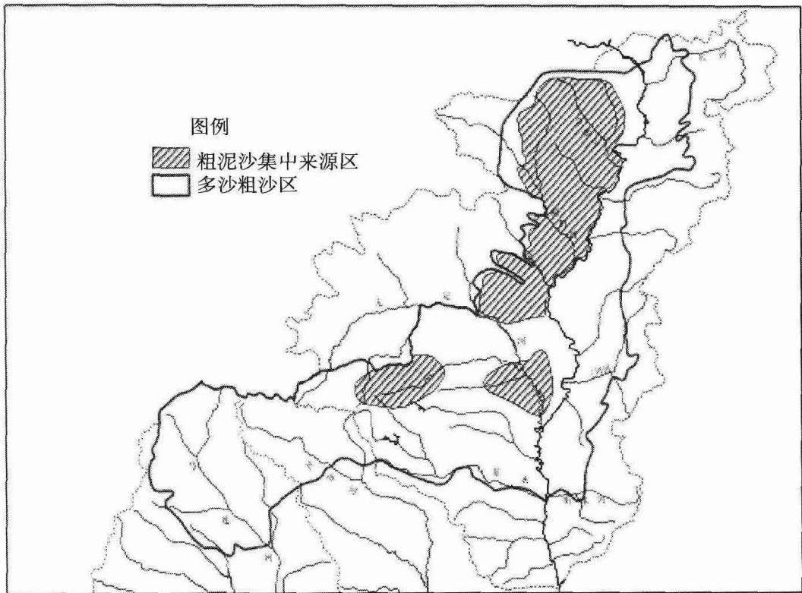  
图17.7 黄土高原地区粗泥沙集中来源区位置

表17.25 黄河流域不同区域产沙情况（1954\~1969年）
<table><tr><td rowspan=1 colspan=1>区域</td><td rowspan=1 colspan=1>面积/万 km²</td><td rowspan=1 colspan=1>产沙/亿t</td><td rowspan=1 colspan=1>&gt;0.05mm/亿t</td><td rowspan=1 colspan=1>&gt;0.1mm/亿t</td></tr><tr><td rowspan=1 colspan=1>黄河上中游地区</td><td rowspan=1 colspan=1>69.96</td><td rowspan=1 colspan=1>18.81</td><td rowspan=1 colspan=1>4.4</td><td rowspan=1 colspan=1>1.13</td></tr><tr><td rowspan=1 colspan=1>多沙粗沙区</td><td rowspan=1 colspan=1>7.86</td><td rowspan=1 colspan=1>11.82</td><td rowspan=1 colspan=1>3.19</td><td rowspan=1 colspan=1>0.89</td></tr><tr><td rowspan=1 colspan=1>粗泥沙集中来源区</td><td rowspan=1 colspan=1>1.88</td><td rowspan=1 colspan=1>4.08</td><td rowspan=1 colspan=1>1.52</td><td rowspan=1 colspan=1>0.61</td></tr></table>

## （二）粗泥沙集中来源区侵蚀产沙特征

区内绝大多数属黄土丘陵沟壑区第一副区，地形可划分为沟间地和沟谷地两类，以谷(沟）缘线为界（常为梁、昴边线)，其上为沟间地，其下为沟谷地。

## 1. 侵蚀强度高，粗泥沙比重大

粗泥沙集中来源区平均侵蚀模数高达2.39万 $\mathbf { t } / ( \mathbf { k } \mathbf { m } ^ { 2 } \cdot \mathbf { a } )$ ，是黄土高原

地区强烈侵蚀的中心，属于剧烈侵蚀面积，占到黄土高原地区剧烈侵蚀面积(3.67万 $\mathbf { k m } ^ { 2 } )$ ）的51.2%。窟野河局部地区侵蚀模数高达3万 $\mathrm { t } / ( \mathrm { k m } ^ { 2 } \cdot \mathrm { a } )$

## 2. 侵蚀产沙时间集中

该区土壤侵蚀产沙多集中在汛期（6～9月），占全年的90%以上。产沙又往往集中于几场大的暴雨洪水。窟野河1971年7月下旬一场暴雨，产沙量占年沙量的85%。

## 3. 泥沙主要来自沟道

该区支离破碎、千沟万壑的地形地貌，崩塌、滑塌、泻溜等重力侵蚀十分活跃，使沟壑成为泥沙的主要来源地。据有关研究，全区长度大于0.5km的沟道达1万多条，沟谷面积占总面积的45%～55%，而产沙量却占70%左右。

## 4. 人类频繁的经济活动，进一步增加了产沙量

据统计，该区国家大型开发建设项目50多个，地方项目110多个，破坏地表植被面积 $5 0 0 0 \ \mathrm { h m } ^ { 2 }$ 左右，随意弃土弃渣6000万t左右。每年新增人为水土流失1500万t左右。神府东胜矿区开矿后径流量比开矿前减少了20%，径流含沙量增加30.9%，悬沙中值粒径变粗27%。

## （三）粗泥沙集中来源区治理基本思路

## 1. 建设目标

到2015年，基本形成以淤地坝为主的拦沙工程体系，拦沙工程控制水土流失面积累计达到60%以上；年拦控泥沙2.5亿t，新增2.00亿t，其中拦控大于 0.05 mm 粗泥沙 0.93 亿 t（新增 0.75 亿 t)，大于 0.1 mm 粗泥沙0.37亿t（新增0.30亿t)。新增治理水土流失面积 $4 0 0 0 ~ \mathbf { k m } ^ { 2 }$ 以上。淤地坝等工程可形成基本农田3.06万 $\mathrm { h m ^ { 2 } }$ ，可巩固退耕面积14.92万 $\mathrm { h m } ^ { 2 }$ ，可促进农业生产条件与生态环境的改善。

其中到2010年，拦沙工程控制水土流失面积累计达到35%以上；年拦控泥沙1.50亿t，新增1.00亿t，其中控制大于0.05mm的粗泥沙0.56亿t（新增0.37亿t)，大于0.1mm粗泥沙0.22亿t（新增0.15亿t)。新增治理水土流失面积 $2 0 0 0 \ \mathrm { k m } ^ { 2 }$ 以上。可淤地1.06万 $\mathrm { h m } ^ { 2 }$ ，可巩固退耕面积7.60万$\mathrm { h m } ^ { 2 }$ ，使当地林草覆盖度有所提高。

## 2. 治理基本思路

根据各治理分区基本特点，采取不同措施布局方式，最大限度地发挥各种措施的拦沙作用。以支流为骨架、小流域为单元，先支毛沟后干沟布局工程措施。以沟道拦沙工程为重点，因地制宜，适当配置坡面措施，拦沙效益与生态、经济、社会效益统筹兼顾。

## 3. 治理任务

按照上述指导思想、建设目标，通过分析，到2015年治理任务为：总建坝2293座。其中骨干坝1449座（加高加固185座）；中型淤地坝834座(加高加固159座)；拦泥库10座；坡面措施4071.7km²。其中，“十一五”期间安排建坝1175座。其中新建骨干坝556座、中型淤地坝270座；加高加固骨干坝185座、中型淤地坝159座；新建拦泥库5座；坡面措施2 116.43 km².

## （四）建 议

## 1. 设立专项，尽快开展粗泥沙集中来源区治理

粗泥沙集中来源区是影响黄河下游河道淤积最关键区域，尽快开展治理十分必要。为尽快减轻黄河下游淤积，减缓黄河下游河床抬高速度，建议将黄河粗泥沙集中来源区治理专门列为国家级重点项目。

## 2. 尽快开展项目前期工作

该项目建设是一项规模大、投资多、技术性强的系统工程，特别是拦泥库，其规划、可行性研究、设计等前期准备时间较长，建议尽快开展项目建设前期工作。

## 五、小流域生态经济系统健康定量评价

小流域是生态系统的基本单元，建立健康的小流域生态经济系统是黄土丘陵区生态与环境建设的基础和保证。随着水土保持生态建设的深入和社会经济的发展，国内外对于流域综合治理与生态建设有了更高的要求和目标。因而分析侵蚀环境生态经济系统演变规律，开展其健康评价研究，对于促进侵蚀环境生态经济系统建设和持续稳定发展具有极其重要的理论和实践意义。

## （一）小流域生态经济系统健康特征

流域生态经济系统是生态系统和经济系统的复合系统，其健康的内涵是：管理者能够实施合理的经营策略，在侵蚀干旱胁迫下能够保持生态安全、生产能力及可持续发展的状态。生态经济系统应具有以下特征：土壤侵蚀量在允许范围之内；对遇到的干扰（如洪水、干旱、火灾等）具有恢复力；能自我维持；管理和实践生态经济系统过程时不损害邻近生态系统；能够提供自然和人类需求的生态服务。

## （二）指标选择与诊断体系框架构建

生态系统健康评价方法主要有指示物种诊断法和指标体系诊断法，其筛选指标遵循以下原则：整体性原则；空间尺度原则；指标范畴或类型原则；简明性和可操作性原则；规范化原则。

根据黄土高原地区小流域综合治理的目标与要求，从生态系统健康的内涵出发，构造能够反映典型侵蚀环境黄土丘陵沟壑区生态经济系统中社会、经济、资源、环境和人类健康的协调现状及发展趋势的指标，形成以资源环境支持 $( T _ { 1 } )$ 、社会经济人文影响 $( T _ { 2 } )$ 和生态综合功能 $( T _ { 3 } )$ 3个二级层次指标，资源指数 $( C _ { 1 } )$ 、环境指数 $( C _ { 2 } )$ 、社会经济指数 $( C _ { 3 } )$ 、人文发展指数 $( C _ { 4 } )$ 、综合指数 $( C _ { 5 } )$ 和土壤功能指数 $( C _ { 6 } )$ 共6个三级层次指标，16个具体指标 $x _ { 1 } \ 、 \ x _ { 2 } \ 、 \ x _ { 3 } \ 、 \ \cdots \ . \ x _ { 1 7 }$ 作为三级层次的侵蚀环境小流域生态经济系统健康评价指标体系（图17.8）。图中 $C _ { 1 } \sim C _ { 6 }$ 层次下设的x层指标具体含义：

$C _ { 1 }$ ：人均基本农田 $x _ { 2 } ( \mathrm { h m } ^ { 2 } )$ 、人均牧草地 $x _ { 3 } \mathrm { ( h m ^ { 2 } ) }$ 、牲畜人均存栏量$x _ { 4 }$ (羊单位);

C2：林草覆盖率 $x _ { 1 }$ (%)、有机质含量 $x _ { 5 } ( \bf { g } / \bf { k g } )$ 、治理度 $x _ { 6 } ( \% )$

$C _ { 3 }$ ：农业产投比 $x _ { 7 }$ 、人均纯收入 $x _ { 8 } ( \overline { { \mathcal { T } } } )$ 、工副业贡献率 $x _ { 9 } ( \% )$

C4：人口密度 $x _ { 1 0 } ( \nearrow / \mathrm { k m } ^ { 2 } )$ 、义务教育普及率 $x _ { 1 1 } ( \% )$ 、恩格尔系数 $x _ { 1 2 }$

C5：粮食单产潜势实现率 $x _ { 1 3 } ( \% )$ 、综合治理减沙效率 $x _ { 1 4 }$ (%)、系统抗逆力 $x _ { 1 7 }$

$C _ { 6 }$ ：土壤抗冲性 $x _ { 1 5 } ( \mathrm { L } \cdot \mathrm { m i n } / \mathrm { g } )$ 、土壤渗透性 $x _ { 1 6 } ~ ( \mathsf { K } _ { 1 0 } )$ 0

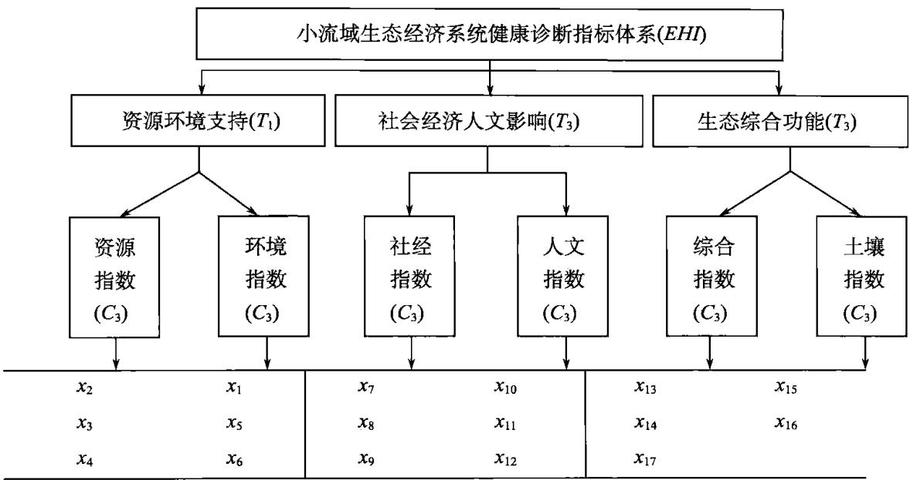  
图17.8 侵蚀环境小流域生态系统健康诊断层次结构

## （三）流域生态经济系统健康动态评价

运用方差决策法等数理统计方法确定各评价指标权重，既能反映流域系统特定时期的健康水平，又能初步判断该流域系统的持续协调发展局势。各级层次中每一指标均是从不同侧面来反映侵蚀环境的健康水平，对总体水平进行综合评判，故采用多目标线性加权函数法对系统健康指数 $( I _ { h } )$ 进行求解，即

$$
I _ { h } = \sum _ { i = 1 } ^ { 3 } ( I _ { t } { \mathbf { \boldsymbol { w } } } _ { i } ) = \sum _ { i = 1 } ^ { 3 } \{ \prod \big [ \sum ( y _ { i j } { \mathbf { \boldsymbol { w } } } _ { j } ) \big ] ^ { { \boldsymbol { w } } _ { k } } \big \} { \mathbf { \boldsymbol { w } } } _ { i }
$$

式中， $I _ { h }$ 为黄土丘陵区生态经济系统健康指数； $\mathfrak { w } _ { i }$ 为二级层次指标权重； $I _ { t }$ 为二级层次指标健康指数； $y _ { i j }$ 为各指标量化值； $\mathfrak { w } _ { j }$ 为单项指标权重； ${ \mathfrak { U } } _ { { \mathfrak { k } } }$ 为三级层次指标权重。

## （四）系统健康动态诊断

根据健康评价模型，以安塞纸坊沟小流域为例，分析20年综合治理过程中，流域生态经济系统健康状况变化动态见图17.9，可知：该流域生态经济系统资源环境、社会经济人文和生态综合功能健康状况逐年好转，且向良性循环发展。生态经济系统健康指数随时间呈波动式上升趋势，经历了健康的相对稳定阶段，健康指数从1985年0.370提高到2001年的0.536，到2002年开始进入可健康的良好阶段，2003年达到了0.573，正在向良性循环阶段发展。该流域自1973年安塞水土保持实验站开始治理，多年来主要通过开展以强化降水就地拦蓄入渗、防止水土流失为中心，以土地合理利用为前提，以恢复植被和建设基本农田，发展经济林和养殖业为四大主导措施的水土保持型生态农业建设，成功探索出水土流失区生态系统恢复重建途径，说明该健康指数及评价模型可以客观反映生态经济系统演变状况。

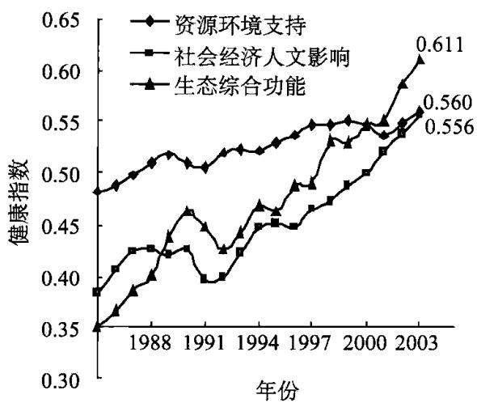

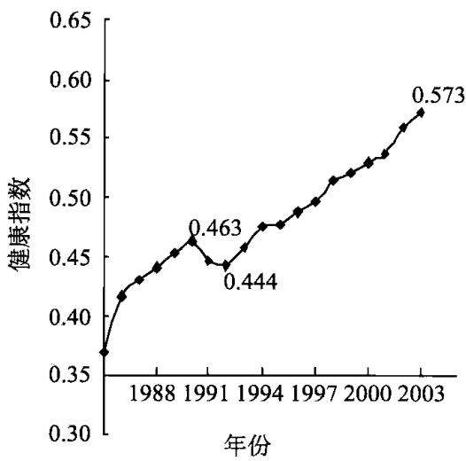  
图17.9 安塞纸房沟流域生态环境健康指数动态变化

# 第十八章 长江上游及西南诸河区

第一节 现 状

## 一、自然地理和社会经济概况

(一）区域自然背景

## 1. 地质

长江上游及西南诸河地质构造复杂，大致以武都、泸定、昆明一线为界，可分为东西两大构造单元。西部青藏板块，构造运动活跃、强烈，褶皱断裂发育，大地构造上为三江褶皱系和松潘一甘孜褶皱系、喜马拉褶皱系和藏北褶皱系。东部为稳定的扬子板块，其北缘为秦岭褶皱系，区内地壳稳定，盖层相当完整，断裂不甚发育，主要为北北东和北东向的新华夏系构造。

该区地层发育齐全，从元古界至第四系地层均有出露。西部地区岩石以三叠系砂岩、板岩分布最广；东部以侏罗系、白垩系互层的红色砂岩、泥岩分布最广，贵州高原及四川盆地东部华山山地四川盆地北缘米仓山、大巴山等地以中、古生界碳酸盐岩分布为主。

## 2. 地貌

该区地势西高东低，西部为青藏高原，平均海拔4000m以上，为我国地势划分的第一级台阶。东部为云贵高原、秦岭西延部分、米仓山、大巴山等山地和四川盆地，属我国地势划分的第二级台阶，高原与山地海拔多为1000～3000m，四川盆地是我国第二级台阶上的相对凹下区，海拔200～750 m。

## 3. 气候

长江上游及西南诸河气候类型多样，东部属北亚热带季风和中亚热带湿润季风气候，西部青藏高原属于高原季风气候。

## (1) 气温

该区东西部气温差异显著。四川盆地中部和东部以及宜宾至宜昌长江于流沿岸一带，气温较高，年均温达18℃以上， $1 8 ^ { \circ } \mathrm { C }$ $\geqslant 1 0 ^ { \circ } \mathrm { C }$ 的积温达5500～6000℃。云南南部西双版纳、河口一带属于北热带气候类型，年平均气温>20℃, ${ \geqslant } 1 0 ^ { \circ } \mathrm { C }$ 积温达7500～8300℃，全年基本无霜。青藏高原大部分年平均气温为0～8℃，其中藏北高原北部和四川石渠、色达以北及通天河一带，年平均气温低于0℃。

## (2) 降水

西部高原地区年平均降水较少（200～800mm），由东往西减少，藏东南边境的一些地方和喜马拉雅山脉南坡，降水量极其丰富，前者年降水量可>4500mm。藏东南察隅年降水量800～1000mm，阿里地区最少，班公错以北地区年降水量<50mm，是西藏高原上降水量最少的地区。该区东部广大地区在太平洋和印度洋暖湿气流控制下，降水丰富，年平均降水量一般也在800～1500mm，地区分布差异较大，具有由东向西减少的特征。

## 4. 水文

长江上游及西南诸河区降水量丰沛，水资源十分丰富。据统计，长江上游水资源总量达4510亿m³，多年平均径流量为4467亿m³，约占长江总径流量的48%。长江上游支流众多，其中流域面积大于5万km²的支流有雅砻江、大渡河、岷江、嘉陵江和乌江，合计径流量2778亿m³，长江上游按人口平均占有水量2948m³，高于全流域和全国的平均值。

长江上游山高谷深，水量丰富，河床落差大，水能资源丰富，是全国闻名的“富矿”。长江上游水能理论蕴藏量达2.18亿kW，约占全流域的81.5%，可开发量1.7亿kW，年发电量9144亿kW·h，分别占全国的32.6%、46.3%和47.5%。

## 5. 土壤

长江上游地域辽阔，生物气候类型多样，土壤类型众多，全国的土壤类型几乎应有尽有，地带性土壤和隐域性土壤兼备。土壤的区域差异很大，不仅具有水平分异，还有明显的垂直分异。总的分布格局是：长江上游东部地区地带性土壤为黄壤，西部地区地带性土壤类型甚多，从南至北，从低海拔到高海拔有红壤、黄壤、黄棕壤、暗棕壤、高山草甸土及至寒漠土等。秦巴山地土壤为黄棕壤和棕壤；四川盆地地带性土壤为黄壤，盆地底部大面积分布的是隐域性的紫色土；贵州高原地带性土壤为黄壤，云南高原的中部和东部地带性土壤为红壤，云南高原的北部和川西南山地、干热河谷则广泛分布着隐域性的红褐土和褐土。

西部高原高山大致由东南向西北，海拔由低至高，地带性土壤由山地黄壤逐渐过渡为山地棕壤至高山草甸土，以高山草甸土分布较广。一般山体愈高，相对高差愈大，其垂直带谱愈丰富。青藏高原东南部高山是我国土壤类型最多、山地土壤垂直带谱最完整的地域，如青藏高原东缘的贡嘎山海拔7556m，其东坡海拔1300m以下的河谷至山巅，依次为黄红壤、山地黄棕壤、山地棕壤、山地暗棕壤、亚高山漂灰土、亚高山草甸土、高山草甸土、高山寒漠土，直至永久冰雪带的永冻土。而高原腹地，特别是藏西北高原的土壤类型则趋简单贫乏，如昆仑山南麓，只能见到高山荒漠草原土、高山寒漠土等，垂直带谱简单。

## 6. 植被

长江上游及西南诸河植被类型复杂多样，从热带雨林、季雨林到寒温带草甸皆有，包括常绿阔叶林、常绿落叶阔叶混交林、针阔混交林等地带性植被类型。按地域水平分异特征，植被类型有西部高寒草原与高寒草甸、川西暗针叶林、川西南滇北亚热带偏干常绿阔叶林、亚热带偏湿常绿阔叶林、横断山北部温带落叶阔叶林、四川盆地以农业植被为主的植被类型、滇南及藏东南的热带常绿阔叶林等。

## （二）社会经济条件

## 1. 社会经济发展概况

长江上游及西南诸河区国土总面积为243.68万km²，约占全国总面积的1/4，其中：长江上游面积约为100.54万km²，西南诸河区面积约为143万km²。区域总人口约为1.56亿，第一、第二产业增加值达5472亿元，人均仅为3510元，而且区域差异明显。人均产值最高的为青海省，达到8112元；最低的为西藏自治区，仅为1722元。

## 2. 经济发展水平

现阶段，科考区内各省、区农民的温饱问题已经基本得到解决。

选用《2005中国农村住户调查年鉴》中长江上游及西南诸河区内各省相关数据，以县为单位，按行政区划合并到相对的省级单元，计算科考区内各省的恩格尔系数。

以2000年全国农村基本达到小康水平（恩格尔系数为49.1%）为基准，长江上游及西南诸河区仅有陕西和甘肃与全国同步，多数区域则处在温饱阶段，贵州（恩格尔系数为62.7%）和西藏（恩格尔系数为79.3%）尚未脱贫；到2004年底，青海也进入小康序列，西藏虽然仍处于贫困状态，但经济发展态势最好，恩格尔系数下降15个百分点；四川和重庆的情况是略有上升；其他省份持续转好。

## 二、水土流失情况

## （一）水土流失现状

据2000年水土流失遥感调查资料，本区域土壤侵蚀面积132.41万km²，约占区域总面积54.34%。其中中度及其以上侵蚀程度面积70.0万km²，占区域总面积的28.73%，占区域土壤侵蚀面积的52.87%；强度、极强度和剧烈侵蚀面积28.12万km²，占区域总面积的11.54%，占区域土壤侵蚀面积的21.24%。按侵蚀类型分，则以冻融侵蚀面积最大，为76.92万km²，占流失总面积的58.09%；水蚀面积51.80万km²，占39.12%；风蚀面积3.69万km²，占2.79%。

## 1. 长江上游区水土流失现状

根据长江上游最新水土流失遥感调查资料（2000年），长江上游土壤侵蚀面积：轻度以上侵蚀面积43.83万km²，约占长江上游流域总面积43.6%，其中中度及其以上侵蚀面积23.49万km²，占总面积的23.36%，占土壤侵蚀面积的53.6%，尤其是强度侵蚀以上侵蚀面积占到土壤侵蚀面积的15.2%。按侵蚀类型分，水蚀面积32.16万km²，占流失总面积的73.4%；冻融侵蚀面积10.67万km²，占24.3%；风蚀面积1.00万km²，占2.3%。各类侵蚀总体以轻度侵蚀为主，轻度侵蚀面积占总侵蚀面积的46.41%；其次为中度侵蚀和强度侵蚀，分别占16.83%、11.68%；极强度侵蚀和剧烈侵蚀面积较小，分别只占3.15%和0.37%。

在长江上游9个省、市中，四川省的土壤侵蚀面积最大，达20.28万km²。

## 2. 西南诸河区水土流失现状

西南诸河区域涉及云南、西藏、青海3个省（区），总面积143.14万。

据2000年全国水土流失遥感调查资料分析，本区域土壤侵蚀面积88.58万km²，约占西南诸河区总面积61.88%；中度及其以上侵蚀面积46.51万km²，占区域总面积的32.49%，占土壤侵蚀面积的52.51%；强度、极强度和剧烈侵蚀面积12.92万km²，占土壤侵蚀面积的14.59%。土壤侵蚀类型齐全，包括水力侵蚀、风力侵蚀和冻融侵蚀，其中以冻融侵蚀面积最大，为66.25万km²，占流失总面积的74.79%；水蚀面积19.64万km²，占22.17%；风蚀面积2.69万km²，占3.04%。

## （二）水土流失成因

## 1. 自然因素

（1）地质构造活动活跃，褶皱断裂发育，岩性复杂，地表稳定性度低，风化强烈。

(2）山丘广大，地表起伏不平，沟壑纵横，沟道发育，坡面物质运动条件充分。

（3）土壤类型多样，土壤结构水稳性度低，抗冲抗蚀能力弱。

（4）植被覆盖率低，退化严重，地表缺乏充分覆盖。

（5）降水较充沛，降水集中，多暴雨，土壤侵蚀动力充裕。

## 2. 人为因素

## (1) 陡坡垦殖

坡耕地是水土流失的“重灾区”，对土壤侵蚀量的贡献率达60%。长江上游和西南诸河区坡地垦殖广泛、普遍，仅长江上游地区坡耕地面积即达407万hm²，其中坡度≥25°的陡坡地达173 hm²，分别占其耕地面积45.9%和19.5%。陡坡地，主要分布在川、渝地域，面积达107.53万hm²，占上游区陡坡耕地的62.16%。

## (2) 森林采伐与植被破坏

植被是土壤保护卫士，土壤侵蚀的克星。近半个世纪以来，由于森林长期大规模采伐，覆盖率降低，植被受到很大的破坏，长江上游地区，四川省和云南省的森林覆盖率分别从20世纪50年代的40%、19%、50%降至20%、9%和30%。

## (3) 过度放牧

过度放牧致使草场退化问题突出。川西北高原退化草场面积所占比例高

达40%～60%，若尔盖、红原和理塘等地沙化草场不断扩大；长江源区退化草地达2.47万km²，沙化面积达1.95万km²，石砾地和裸岩地达1.21万km²，加剧了草原水土流失。

## 3. 开发建设

这是长江上游水土流失的重要原因之一。从20世纪80年代初期到90年代中期，小矿山、小煤窑、小土焦、采金等造成对植被和土地表层的严重破坏，而堆弃的矿渣、煤矸石等又成为土壤侵蚀物质来源。与此同时，西部大开发战略的实施，基础设施建设力度加大，工程开挖面和弃渣的土壤侵蚀值得特别高度重视。如金沙江下游云南昭通地区近半个世纪兴建公路5000km，累计弃渣达2500万 hm²之多。

## （三）水土流失特点

## 1. 土壤侵蚀类型齐全，区域分异明显

从东往西，随着海拔的升高，气候由亚热带过渡到寒带，土壤侵蚀由水蚀为主逐步过渡到以冻融侵蚀为主，大致以玉树、比如、察隅一线为界，以西为冻融侵蚀为主地区，以东为以水蚀为主区域。

在贵州高原、大巴山区和川东平行岭谷条形山地，由于广泛出露碳酸盐岩，由此而产生的特殊水蚀-溶蚀作用集中分布。

在高山高原深切河谷地带，即怒江、澜沧江、金沙江、雅砻江、大渡河、岷江、雅鲁藏布江等及其支流的深切河谷中，由于谷坡陡峭，降雨集中，泥石流、滑坡（含崩塌）往往集中成带分布。此外，嘉陵江上游西秦岭一带黄土分布区泥石流、滑坡也集中分布。

风蚀主要分布于西部西藏高原和川西高原。

## 2. 水土流失的垂直地带性

一般从上往下由冰川侵蚀、冻融侵蚀逐步过渡到水力侵蚀。不同地区其海拔高度是有差异的。从垂直投影的平面地形图上看，在海拔5000m以上的极高山区，不同的土壤侵蚀类型，冰川侵蚀、冻融侵蚀与水蚀呈环状的叠置分布。冰川侵蚀在内，冻融侵蚀与水蚀依次环绕在外。

## 3. 发生侵蚀时间集中、滑坡泥石流活动强烈

长江上游及西南诸河区的水蚀（含泥石流）特别是大雨、暴雨产生的溅蚀、坡面侵蚀、沟谷侵蚀和泥石流；主要集中在雨季的5～9月。滑坡（包括崩塌）虽然一年12个月中都有可能发生，但以7月成灾频次最高。冻融侵蚀主要发生在春、夏气温升高季节。冰川湖溃决泥石流及冰川泥石流主要出现在高温的夏季。

## （四）水土流失危害

## 1. 水土流失对土地资源与区域粮食安全的影响

## (1）水土流失对土地资源的影响

土壤侵蚀的危害首先是直接破坏土地资源，降低土地生产力，而且这种破坏是由浅入深、由表及里不断加深，直至生产力丧失，其中土地沙漠化和石漠化则是典型。位居三峡库区的重庆市万州地区近半个世纪以来裸岩面积平均扩大2500hm²，现重庆市南川地区石漠化土地达18652hm²，潜在石漠化土地13965 hm²，贵州毕节地区耕地因严重土壤侵蚀其石漠化和石砾化面积平均每年以1500～2000hm²的速率递增，长江上游地区因严重土壤侵蚀每年耕地减少13万～20万hm²。水土流失导致耕地土壤养分的大量流失，土层变薄，肥力降低。坡耕地土壤团聚体水稳性系数（WSA）随土层厚度降低呈变小趋势。

## (2)水土流失对区域粮食安全的影响

土壤侵蚀既减少耕地数量，又降低耕地质量，从而影响区域粮食安全。同时，土壤侵蚀使区域水不平衡状况加剧，使水利设施失效，增加粮食生产成本，间接影响区域粮食安全。长江上游地区农业人均产粮仅388kg，如按400kg/人基准计算，粮食缺口大约8亿\~12亿kg。

## 2. 水土流失对河流泥沙的影响及其环境效应

## （1）金沙江干流及支流河流泥沙及其变化

近年来，金沙江干流泥沙呈增加趋势。渡口-屏山区间年均径流量1970～1989年时段为829.56亿m³，1990～1997年时段为832.05亿m³，两时段年均径流量非常接近；但年均输沙量后一时段较前一时段多0.27亿t，增加14.0%。不合理的人类活动加剧了土壤侵蚀，是河流泥沙增加的主要原因。

## (2)嘉陵江干流及支流河流泥沙及其变化

嘉陵江北碚水文站泥沙来量有明显减少趋势，20世纪60年代平均含沙量为 2.03 kg/m³，70 年代为 1.8 kg/m³，80年代为1.71 kg/m³。1990～1996年的输沙量是0.49亿t，仅为多年平均输沙量的38.28%。

泥沙减少的原因，水库拦沙和“长治”工程减沙有着重要贡献。据统计分析，“长治”工程1989～1996年年均减蚀量3046.38万t。同时河床砂石开采整顿，一系列生态建设工程的实施促进植被恢复，保土耕作的逐步推行等也发挥了相应作用。

## （3）泥沙淤积及其环境效应

同时，河、湖、水库、塘堰淤积是土壤侵蚀危害的突出问题。据有关对长江流域6709座各型水库的调查研究结果，淤积量达13.78亿m³，淤积率达5.29%，塘堰、中型和大型水库淤积率分别达55.9%、9.38%和5.04%。长江上游以年平均6.8亿t的泥沙输入中下游，大部分沉积在荆江段和洞庭湖内。由于长江挟带泥沙在长江入海口大量沉积，使得长江入海口北渊航道几乎近于闭塞，使行洪能力大大减低。

由于湖库的淤积，调蓄能力减弱，使本来应由湖库调蓄的水量也因此涌入河道，引起水位抬高，这无疑加剧了洪涝灾害。泥沙淤积同样造成中下游地区河床抬升，金沙江小江流域河床淤高3～5m，白龙江甘肃武都段近年来淤高速率达12.3 cm/a，最严重的便是著名的长江荆江段成为高出地面的悬河。

## 3. 泥石流、滑坡灾害及其对公共安全的影响

突发性的滑坡、泥石流是危害最严重的自然灾害，其危害包括：

（1）危害城镇、威胁村庄及农田。据不完全统计，长江上游及西南诸河区受滑坡和泥石流直接危害的县城以上城镇（市）200多座，乡镇多达近千座；四川省自2000年以来，每年发生滑坡和泥石流约300次，危害村庄100多个。灾害之多，危害之重，枚不胜举，如1985年湖北新滩大滑坡使新滩镇毁于一旦；1984年云南东川因泥石流袭击因民镇，造成121人死亡、34人受伤；1979年四川雅安干溪沟和陆王沟爆发泥石流破坏村庄17个，造成164人死亡等等。

（2）危害交通事件屡见不鲜。其中1981年成昆铁路线利子伊达沟爆发泥石流，冲毁桥梁，造成列车颠覆，360人死亡等。

（3）危害水利水电工程。三峡库区链子崖危害，黄蜡石滑坡威胁极大，二滩电站近坝库区和集洪池受活动滑坡威胁。

（4）危害河道。1994年重庆武隆鸡冠岭岩崩，30万 $\mathbf { m } ^ { 3 }$ 土石进入乌江，阻碍通航达数日之久；2000年西藏波密易贡藏布河扎木弄巴沟发生大规模滑坡，体积约2.8亿～3.0亿m³，形成长约2500m、宽约2500m、高达100m巨型堆积体，堵断易贡藏布河后溃决，危害直抵雅鲁藏布江等。

## 4. 水土流失引起的面源污染及其对水质的影响

水土流失通过地表径流水溶解和土粒吸附携带的化学物质，通过搬运过程使溶解和泥沙吸附的化肥、农药及其他有机物和有毒物质汇集沟谷河道进人水体，对水资源形成污染。

根据川中丘陵区典型小流域定位观测发现，紫色土不同土地利用类型地块氮磷元素的流失具有较大差异（表18.1）。居民点氮磷流失量均高于其他几种类型，其中氮素流失量达 $3 8 . 9 ~ \mathrm { k g / ( h m ^ { 2 } \cdot { \mu } a ) }$ ，磷素流失量达42.5kg/$( \mathrm { { h m } ^ { 2 } \cdot \mathrm { { a } ) } }$ 。坡耕地氮磷流失量次之，但是较草地和柏树林高。可见，紫色土丘陵区小流域内居民点和坡耕地的氮磷流失是造成水体污染的主要原因。

表18.1 不同土地利用类型地块氮磷流失单位： $\mathbf { k g } / ( \mathrm { h m } ^ { 2 } \cdot \mathrm { a } ) ]$
<table><tr><td rowspan=2 colspan=1>土地利用类型</td><td rowspan=1 colspan=3>径流</td><td rowspan=1 colspan=3>泥沙</td><td rowspan=1 colspan=2>流失总量</td></tr><tr><td rowspan=1 colspan=1> $\mathbf { m ^ { 3 } }$ </td><td rowspan=1 colspan=1>N</td><td rowspan=1 colspan=1>P</td><td rowspan=1 colspan=1>t</td><td rowspan=1 colspan=1>N</td><td rowspan=1 colspan=1>P</td><td rowspan=1 colspan=1>N</td><td rowspan=1 colspan=1>P</td></tr><tr><td rowspan=1 colspan=1>裸地</td><td rowspan=1 colspan=1>3283</td><td rowspan=1 colspan=1>5.6</td><td rowspan=1 colspan=1>1.8</td><td rowspan=1 colspan=1>28.6</td><td rowspan=1 colspan=1>8.6</td><td rowspan=1 colspan=1>22.9</td><td rowspan=1 colspan=1>14.2</td><td rowspan=1 colspan=1>24.7</td></tr><tr><td rowspan=1 colspan=1>坡耕地</td><td rowspan=1 colspan=1>2362</td><td rowspan=1 colspan=1>7.8</td><td rowspan=1 colspan=1>2.6</td><td rowspan=1 colspan=1>15.63</td><td rowspan=1 colspan=1>12.2</td><td rowspan=1 colspan=1>23.5</td><td rowspan=1 colspan=1>20</td><td rowspan=1 colspan=1>26.1</td></tr><tr><td rowspan=1 colspan=1>草地</td><td rowspan=1 colspan=1>1500</td><td rowspan=1 colspan=1>2.9</td><td rowspan=1 colspan=1>1.2</td><td rowspan=1 colspan=1>6.36</td><td rowspan=1 colspan=1>4.5</td><td rowspan=1 colspan=1>7.6</td><td rowspan=1 colspan=1>7.4</td><td rowspan=1 colspan=1>8.8</td></tr><tr><td rowspan=1 colspan=1>柏树林</td><td rowspan=1 colspan=1>1856</td><td rowspan=1 colspan=1>3.8</td><td rowspan=1 colspan=1>1.6</td><td rowspan=1 colspan=1>5.82</td><td rowspan=1 colspan=1>4.8</td><td rowspan=1 colspan=1>8.2</td><td rowspan=1 colspan=1>8.6</td><td rowspan=1 colspan=1>9.8</td></tr><tr><td rowspan=1 colspan=1>居民点</td><td rowspan=1 colspan=1>4050</td><td rowspan=1 colspan=1>25.1</td><td rowspan=1 colspan=1>5.8</td><td rowspan=1 colspan=1>12.03</td><td rowspan=1 colspan=1>13.8</td><td rowspan=1 colspan=1>36.7</td><td rowspan=1 colspan=1>38.9</td><td rowspan=1 colspan=1>42.5</td></tr></table>

小流域地表水 $\mathrm { N O } _ { 3 } ^ { - } - \mathrm { N }$ 变幅在 $0 . 0 8 \sim 3 . 1 5 \mathrm { { m g / L } }$ 之间，平均浓度为1.2mg/L，丰水期（7～9月）浓度较低，枯水期浓度较高（表18.2）；NO2—N浓度较低，随时间变化不明显，均在0.100mg/L以下，大多在0.030mg/L左右；NH4一N浓度随时间变化明显，且普遍较低，在0.500mg/L左右波动，平均浓度为0.36mg/L。

据调查，每年输入丹江口水库的泥沙量达880万t，多年累积淤积水库损失容量已达2亿 $\mathrm { m } ^ { 3 }$ 。汉江中游碾盘山站年平均含沙量 $2 . 3 9 ~ \mathrm { { k g / m ^ { 3 } } }$ ，年输沙量1.3亿t，最大年输沙量2.63亿t（1964年），最小年输沙量0.223亿t(1996年)；说明汉江中上游山区丘陵岗地，冲刷较强，来沙量较多，影响水库寿命，值得高度重视。

表18.2 集水区中NO₃—N、NO₂—N、NH+—N的浓度（mg/L）及比例
<table><tr><td rowspan=1 colspan=1>采样地点</td><td rowspan=1 colspan=1>NN</td><td rowspan=1 colspan=1>NO2-N</td><td rowspan=1 colspan=1>AN</td><td rowspan=1 colspan=1>TN</td><td rowspan=1 colspan=1>NN</td><td rowspan=1 colspan=1>NO2-N</td><td rowspan=1 colspan=1>AN</td></tr><tr><td rowspan=1 colspan=1>群英池</td><td rowspan=1 colspan=1>0.24</td><td rowspan=1 colspan=1>0.013</td><td rowspan=1 colspan=1>0.32</td><td rowspan=1 colspan=1>0.59</td><td rowspan=1 colspan=1>40.5%</td><td rowspan=1 colspan=1>2.4%</td><td rowspan=1 colspan=1>57.1%</td></tr><tr><td rowspan=1 colspan=1>站内蓄水池</td><td rowspan=1 colspan=1>0.51</td><td rowspan=1 colspan=1>0.018</td><td rowspan=1 colspan=1>0.38</td><td rowspan=1 colspan=1>0.96</td><td rowspan=1 colspan=1>55.8%</td><td rowspan=1 colspan=1>2.0%</td><td rowspan=1 colspan=1>42.2%</td></tr><tr><td rowspan=1 colspan=1>站边蓄水池</td><td rowspan=1 colspan=1>0.69</td><td rowspan=1 colspan=1>0.054</td><td rowspan=1 colspan=1>0.54</td><td rowspan=1 colspan=1>1.35</td><td rowspan=1 colspan=1>53.8%</td><td rowspan=1 colspan=1>4.2%</td><td rowspan=1 colspan=1>42.0%</td></tr><tr><td rowspan=1 colspan=1>观测场下堰塘</td><td rowspan=1 colspan=1>0.66</td><td rowspan=1 colspan=1>0.035</td><td rowspan=1 colspan=1>0.45</td><td rowspan=1 colspan=1>1.21</td><td rowspan=1 colspan=1>54.7%</td><td rowspan=1 colspan=1>7.9%</td><td rowspan=1 colspan=1>37.4%</td></tr><tr><td rowspan=1 colspan=1>集水堰口</td><td rowspan=1 colspan=1>0.95</td><td rowspan=1 colspan=1>0.084</td><td rowspan=1 colspan=1>0.19</td><td rowspan=1 colspan=1>1.22</td><td rowspan=1 colspan=1>77.9%</td><td rowspan=1 colspan=1>6.9%</td><td rowspan=1 colspan=1>15.3%</td></tr><tr><td rowspan=1 colspan=1>出口堰塘</td><td rowspan=1 colspan=1>0.70</td><td rowspan=1 colspan=1>0.038</td><td rowspan=1 colspan=1>0.26</td><td rowspan=1 colspan=1>1.06</td><td rowspan=1 colspan=1>70.0%</td><td rowspan=1 colspan=1>3.8%</td><td rowspan=1 colspan=1>26.2%</td></tr></table>

大量的水土流失，一方面造成水库淤积；另一方面又使泥沙及附着其上的农药化肥残留物汇入地表径流，流入库区，造成水库水体悬浮物和N、P超标，影响水质。同时，使水质变差，富营养化程度提高，对水环境造成极为不利的影响。

## （五）近期水土流失变化趋势

根据1995年和2000年两期遥感调查资料对比，长江上游土壤侵蚀在面积和强度上有所减少或减弱。土壤侵蚀面积由1995年的49.63万km²减少到2000年的43.83万km²，减少5.6万km²，年均减少1.12万km²；土壤侵蚀强度减弱，强度及其以上侵蚀强度的土壤侵蚀面积所占比重普遍下降，开始改变流失扩展大于治理速度的局面。

## 三、水土保持现状

（一) 进 展

20世纪80年代以来，鉴于长江上游水土流失的严重性，区域生态屏障和三峡水库安全运行的需求，国务院决定将长江上游作为全国水土保持重点防治区，相继实施了“长治”、“天保”、“退耕还林（草)”和“生态修复”等系列工程，开始发挥水土保持效益。

## （1）长江流域水土保持重点防治工程

“长治”工程在1989年正式全面启动实施以来，全面贯彻“以防为主，防治结合，因地制宜，综合治理，重点突破，积极推进”的方针，以大流域为依托，以小流域为单元，以坡耕地为治理重点，工程措施、生物措施和保土耕作措施并举，山、水、林、田、路综合治理。

实施范围由上游“四大片”的7省（市）61个县（市、区）有序扩大到以上游为重点、上中游协调推进的10省（市）183个县（市、区），水土流失治理以年均超过 5000 km²的速度向前推进，累计治理水土流失面积8.22万km²，3009条小流域得到初步治理。

## (2) 退耕还林工程

中共中央、国务院指出：“积极推行封山育林，对过度开垦的土地，有步骤地退耕还林，加快林草植被的恢复建设，是改善生态环境、防治江河水患的重大措施。”长江上游地区坡度≥25°陡坡地173万hm²退耕还林还草，可增加人工天然植被覆盖1.72个百分点。

## (3) 水土保持生态修复试点工程

2002～2005年，水利部实施了第一批全国水土保持生态修复试点，长江流域有近40个县列入试点行列。

## (4)长江源头区水土保持预防保护工程

2001年9月长江委实施了长江源区水土保持预防保护工程。“长江源区水土保持预防保护工程”实施范围159700 km²，工程建设期为2001年至2006年。长江委于2003年启动实施的南水北调中线工程水源区水土保持预防保护工程，工程建设期为2003年至2007年。

## （5）长江中上游防护林体系建设工程

1989年开始实施的长江中上游防护林体系建设工程。长防工程通过造林、封育和防止砍伐保护，增加森林覆盖，工程实施区水土流失面积由3620万 hm²减少到2098万 hm²，工程区土壤侵蚀量由9.3亿t减少到7.5亿t。

## (6) 水土保持世行贷款项目

2006年启动实施的云贵鄂渝水土保持世行贷款项目区总土地面积6907 km²，规划治理水土流失面积3176 km²，基本上使水土流失面积皆得以治理。

## (7) 国债投资水利建设项目

1998年以来国债投资重点保证了长江重要堤防建设、重要病险水库除险加固、解决人畜饮水困难以及其他西部重点水利项目建设的投资需要。

## （8)天然林资源保护工程

1998年9月1日，国家全面停止长江上游工程区天然林的商品性采伐，开了半个世纪以来的历史先河，大力加强森林资源管护，落实森林资源管护

责任制，给天然林创造了休养生息的机会，并妥善解决企业富余人员分流安置与企业职工基本养老保险社会统筹等问题，工程已开始显出成效。

## （二）水土保持成效

## 1. 调水减沙效益

## （1）水土流失面积呈减小趋势

根据长江流域各地的调查资料，水土流失量在原有的基础上，坡改梯可减少80%以上，经济林可减少70%以上，有坡面水系工程的可减少80%，种草可减少60%，封禁治理可减少原轻度流失区的60%，保土耕作可减少60%。综合治理小流域泥沙控制率达到80%～90%（唐家良，2002）。

三峡库区（重庆地域）水土流失面积由1995年的3.06万km²降至2000年的2.74万km²，2005年降至2.39万km²，10年年平均下降2.34%。嘉陵江流域（川渝地域）水土流失面积由1995年的5.45万km²降至5.06万km²，减少 3831km²等。

## (2)人为水土流失得到有效遏制

“长治工程”实施以来，使3009条小流域得到初步治理，累计治理水土流失面积8.22万km²，其中坡改梯66万hm²。三峡库区治理小流域456条，治理面积16 386km²，其坡改梯13.3万hm²。坡改梯有效控制了坡耕地土壤侵蚀。同时国家全面实施陡坡耕地退耕还林还草工程，使水土流失重灾区的陡坡耕地土壤侵蚀逐步得到有效控制，长江上游地区退耕陡坡耕地即达173万hm²，从而使人为水土流失开始得到有效遏制。但开发建设人为新增水土流失问题颇为广泛、严重，值得高度注重。

## (3) 入江泥沙逐步减少

经过持续的水土保持治理土壤侵蚀和一系列生态建设工程的实施，近年来长江上游及西南诸河区入江泥沙已出现减少转变。嘉陵江出口北碚控制站多年观测结果，其河水平均含沙量由50年代的2.02kg/m3降至200～2003年的0.46kg/m³，多年平均输沙量减少77%。长江上游干流及金沙江、嘉陵江、乌江径流泥沙变化见图18.1。

## 2. 经济效益

## (1）改善农业基础条件

长江流域水土流失最大的危害是对水土流失区耕地资源的破坏，对农业生产发展的制约和可持续发展基础的动摇（虞孝感，2003）。“长治”工程始终坚持把坡耕地整治作为水土流失治理的重点和突破口，把治水作为主线贯穿于小流域治理之中，把解决群众生产生活中的实际问题作为防治工作的着力点，大力实施坡改梯，注重田间道路建设和地埂利用；突出小型水利水保工程建设，积极开展塘堰整治，并注重解决人畜饮水困难。累计完成坡改梯970.6万hm²，修筑田间道路2.3万km，实施经济价值较高的植物护埂8万km，修建蓄水池33万口、沉沙函560万个、排灌沟渠11万km，新修塘堰2.9万座，使上游石灰岩地区数以百万公顷濒临石漠化的坡耕地得到及时抢救，治理区人均拥有了1hm²左右的保水保肥保土、耕作方便、可世代利用的基本农田，改善了农业生产条件，稳固了农业可持续发展基础，确保了治理区粮食综合生产能力稳步提高。同时，建立健全滑坡泥石流预警机制。十多年来，坚持站点预警与群测群防相结合，成功预报处理滑坡泥石流灾害217处，撤离和转移群众3.56万人次，避免直接经济损失2.28亿元。

长江干流宜昌站径流、泥沙变化  
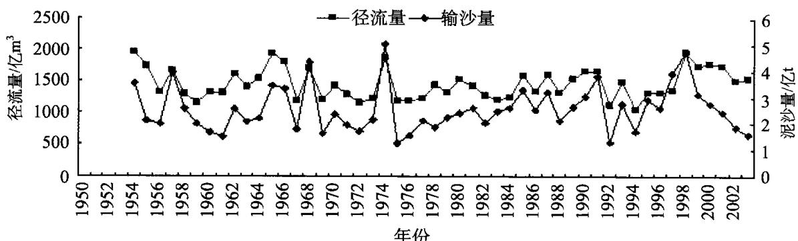

金沙江屏山站径流、泥沙变化径流量输沙量  
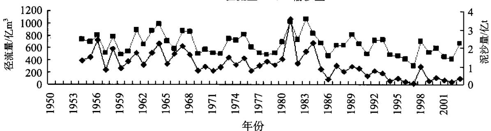  
嘉陵江北碚站径流、泥沙变化

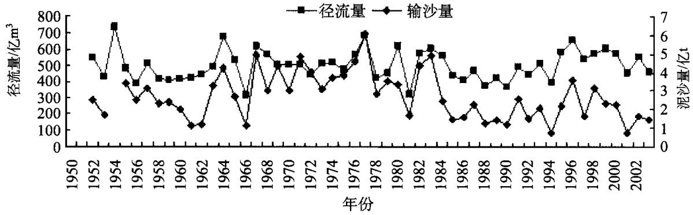

径流量输沙量  
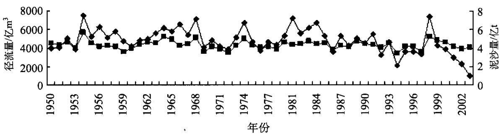  
图18.1 长江上游干流及重要来沙支流年输沙量、径流量变化图

## （2) 保障粮食安全

水土流失使大量营养元素随表层肥土而损失，造成大面积土地退化，农田生产力水平低而不稳（史德明等，1990)。水土流失治理以改造坡耕地为突破口，兴建了大批高质量的基本农田，配以小型水利水保工程，大大改善了农业生产条件，增强了农业发展后劲，基本达到人均0.067hm²（1亩）基本农田的目标。农业人均产粮达到441kg，一批少数民族贫困地区不仅解决了温饱，而且由吃粗粮改为吃细粮，同时解决了人畜饮水问题。农业发展基础的稳固，确保了治理区粮食综合生产能力稳步提高，治理区人均产粮由治理前的363 kg提高到510 kg，15年来累计增产粮食51.3亿kg，有效解决了1000多万群众的温饱问题（表18.3）。

表18.3 坡耕地改造前后每公顷粮食产量比较
<table><tr><td rowspan=1 colspan=1>地点</td><td rowspan=1 colspan=1>改前粮食产量/(kg/hm²)</td><td rowspan=1 colspan=1>改后粮食产量/(kg/hm²)</td><td rowspan=1 colspan=1>备注</td></tr><tr><td rowspan=1 colspan=1>湖北长阳流溪河小流域</td><td rowspan=1 colspan=1>3 480</td><td rowspan=1 colspan=1>7 200</td><td rowspan=1 colspan=1>与三峡库区相邻</td></tr><tr><td rowspan=1 colspan=1>陕西安康白鱼河小流域</td><td rowspan=1 colspan=1>3 405</td><td rowspan=1 colspan=1>6 300</td><td rowspan=1 colspan=1>类似秦巴山区</td></tr><tr><td rowspan=1 colspan=1>重庆云阳二道河小流域</td><td rowspan=1 colspan=1>1 500</td><td rowspan=1 colspan=1>3 495</td><td rowspan=1 colspan=1>三峡库区</td></tr><tr><td rowspan=1 colspan=1>四川内江白马乡</td><td rowspan=1 colspan=1>1 920</td><td rowspan=1 colspan=1>6 300</td><td rowspan=1 colspan=1>嘉陵江中下游</td></tr><tr><td rowspan=1 colspan=1>四川遂宁</td><td rowspan=1 colspan=1>5 070</td><td rowspan=1 colspan=1>11 445</td><td rowspan=1 colspan=1>嘉陵江中下游</td></tr><tr><td rowspan=1 colspan=1>陕西镇巴县</td><td rowspan=1 colspan=1>1 125</td><td rowspan=1 colspan=1>2 400</td><td rowspan=1 colspan=1>陕南地区</td></tr></table>

## (3)促进农民致富

通过水土保持生态建设，发展名、特、优、新经济林果基地。水土流失治理的小流域，山、水、田、林、路统一规划，工程措施、林草植被措施、蓄水保土措施优化配置，既综合治理水土流失，改善生态环境和土地资源，又因地制宜地发展种植业、养殖业、加工业和旅游业，使小流域成为发展商品生产的基地（杨定国等，2003）。“长治”工程治理达标的小流域农民人均纯收入达到2449元，比未治理的小流域多1658元，高出47.7%；据初步计算，“长治”工程总投资约为124.62亿元，总效益约为571.00亿元，投入产出比为1：4.58，净效益达446.38亿元。加快了农民脱贫的进程，如甘肃省陇南地区“长治”区内的贫困面由治理初期的66%，缩小至24%；四川省治理区内贫困户由15%以上，下降至5%。说明水土保持是解决贫困地区温饱问题的有效途径。

## 3. 生态效益

长江上游水土保持是国家生态屏障建设的重要组成部分，通过水土保持可以消减洪峰，增加常水流量；改善土壤的物理、化学性质，提高土壤质量；改善靠近地层的温度、湿度、风力等小气候环境；增加林草被覆程度，改善生物多样性。

水土保持是维系和改善生态环境，保障社会经济可持续发展的重要措施。长江上游水土保持是国家生态屏障建设的重要组成部分。通过水土流失综合治理可以改善土壤的物理、化学性状，提高土壤质量；增加林草植被覆盖度，改善生物多样性和小气候环境。“对改善全流域特别是上游地区生态环境的作用，正从微观到宏观、从局部到整体、从量变到质变逐步显现（唐克丽，2004)。

## （1）改善流域水文生态条件

森林植被影响水文过程，调节径流分配，影响土壤水分运动，改变产流汇流条件，在一定程度上起到削减洪峰、推迟或延长洪水汇集时间、增加枯水径流、控制土壤侵蚀、减少泥沙、改善河流水质的作用（崔铁成，1993）。森林调节径流、削减洪峰的作用表现为两个方面：一是降雨透过林冠后，直接进入枯枝落叶层；二是森林土壤具有很强的透水性和持水性，所以土壤将对入渗水分进行第二次调蓄。据对1981年四川发生的洪灾调查，涪江和沱江流域降水相似，但涪江和沱江森林覆盖率分别为12.3%和5.4%，涪江较沱江减少洪峰量31%。在西部地区，当降雨量为100mm时，生长良好的森林可以不产生径流，森林区域较无林区域可削弱洪水流量70%～95%。此外森林还能延续洪水汇流时间，起着一种独特的滞洪、削洪作用（图18.2）。由于植被对径流的调节作用和植被对斜坡的覆被作用，使坡面侵蚀和流域产沙

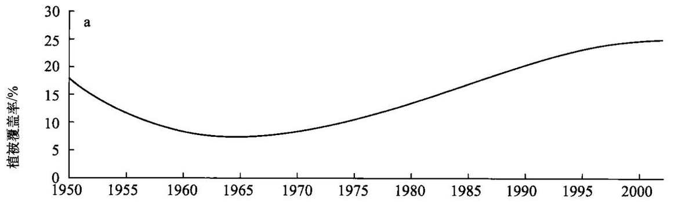

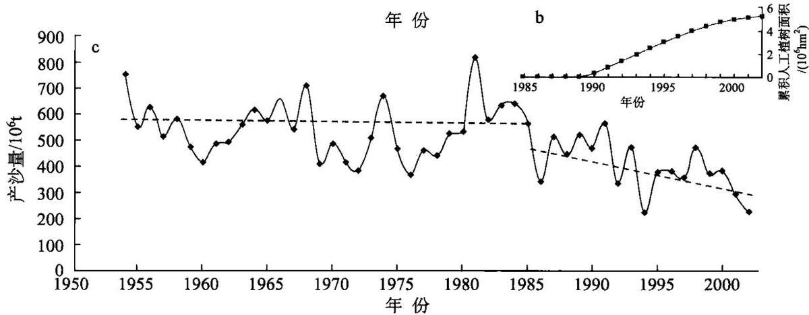  
图18.2 长江上游森林植被变化与河流泥沙响应  
明显减少。

## (2) 提高土壤质量

森林对土壤的改良作用，主要是通过强大的根系从深层土壤吸收无机盐分，再通过庞大的树冠进行光合作用制造有机物质。林木每年有70%的有机物质以枯枝落叶的形式归还到土壤里，增加了土壤中无机和有机营养物质，为土壤微生物活动创造良好条件，经过微生物的分解，使土壤腐殖质含量增加，促进土壤团粒结构形成，加之林木根系和土壤中动物的洞穴、孔道，使土壤孔隙度增加，从而改善土壤物理、化学性状，提高土壤透水性和蓄水能力。

## (3）保护生物多样性

长江上游及西南诸河区是世界生物多样性最丰富的地区之一，拥有12000多种高等植物，占中国高等植物物种总数的30%，中国大约50%的鸟类和哺乳动物栖息在这里，包括许多珍稀和特有的野生动物，如大熊猫、小熊猫、金丝猴、雪豹、羚牛和白雉鸡等物种。自从20世纪60年代以来，生物多样性损失的迹象是明显的，包括森林与生态系统及类型减少、生境破碎化与退化以及种群数量下降等，而森林的大面积减少则是生物多样性损失的主要影响因素（图18.3）。森林覆盖率由30%减至15%，长江支流的原始林覆盖率损失了85%。随着“长治”、“退耕还林（草)”和“天保”等工程的实施，通过植树、护林、封禁和能源替代等，有助于保护和改善生态环境与生物多样性，修复退化的生态系统和类型。

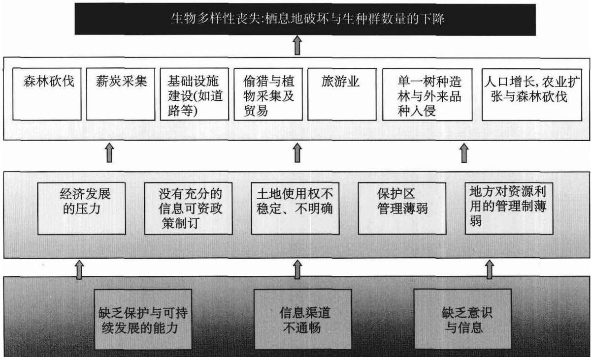  
图18.3 生物多样性丧失原因

## 4. 社会效益

## (1)减轻自然灾害及损失

长江上游是我国滑坡、泥石流灾害分布最为集中、危害最为严重的地区之一，约有大小滑坡15万处、泥石流沟万余条。1991年长江上游滑坡、泥石流预警系统建成并投入运行，这一预警系统已建成58个监测预警点和20个群测群防试点县，范围涉及长江上游水土保持重点防治区的云、贵、川、甘、鄂、渝等6省38个县（区），基本覆盖了长江上游滑坡、泥石流分布集中的区域，监控面积达11万km²，有效地保护着30万人和数十亿固定资产安全，是世界上覆盖面最广、规模最大的山地灾害监控网络。

从预警系统建立到21世纪初成功预报处理滑坡、泥石流灾害217处，及时转移群众3万余人，避免直接经济损失2亿多元，成效十分显著。

## (2) 提高人口环境容量

长江中上游大部分地区山高、坡陡、土薄、多暴雨，加之人口增长过快，特别是三峡库区面临移民就地后靠安置压力，人地矛盾日益尖锐。水土保持综合治理使治理区经济收入和粮食产量提高，从而提高了人口环境容量。治

理区粮食已实现自给有余。随着水土保持工程后续效益的逐步发挥，人口环境容量将会进一步提高。

## (3) 促进社会进步

水土保持可以改善生态环境，为发展生产、整治国土、治理江河，减少水、旱、风沙灾害服务。通过小流域综合治理，优化土地利用结构，提高土地生产力；优化农村生产结构，提高劳动生产率；促使农村剩余劳动力转移，走向第二和第三产业；提高粮食承载力，缓解人地矛盾，促进社会进步。

## （三)突出经验

突出预防为主，保护优先，实施分类指导和分区防治战略，依据《水土保持法》等法律、法规，坚持在保护中开发，在开发中保护，加大水土保持监督管理力度，防止人为造成新的水土流失；坚持治理与保护、建设与管理并重，使各项生态环境保护措施与建设工程长期发挥作用，以水土资源的可持续维护促进经济社会的可持续发展；坚持以人为本的原则，把解决群众生产生活的实际问题作为水土保持的根本出发点和着力点；坚持以大流域为依托，以小流域为单元，面向水土流失重灾区重点突破，积极推进；坚持突出治水，以坡耕地治理和坡面水系为重点，合理配置有效利用水土资源；坚持治理与开发相结合，以开发促治理，以治理保开发，突出水土保持生态、经济和社会效益。

在水土流失治理中，根据区域特点采取的水土保持关键技术主要有：

## 1. 坡改梯技术

根据合理高效使用水土资源的要求，以水系、道路为骨架建设具有一定规模、集中连片的梯田。根据地块面积、用途、降雨和原有水源条件，在坡面的横向和纵向规划设计水系、道路工程。分层布设沿山沟、排洪沟、引水沟，沟中及梯田边沟、背沟出水处分段设沉沙池、水窖；纵向沟与横向沟交汇处规划布设蓄水池，蓄水池的进水口前配置沉沙池，纵向沟坡度大或转弯处建消力坑。道路通常沿山麓、分水鞍、冲沟渠岸边布置，是通往田间耕作和运输的主要通道。支线由田边或田埂与干线联通，支线宽一般0.6～1.0 m。

## 2. 坡面水系建设技术

坡面水系工程是指为防治坡面水土流失而兴建的拦、引、蓄、灌、排等工程的总称。坡面水系工程由坡面水系一般由蓄水沟（水平竹节沟）、截水沟（水平沟、沿山沟、环山沟、山圳以及梯田内的边沟、背沟）、排洪沟（撇水沟、天沟）、引水渠（堰沟）、灌溉渠、沉沙池（沉沙凼）、蓄水池（窖）等组成。

在设计坡面水系平面布局时，蓄水沟、截水沟一般可均匀布设；蓄水池一般布设于受灌梯田上部，蓄水池前设置沉沙池；对于无灌溉要求的坡面水系，沉沙池一般布设于蓄水沟与排洪沟的联结处前；排洪沟尽量利用原有自然冲沟。

坡面水系工程布设采用10年一遇24小时最大降雨量为设计标准。

## 3. 沟道治理技术

沟道治理工程采取因害设防、除害兴利、分段拦蓄、小型为主、防护与利用相结合进行布局。“长治”工程共布设拦沙坝、谷坊、沙函、蓄水池、塘堰等2570万座（个），截水沟、排洪沟、引水渠等13260万km。

## 4. 植被建设技术

植被建设包括人工或飞播造林种草、封山育林育草等，是小流域综合治理措施的组成部分。水土保持林包括水源涵养林、梁昴防护林、坡地防护林、侵蚀沟防护林、梯田防护林、护牧林、薪炭林、道路防护林、护岸护滩林、封山育林、林粮间作等。

## 5. 生态修复技术

生态修复系指通过人与自然力使遭受破坏退化的生态环境系统得以改善、恢复、优化，既包括造林种草绿化，也包括现有林、草地管护及封禁抚育，保护林、草正常生长等植被培育，以此提高植被尤其是森林覆盖度，减少水土流失。

## 6. 替代能源技术

开发可再生清洁能源新产品，推广新型能源替代品，如在广大乡村推广使用沼气灶、太阳能灶、节柴坑等，推行以电代柴、以煤代柴、以气代柴，减少了生产、生活用能源对植被的依赖和破坏。

## 7. 小流域综合治理理论与技术

小流域综合治理的含义是：以小流域为单元，在全面规划基础上，合理安排农、林、牧各业用地，因地制宜实施水土保持工程措施、植物措施、耕作措施，做到互相协调、互相促进，形成有效的水土流失综合防护体系，达到保护、改良和合理利用水土资源，实现生态效益、经济效益和社会效益协调统一，具体则是施行水、土、田、林、路综合治理。实践证明，按科学规划和规范标准治理的小流域，均取得了明显成效。

## （四）主要问题

## 1. 水土保持投入与管理的问题

## (1) 投入问题

水土流失治理任务重，难度加大，需要坚持持续治理，需要更多的经费支持；坡耕地是水土流失的主要策源地，急需国家专项支持实施整治；滑坡、泥石流危害巨大，治理投入杯水车薪；水保工程面临三道关：“两工”取消、劳动力“空心化”与“民工荒”。

## (2) 管理问题：九龙治水与群龙无首

基层防治水土流失的工程建设方面，往往多头管理，各部门分管一块，形不成合力。导致生态保护和建设部门投资分散，项目重复，效果差。水利部门作为主管水土保持工作、负责协调水土防治的部门，协调难度大。

## (3) 体制问题

个别地方政府领导以“重点工程”、“领导工程”为借口，组织召开有关部门协调会，阻扰水行政主管部门的监督执法和“两费”征收，以权代法，以权压法。而地方水土保持监督管理部门由于受制于当地领导，监督执法工作严重受阻。

## (4) 机制问题

由小流域综合治理的转向小流域综合开发，坡改梯、蓄水池只是小流域治理的过程，小流域经济的发展、脱贫才是保证生态环境良性循环的长效机制。

## (5) 法规问题

现行《水土保持法》需要与时俱进；编报水土保持方案的范围、地位不完善；处罚标准低，违法成本低，造成遵法守法吃亏状况需改变。

## 2. 水土保持科研与监测的问题

（1）水土保持缺乏深入系统的科学研究，科技支撑不能满足实践需求。

水土保持是科技含量很高的系统工程，全国大规模的水土保持工作已开展多年，然而薄弱的水保科学研究远不能满足水土保持工程的需要，出现“实践先于科技”的局面。在不同类型地区和不同类型土壤的侵蚀分级标准、水土流失治理度、治理效益评估、水土保持措施功能及其配置，以及不同尺度水土保持生态建设及其相互关系等方面缺乏深入研究，还需要对现有的水土保持成果进一步进行经验总结。

（2）水土保持监测数据缺乏，监测工作保障机制亟待完善。

考察中发现，不少地方的水土保持工作虽然做出了成绩，但普遍没有准确而完整的科学数据。虽然水保部门已经建立了监测体系，但由于没有落实运行经费，各监测站难以开展工作。加强水土保持治理工程效益监测体系建设，建立监测运行保障机制和资金支持，构建数据共享的水保监测信息平台，确保监测工作的顺利开展，让科学数据充分发挥作用迫在眉睫。

## 第二节 分 区

## 一、分区原则与方案

## 1. 分区原则

水土保持分区应遵循“区内水土流失成因及水土保持方向、措施相似，区间水土流失成因及水土保持方向、措施相异”原则，简称“水土保持区域相似性原则”。

依据上述原则进行水土保持分区，必须考虑以下因素：

（1）同一区内影响土壤侵蚀的主要因素，自然环境（地质、地貌、气候、土壤、植被等）和社会经济条件基本一致。

（2）同一区内的土壤侵蚀类型和强度基本一致。

（3）同一区内水土保持方向、防治措施基本相似。

（4）分区以自然界线为依据，适当照顾行政区划单位的完整性和地域的连续性。

## 2. 分区方案

根据上述水土保持分区原则和依据，长江上游及西南诸河水土保持分区方案如下，共划分4个一级区、10个亚区（见图18.4）。

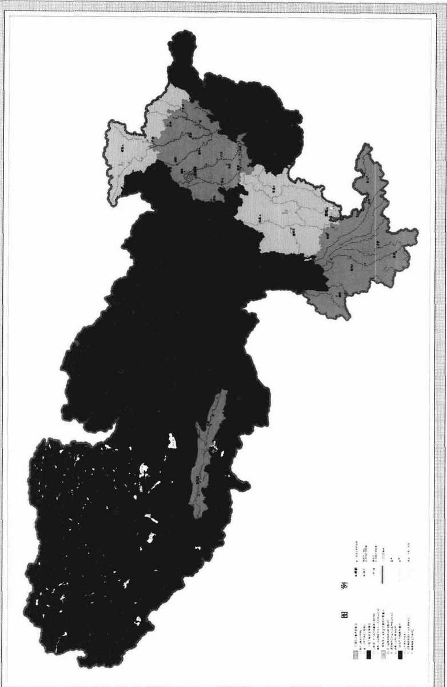  
梁热关：热热 ：采民梁：热采粮民采无 护团采采校护：采即护  
图

## 二、分区特征概述

## 1. 江河泥沙重点控制区（I）

本区主要包括金沙江中下游泥沙控制区（I1）和秦巴山地泥沙控制区(Ⅰ2)，区内江河干流及其支流切割较深，地势起伏较大，兼有多个暴雨中心，水土流失以面蚀和沟蚀为主，多为强度侵蚀，同时泥石流、滑坡等重力侵蚀也十分发育。

## 2. 水电工程安全保障区（Ⅱ）

本区主要包括三峡库区水土流失与面源污染控制区（Ⅱ₁）和横断山梯级水电开发水土流失综合防治区（Ⅱ2）。区域降雨充沛，地势陡峻，出露岩层以浅变质砂岩、紫色砂岩和石灰岩为主，抗风化、抗蚀性差，生态环境脆弱，泥石流滑坡时有发生，加之移民区陡坡种植和区域内各项工程建设活动强度大，人为水土流失严重，面源污染影响水库水质问题突出。

## 3. 高密度人口水土资源优化配置区（Ⅲ）

本区主要包括四川盆地坡地综合整治区（Ⅲ₁）、滇西南热区农业水土流失综合防治区（Ⅲ2）和西藏“一江两河”耕地保护区（Ⅲ3）。区域人口数量较多，密度较高，“人地矛盾”突出，加之坡耕地坡度大，耕作方式落后，水资源利用不合理，水土流失严重，同时在滇西南热区和西藏“一江两河”部分区域，由于岩层破碎、坡度陡峭，常有泥石流、滑坡发生。

## 4. 脆弱生态修复保育区（Ⅳ）

本区主要包括云贵高原石漠化水土资源保护区、江河源生态保育区和青藏高原高生态保护区（不在本次考察范围内）。该区生态环境十分脆弱，云贵高原石漠化水土资源保护区以碳酸盐岩为主，成土速率慢，水蚀、溶蚀严重，土层浅薄，地表渗水严重，土地资源紧缺，水土流失危险性大；江河源生态保育区由于恶劣的气候条件，加之鼠虫害和超载放牧等不合理的人类活动，草场退化和土地荒漠化问题突出，水土流失日趋严重。

## 三、分区治理目标

长江上游及西南诸河水土保持分区治理规划总体情况见表18.4。

<table><tr><td rowspan=2 colspan=2>项目区</td><td rowspan=1 colspan=2>1 泥沙控制区</td><td rowspan=1 colspan=2>2 水电工程区</td><td rowspan=1 colspan=3>3 高密度人口区</td><td rowspan=1 colspan=2>4 脆弱生态区</td><td rowspan=2 colspan=1>合计</td></tr><tr><td rowspan=1 colspan=1>金沙江中下游</td><td rowspan=1 colspan=1>秦巴山地</td><td rowspan=1 colspan=1>三峡库区</td><td rowspan=1 colspan=1>横断山区</td><td rowspan=1 colspan=1>四川盆地</td><td rowspan=1 colspan=1>滇西南热区</td><td rowspan=1 colspan=1>西藏“江两河”</td><td rowspan=1 colspan=1>云贵高原</td><td rowspan=1 colspan=1>江河源区</td></tr><tr><td rowspan=2 colspan=1>坡耕地治理/km²</td><td rowspan=1 colspan=1>坡改梯</td><td rowspan=1 colspan=1>12 499.03</td><td rowspan=1 colspan=1>7 416.63</td><td rowspan=1 colspan=1>7 237.33</td><td rowspan=1 colspan=1>4 709.74</td><td rowspan=1 colspan=1>9 391.68</td><td rowspan=1 colspan=1>9 538.02</td><td rowspan=1 colspan=1>24.04</td><td rowspan=1 colspan=1>7 246.53</td><td rowspan=1 colspan=1></td><td rowspan=1 colspan=1>58 063.00</td></tr><tr><td rowspan=1 colspan=1>保土耕作</td><td rowspan=1 colspan=1>2 499.81</td><td rowspan=1 colspan=1>1 483.33</td><td rowspan=1 colspan=1>1 447.47</td><td rowspan=1 colspan=1>941.95</td><td rowspan=1 colspan=1>1 878.34</td><td rowspan=1 colspan=1>1 907.60</td><td rowspan=1 colspan=1>4.81</td><td rowspan=1 colspan=1>1 449.31</td><td rowspan=1 colspan=1></td><td rowspan=1 colspan=1>11 612.62</td></tr><tr><td rowspan=3 colspan=1>人工林草措施/km²</td><td rowspan=1 colspan=1>水土保持林</td><td rowspan=1 colspan=1>17 010</td><td rowspan=1 colspan=1>6 340</td><td rowspan=1 colspan=1>10 340</td><td rowspan=1 colspan=1>11 600</td><td rowspan=1 colspan=1>6 960</td><td rowspan=1 colspan=1>25 880</td><td rowspan=1 colspan=1>185</td><td rowspan=1 colspan=1>7 500</td><td rowspan=1 colspan=1></td><td rowspan=1 colspan=1>85 815</td></tr><tr><td rowspan=1 colspan=1>经济林</td><td rowspan=1 colspan=1>1 950</td><td rowspan=1 colspan=1>1 225</td><td rowspan=1 colspan=1>2 820</td><td rowspan=1 colspan=1>2 050</td><td rowspan=1 colspan=1>2 980</td><td rowspan=1 colspan=1>3 770</td><td rowspan=1 colspan=1>12</td><td rowspan=1 colspan=1>2 380</td><td rowspan=1 colspan=1></td><td rowspan=1 colspan=1>17 187</td></tr><tr><td rowspan=1 colspan=1>人工种草</td><td rowspan=1 colspan=1>900</td><td rowspan=1 colspan=1>1 500</td><td rowspan=1 colspan=1>1 050</td><td rowspan=1 colspan=1>3 620</td><td rowspan=1 colspan=1>500</td><td rowspan=1 colspan=1>1 580</td><td rowspan=1 colspan=1>3 500</td><td rowspan=1 colspan=1>1 450</td><td rowspan=1 colspan=1>13 990</td><td rowspan=1 colspan=1>28 090</td></tr><tr><td rowspan=1 colspan=1>生态自然修复/km²</td><td rowspan=1 colspan=1>封禁治理</td><td rowspan=1 colspan=1>31 590</td><td rowspan=1 colspan=1>3 040</td><td rowspan=1 colspan=1>25 820</td><td rowspan=1 colspan=1>49 550</td><td rowspan=1 colspan=1>23 810</td><td rowspan=1 colspan=1>16 660</td><td rowspan=1 colspan=1>18 500</td><td rowspan=1 colspan=1>5 120</td><td rowspan=1 colspan=1>71 500</td><td rowspan=1 colspan=1>245 590</td></tr><tr><td rowspan=5 colspan=1>小型水利水保工程</td><td rowspan=1 colspan=1>塘堰/座</td><td rowspan=1 colspan=1>18 526</td><td rowspan=1 colspan=1>2 125</td><td rowspan=1 colspan=1>2 089</td><td rowspan=1 colspan=1>32 149</td><td rowspan=1 colspan=1>13 075</td><td rowspan=1 colspan=1>3 078</td><td rowspan=1 colspan=1>529</td><td rowspan=1 colspan=1>1 229</td><td rowspan=1 colspan=1></td><td rowspan=1 colspan=1>72 800</td></tr><tr><td rowspan=1 colspan=1>谷坊、拦沙坝/座</td><td rowspan=1 colspan=1>5 351</td><td rowspan=1 colspan=1>3 032</td><td rowspan=1 colspan=1>2 017</td><td rowspan=1 colspan=1>9 298</td><td rowspan=1 colspan=1>3 775</td><td rowspan=1 colspan=1>966</td><td rowspan=1 colspan=1>817</td><td rowspan=1 colspan=1>6 496</td><td rowspan=1 colspan=1></td><td rowspan=1 colspan=1>31 753</td></tr><tr><td rowspan=1 colspan=1>蓄水池/口</td><td rowspan=1 colspan=1>798 770</td><td rowspan=1 colspan=1>40 589</td><td rowspan=1 colspan=1>41 566</td><td rowspan=1 colspan=1>697 971</td><td rowspan=1 colspan=1>1 364 971</td><td rowspan=1 colspan=1>260 024</td><td rowspan=1 colspan=1>5 764</td><td rowspan=1 colspan=1>36 903</td><td rowspan=1 colspan=1></td><td rowspan=1 colspan=1>3 246 557</td></tr><tr><td rowspan=1 colspan=1>沉沙凼/个</td><td rowspan=1 colspan=1>1 294 272</td><td rowspan=1 colspan=1>6 058</td><td rowspan=1 colspan=1>212 636</td><td rowspan=1 colspan=1>1 282 455</td><td rowspan=1 colspan=1>1 597 155</td><td rowspan=1 colspan=1>306 443</td><td rowspan=1 colspan=1>7 848</td><td rowspan=1 colspan=1>42 930</td><td rowspan=1 colspan=1></td><td rowspan=1 colspan=1>4 749 798</td></tr><tr><td rowspan=1 colspan=1>排灌沟渠/km</td><td rowspan=1 colspan=1>22 359</td><td rowspan=1 colspan=1>7 695</td><td rowspan=1 colspan=1>6 171</td><td rowspan=1 colspan=1>31 100</td><td rowspan=1 colspan=1>27 592</td><td rowspan=1 colspan=1>7 082</td><td rowspan=1 colspan=1>971</td><td rowspan=1 colspan=1>3 776</td><td rowspan=1 colspan=1></td><td rowspan=1 colspan=1>106 746</td></tr><tr><td rowspan=1 colspan=1>泥石流滑坡普查</td><td rowspan=1 colspan=1>普查县/个</td><td rowspan=1 colspan=1>15</td><td rowspan=1 colspan=1>20</td><td rowspan=1 colspan=1>20</td><td rowspan=1 colspan=1>22</td><td rowspan=1 colspan=1>16</td><td rowspan=1 colspan=1>8</td><td rowspan=1 colspan=1>18</td><td rowspan=1 colspan=1>8</td><td rowspan=1 colspan=1>8</td><td rowspan=1 colspan=1>135</td></tr><tr><td rowspan=3 colspan=1>泥石流滑坡监测预警点</td><td rowspan=1 colspan=1>一级站/个</td><td rowspan=1 colspan=1></td><td rowspan=1 colspan=1></td><td rowspan=1 colspan=1></td><td rowspan=1 colspan=1>1</td><td rowspan=1 colspan=1>1</td><td rowspan=1 colspan=1>1</td><td rowspan=1 colspan=1>1</td><td rowspan=1 colspan=1></td><td rowspan=1 colspan=1></td><td rowspan=1 colspan=1>4</td></tr><tr><td rowspan=1 colspan=1>二级站/个</td><td rowspan=1 colspan=1>1</td><td rowspan=1 colspan=1>1</td><td rowspan=1 colspan=1>1</td><td rowspan=1 colspan=1>4</td><td rowspan=1 colspan=1>2</td><td rowspan=1 colspan=1>3</td><td rowspan=1 colspan=1>3</td><td rowspan=1 colspan=1>2</td><td rowspan=1 colspan=1>1</td><td rowspan=1 colspan=1>18</td></tr><tr><td rowspan=1 colspan=1>预警点/个</td><td rowspan=1 colspan=1>5</td><td rowspan=1 colspan=1>5</td><td rowspan=1 colspan=1>5</td><td rowspan=1 colspan=1>18</td><td rowspan=1 colspan=1>12</td><td rowspan=1 colspan=1>15</td><td rowspan=1 colspan=1>17</td><td rowspan=1 colspan=1>12</td><td rowspan=1 colspan=1>8</td><td rowspan=1 colspan=1>97</td></tr><tr><td rowspan=1 colspan=1>泥石流滑坡避险搬迁</td><td rowspan=1 colspan=1>人数/万人</td><td rowspan=1 colspan=1>15</td><td rowspan=1 colspan=1>6</td><td rowspan=1 colspan=1>20</td><td rowspan=1 colspan=1>10</td><td rowspan=1 colspan=1>10</td><td rowspan=1 colspan=1>6</td><td rowspan=1 colspan=1>5</td><td rowspan=1 colspan=1>6</td><td rowspan=1 colspan=1>4</td><td rowspan=1 colspan=1>82</td></tr><tr><td rowspan=1 colspan=1>泥石流沟治理</td><td rowspan=1 colspan=1>治理泥石流沟/条</td><td rowspan=1 colspan=1>350</td><td rowspan=1 colspan=1>400</td><td rowspan=1 colspan=1>260</td><td rowspan=1 colspan=1>440</td><td rowspan=1 colspan=1>200</td><td rowspan=1 colspan=1>120</td><td rowspan=1 colspan=1>270</td><td rowspan=1 colspan=1>160</td><td rowspan=1 colspan=1>200</td><td rowspan=1 colspan=1>2 400</td></tr><tr><td rowspan=1 colspan=1>滑坡治理</td><td rowspan=1 colspan=1>治理滑坡/个</td><td rowspan=1 colspan=1>90</td><td rowspan=1 colspan=1>120</td><td rowspan=1 colspan=1>90</td><td rowspan=1 colspan=1>160</td><td rowspan=1 colspan=1>90</td><td rowspan=1 colspan=1>80</td><td rowspan=1 colspan=1>100</td><td rowspan=1 colspan=1>90</td><td rowspan=1 colspan=1>80</td><td rowspan=1 colspan=1>900</td></tr><tr><td rowspan=1 colspan=12>wwwm</td></tr></table>

## 1. 江河泥沙重点控制区（I）

通过坡地整治，坡面水系建设，泥石流滑坡治理等工程，到2030年，全面完成区域内现有坡地的水土保持综合整治，完成70%泥石流滑坡点的工程治理。其中，整治坡耕地面积 $1 9 9 1 5 . 6 6 \ \mathrm { \ k m ^ { 2 } }$ ，实施保土耕作面积$3 ~ 9 8 3 . ~ 1 4 ~ \mathrm { k m } ^ { 2 }$ ，实施封禁治理 $3 4 \ 6 3 0 \ \mathrm { k m ^ { 2 } }$ ，营造水土保持林 $2 3 ~ 3 5 0 ~ \mathrm { k m } ^ { 2 }$ ，经济林 $3 \ 1 7 5 \ \mathrm { k m ^ { 2 } }$ ，人工草地建设 $2 \ 4 0 0 \ \mathrm { k m ^ { 2 } }$ ，修建塘堰20651座，谷坊、拦沙坝8383座，蓄水池839358口，沉沙池1300330个，排灌沟渠30054km，泥石流滑坡普查县35个，泥石流滑坡监测预警点12个，避险搬迁21万人，治理泥石流沟750条，治理滑坡210个。通过水土保持综合治理，使区域内70%的面蚀和沟蚀得到有效抑制，重要区域内的泥石流、滑坡等重力侵蚀得到有效治理，实现区域经济和环境协调发展。

## 2. 水电工程安全保障区（Ⅱ）

通过坡耕地综合整治、生态修复与保育、泥石流滑坡防治、工程建设水土保持监督监测及面源污染监测与控制体系建设，控制人为新增水土流失发生，保护库区水质安全，改善居民生存环境，提高人民生活水平，促进区域资源可持续利用和保障社会经济与环境可持续发展。到2030年，全面完成区域内现有坡耕地水土保持综合整治，完成区域内可开展生态修复与保育总面积的80%。其中，整治坡耕地面积 $1 1 \ \mathrm { 9 4 7 . 0 7 ~ k m ^ { 2 } }$ ，实施保土耕作面积$2 3 8 9 . 4 2 ~ \mathrm { k m ^ { 2 } }$ ，实施封禁治理 $7 5 ~ 3 7 0 ~ \mathrm { k m ^ { 2 } }$ ，营造水土保持林 $2 1 \ 9 4 0 \ \mathrm { k m ^ { 2 } }$ ，经济林 $4 8 7 0 ~ \mathrm { k m ^ { 2 } }$ ，人工草地建设 $4 6 7 0 ~ \mathrm { k m ^ { 2 } }$ ，修建塘堰34238座，谷坊、拦沙坝11 315 座，蓄水池 739 536 口，沉沙池 1 495 092 个，排灌沟渠 37 272 km，泥石流滑坡普查县42个，泥石流滑坡监测预警点29个，避险搬迁30万人，治理泥石流沟700条，治理滑坡250个。同时，对三峡库区农业面源污染重点区域进行全面治理，减少各类化肥、农药、生活废水等面源污染物质排放量。通过水土保持综合治理，使区域内人为水土流失得到有效抑制，人民的生产条件得到改善，区域的环境人口容量得到提高，使各种面源污染物质得到有效控制。

## 3. 高密度人口水土资源优化配置区（Ⅲ）

通过坡耕地治理、坡面水系建设、生态修复与保育和泥石流滑坡防治工程，控制坡面水土流失，充分利用水土资源，提高土地生产力，促进区域水土资源可持续利用和保障社会经济与环境可持续发展。到2030年，全面完成区域内现有坡耕地改造和坡面水系建设，完成区域内可开展生态修复与保育总面积的80%和重要区域内所有泥石流滑坡点的防治工作。其中，整治坡耕地面积 18 953.74 km²，实施保土耕作面积 $3 \ 7 9 0 . \ 7 5 \ \mathrm { \ k m ^ { 2 } }$ ，实施封禁治理$5 8 ~ 9 7 0 ~ \mathrm { k m ^ { 2 } }$ ，营造水土保持林 $3 3 ~ 0 2 5 ~ \mathrm { k m } ^ { 2 }$ ，经济林 $6 \ 7 6 2 \ \mathrm { k m ^ { 2 } }$ ，人工草地建设5580 km²，修建塘堰16 682座，谷坊、拦沙坝5559 座，蓄水池1 630 758口，沉沙池1911447个，排灌沟渠35644km，泥石流滑坡普查县42个，泥石流滑坡监测预警点55个，避险搬迁21万人，治理泥石流沟590条，治理滑坡270个。通过水土保持综合治理，使区域内坡地水土流失得到有效抑制，水土资源得到合理利用，土地生产力得到提高，人民的生活条件和生态环境得到明显改善。

## 4. 脆弱生态修复保育区（Ⅳ）

通过各项水土保持综合治理工程，保护区内土地资源，改善区域内生态环境，促进社会经济与生态环境协调发展。到2030年，全面完成区域内现有坡地的水土保持综合整治，使区域内生态修复与保育面积治理度达到80%。其中，整治坡耕地面积 $7 ~ 2 4 6 . 5 3 ~ \mathrm { k m ^ { 2 } }$ ，实施保土耕作面积 $1 \ 4 4 9 . \ 3 1 \ \mathrm { k m } ^ { 2 }$ ，实施封禁治理76620 km²，营造水土保持林 $7 ~ 5 0 0 ~ \mathrm { k m ^ { 2 } }$ ，经济林 $2 \ 3 8 0 \ \mathrm { k m ^ { 2 } }$ ，人工草地建设 $1 5 ~ 4 4 0 ~ \mathrm { k m ^ { 2 } }$ ，修建塘堰1229座，谷坊、拦沙坝6496座，蓄水池36 903口，沉沙池42930个，排灌沟渠3776 km，泥石流滑坡普查县16个，泥石流滑坡监测预警点23个，避险搬迁10万人，治理泥石流沟360条，治理滑坡170个。通过治理，使区域内土地资源得到有效保护，水土流失得到有效抑制，人民的生活水平和生态环境得到明显改善。

## 第三节 战略目标、总体布局与措施配置

## 一、战略目标与任务

## （1）近期目标与任务（2006～2010年）

本阶段水土保持的目标是：继续进行水土流失重点治理工作，实现面上水土流失计划治理面积的20%；完成30%的坡耕地整治和30%的生态修复与保育；完成80%的山洪、泥石流、滑坡普查工作，完成60%的避难搬迁和20%的灾害治理工程；在三峡库区建设19个乡镇面源污染治理工程，在3个区（县、市）建立环境质量监测监督站。

## （2）中期目标与任务（2011～2020年）

本阶段水土保持的目标是：实现面上水土流失计划治理面积的40%；完成50%的坡耕地整治和50%的生态修复与保育；完成20%的山洪、泥石流、滑坡普查工作；40%的避难搬迁、50%的灾害治理工程和60%的监测网络建设；在三峡库区25个区（县、市）80%的乡镇建设面源污染治理工程，完成10个区（县、市）环境质量监测监督站的建设。

## （3）远期目标与任务（2021～2030年）

本阶段水土保持的目标是：实现面上水土流失计划治理面积的40%；完成20%的坡耕地整治和20%的生态修复与保育；完成30%的山洪、泥石流、滑坡灾害治理工程；40%的监测网络建设，并建立减灾信息系统。

## 二、总体工程布局与措施

针对长江上游和西南诸河水土流失特点及治理需求，其总体工程布局分为4个重大工程，即坡地整治工程、泥石流滑坡防治工程、生态修复与保育工程、三峡库区面源污染治理工程。下面分别从工程措施配置、措施成本分析、采取的主要对策进行阐述。

## （一）坡地整治工程

坡耕地整治工程对加快长江上游和西南诸河水土流失防治步伐，改善农村生产生活条件、改变恶劣的生态环境、促进“三农”问题解决具有重要作用。

## 1. 坡地整治工程布局及措施配置

据统计资料分析，截至2003年底，长江上游和西南诸河共有坡耕地面积978.7万hm²。根据坡耕地的坡度、土层厚度、土壤砾石含量等因素，对坡耕地潜力分析表明，该区适宜坡改梯面积为580.63万hm²，保土耕作面积11 612.60 km²。具体治理措施规划见表18.5。

## 2. 坡耕地水土流失防治措施

主要为：坡改梯工程措施、坡面水系工程治理措施、生物治理措施和耕作措施。这些措施应因地制宜，有主有从，互为补充，是一个整体。对于10°～25°的坡耕地，以梯地建设工程措施为主，辅以植物措施和保土耕作措施；对于<10°的坡耕地，以保土耕作措施和植物措施为主，辅以小型水利水保工程措施；对于坡耕地上缘的荒山荒坡和退耕的陡坡耕地，则以植物措施为主，种植生态效益和经济效益兼优的林草及经济林果，辅以小型水利水保工程措施。

表 18.5 坡耕地治理措施规划表  
(单位：km²)
<table><tr><td rowspan=1 colspan=1>项目</td><td rowspan=1 colspan=1>分区名称</td><td rowspan=1 colspan=1>坡改梯</td><td rowspan=1 colspan=1>保土耕作</td><td rowspan=1 colspan=1>小计</td></tr><tr><td rowspan=2 colspan=1>I.江河泥沙重点控1.金制区</td><td rowspan=1 colspan=1>沙江中下游泥沙控制区</td><td rowspan=1 colspan=1>12 499.03</td><td rowspan=1 colspan=1>2 499.81</td><td rowspan=1 colspan=1>14 998.84</td></tr><tr><td rowspan=1 colspan=1>2.秦巴山地泥沙控制区</td><td rowspan=1 colspan=1>7 416.63</td><td rowspan=1 colspan=1>1 483.33</td><td rowspan=1 colspan=1>8 899.96</td></tr><tr><td rowspan=2 colspan=1>Ⅱ.水电工程区安全保障区</td><td rowspan=1 colspan=1>1. 三峡库区水土流失与面源污染控制区</td><td rowspan=1 colspan=1>7 237.33</td><td rowspan=1 colspan=1>1 447.47</td><td rowspan=1 colspan=1>8 684.80</td></tr><tr><td rowspan=1 colspan=1>2. 横断山水能梯级开发水土流失综合防治区</td><td rowspan=1 colspan=1>4 709.74</td><td rowspan=1 colspan=1>941.95</td><td rowspan=1 colspan=1>5 651.69</td></tr><tr><td rowspan=3 colspan=1>Ⅲ.高密度人口水土资源优化配置区</td><td rowspan=1 colspan=1>1. 四川盆地坡地综合整治区</td><td rowspan=1 colspan=1>9 391.68</td><td rowspan=1 colspan=1>1 878.34</td><td rowspan=1 colspan=1>11 270.02</td></tr><tr><td rowspan=1 colspan=1>2. 滇西南热区农业水土流失综合整治区</td><td rowspan=1 colspan=1>9 538.02</td><td rowspan=1 colspan=1>1 907.60</td><td rowspan=1 colspan=1>11 445.62</td></tr><tr><td rowspan=1 colspan=1>3. 西藏“一江两河”耕地保护区</td><td rowspan=1 colspan=1>24.04</td><td rowspan=1 colspan=1>4.81</td><td rowspan=1 colspan=1>28.85</td></tr><tr><td rowspan=1 colspan=1>Ⅳ.脆弱生态修复保育区</td><td rowspan=1 colspan=1>1. 云贵高原石漠化水土资源保护区</td><td rowspan=1 colspan=1>7 246.53</td><td rowspan=1 colspan=1>1 449.31</td><td rowspan=1 colspan=1>8 695.84</td></tr><tr><td rowspan=1 colspan=2>合计</td><td rowspan=1 colspan=1>58 063</td><td rowspan=1 colspan=1>11 612.60</td><td rowspan=1 colspan=1>69 675.60</td></tr></table>

## （二）泥石流滑坡防治工程

截至2003年底，长江上游和西南诸河共有泥石流沟8607条，需要规划治理2400条；共有滑坡8994个，需要规划治理900个。为了减轻其他未能纳人的灾害点和潜在威胁点的危害，以及规划点实施先后的影响，在实施工程治理的同时，在完成对泥石流滑坡潜在危害点普查的基础上，需要实施其他防治措施，包括泥石流滑坡信息系统建设、监测预警网络建设、避险搬迁、群测群防、相关技术规程建设等。

## （三）生态修复与保育工程

## 1. 工程布局及其措施配置

根据区域生态环境背景，生态环境问题、土壤侵蚀及生态功能特点、开发建设工程规模与布局，在各区进行生态修复与保育工程布局。其中，秦巴山地实施面积12105km²，金沙江中下游区实施面积51450km²，三峡库区

40030km²，横断山区面积66820km²，四川盆地区面积34250km²，滇西南热区实施面积47890km²，西藏“一江两河”实施面积22197km²，江河源区85490 km²，云贵高原石漠化区16450 km²。具体措施布局见表18.6。

## 2. 采取的措施

生态修复与保育工程主要采取人工林草措施和封育治理措施培育和发展植被，增加植被覆盖度，提高覆盖率，是防治水土流失的重要手段和措施。

人工林草措施主要在≥25陡坡耕地、15°～25°不宜耕坡地，以及荒山、荒坡、荒沟和可利用而尚未利用的土地，开展人工造林种草，人工造林分为水土保持林（水保型薪炭林、水保型用材林）和水保型经果林。≥25°坡耕地和15°～25°不宜耕坡地，实行退耕还林，以营造生态林为主，适当发展经济果林。

封禁治理适宜于地广人稀的中度和轻度水土流失地区，也适用于人工种植林草成本较高而效益较差的部分强度水土流失地区。

表18.6 生态修复与保育工程总体布局 (单位：km²)
<table><tr><td rowspan=2 colspan=2>项目区</td><td rowspan=1 colspan=3>人工林草措施</td><td rowspan=1 colspan=1>生态自然修复</td><td rowspan=2 colspan=1>合计</td></tr><tr><td rowspan=1 colspan=1>水土保持林</td><td rowspan=1 colspan=1>经济林</td><td rowspan=1 colspan=1>人工种草</td><td rowspan=1 colspan=1>封育治理</td></tr><tr><td rowspan=1 colspan=1>I. 泥沙控制区</td><td rowspan=1 colspan=1>1金沙江中下游泥沙控制区2秦巴山地泥沙控制区</td><td rowspan=1 colspan=1>17 0106 340</td><td rowspan=1 colspan=1>1 9501 225</td><td rowspan=1 colspan=1>9001 500</td><td rowspan=1 colspan=1>31 5903 040</td><td rowspan=1 colspan=1>51 45012 105</td></tr><tr><td rowspan=1 colspan=1>Ⅱ. 水电工程区</td><td rowspan=1 colspan=1>1三峡库区水土流失与面源污染控制区2横断山水能梯级开发水土流失综合防治区</td><td rowspan=1 colspan=1>10 34011600</td><td rowspan=1 colspan=1>2 8202 050</td><td rowspan=1 colspan=1>1 0503 620</td><td rowspan=1 colspan=1>25 82049 550</td><td rowspan=1 colspan=1>40 03066 820</td></tr><tr><td rowspan=1 colspan=1>Ⅲ.高密度人口区</td><td rowspan=1 colspan=1>1四川盆地坡地综合整治区2滇西南热区农业水土流失综合整治区3西藏“一江两河”耕地保护区</td><td rowspan=1 colspan=1>6 96025 880185</td><td rowspan=1 colspan=1>2 9803 77012</td><td rowspan=1 colspan=1>5001 5803 500</td><td rowspan=1 colspan=1>23 81016 66018 500</td><td rowspan=1 colspan=1>34 25047 89022 197</td></tr><tr><td rowspan=1 colspan=1>ⅣV. 脆弱生态区</td><td rowspan=1 colspan=1>1云贵高原石漠化水土资源保护区2 江河源生态保育区</td><td rowspan=1 colspan=1>7 500</td><td rowspan=1 colspan=1>2 380</td><td rowspan=1 colspan=1>1 45013 990</td><td rowspan=1 colspan=1>5 12071 500</td><td rowspan=1 colspan=1>16 45085 490</td></tr><tr><td rowspan=1 colspan=2>合计</td><td rowspan=1 colspan=1>85 815</td><td rowspan=1 colspan=1>17 187</td><td rowspan=1 colspan=1>28 090 2</td><td rowspan=1 colspan=1>45 5903</td><td rowspan=1 colspan=1>76 682</td></tr></table>

## （四）三峡库区面源污染治理工程

## （1）坡地生态农业示范工程

生态农业示范工程的范围主要包括江津、渝北、长寿、涪陵、丰都、万

州、忠县、开县、云阳、奉节、巫山等地的低山浅丘区及河谷区。实施面积约24000km²，其中退耕还林、还草面积约5000 km²，水土保持体系建设区12 000 km²，高效生态农业示范区 7000 km²。

## (2) 畜禽养殖污染治理工程

对三峡库区26家规模化畜禽养殖企业粪便进行处理、日处理粪便3160 t、日净化废水2500 t、制造有机肥160 t、年处理畜禽粪便约130万t、减排 COD 2840 t、总氮 5280 t、总磷 1760 t。

## （3)农村能源建设工程

在三峡库区农村建沼气池60万口，建节柴灶40万户，年利用秸秆及粪便2920万t；解决560万农村人口的能源需求，年节约薪柴370万t。

## （4）农村生活废水循环农用工程

实施区（市、县）25个、乡镇508个、行政村5224个、农户3442460户，农业人口11192648人。对于集中农村集镇，实行污水管网收集，集中处理。每个村建设小型简易污水处理站1个，经过自然爆氧、稀释、沉淀处理后，通过灌溉沟渠排入附近的农田。对于分散农户，主要依托自然沟渠，合理规划小型坑塘、碎石床，开展沟道两栖植物重建，引入灌溉系统，通过农用消化农村生活废水中营养物质。需要建立小型简易污水处理站580个，建设小型坑塘2800个，小型碎石床26380m²，重建自然沟渠3600km。

## （5）库区消落带湿地利用与环境重建工程

建设湿地保护带（区）32620hm²，植物篱工程5720hm²，人工湿地生态重建16 600 hm²，敞水区1352 hm²，小流域生态治理面积 26 800 hm²。

## （6）面源污染监督、控制与管理信息系统工程

监督监测中心1个，分中心2个，监测站点26个。

## 三、成本分析

## （一）坡地整治工程

根据坡耕地整治工程及配套坡面水系工程的规模，长江上游和西南诸河坡耕地水土保持综合整治工程总投资1479.66亿元，其中坡耕地整治工程投资966.72亿元，坡面水系工程投资512.94亿元（表18.7）。规划2006～2010年总投资443.90亿元，2011\~2020年总投资739.83亿元，2021～2030年总投资295.932亿元。

表18.7 坡耕地整治工程投资估算表
<table><tr><td rowspan=1 colspan=1>序号</td><td rowspan=1 colspan=1>工程或费用名称</td><td rowspan=1 colspan=1>单位</td><td rowspan=1 colspan=1>数量</td><td rowspan=1 colspan=1>单价/万元</td><td rowspan=1 colspan=1>合计/亿元</td></tr><tr><td rowspan=1 colspan=1></td><td rowspan=1 colspan=1>坡耕地治理</td><td rowspan=1 colspan=1></td><td rowspan=1 colspan=1>69 675.6</td><td rowspan=1 colspan=1></td><td rowspan=1 colspan=1>966.72</td></tr><tr><td rowspan=1 colspan=1>1</td><td rowspan=1 colspan=1>坡改梯</td><td rowspan=1 colspan=1>km²</td><td rowspan=1 colspan=1>58 063.00</td><td rowspan=1 colspan=1>164.32</td><td rowspan=1 colspan=1>954.12</td></tr><tr><td rowspan=1 colspan=1>2</td><td rowspan=1 colspan=1>保水保土耕作</td><td rowspan=1 colspan=1>km²</td><td rowspan=1 colspan=1>11 612.60</td><td rowspan=1 colspan=1>10.85</td><td rowspan=1 colspan=1>12.60</td></tr><tr><td rowspan=1 colspan=1>二</td><td rowspan=1 colspan=1>坡面水系工程</td><td rowspan=1 colspan=1></td><td rowspan=1 colspan=1></td><td rowspan=1 colspan=1></td><td rowspan=1 colspan=1>512.94</td></tr><tr><td rowspan=1 colspan=1>1</td><td rowspan=1 colspan=1>塘堰整治</td><td rowspan=1 colspan=1>座</td><td rowspan=1 colspan=1>72 800</td><td rowspan=1 colspan=1>2.24</td><td rowspan=1 colspan=1>48.99</td></tr><tr><td rowspan=1 colspan=1>2</td><td rowspan=1 colspan=1>谷坊拦沙坝</td><td rowspan=1 colspan=1>座</td><td rowspan=1 colspan=1>31 753</td><td rowspan=1 colspan=1>1.17</td><td rowspan=1 colspan=1>11.17</td></tr><tr><td rowspan=1 colspan=1>3</td><td rowspan=1 colspan=1>蓄水池</td><td rowspan=1 colspan=1>口</td><td rowspan=1 colspan=1>3 246 557</td><td rowspan=1 colspan=1>0.33</td><td rowspan=1 colspan=1>322.83</td></tr><tr><td rowspan=1 colspan=1>4</td><td rowspan=1 colspan=1>沉沙函</td><td rowspan=1 colspan=1>个</td><td rowspan=1 colspan=1>4 749 798</td><td rowspan=1 colspan=1>0.06</td><td rowspan=1 colspan=1>91.21</td></tr><tr><td rowspan=1 colspan=1>5</td><td rowspan=1 colspan=1>排灌沟渠</td><td rowspan=1 colspan=1>km</td><td rowspan=1 colspan=1>106 746</td><td rowspan=1 colspan=1>1.21</td><td rowspan=1 colspan=1>38.74</td></tr><tr><td rowspan=1 colspan=2>合计</td><td rowspan=1 colspan=1>亿元</td><td rowspan=1 colspan=1></td><td rowspan=1 colspan=1></td><td rowspan=1 colspan=1>1 479.66</td></tr></table>

## （二）泥石流、滑坡防治工程

长江上游和西南诸河的泥石流滑坡防治规划总投资289.051亿元（表18.8)。规划2006\~2010年总投资52.051亿元，2011\~2020年总投资95.0亿元，2021\~2030年总投资95.0亿元。

表18.8 泥石流滑坡防治规划投资汇总表
<table><tr><td rowspan=2 colspan=2>工程类别</td><td rowspan=1 colspan=2>规模</td><td rowspan=2 colspan=1>规划投资/万元</td></tr><tr><td rowspan=1 colspan=1>单位</td><td rowspan=1 colspan=1>数量</td></tr><tr><td rowspan=4 colspan=1>非工程措施</td><td rowspan=1 colspan=1>灾害普查</td><td rowspan=1 colspan=1>县（个）</td><td rowspan=1 colspan=1>135</td><td rowspan=1 colspan=1>20 250</td></tr><tr><td rowspan=1 colspan=1>监测预警网络建设</td><td rowspan=1 colspan=1>站（点）</td><td rowspan=1 colspan=1>184</td><td rowspan=1 colspan=1>181 260</td></tr><tr><td rowspan=1 colspan=1>搬迁避让</td><td rowspan=1 colspan=1>万人</td><td rowspan=1 colspan=1>82</td><td rowspan=1 colspan=1>318 000</td></tr><tr><td rowspan=1 colspan=1>规范规程制定</td><td rowspan=1 colspan=1></td><td rowspan=1 colspan=1></td><td rowspan=1 colspan=1>1000</td></tr><tr><td rowspan=2 colspan=1>工程措施</td><td rowspan=1 colspan=1>泥石流沟治理</td><td rowspan=1 colspan=1>处</td><td rowspan=1 colspan=1>2400</td><td rowspan=1 colspan=1>1 920 000</td></tr><tr><td rowspan=1 colspan=1>滑坡治理</td><td rowspan=1 colspan=1>处</td><td rowspan=1 colspan=1>900</td><td rowspan=1 colspan=1>450 000</td></tr><tr><td rowspan=1 colspan=2>合计</td><td rowspan=1 colspan=1></td><td rowspan=1 colspan=1></td><td rowspan=1 colspan=1>2 890 510</td></tr></table>

## （三）生态修复与保育工程

根据长江上游和西南诸河生态修复与保育工程规模，工程总投资776.57亿元，其中水土保持林投资348.48亿元，经果林投资119.31亿元，人工种草投资113.40亿元，封山育林、育草投资185.31亿元，人工改良草地投资8.47亿元，草地围栏建设投资1.60亿元，总投资776.57亿元（表18.9）。规划2006\~2010年总投资232.97亿元，2011\~2020年总投资388.29亿元，2021\~2030年总投资155.31亿元。

表18.9 生态修复与保育工程投资估算表
<table><tr><td rowspan=1 colspan=1>序号</td><td rowspan=1 colspan=1>工程或费用名称</td><td rowspan=1 colspan=1>数量/km²</td><td rowspan=1 colspan=1>单价/万元</td><td rowspan=1 colspan=1>合计/亿元</td></tr><tr><td rowspan=1 colspan=1>1</td><td rowspan=1 colspan=1>水土保持林</td><td rowspan=1 colspan=1>85 815</td><td rowspan=1 colspan=1>40.61</td><td rowspan=1 colspan=1>348.48</td></tr><tr><td rowspan=1 colspan=1>2</td><td rowspan=1 colspan=1>经果林</td><td rowspan=1 colspan=1>17 187</td><td rowspan=1 colspan=1>69.42</td><td rowspan=1 colspan=1>119.31</td></tr><tr><td rowspan=1 colspan=1>3</td><td rowspan=1 colspan=1>人工种草</td><td rowspan=1 colspan=1>28 090</td><td rowspan=1 colspan=1>40.37</td><td rowspan=1 colspan=1>113.40</td></tr><tr><td rowspan=1 colspan=1>4</td><td rowspan=1 colspan=1>封山育林、育草</td><td rowspan=1 colspan=1>233 390</td><td rowspan=1 colspan=1>7.94</td><td rowspan=1 colspan=1>185.31</td></tr><tr><td rowspan=1 colspan=1>5</td><td rowspan=1 colspan=1>人工改良草地</td><td rowspan=1 colspan=1>9 200</td><td rowspan=1 colspan=1>9.21</td><td rowspan=1 colspan=1>8.47</td></tr><tr><td rowspan=1 colspan=1>6</td><td rowspan=1 colspan=1>草地围栏</td><td rowspan=1 colspan=1>3 000</td><td rowspan=1 colspan=1>5.32</td><td rowspan=1 colspan=1>1.60</td></tr><tr><td rowspan=1 colspan=2>合计</td><td rowspan=1 colspan=1>376 682</td><td rowspan=1 colspan=1></td><td rowspan=1 colspan=1>776.57</td></tr></table>

## （四）三峡库区面源污染治理工程

## （1）坡地生态农业示范工程

坡地生态农业建设中，水土保持体系中修建排灌沟渠8563km，沉沙函536万个，蓄水池8万口，共需投资约114800万元；退耕还林、还草工程中还生态林、经济林和草场分别2.0万hm²、1.0万 $\mathrm { h m } ^ { 2 }$ 、2.1万 $\mathrm { { h m ^ { 2 } } }$ ，需投资11190万元；高效生态农业示范工程坡改梯0.8万 $\mathrm { h m } ^ { 2 }$ 、保护性耕作措施8万hm²，瘠薄坡地培肥4.5万hm²，秸秆还田配套工程12万hm²，植物蓠4万hm²，共需投资215020万元。坡地生态农业示范工程共需投资341010万元。

## (2)规模化畜禽养殖场污染治理

重点治理养殖企业26户，处理能力共计3160t/d，包括2500 t的废水处理，处理工艺要求厌氧一好氧一活性污泥，其投资为： $3 1 6 0 \times 5 0$ 元/t=15.8万元，每年总处理次数按120天计，年投资额为1896万元；运转两年以后，依托后续肥料生产维持，共投资3792万元；有机堆肥每日150t，每吨需投资534元堆沤、除臭、添加其他有机物料和微生物制成有机肥，工程建设完工后有机肥年产量约1.2万t，共需投资640.8万元。因此，畜禽养殖污染治理工程共需投资4432.8万元。

## (3) 农村能源建设

沼气池60万口×800元/口=48000万元；建节柴灶40万户，每户投资137.5元，共投资24450万元，共需投资72450万元。

## （4）农村生活废水循环农用工程

小型简易污水处理站23万元/个，580个，需投资13340万元；小型坑塘3200元/个，2800个，需投资896万元；小型碎石床50元/m²，26 380m²，需投资132万元；自然沟渠重建1350元/km，3600km，需投资486万元。农村生活废水循环农用工程投资14854万元。

## （5）库区消落带湿地利用与环境重建工程

建设湿地保护带（区）32620hm²，植物篱工程5720hm²，人工湿地生态重建16 600 hm²，敞水区1352 hm²，小流域生态治理面积26 800 hm²。总投资93810万元。

## （6）面源污染监督、控制与管理信息系统工程

监督监测中心需仪器设备50台套，700万元；辅助设备10台套，150万元；信息平台150万元；地理信息系统120万元；技术培训50万元。中心需投资1170万元。

监督监测分中心按800万元/个，其中：仪器设备30台套，500万元；辅助设备6台套，100万元；信息平台80万元；地理信息系统50万元；技术培训40万元。每个分中心投资1600万元。

监督监测站按200万元/个，其中：仪器备20台套，150万元；辅助设备3台套，30万元；信息平台20万元。26个监测站投资5200万元。

面源污染监督、控制与管理信息系统工程共投资7970万元。

以上三峡库区面源污染治理工程总投资为542496.8万元。

## 四、对策及建议

## （一)防治对策

## 1. 坡地整治

坡耕地是长江上游和西南诸河土地生态系统中极为脆弱的部分，也是水土流失最严重的地方。坡耕地严重的水土流失对土地资源产生了极大破坏，长江流域耕地面积由于严重的水土流失，每年减少耕地约为13万～20万hm²（郭厚祯、万彩兵，1998）。坡耕地水土流失导致土层减薄，生产力低下，群众生活贫困，延缓山区脱贫的步伐，形成了“破坏—环境恶化一贫困再破坏”的恶性循环。

坡耕地的水土流失不仅对生态环境产生严重破坏，而且对社会主义新农村建设带来了极大障碍。党的十六大提出全面建设小康社会宏伟目标的重要内容之一就是使我国可持续发展能力不断增强，生态环境得到改善，资源利用效率显著提高，促进人与自然的和谐，推动整个社会走上生产发展、生活富裕、生态良好的文明发展道路。因此，开展坡耕地整治工程对加快长江上游和西南诸河水土流失防治步伐、改善农村生产生活条件、改变恶劣生态环境、促进“三农”问题解决具有重要的作用。

坡耕地水土流失防治措施主要为：坡改梯工程措施、坡面水系工程治理措施、生物治理措施和耕作措施。这些措施应因地制宜，有主有从，互为补充。10°～25的坡耕地，以梯地建设工程措施为主，辅以植物措施和保土耕作措施；<10的坡耕地，以保土耕作措施和植物措施为主，辅以小型水利水保工程措施；坡耕地上缘的荒山荒坡和退耕的陡坡耕地，以植物措施为主，种植生态效益和经济效益兼优的林草及经济林果，辅以小型水利水保工程措施。

## 2. 泥石流、滑坡防治

泥石流、滑坡是强烈的重力地表演化形式。泥石流、滑坡区域是长江上游和西南诸河土地生态系统中最为脆弱的部分之一，也是水土流失最严重的地方。虽然泥石流、滑坡的防治取得了一些成绩，但对于面广量大的泥石流、滑坡来说，仍属凤毛麟角，九牛一毛，目前泥石流、滑坡灾害还相当严重。过去对泥石流、滑坡的治理标准不高，许多已建工程防灾能力低或年久失修，已经不能满足防灾减灾的需要。因此，需要全面规划，加大危害严重之泥石流、滑坡点的治理力度，加快治理进程。

为了减轻其他未能纳入的灾害点和潜在威胁点的危害，以及规划点实施先后的影响，在实施工程治理的同时，需要完成对泥石流、滑坡潜在危害点的普查，进行泥石流、滑坡信息系统建设、监测预警网络建设、避险搬迁、群测群防、相关技术规程的建设等。

## 3. 生态修复与保育

生态环境建设作为国家的一项基本国策，党的“十六大”报告将其确定为全面建设小康社会奋斗目标的重要内容之一。长江上游和西南诸河位于青藏高原强烈隆升带，地势起伏大，生态环境具有多样性、脆弱性和对人类活动响应的敏感性。随着西部地区开发建设项目的增多，特别是江河梯级电站的开发，加之“人地矛盾”突出，毁林草开荒和草地超载过牧严重，长江上游和西南诸河生态环境压力甚大，水土流失日趋加重。因此，加强长江上游和西南诸河生态环境保护和建设，对改善区域生态环境，防治水土流失，实现区域生态与经济可持续发展，促进民族团结，维护区域政治安全、经济安全和生态安全具有重要意义。

坚持以小流域为单元综合治理的同时，必须把生态自然修复放在突出的位置，在水土流失严重、人口资源矛盾十分突出的地区要以人工措施为主，提高区域的环境人口容量，促进生态环境逐步恢复和改善。在水土流失程度较轻、降雨适宜、人口密度小的地区，要把生态自然修复作为改善生态环境的主要手段和措施，通过封育保护，轮牧禁牧，舍饲圈养等措施，发挥自然力量恢复生态的作用。把人工措施和生态自然修复有机结合起来，在点上开展重点治理的同时，面上更多地依靠大自然的力量恢复生态，加快水土流失防治进程，使水土流失基本得到控制，生态环境进入良性循环，人民生活水平得到较大提高，为全面建设小康社会创造良好的生产、生活环境。

生态修复与保育主要采取人工林草措施和封育治理措施及利用和发挥自然繁育恢复力，增加植被覆盖度，提高覆盖率，是防治水土流失的重要手段和措施。

## 4. 三峡水库面源污染调控

长江上游水质良好，多为Ⅰ、Ⅱ类优质水，其丰富、质良的水资源，不仅孕育了长江流域的繁荣发达，并且将通过“南水北调”工程解决北方地区干旱缺水。长江三峡水利工程是我国南北水资源调配、控制的枢纽，是长江流域水质、水量保障的关键，同时也是长江中下游防洪的重要屏障，对于提高长江流域防洪减灾、促进流域经济发展、保障流域生态安全特别是水环境安全具有重要作用。

有鉴于此，保护三峡水库良好水质至关重要。为此，三峡库区农业面源污染的调查与治理绝对不可忽视。全面掌握三峡库区农业面源污染的现状，定量评估与预测农业面源污染的程度，明确农业面源污染重点区域，开展系列面源治理工程和示范与推广，逐步达到“三转变”、“四提高”、“五减少”(即耕地利用从传统粗放、掠夺型向现代保育型转变，农用化学品投入从经验低效型向精准高效转变，农业面源污染管理从无到有向全面信息型转变；提高化肥利用率，提高农村废弃物资源化率，提高生活废水农田循环利用率，提高农村沼气使用率；减少农药用量，减少生活废水排放量，减少坡地泥沙流失量，减少入江面源污染物质排放量)，逐步实现农村面源污染的有效控制与治理等必需坚持做实、做好。

具体则需进行生态农业示范，畜禽养殖污染治理，农村能源建设，农村生活废水循环农用工程，库区消落带湿地利用与环境重建，面源污染监督控制与管理信息系统等方面的建设。

## 5. 江河源区生态环境保护

在全球气候变化和区域经济发展的条件下，长江源区生态环境出现了演变。其生态环境演变，既有气候变化、鼠虫害与冻土退化等自然因素，也有水资源、土壤、植被和生物资源等方面的人类不合理利用因素，水土流失是导致区域生态环境破坏的主要因素之一。长江源区水土流失的形式主要有降雨、融雪形成的水力侵蚀，高原风力产生的风力侵蚀和冻融剥离形成的冻融侵蚀以及人类活动引起土壤破坏。水土流失造成源区植被与土壤退化，草地生态系统遭到破坏，给长江源区的生态建设带来了严重影响。水土保持是治理长江源区生态环境问题的关键之一。

随着青藏高原开发建设力度的加大和各类工程建设的实施，长江源区的生态安全对青藏高原开发战略的实施具有关键性作用，长江源头地区的草场退化和土地荒漠化，严重影响农牧业生产，使当地贫困面扩大。加强江河源区生态环境保护和建设，是改善生产条件使农牧民摆脱贫困的基础。另外，江河源区是主要的藏族聚居区之一，加强该地区生态环境保护和建设，对改善藏族群众的生活环境，促进民族团结，维护区域政治安全、经济安全和生态安全有重要战略意义。长江源区的自然环境作为该区域群众生存与发展的物质基础，资源与环境是两个最重要的方面，生态环境的可持续发展对于资源的可持续利用与经济社会的持续稳定发展至关重要，所以在经济开发建设过程中要做好源区的水土保持建设，维护源区生态的可持续发展。

在广泛吸取本区域以及相邻区域长期的生产实践和生态保护建设成功经验的基础上，依据各地制定的地区生态环境保护与建设方案，对长江源区水土保持与生态建设提出以下对策与建议：

（1）提高对长江源区水土保持与生态建设的认识水平；

(2)坚持水土保持治理与生态环境保护并举、并重；

（3）建立科学的管理体制和模式；

（4）水土保持与生态环境建设的保障体系建设；

（5）加强长江源区的科学研究。

## 6. 水力冻融混合侵蚀区水土流失防治

在长江上游地区，水力-冻融混合侵蚀主要发生于海拔4000～4500m地带，分布于江源区及西部地区，涉及四川、西藏、青海、云南4省（区）。海拔3500m以上地带以冻融机械风化侵蚀作用为主，形成陡峻山坡及其粗大的堆积物格局，因此3500m为冻融侵蚀下界。然而在我国西南地区受东南季风和西南季风影响，山地垂直带下限普遍升高，森林上限普遍达海拔4000m以上，有的地方甚至达4200m，冻融侵蚀也主要发生在海拔4000m以上地区。在此海拔以上的坡面，既可能受到冻融侵蚀的作用，也可能受到降雨和冰雪融水的水力侵蚀作用。从侵蚀强度看，大部分地区水力侵蚀强度较冻融侵蚀强度大，特别是在海拔4000～4500m地带，冬半年冻融侵蚀，夏半年因降雨量大，由降水和冰雪融水造成的水蚀则广泛存在，并且往往水蚀的强度和危害比冻融侵蚀更大。夏季冰雪融水可产生集中较大的地表径流，形成突发性侵蚀，甚至泥石流。

由于水力侵蚀和冻融侵蚀的共同作用，冻融侵蚀与水力侵蚀叠加产生强烈水土流失，破坏草地资源，加快土地退化进程，破坏水利、交通等基础设施。这些区域多为高寒草地，成土环境极不稳定，冻融作用胀裂破坏草地；冰雪融水形成径流冲蚀草地，草地上形成许多平行侵蚀沟，造成草地较大的破坏；同时冻融侵蚀产生大量侵蚀产物，在流水作用下向坡下移动埋压草地。冻融侵蚀产生的大量松散物质堆积在沟谷和坡地上，受降水或融水作用，以山洪、泥石流等方式进一步向下游推进，淹埋、冲毁农田、道路、桥梁、村庄，危及人民生命财产安全。

对策建议如下：

（1）转变观念，提高认识，加快对混合侵蚀的科学研究。

在水力-冻融混合侵蚀区，往往对侵蚀危害认识不足，缺乏相关研究。有的人认为侵蚀发生在高海拔人烟稀少地区，对人类的影响不大，因而严重制约了对混合侵蚀的研究，造成目前缺乏治理混合侵蚀的相关技术。因此，转变观念，提高对混合侵蚀危害的认识，加强水力-冻融混合侵蚀的概念、混合侵蚀区的界定、土壤侵蚀机理、防治对策的研究，为防治混合侵蚀提供技术支撑。

（2）以草定畜，减轻草地资源压力。

混合侵蚀区以草地植被为主，且生态系统极其脆弱，普遍存在草地超载过牧现象，致使草地退化，退化后的草地因缺乏植被的有效保护而加快侵蚀的发展，侵蚀的加剧又进一步促进草地退化，形成恶性循环。因此，需要实行以草定畜，减轻草地压力，加快退化草地修复，减小侵蚀危害。

## （3）将混合侵蚀纳入水土流失治理范畴。

我国水土保持法制体系框架已基本形成，为依法治理水土流失起到了有力的保证作用。但还应重视地区差异，制定适合不同区域的地方性规范，针对长江上游混合侵蚀的危害及目前混合侵蚀区工程建设项目较多的实际（如南水北调西线工程），应将混合侵蚀纳入水土流失治理范畴（在此之前，多把水力-冻融侵蚀区作为冻融侵蚀区处理，在当前条件下不予治理)，使项目的立项、水土保持方案的审批、施工、验收等各个环节做到有法可依，有章可循，使法律法规具体化，便于实际操作。

## （二)政策建议

## 1. 完善法律法规体系

## （1）《水土保持法》修改的几点建议

强化水土保持方案编报审批制度。编报审批水土保持方案不应该只限制在山区、丘陵区和风沙区，只要开挖动土、扰动原地表结构有可能造成水土流失的开发建设项目，不管其所在位置是“三区”（山区、丘陵区和风沙区）、平原还是城市，都应该编报审批水土保持方案。可以根据项目开挖的土石方量大小来确定是编报水土保持方案报告书还是水土保持方案报告表。将平原区内的开发建设项目和城市建设纳入水土保持监管范围，杜绝水土保持真空地带，减少人为水土流失。

其次，建议在修改后的水土保持法中，对其他行政部门违反编报审批水土保持方案前置程序进行环保、立项等审批行为的法律责任进行明确规定，甚至可以追究直接负责人和相关部门领导的个人责任。将各行政部门的行为纳入法制轨道，做到没有水行政主管部门审批的水土保持方案，不得立项和开工建设，确保水土保持法的严肃性和贯彻落实。

另外，建议对那些无水土保持方案的或是拒绝编水土保持方案的建设单位按其主体工程造价的0.5%～2%处以高额罚款，以维护法律的严肃性和权威性。

完善水土保持现场监督检查制度。现场监督检查制度是水行政主管部门的主要职能，也是依法行使水土保持监督管理的重要制度，是督促建设单位落实水土保持方案、防治水土流失和保护生态环境的重要措施，应该说是水土保持预防监督工作的核心环节。水土保持法第三十条明确规定：“县级以上人民政府水行政主管部门的水土保持监督人员，有权对本辖区的水土流失和防治情况进行现场检查。被检查单位和个人必须如实报告情况，提供必要的工作条件。”但该规定过于原则，其他规章也没有对此进行专门规定，致使水土保持现场监督检查制度的实施不规范，没有起到其应有的作用。

建议修改水土保持法时，对现场监督检查制度进行具体详细的规定，并将水土保持现场检查分为定期检查和巡回检查。

定期检查是指水行政主管部门或是其委托部门的水土保持监督人员，对本辖区内的水土流失和防治情况进行的年度检查。水行政主管部门要主动了解当前本辖区有多少开发建设项目，有多少项目还没有编报水土保持方案，督促他们及时编报水土保持方案；水土保持方案审批后，项目建设过程中要主动地检查水土保持方案后续设计、变更和落实与实施情况，及时发现和纠正建设单位的违法行为。方案审批水行政主管部门或是其委托部门至少一个年度要去项目建设现场检查一次，否则视为失职，追究直接责任人的相应法律责任。

巡回检查是指水行政主管部门或是其委托部门的水土保持监督人员，对本辖区内的水土流失和防治情况进行的不定期的巡视检查。水行政主管部门要根据本辖区开发建设项目的具体情况或群众举报单独或联合其他行政部门、人大、政协，不定期地对本辖区内水土保持法的贯彻执行情况进行巡视检查，及时发现和处理水土保持违法行为，从源头上遏制水土保持违法案件的发生，促进开发建设项目水土保持“三同时”制度的落实。

规范开发建设项目水土保持设施竣工验收制度。水土保持法及其实施条例，都规定建设工程竣工验收时，应同时验收水土保持设施。水土保持设施验收不合格的，建设工程不得投产使用。水利部也颁布了开发建设项目水土保持工程验收管理办法。但现实工作中，开发建设项目水土保持设施竣工验收工作并未得到很好的执行，建设工程没有进行水土保持设施竣工验收就开始投产使用，水行政主管部门对此束手无策。原因在于，按水土保持法及其实施条例规定，水行政主管部门只是参与水土保持设施的竣工验收，没有规定水土保持设施不经验收或验收不合格投产使用的法律后果。

建议修改水土保持法第十九条第三款为：“建设项目的水土保持设施，必须与主体工程同时设计、同时建设，同时验收、同时投产使用。建设项目主体工程验收前应当由水行政主管部门进行水土保持设施专项验收，水土保持设施验收不合格的，不得进行主体工程竣工验收，更不得投产使用。”并增加一款“水土保持设施不经验收或验收不合格就投产使用的，对建设单位处以主体工程造价的1%～2%的罚款，以警示违法者。”

赋予水行政主管部门独立水土保持行政处罚权。现在工程性水土流失现象日趋严重，有其主客观原因。水行政主管部门没有完全的行政处罚权和法律责任过轻，违法成本太低是一个重要原因。建议修改水土保持法第三十六条，赋予水行政主管部门对水土保持违法行为的完全处罚权。删去其第二款“罚款由县级人民政府水行政主管部门报请县级人民政府决定。责令停业治理由市、县人民政府决定；中央或者省级人民政府直接管辖的企业事业单位的停业治理，须报请国务院或者省级人民政府批准。”该款明显带有计划经济色彩，将国有企业特别是大中型国有企业特殊化，与社会主义市场经济的核心原则相悖，市场经济要求法律对所有的市场参与者一视同仁、同等对待。也正是该款限制了水行政主管部门的水土保持行政处罚权，导致水行政主管部门想管管不了的局面，为行政干预开了法律的口子。

加大水土保持行政处罚力度。工程性水土流失呈恶化趋势的一个主要原因是处罚力度太轻，违法成本太低。因此，建议在修改水土保持法时不仅要增加其他行政部门不遵守水土保持方案前置程序就审批立项，业主不编报水土保持方案就开工建设，不严格按照水土保持方案实施水土流失防治措施，水土保持设施不经验收就投产使用的法律责任条款，加大行政处罚力度。譬如不编报水土保持方案就开工建设的处以主体工程造价的0.5%～2%的罚款，不进行水土流失防治就投产使用的处以主体工程造价的5%～15%的罚款等等。

## （2）建立生态补偿机制及配套政策

任何单位和个人在生产、建设过程中都有可能损坏原生生态环境，打破原有的生态平衡，造成自然生态环境水土保持功能下降。为此，开发建设单位对造成水土保持功能消失或降低进行补偿是必要的。水行政主管部门依照有关法规对其征收水土流失生态补偿费，并用于水土流失防治。

生态补偿制度是构建和谐社会的重要条件，生态受益区应当在享受生态效益的同时，拿出合理的份额对生态保护区实施补偿，其中包括对其水资源保护地的生态补偿。长江上游及西南诸河区，多属于“少、边、穷”地区，水土保持生态建设、水污染防治、农业面源污染防治，都需要长期投入。同时，由于实施生态环境的保护在一定程度限制了当地经济的发展，这种投入仅靠当地政府是远远不够的，应该对水源区进行生态补偿，否则会影响水源区的生态环境保护与建设，不利于维护水源区保护生态环境的积极性。

现行的水土流失补偿政策面窄，标准低。各级政府及水行政主管部门应积极探索、逐步建立水土保持生态补偿机制。依据“谁开发谁保护、谁破坏谁治理、谁受益谁补偿”的原则，建议将水土保持列入生态补偿范围，落实国务院关于从农水费中拿出10%～20%的经费用于水土保持的精神，力争从水土保持受益地区、从已经发挥效益的大中型水利、水电工程、煤矿的收益中，提取一定比例的资金用于水土保持。与此同时，积极探索水土保持生态补偿的资金来源新的模式和研究补偿标准。

建议国家制定相应的生态补偿政策，对以下水土保持的行为予以生态补偿：

（1）鼓励实施免耕、等高耕作、轮耕轮作、草田轮作、套种、秸秆还田等水土保持措施，控制（或减少）耕地水土流失。

（2）鼓励封育保护，使生态系统得到休养生息机会。

（3）鼓励保护、培育草地资源，提倡舍饲圈养、轮封轮牧，禁止超载过牧，防止水土流失。

（4）鼓励推行以电代柴、以煤代柴，发展沼气，开发太阳能和风能等能源替代措施，保护林草植被。

（5）鼓励对生态脆弱、敏感地区实施生态移民，减少水土流失，维护生态环境。已经发挥经济效益的水、电、矿产等资源开发工程，应当按年度从收益中提取一定的资金用于库区、水源保护区及资源开发区的水土保持。

此外，国家及地方各级人民政府应对重要江河源头区、水源涵养区、饮用水源区，加强重点预防保护，制定相关政策，实行产业结构调整扶持政策和保护性投入。

## 2. 健全机制

以实现水土资源的可持续利用和生态环境的可持续维护为根本目标，是水土保持工作在思想认识观念上的一次质的飞跃，也是半个多世纪我国水土保持工作经验与教训的深刻总结和新时期治水思想的集中体现。围绕“两个可持续”，关键在于强化保障机制创新，包括：

协调机制：监督执法，要深化多部门执法检查的协作机制；综合治理，要以水土保持规划统领全局，强调“水保搭台、政府导演、部门唱戏、全社会参与”的机制。充分发挥各级水土保持委员会的协调作用。

保障机制：在建设社会主义新农村形式下，发现新问题、探索新思路、寻找新措施、发展新技术、构建新模式，用经济手段调控水土保持工作；强化落实地方行政领导任期内的水土保持目标责任制，把水土保持纳入社会经济发展计划和政府工作的重要议事日程；同时，建立地方政府向同级人大和上级水行政主管部门报告水土保持工作的制度，进一步完善水土保持健康发展的保障机制。

激励机制：充分发挥政府和市场两个方面的作用，以产权制度改革为突破口，深化水土保持建设管理体制改革，按照“谁投资，谁所有，谁受益，谁管护”的原则，建立责、权、利明确，所有权和使用权明晰的管理体制。巩固和发展以户承包、联户承包、专业队承包和租赁、股份合作等多种形式的责任制；有计划地继续大力推动荒山、荒沟、荒丘和荒滩（以下简称“四荒”）使用权拍卖，积极引导、大胆鼓励和支持其他社会成分特别是大户参与治理开发。

补偿机制：对实行横坡种植的农户，实行免耕的农地，按面积给予经济补贴；对实行封山禁牧、舍饲养殖、以草定畜的农牧民，给予经济补贴；对于将坡耕地改造为水平梯田的农户，给予技术指导，按照面积给予资金扶持；对于老、少、边、穷地区及生态移民区，国家给予经济补偿。

投入机制：长期以来，水土保持工程一直作为公益性、社会性、群众性的事业。农村“两工”取消后，水土保持投工、投劳受到冲击，再加上农村外出务工增加，组织农民投入水土流失治理的难度加大，群众投劳明显减少；同时也增加了国家投入治理项目的成本，严重影响到水土流失防治的速度、质量和效益。这是需要加强研究的新课题。

上述保障机制的建立，将使水土保持法规体系更完善，规范水土保持监督管理工作，进一步明确水行政主管部门和有关部门的水土保持职责。为水土保持监督执法工作的开展，为落实监督、审批、收费权和开发建设项目“三同时”制度，提供了更加具体、更有针对性和可操作性的依据。

## 3. 搞好部门协调

水土保持是一项综合性工作，最大的特点在于综合、在于协调。为此，组织上要建立新型管理体制：一家管、多家治、高层协调。建议在国家层面，恢复全国水土保持委员会，协调各部门、跨区域、跨流域的综合治理；在地方层面，要充分发挥各级水土保持委员会的协调作用，进一步完善和强化水土保持的组织协调机制。

综合治理以水土保持规划统领全局，强化“水保搭台，政府导演，部门唱戏，全社会参与”的机制。如采取与计委、财政、物价、环保、国土等部门联合发文，与有关部门主要负责人共同组成水土保持工作领导小组等形式，把水土保持工程建设与国土、环保、农业、林业及农业综合开发等部门实施的项目有机地结合起来，按照水土保持规划，集中资金，实施小流域综合治理，提高工程建设的标准和效益。逐步建立政府负责、人大监督、各部门配合、全社会共同参与的机制；各个行业和部门如涉及水土保持的工程，必须按照水土保持总体规划的要求进行，必须纳入水利水保范畴，履行审批手续，执行水土保持建设标准规范，由水利部门和投资主管部门联合验收。

## 4. 完善各级流域规划

长江上游及西南诸河区流域区县级以上地方人民政府水行政主管部门，在调查评价水土流失及其防治情况基础上，以流域为基本单元，会同有关部门编制水土保持规划。按照级别可划分为：长江上游及西南诸河区水土保持总体规划、长江上游规划、西南诸河流域规划。在此基础上，并根据实际情况编制专题规划。

建议近期主要搞好以三峡库区、金沙江下游、南水北调中线工程丹江口水库库区等为重点区域的规划，抓紧长江上中游地区水土保持“十一五”规划的编制；根据新形势的要求，修订流域及各级水土保持规划，适时启动滇西三江并流区水土保持工作。

长江上游及西南诸河区各省、自治区、直辖市的流域水土保持总体规划，由相应的地方人民政府或授权的部门批准，并报上一级人民政府水行政主管部门备案，跨行政区的流域水土保持总体规划由上一级人民政府或授权的部门批准。下一级水土保持规划应当依据上一级同种规划编制，并与流域规划相协调。水土保持规划应与土地利用总体规划、农村经济发展规划相衔接，与水资源规划、环境保护规划、城市总体规划以及其他有关规划相协调。县级以上人民政府及其有关部门，在组织编制与水土保持工作关系密切的土地利用、矿业、工业、农业、畜牧业、林业、能源、水利、交通、城市建设、旅游、自然资源开发等方面的规划，必须有水土保持的篇章或说明。审批机关对其规划审查时，要有同级水行政主管部门人员参加。

建议将水土流失与生态安全科学考察的成果用于长江流域规划的修编中，成为国家宏观决策和各级政府指导水土流失防治的依据，加快水土流失防治进程。

## 第四节 专题研究成果

## 一、长江上游坡耕地水土流失及其防治对策

## （一）坡耕地水土流失现状

长江上游共有坡耕地面积765.77万hm²，占长江上游水土流失总面积的

21.7%，坡耕地年均侵蚀量约占长江上游年侵蚀总量60%。其中，三峡库区坡耕地年侵蚀量达9450万t，占库区年总侵蚀量的60%以上，入江泥沙量占三峡库区入江泥沙总量的46.16%；重庆市坡耕地土壤侵蚀量占总侵蚀量的56.03%，入江泥沙占总入江泥沙的79.32%；川江流域坡耕地侵蚀量占全区侵蚀总量的53.87%，坡耕地平均侵蚀模数为 $6 9 9 \mathrm { t } / ( \mathrm { k m } ^ { \textrm { 2 } } \cdot \mathrm { a } )$ ，部分陡坡耕地侵蚀模数高达 $1 { \times } 1 0 ^ { 4 } \mathrm { t / ( k m ^ { 2 } \cdot } \mathrm { a } )$ 以上，这说明坡耕地水土流失已成为流域侵蚀泥沙最主要来源。

## （二）坡耕地水土流失危害

坡耕地严重的水土流失对土地资源产生了极大破坏，导致土层减薄、生产力下降乃至丧失、群众生活贫困及降低水库调蓄和河道行洪能力。长江上游由于严重的水土流失，每年减少耕地数量大约为13万～20万 $\mathrm { h m } ^ { 2 }$ ；贵州毕节地区坡耕地因严重的水土流失，裸岩和砂砾化土地面积平均每年以$1 5 0 0 { \sim } 2 0 0 0 \ \mathrm { h m } ^ { 2 }$ 的速率递增。坡耕地因水土流失导致土壤薄层化现象日趋严重，云南省巧家县坡耕地土层小于 $2 0 \ \mathrm { c m } \ \boxed { \div } \ 5 8 . \ 8 \%$ ，贵州毕节地区耕层小于15 cm的坡耕地占总耕地面积的49.3%。据统计，长江上游因水土流失每年损失N、P、K就达 $2 . 5 { \times } 1 0 ^ { 7 } \mathrm { t }$ 。绝大多数坡耕地广种薄收，产量仅为1500～$2 2 5 0 \ \mathrm { k g / h m ^ { 2 } }$ ，如遇洪涝或干旱等灾害，有时种子也难以收回，甚至颗粒不收。全国200多个贫困县中，87%分布在水土流失严重的地区，该区贫困与水土流失的关系非常密切。据对长江流域6709座各型水库的调查，其总淤积量占总库容的5.29%，三峡库区每年大量泥沙汇入长江，使重庆至宜昌段每年输沙量从原来的 $4 . 6 5 \times 1 0 ^ { 8 } \mathrm { t }$ 增大到 $5 . 3 5 \times 1 0 ^ { 8 } \mathrm { t }$ ，居世界大河泥沙量第4位。

## （三）水土流失降低坡耕地土壤质量

坡耕地土壤质量高低对水土流失量的大小具有重要作用，土壤结构性越好，抗蚀能力越强，水分入渗越多，水土流失量越小，反之，则相反；同样，水土流失越严重，土壤结构越易破坏，养分流失越多，土壤质量越低。科考调查及样品测试分析结果表明：

（1）坡耕地土壤团聚体水稳性度低。坡耕地土壤团聚体水稳性系数仅为林草地73%～78%，大部分土壤养分含量仅为林草地45%～65%。表明坡耕地土壤比林草地更易产生水土流失，且水土流失对坡耕地土壤质量产生的影响远大于其他土地利用类型。

（2）不同土壤类型坡耕地养分含量和团聚体水稳性度有异。燥红土和紫色土大部分养分含量为缺乏或较缺状态，红壤除全磷为缺乏状态外，其他养分含量都为丰富或极丰富状态，同时燥红土和紫色土团聚体水稳性系数仅为红壤80%左右。表明燥红土和紫色土比红壤更易产生水土流失，且水土流失对燥红土和紫色土产生的影响比对红壤的影响更大。

（3）不同土层厚度土壤养分含量和团聚水稳性度有别。土层厚度15cm以下土壤养分含量仅为土层35cm以上土壤养分含量49%～55%，前者土壤团聚体水稳性系数约为后者85%左右；当土层厚度达到35cm以上时，其团聚体水稳性系数达到77%以上。表明坡耕地土层愈薄，其保水、保土能力愈差，土层厚度35cm以上，保肥、保水及保土能力相对较强。

（4）不同耕作方式对土壤养分和团聚水稳性度有影响。梯田耕作土壤养分含量分别为横坡垄作的1.40倍、顺坡耕作的1.54倍，团聚体水稳性系数分别为横坡垄作的1.32倍、顺坡耕作的1.40倍。表明梯田耕作水土保持效果最佳，横坡垄作具有一定的保水保土功能，顺坡耕作保水保土能力较差。

（5）不同坡度土壤养分含量有差别。坡度8°以下耕地土壤养分含量为坡度25°以上陡坡耕地土壤的1.16～1.57倍。说明坡度愈大，坡耕地水土流失越严重，土壤养分含量越低。

## （四）坡耕地水土流失治理对策

坡耕地是人类为满足其基本生活粮食需求的产物，是农业社会的一种现象。从这种意义上讲，加快乡村社会经济发展，大力发展非农产业，改变乡村“日出而作，日落而息”的传统耕耘生活方式，减轻乡村人口对耕地的依赖，是防止坡耕地水土流失最根本的对策。但现已存在的坡耕地水土流失必须加强治理。治理实践表明，坡耕地水土流失的治理，改造坡耕地，兴修水平梯田是关键，调控坡面径流是核心，以此达到合理配置水土资源，结合生物措施和保土耕作措施，实现水土资源的合理利用，水土流失的有效控制，土地生产力的最大提高，流域的可持续发展。

## 二、长江上游与西南诸河区泥石流、滑坡灾害及其防治

## （一）泥石流、滑坡的活动与分布

长江上游及西南诸河区地跨我国地貌的第一和第二级阶梯，地质构造极其复杂，新构造运动非常活跃，地震活动频繁，降雨丰沛且多暴雨，为滑坡和泥石流的发育提供了良好条件，是我国滑坡、泥石流最为发育的地区。据不完全统计，长江上游及西南诸河区有滑坡约数万处，泥石流沟1万余条，根据目前已经掌握的相关资料，有准确位置的泥石流沟7561条，滑坡有2453处（图18.5和图18.6）。泥石流、滑坡集中沿断裂带、河流和交通线分布，各江河干流和支流的分布数量见表18.10。

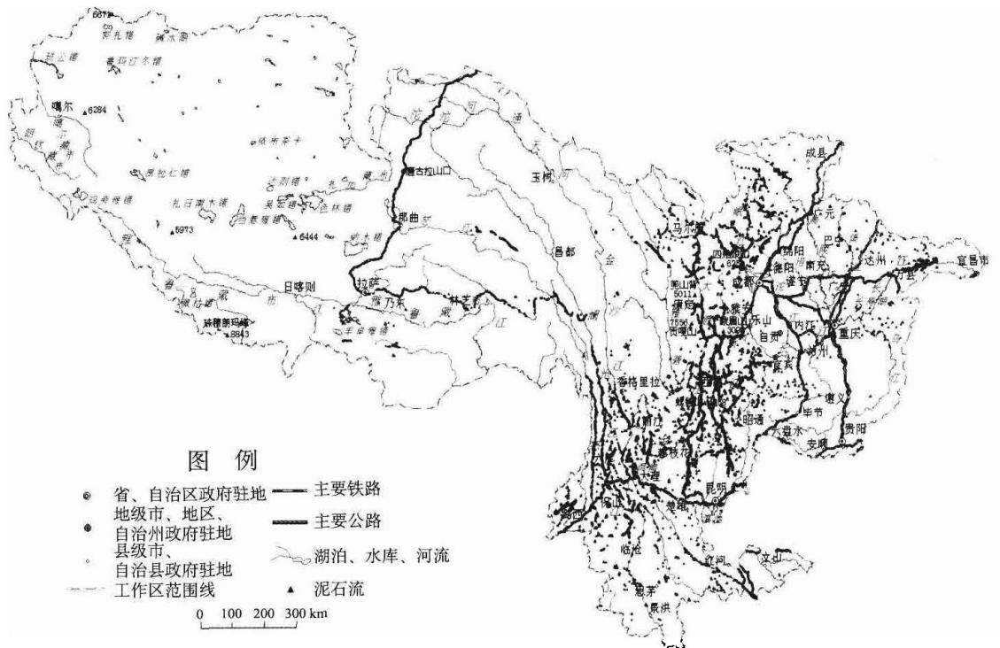

图18.5 长江上游及西南诸河区泥石流分布图  
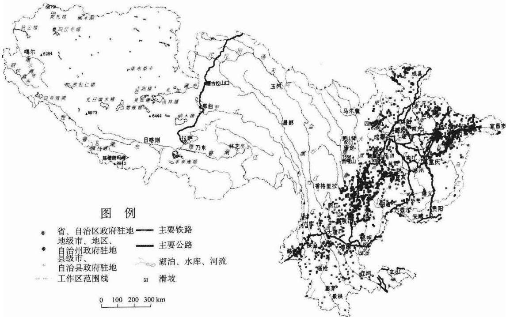  
图18.6 长江上游及西南诸河区滑坡分布图

表18.10 长江上游和西南诸河各大干流和支流的滑坡和泥石流分布
<table><tr><td rowspan=1 colspan=3>长江上游</td><td rowspan=1 colspan=3>西南诸河</td></tr><tr><td rowspan=1 colspan=1>水系名称</td><td rowspan=1 colspan=1>滑坡/处</td><td rowspan=1 colspan=1>泥石流/条</td><td rowspan=1 colspan=1>水系名称</td><td rowspan=1 colspan=1>滑坡/处</td><td rowspan=1 colspan=1>泥石流/条</td></tr><tr><td rowspan=1 colspan=1>金沙江</td><td rowspan=1 colspan=1>640</td><td rowspan=1 colspan=1>553</td><td rowspan=1 colspan=1>雅鲁藏布江</td><td rowspan=1 colspan=1>14</td><td rowspan=1 colspan=1>233</td></tr><tr><td rowspan=1 colspan=1>雅砻江</td><td rowspan=1 colspan=1>189</td><td rowspan=1 colspan=1>750</td><td rowspan=1 colspan=1>怒江</td><td rowspan=1 colspan=1>68</td><td rowspan=1 colspan=1>668</td></tr><tr><td rowspan=1 colspan=1>岷江</td><td rowspan=1 colspan=1>215</td><td rowspan=1 colspan=1>1157</td><td rowspan=1 colspan=1>澜沧江</td><td rowspan=1 colspan=1>129</td><td rowspan=1 colspan=1>836</td></tr><tr><td rowspan=1 colspan=1>嘉陵江</td><td rowspan=1 colspan=1>181</td><td rowspan=1 colspan=1>291</td><td rowspan=1 colspan=1>元江</td><td rowspan=1 colspan=1>8</td><td rowspan=1 colspan=1>5</td></tr><tr><td rowspan=1 colspan=1>乌江</td><td rowspan=1 colspan=1>26</td><td rowspan=1 colspan=1>17</td><td rowspan=1 colspan=1></td><td rowspan=1 colspan=1></td><td rowspan=1 colspan=1></td></tr><tr><td rowspan=1 colspan=1>大渡河</td><td rowspan=1 colspan=1>123</td><td rowspan=1 colspan=1>747</td><td rowspan=1 colspan=1></td><td rowspan=1 colspan=1></td><td rowspan=1 colspan=1></td></tr></table>

## （二）泥石流、滑坡的危害

长江上游及西南诸河滑坡和泥石流数量多、分布广，活动频繁，不但直接造成了严重的自然灾害，危害和威胁区内国家和人民的生命财产安全，同时造成剧烈的水土流失，为主要干支流高强度地输送泥沙，对区域内和流域下游造成一系列的环境问题。

据不完全统计，长江上游及西南诸河区受滑坡和泥石流直接危害的县级以上城镇多达200多座（图18.7），乡镇级城镇多达近千座。区内几乎所有的铁路和公路的交通干线都不同程度遭受滑坡和泥石流的威胁与危害，多数水利水电工程也不同程度地直接或间接遭受滑坡和泥石流的危害。金沙江下游是滑坡、泥石流最为发育的区域之一，造成的水土流失也最为严重。金沙江下游集水面积仅占金沙江流域面积的17.1%，但多年平均悬移质输沙量却占流域总输沙量的68.5%，其主要原因就是大量滑坡和泥石流活动直接向金沙江下游干流和支流输送了大量泥沙。

## （三）泥石流、滑坡的治理对策

根据长江上游及西南诸河区泥石流、滑坡活动特点、分布规律、产生的危害、已有的防治经验和存在的问题，其治理对策主要为：

(1）统一规划，合理部署，重点治理，坚持持续治理、综合治理。就是说，在工程治理的基础上，加强植被培育与保护。改善和优化其所在地的生态环境至关重要，其作用意义不可忽视。在减轻灾害的同时，控制水土流失，特别是泥石流和滑坡造成的强烈水土流失。

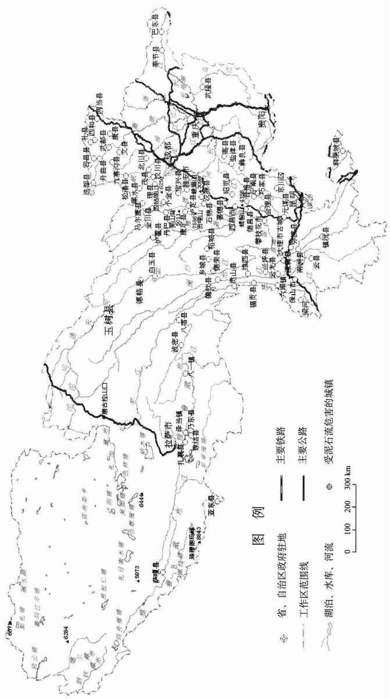  
图竹

（2）将滑坡和泥石流治理纳入国家和地区经济社会发展规划与计划，建立持续治理运行和长效机制。

（3）指导建设工程避险。研究制定泥石流、滑坡灾害评估和危险性分区方法标准，加强泥石流、滑坡灾害评估和危险性分区工作，对区域内主要滑坡和泥石流灾害点进行灾害评估，确定危险性分区，指导山区各类建设工程的规划和建设，尽可能避开滑坡和泥石流危险区，防止发生有重大人员伤亡的严重灾害。

（4）加强泥石流、滑坡的监测、预报和预警。建立完善的不同时空尺度的泥石流、滑坡灾害预测、预报和警报体系，建立健全泥石流、滑坡灾害重点区域的临灾预案与应急避难措施，预防特大泥石流、滑坡灾害的发生。

（5）加强科学技术研究。加大科研投入，大力研究和探索滑坡和泥石流综合治理新技术，特别是加强生物工程治理技术和水土流失控制技术，充分发挥泥石流、滑坡治理工程的水土保持效益，遏制泥石流、滑坡造成的剧烈水土流失。

(6)加强泥石流、滑坡治理技术的研究和总结，制定泥石流、滑坡防治工程技术规范，指导泥石流、滑坡减灾与水土流失控制。

（7)加强泥石流、滑坡治理工程的水土保持效益监测，总结经验，吸取教训，提高泥石流、滑坡治理工程水土保持效益。

## 三、长江源区生态与环境保护

## （一）长江源区水土流失的现状

长江源区大致范围介于 $9 0 ^ { \circ } 4 3 ^ { \prime } \sim 9 6 ^ { \circ } 4 5 ^ { \prime } \mathrm { E } , 3 2 ^ { \circ } 3 0 ^ { \prime } \sim 3 5 ^ { \circ } 3 5 ^ { \prime } \mathrm { N }$ 之间，总面积约13.78万km²。区内气候条件恶劣，生态环境脆弱，鼠虫害严重，草畜矛盾突出及超载放牧，水土流失严重。研究表明，该区水土流失面积约为5.1万km²，其中强度流失区面积为3.87万km²，占区域水土流失面积的76%；中度侵蚀面积1.14万km²，占22.3%；轻度侵蚀面积 $7 5 9 . 2 \mathrm { k m } ^ { 2 }$ ，仅占区域总水土流失面积的1.6%。

## （二）长江源区水土流失的危害

## （1）水土流失对土壤环境与土地资源的影响

根据1986年和2000年两期遥感数据分析，15年间长江源区一等宜牧草地面积减少了将近11%；二等宜牧草地面积减少了5%；三等牧草地面积则增加了11.3%，极度退化裸土（岩）地等更是增加了14.5%。说明土壤侵蚀导致的养分流失和土壤物理结构的变化，直接引起土地质量退化，降低草场质量。

## （2）水土流失对草地生态系统与草地资源的影响

江源区严重的水土流失造成高寒草甸退化为黑土滩或次生裸地，草地退化直接导致草地生产力下降，可利用草地资源减少。

## (3) 对区域水源涵养功能的影响

由水土流失引起的不断加剧的高寒草甸草地退化，对流域径流过程产生了较大影响。根据1969年航空像片，1986年和2000年卫星遥感TM数据分析，自20世纪60年代以来，长江源区退化高寒草甸和高寒沼泽草甸面积达1569.1km²，径流减少量为6.84亿m³，占直门达站总径流量的5.46%。严重的草地退化导致约49%的降水量不能形成径流，导致区域降水径流系数减小，成为长江源区径流减少和洪水频率增加的主要驱动因素。

## (4)水土流失对区域经济社会发展的影响

土壤侵蚀导致草地严重退化，是草地畜牧业经济徘徊不前的重要原因。15年间可利用草地面积进一步减少了3451.5km²，其中生产力较高的天然草甸草地（一等牧业草地）面积减少了2401.1km²。

## （三）长江源区水土流失的特点与发展趋势

## （1）长江源区水土流失的特点

①江源区生态系统极其脆弱，地表植被覆盖低，土壤抗侵蚀能力弱，具有发生较强水土流失的地面条件。草场植被一旦遭到破坏，极难恢复，地表失去保护，土温升高，冻土融化将会加速，砂性母质土壤极容易引起砂化、荒漠化。

②气温持续升高导致冻土融化加剧，热融滑塌和融冻泥流等地貌重塑过程强烈。

③冻融侵蚀、风蚀和水蚀的耦合，江源区土壤侵蚀过程具有特殊的区域特点，也是今后极具挑战性的科学问题。

## (2) 长江源区水土流失的发展趋势

随着全球气候的持续变暖，作为主要侵蚀方式的冻融侵蚀将呈现进一步加剧趋势；随着西部大开发和青藏铁路通车，新一轮的开发建设和不断加剧

的人类活动是本地区水土流失加剧的又一重要因素。水土流失引起的源区沙化面积为3328.03 km²，占长江上游地区沙漠化土地总面积的84.58%，沙漠化年扩展速率达0. 9%。

## （四）长江源区水土流失与生态环境保护的对策

## （1）坚持水土保持与生态环境保护并重

基于长江源区生态环境和水土流失的特点，必须坚持水土保持与生态环境保护并重，保护优先，坚持以草地生态系统保护为核心；以促进区域经济与社会持续发展和生物多样性恒久维持为目标；人为建设恢复和生态系统自身恢复能力结合。

## （2）建立科学的管理体制和模式

成立统一的长江源区管理机构，明确职责，实行分片、分区管理。建立协调和组织多个部门、多行业按照统一的规划行动的机制。

## （3）水土保持与生态环境建设的保障体系建设

建立完整、科学、可行的扶持政策和法律保障制度，加强源区基础建设，完善源区水土保持监督执法机构，形成健全的水土保持保障体系。

## （4）加强长江源区的科学研究

长江源区的水土保持和生态环境建设相关的基础研究非常薄弱，应开展多学科的综合考察和试验观测研究，认识长江源区特有的生态演化规律，揭示水土流失的机制，为制定水土保持和生态修复方案提供科学依据。

## 四、长江上游侵蚀泥沙及其环境影响

## （一）长江上游水土流失现状与成因

长江上游（宜昌水文站以上）流域面积约100万km²，土壤侵蚀面积35.2万km²，占长江流域土壤侵蚀面积的62.6%，强烈侵蚀集中于金沙江下游、嘉陵江流域、岷江流域和三峡库区。

长江上游地区强烈的构造运动和易风化的岩石为侵蚀提供了物质基础，陡峻的地形条件为土壤侵蚀提供了良好的能量条件，6～9月份以暴雨为主的丰富的降雨为土壤侵蚀提供了动力条件，土壤侵蚀环境背景复杂，侵蚀类型多样，包括水力侵蚀、风力侵蚀、冻融侵蚀、重力侵蚀等类型。水力侵蚀分布最广，局部地区土壤侵蚀模数高达 $1 0 ~ 0 0 0 \mathrm { t / ( k m ^ { 2 } \cdot \mathrm { a } ) }$ 以上，是流域侵蚀泥沙的主要来源。风力侵蚀和冻融侵蚀主要分布于江河源区，流失面积达5.1万km²。重力侵蚀的泥石流、滑坡和崩塌主要集中在金沙江下游、雅砻江流域、岷江上游流域和嘉陵江上游。

## （二）长江上游河流泥沙及其近期变化

长江上游主要干支流河流泥沙见表18.11，金沙江、嘉陵江和岷江对河流泥沙贡献较大，分别占长江上游的49.6%、27.1%和10.0%。

表18.11 长江上游主要干支流河流泥沙
<table><tr><td rowspan=2 colspan=1>流域名称</td><td rowspan=1 colspan=2>面积/万 km²</td><td rowspan=1 colspan=2>径流量/亿m³</td><td rowspan=1 colspan=2>输沙量/万t</td></tr><tr><td rowspan=1 colspan=1>合计</td><td rowspan=1 colspan=1>占上游/%</td><td rowspan=1 colspan=1>合计</td><td rowspan=1 colspan=1>占上游/%</td><td rowspan=1 colspan=1>合计</td><td rowspan=1 colspan=1>占上游/%</td></tr><tr><td rowspan=1 colspan=1>金沙江</td><td rowspan=1 colspan=1>50</td><td rowspan=1 colspan=1>50</td><td rowspan=1 colspan=1>1 522</td><td rowspan=1 colspan=1>35.0</td><td rowspan=1 colspan=1>25 660</td><td rowspan=1 colspan=1>49.6</td></tr><tr><td rowspan=1 colspan=1>嘉陵江</td><td rowspan=1 colspan=1>16</td><td rowspan=1 colspan=1>16</td><td rowspan=1 colspan=1>701</td><td rowspan=1 colspan=1>16.1</td><td rowspan=1 colspan=1>14 000</td><td rowspan=1 colspan=1>27.1</td></tr><tr><td rowspan=1 colspan=1>岷江</td><td rowspan=1 colspan=1>13.5</td><td rowspan=1 colspan=1>13.5</td><td rowspan=1 colspan=1>877</td><td rowspan=1 colspan=1>20.2</td><td rowspan=1 colspan=1>5 180</td><td rowspan=1 colspan=1>10.0</td></tr><tr><td rowspan=1 colspan=1>乌江</td><td rowspan=1 colspan=1>8.8</td><td rowspan=1 colspan=1>8.8</td><td rowspan=1 colspan=1>490</td><td rowspan=1 colspan=1>11.3</td><td rowspan=1 colspan=1>3 170</td><td rowspan=1 colspan=1>6.1</td></tr><tr><td rowspan=1 colspan=1>沱江</td><td rowspan=1 colspan=1>2.3</td><td rowspan=1 colspan=1>2.3</td><td rowspan=1 colspan=1>125</td><td rowspan=1 colspan=1>2.9</td><td rowspan=1 colspan=1>1 180</td><td rowspan=1 colspan=1>2.3</td></tr></table>

金沙江下游以占长江上游20%的流域面积，产生了长江上游41.6%的泥沙，是长江上游最主要的侵蚀区和泥沙产源区，平均输沙量为上游地区的5.3倍。其主要原因是大量泥石流和滑坡的发育，其中小江流域面积仅3043km²，主河道长138.9km，但流域内发育有泥石流沟172条，其输沙量却高达每年1100万t，小江支沟蒋家沟汇水面积仅48km²，但观测到的泥石流直接输沙量却达到每年300万～600万t。长江上游发育有泥石流沟8000余条，若按泥石流沟的平均暴发频率为每20年一次，暴发规模为中等，每次的平均输沙量为10万m³，每年仅泥石流造成的直接输沙量可达4400万m³，约0.9亿t。

20世纪50年代以来，长江上游干流（宜昌站）的输沙量一直呈正常的波动，水沙关系未见明显的变化。80年代以后，长江上游主要支流金沙江呈略有增加的趋势，自上世纪90年代末期以来，金沙江泥沙呈现下降趋势。嘉陵江流域，自80年代以后输沙量明显减少，1990～1996年的平均值为0.49亿t，仅为多年平均输沙量的38.28%，目前还保持较低的输沙率。

增沙的主要原因为人类活动改变了下垫面条件，斜坡稳定受到破坏造成，大量工程开挖和弃土导致河流泥沙的增加。据初步估计，每年工程弃土量为1.5亿t，增加河流泥沙量4500万t。泥沙减少原因主要为大量的水利工程建设、长治工程等水保工程效益及生态修复工程的减沙效益。

## （三）长江上游侵蚀泥沙的影响与危害

长江上游水土流失，包括广泛发育的泥石流和滑坡等突发性灾害，常淤积河道、湖泊、水库和塘堰，冲毁城镇、道路、桥梁、厂矿、管线、农田，造成严重的人员伤亡和经济损失，成为危及该区人民生命财产安全和工程建设安全，制约区域经济发展的主要因素；同时威胁上游地区大多数水利水电工程的安全。

经初步分析，长江上游的国家级贫困县均分布在水土流失中度以上的区域，贫困县与水土流失区域的重叠率为100%。目前，四川省人均年收入1000元以下的人口有1041万人，其中没有越过温饱线的有308万人，多数生活在水土流失严重的生态环境脆弱地区。

## （四）长江上游侵蚀泥沙调控的对策建议

长江上游水土流失防治的经验表明，小流域治理是水土保持生态效益、经济效益和社会效益三大效益同步实现的有效途径。建议国家加大力度进行以水土资源优化配置为核心、以坡地整治为重点、坡面水系相配套的小流域综合治理。建议通过加大国家投入，地方政府统筹，拓宽资金渠道，形成多元投资格局，建立生态补偿机制及配套政策等措施保障水土流失治理的资金。

长江上游水土流失和侵蚀泥沙的主要形式是坡耕地和泥石流、滑坡，建议国家设立坡地综合整治和泥石流、滑坡综合防治专项重大治理工程，加大治理力度。

## 第十九章 东北黑土区

第一节 现 状

## 一、自然地理与社会经济概况

(一)地理位置

广义的东北黑土区是指有黑色表土层分布的区域，主要土类包括黑土、黑钙土、草甸土、白浆土、暗棕壤和棕壤，总土地面积103万km²。东北黑土区位于我国的东北部，北、东侧隔黑龙江和乌苏里江与俄罗斯相望，东南隔图们江和鸭绿江与朝鲜为邻，西与蒙古国交界，西南与内蒙古自治区接壤，南临渤海和黄海。行政区包括辽宁省（除辽西）的大部，面积12.29万km²；吉林省全部，面积18.70万km²；黑龙江省全部，面积45.25万km²；内蒙古自治区呼伦贝尔市东部、兴安盟全部和通辽市北部，面积26.76万km²(图19.1)，是我国重要的农业、林业、牧业和工业生产基地。

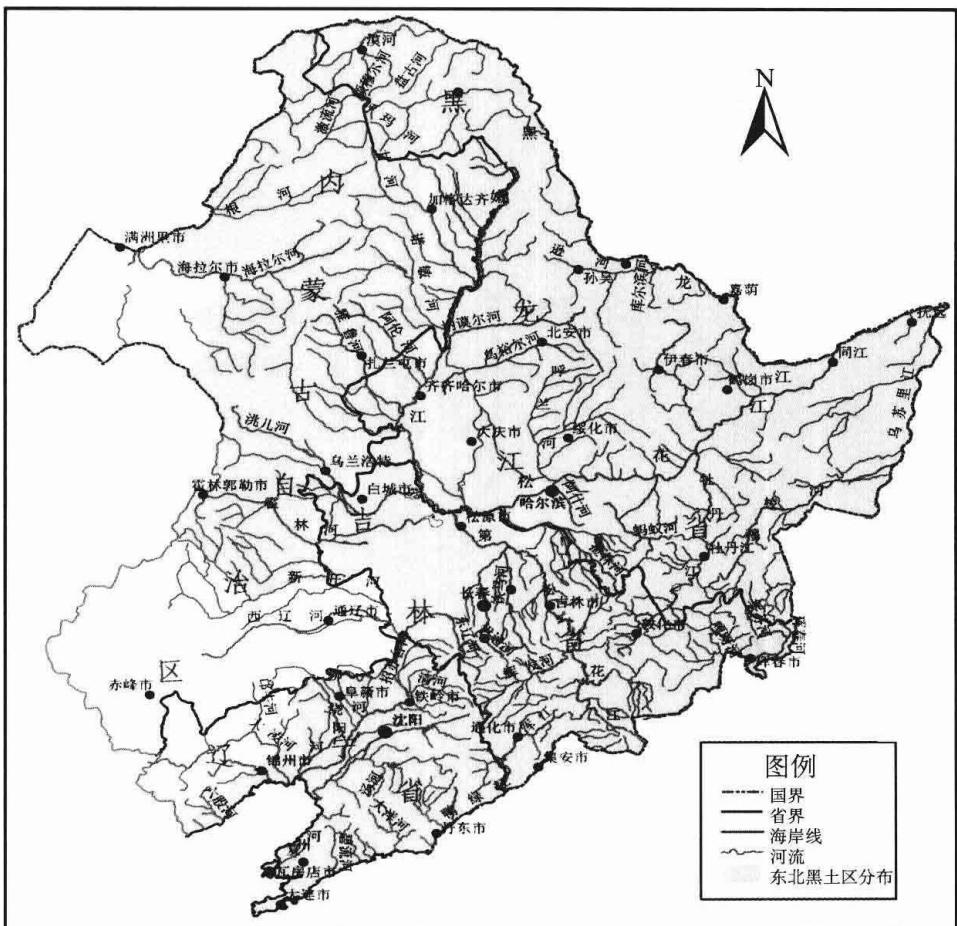  
图19.1 东北黑土区范围（深色部分）图

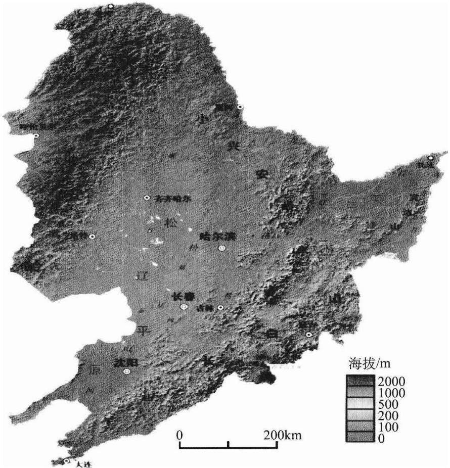  
图19.2 东北黑土区地势图

## （二）自然地理条件

## 1. 地质地貌

东北黑土区早在华西力褶皱运动时期，就基本上结束了海侵状态，中生代剧烈的燕山运动奠定了今日地形和地质基础。第三纪中期喜马拉雅运动开始，大兴安岭随内蒙古高原一起抬升，组成内蒙古高原的边缘，东部山地也同时上升，形成广义的长白山地，山地之间的平原部分则继续下陷。这次构造运动呈北北东向，和燕山运动构造方向基本一致。因此，东北黑土区的地质构造造就了独特的地貌特征，呈东、西、北三面被中、低山环抱，平原中开的“簸箕状”地貌（图19.2、图19.3）。受构造运动控制，山脉走向以北北东为主，大部分山地海拔在1000～1500m（图19.4）。本区西部为大兴安岭山地，东部为长白山地。大兴安岭山地是一条北北东走向的山地，北起黑龙江畔，南到西拉木伦河上游谷地，全长1800km，东西两侧不对称性十分明显，西侧十分平缓，逐渐过渡到呼伦贝尔高原，东侧则节节下降，相对高度很大。小兴安岭属于新兴的山地，和大兴安岭相连，其东南部起伏大，西北部比较平缓，其西侧有五大连池等火山群。南部辽东半岛以山地丘陵为主，千山、龙岗山与长白山相连，海拔600～800m。东北黑土区中部是松辽平原，南北长1000多公里，东西宽300～400km，总面积35万km²。平原四周是山麓冲积洪积平原和台地，是主要的水土流失分布区。松嫩平原是由松花江和嫩江冲积形成的低平原，平均海拔在120～250m（图19.4、图19.5），地势平坦，土层深厚，是黑土、黑钙土、草甸土的主要分布区。东北黑土区东北部是三江平原，由黑龙江、松花江和乌苏里江冲积形成，平均海拔120～250m。

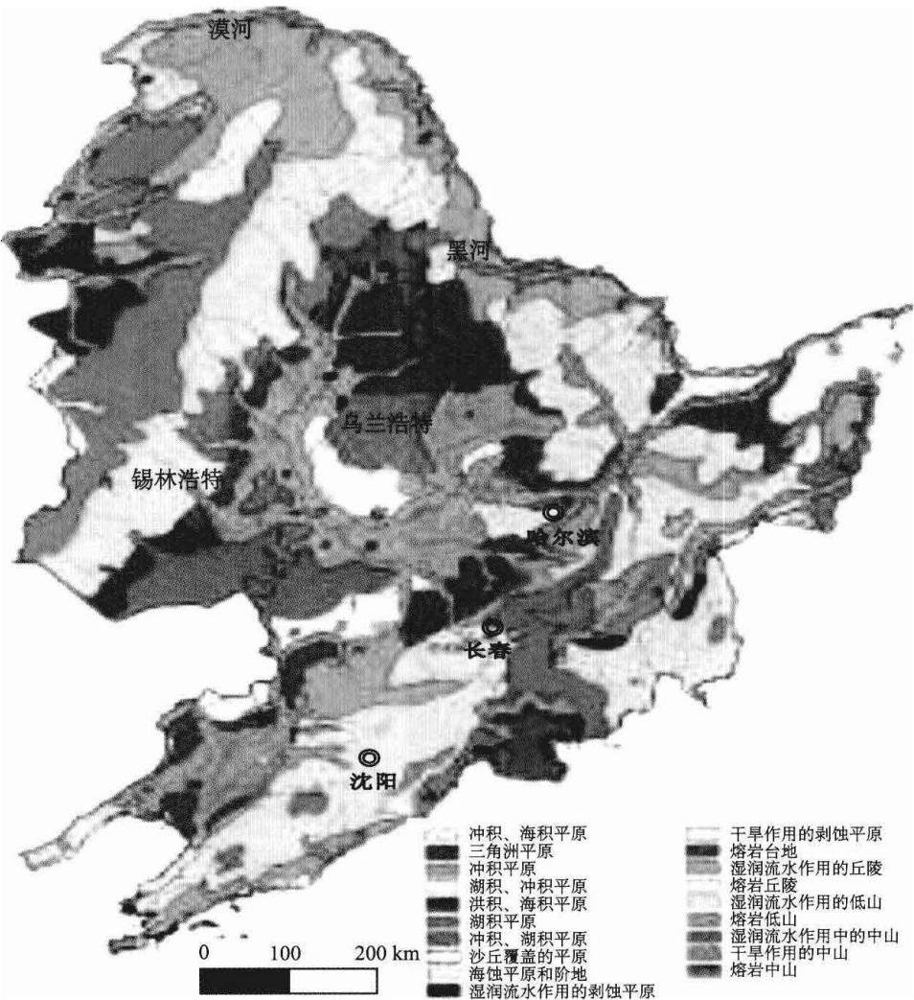  
图 19.3 东北黑土区地貌图

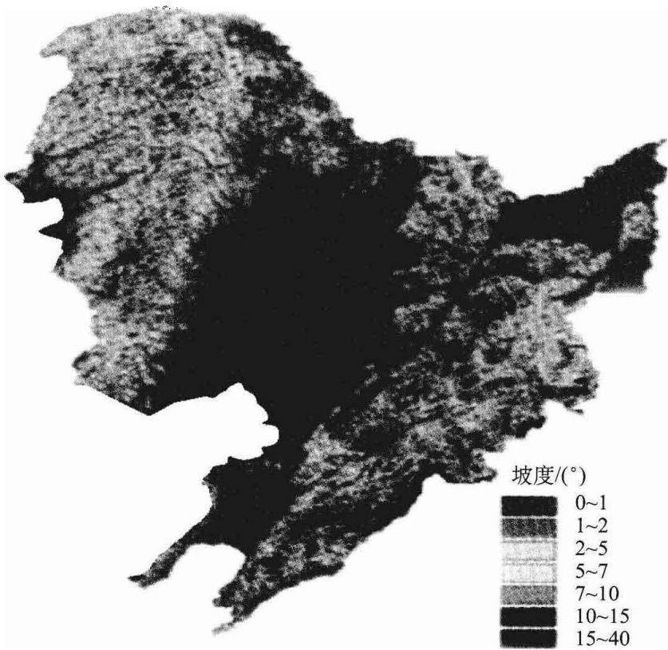  
图19.4 东北黑土区坡度分布

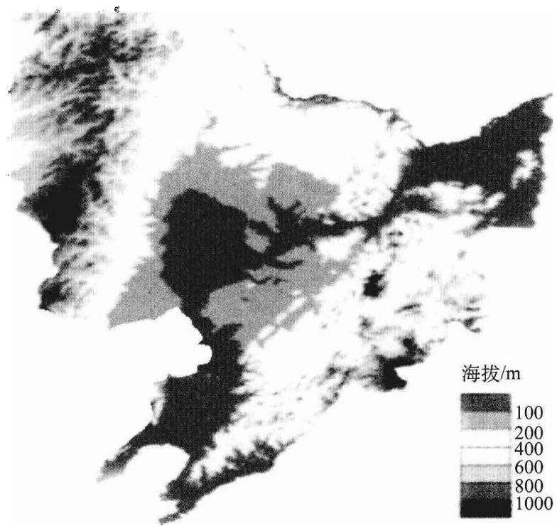  
图19.5 东北黑土区海拔分布图

## 2. 水系与水文

本区江河纵横交错，湖泊泡沼星罗棋布。与华北、西北相比，本区水量较多，水资源也较丰富，大小河流约2300条，河川径流总量1355亿m³。流域地表水多年平均径流量为1696.20亿m³，折合径流深为137.30mm（邓伟等，2004)，见表19.1。主要河流有黑龙江及其支流松花江、嫩江、海拉尔河、乌苏里江等，辽河，鸭绿江，图们江等（图19.6）。著名的湖泊有兴凯湖、呼伦湖、查干湖、月亮泡、镜泊湖等。黑龙江是一条国际河流，其南源额尔古纳河发源于我国大兴安岭西侧的吉勒老奇山，全长4350km（我国境内 3420 km)，流域面积185.5万 $\mathbf { k m } ^ { 2 }$ (我国境内89.11万km²)，年平均流量10800m³/s，年平均径流量 $3 3 0 0 \pm 5 3 0 ~ 1 \mathrm { Z } ~ \mathrm { m } ^ { 3 }$ 。黑龙江径流主要靠降水补给(占50%\~70%)，冰雪融水补给占10%\~15%，因此径流年内变化具有双峰型特点。

表19.1流域地表多年平均水量、径流深及行政分区地表水资源量
<table><tr><td colspan="1" rowspan="1">地域</td><td colspan="1" rowspan="1">分区</td><td colspan="1" rowspan="1">多年平均水量/亿m³</td><td colspan="1" rowspan="1">年径流深/mm</td></tr><tr><td colspan="1" rowspan="7">黑龙江流域</td><td colspan="1" rowspan="1">额尔古纳河</td><td colspan="1" rowspan="1">120.26</td><td colspan="1" rowspan="1">76.26</td></tr><tr><td colspan="1" rowspan="1">嫩江</td><td colspan="1" rowspan="1">254.52</td><td colspan="1" rowspan="1">90.76</td></tr><tr><td colspan="1" rowspan="1">第二松花江</td><td colspan="1" rowspan="1">168.10</td><td colspan="1" rowspan="1">228.03</td></tr><tr><td colspan="1" rowspan="1">松花江干流</td><td colspan="1" rowspan="1">371.31</td><td colspan="1" rowspan="1">179.82</td></tr><tr><td colspan="1" rowspan="1">黑龙江干流</td><td colspan="1" rowspan="1">204.06</td><td colspan="1" rowspan="1">173.17</td></tr><tr><td colspan="1" rowspan="1">乌苏里江</td><td colspan="1" rowspan="1">92.90</td><td colspan="1" rowspan="1">137.95</td></tr><tr><td colspan="1" rowspan="1">合计</td><td colspan="1" rowspan="1">1210.25</td><td colspan="1" rowspan="1">134.05</td></tr><tr><td colspan="1" rowspan="7">辽河流域</td><td colspan="1" rowspan="1">西辽河</td><td colspan="1" rowspan="1">29.85</td><td colspan="1" rowspan="1">21.41</td></tr><tr><td colspan="1" rowspan="1">东辽河</td><td colspan="1" rowspan="1">9.00</td><td colspan="1" rowspan="1">87.36</td></tr><tr><td colspan="1" rowspan="1">辽河干流</td><td colspan="1" rowspan="1">107.87</td><td colspan="1" rowspan="1">151.56</td></tr><tr><td colspan="1" rowspan="1">辽宁沿海诸河</td><td colspan="1" rowspan="1">125.53</td><td colspan="1" rowspan="1">207.79</td></tr><tr><td colspan="1" rowspan="1">鸭绿江</td><td colspan="1" rowspan="1">162.00</td><td colspan="1" rowspan="1">504.42</td></tr><tr><td colspan="1" rowspan="1">图们江</td><td colspan="1" rowspan="1">51.70</td><td colspan="1" rowspan="1">269.27</td></tr><tr><td colspan="1" rowspan="1">合计</td><td colspan="1" rowspan="1">485.95</td><td colspan="1" rowspan="1">146.11</td></tr><tr><td colspan="4" rowspan="1"></td></tr><tr><td colspan="1" rowspan="1">地域</td><td colspan="1" rowspan="1">分区</td><td colspan="1" rowspan="1">多年平均水量/亿m³</td><td colspan="1" rowspan="1">年径流深/mm</td></tr><tr><td colspan="1" rowspan="5">行政分区</td><td colspan="1" rowspan="1">黑龙江</td><td colspan="1" rowspan="1">685.11</td><td colspan="1" rowspan="1">150.69</td></tr><tr><td colspan="1" rowspan="1">吉林</td><td colspan="1" rowspan="1">353.07</td><td colspan="1" rowspan="1">188.40</td></tr><tr><td colspan="1" rowspan="1">辽宁</td><td colspan="1" rowspan="1">324.68</td><td colspan="1" rowspan="1">223.13</td></tr><tr><td colspan="1" rowspan="1">内蒙古东四盟</td><td colspan="1" rowspan="1">337.51</td><td colspan="1" rowspan="1">74.00</td></tr><tr><td colspan="1" rowspan="1">合计</td><td colspan="1" rowspan="1">1700.37</td><td colspan="1" rowspan="1">136.72</td></tr></table>

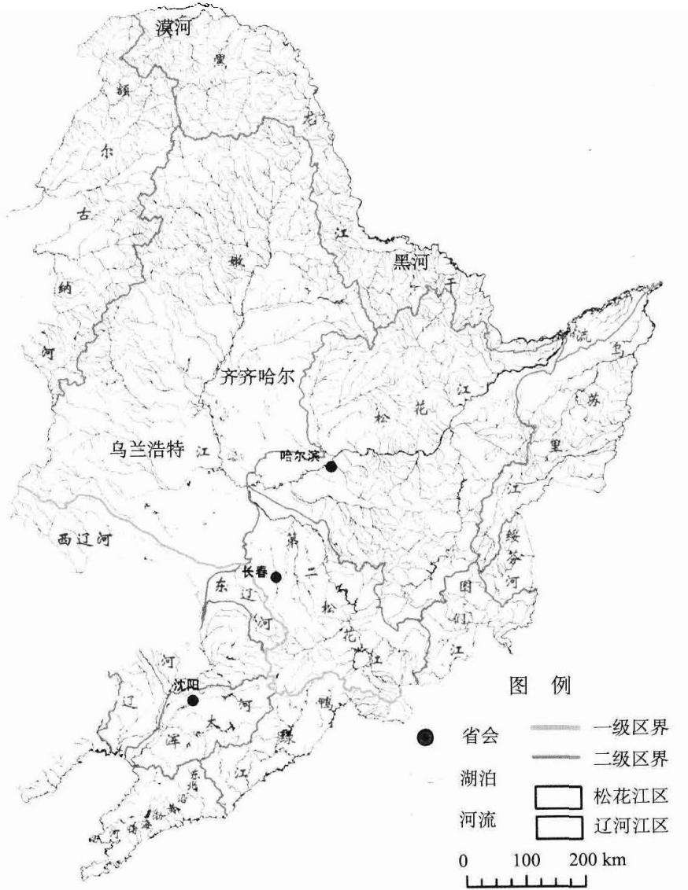  
图19.6 东北黑土区水系图

松花江是黑龙江的最大支流，全部在我国境内，全长1956km，流域面积55.6万km²，径流量759亿m³。松花江有南北两源，北源嫩江发源于大 $\mathrm { k m } ^ { 2 }$ $\mathbf { m } ^ { 3 }$ 兴安岭伊勒呼里山，自北向南流，接纳了众多支流，至吉林省松原市的三岔河口与南源第二松花江汇合，全长1379km，流域面积29.85万km²（占松花江流域面积的53.7%），多年平均径流量290亿m³；南源第二松花江发源于长白山天池，全长795km，流域面积 $7 8  { \mathrm { ~ 1 8 0 ~ } }  { \mathrm { k m ^ { 2 } } }$ ，多年平均径流量168亿m³。松花江及其支流水力资源丰富，不仅为沿岸工业和城市提供了充足水源，而且也为松嫩平原提供了充足的灌溉用水，使松嫩平原成为我国北方的“粮仓”。

辽河是本区南部最大的河流，有东西两源，东辽河上游（二龙山以上）水土流失较重，西辽河流域风蚀较重，汇入辽河干流的许多支流，如柳河、绕阳河等，由于开发历史长，生态环境遭到破坏，水土流失非常严重；辽河下游地势平坦，河道弯曲，淤积了大量的上游来沙，河床不断抬高；辽河中游流经辽中南大型工业城市群，接纳了大量的工业废水和生活污水，河流污染严重；下游流域开挖了纵横如织的排灌沟渠，使辽河下游成为商品粮基地。

## 3. 气候

本区属温带季风气候，年平均气温在一7～11℃（图19.7)，≥10℃年积温在1500～3800℃。冬季寒冷漫长，一般长达5～6个月，1月份平均最低气温在一20℃以下；春季多风，且干燥少雨，尤其是西部地区因地表干燥，多风沙天气，如遇冬季少雪年份，加上春季风大，地表蒸发强烈，常造成春旱；夏季气温较高，7月份平均气温在18～20℃。各地多年平均降水量一般在350～1000 mm，地域差异大，东南部山区迎风坡年降水量在1000 mm以上，由此向西北，降水量逐渐减少，等降水量呈东北-西南走向。山区降水多于平原，吉林、辽宁东部的长白山区年降水量一般在600～1000mm，明显多于西侧的平原地区。除长白山区东南部以外，各地年降水量一般在450～600mm，松嫩平原西部和内蒙古东部则多为350～450mm；年降水虽不充沛，但主要集中在农作物生长季节，雨热同季，5～9月份的降水量占全年降水量的80%以上（刘兴土等，2002)，见表19.2。各地降水量的年变化均呈单峰型，降水量由2月份开始逐渐上升，7月份达最高，然后开始下降，到翌年1月份达最低值。冬季降水量一般占全年的1%～5%；春季降水量一般占全年的10%～15%；夏季降水量为400～700mm（图19.8），占全年降水量的50%～70%，其集中程度从东南向西北逐渐增大；秋季多晴朗天气，盛行西南风，降水比春季稍多。东北黑土区无霜期较短，约100～150天，绝大部分地区可以满足一年一熟作物的需要。夏季具有日照时间长、光照强度大、日温差大等特点，对增强作物光合作用，提高农产品质量都非常有利。

表19.2 东北黑土区各地的降水量
<table><tr><td rowspan=1 colspan=4></td></tr><tr><td rowspan=2 colspan=1>地名</td><td rowspan=2 colspan=1>年降水量/mm</td><td rowspan=1 colspan=2>5~9月份降水量</td></tr><tr><td rowspan=1 colspan=1>合计/mm</td><td rowspan=1 colspan=1>占年降水量的百分比/%</td></tr><tr><td rowspan=1 colspan=1>漠河</td><td rowspan=1 colspan=1>403.4</td><td rowspan=1 colspan=1>335.0</td><td rowspan=1 colspan=1>83.0</td></tr><tr><td rowspan=1 colspan=1>海伦</td><td rowspan=1 colspan=1>549.6</td><td rowspan=1 colspan=1>480.8</td><td rowspan=1 colspan=1>87.5</td></tr><tr><td rowspan=1 colspan=1>齐齐哈尔</td><td rowspan=1 colspan=1>415.5</td><td rowspan=1 colspan=1>359.6</td><td rowspan=1 colspan=1>86.5</td></tr><tr><td rowspan=1 colspan=1>哈尔滨</td><td rowspan=1 colspan=1>523.3</td><td rowspan=1 colspan=1>439.4</td><td rowspan=1 colspan=1>84.0</td></tr><tr><td rowspan=1 colspan=1>伊春</td><td rowspan=1 colspan=1>630.8</td><td rowspan=1 colspan=1>539.1</td><td rowspan=1 colspan=1>85.5</td></tr><tr><td rowspan=1 colspan=1>富锦</td><td rowspan=1 colspan=1>522.8</td><td rowspan=1 colspan=1>419.0</td><td rowspan=1 colspan=1>80.1</td></tr><tr><td rowspan=1 colspan=1>牡丹江</td><td rowspan=1 colspan=1>531.9</td><td rowspan=1 colspan=1>429.6</td><td rowspan=1 colspan=1>80.8</td></tr><tr><td rowspan=1 colspan=1>通榆</td><td rowspan=1 colspan=1>405.7</td><td rowspan=1 colspan=1>360.3</td><td rowspan=1 colspan=1>88.8</td></tr><tr><td rowspan=1 colspan=1>长春</td><td rowspan=1 colspan=1>593.8</td><td rowspan=1 colspan=1>505.4</td><td rowspan=1 colspan=1>85.1</td></tr><tr><td rowspan=1 colspan=1>延吉</td><td rowspan=1 colspan=1>504.0</td><td rowspan=1 colspan=1>414.5</td><td rowspan=1 colspan=1>82.2</td></tr><tr><td rowspan=1 colspan=1>通化</td><td rowspan=1 colspan=1>881.7</td><td rowspan=1 colspan=1>700.6</td><td rowspan=1 colspan=1>79.5</td></tr><tr><td rowspan=1 colspan=1>朝阳</td><td rowspan=1 colspan=1>486.1</td><td rowspan=1 colspan=1>427.3</td><td rowspan=1 colspan=1>87.9</td></tr><tr><td rowspan=1 colspan=1>辽阳</td><td rowspan=1 colspan=1>734.5</td><td rowspan=1 colspan=1>591.4</td><td rowspan=1 colspan=1>80.5</td></tr><tr><td rowspan=1 colspan=1>宽甸</td><td rowspan=1 colspan=1>1136.8</td><td rowspan=1 colspan=1>921.1</td><td rowspan=1 colspan=1>81.0</td></tr><tr><td rowspan=1 colspan=1>大连</td><td rowspan=1 colspan=1>658.7</td><td rowspan=1 colspan=1>527.1</td><td rowspan=1 colspan=1>80.0</td></tr><tr><td rowspan=1 colspan=4></td></tr></table>

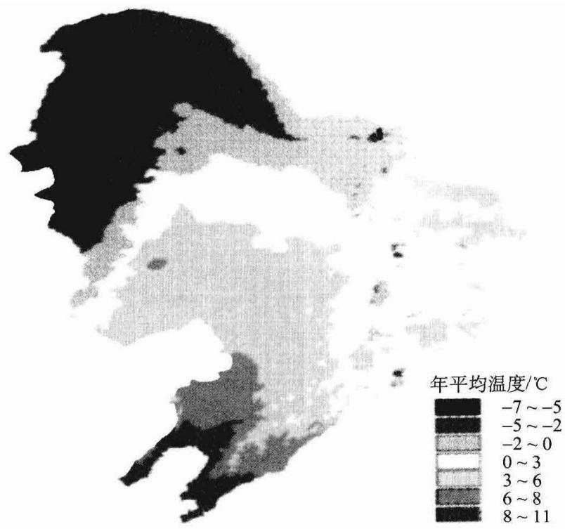  
图19.7 东北黑土区年平均气温分布图

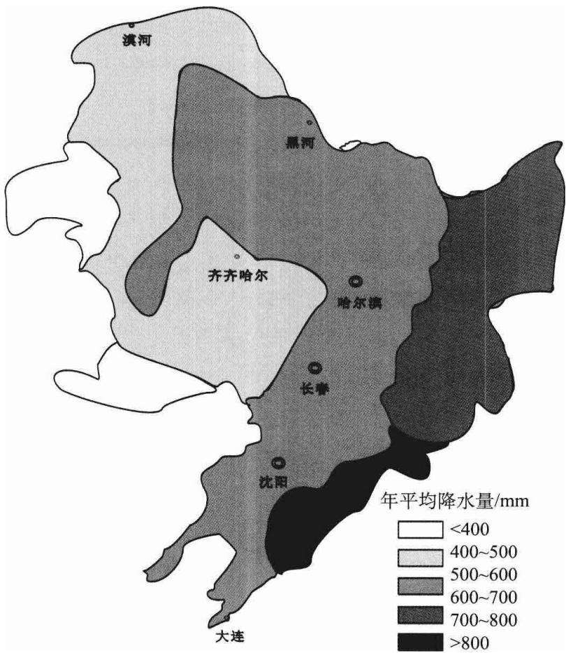  
图19.8 东北黑土区年降水量分布图

本区地域辽阔，气候南北差异较大，从北到南分为寒温带、中温带和暖温带3个气候带，但以中温带为主，只有最北部的大兴安岭北端为寒温带，最南部的辽东半岛一带为暖温带北缘。由东向西跨湿润、半湿润与半干旱3个区，大兴安岭北部、小兴安岭、三江平原、长白山地和辽东半岛的千山丘陵为湿润气候区；松辽平原的主体为半湿润气候区，其北部为典型黑土带；松嫩平原西部、西辽河流域及呼伦贝尔高原为半干旱气候区。

## 4. 植被

东北黑土区的植被就其种属来说并不十分丰富，且植被种类有自东南向西北减少的趋势。从整个欧亚大陆来看，本区的植被有一定的过渡特征。本区是欧亚大陆草原的最东端、寒温带针叶林最南端、温带夏绿林的最北缘，这些植被类型交汇于此，组成成分相互渗透，受夏季风的作用，植被分布的经向地带性非常显著。本区的植被按区系组成可分4大部分，即达乌里区系、长白区系、蒙古区系和华北植物区系，优势植物类型分别属于针叶林、针阔叶混交林、草原植被和夏绿林。

达乌里区指大兴安岭北段，属寒温带明亮针叶林地区，以兴安落叶松(Larix gmelinii）为优势种，混生的主要种类还有白桦（Betula platyphy-flla)、山杨（Populus davidiana)、黑桦（B. davuria)、丛桦（B. trutico-sa）等阔叶树种。针叶林中分布最广的是兴安落叶松——杜鹃（Rhododen-dron spp.）林，灌本层以越桔（Vaccinium vitisidaea）、杜香（Ledum pal-ustris）占优势，地势较高处多为石质山地，条件更加严酷，常出现落叶松———偃松（Pinus pumila）林，林下灌木以偃松为主，草本植物的种属和数量较少，以各种苔草（Carex spp.）为主。本区北部海拔900m以下的山脊和向阳坡，土壤干燥瘠薄，适宜樟子松(Pinus sylvestris var. mongolica)生长，常见樟子松纯林。樟子松多占据阳坡上部或陡坡，水土流失较严重。

长白山区和小兴安岭的植物生态环境可分为800～1000m夷平面以下的山地、丘陵和500m以下的丘陵、河谷两大类。总的来说，小兴安岭的东南段，张广才岭以东的长白山地是温带针阔叶混交林的主要分布区域。针阔叶混交林是长白山的代表植物，也是本区的典型地带性植物，针叶树种以红松(Pinus koraiensis）冷杉和云杉占优势，在沼泽化地段，分布有长白落叶松(Larix olgensis var. Changpaiensis) 纯林；阔叶树以枫桦（Betula costa-ta）、糠椴（Tilia mandshurica）、紫椴（T. amurensis)、色木槭（Acermono）、水曲柳（Fraxinus mondshurica）、山杨、白桦、蒙古栎等为主。

松辽平原和呼伦贝尔高原的草原植被有草甸草原和典型草原两大类，草甸草原的建群种以贝加尔针茅（Stipa baicalensis）、羊草（Aneurolepidiumchinense）和线叶菊（Filifolium sibiricum）为主，典型草原的建群种则以大针茅（Stipa grandis）和克氏针茅（Stipa krylovii）为主。平原地带草甸植被常与沼泽化、盐碱化过程相联系。现在除呼伦贝尔高原外，松嫩平原的绝大部分地区已开垦为耕地，成为主要的农业区。

辽宁省南部属华北植物区，努鲁尔虎山是一条重要的植物分界线。森林主要分布在努鲁尔虎山以东地区，包括吉林哈达岭、龙岗山和千山山脉北段，由沙松、红松以及蒙古栎等杂木林组成的温带针叶阔叶混交林带，林下为胡枝子（Lespedeza bicolor)、榛子(Cotylus heterophyffn)、荆条(Vitexchinensis）和白羊草（Botriochloa ischaemum）等灌丛；辽东半岛和辽西大部分山地丘陵是由多种栎树（Quercus spp.）组成的落叶阔叶林及次生的荆条灌丛、白羊草灌丛为主体的暖温带落叶阔叶林带。

东北黑土区蕴藏着丰富的森林资源，是我国重要的森林分布地带，素有“林海”之称，位居全国三大林区之首。新中国成立以来，东北林区一直是我国重要的木材生产基地，商品材产量占全国的1/2。东北的森林既是诸多河流的水源涵养地，又是保护平原商品粮基地及西部牧区的天然生态屏障。由于长期过量采伐，采育失调，使森林面积和蓄积量不断下降。1962～1986年的24年间，有林地面积消失231.5万 $\mathrm { h m } ^ { 2 }$ ，活立木和用材林蓄积量大幅度减少，用材林中成过熟林蓄积量由12.18亿 $\mathbf { m } ^ { 3 }$ 降到4.88亿 $\mathbf { m } ^ { 3 }$ ，减少达60%。同时，森林资源质量的变化也十分显著，20世纪50年代与80年代相比，平均每公顷蓄积量由 $1 4 3 . 2 \mathrm { ~ m } ^ { 3 }$ 降至102.6 $\mathbf { m ^ { 3 } }$ ，针叶林的比重由63.1%降至33.4%，红松蓄积量由2.4亿 $\mathrm { m } ^ { 3 }$ 减少到0.35亿 $\mathbf { m } ^ { 3 }$ 。其中，吉林省因长期过量采伐，导致森林资源衰竭，可利用的成过熟林、珍贵树种比重大幅度下降；仅1986～1996年的10年间，成过熟林的面积就由153.2万 $\mathrm { h m } ^ { 2 }$ 下降到88.3万 $\mathrm { h m } ^ { 2 }$ ，蓄积由3.12亿 $\mathbf { m } ^ { 3 }$ 减少到1.6亿 $\mathrm { m } ^ { 3 }$ ；天然林珍贵树种红松林面积减少89.2%，云冷杉林面积减少39.9%。

2000年东北三省的有林地面积为4510.95万 $\mathrm { h m } ^ { 2 }$ ，森林覆盖率36.11%，活林木蓄积量为35.88亿 $\mathbf { m } ^ { 3 }$ (表19.3)。目前，东北、内蒙古国有林区现有林地面积 3339.36 万 $\mathrm { h m } ^ { 2 }$ ，森林覆盖率为54.87%，占全国有林地面积的25.0%；活林木总蓄积量33.86亿 $\mathbf { m } ^ { 3 }$ ，占全国活林木总蓄积的28.7%。

表19.3 东北黑土区森林资源现状
<table><tr><td rowspan=1 colspan=1>省区</td><td rowspan=1 colspan=1>土地面积/万 hm²</td><td rowspan=1 colspan=1>林业用地面积/万 hm²</td><td rowspan=1 colspan=1>有林地面积/万 hm²</td><td rowspan=1 colspan=1>活立木蓄积量/万m³</td><td rowspan=1 colspan=1>森林蓄积量/万m³</td><td rowspan=1 colspan=1>覆盖率/%</td></tr><tr><td rowspan=1 colspan=1>黑龙江</td><td rowspan=1 colspan=1>4 546.1</td><td rowspan=1 colspan=1>2 026.5</td><td rowspan=1 colspan=1>1 797.5</td><td rowspan=1 colspan=1>150 153.1</td><td rowspan=1 colspan=1>137 502.3</td><td rowspan=1 colspan=1>39.5</td></tr><tr><td rowspan=1 colspan=1>吉林</td><td rowspan=1 colspan=1>1 888.7</td><td rowspan=1 colspan=1>805.6</td><td rowspan=1 colspan=1>719.5</td><td rowspan=1 colspan=1>85 359.2</td><td rowspan=1 colspan=1>81 645.5</td><td rowspan=1 colspan=1>38.1</td></tr><tr><td rowspan=1 colspan=1>辽宁</td><td rowspan=1 colspan=1>1 457.4</td><td rowspan=1 colspan=1>634.4</td><td rowspan=1 colspan=1>464.1</td><td rowspan=1 colspan=1>18 546.3</td><td rowspan=1 colspan=1>17 476.6</td><td rowspan=1 colspan=1>32.9</td></tr><tr><td rowspan=1 colspan=1>内蒙古东部</td><td rowspan=1 colspan=1>4 599.0</td><td rowspan=1 colspan=1>2 385.7</td><td rowspan=1 colspan=1>1 529.9</td><td rowspan=1 colspan=1>104 768.0</td><td rowspan=1 colspan=1></td><td rowspan=1 colspan=1>33.2</td></tr><tr><td rowspan=1 colspan=1>总计</td><td rowspan=1 colspan=1>12 491.2</td><td rowspan=1 colspan=1>5 852.2</td><td rowspan=1 colspan=1>4 511.0</td><td rowspan=1 colspan=1>358 826.6</td><td rowspan=1 colspan=1></td><td rowspan=1 colspan=1>36.1</td></tr></table>

w.www..

注：数据来源于中国工程院咨询项目《东北地区森林和湿地保育与林业发展战略研究》报告，2005。

根据全国草地资源调查数据，东北黑土区天然草地资源总面积为4115.8万 $\mathrm { h m } ^ { 2 }$ ，其中可利用面积3497.2万 $\mathrm { h m } ^ { 2 }$ ；全区理论载畜量为5843.6万羊单位。在地区分布上，内蒙古东部草地面积最大，占东北黑土区草地面积的59.3%；黑龙江省次之，占18.3%；辽宁省最少，占8.2%。从草地类型分析，以温性草原和低地草甸类面积较大，分别占草地面积的28.9%和26.1%；其次是温性草甸草原类占21.5%，三者共占草地总面积的76.5%；

是本区草地资源的主体。辽宁、吉林和黑龙江省不同等级的天然草地面积见表19.4。

表19.4 辽宁、吉林和黑龙江省天然草地分布
<table><tr><td rowspan=2 colspan=1>类别</td><td rowspan=1 colspan=2>辽宁</td><td rowspan=1 colspan=2>吉林</td><td rowspan=1 colspan=2>黑龙江</td></tr><tr><td rowspan=1 colspan=1>天然草地面积/hm²</td><td rowspan=1 colspan=1>占本省天然草地总面积比例/%</td><td rowspan=1 colspan=1>天然草地面积/hm²</td><td rowspan=1 colspan=1>占本省天然草地总面积比例/%</td><td rowspan=1 colspan=1>天然草地面积/hm²</td><td rowspan=1 colspan=1>占本省天然草地总面积比例/%</td></tr><tr><td rowspan=1 colspan=1>优类牧草</td><td rowspan=1 colspan=1>391 771</td><td rowspan=1 colspan=1>11.6</td><td rowspan=1 colspan=1>391510</td><td rowspan=1 colspan=1>6.7</td><td rowspan=1 colspan=1>2 255 815</td><td rowspan=1 colspan=1>30.0</td></tr><tr><td rowspan=1 colspan=1>良类牧草</td><td rowspan=1 colspan=1>733 418</td><td rowspan=1 colspan=1>21.6</td><td rowspan=1 colspan=1>976 552</td><td rowspan=1 colspan=1>16.7</td><td rowspan=1 colspan=1>1 655 452</td><td rowspan=1 colspan=1>22.0</td></tr><tr><td rowspan=1 colspan=1>中类牧草</td><td rowspan=1 colspan=1>1 261 167</td><td rowspan=1 colspan=1>37.2</td><td rowspan=1 colspan=1>1 826 432</td><td rowspan=1 colspan=1>31.3</td><td rowspan=1 colspan=1>2 034 364</td><td rowspan=1 colspan=1>27.0</td></tr><tr><td rowspan=1 colspan=1>低类牧草</td><td rowspan=1 colspan=1>530 731</td><td rowspan=1 colspan=1>15.7</td><td rowspan=1 colspan=1>1 423 610</td><td rowspan=1 colspan=1>24.4</td><td rowspan=1 colspan=1>1 023 622</td><td rowspan=1 colspan=1>13.5</td></tr><tr><td rowspan=1 colspan=1>劣类牧草</td><td rowspan=1 colspan=1>471 761</td><td rowspan=1 colspan=1>13.9</td><td rowspan=1 colspan=1>1 224 078</td><td rowspan=1 colspan=1>20.9</td><td rowspan=1 colspan=1>562 514</td><td rowspan=1 colspan=1>7.5</td></tr><tr><td rowspan=1 colspan=1>合计</td><td rowspan=1 colspan=1>3 388 848</td><td rowspan=1 colspan=1>100</td><td rowspan=1 colspan=1>5 842 182</td><td rowspan=1 colspan=1>100</td><td rowspan=1 colspan=1>7 531 767</td><td rowspan=1 colspan=1>100</td></tr></table>

## 5. 土壤

本区土壤类型复杂，分布较广的地带性土壤类型有棕色针叶林土、暗棕壤、棕壤、黑土、黑钙土、栗钙土，非地带性土壤有草甸土、沼泽土、白浆土、风沙土和盐碱土等（图19.9)。这些土壤有一个共同的特征就是腐殖质含量高，具有深厚的暗色土层，土壤比较肥沃。特别是黑土、黑钙土、草甸土黑土层较厚、土壤水分含量丰富，腐殖质含量高，反映了本区气候冷凉，天然植被生长茂盛，土壤有机质来源丰富而分解缓慢的成土过程特点。棕色针叶林土主要分布在大兴安岭北纬54以南，海拔在800～1700m范围内，在长白山和小兴安岭也有部分分布。暗棕壤是东北黑土区东部和北部山区面积最大的土类，其分布范围北到黑龙江，东到乌苏里江及东部边界，西到大兴安岭中部及滨绥沿线，南到四平一通化一线；该类土壤分布面积很广，约占东北三省面积的20%左右。棕壤主要分布在辽东千山山脉一带排水良好的山坡和山脊上，平原中的高阶地顶部，辽南和辽西丘陵山地的上部。黑土主要分布在黑龙江和吉林省中部地区，其分布东界可延伸到小兴安岭和长白山等山区的部分山间谷地以及三江平原的西部，北界到黑龙江右岸，南界在辽宁昌图，西界直接与松辽平原的草甸草原接壤。黑钙土主要分布在松嫩平原，大兴安岭东西两侧和松辽分水岭地区。栗钙土的分布基本上以大兴安岭为界分为两部分，大兴安岭以西的栗钙土，东与黑钙土接壤，是呼伦贝尔高原的主要土壤之一；栗钙土在大兴安岭南段以东地区呈东西窄、南北长的带状，分布在山前丘陵及阶地上。草甸土分布广泛，从寒温带到暖温带，从山地到平原均有分布，特别是在河谷低地的狭长地带，如黑龙江、松花江、辽河及其支流的沿岸地区分布比较集中。沼泽土主要分布在三江平原，大兴安岭中、东部，小兴安岭及长白山地区；在黑龙江、松花江泛滥平原和嫩江下游沿河两岸多呈带状分布，内陆和滨海平原则为零星分布。白浆土主要分布在黑龙江和吉林两省东北部气候比较湿润的地方，其分布大致北起黑河，南到辽宁省丹东一沈阳铁路线附近，东起乌苏里江沿岸，西到小兴安岭及长白山等山地西坡。内陆盐碱土集中分布在松嫩平原地区，以大安、安达、大庆为中心，包括内流地区、封闭盆地；西辽河地区主要分布在沿河冲积低地、沙丘间低地，封闭盆地及古河道地区；呼伦贝尔高原上的河谷、阶地上低洼地以及盐湖周围，都有大面积盐渍土。滨海盐碱土分布在辽宁省沿海一带，西起山海关，东至鸭绿江口的渤海及黄海沿岸。

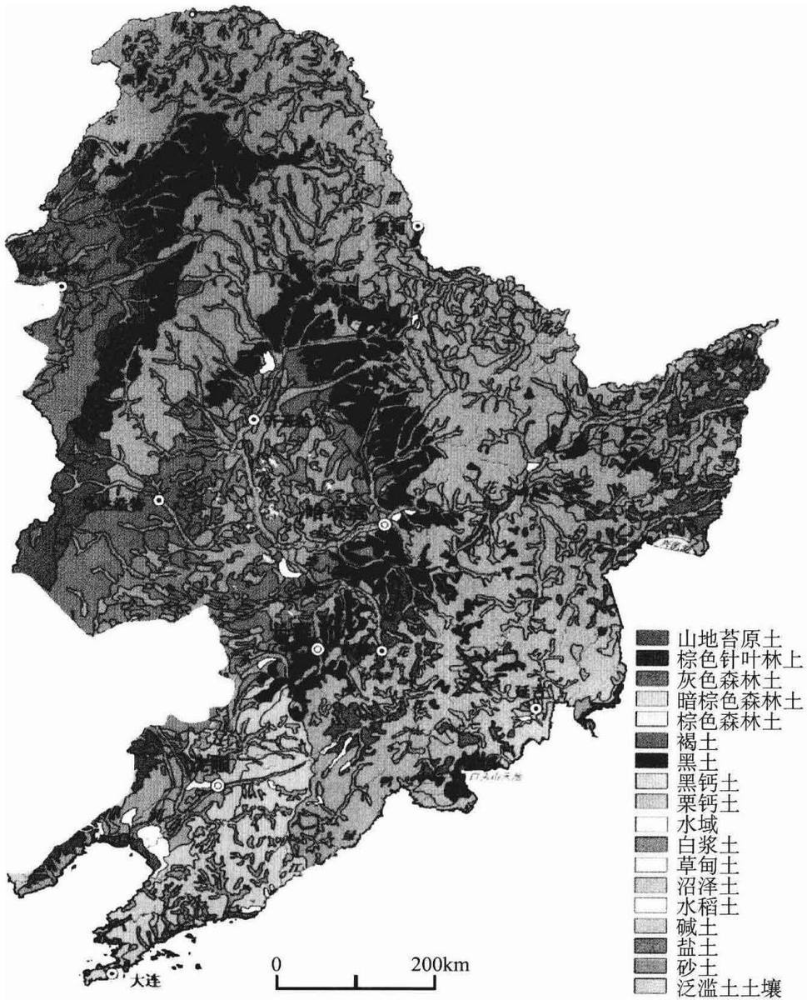  
图19.9 东北黑土区土壤图

本区土壤的形成和发育与植被有直接联系，且具有明显的纬向和经向分布特征。棕色针叶林土是发育于寒温带明亮针叶林下的地带性土壤，是灰化土和暗棕壤之间的过渡类型。黑土属于森林草原地带的土壤，草甸植被生长繁茂，根系发达，生物量大，由于寒冷漫长的气候，土壤微生物活动强度小，有机物分解弱，地上及地下有机质积累量都很高（0～20cm在14000kg/hm²)，黑土层深厚，团粒结构好；黏重的质地及季节冻层的存在，土壤的透水性能差，水分、养分的垂向运移深度多在1m内，土壤剖面一般有铁锰结核、锈斑、灰斑等。

黑土的西南部，即松嫩平原的中西部，是黑钙土的分布区。松嫩平原夏季温暖多雨，草甸草原植被广布，在黑钙土形成过程中，都伴随着草甸化过程，土壤表层既有丰富的腐殖质积累，又形成锈斑和铁质结核，形成草甸黑钙土。一些地方，由于蒸发较强，上层淋溶出去的碳酸盐，随毛细管作用返回上层，使土壤表层发生碳酸盐的积累现象，形成碳酸盐黑钙土。在地形低洼，处于封闭状态的地方，盐分积累过多，就形成盐渍土。松嫩平原上的盐渍土多为苏打盐土和碱土。

暗栗钙土形成于温带半干旱草原地区，地表植物覆盖度较低，为20%～60%，进入土壤的有机质含量不多，耗气分解强烈，土壤腐殖质积累过程较弱。由于这里气候比较干燥，年降水量仅250～400mm，蒸发较黑钙土分布区更为强盛，土壤钙化作用比较强，在土壤剖面的30～40 cm内有碳酸盐反应，形成钙积层，碳酸钙在土壤中以粉状和斑块网纹状存在。暗栗钙土的剖面有暗栗色的腐殖质层，灰色的钙积层和母质层组成。

水土流失的发生与成土母质的关系密切，东北黑土区山地土壤的成土母质是各种残积物和坡积物，平原土壤的成土母质则是各种淤积物、冲积物、风积物和海相沉积物。现代残积物广泛分布于山地，酸性残积物主要是岩浆岩（花岗岩、片麻岩、流纹岩、闪长岩、安山岩等）的风化物，其矿物组成中 $\mathrm { S i O _ { 2 } }$ 占60%～70%， $\mathrm { R _ { 2 } O _ { 3 } }$ 占20%～30%。基性残积物主要是由新生代的玄武岩和玄武岩质的火山灰等风化物组成，主要分布在长白山熔岩台地、松花江上游熔岩台地、镜泊湖熔岩台地、昭盟玄武岩台地、五大连池火山区、大兴安岭中部大黑沟等地， $\textcircled { 1 }$ 物组成中 $\mathrm { S i O } _ { 2 }$ 占50%左右， ${ \mathrm { R } } _ { 2 } { \mathrm { O } } _ { 3 }$ 占25%～

30%。次生砂砾残积物主要分布于小兴安岭西段和吉林东部的低山丘陵地区，结构松散，堆积深厚，淋溶作用强，矿物组成中 $\mathrm { S i O _ { 2 } }$ 占80%以上。冲、洪积物主要分布于小兴安岭西麓、大兴安岭东麓和东部山地，上部为更新世冲积的黄土黏质堆积物，下部为砂质堆积物。在哈尔滨以南地区，该母质层厚10～15m，物理黏粒含量小于60%；嫩江、北安等地，厚度稍薄，物理黏粒含量大于60%。河湖相沉积物分布于三江平原，形成于更新世早期，堆积厚度40～50m，大部分为黏土，矿物组成中 $\mathrm { A l } _ { 2 } \mathrm { O } _ { 3 }$ 的含量较高。淤积物广泛分布于平原地带，无碳酸盐淤积物分布于松花江、嫩江上游，黑龙江中上游及东部山区的河谷平原；碳酸盐淤积物分布于松嫩平原、辽河中下游、呼伦贝尔高原及辽西的河谷平原；苏打盐化淤积物分布于松嫩平原中部的安达、肇东一带和吉林西部，质地黏重。

## （三）人文环境因素

## 1. 人口

人是社会的主体，人口数量的变化必然对区域自然资源的开发利用带来影响，从而导致自然资源空间分布的变化。在历史上，东北黑土区一向被视为“地广人稀”或“人烟稀少”的地区。到2004年年底，东北黑土区总人口为10695.2万人，人口密度104人/km²，人口自然增长率为5.3%，低于全国8.77%的平均水平。松嫩平原、辽河中下游平原开发历史较长，人口密度相对较高，是主要的工业基地和粮食的主产区；大小兴安岭、长白山区人口稀少（图19.10、图19.11）。

新中国成立50多年来，东北黑土区的人口结构也发生了深刻变化。新中国成立初期，80%以上为农业人口，非农业人口比例不到20%。改革开放以来，随着城市化进程加快，非农业人口迅速增长，到1999年末，非农业人口达5034万人，占总数的44.6%，而农业人口增长缓慢（图19.12)。但各地区的变化不尽相同，辽、吉、黑3省人口变化情况基本相同；内蒙古自治区东部的人口增长幅度，特别是农业人口增长要高于总体水平，农业人口所占比例一直较高。由于受社会、经济、自然、文化、交通等各方面的影响，东北黑土区人口的空间分布很不均衡，呈现出东南密、西北疏的分布格局（图19.10)。辽、吉两省土地面积只占全区土地面积的25%，而人口却占到60%，人口密度为206人/km²；黑龙江省和内蒙古自治区东部地区土地面积占全区的75%，而人口仅占40%，人口密度为57人 $/ \mathrm { k m ^ { 2 } }$ ；黑龙江北部的漠河等地区人口密度不到5人/km²。

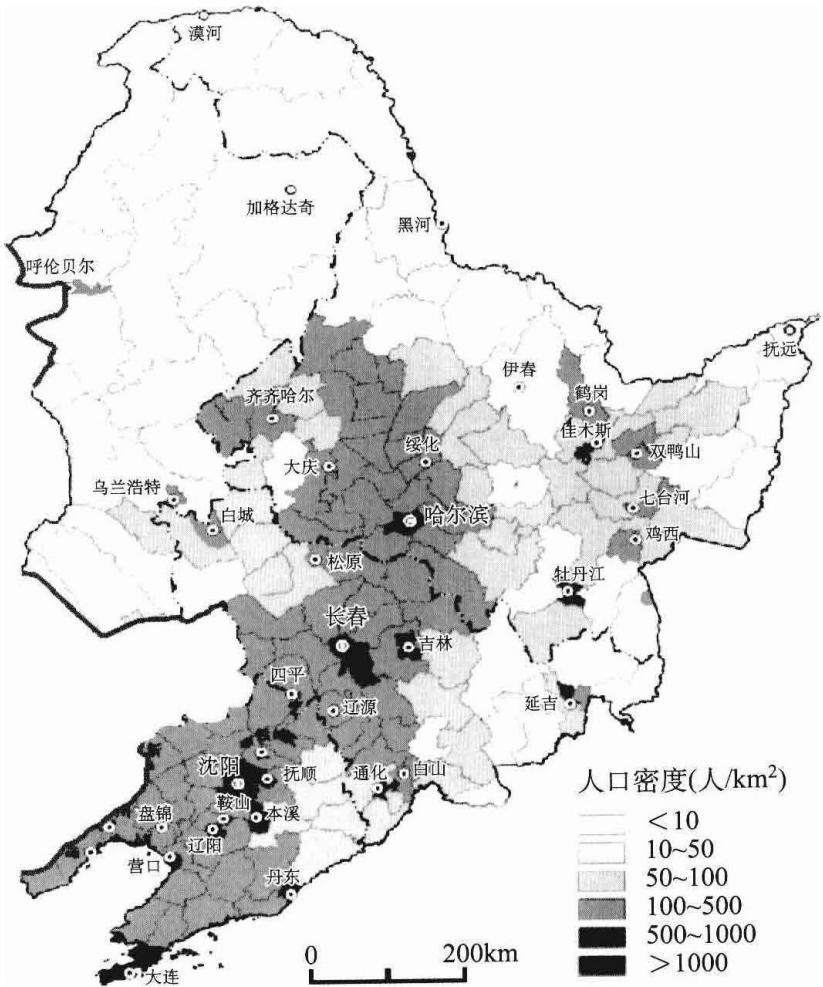

图19.10 东北黑土区人口密度  
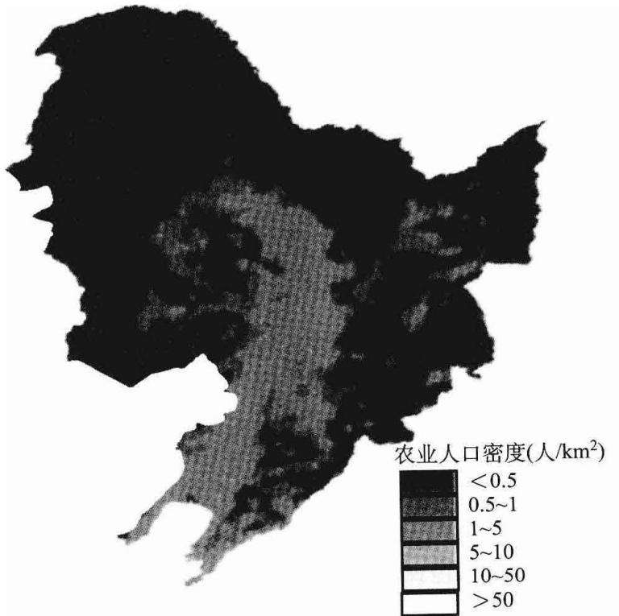  
图19.11 东北黑土区农业人口密度图

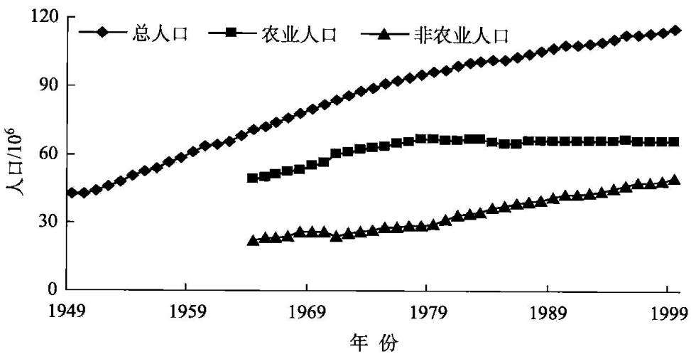  
图19.12 1950年以来东北黑土区人口的增长过程

## 2. 社会经济

东北黑土区是新中国最早建立起来的以重工业为主体，包括农业、轻工业在内的工业基地。大规模的经济建设为东北国民经济的发展提供了先进的技术设备和雄厚的物质技术基础。

经过50多年的建设发展，东北黑土区已形成了一个国民经济体系比较完整、工业与农业并重的经济区。随着经济的迅猛发展，产业结构也发生显著的变化（图19.13）。在新中国成立初期，第一产业和第二产业占国民生产总值的绝大部分，第三产业十分落后；改革开放初期，产业结构有所调整，第一产业所占比重迅速减少，第二产业占据主导地位，第三产业得到很大发展；到20世纪末，随着改革开放的深入开展，产业结构得到进一步的调整，第三产业得到快速发展，并占据着重要地位，第一产业所占比重没有太大变化，第二产业所占比重降低。与此同时，随着国民生产总值中3种产业结构的不断调整，农业产业结构也在发生变化（图19.14）。表现为农业种植业尽管一直占主导地位，但是比重不断减少，牧业、渔业比重不断加大。特别是从1980年进行改革开放以来，到20世纪末，牧业所占比例翻了一番，达到30.9%；渔业翻了近四番，达到8.3%，已是全国重要的商品粮基地和林牧业基地。

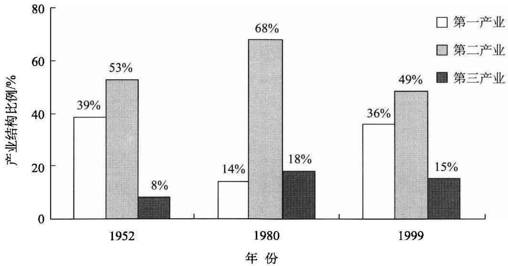  
图 9.13 产业结构变化图

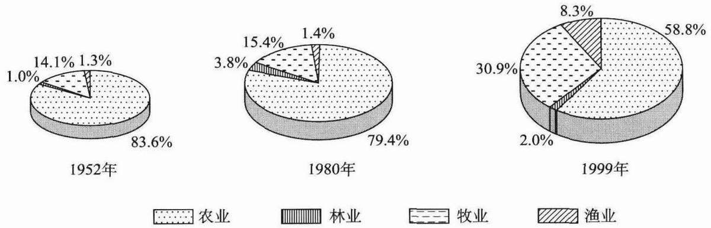  
图19.14 农业总产值构成百分比饼状图

目前，东北黑土区的原油年产量达7700万t，占全国46%；石油年加工能力为5000万t，占全国的26%；钢铁年产量2400万t，占全国的14%；有色金属年生产量200万t，占全国的11%，已形成了大庆、辽河、吉林油田三大石油开采基地，吉林、抚顺、大连等石油化工基地，鞍山、本溪、葫芦岛等冶金基地，沈阳、长春、哈尔滨等综合性重工业基地。但在经济开发中仍然采用传统的掠夺资源、消耗资源、输出资源的开发方式，采取“高投入、高消耗、高污染”的非可持续发展模式，致使本区资源消耗巨大，环境污染严重，生态恶化明显。在环境污染方面，东北黑土区大多数河流如辽河、松花江、图们江、鸭绿江等都受到不同程度的污染，有些河流或某些河段污染相当严重，其中浑河、太子河、辽河、大凌河水质污染严重，不少河段鱼虾绝迹。长期的超强度开发已使该区的某些资源趋于衰竭，给区域社会经济发展和人民生活带来极为不利的后果。

## 3. 土地利用类型

土地利用变化是导致水土流失的主要驱动力。改革开放初期，耕地面积增加较快，20世纪90年代中期以后土地开发的速率减缓。由于林地、草地、

沼泽湿地被大量垦殖，区域植被不但面积减少，而且质量也在下降。2004年东北黑土区耕地面积已达2263.77万 $\mathrm { h m } ^ { 2 }$ (表19.5)，2000年东北黑土区不同类型土地面积见表19.6、图19.15（张树文等，2006）。

表 19.5 2004 年东北黑土区耕地面积
<table><tr><td rowspan=1 colspan=1>省区</td><td rowspan=1 colspan=1>耕地面积/万 $\mathrm { { h m } ^ { 2 } }$ </td><td rowspan=1 colspan=2>耕地面积/万亩</td><td rowspan=1 colspan=1>来源</td></tr><tr><td rowspan=1 colspan=1>黑龙江</td><td rowspan=1 colspan=1>1167.36</td><td rowspan=1 colspan=1>17 510.37</td><td rowspan=1 colspan=1></td><td rowspan=1 colspan=1>国土资源部</td></tr><tr><td rowspan=1 colspan=1>吉林</td><td rowspan=1 colspan=1>537.39</td><td rowspan=1 colspan=1>8 060.85</td><td rowspan=1 colspan=1></td><td rowspan=1 colspan=1>统计年鉴</td></tr><tr><td rowspan=1 colspan=1>辽宁</td><td rowspan=1 colspan=1>325.80</td><td rowspan=1 colspan=2>4 887.00</td><td rowspan=1 colspan=1>统计年鉴</td></tr><tr><td rowspan=1 colspan=1>内蒙古东部</td><td rowspan=1 colspan=1>233.22</td><td rowspan=1 colspan=2>3 498.36</td><td rowspan=1 colspan=1>统计年鉴</td></tr><tr><td rowspan=1 colspan=1>合计</td><td rowspan=1 colspan=1>2 263.77</td><td rowspan=1 colspan=2>33 956.58</td><td rowspan=1 colspan=1></td></tr></table>

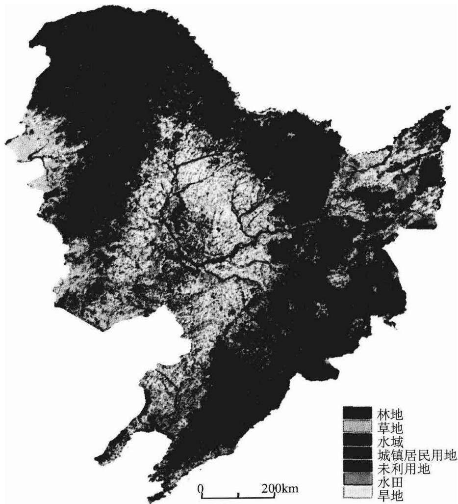  
图19.15 2000年东北黑土区土地利用类型分布图

表19.6 2000年东北黑土区土地利用（面积单位：万hm²）
<table><tr><td></td><td></td><td></td><td></td><td></td><td rowspan=1 colspan=6></td><td rowspan=2 colspan=1>省区</td><td rowspan=1 colspan=2>林地</td><td rowspan=1 colspan=2>草地</td></tr><tr><td></td><td rowspan=1 colspan=1>面积</td><td rowspan=1 colspan=1>比例/%</td><td rowspan=1 colspan=1>面积</td><td rowspan=1 colspan=1>比例/%</td><td rowspan=1 colspan=1>面积</td><td rowspan=1 colspan=1>比例/%</td><td rowspan=1 colspan=1>面积</td><td rowspan=1 colspan=1>比例/%</td><td rowspan=1 colspan=1>面积</td><td rowspan=1 colspan=1>比例/%</td></tr><tr><td rowspan=1 colspan=1>黑龙江</td><td rowspan=1 colspan=1>2076</td><td rowspan=1 colspan=1>45.9</td><td rowspan=1 colspan=1>320</td><td rowspan=1 colspan=1>7.1</td><td rowspan=1 colspan=1>149</td><td rowspan=1 colspan=1>3.3</td><td rowspan=1 colspan=1>88</td><td rowspan=1 colspan=1>1.9</td><td rowspan=1 colspan=1>292</td><td rowspan=1 colspan=1>6.5</td></tr><tr><td rowspan=1 colspan=1>吉林</td><td rowspan=1 colspan=1>848</td><td rowspan=1 colspan=1>44.4</td><td rowspan=1 colspan=1>79</td><td rowspan=1 colspan=1>4.1</td><td rowspan=1 colspan=1>50</td><td rowspan=1 colspan=1>2.6</td><td rowspan=1 colspan=1>66</td><td rowspan=1 colspan=1>3.5</td><td rowspan=1 colspan=1>115</td><td rowspan=1 colspan=1>6.0</td></tr><tr><td rowspan=1 colspan=1>辽宁</td><td rowspan=1 colspan=1>569</td><td rowspan=1 colspan=1>38.9</td><td rowspan=1 colspan=1>93</td><td rowspan=1 colspan=1>6.4</td><td rowspan=1 colspan=1>47</td><td rowspan=1 colspan=1>3.2</td><td rowspan=1 colspan=1>90</td><td rowspan=1 colspan=1>6.2</td><td rowspan=1 colspan=1>14</td><td rowspan=1 colspan=1>1.0</td></tr><tr><td rowspan=1 colspan=1>内蒙古东部</td><td rowspan=1 colspan=1>1515</td><td rowspan=1 colspan=1>33.5</td><td rowspan=1 colspan=1>1917</td><td rowspan=1 colspan=1>42.3</td><td rowspan=1 colspan=1>68</td><td rowspan=1 colspan=1>1.5</td><td rowspan=1 colspan=1>49</td><td rowspan=1 colspan=1>1.1</td><td rowspan=1 colspan=1>285</td><td rowspan=1 colspan=1>6.3</td></tr><tr><td rowspan=1 colspan=1>合计</td><td rowspan=1 colspan=1>5008</td><td rowspan=1 colspan=1>40.3</td><td rowspan=1 colspan=1>2409</td><td rowspan=1 colspan=1>19.4</td><td rowspan=1 colspan=1>314</td><td rowspan=1 colspan=1>2.5</td><td rowspan=1 colspan=1>293</td><td rowspan=1 colspan=1>2.4</td><td rowspan=1 colspan=1>706</td><td rowspan=1 colspan=1>5.6</td></tr></table>

注：比例为不同土地利用类型面积占本省国土面积的比例。

## 4. 东北黑土区在国家粮食安全中的战略地位

东北黑土区耕地主要分布在海拔500m以内和坡度3°以内的平原、丘陵地带，见表19.7（张树文等，2006），其中旱田占88%。2004年，东北黑土区粮食总产量达7462.2万t，相当于当年全国粮食总产的15.5%，其中玉米产量约占当年全国玉米总产的30%；大豆占全国大豆总产的55%（刘兴土，2005)；东北黑土区人均粮食占有量742.7kg，比当年全国人均占有量(362.2kg）高1倍以上。从20世纪90年代以来，黑龙江省、吉林省的粮食商品率高达50%～75%，每年黑土区可提供商品粮4600万t左右。近几年，粮食的出口量也在增加，吉林省2003年的玉米出口量达1054.5万t，约相当于当年该省粮食总产的40%。

表19.72000年东北黑土区不同海拔、不同坡度条件下耕地的分布比例
<table><tr><td rowspan=1 colspan=1>海拔高度/m</td><td rowspan=1 colspan=1>水田</td><td rowspan=1 colspan=1>旱地</td><td rowspan=1 colspan=1>坡度/(°)</td><td rowspan=1 colspan=1>水田</td><td rowspan=1 colspan=1>旱地</td></tr><tr><td rowspan=1 colspan=1>0~150</td><td rowspan=1 colspan=1>59.16</td><td rowspan=1 colspan=1>31.26</td><td rowspan=1 colspan=1>0~3</td><td rowspan=1 colspan=1>98.51</td><td rowspan=1 colspan=1>90.77</td></tr><tr><td rowspan=1 colspan=1>150~250</td><td rowspan=1 colspan=1>26.92</td><td rowspan=1 colspan=1>34.45</td><td rowspan=1 colspan=1>3~5</td><td rowspan=1 colspan=1>0.68</td><td rowspan=1 colspan=1>4.17</td></tr><tr><td rowspan=1 colspan=1>250~500</td><td rowspan=1 colspan=1>13.38</td><td rowspan=1 colspan=1>25.21</td><td rowspan=1 colspan=1>5~8</td><td rowspan=1 colspan=1>0.47</td><td rowspan=1 colspan=1>3.02</td></tr><tr><td rowspan=1 colspan=1>500~800</td><td rowspan=1 colspan=1>0.52</td><td rowspan=1 colspan=1>7.55</td><td rowspan=1 colspan=1>8~15</td><td rowspan=1 colspan=1>0.29</td><td rowspan=1 colspan=1>1.81</td></tr><tr><td rowspan=1 colspan=1>800~1000</td><td rowspan=1 colspan=1>0.02</td><td rowspan=1 colspan=1>1.45</td><td rowspan=1 colspan=1>15~25</td><td rowspan=1 colspan=1>0.04</td><td rowspan=1 colspan=1>0.22</td></tr><tr><td rowspan=1 colspan=1>&gt;1000</td><td rowspan=1 colspan=1>0</td><td rowspan=1 colspan=1>0.08</td><td rowspan=1 colspan=1>&gt; 25</td><td rowspan=1 colspan=1>0.01</td><td rowspan=1 colspan=1>0.01</td></tr></table>

黑土区水土流失对土地生产力和粮食生产的影响很大，据典型调查和模拟试验，每年侵蚀沟导致的粮食损失和坡耕地水土流失导致的粮食减产，总量达1080万t。如果不对坡耕地加以治理，那么将全面恶化保障粮食安全的土地基础。

分析水土流失治理，改造中低产田、发展灌溉、科学施肥、应用新品种和耕作栽培新技术等方面的增产潜力，在未来20～25年内，黑土区旱田单产提高20%是完全可以实现的。按此计算，黑土区主要旱田作物具有增产1600万t左右的潜力；新增有效灌溉面积150万hm²，水田和旱田灌溉可增加粮食生产能力908万t，两项合计2508万t，相当于全国为保障粮食安全至少需要新增4000万t粮食生产能力的60%，表明东北黑土区的粮食生产在国家粮食安全体系中具有举足轻重的作用，而实施以水土流失治理为主的黑土保护工程，又是实现粮食增产和区域农业可持续发展的关键。

## 二、水土流失状况

## (一)水土流失现状

目前东北黑土区的水蚀面积17.70万km²，占总面积的17.2%，黑龙江省有8.86万km²，内蒙古东部有4.04万km²，辽宁省有3.07万km²，吉林省较少仅1.73万km²，均以轻度侵蚀为主（表19.8、图19.16、图19.17)。

表19.8东北黑土区不同侵蚀强度的水蚀面积(单位：km²)
<table><tr><td rowspan=1 colspan=1>省区</td><td rowspan=1 colspan=1>轻度</td><td rowspan=1 colspan=1>中度</td><td rowspan=1 colspan=1>强烈</td><td rowspan=1 colspan=1>极强烈</td><td rowspan=1 colspan=1>剧烈</td></tr><tr><td rowspan=1 colspan=1>黑龙江</td><td rowspan=1 colspan=1>60 700.0</td><td rowspan=1 colspan=1>24 815.8</td><td rowspan=1 colspan=1>3 329.8</td><td rowspan=1 colspan=1>0</td><td rowspan=1 colspan=1>0</td></tr><tr><td rowspan=1 colspan=1>吉林</td><td rowspan=1 colspan=1>10 659.8</td><td rowspan=1 colspan=1>5 522.5</td><td rowspan=1 colspan=1>1 393.2</td><td rowspan=1 colspan=1>0</td><td rowspan=1 colspan=1>0</td></tr><tr><td rowspan=1 colspan=1>辽宁</td><td rowspan=1 colspan=1>20 296.1</td><td rowspan=1 colspan=1>7 159.5</td><td rowspan=1 colspan=1>1 610.8</td><td rowspan=1 colspan=1>627.4</td><td rowspan=1 colspan=1>255.7</td></tr><tr><td rowspan=1 colspan=1>内蒙古东部</td><td rowspan=1 colspan=1>33 490.8</td><td rowspan=1 colspan=1>12 807.5</td><td rowspan=1 colspan=1>64.0</td><td rowspan=1 colspan=1>0</td><td rowspan=1 colspan=1>0</td></tr><tr><td rowspan=1 colspan=1>合计</td><td rowspan=1 colspan=1>125 146.7</td><td rowspan=1 colspan=1>50 305.3</td><td rowspan=1 colspan=1>6 397.9</td><td rowspan=1 colspan=1>627.4</td><td rowspan=1 colspan=1>255.7</td></tr></table>

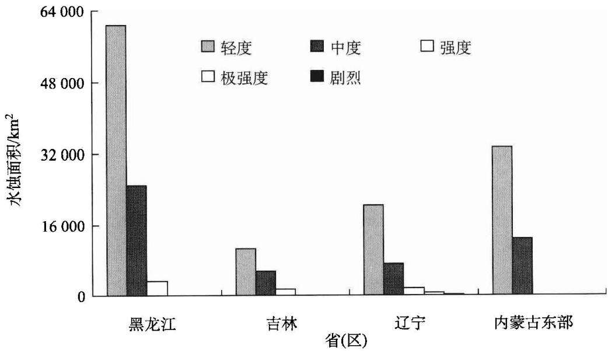

图19.16 各省区不同侵蚀强度水蚀面积分布  
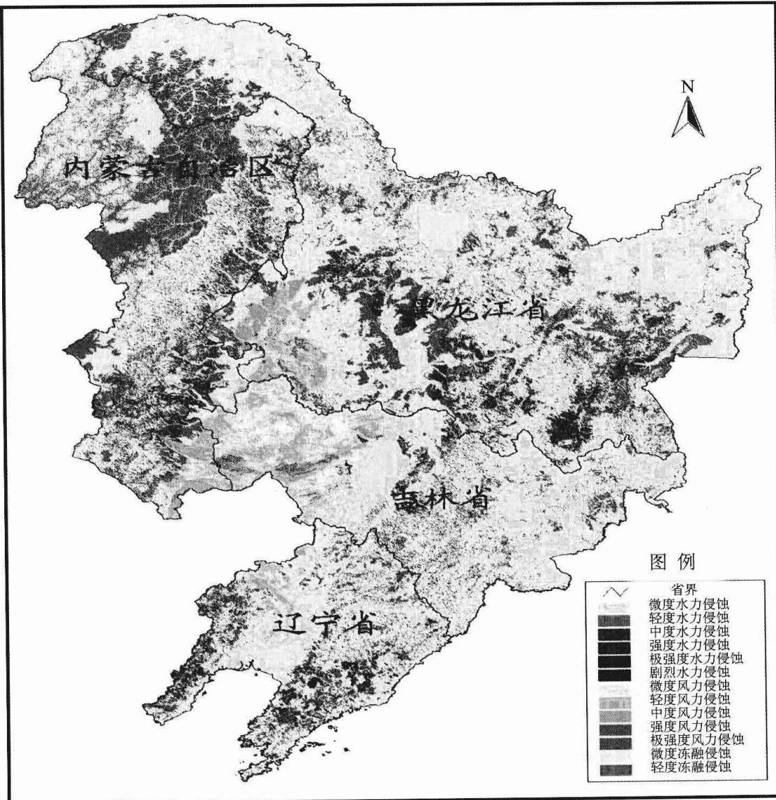  
图19.17 东北黑土区不同水蚀强度分布图

## （二）水土流失的成因

## 1. 自然因素

(1）地形地貌。漫川漫岗区坡度小（多小于5°)，但坡长大，汇水面积大，坡耕地表土流失严重，汇水区多形成侵蚀沟。

（2）气候。7\~9月份降水量占全年降水量的60%～80%，多以连续、集中的暴雨出现，暴雨径流可造成强度水蚀。黑土区季节冻层的存在，起着隔水层的作用，不但使春季融雪水不能下渗，在北部地区冻层甚至可延续至6月底至7月中旬，使6～7月份降雨径流的冲蚀作用加剧，加速了侵蚀沟的蔓延和发展。冻融作用使土壤的抗蚀性减弱，土粒松散。沟蚀地区，冻胀产生的裂隙在春季融雪水的浸润下，使沟沿倒塌，沟壁迅速扩展加速了重力侵蚀。北美黑土带的研究结果表明，冻融交替的土壤比没经冻融交替的土壤流失量增加24%\~90%。

（3）土壤。表层松散，底土黏重，加之犁底层的存在，透水性差，易产流。黑土吸热多，冻结晚，延长了流失时间。白浆土具有透水性差、土质黏紧不渗水的特点，一遇暴雨，易产流。

（4）植被。黑土区的自然植被为草原化草甸植物，属杂类草群落。由于土壤水分和养分条件较好，植物生长繁茂，覆盖度接近100%，高度多在40～50cm，根系发达，基本没有水土流失；垦殖为耕地后，有机质分解加剧，土壤物理形状恶化，抗蚀抗冲能力下降；土壤中植物根系稀少，加之7月份以前地表裸露或农作物处于苗期，盖度低，植物冠层的截流作用弱，雨滴的溅蚀强烈，水土流失严重。

## 2. 人为因素

（1）过度的农垦及不合理的耕作。保护黑土地的意识淡薄，重用轻养，忽视保护。东北黑土区一部分坡耕地采用顺坡打垄的耕作方式，多年连作普遍，主要靠化肥补充养分，秸秆还田率低，生产经营管理方式粗放，用养失调，土壤理化性质变差，有机质含量减少，土粒间黏结力降低，团粒结构被破坏，孔隙率下降，板结严重；小型农机具多，多数耕地已有20余年未进行过深翻，耕层浅，犁底层增厚，降低了土壤的渗水、蓄水能力，加剧了坡耕地的水土流失。

（2）植被破坏。植被枝叶对雨滴的拦截、分散可以减少雨滴动能，植物根系固结土壤，都能有效减轻表面溅蚀；长期有植被覆盖的土壤，有机质含量高，土壤疏松多孔，有利于水分快速下渗，延缓产流，减轻土壤侵蚀。森林、草地垦殖后，植被固土防蚀的功能丧失，加剧了水土流失。东北黑土区1962～1986年间林地面积减少了231.5万hm²，1986～2000年间又减少了146万hm²（张树文等，2006)；20世纪50年代以来小兴安岭林缘后退了百余公里。

（3）工程建设与城镇的快速扩张。采矿（包括采石、挖沙）、道路（包括桥涵）建设、水电站建设、尾矿堆场、城镇的快速扩张等建设活动均会不同程度地造成水土流失。辽宁省中部城市群的10个大中型铁矿区，占地总面积119km²，破坏土地面积81.67 km²，采场面积22.84km²，排土场、尾矿库占地面积58.83 km²，这些地区都是水土流失较重的区域，侵蚀强度多在强度以上。东北黑土区公路总量2007年已达到15.7万km，高速公路里程达到2592km；预计到2020年，公路里程将达到24万km，高速公路里程将突破9000km，在这些公路兴建过程中势必产生一定的水土流失。

## （三）水土流失的特点

侵蚀强度不大，多为中度、轻度侵蚀，但因黑土层厚度有限，对生态、环境及粮食生产的危害巨大；坡耕地水土流失面积占水土流失总面积的46.4%，东北黑土区59.4%的耕地面积为坡耕地，面积达1280万hm²，多数分布在3°～15°的坡面上；坡耕地流失的土壤搬运距离不是很大，约60%堆积在坡脚，其余淤积在库塘、洼地，进入河流的量不是很大。东北黑土区的中西部，水蚀与风蚀并存，自然条件下的水土流失较弱，人类活动造成的天然植被破坏是导致水土流失加剧的主要原因。

## （四）水土流失的危害

## 1. 旱涝增加

旱灾发生频率越来越高，时间越来越长。20世纪前50年，东北黑土区干旱的发生频率一般为3～5年1次，20世纪后50年变为2年多1次；近10年，东北黑土区的春旱连年发生，一些地区1999～2003年已连续5年遭受严重旱灾。吉林省20世纪前50年发生旱灾14次，后50年发生了34次；而且干旱的持续时间由过去的以短时段为主，发展成为春夏连旱或夏秋连旱。黑龙江省20世纪前90年有27年发生了旱灾，而后10年却是连续发生旱灾，1995年以来，春旱越来越重。目前，黑土区2/3的坡耕地已成为干旱、易涝地，造成春季干旱，出苗率低，低洼地常年淤水、淤土，土壤板结，通透性恶化，旱涝灾害频繁。

大小兴安岭森林的过度砍伐，林缘后退，森林涵养水分的能力减弱，造成河水暴涨暴落，使处于下游的黑土区洪涝灾害增加。洪水携带大量泥沙下泄，在下游水库、湖塘及河道淤积，影响河流的调洪、行洪能力，更易发生洪涝灾害。1955～1986年的32年间，大兴安岭地区共发生8次洪水灾害，但受灾较轻，平均4年发生1次；1987～1991年5年间，就发生了3次灾害较大的洪水，1998年松辽流域的特大洪水受灾更大。1949～2004年东北黑土区旱涝受灾面积均呈明显上升趋势（图19.18、图19.19），其中涝灾面积20世纪80～90年代增加较多，而旱灾70年代最多，进入21世纪旱灾面积连年处在较高的水平。1949～2004年累计旱灾面积6769万hm $\mathrm { h m } ^ { 2 }$ ，涝灾面积15 864 万 $\mathrm { h m } ^ { 2 }$ ，旱涝受灾面积总计22633万 $\mathrm { h m } ^ { 2 }$

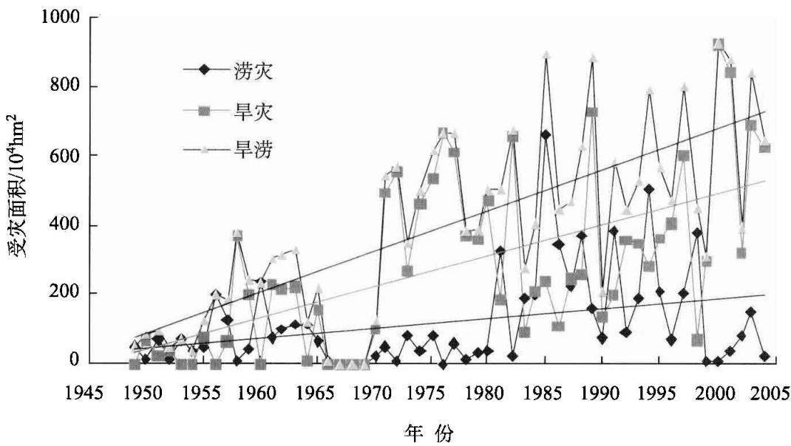

图19.18 1950～2005年旱涝灾害受灾面积变化  
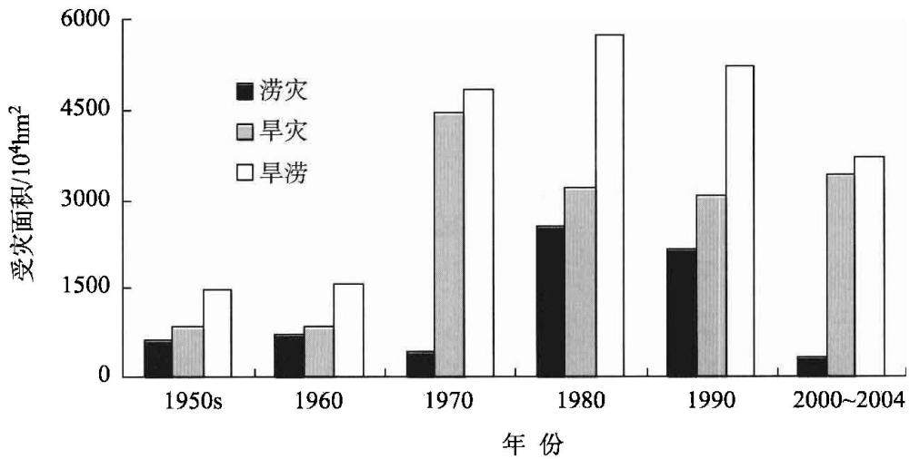  
图19.19 20世纪不同年代旱涝灾害受灾面积变化

旱涝还出现了受灾范围不断扩大、经济损失越来越大的趋势。干旱出现由西向东扩展的趋势，就连延吉、牡丹江地区近年也发生严重的春旱。干旱还造成供水困难，河流断流、湿地萎缩、污染加重、生态恶化。吉林省“九五”期间因旱灾损失粮食1639万t，比“八五”期间多出2.1倍。黑龙江省2000～2002年因旱灾损失粮食2210万t，1998年以来三江平原的旱灾愈来愈重。

## 2. 淤积河湖，加剧了面源污染

流失的泥沙淤积在江河、水库、塘坝，减少了过水和蓄水面积，降低了水利设施的调蓄功能和天然河道的泄洪能力，抬高了下游河床，使洪灾加剧，影响防洪安全。据调查，目前松花江哈尔滨江段河床比20世纪50年代抬高了30～50cm，滨州桥下淤积的沙滩长达3400m，淤积量达490万 $\mathbf { m } ^ { 3 }$

吉林省水库、塘坝的年淤积量在4000万 $\mathbf { m } ^ { 3 }$ ，而且发展速度加快。丰满水库（库容108亿 $\mathbf { m } ^ { 3 }$ ）在20世纪40年代的年入库泥沙量约145万 $\mathrm { m } ^ { 3 }$ ，至50～60年代增加到约332万 $\mathbf { m } ^ { 3 }$ ，1982年猛增至525.49万 $\mathbf { m } ^ { 3 }$ 。东辽河二龙山水库（库容17.6亿 $\mathbf { m } ^ { 3 } .$ ）泥沙淤积量由50年代的160万 $m ^ { 3 }$ 猛增至80年代初的 385 万 $\mathbf { m } ^ { 3 }$ ，1950～2001年进入二龙湖的泥沙总量达10101.1万t，造成库容损失 8015 万 $\mathbf { m ^ { 3 } }$ 。东辽县平岗镇1970年建成的身安水库，库容58万$\mathrm { { r n ^ { 3 } } }$ ，不到10年即淤积了40万 $\mathbf { m } ^ { 3 }$

黑龙江省宾县的二龙山水库建成于1972年，灌溉农田5000hm²，并有城市供水和防洪的功能。每年进入二龙山水库（总库容9400万 $\mathbf { m ^ { 3 } } .$ ）的泥沙约60万 $\mathbf { m ^ { 3 } }$ ，已淤积900万 $\mathbf { m } ^ { 3 }$ 。明水县爱国水库（库容1500万 $\mathbf { m ^ { 3 } }$ ）的入口滩地上，泥沙已淤出了面积 $\mathrm { 1 h m } ^ { 2 }$ 以上的三角洲，设计的死库容已被淤死。

哈尔滨江段河床普遍比20世纪50年代抬高30～40cm，航行河段由50年代的1500km缩短到580km。吉林省沐石河、辉发河的某些河段，泥沙淤积使河床高出地面1m多，形成悬河。目前，辽河干流含沙量在我国仅次于黄河，由于泥沙淤积，辽河干流河床逐年抬高，目前已平均高出地面 $1 { \sim } 2 \mathrm { m }$ 形成悬河，大大降低了河道泄流能力，加重了洪涝灾害。

## 3. 严重威胁粮食安全

水土流失是各种生态退化的集中反映，又是导致生态进一步恶化的根源。水土流失对粮食生产的影响主要表现在两方面：一是侵蚀沟侵吞耕地，使耕地面积减少。据调查统计，黑土区有各类侵蚀沟46万多条，吞没耕地48.3万 $\mathrm { h m } ^ { 2 }$ 。二是剥蚀表土，恶化土壤结构，降低肥力和粮食生产能力。据中国科学院东北地理与农业生态研究所对坡耕地黑土层田间剥离试验表明，黑土层剥蚀掉30cm时，玉米产量只有对照的4.3%～26.3%，几乎绝产；大豆产量只有对照的40.8%～54.9%，减产40%～60%。黑土层剥蚀掉20 cm时，玉米产量是对照的53.8%～65.4%，减产30%～50%；大豆产量是对照的66.8%～78.9%，减产20%～40%。黑土层剥蚀掉10cm时，玉米产量是对照的81.3%～95.3%，减产5%～20%；大豆产量是对照的89.9%\~96.9%，减产3%\~10%（图19.20)。目前， $3 ^ { \circ }$ 以上的坡耕地每年流失表土1\~2mm，坡耕地不同侵蚀强度造成的粮食减产，如轻度侵蚀按10%、中度按20%、重度按30%计，全区因面蚀造成的粮食减产将达790万t；全区侵蚀沟吞噬耕地48.3万 $\mathrm { h m } ^ { 2 }$ ，如按每公顷生产玉米6000kg计，则每年损失粮食290万t，两项合计造成的粮食减产已占当年粮食总产的14.4%。如不采取有效措施，控制黑土层的流失和黑土肥力的锐减，则粮食减产的幅度还会加大，将严重威胁粮食安全。

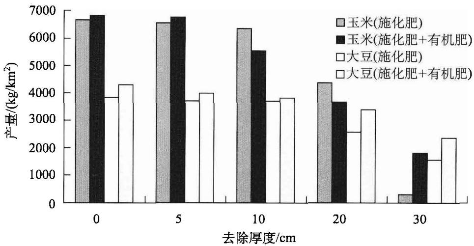  
图19.20不同切割试验时玉米、大豆的产量

## （五）水土流失的发展趋势

东北黑土区水土流失仍在发展之中，流失面积在不断扩大，但速度减缓；强度增加，黑土层变薄，以面蚀为主；侵蚀沟的数量在增加，沟道继续扩展，向大沟方向发展；土壤养分下降；河流泥沙缓慢增加。

## 1. 东北黑土区水蚀面积的变化

（1）黑龙江省黑土区水蚀面积50多年来的变化。黑龙江省典型黑土区的水土流失面积已由20世纪50年代的24292.4km2增加到80年代的36649.52km²和2000年的45106.51km²；以轻度侵蚀为主，面积由50年代的 15659.1 km²增加到80 年代的 22683.47km²和 2000年的 27785.08 km²(图19.21)，但中度、强度侵蚀的增长速度较快。

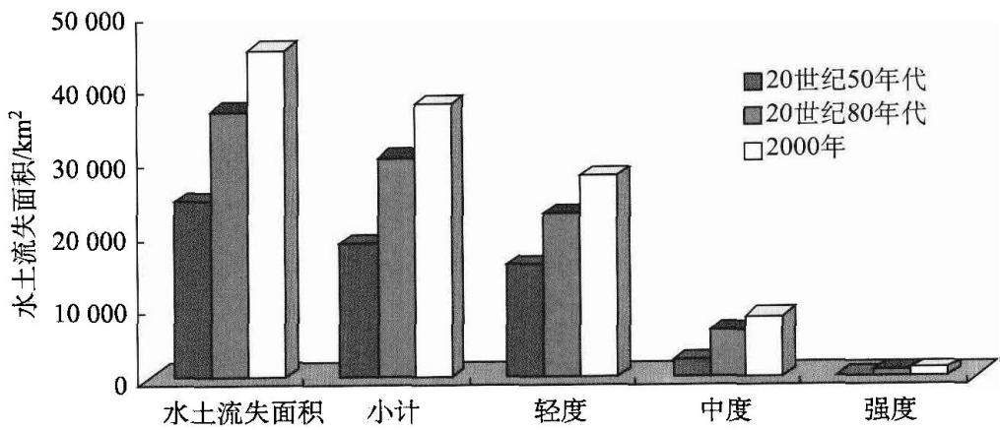  
图19.21 黑龙江省黑土区水蚀强度的面积变化

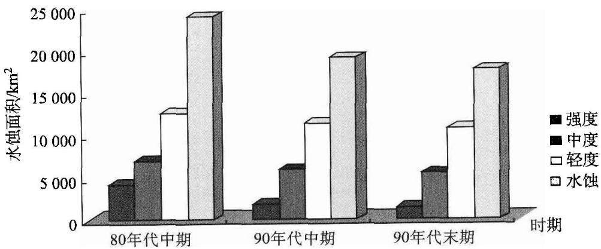  
图19.22 吉林省20世纪80年代以来水蚀面积变化

(2)吉林省黑土区水蚀面积15年来的变化。1985年以来，吉林省水蚀面积和强度呈减少趋势（图19.22）。1999年水蚀面积17575.5km²，其中轻度10659.8 km²，中度5522.5km²，强度1393.2 km²。1985\~1999年的15年间共减少6521.8km²。1999年的水蚀以轻度侵蚀为主，占61%；中度占31%，强度占8%。

(3）辽宁省黑土区水蚀面积的变化。1995年土壤侵蚀面积为

3289.3 km²,2000年为2597.7 km²（其中水蚀 2458 km²)；1995\~2000年间，水力侵蚀面积减少了870km²。目前辽宁省黑土区水蚀以轻度侵蚀为主。

(4）内蒙古东部。2000年内蒙古东部有水蚀面积40998.9km²，其中嫩江流域38156.2km²，额尔古纳河流域2842.7km²；水蚀面积中，轻度侵蚀占70.3%，中度占29.5%，强度仅有0.2%。

呼伦贝尔市的水蚀面积已由1985年的18157.7km²增加至2000 年的20140.8 km²，2000年侵蚀沟密度达540 m/km²，侵蚀模数 462\~858 t/$( \mathbf { k } \mathbf { m } ^ { 2 } \cdot \mathbf { a } )$ 。鄂伦春旗解放初期有耕地不足7hm²，基本没有侵蚀沟和水土流失面积；20世纪80年代初期，耕地面积已增至10万hm²，水蚀面积发展到840km²，出现侵蚀沟870条，总长69.6km，沟壑密度1.2m/km²；2000年侵蚀沟发展到2798条，总长335.7km，沟壑密度56m/km²；2004年鄂伦春旗水蚀面积（轻度以上）发展到5435.8km²（其中轻度侵蚀4822.5km²，中度600.9km²，强度12.5km²)。阿荣旗水蚀面积已由1950年的4km²和1980年的 210.5 km²发展到2000年的 558.8 km²；新增侵蚀沟 7436 条，总长2060.6km。额尔古纳市水蚀面积也有类似的发展趋势（表19.9）。

表19.9 额尔古纳市水蚀面积及侵蚀沟变化
<table><tr><td rowspan=2 colspan=1>年份</td><td rowspan=1 colspan=3>水蚀面积/km²</td><td rowspan=1 colspan=3>侵蚀沟</td></tr><tr><td rowspan=1 colspan=1>轻度</td><td rowspan=1 colspan=1>中度</td><td rowspan=1 colspan=1>合计</td><td rowspan=1 colspan=1>条数</td><td rowspan=1 colspan=1>总长度/km</td><td rowspan=1 colspan=1>密度/(m/km²)</td></tr><tr><td rowspan=1 colspan=1>1950</td><td rowspan=1 colspan=1>1102.81</td><td rowspan=1 colspan=1>32.48</td><td rowspan=1 colspan=1>1135.29</td><td rowspan=1 colspan=1>31</td><td rowspan=1 colspan=1>11</td><td rowspan=1 colspan=1>1</td></tr><tr><td rowspan=1 colspan=1>1980</td><td rowspan=1 colspan=1>1905.44</td><td rowspan=1 colspan=1>139.9</td><td rowspan=1 colspan=1>2045.34</td><td rowspan=1 colspan=1>62</td><td rowspan=1 colspan=1>80</td><td rowspan=1 colspan=1>8</td></tr><tr><td rowspan=1 colspan=1>2000</td><td rowspan=1 colspan=1>2459.83</td><td rowspan=1 colspan=1>239.96</td><td rowspan=1 colspan=1>2699.79</td><td rowspan=1 colspan=1>91</td><td rowspan=1 colspan=1>120</td><td rowspan=1 colspan=1>12</td></tr></table>

## 2. 黑土层厚度明显减薄

（1）第二次土壤普查时（1982年）。第二次土壤普查时黑土区81个典型剖面的统计结果表明，黑土层厚度在16\~72 cm，平均43.7cm；黑龙江省水保所的定位观测表明，坡耕地每年流失表土0.6～1cm，破皮黄黑土的面积已占黑土区面积的2.4%～12.4%（表19.10）；薄层黑土（黑土层厚度<30 cm)面积已占黑土面积的 40.9%(表19.11)。

表 19.10 第二次土壤普查时典型黑土区破皮黄黑土（黑土层厚度<20cm）面积
<table><tr><td rowspan=1 colspan=1>省份</td><td rowspan=1 colspan=1>破皮黄黑土面积/km²</td><td rowspan=1 colspan=1>占黑土总面积的比例/%</td><td rowspan=1 colspan=1>黑土消失面积/km²</td></tr><tr><td rowspan=1 colspan=1>吉林</td><td rowspan=1 colspan=1>1030</td><td rowspan=1 colspan=1>12.4</td><td rowspan=1 colspan=1>170</td></tr><tr><td rowspan=1 colspan=1>黑龙江</td><td rowspan=1 colspan=1>871</td><td rowspan=1 colspan=1>2.4</td><td rowspan=1 colspan=1></td></tr></table>

(2)目前（2004～2005年)。据刘宝元的研究表明，在典型黑土区949个剖面中，48.6%的剖面黑土层厚度小于40cm（图19.23、表19.12)；在黑钙土一草甸土区27个剖面中，黑土层厚度<20cm的剖面占51.8%，黑土层厚度<40cm的占74.0%。北纬 $4 6 ^ { \circ } \sim 4 8 . 5 ^ { \circ }$ 的漫岗区，地形波状起伏，黑土成片分布，黑土层厚度最大，平均黑土层厚度63.3cm，厚度<20cm的样点占

表19.11 典型黑土土种面积及比例
<table><tr><td rowspan=2 colspan=2>省份</td><td rowspan=1 colspan=2>总计</td><td rowspan=1 colspan=2>薄层黑土(厚度0~30cm)</td><td rowspan=1 colspan=2>中层黑土(厚度30~60cm)</td><td rowspan=1 colspan=2>厚层黑土(厚度&gt;60cm)</td></tr><tr><td rowspan=1 colspan=1>合计</td><td rowspan=1 colspan=1>耕地</td><td rowspan=1 colspan=1>合计</td><td rowspan=1 colspan=1>耕地</td><td rowspan=1 colspan=1>合计</td><td rowspan=1 colspan=1>耕地</td><td rowspan=1 colspan=1>合计</td><td rowspan=1 colspan=1>耕地</td></tr><tr><td rowspan=1 colspan=1>黑龙江</td><td rowspan=1 colspan=1>面积/km²比例/%</td><td rowspan=1 colspan=1>48 247100</td><td rowspan=1 colspan=1>36 063100</td><td rowspan=1 colspan=1>20 18941.8</td><td rowspan=1 colspan=1>14 85741.2</td><td rowspan=1 colspan=1>18 89739.2</td><td rowspan=1 colspan=1>14 43340.0</td><td rowspan=1 colspan=1>9 16119.0</td><td rowspan=1 colspan=1>6 77318.8</td></tr><tr><td rowspan=1 colspan=1>吉林</td><td rowspan=1 colspan=1>面积/km²比例/%</td><td rowspan=1 colspan=1>10 591100</td><td rowspan=1 colspan=1>8 026100</td><td rowspan=1 colspan=1>3 87436.6</td><td rowspan=1 colspan=1>26933.5</td><td rowspan=1 colspan=1>4 47242.2</td><td rowspan=1 colspan=1>3 56344.4</td><td rowspan=1 colspan=1>2 24521.2</td><td rowspan=1 colspan=1>1 77322.1</td></tr><tr><td rowspan=1 colspan=1>合计</td><td rowspan=1 colspan=1>面积/km²比例/%</td><td rowspan=1 colspan=1>58 838100</td><td rowspan=1 colspan=1>44 089100</td><td rowspan=1 colspan=1>24 06340.9</td><td rowspan=1 colspan=1>17 54739.8</td><td rowspan=1 colspan=1>23 36939.7</td><td rowspan=1 colspan=1>17 99640.8</td><td rowspan=1 colspan=1>11 40619.4</td><td rowspan=1 colspan=1>8 54619.4</td></tr></table>

表19.12 不同厚度级别样点个数及平均土层厚度
<table><tr><td rowspan=1 colspan=1>厚度/cm</td><td rowspan=1 colspan=1>样点个数/个</td><td rowspan=1 colspan=1>比例/%</td><td rowspan=1 colspan=1>平均厚度/cm</td></tr><tr><td rowspan=1 colspan=1>0</td><td rowspan=1 colspan=1>96</td><td rowspan=1 colspan=1>10.1</td><td rowspan=1 colspan=1>0.0</td></tr><tr><td rowspan=1 colspan=1>0~20</td><td rowspan=1 colspan=1>128</td><td rowspan=1 colspan=1>13.5</td><td rowspan=1 colspan=1>17.3</td></tr><tr><td rowspan=1 colspan=1>20~40</td><td rowspan=1 colspan=1>237</td><td rowspan=1 colspan=1>25.0</td><td rowspan=1 colspan=1>33.2</td></tr><tr><td rowspan=1 colspan=1>40~60</td><td rowspan=1 colspan=1>180</td><td rowspan=1 colspan=1>19.0</td><td rowspan=1 colspan=1>54.0</td></tr><tr><td rowspan=1 colspan=1>60~80</td><td rowspan=1 colspan=1>127</td><td rowspan=1 colspan=1>13.4</td><td rowspan=1 colspan=1>73.6</td></tr><tr><td rowspan=1 colspan=1>80~100</td><td rowspan=1 colspan=1>88</td><td rowspan=1 colspan=1>9.3</td><td rowspan=1 colspan=1>94.1</td></tr><tr><td rowspan=1 colspan=1>100~120</td><td rowspan=1 colspan=1>43</td><td rowspan=1 colspan=1>4.5</td><td rowspan=1 colspan=1>112.9</td></tr><tr><td rowspan=1 colspan=1>&gt;120</td><td rowspan=1 colspan=1>50</td><td rowspan=1 colspan=1>5.3</td><td rowspan=1 colspan=1>165.3</td></tr></table>

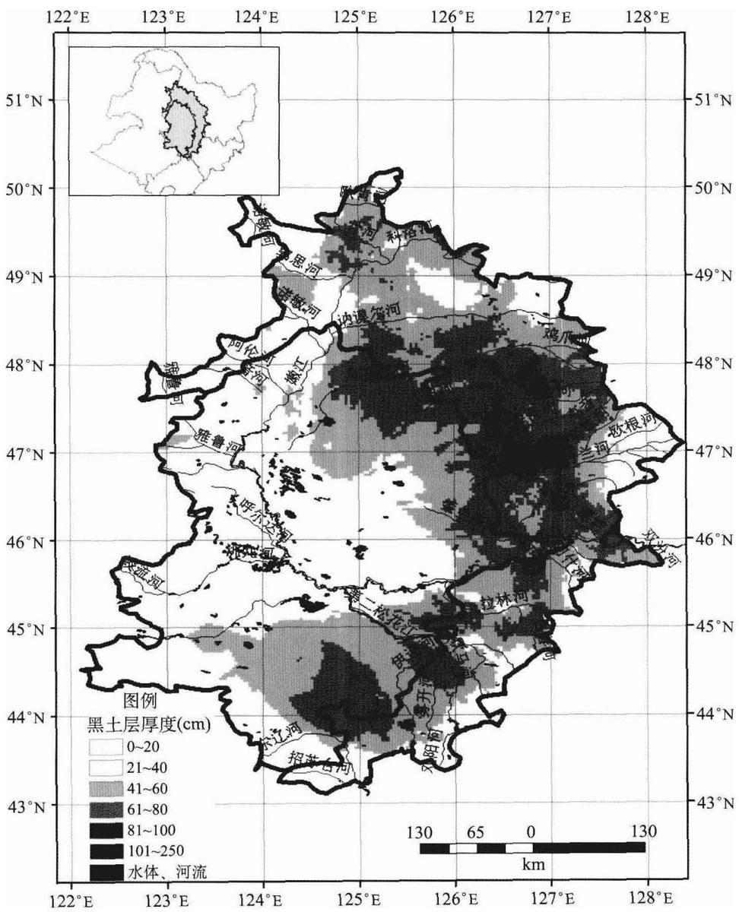  
图19.23 黑土层厚度空间分布图（2005年）

13.5%，<40cm的样点占36.5%；北纬 $4 8 . 5 ^ { \circ }$ 以北的黑土区多为丘陵，地形起伏较大，平均黑土层厚度为 41.2 cm，厚度<20 cm的样点占34.3%，$< 4 0 \ \mathrm { c m }$ 的样点占68.2%；北纬46°以南的黑土区，地形较为平缓，多为冲积 $4 6 ^ { \circ }$ 平原，平均坡度1.3°，耕种历史悠久，黑土层平均厚度47.9cm，<20cm的 $1 . 3 ^ { \circ }$ 样点占29%， $< 4 0 \ \mathrm { c m }$ 的样点占52.8%。目前黑龙江省坡度在 $3 ^ { \circ } \sim 5 ^ { \circ }$ 之间的坡耕地的黑土层厚在17.6\~23.5 cm，侵蚀速率 $1 . 2 4 { \sim } 1 . 2 9 ~ \mathrm { m m } / \mathrm { a }$ ，抗蚀年限58～108年； $5 ^ { \circ } \sim 8 ^ { \circ }$ 坡耕地的黑土层厚12.4\~15.1 cm，侵蚀速率2.12\~2.41mm/a，抗蚀年限11～33年；按此侵蚀速率推算，黑龙江省现有耕地中有2.27万km²坡耕地的黑土层将在100～200年内被侵蚀掉，3.05万km²坡 $\mathrm { k m ^ { 2 } }$ 耕地的黑土层将在50～100年内被侵蚀掉， $5 5 8 5 ~ \mathrm { k m ^ { 2 } }$ 坡耕地的黑土层将在50年内被侵蚀掉。

## 3. 侵蚀沟数量、长度、密度等变化

(1）黑龙江省。1950年以来黑龙江省不同类型侵蚀沟数量、占地面积及侵蚀沟密度均呈明显增加的趋势（图19.24、图19.25）。

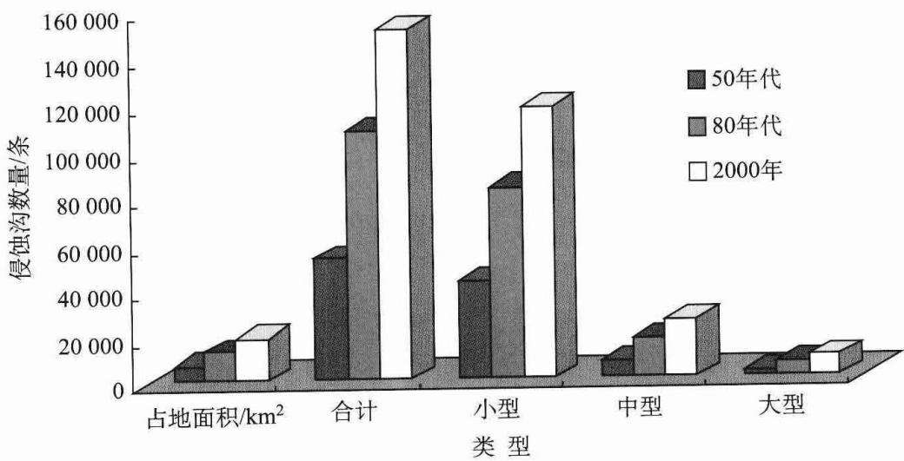

图19.24 20世纪50年代以来黑龙江省侵蚀沟数量及占地面积变化  
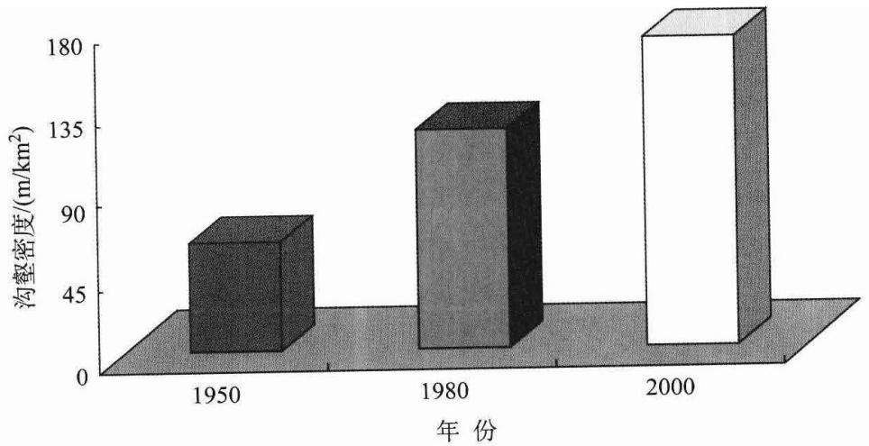  
图19.25 不同时段黑龙江省黑土区（118735.9km²）侵蚀沟密度变化

(2）典型乡镇（克东、拜泉10乡镇)。漫川漫岗区的典型乡镇（克东2乡镇，拜泉8乡镇）1965年以来侵蚀沟的数量、密度增加明显（图19.26）。

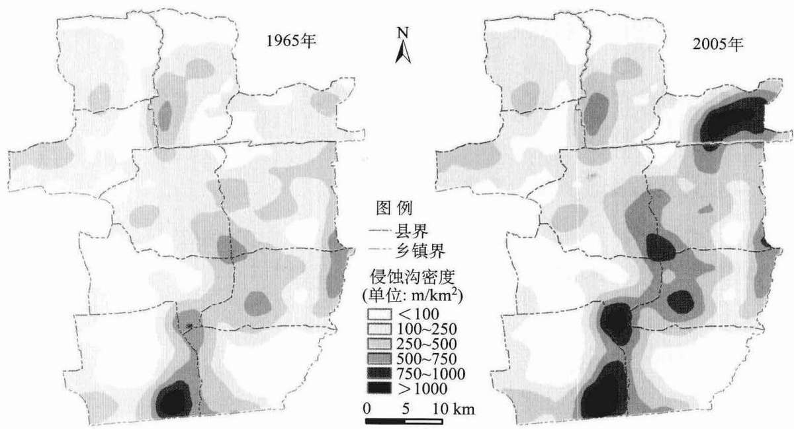  
图19.26 克拜东部1965年、2005年侵蚀沟度图

①侵蚀沟密度增加显著。1965年区内有侵蚀沟1712条，侵蚀沟密度为202 m/km²,2005年分别增加到2565 条和 $2 8 3 ~ \mathrm { m / k m ^ { 2 } }$ ；1965年时侵蚀沟密度高于 $5 0 0 ~ \mathrm { m } / \mathrm { k m } ^ { 2 }$ 的地区只有 $1 1 0 . 2 0 \ \mathrm { k m } ^ { 2 }$ ，占10乡镇土地总面积的5.97%，到2005年时侵蚀沟密度高于 $5 0 0 ~ \mathrm { m / k m ^ { 2 } }$ 的地区已经集中连片分布，面积增加到 $3 2 5 . 5 9 ~ \mathrm { k m } ^ { 2 }$ ，占10乡镇土地总面积的17.62%。②侵蚀沟密度变化有明显的区域差异。通肯河分水岭两侧侵蚀沟密度变化最大，北段增加幅度大于南段，分水岭东部地区大于西部。1965年侵蚀沟密度大于 $1 0 0 0 ~ \mathrm { m / k m ^ { 2 } }$ 的高值中心仅分布在拜泉县新生乡东南部；到2005年，沿通肯河分水岭由南向北依次有3个大于 $1 0 0 0 ~ \mathrm { m / k m ^ { 2 } }$ 的高值中心和5个大于 $7 5 0 ~ \mathrm { m / k m ^ { 2 } }$ 的高值中心。③水土保持治理有效减缓侵蚀沟的发展速度。克东县的爱国乡和拜泉县的国富镇在地域上相邻，平均地面坡度基本一致 $( 2 . 4 9 ^ { \circ } , ~ 2 . ~ 5 0 ^ { \circ } )$ ，但侵蚀沟密度的变化前者是后者的3.24倍；克东县千丰镇侵蚀沟密度的增长幅度也明显大于相邻的拜泉县兴华乡。

(3）典型乡镇——榆树市刘家镇。吉林省榆树市刘家镇位于第二松花江沿岸冲洪积台地上，东西长约10km，南北平均宽2.2km，总面积25.07km²。1984年有耕地 $1 5 5 8 ~ \mathrm { h m ^ { 2 } }$ ，沟壑面积427.5hm²，占耕地面积的27.4%；水土流失面积 $1 1 4 2 \ \mathrm { h m ^ { 2 } }$ ，占耕地面积的73.3%；有主沟49条、支沟257条，侵蚀沟总长度65006m，侵蚀沟密度4.44km/km²；侵蚀沟长、宽、深度分别在90\~3820、15\~650、5\~55m之间。1945\~1984年冲沟群共

侵蚀土壤4768万 $\mathrm { m } ^ { 3 }$ (表19.13)，年均122万 $\mathrm { m } ^ { 3 }$ ，共吞噬耕地 209 hm²。侵蚀的土壤大量淤积在沟口，新淤出了 $8 3 \ \mathrm { h m } ^ { 2 }$ 的沙滩，使江心岛面积增加了20%，河床抬高了2m，第二松花江主河道向南移动了250余米。

表19.13 榆树市刘家镇侵蚀沟变化统计表
<table><tr><td rowspan=1 colspan=1>年份</td><td rowspan=1 colspan=1>侵蚀沟长度/km</td><td rowspan=1 colspan=1>侵蚀沟数/条</td><td rowspan=1 colspan=1>沟壑密度/(km/km²)</td><td rowspan=1 colspan=1>侵蚀沟发展速度/(m/a)</td><td rowspan=1 colspan=1>吞噬耕地/hm²</td><td rowspan=1 colspan=1>年吞噬耕地/hm²</td><td rowspan=1 colspan=1>土壤流失量/万m³</td><td rowspan=1 colspan=1>年均土壤流失量/万m³</td><td rowspan=1 colspan=1>侵蚀模数/C(m³/km2·a)]</td></tr><tr><td rowspan=1 colspan=1>1945</td><td rowspan=1 colspan=1>20.06</td><td rowspan=1 colspan=1></td><td rowspan=1 colspan=1>1.37</td><td rowspan=1 colspan=1></td><td rowspan=1 colspan=1></td><td rowspan=1 colspan=1></td><td rowspan=1 colspan=1></td><td rowspan=1 colspan=1></td><td rowspan=1 colspan=1></td></tr><tr><td rowspan=1 colspan=1>1960</td><td rowspan=1 colspan=1>28.34</td><td rowspan=1 colspan=1>77</td><td rowspan=1 colspan=1>1.93</td><td rowspan=1 colspan=1>7.2</td><td rowspan=1 colspan=1>43.4</td><td rowspan=1 colspan=1>2.89</td><td rowspan=1 colspan=1>1 200</td><td rowspan=1 colspan=1>80.0</td><td rowspan=1 colspan=1>54 650</td></tr><tr><td rowspan=1 colspan=1>1969</td><td rowspan=1 colspan=1>57.90</td><td rowspan=1 colspan=1>276</td><td rowspan=1 colspan=1>3.95</td><td rowspan=1 colspan=1>11.9</td><td rowspan=1 colspan=1>105.1</td><td rowspan=1 colspan=1>11.68</td><td rowspan=1 colspan=1>2 526</td><td rowspan=1 colspan=1>280.6</td><td rowspan=1 colspan=1>191 710</td></tr><tr><td rowspan=1 colspan=1>1984</td><td rowspan=1 colspan=1>65.01</td><td rowspan=1 colspan=1>306</td><td rowspan=1 colspan=1>4.44</td><td rowspan=1 colspan=1>1.6</td><td rowspan=1 colspan=1>60.36</td><td rowspan=1 colspan=1>4.31</td><td rowspan=1 colspan=1>1 042</td><td rowspan=1 colspan=1>69.5</td><td rowspan=1 colspan=1>47 470</td></tr></table>

## 4. 黑土物性状及养分变化

水土流失使地表疏松、结构性好的肥沃土层流失掉，有些地方心土裸露，土壤板结，黑土水分物理性质变劣，保水能力下降；随着水土流失的加重，土壤容重增加，土壤田间持水量和渗透速率均呈下降趋势（表19.14）。

表19.14 黑土不同侵蚀程度水分物理性质（均值）
<table><tr><td rowspan=1 colspan=1>侵蚀程度</td><td rowspan=1 colspan=1>层次</td><td rowspan=1 colspan=1>容重 $\mathrm { { ' } } ( \mathrm { { g } } / \mathrm { { c m } } ^ { 3 } )$ </td><td rowspan=1 colspan=1>田间持水量/%</td><td rowspan=1 colspan=1>渗透速率 K1₀/(mm/min)</td></tr><tr><td rowspan=1 colspan=1>荒地</td><td rowspan=1 colspan=1>表层</td><td rowspan=1 colspan=1>0.79</td><td rowspan=1 colspan=1>57.7</td><td rowspan=1 colspan=1></td></tr><tr><td rowspan=1 colspan=1>轻度侵蚀</td><td rowspan=1 colspan=1>表层</td><td rowspan=1 colspan=1>0.93</td><td rowspan=1 colspan=1>52.6</td><td rowspan=1 colspan=1>8.74</td></tr><tr><td rowspan=1 colspan=1>中度侵蚀</td><td rowspan=1 colspan=1>表层</td><td rowspan=1 colspan=1>1.04</td><td rowspan=1 colspan=1>49.6</td><td rowspan=1 colspan=1>5.34</td></tr><tr><td rowspan=1 colspan=1>重度侵蚀</td><td rowspan=1 colspan=1>表层</td><td rowspan=1 colspan=1>1.09</td><td rowspan=1 colspan=1>46.2</td><td rowspan=1 colspan=1>4.45</td></tr><tr><td rowspan=1 colspan=1>极重度侵蚀</td><td rowspan=1 colspan=1>表层</td><td rowspan=1 colspan=1>1.35</td><td rowspan=1 colspan=1>28.0</td><td rowspan=1 colspan=1>1.63</td></tr></table>

注： $K _ { 1 0 }$ 为水温 $1 0 \mathrm { { ^ \circ C } }$ 的渗透速率。

据对黑龙江省黑土区23个市县1200个剖面耕层土壤有机质、全氮、全磷、全钾含量的测试，大部分处于下降状态，有机质含量已从垦前的80～100 g/kg下降到第二次土壤普查时的平均 43.2 g/kg 和 2002年的平均38.9g/kg。2002年与20世纪80年代第二次土壤普查时相比，有机质下降幅度比较大的地区是水土流失较严重的克山、克东、海伦等县市，有机质含量下降了10g/kg左右。水土流失治理的典型拜泉县土壤有机质含量则略有增加。全氮、全磷、全钾等也有类似的变化趋势（表19.15）。

表19.15 黑龙江省黑土区23 个市县耕层土壤有机质、

全氮、全磷、全钾含量的变化

(单位：g/kg)

<table><tr><td rowspan=2 colspan=1>县、市</td><td rowspan=1 colspan=3>有机质</td><td rowspan=1 colspan=3>全氮</td><td rowspan=1 colspan=3>全磷</td><td rowspan=1 colspan=2>全钾</td></tr><tr><td rowspan=1 colspan=1>垦前</td><td rowspan=1 colspan=1>二普</td><td rowspan=1 colspan=1>2002</td><td rowspan=1 colspan=1>垦前</td><td rowspan=1 colspan=1>二普</td><td rowspan=1 colspan=1>2002</td><td rowspan=1 colspan=1>垦前</td><td rowspan=1 colspan=1>二普</td><td rowspan=1 colspan=1>2002</td><td rowspan=1 colspan=1>二普</td><td rowspan=1 colspan=1>2002</td></tr><tr><td rowspan=1 colspan=1>嫩江</td><td rowspan=1 colspan=1>120</td><td rowspan=1 colspan=1>51.6</td><td rowspan=1 colspan=1>50.6</td><td rowspan=1 colspan=1></td><td rowspan=1 colspan=1>2.90</td><td rowspan=1 colspan=1>2.70</td><td rowspan=1 colspan=1></td><td rowspan=1 colspan=1>1.74</td><td rowspan=1 colspan=1>0.62</td><td rowspan=1 colspan=1>26.7</td><td rowspan=1 colspan=1>19.5</td></tr><tr><td rowspan=1 colspan=1>五大连池</td><td rowspan=1 colspan=1>112</td><td rowspan=1 colspan=1>75.0</td><td rowspan=1 colspan=1>74.0</td><td rowspan=1 colspan=1></td><td rowspan=1 colspan=1>4.00</td><td rowspan=1 colspan=1>3.70</td><td rowspan=1 colspan=1></td><td rowspan=1 colspan=1>1.94</td><td rowspan=1 colspan=1>0.62</td><td rowspan=1 colspan=1></td><td rowspan=1 colspan=1>18.6</td></tr><tr><td rowspan=1 colspan=1>北安</td><td rowspan=1 colspan=1>150</td><td rowspan=1 colspan=1>69.6</td><td rowspan=1 colspan=1>67.7</td><td rowspan=1 colspan=1></td><td rowspan=1 colspan=1>3.30</td><td rowspan=1 colspan=1>3.40</td><td rowspan=1 colspan=1></td><td rowspan=1 colspan=1></td><td rowspan=1 colspan=1>0.99</td><td rowspan=1 colspan=1></td><td rowspan=1 colspan=1>19.0</td></tr><tr><td rowspan=1 colspan=1>海伦</td><td rowspan=1 colspan=1>106</td><td rowspan=1 colspan=1>56.8</td><td rowspan=1 colspan=1>45.0</td><td rowspan=1 colspan=1></td><td rowspan=1 colspan=1>2.30</td><td rowspan=1 colspan=1>2.30</td><td rowspan=1 colspan=1></td><td rowspan=1 colspan=1>1.9</td><td rowspan=1 colspan=1>0.64</td><td rowspan=1 colspan=1></td><td rowspan=1 colspan=1>19.2</td></tr><tr><td rowspan=1 colspan=1>拜泉</td><td rowspan=1 colspan=1>120</td><td rowspan=1 colspan=1>30.0</td><td rowspan=1 colspan=1>44.0</td><td rowspan=1 colspan=1></td><td rowspan=1 colspan=1></td><td rowspan=1 colspan=1>2.40</td><td rowspan=1 colspan=1></td><td rowspan=1 colspan=1></td><td rowspan=1 colspan=1>0.60</td><td rowspan=1 colspan=1></td><td rowspan=1 colspan=1>18.7</td></tr><tr><td rowspan=1 colspan=1>绥棱</td><td rowspan=1 colspan=1>100</td><td rowspan=1 colspan=1>44.5</td><td rowspan=1 colspan=1>41.7</td><td rowspan=1 colspan=1>5.0</td><td rowspan=1 colspan=1>3.00</td><td rowspan=1 colspan=1>2.20</td><td rowspan=1 colspan=1></td><td rowspan=1 colspan=1>1.64</td><td rowspan=1 colspan=1>0.61</td><td rowspan=1 colspan=1></td><td rowspan=1 colspan=1>18.0</td></tr><tr><td rowspan=1 colspan=1>望奎</td><td rowspan=1 colspan=1>83</td><td rowspan=1 colspan=1>42.9</td><td rowspan=1 colspan=1>37.1</td><td rowspan=1 colspan=1>5.2</td><td rowspan=1 colspan=1>2.31</td><td rowspan=1 colspan=1>2.10</td><td rowspan=1 colspan=1>2.3</td><td rowspan=1 colspan=1>0.95</td><td rowspan=1 colspan=1>0.54</td><td rowspan=1 colspan=1></td><td rowspan=1 colspan=1>18.2</td></tr><tr><td rowspan=1 colspan=1>克东</td><td rowspan=1 colspan=1>120</td><td rowspan=1 colspan=1>55.0</td><td rowspan=1 colspan=1>47.2</td><td rowspan=1 colspan=1></td><td rowspan=1 colspan=1>3.50</td><td rowspan=1 colspan=1>2.50</td><td rowspan=1 colspan=1></td><td rowspan=1 colspan=1>1.50</td><td rowspan=1 colspan=1>0.66</td><td rowspan=1 colspan=1></td><td rowspan=1 colspan=1>18.6</td></tr><tr><td rowspan=1 colspan=1>克山</td><td rowspan=1 colspan=1>120</td><td rowspan=1 colspan=1>55.0</td><td rowspan=1 colspan=1>43.7</td><td rowspan=1 colspan=1></td><td rowspan=1 colspan=1>2.50</td><td rowspan=1 colspan=1>2.40</td><td rowspan=1 colspan=1></td><td rowspan=1 colspan=1>1.37</td><td rowspan=1 colspan=1>0.64</td><td rowspan=1 colspan=1></td><td rowspan=1 colspan=1>18.5</td></tr><tr><td rowspan=1 colspan=1>讷河</td><td rowspan=1 colspan=1></td><td rowspan=1 colspan=1>46.3</td><td rowspan=1 colspan=1>40.3</td><td rowspan=1 colspan=1></td><td rowspan=1 colspan=1>2.19</td><td rowspan=1 colspan=1>2.30</td><td rowspan=1 colspan=1></td><td rowspan=1 colspan=1></td><td rowspan=1 colspan=1>0.60</td><td rowspan=1 colspan=1></td><td rowspan=1 colspan=1>18.7</td></tr><tr><td rowspan=1 colspan=1>兰西</td><td rowspan=1 colspan=1>70.0</td><td rowspan=1 colspan=1></td><td rowspan=1 colspan=1>33.9</td><td rowspan=1 colspan=1>5.0</td><td rowspan=1 colspan=1></td><td rowspan=1 colspan=1>2.10</td><td rowspan=1 colspan=1></td><td rowspan=1 colspan=1></td><td rowspan=1 colspan=1>0.51</td><td rowspan=1 colspan=1></td><td rowspan=1 colspan=1>18.5</td></tr><tr><td rowspan=1 colspan=1>明水</td><td rowspan=1 colspan=1></td><td rowspan=1 colspan=1>43.6</td><td rowspan=1 colspan=1>37.4</td><td rowspan=1 colspan=1></td><td rowspan=1 colspan=1>2.11</td><td rowspan=1 colspan=1>2.20</td><td rowspan=1 colspan=1></td><td rowspan=1 colspan=1>1.21</td><td rowspan=1 colspan=1>0.45</td><td rowspan=1 colspan=1>27.5</td><td rowspan=1 colspan=1>18.9</td></tr><tr><td rowspan=1 colspan=1>青冈</td><td rowspan=1 colspan=1></td><td rowspan=1 colspan=1>35.0</td><td rowspan=1 colspan=1>36.1</td><td rowspan=1 colspan=1></td><td rowspan=1 colspan=1>1.84</td><td rowspan=1 colspan=1>2.20</td><td rowspan=1 colspan=1></td><td rowspan=1 colspan=1>0.91</td><td rowspan=1 colspan=1>0.50</td><td rowspan=1 colspan=1></td><td rowspan=1 colspan=1>18.5</td></tr><tr><td rowspan=1 colspan=1>依安</td><td rowspan=1 colspan=1></td><td rowspan=1 colspan=1>41.4</td><td rowspan=1 colspan=1>39.8</td><td rowspan=1 colspan=1></td><td rowspan=1 colspan=1>2.53</td><td rowspan=1 colspan=1>2.20</td><td rowspan=1 colspan=1></td><td rowspan=1 colspan=1>2.13</td><td rowspan=1 colspan=1>0.60</td><td rowspan=1 colspan=1></td><td rowspan=1 colspan=1>19.5</td></tr><tr><td rowspan=1 colspan=1>庆安</td><td rowspan=1 colspan=1>88.8</td><td rowspan=1 colspan=1>39.6</td><td rowspan=1 colspan=1>38.5</td><td rowspan=1 colspan=1>4.0</td><td rowspan=1 colspan=1>2.27</td><td rowspan=1 colspan=1>2.10</td><td rowspan=1 colspan=1></td><td rowspan=1 colspan=1>1.70</td><td rowspan=1 colspan=1>0.59</td><td rowspan=1 colspan=1></td><td rowspan=1 colspan=1>17.7</td></tr><tr><td rowspan=1 colspan=1>绥化</td><td rowspan=1 colspan=1>100.0</td><td rowspan=1 colspan=1>41.8</td><td rowspan=1 colspan=1>37.3</td><td rowspan=1 colspan=1>5.0</td><td rowspan=1 colspan=1>2.65</td><td rowspan=1 colspan=1>2.20</td><td rowspan=1 colspan=1></td><td rowspan=1 colspan=1>1.55</td><td rowspan=1 colspan=1>0.56</td><td rowspan=1 colspan=1></td><td rowspan=1 colspan=1>21.2</td></tr><tr><td rowspan=1 colspan=1>巴彦</td><td rowspan=1 colspan=1>107.6</td><td rowspan=1 colspan=1>44.5</td><td rowspan=1 colspan=1>32.6</td><td rowspan=1 colspan=1>5.1</td><td rowspan=1 colspan=1>2.02</td><td rowspan=1 colspan=1>1.80</td><td rowspan=1 colspan=1></td><td rowspan=1 colspan=1></td><td rowspan=1 colspan=1>0.61</td><td rowspan=1 colspan=1></td><td rowspan=1 colspan=1>20.4</td></tr><tr><td rowspan=1 colspan=1>呼兰</td><td rowspan=1 colspan=1>118.2</td><td rowspan=1 colspan=1>40.0</td><td rowspan=1 colspan=1>32.4</td><td rowspan=1 colspan=1>6.0</td><td rowspan=1 colspan=1>2.50</td><td rowspan=1 colspan=1>2.00</td><td rowspan=1 colspan=1>2.62</td><td rowspan=1 colspan=1>1.90</td><td rowspan=1 colspan=1>0.56</td><td rowspan=1 colspan=1>25.0</td><td rowspan=1 colspan=1>20.3</td></tr><tr><td rowspan=1 colspan=1>哈尔滨</td><td rowspan=1 colspan=1></td><td rowspan=1 colspan=1>27.2</td><td rowspan=1 colspan=1>32.8</td><td rowspan=1 colspan=1></td><td rowspan=1 colspan=1>1.22</td><td rowspan=1 colspan=1>2.10</td><td rowspan=1 colspan=1></td><td rowspan=1 colspan=1>0.97</td><td rowspan=1 colspan=1>0.61</td><td rowspan=1 colspan=1>32.3</td><td rowspan=1 colspan=1>20.9</td></tr><tr><td rowspan=1 colspan=1>宾县</td><td rowspan=1 colspan=1>100</td><td rowspan=1 colspan=1>29.3</td><td rowspan=1 colspan=1>26.6</td><td rowspan=1 colspan=1></td><td rowspan=1 colspan=1>1.19</td><td rowspan=1 colspan=1>1.70</td><td rowspan=1 colspan=1></td><td rowspan=1 colspan=1>0.49</td><td rowspan=1 colspan=1>0.55</td><td rowspan=1 colspan=1>22.1</td><td rowspan=1 colspan=1>19.9</td></tr><tr><td rowspan=1 colspan=1>双城</td><td rowspan=1 colspan=1>65</td><td rowspan=1 colspan=1>27.0</td><td rowspan=1 colspan=1>28.7</td><td rowspan=1 colspan=1></td><td rowspan=1 colspan=1>1.40</td><td rowspan=1 colspan=1>1.90</td><td rowspan=1 colspan=1></td><td rowspan=1 colspan=1>1.55</td><td rowspan=1 colspan=1>0.59</td><td rowspan=1 colspan=1>21.5</td><td rowspan=1 colspan=1>20.3</td></tr><tr><td rowspan=1 colspan=1>五常</td><td rowspan=1 colspan=1>93.2</td><td rowspan=1 colspan=1>32.6</td><td rowspan=1 colspan=1>30.7</td><td rowspan=1 colspan=1>4.3</td><td rowspan=1 colspan=1>2.00</td><td rowspan=1 colspan=1>1.80</td><td rowspan=1 colspan=1></td><td rowspan=1 colspan=1>1.20</td><td rowspan=1 colspan=1>0.61</td><td rowspan=1 colspan=1>24</td><td rowspan=1 colspan=1>19.9</td></tr><tr><td rowspan=1 colspan=1>阿城</td><td rowspan=1 colspan=1>85.7</td><td rowspan=1 colspan=1>23.0</td><td rowspan=1 colspan=1>23.8</td><td rowspan=1 colspan=1></td><td rowspan=1 colspan=1>1.45</td><td rowspan=1 colspan=1>1.80</td><td rowspan=1 colspan=1></td><td rowspan=1 colspan=1></td><td rowspan=1 colspan=1>0.49</td><td rowspan=1 colspan=1></td><td rowspan=1 colspan=1>20.1</td></tr><tr><td rowspan=1 colspan=1>平均</td><td rowspan=1 colspan=1>80-100</td><td rowspan=1 colspan=1>43.2</td><td rowspan=1 colspan=1>38.9</td><td rowspan=1 colspan=1></td><td rowspan=1 colspan=1>2.15</td><td rowspan=1 colspan=1>2.20</td><td rowspan=1 colspan=1></td><td rowspan=1 colspan=1>0.91</td><td rowspan=1 colspan=1>0.62</td><td rowspan=1 colspan=1>22.9</td><td rowspan=1 colspan=1>19.7</td></tr></table>

## 5. 主要河流输沙量变化

近50年来，松花江在径流量呈下降的趋势下，年输沙量却呈逐年增加的趋势（图19.27），说明松花江流域的土壤侵蚀量在增加。松花江1980～2000年年均输沙量比1956～1979年增加20%左右，含沙量为0.064～$0 . 1 2 7 ~ \mathrm { k g } / \mathrm { m } ^ { 3 }$ ;辽河干流和东辽河水土流失较严重，河流多年平均含沙量在$1 { \sim } 4 ~ \mathrm { k g } / \mathrm { m } ^ { 3 }$ 。辽河输沙量的变化较复杂，1954～1964年较大，1965～1984年较小，变化也很平稳；1985年以来急剧增加，年变率增大。

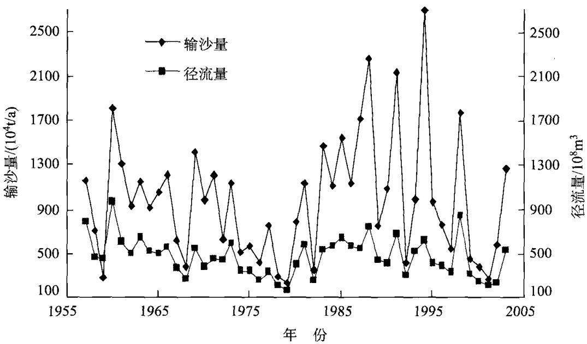  
图19.27 松花江（佳木斯断面）径流量、输沙量变化

## 三、水土保持现状

（一）进 展

自1998年松花江流域特大洪水以后，东北黑土区水土流失治理引起了社会各界的高度重视，国家加大了对水土保持的资金投入，全面推进了黑土区水土流失治理进程。1998～2002年的5年期间，黑龙江省获得国家投入资金52117万元，出动人工1.5亿个工日，完成土石方量2.5亿 $\mathrm { m ^ { 3 } }$ ，治理水土流失面积136.7万 $\mathrm { h m } ^ { 2 }$ ，其中：新修水平梯田3.3万 $\mathrm { h m } ^ { 2 }$ ，坡式梯田13.3万hm²，改垄62.2万 $\mathrm { h m } ^ { 2 }$ ，封禁治理与种草0.9万 $\mathrm { h m ^ { 2 } }$ ，治理沟壑16704条，修建小塘坝335座，治理小河道117km；吉林省获得国家投入资金7238万元，出动人工0.46亿个工日，完成土石方量1.4亿 $\mathrm { m ^ { 3 } }$ ，治理水土流失面积

45.1万hm²，其中：新修水平梯田1.8万hm²，坡式梯田2.3万hm²，改垄3.4万hm²，封禁治理与种草11.1万hm²，治理沟壑1469条，修建小塘坝330座，治理小河道112km；辽宁省获得国家投入资金9620万元，出动人工3.5亿个工日，完成土石方量14.1亿m³，治理水土流失面积156.8万hm²，其中：新修水平梯田4.7万hm²，坡式梯田16.3万hm²，改垄3.1万hm²，封禁治理与种草190.5万hm²，治理沟壑75条，修建小塘坝585座，治理小河道1175km。内蒙古自治区兴安盟在1996～2003年共完成水土流失治理面积 4967 km²，其中造林 3002 km²，种草 144 km²，修建坡式梯田 1821 km²、水源工程109处、谷坊3.5万座，共动用土石方1.6亿m³。2003年9月，国家将黑土地的保护列入重点生态建设的范围，启动了东北黑土区水土流失综合防治试点工程。试点工程项目实施期为3年（2003～2005年），总投资19979.80万元，其中国家投资16214.80万元，地方配套3765.00万元。

2004年黑龙江、吉林和辽宁三省共完成了水土流失综合治理面积1078.03 km²，其中“国债”项目461.41km²。东北黑土区水土流失综合防治试点项目治理水土流失面积484.87 km²。

吉林省在水土保持工作中坚持以“预防为主，综合防治”的方针，1985年以来，采取以户承包、以小流域为单元的水土流失综合治理措施，加快了东部中低山侵蚀区域的治理速度，使强度水蚀区基本得以治理；坚持治理与开发利用相结合，把生态效益与经济效益、社会效益相结合；在治理方式上，坚持承包、租赁、股份合作和使用权拍卖等多种形式，多渠道筹措治理资金，大力推广“谁承包、谁治理、谁受益，允许继承和转让”的政策。1999年国债资金注入后，促进了水土保持生态建设的健康发展，1995～2000年全省共治理水土流失面积6443km²，累计投资6.43亿元。1985～2001年全省累计治理水土流失面积 30188 km²，其中退耕还林还草 4130 km²。

2005年内蒙古呼伦贝尔市治理水土流失面积1625.05km²，建设基本农田 14.528 km²，修建水保林 798.43 km²、经济林 4.107 km²，种草406.306 km²，封育319.248 km²；建设塘坝等蓄水保土工程 2674座，治理小流域14条，完成投资4037.5万元，其中中央投资1653万元、地方投资2118.5万元、群众投劳折现266万元。

总之，自1991年水土保持法颁布以来，东北黑土区的水土保持工作取得了显著成果，累计完成水土流失治理面积12.94万km²。列入全国八片重点治理区的柳河、大凌河流域，经过20年和10年的水土流失治理，分别完成治理面积2059.73km²和1842.01km²。此外，还开展了小流域综合治理试点35个，通过试点探索了不同类型区的水土流失规律和治理模式，效益十分明显。

## （二）成 效

东北黑土区水土流失综合防治试点工程（2003～2005年）已经治理水土流失面积约1804km²。主要技术措施指标为：梯田8900.82 hm²，地埂植物带 14 979.25 hm²，改垄 15 834.59 hm²，经济林 5720 hm²，种草 3671 hm²，生态修复95 007 hm²，沟头防护1144 km，截水沟16 123 km，修建淤地坝843座，拦沙坝26座，塘坝347座，谷坊8983座，蓄水池613处，作业路1760km，建设网围栏749km。1995～2000年，黑龙江省营造水保林和改良草地 396 400 hm²。

## （三）突出经验

## 1. 加强基础研究，摸清流失情况

为了摸清东北黑土区水土流失情况，近年来松辽水利委员会组织东北4省（区）的水保科技人员，在全国水土流失遥感普查的基础上，相继开展了“东北黑土区水土流失现状及潜在危险性研究”“东北黑土区水土流失现状与防治对策研究”“水土保持与河流泥沙的关系”“区域经济与水土保持的关系”等课题研究。目前，又和北京师范大学、中科院地理所等科研部门，开展了国家自然科学基金课题“东北黑土区土壤侵蚀机理与土地退化与预警”的研究。同时，为了提高水土保持的治理和管理水平，还组织4省（区）水土保持部门共同开发和编制了“松辽流域水土保持管理信息系统”“松辽流域小流域综合治理典型模式”汇编。这些基础研究工作为今后顺利开展大面积工程治理及项目管理奠定了坚实的基础。

## 2. 做好规划设计，奠定治理基础

为了加快东北黑土区水土流失治理进度，奠定治理基础，松辽水利委员会组织东北4省（区）做了大量的前期规划设计工作。组织编制了《松花江、辽河流域中上游水土保持生态环境建设项目建议书》，并由东北4省（区）人民政府联合上报国务院；编制了《松花江、辽河流域中上游第一期水土保持生态环境建设项目建议书》和《松花江、辽河流域中上游第一期水土保持生态环境建设可行性研究报告》；2002年组织编制了《东北黑土区水土流失综合防治试点工程可行性研究报告》和《东北黑土区水土流失综合防治试点工程2003年实施方案》，为试点工程的顺利实施奠定了基础；2005年组织编制了《东北黑土区水土流失综合防治规划》，2006年3月得到水利部批复。这些前期工作为全面启动东北黑土区水土流失综合防治工程做好准备。

## 3. 广泛组织调研、加大宣传力度，提高忧患意识，呼吁关爱黑土地

松辽水利委员会从1999年开始，多次邀请有关领导和专家对该项目进行研讨和实地考察东北黑土区日益恶化的水土流失现状。通过研讨和考察后，专家与领导们一致认为，东北黑土区的水土流失危害已经大大超过了人们的想象，到了亟待解决的时刻，这不但关系到保护宝贵的黑土资源，同时还关系到我国的粮食安全和区域经济社会的可持续发展。中央财经领导小组办公室的领导在实地考察的基础上，又组织有关专家深入东北黑土区调查研究，并向中央领导提交了《北大仓有可能再变北大荒》的调研报告，国务院领导对此做了“要把黑土区的水土流失防治工作列入重要议程”的重要批示。东北黑土区严重的水土流失已引起了中央有关部门和社会各界的极大关注。

为了引起社会各界对东北黑土区水土流失危害的重视，松辽水利委员会还多次邀请和组织中央电视台、经济日报、中国水利报等多家新闻单位对东北黑土区的水土流失现状及危害进行实地采访，通过新闻媒体呼唤全社会关爱这片神奇的土地，为全社会都来关爱黑土起到了极大的宣传和促进作用。

## 4. 对不同水土流失类型区，探索有效治理模式

在水土流失治理中，根据不同水土流失类型区的特点，宜林则林，宜牧则牧，因地制宜，因害设防，探索出了不同的治理模式。

(1）漫川漫岗区探索出了“三道防线”治理模式。即坡顶建设农田防护林；坡面采取改垄耕作、修筑地埂植物带、坡式梯田和水平梯田等水土保持措施；侵蚀沟采取沟头修跌水、沟底建谷坊、沟坡削坡插柳、育林封沟。

（2）丘陵沟壑区探索出了“一林戴帽，二林围顶，果牧拦腰，两田穿靴，一龙座底”的小流域“金字塔”综合治理模式。即山顶营造防护林；坡上部布设截流沟、营造水土保持涵养林；坡中部修筑果树台田或水平槽，发展特色经济林果；坡下部通过改垄、修筑地埂植物带、梯田改造坡耕地，建设旱涝保收的稳产农田。坡底的沟川地则是配套完善灌排水利设施，建设高标准的稳产高产良田，提高抗灾能力。

(3）农牧交错区探索出了“三结合、三为主”的生态建设模式，即坚持生态保护与生态治理相结合，以保护和促进生态自然修复为主；工程治理与生物治理相结合，以综合防治为主；生态效益与经济效益相结合，以畜牧业水草料基地建设配套为主。探索出了生态保护与畜牧发展相统一的新路子。

## 5. 在水土流失治理中，积极探索创新机制，取得了明显的成效

近年来积极推广了通过拍卖、承包、租赁、股份合作等多种形式治理开发“四荒”资源治理水土流失的新机制，极大调动了群众的积极性，加快了水土流失治理步伐。在东北黑土区水土流失综合防治试点工程实施中建立了由松辽委、四省区水利部门和发改委参加的定期协商联席会议机制，研究解决治理过程中的重大问题；制定了《东北黑土区水土流失综合防治试点工程建设管理办法》、《东北黑土区水土流失综合防治试点工程验收办法》、《东北黑土区水土流失综合防治试点工程档案管理办法》，明确了各级管理部门的职责，并对项目的前期工作、计划管理、建设管理、资金管理、验收程序及档案管理等方面进行了明确规定；认真执行项目责任主体制、公示制、监理制、资金使用报账制、招投标制、群众投劳承诺制、合同制、产权确认制等“八项制度”。

## 6. 加强预防监督，巩固治理成果

认真贯彻执行水土保持法，坚持“预防为主，保护优先”的方针，加大水土保持法宣传和监督执法力度。通过强化执法，有效控制了黑土区内因开发建设、毁林（草）开荒及不合理的耕作等人为造成新的水土流失；加强对开发建设中的生态脆弱地区重点预防与监督；同时加强对现有治理成果的保护。

## 7. 提高水土流失治理工作科技含量

在水土流失防治工作中，松辽水利委员会和各省（区）都开展了水土保持技术研究，先后组织开展了《黑土区水土流失综合防治技术标准》的制定工作，还与一些国内的顶尖科研院所合作开展了国家基金课题“东北黑土区水土流失预警研究”协作、东北黑土区“水土流失对生态环境演变的影响”、“水土流失对国家粮食安全及东北经济发展影响”的专题研究工作，提高水土保持工作的科技含量，提高水土流失防治水平。

## 第二节 分 区

## 一、分区原则和方案

## 1. 分区原则

分区要反映不同区域土壤侵蚀特征和其差异性，要求同一区自然条件、土壤侵蚀类型和防治措施基本相同，即同一区内的土壤侵蚀类型和侵蚀强度应基本一致；同一区内影响土壤侵蚀的主要因素等自然条件（地质地貌、气候、土壤、植被等）和社会经济条件基本一致；同一区内的治理方向、治理措施和土地利用方向基本相似；分区以自然界线为主，适当照顾行政区域的完整性和地域的连续性。

## 2. 分区方案

东北黑土区面积广大，地质地貌复杂，水土流失形式多样，按照因地制宜的原则，采取分区治理。按照地貌类型和水土流失特点，将东北黑土区划分为漫川漫岗区、丘陵沟壑区、风蚀水蚀交错区。

## 二、分区特征概述

## （一）漫川漫岗区

该区主要分布在大小兴安岭延伸的山前台地，是典型黑土的分布区（图19.28)。本区地势波状起伏，坡长多在200m以上，海拔250～450m，是东北黑土区重点产粮区，地处农林交错带。由于开发较早，土地开垦指数高，地面植被率低，水土流失严重，沟壑密度在2.0km/km²以上，年均土壤侵蚀模数为7000t/(km²·a)。黑龙江省有水土流失面积16.98万km²，是水土流失严重地区，侵蚀面积占土地面积的50%以上。

治理要从整体出发，形成体系，从坡上到坡下，布设三道防线，形成梯级的综合防治体系，建立坡、水、田、林、路综合防治型生态农业模式。第一道防线是坡顶岗脊防护体系，即岗脊栽树戴帽，荒坡造林，在林缘与耕地接壤处开挖截流沟，控制坡水下山。第二道防线是坡面防护体系，3°以内的坡耕地实行等高种植，改顺坡垄为横垄；3°～5°的坡耕地在改垄的基础上，按照坡度和土层的差别，修建坡式梯田和地埂植物带，以截短坡长，分割水势；5°～8°的坡耕地修筑水平梯田，拦截径流，并做到植物固埂；8°～15°的坡耕地修筑果树台田，15°以上的坡耕地全部退耕还林还草。第三道防线是沟道防护体系。对侵蚀沟采取工程和植物措施相结合的办法进行治理，沟头修跌水，沟底修谷坊，两岸削坡栽种松或杨，封沟育林，以控制两岸扩张，吞噬耕地。

治理后，保肥能力要提高50%，土壤有机质含量增加0.5%，风速降低58%，空气湿度提高10%～14%，蒸发量减少14.6%～17.8%，不再发生坡面细沟侵蚀现象。

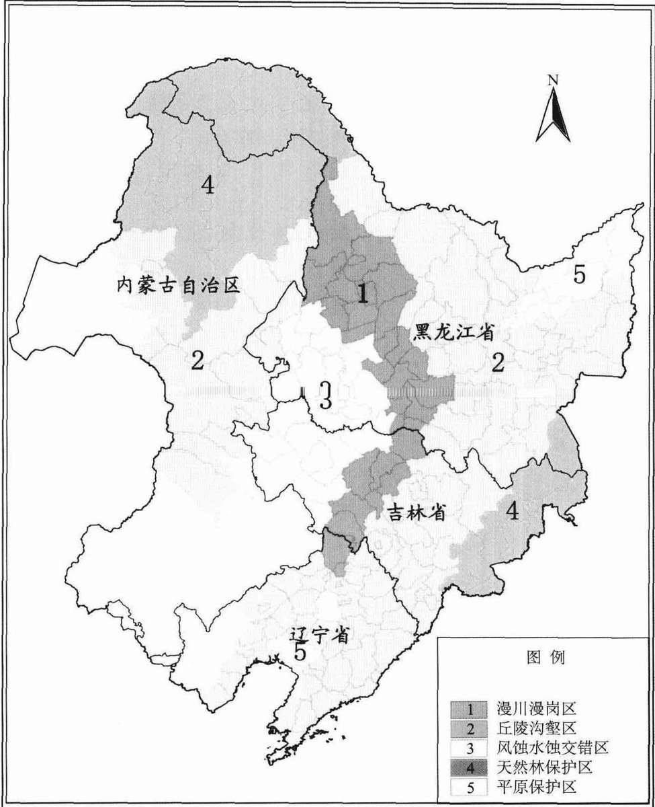  
图19.28 东北黑土区水土流失防治分区图

## （二）丘陵沟壑区

该区主要分布在嫩江、第二松花江支流的中上游，该区主要是农区、农林混合区，农区坡耕地的坡度多在3°以上，坡耕地年平均流失表土厚度0.2\~0.5cm，沟壑密度 $1 . 5 \sim 2 . 0 ~ \mathrm { k m / k m ^ { 2 } }$ ，年均土壤侵蚀模数为5000 t/$( \mathrm { k m } ^ { 2 } \cdot \mathrm { a } )$ 。该区水土流失发生的主要区域为坡耕地、荒山荒地、侵蚀沟、疏林地等，治理方面在坡顶以植树造林为主、种草植灌为辅的方法，采取分水岭防护林与水流调节林相结合，水源涵养林、用材林与水保经济林相结合，坚持多林种、多层次、多功能、低成本、高效益的防护体系配置模式，做到网、带、片相结合，乔、灌、草相结合，防护、经济、用材林相结合；在树种、草种选择上，以乡土树种为主，积极引进成活率高、保持水土效果好、经济价值高的树种、草种，固沟林与薪炭林相结合。

坡度在5°以上的坡耕地全部修成水平梯田，在梯田上部与林带接壤处开挖截流沟和蓄水池，控制坡水进田，并为春旱坐水种提供水源；坡度在3°～5°之间的坡耕地修坡式梯田。3°以下坡耕地采取等高垄作，同时采取深松，打破犁底层，提高土壤的蓄、渗水能力。

在坡底主沟道中按10～20年一遇设计洪水标准，修筑小型水库或塘坝，作为治沟骨干工程。同时根据侵蚀沟的发展类型，洪水的大小，沟道长度、比降、宽度等布设土柳谷坊群；对正在发展的侵蚀沟，修筑沟头埂和柳跌水。为了开发治理低洼易涝地和荒滩、荒水，充分利用已建的小水库和塘坝，在低洼易涝地修方、条田，发展水田，扩大水稻种植面积，也可利用库、塘发展渔业生产。

## （三）风蚀水蚀交错区

主要分布在大兴安岭、长白山地区，是重要的林业基地，由于森林砍伐和垦殖，引起了水土流失。黑龙江省有27.566万km²。目标是加强天然林保护，通过退耕还林和利用生态自我修复能力培育天然林和天然次生林，通过侵蚀沟的治理来控制水土流失。

## 三、分区治理标准

## 1. 漫川漫岗区

漫川漫岗区是东北黑土区治理的重点，主要治理的内容是坡耕地治理，坡耕地治理度要达到70%以上，侵蚀模数降低到 $1 5 0 0 \mathrm { ~ t / ( k m ^ { 2 } \cdot { \mathrm { ~ a ~ } } ) }$ 以内，林草覆盖度要达到20%，人均基本农田0.55 hm²。

## 2. 丘陵沟壑区

丘陵沟壑区是东北黑土区治理的另一个重点，主要治理的内容是荒坡地、疏林地和侵蚀沟治理。治理目标是坡耕地治理度要达到70%以上，治理

区内侵蚀模数降低到 $2 5 0 0 ~ \mathrm { t / ( k m ^ { 2 } \cdot { a } ) }$ 以下，林草覆盖度要达到30%，人均基本农田达0.2 hm²以上。

## 3. 风蚀水蚀交错区

治理的内容是荒坡地、陡坡地和侵蚀沟治理。治理目标是坡度在15°以上陡坡耕地全部退耕还林，治理区内侵蚀模数降低到 $2 5 0 0 \ : \ : \mathrm { t / ( k m ^ { 2 } \cdot \ a ) }$ 以内，林草覆盖度要达到80%，人均基本农田达0.2hm²以上。

## 第三节 战略目标、总体布局与措施配置

## 一、战略目标与任务

东北黑土区水土保持的战略是以黑土层不减少、确保粮食生产为目标。在工程布局上，治理区既要相对集中连片，又要有针对性；在区域选择上，以低山丘陵区和漫川漫岗区的坡耕地治理为重点，以保障黑土区农业增产、农民增收，为农村经济发展创造条件，保障国家粮食安全。重点开展坡耕地水土流失治理，通过采取水土保持工程措施、农业耕作措施、植物措施和管理措施，控制坡耕地的水土流失发展，为国家粮食安全提供保障，为东北农业生产和农村经济发展创造有利条件。

按照全面规划、分步实施、因地制宜、突出重点、注重实效的原则，以漫川漫岗区、丘陵沟壑区、水蚀风蚀交错区为重点，以县为单元，按小流域进行综合治理。重点治理工程将主要分布在72个县市范围内，主要包括黑龙江省的齐齐哈尔市、绥化市、大庆市等35个市县，吉林省的长春、白城、德惠等22个县市，辽宁省的昌图、开原、西丰、铁岭4个县市及内蒙古自治区的兴安盟、呼伦贝尔市所属的11个县市。规划范围总面积36万km²（图19.29)，这里是我国东北商品粮生产区域和黑土坡耕地最集中的地方。

规划从2006年开始到2030年，用25年的时间，综合治理水土流失面积20.08万km²，综合治理保存面积要达到90%以上；保护耕地8.81万km²，总投资886.28亿元，使黑土区水土流失得到基本治理，土壤侵蚀迅猛的趋势得到遏制。坡耕地的土壤有机质在现有的水平上保持不下降，粮食生产能力得到恢复和提高，东北黑土地商品粮基地得到有效的保护，林草覆盖率提高9.79%。农民人均纯收入大幅度提高。建立起完善的执法监督体系、技术研究、示范推广体系和动态监测体系，东北黑土区生态环境得到显著改善，使人口、资源、环境、经济走上良性循环的轨道。

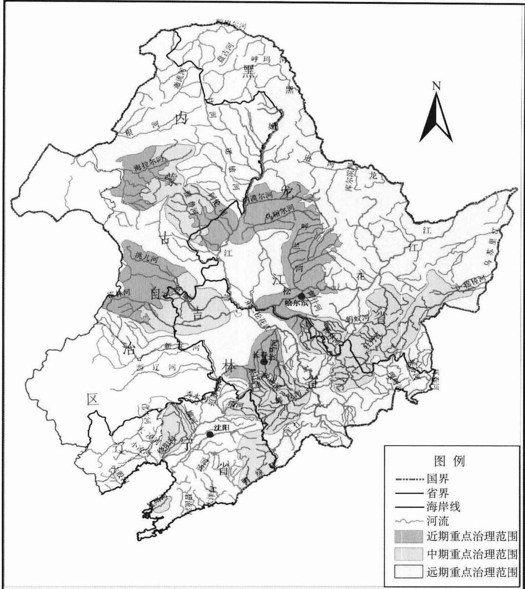  
图19.29东北黑土区近、中、远期水土流失防治区分布

## （一）近期（2006～2010年）目标与任务

## 1. 目标

近期治理漫川漫岗区水土流失面积（5.65万 $\mathbf { k m } ^ { 2 } )$ 的40%，即2.26万$\mathrm { k m } ^ { 2 }$ ；丘陵沟壑区水土流失面积（11.28万 $\mathrm { k m } ^ { 2 } )$ 的20%，即2.256万km²；水蚀风蚀交错区水土流失面积（3.23万 $\mathbf { k m } ^ { 2 } )$ 的10%，即0.323万 $\mathbf { k m } ^ { 2 }$ ，合计4.839万 $\mathrm { k m } ^ { 2 }$ 0

## 2. 任务

近期总投资298.72亿元，其中：中央投资179.23亿元，地方匹配119.49亿元；投资中工程措施投资207.47亿元，林草措施投资46.30亿元，监测网络建设投资1.23亿元，独立费用26.78亿元，预备费16.91亿元（表19.16）。

表19.16 东北黑土区水土流失综合防治工程近期（2006～2010年）投资估算表
<table><tr><td rowspan=1 colspan=2>工程或费用名称</td><td rowspan=1 colspan=1>单位</td><td rowspan=1 colspan=1>单价或费率/元</td><td rowspan=1 colspan=1>数量</td><td rowspan=1 colspan=1>投资/万元</td></tr><tr><td rowspan=1 colspan=2>第一部分工程措施</td><td rowspan=1 colspan=1></td><td rowspan=1 colspan=1></td><td rowspan=1 colspan=1></td><td rowspan=1 colspan=1>2 074 685.99</td></tr><tr><td rowspan=1 colspan=1>1</td><td rowspan=1 colspan=1>梯田</td><td rowspan=1 colspan=1>元/hm²</td><td rowspan=1 colspan=1>12 260.00</td><td rowspan=1 colspan=1>738 926.12</td><td rowspan=1 colspan=1>905 923.42</td></tr><tr><td rowspan=1 colspan=1>2</td><td rowspan=1 colspan=1>地埂植物带</td><td rowspan=1 colspan=1>元/hm²</td><td rowspan=1 colspan=1>993.35</td><td rowspan=1 colspan=1>1 327 834.65</td><td rowspan=1 colspan=1>131 900.45</td></tr><tr><td rowspan=1 colspan=1>3</td><td rowspan=1 colspan=1>改垄</td><td rowspan=1 colspan=1>元/hm²</td><td rowspan=1 colspan=1>720.34</td><td rowspan=1 colspan=1>2 092 013.48</td><td rowspan=1 colspan=1>150 696.10</td></tr><tr><td rowspan=1 colspan=1>4</td><td rowspan=1 colspan=1>截水沟</td><td rowspan=1 colspan=1>元/km</td><td rowspan=1 colspan=1>2 756.60</td><td rowspan=1 colspan=1>2 174 211.79</td><td rowspan=1 colspan=1>599 343.22</td></tr><tr><td rowspan=1 colspan=1>5</td><td rowspan=1 colspan=1>浆砌石谷坊</td><td rowspan=1 colspan=1>座</td><td rowspan=1 colspan=1>5 051.63</td><td rowspan=1 colspan=1>59 345.00</td><td rowspan=1 colspan=1>29 978.90</td></tr><tr><td rowspan=1 colspan=1>6</td><td rowspan=1 colspan=1>干砌石谷坊</td><td rowspan=1 colspan=1>座</td><td rowspan=1 colspan=1>1 453.26</td><td rowspan=1 colspan=1>320 794.00</td><td rowspan=1 colspan=1>46 619.71</td></tr><tr><td rowspan=1 colspan=1>7</td><td rowspan=1 colspan=1>土柳谷坊</td><td rowspan=1 colspan=1>座</td><td rowspan=1 colspan=1>306.16</td><td rowspan=1 colspan=1>72 583.00</td><td rowspan=1 colspan=1>2 222.20</td></tr><tr><td rowspan=1 colspan=1>8</td><td rowspan=1 colspan=1>小型水利水保工程</td><td rowspan=1 colspan=1>座</td><td rowspan=1 colspan=1>54 120.00</td><td rowspan=1 colspan=1>18 235</td><td rowspan=1 colspan=1>98 689.23</td></tr><tr><td rowspan=1 colspan=1>9</td><td rowspan=1 colspan=1>作业路</td><td rowspan=1 colspan=1>元/km</td><td rowspan=1 colspan=1>25 296.16</td><td rowspan=1 colspan=1>43 213.18</td><td rowspan=1 colspan=1>109 312.75</td></tr><tr><td rowspan=1 colspan=2>第二部分林草措施</td><td rowspan=1 colspan=1></td><td rowspan=1 colspan=1></td><td rowspan=1 colspan=1></td><td rowspan=1 colspan=1>462 993.01</td></tr><tr><td rowspan=1 colspan=1>1</td><td rowspan=1 colspan=1>水平沟整地</td><td rowspan=1 colspan=1>元/hm²</td><td rowspan=1 colspan=1>87.61</td><td rowspan=1 colspan=1>967 972.31</td><td rowspan=1 colspan=1>8 480.41</td></tr><tr><td rowspan=1 colspan=1>2</td><td rowspan=1 colspan=1>乔木林</td><td rowspan=1 colspan=1>hm²</td><td rowspan=1 colspan=1>6 248.25</td><td rowspan=1 colspan=1>229 597.37</td><td rowspan=1 colspan=1>143 458.18</td></tr><tr><td rowspan=1 colspan=1>3</td><td rowspan=1 colspan=1>灌木林</td><td rowspan=1 colspan=1>hm²</td><td rowspan=1 colspan=1>3 089.00</td><td rowspan=1 colspan=1>50 021.63</td><td rowspan=1 colspan=1>15 451.68</td></tr><tr><td rowspan=1 colspan=1>4</td><td rowspan=1 colspan=1>护路林\农防林</td><td rowspan=1 colspan=1>hm2</td><td rowspan=1 colspan=1>3 200.00</td><td rowspan=1 colspan=1>116 652.76</td><td rowspan=1 colspan=1>37 328.88</td></tr><tr><td rowspan=1 colspan=1>5</td><td rowspan=1 colspan=1>经济林</td><td rowspan=1 colspan=1>hm²</td><td rowspan=1 colspan=1>12 000.00</td><td rowspan=1 colspan=1>215 228.22</td><td rowspan=1 colspan=1>258 273.86</td></tr><tr><td rowspan=1 colspan=2>第三部分 监测网络建设投资</td><td rowspan=1 colspan=1></td><td rowspan=1 colspan=1>0.003</td><td rowspan=1 colspan=1></td><td rowspan=1 colspan=1>12 688.39</td></tr><tr><td rowspan=1 colspan=2>第四部分 独立费用</td><td rowspan=1 colspan=1></td><td rowspan=1 colspan=1>0.105</td><td rowspan=1 colspan=1></td><td rowspan=1 colspan=1>267 788.58</td></tr><tr><td rowspan=1 colspan=2>第五部分 预备费</td><td rowspan=1 colspan=1></td><td rowspan=1 colspan=1>0.06</td><td rowspan=1 colspan=1></td><td rowspan=1 colspan=1>169 089.36</td></tr><tr><td rowspan=1 colspan=2>总投资</td><td rowspan=1 colspan=1></td><td rowspan=1 colspan=1></td><td rowspan=1 colspan=1></td><td rowspan=1 colspan=1>2 987 245.33</td></tr></table>

到2010年，减少黑土流失量6200万t，有效保护耕地4.16万km²，林草覆盖率提高0.59%，漫川漫岗区坡耕地水土流失恶化的趋势初步得到遏制。

## （二）中期（2011～2020年）目标与任务

## 1. 目标

在近期治理的基础上，中期的治理目标是漫川漫岗区水土流失面积（5.65万km²）的60%，即3.39万km²；丘陵沟壑区水土流失面积（11.28万km²）的30%，即3.384万km²；水蚀风蚀交错区水土流失面积（3.23万km²）的20%，即0.646万km²，合计7.42万km²的水土流失面积得到基本治理；在治理区域的安排上，考虑集中连片。

## 2. 任务

中期总投资281.47亿元，其中：中央投资168.88亿元，地方匹配112.59亿元；投资中工程措施投资135.33亿元。林草措施投资78.62亿元，生态修复工程投资25.16亿元，监测网络建设投资1.20亿元，独立费用25.23亿元，预备费15.93亿元（表19.17）。

表19.17 东北黑土区水土流失综合防治工程中期（2011～2020年）投资估算表
<table><tr><td colspan="2" rowspan="1">工程或费用名称</td><td colspan="1" rowspan="1">单位</td><td colspan="1" rowspan="1">单价及费率/元</td><td colspan="1" rowspan="1">数量</td><td colspan="1" rowspan="1">投资/万元</td></tr><tr><td colspan="2" rowspan="1">第一部分 工程措施</td><td colspan="1" rowspan="1"></td><td colspan="1" rowspan="1"></td><td colspan="1" rowspan="1"></td><td colspan="1" rowspan="1">1 353 256.77</td></tr><tr><td colspan="1" rowspan="1">1</td><td colspan="1" rowspan="1">梯田</td><td colspan="1" rowspan="1">元/hm²</td><td colspan="1" rowspan="1">12 260.00</td><td colspan="1" rowspan="1">363 548.66</td><td colspan="1" rowspan="1">445 710.66</td></tr><tr><td colspan="1" rowspan="1">2</td><td colspan="1" rowspan="1">地埂植物带</td><td colspan="1" rowspan="1">元/hm²</td><td colspan="1" rowspan="1">993.35</td><td colspan="1" rowspan="1">1 034 926.99</td><td colspan="1" rowspan="1">102 804.47</td></tr><tr><td colspan="1" rowspan="1">3</td><td colspan="1" rowspan="1">改垄</td><td colspan="1" rowspan="1">元/hm²</td><td colspan="1" rowspan="1">720.34</td><td colspan="1" rowspan="1">856 024.22</td><td colspan="1" rowspan="1">61 662.85</td></tr><tr><td colspan="1" rowspan="1">4</td><td colspan="1" rowspan="1">截水沟</td><td colspan="1" rowspan="1">元/km</td><td colspan="1" rowspan="1">2 756.60</td><td colspan="1" rowspan="1">41 227.45</td><td colspan="1" rowspan="1">11 364.76</td></tr><tr><td colspan="1" rowspan="1">5</td><td colspan="1" rowspan="1">浆砌石谷坊</td><td colspan="1" rowspan="1">座</td><td colspan="1" rowspan="1">5 051.63</td><td colspan="1" rowspan="1">151 946</td><td colspan="1" rowspan="1">76 757.72</td></tr><tr><td colspan="1" rowspan="1">6</td><td colspan="1" rowspan="1">干砌石谷坊</td><td colspan="1" rowspan="1">座</td><td colspan="1" rowspan="1">1 453.26</td><td colspan="1" rowspan="1">821 392</td><td colspan="1" rowspan="1">119 369.65</td></tr><tr><td colspan="1" rowspan="1">7</td><td colspan="1" rowspan="1">土柳谷坊</td><td colspan="1" rowspan="1">座</td><td colspan="1" rowspan="1">306.16</td><td colspan="1" rowspan="1">185 865</td><td colspan="1" rowspan="1">5 690.43</td></tr><tr><td colspan="1" rowspan="1">8</td><td colspan="1" rowspan="1">小型水利水保工程</td><td colspan="1" rowspan="1">座</td><td colspan="1" rowspan="1">54 120.00</td><td colspan="1" rowspan="1">47 536.87</td><td colspan="1" rowspan="1">257 269.54</td></tr><tr><td colspan="1" rowspan="1">9</td><td colspan="1" rowspan="1">作业路</td><td colspan="1" rowspan="1">元/km</td><td colspan="1" rowspan="1">25296.16</td><td colspan="1" rowspan="1">107 773.95</td><td colspan="1" rowspan="1">272 626.70</td></tr><tr><td colspan="2" rowspan="1">第二部分 林草措施</td><td colspan="1" rowspan="1"></td><td colspan="1" rowspan="1"></td><td colspan="1" rowspan="1"></td><td colspan="1" rowspan="1">786 252.10</td></tr><tr><td colspan="1" rowspan="1">1</td><td colspan="1" rowspan="1">水平沟整地</td><td colspan="1" rowspan="1">元/hm²</td><td colspan="1" rowspan="1">87.61</td><td colspan="1" rowspan="1">1 394 907.50</td><td colspan="1" rowspan="1">12 220.78</td></tr><tr><td colspan="1" rowspan="1">2</td><td colspan="1" rowspan="1">乔木林</td><td colspan="1" rowspan="1">hm²</td><td colspan="1" rowspan="1">6 248.25</td><td colspan="1" rowspan="1">391 013.23</td><td colspan="1" rowspan="1">244 314.84</td></tr><tr><td colspan="1" rowspan="1">3</td><td colspan="1" rowspan="1">灌木林</td><td colspan="1" rowspan="1">hm²</td><td colspan="1" rowspan="1">3 089.00</td><td colspan="1" rowspan="1">85 163.01</td><td colspan="1" rowspan="1">26 306.86</td></tr><tr><td colspan="1" rowspan="1">4</td><td colspan="1" rowspan="1">护路林\农防林</td><td colspan="1" rowspan="1">hm²</td><td colspan="1" rowspan="1">3 200.00</td><td colspan="1" rowspan="1">198 660.94</td><td colspan="1" rowspan="1">63 571.50</td></tr><tr><td colspan="1" rowspan="1">5</td><td colspan="1" rowspan="1">经济林</td><td colspan="1" rowspan="1">hm2</td><td colspan="1" rowspan="1">12 000.00</td><td colspan="1" rowspan="1">366531.76</td><td colspan="1" rowspan="1">439 838.11</td></tr><tr><td colspan="2" rowspan="1">第三部分生态修复工程</td><td colspan="1" rowspan="1"></td><td colspan="1" rowspan="1"></td><td colspan="1" rowspan="1">3 569 669.69</td><td colspan="1" rowspan="1">251 588.98</td></tr><tr><td colspan="1" rowspan="1">1</td><td colspan="1" rowspan="1">标志牌（碑）</td><td colspan="1" rowspan="1">块（座）</td><td colspan="1" rowspan="1">1 219.01</td><td colspan="1" rowspan="1">566 211.56</td><td colspan="1" rowspan="1">69 021.76</td></tr><tr><td colspan="1" rowspan="1">2</td><td colspan="1" rowspan="1">拦护措施</td><td colspan="1" rowspan="1">元/100m</td><td colspan="1" rowspan="1">912.80</td><td colspan="1" rowspan="1">1 187 197.44</td><td colspan="1" rowspan="1">108 367.38</td></tr><tr><td colspan="1" rowspan="1">3</td><td colspan="1" rowspan="1">人员管护</td><td colspan="1" rowspan="1">人/年</td><td colspan="1" rowspan="1">6 570.00</td><td colspan="1" rowspan="1"></td><td colspan="1" rowspan="1">74 199.84</td></tr><tr><td colspan="2" rowspan="1">第四部分 监测网络建设投资</td><td colspan="1" rowspan="1"></td><td colspan="1" rowspan="1">0.005</td><td colspan="1" rowspan="1"></td><td colspan="1" rowspan="1">11 955.49</td></tr><tr><td colspan="2" rowspan="1">第五部分独立费用</td><td colspan="1" rowspan="1"></td><td colspan="1" rowspan="1">0.105</td><td colspan="1" rowspan="1"></td><td colspan="1" rowspan="1">252 320.60</td></tr><tr><td colspan="2" rowspan="1">第六部分预备费</td><td colspan="1" rowspan="1"></td><td colspan="1" rowspan="1">0.06</td><td colspan="1" rowspan="1"></td><td colspan="1" rowspan="1">159 322.44</td></tr><tr><td colspan="2" rowspan="1">总投资</td><td colspan="1" rowspan="1"></td><td colspan="1" rowspan="1"></td><td colspan="1" rowspan="1"></td><td colspan="1" rowspan="1">2 814 696.37</td></tr></table>

到2020年以后，工程效益进一步发挥，减少黑土流失1.48亿t，有效保护耕地2.25万km²，林草覆盖率在近期治理的基础上提高4.44%，水土流失造成的自然灾害进一步降低。

## （三）远期（2021～2030年）目标与任务

## 1. 目标

远期治理的范围主要是针对丘陵沟壑区和水蚀风蚀交错区治理，完成剩余的丘陵沟壑区水土流失面积（11.28万km²）的50%，即5.64万km²；水蚀风蚀交错区水土流失面积（3.23万km²）的70%，即2.26万km²，合计7.90万km²。

## 2. 任务

远期总投资298.93亿元，其中：中央投资179.36亿元，地方匹配119.57亿元；投资中工程措施投资144.01亿元。林草措施投资83.67亿元，生态修复工程投资26.77亿元，监测站运行费1.27亿，独立费用27.05亿元，预备费17.08亿元（表19.18）。

到2030年，减少黑土流失量1.42亿t，有效保护耕地2.40万km²，林草覆盖率在上一期的成果基础上提高4.76%。

表19.18 东北黑土区水土流失综合防治工程远期（2021～2030年）投资估算表
<table><tr><td rowspan=1 colspan=2>工程或费用名称</td><td rowspan=1 colspan=1>单位</td><td rowspan=1 colspan=1>单价及费率/元</td><td rowspan=1 colspan=1>数量</td><td rowspan=1 colspan=1>投资/万元</td></tr><tr><td rowspan=1 colspan=2>第一部分 工程措施</td><td rowspan=1 colspan=1></td><td rowspan=1 colspan=1></td><td rowspan=1 colspan=1></td><td rowspan=1 colspan=1>1 440 072.58</td></tr><tr><td rowspan=1 colspan=1>1</td><td rowspan=1 colspan=1>梯田</td><td rowspan=1 colspan=1>元/hm²</td><td rowspan=1 colspan=1>12 260.00</td><td rowspan=1 colspan=1>386 871.48</td><td rowspan=1 colspan=1>474 304.44</td></tr><tr><td rowspan=1 colspan=1>2</td><td rowspan=1 colspan=1>地埂植物带</td><td rowspan=1 colspan=1>元/hm²</td><td rowspan=1 colspan=1>993.35</td><td rowspan=1 colspan=1>1 101 320.91</td><td rowspan=1 colspan=1>109 399.71</td></tr><tr><td rowspan=1 colspan=1>3</td><td rowspan=1 colspan=1>改垄</td><td rowspan=1 colspan=1>元/hm²</td><td rowspan=1 colspan=1>720.34</td><td rowspan=1 colspan=1>910 940.94</td><td rowspan=1 colspan=1>65 618.72</td></tr><tr><td rowspan=1 colspan=1>4</td><td rowspan=1 colspan=1>截水沟</td><td rowspan=1 colspan=1>元/km</td><td rowspan=1 colspan=1>2 756.60</td><td rowspan=1 colspan=1>43 872.32</td><td rowspan=1 colspan=1>12 093.84</td></tr><tr><td rowspan=1 colspan=1>5</td><td rowspan=1 colspan=1>浆砌石谷坊</td><td rowspan=1 colspan=1>座</td><td rowspan=1 colspan=1>5 051.63</td><td rowspan=1 colspan=1>161 694</td><td rowspan=1 colspan=1>81 681.97</td></tr><tr><td rowspan=1 colspan=1>6</td><td rowspan=1 colspan=1>干砌石谷坊</td><td rowspan=1 colspan=1>座</td><td rowspan=1 colspan=1>1 453.26</td><td rowspan=1 colspan=1>874 087</td><td rowspan=1 colspan=1>127 027.60</td></tr><tr><td rowspan=1 colspan=1>7</td><td rowspan=1 colspan=1>土柳谷坊</td><td rowspan=1 colspan=1>座</td><td rowspan=1 colspan=1>306.16</td><td rowspan=1 colspan=1>197 788</td><td rowspan=1 colspan=1>6 055.49</td></tr><tr><td rowspan=1 colspan=1>8</td><td rowspan=1 colspan=1>小型水利水保工程</td><td rowspan=1 colspan=1>座</td><td rowspan=1 colspan=1>54120.00</td><td rowspan=1 colspan=1>50 587</td><td rowspan=1 colspan=1>273 774.21</td></tr><tr><td rowspan=1 colspan=1>9</td><td rowspan=1 colspan=1>作业路</td><td rowspan=1 colspan=1>元/km</td><td rowspan=1 colspan=1>25 296.16</td><td rowspan=1 colspan=1>114 688.00</td><td rowspan=1 colspan=1>290116.59</td></tr><tr><td rowspan=1 colspan=2>第二部分林草措施</td><td rowspan=1 colspan=1></td><td rowspan=1 colspan=1></td><td rowspan=1 colspan=1></td><td rowspan=1 colspan=1>836 692.71</td></tr><tr><td rowspan=1 colspan=1>1</td><td rowspan=1 colspan=1>水平沟整地</td><td rowspan=1 colspan=1>元/hm²</td><td rowspan=1 colspan=1>87.61</td><td rowspan=1 colspan=1>1 484 395.33</td><td rowspan=1 colspan=1>13 004.79</td></tr><tr><td rowspan=1 colspan=1>2</td><td rowspan=1 colspan=1>乔木林</td><td rowspan=1 colspan=1>hm²</td><td rowspan=1 colspan=1>6 248.25</td><td rowspan=1 colspan=1>416 097.99</td><td rowspan=1 colspan=1>259 988.43</td></tr><tr><td rowspan=1 colspan=1>3</td><td rowspan=1 colspan=1>灌木林</td><td rowspan=1 colspan=1>hm²</td><td rowspan=1 colspan=1>3 089.00</td><td rowspan=1 colspan=1>90 626.50</td><td rowspan=1 colspan=1>27 994.53</td></tr><tr><td rowspan=1 colspan=1>4</td><td rowspan=1 colspan=1>护路林、农防林</td><td rowspan=1 colspan=1>hm2</td><td rowspan=1 colspan=1>3 200.00</td><td rowspan=1 colspan=1>211 405.69</td><td rowspan=1 colspan=1>67 649.82</td></tr><tr><td rowspan=1 colspan=1>5</td><td rowspan=1 colspan=1>经济林</td><td rowspan=1 colspan=1>hm²</td><td rowspan=1 colspan=1>12 000.00</td><td rowspan=1 colspan=1>390 045.96</td><td rowspan=1 colspan=1>468 055.15</td></tr><tr><td rowspan=1 colspan=2>第三部分生态修复工程</td><td rowspan=1 colspan=1></td><td rowspan=1 colspan=1></td><td rowspan=1 colspan=1>3 798 675.56</td><td rowspan=1 colspan=1>267 729.23</td></tr><tr><td rowspan=1 colspan=1>1</td><td rowspan=1 colspan=1>标志牌（碑）</td><td rowspan=1 colspan=1>块（座）</td><td rowspan=1 colspan=1>1219.01</td><td rowspan=1 colspan=1>602 535.86</td><td rowspan=1 colspan=1>73 449.72</td></tr><tr><td rowspan=1 colspan=1>2</td><td rowspan=1 colspan=1>拦护措施</td><td rowspan=1 colspan=1>元/100m</td><td rowspan=1 colspan=1>912.80</td><td rowspan=1 colspan=1>1 263 360.00</td><td rowspan=1 colspan=1>115 319.50</td></tr><tr><td rowspan=1 colspan=1>3</td><td rowspan=1 colspan=1>人员管护</td><td rowspan=1 colspan=1>人/年</td><td rowspan=1 colspan=1>6 570.00</td><td rowspan=1 colspan=1></td><td rowspan=1 colspan=1>78 960.00</td></tr><tr><td rowspan=1 colspan=2>第四部分  监测网络运行投资</td><td rowspan=1 colspan=1></td><td rowspan=1 colspan=1>0.003</td><td rowspan=1 colspan=1></td><td rowspan=1 colspan=1>7 633.48</td></tr><tr><td rowspan=1 colspan=2>第五部分 独立费用</td><td rowspan=1 colspan=1></td><td rowspan=1 colspan=1>0.105</td><td rowspan=1 colspan=1></td><td rowspan=1 colspan=1>267 973.44</td></tr><tr><td rowspan=1 colspan=2>第六部分 预备费</td><td rowspan=1 colspan=1></td><td rowspan=1 colspan=1>0.06</td><td rowspan=1 colspan=1></td><td rowspan=1 colspan=1>169 206.09</td></tr><tr><td rowspan=1 colspan=2>总投资</td><td rowspan=1 colspan=1></td><td rowspan=1 colspan=1></td><td rowspan=1 colspan=1></td><td rowspan=1 colspan=1>2 989 307.52</td></tr></table>

## 二、总体布局与措施配置

## (一)近 期

近期规划面积13.35万km²，其中：水土流失面积4.76万km²，规划治理面积4.76万 $\mathrm { k m } ^ { 2 }$ 。其中梯田73.89万hm²，地埂植物带132.78万 $\mathrm { h m } ^ { 2 }$ 改垄209.20万hm²，水保林39.63万 $\mathrm { { h m ^ { 2 } } }$ ，经济林21.52万 $\mathrm { h m } ^ { 2 }$ ，沟道治理45.27万座，截水沟2.17万km，小型水利水保工程1.82万座，作业路4.32万km。

## （二）中 期

中期规划面积21.95万km²，其中：水土流失面积7.42万 $\mathrm { k m ^ { 2 } }$ ，规划治理面积7.42万 $\mathbf { k m } ^ { 2 }$ ；梯田 36.35 万 $\mathrm { h m } ^ { 2 }$ ，地埂植物带103.49万 $\mathrm { { h m } } ^ { 2 }$ ，改垄85.60万 $\mathrm { h m } ^ { 2 }$ ，谷坊115.92万座，水保林64.18万 $\mathrm { h m ^ { 2 } }$ ，经济林36.65万hm²，生态修复356.97万 $\mathrm { h m } ^ { 2 }$ ，截水沟4.12万km，小型水利水保工程4.75万座，作业路10.78万km。

## （三）远 期

远期规划面积28.85万 $\mathbf { k m ^ { 2 } }$ ，其中：水土流失面积7.90万 $\mathrm { k m ^ { 2 } }$ ，规划治理面积7.90万km²；梯田38.69万hm²，地埂植物带110.13万hm²，改垄91.09万hm²，谷坊123.36万座，水保林71.81万hm²，经济林39.00万hm²，生态修复379.87万hm²，截水沟4.39万km，小型水利水保工程5.06万座，作业路11.47万km。

## 三、主要措施成本效益分析

东北黑土区水土流失防治主要措施成本估算（2004年价格）如卜：

（1）梯田（机修土坎梯田）5500～8800元/hm²。

（2）谷坊：土谷坊1500元/座，石谷坊3100元/座，植物谷坊、封闭式矩形蓄水池13 000元/座，截水沟250元/km。

(3)改垄650元 $/ \mathrm { { h m } } ^ { 2 }$ ，塘坝6万元/座，作业路5000元/km，削坡150 元/100m³，沟头防护250元/km。

（4）经果林整地200元/hm²，地埂植物带（灌木埂）1100元/hm²，撒播拧条籽800元/hm²，撒播紫穗槐籽400元/hm²，撒播苕条籽750元 $/ \mathrm { { h m ^ { 2 } } }$ $/ \mathrm { { h m ^ { 2 } } }$ $/ \mathrm { h m } ^ { 2 }$ 栽植沙棘苗510元/hm²，栽植经果林1100元/hm²，撒播苜蓿草籽1500元/$\mathrm { h m } ^ { 2 }$ ，水保林（乔木）5300元/hm²，水保林（灌木）2600元/hm²， $0 ^ { \circ } \sim 5 ^ { \circ }$ 的荒坡地水土保持植物措施投资20万元/km²， $5 ^ { \circ } \sim 8 ^ { \circ }$ 的投资30万元/km²，8°

以上的投资35 万元/km²。

（5）小流域综合治理36.3万元/km²（242元/亩）。

东北黑土区水土保持工作过去主要以地方投工投劳形式进行，农民投工折资占总投资的90%以上；目前随着“两工”取消和物价上涨，治理成本势必也要增加，未来5～10年治理成本将会达到60万～70万元/km²。

## 四、主要对策与建议

## 1. 重点治理坡耕地水土流失

东北黑土区地形平缓，超过8°的坡耕地很少，小于1°的坡耕地土壤侵蚀较轻，侵蚀主要集中在1°～8°的坡耕地上，应是今后治理的重点。

## 2. 建议推行农民投工投劳承诺制解决水土保持投工难题

“两工”取消后，水土保持在用工上面临严峻形势，出现受益大的农户愿意出工、受益小的农户不肯出工的现象，很难通过“一事一议”达成共识。经过近几年的实践，一些地方以宣传和引导为手段，以推行农民投工投劳承诺制为突破口，在尊重群众自愿的前提下，结合“一事一议”，通过治理与未治理典型小流域的教育，调动群众投工投劳的积极性。此次水土流失与生态安全综合科学考察中与农民座谈时了解到，为改善农民自身的生存条件、增加农民收入，在秋冬农闲季节每年出5～8个水保义务工，农民也是接受的。

## 3. 建立适合黑土区的土壤侵蚀分级标准

黑土区水土保持的目标是确保国家粮食生产安全，稳定商品粮基地。由于坡耕地黑土层厚度有限，目前多数在30cm以下，下伏的黄土状亚黏土或沙砾石层基本没有生产力。因此黑土保护主要是保护黑土层。现行的土壤侵蚀分级标准对坡耕地分级只有坡度一项指标，按此标准，3°～5°的坡耕地为轻度侵蚀，小于3°的不属水土流失区，而黑土区地形地貌的最大特点是坡缓坡长，致使黑土区坡耕地水土流失基本得不到治理资金。同时，遥感调查得出的水土流失面积小于实际的水土流失面积，也影响了黑土区水土流失防治的宏观决策。实际上，黑土区由于坡面长，汇水面积大，加之土壤松散，冻融交替削弱土体抗蚀力等因素，即使坡度小于1°的耕地水土流失亦十分严重。因此，建议的东北黑土区土壤侵蚀强度划分标准如表19.19所示。同时，建议尽快制定东北黑土区坡耕地水土保持的地方性保护条例。在水土流失执法对象上，不仅要把企业纳入管理的范围，也要把承包户包含进来。

表19.19 建议的东北黑土区土壤侵蚀强度划分标准
<table><tr><td rowspan=1 colspan=1>分级</td><td rowspan=1 colspan=1>平均侵蚀模数/ $\overline { { \bf \Phi } } _ { \mathrm { + } } / ( \mathrm { k m } ^ { 2 } \cdot \mathrm { a } ) \overline { { \bf \Phi } }$ C</td><td rowspan=1 colspan=1>平均流失速率/(mm/a)</td></tr><tr><td rowspan=1 colspan=1>微度</td><td rowspan=1 colspan=1>&lt;200</td><td rowspan=1 colspan=1>0.16</td></tr><tr><td rowspan=1 colspan=1>轻度</td><td rowspan=1 colspan=1>200~1500</td><td rowspan=1 colspan=1>0.16~1.20</td></tr><tr><td rowspan=1 colspan=1>中度</td><td rowspan=1 colspan=1>1500~2500</td><td rowspan=1 colspan=1>1.20~2.00</td></tr><tr><td rowspan=1 colspan=1>强度</td><td rowspan=1 colspan=1>2500~5000</td><td rowspan=1 colspan=1>2.00~4.00</td></tr><tr><td rowspan=1 colspan=1>极强度</td><td rowspan=1 colspan=1>5000~7500</td><td rowspan=1 colspan=1>4.00~6.00</td></tr><tr><td rowspan=1 colspan=1>剧烈</td><td rowspan=1 colspan=1>&gt;7500</td><td rowspan=1 colspan=1>&gt;6.00</td></tr></table>

## 4. 拓宽水土流失治理资金的筹措渠道，强化水土保持管理体系建设

过去黑土区水土流失治理建立在大量的农民投工投劳基础上，今后在国家财政拨款有限的情况下，应考虑多渠道筹款，广开财路，通过设立水保基金、发放无息水保贷款、发行水保彩票和水保国债、发展民营水保等，募集社会资金，坚持“谁治理，谁受益”的原则，引导全社会进行水土保持建设，使黑土区水土流失治理得到全面、稳定发展。

建议成立能统领水保大军的权威管理机构，将水土保持生态建设从过去单纯的部门行为上升到政府行为；建立严格的考核制度，地方各级政府将其作为“一把手工程”，并定期考核，与干部政绩结合起来。

## 5. 加强科技投入，采取综合治理方法

应采取耕作、培肥和工程措施相结合的方法，通过增施有机肥、化肥平衡施用、秸秆还田、深松、宽窄行交替休闲、轮作、保护性耕作、免耕、少耕等措施，增加土壤有机质，改善土壤理化性状和结构，提高地面覆盖，减少对土层扰动，增加抗蚀性，控制侵蚀。同时，广泛引进国内外水保先进技术，加强黑土区水土保持的科技投入，将黑土区水土流失综合防治纳入东北老工业基地振兴战略和国家科技发展战略中，不断总结开发适用的新技术，促进黑土区水土保持的发展。

## 6. 建立补偿机制，发挥水土保持的长期效应

东北黑土区每年可提供全国商品粮的三分之一，而且还有2500万t的粮食增产潜力。因此，从保障我国今后的粮食安全、保护农民种粮积极性考虑，国家对实施水土保持、稳定粮食生产的东北黑土区实行补偿。同时，在东北

黑土区内，也应建立生态补偿机制，受益地区应对实施水土保持投入的地区进行经济补偿。

## 第四节专题研究：东北黑土区黑土层厚度现状、变化趋势与抗蚀年限

（一）研究目标与意义

黑土开垦以后，尤其是顺坡耕种，加大了侵蚀速率，造成黑土厚度逐年减小。据有关资料，黑土开垦初期的黑土层厚度在50～70cm，到现在降至40cm左右。随着黑土厚度的减小，粮食单产下降，直接威胁我国的粮食安全。但截至目前，还没有有关东北地区黑土厚度的现状及其空间变化规律的系统研究报道，也没有土壤厚度与粮食产粮定量关系的系统研究报道。北京师范大学地理学与遥感科学学院刘宝元教授领导的课题组与松辽委等单位合作申请了国家基金委重点基金“东北黑土区土壤侵蚀机理和土地退化预警(项目编号：40235056)”、一般项目“东北黑土区土壤侵蚀对土地生产力的影响研究（项目编号：40417082)”课题，系统地调查、研究了黑土区土层厚度及其空间分布、黑土土壤侵蚀规律和土壤侵蚀对土地生产力影响等。根据该课题的阶段性研究成果，重点讨论典型黑土区的黑土层厚度及其分布、黑土侵蚀速率、黑土厚度变化趋势及抗蚀年限几个问题。

## （二）黑土厚度现状

## 1. 调查区域及样点分布

调查范围包括东北大小兴安岭之间，地理坐标范围为 $4 2 ^ { \circ } 4 0 ^ { \prime } { \sim } 5 0 ^ { \circ } 0 0 ^ { \prime } \mathrm { N }$ 123°0′～127°54′E，总面积20.78万km²，土壤以典型黑土和黑钙土为主。

根据中国科学院南京土壤研究所与中国农业部土壤环境处共同制作和推出的全国1：100万数字化土壤图数据，将黑土区划分为典型黑土区和黑钙土草甸土两大区域（图19.30）。其中典型黑土区主要分布在大兴安岭东北和小兴安岭西部的山前丘陵、台地上，海拔多在200～350m，地形主要表现为高低起伏的漫岗。黑钙土草甸土区分布在丘陵漫岗地区的内部，其中黑钙土主要分布在与黑土毗邻的漫岗区区向松嫩平原过渡的地带，海拔多在150～200m。典型黑土区和黑钙土的地形由西、北、东向纵贯松嫩平原的嫩江、松花江倾斜。大面积草甸土主要分布在黑钙土之内的松嫩平原中心地带，海拔主要在100～150m。在典型黑土区和黑钙土区的一些河谷平原中和丘陵漫岗低洼地区，也广泛分布有草甸土。

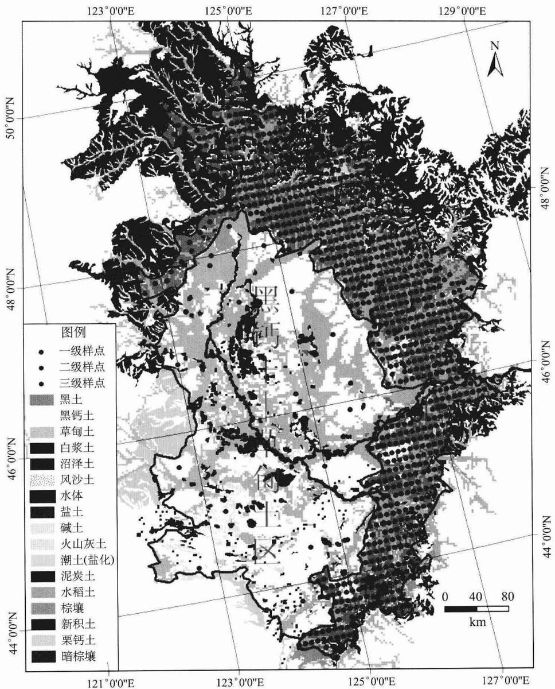  
图19.30 黑土厚度调查样点分布图

典型黑土区以地理经纬线 $6 ^ { \prime } \times 6 ^ { \prime }$ 网格交叉点为调查样点，总共调查样点 930个。黑钙土草甸土区由于地形平坦，按均匀布点原则，兼顾土壤分布特 点，调查27个样点。两个区共调查样点957个。

## 2. 黑土层厚度现状

典型黑土区调查的930个样点中，可参与统计的有效样点912个。平均黑土层厚度53.2 cm。一般表述性统计结果见表19.20。按样点黑土层厚度进行分级统计可知，黑土层厚度小于等于40cm的样点所占比例占48%，黑土厚度在40～70 cm之间的样点占 26%，70～100 cm之间的占16%，大于100 cm的占10%（图19.31、表19.20）。

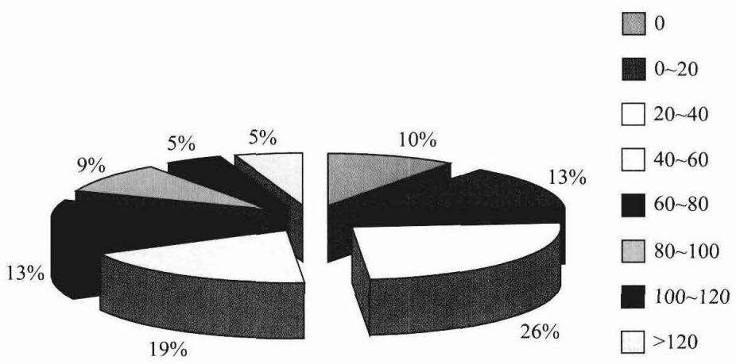  
图19.31 不同厚度级别样点所占比例

表19.20 不同厚度级别样点个数及平均土层厚度
<table><tr><td rowspan=1 colspan=1>厚度级别</td><td rowspan=1 colspan=1>样点个数</td><td rowspan=1 colspan=1>比例/%</td><td rowspan=1 colspan=2>平均厚度/cm</td></tr><tr><td rowspan=1 colspan=1>0</td><td rowspan=1 colspan=1>96</td><td rowspan=1 colspan=1>10.1</td><td rowspan=1 colspan=2>0.0</td></tr><tr><td rowspan=1 colspan=1>0~20</td><td rowspan=1 colspan=1>128</td><td rowspan=1 colspan=1>13.5</td><td rowspan=1 colspan=1></td><td rowspan=1 colspan=1>17.3</td></tr><tr><td rowspan=1 colspan=1>20~40</td><td rowspan=1 colspan=1>237</td><td rowspan=1 colspan=1>25.0</td><td rowspan=1 colspan=1></td><td rowspan=1 colspan=1>33.2</td></tr><tr><td rowspan=1 colspan=1>40~60</td><td rowspan=1 colspan=1>180</td><td rowspan=1 colspan=1>19.0</td><td rowspan=1 colspan=1></td><td rowspan=1 colspan=1>54.0</td></tr><tr><td rowspan=1 colspan=1>60~80</td><td rowspan=1 colspan=1>127</td><td rowspan=1 colspan=1>13.4</td><td rowspan=1 colspan=2>73.6</td></tr><tr><td rowspan=1 colspan=1>80~100</td><td rowspan=1 colspan=1>88</td><td rowspan=1 colspan=1>9.3</td><td rowspan=1 colspan=2>94.1</td></tr><tr><td rowspan=1 colspan=1>100~120</td><td rowspan=1 colspan=1>43</td><td rowspan=1 colspan=1>4.5</td><td rowspan=1 colspan=1></td><td rowspan=1 colspan=1>112.9</td></tr><tr><td rowspan=1 colspan=1>&gt;120</td><td rowspan=1 colspan=1>50</td><td rowspan=1 colspan=1>5.3</td><td rowspan=1 colspan=2>165.3</td></tr></table>

## 3. 黑土层厚度影响因素分析

黑土层厚度的大小主要与形成黑土的成土环境有关。本节仅从局部尺度上分析黑土层厚度与样点所在土壤母质类型和地貌部位的关系。

## （1）土壤母质与黑土层厚度

将样点母质分为黄黏土、砂砾黏土、沙土、砾石质和蒜瓣土5种类型(表19.21)，分别统计各母质类型的黑土层厚度。在典型黑土区，79%样点的土壤母质为黄黏土，其他母质类型所占比例在10%以下。黄黏土母质上发育的土壤黑土层最厚，高出均值4.6cm，沙砾质黏土母质上发育的黑土层厚度次之，沙土、砾石质母质土壤黑土层厚度不到40cm。黑土层由大到小的母质类型为黄黏土>沙砾黏土>砾石质母质>沙土母质。

表19.21 不同母质类型黑土黑土层厚度统计
<table><tr><td rowspan=1 colspan=1>母质类型</td><td rowspan=1 colspan=1>不同母质类型比例/%</td><td rowspan=1 colspan=1>平均黑土层厚度/cm</td><td rowspan=1 colspan=1>过渡层深度/cm</td></tr><tr><td rowspan=1 colspan=1>黄黏土</td><td rowspan=1 colspan=1>78.0</td><td rowspan=1 colspan=1>57.3</td><td rowspan=1 colspan=1>89.0</td></tr><tr><td rowspan=1 colspan=1>沙砾黏土</td><td rowspan=1 colspan=1>8.1</td><td rowspan=1 colspan=1>40.4</td><td rowspan=1 colspan=1>69.5</td></tr><tr><td rowspan=1 colspan=1>沙土（粗沙）</td><td rowspan=1 colspan=1>6.2</td><td rowspan=1 colspan=1>34.2</td><td rowspan=1 colspan=1>52.5</td></tr><tr><td rowspan=1 colspan=1>砾石质</td><td rowspan=1 colspan=1>6.1</td><td rowspan=1 colspan=1>36.5</td><td rowspan=1 colspan=1>52.2</td></tr><tr><td rowspan=1 colspan=1>蒜瓣土</td><td rowspan=1 colspan=1>1.6</td><td rowspan=1 colspan=1>26.2</td><td rowspan=1 colspan=1>54.6</td></tr><tr><td rowspan=1 colspan=1>平均*</td><td rowspan=1 colspan=1></td><td rowspan=1 colspan=1>52.7</td><td rowspan=1 colspan=1>82.3</td></tr></table>

\*平均值为以各母质类型比例为权重的加权平均。

不同母质对黑土层厚度的影响除母质本身的影响外，可能也与母质分布的空间位置有关。黄黏土、砂砾黏土母质在各地各种地貌类型上都有分布，但沙土多分布在河漫滩或河流冲积平原上，砾石质母质多分布在山前丘陵地带。

## （2）地貌部位与黑土层厚度

在漫岗丘陵区，地形波状起伏，不同地貌部位土壤侵蚀或淤积的状况不同，特别是土地开垦成农田后，加剧了不同地貌部位的侵蚀或淤积速度，导致十壤厚度的差异。表19.22可知，漫岗区按地貌部位统计的黑土层厚度由小到大的顺序依次为漫岗坡上部、漫岗坡中部、漫岗坡下部、漫岗坡间平地(低津地）、漫岗坡坡脚：丘陵区依次为丘陵坡中部、丘陵坡上部、丘陵坡下部、丘陵坡坡脚、丘陵间平地（低洼地）。漫岗区和丘陵区黑土层最厚的地貌部位比漫岗坡或丘陵坡中上部厚一倍多。

表19.22 漫岗区不同地貌部位黑土层厚度统计
<table><tr><td rowspan=2 colspan=2>地貌部位</td><td></td><td></td><td></td></tr><tr><td rowspan=1 colspan=1>样点比例/%</td><td rowspan=1 colspan=1>黑土层厚度/cm</td><td rowspan=1 colspan=1>过渡层深度/cm</td></tr><tr><td rowspan=12 colspan=1>漫川漫岗区丘陵区</td><td rowspan=1 colspan=1>漫岗坡上部</td><td rowspan=1 colspan=1>29.5</td><td rowspan=1 colspan=1>42.0</td><td rowspan=1 colspan=1>73.5</td></tr><tr><td rowspan=1 colspan=1>漫岗坡中部</td><td rowspan=1 colspan=1>36.3</td><td rowspan=1 colspan=1>48.5</td><td rowspan=1 colspan=1>78.6</td></tr><tr><td rowspan=1 colspan=1>漫岗坡下部</td><td rowspan=1 colspan=1>15.6</td><td rowspan=1 colspan=1>66.9</td><td rowspan=1 colspan=1>104.3</td></tr><tr><td rowspan=1 colspan=1>漫岗坡坡脚</td><td rowspan=1 colspan=1>7.8</td><td rowspan=1 colspan=1>101.1</td><td rowspan=1 colspan=1>118.1</td></tr><tr><td rowspan=1 colspan=1>漫岗坡间平地（低洼地）</td><td rowspan=1 colspan=1>10.9</td><td rowspan=1 colspan=1>72.5</td><td rowspan=1 colspan=1>103.5</td></tr><tr><td rowspan=1 colspan=1>平均厚度/cm</td><td rowspan=1 colspan=1></td><td rowspan=1 colspan=1>56.1</td><td rowspan=1 colspan=1>86.9</td></tr><tr><td rowspan=1 colspan=1>丘陵坡上部</td><td rowspan=1 colspan=1>42.7</td><td rowspan=1 colspan=1>31.9</td><td rowspan=1 colspan=1>48.8</td></tr><tr><td rowspan=1 colspan=1>丘陵坡中部</td><td rowspan=1 colspan=1>17.7</td><td rowspan=1 colspan=1>23.5</td><td rowspan=1 colspan=1>32.1</td></tr><tr><td rowspan=1 colspan=1>丘陵坡下部</td><td rowspan=1 colspan=1>30.2</td><td rowspan=1 colspan=1>45.8</td><td rowspan=1 colspan=1>75.5</td></tr><tr><td rowspan=1 colspan=1>丘陵坡坡脚</td><td rowspan=1 colspan=1>5.2</td><td rowspan=1 colspan=1>67.2</td><td rowspan=1 colspan=1>80.0</td></tr><tr><td rowspan=1 colspan=1>丘陵间平地（低洼地）</td><td rowspan=1 colspan=1>4.2</td><td rowspan=1 colspan=1>68.3</td><td rowspan=1 colspan=1>144.7</td></tr><tr><td rowspan=1 colspan=1>平均厚度/cm*</td><td rowspan=1 colspan=1></td><td rowspan=1 colspan=1>38.0</td><td rowspan=1 colspan=1>59.5</td></tr></table>

\*平均厚度为以各部位样点比例为权重的加权平均。

## 4. 黑土层厚度的空间分布特点

黑土分布区的成土因素以及人类开垦历史等的不同，导致目前黑土层厚度既有以地貌部位等小尺度因素变化的特点，又有较大尺度上的空间变异。东北黑土区黑土层厚度在较大尺度上的变化主要有两个方面：一是黑土分布的不同地貌类型的差异；二是由于较大范围气候差异和开垦历史等造成的黑土层厚度的空间差异。

表19.23为按不同地貌类型统计的黑土层厚度。黑土层厚度由大到小的顺序为河流阶地、河谷平原、冲积平原、漫岗、丘陵、河漫滩。

从较大区域范围看，黑土层的空间分布存在较大差异（图19.32、图19.33、表19.24)。黑土层厚度最大的地区在松花江以北，讷谟尔河以南的典型黑十区，即北纬46°～48.5°。该区是典型的漫岗区，地形波状起伏，黑十成片分布。平均黑土层厚度63.3 cm，其中大于40 cm的样点占63.5%，大于60cm的占42.5%；北纬48.5°以北的典型黑土区多为丘陵，地形起伏较大，平均黑土层厚度为41.2 cm，厚度小于20 cm的样点占34.3%，小于40 cm的样点占68.2%，大于60 cm样点只占20.9%；黑土层厚度多在30～60cm之间；在北纬46以南的典型黑土区，地形较为平缓，多为冲积平原，

表19.23 不同地貌类型黑土层厚度统计
<table><tr><td rowspan=1 colspan=1>地貌类型</td><td rowspan=1 colspan=1>样点个数比例/%</td><td rowspan=1 colspan=1>黑土层厚度/cm</td><td rowspan=1 colspan=1>过渡层深度/cm</td></tr><tr><td rowspan=1 colspan=1>河流阶地</td><td rowspan=1 colspan=1>0.8</td><td rowspan=1 colspan=1>103.9</td><td rowspan=1 colspan=1>143.6</td></tr><tr><td rowspan=1 colspan=1>河谷平原</td><td rowspan=1 colspan=1>4.5</td><td rowspan=1 colspan=1>62.6</td><td rowspan=1 colspan=1>94.8</td></tr><tr><td rowspan=1 colspan=1>冲积平原</td><td rowspan=1 colspan=1>22.5</td><td rowspan=1 colspan=1>57.4</td><td rowspan=1 colspan=1>90.7</td></tr><tr><td rowspan=1 colspan=1>漫岗</td><td rowspan=1 colspan=1>53.5</td><td rowspan=1 colspan=1>56.2</td><td rowspan=1 colspan=1>87.2</td></tr><tr><td rowspan=1 colspan=1>丘陵</td><td rowspan=1 colspan=1>15.7</td><td rowspan=1 colspan=1>38.3</td><td rowspan=1 colspan=1>62.2</td></tr><tr><td rowspan=1 colspan=1>河漫滩</td><td rowspan=1 colspan=1>3.2</td><td rowspan=1 colspan=1>34.4</td><td rowspan=1 colspan=1>61.6</td></tr><tr><td rowspan=1 colspan=1>加权平均厚度/cm</td><td rowspan=1 colspan=1></td><td rowspan=1 colspan=1>53.6</td><td rowspan=1 colspan=1>84.0</td></tr></table>

表 19.24 不同区域黑土层厚度分布统计
<table><tr><td rowspan=2 colspan=1>黑土层厚度/cm</td><td rowspan=1 colspan=4>不同黑土层厚度级别样点数占本区总样点的比例/%</td></tr><tr><td rowspan=1 colspan=1>北纬46°以南典型黑土区</td><td rowspan=1 colspan=1>北纬46°~48.5°之间典型黑土区</td><td rowspan=1 colspan=1>北纬48.5°以北典型黑土区</td><td rowspan=1 colspan=1>黑钙土-草甸土区</td></tr><tr><td rowspan=1 colspan=1>0~20</td><td rowspan=1 colspan=1>29.0</td><td rowspan=1 colspan=1>13.5</td><td rowspan=1 colspan=1>34.3</td><td rowspan=1 colspan=1>51.8</td></tr><tr><td rowspan=1 colspan=1>20~40</td><td rowspan=1 colspan=1>23.8</td><td rowspan=1 colspan=1>22.7</td><td rowspan=1 colspan=1>33.9</td><td rowspan=1 colspan=1>22.2</td></tr><tr><td rowspan=1 colspan=1>40~60</td><td rowspan=1 colspan=1>21.6</td><td rowspan=1 colspan=1>21.0</td><td rowspan=1 colspan=1>11.4</td><td rowspan=1 colspan=1>11.1</td></tr><tr><td rowspan=1 colspan=1>60~80</td><td rowspan=1 colspan=1>10.7</td><td rowspan=1 colspan=1>17.2</td><td rowspan=1 colspan=1>9.4</td><td rowspan=1 colspan=1>7.4</td></tr><tr><td rowspan=1 colspan=1>80~100</td><td rowspan=1 colspan=1>7.4</td><td rowspan=1 colspan=1>12.2</td><td rowspan=1 colspan=1>6.5</td><td rowspan=1 colspan=1>3.7</td></tr><tr><td rowspan=1 colspan=1>&gt;100</td><td rowspan=1 colspan=1>8.2</td><td rowspan=1 colspan=1>13.1</td><td rowspan=1 colspan=1>5.0</td><td rowspan=1 colspan=1>3.7</td></tr></table>

平均坡度1.3°，人类耕种历史悠久。该区平均黑土层厚度47.9cm，其中小于 20 cm 的样点占 29%，小于 40 cm的样点占 52.8%，大于 60 cm的样点占26.3%；面积广大的黑钙土草甸土区，黑土层厚度最小，平均只有34.4cm，小于20 cm的样点占51.8%，小于40 cm的样点占74.0%。该区相对较厚一点的样点分布在与典型黑土接壤的黑钙土地带，而松嫩平原的中心地带的草甸土区，黑土层厚度最小。

由此可见，北纬46°～48.5°的黑土区，黑土层厚度最厚，而目前也正面临较为严重的水土流失。从保护土地资源的角度，是需要重点保护的区域。

## （三）黑土厚度变化趋势预测

在假定现有土地利用方式和气候条件基本稳定情况下对黑土层厚度变化趋势进行预测。预测的基础是现有的土层厚度和不同坡度的侵蚀速率。侵蚀速率是根据鹤山 $2 ^ { \circ } { \mathrm { : } }$ 坡耕地土壤侵蚀径流小区资料，再应用McCool等人提出的坡度因子公式计算不同坡度土壤侵蚀速率。表19.25为计算所得整度坡0°～10°的年侵蚀厚度。

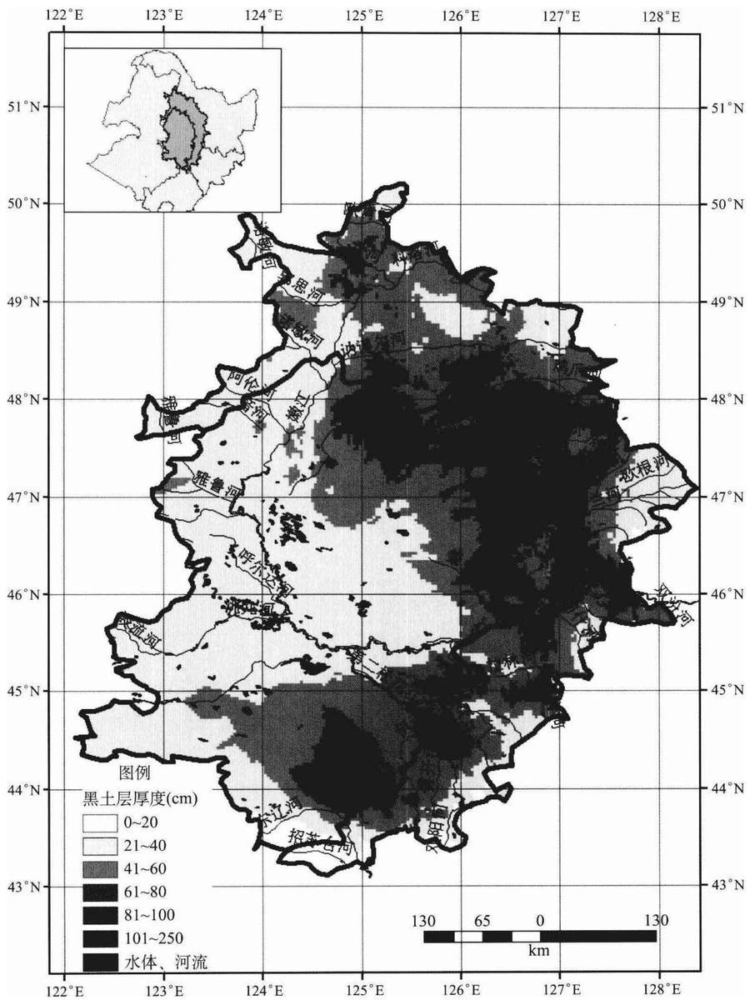  
图19.32 当前黑土层厚度空间分布示意图

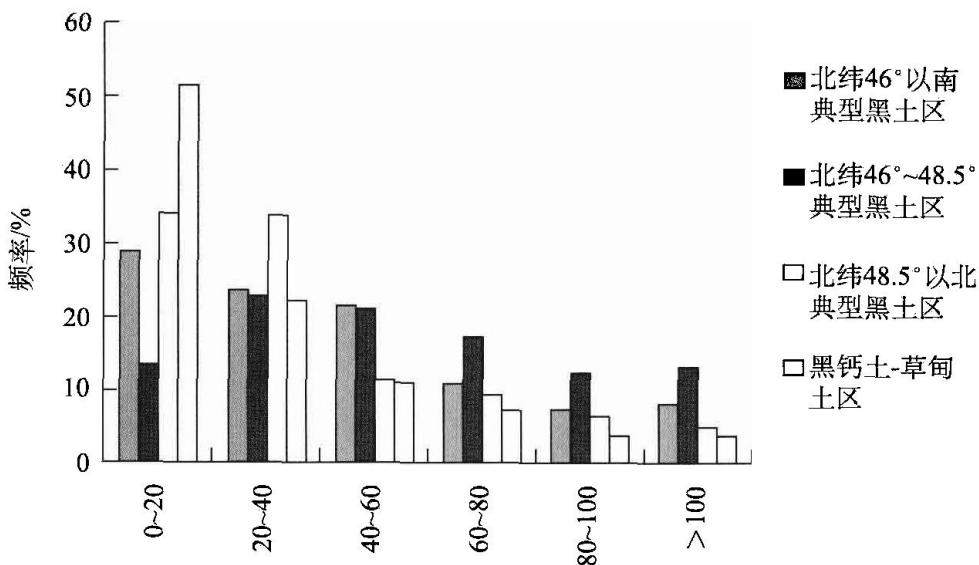  
黑土层厚度级别/cm  
图19.33 不同区域黑土层厚度分布比较

据此方法，根据野外调查样点黑土层厚度及坡度值，预测未来不同年限黑土层厚度。我们分两种情况对不同侵蚀年限黑土层厚度预测值进行统计：第一种情况是只对坡度大于零的样点进行统计（表19.26)；第二种情况是坡度为零的样点也参与统计（表19.27）。

表19.25 不同坡度年侵蚀厚度统计表（以整度坡为例）
<table><tr><td rowspan=1 colspan=4></td></tr><tr><td rowspan=1 colspan=1>坡度/(°)</td><td rowspan=1 colspan=1>坡度因子</td><td rowspan=1 colspan=2>年侵蚀厚度/mm</td></tr><tr><td rowspan=1 colspan=1>0</td><td rowspan=1 colspan=1>0.03</td><td rowspan=1 colspan=2>0.15</td></tr><tr><td rowspan=1 colspan=1>1</td><td rowspan=1 colspan=1>0.22</td><td rowspan=1 colspan=2>1.07</td></tr><tr><td rowspan=1 colspan=1>2</td><td rowspan=1 colspan=1>0.41</td><td rowspan=1 colspan=2>2.00</td></tr><tr><td rowspan=1 colspan=1>3</td><td rowspan=1 colspan=1>0.60</td><td rowspan=1 colspan=2>2.93</td></tr><tr><td rowspan=1 colspan=1>4</td><td rowspan=1 colspan=1>0.78</td><td rowspan=1 colspan=2>3.85</td></tr><tr><td rowspan=1 colspan=1>5</td><td rowspan=1 colspan=1>0.97</td><td rowspan=1 colspan=1>4.77</td><td rowspan=1 colspan=1></td></tr><tr><td rowspan=1 colspan=1>6</td><td rowspan=1 colspan=1>1.26</td><td rowspan=1 colspan=2>6.17</td></tr><tr><td rowspan=1 colspan=1>7</td><td rowspan=1 colspan=1>1.55</td><td rowspan=1 colspan=2>7.61</td></tr><tr><td rowspan=1 colspan=1>8</td><td rowspan=1 colspan=1>1.84</td><td rowspan=1 colspan=2>9.03</td></tr><tr><td rowspan=1 colspan=1>9</td><td rowspan=1 colspan=1>2.13</td><td rowspan=1 colspan=2>10.46</td></tr><tr><td rowspan=1 colspan=1>10</td><td rowspan=1 colspan=1>2.42</td><td rowspan=1 colspan=2>11.88</td></tr><tr><td rowspan=1 colspan=1></td><td rowspan=1 colspan=3></td></tr></table>

表19.26 不同侵蚀年限各黑土层厚度级别样点比例变化预测（坡度大于零度样点）
<table><tr><td rowspan=2 colspan=1>侵蚀年限/a</td><td rowspan=1 colspan=8>不同黑土层厚度级别样点比例/%</td><td rowspan=2 colspan=1>加权平均厚度/cm</td></tr><tr><td rowspan=1 colspan=1>0</td><td rowspan=1 colspan=1>0~20</td><td rowspan=1 colspan=1>20~40</td><td rowspan=1 colspan=1>40~60</td><td rowspan=1 colspan=1>60~80</td><td rowspan=1 colspan=1>80~100</td><td rowspan=1 colspan=1>100~120</td><td rowspan=1 colspan=1>&gt;120</td></tr><tr><td rowspan=1 colspan=1>当前</td><td rowspan=1 colspan=1>9.3</td><td rowspan=1 colspan=1>16.0</td><td rowspan=1 colspan=1>26.6</td><td rowspan=1 colspan=1>16.9</td><td rowspan=1 colspan=1>13.2</td><td rowspan=1 colspan=1>9.1</td><td rowspan=1 colspan=1>4.1</td><td rowspan=1 colspan=1>4.8</td><td rowspan=1 colspan=1>51.9</td></tr><tr><td rowspan=1 colspan=1>50</td><td rowspan=1 colspan=1>16.0</td><td rowspan=1 colspan=1>18.2</td><td rowspan=1 colspan=1>21.6</td><td rowspan=1 colspan=1>16.5</td><td rowspan=1 colspan=1>12.1</td><td rowspan=1 colspan=1>7.2</td><td rowspan=1 colspan=1>3.9</td><td rowspan=1 colspan=1>4.5</td><td rowspan=1 colspan=1>42.9</td></tr><tr><td rowspan=1 colspan=1>100</td><td rowspan=1 colspan=1>24.0</td><td rowspan=1 colspan=1>21.7</td><td rowspan=1 colspan=1>15.4</td><td rowspan=1 colspan=1>17.3</td><td rowspan=1 colspan=1>8.4</td><td rowspan=1 colspan=1>6.9</td><td rowspan=1 colspan=1>2.6</td><td rowspan=1 colspan=1>3.7</td><td rowspan=1 colspan=1>35.8</td></tr><tr><td rowspan=1 colspan=1>150</td><td rowspan=1 colspan=1>33.3</td><td rowspan=1 colspan=1>19.1</td><td rowspan=1 colspan=1>16.5</td><td rowspan=1 colspan=1>13.4</td><td rowspan=1 colspan=1>7.4</td><td rowspan=1 colspan=1>4.5</td><td rowspan=1 colspan=1>2.6</td><td rowspan=1 colspan=1>3.2</td><td rowspan=1 colspan=1>30.0</td></tr><tr><td rowspan=1 colspan=1>200</td><td rowspan=1 colspan=1>42.9</td><td rowspan=1 colspan=1>16.2</td><td rowspan=1 colspan=1>16.5</td><td rowspan=1 colspan=1>9.7</td><td rowspan=1 colspan=1>7.2</td><td rowspan=1 colspan=1>3.2</td><td rowspan=1 colspan=1>1.7</td><td rowspan=1 colspan=1>2.6</td><td rowspan=1 colspan=1>25.4</td></tr><tr><td rowspan=1 colspan=1>250</td><td rowspan=1 colspan=1>49.1</td><td rowspan=1 colspan=1>16.5</td><td rowspan=1 colspan=1>14.5</td><td rowspan=1 colspan=1>7.1</td><td rowspan=1 colspan=1>5.8</td><td rowspan=1 colspan=1>3.5</td><td rowspan=1 colspan=1>1.1</td><td rowspan=1 colspan=1>2.4</td><td rowspan=1 colspan=1>21.5</td></tr><tr><td rowspan=1 colspan=1>300</td><td rowspan=1 colspan=1>57.1</td><td rowspan=1 colspan=1>14.1</td><td rowspan=1 colspan=1>11.7</td><td rowspan=1 colspan=1>6.3</td><td rowspan=1 colspan=1>5.0</td><td rowspan=1 colspan=1>2.6</td><td rowspan=1 colspan=1>0.9</td><td rowspan=1 colspan=1>2.2</td><td rowspan=1 colspan=1>18.3</td></tr><tr><td rowspan=1 colspan=1>350</td><td rowspan=1 colspan=1>62.1</td><td rowspan=1 colspan=1>13.2</td><td rowspan=1 colspan=1>10.0</td><td rowspan=1 colspan=1>5.8</td><td rowspan=1 colspan=1>4.1</td><td rowspan=1 colspan=1>2.0</td><td rowspan=1 colspan=1>0.6</td><td rowspan=1 colspan=1>2.2</td><td rowspan=1 colspan=1>15.8</td></tr><tr><td rowspan=1 colspan=1>400</td><td rowspan=1 colspan=1>66.2</td><td rowspan=1 colspan=1>13.0</td><td rowspan=1 colspan=1>8.4</td><td rowspan=1 colspan=1>4.8</td><td rowspan=1 colspan=1>3.7</td><td rowspan=1 colspan=1>1.3</td><td rowspan=1 colspan=1>0.4</td><td rowspan=1 colspan=1>2.2</td><td rowspan=1 colspan=1>13.8</td></tr><tr><td rowspan=1 colspan=1>450</td><td rowspan=1 colspan=1>71.0</td><td rowspan=1 colspan=1>9.9</td><td rowspan=1 colspan=1>8.0</td><td rowspan=1 colspan=1>4.1</td><td rowspan=1 colspan=1>3.5</td><td rowspan=1 colspan=1>0.9</td><td rowspan=1 colspan=1>0.6</td><td rowspan=1 colspan=1>2.0</td><td rowspan=1 colspan=1>12.1</td></tr><tr><td rowspan=1 colspan=1>500</td><td rowspan=1 colspan=1>74.2</td><td rowspan=1 colspan=1>10.4</td><td rowspan=1 colspan=1>5.6</td><td rowspan=1 colspan=1>4.5</td><td rowspan=1 colspan=1>2.2</td><td rowspan=1 colspan=1>0.9</td><td rowspan=1 colspan=1>0.4</td><td rowspan=1 colspan=1>1.9</td><td rowspan=1 colspan=1>10.7</td></tr><tr><td rowspan=1 colspan=1>600</td><td rowspan=1 colspan=1>79.9</td><td rowspan=1 colspan=1>8.4</td><td rowspan=1 colspan=1>3.7</td><td rowspan=1 colspan=1>3.7</td><td rowspan=1 colspan=1>1.5</td><td rowspan=1 colspan=1>0.9</td><td rowspan=1 colspan=1>0.7</td><td rowspan=1 colspan=1>1.1</td><td rowspan=1 colspan=1>8.4</td></tr><tr><td rowspan=1 colspan=1>700</td><td rowspan=1 colspan=1>84.4</td><td rowspan=1 colspan=1>4.6</td><td rowspan=1 colspan=1>4.5</td><td rowspan=1 colspan=1>3.0</td><td rowspan=1 colspan=1>1.1</td><td rowspan=1 colspan=1>0.9</td><td rowspan=1 colspan=1>0.6</td><td rowspan=1 colspan=1>0.9</td><td rowspan=1 colspan=1>6.8</td></tr><tr><td rowspan=1 colspan=1>800</td><td rowspan=1 colspan=1>86.6</td><td rowspan=1 colspan=1>4.5</td><td rowspan=1 colspan=1>3.3</td><td rowspan=1 colspan=1>2.6</td><td rowspan=1 colspan=1>0.9</td><td rowspan=1 colspan=1>0.9</td><td rowspan=1 colspan=1>0.2</td><td rowspan=1 colspan=1>0.9</td><td rowspan=1 colspan=1>5.6</td></tr><tr><td rowspan=1 colspan=1>900</td><td rowspan=1 colspan=1>88.7</td><td rowspan=1 colspan=1>3.7</td><td rowspan=1 colspan=1>3.9</td><td rowspan=1 colspan=1>1.3</td><td rowspan=1 colspan=1>0.9</td><td rowspan=1 colspan=1>0.4</td><td rowspan=1 colspan=1>0.4</td><td rowspan=1 colspan=1>0.7</td><td rowspan=1 colspan=1>4.6</td></tr><tr><td rowspan=1 colspan=1>1000</td><td rowspan=1 colspan=1>90.5</td><td rowspan=1 colspan=1>4.3</td><td rowspan=1 colspan=1>2.0</td><td rowspan=1 colspan=1>1.1</td><td rowspan=1 colspan=1>0.9</td><td rowspan=1 colspan=1>0.4</td><td rowspan=1 colspan=1>0.2</td><td rowspan=1 colspan=1>0.6</td><td rowspan=1 colspan=1>3.8</td></tr></table>

表19.27 不同侵蚀年限各黑土层厚度级别样点比例变化预测（所有样点）
<table><tr><td colspan="1" rowspan="2">侵蚀年限/a</td><td colspan="8" rowspan="1">不同黑土层厚度级别样点比例/%</td><td colspan="1" rowspan="2">加权平均/cm</td></tr><tr><td colspan="1" rowspan="1">0</td><td colspan="1" rowspan="1">0~20</td><td colspan="1" rowspan="1">20~40</td><td colspan="1" rowspan="1">40~60</td><td colspan="1" rowspan="1">60~80</td><td colspan="1" rowspan="1">80~100</td><td colspan="1" rowspan="1">100~120</td><td colspan="1" rowspan="1">&gt;120</td></tr><tr><td colspan="1" rowspan="1">当前</td><td colspan="1" rowspan="1">10.1</td><td colspan="1" rowspan="1">13.5</td><td colspan="1" rowspan="1">25.0</td><td colspan="1" rowspan="1">19.0</td><td colspan="1" rowspan="1">13.4</td><td colspan="1" rowspan="1">9.3</td><td colspan="1" rowspan="1">4.5</td><td colspan="1" rowspan="1">5.3</td><td colspan="1" rowspan="1">53.3</td></tr><tr><td colspan="1" rowspan="1">50</td><td colspan="1" rowspan="1">14.1</td><td colspan="1" rowspan="1">14.7</td><td colspan="1" rowspan="1">22.1</td><td colspan="1" rowspan="1">18.8</td><td colspan="1" rowspan="1">12.8</td><td colspan="1" rowspan="1">8.2</td><td colspan="1" rowspan="1">4.4</td><td colspan="1" rowspan="1">5.1</td><td colspan="1" rowspan="1">48.1</td></tr><tr><td colspan="1" rowspan="1">60</td><td colspan="1" rowspan="1">15.0</td><td colspan="1" rowspan="1">15.6</td><td colspan="1" rowspan="1">20.8</td><td colspan="1" rowspan="1">19.2</td><td colspan="1" rowspan="1">11.8</td><td colspan="1" rowspan="1">8.3</td><td colspan="1" rowspan="1">4.2</td><td colspan="1" rowspan="1">5.0</td><td colspan="1" rowspan="1">47.3</td></tr><tr><td colspan="1" rowspan="1">70</td><td colspan="1" rowspan="1">15.9</td><td colspan="1" rowspan="1">16.4</td><td colspan="1" rowspan="1">20.0</td><td colspan="1" rowspan="1">19.2</td><td colspan="1" rowspan="1">11.2</td><td colspan="1" rowspan="1">8.7</td><td colspan="1" rowspan="1">3.8</td><td colspan="1" rowspan="1">4.9</td><td colspan="1" rowspan="1">46.5</td></tr><tr><td colspan="1" rowspan="1">80</td><td colspan="1" rowspan="1">17.1</td><td colspan="1" rowspan="1">16.4</td><td colspan="1" rowspan="1">19.3</td><td colspan="1" rowspan="1">18.7</td><td colspan="1" rowspan="1">11.4</td><td colspan="1" rowspan="1">8.6</td><td colspan="1" rowspan="1">3.7</td><td colspan="1" rowspan="1">4.9</td><td colspan="1" rowspan="1">45.7</td></tr><tr><td colspan="1" rowspan="1">90</td><td colspan="1" rowspan="1">18.1</td><td colspan="1" rowspan="1">16.1</td><td colspan="1" rowspan="1">18.9</td><td colspan="1" rowspan="1">19.3</td><td colspan="1" rowspan="1">11.0</td><td colspan="1" rowspan="1">8.1</td><td colspan="1" rowspan="1">3.8</td><td colspan="1" rowspan="1">4.8</td><td colspan="1" rowspan="1">44.9</td></tr><tr><td colspan="1" rowspan="1">100</td><td colspan="1" rowspan="1">18.5</td><td colspan="1" rowspan="1">16.7</td><td colspan="1" rowspan="1">18.6</td><td colspan="1" rowspan="1">19.2</td><td colspan="1" rowspan="1">10.7</td><td colspan="1" rowspan="1">8.0</td><td colspan="1" rowspan="1">3.7</td><td colspan="1" rowspan="1">4.6</td><td colspan="1" rowspan="1">44.2</td></tr><tr><td colspan="1" rowspan="1">150</td><td colspan="1" rowspan="1">23.8</td><td colspan="1" rowspan="1">15.2</td><td colspan="1" rowspan="1">19.2</td><td colspan="1" rowspan="1">17.0</td><td colspan="1" rowspan="1">10.1</td><td colspan="1" rowspan="1">6.7</td><td colspan="1" rowspan="1">3.7</td><td colspan="1" rowspan="1">4.3</td><td colspan="1" rowspan="1">40.9</td></tr><tr><td colspan="1" rowspan="1">200</td><td colspan="1" rowspan="1">29.3</td><td colspan="1" rowspan="1">13.5</td><td colspan="1" rowspan="1">19.2</td><td colspan="1" rowspan="1">14.9</td><td colspan="1" rowspan="1">10.0</td><td colspan="1" rowspan="1">5.9</td><td colspan="1" rowspan="1">3.3</td><td colspan="1" rowspan="1">3.9</td><td colspan="1" rowspan="1">38.2</td></tr><tr><td colspan="1" rowspan="1">250</td><td colspan="1" rowspan="1">32.7</td><td colspan="1" rowspan="1">13.7</td><td colspan="1" rowspan="1">18.1</td><td colspan="1" rowspan="1">13.4</td><td colspan="1" rowspan="1">9.2</td><td colspan="1" rowspan="1">6.1</td><td colspan="1" rowspan="1">3.0</td><td colspan="1" rowspan="1">3.8</td><td colspan="1" rowspan="1">36.0</td></tr><tr><td colspan="1" rowspan="1">300</td><td colspan="1" rowspan="1">37.3</td><td colspan="1" rowspan="1">12.4</td><td colspan="1" rowspan="1">16.5</td><td colspan="1" rowspan="1">13.0</td><td colspan="1" rowspan="1">,8.8</td><td colspan="1" rowspan="1">5.6</td><td colspan="1" rowspan="1">2.9</td><td colspan="1" rowspan="1">3.7</td><td colspan="1" rowspan="1">34.2</td></tr><tr><td colspan="1" rowspan="1">350</td><td colspan="1" rowspan="1">40.1</td><td colspan="1" rowspan="1">11.8</td><td colspan="1" rowspan="1">15.5</td><td colspan="1" rowspan="1">12.7</td><td colspan="1" rowspan="1">8.2</td><td colspan="1" rowspan="1">5.3</td><td colspan="1" rowspan="1">2.6</td><td colspan="1" rowspan="1">3.7</td><td colspan="1" rowspan="1">32.8</td></tr><tr><td colspan="1" rowspan="1">400</td><td colspan="1" rowspan="1">42.4</td><td colspan="1" rowspan="1">11.7</td><td colspan="1" rowspan="1">14.6</td><td colspan="1" rowspan="1">12.1</td><td colspan="1" rowspan="1">8.0</td><td colspan="1" rowspan="1">4.9</td><td colspan="1" rowspan="1">2.5</td><td colspan="1" rowspan="1">3.7</td><td colspan="1" rowspan="1">31.6</td></tr><tr><td colspan="1" rowspan="1">450</td><td colspan="1" rowspan="1">45.2</td><td colspan="1" rowspan="1">9.9</td><td colspan="1" rowspan="1">14.4</td><td colspan="1" rowspan="1">11.7</td><td colspan="1" rowspan="1">7.9</td><td colspan="1" rowspan="1">4.6</td><td colspan="1" rowspan="1">2.6</td><td colspan="1" rowspan="1">3.6</td><td colspan="1" rowspan="1">30.7</td></tr><tr><td colspan="1" rowspan="1">500</td><td colspan="1" rowspan="1">47.0</td><td colspan="1" rowspan="1">10.2</td><td colspan="1" rowspan="1">13.0</td><td colspan="1" rowspan="1">11.9</td><td colspan="1" rowspan="1">7.2</td><td colspan="1" rowspan="1">4.8</td><td colspan="1" rowspan="1">2.4</td><td colspan="1" rowspan="1">3.5</td><td colspan="1" rowspan="1">29.9</td></tr><tr><td colspan="1" rowspan="1">600</td><td colspan="1" rowspan="1">50.3</td><td colspan="1" rowspan="1">9.1</td><td colspan="1" rowspan="1">11.9</td><td colspan="1" rowspan="1">11.5</td><td colspan="1" rowspan="1">6.8</td><td colspan="1" rowspan="1">4.8</td><td colspan="1" rowspan="1">2.6</td><td colspan="1" rowspan="1">3.1</td><td colspan="1" rowspan="1">28.6</td></tr><tr><td colspan="1" rowspan="1">700</td><td colspan="1" rowspan="1">52.8</td><td colspan="1" rowspan="1">7.0</td><td colspan="1" rowspan="1">12.4</td><td colspan="1" rowspan="1">11.1</td><td colspan="1" rowspan="1">6.5</td><td colspan="1" rowspan="1">4.8</td><td colspan="1" rowspan="1">2.5</td><td colspan="1" rowspan="1">3.0</td><td colspan="1" rowspan="1">27.7</td></tr><tr><td colspan="1" rowspan="1">800</td><td colspan="1" rowspan="1">54.1</td><td colspan="1" rowspan="1">6.9</td><td colspan="1" rowspan="1">11.7</td><td colspan="1" rowspan="1">10.9</td><td colspan="1" rowspan="1">6.4</td><td colspan="1" rowspan="1">4.8</td><td colspan="1" rowspan="1">2.3</td><td colspan="1" rowspan="1">3.0</td><td colspan="1" rowspan="1">27.0</td></tr><tr><td colspan="1" rowspan="1">900</td><td colspan="1" rowspan="1">55.2</td><td colspan="1" rowspan="1">6.4</td><td colspan="1" rowspan="1">12.0</td><td colspan="1" rowspan="1">10.1</td><td colspan="1" rowspan="1">6.5</td><td colspan="1" rowspan="1">4.3</td><td colspan="1" rowspan="1">2.4</td><td colspan="1" rowspan="1">2.9</td><td colspan="1" rowspan="1">26.4</td></tr><tr><td colspan="1" rowspan="1">1000</td><td colspan="1" rowspan="1">56.3</td><td colspan="1" rowspan="1">6.8</td><td colspan="1" rowspan="1">11.0</td><td colspan="1" rowspan="1">10.0</td><td colspan="1" rowspan="1">6.5</td><td colspan="1" rowspan="1">4.3</td><td colspan="1" rowspan="1">2.3</td><td colspan="1" rowspan="1">2.7</td><td colspan="1" rowspan="1">25.9</td></tr></table>

## （四）坡耕地黑土层的抗蚀年限

根据克山、拜泉两县不同侵蚀程度剥蚀掉的黑土层厚度和荒地黑土层厚度的比较可以初步得出，轻度侵蚀黑土层厚度在50cm左右，侵蚀速率为$0 . \ 2 9 \sim 0 . \ 3 1 \ \mathrm { c m / a } \ \left[ 2 8 . \ 5 \sim 3 1 . \ 2 \mathrm { t / ( h m ^ { 2 } \bullet \ a ) } ^ { - } \right]$ ；中度侵蚀黑土层厚度在30 cm左右，侵蚀速率为0.45\~0.48 cm/a[「45.0\~48.4 t/(hm²·a)]；重度侵蚀黑土层厚度在20cm左右，侵蚀速率为 $0 . 5 4 \substack { \sim 0 . 6 5 \mathrm { ~ c m } / \mathrm { a } \left[ 5 4 . 0 \mathrm { - } 6 5 . 1 \mathrm { ~ t } / ( \mathrm { h m } ^ { 2 } \mathrm { ~ \bullet ~ } \mathrm { a } ) \right] }$ i极重度侵蚀速率可达0.79\~0.84 cm/a[78.8\~83.9 t/(hm²·a)]。对不同侵蚀程度坡耕地现有黑土层的潜在危险程度计算结果表明，轻度侵蚀坡耕地黑土层的抗蚀年限为161.3\~172.4年，中度为62.5～66.7年，重度仅30.8～37.0年。

东北黑土区现有耕地2321.1万 $\mathrm { h m } ^ { 2 }$ ，目前的垦殖率在62%，其中轻度侵蚀面积348.2万hm²，占黑土耕地面积的15.0%；中度侵蚀耕地面积为 $\mathrm { h m } ^ { 2 }$ 313.3万hm²，占黑土耕地面积的13.5%；重度侵蚀耕地面积486.8万 $\mathrm { h m } ^ { 2 }$ $\mathrm { h m } ^ { 2 }$ 占黑土耕地面积的21.0%；极重度侵蚀面积56.7万 11 $\mathrm { h m } ^ { 2 }$ ，占黑土耕地面积的2.4%。

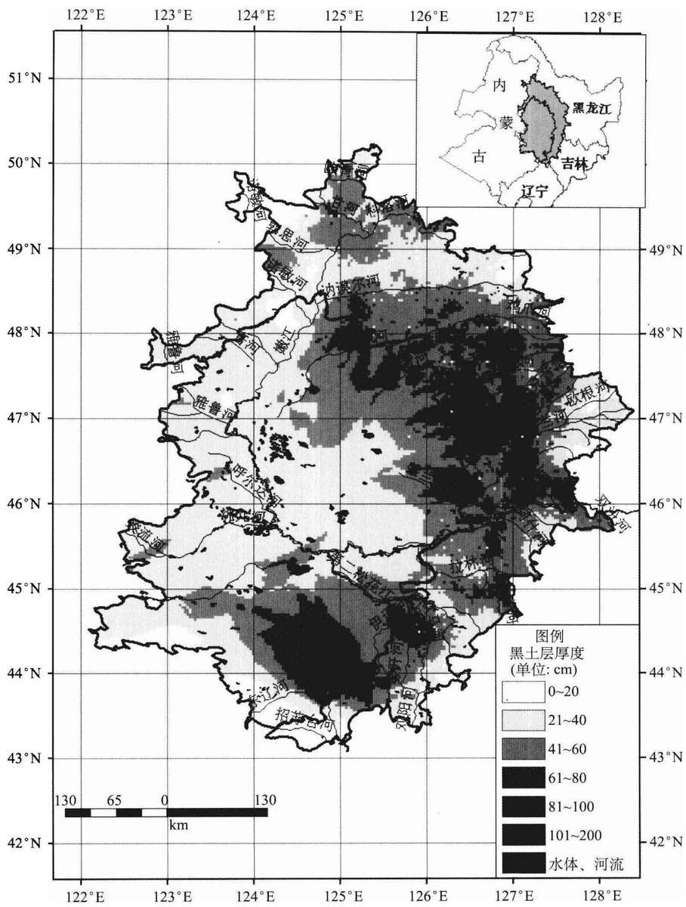  
图19.34 侵蚀50年后黑土层厚度空间分布图

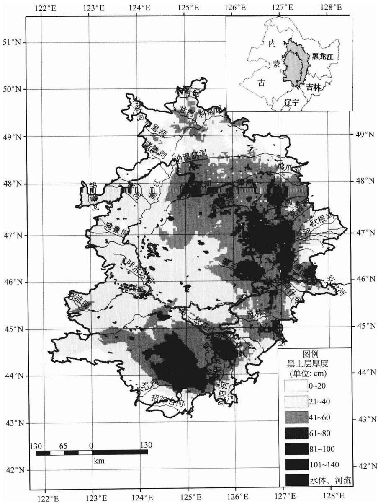  
图19.35 侵蚀100年后黑土层厚度空间分布图

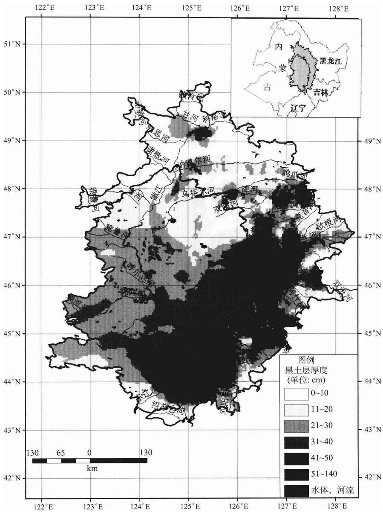  
图19.36 侵蚀1000年后黑土层厚度空间分布图

## 参考文献

白建宏，王玉玺，刘凤飞，等.2003.黑龙江省典型黑土区土壤侵蚀潜在危险度调查研究．中国水土保持，(11)：16\~17

蔡强国，范昊明，沈波.2003.松辽流域土壤侵蚀危险性分析与防治对策研究．水土保持学报，17(3): 21\~24

代全厚，许晓鸿，杨兴浪.1999.水土保持与吉林省农业可持续发展．水土保持通报，19（3)：58～61

邓伟，张平宇，张柏.2004.东北区域发展报告．北京：科学出版社，1～40，276～284

范昊明，蔡强国，陈光，等.2005.世界三大黑土区水土流失与防治比较分析．自然资源学报，20(3):387\~393

范昊明，蔡强国，郭成久，等.2006.东北黑土区土壤容许流失量与水土保持治理指标探讨．水土保持学报，20（2）：31\~34，81

范建荣，潘庆宾.2002. 东北典型黑土区水土流失危害及防治措施．水土保持科技情报，(5)：36～38

方华军，杨学明，张晓平，等.2005.137Cs示踪技术研究坡耕地黑土侵蚀和沉积特征．生态学报，25(6):1376\~1382

何万云.1992.黑龙江省土壤．北京：中国农业出版社，6～72

黑龙江省统计局.2005.黑龙江省统计年鉴（2005）.北京：中国统计出版社

黑龙江省土地管理局，黑龙江省土壤普查办公室.1992.黑龙江土壤．北京：中国农业出版社，

吉林省统计局.2005.吉林省统计年鉴（2005）.北京：中国统计出版社

吉林省土壤肥料总站.1998.吉林土壤．北京：中国农业出版社

贾艳红，张忠学，范宝山.2005.浅析松花江中下游河道河床演变的特性．海河水利，(6)：28～32

李明贵，李明品，邓玉芹.2001.呼盟水蚀区不同土地利用的水土流失观测与分析．泥沙研究，（6)

李意新，李松岩，赵秀杰.2000.克拜地区土体冻融作用与侵蚀沟发育特征浅析．黑龙江水专学报，27(3)：89\~90

辽宁省统计局.2005.辽宁省统计年鉴（2005）.北京：中国统计出版社

刘春梅，张之一.2006.我国东北地区黑土分布范围和面积的探讨．黑龙江农业科学，(2)：23～25

刘刚才，高美荣.1999.等高垄作垄沟的水土流失特点研究．水土保持通报，19（3）：33\~36

刘兴土，何岩，邓伟，等.2002.东北区域农业综合发展研究．北京：科学出版社

刘兴土.2005.东北湿地．北京：科学出版社，160～173

刘绪军，景国臣.1999.克拜黑土区沟壑冻融侵蚀主要形态特征初探．水土保持科技情报，（1)：28

刘运河，陈礼耕，石长金，等.1992.大兴安岭地区的水土流失及其防治．中国水土保持，（10)：1～3内蒙古自治区统计局.2005.内蒙古统计年鉴（2005）.北京：中国统计出版社

石长金，吕志学.1995.大小兴安岭山区的水土流失特点．中国水土保持，（1)：13～14，22

石玉林.2007.东北地区有关水土资源配置、生态与环境保护和可持续发展的若干战略问题研究：农业卷（东北地区农业发展战略研究）.北京：科学出版社，142\~143

魏建兵.2005.黑土侵蚀区景观生态建设的水土保持效应[学位论文]．北京：中国科学院

徐翠娇，郭成久，范昊明.2006.辽宁省土石质低山丘陵区土壤侵蚀研究．安徽农业科学，34（3）：

539, 542

解运杰，王岩松，王玉玺.2005.东北黑土区地域界定及其水土保持区划探析．水土保持通报，25(1): 48\~50

闫业超，张树文，李晓燕，等.2005.黑龙江克拜黑土区50多年来侵蚀沟时空变化．地理学报，60 (6): 1015\~1020

阎百兴，汤洁.2005.黑土侵蚀速率及其对土壤质量的影响．地理研究，24（4)：499～506

杨海军，沈波.2005.东北黑土区水土流失研究与治理．长春：吉林科学技术出版社

张春山.2004.拜泉县实施水保生态建设的做法与成效．中国水土保持，(2)：37～38

张树文，张养贞，李颖，等.2006.东北地区土地利用、覆被时空特征分析．北京：科学出版社，25～50,79\~97

张兴义，刘晓冰，隋跃宇，等.2006.黑土水土流失对大豆生长发育的影响．大豆科学，25（2）：123\~126

张之一.2005.关于黑土分类和分布问题的探讨．黑龙江八一农垦大学学报，17（1）：5～8

中国科学院林业土壤研究所.1980.中国东北土壤．北京：科学出版社

## 第二十章 北方土石山区

第一节 现 状

一、自然地理与社会经济概况

（一）自然地理概况

本次考察的北方土石山区在空间范围上包括海河流域与淮河流域。其中：海河流域总面积31.8万km²，山地和高原面积18.9万km²，占59.4%；淮河流域总面积为27万km²，山地丘陵面积约占流域总面积的1/3。两大流域约28万km²的山地丘陵区域是水土流失的主要分布区。

## 1. 地质地貌

北方土石山区北部山区，即张家口、承德以北地区，大部分位于阴山、燕山东西向复杂构造带内。西段阴山山地由前震旦纪花岗片麻岩、闪长片麻岩等组成，部分地区分布有中生代碎屑岩并存在大量火成岩；东段燕山山地广泛分布着震旦纪石英岩和硅质灰岩，下古生代浅海相沉积页岩和灰岩以及上古生代的含煤构造。该地区在中生代构造运动强烈，断层发育，地面长期隆起上升，岩石风化剥蚀，形成平缓的丘陵山地（海河水利委员会，1993）。

西部太行山区属新华夏系第三条隆起带，由一系列北北东向的平缓复式褶皱组成，东与华北平原的断裂带相接。其中五台山由片麻岩、片岩及花岗岩组成。在朔州、广灵、井陉、武安、涉县、潞城、陵川、辉县一带，岩溶发育，泉水丰富，著名的有神头泉、娘子关泉、黑龙洞泉、辛安泉、百泉等(海河水利委员会，1993)。

南部主要山体伏牛山、桐柏山、大别山是秦岭向东延伸的部分。新生代以来一直处于上升状态，山势比较陡峻。上述山体多由花岗岩、片麻岩组成，风化层较厚，富含石英砂砾；宿州一徐州一枣庄一兖州一带至临沂地区西南部、郑州至平顶山以西丘陵均为石灰岩；自新沂马陵山往北，沿沂沭河至沂水、五莲，断续有砂页岩分布。此外，在局部地区还零星分布有玄武岩、石英岩、安山岩、砂砾岩、泥质岩等（淮河水利委员会，1993）。

海河流域总的地势西北高，东南低，大致分高原、山地及平原三大地貌类型。流域的西部为山西高原和太行山区，北部为蒙古高原和燕山山区，山地和高原面积占总面积的60%；东部和南部为广阔平原，面积12.84万km²，占总面积的40%。燕山、太行山两大山脉由东北至西南，沿承德、丰宁、张家口、五台、井陉、涉县、焦作一线呈弧形分布，形成一道高耸屏障，环抱着东南部的黄淮海平原，对冬季冷空气的入侵起到重要的屏障作用（海河水利委员会，1993)。

海河流域山区地貌复杂多样，主要地貌单元有山区、丘陵、河谷盆地等，石质、土石质山丘面积为13.20万km²，约占山区面积的70%，主要分布在燕山北部和太行山西部。山区海拔一般在1000m左右。其中燕山山区海拔800～1500m，相对高差500～800m；太行山山区海拔500～2000m，相对高差多为150～170m，最高的五台山高达3058m。丘陵一般海拔100～500m，主要分布在燕山南麓及太行山东麓。较大的山间盆地有桑洋盆地、忻定盆地及长治盆地等，山区总地势由西北向东南倾斜。山区地面坡度多在20°以上，至丘陵渐次变缓。多数山区河流切割较深，沟壑纵横，沟壑密度一般为 2.0\~4.3 km/km²。

淮河流域西部、南部及东北部为山区和丘陵区，其余为平原、湖泊和洼地。流域山区面积为3.82万km²，占流域总面积的14%；丘陵面积为4.81万km²，占流域总面积的17%；平原面积为14.77万km²，占流域总面积的56%；湖泊洼地面积为3.6万km²，占流域总面积的13%。其中：淮河水系的山区面积占17%，丘陵占17.5%，平原面积占58.4%，湖洼面积占7.1%；沂沭泗水系山丘区面积占31%，平原面积占67%，湖泊面积占2%。

淮河流域西部的伏牛山、桐柏山区，海拔一般200～500m，太白顶牌坊洞是淮河发源地，海拔1141m；沙颍河上游的石人山海拔2153m，为全流域的最高峰；南部大别山区一般海拔在300～500m，淠河上游白马尖1774m，是大别山区的最高峰；东北部沂蒙山区，一般海拔在200～500m，龟蒙顶是沂蒙山区的最高峰，海拔1155m。丘陵主要分布在山区的延伸部分，流域西部海拔一般为100～200m，南部为50～100m，东北部一般在100m左右。淮河干流以北为广大冲、洪积平原，海拔一般为15～50m；苏北淮河下游平原海拔为2～10m；南四湖湖西为黄泛平原，海拔为30～50m。

## 2. 气候

海河流域冬季受西伯利亚大陆性气团控制，寒冷少雪；春季受蒙古大陆性气团影响，气温回升快，风速大，气候干燥，蒸发量大，往往形成干旱天气；夏季受海洋性气团影响，比较湿润，气温高，降雨量多，且多暴雨，但因历年夏季太平洋副热带高压的进退时间、强度、影响范围等很不一致，致使降雨量的变差很大，旱涝时有发生；秋季为夏冬的过渡季节，一般年份秋高气爽，降雨量较少。

海河流域山区年平均气温一般5.6～12.8℃，其中最低年均气温4.5℃（永定河），最高气温13.7℃（漳卫河）。无霜期年平均120～200天，其中最少为99天（永定河），最大217天（漳卫河）。年平均相对湿度为50%～70%。年平均风速1.5～3.4m/s。由于流域所处位置与特定的气候条件，霜冻、冰雹等灾害性气候不断发生，造成局部地区的农业减产甚至绝收。秋季的早霜对山区的晚秋作物危害较大，春季的晚霜对拔节后的冬小麦也有一定的危害。

海河流域多年平均降雨量为560mm，是我国东部沿海降水最少的地区。受地形、气候等因素影响，降水分布呈较明显的地带性分异。降水分布总趋势是由燕山、太行山构成的弧状山系向西北、向东南两侧减少。在山脉迎风坡形成一条600mm弧形多雨带，燕山山脉的河北遵化、太行山山脉的河北易县及河南淇县是700～800mm的多雨中心，五台山最多达952mm。西部的雁北、冀北山地大部分地区降雨量在400～500mm。

海河流域降水年际、年内分配极不均匀。年际变化幅度以太行山、军都山多雨区较大。多数站最大与最小年降水量之比在4倍左右，燕山地区及西部高原、盆地变幅最小，均在3倍以下；年内变化主要反映在降雨量集中的汛期（6～9月），约占全年降水量75%～85%。特别是7月、8月，日雨量有时超过200mm，最大达865mm（獐么，1963年8月3日），而秋冬季（10月至翌年2月）降水只占全年的10%左右，春季（3～5月）仅占15%。

淮河流域地处我国大陆的东部，秦岭一淮河是我国主要的南北气候分界线，既有南方气候的某些特征（如盛夏酷热），又有北方气候的一些特点。流域北部属于暖温带半湿润季风气候区，为典型的北方气候，冬半年比夏半年长，过渡季节短，空气干燥，年内气温变化大。流域南部属于北亚热带湿润季风气候，夏半年比冬半年长，空气湿度大，降水丰沛，气候温和。淮河流域气候总的特点是：四季分明，气候温和，夏季湿热，冬季干冷，春季天气多变，秋季天高气爽。

淮河流域气候温和，多年平均气温为14.5℃，月平均最高气温通常出现在7月，多年平均在27℃左右，月平均最低气温出现在1月，多年平均在0℃左右。流域的极端最高气温44.5℃（河南汝州，1966年6月20日；安徽蚌埠1932年），极端最低气温—24.3℃（安徽固镇，1969年2月6日）。

淮河流域降水的总体特点是：降水量自南部、东部往北部、西部递减，同纬度山丘区降水大于平原区，山脉的迎风坡降水多于背风坡。流域多年平均降水量在600～1600mm，南部1600mm，北部600mm。江淮流域6月、7月份持久性大范围的降水天气称梅雨。梅雨期长短、雨量的多寡，基本上决定了淮河全年的水情，如1931年、1954年梅雨期长、雨量多，形成了全流域性大洪水。梅雨期结束后转入盛夏，淮河流域常受台风袭击，并由此产生严重的水土流失。

## 3. 河流水文

北方土石山区各河的水文，受到降水少、蒸发大的影响，流量不丰，总径流量大致在1500亿 $\mathbf { m } ^ { 3 }$ 左右，径流深几乎全部在200mm以下，有的在50mm以下，是我国东部季风区径流量最少的地区。从人口多、耕地广、工农业用水多、大中城市多的情况看，缺水较为严重。

海河流域水系可分为北系、南系和滦河水系。北系包括潮白河、蓟运河、北运河及永定河；南系包括大清河、子牙河和漳卫南运河。此外，还有单独入海的徒骇马颊河和冀东沿海诸小河。海河流域人均水资源占有量只有293$\mathrm { { m ^ { 3 } } }$ ，相当全国平均水平的13%，全流域水资源只能满足实际用水量的2/3，有1/3约130亿 $\mathrm { m ^ { 3 } }$ 的水量是靠过度开发地表水、超采地下水获得。北方土石山区河流的另一个特点是含沙量普遍较高。这与土石山区水土流失关系密切。

淮河流域由淮河及沂沭泗两大水系组成，黄河故道以南为淮河水系，以北为沂沭泗水系。淮河水系集水面积19万 $\mathrm { k m } ^ { 2 }$ ，约占流域总面积的70%。淮河发源于河南省桐柏山，流经河南、安徽至江苏的三江营入长江，全长约1000km，平均比降为0.2%0。沂沭泗水系发源于山东沂蒙山，由沂河、沭河和泗河组成，总集水面积近8万km²。淮河流域湖泊众多，水面面积约10 000km²，占流域总面积的3.7%，总蓄水能力280亿 $\mathrm { m } ^ { 3 }$ ，其中兴利库容66亿 $\mathbf { m } ^ { 3 }$ 。淮河水系较大的湖泊有城西湖、城东湖、瓦埠湖、洪泽湖、高邮湖等，沂沭泗水系有南四湖、骆马湖。

## 4. 植被条件

北方十石山区的植被有明显的纬度变化，从北部的干草原和森林草原逐渐向南部递变为针阔叶混交林、落叶阔叶林，植被的覆盖度逐渐增加，种类成分越来越复杂。

海河流域北部西半壁的地带性植被为干草原，是内蒙古草原的一部分。

它主要包括针茅草原和羊草草原。优势植物有克氏针茅（Stipa krylovii）、短花针茅（S. breviflora)）、大针茅（S. grandis）、羊草（Aneuropidium chi-nesis）、冰草（Agropyron cristatum）等。北部的东半壁为森林草原。森林是由白杆（Picea meyeri )、白桦（Betula phatyphylla)、华北落叶松(Larix principis-rupprechtii）等组成的针阔混交林。在林下及林外过渡地带有山荆子（Malus baccata）、山杏（Prunus sibirica）等灌木。草甸草原分布在水分条件较好的低平地上和低矮山坡上，优势植物以羊草为代表。

冀西北间山盆地灌木草原是落叶阔叶林向干草原的过渡地段。低山和黄土丘陵分布着干旱灌木草原。燕山山地落叶阔叶林、温性针叶林分布区分属于永定河、潮白河水系。组成落叶阔叶林的代表树种有白桦（Betulapha-typhylla）、山杨（Populus davidiana）、蒙古栎（Quercus mongolica）等。针叶树主要是油松（Pinus tabulaeformis）。残存的森林只保存在交通不便的山峰，其余地方均被破坏，形成荒山秃岭。冀西山地落叶阔叶林灌草丛的地带性自然植被为落叶阔叶林，有华北落叶松、栎类（Quercus spp.）林及灌草丛分布。

海河流域全流域植被盖度>75%的面积为37368.61km²，占流域面积的  
19.68%；覆盖度在60%～75%的面积为24615.28km²，占流域面积的  
12.96%；覆盖度45%～60%的面积为24855.40 km²，占流域面积的  
13.09%；覆盖度 30%～45%的面积为 31 188.60 km²，占流域面积的  
16.42%；覆盖度10%～30%的面积为27 934.54km²，占流域面积的  
14.71%；<10%的面积为 43 928.58 km²，占流域面积的 23.13%。

淮河流域地处我国的中部，气候上具有东西和南北过渡的性质，因此，成为东、西、南、北植物的交汇区域，植被分布具有明显的地带性特点。鉴于山地地形复杂和海拔高度的不同，温度和水分条件也有显著差异，因而植物分布差异也较大。

就不同的区域而言，伏牛山北坡及沂蒙山区分布落叶栎类阔叶一油松针叶为主的天然次生林。浅山低山区为旱生灌丛和草甸。海拔1400m以上地区分布坚桦、蒙古栎（Q.mongolica）等针阔落叶阔叶林和天目琼花、六道木(Abelia zanderi）等灌丛。温带植物分布广泛，而且愈往北温带植物成分的数量愈多。在海拔1000～1400m，主要有由栓皮栎、油松等组成的杂木林以及胡枝子（Lespedeza bicolor）、绣线菊（Spiraae spp.）组成的灌丛。1000m以下多栎类萌生幼林。伏牛山的南坡，1800m以上分布着铁杉、太白冷杉、华山松和马桑（Coriaria sinica）、绣线菊等灌丛。草本植物以禾本科、莎草科、菊科为主。在海拔1400～1800m，栓皮栎、锐齿槲栎、华山松混交，灌丛植物有胡枝子、连翘等。800～1400m，栓皮栎与锐齿槲栎混交。800m以下为马尾松、杉木。低山丘陵生长大量栓皮栎、麻栎，灌丛有荆条、酸枣等。伏牛山区的森林覆盖率为21%，沂蒙山区为12%。

桐柏山、大别山以针叶树、常绿阔叶、落叶阔叶混交林为主。针叶林的面积很广，虽然这些树种在这里已经接近它们的北缘，但对生长环境仍然有较强的适应性。马尾松分布在海拔600m以下的山顶、山坡和山脊。因其耐瘠薄、耐干旱，造林成活率高，成为恢复森林植被的先锋树种。落叶阔叶林分布也很广泛。在200～500m阴坡多被栎类林所占据，而山谷中分布的是刺楸（Kalopanax pictus）、四照花（Cornus kausa）、杜鹃（Rhododendronsimsii）组成的杂木林。阳坡还有枫香、化香。500m以下的山溪两旁枫杨等比较普遍。常绿树有山胡椒（Lindera glauca）、冬青（Ilex chinensis）等。针叶树的马尾松在600m以下的山地阳坡分布最广，杉木分布在1 000 m以下的山脚、山腰等土层深厚而肥沃的背风地方。浅山丘陵有野山楂（Cratae-guscuneata)、胡枝子、荆条为主的灌丛。桐柏山、大别山区的森林覆盖率为30%。

江淮丘陵草本多白茅（Imperata cylindrica）、黄菅草（Themeda trian-dra var. japonica)、野古草（Arundinella hirta），灌木有山合欢（Albizziakalkora)、山胡椒（Lindera glauca)、野蔷薇（Rosa multiflora var.cathayensis）等。在部分地区也保存小片杂木林，其中常见的乔木有苦储(Castanopsis sclerophylla)、枫香、麻栎等。

## 5. 土壤

北方土石山区的主要土壤类型在水平分布上，从北向南主要是褐土和黄棕壤两大类。褐土是暖温带的地带性土壤，而黄棕壤则是北亚热带的地带性土壤。在地带性土壤内还有若干亚类的划分。

棕壤带与暖温带半湿润落叶阔叶林植被相联系，集中分布在燕山山地丘陵地区的东部。西起管涔山、五台山、小五台山和丰宁与围场接坝处。棕壤分布的海拔高度大致是600m（燕山）和1000m（太行山）的中低山，黏化过程明显，淋溶过程较为显著，腐殖质层的有机质含量一般大于50g/kg，通体无石灰反应。在丰宁—围场海拔1400～1700m的温带半湿润森林草原气候条件下，发育了灰色森林土。低温、潮湿的气候条件，有利于土壤有机质的积累，使土体中游离的盐基离子和碳酸钙被淋失，残积黏化较微弱。在上层土体发生脱硅作用的同时，在中下部土体中发生淀积。腐殖质层的厚度大致在20\~30 cm，有机质含量在40～60g/kg，通体呈弱酸性反应。

棕壤带的西部分布栗钙土和栗褐土。前者是温带半于旱大陆性气候干草原植被条件下形成的草原土壤，其成土过程以腐殖质积累和钙化过程为主。剖面上层为腐殖质层，厚度一般为20～25 cm，有机质含量在15～40g/kg，向下逐渐减少。下层为钙积层，一般出现在40～60 cm处，厚度20～50cm，碳酸钙含量在50～300g/kg，通体石灰反应，呈弱碱性至碱性反应。后者发育在温带半干旱森林草原向温带草原过渡的生物气候条件下，具有弱腐殖质化、弱黏化、弱钙积化的成土特点。在承德围场还有黑土分布，它是温带半湿润草甸草原植被下发育的草原土壤，主要成土过程是腐殖质积累过程和还原淋溶过程。腐殖质层厚度20～40 cm，腐殖质含量50～70g/kg，通体无石灰反应。

褐土带与暖温带半湿润半干旱气候条件相联系，广泛分布在燕山、太行山低山丘陵和山麓。它在干旱森林条件下发育而成，成土母质以黄土状物质为主。其成土过程的特点突出表现在两个方面：一是有明显的黏化过程，以残积黏化为主，在土体的一定深度形成黏粒含量较高的粘化层；二是具有明显的钙化过程，受淋溶程度的限制，土体中的碳酸钙下移到一定深度后即发生淀积，形成钙积层。腐殖质层的有机质含量一般在30g/kg左右。土壤呈中性到碱性反应。

此外，草甸性潮土广泛分布。其分布区地下水位较高，地下水参与成土过程。潮土并非地带性土壤，但在地理位置上，处于流域中南部、东南部，面积很大，其北部、西部与褐土衔接，温度和水分状况与褐土相当，同属暖温带。潮土地处平坦地区，土层深厚，是海河流域重要的粮、棉、油产地。

由于地形等多方面的影响，海河流域的土壤一般土层较薄。承德北部山区土层厚度一般在20～60 cm，滦河流域一般阴坡土层在50 cm左右，永定河流域土层厚30～40m，其他石质山丘，土层厚一般20～40cm；冀西山地包括大清、子牙、漳卫河系的山区地带，一般厚度在20～50cm。

淮河流域在伏牛山与淮河一线以北，在落叶阔叶林植被下，比较广泛地分布着褐土。而在北亚热带气候条件下，植被类型为落叶阔叶与常绿阔叶混交林，地带性的土壤为黄棕壤。两者有各自不同的成土过程和土壤剖面特征。但由于两者同处在气候的过渡带，植被类型也有过渡特征，因此，两种土壤类型也有互相渗透的跨带现象。

黄棕壤大致分布在淮河干流以南，因所处的地形部位不同成土母质有较大差异。覆盖在低丘缓岗上的母质是由黄土所组成；覆盖在高部位浅山石质山岭上的土层多由花岗岩、石英岩、片岩、页岩等各种母岩经风化后发育而成。黄棕壤淋溶作用比较强烈，土体盐基多被淋失，铁铝氧化物开始向下移动聚集，具有弱富铝化过程，盐基代换量、盐基饱和度较褐土低，土壤呈微酸性反应。一般来说，构成黄棕壤的母质比较黏重，加上气候因素，黏粒形成与淋溶积聚十分活跃，往往在心土层形成黏化层。铁、锰淋溶淀积显著，一般在30～45 cm深处有黑褐色铁锰胶膜，45～120 cm 出现铁锰结核淀积。黄棕壤的有机质含量在表层可以达到70g/kg，但从表层向下则迅速降低。依据所处的地形部位、发育阶段以及人类活动的影响，可以分为黄棕壤、黄褐土和黄刚土等亚类。黄棕壤一般分布在海拔400～800m，黄褐土在200～400m的山前洪积坡积丘陵，土壤发生层次明显，通体较黏重，表层有机质含量大致在30g/kg左右。黄刚土分布的海拔更低，它是黄棕壤、黄褐土经耕作熟化而成，主要分布在丘陵缓岗地区，表层有机质含量很少超过20 g/kg。

从区域分布来看，淮河流域西部伏牛山区北麓主要为棕壤和淋溶褐土。浅山丘陵区主要为褐土。伏牛山南麓多分布黄棕壤和棕壤。桐柏山、大别山为黄褐土、黄棕壤和棕壤。淮南山区主要为黄红壤与棕壤之间过渡的黄棕壤，其次为棕壤。丘陵区为黄棕壤。沂蒙山丘区多为粗骨性褐土和粗骨性棕壤。

北方土石山区的土壤，由于多种原因土层都不厚。两大流域的典型调查表明，土层厚度小于15cm的约占总面积的40%，大于50 cm的只占总面积的10%，其余都在15～50cm之间。这就提出了一个水土流失的预防问题，一旦流失将无法挽回。

## （二）社会经济概况

北方土石山区北部海河流域包括河北、山西、山东、河南、内蒙古、辽宁等6个省（区）和北京、天津等2个直辖市的268个县级行政区划单位。南部淮河流域包括湖北、河南、安徽、山东、江苏等5省的181个县（市）。

2003年全区总人口为3.00亿人，其中，海河流域为1.32亿人，淮河流域1.68亿人。在总人口中，农业人口为21910.31万人，其中，海河流域为8506万人，淮河流域为13404万人。北方土石山区的人口密度很大，海河流域达到415人/km²，淮河流域高达622人/km²，后者是全国平均人口密度的4.6倍，居全国七大流域之首。

北方土石山区2003年耕地总面积为2307.1万hm²，其中，海河流域总耕地面积1043.1万 $\mathrm { h m ^ { 2 } }$ ，人均 $0 . 0 7 9 { \mathrm { ~ h m } } ^ { 2 }$ ；淮河流域总耕地面积1264.0万$\mathrm { h m } ^ { 2 }$ ，垦殖率达46.9%，是全国的4.5倍，但人均仅0.075hm²，山丘区人均耕地面积仅为0.07 hm²，其中坡耕地占20%。

北方土石山区2003年国内生产总值29264亿元，人均国内生产总值9754元。其中，淮河流域国内生产总值10466.62亿元，人均国内生产总值仅6230元，低于全国平均值，尚属经济欠发达地区。农民人均纯收入2870.85元。目前淮河流域有12个国家级的贫困县，涉及总人口1240万人，其中农业人口1125万人。

北方土石山区煤、石油、铁等矿产蕴藏量在全国处于前列，有著名的大同、平朔、阳泉、开滦、焦作、淮南等煤矿区和华北、大港、胜利等油田。沿海历来是重要的盐产区。拥有京广、京九、京哈、京沪、京包、津浦、京原、陇海、新（乡）石（臼），蚌（埠）合（肥），以及新（沂）长（兴）等铁路。公路四通八达。有秦皇岛、塘沽、黄骅、连云港、石臼等港口。

## 二、水土流失状况

## （一）水土流失现状

北方土石山区土壤侵蚀包括水蚀、风蚀、重力侵蚀等几种类型，其中水蚀面积最大。根据水利部水土流失遥感调查结果，2000年区内土壤侵蚀面积13.33万km²，占区域土地面积的23%，约为山丘区面积的一半。上述侵蚀面积中，轻度侵蚀面积6.67万km²，占总侵蚀面积的50%；中度侵蚀面积5.73万km²，占总侵蚀面积的42.96%；强度侵蚀面积0.79万km²，占总侵蚀面积的5.93%；极强度侵蚀面积0.13万km²，占总侵蚀面积0.97%，剧烈侵蚀面积132km²，占总侵蚀面积的0.10%。2000年以来新增治理面积2万km²，目前区内水土流失面积约为11.3万km²。

就水土流失的空间分布而言，区内强度以上侵蚀面积主要分布在：①潮白河流域密云水库上游；②永定河流域官厅水库上游；③滦河流域潘大水库上游；④太行山东麓子牙河、大清河、漳卫河流域上游；⑤淮河上游的桐柏大别山区；⑥洪、汝、沙、颍河上游的伏牛山区；⑦沂、沭、泗河上游的沂蒙山区；⑧江淮、淮海丘陵区及黄泛平原风沙区。

## （二）水土流失成因

北方土石山区水土流失原因中，降雨集中、多暴雨是一个重要原因。北部海河流域汛期（6～9月）雨量占全年降雨量75%～85%，全年降水量的多少常取决于一场或几场暴雨。沿燕山、太行山迎风坡是一条次降雨量大于

100mm弧形多雨带，其中分布着多个大于120～140mm的暴雨中心。而南部淮河流域汛期降水占全年的50%～75%，在桐柏山、大别山、伏牛山、沂蒙山等区域形成多处暴雨中心，丰水年月降水量达500～1000mm，日降水量达300～500mm，1h降水量达100 mm以上，每年暴雨次数达4～6次，暴雨量约占年降水量的50%。

地形破碎、坡度大、沟壑密度大是影响区域土壤侵蚀的另一个重要的自然因素。境内以土石山区为主，丘陵与山地交错，山丘区地面坡度大多在20°以上，高低悬殊，起伏显著，造成了极易侵蚀的地形地貌条件。北部海河流域山区沟壑密度大都在2.0～4.3km/km²，坡度在15°以上的面积达64159 km²，其中大于25°的面积达33 068 km²。南部淮河流域的伏牛山区和沂蒙山区，沟壑纵横，高密度的沟壑不仅为地表径流快速下泄提供通道，而且加剧了沟壑的扩张和下切。此外坡洪积物质和黄土的较大面积存在，也是水土流失的重要原因之一。

北方土石山区的黄土丘陵区土层较厚，在50m左右，但抗蚀能力低。其余土石山区或石质山丘区经多年耕垦和不合理利用，形成大面积土层瘠薄、抗蚀能力差的粗骨土、沙砾土，土层浅薄、涵蓄水源能力低下，每逢降水，极易形成较大的地表径流，产生较强的径流冲刷力，从而使水土流失不断发展。

人为因素中，陡坡开荒，坡耕地面积不断增加，导致植被覆盖率低，加上坡地经济林的不合理利用，林下地表裸露，更严重加剧了区域水土流失。历史上，北方土石山区在未开垦的自然状况下，天然植被良好，生态自然修复能力强，水土流失轻微。随着人口的快速膨胀，土地开发速度不断加快。北部海河流域山丘区坡耕地几乎占到耕地面积的近40%，其中25°以上的坡耕地占20%左右。而南部淮河流域的坡耕地、坡式梯田面积占水土流失面积的34.4%，达到104万hm²，其中桐柏大别山区占16.1%，伏牛山区占23.1%，沂蒙山区占33.7%，江淮丘陵区占27.1%。对森林资源大量开发利用，加上开发方式不合理，大大加速了水土流失发生和发展，是加重水土流失的根本原因。

北方土石山区矿产资源丰富，开矿采石、任意向河道倾倒废渣等现象依然较为普遍；经济社会的发展，经济建设速度加快，公路、铁路、电力设施、水利工程、城市化建设等开发建设项目造成的人为水土流失呈加重之势。据调查统计，淮河流域每年因基础设施建设和矿产开采等新增水土流失量高达2000万～5000万t。

## （三）水土流失主要特点

北方土石山区水土流失的主要特点是土层薄，土壤相对流失量大，对土地生产力的威胁大。海河流域中，除永定河流域的黄土丘陵区外，承德北部山区、滦河流域山区、永定河流域石质山区、冀西山地等山丘区土层一般为20～60 cm。淮河流域山丘区耕地土层一半以上不到50 cm。而区内轻度水土流失每年流失土壤厚度在1.0mm左右。这样的土壤侵蚀强度对于瘠薄的土层而言，相对流失量极大，也对土地生产力造成了严重威胁。目前淮河流域已有近17.0万 $\mathrm { h m } ^ { 2 }$ 的土地变成裸岩，2.5万hm²的土地变成难以利用的沙地，还有超过2.3万 $\mathbf { k } \mathbf { m } ^ { 2 }$ 不足30 cm土层厚度的山场面积，正在加速流失并逐步丧失可利用能力。

## （四）水土流失主要危害

## 1. 严重影响区域水资源安全

海河下游的京津冀地区是我国的核心经济区，而区域水资源短缺，人均占有量仅 $2 9 6 \mathrm { m } ^ { 3 }$ ，不足全国平均水平的1/7。在水资源如此短缺的情况下，水土流失带来的重金属、化肥、农药等残留物质污染水质严重影响了这些地区的水资源安全。在海河流域的82个水质监测断面中，有42个断面丰水期氨氮指标高于枯水期。32座大型水库中，有18座水库丰水期氨氮指标高于枯水期，其中陡河、潘家口、于桥、黄壁庄等12座重要水库丰水期氨氮指标高于枯水期1倍左右。而在淮河流域，水土流失造成淮河干流的非离子氮污染居全国江河之首。

## 2. 破坏土地生产力，淤积下游河道水库

北方土石山区土层薄、土壤砂砾含量大，水土流失极易造成土壤粗骨化和石漠化。海河流域年平均土壤侵蚀量为32130万t，相当于流失化肥17.8万t；而淮河流域山丘区每年流失的氮、磷、钾元素折合成标准化肥达200万～400万t。水土流失使山东临沂市土地石漠化面积达6.46万hm²，其中有裸岩面积2.4万 $\mathrm { h m } ^ { 2 }$ 。土壤粗骨化和石漠化导致土壤持水能力低，容易产流，易形成山洪和泥石流灾害，自新中国成立以来50年间，单海河流域共发生泥石流80余次。由于砂砾含量大，还造成径流中推移质多，加剧水库淤积，威胁防洪，也对水资源的调蓄产生不利影响。通过对潮白河流域30年水文资料分析，多年平均年进入密云水库的泥沙量为420万 $\mathrm { m } ^ { 3 }$ ；永定河官厅水库1955年建成拦洪，至1998年已淤积6.46亿m3，占总库容的28.5%。

## 3. 严重制约革命老区、贫困区的经济社会发展

北方土石山区水土流失严重的太行山区、沂蒙山区、桐柏大别山区、伏牛山区都是革命老区，也是贫困区。据对考察县份的统计结果，淮河流域沂水、蒙阴、费县、汝阳、鲁山、桐柏、金寨、定远8个县共有总人口579.59万人，其中农业人口486.39万人，年均收入900元以下的人口就达到64.78万人。水土流失与贫困互为因果，水土流失使耕地肥力下降，土层变薄，土地产出率低。为解决吃粮和烧柴问题，陡坡垦殖、毁林开荒、乱垦滥伐现象屡禁不止，而广种薄收的农业生产，使水土流失区温饱一直难以解决。水土流失还造成地下水位下降、地表水断流、人畜饮水十分困难，养殖种植业难以发展。

## （五）水土流失发展趋势

根据全国第1次（20世纪80年代初期）和第2次（20世纪90年代末期）两次土壤侵蚀遥感调查结果，海河流域山区水土流失动态变化情况为：第1次土壤侵蚀遥感调查水土流失面积为110605.47km²，占流域山区面积的58.40%；第2次土壤侵蚀遥感调查水土流失面积为103 901.04km²，占流域山区面积的54.72%。第2次比第1次减少水土流失面积6704.43km²，减少6.45%。如果把两个时段变化的水土流失面积折算为年平均变化速率，则自1984年至1999年的15年内，全流域山区每年减少水土流失面积447km²，符合流域历年水土流失治理情况。

从水土流失强度变化来看，海河流域强度以上侵蚀面积由20世纪80年代初的25 848.88km²减少到90年代末的4618.13 km²，第2次调查面积比第1次调查面积减少21 230.75 km²，中度以上侵蚀面积由80年代初的64474.58 km²减少到90年代末的 53 200.18 km²，减少11 274.40 km²。

同样根据全国第1次（20世纪80年代初期）和第2次（20世纪90年代末期）两次土壤侵蚀遥感调查结果，淮河流域山区水土流失变化情况为：第1次土壤侵蚀遥感调查水土流失面积为58704.6km²；第2次土壤侵蚀遥感调查水土流失面积为30822.24km²。90年代末比80年代初减少水土流失面积27882.4km²，减少47.50%。其中强度以上侵蚀面积由80年代初的9106.7km²减少到90年代末的4873.06 km²，90年代末比80年代初减少

4233.64 km²，中度以上侵蚀面积由80年代初的30631.4km²减少到90年代末的14 228.78 km²，减少16 402.6 km²。

根据面上实地考察看到的情况并结合遥感调查的结果，北方土石山区水土流失演变大致可归纳出3个方面明显的特征：①深山区普遍好转，山前丘陵区局部恶化。由于深山区人口稀少，加上封育治理，植被覆盖度有所提高，水土流失状况普遍好转，而山前丘陵区人口压力大，加上矿业开发带来了新的水土流失，山前丘陵区出现局部恶化现象。②重点治理区普遍好转。考察到的重点治理区水土流失普遍好转，而非重点治理区与未治理区出现局部恶化现象。③部分经济不发达地区仍然严重。太行山区、沂蒙山区、桐柏大别山区等几个老区、贫困区水土流失依然严重。

北方土石山区大面积坡耕地、“坡林地”（单一措施的坡地经济林）、工程建设区，水土流失形势依然严峻。区内目前尚有约11.3万km²的水土流失面积需要治理，而已治理面积由于治理标准偏低，部分地区每平方公里政府投入只有2万元，遇暴雨极有可能出现反弹，加上“两工”取消后治理成本上升，如果投资没有明显增长来加大治理力度与治理成果维护力度以及监督力度，极可能出现大面积的水土流失恶化现象。

## 三、水土保持现状

(一)治理进展

20世纪50年代至2003年，北部海河流域水土保持综合治理总投资46.5亿元，治理面积达到9万km²（实际保存5万km²）。结合《21世纪初期首都水资源可持续利用规划》项目、京津风沙源治理工程项目、太行山重点治理工程等，2004年海河流域又完成水土流失治理面积 $4 6 9 9 { \mathrm { ~ k m } } ^ { 2 }$ ，其中生态修复730 km²，重点治理 $3 9 6 9 \ \mathrm { k m } ^ { 2 }$ 。重点治理包括基本农田 35 456 hm²，经济果林 56 729 hm²，水保林 183 192 hm²，人工种草 16 194 hm²，封育87 429 hm²，其他 $1 7 \ 8 5 9 \ \mathrm { h m } ^ { 2 }$

1980年以来淮河流域累计完成水土流失治理面积3.9万km²，其中：水平梯田105万hm²；塘坝114万座；拦沙谷坊25万座；水土保持林草220万hm²（其中经济林约80万 hm²）。

## （二）治理成效

经过20多年的不懈努力，北方土石山区水土流失治理取得了明显成效。

北部海河流域全流域年均侵蚀量已由20世纪80年代初期的4.33亿t下降到90年代末3.16亿t，年均减少1.17亿t。水土流失面积减少6704.43km²，减少 6.45%。其中强度以上侵蚀面积由 25 848.88 km²减少到 4618.13 km²，减少 21 230.75 km²；中度以上侵蚀面积由 64 474.58 km²减少到 53 200.18km²，减少11274.40km²。而南部淮河流域经过治理，增加涵蓄水能力约20亿m3，每年减少和拦蓄泥沙约1亿t。流域内土壤侵蚀面积在近20年的时段内减少27 000 km²，中度水土流失面积减少了12000 km²，强度以上侵蚀面积减少了4000km²。水土保持生态建设成效显著，土壤侵蚀状况有所好转。

水土流失治理不仅减轻了区域土壤侵蚀，增加了涵蓄水能力，减轻了泥沙对下游河道水库的淤积，使得密云水库等大型水库的淤积情况有所改善，同时几十年的水土保持工作也促进了当地经济和社会的发展。截至2000年年底，海河流域水土保持每年可增产粮食18.5亿kg，枝条101.8亿kg，饲草10.3亿kg，蓄积木材1000万m³，年水保分摊增产总价值35.3亿元。1996年列入淮河流域水土流失综合治理重点县的58条小流域，5年共改造坡耕地2.26万hm²，并通过引蓄灌排工程配套，增加灌溉面积48 923 hm²，粮食产量年增8192万kg，土地产出增长率达18.8%，稳定解决了小流域72.65万人口的粮食问题。近年来，淮河流域水土保持项目区农村经济稳步增长，群众经济收入逐年提高，大批农户因此摆脱了贫困，改善了生活条件。

## (三)突出经验

通过近20年来的水土保持实践，北方土石山区的水土保持工作人员积累了大量工作经验，归纳起来主要有以下几个方面。

## 1. 预防为主，加大监督执法力度

《水土保持法》颁布实施以来，北方土石山区内各省、自治区、直辖市及时制定实施办法和配套法规，积极落实法律赋予水行政主管部门的审批权、收费权和监督权，大力推动水土保持监督机构建设。特别是1999年水利部在全国范围内组织开展水土保持监督管理规范化建设活动以来，水土保持监督执法工作得到进一步加强，机构逐渐健全，配套法律法规不断完善，管理队伍不断壮大，预防监督工作日趋法制化、正规化。各地已初步形成了省、市、县、乡、村5级监督执法网络体系，有关市县都成立了水土保持监督执法领导小组，一些水土流失治理大县还专门成立了水土保持生态环境建设局。在此基础上，各级水土保持执法部门以加强方案审批为重点，以征收“两费”、查处大案要案为突破口，依法落实“三权”，收到了一定效果。

## 2. 以小流域为单元，科学规划，综合治理

北方土石山区小流域治理过程中，根据人口多、土层薄的特点，紧紧抓住“坡改梯”工程、坡面蓄水工程、沟道治理工程，有效地控制和拦蓄了泥沙，同时为生产、生活条件的改善提供水资源和基本农田保证。北方土石山区近20多年的实践证明，建设以水平梯田、水浇地、沟坝地等为主的基本农田，是进行小流域综合治理的突破口和重要措施，也是促进陡坡地退耕的保证条件。此外，小流域综合治理必须统一规划，与土地利用结构调整、产业结构调整相结合。在小流域水土保持综合规划中，强调山、水、田、林、路的统一规划、综合整治；在水土资源调查评价中，要充分考虑气候、土壤、植被、水资源等自然条件，在此基础上提出规划方案；在农田、林地、草地、水域、荒地、道路、村庄等土地利用结构调整中，相互协调，宜乔则乔、宜灌则灌、宜草则草、宜水则水、宜荒则荒；在规划生产发展方向时，农业、林业、畜牧业、加工业等产业能与当地资源条件和优势相适应；在水、土资源的综合整治开发中，梯田、水系、沟道等各类整治工程因地制宜；在林、草品种的选择上，有利于保护和利用好当地的乡土品种。

## 3. 治理与开发利用相结合，统一生态效益、经济效益、社会效益

小流域综合治理过程中，必须从解决水土流失根本原因出发，将流域治理和群众利益挂钩，融经济效益、生态效益、社会效益于一体，这正是安徽金寨黄榜小流域、山东沂水县杨庄小流域、河南鲁山清水河小流域等综合治理过程中取得的重要经验。针对山区人多地少、经济落后的突出问题，上述小流域在水土保持的同时，强调通过坡改梯等基本农田建设，提高农业生产水平；通过沟道治理，改善农田灌溉条件；通过微型电站、沼气池，发展省柴灶等能源开发措施，保护山林资源；通过大力发展以蚕桑、板栗等为主的水土保持产业化经济，不断提高群众的生活水平，使群众从水土保持中真正获得利益，从而提高保持水土的积极性与主动性。

## 4. 突出强调水资源的合理调配

水资源短缺与污染是北京生态环境的主要问题，为了保护水源，北京市在遵循“山、水、林、田、路统一规划，工程、治污、生物、农艺相结合，拦、蓄、灌、排节综合治理”的原则下，通过强调“三道防线”（生态修复防线、生态治理防线、生态保护防线）建设，使怀柔庄户沟小流域、门头沟区苇甸沟小流域、密云县石匣小流域、延庆县汉家川小流域等生态清洁型小流域建设取得明显成效。通过构筑三道防线，上述小流域有效发挥了水土保持工程的防洪减灾和水源保护功能。同时，通过建立“养山就业、规范补偿、以工带补、建管结合”的生态补偿机制与生态移民，提高了当地群众生态建设的积极性；通过将农村生活污水、养殖业污水、生活垃圾的治理，保证了河道和村镇清洁，也提高了水资源的利用效率；通过水资源的高效利用，发展水利灌溉设施，改善了农业生产条件；通过调整农业结构，发展观光采摘、民俗旅游、土特产销售，促进了农民增收致富。

## 5. 依靠科技，提高治理水平与效益

近年来在水利部淮河水利委员会的大力支持下，山东费县将治理水土流失与建立商品基地、发展农副产品加工业相结合，水土流失治理速度明显加快，县域经济也随之快速发展。目前已实施666.6hm²以上规模治理片26处，发展9个林果专业乡（镇）、1000个各类农产品基地村和7个用材林生产基地；同时为满足小流域治理的需求，成立了水土保持综合开发公司，开展毛竹、塑料制管、钢材、木材、水泥、小排灌机具等多种经营。费县的成功经验表明，依靠科技，综合开发，有利于提高水土流失治理水平与效益。

## 6. 利用市场机制，加快治理步伐

水土保持作为一项公益性、基础性、群众性建设事业，必须靠广大群众的集中式投工投劳才能完成，缺少群众的积极参与，水土保持无法取得现有成效。根据考察组考察调查了解到的情况，北方土石山区海河流域水土流失治理投入中农民出工投入占总投入的1/3以上，淮河流域农民出工投入则更高。充分说明当地农民是水土保持的主体力量，水土保持应广泛调动群众治山治水的积极性。

把治理、开发融为一体，山、水、林、田、路统一规划，综合治理，在此基础上发展高效小流域经济，是调动群众治山治水积极性的根本途径，也是小流域治理成果得以巩固提高的根本保证。北方土石山区各试点小流域在大力建设基本农田、保证粮食自给的同时，发展林果业、畜牧业，推广地埂经济、山地园林经济、立体种植经济，发展高效小流域经济，使群众通过水土保持获得经济效益，增加了群众水土保持的积极性。

## 7. 加大宣传，提高群众水保意识

为了使广大人民群众增强水土保持、生态建设的意识，加强知识普及教育工作乃是有力的途径之一。山东省临沂市近些年通过在市电视台多次播放水土流失专题片，就取得了很好效果。因此，从全民角度出发来考虑问题，必须发动和组织广大科技工作者，从不同学科和不同角度出发，通过不同渠道，使用不同手段，采用不同的表现形式，努力搞好水土保持、生态建设的社会教育，普及水土保持、生态建设的科学知识。

## （四）主要问题

北方土石山区坡耕地面积大，水土流失严重，亟需加以治理。该区淮河流域上游的坡耕地达84万hm²，其中3°～5°占34%，5°～15°占40%，15°～25°占21%，25°以上占4%。该区海河流域有在册坡耕地133.3万hm²，占山区耕地面积36%，其中25°以上坡耕地约占坡耕地面积的20%左右，为26.6万hm²。这些坡耕地是区域水土流失的一个重要源地。这样大面积的坡耕地如不及时加以治理，必然加剧北方土石山区土地沙化、石漠化，从而出现河南汝阳以及沂蒙山区基岩裸露、土地丧失生产能力的严重后果。

北方土石山区水土保持资金投入偏少，治理标准偏低，水土流失治理进度缓慢，新形势下水土保持难度加大。统计重点考察县的水土保持投资情况，海河流域单位治理面积平均国家投入11.66万元/km²，淮河流域只有0.51万元/km²。除水利部安排的八大片重点治理区、京津风沙源治理项目区以及21世纪首都水资源项目区等重点治理区外，其他广大水土流失区在水土保持方面的政府投入都很低，部分地区补助标准甚至低于2万元/km²，主要以群众投劳为主。2004年来各地相继取消了劳动积累工和义务工，过去在面上一直采取的群众投入为主体的治理模式遇到了极大困难。此外，在农业收入较低的情况下，农村外出务工人员增加，将劳动力工价抬高，也提高了水土保持的成本。

“坡林地”下的水土流失应引起充分重视。一般认为林地具有良好的水土保持功能，经济林也不例外，但单一措施的坡地经济林即“坡林地”，如安徽金寨县坡地板栗林，由于不合理经营，全垦全复整地造林，坡地林粮间种，林相单一，林下地面裸露，缺乏草灌植被与枯枝落叶层的保护，加上山区降水量大，汛期暴雨频繁，地面坡度大，每遇暴雨，林下冲沟密布，地表土壤大量流失，土壤侵蚀程度均在中、强度以上。

水土保持科技投入、多部门协调管理、水土保持法律法规的可操作性等亟需加强。北方土石山区水土保持监测网络建设近两年刚起步，而以前建立的水保试验站大多因资金短缺、人才流失等原因，难以维持。在管理方面，政府许多部门的工作都与水保有关，譬如林业部门的造林工程和护林补贴、农牧业部门的沼气池补贴和舍饲养畜补贴以及民政部门的移民工程等。问题是投入分散，缺乏协调和统一规划，造成治理资金的浪费。在监督执法方面，尤其矿业开发、道路建设等项目中水保执法方面仍然存在一定问题，主要有：①水土保持法中没有明确水土保持投资应与社会发展水平相适应；②水土保持规划审批的权威性不够；③缺乏明确的惩罚条款；④监督管理人员缺乏；⑤行政干预较多。

## 第二节 分 区

## 一、分区原则和方案

（一）分区的目的意义

水土保持分区实为水土保持区划，是按照地表土壤侵蚀类型、侵蚀强度、侵蚀形态类型、治理方向和治理措施等特征，将相同的区域与具有明显相异的区域进行分门别类地划分，并以图的形式表现出来。水土保持分区是生态环境建设分区、土地利用规划等重要的组成部分，是建设现代化农业的一项重要的基础工作，其目的是指导水土保持工作实践和科学配置水土保持综合治理措施。有了这个区划便可以很好地根据因地制宜、分类指导的原则，确定治理的主攻方向，为做好水土保持规划提供科学依据。

## （二）分区原则

水土保持区划的基础是土壤侵蚀区划，北方土石山区在全国土壤侵蚀分区中属二级区，即一级区水蚀类型区中的北方土石丘陵二级区，本次区划是在二级区的基础上再进一步地分区，即三级区（唐克丽等，2004；景可等，2005)。通过对区域自然环境因素、土地利用特征、社会经济条件和水土保持目标综合分析后认为，北方土石山区水土保持分区应坚持的基本原则是：

（1）地带性原则。水土流失的发生、发展，除了与土地利用的合理性不可分割外，与当地的自然环境要素更是密不可分，从侵蚀类型到侵蚀强度，从环境治理对策到治理措施的配置，与自然环境都有着密切的关系，而区域自然与环境所具备的特点完全与区域所在的纬度地带性相适应，即具有地理地带性。每个地理带都有各自的自然环境特点，而且这些特点不能人为改变，即使受到人为干扰，其基本特性也不会改变，因而不同地带开发利用方向有它的相似性。北方土石山区在我国七大流域中占据两大流域，南北相距2240km，跨越21个纬度（31°～52°N)；从气候带看跨越北亚热带、南温带和中温带等3个气候亚带；由南到北从湿润、半湿润到半干旱；与此相应的是年降雨量从南部的1000mm减少到北部的400mm。受纬度地带性影响，区域内的植被、土壤以及自然灾害由南至北呈现明显的地域变化。因而在水土保持分区中要坚持地带性原则。

(2）非地带性原则。北方土石山区自然环境特点、土地利用以及水土流失类型、水土流失强度除了与自然地带性因素有关外，很大程度上还受控于非地带性因素。在每个自然带内由于非地带性因素的地域差异形成了次级区域的环境差异。在众多的非地带性因素中起重要作用的是地貌因素，其次是地质中的岩性因素。地貌类型不仅影响到局部的气候因素还影响到降雨量，如太行山东麓、燕山南麓处于迎风坡，形成多雨带，年降雨量为600～800mm，而背风坡年降雨量小于600mm；同样在沂蒙山区也有类似情况，并形成一个暴雨中心。地质地貌因素还影响到土地利用、水土保持措施配置以及水土保持效益，所以非地带性原则也是水土保持分区中必须考虑的原则之一。

（3）社会经济原则。上述地带性原则和非地带性原则都是纯粹从自然因素这个角度考虑的，水土保持在受到自然环境因素作用的同时，还要受到社会经济因素的影响，如社会经济基础、人口素质、劳动力、自然资源、传统生产方式等都影响到水土保持。水土保持实施过程中除了要坚持上述地带性和非地带性两个原则外，还必须考虑到生态环境建设的成本与效益等方面，即要遵循社会经济原则。

## (三)分区方案

依据以上三原则的综合分析，最终确定以年降雨量为基础，地质地貌因素为骨干，辅以社会经济状况，来确定北方土石山区水土保持分区方案，如图20.1所示。水土保持分区命名以地理方位和水土流失发生的主要地貌基础进行复合命名。北方土石山区水土保持各分区的基本概况如表20.1。

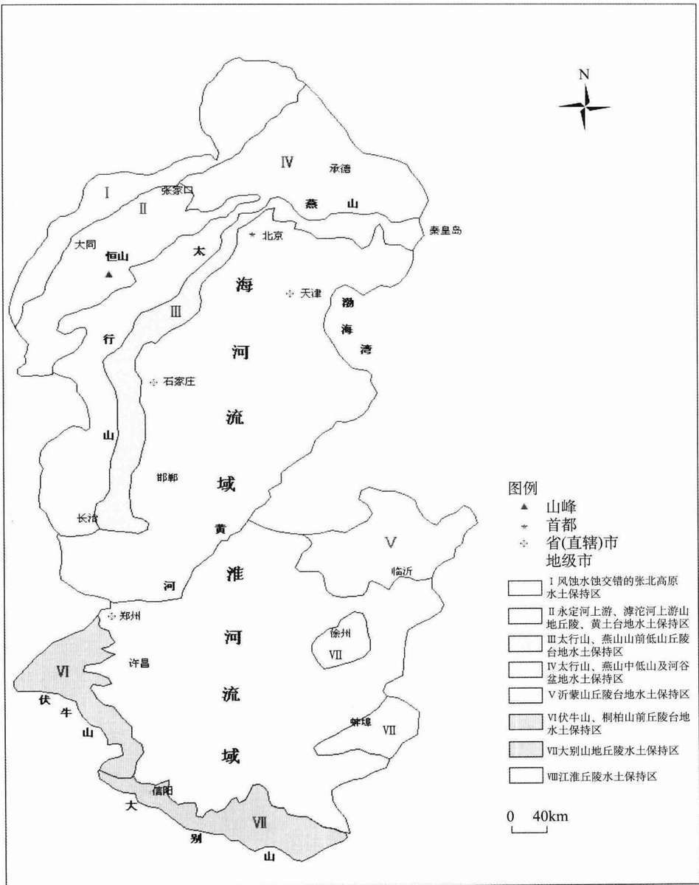  
图20.1 北方土石山区水土保持分区图

表 20.1 北方土石山区各水土保持区的基本情况一览表
<table><tr><td rowspan=1 colspan=1>分区</td><td rowspan=1 colspan=1>土地面积/km²</td><td rowspan=1 colspan=1>人口/万</td><td rowspan=1 colspan=1>流失面积/km²</td><td rowspan=1 colspan=1>年降雨量/mm</td><td rowspan=1 colspan=1>地质地貌</td><td rowspan=1 colspan=1>主导产业</td><td rowspan=1 colspan=1>县、市</td></tr><tr><td rowspan=1 colspan=1>I</td><td rowspan=1 colspan=1>25 222</td><td rowspan=1 colspan=1>349.7</td><td rowspan=1 colspan=1>16 490</td><td rowspan=1 colspan=1>400~500</td><td rowspan=1 colspan=1>波状土石丘陵</td><td rowspan=1 colspan=1>种植业、牧业</td><td rowspan=1 colspan=1>张北等14个县</td></tr><tr><td rowspan=1 colspan=1>Ⅱ</td><td rowspan=1 colspan=1>40 370</td><td rowspan=1 colspan=1>6 129. 0</td><td rowspan=1 colspan=1>18 747</td><td rowspan=1 colspan=1>450~500</td><td rowspan=1 colspan=1>山地黄土台地</td><td rowspan=1 colspan=1>种植业、牧业</td><td rowspan=1 colspan=1>怀来等24个县</td></tr><tr><td rowspan=1 colspan=1>Ⅲ</td><td rowspan=1 colspan=1>33 374</td><td rowspan=1 colspan=1>1 147. 0</td><td rowspan=1 colspan=1>15 763</td><td rowspan=1 colspan=1>550~700</td><td rowspan=1 colspan=1>山地丘陵</td><td rowspan=1 colspan=1>种植业、林果业</td><td rowspan=1 colspan=1>临城等 33个县</td></tr><tr><td rowspan=1 colspan=1>IN</td><td rowspan=1 colspan=1>68 426</td><td rowspan=1 colspan=1>8 930. 0</td><td rowspan=1 colspan=1>40 731</td><td rowspan=1 colspan=1>500~550</td><td rowspan=1 colspan=1>山地河谷台地</td><td rowspan=1 colspan=1>种植业、牧业</td><td rowspan=1 colspan=1>承德等35个县</td></tr><tr><td rowspan=1 colspan=1>V</td><td rowspan=1 colspan=1>20 946</td><td rowspan=1 colspan=1>1 111. 8</td><td rowspan=1 colspan=1>9 333</td><td rowspan=1 colspan=1>700~800</td><td rowspan=1 colspan=1>低山剥蚀台地</td><td rowspan=1 colspan=1>种植业、林果业</td><td rowspan=1 colspan=1>沂水等14个县</td></tr><tr><td rowspan=1 colspan=1>VI</td><td rowspan=1 colspan=1>14 212</td><td rowspan=1 colspan=1>7 742. 2</td><td rowspan=1 colspan=1>4 198</td><td rowspan=1 colspan=1>600~700</td><td rowspan=1 colspan=1>低山丘陵</td><td rowspan=1 colspan=1>种植业</td><td rowspan=1 colspan=1>汝阳等12个县</td></tr><tr><td rowspan=1 colspan=1>II</td><td rowspan=1 colspan=1>34 167</td><td rowspan=1 colspan=1>1 246. 1</td><td rowspan=1 colspan=1>6 990</td><td rowspan=1 colspan=1>700~800</td><td rowspan=1 colspan=1>中低山地</td><td rowspan=1 colspan=1>种植业、经作</td><td rowspan=1 colspan=1>金寨等15个县</td></tr><tr><td rowspan=1 colspan=1>II</td><td rowspan=1 colspan=1>29 850</td><td rowspan=1 colspan=1>1 232. 9</td><td rowspan=1 colspan=1>1 100</td><td rowspan=1 colspan=1>700~800</td><td rowspan=1 colspan=1>波状剥蚀丘陵</td><td rowspan=1 colspan=1>种植业</td><td rowspan=1 colspan=1>定远等16个县</td></tr></table>

## 二、分区特征概述

## （一）水蚀风蚀交错的张北高原水土保持区（I）

该区分布在海河流域的最北部，地面为起伏和缓的丘陵和高平原，是全区年降雨量最少，仅为350～500mm的半干旱区，植被类型为过渡性的森林草原植被。本区处于农牧交错带，属水蚀风蚀两相混合水土流失区，夏、秋季以水蚀为主，冬、春季以风蚀为主。本区还是京津风沙源区之一。由于长期不合理的土地利用和过度放牧，沙漠化面积扩大趋势未得到有效控制（任美锷、包浩生，1992)。

## （二）永定河上游、滹沱河上游中山丘陵、黄土台地水土保持区（Ⅱ）

本区分布在Ⅰ区南面的永定河与滹沱河上游，主要地貌类型是河谷平原及其两侧的黄土台地和谷地两侧的中低山分水岭。年均降雨量为400～500mm，地带性植被是森林草原，受不合理的人类活动影响，现代植被以灌丛草原为主。地表出露物质在山地是裸岩和粗骨土，在台地是黄土、河谷的粉砂和砂砾层（《中国自然资源丛书》编撰委员会，1995)。本区是北方土石山区水土流失最为严重的区域，官厅站年均含沙量达到 $4 2 \mathrm { k g } / \mathrm { m } ^ { 3 }$ ，超过黄河三门峡，有“小黄河”之称（中国科学院《中国自然地理》编辑委员会，1986)。水土流失主要发生的地貌部位是黄土台地，以沟蚀为主。本区除了严重的水蚀外，冬春季的风蚀也很严重，近期的人为加速侵蚀发展也很快，主要是开矿、采石等原因所导致。

## （三）太行山、燕山山前低山、丘陵台地水土保持区（Ⅲ）

该区位于太行山东麓、燕山南麓，总面积约3.3万km²，其中水土流失面积约1.5万km²，占土地面积44%，以水力侵蚀为主，重力侵蚀也比较活跃，滑坡泥石流时有发生；近年来局部的开矿、采石、修路等人为加速侵蚀还在漫延。本区的主要地貌形态类型是中低山、丘陵和台地，即所谓的浅山区；这几种地貌类型由分水岭到山前，由高到低有规律地分布。本区地理位置优越，处于迎风坡，得益于地形雨的影响，年降雨量600～650mm，并形成几个暴雨中心。本区地带性植被是暖温带落叶阔叶植被，但由于长期受到不合理的人类活动影响，天然植被已荡然无存，现在以人工乔木植被和天然灌丛植被为主（中国自然资源丛书编撰委员会，1995）。区内地表土层瘠薄，以粗骨土为主，不同岩性的基岩广泛出露。

## （四）太行山、燕山中低山及河谷盆地水土保持区（Ⅳ）

本区是指太行山、燕山深山区，总面积约7.0万km²；本区地貌最大特点是山高谷深、坡陡，主要地貌形态类型是石质中山和山间的河谷地，河谷地狭窄相间，整个山地中分布不少构造宽谷，在宽谷的后缘是黄土台地，如长治是太行山区最大的宽谷；承德是燕山最大的宽谷，都有黄土台地发育(中国自然资源丛书编撰委员会，1995)。本区水土流失面积4.1万km²，以中度和轻度侵蚀为主。中山虽基岩裸露但地表组成物抗蚀力强，水力侵蚀较轻，但受坡度影响，重力侵蚀时有发生。区域内黄土台地是主要的水土流失发生区，也是泥沙的主要来源区，以沟蚀和沟道的重力侵蚀为主。该区年降雨量500～600mm，植被覆盖率较高，但森林覆盖率不到20%，以草灌植被为主；本区除河谷平原外，土地生产力一般都比较低，即使河谷地也是以中低产田为主。本区是革命老区，为抗日战争和解放战争的胜利做出了巨大贡献，但现在人民的生活水平仍然比较低。

## （五）沂蒙山区低山丘陵台地水土保持区（V）

该区位于淮河下游左岸支流沂河和沭河的上游，是鲁中南山地的一部分，全区面积2.1万km²，该区的主要地貌类型是侵蚀低山、侵蚀基岩丘陵和侵蚀剥蚀片麻岩丘陵台地及河谷平原。该区年降雨量700～800mm，是一个暴雨中心，降雨的变率比较大，旱涝灾害频发。全区除河谷地外，轻度以上的水土流失面积0.93万km²，占土地面积的44%。该区主要水土流失发生区是片麻岩台地；其次是泥砂岩丘陵，以面蚀为主，中低山地的重力侵蚀引发的泥石流也时有发生。本区除河谷地外，山地丘陵的土壤质地都很差，尤其是大片的片麻岩台地虽然土层较厚，但以粗骨土为主，渗透能力强，有机质含量低，土地生产能力低，最常见的自然灾害是旱灾（中国自然资源丛书编撰委员会，1995)。

## （六）伏牛山、桐柏山前丘陵台地水土保持区（VI）

该区位于淮河流域的上游，属伏牛山和桐柏山余脉，主要地貌类型是低山、丘陵和台地；低山以侵蚀基岩低山为主，丘陵以石质丘陵为主，其次是土石丘陵，台地都是剥蚀片麻岩台地。本区水土流失主要发生区是土石丘陵，其次是片麻岩台地；侵蚀方式以面状侵蚀为主，低山区也有泥沙流发生，但频率较低；区域侵蚀强度以中度以下侵蚀为主。本区年降雨量700～800mm，是一个暴雨中心，常形成洪涝灾害；地带性植被是以落叶阔叶林为主的混交林，但由于长期的破坏，天然林面积很小，大范围的是人工林和灌丛草地；本区地带性土壤是黄棕壤，但受母质和地貌形态的影响，除河谷地外土地的生产力都很低（中国自然资源丛书编撰委员会，1995）。

## （七）大别山山地丘陵水土保持区（Ⅶ）

大别山是长江与淮河的分水岭，属淮河流域的面积约3.4万km²，主要地貌类型是侵蚀中山和一部分土石丘陵。本区地形的最大特点是山高、坡陡、谷深，土层薄，以基岩山地为主；只有以泥砂岩为主的低山丘陵的风化壳比较厚（中国自然资源丛书编撰委员会，1995）。本区属于北亚热带，年均降雨量800mm以上，是淮河的主要水源区。本区的植被覆盖度高，在70%以上。区内人口密度比较大，人均占有耕地面积少，在耕地中又以坡耕地为主，区内坡耕地产生严重的水土流失，是泥沙的主要来源区。区内除了坡耕地强烈侵蚀外，重力侵蚀和由此引发的泥石流在山区也时有发生。

## （八）江淮丘陵水土保持区（Ⅷ）

本区位于淮河中下游，主要地貌形态类型是波状起伏的丘陵和河谷平原。江淮丘陵实际上是经过长期侵蚀剥蚀形成的准平原地形，现在大部分土地已开垦为水稻地，只有部分海拔相对高的岭岗地为坡耕地，这是主要的水土流失区，但是流失面积不大，而且强度也小，侵蚀产沙对区域环境未产生太多的危害。

## 第三节 战略目标、总体布局与措施配置

## 一、战略目标与任务

## （一）近期目标与任务（2006～2010年）

北方土石山区目前需要治理的水土流失面积约为11.3万km²，“十一五”期间力争完成治理面积的50%，即利用5年的时间完成5.67万km²面积的水土流失治理，年均治理1.1万km²，其中坡改梯面积 $2 6 3 9 \ \mathrm { k m } ^ { 2 }$ 、经济林面积 $9 6 5 0 ~ \mathrm { k m ^ { 2 } }$ 、水保生态林面积1.99万km²、自然封禁面积2.45万km²，同时以小流域为单元配套沟道治理等工程措施。全面完成25°以上坡耕地的退耕还林，重点水土流失区水土流失得到有效控制，治理区林草覆盖率提高10%以上，生态环境进入较稳定的发展阶段，治理区人均粮食拥有量达到500kg，人均收入增加200～300元；建立较完善的水土保持预防监督体系和水土流失监测网络，建立比较健全的水土保持法律法规体系和机构队伍体系，人为水土流失防治走上法制化、规范化轨道。

## （二）中期目标与任务（2011～2020年）

在巩固提高已有治理成果的基础上，到2020年，全面完成区域水土流失治理，完成坡改梯面积2639km²、经济林面积9650km²、水保生态林面积1.99万km²、自然封禁面积2.45万km²，同时以小流域为单元配套沟道治理等工程措施。实现区域坡耕地的全面改造，水土流失治理程度达到80%以上；“四荒”资源得到科学合理地开发利用；宜林宜草地全面恢复植被；治理区内林草覆盖率提高15%～20%，生态环境得到根本改观，生态农业步入良性发展轨道，全面实现粮食自给，农村居民人均纯收入依托水土保持提高500元左右；健全水土保持预防监督体系和动态监测网络，全面规范开发建设活动的水土保持行为，基本遏制住人为水土流失。

## （三）远期目标与任务（2021～2030年）

巩固已有治理成果，建立起适应国民经济可持续发展的良性生态系统；不断强化水土保持预防监督体系和动态监测网络，全面遏制可能新增的人为水土流失。

## 二、总体布局与措施配置

水土保持措施配置与水土保持目标紧密相关，根据北方土石山区水土保持的阶段目标与区域目标，区域水土保持措施配置遵循以下三方面原则：一是区域粮食自给的原则。北方土石山区的水土流失区是一个人多地少、土地生产力低下、经济落后的区域，广大革命老区还在贫困线上徘徊，保证粮食区域自给是社会稳定的前提，是建设新农村和环境友好型社会的基础。为了保证区域粮食安全，达到每人年均400kg的谷物产量需求，在水土保持措施配置时，必须将坡改梯作为一项重要措施来考虑。二是经济增收原则。水土保持不仅要有生态效益，还要有经济效益，两者缺一不可。为此，水土保持措施配置应充分注意到这些措施给农民带来经济效益。三是增加植被覆盖率的生态原则。植被覆盖度大小是决定水土流失强弱的主要因素之一，植被覆盖度增加可以有效地保护水土资源，增加生物多样性，同时减少输入下游河道的泥沙与面源污染物，也有利于减缓洪涝灾害，维持环境安全。因此水土保持措施配置必须考虑安排适当比重的生态措施。

依据上述三项基本原则，拟定了三套北方土石山区水土保持方案，即A方案：粮食保障方案；B方案：生态优先方案；C方案：综合方案。生态优先方案在生态、粮食保障和增收三者中首先考虑生态目标，所有水土流失面积治理中将生态措施作为首选措施，具体而言，现有坡耕地以退耕还林还草为主，荒山荒坡也以生态恢复为主，其他措施都处于次要地位。粮食保障方案则在水土保持措施配置的设计过程中首先考虑粮食安全问题，首先保证一定规模的坡改梯措施，然后再考虑其他生态恢复和增加经济收入等方面的措施。综合方案既考虑到粮食安全，又考虑到生态安全，还要考虑到增加群众经济收入。首先保证一定数量的坡改梯面积，然后保证一定规模的经济林，继而布设林草生态措施。北方土石山区每个水土保持区不同方案的水土保持措施配置如下。

## A方案：粮食保障方案

根据各区人均占有基本农田的数量、基本农田粮食亩产、粮食安全状态下的人均粮食占有量等指标，计算出人均增加基本农田的数量；在此基础上进一步计算出全区坡改梯的规模，列于表20.2。为了保障全区粮食安全，全区需要通过坡改梯增加基本农田 $6 5 1 . 2 3 \times 1 0 ^ { 3 } \mathrm { h m } ^ { 2 }$ o

表20.2 各水土保持区坡改梯的数量
<table><tr><td rowspan=2 colspan=1>类型区</td><td rowspan=2 colspan=1>耕地/hm²</td><td rowspan=2 colspan=1>人口/万</td><td rowspan=1 colspan=2>人均耕地/(hm²/人)</td><td rowspan=2 colspan=1>基本农田定额/(hm²/人)</td><td rowspan=2 colspan=1>缺额/(hm²/人)</td><td rowspan=2 colspan=1>基本农田补充量/hm²</td></tr><tr><td rowspan=1 colspan=1>耕地</td><td rowspan=1 colspan=1>其中基本农田</td></tr><tr><td rowspan=1 colspan=1>I</td><td rowspan=1 colspan=1>839 280</td><td rowspan=1 colspan=1>349.7</td><td rowspan=1 colspan=1>0.240 0</td><td rowspan=1 colspan=1>0.166 7</td><td rowspan=1 colspan=1>0.166 7</td><td rowspan=1 colspan=1>0</td><td rowspan=1 colspan=1>0</td></tr><tr><td rowspan=1 colspan=1>Ⅱ</td><td rowspan=1 colspan=1>934 667</td><td rowspan=1 colspan=1>628.7</td><td rowspan=1 colspan=1>0.148 7</td><td rowspan=1 colspan=1>0.092 0</td><td rowspan=1 colspan=1>0.100 0</td><td rowspan=1 colspan=1>0.008 0</td><td rowspan=1 colspan=1>50 296</td></tr><tr><td rowspan=1 colspan=1>Ⅲ</td><td rowspan=1 colspan=1>774 444</td><td rowspan=1 colspan=1>1 147.0</td><td rowspan=1 colspan=1>0.067 3</td><td rowspan=1 colspan=1>0.054 0</td><td rowspan=1 colspan=1>0.054 0</td><td rowspan=1 colspan=1>0</td><td rowspan=1 colspan=1>0</td></tr><tr><td rowspan=1 colspan=1>IN</td><td rowspan=1 colspan=1>723 765</td><td rowspan=1 colspan=1>893.9</td><td rowspan=1 colspan=1>0.081 3</td><td rowspan=1 colspan=1>0.051 3</td><td rowspan=1 colspan=1>0.066 7</td><td rowspan=1 colspan=1>0.015 3</td><td rowspan=1 colspan=1>137 064</td></tr><tr><td rowspan=1 colspan=1>V</td><td rowspan=1 colspan=1>747 429</td><td rowspan=1 colspan=1>1 111.9</td><td rowspan=1 colspan=1>0.067 3</td><td rowspan=1 colspan=1>0.042 7</td><td rowspan=1 colspan=1>0.053 3</td><td rowspan=1 colspan=1>0.010 7</td><td rowspan=1 colspan=1>118 603</td></tr><tr><td rowspan=1 colspan=1>VI</td><td rowspan=1 colspan=1>555 750</td><td rowspan=1 colspan=1>774.2</td><td rowspan=1 colspan=1>0.072 0</td><td rowspan=1 colspan=1>0.0420</td><td rowspan=1 colspan=1>0.053 3</td><td rowspan=1 colspan=1>0.011 3</td><td rowspan=1 colspan=1>87 742</td></tr><tr><td rowspan=1 colspan=1>VII</td><td rowspan=1 colspan=1>782 924</td><td rowspan=1 colspan=1>1 246.1</td><td rowspan=1 colspan=1>0.062 7</td><td rowspan=1 colspan=1>0.032 7</td><td rowspan=1 colspan=1>0.053 3</td><td rowspan=1 colspan=1>0.020 7</td><td rowspan=1 colspan=1>257 527</td></tr><tr><td rowspan=1 colspan=1>II</td><td rowspan=1 colspan=1>1 563 744</td><td rowspan=1 colspan=1>1 232.9</td><td rowspan=1 colspan=1>0.126 7</td><td rowspan=1 colspan=1>0.126 7</td><td rowspan=1 colspan=1>0</td><td rowspan=1 colspan=1>0</td><td rowspan=1 colspan=1>0</td></tr><tr><td rowspan=1 colspan=1>合计</td><td rowspan=1 colspan=1>6 922 003</td><td rowspan=1 colspan=1>7 384.4</td><td rowspan=1 colspan=1></td><td rowspan=1 colspan=1></td><td rowspan=1 colspan=1></td><td rowspan=1 colspan=1></td><td rowspan=1 colspan=1>651 233</td></tr></table>

由于粮食保障方案设计时首先考虑的是粮食安全，其次是生态安全，并没有考虑到从水土保持中大幅增加经济收入，因而也就没有考虑发展经济林，所以这一项措施在粮食保障方案中为空白。

由于北方土石区人均土地有限，土地压力大，不可能实施大范围的自然封禁。北方土石山区实行自然封禁的范围大致是现状土地利用中的荒山荒坡和难用地，这些地基本上都是存在水土流失的土地。根据各县的土地利用调查，荒山荒坡和难用地的土地面积大约占到土地总面积的15%左右。考虑到资金有限和资金集中使用，也可以将少部分灌木林和疏林地实行自然封禁，但自然封禁的面积最大不超过水土流失面积的30%～40%。鉴于这样的认识，规划各类型区自然封禁面积如表20.3。

北方土石山区各水土保持区生态林建设规模由两方面的因素决定：一是区内的水土流失面积；二是区内其他治理措施面积。将前者减去后者之和就是区域生态林建设规模。具体到本方案中，生态林的规模就是区域水土流失面积减去坡改梯面积、自然封禁面积。各水土保持区生态建设规模见表20.3。

表20.3 各水土保持区生态林、自然封禁措施规模
<table><tr><td rowspan=1 colspan=1>类型区</td><td rowspan=1 colspan=1>土地面积/km²</td><td rowspan=1 colspan=1>流失面积/km²</td><td rowspan=1 colspan=1>坡改梯规模 $/ 1 0 ^ { 3 } \mathrm { h m } ^ { 2 }$ </td><td rowspan=1 colspan=1>自然封禁规模/10³hm2</td><td rowspan=1 colspan=1>生态林规模/10³hm2</td></tr><tr><td rowspan=1 colspan=1>I</td><td rowspan=1 colspan=1>25 222</td><td rowspan=1 colspan=1>16 490</td><td rowspan=1 colspan=1>0</td><td rowspan=1 colspan=1>504.44</td><td rowspan=1 colspan=1>1 144.56</td></tr><tr><td rowspan=1 colspan=1>ⅡI</td><td rowspan=1 colspan=1>40 370</td><td rowspan=1 colspan=1>18 747</td><td rowspan=1 colspan=1>50.30</td><td rowspan=1 colspan=1>605.55</td><td rowspan=1 colspan=1>1 218.85</td></tr><tr><td rowspan=1 colspan=1>Ⅲ</td><td rowspan=1 colspan=1>33 374</td><td rowspan=1 colspan=1>15 763</td><td rowspan=1 colspan=1>0</td><td rowspan=1 colspan=1>500.61</td><td rowspan=1 colspan=1>1 075.69</td></tr><tr><td rowspan=1 colspan=1>IV</td><td rowspan=1 colspan=1>68 426</td><td rowspan=1 colspan=1>40 731</td><td rowspan=1 colspan=1>137.06</td><td rowspan=1 colspan=1>1 026.39</td><td rowspan=1 colspan=1>2 909.65</td></tr><tr><td rowspan=1 colspan=1>V</td><td rowspan=1 colspan=1>20 946</td><td rowspan=1 colspan=1>9 333</td><td rowspan=1 colspan=1>118.60</td><td rowspan=1 colspan=1>314.19</td><td rowspan=1 colspan=1>500.51</td></tr><tr><td rowspan=1 colspan=1>VI</td><td rowspan=1 colspan=1>14 212</td><td rowspan=1 colspan=1>6 198</td><td rowspan=1 colspan=1>87.74</td><td rowspan=1 colspan=1>142.12</td><td rowspan=1 colspan=1>389.94</td></tr><tr><td rowspan=1 colspan=1>VI</td><td rowspan=1 colspan=1>34167</td><td rowspan=1 colspan=1>7 990</td><td rowspan=1 colspan=1>257.53</td><td rowspan=1 colspan=1>170.84</td><td rowspan=1 colspan=1>370.64</td></tr><tr><td rowspan=1 colspan=1>VII</td><td rowspan=1 colspan=1>29 850</td><td rowspan=1 colspan=1>1 100</td><td rowspan=1 colspan=1>0</td><td rowspan=1 colspan=1>0</td><td rowspan=1 colspan=1>77.00</td></tr><tr><td rowspan=1 colspan=1>合计</td><td rowspan=1 colspan=1>266 567</td><td rowspan=1 colspan=1>116 352</td><td rowspan=1 colspan=1>651.23</td><td rowspan=1 colspan=1>3 264.14</td><td rowspan=1 colspan=1>7 686.83</td></tr></table>

注：\*自然封禁面积按占总土地面积5%\~15%计算。

综上所述，粮食保障方案中各项水土保持措施的规模分别是坡改梯$6 5 1 . 2 3 \times 1 0 ^ { 3 } \mathrm { h m ^ { 2 } }$ 、自然封禁 $3 \ 2 6 4 . 1 4 \times 1 0 ^ { 3 } \mathrm { h m } ^ { 2 }$ 、生态林 $7 \ 6 8 6 . 8 3 \times 1 0 ^ { 3 } \mathrm { h m ^ { 2 } }$

## B方案：生态优先方案

根据各区现有经济林的规模和人均经济收益增长目标，计算北方土石山区各水土保持区经济林措施配置的规模，见表20.4。由表20.4可见，北方土石山区8个水土保持区总共建设各类经济林 $2 \ 0 9 4 \times 1 0 ^ { 3 } \mathrm { h m } ^ { 2 }$ 。各水土保持区情况不尽相同，总的趋势是由南至北人均经济林建设规模越来越大。

表 20.4 各水土保持区经济林建设规模
<table><tr><td rowspan=1 colspan=1>类型区</td><td rowspan=1 colspan=1>土地面积/km²</td><td rowspan=1 colspan=1>人口/万</td><td rowspan=1 colspan=1>现有人均经济林/hm²</td><td rowspan=1 colspan=1>人均定额/hm²</td><td rowspan=1 colspan=1>人均补缺量/hm²</td><td rowspan=1 colspan=1>经济林增加规模/10³hm²</td></tr><tr><td rowspan=1 colspan=1>I</td><td rowspan=1 colspan=1>25 222</td><td rowspan=1 colspan=1>349.7</td><td rowspan=1 colspan=1>0.013 3</td><td rowspan=1 colspan=1>0.066 7</td><td rowspan=1 colspan=1>0.053 3</td><td rowspan=1 colspan=1>186.51</td></tr><tr><td rowspan=1 colspan=1>Ⅱ</td><td rowspan=1 colspan=1>40 370</td><td rowspan=1 colspan=1>612.9</td><td rowspan=1 colspan=1>0.033 3</td><td rowspan=1 colspan=1>0.066 7</td><td rowspan=1 colspan=1>0.033 3</td><td rowspan=1 colspan=1>204.30</td></tr><tr><td rowspan=1 colspan=1>Ⅲ</td><td rowspan=1 colspan=1>33 374</td><td rowspan=1 colspan=1>1 147.0</td><td rowspan=1 colspan=1>0.003 3</td><td rowspan=1 colspan=1>0.033 3</td><td rowspan=1 colspan=1>0.030 0</td><td rowspan=1 colspan=1>344.10</td></tr><tr><td rowspan=1 colspan=1>IN</td><td rowspan=1 colspan=1>68 426</td><td rowspan=1 colspan=1>893.9</td><td rowspan=1 colspan=1>0.006 7</td><td rowspan=1 colspan=1>0.053 3</td><td rowspan=1 colspan=1>0.046 7</td><td rowspan=1 colspan=1>417.15</td></tr><tr><td rowspan=1 colspan=1>V</td><td rowspan=1 colspan=1>20 946</td><td rowspan=1 colspan=1>1 111.9</td><td rowspan=1 colspan=1>0.013 3</td><td rowspan=1 colspan=1>0.046 7</td><td rowspan=1 colspan=1>0.033 3</td><td rowspan=1 colspan=1>370.63</td></tr><tr><td rowspan=1 colspan=1>VI</td><td rowspan=1 colspan=1>14 212</td><td rowspan=1 colspan=1>774.2</td><td rowspan=1 colspan=1>0.006 7</td><td rowspan=1 colspan=1>0.033 3</td><td rowspan=1 colspan=1>0.026 7</td><td rowspan=1 colspan=1>206.45</td></tr><tr><td rowspan=1 colspan=1>II</td><td rowspan=1 colspan=1>34 167</td><td rowspan=1 colspan=1>1 246.1</td><td rowspan=1 colspan=1>0.006 7</td><td rowspan=1 colspan=1>0.033 3</td><td rowspan=1 colspan=1>0.026 7</td><td rowspan=1 colspan=1>332.29</td></tr><tr><td rowspan=1 colspan=1>II</td><td rowspan=1 colspan=1>29 850</td><td rowspan=1 colspan=1>1 232.9</td><td rowspan=1 colspan=1></td><td rowspan=1 colspan=1>0</td><td rowspan=1 colspan=1>0</td><td rowspan=1 colspan=1>33.00*</td></tr><tr><td rowspan=1 colspan=1>合计</td><td rowspan=1 colspan=1>266 567</td><td rowspan=1 colspan=1>7 384.4</td><td rowspan=1 colspan=1></td><td rowspan=1 colspan=1></td><td rowspan=1 colspan=1></td><td rowspan=1 colspan=1>2 094.44</td></tr></table>

注：该类型区水土流失面积1100km²，其中的30%为经济林措施。

由于事先已将自然封禁区设定为一些特殊水土流失区的治理措施，因而各个方案中自然封禁的规模基本相近，生态优先方案中自然封禁规模与粮食保障方案中自然封禁规模基本一致。各区应实施的自然封禁规模见表20.3。

生态优先方案中的生态林建设规模由水土流失面积、经济林建设面积和自然封禁面积3个量决定。水土流失面积减去经济林面积、自然封禁面积就是各区生态林建设规模，具体结果见表20.5。

表20.5各水土保持区生态林与自然封禁规模
<table><tr><td rowspan=1 colspan=1>类型区</td><td rowspan=1 colspan=1>土地面积/km²</td><td rowspan=1 colspan=1>流失面积/km²</td><td rowspan=1 colspan=1>经济林规模/10³hm2</td><td rowspan=1 colspan=1>自然封禁规模/10³hm²</td><td rowspan=1 colspan=1>生态林规模/10³hm2</td></tr><tr><td rowspan=1 colspan=1>I</td><td rowspan=1 colspan=1>25 222</td><td rowspan=1 colspan=1>16 490</td><td rowspan=1 colspan=1>186.51</td><td rowspan=1 colspan=1>504.44</td><td rowspan=1 colspan=1>958.05</td></tr><tr><td rowspan=1 colspan=1>Ⅱ</td><td rowspan=1 colspan=1>40 370</td><td rowspan=1 colspan=1>18 747</td><td rowspan=1 colspan=1>204.3</td><td rowspan=1 colspan=1>605.55</td><td rowspan=1 colspan=1>1 064.85</td></tr><tr><td rowspan=1 colspan=1>Ⅲ</td><td rowspan=1 colspan=1>33 374</td><td rowspan=1 colspan=1>15 763</td><td rowspan=1 colspan=1>344.1</td><td rowspan=1 colspan=1>500.61</td><td rowspan=1 colspan=1>731.59</td></tr><tr><td rowspan=1 colspan=1>IV</td><td rowspan=1 colspan=1>68426</td><td rowspan=1 colspan=1>40 731</td><td rowspan=1 colspan=1>417.15</td><td rowspan=1 colspan=1>1 026.39</td><td rowspan=1 colspan=1>2 629.56</td></tr><tr><td rowspan=1 colspan=1>V</td><td rowspan=1 colspan=1>20 946</td><td rowspan=1 colspan=1>9 333</td><td rowspan=1 colspan=1>370.63</td><td rowspan=1 colspan=1>314.19</td><td rowspan=1 colspan=1>248.48</td></tr><tr><td rowspan=1 colspan=1>VI</td><td rowspan=1 colspan=1>14 212</td><td rowspan=1 colspan=1>6198</td><td rowspan=1 colspan=1>206.45</td><td rowspan=1 colspan=1>142.12</td><td rowspan=1 colspan=1>271.23</td></tr><tr><td rowspan=1 colspan=1>VII</td><td rowspan=1 colspan=1>34 167</td><td rowspan=1 colspan=1>7 990</td><td rowspan=1 colspan=1>332.29</td><td rowspan=1 colspan=1>170.84</td><td rowspan=1 colspan=1>295.87</td></tr><tr><td rowspan=1 colspan=1>ⅧI</td><td rowspan=1 colspan=1>29 850</td><td rowspan=1 colspan=1>1 100</td><td rowspan=1 colspan=1>33</td><td rowspan=1 colspan=1>0</td><td rowspan=1 colspan=1>77</td></tr><tr><td rowspan=1 colspan=1>合计</td><td rowspan=1 colspan=1>266 567</td><td rowspan=1 colspan=1>116 352</td><td rowspan=1 colspan=1>2 094.44</td><td rowspan=1 colspan=1>3264.14</td><td rowspan=1 colspan=1>6 276.62</td></tr></table>

生态优先方案中各项治理措施的规模分别是经济林 $2 \ 0 9 4 . 4 4 \times 1 0 ^ { 3 } \mathrm { h m } ^ { 2 }$ 自然封禁 $3 ~ 2 6 4 . 1 4 \times 1 0 ^ { 3 } \mathrm { { h m ^ { 2 } } }$ 、生态林 $6 \ 2 7 6 . 6 2 \times 1 0 ^ { 3 } \mathrm { h m } ^ { 2 }$

## C方案：综合方案

综合方案就是粮食保障、生态安全、经济收入都要考虑，通过区域水土流失治理使这三方面都有全面的均衡提高，因而区域水土保持措施配置要根据粮食、收入和生态三方面目标决定各项措施的实施规模。

综合方案中的坡改梯规模与粮食保障方案中的坡改梯规模相同，见表20.2；目的是做到区域粮食自给，保证区域粮食安全。根据人均年占有谷物产量400kg来确定需要增加的基本农田。

综合方案中配置的经济林规模同生态优先方案中配置的经济林规模相同，见表20.4。考虑到经济林既有比较好的经济收入又有良好生态功能，所以在该方案中配置一定数量的经济林，使农民人均收入提高到1000元左右。

由于自然封禁限制在一个特定的区域，因而封禁的规模在3个方案中大致相同，其规模约占区域土地面积的15%，个别地区为5%\~10%，大致占水土流失面积的20%\~40%。

综合方案中的生态林规模比粮食保障方案与生态优先方案中生态林配置的规模都要少一些，具体根据需要治理的水土流失总面积减去坡改梯面积、经济林建设面积和自然封禁面积来确定，如表20.6。

表20.6 各水土保持区水土保持措施建设规模
<table><tr><td rowspan=1 colspan=1>类型区</td><td rowspan=1 colspan=1>土地面积/km²</td><td rowspan=1 colspan=1>流失面积/km²</td><td rowspan=1 colspan=1>坡改梯面积/103hm2</td><td rowspan=1 colspan=1>经济林规模/10³hm2</td><td rowspan=1 colspan=1>自然封禁规模/10³hm2</td><td rowspan=1 colspan=1>生态林规模/10³hm2</td></tr><tr><td rowspan=1 colspan=1>I</td><td rowspan=1 colspan=1>25 222</td><td rowspan=1 colspan=1>16 490</td><td rowspan=1 colspan=1>0</td><td rowspan=1 colspan=1>186.51</td><td rowspan=1 colspan=1>504.44</td><td rowspan=1 colspan=1>958.05</td></tr><tr><td rowspan=1 colspan=1>Ⅱ</td><td rowspan=1 colspan=1>40 370</td><td rowspan=1 colspan=1>18 747</td><td rowspan=1 colspan=1>50.30</td><td rowspan=1 colspan=1>204.30</td><td rowspan=1 colspan=1>605.55</td><td rowspan=1 colspan=1>1 014.55</td></tr><tr><td rowspan=1 colspan=1>ⅢI</td><td rowspan=1 colspan=1>33 374</td><td rowspan=1 colspan=1>15 763</td><td rowspan=1 colspan=1>0</td><td rowspan=1 colspan=1>344.10</td><td rowspan=1 colspan=1>500.61</td><td rowspan=1 colspan=1>731.59</td></tr><tr><td rowspan=1 colspan=1>IN</td><td rowspan=1 colspan=1>68 426</td><td rowspan=1 colspan=1>40 731</td><td rowspan=1 colspan=1>137.06</td><td rowspan=1 colspan=1>417.15</td><td rowspan=1 colspan=1>1 026.39</td><td rowspan=1 colspan=1>2 492.49</td></tr><tr><td rowspan=1 colspan=1>V</td><td rowspan=1 colspan=1>20 946</td><td rowspan=1 colspan=1>9 333</td><td rowspan=1 colspan=1>118.60</td><td rowspan=1 colspan=1>370.63</td><td rowspan=1 colspan=1>314.19</td><td rowspan=1 colspan=1>129.87</td></tr><tr><td rowspan=1 colspan=1>VI</td><td rowspan=1 colspan=1>14 212</td><td rowspan=1 colspan=1>6 198</td><td rowspan=1 colspan=1>87.74</td><td rowspan=1 colspan=1>206.45</td><td rowspan=1 colspan=1>142.12</td><td rowspan=1 colspan=1>183.49</td></tr><tr><td rowspan=1 colspan=1>VI</td><td rowspan=1 colspan=1>34 167</td><td rowspan=1 colspan=1>7 990</td><td rowspan=1 colspan=1>257.53</td><td rowspan=1 colspan=1>332.29</td><td rowspan=1 colspan=1>170.84</td><td rowspan=1 colspan=1>38.35</td></tr><tr><td rowspan=1 colspan=1>VI</td><td rowspan=1 colspan=1>29 850</td><td rowspan=1 colspan=1>1 100</td><td rowspan=1 colspan=1>0</td><td rowspan=1 colspan=1>33.00</td><td rowspan=1 colspan=1>0</td><td rowspan=1 colspan=1>77.00</td></tr><tr><td rowspan=1 colspan=1>合计</td><td rowspan=1 colspan=1>266 567</td><td rowspan=1 colspan=1>116 352</td><td rowspan=1 colspan=1>651.23</td><td rowspan=1 colspan=1>2 094.44</td><td rowspan=1 colspan=1>3 264.14</td><td rowspan=1 colspan=1>5 625.39</td></tr></table>

本方案中四大措施坡改梯、经济林、自然封禁和生态林的建设规模分别是$6 5 1 . 2 3 \times 1 0 ^ { 3 } \mathrm { h m } ^ { 2 }$ $2 \ \mathrm { \ 0 9 4 . 4 4 \times 1 0 ^ { 3 } h m ^ { 2 } }$ $3 \ \ 2 6 4 . 1 4 \times 1 0 ^ { 3 } \mathrm { h m } ^ { 2 }$ 、5 625.39 ×$1 0 ^ { 3 } \mathrm { h m } ^ { 2 }$

## 三、水土保持措施成本分析

## （一）水土保持措施成本的影响因素

每一项水土保持措施都要付出一定的经济成本，每一单项措施因自然环境或立地条件的差异，其付出的生态经济成本不同，如坡地改造为梯田的生态经济成本不但要受到坡度影响，还要受到坡面组成物的影响；又如植物措施的建设，其生态经济成本不仅受到年均降雨量的影响，还要受到岩性和地面坡度、坡向等因素的影响。概括起来，以下因素影响到水土保持措施的生态经济成本。

## 1. 地层的岩性性质

地层的岩性性质是影响地貌特征的重要因素，区域内一般坚硬岩层出露区都是中低山地貌，如石灰岩、石英砂岩、花岗岩等中低山，不仅山体坡度大，而且山体顶部的土壤层都不厚，很多都是裸岩地面。在这样的地区，造林和修筑梯田难度大，经济成本高，而且植树成活率低，如费县石灰岩坡地改造成梯田的成本比一般梯田成本高出一倍。软弱岩层如片麻花岗岩、泥砂岩、砂页岩构成的地貌则都是坡度和缓的丘陵台地或剥夷面，这样的地区风化壳厚，发育的土壤层厚度大，造林、修梯田相对比较容易，且成本较低，而效益远远高于前者。

## 2. 地貌的形态要素

影响水土保持措施生态经济成本的地貌要素主要有地貌类型，同一水土保持措施在不同的地貌类型上实施，它的生态经济成本可以相差很大，中山的成本要大于低山，更大于丘陵台地、冲洪积台地或剥夷台地。影响经济成本的最大地貌要素是坡度，无论植物措施或者工程措施，它的生态经济成本都随着坡度的增加而增加。影响生态经济成本的另一地貌要素是坡向，不同坡向的湿度与土壤厚度不完全一样，不但影响到生态经济成本，而且还影响到治理后的效益。

## 3. 土层厚度

无论是坡改梯还是造林种草，水土保持措施的生态经济成本都涉及土壤层的厚度；在其他条件相同的情况下，地表土壤层越厚，水土保持措施的成本就越低，反之就越高。此外，水土保持措施的成本还与土壤质地有关，如花岗片麻岩风化层虽然松散、土层厚，但都是粗骨土，有机质含量低，又不保水，造林的成活率很低，这也会增加水土保持的成本。

## 4. 年均降水量

降水量对水土保持措施成本的影响较其他因素都要复杂，既有减少成本的可能，也有增加成本的可能。在半干旱半湿润地区，年均降水量越大，其建设成本越低；在湿润地区如淮河流域，坡改梯措施的成本随着降雨量的增加而增加，而种牧草的成本则随降雨量的增加而降低，效益则增加。

## 5. 人为因素

人为因素对水土保持措施成本与效益的影响主要反映在措施的选择与配置上，凡是顺从自然规律的措施配置就可以减少成本，违背自然规律不仅增加成本，三大效益也不会高。

以上仅仅是对影响水土保持措施成本效益的单项因素分析，实际上述影响因素往往共同作用，很难分割开来。因素之间有着错综复杂的关联，地貌类型与岩性相关，土壤与岩性相关，土壤厚度与坡度相关，而坡度与岩性和地貌类型也有很好的关联；降雨因素既影响到地表土壤，还影响到地貌类型和其他因素。正因为水土保持措施生态经济成本是众多因素综合影响的结果，具体细化的成本计算过程应更多地考虑水土流失区的具体环境条件。

## （二）主要措施的成本分析

## 1. 坡改梯措施成本分析

坡改梯措施成本高低取决于两方面的因素，首先是坡地的立地条件；其次是梯田的建设标准；前者如坡地坡度的大小、坡地的物质结构。一般是坡地的坡度越大，土壤结构越坚硬，所需的成本越高。后者坡改梯的标准是指：①梯田的类型，是石坎梯田，还是土坎梯田；②梯田平整程度，是水平梯田还是坡式梯田；③梯田的防洪标准，是10年一遇还是20年一遇；④梯田田面的宽窄；所有这些都直接或间接影响到建设成本。北方土石山区平均状态下，石坎水平梯田的成本约45000元/hm²，机修土坎水平梯田的成本是7500～9000元/hm²。但这也存在区域差异，总的趋势是南方大于北方、山区大于丘陵、土石山地大于黄土台地。

## 2. 生态林措施的成本分析

生态林措施成本的高低首先取决于立地条件，如坡度的大小、土层的厚度，而土层厚度往往与坡度呈现反比关系，坡度越大土层厚度越薄，反之厚度越厚，土层厚度越厚生态林实施的成本越低，反之就越高；其次是区域降雨量的多少，在同样的立地条件下，年降雨量多的地区，其造林成本低于年降雨量少的地区，也就是湿润地区造林成活率高，保存率高，相对成本低；半干旱地区造林成活率低，成本相对就高；此外，造林的方式也影响到造林成本，如整地造林、爆破造林的成本都远远高于挖穴造林。一般情况下，石质山地的造林成本要高于土石山地，更高于黄土台地。根据区域调查，本区一次性造林成本Ⅰ、Ⅱ、Ⅷ区要低于其他各区，全区的造林成本介于2475～3750元/hm²（不考虑爆破造林）。

## 3. 经济林措施成本分析

经济林在某些水土流失区已成为支柱产业，但是经济林的水土保持功能受到质疑，认为经济林不但不能保持水土，反而要增加水土流失。这种认识是绝对错误的，经济林增加水土流失不是经济林本身的过错，而是由于管理的错位。经济林既然有高的经济回报，那么经济投入必然也高。经济林的成本一是来自于整地；二是来自于苗木与管理。经济林造林整地的要求远高于生态林，应该修建成水平梯田或者条田，树苗定植以后还需精心管理。本区经济林成本相差较大，一般介于6000～22500元/hm²。

## 4. 自然封禁措施成本分析

所谓自然封禁或自然封育是将某一区域封起来，严禁一切经济活动，尤其是放牧与樵采。这样的封育也是需要成本的，它来自于两个方面：一是封禁区的管理；二是资源补偿费。一般封禁区都是经济相对落后区，被封区多半是牧荒地和樵采地，对此不但要进行严格管理，同时还要给予老百姓适当的经济补偿，只有如此才能真正实现自然封育。本区自然封禁的管理费和生态补偿费两项之和是3000～3750元/hm²（以10年计）。

## （三）流域上述四项治理措施的总成本

水土流失治理特别是小流域水土流失治理一般要求山、水、田、林、路综合治理。前面水土保持成本分析中尚未包括水与路等配套措施，水与路的建设成本实际上也应纳入流域治理的总成本中。因此北方土石山区水土流失综合治理的总成本除了坡改梯、经济林、生态林及自然封禁等措施的建设成本外，还应加上水与路等配套设施的建设成本。根据野外调查结果，水与路配套措施的建设成本约为水土保持措施总成本的30%。最终据此计算出流域各措施配置方案的综合治理成本。

根据北方土石山区水土保持总体布局与措施配置方案中确定的各项措施规模，以及实地考察调查中了解到的各分区坡改梯、经济林、生态林、封禁治理成本，计算得到A方案全流域综合治理共需治理经费约715亿元，其中海河流域437.19亿元，淮河流域278.25亿元。平均每平方公里的治理经费是61.49万元。B方案全流域共需治理经费871.98亿元，其中海河流域567.9亿元，淮河流域304亿元，平均每平方公里的治理经费是74.94万元；C方案全流域共需治理经费1075.41亿元，其中海河流域607.5亿元，淮河流域468亿元，平均每平方公里的治理经费是92.43万元。

## 四、对策与建议

## 1. 增强全社会对北方土石山区水土流失及其潜在威胁的认识

北方土石山区的水土流失无论是面积、强度，还是绝对量，在全国都不是很大，但其造成的危害和威胁十分严重，尤其是对于一个人口密集、缺乏土地后备资源、土层厚度很薄、石化沙化日趋严重、轻度流失就可能导致大片土地丧失且水旱灾害频繁的区域，水土保持生态建设尤为重要。但是，目前全社会并没有充分认识到北方土石山区水土流失的严重性及其潜在威胁。为此要利用一切宣传工具和新闻媒体，广泛宣传北方土石山区水土流失潜在威胁的严重性和加快水土流失防治进程的必要性。用具体事例向社会宣传因水土流失造成土地沙化、石漠化的严重趋势，宣传因开发建设活动造成触目惊心的人为水土流失的现实，宣传通过治理和示范工程建设使生态环境得到恢复的典型，使人们尤其是流失区广大干部群众树立起水土流失的忧患意识、法制意识和水土保持的基本国策意识。使全社会像对“保护母亲河行动”、“保护三江源”、“黄土高原水土流失治理”和“长治”工程那样，关注北方土石山区的水土流失防治工作，争取全社会方方面面的大力支持，以推动北方土石山区水土流失防治进程。

## 2. 遵循地带性规律，合理部署治理措施

由于区域内地貌、气候、地表组成物质、植被状况等自然条件的差异，社会经济发展的不平衡，以及所面临的生态与环境问题及其严重程度的不同，在构建水土流失有效防治体系时，首先要划分生态地理类型区，以便实施“因区制宜，因类实施，因害设防，分类指导”的目的。北方土石山区地域大，跨越南北3个气候带及复杂的地貌类型，导致区域自然环境分异性强，形成自然和社会环境的复杂性和多样性，由此也形成水土流失类型和强度上的地域差异，因而各地水土流失治理措施就不完全相同，为此需要将相异性的地域分开，即所谓的治理措施分区。前面已经将北方土石山区划分为8个水土流失治理区，它们分别是：①张北高原水土保持区；②永定河上游、滹沱河上游山地丘陵、黄土台地水土保持区；③太行山、燕山山前低山丘陵台地水土保持区；④太行山、燕山中低山河谷盆地水土保持区；⑤沂蒙山丘陵台地水土保持区；⑥伏牛山、桐柏山前丘陵台地水土保持区；⑦大别山山地丘陵水土保持区；⑧江淮丘陵水土保持区。各区的情况、问题和对策应该是有差别的。但是这个分区只是中尺度的划分，仅仅适合于较大范围宏观的治理措施的调整。因为各区内部仍然存在差别，在具体工作时还需要深化，做进一步的划分，在进行水土保持和生态建设时才能真正做到有的放矢。

## 3. 抓好海河流域水源保护工程

海河流域属于资源性严重缺水地区，以不足全国1.3%的水资源量，承担着占全国11%的耕地面积和10%人口的用水任务，水资源供需矛盾十分突出。流域水资源总量（1956～2000年）多年平均为371亿m³，人均占有量仅 $2 9 6 ~ \mathrm { m } ^ { 3 }$ ，不足全国平均水平的1/7，世界平均水平的1/24，远远低于国际公认的人均 $\mathrm { 1 ~ 0 0 0 ~ m ^ { 3 } }$ 的水资源紧缺标准。

海河流域下游地区人口密集，是区域经济发达地区，下游的京津冀地区更是我国的核心经济区。由于上游是下游水库的水源地，而这些水库又是下游城市用水的来源。所以水资源短缺与水资源质量不仅制约区域经济的快速发展，也关系到下游城市的饮水安全。

水源地保护过程中，强化上游水土保持生态建设不仅有利于减轻下游水库的泥沙淤积，增加库容，发挥其调节水资源时间、空间分配的作用，也有利于减轻水资源的面源污染，改善水质，为下游提供清洁水源。

北京生态清洁型小流域建设为水源地保护提供了一个成功范例。建议将北京的经验在海河流域其他地区加以推广，全面建设密云水库、官厅水库、潘家口水库、黄壁庄水库等水库上游水源地保护工程。

## 4. 大力提倡节水型水土保持措施

北方土石山区北部地处半湿润-半干旱地区，水资源数量短缺。上游比较贫困的水源区与下游较为发达的主要用水区——大城市之间如何平衡、协调利益关系？

就北京、天津等较发达的地区与上游相对贫困的水源区而言，上游地区与下游地区有同等的用水权。上游地区有用水的权利，也有治理水土流失的责任。不能以上游水土保持措施减少了下游水资源为由，设立各种障碍不再让上游搞水土保持，这样不仅对水土流失地区群众的生产、生活造成很大影响，从长远来看，对整个流域以至整个社会都会造成严重影响。水、土是人类赖以生存的两大基础，水土流失必然造成贫困，为减少贫困，也应该坚持水土保持工程的实施。水土保持搞好了，也有利于实现地区之间的协调发展。在这里需要强调和提倡全社会都应该走节水型的道路，在上游地区尤其要注意发展旱作农业，大力推广蓄水保墒耕作技术、覆盖保水技术、水肥调控技术，采用节水型水土保持措施，尽量减少占用过多的水资源。

## 5. 开展淮河流域坡耕地综合治理

根据淮河水利委员会的调查统计，淮河流域上游山丘区土层厚度小于50 cm的面积约占山丘区面积的 50%，其中不足10 cm 厚的土层及裸岩面积超过 $3 ~ 0 0 0 ~  { ~ \mathbf { k } \mathrm { m } ^ { 2 } }$ 。而在3.08万km²水土流失面积中，轻度流失面积占53.05%，中度以上的流失面积占46.95%，这就意味着大部分水土流失区每年土壤流失厚度在1mm上下。例如2003年大水期间大别山区坡耕地普遍流失土层3.0～5.0cm。相对于本已瘠薄的土层而言，区域水土流失的危害极大；如果进一步发展，一旦继续流失掉10cm土层，该地区将累计失去约$1 0 \ 0 0 0 \ \mathrm { k m ^ { 2 } }$ 的可耕土地，裸岩面积也将不断扩大。根据河南境内的调查，伏牛山区年均土地沙化面积 $1 \ 3 8 9 . \ 7 \ \mathrm { h m ^ { 2 } }$ ，年均石漠化面积 $1 5 9 \ \mathrm { h m ^ { 2 } }$ ；桐柏大别山区年均土地沙化面积 $1 \ 1 2 9 . 7 \ \mathrm { h m } ^ { 2 }$ ，年均石漠化面积 $8 0 6 \ \mathrm { h m ^ { 2 } }$ ；山东沂蒙山区灰岩地区80%的耕地耕作层已经全部流失；河南汝阳水土流失造成基岩大面积裸露，形成长达22.5km的白沙坡。

造成上述水土流失的一个重要原因是坡耕地的耕作利用。淮河流域的坡耕地、坡式梯田面积占水土流失面积的34.4%，达到104万hm²。坡耕地是区域水土流失的一个重要源地，人口带来的土地压力又导致不能完全将这些坡耕地退耕以便进行大面积封禁恢复，那么要实现淮河流域山丘区人与自然的和谐发展，就必须要对这些造成水土流失的坡耕地进行改造，将这些坡耕地中坡度相对较缓的部分改造成梯田，并在坡改梯土地生产力增加的基础上对其余坡度较大的部分进行退耕还林还草。

与此同时，要注意防治“坡林地”的水土流失。一般认为，林地具有良好的水土保持功能，经济林也不例外，但考察中发现，单一措施的坡地经济林即“坡林地”，由于不合理的经营管理方式，林下灌草与枯枝落叶层被人为清除干净，土壤裸露，导致水土流失依然严重，甚至比一般的荒草地还严重。

## 6. 加强网络建设与人才队伍建设

水土流失的地面监测是了解水土流失状况的最基本的手段和方法，是其他办法无法取代的。但是，两大流域内水土保持监测网络建设近两年刚起步，而以前建立的观测站点大多因资金短缺、人才流失等原因，难以为继。

专业人才的缺失，是基层水保试验站的一个普遍现象。在河北省，石家庄市全市从事水保管理的人员中，学水保的只有20%，石家庄市的县乡一级几乎找不到一个水保专业的毕业生。保定市有水保管理与技术人员共300人左右，大专以上学历的有3人，中专程度不足30人，其中水保专业毕业的只有四五个人，而且60%以上的经费来源靠自收自支。在山东省，全省水保从业人员有1300多人，其中水保专业毕业不到5%，有大专以上学历的也不足5%。安徽省全省水土保持人员有1124人，其中专职120人，兼职为1004人。

山东省1980～1985年相继建立了6处水保试验站，目前只剩下泰安站还在正常工作。河南省在1980年建水保所，同时设了7个水保试验站，其中淮河流域有鲁山、新密、商城3个站，除济源与新密等两站一度停止外，基本都坚持到现在，但主要靠做规划勉强维持生存。安徽省现有4个水保试验站，分别是霍山、越西、歙县、广德，每个站6个人左右，县水利局编制，1986年开始进行小区观测。省里每年拿出20万元，以财政拨款方式给每个站5万元。但经费太少，难以维持观测站的运行。现在有的搞经济林开发，有的承包荒山建苗圃，有的搞中药材甚至养狼狗。完全不适应水土流失的观测要求。

因此，建议根据《水土保持生态环境监测网络管理办法》，在财政上给予资金支持，尽快加速建设和完善流域监测中心站及流域内各省站、重点地区分站和监测点，真正形成覆盖全流域的水土保持监测网络与信息系统。

## 第四节 专题研究成果

## 一、水土保持对水库河道泥沙淤积的影响

（一）研究目标与意义

北方土石山区降水年际变化、季节变化非常明显，加上流域下游城市密集，是需要水资源保证的重点地区，所以无论从调节地表水资源的时间分配还是空间分配来看，流域内的社会经济发展与生态建设对河道与水库的依赖都非常大。为此，区内多年来共修建大中小型水库12934座。

河道与水库在调节地表水资源的同时，也拦蓄了大量泥沙并汇集了来自上游的面源污染物。作为地表水沙运移过程的主要通道与节点，河道、水库的泥沙淤积反映了上游水土流失的基本状况；而河道、水库泥沙淤积量的变化又在一定程度上反映了水土保持的实际效果。因此，考察分析河道、水库泥沙淤积量的变化，有利于客观认清流域水土流失的状况与多年变化趋势，有利于分析上游水土保持的具体效果。

## （二）研究方法与数据来源

为了分析北方土石山区河道水库多年来的泥沙变化，我们收集了区内大量水文观测站点的多年泥沙观测资料以及水库的泥沙实测资料。在这些资料基础上，选择主要河道的代表性较强的站点，一般为距出山口较近、能够很好反映山丘区水土流失状况的站点，以及典型大中型水库作为样点，首先采用时间序列分析方法，分别勾画出样点泥沙输移量的时序变化曲线或包含降雨的双累积曲线，来揭示各点泥沙的多年变化情况。然后将众多样点作为区域空间样本点，来全面考察整个区域的泥沙变化。通过上述分析，并与遥感调查数据进行映证，不仅能够揭示局部地区水土流失的一般变化，也能全面了解整个区域的变化状况。

## （三）研究结果

## 1. 主要河道泥沙变化

通过点绘主要河流代表站点的年输沙量累积曲线，如图20.2所示，可以清楚看出，桑干河洋河流域、滹沱河（小觉站）、拒马河（紫荆关站）、漳河（观台站）、淮河源（大坡岭站）、颖河（告城站）、沂河（临沂站）年输沙量多年有波动变化，但近年来均呈明显减少趋势，只有史河（蒋家集站）近年来变化不大。将上述结果分别与各流域上游遥感调查结果进行映证，也发现这些流域上游中度以上流失面积均有所减少，与累积曲线所刻画的基本趋势一致。

由代表站点输沙量与区域降雨量的双累积曲线可以看出，上述河流站点输沙量减少的原因一是与上游修建了大中小型水库有关；二是与上游地区开展了大量水土保持工作有关，说明水保工程发挥了减沙作用。

## 2. 主要水库泥沙淤积变化

河道水文站点一般观测的仅是悬移质泥沙的输移量，还不能完全反映包括推移质泥沙在内的总体泥沙输移，水库泥沙淤积变化则可以弥补上述不足。为此，我们利用收集到的数据点绘了密云水库、官厅水库和潘家口水库多年来累积入库泥沙与累积年降水变化曲线（见图20.3)，以及山东马河水库、河南昭平台水库淤积变化表（见表20.7和表20.8)。由3个水库的双累积曲线与两个水库的淤积变化表可以看出，密云水库、官厅水库、潘家口水库、昭平台水库泥沙淤积量近年来都呈下降趋势，而马河水库泥沙淤积近年来则有所增加，这一结果与遥感调查的结果基本相符，说明北方土石山区局部地区经过重点治理尤其是水源地保护水土流失程度有所减轻，但也不排除局部地区出现恶化现象。

表 20.7 1960\~2000 年山东马河水库淤积变化
<table><tr><td rowspan=1 colspan=1>时段/年</td><td rowspan=1 colspan=1>淤积总量/万t</td><td rowspan=1 colspan=1>年均淤积量/万t</td></tr><tr><td rowspan=1 colspan=1>1960~1973</td><td rowspan=1 colspan=1>598.85</td><td rowspan=1 colspan=1>46.11</td></tr><tr><td rowspan=1 colspan=1>1974~1989</td><td rowspan=1 colspan=1>358.15</td><td rowspan=1 colspan=1>22.33</td></tr><tr><td rowspan=1 colspan=1>1990~2000</td><td rowspan=1 colspan=1>629.88</td><td rowspan=1 colspan=1>52.49</td></tr></table>

表 20.8 1959\~2001 年河南昭平台水库淤积变化
<table><tr><td rowspan=2 colspan=1>时段/年</td><td rowspan=2 colspan=1>实测淤积量/万m³</td><td rowspan=2 colspan=1>年平均淤积量/万m³</td><td rowspan=1 colspan=2>总淤损率/%</td><td rowspan=1 colspan=2>年淤损率/%</td></tr><tr><td rowspan=1 colspan=1>占总库容</td><td rowspan=1 colspan=1>占兴利库容</td><td rowspan=1 colspan=1>占总库容</td><td rowspan=1 colspan=1>占兴利库容</td></tr><tr><td rowspan=1 colspan=1>1959~1979</td><td rowspan=1 colspan=1>2303</td><td rowspan=1 colspan=1>135.5</td><td rowspan=1 colspan=1>3.60</td><td rowspan=1 colspan=1>9.35</td><td rowspan=1 colspan=1>0.21</td><td rowspan=1 colspan=1>0.55</td></tr><tr><td rowspan=1 colspan=1>1979~1987</td><td rowspan=1 colspan=1>1078</td><td rowspan=1 colspan=1>134</td><td rowspan=1 colspan=1>1.53</td><td rowspan=1 colspan=1>2.56</td><td rowspan=1 colspan=1>0.19</td><td rowspan=1 colspan=1>0.32</td></tr><tr><td rowspan=1 colspan=1>1987~2001</td><td rowspan=1 colspan=1>845</td><td rowspan=1 colspan=1>60.4</td><td rowspan=1 colspan=1>1.16</td><td rowspan=1 colspan=1>2.01</td><td rowspan=1 colspan=1>0.08</td><td rowspan=1 colspan=1>0.14</td></tr></table>

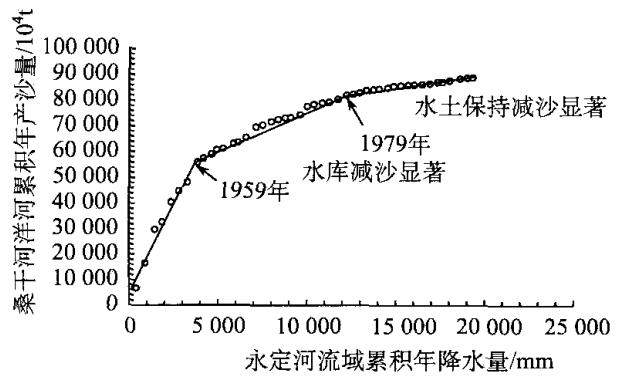

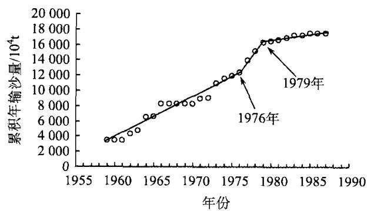

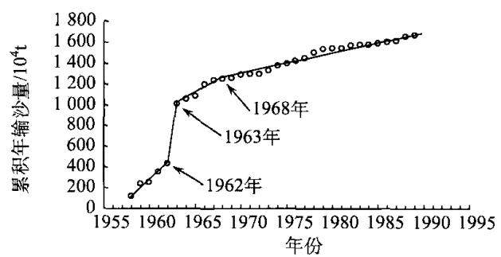

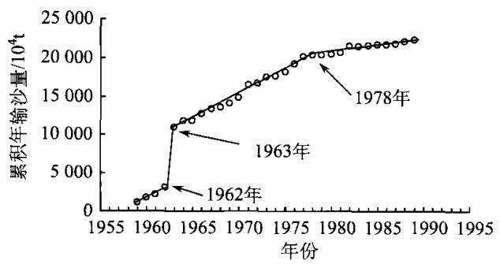

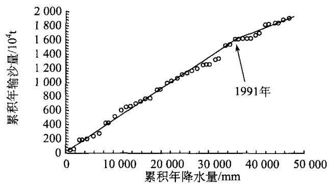

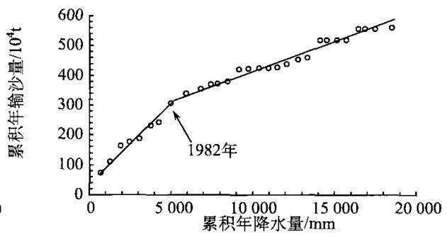

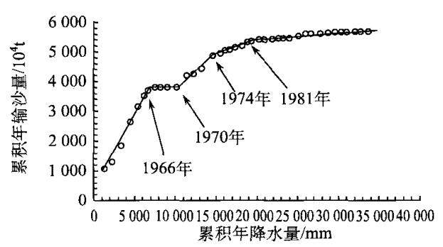

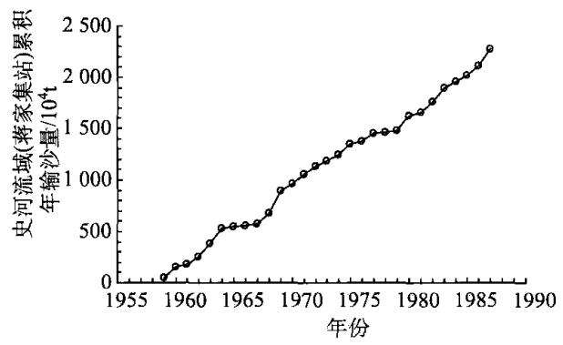  
图20.2依次为桑干河洋河流域、滹沱河（小觉站）、拒马河（紫荆关站）、漳河（观台站）、淮河源（大坡岭站）、颖河（告城站）、沂河（临沂站）、史河（蒋家集站）年输沙量累积曲线

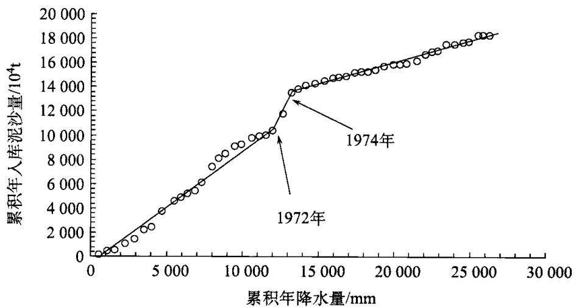

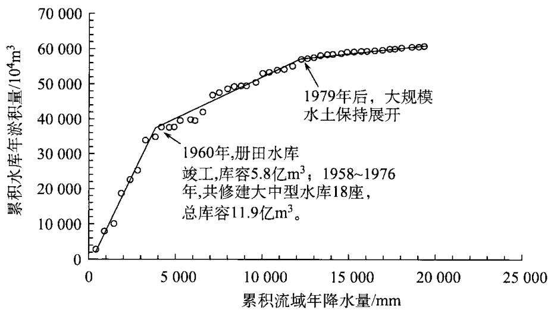

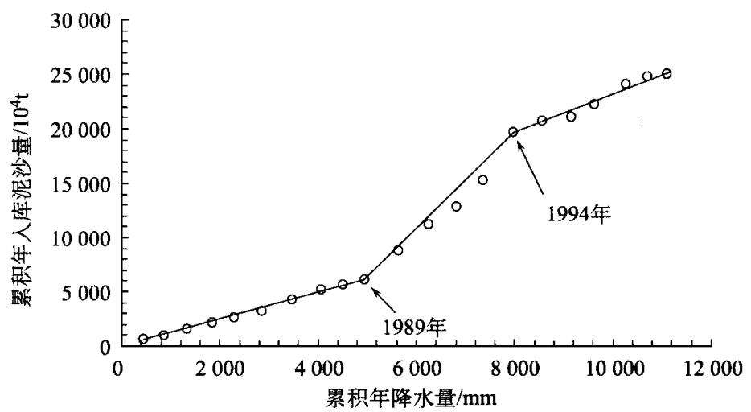  
图20.3依次为密云水库、官厅水库、潘家口水库累积年入库泥沙与累积年降水量变化曲线

## （四）结论与讨论

通过对北方土石山区主要河道代表站的输沙量变化以及主要水库的泥沙淤积变化分析，并与水土流失遥感调查结果相映证，可以得到这样的结论：20世纪90年代以来，北方土石山区水土流失总体程度有所减轻，但局部地区出现恶化现象；水土保持有效地减少了下游水库的泥沙淤积，但下游水库的泥沙淤积量仍然较大，需要进一步加大水土流失治理力度。

河道水库观测到的输沙量和淤积量并不就是断面上游地区的侵蚀产沙量，这里还涉及泥沙输移比的问题。对于一个确定流域，水流的输送泥沙能力从长时间系列看基本上是稳定的，但因河流径流量有丰水系列和枯水系列年，在丰水年就可以将更多更大的，甚至可以将前期堆积在河床的物质输送到堆积区，反之在枯水年稍大粒径的物质都可能堆积。此外，流域集水面积越大，其流域内的自然环境越复杂，影响泥沙输移能力的因素，在流域内的差异就越大。

在分析永定河上游桑干河、洋河流域产沙量变化以及官厅水库淤积量变化中，已经能够看到册田水库等水利设施对其下游河道或水库泥沙的重要影响。由于北方土石山区降雨年际变化较大，年内分配不均，所以为了调节水资源的时空分配，区内兴建了大量水库。处于水文站观测断面以上的中小型水库，在蓄水的同时拦截了大量泥沙，这也给利用水文站输沙量资料来准确反映上游地区土壤侵蚀状况带来一定影响。如对淮河流域中小水库的平均淤积模数的计算结果表明，小型水库的淤积模数为 $1 0 8 7 . 7 8 ~ \mathrm { m ^ { 3 } / ( k m ^ { 2 } \cdot \mathrm { a } ) }$ ，高于中型水库的平均淤积模数 $1 ~ 0 0 1 . 9 8 ~ \mathrm { { m } } ^ { 3 } / ( \mathrm { { k } } \mathrm { { m } } ^ { 2 } \cdot \mathrm { { \ a } } )$ ，远高于大型水库的平均淤积模数 $8 4 5 . 1 3 ~ \mathrm { m } ^ { 3 } / ( \mathrm { k m } ^ { 2 } \cdot \mathrm { a } )$

由于上述种种因素的影响，河道水库观测断面的输沙量和淤积量的变化虽然与上游地区侵蚀产沙密切相关，但并不能完全反映上游地区侵蚀量的变化，所以通过考察河道、水库特定代表性断面输沙量和淤积量变化只能作为区域土壤侵蚀变化的一个参考，必须与遥感调查等其他分析结果进行相互印证。

## 二、北方土石山区水土保持措施经济成本研究

## （一）概 述

水土保持措施经济成本核算是水土保持规划的重要内容之一，但是长期以来未能引起广泛的重视，过去所有的水土保持规划首先考虑的是项目，然后才有一个简单的投资核算。由于看淡了措施的经济成本研究，对投入总量、投资到位程度等考虑甚少，故而至今规划很多，真正严格执行的是寥寥无几。做好水土保持措施成本研究，不仅可以指导规划整体目标和阶段目标的制定；同时还可以根据总体目标不断地调整水土保持措施的配置，为流域治理和管理决策提供科学依据。

鉴于水土保持措施经济成本研究的意义，本次野外考察过程中对此做了深入调查，了解到北方土石山区坡改梯、经济林、生态林和自然封育等措施在不同自然环境和立地条件下的建设成本。

依据区域粮食自给原则、经济增收原则、增加植被覆盖率的生态原则等三项基本原则，我们拟定了三套北方土石山区水土保持方案，即A方案：粮食保障方案；B方案：生态优先方案；C方案：综合方案。生态优先方案在生态、粮食保障和增收三者中首先考虑生态目标，所有水土流失面积治理中将生态措施作为首选措施，具体而言，现有坡耕地以退耕还林还草为主，荒山荒坡也以生态恢复为主，其他措施都处于次要地位。粮食保障方案则在水土保持措施配置过程中首先考虑粮食安全问题，首先保证一定规模的坡改梯措施，然后再考虑其他生态恢复和增加经济收入等方面的措施。综合方案既考虑到粮食安全，又考虑到生态安全，还要考虑到增加群众经济收入。首先保证一定数量的坡改梯面积，然后保证一定规模的经济林，继而布设林草生态措施。

在此基础上，根据三种水土保持措施配置方案，特别是各水土保持分区的措施配置情况，粗略地估算了北方土石山区单项水保措施建设的成本和流域不同治理方案的总成本。北方土石山区水土保持分区主要包括：Ⅰ．水蚀风蚀交错的张北高原水土保持区；Ⅱ．永定河上游、滹沱河上游中山丘陵、黄土台地水土保持区；Ⅲ．太行山、燕山山前低山、丘陵台地水土保持区；Ⅳ．太行山、燕山中低山及河谷盆地水土保持区；V．沂蒙山区低山丘陵台地水土保持区；V．伏牛山、桐柏山前丘陵台地水土保持区；Ⅶ．大别山山地丘陵水土保持区；Ⅷ．江淮丘陵水土保持区。

## （二）单项治理措施的经济成本

## 1. 坡改梯措施成本分析

坡改梯措施成本高低取决于两方面的因素，首先是坡地的立地条件，其次是梯田的建设标准。立地条件主要指坡地坡度的大小和坡地的物质结构。

\*80%土坎梯田，20%石坎梯田；\*\*土坎石坎各50%；\*\*\*80%石坎，20%土坎。  
注：水土保持区的划分参见第2节水土保持分区。

一般坡地的坡度越大，土壤结构越坚硬，所需的成本越高。坡改梯的建设标准主要指：梯田的类型，是石坎梯田，还是土坎梯田；梯田平整程度，是水平梯田还是坡式梯田；梯田的防洪标准，是10年一遇还是20年一遇，以及梯田田面的宽窄等。

梯田的类型、平整程度、防洪标准、田面宽窄等都直接或间接影响建设成本，梯田成本的计算极其复杂而繁琐，本书中只能对之进行粗略估算。各区水平梯田单项成本与总成本的估算结果如表20.9。由表20.9可见，按A方案或C方案配置水土保持措施，梯田建设总规模是 $6 5 1 \times 1 0 ^ { 3 } \mathrm { h m } ^ { 2 }$ ，建设总成本为181亿元，平均每平方公里的建设成本是278.5万元。

表 20.9 各水土保持区坡改梯经济成本一览表
<table><tr><td rowspan=2 colspan=1>类型区</td><td rowspan=1 colspan=3>梯坎类型与成本/(元/hm²)</td><td rowspan=2 colspan=1>坡改梯数量/10³hm2</td><td rowspan=2 colspan=1>总成本/亿元</td></tr><tr><td rowspan=1 colspan=1>土坎</td><td rowspan=1 colspan=1>石坎</td><td rowspan=1 colspan=1>平均</td></tr><tr><td rowspan=1 colspan=1>I</td><td rowspan=1 colspan=1>7 500</td><td rowspan=1 colspan=1></td><td rowspan=1 colspan=1>7 500</td><td rowspan=1 colspan=1>0</td><td rowspan=1 colspan=1>0</td></tr><tr><td rowspan=1 colspan=1>Ⅱ</td><td rowspan=1 colspan=1>7 500</td><td rowspan=1 colspan=1>22 500</td><td rowspan=1 colspan=1>15 750</td><td rowspan=1 colspan=1>50.30</td><td rowspan=1 colspan=1>5.28*</td></tr><tr><td rowspan=1 colspan=1>Ⅲ</td><td rowspan=1 colspan=1>9 000</td><td rowspan=1 colspan=1>34 500</td><td rowspan=1 colspan=1>23 250</td><td rowspan=1 colspan=1>0</td><td rowspan=1 colspan=1>0</td></tr><tr><td rowspan=1 colspan=1>IN</td><td rowspan=1 colspan=1>9 000</td><td rowspan=1 colspan=1>37 500</td><td rowspan=1 colspan=1>24 750</td><td rowspan=1 colspan=1>137.06</td><td rowspan=1 colspan=1>31.87**</td></tr><tr><td rowspan=1 colspan=1>V</td><td rowspan=1 colspan=1>12 000</td><td rowspan=1 colspan=1>30 000</td><td rowspan=1 colspan=1>21 000</td><td rowspan=1 colspan=1>118.60</td><td rowspan=1 colspan=1>24.91**</td></tr><tr><td rowspan=1 colspan=1>VI</td><td rowspan=1 colspan=1>12 000</td><td rowspan=1 colspan=1>34 500</td><td rowspan=1 colspan=1>17 250</td><td rowspan=1 colspan=1>87.74</td><td rowspan=1 colspan=1>20.40**</td></tr><tr><td rowspan=1 colspan=1>II</td><td rowspan=1 colspan=1>12 000</td><td rowspan=1 colspan=1>45 000</td><td rowspan=1 colspan=1>28 500</td><td rowspan=1 colspan=1>257.53</td><td rowspan=1 colspan=1>98.89***</td></tr><tr><td rowspan=1 colspan=1>I</td><td rowspan=1 colspan=1>0</td><td rowspan=1 colspan=1>0</td><td rowspan=1 colspan=1>0</td><td rowspan=1 colspan=1>0</td><td rowspan=1 colspan=1>0</td></tr><tr><td rowspan=1 colspan=1>合计</td><td rowspan=1 colspan=1></td><td rowspan=1 colspan=1></td><td rowspan=1 colspan=1></td><td rowspan=1 colspan=1>651.23</td><td rowspan=1 colspan=1>181.35</td></tr></table>

## 2. 生态林措施的成本分析

生态林措施成本的高低首先取决于立地条件，包括坡度大小、土层厚度等。土层厚度往往与坡度密切相关，坡度越大，土层厚度往往越薄，反之厚度越大。土层厚度越厚生态林实施的成本越低，反之则越高。其次，生态林措施成本的高低取决于区域降雨量的多少，在同样的立地条件下，湿润地区造林成活率高，保存率高，相对成本低；而半干旱地区造林成活率低，成本相对较高。此外，造林的方式也影响造林成本，如整地造林、爆破造林的成

本都远远高于挖穴造林。

一般情况下，石质山地的造林成本要高于土石山地，更高于黄土台地。根据区域调查，本区一次性造林成本Ⅰ、Ⅱ、区要低于其他各水土保持分区。全区挖穴造林成本介于2475～3750元/hm²，基岩山地爆破造林成本在22.5\~30万元/hm²。出于当前的投资强度以及产出效益考虑，大范围应用爆破方法营造生态林殊不可取。为此生态林建设成本计算没有考虑爆破造林成本。

北方土石山区各水土保持区单位面积的造林成本及总成本列于表20.10。由表20.10可见，Ⅰ、Ⅱ区和Ⅷ区的造林成本相对比较低，而其他各区造林成本都相近。各种措施配置方案中全区生态林面积分别为：A方案7686.83×$1 0 ^ { 3 } \mathrm { h m } ^ { 2 }$ ；B方案 $6 \ 2 7 6 . 6 2 \times 1 0 ^ { 3 } \mathrm { h m ^ { 2 } }$ ；C方案 $5 \ 6 2 5 . 3 9 \times 1 0 ^ { 3 } \mathrm { h m } ^ { 2 }$ 。据此计算各方案生态林总投资成本分别为：A方案267.14亿元，B方案216.78亿元，C方案192.00亿元，平均单位面积的造林成本在34万～35万元/km²。

表 20.10 各水土保持区生态林建设经济成本一览表
<table><tr><td rowspan="2">水土保持区</td><td>生态林建设成本/(元/hm²)</td><td rowspan="2">方案</td><td rowspan="2">生态林建设 规模/10³hm²</td><td rowspan="2">总成本 /亿元</td></tr><tr><td>植树费 种苗费</td></tr><tr><td>I</td><td>1500 750 225</td><td>A B C</td><td>1144.56 958.05 958.05</td><td>28.33 23.71 23.71</td></tr><tr><td>Ⅱ</td><td>1500 750 225</td><td>A B C</td><td>1218.85 1064.85 1014.55</td><td>30.17 26.36 25.11</td></tr><tr><td>Ⅲ</td><td>3000 750</td><td>A 150 B C</td><td>1075.69 731.59 731.59</td><td>41.95 28.53 28.53</td></tr><tr><td>IV</td><td>3000 750</td><td>A 225 B C</td><td>2909.65 2629.56 2492.49</td><td>115.66 104.52 99.08</td></tr><tr><td>V</td><td>3000 750</td><td>A 150 B C</td><td>500.51 248.48 129.87</td><td>19.52 9.69 5.07</td></tr></table>

续表
<table><tr><td rowspan="2">水土保持区</td><td>生态林建设成本/(元/hm²)</td><td>方案</td><td>生态林建设 总成本</td></tr><tr><td>植树费</td><td>种苗费 管理费 A</td><td>规模/10³hm² /亿元 389.94 15.21</td></tr><tr><td>VI</td><td>3000 750 150</td><td>B 271.23 10.58 C 183.49 7.16 A 370.64 14.45</td></tr><tr><td>VII 3000</td><td>750 150 B C</td><td>295.87 11.54 38.35 1.40</td></tr><tr><td>IVII 1500</td><td>A 750 150 B C</td><td>77.00 1.85 77.00 1.85 77.00 1.85</td></tr><tr><td>合计</td><td>A B C</td><td>7686.83 267.14 6276.62 216.78 5625.39 192.00</td></tr></table>

## 3. 经济林措施成本分析

经济林在某些水土流失区已成为当地的支柱产业，但是由于管理不到位，部分经济林下水土流失严重，使得经济林的水土保持生态功能受到质疑。经济林一般有很高的经济回报，投入也高。经济林的成本一是来自于整地；二是来自于苗木与管理。经济林造林整地的要求远高于生态林，树苗定植以后还需要精心管理，管理费也远高于生态林。北方土石山区经济林建设成本的区域差异较大，一般介于9000\~22500元/hm²，参见表20.11。由表可见，按区域水土保持措施配置方案B与C，经济林规模为 $2 \ 0 9 4 . 4 4 \times 1 0 ^ { 3 } \mathrm { h m } ^ { 2 }$ 总共需要投资352亿元。

## 4. 自然封禁措施成本分析

自然封禁的成本来自于两个方面：一是封禁区的管理；二是生态资源补偿费。一般水土流失区都是经济相对落后区，荒山荒坡及难于造林的石质山地都是放牧与柴草的源地，封禁以后势必要减少畜产品收入，并增加燃料费的支出，造成总的经济收入减少。若不给予适当的补偿，那就很难实现真正意义上的自然封禁。此外，封禁以后长期的严格管理也必不可少。北方土石山区自然封禁的管理费和补偿费两项之和是3000～3750元/hm²（以10年计)，各水土保持区的自然封禁成本见表20.12。全区封禁面积约3264.14×$1 0 ^ { 3 } \mathrm { h m } ^ { 2 }$ ，按10年计算大致需要投入成本102亿元。

表20.11 各水土保持区经济林建设经济成本一览表
<table><tr><td rowspan=2 colspan=1>类型区</td><td rowspan=1 colspan=2>单位经济林成本/(元/hm²)</td><td rowspan=2 colspan=1>经济林建设规模/10³hm2</td><td rowspan=2 colspan=1>总成本/亿元</td></tr><tr><td rowspan=1 colspan=1>整地费</td><td rowspan=1 colspan=1>苗、植、管费</td></tr><tr><td rowspan=1 colspan=1>I</td><td rowspan=1 colspan=1>4500</td><td rowspan=1 colspan=1>2 300</td><td rowspan=1 colspan=1>186.51</td><td rowspan=1 colspan=1>14.55</td></tr><tr><td rowspan=1 colspan=1>Ⅱ</td><td rowspan=1 colspan=1>6 000</td><td rowspan=1 colspan=1>2 300</td><td rowspan=1 colspan=1>204.30</td><td rowspan=1 colspan=1>19.00</td></tr><tr><td rowspan=1 colspan=1>Ⅲ</td><td rowspan=1 colspan=1>18 000</td><td rowspan=1 colspan=1>2 300</td><td rowspan=1 colspan=1>344.10</td><td rowspan=1 colspan=1>73.29</td></tr><tr><td rowspan=1 colspan=1>IN</td><td rowspan=1 colspan=1>12 000</td><td rowspan=1 colspan=1>2 300</td><td rowspan=1 colspan=1>417.15</td><td rowspan=1 colspan=1>63.82</td></tr><tr><td rowspan=1 colspan=1>V</td><td rowspan=1 colspan=1>15 000</td><td rowspan=1 colspan=1>2 300</td><td rowspan=1 colspan=1>370.63</td><td rowspan=1 colspan=1>67.83</td></tr><tr><td rowspan=1 colspan=1>VI</td><td rowspan=1 colspan=1>15 000</td><td rowspan=1 colspan=1>2 300</td><td rowspan=1 colspan=1>206.45</td><td rowspan=1 colspan=1>37.78</td></tr><tr><td rowspan=1 colspan=1>I</td><td rowspan=1 colspan=1>18 000</td><td rowspan=1 colspan=1>2 300</td><td rowspan=1 colspan=1>332.29</td><td rowspan=1 colspan=1>70.78</td></tr><tr><td rowspan=1 colspan=1>I</td><td rowspan=1 colspan=1>12 000</td><td rowspan=1 colspan=1>2 300</td><td rowspan=1 colspan=1>33.00</td><td rowspan=1 colspan=1>5.05</td></tr><tr><td rowspan=1 colspan=1>合计</td><td rowspan=1 colspan=1></td><td rowspan=1 colspan=1></td><td rowspan=1 colspan=1>2 094.44</td><td rowspan=1 colspan=1>352.10</td></tr></table>

表20.12 各水土保持区的自然封禁治理成本一览表
<table><tr><td rowspan=2 colspan=1>类型区</td><td rowspan=1 colspan=3>封禁治理成本/[元/(hm²·a)]</td><td rowspan=2 colspan=1>封禁面积/10³hm2</td><td rowspan=2 colspan=1>总成本/亿元</td></tr><tr><td rowspan=1 colspan=1>载畜量补偿</td><td rowspan=1 colspan=1>产柴量补偿</td><td rowspan=1 colspan=1>管理费</td></tr><tr><td rowspan=1 colspan=1>I</td><td rowspan=1 colspan=1>225</td><td rowspan=1 colspan=1>0</td><td rowspan=1 colspan=1>75</td><td rowspan=1 colspan=1>504.44</td><td rowspan=1 colspan=1>15.13</td></tr><tr><td rowspan=1 colspan=1>Ⅱ</td><td rowspan=1 colspan=1>225</td><td rowspan=1 colspan=1>0</td><td rowspan=1 colspan=1>75</td><td rowspan=1 colspan=1>605.55</td><td rowspan=1 colspan=1>18.17</td></tr><tr><td rowspan=1 colspan=1>Ⅲ</td><td rowspan=1 colspan=1>150</td><td rowspan=1 colspan=1>0</td><td rowspan=1 colspan=1>75</td><td rowspan=1 colspan=1>500.61</td><td rowspan=1 colspan=1>11.26</td></tr><tr><td rowspan=1 colspan=1>IN</td><td rowspan=1 colspan=1>150</td><td rowspan=1 colspan=1>150</td><td rowspan=1 colspan=1>75</td><td rowspan=1 colspan=1>1026.39</td><td rowspan=1 colspan=1>38.49</td></tr><tr><td rowspan=1 colspan=1>V</td><td rowspan=1 colspan=1>75</td><td rowspan=1 colspan=1>150</td><td rowspan=1 colspan=1>75</td><td rowspan=1 colspan=1>314.19</td><td rowspan=1 colspan=1>9.43</td></tr><tr><td rowspan=1 colspan=1>VI</td><td rowspan=1 colspan=1>75</td><td rowspan=1 colspan=1>150</td><td rowspan=1 colspan=1>75</td><td rowspan=1 colspan=1>142.12</td><td rowspan=1 colspan=1>4.26</td></tr><tr><td rowspan=1 colspan=1>II</td><td rowspan=1 colspan=1>0</td><td rowspan=1 colspan=1>225</td><td rowspan=1 colspan=1>75</td><td rowspan=1 colspan=1>170.84</td><td rowspan=1 colspan=1>5.13</td></tr><tr><td rowspan=1 colspan=1>II</td><td rowspan=1 colspan=1>0</td><td rowspan=1 colspan=1>0</td><td rowspan=1 colspan=1>0</td><td rowspan=1 colspan=1>0</td><td rowspan=1 colspan=1>0</td></tr><tr><td rowspan=1 colspan=1>合计</td><td rowspan=1 colspan=1></td><td rowspan=1 colspan=1></td><td rowspan=1 colspan=1></td><td rowspan=1 colspan=1>3264.14</td><td rowspan=1 colspan=1>101.87</td></tr></table>

综合以上分析，北方土石山区各项治理措施规模与总成本分别为：坡改梯规模 $6 . 5 1 2 3 \times 1 0 ^ { 5 } ~ \mathrm { h m ^ { 2 } }$ ，投入成本181.35亿元，平均278万元/km²；经济林规模 $2 . 0 9 4 \ 4 4 \times 1 0 ^ { 6 } \ \mathrm { h m ^ { 2 } }$ ，投入成本352.10亿元，平均171万元/km²；生态林规模A方案为 $7 . 6 8 6 \ 8 3 \times 1 0 ^ { 6 } \ \mathrm { h m ^ { 2 } }$ ，B方案为 $6 . 2 7 6 ~ 6 2 \times 1 0 ^ { 6 } ~ \mathrm { h m ^ { 2 } }$ ，C方案为 $5 . 6 2 5 ~ 3 9 \times 1 0 ^ { 6 } ~ \mathrm { h m } ^ { 2 }$ ，投入成本分别为267亿元、217亿元、192亿元，平均投入34.5万元/km²；自然封禁面积 $3 . 2 6 4 1 4 \times 1 0 ^ { 6 } \mathrm { { \ h m ^ { 2 } } }$ ，投入成本101.87亿元，平均28.7万元/km²（10年）。其中坡改梯的单位面积建设成本最高，其次是经济林、生态林，最低的是自然封禁。

## （三）流域综合治理总成本

水土流失治理，特别是小流域水土流失治理，一般要求山、水、田、林、路综合治理。上述水土保持成本分析中尚未包括水与路等配套措施，水与路的建设成本实际上也应纳入流域治理的总成本中。因此北方土石山区水土流失综合治理的总成本除了坡改梯、经济林、生态林及自然封禁等措施的建设成本外，还应加上水与路配套设施的建设成本。根据野外调查结果，水与路配套措施的建设成本约为水土保持措施总成本的30%。最终据此计算出流域各措施配置方案的综合治理成本。北方土石山区各水土保持区A、B、C方案水土流失综合治理总成本参见表20.13、表20.14和表20.15。

表 20.13 A方案各水土保持区综合治理成本
<table><tr><td rowspan=1 colspan=1>类型区</td><td rowspan=1 colspan=1>治理成本/亿元</td><td rowspan=1 colspan=1>配套措施成本/亿元</td><td rowspan=1 colspan=1>总成本/亿元</td><td rowspan=1 colspan=1>单位面积成本/(万元/km²)</td></tr><tr><td rowspan=1 colspan=1>I</td><td rowspan=1 colspan=1>43.46</td><td rowspan=1 colspan=1>13.04</td><td rowspan=1 colspan=1>56.5</td><td rowspan=1 colspan=1>34.26</td></tr><tr><td rowspan=1 colspan=1>Ⅱ</td><td rowspan=1 colspan=1>53.61</td><td rowspan=1 colspan=1>16.08</td><td rowspan=1 colspan=1>69.7</td><td rowspan=1 colspan=1>37.18</td></tr><tr><td rowspan=1 colspan=1>Ⅲ</td><td rowspan=1 colspan=1>53.21</td><td rowspan=1 colspan=1>15.96</td><td rowspan=1 colspan=1>69.17</td><td rowspan=1 colspan=1>43.88</td></tr><tr><td rowspan=1 colspan=1>IN</td><td rowspan=1 colspan=1>186.02</td><td rowspan=1 colspan=1>55.8</td><td rowspan=1 colspan=1>241.82</td><td rowspan=1 colspan=1>59.37</td></tr><tr><td rowspan=1 colspan=1>V</td><td rowspan=1 colspan=1>53.85</td><td rowspan=1 colspan=1>16.16</td><td rowspan=1 colspan=1>70.01</td><td rowspan=1 colspan=1>75.01</td></tr><tr><td rowspan=1 colspan=1>VI</td><td rowspan=1 colspan=1>39.87</td><td rowspan=1 colspan=1>11.96</td><td rowspan=1 colspan=1>51.83</td><td rowspan=1 colspan=1>83.62</td></tr><tr><td rowspan=1 colspan=1>VI</td><td rowspan=1 colspan=1>118.47</td><td rowspan=1 colspan=1>35.54</td><td rowspan=1 colspan=1>154.01</td><td rowspan=1 colspan=1>192.75</td></tr><tr><td rowspan=1 colspan=1>III</td><td rowspan=1 colspan=1>1.85</td><td rowspan=1 colspan=1>0.55</td><td rowspan=1 colspan=1>2.4</td><td rowspan=1 colspan=1>21.82</td></tr><tr><td rowspan=1 colspan=1>合计</td><td rowspan=1 colspan=1>550.36</td><td rowspan=1 colspan=1>165.11</td><td rowspan=1 colspan=1>715.47</td><td rowspan=1 colspan=1>61.49</td></tr></table>

注：配套经费（水利、道路）以治理经费的30%计。

表 20.14 B方案各水土保持区综合治理成本
<table><tr><td rowspan=1 colspan=1>类型区</td><td rowspan=1 colspan=1>治理成本/亿元</td><td rowspan=1 colspan=1>配套措施成本*/亿元</td><td rowspan=1 colspan=1>总成本/亿元</td><td rowspan=1 colspan=1>单位面积成本/(万元/km²)</td></tr><tr><td rowspan=1 colspan=1>I</td><td rowspan=1 colspan=1>53.39</td><td rowspan=1 colspan=1>16.02</td><td rowspan=1 colspan=1>69.41</td><td rowspan=1 colspan=1>42.09</td></tr><tr><td rowspan=1 colspan=1>Ⅱ</td><td rowspan=1 colspan=1>63.52</td><td rowspan=1 colspan=1>19.06</td><td rowspan=1 colspan=1>82.58</td><td rowspan=1 colspan=1>44.05</td></tr><tr><td rowspan=1 colspan=1>Ⅲ</td><td rowspan=1 colspan=1>113.09</td><td rowspan=1 colspan=1>33.93</td><td rowspan=1 colspan=1>147.02</td><td rowspan=1 colspan=1>93.27</td></tr><tr><td rowspan=1 colspan=1>IV</td><td rowspan=1 colspan=1>206.84</td><td rowspan=1 colspan=1>62.05</td><td rowspan=1 colspan=1>268.89</td><td rowspan=1 colspan=1>66.02</td></tr><tr><td rowspan=1 colspan=1>V</td><td rowspan=1 colspan=1>86.94</td><td rowspan=1 colspan=1>26.08</td><td rowspan=1 colspan=1>113.02</td><td rowspan=1 colspan=1>121.10</td></tr><tr><td rowspan=1 colspan=1>VI</td><td rowspan=1 colspan=1>52.62</td><td rowspan=1 colspan=1>15.79</td><td rowspan=1 colspan=1>68.41</td><td rowspan=1 colspan=1>110.37</td></tr><tr><td rowspan=1 colspan=1>VI</td><td rowspan=1 colspan=1>87.45</td><td rowspan=1 colspan=1>26.24</td><td rowspan=1 colspan=1>113.69</td><td rowspan=1 colspan=1>142.29</td></tr><tr><td rowspan=1 colspan=1>ⅧI</td><td rowspan=1 colspan=1>6.9</td><td rowspan=1 colspan=1>2.07</td><td rowspan=1 colspan=1>8.97</td><td rowspan=1 colspan=1>81.55</td></tr><tr><td rowspan=1 colspan=1>合计</td><td rowspan=1 colspan=1>670.75</td><td rowspan=1 colspan=1>201.23</td><td rowspan=1 colspan=1>871.98</td><td rowspan=1 colspan=1>74.94</td></tr></table>

\*：配套经费（水利、道路）以治理经费的30%计。

表 20.15 C方案各类型区综合治理成本一览表
<table><tr><td rowspan=1 colspan=1>类型区</td><td rowspan=1 colspan=1>治理成本/亿元</td><td rowspan=1 colspan=1>配套措施成本*/亿元</td><td rowspan=1 colspan=1>总成本/亿元</td><td rowspan=1 colspan=1>单位面积成本/(万元/km²)</td></tr><tr><td rowspan=1 colspan=1>I</td><td rowspan=1 colspan=1>53.39</td><td rowspan=1 colspan=1>16.02</td><td rowspan=1 colspan=1>69.41</td><td rowspan=1 colspan=1>42.09</td></tr><tr><td rowspan=1 colspan=1>Ⅱ</td><td rowspan=1 colspan=1>67.56</td><td rowspan=1 colspan=1>20.27</td><td rowspan=1 colspan=1>87.82</td><td rowspan=1 colspan=1>46.84</td></tr><tr><td rowspan=1 colspan=1>Ⅲ</td><td rowspan=1 colspan=1>113.08</td><td rowspan=1 colspan=1>33.93</td><td rowspan=1 colspan=1>147.02</td><td rowspan=1 colspan=1>93.27</td></tr><tr><td rowspan=1 colspan=1>IV</td><td rowspan=1 colspan=1>233.26</td><td rowspan=1 colspan=1>69.98</td><td rowspan=1 colspan=1>303.24</td><td rowspan=1 colspan=1>74.45</td></tr><tr><td rowspan=1 colspan=1>V</td><td rowspan=1 colspan=1>107.24</td><td rowspan=1 colspan=1>32.17</td><td rowspan=1 colspan=1>139.41</td><td rowspan=1 colspan=1>149.37</td></tr><tr><td rowspan=1 colspan=1>VI</td><td rowspan=1 colspan=1>69.6</td><td rowspan=1 colspan=1>20.88</td><td rowspan=1 colspan=1>90.48</td><td rowspan=1 colspan=1>145.98</td></tr><tr><td rowspan=1 colspan=1>I</td><td rowspan=1 colspan=1>176.2</td><td rowspan=1 colspan=1>52.86</td><td rowspan=1 colspan=1>229.06</td><td rowspan=1 colspan=1>286.68</td></tr><tr><td rowspan=1 colspan=1>III</td><td rowspan=1 colspan=1>6.9</td><td rowspan=1 colspan=1>2.07</td><td rowspan=1 colspan=1>8.97</td><td rowspan=1 colspan=1>81.55</td></tr><tr><td rowspan=1 colspan=1>合计</td><td rowspan=1 colspan=1>827.23</td><td rowspan=1 colspan=1>248.17</td><td rowspan=1 colspan=1>1075.41</td><td rowspan=1 colspan=1>92.43</td></tr></table>

\*：配套经费（水利、道路）以治理经费的30%计。

由上述数据表可知，A方案全流域综合治理共需治理经费约715亿元，其中海河流域437.19亿元，淮河流域278.25亿元。平均每平方公里的治理经费是61.49万元。B方案全流域共需治理经费871.98亿元，其中海河流域

567.9亿元，淮河流域304亿元，平均每平方公里的治理经费是74.94万元；C方案全流域共需治理经费1075.41亿元，其中海河流域607.5亿元，淮河流域468亿元，平均每平方公里的治理经费是92.43万元。

## 三、新时期水土保持事业的定位

## （一）问题产生的背景

过去几十年，我国的水土保持工作主要依靠水土流失区农民群众改善农业生产条件的积极性和政府水保部门的引导和技术支持，以群众投劳为主、政府资助为辅。从1983年开始实施的重点防治工程的投入结构看，群众投入与中央政府投入之比为8：1左右（刘震，2004）；在非重点治理区，这一比例则更高。但是，自2000年以来部分省市实施农村税费改革试点，特别是2004年以来，各省纷纷全面取消农民固定负担的“两工”（积累工和义务工），水保事业的投入主体“缺位”，把“农民筹资投劳为主”的治理模式带入了前所未有的困境（姚孝友，2001；张利民、李志刚，2001；冯振贤、孙明智，2001；黎家作，2003；孙宪柱，2004)。这就提出了一个重要的理论问题：新时期水土保持应如何定位。

## （二）水土保持工作面临的新形势和新问题

近年来，大批农村劳动力脱离农业生产进城务工，农村的产业结构、就业结构及收入结构发生了显著变化，农业和农用土地在农民增收方面的重要性降低，影响了农民对土壤侵蚀严重的劣质土地改造的投入积极性。然而另一方面，在水土流失危害的下游地区，由于经济发展迅速，城镇化规模扩大，对水资源、水环境及水灾防治的依赖加大，对上游土壤侵蚀治理提出了更高的要求。

（1）我国农民大规模外出打工始于1992年。目前，估计全国农民工总数超过？亿，占农村劳动力的40%左右（温铁军，2005)。北方土石山区20余个县的情况是，海河流域外出打工人数占农村劳动力人口的35%，淮河流域为33%，部分县份高达60%。这与我国其他地区的情况基本相当，河南和安徽，农民外出打工比例更排在全国其他各省区的前列。

大量的农村劳动力外出打工，给当地带来的影响主要是：①当地农业的从业人数减少，单位劳动力耕种的土地面积增加；②劳动力机会成本上升，经营性农业的净收益下降；③一些地方出现了粗放经营的倾向，出现了农业土地利用集约度下降的现象。

（2）为减轻农民负担，2004年以来，各省纷纷全面取消农民固定负担的“两工”（积累工和义务工）。“两工”取消后，农田水利水保建设主要通过“一事一议”的形式，由群众筹资筹劳实施。然而“一事一议”在具体实施中难度较大。基层水保干部普遍反映，以往“农民筹资投劳为主”的水保投入模式遇到了前所未有的困难。北方土石山区20余个调查县（市）的情况是，水土保持单位面积投入平均为16万元/km²，而以群众筹劳为主要内容的自筹投入达到12万元/km²，占总投入的75%。其中淮河流域自筹投入占单位面积投入的89%。“两工”取消后，自筹投入缺失，无疑加大了水保工作的难度。

“两工”取消，加上农村青壮年劳动力因外出打工而减少，使非项目区很难实施综合的治理工作，也使大部分项目区难以达到预期的治理标准。突出表现在公益性较强的沟道防护措施和道路工程跟不上，达不到小流域综合治理的目标。

（3）自20世纪90年代末以来，我国进入城市化快速发展阶段。城市人口增加，导致用水量大幅度上升，对集水区来水量和水质的要求增强，应对洪涝灾害的脆弱性加大。据预测，2008年缺水在10亿m³以上，到2010年缺水将达16.15亿m³。统计海河流域1949～1990年洪涝灾害受灾损失情况还发现，按1990年不变价计算，每平方公里成灾面积的多年平均经济损失1949～1980年为17.69万元，1981～1990年则为37.26万元。同等成灾面积情况下，现在的经济损失平均比1980年前高出一倍以上。

调查中了解到，在干旱缺水的北方，水源地保护成为流域治理的主要目标，增加水量、改善水质成为对水保工程的新的要求。在淮河流域，随着经济总量的增加，同频率洪水的灾害损失加大，减轻河道和水库淤积，特别是末端小型水利设施和支流的淤积，成为防洪的重点，这对水保工作提出了更高的要求。

新形势要求水保工作应该有更大的视野，关注全流域的利益，而不仅仅是上游水土流失区生产条件的改善。

## （三）水土保持产出品/服务性质的变化与水保功能的转变

流域上游的水土保持，不仅利在当地，也对下游有很大影响。对当地最主要的贡献是土地改良后的增产和稳产，在经济意义上表现为土地的增值。

我国农村的土地所有制为集体所有，农户承包，土地的增值也就归集体和农户。从这一意义上说，水土保持的产出品/服务的性质主要为私人物品。因此，仅从水保工程对当地的意义来讲，“农民筹资，投劳为主”的投入机制具有合理性。

然而，土地的价值从来都是随着其产出品/服务的价值高低而变化的。近20年来，农业比较效益持续降低，特别是20世纪90年代中期以后，这种情况更趋明显。造成农民对包括水土保持在内的土地改良的投入积极性降低。

农业经营收入在农民总收入中的比重下降是农用土地价值降低的另一个原因。在沂蒙山区沂水、蒙阴等13个山区县1991～2003年人均年收入由1991年的608元增加到2003年的2862元，其中工资性收入所占的比例由1991年的6.4%上升到2003年的33.7%，而家庭经营收入（种植养殖等收入）所占的比例则由1991年的86.2%持续下降到2003年的60.8%。尽管如此，目前我国的农民工绝大多数并未在城镇得到稳定的工作和社会保障，一定面积的土地为农村居民所发挥的社会保障功能，其重要性仍然存在。

对于下游来讲，水保工程的功用主要是洪涝灾害的防治和水资源的保护。从这一意义上说，水土保持的产出品/服务的性质为公共物品。同时，由于经济发展迅速，城镇化规模扩大，对水资源、水环境及水灾防治的依赖加大，下游地区对上游土壤侵蚀治理提出了更高的要求，水保作为公共物品的属性进一步强化。

## （四）新时期水土保持事业的定位

基于以上分析，可以得出如下判断：新形势下水保工程产出品/服务的私人物品属性在弱化，而公共物品的属性在强化。因此，我国水土保持事业的定位，应该实现从“改善水土流失区农业生产条件”转移到“流域综合治理”上来。这一转变，意味着投入机制、治理方略、治理标准及规范的一系列调整。

（1）应结合社会主义新农村建设，将水保事业的投入机制从“农民筹资投劳为主，政府投入为辅”转变为“政府投入为主，农民投劳为辅”；同时建立上下游协调互动、利益共享、责任分担的环境补偿机制。

（2）应将“大流域统一规划”与“小流域综合治理”有机结合，以流域综合治理规划来统筹全流域在资源、环境、生态、发展上的关系。

（3）水保项目的经济目标不应定得过高，应主要依据土地对农民群众的社保功能，以基本农田建设作为主要指标；同时，对农业开发项目的水保监督也应像采矿和建设项目一样得到重视。

## 参考文献

冯振贤，孙明智.2001.试论农村税费改革后水土保持政策的调整．中国水土保持，(6)：41\~42

海河水利委员会.1993.中国江河防洪丛书（海河卷）.北京：水利电力出版社

淮河水利委员会.1993.中国江河防洪丛书（淮河卷）.北京：水利电力出版社

景可，王万忠，郑粉莉.2005.中国土壤侵蚀与环境．北京：科学出版社

黎家作.2003.农村税费改革对水土保持生态建设的挑战与对策．中国水土保持，(3)：11～12

刘震.2004.坚持成功经验，实现五个转变，推动国家水土保持重点建设工程再上新台阶．中国水土保持，(1)：3～6

任美锷，包浩生.1992.中国自然区域及开发整治．北京：科学出版社

孙宪柱.2004.农村税费改革后水保生态建设面临的问题与对策．水土保持科技情报，(4)：46\~48

唐克丽等.2004.中国水土保持．北京：科学出版社

温铁军.2005. 农民流动打工问题和新时期的劳资关系．http：//www.cc.org.cn/newcc/brow-wenzhang. php? articleid=5115.

姚孝友.2001. 探索建立农村税费改革后淮河流域水土保持工作的新机制．中国水土保持，（4)：21\~22

张利民，李志刚.2001.农村税费改革后水土保持工作面临的形势与对策.中国水土保持，（4)：22\~23

中国科学院《中国自然地理》编辑委员会.1986.综合自然地理．北京：科学出版社

中国科学院黄土高原综合科学考察队.1991. 黄土高原地区北部风沙区土地沙漠化综合治理．北京：科学出版社

中国自然资源从书编撰委员会.1995.中国自然资源丛书．北京：中国环境科学出版社

## 第二十一章 南方红壤区

第一节 现 状

一、自然地理与社会经济概况

（一）自然地理概况

南方红壤区，以大别山为北屏，巴山、巫山为西障（含鄂西全部)，西南以云贵高原为界（包括湘西、桂西）。东南直抵海域并包括台湾、海南岛及南海诸岛，包括广东、广西、福建、台湾、江西、湖南、湖北、浙江、安徽、湖南、江苏等省的部分地域。总面积 $1 . 1 8 \times 1 0 ^ { 6 } ~ \mathrm { k m } ^ { 2 }$ ，约占国土面积的12.3%。本次考察区范围为南方八省，实际考察面积为 $8 7 . 2 \times 1 0 ^ { 4 } \mathrm { k m ^ { 2 } }$ 0

南方红壤区主要位于第二、三级阶梯，受地质运动与构造的深刻影响，地势东西差异大，山地、丘陵、平原谷地都有分布。其中山地面积 $2 . \ 2 9 \times$ $\mathrm { 1 0 ^ { 5 } k m ^ { 2 } }$ ，丘陵面积 $5 . 6 3 \times 1 0 ^ { 5 } \mathrm { k m ^ { 2 } }$ ，平原面积 $7 . 4 8 \times 1 0 ^ { 4 } { \mathrm { k m } } ^ { 2 }$ ，分别占该区总面积的26.4%、64.9%和8.6%。红壤区山地脉络清晰，明显受地质构造控制，走向具有规律性。北东向或北北东向山地在总体上控制了该区的地貌格局。由于受地形限制，山地人口历来比较稀少，植被保存较好，是本区水源林、用材林的主要立地，历史上水土流失并不明显。但近代出现的大规模森林砍伐，原始植被稀疏，次生林和人工林广泛分布，水土流失比较明显。丘陵主要位于山地外围和一些盆地内，由于主要山地阻隔，丘陵不是连片分布，而是呈块状散布在主要山地和平原谷地之间，没有明显脉络。综合红壤区地形、地貌及水系格局，该区首先表现为山丘与谷地（包括主要河流）相间排列。自北向南的地貌结构顺序为淮阳山地一长江中下游平原（主要包括洞庭湖平原、鄱阳湖平原）一江南低山丘陵和南岭山地—南部平原（包括南宁盆地、珠江三角洲等)；自西向东的地貌结构顺序为武陵山地、雪峰山地一湘江谷地、洞庭湖区一幕阜山、罗霄山脉—赣江谷地、鄱阳湖平原一武夷山地一东部沿海平原（包括闽江三角洲等）。其次，由于南岭山地位于该区南部，地貌轮廓主体也可看成是3个分别以洞庭湖、鄱阳湖和杭州湾为基底，以湘江、赣江和富春江为中轴，并向北或东北倾斜的并列凹斜面。这些结构的过渡性地带，也正是水土流失发生较为严重的区域。

红壤考察区位于我国热带、亚热带季风气候区。一方面，该区水热资源丰富，对作物生长和水土流失区的植被恢复十分有利。另一方面，该区降水量大且分布集中，植被一旦破坏，极易产生强烈水土流失；季节性干旱严重影响侵蚀劣地的植被恢复。该区光能资源十分丰富，全年日照时数平均为1489～2900h，个别地方达到了3000h以上；平均太阳辐射量为40.6～$5 4 . 3 { \times } 1 0 ^ { 4 } \mathrm { J / ( \ c m ^ { 2 } \cdot } \mathrm { a } )$ 。空间上太阳辐射由南向北渐减；时间上太阳辐射量以5～9月最高，占全年总辐射量的60%～70%，12\~2月最低，只占10%～20%，与植物生长的旺季和非旺季配合较好，利于植被的生长和恢复。该区年均温在15～25℃之间，最冷月均温为 $2 { \sim } 1 5 ^ { \circ } \mathrm { C }$ ，最热月均温 $2 8 { \sim } 3 8 ^ { \circ } \mathrm { C }$ 。考察区年均雨量为900～2100mm，年际变化不大；除北部部分地区外，大部分地区降水量都在1400mm以上。南方红壤区降水的季节性分布十分明显，主要集中于每年的4～9月，这期间的降雨量可以达到全年的70%～80%，且降雨强度大，雨量集中，极易产生崩岗、滑坡、泥石流等侵蚀现象，形成的水土流失极为严重，是区域水土保持的极端杀手。该区水热降水季节性分配差异，使得冬季温暖干旱，夏季炎热潮湿，干湿季节明显；再加上该区平均温度高，地形地貌、土壤母质和类型的复杂多样，土壤的保水能力差，也易于形成旱灾。

红壤区水系分布密度大，地表水资源丰富。红壤区主要水系包括属于长江干流的鄱阳湖水系、洞庭湖水系和珠江水系、以及东南部沿海省份诸内河水系等。该区江、河、湖泊、水库分布密度大，每平方公里面积内河流的总长度达到0.5km以上，长江三角洲和珠江三角洲的河网密度最大，达到2.0km/km²以上。长江流域中湖北、湖南、江西、安徽、浙江、福建等省境内的地表水资源量达到 $2 . 8 0 \times 1 0 ^ { 1 1 } \mathrm { m } ^ { 3 }$ ，约占长江流域地表水资源总量的33%；珠江以及华南沿海诸河流域的地表水资源量 $3 . 5 0 \times 1 0 ^ { 1 1 } \mathrm { m } ^ { 3 }$ ，其中广东占1. $1 7 \times 1 0 ^ { 1 1 } \mathrm { m } ^ { 3 }$ ，海南占 $1 . 7 0 \times 1 0 ^ { 1 0 } \mathrm { m } ^ { 3 }$ ，福建、湖南、江西合占 $1 . 1 5 \times 1 0 ^ { 1 0 }$ $\mathbf { m } ^ { 3 }$ 。该区大型以上水库达150多座，区域的蓄水能力强。

红壤发育于热带和亚热带雨林、季雨林或长绿阔叶林下，因缺乏碱金属和碱土金属而富含铁、铝氧化物，呈酸性红色。红壤成土母质不同，其物质组成和风化状态大不相同，对土壤的理化性质、土壤发育的厚度、植被的立地条件以及土壤保持等都会产生重大影响。红壤区的成土母质归纳起来主要有6种，分别为岩浆岩类及其风化物，砂页岩及其变质岩类的风化物，碳酸岩类风化物，紫色、紫红色砂页岩的风化物，第四纪红土以及近代冲积与湖

积物。

红壤考察区内土壤类型丰富，归属于多个不同的土纲，如铁铝土、初育土、半水成土、盐碱土、淋溶土、人为土。土壤类型主要有黄棕壤、黄壤、红壤、赤红壤等地带性土壤，以及紫色土、石灰土和水稻土等非地带性土壤。其中，水稻土、淤灌土、盐碱土、石质土、沼泽土、潮土、山地草甸土的土壤侵蚀不明显外，其他类型的土壤都有不同程度的侵蚀与流失。

南方红壤区跨越了热带雨林、南亚热带雨林、中亚热带常绿阔叶林和北亚热带常绿落叶混交林带等4个植被地带。区内气候适宜植物生长，并且该区受第四纪冰期气候影响较小，形成植被种多量大。既有大量的自然乔、灌、草植物，同时也有众多的农作物。在长江以北，既有亚热带常绿树种，也有暖温带落叶阔叶树种，以壳斗科的栎属树种为最多；在长江以南，以壳斗科、山茶科、冬青科等常绿树种为主。南岭以南的天然植被也为常绿阔叶树，但以喜暖的厚壳桂、栲栗、红栲以及樟科和茶科的一些树种为建群种，组成成分中含有若干热带树种。南方红壤区主要的植被类型有：落叶阔叶林，常绿、落叶阔叶混交林，常绿阔叶林，季雨林以及雨林和红树林。红壤考察区植被覆盖类型多样，各类型中植被覆盖度也比较高。2004年MODIS遥感监测数据表明，常绿阔叶林和针叶林分布面积分别占23.3%和0.4%，落叶阔叶林占13.0%，混交林占1.1%，灌丛和灌草丛占31.4%，草甸0.1%，其他用地面积为30.8%。虽然该区的森林覆盖率以及植被覆盖度较高，但林下植被差，不能完全满足水土保持的要求，“远看绿油油，近看水土流”的林下流问题表现最为突出。此外，南方红壤区的旱耕地大部分为坡耕地，地表在不断受到人为扰动的状态下，即使最大植被覆盖率达到了80%，水土流失仍很严重，特别是在换茬季节。

## （二）社会经济概况

该区各省的人口密度都远远大于全国平均人口密度，且绝大多数省份人口的自然增长率高于全国平均水平。2004年末，该区域人口总数为4.08×108人，占全国总人口的31.4%；平均人口密度为361人/km²，大大高于136人/km²的全国平均人口密度。此外，各省区内部的人口分布也很不平衡，山区人口密度远小于平原和丘陵区。整个区域人口的持续增长，使区域的人地关系更为紧张，给生态环境带来的压力更沉重，不可避免地出现了新的“农村问题”，即因人口猛增以致平原广大农业地区的“农村城市化”和山区农村到处开山造屋等而造成的经济问题和生态问题。近年来，国家十分重视“三农”问题，重视农村剩余劳动力的转移，允许和鼓励农民进城务工，并通过实施“阳光工程”等积极组织劳务工人员的技术培训。2005年红壤区各省的农村剩余劳动力的转移数量巨大。农村劳动力的转移，极大地缓解了农村巨大的人口对当地自然资源的压力，强烈的人为活动对生态环境的破坏得以减轻，有利于遏制水土流失的进一步升级。同时，劳动力转移也导致山区水土保持工作缺乏劳力。

南方红壤区土地利用程度（利用土地/土地总面积）较高，林地、耕地较多，牧草地、园地较少，土地利用方式以农林业用地为主，未利用土地所占面积比例不大；土地变化的速度快，耕地流失严重，人地矛盾突出；坡耕地水土流失严重，土地质量下降，效益低。近年来，随着城镇化、工业化的进展，我国南方红壤区的土地利用变化迅速。本区土地利用总的变化趋势是：耕地、林地、未利用土地大量减少，与之相对应的是城镇工矿居民地以及水域面积增加。耕地流失的主要流向是水域和建设用地，耕地增加的主要来源是水域和林地。总体上，南方红壤区减少的林地，多为高覆盖度草地和郁闭度大于30%的天然林和人工林；边远贫困地区的林地减少明显，而发达地区森林资源得到了一定的保护；水域是各地类中面积增加较多的一类，绝大部分来自水田；建设用地的增加十分显著，主要占用了耕地和林地。

随着城市扩张，工业以及农村经济发展，占用耕地的现象十分普遍。水土流失、土地经营不善是形成土地质量下降的主要原因。由于水土流失，使不少耕地土体变薄，耕层变浅，砾石增多，土地沙化，土质变劣，肥力下降。另外，对土地的重用轻养也是土地质量下降的重要因素。南方红壤区土地不合理超强度利用，生产效益降低，耕地的粮食单产远低于江苏、山东等省市，油菜、花生、甘蔗、烤烟等作物单产低于全国平均水平；园地平均单产只相当于全国平均水平的49.6%；林业用地的单位面积活立木蓄积量不足全国平均水平的50%；水面利用水平不高，放养水面平均单产24.9kg/km²，大大低于全国平均水平。

由于人口的增长以及原有耕地的减少，山区百姓对耕地需求强烈，逼迫转向坡耕地开发。按照水土保持要求，坡度大于 $2 5 ^ { \circ }$ 的坡地不应开垦；但南方不少山区，山高坡陡，小于 $2 5 ^ { \circ }$ 的坡地很少，满足不了当地百姓的需要。在考察中发现 $3 5 ^ { \circ }$ 以上的坡地，乃至于 $4 5 ^ { \circ } { : }$ 坡地，也有被开垦成为旱地。由于财力、物力的限制，水土保持措施跟不上，许多坡耕地都是在无任何水土保持措施或非常简陋的措施下耕种，水土流失十分严重。据1995年调查显示，南方红壤区8省坡耕地总面积为 $1 2 . 7 6 \times 1 0 ^ { 4 } \mathrm { k m ^ { 2 } }$ ，占耕地总面积的47.2%。有资料显示，坡耕地坡面水土流失量处于中度和强度，少部分还处于极强度状态，每年土壤流失厚度达3.7～5.9mm，部分地区达5.9mm以上。按这个数字推算，新开垦的土地，厚30cm，连续耕种30年后，土层将变成12～18cm，土壤贫瘠，已不能继续耕种。但一些地区农民并不撂荒，而是采附近的客土回填后，继续耕种。被垫垦的耕地，水土流失不断，再加上地表径流的冲刷，久而久之，有限的土壤几乎流失殆尽，对当地的生态环境产生了不可恢复性的破坏。

南方红壤区具有多样化的自然条件，丰富的水、热、土地、生物和矿产资源，在我国农业和经济的持续发展中发挥着重要作用，是我国具有战略意义的经济区域。该区是重要的粮、油、果、茶和木材的重要生产基地，粮食产量占全国的1/3，水稻生产占全国的3/4；也是我国重要的沿海、沿江和沿边开发、开放区。工商业发达，贸易、进出口等发展十分迅速，是经济增长异常活跃的地区之一。2005年南方八省的国民生产总值（GDP）比2004年增长了15.2%。但是，与其经济地位不相称的，该区域国家级贫困县有90个，占全国贫困县总数的15.2%，如鄂西南、湘西及赣南、皖南等，是我国主要的贫困山区，也是水土流失较为严重的地区。

红壤区内各地的经济结构发展水平很不平衡。该区域目前仍有56个地级市，近 $2 5 \times 1 0 ^ { 7 }$ 人口，第一产业增加值占农村社会总产值的60%以上，这些地区主要以传统的农业经营为主，经济水平较低，是贫困及温饱线以下人口的主要分布区域；24个地级市的第二产业增加值占农村社会总产值的60%以上，有些地区甚至超过了90%，属于富裕或较为富裕的地区，主要分布在杭州湾和珠江三角洲地区；17个地级市， $6 5 \times 1 0 ^ { 6 }$ 人口的第一产业和第二产业都处于40%～60%时，第一产业与第二产业平行发展。工业起步型和工农并重型地区大多是农村经济水平中等或中等偏上的地区，诸如浙闽沿海和两湖平原地区。可见整个区域的产业结构正处于耕地型农业（种植业）向非耕地农业（大农业）和非农产业的过渡期。向土地直接索取越来越少，有利于土地的修复养息。

红壤区内经济发展水平的不平衡还体现在空间分布上。产业结构以工业为主导的地区主要分布在浙江、福建和广东3个沿海省份，在湖北省武汉市周围也有少量分布；大部分地区是以农业为主导型，主要分布在内陆省份离省会较远的地区，以及海南省的绝大部分地区。浙江、广东和福建3省的绝大多数地区实现了工业化，江西、安徽、湖南、海南4省则都还是以农业为主，几乎没有工业产值超过60%的地区；湖北省3种类型区分布相对较为均衡。

南方红壤区，特别是山区居民的生活能源近40%仍然通过烧柴方法获取。多种能源的开发利用，不仅有利用于改变居民的能源消耗结构，缓解农村能源短缺，而且有利于保护山林植被，改善农村生态环境。

## 二、水土流失状况

## （一）水土流失现状

据水利部水土保持监测中心，借助2001～2002年度的卫星遥感数据和GIS技术，对该区域的水土流失状况进行了普查。结果显示：该红壤考察区共有水土流失面积131224.88km²，占考察区土地总面积的15.1%。其中轻度侵蚀面积61323.41km²、中度侵蚀48 305.95 km²、强度侵蚀16752.04 km²、极强度侵蚀 3600.09 km²、剧烈侵蚀1 243.39 km²，分别占红壤考察区土地总面积的7.0%、5.5%、1.9%、0.4%和0.1%，分别占红壤考察区水土流失总面积的46.7%、36.8%、12.8%、2.7%和1.0%。不难看出，南方红壤区的水土流失面积，以中轻度的流失面积为主，两者的流失面积占到红壤区流失总面积的83.5%以上，强度以上的面积仅占总流失面积的16.5%。从宏观区域的分布上来看，本区中的赣南山地丘陵区、湘西山区、湘赣丘陵区、闽粤东部沿海山地丘陵区，是红壤区水土流失较为严重的区域，也是较为典型的水土流失区。

在红壤考察区的八个省中，各省均有不同程度的水土流失面积分布，其中湖南的水土流失面积最大，占红壤考察区总土地面积的4.7%；江西次之，占3.8%，其余6省水土流失面积占红壤考察区总土地面积的比例均在2%以下（安徽和湖北为长江以南的面积）。从八省水土流失面积占南方红壤考察区总水土流失面积的百分比来看，在20%以上的有湖南和江西，10%～20%有浙江、广东和福建3省，10%以下的有安徽、湖北和海南3省。其中，湖南省的水土流失面积最大，为4.0万km²，占南方红壤区水土流失总面积的30.9%；其次是江西省，水土流失面积为3.3万km²，占25.4%；浙江省位居第三，为1.7万km²，占12.7%；海南省最小，仅为441.15km²，仅占红壤区水土流失总面积的0.3%。从水土流失面积占各省境内土地总面积的比例来看，湖北为最高（29.1%），其次是安徽、江西和湖南，达20%左右；海南省最小，为1.3%。浙江、福建和广东3省为8%～10%。8个省中，有5个省的水土流失面积占省境内土地总面积的百分比超过了16%，超过了红壤区的15.1%的平均水平，其中，湖北和安徽的水土流失面积不大，仅仅为6000km²左右，但水土流失面积占境内总土地面积的比例都超过了20%，湖北高达29%以上。从强度以上流失面积（强度、极强度和剧烈3个面积之和，下同）的大小来看，江西省最大，为10718.96km²，占红壤区强度以上面积21595.52km²的49.6%；其次为湖南，占16.3%，福建占12.7%，广东10.4%，其余各省均在10%以下。从强度以上面积占各省境内流失总面积的比例来看，南方红壤区平均为16.5%，其中江西省为最大，占32.1%，福建为20.9%，湖北为16.9%，广东为15.4%，湖南为8.7%，浙江为6.8%，海南为4.8%；安徽最小，仅为3.0%。

一般来说，南方红壤考察区水土流失的县域分布规律，用水土流失面积的绝对大小，或者用水土流失面积占土地面积的百分数大小，尽管能说明水土流失的总体概况，但存在一定的缺陷。譬如：水土流失面积相同的2个县市，它们的水土流失状况能一样吗？答案当然是否定的，因为受到土地总面积大小和不同侵蚀程度的面积差异而不同。同样，如果2个县水土流失面积占土地面积百分比相同，也不能说明这2个县的水土流失状况相同。又譬如：如果一个县的水土流失面积很大，这个也并不能说明该县的水土流失很严重，也许该县的流失面积绝大多数都是轻度；如果一个县的水土流失面积占土地面积的百分数很高，同样不能说明该县的水土流失很严重，也许该县的土地面积很小，而且多以轻度流失为主。因此，在南方红壤考察区，用强度以上的流失面积大小来描述该县市的水土流失的强度，更能说明问题。据统计，南方红壤考察区476个县市强度以上水土流失面积当中，有29个县市，其强度以上流失面积在 $2 0 0 \ \mathbf { k m ^ { 2 } }$ 以上，在 $1 0 0 { \sim } 2 0 0 \ \mathrm { k m } ^ { 2 }$ 的有39个县市，在$5 0 { \sim } 1 0 0 ~ \mathrm { k m } ^ { 2 }$ 的有54个县市，分别占南方红壤区总县市数的6.1%、8.2%和11.3%，而51.5%的县市其强度以上流失面积在 $1 { \sim } 5 0 \ \mathrm { k m } ^ { 2 }$ ；还有71个县市的强度以上面积为零，占南方红壤区总县市数的14.9%。

## （二）水土流失成因

水土流失的产生是自然因素和人为因素共同作用的结果。山地丘陵多，地形起伏大，为地表径流提供了巨大的冲刷势能；雨量多而集中，暴雨强度大，增强了降雨的侵蚀能量；风化作用强烈，形成了结构松软、深厚的风化物，土壤可蚀性大，为水土流失营造了脆弱生态环境，外营力和物质基础。农耕历史悠久、历代战争摧残、政策失误等原因，使自然植被遭到严重破坏，诱发了水土流失的发生；人地矛盾突出，社会经济发展迅猛，各类开发建设活动强度大，加剧了新的人为水土流失。南方八省未来水土流失治理和水土保持工作有利和不利的因素将长期并存。

南方八省降雨的最主要特征是降雨量大，降雨集中，且多以台风暴雨出现。南方八省年均降雨量为800～2500mm，是全国年均降雨量630mm的1.9～2.8倍，平均2.4倍。南方八省降雨量主要集中在4～9月，约占全年的70%以上。高强度的降雨对地表土壤的破坏和短时间形成的径流作用非常显著，极易诱发严重的水土流失。严重的土壤侵蚀往往就发生在几场暴雨之中，一次大的降雨引起的流失有时可占全年侵蚀量的80%以上，输沙量则可占全年的60%以上。

降雨侵蚀力R是反映降雨引起土壤侵蚀的潜在能力。我国R值分布一般存在从东南到西北逐渐降低的趋势，根据章文波等有关计算结果，我国南方八省的降雨侵蚀力R值一般是其他地区的3倍以上。从不同级别降雨侵蚀力分区面积上看，南方八省降雨侵蚀力小的面积为 $3 3 . 2 \times 1 0 ^ { 4 } ~ \mathrm { k m ^ { 2 } }$ ，占总面积的36.3%；中、小降雨侵蚀力面积为 $3 4 . 5 \times 1 0 ^ { 4 } \mathrm { k m } ^ { 2 }$ ，占37.8%；大、小降雨侵蚀力面积为 $2 3 . 5 \times 1 0 ^ { 4 } \mathrm { k m } ^ { 2 }$ ，占25.7%。对南方八省，由于自身的降雨侵蚀力高，一旦影响土壤侵蚀的其他因子也处于恶劣状态，则更容易诱发和加剧严重的水土流失。

组成南方土壤母质的岩石类型中分布面积广、易发生水土流失的主要有花岗岩、紫色页岩、第四纪红黏土及石灰岩等。这些母岩自身风化程度高，抗蚀性很差。再加上南方地区气温高、辐射热量大、雨量多，且高温和多雨同季，导致这些母质和基岩的物理风化、化学风化和生物活动过程十分强烈，极易遭受侵蚀而发生水土流失，故这些基岩裸露地区一直是南方八省水土流失严重的区域。

我国大部分地区在第四纪以来均表现为强烈的抬升，形成了地势差，大部分沟谷及山区河流都处于下切之中，在南方八省表现地较为突出，以珠江流域为例，本区是新构造运动的上升区域，新构造运动上升的地区一般容易发生水土流失。南方八省地区低山和丘陵交错，地形破碎，坡度大，高低悬殊，起伏显著，造成了极易侵蚀的地形条件。南方八省的水土流失主要发生在海拔500m以下的地区，如侵蚀最严重的崩岗，虽然在南方地区崩岗广泛发育，但很少见于高海拔的山区，基本均发生在相对高差不足40～80m的低丘地貌单元上。

南方八省温度和降雨适宜植被生长，原是森林茂密、山青水秀的地方，先秦时期森林覆盖度高达80%以上，之后随着人口的增长、人类对土地不合理的开发利用、连年战争的破坏、以及众所周知的发生在20世纪50～70年代的森林三次大砍伐，使森林资源受到更严重的破坏，森林覆盖率大幅度降低，出现森林→灌丛→草坡→裸石荒坡的逆向发展。南方八省低山丘陵面积虽然占土地总面积的比重约61%，但是20世纪80年代末期的森林覆盖率仅为15%～56%，平均为40%，也就是说，理论上至少约有34%的低山丘陵区处于“无植被”的状态，很多水土流失严重的典型地区的森林覆盖率甚至已剧减到不足20%，下降幅度是非常明显的，由此带来的水土流失的恶化也是触目惊心的，这也直接导致了南方八省水土流失在20世纪80年代末期达到非常严重的地步。

南方八省多属低山丘陵区，地表坡度大、坡耕地比例高。5°以下土地面积占20%， $5 ^ { \circ } \sim 1 5 ^ { \circ }$ 占21%， $1 5 ^ { \circ } \sim 2 5 ^ { \circ }$ 占30%，25°以上占21%。而在耕地中，坡耕地比重较大，坡度在 $6 ^ { \circ } \sim 1 5 ^ { \circ }$ 的有 $1 . 6 2 \times 1 0 ^ { 4 } ~ \mathrm { k m ^ { 2 } }$ ，在 $1 5 ^ { \circ } \sim 2 5 ^ { \circ }$ 的有1.04$\times 1 0 ^ { 4 } \mathrm { k m ^ { 2 } }$ ，>25°的有 $0 . 6 4 \times 1 0 ^ { 4 } \mathrm { k m } ^ { 2 }$ ，合计 $3 . 3 0 \times 1 0 ^ { 4 } \mathrm { k m } ^ { 2 }$ ，占耕地面积的12.2%。相关分析表明，1986年和1996年，南方八省的水土流失面积与坡耕地面积之间均存在一定的正相关性，其中与 $6 ^ { \circ } \sim 1 5 ^ { \circ }$ 坡耕地之间的相关系数为0.660\~0.740，15°～25°坡耕地之间的相关系数为0.744～0.787，与 ${ > } 2 5 ^ { \circ }$ 坡耕地之间的相关系数为0.801～0.918，而与>6°坡耕地面积总和的相关系数为0.815\~0.817。

顺坡开垦现象在南方地区一直比较严重。由于人为松耕，坡耕地的土壤表层受到破坏，土壤颗粒多呈分散状态，黏结力下降，水土流失加剧，侵蚀类型以水力侵蚀为主，侵蚀形式表现为坡耕地的层状面蚀、沙砾化面蚀、细沟状面蚀等，地表径流量和土壤侵蚀量很高。一般坡耕地的水土流失比表土层没有受到破坏的自然裸露坡地要高10倍左右，侵蚀模数可高达5000～$6 0 0 0 \textrm { t } / ( \mathrm { k m ^ { 2 } \cdot { a } } )$ 。按水土保持要求， ${ > } 2 5 ^ { \circ }$ 的坡耕地必须退耕还林， $< 2 5 ^ { \circ }$ 的坡耕地必须要有严格的水土保持措施，但实地调查发现，一些坡度<15°以下的坡耕地，由于缺乏水土保持措施或水土保持措施不到位，水土流失也非常严重。坡耕地侵蚀不仅导致丧失大量表土，土壤结构变差，质地变粗，肥力退化和农业减产，更严重的是造成河流、水库淤积。南方八省坡耕地引起的水土流失形势一直非常严峻，亟待加强治理，任何时候都不能掉以轻心。

由于得天独厚的自然条件和对经济效益的追求，园地在南方八省发展十分迅速，仅1985～1995年期间，南方八省园地面积合计由 $2 3 9 . 3 \times 1 0 ^ { 4 } \mathrm { h m } ^ { 2 }$ 增加到 $3 9 3 . 2 \times 1 0 ^ { 4 } \mathrm { h m ^ { 2 } }$ ，增加了 $1 5 3 . 9 \times 1 0 ^ { 4 } \mathrm { h m } ^ { 2 }$ ，平均增幅为64.3%。顺坡开发的园地往往存在严重的水土流失。

城市及开发区建设过程中引发的水土流失问题其实是由来已久，城市开发一般是从平原地区开始，原无明显的侵蚀，但随着建设用地向岗地丘陵扩展时，原来的林草植被破坏，加上无序开发，大面积的松散堆积物裸露闲置，从而激发了严重的水土流失。

采矿、采石、取土等侵蚀是南方八省最严重的一种人为水土流失类型。虽然无法准确统计出南方八省的具体采矿、采石、取土场数量，但基本情况是遍地开花，规模不一。多位于接近交通干道的丘陵山地，开采过程中常需采用机械、爆破、人工等方法剥离表土，使原始地形地貌、植被、土壤等遭受整体性的扰动破坏，从而产生严重的水土流失。

经济发展水平与水土流失之间存在非常密切的关系，在20世纪80年代之前，南方八省的水土流失严重地区一般集中发生在贫困低山丘陵地区。如海南的儋州地区、广东的粤北和粤西地区、福建的闽西地区、江西的赣南地区、安徽的皖西地区，湖北的鄂南地区、湖南的湘西和湘中地区，这些地区多处于低山丘陵地带，交通不便，经济长期落后，一直被温饱问题所困扰，只能靠山吃山，导致原有的植被逐步被破坏，诱发和加剧水土流失。根据2006年国家省定扶贫开发工作重点县市名单，很多就是各省水土流失严重的县市。

## （三）水土流失主要特点

(1）土壤侵蚀隐蔽性强，潜在危险性大。红壤区轻度、中度、强度、剧烈侵蚀的平均侵蚀模数分别是2446.4，2823.5，3159.6和3873 $\mathrm { t } / ( \mathrm { k m } ^ { 2 } \cdot \mathrm { a } )$ 全区的平均侵蚀模数 $3 ~ 4 1 9 . 8 ~ \mathrm { t / ( k m ^ { 2 } \cdot { \ s } ) }$ 。与黄土高原地区相比，红壤区土壤侵蚀模数虽较小，但其岩石风化层厚度仅为黄土厚度的1/10～1/50，因此红壤区土壤“相对流失量”大。“相对流失量”的概念，是指侵蚀模数与地表可供侵蚀的土壤数量的比值。据研究，该区目前有 $2 . 3 \times 1 0 ^ { 4 } \mathrm { k m ^ { 2 } }$ 的土地面积，土层厚度在10cm以下，如果植被遭到破坏，在10年内很可能将土层流失殆尽，成为无法耕作的光石山。红壤区水土流失多呈斑点状分布，集中连片分布的很少，在1：400万的全国水土流失图上，该区域基本上是空白，这与黄土高原的水土流失分布不同。这种分布特点掩盖了该区域水土流失的真实现象，不易引起全社会以及相关部门的重视。南方红壤区的水土流失是一个渐变的过程，在这个过程中人们意识不到或者不易发觉它的危害性，具有隐蔽性，可是一到突变，人们察觉到后就晚了，侵蚀退化土壤植被恢复非常困难。因此红壤区水土流失治理带有抢救性的。

(2）崩岗侵蚀剧烈。崩岗侵蚀是我国南方红壤区一种特殊的水土流失形式，是丘陵岗地上沟蚀和重力侵蚀结合的一种特殊形式。据长江水利委员会2005年4月调查统计结果，南方红壤区各类崩岗超过 $2 . 0 \times 1 0 ^ { 5 }$ 个，其中88.9%崩岗属于活动型的，相对稳定型的崩岗仅占11.1%；崩岗侵蚀沟总面

<!-- ===== 分片 p401-600（200页，源：参考_中国水土流失防治与生态安全_总卷下（401-600页））===== -->

积1. $1 \times 1 0 ^ { 5 } \mathrm { h m ^ { 2 } }$ ，其中活动型崩岗侵蚀面积占总面积的93.4%。崩岗侵蚀主要发生在海拔150～250m、相对高度50～150m的花岗岩风化红壤丘陵山地上。崩岗侵蚀所产生的沟谷多，而且深，地表支离破碎。严重的崩岗侵蚀区，崩岗面积沟壑区的面积可达到坡面面积的50%以上，崩岗密度可达380处/km²，有的高达600～700处/km²，使土地支离破碎。因此尽管崩岗面积小，但侵 $\mathbf { k m } ^ { 2 }$ 蚀量巨大。据估计，在70～120年内可能有92.9亿t土壤和泥沙排出崩岗侵蚀区域，产沙量约为每年6723.9万t，平均的土壤侵蚀模数高达5.90万t/$( \mathrm { k m } ^ { 2 } \cdot \mathrm { a } )$ ，这个侵蚀模数是国标中剧烈侵蚀标准的4倍左右。崩岗侵蚀还具有发展速度快、突发性强的特点。红壤区治理崩岗的的任务既迫切而又任重道远。

（3）林下水土流失严重。保护土壤免遭侵蚀不能单靠树木本身，而应该更多地依赖于林下的枯枝落叶层、腐殖质层以及低矮的林下灌木草或苔藓层的立体庇护。但南方八省存在大片的马尾松林、油茶林、各类园地以及近些年发展迅猛的桉树林，恰恰就是地表缺乏覆盖。虽然红壤区各省森林覆盖率平均为52.87%，最高达70%，但仍然是“远看青山在，近看水土流”的景象。从遥感影像上看，这些地区的植被状况很好，但由于林下缺少灌木或草本植被覆盖，土壤表面裸露程度很高，仍然会发生中度甚至强度以上的水土流失，带来严重的“林下流”的恶果。在这些林园地，由于林下土壤环境恶劣，人为全垦造林、锄草、翻耕和大量使用除草剂等原因，造成地表覆盖度低，甚至地表完全裸露，土壤裸露程度很高，加剧了水、土、肥的流失，导致“林下流”的产生。

（4）新增水土流失快速。随着区域经济的高速增长，基础设施建设和农业大规模开发项目增多，开发建设与保护生态环境的矛盾日益凸显。由于在开发建设过程中，会大面积扰动和破坏原有地貌和植被，改变地表土壤状况，减弱其抗蚀能力，造成新的人为水土流失。南方红壤区造成人为水土流失的主要原因有两类：第一是非农开发项目，譬如城镇和开发区建设、采矿区和土石场、修建铁路及高速公路等；第二是不合理的农业措施，譬如种植结构更替、陡坡开垦、大型农业开发项目等等。南方八省属于我国经济发达、城市集中的地区，近年来城市建设和城市化进程发展较快，建设和农业用地规模不断扩大。开发建设引起的水土流失量很大。近年来南方八省由于人为影响每年新增的水土流失面积合计约 $2 \ 3 4 0 \ \mathrm { k m } ^ { 2 }$ ，相当于年治理水土流失面积的1/2，合计产生的泥沙下泄量约为1.3亿～1.7亿t，相当于目前江西全省年土壤侵蚀总量。

（5）虽然南方八省在监督执法、防治新的人为水土流失方面，做了大量工作，水土保持方案申报、审批率明显提高，开发建设产生的水土流失得到一定遏制，但是开发建设项目立项与水土保持方案审批脱节依然严重，水土保持方案监督落实不力，水土保持设施“三同时”制度未能得到全面贯彻落实等，导致南方八省人为水土流失是南方水土流失面积增加的最重要原因。开发建设产生的水土流失治理费用巨大。如治理 $1 ~ \mathrm { k m } ^ { 2 }$ 由开发建设活动引起的水土流失约需要投资4000多万元以上，治理 $1 ~ \mathrm { m } ^ { 2 }$ 的裸露山体缺口约需要80～100元。因此开发建设新增水土流失问题十分突出。

## （四）水土流失主要危害

红壤区是我国水土流失最严重的区域之一。严重的水土流失不仅导致了土壤数量减少，质量恶化，降低土地生产力，影响区域粮食安全；而且导致了该区域河流、水库泥沙淤积，水系通航功能严重下降甚至丧失，防洪能力下降，加剧了旱、涝、泥石流灾害及其危害；同时强化了农业的面源污染，使河流、水库混浊度和养分负荷增加，加剧了“水质性缺水”；更导致了人居环境恶化，导致贫困或限制脱贫进度，并造成上下游社会关系紧张，导致民事纠纷的不断出现，影响农村发展和社会稳定。因此，目前红壤区严重的水土流失状况集中反映了历史上的生态恶化，并将引起进一步的生态恶化，危害区域生态安全，阻碍社会经济的持续发展，产生比任何历史时期更大的危害。

（1）破坏土地资源。与全国一样，南方各省的耕地面积在过去的20年间大幅度减少。海南和江西的耕地面积减少幅度分别为45%和27%，其他省的减少幅度在4%～10%。耕地面积减少的原因是由多方面因素造成，其中，建设用地及农业结构调整（包括生态退耕）减少耕地是主要因素，但是，因水土流失造成的耕地面积减少也是一个重要的因素。据报道，水土流失造成耕地面积减少可达10%。水土流失引起的耕地面积减少主要是直接的耕地流失，包括压砂毁田和因水土流失土壤质量下降而弃耕等。这种弃耕的影响严重，尤其是灾毁后的耕地难以恢复，对当地老百姓的生活影响极大。另外，退耕还林措施导致耕地面积减少也是因水土流失造成的一个间接后果。南方需退耕还林是25以上的坡耕地。这部分耕地也是水土流失最为严重的区域，以后每年还要进行大量的退耕还林，必然还会有一段耕地面积下降的过程，但这种趋势应是逐步减少。

（2）土壤质量恶化。水土流失带走大量土壤颗粒使土壤沙化和土层变薄，严重时导致土壤石漠化。广东省年均土壤侵蚀量 $8 . 5 4 \times 1 0 ^ { 7 } \ .$ t，水土流失区的土壤侵蚀模数 $7 ~ 2 1 5 . 6 8 { \sim } 7 ~ 3 3 5 . 5 ~ \mathrm { t / ( k m ^ { 2 } \bullet a ) }$ ，年侵蚀深度5.4～5.6mm，土壤绝对侵蚀量虽比黄土高原少，但广东省可供侵蚀的土壤（包括风化层）土层薄，一般低山、高丘花岗岩土壤的土层仅为50～100cm，变质岩区土层更薄，一般只有30～50cm。土壤侵蚀破坏了土壤水库，不仅加剧了土壤干旱，而且导致洪涝灾害加剧。在同样降雨条件下，强度侵蚀和剧烈侵蚀的土壤持水量分别为轻度侵蚀的1/4和1/10，而径流量为轻度侵蚀的4倍和5.3倍。根据第二次全国土壤普查资料，土壤肥力综合评价结果表明东部丘陵红壤区大部分土壤均不同程度遭受肥力退化的影响，处于中、下等水平，高、中、低肥力等级的土壤面积分别占该区总面积的25.9%、40.8%和33.3%。水土流失导致的养分贫瘠和肥力衰退已成为南方红壤区持续农业生产的一大制约因素。南方的红壤退化现象也是如此。这些土地资源由于长期受到人们不合理活动的干扰，造成严重的水土流失。

（3）影响水资源和水环境。红壤区水土流失，导致诸多湖泊、库塘和河道的泥沙淤积，河床抬高。泥沙淤积降低河道航运能力，影响水资源的有效利用，加剧了洪涝灾害。近几十年来，由于泥沙淤积，福建、江西等省的内河航运缩短了1/4。全国多年平均受旱面积 $2 . 0 \times 1 0 ^ { 7 } ~ \mathrm { h m ^ { 2 } }$ ，大部分是在水土流失地区。我国大中型水库富营养化问题突出，水土流失作为面源污染物传输的载体，是造成江河、水库水质恶化的重要原因之一。南方八省N肥和P肥施用量2005年分别为 $6 0 7 \times 1 0 ^ { 4 } \mathrm { t }$ 和 $2 0 2 \times 1 0 ^ { 4 }$ t，分别比1986年提高了57%和100%，据此推算，有 $5 8 \times 1 0 ^ { 4 }$ t和 $1 1 \times 1 0 ^ { 4 }$ t 的 N 肥和 P 肥通过径流进入水体。水土流失不仅通过养分带入增加水体的负荷外，还会带入有害的农药及重金属污染。

(4）恶化生态环境。在陆地生态系统中，土壤是维护生态平衡的重要条件。当土地因侵蚀而失去土壤时，土地就会变成荒漠，变成没有生命的土地。土壤是植物的载体，给植物以养分和水分，失去土壤的土地也就无法再生植物。因此，在诸多环境因素中，土壤是稳定生态系统的重要砝码，也是衡量生态环境恶化程度的重要标志。南方山地丘陵区侵蚀研究资料表明，生态环境恶化程度与侵蚀阶段、侵蚀土壤状况（土层厚度）、植被覆盖度有着密切的关系，其中侵蚀土壤状况是衡量生态环境恶化程度最重要的因素。水土流失在造成土地退化、植被破坏的同时，也导致河流湖泊萎缩，野生动物的栖息地减少，生物群落结构和自然环境遭受破坏，繁殖率和存活率降低，甚至威胁到种群的生存，极大地破坏了生态环境，影响了生态系统的稳定和安全。

（5）制约农村和区域社会经济发展。水土流失恶化人居环境，并对人民生活产生多方面的影响。首当其冲的要算烧柴。水土流失区植被生产力低，缺柴是压在群众头上的沉重包袱。在严重水土流失区，影响群众生活的第二大问题是吃饭问题。在一般情况下，粮食产量只有轻微流失区的74.1%。影响群众生活的第三个突出问题是用钱问题。在农田歉收、副业无门的情况下，用钱确实是个大问题。红壤区严重的水土流失导致生态环境恶化，土壤退化，抗灾能力减弱，农业生产条件低下，人们为了生存，不得不陡坡垦殖，形成“愈穷愈垦，愈垦愈穷”的恶性循环。水土流失不仅使流失区失去土壤资源，降低当地的土地生产力，以及种种的生态环境恶化等问题，同时也会对下游地区带来严重的影响。水土流失所造成的上游与下游的社会关系，由于其影响的复杂性，不易辨识与判断，当事故发生时，两者因此而易造成关系的紧张。

## （五）水土流失发展趋势

南方八省区包括江西、浙江、福建、安徽、湖北、湖南、广东和海南省，总土地面积为114万km²。该区水土流失总面积在20世纪50年代初为10.6万km²、1986年为24.9万km²、1996年为20.0万km²、2002年为19.6万km²，变化趋势是先增加，后减少，即1986年前呈增加趋势，1986年后呈逐步减少趋势。如果将2002年的水土流失面积与50年代相比较可以发现，50年来南方八省区水土流失面积依然是呈增加的趋势，从10.6万km²增加到2002年的19.6万km²，净增加了9.0万km²；年均增加1804km²，增幅高达85.5%。

南方八省区水土流失面积占土地面积的比例也是经历了先增后减的趋势，该比例50年代初是10.55%，1986年是21.87%，1996年是17.54%，2002年的17.17%，50年来增加了7.91个百分点。1986年是个分界线，1986年以前呈增加趋势，1986年以后逐渐减少，在1996年以后，减少的幅度很小。

在南方八省区，不同省份在近50年的时间内，水土流失面积的演变趋势各不相同，其中浙江和安徽2省均有所减少，而其余5省均有不同程度的增加，增幅较大的是湖北、湖南和江西3省，福建和广东的增幅较小。浙江省水土流失面积从50年代初的2.0万 $\mathbf { k m } ^ { 2 }$ 减少到2002年的1.66万 $\mathbf { k m } ^ { 2 }$ ，减少了 $3 4 0 0 \ \mathrm { k m ^ { 2 } }$ ，平均每年减少 $6 8 \ \mathrm { k m } ^ { 2 }$ ；安徽省从1.84万 $\mathrm { k m } ^ { 2 }$ 减少到1.7万$\mathbf { k m } ^ { 2 }$ ，减少了 $1 4 0 0 \ \mathrm { k m ^ { 2 } }$ ，平均每年减少 $2 8 \ \mathrm { k m ^ { 2 } }$ 。而其余5省均有不同程度的增加，增幅较大的是湖北、湖南和江西3省，分别增加了2.9万 $\mathbf { k m } ^ { 2 }$ 、2.8万 $\mathbf { k m } ^ { 2 }$ 和2.2万 $\mathrm { k m } ^ { 2 }$ ，年均增加 $5 7 8 ~ \mathrm { { k m ^ { 2 } } }$ $5 5 0 ~ \mathrm { k m } ^ { 2 }$ 和 $4 4 8 \ \mathrm { k m } ^ { 2 }$ ；福建和广东增幅较小，分别为0.9万km²和0.8万km²，年均增幅分别为 $1 7 2 \ \mathrm { k m } ^ { 2 }$ 和152km²。而且7省都有一个共同特点，就是在1986年时的水土流失面积都是最大。

从水土流失面积占省境内土地面积的百分比变化来看，50年来浙江和安徽分别下降了3.4和1.0个百分点，其余5各省都有不同程度的增加，增加最多的是湖北、江西和湖南，分别增加了15.5、13.4和13.0个百分点；福建和广东次之，分别增加了7.1和3.6个百分点。显然，和流失面积的变化趋势一致，只是幅度的顺序有所区别而已。

## 三、水土保持现状

（一）治理进展

20世纪80年代后开始的“全民义务植树”，大大提高了南方八省的森林覆盖率；80年代起，结合大规模的“江河治理”工程，南方水土保持工作得到一定的发展。1991年《中华人民共和国水土保持法》的颁布实施，水土保持工作在我国及南方八省被列入重要日程，省、地区和县市水土保持机构、省级水土保持试验站陆续恢复或成立，开展了以小流域为单元的重点治理示范工作。除了江西省兴国县被列入了国家八片重点治理区外，红壤区其他各省主要依靠地方投资，开始了重点治理。治理典型地区包括福建省长汀县，海南省澹州蚂蟥岭，广东省韩江、北江、东江等流域。1997年后，南方八省开始了全面的水土流失治理，综合治理范围不断扩大。红壤区形成了多元的投入机制和政策，促进水土保持工作，治理速度不断加快。进入21世纪，生态安全问题日益引起人们的重视，科学发展观得到逐步贯彻和实施，各省陆续提出“生态建省”的目标，均制定通过了《生态环境建设规划》，水保工作进入以人为本、落实科学发展观的新阶段。

## （二）治理成效

（1）侵蚀面积减少，强度降低。经过近20多年的综合治理，南方八省水土流失面积减少了 $1 1 . 8 \times 1 0 ^ { 4 } ~ \mathrm { k m ^ { 2 } }$ ，减幅为47.3%；水土流失面积占土地总面积的比重由21.9%下降到15.1%。其中，湖北、安徽两省减幅最高，在75%以上；其次为福建、浙江和江西，减幅在25%以上，湖南减幅在10%以上，说明南方八省水土流失的面积在总体上呈现出减少的趋势。从水土流失强度变化状况来看，轻度流失面积减少 $7 . 1 \times 1 0 ^ { 4 } ~ \mathrm { k m ^ { 2 } }$ ，减幅为53.7%；中度流失面积减少 $2 . 3 \times 1 0 ^ { 4 } ~ \mathrm { k m ^ { 2 } }$ ，减幅为32.3%；强度及其以上流失面积减少$2 . 4 { \times } 1 0 ^ { 4 } ~ \mathrm { k m ^ { 2 } }$ ，减幅为52.3%，表明南方八省水土流失强度总体上也呈现出逐步减轻的趋势。

(2)河流湖泊水库泥沙淤积减轻。根据水利部2004年中国河流泥沙公报[1]，南方八省主要水系经过近20多年的大规模水土流失治理，其2004年泥沙含量、年输沙量较多年平均值相比，显著降低了。

(3）土地利用率和农民收入提高。通过治理水土流失，改变了农业生产环境，增加了可利用土地利用，提高了土地产出率和人口环境容量，这对在水土流失严重、人口密度大的南方八省具有非常积极的现实意义。

（4）森林覆盖率提高。自80年代末期起，随着南方八省大规模的植树造林运动和水土流失治理的进行，其林地面积大幅度增加，森林覆盖率得到了明显提高，由1990年的平均40.2%提高到2004年52.9%，有的治理地区森林覆盖率已提高到70%，在近20年减轻水土流失方面起到了非常关键的作用。

(5）水体面源污染减缓。通过水土流失治理，减少了土壤侵蚀量，即减少了进入水体的N和P量，这在一定程度相当于减轻了面源污染。实地考察也发现，没有或很少有生活和工业废水流入的水库，其库区经过水土流失治理后，水库水质有了明显好转。

（6）洪涝灾害威胁减轻。20世纪90年代以来，我国南方地区几乎年年发洪水，年年有洪灾。引起洪涝灾害的原因除了降雨集中、降雨量大、防洪工程标准偏低外，水土流失严重也是不可忽视的一个重要原因。水土流失治理可以在一定程度上减轻洪涝灾害的威胁。根据统计资料，1986～2005年，南方八省水灾面积由262万hm²降低到212万hm²，降低幅度为19%，这从总体上反映出了洪涝灾害趋于减轻的趋势。

（7）水土保持模式创新。南方八省近几年来在水土流失治理上取得了不同的区域治理经验与模式，值得推广借鉴。这些模式包括人大和政协提案模式，“河流统一治理”模式、“山、水、林、田、路”统一规划治理模式、小流域连片综合治理模式、崩岗治理模式、裸露山体缺口的综合整治模式、侵蚀劣地植被快速恢复模式、马尾松林下流治理模式、坡耕地水土流失治理模式等。在治理投资上，南方八省也创出了一些多元化的路子，建立了长效经济机制模式，由国家单一的投资主体向投资主体多元化发展，民间资本及国际资本大量投资水土保持项目建设。浙江、湖北、江西创造性地走出的“开发与治理并举”的新路子，采取承包、租赁、股份合作制、拍卖“四荒”使用权等方式，吸引社会投资。

## （三)突出经验

（1）有效执行水土保持规划。水土保持规划是开展水土保持的基础，南方红壤区政府对之非常重视，均制定水土保持总体规划。这些各省的规划都坚持从实际出发，遵循自然规律，紧紧围绕水土保持面临的突出矛盾和问题，以改善生态环境，提高人民生活质量，实现可持续发展为目标，以科技为先导，以重点地区治理为突破口，把水土保持生态环境建设与经济发展紧密结合起来，促进生态效益、经济效益与社会效益的协调统一，这为防治水土流失提供了决策依据，为搞好水土保持奠定了基础。南方红壤区各省的规划具有很强的地方特色。依据预防为主的方针，南方红壤区在水保执法方面，以查处违法案件为突破口，抓好水土保持“三同时”制度和“三权一方案”的落实，加大对生产建设项目监督管理力度，强化执法检查，查处了大量违反水土保持法规的案件，确保了水土流失治理规划的实现。

（2）体制和机制创新。水土保持是一项公益性事业，是全社会的共同义务，涉及面广、协调治理难度大，需要政府统筹协调各方力量来推动。福建成立并长期保留了省水土保持委员会，较好地解决了与水土保持相关部门协调问题。广东和福建省以人大和政协提案形式提出治理水土流失，可以说是在我国现行政治体制下，最有效地促使地方政府领导高度重视和实施水土流失治理最有效的方式。福建省出台了《福建省水土保持委员会成员单位水土流失防治职责》，明确了各有关部门的职责范围和任务，并且每年召开全省水土保持委员会成员（扩大）会议。福建省各市县也分别建立了联席会议制度或以水土保持委员会扩大会议的形式统一协调具体问题。福建省三明市将水土保持监督执法率先加入“110”社会服务联动体系，成为全国首创。

（3）投入体制的多元化。南方红壤区在坚持贯彻“谁造成水土流失，谁负责治理”原则的同时，充分调动各方面开展水土保持的积极性，把水土保持建设与其他社会经济与生态环境建设相结合，通过财政拨款、国债资金、招商引资、群众自筹等渠道多方筹措资金，通过多种形式组织开展水土流失的治理。如江西省在积极利用好国家投入、发挥其最大效益的同时，农业开发、以工代赈、老建扶贫等资金统筹安排水土保持项目。

（4）管理与科技结合。随着社会、经济的发展，南方红壤区在水土流失治理管理、技术和措施不断创新。如前文所述这些管理、技术和措施的集成构建了富有南方特色各类治理模式。为了推广辐射这些富有成效的治理模式，南方红壤区在机构队伍、技术服务建设等方面狠下功夫，逐步构建较为完善的预防监督工作体系，提高监督管理人员的综合素质、业务水平和执法能力，为全面推进水土保持预防监督工作奠定了坚实的基础。

## （四）主要问题

(1）治理趋缓慢，亟待提速。南方红壤区水土流失总面积虽然在逐步减少，但是水土流失状况并没有得到根本扭转。目前红壤区尚有20万km²水土流失面积。红壤区1986年以前边治理边破坏、破坏大于治理，1986年后实现了治理大于破坏的历史性转变；侵蚀面积减少的主要时期发生在1986～1996年，减幅为19.8%，年均减少4930km²；目前水土流失总面积减少趋势十分缓慢，1996～2002年侵蚀面积减幅仅为1.9%，年均减少509km²；目前水土流失面积仍然没有恢复到20世纪50年代的状况，与20世纪50年代相比，2002年的水土流失面积占土地面积的比例增加了7.91%。按照治理速度最快时期（1986～1996年）的水土流失面积减少的速度，或按照2000～2020年各省水土保持规划治理面积，或按照近年来年均“净”治理面积预测，南方八省完成现有水土流失面积治理，需要36～82年，平均为64年。

（2）《中华人民共和国水土保持法》亟待完善。尽管《中华人民共和国水土保持法》已实施多年，但水土保持国策意识和法制观念普遍十分淡薄，普遍存在重经济建设、轻水土保持的情况。有些县市甚至把免除开发建设项目编制水土保持方案的规定作为招商引资的优惠条件，一些地区建设项目水土保持方案编报率不足20%。依法行政存在诸多困难。

（3）行政机制不健全。①政出多门，部门和地区之间难以协调。水土保持工程治理和监督执法体系尚未建立，水保、林业、国土等部门还没有形成统一的联合监督与执法的机制；水利部门管理水利工程建设资金，林业部门管理植树造林的资金，农业部门管理种草及有关农业措施方面的资金，水土保持资金多头管理，重复投资，没有形成投资的整体合力，浪费严重。再如，用“一事一议”的办法解决坡耕地治理时，存在土地使用权的局部调整，调整后不同地块的地力及耕作条件存在差异等涉及农民切身利益的问题，众口难调，很难统一认识，从而导致虽“一事一议”但“议而不决”的情况。②水土保持部门职能不清，建制不全，队伍不稳。现在基础水保部门如水保局（站）既是具有行政职能的事业单位，又是有技术服务等职能的项目法人，形成了政事不分、政企不分的状况。尽管南方八省中对水土保持机构和队伍建设非常重视，但是调查也发现，经历两次机构改革后，市县水行政主管部门人员及所属事业单位编制压缩较多，大部分县水保行政主管部门仅有十几名行政编制、水保（农水）机构仅有2～4人。

（4）投入机制不完善。根据调查目前很多地方水土流失治理实际投入还不足10%，资金缺口巨大。投入的不足，不仅造成很多水土保持项目无法立项和立项后无法实施，导致治理速度缓慢，而且也导致治理标准偏低，治理成果得不到巩固，直接影响到工程质量的提高和效益的发挥，整体效益未能充分发挥，一些地方的生产生活条件长期得不到改善，经济发展缓慢，形成“越流越穷，越穷越流”的恶性循环。国家在南方八省水土流失治理中的投入严重不足。水土保持由于高度的公益性，国家资金投入是治理水土流失的根本措施之一，这对贫困地区与农村特别重要。据调查国家经费投入是巨大的，治理区水土保持与生态环境上得到明显改善。南方有些地区来说，经济发展实力较强，但是水土保持工程没有列入地方基本建设之中，缺乏引导加大水土保持投入的机制。

(5）工程标准较低。考察中发现，尽管南方八省建设了很多水土流失治理工程，但是不同地区、不同项目区、不同小流域、不同投资水平下，水土流失的治理标准和工程设施不同，很多地区的水土保持工程面临工程老化失修、标准低、质量差、生态效益和经济效益的不协调、效益衰减等问题。由于水土保持措施不到位或治理标准过低，不合理的开垦利用甚至超强度的掠夺式经营，使坡耕地的水土流失问题日益严重。坡耕地中，坡度在6°～15°的有1.62万km²，在15°～25°的有1.04km²，>25°的有0.64万km²，合计3.30万km²，占旱地面积达70%以上。这些坡耕地的开垦存在很大盲目性，诸如贪多求快、急功近利、不按水土保持标准修筑山坡梯田，结果并未获得稳定的经济效益，反而造成大面积土壤侵蚀，坡耕地是导致南方八省低山丘陵地区严重水土流失的重要原因之一。

（6）科技与生产脱节。南方八省在进行水土保持治理的同时，也针对区域水土流失特点，进行了基础理论、实用技术等多方面的水土保持科技试验研究工作，但是相对于黄土区和实际需要，南方水土保持科技水平则相对滞后。目前迫切需要提高的有3个方面：①科技研究和推广人才建设。②加强监测网建设，根据侵蚀规律，制定侵蚀治理标准。③水土流失治理模式的优化和强化推广。

## 第二节 分 区

## 一、分区原则和方案

（一）分区的目的意义

水土流失治理分区，是根据影响水土流失的自然因素，如地形地貌、降雨、岩性、土壤可蚀性、坡度等因素，再结合土壤侵蚀发生的类型与强度大小，将红壤区划分成若干区域，在每个区域中，土壤侵蚀发生的形态、类型、水土流失治理方向以及措施基本相似。并将分区结果以空间分布图的形式表现出来，为该区域水土流失治理措施空间布设提供了重要的参考依据。水土流失治理分区是在影响土壤侵蚀几大因素的基础上产生的，它不仅是生态环境建设的主要组成部分，而且是土地利用结构调整中必须考虑的重要内容，其目的是为了科学配置水土保持综合治理措施。根据分区图可以更有目的性地进行分类指导，从防止水土流失和建立生态平衡出发，合理利用土地资源，确定开发治理的主攻方向。同时，由于不同分区中的自然生态环境和社会经济存在明显的地域差异，水土流失发生的过程及其产生的危害，以及侵蚀环境的修复措施也迥然不同，因此说水土流失治理分区还是生态环境修复和建设的基础。

## （二）分区原则

南方红壤区的水土流失治理分区，采用了各侵蚀因素叠加的方法进行。因此，在分区中要求同一区内自然生态环境、土壤侵蚀强度、类型以及防治措施基本相似，即：

（1）同一区内影响土壤侵蚀的主要因素：地形地貌、降雨和暴雨频次、土壤可蚀性、社会经济条件基本一致（用土壤侵蚀潜在危险性进行控制）。

（2）同一区内的土壤侵蚀类型和强度基本保持一致（用土壤侵蚀综合指数进行控制）。

（3）同一区内的水土流失治理方向、治理措施基本相似。

（4）土壤侵蚀潜在危险性与土壤侵蚀综合指数以100m×100m像元叠加后，最终以县级行政单位进行统计。

## (三)分区方案

根据上述原则和方法，将南方红壤全区共分为8个水土流失治理区域，即：A. 自然修复区、B. 预防保护区、C. 防治并重区、D. 重点治理区（又分5个亚区 $\mathrm { D } _ { 1 } { \sim } \mathrm { D } _ { 5 } )$ (图21.1和表21.1)。

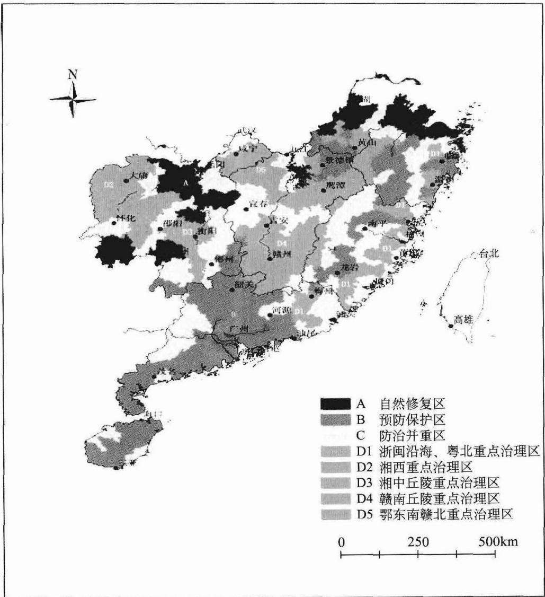  
图21.1 南方红壤区水土流失治理分区图

## 二、分区特征概述

## (一）自然修复区（A区）

本区主要分布在湖南怀化、邵阳、永州、益阳、常德、长沙、衡阳、岳阳，安徽省宣城、池州、芜湖，浙江省湖州、嘉兴、舟山等地区，包括61个县市，总土地面积为 $8 . 9 4 \times 1 0 ^ { 4 } \mathrm { k m } ^ { 2 }$ ，占红壤区土地面积的10.3%，人口4.4$\times 1 0 ^ { 7 }$ 人，平均人口密度为493人/km²，2005年人均GDP为6183元。第一 $. / \mathrm { k m } ^ { 2 }$ 产业增加值 $4 . 9 \times 1 0 ^ { 1 0 }$ 元，地方财政收入 $8 . 7 \times 1 0 ^ { 9 }$ 元，财政支出 $1 . 1 \times 1 0 ^ { 1 0 }$ 元，属于财政赤字区域，人均年粮食总产量 $2 7 9 \ \mathrm { k g }$ 。水土流失主要以轻度、中度为主。区内2002年水土流失面积为 $1 . 0 1 \times 1 0 ^ { 4 } \mathrm { k m ^ { 2 } }$ ，占土地总面积的11.2%，低于全区的平均水平15.1%。其中，轻度、中度和强度以上的流失面积分别为 $6 . 3 \times 1 0 ^ { 3 } ~ \mathrm { k m ^ { 2 } }$ $3 . 5 \times 1 0 ^ { 3 } ~ \mathrm { k m ^ { 2 } }$ 和 $3 . 0 0 \times 1 0 ^ { 2 } ~ \mathrm { k m } ^ { 2 }$ ，轻度和中度流失面积占97%以上，年侵蚀总量为 $2 . 5 \times 1 0 ^ { 7 } \mathrm { ~ t ~ }$ ，占红壤区总侵蚀量的5.5%，区内平均侵蚀模数为 $2 . 4 \times 1 0 ^ { 3 } ~ \mathrm { t } / ( \mathrm { k m ^ { 2 } } ~ \bullet ~ \mathrm { a } )$ ，低于全区的平均侵蚀模数3.4×$1 0 ^ { 3 } \mathrm { t } / ( \mathrm { k m } ^ { 2 } \cdot \mathrm { a } )$ 。从分区的各种土壤侵蚀因子叠加情况来看，该区属于低潜在危险性区域，即低 $\mathrm { I _ { e } }$ 区，而且土壤侵蚀综合指数也是Ⅰ和Ⅱ级两种，相当于轻度和中度流失，因此本区水土流失危害较轻微，在人为干扰不大的情况下，能很快恢复。

## （二）预防保护区（B区）

本区主要集中分布在广东清远、韶关、河源、广州、惠州、江门，海南大部分地区，湖南郴州东部、永州南部，福建龙岩、三明、宁德，浙江温州、台州、丽水、金花，安徽的黄山、池州，江西景德镇、上饶北部等地，涉及126个县市，土地总面积为 $2 . 3 6 \times 1 0 ^ { 5 } \mathrm { k m } ^ { 2 }$ ，占红壤区土地面积的27%，人口$8 . 8 \times 1 0 ^ { 7 }$ 人，占红壤区总人口的28.5%，平均人口密度为371人 $/ \mathrm { k m } ^ { 2 }$ ，2005年人均GDP为5209元。第一产业增加值 $1 . 0 \times 1 0 ^ { 1 1 }$ 元，地方财政收入 $1 . 6 \times$ $1 0 ^ { 1 0 }$ 元，财政支出 $2 . 5 \times 1 0 ^ { 1 0 }$ 元，属于财政严重赤字区域，人均年粮食总产量$1 9 3 \ \mathbf { k g }$ ，粮食显然不能自给，因此，开垦新耕地的压力较大。区内2002年度水土流失面积为 $1 . 8 6 \times 1 0 ^ { 4 } ~ \mathrm { k m ^ { 2 } }$ ，占土地总面积的7.9%，也低于全区15.1%的平均水平。其中，轻度、中度和强度以上的流失面积分别为 $1 . 1 1 \times 1 0 ^ { 4 }$ $\mathrm { k m } ^ { 2 }$ $5 . 4 { \times } 1 0 ^ { 3 } ~ \mathrm { k m } ^ { 2 }$ 和 $0 . 2 1 \times 1 0 ^ { 3 } ~ \mathrm { k m ^ { 2 } }$ ，轻度和中度流失面积占70%以上，年侵蚀总量为 $5 . 2 4 \times 1 0 ^ { 7 } \mathrm { t }$ ，占红壤区总侵蚀量的11.7%，区内平均侵蚀模数为 $2 . 8 \times 1 0 ^ { 3 } \mathrm { t } / ( \mathrm { k m } ^ { 2 } \cdot \mathrm { a } )$ ，低于全区的平均侵蚀模数 $3 . 4 \times 1 0 ^ { 3 } ~ \mathrm { t } / ( \mathrm { k m } ^ { 2 } \cdot \mathrm { a } )$ 。从分区的各种土壤侵蚀因子叠加情况来看，该区属于中、高潜在危险性区域，即中、高 $\mathrm { I _ { e } }$ 区，但目前的土壤侵蚀综合指数E值较低，处在Ⅰ和Ⅱ级水平，相当于轻度和中度流失区，目前发生水土流失的强度不大，但是在高 $\mathrm { I _ { e } }$ 区域内的Ⅱ级E值区是重点的预防保护对象。

## （三）防治并重区（C区）

本区散布在8个省内，主要分布在江西南昌、九江东部、新余、抚州中部、宜春，湖南省怀化中部、永州中部、益阳东部，浙江宁波南部、金花东部、丽水东北和西北部，福建龙岩、漳州、三明、南平，广东肇庆、云浮、河源中部、潮州，海南万宁，安徽宣城东部，湖北鄂州、咸宁北部等地区的146个县市，土地总面积为 $2 . 6 \times 1 0 ^ { 5 } ~ \mathrm { k m ^ { 2 } }$ ，占红壤区土地面积的30%左右，人口 $9 . 5 \times 1 0 ^ { 7 }$ 人，是人口最多的一个区，占红壤区总人口的30.8%，平均人口密度为 362人 $/ \mathrm { k m ^ { 2 } }$ ，2005年人均GDP为 $4 . 9 \times 1 0 ^ { 3 }$ 元。第一产业增加值$1 . 1 \times 1 0 ^ { 1 1 }$ 元，地方财政收入 $1 . 4 \times 1 0 ^ { 1 0 }$ 元，比较低，财政支出 $2 . 0 \times 1 0 ^ { 1 0 }$ 元，属于财政严重赤字区域，人均年粮食总产量273kg，粮食也不能自给，同样存在开垦新耕地的压力。区内2002年度水土流失面积为 $3 . 5 8 \times 1 0 ^ { 4 } ~ \mathrm { k m ^ { 2 } }$ ，占土地总面积的13.79%，也低于全区15.1%的平均水平。其中，轻度、中度和强度以上的流失面积分别为 $1 . 7 6 \times 1 0 ^ { 4 } ~ \mathrm { k m ^ { 2 } }$ $1 . 3 8 \times 1 0 ^ { 4 } ~ \mathrm { k m ^ { 2 } }$ 和 $4 . 3 { \times } 1 0 ^ { 3 } ~ \mathrm { k m } ^ { 2 }$ 轻度和中度流失面积占88%以上，显然流失面积以轻度、中度为主。年侵蚀总量为 $1 . 1 \times 1 0 ^ { 8 }$ t，占红壤区总侵蚀量的25.2%，区内平均侵蚀模数为 $3 . 1 \times$ $1 0 ^ { 3 } \ \mathrm { t } / ( \mathrm { k m ^ { 2 } } \ \cdot \ \mathrm { a } )$ ，低于全区的平均侵蚀模数3. $4 \times 1 0 ^ { 3 } ~ \mathrm { t } / ( \mathrm { k m } ^ { 2 } ~ \bullet ~ \mathrm { a } )$ 。从分区的各种土壤侵蚀因子叠加情况来看，该区属于低、中潜在危险性区域，即低 $\mathrm { I _ { e } }$ 区和中 $\mathtt { I _ { e } }$ 区两种，但目前的土壤侵蚀综合指数E值处在Ⅱ、Ⅲ级水平，相当于中度和强度流失区，特别是在低 $\mathrm { I _ { e } }$ 区域内的Ⅲ级E值区，E值出现强度级别的原因，应该是人为活动引起的，也是本区重点治理的区域，而在中 $\mathrm { I _ { e } }$ 区域内的Ⅲ级E值区，尽管人为活动的程度要小些，但也是强度流失区，仍然需要水土流失的治理措施。而在中 $\mathtt { I _ { e } }$ 区域内的Ⅱ级E值区，尽管水土流失发生的强度不是很大，但应该是本区重点的预防保护对象。

## （四）重点治理区（D区）

本区在土壤侵蚀因子叠加的基础上，再根据地域特征，划分了5个二级区，即 $\mathrm { D 1 \bullet D 2 \bullet D 3 \bullet D 4 \bullet D 5 }$ 。从分布来看，除海南外，其余7个省都有一定面积的分布。共涉及143个县市，土地总面积为 $2 . 8 \times 1 0 ^ { 5 } ~ \mathrm { k m } ^ { 2 }$ ，占红壤区土地面积的32.7%左右，人口 $8 . 1 \times 1 0 ^ { 7 }$ 人，占红壤区总人口的26.3%，平均人口密度为284人 $\cdot / \mathrm { k m } ^ { 2 }$ ，2005年人均GDP为4351元。第一产业增加值9.4$\times 1 0 ^ { 1 0 }$ 元，地方财政收入 $1 . 4 \times 1 0 ^ { 1 0 }$ 元，比较低，财政支出 $2 . 2 3 6 \times 1 0 ^ { 1 0 }$ 元，属于财政严重赤字区域，人均年粮食总产量332kg，粮食也不能自给，存在着开垦新耕地的压力。区内2002年度水土流失面积为 $6 . 6 8 \times 1 0 ^ { 4 } \mathrm { k m ^ { 2 } }$ ，占土地总面积的23.5%，远高于全区15.1%的水平。其中，轻度、中度和强度以上的流失面积分别为 $2 . 6 3 \times 1 0 ^ { 4 } ~ \mathrm { k m } ^ { 2 } , ~ 2 . 5 6 \times 1 0 ^ { 4 } ~ \mathrm { k m } ^ { 2 }$ 和 $1 . 5 0 \times 1 0 ^ { 4 } \mathrm { k m } ^ { 2 }$ ，显然强度以上的流失面积比例较大，占本区流失面积的22.5%左右，流失较为严重，年侵蚀总量为 $2 . 6 \times 1 0 ^ { 8 }$ t，占红壤区总侵蚀量的57.7%，区内平均侵蚀模数为 $3 . 9 \times 1 0 ^ { 3 } ~ \mathrm { t } / ( \mathrm { k m } ^ { 2 } \cdot \mathrm { a } )$ ，高于全区的平均侵蚀模数3. $4 { \times } 1 0 ^ { 3 } ~ \mathrm { t / ( k m ^ { 2 } \cdot } \mathrm { a } )$ 。本区从地形地貌上来看，有中低山区、丘陵区和第四纪红黏土岗地区，从分区的各种土壤侵蚀因子叠加情况来看，该区属于低、中、高三种潜在危险性区域，即低、中和高 $\mathrm { I _ { e } }$ 区3种，但目前的土壤侵蚀综合指数E值都在Ⅲ、Ⅳ、V级的水平上，相当于强度、极强度和剧烈侵蚀的水平，因此将该区列为重点治理区。为了治理措施的配置，以及水土流失治理任务的落实，根据地域的分布规律，将D区分为以下5个二级区，即浙闽沿海、粤北重点治理区$( \Gamma _ { 1 } \mid \sum )$ 、湘西重点治理区 $( \Gamma _ { 2 } \boxtimes )$ 、湘中丘陵重点治理区 $\mathrm { { ( D _ { 3 } } }$ 区）、赣南丘陵重点治理区 $( \Gamma ) _ { 4 } \boxtimes )$ 与鄂东南赣北重点治理区（D5区）。

表21.1 南方红壤考察区水土流失治理分区概况
<table><tr><td rowspan=1 colspan=1>分区</td><td rowspan=1 colspan=1>土地面积 $/ 1 0 ^ { 4 } ~ \mathrm { k m } ^ { 2 }$ </td><td rowspan=1 colspan=1>人口/104人</td><td rowspan=1 colspan=1>流失面积占土地面积/%</td><td rowspan=1 colspan=1>年平均降雨量/mm</td><td rowspan=1 colspan=1>K值</td><td rowspan=1 colspan=1>平均侵蚀模数 $/ [ \mathbf { t } / ( \mathbf { k m } ^ { 2 } \cdot \mathbf { a } ) ]$ </td><td rowspan=1 colspan=1>所辖县市数/个</td></tr><tr><td rowspan=1 colspan=1>A区</td><td rowspan=1 colspan=1>8.94</td><td rowspan=1 colspan=1>4 408.4</td><td rowspan=1 colspan=1>11.2</td><td rowspan=1 colspan=1>1000~1300</td><td rowspan=1 colspan=1>0.15~0.20</td><td rowspan=1 colspan=1>2446.4</td><td rowspan=1 colspan=1>61</td></tr><tr><td rowspan=1 colspan=1>B区</td><td rowspan=1 colspan=1>23.59</td><td rowspan=1 colspan=1>8 760.4</td><td rowspan=1 colspan=1>7.9</td><td rowspan=1 colspan=1>1400~1700</td><td rowspan=1 colspan=1>0.25~0.35</td><td rowspan=1 colspan=1>2 823.5</td><td rowspan=1 colspan=1>126</td></tr><tr><td rowspan=1 colspan=1>C区</td><td rowspan=1 colspan=1>26.12</td><td rowspan=1 colspan=1>9 461.5</td><td rowspan=1 colspan=1>13.7</td><td rowspan=1 colspan=1>1300~1600</td><td rowspan=1 colspan=1>0.20~0.30</td><td rowspan=1 colspan=1>3 159.6</td><td rowspan=1 colspan=1>146</td></tr><tr><td rowspan=1 colspan=1>D区</td><td rowspan=1 colspan=1>5.08</td><td rowspan=1 colspan=1>2 186.1</td><td rowspan=1 colspan=1>17.5</td><td rowspan=1 colspan=1>1400~1600</td><td rowspan=1 colspan=1>0.20~0.25</td><td rowspan=1 colspan=1>3 248.8</td><td rowspan=1 colspan=1>30</td></tr><tr><td rowspan=1 colspan=1>D2区</td><td rowspan=1 colspan=1>5.87</td><td rowspan=1 colspan=1>1 293.4</td><td rowspan=1 colspan=1>25.7</td><td rowspan=1 colspan=1>1300~1400</td><td rowspan=1 colspan=1>0.15~0.25</td><td rowspan=1 colspan=1>3 726.0</td><td rowspan=1 colspan=1>22</td></tr><tr><td rowspan=1 colspan=1>D_3区</td><td rowspan=1 colspan=1>2.15</td><td rowspan=1 colspan=1>1 000.7</td><td rowspan=1 colspan=1>27.4</td><td rowspan=1 colspan=1>1300~1400</td><td rowspan=1 colspan=1>0.20~0.25</td><td rowspan=1 colspan=1>3 131.5</td><td rowspan=1 colspan=1>13</td></tr><tr><td rowspan=1 colspan=1>D₄区</td><td rowspan=1 colspan=1>6.21</td><td rowspan=1 colspan=1>1 249.3</td><td rowspan=1 colspan=1>21.9</td><td rowspan=1 colspan=1>1300~1500</td><td rowspan=1 colspan=1>0.25~0.30</td><td rowspan=1 colspan=1>4 620.5</td><td rowspan=1 colspan=1>28</td></tr><tr><td rowspan=1 colspan=1>D5区</td><td rowspan=1 colspan=1>9.15</td><td rowspan=1 colspan=1>2 364.2</td><td rowspan=1 colspan=1>25.5</td><td rowspan=1 colspan=1>1400~1500</td><td rowspan=1 colspan=1>0.20~0.25</td><td rowspan=1 colspan=1>3 950.7</td><td rowspan=1 colspan=1>50</td></tr><tr><td rowspan=1 colspan=1>合计</td><td rowspan=1 colspan=1>87.1</td><td rowspan=1 colspan=1>30 724.0</td><td rowspan=1 colspan=1>15.1</td><td rowspan=1 colspan=1>1000~1700</td><td rowspan=1 colspan=1>0.15~0.35</td><td rowspan=1 colspan=1>3 419.7</td><td rowspan=1 colspan=1>476</td></tr></table>

## 第三节 战略目标、总体布局与措施配置

## 一、战略目标与任务

## （一）近期目标与任务（2006\~2010年）

近期为生态恢复治理期。从2006年起到2010年，也就是“十一五”期间，用5年的时间，以生态恢复治理水土流失为核心，以重点工程建设为契机，初步控制人为水土流失增长，努力遏制住生态环境恶化的趋势，水土流失治理初见成效。

（1）控制人为因素造成的水土流失。以预防保护为主，全面控制各种人为造成的新的水土流失。新开工的建设项目实施“三同时”制度达100%，实施水土保持方案申报审批率达90%以上；大于25°的开垦陡坡实施退耕还林还草；大力发展小水电和太阳能，基本普及节柴灶和沼气池，解决农村生活能源问题，减少对植被的破坏，使人为因素造成的水土流失，土地荒漠化的趋势得到遏制。

（2）全面实行生态恢复，重点治理严重水土流失区。根据水土流失的严重程度，合理安排水土流失治理时序，封山育林、植树种草，采取工程措施、生物措施以及水土保持耕作措施相结合进行水土流失综合治理，全面防治水土流失，集中解决水土流失造成生态环境恶化的突出问题。新增治理水土流失面积 $5 . 0 \times 1 0 ^ { 4 } \mathrm { k m ^ { 2 } }$ ，水土流失治理程度达到30%左右，重点水土流失治理工程初见成效，初步完成对严重水土流失区的治理任务，基本遏制生态环境恶化趋势，使水土流失治理工作迈上一个新的台阶。

（3）完善预防监督、监测预警体系。在各省水土流失区基本建立起水土保持预防监督体系、水土流失动态监测网络和水土保持信息管理系统，建立定期向社会公众发布水土流失监测报告制度，实现水土保持监测“三年一公告”的目标，使水土保持管理达到规范化和现代化。同时，建立滑坡、泥石流预警系统，开展以群测群防为主，以站点观测为辅的预警预报，保护规划区人民生命财产的安全。

（4）完善水土保持工作的法制体系，加强执法队伍建设。完善水土保持法律法规体系，健全水土保持预防监督执法体系，建立一支精干高效的水土保持预防监督执法队伍。

## （二）中期目标与任务（2011～2020年）

中期为水土流失加速治理和巩固期。在巩固提高水土保持治理成果的基础上，继续保持较高的治理速度。

（1）全面控制新的水土流失的产生，遏制水土流失发展趋势。全面控制各种新的水土流失现象，以预防保护为主。各类生产建设项目水土保持方案申报审批率继续保持100%；80%以上的废弃土石渣得到拦挡和防护，使人为活动产生新的水土流失得到完全控制；全面加强预防保护工作，使水土流失基本得到控制。

(2）加速水土流失区的综合治理，使全区水土流失得到基本治理． 将现有的水土流失采用水土保持工程措施、农业技术措施与林草植被措施进行高标准的治理，至2020年以前，使全区水土流失得到基本治理，使重点水土流失区的土壤侵蚀模数降低到 $5 0 0 { \sim } 1 5 0 0 ~ \mathrm { t / ( k m ^ { 2 } \cdot { \ a } ) }$ 以下，水土流失治理率大于65%。植被覆盖率达60%以上，大江大河减沙30%以上，生态环境有明显的改观。25°以上坡耕地全部退耕还林还草，25°以下坡耕地基本布设相应的水土保持措施，水土保持防护功能大幅度增强，自然灾害损失大为减轻。加强对崩岗的治理，治理率达到30%以上，基本实现对崩岗危害的控制。

（3）依靠先进的科学技术，使水土保持实现跨跃式进步。全面建立起健全的水土保持预防监督体系和动态监测网络，定期发布水土流失动态信息；完善各级水土保持地方性法规、规章和规范性文件，加强监督执法队伍建设，使水土保持法律法规形成完善的体系；充分利用科技信息资源共享平台和技术交流等多种形式，加大先进技术成果的推广应用力度，提高科技成果的推广率和转化率，将水土保持工作提高到新水平。

## （三）远期目标与任务（2021～2030年）

本期为水土流失治理巩固完善和生态良性循环期。应实现如下目标：水土流失得到全面治理，治理面积达水土流失面积的80%，土壤侵蚀量减少80%以上，水土保持设施防御标准达到20年一遇；人为水土流失现象得到完全控制；继续加强对崩岗的治理，使治理率达到60%以上；实现水土流失的动态监测，水土保持管理走上规范化和科学化管理轨道。通过10年的巩固完善，依靠预防监督执法和科学技术，巩固水土流失治理成果，提高环境质量，使全区生态环境进入良性循环，基本适应国民经济可持续发展的需要。

## 二、总体布局与措施配置

根据上述原则和方法，将南方红壤全区共分为8个水土流失防治区域进行防治布局和措施配量，即：A. 自然修复区、B. 预防保护区、C.防治并重区、D1.浙闽沿海、粤北重点治理区、D2.湘西重点治理区、D3．湘中丘陵 $\mathrm { D } _ { 1 }$ $\mathrm { D _ { 3 } }$ 治理区、D4.赣南丘陵重点治理区和D5．鄂东南赣北重点治理区。 $\mathrm { D } _ { 4 }$

## （一）自然修复区

本区水土流失主要以轻度、中度为主，该区属于低潜在危险性区域，本区水土流失危害较轻微，在人为干扰不大的情况下，能很快恢复，主要以自然修复为主，兼顾经济开发利用。

（1）调整能源结构，进行合理封禁。对于具有一定厚度的土层和植被覆盖度较大的轻度流失区，宜采取封禁治理为主的生态自然恢复模式。通过调整农村能源结构，实行改燃节能，努力促进植被的自然恢复。

（2）加强植被的保护和建设。在以林为主、实现森林永续利用、维护生态平衡的前提下，变单一的、脆弱的林业经济为稳定的、互相促进的多种经营是繁荣山区经济，开展水土保持工作的必由之路。

（3）合理利用低丘台地。红壤低丘台地面积较大，松散层相应较厚，透水性强，易于引起较严重的水土流失，酸性强，肥力低，旱作产量不高，应提高整地质量，加强技术管理，大力发展适生的经济林和果木林。灰岩残丘台地以溶蚀为主，地表易干旱，土层薄，质地黏重，植被多具旱生特征，土壤侵蚀量虽然不大，但危害严重，治理困难，应严加保护现有植被，使之形成水保林；紫色砂页岩低丘台地母质既易风化，也易流失，土层中矿物质养分较富，利于垦殖利用，尤其适宜种植经济作物（如黄烟等），但要采取相应的工程措施，如修建谷坊，拦沙坝和山塘，以便截拦山洪，缓和水势和蓄水防旱。此外，平整土地、筑埂防蚀是一项重要的农田基本建设，也是建立高产稳产农田的基础。

## （二）预防保护区

本区水土流失也主要以轻度、中度为主，该区属于高潜在危险性区域，必须加强保护，防止水土流失继续发展。对该区的治理应以预防保护为主，

兼顾现有流失区的治理工作。

（1）加强林业生产管理，针对区内山地面积大和现有森林分布广的特点，在今后的水土保持工作中，要特别注意以防为主，加强对水土资源开发利用的管理，全面制定水土资源开发利用规划，严格控制林木采伐量，搞好现有林区和适生林种发展规划工作，扩大水源涵养土地面积的比重，提高林木加工经济效益和保持水土的生态效益。注意发展经济林和果木林，整地标准要高。积极防治采矿、修路、基建等工程弃土堆石所引起新的水土流失。同时，还应特别加强对林业生产的管理，在有效限制木材采伐量的前提下，还要及时做好林地的改造和更新，纠正过去不合理的“炼山”式全垦整地造林和抚育方式，封山育林和人工造林相结合，注意保护天然阔叶林种。

（2）防止新的水土流失。防治毁林种茶种果所引起的水土流失是一项亟待解决的任务。一是要因地制宜，全面规划，提高建园质量。凡大于25°的坡地不宜开垦，已垦者要逐步改造，或退茶还林，或退茶还草。在规划时，要注意分散建园，不强行大面积连片，将茶园尽可能垦成等高梯级结构，减少坡长，梯层内侧要有蓄水沟、蓄水池，并改园地内纵斜排水沟为分蓄水沟，改纵路为斜坡路。二是要用植物防护梯埂和梯壁。梯壁、埂种植豆科绿肥或黄花菜，既可保护梯埂，又能增加收益。三是要合理耕作，适当密植，做到横坡等高种植，提高梯面郁闭度。此外，应改锄梯壁草为刀割，在雨季，园内可铺草覆盖。对于未封行的茶园要进行合理间作，减少雨水对土壤冲击力，如在缓坡地新建茶园行中间种花生比不间种茶园的土壤流失量减少45.9%。

## （三）防治并重区

本区水土流失面积较大，也主要以轻度、中度为主，必须加强保护，防止水土流失继续发展；同时也要加强对现有水土流失区的治理，减少危害，预防与治理并重。

（1）合理布局，综合开发治理。首先是在宜耕区稳定粮食生产，扩大经济作物种植比例，加强主要产粮区的农田建设和技术装备更新，适当调整耕作制度，搞好轮作、套种、间种，做到用地养地结合，尽量提高旱坡地作物覆盖度和覆盖时间，依靠技术进步不断提高单位面积产量，以保证人口增长的需要。同时可以适当扩大宜于本区种植、经济效益较高或者养地效果较好的花生、甘蔗、麻类和蚕桑等的种植比例。另外，区内林业生产原有一定基础，且林副产品种类繁多，产量大，但结构布局不够合理，利用不充分，产品加工水平低，建设速度不快，尚有大片荒山荒地没有很好利用。因此，应大力植树造林，调整林业生产结构，大力发展水源林、速生用材林和经济林、薪炭林，逐步改造现有林地。充分利用区内山多、水多和粮多的综合优势，适当扩大渔业及畜牧业生产规模。

（2）提高经济果木林水保标准。区内丘陵面积大，坡度较缓，风化壳厚，土地质量较好，适于多种亚热带经济林和果木林发展。原有一定基础并适于本区发展的经济林果有茶叶、桑蚕、竹子、油茶、板栗、荔枝、龙眼、香蕉、大蕉、柑橙、柚子等，应在适宜地区扩大种植，形成具有本地特色的专业生产点、区。区内名贵药材桂皮、巴戟、砂仁、首乌、银花等经济价值很高，可进行集约化经营，建好生产基地，提高品质。这些经济林、果木林和药材的绝大部分产地将会集中在丘陵岗地区，所以做好用地规划，提高整地标准，改进农艺措施，提高水土保持技术标准，就成为综合治理丘陵台地区水土流失成败的关键，应把经济效益和水土保持效益结合起来。

（3）抓好流失重点地区治理。该区域自然侵蚀的面积比重较大，侵蚀类型多样。在措施布局上，应针对不同类型采取不同的治理措施，对崩岗的治理采取“上拦、下堵、中间稳”方法，修筑天沟等沟洫工程拦截坡面径流，以防止径流向沟头集中，阻止沟头沟壁的进一步扩展。沟口修筑谷坊、拦沙坝，拦截泥沙，抬高侵蚀基点。坝坡内外及崩积锥等部位应用植物覆盖，防止坝坡及崩积锥等相对稳定部位的再侵蚀；对沟状侵蚀，重点采用竹节沟、品字沟等沟洫工程拦截坡面径流，辅以谷坊、拦沙坝等工程措施，控制泥沙下泄；对面状侵蚀，重点采用生物措施进行治理，人工造林与封育治理相结合，在植物品种的选取上以速生耐瘠的湿地松、马尾松、绢毛相思、大叶相思、台湾相思、大叶桉、竹类、胡枝子、糖蜜草、百喜草等作为先锋植物，快速形成植物覆盖，同时与荷木、藜索等树种混交，增强防护效能；对坡度较缓、相对高差较小的面状和沟状侵蚀，根据实际需要开修水平梯田，种植经济林果；对坡度较陡（特别是坡度超过25°）的坡耕地应限期退耕，还林还果；对小流域的淤荒地进行改造，种植经济林果，发展养殖业，低洼积水处则开挖成鱼塘养鱼、养鸭，使资源高效循环利用。

## （四）浙闽沿海、粤北重点治理区

本区内山地广阔、河流众多，人口密度大、经济发达。植被破坏严重，山地丘陵基岩裸露，土壤侵蚀多发生在厚层花岗岩风化物上，以面蚀、沟蚀为主，其中轻度、中度和强度以上的流失面积较大。在植被破坏严重、相对高度在20～200m的花岗岩丘陵盆谷地，崩岗侵蚀活动强烈。

（1）加强沿海防护林建设。区内沿海地带滩涂资源丰富，可以充分利用来发展海水养殖和盐业生产，但因常受台风影响，雨量分布不均，旱涝经常发生。为了保障人民生命财产安全，保护养殖场和农田，改善田间气候，必须大力加强沿海防护林的建设，营造新林，巩固已经形成带、网、片“三位一体”的防护林体系。

（2）加强矿区综合治理。目前由于本区经济发展迅速、开矿、修路、建厂、采石、挖沙等生产建设单位成倍增加。据调查，上述生产、施工单位中，有相当一部分没有妥善的水土保持措施，乱弃石土，乱占耕地建厂、盖房子的现象时有发生。针对这种情况，应组织有关单位认真学习中央颁布的有关水土保持工作的法规和文件，各级政府和水保部门必须严格依法办事，加强管理，组织力量进行认真的检查清理，对违反水土保持的行为进行严肃处理。

（3）加强崩岗治理。可采用“上截、下堵、内外绿化“治理措施对瓢形、条形和部分混合形崩岗进行治理，而对沟口较宽的弧形崩岗与少数条形崩岗，可采用护岸固坡工程措施进行治理。

## （五）湘西重点治理区

本区属于强度流失区，山地面积占土地面积的70%，人均耕地仅5.5×10-2hm²，人均年纯收入低，属湖南省的贫困山区。本区水土流失严重的主要原因是人为不合理的活动所致，譬如森林植被破坏严重、陡坡垦种、经济林地表土壤流失严重。

（1）加强林业建设。首先要制止乱垦滥伐，把木材的年采伐量控制在年生长量以下。以封山育林为主，加快荒山绿化，恢复植被，发展多层次混交的水源涵养林、用材林和水土保持林。对有母树条件的疏残林地，实行轮封；母树少，单靠自然繁衍难以恢复植被的应补植，补播乔、灌、草种；实行国家、集体、个人一齐上的办法造林。

（2）加强农田基本建设。对已开垦的坡地，凡大于25°的坚决退耕还林还草，25°以下的要逐步改成水平梯田或实行保土耕作法。对宜农耕地，要加强农田基本建设，扩大稳产高产田面积，提高单产，随着农业内部结构的不断调整，逐渐改变广种薄收和撂荒轮歇的原始耕作方式。

（3）控制人口增长速度，发展工副业生产。湘西是个多民族地区，除汉族外，以土家族和苗族最多，全区总人口占湖南省人口总数的19.4%。虽然平均人口密度不大，为220人/km²，但人口数量增长甚快。区内宜农耕地少，绝大部分旱地斜挂山坡，在册旱地面积中，坡耕地面积比例较大，不在册的荒地更多，垦种坡度较大，在暴雨冲刷下引起强烈水土流失，限制了区内农业生产。应充分利用区内原材料丰富，交通方便和生产技术水平较高及劳动力资源充裕的优势，大力发展各种工、副业生产和多种经营。这样，既可增加收入积累资金，又可有效地转移剩余劳力，减轻土地负载。

## （六）湘中丘陵重点治理区

该区人口密度较大，人为活动剧烈，粮食总产量刚够自给。该区属于丘陵红壤区，红土母质和花岗岩分布广泛，红岩和红土分布面积大，植被遭受破坏严重，松软的风化壳在降雨的作用下形成了大量的崩岗、侵蚀沟，侵蚀活动强烈，局部地区属于强度侵蚀区，区内62.1%的水土流失面积发生在稀疏林地，16.7%的发生在坡耕地，21.1%的水土流失面积发生在荒地及非农用地。区内海拔都在100～300m，陡坡垦殖、城镇开发、矿产资源开发和交通建设也造成了一定的水土流失。

（1）加强林业建设、坡耕地治理和崩岗治理。本区与湘西重点治理区相同要加强植被修复、坡耕地还林还草或修梯田和崩岗治理，控制人口增长速度，发展工副业生产，增加收入积累资金，有效地转移剩余劳力，减轻土地负载。

（2）加强对荒地及非农用地的治理。目前由于本区经济发展迅速，开矿、修路、建厂、采石、挖沙等生产建设单位成倍增加。本区还要加强对荒地及非农用地的预防监督和治理，尤其是要加强对城镇开发、矿产资源开发和交通建设等项目的监管。

## （七）赣南丘陵重点治理区

本区人口密度较小，粮食总产量刚够自给。该区域地形复杂，包括丘陵、盆地和断续山地。赣南地处中亚热带南缘，由于气候、雨量、母岩及人为加速侵蚀等因素，这里一直是水土流失最严重的区域，“红色沙漠”、“白沙岗”就是对红壤严重侵蚀地的一种形象描述。严重侵蚀地在土壤长期侵蚀作用下，完全失去有机质层的土壤可达山地面积的一半以上，心土或风化层普遍裸露，有的地段切沟与崩岗密布，形成千沟万壑的“劣地”景观，属于极度退化的生态系统。侵蚀强烈的区域，不仅仅是花岗岩区，在紫色砂页岩风化物和第四纪红黏土上的侵蚀依然强烈，以面蚀和沟蚀为主，荒山、幼林地为剧烈鳞片状侵蚀，崩岗、露岩也较常见。强度以上的面积比例较大，属于水土流失极为剧烈的区域。自20世纪80年代开始，各级政府为了老区人民脱贫致富，将其列入重点治理计划，20多年来已初见成效，水土流失状况得到了较大改观，但治理区域的生态环境依然很脆弱，需要进一步改善。

（1）巩固现有治理成果。加强行政执法力度，明确责任和义务，并成立县级水保监督执法中队，坚持在示范区巡回执法，依法查处水保违法案件，保护治理成果，使林草管护效果得到明显提高，并对林草措施和小型拦蓄工程转换管护机制，实行承包治理，合同管理。强化村一级管护职责，凡有林草的沟壑封禁管护，层层落实管护责任人，把生态工程建设和管理的重点由造林阶段向管护阶段延伸，彻底扭转重建设轻保护，边治理边破坏的现象。

（2）把综合治理同治穷致富结合起来。这里是革命老根据地，在战争年代，老区人民做出了巨大牺牲，在革命胜利后，老区又为国家经济建设提供了大量的自然资源。但长期严重的水土流失，致使当地生态环境恶化和人民生活贫困。因此，要把治穷致富和解决群众急迫的生计困难作为水土流失综合治理的突破点。

（3）分类治理，治用并重。区内有大面积强度流失山丘，立地条件恶劣。要把水土保持的工程措施同农田、水利设施、道路、采矿等建设和改善山丘坡地的立地条件结合起来，为植被和作物的生长创造良好的生境条件。区内中、轻度水土流失仍占很大面积，严格封山育林，增强植被覆，同样可以取得良好的治理效果。

（4）加强矿区综合治理。本区稀土矿储量丰富，应很好发挥这一资源优势，为区内经济发展服务，合理开采一定会促进水土保持工作的开展。矿山的水土保持还是一个薄弱环节，必须进一步贯彻《水土保持工作条例》及相关文件精神，坚持依法办事。督促有关单位和个人，把水土保持工作纳入采矿的全过程，做到有机构、有专人、有规划、有经费、有措施。

## （八）鄂东南赣北重点治理区

该区地形以丘陵为主，丘陵间谷地开阔，为主要农业用地。地面侵蚀物质以发育在第四纪红黏土、紫色砂页岩及花岗岩的红壤、紫色土及其风化物为主。此区人为活动频繁，植被破坏严重，土壤侵蚀发展强烈。农地以片蚀、细沟侵蚀为主，被砍伐的稀疏林地和荒地以强度鳞片状侵蚀为主，部分地区沟蚀强烈，并见有崩岗的发生。该区人口密度较小，粮食总产量刚够自给。2002年水土流失面积为 $2 . 3 \times 1 0 ^ { 4 } ~ \mathrm { k m } ^ { 2 }$ ，占区内土地面积的25.5%，其中，轻度、中度和强度以上的流失面积分别为 $1 . 0 \times 1 0 ^ { 4 } ~ \mathrm { k m ^ { 2 } }$ $7 . 3 \times 1 0 ^ { 3 } ~ \mathrm { k m ^ { 2 } }$ 和5.9$\times 1 0 ^ { 3 } \mathrm { k m ^ { 2 } }$ ，年侵蚀总量为 $9 . 2 \times 1 0 ^ { 7 } \mathrm { t }$ ，占红壤区总侵蚀量的20.6%，区内平均侵蚀模数为 $3 . 4 \times 1 0 ^ { 3 } ~ \mathrm { t } / ( \mathrm { k m } ^ { 2 } \cdot \mathrm { a } )$ 0

（1）实行山、水、田综合治理。根据区内以盆地型农业结构为主的特征，进行山、水、田综合治理，是控制水土流失、为农业生产创造良好生态环境的主要措施。山、水、田综合治理，要以治山为本，大力封山育林，积极造林、护林。在分水岭附近、水库上游和高坡陡坡区，要以封育、营造水源林和防护林为主。

（2）治理同开发紧密结合。要充分利用区内有利条件和资源优势，大力发展商品生产，促进水土流失的治理。区内荒坡荒丘面积大，土地组合复杂，除有计划地发展一些薪炭林以缓解农村能源外，应因地制宜地大量发展亚热带经济林和各种果木林。根据流域的不同特征，建立基本农田区、经济林果区、封山育林区、造林区，使山区人民通过治理，尽快脱贫致富。

## 三、主要措施成本分析

## （一）水土流失治理资金投入的总体布局方案

调查结果表明，除崩岗外，治理 $1 ~ \mathrm { k m ^ { 2 } }$ 的轻度流失约需要 $3 . 6 \times 1 0 ^ { 5 }$ 元，中度约需要 $3 . 8 \times 1 0 ^ { 5 }$ 元，强度约需要 $4 . 0 \times 1 0 ^ { 5 }$ 元。南方红壤区的总土地面积为 $8 . 7 \times 1 0 ^ { 5 } ~ \mathrm { k m ^ { 2 } }$ ，其中轻度侵蚀面积为 $6 . 2 \times 1 0 ^ { 4 } ~ \mathrm { k m } ^ { 2 }$ ，占总面积的7.1%，至少需投入资金 $2 . 2 \times 1 0 ^ { 1 0 }$ 元；中度侵蚀面积为 $4 . 7 \times 1 0 ^ { 4 } ~ \mathrm { k m ^ { 2 } }$ ，占总面积的5.5%，需投入资金 $1 . 8 \times 1 0 ^ { 1 0 }$ 元；强度侵蚀面积为 $1 . 7 \times 1 0 ^ { 4 } ~ \mathrm { k m ^ { 2 } }$ ，占总面积的1.9%，需投入资金 $6 . 7 \times 1 0 ^ { 9 }$ 元；极强度及以上侵蚀面积为 $4 , 8 \times$ $1 0 ^ { 3 } ~ \mathrm { { k m ^ { 2 } } }$ ，占总面积的0.6%，至少需投入资金 $2 . 0 \times 1 0 ^ { 9 } \sim 3 . 0 \times 1 0 ^ { 9 }$ 元。治理单个崩岗，需要投资 $7 . 0 \times 1 0 ^ { 4 }$ 元 $/ \mathrm { { h m } } ^ { 2 }$ 。南方八省共有崩岗 $2 . 6 \times 1 0 ^ { 5 }$ 处，若完全治理约需资金共 $7 . 3 \times 1 0 ^ { 1 0 }$ 元，如果按各省治理单个崩岗所需资金，也要至少4. $1 \times 1 0 ^ { 1 0 }$ 元。此外，治理目前产生的人为水土流失 $\mathrm { ~ 1 ~ } \mathrm { \ k m } ^ { 2 }$ 需要投资$4 . 0 \times 1 0 ^ { 7 }$ 元以上。深圳市等地调查表明，治理 $1 ~ \mathrm { m } ^ { 2 }$ 的裸露山体缺口约需要$8 0 \sim 1 0 0$ 元。因此水土流失治理需要大量的资金投入。根据本区水土流失类型区域分布的差异性，在水土保持总体布局上坚持分类防治，根据水土流失防治规划与目标，将水土流失治理分两步完成：2006～2010年，实行预防为主、综合治理、防治结合的原则，重点对轻度和中度水土流失进行全面治理，以预防保护为主，全面控制各种人为因素造成新的水土流失，突出重点，选择典型的或亟待治理的强度或强度以上的水土流失区进行治理，并完善预防监督、监测预警体系；2010～2030年，重点对强度及以上等级的水土流失进行综合治理，并建立完善的水土保持科学管理与治理体系，巩固以前的治理成果，使全区水土流失得到基本治理。建议国家实施南方红壤区崩岗专项治理工程和原中央苏区水土流失综合治理专项工程，并以此调动各级力量，实现以自然修复为主的大面积水土流失修复工程。根据调查结果，分别给出这三大工程建设所需要的资金投入估算。

## （二）崩岗专项治理工程资金投入估算

崩岗是南方红壤区所特有的一种严重侵蚀类型，它是花岗岩浅丘岗地长期遭受自然与人为破坏而导致岗地崩塌的结果。据长江水利委员会2005年4月完成的崩岗侵蚀调查统计，南方红壤考察区的广东、福建、江西、湖北、湖南和安徽6省，共有各类崩岗20万个，其中广东12万个、江西4.8万个、湖南2.6万个；崩岗侵蚀沟总面积11万hm²，其中广东8.4万hm²、江西2.1万 hm²、湖南 3700 hm²、福建 2600 hm²。

尽管崩岗面积小，但侵蚀强度巨大，甚至达到泥沙掩埋农田与村庄、淤积水库、提高河床，有时整个崩岗发生崩塌危及人民生命安全的程度。福建、江西、广东的普遍经验是，建立“开发式崩岗治理模式”，即采用“上截、下堵、中间削、内外绿化”方式，进行多种树木种植，并在此基础上，在岗谷内建立“反坡台地”，栽种经济果林，使崩岗逐渐变为生态及工业用地，取得明显的经济效益与社会效益。

根据长江水利委员会对南方七省崩岗（118～365个崩岗的数据）治理投入与效益的调查结果，治理单个崩岗，需要投资83000元/hm²，其中建设基本农田需要1500元/hm²，水保林需要2400元/hm²，经济林需要8300元/hm²，果木林需要33400元/hm²，种草需要46 900元/hm²，建谷坊需要8000元/座，建拦沙坝需要7000元/座，建截排水沟需要22.6元/m，建跌水需要1400元/处，建挡土墙需要1730元/m，建崩壁小台阶需要176元/m²。如果按各省治理单个崩岗所需资金计算，南方红壤考察区20万个若全部治理，合计需要410亿元。如果按照30%治理的目标，总投入资金需要120亿元。

## （三）原中央苏区水土流失综合治理专项工程资金估算

从水土流失分区上来看，江西省的原中央苏区县主要分布在赣南丘陵重点防治区，只有黎川县和寻乌县属于防治并重区，水土流失比较严重，平均水土流失面积大于22%。除安远县和寻乌县外，水土流失面积均在20%以上，其中于都县达到了30%。瑞金县、兴国县、广昌县和黎川县强度及以上的水土流失面积均超过了8.0%。而且，这些县除石城县、广昌县和黎川县外，均有崩岗分布。福建省的原中央苏区县主要分布在防治并重区，水土流失比较轻，水土流失面积多在10%以内，只有长汀县和宁化县的水土流失面积较大，所占比例分别为22.8%和16.7%。只有长汀县有崩岗分布。如果按治理 $1 ~ \mathrm { k m } ^ { 2 }$ 的轻度流失约需要 $3 . 6 \times 1 0 ^ { 5 }$ 元，中度约需要 $3 . 8 \times 1 0 ^ { 5 }$ 元，强度约需要 $4 . 0 \times 1 0 ^ { 5 }$ 元计算，江西省原中央苏区的水土流失面上治理（不包括崩岗治理）所需资金为 $2 . 3 \times 1 0 ^ { 9 }$ 元。其中轻度水土流失治理需 $7 . 5 5 \times 1 0 ^ { 8 } \ \overline { { \mathcal { D } } }$ 中度需 $6 . 2 \times 1 0 ^ { 8 }$ 元，强度及以上至少需 $9 . 1 \times 1 0 ^ { 8 }$ 元。而这些县的崩岗治理估计需要 $4 . \ 0 \times 1 0 ^ { 8 } \sim 6 . \ 0 \times 1 0 ^ { 8 }$ 元。因此，要完全治理江西省的水土流失可能需要 $7 . 0 \times 1 0 ^ { 8 } { \sim } 9 . 0 { \times } 1 0 ^ { 8 }$ 元。福建省的原苏区水土流失面上治理（不包括崩岗治理）所需资金为 $9 . 6 \times 1 0 ^ { 8 }$ 元，其中轻度水土流失治理需 $4 . 6 \times 1 0 ^ { 8 }$ 元，中度需 $2 . 1 \times 1 0 ^ { 8 }$ 元，强度及以上至少需 $2 . 6 \times 1 0 ^ { 8 }$ 元，再加上长汀县的1414个崩岗治理所需的 $6 . 2 \times 1 0 ^ { 7 }$ 元，福建省的原苏区水土流失治理共需资金约$1 . 0 \times 1 0 ^ { 9 }$ 元。原中央苏区水土流失治理共计需投入资金 $8 . 0 \times 1 0 ^ { 9 } \sim 1 . 0 \times 1 0 ^ { 1 0 }$ 元，其中面上治理需 $3 . 2 \times 1 0 ^ { 9 }$ 元左右。

## （四）水土流失生态修复工程资金投入估算

按治理1 km²的轻度流失约需要 $3 . 6 \times 1 0 ^ { 5 }$ 元，中度约需要 $3 . 8 \times 1 0 ^ { 5 }$ 元，强度约需要 $4 . 0 \times 1 0 ^ { 5 }$ 元计算，5个重点治理区约需投入资金 $2 . 5 \times 1 0 ^ { 1 0 }$ 元，其中轻度流失区需 $9 . 5 \times 1 0 ^ { 9 }$ 元，中度流失区需 $9 . 7 \times 1 0 ^ { 9 }$ 元，强度及以上流失区需 $6 . 0 \times 1 0 ^ { 9 }$ 元。防治并重区需 $1 . 3 \times 1 0 ^ { 1 0 }$ 元，预防保护区需 $6 . 9 \times 1 0 ^ { 9 }$ 元，自然修复区需 $3 . 7 \times 1 0 ^ { 9 }$ 元。全区总计约需投入 $4 . 9 \times 1 0 ^ { 1 0 }$ 元。扣除原中央苏区治理投入，所需投入达 $4 . 5 \times 1 0 ^ { 1 0 }$ 元左右。

因此，要对南方红壤区水土流失进行治理，共计约需投入资金 $9 . 0 \times 1 0 ^ { 1 0 }$ 元，其中面上治理约需 $4 . 9 \times 1 0 ^ { 1 0 }$ 元，崩岗治理约需 $4 . 1 \times 1 0 ^ { 1 0 }$ 元。原中央苏区水土流失治理共计需投入资金 $8 . 0 \times 1 0 ^ { 9 } \sim 1 . 0 \times 1 0 ^ { 1 0 }$ 元，其中面上治理需$3 . 2 \times 1 0 ^ { 9 }$ 元左右。

## 四、主要对策

## （一）强化水土保持是基本国策的认识

土壤是国家的立国之本，国家在保护基本农田面积的同时应该加强水土保持，保持土地的质量保持水资源永续利用，保持水环境的健康，保证农村持续发展。党的十六大明确提出了“以人为本、树立全面协调的可持续科学发展观”。科学发展观是用来指导发展的，全面协调可持续发展是科学发展观的基本要求。要求要坚持以经济建设为中心，按照“五个统筹”的要求，促进经济社会发展和人的全面发展相统一，实现经济发展与人口、资源、环境相协调。贯彻落实科学发展观，大力推进社会主义经济、政治、文化、社会的全面发展，要努力做到“五个统筹”，即统筹城乡发展、统筹区域发展、统筹经济社会发展、统筹人与自然和谐发展、统筹国内发展和对外开放，使各方面的发展相适应，各个发展环节相协调。因此水土保持工作目标不仅应为“改善农民生产生活条件”，而且应为落实科学发展观，以实现水土资源的可持续利用和生态环境的可持续维护为目标。坚持以人为本，按照流域综合治理的方案，紧紧围绕“预防监督、综合治理、生态修复、监测预报、面源污染防治”等“六大任务”，为改善生态环境和“三农”发展做贡献。这应该是新时期水土保持作为基本国策地位新的内涵。

## （二）完善和普及《水土保持法》

调查中发现目前的《水土保持法》存在的主要问题是：①水土保持地位不确定，行政许可规范不明确，与其他法律关系不协调；②执法主体不明确；③执法标准低，措施不明确且可操作性不强；④没有规范投入机制，补偿机制、协调机制、监督机制、约束机制和考核机制等。这些问题应该在完善和修改《水土保持法》时加以考虑。

南方红壤区的经验表明，增强水土保持的公众意识将有助于加快水土流失治理和提高治理效果。普及水土保持法和水土保持知识是提高水土保持公众意识的关键。提高水土保持公众意识的突破口在于各级领导，主体在于参与的农民，有效方法在于典型事件的示范，长久之计在于从小学教育落实起。

## （三）科学规划，实施战略性推进

南方红壤区的水土流失分布和治理状况具有明显地域分异。这些分异规律决定于该区域内的土壤、地貌、气候、植被状况等自然条件和社会经济发展状况，以及所面临的生态与环境问题及其严重程度的不同。因此，在构建水土流失的有效防治体系时，首先要在不同生态区划分之后确定不同治理区，例如自然修复区、预防保护区、防治并重区和重点治理区，以便实施“因区制宜，因类实施，因害设防，分类指导”的目的，从而实现重点突破、整体推进。

为了加速实现全面治理，全面规划不仅要继续以小流域单元进行技术规划，更要进行考虑社会、经济和技术等各个方面的规划。规划过程中要处理好以下几个方面的关系：政府推动和市场机制的关系，水保部门同相关部门的关系，全流域上下游关系，当前与长远及重点和非重点的关系，水土环境承载能力和开发治理关系，监测预报、预防保护、生态修复和开发治理间的关系，经济效益、生态效益和社会效益相结合的关系，工程建设与运行管理的关系。

## （四）推行补偿经济机制，实施重大工程

水土保持是一项公益性事业，是我国的基本国策。因此，国家应该建立补偿经济体制，加大投入力度，支持水土保持工作。但是国家在南方红壤区，特别是其中的经济不发达地区的投入非常有限。根据红壤区目前水土流失状况及其分布特点，分区治理目标，我们建议国家实施南方红壤区崩岗专项治理工程和原中央苏区水土流失综合治理专项工程，并依次调动各级力量，实现以自然修复为主的大面积水土流失生态修复工程。

（1）崩岗专项治理工程。南方红壤区崩岗侵蚀区呈现千沟万壑，支离破碎，山地地形遭到严重破坏，群众称之为“烂山”，危害相当严重，治理难度很大，崩岗侵蚀区的广大人民群众强烈要求政府加大崩岗的防治力度。一些地方已开展了小规模的治理，通过试验研究，初步总结出崩岗治理的有效的方法，已取得了许多很好的实践经验。但是，由于崩岗治理是水土流失综合治理中的“硬骨头”，治理难度大，资金投入多，技术要求高，建议国家启动崩岗治理专项工程，加强专项资金投入，使崩岗得到基本控制和部分得到开发利用。

（2）原中央苏区水土流失综合治理专项工程。该地区包括福建和江西的22个县，人口密度相对较小，但经济发展水平低，国家扶贫重点县数目较多；水土流失严重，属于重点治理区。该区域地形复杂，包括丘陵、盆地和断续山地。由于气候、雨量、母岩及人为加速侵蚀等因素，这里一直是水土流失最严重的区域。建议国家在该区实施综合治理专项工程，以加速老区人民的生活和生态环境的改善和促进老区人民脱贫致富；同时为整个区域的水土流失治理提供示范。

（3）水土流失生态修复工程。该工程覆盖红壤主要治理类型区，主要采用生物措施。在强度流失区，结合工程措施通过生态封禁和生态抚育的方法，实现草灌乔混交或乔灌混交，加快植被的重建，以期达到改造单一的针叶林分，形成针叶树与阔叶林混交，具有乔、灌层次稳定的林分结构。在中度流失区，改造低效林，建立经济林与水保林混交，以改善林分结构，促进老头松生长，并配合人工施肥，强化治理措施种植生态林（草）。在轻度流失区，以预防为主结合封育，以育促封，实行林相改造，同时提高经济林果园的水土保持标准。坚决停止大片皆伐和炼山全垦，推行间伐、择伐和条垦、穴垦。针对我国水土保持范围大、治理任务重、投入大、产出小这一特点，对轻度流失区可以采取自然封禁，这是一项符合实际的、成本低的、有效防治水土流失的措施。

## （五）促进水土保持科技进步

水土保持是社会公益事业，政府和各相关部门要高度重视，广开渠道，加大对科技的投资力度；加强水土保持科学研究，提高水土保持科技水平，加快水土保持科技推广和应用，保证水土保持事业能够持续、高效地开展。

（1）继续加强水土保持机构科技队伍建设。要不断加强对水土保持从业人员的教育和培训，特别是重点开展水土保持执法与监督管理、水土保持重点工程项目管理等培训，扩大技术交流合作的领域，学习国内外先进的水土保持技术和经验，从而提高他们的综合素质和业务水平。

（2）完善水土保持监测网络。继续完善水土保持监测网络，负责水土保持监测工作和水土监测站点布局，监测资料整编，水土流失情况公告的编写等；在观测方法上，要不断提高技术含量，采用遥感监测、调查监测、专项试验等，主要通过实地定期观测，抽样调查，典型调查，资料分析等方式获取水土流失动态变化数据，运用“3S”技术进行全面监测和动态预报。

（3）完善水土保持监测数据库和信息系统。要组织高等院校、科研单位和软件公司，加快信息系统研发进度，继续完善水土保持监测数据库及信息系统，建成市、（区）县的水土保持信息网络，实现水土保持各级部门间的传输与交流。监测数据和成果，由水土保持监测管理机构统一管理，监测数据实行年报制度，下级监测机构向上级监测机构报告本年度监测数据及其整编成果。保证能够得出有关水土保持状况和有关信息，为决策部门提供防治水土流失的决策依据，为各级政府水利行政主管部门定期发布水土流失监测公告提供重要的基础资料。

(4）建立水土保持科教园。发挥已有的县级试验站的科技、人才、土地等资源优势，集中力量进行有效整合和改革，按照“科技含量高、治理模式多、服务功能强、生态环境优、综合效益好”的定位，改造建设成集科研试验、科技培训、宣传教育、示范推广、咨询服务、对外交流、休闲观光为一体的水土保持科教园，使之具有园林的外貌、科学的内涵、水土保持的特色，以此来加强水土保持基地建设、窗口建设、队伍建设

（5）加大科技推广力度。各省建立以省水土保持试验站为核心、县级水土保持试验站和科教园为区域、各县、市、区水土保持示范点为平台、省高等院校为技术后盾的上下相联、左右相通的全行业技术服务体系，承担水土保持科学理论研究与技术推广示范服务、水土保持热点难点问题处理、科技人员培训等工作。提高水土保持科学研究与技术推广服务，遥感监测，水土保持方案设计，信息收集处理等工作水平；加强科技攻关，加快水土保持科技创新，储备和转化能力；加强水土保持科技推广体系建设，提高科技服务水平。

（6）加强水土保持科学研究。要加快研究制定适合不同地区自然和社会经济条件的水土流失容许阈值和水土保持技术标准。重点研究内容还有：水土流失机理和流失量预报；水土流失动态监测和预测方法；水土流失与生态环境演变和环境污染后果；水土保持生态补偿机制；林下流防控技术，城市水土保持技术；不同尺度水土流失控制模式；开发建设引起的人为水土流失防治技术和生态修复技术；沟壑综合防治与开发利用技术；泥石流预警机制与综合防治技术等。

## 第四节 专题研究成果

## 专题一 福建省水土保持委员会的组织体系及运行机制

说明：中国水土流失与生态安全综合科学考察红壤考察区考察组在福建考察期间，对福建省水土保持委员会的组成及其运行机制进行了深入全面的了解，并形成了专题调研报告。

2005年10月，中国水土流失与生态安全综合科学考察南方红壤考察区考察组一行25人，在福建进行了为期半个月的科学考察。这段时间里，大家感受最深的是福建省、市、县3级水土保持管理机构比较健全，政府对水土保持工作的领导协调有力，科考组每到一县（市），参与座谈会的部门很多，不仅有水土保持部门，还有政府办、发改委、财政、宣传、农业、林业、水利、水文、环保、交通、国土、矿产、财政、建筑等20多家政府职能部门和煤炭、铁路等大型国有企业代表，这些部门之间关系融洽，他们对水土流失的危害、水土保持的重要性等认识比较深刻。我们发现是水土保持委员会在起作用。福建省各级水土保持委员会在水土保持工作中起到了非常重要的领导协调作用，特别是在协调各个部门参与和支持防治水土流失、履行各部门相关职责方面，具有不可替代的作用。不仅如此，在委员会的协调和组织下，各部门理解、认同和支持水土保持，形成共同保护水土资源的良好氛围。下面，就福建水土保持委员会的沿革、现状、运行和作用，做一些简单分析，仅供参考。

## （一）水土保持委员会的历史沿革及现状

福建省水土保持委员会于1956年6月23日正式设立，由省水利局、农业厅、林业厅等部门的领导组成。“大跃进”期间，水土保持委员会停止运转。

1963年1月，福建省恢复了省水土保持委员会，时任福建省省长的魏金水同志任委员会主任，成员由水利电力厅、农业厅、林业厅等部门的相关领导组成，办公室设于水利电力厅。其后全省20多个水土流失严重县也相继成立了水土保持委员会及办公室。“文革”期间福建省水土保持委员会及其办公室被撤消，人员下放，地方各级水土保持委员会也停止了运转。

1981年10月，福建省恢复了水土保持委员会及其办公室机构建制，由当时的省委常委、农委主任温秀山任主任委员，成员由省计委、科委、农委、建委、水电厅、农业厅、林业厅、交通厅、财政厅、煤炭局、环保局等16个部门的负责人组成。其后，各地县的水土保持委员会和办公室也相继恢复和建立。

目前，福建省水土保持委员会由福建省委宣传部、省发改委、财政厅、水利厅、经贸委、科技厅、建设厅、农业厅、林业厅、司法厅、交通厅、国土资源厅、环保局、福建团省委等22个政府职能部门和企事业单位组成，由省委常委、常务副省长刘德章任委员会主任。委员会在水利厅设办公室，作为日常办事机构，同时承担水利厅的水土保持行政职能。

在福建省委省政府的高度重视下，自20世纪80年代以来，虽历经几次机构改革，各级水土保持委员会及其办公室不仅没有削弱，反而不断加强。有水土保持工作任务的各地（市）和绝大部分县都设立了水土保持委员会及相应的办公室，全省共设立水土保持委员会及办公室85个。同时，水土保持监督管理、试验研究和监测机构也很健全，全省现有水土保持监督站83个，水土保持试验站21个，水土保持监测站15个。这些机构在水土保持委员会及其办公室的领导下全面推动了福建水土保持的开展。

## （二）水土保持委员会职责及运行机制

福建省水土保持委员会作为省政府水土保持工作的协调决策机构，统筹各方面的力量，形成了一整套行之有效的运行机制。

一是定期召开会议，研究决定水土保持的重大方针政策。委员会一般每年召开1次由全体成员单位参加的工作会议，听取并审议全省水土保持年度工作报告和第二年的工作安排，审议水土保持规划，对水土保持政策和重大项目做出安排，讨论表彰决定等事宜。

二是明确各成员单位的责任和义务。委员会特别注重发挥各成员单位的作用，明确提出各成员单位都有责任和义务防治水土流失，有义务对福建省水土流失区的治理提供政策、财力等方面的支持，有义务在工作中贯彻、执行和宣传水土保持法规及政策。如省委宣传部负责协调媒体宣传水土保持的方针政策、示范样板、先进经验、典型事件；发展计划委员会负责将水土保持规划纳入经济社会发展计划并分期安排建设项目；财政厅负责水土保持资金的筹措和落实工作；水利厅承担委员会办公室的日常工作并行使水土保持行政职能等。委员会还明确规定各成员单位每年要向省水土保持委员会书面汇报各自职责范围内的水土保持工作。

三是发挥统筹、协调、指导作用，合力推动水土保持生态建设。在水土流失治理任务的分解上，水土保持委员会在征求有关成员单位的意见后，统筹安排各成员单位承担的工作任务，统一下达。水土保持委员会成员单位之间相互支持、配合、沟通和交流，实现了政府部门间水土保持生态建设职能的相互补充，形成了生态建设的合力，发挥了各自的行业优势，提高了工作和投资效率，真正使水土保持成了一项各部门都参和支持的社会工程。

四是充分发挥委员会办公室的沟通、协调作用。在日常工作中，委员会各成员单位指派专门的联络员，由省水土保持委员会办公室定期或不定期召开联络员会议，讨论交流和协调有关工作，具体贯彻落实水土保持委员会的各项工作安排。

## （三）水土保持委员会极大地推动了各项工作的开展

在福建省水土保持委员会的领导下，水土保持事业发展迅速，在水土保持监督管理、水土流失综合治理等方面都取得了令人瞩目的成就。

在水土保持监督管理方面，一是建立了一套相对完整的法规体系。近年先后由省发改委、水利厅、交通厅、国土资源厅等水土保持委员会成员单位联合下发了《关于加强开发建设项目水土保持工作的通知》、《关于加强山地开发水土保持工作的意见》等一系列规范性文件，形成了较完善的法规体系。二是强化执法体系。每年省水土保持委员会都组织对重点开发建设项目以及山地开发造成的水土流失进行联合执法检查，强化监督管理。三是强化水土保持方案的审批与管理，明确开发建设单位的防治责任，促进“三同时”制度的落实。2000年以来全省共审批水土保持方案7893件，基本实现了监督执法规范化管理，从源头上有效遏制了人为造成的新的水土流失。

在综合治理方面，一是长期坚持重点流失区的治理。福建85%以上的国土面积为山地丘陵区，红壤赤红壤化学风化剧烈，土壤抗蚀能力差，局部地区水土流失极为严重。省水土保持委员会长期坚持将严重水土流失区的综合治理作为工作重点，2000年开始，又将长汀县的水土流失治理列为省委省政府为民办实事项目之一，由省水土保持委员会的17个成员单位共同出资，每年筹集1000万元，连续10年进行综合治理。已经取得了非常好的治理效果。二是广开投资渠道。在省水土保持委员会成员单位的协作下，1995年就实施了亚行贷款的“福建水土保持与乡村发展”项目，该项目是全国引进的第一个亚行贷款水土保持项目。三是大力推进生态修复工作。在水土保持委员会的统一领导和协调下，多部门配合，通过生态移民、封禁育林、清洁能源代燃料、燃煤补贴和生态旅游等措施，大范围实施生态修复工程，大大加快了水土流失治理步伐。1985年福建省有水土流失面积 $2 1 \ 1 3 0 \ \mathrm { k m ^ { 2 } }$ (占全省土地面积的17.3%)，2004年减少到9809km²，仅占国土面积的8.4%。

福建还在省水土保持委员会的倡导下大力开展水土保持科教园区建设和中小学水土保持科普教育活动。水土保持科教园区建设标准高、规模大，已建成的福州金山、厦门集美、闽北建瓯等科教园区在科研试验、科技培训、宣传教育、示范推广、咨询服务、对外交流等方面发挥出了很好的示范、带动作用。同时，福建省在中小学广泛开展水土保持科普教育活动，水土保持、宣传、教育等部门密切配合，从编写教材、建设基地和培训师资着手，依托水保科教园，广泛系统地开展形式多样的水保科普实践活动，宣传水保法律法规，普及水土保持知识，每年接受科普教育的中小学生达十几万人次。

## （四）福建水土保持委员会的经验值得在全国推广

通过考察我们认为，福建省水土保持委员会的机构设立及其运行机制较好地解决了目前水土保持生态建设中部门间职能重叠又相互割裂、条块分割、各行其是、投资分散等老大难问题，其经验和作法值得在全国推广。水土保持是国家生态安全、山区小康社会建设和社会主义新农村建设的基础性工作，水土流失防治是一项综合性的系统工程，涉及到水利、农业、林业、计划、财政、环保、交通、铁路、国土、建设、电力等多个部门，而目前我国的水土保持生态建设一方面缺乏宏观、全局的领导、统筹及协调机构，生态建设资金总体水平较低，在局部的水土流失治理中却又存在农、林、水等多部门重复投资，行业、部门间优势无法形成互补，投资浪费、形不成合力等一系列问题；另一方面涉及开发建设项目水土流失防治，工矿、交通等有关行业主管部门把关不够严，重视工程建设，忽视水土保持。这些问题都需要高层加强统筹协调，才能取得好效果，因而急需设立一个国家级的水土保持工作领导协调机构，使水土保持生态建设这一系统工程为经济、社会的协调可持续发展发挥更大的作用。当前举国上下都在贯彻落实科学发展观，全社会广泛关注水土保持生态建设，恢复全国水土保持委员会显得尤为必要和迫切，不仅可以更有效地协调中央各有关部门的工作，而且能够更好地指导各流域、省水土保持委员会开展工作，福建的经验无疑值得推广。

新中国成立之初，为了加强对水土保持工作的统一领导和部门之间的密切配合，1957年7月25日国务院发布《中华人民共和国水土保持暂行纲要》，决定在国务院领导下成立全国水土保持委员会，统一管理全国的水土保持工作，国务院第七办公室副主任陈正人同志任副主任委员，水利部、林业部、中国科学院、农业部等有关领导任副主任委员，下设专职水土保持委员会办公室。《中华人民共和国水土保持暂行纲要》同时要求凡有水土保持任务的省，都应该在省人员委员会领导下成立水土保持委员会。

1961年精简机构时，国务院水土保持委员会连同其他一些机构一并撤销。同年11月21日，又得到恢复，由国务院农村办公室副主任廖鲁言任主任委员，水电部、林业部、中国科学院、农业部等有关领导任副主任委员。

1982年国务院决定成立全国水土保持工作协调小组，水电部部长钱正英担任组长。

1988年国务院决定撤销全国水土保持工作协调小组，成立全国水资源与水土保持工作领导小组，组长由国务院副总理田纪云担任。

1992年全国水资源与水土保持工作领导小组撤销。

新中国成立以后，以全国水土保持委员会、水土保持工作领导小组和国务院的名义先后召开过6次全国性的水土保持工作会议，极大地推动了全国水土保持工作的开展。

20世纪60年代，为进一步贯彻落实毛泽东主席“要把黄河的事情办好”

的指示精神，加强黄河上中游地区的水土保持工作，1964年8月根据时任国务院副总理谭振林的批示精神，黄河中游水土保持委员会正式成立，“文革”期间委员会曾一度撤销。1980年5月又重新恢复，恢复后由陕西省省长任主任委员，国家计委主管副主任、水利部主管副部长任副主任委员；委员由山西、内蒙古、青海、甘肃、宁夏、河南、陕西的分管副省长（副主席），水利部、国家计委、财政部和农业部有关司的负责人担任；委员会办公室设在水利部黄河水利委员会。

20世纪80年代末和90年代初，为加强长江上游地区的水土保持工作，1988年国务院批准成立长江上游水土保持委员会，由四川省省长担任主任委员，国家计委主管副主任，水利部、农业部、林业部主管副部长任副主任委员；委员由长江上游云南、贵州、四川、甘肃、陕西、重庆、湖北7省（市）分管副省长（副市长），以及国家计委、水利部、财政部、农业部、林业部等10个部委及单位的有关负责人担任；委员会办公室设在长江水利委员会。

恢复后的黄河中游水土保持委员会已召开了8次会议，长江上游水土保持委员会已召开了12次会议。这两个委员会在强化地方政府对水土保持生态建设的重要性的认识、明确工作思路和工作重点、加强部门协作、推动水土保持政策的出台和实施、加快水土流失防治速度等方面都发挥了巨大作用。

目前除黄河中游水土保持委员会、长江上游水土保持委员会、福建、江西、山西等16个省（区、市）仍然保留水土保持委员会的机构建制外，水土流失严重地区地、县两级政府大都设有水土保持委员会。各级水土保持委员会在全国水土保持发展历程中发挥了重要的组织协调作用。以国务院水土保持委员会名义下发的一系列指导和加强全国水土保持工作的重要文件，研究制定的一系列推动水土保持工作的重大战略举措，对水土保持事业的长远发展产生了积极而深远的影响。（执笔作者：梁音宁堆虎刘震)

## 专题二 兴国县水土保持范例研究

兴国县1983年被列入“全国八大片水土保持重点治理区”，以小流域为单元，进行了大规模的集中治理，至2005年已坚持治理23年。中国水土流失与生态安全综合科学考察南方红壤考察区江西考察组，于2005年8月20～22日和2006年4月25～27日先后两次对兴国县水土流失现状、重点治理工程的实施效果及存在的问题进行了实地考察。考察组一致认为，兴国县在防治水土流失、保障生态安全等方面做了大量而有效的艰苦工作，成效显著，经验丰富，为该县新农村建设持续稳定发展奠定了坚实的基础，很值得南方红壤水土流失区借鉴。

## （一）兴国县重点治理前水土流失状况及成因

江西兴国县是革命老区，是著名的苏区模范县，曾为共和国培育出54名开国将军，为共和国的建立牺牲了23179位将士。而这些烈士和将军的故乡，由于历史上的过度开荒、过度放牧和过度砍伐薪柴等人为活动，导致水土流失严重、生态环境脆弱、群众生活极其贫困。1980年该县有水土流失面积 $1 ~ 8 9 9 . ~ 0 7 ~ \mathrm { k m ^ { 2 } }$ ，占县域面积 $3 \ 2 1 5 \ \mathrm { k m ^ { 2 } }$ 的59%，占山地面积 $\mathrm { 2 ~ 2 4 0 ~ \ k m ^ { 2 } }$ 的84.8%。在水土流失面积中，强度以上流失面积达 $6 6 9 . 3 3 ~ \mathrm { k m ^ { 2 } }$ ，占流失面积的35.2%。年均流失泥沙量1106万t，全县大小河流普遍淤高1m以上，有的地段高出田面近2m，成了地上悬河。每年泥沙被带走的有机质和N、P、K养分达55.22万t，远远超出当年的施肥量。全县 $1 6 \ 5 3 3 \ \mathrm { h m } ^ { 2 }$ 的水田中，有 $5 ~ 3 3 4 ~ \mathrm { h m ^ { 2 } }$ 成了“落河田”（河高田低），常年遭受水害；有 $1 5 \ 2 6 7 \ \mathrm { h m ^ { 2 } }$ 耕地变为靠天吃饭的“望天田”。山地植被覆盖度只有28.8%，强度以上流失山头的植被不足10%，只有一些稀疏的老头松，已有10年树龄但树高却不足1m。绝大部分山地沟壑纵横，基岩裸露。夏季实测地表高温为 $7 5 . 6 \mathrm { { ^ \circ C } }$ 比极端气温高出 $4 0 \mathrm { { ^ \circ C } }$ 。在 $2 2 4 0 \ \mathrm { k m ^ { 2 } }$ 的山地上，活立木蓄积量仅有51万 $\mathrm { m ^ { 3 } }$ “天空无鸟，山上无树，地面无皮，河里无水，田中无肥，灶前无柴，缸里无米”是兴国县当时真实写照。

## （二）兴国县重点治理工程实施成效

兴国县自1983年列入“全国八大片水土保持重点治理区”以来，共投入治理资金约3.13亿元。其中，中央扶助专款2437.69万元，地方匹配投入1337.68万元，群众投资和投劳折款2.76亿元。累计完成土石方工程3452.86万 $\mathrm { m ^ { 3 } }$ ，投劳5614.11万个工日；治理水土流失面积 $1 6 2 0 . 6 6 ~ \mathrm { k m ^ { 2 } }$ 其中有效保存面积1141.7km²，有效保存率为70.4%；获得了显著的经济、生态和社会效益；有48条小流域的综合治理达到国家一级验收标准，其中塘背等5条小流域由水利部、财政部命名为水土保持生态环境建设示范小流域，兴国县被命名为水土保持生态环境建设示范县和水土保持先进县。水土流失面积由1980年的 $1 8 9 9 . 0 7 \ \mathrm { k m ^ { 2 } }$ 降至 2005 年的 $7 5 8 . 3 7 ~ \mathrm { k m ^ { 2 } }$ ，下降60.07%，平均每年下降约 $5 0 ~ \mathrm { { k m ^ { 2 } } }$ ；山地植被覆盖度上升了43.4%，年泥沙流失量下降了67.6%，河床普遍降低0.4m，有林地面积净增5.4倍，土地产出率增长54.2%，县财政年收入由1980年的763万元增至现在的1.3亿元，农民年人均纯收入由121元增至2225元。昔日的穷乡僻壤，如今变成了绿树掩映的富裕县。

## （三）防治经验与模式

在水利部和省委、省政府的关心和支持下，为了治理穷山恶水，消除生态安全隐患，建设美好家园，兴国人民在县委、县政府及各级干部的带领下，不断探索，不断实践，不断总结，不断创新，积累了许多经验。考察组的专家将其提炼归纳为行政管理和技术创新两个方面。

## 1. 行政管理方面

## (1) 强化意识抓宣传

为了使所有干部、群众积极地投入到水土保持生态环境建设中来，兴国县一直坚持利用广播、电视、标语、板报、宣传车等各种形式深入乡村、圩镇、工地，面向领导、群众、企业、学校进行全方位的宣传；普及水保法律、水保知识，让百姓了解水土流失危害，在全县造就治理水土流失重建生态植被的良好氛围。例如，将每年9月份定为水土保持宣传月；每年召开1次有基层干部、群众代表参加的水保表彰大会；组织1支水保山歌演唱队，深入村组现编现演本村的好人好事等。通过各种形式的宣传，全民水保意识不断增强，形成上下一条心，全民办水保的热潮。

## (2) 领导带头抓干部

县委着重抓干部队伍的思想统一工作，先后提出了“不抓水保的干部不是好干部，抓不好水保的班子不是好班子”、“一任接着一任干，一任干给一任看”、“把山当成田来做”、“实行一票否决制”等富有特色的政策，水土保持未搞好，就不算好干部，将水土保持工作纳入干部考核内容。在措施上，规定每个干部职工拿出年工资的1%用于治理水土流失；逐级签订治理责任状，将治理任务列入政绩目标考核内容，并实行一票否决权。当年未完成任务的单位实行“黄牌”警告，2年未完成任务的撤职或降级；机关干部每人每年参加10天以上的治理劳动，春节提前5天放假回家种树。明确要求各级班子的治理点要挂牌上报，领导要亲自带头参加治理，限期达标。从叶发有同志起，历任的县委书记、县长卸任移交的第一件事就是交代水土保持，这是兴国连续6任班子能连续不断地抓好水土保持的秘诀。在县委、县政府的带领下，从水保乡镇培养选拔出25名副县级以上干部并交流到赣州各县市，把水土保持工作带动起来。同时也撤换了5名不称职的干部。

## (3) 完善体制抓队伍

为了从体制上确保治理水土流失和生态环境建设的有序进行，从1980年起组建了由县长“挂帅”的兴国县水土保持委员会、县乡村三级封禁管护指挥部。1992年又将原“水土保持办公室”改为行政一级局，赋予行政执法职能，并内设水土保持监察股和水保监督执法大队；在全县各乡镇设立26个水土保持管理服务站，属县水保局派出机构，各乡镇组建有专职封禁管护队。更具特色的是将农村能源办划归水土保持局领导，将水土流失治理与解决农村能源统一起来，这样更加完善了体制功能。在完善体制的同时，加强了队伍建设，如全县从事水土保持事业的队伍有112人，县水保局有高工5名、工程师8名、水保技师5人，在江西乃至全国都是水保技术力量最强的一个县。另有专职管护员361人，兼职管护员3709名，还有一支250人的沼气建筑技工队伍。不仅满足本县建池技术力量，还经常派出技工，前往山东、安徽、贵州、广东等省及本省各县传授沼气池建筑技术。

## (4) 灵活政策抓管理

为了规范和激励人民群众对防治水土流失和重建植被的积极性，集社会力量为水土保持服务，兴国县在抓好干部、理顺体制的同时，制定了一系列规范和鼓励政策。例如将山林承包期定为60年不变；“谁山归谁治，谁治归谁管，谁管归谁有”；“当年不治征收治理费，三年不治吊销责任山”；“谁开发、谁受益，经营权允许继承和有偿转让”；“自主开发治理，自有稳定收入起，免征五年农林特产税”；“山地入股或租赁他人开发，自有收入之年起，每年以实物量的6%作为租金或红利”；“凡开发治理100亩以上荒山者，优先安排贴息贷款并颁发荣誉证书”；“农户建一沼气池，免征土地补偿费，无偿划拨30m²土地”等政策，较好地解决了“有山无力治、有钱无山治”的矛盾。依据法律，县人大制订了“水土保持暂行规定”和“水土保持法实施细则”。县政府先后发布了水土保持一、二、三号令，各乡镇据此由村民大会通过，订立了封禁管护公约。

以上措施和政策的出台，大大提高了全县干部群众治理水土流失的积极性，通过实践也使他们逐步意识到水土保持是发展兴国经济、保障人居安全的唯一出路，是治理江河、防灾抗灾的治本之策，是脱贫致富的根本措施，是改善生态环境的富民小康工程。

## 2. 技术创新方面

## （1）以小流域为单元，进行综合治理

兴国县地处江西中南部，行政上隶属赣州市，总面积为3215km²，均属赣江二级支流流域。境内有平江、梅江、良口河、云亭河、孤江五条水系，其中的平江流域范围占全县面积的80%左右。1980年安排治理时，依据农业资源与水土保持区划的分区治理全面展开，但收效不大且存在着边治理边破坏的现象。1983年被列入全国八片水土保持重点治理后，依据地貌、岩性和集水情况，将全县划分为61条小流域，后改划为72条小流域。按小流域进行规划，分期分批安排集中连片治理开发，获得成功。第一期（1983～1992年）开工治理的31条小流域，有24条达到国家一级验收标准，比例为77.4%；二期一阶段（1993～1997年）规划治理26条，有16条达到国家一级验收标准，比例为61.5%；二期二阶段（1998～2002年）开工治理8条小流域，均达到国家验收标准，比例达100%。23年来开工治理小流域总数为72条，达标总数为48条，平均比例达66.7%。以小流域为单元开展综合治理的技术路线，是防治水土流失保障生态安全必须坚持的技术路线。

## (2)因地制宜，创立治理模式

兴国县在开展水土流失保障生态安全的过程中，依据科学实验和治理实践，先后创立了以下5种有效的防治模式：

模式1：对花岗岩轻度流失区，以封禁自然修复为主，辅以飞播或人工撒播马尾松籽，禁止人畜上山践踏破坏，让其有一个休养生息的好环境，实现自然修复。该模式的特点是工省效宏。

模式2：对花岗岩、红砂岩中度流失区，以人工补植为主，辅以飞播和见缝插针补植工程，树种以阔叶树和豆科灌木等乡土树种为主。这种模式不仅可加速中度流失区重建植被的速度，对改变林相、实现多层植被覆盖和改良土质的作用也是明显的。

模式3：对花岗岩、红砂岩强度以上流失区，采取工程措施与植物措施结合，草灌乔结合，防治并重，集中连片，高标准、高质量地实施区域规模治理；坡面工程以竹节水平沟为主，配合修筑水平台地或反坡梯田、条带；植物宜密以条带式间种为好。这一模式的理念是以工程拦沙蓄水改善植物立地条件为基础，以植物护工程保安全为核心，是治理花岗岩等强度以上流失区的好模式。

模式4：对紫色页岩强度以上流失区，以爆破修梯田开发农耕地种植农作物的形式进行治理。包括紫色沙页岩流失低丘岗地亦可采取此模式。修成梯田后，地埂配置多年生草本植物加以固定和保护。此法治理成本为4.5万/hm²左右，成本虽高，但可将流失危害严重的劣地改造成永续利用的农耕地，来弥补农耕地的不足，是一劳永逸的好事。

模式5：“猪-沼-果”生态综合型治理模式。以农户为主，建立生态庭院式经济的良性循环，是一种有着广泛前景的治理新模式。具体做法是“6个一”即一户农户、养一栏猪、建一个沼气池、种一园果、栽一棚菜、养一塘鱼。利用循环机制，在果园套种青饲料养猪，用猪、人粪为沼气发酵原料，沼液饲养猪、鱼，沼渣肥果蔬，沼气点灯做饭，变废为宝循环利用。在治理荒山荒坡的同时，既改善了农村环境卫生又产生了较高的经济效益，值得推广。

除以上5种治理模式外，兴国县在利用流失山地建果园方面，也有其独特性，即按“山顶带帽，山腰种果，山下养猪建池”的布局进行开发利用和治理。在措施上按“三大一篓”（大穴、大肥、大苗、营养篓）促“三保”（保水、保肥、保土）的技术进行设计，来达到“三高”（高标准、高质量、高效益）的建园要求。在坡面工程的选择及设计方面，创造了拦沙蓄水功能极高的竹节水平沟，并将抗旱性弱的阔叶树改在水平沟内种植的技术。这一创举不仅降低了工程造价，分散了径流，提高了工程的牢固性，同时还改善了植物的立地环境，提高了成活率，不仅简便易行，效果也甚佳。

## （3）加强科研力求创新

兴国县先后设立了“水土保持站”、“试验观测管理站”、“综合利用示范场”等科研场所并积极开展试验、示范工作，同时还积极邀请国家科研单位来兴国开展协作研究，比如：与中国科学院南京土壤研究所协作完成“兴国县水土流失动态及发展趋势的研究”、“长冈水库上游水土流失动态模拟研究”，与省科委、省水保所协作完成“紫色页岩侵蚀区土地生产潜力研究”，与市沼办协作开展“沼气池型改进及利用的研究”，与日本京都大学等高校协作开展“森林恢复土地生产力的观测与流失治理后植被恢复期的径流泥沙变化观测”等，为兴国县的水土流失治理提供了有力的技术支持。

## （4）更新观念开拓前进

兴国县自2003年后，根据新形势的需要，及时更新观念，将山区水土保持引伸到城镇，并细划为工矿水保、交通道路水保、江河水保。对城镇、工业园区的开发建设，加强了“三同时”的监督核查。目前，又将全县大示范区划分为水土保持综合治理区、生态自然修复区、生态旅游观光区和水源保护区。在综合治理项目区内设立71hm²的水保科技示范园，将试验观测与科教示范结合在一起，起到教育、警示作用。在生态旅游观光区，着重优化生态环境，将人文景观用生态加以点缀，使之具有观赏性的同时达到一定的宣传效应。

## （四）治理成本分析

在本次考察中，专家组在对兴国县水土流失治理经验归纳总结的同时，还对重点治理工程和典型流域的治理成本进行了分析和估算。

兴国县自1983年列入国家重点治理区起至2002年分3个阶段完成两期重点治理工程。1983～2000年的治理成本平均为2088元/hm²，其中国家投入成本为155元/hm²，占总投入的7.4%。当然，每个年度的治理成本不同，呈逐步上升趋势，主要是物价（含劳力）上涨和经济果木林的成本较高。

塘背、崇贤、西江3条代表小流域，单位面积治理造价分别为1713元/hm²、2872元/hm²、4676元/hm²。从相同措施的成本看，后期成本为前期成本的2.3～2.5倍。不同措施的成本也不相同，经济果木林的单位面积造价为水保林单位面积造价的3.6\~3.8倍。

## （五）认识与建议

经过两次实地考察，专家普遍认为：①兴国县的水土流失恶化的趋势得到有效遏制，生态环境状况得到有效的改善。②国家将兴国县列入水土流失治理的重点区，是极具前瞻性的，其出发点是正确的，是想从根本上解决老百姓的贫困问题，与现在的新农村建设政策相一致。③兴国县在水土保持工作中有其特色，在行政管理体制有其独特之处，水土保持首先从领导抓起，将水土保持工作成效纳入干部考核范畴，这在全国也是不多见的。④兴国县在治理水土流失方面，探索出了许多成功的治理模式和经验，如根据不同岩性区域的水土流失强度，确定效益最大化的治理模式，合理布设治理措施，值得向其他地区推广，特别是给水土流失严重的革命老区，树立了一个良好的示范典型。

同时，专家们也指出，兴国县水土保持工作还存在以下几个突出问题，需要引起大家的重视。

(1）兴国县是革命老区，财政相对较为困难，目前的水土流失还需要进一步治理，已经治理的区域，需要进一步的巩固和改造，资金缺口比较大。兴国县经过了近20年的水土流失治理，取得了显著的成效，但目前仍有水土流失面积 758.37 km²，其中轻度 257.61 km²、中度 221.44 km²、强度

171.51 km²、极强度78.87 km²、剧烈 28.94 km²。如按现行市场价格计算，需治理资金23585.3万元。而从目前兴国县的财政收入看，只能低水平地维持现状，进一步治理水土流失的积极性不高。因而，在水土流失严重的革命老区，应该加大扶持力度，增加水土流失的投入力度，让老区人民早日脱贫致富奔小康。

(2）从生态安全的角度来看，兴国的生态环境依然很脆弱，林下水土流失普遍且严重。兴国县在已经治理的区域中，多数是以马尾松纯林为主，不少山头是处在有树不成林，有林不成材，林下无覆盖；从生态的角度来看，比较稳定的林型应该是针阔混交林，而目前约700km²为马尾松纯林，易遭受周期性的松毛虫危害。据研究，纯针叶林的凋落物和根系分泌物有进一步酸化土壤的可能，不利于林下灌、草的生长。此外，不合理的造林方式与树种结构失衡，是导致林下水土流失的主要原因。这次科考，专家们一致认为，森林覆盖率高的地区并不意味着水土流失就得到控制，这种现象不仅在兴国县有，在南方红壤考察区的其他地区也很普遍，即“远看青山在，近看水土流”的“空中绿化”现象很普遍。

(3）兴国县在水土流失治理的方向上，应该做适当的调整，“生态效益”固然重要，但缺乏吸引力，应该结合自己的特色产业，提高农民收入为导向，让水土保持治理成为一种投资，所谓投资，就必须要回报，有回报农民自然而然的就有积极性。这些工作需要水土保持科研部门共同协作完成。

（4）兴国县在水土流失治理投入问题上，能否由国家资助为主，逐步向地区自给的方向转变，这种转变最终的目的是做到国家与地方并重，并逐渐转化为以地方为主，从而达到水土流失治理的良性循环的目标，这也是水土保持示范县的职责所在。

(执笔作者：梁音 宁堆虎 周昌涵)

## 第二十二章 北方农牧交错区

农牧交错带通常指传统农业经济与草地畜牧业经济交汇和过渡的地带。我国北方农牧业交错带从地形单元的第二阶梯边缘东北大兴安岭向南，经过燕山山脉，沿长城延展到宁夏六盘山区。历史上农牧交错地带并非一个固定的区域。现今的农牧交错带雏形奠定于宋辽时期，在明清以后逐步形成。

农牧交错带不是人为划定的，它是社会经济对自然条件的长期磨合适应，逐渐形成的。北方农牧交错区处在东亚季风的尾闾，多年平均降水量在300～450mm，降水集中在夏秋季节。随着东南暖湿气流的强弱、到来的迟早，年变率和季节变化很大。春旱几乎年年发生，春旱连接夏旱的概率也很高，这就构成了旱作农业的不稳定性。因此，尽管近百年来随着人口的迅速增长，草原逐渐被蚕食，草原畜牧业仍然是这一地区的经济支柱。

农牧交错带所处的地理位置使得地区的自然条件有着多重过渡性质。塑造地形的营力从水力为主逐渐过渡到风力为主也是重要的过渡性质之一。这种过渡不是简单的“切变”。一是水蚀和风蚀相互穿插渗透，难以寻找空间界限；二是时间概念上随季节的主次转换，风季以风力侵蚀为主，雨季以水力侵蚀为主；三是互为因果和互动互利，雨季的水蚀为风季风的侵蚀创造了疏松的床面（沙物质堆积），风沙堆积又为流水侵蚀准备了最容易的突破的松软基础。

北方农牧交错区南临京津和西安一太原两个政治、经济、文化中心，东与我国粮仓和东北老工业基地相邻，是这些经济发达地区的门户、交通枢纽和物品交换场所；能源基地、肉食和副食品基地；抵御风沙的生态屏障、水源地。可以说农牧交错带水土流失治理和生态安全，关乎到整个北方乃至全国人民的立命，社会、经济的可持续发展。

旱地农业和草地放牧两个生态系统在“突发转换”和相互渗透过程中逐渐融合，形成一个独特的生态系统。在突发转换过程中，原生植被遭到严重破坏，风蚀和水蚀强烈，水土流失严重，沙漠化强烈发展，沙尘暴频繁，旱涝经常发生，生态环境十分脆弱，严重影响着当地人民的生产和生活，甚至生命财产安全，成为我国生态环境最不安全的地区之一。

由于风水蚀的复合作用，加之地层成岩作用弱、结构松散，“砥砂岩”大范围分布，该区是黄河粗泥沙的主要来源区，也是黄河水系泥沙含量最高的地区，入黄（河）泥沙使下游黄河干流河床日趋淤高，严重威胁着下游地区广大人民群众的生命财产安全和经济建设正常进行。

北方农牧交错带又是我国重要的能源基地，蕴藏着丰富的矿产资源。煤炭、石油天然气、食盐和碱的储藏量和开采量都列全国首位，采矿业带动着电力、煤化工、石油化工和碱化工、交通运输，及其其他产业的发展，同时，处于农牧业过渡地带和临近经济发达地区的区位优势，也是我国最重要的毛纺、服装、乳品、畜产品加工业基地，被誉为我国“第二条黄金地带”，在未来的经济发展中有着至关重要的地位。因此，农牧交错带水土流失治理不仅是生态环境建设的需要，对本区域资源开发、经济建设也至关重要，具有特殊的紧迫性和重要性。

虽然国家历来十分重视该区水土流失治理，有关单位对区域水土流失规律、生态保护、资源开发与环境整治做过多次考察研究，但由于该区水土流失问题的复杂性、自然环境条件的多变性和脆弱性，导致水土流失治理任务仍然是复杂和艰巨的。

## 第一节 现 状

北方农牧交错区跨6省(区)74个旗(县、区)(图22.1)，面积42.8万km²，人口2435.78万人，其中农村人口1487.83万人，占总人口的61.08%。

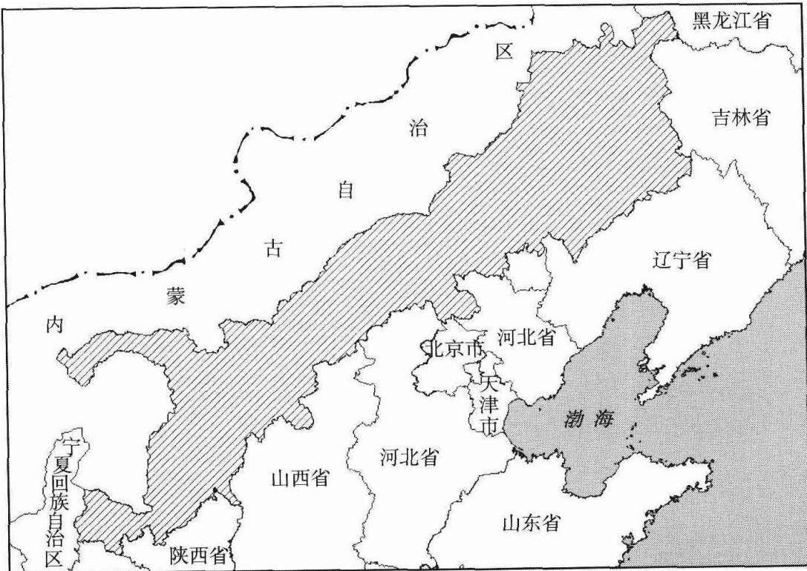  
图22.1 北方农牧交错区位置图

## 一、自然概况

## （一）地 貌

区域地貌单元大致与地质构造相吻合，按一定规则排列，轮廓清晰，分布有序。主体是北部的内蒙古高原和南部的鄂尔多斯两大高原，北北东走向的大兴安岭与纬向分布的阴山、燕山以内蒙古高原外围翘起山地的形态，组成外缘弧形山地，外镶松辽平原和河套平原。鄂尔多斯高原的地质构造虽为一个台向斜，地形却是一个中部微隆起的典型高原。除涉及河套平原和西辽河平原外，考察区的地貌以高原和山地组成，可分为内蒙古高原、阴山山地、河套平原、鄂尔多斯高原、晋西北高原、大兴安岭山地和西辽河平原7个地貌单元。

地貌结构明显影响着本区的水、热分配。使自然景观呈现森林草原一草原一荒漠草原，沿东北一西南有规律的排列，其界线往往与大地貌单元相符。在不同的自然地带中，由于外营力作用的不同，形成了各地带中主要地貌形态类型的差异。森林草原中是流水作用占优势的地区，而草原和荒漠草原则以干燥风蚀作用占主导地位。

由于区域过渡性的地理环境，特别是水热条件，在区域发育了典型的风力、流水两种作用，即在空间和时间上风力、流水交织作用，在山体的两侧及本区的东部、东南部边缘，及一些过境河流两岸，这一复合营力作用带恰是全区土壤侵蚀最严重的地带。亦是区域土地退化（沙化、水土流失、草场退化、盐渍化等）最为严重的地带。

内外营力结合对本区地貌结构的形成作用，明显地表现为：构造上的带状性与各种外营力的带状性相吻合，这一规律又因本区地处蒙古高压的东南缘而得到加强，使降水、气温、风力等外力及其综合作用，都具有由东南向西北的带状变化规律，这在某种程度上，加强了东部半湿润、半干旱区的流水作用强度，也加强了西部干旱和半干旱区的风力作用和于燥作用程度，使东南与西北的现代地貌过程更具有区域性，构造上的带状结构与外力作用的带状规律的结合，对本区地貌带状结构的形成起着极为重要的作用。

## （二）气 候

区域的基本气候特征是：降水量少而不稳，干旱频率高，绝大部分地区

的年降水量为300～450mm（图22.2）。该区西北部地区年降水量少，东南部降水量较多。

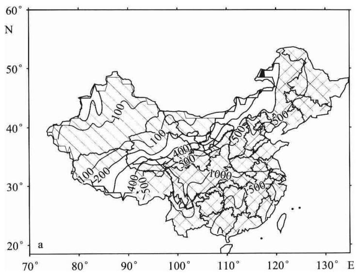

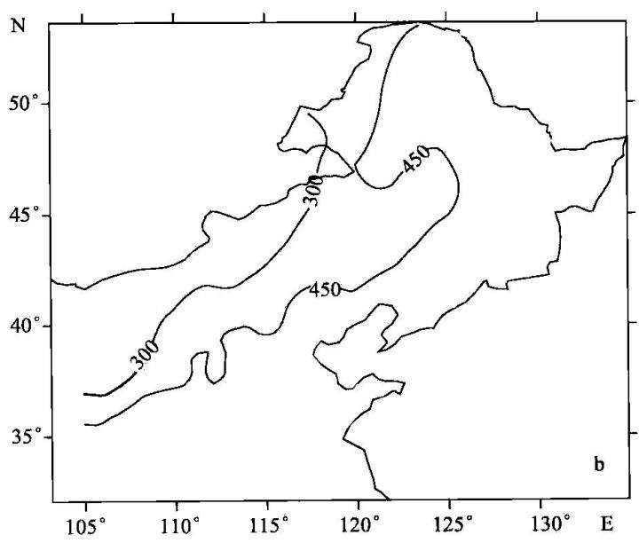  
图22.2 多年平均降水量（mm）与区域位置

区域气候要素的季节变化差异很大，降水量和暴雨的峰值出现在7～8月，耕地裸露，容易水蚀；大风和沙尘天气出现在春季的3～5月，容易风蚀，全年有5\~6个月发生水风蚀，两个峰值的出现延长了该地区水风蚀的时间。

## （三) 水 文

区域呈带状从东北到西南绵延1700km，最宽处400km，最窄处130km，处于内蒙古高原向东北平原、华北平原和黄土高原的过渡地带，地跨黄河流域，海河、滦河流域、辽河流域和嫩江松花江流域，我国北方的许多河流发源在这个区域，是当地和下游人民赖以生存和发展的重要水源。

考察区降水少、变率大的条件决定了河流的径流特点：一是水资源较为贫乏，不计过境客水，全区地表水资源仅为99.6亿 $\mathrm { m } ^ { 3 }$ ；二是径流量年内分配不一，差异很大，全年流量的60%～80%集中在6～9月。其中8月份即占全年的30%。春季由于冰雪融水补给，常形成明显的春汛，径流量约占总径流量的20%以上。10月至翌年2月、5\~6月为河流枯水期。考察区河流径流量和泥沙情况见表22.1。

表 22.1 区域河流一览表
<table><tr><td>流域 支流（测流站）</td><td>流域/集水面积 /万 km² 3.03</td><td>多年平均径流量 /亿m³ 12.01</td><td>产沙量 /万t 12 470</td></tr><tr><td>无定河（白家川） 大黑河（美岱） 秃尾河（温家川） 黄河流域 窟野河 黄甫川（黄甫） 红河（放牛沟） 偏关河</td><td>1.77 0.34 0.87 0.3175 0.55 0.204</td><td>4.29 4.1 6.251 1.548 2.32 0.59</td><td>600 10 040 4 873 1910 1 585</td></tr><tr><td>洋河（响水堡） 潮河（下会） 海河滦河流域 白河（张家坟) 滦河（闪电河）</td><td>1.45 0.53 0.85 1.37</td><td>4.002 2.933 4.699 2.26</td><td>748 100.1 120.9</td></tr><tr><td>西辽河（兴隆坡） 西拉木伦河 辽河流域 (西拉沐沦海拉苏) 柳河（新民）</td><td>1.91 一 0.68</td><td>5.97 10.02</td><td>1 730 488</td></tr><tr><td>内蒙古高原内流区</td><td>11.4 4.23</td><td>2.65 9.77 1.1</td><td></td></tr><tr><td colspan="2">鄂尔多斯高原内流区</td><td colspan="2"></td></tr></table>

注：因为测流站位置，表中资料超出农牧交错区范围。

总之，不计过境客水，全区地表水资源约为99.6亿 $\mathrm { m ^ { 3 } }$ ，占全国地表水总水量的0.37%。地下水资源为234.92亿m³，占全国地下水资源的2.7%。 $\mathrm { m } ^ { 3 }$ 扣除重复水量，全区水资源总量为251.49亿m³。占全国水资源总量0.89%， $\mathrm { m } ^ { 3 }$ 年人均占有水量1048m³，只有全国人均水平的48%，耕地单位面积平均占有水量 $3 7 5 4 ~ \mathrm { \ m ^ { 3 } / h m ^ { 2 } }$ ，平均产水模数为5.9万 $\mathrm { { m } ^ { 3 } / \mathrm { { k m } ^ { 2 } } }$ ，为全国水平的19.7%（表22.2）。

表 22.2 区域水资源总量汇总表 (单位：亿m³/a)
<table><tr><td>流域 分区 地表水量 地下水资源 合计 重复水量 水资源总量</td></tr><tr><td>黄河流域 兰州-河口镇 8.55 河口镇-龙门 11.3</td></tr><tr><td>56.72 65.27 33.60 31.67 9.76 21.06 3.19 17.87 闭流区 2.06 5.05 7.11 7.11</td></tr><tr><td>海河滦河流域 滦河 1.76 1.00 2.76 1.00 1.76</td></tr><tr><td>海河 2.17 1.09 3.26 0.86 2.4</td></tr><tr><td>68.49 大凌河 1.83 0.62 2.45 0.62 1.83</td></tr><tr><td>嫩江流域 嫩江 32.96 46.95 79.91 3.16 76.75 内蒙古内流区 内蒙古内流区 9.77 54.26 64.03 20.42</td></tr><tr><td>43.61 全区合计 99.6 234.92 334.52 83.03 251.49</td></tr></table>

区域水资源在地区、时程的分布上很不均匀，且与人口和耕地分布不相适应。西辽河、嫩江流域水资源相对较丰富外，黄河、海河、滦河和内蒙古内流区水资源比较贫乏，其中除黄河沿岸可利用部分过境水外，大部分地区用水紧张。

## (四) 土 壤

区内土壤类型丰富多样，这与土壤生态环境条件的复杂多样有直接的关系，是土层发育长期适应生物-气候条件的产物。显域性土类有灰褐土、黑钙土、栗钙土、棕钙土等；隐域性土类有山地草甸土、草甸土、沼泽土、盐土、碱土、石质土、粗骨土、新积土、风沙土等。土壤类型的分布虽然更复杂，但仍有较明显的地域分布规律，其中山地的影响亦很显著。表现为水平地带性和垂直地带性；也和地区的母岩、地貌、水文、成土年龄等条件相适应，表现为区域性；同时，在耕种条件下，土壤分布又受人类经济活动的影响，形成了一些特殊的耕作土类。

## （五）植 被

由于受到天然降水和地形、地貌的影响，植被的分布表现出明显的过渡特征，即从东向西分布有森林草原和草原植被类型，分别代表温带半湿润偏干气候和温带半干旱气候环境。在山地阴坡分布有森林或次生林植被类型。

区域东段科尔沁草原东部为森林草原植被，主要植被类型为疏林草地植被。草原也称干草原、典型草原等，区域的草原区跨度很大，可将其划分为东、中、西三段。东段主要指锡林郭勒盟一带，地带性植被以大针茅（Stipagrandis）和阿尔泰针茅（S.krylovii）草原为主。中段主要指乌兰察布草原南部，多年生旱生禾草层片，中旱生杂类草层片，半灌木、小灌木和小半灌木层片组成。西段主要指鄂尔多斯地区的草原，草原植被由东南向西北主要有羊草—杂草类草原，大针茅一隐子草、冷蒿草原，再次为克氏针茅草原。越往西植被越稀疏，草群越低矮。

## 二、社会经济概况

据2004年统计数据，区域覆盖6个省区74个县旗市，人口共计2.4×107人，占全国总人口的1.9%。人口密度为57人/km²，比全国平均人口密度低78人/km²，城镇人口为9.48×10⁶人，占区域总人口的39%。在就业结构方面，第一产业人口比例最大，占58.96%；第三产业其次，占26.69%；人口比例最小的为第二产业人口，占14.35%，这主要是其经济水平决定的，大部分县旗市经济水平比较低。从人口密度的空间变化来看，内蒙古自治区乌兰察布市的集宁区人口密度最大，达到2291人/km²；内蒙古自治区的镶黄旗最小，人口密度仅为5人/km²。

农牧民人均年纯收入为2681元（表22.3，据2005年统计数据），比当年的全国人均纯收入低255元。按照2005年国家划分的贫困县，本区有40个国家级贫困县，即54%的县（旗、区）属于贫困县。收入的区域差异很大，内蒙古自治区的（51个县、旗）农牧民人均纯收入为3072元，比北方农牧交错区平均值高391元，比全国的农牧民人均纯收入高136元。其他县农牧民人均纯收入都低于北方农牧交错区平均值，与全国相比更低。

表 22.3 区域的农牧民纯收入与全国的比较表
<table><tr><td rowspan=1 colspan=1>分布区</td><td rowspan=1 colspan=1>农牧民人均纯收入/元</td><td rowspan=1 colspan=1>与区域的差距/元</td><td rowspan=1 colspan=1>与全国的差距/元</td></tr><tr><td rowspan=1 colspan=1>内蒙古</td><td rowspan=1 colspan=1>3072</td><td rowspan=1 colspan=1>391</td><td rowspan=1 colspan=1>136</td></tr><tr><td rowspan=1 colspan=1>河北省</td><td rowspan=1 colspan=1>1895</td><td rowspan=1 colspan=1>-786</td><td rowspan=1 colspan=1>-1041</td></tr><tr><td rowspan=1 colspan=1>山西省</td><td rowspan=1 colspan=1>2259</td><td rowspan=1 colspan=1>-422</td><td rowspan=1 colspan=1>-677</td></tr><tr><td rowspan=1 colspan=1>吉林省</td><td rowspan=1 colspan=1>2070</td><td rowspan=1 colspan=1>-611</td><td rowspan=1 colspan=1>-866</td></tr><tr><td rowspan=1 colspan=1>陕西省</td><td rowspan=1 colspan=1>1792</td><td rowspan=1 colspan=1>-889</td><td rowspan=1 colspan=1>-1144</td></tr><tr><td rowspan=1 colspan=1>宁夏自治区</td><td rowspan=1 colspan=1>1760</td><td rowspan=1 colspan=1>-921</td><td rowspan=1 colspan=1>-1176</td></tr><tr><td rowspan=1 colspan=1>北方农牧交错区</td><td rowspan=1 colspan=1>2681</td><td rowspan=1 colspan=1></td><td rowspan=1 colspan=1>255</td></tr></table>

注：负值表示小于。

全区土地总面积为42.8万km²，其中，耕地面积为670万hm²，约占土地总面积的16%。水浇地面积为230万hm²（人均1.4亩），约占耕地面积的34%；而近70%的耕地是缺少灌溉水源的坡耕地，属于典型的旱地农业，“靠天吃饭”、广种薄收的粗放式经营决定了旱地的经营活动具有极大的破坏性，土地利用结构也有显著的区域差异，从西北向东南逐步由牧业过渡到农牧交错带和以农为主的土地利用方式，西北部草地占83%，耕地只占1%；在草地以南紧邻东南部的狭长地带，草地占45%，耕地占31%；在区域的东南部，草地只占28%，而耕地占44%。

全区2004年国内生产总值为2780亿元，占全国国内生产总值的2.03%。其中内蒙古自治区生产总值为2420亿元，占区域国内生产总值的86.7%，占内蒙古自治区国内生产总值的89.37%，这51个县、旗是内蒙古自治区经济的中心，是我国经济发展的第二条黄金地带。其他23个县的国内生产总值仅为370亿元，占区域国内生产总值不足15%。人均国内生产总值为11396元，比全国的平均水平高835元。农作物播种面积为539万hm²，其中，粮食作物播种面积为374万hm²，占农作物播种面积的69.4%。2004年的粮食总产量为1540万t，占全国粮食总产量的3.3%。粮食单产为4.12 t/hm²，比全国的粮食单产低0.5 t/hm²。人均粮食占有量为0.63 t，比全国人均占有量高0.27t。本区是内蒙古自治区粮食生产的集中地。

区域2004年的牲畜存栏量为5120万头（只），其中，大牲畜存栏量为670万头，占牲畜总量的13.1%；羊的存栏量为3650万只，占牲畜总量的71.5%；猪的存栏量为784万头，占牲畜总量的15.4%。从本区的牲畜存栏量在全国的比重来看，牲畜存栏量占全国存栏量的5.2%。从牲畜存栏量和肉类产量在全国的比重来看，区域畜牧业经营比较粗放，牲畜的产肉率有待提高。

## 三、水土流失情况

## （一）水土流失现状

根据第二次全国土壤侵蚀遥感调查成果，2000年区域水土流失面积261517.35 km²（表22.4)，占全区土地面积的61.14%，其中，中度以上侵蚀面积156 573.28 km²，占全区土地面积的36.61%，强度以上侵蚀面积74281.73 km²，占全区土地面积的17.37%，水力侵蚀面积122 439.54 km²，占研究区总面积的28.63%，轻度和中度侵蚀面积89677.38 km²，占全研究区总面积的20.97%，强度以上侵蚀面积 $3 2 ~ 7 6 2 . 1 6 ~ \mathrm { k m } ^ { 2 }$ ，占全研究区总面积的7.66%。水力侵蚀量为5.55亿t/a，占全区总量的46.36%，平均侵蚀模数为 $1 2 9 7 \mathrm { t } / ( \mathrm { k m ^ { 2 } \cdot { a } } )$ ，总体侵蚀级别为轻度，极强度和强度的行政区域集中在晋陕蒙的交界处，基本上连为一片，地貌类型主要为黄土丘陵，地表物质以沙黄土为主；风力侵蚀区面积139077.81km²，占全区总面积的32.51%，其中轻度和中度侵蚀面积97558.24km²，占全区总面积的22.81%，强度以上侵蚀面积41519.571km²，占全区总面积的9.7%，风力侵蚀量为6.42亿t/a，占全区总量的53.64%，平均侵蚀模数为 $1 5 0 1 \ \mathrm { t / ( k m ^ { 2 } \cdot a ) }$ ，主要分布在毛乌素沙地、浑善达克沙地和科尔沁沙地三大风沙区。

表22.4 区域各级土壤侵蚀面积及比例
<table><tr><td rowspan=2 colspan=1>级别</td><td rowspan=1 colspan=2>水力侵蚀</td><td rowspan=1 colspan=2>风力侵蚀</td><td rowspan=1 colspan=2>合计</td></tr><tr><td rowspan=1 colspan=1>面积/km²</td><td rowspan=1 colspan=1>比例/%</td><td rowspan=1 colspan=1>面积/km²</td><td rowspan=1 colspan=1>比例/%</td><td rowspan=1 colspan=1>面积/km²</td><td rowspan=1 colspan=1>比例/%</td></tr><tr><td rowspan=1 colspan=1>轻度</td><td rowspan=1 colspan=1>53 504.02</td><td rowspan=1 colspan=1>12.51</td><td rowspan=1 colspan=1>51 440.05</td><td rowspan=1 colspan=1>12.03</td><td rowspan=1 colspan=1>104944.1</td><td rowspan=1 colspan=1>24.54</td></tr><tr><td rowspan=1 colspan=1>中度</td><td rowspan=1 colspan=1>36 173.36</td><td rowspan=1 colspan=1>8.46</td><td rowspan=1 colspan=1>46 118.19</td><td rowspan=1 colspan=1>10.78</td><td rowspan=1 colspan=1>82 291.55</td><td rowspan=1 colspan=1>19.24</td></tr><tr><td rowspan=1 colspan=1>强度</td><td rowspan=1 colspan=1>15 053.95</td><td rowspan=1 colspan=1>3.52</td><td rowspan=1 colspan=1>23 022.99</td><td rowspan=1 colspan=1>5.38</td><td rowspan=1 colspan=1>38 076.94</td><td rowspan=1 colspan=1>8.9</td></tr><tr><td rowspan=1 colspan=1>极强度</td><td rowspan=1 colspan=1>9 635.65</td><td rowspan=1 colspan=1>2.25</td><td rowspan=1 colspan=1>10 360.85</td><td rowspan=1 colspan=1>2.42</td><td rowspan=1 colspan=1>19 996.5</td><td rowspan=1 colspan=1>4.67</td></tr><tr><td rowspan=1 colspan=1>剧烈</td><td rowspan=1 colspan=1>8 072.56</td><td rowspan=1 colspan=1>1.89</td><td rowspan=1 colspan=1>8 135.73</td><td rowspan=1 colspan=1>1.90</td><td rowspan=1 colspan=1>16 208.29</td><td rowspan=1 colspan=1>3.79</td></tr><tr><td rowspan=1 colspan=1>合计</td><td rowspan=1 colspan=1>122 439.54</td><td rowspan=1 colspan=1>28.63</td><td rowspan=1 colspan=1>139 077.81</td><td rowspan=1 colspan=1>32.51</td><td rowspan=1 colspan=1>261 517.4</td><td rowspan=1 colspan=1>61.14</td></tr></table>

## （二）水土流失成因

造成考察区水土流失的原因有自然和人为因素两方面。

自然因素方面：一是考察区表层多为黄土地和沙地，由于黄土垂直节理发育，质地疏松，易于崩塌和透水，导致沟头延伸，沟岸扩张；二是考察区绝大部分地区沟深坡陡，地面起伏不平，易产生水土流失；三是植被覆盖率低，大部分裸露山地坡地遇水就产生水土流失；四是降雨主要集中在7～8月，且多暴雨，强度大，是造成现代加速侵蚀的直接原因；五是沙地松散、植被稀疏、干旱少雨、易风蚀。

人为因素方面：一是不合理的土地利用、陡坡开荒、乱砍滥伐森林等加剧了水土流失；二是基本建设和工矿开发以及传统养畜习惯，特别是牧区，牲畜在自然放牧过程中，畜蹄对植被的践踏破坏，以及采食过度，植被土壤被牲畜践踏后不能得到及时覆盖，汛期暴雨季节，拦蓄洪水能力低，造成水土流失。

## （三）水土流失特点

本区水土流失的主要特点为风水蚀在时间上交错、空间上叠加。东南部主要分布的是沙黄土、覆沙黄土、基岩（砥砂岩）主要以水蚀为主的风水蚀复合区，毛乌素、浑善达克、科尔沁三大沙地为中心，沙地内部以风蚀为主，乌兰布和、十大孔兑风水蚀相持。

## （四）水土流失主要危害

在风水两相营力交错作用下，区域水土流失危害十分严重。水土流失不仅制约了本地区经济、农牧业的发展和水土资源的可持续利用，还威胁江河下游、京津地区的发展。严重的水土流失，导致地表破坏，使大量的水分、养分和表土流失，土壤肥力降低，粮食产量低而不稳。据王晓等在内蒙古砥砂岩地区观测表明，土壤有机质和无机矿物养分随土壤侵蚀损失严重。每流失1吨土壤，损失有机质9.6～2.1kg，全氮0.61～0.14kg，碱解氮50～180g，速效磷5.63～1.58g，速效钾90～40g。除水蚀外，风蚀也是当地土壤侵蚀的主要形式，造成的危害比水蚀有过之而无不及。由于区域大风日数较多，且多发生在地面无植被覆盖、地表干燥的冬春季节，大风一起，尘土飞扬，沙尘弥漫，不仅剥蚀表土，促使农田失墒和沙化，而且风沙直接吹入河道，因沙粒淤积河道，加剧了水土流失的危害，直接影响到当地群众生活和生产的正常进行，造成经济落后，群众生活贫困。同时，大量泥沙淤积下游河道和水库，减少了水库的有效库容，污染了入库水质。据1991年中国科学院黄土高原综合科学考察队在黄土高原北部风沙区考察研究发现，该区地表沙物质丰富，且松散；风大且频繁，故地面风蚀严重。表土吹蚀，土壤肥力显著下降。严重风蚀类型，土地有机质降低90%，氮素损失60%，磷素损失66%。中度风蚀类型，土壤有机质降低75%，氮素损失24.6%，磷素损失14.1%。轻度风蚀类型，土壤有机质下降54%，氮损失14.1%，磷损失40.6%。上述三类风蚀类型的总土地面积为117963.79 km²，占该区总土地面积的57.02%。土地沙漠化导致土地生产力降低，内蒙古风沙区较陕北榆林等风沙区严重，内蒙古风沙区土地沙漠化面积占该区总面积的65.29%，榆林地区占50.81%。

## （五）水土流失发展趋势

## 近20年来水土流失发展变化

由于区域面积广大，气候多样，地貌类型千差万别，各个地区的水土流失发展极不平衡，其发展趋势各区有显著差异。

## (1) 晋陕蒙沙黄土亚区

晋陕蒙沙黄土亚区的水蚀面积和风蚀面积都呈增加趋势，分别增加了10.8%和113.7%。水蚀面积由20世纪90年代中期的14422.88 km² 增加到2000年的15984.49km²，发展速率为780km²/a；其中，以剧烈侵蚀发展速度最快，其次为中度侵蚀。风蚀面积由20世纪90年代中期的298.71km²增加到2000年的638.21km²，面积增长了1倍多，发展速率为330km²/a。虽然风蚀面积在该区仅占很少的比例，但其迅速发展势头值得注意（表22.5、图22.3）。

表22.5晋陕蒙沙黄土亚区不同强度水蚀和风蚀面积变化（单位：km²）
<table><tr><td rowspan=1 colspan=1>年代</td><td rowspan=1 colspan=1>类型</td><td rowspan=1 colspan=1>轻度</td><td rowspan=1 colspan=1>中度</td><td rowspan=1 colspan=1>强度</td><td rowspan=1 colspan=1>强度</td><td rowspan=1 colspan=1>剧烈</td><td rowspan=1 colspan=1>小计</td></tr><tr><td rowspan=1 colspan=1>90年代中期</td><td rowspan=1 colspan=1>水蚀</td><td rowspan=1 colspan=1>3 156. 77</td><td rowspan=1 colspan=1>4 252.71</td><td rowspan=1 colspan=1>2 530.3</td><td rowspan=1 colspan=1>3 017.5</td><td rowspan=1 colspan=1>1 465.6</td><td rowspan=1 colspan=1>14 422.88</td></tr><tr><td rowspan=1 colspan=1>2000年</td><td rowspan=1 colspan=1>水蚀</td><td rowspan=1 colspan=1>3 216.03</td><td rowspan=1 colspan=1>4 522.20</td><td rowspan=1 colspan=1>2 657.91</td><td rowspan=1 colspan=1>3 195.44</td><td rowspan=1 colspan=1>2 392.91</td><td rowspan=1 colspan=1>15 984.49</td></tr><tr><td rowspan=1 colspan=1>年代</td><td rowspan=1 colspan=1>类型</td><td rowspan=1 colspan=1>轻度</td><td rowspan=1 colspan=1>中度</td><td rowspan=1 colspan=1>强度</td><td rowspan=1 colspan=1>强度</td><td rowspan=1 colspan=1>剧烈</td><td rowspan=1 colspan=1>小计</td></tr><tr><td rowspan=1 colspan=1>90年代中期</td><td rowspan=1 colspan=1>风蚀</td><td rowspan=1 colspan=1>30.9</td><td rowspan=1 colspan=1>131.32</td><td rowspan=1 colspan=1>94.68</td><td rowspan=1 colspan=1>21.08</td><td rowspan=1 colspan=1>20.73</td><td rowspan=1 colspan=1>298.71</td></tr><tr><td rowspan=1 colspan=1>2000年</td><td rowspan=1 colspan=1>风蚀</td><td rowspan=1 colspan=1>222.53</td><td rowspan=1 colspan=1>337.99</td><td rowspan=1 colspan=1>53.54</td><td rowspan=1 colspan=1>20.09</td><td rowspan=1 colspan=1>4.06</td><td rowspan=1 colspan=1>638.21</td></tr></table>

## (2) 陕北覆沙黄土亚区

陕北覆沙黄土亚区水蚀和风蚀发展趋势正好相反，水蚀面积和强度呈增加趋势，风蚀面积和强度都呈减少趋势（图22.4）。

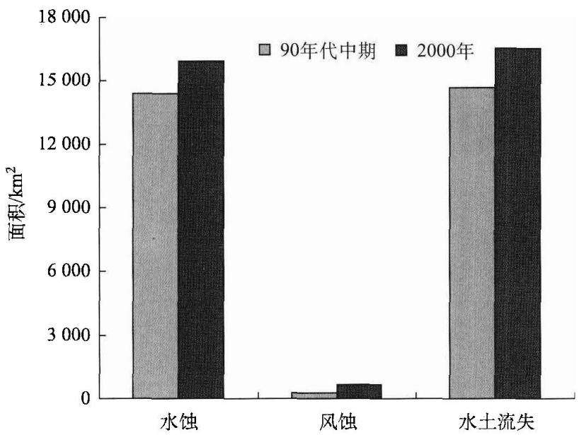  
图22.3 晋陕蒙沙黄土亚区水土流失面积变化

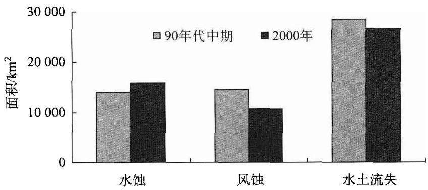  
图22.4陕北覆沙黄土亚区水土流失面积变化

水蚀面积由90年代中期 $1 3 \ 8 9 8 . 6 8 \ \mathrm { k m ^ { 2 } }$ 增加到2000年的 $1 5 ~ 9 1 6 . 6 1 ~ \mathrm { k m ^ { 2 } }$ 年平均增长 $1 0 0 8 ~ \mathrm { k m ^ { 2 } }$ ，增长速度最快的是强度侵蚀，发展速率达到$6 1 8 ~ \mathrm { { k m ^ { 2 } / a } }$ ，极强度、剧烈增加较少，中、轻度面积减少。风蚀面积减少了$3 8 8 2 . 0 4 ~ \mathrm { k m ^ { 2 } }$ ，其中轻度、中度、极强度侵蚀面积减少，强度和剧烈侵蚀面积增加。

## (3) 基岩覆沙亚区

近20年来，基岩覆沙亚区水土流失面积呈现先增加后减少的趋势，近20年间，面积减少了2.7%，变化不大。

水蚀面积由 20世纪80年代末的10101.61 km²减少到90年代中期的$1 0 \ \mathrm { { 0 0 3 . 8 5 } \ k m ^ { 2 } }$ ，到2000年减少为 $9 1 3 8 . 8 3 ~ \mathrm { k m } ^ { 2 }$ ，面积略有减少，轻度、中

度、强度的面积都有所增加，极强度、剧烈面积减少幅度较大，显示水力侵蚀强度有较大的降低（表22.6）。

表 22.6基岩覆沙亚区不同强度水蚀和风蚀面积变化（单位：km²）
<table><tr><td rowspan=1 colspan=1>年代</td><td rowspan=1 colspan=1>类型</td><td rowspan=1 colspan=1>轻度</td><td rowspan=1 colspan=1>中度</td><td rowspan=1 colspan=1>强度</td><td rowspan=1 colspan=1>极强度</td><td rowspan=1 colspan=1>剧烈</td><td rowspan=1 colspan=1>小计</td></tr><tr><td rowspan=1 colspan=1>80年代末</td><td rowspan=1 colspan=1>水蚀</td><td rowspan=1 colspan=1>1 203.06</td><td rowspan=1 colspan=1>1 801.26</td><td rowspan=1 colspan=1>2 601.3</td><td rowspan=1 colspan=1>2 838.8</td><td rowspan=1 colspan=1>1 657.19</td><td rowspan=1 colspan=1>10 101.61</td></tr><tr><td rowspan=1 colspan=1>90年代中期</td><td rowspan=1 colspan=1>水蚀</td><td rowspan=1 colspan=1>1 547.36</td><td rowspan=1 colspan=1>1360.13</td><td rowspan=1 colspan=1>4 233.7</td><td rowspan=1 colspan=1>2 417</td><td rowspan=1 colspan=1>445.66</td><td rowspan=1 colspan=1>10 003.85</td></tr><tr><td rowspan=1 colspan=1>2000年</td><td rowspan=1 colspan=1>水蚀</td><td rowspan=1 colspan=1>1 426.95</td><td rowspan=1 colspan=1>1 961.16</td><td rowspan=1 colspan=1>2 814.04</td><td rowspan=1 colspan=1>2 164.18</td><td rowspan=1 colspan=1>772.5</td><td rowspan=1 colspan=1>9138.83</td></tr><tr><td rowspan=1 colspan=1>年代</td><td rowspan=1 colspan=1>类型</td><td rowspan=1 colspan=1>轻度</td><td rowspan=1 colspan=1>中度</td><td rowspan=1 colspan=1>强度</td><td rowspan=1 colspan=1>极强度</td><td rowspan=1 colspan=1>剧烈</td><td rowspan=1 colspan=1>小计</td></tr><tr><td rowspan=1 colspan=1>80年代末</td><td rowspan=1 colspan=1>风蚀</td><td rowspan=1 colspan=1>97.5</td><td rowspan=1 colspan=1>812.38</td><td rowspan=1 colspan=1>1 718.4</td><td rowspan=1 colspan=1>1 364.57</td><td rowspan=1 colspan=1>980.21</td><td rowspan=1 colspan=1>4 973.06</td></tr><tr><td rowspan=1 colspan=1>90年代中期</td><td rowspan=1 colspan=1>风蚀</td><td rowspan=1 colspan=1>1 197.1</td><td rowspan=1 colspan=1>828.45</td><td rowspan=1 colspan=1>1 272.49</td><td rowspan=1 colspan=1>446.89</td><td rowspan=1 colspan=1>1819.2</td><td rowspan=1 colspan=1>5 564.13</td></tr><tr><td rowspan=1 colspan=1>2000年</td><td rowspan=1 colspan=1>风蚀</td><td rowspan=1 colspan=1>991.32</td><td rowspan=1 colspan=1>1 279.35</td><td rowspan=1 colspan=1>1 087.37</td><td rowspan=1 colspan=1>909.31</td><td rowspan=1 colspan=1>1 267.94</td><td rowspan=1 colspan=1>5 535.29</td></tr></table>

风蚀面积由20世纪80年代末的4973.06km2，增加到90年代中期的$5 5 6 4 . 1 3 ~ \mathrm { k m ^ { 2 } }$ ，到2000年风蚀面积略有下降，为 $5 5 3 5 . 2 9 \ \mathrm { k m } ^ { 2 }$ ，显示发展的势头得以扭转（图22.5）。

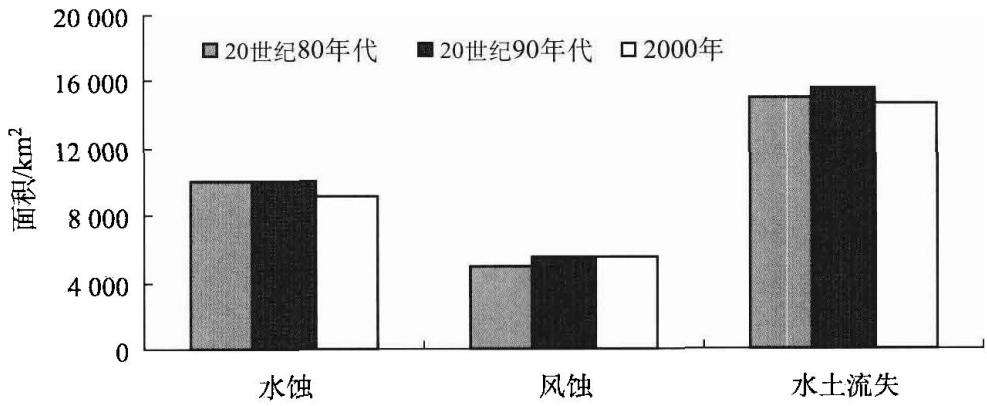  
图22.5 基岩覆沙亚区水土流失面积变化

## (4) 毛乌素亚区

毛乌素亚区水蚀和风蚀发展演变的趋势相反，水蚀面积和强度呈持续增加趋势，发展速率20年平均为50km²/a，而近几年的发展速率为264.5km²/a，显示发展速率越来越快。风蚀面积和强度呈持续减少趋势(图22.6)。

水蚀面积由80年代末的1068.87km²，增加到90年代中期的$1 4 2 2 . 6 7 \ \mathrm { k m ^ { 2 } }$ ；到2000年，则增加到的2367.01km²，为80年代末的2倍多，增长势头迅猛，水力侵蚀面积发展速度越来越快。发展速度最快的是轻度侵蚀，中度和强度侵蚀增加较少。风蚀面积持续减少，从80年代末的15872.21km²，减少到90年代中期的15119.27km²，这期间的减少速度较小，到2000年，减少到13399.32km²，这期间的减少速度较大，显示水土流失治理的力度较大。强度和极强度面积减少较多，其他级别都有减少，轻度面积增大（表22.7）。

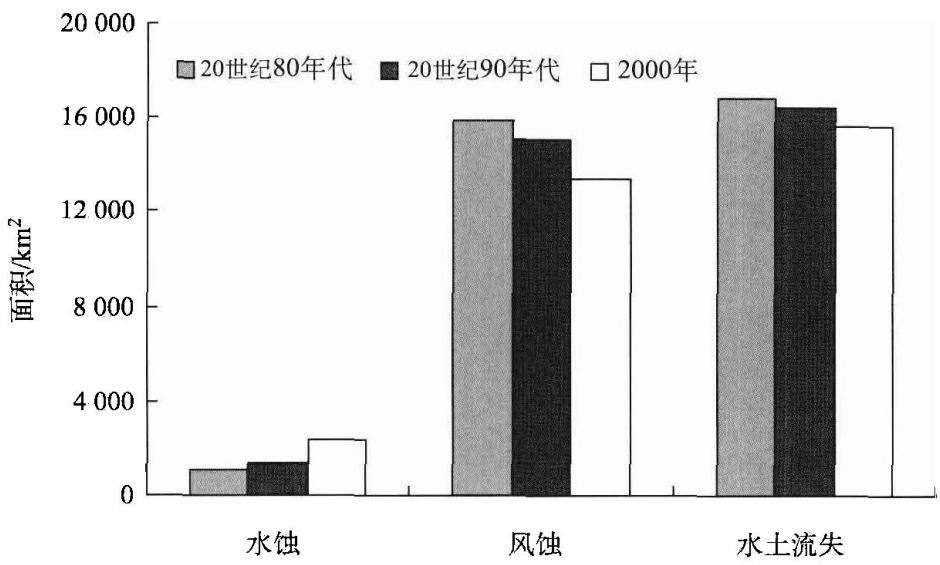  
图22.6 毛乌素亚区水土流失面积变化

表 22.7 毛乌素亚区不同强度水蚀和风蚀面积变化 (单位：km²)
<table><tr><td rowspan=1 colspan=1>年代</td><td rowspan=1 colspan=1>总面积</td><td rowspan=1 colspan=1>轻度</td><td rowspan=1 colspan=1>中度</td><td rowspan=1 colspan=1>强度</td><td rowspan=1 colspan=1>极强度</td><td rowspan=1 colspan=1>剧烈</td><td rowspan=1 colspan=1>小计</td></tr><tr><td rowspan=1 colspan=1>80年代末</td><td rowspan=1 colspan=1>水蚀</td><td rowspan=1 colspan=1>461.23</td><td rowspan=1 colspan=1>410.5</td><td rowspan=1 colspan=1>197.14</td><td rowspan=1 colspan=1>0</td><td rowspan=1 colspan=1>0</td><td rowspan=1 colspan=1>1 068.87</td></tr><tr><td rowspan=1 colspan=1>90年代中期</td><td rowspan=1 colspan=1>水蚀</td><td rowspan=1 colspan=1>935.82</td><td rowspan=1 colspan=1>306.97</td><td rowspan=1 colspan=1>179.88</td><td rowspan=1 colspan=1>0</td><td rowspan=1 colspan=1>0</td><td rowspan=1 colspan=1>1422.67</td></tr><tr><td rowspan=1 colspan=1>2000年</td><td rowspan=1 colspan=1>水蚀</td><td rowspan=1 colspan=1>1 464.9</td><td rowspan=1 colspan=1>686.18</td><td rowspan=1 colspan=1>207.43</td><td rowspan=1 colspan=1>5.72</td><td rowspan=1 colspan=1>2.78</td><td rowspan=1 colspan=1>2 367.01</td></tr><tr><td rowspan=1 colspan=1>年代</td><td rowspan=1 colspan=1>总面积</td><td rowspan=1 colspan=1>轻度</td><td rowspan=1 colspan=1>中度</td><td rowspan=1 colspan=1>强度</td><td rowspan=1 colspan=1>极强度</td><td rowspan=1 colspan=1>剧烈</td><td rowspan=1 colspan=1>小计</td></tr><tr><td rowspan=1 colspan=1>80年代末</td><td rowspan=1 colspan=1>风蚀</td><td rowspan=1 colspan=1>1 390.1</td><td rowspan=1 colspan=1>3 770.85</td><td rowspan=1 colspan=1>3 715.22</td><td rowspan=1 colspan=1>3 982.43</td><td rowspan=1 colspan=1>3 013.61</td><td rowspan=1 colspan=1>15 872.21</td></tr><tr><td rowspan=1 colspan=1>90年代中期</td><td rowspan=1 colspan=1>风蚀</td><td rowspan=1 colspan=1>3 638.32</td><td rowspan=1 colspan=1>4248</td><td rowspan=1 colspan=1>2 999.38</td><td rowspan=1 colspan=1>1 666.74</td><td rowspan=1 colspan=1>2 566.83</td><td rowspan=1 colspan=1>15119.27</td></tr><tr><td rowspan=1 colspan=1>2000年</td><td rowspan=1 colspan=1>水蚀</td><td rowspan=1 colspan=1>2 466.04</td><td rowspan=1 colspan=1>3 628.17</td><td rowspan=1 colspan=1>2156.91</td><td rowspan=1 colspan=1>2456.03</td><td rowspan=1 colspan=1>2692.17</td><td rowspan=1 colspan=1>13 399.32</td></tr></table>

## （5）大兴安岭及燕山北麓丘陵亚区

近20年来，大兴安岭及燕山北麓丘陵亚区水土流失面积减少了15.5%。

水蚀面积由 20 世纪 80 年代末的 53 388.26 km² 减少到 2000 年的38541.7km²，面积减少速度最大的是极强度侵蚀；其次为强度侵蚀。轻度、中度侵蚀的面积减少较小，这表明水蚀强度下降较大（表22.8，图22.7)。

表 22.8 大兴安岭丘陵区不同强度水蚀和风蚀面积变化（单位：km²）
<table><tr><td rowspan=1 colspan=1>年代</td><td rowspan=1 colspan=1>类型</td><td rowspan=1 colspan=1>轻度</td><td rowspan=1 colspan=1>中度</td><td rowspan=1 colspan=1>强度</td><td rowspan=1 colspan=1>极强度</td><td rowspan=1 colspan=1>剧烈</td><td rowspan=1 colspan=1>小计</td></tr><tr><td rowspan=1 colspan=1>80年代末</td><td rowspan=1 colspan=1>水蚀</td><td rowspan=1 colspan=1>29 895.81</td><td rowspan=1 colspan=1>15 779.05</td><td rowspan=1 colspan=1>6 067.83</td><td rowspan=1 colspan=1>1 645.57</td><td rowspan=1 colspan=1>0</td><td rowspan=1 colspan=1>53 388.26</td></tr><tr><td rowspan=1 colspan=1>2000年</td><td rowspan=1 colspan=1>水蚀</td><td rowspan=1 colspan=1>24 025.94</td><td rowspan=1 colspan=1>12 327.82</td><td rowspan=1 colspan=1>2 145.29</td><td rowspan=1 colspan=1>42.65</td><td rowspan=1 colspan=1>0</td><td rowspan=1 colspan=1>38 541.7</td></tr><tr><td rowspan=1 colspan=1>年代</td><td rowspan=1 colspan=1>类型</td><td rowspan=1 colspan=1>轻度</td><td rowspan=1 colspan=1>中度</td><td rowspan=1 colspan=1>强度</td><td rowspan=1 colspan=1>极强度</td><td rowspan=1 colspan=1>剧烈</td><td rowspan=1 colspan=1>小计</td></tr><tr><td rowspan=1 colspan=1>80年代末</td><td rowspan=1 colspan=1>风蚀</td><td rowspan=1 colspan=1>5 506.72</td><td rowspan=1 colspan=1>8532.24</td><td rowspan=1 colspan=1>3 701.51</td><td rowspan=1 colspan=1>1908.1</td><td rowspan=1 colspan=1>0</td><td rowspan=1 colspan=1>19 648.57</td></tr><tr><td rowspan=1 colspan=1>2000年</td><td rowspan=1 colspan=1>风蚀</td><td rowspan=1 colspan=1>11 639.7</td><td rowspan=1 colspan=1>7 325.34</td><td rowspan=1 colspan=1>3 217.51</td><td rowspan=1 colspan=1>996.34</td><td rowspan=1 colspan=1>1.17</td><td rowspan=1 colspan=1>23180.06</td></tr></table>

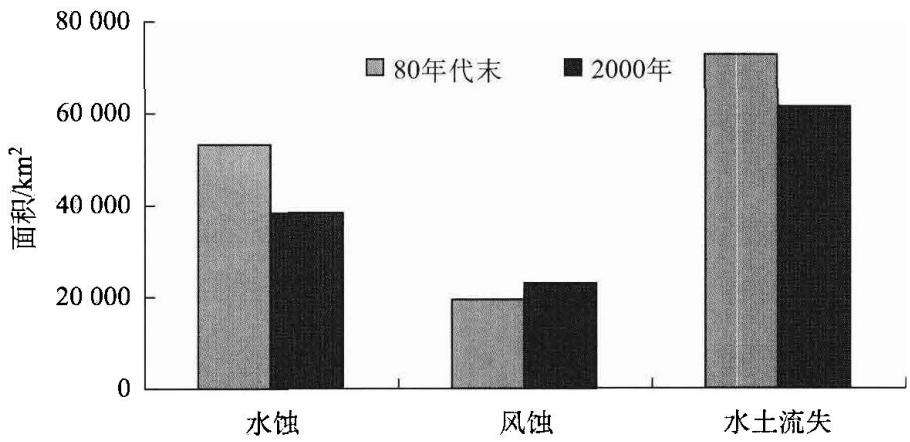  
图22.7 大兴安岭丘陵区水土流失面积变化

风蚀面积由20世纪80年代末的19648.57km²，增加到2000年的23180.06 km2，发展速率为 $1 7 7 ~ \mathrm { k m ^ { 2 } / a }$ ；其中，只有轻度侵蚀的面积增加较大，2000年轻度侵蚀面积约为1980年代末的2倍，中度、强度、极强度侵蚀面积都在减少，显示风蚀强度在降低。

## （6)松辽覆沙平原亚区

松辽覆沙平原亚区水土流失面积整体呈减少趋势，近20年减少了6.9%。

水蚀面积由20世纪80年代末的8522.39 km²减少到2000年的$3 8 6 6 . 3 4 ~ \mathrm { k m ^ { 2 } }$ ，面积减少速度最大的是轻度和强度侵蚀，其次为极强度侵蚀和中度侵蚀。水蚀强度下降较大。风蚀面积由20世纪80年代末的28867.89km²，增加到2000年的31455.78km²（表22.9）；其中，只有轻度侵蚀的面积增加较大，强度侵蚀面积增加较少，中度、极强度侵蚀面积在下降，这表明风蚀强度增加不大。

表22.9 松辽覆沙平原亚区不同强度水蚀和风蚀面积变化（单位：km²)
<table><tr><td rowspan=1 colspan=1>年代</td><td rowspan=1 colspan=1>类型</td><td rowspan=1 colspan=1>轻度</td><td rowspan=1 colspan=1>中度</td><td rowspan=1 colspan=1>强度</td><td rowspan=1 colspan=1>极强度</td><td rowspan=1 colspan=1>剧烈</td><td rowspan=1 colspan=1>小计</td></tr><tr><td rowspan=1 colspan=1>80年代末</td><td rowspan=1 colspan=1>水蚀</td><td rowspan=1 colspan=1>3 549.35</td><td rowspan=1 colspan=1>2 262.03</td><td rowspan=1 colspan=1>2 292.21</td><td rowspan=1 colspan=1>418.8</td><td rowspan=1 colspan=1>0</td><td rowspan=1 colspan=1>8 522. 39</td></tr><tr><td rowspan=1 colspan=1>2000年</td><td rowspan=1 colspan=1>水蚀</td><td rowspan=1 colspan=1>1 414.4</td><td rowspan=1 colspan=1>1 938.72</td><td rowspan=1 colspan=1>513.22</td><td rowspan=1 colspan=1>0</td><td rowspan=1 colspan=1>0</td><td rowspan=1 colspan=1>3 866.34</td></tr><tr><td rowspan=1 colspan=1>年代</td><td rowspan=1 colspan=1>类型</td><td rowspan=1 colspan=1>轻度</td><td rowspan=1 colspan=1>中度</td><td rowspan=1 colspan=1>强度</td><td rowspan=1 colspan=1>极强度</td><td rowspan=1 colspan=1>剧烈</td><td rowspan=1 colspan=1>小计</td></tr><tr><td rowspan=1 colspan=1>80年代末</td><td rowspan=1 colspan=1>风蚀</td><td rowspan=1 colspan=1>7 323.22</td><td rowspan=1 colspan=1>14 254.22</td><td rowspan=1 colspan=1>4 502.15</td><td rowspan=1 colspan=1>2 788.3</td><td rowspan=1 colspan=1>0</td><td rowspan=1 colspan=1>28 867.89</td></tr><tr><td rowspan=1 colspan=1>2000年</td><td rowspan=1 colspan=1>风蚀</td><td rowspan=1 colspan=1>10 286.21</td><td rowspan=1 colspan=1>13 813.54</td><td rowspan=1 colspan=1>4 727.16</td><td rowspan=1 colspan=1>2 567.35</td><td rowspan=1 colspan=1>61.52</td><td rowspan=1 colspan=1>31 455.78</td></tr></table>

## (7) 乌兰察布亚区

近20年来，乌兰察布亚区水土流失面积变化不大，仅增加1.4%，但水蚀和风蚀面积发展的趋势不同。

水蚀面积由80年代末的6617.76km²，增加到2000年的8033.47km²，面积增加了23.4%，发展速率71km²/a；其中，中度侵蚀的面积增加最多，强度侵蚀的面积增加不大，轻度侵蚀面积在减少。

风蚀面积由80年代末的3484.45km²，减少到2000年的2214.88km²，面积减少了36.4%（表22.10)，面积减少最多的是轻度侵蚀，中度、极强度和剧烈侵蚀面积各有不同程度减少，只有强度侵蚀面积在增加（图22.8）。

表 22.10 乌兰察布亚区不同强度水蚀和风蚀面积变化（单位：km²）
<table><tr><td rowspan=1 colspan=1>年代</td><td rowspan=1 colspan=1>类型</td><td rowspan=1 colspan=1>轻度</td><td rowspan=1 colspan=1>中度</td><td rowspan=1 colspan=1>强度</td><td rowspan=1 colspan=1>极强度</td><td rowspan=1 colspan=1>剧烈</td><td rowspan=1 colspan=1>小计</td></tr><tr><td rowspan=1 colspan=1>80年代末</td><td rowspan=1 colspan=1>水蚀</td><td rowspan=1 colspan=1>4460.98</td><td rowspan=1 colspan=1>1356.78</td><td rowspan=1 colspan=1>795</td><td rowspan=1 colspan=1>5</td><td rowspan=1 colspan=1>0</td><td rowspan=1 colspan=1>6617.76</td></tr><tr><td rowspan=1 colspan=1>2000年</td><td rowspan=1 colspan=1>水蚀</td><td rowspan=1 colspan=1>3981.99</td><td rowspan=1 colspan=1>3116.54</td><td rowspan=1 colspan=1>934.94</td><td rowspan=1 colspan=1>0</td><td rowspan=1 colspan=1>0</td><td rowspan=1 colspan=1>8033.47</td></tr><tr><td rowspan=1 colspan=1>年代</td><td rowspan=1 colspan=1>类型</td><td rowspan=1 colspan=1>轻度</td><td rowspan=1 colspan=1>中度</td><td rowspan=1 colspan=1>强度</td><td rowspan=1 colspan=1>极强度</td><td rowspan=1 colspan=1>剧烈</td><td rowspan=1 colspan=1>小计</td></tr><tr><td rowspan=1 colspan=1>80年代末</td><td rowspan=1 colspan=1>风蚀</td><td rowspan=1 colspan=1>1136.15</td><td rowspan=1 colspan=1>1249.11</td><td rowspan=1 colspan=1>457.68</td><td rowspan=1 colspan=1>389.89</td><td rowspan=1 colspan=1>251.62</td><td rowspan=1 colspan=1>3484.45</td></tr><tr><td rowspan=1 colspan=1>2000年</td><td rowspan=1 colspan=1>风蚀</td><td rowspan=1 colspan=1>327.8</td><td rowspan=1 colspan=1>823.13</td><td rowspan=1 colspan=1>1030.57</td><td rowspan=1 colspan=1>32.56</td><td rowspan=1 colspan=1>0.82</td><td rowspan=1 colspan=1>2214.88</td></tr></table>

## (8) 浑善达克亚区

浑善达克亚区水土流失面积和强度呈下降趋势，近20年间，面积减少了3560.87km²，减少了10.2%。水蚀和风蚀面积发展的趋势正好相反。

水蚀面积由80年代末的919.16 km²，增加到2000年的4967.05 km²，面积增加了4.4倍，发展速率243km²/a，发展速度十分迅速（图22.9）。在各侵蚀级别中，中度侵蚀在近20年间增长了19倍。

风蚀面积由80年代末的34055.19km²，减少到2000年的26446.43km²，面积减少了22.3%，面积减少最多的是强度侵蚀，近20年间减少了69.1%(表22.11)，中度、极强度和剧烈侵蚀面积各有不同程度减少，只有轻度侵蚀的面积在增加。

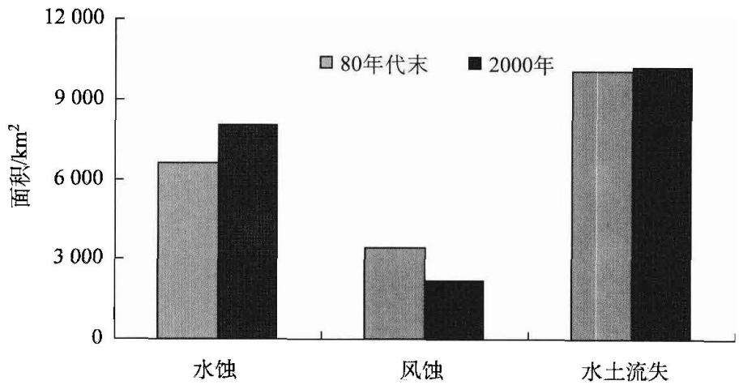  
图22.8 乌兰察布亚区水土流失面积变化

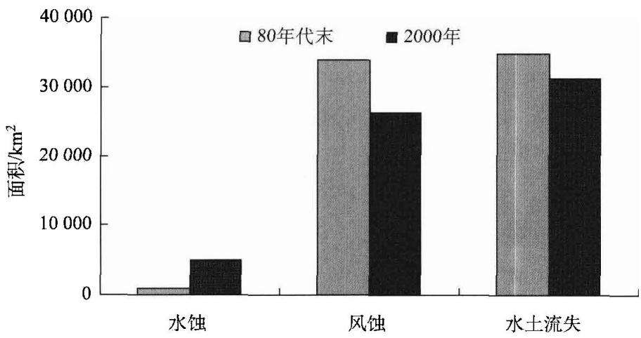  
图22.9 浑善达克亚区水土流失面积变化

表22.11 浑善达克亚区不同强度水蚀和风蚀面积变化(单位：km²)
<table><tr><td rowspan=1 colspan=1>年代</td><td rowspan=1 colspan=1>类型</td><td rowspan=1 colspan=1>轻度</td><td rowspan=1 colspan=1>中度</td><td rowspan=1 colspan=1>强度</td><td rowspan=1 colspan=1>极强度</td><td rowspan=1 colspan=1>剧烈</td><td rowspan=1 colspan=1>小计</td></tr><tr><td rowspan=1 colspan=1>80年代末</td><td rowspan=1 colspan=1>水蚀</td><td rowspan=1 colspan=1>878.9</td><td rowspan=1 colspan=1>40.26</td><td rowspan=1 colspan=1>0</td><td rowspan=1 colspan=1>0</td><td rowspan=1 colspan=1>0</td><td rowspan=1 colspan=1>919.16</td></tr><tr><td rowspan=1 colspan=1>2000年</td><td rowspan=1 colspan=1>水蚀</td><td rowspan=1 colspan=1>4150.8</td><td rowspan=1 colspan=1>815.65</td><td rowspan=1 colspan=1>0.6</td><td rowspan=1 colspan=1>0</td><td rowspan=1 colspan=1>0</td><td rowspan=1 colspan=1>4967.05</td></tr><tr><td rowspan=1 colspan=1>年代</td><td rowspan=1 colspan=1>类型</td><td rowspan=1 colspan=1>轻度</td><td rowspan=1 colspan=1>中度</td><td rowspan=1 colspan=1>强度</td><td rowspan=1 colspan=1>极强度</td><td rowspan=1 colspan=1>剧烈</td><td rowspan=1 colspan=1>小计</td></tr><tr><td rowspan=1 colspan=1>80年代末</td><td rowspan=1 colspan=1>风蚀</td><td rowspan=1 colspan=1>2 446.23</td><td rowspan=1 colspan=1>13243.13</td><td rowspan=1 colspan=1>12 067.58</td><td rowspan=1 colspan=1>4 455.85</td><td rowspan=1 colspan=1>1 842.4</td><td rowspan=1 colspan=1>34 055.19</td></tr><tr><td rowspan=1 colspan=1>2000年</td><td rowspan=1 colspan=1>风蚀</td><td rowspan=1 colspan=1>9 954.42</td><td rowspan=1 colspan=1>11236.43</td><td rowspan=1 colspan=1>3 730.12</td><td rowspan=1 colspan=1>1 499.85</td><td rowspan=1 colspan=1>25.61</td><td rowspan=1 colspan=1>26 446.43</td></tr></table>

综上所述，由于治理的力度不断加大，近20年来，区域（以内蒙古51个旗县为代表）水蚀面积、强度和风蚀面积、强度都呈下降趋势。但区域内各分区的水土流失发展趋势各有其特点：水土流失面积减少较多的分区主要有大兴安岭及燕山北麓丘陵亚区、浑善达克亚区和陕北覆沙黄土亚区，水土流失面积增加的分区有晋陕蒙沙黄土亚区和乌兰察布亚区。除了晋陕蒙沙黄土亚区，其他各亚区的水蚀和风蚀发展趋势正好相反，这种变化是人为因素和自然因素共同作用的结果。在以风蚀为主的区域，由于重视风力侵蚀的治理，风蚀面积相应有所减少，而水力侵蚀因重视程度不够，面积和强度都呈发展趋势。在以水蚀为主的区域，由于重视水力侵蚀的治理，水蚀面积和强度相应有所减少或者增加不多，而风蚀的面积和强度呈增加趋势。晋陕蒙沙黄土亚区是区域内唯一水蚀和风蚀面积都在增加的亚区，尤其是其风蚀面积在短短几年间增长了113%，在传统上的风蚀区毛乌素亚区和浑善达克亚区，水蚀的发展速率特别快，近20年分别增加了121.4%和440.4%，水土流失治理刻不容缓（表22.12）。

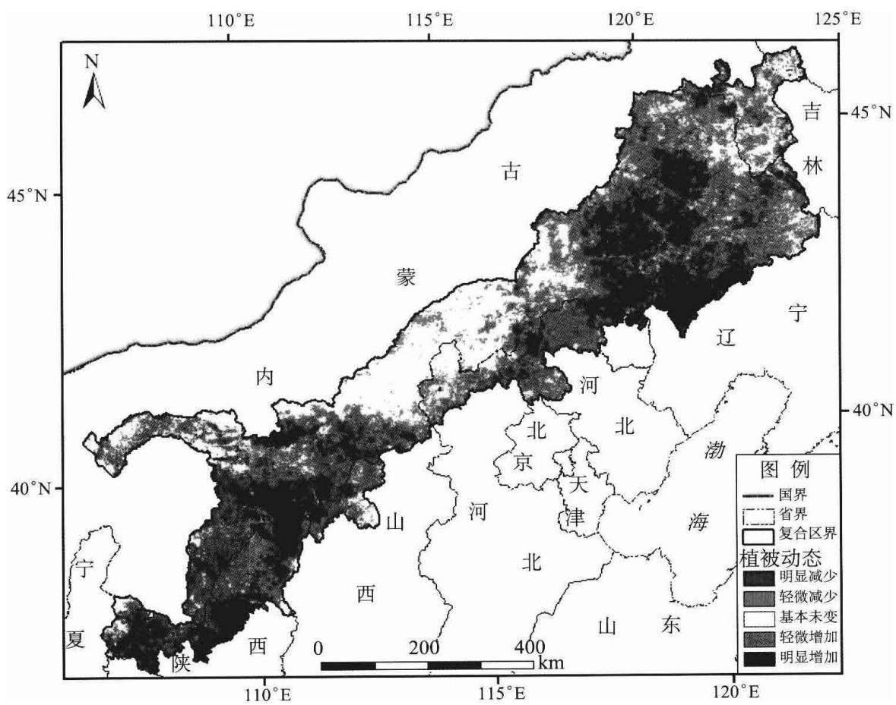  
图22.10 区域2000\~2005年植被变化

表 22.12 区域水土流失发展演变状况
<table><tr><td rowspan=1 colspan=1>分区</td><td rowspan=1 colspan=1>侵蚀特点</td><td rowspan=1 colspan=1>时段</td><td rowspan=1 colspan=1>水蚀/%</td><td rowspan=1 colspan=1>风蚀/%</td><td rowspan=1 colspan=1>水土流失/%</td></tr><tr><td rowspan=1 colspan=1>晋陕蒙沙黄土亚区</td><td rowspan=1 colspan=1>以水蚀为主</td><td rowspan=1 colspan=1>90年代中期~2000年</td><td rowspan=1 colspan=1>10.8</td><td rowspan=1 colspan=1>113.7</td><td rowspan=1 colspan=1>12.9</td></tr><tr><td rowspan=1 colspan=1>陕北覆沙黄土亚区</td><td rowspan=1 colspan=1>水风蚀相当</td><td rowspan=1 colspan=1>90年代～2000年</td><td rowspan=1 colspan=1>14.5</td><td rowspan=1 colspan=1>-26.6</td><td rowspan=1 colspan=1>-6.5</td></tr><tr><td rowspan=1 colspan=1>基岩覆沙亚区</td><td rowspan=1 colspan=1>水蚀面积居多</td><td rowspan=1 colspan=1>80年代末～2000年</td><td rowspan=1 colspan=1>-9.5</td><td rowspan=1 colspan=1>11.3</td><td rowspan=1 colspan=1>-2.7</td></tr><tr><td rowspan=1 colspan=1>毛乌素亚区</td><td rowspan=1 colspan=1>以风蚀为主</td><td rowspan=1 colspan=1>80年代末～2000年</td><td rowspan=1 colspan=1>121.4</td><td rowspan=1 colspan=1>-15.6</td><td rowspan=1 colspan=1>-6.9</td></tr><tr><td rowspan=1 colspan=1>大兴安岭丘陵及北麓丘陵亚区</td><td rowspan=1 colspan=1>水风蚀相当水蚀面积居多</td><td rowspan=1 colspan=1>80年代末～2000年</td><td rowspan=1 colspan=1>-27.8</td><td rowspan=1 colspan=1>18.0</td><td rowspan=1 colspan=1>-15.5</td></tr><tr><td rowspan=1 colspan=1>松辽覆沙平原亚区</td><td rowspan=1 colspan=1>以风蚀为主</td><td rowspan=1 colspan=1>80年代末～2000年</td><td rowspan=1 colspan=1>-54.6</td><td rowspan=1 colspan=1>9.0</td><td rowspan=1 colspan=1>-5.5</td></tr><tr><td rowspan=1 colspan=1>乌兰察布亚区</td><td rowspan=1 colspan=1>水风蚀相当水蚀面积居多</td><td rowspan=1 colspan=1>80年代末～2000年</td><td rowspan=1 colspan=1>21.4</td><td rowspan=1 colspan=1>-36.4</td><td rowspan=1 colspan=1>1.4</td></tr><tr><td rowspan=1 colspan=1>浑善达克亚区</td><td rowspan=1 colspan=1>以风蚀为主</td><td rowspan=1 colspan=1>80年代末～2000年</td><td rowspan=1 colspan=1>440.4</td><td rowspan=1 colspan=1>-22.3</td><td rowspan=1 colspan=1>-10.2</td></tr></table>

总之，近20多年来，由于水土保持工作的常抓不懈，区域内的水土流失面积有所减少，侵蚀程度有所降低，但已治理的区域多是一些侵蚀强度低、比较容易治理的地方，另外一些未治理的区域水土流失程度因为自然和人为因素继续加重，面积在加速扩展，造成了严重的灾害，影响了当地人民的生产生活。这些地区若不及时治理，将会进一步发展，拖的时间越长，治理难度就越大，投资成本也越大。

## 四、水土保持现状

(一)治理成效

本区地域辽阔，人口密度较小，重点、持续和大规模的水土保持生态建设项目开展不多，但个别重点区域如黄河流域的鄂尔多斯高原、陕北和晋西北长城沿线，海河流域上游的坝上地区、浑善达克沙地，松辽河上游等地开展的水土保持生态建设工程相对较为集中，效果也较为明显。改革开放以来先后实施的水土保持工程主要有：国家水土保持重点建设工程、黄河水土保持生态工程、黄土高原世界银行贷款项目、晋陕蒙砥砂岩区沙棘生态工程、退耕还林项目、京津风沙源治理项目等。调查发现，水土保持综合治理措施通过增加林草地和基本农田面积、提高农牧用地质量、改善农牧业生产条件、改变农牧传统经营方式等有效地协调了生产生活和生态保护的矛盾、促进了农牧产业结构的调整和农村经济的协调发展；通过增加植被盖度、提高土地生产力和环境容量、蓄水保土、涵养水源、减少风灾和沙尘暴等改善区域生态环境，对我国东北、华北和西北沿线构筑良好的生态屏障作用明显；有效减少泥沙入河、减轻河道淤积、削洪减洪、调节水沙资源的时空分配，降低洪水对河流下游造成的危害，营造人与自然和谐相处的良好环境，保证了能源重化工基地开发建设和京津区域经济社会的稳步和持续发展；同时也有效地提高了广大农村、山区农牧民的经济收入，促进农牧民脱贫致富，为区域经济的可持续发展和全面建设社会主义和谐小康社会奠定了良好的基础。在进行治理的同时，加强预防和监督执法工作，使防治水土流失工作纳入法制化轨道，新增水土流失问题初步得到控制。

## （二）主要经验

## 1. 因地制宜，综合治理，形成多种切实可行的治理模式

在水土保持生态建设中，始终坚持统筹规划、因地制宜、合理布局，实行山、水、田、林、路综合治理，林、果、草、药、杂（粮）立体开发。工程措施、植物措施和农业措施相结合，乔、灌、草相结合，兼顾生态效益、经济效益和社会效益。

## 2. 综合治理与预防保护并重

以水土资源承载能力为前提，做好水土资源的保护和持续利用，支持经济社会的持续发展。人工治理与自然修复相结合，在大面积封禁的同时，因地制宜实施小流域治理，治理与封禁有机结合。

根据不同区域特点，实行禁牧休牧、划区轮牧、以草定畜、舍饲养畜政策；在水土流失极为严重、生态条件极度恶化，几乎丧失生存条件的区域，实行生态移民，加快大面积水土流失治理速度。

## 3. 生态建设与增加农牧民收入相结合

据统计，本区74个县（旗、区）中，有40个国家级贫困县，超过50%。在水土保持生态建设中，把水土流失治理和群众脱贫致富融为一体，通过基本农田建设、水利基础设施建设、特色产业开发等，发展集约高效农牧业，促进畜牧业生产方式的转变，为生态修复创造条件。晋陕蒙砥砂岩沙棘生态工程是其中一个突出典型，项目取得成功一条重要的经验就是把治理水土流失与沙棘资源建设、产业开发、农民增收有机结合起来，工程实施给当地群众带来了实实在在的好处，有效激发了群众种植沙棘的积极性。

## 4. 制定优惠政策、鼓励群众参与

“两工”取消后，发动大规模群众会战搞水土流失治理的难度较大，各地除完善“一事一议”政策，规范和引导农牧民对直接受益的水土保持工程投工投劳外，确定了“谁治理，谁受益”、“治理成果允许继承和转让”等政策，对“四荒”治理者，推行产权发证制度，治理成果和土地使用权长期不变，可以继承和转让。

## （三）存在主要问题

## 1. 治理任务艰巨，投入严重不足

近年来，尽管国家对水土流失治理的投入有所增加，但对本区投入较少，而本区绝大多数水土流失严重地区的地方财政困难，地方政府无力投入更多的资金进行生态建设，致使水土保持生态工程建设标准低、进展慢，不能达到应有的效果，同经济、社会与环境的协调发展不相适应。

## 2. 水土保持生态建设成果的后续管护问题突出

部分地区存在着“边治理边破坏”、“一方治理多方破坏”的现象，偷牧、陡坡开荒、毁林毁草、生产建设过程中人为造成水土流失时有发生，需要进一步加大水土保持法宣传教育和执法力度。

水土保持项目建设后的后续管理工作和投资力度不够。大部分水土保持项目的投资中未包括维护费用，在一定程度上影响了水土保持工程成果长期稳定发挥效益。

生态补偿力度不够。对工程区、封育区、禁牧区农牧民多未实行煤气、以电代柴、烧煤补贴，禁牧舍饲圈养的补贴和扶持力度也较小。

## 3. 水土保持基本国策意识和法制观念有待进一步加强

部分地区存在注重经济建设、轻水土保持的情况，水土保持执法存在许多困难，行政干预比较严重。

## 4. 水土保持监测和水土保持科研还比较薄弱

本区水土流失情况、自然条件和社会经济状况复杂，水土保持是涉及多学科的系统工程，工作涉及面广，而本区水土保持科研队伍薄弱、经费投入不足、设备老化、测试手段落后，水土保持科技含量难以提高。水土保持监测技术落后、人员不足，不能适应水土保持生态建设的快速发展。

## 第二节 分 区

## 一、分区原则和方案

（一）分区的目的意义

按照土壤侵蚀类型、侵蚀强度、侵蚀形态类型、治理方向和治理措施等特征，将相同的区域与具有明显相异的区域进行分区。分区目的是指导水土保持工作实践和科学配置水土保持综合治理措施，根据因地制宜、分类指导的原则确定治理的主攻方向，为做好水土保持工作提供科学依据。

## （二）分区原则

区域土壤侵蚀是区域环境条件综合作用下，区域地理过程中，物理过程的集中表现，是各种营力塑造的最终结果。因此，本区域土壤侵蚀区划遵循以下几个原则：

（1）区域土壤侵蚀成因（过程）一致性的原则。侵蚀驱动力差异是形成区域侵蚀类型差异的根本，也是最高层次的差异，促使侵蚀发生的其他因素仅仅是形成区域侵蚀差异的次一层次的原因或者是次级侵蚀区原因。在农牧交错区，促使侵蚀发生的每一种侵蚀力几乎都存在，但它们的作用程度不尽相同，地位也不尽相同，所以侵蚀分区时首先考虑产生不同侵蚀类型发生的原因。

(2）区域土壤侵蚀强度一致性的原则。影响区域土壤侵蚀强度差异的自然环境条件主要有地貌类型、地形起伏程度、地表物质组成，植被、土壤条件，气候的干湿程度等，不同的自然环境条件因子对土壤侵蚀强度的贡献率有很大的差异。不同的侵蚀强度，不仅其侵蚀形态不一样，而且所要采取的防治措施和技术也不一样。

（3）为防治服务的原则。区域土壤侵蚀区划的目的：一是揭示区域土壤侵蚀过程的模式和空间分布规律；二是探讨各个土壤侵蚀区域环境特征、资源结构，从而寻找合理的防治措施和经济发展的方向（模式），在同一区域内的治理方向、治理措施和土地利用方向基本相似。这也是认识自然规律、改造利用自然界的根本目的。

（4）层次性原则。土壤侵蚀具有质和量的时空差异，分区时必须给予同等程度的反映。但是由于空间尺度从大到小，土壤侵蚀状况的差异性也就愈小，反映出土壤侵蚀的级序差异与空间范围有很大的关系。由于土壤侵蚀的差异性和相似性是相对的，因此，可以根据具体情况对其分区也应该是多级的，一般可分为2～3个层次。

（5）主导因素原则与综合性原则。在某一特定的区域中，影响土壤侵蚀的因素非常多，其中某种类型的因素起主导作用，形成了该区域土壤侵蚀状况的个性特征。

(6)分区综合性原则。即分区以自然界线为主，适当照顾行政区域的完整性和连续性，这样，既尊重了行政区划现有格局，又便于行政区域协作和统筹规划与管理，有利于水土流失的治理。

## (三)分区方案

遵循前面的分区原则，综合以上多种划分指标，分区如表22.13所示。

表 22.13 水土流失分区表
<table><tr><td colspan="1" rowspan="1">流域</td><td colspan="1" rowspan="1">类型区</td><td colspan="1" rowspan="1">亚区</td><td colspan="1" rowspan="1">侵蚀级别</td><td colspan="1" rowspan="1">包含的行政区域</td></tr><tr><td colspan="1" rowspan="8">黄河流域30</td><td colspan="1" rowspan="2">以水蚀为主(13)</td><td colspan="1" rowspan="1">晋陕蒙沙黄土亚区</td><td colspan="1" rowspan="1">强度</td><td colspan="1" rowspan="1">右玉县、河曲县、偏关县、和林格尔、清水河县、凉城县、府谷县、卓资县(8)</td></tr><tr><td colspan="1" rowspan="1">呼包平原亚区</td><td colspan="1" rowspan="1">轻度</td><td colspan="1" rowspan="1">包头市、土默特右旗、呼和浩特市、土默特左旗、托克托县(5)</td></tr><tr><td colspan="1" rowspan="4">风水蚀相持(9)</td><td colspan="1" rowspan="1">乌兰布和亚区</td><td colspan="1" rowspan="1">强度</td><td colspan="1" rowspan="1">乌兰布和沙漠</td></tr><tr><td colspan="1" rowspan="1">十大孔兑亚区</td><td colspan="1" rowspan="1">强度</td><td colspan="1" rowspan="1">库布齐沙漠</td></tr><tr><td colspan="1" rowspan="1">陕北覆沙黄土亚区</td><td colspan="1" rowspan="1">强度</td><td colspan="1" rowspan="1">榆林市、神木县、横山县、靖边县、定边县、佳县（6）</td></tr><tr><td colspan="1" rowspan="1">基岩覆沙亚区</td><td colspan="1" rowspan="1">强度</td><td colspan="1" rowspan="1">东胜区、达拉特旗、准格尔旗（3）</td></tr><tr><td colspan="1" rowspan="2">以风蚀为主(8)</td><td colspan="1" rowspan="1">毛乌素亚区</td><td colspan="1" rowspan="1">中度</td><td colspan="1" rowspan="1">乌审旗、伊金霍洛旗、盐池县(3)</td></tr><tr><td colspan="1" rowspan="1">河套平原亚区</td><td colspan="1" rowspan="1">轻度</td><td colspan="1" rowspan="1">临河区、五原县、磴口县、乌拉特前旗、杭锦后旗（5）</td></tr><tr><td colspan="1" rowspan="3">海滦河流域7</td><td colspan="1" rowspan="2">以水蚀为主</td><td colspan="1" rowspan="1">朔北山地亚区</td><td colspan="1" rowspan="1">轻度</td><td colspan="1" rowspan="1">左云县、朔州市、丰镇市（3）</td></tr><tr><td colspan="1" rowspan="1">坝下山地亚区</td><td colspan="1" rowspan="1">轻度</td><td colspan="1" rowspan="1">丰宁县、围场县(2)</td></tr><tr><td colspan="1" rowspan="1">风水蚀相持</td><td colspan="1" rowspan="1">坝上高原亚区</td><td colspan="1" rowspan="1">轻度</td><td colspan="1" rowspan="1">沽源县、多伦县（2）</td></tr><tr><td colspan="1" rowspan="2">松辽流域22</td><td colspan="1" rowspan="1">风水蚀相持</td><td colspan="1" rowspan="1">大兴安岭东南及燕山北麓丘陵亚区</td><td colspan="1" rowspan="1">轻度</td><td colspan="1" rowspan="1">红山区、阿鲁科尔沁旗、巴林左旗、巴林右旗、林西县、克什克腾旗、敖汉旗、乌兰浩特市、科尔沁右翼中旗、突泉县、库伦旗、扎鲁特旗（12）</td></tr><tr><td colspan="1" rowspan="1">以风蚀为主</td><td colspan="1" rowspan="1">松辽覆沙平原亚区</td><td colspan="1" rowspan="1">轻度</td><td colspan="1" rowspan="1">科尔沁区、科尔沁左翼中旗、科尔沁左翼后旗、开鲁县、白城市、镇赉县、通榆县、洮南市、翁牛特旗、奈曼旗(10)</td></tr><tr><td colspan="1" rowspan="2">内蒙古内流区15</td><td colspan="1" rowspan="1">风水蚀相持</td><td colspan="1" rowspan="1">乌兰察布盟亚区</td><td colspan="1" rowspan="1">中度</td><td colspan="1" rowspan="1">尚义县、兴和县、武川县、集宁区、察哈尔右翼前旗、察哈尔右翼中旗(6)</td></tr><tr><td colspan="1" rowspan="1">以风蚀为主</td><td colspan="1" rowspan="1">浑善达克亚区</td><td colspan="1" rowspan="1">轻度</td><td colspan="1" rowspan="1">张北县、康保县、太仆寺旗、镶黄旗、正镶白旗、正蓝旗、化德县、商都县、察哈尔右翼后旗（9）</td></tr></table>

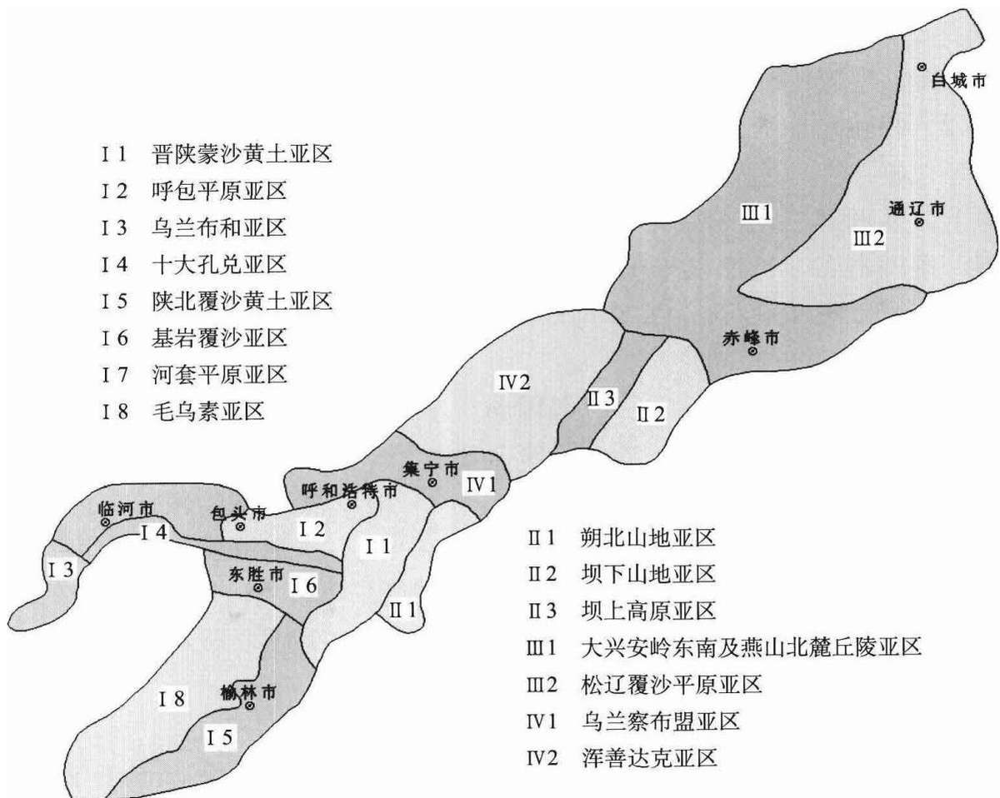  
图 22.11 水土流失分区图

## 二、分区特征概述

## (1) 晋陕蒙沙黄土亚区

本亚区地处内蒙古高原和黄土高原交接地带，地质构造属山西台背斜与内蒙古地轴的过渡带。地形以山地、丘陵为主。北部属阴山山系，南部是吕梁山系的北延部分，地势东高西低，东部最高达1500～2500m，西部黄河沿岸仅800～900m，丘陵起伏较大，地表沟壑纵横，植被稀少，土壤侵蚀严重。整体地表为沙质黄土覆盖的山地高原，黄土覆盖厚达几十米至上百米，由于长期侵蚀切割，形成梁昴为代表的黄土地貌。年降水量400～450mm，主要集中在7～9月。年大风日数25～40d，最低值在府谷县，年大风日数在25 d左右，由西南向东北逐渐递增，到卓资县达40 d左右。

本亚区水力侵蚀面积较大，约占总面积的72.35%，风力侵蚀面积则仅为2.89%。从侵蚀强度看，中度水力侵蚀面积最大，占总面积的20.47%，其他级别的面积相差不大，在10%～15%。中度和轻度合计为35.03%，强度以上水力侵蚀面积之和占总面积37.32%。平均水力侵蚀模数5072.17 t/(km²·a)，达到了强度侵蚀，平均风力侵蚀模数为100.56t/(km²·a)，水力侵蚀模数远大于风力侵蚀模数，平均水力侵蚀模数为风力侵蚀模数的50多倍。

## (2) 呼包平原亚区

呼包平原亚区主要位于呼和浩特到包头一带的山前冲积平原和黄河冲积平原上。从西部三湖河平原到呼和浩特大黑河平原，东西绵延220km，地势平坦，渠网密布，长期以来是灌溉农业较发达的地区，地下水位较高。年降水量东部可接近400mm，由东向西逐渐递减，西部年平均为300mm，年平均大风日数为 25～35 d。

本亚区水力侵蚀和风力侵蚀都很弱，水力侵蚀占总面积的23.11%，风力侵蚀占总面积的6.46%。水力侵蚀以轻度和中度为主，两者合计占总面积的22.50%，强度侵蚀面积仅占0.61%，没有极强度和剧烈侵蚀。风力侵蚀以中度和强度居多，两者合计占总面积的5.56%，其他级别侵蚀的面积都很少。从平均侵蚀模数来看，平均水力侵蚀模数为 $6 9 2 . 6 7 \ \mathrm { t } / ( \mathrm { k m ^ { 2 } \cdot { \ a } } )$ ，平均风力侵蚀模数为 $2 7 6 . 5 7 ~ \mathrm { t / ( k m ^ { 2 } \cdot { \bar { \ a } } ) }$ ，平均水力侵蚀模数是平均风力侵蚀模数2.5倍。

## (3) 乌兰布和亚区

乌兰布和沙漠面积0.99万 $\mathrm { k m ^ { 2 } }$ ，流动沙丘占39%，半固定沙丘占31%，固定沙丘占30%。流动沙丘主要集中在南段和中段，呈新月形沙丘链、格状新月形沙丘和新月形沙山形状，一般高10～30m，密集中心可达50～100m(王涛，2003)。该沙漠处于我国西部荒漠东缘，气候干旱，年平均降水量148.6mm（磴口气象站），年平均蒸发量高达2395.6mm，年平均风速3.1m/s，年大风日数19天，起沙风日数27天，风沙危害严重。

传统上认为，乌兰布和沙漠降水稀少，无地表径流，属纯风力侵蚀区。把乌兰布和沙漠列入水风蚀复合区，主要基于以下的考虑：乌兰布和沙漠位于黄河的西面，盛行风向为西北风，沙物质在盛行风的吹扬作用下，源源不断直接泻入黄河，成为黄河粗泥沙的重要来源，威胁黄河下游生态安全。据杨根生等人研究，乌兰布和沙漠每年倾入到黄河的沙量约有1513万t；1954～2000年，约有6.0552亿t大于0.1mm的粗沙淤积在黄河内蒙古河段。黄河是本亚区的唯一过境河流，水力侵蚀主要发生在黄河沿岸及河道，倾入到黄河的沙量全被水蚀带走，风力侵蚀量与水力侵蚀量基本相等。虽然，水力侵蚀只是发生在黄河沿岸，但沙物质可能来自沙漠的内部，所以，把整个乌兰布和沙漠包括黄河沿岸沙区作为一个亚区划入水风蚀复合区。

## (4) 十大孔兑亚区

十大孔兑亚区（库布齐沙漠亚区）范围主要是库布齐沙漠。库布齐沙漠呈狭长带状分布在黄河内蒙古段的南侧，自西向东延伸400km，面积为1.61万km²，海拔高度1000～1400m，沙丘类型多样，中西部多为格状沙丘，一般高10～15m，河漫滩地带多新月形沙丘和沙丘链，流动沙丘边缘地下水条件好的地方多缓起伏固定沙地和灌丛沙地（王涛，2003）。年降水量西段为150～200mm，向东逐渐增大，东段最大为350～400mm，年平均风速4.4～4.5 m/s，年大风日数25～30 d，风沙危害严重。

十大孔兑是指鄂尔多斯北部直接入黄的一级支沟，包括毛不拉孔兑、布日嘎斯太沟、黑赖沟、西柳沟、罕台川、壕庆河、哈什拉川、母哈尔沟、东柳沟、呼斯太十条季节性山洪沟，它们的流域投影形态相似，都呈南北狭长形。每条沟长28.6～110.9km，流域面积213～1261km²。十大孔兑源于鄂尔多斯高原原脊，向北流经砒砂岩片和库布齐沙漠，最后入黄河。十大孔兑上游是砥砂岩片，中游是库布齐沙漠，下游是平原区。其中十大孔兑中游的库布齐沙漠是本亚区的重要组成区域。

本亚区水土流失以风蚀为主，风蚀将大量泥沙输入河道，在十大孔兑上游发生洪水流经该亚区时，进而将泥沙输入黄河，对黄河危害极大。

## (5）陕北覆沙黄土亚区

主要分布在陕西省榆林市北部。这里年降水量在400mm左右，西边定边县在350mm，年大风日数在30～40天，地貌上处于毛乌素沙地向黄土高原的过渡部位，地势由西北向东南倾斜，一般海拔900～1500m，地表物质类型分为风沙土和沙黄土，大体以长城为界，形成北部以风蚀作用为主的风沙地和南部以水蚀作用为主的黄土丘陵沟壑两类不同地貌的自然区。

本亚区水力侵蚀和风力侵蚀作用造成的水土流失都很严重。水力侵蚀面积大于风力侵蚀面积，两者所占比例分别为47.61%和32.07%。总水土流失面积占亚区的79.68%。从侵蚀强度看，轻度和中度水力侵蚀占5.01%，而强度以上面积竟然达到了42.59%。风力侵蚀也是以强度以上占优势，为25.59%，轻度和中度为6.48%。本亚区平均水力侵蚀模数为4780. $7 6 ~ \mathrm { t } / ( \mathrm { k m } ^ { 2 } \cdot \mathrm { a } )$ ，平均风力侵蚀模数为 2952.02 t/(km²·a)，平均水力侵蚀模数是平均风力侵蚀模数的1.6倍，整体达到强度。

## (6) 基岩覆沙亚区

本亚区位于鄂尔多斯高原中部，夹在库布齐沙漠和毛乌素沙地之间，区域中部的东胜梁为十大孔兑流域与黄甫川、窟野河水系的分水岭，地形由西北向东南倾斜，海拔高度1550～1000m。基底岩石以形成于三叠纪、侏罗纪、白垩纪的砒砂岩为主。年降水量在350～400mm，主要集中在7～9月份。砒砂岩呈半胶结状态，易风化成为砂或岩屑，又含有黏土成分，透水性能差，入渗缓慢，雨量不大的阵性降雨即能形成山洪，造成严重水土流失。该区土壤侵蚀模数高达8000～18000t/(km²·a)。

## (7) 河套平原亚区

河套平原亚区主要位于黄河北部，从乌兰布和沙漠到乌梁素海，西东绵延250km，地势平坦，渠网密布，长期以来是灌溉农业较发达的地区，地下水位较高。年降水量东部可达300mm，向西逐渐递减，西部年平均为150mm，年平均大风日数为25～35天。

本亚区水力侵蚀和风力侵蚀都很弱，水力侵蚀占总面积的15.87%，风力侵蚀占总面积的15.71%。水力侵蚀以轻度和中度为主，两者合计占总面积的15.56%，强度侵蚀面积仅占0.31%，没有极强度和剧烈侵蚀。风力侵蚀以强度以上居多，合计占总面积的11.78%，轻度和中度合计为3.93%，水力侵蚀主要发生在山前冲积扇及河网沟渠内，风力侵蚀主要发生在平原的边缘沙漠或平原内裸露的斑状分布的滩地、沙丘上。平均水力侵蚀模数为435.68 t/(km²·a)，平均风力侵蚀模数为 $1 2 3 3 . 4 5 ~ \mathrm { t / ( k m ^ { 2 } \cdot { \vec { a } } ) }$ ，平均水力侵蚀模数小于平均风力侵蚀模数。

## (8) 毛乌素亚区

毛乌素亚区主要分布在鄂尔多斯高原中南部，处于鄂尔多斯高原向黄土高原过渡的洼地中，主体以毛乌素沙地为主，地势西北高、东南低，地形相对平坦，海拔一般在1300～1400m，呈波状起伏，以梁窝状半固定、固定沙丘为主，沙丘间多大型地势低洼的滩川地、盐湖或碱湖，年降水量在280～370mm，7～9月降水量占全年的70%左右，年大风日数在20～25天左右。

本亚区风力侵蚀面积大于水力侵蚀面积，两者的比例分别为73.63%和12.45%，两者之和占总面积的86.08%。从水蚀强度看，轻度水力侵蚀面积为7.21%，其他级别的面积所占比例都较小。风力侵蚀各级别比例都大于或接近10%，轻度和中度则分别达到了23.72%和18.70%，两者之和则达到了42.42%。平均水力侵蚀模数为363.12 t/(km²·a)，平均风力侵蚀模数为4476.90 t/(km²·a)，平均风力侵蚀模数是平均水力侵蚀模数的12倍多。

## (9) 朔北山地亚区

朔北山地亚区呈西南-东北向条带状分布，自然地理环境复杂多样。①西南部为吕梁山北延，整个地势由西向东倾斜。地表为黄土覆盖的山地高原，地形以山地、丘陵为主，占到总面积的60%以上。主要山峰有风台梁、公鸡岭、鱼渠岭、双华岭、大梁山等，海拔在1750～2000m。最低点位于朔州盆地，平均海拔1100m左右。②东北部地处内蒙古高原东沿的山地丘陵地带，山地丘陵占总面积的77%，山体东北-西南走向，属阴山山系。整个地势从北向南阶梯状下降，海拔2300～1200m。中南部有冲积平原滩川地带，形成东西北三面环山的狭长走廊。③西北部分多为玄武岩覆盖的丘陵；东部低山区，沟谷发育，坡陡峻，大部分是V形。本亚区属典型的大陆性季风气候。低温干燥，冬长夏短，多风少雨，日照长，风沙大，年平均气温4.7\~6.4℃，年平均降水量380\~430mm，一般集中在7\~9月份。降雨空间分布差异较明显，西南部年平均降水量可达430mm，东北部年平均降水量只有380mm；年大风日数西南部为25～30天，东北增多至35～40天。

本亚区水力侵蚀占绝对优势，风力侵蚀面积不到10km²，仅为总面积的0.11%。水力侵蚀以轻度和中度为主，两者合计占总面积的50.92%，强度水力侵蚀面积仅占1.98%。平均水力侵蚀模数为1538.77t/(km²·a)。

## (10) 坝下山地亚区

本亚区地处内蒙古高原与冀北山地的过渡地带，地形自西北向东南倾斜，海拔在1600～700m。赛罕坝、蜈蚣坝、宜肯坝、万全坝从东北到西南依次排列，把坝下和坝上分为两个不同的自然单元。坝下山地是阴山余脉，

大兴安岭余脉和七老图山的交接地带。山峦起伏，沟谷纵横，低山、丘陵广泛分布。本亚区本属中温带半湿润、半干旱气候，受地形影响，气候多样。年平均气温为6.1℃，年平均降水量为503mm，年大风日数25～30天。

本亚区水力侵蚀占绝对优势，风力侵蚀面积较少，仅为总面积的3.22%。水力侵蚀以轻度和中度为主，两者合计占总面积的41.97%，强度水力侵蚀面积仅占0.07%。平均水力侵蚀模数1108.83 t/(km²·a)。

## (11) 坝上高原亚区

本亚区地处阴山山地北坡，内蒙古波状高原南缘，呈浅山丘陵地形，地势从西南坝缘向西北倾斜，西南高，东北低，平均海拔1150～1800m。气候属于中温带半干旱向半湿润过渡的典型大陆性气候。主要气候特点是冬季严寒而漫长，春季干旱多大风。年平均气温1.6℃，年平均降水量380～400mm。平均年大风日数40～60天，是水风蚀复合区大风日数最多的地区。

本亚区风力侵蚀面积大于水力侵蚀面积。水力侵蚀以轻度和中度为主，两者合计占总面积的26.36%，强度水力侵蚀面积仅占0.05%。风力侵蚀同样以轻度和中度为主，两者合计占总面积的37.37%，强度以上水力侵蚀面积仅占2.65%。平均水力侵蚀模数为621.74 t/(km²·a)，平均风力侵蚀模数为1024.82 t/(km²·a)，是平均水力侵蚀模数的1.6倍。

## (12) 松辽覆沙平原亚区

本亚区主要分布在西辽河覆沙平原，也包括了松嫩平原西部沙地和松辽分水岭。西辽河平原是被一个沙丘覆盖的冲积平原，海拔170～250m，地势西高东低。地貌上明显特征是沙丘广布，甸子纵横，地表微起伏倾斜。在靠近大兴安岭山前一带，分布有冲、洪积和风积黄土等构成的波状倾斜平原，平原的倾斜坡度约1%，其上冲沟发育，地形切割剧烈，形成岗城状土梁和坳沟。由于西辽河平原降水量少，蒸发量大，风力作用强烈，加上地层松散，沙层深厚，风沙地貌非常明显。大致以西辽河-西拉木伦河一线为界，其南侧广泛分布有固定、半固定和流动沙丘、沙珑，除在河流下风侧形成流沙带(南端的养畜牧河南岸为黄土台地，流沙带例外地分布在河流北侧外)，多固定、半固定垄状和梁窝状沙丘，并组成西部西北一东南向，向东逐步转为东西向，甚至偏转向东北向的大型沙带，带间为宽阔的低地。坨、甸组成颇具地区特色的风沙地貌景观。北侧风沙作用相对较弱，形成了以冲、洪积为主伴有风积沙的沙质平原地貌。松辽分水岭经公主岭至通榆一线，大致呈北西西向。东部为台地状分水高地，向西逐渐过渡为沙丘覆盖的冲积平原或冲积、湖积平原，分水线模糊。海拔一般在220～260m，地势东高西低。地表波状起伏。松嫩平原在本亚区内大体从西北向东南微倾的波状沙质平原，其地貌

类型以丘陵、漫岗和阶地为主。

本亚区水力侵蚀微弱，面积总计4138.8km²，仅占总面积的5.29%。风力侵蚀面积37341.42 km²，占总面积的47.76%。风力侵蚀以轻度和中度级别面积最多，且两者所占比例基本相等，合计占总面积的37.44%，强度以上面积合计仅占10.31%。水力侵蚀模数为 $1 8 2 . 3 8 ~ \mathrm { t / ( k m ^ { 2 } \cdot { \Omega a } ) }$ ，属微度侵蚀。风力侵蚀模数为 $1 8 6 5 . 3 7 ~ \mathrm { t / ( k m ^ { 2 } \cdot { \varepsilon } a ) }$ ，属轻度侵蚀。

## (13）大兴安岭东南侧及燕山北麓丘陵亚区

本亚区西北侧为大兴安岭山系，呈北东-南西向延伸，南侧燕山山系东西向分布，大兴安岭山系和燕山两大山系呈丁字形相交于内蒙古克什克腾旗到河北省围场县一带。北端的大兴安岭山脉，山峦起伏连绵，高程变化在1000～2000m之间，相对高差600～1000m。其地貌类型属中低山丘陵地貌，以中山为主，兴安岭东坡和南坡一带，地势较低缓，构成了低山丘陵或丘陵地带，河网沟壑较发育。本亚区南部山脉属燕山山系东段或东延部分，主要包括七老图山、医巫闾山、努鲁儿虎山和松岭等，一般高程500～1500m，相对高程150～1000m，亦属中低山丘陵地貌。河流切割较强烈，地形破碎，山坡较陡，其山坡下常有较厚的第四纪残积和风积物，在赤峰红山区一带还有大片玄武岩和风成黄土台地分布。年均降水量为350～450mm，年平均大风日数为25～45天。

本亚区水力侵蚀面积大于风力侵蚀面积，水力侵蚀面积为38541.7km²，占总面积的32.70%。风力侵蚀面积为23177.25 km²，占总面积的19.66%，两者之和占总面积的52.36%。水力侵蚀以轻度和中度为主，两者之和占30.84%，强度以上面积所占比例很小。风力侵蚀也以轻度和中度居多，两者合计占16.10%，强度以上面积合计仅占3.56%。水力侵蚀模数为$8 5 1 . 4 8 ~ \mathrm { t / ( k m ^ { 2 } \cdot { a } ) }$ ，风力侵蚀模数为 $6 5 1 . 9 9 \ t / ( \mathrm { k m ^ { 2 } } \cdot \mathrm { a } )$ ，水力侵蚀模数和风力侵蚀模数基本相等。风水两相侵蚀模数合计为1503.47 t/(km²·a)，属轻度侵蚀。

## (14) 乌兰察布亚区

本亚区地貌形态复杂多样，西北为阴山山地，中部为丘陵，向东南延伸到坝上高原。西北部的阴山山地主峰（大青山）在武川县境内，海拔在1800～2200m，多山间盆地分布。武川以东，地势渐低，并分为主峰不明显的数支，海拔在1600～2000m，丘陵和盆地相间，河谷洼地形成一些小平原，基岩之上，表层覆以厚度超过0.5m的沙质黏土。东南部的坝上高原海拔1200～1500m，呈波状起伏。本亚区气候特点为春季干燥风沙多，夏季短促降雨少，冬季严寒时间长，年平均气温2.5℃。年降水量在西北部为300mm左右，向东南逐渐增多，最高达到400mm，年平均大风日数为40～50天。

本亚区水力侵蚀面积为9892.56 km²，占土地总面积的51.48%，风力侵蚀面积3998.01 km²，占区域总面积的20.81%。水力侵蚀和风力侵蚀面积合计占总面积的72.29%。水力侵蚀以轻度和中度为主，两者合计占总面积的46.14%，强度侵蚀面积仅占5.34%，没有极强度和剧烈侵蚀。风力侵蚀以轻度、中度和强度居多，合计占总面积的18.28%，极强度侵蚀面积占总面积的2.53%。平均水力侵蚀模数 $1 5 2 0 . 8 0 ~ \mathrm { t / ( k m ^ { 2 } \cdot { \varepsilon } a ) }$ ，平均风力侵蚀模数为$1 0 4 4 . 9 2 ~ \mathrm { t / ( k m ^ { 2 } \cdot \vec { a } ) }$ ，风水两相侵蚀模数合计为 $2 \ 5 6 5 . 7 1 \ \mathrm { t } / ( \mathrm { k m } ^ { 2 } \ \bullet \ \mathrm { a } )$ ，属中度侵蚀。

## (15) 浑善达克亚区

本亚区包括浑善达克沙地及周边的乌兰察布市后山区域东部和河北坝上北部，地势自西南向东北倾斜，平均海拔1200～1500m，是典型的波状高原景观，地势高耸，起伏不大，呈现“远看是山，近看是川”的景象。高原上多岗梁、内陆湖泊（淖尔）、滩地和草坡相间分布。浑善达克沙地主体是晚第三纪以来，在阴山山脉北麓的向斜构造基底上，先有河湖相沙层沉积，后有风蚀和堆积形成的沙地，由梁窝状沙丘、沙岗与沙丘间滩地相间排列，并有小型湖沼镶嵌分布。后山即阴山北坡地区，地貌以丘陵为主，夹有多个大型盆地，本亚区涉及商都和朝阳（化德县）两个大型盆地。坝上高原为内蒙古高原的东南翼，地形南高北低。本亚区西北侧年降水量为300mm左右，向东南逐渐增加，最高达到400mm，年大风日数在45～65天，是我国北方年大风日数最多的地区之一。

本亚区以风力侵蚀为主，面积 $3 1 ~ 7 0 5 . 2 8 ~ \mathrm { k m ^ { 2 } }$ ，占总面积的67.31%；水力侵蚀面积仅有5400.11km²，占总面积的11.46%。两种侵蚀面积之和占总面积的78.77%。水力侵蚀以轻度为主，占总面积的9.31%，中度较少，占2.14%，强度以上面积所占比例极其微小。风力侵蚀以轻度和中度最多，两者合计占56.08%，强度以上面积合计仅占11.22%。水力侵蚀模数为$2 1 0 . 1 6 ~ \mathrm { t } / ( \mathrm { k m } ^ { 2 } \cdot \mathrm { a } )$ ，风力侵蚀模数为 $2 2 8 0 . 6 8 ~ \mathrm { t / ( k m ^ { 2 } \cdot { \varepsilon } a ) }$ ，风力侵蚀模数是水力侵蚀模数的10倍多。风水两相复合侵蚀模数为 $2 4 9 0 . 8 4 ~ \mathrm { t / ( k m ^ { 2 } \cdot { \ s } ) }$ ，属轻度侵蚀。

## 三、分区治理标准

经过实际调查研究，根据各亚区基本情况，提出各亚区水土流失治理标准如表22.14。

表 22.14 水土流失分区治理标准
<table><tr><td>治理度 林草覆盖率 经济林 基本农田 侵蚀模数 流域 人均收 区 亚区 达到/% 增加到/% (亩/人) (亩/人) 减少量/% 人增加/元 晋陕蒙</td></tr><tr><td>以水 20 30 1.5 60~70 500~1000 沙黄土 蚀为主 呼包平原 17 19.3 10.05 1.8~2.0 60 700~1000</td></tr><tr><td>十大孔兑 75 黄河 65 4.5 70以上 1100 陕北覆 水风 30~50 21 20 0.5 1~2 500~100 沙黄土 蚀相当 以上 30~50 基岩覆沙 24 20 2~3</td></tr><tr><td>以上 以风 毛乌素 30~40 15~30 2~3 60 300~600 蚀为主 以水蚀</td></tr><tr><td>70 21.5 0.5~1.0 1~2 50~60 300~600 为主 大兴安岭东 海河松 风水 南及燕山北 30~40 30~40 2 60~70 200~400 辽流域 蚀相当 麓丘陵亚区</td></tr><tr><td>以风 松辽覆沙 32 20 0.5以下 2.5~10 60~70 250~500</td></tr><tr><td>蚀为主 平原区 风水 乌兰察布 60 30~50 2 60 600~800</td></tr><tr><td>蚀相当 盟亚区 内流河 以风 浑善达克 40 40~50 2 60~70 300~600 蚀为主</td></tr></table>

## 第三节战略目标、总体布局与措施配置

## 一、战略目标与任务

## （一）近期目标与任务（2006\~2010年）

以小流域为单元配套沟道治理等工程措施，坚决控制住人为因素产生新的水土流失，基本遏制荒漠化的发展。生态环境特别恶劣的黄河内蒙古段水土流失重点区以及严重荒漠化地区的治理初见成效。全区需要治理的水土流失面积26万km²。“十一五”期间力争完成治理面积的20%，即利用5年的时间完成5.2万km²面积的水土流失治理，年均治理1.1万km²；其中，坡改梯面积 $2 8 3 0 ~ \mathrm { k m ^ { 2 } }$ ，经济林面积 $2 8 0 0 ~ \mathrm { k m ^ { 2 } }$ ，水保生态林面积 $1 7 ~ 7 0 0 ~ \mathrm { k m ^ { 2 } }$ 、人工种草 $9 8 0 0 ~ \mathrm { k m ^ { 2 } }$ ，自然封禁面积 $1 9 \ 1 0 0 \ \mathrm { k m } ^ { 2 }$ ，大型拦沙坝28座，骨干工程1457座，淤地坝3155座，生态移民9万人。各项重点治理工程包括京津风沙源治理工程、水土保持重点治理工程、黄土高原淤地坝重点治理工程，同时全面完成25°以上坡耕地的退耕还林，重点水土流失区水土流失得到有效控制，治理区林草覆盖率提高5%～10%，生态环境进入较稳定的发展阶段，治理区人均粮食拥有量稳定在500kg，人均收入增加200～300元；建立较完善的水土保持预防监督体系和水土流失监测网络，建立比较健全水土保持法律法规体系和机构队伍体系，人为水土流失防治走上法制化、规范化轨道。

## （二）中期目标与任务（2011～2020年）

在巩固提高已有治理成果的基础上，到2020年，力争完成治理面积的达50%，即利用10年的时间完成13.1万km²面积的水土流失治理，年均治理1.3万km²，完成坡改梯面积 $7 1 0 0 ~ \mathrm { k m ^ { 2 } }$ ，经济林面积 $7 0 0 0 ~ \mathrm { k m } ^ { 2 }$ ，水保生态林面积 $4 4 ~ 4 0 0 ~ \mathrm { k m ^ { 2 } }$ ，人工种草 $2 4 ~ 6 0 0 ~ \mathrm { k m ^ { 2 } }$ ，自然封禁面积 $4 7 \ 7 0 0 \ \mathrm { k m ^ { 2 } }$ 。大型拦沙坝70座，骨干工程3644座，淤地坝7887座，生态移民13万人。水土流失治理程度达到50%以上；宜林宜草地全面恢复植被；治理区内林草覆盖率提高20%～30%。生态环境得到根本改观，生态农业步入良性发展轨道，全面实现粮食自给，农村居民人均纯收入依托水土保持提高500元左右；健全水土保持预防监督体系和动态监测网络，全面规范开发建设活动的水土保持行为，基本遏制住人为水土流失。

## （三）远期目标与任务（2021～2030年）

全面完成区域水土流失治理，力争完成治理面积的30%，即利用10年的时间完成7.84万 $\mathrm { k m ^ { 2 } }$ 面积的水土流失治理，年均治理0.78万km²，完成坡改梯面积 $4 2 5 0 ~ \mathrm { k m ^ { 2 } }$ 、经济林面积 $4 2 0 0 \ \mathrm { k m } ^ { 2 }$ ，水保生态林面积 $2 6 ~ 7 0 0 ~ \mathrm { k m ^ { 2 } }$ 人工种草 $1 4 ~ 8 0 0 ~ \mathrm { k m ^ { 2 } }$ ，自然封禁面积 $2 8 \ 7 0 0 \ \mathrm { k m ^ { 2 } }$ 。大型拦沙坝42座，骨干工程2186座，淤积地坝4732座。实现区域坡耕地的全面改造，水土流失治理程度达到70%以上；宜林宜草地全面恢复植被；治理区内林草覆盖率提高10%。巩固已有治理成果，建立起适应经济、社会可持续发展的良性生态系统，人均收入进一步依托水土保持提高300～500元；适宜治理的水土流失区基本得到整治，水土流失和沙漠化基本得到控制，坡耕地基本实现梯田化，宜林地全部绿化，“三化”草地得到恢复，生态环境明显改观，人为水土流失得到根治，不断强化水土保持预防监督体系和动态监测网络，全面遏制可能新增的人为水土流失。

## 二、总体布局与措施配置

根据水土保持“三区”划分成果，针对重点预防保护区、重点监督区和重点治理区不同特点，因地制宜配置各种水土保持措施。对下游河道淤积和周边地区生态安全影响较大的区域，如砒砂岩区、十大孔兑及浑善达克沙地等重点治理区，集中力量，增加投入，综合治理；对风水蚀轻微的区域，积极开展封山封沙育林育草，坚决制止毁林毁草、乱砍滥伐、过度放牧和陡坡开荒等，加强预防保护；在开发建设强度大的区域，如晋陕蒙接壤区加强预防和监督。

## (1) 晋陕蒙沙黄土亚区

本亚区要坚持坡沟兼治，以坡耕地和沟壑区为重点。通过坡改梯调节和拦蓄地表径流，建设基本农田；荒山荒坡采用集流蓄水造林技术建设水土保持林；沟道修淤地坝，控制水土流失并淤地造田。

## (2) 呼包平原亚区和河套平原亚区

大力营造网、带、片相结合的农田防护林，建立合理的耕作制度，大力提倡深松少耕、秸秆还田，增施有机肥，改良土壤，增加土壤的抗风蚀能力。

## (3)十大孔兑及乌兰布和亚区

水土流失防治的重点是防止沙漠扩张和风沙向河道输送。采取锁边策略，在沙区边缘建设乔灌混交锁边，乔木以杨树为主，灌木可采用沙柳、沙棘、花棒、梭梭（乌兰布和亚区）等；林带外围通过设置人工沙障，在沙障中间栽种沙柳、沙蒿、花棒、沙打旺等进行植被建设。

## (4) 陕北覆沙黄土亚区

该亚区水蚀、风蚀都很严重。坡耕地水力侵蚀严重，采取坡改梯措施，修建基本农田，建立合理农业耕作制度，防止农田风蚀沙化；沟道修筑土柳谷坊，营造防冲林，修筑淤地坝，形成沟道防护体系；荒山荒坡保护现有植被，禁止过牧破坏，选择适宜区域人工种植灌草进行植被建设。

## （5）基岩覆沙亚区（砒砂岩亚区）

本区水土流失以水蚀为主，土壤侵蚀主要发生在础砂岩沟壑区。本亚区梁昴坡除局部地区土层较厚外，大部分坡面覆土极薄，砒砂岩大面积裸露。坡面治理措施以配合水平沟和鱼鳞坑整地布设沙棘、柠条等灌木为主，在土

层较厚、坡度较缓的缓坡上栽种油松、山杏及人工牧草；砥砂岩沟壑区大力营造沙棘林，控制水土流失；支沟到干沟修建骨干坝，进一步拦截泥沙。

## (6) 毛乌素沙地亚区

在风沙丘地建立大面积的“草、灌、乔”结合的防风固沙林，以固定流沙；在滩地周围建立宽约1km的乔灌混交固坡、护岸阻沙林带，保障滩地的正常生产；在滩地建立渠、路、田、林配套的基本农田，结合路、渠营造农田防护林带。

## (7) 朔北山地亚区和坝下山地亚区

大面积区域采用自然修复，以封山育林为主，保护现有植被。在水土流失严重地区进行综合治理，坡面整地营造水土保持林，陡坡退耕还林还草，在土层较厚的地方发展经果林，坡度较缓的坡耕地修建水平梯田。在比降大、侵蚀活跃的支毛沟修筑石谷坊，固定沟道。

## (8) 坝上高原亚区

在其风蚀区植被较好的地段实施封坡育草、在其平缓地段补播禾本科牧草，并配套草场防护林网，以恢复植被；在水蚀区土石阳坡地段采取水保整地工程措施拦截坡面径流，并栽植山杏等，阴坡栽植水源涵养林，植被较好的地块进行封育；侵蚀沟修筑沟头防护工程和谷坊工程。

## (9) 松辽覆沙平原亚区

水土流失防治结合，结合“三北”防护林建设，采取植物固沙和沙障固沙措施，建立农田防护林体系，推广旱作农业技术、节水灌溉技术和建立抗旱防蚀耕作制度；牧草地以营造牧场防护林、草地改良和种草为主，建设基本草场，并结合轮牧、舍饲等措施，发展高效牧业，为保护草原和大面积植被恢复创造条件。

## (10)大兴安岭东南侧及燕山北麓丘陵亚区

以治理坡耕地和荒山为重点，大力改造中低产田。降水少的地区全面推广旱作农业高产技术；林区以预防为主，积极采取封山育林等措施，荒山荒坡要大力营造水土保持林，对现有的疏林地进行有计划改造和保护，提高林草覆盖率；沟壑要采取沟头防护、修谷坊和塘坝等措施进行治理。

## (11) 乌兰察布亚区

对平坦滩川地和波状平原的平坦部分的旱作农地设置农田防护林。在一些风口地段的迎风面增设灌木林带，配置成乔、灌相结合，紧密结构的防护林带。对风蚀水蚀较严重的坡耕地退耕还林还草。对尚未开垦的一些缓丘天然草场也应予以合理放牧并改良天然草场。实施“进一退二还三”战略，即每建成一亩高标准基本农田，退出两亩旱坡贫瘠耕地，还林还草恢复植被三亩。

## (12) 浑善达克沙地亚区

把分散在沙区的农牧民群众迁出沙区，彻底解放人畜对沙地的压力。通过自然封育，人工飞播措施恢复沙区林草植被，而牧民饲养牲畜所需要的饲料通过建设高产基本农田进行生产。

## 三、主要措施成本分析

## （1）坡改梯措施成本

坡改梯措施成本高低取决于两方面的因素，首先是坡地的立地条件；其次是梯田的建设标准。前者如坡地坡度的大小、坡地的物质结构。一般是坡地的坡度越大、土壤结构越坚硬，所需的成本越高。后者坡改梯的标准和梯田田面的宽窄；所有这些都直接或间接的影响到建设成本。本区机修土坎水平梯田的成本是400～500元/亩。

## (2) 生态林措施的成本分析

生态林措施成本首先取决于立地条件，土层厚度越大，生态林实施的成本越低，反之就越高；其次是区域降雨量的大小。此外，不同造林的方式也影响到造林成本。根据区域调查，本区的造林成本介于178元～378元/亩，平均造林成本为291元/亩。

## （3）经济林措施成本分析

经济林在某些水土流失区已成为支柱产业，经济林的成本一是来自于整地；二是来自于苗木与管理。经济林造林整地及水肥等要求远高于生态林，应该整成水平梯田或者条田，树苗定植以后还精心管理。本区经济林主要分布在南部晋陕蒙地区，一般成本为604元/亩。

## （4）人工种草及自然封禁措施成本分析

所谓自然封禁或自然封育是将某一区域封起来，严禁一切经济活动，尤其是放牧与樵采。封育的成本来自于两个方面：一是封禁区的管理；二是资源补偿费。一般封禁区都是经济相对落后区，被封区多半是牧荒地和樵采地，对此不但要进行严格管理，同时还要给予老百姓适当的经济补偿。本区就有退出三亩草场及旱坡地进行封育，必须在水土条件较好的地区建成一亩人工草场的成功经验，只有如此才能真正实现自然封育。本区人工种草成本为86.6元/亩，封育成本为53.8元/亩。另外，本区自然封禁的管理费和生态补偿费两项之和是200～250元/亩（以10年计）。

## （5）其他措施成本分析

据调查，本区主要工程措施，如骨干坝投资需要131.6万元/座，中型淤地坝为32.0万元/座，小型淤地坝为16.7万元/座，谷坊1430元/座。生态移民主要为基础设施投资，不包括自筹和投工投劳，每个移民的搬迁补偿费为5500元。

根据水风蚀复合区水土保持总体布局与措施配置方案中确定的各项措施规模，以及实地考察调查中了解到的各分区坡改梯、工程措施、经济林、生态林、人工种草、自然封禁治理成本，计算得到本区项措施的水土保持总成本约为1266亿元，其中，坡改梯总成本88亿元，工程措施总成本171亿元，(其中包括11.5亿元的生态移民成本)，经济林总成本127亿元，生态林总成本398亿元，人工种草总成本65亿元，封禁治理总成本417亿元。在措施成本估算过程中，变数较大，一些项目有重复统计之嫌，上述成本中没有考虑水利配套措施等工程措施的成本，且不同地区的投资差异较大(表22.15)。

## 四、主要对策

## （1）完善“禁牧”政策的政府补偿机制

考察发现，实施禁牧后，不同地区的政府补偿机制有较大差异，有些地方甚至没有任何补偿，没有适当的补偿机制，禁牧后农牧民很难在短时间内调整自己的经济收入途径，势必造成经济收入的减少，进而产生对禁牧政策的抵触情绪。因此，建议禁牧政策的实施应该结合相应的补偿机制，补偿时间最少5年。

## （2）禁牧与舍饲相结合，走牧业产业化道路

建设高标准人工饲草料基地，保证饲草的充足和质量；进行畜种改良，饲养高产优质牲畜；从政策上扶持舍饲圈养，对农牧区舍饲圈养禁牧给予技术指导和优惠政策扶持，如对实施圈养的棚圈、青贮饲料设施、以及饲料粮给予补贴，促进农牧民转变生产方式，以激励农牧民自觉退牧和调整经济收入结构；积极引导和建立畜产品加工企业和农牧民舍饲基地的经济链条，完善产业化经营方式。

## （3）改变传统的畜牧业观念，建立农牧业耦合发展模式

发挥政府引导的作用，建立“牧区繁殖、农区育肥”的农牧业耦合发展模式，充分利用牧区成本低廉、农区饲草丰富的优势，发展专业化、规模化养殖业；建立畜种的集中培育基地，改进牲畜品种，加强农牧产品的运销，使产品及时走向市场，逐渐形成“短、高、快”的养殖模式。

（4）建立农牧产品深加工基地，就地解决部分剩余劳动力，缓解人口

区
<table><tr><td colspan="10">流域 区</td></tr><tr><td colspan="3">亚区 晋陕蒙沙黄土</td><td>土地 流失 面积/km²</td><td>面积/km²</td><td>工程(移 坡改梯 民)措施</td><td>经济林</td><td>水保林</td><td>人工种草</td><td>自然封禁</td><td>1 小计 /亿元</td></tr><tr><td colspan="3">以水蚀为主</td><td>22 092</td><td>16 622</td><td>13 400</td><td>190 600</td><td>18 000</td><td>390 600 27 000</td><td>218 350</td><td>85</td></tr><tr><td colspan="3"></td><td>呼包平原 11 531</td><td>3 410</td><td>0</td><td>173 150</td><td>37 050</td><td>59 300</td><td>5 750 50 300</td><td>32</td></tr><tr><td colspan="3"></td><td>十大孔兑 8 803</td><td>8 413</td><td>26 000</td><td>167 000</td><td>0</td><td>98 850</td><td>18 750 180 900</td><td>49</td></tr><tr><td colspan="3">黄河流域</td><td>乌兰布和 30</td><td></td><td>0</td><td></td><td>0</td><td>1310</td><td>0 0</td><td>0.13</td></tr><tr><td colspan="3">水风蚀相当</td><td>陕北覆沙黄土 33 427</td><td>26 636</td><td>215 700</td><td>163 500</td><td>31 350</td><td>641 100</td><td>45 000 208 350</td><td>130</td></tr><tr><td colspan="3"></td><td>基岩覆沙 18 983</td><td>14 674</td><td>11 880</td><td>395 000</td><td>17 200</td><td>353 150</td><td>24 800 181 100</td><td>98</td></tr><tr><td colspan="3">以风蚀为主</td><td>河套平原 18 438</td><td>5 821</td><td>0</td><td></td><td>68 500</td><td>97 550</td><td>7 550 94 250</td><td>26</td></tr><tr><td colspan="3">以水蚀为主</td><td>毛乌素 25 016</td><td>21 535</td><td>0</td><td></td><td>19 500</td><td>361 750</td><td>36 350 428 800</td><td>84</td></tr><tr><td colspan="3">水风蚀相当 海河松</td><td>35 861 大兴安岭东南及 117 872</td><td>18 622</td><td>62 850</td><td></td><td>236 200</td><td>374 300</td><td>48 400 117 350</td><td>84 </td></tr><tr><td colspan="3">辽流域 以风蚀为主</td><td>燕山北麓丘陵亚区</td><td>61 718</td><td>166 600</td><td>494 800</td><td>671 000</td><td>277 650 160 300</td><td>1 386 600</td><td>315</td></tr><tr><td colspan="3">水风蚀相当 内蒙古</td><td>松辽覆沙平原区 78 193 19 215</td><td>41 480</td><td>372 400</td><td>60 000</td><td>0</td><td>678 850</td><td>110 450 499 600</td><td>172</td></tr><tr><td colspan="3">内流区 以风蚀为主</td><td>乌兰察布 浑善达克 47 102</td><td>13 890 37 105</td><td>13 400 0</td><td>11 000 55 000</td><td>0</td><td>115 500</td><td>52 700 231 350</td><td>42</td></tr><tr><td colspan="3">合计/亿元</td><td></td><td></td><td>88</td><td>171</td><td>168 100 127</td><td>535 800 398</td><td>120 500 574 200 65</td><td>145 417 1 266</td></tr></table>

压力。

政府要鼓励农牧产品深加工基地的建设，重点培育畜产品加工龙头企业，带动区域畜牧业养殖的规范发展，拓宽农牧产品的市场渠道，就地解决部分剩余劳动力，缓解人口压力。

## （5）施行义务职业教育培训，提高人口素质，实现人口的自愿转移

政府可以拿出一部分资金，在生态修复区施行义务职业教育培训，提高人口素质和技能，使他们有一技之长，有能力参与市场竞争，自觉地走出去寻找更广的生活空间，实现人口的自愿转移，缓解当地人口压力，这比传统的生态移民更有效、更持久。

## (6) 加快牧区水利建设

牧区处于干旱、半干旱地区，单纯的靠天养畜不能摆脱自然灾害的威胁，必须在合理利用草场的同时，建立一定规模的高产人工饲草基地，特别是要大力发展灌溉饲草基地，建立充足的饲草储备。因此，“水”的问题就显的比较突出。如果水利基础上不去，不仅牧业的综合生产能力上不去，整个牧区的经济也将受到制约。所以，牧区水利是牧业经济发展的基础，加快牧区水利建设，对牧区的可持续发展具有重点而深远的意义。

## （7) 重视水土保持的环境影响评价研究

治理水土流失，实施水土保持，是一项十分复杂的社会系统工程，对环境产生的影响值得重视。一是淤地坝建成后对下游水循环的影响，特别是要重视京、津、唐风沙源区的淤地坝对城市供水系统的影响。二是发挥科学技术是第一生产力的强大作用，在交通建设和能源开发的过程中，预测工矿、交通和能源开发对生态的影响，并为治理水土流失和生态修复提供可行的预案。最后，重视实施退耕还林（草）、禁牧和建设淤地坝等生态修复工程对周边环境的影响研究，为国民经济的发展提供可靠的信息保障。

## (8) 保障科技支撑体系

治理水土流失不仅需要自然科学和社会科学领域的知识，还需要强大的科技支撑。当前，我国水土保持科学研究虽然有了一定基础，但应该加强水土保持理论基础的原创性研究。水土流失的监测工作还需要稳固的制度保障，大尺度的动态的监测数据及对水土流失的动态监测和指标评价体系，应进一步完善；建立科技与生产协调运行机制，科技理论研究满足实践上的需要；完善水土保持技术体系及效益评价指标体系；进一步加强对生态系统功能与结构、治理水土流失的具体技术标准，以及对水土保持及其他建设工程与塘、库、堰等水利工程对河流泥沙的影响的研究。

水土流失的基础研究中许多重大科学问题尚待解决，迫切需要进一步加强，发展和完善水土保持学科的理论技术体系，为国家水土保持和生态建设决策等提供科学依据。为此，应该树立水土保持的科技发展思路，以服务水土保持生态环境建设为目标，以科技创新为手段，以高新技术应用为突破口，以开发、引进和推广先进实用技术为重点，加快水土保持知识更新和技术更新，促进水土保持现代化建设。

## 第四节 专题研究成果

## 专题一 黄河内蒙古段入黄泥沙来源分析研究

黄河上游属“水多沙少，水沙异源”区段，河道泥沙淤积问题主要出现在黄河内蒙古段。在刘家峡、龙羊峡等大型水库修建运行和宁蒙区段大规模开垦引水以来，黄河内蒙古段河道水沙运行机制发生了根本性的变化，泥沙淤积速率加剧，近50年平均淤高0.36～2.18m，导致河道严重萎缩，心滩密布，行洪不畅，严重威胁黄河防汛安全。据不完全统计，十大孔兑西柳沟自1960年以来先后发生5次洪水泥沙淤堵黄河事件。最严重洪涝灾害发生在1989年7月21日。内蒙古河套地区发生了历史上罕见的特大暴雨，6小时降水量60～150mm。十大孔兑同时暴发山洪，洪峰流量在 $8 0 0 { \sim } 7 0 0 0 \ \mathrm { m } ^ { 3 } / \mathrm { s }$ 最大含沙量达 $1 2 4 0 ~ \mathrm { k g } / \mathrm { m } ^ { 3 }$ 。各支沟人黄口处，不同程度地形成沙坝淤堵黄河，迫使黄河雍水倒流。特别是距包钢水源地仅1500m左右的西柳沟口形成了高2～4m、长600～1000m、宽7km左右的沙坝，使包头市水源地两个取水口堵死，严重影响了包头钢铁厂的生产和包头市的生活用水。显然，淤积黄河内蒙古河道粗泥沙的来源便成为该段黄河治理和开发利用水资源的重点和难点。然而关于内蒙古河道粗泥沙来源的认识目前还存在很大的分歧：泥沙水利专家在分析水沙变化时一直认为该区段的产流产沙较少，认为黄河上游黄土高原区如祖历河、洮河、清水河等的粗泥沙 $( > 0 . 0 5 ~ \mathrm { m m } )$ 是其主要粗沙源：而沙漠学专家认为位于黄河两岸的 $\frac { H } { J }$ 兰布和沙漠和十大孔兑的库布齐沙漠风沙 $( > 0 . 1 \ \mathrm { m m } )$ 东移入侵是河道粗泥沙淤积的主因。黄河内蒙古河段泥沙淤积过程极其复杂，不仅粗泥沙源多样，而且还受上游大型水库运行的影响。由于缺乏可靠观测资料进行深入对比分析，这一分歧至今尚未得到统一认识。鉴于此，本报告采用在黄河河道钻孔取样，应用扫描电镜鉴定粗泥沙来源，结合黄河泥沙资料，初步对黄河内蒙古河道粗泥沙的来源进行分析。

## （一）黄河内蒙古河道流域侵蚀环境特征

黄河内蒙古河道位于阴山山脉和鄂尔多斯高原之间近东西走向的河套断陷盆地。第四纪以来河套断陷盆地一直表现出间歇性下沉的趋势。以五原和土默特右旗为中心，盆地沉积了上千米厚的第四纪沉积层。据测定，近代河谷仍以0.2～0.3m/a的速度持续下沉，形成了黄河内蒙古河谷泥沙沉积的地质背景。

现代地表侵蚀外营力主要表现为风力侵蚀和水力侵蚀时空交错交替。夏秋时节，降雨集中，易产生严重的水力侵蚀；冬春时节，伴随冷空气侵入，常形成强劲风力，产生风力侵蚀。通常情况下，“风助水势，水助风势”，产生叠加效应，风力侵蚀形成的物质堆积到沟谷，为水力侵蚀的搬运提供了充足的物质基础，而水力侵蚀形成的细沟又为风力侵蚀创造了条件。比较典型的如“十大孔兑”和乌兰布和沙漠。

十大孔兑十条支流发源于鄂尔多斯高原，从南到北横穿库布齐沙漠直奔黄河。流域形态相似，等距离切割成南北狭长形。各孔兑上游为鄂尔多斯地台北缘砥砂岩区，广泛分布质地松软的础砂岩，遇水易崩解。河槽窄深，坡度陡，水流快，含沙量大，以水力侵蚀为主，侵蚀模数高达2600～5000t/(km²·a)。孔兑中游为库布齐沙漠。冬春时节，10级以上的大风频繁发生，常形成强沙尘暴天气，大风携带大量风沙直接进入孔兑沟道。至夏秋时节，该区又是暴雨的高频区，洪水携带沟道中的风沙涌入黄河，突发性地堵塞河道形成沙坝，造成内蒙古河段严重的洪涝灾害。孔兑下游为平原区，坡度变缓，河槽形成宽浅式，流速减弱，泥沙淤积，河床抬高，已成“悬河”，罕台川沟底已高出两岸约4m左右，严重威胁两岸防汛和人民生命财产的安全。

乌兰布和沙漠位于内蒙古后套平原的西南部。黄河沿沙漠东侧绕流100余公里。该区大风频繁，广布流动沙丘，沙丘高约5～6m，每年向东平均前移约5～10m。乌兰布和沙漠风沙入黄主要有三种形式：风沙流搬运人黄、沙丘前移入黄和河水淘蚀引起的坍塌入黄。由于沙漠的东移，目前沙漠前沿的流动沙丘直接进入河道的长度达46km左右，尤以老磴口-阎王背一带最为严重。在巴音木仁阎王鼻子段，大量沙漠沙涌入河床，迫使黄河河道局部东移。

## （二）黄河内蒙古河道粗泥沙特征及其来源

黄河内蒙古河道淤积的粗泥沙究竟是来源于本地乌兰布和沙漠和十大孔兑的库布齐沙漠及其梁地的砒砂岩，还是其上游如祖历河、洮河、清水河等黄土高原水土流失产生的粗泥沙？最可靠的证据是淤积在河道中粗泥沙的沉积特征。粗泥沙粒径分布是判定内蒙古河道淤积泥沙中风沙与非风沙物质的一个重要特征指标。黄河内蒙古河道粗泥沙来源主要有两个区域：一是黄河上游黄土高原区；二是内蒙古鄂尔多斯高原沙漠沙和砒砂岩。前者粗泥沙主要集中分布在0.05～0.1mm粒径范围内，后者主要集中分布在>0.1mm的粒径范围内。两者粒径分布差异可以初步分离两者粗泥沙贡献量的大小。粗泥沙的SEM形貌特征是辩识河道淤积粗泥沙中风沙与非风沙物质的另一个可靠的证据。鄂尔多斯高原梁地砒砂岩大于0.1mm粗砂的 SEM形貌特征主要表现为不规则的尖锐棱角形，而沙漠沙的 SEM特征主要表现为蝶形和新月型撞击坑槽、V型坑、光滑或椭圆形的边缘，硅质沉淀等特征，两者相比差异很大。因此，河道钻孔泥沙粒径分布及SEM形貌特征相结合，是定量辩识河道淤积泥沙中风沙与非风沙物质的可靠证据。

黄河碱柜断面1.4m钻孔资料表明，该段河道淤积泥沙中81%的泥沙粒径大于0.1mm，与乌兰布和沙漠的风沙粒径分布基本一致（图22.12），随机选取大于0.1mm的粗沙样品中 85.5%的 SEM形貌具有蝶形和新月型撞击坑槽，V型坑，光滑或椭圆形的边缘，硅质沉淀等沙漠沙特征（图22.13)。显然，在乌兰布和沙漠影响下的河段，河道淤积的主要是大于0.1mm、来源于乌兰布和沙漠的沙漠沙。

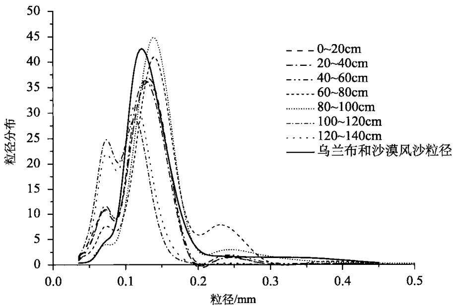  
图22.12 碱柜河道钻孔泥沙粒径分布

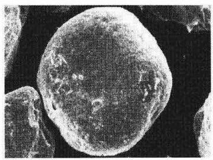

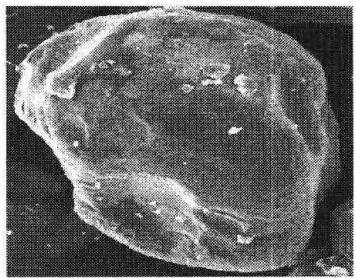

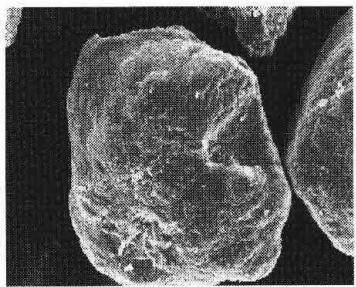

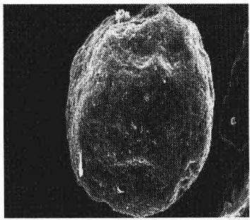  
图 22.13 河道钻孔粗泥沙颗粒表面SEM形貌

十大孔兑西柳沟沟口黄河河道7m钻孔资料表明，该段河道淤积泥沙中63.3%的泥沙粒径大于0.1mm（图22.14），随机选取大于0.1mm的粗沙样品中72.2%的SEM形貌具有蝶形和新月型撞击坑槽，V型坑，光滑或椭圆形的边缘，硅质沉淀等沙漠沙特征（图22.15），27.8%表现为不规则的尖锐棱角形等础砂岩特征（图22.16）。显然，在十大孔兑影响下的河段，河道淤积的主要是大于0.1mm来源于库布齐沙漠和鄂尔多斯梁地砥砂岩的粗泥沙。

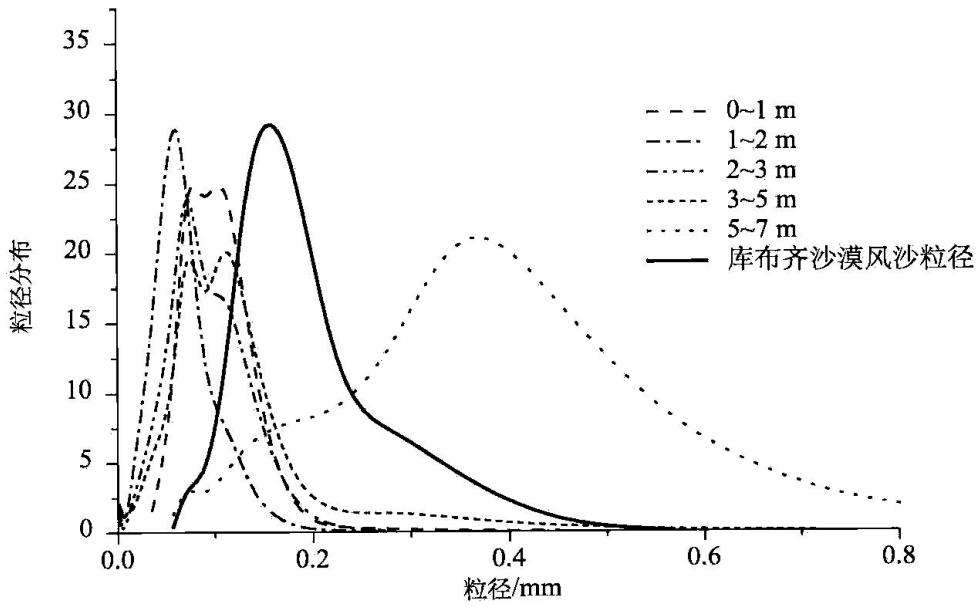  
图22.14 西柳沟沟口黄河河道7米钻孔不同深度的粒度分布

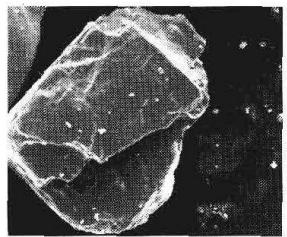

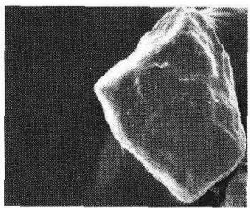

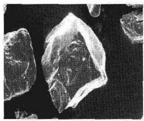

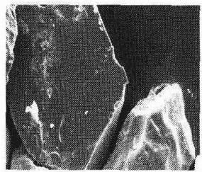

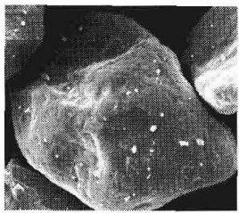

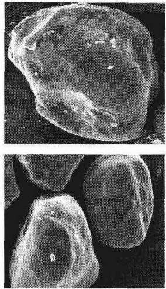  
图 22.15 砒沙岩颗粒表面 SEM 形貌

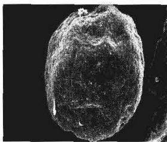  
图 22.16 风沙颗粒表面 SEM形貌

应用大断面监测泥沙资料，结合输沙平衡计算结果表明，黄河内蒙古河段在1954年至2000年期间淤积泥沙总量约20.1亿t，其中大于0.1mm的粗沙为15.2亿t，占总量的75.6%。期间，乌兰布和沙漠贡献大于0.1mm的粗沙6.1亿t，库布齐沙漠贡献5.82亿t，十大孔兑础砂岩梁地贡献3.28亿t。另外，近5亿t淤积在内蒙古河道小于0.1mm的泥沙目前还不能进行有效的分离，即可能源于上游的黄土高原水土流失产生的泥沙，也可能源于鄂尔多斯风沙高原风水两相侵蚀产生的泥沙。

## （三）黄河内蒙古河道水沙变化对上游水库运行的响应机制

河道水沙变化对流域产沙产流环境和上游水库运行存在复杂的响应机制，水库下游各河段依据其不同的侵蚀淤积环境，在时间和空间上表现出相应侵蚀和淤积特性。一般，河道在邻近水库区域匀呈现出侵蚀下切和床底物质粗化现象，而离水库愈远，河道侵蚀淤积特性主要取决于支流向干流输运泥沙量的大小及组分。黄河内蒙古河段在上游水库修建以前河道处于淤积状态，平均淤积速率在1954～1960年间约 $1 0 7 \times 1 0 ^ { 6 } ~ \mathrm { t / a }$ 。在此期间，黄河输沙能力平均约 $7 . 3 3 ~ \mathrm { k g / m ^ { 3 } }$ ，并且大于0.1mm的粗沙（AS）和小于0.1mm的泥沙（FS）都处于淤积状态，平均淤积速率分别约为 $3 8 \times 1 0 ^ { 6 } ~ \mathrm { t / a }$ 和 $6 9 \times$ $1 0 ^ { 6 } \ \mathrm { t / a } _ { \circ } 1 9 6 1 { \sim } 1 9 6 8$ 年期间为盐锅峡和三盛公水库运行期，黄河输沙能力降为 $6 . 2 7 ~ \mathrm { k g } / \mathrm { m } ^ { 3 }$ ，FS表现为侵蚀状态，年侵蚀速率为 $3 3 . 5 \times 1 0 ^ { 6 } ~ \mathrm { t / a }$ ，AS表现为淤积状态，年均淤积速率为 $2 8 . 9 \times 1 0 ^ { 6 } ~ \mathrm { t / a }$ 。黄河内蒙古河段河床发生粗化和侵蚀下切现象，年侵蚀速率为 $4 . 5 \times 1 0 ^ { 6 } ~ \mathrm { t / a } ,$ 。1968～1986年期间是刘家峡和青铜峡水库运作时期，黄河河道输沙能力进一步下降为 $3 . 9 1 ~ \mathrm { k g } / \mathrm { m } ^ { 3 }$ ，黄河河道开始淤积，年均淤积速率为 $1 1 . 6 \times 1 0 ^ { 6 } ~ \mathrm { t / a }$ 。并且黄河泥沙 AS淤积速率$( 2 9 . 2 \times 1 0 ^ { 6 } ~ \mathrm { t / a } )$ 大于FS侵蚀速率 $( 1 7 . 5 \times 1 0 ^ { 6 } ~ \mathrm { t / a } )$ ，黄河河床粗化现象进一步加强。在1989～2000年期间，由于龙羊峡水库开始运行，且大量黄河水被引出用于灌溉，黄河河道输沙能力减少到近50年来最低值 $3 . 4 8 ~ \mathrm { k g } / \mathrm { m } ^ { 3 }$ ，河道AS和FS重新开始沉积，淤积速率分别为 $3 5 \times 1 0 ^ { 6 } ~ \mathrm { t / a }$ 和 $4 2 \times 1 0 ^ { 6 } ~ \mathrm { t / a }$ 。黄河河道淤积程度接近河道在没有水库运作时自然条件下的淤积程度。

## （四）结 论

黄河内蒙古河道粗泥沙主要来源于水土流失严重的三大粗泥沙源区：十大孔兑砒砂岩梁地、库布齐沙漠和乌兰布和沙漠。长期以来，由于缺乏足够的认识和相应的水土保持项目，黄河内蒙古河段十大孔兑（库布齐沙漠区）和乌兰布和沙漠一直没有得到应有的治理。尤其十大孔兑的库布齐沙漠和乌兰布和沙漠，随着沙漠的进一步东移，每年向黄河注入的风沙量将逐年呈现出迅速增长的趋势。由此可见，在20世纪90年代以前，以皇甫川一无定河区段为核心的黄河多沙粗沙区，在经过近几十年的水土保持治理后，多沙粗沙区的中心已变成了黄河内蒙古河段的十大孔兑（库布齐沙漠区）区域和乌兰布和沙漠区域。对该区域的治理已成为今后黄河粗泥沙区治理的重点。

# 第二十三章 西南岩溶石漠化区

第一节 现 状

## 一、自然地理与社会经济

## 1. 概况

本次考察的范围是以西南岩溶分布中心贵州为中心，包括广西和云南东部，土地总面积55.3万km²。西南岩溶地区是珠江的源头（云南曲靖市境内乌蒙山脉的马雄山）、长江的重要补给区，水土保持的地理位置非常重要。区内属于长江流域的18.36万km²，属于珠江流域的34.53万km²。

该地区是少数民族集中分布区，与东南亚各国接壤的边境地区，同时也是百色起义、遵义会议等红色革命区。

西南岩溶区地处热带、亚热带，北回归线从广西境内通过，东南临南海，是太平洋东南季风向大陆推进的入口，云南南部受印度洋西南季风的影响。而该地区的地势由东南向西北依次升高，最低平均海拔是北海市21m，最高平均海拔是云南省东部会泽县2273m。西南岩溶区的年平均气温由西北到东南依次由7.5～10℃递升到20～22.5℃；而年平均降雨量则依次由750～1000 mm递升到2000～2250 mm。

## 2. 地质、地貌

据1：50万地质图的统计，考察区广泛分布着古生界（寒武系一三叠系）古老坚硬的碳酸盐岩。碳酸盐岩的出露面积25.15万km²，占考察区面积的45.45%。若以县作为统计计算的单元，则区内220县，其中碳酸盐岩出露面积≥30%的岩溶县158个，占自然县数的72%。

考察区内的总体地势是，由东南向西北逐步升高，根据地势的空间分布和地貌（尤其是岩溶地貌类型）可分成3个大区：云贵高原（平均海拔1500～2500m）、高原向广西盆地过渡的斜坡（平均海拔500～1500m）、厂西盆地（平均海拔<500m）；相对应的岩溶地貌类型则分别是云贵高原一断陷盆地；斜坡区一岩溶谷地、峰丛洼地、丘丛谷地；广西盆地—峰林平原、孤峰平原、峰丛洼地。

## 3. 土壤、植被

考察区由碳酸盐岩风化形成的土壤称为石灰土，其理化性质有别于地带性的红壤，其成土速率十分缓慢，形成1m厚的土层需要几十万到几百万年。而土壤理化特征则表现为富钙、偏碱性，有效营养元素供给不足和不平衡性，土壤质地粘重，土壤有效水分含量偏低。而在石灰土上发育的植被为具有旱生、石生和喜钙的岩溶植被，岩溶植被的自然生产力低，林地恢复速率缓慢，但考察区内仅存的广西弄岗自然保护区、广西木伦自然保护区、贵州茂兰自然保护区为石漠化综合治理提供了种质基因库。

## 4. 水文条件

长期的岩溶作用形成考察区地表、地下双层岩溶水文地质结构，存在较大的地下空间、排水网。据1：5万地形图、1：20万水文地质图的统计，贵州岩溶区地表河网密度平均为 0.447 km/km²，非岩溶区为0.626 km/km²，常年有水、长度>2km的地下河共1130条，平均密度0.49km/km²，总长度6246km。地表水系不发育、或发育不完整，多封闭洼地、落水洞、漏斗；大气降水很难在地表滞留较长的时间，雨停即干，尤其是土壤、植被丧失的石漠化区，植物经常遭受季节性的干旱。在解决岩溶石山区人畜饮水中，普遍发育的岩溶表层带具有重要的地位。

## 5. 社会经济

社会经济活动就是人类利用自然生态系统所提供的各种资源和自然条件，通过社会生产制造出人类生存和社会发展所需的产品，生产过程是借助人类的劳动作用于自然资源，并改变其性质和形态，以形成适合人类消费的物质、生产资料的过程。在这一过程中运转的物质和能量都源于生态系统。岩溶区为受地质条件制约的脆弱生态环境，其生态承载力低于同纬度的非岩溶环境。不合理的人类活动使原本脆弱的岩溶环境遭受破坏形成生境恶劣的石漠化景观，当地居民陷入生态、经济双重危机。“八七”扶贫确定的国家级贫困县在考察区内共有102个，其中贫困县与岩溶县吻合的有85个县。

## 二、水土流失状况

## (一）水土流失的特点

## 1. 易发性

（1）岩溶区土壤流失的量远远超过碳酸盐岩风化成土的量，碳酸盐岩的成土物质，先天不足，其酸不溶物通常很低。黔、桂地区碳酸盐岩风化成土速率为 $6 . 8 { \sim } 0 . 2 1 \ \mathrm { g / ( m ^ { 2 } \bullet \ a ) }$ 。而根据流经贵州、广西主要岩溶区河流的悬移质估算的土壤侵蚀模数为 $5 6 { \sim } 1 2 9 \mathrm { ~ t / ( k m ^ { 2 } \ ^ { \bullet } \ a ) }$ ，即土壤侵蚀量是岩石风化成土量的几十至几百倍。

（2）土壤剖面结构的缺陷。从岩溶区的土壤结构看，碳酸盐岩母岩与土壤之间，缺失C层，土壤与岩石之间呈明显的刚性接触，两者之间的亲和力和黏着力差，一旦遇大雨，极易产生水土流失和块体滑移。

（3）地形破碎、坡耕地比例大。与同纬度非岩溶区地形相比，岩溶区地形破碎、崎岖不平，坡耕地是其耕地资源的重要组成部分。如贵州省 ${ > } 1 0 ^ { \circ }$ 坡度面积占土地面积的85.76%， ${ > } 2 5 ^ { \circ }$ 的坡地面积则占到35.07%； $\overrightarrow { \vert \vert \vert } > 2 5 ^ { \circ }$ 的坡耕地面积占耕地面积的19.36%。据有关研究资料表明，坡地的水土流失率与陡坡耕地的比例之间呈显著正相关，相关系数可达0.77。

鉴于以上特点，在很多西南岩溶区已经到了无土可流，石漠化面积逐年增加的状况（图23.1）。

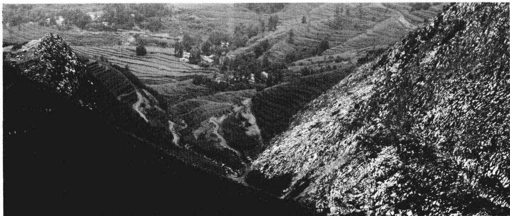  
图23.1 贵州省盘县四格乡八担山村岩溶石漠化景观与碎屑岩区坡耕地景观的对比

## 2. 过程的复杂性

与非岩溶区相比，岩溶区的地下水系发育，其水土流失的主要表现形式为：降雨携带泥沙首先进入地下管道、地下河，然后再出露地表，汇入地表河。如云南省开远市南洞地下河是一流域面积超过 $1 \ 0 0 0 \ \mathrm { k m ^ { 2 } }$ 的超大型地下河系统，主流管道长度约75km，年最枯流量大于1亿m³，多年平均流量 $\mathrm { m } ^ { 3 }$ $9 . 4 8 ~ \mathrm { m ^ { 3 } / s }$ ，最大流量 $4 4 . 3 ~ \mathrm { m ^ { 3 } / s }$ ，最小流量 $1 . 4 7 ~ \mathrm { m ^ { 3 } / s }$ 。其水资源制约着草坝 $( 5 7 . 6 ~ \mathrm { k m } ^ { 2 } )$ 、大庄 $( 5 7 . 8 \ \mathrm { k m ^ { 2 } } )$ 、蒙自 $( 2 5 3 ~ \mathrm { { k m } } ^ { 2 } )$ 、鸡街（31km²）和开远盆地 $\mathrm { ( 4 0 ~ k m ^ { 2 } ) }$ 的 $4 3 9 \ \mathrm { k m ^ { 2 } }$ 的土壤资源，但其地下河中的水不仅深埋地下50～150m，使水土资源分割，而且地下河水还携带大量的泥沙，并最终排入南盘江，从1999～2004年的资料看，在雨季，南洞出口处观测到的泥沙含量为 $0 . 1 { \sim } 0 . 3 ~ \mathrm { { k g / m ^ { 3 } } }$ 。在考察期间采集的数据表明：弥勒县南盘江江边大桥(2005-09-02)泥沙含量 $0 . 3 3 ~ \mathrm { k g } / \mathrm { m } ^ { 3 }$ ，而南洞地下河出口（2005-08-31）泥沙含量 $0 . 7 7 ~ \mathrm { k g } / \mathrm { m } ^ { 3 }$ ，是南盘江的2.33倍。

## （二）水土流失的现状、趋势

根据第三次全国水土流失遥感普查（2002年）的数据，考察区内水土流失面积143 064.7 km²，占土地面积的26.3%，其中滇东地区水土流失面积$5 9 ~ 7 4 0 . 7 1 ~ \mathrm { k m ^ { 2 } }$ ，占土地面积的45.2%，贵州省水土流失面积 $7 3 ~ 0 7 8 . 5 6 ~ \mathrm { k m ^ { 2 } }$ 占土地面积的41.52%，广西区水土流失面积 $1 0 \ 3 6 9 . \ 4 3 \ \mathrm { k m } ^ { 2 }$ ，占土地面积的4.38%。若以自然县为统计单元，则占土地面积>10%以上的县均分布在滇东、贵州，而广西只有玉林市水土流失面积 $3 0 7 . 9 ~ \mathrm { { k m ^ { 2 } } }$ ，占土地面积的11.29%。水土流失面积占土地面积的比例 $\geqslant 3 0$ %的严重县共有110个，≥50%的严重县35个， $\geqslant 6 0$ %的严重县13个。 $\geqslant 6 0$ %的严重县分别为六盘水市、鲁甸县、印江土家族苗族自治县、威宁彝族回族苗族自治县、毕节市、沿河土家族自治县、纳雍县、文山县、大方县、罗甸县、织金县、东川市、赫章县。

从水土流失的面积和强度看，考察区内以轻度侵蚀为主，在水土流失总面积中轻度、中度、强度和极强度的侵蚀面积分别占54.24%、34.20%、8.66%、1.22%。轻度与中度之和达88.44%。

从1989年、1999年和2002年三次遥感数据统计看，考察区内轻度以上水土流失面积下降5.8%，强度、极强度水土流失面积分别下降37.22%和55.49%；剧烈水土流失面积基本消除；而轻度、中度水土流失面积分别上升

1.3%和2.4%。

不同的区域其水土流失的变化趋势基本相同：广西区水土流失面积变化在4.71%～4.38%之间，广西区内2002年与1999年相比，不同水土流失强度几乎没有什么变化；而与1989年相比，其极强度、强度、中度水土流失面积减少75.01%、50.02%、35.77%，而轻度水土流失面积增加23.79%。

贵州省水土流失面积占土地面积的比例变化在43.54%～41.54%，其中2002年与1999年间没有大的变化，与1989年相比其极强度、强度水土流失面积分别减少57.63%、46.47%，而中度、轻度水土流失面积增加8.43%、9.17%；由于长江流域对水土流失治理从1988年开始，而珠江流域从2002年开始试点，因此1999年与1989年相对比，珠江流域水土流失面积增加5.60%，长江流域减少8.65%。

滇东水土流失面积占土地面积的比例变化于49.58%～45.67%，其中2002年与1999年间没有显著差异，与1989年相比，轻度、极强度水土流失面积减少13.73%、29.11%，中度、强度水土流失面积增加1.47%、1.15%。

## 1. 石漠化的现状、趋势

石漠化是岩溶区水土流失、生态恶化的极端表现形式。它以岩石越来越裸露为基本特征，其结果是自然生态环境退化、人类生存环境恶化。石漠化的产生，既有自然因素，也有人为因素，因此石漠化可定义为岩溶地区的脆弱生态系统与人类不合理的社会经济活动相互作用而造成植被破坏、水土流失、岩石裸露，具有类似荒漠化景观的土地退化过程和结果。

目前，对西南岩溶石漠化的分级分类没有统一的标准，本报告采用了国土资源部航遥中心的标准为依据，即裸露岩石占总面积的比例为依据：岩石裸露程度 $< 3 0$ %为无石漠化、30%～50%为轻度石漠化、50%～70%为中度石漠化、 ${ \geqslant } 7 0$ %为重度石漠化。

据国土资源部航遥中心石漠化遥感解译数据显示，1999年考察区内轻度以上石漠化面积8.81万 $\mathrm { k m ^ { 2 } }$ ，占土地面积的14.44%，占碳酸盐岩出露面积的34.42%；从分级标准看，轻度、中度、重度石漠化面积分别占石漠化总面积的35.63%、38.58%和25.56%；从空间分布区域看滇东、广西、贵州石漠化面积分别占总石漠化面积的32.15%、36.87%、30.98%。

考察区内石漠化面积 $\geqslant 1 0 0  { \mathrm { ~ \mathbf { k m } ^ { 2 } } }$ 的市县有158个，石漠化面积大于 $2 0 0 \ \mathbf { k m ^ { 2 } }$ 的市县有131个，石漠化面积 $\geq 3 0 0 ~ \mathbf { k m } ^ { 2 }$ 的市县有77个，石漠化面 积 $\geqslant 5 0 0 \  { \mathrm { k m } } ^ { 2 }$ 的市县有57个，石漠化面积 $\scriptstyle \sum 1 0 0 0 \ \mathbf { k m } ^ { 2 }$ 的市县有17个。石漠 化平均发生率（石漠化面积/岩溶面积）为29.29%，高于平均水平的市县有

78个，石漠化发生率大于40%的市县43个。

与1987年石漠化分布的面积相对比，该地区石漠化的面积呈现逐年增加的趋势。1987～1999年，该地区石漠化面积由6.59万km²，增加到8.80万km²，净增2.2万km²，平均每年增加 $1 \ 8 4 0 \ \mathrm { k m ^ { 2 } }$ ，这相当于一个土地面积中等大小的县域，形势非常严重。

石漠化加剧主要发生在贵州、广西两省区。石漠化面积加剧的前10位的县市是贵州省六盘水市、大方县、盘县、毕节；广西区都安、大化、忻城、来宾、靖西、柳江。石漠化加剧率（石漠化加剧面积/碳酸盐岩分布面积）位于前十的市县为，贵州省六盘水市、大方县、盘县、平坝县、晴隆县、望谟县、贞丰县；广西区大化、忻城、融安县。其加剧率分别为41.63%、31.89%、25.67%、24.48%、24.35%、21.73%、20.97%、19.36%、19.28%、19.17%。

## 2. 水土流失的危害

## （1）水土流失导致耕地资源丧失

碳酸盐岩成土过程和土壤结构的特殊性，加上不合理的土地利用，导致岩溶区土壤侵蚀模数由低到高、由高到低，最终石漠化面积的不断扩张的过程，形成边开垦、边流失、边石漠化的恶性循环。正是由于岩溶区水土流失的特点，使岩溶区土壤侵蚀模数绝对量偏低。如在广西境内，分布在碳酸盐岩区的河流输沙模数为50～100t/（km²·a)，是花岗岩区、砂页岩区的1/3\~1/2。

贵州关岭县从1987年与1999年两个时相遥感资料的解译结果显示，与1987年相比，1999年的植被覆盖率上升5.93%，裸露土壤面积下降12.15%，裸露基岩面积上升4.08%。这表明研究区植被在恢复、水土流失总量在减少，但同时期裸岩面积在增加，即石漠化面积在明显上升，水土流失的危害十分严重。

就贵州全省而言，在20世纪50年代森林覆盖率为30%，耕地面积为179.93万hm²；但到了60年代，由于受国家人口政策失误和1958年的“大炼钢铁”和“以粮为纲”的巨大影响，在森林覆盖率下降的同时，耕地面积在60年代达到最大，为206.67万hm²；此后，随着森林覆盖率的下降而不断减少。这一现象从侧面也反映出了该区土壤资源易流失、难保持的特点，因此，该区耕地资源极其宝贵（参见图23.2）。

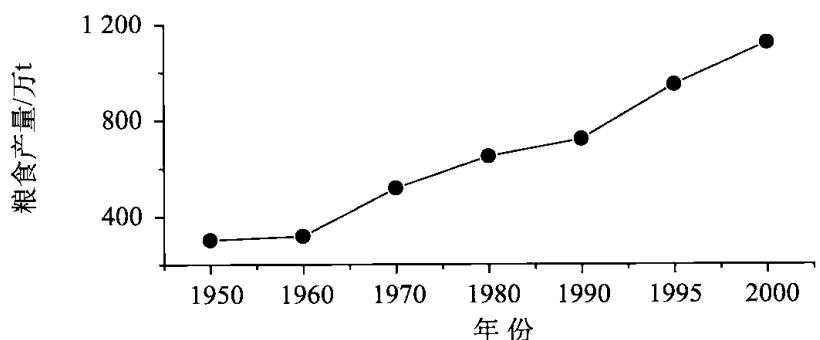

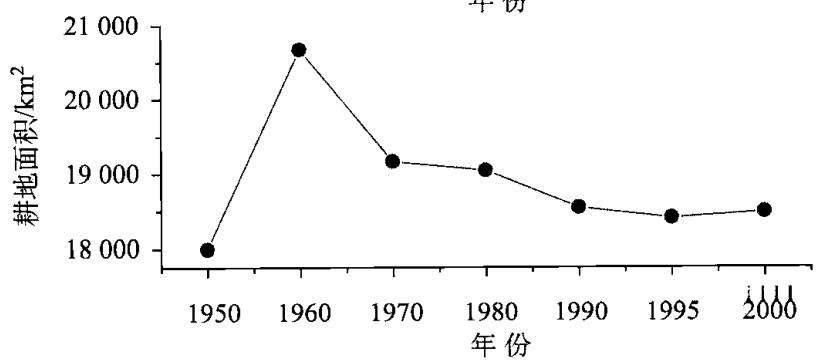

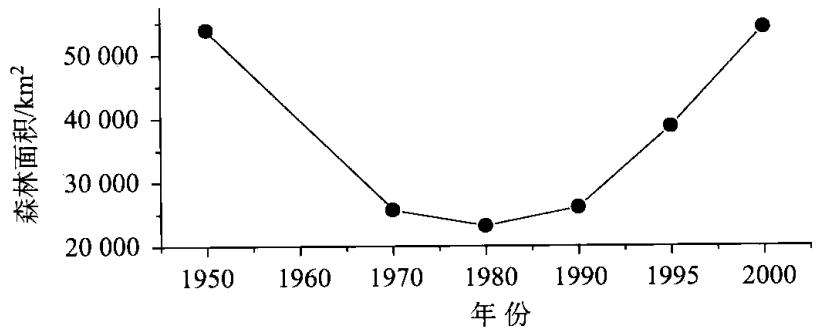

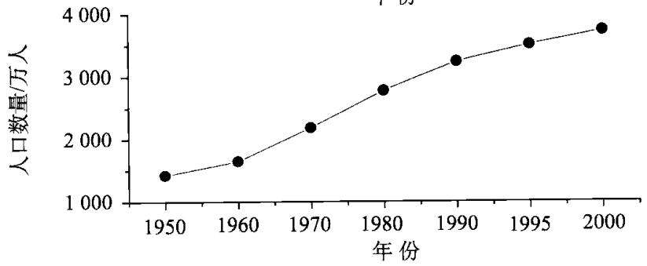

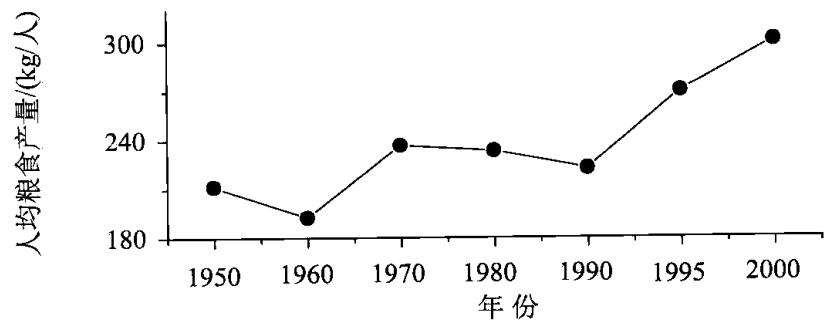

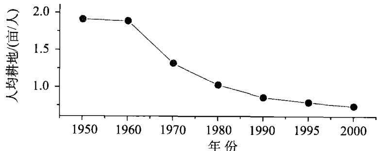

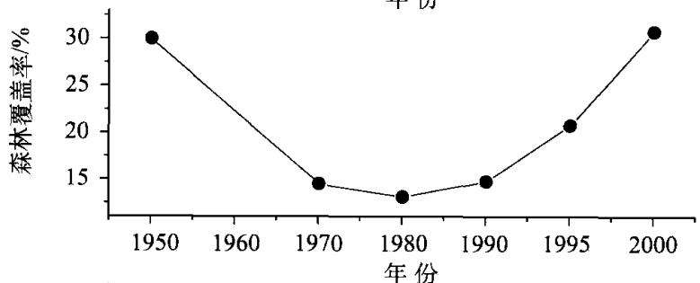

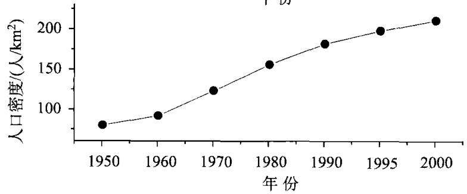  
图23.21950～2000年贵州省人口、耕地、粮食、森林的动态变化

## (2) 水土流失导致旱涝灾害严重

广西岩溶区旱涝灾害严重。据统计广西有效灌溉面积占总耕地面积的54%，其余46%的耕地为靠天吃饭的“望天田”，其中受旱耕地面积90%集中分布在岩溶区。碳酸盐岩出露面积 ${ \geqslant } 3 0$ %的岩溶县，几乎每一个县都有岩溶内涝灾害问题，内涝造成浸没耕地面积6.12万 $\mathrm { h m ^ { 2 } }$ ，占全区易涝面积的16.8%。 $6 7 ~ \mathrm { h m ^ { 2 } }$ 以上连片分布较大洼地的内涝面积近20片，如东兰县的三石—巴纳为 $4 6 9 \ \mathrm { h m ^ { 2 } }$ 、泗孟 $2 0 0 \ \mathrm { h m ^ { 2 } }$ 、巴马县的西山为 $2 0 1 \ \mathrm { h m } ^ { 2 }$ 、风山县的金牙—平乐内涝片面积达 $7 0 3 . 5 \ \mathrm { h m } ^ { 2 }$ 、凌云县的沙里 $2 0 1 \ \mathrm { h m } ^ { 2 }$ 、隆安县的布泉$8 0 4 ~ \mathrm { h m } ^ { 2 }$ 、天等县的龙洞一孔民 $1 0 0 5 ~ \mathrm { { h m ^ { 2 } } }$ 、大新县的福隆 536 hm²。

## （3）水土流失造成水库、河道淤积

虽然岩溶地区水土流失的强度总体偏低，但其造成的水库、河流淤积，缩短水利工程使用寿命不容忽视。广西都安县岩琚水库，建于1974年，到1982年已淤积泥沙15.8万 $\mathbf { m } ^ { 3 }$ ，有效库容量减少29%；百色的百东河水库，1958年建成，1978年淤积泥沙1181万 $\mathrm { m } ^ { 3 }$ ，占有效库容的32%。贵州贞丰管路水库，蓄水库容50万m³，建成后12年后就淤积报废；盘县许家屯水库， $\mathrm { m } ^ { 3 }$ 1958年建成，库容223万m3，集雨面积5.8km²，1986年淤积66万m³，占有效库容的30%。云南丘北县20世纪90年代以来因水土流失造成严重淤积的水库坝塘多达50余座。

## （4）降低土地生产力、导致人口贫困

脆弱的岩溶环境制约着人口密度的分布，表现得最为明显的是广西区，据统计1985年岩溶石山区、非岩溶区的人口密度分别为127人/km²、181人/km²；2000年则为182人/km²、215人/km²，而岩溶石山区的社会经济状况低于全区的平均水平。国家级贫困县28个，其中21个为岩溶县，自治区级贫困县49个，有34个为岩溶县，即70%～75%的贫困人口集中分布在岩溶石山区。

贵州省贫困人口分布与石漠化分布区存在因果关系。2002年的数据显示在贵州省岩溶区的人口占总人口的90.8%，石漠化地区的人口占54.49%；贫困人口岩溶区占89.1%，分布在石漠化区的占62.5%。石漠化区的经济密度46.4万元/km²，比全省的56.6万元/km²低10.2万元/km²。全省48个国家级贫困县，38个为岩溶县（27个分布在石漠化严重县），占79%。滇东24个国家级贫困县，23个县为岩溶县。

## 3. 水土流失原因分析

## (1) 自然因素

双层岩溶水文地质结构。岩溶区地表降雨通过竖井、落水洞、漏斗迅速汇入地下，在岩溶山区，水分的入渗系数为0.3～0.6，甚至高达0.8。地下河不但是当地的主要水源，而且也是制约当地洪涝的咽喉。在枯水季节，由于地表水系不发育，地下水深埋，而导致独特的岩溶干旱，甚至人蓄饮水困难。而雨季来临，持续的降雨，口径有限的落水洞很容易被洪水所携带的泥沙、枯枝落叶等堵塞，引起洪水漫溢，淹没洼地中的耕地和农舍，酿成岩溶内涝。

降雨的时空不均一性。区内属于湿润多雨的季风气候，天然降雨存在空间和时间上的不均一性。空间上受地貌等因素的影响，存在多个多雨区和少雨区，如广西存在6个多雨区：越城岭、大瑶山、十万大山、大明山、云开大山、大容山，年平均降雨量1900～3500mm；6个少雨区：恭城—平乐、来宾一武宣、扶绥一崇左、白色一田东、龙江河谷、云贵边界地带，年平均降雨量1000～1400mm。贵州省也存在3个多雨区、两个少雨区，三个多雨区为：西南部，以织金、六枝、普安、晴隆为中心，其中晴隆县年降雨量

1588mm；东南部，以独山、麻江、雷山和丹寨为中心，其中丹寨县的年降雨量1505mm；东北部，以铜仁地区的东部、武陵山东坡为中心，年降雨量在1300mm以上；2个相对少雨区是大娄山东坡和赤水河下游。在时间上，年降雨量的季节分配十分不均，尤其以滇东为最，5～10月降雨量占全年的85%～95%；贵州省：夏季（6～8月）降雨量约占年降雨量的50%～55%，秋收作物生育期（4～9月）的降雨量约占全年降雨量的80%；广西区：4～9月降雨量占全年的60%～75%。降雨的时空不均，加上岩溶区地表崎岖不平、山高坡陡、土壤与母岩之间缺乏C层，这些导致土层稳定性差，土壤集聚的势能在暴雨之下很容易释放，从而发生侵蚀。

植物生产量低，生长速率缓慢、易破坏，土层暴露易侵蚀。岩溶区植被的脆弱性可从两方面认识：其一，保存完好的森林群落其生物量低。贵州茂兰岩溶原始森林区的典型估测，其生物量不仅低于同纬度的非岩溶区森林，也低于较高纬度的温带针阔混交林，只相当于亚热带半干旱地区的生产量。其二，受损的岩溶生态系统植被恢复困难。广西各县现有森林覆盖率与其岩溶面积的比例成负相关；贵州省从20世纪80年代至1999年，森林植被不断增加，森林覆盖率达30.83%，但森林面积的32.8%、蓄积量的42.6%集中分布在黔东南的非岩溶区，而岩溶面积占土地面积≥50%的县市的森林覆盖率为14.84%；岩溶面积占土地面积30%～50%的县市森林覆盖率为21.28%。

## (2) 人为因素

人口超载给脆弱的岩溶环境造成巨大的压力。自1949年以来，贵州人口一直处于增长状态，人口密度从20世纪50年代的80人/km²，发展到2000年的212人/km²（图23.2）。据相关研究表明，丘陵山地每增加1口人，社会就需要增加基本农田0.067hm²、造林0.469 hm²、种草0.1675 hm²，并承担500元才能维持生态平衡。从贵州耕地的变化看，50～60年代，人口上升虽然很快，但人均耕地面积保持在0.124hm²/人的高水准，这主要是大量林地、草地的开垦，使绝对耕地面积极大提高，由18000km²增加到21 000 km²，但付出的代价是森林覆盖率由20世纪50年代末的30%降低到1984年的12.6%。粮食产量在农业技术不断改进的前提下，单位面积的粮食产量不断增加，但人均粮食产量一直徘徊在220～250kg/人，只有到了2000年，人均粮食产量才突破300kg/人，但距温饱水平（350kg/人）和小康水平（400kg/人）还有很大的差距。据1999年的估算，贵州温饱型人口承载力3237万人，超载271万人；小康型人口承载力2428万人，超载1080万人。

坡耕地开垦造成水土流失、石漠化加剧。贵州贞丰县鲁贡河小流域，流域面积 $1 4 ~ \mathrm { k m } ^ { 2 }$ ${ \geqslant } 5 ^ { \circ }$ 的坡耕地 $5 . 2 3 ~ \mathrm { { k m ^ { 2 } } }$ (其中 ${ \geq } 2 5 ^ { \circ }$ 的陡坡耕地 2.54 km²)，占流域面积的37.8%，而水土流失面积 $5 . 2 4 ~ \mathrm { k m ^ { 2 } }$ ，占流域面积的38%，每年水土流失量3.32万t，相当于坡耕地年流失表土0.5 cm。在岩溶石山区土壤覆盖层厚度多<50cm，如果考虑到成土速率，则按此速率坡耕地的土壤在10～15年就流失殆尽。关岭花江峡谷岩溶区，50～60年代开垦的坡耕地，历经30多年，大部分已沦为强度、中度石漠化，有的已完全丧失了生产力。针对贵州特定的岩溶环境条件，土地垦殖率越高，意味着坡耕地占有的比例就越高，所带来的水土流失就越严重，石漠化的现象就越容易出现。因此贵州9州市土地垦殖率与土地石漠化率之间呈现正相关。

工业污染使石漠化区的生态恢复面临巨大的困难。贵州是一个拥有较多小煤窑、小铅锌矿的省份，能源结构以煤为主。开矿、冶炼、燃煤等造成大气污染，形成严重的酸雨。1984年从全省44个监测点收集到的1365个样品中， $\mathrm { p H } \leqslant 5 .$ 6的样品845个，占总数的62%。贵阳、遵义、安顺、都匀在当时就已成为中国最严重的酸雨区之一。进入90年代，随着工业的发展，全省$\mathrm { p H } { \leqslant } 5$ 的酸雨分布区由1984年的7.3万 $\mathbf { k m } ^ { 2 }$ 扩大到1992年的9万 $\mathbf { k m ^ { 2 } }$ ，增加23%，其中 $\mathrm { p H } { \leqslant } 4 . 5$ 的酸雨分布区由1984年的0.72万 $\mathrm { k m ^ { 2 } }$ 扩大到1992年的4.68万 $\mathrm { k m } ^ { 2 }$ ，增加5.5倍。酸雨的发生不仅损伤农田生态系统，在岩溶区更是杀死藻类、地衣、苔藓等先锋植物的罪魁祸首，导致岩溶石山区石漠化严重、植被恢复十分困难。

## 三、水土保持现状

## 1. 水土保持取得的成效

近年来，在西南石漠化地区开展了退耕还林、“长治”工程、“珠治”试点工程、天然林保护工程、生态重建科技攻关等与水保密切相关的项目。取得了显著的成效，如：

（1）贵州“花江喀斯特峰从峡谷治理示范工程”。通过在山坡下部采取坡改梯，种植花椒和砂仁等具有市场优势的经果林，修建小型水利水保工程；在山坡的上部加强管护，发挥生态的自我修复能力，石漠化的发展得到有效遏制，治理区贫困人口由1997年的3072人减到2005年的764人，人均纯收入由651元增到1800元，林灌覆盖率由14.16%增到21.29%。国家领导人和有关部委的领导、专家、院士曾多次到此视察、调研。

（2）贵州关岭县龙洞小流域“珠治”试点工程。2004年10月开始实施，投资132万元，完成治理水土流失面积 $6 3 9 . 3 \ \mathrm { h m } ^ { 2 }$ ，其中：完成水土保持林

205.5 hm²，经果林 102.9 hm²，封育治理 290.9 hm²，中药材基地建设3.3 hm²；坡改梯工程40 hm²，作业便道4040 m；蓄水池40个，沉沙池28个，沟渠6800m，拦砂坝2座；沼气池22口；宣传碑6块，永久性宣传标语4幅。至2005年7月，新增林草面积308.4hm²；蓄水池40个，配套沟渠工程，解决农村用水和保证了78.6hm²耕地的高产稳产，每年可新增直接经济效益2.36万元；40hm²坡改梯的建设，每年可净增经济收入2.49万元；一年可供1.1万m³沼气，解决22户燃料、肥料问题，提高了土地单产，降低了劳动强度，使富余劳力外出务工赚钱，既提高了土地承载力，又发展了山区经济。昔日的荒山秃岭披上了绿装；减轻了泥石流和旱、涝等自然灾害对“三农”的威胁，在提高土地利用率和生产效率的同时，减少了龙洞水库淤积。

（3）云南宣威靖外乡小流域治理“长治”工程。1984年开始实施，工程措施与生物措施结合，进行水土流失综合治理，使森林覆盖率达到76.4%，年均控制土壤流失量4500t，恢复农田74.37 hm²，保护耕地321.6 hm²，曾经干涸的16 条泉重新出流，高产稳产田从 60.3 hm²增加到 341.7 hm²。

(4）广西平果果化生态重建国家科技攻关示范区。2001年底开始实施，面积10km²，工程投入200多万元，建设峰丛洼地立体生态农业模式。至2005年底，开发表层岩溶水3万m³/a，沼气池132个，植被覆盖率由10%增加到70%，土壤侵蚀模数由1500 t/（km²·a）下降到 $5 0 0 ~ \mathrm { t / ( k m ^ { 2 } \cdot { a } ) }$ ，农民人均收入由686元增加到1470元。并开发了苦丁茶、火龙果、木豆、澳洲坚果等新的生态产业。

## 2. 主要经验

（1）以小流域为单位，实行山、水、林、田、路统筹规划，综合治理；

（2）因地制宜，分类治理，形成模式；

（3）多部门联合，各投其资，各记其功；

（4）以治水为龙头，解决工程性缺水问题；

（5）以坡耕地的综合整治为突破口；

（6）以人为本，生态建设与经济协调发展。

石漠化与贫困是一对孪生兄弟，在岩溶石漠化治理过程中，水土保持与发展生态农业和庭院经济结合，要以生态环境建设为切入点，针对种植结构单一、耕作粗放和群众贫困的特点，把石漠化治理与农村产业结构调整密切结合，以增加群众收入、促进农民脱贫致富为重点，因地制宜发展金银花、苦丁茶、花椒、砂仁等具有市场优势的经济林果，在房前屋后发展庭院林下养鸡、鹅等，并以此培育和形成生态产业，增加群众收入。

然而，据国土资源大调查成果，近十年来，虽然在石漠化和水土流失防治方面取得了成绩和经验，由于投入不足，没有开展因地制宜的综合治理专项工程，石漠化得到治理的面积只有5000km²，而石漠化增加的面积却高达2.2万km²，以每年2.1%的速度扩大，呈局部好转、总体恶化趋势，形势依然非常严峻。

## 3. 存在的主要问题

## （1）没有认识到岩溶石漠化地区水土流失的特殊性和严重性

西南岩溶地区与黄土高原和其他地区不同，除了坡面侵蚀外，水土还通过落水洞向地下河流失。但落水洞、地下河的水土流失没有引起水保部门足够的重视。

其次，土壤侵蚀模数评价指标不足以说明岩溶石漠化区水土流失的严重性，因为这里大多数地区已几乎无土可流，但每流失一点就丧失一点耕地，形势非常严峻。以土壤侵蚀模数评价指标获得的数据来说明一些石漠化区的水土流失弱的观点应当改正。

## （2）水保工作的科技含量总体偏低，因地制宜不够

水保工作几乎没有结合岩溶区特点的调查进行。缺乏岩溶专业科技人员参加岩溶石漠化区的水保工作甚至农业的发展，所以难以找准迅速有效的措施，甚至采取了错误的办法。如多数水柜的建设没有结合表层岩溶水，退耕还林的树种没有选择当地已有的名特优树种，没有针对岩溶区土壤的特殊性施肥和灌溉。一些地区盲目实施工程，成效低，甚至劳而无功。

## （3）水土保持的资金投入不足

石漠化地区水保工程内容多、量大、难度大，地方政府和居民又非常贫困，主要依赖国家和省市的投入。比较有成效的工程至少需要15万元/km²。而我们考察所见的大多数水土流失综合治理工程只投入1万元/km²左右，成效差，没有可持续性。

## 第二节 分 区

## 一、分区原则和方案

## 1. 分区原则

滇东、黔、桂岩溶石漠化区环境差异大，并因此影响水土流失的方式和

强度，所以水土流失防治分区主要根据自然环境条件进行，主要分区原则：

(1）不同区反映不同区域水土流失特征及地质、地貌、水文和生态环境条件等主要影响因素的差异性；而且，不同区水土流失防治措施有较大差别。

(2)同一区内岩溶地质地貌条件和岩溶生态环境地质问题具有相似性；

（3）同一区内影响水土流失的主要自然条件（地质地貌、气候、水文、土壤、植被等）和社会经济条件基本一致。

(4）同一区水土流失方式和侵蚀强度大致相同，水土流失治理方向、治理措施和土地利用方式基本相似。

（5）区划界线与自然边界保持一致性，尽可能地照顾行政区域的完整性和地域的连续性。

## 2. 分区方案

以袁道先院士提出的西南岩溶四大类五亚类环境区（图23.3）为基础，进一步考虑到地势、地质岩性分布、岩溶地貌、石漠化、水土流失等特征的空间分异（见图23.4～图23.8）。

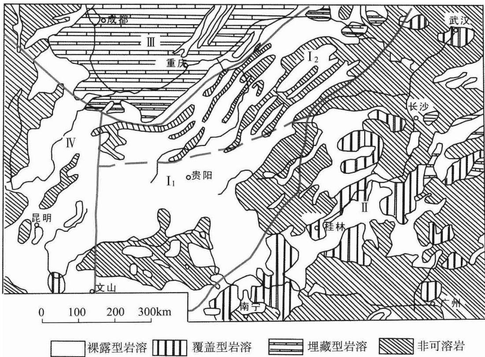  
图23.3 中国西南岩溶环境类型分区图（据袁道先)

I1.滇、黔、桂新华夏系一级隆起带纯碳酸盐岩裸露型岩溶区，I2.黔、渝、鄂、湘新华夏系一级隆起 带碳酸盐岩与非碳酸盐岩互层裸露型岩溶区，Ⅱ．湘桂沉降带-覆盖型岩溶区，Ⅲ川南重庆沉降带-埋藏 型岩溶区，Ⅳ.滇东断陷盆地及山地岩溶区

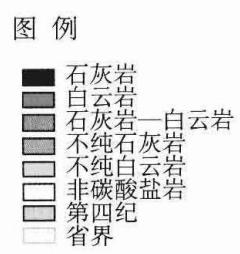  
图23.4 西南岩溶区由各县平均海拔生成的地势图

(1) 地势  
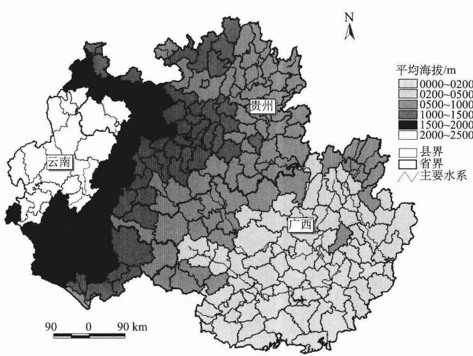  
从各县平均海拔生成的地势图也可以大致看出：平均海拔≤500m的广西盆地；500\~1500m的斜坡地带和1500\~2500m的云贵高原。

## (2) 地层岩性

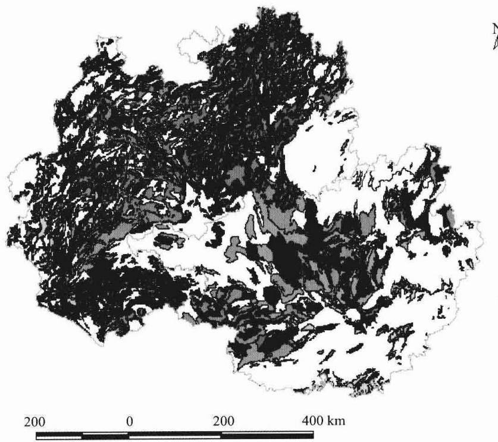  
从碳酸盐岩岩性层组类型分布特征可分出：滇东南一桂一黔南，石灰岩连片分布区；黔中石灰岩一白云岩连片分布区；黔东北白云岩、石灰岩与碎屑岩互层区；黔西北—滇东—滇西北不纯石灰岩、石灰岩一白云岩散落分布区。  
图23.5 西南岩溶区碳酸盐岩岩性层组分布图

## （3）岩溶地貌

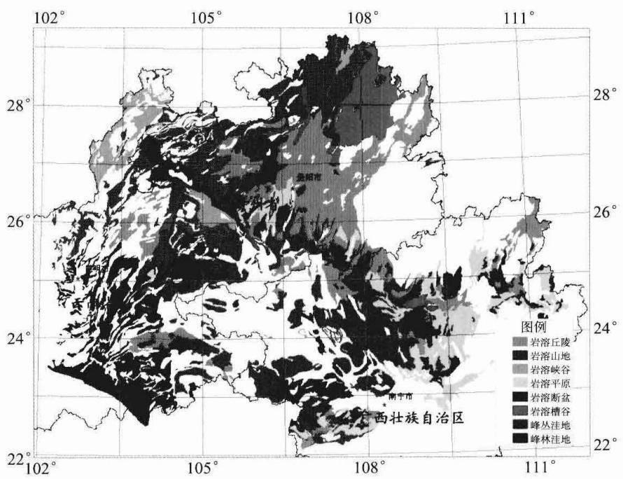  
断陷盆地主要分布在滇东；岩溶槽谷主要分布在黔东北、岩溶峰丛(林)洼地主要分布在桂中、桂西、滇东南、黔南；岩溶峰林平原主要分布在桂中、桂南、桂东北；岩溶峡谷主要分布在黔西、滇东北。  
图23.6 西南岩溶区地貌类型空间分布图

## (4) 石漠化

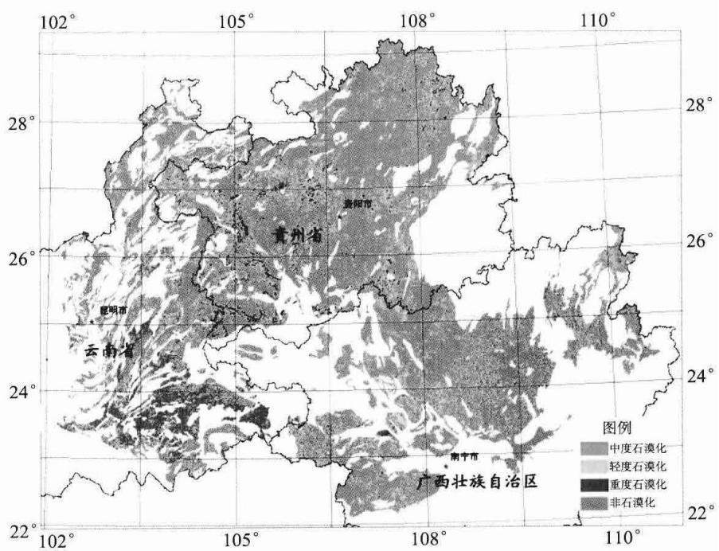  
石漠化最为严重的位于滇东南，其次为滇东、黔西、黔西南和桂中、桂西南、桂东。以峰丛洼地、岩溶峡谷和断陷盆地集中分布。  
图23.7 西南岩溶石漠化分布图

(5) 水土流失  
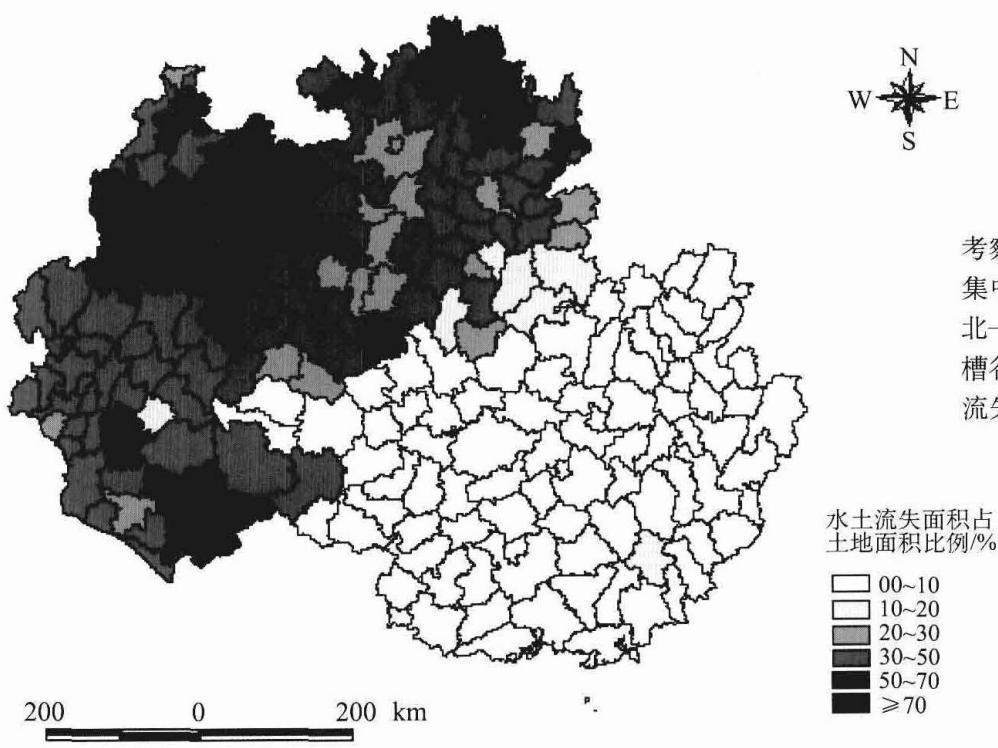  
考察区内水土流失严重县集中分布在滇东南、滇东北—黔西峡谷区、黔东北槽谷区。整个广西区水土流失轻微，值得质疑。

图23.8 西南水土流失分布图（轻度以上水土流失面积占土地面积的比例）

从以上分析，本地区的生态环境首先受到地势的影响，地壳运动形成本区域三个不同的地域单元：云贵高原、广西盆地和斜坡地带。其气候条件由东南至西北海拔每升高100m，气温降低 $0 . 4 { \sim } 0 . 5 ^ { \circ } C$ ，而降雨量降低30～40mm；岩溶地质条件的差异，导致水循环、地貌类型的差异；而地貌类型制约着区域的水土资源格局和社会经济的发展。故本报告中对水土保持治理分区，主要依据了岩溶地貌类型，综合考虑地势、地质、石漠化和水土流失状况，将考察区划分为六个区：①岩溶高原区；②岩溶峰丛洼地区；③岩溶断陷盆地区；④岩溶峡谷区；⑤岩溶峰林平原区；⑥岩溶槽谷区。各区的分布范围见图23.9。

## 二、分区特征概述

六个区的面积、水土流失面积、石漠化面积和碳酸盐岩面积见表23.1。其中，水土流失和石漠化问题都很最突出的是岩溶峰从洼地和岩溶峡谷区，其次是岩溶断陷盆地和岩溶高原；岩溶槽谷区水土流失严重，但石漠化程度不太突出。但各区由于自然条件和经济条件不同，所以水土流失的特点、危害和影响因素存在差异（表23.2）。

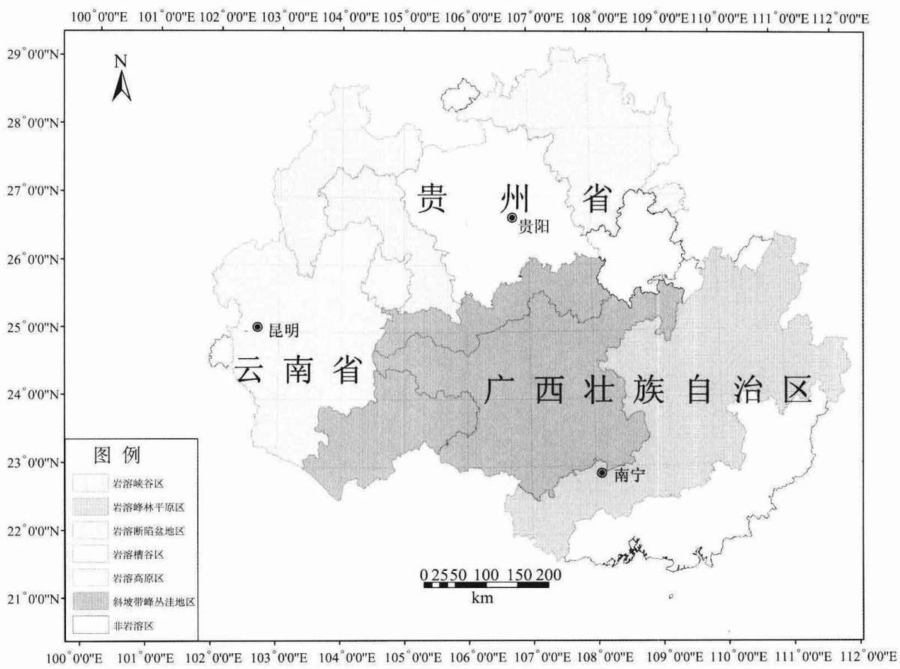  
图23.9 西南石漠化区水土保持分区图

表23.1 西南石漠化区各分区水土流失和石漠化面积统计
<table><tr><td colspan="6"></td></tr><tr><td>分区名称</td><td>分布</td><td>总面积/km²</td><td>人口/万</td><td>水土流失 面积/km²</td><td>石漠化 面积/km²</td><td>碳酸盐岩出 露面积/km²</td></tr><tr><td>岩溶峰 丛洼地</td><td>滇东南、 桂西北、黔南</td><td>136 107.8</td><td>1 557.26</td><td>25 730.27</td><td>29 326.15</td><td>71 116.36</td></tr><tr><td>岩溶峡谷</td><td>滇东北、黔西</td><td>49 801.92</td><td>1 036.44</td><td>26 191.09</td><td>11 192.22</td><td>34820.87</td></tr><tr><td>岩溶断陷盆地</td><td>滇东黔西</td><td>77 105.67</td><td>2 208.59</td><td>32 932.94</td><td>18 045.76</td><td>41 369.98</td></tr><tr><td>岩溶高原</td><td>贵州中部</td><td>55 640.19</td><td>1 738.27</td><td>22 822.54</td><td>13 704.48</td><td>50 168.94</td></tr><tr><td>岩溶峰林平原</td><td>桂东南</td><td>103 018.6</td><td>2 172.60</td><td>3 927.37</td><td>11 230.94</td><td>48 927.61</td></tr><tr><td>岩溶槽谷</td><td>黔东北</td><td>51 103.36</td><td>989.10</td><td>23 417.14</td><td>5 913.65</td><td>38 521.22</td></tr></table>

表23.2 西南石漠化区各分区水土流失特点、危害及影响因素
<table><tr><td>分区名称</td><td>水土流失特点 水土流失危害 主要影响因素</td></tr><tr><td>岩溶峰 以落水洞为中心；坡地石漠化， 丛洼地 表层岩溶水漏失；地下河淤积</td><td>地形结构、脆弱环境、 耕地减少、质量下降， 贫困、人口压力、水保 干旱缺水，内涝 设施</td></tr><tr><td>岩溶峡谷 表层岩溶水衰竭；峡谷水浑浊</td><td>山坡土壤被冲刷成重度石漠化， 耕地逐渐丧失，严重干 地形坡度、脆弱环境、 旱缺水，下游水库淤积 人口压力、贫困、降雨</td></tr><tr><td>岩溶断 陷盆地 下水</td><td>周边山地石漠化，表层岩溶水漏 山区缺水、耕地退化， 土地利用方式、地质、 失；盆地河谷侵蚀，并影响地 山间水库淤积，盆地地 地貌条件、水保设施 下水污染</td></tr><tr><td>山峰土壤侵蚀石漠化，河谷两岸 岩溶高原 土壤侵蚀最严重，地下河淤积</td><td>耕地减少、质量下降， 人口压力、产业结构、 内涝严重 水保设施</td></tr><tr><td>岩溶峰 土壤侵蚀以河沟蚀为主，地下水 林平原 漏失、水文下降</td><td>形成岩溶干旱，岩溶 人口压力、地下岩溶化 塌陷 程度，降雨</td></tr><tr><td>岩溶槽谷 溶区山峰石漠化、落水洞堵塞、 地下河淤积</td><td>非岩溶区土壤侵蚀至岩溶区，岩 洼地内涝，下游水库淤 地质、地貌结构，产业 积并缺水 结构、水保措施和设施</td></tr></table>

各区的自然条件和环境特点简述如下。

## 1. 岩溶峰丛洼地区

广泛分布于黔南、桂西北、滇东地区，地处云贵高原周围的斜坡地带，海拔主要为300～1200m，岩石主要为厚层、坚硬的纯碳酸盐岩。地貌主要为岩溶峰丛洼地，大面积联片分布，峰丛洼地的石山陡峭，洼地深陷，形成封闭的地形，其间岩溶裂隙、漏斗、落水洞、洞穴广布，为典型的以落水洞为核心的地下排水系统。

峰丛洼地石漠化非常严重。山坡上部和山峰多为重度石漠化区，岩石大面积裸露，为西南岩溶区石漠化面积最大的岩溶流域类型，而且治理难度很大。由于石漠化，地表于旱缺水；由于区内地下水埋深较大，地表干旱缺水严重。附近的红水河等河流因河谷深切，难以解决两岸峰丛洼地的缺水问题。区内人畜饮水通常极为困难，耕地普遍没有灌溉水系统。

由干纯碳酸盐岩造壤能力很低，土壤贫瘠，以致耕地资源匮乏，耕地主要分布于洼地底部、山麓和山坡下部，很多部位已无土可流，洼地底部虽然土壤较厚但常受淹；山麓和山坡耕地多为石旮旯地。土地瘠薄，使粮食单产低于3000kg/hm²，农业人口年平均收入普遍不足700元；大部分人生活在贫困线之下，为我国最贫困的地区之一。所在县绝大多数属国家级贫困县。而且，由于峰丛洼地为封闭而地形起伏大的地貌单元，修公路困难，所以很多地区没有公路，为自给自足的小农经济和相对比较封闭的文化体系，经济和文化均很落后。

## 2. 岩溶峡谷区

峰丛洼地西北面为深切河谷，如南盘江、北盘江、红水河等，形成岩溶峡谷，峡谷的两岸，上部为陡坡，坡度20°～80°不等，山顶为石峰，下部为近乎直立的峭壁。以河谷为中心，两岸陡坡形成坡面排水系统。但只有下雨时有快速的沟谷水流，其余大部分时间无水。局部地段有小的表层岩溶泉水，但出流时间也很短。

由于岩溶峡谷坡度非常陡峭，水土流失强烈，所以地表土壤难以保存，在植被被破坏后，岩面的土壤被雨水冲得很干净，岩石大面积裸露，成为重度石漠化比例很高的区域。

岩溶峡谷山坡多为陡坡荒山。但局部山坡也有小量耕地。主要耕地分布于谷地及两侧山坡相对平缓的部位，但土地质量差，玉米等粮食产量普遍低于3000kg/hm²，很多地区只能发展藤、灌木等耐贫瘠的经济作物或药材。所以，这里是农业非常落后的贫困地区。

## 3. 岩溶高原区

主要分布于贵州中部长江与珠江流域分水岭地带的高原面上，海拔高度1600～2400m。贵州平坝—安顺—普定—六枝的大部分地区是其典型地区。主要有两种地貌类型：溶丘洼地和丘峰谷地。

（1）溶丘洼地。溶丘低矮，丘峰高度一般小于200m。洼地宽浅，落水洞、天窗、岩溶裂隙发育。地下水接受大气降水通过漏斗、落水洞等岩溶微地貌补给，以垂向入渗和集中灌入式补给地下水为主。流域内无常流的地表河流，主要为地下河流域，主要的岩溶含水层组为纯碳酸盐岩含水层组。岩溶水的储存和运移空间以地下管道、岩溶裂隙为主，富水性较强，富水性差异较大。地下水埋藏较浅，一般不大于50m，水力联系广且岩溶地下水的露头多，有岩溶泉、溶潭、暗河、天窗等形式。岩溶地下水动态季节变化大，雨季水量丰富，可形成洪涝，旱季很多岩溶泉干涸。地下河最后排泄于切割较深的河谷中。水土流失主要发生在山丘地带。

（2）丘峰谷地。属平缓褶皱水文地质区。侵蚀、溶蚀地貌相间分布，有地表河流，但切割较深，且河网不发育，整个流域还是以岩溶地下水为主。岩溶地下水水位埋藏较深，一般埋深20～100m。含水层含水极不均匀，明、暗流交替现象较普遍。地形相对高差300～500m，分水岭地区为峰丛洼地发育，但峰洼高差较小，常小于100m。地表落水洞、天窗等岩溶个体形态较发育。地下水动力条件以裂隙流为主，管道流次之，地下水以岩溶大泉及地下河的形式集中排泄到河谷。

## 4. 岩溶断陷盆地区

断陷盆地主要集中分布于滇东-攀西地区，贵州西部也有分布，在当地俗称“坝子”。仅滇东，盆底平坝面积30～1071km²的盆地就有69个。代表性流域如云南的蒙自盆地、泸西盆地和贵州的水城盆地。

断陷盆地平面形态近封闭的椭圆形，盆地内地形平坦，四周为断块山地，断裂地貌清晰、壁峭坡陡，分水岭地带峰丛洼地发育，山地高出盆底500～1000m。盆地四周的山地是岩溶水的主要补给区，形成表层岩溶裂隙水和深埋的岩溶管道水。盆地是集水中心，一些断陷盆地由于周边建设了工矿企业，再加上城镇化的发展，工业污水和生活污水大量排入岩溶地下水中，使水污染严重。

石漠化主要发生在盆地周边的山地，且许多断陷盆地的石漠化均呈加剧的趋势。周边山地岩溶发育，岩溶渗漏严重，地表水缺乏，地下水深埋，勘查开发难度大，形成了“土在楼上，水在楼下”、水土资源不配套的格局。人畜饮水主要靠雨季积蓄地表水，卫生条件极差。广阔的耕地农业水利化程度低，旱季长期干旱缺水。盆地多是城镇所在地、人口密集、工农业发展、经济活动频繁，也是需水量较为集中的地区。由于地下河深埋，水源漏失，加上盆地降水比山地少1/3，常形成“干坝子”，制约着当地社会、经济的发展。大片耕地集中分布在各级高原面上，但农村产业结构单一，耕作粗放，土地生产率低，经济落后。农作物主要以轮歇旱作物小麦、玉米为主，粮食单产低。经济作物极少，又无替代产业形成新的经济增长点，导致居民贫困。使之垦荒面积大，水土流失严重，土壤侵蚀模数一般 $1 2 0 0 { \sim } 2 0 0 0 ~ \mathrm { t / ( k m ^ { 2 } \cdot a ) }$ ，河谷山坡可达 $5 0 0 0 ~ \mathrm { t / ( k m ^ { 2 } \cdot { \ a } ) }$ 以上。

## 5. 岩溶峰林平原区

主要分布于桂东地区，其特点是覆盖型和裸露型岩溶相间分布，地貌以岩溶平原、峰林平原、峰林谷地为主，地形较为平坦，耕地面积分布较广，峰林则往往成为秀丽的旅游景观。

覆盖型岩溶水赋存于泥盆系、石炭系、二叠系质纯层厚的灰岩、白云质灰岩、白云岩之中，主要靠降雨入渗补给，岩溶地下水位埋藏较浅，地下水位埋深多在10m左右。但分布不均匀，以管道型为主，在有利的部位形成富水构造带。但宏观上，峰林平原区的地下水多数具有统一的流场特征。

石漠化主要发生在石峰，因石峰陡峭、挺拔，岩石很纯，故几乎是无土无植被的裸露岩石，属于重度石漠化，但面积不大，且对生产、生态环境影响不大。

这个地区的关键问题是水资源的漏失，大多数地表水库因渗漏而报废。因此，干旱缺水严重。仅桂中片区内万亩以上农田干旱片共有28片，旱片总面积为29.413万hm²。干旱使大片肥沃的田野生产率低，并使大量的城乡人口饮用水不足。很多地区如广西的桂林、合山、黎塘，因过量抽取地下水而大规模发生岩溶塌陷，造成了大量的房屋、耕地财产损失。

## 6. 岩溶槽谷区

位于贵州高原向四川盆地和我国中部丘陵过渡的斜坡地带。其最大的特点是岩石以碳酸盐岩与碎屑岩相间分布。地貌类型主要为溶蚀-侵蚀中高山槽谷、峡谷、台地、洼地。主要地形特点是垄脊条带状山峰与槽谷或长条形洼地平行排列。有河流形成于槽谷中，但切割深，河水难以利用。但由于碎屑岩的顶托，出现一些高位向斜蓄水构造，高出当地侵蚀基准面200～400m，含水层以二叠系和寒武系灰岩为主，常常出现“悬挂式”的地下河，具有很好的开发利用条件和很大的开发利用价值。由于碎屑岩的存在，山区多有一定厚度的土层分布，耕作层相对其他岩溶区较厚。

区内岩溶区石漠化以轻度和中度为主，石漠化总面积约5000 km²；面积比例较小，主要发生在隆起的碳酸盐岩山地和台地。

由于堆积土层厚，对侵蚀的承载能力低，地形坡度大，降雨集中，再加上过度垦荒等不当的人类工程经济活动，本区水土流失非常严重，为“长防”、“长治”工程的重点地区。

由于区域水土流失严重，落水洞或地下河经常被泥沙堵塞，使一些岩溶槽谷、洼地因排水不畅而渍水成涝，受灾频率一般是2～3年一遇，成灾时间多在每年的6～9月，最长淹没时间可达1个月。

## 三、分区治理标准

近年来，利用各种项目在各区均开展了水土流失防治试点或示范工作，

有成功的经验，也有失败的教训，这为进一步明确岩溶石漠化区的水土流失防治的治理标准提供了依据。

## 1. 岩溶峰丛洼地区

主要是有人居住的水土流失和石漠化地区，需要治理的面积是60000km²，约占该区碳酸盐岩总面积的90%。典型示范区有广西马山县的弄拉、平果县的果化，贵州罗甸县的大关。近年来的工作表明，在这个地区需以峰丛洼地为单元全面治理，水土流失治理的重点是山坡耕地和洼地落水洞的土壤侵蚀和表层岩溶水的漏失。主要措施和治理标准是封山育林、退耕还林，使其峰丛洼地植被覆盖率达到70%左右，坡耕地全面治理，落水洞口有沉沙系统。而要保证区域的植被覆盖率和生态不被破坏，就必须治理洼地内涝，形成人均1亩左右的高产农田或形成优势经济作物产业，并保证户户有沼气或替代生活能源。而且，要开发水资源2万 $\mathrm { { m } ^ { 3 } / \mathrm { { k m } ^ { 2 } } }$ ，使峰丛洼地的人口密度控制在150人/km²以下。

## 2. 岩溶峡谷区

主要治理峡谷两侧的水土流失和石漠化山坡地区，需要治理的面积是$3 2 ~ 0 0 0 ~ \mathrm { k m ^ { 2 } }$ ，约占该区碳酸盐岩总面积的94%。典型示范区有贵州关岭县的花江、贞丰县的顶坛。近年来的工作表明，在这个地区水土流失治理的重点是陡坡耕地和坡面径流。主要的措施和治理标准是封山育林、退耕还林，使其山坡植被覆盖率达到80%左右，坡耕地全面治理，并建设坡面径流集雨工程，为保证区域的植被覆盖率和生态不被破坏，就必须形成人均1.5亩左右优势经济作物产业，并保证户户有沼气或替代生活能源。而且，要开发水资源1万 $ { \mathbf { m } } ^ { 3 } /  { \mathbf { k } }  { \mathbf { m } } ^ { 2 }$ ，使人口密度控制在120人 $/ \mathrm { k m } ^ { 2 }$ 以下。

## 3. 岩溶断陷盆地区

主要治理盆地周围的山地和河谷的山坡地区，需要治理的面积是$3 4 ~ 0 0 0 ~ \mathrm { k m ^ { 2 } }$ ，约占该区碳酸盐岩总面积的84%。典型试点区有云南卢溪盆地、富源盆地、贵州水城盆地。水土流失治理的重点是周围山地的陡坡耕地和落水洞向地下河的水土流失。主要的措施和治理标准是封山育林、退耕还林，使其山坡植被覆盖率达到70%左右，坡耕地全面治理，建设落水洞坊。为保证区域的植被覆盖率和生态不被破坏，就必须形成人均1.5亩左右优势经济作物产业，并保证户户有沼气或替代生活能源。而且，要开发水资源2万 $\mathrm { m } ^ { 3 } / \mathrm { k m } ^ { 2 }$ ，使区域人口密度控制在250人 $/ \mathrm { k m } ^ { 2 }$ 以下。

## 4. 岩溶高原区

主要治理石漠化山丘和河谷的山坡地区，需要治理的面积是 $4 4 ~ 0 0 0 ~ \mathrm { k m } ^ { 2 }$ 约占该区碳酸盐岩总面积的85%。典型试点区有贵州关岭县的龙洞、普定县的蒙浦河小流域。水土流失治理的重点是山区的坡耕地和洼地、谷地负地形的落水洞。主要措施和治理标准是封山育林、退耕还林，使其山坡植被覆盖率达到70%左右，坡耕地全面治理，建设落水洞口沉沙系统。而要保证区域的植被覆盖率和生态不被破坏，就必须治理内涝片、形成人均1亩左右的高产农田，并保证户户有沼气或替代生活能源。而且，要开发水资源3万 $\mathbf { m } ^ { 3 } / \mathbf { k m } ^ { 2 }$ ，使区域人口密度控制在220人 $/ \mathrm { k m } ^ { 2 }$ 以下。

## 5. 岩溶峰林平原区

主要治理石漠化山丘和河谷地区，需要治理的面积是 $1 0 ~ 0 0 0 ~ \mathrm { { k m ^ { 2 } } }$ ，约占该区碳酸盐岩总面积的20%。典型试点区有广西来宾县小平阳、宾阳县黎塘。水土流失治理的重点是山丘坡耕地和河谷岸坡的土壤侵蚀和地下浅层岩溶水。主要措施和治理标准是封山育林、退耕还林，使山丘植被覆盖率达到80%左右，全区20%，建设地面河堤和地下水调蓄和管理系统。而要保证区域的植被覆盖率和生态不被破坏，就必须改善灌溉条件，形成人均1亩左右的高产农田，并保证户户有沼气或替代生活能源。而且，开发水资源4万 $\mathrm { m } ^ { 3 } / \mathrm { k m } ^ { 2 }$ ，使区域人口密度控制在250人 $/ \mathrm { k m ^ { 2 } }$ 以下。

## 6. 岩溶槽谷区

主要治理岩溶山地和外源水河谷地区，需要治理的面积是 $3 0 ~ 0 0 0 ~ \mathrm { k m ^ { 2 } }$ 约占该区碳酸盐岩总面积的75%。典型示范区有湖南龙山县的洛塔。水土流失治理的重点是山区的坡耕地和土壤向岩溶区落水洞流失。主要措施和治理标准是封山育林、退耕还林，使山坡植被覆盖率达到70%左右，建立沟谷拦沙和落水洞口沉沙系统。而要保证区域的植被覆盖率和生态不被破坏，就必须治理内涝片、形成人均1亩左右的高产农田，并保证户户有沼气或替代生活能源。而且，要开发水资源2万 $\mathbf { m } ^ { 3 } / \mathbf { k } \mathbf { m } ^ { 2 }$ ，使区域人口密度控制在200人/km²以下。

总结起来，各区水土流失综合治理主要指标的标准可概括如表23.3。

表23.3 西南石漠化区各分区水土流失治理的标准
<table><tr><td rowspan=1 colspan=1>分区名称</td><td rowspan=1 colspan=1>水土流失治理面积/km²</td><td rowspan=1 colspan=1>土壤侵蚀模数/[t/(km²·a)]</td><td rowspan=1 colspan=1>植被覆盖率/%</td><td rowspan=1 colspan=1>生态移民量/万人</td><td rowspan=1 colspan=1>水资源开发量/(万m³/km²)</td><td rowspan=1 colspan=1>基本农田面积/(hm²/人)</td></tr><tr><td rowspan=1 colspan=1>岩溶峰丛洼地</td><td rowspan=1 colspan=1>60 000</td><td rowspan=1 colspan=1>500</td><td rowspan=1 colspan=1>70</td><td rowspan=1 colspan=1>400</td><td rowspan=1 colspan=1>2</td><td rowspan=1 colspan=1>0.10</td></tr><tr><td rowspan=1 colspan=1>岩溶峡谷</td><td rowspan=1 colspan=1>30 000</td><td rowspan=1 colspan=1>400</td><td rowspan=1 colspan=1>80</td><td rowspan=1 colspan=1>300</td><td rowspan=1 colspan=1>1</td><td rowspan=1 colspan=1>0.10</td></tr><tr><td rowspan=1 colspan=1>岩溶断陷盆地</td><td rowspan=1 colspan=1>25 000</td><td rowspan=1 colspan=1>1 000</td><td rowspan=1 colspan=1>70</td><td rowspan=1 colspan=1>300</td><td rowspan=1 colspan=1>2</td><td rowspan=1 colspan=1>0.10</td></tr><tr><td rowspan=1 colspan=1>岩溶高原</td><td rowspan=1 colspan=1>35 000</td><td rowspan=1 colspan=1>500</td><td rowspan=1 colspan=1>70</td><td rowspan=1 colspan=1>500</td><td rowspan=1 colspan=1>3</td><td rowspan=1 colspan=1>0.07</td></tr><tr><td rowspan=1 colspan=1>岩溶峰林平原</td><td rowspan=1 colspan=1>10 000</td><td rowspan=1 colspan=1>500</td><td rowspan=1 colspan=1>20</td><td rowspan=1 colspan=1>0</td><td rowspan=1 colspan=1>4</td><td rowspan=1 colspan=1>0.07</td></tr><tr><td rowspan=1 colspan=1>岩溶槽谷</td><td rowspan=1 colspan=1>20 000</td><td rowspan=1 colspan=1>1 500</td><td rowspan=1 colspan=1>70</td><td rowspan=1 colspan=1>0</td><td rowspan=1 colspan=1>2</td><td rowspan=1 colspan=1>0.07</td></tr></table>

## 第三节战略目标、总体布局与措施配置

## 一、战略目标与任务

## 1. 近期目标与任务（2006～2010年）

## (1) 目标

①以县为单位，以岩溶流域为单元，完成滇、黔、桂岩溶石漠化区水土 流失综合防治规划。

②加大石漠化区水土流失综合防治力度，在六大类型区因地制宜开展水土流失综合防治示范工程，并形成治理模式和样板。

③结合岩溶区的特点，推进南、北盘江岩溶石漠化区水土流失综合治理专项工程，兴建水保设施，人工诱导植被恢复，逐步解决干旱缺水和农村能源问题，加强洼地内涝灾害的治理，加强农田基本建设，发展生态产业，使治理区人为水土流失得到遏制，石漠化过程得到有限控制，林草覆盖率、水资源利用率、农民人年均纯收入明显增加，促进区域经济与生态环境协调发展。

④制订岩溶石漠化区《水土保持法》具体实施办法，健全岩溶区的水土保持机构和管理体制，提高广大群众和全社会的水保意识和自觉性。

## (2) 任务

①制订滇、黔、桂岩溶石漠化区各县水土流失综合防治规划，编写滇、黔、桂岩溶石漠化区水土流失综合防治可行性研究报告。

②兴建10～12个石漠化区水土流失综合治理示范小流域，新增水土流失综合治理面积4万km²。根据岩溶流域兴建水保设施，开发利用水资源

4亿 m³/a，封山育林66.67万 hm²，退耕还林13.33万 hm²，低产农田改造  
33.33万hm²，治理洼地内涝100处，兴建沼气100万个。

③各省（区）制订岩溶石漠化区《水土保持法》具体实施办法，并组织培训。

④健全西南岩溶区的水土保持机构和管理体制。

⑤兴建滇、黔、桂岩溶石漠化区水土流失监测网络和地理信息系统。

## 2. 中期目标与任务（2011～2020年）

## (1) 目标

巩固南、北盘江岩溶石漠化区水土流失治理效果。推进珠江上游、红河上游和长江中游滇、黔、桂岩溶石漠化区水土流失区综合治理专项工程，结合岩溶区的特点全面兴建水保设施，人工诱导植被恢复，有效保护和涵养石漠化区紧缺的水土资源，缓解滇、黔、桂岩溶石漠化区干旱缺水和农村能源问题；有效治理洼地内涝灾害，加强农田基本建设，进一步优化不同区的产业结构，改善农业生产条件和生态环境。使滇、黔、桂岩溶石漠化区水土流失得到遏制，石漠化过程得到有限控制，岩溶生态环境逐步改善，农民人年均纯收入逐步增加，促进区域经济与生态环境协调发展。同时，使滇、黔、桂岩溶石漠化区的水土保持管理得到加强，群众的水保意识进一步增强。

## (2) 任务

①实施珠江上游、红河上游和长江中游滇、黔、桂岩溶石漠化区水土流失区综合治理，新增水土流失治理面积18万km²，以岩溶流域为单元兴建水保设施，开发利用水资源20亿m³/a，封山育林133.33万hm²，退耕还林66.67万hm²，低产农田改造133.33万hm²，治理洼地内涝1000处，兴建沼气200万个。

②补充完善滇、黔、桂岩溶石漠化区水土流失监测网络和地理信息系统。

③进一步完善滇、黔、桂岩溶石漠化区水土保持管理系统，并大力开展宣传教育活动。

## 3. 远期目标与任务（2021～2030年）

## (1) 目标

进一步完善滇、黔、桂岩溶石漠化区水土流失治理工程，巩固岩溶石漠化区水土流失治理的效果，使滇、黔、桂岩溶区的水土流失和石漠化得到有效控制和治理，群众的生产和生活条件得到改善，并维护区域生态安全，实

现人与自然的和谐相处。在此基础上，推进整个西南岩溶区的水土流失综合防治工作。

## (2) 任务

①开展水土流失典型调查和监测资料，完善滇、黔、桂岩溶石漠化区水土流失综合治理工程，实施该区水土保持的动态管理。

②完成西南其他岩溶石漠化区约10万km²的水土流失治理工程。

③建立并完善西南岩溶石漠化区水土流失监测网络和地理信息系统。

## 二、水土流失治理总体布局与措施配置

## 1. 总体布局

（1）治理的范围，包括水土流失面积14.31万km²、石漠化面积8.81万km²，考虑到水土流失严重区与轻度、中度石漠化区有部分重叠之处。实际治理面积21万km²。

（2）按六个不同水土流失防治区：岩溶高原防治区、岩溶峰丛洼地防治区、岩溶断陷盆地防治区、岩溶峡谷防治区、岩溶峰林平原防治区、岩溶槽谷防治区，确定各自水土流失防治的重点，综合使用生态修复工程，基本农田建设工程，水资源开发工程、农村能源开发工程、水保基础设施建设及局部地区实施生态移民等六大工程。

(3)按轻重缓急确定近期、中期和远期的治理目标；近期治理面积 6.3万km²，中期治理面积7.45万km²，远期治理面积7.25万km²。

（4)先试验示范、安排10\~12个治理示范区，后推广推进。

滇、黔、桂岩溶石漠化区的水土流失治理在各分区的布局如表23.4。

表23.4 滇、黔、桂石漠化区各分区水土流失治理布局
<table><tr><td rowspan=1 colspan=1>分区名称</td><td rowspan=1 colspan=1>治理示范区/个</td><td rowspan=1 colspan=1>近期治理面积/km²</td><td rowspan=1 colspan=1>中期治理面积/km²</td><td rowspan=1 colspan=1>远期治理面积/km²</td><td rowspan=1 colspan=1>合计/km²</td></tr><tr><td rowspan=1 colspan=1>岩溶峰丛洼地</td><td rowspan=1 colspan=1>3</td><td rowspan=1 colspan=1>18 000</td><td rowspan=1 colspan=1>21 000</td><td rowspan=1 colspan=1>21 000</td><td rowspan=1 colspan=1>60 000</td></tr><tr><td rowspan=1 colspan=1>岩溶峡谷</td><td rowspan=1 colspan=1>2</td><td rowspan=1 colspan=1>10 000</td><td rowspan=1 colspan=1>11 000</td><td rowspan=1 colspan=1>11 000</td><td rowspan=1 colspan=1>32 000</td></tr><tr><td rowspan=1 colspan=1>断陷盆地</td><td rowspan=1 colspan=1>2</td><td rowspan=1 colspan=1>10 000</td><td rowspan=1 colspan=1>12 000</td><td rowspan=1 colspan=1>12 000</td><td rowspan=1 colspan=1>34 000</td></tr><tr><td rowspan=1 colspan=1>岩溶高原</td><td rowspan=1 colspan=1>2</td><td rowspan=1 colspan=1>13 000</td><td rowspan=1 colspan=1>16 000</td><td rowspan=1 colspan=1>15 000</td><td rowspan=1 colspan=1>44 000</td></tr><tr><td rowspan=1 colspan=1>岩溶峰林平原</td><td rowspan=1 colspan=1>1</td><td rowspan=1 colspan=1>3 000</td><td rowspan=1 colspan=1>3 500</td><td rowspan=1 colspan=1>3 500</td><td rowspan=1 colspan=1>10 000</td></tr><tr><td rowspan=1 colspan=1>岩溶槽谷</td><td rowspan=1 colspan=1>1</td><td rowspan=1 colspan=1>9 000</td><td rowspan=1 colspan=1>11 000</td><td rowspan=1 colspan=1>10 000</td><td rowspan=1 colspan=1>30 000</td></tr></table>

## 2. 措施配置

在西南岩溶石漠化区水土流失综合治理工程中，包括生态修复工程、基本农田建设工程、水资源开发工程、农村能源开发工程、水保基础设施建设及局部生态移民工程几个方面。但各区这些方面存在差异。各区具体的措施配置如表23.5。

表23.5 滇、黔、桂石漠化区各分区水土流失治理措施配置
<table><tr><td>分区名称</td><td>生态修 复工程</td><td>基本农田 建设工程</td><td>水资源 开发工程</td><td>农村能 源工程</td><td>水保基础 设施建设</td></tr><tr><td>岩溶峰 丛洼地</td><td colspan="3">退耕还林为 坡改梯、培土 表层岩溶水为主，坡 主、加强封山 造田、土壤改 面径流为辅，有条件 育林 良、道路建设 开发地下河</td><td>沼气和小 水电</td><td>引排水渠、拦 沙坝、谷坊、 落水洞坊</td></tr><tr><td>岩溶峡谷</td><td>封山育林与退 耕还林并进</td><td>坡改梯、培土 造田、土壤改 良、道路建设</td><td>坡面径流为主，表层 岩溶水为辅</td><td>小水电和 沼气</td><td>引排水渠、拦 沙坝、谷坊、</td></tr><tr><td>岩溶断 陷盆地</td><td>退耕还林还 草、封山育林</td><td>坡改梯、农田 改造、道路 建设</td><td>山区开发表层岩溶水， 盆地开发地下河和地 下水钻探</td><td>太阳能、 沼气和小 水电、煤</td><td>引排水渠、拦 沙坝、谷坊、</td></tr><tr><td>岩溶高原</td><td colspan="3">封山育林、退 坡改梯、农田 耕还林还草、 改造、道路 平地开发地下河 人工造林 建设</td><td>山区开发表层岩溶水， 沼气、煤 和小水电</td><td>引排水渠、拦 沙坝、谷坊、 落水洞坊</td></tr><tr><td>岩溶峰 林平原</td><td>山峰封山育 林、平原退耕 路建设 还林还草</td><td>农田改造、道 口井</td><td>地下水钻探和挖大</td><td>沼气和电</td><td>引排水渠、拦 沙坝、河堤</td></tr><tr><td>岩溶槽谷</td><td>封山育林、退 耕还林还草、 人工造林</td><td>坡改梯、农田 改造、土壤改 良、道路建设</td><td>开发地下河为主，开 发表层岩溶水为辅</td><td>小水电和 沼气</td><td>引排水渠、拦 沙坝、谷坊、 落水洞坊</td></tr></table>

## 三、主要措施成本分析

## 1. 各分区水土保持综合治理工程单价

不同类型防治区水土保持综合治理工程单价具体情况见表23.6～表23.11。

表 23.6 岩溶峰丛洼地区综合治理工程单价
<table><tr><td>工程项目</td></tr><tr><td rowspan="2">封山育林 退耕还林 人工造林 生态修复工程 人工种草和草地改良</td><td>生态林 生态林 经济林 生态林 经济林 人工种草</td><td rowspan="2">单位 亩 亩 亩 亩 亩</td><td rowspan="2">单价/元 100 3 000 2 000 320 400 260</td></tr><tr><td></td></tr><tr><td rowspan="4">基本农田建设工程</td><td rowspan="4">坡地改梯地 农田改造 水田改造</td><td>亩</td><td rowspan="4">180 处 60 000 亩 2100 亩 1 600</td></tr><tr><td>草地改良 苗圃</td></tr><tr><td></td></tr><tr><td>15°~25°坡耕地 5°~15°坡耕地</td></tr><tr><td rowspan="2">地头小水柜、小水窖</td><td>旱地改造 乡村道路建设</td><td rowspan="2">亩 亩 km m³</td></tr><tr><td rowspan="3">水柜 水窖 m³ 水柜 m³ 水窖 m³ 个</td><td rowspan="3">80 000 110 150 90 130</td></tr><tr><td>家庭小水柜、小水窖</td></tr><tr><td rowspan="3">水资源开发 配套家庭小水柜、小水窖沉沙池 利用工程</td></tr><tr><td>配套地头小水柜、小水窖沉沙池</td></tr><tr><td>表层岩溶水开发 个 浅井 口 地下河开发 处</td></tr></table>

表 23.7 岩溶峡谷区综合治理工程单价
<table><tr><td>工程项目 封山育林 退耕还林 生态林 经济林</td><td>生态林 亩</td><td>单位 亩</td><td>单价/元 100 2 800</td></tr><tr><td>生态修复工程 人工造林 人工种草和草地改良</td><td>生态林 经济林 人工种草 草地改良 苗圃 坡地改梯地 15°~25°坡耕地</td><td>亩 亩 亩 亩 处 亩 亩</td><td>300 400 250 170 90 000 2 300</td></tr><tr><td>基本农田建设工程</td><td>5°~15°坡耕地 农田改造 水田改造 纯碳酸盐岩区旱地改造 不纯碳酸盐岩区旱地改造 乡村道路建设</td><td>亩 亩 亩 km 水柜 m³</td><td>1 800 115 145 130 95 000 100</td></tr><tr><td>地头小水柜、小水窖 水资源开发 家庭小水柜、小水窖 利用工程 表层岩溶水开发</td><td>水窖 水柜 水窖 配套地头小水柜、小水窖沉沙池 配套家庭小水柜、小水窖沉沙池</td><td>m³ m³ m³ 个 个 个</td><td>135 85 125 120 80 60 000</td></tr><tr><td>农村能源建设</td><td>厕所 家庭养殖 沼气池 小水电</td><td>个 户 个 个</td><td>1 500 2 100 2100 60 000 60 000</td></tr><tr><td>小型水利水保工程</td><td>引水管 排灌干渠 排灌支渠 拦沙坝 纯碳酸盐岩区 不纯碳酸盐岩区 谷坊 纯碳酸盐岩区 不纯碳酸盐岩区</td><td>km km km 座 座 座</td><td>210 000 110 000 15 000 20 000 5 000</td></tr></table>

表23.8 岩溶断陷盆地区综合治理工程单价
<table><tr><td>工程项目 封山育林 生态林</td><td></td><td>单位 亩</td><td>单价/元 100</td></tr><tr><td>退耕还林 生态修复工程 人工造林 人工种草和草地改良 坡地改梯地</td><td>生态林 生态林 经济林 人工种草 草地改良 苗圃 15°～25°坡耕地</td><td>亩 亩 亩 亩 亩 处 亩</td><td>2 130 300 400 160 100 100 000 1 500</td></tr><tr><td>基本农田建设工程 农田改造 地头小水柜、小水窖</td><td>5°~15°坡耕地 水田改造 旱地改造 乡村道路建设</td><td>亩 亩 亩 km m³</td><td>1 200 100 120 60 000 90</td></tr><tr><td>家庭小水柜、小水窖 水资源开发 利用工程</td><td>水柜 水窖 水柜 水窖 配套地头小水柜、小水窖沉沙池 配套家庭小水柜、小水窖沉沙池 表层岩溶水开发</td><td>m³ m³ m³ 个 个 个 口</td><td>130 85 120 120 80 50 000 50 000</td></tr><tr><td>浅井 农村能源建设</td><td>厕所 家庭养殖 沼气池 小水电</td><td>个 户 个 个</td><td>1 500 2 000 2 000 30 000 60 000</td></tr><tr><td>小型水利水保工程</td><td>引水管 排灌干渠 排灌支渠 拦沙坝 谷坊</td><td>km km km 座 座</td><td>170 000 85 000 45 000 10 000</td></tr></table>

表 23.9 岩溶高原区综合治理工程单价
<table><tr><td>工程项目</td><td>生态林</td><td>单位 亩</td><td>单价/元 100</td></tr><tr><td>封山育林 退耕还林 人工造林 生态修复工程 人工种草和草地改良 坡地改梯地</td><td>生态林 生态林 经济林 人工种草 草地改良 苗圃 15°~25°坡耕地</td><td>亩 亩 亩 亩 亩 处 亩</td><td>2 100 300 400 200 120 85 000 1 800</td></tr><tr><td>基本农田建设工程 地头小水柜、小水窖</td><td>5°～15°坡耕地 农田改造 水田改造 纯碳酸盐岩区旱地改造 不纯碳酸盐岩区旱地改造 乡村道路建设</td><td>亩 亩 亩 亩 km m³</td><td>1 300 110 135 125 60 000 100</td></tr><tr><td>水资源开发 利用工程</td><td>水窖 家庭小水柜、小水窖 水柜 水窖 配套地头小水柜、小水窖沉沙池 配套家庭小水柜、小水窖沉沙池</td><td>m³ m³ m³ 个 个 个</td><td>135 85 120 120 80 50 000</td></tr><tr><td>农村能源建设</td><td>表层岩溶水开发 厕所 家庭养殖 沼气池 小水电</td><td>个 户 个 个</td><td>1 500 2 100 2 100 50 000</td></tr><tr><td>小型水利水保工程</td><td>引水管 排灌干渠 排灌支渠 拦沙坝 谷坊</td><td>km km km 座</td><td>60 000 190 000 80 000 20 000 5 000</td></tr></table>

表23.10 岩溶峰林平原区综合治理工程单价
<table><tr><td>工程项目 封山育林</td><td>生态林</td><td>单位 亩</td><td colspan="2">单价/元 100 2 000 300</td></tr><tr><td>人工造林 生态修复工程 人工种草和草地改良 坡地改梯地</td><td colspan="2">生态林 经济林 人工种草 草地改良 苗圃 15°~25°坡耕地 8°~15°坡耕地</td><td colspan="2">亩 亩 亩 亩 亩 处 亩 亩</td></tr><tr><td>基本农田建设工程</td><td colspan="2">农田改造 水田改造 纯碳酸盐岩区旱地改造 不纯碳酸盐岩区旱地改造 乡村道路建设 地头小水柜、小水窖 水柜 水窖</td><td colspan="2">1 200 亩 亩 120 亩 100 km 60 000 m³ m³ 125</td></tr><tr><td>家庭小水柜、小水窖 水资源开发 利用工程</td><td colspan="2">水柜 m³ 水窖 m³ 配套地头小水柜、小水窖沉沙池 个 配套家庭小水柜、小水窖沉沙池 个 表层岩溶水开发 个 浅井 口 地下河开发 处</td><td colspan="2">120 120 80 30 000 50 000 100 000 1 500</td></tr><tr><td>农村能源建设</td><td colspan="3">厕所 个 家庭养殖 户 沼气池 小水电 引水管</td><td>2 000 个 2 000 个 50 000 km 60 000 km 200 000</td></tr><tr><td colspan="6">排灌干渠 排灌支渠 km 小型水利水保工程 拦沙坝 座 谷坊 座</td></tr></table>

表 23.11 岩溶槽谷区综合治理工程单价
<table><tr><td>工程项目 封山育林</td><td>生态林</td><td></td><td>单位 单价/元 亩 100</td></tr><tr><td>退耕还林 人工造林 生态修复工程 人工种草和草地改良 坡地改梯地</td><td>生态林 生态林 经济林 人工种草 草地改良 苗圃 15°~25°坡耕地</td><td>亩 亩 亩 亩 亩 处 亩 亩</td><td>2 100 300 400 200 120 100 000 1 800</td></tr><tr><td>基本农田建设工程</td><td>8°~15°坡耕地 农田改造 水田改造 旱地改造 乡村道路建设 地头小水柜、小水窖 水柜</td><td>亩 亩 km m³</td><td>1 300 110 125 60 000 100</td></tr><tr><td>家庭小水柜、小水窖 水资源开发利用工程 配套地头小水柜、小水窖沉沙池 配套家庭小水柜、小水窖沉沙池</td><td>水窖 水柜 水窖 表层岩溶水开发 深井</td><td>m³ m³ m³ 个 个 个 口</td><td>135 90 130 120 80 30 000 50 000</td></tr><tr><td>农村能源建设</td><td>地下河开发 厕所 家庭养殖 沼气池 小水电</td><td>处 个 户 个 个</td><td>100 000 1 500 2 000 2 000 60 000</td></tr><tr><td>引水管 排灌干渠 小型水利水保工程 排灌支渠 拦沙坝 谷坊</td><td></td><td>km km km 座 座</td><td>60 000 200 000 100 000 20 000 5 000</td></tr></table>

## 2. 各分区水土流失综合治理投资总估算

依据上述的工程单价，可计算出不同区水土流失综合治理单位面积平均造价（表23.12）。

表 23.12 各区水土流失综合治理单位面积平均造价
<table><tr><td rowspan=1 colspan=1>名称</td><td rowspan=1 colspan=1>单位面积造价/(万元/km²)</td></tr><tr><td rowspan=1 colspan=1>岩溶峰丛洼地</td><td rowspan=1 colspan=1>46</td></tr><tr><td rowspan=1 colspan=1>岩溶峡谷</td><td rowspan=1 colspan=1>44</td></tr><tr><td rowspan=1 colspan=1>岩溶断陷盆地</td><td rowspan=1 colspan=1>42</td></tr><tr><td rowspan=1 colspan=1>岩溶高原</td><td rowspan=1 colspan=1>43</td></tr><tr><td rowspan=1 colspan=1>岩溶峰林平原</td><td rowspan=1 colspan=1>37</td></tr><tr><td rowspan=1 colspan=1>岩溶槽谷</td><td rowspan=1 colspan=1>40</td></tr><tr><td rowspan=1 colspan=1>平均</td><td rowspan=1 colspan=1>42</td></tr></table>

因此，从水土流失面积看滇、黔、桂轻度以上水土流失面积14.3万km²。从石漠化综合治理、抢救士资源的角度，首先要对轻度、中度石漠化区（6.5万km²）进行重点治理，重度石漠化区（2.3万km²）进行封山育林；其次，要对受损的25.5万km²的岩溶区进行重点扶持和抚育。综合考虑水土流失和石漠化综合治理两项，共需治理的面积大约21万km²，合计投入经费882亿元。

## 四、主要对策

西南石漠化地区的水土流失不仅是一个严重的自然灾害，而且已成为一个非常紧迫、极为严峻的生态安全和社会问题。加大水土流失及石漠化防治力度，防止水土流失及土地石漠化扩大，逐步改善农业生产、生活条件和生态环境，已刻不容缓，必须引起高度重视。以对中华民族子孙后代高度负责的态度，从全国生态安全和可持续发展的大局出发，采取切实有效措施，扎实搞好“水土流失和石漠化治理工程”的国家目标，并坚持不懈地抓紧抓好。

## 1. 制订西南岩溶石漠化区水土流失治理规划

西南岩溶地质环境既有特殊性，又非常复杂，主要特点表现在：一是具地上、地下双层空间结构，不但形成地表水与地下水两类水系统，而且产生地表、地下两类生态系统，生态环境脆弱，岩溶石漠化治理难度大；二是岩溶环境系统小型、分散，“十里不同天”；三是区域地球化学背景具有富钙、偏碱等特性，对植物和作物物种的区域选择性以及土壤肥力有很大影响。因此，要对这几方面的情况进行详细调查。

石漠化区的水土保持规划以岩溶流域为单元，在查清岩溶地质环境条件的基础上进行流域全面规划，从上游到下游，从山上到山下，从坡面到沟谷，合理布设各种工程措施和生物措施，使之形成立体的、相互联系的综合防护体系，在保证粮食安全的同时进行水土保持与石漠化生态环境建设。

## 2. 中央列专项实施西南石漠化地区水土流失综合防治重点工程

2001年3月，《中华人民共和国国民经济和社会发展第十个五年计划纲要》明确提出：“加快小流域治理，减少水土流失，推进黔桂滇岩溶地区石漠化综合治理”。近年来，温家宝总理连续在政府工作报告中提出要“扎实搞好石漠化治理工程”，将黔、桂、滇三省（区）水土流失治理和石漠化防治提高到国家目标的高度。

西南石漠化面积大，治理任务艰巨，已为我国有关专家共议为当前水土保持的首要地区。同时，该地区也是我国集中连片的贫困地区，经济落后，地方财政困难，群众贫困，通过地方和当地群众的自身投入来治理水土流失比较困难。目前平均每年用于西南石漠化地区水土保持的中央投资只有1000多万元，加上地方配套，平均每年也不足2000万元。相对于繁重的治理任务，这些投资是杯水车薪。因此，建议中央列西南石漠化地区水土流失综合治理国家专项，实施水土流失综合防治重点工程，进行持续、综合治理。抢救土地资源，防止土地石漠化进一步扩大，为西部开发战略和全面建设小康社会服务。

## 3. 实施岩溶小流域水土流失综合治理示范工程

由于岩溶环境脆弱、复杂而特殊，石漠化区综合治理的难度很大，很多技术方法和措施需要试验，不能盲目全面铺开。而且当地居民的科技素质又普遍较低，即使成熟的技术方法，也需要科技人员通过示范工作提供详细的操作方法，以及结合示范点的实物进行讲解。示范区建设的成功，可为广大的干部和群众树立信心。所以，要实施西南岩溶石漠化的综合整治，就必须要在不同类型区建立示范区，开展示范工作，既形成可供推广应用的模式，又树立样板。

## 4. 进行综合治理，首先改善生产条件，解决农民的温饱问题

西南石漠化地区不但生态环境脆弱，而且经济非常落后，居民特别贫困，目前还有贫困人口1000万，很多人温饱尚未解决。因此，应首先想尽办法解决农民的温饱问题。其途径主要有三个方面：一是改善农业生产条件，如开发岩溶水资源增加农业灌溉，进行土壤改良和培肥，提高粮食单产；二是开发当地的名特优资源，使之形成支柱产业；三是进行产业结构调整，发展具有潜力的种草养殖业、旅游业、加工业等。多年来，水土保持工作所提倡的小流域综合治理就是着眼于生态，把着力点放在解决群众关心的生产、生活问题上，放在提高粮食产量，促进农业增长，带动农村发展的问题上，加大了坡改梯、坡面水系、水源工程和沟道拦挡等工程建设力度，集约、高效利用水土资源，改善水土流失区的农业生产条件，实现了水土资源的保护，促进了“三农”问题的解决进程。只有切实按照小流域综合治理的思路，实行山、水、田、林、草、路、电等综合治理，从根本上改善农村生活、生产的基本条件，才有望彻底解决温饱问题，进而达到建设小康社会，保护生态，实现人与自然和谐共处。

## 5. 充分利用大自然力量，实行大面积封育保护和生态修复

西南岩溶地区水热同期，降雨丰沛，气温较高，气候条件较优越，适合植物的生长发育。同时，岩溶地区石漠化土地土壤匮乏，立地条件差，生态环境恶劣，如果通过人工造林，人为强行恢复植被，投入大，效果差，事倍功半。实践证明，珠江上游喀斯特地区以小流域为单元，以坡改梯、坡面水系、沟道治理和小水窖等小型水利水保工程为重点，建设基本农田，改善农业生产条件，提高土地生产能力；同时，利用当地资源优势，发展薪炭林，建设沼气池，适当营造适生经济林果，解决该地区群众的吃粮、收入和燃料等生计问题，通过小范围的人工治理，充分利用大自然力量，促进大面积的封育保护和生态修复，达到治理水土流失，抢救土地资源，防治土地石漠化，改善生态环境的目的，是一条符合当地实际情况、事半功倍的成功之路。

## 6. 依法加强监督，制订《岩溶石漠化区水土保持条例》

西南岩溶地区资源丰富，随着国家西部大开发战略的实施，修路、建厂等基础设施和各种资源的大规模开发利用以及人口的不断增长，脆弱的生态环境承受着巨大的压力，保护水土资源、保护生态环境的任务非常繁重，据不完全统计，三省（区）2002年新开、在建大中型开发建设项目有70多个，如百色水利枢纽、龙滩水电站、南宁至百色高速公路、黔西南州兴义机场等。若不及时采取预防措施，必将会造成新的水土流失，引起更严重的石漠化，而且潜伏着更大危机。因此，依法加强预防保护和监督尤其重要。

但是，岩溶石漠化区的地质、地貌环境特殊，水土流失不但影响地面环境，也影响地下环境；不但土壤侵蚀问题严峻，而且水的漏失也影响当地的生产、生活条件和生态安全。因此，需要在《中华人民共和国水土保持法》的基础上，制订适合这个地区《岩溶石漠化区水土保持条例》作为配套法规。

同时，虽然从总体上看，水保法在西南岩溶地区正逐步得到贯彻落实，建设项目的水土保持方案申报率逐年提高，开发建设单位的水土保持意识有所增强。预防保护和监督还必须进一步加强：一是建立和健全水土保持监督队伍，加大监督检查和执法力度，真正落实好“三同时”制度；二是加强培训，提高监督人员的素质，建立一支高效、权威的监督执法队伍；三是落实预防保护和监督经费，保证预防保护和监督工作的正常开展。

## 7. 落实有关政策，建立补偿机制

西南岩溶地区有着丰富的水能资源，仅红水河，按照国务院批准的规划，可建设9级梯级水电站，现已建成5座，在建3座。建成的5座水电站总装机容量391万kW，平均年发电量200亿 $\mathbf { k W } \cdot \mathbf { h } _ { \mathfrak { c } }$ 红水河梯级水电站深受上游水土流失严重的危害，泥沙问题一直困扰着水电站的调度运行。珠江上游水土保持工作的好坏，关系到珠江上游丰富的水能资源的可持续开发利用。

1993年“国务院关于加强水土保持工作的通知”（国发[1993]5号文件）明确提出“已经发挥效益的大中型水利、水电工程，要按照库区流域防治任务的需要，每年从收取的水费、电费中提取部分资金”用于库区及上游的水土保持。落实“国发[1993]5号”文件精神，建立水土保持与水能资源开发利用的一种互惠互利的补偿机制，将使珠江上游良好的生态环境与珠江上游丰富的水能资源的开发利用相得益彰。如果从每度电提出0.3～0.5分用于上游的水土保持，仅红水河已建成的5座水电站，每年可用于上游水土保持建设资金就可达0.6亿～1.0亿元。这将大大加快上游水土保持生态建设的进程。

## 8. 加强科学技术研究，为西南岩溶地区水土保持提供强有力的技术支撑

西南岩溶地区水土流失由于特殊的自然和社会经济条件，水土流失的发生、发展及其防治有其特殊性，需要在各个方面加强研究，为西南岩溶地区水土保持生态建设提供强有力的支撑。在基础研究方面，要研究制定适应于碳酸盐地区的土壤侵蚀和水土保持技术标准。在防治方面，要探索适合西南岩溶地区的小流域综合治理模式和实用技术，以岩溶流域为单元进行综合治理，既治理了水土流失，又通过改善农业生产条件，提高粮食产量，解决了群众的温饱问题，改善生态环境。

## 9. 进行生态移民，减少环境压力

西南岩溶地区水土流失严重，既有“先天不足”，也有“后天失调”。恶劣的自然条件极易产生水土流失。而人口的快速增长，使得低环境容量与相对高的人口密度矛盾突出，人地关系失衡，造成了对水土资源的不合理利用，加速了水土流失的发生发展。贵州省人口密度从1949年的88人/km²增加到2001年的 216 人/km²，而人均耕地却从 0.127 hm²锐减到 0.05 hm²，且80%属于坡陡贫瘠的低产坡耕地，这种人口密度与人均耕地的剪刀差，使得贵州省的水土流失越来越严重。因此，严格执行计划生育政策，控制人口快速增长，控制人口数量，提高人口质量，甚至实施生态移民，是防治水土流失及土地石漠化，实现区域人口发展和生态环境的协调发展的有效措施。

## 10. 加强国际合作

岩溶环境问题是全球性的。由于人类活动频繁和不合理地利用土地资源而引起的岩溶地区石漠化问题日益加剧，因而引起了国际上的关注，有些国家率先进行了治理，并取得了成功的经验。如加拿大东南部Bruce半岛、日本秩父地区采取工程措施恢复了岩溶地区的植被。澳大利亚利用桉树治理喀斯特地区盐碱化，斯洛文尼亚发展岩溶区的种草养殖业防治水土流失等。同时也出现了一些新的问题，如英国约克郡石灰岩地区蕨类植物蔓延，抑制其他植物生长。地中海沿岸的意大利等国引种外地树种产生不良后果等。西南岩溶地区生态环境恶劣，治理难度大。需要借鉴国外的先进治理经验、教训和科学技术，加快石漠化土地的治理。因此，加强国际合作，对于加快西南岩溶地区的治理是非常现实的、迫切的和有意义的。

## 第四节 专题研究成果

## 专题一 西南岩溶石漠化区土壤侵蚀强度分级标准初步厘定

在认识和评价西南岩溶石山区水土流失危害时，依然采用全国范围使用的土壤流失强度标准显然是不适应的，必须有新的标准来适合西南岩溶区的实际情况。在本次考察总结中，根据野外的考察现象和已掌握的数据，对西南岩溶考察区的水土流失强度分级标准初步的厘定，不足之处有待今后进一步完善。

## 1. 碳酸盐岩成土的基本过程及影响因素分析

王世杰等（1999）揭示了碳酸盐岩风化形成石灰土的地球化学过程一般遵循两阶段模式：第一阶段（母岩一酸不溶物），大量可溶性物质Ca、Mg、Mn、P淋失，难溶或不溶物质Si、K、Fe、Al、Ti等相对富集；第二阶段(酸不溶物—土层以及土层的演化)，K、Si不断淋失、转化，Al、Fe逐渐累积，体现出脱Si富（或相对富集）Al、Fe过程。因此影响碳酸盐岩成土速率的因素主要包括碳酸盐岩的溶蚀速率和碳酸盐岩中酸不溶物的含量。

碳酸盐岩溶蚀速率主要受到温度、降雨、碳酸盐岩类型和成分含量、生物活动、水动力和水化学（包括外源水）等的影响。

酸不溶物的含量针对不同的地质时代、不同岩石类型和纯度差异有几倍～十几倍的差异，区内酸不溶物含量最高的是黔东北前寒武、寒武的白云岩，其酸不溶物含量平均可达11.89%。

## 2. 碳酸盐岩成土速率的估算

## (1） 数据的收集

## ①典型点溶蚀速率数据的收集

为了便于对比，国内统一采用的碳酸盐岩溶蚀速率是利用泥盆统融县组纯石灰岩作为标准，因此收集到的均为石灰岩的溶蚀速率，共收集西南岩溶区30组，数量为30～89.7mm/ka，广西区的大于贵州省、滇东。

## ②面上数据的收集

根据碳酸盐岩溶蚀速率影响因素的分析，收集了温度、降雨、植被净初级生产力（NPP）和土壤呼吸的数据，为求解成土速率，将地质图转换为碳酸盐岩类型分布图，并根据碳酸盐岩的类型和地质时代查寻了酸不溶物的含量，并生成图件。

## （2）碳酸盐岩溶蚀速率图的生成

根据30组已知数据，进行多元回归分析生成回归方程：

$$
D { \mathrm { e } } { = } 0 . 0 3 8 P + 0 . 0 7 1 N \mathrm { p p } { - } 2 . 7 5 8 T { - } 0 . 0 2 9 R _ { \mathrm { S } } { - } 4 8 . 0 0 2 \quad \quad ( r { = } 0 . 6 6 )
$$

式中，De为溶蚀速率，mm/ka；P为年平均降雨量，mm；T为年平均气温， $^ \circ C$ $R _ { \mathrm { S } }$ 为土壤呼吸速率， $\mathrm { g c } / ( \mathrm { m } ^ { 2 } \cdot \mathrm { a } )$ ；Npp为植被净初级生产力， $\mathrm { g c } / ( \mathrm { m } ^ { 2 } \cdot \mathrm { a } )$

以GIS为技术平台，用回归方程生成考察区碳酸盐岩溶蚀速率图，区内碳酸盐岩溶蚀速率介于30～100 mm/ka。

## （3)土壤形成速率图

土壤的形成速率需要考虑碳酸盐岩的类型和其酸不溶物的含量。碳酸盐

岩类型主要分成两大类：石灰岩、白云岩，它们的溶蚀过程具有不同的特征，石灰岩溶蚀速率快，其比溶解度是白云岩的2倍，但白云岩具有较大量的物理风化，形成白云石沙，并可成为土壤的机械组分，其物理风化量是石灰岩的4～5倍。因此在计算成土速率时，在相同的酸不溶物和外界条件下，白云岩的成土速率是石灰岩的2\~2.5倍。

针对西南岩溶区碳酸盐岩的地质条件可分成四个不同的单元：滇东、黔西和黔东北、黔南和广西。滇东的碳酸盐岩主要以三叠系、二叠系的石灰岩为主，其酸不溶物的含量采用王宇（2003）分析结果；黔西、黔中和黔东北，主要以寒武系的白云岩和三叠系、二叠系的石灰岩和不纯的石灰岩为主要特征，其酸不溶物的含量采用中科院地质研究所检测的数据（1987)；黔南和广西岩溶区，其碳酸盐岩主要为质纯、块状、厚层的石炭系和泥盆系的石灰岩为特征，其酸不溶物采用翁金桃等检测的数据（1988）。

## 3. 土壤容许流失量

从本报告估算的结果，结合已有前人的成果（表23.13），并参照水利部土壤侵蚀强度分级的划分的尺度，可将西南岩溶区最大土壤允许流失量定为$3 0 \uparrow / \{ \mathrm { k m } ^ { 2 } \cdot \mathrm { a } \}$ ，土壤侵蚀强度的标准划分为微度、轻度、中度、强度、极强度、剧烈，其土壤侵蚀模数分别为：<30，30\~100，100\~200，200～500，$5 0 0 { \sim } 1 0 0 0 , > 1 0 0 0 ~ { \mathrm { t } } / ( { \mathrm { k m } } ^ { 2 } ~ { \bullet } ~ { \mathrm { a } } )$

表23.13 考察区内碳酸盐岩土壤侵蚀强度分级标准初步厘定
<table><tr><td rowspan=1 colspan=1>级别</td><td rowspan=1 colspan=1>微度</td><td rowspan=1 colspan=1>轻度</td><td rowspan=1 colspan=1>中度</td><td rowspan=1 colspan=1>强度</td><td rowspan=1 colspan=1>极强度</td><td rowspan=1 colspan=1>剧烈</td></tr><tr><td rowspan=1 colspan=1>柴宗新（1989）</td><td rowspan=1 colspan=1>&lt;68</td><td rowspan=1 colspan=1>68~100</td><td rowspan=1 colspan=1>100~200</td><td rowspan=1 colspan=1>200~500</td><td rowspan=1 colspan=1>≥500</td><td rowspan=1 colspan=1></td></tr><tr><td rowspan=1 colspan=1>韦启璠（1996）</td><td rowspan=1 colspan=1>&lt;50</td><td rowspan=1 colspan=1>50~100</td><td rowspan=1 colspan=1>100~200</td><td rowspan=1 colspan=1>200~500</td><td rowspan=1 colspan=1>500~1000</td><td rowspan=1 colspan=1>≥1000</td></tr><tr><td rowspan=1 colspan=1>万军（2003）</td><td rowspan=1 colspan=1>&lt;46</td><td rowspan=1 colspan=1>46~230</td><td rowspan=1 colspan=1>230~460</td><td rowspan=1 colspan=1>460~700</td><td rowspan=1 colspan=1>700~1300</td><td rowspan=1 colspan=1>≥1300</td></tr><tr><td rowspan=1 colspan=1>本书</td><td rowspan=1 colspan=1>&lt;30</td><td rowspan=1 colspan=1>30~100</td><td rowspan=1 colspan=1>100~200</td><td rowspan=1 colspan=1>200~500</td><td rowspan=1 colspan=1>500~1000</td><td rowspan=1 colspan=1>≥1000</td></tr></table>

## 4.碳酸盐岩区土壤侵蚀危害性的评价的两个阶段

岩溶地区土壤侵蚀的严重后果除了土壤肥力下降、质地恶化、淤塞河渠水道等外，还有一个最为严重的生态恶化现象一石漠化的扩张，因此岩溶区水土流失风险评价时，若仅从土壤侵蚀模数看，就会出现随着水土流失危害的加大，土壤侵蚀模数由低到高、由高到低（而此时石漠化面积处于不断

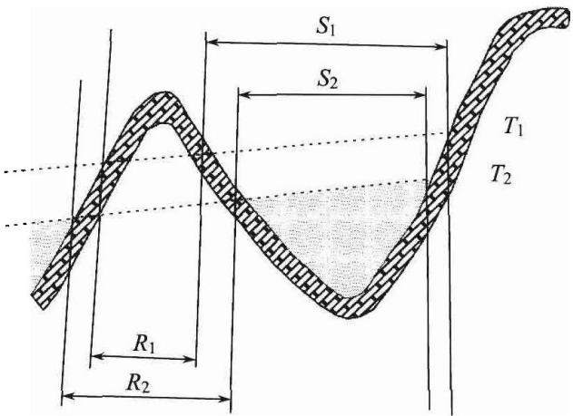  
图23.10 石漠化区石旮旯地的土壤侵蚀与石漠化的扩张（万军等，2003)

扩张)，亦即土壤侵蚀已经到了“无土可流”的程度。此时的土壤侵蚀的危害主要体现在土被不连续、零星分布的石旮旯地的土壤面积较少。从图23.10中可以看到其减少的面积就是裸岩出露的面积，亦即石漠化增加的面积。

S1、 $S _ { 2 }$ 分别为两个时相的土壤面积， $R _ { 1 } , \ R _ { 2 }$ 分别为两个时相的石漠化面积，则土壤侵蚀减少的面积等于石漠化面积的增加。

第六篇

保障措施

根据本次科考对我国水土流失现状的调查分析，防治水土流失和生态建设经验教训及现有防治技术路线与成效的总结，对我国水土流失综合防治与生态建设工作中今后需要解决的重大科学与技术问题的研究，对防治战略布局、目标、任务的探讨，以科学发展观为统领，从构建社会主义和谐社会、全面建设小康社会，建设资源节约型、环境友好型社会，社会主义新农村建设，实现以人为本、全面协调可持续发展的时代要求，提出近期和未来若于年我国水土保持发展对策与保障措施，主要包括法规政策、规划与投入、科技支撑、协调与管理、宣传教育等方面。

## 第二十四章 完善法规政策 加强监督管理

我国的水土流失分布广、强度大，并且人为活动造成的水土流失也十分严重，破坏了宝贵的水土和生物资源，引起生态环境的恶化，制约了国民经济和社会的可持续发展。防治水土流失，保护和改善生态环境，已成为我国全面建设小康社会、实现科学发展的重要内容。我国民主、法制社会的建立和发展，首先要求建立健全社会主义法律体系，包括资源、环境类法律都需完善。水土流失防治工作涉及到整个社会、多个部门，与千家万户、城市乡村都有关系，因此建立水土保持法律、法规体系及相配套的规章制度，并不断修订完善，形成一套完整、健全的法律法规体系是水土保持工作得以顺利开展、实施的重要前提和基础。

新中国成立以来，国家对水土保持事业予以了高度重视，水土保持法规也在不断建立与完善，1982年国务院颁布了《水土保持工作条例》，1991年全国人大颁布了《中华人民共和国水土保持法》，1993年国务院颁布了《水土保持法实施条例》。国家还颁布了《土地管理法》、《水法》、《森林法》、《草原法》、《矿产资源法》等与水土保持相关的法律、行政法规和地方性法规，使我国的水土流失防治进入了法制的新阶段，对我国防治水土流失、保护水土资源、改善生态环境、促进江河治理和农业生产发展发挥了重要作用，取得了显著的成效。

随着我国经济体制、经济社会发展任务、生态环境状况的变化，现有的水土保持法规已经不能适应当前形势和任务的需要，特别是新的历史发展时期水土保持的新政策、新机制，如水土保持补偿制度、开发建设项目水土流失防治与管理、水土保持行政执法责任制、违法行为的处罚等，都需要法律的有力支持，通过修订、完善法规，使我国的水土流失防治工作走向法制轨道。

## 第一节 完善水土保持法律法规体系

## 一、水土保持法律法规体系框架

水土保持法律法规应在现有法律体系的基础上，从法律、行政法规、地

方性法规、规章、规范性文件等5个层次逐步完善，形成完整的法规体系。

第一个层次是法律。《中华人民共和国宪法》是国家的根本大法，是制定水土保持法规的重要依据。1982年通过的新宪法第九条、第十条、第二十六条均对环境和资源保护作了规定。水土保持是水土资源保护与生态环境建设的重要内容，最终目的是保护水土及自然资源，使其得到合理开发利用，保证人民基本生存需要，提高人民的生活水平。因此，新宪法的修订和完善为我国水土保持法律法规建立与完善提供了重要的法律依据。

水土保持相关法律，即由全国人民代表大会及其常委会制定的有关水土保持和资源环境保护的法律文件，是我国水土保持法制建设的基础。

我国已经制定了《水土保持法》、《水法》、《土地管理法》、《森林法》、《草原法》、《节约能源法》、《防洪法》、《环境保护法》等与水土保持相关的法律，除了这些专门性的法律以外，在其他许多法律中也有不少有关水土保持和环境与资源保护方面的法律规定。如《民法通则》第一百三十四条关于“违反国家保护环境防止污染的规定，污染环境造成他人损害的，应当依法承担民事责任”的规定，第一百一十七条第二款的规定，“损坏国家的、集体的财产或者他人财产的，应当恢复原状或者折价赔偿”；1997年新修订的《刑法》增设了破坏环境资源保护罪，以及对于阻碍国家工作人员依法执行公务的，拒不执行人民法院已经产生法律效力的判决作了处罚规定。这些规定为水土保持法规的顺利实施提供了基本的保障，为保护资源和环境以及顺利开展水土保持提供更多的法律依据。

第二个层次是水土保持行政法规，即由国务院制定或者批准颁布的、水土保持有关法规和条例等，是水土保持法律体系的重要组成部分。如《水土保持法实施条例》、《开发建设晋陕蒙接壤地区水土保持规定》、《土地管理法实施条例》等，这些条例是以上法律的配套法规，具有很强的针对性和可操作性，对于推动水土保持工作法制化具有重要作用。科考中发现对一些重要区域或流域应建立并实行严格的保护制度，如黑土地、京津水源区、三峡库区、丹江口水源区、三江源区等需要制定特别的水土保持保护条例或规定。

（1）制定黑土地保护办法。位于我国松辽流域和三江平原的黑土地被誉为“北大仓”，是我国重要的商品粮基地。由于长期过度采伐、开垦、放牧，在开发建设中忽视了对黑土地的保护，导致水土大量流失、粮食减产、资源与环境遭到严重破坏。面对黑土地濒临消耗殆尽，并将对我国的粮食和生态安全构成威胁的严峻形势，建议制订保护黑土地的战略措施和实施黑土地保护条例、政策法规，使保护黑土地这一涉及政府和农民、造福后代的事业纳入法制化轨道，使保护黑土地工作有法可依、有章可循，对振兴东北、保障

我国粮食安全意义十分重大。

（2）制定京津水源区保护办法。官厅水库、密云水库和潘家口水库是北京和天津的重要水源工程，水库上游的生态环境和生产生活状况直接影响京津供水安全。目前，水库上游广大地区水土流失仍较严重，生态环境恶化，失去对北京的生态屏障作用，严重影响京津及其周边地区的经济稳定健康地发展。

（3）制定三峡库区、丹江口水源区、三江源区等重要江河的保护办法。三峡水利工程建成后，对地质环境、水资源环境、生态环境（涉及库区两岸和整个上游地区）造成很大的影响，特别是三峡重庆库区，森林覆盖率较低，水土流失比较严重，滑坡泥石流等自然灾害较多，库区的环境保护显得更加迫切。南水北调工程是我国水资源配置的重大战略性工程，对于解决北方地区水资源短缺，改善受水区的生态环境，促进地方经济可持续发展具有十分重要的意义。但目前南水北调中线工程水源区水土流失十分严重，不仅制约水源区经济社会可持续发展，而且影响丹江口水库水质和中线工程效益充分发挥，因此亟需制定适合于丹江口水源区的水土保持条例。三江源头区被称为“中华水塔”，长江、黄河两条大江的水源区，是我国生态安全的重要屏障。近年来，三江源区的植被破坏严重，水土流失加剧，威胁到我国重要江河的水量、水质，亟需制定三江源地区水土保持条例。

第三个层次是水土保持地方性法规。由省级人民代表大会及其常委会制定、颁布，或者由省、自治区人民政府所在地的市和经国务院批准的较大市的人民代表大会及其常委会制定，并报省、自治区的人大常委会批准后施行的规范性文件。这些法规的制定都是结合本地区实际情况，因地制宜地弥补国家法律法规的不足，使国家制定的法律法规更加具体化，如各省颁布的《实施中华人民共和国水土保持法办法》。地方性法规的建立不仅可以促进本地区加快水土流失治理，改善生态环境，也有利于完善国家层面上有关水土保持法律和法规。

第四个层次是水土保持规章，即由国务院各部委、省级人民政府及省、自治区人民政府所在地的市和经国务院批准的较大市的人民政府制定颁布的有关水土保持方面规范性文件。根据水土保持法，国务院水行政主管部门要建立《开发建设项目水土保持方案编报审批管理办法》、《开发建设项目水土保持设施验收管理办法》、《水土保持监测网络建设与管理办法》等与法律相配套的规章制度。

第五个层次是规范性文件。由省、自治区、直辖市水行政主管部门、水土保持主管部门、土地、环保等主管部门制定的规章，以及县级人民代表大会、政府依据法律、法规、条例、规章等制定有关水土保持的规范性文件。

如国务院水行政主管部门应制定《开发建设项目水土保持方案资格证书管理办法》、《开发建设项目水土保持方案技术评审及专家库管理办法》、《水土保持生态建设工程建设与管理办法》、《水土保持监测资格证书管理办法》、《水土保持工程施工、监理管理办法》、《水土保持执业资格管理办法》等，使法律法规的规定得到落实和实施。

水土保持法律体系的修订与完善一定要遵循国家法律各个层次的效力级别原则，即下级法律法规不得与上级的法律法规相抵触；下级的法律法规要使上级的法律法规更加具体化，且具有针对性；制定水土保持行政规章必须根据水土保持法律、行政法规。从上到下逐步形成一个水土保持法律法规体系，使各个层次法律法规的作用得到充分发挥，使我国的水土保持预防保护、监督管理、治理与管护、监测预报等各项工作有法可依，有章可循。

## 二、水土保持法规应明确的主要内容

## (1） 确定国家的水土保持工作方针

水土保持工作方针是为达到水土保持的工作目标而确定的指导原则。1991年颁布的水土保持法就规定了我国水土保持工作的方针，即“预防为主、全面规划、综合防治、因地制宜、加强管理、注重效益”的24字方针。随着新的水土流失和环境问题的不断产生，水土保持和生态环境建设中也不断出现新问题，为解决这些问题，需要有更新的、适应当前形势的水土保持方针。新时期水土保持应坚持“预防为主，保护优先，人工治理与生态修复相结合”的指导思想，达到控制水土流失、改善生态环境的目标。

## (2) 确定人与自然的关系

水土流失是一种自然现象，也是经济活动会加剧的一种危害。新时期新的水土保持理念核心是变“人与自然相对抗”、“人定胜天”为“人与自然和谐相处”，注重人与自然的和谐相处是水土保持生态建设的一个重大战略思想调整，都需要以法律形式明确。

## (3） 规定公民保护水土资源的义务

水土流失对社会、对每个公民都有影响，水土保持是一项需要全民参与的工作。明确公民保护水土资源、保护生态环境的义务，使水土保持成为每一个公民的自觉行动。这将有利于水土保持工作深入人心，进而推动水土保持事业的发展，是法律必须规定的重要内容。

## (4)明确政府职责和目标

水土流失防治是一种公益性事业，加之水土保持综合性和社会性的特

点，需要明确政府在水土保持工作中的职责和作用。明确政府职责和目标，有利于建立部门分工，统一协调的管理机制，有利于区域经济、社会的协调发展，有利于建立长效推动机制。

## (5) 确立规划的法律地位

做好一个区域或流域的水土流失防治工作，必须首先有统一规划，它是指导一个地区开展水土保持工作的纲领性文件，因此需要在法律上确定其地位，而不受个人观点和意志的影响，坚持不懈。

## (6) 明确水土流失防治责任

任何一部法律都是调节权利与义务关系的，水土保持法是保护水土资源、保护生态环境的法律，任何单位和个人都有保护资源、环境的义务，要把“谁开发利用，谁保护”、“谁造成破坏，谁负责治理和恢复”的原则，通过法律条文明确，使公民、法人、其他经济组织都能依法承担防治水土流失的义务。

## (7) 明确鼓励或限制的行为

人类活动对水土流失的影响很大，可以起到保持水土的作用，也可以造成加剧水土流失的后果。法律应对那些有利于保持水土、保护生态环境的行为给予支持，而对那些不利于水土保持的行为加以限制，从思想意识和行为上给予正确的指导和引导。

## （8）明确主管部门的权责和管理相对人的权利和义务

为确保法律的贯彻执行，法律要明确水土保持行政主管部门及其职责，同时对被管理对象也要明确义务和责任；当主管部门、相对人不履行法定义务和职责时，应依法追究其责任。

## (9)明确对违法行为的处罚措施

要发挥法律的威慑力，对违法行为必须规定处罚的措施、范围、标准，做到一视同仁，也使水土保持管理人员在监督执法中有明确的依据，提高水土保持执法水平，为水土保持工作的顺利进行提供有力的保障。

## 三、水土保持法及相关法律

## （一）水土保持法的修订

根据现实和发展的需要，有必要对现行的水土保持法进行修订和完善，使之适应当前和未来的形势。修订水土保持法要以科学发展观为指导，坚持人与自然和谐的理念，坚持依法治国方针，以广泛深入的调查研究为基础，以规范水土保持管理为中心，以保障水土资源的可持续利用和生态环境的可持续维护为目标，全面分析《水土保持法》实施过程中的不足和薄弱环节，研究《水土保持法》修订的重要方面和重要问题，进一步完善执行较好、成效明显的规定，把符合中央方针政策且行之有效的规章、制度和做法、经验等上升为法律规定，补充有关内容以满足新形势下防治水土流失、保护水土资源和生态环境的要求。

## 1. 关于水土保持方针、指导思想、政府职责及管理体制

## （1）水土保持工作方针的修订

近年来，国家提出了“预防为主、保护优先”的原则，实践证明，水土保持工作“预防是基础，保护是前提”。运用法律、经济、行政和技术手段保护水土资源和生态环境，打击人为破坏行为，是水土保持工作的重要内容，也只有这样才能彻底扭转“一方治理多方破坏，边治理边破坏”的被动局面，确保生态环境恶化的趋势得到根本遏制。因此，“保护优先”应当作为水土保持工作方针的一个重要内容。

## (2) 水土保持指导思想的修订

经过近些年的实践，水利部率先提出了充分发挥生态系统的自我修复能力，加快水土流失防治进程的新思路，各地的试点也取得了显著成效，在国家“十一五”发展规划纲要也明确提出“生态保护和建设要从人工建设为主向自然恢复为主转变”，这一重要的指导思想需要在法律中加以确定。

## （3）水土保持政府职责的修订

现行水土保持法第五条对政府在水土保持工作中的职责作了规定，但缺乏监督约束机制，操作性不强。水土保持工作是一项涉及社会方方面面的系统工程，离开政府强有力的支持，工作将难以有效开展。国务院国发[1993]5号文件强调：“水土流失严重地区的人民政府，要建立每年向同级人民代表大会常委会及上级水行政主管部门报告水土保持工作的制度，并建立政府领导任期内的水土保持目标考核制，层层签订责任状”。胡锦涛总书记在2004年中央人口资源环境工作座谈会上指出：“对资源环境建设，党政一把手要亲自抓，负总责，全面落实目标管理责任制”。因此，在修订水土保持法中应增加“水土流失防治区的地方人民政府应当实行水土流失防治目标责任制和政府领导任期内水土保持目标考核制，建立定期向同级人民代表大会常委会报告水土保持工作制度”等内容。

## （4）水土保持管理体制的修订

水土保持法没有授予流域机构行政管理职能，不能充分发挥流域机构的

作用。另外，水土保持法的执法主体有水行政主管部门、水土保持机构和水土保持监督管理机构，有些地方根据水土流失防治工作的需要，出现了多个执法主体并存的情况，给实际工作带来不必要的困难，需加以明确。

## 2. 关于水土保持监测任务与职责

水土保持监测是了解和掌握全国水土流失程度和生态环境状况、科学评价水土保持生态建设成效的重要手段，是国家生态建设宏观决策的基本依据，是水土保持事业的重要内容。水土保持法中只提出了建立水土保持监测网络的要求，对各级监测机构的性质、职责、任务等未做出明确确定，水土保持监测的公益性质也需在法律上定位，改变目前一些监测机构被列为差额、甚至自收自支单位，但还要承担国家水土保持监测的公益事业的情况。由于国家用于水土流失监测的资金来源没有明确，造成水土保持监测工作不能正常开展，难以准确、及时地为国家提供有关水土保持和生态建设的基础数据和动态成果，与全面建设小康社会、实现科学发展、确保国家生态安全的目标极不适应，这些都应在水土保持法修改中加以完善。同时，要充分利用现有的水文、资源监测网络和信息，共同开展水土保持监测工作。

## 3. 关于对开发建设项目水土保持管理

首先，开发建设项目水土保持管理是水土保持工作的一个重要方面。实践表明，现行水土保持法对开发建设项目水土保持管理的规定过于原则，有些内容已经不能适应工作的需要。在水土保持法修订中应对开发建设项目水土保持方案的编制范围、报告书（表）的分类编制、水土保持方案分级审批和水土保持设施竣工验收的条件、时限、程序等内容进一步补充完善，明确规定建设单位要开展水土流失动态监测，要按照批准的水土保持方案进行水土保持工程设计和施工，规定大中型开发建设项目水土保持工程施工监理等有关内容。增加对城市开发建设、各类开发区建设、“四荒”地开发的水土流失防治责任和水土保持“三同时”制度的条款，明确开发建设单位在开发建设过程中的水土流失防治责任。

其次，《水土保持法》规定水土保持方案编制范围主要是“三类区域”（即山区、丘陵区和风沙区）和“五类建设项目”（即公路、铁路、水工程、采矿和其他大中型企业）。实际情况是任何一类地貌类型区，只要是有土建的项目，都能产生水土流失，没有水土保持方案，防治工作就难以落实。还有，如何保证水土保持方案的实施，在主体工程初步设计、施工设计中落实水土保持方案的要求，落实水土保持监理、监测和竣工验收制度，《水土保持法》都没有做出具体规定，难以保证开发建设项目水土流失防治效果，需做明确规定。

第三，增加对农业、牧业、林业开发建设活动，特别是土地开发、陡坡开垦、毁林毁草开垦等开发建设行为的规范和管理，大力加强对农业生产活动中水土流失的有效控制。

第四，治理成果的管护也是水土保持预防监督工作的一个重要内容，现行法对水土流失治理成果的管护缺乏明确的法律责任和管理要求，水土保持法修订应增加治理成果管护措施及法律责任。

## 4. 关于水土流失治理的政策、组织方式及权益

（1）根据目前我国资源开发与生态保护的形势，应提出国家对水电、煤炭、石油天然气等资源开发中拿出收益的一定比例用于库区、资源开发区的水土保持，国家从退耕还林、农业综合开发、中低产田改造、水利发展基金等项目中拿出一定比例用于水土保持。

（2）对单位和个人参与承包、租赁、拍卖、股份合作等多种治理方式的责任、权益、产权等做出法律规定，依法保护治理者的权益。

(3）为适应农村“两工”取消的新形势，对农村水土保持工程建设可对受益者提出投劳承诺制、产权预先确认制等组织方式。

(4）根据重点工程建设的规定和要求，对重点治理工程的“四制”管理（项目法人制、招标投标制、建设监理制、合同制）应提出明确规定，以确保工程质量和效益。

（5）对开荒种地、采伐林木、超载放牧等生产活动提出明确的水土保持要求和规定。

## 5. 关于水土保持行政许可事项的设定及后续管理

随着水土保持工作的深入开展，一些现行法没有规定的、或规定过于简单的许可事项，如水土保持设施的验收、水土保持监测资格证书的审核发放等，是以部令或文件的方式提出具体要求的，但是，《行政许可法》颁布实施后，明确取消了部委设定行政许可的权力，给实际工作造成很大的被动，这些问题需要在立法中进一步明确细化。同时，应该进一步增加或细化水土保持方案编制与审批，水土保持设计、水土保持监测、技术评估、监理等后续管理的有关内容，增强水土保持法的可操作性。另外，由于水土保持工作专业性较强，关系社会和公众利益，应在修订中补充完善水土保持方案编制、水土保持监测、水土保持咨询评估、水土保持工程监理、水土保持工程施工等资格证书审核发放的主体、条件、期限、程序等内容。以适应政务公开、公平竞争、依法管理的要求，避免因资质管理不严，对工作质量和效果，甚至对国家和人民生命财产造成的不良影响。

## 6. 关于水土保持设施补偿费

关于水土保持设施补偿问题，现行水土保持法中没有规定，《水土保持法实施条例》第二十一条规定了对损坏的水土保持设施给以补偿。调研表明，应通过现行法的修订把水土保持设施补偿费明确下来。其原因是：

（1）水土资源是人类赖以生存的基本自然资源。我国大部分地区水土流失严重，生态环境脆弱，无论是自然形成还是人工建成的水土保持设施，一旦损坏以后很难恢复。

（2）目前人们的水土保持生态环境意识相对淡薄，在生产建设过程中侵占、损坏水土保持设施的行为时有发生，如果只是进行“补偿”，那么势必就成为一种赔偿性质的行为，甚至存在讨价还价的现象，违背立法的原意，不能真正起到震慑这种违法行为的作用，如果不从经济上制定约束条件，一些单位和个人就会无节制地占用、损坏水土保持设施，造成水土资源的浪费和损失。

(3）随着社会的发展，文明程度的提高，生态环境已成为衡量社会文明进步的一个重要指标，会越来越受到党和国家的重视，水土保持生态环境的保护和建设应该得到进一步强化。

（4）现行水土保持法1991年颁布实施后，绝大多数省、自治区、直辖市人大都以地方性法规的形式明确将“补偿”规定为一种补偿费种，并在实践中取得了很好效果。

## 7. 关于法律责任

（1）对法律责任不全面的要补充。如建设单位没有编报水土保持方案而擅自开工，对造成的人为水土流失不治理，水土保持设施未经验收或验收不合格而投入生产使用，拒不缴纳水土保持补偿费等水土保持违法行为的处罚措施，明确违法单位的直接负责人或主管人员的法律责任；强化对水土保持从业人员的管理及行政不作为、滥用职权等的法律责任。

（2）对处罚力度太小的要强化。如陡坡开垦、林木采伐、植被破坏等，罚款额度太小，不能引起责任人的足够重视，处罚不能起到震慑违法行为的作用。

（3）对操作难度大的要完善。如对企事业单位造成水土流失不进行治理的，“罚款由县级人民政府水行政主管部门报请县级人民政府决定；责令停业治理由市、县人民政府决定；中央或者省级人民政府直接管辖的企业事业单位的停业治理，须报请国务院或者省级人民政府批准”，处罚执行难度大，需进行修订。

## 8. 其他

除上述外，还应对水土保持监督管理机构、人员权限及职业要求进一步补充，对现行水土保持法的个别提法进行修正，增加对水土流失、水土保持等专业术语的解释和界定，对条款顺序进行相应的调整。

## （二）与相关法规的协调

水土保持的新政策、新机制的推行和实施需要得到与其相关法律的支持，如《土地管理法》、《水法》、《森林法》、《草原法》、《环境保护法》等。《水土保持法》修订、完善之后，其中水土保持实施的新政策还应在其他法律、法规中明确，以避免《水土保持法》与其他法律中相关规定相互矛盾，特别是在处罚力度上的不一致性，从而给水土保持执法带来大的难度。以生态补偿为例，生态补偿是个社会公平问题，国家协调人与自然的关系，对占有环境资源不等进行平衡和调整，不仅要靠政策，在《水土保持法》和《环保法》中得到体现，还应在《民法》和《物权法》中有明确规定，在全社会树立“环境有价、资源有价、生态功能有价”的观念，建立统一、协调、完善的自然生态利益补偿制度，规范各级政府的行政行为。因此，对《水土保持法》进行修订的同时，还要理顺与其他环境资源法律、法规之间的关系，使其具有一致性。

## 第二节 制定配套政策

水土保持工作涉及社会方方面面，与群众利益直接相关，政策性很强，政策的鼓励和制约直接影响水土保持工作的开展。多年来，我国综合防治水十流失的政策体系经历了不断完善的发展过程；不同时期的水土保持政策，推动了不同历史发展阶段的水土流失防治工作。水土保持和生态建设的政策有其连续性，因此要根据当前和未来形势的发展不断进行研究、创新和完善。

## 一、水土资源保护

由于地域和项目情况的不同，应对不同地区、不同行业的开发建设项目实行鼓励、限制、禁止的分类指导政策。

## （一）区域保护

对列入国家水土流失重点预防保护区的区域要严格控制开发建设项目，对水土流失严重区要严格控制开山采石、滥挖乱采等生产建设活动；在生态脆弱带，如风沙区对开发建设要实行有条件开发；对江河有重大影响的多沙粗沙区（黄土区）的能源开发应实行有限制地开发政策。

对开发强度超过水土资源承载力和环境承载力的区域，要建立亮“黄牌”制度，警示地方政府和有关部门，加以重视和调控。对严重超过承载力的地区建立亮“红”牌制度，停止开发与破坏，保护水土资源和生态环境。

## （二）产业布局和生产方式限制

对高占用和浪费水土资源，高耗能、高污染的开发建设项目要坚决禁止，对水源保护区内要严格禁止开发建设活动，加强水源区保护。对于水资源的开发与利用，要根据水资源承载力和水环境承载力，按照优化开发、重点开发、限制开发和禁止开发的不同要求，明确不同区域、不同河流或不同河段的功能定位，并采取相应的开发和保护措施。

加强草原风沙区防护与治理。限制对草原有较大影响的开发建设项目，加强草原的保护、管理、建设和合理利用，保护和改善生态环境，发展现代化畜牧业，促进民族地区经济的繁荣，并实现经济和社会的可持续发展。

加强对保护区重点资源开发的强制性保护。对于国家重点保护的自然保护区应制定国家级自然保护区保护与治理规划，严禁在保护区建设有污染、破坏环境的项目，对已有的污染源、水土流失土地，实施限期治理或关停项目。

## 二、水土流失防治责任

## （一）地方政府任期目标责任制

水十保持是一项功在当代、利在千秋的公益事业，生态环境的改善不是一朝一夕的事情，发挥效益也需要一个较长的过程。鉴于我国水土流失严重，生态环境脆弱的形势，水土保持工作尤为重要，预防、治理水土流失与遏制生态环境破坏的力度只能加强，不能削弱。借鉴一些省、市通过建立领导任期水土保持目标责任制，在水土流失治理方面取得成效的成功经验，建议各级地方政府根据实际情况建立相应的领导任期水土保持目标责任制，处在国家级重点防治区的地方领导要实行一票否决制，以促进水土保持工作长抓不懈。

现行的国民经济核算制度只反映了经济活动的正面效应，而没有反映负面效应的影响，因此是不完整的、有局限性的，不适应可持续发展战略。今后，各级政府的目标考核责任制要按科学发展观的新理念，进行调整。在核算经济增长的同时，还要考核资源消耗、环境损失指标，逐步探索和扩大绿色GDP的统计核算，将生态破坏计入国民经济成本，为我国发展循环经济提供全面的统计指标，从体制、机制上形成科学的考核体系。

第一，在水土流失地区建立省、市、县3级政府水土保持目标责任制，将水土流失面积不增加、水土流失强度逐渐降低等水土保持目标纳入各级政府政绩考核体系，实行政府领导任期内水土保持目标考核制度，强化行政问责制。

第二，地方各级政府应订立责任制，各级政府领导人上任，应当签订水土流失治理与水土保持目标责任。考核内容既包括工作进度，又包括工作质量，水土流失治理速度，治理多少，保存多少，水土保持和生态环境恢复效果等，并将此作为各级政府领导政绩考核的重要内容。

第三，列入国家级水土流失重点预防保护区、重点监督区、重点治理区的563个县市，要全面建立政府目标责任制。对属于水土流失严重县的646个县，实行政府主要领导“一票否决”的政绩考核制度，把水土流失防治、生态环境保护作为考核的重要指标，对未达到国家要求的一票否决其政绩。

第四，对不同的防治区域制定不同的目标责任制和考核制。特别是国家确定的重点预防保护区、重点监督区和重点治理区，要制定严格的责任制。

对于预防保护区，水土流失较轻，林草覆盖度较高，但存在水土流失加剧的潜在危险，这一区域考核目标的重点应该是“水土流失面积只能减少，强度只能减轻，不出现严重破坏保护区的行为”；对于重点监督区，由于资源开发和基本建设活动较集中和频繁，损坏原地貌易造成水土流失，且危害后果较为严重，考核目标的重点应该是“新增水土流失面积不超过容许量，水土流失强度不超过国家标准，恢复面积大于破坏面积，不产生水土流失灾害”；对于重点治理区，由于该区原生的水土流失较为严重，对当地和下游造成严重水土流失危害，大多为大江、大河、大湖的中上游地区，考核目标的重点应该是“水土流失面积不增加，水土流失强度逐年降低，治理成果得到有效保护”。对于黑土区和西南石漠化水土流失特殊区域，政府应将保护土地资源作为各级政府政绩考核的重要指标；在国家生态屏障带要建立保护植被与生态的政府责任制。

第五，建立奖惩机制。对目标任务完成好的，给予奖励，在项目安排上优先考虑；对完成差的，通报批评，限期整改，追究领导责任；恶化生态环境，造成严重水土流失及危害的，给予处分，直至追究法律责任。

第六，领导任期水土保持目标责任制考核的办法采取量化和评价相结合、日常监控和年终考评相结合的办法进行，设立目标考核小组和办公室，使考核工作经常化、规范化。

第七，各级政府要成立目标责任制监督检查领导小组，负责组织协调工作，监督推进目标责任制的组织实施工作，根据国家的新要求不断健全和完善考核目标、考核办法。

## （二）开发建设项目责任追究制

随着我国经济的持续增长，自然资源开发与基础设施建设的规模和力度越来越大，开发建设项目（公路、铁路、电力、煤矿、石油天然气、城建等）对地面和环境造成较大的扰动，破坏地貌和植被，产生新的水土流失，生态环境恶化，开发与保护的矛盾日趋尖锐，生态环境面临巨大压力。由于政策体制的不完善，对于开发建设区环境治理主体责任不明确，开发建设后，无人治理、无人管护，造成开发区域水土流失和环境恶化。

应严格按照“谁开发谁保护，谁破坏谁治理”的原则，加强对开发建设项目水土保持工作管理，落实项目法人和施工单位的责任，明确处罚办法，实施责任追究制，依法落实法定职责。

（1）严格开发建设项目水土保持方案的审查审批，对不按国家法律法规规定申报水土保持方案、未经批准就擅自开工建设、施工过程中造成严重水土流失和生态破坏的，按照有关规定给予主要领导和责任人处分。

（2）对开发建设项目水土保持方案的实施情况进行监督检查，未按照水行政主管部门批复的水土保持方案实施水土保持措施，造成水土流失和生态破坏的，追究项目单位和负责人的责任。

（3）已开发的项目，开发建设项目责任者不履行自己保护水土资源和生态环境职责的，要承担直接的或间接的责任，给予罚款处分，给国家和人民利益造成较大损失、构成犯罪的，依法追究其刑事责任。

(4）对开发建设项目水土保持设施未经验收或验收不合格、主体工程就投入使用的，追究建设单位责任。

（5）未按照水土保持法规法律和技术标准要求审批水土保持方案的单位和相关责任人实施责任追究。水行政主管部门的工作人员徇私舞弊、滥用职权、玩忽职守，构成犯罪的，依法追究刑事责任；尚不构成犯罪的，依法给予行政处分，是党员的要给予党纪处分。

（6）各相关部门、单位和个人要积极配合水行政部门落实《中华人民共和国水土保持法》等有关法规法律的要求，不得干涉依法行政，对妨碍公务的依法追究其责任。

## （三）土地使用者水土资源保护责任制

造成水土流失的一个重要原因是土地利用结构不合理，利用方式落后。我国农业生产和土地开发利用的科学管理不够，表现在：生产布局不合理；土地利用率低，浪费严重；个别地区对土地资源实行掠夺性开发，重用轻养，造成土地质量的下降，生态失调。因此，强化政府对土地资源的保护责任，加强土地使用者对土地的保护和保育是预防水土流失的有效途径。

## 1. 强化政府保护土地的责任

根据中国的土地使用制度，为加强国家对土地资源的保护和管理，应强化政府对土地规划和使用的管理职能，各地的土地利用结构和调整都要在政府批准的《土地利用总体规划》的指导下，根据新的规定，除依法应由国务院审批的规划外，其他土地利用总体规划的审批权、管理权统一上收到省，各地不得越权批地、不得违反规划计划批地、滥占耕地，造成土地不合理利用。

辖区内划定为基本农田的区域，各级政府必须保证其面积不减少、耕地质量不下降，以确保国家的粮食安全。

## 2. 落实土地使用者的责任

土地使用者在使用土地过程中一定要严格遵守《土地管理法》、《水土保持法》等相关的土地保护管理规定，努力提高集约用地水平，逐步提高耕地质量，对于已退化的土地，要进行逐步整治，以改善土地资源环境。

在水土保持法的修订中应增加对土地使用者保护土地的责任和义务，使土地使用的权利和保护的义务相对应。实施土地保护和保育责任制，明确规定人均耕地的绝对保护数，土壤侵蚀量控制在国家容许值的2倍以下，不得增加土地中的侵蚀沟；划定为农田保护区的，耕地使用者必须保证土地生产力不下降。

土地使用者应承担由于违反土地资源保护、保育政策进行土地开发与利用，而导致土地沙化、水土流失的责任，并进行一定的补偿或根据土地不同破坏程度处以一定数量的罚款，做到依法管地用地。

## 三、水土保持鼓励扶持

## （一）农户水土保持耕作措施的资金补助

我国水土流失严重，耕地造成的土地退化尤为严重，我国坡耕地面积占总土地面积的6%，但坡耕地产生的水土流失量却占全国水土流失总量的28%。针对农业生产对资源和环境带来的破坏，对于容易发生水土流失的地区，各级相关部门应大力推广水土保持耕种技术，制定加快实施水土保持种植技术发展、水土保持耕作措施补偿等政策，对那些积极响应国家和地方政府政策，实行水土保持耕种的农户，根据实际情况，给予一定数量的经济补偿，鼓励和引导农民自主投入，保护土地和耕地资源。

## （1）对由顺坡耕种改为横坡种植的农户，按实际面积给予经济补贴

横坡种植是一项既减轻水土流失，又促进粮食增产的费省效宏的水土保持耕作措施。据四川省丘陵区典型地块测定，横坡沟垄耕作与习惯顺坡耕作相比，年径流量减少28.07%，年土壤流失量减少28.13%，保肥能力提高28.71%，粮食增产11.5%～21.3%，平均每公顷增产粮食132.5\~159.0kg。

对于适合于顺坡种植改横坡种植的地区，如北方干旱少雨地区、东北黑土区，应实施顺坡耕作改为横坡耕作的土地调整政策，在实施横坡耕作的前2～3年内，国家每公顷给予450～750元作为鼓励费用，激励农民转变传统的顺坡起垄耕作方式，3年后产量稳定可不再补贴。

## （2）对实行免耕的农地，按面积给予经济补贴

免耕技术是一项促进农田生态系统良性循环的新型作物生产技术体系，在防止水土流失、保墒增肥、改善土壤理化性质和增产增收方面，起到了积极的作用。如北京、河北等地区在两熟水浇地上实行夏玉米免耕覆盖；山西旱农区大面积发展麦田秸秆覆盖，蓄墒保墒效果明显，增产粮食13%～27%，近年又向春播作物发展，成为节水农业的重要技术措施。

但目前许多地区的农民还没有完全接受免耕耕作方式，主要原因有以下几点：传统的思想观念没有得到转变；免耕后配套技术措施没跟上，农民经济上有负担；一些地区免耕留茬后，温度低无法降解，造成粮食减产。

为提高粮食收益，防止耕作带来的水土流失，可针对不同区域制定不同的优惠激励政策：

①适于免耕的南方区域，如广西、四川、云南以及东北黑土区等地实行免耕的农户，国家可在实施免耕的前2年补贴农户450元/hm²，购买除草剂，激励农民亲身实践，提高对免耕技术优点的认知度。

②对于我国北方、西部地区，如内蒙古中西部、甘肃、青海、宁夏等由于耕地造成的风蚀沙化严重的区域，实施免耕技术，造成粮食减产，国家每年可补贴1000～2250元/hm²，鼓励免耕，以减少水土流失。

③对于实行免耕耕作措施的农户，国家要在免耕播种机械化技术上提供支持和援助。各区域的农户可实行联户免耕，由国家投入部分资金支持联户购买免耕播种机，并开展免耕播种机械化技术推广与示范，深入农村，对操作规程进行细致的讲解和示范。

## （3）对将25°以下坡耕地改造为水平梯田的农户，给予资金扶持

坡耕地是水土流失的策源地。全国山地丘陵地区有坡耕地约0.26亿 hm²，其中梯田约占到0.066亿hm²，而其余0.2亿hm²坡地正遭受着不同程度水土流失的侵害。

对于25°以上的陡坡地国家继续实行退耕还林还草政策，并保持长期、稳定的退耕，恢复植被。对25°以下缓坡耕地，要积极采用“坡改梯”和改进耕作技术等措施，减少水土流失。对将25°以下坡耕地改造为水平梯田的农户，国家按照坡改梯工程总投入的70%予以资金扶持，逐步改变农民长期落后的生产方式，彻底改变生产条件。

## （二）农牧户封育保护措施的经济补贴

封山禁牧是生态修复的一项重要措施，可为生态系统休养生息创造条件，扭转生态继续恶化的局面，使生态环境向良性转变。封山禁牧后，农牧民们面临牲畜品种改良、先进科学技术推广和运用难以及时跟上等多种困难，农牧民的经济利益受到一定影响，生态效益与农牧民的经济利益有矛盾，需要先行给予经济激励。

对积极响应国家“封山禁牧、舍饲养殖、以草定畜”号召的农牧户给予经济补贴。可参照国家已正式批准实施退牧还草省区的农牧民补贴政策，每退牧封育1hm²草地补贴52.5元，连续补助5年；并且在此基础上，通过减免税费，安排小额贷款，在舍饲养殖所需的配套设施和饲养技术上给予经济支持与补偿，如建设畜舍、引进改良畜种、畜病防疫、草料加工、青贮、冬羔生产以及牛羊育肥等。政府可组织专业技术队伍对牧民进行免费舍饲养殖技术培训，帮助和鼓励农牧民进行科学饲养，解除农牧民的后顾之忧，农牧民才能自觉地维护封禁措施，参与水土保持建设，巩固生态修复成果。

## （三）大户和社会治理的资金支持

借鉴山西省大户治理取得的成功经验，如阳泉市对治理面积达33.3hm²的大户，奖励3万～5万元，对民营生态大户实行“奖励先进，淘汰后进”的动态管理，取得一定成效。国家可出台相关政策措施，调动有一定经济实力的实业家，投身到水土保持中，鼓励扶持他们治理开发小流域。对治理大户除按普通农户的扶持标准给予资金支持外，根据不同地区的实际情况，可规定治理的标准，凡是经有关部门验收达到标准的，给予奖励和补助。特别是对于大户联系当地农民共同治理的应当给予重点支持。

## （四）水土保持施工企业的税费优惠

目前水土保持工程投资标准较低，工程施工主要靠当地群众，取消农民“两工”后群众投入少了，一些骨干工程如黄土高原的淤地坝工程等主要靠施工企业实施，但国家对企业的税费征收标准是按基本建设项目制定的，对这些投入水土保持工程施工的企业来说，税费标准高，企业无利可得，影响到他们投入水土保持的积极性。建议国家对承担农村水土保持、生态建设工程施工建设的企业给予税费优惠政策，鼓励更多的企业投入水土保持。

## （五）治理者合法权益的保护

产权制度的落实与明晰可调动各方面治理水土流失的积极性。要继续实施单位和个人的治理成果允许继承、转让的政策，治理成果的受益权、土地承包的使用权几十年长期不变，让广大农民感到有稳定的政策，积极投入水土流失治理。水土流失治理承包方在治理过程中因特殊原因未能履行合同继续治理与开发时，可以在不改变治理区使用权的前提下，转让给另一方按协议进行综合治理与开发利用。巩固和发展以户承包、联户承包等多种形式的责任制，继续大力推动“四荒”使用权拍卖。同时，制定和完善信贷、补助、税收等优惠政策。如对参与治理者，可实行低息（正常信贷利息的30%～50%）、国家贴息贷款筹集治理资金；在治理投入阶段，按照投入的50%进行补贴或减免税收；对新增治理面积，可在一定年限内免征或减征农林特产税等。

## （六）老、少、边、穷地区重点扶持

《国民经济和社会发展“十一五”规划纲要》提出，要加大财政转移支付力度和财政性投资力度，支持革命老区、少数民族地区和边疆地区加快发展。整合资源，整体推进，改善欠发达地区群众的生产生活条件。

我国的老、少、边、穷地区多位于经济发展落后的中西部和山区丘陵地区，如东部的沂蒙山区、闽西南、闽东北地区，中部的努鲁尔虎山区、太行山区、吕梁山区、秦岭大巴山区、武陵山区、大别山区、井冈山区和赣南地区，西部定西干旱山区、西海固地区等。

根据老少边穷地区的自然、经济和水土流失特点，建议在老少边穷地区实行特殊的水土保持扶持政策：

（1）老少边穷区的水土保持以中央政府投资为主、地方为辅的投入政策；在集中分布地区国家给予重点扶持；在水土保持项目的审批上国家给予优先支持。

（2）作为近期扶持重点给予扶持，根据国家全面建设小康社会的总进程，老少边穷地区是主要的难点区域，因此应在“十一五”、“十二五”期间重点支持。

（3）重点扶持区域：本次科考调查划定了745个土壤侵蚀严重县，其中338个既是土壤侵蚀严重县又是国定贫困县，264个既是土壤侵蚀严重县又是老区县，242个既是土壤侵蚀严重县又是少数民族县的区域列为重点扶持区域。这些县主要集中在内蒙古、新疆、河北、北京、山东、山西、陕西、宁夏、四川、贵州、云南、湖北、江西等省、市、自治区。

（4）加强老少边穷区基本口粮田的建设，按南方地区人均占有基本田0.033 hm²、北方地区人均基本田达到0.13hm²的标准，在近期内列为重点工程建设，以解决群众的基本生计问题，减少因生活困难而对植被造成的破坏。

## 四、相关配套政策

(一)生态移民

水土流失是生态领域中最重大的问题，我国大多数贫困人口都生活在水土流失严重、生态环境恶劣的区域，水土流失使人民群众的生产、生活环境恶化，反过来，“越穷越垦、越垦越穷，越荒越牧、越牧越荒”，形成了恶性循环，进一步加剧了水土流失。在这些地区，人口密度超过环境承载力和资源承载力，不适宜居住，有的已基本丧失了生存的条件。为保证群众的生产、生活和保护生态环境，较为可行的办法是实施生态移民。将贫困人口搬迁安置到生产、生活条件较好的地方，使其在新的环境中真正实现安居乐业。同时，使迁出地减少人类活动，辅以封禁等水土保持措施，依靠自然力恢复植被，使区域生态环境得以较快恢复和改善。

如三江（长江、黄河、澜沧江）源地区，是中国最大的生态功能区和水源涵养地，对大江大河中下游地区乃至全国的可持续发展起着重要的保障和生态屏障作用，但由于人类活动加剧了这个地区的水土流失和生态退化，并且有加重的趋势，从全国整体利益考虑，应实施生态移民，恢复自然生态。生态环境脆弱地区的人口（如西南石漠化地区），除部分迁移到交通便利，生态环境容量较大的农村地区外，大部分应迁移到就业机会相对较多的城镇定居。这样，既可以促进人口城镇化，更好地改善移民的生产生活环境，又可以相对减少人口迁入地区的生态压力。

根据国家《“十一五”规划纲要》和此次科考情况，对水土流失严重、生态环境恶化的生态功能区域（如大别山土壤侵蚀防治区、桂黔滇等喀斯特石漠化防治区、甘南黄河水源补给生态功能区、青海三江源草甸湿地生态功能区、西部宁夏、内蒙古、甘肃等地）实施生态移民。实施移民过程中与产业结构调整以及城市化进程相结合，在迁出区要结合退耕还林还草、退牧还草，并辅以水土保持措施的同时，大力发展有利于生态保护的林果业和各种特色产业。在移民迁入地区，要积极为移民创造就业机会，在发展劳动密集型特色农业的同时，要通过发展农产品加工业、建筑业和第三产业，努力促进农业剩余劳动力的转移。

对于地方和农民为改善生态环境而发展小水电、沼气等能源，建设水利设施，调整生产结构，转变农、牧业生产方式而实施生态移民，应出台一系列优惠政策，组织实施生态移民和异地扶贫。给予移民物质、资金以及政策上的扶持和帮助。对缺乏基本生存条件地区和生态脆弱地区的贫困人口，通过整体搬迁、异地安置等方式，加速向临近中小城市转移，最大限度地减少返贫现象。

从理论上讲，人撤出来后实现生态自我修复，效果很好。但由于移民本身所生存的环境受自然条件的制约，处于贫困状态，移民出去后如何安置，能否有稳定的经济来源，且移民对自己生活方式和祖辈生活的家乡存在依恋的感情。如果对移民的生产条件、生活手段等社会问题考虑不够，就会产生不良的社会后果。生态移民也要慎重，一定要合理规划。在技术上可行，同时要考虑社会的承受能力，带来的相应社会问题应该得到妥善解决。

## （二）能源替代

我国西部以及许多边远贫困的农村是生活用能源严重短缺的地区，生活用能中80%以上的燃料来源于秸秆、薪柴等。若不解决生活用能的问题，水土流失和生态建设就会出现“边治理、边破坏”的恶性循环。因此，注重抓好农村能源结构调整，实施农村能源替代政策，解决农村居民生活燃料能源问题，对保持水土资源、改善生态环境、实现经济可持续性发展具有重大的作用和意义。

## 1. 发展农村小水电

温家宝总理在贵州考察时指出，农村水电是带动力很强的工程，它不仅可以解决农民燃料问题，还可以增加农民收入，使广大的农民直接受惠。大力发展小水电，积极实施“小水电代柴”工程，充分发挥生态作用、扶贫作用，不仅十分必要，而且对保护和改善生态环境，提高农村生活用电水平和生活质量，解放劳动力，增加农民收入，推动社会进步，有着重要的现实意义。因此，在充分利用已建的小水电站的基础上，积极开发尚未开发的小水电资源，实施小水电代柴，是保护和改善环境，建设秀美山川的迫切要求。

我国小水电资源十分丰富，资源分布广泛，全国30多个省（自治区、直辖市）中有1600多个县（市）都有农村水电资源，主要集中在西部、中部和沿海地区，西部地区、贫困山区、革命老区、少数民族地区占70%以上。目前，我国农村小水电站年发电量已接近900亿kW·h，可替代约3000余万t标准煤，减少二氧化碳排放7000万t；并在林区实现以电代柴，减少木柴砍伐约900万m³。近15年来，全国农村已建成了电气化县600余个，以小水电为主供电的农村人口已超过了3.5亿人。小水电代燃料试点取得成效，20多万农民实现小水电代燃料，巩固退耕还林面积2万hm²，保护森林面积10.6万hm²。农村水电促进了农村经济社会发展，为缓解电力供应紧张，改善能源结构，保护生态与环境发挥了重要作用。我国小水电的发展不仅比较好地解决了发展中国家共同面临的能源、水土保持、生态环境和贫困问题，而且还在增强民族团结，促进边疆繁荣稳定方面发挥了巨大作用，它在国民经济发展和社会进步中有着不可替代的历史作用。因此，大力发展农村小水电是实施农村能源替代的重要途径。

## 2. 建设农村沼气池

农村生活用能应实行多能互补，除大力发展小水电外，在有条件的农村，要推广沼气，建设农村户用沼气池，以及部分规模化畜禽养殖场和养殖小区大中型沼气工程，如目前福建省推广的结合农业产业特点、以沼气为纽带的大中型畜禽养殖厂能源环境工程模式和江西省推广的“猪-沼-果”等能源生态模式是一种很好的水土保持能源替代模式。

## 3. 推行农村煤补、电补等能源补助政策

目前在我国一些欠发达地区，能源替代问题仍未得以解决，主要是农民对代柴用电、用煤和沼气的费用承受能力有限。以用电代柴为例，每个代柴户除在建设期需一次性投入购电表、进户线、开关、电炊具的费用约300～400元外，还应能够支付代柴用电电费，一般纯电炊年用电量约800～1200kW·h；电炊、电取暖年用电量约1400～2000kW·h。目前一个3\~4口之家的山区农户，以薪柴、秸秆为主要燃料，每月约需800kg薪柴（包括煮猪饲料)，一般自采自用，月砍柴误工时约5～6天，基本上无直接燃料费用开支。若用蜂窝煤，每户每月约需110～120块（不煮猪饲料），月燃料支出费用约24～30元。就目前小水电网的销售电价看，一般农户特别是贫困农户难以承受。新能源的价格成为能否推广以电代柴的重要制约因素。因而，应推行农村煤补、电补等能源补助政策，解决农民在用能上的经济问题，促进能源替代政策的实施。

另外，根据我国的自然条件，国家规划要大力开发风能，建成30个10万千瓦级以上的大型风电项目，在内蒙古、河北、江苏、甘肃等地区形成百万千瓦风电基地，对解决农村能源都有积极意义。

## 4. 制定农村能源替代的特殊措施和实行优惠政策

（1）在小水电资源丰富的地方，有较大比例的农户可以实行以电代柴，

国家对具备条件的地方应给予积极支持，逐步扩大实行的范围；

（2）建设期给予一次性投资扶持，同时减免土地征用税、土地复耕税、建设附加费等；

（3）制定维持电站正常经营的电价补偿政策，若小水电企业以低于单位成本的电价供农户以电代柴用电，国家对亏损部分应给予补偿，可用建立以电代柴基金的办法来解决；

（4）对无条件发展小水电，有适宜的光热条件的地区，由国家投资，省、市级配套，推广沼气池、节柴灶、太阳能，并给予一定数量经费支持和技术指导。

(5）直接对农户进行煤、电、沼气等能源资金补偿，如在西南石漠化严重地区（贵州、云南、广西）可实施此项政策，每月补助40～50元的燃料费。

## （三）农村面源污染防治

农村、农业面源污染是最为重要且分布最为广泛的面源污染，已成为湖泊、河流、库塘等水环境污染的主要因素。造成农村面源污染的主要原因是巨大的人口压力和较大的粮食生产保障压力，使我国农业土地资源的开发已接近超强度利用；其次就是对土地的不合理利用，特别是坡耕地利用没有采取相应的水土保持措施，造成农田水土流失，土壤有机质含量下降，土地生产力逐年降低，最终化肥农药的施用成为保障土地产出水平的主要途径。据估算，在每年进入长江和黄河的影响环境质量的氮素中，有88%以上来自于农业，这些氮素导致地表水的富营养化、地下水的硝酸盐富集以及大气污染等。再次，农村人畜生活垃圾未经处理，随意排放也是造成农村面源的重要因素之一。实践说明，开展水土流失综合治理可以大大减轻农村面源污染。

面源污染的控制关系到农业及区域社会经济的可持续发展。按照“十一五”规划提出的目标，为建设生产发展、生活宽裕、乡风文明、村容整洁、管理民主的社会主义新农村，应从源头上治理和解决农村面源污染。

（1）建立恰当的国家粮食安全政策。把国家粮食自给率与水土保持和环境保护结合起来考虑，将粮食自给率的目标确定为，在保证口粮的基础上将粮食自给率保持在90%左右，减轻面源污染对环境的压力。

（2）建立国家面源污染控制策略体系，建立系统的农村环境管理计划，引入水土保持与环境评价机制和循环经济的理念和方法。

（3）加强农民专业合作经济组织的建设，发展种植业专业户，大力推广水土保持农业耕作技术措施，保护农田，提高粮食生产效益。

（4）对于近河湖区和一般河湖径流区，须制定严格的村规民约，树立和强化环境保护意识，规范生活行为方式。

（5）应积极调整畜牧业布局，加强对规模化养殖场的管理，减轻养殖业造成的污染。

(6）农村面源污染治理，应列入农村各级政府的议事日程，制定扶持政策，分轻重缓急，统一规划，引导农村分步实施。

## 第三节 建立水土保持生态补偿机制

## 一、水土保持生态补偿的必要性

水土保持生态补偿是专门针对水资源、土地资源以及其他自然资源的使用者、生态受益者对其造成的水土流失、生态环境破坏，向提供资源和优良环境的地区或人们提供支付费用提出的，其目的是使水土流失严重、生态脆弱地区更大程度上承担起保护生态环境的作用。

水土保持是生态建设和环境保护的重要内容，建立水土保持生态补偿是落实中央关于建设资源节约型和环境友好型社会的重要内容，补偿制度的建立与实施可以增强全社会的水土保持意识，加大以破坏环境换取经济收益的成本，使建设者有了经济约束。同时，拓展水土保持预防保护和建设资金渠道，增加水土保持投入，加快水土保持和生态环境的恢复进程，促进区域经济协调均衡发展，促进人与自然和谐。

国务院1993年5号文件《国务院关于加强水土保持工作的通知》提出关于“大中型水电站提取一定比例资金用于库区或上游的水土保持”的规定，2006年中央一号文件《关于推进社会主义新农村建设的若干意见》中提出“建立完善生态补偿机制”的意见，加快建立水土保持生态补偿对建设社会主义新农村和促进人与自然和谐有重要意义。

补偿方式有政策补偿、资金补偿、实物补偿、智力与技术补偿等。①政策补偿主要是对特殊的区域，如水土流失严重的地区、老少边穷地区、革命老区实施特殊的优惠政策，包括税赋优惠等政策；②资金补偿主要由中央财政转移支付、项目支持、征收生态补偿税费用于水土流失治理和环境保护；③实物补偿主要是对农户实施水土保持或生态环境保护政策（如退耕还林、退牧还草、免耕、坡改梯）后造成的损失进行物质上的补偿，如粮食补贴、化肥、除草剂以及机械设备等物质补偿；④智力与技术补偿则是对水土保持措施实施后，组织技术人员推广配套知识和应用技术，如舍饲圈养、水土保持耕作措施等。

补偿原则：受益主体明确的，按照“谁受益，谁补偿”的原则，对受益者征收生态补偿专项基金，用于水土流失治理；受益主体不明确的，加大财政转移支付，支持治理区水土保持生态建设。目前，以财政转移支付形式应用较多，补偿方式较为单一，国家或地方政府有关部门采取财政转移支付，来激励水土保持和生态环境保护与建设。

## 二、水土保持生态补偿机制的建立

针对我国生态补偿机制的现状，结合水土保持工作的特点，提出以下政策与建议：

（1）加快研究和建立水土保持生态补偿机制，对提供资源和良好环境的地区给予必要的补偿。

对有明确的受益载体的上下游或区域间实施直接补偿；无明确受益载体的，通过政府强制征收税费等方式，运用财政转移支付方式实施补偿。

## (2) 区分重点，分步推进

现阶段建议对补偿关系较明晰、支付能力较强的受益者实施水土保持生态补偿。例如，能源消耗量大的地区对能源开采区进行补偿，专项工程受益区对工程区进行补偿。同时，制定水资源、土地资源等自然资源与环境有偿使用政策，对资源受益者征收资源开发补偿费、水土保持和生态环境补偿费。清理和规范收费项目，调整收费标准，依法征收和管理。

## （一）受益区对上游开展水土流失防治的财政补偿

如京津塘地区，为京津提供水源的河北张家口的14个县中，仍然有10个属于国家级贫困县，有85万农民至今还没有脱贫，为了尽快摆脱贫困，当地往往会出现过度开垦开发和草原过度放牧，使环境不断恶化。河北在生态和环境方面对首都北京具有特别重要的意义，尤其是在水资源方面，具有独占性，担负着为京津保水源、阻沙源的重任。位于密云和官厅水库上游的承德和张家口的生态环境状况直接影响着北京的供水安全。现在，荒漠沙丘已经从张家口北部扩展到距北京天安门广场70多公里的怀来县，近几年因夏天降雨不多，密云和官厅水库每年的来水量也大大减少。这两年，北京又从山西省的水库向官厅水库集中输水，北京官厅水库的上游在河北、山西和内蒙古境内，实施水土保持、涵养水源、灌区节水改造，可以改善上游水质、增加水量，为下游提供优质水源。在北京市的规划中计划将官厅水库恢复作为饮用水的水源。因此，京津地区作为受益区应向其征收一部分补偿费对上游省区进行补偿。

## （二）重点生态保护区建立国家财政转移支付补偿机制

对于国家大江大河源头区、为国家提供重要商品粮的地区，国家通过财政转移支付的方式给予补偿和扶持，用于这些特殊区域的水土保持和生态环境保护与治理。特别是以下区域的水土保持生态补偿应列入国家财政预算。

东北黑土粮食产区：该区担负着支持振兴东北老工业基地的重任，黑土区每年向国家上交大量商品粮，同时也带走了大量的土壤养分。据测算，东北黑土区每年都因水土流失造成近2亿 $\mathrm { m } ^ { 3 }$ 黑土流失，其中氮磷钾元素折算成标准化肥约500万t，每年因水土流失造成的粮食减产仅黑龙江省就在20亿～25亿kg，造成直接的经济损失是巨大的。土地肥力处于匮乏状态，如不尽快综合整治，黑土还将流失，生产力还将下降，对国家粮食安全构成威胁，由于受益方不具体，主要是对国家的贡献，因此应由国家财政出资建立补偿资金，对黑土区实施水土保持综合治理。

西部重要江河源头区：西部地区是我国长江、黄河、珠江等大江大河源头区，西部12省（自治区、直辖市）（包括内蒙古、陕西、甘肃、宁夏、青海、新疆、广西、四川、重庆、贵州、云南和西藏等）的土壤侵蚀面积达295.54万 $\mathrm { k m } ^ { 2 }$ ，占全国土壤侵蚀总面积的83.1%，占西部国土总面积的43.9%，西部的生态质量对东部乃至全国都具有重大意义。西部同时又是中国资源与能源的战略基地，长期以来向发达地区输出资源，承担生态破坏的成本，却没有得到相应补偿，一方面为保护江河水源要限制工业项目；另一方面又要输出能源，为国家整体发展服务。因此，应当由国家在财政收入中列出专项给予补偿，扶持这些地区的水土保持和生态保护，实现国家的协调发展。

西南岩溶石漠化地区：该区是珠江的源头，长江及东南亚一些国际河流的重要补给区，也是重要的生态屏障，水土流失导致耕地的丧失，频繁引发洼地内涝，危及当地群众生存条件，严重威胁我国经济发达地区长江和珠江三角洲等的生态安全。西南石漠化区大多是“老、少、边、穷”地区，在这样一个多民族杂居、贫穷落后的山区，干旱缺水和石漠化问题使脱贫任务更加艰巨，如不尽快解决这些问题，群众的生产生活将难以为继，还会导致社会不稳定因素增加。这些地区也需要国家以财政转移支付的形式给予补偿。

此外，还有北方农牧交错区等区域也要尽快建立水土保持补偿机制。

## （三）能源开采企业收益中提取生态补偿资金

对于一些地区来说，工、矿业等开发建设项目大量增加成为该地区主要经济来源，但同时也为此付出了沉重的环境代价。由于目前国家对开发建设项目占用水土资源和降低水土保持功能的补偿机制尚不健全，部分行业不计生态环境破坏和修复的成本，造成只利用不保护、只开发不治理、只得益不补偿的情况。如在部分资源富集地区采煤、开矿造成水土流失没有得到治理，所在地群众也没有得到补偿，结果是“资源开发了，企业受益了，环境破坏了，群众受害了”。对此，应实施以工哺农的保护和恢复政策。

第一，增加能源开采企业的水土资源和生态环境税费，对受影响和破坏的地区进行补偿。一方面增加资源开发企业占用资源、破坏环境的成本，以此手段约束建设项目对水土资源和生态环境的影响；另一方面对造成破坏的地区实施治理和恢复，实现可持续发展。

第二，从煤炭、矿山、石油、天然气、水电站等资源开发项目收益中，提取一定比例的资金用于所在区域水土流失防治工作，拓宽水土保持生态建设投资渠道，加快水土流失防治步伐。根据我国每年矿产资源开采量，2001年，我国矿产品年产量达到45.65亿t，全国矿业产值4601.13亿元，全国矿山企业实现利润360.31亿元，从收益中提取一定比例（0.4%～0.6%）的数额作为水土保持专项基金，其水土保持效益是可观的。同样参照各地水土流失补偿费征收标准，水电行业按照每度电0.001元的数额作为水土保持专项基金，按全国1亿kW的水电装机容量来看，年水力发电量可达8760亿kW·h，可以筹集水土保持基金8.76亿元，其水土保持效益是相当可观的。

从大中型水库的水费、水力发电上网电费年收入总额中提取治理补偿资金。2005年，仅长江三峡完成发电量486亿kW·h，葛洲坝154亿kW·h，实现收入总额75.88亿元，成本费用总额控制在30.45亿元以内。以净收益为60%，年均发电总量2万亿kW·h计算，全国发电年均净收益约1420亿元。从电费中提取一定比例（0.2%～0.4%）的资金作为库区坡耕地水土保持生态建设资金，可对库区生态环境进行长期的治理。

## （四）经济发达地区建立补偿基金扶持当地贫困区

根据“十一五”规划中提出的“促进区域协调发展的总体战略要求”，在我国经济较发达的省、市，建立水土保持补偿机制。如浙江、江苏、广东、福建、北京、天津等省、市，总体上经济较发达，但本辖区内仍有相对较落后的地区，这些地区则不能依靠国家大量资金投入开展水土保持，而是省内协调，地方财政收入中列出专项资金，补偿上游水源涵养区、生态保护区，开展水土流失防治和生态保护。

目前，世界银行、联合国开发署、世界自然基金会等国际组织在生态环境税费制定和实践、生态保护的市场化政策、流域生态补偿机制等方面都积累了很多经验。我们要学习和借鉴国际经验，来推动中国水土保持生态补偿机制的建立。

## 三、水土保持生态补偿试点与推广

建立水土保持补偿机制，各地已有一些成功的作法。如江西制定了《东江源区生态环境补偿机制实施方案》，广东省每年从东深供水工程水费中安排1.5亿元资金，用于东江源区生态保护。重庆对已建成大中型水利、水电工程按年度从收取的水费、电费总收入中提取1%专项资金，用于库区及其上游水土流失预防和治理。

根据《十一五发展纲要》，水土保持生态补偿政策可先选择几个典型地区作为试点，如经济发达的福建、广东等沿海地区，煤炭资源开发集中的陕西、山西、内蒙古等地区，水电开发较多的四川、江西等地区，京津及其周边水源依托等地区，进行不同类型、不同方式的补偿探索，总结经验后在全国全面铺开。此外，还可以选择相对独立的流域生态系统开展流域水土保持生态补偿试点。

## 第四节 建立水土保持监督机制

除了要建立健全一套完善的水土保持法律、法规体系外，还必须要建立与之相适应的监督体制和机制，才能使法律法规得以落实。

## 一、水土保持监督的主要内容

## （一）农牧林业生产活动的监督管理

当前，主要是监督和制止在禁垦坡度以上陡坡地开垦种植农作物；对坡地开垦种植经济果木的必须采取水土保持措施；对违反法规开垦者，给予处罚，并监督其逐步退耕还林还草，恢复植被，或修建梯田；开垦禁垦坡度以下、5°以上荒坡地的单位和个人，必须经水土保持监督管理部门批准。

对草原开垦、过度放牧等加剧草原退化、沙化的活动，要严格限制，改变粗放落后的生产方式，保护和恢复草原植被。

根据水土保持法的规定，采伐区水土保持措施由水行政主管部门和林业行政主管部门监督实施。监督林木采伐的重点是监督检查林木采伐方式、林木采伐方案（必须制定水土保持方案）、采伐方案的正确实施以及采伐后更新造林。对不采取水土保持措施，造成严重水土流失的林区采伐行为，要根据不同情况，责令其限期改正、采取补救措施。

## （二）开发建设项目的监督管理

依法对公路、铁路、水利、电力、矿山等建设项目实施监督，严格执行水土保持“三同时”制度，在项目立项时严把水土保持方案关，开工前要审批其水土保持方案，建设过程中进行监督、检查，指导开展工程监理和水土保持监测，监控施工过程中的水土流失，工程完工后进行水土保持专项验收，达到标准的可以投入正式生产运行。对从事挖药材、养柞蚕、烧木炭、烧砖瓦、取土、采砂、采石等小型生产活动也要加强监督。

## （三）水土保持设施及治理成果的管护

对具有水土保持功能、发挥保持水土作用的设施，要加强管理，落实管护责任；对造成水土保持设施破坏的依法进行处罚，并采取措施恢复。对治理成果要加强管理，明确管理、维护责任，对破坏行为进行查处，保证治理成果长期稳定发挥效益。

各级水土保持监督管理机构要按行政许可法、行政处罚法、行政复议法等法规的规定，对开发建设项目水土流失防治的有关行政许可实施审批、检查、验收、复议。对违反法律法规的行为，进行调查、取证、处理，对上诉、复议的问题进行处理。

## 二、完善监督执法体系

## （一）健全水土保持监督执法体系

根据法律规定，县级以上各级水行政主管部门应建立健全水土保持监督执法机构，认真履行职责，强化水土保持监督管理机构的政府职能，确立执法主体地位，将水土保持监督执法纳入综合执法体系，推行政务公开，使监督执法工作规范化；由水行政部门牵头，推行多部门联合执法检查工作，使监督检查工作制度化，对行政区域或流域内水土流失、防治情况以及《水土保持法》、《水土保持条例》等办法的实施情况开展阶段性的联合执法监督检查。

建立和健全国家、省、市、县级水土保持专职机构，特别是县一级机构是实施监管的基层单位，更要落实专门机构、专职监督人员，依法执行水土保持监督任务。在国家层面上，要突出抓好国家重点生态环境保护和监督的区域（如大兴安岭预防保护区、长白山预防保护区、长江三峡工程库区监督区、晋陕蒙接壤煤炭开发监督区、东北黑土重点治理区、丹江口水源重点治理区等16个重点预防保护区、7个重点监督区和19个重点治理区)，重点区域可以建立特别监督机构。监督人员执行公务时，应当持有县级以上人民政府颁发的水行政监督证件，佩戴执法标志进行监督检查。

## （二）提高执法队伍素质

各级水土保持监督管理机构要以建立“稳定、高效、廉洁”的执法队伍为目标，通过举办监督执法培训班、城市水土保持培训班、水土保持方案编制审批培训班、开展水土保持执法监督知识竞赛等多种途径和方式，充实和提高监督执法人员水土保持和行政执法基础知识，掌握一定的水土保持专业，提高监督执法人员的综合素质、业务能力和执法水平。

各级水土保持主管部门要建立健全水土保持监测机构，对水土流失严重区、生态脆弱区、重点防治区和大型开发建设项目区实施动态监测，建设自动化的水土保持信息采集、处理、传输与发布系统，为水土保持执法提供可靠依据。水土保持监督要配备必要的交通、通信、取证等设施、设备，建立监督管理信息系统，提高监督效率和反映能力。请人大开展水土保持执法监督，请政协开展水土保持专题调研，组织有公安、政法、纪检、监察部门参加的执法联合检查，督促有关部门严格执法。除有关部门进行正常的执法检查，及时处理违法违纪案件外，请各级人大组织有关部门开展联合执法检查，督促各级政府有关部门加大水土保持执法力度，严肃查处违法违纪案件，巩固发展水土保持生态防治成果。

## （三）履行监督执法职责

（1）积极探索部委管理、流域管理和区域管理相结合的水土保持预防治理监督管理机制，强化水土保持监督执法

第一，水利部作为全国水土保持监督管理的最高行政管理机关，要全面协调和管理全国的监督管理工作，制定监督工作纲要，明确水土保持监督管理的目标和任务，部署全国监督工作，检查各流域、各省监督工作情况及重大开发建设项目的水土流失防治情况，研究新的对策、措施。对级别较高、影响较大的项目，还可邀请全国人大或省级人大，组成专项督查组织，开展执法检查和联合督查活动，并运用社会舆论监督作用，造声势、扩大影响，推动水土保持预防监督执法工作。

对跨流域、跨省的项目，可采取由水利部组织协调，流域机构、各省组成督查组形式进行督查；对跨省区的项目，由流域机构牵头，成立流域机构与各省区的联合督查组，明确监督管理的分工和责任，建立流域机构与地方协调统一的组织模式，开展工作。

第二，长江、黄河等七大流域机构要根据水利部的授权，每年组织有关单位开展管理片区内开发建设项目的督查，制定督查管理办法，使督查工作制度化、规范化，每年都要明确当年督查方案和计划，深入工程建设一线现场检查，重点检查水土保持方案的落实情况、水土保持施工管理、工程监理、监测开展情况、施工现场是否存在水土流失问题及隐患、整改方向及内容等。建立流域机构、地方监督部门与企业的互动联席制度和定期联系制度等管理模式。每个建设单位明确一个负责水土保持工作的专职人员。针对督查中发现的水土保持好典型和存在的主要问题，定期或不定期召开开发建设单位水土保持工作座谈会，交流经验，表彰先进，促进开发建设项目水土保持工作。

第三，省内的重点建设项目，由所在省区水行政主管部门组织所辖市、县监督部门进行监督检查。同时对国家立项的项目，根据部委、流域机构的检查意见，检查落实情况，并向流域机构反馈执行程度和进展情况等。

## (2) 严格执法规范执法

按照建立法制国家的要求，各部门各行业应依法行政、规范执法。根据法律规定，各级水土保持监督机构具有行使监督检查的权力和责任，一定要做到有法必依、违法必究、执法必严，根据水土保持法律法规、行政许可法规、行政处罚法规等的规定，监督人员在执法时要持证、亮证上岗，要以实事为依据、以法律为准绳，做出的执法决定、行为，无论是实体还是程序都要合法，对徇私舞弊的执法监督人员，要按法纪给予处分；被检查的部门、集体或个人必须接受监督检查，任何单位和个人不得妨碍监督人员依法执行的检查。

## 三、建立社会和公众监督机制

水土保持不仅仅是政府部门或某个集体和个人的事，防治水土流失、保护生态环境需要全社会共同参与，应该采取各种方式开辟公众参与水土保持的正常渠道，建立社会公众积极参与的有效机制，使全社会关心水土保持事业，积极参与水土流失防治和生态保护。

## （一）社会舆论监督机制

## （1）建立水土流失公众举报制度

对于一切破坏生态环境，导致水土流失的违法行为，社会公民和普通群众都有向当地监管部门或执法机构进行举报的权利和义务。水土保持行政管理机构应公布受理投诉举报机构、电话、传真、通讯地址。公众要有隐患举报权、不作为举报权、滥用职权举报权，要求水土保持管理机关公布统一的突发事件报告、举报电话，并对举报突发事件有功的单位和个人予以奖励。

## （2）鼓励新闻媒体进行舆论监督

文明进步的社会，越来越需要社会舆论的监督，要鼓励新闻媒体机构（报社、广播电台、电视台、报刊等）依法开展舆论监督，对人为造成水土流失和生态破坏的事件和行为进行舆论报道和曝光，发表评论意见，进行批评，实行监督，以引起各级领导、有关部门、广大群众的重视和关注，营造全社会关心水土保持、关注生态环境的氛围。通过反面典型的揭露、批评，教育更多的单位和个人，提高保护水土资源、保持环境的意识，增强责任感，努力遏制水土流失、生态环境破坏行为的发生，维护社会和谐稳定。

## （3）制定水土保持舆论监督管理办法

舆论监督也要立法，以规范监督行为，为保证水土保持舆论监督工作顺利进行，避免受到社会有关部门的干扰，应制定相应的舆论监督管理办法。规定舆论监督的范围、程序、方式、法律责任等，既鼓励舆论监督又要依法承担法律责任。对合法的舆论监督任何单位和个人都不得以任何形式抑制、干扰和阻止。舆论监督所涉及到的有关单位和个人有“封锁消息、隐瞒事实或故意拖延推诿，拒绝接受舆论监督的；以行贿、说情等手段对舆论监督进行干预的；对新闻采编人员实施扣压证件和采访设备、限制人身自由、威胁人身安全等行为的；对舆论监督的信息提供者、舆论监督稿件采编者实施打击报复等行为的”，有关部门应根据有关规定，分别给予批评教育、通报批评、组织处理或纪律处分，涉嫌犯罪的，移送司法机关处理。

## （二）公众参与机制

（1）水土保持信息要向社会公开。各级政府和水行政主管部门、建设单位及参与水土保持的技术服务机构应定期公布水土流失状况和水土保持工作的信息，扩大公民对水土保持的知情权、参与权和监督权，为公众关注水保、参与重大项目决策提供基础条件，促进水土保持和生态建设决策的科学化、民主化。在水土保持法修订过程中，提高立法过程的社会公众参与程度，使社会各界、公众都能为法律修订、完善献计献策，更加了解水土保持法。

(2)广泛征求公众意见。要尽可能采用多种方式公开征求公众的意见，有关行政主管部门、建设单位或者其委托的方案编制机构、生态建设工程设计单位，应当认真考虑公众意见，并在水土保持方案报告书中或水土保持生态建设工程设计文件中附具公众调查成果，对公众意见是否采纳作出说明。水土保持行政主管部门可以组织专家咨询委员会，由其对公众意见采纳情况的说明进行审议，判断其合理性并提出处理建议。征求公众意见的方式可采取问卷调查和咨询专家意见，还可采取座谈会、讨论会以及听证会等方式。

（3）鼓励社会有关机构和志愿者参与水土保持和生态保护。国家应鼓励各级工会、共青团、妇联等社会团体参与水土保持与环境保护建设，发动广大青少年、工会成员等参与水土保持公益活动，参与社会调查和监督。对社会水土保持、生态环境的志愿者要积极引导，培养他们参与到水土流失防治和生态保护的群众性活动中。对为防治水土流失和生态环境建设做出突出贡献的单位和个人给予精神鼓励和物质奖励。

(4）鼓励有关法律机构为水土保持提供法律咨询服务。水土保持是社会公益事业，参与机构和公民的合法权益要受到保护，国家应鼓励律师事务所、职业律师等，为水土保持提供法律服务。

## （三）水土保持听证制度

水土保持的社会公益性质决定了其决策应广泛听取社会、民众的意见。要将听证制度引入到国家水土保持管理，提高水土保持决策的科学性和民主性，保护公民、法人和其他组织的合法权益。因此，对可能造成严重水土流失的开发建设项目，特别是大型开发建设项目，以及区域性水土保持生态建设项目应在决策前进行公众听证，拓宽水土保持公众参与决策的渠道，规范行政许可活动，保护社会和公民的权益。

## 1. 实行听证的内容

（1）可能造成重大水土流失、应当编制水土保持方案的建设项目，特别是占地面积大、土石方量大、生产和建设过程中极易造成大量水土流失的项目，其项目的性质、规模、地点、采用的生产工艺以及防治污染、防止水土流失和生态破坏的措施等可事先向当地群众说明，征求公众意见。

（2）生态建设工程在立项建设前，听取当地群众意见，规划设计的措施要得到群众的认可，需要群众投入资金、劳动力的要事先征求意见，受益区的群众实行承诺制度，工程竣工验收时调查了解群众受益情况。

## 2. 听证制度的实施

（1）加强政府部门监管。根据《行政许可法》和有关听证制度的办法，水土保持行政管理部门在审查对水土资源和生态环境有重大影响的建设项目水土保持方案文件之前，重点生态建设工程立项建设前，可以举行听证，征求有关单位和公众的意见，进行充分论证，防止决策失误，造成重大水土流失灾害和影响。

（2）提前公开听证材料。依照听证的程序，所有有关的书面信息都应当提前公开，引起利益相关者的注意，以便收集有针对性的证据、材料，整理好自己观点，做好辩论的准备。在此基础之上，大家知己知彼，双方可以找到最关键的问题展开谈判、讨论。

（3）安排听证会。合理安排听证会的时间，会议的时间要保证听证代表中大多数人获得发言机会，能够把他们自己的观点、材料、数据充分公之于众。公共听证会不同于研讨、座谈，不只是作为决策的参考而举行，代表的意见不能是可有可无的，双方提交的证据材料将是水土保持行政管理部门最后决策的主要和直接依据。

（4）提高听证代表的参与水平。参加水土保持听证的人员中，要规定专家、各部门负责人和普通市民的比例，既要有知名专家学者和各相关部门的负责人，也要有普通市民和热心群众。这样的人员结构在考虑各方利益并顾及代表性的基础上，既保证听证会的专业水准与权威性，也能一定程度上反映普通公众的声音，使决策过程更科学、合理。

（5）加强听证的法律效应。听证结果应具有一定的法律效应，要向社会公开。主管部门和单位要对听证的结果给一个明确的答复，并将执行的结果予以公开。

## 第五节 建立监测评价制度

## 一、建立监测评价制度的必要性

现行的政绩考核还没有将环境和生态因素纳入其中，胡锦涛总书记指出：“发展经济要充分考虑自然的承载能力和承受能力，坚决禁止过度性放牧、掠夺性采矿、毁灭性采伐等掠夺自然、破坏自然的做法。要研究绿色国民经济核算方法，探索将发展过程中的资源消耗、环境损失和环境效益纳入经济发展水平的评价体系，建立和维护人与自然相对平衡的关系。”因此，要加快建立中国绿色国民经济核算体系，并把水土保持指标如水土流失面积、水土流失强度、水土流失程度、水土流失量、土地质量、植被状况等纳入绿色 GDP核算体系。

中国水土流失面广量大，过去主要靠各级水土保持机构呼吁、宣传，倡导有关部门、公民支持水土保持工作，往往是少数单位和人员在讲、在做，而绝大多数单位和人员没有参与到工作中去，因此水土流失防治工作始终处于被动地位。我们要借助落实科学发展观的机遇，把政府、企业、土地使用者的责任逐一落实，依靠全社会、全体公民的力量开展水土保持工作，水土保持机构的工作重点是做好社会管理和公共服务，以监测、考评为手段，促进社会、公民观念的转变，依法落实责任。

为保证水土保持责任制度的落实和实施，必须建立水土保持责任制的监测与考评体系，研究和建立一整套科学规范的评估标准、评估方法和评估程序。在考评的制度上要有法律和政策保障，在方法上采用先进的信息化技术，使监测考评成果及时、真实、公开透明；在考核标准上要定量化，以便为监测考评提供明确、客观的考核依据。为落实保护水土资源和生态环境的责任，应建立水土保持监测评价制度，对开发建设项目法人、地方政府、土地使用者实施不同的监测评价体系，定期公布监测结果，实行水土保持年度考核。

## 二、水土保持监测评价制度

参与考核评价的水土保持各项指标的确定由各级水土保持监测机构通过监测提供数据，并由水行政主管部门向统计部门提交，进行统一核算后公开发布。

(1）对开发建设项目实施跟踪监测，实行监测成果年度报告制度，发现水土流失量超标应采取相应措施。

（2）对水土流失严重县、国家级水土流失重点防治县的地方政府实施水土保持年度考核评价制度，建立以水土流失面积和强度为主的监测指标，每年公布监测结果。

（3）对土地使用者实施土地数量和质量的监测，对因生产活动使侵蚀沟扩大的，给予警示。

## 三、考评内容与指标

水土保持工作绩效需要制定一套严格的水土保持考评指标来衡量，各项考评指标的确定要本着实事求是的原则，考核指标的建立要具有可行性和可操作性，经过一定努力能够实现。

水土保持责任制监测与考评综合指标应包括水土保持工作进度、工作质量及工作成效三方面。工作进度指标考核主要侧重水土流失预防与治理速度；工作质量指标考核指完成的考核指标其长期、稳定性、可持续发挥作用能力等；工作成效指标考核指水土流失治理区的恢复成效、保护区的保育成效、监督区的控制成效。工作进度综合指标和工作成效综合指标的考核都要通过对水土流失面积、水土流失治理面积、水土流失强度、土壤流失量、植被覆盖度等指标进行综合量化考核，工作质量的考核要有一定的连续性，以全面、系统的进行评价。

具体的考核指标应对政府、企业、土地使用者分别确定，还要结合不同地区水土流失现状以及本地区经济发展状况分区确定。

# 第二十五章 加强统筹规划实行多元化投入

第一节统筹规划

从科考发现的重大问题及未来水土保持、生态保护工作看，强化统筹规划是亟需解决的突出问题。水土保持规划是指导和开展水土流失综合防治工作的基础和重要手段，是合理开发利用水土资源的主要依据，也是农业生产区划和国土整治规划的重要组成部分。水土保持规划要根据国民经济和社会发展的方针、国家的水土保持发展目标，提出在一定时期内流域或区域的水土保持预防、保护、监督、治理、管理的方向和任务，确定整体防治战略、总体布局、措施和分期实施步骤，据此来安排水土保持计划，指导水土保持工作的开展。

我国的《水土保持法》中已确立了水土保持规划的法律地位，要求各级水行政主管部门会同有关部门编制本地区的水土保持规划，经同级人民政府批准后组织实施，规划修订时必须经原审批机关批准。因此，水土保持规划依法编制、依法审批、依法实施，具有一定的法律效力。

## 一、统筹规划的重要性

水土流失成因的复杂性、防治水土流失措施的综合性、水土保持效益的多目标性、水土保持专业的多学科性等，都决定了防治水土流失必须坚持“综合”、“统筹”的理念和办法，要全面规划、统一管理。目前，我国生态环境建设工程较多，有关部门都在开展这项工作，但规划缺乏统筹性。水土保持以及各类生态建设工程总体规划不到位；有的规划不具体、不规范、不完善，不具备可操作性；上下级、同级部门之间的规划不协调；规划的实施只考虑了短期，没有把近期和长远的经济效益结合起来。各部门的各项治理措施相互脱节，搞工程的轻视坡面植被建设，搞林业的轻视沟道工程，大大降低了治理的综合效益，同时存在规划与实施相互脱节的现象；管理体制不顺，项目分散，内容交叉重复，职能和措施错位，部门分割严重，项目的验收与检查标准不一，各自为政，各搞一套，缺乏统筹与协调，不利于形成合力。

按综合防治的思想，应当在政府统一领导下，搭建水土保持生态建设平台，调动各方积极性，由水行政主管部门牵头，协同林业、农业、牧业、国土资源、环保等职能部门制定统一规划，并统一技术标准、统一质量监督、统一检查验收等工作，对水土流失治理、土地整理、农业综合开发等项目进行整合，加强项目监管，提高工程质量，管好用好资金，发挥资金效益。在同一治理区域内，农业、林业、水利等各个行业部门要统筹安排生态建设工程，搞好综合平衡，相互配套，在统一规划指导下，各部门分工协作，各投其资，各记其功，充分发挥林业、农业、水利等的综合效益。

## 二、水土保持规划体系

规划的制定与实施中，首先要处理好水土保持总体规划和各种水土保持专项规划之间的关系，建立适应经济和社会发展的规划体系，促进区域经济和环境协调发展；其次，各级层面上的规划在次序上要形成自上而下的一套统一的规划体系，如《全国水土保持总体规划》处于基础地位，贯彻了国家社会发展、经济建设的基本方针和政策，其他层面的水土保持规划，都必须依据、服从国家社会经济发展这个全局；再次，综合各部门协调能力，整合水土保持规划技术力量与水土保持管理基础，使规划更周密。

各级政府要按照国家、流域机构或省级水土保持总体规划和当地国民经济与社会发展计划，结合各地实际情况，组织力量，抓紧编制、修改和完善水土保持规划，从全国、流域、省、县4个不同层面上建立完善水土保持规划体系，并配有相应的专项规划。

## （一）制定总体规划和专项规划，进行宏观指导和调控

（1）总体规划。国家、各流域、各省均应首先编制《水土保持总体规划》，从防治指导思想、目标、任务、总体布局、措施配置、投入与效益、组织管理等方面，制定中、长期规划，指导一定时期的水土保持工作。

（2）专项规划。在《水土保持总体规划》的基础上，配套编制《水土保持综合治理规划》、《水土保持生态修复规划》、《水土保持预防监督规划》、《水土保持监测规划》、《水土保持科研规划》等专项规划，指导水土保持各项工作。同时，对国家和地方重点建设的工程，编制重点工程建设规划，如黄土高原淤地坝建设规划、石灰岩地区石漠化治理规划等。

## （二）从上到下形成完整的规划体系，统一步调

第一，从国家层面上，根据当前的水土流失变化形势与未来水土保持工作承担的任务和实现的目标，在《全国生态环境建设规划》和《全国水土保持生态环境建设规划》的基础上，根据国家《国民经济和社会发展第十一个五年规划纲要》，编制《全国水土保持总体规划》，由国务院批复后实施。在此总体规划的指导下，根据发展需要，编制专项工程的规划，如《坡耕地综合治理规划》、《重要水源地水土保持规划》、《黑土区治理规划》、《石漠化治理规划》等等。

第二，从流域层面上，在《全国水土保持总体规划》的指导下，各流域在充分调查分析自然环境、经济环境条件和水土流失现状及未来发展趋势的基础上，制定出适应于本流域的流域水土保持规划，如《黄河流域水土保持总体规划》、《珠江流域水土保持总体规划》等，经国务院有关行政主管部门批准后组织实施。

第三，从省级层面上，根据各省环境条件和经济发展状况，在以上总体规划的基础上，制定由本省水行政主管部门编制的水土保持规划，经省级人民政府批准后实施。如《四川省水土保持总体规划》以及嘉陵江、金沙江、沱江等重点支流和川西草原区水土保持规划等。

第四，从县级层面上，有水土流失防治任务的县都应编制水土保持规划，由县级人民政府批准后组织实施。

## 三、规划的重点

## （一）全面规划，统筹协调，科学配置治理措施

水土保持工作要从预防、监督、监测、管理和治理等方面进行全面规划，统筹协调，要以水土资源可持续利用和生态环境可持续维护为目标，统筹人口、经济、资源、环境的协调发展，统筹协调区域之间、流域之间、部门之间的关系以及统筹解决水土保持与生态环境建设中存在的各类问题。在治理措施上要进行科学合理的配置，实施山水田林路全面规划、统筹协调，工程措施、生物措施和农耕措施相结合，因地制宜、科学配置，人工治理与封育保护相结合，充分发挥生态系统的自我修复能力，重点治理水土流失严重区、水源保护区以及城市和国家基础设施周边，防治水土流失，改善生态环境，实现人与自然和谐相处，促进经济社会可持续发展。

## （二）与经济社会发展相协调

根据《十一五规划纲要》总体要求和本次科学考察成果，我国的水土保持发展战略仍按东、中、西部统一规划、部署，进行综合防治。

东部地区：东北地区突出抓好耕地保护，特别是加强黑土地水土流失和东北西部水土流失综合治理，支持其他地区老工业基地的振兴。东部沿海地区重点抓好预防保护，为率先实现小康和现代化创造良好的生态环境条件。加强水土保持预防保护及监督执法，坚决控制新的人为水土流失的发生，确保生态环境进入良性循环。

中部地区：加强水土保持预防监督，遏制人为的水土流失，加大综合治理开发力度，加快丘陵地区水土流失治理工程建设，为国家中部崛起、社会经济的快速发展和我国经济向西部挺进打下坚实的基础。

西部地区：是水土保持生态环境建设的重点地区，应首先控制住开发建设过程中人为造成新的水土流失，巩固和发展水土保持、退耕还林、退牧还草、天然林保护等生态工程成果，加强植被保护，大力实施生态自我修复，加大水土流失治理力度，建设国家生态屏障，加强重点区域水污染防治。加强青藏高原生态安全屏障保护和建设。为区域经济社会协调发展和可持续发展战略的实施提供有力保障。

## （三）不同层面规划的重点

## （1）国家、流域和省级规划

由国务院批复实施的全国水土保持规划，属于国家宏观战略发展规划，要根据国家经济建设方针、国家水土保持发展的目标，从宏观上提出对全国水土流失实施预防、保护、监督、治理、监测的总体战略，确定近期、中期和远期的目标、任务、总体布局和分区措施，主要作用是宏观指导、整体推进、协调控制。

大江大河流域的水土保持规划，根据流域水土资源和生态环境的特点和突出问题，主要是为流域的水土流失宏观控制、协调上下游左右岸的水土流失防治，重点工程建设提供依据。

省级水土保持规划重点是明确地方政府的目标和任务，指导辖区内各县的水土流失防治。

## (2) 县级规划

依据国家、流域、省级规划编制县级规划，除宏观指导县域内水土保持的作用外，应确定较为具体的目标、任务、措施、投入等指标，具有较强的可操作性，可为政府制定目标责任制、目标考核提供依据。

## (3) 专项重点工程规划

根据总体规划，对计划申报立项的项目按基本建设程序报批，按批准的设计组织实施。

## 四、规划的编制

根据《水土保持规划编制规程》，水土保持规划的编制，应贯彻国家社会发展、经济建设的基本方针和政策，贯彻“预防为主、全面规划、综合防治、因地制宜、加强管理、注重效益”的水土保持方针，并执行水土保持有关法规及技术标准。

在规划的内容上，各级规划在分工上有所侧重，尽量减少交叉和相互矛盾，下级规划要符合并落实上级规划，并根据实际情况，使上级规划更具体适用化。

水土保持规划的编制应重视采用新理论、新技术和新方法，从规划的指导思想进行转变与创新。充分吸收新理念、新思路，如：由原来的事后治理转变为事前保护，坚持以预防为主的水土保持方针；由原来的人工治理恢复为主转变为依靠自然修复为主的指导原则，坚持人与自然和谐共处的理念。

水土保持规划编制应研究近期和远期两个水平年，并以近期为重点。规划的水平年宜与国民经济计划及长远规划的时段尽可能一致。

水土保持规划应与国家和地区的经济社会发展规划、生态环境建设规划相适应，与有关部门发展规划相协调，做到工程措施、植物措施和耕作措施相结合，治理保护与开发利用相结合，经济效益、社会效益和生态效益相结合。

水土保持规划的编制，除高度重视专家作用、利用好前期调研成果，还要充分重视民主参与规划，有关部门、当地群众都要参与，要充分听取群众的意见，使规划更具可实施性。

## 五、规划的实施

按照全面建设小康社会的要求以及《十一五规划纲要》中关于落实节约资源和保护环境的基本国策，建设资源节约型、环境友好型社会的要求，水土保持生态建设规划应坚持长期性、稳定性，不仅要立足当前，还要兼顾长远。为实现经济社会的可持续发展，必须使水土保持与生态环境保护同经济建设、社会发展相协调，将经济建设、城乡建设与环境建设一道，同步规划、同步实施、同步发展，达到经济效益、社会效益、环境效益的统一。必须加强对水土保持和生态环境保护的计划指导，要求各级人民政府在制定国民经济和社会发展计划：规划时，把水土保持和生态环境建设与保护的目标任务、要求和措施切实纳入计划和规划，确保水土保持有稳定的资金投入，实施政府统一领导，统一规划，各部门和全社会共同参与水土流失综合防治。

## 第二节 多元化投入

新中国成立以来，我国在水土流失防治方面虽然投入了大量人力、物力，但是与水土流失现状、与经济社会的发展相比，过去和目前国家对于水土保持的投入水平还非常低。以长江上游地区国家水土保持重点防治为例，1988年长江上游地区被列入国家水土保持重点防治区，截至2005年累计治理水土流失面积10多万平方公里，国家投资仅为20多亿元，国家治理补助费平均只有2万元/km²，购买“三材”尚感不足，而近年来重点治理区一些其他新上的生态建设项目的国家补助标准则高达50万元/km²，是“长治”工程补助标准的几十倍。

其次，现有投资比例不合理。按照有关规定，黄土高原地区骨干坝、中型淤地坝和小型淤地坝中央投资的比例分别为总投资的65%、50%和20%。但是，在以小流域为单元的坝系建设中，黄土丘陵沟壑区骨干坝与中小型淤地坝的比例一般为1：5左右，因此，就一条坝系而言，地方配套的实际比例往往都在50%以上，而黄土高原地区恰恰是中国水土流失最为严重的地区之一，也是中国最为贫困的地区之一，地方政府财政非常困难，淤地坝建设的匹配资金根本无法落实，“两工”的取消造成新的资金缺口，无疑又是雪上加霜，水土流失防治工程的实施难度增大。

再者，投资主体较单一。长期形成的完全依赖于政府投资的体制，没有充分发挥出社会其它力量的作用，需要通过投资体制改革，营造适合于多种形式和渠道投资的环境，增加资金投入的来源和总量。

随着我国经济社会的不断发展，人类活动强度加剧，人为新增水土流失日益严重，问题越来越突出。因此，要广开投入渠道，加大对水土保持投入的数量，引导投入机制的改革。

## 一、中央和地方财政投入

## （一）以财政投入为主的必要性

水土流失的外部性特征决定了它具有较强的公益性，无论是发达国家还是发展中国家均被视为公益性事业。任何事业的发展若没有切实可靠的经费来源都难以持续发展，水土保持这种公益性事业更是如此，水土保持的公益性决定了防治水土流失的投入应以财政投入为主。从国外防止水土流失投入机制看，一般都有具体可靠的专项经费，将水土保持经费纳入到国家预算体系中，如奥地利、印度和日本等，其中印度是以宪法的形式固定下来，印度的水土保持属于防洪工程的一部分；印度宪法规定，防洪工程全部由政府提供拨款或贷款，由各邦负责修建，其建设资金也主要来源于国家的拨款或贷款。

根据我国经济体制改革发展情况，应不断改革水土保持投资体制，建立与经济社会发展相适应的水土保持投资体制。在体制改革上，要将水土保持放在国家长远发展的战略高度来考虑，保持水土保持投入的长期性、稳定性，使水土流失防治工作能够按照国家规划长期坚持实施，保质保量完成。克服在工作开展中因资金短缺和资金不能按时到位出现投资标准降低，前期建设与后期管理相对失衡，治理点分散，不能形成整体效益等问题。

## （二）中央财政投入

水土保持是资源环境保护性事业，以保护水土资源、改善生态环境为主，同时兼顾经济、社会等多种效益。粮食安全问题和水资源匮乏问题等已由区域性问题上升为国际性问题，我国的特殊国情又决定了水土保持关系国家粮食安全、饮水安全、国土安全、生态安全和公共安全，水土保持事业成为一项关系到国家未来发展和稳定的战略性事业。“十一五”时期，是国家发展的一个重要时期，水土保持应该发挥为社会发展提供有力保障的作用，国家的水土流失防治资金投入应大幅度增加。

建议国家将水土保持列入国家基本建设项目，将生态建设指标列为国民经济社会发展的重要指标。根据我国经济增长速度和未来发展预测，按国家“十一五”规划中确定的每年治理5万km²为基本目标，按全国平均投入50万元/km²治理标准计算，年需资金投入250亿元。按照以国家财政投入为主的原则，国家投入与其他投入应保持7：3的比例，国家投入为175亿元，其他投入来源为75亿元。175亿元的国家财政投入与国家2005年国内生产总值182321亿元相比，仅相当于国内生产总值的0.096%，根据国家经济实力和防治水土流失的迫切需要，建议国家财政预算按上年度国内生产总值0.15%的比例安排水土保持重点工程投资，列入每年的国民经济和社会发展预算，按工程项目立项建设。

## （三）地方财政投入

我国多年来形成的水土保持投资体制表现出投资周期不连续、数量不稳定等问题，人力、物力不能有效整合，工作开展的政策保障水平较低，资金使用效率不高，地方上易受领导交替的影响，投入方向、投资数量随意变动较大。根据此次科考的实际情况来看，国家有稳定投入的项目，如退耕还林(草)、淤地坝建设、封山禁牧等水土保持投入政策的连续性较好，而在地方性的水土保持措施实施过程中，由于政府领导班子换届等原因容易导致水土保持投资不能保持稳定，使地方性的水土保持工作完全依赖该时段内投资的数量，不能按照预定的长期治理目标实施，达不到预期的效果，取得的成果也得不到长期保存。因此，建立一个长期、稳定的投入体系是非常必要和非常重要的。

## （四）土地出让金中拿出一定比例投入

## 1. 土地出让金源于土地，还应补偿于土地资源保护

土地出让金是地租，地租是土地所有者凭借其所有权向土地使用者索取的租金。在我国土地出让金由地方政府代表国家收取，土地出让金是国家以土地所有者身份，将土地使用权在一定年限内出让给土地使用者时所收取的土地权益。以划拨方式获取的土地使用权发生转让、抵押等市场行为时必须办理出让手续，交纳土地出让金。

土地出让是对土地利用方向由耕地、林地等转向建筑用地、工矿、道路用地等方向进行调整的一种行为，是一种土地资源开发过程中的一种必然的利用形式，对地表的扰动必将产生水土流失影响，是对水土资源的破坏和损失。直接结果是耕地数量减少，从国家的角度来讲，农田总面积在减少，粮食和农作物产量下降，减少人均粮食占有量；从农民个人角度来讲，经济收入受到影响，对粮食的自给能力也造成了影响。在此情况下，农民为了改善生活状况，或者提高单位面积产量大量使用化肥，或者通过开荒来增加新的耕地面积，前者造成面源污染破坏水资源，引起土壤板结等土地退化现象，后者造成新的水土流失，对退耕还林等政策形成新的压力，尤其是在农民转向其他产业条件不成熟的贫困落后地区，这种现象较为普遍。因此，在出让土地进行城市建设和工矿建设的同时，应保证不因工程建设的开展而间接的引发新的水土流失，项目实施方要注意对农民土地出让后带来的生计问题将土地出让金中的一部分返回给农民用以解决农民的生计，积极创造生产条件，鼓励农民转向其他产业，改善农村的环境面貌，加强农村基础设施的配套和完善。

在土地出让金的管理上，1989年5月国务院发出《关于加强国有土地使用权有偿出让收入管理的通知》，规定国有土地使用权出让的收入中，“40%上交中央财政，60%留归地方财政。”7月财政部公布《国有土地使用权有偿出让收入管理暂行实施办法》，中央在土地出让金提取比例上下调：土地出让后，当地政府可“先留下20%作为城市土地开发建设费用，其余部分的40%上交中央财政，60%留归取得收入的城市财政部门”。1992年9月，财政部出台《关于国有土地使用权有偿使用收入征收管理的暂行办法》，把中央对土地出让金的分成比例缩小为5%；1993年底实行分税制改革时，又把土地出让金作为地方财政的固定收入，中央提取5%的规定也被取消。从此，土地出让金全部划归地方政府，主要用于城市建设和土地开发。据2004年国土资源公报，当年全国共出让土地17.87万hm²，建设占用耕地14.51万hm²，土地出让价款高达5894.14亿元。

## 2. 土地出让金中拿出一定比例投入水土保持

《中共中央国务院关于推进社会主义新农村建设的若干意见》中明确指出，抓紧制定将土地出让金一部分收入用于农业土地开发的管理和监督办法，依法严格收缴土地出让金和新增建设用地有偿使用费，土地出让金用于农业土地开发的部分和新增建设用地有偿使用费安排的土地开发整理项目，都要将小型农田水利设施建设作为重要内容，建设标准农田。进一步加大支农资金整合力度，提高资金使用效率。2006年3月14日，第十届全国人大四次会议闭幕后，温家宝总理在答记者问时指出：“占用农民的土地要给予应有的补偿，土地出让金主要应该给予农民。”表明我国政府将土地出让金收益分配向农民倾斜的新政策。

近年来土地出让金的使用更加注重土地的恢复，而水土保持就是保护土地资源，恢复土地资源的重要措施和手段，如通过新修水平梯田增加了农村高质量的基本农田，保障了群众的基本粮食需求；通过建设淤地坝工程，增加了稳产高产的基本田；通过小流域综合治理，使山、水、田、林、路得到统一综合整治，增加了可利用土地资源。因此，水土保持工程建设应属于土地出让金的主要投入方向之一，也符合中央提出的用于小型水利和基本农田建设的方针。

由于土地出让时项目开发会造成对原土地水土保持设施的破坏和原土地水土保持功能的下降和丧失，因此土地出让金用于水土保持的比例和数量，应根据原土地的水土保持功能和作用大小来确定。从全国来看，在山区、丘陵区、风沙区的建设项目对水土保持的影响较大，也会进一步加剧水土流失，引发土地资源的丧失和质量的下降，因此，建议在山区、丘陵区、风沙区以及水土流失严重县收取的土地出让金应拿出一定比例专项用于水土保持工程建设，特别是梯田、坝地、小型蓄排水工程的建设，通过治理修建高产稳产的基本农田。

统计显示，近几年每年的土地出让金都在5500亿元以上，2005年全国土地出让金为5505.15亿元。我国山区、丘陵区、风沙区占全国面积的2/3，水土保持在这些地区的基本农田建设、小型水利建设、水土流失土地整治方面发挥重要作用，因此建议全国土地出让金按5%的比例投入水土保持工程建设，如果按年收取5500亿元的土地出让金计算，按5%的比例将有275亿元的水土保持治理资金，按照50万元/km²的治理投资标准，每年将增加治理面积5.5万km²，将大大加快我国水土流失防治的步伐。

## 二、社会投入

我国水土流失治理的投入是由中央政府投资、地方政府投资和群众投劳折资3部分组成的。按2000年不变价格计算，1950～2000年全国水土保持累计投资1968.80亿元，其中：中央政府投资136.69亿元，地方政府投资183.45亿元，群众投劳折资1648.66亿元，分别占总投资的6.94%、9.32%、83.74%。

我国水土流失面广量大，仅靠政府的力量进行治理是远远不够的，全国水土流失面积356万km²，目前初步治理的面积只有约100万km²，尚有120万km²的宜治理面积需治理。从治理投资总量看，如果按目前治理投资标准50万元/km²计，初步治理一遍还需投资6000亿元，按国家2050年实现山川秀美的目标，每年需投资120亿元，而国家近几年投入水土保持的投资每年约20亿元，仅能满足1/6，显然需要动员和吸收国内外各方面投资，才能加快水土流失防治步伐。从投资水平看，按目前每年国家投资水平20亿元计算，需要200年才能初步治理一遍，很显然不符合国家2020年全面实现小康社会的目标，需要加大投入。从治理的迫切性要求看，近几年国家、地方、群众等多方增加投入，每年治理面积达到5万km²，按此速度治理一遍还需24年，不符合小康社会和新农村建设进程的要求，也需从各方面增加投入，加快治理进度。目前中国的防治水土流失工作依然是以政府为主导，社会参与程度低，而中国水土流失面广量大，仅靠政府的力量是不够的，要建立国家、地方、企业、个人等多方融资机制，使投入方式多元化；鼓励为水土保持进行慈善捐助；设立长期无息或低息生态贷款，鼓励企业和群众大面积承包治理水土流失土地，鼓励企业融资通过治理建立生产基地。

## （一）募集社会资金

探索发行水土保持生态彩票，不仅有利于引导全社会和公民关注水土保持和生态环境保护，筹集治理资金，增强人们的资源、生态保护意识，使人们从最初的中奖心理逐渐过渡为一种自觉行为，养成关心、参与防治水土流失的良好习俗。生态彩票无需国家投资，即可增加财政收入用于生态环境建设，有利于可持续治理国家的生态环境。这项事业不间断地坚持几十年，它将对我国生态环境的治理与改善有着重大意义。探索发行水土保持生态彩票具有一定的基础：

（1）我国彩票市场销售额巨大，中国2005年前8个月彩票总收入达到500亿元，预计至2009年将达800亿至1000亿元。

（2）彩民数量众多，据估计，中国彩民现在有5000万左右。

（3）已有将彩票收入运用于公益事业的成功实例，如现有体育彩票以销售总额的30%作为体育事业的投资。

（4）水土保持意识在群众中已经逐渐形成，群众基础较好，具有可实施性。由于关心爱护环境已成为大多数人的共识，发行生态彩票的同时，使购买者间接地参与水土保持与生态保护。可以试验性的在水土保持宣传基础较好的福建等省发行，发行的数量参照现有大型彩票的试发行时的数量；发行可委托彩票中心进行。

## （二）鼓励企业投资

随着国家经济体制的改革，水土保持也应转变投资方式，大力发展非公有制水土保持事业。将水土保持经营产生的效益和农民的增收作为结合的切入点，将以前的救济式水土保持投资扶持方式向开发式扶持转变，使水土保持事业能够滚动发展，对民营水土保持给予扶持，帮助民营水土保持大户解决相关问题，提高经营效益，扶持和鼓励民营水土保持大户健康发展，鼓励支持社会各界广泛参与治理水土流失，形成“水保为社会，社会办水保”的局面。

目前，国内有一些企业从过去从事工矿企业转向水土保持和土地开发，由于投入水土保持的资金短期还不能发挥较大效益，再加上企业税制，对他们的投资积极性有影响，因此建议对企业投入水土流失治理和生态保护的资金可以实行抵税制，鼓励愈来愈多的企业投入水土保持。

## （三）鼓励公益机构投资

水土保持是一项造福子孙的资源保护、生态保护事业，从实质上来说也是一种公益事业。因此，应在水土保持发展中加入慈善事业的力量，积极宣传水土保持，使水土保持成为慈善事业认可的范畴，发挥慈善事业对水土保持投入的补充作用，借助各界慈善事业力量吸收业内流动资金，集中社会分散力量和资金，加入水土保持。

## 三、水土保持补偿资金投入

按照科学发展观确立的全面、协调、可持续发展的核心理念，以及统筹城乡发展、统筹人与自然和谐发展的要求，国家加快了建立生态补偿政策和机制的工作。根据“十一五规划纲要”及中央2006年1号文件，生态补偿中水土保持近期应加强两个方面的研究和探索。

对于以能源开采为主的投资方，受益方应当对经营造成的水土流失影响负责，在水土保持补偿资金的筹措上应当承担主要责任。能源开采不可避免地要对原生地表植被、土壤等进行扰动，如：采矿进行表土剥离，造成表层水土流失和地表植被破坏，损坏了已有的水土保持措施，并且矿业开采会对地下水循环造成破坏，使地下水严重渗漏，使地下水埋深变深，可利用程度降低，地表土壤层干化，植被退化，是水土流失产生的直接影响因素，而且能源开采区域产生的废水、废渣会引发对下游水体的污染，往往是该区污染的大户。对于我国现有的资源开发企业来说多数都分布在山区，这就更容易引发人为水土流失，特别是在土层较薄，降雨总量和分配不均的地区容易造成不可逆转的水土流失，这种影响会波及到附近范围内的众多居民，但是受益的只有企业。因此，应当由这些企业来负责恢复和治理的这部分资金。在考虑到当地的实际情况下，制定相关企业对资源、环境影响的补偿标准，使企业对环境的补偿能够持续的实施，产生行之有效的效果。以重庆水电行业为例，《重庆市已成大型水利、水电工程水土流失防治经费使用管理办法》规定，已建成大中型水利、水电工程的管理或经营单位，应当按年度从收取的水费、电费总收入中提取1%专项资金用于本库区及其上游水土保持防护和治理项目建设。陕西省、山西省也对煤炭行业的资源、环境补偿出台了相关政策，按每吨煤提取一定的资源、环境保护费用。

## 四、利用外资

随着我国的改革开放，以及水土保持作为一种全球环境公益事业已得到全球的认可，环境事业的合作将成为一种趋势，国际间的水土保持交流与合作将成为重要的内容，其中外方投资（包括国际机构投资）不论是以营利性或者是援助性，都将是我国水土保持事业可以利用的一部分重要资金来源。

今后要在以下几方面进行努力，积极引进外资投入水土保持。

## 1. 世界银行

我国引进世界银行资金开展水土保持的项目已有一些，其中黄土高原世界银行贷款项目较为成功，被世界银行树立为全球水土保持示范项目。在项目申报、评估、工程实施、检查验收、资金报账、项目后评价、项目管理等方面，都积累了使用外资的丰富经验。2006年云贵鄂渝水土保持世行贷款项目也已正式启动，涉及云南、贵州、重庆、湖北4省（市）37个县，拟引进世行贷款1亿美元，欧盟为项目提供赠款1000万欧元，将为长江及珠江上游的水土流失防治提供重要资金支持。

## 2. 亚洲开发银行

水土保持发展战略研究组组长道格拉斯认为，中国在治理水土流失方面，一直非常重视，因为中国人口众多，可耕地的数量较少，所以亚洲发展银行和中国政府的合作，可以帮助农民提高土地的使用效率，不仅能够保障现在的产量，并且还有利于可持续发展。通过亚洲开发银行的资助，完成了中国第一个全国性的水土保持软课题研究项目“中国水土保持发展战略研究”。亚洲开发银行已资助实施《晋陕蒙接壤地区资源开发与环境保护综合规划》遥感和环境治理的技术援助项目。这些项目的实施，为我国利用亚洲开发银行资金开展水土流失防治积累了经验，开辟了渠道。

## 3. 全球生态恢复与发展基金

该基金会从各方面筹集基金，主要是为全球生态恢复、环境整治等提供一定资金支持。该基金会执行主席刘藩认为，投资在生态上可以获得回报，他号召和鼓励所有的上市公司、投资基金等都来向生态投资。我国可申请该基金，开展水土保持和生态保护项目。

## 4. 中日技术合作

中日两国政府在水土保持领域存在着广泛的合作，如“黄土高原治山技术项目”通过引进外资，在中日两国政府的共同努力下，在黄土高原建成了水土保持综合试验示范样板，成效非常显著。

## 5. 欧盟援助资金

欧盟及欧洲许多国家都有一些对外援助的资金，特别是在水土保持、生态保护方面是他们重点支持的领域，有资金支持，也有设备支持，我们应充分利用这些资金，加强对外合作与联系。

在外资引进与利用方面要多样化、合理化。

为了加快我国水土流失防治相关工作的开展，并考虑到不同的外资投向不同的实际情况，可多种形式引进外资，以促进有关工作的开展。

方向一：技术合作。可以在技术合作上使用外资提高我们在设备研发及资金上的不足，改善国内水土保持硬件上的欠缺、低档状况。

方向二：人才培养。发挥我国水土保持技术在国际上处于先进性的优势，为水土流失防治技术欠发达国家培养水土保持人才，吸收国外资金。

方向三：利用国外直接投资。如中日合作造林计划等项目，直接投资进行造林。我们要紧紧围绕国际金融组织“减轻贫困、保护环境”这一优先贷款宗旨，积极争取国外贷款。

引导外资向我们亟需解决的高技术和基础设施投资。鼓励跨国公司在我国设立地区总部和研发中心、培训中心，使国际资源的利用更加方便、快捷，尽快提升我国水土保持科学、技术水平。

## 五、协调相关建设资金

在综合防治水土流失工作中，政府各部门、社会各界、群众等相关主体，要加强联系，互相协助，在制度保障的基础上，各负其责，紧密合作，共同实现综合防治水土流失目标，体现在水土保持投入中就是要解决资源的分配问题，避免投入的重复和浪费。协调机制在综合防治水土流失工作的重要性是由水土保持工作的特点和我国现行的水土保持管理体制决定的。

从工作特点来看，水土保持涉及水、土、农、林等政府多个部门，资金投入上需要协调管理，要尽可能避免政策不统一、配合不当、重复建设、重复投入，造成资源浪费。同时，在同一行业内也存在协调问题，我国在水土保持资金投入协调不足之处的具体表现：

首先是政府各部门在生态建设及水土保持的投资上存在交叉和重复。在《水土保持法》和国务院批复的水利部“三定方案”中都明确国务院水行政主管部门主管全国的水土保持工作，是水土保持的行政主管部门，但由于水土保持是一门综合性学科，水土流失综合防治中包括工程措施、林草措施、农业技术措施，工作内容包括预防保护、监督管理、生态修复、监测评价等，涉及农业、林业、水利、环保、国土等多部门，但目前普遍存在投资与职能不符的现象。以西北黄土区为例，在同一县域往往有不同部门分别组织实施的多个水土保持项目，如计划部门有以工代赈项目，国土部门有国土整理项目，林业部门有退耕还林项目，水利部门又有淤地坝建设项目等。尽管这在一定程度上增加了水土保持投资来源，但是造成水土保持项目实施缺乏整体规划，多部门投资、组织和实施，形不成综合效益。

其次，还表现为综合防治水土流失工作的各种关系存在一定程度的失衡，难以统筹协调好当前与长远、局部与全局、保护与利用、治理与开发、工程措施与生物措施、政府与群众等关系。例如技术路线上，有的治理手段较为单一，有些地区偏重于工程或生物措施，忽视农业措施；在预防与治理区域上，较为重视农村的水土保持工作，忽视城镇地区的水土流失防治工作；特别是在投入上，只注意争取各级政府投入，不注意广泛吸收社会资金。

各部门职能交叉，利益冲突，导致国家水土流失防治政策贯彻不力。传统的水土流失治理规划与管理强调全局优化，忽略各方利益矛盾的协调，缺乏激励各利益相关方合作的机制，致使规划实施效果不理想，难以变成下级政府的有效行为。例如，出于自身利益的考虑，地方政府在对跨区域或跨流域水土流失治理上采取消极态度，互相推诿治理责任。当水土流失治理部门的管理行为不与本地经济增长和增加财政收入相冲突时会得到政府的支持，否则，地方政府通常就会将经济增长置于优先地位，忽略或推迟生态环境治理。

建议针对水土保持工作综合性的特点，细化并明确水土保持工作中相关各部门的工作职责，避免发生权责矛盾。首先，将水土保持专项物资和资金统一管理、统一使用，对水土保持的各项工作统一分配，将物资和资金的分配去向与部门的工作范围相配套，统一水土保持的工作分配，对工作的标准和范围进行规范化、制度化；其次，建立定期或不定期的交流沟通机制，使各部门的工作进展和工作范围能够透明化，发现投入和权责重复或疏漏时能够及时纠正，避免部门冲突和工作纸漏；再次，利用人大和民间组织的优势，使水土保持工作成为一项社会参与的形式，不仅仅是在水土保持的实施中，在水土保持工作的法律法规制定中，也应当听取社会各界的意见和建议，使水土保持的实施更加人性化、社会化。

## 第三节资金投向

由于中国水土流失面广量大、治理任务重、所需资金巨大，因此筹集的防治经费应突出重点，首先保证水土流失防治的重点工程、保证事关水土保持发展的重点领域。各级政府财政的水土保持投资，应当根据区域的重要程度和地方的经济条件确定。总体上，经济发达地区的治理应主要由地方政府财政出资；革命老区、贫困地区、边疆地区及少数民族地区应以中央政府财政投资为主；同一区域内因有经济发达区、欠发达区、不发达区的区别，也应采取不同的投资政策，经济发达区主要依靠自身来解决，欠发达区、不发达区则应部分或全部由政府出资。

## 一、西部、中部及东部局部地区

在国家层面，重点应是经济欠发达、生态脆弱又是国家重要生态屏障、边疆少数民族集中的西部地区，也是我国长江、黄河、珠江等重要江河的源头区，石油、煤炭等能源开发区，其生态环境的好坏不仅关系到西部地区的可持续发展，而且直接影响着中、东部地区的发展。西部地区的水土保持投资主要靠国家财政以转移支付的方式给予支持。

我国中部地区水土流失分布较广，部分地区的生态环境有恶化趋势，也是一些江河的中游和源头区，保护生态环境，防治水土流失意义重大。这些地区经济状况较西部略好，但差别较大，水土保持投资除了中央财政给予一定补助外，地方财政也要拿出一定比例资金开展水土流失防治。

东部地区经济相对发达，生态环境整体较好，首先要做好生态环境的保护工作，局部有水土流失的地区主要靠省级地方财政的转移支付来支持，部分水土保持重点工程国家给予适当补助。

东北地区是我国粮食生产基地，也是世界上仅有的三大黑土区之一，但水土流失日趋严重，威胁国家粮食安全。水土流失地区经济相对落后，需要国家财政给予重点支持，部分资金靠地方财政。

## 二、国家级重点防治区

经国务院批准，2006年我国首次公布了国家级水土流失防治重点区域，即42个国家级水土流失重点预防保护区、重点监督区和重点治理区（以下简称“三区”)。

国家级水土流失重点预防保护区共16个，涉及21个省、区、市，总面积97.63万km²，其中水土流失面积29.45万km²。这些地区是我国重要的次生林区、草原区、水源区和自然绿洲区，目前水土流失比较轻微，生态环境比较好，但存在水土流失发生和加剧潜在危险，一旦发生水土流失将对我国水土资源和生态环境构成重大影响，需要国家加强重点预防保护，确保国家生态屏障。投资主要用于预防、保护方面，防止造成破坏，持续发挥生态效益。

国家级水土流失重点监督区共7个，涉及13个省、区、市，总面积30.60万km²，其中水土流失面积17.98万km²，主要是矿山集中开发区、石油天然气集中开采区、特大型水利工程库区、交通能源等基础设施建设区，以及在建的国家特大型工程区，开发历时长，强度大，造成的水土流失及其危害比较严重。这些开发建设区扰动面积大，造成的人为水土流失及其危害较为严重，国家投入一定资金主要用于加强监督、管理，开展宣传教育，实施监测监控，遏制生态环境继续恶化，督促开展恢复治理。

国家级水土流失重点治理区共19个，涉及21个省、区、市，总面积108.88万km²，其中水土流失面积59.31万km²，主要为大江、大河、大湖的中上游地区。这一地区的水土流失十分严重，严重阻碍了当地经济社会的发展，同时对当地和下游产生了严重的水土流失危害。国家投入主要用于开展水土流失综合治理，尽快控制和减轻水土流失，恢复和改善生态环境，减轻江河泥沙，同时改善生产条件、提高群众生活水平，共同走向小康。

## 三、老少边穷地区

老少边穷地区大多交通闭塞，人才缺乏，治理难度较大，基础设施差，发展工业受资源、环境制约较大，发展经济缺乏后劲，而且该区往往矿产资源匮乏，发展工业的先天条件也不足，有些地区的群众至今没有高产、稳产的基本农田，他们的基本口粮还没有得到根本解决。这些地区的生产、生活问题是我国解决“三农”问题、新农村建设的重中之重，也是全面建设小康社会的最大难点。

这些地区要优先列入国家“十一五”重点扶持地区，首先解决群众的基本口粮问题，注意农田节水灌溉等配套设施的建设，建设高标准农田。通过小流域综合治理，改善生产条件，改变生态环境，为增加经济收入创造基础条件，开发地区特色资源，将本地特有的作物和果品生产作为本区经济振兴的带动行业，积极发展绿色产业。

## 四、水土保持科技

水土保持是公益事业，水土流失防治的科学技术研究还非常薄弱，由于水土保持科技是服务于公众事业，没有经济利益可图，因此水土保持科学技术的研究、推广应纳入国家支持的范围，如在国家973项目、国家科技攻关项目、自然基金等国家科技资金中应将水土保持纳入重点支持领域。

为了促进水土保持科技的推广使用，建议各级的水土保持工程投入中拿出1%用于科技示范推广。

水土保持科技投入的重点方向主要有：不同类型区水土流失规律的研究；水土流失防治技术措施及科学配置研究；水土保持新技术新材料新工艺研究与开发；水土保持政策法制研究；水土流失防治实用技术试验示范与推广；水土保持效益评价研究；水土保持发展战略及布局研究等等。

## 五、水土保持公益机构

目前，各级水土保持机构是政府机构或者是政府派出机构，主要包括各级水行政机构、水土保持监督管理站、水土保持工作站、水土保持监测站、水土保持试验站、各类水土保持工程中心及研究中心等，这些机构目前的定位不一，有行政机关、事业单位，还有财政补贴的单位、自收自支单位等。

按照国务院颁布的《水利产业政策》，水土保持、水资源保护等以社会效益为主，公益性较强，属于甲类项目，应由政府机构或社会公益机构作为项目建设的责任主体，主要用预算内资金、水利建设基金和其他可用于水利建设的财政性资金建设。水土保持机构是为社会公益事业服务的，应属纯公益机构，按政策应由各级财政承担其费用。

全国已有28个省（区、市）出台了《水土保持法实施办法》、《水土流失防治费、水土保持设施补偿费征收使用管理办法》等。各级均成立了水土保持监督执法机构，这是水土保持事业蓬勃发展的组织保证。水利部组织全国水土保持工作，研究制订水土保持规划，组织水土流失的监测和综合防治。水土保持公益机构包括全国31个省（自治区、直辖市）的水土保持行政管理机构、监督执法机构、技术推广与服务机构、科学技术研究机构、监测机构。根据2004年调查，省级设有机构115个，地级设有机构739个，县级设有机构5866个；在行政管理机构中在编制人员有13492人，在监督执法机构中有19651人，技术推广与服务机构有10655人，科研机构有2278人，监测机构有2278人，扣除兼职重复统计人员，共计41325人。按保证正常开展工作的需要计算，上述公益机构每年需运行费用25.91亿元，人员费用为8.91亿元，共计34.82亿元，建议列入国家财政专项费用预算。

## 六、治理成果管护

随着我国水土保持、生态建设进程的加快，治理面积、治理成果愈来愈大，有许多集中连片的治理区需要一定管护资金；另外，治理中形成了愈来愈多的生态公益林，国家林木采伐政策又严格限制生态脆弱区的林木采伐，造成了治理区、治理户难以收到效益，影响到治理的积极性。

## （1）对集中连片治理区国家财政每年补助一部分管护资金

按目前治理区管护标准，每公顷补助15～30元，全国目前累计治理面积90万km²中，集中连片需统一管护的面积约30万km²，年需管护资金4.5亿\~9.0亿元。

（2）集中连片水土保持林的生态功能国家补偿资金

对集中连片的水土保持林（连片面积在100hm²以上、达到成林标准、具有一定水土保持功能)，国家对其发挥的水土保持、改善生态功能、农民不能采伐受益造成的经济损失给予资金补偿，按每公顷每年补偿1500元。

## 七、不同类型区资金投向

全国各侵蚀类型区的特点和经济发展水平不同，治理的重点也不相同。总体上看，全国水土保持重点投资工程为：坡耕地水土综合整治工程、以淤地坝为主的黄土高原综合整治工程、红壤区崩岗综合整治工程、农牧交错区

综合治理工程、沙棘建设与开发利用工程、湖库型水源地泥沙和面源污染控制工程、生态修复工程和滑坡泥石流预警与防治工程等。根据全国水土流失与生态安全科学考察的结果，不同水土流失类型区的重点投资方向各有侧重。

## 1. 黄土区

针对黄土区水力侵蚀和重力侵蚀的特点，以提高流域沟道侵蚀基准为突破口，重点建设以淤地坝为主的黄土高原综合治理工程，开展坡耕地综合整治，大力推进生态修复、退耕还林、营造水保林等一系列治理措施。

## 2. 东北黑土区

重点是推行等高耕作和坡改梯工程建设，治理侵蚀沟道，建设林草植被保护带，保持和恢复土地生产力，为国家粮食安全提供保障，保护黑土资源不再流失。

## 3. 北方土石山区

重点建设坡改梯综合治理工程，在重要水源涵养区实施水土保持水源保护工程，优先在革命老区、贫困地区实施重点治理和解困工程，预防点源和面源污染。

## 4. 南方红壤区

该区重力侵蚀突出，重点是加大崩岗的治理力度，控制侵蚀沟的发展，保护土壤资源，对重要水源区实施水土保持重点保护工程，同时对经济果木开发中造成的人为水土流失进行有效控制。

## 5. 西南石漠化地区

应当在考虑资源、环境承载力的基础上，综合治理中突出基本农田、集雨蓄水、排灌工程建设，遏制石漠化的继续扩展，配套实施能源替代措施，部分地区实施生态移民。

## 6. 北方农牧交错区

结合农牧业产业结构的调整，重点建设和恢复以灌草为主的植被，大力实施生态自我修复，配套建设小型工程。该区水蚀、风蚀时空交错，在防治措施布设时应兼顾两种侵蚀的治理。

## 7. 长江上游及西南区

重点是坡耕地综合整治，兴修水平梯田，配套建设坡面水系工程和沟渠工程，保护现有植被，对重要江、河、湖、库水源区实施重点保护，大力实施生态自我修复工程。

## 第二十六章 依靠科技进步 提升防治水平

为了提高水土流失综合防治水平，必须坚持科技进步，加强科学研究，搞好水土保持科学普及和技术推广工作，努力提高水土保持综合治理的科技含量和三大效益中的科技贡献率。

## 第一节 推进水土保持数字化

我国水土流失问题仍然非常严重，水土保持将是我们长期而艰巨的任务。科学的规划和有效的措施是控制水土流失、保护土地资源、提高环境质量的必然途径，而准确、完备的信息是科学决策的依据和技术支撑。数字水土保持是提供这种信息和技术工具的最有效手段。

“数字水土保持”就是按地理坐标对水土保持要素和状况的数字化描述和处理。它借助地球空间信息技术，对水土流失状况、地形、土壤、降雨、植被、土地利用、经济社会状况，以及水土保持工程、开发建设项目、行政管理等多种类型、多种尺度、多种来源和多种时相的水土保持基础信息进行数字化收集、贮存、传输、分析和应用，为水土流失动态监测、水土保持规划设计、效益分析、项目管理、预防监督等工作提供现代化的方法和手段。对实现水土保持的规范化管理、信息共享、决策支持，为宏观决策提供科学、及时、准确的依据具有重要意义。

## 一、水土保持数字化的必要性

国外“数字地球”理念开展的水土保持数字化或信息化过程一直在进行，主体思路是以水土流失动态监测与评价带动水土保持数字化建设。国内数字水利、数字黄河等都在开展中。

数字水土保持有利于水土保持科学管理与决策。科学和高效的水土保持管理，水土保持战略的制定、规划的提出、项目的论证等离不开准确的水土流失和水土保持数据，以及对这些数据的科学分析和判断，数字水土保持提供了这样的数据基础和决策工具。

数字水土保持有利于科学评价水土流失危害及其防治措施成效。水土流失造成土地资源的退化和丧失，带来洪水隐患，导致环境污染问题，需要依靠长期的、准确的监测数据。投入效益如何，投入效益的地区差异如何，工程效益的寿命如何等，需要数字水土保持建设。

数字水土保持有利于提高公众关注水土保持建设和关心生态环境意识。数字水土保持对公众的开放，将极大地丰富公众有关水土保持的知识，进而提高他们关注水土保持建设、关心生态环境的意识。

全国水土保持监测网络与信息系统建设项目是全国水土保持信息化建设的依托，全国水土保持信息的采集管理、传输与交换主要依托全国水土保持监测网络。该网络以水利部水土保持监测中心为数据交换中心，以七大流域机构水土保持监测中心和省级监测总站为核心节点，利用公众网络和水利系统部分现有网络，形成覆盖全国的网络体系。

我国未来的水土保持监测将基于全国水土保持监测网络，开展网络化的综合监测。在全国监测网络中，微观和宏观的数据将根据不同的权限进行管理和共享。届时全国数百个监测点将为各级监测机构提供更加全面和完整的数据。新的信息网络专业管理系统，将把全国水土保持监测基础数据的采集、传输、交换和处理有机地结合起来。监测信息管理技术将决定我国网络化监测的总体水平。

## 二、水土保持数字化目标

全国数字水土保持建设的总体目标是：以水利部水土保持监测中心、流域机构监测中心站、省（自治区、直辖市）水土保持监测总站及其监测分站和有关科研院所以及高等院校为依托，以监测点的地面观测和全国性、区域性的普查（或抽查）为数据基础，采用“3S”和网络技术，依据地理坐标，改造和拓展水土保持信息采集方式，形成快速便捷的信息采集、传输、处理和发布系统；建设水土流失、水土保持生态建设等基础数据库；实现基于高速网络基础的、面向社会各界的、具有信息提取能力的信息共享和信息服务平台；全面提高全国水土保持生态建设的管理、科研和示范推广能力。

近一两年内应抓紧开发水土保持信息源，建设水土保持基础数据库，抢救时间序列长、资料比较完整的水土保持试验观测站的历史数据，整理多年水土保持生态建设数据；基本建成全国水土保持监测和信息系统，健全水土流失观测设施，全方位、多层次构建水土保持监测与信息基础设施；完善水土保持信息技术标准体系，健全监测网络运行管理体制和机制，强化技术培训和人才队伍建设，增强信息化建设的能力；进一步完善公务管理系统，全面开发基于网络GIS的水土保持工程管理系统，水土保持监测预报信息系统和水土保持辅助规划决策系统，基本形成水土保持信息综合处理体系，有效预测预报水土流失及其防治效益。

## 三、水土保持数字化主要建设内容

数字水土保持建设的主体框架分为3个层次：数据采集层、数据处理层和数据应用层。3个层次的建设必须依托统一的专业标准和规范，并有相应的政策法规和技术标准作为保障。因此标准化与政策法规是贯穿始终的建设内容。

## （一）全国水土保持监测网络与信息系统建设

积极组织完成全国水土保持监测网络和信息系统建设一期、二期工程，建立、健全各级水土保持监测机构，完善水土流失观测、试验设施和数据采集、处理、管理与传输设备，为水土保持信息管理构建高效、便捷的信息平台。做到监测技术有规程、网络管理有规章、动态预报有模型，实现水土保持监测及其信息交流的现代化。

水土保持监测网络和信息系统，是水土保持预防、监督和治理工作的基础。建立拥有现代化设备、应用高新技术和先进管理方法的监测信息网络体系，开展适时监测预报和公告，对国家和地方各级政府及有关部门科学决策具有重要作用。在“十一五”期间，建立全国水土保持监测系统，建成水利部水土保持监测中心、7个流域监测中心站、31个省级监测总站、175个重点分站和典型区监测点。对三峡库区、晋陕蒙接壤区、环京津风沙源区、退耕还林区、塔河及黑河下游区、南水北调等区域实施重点监测。完善和推广坡面土壤流失预报模型，进一步探索和研究小流域和区域水蚀预测模型，定期公告水土流失动态。建议按照不同分区的自然特征、生态环境脆弱程度、水土流失类型，利用和完善现有的全国水土保持监测监控体系，加强实用性强的水土流失监测系统及预警技术、水土流失灾害经济损失评估技术等技术研究，构建以“3S”技术为主体的水土保持监测监控网络体系，发挥监测体系为经济发展和生态环境建设提供科学依据的重要作用。建议加速推行相关灾害危险区的划定（如水土保持法规定的由县级政府划定并公告的崩塌、滑坡危险区、泥石流易发区)，配合加强公众参与权的行使，严格管制不合法的土地利用，以减少人为因素造成的灾害。还应加强水文资料的建档、分析与应用，增加重点区域监测设施设备，充实相关研究经费与人力，加强各单位间资料共享性，以节省人力、财力和物力。加强国际交流与合作，充分发挥我国水土保持研究水平较高的优势，取长补短促进国内水平的提高和高速发展。

## （二）水土保持基础数据库

数据库是数字水土保持建设的核心，不仅是实现数字水土保持目标的基本保障，并决定着数字水土保持能否具有生命力和可持续性。水土保持基础数据的获取是水土保持研究的最基本的要求。由于我国国土资源辽阔，水土流失成因广泛，给水土保持基础数据的获取造成了一定的难度，目前我国已经广泛使用卫星影像进行遥感普查，在基础数据的获取速度上已经有了明显的改善，但是，遥感影像的解译精度受遥感影像的质量和解译人员的水平限制，现阶段精度只能达到70%左右，精度较低、成本较高，因此，为提高精度要配合各地区实测数据开展工作。而现阶段各地区的基础数据要靠逐级上报来进行，速度较慢，所以应当将数据的发布结构向扁平化发展，建立基础数据库后，各行政单元的水土保持监测机构可以定期的将数据直接传送至国家基础数据库，在提高数据精度的同时，使水土保持基础数据的更新周期缩短，为国家制定和调整水土保持政策提供最新的参考数据。

## （三）背景信息与监测信息

## 1. 背景信息

环境基础信息包括自然地理、土壤侵蚀和社会经济3个方面。自然地理信息有水文、地质、地貌、地面组成物质、土壤、植被、气候、降雨等；土壤侵蚀信息有径流泥沙时空分布、侵蚀面积、侵蚀特点、危害、分区、侵蚀强度分级等；社会经济信息有基本情况统计、行政区划、土地利用、经济结构、农业生产、人口、群众生活状况等；水土保持政策法规信息包括水土保持法及其实施细则，国家有关法规，部委有关规章、各省区地方法规、领导指示及重要文件等；水保规划信息包括全国规划、流域规划、省区规划、专项规划等；技术标准信息包括国家标准和技术规范、流域技术规范、地方标准和规范等。

基础类信息相对比较稳定，采集周期长，通常是按年度上报的，但其分类繁杂，表格众多，数据量很大，内部关系也很复杂。因此，进行科学、规范的组织是其有效采集的关键。应逐步实现对各类统计报表统一格式要求，实现网络传输上报，自动化预处理，结构化存储，建立完整的数据库；对各类非结构化的信息，实现网络传输，电子存储，信息化管理。

## 2. 现状监测信息

## (1）现状监测信息的内容

水土保持监测信息包括水土流失面积、分布、程度、危害发展趋势及水土保持措施的面积、效益等动态情况和重要数据。

水土流失防治信息包括水土保持生态建设动态和预防监督动态等统计信息。水土保持生态建设动态统计信息有各省区综合治理、各个水土保持项目（骨干工程、沙棘、世行项目、试点小流域）季度或半年进展动态、年度完成统计数据和下达计划情况、生态修复情况等；预防监督统计信息包括预防监督基本情况统计、三大体系建设统计、人为水土流失情况统计、重点工程和建设项目水保方案编报及执行情况统计等。

## (2) 现状监测信息的采集

水土保持监测是一项涉及多学科、多专业领域的庞大的系统工程，呈现出多样性和复杂性。按照水保法实施条例规定的水土保持监测公告要求，监测公告的内容将最终表现为以下监测成果：水土流失的面积，分布状况和流失程度；水土流失造成的危害及其发展趋势；水土流失防治情况及其效益。水土保持监测分地面实地监测和遥感监测两个方面：一方面借鉴或直接应用传统的监测手段及监测成果，如河道水文测验、气象观测、小流域径流观测等；另一方面运用计算机、“3S”等技术来获取宏观的监测信息。两种监测手段和监测内容相互结合、验证，从而取得客观反映实际的量化监测成果。

## (3) 区域监测重点

按照区域水土流失防治工作重点的不同，具体监测内容各有侧重。

重点预防保护区：主要监测水土流失分布，面积与流失量的逐年变化，植被分布区及结构变化情况，区域水土流失与生态环境演变情况及生态环境的动态变化过程等。

重点监督区：主要监测开发建设项目的分布、数量、面积及流失量，对开发建设过程中因开挖、占压、扰动、弃土弃渣而破坏地表植被的状况，造成水土流失及其危害，对生态环境影响的动态变化，采取的水土保持措施效果等进行动态监测。

重点治理区：主要监测各项水土保持工程措施和生物措施的实施、保存情况，水土保持治理的进度、措施数量、质量、分布情况，治理区综合效果的变化情况以及水土保持综合效益等。

## （四）水土保持应用信息系统研发

水土保持应用信息系统研发及其在此基础上的信息资源利用是推进水土保持数字化的关键工作。信息系统包括基础信息数据库和管理信息系统应用软件。基础信息数据库包括水土流失动态、水土流失治理动态、水土保持预防监督动态、水土保持工程项目动态等四大类。管理信息系统应用软件包括公务信息管理系统、基于网络的水土保持地理信息系统、水土保持监测预报信息系统和水土保持辅助规划决策系统等。

水土保持应用信息系统的作用是：根据国家、流域的水土保持规程、规范、标准，整理、积累水土保持工作成果，进行数字化管理和建设，建立各级水土保持部门水土保持分类数据库；实现各级水土保持部门的办公自动化，实现资源共享，优势互补，提高工作效率，提高管理水平；结合水土保持科研成果，高起点应用现代信息技术，推动水土保持技术进步，提高各级行政部门管理和规划的科学性，实现对决策的支持功能。

## (1）水土保持公务管理系统

水土保持公务管理系统已经完成开发，并于2003年初发布1.0版，目前已在全国各级水土保持机构中推广使用，相应的水土保持基本调查表、统计表、指标与分类体系、编码系统也同时试行。其主要目的是实现各级水土保持部门的办公自动化，实现资源共享，优势互补，提高工作效率。

## (2)推动信息资源的专业利用

在应用系统的开发设计中，与有关院校、研究院所和高科技企业联合，有力地推动了信息资源的利用。2002年，水利部水土保持监测中心组织开发了“水土保持监测支持系统”，为应用GPS测量设备进行GIS环境下的测绘提供了有效工具。该软硬件系统已在重点省（自治区、直辖市）的小流域水土保持跟踪监测中推广试用。2002年申请了国家863项目“重大行业3S’技术推广应用示范—水土保持”。该项目以大流域（辽河流域）—省（辽宁省）—基础监测站系统的数据采集一处理一传输为典型，开发了基于“3S”技术的水土保持监测方法，为“3S”技术在水土保持中的综合应用提供了推广范例。

## 第二节 推进水土保持科技示范

## 一、完善科技示范推广体系

水土保持学科是一门来自于实践的专业，最大的特点是实践性强，设立

此专业的目的也在于更好地指导实践，使水土保持工作更加科学合理。

这种实践与指导实践的关系必须要靠科技示范推广体系为载体，将实践中产生的难题反馈给科研部门，科研部门攻关后将科技成果向实践部门进行生产转化，只有这样才能将科研与实践结合起来，而现阶段我国水土保持科学研究与实践的结合存在严重的脱节问题。

针对科研与生产脱节、科学研究与技术推广投资渠道不畅、科技推广服务体系不完善、缺乏转化机制、已有科研成果转化为生产力效率很低等问题，水土保持必须注重科技与生产相结合，注重水土保持科技示范与推广工作。

## （1）健全科技推广服务体系，设立生产与科研的交流机构

针对现有的科研机构和生产机构之间的信息交流贫乏，科技成果不能被科技推广部门所了解并吸收到具体实践中，而实践中的具体问题又不能及时详细地反映给科研部门，建议设立生产与科研交流部门，专门负责科研和生产两个部门的信息交流工作，加强制度建设，组织开展各种形式的交流。同时，积极联系科研部门，将科研基地直接设置在生产区，及时掌握生产中出现的问题，加快科技成果向生产的转化。

## （2）提高基层科技推广体系人员水平，加强专业知识培训

针对现有的基层科技推广体系人员学历参差不齐，尤其是在经济不发达地区的科技推广部门人员的知识水平和服务能力更加偏低，为了适应新时期的科技推广要求，应当抽调技术骨干进行最新的科学技术培训，加强业务能力考核，对于专业知识较少的人员，地方要加强培训。

总之，教学、科研和业务主管等部门要面向生产实践，建立自上而下的技术服务和科技推广体系；要不断总结和大力推广小流域综合治理，小型微型水利，水力冲填筑坝、机修梯田、集雨节灌、坡面水系、水力治沙，经济林果栽培、径流林业、地埂生物带，旱作保墒耕作、地膜覆盖穴播、等高耕作、大垄沟耕种、免耕、轮耕、留茬等实用技术，使水土保持在工程质量、效益和速度上有一个新的提高。

## 二、建立水土保持科技示范园

科技示范园是已有的经过实践检验确定为合理的科学试验的集中展示区，其目的是让群众对水土保持科技成果能够接受并进行实施。因此，要充分利用好这一有力的宣传工具，不断将最新、最适用的水土保持科技成果向群众展示，将科学合理的水土保持科学知识和技术向更多的人推广，并自觉地将自我行为与水土保持结合起来，要将水土保持科技示范园建设作为水土

保持的一项重要工作来抓。

为了进一步发挥和扩大水土保持典型示范与集中示范的带头和辐射推广作用，建议做好以下工作。

## （1）发挥国家级科技示范园的带头作用

通过建立一批影响力较大的全国性水土保持科技示范区，提供经验交流和治理模式的探索平台，重点解决全国性的水土保持难题，重视水土流失治理的科技攻关，不断提高科技含量，建立水土流失治理的成功典范，树立水土流失治理信心，促进全国水土保持科技工作的开展。

水利部将辽宁省朝阳市水土保持生态科技示范园区、江西省水土保持科技示范园等列为全国水土保持十大科技示范园区。这些国家级示范园起到了很大的带头作用。如江西省水土保持科技示范园已成为一个集科研、教学、示范、技术推广为一体的综合性基地，为今后成为南方红壤丘陵区水土流失治理的样板迈出了坚实的一步；广东小良水土保持试验推广站的水土保持科技示范园区，采取工程措施与生物措施相结合治理水土流失，取得很好的效果，形成乔、灌、草多层次、多树种的热带人工生态系统，有效地防治水土流失，改善了生态环境。

已经建成的全国水土保持十大科技示范园区的国家级科技示范区，要不断总结自己的成功经验，并且要将这些经验成果化，成为水土保持科技推广的重要内容，使科技推广更加具有实效性和说服力，使水土保持技术的推广具有良好的群众信任基础，同时为其他地区的科技推广方式提供参考。

## (2) 推进区域水土保持科技示范

我国地域广阔，水土流失成因不同，水土流失类型较为复杂，因此，要充分考虑不同区域的不同特点，建立代表不同水土流失类型区特点和技术等的区域性科技示范区。

## 三、加强户外科普教育

水土保持科普教育是水土保持新技术推广实施的一项重要前期工作，农户由于对水土保持知识缺乏系统的学习，对水土保持技术不清楚，因而很难将水土保持直接与本人生产发展、生活水平的提高联系起来，也就不会将水土保持放在一个应有的高度，自觉地来实施。造成水土保持工作的开展难度较大，有很大一部分精力是花在说服农民身上；同时水土保持治理成果总是很难长期保持下来，毁林开荒、过度放牧的现象总有发生，长期形成了水土保持成效总是要依靠政府资金支持来维持，是水土保持工作开展的一个重点难点。只有将水土保持科普知识具体生动地介绍给农民群众，才能使农户了解到水土保持，能够将国家的生态建设事业和自身收入的提高有机结合，转变农民对水土保持的态度。

在对农户进行科普教育时，要注意农户知识背景的特殊性，在宣传的形式上要注意简洁明了，使农户易于掌握；在宣传材料的准备上要注意采用图文并茂的形式，避免出现长篇的、以纯文字叙述为主的宣传材料；在宣传的内容选择上，除了常规的水土保持法规知识外，应当重点宣传水土保持综合治理对提高农户经济收入与生态建设同步进行的特点，转变农民对水土保持不理解不支持的状况；在宣传日期的选择上，应当选择农闲时期在农耕未开始耕作之前，使农户在来年的经营方式选择上有一个考虑的时间，为来年水土保持工作的开展争取时间。总之，在科普教育的开展工作中应当本着因地制宜、因人施教的原则灵活地安排科普教育的相关内容，坚持将水土保持科普宣传的效果作为宣传工作质量评判的标准，使水土保持科普教育收到实效，而不是形式主义，积极调动广大农户对水土保持综合治理与经营的兴趣，将自身的利益与水土保持生态环境建设工程结合起来，达到人与社会的和谐发展，共同构建小康社会。

## 四、推广实用新技术

重点推广对水土保持工作有积极作用的高新科技成果，包括与水土保持研究相关的各个行业的高新技术。

（1）植物生理指标测定、评判技术。如：评价苗木质量的生理指标体系检测，可以检验到苗木生命力的强弱，是选苗用苗的重要依据；植物生命力判断技术，可检测植物能否成活，是否到了生命临界点；茎尖监测根系功能技术；植物抗旱、抗盐能力定量评价技术。

（2）节水技术。利用光合性能早期预测速生潜力技术；人工促进良种园开花结实技术；按生命需水程度精准节水灌溉技术、保水剂等，提高造林的成活率和作物的抗逆性，使植物的光合生产潜力发挥到最大；集雨节灌技术，充分利用降雨和径流，提高林木对水分的利用率，调节水分分配，同时配套节水、蓄水设施，为水资源缺乏地区的植被建设提供新技术；应用净化水处理等新型节水技术，改善水质和农业可利用水的标准，提高水资源的可循环利用率，使水土保持措施开展的范围更加广阔，增加水土保持的可治理面积。

（3）植被自然恢复技术。充分利用自然界生态的恢复能力，在生态条件适宜的地区，建立以植被自然恢复为主的生态治理模式，加快恢复速度。

(4）保土耕作技术。采取各类改变微地形，或增加地面植物被覆，或增加土壤入渗，提高土壤抗蚀性能，以保水保土，减轻土壤侵蚀，提高作物产量的耕作方法。

（5）面源污染控制技术。包括农业面源污染控制技术和城市面源污染控制技术等相关技术，同时要配合水源区和重点保护流域面源污染监测技术。

(6）“3S”等高新技术。大力推广“3S”技术，即遥感技术（RS)、地理信息系统（GIS）和全球定位系统（GPS）等先进技术在水土保持工作中的：应用，并将“3S”技术由水土流失普查和动态监测逐步扩展到水土保持规划、预防监督、建设监理、工作管理等方面，建立网络信息系统，进一步加快管理的现代化，提高工作效率。

## 第三节 完善技术标准体系

随着我国经济的不断发展，生态建设的投资不断增加，政府对生态建设工程的监管也逐步加强。水土保持作为生态建设的主体，学科综合性强，工作涉及面广，并有着显著的社会性。因此，确立水土保持技术标准分类、要求和范畴，在现有技术标准的基础上，吸纳新观念、新科学、新技术，充分考虑其特殊性，建立健全具有前瞻性的水土保持技术标准体系，是水土保持建设的基本要求，也是水土保持学科不断发展并走向成熟的标志。根据当前水土保持工作任务，明确其技术标准体系建设的目标，分清轻重缓急，逐步制定和完善技术标准，对于强化政府监管，实现水土保持的科学化、规范化管理，以及促进水土保持工作及学科建设的发展均具有十分重要的意义。

水土保持技术标准体系建设，是一项非常重要的基础性工作，不但涉及许多学科和专业门类，而且与社会经济有着密切的关系。因此，必须从战略的高度，充分认识水土保持技术标准体系建设的重要性和紧迫性，进一步加大工作力度，以适应当前水土保持生态建设的需要。

## 一、技术标准体系框架

水土保持作为综合性应用科学技术与其他水利工程学科一样，在工程设计与管理等方面也应按照相应的技术标准开展工作。但是同时，它又与农业、林业、水利等其他学科有联系，又有较大差别。因此，其技术标准、规程、规范体系既要符合工程技术标准的普遍性原则，又要体现其特殊性。其技术标准主要包括：

## (1） 综合技术标准

水土保持工作是一门涉及多个学科和专业部门的综合性工作，这就要求兼顾其所涉及学科或部门的行业标准，以通用为原则，设计综合行业标准。

## (2) 规划技术标准

水土保持规划是宏观的区域规划，主要是中大流域的规划，体现战略性和指导性，应作为一个单独的标准体系。

## （3）调查勘测技术标准

水土保持工程调查、踏勘与测量在方法与精度要求上与水利工程有较大的差别，应制定有别于水利工程的调查勘测标准。

## （4） 单项工程技术标准

在综合技术标准指导下，对较大的工程，如治沟骨干工程、大型淤地坝、拦沙坝、引洪漫地等技术性较强的工程制定专门的技术标准。

## (5) 预防监督技术标准

预防监督工作既具有很强的法律性，又具有不同于小流域治理的技术要求，特别是开发建设项目水土保持，涉及到水利、交通、矿山、冶金等行业，应根据水土保持特点，结合行业要求，制定相对独立的标准体系。

## (6) 监测技术标准

水土保持监测是水土保持法赋予的重要行政职能，目前已逐渐发展成为一门以“3S”技术为支撑、与常规观测相结合的动态监测的科学技术。为适应信息技术的不断发展，监测技术标准体系建立势在必行。

## (7) 施工与质量管理技术标准

水土保持工程管理主要包括施工质量和验收管理，施工质量标准体系是水土保持技术标准体系的重要组成部分，建立符合水土保持特色的施工监理规范、质量检测标准、单元质量评定标准和质量评定规程是工程验收规范化的基础。只有建立施工质量标准体系，水土保持验收规程才能真正具有可操作性。

## (8) 材料技术标准

主要是水土保持工程措施及林草措施应用材料的相关标准，水利工程和林业方面可采用的标准可不再编制。

## （9）试验、测试及仪器设备技术标准

进行水土保持监测、水土保持质量检测及从事科学试验研究，需对试验方法、测试设备及试验室条件等制定出反映当前技术水平、具有可操作性的标准。

## 二、标准的制定与实施

（一）标准制定

（1）制定并不断完善水土保持标准化体系，做好标准的规划

每3～5年在广泛征求流域机构、部属事业单位、地方部门以及有关建设、施工、管理等单位意见的基础上，根据水土保持实际工作的开展情况和水土保持工作的新领域，对标准化体系进行一次审查，不断补充完善和调整。

## （2）严格把好五个环节，确保标准的质量

标准质量的高低是标准化工作中的重要一环。在实际工作中应抓好以下几个环节保证标准的质量：一是慎重选择标准的主要起草单位和主要起草人；二是严格执行国家和行业的技术标准编写规定；三是对标准编制单位明确经费、时间和任务；四是适当控制标准的技术水平，做到先进性与实用性的统一；五是做好不同区域的协调工作。由于我国南北方自然条件的差异较大，要做好协调使之尽可能做到南北兼顾，难于兼顾时则采取南北分述的办法。

## （3）强化培训和宣传贯彻，加大标准的应用力度

要注重各项标准贯彻执行和培训工作。一方面，在日常的业务管理中只要有技术标准的工作内容，都要严格执行相关标准的规定；另一方面，加大培训工作的力度。每年结合工程项目管理的培训、监理工程师的培训、水土保持执法人员持证上岗培训等开展技术标准的培训工作。

（4）积极推动地方标准的编制，完善标准的配套体系建设

鼓励各省结合自己的实际情况，因地制宜地出台相应的标准。同时各流域机构也结合本流域的实际，根据不同的项目制定相应的技术手册等标准性文件。这些配套标准的制定可更好地推动标准化工作的细化与深入。

## （二）标准实施

水土保持标准化建设可有力地推动水土保持工作的规范化、标准化体系的建设，使水土保持涉及到的主要工作领域均有章可循，相应的工作程序也逐步规范，有力地推动水土保持事业的发展，提高水土保持工程的质量和效益。通过标准的实施主要发挥以下作用：

## （1）提高水土保持工作的科技水平

技术标准是我国现阶段先进实用技术的集中表现。它的推广和实施过程也是先进实用技术的传播和应用过程。在我国水土保持工程的特点是分布范围广。随着水土保持技术标准的实施，大量的先进适用技术被推广到基层的生产实施中，使各项治理措施间科学合理地搭配，发挥整体效应。既能有效控制水土流失，又能最大限度地解决当地群众的生产生活困难，实现水土资源的高效可持续利用。

## （2) 提高水土保持前期工作的效率

《水土保持规划编制规程》等标准出台，统一规范了前期各阶段的内容、工作深度、文本格式和图件，大大提高前期工作效率，也为项目的审查和后续工作带来便利。

## （3）提高水土保持工程建设的质量

标准化体系的初步建成，使水土保持工程建设的设计、施工、监理、监测、验收、管护效益评价等各个阶段都有明确细致的技术要求，从而大大提高水土保持工程建设的整体质量。

## （4）提高水土保持资金的使用效益

工程建设标准和工程概估算定额标准的实施，从两个方面提高投资的使用效益：一是统一了工程建设的费用构成与单价，避免了因各地引用较高的概算定额造成的资金浪费，同时也避免了因概算不足而降低建设标准的问题；二是统一科学合理的工程建设标准，避免了标准过高加大建设成本，也避免了标准过低达不到建设目的而造成的浪费。

## 第四节 建立水土保持科技支撑体系

## 一、科技支撑体系框架

水土保持学科的核心内容是水土保持的科学理论，而水土保持科学理论的载体是由拥有大量的水土保持专业知识的科研人员组成的水土保持科技支撑体系。因此，要想在水土保持科学上有长足的发展就必须建立一个明确水土保持科技发展方向、目标和重点领域；以落实科学发展观，促进水土保持可持续发展为目标，结构完整、功能完善的科技支撑体系。

为了保证水土保持科技能够按照既定的目标和要求发展，应当从水利系统、中国科学院系统、大专院校、有关科研机构等吸收科技人才队伍，建设良好、能够不断进行理论创新和知识创新的单位，形成层次分明、重点突出、力量保障的科技攻关体系；按国家、省、县三级分别确定科技的重点，形成科研、示范、推广体系，开展一批事关水土保持发展和改革重大科技问题的研究，推进水土保持科技发展；营造良好科技创新环境；以科技计划为依托，以市场为导向，大力开展水土保持科技成果推广转化；以现代高新技术为手段，进一步加强科技管理，提高管理效率和水平，使水土保持科技积极向生产与科研紧密结合的方向发展，使生态环境建设与经济效益协调发展。

## 二、增强科技实力

我国国土辽阔，多种水土流失现象在我国都有分布，在水土保持科研中的实力不论是在研究范围上和深度上，在国际上都处于较先进的水平，如由我国独创的以小流域为单元综合治理的概念等一些水土保持技术是典型的代表。但是，这些先进的科技大都掌握在比较高端的科研院校内，还没有使广大群众掌握，因此总体实力还有待于提高；我国的水土保持尖端技术在世界上处于领先水平，但是，由于研究范围广泛具体，在某一方向上可能与那些专门从事这一方向的国外同行有差距。因此，要不断地关注国外的最新水土保持科技动态，积极开展国际间的科技交流活动，不断提高国内水土保持科技的水平；同时要注意水土保持科技后备人才的培养工作，现有的水土保持高级人才的培养，以科研院校的培养为主，培养的能力有限，在保证科研院校人才培养的数量和质量的同时，应当积极开拓新的高级人才培养模式，以增强人才的后备力量；在水土保持科学技术的研究方向上，除了继续水土保持基础理论的研究外，应当加大在水土保持应用技术的研究，将水土保持与生产实践紧密结合，提高在生产实践中的水土保持技术的科技含量，在实践中谋求水土保持效益的最大化，充分体现水土保持科技的作用，不断提高我国水土保持科学技术的实力和水平。

## 三、建立人才激励机制

## （一）高度重视人才培养

科技进步和创新是经济发展的决定性因素，是国家竞争力的核心。人才是科技创新的关键。科技人才是先进生产力的集中体现，是社会进步的重要力量，是国家发展最宝贵的战略资源。科技人才作为科技知识的创造者和承载体，能够发挥积极的作用，因此对于水土保持科技人才的培养和激励机制要作为一项长久的事业来抓。我国水土保持事业要在未来几十年中抓住机

<!-- ===== 分片 p601-641（41页，源：参考_中国水土流失防治与生态安全_总卷下（601-641页））===== -->

遇，实现跨越式的发展，必须贯彻落实科学发展观和正确的人才观，树立科技人才是第一资源、第一生产力的观念，充分发挥水土保持科技人员在推动科技进步和创新中的巨大作用。

国家人事部、科技部、教育部、财政部、原国家计委、中国科协、国家自然科学基金委员会等提出的“百千万人才工程”，在国民经济和社会发展影响重大的自然科学和社会科学领域，造就了一批不同层次的跨世纪学术和技术带头人。该工程的实施，可使水土保持部门结合生产实践和国内高校培养一大批具有不同知识水平和知识结构的水土保持人才，充实到各个地区水土保持行业。但是，水土保持人才队伍现状、人才总量相对于现阶段的水土保持工作任务来说仍显不足；年龄结构和知识水平结构不够合理，创新能力亟待提高；人才工作的制度和机制不够健全，人才的积极性、主动性、创造性还没有得到充分发挥；缺乏对人才的后期培养，现有人才难以及时掌握最新的水土保持技术和理论知识。

## （二）改进人才培养方式

面对水土保持人才短缺、水平较低以及后备力量不足等问题，水土保持人力资源建设必须坚持以人为本的原则，努力建设水土保持队伍，抓好岗位技能培训、职业技术教育和高等教育、科学普及等工作。

要大力推动科技人才队伍结构调整，优化人才资源配置，使优秀人才的发挥空间更大。逐步建立以“开放、流动、竞争、协作”为基础的人才培养、使用和激励制度，实现人员能进能出、职务能上能下、待遇能高能低，充分调动广大科技人员的积极性和创造性，使优秀人才脱颖而出，促进水保科技事业的健康发展。从事基础研究的科研人员，也要在整体素质和科技创新能力上有新的提高。要重视对科技创新带头人的培养和使用，在重大项目的科研实践中促使优秀人才特别是青年人才脱颖而出。

水土保持人才问题实质也是水土保持体制机制问题。体制不畅，机制不活，人才的创新潜能释放不出来，资源优势就无法转化成科技优势和经济优势。要坚持市场化的改革方向，坚决破除那些不合时宜、束缚人才成长和发挥作用的政策、观念、做法和体制，努力营造人才辈出、人尽其才、才尽其用的体制环境和政策环境。要进一步改革完善科技人才评价办法，加快建立和完善科技人才激励机制，综合运用分配、产权、社会价值激励等多种方式，特别要加大知识产权保护力度，鼓励科技人才进入市场创新创业。大力推行首席专家负责制，造就更多的领军人物。建设良好的创新环境，营造浓厚的创新文化，是培育创新思维、造就创新人才、激发创新活力的重要前提。要全面贯彻尊重劳动、尊重知识、尊重人才、尊重创造的方针，在全社会大力弘扬创新精神，培育创新文化，使创新成为一种精神，一种品质，一种风尚，成为鲜明的时代特征。

## 四、构建科技平台

水土保持学科涉及多个行业，在解决问题、研究问题的基础理论上涉及生态经济学、系统论、大系统控制论、景观生态学等学科，这些学科共同支撑水土保持科技的进步。因此，水土保持是众多学科的一个有机的整合体，而任何一个学科的知识和理论创新都有可能对水土保持的科技改革有着很大的推动作用，因此，水土保持科学技术的研究要不断了解相关学科的最新知识进展及其在水土保持中的影响和作用；同时，国内外同行在传统的知识领域中也会有不断的知识创新，也需要不断的交流或者共同合作，协同攻关，所以也要不断的关注，这就迫切需要有一个载体来将最新的科技动态进行展示，因此，建立科技平台是非常必要的。

科技平台的建立要以为提高科技水平为最终目的，在建立的原则上要考虑近期和远期的科技交流与合作的要求，在结构的设计上保证操作灵活性、易更新性，建立的形式上可以多种多样，除了以网页、数据库、学术期刊等软形式外，还可以建立定期举行交流会议制度，设立水土保持百家论坛；在服务内容上将生产与科研相结合，除了各行政单元定期的水土流失基础数据的录入和公布、各项科学研究的动态之外，应当将生产实践中遇到的问题直接发布在科技平台上请科研部门进行解决，借助于我国庞大的科研群体使水土保持生产实践能够不断地得到科学的指导，使科研产生直接的效益。

## (1） 科技协作平台

紧紧依靠现有基础平台开展科技交流。国家重点实验室和国家工程中心是科技发展的重要基础平台，是国家创新体系的重要组成部分。目前，正在运行的国家重点实验室有180余个，国家工程中心有140余个。为建立“开放、流动、竞争、协作”的运行机制，创造良好的科技创新氛围，水利部于1999年和2002年启动了工程中心组建的试点工作，之后水利部授牌组建的8个部级工程中心包括工程技术中心、研究中心、植物中心、监测中心、规划中心、教育培训中心，是结合目前水土保持方面存在的重大问题组建的，是贯彻落实全国科学技术大会、加强自主创新的重大举措。目前，这些中心陆

续开始建设，有的已经开始发挥作用。

我国科研院校众多，其中与水土保持有关的院校超过20所，要积极发挥这一资源优势，将水土保持基础研究与实践相结合，使水土保持技术的研究更加具有生产指导意义，同时加快基础理论向应用转化的速度，培养大批的产、学、研结合人才。

要关注国际水土保持发展形势，加强国际间的合作与交流。当前世界科技革命迅猛发展，技术进步日新月异，我国乃至世界水土保持科技有了长足发展，经验十分丰富，新理论、新技术和新的管理模式不断涌现，特别是信息交流日益广泛，我们应该积极借鉴成功经验，充分吸收、消化和引进这些先进理论、技术和方法。这是加快水土流失治理、提高质量和效益最有效的途径。

## (2) 科技论坛

我国水土保持科研人员经过长期的实践锻炼，已经逐渐的壮大起来，在此基础上涌现出一批具有很高学术造诣的院士、专家，这些科研精英是水土保持学科的支柱，因此要注意发挥这些专家的科研指导作用。有必要设立以这些知名专家、院士组成的水土保持百家论坛，将这些学术栋梁组织起来与中青年科研人员进行交流，为他们答疑解惑，指导下一代技术人才的工作，为我国水土保持科技知识的传承和后备人才的培养发挥重要作用。

## (3) 生产与科技交流

科学来源于实践，受实践检验后最终指导于实践。迫切需要将科技平台中加入对科研与生产两部分增强交流的内容，建立生产与科研交流区，这样可以缩短科研项目的立项时间，同时也能缩短科研成果向生产转化的时间，提高工作效率，节省资源，使科研与生产紧密地结合。

## （4） 科技期刊学术交流

水土保持科技交流的动态代表了学术最新的活动动向，将这一部分内容以活动简报的形式进行汇总报道，为科研人员提供一种掌握科技交流状况的途径；同时，对于在研究平台上交流后的一些科研难题，应该将研究成果以学术论文的形式发表出来，供后续研究者进行分析、评价，不断深化。因此，建议将交流的成果以学术期刊的形式公布，将科技与生产相结合产生的结果上升到一定的高度，在这一开放平台上不断地推进科学技术的发展，营造活跃的学术氛围。

## （5）科技定期交流

当前我国以一批高等院校为代表的水土保持学科的学术氛围非常活跃，发表的高水平的学术论文的数量逐年增长，发明专利也在不断的产生。为了更好地进行学术交流，借助于群体的力量集中解决一些高难度的学术问题，应当定期召开水土保持科学技术交流会，将水土保持科技的不断进步作为整个学术界的一个共同任务来抓，发挥一批高水平的专家、院士在科研中的指导作用，带动青年科技工作者向更高的方向去努力，取得更多更好的科研成果，更好地为生产实践服务。

## 第二十七章 加强组织协调 做好管理服务

水土保持工作是一项复杂、庞大的系统工程和一项跨部门、跨学科的群众性公益事业，决定了协调机制在水土保持工作起着举足轻重的统领作用。但受多种因素影响，协调机制缺位仍然是目前我国综合防治水土流失工作的突出问题之一。这种缺位既表现为政府各部门间的协作不够，也表现为在综合防治水土流失工作的诸关系处理上，缺乏统筹把握。只有加强部门间协调，建立完善的协调机制才是尽快解决这些冲突和矛盾的可行途径，才能有效地统筹水土保持系统工程的各个方面，保证其均衡、协调发展，从而发挥最大的效益。

## 第一节组织协调

## 一、强化协调的重要性

我国发生水土流失的地区分布广泛，类型和特点各异，这一先天因素决定了我国水土保持工作要统一协调，协调不同地区的水土保持工作，不能各自为政。从人为因素来看，对土地实行掠夺性开垦、大量开垦陡坡、滥砍滥伐森林草原和不合理的施工建设开发都是导致水土流失的原因，涉及交通、铁路、国土、建设、电力、规划计划、财政、水利、林业、农业、环保等行业部门。因此，做好水土保持工作需要明确各相关部门的职责，各就各位，部门分工，协同管理。

## （一）水土保持综合性、长期性与社会性要求强化协调

水土保持的综合性，是指水土保持是一项跨学科、跨行业的系统工程，其在学科、防治、管理、组织、效益都具有很强的综合性。学科上，水土保持科学涉及农学、林学、水利学、生态学、环境学、工程学、经济学、社会学等多个学科；防治上，实践证明任何单一措施都难以控制水土流失，必须优化配置，综合治理；管理上，既离不开政府统一领导协调，又离不开市场机制的力量；组织上，水土保持生态建设是一项国家基础性建设工程，需要组织全社会各方面力量及广大群众广泛参与；效益上，必须兼顾生态效益、经济效益和社会效益，统筹人口、资源、环境的协调发展。因此，水土保持工作的综合性要求建立协调机制，实行跨学科、跨部门合作，以发挥综合效应。

水土保持的长期性，是指水土保持效益的发挥往往需要较长时间，只有通过长期不懈的努力才能真正取得实效。就自然因素而言，水土流失严重地区往往自然条件较为恶劣，如积温较低或降雨量少的地区，生物措施如林木难以成活，必须反复补植，又如黄土高原地区的淤地坝，淤满往往需要若于年；就人为因素而言，水土保持生态建设成果需要坚持管护才能长久发挥作用，然而，管护资金缺乏，点多面广也难以管护，随着经济的迅速发展，开发建设项目日益增多，人为水土流失又呈急剧上升趋势，其根治也不是一朝一夕能够完成的。长期性要求通过协调建立长效机制，形成综合合力。

水土保持的社会性，是指综合防治水土流失必须始终依靠群众和社会力量。这一特征是由我国水土流失点多面广的现状决定的。要从面上治理水土流失，就必须依靠群众，这里的“群众”既包括农民群众，也包括更广义的社会群体。水土保持离不开农民，水土保持工作与农业生产有着密切的关系，因此，水土保持必须考虑农民的经济利益、当前利益和长远利益，充分调动他们的积极性；水土保持离不开社会力量的参与，它是一项涉及千家万户的系统工程，必须发动各方力量支持水土保持工作，自觉预防水土流失，形成“水保为社会，社会办水保”的局面。社会性要求不仅要强化政府部门间和部门内部的协调与管理，而且要强化公众参与，协调运用政府与市场的力量，调动社会各方积极性参与水土保持工作。

## （二）当前水土保持工作亟需健全协调机制

首先，政府各部门在水土保持的职能与投资上存在交叉和重复，具体工作缺乏协调。尽管《水土保持法》明确规定，由水行政主管部门主管水土保持工作，但在现有的管理体制中水土保持的具体职责实际是分散在水利、农业、林业等部门中，在投资、治理等行为上常常出现“各自为政”的现象，难以统筹。因此，虽然协调水土流失防治是水土保持部门的重要职能，但受行政权力限制，水利部门是难以具体指导其他相关部门的水土保持行为的，协调作用十分有限，这是现有水土保持管理体制难以克服的弊端。由于部门管理体制的改革涉及国家宏观层面的行政管理体制改革，尚需经过一个长期的过程。因此，只有通过建立部门间协调机制才是尽快解决这些冲突和矛盾的可行途径。

其次，水土流失综合防治工作的各种关系存在一定程度的失衡，难以统筹协调好当前与长远、局部与全局、保护与利用、治理与开发、工程措施与生物措施、政府与群众等关系。例如，技术路线上，各种治理措施难以良好统筹（水利部门主管工程措施，林业部门主管生物措施，农业部门主管农业技术)；在预防与治理区域上，仅重视农村的水土保持工作，忽视城镇地区的水土流失防治工作；在投入上，重视争取各级政府投入，不注意广泛吸收社会资金。只有建立部门间协调机制才能解决这些问题。

## （三）加强协调是水土保持的成功经验

在长期的水土保持实践探索中，我国积累了较为丰富的综合防治经验，其中重要的一条就是加强协调，通过协调合作解决水土保持工作中存在的各种矛盾与问题。20世纪五六十年代，我国曾经成立国务院水土保持委员会，负责统一领导和协调全国的水土保持工作。1982年，成立全国水土保持工作协调小组，其主要任务之一就是“协调较大范围的水土保持查勘、规划和科学研究；定期研究解决水土保持工作中的重大问题。”除此之外，全国水土流失较为严重的部分流域和省份也建立了协调委员会等机构，如山西省水土保持委员会、黄河中游水土保持委员会等。这些综合协调机构的存在对水土保持事业发展发挥过重要的推动作用。近些年的实践又证明，以规划为基础，在一个流域中发挥各个部门的作用，水土流失综合防治的效果较好。这些成功经验充分表明，我国的水土保持工作十分需要协调，并且通过合适的机制完全能够协调好。

## 二、部门及区域协调

## （一）协调的总体框架

水土保持这项跨行业、跨部门、跨地区的系统工程，由单一的部门来对综合防治水土流失进行管理存在许多难以克服的困难，必须建立起更高层次的多部门的协作机制。因此，水土保持工作应由政府统一领导，并设立专职机构，加强统一规划、统一管理和部门协调，明确责任，分工合作，提高水土保持效益。其总体框架为：

## （1）统一规划，有序实施

各相关行业、部门之间实现统筹协调，制定和执行统一的水土保持生态建设规划，避免重复投入和重复建设，保证项目实施建设时按照统一的规划、统一的标准，科学布局，有序实施，全面提高工程质量和效益。

## (2) 归口管理，部门合作

在强化水土保持归口管理（水行政主管部门管理水土保持工作）的前提下，充分调动相关部门参与水土保持工作的积极性，形成各级地方政府、水土保持部门与农、林、水、牧、科等多部门合作机制，按照“各负其责，各尽其力，各投其资，各记其功”的原则，强化“水保搭台、政府导演、部门唱戏、全社会参与”的机制，共同推进水土保持生态建设。

## （3）完善机构，协商运作

从上至下均建立起综合协调机构，打造良好的协调、沟通、会商的平台，决策时吸取多方意见，执行时实行多部门联合执法和检查，全过程对综合防治水土流失工作进行指导与监督，切实改变以往“议而不决，决而不行”的局面。

## (4) 公众参与，多方联合

建立公众参与机制，使利益相关者能够主动参与水土保持建设。开展国际合作，争取资金支持，学习借鉴国外新的经验、新的管理模式，充分发挥民间团体、非政府组织等在水土保持事业的作用。

## （二）建立各级水土保持委员会

建立“一家管，多家治，高层协调”的新型水土保持工作协调机制。需要在实行水土保持归口管理的同时，健全各级协调机构，恢复成立全国水土保持委员会或类似高层协调机构，以水土保持规划统领全局，通过定期沟通，共同协商解决重大问题等方式，努力协调好综合防治水土流失中政府各部门间、上下游、政府与市场之间的关系。

过去，这个专职机构是由水土保持委员会来承担，从国家的层面上来协调，农、林、牧、水、工矿、交通等各方共同防治水土流失。

## 1. 水土保持委员会的主要职责

（1）制定和完善综合防治水土流失相关的政策和法规，制定统一的综合防治水土流失规划。

（2）高层次协调，解决部门间、地区间意见不一的重点、难点问题。

（3）监督全国水土保持规划的执行。

## 2. 水土保持委员会的运行机制

（1）建立定期议事机制，以委员会工作会议为基本形式，以不定期专项会议为辅助形式，构筑水土流失综合防治工作的部门间协调议事平台；

（2）明确各成员单位的责任和义务，确立阶段目标，建立定期汇报制度，对各单位参与的水土保持工作进行评价；

（3）重大的、跨省的、流域性的综合防治水土流失项目的规划必须经全国水土保持委员会讨论通过，并受其监督；

（4）充分发挥委员会办公室的沟通、协调作用，在日常工作中，委员会各成员单位指派专门的联络员，由办公室定期或不定期召开联络员会议，讨论交流和协调有关工作，具体贯彻落实委员会的各项工作安排；

（5）不定期地组织水土流失综合防治重大项目检查监督、研究、宣传等，发现问题及时解决。

目前除已经恢复的黄河中游水土保持委员会、长江上游水土保持委员会、福建、江西、山西等16个省（区、市）仍然保留水土保持委员会的机构建制外，水土流失严重地区地、县两级政府大都设有水土保持委员会。各级水土保持委员会在全国水土保持发展历程中发挥了重要的组织协调作用。以国务院水土保持委员会名义下发的一系列指导和加强全国水土保持工作的重要文件，研究制定的一系列推动水土保持工作的重大战略举措，对水土保持事业的长远发展产生了积极而深远的影响。

恢复后的黄河中游水土保持委员会和长江上游水土保持委员会等各级水土保持委员会在强化地方政府对水土保持生态建设重要性的认识、明确工作思路和工作重点、加强部门协作、推动水土保持政策的出台和实施、加快水土流失防治速度等方面都发挥了巨大作用。例如：福建省各级水土保持委员会在水土保持工作中起到了非常重要的领导协调作用，特别是在协调各个部门参与和支持防治水土流失，履行各部门相关职责方面，具有不可替代的作用。不仅如此，在委员会的领导下，各部门理解、认同和支持水土保持，形成了共同保护水土资源的良好氛围。

目前，为了更好地在国家层面上协调水利、林业、农业、草原、环保各部门，贯彻落实好《水土保持法》；更好地统一领导和协调交通、铁路、国土、建设、环保、电力等部门共同搞好水土流失综合防治工作。恢复全国水土保持委员会，制定综合规划和相应的政策，加强对流域与区域水土保持委员会工作的指导显得十分重要，使得各部门、各省区能够共同为中国水土保持做贡献，为国家的生态安全、可持续发展做贡献。

## 三、监管与服务

水土保持工作的社会性决定了防治水土流失不可能脱离社会经济发展而孤立存在。特别是在解决水土流失异地危害，人类活动与水土流失关系等问题上，既要充分考虑区域之间、经济活动之间的关联性，统筹兼顾，又要约束各种经济活动服从水土保持法规，更要充分依靠社会力量共同维护和建设。因此，社会办水保，是完成新时期水土保持建设任务的重要保证，同时也构成了对水土保持工作的社会约束，即水土保持必须不断满足经济发展和社会进步的需要。

## (1) 人大监督

在监督机制上，建立常效机制。各级人大及其常委会是代表国家和人民的利益进行的最具权威、最高层次、具有最高法律效力的监督。通过视察和调研，监督政府及政府部门、企业及个人遵守水土保持法，落实法律规定的责任和义务。

在监督的内容上，突出针对性。根据不同区域水土保持和生态环境建设中存在的不同突出问题，如监督执法、水土保持方案编制、工程实施与管理等方面进行有针对性的、有重点的监督。

在监督的方式上，体现灵活性。监督不仅仅限于重点检查和定期检查，还可通过群众举报等方式实行不定期的突击性检查。

在监督的效果上，增强实效性。采取向社会公示、开通热线电话、通过媒体发布情况等形式，让广大群众关注、参与和支持人大监督工作。提高监督的实际效果，提高开发建设单位对水土保持工作的重视程度。

## (2) 政府协调

水十保持生态建设要结合政府机构改革，转变政府职能，创新管理体制。在充分发挥市场配置资源基础作用的同时，强化政府在水土保持工作中的综合协调能力，切实解决地方保护、部门职能交叉造成的政出多门、责任不落实、执法不统一等问题。

水土保持工程的实施主要由地方政府特别是县、乡政府组织广大农民来进行，因此必须进一步强化地方政府的职责。强化县级政府统筹协调作用和责任意识，切实加强水土保持生态建设工程的领导和管理，统筹考虑水利、水保、林业、农业、牧业、国土等部门的生态建设工程，合理安排项目建设内容。

## （3) 部门配合

应加强各部门之间的协调与配合，使之都能依法办事。如在对开发建设项目的管理上，发展计划部门严把开发建设项目立项审批关，全面落实开发建设项目水土保持方案编报制度；环保部门在审批环境影响报告书时，要求必须有水行政主管部门批准的水土保持方案；矿产部门在审核、更换和年检《采矿许可证》时，要求必须办理或补办水土保持方案审批手续；国土部门在审核审批建设项目征占土地时，要求必须取得水行政主管部门的水土保持方案批文。通过多个部门密切合作，从项目立项的源头严把审批关，使水土保持方案制度得到全面落实。

## （4）社会团体和民间组织作用

随着我国各项改革的不断深入和社会结构的变化，学会作为社会团体组织在未来社会生活中所发挥的作用越来越重要。加强各级水土保持学会的建设、组建民间水土保持团体对水土保持事业的发展有着重大的推动作用。水土保持科学是一项综合性很强的科学，加强水土保持学会各专业委员会的建设，有利于水土保持科学的学科建设。目前，中国水土保持学会已设有小流域综合治理专委会、预防监督专委会、监测专委会、生态修复专委会、泥石流滑坡专委会、防护林专委会、沙棘专委会、工程绿化专委会等十几个专委会。

要发挥学会跨部门、跨行业、多学科、综合性的优势，发扬大协作精神，广泛联系政府部门、企事业单位、高等院校、兄弟学会，形成和强化集成和协作能力。积极组织开展便于学会出面并适合于学会开展的工作，拓展传统工作领域，扩大学会活动空间，当好政府和职能部门的咨询参谋和助手。要更好地发挥学会是科技人员与政府的桥梁和纽带作用。传播科学精神、科学思想与科学方法，推广水土保持先进技术、普及水土保持科学技术。

## 四、落实领导责任

水土保持和生态环境建设能否取得成效，关键在于地方党政领导的重视程度。因此，各地党政领导于部一定要把水土保持和生态环境建设工作提到重要的议事日程，要从树立和落实科学发展观，促进人与自然和谐相处，推动全面建设小康社会、和谐社会的高度来统一思想，提高认识，加强领导，落实责任，统筹安排。第一，要从保护水土资源，维护国家生态安全的高度来认识，增强全民的水土保持意识；第二，要从可持续发展的高度来认识，扭转人为破坏、水土流失恶化局面；第三，要从履行法律赋予的职能的角度来认识水土保持工作的重要性。政府要加强统一领导，有关部门和单位要齐心协力，密切配合，协调好方方面面的利益关系。

## 第二节 水土流失重点防治区管理

根据我国自然条件千差万别、水土流失类型复杂的特点，必须实施分类指导、分区管理、整体推进战略。按照《水土保持法》的规定，县级以上人民政府应划定水土流失重点防治区，即重点预防保护区、重点监督区、重点治理区（以下简称“三区”）是保持水土资源和生态环境、治理水土流失、监管开发建设活动的重要基础性工作，是水土保持法律、法规明确规定的任务。

## 一、按国土功能区划分制定相应政策措施

国家“十一五规划纲要”提出“根据资源环境承载能力、现有开发密度和发展潜力，统筹考虑未来我国人口分布、经济布局、国土利用和城镇化格局，将国土空间划分为优化开发、重点开发、限制开发和禁止开发四类主体功能区，按照主体功能定位调整完善区域政策和绩效评价，规范空间开发秩序，形成合理的空间开发结构”的要求，将四类主体功能区划与水土保持“三区”划分结合起来，相互促进和保障。

## （一）优化开发区水土保持重点

优化开发区域是指国土开发密度已经较高、资源环境承载能力开始减弱的区域，国家要求这一区域要改变依靠大量占用土地、大量消耗资源和大量排放污染实现经济较快增长的模式，把提高增长质量和效益放在首位。优化开发区域大多是列为国家、地方的高科技工业园区、重点开发区、试验示范区等。优化开发区域资源开发和基本建设活动较为频繁，对地表的扰动强度大，重复扰动多，损害原地貌并易造成水土流失，水土保持工作应以预防、监督为主，作为水土流失重点监督区实施监管。

根据优化开发地区的产业发展方向，在这些地区的水土保持政策应突出：一要牢固树立节约水土资源、保护生态环境的观念，新上的项目绝不能是以水土资源和环境为代价的项目；二要坚决执行水土保持设施和主体工程建设同时设计、同时施工、同时投产使用的制度，强调水土保持的时效性，措施必须及时到位，对工程实施全过程的水土保持监控，水土保持不合格的不能立项，不能建设，不能验收投产；三要建立一批恢复治理示范工程；四要提高防治和恢复标准，按园林化恢复景观，满足优化开发区域对生态、景观的要求。

优化开发区水土保持的考核指标主要为：水土流失面积逐年减少，水土流失强度低于容许值，未发生大量水土流失及其灾害，没有发生违规建设现象，生态环境逐步改善。

## （二）重点开发区水土保持重点

重点开发区域是指资源环境承载能力较强，经济和人口集聚条件较好的区域，重点开发区要充实基础设施，改善投资创业环境，促进产业集群发展，壮大经济规模，加快工业化和城镇化，承接优化开发区域的产业转移，承接限制开发区域和禁止开发区域的人口转移，逐步成为支撑全国经济发展和人口集聚的重要载体。在这一区域水土保持工作应以监督和治理为主，为重点开发创造良好的资源、环境条件。

重点开发地区的水土保持政策设计重点为：一是加强监督服务，对不断引入的开发建设项目要提前介入、主动服务，使建设单位、施工单位提前知晓水土保持法律法规的规定，全过程建设中都有水土保持的全程服务，变事后监督为事前服务，不能因为水土保持的监督服务不到位而影响开发建设的进程，否则会影响到其他三类功能区向重点开发区的转移进程，进而制约经济社会的整体发展和全局；二是制定鼓励扶持社会各界投入水土流失治理的相关政策，调动区域内社会各界和群众的积极性，按“谁治理谁受益，谁管护谁受益”的原则，鼓励企业、事业单位、民营企业、城乡群众等为水土保持投资、投物、投劳，实行集体、个人、股份、拍卖等多种治理形式，创新水土保持发展模式，明晰产权和使用权；治理成果允许拍卖、承包、继承、转让，为国家和地方大量引入开发建设项目创造良好的自然环境条件和水土资源环境；三是落实管护和持续发展责任，制定管护制度；四是重点开发与水土流失治理紧密结合，重点开发项目为当地的水土流失治理、生态环境改善提供资金支持，水土流失治理又为进一步引进开发建设项目提供可持续利用的水土资源、可再生的植被资源，重点开发与水土流失治理相得益彰，相互促进。

重点开发区水土保持的考核指标主要为：未发生违反水土保持“三同时”的事件，水土流失治理面积逐年增加，管护责任和制度落实，未发生破坏现象，生态环境逐步改善，重点开发区的资源、环境承载力没有大的降低。

## （三）限制开发区与禁止开发区水土保持重点

限制开发区域是指资源环境承载能力较弱、大规模集聚经济和人口条件不够好，并关系全国或较大区域范围生态安全的区域，限制开发区域要坚持保护优先、适度开发、点状发展，因地制宜发展资源环境可承载的特色产业，加强生态修复和环境保护，引导超载人口逐步有序转移，逐步成为全国或区域性的重要生态功能区，限制开发区水土保持工作的重点应以治理和监督为主。

禁止开发区域是指依法设立的各类自然保护区。禁止开发区域要依据法律法规规定和相关规划实行强制性保护，控制人为因素对自然生态的干扰，严禁不符合主体功能定位的开发活动，水土保持工作要以预防保护为主。

限制开发区在绩效评价方面，要突出对生态环境保护的评价，弱化对这些区域的经济增长和工业化、城市化水平的评价。禁止开发区域绩效评价，则应围绕减少人为因素对自然生态的干扰，严禁不符合主体功能的开发活动等进行。水土保持要作为环境评价的一大因素要参与绩效评价。

限制开发区和禁止开发区水土保持的考核指标主要为：水土保持生态保护与修复区面积逐年增加，保护区未发生破坏事件，保护区面积未减少、质量未下降。

## 二、按水土流失重点防治区划分实施分类指导

根据水土保持法的规定，由县级以上人民政府划定并公告本辖区水土流失重点预防保护区、重点监督区和重点治理区，简称水土保持“三区”划分与公告。全国各省级人民政府已公告了本省区的水土流失重点防治区，2006年经国务院批准，划定并公告了42个国家级水土流失重点防治区，涉及25个省（自治区、直辖市），总面积222.98万km²，占国土总面积的23.2%。其中水土流失面积95.46万km²，占全国水土流失总面积的26.8%。

“三区”划分后要对国家产业布局、不同区域防治实施指导。在区域开发、自然资源开发，编制国土规划、土地利用总体规划、城市总体规划，区域、流域开发规划以及工业、能源、水利、交通、旅游等项目中，对可能造成的水土流失进行调查、分析、预测和论证，在规划报告或可行性研究报告中提出防治水土流失的对策和措施，从全国性规划、行业发展规划开始，指导和发挥水土保持对经济社会发展的促进和保障作用。

## （一）重点预防保护区管理

水土流失重点预防保护区，大多为我国重要的次生林区、草原区、水源区和自然绿洲区。

该区的工作和管理重点：①制定管护措施，宜林则林，宜封则封，增加生态自我修复的保护范围，做好局部地区的水土流失治理；②区域管理应加大保护现有植被的力度，严格限制森林采伐，禁止毁林毁草开荒，25°以上耕地实施退耕还林、退牧还草，采伐林木必须制定采伐区水土保持措施，并由水行政主管部门和林业行政主管部门监督实施；③加强对自然风景名胜区、水源保护区的保护；④坚决制止一切人为破坏现象，减少人为因素对自然生态系统的干扰，未经水行政主管部门批准，不得兴建对地貌破坏较大的大、中型生产建设项目；⑤推行以电代柴、以煤代柴，发展沼气，逐步改变燃料结构，发挥林草植被的生态功能；⑥积极开辟自然保护区建设渠道，加强现有自然保护区的管理机构和基础设施建设，提高自然保护区管护能力；⑦开展水土流失与生态状况动态监测，掌握区域变化情况，为制定和调整保护政策提供科学依据。

## （二）重点监督区管理

该区的工作和管理重点：①严格依法行政，强化监管力度，坚决执行水土保持设施和主体工程建设的“三同时”制度；②严格按“谁造成水土流失，谁负责治理”的规定，开展恢复性治理，严格控制新的人为造成的水土流失；③加强宣传教育，增强开发建设单位和施工建设人员的水土保持意识；④科学制定防治方案和研究治理措施，有效保护生态环境，对工程建设中的各类开挖面、边坡采取防护措施，弃土弃渣放置在规定的专门场地并加以拦挡，裸露面恢复林草植被，施工场地进行综合整治，并落实水土保持设施的施工管理、建设监理工作；⑤强化对重点开发建设区域和项目的水土保持监测，适时测控、预报，使人为造成的生态破坏和水土流失得到有效控制。

## （三）重点治理区管理

在水土保持重点治理区，原生的水土流失较为严重，对当地和下游造成

严重的水土流失危害，主要为大江、大河、大湖的中上游地区。

该区的工作和管理重点：①制定相关政策，调动治理区群众积极性；②落实成果管护责任，设立管护标志，建设管护设施，定期报告管护区情况；③水行政主管部门加强检查、监督，对破坏治理成果的要依法严厉查处；④制定科学合理的综合治理规划，组织各方面的力量，以小流域为单元，统一规划，综合治理，建设示范小流域、大示范区，以点带面，逐步推开，做到治一条流域、改善一方生态、增加一方财力、富裕一方百姓。

## 第三节 水土保持市场准入制度

在市场经济体制下，政府的职能在于调节市场，建立并维护正常的竞争机制，提高社会资源的使用效益。水土保持管理部门在加强监管的同时，要稳步推进产权制度改革，实施水土保持市场准入制度，以充分发挥市场的调节和促进作用。

## 一、实施水土保持市场准入的重要性

市场准入从经济学角度说，是指主体和交易对象被政府准许进入市场的程度和范围；从法律角度说，是“市场准入制度”的简称，它是指国家规范市场主体和交易对象进入市场的有关法律规范的总称。水土保持市场准入也需有一系列的法律、法规来规范。

《国家水土保持重点建设工程管理办法》中规定“工程建设参照基本建设程序管理，按项目区组织实施，严格立项审批，按设计施工，按标准验收”、“未实行工程建设公示制和工程建设监理制的项目，不得通过年度验收和竣工验收”。由此看来，施行市场准入制度，加强水土保持工程的设计、施工、监理工作是水土流失治理开发的深化和延伸，对水土流失防治规范、有序地开展，提高水土保持工程建设质量与效益，促进管好用好工程建设资金，提高工程建设管理水平，推进水土保持生态建设等工作具有重要意义。

水土保持市场准入制度要求水土保持管理机构强化对开发建设项目水土保持方案编制、水土保持生态建设工程设计、水土保持工程施工、水土保持建设监理、水土保持监测等环节的管理，使水土保持工程建设项目管理体制由传统的计划经济管理模式，向社会化、专业化、现代化的管理模式转变。

## 二、水土保持市场准入制度

## （一）水土保持市场准入主要内容

水土保持工程建设应与水利工程等基本建设项目一样，改变传统粗放的工程建管机制，参照水利水电工程，逐步由专业化施工队伍体制过渡到具备资质施工企业市场准入制度，建立规范有序的水土保持综合治理工程建设市场。

## 1. 水土保持生态建设工程严格实行工程建设“三制”制度

对于水土保持工程的设计、监理、施工的市场准入应该严格按照“三制”来实行，即：

（1）项目法人制。由项目区确定项目法人，具体形式由市、县成立水土保持项目办公室或项目建设管理机构，由该项目法人全面负责项目的建设和全过程管理。

（2）招标投标制。对投资20万元以上的单项工程，都应实行招标；超过50万元的，要进行公开招标，由具有资质的专业队伍施工，由专业的种苗公司提供专业化商品服务。

（3）工程监理制。在水土保持施工过程中，委托具有水土保持工程监理资质的监理单位对工程进行监理，控制工程质量、进度和投资。

（4）结合水土保持工程特点，实行群众投工承诺制，项目建设公示制，资金使用报帐制等制度，严格工程建设的各环节管理。

## 2. 开发建设项目水土保持工程严格执行国家基本建设程序，全面落实“三同时”制度

（1）水土保持方案的审批阶段。建设单位在可行性研究阶段（或项目核准阶段）由具有相应资质的水土保持方案编制单位编制完成水土保持方案报告书，经水行政主管部门审批后成为落实法定义务的法律文本。

（2）工程建设阶段。按批准的水土保持方案，编制水土保持专章，在设计中落实水土保持措施。由具有相应资质的单位开展水土保持工程建设监理、工程建设全过程的水土保持监测，掌握和控制施工过程中水土流失状况。

（3）工程验收阶段。建设项目竣工验收时，建设单位提交水土保持设施竣工验收报告，对达到验收条件的水行政主管部门组织水土保持设施的竣工验收。

## （二）市场准入资质管理

## 1. 水土保持方案编制单位资质与上岗人员的管理

水土保持方案的编制单位，必须持有资质主管部门颁发的《编制水土保持方案资格证书》，水土保持方案资格证书编制资质分为甲级、乙级和内级3种。不同等级单位必须按其等级在核准的经营范围承接方案编制业务。凡参加水土保持方案编制的人员，须经发放资格证书单位的专业技术培训，培训合格者方可持证上岗。持证单位编制水土保持方案不当或有错误，造成不良影响和其他损失的，管理单位除中止其《资格证书》，还应按有关规定赔偿其所造成的经济损失，对造成严重后果的，应追究直接责任人员的法律责任。管理单位对持证单位进行定期和日常考核，考核后管理单位根据相应的规定进行定级、升级或处罚。

## 2. 水土保持监理资质的管理

## (1） 监理单位资质

①监理单位资质。水利工程建设监理资质实行统一审批、分级管理的方式。水土保持工程监理单位是指取得水土保持工程建设监理资格等级证书，具有法人资格，从事工程建设监理的单位。建设监理具有独立性、社会化、专业化等特点。

②监理单位资格等级。水土保持工程建设监理单位资格等级依其组织结构、技术力量、监理人员结构及注册资金等分为甲、乙、丙三级，不同等级监理单位必须按其等级在核准的经营范围承接监理业务。管理单位对监理单位的资格等级定期进行审查，并根据相应的规定进行定级、升级或处罚。水土保持工程监理面向水土保持生态建设、开发建设项目水土保持两个领域，应建立和培养适应不同类型建设监理的机构、人员，以满足建设监理的要求。

## (2) 监理工程师资质

水土保持监理工程师是指经全国水利工程建设监理工程资格统一考试合格，经批准获得“水土保持建设监理工程师资格证书”。并经注册取得“水土保持建设监理工程师岗位证书”的工程监理人员。

由于水保工程具有综合性较强、涉及学科多、工程类型多等特点，因而对水土保持监理工程师来说，要求有广泛的知识面、比较高的业务水平和丰富的工程实践经验。

## 3. 水土保持监测资质的管理

## （1）监测单位及从业人员资质

水土保持监测单位是指取得水土保持监测资格等级证书，具有法人资格，从事水土保持监测的单位。凡从事水土保持监测工作的单位，必须取得国务院水行政主管部门颁发的《水土保持监测资格证书》。凡从事水土保持监测工作的技术人员，必须通过水利部组织的监测人员上岗技术培训，持《水土保持监测人员上岗证书》方能开展工作。

水土保持监测机构一般分为2类：一是各级水行政主管部门依法设立的水土保持监测机构，如流域机构的监测中心站、各省的监测总站等，这些监测机构以监测面上水土流失状况为主，参与部分市场监测项目。第二类是按市场规则设立的监测机构，主要通过市场承担市场化的监测任务。

## (2) 监测单位资格等级

水土保持监测单位资格等级依其组织结构、技术力量、监测人员结构及注册资金等划分为甲、乙两级，不同等级监测单位必须在规定的业务范围内开展监测工作。管理单位对监测单位的资格等级定期进行考核，并根据相应的规定进行定级、升级或处罚。

## 第四节 管理服务能力

随着社会的快速发展，水土保持管理机制也要适应社会整体发展趋势，及时自我更新，确定与时俱进的发展思路，科学界定管理范畴，建立一整套系统、规范、法制化管理体系和机制，为水土保持科学管理提供全新机制平台。

水土保持工作是政府行政管理的一项重要职能，按其工作性质应逐级规范，纳入政府序列进行管理，扭转“以费养人”、履行职责与侧重考虑自身利益、维持机构生存的不良局面，改变弱化职能倾向，确保管理工作健康开展。同时注重以人为本，大力加强管理干部队伍建设，建立一支精干高效的现代化管理队伍。

为完成上述社会管理和公共服务，需从管理、机构、队伍、人员等方面完善和提高，以适应经济社会发展对水土保持的要求。

## 一、提高水土保持机构管理服务能力

建立健全基层水土保持管理服务机构是搞好水土保持建设和管理，充分

发挥各项工程设施效益的关键。

要提高水土保持机构的管理、运行效率，机构内部既要相对独立又要相互制约，互相配合。各部门都要提高依法行政的能力和水平，按水土保持法、行政许可法、行政处罚法、行政复议法等行政法律法规，规范化开展工作。

（1）监督管理部门要做好现场监督、检查，水土保持方案审批并督促落实开发建设项目的水土保持验收，切实防止人为活动造成的水土流失，并以此为考核目标。

（2）水土流失治理工程建设部门要做好项目前期的规划设计审查、审批，重点工程中应落实国家规定的六制（即项目法人制、建设监理制、招标投标制、投工承诺制、项目建设公示制、资金使用报帐制等)，并监管制度的实施，检查施工质量、工程进度和资金使用，组织阶段、年度和项目竣工验收。以水土流失面积、强度、流失量的增减为主要考核目标。

（3）综合管理部门要做好统筹协调工作，落实规划、设计，完善配套规章、办法，制定地方性标准、规范，开展水土保持宣传教育，并以这些工作内容为主要考核目标。

（4）监测部门要做好面上水土流失动态及生态建设工程成效监测，指导开发建设项目水土流失监测，定期发布水土保持公告，为全国水土保持监测信息系统提供基础信息，以监测成果、公告发布、为决策提供服务能力为主要考核目标。

同时，要指导乡镇水土保持机构的工作，对乡镇的水土流失治理、水土保持监督等进行及时、实用的业务和技术指导。

## 二、健全水土保持服务体系

## 1. 水土保持技术服务体系

加强水土保持技术服务，不断提高水土保持综合治理开发配套措施的科技含量和经营的集约化水平。要从以下几个方面进行：一是技术服务。从水土保持项目立项，规划设计，治理开发到检查验收，严把质量关，搞好全程技术服务：二是科技培训服务。建立培训基地，集中办班培训骨干，通过举办科技讲座、印发技术手册、广播电视宣传、开展技术咨询等途径，培养农民科技带头人；三是科技推广服务。大力推广新成果，建立科技与经济密切结合的新机制，走依靠科技进步的发展道路；四是科技承包服务。最大限度地调动和保护科技人员的积极性，努力创造有利于科技人员施展才干的良好环境，使更多科技人员面向水土保持技术市场。逐步形成科研、示范、推厂体系，使科技真正为水土保持建设服务。

## 2. 水土保持监督执法服务体系

根据《水土保持法》的要求，制定与水保法相配套的一系列规范性文件，健全执法机构和管护组织，使水土保持真正走上法制化管理的轨道。开展普及法律知识活动。向建设单位、施工单位提供水土保持法律咨询和技术服务，在监督管理中主动服务、严格执法。

## 3. 水土保持信息服务体系

信息服务主要包括提供名、优、特林种，经济作物种苗供需信息，农业资源开发和水土保持监测信息等，水土保持工程建设市场信息，水土保持统计信息等；做到信息畅通、信息共享。

## 4. 水土保持监测服务体系

主要有以下几个方面：一是对水土保持各项要素进行经常性监测，掌握水土流失状况及发展趋势，如水土流失量、流失强度、危害程度及水土保持防治效益等；二是对重点预防保护区、重点监督区、重点治理区植被面积的消长、水土流失面积、强度的变化、水土保持能力的增减及综合效益的大小进行监测；三是对水土流失动态进行宏观和微观的监测，为各级政府执行各项水土保持法规、标准，全面开展水土保持工作提供准确可靠的数据和资料；四是对监测结果进行公告，使水土保持工作者、社会和群众了解水土流失的程度和水土保持工作进展，共同参与水土保持工作。

## 三、提高队伍素质

加强水土保持从业人员队伍建设，提高从业人员的业务水平和综合素质，培养和造就全面掌握水土保持业务知识的专业人才是关系水土保持事业发展成败的关键因素，必须坚持常抓不懈。

## （一）科学合理的人才结构

## (1） 建立专业结构合理的人才体系

为适应新时期水土保持工作，各级水土保持机构的人才结构应趋于合理。从学历层次上，博士、硕士、大学、专科人才应合理配置，国家及省级机构应加大高层人才的比例，满足不同层面的人才需要；从专业面上，应有水土保持、水利、水文水资源、林业、农业、草原、生态、环境、计算机、信息工程等多学科，还要有法律、行政管理、经营等人才；从人员分工上，要有胜任综合管理、预防监督、生态建设、规划设计、监测预报等方面人才。

## (2) 强化水土保持从业人员的持证上岗管理

专业人员毕业后应首先进行上岗前培训，学习水土保持法律法规、国家标准和规范、水土保持前期工作、工程建设与管理、水土保持监测、水土保持检查验收、资金管理与使用等，经考试合格后持证上岗。

## （二）专业技术培训

各级水土保持主管部门的广大干部、工作人员在水土保持中处于主导地位，起着重要作用。提高其业务能力和水平，直接关系到水土保持工作的成效。

近年来，全国水土保持业务培训工作逐步展开，培训内容不断拓展，受训人数逐年增加。例如：水利部先后组织开展了水土保持行业管理、重点工程项目管理、水土保持前期工作、水土保持监督执法、水土保持方案编制与审查审批、水土保持监测、水土保持工程监理等专项培训，大大提高了水土保持从业人员的整体素质。

加强队伍建设要认真贯彻水土保持工作方针和新时期思路，坚持以人为本，坚持以能力建设为核心，不断提高专业技术人才素质、业务水平和创新能力，其中加强对从业人员的专业化技术培训是重中之重。培训要紧密结合各专业技术岗位的实际需要和专业技术人才成长的需要，紧跟水土保持科技发展前沿，以新知识、新理论、新技术、新方法为主要内容，统筹规划，分类实施，分专业领域进行培训，增强培训的针对性和实效性。以中高级专业技术人才为重点，优先培训亟需、紧缺领域的技术业务骨干，带动整个水土保持专业技术人才素质和能力的提高。

## 第五节 水土保持监测

水土保持监测是从保护水土资源和维护良好的生态环境出发，运用多种手段和方法，对水土流失的成因、数量、强度、影响范围、危害及其防治成效等进行动态监测和评估，它是防治水土流失的基础工作。

## 一、水土保持监测工作的重要性

## （1）搞好水土保持监测是落实好《水土保持法》的必然要求

监测工作是水土保持法律法规所赋予的重要职责，《中华人民共和国水土保持法》要求“水行政主管部门要建立水土保持监测网络。对水土流失动态进行监测预报，并予以公告”，《水土保持条例》和《水土保持监测网络管理办法》对监测、公告的主要内容、监测机构的职责等也有明确规定。因此，监测工作是各级水土保持部门的重要职责，必须尽快建立完善监测机构，做到依法开展监测。

## （2） 搞好水土保持监测是科学发展观宏观决策的必然要求

监测工作是水土保持预防、监督、治理等宏观决策的基础。水土流失防治规划的制订、执法部门的监督和行政管理、综合防治措施的总体布局和实施、水土保持宏观决策，均需要及时、准确和全面的监测数据作为依据。如果缺少监测工作提供的监测信息，就难以掌握水土流失状况、变化规律及发展趋势，水土流失的防治工作就会存在盲目性，“数字化水保”就难以实现。

## （3）搞好水土保持监测是水土流失防治的必然需要

监测工作是水土保持工作的重要内容之一。对于水土保持工作来讲，监测工作还是一项新兴的事业，同时也是一项非常重要的工作。特别是当今科学技术日新月异，水土保持工作内涵也不断创新与完善。其涉及领域已经从农业、农村、农地，逐步向非农领域、城市、工矿等一切产生水土流失的区域扩展；其内容也从预防监督、治理开发扩大到监测预报、行政管理和科研教育等整个水土保持工作中。其中水土流失面积、分布、流失程度、危害、发展趋势，以及水土流失防治和效益状况等都要靠监测手段来完成。及时、准确的水土保持监测与预报，为国家水土保持生态建设决策提供依据，对促进经济发展与人口、资源、环境相协调方面发挥着重要作用。

## 二、各级监测机构的主要职责

全国水土保持监测网络是一个由各级监测机构和监测站点构成的完整网络，由以下四级监测机构组成：一级为水利部水土保持监测中心；二级为大江大河（长江、黄河、海河、珠江、松花江及辽河、太湖等）流域水土保持监测中心站；三级为省级水土保持监测总站；四级为省级重点防治区监测分站。

根据有关规定，省级以上水土保持监测机构的主要职责是：编制水土保持监测规划和实施计划，建立水土保持监测信息网，承担并完成水土保持监测任务，负责对监测工作的技术指导、技术培训和质量保证，开展监测技术、监测方法的研究及国内外科技合作和交流，负责汇总和管理监测数据，对下级监测成果进行鉴定和质量认证，及时掌握和预报水土流失动态，编制水土保持监测报告。此外各级监测机构还有以下职责：

## 1. 水利部水土保持监测中心

根据水土保持监测网络管理办法的规定，水利部水土保持监测中心对全国水土保持监测工作实施具体管理。负责拟定水土保持监测技术规范、标准，组织对全国性、重点区域、重大开发建设项目的水土保持监测，负责对监测仪器、设备的质量和技术认证，承担对申报水土保持监测资质单位的考核、验证工作。

## 2. 各流域水土保持监测中心站

大江大河流域水土保持监测中心站参与国家水土保持监测、管理和协调工作，负责组织和开展跨省际区域、对生态环境有较大影响的开发建设项目的监测工作。

## 3. 省（自治区、直辖市）水土保持监测总站

省级水土保持监测总站负责对重点防治区监测分站的管理，承担国家及省级开发建设项目水土保持设施的验收监测工作。

## 4. 省级重点防治区监测分站

（1）监测站。按国家、流域及省级水土保持监测规划和计划，对列入国家和省级水土流失重点预防保护区、重点治理区、重点监督区的水土保持动态变化进行监测，汇总和管理监测数据，编制监测报告。

（2）监测点。按有关技术规程对监测区域进行长期定位观测，整编监测数据，编报监测报告。

（3）开发建设项目专项监测点。依据批准的水土保持方案，对建设和生产过程中的水土流失进行监测，接受水土保持监测管理机构的业务指导和管理。

## 三、监测目标与主要任务

（一）目 标

到2015年，建立健全监测管理制度，建立完善的技术标准体系，建成覆盖全国的水土保持监测网络，建成完善的水土保持数据库和信息管理系统，形成高效便捷的信息采集、管理、发布和信息服务体系，实现对全国水土流失及其综合防治的动态监测、预报和定期公告。

## （二）主要任务

## 1. 建设全国水土保持监测网络和信息系统

2010年底前，建成由水利部水土保持监测中心、7个流域监测中心站、31个省级监测总站、175个重点地区监测分站和分布在不同水土流失类型区的典型监测点构成的全国水土保持监测网络。监测点应充分利用现有水土保持试验站（点）和基层水文站测站，按照流域和水土流失类型区统一规划，合理布设。

开发和完善水土保持管理信息系统，提高水土流失预测预报、水土保持规划设计、水土保持生态建设决策的信息化水平。

加强监测设施设备的日常管理、维护和及时更新，保证设施设备具有先进的性能，并处于良好的使用状态，保障全国水土保持信息系统的正常运行。

## 2. 健全监测工作管理制度

建立行之有效的管理体制和运行机制，保证水土保持监测网络的高效运作、数据交换的安全畅通和监测工作的协调一致。

在“十一五”期间，建立健全监测工作年报制度，监测工作总结报告制度，监测网络管理制度，开发建设项目监测报告制度，监测成果认证制度，监测资质申报和考核制度，监测成果定期公告制度等。

## 3. 完善监测技术标准体系

在总结实践经验，借鉴和吸收先进技术的基础上，逐步完善水土保持监测技术标准体系，制定和完善水土保持监测设施设备、监测站网建设、水土流失动态监测与预测预报、开发建设项目水土保持监测和信息管理等方面的

技术标准，实现监测预报技术的规范化。数据采集应明确不同空间尺度的监测指标及其获取方法、记录方式和数据更新周期等，信息管理重点是控制监测成果质量，整（汇）编监测数据和规范信息管理技术等。

## 4. 全面推进水土保持动态监测

定期开展全国水土流失普查，掌握水土流失面积、分布状况和流失程度，预测水土流失危害及发展趋势，评估综合防治效果。2010年开展一次全国性水土流失普查。

加强重点地区和重点工程水土保持监测。长江中上游、黄河中游、环京津风沙源、东北黑土区、珠江上游等国家水土保持生态建设重点工程，要把监测纳入工程建设内容，做好水土保持措施数量、质量及其防治效果的监测。水土保持生态修复区和重点预防保护区，重点监测水土流失状况、植被分布群落及生物多样性变化等内容。国家重点开发建设工程项目区，主要监测开发建设活动对地形地貌、水系和植被的扰动，新增水土流失，以及水土保持措施的防治效果。

坚持开展水土保持试验观测。以全国水土保持监测网络建设的监测点为重点，坚持开展定点定位试验观测，不断丰富水土流失规律、水土保持效益和面源污染等方面的观测资料，深入探索和研发监控水土流失、控制面源污染等方面的设施设备、技术和方法。

## 5. 完善水土保持数据库

进一步丰富和完善水土流失试验观测数据库、区域水土流失数据库、全国水土流失动态数据库、国家水土保持生态建设重点工程数据库、开发建设项目水土保持管理数据库等，为水土保持管理、决策、预报和公告奠定数据基础。

到2010年，基本形成集信息采集、入库、处理和发布于一体的快速便捷的网络化数据库。在此基础上，争取到2015年建成水土流失预测预报、水土保持规划设计、水土保持生态建设决策支持等系统必需的知识库、模型库、参数库和基础数据库。

## 6. 建立健全水土流失预测预报模型

在大量试验观测的基础上，借鉴国外经验，集成国内成果，建立不同尺度的、适应不同区域的水土流失预测模型，满足预测水土流失趋势、指导水土保持规划、开展技术措施配置和进行水土保持决策等方面的需要。

2010年前，全面完善和推广不同水土流失类型区的坡面土壤流失模型，

建立和完善不同水土流失类型区的小流域土壤流失模型；到2015年，初步建立不同水土流失类型区的区域土壤流失模型，形成我国水土流失预测模型体系。

## 四、动态监测与公告

水利部每年对国家重点水土保持生态建设项目的水土流失防治、重要江河水沙变化、全国水土流失防治进展进行公告，每5年对国家级水土流失重点防治区状况监测并公告一次，每10年对全国水土流失状况监测并公告一次。各地要结合当地水土保持生态建设的实际情况，发布水土保持监测公告。省级监测公告发布前须经水利部水土保持监测中心的审查。在晋陕蒙接壤区、环京津风沙源区、黑土地区、石漠化区、三峡库区、南水北调等重点区域建立动态监测体系，实施动态监测并公告。

各级发布的水土保持公告，应广泛公诸于社会，使各部门、各行业、社会各界、普通公民都了解情况，更加关注水土流失和生态环境状况，积极参与水土保持工作。

## 第二十八章 做好社会协调 强化宣传教育

人口、社会、环境这三者组成的关系网，决定和反映了社会发展的状况，既相互制约、又相互促进，因此，协调三者关系的问题是社会发展研究的一个重大问题。历史上以破坏生态环境为代价的发展和我国具有前瞻性的构建社会主义和谐社会的理念都是围绕这三者之间的关系，而且历史上每一次大的社会问题的出现都是以林草植被破坏，导致水土流失发生而开始。

根据科考的结果来看，搞好水土保持，解决生态环境问题，一定要从多方面协调，如区域内群众的基本农田、经济收入、社会保障、生活环境基础设施配套等问题的协调解决。要将水土保持协调发展的理念贯穿在整个社会发展中，并且要宣传好这一理念，使其他各个行业也能自觉地按照这一理念去开展工作。因此，要加强水土保持宣传教育，使水土保持的思想观念能够普及，水土保持相关科普知识和科学技术得到广泛推广，使水土保持工作开展有一个良好的群众基础。

## 第一节社会协调

构建和谐小康社会是中国发展的目标之一。而中国现有的贫困地区、欠发达地区仍有很多，这些地区往往是水土流失较严重、交通不发达的地区。应当将不同经济发展区域的水土保持纳入经济社会发展的统一规划中，使经济、社会、环境协调发展。

## 一、控制水土流失地区人口增长

人口与环境、资源承载力的矛盾在中国是一个历史性的问题，人口的增长对资源的需求量增加，而水土资源的有限性又促使人类对水土资源的利用程度加剧，造成过度开垦、过度放牧、土地退化等现象，形成了恶性循环模式，伴随着水土流失的发生环境更加恶化。因此，控制水土流失地区人口的增长对于改善水土流失现状有着重要的意义。

## （一）人口失控加剧水土流失

水土流失的产生、发展和人口增长的关系十分密切。我国历史上3次水土流失最为严重的时期都正值3个人口高峰。第一次是秦至西汉。第二次是唐、宋、金、元。第三次是明、清以后。其共性是人口成倍增长，为了解决吃饭问题，植被遭到破坏，水土流失日趋严重，黄河由浑变黄，逐步淤积成为悬河，频繁地泛滥与改道。

据调查，自20世纪50年代以来，我国累计开垦了近2000万hm²草原，其中近一半已撂荒成为裸地和沙地。新疆近几年生态用水紧张，塔里木河下游绿色走廊地下水位由50年代初期3m降到现在的8～12m，胡杨林大片枯死，沙漠化以每年0.25%的速度增长。全国有666个县人均耕地低于联合国粮农组织确定的人均0.053hm²的警戒线，人地矛盾相当突出，尤其是在水土资源匮乏的贫困地区，群众的粮食生产形势严峻。严重的水土流失，导致耕地减少，土地退化，沙尘暴频繁发生，泥沙淤积，影响水资源的有效利用，加剧洪涝灾害，恶化生态环境，进一步加剧了人口、资源与环境之间的矛盾，制约经济社会可持续发展。

目前，我国人口与资源问题不容乐观。2005年年末全国总人口为13.756亿人，比上年末增加768万人。全年出生人口1617万人，出生率为12.40%，自然增长率为5.89%。虽然中国已经进入了低生育率国家行列，但由于人口基数较大，当前和今后十几年，中国人口仍将以年均800万～1000万的速度增长，到2010年和2020年，中国人口总量将分别达到13.7亿和14.6亿。人口增长直接造成资源人均占有量严重不足。人口的持续增长和可利用资源总量的减少，造成的最直接影响就是对耕地的过度利用，导致耕地生产力下降和毁林开荒现象的发生，加重水土流失，使生态环境进一步恶化。

## （二）继续执行严格的计划生育政策

## 1. 控制水土流失地区的人口总量

人口众多成为水土流失加剧的重要因素，应当限制其自由发展，将人口控制作为一项国策来抓，减缓人口增长速度，使资源的利用达到持续发展，用科学的发展观来指导人口的发展，构建和谐小康社会。

人口政策要坚持“控制人口数量，提高人口素质，改善人口结构”。现阶段面对我国人口自然增长率低，但人口基数大，未来几十年人口持续增长的局面，只有继续执行计划生育政策，才有可能缓减人口对水土资源的压力，降低人口对水土资源的利用强度，为水土流失的治理和生态环境的改善提供良好的社会条件。

## 2. 改变“处罚多生”政策，推行“奖励少生”制度

为了控制未来人口对资源造成的压力，国务院决定由中央财政和地方财政共同支持（各负担50%），实施农村部分计划生育家庭奖励扶助制度。扶助金最低发放标准为人均每年600元。实施奖励扶助制度，使我国计生政策开始由“处罚多生”向“奖励少生”的转变。计划生育家庭在经济上能够真正得到实惠，有利于通过利益导向机制解决好“越穷越生，越生越穷”的恶性循环问题。降低人口增长率和增长数量，就是对减少环境承载力压力的直接促进；同时，缓解家庭经济贫困，降低对土地资源索取，使水土流失的发生率和发生面积降低。

## 3. 在部分地区实施生态移民

在生态环境条件较差，易发生水土流失，当地居民丧失基本生存条件的生态极度脆弱区，敏感性较强不适宜人类大规模生产、生活的地区，应当考虑地区的生态环境承载力，实行积极的生态移民政策。

## 二、建立和完善农村社会保障

## （一）农村社会保障对防治水土流失的重要性

建立和完善农村社会保障体系是解决由于人口增加而导致水土流失问题的关键。如果不解决农民养老保障，任何宣传教育在人口增长的问题上都会显得苍白无力，也难以解决因人口压力而导致的水土流失、生态环境恶化问题。因此，水土保持的开展迫切需要农村社会保障体系的支持。

农村家庭养老是违反计划生育政策的重要社会根源，同时，农村及农村流动人口出生人口性别比偏离正常值，根本原因也在于我国农村实行的是家庭养老体制。

因此，只有在完善农村养老制度，完善社会保障制度的情况下，才能从根本上改变人口压力迅猛增长的问题，才能解决由于人口对资源环境的压力导致水土流失的问题。

## （二）建立和完善农村社会保障体系

必须建立与农村经济发展水平相适应、与其他保障措施相配套的农村养老保险制度、医疗保险等社会保障制度。

## 1. 改革现有相关保险制度

扩大农村基本养老保险覆盖范围，逐步做实个人账户，逐步提高社会统筹层次，增强统筹调剂的能力；扩大基本医疗保险覆盖范围，健全多层次的医疗保障体系；建立健全生育保险制度；认真解决进城务工人员社会保障问题和伤残保障问题；规范社会保险基金征缴和监管；加强社会保障服务管理能力建设。

## 2. 完善农村居民最低生活保障制度，逐步提高保障标准

农民的最低生活保障制度要按照地区的经济收入和消费能力确定补偿标准，建立城乡医疗救助制度，将农村居民最低生活保障对象、农村特困户和五保供养对象纳入救助范围。同时，在农村建立社会互助保障制度，实现对孤寡老人的生存保障，完善农村的社会服务体系。

## 3. 改革农村养老制度

改革农村养老制度是一项巨大的系统工程，涉及面比较宽，需要进行综合推进。及时总结奖扶制度试点中的经验，研究解决存在的问题，特别是在一些经济欠发达、财政困难的地区，随着试点范围的扩大，奖励资金如何得到长期保证要找到对策；对奖励扶助对象进行微调，如对妇女享受奖扶年龄降低到55岁，与国家退休政策保持一致等，使其更符合农村实际；更主要的是要通过制度创新，探索与农村养老、民政、社保等涉农政策的配套衔接，促进农村养儿防老传统的根本性改变，从根本上控制人口的增长，减小环境压力，提高人均资源可利用率，保护生态环境。

## 三、提高农民综合素质

由于我国的水土流失主要在山区、丘陵区，水土流失严重制约农民群众的生产、生活，同时开展水土保持又主要靠农民群众。因此，提高农民群众综合素质，对防治水土流失、改善农民生产条件具有重要意义。

## (1） 加强农民义务教育

水土保持工作的开展主要依靠发动广大农民群众，首先要求他们对水土流失危害有清醒的认识，自觉转变对水土流失治理的观念，同时为水土保持技术措施的应用推广提供知识基础。因此要着力普及和巩固农村九年制义务教育。对农村义务教育阶段学生减免学杂费，对其中的贫困家庭学生给予经济支持。加大财政投入，按照职责明确、保障有力的原则，确保农村义务教育的全面实施，为水土保持的开展打下良好的基础。

## （2） 加强劳动力技能培训

增强对农民群众的劳动技能培训，能够转变农村经济产业结构，使农民经济收入多元化，扩大农民就业渠道，改变以单一农业为主的农业经济发展模式，缓解对土地资源的开发强度，使水土流失治理在农村有良好的社会条件，同时也保证后期水土保持成果的管护和保存。因此，要积极开展新型农民科技培训，提高农民务农技能和科技素质。实施农村劳动力转移培训工程，增强农村劳动力的就业能力。实施农村实用人才培训工程，培养一大批生产能手、能工巧匠、经营能人和科技人员。

## （3）加强水土保持科学技术普及

在水土保持建设项目区，要把水土保持的科学技术知识传授给群众，对一些实用技术，要采取集中培训、现场示范等方法，提高农民应用实用技术的能力，改革传统耕作方式，推行农业标准化，发展节约型农业。科学使用化肥、农药和农膜，推广测土配方施肥、平衡施肥、缓释氮肥、生物防治病虫害等适用技术。推广先进适用农机具，提高农业机械化水平。同时，要让农民参与水土保持规划。

要注重水土保持成功典型的宣传，使农民群众看到水土保持的实效。从而调动农民群众的自发性，树立主人翁意识，自觉保护水土资源和生态环境。

## 四、加快农村城镇化

我国明确提出要在21世纪的头20年，全面建设惠及十几亿人口更高水平的小康社会的奋斗目标，明确了走生产发展、生活富裕、生态良好的文明发展道路。强调为实现全面建设小康社会的宏伟目标，必须统筹城乡协调发展，更多地关注农村，关心农民，支持农业。从科考结果看，实现这一目标最繁重、最艰巨的任务是水土流失地区，也是社会主义和谐社会建设的一个不稳定因素。中央反复强调，没有农民的小康就没有全国人民的小康。同样，没有水土流失地区农民的小康，也就不可能实现全国农民的小康。从资源、环境的承载力看，必须加快水土流失地区城镇化进程。

从1978年到2004年，我国城市数量由193个增加到600多个，建制镇由2173个增加到2万多个，市镇总人口由1.7亿人增加到5亿人，占全国总人口的比重由17.9%提高到41.8%。但我国尚未完成工业化、城镇化的历史任务，尤其是广大农村地区。推进农村城镇化进程，有利于完善农业基础设施，提高农田产量，减少因耕作而产生的人为水土流失。促进农村社会事业发展，改善农村医疗条件，降低人口出生率，缓解水土资源的压力，使农民由耕作为主转变为多种经营提高收入。集中供热减少烧柴带来的植被破坏和废气污染排放，集中垃圾处理减少水资源的污染，使发展与生态环境相协调。

在城镇化进程中要注意水土保持与各项工作的结合，社会主义新农村建设与水土保持工作的开展互相促进。水土保持可以加快城镇化进程，提高生态环境总体质量，促进经济结构多元化，使农民增产增收，并为下一步的发展提供良好的生态基础。在推进城镇化建设中，有许多水土保持与农村城镇化建设相协调的典型事例，可借鉴和学习。

湖北省秭归县在推进城镇化建设中从2004年启动“长治”七期工程开始，就注意在农村发展中的水土保持措施，如水系配套、植物护埂、沼气池建设，大力调整产业结构，对改善农业生产条件和人居环境，促进农村经济发展起到了较大的主导作用。

北京市门头沟区，在推进农村城镇化的过程中树立了典范。在实施水利重点工程、骨干工程和水土保持生态建设工程中，坚持以人为本、人与自然和谐发展理念，以国家水土保持重点工程、京津风沙源小流域治理、农业综合开发土地治理工程为龙头，以水源保护为中心，构筑“生态修复、生态治理、生态保护”三道防线，建设生态清洁小流域，实施“山、水、田、林、路、村”统一规划，“拦、蓄、排、灌、节、废、污”综合治理，达到了改善人居环境，服务百姓生活，拉动区域经济，推进科技进步，促进生态良性循环的目的。在农村城镇化过程中发挥水土保持工作的特长，重视水土保持对生态经济社会发展的重要推动作用，建设生态和谐的社会主义新农村。

## 五、鼓励农民多渠道就业

要积极推动农村产业结构调整和农村经济体制改革，发展能源消耗少，附加值高的产业，深化对地区产业潜力的开发，创造就业机会，同时，加强对农民群众的职业技能培养，提高就业能力，转移剩余劳动力，缓解农民对土地的压力，减轻水土流失。

大力发展包括农村个体私营企业在内的乡镇企业，把它作为吸纳农村剩余劳动力转移的一个主要渠道。优化这些企业的发展环境，在融资、经营和管理等方面给予优惠，对他们的生产经营进行合理引导和扶持。实施农业生产结构调整，积极推进农业产业化，拓展农业就业空间，注重发展高效优质农业。

在黑土区，水力侵蚀和冻融侵蚀较为严重，在开发的同时要注重黑土资源的保护，调整包括种植业结构在内的农村产业结构，建设优质农产品基地，重点发展绿色农产品加工业，使农产品附加值提高；南方红壤区和西南石漠化区，由于地表土层较薄，且不适合于粮食基地建设，要提升第三产业的比重，利用得天独厚的自然地理和人文景观资源，发展旅游业和服务业，在发展的形式上，注意将旅游与生态建设相结合，重点发展生态旅游和休闲旅游，转移农村剩余劳动力；北方土石山区是经济、技术、社会较为发达的地区，该区土壤层瘠薄，一旦产生水土流失，泥沙量大，治理难度较大，因此，要注意减少农业比重，发展第三产业，同时利用该区交通便利的特点，发展运输业和商业，建立商业集散中心，增加农民就业；西北黄土区，由于土壤条件较好，在许多地区都有特色果品种植历史，应当发挥地区资源优势，发展特色农产品深加工，既治理水土流失，又带动农村剩余劳动力就业；北方农牧交错带区生态脆弱性较强，水土资源承载力早已不堪重负，因此，在该区应当结合水土保持生态修复发展生态旅游和人文旅游，调整牧业发展模式，推行舍饲，发展新型的可持续发展的规模化养殖，发展乳制品深加工和服装业，增加农民就业渠道。

同时，要加强对劳务输出的组织管理和服务，在南方红壤区和西南石漠化地区由于水土资源承载力极低，不适于发展农业，产生了大量的剩余劳力，要加大农村信息工程建设，实施信息开发战略，拓展劳务合作空间和信息的搜集范围，大力推进劳务输出的产业化经营，加强相关配套措施的完善；建立多类型的劳动力培训体系，在人力资源开发方面下工夫，提高待输出农民工素质。

积极推进相关制度创新，为劳动力转移创造良好的环境。完善和规范政府管理，改革包括户籍制度在内的一系列目前阻碍劳动力跨地区流动的制度，加快建立城乡统一的劳动力就业体系；实行农村土地流转制度的创新，改革农村现行的集体财产补偿制度；加快建立支持灵活就业的农村就业劳动保障制度，使外出务工人员的合法权益不受侵害。

## 六、成立农户水土保持协会

农户是水土保持措施实施的主体，水土保持的综合治理应将农户的经济收入与水土保持环境建设统一在一起，使农户将水土保持看作是一种自身利益获取的途径。要以提高农民收入为切入点，发动农民按自建、自管、自用、自维护的原则，成立农户水土保持协会，组织群众开展治理，使水土保持成为农户日常劳作中的一部分，将水土保持与生产实践紧密结合。

在组织农户水土保持协会时，要将改善水土流失状况，提高农民经济收入作为基本出发点，优先发展文化素质较高、对水土保持认识相对较好的农户进入；在农户水土保持工作的安排指导上，要加强对所安排的工作目的、意义、作用的说明，使农户能够理解所作工作的方向，结合自身的生产实践经验更好地开展水土保持，灵活地安排工作；在日常的科技扶持中，科技推广部门要加大对水土保持综合治理理解较好农户的扶持，使水土保持的成果首先在一部分农户中显现出来，树立农户协会继续坚持实施水土保持措施的信心，带动更多的非水土保持协会的农户参与到水土保持中来；建立农户水土保持奖励制度，奖励在水土保持实践过程中做出过突出成绩，或者是对水土保持技术掌握较好能够取得良好实施效果的农户，增强农户从事水土保持的热情。

## 第二节 水土保持教育

## 一、大力培养水土保持高级人才

目前我国水土保持高等教育机构较多，拥有水土保持本科专业的高等院校有18所、硕士点27个（含研究所）、博士点7个（含研究所）。培养的水土保持人才的总体基数较大，但是水土保持高级人才在人才结构中占的比例还不够，应当将高级人才的教育培养作为人才教育中的重要内容来抓，各高等院校和科研院所按照统一规划、分步实施的原则，对于水土保持各个方向的高级人才培养都要兼顾。以现有全国高等院校为基础，结合即将建设的水土保持教育培训中心，建立健全水土保持高级人才培养体系和机制，不断为国家水土保持事业输送高水平、高素质人才。

在高级人才的培养上，培养方案的制定和修改至关重要，这决定人才培养的目的。由于水土保持科学与工作的日新月异，现阶段的课程设置存在诸多不合理的地方，亟需修订。如，知识与专业实践联系的紧密程度不够，对于实际工作的指导内容不够，课程涉及的知识面较窄不能够完全满足现有专业工作的实际要求等，这些问题导致了高级人才的科研水平很高，但是实际工作的能力较差，不能适应新的水土保持工作。因此，在课程设置上应进行统一规划、系统改革。除了开设水土保持学、荒漠化防治学、生态工程学、景观生态学等传统课程外，根据实际工作需要加大对高级人才知识面的扩充，重点补充工程类、技术标准类、信息化类法律法规类课程，以选修课作为补充的途径，使高级人才在试验布设、数据分析等科研内容中，提高分析动手能力，也使得这些人才在水土保持规划、水土保持监督、水土保持监测与信息化、水土保持方案等实际工作中能够施展才华。

## 二、开展中小学水土保持科普教育

青少年是国家的未来，要从小培养他们对水土保持的科学认识，提高保护生态的自觉性。各个地方水土保持单位应与地方学校紧密联系，依托现有的水土保持基地、水土保持科技示范园或水土保持试验点开展水土保持科普宣传工作，利用水土保持法纪念日等一系列环境宣传日，进行水土保持工作的宣传和普及，从小树立主人翁精神，从身边的小事做起，养成环保、节约习惯，检举破坏水土保持设施的行为，使下一代从小参与水土保持。

水土保持科学知识是开展水土保持工作的理论和技术核心，最能够从原理上说明水土流失发生、发展和演变的规律，最能够满足青少年的求知欲和好奇心，培养水土保持的科学观念和意识，节约水土资源，保护生态环境；宣传水土流失的危害性以及水土保持建设成就，让青少年对水土流失有直观的感受和认识；介绍我国水土流失现状及存在问题，包括政策、技术、管理、投资等，使青少年从小立志，为国家防治水土流失做贡献。

（1）把中小学生的水土保持教育作为水土保持工作的重要一部分。在形式上要针对中小学生不同年龄段的心理特点和知识储备量来进行，注重水土保持知识的生动性和明了性，增加宣传教育的互动性，使他们亲自参与到其中，结合身边的水土流失现象开展最真实生动地水土保持教育。

（2）建立、完善水土保持科教示范园。要以监测站点为依托，进一步完善各类水土保持科教示范园建设，加强对大、中小学生的水土保持科普教育。增强青少年的绿色文明意识和生态环保意识，为进一步改善周边的生态环境，构筑绿色生态屏障，做出积极贡献。同时，要建设水土保持户外教室，让青少年进行亲身实践，通过现场观摩、文字资料、图片展板等形式介绍水资源短缺、水土流失危害、水污染治理、水土流失治理、保护水环境、节约水资源等有关知识和技术，不断增强他们保护生态环境、建设人居和谐社会环境、共建节水型城市的意识。

（3）在普遍开展青少年科普活动基础上，实施青少年进实验室计划和青少年科技俱乐部活动。选拔学有余力并有志于科学探索的高中学生走进实验室，参加科学考察和实践活动，通过科学家的言传身教，提早接触前沿科技，参与科技研究，培养对科学的兴趣爱好，接受科学思想和科学道德的熏陶。如继续发挥北京青少年科学研究基金会的作用，举办好青少年科技创新大赛，积极组织北京优秀学生参加全国乃至国际青少年科技创新竞赛，为青少年科技成果的展示和交流创造条件。建立青少年科技后备人才库，实施动态跟踪调查研究，研究人才早期培养方法和方向。

（4）定期自发组织与水土保持有关的活动，使青少年感受到水土保持对社会对环境的作用。开展以节约用纸、回收废纸、保护森林、保护水土为主题的公益资助行动，为家境贫寒而品学兼优的学生特别设立水土保持勤工助学岗位等。在科普示范中学实施“参与-感化、体验-强化、感悟-深化、激励固化、养成-内化”的中学水土保持教育模式。

（5）以学校教育为依托，编制水土保持教育读本和相关资料。发挥学校的良好教育氛围优势，将水土保持知识编成教育读本，使学生能够较为集中的学习水土保持知识，树立自觉养成水土保持的良好意识，养成主动参与和宣传水土保持的习惯，培养未来主人翁精神，使水土保持成为下一代人自觉行动。

（6）完善奖励、动员机制。充分利用新闻媒体，表彰优秀水保小监督员、水保宣教工作重点校、水保宣教工作先进个人，同时少先队的评优工作中，水土保持宣教工作作为重要内容之一；组织广大青少年走向社会，对水土保持活动进行监督，动员更多的人参与到水土保持工作中来，参与到生态环境保护和建设中来。

## 三、积极开展农村户外教育

农村的水土保持建设主要依靠群众，推广应用科技成果的最终主体也是农民。因此，将先进科学的技术知识以农民喜闻乐见的形式传授给农民，提高农民素质，至关重要。

在水土流失地区，主要是将水土保持原理、产生水土流失的原因及造成的危害和科学的水土保持耕作及其他技术措施等相关知识，以简洁生动的形式展现出来，编成图文手册之类的水土保持宣传资料，使农民看得懂、用得顺，并认清水土保持对农业的实效，从思想上接受水土保持技术；同时，要结合典型事例，教育农民，保护水土资源和生态环境就是保护自己的家园，强化人们的忧患意识。

各级水土保持机构应当将户外教育这种水土保持宣传教育措施固定下来，建立户外教育示范基地，经过实践取得成效的水土保持技术措施在示范基地有现场，通过实物、实景向农户宣传。要鼓励农民积极参与水土保持的政策研究，推行水土保持技术标准、典型经验和先进的科学技术。利用农村的户外教育，将高效的农业耕作技术和措施、治理水土流失的工程、植物措施、开发与经营管理的先进理念和方式介绍给农民，达到事半功倍的效果。

## 第三节 水土保持宣传

水土保持是一项关系到人类生存与发展的全民性事业，离不开社会各方面的关心、支持和参与。各级各有关部门都要结合当地和本部门的工作，把水土保持宣传放到突出的位置。各级领导要重视水土保持宣传工作，增加宣传投入。

在宣传方法上要充分利用广播、电视、报刊、电影、文艺演出、标语、网络等各种宣传手段，组织开展各种群众喜闻乐见的宣传活动。在宣传内容上，既要宣传水土保持的社会、生态效益，也要宣传水土保持的经济效益和发展前景；既要宣传水土流失的现状、危害和治理难度，增强人们的忧患意识和责任意识，也要宣传水土保持的成功经验和典型人物；既要从宏观上宣传水土保持的重要性，也要从技术上宣传水土保持的可能性和可行性。通过正确的、有说服力的宣传工作，增强广大干部群众治理水土流失的信心。

在宣传工作中，特别要注重宣传有关水土保持的法律、法规和方针政策，对违法违规的严重事件，必须坚决予以“曝光”，以此教育干部群众遵章守法，鼓励他们自觉同破坏水土资源和生态环境的现象作斗争。同时，要积极探索创新，努力提高宣传水平，改善宣传手段，应用现代科技手段（如Internet网）宣传水土保持。

## 一、积极开展社会媒体公益宣传

水土保持是一项综合性、群众性较强的工作，涉及农业、林业、水利、工矿、交通、基本建设等诸多部门，只有大力宣传，才能使广大干部群众充分认识水土保持的重要性。为不断增强全民的水土保持意识，引导全社会关注水土保持事业，动员各方面的力量积极参与水土保持生态建设，扩大水土保持的社会影响，营造良好的水土保持氛围，进一步确立水土保持在国民经济建设和社会发展中的战略地位，就必须加强水土保持宣传工作。

（1）加强对水土保持宣讲团的队伍建设和宣传力度。组织水土保持科技兴农宣传团、水土保持勘测规划队，下乡、进场开展水土保持技术讲座，将科学合理的水土保持耕作措施和可持续经营模式介绍给农民和农民企业家，使他们成为水土保持的实践者、宣传者。

（2）加强水土保持网络平台的宣传力度和功能建设。各级水土保持部门要继续办好水土保持简报和水土保持网站，发挥网络的快捷便利优势，保证水土保持法律法规政策的最新动态更新，同时，建立网络水土保持知识数据库，为地方进行水土保持学习提供丰富的水土保持知识储备。各地简报除寄送水利水保主管部门外，还要分送党委、人大、政府、政协等有关机关及主要领导，并寄送有关媒体。同时，建立网站宣传、举报监督机制，在网上设立公众举报信箱，在网站公布有奖举报电话，保证公众的监督检举有人受理。

（3）利用广播、电视等媒体将水土保持成功的典型事例进行专题报告。通过报刊、电视、广播、网络等媒体，宣传水土保持典型事例，发动社会，调动全民参与的积极性，如《人民日报》、《中国水利报》、《黄河报》、中央电视台、中央人民广播电台等，这些媒体宣传覆盖面广，影响大，是我们利用的主要宣传阵地。

（4）注意对标语和宣传牌等静态媒介方式的使用。各地要在主要道路两旁、严重水土流失区村庄及开展治理的小流域内粉刷水土保持标语，在重点小流域及重点项目区建立水土保持宣传碑。

（5）要充分利用传统节日、庙会、集会开展丰富多彩的水土保持宣传活动。将水土保持法律法规作为常规宣传内容，将水土流失治理的成功典型事例和取得的治理经验，以及最新的水土保持技术编成教育读本，以生动简洁的形式进行群众教育。如北京市出版了《2005年北京水土保持》、《滑雪场水土保持》、《蛇鱼川清洁生态小流域》等多份成果画册，取得了很好的宣传效果。

## 二、提高公民和全社会水土保持意识

经过法制的、社会的多方面宣传、教育，增强公民、全社会保护生态、保护水土资源的意识，形成一种保护生态、保护资源光荣，毁坏生态、破坏资源可耻的社会氛围，将保护生态环境、节约和保护水土资源变为普通百姓、全社会的自觉行动，成为每一个社会成员共同遵守的公德，作为实现人民群众根本利益的重要内容。各级政府、行政事业单位、企业要牢固树立正确的政绩观，把科学发展观作为发展的根本指导思想和检验标准，在制定政策、确定目标、决策项目时，将保护水土资源、保护生态环境作为重要条件，作为社会发展的公共自律要素，防止人对自然的侵害。在建设小康社会、和谐社会过程中，始终坚持生产发展、生活富裕、生态良好的共同目标，实现经济、资源、环境的协调发展，创造优美的社会环境、工作环境、人居环境，使人与自然能够长期、稳定的和谐相处。

## 三、设立“中国水土保持日”

中国水土保持的历史悠久，而且水土保持的开展在历代帝王的政策管理中都有体现，在以重农为主的政策中不断鼓励农民实施水土保持耕作措施，以特别具有代表性的梯田修建为首的一系列水土保持措施对当时的经济、社会、环境发展起到了极大的推动作用，也为现代的水土保持事业提供了指导。随着科技和经济的发展，水土流失的成因和种类发生了重大的变化，防治的方法和对策也发生了变化，人民群众和有关管理人员对水土保持知识的更新和补充的迫切程度也越来越高；同时，在构建社会主义和谐社会的伟大工程中，要发挥水土保持生态环境建设的巨大作用，使生态环境建设与经济建设同步进行，这就需要全民对水土保持的作用和内涵进行更高的认识，需要提高对水土流失的忧患意识，这些都亟需设立一个“中国水土保持日”来警醒国人。

国家确定一个“水土保持日”，可以使公众意识到水土保持的重要性，更加关注水土保持，更加关心和支持水土保持，更加积极主动地参与水土保持，达到共同构建和谐社会的目标。

Document generated by Anna's Archive around 2023-2024 as part of the DuXiu collection (https://annas-blog.org/duxiu-exclusive.html).

Images have been losslessly embedded. Information about the original file can be found in PDF attachments. Some stats (more in the PDF attachments):
