# 参考_周连碧_矿山废弃地生态修复研究与实践

<!-- 由 MinerU 分片产物合并生成；共 2/2 片；源目录：md文件/参考_周连碧_矿山废弃地生态修复研究与实践/ -->

<!-- ===== 分片 p1-200（200页，源：参考_周连碧_矿山废弃地生态修复研究与实践（1-200页））===== -->

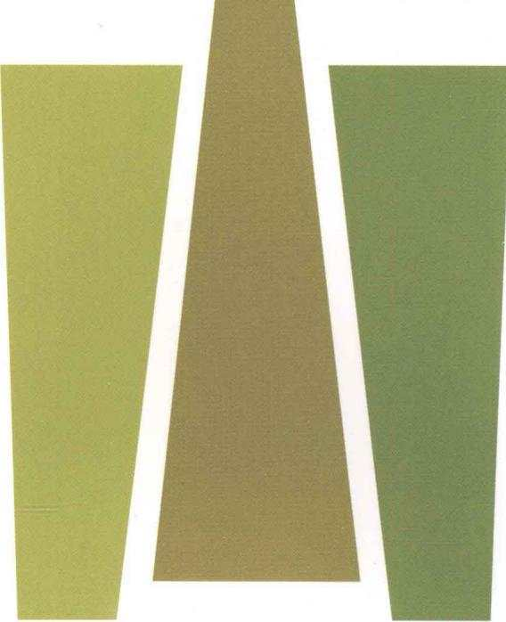

# 矿山废弃地生态修复研究与实践

RESEARCH AND PRACTICE OF ECOLOGICAL REMEDIATION OF MINE WASTELAND

周连碧王琼代宏文等著

## 中国环境科学出版社

# KUANGSHAN FEIQIDI SHENGTAI XIUFU YANJIU YU SHIJIAN

矿山废弃地生态修复是一项系统工程，不仅涉及废弃地所处的地质、地貌、水文、植被、土壤等影响因素，而且还需要岩石力学、生态学、生物学、土壤学、植物生理学、肥料学、园艺学等多个学科的共同参与研究，充分体现了多学科交叉综合的特点。本书共分为9章，分别介绍了生态修复的相关概念和理论、矿山废弃地的特点和其对生态环境的影响、土壤改良物质和改良措施、生态修复植被选择与配置、有色金属矿山典型3类废弃物堆场和废弃采石场生态修复研究与实践，并在此研究的基础上进行了归纳和总结，编制了土地复垦技术标准。

本书适用于国土、矿山、林业、水利水保、园林、旅游等部门从事项目建设管理、生态环境建设的教学、科学研究、设计和工程技术人员参考。

  
定价：48.00元

# 矿山废弃地生态修复研究与实践

周连碧王琼代宏文等著

中国环境科学出版社·北京

## 图书在版编目（CIP）数据

矿山废弃地生态修复研究与实践/周连碧，王琼，代宏文等著.一北京：中国环境科学出版社，2010.12ISBN 978-7-5111-0381-9

1.①矿…Ⅱ.①周…②王…③代…Ⅲ.①矿山一生态环境一环境治理—研究一中国 V. ①X322.2

中国版本图书馆CIP数据核字（2010）第192116号

责任编辑 高速进

责任校对尹芳

封面设计 玄石至上

出版发行中国环境科学出版社

(100062 北京东城区广渠门内大街16号)

网址：http://www.cesp.com.cn

联系电话：010-67112765（总编室）

发行热线：010-67125803，010-67113405（传真）

印 刷 北京中科印刷有限公司

经 销各地新华书店经销

版 次 2010 年 12 月第1版

印次 2010年 12月第1次印刷

开 本 787×960 1/16

印 张 12.75 彩插 24

字数 240 千字

定 价48.00元

【版权所有。未经许可请勿翻印、转载，侵权必究】

如有缺页、破损、倒装等印装质量问题，请寄回本社更换

# 《矿山废弃地生态修复研究与实践》编委会

主编周连碧

副主编 王琼代宏文

编 委 李小平 吴亚君 祝怡斌 郑学敏

过世民孔祥龙高承家李冬

邓禾淼高继宏马玲张冬松

潘斌占幼鸿王柏莉陈斌

甘霖冯道永冷杰彬吴缨

## 前 言

我国矿产资源丰富，截至2010年，全国已发现的矿产有171个矿种，探明储量的已经达到了159种，其中20多种矿的探明储量位居世界前列，如钨矿、锡矿、锑矿、稀土矿等大约12种位居世界第一。探明的储量占到了全球的12%，从探明的总储量来看，我国仅次于美国和俄罗斯，居世界第三位。中国已成为世界重要的矿产资源大国和矿业大国。

然而，在矿业取得巨大成就的同时，我国矿区生态环境也普遍受到严重破坏。从20世纪50年代以来，随着国家工业化的发展，生产建设破坏土地的情况十分严重。特别是20世纪80年代以后，随着生产建设规模的不断扩大和开发速度的加快，对资源破坏规模和程度都远远超过以往，可以说是资源的掠夺性发展。研究报告表示，土地破坏的规模和程度持续增加，复垦形势十分严峻。据粗略估算，目前中国因矿产资源开发等生产建设活动，挖损、塌陷、压占等各种人为因素造成的破坏废弃的土地约1300万hm2，约占耕地总面积的10%以上，而全国土地复垦率仅为15%左右。国际上矿地复垦率已经达到50%～70%，美国因采矿业破坏的土地复垦率达到85%以上，德国土地复垦率超过了90%，远远高于我国15%左右的矿地复垦率。由此可见，我国的土地复垦工作任重而道远。

随着国家对矿产资源需求的迅速增加及矿业经济的迅猛发展，矿山开采造成大规模的土地破坏和植被破坏，在中国乃至世界，都是一个十分严重且日益受到高度重视的问题。矿产资源的开发和利用为我国的经济高速发展和城镇化建设作出了极大的贡献，但也引发一系列难以避免的环境问题。矿山开采特别是露天开采，不但影响自然景观、造成环境污染，而且还会造成水土流失，诱发山体滑坡等地质灾害。采矿活动所形成的废弃地具有众多极端理化性质，主要表现为物理结构不良、贫瘠、极端pH值、重金属含量过高、干旱等，对矿区景观、土地资源、水环境、生物多样性等均产生巨大影响并危及人类的生存与健康，影响区域经济的可持续发展。

矿区的生态修复已成为我国生态环境建设的重要组成部分，通过对废弃矿区的生态修复，能够有效改善生态环境；同时结合土地整治，对土地资源进行综合利用，缓解人地资源的矛盾；更为重要的是通过合理规划实施替代产业的发展，解决由于一些矿山的关停造成的区域当前经济暂时负面影响，从而实现黑白经济向绿色经济的转变，安置产业转业人员。通过矿区的生态修复工作，配合我国社会主义新农村建设，促进绿色GDP的增长，实现循环经济，构建和谐社会。

本书的资料主要来自“中澳矿山废弃物研究管理项目”和国家“十一五”科技支撑课题（2006BAC09B04）———有色金属矿山废弃物堆场生态修复技术开发的成果，是多学科、多专家联手攻关、辛勤劳动的结晶。同时，本研究得到了铜陵有色金属集团股份有限公司冬瓜山铜矿、中条山有色金属集团有限公司、江西铜业股份集团公司德兴铜矿以及中国铝业股份有限公司广西分公司的大力支持，在此表示衷心感谢！

本书共分为9章，第1章概述了矿山废弃地生态修复，包括生态修复的相关概念、理论以及国内外矿山生态修复概况；第2章主要阐述了矿山废弃地的特点和其对生态环境的影响；第3章主要介绍了矿山废弃地的土壤改良物质和改良措施；第4 章主要介绍了矿山废弃地生态修复植被选择与配置，并列举了部分适宜的植被类型及名称；第5 章至第 7 章主要介绍了有色金属矿山典型 3 类废弃物堆场生态修复研究与实践，包括基质的改良、植物的选择与配置、废石酸形成潜势规律、生态修复技术与施工工艺以及工程实践等；第8章介绍废弃采石场生态修复研究与实践；第9章在上述研究的基础上进行了归纳和总结，编制了土地复垦技术标准。书中所有未直接出现的图例，均可依据相应的编号在书后的附图中查阅。

本书适用于国土、矿山、林业、水利水保、园林、旅游等部门从事项目建设管理、生态环境建设的教学、科学研究、设计和工程技术人员参考。

由于作者知识水平有限，缺点和错误在所难免，恳请专家、学者不吝赐教，以便在日后工作中进一步完善提高，为推动我国对矿山废弃地生态修复的深入研究贡献力量。

周连碧

2010年8月于北京

## 目录

第1章 矿山废弃地生态修复研究概述.  
1.1 生态修复的有关概念....  
1.2 矿山废弃地生态修复概念.. ..2  
1.3 生态修复概念的内涵及外延... ..3  
1.4 矿山废弃地生态修复的主要基础理论.. .4  
1.5 国内外矿山废弃地生态修复研究进展.. ...10  
1.6 国内外矿山废弃地生态修复技术的主要研究动态..... ....14  
1.7 矿山废弃地生态修复面临的主要问题... .....19  
第2 章 矿山废弃地的特点及其对生态环境的影响分析.... ...23  
2.1 矿山废弃地的特点.... ...23  
2.2 矿山废弃地对生态环境的影响. ..25  
第3 章 矿山废弃地的土壤改良 ..31  
3.1 土壤改良的作用. .31  
3.2 土壤改良的物质. .32  
3.3 土壤改良的措施.. ..33  
第4 章 矿山废弃地生态修复植被选择与配置. ..39  
4.1 植物选择的原则 ..39  
4.2 适生植物的筛选. .41  
4.3 植物的优化配置.. .60  
第 5 章 赤泥堆场边坡生态修复研究与实践. .62  
5.1 概述... .62  
5.2 限制赤泥堆场生态修复的因素.. .63  
5.3 赤泥堆场边坡生态修复技术研究. .63  
5.4 赤泥堆场边坡生态修复工程实践... ..71  
第6章 尾矿库生态修复研究与实践. .82  
6.1 概述... .82  
6.2 尾矿库生态修复的特点. .82  
6.3 限制尾矿库生态修复的因素. .83  
6.4 尾矿库生态修复的类型. ..85  
6.5 尾矿库生态修复技术研究. ... 86  
6.6 尾矿库生态修复工程实践.. ..100  
第7章 酸性废石堆场生态修复研究与实践. .. 106  
7.1 概述.... .. 106  
7.2 限制酸性废石堆场生态修复的因素. ..107  
7.3 酸性废石堆场生态修复技术研究... ..107  
7.4 水龙山酸性废石堆场边坡生态修复工程实践.... .. 116  
第8章 废弃采石场生态修复研究与实践. ..120  
8.1 概述.. 120  
8.2 限制废弃采石场生态修复的因素. .121  
8.3 废弃采石场生态修复技术研究. .121  
8.4 废弃采石场生态修复工程实践... .. 146  
第9章 土地复垦技术标准研究.. ..154  
9.1 研究背景... .. 154  
9.2 标准制定的依据.. .154  
9.3 标准研究的方法.. .154  
9.4 标准条文.... .. 156  
9.5 标准条文说明.. ..172  
参考文献.. .. 191  
附图... .. 195

# 第1章 矿山废弃地生态修复研究概述

## 1.1 生态修复的有关概念

## 1.1.1 生态

生态是指生物圈动物、植物和微生物等及其周围环境系统的总称。生态系统是一个复杂的系统，由大量的物种构成，它们直接或间接地连接在一起，形成一个复杂的生态网络。其复杂性是指生态系统结构和功能的多样性、自组织性及有序性。

## 1.1.2 生态修复

生态修复是相对于生态破坏而言，是为了加速已被破坏的生态系统的恢复，还可以辅助人工措施的生态系统健康运转服务，而加速恢复则称为生态修复；在特定的区域、流域内，依靠生态系统本身的自组织和自调控能力的单独作用，或依靠生态系统本身的自组织和自调控能力与人工调控能力的复合作用，使部分或完全受损的生态系统恢复到相对健康的状态，生态修复应包括生态自然修复和人工修复两个部分。关于“生态修复”，日本学者多认为，生态修复是指外界力量受损生态系统得到恢复、重建和改进(不一定是与原来的相同）。这与欧美学者“生态恢复”的概念的内涵类似。焦居仁认为，为了加速被破坏生态系统的恢复，还可以辅助人工措施，为生态系统健康运转服务，而加快恢复则被称为生态修复。该概念强调生态修复应该以生态系统本身的自组织和自调控能力为主，而以外界人工调控能力为辅。

## 1.1.3 生态恢复

生态恢复是指停止人为干扰，解除生态系统所承受的超负荷压力，依靠生态本身的自动适应、自组织和自调控能力，按照生态系统自身规律演替，通过其休养生息的漫长过程，使生态系统向自然状态演化。恢复原有生态的功能和演变规律，完全可以依靠大自然本身的推进过程。

## 1.1.4 生态重建

生态重建是对被破坏的生态系统进行规划、设计，建设生态工程，加强生态系统管理，维护和恢复其健康，创建和谐、高效的可持续发展环境。对于生态修复，国际上已有相应的科学理论支撑体系，对生态系统退化机理及其恢复途径已有所研究，并被日本、美国及欧洲所应用，取得了良好的效果。

## 1.2 矿山废弃地生态修复概念

矿山废弃地生态修复是指将受损生态系统恢复到接近于采矿前的自然状态，或重建成符合人类某种有益用途的状态，或恢复成与其周围环境（景观）相协调的其他状态。它强调的是一个动态的过程，而不单是过程的结果。几乎在所有的情况下，开采活动的干扰都超过了开采前生态系统的恢复力承受限度，若任由采矿废弃地依靠自然演替（natural succession）恢复，可能需要100～10 000年。尤其是金属矿开采后的废弃地(如尾矿库)，其表面形成极端的生态环境，自然条件下植物几乎无法定居。

矿山废弃地生态修复是一项系统工程，不仅涉及废弃地所处的地质、地貌、水文、植被、土壤等因素，而且还需要岩石力学、生态学、生物学、土壤学、植物生理学、肥料学、园艺学等多个学科的共同参与研究，充分体现了多学科交叉综合的特点。从实践的角度来说，生态修复具有一定的生态、环境、社会和经济效益。而从理论来说，矿山废弃地生态修复也是生态学理论的实践和检验者。因此，矿山废弃地生态修复是在矿山废弃地生态系统的退化、自然恢复的过程与机理等理论研究的基础上，建立起相应的技术体系，用以指导和恢复因采矿活动所引起的退化生态系统，最终服务于矿山废弃地的生态环境保护、土地资源利用和生物多样性的保护等理论与实践活动。

矿山的生态修复通常是指将采矿破坏的土地因地制宜地恢复到所期望状态的行动和过程，是矿区生态环境综合整治工作的核心。由于各国、各地区生态系统特点的差异与复垦目标和范围的不同，生态修复曾经有过不同的定义。

“复垦”一词，其主要含义是赋予复垦地以农业使用价值。“复垦”一词，其主要含义是赋予复垦地以农业使用价值。从持续发展的观点看，采后土地治理和恢复是为了建立或恢复与当地自然界相和谐的人工生态系统，其实质是“生态修复”。近年来，国内围绕矿区土地复垦研究已渐成“热门”，矿山、土地、农业等的研究领域称其为“土地复垦”；环保研究领域有时称其为“土地复垦”，有时称其为“生态建设”；生态研究领域原称其为“土地复垦”，现常称之为“生态恢复”、“生态重建”或“生态修复”。虽然各类从事研究领域对其有不同的称谓，但从近年研究和实施工程来看，虽名称各异，方向也各有所侧重，但总目标逐渐在趋向一致，趋向于更综合的生态问题。不论称其为生态修复或生态重建，现状已由单纯的工程问题趋向于更高层次的生态问题，或应更明确地称之为复合生态问题。

## 1.3 生态修复概念的内涵及外延

实现生态自我修复，应遵循人与自然和谐相处的原则，控制人类活动对自然的过度索取，停止对大自然的肆意侵害，依靠大自然的力量实现自我修复。它的含义应包括以下三个方面：一要遵循自然生态经济规律；二要充分利用自然资源；三要快速恢复植被。

近年来，有些研究者认为，生态修复的概念应包括生态恢复、重建和改建，其内涵大体上可以理解为，通过外界力量使受损（开挖占压、污染、全球气候变化、自然灾害等）生态系统得到恢复、重建或改建（不一定完全与原来的相同）。按照这一概念，生态修复涵盖了环境生态修复，即非污染的退化生态系统。按照这一内涵，生态修复可以理解为“生态的修复”，即应用生态系统自组织和自调节能力对环境或生态本身进行修复。因此，我国生态修复在外延上可以从四个层面理解：第一个层面是污染环境的修复，即传统的环境生态修复工程概念；第二个层面是大规模人为扰动和破坏生态系统（非污染生态系统）的修复，即开发建设项目的生态系统修复；第三个层面是大规模农林牧业生产活动的森林和草地生态系统的修复，即人口密集农牧业区的生态修复，相当于生态建设工程或生态工程；第四个层面是小规模人类活动或完全由于自然原因（森林火灾、雪线上升等）造成的退化生态系统的修复，即人口分布稀少地区的生态自我修复，正在实施的水土保持生态修复工程及重要水源保护地、生态保护区的封禁管护均属于这一范畴。第二、三、四层面综合起来即为生态恢复学的内容，这四个层面的生态修复可能在同一较大区域并存或交叉出现。

## 1.4 矿山废弃地生态修复的主要基础理论

矿山废弃地生态修复的主要基础理论有两部分组成，即土壤重构理论和生态学理论，本章就矿山生态修复的生态学和土壤学方面的理论基础进行简要介绍。

## 1.4.1 生态学理论

矿山废弃地生态修复的生态学理论可以从恢复生态学中找到，恢复生态学是一门在20世纪80年代得到有力发展的现代生态学分支。自我设计与人为设计理论（Self-design versus design theory）是恢复生态学的重要理论。自我设计理论认为，只要有足够的时间，随着时间的进程，退化生态系统将根据环境条件合理的组织自己并会最终改变其组分。而人为设计理论认为，通过工程方法和植物重建可直接恢复退化的生态系统，但恢复的类型可能是多样的。恢复生态学应用了许多学科的理论，但应用最多、最广泛的还是生态学理论。这些理论主要有：

## 1.4.1.1 限制因子原理

生态因子是指环境中对生物生长、发育、生殖、行为和分布有直接或间接影响的环境因素，如温度、湿度、食物、氧气、二氧化碳和其他相关生物等。生物的生存和繁殖依赖于各种生态因子的综合作用，其中限制生物生存和繁殖的关键性因子就是限制因子。任何一种生态因子只要接近或超过生物的耐受范围，它就会成为这种生物的限制因子。系统的生态限制因子强烈地制约着系统的发展，在系统的发展过程中往往同时有多个因子起限制作用，并且因子之间也存在相互作用。当一个生态系统被破坏之后，要进行恢复会遇到许多因子的制约，如水分、土壤、温度、光照等，生态恢复工程就是从多方面进行生态环境和生物种群的设计与改造。因此，在进行生态恢复时必须找出该关键因子，找准切入点，才能进行恢复工作。

对矿山废弃地进行植被恢复时，应首先弄清这个地区的多年平均降雨量、热量、土壤、温度等条件，找出生态恢复的限制因子。如岩质坡地绿化的限制因子是植物生长必需的土壤；南方很多土质边坡的限制因子是土壤板结、酸度大；北方边坡的限制因子是缺水。针对这些问题，设计不同的解决方案。

## 1.4.1.2 生态系统的结构理论

生态系统是由生物组分与环境组分组合而成的结构有序的系统，生态系统的结构指生态系统中的组成成分及其在时间、空间上的分布和各组分间能量、物质、信息流的方式与特点。具体来说，生态系统的结构包括三个方面，即物种结构、时空结构和营养结构。

建立合理的生态系统结构有利于提高系统的功能。合理的生态结构体现在生物群体与环境资源组合之间的相互适应，能充分发挥资源的优势，并保护资源的持续利用。时空结构，应能充分利用光、热、水、土资源，提高光能的利用率。营养结构，应实现生物物质和能量的多极利用和转化，形成一个高效的、无废物的系统。物种结构方面，提倡物种多样性，以有利于系统的稳定和持续发展。根据此结构理论，生态恢复工程中应采用多种生物物种，实现物种之间的能量、物质和信息的流动。

## 1.4.1.3 生态适应性原理

在与环境的长期协同进化过程中，生物对生态环境产生了生态上的依赖，其生长发育对环境就有所要求，即产生了对光、热、温、水、土等方面的依赖性，如果生态环境发生明显变化，生物就不能较好的生长。因此，种植植物必须考虑其生态适应性，让最适宜的植物生长在最适宜的环境中。生态恢复应该尽量使用当地物种，因为当地物种是经过长期与环境协同进化而来的。

在进行矿山废弃地生态恢复的工程设计之前，要首先调查恢复区的野生植物资源以及自然生长条件，如气候、土壤、光照、温度等，然后根据生态环境因子来选择适合的生物种类，找出与当地环境相适宜物种，使生物种类与环境生态条件相适宜。尤其是中草药、食用菌、牧草、野果、灌木等物种，也可根据物种特性改良土壤，达到有的放矢、有利于当地经济的植被生态恢复。

## 1.4.1.4 生态位理论

生态位可被表述为：生物完成其正常生命周期所表现出的对特定因子的综合位置，即用某一生物的每一个生态因子为一维，以生物对生态因子的综合适应性为指标构成的超几何空间。在自然生态学中，主要指一个种群在时间、空间上的位置及其与相关种群之间的功能关系。在恢复生态工程中，要避免引进生态位相同的物种，即尽可能使各物种的生态位错开，避免种群之间的直接竞争，保证群落的稳定。

如在矿山废弃地生态恢复过程中，要避免引进生态位相同的物种，尽可能地使物种的生态位错开，避免种间直接竞争，注意维持系统生物多样性，保证群体稳定，如在进行边坡喷播绿化时，应选择冷季型草与暖季型草搭配，灌木和草本结合使用。

## 1.4.1.5 生物群落演替理论

在自然条件下，原有植物群落遭到破坏后，还是能够恢复的，尽管恢复的时间有长有短。

先是先锋植物侵入遭到破坏的地方并定居和繁殖。先锋植物改善了被破坏地的生态环境后，随着其他更适宜物种的生存和繁衍，先锋植物逐步被取代。如此渐进直到群落恢复到它原来的面貌和物种成分为止。

在遭到破坏的群落地点所发生的这一系列变化就是演替。演替有原生演替和次生演替两种基本类型，发生哪一种类型的演替由演替过程开始时的土壤条件所决定。无论是原生演替还是次生演替，都可以通过人为手段加以调控，从而改变演替速度或方向。

恢复生态工程是在生态建设服从于自然规律和社会需求的前提下，在群落演替理论指导下，通过物理、化学、生物的技术手段，控制待恢复生态系统的演替过程和发展方向，恢复或重建生态系统的结构和功能，并使系统达到自维持状态。

实际上，边坡生物群落是在不断演替的。自然状态下，土质边坡与岩质边坡的演替过程和时间是不一样的。而在人工于预下，坡地生态恢复的顺序一般应为：先锋植物（一般人选择草类植物）→当地草种→灌木→乔木（土层太薄不能演绎到乔木)。对岩质边坡而言，先锋植物的选择尤其重要，一般应选择根系发达、生长迅速的草类，同时考虑豆科植物和菌肥的使用。

## 1.4.1.6 生物多样性原理

生物多样性指生命形式的多样化，各种生命形式之间及其与环境之间的多种相互作用，以及各种生物群落、生态系统及其生境与生态过程的复杂性。一般来讲，生物多样性包括遗传多样性、物种多样性、生态系统与景观多样性。

生态恢复中的一个关键成分是生物体，生物多样性在生态恢复计划、项目实施和评估过程中具有重要作用。在生态恢复的计划阶段就要考虑恢复乡土种的生物多样性：在遗传层次上考虑那些温度适应型、土壤适应型和抗干扰适应型的品种；在物种层次上，根据退化程度选择阳生性、中生性或阴生性种类并合理搭配，同时考虑物种与生境的复杂关系，预测自然的变化，种群的遗传特性，影响种群存活、繁殖和更新的因素，种的生态生物学特性，足够的生境大小；在生态系统水平层次上，尽可能恢复生态系统的结构和功能（如植物、动物和微生物及其之间的联系)，尤其是其时空变化。

生态恢复工程应最大限度地采取技术措施，如种植先锋植物、进行水肥管理等，还要引进新的物种，配置好初始种类组成，以加快恢复与地带性生态系统相似的生态系统。

## 1.4.2 土壤重构理论

土壤是植物生长繁育的基础，不同土壤的物理、化学特性以及它的水、肥、气、热状况对植物的生育有着重要的影响。植物的健康持续生长，必须以废弃地具有适宜植物生长的土壤环境为前提。因此，废弃地生态修复技术必须遵循土壤学的基本理论，在坡面营造适宜植物生长的土壤环境。

## 1.4.2.1 土壤物理特性

## (1) 土壤质地

土壤质地指土壤中各粒级含量的百分比。土壤质地一般分为砂土、壤土和黏土三大类。不同质地的土壤具有不同的特性，它直接影响土壤透水、保水、保肥、供肥、通气等肥力特性，与植物生长的关系十分密切。我国的土壤质地分类标准见表1-1。

表 1-1 土壤质地分类标准
<table><tr><td rowspan=1 colspan=2>项目</td><td rowspan=1 colspan=3>颗粒组成</td></tr><tr><td rowspan=1 colspan=1>组别</td><td rowspan=1 colspan=1>名称</td><td rowspan=1 colspan=1>砂粒（1~0.05mm）</td><td rowspan=1 colspan=1>粗粉粒（0.05~0.01mm）</td><td rowspan=1 colspan=1>细黏粒（&lt;0.01 mm）</td></tr><tr><td rowspan=1 colspan=1>砂土</td><td rowspan=1 colspan=1>粗砂土细砂土面砂土</td><td rowspan=1 colspan=1>&gt;70%60%~70%50%~60%</td><td rowspan=1 colspan=1>一</td><td rowspan=3 colspan=1>&lt;30%</td></tr><tr><td rowspan=3 colspan=1>壤土</td><td rowspan=1 colspan=1>砂粉土粉土</td><td rowspan=1 colspan=1>≥20%&lt;20%</td><td rowspan=1 colspan=1>≥40%</td></tr><tr><td rowspan=1 colspan=1>砂壤土壤土</td><td rowspan=1 colspan=1>≥20%&lt;20%</td><td rowspan=1 colspan=1>&lt;40%</td></tr><tr><td rowspan=1 colspan=1>砂黏土</td><td rowspan=1 colspan=1>≥50%</td><td rowspan=1 colspan=1></td><td rowspan=1 colspan=1>≥30%</td></tr><tr><td rowspan=1 colspan=1>黏土</td><td rowspan=1 colspan=1>粉黏土壤黏土黏土重黏土</td><td rowspan=1 colspan=2>一</td><td rowspan=1 colspan=1>30%~35%35%~40%40%~60%&gt;60%</td></tr></table>

砂土类土壤砂粒多，粒间孔隙大，毛管作用弱，通气透水，内部排水通畅，不易积聚还原性有毒物质。好气性微生物活动强烈，土壤中有机质分解速度快，易释放有效养分。矿物成分以石英为主，养分含量低，保水保肥性差。热容量较小，土壤温度易升降，变化幅度较大。土粒间黏结性弱。

黏土类土壤的粒间孔隙很小，多为毛细管孔隙和无效孔隙，故通气不良，透水性差，内部排水不良。黏土中一般矿质养分含量高。由于通气性差，有机质分解慢，易于积聚腐殖质。黏土保水力强，热容量大，增温降温慢，温差小。土粒间黏结力强。

壤土类土壤砂黏适中，兼有砂土和黏土的优点，消除了其缺点，是植物生长比较理想的质地。它既有一定数量的大孔隙，又有相当多的毛管孔隙，故通气透水性良好，又有一定的保水保肥性能。含水量适宜，土温比较稳定，黏性不大。

## (2) 土壤结构

土壤结构是指在内外因素的综合作用下，土粒相互黏结成大小、形状和性质不同的团聚体，这种团聚体称为土壤结构。它影响着土壤中水、肥、气、热状况，从而在很大程度上反映了土壤肥力水平。常见的土壤结构有块状结构、核状结构、柱状结构、片状结构和团粒结构。团粒结构是指形状近似圆球、疏松多孔的小团聚体，其粒径为 0.25\~10 mm。

具有团粒结构的土壤，能协调水、肥、气、热诸因素，是最适于植物生长的土壤结构。团粒结构能调节土壤水分与空气的矛盾；能协调土壤养分的消耗和积累的矛盾；稳定土温，调节土壤热状况；有利于植物根系伸展。

## (3) 土壤水分

土壤水分以固态、液态和气态三种形态存在。当水分进入土壤后，会受到土壤中各种力的作用，如土粒表面的分子引力、毛管孔隙的毛管引力、重力等。由于土壤水所受力的大小、性质的不同及其被植物利用状况的差异，一般把土壤水分分为吸湿水、膜状水、毛管水、重力水四种类型。土壤从干燥状态吸水开始，随着水分含量的增加，其形态经吸湿水、膜状水、毛管水和重力水一直到饱和持水量，土壤对水的吸力由10亿Pa一直降到接近于零。

土壤中各种形态的水分，并非都能被植物吸收利用。其中，可以被植物吸收利用的水分称为有效水，不能被植物吸收利用的水分称为无效水。土壤水分对植物是否有效，主要取决于土壤对水分的保持力及植物根系的吸水力。当土壤水的保持力小于植物的吸水力时，土壤水分就能被植物利用，反之就不能从土壤中吸水。土壤有效水的范围是从田间持水量到凋萎持水量之间的含水量。两者之差就是土壤能保存的最大有效持水量，下简称有效持水量。不同的土壤，其有效持水量差异很大。它主要受土壤质地、有机质含量、结构等的影响。

## (4) 土壤通气性

土壤通气性是指土壤空气与大气空气之间不断进行气体交换的性能。维持土壤适当的同期性，是保证土壤空气质量、维持土壤肥力不可缺少的条件。土壤空气与大气进行气体交换的方式有气体分子的扩散作用、气体的整体交换两种。土壤通气性对植物生长发育的影响是多方面的，主要有影响种子萌发；影响根系的发育与吸收水分、养分的功能影响很大；影响养分的转化，从而影响到养分的形态及其有效性；影响植物的抗病性。土壤通气状况的好坏，对植物生长有很大影响。因此，需要调节土壤的通气状况，改善土壤水、肥、气、热条件，为植物生长创造适宜的环境条件。

## (5) 土壤温度

热量是生物赖以生存、繁衍的基础，土壤温度是衡量土壤热量的一种尺度。土壤中一切生物的生命活动都要求一定的土壤温度，土壤中的许多物理、化学过程也与十壤湿度有密切关系，土壤温度还影响土壤水分、空气和养分的转化。土壤温度主要决定于土壤热量的收支和土壤的热性质。土壤热量的来源包括太阳辐射能、地球的内热、生物热及化学热等。土壤温度影响植物种子的发芽、出苗；土壤温度也是土壤肥力因素之一，它不仅直接决定土壤的热量状况，还对其他肥力因素有很大影响，土壤温度影响土壤养分的转化和供应。合理调控土壤温度，对满足植物的温热条件和提高土壤肥力有重要意义。

## 1.4.2.2 土壤化学性质

## (1) 土壤养分

植物体的组成成分非常复杂，大约含有70多种元素，其中有些元素是所有植物所必需的，称为必需营养元素。目前已确认碳、氢、氧、氮、磷、钾、钙、镁、硫、铁、锰、铜、锌、硼、钼和氯16种为植物生长发育的必要营养元素。按植物对必需营养元素的需要不同，把这16种必需元素区分为大量元素和微量元素。大量营养元素约占植物体干重的千分之几到百分之几，包括碳、氢、氧、氮、磷、钾、钙、镁、硫9种，微量营养元素是植物需要量微小的元素，包括铁、锰、铜、锌、硼、钼和氯。

在这16种必需营养元素中，除碳、氢、氧来自大气中的二氧化碳和水外，其余几乎全部来自于土壤。土壤供应各种养分的能力有很大差异，因此，为保障植物良好的生长发育，不足的养分需要通过合理施肥来解决。

## (2) 土壤酸碱性

土壤酸碱性是土壤重要的化学性质，是土壤形成过程中产生的重要属性。不同的成土条件产生不同的土壤酸碱性，它对植物生长、微生物的活动、养分的存在状态以及土壤理化性质等均有很大影响。

土壤溶液中存在着H+和OH，土壤酸碱性就是土壤溶液中的H+和OH浓度比例不同所表现的酸碱性质。如H+多于OH时，土壤呈酸性；而OH-多于H⁺时，土壤则呈碱性；二者数量相近，土壤呈中性。土壤的酸碱性通常用土壤溶液pH值来表示。土壤的pH 值表示土壤溶液中 H+浓度的负对数值，即pH=1g[H⁺]。

根据我国土壤的酸碱变化情况及其与土壤肥力的关系，可把土壤酸碱性分为7个等级（表1-2）。

表 1-2 土壤酸碱性分级
<table><tr><td rowspan=1 colspan=1>土壤pH值</td><td rowspan=1 colspan=1>&lt;4.5</td><td rowspan=1 colspan=1>4.5~5.5</td><td rowspan=1 colspan=1>5.5~6.5</td><td rowspan=1 colspan=1>6.5~7.5</td><td rowspan=1 colspan=1>7.5~8.5</td><td rowspan=1 colspan=1>8.5~9.5</td><td rowspan=1 colspan=1>&gt;9.5</td></tr><tr><td rowspan=1 colspan=1>土壤酸碱性</td><td rowspan=1 colspan=1>极强酸性</td><td rowspan=1 colspan=1>强酸性</td><td rowspan=1 colspan=1>酸性</td><td rowspan=1 colspan=1>中性</td><td rowspan=1 colspan=1>碱性</td><td rowspan=1 colspan=1>强碱性</td><td rowspan=1 colspan=1>极强碱性</td></tr></table>

土壤酸碱性对土壤肥力与植物生长有重要的影响，主要表现对土壤养分有效性、土壤物理性质的影响以及对植物生长的影响三个方面。

## 1.5 国内外矿山废弃地生态修复研究进展

## 1.5.1 国外矿山废弃地生态修复研究进展

在20世纪30年代，发达国家就开始重视矿山生态修复研究。经过几十年的发展，矿山生态修复已成为矿山开发中必须开展的内容，并制定严格的开发管理规定，规定矿山在开发设计和环境影响评价中，必须有生态修复内容，项目实施的同时，必须设立专门的生态修复研究机构，以保证矿山边开采，边修复被破坏了的自然生态，使矿山的生态环境保持良好状况。1971年美国矿山土地复地率为79.5%，西德莱茵褐煤矿区复地率为 55%，国外对矿山进行生态修复多是结合土地复垦来实施的，且各有特色。

## 1.5.1.1 美国的矿山生态修复

美国的生态修复工作一直走在世界前列。20世纪30年代就在全国26个州，先后制定了露天采矿有关土地复垦方面的法规，并于1977年8月3日正式颁布了《露天采矿管理与恢复（复垦）法》，这是美国土地复垦史上一个划时代的法规。根据该法规规定的义务，所有的煤矿山都进行了合理的开采和复垦。经过20多年的实践，不仅新近采矿破坏的土地能够及时进行复垦，昔日煤炭生产遗留下的工矿废弃地也得到修复，被污染的水资源得到了改善，如今土地复垦已成为采矿过程的一部分。

在美国，一般将矿区修复治理工作分为法律颁布前后两个阶段，使修复治理工作责任明确。对于法律颁布后出现的矿区土地破坏，一律实行“谁破坏，谁复垦”，即要求复垦率为100%。而对于法律颁布前已被破坏的废弃矿区则由国家通过筹集复垦基金的方式组织修复治理。对已废弃矿区的复垦采取在国库中设立废弃矿复垦基金的办法。美国环境法要求工业建设破坏的土地必须修复到原来的形态，原来的农田恢复到农田的状态，原来森林恢复到森林状态。由于国家法律的强制作用及其科研工作的进展，美国的矿区环境保护和治理成绩显著。在矿区种植作物、矸石山植树、造林和利用电厂粉煤灰改良土壤等方面做了很多工作，积累了大量经验。

美国土地复垦后并不强调农用，而是强调恢复破坏前的地形地貌，要求农田恢复到原农田状态，森林恢复到原森林状态，把防止破坏生态、环境保护提到极高的地位或看作唯一的复垦目的。要求控制水流的侵蚀和有害物质沉积；保持地表原状和地下水位；注重酸性和有害物质的预防和处理；保持表土仍在原位置；防止矸石和其他固体废弃物堆放后滑坡；消除采矿形成的高桥，使其恢复到近似等高的状态；要恢复植被，成为水生植物、陆地野生动物栖息场所。

## 1.5.1.2 德国的矿山生态修复

德国十分重视环境保护工作，保护和治理国土的意识强，时时把为群众创造好的生产生活环境作为重要的任务。各部门、企业也把保护环境作为自身建设发展的需要。在采矿过程中十分注意最大限度地减少对环境的破坏，采矿后开展复垦工作也不是简单的种树或平整土地，而是从整体考虑生态的变化和群众对环境的需要。为了加强对群众的环境教育和普及环境保护的科学知识，联邦政府自然资源部和环境保护的社团组织，每年确定宣传一个树种，一种动物，并印成图文材料在旅游地区发放，同时编写到中小学的教材中加强对青少年的环境教育。在各州的一些地方还设立了环保教育基地，设置岩石标本、栽植一些当年宣传的树木、草本植物等，以供附近群众和游客学习、欣赏。在这里，发展林业、保护环境已成为群众的自觉行动。德国经过长期努力，复垦工作取得了很大成绩。在矿区及周围，一片片整齐生长良好的林地，一个个碧绿如毯的牧场，一处处风景如画的旅游区，使人赏心悦目。无论是城市还是乡村到处是绿色，表现出非常高的环境质量。

## 1.5.1.3 澳大利亚矿山生态修复

澳大利亚是以矿业为主的国家，它将先进技术运用于矿山复垦，所需资金由政府提供，现在复垦已经成为开采工艺的一部分。它的特点是：

（1）采用综合模式，实现了土地、环境和生态的综合修复，它克服了单项治理带来的弊端；

（2）多专业联合投入，包括地质、矿冶、测量、物理、化学、环境、生态、农艺、经济学，甚至医学、社会学家等多学科多专业，另外是高科技指导和支持。

卫星遥感提供复垦设计的基础参数并选择各场地位置，计算机完成复垦场地地形地貌的最佳化选择，以及最少工程量的优化选择和最适宜的经济投入产出选择。同时，借助各种先进设备，可以进行生态修复过程中的观测。

## 1.5.1.4 其他国家的矿山生态修复

英国，立法、执法严格，采矿后必须复垦，资金来源明确。1993年露天矿已复垦5.4万hm²，用于农、林业，重新创造了一个合理、和谐、风景秀丽的自然环境。露天矿采用内排法，边采边回填再复垦，覆土厚1.3m（上表层为30cm耕作层)，复垦时注意地形、地貌，形成一个完美的整体。

法国由于工业发达，人口稠密，所以对土地复垦工作要求保持农林面积，恢复生态平衡，防止污染。法国十分重视露天排土场覆土植草，活化土壤，经过渡性复垦后，再复垦为新农田。为使复垦区风景与周围协调，还进行了绿化美化。在进行林业复垦时，分为三个阶段完成：一为实验阶段，研究多种树木的效果，进行系统绿化，总结开拓生土、增加土壤肥力的经验；二为综合种植阶段，筛选出生长好的白杨和赤杨，进行大面积种植试验（包括增加土壤肥力、追肥和及时管理等内容)；三为树种多样化和分阶段种植阶段，并合理安排林、农业，种植一些生命力强的树木、作物。

此外，前苏联也在1954年开始立法，1968年将其具体化，促进了土地复垦的综合科研、科学论证。其土地复垦过程分为工程技术复垦和生物复垦，它包括一系列恢复被破坏土地肥力、造林绿化、创立适宜人类生存活动的综合措施。上述国家的矿山复垦工作开展得较早且比较成功，注意修复土地生产性能，生物复垦技术先进。美国和澳大利亚更注意环境效益的改善，矿区生态平衡的恢复，并积极研究应用微生物复垦。

发达国家的矿业废弃地的生态修复比较成功，其工作开展较早，注意修复土地性能，生态修复技术先进。美、澳更注意环境效益的改善，修复矿区生态平衡。

## 1.5.2 国内矿山废弃地生态修复研究进展

我国矿山废弃地的生态修复工作早在古代就开始了。例如浙江绍兴的东湖原是一处采石场，从汉朝时代起就开山采石；隋朝扩建绍兴城时，大规模的开山采石，长年累月开凿形成的千奇百怪的峭壁和深邃小塘，从而构成了东湖的雏形。直到清代，东湖开始筑堤分界，将外分为河、内分为湖，并经长期的改造，形成了洞穴盘错、山水交融的风景旅游胜地。东湖风景名胜在国内外都享有盛名，在世界矿山废弃地修复的历史上占有极其显著的地位。

近代我国矿山废弃地的生态修复工作开始于20世纪50年代末60年代初，是随着国民经济和社会主义建设的发展自发开展起来的。但是，由于社会、经济和技术等方面的原因，直到1980年这项工作基本上还是处于零星、分散、小规模、低水平的状况。1989年1月1日生效的国务院第19号令《土地复垦规定》，标志着我国矿山废弃地生态修复事业的开端。《土地复垦规定》实施以后，采矿塌陷地、矸石山、露天采矿场、排土场、尾矿场和砖瓦窑取土坑等各类破坏土地的生态修复工作受到全社会的高度重视。

20世纪80年代初，矿山废弃地复垦率在0.7%～1%，在20世纪80年代末期的复垦率约为2%，90年代的复垦率达13.33%。因此，我国矿区废弃地生态修复的任务还十分艰巨。

在20世纪80年代以前，我国矿山废弃地的生态修复的理论与实践工作基本上都是各个矿区自发地在造林或造田的实践，其主要的目的是改善环境，维护矿区安全、缓解土地需求压力，当时几乎没有理论工作的介入，这些早期的生态修复实践积累了一些宝贵的经验。

我国有关废弃地生态修复的理论研究起步于20世纪80年代，90年代以后才初具规模。近十年来，矿山废弃地生态修复的研究有了突飞猛进的发展。主要的研究机构有，北京矿冶研究总院、中山大学和香港浸会大学、中国矿业大学、山西农业大学等。形成的两大研究领域是：以北京矿冶研究总院、中山大学和香港浸会大学等为代表、以有色金属矿山废弃地为研究对象、以环境污染的控制和自然生态系统的修复为主要目的的理论与技术研究；以中国矿业大学和山西农业大学为代表、以煤矿废弃地为对象、以土地利用为主要目的的生态修复理论与技术研究。

从20世纪90年代开始，当时的国家土地管理局先后在全国设立了12个土地复垦试验示范点，开始了大面积的土地复垦试验推广工作。1995年国家环境保护局组织“矿区生态环境破坏与修复重建调查研究”，土地复垦成为热点。1998年国家颁布《土地管理法》，2001年开始实施“国家投资开发整理项目”，标志着国家开始投资土地复垦。2006年是复垦事业的一个里程碑，国土资源部等7部委颁发《关于加强生产建设项目土地复垦管理工作的通知》（国土资发[2006]225号)，标志着复垦进入开采许可、用地审批程序中，即开采和建设用地的许可审批都要编制土地复垦方案。2007年出台《关于组织土地复垦方案编报和审查有关问题的通知》（国土资发[2007]81号)，进一步明确土地复垦方案的编制内容和审批要求等。2009年5月1日实施的《矿山地质环境保护规定》（中华人民共和国国土资源部令第44号）第十二条：“采矿权申请人申请办理采矿许可证时，应当编制矿山地质环境保护与治理修复方案，报有批准权的国土资源行政主管部门批准”，对矿区生态保护与复垦均有明确的目标和要求。2008—2009年，《土地复垦条例》正式进入论证和审批程序，即将颁布。随着国家对耕地保护的要求越来越严格，尤其是确保1.2亿hm²耕地的要求，土地复垦事业越来越受到国家的重视，正呈现出欣欣向荣的喜人景象。

## 1.6 国内外矿山废弃地生态修复技术的主要研究动态

一般说来，生态系统往往具有很强的自我恢复能力和逆向演替机制，即使在植被完全破坏的情况下，生态系统都有可能恢复。但是，由于矿山废弃地极端恶劣的环境条件，其受损生态系统自我恢复很难实现，或实现过程漫长，自然条件下废弃地的土壤恢复往往要花费数十年以上的时间。从裸地到草地再到灌丛与森林的生态恢复过程一般则需要数十年到数百年的时间来完成。因此，通过人工采取生态恢复措施来加快废弃地植被的生态恢复是废弃地治理的必然选择。如果采用生态恢复措施，矿山废弃地中受破坏的生态系统可在相对较短的时间内得以恢复。近年来，国内外矿山废弃地生态修复技术研究领域主要集中于以下几个方面：

## 1.6.1 矿山废弃地的基质改良

土壤作为植物生长的基质，其理化性质和营养状况是生态恢复与重建成功与否的关键。影响植物生长的土壤条件主要有三种：物理条件、某些营养物质的缺乏、毒性。因此，矿山废弃地生态环境恢复的基质改良要实现三个目标：一是改善基质结构等物理条件；二是改善基质营养状况；三是去除基质中有毒物质。

## (1)有机改良物质

城市污泥作为一种废弃物，是在进行废水处理过程中分离出来的固体。污水处理过程中产生的污泥含有大量植物所需的营养成分和微量元素，肥效高于一般农家肥。城市污泥可作为有机肥在农田施用。研究表明，在番茄、大白菜、辣椒、小青菜、花椰菜、包菜、玉米、水稻中施用城市污泥可显著提高产量，且明显高于普通农家肥，并有利于后茬作物的稳健生长。

城市污泥对矿山废弃地基质改良主要作用有以下几个方面：①改良废弃地的理化性质、增加土壤肥力。由于城市污泥的物理、化学和生物特性，施用城市污泥能够迅速有效地提高矿山废弃地的有机质含量并改变其结构性能。城市污泥中的氮、磷、钾和有机质经矿化，很易被植物吸收。因而，通过城市污泥来改良矿山废弃地，能够迅速而持久的为恢复的植物供肥。据研究施用污泥后，0\~30cm和30～60 cm土层的全氮量显著增加，水溶性的有机氮会在60～90 cm的土层富集，尤其在干旱季节，有利于植物从深层吸收氮。同时，还能改良土壤的理化性质，从而保证植物的生长，达到防止水土流失和改良土壤的目的。②有利于提高矿山废弃地微生物的活性。土壤微生物的活动参与和促进土壤中物质循环，是构成十壤肥力的重要因素。通过施用城市污泥，改善土壤环境为土壤微生物的活动提供了条件，而土壤微生物反过来又进一步促进土壤肥力的提高。城市污泥一方面含有大量的有机质和矿物养分，有利于促进土壤原有微生物的活动和繁殖；另一方面又因为其本身主要是由微生物群体组成的活性污泥，从而直接大大提高了土壤中微生物的数量。微生物促进有机物的分解和氮素的矿化作用和硝化作用，提高养分的有效性。

## (2)矿山废弃地的化学改良

在矿山弃渣场，组成物质主要是岩屑、灰烬等，具有渗漏和易侵蚀的特点，改善其理化性质时，常采用化学改良剂。这些化学改良剂大都是由化工厂的废弃物形成的复杂有机矿质化合物，它们不仅能形成预防表层土壤冲刷、不妨碍植物根系穿透的防护膜，而且能提供足够的酸性中和剂、氧化剂和一定的营养元素，同时，能有效地防止日灼和水分损失。

Wilkins1957年发现，很多溶液中的重金属离子的毒性，由 $\mathbb { C } \mathfrak { a } ^ { 2 + }$ 的存在而趋于缓和，这种作用称离子拮抗。也有证据表明， $\mathbf { C a ^ { 2 + } }$ 的存在能显著地降低植物对重金属的吸收。因此富 $\mathbf { C a ^ { 2 + } }$ 的废弃地中重金属的毒性较低。当废弃地含 $\mathbb { C } a ^ { 2 + }$ 较少时，可施用 $\mathbf { C a C O _ { 3 } }$ 或 $\mathbf { C a S O _ { 4 } }$ 等以减轻重金属的毒性。

在硫铁矿、铜矿、铅锌矿和煤矿等矿山废弃地，其酸性通常较强。改善这种条件可以施用石灰作改良剂。改善碱性矿山废弃地常用硫黄、石膏等作改良剂。由于矿山废弃地土壤营养缺乏，结构不良。N、P、K等大量元素的缺乏常常成为植物生长的限制因子。因此，经常性的施用N、P、K等肥料来补充土壤肥力是矿山废弃地生态恢复的重要措施。

## (3)矿山废弃地的生物改良

生物改良是利用对极端生境条件具有耐性的固氮植物、绿肥作物、固氮微生物、菌根真菌等改善矿山废弃地的理化性质。

豆科植物能够与根瘤菌形成固氮根瘤，从而将土壤中的氮气转化为氨固定下来，因此，寄主植物和根瘤菌的生长状况、固氮效率及最终形成根瘤菌—寄主共生协同关系的能力都非常重要。Jones等研究发现，从污染地区的土著豆科草种的根瘤中或根际土壤中分离出的根瘤菌，寄主植物能形成有效的共生关系并具有固氮能力。利物浦大学的研究人员发现，应该选择耐重金属且耐贫瘠的豆科植物，并注重乔灌草合理配置，不但有利于控制水土流失，更有利于植物对土壤的改良。Smith 将土壤中重金属铜和锌的浓度分别提高到 300 mg/kg 和2000mg/kg，能有效固氮的根瘤菌依然存在于所有寄主植物生长的土壤里，相反，一些没有土著寄主植物生长的土样在感染试验中，不能使白苜蓿形成瘤。张志权等在研究锌对大叶相思（Acacia auriculaeformis）及其根际微生物的影响时发现，根瘤菌对锌的耐受力明显高于寄主植物。在此基础上，聂湘平等深入研究了寄生于大叶相思和美丽胡枝子（Lespedezaformosa）的两种根瘤菌，在 $\mathbf { Z _ { n } } ^ { 2 + }$ 和 $\mathrm { C u } ^ { 2 + }$ 这两种重金属环境中的耐受性，以及植物根瘤菌共生固氮体系在这两种环境中的结瘤、固氮和生长变化，发现大叶相思根瘤菌对这两种重金属的耐受性都较美丽胡枝子上的根瘤菌强。

澳大利亚通过对草场草类改善研究，利用草场豆科植物固定矿区废弃物，可控制风蚀和水蚀，改善土壤物理、化学和微生物性质。俄罗斯在生态恢复实践中，已经应用了微生物肥料、菌根接种、磷钾菌肥及复合肥技术，此外，在造林中还运用了菌根接种技术。美国学者研究了VA菌根真菌与植物演替、多样性的关系，发现用VA菌根真菌接种后，恢复的植被生长量增加。

## 1.6.2 矿山废弃地生态恢复植物种选择的研究

植物种选择一直是各国重视的问题。俄罗斯专家在这方面做了广泛而深入的研究。在选择树种时除考虑地带性规律外，还坚持以下原则，如耐寒性、抗旱性、耐贫瘠、生长快和一定的土壤改良作用等，所选的植物种类应具有抗污染、速生、发育良好、保持水土和保健卫生、绿化及经济功能等特性。大量的资料表明，固氮树种能适应严酷的立地条件，特别是刺槐等豆科植物，是优良的先锋树种。

英国在矿山废弃地生态恢复研究中认为，应该选择耐贫瘠的豆科植物，并注重乔、灌、草合理配置，既有利于控制水土流失，也有利于植物对土壤的改良。在英国，J. E. G. Good等对生长在营养缺乏的采矿废弃地和其他废弃地上生长的桦木（Betula pendula）和柳树（Salix caprea）进行了优良无性系选择。经过选择的优良无性系，在露采煤矿废弃地种植，其成活率明显高于其他植物。在土壤特别贫瘠，条件恶劣的地方，优良无性系表现的效果更为明显。在土壤肥沃，排灌良好的土壤上，优势不很明显。Shelbourne教授研究挪威云杉（Picea abies）时，发现了相似的结果。

在国内，李晋川等（1999）在安太堡露天煤矿植被恢复研究中选择90余种植物，并从中选出20余种适合在黄土高原脆弱生态区复垦使用的适宜植物。杨修等（2001）在德兴铜矿废弃地选择13种草种进行适宜性试验，并认为其中12种较适宜。白中科等人研究了平朔露天矿区生态系统演变的阶段、类型和过程，注重草、灌、乔合理种植，并与工程措施联合施用，共引种了71种植物，经过筛选，以16种植物作为先锋植物。孙庆业等在广东仁化县铅锌尾矿库内，发现10种植物自然定居，这些植物在尾矿上的生长、分布明显受到表层尾矿某些物理性质，尾矿中的营养物质含量与植物的生长高度以及群落盖度有一定关系。研究还表明选育的无性系树冠的高、宽比率低，冠幅大，枯枝落叶多，有助于土壤有机质的积累和营养物质的循环。

## 1.6.3 矿山废弃地植被演替研究

所有的自然生态系统的恢复和重建，总是以植被的恢复为前提的。Pensa等（2004）在爱沙尼亚比较了在4种废弃油页岩堆上生长30年林木，认为自然演替能够促进多种植被的建植。Hol1（2002）研究了美国东部复垦煤矿35年的植被恢复情况，认为恢复35年后的植被组成与周围自然植被相似且该地区的植被组成沿着一个朝向周围森林的轨迹演替，但种植具有侵略性的外来种会减缓长期的植被恢复。Darina（2003）比较了褐煤矿山植被的人工恢复与自然恢复的特点，认为人工恢复仅仅是时间上的特征，而自然演替会在长的时间尺度上进行。Burton（2006）认为由于特殊的原因，自然过程的恢复会长达十几年或几个世纪，但通过人工模仿或采用自然过程可获解决。

在国内，李青丰等（1997）对准格尔煤田露天矿排土场植被自然恢复进行了研究，他们认为，植被自然恢复是一个漫长的过程，须人工加以适当于扰。

白中科等研究了平朔安太堡大型煤矿区生态系统演替的阶段、类型和过程。

陈芳清等发现，磷矿废弃地演替植物群落的形成是先锋植物种类入侵、定居、群聚和竞争的结果：在植物群落形成与演替的过程中，各种成分的种群数量及综合优势比呈动态变化；废弃地植物群落形成与演替的过程按演替序列可分为3个阶段；植物群落形成与演替还与环境因子有关；废弃地高浓度的土壤速效磷是影响植物生长与分布的胁迫因子；伴随着群落的形成与演替，植物群落的物种多样性呈逐渐增加的趋势。

刘世忠等研究了茂名北排油页岩废渣堆放场次生裸地的自然恢复的植被演替，发现群落结构及组成种类简单，处于群落次生演替的前期阶段，表明废渣场次生裸地的植被为一些抗逆性强的先锋植物。

束文圣（2003）认为，无论是对废弃采石场能否划作保护区而进行评估，或是制订对废弃采石场的生态恢复计划，对采石场废弃地基本情况及早期植被的自然入侵状况的了解都是十分重要的。

胡振琪等发现，矸石山植被经过9年的自然演替和生长过程，其种类及数量发生了较大变化：混交林中木本植物（乔、灌木）种群密度增加；植被具有明显减小矸石山渗透速率、提高保水和持水能力的作用；刺槐林分还能防止矸石山酸化和增加矸石山含氮量并促进氮素的有效化。

杨世勇等研究了铜陵市铜尾矿分布区，发现自然和人工定居于尾矿上的植物共有9科37属40种，其中禾本科、豆科、菊科植物占所有植物种的72.5%，因有完美的生态适应机制，而能成为在尾矿上定居的先锋植物和优势种。

高德武等对黑河地区露天金矿剥离物植被自然恢复和演替规律进行分析研究，发现植被恢复的速度受时间和剥离物组成的共同影响，其中剥离物中土和砂砾比例是影响的主要因素：植被演替中的优势种随时间变化而不同，前期以多肉植物为主，后期菊科植物成为优势种；针对植被演替规律和剥离物特性提出快速恢复植被的相应对策。因此，矿山废弃地必须辅以人工措施加速植被的恢复进程。

## 1.6.4 矿山废弃地植物修复的研究

矿山土地的植物修复是指用绿色植物及其相关的微生物、土壤添加剂和农艺技术来去除、截留土壤中的污染物或使污染物无害化的过程及技术。

矿山废弃地土壤中含有大量的有害物质，严重阻碍植物的生长。如在重金属污染严重的地区，所能生长的植物仅仅是那些耐重金属污染的物种，蜈蚣草(Pterisvittata)、绊根草（Cynodon dactylon）、水烛香蒲（Typha latifolia)、黄花稔（Sidarhombifolia)、雀稗(Paspalum thunbergii)和银合欢(Leucaena Glauca)等。Marseille等（2000）研究了植被对重金属理化性质的改变和转移，结果表明：重金属能够被植被所吸收，植被覆盖的建立能够改变废弃地的理化性质，增加里面重金属的流动性。韦朝阳和陈同斌对湖南一些炼砷区的植被和土壤污染状况进行了研究，首次发现砷的超富集植物蜈蚣草叶片含砷量高达 5 000mg/kg，此后，又发现了与蜈蚣草同属的另一种凤尾蕨类植物大叶井口边草（Pteris nervosa）对砷具有明显的富集功能。束文胜等在湖北铜绿山古冶炼渣堆进行了植被和土壤调查，发现鸭跖草（Commelina communis）是铜的超富集植物，可用于铜污染土壤的植物修复与重建。薛生国等人对湘潭锰矿污染区的植物和土壤进行了野外调查，发现商陆科植物商陆（Phytol-acca acinosa）对锰具有明显的超富积特性。刘威等发现并证实宝山堇菜（Violabaoshanensis）是一种镉超富集植物。杨胜香等人通过对广西平乐锰矿区受污染土壤及该区7种优势植物的调查和重金属含量的分析，发现其中山茶科木荷（Schima superba）叶子中锰含量高达30 075.94 mg/kg，表现出对锰的超富集能力。

近年来，耐重金属污染植物物种的筛选及其蕴藏的基因资源受到科学界的普遍关注，将超富集基因转入基因工程植物也是一个发展方向。Chaney等建议通过分子生物学技术改进野生超富集植物，建立商业化的实用植物提取技术，具体包括选择植物种类、收集种子、规范土壤管理、发展植物管理实践和妥善处理生物量。人们开始利用现代生物技术克隆耐重金属污染的基因，试图培育出适于在重金属污染土壤上生长的植物种类。

## 1.6.5 矿山废弃地土壤质量演变的研究

保持矿山废弃地土壤稳定性的关键因素在于土壤质量，包括土壤生物肥力和土壤环境质量。

阳承胜认为，土壤生物肥力水平是废弃地土地管理的关键因素之一。他们系统地分析了矿山废弃地的土壤生物群落组成及功能，矿山废弃地特殊的生境对土壤生物群落的影响等问题。于君宝等对抚顺老虎台煤矿复垦土壤进行取样测试，结果表明：覆土的营养元素含量随着覆土年龄的增长而升高：施（培）肥、植物吸收及表层微生物活动强烈，都成为覆土中营养元素含量上高下低的决定性因素；试验地覆土耕作层不存在酸性污染；虽然各覆土中养分状况存在差异，但均能满足作物生长需求。

龙健等通过观察浙江哩铺铜矿废弃地复垦土壤发现，微生物区系发生明显改变，重金属的胁迫抑制了矿区土壤中碳、氮营养元素周转速率和能量流动。张乃明等系统研究了孝义露天铝矿不同复垦年限的土壤养分变化，结果表明：随着复垦年限的增加，复垦土壤有机质、全氮、有效磷均呈逐年增加趋势，土壤容重逐年下降，土壤全磷、全钾、速效钾、土壤pH、交换量和微量元素的有效态含量变化不明显，通过种植牧草和大量施用有机肥和化肥，可加速复垦土壤的熟化、土壤理化性状逐年改善，使土壤生产力逐年提高。

胡振琪等（2003）在对煤矸石山的植物种群生长及其对土壤理化特性的影响研究后认为：植被具有明显减小矸石山渗透速率、提高保水和持水能力的作用，刺槐林分还能防止矸石山酸化和增加矸石山全氮量并促进氮素的有效化。

陕永杰等发现安太堡露天煤矿采矿前后土壤质量演变过程：第一阶段为突变型土壤质量退化阶段，土壤的物理、化学性状受到毁灭性破坏；第二阶段为渐变型土壤质量恢复阶段，经过人工培肥、土地复垦，提高了土壤质量，但是该过程进行得很缓慢。

姚斌等对废弃柴河铅锌矿区调查发现，重金属污染对土壤微生物特征有显著影响，使土壤呼吸速率明显增加，但土壤微生物生物量却显著下降，导致土壤微生物对能源碳的利用效率降低，从而削弱了矿山复垦土壤中碳、氮的循环速率和能量流动，不利于有机质的累积。

## 1.7 矿山废弃地生态修复面临的主要问题

美国、英国、德国、法国、澳大利亚、俄罗斯等发达国家的矿山治理工作开展的较早且比较成功，他们注重恢复土地生产性能，生态恢复技术先进。此外，加拿大、日本、匈牙利、丹麦等国家在这方面也做了大量研究工作，取得了不少成绩。近些年来，我国矿山治理工作也取得了长足的发展，但是由于经济和技术等方面的原因，矿区环境修复工作仍存在若于问题。

## 1.7.1 矿山类别多、分布广、治理难度大

我国矿山类型多、地域分布广且分散，植被破坏区域一般在自然状态下缺少植被生长的水、土等自然条件，植被恢复困难，导致大量矿山废弃后长期裸露，使这些矿山矿点形成了新的污染源，而且涉及行业部门多、面积广、后遗症多，给生态环境造成了严重的不良影响。

## 1.7.2 权责不清、生态恢复业主不明

缺乏严格的监督保障系统，难以确保各项法规的正常执行；在不少部门还未得到应有的重视，得不到充分的保障。现有的一些有关矿山生态植被恢复法律法规，在工作实施过程中由于法律实施保障以及各部门的行业多头管理造成相关监督执法力度不足。部分废弃矿山的权属类型不同，有大型国有企业、集体企业、私企；一些矿山在开采期间未能及时进行植被恢复，并且没有预留生态植被恢复资金，当矿山闭矿或关停之后，植被恢复资金和责任业主难以落实。有部分是近年政府明令关停项目，有些是资源枯竭而停产，还有部分是由于效益不佳而倒闭形成的废弃矿山。对于这些由政府部门明令关停项目可以由政府投资进行生态植被恢复，但是对于一些由于个体和民营企业的私挖乱采等盗采矿山以及无明确业主的废弃矿山造成的植被破坏，尤其是严重的生态环境破坏，其既得利益者并不承担破坏区域的植被恢复责任，这些问题造成权责不清、生态恢复责任业主不明，使生态植被恢复难以实施。

## 1.7.3 理念技术方面的问题

## (1)缺少科学理念指导和专业规划

我国矿山治理仍然采用“先破坏、后修复”的模式；理论落后于实践，重工程实践，轻理论研究，研究的薄弱环节乃是政策法规的制定和实施、现行技术的革新和理论提高，多学科专家的参与和联合攻关也是当务之急。重修复数量，轻修复质量，还有大部分矿山未进行治理，远远落后于先进的国家，我国治理的目的主要是解决环境污染和增加可耕地，治理技术主要以单一恢复植被为主，基本

未考虑恢复自然生态。

由于缺少统一规划和指导思想理念，零星开展的废弃矿山生态植被恢复虽然起到了一定的生态恢复和示范功能，但是由于开展的工作不系统，未能进行科学设计和全面总结，反而对社会造成了一定程度的误导。主要表现在不能按照近自然的原理进行废弃矿山的生态恢复，而是强化人工痕迹，实施人工造景和地面硬化，造成与周围自然环境不协调。

## （2）技术形式单一、不能科学进行技术组合，并且技术模式经济可行性差

由于行政决策或设计、施工单位技术单一，缺乏对技术的科学组合运用，对需要生态植被恢复的废弃矿山，不能根据立地条件的差异，采取不同的技术模式或技术组合分区实施生态植被恢复，从而造成生态植被恢复效果不理想。

在进行废弃矿山的植被恢复时，一味地追求技术新颖，对本身可以采用一些传统简单的技术形式就能实现植被恢复的，却采用一些从国外引进的技术措施，这样造成每平方米十几元就可以实现植被恢复的区域，花了百余元，使得技术模式的经济可行性差，难以推广实施。

## (3)不能科学进行植物品种选配

在进行矿区生态植被恢复时不能最大限度地采用乡土植物品种，而是大量采用国外引进的一些草种和外来植物品种，致使植物对立地条件的适应性差、不能持续稳定地成长，最终可能导致生态恢复工程的失败；同时，由于不能科学合理地进行植物种子混配，造成植被群落不能实现正常演替，目标群落不能如期实现；此外，选择的植物品种的耐瘠薄、耐旱等抗逆性差，一旦失去人工养护，植被就开始退化。

## (4) 缺乏专业设计和施工队伍

废弃矿山生态植被恢复是一项综合的、跨学科的技术，集成了生态、材料、植物、土壤、工程等方面多项技术为一体的生态破坏区域生态植被恢复综合工程技术体系。目前国内这方面的专业规划设计人员缺乏，一些实施的工程不是由专业人员设计的。此外，实施废弃矿山生态植被恢复的施工单位多为近两年从土建施工、园林绿化施工转向而来，或者由地方政府组织地方农民施工，认为废弃矿山生态植被恢复只是砌道墙、栽棵树、种片草，过于简单的看待，造成不能按照设计思路施工，最终导致项目实施失败。

## 1.7.4 政策规范与环保意识问题

## (1)矿山环境恢复治理的政策、技术法规建设有待进一步完善

矿山环境恢复治理中存在的各种问题，归结到一起，都与相关的政策和法规有关。目前我国在立法上只是在《中华人民共和国矿产资源法》《中华人民共和国环境保护法》《中华人民共和国土地管理法》《中华人民共和国水土保持法》《中华人民共和国水污染防治法》《土地复垦规定》中对矿山环境提出原则性的要求，缺少具体的管理法规，可操作性差，并且有关矿区生态修复还没有形成完善的技术规范。

## (2)激励和约束机制不完善，宣传教育的力度不够

激励机制和约束机制不完善，使得矿山企业、专业执法各部门以及周边群众对矿山开采造成的环境破坏问题未能充分重视起来。在矿产资源开发利用中，一些人还没有认识到资源可持续利用和生态环境保护的重要意义，没有积极主动地采取措施、保护环境、实现循环经济，而是站在既得利益的角度去开发资源，尤其是一些民营企业在这一点更为明显。

# 第2章 矿山废弃地的特点及其对生态环境的影响分析

## 2.1 矿山废弃地的特点

矿山废弃地是指在采矿活动中被破坏、未经治理而无法使用的土地。矿山废弃地由于受采矿活动的剧烈扰动，不但丧失天然表土特性，而且还具有众多危害环境的极端理化性质，其中重金属含量过高问题最为突出，是持久而严重的污染源。

## 2.1.1 物理结构不良，持水保肥能力差

矿业废弃地物理结构不良主要表现为：基质过于坚实或疏松。一方面采矿地的表土通常会被清除或挖走，而采矿后留下的通常是矿渣或心土，加上汽车和大型采矿设备的重压，使得暴露在外的往往是坚硬、板结的基质；另一方面采矿活动所产生的废弃物粒径通常为几百乃至上千毫米，短期内自然风化粉碎困难，空隙大、持水能力极差，加上表土受到严重扰动，原始结构被破坏因而往往具有松散的结构。这种过于坚实或疏松的结构均使土壤的持水保肥能力下降，从而影响土壤的生物肥力水平。

## 2.1.2 极端 pH 值

大多数植物适宜生长在中性土壤环境中。当土壤的pH值超过7～8.5时呈强碱性，可使植物枯萎，而当其pH值小于4时，则呈强酸性，对植物生长有强烈的抑制作用。高度酸化是大多数矿山废弃地共同存在的特征。矿山废弃物大都含有各种类型的金属硫化物，这些金属硫化物与空气接触后可产生氧化作用而生成硫酸并使基质严重酸化，严重时 pH 值可降至2.4 左右，尾矿渗出液甚至低至2左右。强酸除了其自身对植物能产生强烈直接危害外，酸性条件还会加剧重金属的溶出和毒性，并导致土壤养分不足。如低pH值可引起微量元素Fe、Mg和Be的缺乏，P形成难溶的磷酸钙，N形成氨而损失。此外，在酸性环境中，大量金属离子和有毒盐可进入土壤溶液，破坏土壤微生物环境，并影响土壤酶的活性，进而阻碍根的呼吸作用及其对矿物盐和水的吸收。

## 2.1.3 重金属含量过高

矿山废弃地中常含有大量Cu、Pb、Zn、Cr等重金属元素。这些重金属元素的存在与植物生长有很大关系，植物体内适当的重金属浓度是生长所必需的。当这些重金属元素微量存在时，可作为土壤中的营养物质促进植物生长，但当这些元素超量存在时，则成为阻止植物生长的有毒物质，尤其是当这些过量的重金属元素共同存在时，由于毒性的协同作用，对植物生长危害更大。一般认为，土壤中可溶性 Al、Cu、Pb、Zn、Ni 等对植物显示毒性的浓度为 1\~10 mg/kg，Mn和Fe为20～50mg/kg。通常情况下矿山废弃地的重金属含量均过高，如广东凡口铅锌尾矿 1 号矿的 Pb、Zn 总量分别高达 34 300 mg/kg 和 36 500 mg/kg，有效态Zn也高达1963mg/kg。重金属含量过高不但会影响植物的各种代谢途径，抑制植物对营养元素的吸收及根系的生长，而且也加大了周边地区遭受重金属污染的潜在风险。

## 2.1.4 极端贫瘠或养分不平衡

植物正常生长需要多种元素，其中N、P、K等元素不能低于正常含量，否则植物就无法正常生长。矿山废弃地的基质中一般都缺少N、P、K和有机质。据张志权等对中国南方5个铅锌尾矿废弃地的基质养分状况分析表明，三大营养元素均少于植物正常生长所需量，其中尤以有机质、N和P最为缺乏，为中国自然植被土壤平均背景值的1/5～1/3。废弃地中的P常处于化合物中或被分解释放，植物难以吸收。采矿活动剥离了发育良好的土壤基质，破坏了地表植被层，水土流失加剧，缺少有机物来源都造成了土壤有机质严重缺乏。

## 2.1.5 干旱或生理干旱严重

矿山废弃地由于物理结构不良、持水能力差，加上地表植被破坏，因而基质水分含量极低，干旱现象普遍。部分矿业废弃物中常积累有Ca、Mg、Na的硫酸盐和氯化物，使得基质含盐量偏高，过量的可溶性盐可增加土壤溶液的渗透压，影响根吸收水分，导致植物生理干旱，脱水死亡，种子不能萌发。此外，矿业废弃物主要由剥离废土、废石、低品位矿石和尾矿等组成，固结性能差，且表面缺少植被保护，基质松散易流动，水蚀、风蚀现象显著，土层结构不稳定，表面温度较高，这些因素均造成了矿山废弃地的极端生境。

## 2.2 矿山废弃地对生态环境的影响

矿业是破坏大自然和过分消耗有限资源的生态地位最低的行业。伴随着矿产资源开发的矿业废弃地对环境的影响是多方面的，主要表现为对土地资源的占用、污染自然环境造成生态失调和地质灾害等方面。

## 2.2.1 占用大量的土地资源

矿山开采造成的占用和破坏土地的情况有：露天开采挖损土地、尾矿场、废石场（排土场）压占土地，矿山的工业建筑、民用建筑和道路等占用土地。据统计，全国因采矿累计占用土地约586万hm²，破坏土地157万hm²，且每年仍以4万hm²的速度递增。

## 2.2.1.1 废弃物压占土地

矿产资源开发不可避免地要占用大量的土地。一般来说，露天采矿所占用土地面积大约相当于采矿场面积的5倍以上。在矿产采选过程中，产生大量的剥离土、废石（煤矸石）和尾矿等固体废弃物，这些废弃物的堆放埋压了原来具有一定生产力的土地，形成了以废弃物堆积的裸露地。据不完全统计，全世界每年排出的尾矿及废石在100亿t以上。我国现有8000多个国营矿山和11万多个乡镇集体矿山，堆放的尾矿达40亿t以上，且每年以数亿吨的速度增加。尾矿、煤矸石、粉煤灰和冶炼渣已成为我国排放量最大的工业固体废弃物，约占工业固体废弃物总量的80%。

## 2.2.1.2 挖损地

挖损是露天采矿破坏土地最直接的形式，它对土地资源的破坏是毁灭性的。露天开采时，必须把矿层上的覆盖层剥离并搬走，因此地表植物和土层被完全破坏。采出矿层后，在采掘场地形成地面坑洼、岩石裸露的景观，或成为水坑。我国约有90%以上的金属矿山是露天开采，每年剥离岩土约3亿t。

## 2.2.2 污染自然环境，造成生态失调

## 2.2.2.1 大气污染

采矿活动虽不是主要的大气污染源，但它仍然会带来区域性的大气污染。据不完全统计，仅矿业中煤炭采选行业工业废气排放量就占全国工业废气排放量的5.17%，居第五位。其中有害物排放量每年达7.3113亿 t，主要污染物为烟尘、二氧化硫、氮氧化物和一氧化碳。尾矿的风扬是矿业废弃地大气污染的主要来源之一，尾矿的风扬是尾矿环境污染物如重金属等扩散的一个重要途径。大气沉降作为重金属进入环境的重要途径，对环境的影响甚至比矿山开发本身对环境的影响更大。在干旱、少雨地区，尾矿的风扬引发的环境问题尤其严重。津巴布韦的一个20hm²的尾矿，每日扬尘量高达80t。一个大型尾矿场扬出的粉尘可以漂浮到10～12km之外，降尘量达300t/hm²，粉尘污染可使谷物损失达27%\~29%。地处河西走廊吉林沙漠边缘的金川公司，老尾矿库占地300hm²，位于城市规划区域内，四周规划为居民区，1961年改尾矿库废弃后，大面积的湿尾砂迅速干化，随风飞扬，对金昌市区的整体环境景观和大气质量影响极大。由于尾矿是富含重金属的颗粒物，大量的尾砂扬尘必然会严重污染水体和土壤。因此，控制粉尘的污染是矿山环境保护的重要工作之一。

## 2.2.2.2 水体污染

我国矿业活动产生的各种废水主要包括矿坑水，选矿、冶炼废水及尾矿池水等。其中煤矿、各种金属及非金属矿业的废水以酸性为主，并多含大量重金属及有毒、有害元素（如铜、铅、锌、砷、镉、六价铬、汞、氰化物）以及COD、 $\mathtt { B O D } _ { 5 }$ 悬浮物等；石油、石化业的废水中含挥发性酚、石油类、苯类、多环芳烃等物质。众多废水未经达标处理就任意排放，甚至直接排入地表水体中，使土壤或地表水体受到污染；此外，废水入渗也会使地下水受到污染。煤矿井下水、生活污水以及雨季煤炭、煤矸石淋滤下渗水都会对污染水环境，主要污染物为SS、 $\mathbf { B O D } _ { 5 }$ COD、Cr等。

矿山废水中又以酸性废水的环境影响最大，很多矿山废弃物的含硫量较高，而含硫固体废弃物是最为严重的环境问题之一，就是该类废弃物酸化导致土壤酸化和大量酸性废水的产生。含硫固体废弃物暴露于大气和水中，在微生物的作用下，会迅速氧化产酸，并导致金属的释放速度远远快于自然的风化过程。在较低的pH值条件下，水体明显地富集可溶性的 Fe、Mn、Ca、Mg、A1、 $\ S O _ { 4 } { } ^ { 2 - }$ ，以及重金属元素（如Pb、Zn、Cu、Ni、Cd等）。酸性废水的污染问题有4个特点：

## (1)矿山废弃物的酸化具有普遍性

含硫废弃物都有酸化的可能。硫铁矿和大部分有色金属矿的废弃物都存在不同程度的酸化问题。

## (2) 酸化污染的严重性

酸化引起的矿山酸性排水不仅pH值低，而且富含重金属和盐分，因此，对环境的污染非常严重；此外，废弃物的酸化也是导致废弃地上重建植被退化的主要原因之一。

## (3) 影响的广泛性

由于矿山废弃的酸化是一个普遍的现象，因而影响范围及其广泛。

## (4) 污染的长期性

有模型预测表明：废石堆酸性废水和重金属污染将持续500年以上，尾矿的酸性废水和重金属污染也要持续100年。因此，矿业废弃物酸化的预测与控制是世界各国都高度关注的环境问题之一。

矿山废弃地的酸化及其引起的酸性废水排放问题不仅是矿山环境污染的主要问题之一，在很多情况下，也是矿山废弃地植被重建的限制因素之一。

## 2.2.2.3 土壤重金属污染

矿山废弃地，尤其是有色金属矿山废弃地（物）一般都含有大量的重金属，其中又以尾矿和废弃的低品位矿石的重金属含量最高。这些重金属含量很高的废弃物露天堆放后会迅速风化，并通过降雨、风扬等作用向周边地区扩散从而导致一系列的重金属污染问题。重金属在土壤中的聚集引起的危害更为严重，其进入土壤后，一方面可在植物体中累积，并通过食物链最终转移到人体内，危害人群健康；另一方面，还可能导致地下水污染，超过一定限度就会危害生态系统。据估计，我国仅重金属污染的耕地面积就高达2000万hm²，约占耕地总面积的1/5，每年因土壤污染而减产粮食1000万t；另外还有1200万t粮食重金属超标，二者的直接经济损失达200多亿元。如广东凡口铅锌尾矿Ⅰ号矿的铅、锌总量分别高达 34 300 mg/kg 和 36 500 mg/kg，有效态锌的含量亦高达 1 963 mg/kg，如此高的重金属含量对绝大多数植物的生长发育都产生严重抑制和毒害作用。而且重金属可迁移性差，不易降解，因而会在生态系统中不断累积，毒性不断增强。企业重金属污染物的违规排放是对民众造成环境健康侵害的主要原因。

## 2.2.2.4 对地表景观的破坏

尽管露天开采和地下开采两类采矿方式对土地的破坏途径、程度和方式不同，但都不可避免地造成地表景观的改变。矿山开发建设一般都会给当地的自然环境景观造成不同程度的破坏，具体可归结以下三个方面：

## (1)采掘及土方工程对地貌的破坏

露天采矿剥离出的新岩面，往往与环境背景色调反差很大，景观破坏更为突出。

## (2)废石和排土场对景观的破坏

矿山无论是露采还是坑采都会产生大量废石、剥离的废土，即使是开采时考虑废石回填的矿山，在井巷工程建设和开采前期仍有相当数量的废石无法利用，废石和剥离废土的堆置将引起严重的景观破坏。

## (3) 尾矿对景观的破坏

尾矿一般以尾矿库的形式堆存，当尾矿库弃置不用而干涸后，尾砂因颗粒细小，极松散、易流动，在大风时会漫天飘扬，对景观的影响也很大。

两者的共同之处在于，排土场、尾矿场均导致数倍于开采范围的区域生态和自然景观的破坏；不同之处在于，露天开采以剥离挖损土地为主，明显地改变了采矿场的地表景观，而地下采掘无需剥离表土。从这一点来看，露天开采对地表景观的破坏大于地下开采，能使采矿区产生不可逆的变化，甚至使高山变成人工湖。但若地下坑道没有被及时填充，则有发生地面沉陷的危险。

## 2.2.2.5 植被环境破坏

由于矿山开采生产工艺的特殊要求，任何一座矿山的建设都将不同程度的改变矿区的地形地貌，破坏矿区的地表景观。露天开采剥离植被，废石、尾矿、工业场地、施工机械等压占和破坏植被，矿床的疏干排水引起地下水位的下降，都会造成矿区及其周围地表植被的破坏。而地下开采的矿山则常常在采空区形成地表塌陷，造成地表高低不平，空坑众多，导致耕地无法耕种或诱发地质灾害。一个矿地在开采之前一般都是森林、草地或植被覆盖的山体。一旦开采后，植被消失，山体遭到破坏、矿渣与垃圾堆置最终形成一个与周围环境不同甚至极不相协调的外观。据调查，我国因采矿直接破坏的森林面积累计达106万hm²，破坏草地面积为26.3万hm²。随着天然植被的破坏，地表形态的改变，必然导致矿山生态环境恶化，造成土地荒废，水土流失，直接影响景观的环境服务功能。

## 2.2.2.6 生物多样性锐减

采矿要清除植被，挖走表土，因此破坏了一些地区的原生生境，作为物种源的大型植被破碎为一些小型的残遗斑块，影响作为跳板的林地斑块的功能发挥，造成生物迁徙受到阻隔。乡土植物群落受到破坏，植被急剧发生向下的演替过程。这些都影响了内部物种的数量和质量，造成野生物种如鸟类栖息数量和种类的减少，生物多样性降低。生物多样性丧失后，受损生态系统的恢复变得更为缓慢。不仅如此，采矿后土壤基质被污染，由于渗出液对下游和周围地区产生污染，因此还影响到周围地区的生物多样性。刁江曾是河池市有名的渔乡，有鱼类20多种，但由于上游的大厂、车河等选矿废水的污染，导致鱼虾几乎绝迹。

## 2.2.3 地质灾害

矿山地质灾害主要包括地表塌陷、滑坡和泥石流和矿井瓦斯等。

## 2.2.3.1 地表塌陷

地下开采时，矿产资源被大量采出后，岩体原有的平衡状况受到破坏，上覆岩层将依次冒落、断裂、弯曲等移动变形，最终波及地表，在采空区的上方造成大面积的塌陷，形成一个比开采面积大得多的下沉盆地。该下沉盆地内的土地将发生一系列变化，造成土地生产力的下降或完全丧失。我国的塌陷地绝大多数为煤炭采空塌陷地。塌陷对土地破坏的类型主要有水渍化、盐渍化、裂缝和地表倾斜。地表塌陷造成潜水位相对上升，当上升到作物根系所及的深度时，便产生水渍化。在下沉盆地的外围，地表被拉伸变形产生裂缝。裂缝造成耕地水肥流失，农作物减产，在丘陵山区表现最为严重。

据初步统计，我国因采矿引起的塌陷超过180处，塌陷面积达 $1 \ 1 5 0 \ \mathrm { k m } ^ { 2 }$ 发生采矿塌陷灾害的城市近40个，造成严重破坏的25个，每年因此造成损失4亿元以上。其中煤矿开采累计塌陷地40万hm²，其中常年积水面积约3.5万hm²。按平均每采万吨煤塌陷 $0 . 2 \ \mathrm { h m } ^ { 2 }$ 计，预计到2010年累计达72.01万 $\mathbf { h } \mathbf { m } ^ { 2 }$

## 2.2.3.2 滑坡和泥石流

矿山开采的过程中，地面及边坡的开挖影响了山体和斜坡的稳定性。同时，采矿废石废土处置不当形成了人工堆积滑坡，剥离或回采不当造成了边帮滑坡，以及部分采矿促使原有滑坡和泥石流规模和危害增大。这些都是导致滑坡和泥石流的直接原因。据有关资料统计，国有中型以上矿山企业次生灾害破坏土地总面积为 19 195.4 hm²。

## 2.2.3.3 边坡稳定

采矿弃渣的无序堆弃，侵占了行洪沟道，影响泄洪安全，容易引发山洪、泥石流等地质灾害。如矿山排放的废渣常被堆积在山坡或沟谷内，这些松散物质在暴雨诱发下，极易发生泥石流。我国最大的黄金生产地之一河南秦岭西峪沟金矿，由于乱采滥挖，并将数万立方米的矿渣堆放在沟底，以致河道严重受阻。1994年7月中旬，暴雨形成的泥石流沿沟下泄，使道路及生产、生活设施遭到严重破坏，并且有51人丧生，损失惨重。据统计，全国有尾矿库约700座，山西、江西、云南、安徽、湖北等省都发生过尾矿库溃坝事件。最为严重的是2008年$" 9 \cdot 8 "$ 山西襄汾特大溃坝事故，淹没面积约 $3 5 . 9 \mathrm { h m } ^ { 2 }$ ，共造成 276 人死亡，直接经济损失9619.2万元人民币。

## 第3章 矿山废弃地的土壤改良

土壤是世界万物之源，人类生存之本。人类在改造自然、创造财富的同时也给土壤环境产生了巨大的影响，甚至可能破坏土壤环境的功能。土壤环境遭到破坏或是受到污染无疑会给土壤的生态功能带来影响，甚至可能使土壤系统崩溃、功能丧失。土壤环境是植物生长的基地，通过植物的吸收、积累作用可降解土壤中的污染物质，但同时也可能将污染物转移到植物体内，然后可能通过食物链的形式进入人体，从而危及人体健康。

矿山废弃地原有的生态系统遭到破坏，形成极端生境条件，影响植物的定居。矿山废弃地形成的主要环境胁迫因子有土壤基质物理结构不良，持水、保肥能力差；极端贫瘠，氮、磷、钾及有机质含量极低或是养分不平衡；重金属含量过高，影响植物各种代谢途径，抑制植物对营养元素的吸收及根系的生长；极端pH值；干旱或盐分过高引起的生理干旱等多个方面。

在矿山废弃地生态修复中，土壤基质改良是首先需要解决的问题也是核心问题。矿山废弃地的基质改良材料和方法很多，但都是要实现三项基本目标，一是改善土壤基质的物理结构；二是改善基质的养分状况；三是去除基质中的有毒有害物质。

## 3.1 土壤改良的作用

基于对矿山废弃地影响植物定居的主要影响因素的准确分析后，并可以进行废弃地的土壤改良。废弃地的土壤改良的材料和方法很多，对于每一种不良的理化性质，都有短期和长期的改良措施。理想的改良措施应该是能服从生态恢复的既定目标，同时又是经济、长期有效的。

通过土壤改良，可以提供植物生长的适宜土壤条件，克服或者避免限制性因子对植被恢复的影响。主要作用表现在：①提供植物生长需要的土壤层；②调整土壤物理结构，以满足植物生长需要；③提高土壤有机质含量和土壤肥力，促进植物生长；④调整土壤pH值，以利于植物生长；⑤隔离重金属污染，避免对植物生长造成危害。

## 3.2 土壤改良的物质

用于改良废弃地的材料极其广泛，表土、化学肥料、有机废弃物、绿肥、固氮植物等，不同的改良物质都有不同的作用。

## 3.2.1 化学改良物

## 3.2.1.1 添加营养物质提高土壤肥力

N、P和K都是植物所必需的大量元素，N、P和K的缺失往往是矿山废弃地上植物生长的限制因子，因而，N、P和K肥的配合使用一般能取得迅速而显著的效果。鉴于有些废弃地土壤结构不良、速效的化学肥料极易被淋溶，这样只有少量、多次施用速效化肥或选用一些分解缓慢的长效肥料。但是如果存在有毒因素，如极端的pH值，盐或重金属含量极高，那么对废弃地添加各种主要养分不能促进植物的生长。在这种情况下，缺乏主要养分不过是次要因素，只有那些有毒因素被排除后植物生长才能获得明显的效果。

## 3.2.1.2 施用石灰等物质调节土壤 pH 值

由于多数矿业废弃地存在不同程度的酸化问题，有些废弃地具有酸性，致使金属离子浓度过高或者酸性过高不适宜植物的生长，因此需要改善其酸性条件。我们可以施用硅酸钙、碳酸钙、熟石灰等市售农用石灰性物质以中和土壤的酸性条件，这样即可以中和酸性，还可以利用 $\mathbf { C a ^ { 2 + } }$ 的拮抗作用来降低植物对重金属的吸收，是一个一举两得的办法；当废弃地的酸性较高时，应少量多次施用碳酸氢盐与石灰，防止局部石灰过多而使土壤呈碱性；对于碱性废弃地，我们宜采用硫酸以及硫酸氢盐等物质来改善废弃地的环境。

## 3.2.1.3 施加含 $\mathbf { C a ^ { 2 + } }$ 化合物缓解重金属毒性

研究者发现，当溶液中的一种离子浓度提高时，则可观察到植物对其他离子吸收增多或减少，当一种离子抑制另一种离子的吸收时，则可认为两者之间产生拮抗作用。 $\mathbf { C a ^ { 2 + } }$ 就具有此作用，许多重金属离子的毒性就是由于 $\mathbf { C a ^ { 2 + } }$ 的存在而趋于缓和。已经有实验证明， $\mathbf { C a ^ { 2 + } }$ 存在显著降低植物对重金属的吸收，因此，我们可以在废弃地中施加 $\mathbf { C a S O _ { 4 } }$ 或 $\mathbf { C a C O } _ { 3 }$ 等以解决 $\mathbf { C a ^ { 2 + } }$ 含量低的问题。

## 3.2.2 有机物质

污泥、生活垃圾、泥炭及动物粪便等富含养分，且养分的释放缓慢，可供植物较持久的利用；它们都可作为阴阳离子的有效吸附剂，提高土壤的缓冲能力，降低土壤中盐分的浓度。加入的有机质还可以螯合或者络合部分重金属离子，缓解其毒性、提高基质持水保肥的能力，这种施用有机肥料的方法是使用固体废弃物来治理废弃地的土壤结构，即达到了废物利用，又收到了良好的环境和经济效益。因此它们都广泛地应用于矿山废弃地重建植被时的土壤改良。

污泥、生活垃圾、泥炭及动物粪便等本身便是一类固体废弃物，以废治废的做法具有很好的综合效益。事实上，有机改良物质的改良效果优于化学肥料。作物的秸秆也被用于废弃地的覆盖物，可改善表明的温度状况，并有助于维持一定的温度，有利于种子萌发和幼苗的生长。秸秆还能改善土壤的物理结构，有利微生物的生长，固定和保存氮素养分，促进土壤中养分的转化。

还有许多矿物类也被广泛地应用于矿山废弃地的土壤改良，如泥炭、褐煤、风化煤、石灰、石膏、蛭石、膨润土、沸石、珍珠岩和海泡石等。

## 3.3 土壤改良的措施

土壤改良过程共分两个阶段：

## （1)保土阶段

采取工程或生物措施，使土壤流失量控制在容许流失量范围内。如果土壤流失量得不到控制，土壤改良亦无法进行。对于耕作土壤，首先要进行农田基本建设。

## (2) 改土阶段

其目的是增加土壤有机质和养分含量，改良土壤性状，提高土壤肥力。改土措施主要是种植豆科绿肥或多施农家肥。当土壤过砂或过黏时，可采用砂黏互掺的办法。中国南方的酸性红黄壤地区的侵蚀土壤磷素很缺，种植绿肥作物改土时必须施用磷肥。

## 3.3.1 物理改良

## 3.3.1.1 表土保护利用技术

在地表扰动破坏前先把表层（30 cm）及亚层（30～60 cm）土壤取走，加以保存，尽量减少其结构的破坏和养分流失，以便工程结束后再把它们运回原处利用。西欧大多数国家已要求在露天矿山中采用此技术。

卞正富和张国良以开滦矿区为试验点，他们经过研究认为，通过条带式覆土或全面覆土，矸石酸性得到较好控制，而穴植覆土不能有效控制。但是有些矿山废弃地根本没有土壤层，必须先在废弃地上覆土、改良，或者当废弃地的有毒物质含量很大，必须在废弃地上面先铺一层隔离层（可以用压实的黏土或高密聚酯乙烯薄膜)，以阻挡有毒物质通过毛细管作用向上迁移，然后再覆土。如想在废弃地上种植农作物或果树，则需加大覆土厚度，防止有毒有害物质进入农作物或果树。

## 3.3.1.2 客土覆盖

废弃地土层较薄时或是缺少种植土壤时，可直接采用异地熟土覆盖，直接固定地表土层，并对土壤理化特性进行改良，特别是引进氮素、微生物和植物种子，为矿区植被重建创造有利条件。客土作业中尽可能利用城市生活垃圾污泥或是其他项目剥离表土，减少对其他区域土壤土层的破坏。

## 3.3.1.3 施用有机改良物质

有机肥料不仅含有作物生长和发育所必需的各种营养元素，而且可以改良土壤物理性质。有机肥料种类很多，包括人畜粪便、污水污泥、有机堆肥、泥炭类物质等。污水污泥、泥炭、垃圾及动物粪便等富含氮、磷有机质，被广泛地应用于矿山废弃地土壤改良。它们都可作为阴阳离子的有效吸附剂，提高土壤的缓冲能力，降低土壤中盐分的浓度。加入的有机质还可以鳌合或者络合部分重金属离子，缓解其毒性、提高基质持水保肥的能力，这种施用有机肥料的方法是使用固体废弃物来治理废弃地的土壤结构，即达到了废物利用，又收到了良好的环境和经济效益。

城市污泥除含有丰富的氮、磷、钾和有机质外，还有较强的黏性、持水性和保水性，从而能够改良废弃地的理化性质、增加土壤肥力，并提高矿区废弃地微生物的活性。

将城市污泥与白滤泥等碱性废弃物按一定比例混合，进行堆沤处理后再施用，效果会更好。植物秸秆还田也能改善基质的物理结构，有利于微生物生长，固定和保存氮素养分，促进基质中养分的转化。但是生活污泥还含有部分病原微生物和寄生虫卵以及微量重金属元素，通过各种传播途径，污染土壤、空气、水源，危害植物的生长，所以在使用中应合理控制生活污泥的使用年限和使用数量。只要控制适当，就不会造成土壤基质的再次污染。

在对铅锌尾矿改良研究中发现：添加荷塘底泥、生活垃圾等可显著提高尾矿的物理性质、养分状况、可缓解尾矿的重金属毒性。在尾矿中混入30%\~60%的底泥或60%～90%的垃圾可显著促进植物在尾矿中的生长。试验同时证实：有机废弃物一方面改善了尾矿理化性质，降低了重金属毒性；另一方面，它的添加会促进植物对重金属的吸收，添加生活垃圾和底泥会显著提高重金属在尾矿植物系统中的富集因子，而富集因子与有机质的含量显著相关，说明有机质促进了植物对重金属的吸收。

## 3.3.2 化学改良

## 3.3.2.1 土壤肥力

添加营养物质提高土壤肥力。大部分矿山废弃地缺乏N、P等营养物质，是植物生长的限制因子之一，可以通过施肥来提高土壤肥力。鉴于有些废弃地基质结构不良，速效的化学肥料极易被淋溶，这样只有少量、多次施用速效化肥或选用一些分解缓慢的长效肥料。

## 3.3.2.2 重金属毒性

如果存在有毒因素，缺乏主要养分不过是次要因素。当溶液中的一种离子浓度提高时，则可观察到植物对其他离子吸收增多或减少，当一种离子抑制另一种离子的吸收时，则可认为两者之间产生拮抗作用。 $\mathbf { C a ^ { 2 + } }$ 就具有此作用，许多重金属离子的毒性就是由于 $\mathbb { C } \mathfrak { a } ^ { 2 + }$ 的存在而趋于缓和。已经有实验证明， $\mathbf { C a ^ { 2 + } }$ 存在显著降低植物对重金属的吸收，施加含 $\mathbb { C } \mathfrak { a } ^ { 2 + }$ 化合物缓解重金属毒性，我们可以在废弃地中施加 $\mathbf { C a S O _ { 4 } }$ 或 $\mathbf { C a C O _ { 3 } }$ 等以解决 $\mathbf { C a ^ { 2 + } }$ 含量低的问题。

## 3.3.2.3 极端 pH 值

由于多数矿业废弃地存在不同程度的酸化问题，有些废弃地具有酸性，致使金属离子浓度过高或者酸性过高，不适宜植物的生长，因此需要改善其酸性条件。可以施用硅酸钙、碳酸钙、熟石灰等市售农用石灰性物质以中和土壤的酸性条件，即可以中和酸性，还可以利用 $\mathbf { C a ^ { 2 + } }$ 的拮抗作用来降低植物对重金属的吸收。当废弃地的酸性较高时，应少量多次施用碳酸氢盐与石灰，防止局部石灰过多而使土壤呈碱性。磷酸盐能有效地控制含硫矿物酸的形成，亦可用于改良含酸废弃地。若pH值过高，则可以投加 $\mathbf { F e S O _ { 4 } }$ 、硫黄、石膏和硫酸等物质来改善废弃地的环境。并且对富含碳酸钙及pH值较高的废弃地，可利用适当的煤炭腐殖质酸物质进行改良，施用低热值的煤炭腐殖酸物质，仅仅靠干湿交替的土壤热化过程，就可以提高石灰性土壤中磷的供应水平，从而达到改良土壤的目的。

## 3.3.3 生物改良

## 3.3.3.1 植物改良

植物具有独特的功能，可与微生物协同作用，从而发挥更大的效能。主要包括利用植物固定或修复重金属污染土壤、利用植物净化干净化学水体和空气、利用植物清除土壤基质里面的有机污染物等。植物对土壤改良从原理上考虑可以分为植物提取、植物挥发、植物过滤、植物钝化等。植物提取是目前研究最多并且最有发展前景的一种方法。已经发现400多种植物能超量富集重金属。聂汉平等用盆栽试验发现，香根草对Pb、Zn的吸收量比百喜草高，而百喜草对 Cu的吸收量比香根草高。束文胜等通过调查，首次报道鸭跖草是Cu的超富集植物，综合植物分布区土壤中的 Cu 含量和植物体的 Cu 含量，认为铜绿山海洲香薷、鸭跖草、蝇子草、头花蓼、滨蒿种群都可用于富Cu土壤如矿业废弃地的植被重建，而超富集植物鸭跖草可用于Cu污染土壤的植物修复。基因工程是获得超量积累植物的新方法，有必要利用转基因技术等来培育植物新品种。

种植具有受耐性或积累能力的树种，可以促进土壤系统的生物恢复或减少土壤的重金属含量。具有超积累能力的植物一般生活在含金属的土壤中，在组织中含有高浓度重金属的时候依然可以存活。在毒性较低的废弃地中，生物固氮的利用价值也越来越高。豆科植物能够与根瘤菌形成固氮根瘤，从而将土壤中的氮气转化为氨固定下来，因此，寄主植物和根瘤菌的生长状况、固氮效率及最终形成根瘤菌一寄主共生协同关系的能力都非常重要。如果某一方面受到重金属毒性的严重抑制，豆科植物就不可能促进土壤中氮元素的积累，豆科植物只有在具备适宜的根瘤菌存活的情况下才有价值。所以应用豆科植物修复重金属污染土壤，首先要考验寄主植物、根瘤菌和它们的共生体系对废弃地土壤中重金属毒性的耐受能力。豆科植物在重金属污染地区的生长和重建取决于两方面的因素：寄主植物对重金属的耐性和根瘤菌对重金属的耐性。除了一些豆科植物外，还有一些木本植物，如槐树等都可以对矿区废弃地的基质改良有一定的帮助。目前中国大约共有44种非豆科固氮树种，包括沙棘、杨梅、马桑植物等。

此外，各种废弃地影响植物定居的因素复杂多变，各种改良物质有其独特的性质和作用，这就要求具体工作需慎重，在大规模的野外工作之前，必须对基质作详尽的理化分析和室内模拟基质改良实验。

## 3.3.3.2 微生物改良技术

微生物修复是指利用微生物的生命代谢活动减少土壤环境中有毒有害物的浓度或使其完全无害化，从而使受污染的土壤环境能够部分或完全地恢复到原始状态的过程。微生物在增加植物的营养吸收、改进土壤结构、降低重金属毒性及对不良环境的抵抗等方面具有不可低估的作用。因此，微生物在植被恢复与重建中的作用受到越来越多的重视。

微生物改良技术是利用微生物的接种优势，对复垦区土壤进行综合治理与改良的一项生物技术措施。借助向新建植的植物接种微生物，在改善植物营养条件、促进植物生长发育的同时，利用植物根际微生物的生命活动，使失去微生物活性的复垦区土壤重新建立和恢复土壤微生物体系，增加土壤生物活性，加速复垦地土壤的基质改良，加速自然土壤向农业土壤的转化过程，使生土熟化，提高土壤肥力，从而缩短复垦周期。微生物复垦技术在国外复垦中有较快的发展，特别是微生物肥料已在复垦土壤培肥中得到工业化应用。微生物的接种可以考虑选择抗污染的细菌，许多细菌具有抗污染的特性，因此在污染区接种抗污染菌是一种去除污染物的有效方法。这些细菌有的能把污染物质作为自己的营养物质，把污染物质分解成无污染物质，或者是把高毒物质转化为低毒物质，如在铁污染的土壤中可以接种铁氧化菌，不仅效果好，而且比传统的方法节约费用；在汞污染的河泥中，存在的一些抗汞微生物，能把甲基汞还原成元素汞，降低了汞的毒害。还可以接种营养微生物，废弃地的植物营养物质非常贫瘠，接种能提供营养的微生物对废弃地的生态恢复无疑是有很大的促进作用。有的微生物不仅能去除污染物，而且还能为群落的其他个体提供有利的条件。研究表明，在铅锌矿尾砂库的生态恢复中，把根瘤菌接种到银合欢等豆科植物的根部，能促进根瘤的形成，进而促进地上部分的生长，植株健壮。在有钼污染的地区接种菌根不仅有利于植物对磷的吸收，而且还有利于对钼的吸收，降低钼的污染。

## 3.3.3.3 土壤动物改良

土壤动物在改良土壤结构、增加土壤肥力和分解枯枝落叶层促进营养物质的循环等方面有着重要的作用。作为生态系统不可缺少的成分，土壤动物扮演着消费者和分解者的重要角色，因此，在废弃地生态恢复中若能引进一些有益的土壤动物，将能使重建的系统功能更加完善，加快生态恢复的进程。如蚯蚓是世界上最有益的土壤动物之一，蚯蚓在改良土壤结构和肥力方面有重要作用。在矿山生态恢复方面率先将蚯蚓引入到煤矿山的土壤复垦中，不仅能改良废弃地的土壤理化性质，增加土壤的通气和保水能力，同时又富集其中的重金属，减少了重金属的污染，达到了矿山废弃地生态恢复持续利用的目的。戈峰等探讨蚯蚓对铜离子富集区植物生长影响时发现，铜矿尾砂土和复垦土中加入蚯蚓和蚓粪后，西红柿的茎长、根长和干重均明显高于对照。

在现有的土壤重金属污染治理技术中，生物恢复技术被认为是最有生命力的。

矿山废弃地的生态恢复是当今世界关注的重要问题之一，基质改良又是进行生态恢复的关键。经过近几十年的研究与实践，国内外在矿山废弃地的土壤基质改良方面的研究有了突破性的进展。但由于矿区废弃物构成的多样性、局部立地条件的差异性、地带性差异、恢复利用目标的不同，致使土壤基质改良更为复杂，存在着一些迫切解决的问题。

根据矿业废弃地土壤基质针对恢复利用的限制性因子划分为不同的类型，并在此基础上研究不同类型矿山废弃地的土壤基质改良适宜的方式方法，这是矿山废弃地复垦和生态恢复的关键问题。土壤改良方法的选用，应该遵循因地制宜、就地取材的原则，结合以往的研究成果，借鉴国际矿区土地复垦和生态修复的成功经验，研究废弃物土壤化演化的自然规律和机理。通过有效利用土壤、土壤母质和煤矸石、粉煤灰、矿渣、低品位矿石等煤矿废弃物进行土壤化发育机理研究，实现人工辅助的土壤化演化。

## 第4章 矿山废弃地生态修复植被选择与配置

植被恢复是矿山废弃地生态修复的关键，因为几乎所有的自然生态系统的恢复总是以植被的恢复为前提的。故根据具体环境条件选择适合的植物是生态修复的关键技术之一。

20世纪90年代开始，植被护坡在中国得到了进一步的发展，我国开始借鉴和引用国外先进的技术和成功的经验，逐步从传统的边坡防护方式向边坡绿色防护方向转变，随着液压喷播、土工网垫植草、草皮卷植草等新型绿色防护技术的引进。喷播采用“草+草”配置模式，效果比较差，随着实践经验的提高，人们逐渐认识到灌木护坡的优势，因此尝试了“草+灌木”的新模式。

1997年，北京林业大学等单位完成了“中国生态护坡草种气候生态区划及其引种适应性研究”课题，首次引进喷播技术并采用草种+灌木的配置模式，筛选出适合于我国不同气候带的优良护坡植物，为我国护坡草坪植物应用奠定了理论基础（刘德荣，2000)。近几年，随着恢复生态学的理论逐渐引入，人们的观念从单纯的“绿化”逐步转向“近自然恢复”的生态修复理念，在护坡工程中，大胆地提出了“乔、灌、草、藤、花”共同配置的模式，效果比较理想，不仅满足当前景观的需要，而且可以保持中、长期景观效果，进而达到近自然的生态景观（Coppin，1990)。乔灌草结合，是人们模拟自然所要达到的较高的目标，因为自然界的植被，多是乔灌草混生的，由此形成的植物群落水土保持功能强、生物量大、生物学稳定性高，具有近自然的生态结构和生态功能，有很强的自我恢复能力。在此基础上，添加一些草花，可增加景观效果。而藤本植物主要应用于坚硬岩石边坡或土石混合边坡的垂直绿化，在边坡绿化中的运用充分发挥了其独特的优势，既能配合其他类型植物较快实现景观成型，又能充分发挥其生态防护功能。将乔、灌、草、藤、花合理的组合，恢复生态平衡，实现人工强制绿化向自然植被的自我繁殖。

## 4.1 植物选择的原则

植被恢复的植物种类选型的指导思想是：通过人工辅助建立自然植物群落；

物种前期以草本为主，灌木为辅，草灌结合；后期要为灌木和小乔木的生长创造条件；植物种植以播种（喷播）为主，移植为辅。用于边坡绿化的植物必要考虑能耐受地形陡峻、表面结构脆弱等恶劣条件并与准备建立的植被生长基础基质层相适宜的品种。不仅要具有防止水土流失（抗侵蚀）、加固边坡的作用，同时具有在特定的生长环境中能容易且长期持续生长，有利于生态系统的恢复和景观的美化及维持自然生态环境的功能。

## (1)遵从植物生态习性，因地制宜

植物的生态习性是指植物生长对环境条件的要求，包括气候生态条件、土壤生态条件、生物生态条件等。气候生态条件（光照、湿度、温度等）影响植物的生长繁殖，决定植物能否顺利越冬、越夏；土壤生态条件（养分、肥力、结构、pH值、盐分等）与植物的生长密切相关；所选择植物品种的生态习性要与废弃地的立地条件相适应，这是矿山废弃地植被恢复必须坚持的基本原则。通过立地类型划分和对植物特性的掌握，选择适应当地立地条件的植物品种。因为只有植物品种对立地条件适应，才能在项目区成活、生长，才能最终形成稳定的目标群落，达到植被恢复、生态修复的目的。在考虑植物品种生态适应性时尤其要考虑立地条件下的限制性因子，这是分析植物适应性的关键因子。同时还要从坡面稳定的角度考虑，选择地上部分较矮、根系发达、生长迅速、能在短期内覆盖坡面的植物品种。因此，在选配植物时应综合考虑环境条件，因地制宜合理种植。

## (2)先锋性、可演替性及持续稳定性原则

矿山废弃地植被恢复中需要尽快实现植被覆盖并发挥固土作用，所以需要选择一些适应立地条件、生长迅速的先锋植物。随着植被恢复实施时间的推移，原先的先锋植物品种随着生命的衰退成为弱势品种，甚至退出群落，而侵占能力强、生命力旺盛、寿命长的植物品种慢慢会占据主导地位，形成目标群落，实现自然演替。持续稳定性则要求，目标群落形成后，植物在无人工养护条件下仍能健康生长，这也体现了植物对自然气候和立地条件的适应性。

## (3)具有较好的改良土壤能力，能互利共生

生态防护要考虑对植物个体与群体关系，既要快出绿化效果，也要有持久不衰，保持植物多样性，构成多物种的立体植被结构。植物有各自的生物学特性，物种间多数会出现拮抗性和侵占性，争水、争光、争肥都可能导致某些植物物种的衰亡、消失，因此，考虑植物物种间互利共生关系，应尽量选择落叶量较大的或固氮能力较好的植物，以改良边坡土壤，为其他植物生长创造条件。

## (4)物种选择必须考虑乔、灌、草有机结合

植物品种选择时还需考虑生物品种的多样性，由多种植物品种形成的植被群落的生态稳定性明显好于品种单一的植被群落。灌木、草本、草花等多层次、多品种的组合，形成综合稳定的复合植物生态系统。但是不能为了多样性而盲目增加植物品种，造成营造的植物群落失去应有的功能性和安全性。如对高陡的岩石边坡，乔木在坡面不能健康成长，并且还会由于自身的重量造成坡面失稳。因此高陡的岩石边坡在先期营建植物群落时以灌草型为主，随着时间的推移在自然的作用下实现顶级植物群落的演替。

## (5)选择抗性强、耐贫瘠的植物

矿山废弃地边坡生境恶劣，水肥缺乏，养护相对困难，植物应能靠自然条件维持生长，因此，所选之物必须具备抗干旱、耐贫瘠、防污染、抗病虫、适于自然生长的特点，特别是注意选择那些具有固氮能力的豆科树种，如常见的刺槐、紫穗槐、胡枝子等，此外有些非豆科植物也具有固氮能力，如沙棘、楷木等。这些树种不仅自身具有极强的生存能力，而且对土壤的改良作用也较强。

## 4.2 适生植物的筛选

植被护坡成败的关键在于护坡植物的选择，目前护坡植物多采用牧草或草坪植物，且大多为外来种，早期护坡效果较好，但外来种常常失去其固有的自然控制因素，使种群增长异常迅速，这些自然控制因素在其原产地可能是控制其种群数量的关键因子，因此，大量使用外来种，可能会给生态系统带来“侵入”的后果，危及本地物种的生存。所以，开展乡土植物的调查研究十分必要。

乡土植物，英文名为“Native plant”或“Local plant”，是指原产于本地区（大到一个国家或地区，小到一个城市甚至乡镇)，或通过长期引种和栽培、繁殖并证明了已经非常适应本地区的气候和生态环境，生长良好的一类植物。

与外来植物相比，乡土植物具有很多优点：首先，由于乡土植物经历过长时间的风雨洗礼，经受过各种恶劣气候的考验，经过自然竞争才能得以生存下来，因此更适应当地环境和气候条件，在涵养水分、保持水土、吸尘杀菌、绿化观赏等环境保护和美化方面发挥了主导作用；其次，它体现了植物和人类长期活动的关系，这些植物往往具有很强的实用价值，可作为食用、药用、香料、化工、造纸、建筑原料以及绿化观赏。

植物种类筛选是植被恢复工作中最为重要的环节之一。因此，在筛选优势植物种类时，要求必须耐旱、耐热、耐瘠薄，生长速度快、萌芽力及覆盖能力强，同时具有一定的生态效益和经济效益。通过实地调研的基础上，初步筛选出了113种植物，其中乔木27种，灌木45种，草本植物30种，藤本11种，这些植物对表现出较好的适应性，用以作为植被恢复或植被建设的参考物种。

## 4.2.1 草本植物

草本植物是生态修复的重要组成部分。其分布范围远远超过乔灌木，具有引种方法简单、建植快，对土壤要求不高，并且投资少、见效快等优点，它作为先锋植物和较高的光合效率，在边坡绿化中起着不可替代的作用。

## (1) 草本植物的优点

1）早期生长快，盖度大、密度大、易于存活、迅速覆盖地面，对防止初期的土壤侵蚀效果较好：

2）作为生态系统恢复的起点，有利于初期表土层的形成。

## (2) 草本植物缺点

1）草本植物的根系分布单一，固持风化土层的作用差。因而草本植物群落的坡面容易发生崩塌，往往是灾害发生的根源。

2）草本植被群落易发生衰退。特别是草花植物更易衰败，持续生存性差。因而，常造成裸地的再现，导致表土层的崩落。

3）开发利用的痕迹长期难于改变，与自然景观不协调。

4）改善周围环境的功能差。

5）坡地生态系统恢复的进程难于持续进行。

(3)适宜于矿山废弃地生态防护工程使用的草本植物

1）田菁[Sesbania cannabina Pers.]，豆科田菁属一年生灌木状草本植物，又名碱青、涝豆，喜高温高湿条件，种子在12℃时可发芽，最适生长温度为20～30℃，25℃以上生长最为迅速。对土壤要求不严格，在砂壤土和黏壤土上生长繁茂。分布于东半球热带，中国广东、海南、福建、浙江、江苏等地均见。

2）五节芒[Miscanthusfloridulu（Labnll.）Warb.]，禾本科芒属多年生常绿草本，对土壤要求不严，抗贫瘠，耐寒耐旱，根系发达，生长能力极强，是一种很好的水土保持植物。在山坡土、道路边、溪流旁及开阔地成群滋长，广泛分布全国各地。

3）弯叶画眉草[Eragrostis curvula.]，禾本科画眉草属多年生草本植物，弯叶画眉草属中旱生植物，根系非常发达，须根粗壮，具有较强的抗寒和抗寒性，生长能力极强，是一种很好的水土保持植物，尤其是在生境条件较为于旱的砂质土壤上也能够良好地生长发育。它既可以无性繁殖，也可以通过种子繁殖，生长速度很快。兼具广泛的生态可塑性，能够适应多种复杂的环境条件。对土壤的要求不严，耐瘠薄土壤，最适宜于肥沃的砂壤土上种植。抗病虫害能力强，已被广泛应用于公路护坡、河岸护堤和水土保持等目的。广泛分布于全世界的温带地区。

4）狗牙根[Cynodon dactylon L.]，禾本科狗牙根属多年生草本植物，又称百慕大草、爬地草、绊根草，具有根状茎和匍匐枝，须根细而坚韧。喜温暖湿润气候，喜排水良好的肥沃土壤，狗牙根繁殖和侵占能力强，繁殖迅速，蔓延快，成片生长，易于管理，是优良的固土护坡植物，也是我国应用较为广泛的优良草坪草品种之一。广泛分布于温带地区，我国的华北、西北、西南及长江中下游等地应用广泛。

5）紫花苜蓿[Medicago sativa L.]，豆科苜蓿属多年生草本植物，根系发达，主根入土深达数米至数十米；根茎密生许多茎芽，显露于地面或埋入表土中，抗逆性强，适应范围广，能生长在多种类型的气候、土壤环境下。性喜干燥、温暖、多晴天、少雨天的气候和高燥、疏松、排水良好，富含钙质的土壤。最适气温25～30℃。

6）高羊茅[Festuca arundinacea.]，禾本科羊茅属多年生草本植物，性喜寒冷潮湿、温暖的气候，在肥沃、潮湿、富含有机质、pH值为4.7\~8.5的细壤土中生长良好。对高温有一定的抗性，最耐旱和践踏；喜光，耐半阴，对肥料反应敏感，抗逆性强，耐酸、耐瘠薄，抗病性强，是一种优良的护坡草种，广泛分布于全国各地。

7）百喜草[Paspalum natatum.]，禾本科雀稗属多年生草本植物，生性粗放，对土壤选择性不严，分蘖旺盛，地下茎粗壮，根系发达。密度低，耐旱性、抗病虫害能力强，耐暑性极强，耐寒性尚可，耐阴性强，耐踏性强。多用于斜坡水土保持、道路护坡及果园覆盖。在我国西南、华中、华南和华东等地，常见于河滩、湿地等土壤湿润而贫瘠的地带。

8）商陆[Radix Phytolaccae.]，商陆科商陆属，多年生草本植物，对土壤要求不严，抗贫瘠，耐寒耐旱，根系发达，繁殖率高。商陆有助修复受锰污染的土壤，是国际上报道的第一例多年生、草本型锰超积累植物。多生于疏林下、林缘、路旁、山沟等湿润的地方，我国大部分地区有分布。

9）野古草[Arundinella hirta.]，禾本科野古草属多年生草本植物，别名野枯草、硬骨草、马牙草、红眼巴，多年生草本，对土壤要求不严，分蘖旺盛，耐旱、抗贫瘠，根系发达，常生于山坡灌丛、道旁、林缘、田地边及水沟旁。除新疆、西藏、青海未见本种外，全国各省区均有分布。

10）狼尾草[Pennisetum alopecuroides（L.）Spreng]，禾本科狼尾草属多年生草本植物，狼尾草为丛生型，茎叶茂盛，小穗具有较长的紫色刚毛，花序美观，具有良好的观赏效果和生态价值；须根系发达，根幅宽广，交错盘结，固土性很强，它对土壤适应性较强，耐轻微碱性，亦耐干旱贫瘠土壤。狼尾草生性强健，萌发力强，容易栽培，对水肥要求不高，耐粗放管理，少有病虫害，繁殖可采用播种方式。狼尾草为我国乡土植物，它多生于河岸、田边、路旁、山坡、溪边、林缘等地。广泛分布于热带、亚热带及温带地区。我国狼尾草属植物野生资源丰富，陕西、贵州、甘肃、云南、四川、湖北等地均有发现。

11）大吴风草[Farfugium japonicum（Linn. f.）Kitam]菊科大吴风草属常绿多年生草本，根茎粗大，晚秋开花，花序美观，具有良好的观赏效果。喜半阴和湿润环境：耐寒，在江南地区能露地越冬；对土壤适应度较好，以肥沃疏松、排水好的壤土为宜。常生于林下或林边阴湿地，溪沟边，石崖下。

12）野菊花[Chrysanthemum indicum L.]，菊科菊属多年生草本，别名野菊、山菊花、千层菊、黄菊花，观赏性植物，景观效果好，花小黄色，适应性极强，花期911月，果期1011月。生于山坡草地、灌丛、河边水湿地，海滨盐渍地及田边、路旁，岩石上，全国大部分地区有分布。

13）金鸡菊[Coreopsisbasalis.]，菊科金鸡菊属多年生草本，7—8月开花，花陆续开到10月中旬，是极好的疏林地被。可观叶，也可观花。耐寒耐旱，对土壤要求不严，喜光，但耐半阴，适应性强，对二氧化硫有较强的抗性，宜于疏松肥沃中性土生长。

14）波斯菊[Cosmosbipinnatus.]，菊科秋英属一年生草本植物，又名秋英，5—6月开花，花色色彩鲜艳，具有很好的景观效果，喜光，耐贫瘠土壤，忌肥，土壤过分肥沃，忌炎热，忌积水，对夏季高温不适应，不耐寒。需疏松肥沃和排水良好的壤土。

15）芒萁[Dicrano pteris pedata]，水龙骨目里白科芒萁属多年生草本植物，又名铁狼其，根状茎细长横走，耐干旱贫瘠土壤，生长力强，有保持水土之效。芒萁分布于长江以南，大量生长于酸性红壤的山坡上，是酸性土壤指示植物。该植物对生态条件的考察具有重要意义。

16）香根草[Vetiveria zizanioiaes]，禾本科香根草属多年丛生的草本植物，又名岩兰草。可在气温为-10\~50℃和年降雨量300\~6000mm的地区生长，在我国华南地区和长江流域各地几乎都可生长发育。能适应各类土壤条件，在非常贫瘠、紧实、强酸（pH=4）、强碱（pH=11）、甚至具有重金属毒害的土壤上都能生长。网状根系发达，耐火、耐旱、耐涝，对病虫害抵抗力强；有“世界上具有最长根系的草本植物”“神奇牧草”之称；被世界上100多个国家和地区列为理想的保持水土植物。地上部分密集丛生，能适应各种土壤环境，强酸强碱、重金属和干旱、渍水、贫瘠等条件下都能生长根草的应用更加广泛，涵盖了生态学、植物学、环境科学、水土保持学、农学、林学、工程学等学科，它将成为21世纪最有价值的生态工程技术之一。

17）虎尾草[Chloris virgata]，禾本科虎尾草属一年生草本植物，俗名棒槌草、大屁股草。适应性极强，根系发达，耐干旱，喜湿润，不耐淹；喜肥沃，耐瘠薄；适生于路边、荒地、果园、苗圃也极常见。侵占性非常好。可以通过匍匐枝繁殖，而且结实能力很强，花期7—11月，果期11一12月，主要靠种子繁殖，是热带、亚热带地区重要的牧草和水土保持作物。分布在中国各地。

18）无芒雀麦[Bromus inermis Leyss.]，禾本科雀麦属，别名无芒草、禾萱草、光雀麦。对环境适应性强，特别适于寒冷、干燥气候，对土壤要求不太严格，壤土生长好，但在轻质砂土、轻度盐碱土上均能生长。耐水淹，抗干旱，但对水分敏感。无芒雀麦多自然生长于山坡、道旁、河岸，具有发达的根茎，根系发达，粗壮根状茎与土壤紧密结合形成的优质草皮层，平地和斜坡都可用它作为绿化和保土材料，特别适于寒冷、干燥气候，是优良的水土保持植物，也是优良的矿山植被恢复草种。我国的东北、华北、西北广泛分布。

19）碱茅[Puccinelliadistans]，禾本科碱茅属，我国华北、山东以及山西等地沿海盐碱滩地及内陆湖泊岸边，均有成片的野生资源。喜冷凉湿润气候，耐于旱、耐寒冷能力很强，能耐-30℃左右的严寒。耐盐碱能力也很强。对土壤条件要求不严，砂土、壤土至黏土都能生长。碱茅能耐贫瘠土壤，在有机质十分缺乏的土壤上也能生长，是优良的水土保持草种，在矿山植被恢复应用中效果良好。

20)山野豌豆[Vicia amoena Fisch.ex DC.]，豆科野豌豆属，别名芦豆苗、豆豆苗、宿根苕子、透骨苗、透骨草、落豆秧、高蔓草藤。根系强大，主根发达，两年后主根入土达2m以上，粗达0.4\~0.5 cm，80%根系集中在30 cm以上土层中，主根生密集浅粉色根瘤。分布在我国东北、内蒙古、河北、山东、陕西、甘肃、青海等地，一般生长在林缘、阴坡、丘陵、谷地、路旁。具有适应性强、耐寒、耐旱、耐瘠薄、营养丰富、病虫害少的优良特性。山野豌豆根系强大、主根发达，能够有效固持表土，能够在极端困难立地条件下实现植被恢复，是优良的水土保持植物，在矿山植被恢复中应用广泛。

21）小冠花[Coronilla variaL.]，豆科小冠花属，根系发达，抗旱、抗寒性强，不耐湿，耐盐性强，耐瘠薄，对土壤要求不严。多根瘤，固氮能力强。小冠华侧根和根蘖芽穿透力强，可以在矿区、在砾石地上发芽，常作为先锋植物用于矿山植被恢复。在江苏、山西、江西、湖北、湖南、陕西、山东、河北、河南、辽宁、北京等地表现良好。

22）结缕草[Zoysia japonica]，禾本科结缕草属，中国北起辽东半岛、南至海南岛，西至陕西关中等广大地区，均有野生，其中以胶东半岛、辽东半岛分布较多。喜温暖、湿润气候，抗旱，耐热力强，可在干旱条件下生长。结缕草形成的草坪，耐磨，耐践踏，耐修剪，病害也较少，是良好的固土护坡草种，广泛用于矿山植被恢复使用。

23）二月兰[Orychophragmus violaceus]，十字花科诸葛菜属，耐寒性、耐阴性较强，对土壤要求不严，有一定散射光即能正常生长、开花、结实。二月兰是冬季和早春的优良地被种类，有自播能力。原产我国东北、华北，全国各地均有栽培，是良好的矿山植被恢复草种。

24）马蔺[Iris ensata]，鸢尾科鸢尾属多年生草本，地下根茎粗短，根簇生，细而坚韧。耐盐碱、抗寒、抗旱、抗病虫害。马蔺适应性广，抗逆性强，根系发达，入土深度可达1m以上，须根稠密而发达，呈伞状分布，具有很强的缚土保水能力。产于我国华北、辽宁、山东、安徽、河南、江苏等地草丛及路边荒野，西北盐碱沙地也形成自然群落。

25）冰草[Agropyron cristatum（L.）Gaertner]，禾本科冰草属，须根系发达，具有很强的抗旱能力和耐寒性。不耐盐碱。也不耐沥涝。冰草须根系发达且根系固沙能力强，分布在我国东北、华北、西北和西南地区。

26）沙打旺[Astragalus adsurgens Pall.]，豆科黄芪属，抗逆性极强，适应性很广，具有抗旱、耐寒、耐瘠薄、耐盐碱、抗风沙、耐一定程度蔽荫等特点。沙打旺根系强大，多数有明显主根，侧根多而长；须根上着生大量根瘤，是优良的水土保持草种，我国华北、西北、东北、西南均有野生种，生于山坡、沟坡、草原上。

27）多年生黑麦草[Lolium perenneL.]，禾本科黑麦属，须根发达，入土不深，多数根系分布在15cm土层中。丛生，分蘖多，一般单株分蘖50\~60个，单株种植可达200\~300个。我国的长江流域及南方山地已大量种植，而北方大部分地区已作草坪草使用。喜温暖湿润气候，适宜生长在降雨1000～1500mm，且冬无严寒，夏无酷暑的地区。生长最适温度为20℃。适宜在排水良好、肥沃的壤土生长。多年生黑麦草生长发育迅速，可以迅速形成急需的草坪，在矿山植被恢复中常被作为先锋草种使用。

28）苇状羊茅[F. arundinacea schreb.]，禾本科羊茅属多年生草本。我国新疆有野生种，近几年从美国及加拿大引进一些苇状羊茅品种，在南方、北方均表现良好，适于在年降水量450mm以上和海拔1500m以下温暖湿润的地区生长。适应性广泛，抗寒又耐热，耐旱亦耐湿。耐盐碱也耐酸性土壤。在冬季-15℃可安全越冬，夏季耐38℃高温。苇状羊茅属于粗草类型，须根发达，对土壤适应性很广，在肥沃、潮湿、黏重的土壤上生长繁茂，是优良的水土保持草种，在矿山植被恢复中应用十分广泛。

29)白花草木樨[Melilotus alba Medick. ex albus Desr]，豆科草木樨属，主根发达，入土150cm以上。主根上部发育成根茎，主根、侧根均可着生根瘤。原产亚洲西部。广布于全球温带地区。我国东北、内蒙古、华北、西北均有野生种分布，也有广泛栽培。适应性很强，耐旱、耐寒，冬季能耐-30℃的严寒。耐瘠薄，对土壤的适应性很广，黄土、黏土、砂土、瘠薄碱性土均可生长。耐盐碱，不耐水淹。主根上部发育成根茎，主根、侧根均可着生根瘤。白花草木樨具有广泛的适应性和较强的抗逆性，常作为先锋植物进行废弃地坡面的植被恢复、生态防护。

30）披碱草[Elymus dahuricus Turcz]，禾本科披碱草属，疏丛型。须根，发达，根深可达100cm。近年来，内蒙古、东北、华北地区广泛栽培。抗旱性较强，在降雨量250\~300mm降水条件下，生长良好。抗寒能力强，在内蒙古最低气温-37℃条件，可安全越冬。对土壤要求不严格。在钙土、暗粟钙土、粟钙土、黑卢土均有分布。具有一定的耐盐能力。分蘖力强，单株可达30～50个。披碱草须根发达，根深，是良好的水土保持草种，也是良好的矿山植被恢复先锋草种。

## 4.2.2 灌木植物

## (1) 灌木的优点

日本专家对灌木应用于边坡进行了大量研究，认为灌木与草本植物相比具有以下优点：

1）根系固持力强，比草本植物覆盖的坡面稳定性强，不易发生坡面崩塌。而且，灌木不仅根系粗长。具有韧性，对土壤的固持力将逐年增强。

2）植被的维护管理作业量少。这是由于灌木引种后不仅不易衰退，而且灌木覆盖的坡面不易滑落。因此，植被的维护和管理作业量少。

3）对小气候的改善作用明显，能缓和阳光的热辐射，使酷热的天气降温、失燥，给人以舒适的感觉。

但单一的灌木群落也易产生表土侵蚀，对初期的水土保持不利。因此，在边坡防护过程中，应灌木和草本植物相互搭配，可起到快速持久的护坡效果，有利于生态系统的正向演替。

## (2)适于矿山废弃地生态防护工程使用的灌木植物

1）海滨木槿[Hibiscus hamabo sieb et zucc]，锦葵科木槿属落叶灌木，海滨木槿对土壤的适应能力强，性喜光，抗风力强，能耐短时期的水涝，耐干旱，能耐夏季40℃的高温，也可抵御冬季-10℃的低温。主要采用播种和扦插法繁殖，滨木槿原产在我国的浙江舟山群岛和福建的沿海岛屿。

2）银合欢[Leucaena leucocephala cv. Reyan No.1]，豆科银合欢属灌木或小乔木，常生于低海拔的荒地或疏林中。适应性强、不择土壤、耐瘠薄盐碱，无病虫害。植物特征表现，直立生长，长势旺盛、分枝多。由于银合欢根系能够深入土壤深层，因此抗旱能力非常强。花期4—7月，果期8—11月，种子繁殖，是保护生态绿化荒山的理想树种。

3）马棘[Indigofera pseudotinctoria Mats]，豆科木蓝属落叶灌木，又名野蓝枝子、狼牙草、长穗木蓝，具有抗旱、耐瘠生活力极强、生长快等特点，尤其在岩石山、风化石山等偏碱性土壤中生长良好，每年12月份种子成熟，种植以每年4—6月和9—10月为最佳。生于山坡地、林缘、草坡及沟边。华东、华南、

西南及山西、陕西等地均有分布。

4)荆条[Vitex negundo Linn. var. heterophylla(Franch) Rehd]，马鞭草科牡荆属落叶灌木，又名牡荆、荆条、五指柑、土常山等，耐瘠薄，耐干旱，耐严寒，根系发达密织，根茎萌发力强，具有优良的生物学、生态学特性，是我国优良的水土保持灌木。分布于东北、华北、西北、华中、西南等省，常成灌丛群落生于山地阳坡上。

5）胡枝子[Lespedeza bicolorTurcz.]，豆科胡枝子属落叶灌木，耐阴、耐寒、耐干旱、耐瘠薄。根系发达，适应性强，对土壤要求不严格。其生境通常在暖温带落叶阔叶林区及亚热带的山地和丘陵地带，是这一带地区的优势种。广泛分布于我国的东北、内蒙古、华北、西北及湖北、浙江、江西、福建等省。

6）小叶女贞[Ligustrum quihoui Carr.]，木犀科女贞属落叶或半常绿灌木，别名小叶冬青、小白蜡、楝青、小叶水蜡树。花期4—7月，果期9—10月。喜光照，稍耐阴，较耐寒；对二氧化硫、氯等毒气有较好的抗性。性强健，耐修剪，萌发力强。可用播种、扦插和分株方法繁殖，但以播种繁殖为主。10一11月当核果呈紫黑色时即可采收，采后立即播种，也可晒后干贮至翌年3月播种。播种前将种子进行温水浸种1\~2天，待种浸胀后即可播种。广泛分布中国中部、东部和西南部。

7）紫穗槐[Amorpha fruticosaL.]，豆科紫穗槐属落叶灌木，别名棉槐、椒条、棉条、穗花槐，丛生、枝叶繁密，喜光、耐寒、耐旱、耐湿、耐盐碱、抗风沙、抗逆性极强的灌木，在荒山坡、道路旁、河岸、盐碱地均可生长，可用种子繁殖及进行根萌芽无性繁殖，萌芽性强，侧根发达，分级较多，横向延伸能力强，有根瘤能改良土壤，是快速绿化、防止水土流失、防洪固坝、护坡的特种材料。广泛分布于我国东北、华北、河南、华东、湖北、四川等省（区），是黄河和长江流域很好的水土保持植物。

8）伞房决明[Cassia corymbosa]，豆科豆科决明属，华东地区常绿花灌木，花期8—10月，果期10—11月，花期长，花色多艳，管理方便的优良园林植物，又是夏秋节开花的一种灌木。生长速度极快，形成群体景观时间短。繁殖容易，见效快。由于结籽繁多，而且发芽率很高，因此多采用播种繁殖。病虫害少，对土壤要求不严，在腐殖质较少的微酸性土壤上也能生长。适应性非常广泛，在最低温度-5℃以上的地区均生长良好。根系深，水土保持性强，且有很好的景观效果，为大面积护坡绿化不可多得的新优材料。

9）野山楂[Crataegi cuneatae]，蔷薇科野山楂属落叶灌木，生于山谷或山地灌木丛中，耐寒、耐干旱及贫瘠土壤、根系发达、萌蘖性强，对土壤适应性强，容易栽培，树冠整齐，枝叶繁茂，病虫危害少，花果鲜美可爱，是良好的观赏植物。广泛分布江苏、浙江、云南、四川等地。

10）海桐[Pittosporum tobira（Thunb.）Ait.]，海桐花科海桐花属常绿灌木或小乔木，别名山矾花、七里香，枝叶密生，花期5月，果熟期9—10月。故喜温暖湿润的海洋性气候，喜光，亦较耐阴。对土壤要求不严，黏土、砂土、偏碱性土及中性土均能适应，萌芽力强，耐修剪。海桐种子发芽力强，故多采用播种法繁殖。现分布于长江流域及东南沿海各省，如浙江、福建、广东等。

11）冻绿 Rhamnus utilis Decne，鼠李科鼠李属，别名红冻、黑狗丹，落叶灌木，对土壤适应性强，耐寒，耐阴，耐干旱、瘠薄。花期4—6月，果期5—10月。分布河南、山东、安徽、浙江、江西、福建、台湾、湖北、湖南、广东、广西、贵州。

12）多花木兰[Indigofera amblyatha]，豆科多花木兰属落叶灌木，生于山坡草地灌丛中、水边和路旁。播种当年7月下旬开花，翌年6月开花，11月种子成熟。多花木兰喜温暖而湿润的气候，适宜在南温带及亚热带中低海拔地区栽培。花木兰生长速度快，根系发达，固土力强，抗旱、耐瘠，对土壤要求不严，在pH值为4.5\~7.0的红壤、黄壤和紫红壤上，均生长良好，能改良土壤，增加土壤肥力，是优良的水土保持植物。

13）算盘子[Glochidion puberum（Linn.）Hutch.]，大戟科算盘子属落叶灌木，别名算盘珠、野南瓜、果盒仔、金骨风、山金瓜、臭山橘，落叶灌木，喜光，耐旱，耐寒，耐瘩薄，不择土壤，适应性很强。根系发达，抗风力、保土力强。花期5—6月，果期8—9月。江苏山区都有野生在山坡丛林中，我国中部，南至广东、云南等省区也有分布。

14）野蔷薇[Rosa multiflora Thunb.]，蔷薇科蔷薇属落叶灌木，花期4—5 月，果熟9—10月。喜光，耐半阴，耐寒，对土壤要求不严，在黏重土中也可正常生长。耐瘠薄，忌低洼积水。以肥沃、疏松的微酸性土壤最好。生于路旁、田边或丘陵地的灌木丛中，分布于华东、中南等地。常用分株、扦插和压条繁殖，也可播种。

15）杭子梢[Campylotropis macrocarpa（Bunge）Rehd.]，豆科杭子梢属落叶灌木，植株强健，喜光也略耐阴，不择土壤，适应性很强，根系发达，萌芽力强，易更新。花果期6—9月，花序美丽，可供园林观赏及作水土保持植物。生于山坡、山沟、林缘或疏林下，分布于华北、华东地区及辽宁、江西、福建、陕西、甘肃。

16）云实[Caesalpinia sepiaria Roxb.]，豆科云实属落叶灌木，花期 4—6 月，果期6—10月。喜温暖湿润和阳光充足环境，也能耐阴和耐热，适应性较强，对土壤要求不严，耐瘠薄，在微酸性肥沃土壤中生长旺盛。常用扦插和播种繁殖，生于灌丛中、山坡、岩石旁、丘陵、平原及溪河边。分布于华东、中南、西南及河北、陕西、甘肃。

17）小槐花 Desmodium caudatum（Thunb.）DC.，豆科山蚂蝗属，别名拿身草、味噌草，落叶灌木，喜光，不择土壤，适应性很强，耐旱，耐贫瘠，根系发达，萌芽力强，生长快，生于山坡林下、灌丛中，广泛分布长江以南各省。

18）夹竹桃[Apocynaceae]，夹竹桃科夹竹桃属常绿灌木，又名红花夹竹桃、柳叶桃，性喜光，喜温暖湿润气候。它对水分要求不严，对土壤适应性强，能抵抗烟尘和一些有毒气体。夹竹桃叶似竹叶，花似桃花，且在夏季少花时开花，花期又长，尤其树性强健，是街头、绿带、工矿等土壤条件较差地方的重要绿化树种。夹竹桃不仅是观赏植物，对毒气、烟尘等有害气体，有很强的抵抗和吸滞能力。繁殖有扦插、压条等方法，以扦插为主。

19）云南黄馨[Jasminumpmesnyi]，木犀科常绿半蔓性灌木，又名梅氏茉莉，喜温暖，略耐寒，对土壤的要求不严，耐干旱，瘠薄，但在土层深厚肥沃及排水良好的土壤中生长良好，萌蘖力强。云南黄素馨终年碧绿，早春开花，极具观赏价值，是悬岩、台阶旁、草坪、天井、桥头、溪畔的常用植物，在林缘坡地片植，还能防止泥土失散。原产于我国云南，长江流域以南各地。

20）锦鸡儿[Caragana sinica（Buclhoz）Rehd.]，蝶形花科锦鸡儿属落叶灌木，枝条直立或展开，茎直立，小枝细长有棱。分布于西南、西北、华北、华东、华中。喜光，耐寒，耐旱，耐瘠薄，适应性强，可生于岩石缝中。锦鸡儿根深，有根瘤，可以改良土壤、增加土壤蓄水量、减少径流量和冲刷量，是优良的水土保持林和改良土壤树种，在矿山植被恢复中可广泛选用。

21）柠条[Caragana microphylla（Pall.）Lam.]，别名小叶锦鸡儿、黑柠条、小叶金雀花、猴獠刺，蝶形花科锦鸡儿属落叶灌木，高1\~2m，常多数丛生。在吉林、辽宁、河北、山东、山西、内蒙古、陕西、宁夏、甘肃、青海、新疆等省（区）均有分布。垂直分布多在海拔1000\~2000m的沙漠丘和沙草地或黄土高原地带。在海拔3800m的高山上（祁连山）也能生长。柠条极喜光，在遮阴下生长不良，耐高温，抗严寒，在-40℃的严寒或冻土层深1.8m条件下生长良好，夏季能耐 $5 5 \%$ 地温。柠条枝叶茂密，萌芽性强，极耐干旱、瘠薄，是优良的水土保持树种。

22）沙地柏[Sabina vulgaris Antoine]，柏科圆柏属常绿匍匐灌木，直立灌木高0.5～1m。枝平展或向上，小枝细，近圆柱形。分布于新疆、青海、甘肃、宁夏、内蒙古和陕西等地。黑龙江、辽宁、吉林、河北等地有栽培，垂直分布于陕西榆林海拔1100\~3300m。喜光，略耐阴；耐-40℃的低温；耐干旱，耐瘠薄，在土壤有机质含量0.5%时亦能正常生长，适应性强。沙地柏侧根发达，具有耐沙压、固土、防止风蚀及改良土壤的作用，是水土保持和固沙护坡的优良树种。

23）绣线菊[Spiraea salicifolia Linn]，蔷薇科绣线菊属落叶灌木，高2 m，枝条密集，小枝稍有棱角，芽卵形或长圆状卵形。北自东北北部，南至广东、西南、西北各地均有分布，其中，黑龙江、吉林、辽宁、河北、内蒙古、山西、河南、四川、甘肃、陕西分布较多，垂直分布海拔200～900m。稍耐阴，耐-50℃的低温，耐旱，对土壤要求不严，在瘠薄、干燥、略碱性土壤中能生长。绣线菊耐于旱、耐瘠薄，根系浅，对表土有一定的固持作用，是保持水土的优良植物品种。

24）黄刺玫[Rosa xanthinaLindl.]，蔷薇科蔷薇属落叶灌木，喜光，稍耐阴，耐寒，耐旱，不耐涝，耐盐碱，耐瘠薄，根系强大，萌芽力强，抗病能力较强，对 $\ S { \bf O } _ { 2 }$ $\mathbf { C l } _ { 2 }$ 及HCl气体抗性较差。黄刺玫枝叶繁茂，能截持大量的降雨，可以延缓地表径流的产生，对防止水土流失起到重要作用。根系发达，萌芽力强，可以提高水分的渗透速度和渗透率，对浅层土壤起到固持作用。

25）胡颓子[Elaeagnus pungens Thumb.]，胡颓子科胡颓子属常绿灌木，在华北、东北、西北及长江流域均有分布。喜光，耐阴，抗寒性尚强，耐瘠薄，适应性很强，对土壤要求不严，在中性、酸性或石灰质土壤上均能生长。胡颓子树冠浓密，落叶丰富且易分解，具有改良土壤的性能，能够提高土壤的保水、保肥能力，为保持水土、改良土壤的优良先锋树种。

26）丁香[Syringa oblata Lindl]，木犀科丁香属落叶灌木或乔木，叶对生、全缘或分裂，羽状复叶。北起黑龙江，南至云南，东到辽宁，西至四川、西藏、青海东部均有分布，垂直分布海拔1200～1600m。丁香喜光，耐- $4 5 \mathrm { { ^ \circ C } }$ 的低温，耐旱，忌大肥大水。丁香根系发达，根量丰富，能网络周围土粒，具有固土作用，为华北及东北地区山地阳坡、半阳坡优良的水土保持林树种。

27）连翘[Forsythia suspense（Thunb.）Vahl]，木犀科连翘属落叶灌木，河南、山东、江苏、湖北、云南、江西、山西、陕西、甘肃、内蒙古、青海东部等地有分布。垂直分布于海拔400\~1950m。喜光，较耐阴，耐寒，耐干旱瘠薄，怕涝，对土壤要求不严格，对 $\mathbf { C l } _ { 2 }$ 及 $\mathbf { H } \mathbf { C } \mathbf { l }$ 气体抗性较差。连翘根系集中分布在60 cm深的表层，纵横交织在一起，对土壤有很强的固结作用。

28）黄栌[Cotinus coggyria Scop.var.cinerea Engl]，漆树科黄栌属落叶灌木或乔木，产于我国西南、东北南部、华北、西北、华中、华东等地区。垂直分布海拔600\~1500m。喜光，耐半阴，耐寒，耐干旱瘠薄和中性、酸性、碱性土壤，不耐水湿。黄栌萌蘖力强，生长快，具有较强的水土保持功能。

29）蒙古莸[Caryopteris Mongholica Bunge]，马鞭草科莸属落叶灌木，产于内蒙古、河北、山西、甘肃、青海、新疆等，生于海拔1100～1250m处，生于草原带石质山坡、沙地、干河床。喜光、抗旱、耐寒、萌生能力强。蒙古莸节水耐旱，具较强的抗逆性，为西北干旱、半干旱沙区，黄土高原干旱区非常宝贵的耐旱灌木资源。

30）枸杞[Lycium chinense Mill.]，茄科枸杞属落叶灌木，分布于华北、东北、西南、华南、华中、华东和西北部分地区。枸杞喜光，在-25℃条件下无冻害，耐旱，耐盐碱，对土壤要求不严，土壤pH值为10、土壤含盐量小于7g/L时可以正常生长，含盐量为1%时也能生长。枸杞枝叶密集，丛幅大，树冠截持降水作用很强，能够减弱坡面径流冲刷，是干旱地区、盐碱地区的一个优良的特用水土保持经济树种。

31）酸枣[Ziziphus jujuba var. spinosus Hu.]，鼠李科枣属落叶灌木或小乔木，在华北、东北、西北、华东、西南地区均有分布，垂直分布海拔1400m。喜光，可耐-30℃的低温，耐旱，对土壤要求不严，在石质山地、沙质土、黏土、盐碱地以及 pH值为6\~8的地方均可生长。酸枣适应性强，抗风，耐瘠薄，根系发达，对于固持土壤、防止坡面侵蚀，都有显著作用，为水土流失严重的干旱丘陵地造林的先锋树种。

32）柽柳[Tamarix chinensis Lour]，怪柳科柽柳属落叶灌木或小乔木，于东北、华北、西北、华东、华南地区均有分布。柽柳喜光，不耐庇荫，耐干旱，耐水湿，抗风，耐盐碱，大树可在含盐量1%的重盐碱地上生长，可以在土壤含盐量小于50gL时生长正常，并降低土壤的含盐量。柽柳耐干旱、抗风，萌蘖性能强，是优良的矿山植被恢复先锋树种。

33）杞柳[Salix integraThunb]，杨柳科柳属丛生灌木，在河北、山西、陕西、江苏、河南、黑龙江、吉林、辽宁、内蒙古、宁夏、甘肃、青海等地均有分布。喜光，耐水湿，耐干旱，耐盐碱。杞柳根系发达，主侧根粗大，须根密集，在土壤中形成根网，盘结土壤，具有固土保水、改良盐碱地功能。

34）木槿[Hibiscus syriacus L.]，锦葵科木槿属灌木，全国各地都有栽培。喜光亦稍耐阴，喜温暖气候，也颇耐寒。萌蘖性强，耐修剪，对 ${ \bf S } { \bf O } _ { 2 } , \ { \bf C } { \bf l } _ { 2 }$ 等抗性强。木槿耐干旱、也耐水湿，具有较强的水土保持功能。

35）杜鹃[Rhododendron simsii Planch.]，杜鹃花科杜鹃花属常绿或落叶灌木，华中、华东、西南、华北地区均有栽培，垂直分布海拔1000～5000m。喜凉爽、湿润气候，耐阴，耐瘠薄，忌酷热干燥，适宜pH值为5.5\~6.5的酸性肥沃壤土。杜鹃植株矮小，枝条密集，根盘结，是长江中上游地区中山地带水源涵养和水土保持的优良树种。

36）多花木蓝[Indigofera amblyantha Craib]，蝶形花科槐蓝属灌木，主产湘西各地，海拔800m以下，秦岭以南各省有分布。多花木蓝为喜钙植物，生于旷野、山坡、草地、灌丛、路旁，颇耐干瘠，具有良好的水土保持功能。

37）四季桂[Osmanthus fragrans（thunb.）Lour]，木犀科木犀属丛生灌木状，叶片呈椭圆状阔卵圆形，全缘或疏生锯齿，叶缘波状不明显。我国长江流域及南方有栽培。喜光，稍耐阴，不耐寒，忌涝地、碱地。四季桂对土壤要求不严，管理较粗放，具有一定的水土保持功能，是常见的矿山植被恢复树种。

38）迎春花[Jasminum nudiflorum Lindl.]，木犀科素馨属落叶灌木，原产于我国北方，主要分布西南至甘陕。喜温暖湿润和充足阳光，怕严寒和积水，稍耐阴，较耐旱。迎春花适应性强，水土保持功能较强，是应用较为广泛的矿山植被恢复树种之一。

39）毛条[Caragana korshinskii Komar.]，蝶形花科锦鸡儿属落叶灌木，分布在东北南部、华北及西北地区的内蒙古伊盟西北部、巴盟、宁夏、甘肃河西走廊、陕西等地。喜光，耐瘠薄，耐旱。毛条根系发达，有根瘤菌，萌芽能力强，为改良土壤的重要树种之一。

40）花棒[Hedysarum scoparium Fisch.et C.A.May]，蝶形花科岩黄芪属落叶灌木，主要在甘肃、宁夏、内蒙古、青海、新疆等地的半固定沙地、流动沙地、沙质戈壁滩及草原分布。喜光，耐干冷气候、耐干旱、耐贫瘠、抗风蚀、抗盐碱。花棒从冠顶到地面是一个枝叶重叠的立体网络，降水时，雨滴从冠顶到地面的降落过程中，经过数次阻拦，到达地面时基本消失，比高灌层的乔木防止土壤流失的效果好；根系发达，有根瘤，既可保持水土，又能改良土壤。

41）沙冬青[Ammopiptanthus mongolicus Cheng f.]，蝶形花科沙冬青属落叶灌木，主产于内蒙古、甘肃、宁夏、新疆等地。耐寒，耐旱。沙冬青枝叶茂密，极耐干旱，并且具有极强的耐蚀性，为北方干旱丘陵地带重要造林树种，在矿山植被恢复中较为常用。

42）沙棘[Hippophae rhamnoides Linn.]，胡颓子科沙棘属落叶灌木或小乔木，在内蒙古、黑龙江、吉林、辽宁、河北、山西、陕西、甘肃、宁夏、青海、新疆、四川、云南、贵州、西藏等地均有分布，垂直分布在海拔200～5200m。喜光，耐-50℃的低温，耐50℃的高温，耐干旱，耐瘠薄，抗风沙，耐水湿，耐盐碱。沙棘枝繁叶茂，冠幅大，承雨能力强，根系发达，根蘖性强，是水土保持的好树种，具有很高的生态效益。

43）沙柳[Salix cheilophia Schneid]，杨柳科柳属落叶丛生灌木，我国东北、内蒙古、宁夏、陕西等地均有分布。沙柳喜光，耐热，耐-30℃的低温和地表60℃的高温，耐旱，喜湿，耐盐碱的能力较强。沙柳根系发达，萌芽力强，能适应不同类型水土保持林的特殊环境。

44）黄柳[Salix flavida Chang et Skv.]，杨柳科柳属落叶灌木，主产内蒙古锡林郭勒盟以及甘肃、河北、辽宁、宁夏等地，东北也有栽培。喜光，耐-40℃，耐干旱，抗风蚀。黄柳根系发育良好，易生不定根，可用于矿山植被恢复。

45）白刺[Nitraria sibirica Pall]，蒺藜科白刺属落叶灌木，分布于我国西北、华北的内蒙古、青海、河北、山东、陕西、新疆等地和东北地区，垂直分布于最高海拔3150m。耐高温、耐寒冷、耐旱、耐盐碱、耐沙埋、耐风蚀。白刺根系深达4\~5m，平卧枝上的不定根非常发达，每株根系总长度约为茎高的30倍，纵横交错的根系网形成了固结土体的拉力网，具有很好的固土功能，在矿山植被恢复应用中效果显著。

## 4.2.3 乔木植物

在近年的边坡治理过程中，人们大胆提出了“乔、灌、草、藤”共同配置的模式，效果比较理想，不仅满足当前景观的需要，而且可以保持中、长期景观效果，进而达到“近自然的生态景观”。

在边坡上应用乔木，一方面，与灌木、草本结合，形成边坡的稳定群落，是人们模拟自然所要达到的较高的目标；另一方面，可在边坡的底部，栽种1\~2排较大的乔木并培入相应宽度和厚度的有机土，可为边坡营造良好的周边环境。但在较陡的边坡上栽植乔木会提高坡面负载，在风力作用下极易造成坡面的不稳定，因此，边坡绿化植物选择定要遵循以灌木、藤本、草本植物为主，乔木为辅的原则，根据不同的立地条件进行灌、藤、草或乔、灌、草结合。

适宜于矿山废弃地生态防护工程使用的灌木植物如下：

1）臭椿[Ailanthus altissima Swingle]，苦木科臭椿属落叶乔木，又名檐树、白椿，是原产我国且分布极为广泛的优良树种。除荒漠戈壁、冻原草甸、高寒山地和水湿多雨地带之外几乎所有地区都可生长。其适应性强，萌蘖力强，根系发达，深根性树种，是水土保持的良好树种，且是很好的观赏树和遮阴树，常作行道树用，亦可在边坡上选用。

2）香樟[Cinnamomum camphora（Linn.）Presl]，樟科樟属常绿乔木，又称樟树、乌樟、芳樟等。生长迅速，耐旱、耐瘠，喜温树种，樟树耐低温，幼年耐阴，壮年喜强光，寿命长，抗风力强，病虫为害较少，萌芽力强，叶色浓绿光泽，不怕烟尘。

3）构树[Broussonetia papyrifera]，桑科构属落叶乔木，强阳性树种，适应性特强，抗逆性强。根系浅，侧根分布很广，生长快，萌芽力和分蘖力强，耐修剪。抗污染性强。我国华北、华中、华南、西南、西北各省都有分布，尤其是南方地区极为常见。

4）野桐[Mallotus tenuifolius Pax]，大戟科野桐属落叶小乔木或灌木，别名狗尾巴树、黄栗树，喜光，生长快，萌芽力和分蘖力强，对土壤适应性强，是荒山荒地绿化的先锋树种。分布于华中、华南、西南、华东各省都有分布。

5）刺槐[Robinia pseudoacacia]，豆科刺槐属落叶乔木，喜温暖湿润气候，在年平均气温8\~14℃、年降水量500\~900mm的地方生长良好。刺槐对土壤要求不严，适应性很强。最喜土层深厚、肥沃、疏松、湿润的粉砂土、砂壤土和壤土。对土壤酸碱度不敏感。在底土过于黏重坚硬、排水不良的黏土、粗砂土上生长不良。不耐水湿。怕风。生长快，是世界上重要的速生树种，刺槐是固N力强的豆科树种，是工矿区绿化及荒山荒地绿化的先锋树种。遍布全国，以黄河、

淮河流域最为普遍。

6）乌柏[Sapium sebiferum]，大戟科乌柏属落叶乔木，又名蜡子树、木油树、又称木梓、油梓，喜光，耐寒性不强，年平均温度15℃以上，年降雨量750mm以上地区都可生长。对土壤适应性较强，乌柏为速生经济林木，花期5—7月，果实大多在10月下旬至11月下旬成熟。产于我国秦岭、淮河流域以南，先主要分布在长江流域以南浙江、湖北、四川、贵州、安徽、云南、江西、福建等省。

7）盐肤木[Rhus chinensis Mill.]，漆树科盐肤木属落叶小乔木，又名盐肤子、蒲连盐、老公担盐、五倍子树，生于山坡、沟谷、杂木林中，喜温暖湿润气候，也能耐一定寒冷和干旱。对土壤要求不严，酸性、中性或石灰岩的碱性土壤上都能生长，耐瘠薄，不耐水湿。根系发达，有很强的萌蘖性。繁殖用分蘖、播种、扦插、压条均可，特别是扦插繁殖。中国除黑龙江、吉林、内蒙古和新疆外，其余各省区均有分布。

8）大叶女贞[Ligustrun lucidum Ait.]，木犀科女贞属常绿乔木，别名蜡树，喜光，喜温暖，稍耐阴，根系发达。萌蘖、萌芽力均强，适应范围广。具有滞尘抗烟的功能，能吸收二氧化硫，可作为工矿区的抗污染树种，女贞4—5月开花，11一12月种子成熟，要适时采收，果实成熟后并不自行脱落。女贞可用播种和扦插两种方法育苗，但播种育苗较为普遍。

9）黄连木[Pistacia chinensis]，漆树科黄连木属落叶乔木，别名惜木、孔木，喜光，喜温暖，耐干旱瘠薄，对土壤要求不严，微酸性、中性和微碱性的沙质、黏质土均能适应，而以在肥沃、湿润而排水良好的石灰岩山地生长最好。深根性，主根发达，抗风力强，萌芽力强，生长较慢，对二氧化硫、氯化氢和煤烟的抗性较强。花期3—4月，果9—11月成熟。分布很广，北自黄河流域，南至两广及西南各省均有，常散生于低山丘陵及平原，其中以河北、河南、山西、陕西等省最多。

10）青冈栎[Cyclobalanopsis glauca（Thunb.）Oerst.]，壳斗科栎属常绿乔木，别名紫心木、青栲、花梢树、细叶桐、铁栎，对土壤适应性强，喜生于微碱性或中性的石灰岩土壤上，在酸性土壤上也生长良好。深根性直根系，耐干旱、耐贫瘠，可生长于多石砾的山地。萌芽力强，可采用萌芽更新。青冈栎为亚热带树种，是我国分布最广的树种之一。

11）木麻黄[Casuarina equisetifolia L.]，木麻黄科木麻黄属常绿乔木，喜光。喜炎热气候。喜钙镁，耐盐碱、贫瘠土壤。耐干旱也耐潮湿。木麻黄根系具根瘤菌，是在贫瘠沙土上能速生的主要原因。木麻黄生长迅速，抗风力强，不怕沙埋，能耐盐碱，是中国南方滨海防风固林的优良树种。强阳性，喜炎热气候，耐干旱、贫瘠，抗盐渍，也耐潮湿，不耐寒。生长快，广东栽培15年生树高达20m以上。寿命短，30\~50年即衰老。通常种子繁殖，也可用半成熟枝扦插。

12）舟山新木姜子[Neolitsea sericea（Bl.）Koidz.]，樟科樟属常绿乔木，舟山新木姜子根系发达，具有抗逆性强，耐瘠薄、抗风等特性，根基萌发力较强。花于11月上旬开放，果实于翌年1011月陆续成熟，结实率高。

13）榔榆[Ulmus parvifolia Jacq.]，榆科榆属落叶乔木，喜光，略耐阴，适生于温暖湿润之地，耐瘠薄干燥，酸性土、中性土或石灰性土均能生长，对土质并不苛求。寿命较长，生长速度中等。抗有毒气体及烟尘能力强，萌生力亦强。产于我国中部及南部各省区，为亚热带适生树种。江、浙、皖等省河岸路旁最为常见。

14）侧柏[Platycladus orientalis（L.）Franco]，柏科侧柏属常绿乔木或呈灌木状。产于内蒙古南部、东北南部、华北，南达广东、广西北部，西至陕西、甘肃，西南至四川、云南、贵州及华东地区均有分布。喜光，幼苗和幼树耐庇荫，能适应干冷及湿暖气候，耐 $- 3 5 \mathrm { { \circ } C }$ 的低温，耐干旱，不耐涝，对气候、土壤、水分要求不严，在向阳、干燥、瘠薄的山坡和石缝中能生长，对土壤酸碱度的适应范围广，适生于中性土壤，在酸性、微碱性土壤上亦生长旺盛，抗污染、抗 $\mathfrak { s o } _ { 2 }$ 对 $\mathbf { C l } _ { 2 }$ 及HC1气体有中等抗性。侧柏根系发达，具有强大的固土作用，是中国北方矿区废弃地植被恢复的重要树种，亦是荒山造林树种。

15）油松[Pinus tabulaeformis Carr.]，松科松属乔木，自然分布范围广，辽宁、吉林、内蒙古、河北、河南、山西、陕西、山东、甘肃、宁夏、青海、四川北部等地均有分布。阳性树种，深根性，喜光、耐瘠薄、抗风，在-25℃时仍可正常生长。但怕水涝、盐碱，在重钙质的土壤上生长不良。油松为深根性树种，主根发达，垂直深入地下；侧根也很发达，向四周水平伸展，多集中于土壤表层，在山区生长良好，是矿山植被恢复的重要树种。

16）栓皮栎[Quercus variabilis B1.]，壳斗科栎属落叶乔木，北至辽宁、河北、山西、陕西及甘肃东南部，南至广东、广西，西南至云南、贵州、四川、西藏，东至台湾地区、福建均有分布。为阳性树种，幼苗能耐阴，耐 $- 1 8 \mathrm { ^ \circ C }$ 低温，耐旱，对气候适应性广，对土壤要求不严，酸性土、中性土、钙质土均能生长，抗风能力强，萌芽力至老不衰。栓皮栎根系发达，主根明显而深，侧根粗大，能起到固土保水作用；生物量高，凋落物营养含量高，可以保持土壤肥力，是良好的矿山植被恢复植物。

17）辽东栎[Quercus wutiaishanica Mayr]，壳斗科栎属，产自黑龙江东南部穆陵、东宁、宁安，向南至吉林、辽宁、河北、内蒙古、山西、山东、河南、陕西、宁夏，青海东部、甘肃、四川西北部；喜光，耐侧方庇荫，耐寒性在栎类中最强，深根性，主根发达，耐干旱瘠薄，幼年生长缓慢，后加速，寿命长，萌生力强，对立地条件要求不严，适中性至微酸性土壤。抗病虫害性强、萌芽力强，是适生地区矿山植被恢复的良好植物品种。

18）栾树[Koelreuteria paniculata Laxm.]，无患子科栾树属落叶乔木，栾树产于东北、华北、华东、西南、西北的甘肃、青海等地。垂直分布于海拔1500m以下。喜光，耐半阴，耐寒，对土壤要求不严，喜生于石灰质土壤，耐盐渍土壤，耐干旱瘠薄和短期积水。栾树属深根性，萌芽力强，有抗风能力，适应性广，对$\mathtt { S O } _ { 2 }$ 有较强的抗性，是矿区植被恢复的良好树种。

19）国槐[Sophora japonica Linn.]，蝶形花科槐属落叶乔木，在内蒙古、甘肃、山西、陕西、河北、山东、河南、四川、湖北、安徽、江苏、浙江、福建、台湾地区、广东、广西、云南等地均有分布。喜光，稍耐阴，稍耐寒，耐瘠薄，适应性强，石灰性及轻度盐碱地上可正常生长，不耐低洼积水，生长速度中等。国槐适应性强，根系发达，具有良好的固土功能，对 ${ \bf S } { \bf O } _ { 2 } , { \bf C } { \bf l } _ { 2 }$ 及 HCl 有较强的抗性，对苯、醚等致癌物质有一定的吸附能力，分泌的黏液有过滤作用，可净化空气，是优良的环保树种，在矿区废弃地植被恢复中可广泛应用。

20）白榆[Ulmus pumila Linn.]，榆科榆属落叶乔木，在干旱瘠薄的地方呈灌木状。分布于我国东北、西北、华北、华南、西南及华东地区。垂直分布一般海拔1000m以下，最高海拔3000m。喜光，耐寒，在- $4 8 ^ { \circ } C$ 的严寒地区也能生长。耐旱，不耐水湿。耐瘠薄，较耐盐碱。深根性，根系发达，抗风力强，对烟、 $\mathbf { S O } _ { 2 }$ $\mathbf { C l } _ { 2 }$ 及HCl气体有较强的抗性，在矿区植被恢复应用中效果良好。

21）白蜡[Fraxinus chinensis Roxb.]，木犀科白蜡树属落叶乔木，在东北、西北、黄河流域、长江流域均有分布，福建、广东、四川等省也有分布。垂直分布海拔400\~2000m。喜光，耐侧方庇荫，耐 $4 7 . 6 \mathrm { ‰}$ 的高温和- $- 3 6 . 8 \mathrm { ^ \circ C }$ 的低温，喜水湿，不耐大气干旱，耐土壤干旱瘠薄，适应性较强，在酸性及石灰性土壤中均能生长，耐轻度盐碱。白蜡根系发达，萌蘖力强，固土能力强，生长较快，寿命长，抗烟尘能力强，是良好的水土保持树种。

22）杜梨[Pyrus betulaefolia Bunge]，蔷薇科梨属落叶乔木，又名棠梨，产于华北、西北、东北和华中地区。黄河流域分布较多。垂直分布海拔1800m以下。耐寒，耐干旱，耐水涝，水浸数月不死，耐盐碱，对 $\ S { \bf O } _ { 2 }$ 有较强的抗性。杜梨适应性强，为干旱、瘠薄区的优良水土保持树种，常在矿区废弃地植被恢复工程中应用。

23）山桃[Amygdalus davidiana Franch]，蔷薇科桃属落叶乔木，东北南部、华北、西北、西南、华中、华东各地有分布。垂直分布海拔1500m以上区域。喜光，耐高温，较耐寒，在- $- 2 5 \mathrm { ‰ }$ 以下低温易受冻害，耐干旱，不耐涝，较耐盐碱。山桃枝叶重叠，丛间交错，能较大限度地截持降雨，侧根发达，枝叶繁茂，根系发达，具有较强的固土能力和保持水土的作用，是优良的水土保持树种。

24）山杏[Armeniaca sibirica（L.）Lam]，蔷薇科杏属乔木或半乔木，主要分布在甘肃、陕西、宁夏、山西、河南、山东、河北、辽宁、吉林、黑龙江等。

喜光，耐绝对最低温度 $\mathbf { \nabla } \mathcal { 4 } 0 ^ { \circ } \mathrm { C }$ ，可耐 $4 3 . 9 \%$ 的高温，耐干旱，但不耐水湿，适应性极强，根系发达，萌生力强，结实早，对土壤条件要求不严，耐瘠薄，耐黏质土壤，耐烟尘毒气。山杏属深根系且根系发达，广泛用于坡面植被恢复，是我国北方荒山造林的先锋树种和优良的水土保持树种，在矿区废弃地植被恢复中为常用小乔木，后期效果尤为显著。

25）火炬树[Rhus typhina Torner.]，漆树科盐肤木属灌木或小乔木，黑龙江、辽宁、吉林、河北、北京、河南、山东、山西及西北等地均有栽培。喜光，喜湿，耐旱，耐盐碱，适应性强，能生于干旱、石砾多的山坡荒地。火炬树根系较浅，水平根发达，根萌发能力极强，具有很强的截持水流和减少地表径流的能力；枯落物较多，是荒山绿化的先锋树种；但具有一定的侵占性，在一些地区谨慎选用或选用适宜的混合树种，在矿山废弃地的植被恢复中可选择应用。

26）合欢[Aibizia julibrissin Durazz.]，含羞草科合欢属落叶乔木，产于我国华东、华南、西南以及河北中部、河南、陕西、甘肃南部、台湾地区等。喜光，耐寒，耐旱，耐土壤瘠薄及耐轻度盐碱，好生湿润之地，耐瘠薄及干燥气候，具有根瘤，可以改良土壤。合欢对HCl、 $\mathbf { N O } _ { 2 }$ 抗性强，对 $\ S { \bf O } _ { 2 }$ 有一定的抗性，具有固土功能，是良好的水土保持树种，在工矿区绿化与植被恢复中应用广泛。

27）银合欢[Leucaena leucocephala（Lam）De Wit]，含羞草科银合欢属小乔木或呈灌木状。幼枝被柔毛，后脱落。我国华南至西南、台湾地区多有栽培。喜光，耐干旱瘠薄。萌芽性强，可多次萌芽更新。银合欢属深根性树种，抗风力强，具有较强的水土保持功能，为贫瘠废弃地绿化及土壤改良树种。

## 4.2.4 藤本植物

藤本植物也是解决边坡绿化的重要植物类型，主要应用于坚硬岩石边坡或土石混合边坡的垂直绿化，能够快速有效的发挥边坡绿化的生态防护效果。藤本植物多根系发达，生长速度快，植物扩张性强，适应土壤范围广以及抗逆性强，因而固坡保土能力较强，对边坡生态的防护效果好。用藤本植物进行垂直绿化的好处是投资少，用地少，美化效果好，所以，在边坡绿化中应注重藤本植物的应用，充分发挥其独特的优势。藤本植物不仅要有较强的植物耐性、防护性和景观性，而且必须能牢固地吸附在光滑的岩石边坡上。

1）五叶地锦[parthenocissusq uinquefolia]，葡萄科爬山虎属，落叶木质藤本，掌状复叶，小叶5片，秋季逐渐变黄、红色，观赏价值高。喜光耐早、抗寒耐热，适应性极强，对土壤要求不严，占地少、生长旺盛，覆盖面大，垂直绿化效果非常好，是我国目前应用最广泛的藤本植物之一。

2）葛藤[Puerarialobta]，豆科葛属多年生落叶草质藤本，又名野葛，喜温暖湿润的环境，适应性强，能耐寒、抗早、耐瘠薄。葛藤既能缠绕攀缘向上生长，又能甸旬地面生长。根系发达，茎、枝萌发力强，枝长而柔软，多而密集，生长快，既可防止水土流失，又可遮掩残石陋壁，起到绿化、美化环境和提高观赏性的作用。但葛藤缺乏吸盘不定根等特化的攀缘结构，在裸露荒坡上攀缘能力一般；但生长速度快，可迅速实现覆盖。绿化时可在坡度较小处应用，也可以栽植于陡壁顶端悬垂进行绿化。

3）爬山虎[Parthenocissus tricuspidata（Sieb. et Zucc.）]，葡萄科爬山虎属落叶木质藤本植物，爬山虎喜阴、耐旱、耐寒、耐贫瘠，对土壤及气候适应能力强，栽培管理简单，生长快，短期内就能收到较好的绿化、美化效果，入秋叶色变红，并且其攀缘能力强，是石壁绿化的先锋植物，对二氧化硫等有害气体有较强的抗性。成活率高，生长速度快，即使在立地条件较差的废弃采石场试验点，年生长也可达5m，是石壁绿化的首选植物之一。

4）络石[Trachelospermum jasminoides（Lindl.）Lem.]，夹竹桃科络石属常绿藤本，络石在我国黄河以南各省都有分布，花期3\~7月，具观赏价值。喜光耐寒，稍耐阴、耐旱。耐水淹能力也很强，适应性极强，对土壤要求不严。络石萌蘖力强，生长迅速，枝叶茂密，耐修剪，抗污染能力强。

5）常春油麻藤[Mucuna sempervirens Hemsl.]，豆科油麻藤属常绿木质藤本，适于攀附建筑物、围墙、陡坡、岩壁等处生长，是棚架和垂直绿化的优良藤本植物。可进行播种、扦插或压条繁殖。喜高温，不耐寒。生长适温为20～30℃，喜半阴的环境。生于林边，常缠绕于树上。主产福建、云南、浙江。

6)西番莲[Passionfora edulis f. flavicarpa Deg]，西番莲科西番莲属常绿攀缘木质藤本植物，喜光，喜温暖至高温湿润的气候，不耐寒。生长快，开花期长，开花量大，对土壤的要求不严，花的景观效果很好，繁殖西番莲苗木主要采用播种繁育实生苗和用枝条繁殖扦插苗。

7）金银花[Lonicera japonica Thunb.]，忍冬科忍冬属半常绿缠绕藤本，叶对生，卵形至卵状椭圆形，先端短渐尖至钝，全缘，叶缘浅紫色。辽宁以南、华北、华中、华东、西南等地均有分布或栽培。喜光，亦耐阴，耐旱，耐涝，耐寒，忌重碱土。金银花于金银花分支力强，根系繁密，固土性能强，适应性强，为优良的水土保持灌木树种，在矿山植被恢复中常附植于废弃边坡做地被材料。

8）凌霄[Campsis grandiflora（Thunb）Loisel]，紫葳科凌霄花属落叶藤本，羽状复叶对生。原产我国中部，现各地普遍栽培。喜温暖、湿润的气候和疏松、肥沃而又排水良好的砂壤土；稍耐寒，忌积水，耐干旱，萌蘖力强，耐修剪。凌霄是优良的先锋水土保持植物，矿山植被恢复中常依靠其吸根攀附生长，对边坡进行植被恢复。

9）常春藤[Hedera nepalensis L.]，五加科刺楸属木质常绿藤本，别名中华常春藤、爬墙虎。叶革质，深绿色，叶柄较长。我国各地均有种植。性喜温暖、湿润的气候，耐阴，有一定的耐寒性，耐干旱贫瘠，在肥沃、深厚、湿润的中性或微酸性土壤中生长最好。常春藤攀附力强，病虫害较少，四季常绿，是良好的植被恢复和水土保持的植物品种，矿山植被恢复中常用作边坡垂直绿化使用。

10）山荞麦[Polygon umaubertii]，蓼科蓼属落叶半灌木状藤本，茎缠绕或直立，初为草本，1\~2年后成木质或近于木质。产陕西、甘肃。内蒙古、山西、河南、青海、宁夏、云南、西藏等省区也有分布。耐寒、耐旱，喜光。山荞麦几乎无病虫害，是北方土石山区常见的乡土藤本植物，具有较好的植被恢复和水土保持功能，在矿山植被恢复工程中应用广泛。

11）杠柳[Periploca sepium Bunge]，萝藦科杠柳属木质藤本，中国特有树种，产自东北、华北、西北、华东、西南等。喜光，适应性强，耐寒、耐旱，生于低山丘陵灌丛中。杠柳适应性强，繁殖力强，是北方土石山区常见的乡土藤本植物，具有较好的植被恢复和水土保持功能，在矿山植被恢复工程中应用广泛。

## 4.3 植物的优化配置

植物品种不同的配置方式和密度会直接影响到植被群落的稳定性和恢复成本。应根据恢复目的、立地条件和植物品种的特性，进行科学合理配置，按照既生态又经济的方案实施矿山废弃地的植被恢复，营建与周边生态环境相协调的稳定的目标群落。

植物群落是由一定的植物种类结合在一起的一个有规律的组合。要发挥植被持续永久的综合生态功能，就要运用生态学原理构建一个和谐有序、稳定的植物群落，而其关键又在于植物的配置。植物的配置应遵循以下原则：

## (1)以水土保持效果为主，兼顾生态景观效果

在矿山废弃地生态治理理想植物配置中，按照适应生态学理论，尊重自然、正视自然、保护自然、恢复自然的原则，坚持以水土保持植物为主，兼具生态景观效果。水保植物抗逆性强，耐干旱贫瘠且繁衍迅速，覆盖效果好。在矿山废弃地治理时，选择耐瘠薄、抗干旱、繁衍迅速、覆盖效果好、根系发达的水土保持植物种，最大限度体现水土保持生态效应。同时选择一些彩叶树种、常绿植物以及观花、观型植物结合配置，营造适宜的生态景观效果。

## (2)遵从生态位原则，优化植物配置，坚持生物多样性

植物品种的选配除了要考虑它们的生态习性外，还取决于生态位的配置，它直接关系到系统生态功能的发挥和景观价值的体现。在选配植物时，应充分考虑植物在群落中的生态位特征，从空间、时间和资源生态位上来合理选配植物种类，

使所选择植物生态位尽量错开，从而避免种间的直接竞争，保证群落生物多样性的自然、稳定、持续。

## (3)乡土植物与外来物种相结合

在矿区废弃地植被恢复中，充分利用优良乡土树种，并积极推广、引进取得成效的优良外来树种。外来物种在植被恢复初期，可以迅速形成植被覆盖，稳固地表，改善矿山废弃地的土壤环境，为乡土树种正常生长创造良好的条件；乡土树种在植被恢复后期发挥主要作用，有利于实现稳定的目标群落。这样可以达到前期效果和长期效果兼顾的目的。

这里说的外来物种是对当地环境适应能力强，生长稳定，能与周围的自然景物融合为一体，形成稳定的群落，并保持群落自然演替的顺利进行，且客观上在该地区有良好的表现的那些植物。

当然对引入的外来物种要加强管理，否则会引起外来物种的泛滥，甚至对当地生态系统产生破坏。

## (4)乔灌优先，乔灌草结合，立体生态的原则

乔灌优先，乔灌草结合，立体生态的原则是矿山废弃地生态修复的需要，废弃地生态修复的最终目标就是达到与自然乔灌草多层次立体结构的一致性。植物自然群落的草、灌、乔三位一体多层次结构，抗外界于扰能力强，即使群落中一种或几种植物受到病虫害的危害而死亡，其他的植物也会填补其留下的空白。废弃地生态重建中，为了营建稳定的生态群落体系，必须合理配比乔木、灌木、草本植物，尽量模拟自然群落，建造乔灌草相结合的复合群落结构。同时必须依据立地条件，宜乔则乔、宜灌则灌、宜草则草，因地制宜，不可牵强。

# 第5章 赤泥堆场边坡生态修复研究与实践

## 5.1 概述

赤泥是氧化铝工业排放的红色粉泥状废料，属强碱性有害残渣，呈灰色和暗红色粉状物，颜色会随含铁量的不同发生变化，具有较大内表面积多孔结构，体积质量 $2 8 4 0 { \sim } 2 8 7 0 \mathrm { g } / \mathrm { m } ^ { 3 }$ ；赤泥的含水量 86.01%～89.97%，饱和度94.4%～99.1%，持水量79.03%\~93.23%；塑性指数 17.0\~30.0；粒径 d=0.005\~0.075 mm的粒组，含量约为 90%；比表面积64.09\~186.9m²/g，孔隙比2.53\~2.95。组成和性质复杂，并随铝土矿成分，生产工艺（烧结法、混联法或拜耳法）及脱水，陈化程度有所变化。

赤泥主要组分是 $\mathbf { S i O } _ { 2 }$ $\mathbf { c a o }$ $\mathbf { F e _ { 2 } O _ { 3 } }$ ${ \bf A } _ { 2 } { \bf O } _ { 3 }$ ${ \bf N a } _ { 2 } { \bf O }$ $\mathrm { T i O } _ { 2 }$ ${ \bf K } _ { 2 } { \bf O }$ 等，此外，还含灼碱成分和微量有色金属等。由于铝土矿成分和生产工艺的不同，赤泥中成分变化很大。赤泥中还含有丰富的稀土元素和微量放射性元素，如铼、镓、钇、钪、钽、铌、铀、针和镧系元素等。

赤泥主要成分不属对环境有特别危害的物质，赤泥对环境的危害因素主要是其含 $\mathbf { N a } _ { 2 } \mathbf { O }$ 的附液。附液含碱 2\~3 g/L，pH 值可达13\~14。赤泥附液主要成分是K、Na、Ca、Mg、Al、 $\mathrm { O H } ^ { - 1 }$ $\mathbf { F } ^ { - 1 }$ $\mathbf { C l } ^ { - 1 }$ ${ \ S } { \mathsf { O } } _ { 4 } ^ { 2 - }$ 等多种成分，pH 值为 13～14，赤泥对环境的污染以碱污染为主。

赤泥的产出量，因矿石品位、生产方法、技术水平而异。据估计，全世界氧化铝工业每年产生的赤泥超过0.6亿t。

近年来，我国各地氧化铝产业急速发展，2007年氧化铝产量约2000万t，预计2010年将达到3 000万t/a，而每生产1 t氧化铝，附带产生0.8\~1.5t赤泥。2007年我国赤泥排放量达4000万t，2010年预计达4500万\~5000万t，累计赤泥堆积量已达几亿吨，为世界之最。目前，世界上赤泥的利用率约为15%，而我国利用率远低于这个水平。

由于赤泥中的硅酸盐钙具有水硬胶凝性，在赤泥堆存1\~3年后即胶结成硬塑或坚硬的整体，利用这一特点堆筑赤泥坝的坝体十分坚硬。赤泥堆场边坡陡，外边坡坡度甚至超过 $5 5 ^ { \circ }$ ，坝体高达30～50m。拜尔法赤泥库，存储大量高浓度碱液，碱度达5～10g/L；每逢汛期库区安全隐患严重，威胁下游生命财产安全。

因此，赤泥堆场难以恢复植被，在一般环境条件下，即使堆置多年仍裸露。赤泥含碱废液污染地下水及地表水。赤泥堆场不但占用土地资源，而且赤泥堆场寸草不生，很容易产生粉尘。它已经成为粉尘污染的一大源头，严重影响了铝厂周边的自然生态环境。赤泥的排放和堆存问题是目前中铝公司所有企业都存在的一个共同难题，严重制约、损害了企业的正常发展。因此，赤泥堆场的综合利用与治理已成为我国铝工业实现循环经济和可持续发展的重要课题。

## 5.2 限制赤泥堆场生态修复的因素

由于在高坡度赤泥堆场复垦这个领域内，目前国内还没有成功的范例。赤泥堆场边坡生态修复的难点在于：

1）赤泥最大的特点是碱性大，堆场的赤泥pH值平均为11.2。另外赤泥堆场经过风化后，造成坡面不稳定。

2）边坡赤泥坚硬，有水泥之称。在这种硬度下的坡面上无法生长任何植物。

3）赤泥堆场坡度大，达到 $6 0 ^ { \circ }$ ，国家森林土壤普查中规定，按山区与丘陵地区山坡坡度划分大于35°为险坡。

4）现场施工工艺、施工难度大。

## 5.3 赤泥堆场边坡生态修复技术研究

## 5.3.1 赤泥的基本性质研究

为了了解赤泥堆场经几十年风化后的物理、化学特性，在山铝的赤泥堆场从不同地点取不同深度的赤泥样，作为本次试验的基本数据，对其进行化学组成、养分及微量元素等的分析。样品采集办法用多点采样法，每个样由5个点组成。分析试样编号：1号为0\~10 cm深的样品，2号为10\~20 cm深的样品，3号为20\~40 cm 深的样品，4 号为 40\~50 cm 深的样品，5 号样采自坝平面长草的地方，6号样采自坝平面东，7号样采自坝平面西，在坝平面赤泥未硬化地采样三个编号为8号、9号、10号。

## 5.3.1.1 赤泥的化学特性分析

## (1)堆场赤泥的化学成分

从氧化铝厂经管道排出的原始赤泥的含量是 $\mathrm { A l } _ { 2 } \mathrm { O } _ { 3 } \% \sim 8 . 8 \%$ $\mathrm { F e } _ { 2 } 0 _ { 3 } \% \sim$ 12.21%，Ca0%\~33.1%\~34.4%。从表5-1分析结果可看出赤泥成分的含量不随深度变化而变化，也不随几十年的风化而使赤泥成分的含量有所改变。

表 5-1 赤泥化学成分及重金属元素分析结果
<table><tr><td rowspan=2 colspan=1>序号</td><td rowspan=2 colspan=1>Pb/(mg/L)</td><td rowspan=2 colspan=1>Cr/(mg/L)</td><td rowspan=2 colspan=1>As/(mg/L)</td><td rowspan=2 colspan=1>Cd/(mg/L)</td><td rowspan=2 colspan=1>Ni/(mg/L)</td><td rowspan=1 colspan=1>Zn/</td><td rowspan=1 colspan=1>Mn/</td><td rowspan=1 colspan=1>Mg/</td><td rowspan=2 colspan=1>Cu/(mg/L)</td><td rowspan=2 colspan=1> $\mathbf { A l } _ { 2 } \mathbf { O } _ { 3 } /$ %</td><td rowspan=2 colspan=1> $\mathtt { F e } _ { 2 } 0 _ { 3 } /$ %</td><td rowspan=2 colspan=1>CaO/%</td></tr><tr><td rowspan=1 colspan=1>(mg/L)</td><td rowspan=1 colspan=1>(mg/L)</td><td rowspan=1 colspan=1>(mg/L)</td></tr><tr><td rowspan=1 colspan=1>1</td><td rowspan=1 colspan=1>0.5114</td><td rowspan=1 colspan=1>2.3363</td><td rowspan=1 colspan=1>0.1461</td><td rowspan=1 colspan=1>0.0001</td><td rowspan=1 colspan=1>2.244 0</td><td rowspan=1 colspan=1>0.000 5</td><td rowspan=1 colspan=1>0.0001</td><td rowspan=1 colspan=1>0.001 5</td><td rowspan=1 colspan=1>0.5221</td><td rowspan=1 colspan=1>10.98</td><td rowspan=1 colspan=1>17.38</td><td rowspan=1 colspan=1>33.6</td></tr><tr><td rowspan=1 colspan=1>2</td><td rowspan=1 colspan=1>0.4003</td><td rowspan=1 colspan=1>2.1864</td><td rowspan=1 colspan=1>0.0542</td><td rowspan=1 colspan=1>0.000</td><td rowspan=1 colspan=1>03.2620</td><td rowspan=1 colspan=1>.0005</td><td rowspan=1 colspan=1>0.0002</td><td rowspan=1 colspan=1>0.0021</td><td rowspan=1 colspan=1>0.7064</td><td rowspan=1 colspan=1>11.12</td><td rowspan=1 colspan=1>17.81</td><td rowspan=1 colspan=1>35.78</td></tr><tr><td rowspan=1 colspan=1>3</td><td rowspan=1 colspan=1>0.373</td><td rowspan=1 colspan=1>2.3355</td><td rowspan=1 colspan=1>0.027</td><td rowspan=1 colspan=1>80.00001</td><td rowspan=1 colspan=1>.2816</td><td rowspan=1 colspan=1>0.000</td><td rowspan=1 colspan=1>60.0002</td><td rowspan=1 colspan=1>0.002</td><td rowspan=1 colspan=1>00.7035</td><td rowspan=1 colspan=1>11.38</td><td rowspan=1 colspan=1>17.403</td><td rowspan=1 colspan=1>6.16</td></tr><tr><td rowspan=1 colspan=1>4</td><td rowspan=1 colspan=1>0.3341</td><td rowspan=1 colspan=1>2.13040</td><td rowspan=1 colspan=1>.00000</td><td rowspan=1 colspan=1>.00003</td><td rowspan=1 colspan=1>.3857</td><td rowspan=1 colspan=1>0.000</td><td rowspan=1 colspan=1>60.0002</td><td rowspan=1 colspan=1>0.00200</td><td rowspan=1 colspan=1>.8111</td><td rowspan=1 colspan=1>12.02</td><td rowspan=1 colspan=1>17.52</td><td rowspan=1 colspan=1>35.43</td></tr><tr><td rowspan=1 colspan=1>5</td><td rowspan=1 colspan=1>0.953 9</td><td rowspan=1 colspan=1>2.1802</td><td rowspan=1 colspan=1>0.0944</td><td rowspan=1 colspan=1>0.00003</td><td rowspan=1 colspan=1>.3195</td><td rowspan=1 colspan=1>0.000 00</td><td rowspan=1 colspan=1>.000 10.001</td><td rowspan=1 colspan=1>90.000</td><td rowspan=1 colspan=1>0</td><td rowspan=1 colspan=1>11.14</td><td rowspan=1 colspan=1>11.79</td><td rowspan=1 colspan=1>28.01</td></tr><tr><td rowspan=1 colspan=1>6</td><td rowspan=1 colspan=1>0.261 0</td><td rowspan=1 colspan=1>2.70500</td><td rowspan=1 colspan=1>.12600</td><td rowspan=1 colspan=1>.003 0</td><td rowspan=1 colspan=1>1.775</td><td rowspan=1 colspan=1>0.0006</td><td rowspan=1 colspan=1>0.0002</td><td rowspan=1 colspan=1>0.0026</td><td rowspan=1 colspan=1>0.8637</td><td rowspan=1 colspan=1>10.67</td><td rowspan=1 colspan=1>17.39</td><td rowspan=1 colspan=1>33.46</td></tr><tr><td rowspan=1 colspan=1>7</td><td rowspan=1 colspan=1>0.8862</td><td rowspan=1 colspan=1>1.011</td><td rowspan=1 colspan=1>00.1226</td><td rowspan=1 colspan=1>0.0000</td><td rowspan=1 colspan=1>3.825</td><td rowspan=1 colspan=1>0.000 6</td><td rowspan=1 colspan=1>0.0000.003</td><td rowspan=1 colspan=1>00.838</td><td rowspan=1 colspan=1>4</td><td rowspan=1 colspan=1>12.00</td><td rowspan=1 colspan=1>16.81</td><td rowspan=1 colspan=1>32.66</td></tr><tr><td rowspan=1 colspan=1>8</td><td rowspan=1 colspan=1>0.7212</td><td rowspan=1 colspan=1>1.27334</td><td rowspan=1 colspan=1>0.0452</td><td rowspan=1 colspan=1>0.0008</td><td rowspan=1 colspan=1>2.7739</td><td rowspan=1 colspan=1>0.0006</td><td rowspan=1 colspan=1>0.0003</td><td rowspan=1 colspan=1>0.00250.961</td><td rowspan=1 colspan=1>4</td><td rowspan=1 colspan=1>11.34</td><td rowspan=1 colspan=1>12.60</td><td rowspan=1 colspan=1>30.88</td></tr><tr><td rowspan=1 colspan=1>9</td><td rowspan=1 colspan=1>0.6612</td><td rowspan=1 colspan=1>1.125</td><td rowspan=1 colspan=1>10.0488</td><td rowspan=1 colspan=1>0.0008</td><td rowspan=1 colspan=1>2.7597</td><td rowspan=1 colspan=1>0.000 6</td><td rowspan=1 colspan=1>0.0003</td><td rowspan=1 colspan=1>0.0025</td><td rowspan=1 colspan=1>0.806 6</td><td rowspan=1 colspan=1>11.45</td><td rowspan=1 colspan=1>11.63</td><td rowspan=1 colspan=1>32.68</td></tr><tr><td rowspan=1 colspan=1>10</td><td rowspan=1 colspan=1>0.8269</td><td rowspan=1 colspan=1>1.4323</td><td rowspan=1 colspan=1>0.0367</td><td rowspan=1 colspan=1>0.001</td><td rowspan=1 colspan=1>2.63610</td><td rowspan=1 colspan=1>.00060</td><td rowspan=1 colspan=1>.0002</td><td rowspan=1 colspan=1>0.002</td><td rowspan=1 colspan=1>0.7929</td><td rowspan=1 colspan=1>11.45</td><td rowspan=1 colspan=1>11.85</td><td rowspan=1 colspan=1>31.19</td></tr></table>

由表5-1可看出，在赤泥中含有多种重金属元素中，有些元素如铜、锌、镍、锰都是植物必需的微量元素，而赤泥中这些元素的含量都在土壤本底值的正常范围内。但在高pH值下，它们可分别形成植物不易吸收的氧化物或氢氧化物沉淀状。

从表5-1中可知，砷元素中只有地表1～10cm深的样中含量稍微高。但砷的存在状态多呈砷酸根的形态，而砷酸根与磷酸根有相似的化学特征，即二者均可被铁、铝、钙镁离子固定，形成难溶性的砷酸钙、铝、铁，可缓解砷的毒害。而赤泥正好具备这个条件，因而不必考虑砷对植物危害。

赤泥堆场中只有一个采样点的镉含量为0.003mg/L，其他样中都低于0.001μg/g，均在土壤本底值的正常范围内。尤其是在碱性条件下形成氢氧化镉沉淀，因而不具有毒害性。

铬最高值在 2.7 mg/L，在我国几种耕地土壤中铬质量浓度为 0.17\~2.7 mg/L之间，因而也不必考虑铬对植物产生危害。

综上所述，赤泥不具有重金属污染的危害。对植物的生长可提供所需的微量元素。

## (2) 赤泥养分及 pH 值

由表5-2分析结果我们看出，赤泥所含植物生长所必需的养分是极低的，氮是植物生长必需的营养，而大多数赤泥中含氮量为零。按照土壤养分分级指标来划分此赤泥为6级。赤泥的pH值为10\~12，按土壤pH值分级为7级。按土壤碱化度划分为强碱化土壤。赤泥的含盐量约为1.3%，则土壤盐碱度分级为重盐土。

植物与土壤环境是高度统一的生态体系。植物生长基质的适宜性是植物生长的必要条件，它的好与坏直接影响植物的生长。从赤泥各项指标的分析结果可看出，赤泥作为土壤是不适宜的，植物在赤泥上不可能生长。

表 5-2 养分及 pH 分析结果
<table><tr><td rowspan=1 colspan=1>序号</td><td rowspan=1 colspan=1>全氮%</td><td rowspan=1 colspan=1>有效钾/%</td><td rowspan=1 colspan=1>K/%</td><td rowspan=1 colspan=1>全盐量/%</td><td rowspan=1 colspan=1>水溶性钠/%</td><td rowspan=1 colspan=1>有机质/%</td><td rowspan=1 colspan=1>pH</td></tr><tr><td rowspan=1 colspan=1>1</td><td rowspan=1 colspan=1>0.041</td><td rowspan=1 colspan=1>0.358 4</td><td rowspan=1 colspan=1>0.360</td><td rowspan=1 colspan=1>1.013</td><td rowspan=1 colspan=1>0.331 3</td><td rowspan=1 colspan=1>0.033 9</td><td rowspan=1 colspan=1>10.518</td></tr><tr><td rowspan=1 colspan=1>2</td><td rowspan=1 colspan=1>0.020</td><td rowspan=1 colspan=1>0.136 6</td><td rowspan=1 colspan=1>0.211</td><td rowspan=1 colspan=1>1.307</td><td rowspan=1 colspan=1>0.454 7</td><td rowspan=1 colspan=1>0.033 9</td><td rowspan=1 colspan=1>11.840</td></tr><tr><td rowspan=1 colspan=1>3</td><td rowspan=1 colspan=1>0.013</td><td rowspan=1 colspan=1>0.118 4</td><td rowspan=1 colspan=1>0.244</td><td rowspan=1 colspan=1>1.317</td><td rowspan=1 colspan=1>0.588 6</td><td rowspan=1 colspan=1>0.033 9</td><td rowspan=1 colspan=1>12.311</td></tr><tr><td rowspan=1 colspan=1>4</td><td rowspan=1 colspan=1>0.000</td><td rowspan=1 colspan=1>0.133 0</td><td rowspan=1 colspan=1>0.282</td><td rowspan=1 colspan=1>1.791</td><td rowspan=1 colspan=1>0.756 6</td><td rowspan=1 colspan=1>0.030 2</td><td rowspan=1 colspan=1>12.390</td></tr><tr><td rowspan=1 colspan=1>5</td><td rowspan=1 colspan=1>0.000</td><td rowspan=1 colspan=1>0.269 8</td><td rowspan=1 colspan=1>0.534</td><td rowspan=1 colspan=1>0.202</td><td rowspan=1 colspan=1>0.084 6</td><td rowspan=1 colspan=1>0.1417</td><td rowspan=1 colspan=1>9.182</td></tr><tr><td rowspan=1 colspan=1>6</td><td rowspan=1 colspan=1>0.000</td><td rowspan=1 colspan=1>0.061 0</td><td rowspan=1 colspan=1>0.193</td><td rowspan=1 colspan=1>1.235</td><td rowspan=1 colspan=1>0.483 9</td><td rowspan=1 colspan=1>0.027 5</td><td rowspan=1 colspan=1>12.375</td></tr><tr><td rowspan=1 colspan=1>7</td><td rowspan=1 colspan=1>0.000</td><td rowspan=1 colspan=1>0.140 4</td><td rowspan=1 colspan=1>0.200</td><td rowspan=1 colspan=1>0.712</td><td rowspan=1 colspan=1>0.245 7</td><td rowspan=1 colspan=1>0.027 3</td><td rowspan=1 colspan=1>11.593</td></tr><tr><td rowspan=1 colspan=1>8</td><td rowspan=1 colspan=1>0.000</td><td rowspan=1 colspan=1>0.738 8</td><td rowspan=1 colspan=1>0.871</td><td rowspan=1 colspan=1>1.142</td><td rowspan=1 colspan=1>0.384 0</td><td rowspan=1 colspan=1>0.042 3</td><td rowspan=1 colspan=1>10.436</td></tr><tr><td rowspan=1 colspan=1>9</td><td rowspan=1 colspan=1>0.000</td><td rowspan=1 colspan=1>0.690 6</td><td rowspan=1 colspan=1>0.833</td><td rowspan=1 colspan=1>0.477</td><td rowspan=1 colspan=1>0.233 4</td><td rowspan=1 colspan=1>0.052 0</td><td rowspan=1 colspan=1>10.285</td></tr><tr><td rowspan=1 colspan=1>10</td><td rowspan=1 colspan=1>0.000</td><td rowspan=1 colspan=1>0.749 4</td><td rowspan=1 colspan=1>0.908</td><td rowspan=1 colspan=1>1.327</td><td rowspan=1 colspan=1>0.501 5</td><td rowspan=1 colspan=1>0.052 0</td><td rowspan=1 colspan=1>10.495</td></tr></table>

## 5.3.1.2 赤泥的物理特性分析

## (1)赤泥的物理特性与粒度组成

烧结法赤泥表观赤褐色，含碱，风干后表面有白色碱粉，密度为2.7\~2.9g/cm³。  
赤泥的颗粒度细小不均匀，细粒度的赤泥占一半以上，粒度组成见表5-3。

表 5-3 赤泥粒度分析
<table><tr><td rowspan=1 colspan=3>赤泥粒度/%</td></tr><tr><td rowspan=1 colspan=1>60 目</td><td rowspan=1 colspan=1>200 目</td><td rowspan=1 colspan=1>250 目</td></tr><tr><td rowspan=1 colspan=1>5~10</td><td rowspan=1 colspan=1>25~30</td><td rowspan=1 colspan=1>40~50</td></tr></table>

赤泥粒度最细为0.06mm，且占到50%以上。赤泥的孔隙为毛管孔，这种孔具有毛管作用，而且孔隙中的水的毛管传导率大。因此，赤泥中易溶于水的盐分也会沿毛孔上升到赤泥表层，对植物生长不利。

## (2) 赤泥的强度特性

赤泥随着堆放时间的增长，由文石向方解石转化的重结晶作用以及 $\mathrm { \bf S i O } _ { 2 }$ $\mathbf { A l } _ { 2 } \mathbf { O } _ { 3 } , \ \mathbf { F e } _ { 2 } \mathbf { O } _ { 3 }$ 胶结作用造成赤泥的强度增大。

借鉴山东铝业公司赤泥分析报告的数据可知，堆场上的赤泥由上到下，随着深度增加愈来愈密其至是固结状态。我们把这种随时间和深度增加而逐渐变硬的性质叫“自硬性”。

赤泥堆场中的赤泥经过40多年的堆积，表面与底层的赤泥硬度会大大增加，且硬化的赤泥试块在水中没有任何崩解破坏现象，二次干燥浸水均没有膨胀和崩解现象。我们用堆场中部横断面示意图5-1来描述。

土壤硬度越大植物的根系就越不发达，甚至植物根系根本就扎不到土壤中去。1号堆场的赤泥目前硬度状态处于植物根系无法扎根的情况。

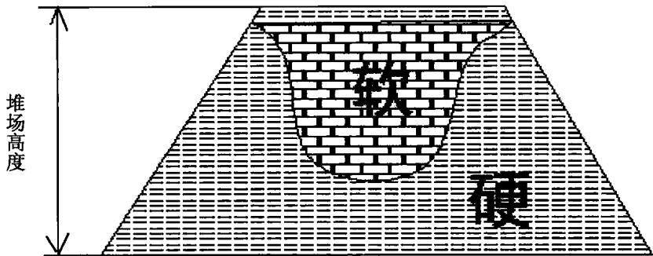  
图 5-1 赤泥堆场软硬示意图

## 5.3.2 边坡植被室内模拟试验研究

本项试验用赤泥样品采集点在赤泥堆场小平台上取0\~40cm深的赤泥样。试验用的赤泥经破碎达到1cm以下的粒度。

## 5.3.2.1 土壤改良试验

土壤是植物生长的必要条件之一，它的特性在很大程度上决定植物生长的适宜性。因此，对赤泥进行土壤改良是首要任务。土壤改良所用材料要与赤泥的特性相反，即酸性、容重轻、含养分等。试验选择有机化工厂的废料糠醛渣作为改良土壤的首选材料，既环保又经济，变废为宝。糠醛渣的化学特性见表5-4和表5-5。

表 5-4 糠醛渣成分及养分分析
<table><tr><td rowspan=1 colspan=1>成分</td><td rowspan=1 colspan=1> ${ \bf A } _ { 2 } { \bf O } _ { 3 } /$ %</td><td rowspan=1 colspan=1> $\mathbf { F e } _ { 2 } \mathbf { O } _ { 3 } /$ %</td><td rowspan=1 colspan=1>CaO/%</td><td rowspan=1 colspan=1>全氮%</td><td rowspan=1 colspan=1>有效钾/%</td><td rowspan=1 colspan=1>K/%</td><td rowspan=1 colspan=1>全盐量/%</td><td rowspan=1 colspan=1>水溶性钠/%</td><td rowspan=1 colspan=1>有机质/%</td><td rowspan=1 colspan=1>pH</td></tr><tr><td rowspan=1 colspan=1>糠醛</td><td rowspan=1 colspan=1>1.14</td><td rowspan=1 colspan=1>0.52</td><td rowspan=1 colspan=1>1.76</td><td rowspan=1 colspan=1>0.681</td><td rowspan=1 colspan=1>0.891 4</td><td rowspan=1 colspan=1>1.322</td><td rowspan=1 colspan=1>3.845</td><td rowspan=1 colspan=1>0.035 8</td><td rowspan=1 colspan=1>19.902 9</td><td rowspan=1 colspan=1>2.779</td></tr></table>

表 5-5 糠醛渣微量元素分析
<table><tr><td>元素</td><td>Pb/ (mg/L)</td><td>Cr/ (mg/L)</td><td>As/ (mg/L)</td><td>Cd/ (mg/L)</td><td>Ni/ (mg/L)</td><td>Zn/ %</td><td>Mn/ %</td><td>Mg/ %</td><td>Cu/ (mg/L)</td></tr><tr><td>糠醛</td><td>0.553 5</td><td>0.180 4</td><td>0.000 0</td><td>0.000 0</td><td>0.118 8</td><td>0.057</td><td>0.008</td><td>0.077</td><td>0.624 6</td></tr></table>

从表 5-4 和表 5-5 分析结果可看出，糠醛渣的养分、有机质、pH值等项均符合我们的要求，尤其是养分含量远远超出了土壤养分含量的平均值。微量元素含量最低为0，最高的是Cu，但也没有超过赤泥中的含量。

根据糠醛渣中养分含量，赤泥土壤改良盆栽试验设计了几种方案（表5-6)。

表 5-6 赤泥土壤改良方案  
单位：v/v
<table><tr><td rowspan=1 colspan=1>序号</td><td rowspan=1 colspan=1>赤泥</td><td rowspan=1 colspan=1>糠醛</td><td rowspan=1 colspan=1>珍珠岩</td><td rowspan=1 colspan=1>备注</td></tr><tr><td rowspan=1 colspan=1>对照组</td><td rowspan=1 colspan=1>1</td><td rowspan=1 colspan=1></td><td rowspan=1 colspan=1></td><td rowspan=6 colspan=1>所用材料全部为体积比</td></tr><tr><td rowspan=1 colspan=1>1号组</td><td rowspan=1 colspan=1>1</td><td rowspan=1 colspan=1>1</td><td rowspan=1 colspan=1></td></tr><tr><td rowspan=1 colspan=1>2号组</td><td rowspan=1 colspan=1>2</td><td rowspan=1 colspan=1>1</td><td rowspan=1 colspan=1></td></tr><tr><td rowspan=1 colspan=1>3号组</td><td rowspan=1 colspan=1>4</td><td rowspan=1 colspan=1>1</td><td rowspan=1 colspan=1></td></tr><tr><td rowspan=1 colspan=1>4号组</td><td rowspan=1 colspan=1>4.5</td><td rowspan=1 colspan=1>4.5</td><td rowspan=1 colspan=1>1</td></tr><tr><td rowspan=1 colspan=1>5号组</td><td rowspan=1 colspan=1>2</td><td rowspan=1 colspan=1>2</td><td rowspan=1 colspan=1>1</td></tr></table>

土壤改良后土壤的pH、溶重、孔隙率有所变化，溶重变小，孔隙度变大，pH值下降。土壤的级别有所提高。赤泥土壤改良后经过一年的种植试验，测得土壤的 pH 值见表 5-7。

表 5-7 改良后土壤 pH 测试结果
<table><tr><td rowspan=1 colspan=1>序号</td><td rowspan=1 colspan=1>1号组</td><td rowspan=1 colspan=1>2号组</td><td rowspan=1 colspan=1>3号组</td><td rowspan=1 colspan=1>4号组</td><td rowspan=1 colspan=1>5号组</td></tr><tr><td rowspan=1 colspan=1>pH值</td><td rowspan=1 colspan=1>8.66</td><td rowspan=1 colspan=1>8.75</td><td rowspan=1 colspan=1>8.97</td><td rowspan=1 colspan=1>8.44</td><td rowspan=1 colspan=1>8.97</td></tr></table>

从表5-7中可看出，改良后土壤的pH值达到了正常值稍偏高的程度，即弱碱性土壤（pH值为8.5\~9.0)。这种pH值达到了一些耐碱性植物品种对土壤的要求(单指pH值这一项指标)，一些耐碱性植物可以在这种弱碱性土壤中正常生长。

土壤养分是土壤肥力的重要物质基础。赤泥自身不含任何植物生长所必需的养分。因此对赤泥进行土壤改良的另一项重要任务就是增加栽培基质的养分。改良后经过一年种植试验，栽培基质的养分测试结果见表5-8。

表 5-8 赤泥盆栽试验养分测试结果
<table><tr><td rowspan=1 colspan=1>测试元素</td><td rowspan=1 colspan=1>1号组</td><td rowspan=1 colspan=1>2号组</td><td rowspan=1 colspan=1>3号组</td><td rowspan=1 colspan=1>4号组</td><td rowspan=1 colspan=1>5号组</td></tr><tr><td rowspan=1 colspan=1>总氮/%</td><td rowspan=1 colspan=1>0.201 6</td><td rowspan=1 colspan=1>0.207 9</td><td rowspan=1 colspan=1>0.207 9</td><td rowspan=1 colspan=1>0.1979</td><td rowspan=1 colspan=1>0.201 8</td></tr><tr><td rowspan=1 colspan=1>有效磷/（mg/kg）</td><td rowspan=1 colspan=1>11.8</td><td rowspan=1 colspan=1>6.8</td><td rowspan=1 colspan=1>4.0</td><td rowspan=1 colspan=1>4.4</td><td rowspan=1 colspan=1>4.6</td></tr><tr><td rowspan=1 colspan=1>有效钾/（mg/kg）</td><td rowspan=1 colspan=1>2 373</td><td rowspan=1 colspan=1>2 006</td><td rowspan=1 colspan=1>1359</td><td rowspan=1 colspan=1>2 939</td><td rowspan=1 colspan=1>2 682</td></tr></table>

从测试结果可知，赤泥改良后栽培基质的养分含量有了很大变化。在我国大部分地区土壤含氮一般都低于0.2%，赤泥堆场所在地淄博市张店区的土壤含氮量平均为0.087%。而赤泥土壤改良后氮含量平均达到0.2%，远远超过了当地水平。

在自然土壤中一般含全磷量为0.01%～0.12%，变化比较大。而在东北地区及由黄土性沉积物发育的土壤，则含磷较高，超过0.12%的为数不少。张店地区土壤含磷量平均为 0.059%，而赤泥改良后全磷量最高达到0.13%，最低为 0.047%。由于有效磷受pH值的影响，它的高低判断值也不同。对碱性土壤，有效磷>10mg/kg为高含量，5\~10 为中含量，<5 mg/kg 为低含量。在赤泥改良试验中，1 号组有效磷含量高，2号组有效磷含量为中等，而其他三组有效磷含量均为低。

地壳中平均含钾量远比氮、磷为多，整个岩石界含钾平均在2.45%。就土壤而言，以华南砖红壤含钾量为最少，平均不到0.5%。以华北、东北、西北黄土母质地区的旱地土壤则含钾较多，一般平均在1.5%以上。赤泥经改良后最高达到2.9%，最低达到1.3%。

从土壤养分这三项指标来分析，经过改良后栽培基质的养分含量最低也达到了一般土壤养分的水平。因此，这项土壤改良试验是成功的。尤其以1号组和2 号组土壤改良最为突出，不论是土壤pH值还是土壤养分含量均达到了当地土壤的最高水平。

## 5.3.2.2 品种筛选试验

研究的最终目的是恢复植被，因此，品种筛选是至关重要的。初期品种筛选只考虑品种的两个方面，即耐碱性与抗逆性，豆科与禾本科两种草种。首选4个品种有：高羊茅、披碱草、结缕草、沙打旺。种植在不同的改良土壤的盆中，每组三个重复，统计其生长情况。

经过一个生长季的试验我们选出了两种适宜的品种，它们分别是高羊茅、披碱草这两种禾本科草种。初期生长情况见图5-2。经过一年的生长期后其长势情况见图 5-3。

## 5.3.2.3 草种配比试验及播种方法试验

本试验的目的：①要找出豆科与禾本科品种之间的最佳配比与播种数量；②由于现场边坡的坡度为60°，如何播种、用什么材料作辅助是我们需要研究的主要内容。品种配比试验的供试品种有高羊茅、披碱草、结缕草、沙打旺、紫花苜蓿。在品种配比试验中结合不同的土壤结构来观察品种根系的生长情况，为以后品种选择找出深层的试验依据及为赤泥表面的处理提供参考数据。

## 盆内土壤结构作了两种试验分别是：

1）下层2cm厚的混合基质（赤泥：水泥：糠醛渣=9：3：1），压实，上层8cm土壤。种植品种为高羊茅和沙打旺；高羊茅和紫花苜蓿；披碱草和沙打旺；披碱草和紫花苜蓿；结缕草和沙打旺；结缕草和紫花苜蓿。

2）下层2cm赤泥，压实，上层8cm土壤。种植品种与第一组相同。

试验结果显示所选品种最适宜的搭配品种有：高羊茅和沙打旺；高羊茅和紫花苜蓿；披碱草和沙打旺；披碱草和紫花苜蓿。种植效果见图5-4和图5-5。

播种方法：选择了两种材料作为草种的依托材料，一是绿色纤维，二是纤维与泥土混合。播种层厚度也作了试验（图5-6)。

在不同的土壤结构下根系的生长情况也得到了非常明显的结果，即豆科植物可以扎根到赤泥层，而禾本科的植物根系全部在赤泥上盘不向下生长。这与草种的属性有关，豆科植物的主根比较粗壮，而禾本科植物根系为网状比较细，因此它的根扎不到坚硬的赤泥层中。两种植物地上部分生长情况见图5-7和图5-8，地下部分根系生长情况见图5-9和图5-10。

## 5.3.2.4 隔离层试验

赤泥堆场碱性极高，遇水后有碱液沿毛细孔上返到坡表面，使植物生长受阻。为了减缓或阻止这种现象发生我们设计了不同材料做隔离层的试验。

## (1)有机材料做隔离层

表 5-9 有机材料隔离层试验设计
<table><tr><td rowspan=2 colspan=1></td><td rowspan=1 colspan=2>材料</td><td rowspan=2 colspan=1>试验现象</td></tr><tr><td rowspan=1 colspan=1>A</td><td rowspan=1 colspan=1>B</td></tr><tr><td rowspan=3 colspan=1>填充量</td><td rowspan=1 colspan=1>1 cm</td><td rowspan=1 colspan=1> ${ \mathfrak { 0 } } \ : { \mathfrak { g } } / { \mathfrak { m } } ^ { 2 }$ </td><td rowspan=1 colspan=1>一周后有碱返到表面</td></tr><tr><td rowspan=1 colspan=1>2 cm</td><td rowspan=1 colspan=1> ${ \bf 2 \mathrm { \bf ~ g } / m ^ { 2 } }$ </td><td rowspan=1 colspan=1>在四周及裂缝处有碱返出</td></tr><tr><td rowspan=1 colspan=1>3 cm</td><td rowspan=1 colspan=1> ${ \mathfrak { a } } \mathfrak { g } / \mathfrak { m } ^ { 2 }$ </td><td rowspan=1 colspan=1>一个月后观察完全没有碱返到表面</td></tr></table>

## (2) 混合材料做隔离层

在这一组试验中选用三种材料混合制成二种隔离层。其中1号隔离层选用A、C 两种材料按 1：1 比例混合，铺设厚度为1 cm。2 号隔离层选用 A、C、D三种材料按4：1：1比例混合制成，铺设厚度为1cm。

表 5-10 混合材料隔离层试验设计
<table><tr><td rowspan=1 colspan=1>编号</td><td rowspan=1 colspan=1>铺设厚度/cm</td><td rowspan=1 colspan=1>试验现象</td></tr><tr><td rowspan=1 colspan=1>1号组</td><td rowspan=1 colspan=1>1</td><td rowspan=1 colspan=1>一星期后有碱返到隔离层表面</td></tr><tr><td rowspan=1 colspan=1>2号组</td><td rowspan=1 colspan=1>1</td><td rowspan=1 colspan=1>一个月后没有碱返到隔离层表面</td></tr></table>

从试验现象可看出，隔离层的作用是明显的，既能有效地抑制碱上升到生长层，以避免对植物生长造成影响，又可有效地防止生长层盐碱化，造成土壤肥力下降。各种材料的返碱试验效果见图5-11和图5-12。

## 5.3.3 模拟现场条件试验

在前期试验的基础上，开展了两个模拟现场实际情况的试验，即 $6 0 ^ { \circ } ;$ 坡，用赤泥作堆坡材料。堆坡方法、时间、赤泥的粒度等完全一样的情况下制作了两座赤泥堆坡（图5-13）。

## 5.3.3.1 坡面处理试验

在现场我们观察到坡表面有不同的返碱现象及坡面风化后产生的浮石。我们知道在赤泥中CaO的含量很多，而很多植物对钙的需求量很大。土壤中的钙一部分以较简单的碳酸盐 $( \mathbf { C a C O } _ { 3 } )$ 形态存在。而这种形态的钙在土壤中是最容易溶解的钙矿物，它可根据其溶解度向土壤溶液提供钙离子。根据这一原理我们配制了不同浓度的溶液，撒在坡面上促进赤泥中的CaO转化为碳酸盐的形态，为植物生长提供充足的钙元素，同时起到降低pH值的作用。在1号坡面上我们分别用质量浓度为 0.1 mg/L 和1 mg/L的酸性溶液各10L 喷洒在坡表面上观察返碱现象及pH 值的变化。2 号坡面用作对照坡面。试验测试结果见表 5-11，试验现象见图 5-14。

从试验结果可看出，喷撒酸性溶液对降低赤泥的 pH值是有作用的。对抑制返碱量也起到明显的效果。返碱经分析证明大部分是以碳酸根为主以碱土金属的盐类形态存在的。遇水形成游离态的离子，可被植物吸收。

从图 5-14 可观察到，1 号坡面返碱量明显没有 2 号坡面多，因此我们选溶液浓度为1mg/L的溶液作为现场坡面处理施工用溶液。

由试验我们观察到经过长时间的放置后，返碱量也还是有明显变化的。经过处理的坡即喷过酸性溶液后的坡面要比没处理的坡面返碱量少。

表 5-11 坡面处理试验测试
<table><tr><td colspan="5">1号试验坡面（用配好的溶液）</td><td colspan="3">2号对照坡面（只用水）</td></tr><tr><td>溶液浓度/ (mg/L)</td><td>用量/ L</td><td>坡面 pH值</td><td>返碱量/ g</td><td>总碱度/  $( \pmb { \mathrm { g } } / \mathbf { k } \pmb { \mathrm { g } } )$ </td><td>用水量/ L</td><td>返碱量/ g</td><td>坡面 pH值</td></tr><tr><td>0.1</td><td>10</td><td>10.9</td><td>71</td><td rowspan="2">以  $\mathbf { C a C O _ { 3 } }$  计 总碱=59.1</td><td>10</td><td>134.5</td><td>11.8</td></tr><tr><td>1</td><td>10</td><td>10.2</td><td>55</td><td>10</td><td>67</td><td>11.8</td></tr></table>

## 5.3.3.2 种植基质筛选试验

试验的目的就是要筛选出适宜的材料、各种材料的混配比例及用量。材料的选择既要考虑当地的资源又要考虑选择适宜植物生长的条件，还要有一定的牢固性。同时要计算复垦成本。

以温室内各项试验为基础，做了两种用不同材料组成的种植基质试验，目的是筛选种植基质。在淄博有秸秆和糠醛渣的原料，因此，以这两种材料为辅助做了两项试验。①在3号坡做以土、草炭、锯末（用锯末代替秸秆）为主的栽培基质试验，各项材料用量比例为7：2：1，铺层厚度为20cm；②在4号坡做以土、糠醛渣为主的栽培基质试验，材料用量比例为1：2，铺层厚度为5cm。

经过几个月的生长期后，观察到植物的根系均未扎到赤泥层内。在3号坡上种植的草长势很好，出芽率高，苗壮。在4号上种植的草长势较差，出芽率低，苗细。植物生长效果见图5-15～图5-17。从试验效果看，用土、草炭、锯末作为植物的生长基质比较好。

## 5.4 赤泥堆场边坡生态修复工程实践

## 5.4.1 山东铝业公司氧化铝厂1号赤泥堆场

山东铝业公司氧化铝厂1号赤泥堆场建于1954年，为平地堆坝，占地面积45万m²，设计库容为2200万m3，实际存量现达到3000万 $\mathbf { m } ^ { 3 }$ 。现已不再使用。经过几十年的风吹日晒，赤泥堆场已成为粉尘污染的源头，对氧化铝厂的空气环境质量造成极大的污染，生态景观破坏严重。

## 5.4.1.1 项目区概况

## (1) 赤泥堆场的地理位置

山东铝业公司位于山东省淄博市张店区南定镇。淄博位于山东中部，地处东经117°40'52″～118°29'29″，北纬36°16'27″～37°06'20″。淄博市地处鲁中山区和华北平原的过渡地带，境内多山丘，有平原也有盆地。地势南高北低，起伏很大。1号赤泥堆场建在山东铝业公司以东1km左右。

## (2) 赤泥堆场的气候条件

淄博属暖温带半湿润、半干旱的大陆性气候。特点是四季分明，春天风大干旱，夏季湿热多雨，秋季晴朗干旱，冬季干冷少雪。年平均温度为12～13℃，一年中7月份气温最高，月平均26.1\~26.9℃，极端最高气温为42.1℃；1月份气温最低，平均为-2.6\~-3.7℃，极端最低气温为-23.2℃。年均降水量为586.4～692.0 mm，大多集中在夏季，占全年降雨量的 60%～63%，降水日数 34～38d。秋季降水量116.8\~138.4mm。年平均光照时数为2542.6\~2832.6h。年平均无霜期为 180\~220 d。年平均风速2.6\~3.3 m/s。

## 5.4.1.2 赤泥堆场生态修复设计

## 边坡施工方案设计

赤泥堆场的边坡坡度为60°，属于险坡。根据现场调研与实际勘察的结果，在做现场施工方案时必须考虑几个方面的影响因素。如怎样克服坡度大给施工带来的困难，如何把各种材料混合均匀，生长基质层如何填充，基础框架的尺寸，选用的施工材料在当地是否为普通、大量的生产资料。这些问题的解决，可为现场施工打下良好的基础。

此次的现场施工由于面积小，没有大型机械设备可供施工时用，因此考虑方案时这也是一大困难。

施工方案确定：在充分考虑赤泥的特性及坡度大的现场实际情况后，我们设计了几种方案。

经模拟试验及专家论证，在综合考虑多方面因素的情况下，最终选择的方案为：用方格加拱形支撑的办法，以人工施工为主现场作业，把坡面重新改造，使之能成为让植物正常生长的完整基质层。

1）坡面前期处理：由于赤泥堆场经几十年风吹日晒表面已风化，须先行产除表层浮石及把坡面大致铲平。处理液选用质量浓度为1mg/L 溶液液。坡面处理后的状况见图5-18。

2）基础框架：由于坡面很陡及坡顶平面上的排水沟间隔距离长，因此，要考虑排涝防冲刷及建成后坡面的稳定性。建成后框架状况见图5-19。

3）隔离层的铺设：目的是为了阻隔赤泥中碱盐返到生长层中。隔离层材料的选择用“有机材料组合”。

4）生长基质的铺设：这是关键的一步，它关系到植物生长的重要条件之一土壤。要考虑到土壤的硬度、孔隙度、土壤肥力等多方因素。因此，生长基质的组成是重中之重，

以前期试验结果及现场所有的材料，我们综合多方面的因素，选用土壤、秸秆、草炭这种最适宜的配比组合用在现场，确保扩大试验能够成功。土取自当地农田，秸秆也是当地一个乡镇企业的加工产品，草炭来自东北。

经过以上四个步骤的施工人工边坡施工部分顺利完工，铺设完毕后的状况见图 5-20。

## 5.4.1.3 植被种植设计

## (1) 品种选择

在前期试验的基础上，结合一些耐性好的当地品种。初步选择出适宜品种：高羊茅、披碱草、狗牙根、黑麦草、沙打旺、紫花苜蓿等禾本科及豆科的草种。

## (2) 播种方法

由于坡度大，种子着床很困难，根据温室内我们做的播种方法的试验，本次播种我们采用了三种方法：一是条播；二是喷播；三是铺植生带。

条播是把种子撒在用耙子犁出的沟中，然后表面覆盖一层薄土。喷播是把种子拌在纤维混合体中由人工甩在坡面上。这个播种方法要掌握好混合体的比例及稀释的程度。铺植生带，此方法比较简单，但成本高。播种后覆盖草帘以达到保墒的目的（图5-21）。

## 5.4.1.4 养护管理设计

根据淄博地区气候条件，春季风大、干旱、雨少的特点，播种后管理很重要。一定要及时浇水，由于坡度大浇水时应上下都浇到为好，但不能造成冲刷，使坡面行成沟条。

## 5.4.1.5 工程实施效果

经过两个月的生长，我们观察到草种的发芽率、生物量、根系的分布等都达到预期效果。初期生长情况见图5-22。

到2006年9月地上部分覆盖率达85%。禾本科植物大部分都已分蘖，豆科植物都已开花（图 5-23～图5-25）。

## 5.4.2 平果铝赤泥堆场边坡生态修复

## 5.4.2.1 项目区概况

## (1)赤泥堆场的地理位置

平果铝位于广西壮族自治区百色地区平果县境内。平果县城所在地马头镇，位于全县南端，地理坐标为东经107°34′，北纬30°19′，海拔为黄海高程108.7m，平果铝主工业区距平果县城约7km，距广西壮族自治区首府南宁市约121km，西至百色市120 km。平果铝赤泥堆场位于工业区东南 2\~3 km处，处于由岩溶地貌组成的丘陵区，坝底海拔标高约110m。堆场与右江相距 2km左右，其基础坝坝底高于右江河岸。赤泥堆场的安全和环境保护问题十分重要。

## (2) 赤泥堆场的气候条件

平果铝处于高温多雨的亚热带季风气候区。全年平均气温21.5℃，月平均最高气温为28.2℃（7月份），极端最高温度为 $4 0 . 9 \%$ ，月平均最低气温为 $1 2 . 6 \mathrm { { \circ } C }$ (元月份)，极端最低温度为-1.3℃，年积温 $7 5 3 6 . 9 ^ { \circ } \mathrm { C }$ ，无霜期 300\~350d。全年平均降水量为1324.6mm，年最大降水量为1884.3mm，年最小降水量为958.4mm，受南亚热带季风气候影响，降水量的季节和年际分布不均，6—8月降雨量达全年53%。平均年蒸发量为1531.9mm，各月平均蒸发量以7—8月最大，1月及12月最小。年内平均相对湿度80%以上，没有明显的低点和高点。对植物生长较为有利。

## 5.4.2.2 现场调查分析

边坡面受损的原因主要是降雨带来的水力侵蚀。起初时，溶蚀（corrosion）和剥蚀（denudation）现象比较严重（图5-26）。溶蚀是指在暴晒、水、风等外力作用下使坡面赤泥变得松软并失去胶结的现象。剥蚀系指在侵蚀作用下坡面下层的裸露作用。由于赤泥含碱量高，在长期干旱季节（如冬季)，局部坡面返碱现象严重（图5-27)，这时化学风化占优势，不妨称其为化学侵蚀。坡面侵蚀作用的总过程是化学侵蚀与力学侵蚀连续交替地进行。

坡面侵蚀随着时间的推移逐渐加剧，表层疏松赤泥不断下移，新露出的坡面又开始新一轮的破坏过程。

雨水对坡面外部形态侵蚀的主要表现形式是面蚀和细沟侵蚀（图5-28)。在面蚀中，地表的降水冲走疏松的坡面赤泥，引起片蚀。当侵蚀作用发展到后期阶段时，可看到大量的由于降水径流冲刷而产生的线状细沟状侵蚀甚至局部崩塌。坝外坡面的损坏，对坝体的稳定性产生的影响日益严重。

## 5.4.2.3 植被护坡方案的试验选择与确定

为探索经济合理的植被护坡方案，现场进行过穴播植草、挖沟植草、土工格室客土植草等试验，最后确定采用客土连续覆盖植被护坡工艺技术。

## (1)穴播植草护坡试验

在坡面上按一定的行、排距人工挖穴，在穴内回填客土，然后植草。然而实践证明这种方法是不可行的（图5-29)。其原因如下：

1）挖穴难度大并破坏了原有坡面的相对稳定；

2）由于碾压筑坝后坝体赤泥的密实性和高碱性，使植物根系很难扎入坝坡中，因而不能起到连片护坡的作用；

3）零散分布的客土更容易受到雨水的冲失，植被定植困难。

## (2) 挖沟植草护坡试验

在坡面上按一定行距沿等高线人工开挖楔形沟，在坡面倾向上形成若干小台阶，台阶内回填客土，然后种植（图5-30)。虽然这种方法比穴播植草法有所改进，但由于几乎同样的原因使其不能成为可行的护坡方案。

所以，课题组一致认为，要想达到植被护坡的目的，一定不要破坏基本密实的原有坡面。只能从利用客土覆盖再进行植被方面来考虑。

## (3)土工格室植草护坡试验

土工格室（Geocell）是 20世纪 80年代国外开发的一种新型特种土工合成材料，主要用于路基加筋、垫层，近年来也开始用于植被护坡工程。土工格室是由PE、FP材料经过造袜工序形成工程所需的片材，经专用焊接机焊接形成的立体格室。应用时，通过单元间的连接，组成工程中需要的规格。图5-31 是一种土工格室的单件构造。

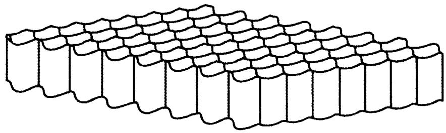  
图 5-31 土工格室构造

施工时，在展开并固定在坡面上的土工格室内填充客土，利用土工格室为草

本植物生长提供稳定的生存环境。带孔的格室还能增加坡面的排水性能。

图5-32为高羊茅种植初期的景象，但3个月后还是很不理想（图5-33)。其原因为：

1）客土与坡面间没有隔层，坡面返碱严重，客土的pH开始时呈中性，4个月后已达9左右；

2）孤立的格室难以将草根连起交织生长，在各格室的边缘部位的客土，容易受到雨水的溅击冲失，使草根系周围的营养流失；

## 3）高羊茅是一种不耐碱的草本植物。

这也证明了植物品种选择的重要性。图5-34为改种铺地菊后的植被长势，效果相当不错。严格来讲，当在土工格室内填充客土后，应在格室上挂三维植被网，选择适宜草种，进行喷播施工，这是土工格室植草护坡的重要工艺和特点。但那样将大大增加原本已经昂贵（80元/m²）的护坡成本。所以，在经济条件有限的条件下，土工格室植草护坡方法也是不可取的。

## (4)客土连续覆盖植被护坡方案的确定

在综合试验研究的基础上，决定采用大面积客土连续覆盖再进行植被的护坡方案。这种方案的优点是：

1）基质连续铺撒，有利于生成连片交织的植物根系网，护坡效果好；

2）施工简单，劳动强度低，投入成本低，当然，生长基质的选择和改良是首先需要解决的重要问题。

对于较陡的赤泥堆场外边坡，若不采取工程措施，植物生长基质难于附于坡面，更谈不上植物的生长。

要实现植被护坡工程，首先要对台阶坡顶、坡面、坡底进行工程处理。为了减少坡面径流，应适当拾高坡顶并种植草灌木，稳固坡顶（基质层厚≥25cm)。坡面上沿走向方向每隔10m修筑连接上下平台的坡面导水沟，并与坡底排水沟相连。在排水沟与坡脚之间砌筑高0.65m的挡土墙（下部留渗滤孔，间距1.0m，孔截面积100 cm²)。坡脚铺筑混凝土隔离层（厚度≥25 cm)，其下部也每隔1.0m留100 cm²的渗流孔。在挡土墙与坡脚之间每隔2.0m设隔墙，装填改良了的客土基质，种植香根草、银合欢或爬藤等植物（图5-35）。

为了阻止客土基质滑移，加速覆盖层的稳定，在坡面固定一定数量的挡板，板长1.0m，宽0.25m，用锚钉有规律地交错固定于坡面上。在大雨来临前对坡面进行必要的覆盖，并及时对基质层进行修复，基本稳定后再进行种植。种植初期也要用草帘等对坡面进行适当的覆盖，以防止种子或小苗被雨水冲失。

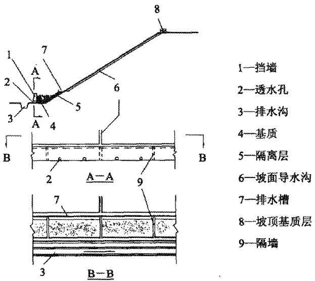  
图 5-35 坡面整治剖面图

现场施工时，在此基础上作了一定的简化和改进（图5-36）。

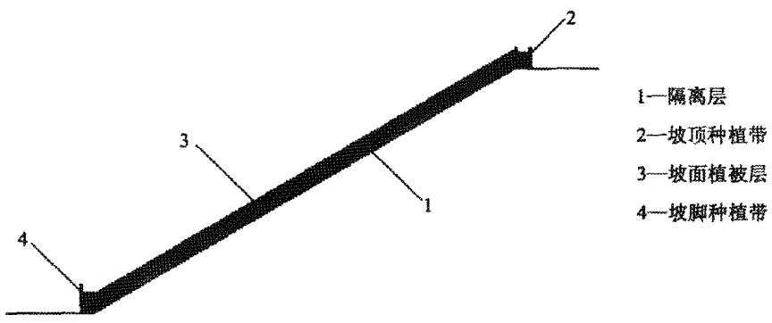  
图 5-36 客土护坡示意图

## 5.4.2.4 植被护坡实施方案

首先对台阶坡顶、坡面、坡底进行工程处理。为了减少坡面径流，适当拾高坡顶，并种植草灌木，稳固坡顶(基质层厚≥25cm)。坡面上沿走向方向每隔10m修筑连接上下平台的坡面导水沟，并与坡底排水沟相连，在排水沟与坡脚之间砌筑高0.65m的挡土墙（下部留渗滤孔，间距110m，孔截面积100cm²），如图5-37所示。

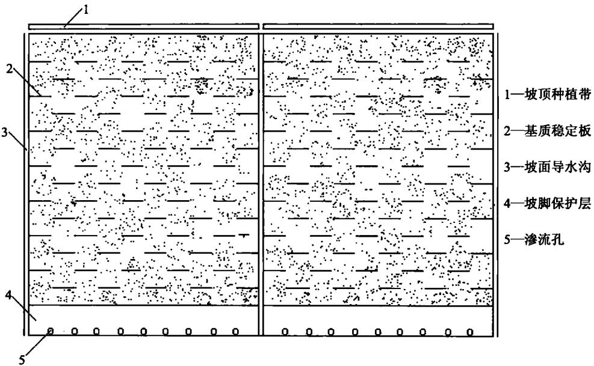  
图 5-37 坡面施工示意图

施工工艺流程：

清理坡面→排水设施施工→固定抗滑板→铺隔离层→回填客土→整平保璃→坡面种植→养护管理形成植被。

## (1) 清理坡面

清除坡表面风化的浮土，消除坡面不稳定因素。适度平整直面，保证浆砌石框架与坡面紧密结合。

## (2) 抗滑板

抗滑板工程是在坡面用锚钉将自制的挡板固定在坡面上。利用挡板的作用，防止坡面回填客土的流失，以创造植物生长发育所需的土壤环境。挡板由当地廉价的竹板制成，其作用是阻止客土的下滑，加强客土层的均匀、稳定性，以创造植物生长发育所需的土壤环境（图5-38）。

## (3) 隔离层

由于赤泥坝坡面的高碱性对护坡植物的不利影响，在原坡面与客土之间铺设 10 cm 厚度的隔层（图 5-39)。隔层材料采用本企业废弃的炉渣，炉渣的粒径特性见表5-12。炉渣为富含硅、铝的活性材料，在燃烧过程中积聚了一定的内能，在遇水后，这种内能就释放出来，可与碱发生水化反应生成沸石类产物而稳定：$\mathrm { N a _ { 2 } O + S i O _ { 2 } + A l _ { 2 } O _ { 3 } + H _ { 2 } O  N a _ { 2 } O \bullet \ S i O _ { 2 } \bullet A l _ { 2 } O _ { 3 } \bullet H _ { 2 } O }$ 。隔离层起到了阻止赤泥坡面返碱和稳定客土底层的作用。

表 5-12 炉渣的粒级组成
<table><tr><td rowspan=1 colspan=1>粒级/mm</td><td rowspan=1 colspan=1>&lt;2.5</td><td rowspan=1 colspan=1>2.5~5</td><td rowspan=1 colspan=1>5~10</td><td rowspan=1 colspan=1>10~15</td><td rowspan=1 colspan=1>15~20</td><td rowspan=1 colspan=1>&gt;20</td></tr><tr><td rowspan=1 colspan=1>含量/%</td><td rowspan=1 colspan=1>20.02</td><td rowspan=1 colspan=1>13.51</td><td rowspan=1 colspan=1>23.94</td><td rowspan=1 colspan=1>15.99</td><td rowspan=1 colspan=1>15.39</td><td rowspan=1 colspan=1>11.18</td></tr></table>

回填的客土（厚25cm）有以下几种：剥离堆存土；剥离堆存土（80%）+ 粉煤灰（20%）；剥离堆存土（40%）+赤泥（35%）+泥炭（20%）+氟石膏（5%）； 赤泥（65%）+泥炭（25%）+氟石膏（10%）。

## (4) 客土

客土材料来源于赤泥堆场建设施工初期收集的地表土或矿山采空区底板土，培肥后变成为理想的护坡植物生长介质。表5-13 为植被一年后，坡面客土层的土壤肥力测试数据，满足了护坡植物的生长需求（图5-40）。

表 5-13 植被一年后客土层的土壤肥力
<table><tr><td rowspan=1 colspan=1>全氮(g/kg)</td><td rowspan=1 colspan=1>有机质/(g/kg)</td><td rowspan=1 colspan=1>有效磷/(mg/kg)</td><td rowspan=1 colspan=1>有效钾/(mg/kg)</td><td rowspan=1 colspan=1>全盐/(g/kg)</td><td rowspan=1 colspan=1>水溶钠/(mg/kg)</td><td rowspan=1 colspan=1>pH</td></tr><tr><td rowspan=1 colspan=1>1.22~1.71</td><td rowspan=1 colspan=1>23.7~30.8</td><td rowspan=1 colspan=1>2.01~5.49</td><td rowspan=1 colspan=1>36.9~96.1</td><td rowspan=1 colspan=1>0.28~0.64</td><td rowspan=1 colspan=1>26.8~145</td><td rowspan=1 colspan=1>7.30~8.40</td></tr></table>

## 5.4.2.4 植被的护坡效果分析

## (1)植被根土层成为坝坡护理的理想材料

草本植物的根系在客土中盘根错节，使覆盖层土体成为土与根系的复合加筋材料，土体强度提高，具有一定的抗剪能力，使植被根土层成为坝坡的柔性保护层。

铺地菊为多年生草本植物，有根状茎和匍匐枝，叶扁平宽大，长4\~8cm，宽 2\~5 cm，坝坡上铺地菊地面以上的高度为 15\~50 cm，主根长 10\~25 cm，一簇铺地菊的匍匐半径可达1m左右，匍匐在地面上的分枝，每隔10～20 cm就生长出新的根系扎入土中，植株四季常绿，耐践踏，好管理，固土护坡效果很好，根据现场拉拔测试，一簇铺地菊主根系的抗拔力为5\~10kg，这一植物发育的浅根系和良好的覆盖功能使其成为赤泥堆场十分理想的固土护坡植物。

## (2) 景观效益分析

通过室内模拟试验，选择狗牙根、香根草、铺地菊等作为现场试验护坡植物。从一年后的护坡效果观察，铺地菊的护坡效果最好，其植被覆盖度达到95%以上，根系发育，四季常绿。狗牙根植被覆盖度大于80%，绿期约250d，耐旱性稍差，若不施肥浇水，则有退化迹象，会被其他乡土植物侵入，形成多样性的植被群落,效果也比较理想。

图 5-41～图 5-44 为植被护坡前后对比图。

## (3) 生态效益分析

坝坡植被不仅保护了边坡，而且是对因堆存赤泥而毁坏的生态系统的修复，两者相辅相成。通过实施植被护坡工程，改变了坝区的景观结构和坝坡表层的土壤构成，改善了护坡植物生长的营养结构，加速了植被群落的演替和多样性。演替就是在同一地段顺序地出现各种不同的生物群落的时间过程，最后形成较稳定的与生境相适应的植被群落。植被层土壤（基质）理化性质的改善与初期植被的构建，为适生植物的生长提供了良好的先期条件。这种现象在狗牙根试区表现得十分明显，第二年就有当地野生植被的侵入，并迅速蔓延，形成多样性的护坡植被群落。而在铺地菊护坡区，其他乡土植物比较难以立足。可以说，铺地菊的建植是对坡面生态系统的直接恢复。植被后在坝区又观察到了成群的蜜蜂、彩蝶、鸟雀等。

## 1）植被层减少了赤泥坡面的温度极差。

就缩小赤泥坡面温度极差、调节坡面湿度、保护赤泥坡面免遭侵蚀的作用来讲，植被护坡达到了很好的效果。压实的赤泥在遭受周期性干湿和温度交替之后，其力学性能将会下降，从而不利于坝体的稳定。没有植被保护的光秃赤泥坡面上的温度对大气温度的变化十分敏感，植被层的隔离作用使其敏感性大大降低，有效地减小了赤泥坡面的温度极差（表5-14)，防止了急剧的温度、湿度变化。就坡面的风干来说，植被层提供了一个隔离层，使赤泥坝坡面长期处于比较湿润的被养护状态，避免了太阳暴晒引起的干裂剥蚀现象。所以，植被层对赤泥坝坡面的温度与湿度起到了有效的调节作用，使其长期保持相对的稳定，改善了坝坡的安全条件。

表 5-14 植被对赤泥坝坡面温度的调节作用  
单位：℃
<table><tr><td rowspan=1 colspan=2>无植被的赤泥坝坡表面温度</td><td rowspan=1 colspan=1>51</td><td rowspan=1 colspan=1>48.6</td><td rowspan=1 colspan=1>44.4</td><td rowspan=1 colspan=1>37.0</td><td rowspan=1 colspan=1>25.0</td><td rowspan=1 colspan=1>20.0</td><td rowspan=1 colspan=1>14.8</td></tr><tr><td rowspan=2 colspan=1>植被下的赤泥坝坡表面温度</td><td rowspan=1 colspan=1>铺地菊</td><td rowspan=1 colspan=1>30</td><td rowspan=1 colspan=1>30.0</td><td rowspan=1 colspan=1>29.0</td><td rowspan=1 colspan=1>28.8</td><td rowspan=1 colspan=1>19.3</td><td rowspan=1 colspan=1>14.4</td><td rowspan=1 colspan=1>12.3</td></tr><tr><td rowspan=1 colspan=1>狗牙根</td><td rowspan=1 colspan=1>33</td><td rowspan=1 colspan=1>32.7</td><td rowspan=1 colspan=1>31.6</td><td rowspan=1 colspan=1>30.3</td><td rowspan=1 colspan=1>19.5</td><td rowspan=1 colspan=1>14.0</td><td rowspan=1 colspan=1>11.5</td></tr></table>

2）植被的降雨截流和削弱溅蚀作用保护了客土层本身。

客土层自身的稳定是植被护坡成功的先决条件，它是护坡植物的立地之本。一部分降雨在到达坡面之前就被植被茎叶截留并暂时贮存在其中，以后再重新蒸发到大气中或落到地面。植被通过截留作用降低了到达坡面的有效雨量，从而减弱了雨水对坡面土体的侵蚀。

雨滴的溅蚀是雨滴对地面的击溅作用，它是水蚀的一种重要形式。降雨时雨滴从高空落下，因雨滴具有一定的质量和加速度，落地时产生一定的打击力量，裸露的表土在这种力量打击下，土壤结构即遭破坏，发生分离、破裂、位移并溅起。经现场测试，光秃坡面上的松散泥粒在遇到大雨时飞溅距离可达0.5m至1.5m。溅起的颗粒落在坡面时，大部分向坡下方向移动，造成水土流失。这是坡面破坏的主要形式。

坡面植被能够拦截高速落下的雨滴，通过地上茎叶的缓冲作用，消耗掉雨滴大量的动能，并且能使大雨滴分散为小雨滴，从而把雨滴的动能大大降低，当植被覆盖度很高时，可以明显削弱甚至消除雨滴的溅蚀。植被品种及植被覆盖度直接影响坡面被溅蚀的程度。

## 3）植被的抑制地表径流作用。

地表径流集中是冲蚀坡面的主要动力，冲蚀的强弱取决于径流流量及流速的大小。护坡草本植物分蘖多，丛状生长，能够有效地分散、减弱径流，而且还阻截径流改变径流形态，径流在草丛间迁回流动，使径流直流变为绕流。设径流流程为L，流速为v，则径流历时 $\pmb { T } = \pmb { L } / \nu _ { \pmb { c } }$ 由于径流在草丛间迁回流动，从而增大了流程（即L+L')，流程增大，水力坡降减小，加上径流被分散和阻截，又减慢了流速（即ν-v），因而径流历时变为 $T ^ { \prime } { = } ( L { + } L ^ { \prime } ) / ( \nu { - } \nu ^ { \prime } )$ 。由此，依靠覆盖的草本植物延长了地表径流，增加了雨水入渗。径流减小，流速减缓，冲刷能量降低，从而冲蚀大大减弱。

综上所述，坡面植物主要通过根系的力学效应和植被的水文效应来保护赤泥坝外边坡。

图5-45 和图 5-46 反映了植被护坡前后坡脚状况的改善。

## (4) 经济效益分析

客土连续覆盖植被护坡不仅可以起到坡面防护和恢复生态的效果，而且护坡成本也是相对低廉。如与坡面喷射混凝土（厚度8\~10cm）方法相比，本研究所采取的技术方法的成本只有其27.7%\~38.3%，每平方米可节约37\~47 元，整个生产期内，中铝广西分公司赤泥堆场外坝外边坡的护坡面积将超过150万 $\mathbf { m } ^ { 2 }$ 按现价计算，预计植被护坡节约可达150×37=5550万元以上。

# 第6章 尾矿库生态修复研究与实践

## 6.1 概述

尾矿是一种选矿工艺废弃物，由于其颗粒粗、内聚力低、极易水土流失。同时，尾矿营养物质极低、保水保肥能力差，存在不同程度的污染物，是难以恢复植被的生长介质。

在一般环境条件下，库区既使场地闲置多年，也寸草不生。尾矿库高达数十米甚至百米以上的后期坝体，通常由粗颗粒尾矿砂堆筑而成，风蚀严重，易形成“尾矿砂尘暴”，产生严重的水土流失。

随着现代工业化生产的迅速发展和新开矿山数量的陆续增加，尾矿的排放、堆积量也越来越大。

目前，仅我国在国民经济中运转的矿物原料约50亿t。世界各国每年采出的金属矿、非金属矿、煤等都在100亿t以上，排出的废石及尾矿量约50亿t。

以我国有色金属矿山为例，有色金属矿山每采出 1t 矿石平均约产出 0.92t尾砂，尾砂年产生量达9923 万 t，累计量约15亿 t。除了少部分尾砂得到应用外，相当数量的尾砂只有堆存，占用了大量的土地，达到8000hm²。

目前我国大大小小的有色金属矿山尾矿库400多个，全部金属矿山堆存的尾矿则达到50亿t以上，而且以每年产出5亿t尾矿的速度增加。同时随着经济的发展，对矿产品需求大幅度增加，矿业开发规模随之加大，产生的选矿尾矿数量将不断增加，加之许多可利用的金属矿品日益降低，为了满足矿产品日益增加的需求，选矿规模越来越大，因此产生的选矿尾矿数量也将大量增加，而大量堆存的尾矿，给矿业、环境及经济等造成了不少的难题。

## 6.2 尾矿库生态修复的特点

与排土场不同，尾矿库堆置物是经过一系列加工的矿岩，其理化性质与排土场的废石有较大差别；同时不同类型的矿山、不同的选矿方法所产生的尾矿，其理化性质也不相同，有的尾矿还有利用价值需要再回收；且尾矿库多处于山地或凹谷，取土运土较困难，对复垦极为不利；另外，尾矿库由于形成大面积干涸湖床，刮风天气易引起尘土飞扬，污染当地环境。基于尾矿库的这些特点，一般尾矿库复垦前后有过渡性或转换型，初期大多以环保景观为目的，后期根据尾矿库的最终复垦目标改为实业性复垦，或作半永久性复垦（这一情况是考虑经过一段时间后，尾矿还需要回采利用)。就目前我国尾矿库的复垦现状来看，大致可分为三类。

## 6.2.1 正在使用的尾矿库

这类尾矿库的复垦主要是在尾矿坝坡面上进行复垦植被，一般是种植草藤和灌木而不种植乔木，原因是种植乔木对坝体稳定性不利。如攀枝花矿选矿厂的尾矿库，坝体坡面生曾人工覆盖山皮土约 $1 5 \mathrm { h m } ^ { 2 }$ ，以种草为主，并辅以浅根藤本植物，经过试种，取得了预期效果。

## 6.2.2 尾矿已堆满或已局部干涸的尾矿库

这种类型是尾矿库复垦的重点，如本溪钢铁公司南芬选矿厂老尾矿库于1969年新库建成后停止使用，国家投资10万元，覆土300mm厚，造田约$1 8 \mathrm { ~ h m } ^ { 2 }$ ，复垦后交给当地农民耕种。程潮铁矿闭库的尾矿干滩 $1 8 . 6 \mathrm { h m } ^ { 2 }$ 已全部复垦绿化。

## 6.2.3 尾矿砂直接用于复垦种植

如唐山马兰庄铁矿的尾矿库，充满尾砂后，排水疏干，然后由当地农民种植花生、大豆等经济作物，收成良好。

## 6.3 限制尾矿库生态修复的因素

矿山固体废弃物不具备天然表土的特性，而且还具有不利于植物生长的4个因素。

## 6.3.1 金属和其他污染物含量高

通常情况下，矿山固体废物中含有大量的铜、铅、锌、镉等重金属元素。这些元素的存在与植物生长的关系很大。当这些金属元素微量存在时，可作为土壤中的营养物质促进植物生长。但当这些元素超量共同存在时，由于毒性的协同作用，对植物生长危害更大。在一般情况下，可溶性的铝、铜、铅、锌等对植物显示出毒性的浓度为1\~10mg/kg，锰和铁为20\~50mg/kg。

土壤中可溶性碱金属盐的含量，也是修复中应当注意的问题。当固体废物中的比导电性超过7mΩ时，将会呈现毒性，对植物生长极为不利。其次，含黄铁矿的固体废物，可能自然产生二氧化硫和硫化氢等有毒气体，危害植物的生长。

## 6.3.2 酸碱性强且变化大

多数植物适宜生长在中性土壤中，当固体废物中的pH值超过7\~8.5时，则呈强碱性，可使多数植物枯萎，当pH值小于4时，固体废物则呈强酸性，对植物生长有强烈的抑制作用。这不仅是因为酸本身的危害，而且，在酸性环境中，重金属离子更易变化而发生毒害作用。

## 6.3.3 植物营养物质含量低

植物正常生长需要多种元素，其中氮、磷、钾等元素不能低于正常含量，否则植物就不能正常生长。矿山固体废物中一般都缺少土壤构造和有机物，不能保存这些养分，但堆放时间越长，固体废物表面层中有机物的含量就越高，对植物生长也就越有利。

## 6.3.4 固体废物表面不稳定

由于矿山固体废物固结性能不好，很容易受到风、水和空气的侵蚀，尤其尾矿受侵蚀以后，其表面出现蚀沟、裂缝，导致覆盖在尾矿和废石上的表土层破裂。由于重力作用，可能使表土层出现蠕动，使表土层稳定性降低和移动。而这种表土层的不稳定性及位移，均会严重地破坏植物的正常生长。

在植物修复以前，必须针对矿山固体废物的结构和特性，通过试验，作出全面分析，然后有选择地选择种植一些适应性强的植物，以利于生态发展。

## 6.4 尾矿库生态修复的类型

## 6.4.1 无覆土复垦

尾矿库边坡稳定与水土流失控制是矿山环境和安全的重要问题。为控制来自尾矿库的污染，特别是边坡水土流失，一般采取覆土的工程措施，即要覆盖大量黏土，然后种植植物覆盖使其稳定。

我国大部分尾矿库建在山区，土源本来就比较少，多年采矿后土源越来越困难，特别是南方不少矿山已无土可取，他们甚至花巨资购买耕地取土。这种做法既不能解决矿山长期使用土源问题，又破坏我国宝贵的耕地资源，还给矿山带来沉重的负担。因此，着手研究新的治理途径，实现边坡稳定，又防治尾矿对大气和水体的污染，是十分有意义的研究项目。

尾矿库传统的处置工艺，是多以覆盖0.5\~1m以上的黏土封闭后期坝边坡和巨大的沉积滩，然后实施复垦恢复生态。一个10hm²以下的中型尾矿库的覆盖，需黏土多达十多万立方米。

我国有尾矿库几千座，大型尾矿库400座，其中，最大的一座尾矿库面积就达4km²，如以土覆盖，将需要几百万立方米的土壤。众所周知，我国土地资源尤其是耕地紧缺，土源越来越少，特别是南方，不少矿山需购置耕地解决土源问题。因此，无土复垦恢复生态，是国内矿山生产中遇到的实际问题，是向科研界提出亟待解决的新型课题。

为根本解决这一问题，我们在矿山的支持下，几年来开展了一系列针对性试验研究，通过物理、工程力学、生物与环境工程学多专业联合投入、共同攻关，改善尾矿种植基质，使之不用覆盖土层或添加很少量，或建立人工复合基质层等多种途径，实现了从源头上重建植被并可正常生长。

目前，我国的稀土尾矿场的生态重建采用不覆土的方式。福建长汀县稀土矿在尾矿场生态重建时，采用不覆土的方式，用石灰中和酸性的尾砂，选择了适宜的禾本科草本，如多年生糖蜜草、宽叶雀稗、象草，乔木如板栗、马尾松等。采用草木结合、高矮搭配、多种混种的植物群落配置方式，按稀土尾矿场的局部不同地形进行适宜布局。在尾矿场的坡地上进行林草化配置，以牧草混种为主，间种乔木、灌木植物，实行乔灌草结合，促进草地植被率先形成，控制水土流失，培肥地力，改善生态环境，进而发展林地植被。

## 6.4.2 覆土复垦

在有土源的矿区，在平整后的尾矿场上覆盖土层，进行林农业的复垦。对于尾砂中含有超标重金属离子的尾矿场，进行生态复垦时，除了进行必要的改良外，还要根据条件覆盖表土，一般覆盖0.5m以上。南方地区土源缺乏，最好将表土剥离单独存放，待尾矿疏干，改良后，将剥离表土进行覆盖。

水口山铅锌矿在豹市岑老尾矿场上进行生态重建时，覆土后在坡面上种植马鞭草等多年生草本，在尾矿场内种植苦棟树和马鞭草等植物，有效防止了水蚀和风蚀。此外，在尾矿上覆土约1.0m，然后种植农作物和果树，取得了良好的社会和经济效益。

太远峨口铁矿采用覆土方法，选择沙枣、沙打旺，本着先草后树、草树结合的原则，在尾矿场上开展生态重建工作，目前尾矿场植被覆盖较好。另外广西荔浦锰矿将剥离的表土覆在内排土场尾矿上，种植夏橙16.67hm²，湿地松 $\mathfrak { S 3 . 3 3 \mathrm { h m } ^ { 2 } }$ o目前已取得了良好的经济和社会效益。

## 6.5 尾矿库生态修复技术研究

## 6.5.1 尾砂特性研究

## 6.5.1.1 尾砂物理力学特征

矿山开发中，尾砂是一种选矿工艺废弃物，一般为脉石等岩石废弃材料。由于提取矿物成分的技术要求，矿物通常需要磨制很细，甚至粒度组分在200\~400目或更低的部分占有较大比例。

尾砂的物理力学特征如下：

● 该库尾砂体积质量=3.24 g/cm³

• 平均容重=1.92 g/cm³

● 孔隙度=59%

● 平均粒径 0.10 mm，库区平均粒度分布曲线见图 6-1。

● 渗透系数 k = 0.122\~0.712 m/d

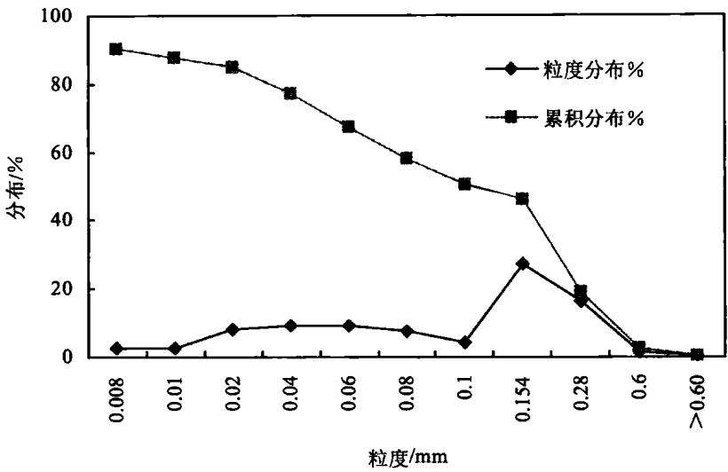  
图 6-1 尾砂粒度分布及其累积分布

## 6.5.1.2 化学组成

据现场实际采样（0\~-30cm）分析其化学组成，尾砂的化学组成如表6-1所示。

表 6-1 尾砂的化学组成
<table><tr><td colspan="1" rowspan="1">样品编号</td><td colspan="1" rowspan="1">主要成分</td><td colspan="1" rowspan="1">含量</td><td colspan="1" rowspan="1">单位</td></tr><tr><td colspan="1" rowspan="1">尾砂一Y—1</td><td colspan="1" rowspan="1">水溶性碳酸盐</td><td colspan="1" rowspan="1">146</td><td colspan="1" rowspan="1">mgCO3/kg</td></tr><tr><td colspan="1" rowspan="1">尾砂-Y-2</td><td colspan="1" rowspan="1">速效K</td><td colspan="1" rowspan="1">10</td><td colspan="1" rowspan="1">mg/kg</td></tr><tr><td colspan="1" rowspan="1">尾砂一Y-3</td><td colspan="1" rowspan="1">Al</td><td colspan="1" rowspan="1">1.70</td><td colspan="1" rowspan="1">wt%</td></tr><tr><td colspan="1" rowspan="1">尾砂-Y-4</td><td colspan="1" rowspan="1">Ag</td><td colspan="1" rowspan="1">&lt;4</td><td colspan="1" rowspan="1">mg/kg</td></tr><tr><td colspan="1" rowspan="1">尾砂-Y-5</td><td colspan="1" rowspan="1">As</td><td colspan="1" rowspan="1">192</td><td colspan="1" rowspan="1">mg/kg</td></tr><tr><td colspan="1" rowspan="1">尾砂-Y-6</td><td colspan="1" rowspan="1">Ca</td><td colspan="1" rowspan="1">16.3</td><td colspan="1" rowspan="1">wt%</td></tr><tr><td colspan="1" rowspan="1">尾砂-Y-7</td><td colspan="1" rowspan="1">Cd</td><td colspan="1" rowspan="1">11.3</td><td colspan="1" rowspan="1">mg/kg</td></tr><tr><td colspan="1" rowspan="1">尾砂-Y-8</td><td colspan="1" rowspan="1">CND</td><td colspan="1" rowspan="1">0.224</td><td colspan="1" rowspan="1">ms/cm</td></tr><tr><td colspan="1" rowspan="1">尾砂-Y-9</td><td colspan="1" rowspan="1">Co</td><td colspan="1" rowspan="1">23.8</td><td colspan="1" rowspan="1">mg/kg</td></tr><tr><td colspan="1" rowspan="1">尾砂一Y-10</td><td colspan="1" rowspan="1">Cr</td><td colspan="1" rowspan="1">28.5</td><td colspan="1" rowspan="1">mg/kg</td></tr><tr><td colspan="1" rowspan="1">尾砂-Y-11</td><td colspan="1" rowspan="1">Cu</td><td colspan="1" rowspan="1">1490</td><td colspan="1" rowspan="1">mg/kg</td></tr><tr><td colspan="1" rowspan="1">尾砂-Y-12</td><td colspan="1" rowspan="1">Fe</td><td colspan="1" rowspan="1">6.17</td><td colspan="1" rowspan="1">wt%</td></tr><tr><td colspan="1" rowspan="1">尾砂一Y-13</td><td colspan="1" rowspan="1">K</td><td colspan="1" rowspan="1">0.035</td><td colspan="1" rowspan="1">wt%</td></tr><tr><td colspan="1" rowspan="1">尾砂-Y-14</td><td colspan="1" rowspan="1">Mg</td><td colspan="1" rowspan="1">0.52</td><td colspan="1" rowspan="1">wt%</td></tr><tr><td colspan="1" rowspan="1">尾砂-Y-15</td><td colspan="1" rowspan="1">Mn</td><td colspan="1" rowspan="1">1 580</td><td colspan="1" rowspan="1">mg/kg</td></tr><tr><td colspan="1" rowspan="1">尾砂-Y-16</td><td colspan="1" rowspan="1">Na</td><td colspan="1" rowspan="1">0.022</td><td colspan="1" rowspan="1">wt%</td></tr><tr><td colspan="1" rowspan="1">尾砂-Y-17</td><td colspan="1" rowspan="1">Ni</td><td colspan="1" rowspan="1">47.6</td><td colspan="1" rowspan="1">mg/kg</td></tr><tr><td colspan="1" rowspan="1">尾砂-Y-18</td><td colspan="1" rowspan="1">Org.</td><td colspan="1" rowspan="1">0.10</td><td colspan="1" rowspan="1">%</td></tr><tr><td colspan="1" rowspan="1">尾砂-Y-19</td><td colspan="1" rowspan="1">P（可溶性）</td><td colspan="1" rowspan="1">&lt;1.5</td><td colspan="1" rowspan="1">mg/kg</td></tr><tr><td colspan="1" rowspan="1">尾砂一Y-20</td><td colspan="1" rowspan="1">Pb</td><td colspan="1" rowspan="1">36.9</td><td colspan="1" rowspan="1">mg/kg</td></tr><tr><td colspan="1" rowspan="1">尾砂-Y-21</td><td colspan="1" rowspan="1">pH</td><td colspan="1" rowspan="1">8.45</td><td colspan="1" rowspan="1"></td></tr><tr><td colspan="1" rowspan="1">尾砂-Y-22</td><td colspan="1" rowspan="1">S</td><td colspan="1" rowspan="1">0.15</td><td colspan="1" rowspan="1">%</td></tr><tr><td colspan="1" rowspan="1">尾砂-Y-23</td><td colspan="1" rowspan="1">Se</td><td colspan="1" rowspan="1">1.61</td><td colspan="1" rowspan="1">mg/kg c</td></tr><tr><td colspan="1" rowspan="1">尾砂-Y-24</td><td colspan="1" rowspan="1">TDS</td><td colspan="1" rowspan="1">0.112</td><td colspan="1" rowspan="1">g/L</td></tr><tr><td colspan="1" rowspan="1">尾砂一Y-25</td><td colspan="1" rowspan="1">TKN</td><td colspan="1" rowspan="1">235</td><td colspan="1" rowspan="1">mg/kg</td></tr><tr><td colspan="1" rowspan="1">尾砂-Y-26</td><td colspan="1" rowspan="1">Zn</td><td colspan="1" rowspan="1">223</td><td colspan="1" rowspan="1">mg/kg</td></tr></table>

表 6-2 土壤环境质量标准值  
单位：mg/kg
<table><tr><td rowspan=2 colspan=1>项目</td><td rowspan=1 colspan=1>一级</td><td rowspan=1 colspan=3>二级</td><td rowspan=1 colspan=1>三级</td></tr><tr><td rowspan=1 colspan=1>自然背景</td><td rowspan=1 colspan=1>&lt;6.5</td><td rowspan=1 colspan=1>6.5-7.5</td><td rowspan=1 colspan=1>&gt;7.5</td><td rowspan=1 colspan=1>&gt;9.5</td></tr><tr><td rowspan=1 colspan=1>镉</td><td rowspan=1 colspan=1>0.20</td><td rowspan=1 colspan=1>0.30</td><td rowspan=1 colspan=1>0.30</td><td rowspan=1 colspan=1>0.60</td><td rowspan=1 colspan=1>1.0</td></tr><tr><td rowspan=1 colspan=1>汞</td><td rowspan=1 colspan=1>0.15</td><td rowspan=1 colspan=1>0.30</td><td rowspan=1 colspan=1>0.50</td><td rowspan=1 colspan=1>1.0</td><td rowspan=1 colspan=1>1.5</td></tr><tr><td rowspan=1 colspan=1>砷      旱地</td><td rowspan=1 colspan=1>15</td><td rowspan=1 colspan=1>40</td><td rowspan=1 colspan=1>30</td><td rowspan=1 colspan=1>25</td><td rowspan=1 colspan=1>40</td></tr><tr><td rowspan=1 colspan=1>铜      农田等</td><td rowspan=1 colspan=1>35</td><td rowspan=1 colspan=1>50</td><td rowspan=1 colspan=1>100</td><td rowspan=1 colspan=1>100</td><td rowspan=1 colspan=1>400</td></tr><tr><td rowspan=1 colspan=1>铅</td><td rowspan=1 colspan=1>35</td><td rowspan=1 colspan=1>250</td><td rowspan=1 colspan=1>300</td><td rowspan=1 colspan=1>350</td><td rowspan=1 colspan=1>500</td></tr><tr><td rowspan=1 colspan=1>铬      旱地</td><td rowspan=1 colspan=1>90</td><td rowspan=1 colspan=1>150</td><td rowspan=1 colspan=1>200</td><td rowspan=1 colspan=1>250</td><td rowspan=1 colspan=1>300</td></tr><tr><td rowspan=1 colspan=1>锌</td><td rowspan=1 colspan=1>100</td><td rowspan=1 colspan=1>200</td><td rowspan=1 colspan=1>250</td><td rowspan=1 colspan=1>300</td><td rowspan=1 colspan=1>500</td></tr><tr><td rowspan=1 colspan=1>镍</td><td rowspan=1 colspan=1>40</td><td rowspan=1 colspan=1>40</td><td rowspan=1 colspan=1>50</td><td rowspan=1 colspan=1>60</td><td rowspan=1 colspan=1>200</td></tr></table>

据现场实际采样（0～-30cm）分析其化学组成，尾砂的化学组成表明，Cu、As、Cd 分别为 1 490、192、11.3 mg/kg，分别超出国家标准 GB 15618—1995 三级标准值（表6-2）的2.725倍、3.8倍、10.3倍。作为植被种植基质的尾砂，这些元素的超标将不利于植被建立。

## 6.5.1.3 营养特征

据现场实际调查、测试和采样实测，该尾砂作为建立植被的种植基质，存在明显的缺欠，主要有以下几方面问题严重影响植被的成活。

## (1)有机质及营养元素低

有机质及营养元素含量见表6-3。表6-3 表明，有机质、含氮量、速效磷、CEC 均极低；在0～100 cm 深度层内，随深度增加有机质下降，全氮和速效磷极低，全钾不足并呈下降趋势。剖面深度与有机质变化关系见图6-2。

表 6-3 尾砂中营养成分含量
<table><tr><td rowspan=1 colspan=1>采样深度/cm</td><td rowspan=1 colspan=1>pH</td><td rowspan=1 colspan=1>有机质/%</td><td rowspan=1 colspan=1>全氮/%</td><td rowspan=1 colspan=1>速效磷/(μg/g)</td><td rowspan=1 colspan=1>速效钾/(μg/g)</td><td rowspan=1 colspan=1>CEC/(meq/100 g)</td></tr><tr><td rowspan=1 colspan=1>0~17</td><td rowspan=1 colspan=1>8.3</td><td rowspan=1 colspan=1>0.45</td><td rowspan=1 colspan=1>0.020</td><td rowspan=1 colspan=1>2</td><td rowspan=1 colspan=1>39</td><td rowspan=1 colspan=1>4.2</td></tr><tr><td rowspan=1 colspan=1>0~30</td><td rowspan=1 colspan=1>8.45</td><td rowspan=1 colspan=1>0.10</td><td rowspan=1 colspan=1>0.024</td><td rowspan=1 colspan=1>&lt;1.5</td><td rowspan=1 colspan=1>10/40</td><td rowspan=1 colspan=1></td></tr><tr><td rowspan=1 colspan=1>30~60</td><td rowspan=1 colspan=1>8.32</td><td rowspan=1 colspan=1>0.08</td><td rowspan=1 colspan=1>0.041</td><td rowspan=1 colspan=1>&lt;1.5</td><td rowspan=1 colspan=1>35</td><td rowspan=1 colspan=1></td></tr><tr><td rowspan=1 colspan=1>60~100</td><td rowspan=1 colspan=1>8.62</td><td rowspan=1 colspan=1>0.05</td><td rowspan=1 colspan=1>0.023</td><td rowspan=1 colspan=1>&lt;1.5</td><td rowspan=1 colspan=1>31</td><td rowspan=1 colspan=1></td></tr></table>

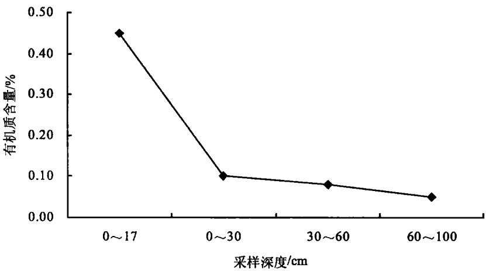  
图6-2 剖面深度与有机质含量关系

## (2) 保肥保水能力极差

尾砂中胶质极少，孔隙大， $\mathbf { C E C } { < } 5 \ \mathrm { m e q } / 1 0 0 \ \mathbf { g }$ ，故保肥保水困难。

## 6.5.1.4 土壤环境微生物

正常土壤中每克土壤含细菌数目可高达50亿个，还有丝状细菌，真菌和黏菌。自然界微生物在其进化中形成形形色色的种类，能产生不同的酶，降解土壤中天然有机物。

土壤中最重要的成分是微生物，土壤微生物数量大，成为实现土壤中无机颗粒以及无机元素的释放，及有机物和无机物之间转化的重要参与者。土壤团粒结构和孔隙、所含的水分、空气和有机质，为微生物的生存提供最佳生活条件。

通常，土壤内的有机物大多来自植物的残余，微生物将其分解为腐殖质的重要来源，为植物等生长提供营养，成为植物等正常生长的基本条件。本项目的植被场地，为经过金属选矿（湿式）而排泄的尾砂构成，地表无植物生长，严重缺乏存在微生物的基本条件。

## 6.5.1.5 土壤团粒结构

团粒结构是作为植物生长的基本营养源、水分源的贮存库，是植物生存的基本条件之一。尾砂为内聚力极低的松散体，严重缺乏这一基本条件。

## 6.5.2 尾矿库边坡无土植被复垦研究

## 6.5.2.1 基质改良

## (1)基质熟化和增肥试验

为解决种植基质肥力低下，难以满足植被建立的基本肥力要求，本项目针对现有基质有效组成含量，进行了施肥品种、投加量以及投加方式试验。

I 不施加肥料；

Ⅱ 施加一种本试验设计的微量元素组分的复合肥料（BB）;

ⅢI同时施加BB和人工有机粒肥（OG）两元肥料。

经过4\~5个月生长期的试验结果表明，试验小区Ⅲ平均发芽率、生长势、覆盖度最佳，其结果如表6-4所示。

表 6-4 试验结果
<table><tr><td rowspan=1 colspan=1>小区试验组别</td><td rowspan=1 colspan=1>发芽率/%</td><td rowspan=1 colspan=1>生长势/mm</td><td rowspan=1 colspan=1>覆盖度/%</td><td rowspan=1 colspan=1>综合结果</td></tr><tr><td rowspan=1 colspan=1>I</td><td rowspan=1 colspan=1>40~50</td><td rowspan=1 colspan=1>淡绿色，平均株高30~60，根系长50</td><td rowspan=1 colspan=1>40~50</td><td rowspan=1 colspan=1>差</td></tr><tr><td rowspan=1 colspan=1>II</td><td rowspan=1 colspan=1>60~70</td><td rowspan=1 colspan=1>绿色，平均株高80~90，根系长100</td><td rowspan=1 colspan=1>60</td><td rowspan=1 colspan=1>中</td></tr><tr><td rowspan=1 colspan=1>III</td><td rowspan=1 colspan=1>85~90</td><td rowspan=1 colspan=1>绿色深浓平均株高100~200，根系长200</td><td rowspan=1 colspan=1>90</td><td rowspan=1 colspan=1>最好</td></tr></table>

上述增肥试验结果表明，采取人工有机粒肥（有机质6%）与添加总量在1%的B、Mo、活性Ca等微量成分）的掺混肥，取得良好效果。

## (2) 接种菌剂

该试验中针对种植的不同品种，接种牧草专用型“高效复合生物菌剂”，分别对各类草品种接种禾本科、豆科专用菌剂，用以增加基质中活性微生物菌含量并增加肥效。试验按领先科技公司产品推荐条件新鲜拌种，于化后施用。

对照试验结果表明，凡接种菌剂品种长势好于未接种同一品种，有促进植被品种发育生长效果，推广试验中可依据场地条件少量品种接种。

## (3) 增加保水剂

为提高种植基质的田间持水力，在试验区进行增加保水剂的小区对比试验。

共分两组对照，每组4个试验小区2个处理，2个重复，共计8个试验小区，试验面积 $3 2 ~ \mathrm m ^ { 2 }$ ，保水剂 TC为泰陆公司产品，施用量分别为 $5 0 ~ \mathrm { g } / \mathrm { m } ^ { 2 }$ $1 0 0 ~ \mathrm { g } / \mathrm { m } ^ { 2 }$ 。试验小区种植品种为百喜草。

植被生长势试验结果表明， $1 0 0 \mathrm { \bf g } / \mathrm { \bf m } ^ { 2 }$ 供试组效果 $> 5 0 ~ \mathrm { g } / \mathrm { m } ^ { 2 } >$ 对照组，有明显保水作用。但与产品说明中推荐参数相差很大，产品指明可保存400倍施用体积的雨季降水水量，现场试验表明，实际贮存水量为体积的十余倍。TC成本较高，难以被工业应用。

综上所述，试验筛选出最佳熟化增肥条件是BB和QG肥同时施用；品种直接接种微生物菌剂可促生长：TC保水剂有保水效果，但需综合各因素考虑采用。

## 6.5.2.2 植被品种筛选

## (1)植被品种筛选

为通过现场试验找到能在粗砂区中植根的适生品种，本项目进行了耐热、抗旱及抗贫瘠的草品种适生性试验和品种匹配组合的选择试验。在前期盆栽试验基础上，共筛选出禾本科和豆科植物高羊茅、苜蓿、三叶草、匍匐草、香根草、沙草等（GF、Z、SH、Y、BSY、VR）共6个品种，以此品种进行现场小区试验。春季采用草类品种为豆科与禾本科草进行配合，即，香根草VR匹配种植Y+BS、SH+Z、GF+SH、Z等品种。

1）品种。春季植被试验经过4个月生长，试验结果表明，上述6个品种对基质适宜性良好，依据全面生长情况，香根草、Y、Z、SH为适宜性强、长势好的适宜品种：BSY、GF为长势较好品种。BSY虽生长良好，但生长速度较慢，作为护坡植物不理想；GF发芽率极高，一般达95%以上，但当地夏季超过 $3 5 \mathrm { ^ \circ C }$ 天数过长，该品种抗热性表现不佳，本项目中作为前期先锋植物品种种植。

2）生长势。在该坝坡种植已取得的试验数据表明，种植4个月后的植被总覆盖度95%以上。植被试验区植株高低匹配互补，颜色浓绿，各色花盛开，整体生长势良好。生长势见图6-3～图6-5。

3）植株。上述6个供试品种中，香根草品种显示出性能优越。地面以上植株高大，植株高度1.5m以上（植株修剪过4次），当年分蘖数在20\~30个，甚至达到40以上；植株茎秆粗壮直立性强，叶片宽厚。VR 种植70 天生长势见图 6-6。

图6-6 中 VR 生长曲线表明，从 VR种植开始的前 20天为植株对当地生境的适应期，此间当地气象条件是日间气温 $2 2 { \sim } 2 9 \mathrm { ^ { \circ } C }$ ，昼间 $1 2 { \sim } 1 7 \mathrm { { ^ { \circ } C } }$ ，此间仅在4月和6月降过两次小到中雨。20天后开始正常生长，28天后生长速度加快，在 42 天内共长高 39.1 cm，平均每日长速达到 0.93 cm/d。在气温 $3 0 \mathrm { { ^ \circ C } }$ 以后，长速更为加快。

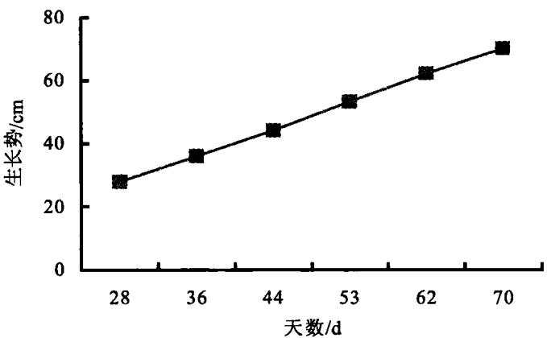  
图 6-6 VR 植株生长势

4）根系。香根草其根为丛生根系，根系粗壮发达。4个月生长期的根系深度达0.5m以下，已经显示出有效抵御住当年雨水冲刷，基本防止了植被区水土流失。其根系发育情况见图6-7。

## (2) 品种匹配试验

共进行上述6个品种的4个组合匹配试验研究，用以筛选出最佳配合。在现场进行品种匹配小区试验，试验区及品种配合如下。

试验区1：VR 间距1m，匹配种植禾本与豆科草本植物 Y+BS;

试验区 2:VR 间距 1 m，匹配种植豆科草本植物 SH+Z;

试验区3：VR 间距1 m，匹配种植禾本与豆科草本植物 GF+SH;

试验区4：VR 间距1 m，匹配种植豆科草本植物 Z。

经过本项目试验，从6个品种的4个组合匹配试验研究结果显示，采用草类品种为豆科与禾本科草进行配合，即：①香根草配合种植Y+BS；②配合种植SH+Z；③配合种植GF+Z；④配合种植SH等品种的试验方案均获得良好结果。

其总体趋势是： $\textcircled { 1 } > \textcircled { 2 } > \textcircled { 4 } > \textcircled { 3 }$

4 种品种种植配合试验中，品种 Y+BSY 对粗砂区显示适生性强，抗旱能力好的优势，覆盖度高，达到90%以上。是可以在同类粗砂区推广的适宜品种优化配合。

试验结果表明，一株生长一季的禾本科植株，分蘖数在10～15个甚至更多，根系在20 cm左右；生长2季的植株分蘖数在30个以上，根系深度在30～50 cm;生长3\~4季的植株分蘖数在60以上，已有部分生长4个生长季的禾本科植株分蘖数已达\~150个，植株根系60\~70cm；豆科植株根系70\~90 cm。其中生长2～3 季的植株，有的品种根系控制面积直径达1.8m，有的品种根深达1.5m。

## (3) 种植方式

为防止降雨冲蚀，采用等高线种植方式，在后期坝上部按等高线种植高秆植物品种，在高秆植物之间草类品种采用匹配种植并适当密植。试验区各品种种植方式及其发芽状况见图6-8～图6-10。

## 6.5.2.3 植被对边坡的稳定作用

试验数据表明，种植4个月后的植被覆盖度90%以上，高大植株高度1.5m以上（现场植株已经修剪过4次），分蘖数在20\~30个，甚至更多：其根系发达深度达0.5m以下，已经抵御住当年雨水冲刷，基本防止了植被区水土流失。该试验数据可靠、效果明显。此类植物为多年生物种，在国外也被多国成功用于护坡工程。本研究项目是国内首次成功用于高纬度尾矿库护坡工程，既稳定了坝坡防止水土流失，又有效防止粉尘污染，并且实现恢复生态环境效果，护坡效果明显。植被的强大根系，为水土流失的关键控制因素，表6-5表明植株分蘖与根系发育状况控制作用。试验对照区（即非植被区）在同等条件下，发生明显的沟蚀、面蚀（图6-11和图6-12）。

表 6-5 植株分蘖与根系发育
<table><tr><td rowspan=1 colspan=1>植物种类</td><td rowspan=1 colspan=1>生长期/a</td><td rowspan=1 colspan=1>株高/cm</td><td rowspan=1 colspan=1>分糵数/个</td><td rowspan=1 colspan=1>根系形状</td><td rowspan=1 colspan=1>根长/cm</td><td rowspan=1 colspan=1>控制面积/φcm</td></tr><tr><td rowspan=1 colspan=1>禾本科GF</td><td rowspan=1 colspan=1>1</td><td rowspan=1 colspan=1>10~16</td><td rowspan=1 colspan=1>29</td><td rowspan=1 colspan=1>密丛型网状</td><td rowspan=1 colspan=1>21</td><td rowspan=1 colspan=1>51</td></tr><tr><td rowspan=1 colspan=1>禾本科 GF</td><td rowspan=1 colspan=1>2</td><td rowspan=1 colspan=1>20~25</td><td rowspan=1 colspan=1>120~150</td><td rowspan=1 colspan=1>密丛型网状</td><td rowspan=1 colspan=1>25~30</td><td rowspan=1 colspan=1>50~60</td></tr><tr><td rowspan=1 colspan=1>豆科 BSY</td><td rowspan=1 colspan=1>0.5</td><td rowspan=1 colspan=1>8</td><td rowspan=1 colspan=1>分支数4</td><td rowspan=1 colspan=1>匍匐茎</td><td rowspan=1 colspan=1>17</td><td rowspan=1 colspan=1>10</td></tr><tr><td rowspan=1 colspan=1>豆科 BSY</td><td rowspan=1 colspan=1>1</td><td rowspan=1 colspan=1>17</td><td rowspan=1 colspan=1>分支数10</td><td rowspan=1 colspan=1>匍匐茎</td><td rowspan=1 colspan=1>43</td><td rowspan=1 colspan=1>49</td></tr><tr><td rowspan=1 colspan=1>豆科Z</td><td rowspan=1 colspan=1>0.5</td><td rowspan=1 colspan=1>2</td><td rowspan=1 colspan=1></td><td rowspan=1 colspan=1>丛生型</td><td rowspan=1 colspan=1>15</td><td rowspan=1 colspan=1>18</td></tr><tr><td rowspan=1 colspan=1>豆科Z</td><td rowspan=1 colspan=1>1</td><td rowspan=1 colspan=1>10</td><td rowspan=1 colspan=1></td><td rowspan=1 colspan=1>丛生型</td><td rowspan=1 colspan=1>24</td><td rowspan=1 colspan=1>30</td></tr><tr><td rowspan=1 colspan=1>禾本科香根草</td><td rowspan=1 colspan=1>4个月</td><td rowspan=1 colspan=1>150*</td><td rowspan=1 colspan=1>20~30</td><td rowspan=1 colspan=1>密丛型深根</td><td rowspan=1 colspan=1>50</td><td rowspan=1 colspan=1>30</td></tr></table>

\*株高为已经过修剪4次之值，每次修剪在30\~50cm。

## 6.5.3 尾矿库无土植被复垦研究

## 6.5.3.1 基质改良

试验场地选在尾矿库干滩区，试验区尾砂组成、粒度、性能见表6-1。试验小区共87个，每小区面积2×2m²。

现场小区试验植被品种是经过盆栽试验结果产生的，在300多盆栽试验中，从品种、匹配组合、配合比例等筛选出适生、表现优异的14个禾本科和豆科类

草品种用于现场小区试验。

在不同营养源条件下，分别进行三组系列小区试验。在每一组试验中，均分别采用双品种、三品种、四品种组合作为供试品种。以进行品种适生、配合及抗性试验，以及基质熟化及肥力条件试验，筛选出可供推广的最佳品种及熟化、肥力条件，以及适宜的施工方式等。经过长达两年以上的观察，其结果为：①已经从三组系列试验中筛选出最佳试验组的结果见Ⅲ系列；②发现了适生最佳豆科、禾本科品种Z、SH、ZSY、BSY、GM、GF、BX、Y、ZY等；③这些品种的双、三、多品种匹配组合；④试验出适宜的先锋品种；⑤有针对性的添加微量元素的BB肥和采用膨化OG肥，对于本试验条件的适宜性和试验效果明显；⑥试验区专属性地接种高浓度微生物菌群，使严重缺乏微生物的尾砂中明显增加了生物活性；⑦找到了坡度大、粗砂区植被恢复的对策；⑧试验研究还取得适宜的施工条件与方式等。

以上这些基本条件均可供推广。基质改良与熟化小区试验结果见表6-6。

表 6-6 基质改良与熟化小区试验结果
<table><tr><td rowspan=1 colspan=1>小区试验组别</td><td rowspan=1 colspan=1>发芽率/%</td><td rowspan=1 colspan=1>生长势/mm</td><td rowspan=1 colspan=1>植被覆盖率/%</td></tr><tr><td rowspan=1 colspan=1>Ⅰ系列</td><td rowspan=1 colspan=1>40~50</td><td rowspan=1 colspan=1>植株淡绿，平均株高范围30～60，根长平均50</td><td rowspan=1 colspan=1>40~50</td></tr><tr><td rowspan=1 colspan=1>ⅡI系列</td><td rowspan=1 colspan=1>60~70</td><td rowspan=1 colspan=1>植株绿，平均株高范围80~90，平均根长100</td><td rowspan=1 colspan=1>60</td></tr><tr><td rowspan=1 colspan=1>IⅢI系列</td><td rowspan=1 colspan=1>&gt;95</td><td rowspan=1 colspan=1>植株深绿，平均株高范围100~200，平均根长200</td><td rowspan=1 colspan=1>&gt;95</td></tr></table>

## 6.5.3.2 适生品种筛选试验

为试验找出能在粗沙区中植根的适生品种，2001年进行并完成耐热、抗旱及抗贫瘠的草品种适生性试验，品种匹配组合的选择试验。共进行GF、Z、SH、Y、BSY、HSY等6个品种、5个匹配组合试验研究。

## （1）Y+BSY品种组

2001年春天种植的 A1，A2种植品种 Y+BSY品种组对粗砂区显示适生性强、抗旱能力好、长势旺盛的优势，是粗砂区推广的适宜品种，其筛选种植条件适宜(图6-13)。

## (2) GF 品种

GF品种早期发芽率高，覆盖度好，但春季种植3个月后不能抵御连续干热条件，缺乏抗热性，利用该品种生长前期的优势，可选作先锋植物种植（图6-14）。

## 6.5.3.3 接种菌剂试验

针对Z、BSY两个豆科品种，专门合成提纯了2种接种菌剂，并完成6个试验区（现场A1、A2、A5、A6、A7、A9）共2.13hm²的接种试验，以研究对于粗砂区植被的着床、成活和促生长条件的影响。

试验结果表明，除A6效果较差外，其他5个试验区植被品种的着床、成活和促生长效果明显。接种菌剂的加入，增加了活性微生物菌群，在种子发芽、生长过程中，起着明显促进生长作用。对照试验结果表明，BSY、Z接种菌剂后，根瘤菌从根毛侵入根部，在主根和侧根形成具有固氮能力的根瘤，表现出BSY、Z接种菌剂后植株长势好于未接种同一品种，成活密度高，植株粗壮、绿色鲜明，促进植被品种发育生长，特别是粗砂区效果明显，表明增加了基质中活性微生物菌含量也提高了肥效。

## 6.5.3.4 植被区理化性能跟踪试验

为调查研究植被成活率、根系发育、植被稳定性及防治尾砂粉尘污染效果，2001年进行杨山冲尾矿库植被试验效果的现场跟踪调查，采样测试工作。包括植被区地表植被生长势、根系发育、植被覆盖、动植物回归；植被区与对照区土壤养分、水分、理化性质、地表尾砂壤土化、库区剖面重金属变化等9个项目，共采取代表性样品27个。继续对杨山冲尾矿库地表水进行pH、As、Cd、Cr、Cu、Pb、CN-等13项跟踪调查。对代表性样品进行测试分析，共获得有效数据196个。

## (1)壤土化速度加快

现场测试结果表明，植被的建立促使地表尾砂变成土壤速度加快。地表已经由原有尾砂的黄色，逐渐转变为深灰至黑色，尾砂颗粒粒度由粗变细，原尾砂地表由干燥变为潮湿，其成土趋势见图6-15的尾砂 0\~-50mm层内变化表明，随植被时间增加试验地粉粒（0.05～0.02mm）的百分比急剧增加到对照组的20倍，黏粒也呈缓慢增长趋势，砂粒呈明显下降趋势，约降低4.5倍。结果表明，由于植被基质内微生物及植被根系等作用结果，植被的建立促使尾矿库地表表层尾砂成土趋势加快。

## (2) 地表水分增加

据现场调查，尾矿库场地地表，由于植被及微生物的作用，使尾砂颗粒物粒度组成发生变化。组成颗粒缓慢变细，地表颜色加深，从黄灰色的干燥尾砂，逐渐变为灰黑色。地表水分加大，使原有尾砂表面，从下层至表层（-200→0mm）越来越干燥的趋势得以改变。植被后从深层至表层（-200→0mm）变化虽然缓慢，但数据表明，水分呈明显上升趋势，现场采样实测各层水分变化见图6-16。植被层促使尾砂表层发生了一系列变化，苔藓类植物在植被覆盖的尾砂地表上随处可见。

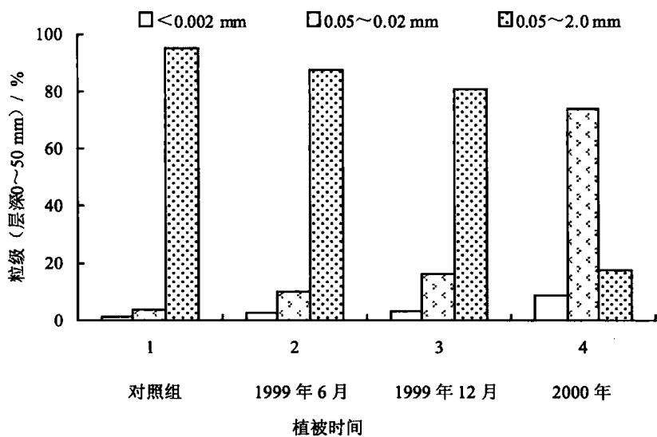  
图6-15 植被促使尾砂地表成土趋势

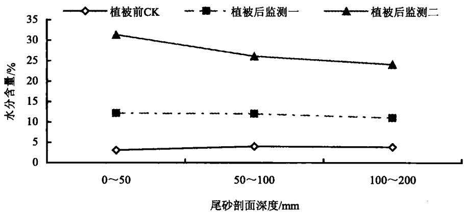  
图 6-16 植被建立前后尾砂剖面各层水分变化

## (3) 植株生长势

现场调查的数据表明，在库内粗砂、坡度大的地区，几个供试品种植被基本长势良好，部分豆科植株生长2季以上高度一般在 50\~120 cm，部分已经开花结籽。禾本科植株生长一季，分蘖数在15个以上；生长2季的植株分蘖数在30个以上；生长3\~4季的植株分蘖数在60以上；已有部分生长4个生长季的禾本科植株分蘖数约达150个。已初步形成多种植被品种匹配互补的长势（图6-17和图6-18)。

## (4) 根系发育

在库内粗砂、坡度大的地区，复垦区植被的根系调查结果充分显示，1季生长植株根系在20cm左右：2季根系深度在30\~50cm；3季植株根系60\~70 cm;豆科植株根系 70\~90cm。其中生长2\~3季的植株，有的品种根系控制面积直径达1.8m，有的品种根深达1.5m。有的地面植株不大但根系却十分发达，控制了远比地表大得多的范围，特别是复垦区已经形成强有力的根系网络。除少量高位粗砂区外，尾矿库粉尘已经得到有效抑制；对库下游的污染已经得到缓解，保护当地社区居民免受尾砂粉尘污染上发挥了积极作用（图6-19\~图6-22）。

## (5)植被覆盖度

将小区试验成功品种、匹配组合、配合比及其种植方式，基质熟化及其改善条件等科研成果，推广应用于各期扩大试验及工程中。各期植被长势良好，覆盖度在80%以上，等高线较低的地带覆盖度在85%以上，部分细砂区地带覆盖度达90%；根系已经形成控制地表的网络体系，庞大的根系网络，远远大于地面植物的密度，图6-23表明禾本科根系发育及控制土层直径，可以看出没有植被的地表层实际已被根系网络所覆盖和控制的状况。

## (6) 抗蒸发剂效果

2000年对于高坡度尾砂区的粗砂区（A3)，采用抗蒸发剂进行了保水固沙效果的小区试验。2001年观察测试效果表明，一年后添加抗蒸发剂的小区植株长势好，覆盖度大于40%，固沙高度在25cm以上；对照小区植被皆无。表明添加该剂作用明显，但加入量比较大，将增加成本。

## 6.5.4 尾矿库农业复垦研究

## 6.5.4.1 土壤改良

试验选择中条山公司胡家峪铜矿毛家湾尾矿库，在分析尾砂和土壤性状的基础上，设计了4种土壤覆盖方法：①不覆土，直接在尾砂上种植（T1）；②覆20 cm的土与尾砂混合，土壤与尾砂比率为2：1（T2)；③覆 30 cm的土与尾砂混合，土砂比率为3：1（T3）；④覆40cm的土（T4）。

每个种植品种小区面积25m²，三个重复。当地种植主要依靠天然降水，试验中不进行任何灌溉，并保持每个小区使用相同的施肥量和播种量，以便比较得到最佳的覆土、改良方法和种植品种，图6-24为毛家湾尾矿库种植试验场。

## 6.5.4.2 品种的选择

结合当地农业种植的实际情况，同时考虑土壤的立地结构，初步选择了花生、

高粱、玉米、大豆4个农业品种。

## 6.5.4.3 作物产量

根据各小区作物产量，计算得到四种土壤处理的每公顷产量（表6-7）。

表 6-7 不同处理的计算平均每公顷产量  
单位：kg/hm²
<table><tr><td rowspan=1 colspan=1>农产品</td><td rowspan=1 colspan=1>T1</td><td rowspan=1 colspan=1>T2</td><td rowspan=1 colspan=1>T3</td><td rowspan=1 colspan=1>T4</td></tr><tr><td rowspan=1 colspan=1>花生</td><td rowspan=1 colspan=1>2 409</td><td rowspan=1 colspan=1>3 309</td><td rowspan=1 colspan=1>2 755.5</td><td rowspan=1 colspan=1>1 687.5</td></tr><tr><td rowspan=1 colspan=1>高粱</td><td rowspan=1 colspan=1>5 922</td><td rowspan=1 colspan=1>8 083.5</td><td rowspan=1 colspan=1>6 703.5</td><td rowspan=1 colspan=1>4 537.5</td></tr><tr><td rowspan=1 colspan=1>玉米</td><td rowspan=1 colspan=1>2 409</td><td rowspan=1 colspan=1>4269</td><td rowspan=1 colspan=1>3 987</td><td rowspan=1 colspan=1>3 243</td></tr><tr><td rowspan=1 colspan=1>大豆</td><td rowspan=1 colspan=1>88.5</td><td rowspan=1 colspan=1>153</td><td rowspan=1 colspan=1>129</td><td rowspan=1 colspan=1>235.5</td></tr></table>

从表6-7可以看出，黄土与尾砂混合后，改良了土壤结构，提高了田间持水量，T2、T3的作物产量明显高于T1、T4，特别是 T2 的花生、高粱分别达到每公顷产 3309 kg 和 8 083.5 kg，高于当地的平均每公顷产量；玉米为 4269 kg，与当地每公顷产量持平；大豆由于在结荚期遇到大旱，基本无收成，作物长势见图 6-25～图 6-28。

对花生、高粱和玉米的小区产量进行了统计分析，以确定其是否具有差异显著性和显著水平。分析结果表明，花生小区的平均产量 T2 与 T1 的差异显著性达到α=0.05 水平，T2 与 T4 达到 $\pmb { \alpha } { = } 0 . 0 1$ 水平。对高粱产量的方差分析结果是：T2 与 T1、T4 的差异显著性达到 $\pmb { \alpha } { = } 0 . 0 1$ 水平，T3 与 T1、T4达到 $\scriptstyle \alpha = 0 . 0 5$ 水平玉米产量各处理之间无差异显著性。

## 6.5.4.4 土壤含水量检测与分析

在尾矿库种植试验区安装了20 个中子探管，用CPN503DR中子水分仪定期测量0～120 cm深度的尾砂含水量，并且用灌溉和植物管理软件计算处理数据，绘制曲线。分析研究作物生长与不同尾砂处理含水量的关系。

从监测结果来看，T1 小区为不覆土，其含水量变化范围为 7%～24%，最高含水量在30 cm深度，随之含水量下降。T2 小区为具有黏性的黄土与尾砂混合，尾砂的理化性质得到了极大改善，其含水量变化范围为14%\~28.5%，最高含水量在 20 cm 和 40 cm 深度，随之含水量下降。T2 小区的含水量远远大于 T1 小区，为作物生长提供了良好的水分。并且最大含水层深度更有利用作物根系对水分的吸收，使作物得到较高的产量。

## 6.5.4.5 重金属浓度分析

尾砂含有 200\~500 mg/kg 的铜和 50\~150 mg/kg 的钴，这些是食物链中重

金属的潜在来源。为分析尾矿库上作物的可食性，取样分析了覆盖处理后尾砂土壤、种子和产品中的重金属浓度（表6-8）。

表6-8 毛家湾尾矿库的尾砂土壤、种子和产品中的重金属浓度  
单位：mg/kg
<table><tr><td rowspan=1 colspan=1>样品类型</td><td rowspan=1 colspan=1>As</td><td rowspan=1 colspan=1>Cd</td><td rowspan=1 colspan=1>Co</td><td rowspan=1 colspan=1>Cu</td><td rowspan=1 colspan=1>Cr</td><td rowspan=1 colspan=1>Ni</td><td rowspan=1 colspan=1>Pb</td><td rowspan=1 colspan=1>Zn</td></tr><tr><td rowspan=1 colspan=1>尾砂土壤</td><td rowspan=1 colspan=1></td><td rowspan=1 colspan=1></td><td rowspan=1 colspan=1></td><td rowspan=1 colspan=1></td><td rowspan=1 colspan=1></td><td rowspan=1 colspan=1></td><td rowspan=1 colspan=1></td><td rowspan=1 colspan=1></td></tr><tr><td rowspan=1 colspan=1>T1</td><td rowspan=1 colspan=1>9</td><td rowspan=1 colspan=1>&lt;0.6</td><td rowspan=1 colspan=1>91</td><td rowspan=1 colspan=1>330</td><td rowspan=1 colspan=1>29</td><td rowspan=1 colspan=1>33</td><td rowspan=1 colspan=1>&lt;30</td><td rowspan=1 colspan=1>20</td></tr><tr><td rowspan=1 colspan=1>T2</td><td rowspan=1 colspan=1>11</td><td rowspan=1 colspan=1>&lt;0.6</td><td rowspan=1 colspan=1>80</td><td rowspan=1 colspan=1>290</td><td rowspan=1 colspan=1>36</td><td rowspan=1 colspan=1>39</td><td rowspan=1 colspan=1>&lt;30</td><td rowspan=1 colspan=1>37</td></tr><tr><td rowspan=1 colspan=1>T3</td><td rowspan=1 colspan=1>18</td><td rowspan=1 colspan=1>&lt;0.6</td><td rowspan=1 colspan=1>64</td><td rowspan=1 colspan=1>230</td><td rowspan=1 colspan=1>35</td><td rowspan=1 colspan=1>35</td><td rowspan=1 colspan=1>&lt;30</td><td rowspan=1 colspan=1>39</td></tr><tr><td rowspan=1 colspan=1>T4</td><td rowspan=1 colspan=1>15</td><td rowspan=1 colspan=1>&lt;0.6</td><td rowspan=1 colspan=1>14</td><td rowspan=1 colspan=1>32</td><td rowspan=1 colspan=1>40</td><td rowspan=1 colspan=1>30</td><td rowspan=1 colspan=1>&lt;30</td><td rowspan=1 colspan=1>55</td></tr><tr><td rowspan=1 colspan=1>种子</td><td rowspan=1 colspan=1></td><td rowspan=1 colspan=1></td><td rowspan=1 colspan=1></td><td rowspan=1 colspan=1></td><td rowspan=1 colspan=1></td><td rowspan=1 colspan=1></td><td rowspan=1 colspan=1></td><td rowspan=1 colspan=1></td></tr><tr><td rowspan=1 colspan=1>玉米</td><td rowspan=1 colspan=1>&lt;0.2</td><td rowspan=1 colspan=1>0.01</td><td rowspan=1 colspan=1>&lt;0.03</td><td rowspan=1 colspan=1>2.1</td><td rowspan=1 colspan=1>&lt;0.6</td><td rowspan=1 colspan=1>1.69</td><td rowspan=1 colspan=1>&lt;0.2</td><td rowspan=1 colspan=1>15</td></tr><tr><td rowspan=1 colspan=1>高粱</td><td rowspan=1 colspan=1>&lt;0.2</td><td rowspan=1 colspan=1>0.01</td><td rowspan=1 colspan=1>0.14</td><td rowspan=1 colspan=1>5.3</td><td rowspan=1 colspan=1>0.6</td><td rowspan=1 colspan=1>1.33</td><td rowspan=1 colspan=1>&lt;0.2</td><td rowspan=1 colspan=1>20</td></tr><tr><td rowspan=1 colspan=1>花生</td><td rowspan=1 colspan=1>0.2</td><td rowspan=1 colspan=1>0.02</td><td rowspan=1 colspan=1>0.12</td><td rowspan=1 colspan=1>14</td><td rowspan=1 colspan=1>&lt;0.6</td><td rowspan=1 colspan=1>0.64</td><td rowspan=1 colspan=1>&lt;0.2</td><td rowspan=1 colspan=1>41</td></tr><tr><td rowspan=1 colspan=1>大豆</td><td rowspan=1 colspan=1>&lt;0.2</td><td rowspan=1 colspan=1>0.01</td><td rowspan=1 colspan=1>0.41</td><td rowspan=1 colspan=1>17</td><td rowspan=1 colspan=1>0.7</td><td rowspan=1 colspan=1>4.73</td><td rowspan=1 colspan=1>&lt;0.2</td><td rowspan=1 colspan=1>47</td></tr><tr><td rowspan=1 colspan=1>产品</td><td rowspan=1 colspan=1></td><td rowspan=1 colspan=1></td><td rowspan=1 colspan=1></td><td rowspan=1 colspan=1></td><td rowspan=1 colspan=1></td><td rowspan=1 colspan=1></td><td rowspan=1 colspan=1></td><td rowspan=1 colspan=1></td></tr><tr><td rowspan=1 colspan=1>玉米T1</td><td rowspan=1 colspan=1>0.2</td><td rowspan=1 colspan=1>&lt;0.02</td><td rowspan=1 colspan=1>0.13</td><td rowspan=1 colspan=1>4</td><td rowspan=1 colspan=1>1</td><td rowspan=1 colspan=1>2</td><td rowspan=1 colspan=1>&lt;0.3</td><td rowspan=1 colspan=1>19</td></tr><tr><td rowspan=1 colspan=1>玉米 T2</td><td rowspan=1 colspan=1>&lt;0.2</td><td rowspan=1 colspan=1>&lt;0.02</td><td rowspan=1 colspan=1>0.12</td><td rowspan=1 colspan=1>4</td><td rowspan=1 colspan=1>1</td><td rowspan=1 colspan=1>2</td><td rowspan=1 colspan=1>&lt;0.3</td><td rowspan=1 colspan=1>19</td></tr><tr><td rowspan=1 colspan=1>玉米 T3</td><td rowspan=1 colspan=1>0.2</td><td rowspan=1 colspan=1>&lt;0.02</td><td rowspan=1 colspan=1>0.12</td><td rowspan=1 colspan=1>4</td><td rowspan=1 colspan=1>1</td><td rowspan=1 colspan=1>2</td><td rowspan=1 colspan=1>0.3</td><td rowspan=1 colspan=1>19</td></tr><tr><td rowspan=1 colspan=1>玉米 T4</td><td rowspan=1 colspan=1>0.2</td><td rowspan=1 colspan=1>&lt;0.02</td><td rowspan=1 colspan=1>0.18</td><td rowspan=1 colspan=1>3</td><td rowspan=1 colspan=1>1</td><td rowspan=1 colspan=1>&lt;2</td><td rowspan=1 colspan=1>&lt;0.3</td><td rowspan=1 colspan=1>14</td></tr><tr><td rowspan=1 colspan=1></td><td rowspan=1 colspan=1></td><td rowspan=1 colspan=1></td><td rowspan=1 colspan=1></td><td rowspan=1 colspan=1></td><td rowspan=1 colspan=1></td><td rowspan=1 colspan=1></td><td rowspan=1 colspan=1></td><td rowspan=1 colspan=1></td></tr><tr><td rowspan=1 colspan=1>高粱 T1</td><td rowspan=1 colspan=1>0.2</td><td rowspan=1 colspan=1>&lt;0.02</td><td rowspan=1 colspan=1>0.25</td><td rowspan=1 colspan=1>5</td><td rowspan=1 colspan=1>1</td><td rowspan=1 colspan=1>0.7</td><td rowspan=1 colspan=1>0.3</td><td rowspan=1 colspan=1>16</td></tr><tr><td rowspan=1 colspan=1>高粱 T2</td><td rowspan=1 colspan=1>0.2</td><td rowspan=1 colspan=1>&lt;0.02</td><td rowspan=1 colspan=1>0.32</td><td rowspan=1 colspan=1>5</td><td rowspan=1 colspan=1>1</td><td rowspan=1 colspan=1>0.2</td><td rowspan=1 colspan=1>0.3</td><td rowspan=1 colspan=1>18</td></tr><tr><td rowspan=1 colspan=1>高粱 T3</td><td rowspan=1 colspan=1>0.2</td><td rowspan=1 colspan=1>&lt;0.02</td><td rowspan=1 colspan=1>0.21</td><td rowspan=1 colspan=1>5</td><td rowspan=1 colspan=1>1</td><td rowspan=1 colspan=1>0.2</td><td rowspan=1 colspan=1>&lt;0.3</td><td rowspan=1 colspan=1>18</td></tr><tr><td rowspan=1 colspan=1>高粱T4</td><td rowspan=1 colspan=1>&lt;0.2</td><td rowspan=1 colspan=1>&lt;0.02</td><td rowspan=1 colspan=1>0.44</td><td rowspan=1 colspan=1>5</td><td rowspan=1 colspan=1>1</td><td rowspan=1 colspan=1>&lt;0.2</td><td rowspan=1 colspan=1>0.3</td><td rowspan=1 colspan=1>16</td></tr><tr><td rowspan=1 colspan=1></td><td rowspan=1 colspan=1></td><td rowspan=1 colspan=1></td><td rowspan=1 colspan=1></td><td rowspan=1 colspan=1></td><td rowspan=1 colspan=1></td><td rowspan=1 colspan=1></td><td rowspan=1 colspan=1></td><td rowspan=1 colspan=1></td></tr><tr><td rowspan=1 colspan=1>花生T1</td><td rowspan=1 colspan=1>0.2</td><td rowspan=1 colspan=1>0.02</td><td rowspan=1 colspan=1>0.74</td><td rowspan=1 colspan=1>16</td><td rowspan=1 colspan=1>1</td><td rowspan=1 colspan=1>5</td><td rowspan=1 colspan=1>&lt;0.3</td><td rowspan=1 colspan=1>31</td></tr><tr><td rowspan=1 colspan=1>花生T2</td><td rowspan=1 colspan=1>&lt;0.2</td><td rowspan=1 colspan=1>0.02</td><td rowspan=1 colspan=1>0.61</td><td rowspan=1 colspan=1>15</td><td rowspan=1 colspan=1>1</td><td rowspan=1 colspan=1>4</td><td rowspan=1 colspan=1>&lt;0.3</td><td rowspan=1 colspan=1>33</td></tr><tr><td rowspan=1 colspan=1>花生T3</td><td rowspan=1 colspan=1>&lt;0.2</td><td rowspan=1 colspan=1>0.02</td><td rowspan=1 colspan=1>0.73</td><td rowspan=1 colspan=1>15</td><td rowspan=1 colspan=1>2</td><td rowspan=1 colspan=1>5</td><td rowspan=1 colspan=1>&lt;0.3</td><td rowspan=1 colspan=1>33</td></tr><tr><td rowspan=1 colspan=1>花生T4</td><td rowspan=1 colspan=1>0.5</td><td rowspan=1 colspan=1>0.03</td><td rowspan=1 colspan=1>0.41</td><td rowspan=1 colspan=1>14</td><td rowspan=1 colspan=1>1</td><td rowspan=1 colspan=1>4</td><td rowspan=1 colspan=1>&lt;0.3</td><td rowspan=1 colspan=1>28</td></tr><tr><td rowspan=1 colspan=1></td><td rowspan=1 colspan=1></td><td rowspan=1 colspan=1></td><td rowspan=1 colspan=1></td><td rowspan=1 colspan=1></td><td rowspan=1 colspan=1></td><td rowspan=1 colspan=1></td><td rowspan=1 colspan=1></td><td rowspan=1 colspan=1></td></tr><tr><td rowspan=1 colspan=1>大豆T1</td><td rowspan=1 colspan=1>&lt;0.2</td><td rowspan=1 colspan=1>&lt;0.02</td><td rowspan=1 colspan=1>3.3</td><td rowspan=1 colspan=1>19</td><td rowspan=1 colspan=1>1</td><td rowspan=1 colspan=1>14</td><td rowspan=1 colspan=1>&lt;0.3</td><td rowspan=1 colspan=1>43</td></tr><tr><td rowspan=1 colspan=1>大豆T2</td><td rowspan=1 colspan=1>&lt;0.2</td><td rowspan=1 colspan=1>&lt;0.02</td><td rowspan=1 colspan=1>2.8</td><td rowspan=1 colspan=1>20</td><td rowspan=1 colspan=1>1</td><td rowspan=1 colspan=1>12</td><td rowspan=1 colspan=1>&lt;0.3</td><td rowspan=1 colspan=1>42</td></tr><tr><td rowspan=1 colspan=1>大豆T3</td><td rowspan=1 colspan=1>0.3</td><td rowspan=1 colspan=1>&lt;0.02</td><td rowspan=1 colspan=1>2.6</td><td rowspan=1 colspan=1>21</td><td rowspan=1 colspan=1>2</td><td rowspan=1 colspan=1>12</td><td rowspan=1 colspan=1>&lt;0.3</td><td rowspan=1 colspan=1>38</td></tr><tr><td rowspan=1 colspan=1>大豆T4</td><td rowspan=1 colspan=1>&lt;0.2</td><td rowspan=1 colspan=1>&lt;0.02</td><td rowspan=1 colspan=1>2.7</td><td rowspan=1 colspan=1>19</td><td rowspan=1 colspan=1>2</td><td rowspan=1 colspan=1>11</td><td rowspan=1 colspan=1>&lt;0.3</td><td rowspan=1 colspan=1>35</td></tr><tr><td rowspan=1 colspan=1>食品标准</td><td rowspan=1 colspan=1>&lt;0.5</td><td rowspan=1 colspan=1>&lt;0.05</td><td rowspan=1 colspan=1></td><td rowspan=1 colspan=1></td><td rowspan=1 colspan=1></td><td rowspan=1 colspan=1></td><td rowspan=1 colspan=1>&lt;1.0</td><td rowspan=1 colspan=1></td></tr></table>

从分析中得出结论，毛家湾尾矿库作物产品中的重金属浓度与原有种子的含量相当或略高，远远低于尾砂土壤中的含量，并且符合食品卫生标准。这和我们所预计的相同，由于尾砂中的碳酸盐含量高，大大降低了重金属在土壤水中的溶

解度，使作物对重金属的吸收量明显降低。尾矿库生长的作物可食性问题是矿山和当地农民一直非常关心的问题。研究的成果为矿山以地换地，返还复垦土地给农民耕作提供了可靠的理论和实践依据。

1）毛家湾尾矿库用黄土与尾砂混合覆盖处理的方法，改良了尾砂结构，提高了田间持水能力，缩短了土壤熟化时间，作物产量高，节省了大量土源，减少了复垦费用，是一种经济有效的复垦方法。

2）最适宜种植的品种有花生和高粱，每公顷产量分别为3309kg/hm²和  
8084kg/hm²，方差分析结果表明，混合处理与其他覆盖方法有显著的差异水平。

3）尾矿库上种植的各种作物籽粒中的重金属浓度远远低于尾砂中的浓度，与种子中的重金属浓度相当，达到了食品卫生标准。

## 6.6 尾矿库生态修复工程实践

## 6.6.1 水木冲尾矿库边坡无土植被控制水土流失技术

## 6.6.1.1 项目概况

## (1) 库区位置及概况

水木冲尾矿库位于铜陵市东3.5km，距选矿厂约2km，有市区至水泥厂公路可通向该库址。该库容积670万 $\mathbf { m } ^ { 3 }$ ，最终堆积标高80m，可供使用19.5年。库区排洪排水系统构筑物设施标准设计，现为运行库，平均年排尾砂约50万t，上游法筑坝，堆积标高现为72m。库区坝坡示意图见图6-29。

## (2) 气候条件

当地为北亚热带湿润季风气候。其特点是季风明显，四季分明，全年气候温暖湿润，雨量比较充沛。多年平均气温16.2℃，极端最高气温 $4 0 . 2 \mathrm { { ‰} }$ ，最热月平均气温28.8℃，极端最低气温- $. 1 1 . 5 \mathrm { ‰}$ ，最冷月平均气温3.1℃，0℃以下总日数平均41d，历年日35℃以上平均约18d；月平均湿度78%；历年平均降雨量1364.4mm，4—10月降雨量占全年降雨量75%，汛期5—9月降雨量占全年降雨量的60%，24小时最大降雨量204.4mm。为季风气候区，全年以东北风为主，夏季主导风向南西风，历年平均风速3.1m/s，土壤冻结深度<0.5m；日照充分。

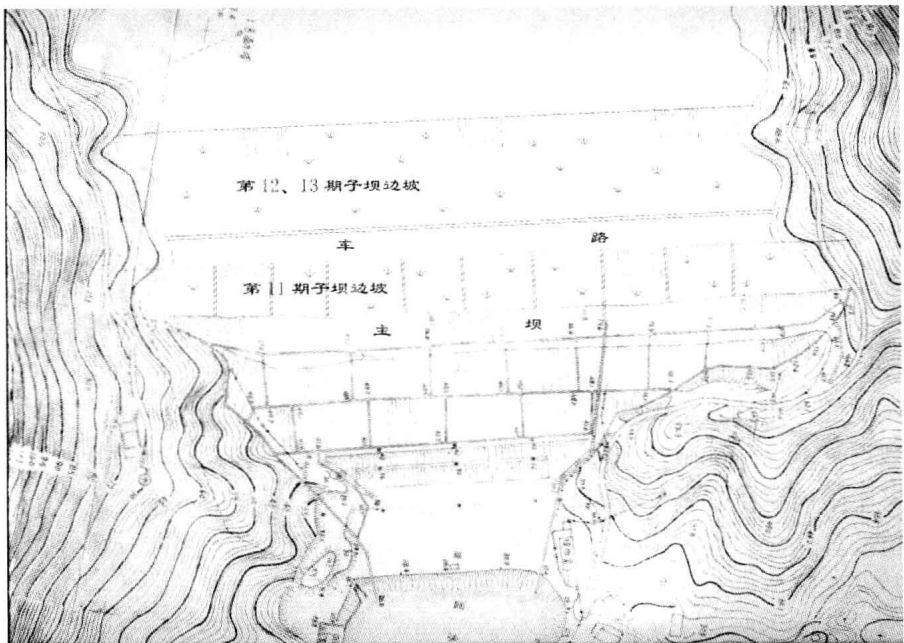  
图 6-29 水冲尾矿库坝坡平面示意图

## (3) 土壤与植被

地带性土壤属黄红壤类型，共6个土类，13个亚类。土壤没有明显的纬向地带性变化，受地形地貌条件控制。基本分为低山丘陵区，主要分布黄红壤、沿江滩地灰潮土区和水稻土区。当地植被以温带湿润气候条件下的物种为主，自然分布植物1233种，栽培植物553种。主要树种有松、杉、柳、榆、泡桐等常绿和落叶乔木。还有竹、藤等灌木和藤本植物。丹皮、白芍、丹参等也有种植。农作物主要有稻米、麦及山芋、玉米、豆类、油菜籽等。

## 6.6.1.2 工程实施效果

2003年水木冲尾矿库14\~15期后期坝边坡的无土植被护坡工程，经过认真技术论证、仔细设计、大胆采用代用材料，克服主要品种VR不能到位的困难，经全矿上下齐心合力奋战现场及精心施工，以及近半年的跟踪观察和管理，取得了比较满意的结果（图6-30～图6-35)。14\~15期坝坡上，植被长势良好，根系发达，覆盖度平均达到80%以上。植被已经发挥了有效地控制当年汛期的水土流失，由于植被的强力固着作用，坝坡稳定，边坡安全性得到加强。同时，大大抑制尾砂粉尘的流动和飞扬。对改善当地大气环境质量发挥着积极作用。建议加强已有植被区的护坡管理并减少顶部尾砂的封盖，减少和杜绝非自然因素的破坏，使之植被区实现良性循环系统。

## 6.6.1.3 项目效益分析

## (1)有效控制边坡水土流失

实验结果显示，在无十覆盖的植被试验区，虽然坡度大、砂粒粗，但植株及根系长势良好，部分植株已经开花结籽，特别是复垦区已经形成强有力的根系网络。作为尾矿库坝坡最主要的安全及群众反映强烈的主要问题得到解决。在汛期常年降雨情况下，密集的植株体系和根系网络结构，已经显示出控制水土流失的显著效果，将加速尾矿库边坡稳定，试验区未发现可见的水土流失现象。

## (2) 有效抑制尾砂粉尘污染

尾矿库严重的粉尘问题是我国尾矿库带有共性的环境污染问题，下游群众反映强烈，甚至导致矿山同当地社区群众关系紧张，不少矿山这类问题已作为当地人大提案限期解决。本试验区的无土直接植被试验，植被密集覆盖度高，高低错落的植株群体，已经完全控制住边坡粉尘，并有效阻挡住库区部分粉尘。对保护当地社区居民免受尾砂粉尘污染发挥着积极作用。

## (3) 节省土源保护耕地

国内尾矿库等废弃堆场边坡基本采用黏土覆盖的工程稳定措施，在当前不少地方采取购耕地取土的办法解决。一个中等规模的尾矿库用于边坡覆土约需2万m土方量，其值相当于从0.4hm²耕地挖深5m取土，我国有各类尾矿库1500多座，如此取土需要破坏耕地近万公顷。采用本试验的无土植被稳定技术，可大为减少对耕地的破坏，为国家节省成千上万公顷土地资源。

## (4) 经济效益分析

以本试验场地尾矿库为例，平均每期边坡土源购置及覆土工程费为8万～10万元，此项尚未计算覆土后的植被工程费。而边坡直接植被恢复工程，工程费远比覆土工程少得多。以同样护坡工程比较，覆土工程费为36万元；植被护坡工程费为18万元，后者可节省工程费18万元，即节约工程费达50%。因此，本试验研究潜在经济效益也十分可观，其推广应用前景看好。

## 6.6.2 杨山冲尾矿库无土植被示范

## 6.6.2.1 项目概况

## (1) 库区位置及概况

杨山冲尾矿库，属剥蚀丘陵地带，呈西南高东北低。尾矿库位于丘陵边缘，周围有刺山、羊尖山和庙山，区内东部有羊河。断裂构造发育，附近主要分布有第四系、三叠纪地层和中生代浸入岩以及变质矽卡岩为主，此外，还有石英砂岩、闪长岩、大理岩等，岩性坚硬质密。区内分布第四系孔隙潜水层，地表岩溶发育，尾矿库北侧三叠纪裂隙含水层富水和透水性不均匀。

该库1966年启用，1990年闭库。库容748万 $\mathbf { m } ^ { 3 }$ ，贮存尾矿1308万t。上游法筑坝，初期坝有主、副坝，后期主副坝已经连成一体，坝总长700m多，坝高75m，外坡1：4.5；库内有井—管排水水工设施。1989年完成对该库的抗震加固工程，对坝坡进行全面整修，完成垂直水平联合排渗工程，使该库坝体浸润线降低，堆体沉积密实，动力最小安全系数达1.905，库区实现了稳定。库区平面示意图及尾矿库植被前现状见图6-36和图6-37。

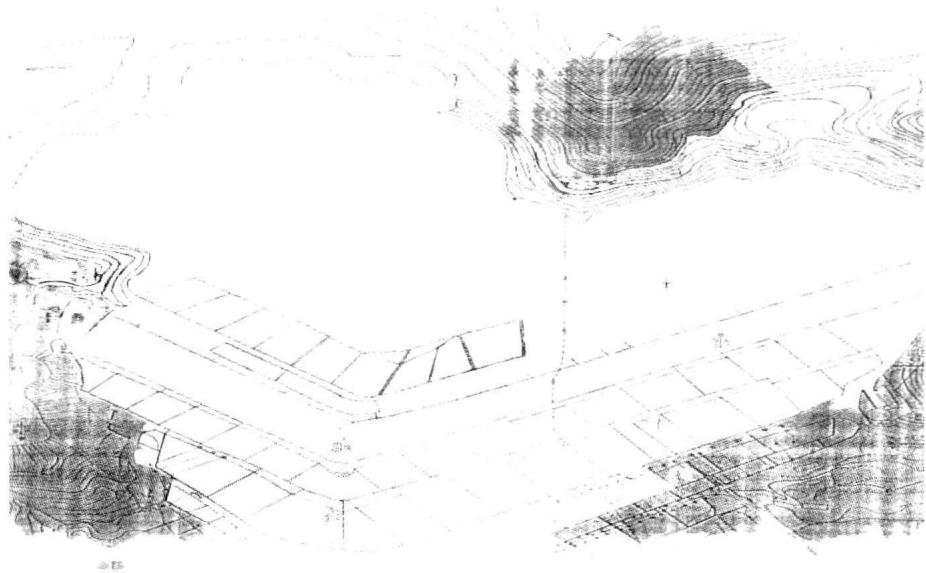  
图 6-36 库区平面示意图

## (2) 气候特征

尾矿库位于长江下游南岸的铜陵市。地理坐标介于北纬 $3 0 ^ { \circ } 4 6 ^ { \prime } { \sim } 3 1 ^ { \circ } 0 8 ^ { \prime }$ ，东经117°42'\~118°11'。年平均温度 $1 6 . 3 9 ^ { \circ } \mathrm { C }$ ，最低温度-8.2℃，最高温度40.2℃。多年平均降水量1488mm，蒸发量1500mm，平均风速2.5m/s。

## (3) 土壤与植被

地区性土壤具有过渡带的特点，呈地带性红壤。尾矿库区土壤以天然冲积亚黏土、残积、坡积黏土及亚黏土、强风化闪长岩为主。成土母质主要为酸性、中性结晶岩、石灰岩、硅质、泥岩残积物的岩成土。矿区山坡植被多数为马尾松、局部地区毛竹和冬青等，农田主要分布在库区主坝下，为水稻、豆类、油菜、薯类等。经济作物为丹皮、油桐等。

## 6.6.2.2 工程实施效果

冲尾矿库无土植被工程基本完成并获得成功，成效显著。库区植被品种生长良好，植株长势旺盛，郁郁葱葱，春季紫色、黄色、白色等各色花盛开在原来难以成活的尾砂区；各品种根型、根系纵横交错、互补，已经形成强大的根系网络，在控制尾砂上发挥其他措施无可比拟的作用（图6-38～图6-42）。

尾矿库恢复植被后，已经使夏季强烈日照下的尾砂地表高达 $5 0 \%$ 和极端地表低温的不同季节不同时段的昼夜温差大为缩小，已经趋于普通地表，对局地小气候已经发挥良好调节作用。昔日严重污染尾矿坝下游社区、居民、社会反映强烈的“尾砂沙尘暴”，已经基本被绿色植被所覆盖，植被稳定；尾矿库表层成土化趋势明显，生态环境有效改善，对局地生境有调节作用，据现场监测小动物回归情况调查，目前已经有多达20多种的昆虫、小鸟、小兔回迁尾矿库，并成为牛群放牧的基地，春季则成为小学生春游的场所（图6-43和图 6-44)。

## 6.6.2.3 项目效益分析

## (1) 环境和社会效益

1）杨山冲尾矿库防止尾砂粉尘污染项目，是为落实当地人大提案而实施的环境治理工程，用良好的工程结果对当地人民作出比较圆满的答复。

2）尾矿库是当地粉尘污染的重要污染源强，项目的完成减少了当地大气粉尘污染的主要污染源强之一，为改善当地大气环境质量和改善局地小气候作出了贡献。

3）从尾矿库源头防止尾砂粉尘的严重污染，保护了下游居民免受粉尘侵害，恢复了库区周围良好的生活环境。

4）促进坝体稳定，有效减少库区水土流失。

5）加强、改善了矿方与当地社区的关系，增加相互间的理解和互信。减少双方矛盾激化的表现及一些活动。

6）为矿方妥善保护了二次资源—可用于深度利用的尾矿砂。

## (2) 经济效益

杨山冲尾矿库闭库以来，严重的尾砂粉尘污染导致社会反映强烈，矿方为落实地方人大提案，采用无土植被技术治理尾砂粉尘问题，不但具有显著的环境效益、社会效益，而且具有较好的经济效益。矿方曾就治理尾矿库进行技术经济论证，如按传统方法是以黏土层覆盖，20万 ${ \mathfrak { m } } ^ { 2 }$ 场地最少覆盖黏土层 0.3 m厚度，约需6万 $\mathbf { m } ^ { 3 }$ 黏土，按每公顷取土深度3 m 估算需购买耕地 $\scriptstyle 2 \ln \ln ^ { 2 }$ ，即使暂不考虑政策是否允许、能否买到土源问题，单就经济估算按每75元 $/ \mathbf { m } ^ { 2 }$ 计，全场覆盖土层约需150万元；矿山曾作另一处置方案，即采用覆盖水泥封固表面，据估算，按6元/m²全场约需120万元。值得注意的是水泥封固存在明显的温度辐射问题，特别是热辐射将对局地环境带来新的污染。而采用无土复垦技术建立植被，试验研究及植被工程费用约合2.7元/m²，相当于覆土费用的36%，水泥覆盖费用的45%，上述数据表明，无土植被工程方式治理尾矿库粉尘污染，将比覆土节约50%以上的资金投入。三种方案经济效益比较见表 6-9。

表 6-9 三种方案经济效益比较
<table><tr><td rowspan=1 colspan=1>处置方案</td><td rowspan=1 colspan=1>处置单价/ $( ) = ( \pi / \mathbf { m } ^ { 2 } )$ </td><td rowspan=1 colspan=1>处置总费用/万元</td><td rowspan=1 colspan=1>处置比较/三者比值</td><td rowspan=1 colspan=1>处置效果</td></tr><tr><td rowspan=1 colspan=1>传统覆土处置</td><td rowspan=1 colspan=1>75</td><td rowspan=1 colspan=1>150</td><td rowspan=1 colspan=1>需6万m黏土，即购买 $\scriptstyle 2 \ln \ln ^ { 2 }$ 耕地取土，尚稳不含植被费用</td><td rowspan=1 colspan=1>定，种植后可恢复生态</td></tr><tr><td rowspan=1 colspan=1>封固水泥层</td><td rowspan=1 colspan=1>6</td><td rowspan=1 colspan=1>120</td><td rowspan=1 colspan=1>临时措施，施工困难</td><td rowspan=1 colspan=1>产生次生环境污染；不利于生态环境</td></tr><tr><td rowspan=1 colspan=1>无土植被</td><td rowspan=1 colspan=1>2.7</td><td rowspan=1 colspan=1>54</td><td rowspan=1 colspan=1>源头防治粉尘污染，并恢复生态环境</td><td rowspan=1 colspan=1>节省投资，稳定，防治污染，同时恢复生态环境</td></tr></table>

# 第7章 酸性废石堆场生态修复研究与实践

## 7.1 概述

我国有色金属以硫化物存于矿物中的比例很大，约相当于各类矿物种类总量的3/4。在矿物开采中，产生大量的剥离物和尾矿。露天堆置条件下，这类矿山废弃物中残存含量相当高的硫化物，易被空气中的氧所氧化，遇降雨和水，形成强烈的酸性水，并挟带大量的重金属离子。如不合理处置，将成为矿区严重的有害污染源。

事实上，我国不少矿山多年来为这一污染问题所困扰，酸性污染十分严重。有的废石堆、尾矿库闭库数十年仍呈强烈酸性，地表寸草不生，建立植被困难，有的甚至污染并影响到矿区周围的地表水、地下水以及土壤，造成了恶劣的环境影响。我国土地复垦工作无论是复垦科研、复垦技术、复垦规模，还是复垦水平仍处于起步阶段，与国外先进复垦国家相比差距更大，大多停留在简单的土方工程环节上，硫化矿废弃物堆场恢复生态技术研究更为落后。

如何从根本上防止或基本阻止从废弃堆场产生酸性污染，这仍旧是矿山废弃地恢复中面临的新课题。也是涉及废弃物产生量大、面广、危害严重的重大环境问题。在酸性场地建立植被本身即是富于挑战性的难题，常规复垦处置下植被难以成活或生长很差。在多数情况下，我国酸性矿山的污染防治，仅限于在酸性产生后对酸性水进行处置。在我国从酸性产生的源头采取措施，防止产生酸性污染，恢复生态建立植被尚处于初步研究阶段。

矿山废弃物产生酸性及生态恢复研究是国际上十分关注的重大环境科研课题，也是目前亟待解决的重要工业治理问题之一。在澳大利亚、加拿大和美国等国环境保护领域，每一两年定期召开专题性研讨会，进行本项内容的学术及经验交流，出版有关专门的出版物和论文集。国家、行业、企业以很大的资金投入推动这一领域技术发展。他们重点研究产生酸性的原因，并从根本上消除这些致污因子，从而减缓和消除污染的产生，利用菌根技术，添加调节剂和改良剂改善酸性废弃物性状，从而恢复生态建立植被。他们集中研究的问题主要是：①降低氧化速度，至最低并排除暴露材料的高风险性：②酸性产生源氧化物传递到环境受体的趋势降至最小：③储存和处置酸性水，使之对现场影响最小；④采取各种工程和技术措施恢复生态建立植被，一些有效的研究成果已在矿山复垦中推广应用。

## 7.2 限制酸性废石堆场生态修复的因素

酸性废石来自硫化矿物开采中剥离的废石和矿物夹石层以及排土，而酸性废石场的生态修复尚处于初步研究阶段，也无工程案例借鉴，其难点在于：

1）废弃物中残存相当高的硫化物，露天堆置条件下，易被空气中的氧所氧化，氧化深度直达堆体内部。

2）酸性废石堆堆体巨大，数十万方至数百万方，岩土混堆，废石块度大， 堆积物中孔隙度大，水土流失严重。

3）酸性废石遇降雨形成强烈的酸性水，通常pH值为1\~2，酸性污染十分严重。

4）酸性废石挟带大量的重金属离子，不利于植物生长。

5）酸性废石堆场生长介质性能极差，难以恢复植被和生态。

## 7.3 酸性废石堆场生态修复技术研究

## 7.3.1 废石场特性

## (1) 物理特征

排土场平台由于受大型载重卡车的碾压，其表层土壤结构发生较大变化。平台地表紧实度加大。干土容重比原地貌大；渗透率比原地貌小；根系穿透阻力比原地貌大。表土物理性态发生较大变化，极易板结，使种植植物不易扎根难以存活、生长。因地表下渗性能降低，遇大雨易产生地表径流，其结果是地表侵蚀加重，造成面蚀与沟蚀，严重阻碍植被的生长与恢复。

## (2) 化学特征

为了充分了解排土场土质的化学特性。我们对试验区的土壤进行了多点采样与分析。分析项目有：土壤样品的重金属分析、营养成分及含量、pH值等。分析结果见表7-1。

表 7-1 土壤理化性质及养分分析
<table><tr><td rowspan=2 colspan=1>序号</td><td rowspan=2 colspan=1>检测项目</td><td rowspan=1 colspan=3>取样地点</td><td rowspan=2 colspan=1>单位</td></tr><tr><td rowspan=1 colspan=1>酸性废石上</td><td rowspan=1 colspan=1>酸性废石下</td><td rowspan=1 colspan=1>覆土区土壤</td></tr><tr><td rowspan=1 colspan=1>1</td><td rowspan=1 colspan=1>缓效钾</td><td rowspan=1 colspan=1>310</td><td rowspan=1 colspan=1>1 808</td><td rowspan=1 colspan=1>842.3</td><td rowspan=1 colspan=1>mg/kg</td></tr><tr><td rowspan=1 colspan=1>2</td><td rowspan=1 colspan=1>电导</td><td rowspan=1 colspan=1>132.6</td><td rowspan=1 colspan=1>1.42</td><td rowspan=1 colspan=1>96.9</td><td rowspan=1 colspan=1>Us/cm</td></tr><tr><td rowspan=1 colspan=1>3</td><td rowspan=1 colspan=1>全硫</td><td rowspan=1 colspan=1>0.089</td><td rowspan=1 colspan=1>1.40</td><td rowspan=1 colspan=1>0.066 4</td><td rowspan=1 colspan=1>%</td></tr><tr><td rowspan=1 colspan=1>4</td><td rowspan=1 colspan=1>速效钾</td><td rowspan=1 colspan=1>50.0</td><td rowspan=1 colspan=1>39.1</td><td rowspan=1 colspan=1>45.4</td><td rowspan=1 colspan=1>mg/kg</td></tr><tr><td rowspan=1 colspan=1>5</td><td rowspan=1 colspan=1>有机质</td><td rowspan=1 colspan=1>0.23</td><td rowspan=1 colspan=1>0.029</td><td rowspan=1 colspan=1>0.040</td><td rowspan=1 colspan=1>%</td></tr><tr><td rowspan=1 colspan=1>6</td><td rowspan=1 colspan=1>有效磷</td><td rowspan=1 colspan=1>8.9</td><td rowspan=1 colspan=1>282</td><td rowspan=1 colspan=1>&lt;5</td><td rowspan=1 colspan=1>mg/kg</td></tr><tr><td rowspan=1 colspan=1>7</td><td rowspan=1 colspan=1>Ag</td><td rowspan=1 colspan=1>&lt;4</td><td rowspan=1 colspan=1>&lt;4</td><td rowspan=1 colspan=1>&lt;4</td><td rowspan=1 colspan=1>mg/kg</td></tr><tr><td rowspan=1 colspan=1>8</td><td rowspan=1 colspan=1>ANC</td><td rowspan=1 colspan=1>0.055</td><td rowspan=1 colspan=1>0</td><td rowspan=1 colspan=1>0.44</td><td rowspan=1 colspan=1> $\bf { k g H } _ { 2 } S O _ { 4 } / t$ </td></tr><tr><td rowspan=1 colspan=1>9</td><td rowspan=1 colspan=1>APP</td><td rowspan=1 colspan=1>2.72</td><td rowspan=1 colspan=1>42.84</td><td rowspan=1 colspan=1>2.48</td><td rowspan=1 colspan=1>kgH2SO4/t</td></tr><tr><td rowspan=1 colspan=1>10</td><td rowspan=1 colspan=1>As</td><td rowspan=1 colspan=1>&lt;20</td><td rowspan=1 colspan=1>48.8</td><td rowspan=1 colspan=1>&lt;20</td><td rowspan=1 colspan=1>mg/kg</td></tr><tr><td rowspan=1 colspan=1>11</td><td rowspan=1 colspan=1>B</td><td rowspan=1 colspan=1>491</td><td rowspan=1 colspan=1>593</td><td rowspan=1 colspan=1>426.6</td><td rowspan=1 colspan=1>mg/kg</td></tr><tr><td rowspan=1 colspan=1>12</td><td rowspan=1 colspan=1>Ca</td><td rowspan=1 colspan=1>0.092</td><td rowspan=1 colspan=1>0.11</td><td rowspan=1 colspan=1>0.122</td><td rowspan=1 colspan=1>%</td></tr><tr><td rowspan=1 colspan=1>13</td><td rowspan=1 colspan=1>Cd</td><td rowspan=1 colspan=1>4.3</td><td rowspan=1 colspan=1>5.5</td><td rowspan=1 colspan=1>4.97</td><td rowspan=1 colspan=1>mg/kg</td></tr><tr><td rowspan=1 colspan=1>14</td><td rowspan=1 colspan=1>Co</td><td rowspan=1 colspan=1>4.4</td><td rowspan=1 colspan=1>8.5</td><td rowspan=1 colspan=1>5.88</td><td rowspan=1 colspan=1>mg/kg</td></tr><tr><td rowspan=1 colspan=1>15</td><td rowspan=1 colspan=1>Cr</td><td rowspan=1 colspan=1>26.0</td><td rowspan=1 colspan=1>23.2</td><td rowspan=1 colspan=1>21.6</td><td rowspan=1 colspan=1>mg/kg</td></tr><tr><td rowspan=1 colspan=1>16</td><td rowspan=1 colspan=1>Cu</td><td rowspan=1 colspan=1>107</td><td rowspan=1 colspan=1>90.6</td><td rowspan=1 colspan=1>100.6</td><td rowspan=1 colspan=1>mg/kg</td></tr><tr><td rowspan=1 colspan=1>17</td><td rowspan=1 colspan=1>Fe</td><td rowspan=1 colspan=1>3.10</td><td rowspan=1 colspan=1>3.97</td><td rowspan=1 colspan=1>3.48</td><td rowspan=1 colspan=1>%</td></tr><tr><td rowspan=1 colspan=1>18</td><td rowspan=1 colspan=1>K</td><td rowspan=1 colspan=1>2.12</td><td rowspan=1 colspan=1>2.38</td><td rowspan=1 colspan=1>2.26</td><td rowspan=1 colspan=1>%</td></tr><tr><td rowspan=1 colspan=1>19</td><td rowspan=1 colspan=1>Mg</td><td rowspan=1 colspan=1>0.30</td><td rowspan=1 colspan=1>0.30</td><td rowspan=1 colspan=1>0.39</td><td rowspan=1 colspan=1>%</td></tr><tr><td rowspan=1 colspan=1>20</td><td rowspan=1 colspan=1>Mn</td><td rowspan=1 colspan=1>10.7</td><td rowspan=1 colspan=1>6.0</td><td rowspan=1 colspan=1>11.06</td><td rowspan=1 colspan=1>mg/kg</td></tr><tr><td rowspan=1 colspan=1>21</td><td rowspan=1 colspan=1>Mo</td><td rowspan=1 colspan=1>57.3</td><td rowspan=1 colspan=1>92.9</td><td rowspan=1 colspan=1>105.9</td><td rowspan=1 colspan=1>mg/kg</td></tr><tr><td rowspan=1 colspan=1>22</td><td rowspan=1 colspan=1>Na</td><td rowspan=1 colspan=1>0.16</td><td rowspan=1 colspan=1>0.20</td><td rowspan=1 colspan=1>0.20</td><td rowspan=1 colspan=1>%</td></tr><tr><td rowspan=1 colspan=1>23</td><td rowspan=1 colspan=1>NAPP</td><td rowspan=1 colspan=1>2.67</td><td rowspan=1 colspan=1>42.84</td><td rowspan=1 colspan=1>2.19</td><td rowspan=1 colspan=1> $\mathbf { k g H } _ { 2 } \mathbf { S O } _ { 4 } / \mathbf { t }$ </td></tr><tr><td rowspan=1 colspan=1>24</td><td rowspan=1 colspan=1>Ni</td><td rowspan=1 colspan=1>12.8</td><td rowspan=1 colspan=1>11.8</td><td rowspan=1 colspan=1>8.8</td><td rowspan=1 colspan=1>mg/kg</td></tr><tr><td rowspan=1 colspan=1>25</td><td rowspan=1 colspan=1>P</td><td rowspan=1 colspan=1>388</td><td rowspan=1 colspan=1>376</td><td rowspan=1 colspan=1>181.4</td><td rowspan=1 colspan=1>mg/kg</td></tr><tr><td rowspan=1 colspan=1>26</td><td rowspan=1 colspan=1>Pb</td><td rowspan=1 colspan=1>29.4</td><td rowspan=1 colspan=1>31.3</td><td rowspan=1 colspan=1>&lt;25</td><td rowspan=1 colspan=1>mg/kg</td></tr><tr><td rowspan=1 colspan=1>27</td><td rowspan=1 colspan=1>pH</td><td rowspan=1 colspan=1>3.89</td><td rowspan=1 colspan=1>2.99</td><td rowspan=1 colspan=1>4.3</td><td rowspan=1 colspan=1></td></tr><tr><td rowspan=1 colspan=1>28</td><td rowspan=1 colspan=1>TKN</td><td rowspan=1 colspan=1>0.014</td><td rowspan=1 colspan=1>0.008 2</td><td rowspan=1 colspan=1>0.002 5</td><td rowspan=1 colspan=1>%</td></tr><tr><td rowspan=1 colspan=1>29</td><td rowspan=1 colspan=1> ${ \bf z _ { n } }$ </td><td rowspan=1 colspan=1>23.3</td><td rowspan=1 colspan=1>34.4</td><td rowspan=1 colspan=1>22.0</td><td rowspan=1 colspan=1>mg/kg</td></tr></table>

由检测结果可看出，排土场区内的土质有一定的差别，平台上的土壤酸性极强（pH值为2.99），净酸产生量（NAPP）为 $4 2 . 8 \mathrm { ~ k g H } _ { 2 } \mathrm { S O } _ { 4 } / \mathrm { t } .$ ，土壤中重金属含量高。而重金属在酸性条件下非常活跃，不利于植物生长。

## (3) 营养特征

从各个点的分析数据可看出试验地的营养成分很低，TKN含量只有0.014%

速效钾含量为0.0062%（转换成氧化钾），有效磷的差别很大最少的含量在<0.00075%，最多的含量在 0.04%（转换成五氧化二磷)，pH值最低为 2.99，最高为4.3。依据国家标准本试验区的土壤属于极酸性土壤，且肥力属于三级以下。

## 7.3.2 废石酸形成潜势规律研究

酸性废石场的污染主要来自硫化矿的氧化，硫化物矿物暴露于地表与水圈、大气圈及微生物相互作用发生氧化性溶解而形成的废水称为矿山酸性废水AMD(Acid Mine Drainage)，既是矿山污染的产物，也是金属污染物淋滤、扩散、迁移的重要介质，酸性矿山废水主要特征是酸度高、含重金属离子。

常见硫化矿物主要有黄铁矿、胶黄铁矿、白铁矿、磁黄铁矿、辉铜矿、方铅矿、闪锌矿、黄铜矿、斑铜矿、毒砂等。铜矿床的伴生矿物多为硫化矿物，以黄铜矿分布最广，亲铜成矿元素主要有铅、锌、金、银、砷、锑、汞，铜矿化剂主要是硫，即铜主要以硫化矿存在。因此，铜矿开采过程中往往会有酸性水污染和重金属污染问题。

德兴铜矿位于江西省德兴市境内，是一开采历史近50年的大型矿山，是中国重点铜矿之一，包括铜厂和富家坞两个主要矿区，德兴铜矿为大型斑岩铜矿区，并伴生有钼、硫、金、银等元素。德兴铜矿废石场废石具有极强的酸性水形成潜势，废石场的淋滤收集于酸水库内，为典型的 AMD，pH值约为2。

酸性废石场生态重建是国内外矿山生态重建的研究重点和难点，酸性废石场生态重建的目标是一方面通过工程措施控制酸性水的产生，一方面是建立可持续的生态系统。酸性废石场生态重建必须首先了解废石的AMD形成规律与影响因素。因德兴铜矿开采历史近50年，根据废石场废石主要有三种类型：新鲜废石（采场刚剥离废石）、堆浸后废石（堆浸场堆浸后废石）、堆存时间较长废石（堆存废弃时间约20年)，为了解不同类型废石场生态重建的制约因素，须对不同类型废石场废石的AMD形成潜势与规律进行试验研究。

## 7.3.2.1 试验样品

以德兴铜矿新鲜废石、堆浸后废石、堆存时间较长废石（20年）为对象，从pH值、EC值、AMD形成潜势、重金属等方面对不同类型废石场废石潜在污染进行研究，新鲜废石从富家坞废石场和西源沟废石场废石中分别采取；堆浸后废石从祝家堆浸场堆浸后废石中采取；堆存时间长废石从水龙山废石场废石中采取。为了解当地表土AMD形成潜势，从水龙山废石场北面附近山林地表土中采取表土样。每个采样场地随机选择5点，采样后进行混合，最终取混合样，样品不少于50kg。表土取样同废石样采取。废石和表土样品情况见表7-2。

表 7-2 废石和表土样品
<table><tr><td rowspan=1 colspan=1>编号</td><td rowspan=1 colspan=1>采用地点</td><td rowspan=1 colspan=1>取样目的</td></tr><tr><td rowspan=1 colspan=1>FJW</td><td rowspan=1 colspan=1>富家坞废石场</td><td rowspan=1 colspan=1>富家坞矿区新鲜废石</td></tr><tr><td rowspan=1 colspan=1>XYG</td><td rowspan=1 colspan=1>西源沟废石场</td><td rowspan=1 colspan=1>铜厂矿区新鲜废石</td></tr><tr><td rowspan=1 colspan=1>ZJD</td><td rowspan=1 colspan=1>祝家堆浸场</td><td rowspan=1 colspan=1>堆浸后废石</td></tr><tr><td rowspan=1 colspan=1>SLS</td><td rowspan=1 colspan=1>水龙山废石场</td><td rowspan=1 colspan=1>堆存时间较长废石</td></tr><tr><td rowspan=1 colspan=1>SLB</td><td rowspan=1 colspan=1>水龙山废石场北面山林地</td><td rowspan=1 colspan=1>表土</td></tr></table>

## 7.3.2.2 废石和表土的 pH 值和 EC 值

## (1)废石和表土的 pH 值

废石和山林地表土的pH值测定结果见图7-1。

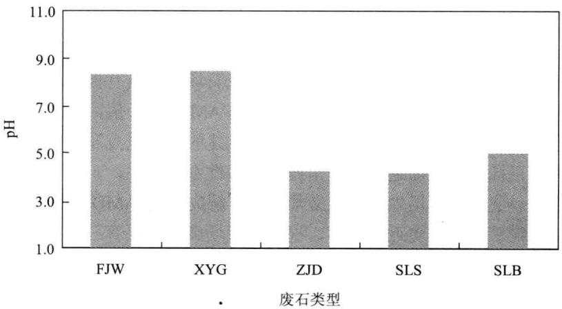  
图 7-1 不同废石场废石和山林地表土的 pH 值测试结果

不同废石场废石和山林地表土的pH 值测试结果表明，富家坞废石场废石和西源沟废石场废石pH值分别为8.3和8.5，为碱性；祝家堆浸场堆浸后废石和水龙山废石场废石 pH 值分别为 4.3 和 4.2，为酸性；山林地表土 pH 值为 5.1，为酸性土壤。

## (2) 废石和表土的 EC 值

废石和山林地表土的EC值测定结果见图7-2。

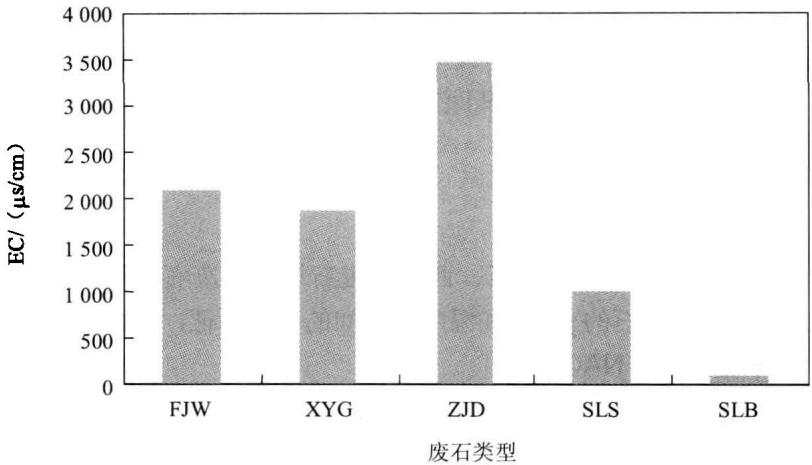  
图7-2 不同废石场废石和山林地表土的 EC 值测试结果

废石和山林地表土EC值的大小顺序为：祝家堆浸场堆浸后废石>富家坞废石场废石>西源沟废石场废石>水龙山废石场废石>山林地表土。家坞废石场废石、西源沟废石场废石、祝家堆浸场堆浸后废石和水龙山废石场废石的EC值分别是当地山林地表土EC值的18.2倍、16.2倍、30.0倍和8.5倍。

## 7.3.2.3 净产酸量

富家坞废石场废石、西源沟废石场废石和祝家堆浸场堆浸后废石和水龙山废石场废石净产酸量测定结果见图7-3。

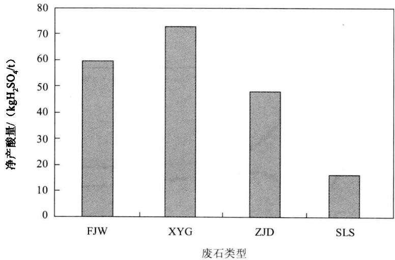  
图 7-3 废石净产酸量

从图7-3可知，富家坞废石场新鲜废石、西源沟废石场新鲜废石、祝家堆浸场堆浸后废石和水龙山废石场废石的净产酸量分别为 $5 9 . 2 3 \mathrm { ~ k g } \mathrm { ~ H } _ { 2 } \mathrm { S O } _ { 4 } / \mathrm { t }$ 、72.48 kg$\mathbf { H } _ { 2 } \mathbf { S O } _ { 4 } / \mathbf { t }$ $4 8 . 1 2 \mathrm { k g } \mathrm { ~ H } _ { 2 } \mathrm { S O } _ { 4 } / \mathrm { t }$ 和 $1 5 . 8 9 \mathrm { ~ k g ~ H _ { 2 } S O _ { 4 } / t }$ ，表明废石均为产酸物质。山林地表土为不产酸物质。

## 7.3.2.4 动态产酸试验

为了解富家坞废石场新鲜废石、西源沟废石场新鲜废石、祝家堆浸场堆浸后废石、水龙山废石场废石的pH值和温度随时间的变化特征，进行动态NAG试验。

## (1)新鲜废石动态 NAG 试验

富家坞废石场新鲜废石、西源沟废石场新鲜废石NAG试验规律相同。富家坞废石场新鲜废石动态NAG试验结果见图7-4\~图7-6。

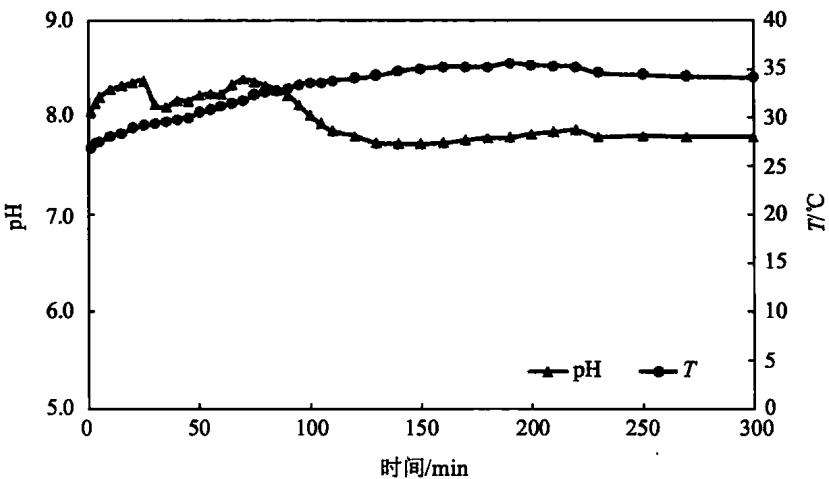  
图 7-4 富家坞废石场新鲜废石动态 NAG 试验结果（第一步）

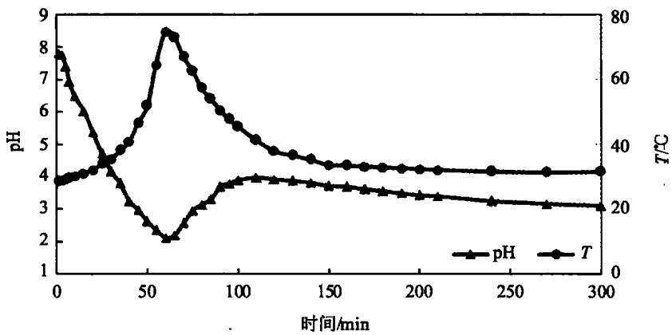  
图 7-5 富家坞废石场新鲜废石动态 NAG 试验结果（第二步）

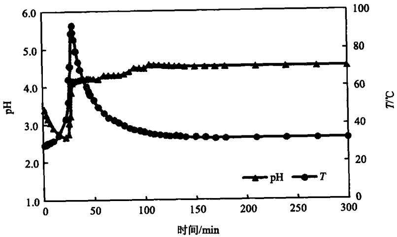  
图 7-6 富家坞废石场新鲜废石动态 NAG 试验结果（第三步）

富家坞废石场新鲜废石NAG动态试验结果表明：

第一步，pH值为7.8\~8.4，最高温度35.2℃；

第二步，pH值由7.8降到2.1，从碱性变为酸性，最高温度74.7℃；

第三步，pH值在2.7\~4.6之间变化，最高温度92.2℃，为酸性。

## (2) 堆浸后废石动态NAG 试验

堆浸后废石和堆存时间较长废石NAG 试验规律相同。祝家堆浸场堆浸后废石动态 NAG 试验结果见图 7-7 和图 7-8。

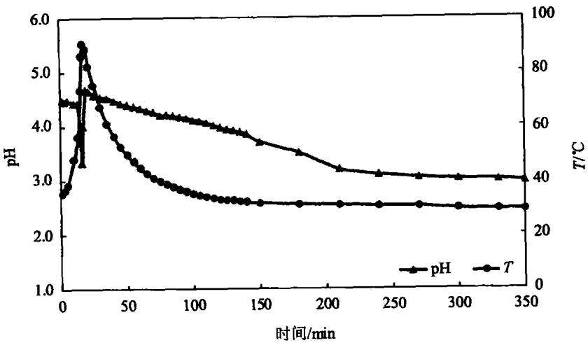  
图 7-7 祝家堆浸场堆浸后废石动态 NAG 试验结果（第一步）

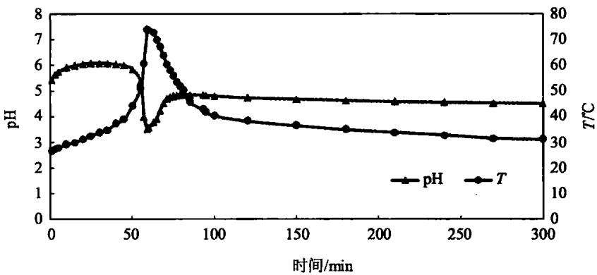  
图 7-8 祝家堆漫场堆浸后废石动态 NAG 试验结果（第二步）

祝家堆浸场堆浸后废石动态NAG试验结果表明：

第一步，pH值为3.1～4.7，为酸性，最高温度 $\mathfrak { s } 2 \mathfrak { C }$

第二步，pH值为3.5\~4.6，为酸性，最高温度 $\ 7 6 \%$

## 7.3.2.5 废石酸形成潜势规律与原因分析

从前人关于AMD形成机理的研究可知，AMD形成的物质基础是黄铁矿等硫化矿物，影响AMD形成的关键因素是水、氧和细菌微生物，其他因素包括pH值、矿物粒度与表面积等。

不同类型废石场 AMD形成规律与原因分析如下。

## (1)新鲜废石 AMD 形成规律与原因

新鲜废石净产酸量（NAG）最高，新鲜废石的 pH值为8.3\~8.5。新鲜废石暴露于空气，雨水淋溶情况下，初期不会形成AMD，随时间延长，会逐渐形成AMD。

其主要原因是：FeS 达到10.63%\~13.8%，故净产酸量（NAG）最高。新鲜废石可溶性碱性矿物溶出释放速度较快，而黄铁矿等产酸矿物初期溶出释放速度较慢，故新鲜废石pH显示碱性；随着时间延长，黄铁矿等产酸矿物溶出释放量逐渐增加，可溶性碱性矿物逐渐被中和消耗，故废石逐渐显示为酸性；黄铁矿反应为放热反应，当可溶碱性矿物逐渐被中和消耗后，基本为黄铁矿反应，故温度急剧升高，pH迅速降低。

## (2)堆浸后废石 AMD 形成规律与原因

堆浸后废石（净产酸量NAG）比新鲜废石低，比堆存时间较长废石高。堆浸后废石pH 值为 4.3。堆浸后废石暴露于空气、雨水淋溶情况下会立即形成 AMD。

其主要原因是：堆浸后废石FeS含量为4.38%，故净产酸量（NAG）较高。堆浸后废石中碱性矿物已部分被黄铁矿等产酸矿物所释放的酸中和，碱性矿物大部分被消耗，剩余的中和矿物因嵌布粒度细，或被包裹在其他不易反应的矿物中，很难起到立即中和作用，故表现较强的酸性。

## (3)堆存时间较长废石 AMD 形成规律与原因

堆存时间较长废石（净产酸量NAG）最低。堆存时间较长废石pH值为4.2。堆存时间较长废石暴露于空气、雨水淋溶情况下会立即形成AMD。

堆存时间较长废石FeS含量较低，只有0.52%，而仍显示很强的酸性的原因主要是：堆存时间较长废石中碱性矿物已被黄铁矿等产酸矿物所释放的酸所中和，可溶性碱性矿物被全部消耗，废石中虽含有碱性矿物，因其嵌布粒度细，或被包裹在其他不易反应的矿物中，很难立即起到中和作用，故即使FeS含量低，仍表现较强的酸性和AMD形成潜势。

## 7.3.2.6 小结

通过德兴铜矿不同类型废石酸形成潜势试验研究，可得出如下结论：

1）新鲜废石pH值为8.3～8.5，偏碱性；堆浸后废石和堆存时间较长废石pH值为 4.2\~4.3，为酸性。新鲜废石 EC 值为 2 110～3 480 μs/cm，堆浸后废石和堆存时间较长废石 EC 值为 886～1 882 μs/cm。

2）新鲜废石、堆浸后废石、堆存时间较长废石净产酸量分别为59.23～72.48 kg $\mathbf { H } _ { 2 } \mathbf { S O } _ { 4 } / \mathbf { t }$ 、48.12 kg $\mathbf { H } _ { 2 } \mathbf { S } \mathbf { O } _ { 4 } / \mathbf { t }$ 、15.89 kg $\mathbf { H } _ { 2 } \mathbf { S } \mathbf { O } _ { 4 } / \mathbf { t }$ ，废石均为产酸物质。暴露于空气，雨水淋溶情况下，新鲜废石初期不会形成AMD，随时间延长，逐渐形成AMD；堆浸后废石和堆存时间较长废石在雨水淋溶情况下，会立即形成AMD。

3）新鲜废石可溶性碱性矿物溶出释放速度较快，而黄铁矿等产酸矿物初期溶出释放速度较慢，故新鲜废石pH值显示碱性；随着时间延长，黄铁矿等产酸矿物溶出释放量逐渐增加，可溶性碱性矿物逐渐被中和消耗，废石逐渐显示为酸性。堆浸后废石和堆存时间较长废石中可溶性碱性矿物大部分被黄铁矿等产酸矿物所释放的酸中和，碱性矿物大部分被消耗，表现较强的酸性和AMD形成潜势。

德兴铜矿新鲜废石暴露于空气，雨水淋溶情况下，初期不会形成 AMD，随着时间延长，会逐渐形成AMD；堆浸后废石和堆存时间较长废石在雨水淋溶情况下会立即形成AMD。

在废石场生态重建时，需考虑废石场废石的 AMD形成潜势强的问题，最佳的办法是将废石场酸性水的控制与植被重建一起考虑，废石场生态重建方案既能达到控制酸性水的产生，又能建立可持续生长的植被。

## 7.4 水龙山酸性废石堆场边坡生态修复工程实践

## 7.4.1 项目概况

德兴铜矿位于江西省上饶地区德兴市，北纬 $2 8 ^ { \circ } 4 1 ^ { \prime }$ ，东经 $1 1 7 ^ { \circ } 4 4 ^ { \prime }$ ，全矿总面积$1 0 0 ~ \mathrm { k m } ^ { 2 }$ 。矿区内地貌为低山、丘陵，海拔65\~500m。矿区属中亚热带季风气候，年平均温度 $1 7 . 0 ^ { \circ } \mathrm { C } , \ \geqslant 1 0 ^ { \circ } \mathrm { C }$ 年积温 $5 2 3 3 { \sim } 5 8 0 9 ^ { \circ } \mathrm { C }$ ，无霜期248\~273d；年日照时数 1800\~2000 h，年太阳辐射总量 466.75\~468.43 kJ/cm²；年降雨量 1901.6 mm;年均相对湿度81.4%，年蒸发量1303mm。土壤主要为红壤和山地黄红壤。

矿区植物区系属于亚热带湿润森林植物区系。由于自然条件优越，又未受到第四纪大陆冰川的毁灭性袭击，因此，植被类型繁多，植物区系丰富。有藻类6门，31科，56属，135种；蕨类植物13科，16属，19种；种子植物123科，308属，462种。在种子植物中，裸子植物有8科，10属，10种；被子植物115科，298属，462种。按照林英教授的区系分析方法，该矿区的植物区系可分为主要世界性或亚世界性成分，主要热带性成分，主要热带、亚热带性成分，主要亚热带性成分，主要亚热带、温带性成分，主要热带、温带性成分和主要温带性成分。植被的优势种和常见植物区系成分以主要热带性成分和主要热带、亚热带性成分占优势。主要植被类型有亚热带常绿阔叶林、常绿与落叶阔叶混交林、针叶林、竹林、荒山灌木草丛、荒山草丛、草甸等。

## 7.4.2 现场调查分析

坡体由大量碎岩和矿尾石块堆弃而成，坡面松散程度较高，且废石含有硫化矿物，没有土层，植被恢复极度困难（图7-9）。坡度为 $4 5 ^ { \circ } \sim 6 0 ^ { \circ }$ ，坡面 pH值约为3.0，酸度较高。该项目生态治理最大的难点在于：一是坡体极其不稳定，呈现松散体的状况；二是坡面酸化程度较高，严重制约了植物的正常生长。

## 7.4.3 生态修复原则

1）遵循自然规律、近自然的生态修复。经修复后的创面与周边环境浑然一体，恢复环境自然原貌，避免太多人工痕迹。

2）因地制宜、科学采用相应的技术措施进行生态修复。克服一味追求国外引

进技术和投资高昂的坡面防护，采用人工促进自然恢复的方式实施坡面生态修复。

3）乡土植物种优先，多品种组合进行生态修复。从植物品种的生态适应性、抗逆性、持续稳定性、生物多样性等特性出发，筛选一些适宜物种。

4）设置绿色屏障、实施生态缓冲拦挡。为了避免大面积放坡造成的植被破坏和控制性的工程拦挡造成的景观破坏，设置绿色屏障、实施生态缓冲拦挡。

设计主要体现以生态恢复和景观建设为目标的边坡绿化技术体系。所谓以恢复自然为目标就是强调坡面以木本植物为主体的植被（群落）与周边环境的协调、共生、和谐，通过一段时间的自然生长，使得坡面植被能够融入周边环境，达到协调一致。结合国内外现有的坡面植被恢复的若干新技术，在考虑坡面植被恢复的同时，侧重考虑植被恢复速度和养护成本，力图实现在技术实施工程中勤维护，养护期间少维护，后期不维护，实现植被的自然生长和演替。

## 7.4.4 生态修复工程模式设计

## 7.4.4.1 边坡稳定性治理措施

## (1) 人工开挖平台

坡面松散程度较高，通过人工开挖平台将坡面分割成4个区（图7-10)，起到分割坡面，稳定后期喷播基材作用，平台宽度控制在1.0\~1.5m。

## (2) 坡顶截排水沟的设置

在坡顶设置截排水沟，可以防止自然降水而形成的山体上部坡面汇水径流对坡面上植生基材层的冲刷，保证坡面基材层的长期稳定，同时可以减少坡面汇水大量深入坡体内部而形成基材（岩层）滑动的可能。

## 7.4.4.2 边坡植被恢复施工方案设计

## (1) 施工分区

坡面整体划分为A、B、C、D共4个区（图7-10），按照试验计划，4个区设计3种处理方案。①A区施工工艺：植被毯+生态棒+挂网厚层基材喷播，面积约800m²；②B、D区施工工艺：挂网厚层基材喷播，面积约 $8 0 0 \ \mathrm { m } ^ { 2 } ;$ ③C区施工工艺：排水板+挂网厚层基材喷播，面积约400m²。

## (2) 锚杆固定设计

结合坡面的立地条件，主锚杆采用高强度耐腐蚀的高分子材料的膨胀锚杆，受力时靠锚杆倒齿稳固格栅网，使之不易脱落，辅锚杆采用木桩锚固。

## (3) 隔离层设计

本方案共设4个区，3个处理，A、C两个区设置隔离层，A区隔离层采用

植被毯，植被毯中间填充蛭石、珍珠岩；C区隔离层采用排水板，见图7-11。

## (4) 生态棒设计

鉴于坡面松散程度较高，稳定性差，直接采用常规基材喷播技术难以保证基材长期稳定和合理的厚度，在坡面布设生态棒并用锚固，可以有效地将大坡面进行合理分割，提高基材长期稳定性（图7-12）。

## 7.4.4.3 植被物种的选择

植物选择标准：①选择抗旱、抗风、抗瘠薄的植物种类；②选择多种生活型的植物种类（草本、灌木和乔木等），适当引人外来树种，有利于加速植物的演替，建立稳定的植物群落；③选择繁殖能力强的植物种类，它们能通过风力传播种子或通过根茎蔓延，迁入、定居到矿区岩体上；④引入豆科植物，利于改良土壤和促进其他植物的生长。

根据水龙山酸性废石堆场的具体情况，提出植物种类选择标准，筛选出适栽的植物种类（表7-3）。

表7-3 植被恢复被选用的植物简介
<table><tr><td rowspan=1 colspan=1>植物名称</td><td rowspan=1 colspan=1>拉丁名</td><td rowspan=1 colspan=1>生长特征</td></tr><tr><td rowspan=1 colspan=1>胡枝子</td><td rowspan=1 colspan=1>Lespedeza bicolor</td><td rowspan=1 colspan=1>落叶灌木，耐干旱、耐寒冷、耐瘠薄，萌芽力强，固氮能力强，适应性及广</td></tr><tr><td rowspan=1 colspan=1>马棘</td><td rowspan=1 colspan=1>Indigofera pseudotinctoria</td><td rowspan=1 colspan=1>落叶半灌木，耐干旱耐瘠薄，可用于护坡绿化和水土保持</td></tr><tr><td rowspan=1 colspan=1>紫穗槐</td><td rowspan=1 colspan=1>Amorpha fruiticosa</td><td rowspan=1 colspan=1>落叶灌木，抗逆性很强，耐盐、耐旱、耐涝、耐寒、耐荫、抗沙压，对土壤的选择不严</td></tr><tr><td rowspan=1 colspan=1>盐肤木</td><td rowspan=1 colspan=1>Rhus chinensis</td><td rowspan=1 colspan=1>落叶小乔木，喜光，喜温暖湿润气候。对土壤适应性强，在酸性、中性、石灰性及瘠薄干燥的砂砾地上都能生长，能耐寒和干早。深根性，萌蘖性强，生长快</td></tr><tr><td rowspan=1 colspan=1>臭椿</td><td rowspan=1 colspan=1>Ailanthus altissima</td><td rowspan=1 colspan=1>喜光；喜温暖，怕严寒；怕干瘠；对土壤要求不苛，中性、微酸性的沙壤土、轻壤土以及含钙质较多的黏土地均宜生长；根系深，有萌蘖能力；抗烟尘及自然灾害的能力强</td></tr><tr><td rowspan=1 colspan=1>刺槐</td><td rowspan=1 colspan=1>Robinia pseudoacacia</td><td rowspan=1 colspan=1>刺槐是固N力强的豆科树种，对土壤适应性很强</td></tr><tr><td rowspan=1 colspan=1>乌柏</td><td rowspan=1 colspan=1>Sapium sebiferum</td><td rowspan=1 colspan=1>喜光，耐寒性不强，对土壤适应性较强，能适应多种类型土壤。对二氧化硫、氟化氢抗性和吸收能力强，对氯气、氯化氢抗性较强。能耐短期积水，亦耐旱</td></tr><tr><td rowspan=1 colspan=1>紫花苜蓿</td><td rowspan=1 colspan=1>Medicago sativa</td><td rowspan=1 colspan=1>紫花苜蓿主根发达，侧根多，适应性广，但较喜温暖、多晴少雨的干燥气候。耐寒性强，有较强的抗旱能力，最忌渍水</td></tr><tr><td rowspan=1 colspan=1>高羊茅</td><td rowspan=1 colspan=1>Fwstuc arundincea</td><td rowspan=1 colspan=1>原产美国南方育成于北方既耐干旱又抗潮湿，是冷季草种较耐高温的草种</td></tr><tr><td rowspan=1 colspan=1>百喜草</td><td rowspan=1 colspan=1>Paspalum notatum</td><td rowspan=1 colspan=1>匍匐性草种，耐高温、干旱、根系发达，扎根深，常绿期280~300 d</td></tr></table>

## 7.4.4.4 植被恢复种植方案

采用适宜的种植方式是废石堆场植被恢复的技术保障，我们借鉴国内外成功的护坡技术，针对不同的植物种类采用不同的种植方式（表7-4)，利于植物生长和植物群落的建立。

表 7-4 植被恢复种植方案
<table><tr><td>植物种类</td><td>种植方案</td><td>方案特色</td></tr><tr><td>草本（种子） +</td><td>液压喷播，将种子、木纤维、保水剂、机械化程度高；技术含量高；施工效 黏合剂、肥料、染色剂等与水的混合物率高，成本低；成坪速度快、覆盖度</td><td></td></tr><tr><td>灌木（种子）</td><td>通过专用喷播机喷射到预定区域 育苗器育苗或者直接采购的苗木移栽到利于植物自然演替，与周边的自然系</td><td>大；均匀度大，质量高</td></tr><tr><td>木本</td><td>边坡上</td><td>统协调统一</td></tr></table>

## 7.4.5 工程实施效果

酸性废石堆场的植被破坏极其严重，其植被恢复也是一个长期、系统的工作。本项目现已经完成了工程所有工作，并已经初见成效（图7-13～图7-17）。施工2天后先锋草种开始发芽，1个月后绿色已覆盖整个坡面，3个月后，植被覆盖度迅速达到了100%，中间间生大量小灌木，坡面呈现出良好的自然景观。

通过对德兴铜矿水龙山酸性废石堆场生态环境治理工程进行深入探讨，得到以下几点认识：

1）恢复目标植物群落类型的确定，在恢复治理中，治理时要具体考虑坡度、高度、岩性、周边环境等因素。坡度大等立地条件恶劣，不适合植物生长发育，要进行种子喷射等植被恢复措施。主要是首先构建先锋植物群落，改善土壤、小气候条件，为最终植被恢复目标的实现创造有利条件。

2）刺槐、盐肤木、紫穗槐、胡枝子、高羊茅、紫花苜蓿等植物品种表现出良好的生态适应性，是项目区周边类似立地条件进行生态修复可选择的植物品种。

3）对于边坡苗木的栽植与灌草种子的撒播相结合能够明显提高坡面植被覆盖率，并有利于在一定的周期内逐步形成灌草结合的稳定植被群落。

4）针对不同的植物种类确定种植方案，利于加快植被恢复进程和推进植被正常演替，形成稳定的植物群落。

5）植被品种选择及喷射种子配比研究，酸性废石堆场边坡土壤有机质及N、P、K含量低，缺乏植物正常生长发育所需的基本养分，因此植物种类的选择以及配比尤为重要。

# 第8章 废弃采石场生态修复研究与实践

## 8.1 概述

人类的开山取石已有悠久历史，金字塔和长城都是大量使用石料的浩大工程。但以往的采石规模不大，对生态环境和景观的影响相对较小。

随着城乡建设的飞速发展，房地产与城市基础设施建设的规模不断扩大，石材的需求量急剧增加，必然导致采石场数量呈激增的趋势。一方面，采石场在很大程度上满足了城市建设发展的需要；另一方面，开山采石对生态环境的破坏极大，首先大量树木遭到砍伐，森林极大地破坏，一座座秀丽的青山变成乱石堆。采石场挡土墙、排土场等防止水土流失的措施不到位，复垦措施迟缓，给当地造成了水土流失、滑坡、泥石流等生态问题。

由于在开发过程中未考虑到初期采石场的位置、角度和坡向，也未考虑表土和弃渣的堆放，在进行绿化复垦时，土方工作量很大，耗资也是巨大，使复垦工作难以开展。有专家估算被破坏的植被靠自然恢复至少要100年。采石场废弃地是在人为因素严重干扰下而形成的一种极度退化的生态系统，原有植被因生态环境的破坏而减少、退化乃至消失，严重影响了社会经济的可持续发展，因此采石场废弃地的植被恢复成为生态恢复和景观生态学研究的热点。

据统计，我国采石业虽然不是主要产业，但采石场的数量过多、规模过小、布局不合理，主要分布在东部沿海经济发达的地区。据统计，目前在广东省总计约有中深圳市 $2 \ 0 2 0 \ \mathrm { k m } ^ { 2 }$ 的土地上，13000个采石场，涉及土地面积超过就有大大小小的废弃采石场611个；浙江省有采石场5000多个；至2003年年底，重庆市主城区 $6 0 0 { \bf k m } ^ { 2 }$ 范围内有采石场567家。至2005年年底，北京市门头沟区境内有采石矿场101个，占地面积约 $4 6 7 \mathrm { h m } ^ { 2 }$ 。出于经济利益的考虑，现有采石场大部分位于交通线和居民区附近。传统上，人们对于采石后的悬崖处置基本是遗弃，留待漫长的自然恢复。

我国对采石采矿引起的废弃地的植被恢复起步较晚。近年来，我国加快生态环境建设，随着我国城乡人民生活水平的日益提高，人们对生态环境和生活居住质量也越趋重视。采石场植被重建成为建设良好生态环境的突出问题，因而受到各级政府和社会的广泛关注。

进入21世纪，一场声势浩大的矿山综合整治治理工程先后在广东、浙江以及江苏展开。2003年8月广东省召开了采石场关闭复绿工作会议，并颁发了《关于做好全省采石场整治和复绿工作的通知》（粤府[2003]49号)，全面启动了采石场植被生态恢复的整治工作。2004年2月浙江省开展了“百矿示范、千矿整治”工程（浙土资发[2004]7号），其主要内容是：2004—2007年，全省选择100个左右的重点废弃矿山，率先搞好矿山自然生态环境的治理，使之成为全省矿山自然生态环境治理的示范工程（以下简称“百矿示范”工程）。省厅对“百矿示范”工程进行重点指导，并给予一定的治理经费支持。除“百矿示范”工程外，各地依据矿山自然生态环境保护与治理规划确定的目标任务，对废弃矿山有计划地全面推进整治工作（全省共1000余个，简称“千矿整治”工程）。2001年8月江苏省人民代表大会通过了《关于限制开山采石的决定》，2005年2月江苏国土资源厅通过了《关于加强废弃露采矿山环境整治工作的意见》，切实加强对废弃露采矿山环境整治管理。2008年，广东省国土资源厅《关于进一步推进全省采石场整治和复绿工作的意见》（粤府办[2008]23号）在省内得到了全面实施。

## 8.2 限制废弃采石场生态修复的因素

1）土壤养分贫乏是废弃采石场植被恢复难度较大的重要原因之一。

2）坡面缺少土壤、夏季温度高、秋季缺水干旱、生境恶劣，植被难以生长，往往几十年还是光秃秃的坡面。

3）一般垂直高度为50～100m。从上到下为：风化土层一半封化土石层一岩石层，不利于植物的生长。

4）坡度较大，部分为倒坡、凹凸不平、由于爆破影响产生很多不规则的裂缝，存在较大安全隐患。

## 8.3 废弃采石场生态修复技术研究

## 8.3.1 农业废弃物改良基材性能研究

废弃采石场是在人为因素严重干扰下形成的一种极度退化的生态系统，其原有的植被因生态环境的剧变而减少、退化乃至消失，严重影响着社会与经济的可持续发展，因此废弃采石场的植被恢复成为生态恢复和景观生态研究的热点。废弃采石场植被恢复的最大特点就是从改善土壤结构和充分利用当地的林草资源入手，营造出最佳结构的“人造土壤”，使其既能保水保肥、透气、透水，适于植物生长，又能有效抵抗雨蚀和风蚀，抑制水土流失；与周围景观相协调；同时对其维护管理量较小。植被护坡中的基材，除要求其具有较好的肥力及保水性以提供植物生长所需的养分和水分外，还要具有一定的抗冲刷能力及一定的强度，以防止基材脱落和坡面浅层溜坍。因此，基材的选择直接关系到工程的质量。

农业废弃物也称农业垃圾，主要包括植物纤维性废弃物（如农作物秸秆、谷壳、果壳、树叶及甘蔗渣等)、农产品加工废弃物、畜禽粪便、农村生活垃圾、污水、人粪尿等，其数量巨大，但利用率极低，仅有1/5被利用，分布广泛，既是宝贵的可再生资源，又是农村主要的环境污染源。

本研究选择牛粪、菌渣、秸秆等一些可再利用的废弃物作为原料，以开发出质优价廉的护坡基质材料，通过在废弃采石场的应用，对人工恢复植被与促进植被演替、加快生态恢复具有重要作用。农业废弃物的处理，对实现农村家居环境清洁化、资源利用高效化和农业生产无害化，推进构建和谐社会和社会主义新农村建设具有重大意义。

## 8.3.1.1 基材的配比方案

以施工实际经验配比为标准，即植壤土/基质体积 $( \mathbf { m } ^ { 3 } )$ 比分别为2：1，详细配比如表 8-1。

表 8-1 植被恢复工程基质配比
<table><tr><td rowspan=1 colspan=1>项目</td><td rowspan=1 colspan=1>说明</td><td rowspan=1 colspan=1>单位</td><td rowspan=1 colspan=1> $1 ~ \mathbf { m } ^ { 3 }$ 使用量</td></tr><tr><td rowspan=1 colspan=1>土壤</td><td rowspan=1 colspan=1>园土或肥土</td><td rowspan=1 colspan=1> $\mathbf { m } ^ { 3 }$ </td><td rowspan=1 colspan=1>0.66</td></tr><tr><td rowspan=4 colspan=1>基质</td><td rowspan=1 colspan=1>酵菌种剂</td><td rowspan=4 colspan=1> $\mathbf { m } ^ { 3 }$ </td><td rowspan=3 colspan=1>0.33</td></tr><tr><td rowspan=1 colspan=1>锯木屑</td></tr><tr><td rowspan=1 colspan=1>畜禽粪便</td></tr><tr><td rowspan=1 colspan=1>作物秸秆</td><td rowspan=1 colspan=1></td></tr><tr><td rowspan=1 colspan=1>肥料</td><td rowspan=1 colspan=1>复合肥</td><td rowspan=1 colspan=1>g</td><td rowspan=1 colspan=1>95~130</td></tr><tr><td rowspan=1 colspan=1>保水剂</td><td rowspan=1 colspan=1>进口</td><td rowspan=1 colspan=1>g</td><td rowspan=1 colspan=1>165~200</td></tr><tr><td rowspan=1 colspan=1>黏合剂</td><td rowspan=1 colspan=1>进口</td><td rowspan=1 colspan=1>g</td><td rowspan=1 colspan=1>130~170</td></tr></table>

注：表8-1基质配方方案为平均值，根据具体种植方式不同而作相应调整。

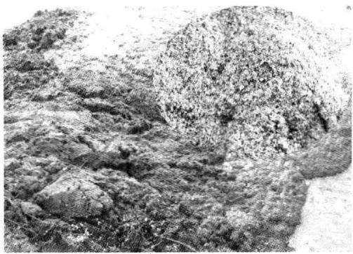  
畜粪、木屑

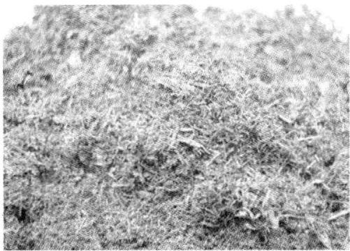  
秸秆  
图 8-1 预处理

## 8.3.1.2 基质基本特性研究

## (1) 三相分布

表 8-2 三相比和容重对比
<table><tr><td rowspan=2 colspan=1>土样类型</td><td rowspan=1 colspan=2>吸水前</td><td rowspan=1 colspan=2>吸水后</td></tr><tr><td rowspan=1 colspan=1>固：液：气</td><td rowspan=1 colspan=1>容重/ $( \mathbf { g } / \mathbf { c m } ^ { 3 } )$ </td><td rowspan=1 colspan=1>固：液：气</td><td rowspan=1 colspan=1>容重/（g/cm³）</td></tr><tr><td rowspan=1 colspan=1>普通植壤土</td><td rowspan=1 colspan=1>51:22:27</td><td rowspan=1 colspan=1>1.58</td><td rowspan=1 colspan=1>51:47:2</td><td rowspan=1 colspan=1>1.84</td></tr><tr><td rowspan=1 colspan=1>土样1</td><td rowspan=1 colspan=1>36：15：49</td><td rowspan=1 colspan=1>1.11</td><td rowspan=1 colspan=1>36：54：10</td><td rowspan=1 colspan=1>1.52</td></tr><tr><td rowspan=1 colspan=1>土样2</td><td rowspan=1 colspan=1>35：20:45</td><td rowspan=1 colspan=1>1.14</td><td rowspan=1 colspan=1>35：52：13</td><td rowspan=1 colspan=1>1.47</td></tr><tr><td rowspan=1 colspan=1>土样3</td><td rowspan=1 colspan=1>36:29:35</td><td rowspan=1 colspan=1>1.25</td><td rowspan=1 colspan=1>36:51:13</td><td rowspan=1 colspan=1>1.48</td></tr><tr><td rowspan=1 colspan=1>土样4</td><td rowspan=1 colspan=1>37:34:29</td><td rowspan=1 colspan=1>1.31</td><td rowspan=1 colspan=1>37:54:9</td><td rowspan=1 colspan=1>1.53</td></tr></table>

基质是固、液、气三相组成的多孔性复合材料。三相分布影响着基质的肥力状况和植物的生长状况。采用环刀法分别测定普通植壤土和4种基材土样的毛管吸水前后的容重和孔隙度，从而计算出三相比（固：液：气，以下相同）。三相比和容重测定结果见表8-2。对于自然原状土壤，合理的三相分布大体上是固体部分约占土壤总容积的1/2，水和空气各占1/4，而基质的三相分布与土壤的三相分布有着较大的区别。从实验结果中看出，加入基质后，土壤的总孔隙度明显变大，占土壤总容积的65%\~67%。正是由于总孔隙度较大，使得吸水达到饱和的土壤的液相比与普通土壤相比明显较大，即基质增强了土壤的吸水能力。另外，值得注意的是，加入基质的土壤在吸水达到饱和时，仍有约占10%总孔隙度的气相分布，而普通壤土仅为2%，这说明，加入基质后的土壤比普通土壤更利于坡面排水，防止植物根系由于含水量过大而造成烂根，也减小了坡面土层积水造成的重力侵蚀隐患。从密度的对比来看，加入基质的土壤吸水前和吸水后密度都明显低于普通土壤，可见基质有调节土壤密度、减小坡面重力荷载的作用。

## (2) 吸水性

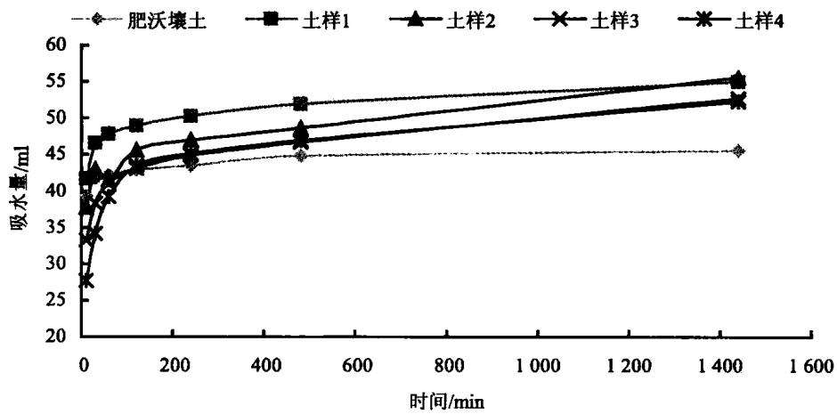  
图 8-2 吸水性能对比

从图8-2可以看出，在加入基质后，土壤的吸水能力得以增强，表现在如下两个方面：

1）曲线的斜率反映了土壤在不同时间的吸水速率，加入基质后土壤吸水曲线的斜率均明显大于肥沃壤土，即吸水速率显著大于肥沃壤土。

2）总吸水量显著增加，在实验时间为24h的时候，肥沃壤土的吸水量已近饱和，表现在曲线趋于水平，吸水量达到45ml；而加入基质后，吸水量在24h时均超过50ml，而且曲线仍呈上升趋势，说明土壤吸水尚未饱和。基质优良的吸水性能更多地为坡面截留降水，减缓坡面径流，起到了防止坡面侵蚀的作用；同时，最大限度地利用了天然降雨，吸收水分满足植被生长的需要，降低了后期养护的成本。

## (3) 养分

基质必需含有植物生长所需的平衡养分，才能保证植物的正常生长。氮、磷、钾是植物生长所必需的大量元素。有机质几乎含有植物和微生物所需的各种营养元素，随着有机质的逐步矿化、分解，所含营养元素可陆续释放出来，供植物和微生物利用。

对于农田土壤，当全氮含量大于0.2%时土壤为富含氮素的土壤，当有效钾含量大于 200 mg/kg时，土壤为钾素丰富的土壤，当有效磷含量大于20 mg/kg时，一般即不需要施用磷肥。由表8-3可知，基质中的有效磷、有效钾都高于肥沃的农田土，而氨态氮也在40mg/kg以上。因此，基质是富含植物生长所需的养分的。

表 8-3 养分含量变化值
<table><tr><td rowspan=1 colspan=2>养分类型</td><td rowspan=1 colspan=1>氨态氮/(mg/kg)</td><td rowspan=1 colspan=1>有效磷/(mg/kg)</td><td rowspan=1 colspan=1>速效钾/(mg/kg)</td><td rowspan=1 colspan=1>有机质/(g/kg)</td></tr><tr><td rowspan=1 colspan=2>估算值</td><td rowspan=1 colspan=1>62.4</td><td rowspan=1 colspan=1>65.6</td><td rowspan=1 colspan=1>287</td><td rowspan=1 colspan=1>478</td></tr><tr><td rowspan=3 colspan=1>测试值</td><td rowspan=1 colspan=1>1 周后</td><td rowspan=1 colspan=1>58.0</td><td rowspan=1 colspan=1>71.8</td><td rowspan=1 colspan=1>311</td><td rowspan=1 colspan=1>486</td></tr><tr><td rowspan=1 colspan=1>1 个月后</td><td rowspan=1 colspan=1>45.7</td><td rowspan=1 colspan=1>71.5</td><td rowspan=1 colspan=1>302</td><td rowspan=1 colspan=1>479</td></tr><tr><td rowspan=1 colspan=1>3个月后</td><td rowspan=1 colspan=1>42.3</td><td rowspan=1 colspan=1>69.7</td><td rowspan=1 colspan=1>293</td><td rowspan=1 colspan=1>477</td></tr></table>

## 8.3.1.3 小结

1）基质的加入使总孔隙度占总土壤容积的65%\~67%，并且在吸水饱和时仍有10%气相分布，因此，基质能同时增强土壤的吸水和排水能力，有效调节土壤密度和减少坡面重力荷载的作用。基质所提供给土壤的养分主要由畜禽粪便、作物秸秆、锯木屑及生物堆肥等组成，可以根据土壤的不同性质进行适当的调节。

2）加快推动农业废弃物资源化利用的产业化进程，大力发展循环经济。随着社会经济发展和科学技术的进步，将加快农业的现代化和产业化进程。一些规模化、集约化的农场、养殖场日益增多，伴随农业生产的产业化，其废弃物的资源化利用也必须同步走产业化的发展道路。

## 8.3.2废弃采石场植被自然恢复初期土壤和群落特征

## 8.3.2.1 研究概述

建设部曾发文要求“谁开发，谁治理”，但因实施不力而导致出现了大量的废弃采石场。人们对在不同年代被废弃的采石场进行调查研究发现，与其他一些被人类干扰地的情况一样，植物也会入侵这些废弃采石场并进行着一个演替过程，同时因为采石场所形成的多样地貌及特殊的小生境，还会成为一些稀有或在当地已被认为消失了的动植物的避难所，这些野生生物所需要的正常生长环境已经被集约农业所破坏了。

在英国一些古老的废弃采石场已演替成为林地，甚至被国家或各类自然保护协会划为不同主题的自然保护区。然而，这个自然入侵和演替成为林地的过程是非常缓慢的，也许要耗费数以百年计的时间。这样的速度是现代社会和制订任何一个环境整治规划都难以接受的。因此，许多国家在对采石场进行修复时，针对不同情况而尝试采用各种不同的技术措施，诸如在采石场废弃后覆盖上原有表土、向采石场废弃地引入各种各样的乡土植物尤其是豆科植物、采用水播方法(the method of hydro seeding)、表面地形恢复技术(the technique of landformreplication）等以促进废弃采石场的植被恢复。无论是要对废弃采石场能否划作保护区而进行评估，或是要制订对废弃采石场的生态修复计划，对采石场废弃地基本情况及早期植被的自然入侵状况的了解都是十分重要的。

本研究选择舟山市岑港镇大庙采石场为例，对其植被自然恢复过程中土壤及群落结构特征进行了调查和分析，旨在为进一步人工加速植被恢复和减小恢复成本提供理论依据。

研究地位于舟山市岑港镇，地理坐标介于东经12206′15″～12209′30″，北纬3001'00″\~30°02'35″。地处大陆东部亚热带季风气候区，属亚热带季风海洋型气候，具有四季分明，温暖湿润，雨量充沛，季风显著等特点。调查的石场被关闭了近6年，山体破坏严重，岩层有不同程度的风化，采石边坡的坡度为40°～60°，局部达到70°。经过近6年的自然演替时间里，植被类型以耐干旱贫瘠的禾本科草本植物占绝对优势，主要有狗尾草 Setaria virids（L.）Beauv.、五节芒Miscanthus floridulu（Labnll.）Warb、商陆 Phytolacca acinosa Roxb.、大狗尾草 Setariafabeii Herrm.等。有零星的木本植物，主要以胡枝子Lespedez abicolor 为主。

经实地勘察并结合大庙采石场的立地特点将采石场划分为排土场、开采边坡、泥石堆和碎石贮运平台4种立地类型。

## 8.3.2.2 废弃采石场的土壤理化特征

土壤机械组成是土壤的一个稳定的自然属性，在很大程度上决定着土壤的性状和土地利用土壤机械组成影响土壤水分、空气和热量状况，同时也影响养分的转化。

表 84 采石场 4 种不同类型废弃地土壤特性比较
<table><tr><td rowspan=1 colspan=1>项目</td><td rowspan=1 colspan=1>排土场</td><td rowspan=1 colspan=1>开采边坡</td><td rowspan=1 colspan=1>泥石堆</td><td rowspan=1 colspan=1>碎石贮运平台</td><td rowspan=1 colspan=1>对照区</td></tr><tr><td rowspan=1 colspan=1>土壤颗粒组成（&gt;5.0 mm）%</td><td rowspan=1 colspan=1>7.2d</td><td rowspan=1 colspan=1>38.8b</td><td rowspan=1 colspan=1>28.4c</td><td rowspan=1 colspan=1>52.9a</td><td rowspan=1 colspan=1>0.0e</td></tr><tr><td rowspan=1 colspan=1>(2.0~5.0 mm) %</td><td rowspan=1 colspan=1>14.3d</td><td rowspan=1 colspan=1>19.2a</td><td rowspan=1 colspan=1>16.1b</td><td rowspan=1 colspan=1>13.9c</td><td rowspan=1 colspan=1>5.2e</td></tr><tr><td rowspan=1 colspan=1>(1.0~2.0 mm) %</td><td rowspan=1 colspan=1>9.3c</td><td rowspan=1 colspan=1>7.9d</td><td rowspan=1 colspan=1>11.8a</td><td rowspan=1 colspan=1>7.1d</td><td rowspan=1 colspan=1>10.2b</td></tr><tr><td rowspan=1 colspan=1>(0.5~1.0 mm)%</td><td rowspan=1 colspan=1>10.3c</td><td rowspan=1 colspan=1>11.6b</td><td rowspan=1 colspan=1>9.8c</td><td rowspan=1 colspan=1>6.5d</td><td rowspan=1 colspan=1>18.2a</td></tr><tr><td rowspan=1 colspan=1>(&lt;0.5 mm) %</td><td rowspan=1 colspan=1>58.9b</td><td rowspan=1 colspan=1>22.5d</td><td rowspan=1 colspan=1>35.9c</td><td rowspan=1 colspan=1>19.6e</td><td rowspan=1 colspan=1>66.4a</td></tr><tr><td rowspan=1 colspan=1>有机质含量/（g/kg）</td><td rowspan=1 colspan=1>1.36c</td><td rowspan=1 colspan=1>0.96d</td><td rowspan=1 colspan=1>1.75b</td><td rowspan=1 colspan=1>0.55e</td><td rowspan=1 colspan=1>9.30a</td></tr><tr><td rowspan=1 colspan=1>水解氮含量/（mg/kg）</td><td rowspan=1 colspan=1>5.35c</td><td rowspan=1 colspan=1>3.48d</td><td rowspan=1 colspan=1>7.25b</td><td rowspan=1 colspan=1>2.05e</td><td rowspan=1 colspan=1>14.68a</td></tr><tr><td rowspan=1 colspan=1>有效磷含量/（mg/kg）</td><td rowspan=1 colspan=1>1.98c</td><td rowspan=1 colspan=1>1.02d</td><td rowspan=1 colspan=1>2.72b</td><td rowspan=1 colspan=1>0.85e</td><td rowspan=1 colspan=1>10.55a</td></tr><tr><td rowspan=1 colspan=1>有效钾含量/（mg/kg）</td><td rowspan=1 colspan=1>12.44c</td><td rowspan=1 colspan=1>9.85d</td><td rowspan=1 colspan=1>35.32b</td><td rowspan=1 colspan=1>5.35e</td><td rowspan=1 colspan=1>98.65a</td></tr></table>

注：表84中同列数据后不同小写字母表示差异达0.05显著水平.

土壤理化性质分析结果表明（表8-4）：在土壤机械组成上，砾石（>2mm）含量排十场、开采边坡、泥石堆和碎石贮运平台分别为21.5%、58.0%、44.5%和66.8%，而周边未受采石影响的对照区砾石含量仅仅占到5.2%，比较而言，排土场的土壤结构优于开采边坡、泥石堆和碎石贮运平台。由此可见，4种立地类型采石场的是一种极差的立地类型，不利于植被的生长。

根据试验前对周边未受采石影响的对照区土壤养分进行测定的结果表明：4 种立地类型采石场土壤养分均较对照区土壤养分差，且差异程度较大。如有机质平均只有对照区土壤的 9.38%，水解氮只有4.29%，速效钾只有6.14%，速效磷只有9.86%。相对而言，以泥石堆稍好，其有机质含量为1.36g/kg，速效养分氮、磷、钾三大养分元素的含量也是最高的，分别为7.25mg/kg、2.72mg/kg和 35.32mg/kg。而碎石贮运平台最差，其有机质含量小于1.0g/kg，速效养分氮、磷、钾的含量分别为2.05 mg/kg、0.85 mg/kg和 5.35 mg/kg。从养分结构看，泥石堆最好，然后依次为排土场、开采边坡和碎石贮运平台。根据土壤养分含量全国统一分级标准，结合表8-4分析可知，4种立地类型采石场土壤有机质、有效氮含量和有效磷均为6级（<6g/kg、<30 mg/kg和<3mg/kg）水平，属于极度缺乏状态。对于有效钾，泥石堆的有效钾含量具为5级（30～50mg/kg）水平，而排土场、开采边坡和泥石堆为6级（<30mg/kg）水平。总体来说，这4类废弃地的养分状况都很差，土壤养分贫乏是废弃采石场植被恢复难度较大的重要原因之一。

## 8.3.2.3 废弃采石场的植被特征

## (1)种类组成及结构特征

种类组成是植物群落最基本的特征之一，它是群落形成的基础，它能反映该群落的结构、动态等基本特征，提示群落的基本规律。a代表泥石堆；b代表开采边坡；c代表排土场；d代表碎石贮运平台。2008年8月对大庙废弃采石场进行了群落调查，经过近6年的自然演替时间里，共出现44种植物（表8-5)，只有少量的木本和藤本植物，主要以草本植物为主。其中，木本植物及其单一，只有3种小乔木和2种灌木，占到物种总数的11.36%。藤本和蕨类分别为3种，均占物种总数的6.82%。相对木本、藤本和蕨类植物来说，草本群落物种组成就相当丰富，共7科30属33种，禾本科和菊科的植物最多，分别占到草本植物总数的42.42%和30.30%，而又以一年生草本植物略占优，为54.55%。

从立地类型来说，4种类型的废弃地都有不同程度的植物入侵。由于碎石平台经运石车辆反复碾压，以及主要以碎石和粉尘组成，地表非常坚实，不利于植物的生长，从而导致碎石贮运平台废弃地的植被状况最差，稀稀疏疏且结构简单，只有4科7属7种植物，除有1种蕨类植物外，全部为草本植物，其中以一年生草本植物为主，达到71.43%。开采边坡和排土场的植被状况优于碎石平台，分别有7科12属12种和9科24属25种植物。排土场的土壤结构明显好于采石边坡，可植被的状况相差不大，主要原因是堆排土场因表面不稳定，出现了严重的水蚀，表面不稳定是难于形成植被的重要因素。相比前3种类型的废弃地，泥石堆的植被状况最好，植物组成相对丰富，有13科24属27种植物，但仍以草本植物为主，占到62.96%。调查发现，菊科和禾本科是不同立地类型采石场演替初期的优势科。

## (2) 种类组成性质分析

由表8-6分析可知，不同立地类型的采石场的优势种有明显差异。调查发现，荆条是所有乔灌木群落的优势种，胡枝子和野桐是其伴生种。各立地类型上草本群落优势种差异不大，狗尾草[Setaria virids（L.）Beauv.]在4个立地类型的草本群落均作为优势种或亚优势种存在。碎石贮运平台植物群落最为特殊，优势种只有一年生草本牛筋草（HerbaEleusinesIndicae)，亚优势种及伴生种均是一年生草本，如：狗尾草[Setaria virids（L.）Beauv.]、虎尾草（Chloris virgata Swartz);开采边坡群落草本层的优势种为狗尾草[Setaria virids（L.）Beauv.]，亚优势种为画眉草（Erag rostia pilosa Beauv.)和五节芒[Miscanthus floridulu（Labnll.) Warb];排土场群落草本层多年生草本一枝黄花（Solidago decurrens Lour.）取代了狗尾草[Setaria virids（L.）Beauv.]成为优势种，狗尾草[Setaria virids（L.）Beauv.]和商陆（Phytolacca acinosa Roxb.）为亚优势种，伴生种为常见的禾本科和菊科植物。泥石堆生境条件相对较好，植物的种类最多，草本层的优势种和亚优势种仍然集中在3种抗逆性极强的植物：狗尾草[Setaria virids（L.）Beauv.]、一枝黄花（Solidagodecurrens Lour.）和虎尾草（Chloris virgata Swartz)，伴生种较多，主要以一年生草本为主。

表8-5 采石场不同立地类型废弃地植被组成及其特征
<table><tr><td colspan="1" rowspan="1">科</td><td colspan="1" rowspan="1">属</td><td colspan="1" rowspan="1">种类</td><td colspan="1" rowspan="1">生活型</td><td colspan="1" rowspan="1">所在立地类型</td></tr><tr><td colspan="1" rowspan="14">禾本科</td><td colspan="1" rowspan="1">芒属</td><td colspan="1" rowspan="1">五节芒 Miscanthus floridulu(Labnll.)Warb</td><td colspan="1" rowspan="1">P</td><td colspan="1" rowspan="1">abc</td></tr><tr><td colspan="1" rowspan="1">虎尾草属</td><td colspan="1" rowspan="1">虎尾草 Chloris virgata Swartz</td><td colspan="1" rowspan="1">AW</td><td colspan="1" rowspan="1">abc</td></tr><tr><td colspan="1" rowspan="2">狗尾草属</td><td colspan="1" rowspan="1">狗尾草 Setaria virids（L.）Beauv.</td><td colspan="1" rowspan="1">AW</td><td colspan="1" rowspan="1">abcd</td></tr><tr><td colspan="1" rowspan="1">大狗尾草 Setaria fabeii Herrm.</td><td colspan="1" rowspan="1">AW</td><td colspan="1" rowspan="1">ac</td></tr><tr><td colspan="1" rowspan="1">披碱草属</td><td colspan="1" rowspan="1">披碱草 Elymus dahuricus Turcz.</td><td colspan="1" rowspan="1">P</td><td colspan="1" rowspan="1">a</td></tr><tr><td colspan="1" rowspan="1">狗牙根属</td><td colspan="1" rowspan="1">狗牙根 Cy nodon dactylon Pers.</td><td colspan="1" rowspan="1">P</td><td colspan="1" rowspan="1">c</td></tr><tr><td colspan="1" rowspan="1">野古草属</td><td colspan="1" rowspan="1">野古草 Arundinella anomala Steud.</td><td colspan="1" rowspan="1">P</td><td colspan="1" rowspan="1">a</td></tr><tr><td colspan="1" rowspan="1">画眉草属</td><td colspan="1" rowspan="1">画眉草 Erag rostia pilosa Beauv.</td><td colspan="1" rowspan="1">AW</td><td colspan="1" rowspan="1">d</td></tr><tr><td colspan="1" rowspan="1">拂子茅属</td><td colspan="1" rowspan="1">拂子茅 Calamagrostis epigeios（L.）Roth</td><td colspan="1" rowspan="1">P</td><td colspan="1" rowspan="1">c</td></tr><tr><td colspan="1" rowspan="1">白茅属</td><td colspan="1" rowspan="1">白茅 Imperatacy lindrica var. major</td><td colspan="1" rowspan="1">P</td><td colspan="1" rowspan="1">abc</td></tr><tr><td colspan="1" rowspan="1">雀稗属</td><td colspan="1" rowspan="1">百喜草 Paspalum natatum</td><td colspan="1" rowspan="1">P</td><td colspan="1" rowspan="1">c</td></tr><tr><td colspan="1" rowspan="1">毛马唐属</td><td colspan="1" rowspan="1">毛马唐 Digitaria chrysoblephara</td><td colspan="1" rowspan="1">AW</td><td colspan="1" rowspan="1">d</td></tr><tr><td colspan="1" rowspan="1">三芒草属</td><td colspan="1" rowspan="1">三芒草 Aristida cumingiana</td><td colspan="1" rowspan="1">AW</td><td colspan="1" rowspan="1">bB</td></tr><tr><td colspan="1" rowspan="1">穆属</td><td colspan="1" rowspan="1">牛筋草 Herba Eleusines Indicae</td><td colspan="1" rowspan="1">AW</td><td colspan="1" rowspan="1">abcd</td></tr><tr><td colspan="1" rowspan="10">菊科</td><td colspan="1" rowspan="3">蒿属</td><td colspan="1" rowspan="1">野艾蒿Artemisia lavandulaefolia DC</td><td colspan="1" rowspan="1">P</td><td colspan="1" rowspan="1">ac</td></tr><tr><td colspan="1" rowspan="1">黄花蒿 Artemisia annua Linn.</td><td colspan="1" rowspan="1">P</td><td colspan="1" rowspan="1">a</td></tr><tr><td colspan="1" rowspan="1">猪毛蒿 Artemisia scoparia Wald. Et Kit.</td><td colspan="1" rowspan="1">P</td><td colspan="1" rowspan="1">ac</td></tr><tr><td colspan="1" rowspan="1">一点红属</td><td colspan="1" rowspan="1">一点红 Emilia sonchifolia DC.</td><td colspan="1" rowspan="1">AW</td><td colspan="1" rowspan="1">c</td></tr><tr><td colspan="1" rowspan="1">千里光属</td><td colspan="1" rowspan="1">千里光 Senecio scandens Buch-Ham.</td><td colspan="1" rowspan="1">AW</td><td colspan="1" rowspan="1">b</td></tr><tr><td colspan="1" rowspan="1">蓟属</td><td colspan="1" rowspan="1">胜红蓟 Ageratum conyzoidas L.</td><td colspan="1" rowspan="1">AW</td><td colspan="1" rowspan="1">c</td></tr><tr><td colspan="1" rowspan="1">菊属</td><td colspan="1" rowspan="1">野菊Dendranthema indicum（Linn.)Des Moul.</td><td colspan="1" rowspan="1">P</td><td colspan="1" rowspan="1">ac</td></tr><tr><td colspan="1" rowspan="1">一枝黄花属</td><td colspan="1" rowspan="1">枝黄花 Solidago decurrens Lour.</td><td colspan="1" rowspan="1">P</td><td colspan="1" rowspan="1">ac</td></tr><tr><td colspan="1" rowspan="1">飞蓬属</td><td colspan="1" rowspan="1">一年蓬 Erigeron annuus（L.）Pers.</td><td colspan="1" rowspan="1">AW</td><td colspan="1" rowspan="1">d</td></tr><tr><td colspan="1" rowspan="1">鬼针草属</td><td colspan="1" rowspan="1">鬼针草 Bidens bipinnata L.</td><td colspan="1" rowspan="1">AW</td><td colspan="1" rowspan="1">a</td></tr><tr><td colspan="1" rowspan="4">莎草科</td><td colspan="1" rowspan="1">球柱草属</td><td colspan="1" rowspan="1">丝叶球柱草Bulbostylis densa（Wall.）Hand.Mazz.</td><td colspan="1" rowspan="1">AW</td><td colspan="1" rowspan="1">a</td></tr><tr><td colspan="1" rowspan="1">苔属</td><td colspan="1" rowspan="1">三穗苔草 Carex tristachya Thunb.</td><td colspan="1" rowspan="1">P</td><td colspan="1" rowspan="1">a</td></tr><tr><td colspan="1" rowspan="1">刺子壳属</td><td colspan="1" rowspan="1">刺子壳 Rhynchospora rubra（Lour.）</td><td colspan="1" rowspan="1">P</td><td colspan="1" rowspan="1">d</td></tr><tr><td colspan="1" rowspan="1">飘拂草属</td><td colspan="1" rowspan="1">金色飘拂草 Fimbristylis hookeriana Bocklr.</td><td colspan="1" rowspan="1">AW</td><td colspan="1" rowspan="1">c</td></tr><tr><td colspan="1" rowspan="1">漆树科</td><td colspan="1" rowspan="1">盐肤木属</td><td colspan="1" rowspan="1">盐肤木 Rhus chinensis Mill</td><td colspan="1" rowspan="1">AS</td><td colspan="1" rowspan="1">ac</td></tr><tr><td colspan="1" rowspan="2">豆科</td><td colspan="1" rowspan="1">胡枝子属</td><td colspan="1" rowspan="1">胡枝子 Lespedeza bicolor Turcz</td><td colspan="1" rowspan="1">S</td><td colspan="1" rowspan="1">ab</td></tr><tr><td colspan="1" rowspan="1">葛属</td><td colspan="1" rowspan="1">葛藤 Pueraria lobata（Willdenow）Ohwi</td><td colspan="1" rowspan="1">R</td><td colspan="1" rowspan="1">ac</td></tr><tr><td colspan="1" rowspan="1">大戟科</td><td colspan="1" rowspan="1">野桐属</td><td colspan="1" rowspan="1">野桐 Mallotus tenuifolius Pax</td><td colspan="1" rowspan="1">AS</td><td colspan="1" rowspan="1">ac</td></tr><tr><td colspan="1" rowspan="2">藜科</td><td colspan="1" rowspan="1">猪毛菜属</td><td colspan="1" rowspan="1">猪毛菜 Salsola collina Pall.</td><td colspan="1" rowspan="1">AW</td><td colspan="1" rowspan="1">bc</td></tr><tr><td colspan="1" rowspan="1">碱蓬属</td><td colspan="1" rowspan="1">碱蓬 Suaeda glauca</td><td colspan="1" rowspan="1">AW</td><td colspan="1" rowspan="1">a</td></tr><tr><td colspan="1" rowspan="1">马鞭草科</td><td colspan="1" rowspan="1">牡荆属</td><td colspan="1" rowspan="1">荆条 Vitex negundo Linn. var. heterophylla Rehd.</td><td colspan="1" rowspan="1">S</td><td colspan="1" rowspan="1">ac</td></tr><tr><td colspan="1" rowspan="1">苋科</td><td colspan="1" rowspan="1">苋属</td><td colspan="1" rowspan="1">刺苋 Amaranthus spinosus L.</td><td colspan="1" rowspan="1">AW</td><td colspan="1" rowspan="1">b</td></tr><tr><td colspan="1" rowspan="1">商陆科</td><td colspan="1" rowspan="1">商陆属</td><td colspan="1" rowspan="1">商陆 Phytolacca acinosa Roxb.</td><td colspan="1" rowspan="1">P</td><td colspan="1" rowspan="1">ac</td></tr><tr><td colspan="1" rowspan="1">马齿苋科</td><td colspan="1" rowspan="1">马齿苋属</td><td colspan="1" rowspan="1">马齿苋 Portulaca oleracea</td><td colspan="1" rowspan="1">AW</td><td colspan="1" rowspan="1">ac</td></tr><tr><td colspan="1" rowspan="1">壳斗科</td><td colspan="1" rowspan="1">栎属</td><td colspan="1" rowspan="1">青冈栎 Cyclobalanopsis glauca（Thunb.）Orest</td><td colspan="1" rowspan="1">AS</td><td colspan="1" rowspan="1">a</td></tr><tr><td colspan="1" rowspan="1">夹竹桃科</td><td colspan="1" rowspan="1">络石属</td><td colspan="1" rowspan="1">络石Trachelospermum jasminoides（Lindl.）Lem.</td><td colspan="1" rowspan="1">R</td><td colspan="1" rowspan="1">b</td></tr><tr><td colspan="1" rowspan="1">葡萄科</td><td colspan="1" rowspan="1">葡萄属</td><td colspan="1" rowspan="1">山葡萄 Vitis quinquangularis Rehd.</td><td colspan="1" rowspan="1">R</td><td colspan="1" rowspan="1">c</td></tr><tr><td colspan="1" rowspan="1">铁角蕨科</td><td colspan="1" rowspan="1">铁角蕨属</td><td colspan="1" rowspan="1">铁角蕨 Asplenium trichomanes L.</td><td colspan="1" rowspan="1">RS</td><td colspan="1" rowspan="1">a</td></tr><tr><td colspan="1" rowspan="1">岩蕨科</td><td colspan="1" rowspan="1">岩蕨属</td><td colspan="1" rowspan="1">岩蕨 Woodsia ilvensis（L.）R. Br.</td><td colspan="1" rowspan="1">RS</td><td colspan="1" rowspan="1">cd</td></tr><tr><td colspan="1" rowspan="1">蹄盖蕨科</td><td colspan="1" rowspan="1">蹄盖蕨属</td><td colspan="1" rowspan="1">华东蹄盖蕨 Asplenium niponicum Mett.</td><td colspan="1" rowspan="1">RS</td><td colspan="1" rowspan="1">ab</td></tr></table>

注：A一年生草本、P多年生草本、S灌木或半灌木、AS乔木、R藤本、RS蕨类。

表8-6 采石场不同立地类型废弃地群落优势种及其重要值
<table><tr><td rowspan=1 colspan=1>立地类型</td><td rowspan=1 colspan=1>优势种</td><td rowspan=1 colspan=1>重要值</td></tr><tr><td rowspan=4 colspan=1>泥石堆</td><td rowspan=1 colspan=1>荆条 Vitex negundo Linn. var. heterophylla Rehd</td><td rowspan=1 colspan=1>2.103</td></tr><tr><td rowspan=1 colspan=1>狗尾草 Setaria virids（L.）Beauv.</td><td rowspan=1 colspan=1>1.218</td></tr><tr><td rowspan=1 colspan=1>枝黄花 Solidago decurrens Lour.</td><td rowspan=1 colspan=1>0.618</td></tr><tr><td rowspan=1 colspan=1>虎尾草 Chloris virgata Swartz</td><td rowspan=1 colspan=1>0.561</td></tr><tr><td rowspan=3 colspan=1>开采边坡</td><td rowspan=1 colspan=1>狗尾草 Setaria virids（L.）Beauv.</td><td rowspan=1 colspan=1>1.386</td></tr><tr><td rowspan=1 colspan=1>画眉草 Erag rostia pilosa Beauv.</td><td rowspan=1 colspan=1>0.903</td></tr><tr><td rowspan=1 colspan=1>五节芒Miscanthus floridulu(Labnll.)Warb</td><td rowspan=1 colspan=1>0.528</td></tr><tr><td rowspan=4 colspan=1>排土场</td><td rowspan=1 colspan=1>荆条Vitex negundo Linn. var. heterophylla Rehd</td><td rowspan=1 colspan=1>2.046</td></tr><tr><td rowspan=1 colspan=1>一枝黄花 Solidago decurrens Lour.</td><td rowspan=1 colspan=1>1.026</td></tr><tr><td rowspan=1 colspan=1>狗尾草 Setaria virids（L.)Beauv.</td><td rowspan=1 colspan=1>0.858</td></tr><tr><td rowspan=1 colspan=1>商陆 Phytolacca acinosa Roxb.</td><td rowspan=1 colspan=1>0.315</td></tr><tr><td rowspan=1 colspan=1>碎石贮运平台</td><td rowspan=1 colspan=1>牛筋草 Herba Eleusines Indicae</td><td rowspan=1 colspan=1>2.160</td></tr></table>

## (3)群落的多样性指数

由表 8-7 和图8-3 可知，物种丰富度指数和综合多样性指数变化趋势一致，泥石堆的物种丰富度指数（Margalef）和综合多样性指数（Shannon-Wiener和Simpson）最大，分别为3.0624、2.1718、0.8156；碎石贮运平台最小，分别为0.6204、0.6032、0.5503。4种立地类型的废弃地的物种丰富度指数（Margalef）和综合多样性指数（Shannon-Wiener和Simpson）按照碎石贮运平台、开采边坡、排土场、泥石堆依次增加。碎石贮运平台的物种丰富度指数（Margalef）和综合多样性指数（Shannon-Wiener和Simpson）都是最低的，说明了其立地条件的恶劣状况，泥石堆由于有沙泥的积聚及植物繁殖体的入侵，早期的植被恢复较好，总物种数比较多，物种丰富度指数（Margalef)和综合多样性指数(Shannon-Wiener和Simpson）最高，而碎石贮运平台按照以上3 项指数的排序均排在各立地类型的最后一位，说明该立地类型群落的物种多样性极低，也反映了其立地条件的恶劣，不利于植物的生长。

表8-7 采石场不同立地类型废弃地群落的多样性指数
<table><tr><td rowspan=1 colspan=1>立地类型</td><td rowspan=1 colspan=1>Shannon-Wiener (H&#x27;)</td><td rowspan=1 colspan=1>Simpson (D)</td><td rowspan=1 colspan=1>Margalef (Ma)</td></tr><tr><td rowspan=1 colspan=1>碎石贮运平台</td><td rowspan=1 colspan=1>0.602 3</td><td rowspan=1 colspan=1>0.550 3</td><td rowspan=1 colspan=1>0.620 4</td></tr><tr><td rowspan=1 colspan=1>开采边坡</td><td rowspan=1 colspan=1>1.003 3</td><td rowspan=1 colspan=1>0.689 5</td><td rowspan=1 colspan=1>1.295 1</td></tr><tr><td rowspan=1 colspan=1>排土场</td><td rowspan=1 colspan=1>1.651 8</td><td rowspan=1 colspan=1>0.702 1</td><td rowspan=1 colspan=1>2.168 9</td></tr><tr><td rowspan=1 colspan=1>泥石堆</td><td rowspan=1 colspan=1>2.171 8</td><td rowspan=1 colspan=1>0.815 6</td><td rowspan=1 colspan=1>3.062 4</td></tr></table>

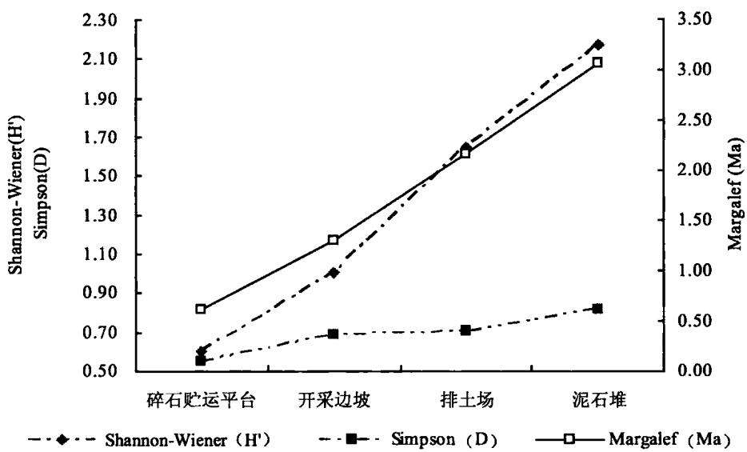  
图8-3 采石场不同立地类型废弃地物种综合多样性指数与丰富度指数的变化

## 8.3.2.4 小结

1）由采石场4种类型废弃地土壤理化性质分析表明：砾石（粒径>2mm）的含量依次为排土场<泥石堆<开采边坡<碎石贮运平台，分别为21.5%、44.5%、58.0%和66.8%，砾石的含量越高，土壤的保水性能越差。4类废弃地的养分状况都很差，有机质、水解氮、有效磷和有效钾的含量都是按照碎石贮运平台、开采边坡、排土场、泥石堆依次增加的，有机质含量为0.55\~1.36g/kg，水解氮、有效磷和有效钾含量分别为 2.05\~5.35 mg/kg、0.85\~1.98 mg/kg 和 5.35～35.32mg/kg。可见废弃采石场的是一种极差的立地类型，土壤是采石废弃地植被自然恢复的主要限制因子。因此，改良土壤理化性质，引入植物繁殖体对于采石场的生态恢复来说都是必要的。

2）采石场植物群落调查表明：经过近6a的自然演替时间里，耐干旱贫瘠的禾本科草本植物占绝对优势，木本植物种类较为单一，只有3种小乔木和2种灌木，且主要集中在泥石堆和排土场。从立地类型来说，4种类型的废弃地都有不同程度的植物入侵。碎石平台只有4科7属7种植物，其中以一年生草本植物为主，达到71.43%。开采边坡和排土场的植被状况优于碎石平台，分别有7科12属12种和9科24属25种植物。泥石堆的植被状况最好，植物组成相对丰富，有13科24属27种植物，但仍以草本植物为主，占到62.96%。调查发现，菊科和禾本科是不同立地类型采石场演替初期的优势科。

3）不同立地类型的采石场的优势种有明显差异，狗尾草[Setaria virids（L.)Beauv.]是4种立地类型的草本群落优势种或亚优势种。碎石贮运平台植物群落最为特殊，优势种只有一年生草本牛筋草（HerbaEleusinesIndicae)，泥石堆生境条件相对较好，植物的种类最多，草本层的优势种和亚优势种仍然集中在3种抗逆性极强的植物：狗尾草[Setaria virids（L.)Beauv.]、一枝黄花（Solidago decurrensLour.）和虎尾草（Chloris virgata Swartz)。而荆条是所有乔灌木群落的优势种，胡枝子和野桐是其伴生种。4 种立地类型废弃地的群落的多样性指数变化趋势表现趋于一致，物种丰富度指数和综合多样性指数表现为碎石贮运平台<开采边坡<排土场<泥石堆，相比而言，泥石堆的生境条件最好，表明生境的多样性也是提高群落物种多样性的必要条件之一。

## 8.3.3 废弃采石场人工生态修复土壤质量生态效应

## 8.3.3.1 研究概述

土壤质量是植被恢复的基础和保证，是生态环境重要的组成部分。土壤主要是指由空气、有机质、矿物质、水和生物组成的，具有一定肥力的，能供植物生长的介质。土壤质量即土壤的功能，在生态系统内维持生物生产、保护生态环境的能力。土壤质量是土壤环境质量、土壤健康质量和土壤肥力质量三个相对独立又有机联系的集合。土壤质量的分析包括土壤物理性质和化学性质的测定。研究土壤质量的生态效应是为了探索土壤质量变化的机理，因此，研究土壤质量生态效应对植被恢复重建具有重要的理论和现实意义。

土壤对植被恢复具有重要作用，尤其在植被恢复的早期阶段，土壤因素对植被恢复具有制约作用，不仅影响植物群落的发生、发育和演替的速度，而且决定着植物群落演替的方向。尽管植被恢复对土壤环境的改善有很大的促进作用，但土壤环境在植被的生长、发育及其群落演替等方面也起着举足轻重的作用。在不同的土壤条件下，植物种侵入、生长状况不同，群落具体的发展途径有明显的差异。土壤恢复速度、土壤肥力状况以及各阶段优势植物繁殖体来源数量及定居难易直接影响着群落中植物的更替和发展。不同的植被类型对土壤的改良与肥力发育有着不同的影响，二者相互作用，相互制约。一般在植被的恢复过程中，土壤有机质、速效N、速效K、表层速效P含量增加，土壤pH值和容重降低，氮的矿化能力增强，水稳性团聚体数量和质量得到提高，土壤结构得到改善，土壤肥力得到提高，土壤抗冲生和土壤抗剪强度得到强化，土地生产力得到提高，土壤水分状况得到改善。

植被恢复是废弃采石场改善土壤质量、治理水土流失的重要措施之一，土壤作为植被生长的基础条件，其状况直接影响植被的生长发育，同时植被的生长发育也对土壤质量的改善有重要的作用，植被与土壤之间相互影响、相互促进，土壤的养分在植被生长过程中担任重要的作用，研究植被恢复对土壤理化性质的影响，对人工恢复植被与促进植被演替、加快生态恢复具有重要作用。

研究地位于无锡市西南部滨湖区雪浪镇，雪浪山因山顶有宋代建造的雪浪庵而得名，是太湖72景之第八景观，山中有横山草堂，雪浪观枫、蒋子阁等风景优美的历史景点。亚热带季风气候区，四季分明，热量充足，降水丰沛，雨热同期，灾害频繁。年平均气温 $1 5 . 6 \mathrm { ‰}$ ，极端最高气温 $3 8 . 9 \mathrm { ^ { \circ } C }$ ，极端最低气温 $- 1 2 . 5 \mathrm { ^ \circ C }$ 年平均降水量1500mm。常见的气象灾害有台风、暴雨、连阴雨、干旱、寒潮、冰雹和大风等。

该采石场的坡体岩质主要由白一灰白色厚层状中粗粒石英砂岩和含砾石英砂岩构成，夹有少量紫红色含云母的石英粉砂岩和灰色粉砂页岩，节理裂隙发育、整体的稳定性较差，且大量出现基岩解理、断面与坡面同向或近似同向的情况。

雪浪山采石场经过了近五年的植被演替，现已逐渐成为外貌特征丰富多样的坡面植物群落，是人工植被恢复和后期自然演替的综合产物。植被类型也已完成了人工植被初期的草本为主的群落到乔、灌、草复合型的植物群落的过渡，目前边坡植被正处于高速演替发展时期，主要的植物有：青冈栎 Cyclobalanopsis glauca（Thunb.）Orest.、香樟 Cinnamomum camphora（Linn.） Presl.、刺槐 Robiniapseudoacacia.、盐肤木 Rhus chinensis Mill.、小叶女贞 Ligustrum quihoui Carr.、马棘 Indigofera pseudotinctoria Matsum、伞房决明 Cassia biscapsularis Linn.、紫穗槐 Amorpha fruticosa Linn.、胡枝子 Lespedeza bicolor Turcz.、紫花苜蓿 Medicagosativa.、高羊茅 Fwstuc arundincea.、五节芒 Miscanthus floridulu（Labnll.）Warb.、狗尾草 Setaria virids（L.）Beauv.等。

在植物的调查基础上，选取5种典型的植物配置模式布设标准样地，每个标准地面积为 $1 0 \times 1 0 ~ \mathrm { m } ^ { 2 }$ ，为了消除不同坡位、坡度、坡向所带来的差异，每块样地的选择在微地形上基本一致，同时尽量选择坡度相近的样地，在标准地内按“S”形设置3个样点，采用多点混合取样法。土壤采用环刀取样，采集0\~20cm的土壤样品。

## 8.3.3.2 人工生态修复土壤物理性质效应特征

## (1) 土壤容重变化特征

土壤容重是单位原状土壤体积内干土的重量，受土壤质地、结构性和松紧度的影响而变化较大。土壤容重的大小，在一定条件下它可用作土壤坚实度的指标之一。在同等质地条件下，容重小的土壤疏松，容重大的土壤坚实。

表 8-8 不同植物配置的土壤物理性质
<table><tr><td rowspan=1 colspan=1>模式类型</td><td rowspan=1 colspan=1>土壤容重</td><td rowspan=1 colspan=1>毛管空隙度</td><td rowspan=1 colspan=1>非毛管空隙度</td><td rowspan=1 colspan=1>总空隙度</td><td rowspan=1 colspan=1>土壤渗透性</td><td rowspan=1 colspan=1>土壤含水量</td></tr><tr><td rowspan=1 colspan=1>A</td><td rowspan=1 colspan=1>0.85f</td><td rowspan=1 colspan=1>36.58a</td><td rowspan=1 colspan=1>32.25f</td><td rowspan=1 colspan=1>68.83e</td><td rowspan=1 colspan=1>3.11a</td><td rowspan=1 colspan=1>23.32a</td></tr><tr><td rowspan=1 colspan=1>B</td><td rowspan=1 colspan=1>0.90e</td><td rowspan=1 colspan=1>32.25b</td><td rowspan=1 colspan=1>33.65e</td><td rowspan=1 colspan=1>65.90d</td><td rowspan=1 colspan=1>2.86b</td><td rowspan=1 colspan=1>20.16b</td></tr><tr><td rowspan=1 colspan=1>C</td><td rowspan=1 colspan=1>1.01d</td><td rowspan=1 colspan=1>30.12c</td><td rowspan=1 colspan=1>34.21d</td><td rowspan=1 colspan=1>64.33c</td><td rowspan=1 colspan=1>2.62c</td><td rowspan=1 colspan=1>18.21c</td></tr><tr><td rowspan=1 colspan=1>D</td><td rowspan=1 colspan=1>1.20c</td><td rowspan=1 colspan=1>24.58d</td><td rowspan=1 colspan=1>39.25c</td><td rowspan=1 colspan=1>63.83c</td><td rowspan=1 colspan=1>1.85d</td><td rowspan=1 colspan=1>12.65d</td></tr><tr><td rowspan=1 colspan=1>E</td><td rowspan=1 colspan=1>1.31b</td><td rowspan=1 colspan=1>21.23e</td><td rowspan=1 colspan=1>40.21b</td><td rowspan=1 colspan=1>61.44b</td><td rowspan=1 colspan=1>1.43e</td><td rowspan=1 colspan=1>10.23e</td></tr><tr><td rowspan=1 colspan=1>裸露地</td><td rowspan=1 colspan=1>1.45a</td><td rowspan=1 colspan=1>10.26f</td><td rowspan=1 colspan=1>60.11a</td><td rowspan=1 colspan=1>70.37a</td><td rowspan=1 colspan=1>1.01f</td><td rowspan=1 colspan=1>7.12f</td></tr></table>

备注：不同小写字母表示差异达0.05显著水平。  
A——刺槐+马棘+胡枝子+高羊茅+苜蓿+狗尾草；  
B盐肤木+马棘+伞房决明+高羊茅+苜蓿；  
C—马棘+胡枝子+高羊茅+苜蓿；

D——高羊茅+苜蓿；

E——高羊茅。

从表8-8中可以看出，不同的植物配置模式，土壤的容重差异很大，其中土壤容重最大的是采石裸露地 $( 1 . 4 5 \ : \mathrm { g } / \mathrm { c m } ^ { 3 } )$ ，最小的是配置模式A（刺槐+马棘+胡枝子+高羊茅+苜蓿+狗尾草）的样地 $( 0 . 8 5 ~ \mathrm { g } / \mathrm { c m } ^ { 3 } )$ 。土壤容重从大到小依次是：采石裸露地 $( 1 . 4 5 ~ \mathrm { g } / \mathrm { c m } ^ { 3 } )$ >配置模式E（高羊茅） $( 1 . 3 1 ~ \mathbf { g } / \mathbf { c m } ^ { 3 } ) >$ 配置模式D（高羊茅+苜蓿） $( 1 . 2 0 ~ \mathrm { g } / \mathrm { c m } ^ { 3 } ) >$ 配置模式C（马棘+胡枝子+高羊茅+苜蓿+艾蒿) $\left( 1 . 0 1 \ { \bf g } / { \bf c m } ^ { 3 } \right) \ >$ 配置模式B（盐肤木+马棘+伞房决明+高羊茅+苜蓿） $( 0 . 9 0 { \mathrm { ~ g / c m } } ^ { 3 } ) >$ 配置模式A（刺槐+马棘+胡枝子+高羊茅+苜蓿+狗尾草）$( \mathbf { 0 . 8 5 \ g } / \mathbf { c m ^ { 3 } } )$ 。采石裸露地土壤容重最大，由于采石裸露地的成分，以废石块为主，固体颗粒大，风化程度太低，虽然总孔隙度较大，非毛管孔隙最大，大孔隙较多，和同体积的土壤相比，气相体积最大。人工植被恢复后的土壤结构明显好于采石裸露地，土壤效果最好的是配置模式A（刺槐+马棘+胡枝子+高羊茅+苜蓿+狗尾草）的土壤，土壤容重最小，说明土壤熟化程度越高，土粒密度较小，有机质含量越高，结构疏松，风化程度较高。从植物的配置类型看，乔灌草组合模式的土壤改良效果最好，土壤容重从大到小依次是：乔灌草组合模式>灌草组合模式>草种混合模式>单一草种模式，而在本研究的两种乔灌草组合模式中，配置模式A（刺槐+马棘+胡枝子+高羊茅+苜蓿+狗尾草）优于配置模式B（盐肤木+马棘+伞房决明+高羊茅+苜蓿） $( \mathbf { 0 . 9 0 \ g / c m ^ { 3 } } )$ ，主要是它们之间的植物根系、植物覆盖度以及枯枝落叶层不同所造成的。因为植被根系及枯枝落叶的共同作用，随着植被的生长，土壤中有机质也得到不断积累，容重逐渐减小。

## (2) 土壤空隙度变化特征

## 1）土壤毛管空隙度。

毛管孔隙又称小孔隙。具有明显毛管作用的孔隙。毛管孔隙直径一般小于

0.1mm。因土粒小、排列紧密而形成。毛管孔隙占土壤体积的百分比，称为毛管孔隙度。毛管孔隙愈小，毛管力愈大，吸水力也愈强。毛管孔隙是土壤水分贮存和水分运动相当强烈的地方，故常称为“土壤持水孔隙”。毛管孔隙的数量取决于土壤质地、结构等条件。采石裸露地持水孔隙不足，不易保水。

从表8-8可看出，配置模式A（刺槐+马棘+胡枝子+高羊茅+苜蓿+狗尾草）的土壤毛管孔隙最大（36.58%），采石裸露地毛管孔隙度最小（10.26%），对土壤毛管孔隙度改良效果依次为：配置模式A（刺槐+马棘+胡枝子+高羊茅+苜蓿+狗尾草）的土壤毛管孔隙（36.58%）>配置模式B（盐肤木+马棘+伞房决明+高羊茅+苜蓿）（32.25%）>配置模式C（马棘+胡枝子+高羊茅+苜蓿+艾蒿）（30.12%）>配置模式D（高羊茅+苜蓿）（24.58%）>配置模式E（高羊茅）(21.23%)。可以看出配置模式A（刺槐+马棘+胡枝子+高羊茅+苜蓿+狗尾草）的土壤贮水能力最强，采石裸露地贮水能力最差，其主要原因是配置模式A的土壤土壤风化程度很高，有机质含量较高，土壤疏松多孔，且毛管孔隙度较大，毛管孔隙数量较多，从而导致了持水力较强，而采石裸露地结构性较差，风化程度较差，土壤中的大孔隙较多，毛管孔隙度最小，持水保水力弱。与采石裸露地比较而言，植被恢复对土壤毛管孔隙度的改良有显著作用。

## 2）非毛管空隙度。

从表8-8可看出，不同配置模式的土壤，采石裸露地的土壤非毛管孔隙最大(60.11%)，配置模式 A（刺槐+马棘+胡枝子+高羊茅+苜蓿+狗尾草）的土壤非毛管孔隙度最小（32.25%)，呈现出与毛管空隙度变化一致的规律，从小到大顺序依次为：配置模式A（刺槐+马棘+胡枝子+高羊茅+苜蓿+狗尾草）的土壤毛管孔隙（32.25%）<配置模式B（盐肤木+马棘+伞房决明+高羊茅+苜蓿）（33.65%）<配置模式C（马棘+胡枝子+高羊茅+苜蓿+艾蒿）（34.21%）<配置模式D（高羊茅+苜蓿）（39.25）<配置模式E（高羊茅）（40.21%）。<采石裸露地（60.11%），可见采石裸露地的透水性最强。配置模式A（刺槐+马棘+胡枝子+高羊茅+苜蓿+狗尾草）的土壤毛管孔隙是采石裸露地的 53.65%，透水性减少了46.35%。依次可计算出配置模式B（盐肤木+马棘+伞房决明+高羊茅+苜蓿）、配置模式C（马棘+胡枝子+高羊茅+苜蓿+艾蒿）、配置模式D（高羊茅+苜蓿）、配置模式E（高羊茅）的透水性分别较少了44.01%、43.09%、34.70%、29.78%。透水性越高，水分下渗越强。在土壤表面水分下渗力越强，土壤性能越好，但是到了一定深度，土壤还继续下渗，说明保水力太差，不利于植物的生长。

## 3）总空隙度

从表8-8可看出，不同植被类型的土壤，采石裸露地的土壤总孔隙最大(70.37%），配置模式E（高羊茅）的土壤总孔隙度最小（61.44%），从小到大顺序依次为：配置模式E（高羊茅）（61.44%）<配置模式D（高羊茅+苜蓿）

（63.83%）<配置模式C（马棘+胡枝子+高羊茅+苜蓿+艾蒿）（64.33%）<配置模式B（盐肤木+马棘+伞房决明+高羊茅+苜蓿）（65.90%）<配置模式D（高羊茅+苜蓿）（67.83%）配置模式A（刺槐+马棘+胡枝子+高羊茅+苜蓿+狗尾草）（68.83%）<采石裸露地（70.37%)。

## (3) 土壤含水量变化特征

土壤水分含量的多少，直接影响土壤的固、液、气三相比例，以及土壤的适耕性和作物的生长发育。土壤孔隙度是单位容积土体内，孔隙所占的百分数，它直接关系到土壤的通气状况，是土壤的主要物理特性之一。

土壤水分受到诸多环境因子的影响，主要包括气候条件、植被和土壤性质三个方面。在一定的气候条件下，土壤水分主要与土壤的性质和植被生长状况有关。一般情况下，一个具有较完善群体结构的植物群落，具有两个方面的特性，体现在：一方面可以通过良好的土壤改良作用增加土壤的孔隙度，尤其是通过增加土壤的毛管孔隙度提高土壤的保水能力；另一方面可以通过遮阴地表、降低风速和温度减少土壤水分蒸发；这两个方面的作用越大，土壤的含水量越高。研究植被恢复过的采石场土壤水分的变化特征对于采石场的绿化措施的选择提供了重要的依据。

从表8-8可看出，植被恢复显著提高了土壤的含水量，而不同配置模式的土壤含水量显著差异。采石裸露地的土壤含水量最小(7.12%)，配置模式A（刺槐+马棘+胡枝子+高羊茅+苜蓿+狗尾草）（23.32%）最大。不同配置模式土壤含水量从大到小顺序依次为：配置模式A（刺槐+马棘+胡枝子+高羊茅+苜蓿+狗尾草）的土壤毛管孔隙（23.32%%）>配置模式B（盐肤木+马棘+伞房决明+高羊茅+苜蓿）（20.16%）>配置模式C（马棘+胡枝子+高羊茅+苜蓿+艾蒿）（18.12%）>配置模式D（高羊茅+苜蓿）（12.65%）>配置模式E（高羊茅）（10.23%）>采石裸露地（7.12%)。在不同植被配置模式中，乔灌草和灌草的组合对土壤含水量的改善明显优于草本群落，其主要原因是乔灌草和灌草的组合林冠截留水分较大，林内土壤接受的太阳辐射较少，土壤比较湿润，蒸发也相对比较少。

## (4)土壤入渗性变化特征

土壤入渗是指水分进入土壤形成土壤水的过程，它是降水、土壤水、地面水和地下水相互转化过程中的一个重要环节。土壤渗透性是土壤重要的特性之一，土壤渗透性能越好，雨水几乎可以完全被土壤吸收，并在其中贮存起来，相应的地表径流就会越少，土壤的流失量也就相应减少。而在渗透性不好的情况下，水分就沿地表流走。渗透系数越大，土壤的渗透性越好。

从表8-8可看出，不同的配置模式土壤稳定入渗速率明显高于对照的采石裸露地。采石裸露地的土壤稳定入渗速率最小（1.01mm/min），配置模式A（刺槐+马棘+胡枝子+高羊茅+苜蓿+狗尾草）（3.11mm/min）最大，不同配置模式土壤稳定入渗速率从大到小顺序依次为：配置模式A（刺槐+马棘+胡枝子+高羊茅+苜蓿+狗尾草）（3.11mm/min）>配置模式B（盐肤木+马棘+伞房决明+高羊茅+苜蓿）（2.86 mm/min>配置模式C（马棘+胡枝子+高羊茅+苜蓿+艾蒿）(2.66 mm/min）>配置模式 D（高羊茅+苜蓿）（1.85 mm/min）>配置模式E（高羊茅）（1.63 mm/min)。>采石裸露地（1.01 mm/min）。

植被恢复明显改善了土壤稳定入渗速率，主要是因为不同的植被恢复在地表形成了枯枝落叶层，防止土壤结皮的产生，减少了因土壤结皮对入渗的阻碍作用。不同植被类型根系的挤压、分割作用，改变了土壤结构，增加了土壤的孔隙度，有利于水分的入渗。

在不同的植物配置模式中，乔灌草和灌草组合对土壤稳定入渗速率改善作用尤为明显，林下枯枝落叶层越厚，根系越发达，对土壤稳定入渗速率的影响越大。

## 8.3.3.3 人工生态修复土壤化学性质效应特征

## (1)土壤有机质变化特征

表 8-9 不同配置模式土壤的化学性质
<table><tr><td rowspan=1 colspan=1>植被类型</td><td rowspan=1 colspan=1>土壤有机质/（g/kg）</td><td rowspan=1 colspan=1>速效氮/（mg/kg）</td><td rowspan=1 colspan=1>速效磷/（mg/kg）</td><td rowspan=1 colspan=1>速效钾/（mg/kg）</td></tr><tr><td rowspan=1 colspan=1>A</td><td rowspan=1 colspan=1>23.12a</td><td rowspan=1 colspan=1>88.14a</td><td rowspan=1 colspan=1>11.25a</td><td rowspan=1 colspan=1>108.32a</td></tr><tr><td rowspan=1 colspan=1>B</td><td rowspan=1 colspan=1>19.85b</td><td rowspan=1 colspan=1>71.22b</td><td rowspan=1 colspan=1>10.62b</td><td rowspan=1 colspan=1>97.25b</td></tr><tr><td rowspan=1 colspan=1>C</td><td rowspan=1 colspan=1>15.65c</td><td rowspan=1 colspan=1>62.11c</td><td rowspan=1 colspan=1>9.64c</td><td rowspan=1 colspan=1>89.62c</td></tr><tr><td rowspan=1 colspan=1>D</td><td rowspan=1 colspan=1>9.45d</td><td rowspan=1 colspan=1>31.02d</td><td rowspan=1 colspan=1>7.25d</td><td rowspan=1 colspan=1>65.44d</td></tr><tr><td rowspan=1 colspan=1>E</td><td rowspan=1 colspan=1>7.52e</td><td rowspan=1 colspan=1>20.64e</td><td rowspan=1 colspan=1>6.12e</td><td rowspan=1 colspan=1>48.08e</td></tr><tr><td rowspan=1 colspan=1>裸露地</td><td rowspan=1 colspan=1>4.86f</td><td rowspan=1 colspan=1>10.21f</td><td rowspan=1 colspan=1>4.85f</td><td rowspan=1 colspan=1>31.52f</td></tr></table>

备注：不同小写字母表示差异达0.05显著水平。  
A——刺槐+马棘+胡枝子+高羊茅+苜蓿+狗尾草；  
B——盐肤木+马棘+伞房决明+高羊茅+苜蓿；  
C——马棘+胡枝子+高羊茅+苜蓿；

D——高羊茅+苜蓿；

E——高羊茅。

从表8-9可看出，相对采石裸露地来说，人工植被恢复后，土壤有机质含量呈现出明显增加的趋势，且不同配置模式对土壤有机质含量有明显的影响。采石裸露地的土壤有机质含量最小（4.86g/kg)，配置模式A（刺槐+马棘+胡枝子+高羊茅+苜蓿+狗尾草）（23.12g/kg）最大，不同配置模式土壤有机质含量从大到小顺序依次为：配置模式A（刺槐+马棘+胡枝子+高羊茅+苜蓿+狗尾草）（23.12g/kg）>配置模式B（盐肤木+马棘+伞房决明+高羊茅+苜蓿）(19.85 g/kg）>配置模式C（马棘+胡枝子+高羊茅+苜蓿+艾蒿）（15.65 g/kg）>配置模式D（高羊茅+苜蓿）（9.45 g/kg）>配置模式E（高羊茅）（7.52 g/kg）>采石裸露地（4.86 g/kg)。

总的来说，乔灌草组合的有机质含量>灌草组合>草本混播>单播，主要是因为乔灌草组合形成的乔灌结构土壤枯枝落叶等调落物含量高，随着根系分泌物的分解，释放养分归还土壤，所以有机质含量高。草本和灌木植被根系不如乔木发达，凋落物也少于乔木，所以，对有机质的积累要小于乔灌草组合。根据土壤养分含量全国统一分级标准（董彦华，2001），配置模式A（刺槐+马棘+胡枝子+高羊茅+苜蓿+狗尾草）为3级（20～30g/kg），有机质属于中上水平；配置模式B（盐肤木+马棘+伞房决明+高羊茅+苜蓿）（19.85g/kg）和配置模式C（马棘+胡枝子+高羊茅+苜蓿+艾蒿）为4级（10～20g/kg），属于中下水平；配置模式D（高羊茅+苜蓿）和配置模式E（高羊茅）为5级（6\~10g/kg），属于缺乏水平；而采石裸露地为6级（<6g/kg)，属于极度缺乏。

有机质含量的增加可提高土壤自身的抗蚀性。土壤有机质是水稳性结构的胶结剂，有机质含量高的土壤结构较好，能够增加土壤的通透性、渗透性和疏松度，增加土壤的抗蚀能力。

## (2)土壤速效N、速效P、速效K含量变化特征

土壤有效N、有效P与速效K的含量水平反映了土壤当前的供肥能力，也.是评价土壤演化程度的重要指标。

从表8-9可以看出，相对采石裸露地来说，人工植被恢复后，土壤有效N、有效P、有效K含量都呈现出明显的增加，而不同配置模式的土壤有效N、有效P、有效K含量也有明显的差异。采石裸露地的土壤有效N、有效P、有效K含量最小（10.21 mg/kg、4.85 mg/kg、31.32 mg/kg)，配置模式A（刺槐+马棘+胡枝子+高羊茅+苜蓿+狗尾草）（10.21 mg/kg、13.25 mg/kg、108.32mg/kg）最大。不同配置模式土壤有效N、有效P、有效K含量从大到小顺序依次为：配置模式 A（刺槐+马棘+胡枝子+高羊茅+苜蓿+狗尾草）（10.21mg/kg、13.25mg/kg、108.32 mg/kg）>配置模式B（盐肤木+马棘+伞房决明+高羊茅+苜蓿）（71.22 g/kg、10.62 mg/kg、97.25 mg/kg）>配置模式C（马棘+胡枝子+高羊茅+苜蓿+艾蒿）(62.11 g/kg、9.64 mg/kg、89.62 mg/kg)>配置模式 D(高羊茅+苜蓿)(31.02 g/kg、7.25 mg/kg、65.44 mg/kg)>配置模式 E（高羊茅）（20.64 g/kg、6.12 mg/kg、48.08 mg/kg)>采石裸露地(10.21 mg/kg、4.85 mg/kg、31.32 mg/kg)。

从以上分析可以得出，根据土壤养分含量全国统一分级标准，配置模式A（刺槐+马棘+胡枝子+高羊茅+苜蓿+狗尾草）的有效N为4级（60\~90mg/kg)，P、K 分为同为3级（10\~20mg/kg，100\~150mg/kg）；配置模式B（盐肤木+马棘+伞房决明+高羊茅+苜蓿）和配置模式C（马棘+胡枝子+高羊茅+苜蓿+艾蒿）土壤的有效N、K同为4级（60\~90mg/kg，50\~100mg/kg)，P含量为3级（10\~

20mg/kg）；配置模式D（高羊茅+苜蓿）和配置模式E（高羊茅）的土壤有效N、P含量为分别为5级（30～60mg/kg）和4级（5～10mg/kg），两者有所不同的是配置模式D（高羊茅+苜蓿）土壤有效K为4级（50～100mg/kg），而配置模式E（高羊茅）为5级（30\~50mg/kg）。

## 8.3.3.4 小结

1）通过人工植被恢复后，土壤物理性质得到明显的改善，不同的植物配置模式对土壤物理的改良作用有较大差异。配置模式A（刺槐+马棘+胡枝子+高羊茅+苜蓿+狗尾草）的土壤容重和非毛管空隙最小，分别为0.85g/cm³和32.25%：毛管空隙度、土壤含水量和土壤入渗性最大，分别为36.58%、23.32%和3.11mm/min。配置模式E（高羊茅）的以上5项指标中都是最差的，可见配置模式A（刺槐+马棘+胡枝子+高羊茅+苜蓿+狗尾草）的土壤的改善作用最为明显，土壤的物理性质最好，主要是因为该种配置模式乔、灌、草结合且以豆科植物为主，深根、浅根交错搭配，根系的固氮作用明显，使土壤腐殖质大量积累，对土壤的改善作用明显。

2）人工植被恢复显著提高了土壤有机质和速效N、速效P、速效K的含量，配置模式A（刺槐+马棘+胡枝子+高羊茅+苜蓿+狗尾草）对土壤化学性质的改良作用最为明显，土壤有机质和速效N、速效P、速效K的含量分别为23.12g/kg、88.14 mg/kg、11.25 mg/kg 和 108.32 mg/kg。相对裸露地分别提高了3.75 倍、7.63倍、1.32倍和2.44倍，而配置模式E（高羊茅）的对土壤的效果最弱。

3）从不同配置模式对士壤的改良效果分析，乔灌草的配置模式的生态效应最好，单纯的草本群落最差，因此在进行生态恢复时，在植物的选择时应合理安排乔、灌、草的配置，从而取得植被恢复的最大生态效应。

## 8.3.4 典型采石场废弃地人工生态修复技术模式

根据采石废弃地的地形特点，将其分为不同的类型，并结合每种类型的特点建立了植被恢复模式，并提出相应的植被恢复技术措施，以期为废弃采石场的生态环境治理和边坡绿化设计提供参考。

## 8.3.4.1 采石场废弃地类型划分

根据采石场废弃地的地形特点，将采石场废弃地分为6 种类型：类型A 为坡度大于70°裸岩石壁，类型B为 $6 0 ^ { \circ } \sim 7 0 ^ { \circ }$ 的裸岩石壁，类型C为坡度 $4 0 ^ { \circ } \sim 6 0 ^ { \circ }$ 裸岩边坡，类型D为坡度小于 ${ \bf 4 0 ^ { \circ } } ;$ 裸岩边坡，类型E为坡度小于 $3 0 ^ { \circ }$ 土石混合边坡，类型F为边坡平台。

## 8.3.4.2 采石场废弃地采用的主要生态修复技术

## (1)岩面垂直绿化技术

岩面垂直绿化技术是在普通垂直绿化技术基础上的延伸，是通过对坡度较陡、不适合采用其他绿化方式的裸露岩体，在岩体的坑洼部位种植攀缘植物的容器苗，实现岩体、挡墙绿化和生态修复的技术措施。这种技术延伸了以往只在岩体或者挡墙下部种植攀缘植物的模式，结合工程措施利用岩面局部坑洼和人工采用工程措施呈梅花状实施的坑洼部位栽植藤蔓植物，从多个方位进行垂直绿化。

## (2) 景观再造技术

一般对景观要求比较高的可采用此类方法，如靠近景区、城区、道路等。景观再造法是指废弃的采石场复绿达到一定的效果后，进行深层次的开发利用，配合城市建设需要，将采石场开辟成公园、游乐园、野生动物栖息地、生态廊道、雕塑等观光游览景点。可结合城市规划需要，以全新理念和生态景观美学为标准进行不同形式的选择。

## (3)岩质边坡植生基材生态防护技术

岩质边坡植生基材生态防护技术简称PMS 植生基材喷射技术，PMS 植生基材喷射技术是利用活性植物材料，结合土工合成网（铁丝网）等工程材料，利用植生基质专用喷射装置将搅拌均匀的植生基质按设计厚度喷射到岩石坡面上在岩石坡面构建一个具有自生长的功能系统，通过植物的生长活动和其他辅助工程措施进行边坡加固的一门高新技术。

PMS植生基材喷射技术主要结构由植生基材、锚杆（钉）、高强土工网（铁丝网）三部分组成。其主要特点：①结构简单、固坡迅速；②适用范围广；③基材抗旱耐寒性强；④独特的养分缓释供应体系；⑤易进行施工管理和竣工养护。

## (4)生态棒防护技术

生态棒采用不可降解土工合成材料制成，棒体内填充植生基质材料（多孔性材料为主，富含有机质、无机矿物质、保水剂等)。生态棒防护技术主要依靠生态棒特有的柔性特点，在岩石坡面按一定距离（1.5\~2m）横向布置，起到分割坡面，稳定后期喷播基材作用。同时，由于棒体内多孔性基质材料具有很好的保水、透气性能，有利于边坡植物的生长发育。

## (5) 植被垫防护技术

植被垫采用不可降解土工合成材料制成，植被垫内充填植生基质材料，充填饱满的植被垫采用缝包机封口。

由于石壁坡面具有整体性强、不透水等特点，在生态棒防护框架内铺设植被垫，并用专用射钉枪将其固定在岩石坡面。植被垫特有的材料结构，可以确保垫

子与坡面良好的贴服，同时植被垫又可以与坡面形成良好的蓄排水空间，基材内多余的水分可以通过植被垫及时排除，又可以将必要的水分蓄积在垫体及坡面微型凹凸空间内，有利于基材层的长期稳定和植物根系的生长与延伸。

## (6) 生态袋防护技术

生态袋由高强度土工合成材料缝制加工制成，它具有强度大、透水、保土的特性，袋内灌装种植土，形成墙体砌块。同时，由于袋体土工材料的独有的软体特性，既可以保证其与平台基础的良好贴服，又有利于植物根系的穿透，通过植物根系的相互穿透、交织形成更为稳定的挡墙结构，实现挡土与生态恢复的有机结合。

## 8.3.4.3 不同类型采石废弃地的治理措施

不同类型的采石废弃地，由于其形成原因、坡度、立地条件不同，因此，在植被恢复时对其处理方法也不同，针对不同的类型采石废弃地采取不同的治理措施如下：

## (1) A 类型废弃地的治理措施

该类废弃地的特点是坡度大于70°的陡壁，有的达 $9 0 ^ { \circ }$ ，甚至有反坡的情况，崖体稳定，坡面光滑，无任何基质，自然条件恶劣，对景观的影响大。此类废弃地是名副其实的“悬崖峭壁”，它的复绿是极其困难的，几乎是生态恢复中的难度极限。针对此类边坡，一般根据废弃地所在位置，有选择地进行治理，从工程实际的角度出发，可分为景观再造法和岩面垂直绿化技术两种方法(图8-4和图8-5)。

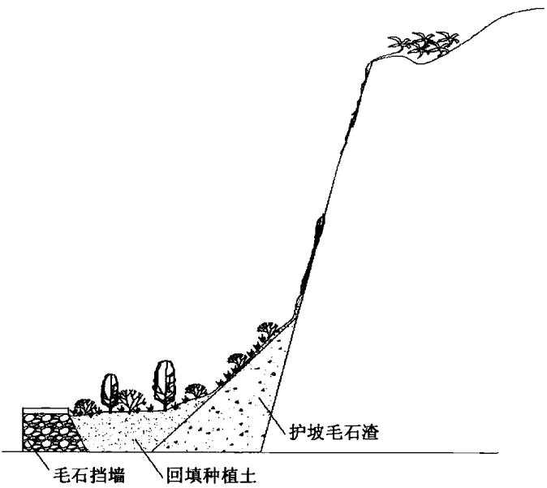  
图 8-4 边坡复绿工程施工断面图

## (2) B 类型废弃地的治理措施

按照高度不同可分为两类，高度大于20m，可采用坡脚砌挡土墙+垂直绿化技术；高度小于20m，根据岩体的情况采用 PMS植生基材生态防护技术+生态棒防护技术+植被垫防护技术的组合模式（图8-6和图8-7)，这里主要研究高度小于20m的立地类型。

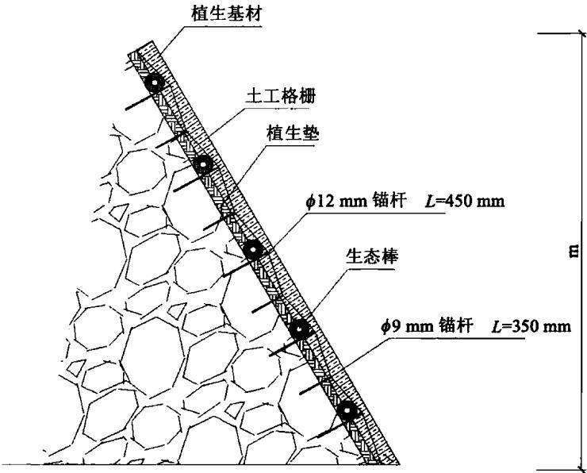

图 8-6 边坡复绿工程施工断面图  
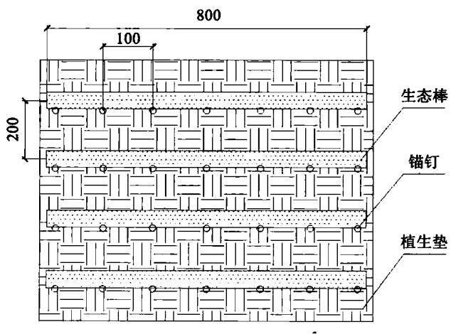  
图 8-7 生态棒及植被垫平面布置图

在实际设计中，通常可以采用在坡脚处设置安全挡土墙，挡土墙两个重要的作用。①可以降缓坡度，有效地把陡立面裸露面积减少到最小；②挡土墙回填后可以形成一个稳定的斜坡面，从而起到支撑坡体稳定的作用。通过回填种植土栽植乔灌木，形成乔、灌、藤三层立体防护，形成了良好的生态立体防护景观。通过不同规格植物搭配形成高低不同，错落有致，疏密相间的坡面植物立体防护效果。

## (3) C 类型废弃地的治理措施

该类废弃地的特点是坡度在40°～60°，边坡基岩裸露，表层基本无土层，浮石较多，且容易下滑，自然条件恶劣。对于此类边坡，主要以PMS植生基材生态防护技术为主，可以结合多种复绿措施组合来进行复绿（图8-8)，从而营造更好的生态效应。

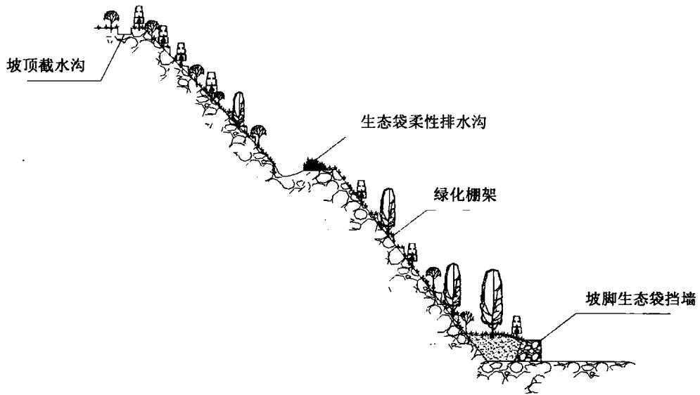  
图 8-8 边坡复绿工程施工断面图

为丰富坡面植物品种，改善坡面景观，在坡面局部采取绿化棚架施工工艺。坡面绿化棚架设置在于为植物提供更好的生长土层条件，乔灌木的生长都需要一定的土层生育层，植物根系才能有效扩展，充分的空间让其生长茂密，立体防护才能尽快体现（图8-9）。

1）绿化棚架采用镀锌铁丝焊网制成，规格100 cm×100 cm，成120°对折，网架上方预留种植孔位；

2）在坡面指定位置“品”字形安放绿化棚架，每3～5个棚架为一组，并用铁丝与坡面锚钉、网片绑扎牢固；

3）进行植生基材喷射施工，确保绿化网架内及网架间基材充填饱满，植生

基材厚度符合设计要求；

4）在绿化网架上沿进行乡土苗木栽植施工。

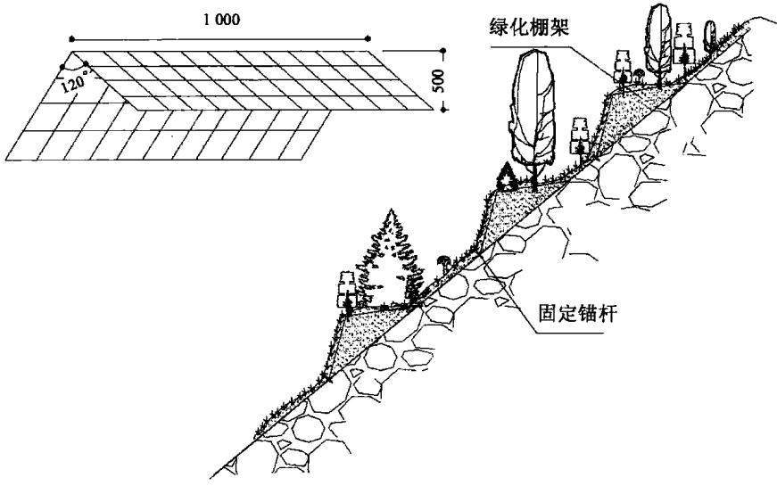  
图 8-9 绿化棚架施工断面图

为更好体现边坡复绿的生态特性，在满足工程需要的同时，尽可能地减少类似水泥、块石等硬性材料施工。针对边坡顶部截水沟及马道横向排水沟施工，采取生态边沟施工工艺进行施工（图8-10和图8-11）。

坡顶部分存在一定的残积土层，很容易通过机械（人工）挖掘形成排水边沟，由于残积土层极易受水流冲蚀，如在短时间内形成草坪地被，就可以有效防止水流冲刷，实现排水与绿化的有机结合（图8-12）。

C类型采石废弃地典型生态修复工程案例如图8-13～图8-15所示。

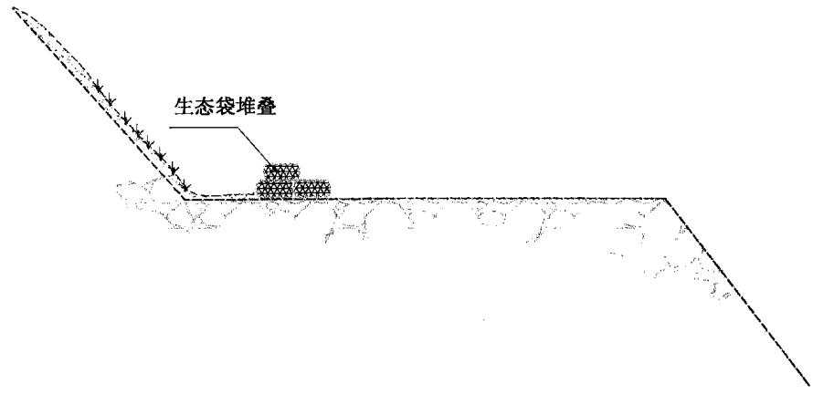  
图 8-10 平台截水沟施工断面图

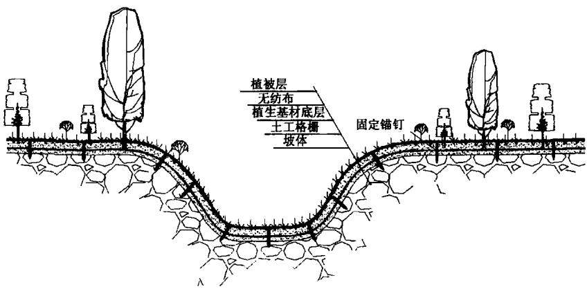  
图 8-11 坡顶截水沟施工断面图

## (4) D 类型废弃地的治理措施

类型D为坡度小于40°裸岩边坡，无论从植物生长的条件还是施工的难易程度，都是目前采石场边坡最容易绿化的立地类型，主要采用PMS植生基材生态防护技术（图8-16）。

D类型采石废弃地典型生态修复工程案例如图8-17\~图8-19所示。

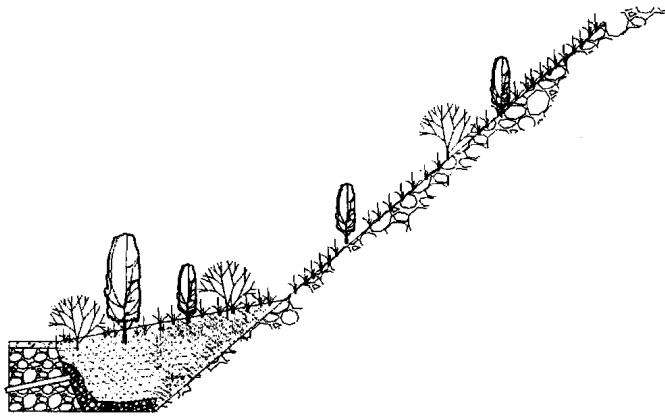  
图 8-16 边坡复绿工程施工断面图

## (5) E 类型废弃地的治理措施

该类废弃地的特点是坡度小于30°，以碎石为主，有少量的土壤，质疏松，碎石间空隙较大，保水保肥能力极差，基本不具备植物生长所需的土壤环境；碎石间大量的空隙造成植物根部与土层结合不紧密，极容易漏风，保温能力低，致使植物难以存活且稳定性较差。在对此类坡面进行植被恢复前，需先对其进行固化稳定处理，在进行固化稳定处理后，采用客土喷播技术进行复绿。

## (6) F 类型废弃地的治理措施

为保证山体边坡治理及复绿工程项目施工效果，在平台进行生态袋挡墙砌筑，以增加平台种植有效土层，同时防止因自然降雨等造成种植土流失。

平台生态挡墙采用生态袋砌筑（图8-20)。生态袋由高强度土工合成材料缝制加工制成，它具有强度大、透水、保土的特性，袋内灌装种植土，形成墙体砌块。同时，由于袋体土工材料的独有的软体特性，既可以保证其与平台基础的良好贴服，又有利于植物根系的穿透，通过植物根系的相互穿透、交织形成更为稳定的挡墙结构，实现挡土与生态恢复的有机结合（图8-21）。

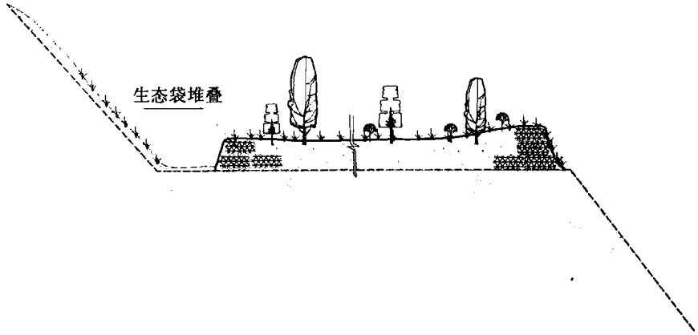  
图 8-20 平台复绿工程施工断面图

## 8.4 废弃采石场生态修复工程实践

## 8.4.1 舟山长岗山森林公园废弃采石场生态修复和景观重建

## 8.4.1.1 项目概况

长岗山森林公园南入口宕口位于舟山市定海区昌国路东尽头森林公园内，地理坐标介于东经 $1 2 2 ^ { \circ } 0 6 ^ { \prime } 1 5 " \sim 1 2 2 ^ { \circ } 0 9 ^ { \prime } 3 0 "$ ，北纬 $3 0 ^ { \circ } 0 1 ^ { \prime } 0 0 ^ { \prime \prime } { \sim } 3 0 ^ { \circ } 0 2 ^ { \prime } 3 5 ^ { \prime \prime }$ 。项目区为亚热带季风气候，四面环海，受海洋影响较大。总的气候特点是：温暖湿润，四季分明，风大雾多，雨热同步，雨量较充沛。年均温度 $1 6 . 3 \%$ ，极端最高气温39.1℃，极端最低气温-6.1℃。一年中日平均气温 $\geqslant 1 0 ^ { \circ } \mathbb { C }$ 的活动积温 $5 1 2 1 \mathrm { ^ { \circ } C }$ ，无霜期247d，年降水量1330mm，雨日149d，年日照时数2038h。全年多大风，夏秋季多台风热带风暴，易引起灾害性天气。

按照宕口坡面坡度来分，现场主要分3个区域：一是宕口坡面的上部分，坡度极陡，多为80°～90°，甚至为反坡，岩性坚硬，深层稳定；二是宕口坡面的下部分坡度相对较缓，其中坡面左右两部分坡度为50°～70°（局部地方坡度仍然陡峭，坡度达到80°以上)，坡面极不规则，乱石嶙峋；三是周边植被稀疏区域，坡面为土石结构，相对稳定，经过改良植被能够正常生长（图8-22和图8-23）。

森林植被属中亚热带常绿阔叶林北部亚地带，原始森林植被因长期受人为活动影响已消失殆尽，取而代之的是大面积的次生植被。原来山上大多数是松树林，由于城东街道对封山育林工作比较重视，松树林下阔叶林生长较好。近年来，因松材线虫病危害，大批松树死亡，现松树纯林已演替为以枫香、栎类等阔叶树种为主的落叶阔叶林森林群落。

## 8.4.1.2 设计的指导思想及目标

## (1) 指导思想

1）边坡稳定。边坡稳定是生态环境治理的基础，因此首先要对边坡进行清理，排除边坡崩塌、危岩、滑石隐患，以期达到边坡的基本稳定。同时要根据山体形状设置截水沟、排水沟和挡土墙等配套设施。

2）生物与工程措施相结合。采石场废弃地地形破碎、立地条件较差，为保证生态修复顺利进行，应将生物措施与工程措施相结合，并将生物措施确立为重点。

3）因地制宜，适地适树。项目区立地条件恶劣，为提高苗木的成活率，保证恢复植被的稳定性，应采用抗性强的乡土树种，同时考虑具体的种植条件，宜灌则灌，宜草则草，使人工植被与周边自然植被相融合、相协调而趋近自然。

4）生态适应性。人工进行植被恢复虽然可以在短期内见到效果，但要经得起时间考验和保持长期效果，就要根据当地自然植被的演替规律，把短期效果和长期效能紧密结合，保证今后植物群落结构的稳定和免养护目的的实现。

5）经济适用性。在充分考虑业主的经济承受力，尽量降低造价和后期绿化管护费，这就要求在选用植物材料时，尽量选用适应性强、管理粗放和价格低廉的植物种类。

6）景观艺术化。适当引入一定的景观小品，将园林景观建设应用到生态复绿上来，充分提升边坡复绿的艺术性。

7）短期效果和长期效能相结合。人工进行植被恢复虽然可在短期内见效，但要经得起时间考验和保持长期效果，就要根据当地自然植被的演替规律，把短期效果和长期效能紧密结合，保证今后植物群落结构的稳定和免养护目的的实现。

## (2) 设计目标

设计主要体现以生态恢复和景观建设为目标的边坡绿化技术体系。所谓以生态

恢复和景观建设为目标就是强调坡面以木本植物为主体的植被（群落）与周边环境的协调、共生、和谐，通过一段时间的自然生长，使得坡面植被能够融入周边环境，达到协调一致。同时结合坡面情况，塑造协调一致的视觉景观和听觉效果。

## 8.4.1.3 景观设计

结合宕口的自然地理条件和边坡特点，在施工过程中使用了先进材料（高强度塑料格栅、成品植生基质、GCL防水垫），并采取了先进技术和手段（植被毯、养护棒、种植袋、管型容器苗)，选择了植生基材施工工艺，更重要的是将植被恢复与园林景观（人造流水景观、自然流水景观、人造雾喷景观）有机结合，提升了植被恢复的景观效果。

## (1) 人造流水景观

坡面上半部分岩体由于坡度陡峭，基本超过90°，有的为反坡，所以此部分坡体不宜进行植生基材喷播。利用GRC材料，模仿自然山石、流水，达到“虽有人做，宛自天工”的佳境（图8-24)。在坡体下部采取的工艺是栽植藤本植物。在坡顶种植油麻藤（向下生长），在坡脚种植爬山虎（向上生长）、西番莲（向上生长）和川萼南蛇藤（向上生长)，这样通过上垂下爬的方式逐年覆盖垂直陡峭的岩壁。

## (2) 自然流水景观

考虑雨季、暴雨、台风等综合因素，结合本宕口山体的地势，在坡面中部山体的汇水区域进行清理、导引，使其自然预留出雨水行经的路线，在坡面修整出自然流水景观（图8-25）。

## (3) 人造雾喷景观

为了增加坡面的景观效果，在坡面的两侧设置了人造雾喷景观，并栽植了一些小规格的圃地苗、容器苗（包括乔木、灌木、藤本植物）（图8-26）。人造雾系统的工作原理是利用特制造雾机组，将水经耐高压管线由专业喷头产生1\~15μm的水滴，每个喷头每分钟水流量为0.145L(3 号喷头)。由此激发成的雾滴能长时间悬浮、漂浮在空气中，单一喷头产生的雾长可达3\~5m。

## 8.4.1.4 坡面生态修复设计

## (1) 边坡绿化工艺

根据坡面下部分的实际情况，采取如下施工工艺：在两侧比较平缓区域采用植生基材喷射法；在乱石嶙峋的坡体和两侧较陡（坡度 $\geq 6 0 ^ { \circ } )$ 处设置鱼鳞坑种植。

## (2) 植物种类的选择

废弃采石场原生植被绝迹，引入合适的植物种类是植被恢复的关键。国内从植物选择标准上进行探讨，国外从引入外来植物种类及景观等角度进行分析。结

合以上经验，我们根据长岗山森林公园南入口宕口地质灾害工程治理后的具体情况，提出植物种类选择标准，筛选出适栽的植物种类，并结合调查周边次生植被和人工植被的特点，提出了在不同区段的植物种类选择方案。

## 8.4.1.5 植被景观修复实施效果分析

通过三年的自然生长，以木本植物为的植被（群落）的坡面植被已经融入周边环境，坡面已经形成具有较强固土护坡效果和较好景观效果的以灌木为主体、草和地被植物大面积覆盖、小乔木局部点缀且能自然协调生长和演替的植物群落（图8-27和图8-28)。

种类组成是植物群落最基本的特征之一，它是群落形成的基础，它能反映该群落的结构、动态等基本特征，提示群落的基本规律。经统计整个坡面总有植物44种，其中20科38属，相比2006年的10科16属20种，植物有了明显增多，植物种类增加了120%，说明经过近3年的发育，植被有明显的演替。其中，自然入侵植物（21种）占调查植物种类总数的47.72%，其次是栽植植物（13种），最少为播种植物（10种）仅占调查植物种类总数的22.73%，表明植被已经融入周边环境，逐渐向周围群落演替。

废弃宕口不仅占据大量土地，而且还破坏周边的生态环境，影响了人们的身心健康。在重视环境质量建设的今天，对废弃宕口地实行景观恢复改造显得尤为重要。虽然国内外早就有相关文献报道，我国也从20世纪80年代起进行了局部试验、改造，但是还都停留在植被恢复上，研究也仅仅局限在恢复工程技术和植被选择上，没有一个相对固定的理论指导景观恢复改造实践。长岗山森林公园南入口宕口景观复绿工程已被舟山市相关部门和专家审批通过，现已经完成了工程竣工验收，进入植被群落恢复期，并已经取得了很好的景观效果，得到业内人士好评，为废弃矿山的生态环境治理和边坡绿化景观设计提供参考。

该工程对废弃采石场边坡治理做了一次有益、全面的尝试，将支护设计和景观绿化设计综合起来考虑，把二者融为一体，而不是将两部分隔裂开、单独设计。这样既增强了边坡的整体性，又消除了因分离设计造成的疏漏而引起的安全隐患，真正做到景观设计为支护设计起到画龙点睛晴的作用，而支护设计是优美景观的保障和前提。

## 8.4.2 雪浪山废弃采石场 A 标生态修复工程设计与实践

## 8.4.2.1 项目概况

该工程为江苏省无锡市滨湖区雪浪山采石场项目，雪浪山位于无锡市西南部滨湖区雪浪镇，因山顶有宋代建造的雪浪庵而得名。海拔146m，山中有横山草堂，雪浪观枫、蒋子阁等风景优美的历史景点。西面是五浪山；南接太湖；北临鼋头渚、五里湖；东有锡南公路。项目地处锡南旅游观光区内，景观治理的要求较高。无锡市为了配合优美的太湖风景区和著名旅游景点梅园，对其进行旅游开发。

该坡面是采石山体开挖后形成，属硬质岩石一碎屑边坡，坡体主要由大量碎岩和矿尾石块堆弃而成。坡体岩质构成主要为白一灰白色厚层状中粗粒石英砂岩和含砾石英砂岩，夹有少量紫红色含云母的石英粉砂岩和灰色粉砂页岩，节理裂隙发育、整体的稳定性较差，且大量出现基岩解理、断面与坡面同向或近似同向的情况，常发生岩屑堆积层沿着基岩面整体下滑的现象。山体顶部基本稳定，并有零星的自然植被恢复；中部和坡脚处有部分尾矿和浮石，有大面积滑坡现象，稳定性较差，植被恢复困难。

## 8.4.2.2 生态修复的目标

稳定边坡、恢复生态环境和改善坡面景观效果，采用先进的岩石边坡植生基材喷射技术进行施工，主要通过人工辅助营造植物生育基础，依靠植物自身的自然恢复力进行植被恢复。植物品种的选用上强调乡土化、生态化，主要以当地乡土植物为主，以迅速恢复山体植被为目标，强调坡面以木本植物为主体的植被（群落）与周边环境的协调、共生、和谐，通过一段时间的自然生长，坡面植被能够融入周边环境，达到协调一致。同时结合坡面情况，塑造协调一致的视觉景观。

1）远期目标（完工5年后）。营造有较强固土护坡效果和较好景观效果的以灌木为主体、草和地被植物大面积覆盖、小乔木局部点缀且能自然协调生长和演替的植物群落；

2）中期目标（完工3年后）。营造有较强固土护坡效果和较好景观效果，以灌木为主、草本植物为辅、适当点缀花卉且基本上能达到免养护或简养护状态的植物群落；

3）近期目标（完工1年后）。营造能在坡面生长并有较强固土护坡效果的草灌结合型且物种丰富度高的过渡性植物群落；

4）短期目标（完工3个月后）。营造能在坡面存活并有一定护坡复绿效果的草灌结合且物种搭配合理的先锋植物群落。

## 8.4.2.3 生态修复设计

## (1)生态修复区划

A标段位于雪浪山南侧，坡面面积5.5万 $\mathbf { m } ^ { 2 }$ ，由于坡面本身地质条件和多年开采形成不规则的宕口断面，本设计根据实际断面条件决定采取不同的实施模式。现状图和设计效果图见图8-29和图8-30，按照A标区位图，本区段分为5个小段进行复绿治理。

坡顶处理：坡顶植被生长旺盛，并具备较厚的土层，本着少破坏、促稳定的处理原则，在坡顶部外侧开设天沟，侧立面采用锚钉固定，土工格栅包覆方式进行处理，局部喷射植生基材。

A-1段，坡面稳定状况良好，坡度约为40°，坡面岩质为硬质砂岩（板岩），表面极其光滑，局部存在坡面植被滑塌，坡面零星分布当地实生植物，长势较好。针对该坡面状况，复绿计划采取栅栏+PMS植生基材工法，表面适当设置栅栏加固并拦蓄水土，局部喷射植生基材，形成条状复绿植被。

A-2段，坡面岩层基本稳定，但表面岩层较为破碎，岩层保水性较差。此区段采用岩层防渗处理，锚钉+土工格栅网+PMS植生基材工法进行复绿施工。

A-3段，坡体稳定，坡面形成二级平台，可以采用种植乔灌木工法，结合PMS植生基材工法。

A-4段，坡体岩层稳定，岩层整体性强。此区段采取：锚钉+土工格栅网+PMS植生基材工法施工。

A-5段，坡度较陡，约70°，局部垂直。本区段采用坡脚种植攀缘植物，结合PMS植生基材工法施工，局部细碎坡面采用三维植被网+PMS植生基材工法。

## (2) 植物的选配

结合调查周边次生植被和人工植被的特点，提出了在不同区段的植物种类选择方案（表8-10）。

表 8-10 不同区段的植物种类选择
<table><tr><td rowspan=1 colspan=1>区段编号</td><td rowspan=1 colspan=1>植物种类</td><td rowspan=1 colspan=1>特色</td></tr><tr><td rowspan=1 colspan=1>Al</td><td rowspan=1 colspan=1>火棘、小叶女贞、波斯菊混合种1</td><td rowspan=1 colspan=1>观赏植物的配置，增强景观效果</td></tr><tr><td rowspan=1 colspan=1>A2</td><td rowspan=1 colspan=1>枸桔、紫叶李、混合种2</td><td rowspan=1 colspan=1>抗风和抗旱性较强的植物的构建，利于在极端的生境生长</td></tr><tr><td rowspan=1 colspan=1>A3</td><td rowspan=1 colspan=1>夹竹桃、湿地松、红花继木混合种3</td><td rowspan=1 colspan=1>用材植物和观赏植物的配置，增强景观效果，增加经济效益</td></tr><tr><td rowspan=1 colspan=1>A4</td><td rowspan=1 colspan=1>香樟、伞房决明、混合种4</td><td rowspan=1 colspan=1>本地抗性强植物和豆科植物的配置，利于土壤改良和植物群落的形成</td></tr><tr><td rowspan=1 colspan=1>A5</td><td rowspan=1 colspan=1>常春藤、五叶地锦、混合种5</td><td rowspan=1 colspan=1>快速形成绿色屏障，涵养水土，景观效果好</td></tr></table>

注：混合种1（胡枝子+紫穗槐+马棘+臭椿+狗尾草+狗牙根+一年生黑麦草+弯叶画眉草）。

混合种2（胡枝子+紫穗槐+紫薇+臭椿+马棘+白喜草+高羊茅+弯叶画眉草)；

混合种3（紫穗槐+胡枝子+马棘+紫芒+乌柏+狗尾草+紫花苜蓿+高羊茅);

混合种4（紫穗槐+马棘+胡枝子+山桃+狗牙根+高羊茅+白三叶)；

混合种5（紫穗槐+房伞决明+胡枝子+紫芒+盐肤木+狗尾草+百喜草+紫花苜蓿+高羊茅)。

## (3) 施工工艺

1）人工坡面清理：清除坡面浮石、消除坡面落石隐患；适度平整坡面，保证植生基材和岩石坡面能紧密结合。

2）排水及灌溉系统施工：按照边坡安全设计要求，必须在坡顶及其两侧、中央槽部汇水区以及坡底设置排水系统。为减少工程施工量，提高工程质量，采用植物养护棒体系为坡面排水网络建设。

3）植被垫铺设：平整坡面，浮石、危石清理，铺设时植被垫尽量与坡面贴实。

4）张网：选用双向土工格栅，网孔尺寸40mm×40mm；网间搭接距离不小于10 cm，网面和坡面之间保持6 cm左右的空隙。

5）锚钉锚固：用Φ14螺纹钢，形状为“L”，坡面锚钉长度30～40cm，坡顶锚钉长度为 50～70 cm；呈梅花形分布，列间距 2 m，行间距 1.25 m，锚杆与坡面垂直，灌浆匀实。

6）植生基材喷射：为了保证与坡面的良好接触和种子的利用率，都采用二次喷射法，在第一次时，喷射一层不含种子的基材混合物，底层约7\~8cm。然后喷射含种子的基材混合物，含种子层厚度约3\~4 cm，基材总厚度控制在10cm以上。

7）植被毯覆盖：在面层喷射层完成后，覆盖植被毯进行保温，营造种子快速发芽环境。

## (4) 前期养护管理

在边坡进行植被护坡后，植被生长发芽期及成坪期的养护成为工程成败的关键。因此，必须做好前期的养护工作。前期的养护有以下几点需要特别注意：

1）必须保证前期植被生长的水分供给。一般而言，植被发芽期及生长成坪期必须保证每天对边坡进行1\~2次喷水，在高温季节，还必须增加喷水次数。

2）为了植被保温保湿以及防止坡面雨水冲蚀，在施工完成后，利用无纺布或者草帘在喷射的基材层上进行覆盖。

3）一般在工程完成后5\~6个月，可根据观测植物生长情况进行施肥一次，肥料以易溶性的氮、磷、钾肥为主。

4）在养护管理阶段，特别要注意植被杂草的去除和植被本身的病虫害的防治。

初期养护是坡面植被恢复技术关键环节，为确保边坡绿化效果，必须采取切实可行的初期养护措施。

## 8.4.2.4 施工效果

该项目工程已通过了无锡市相关部门和专家的验收，景观效果较好，得到业内人士好评。对该边坡进行了将近两年的现场护坡植被效果观测。施工3天后先锋草种开始发芽，半个月后绿色已覆盖整个坡面，2个月后，植被覆盖度迅速达到了95以上%，中间间生部分小灌木；1\~2年后，坡面植被趋于稳定，先锋的草本植物逐渐退化，形成了以灌木为主，乔、灌、草以及花的多样性植物群落结构（图8-31～图8-34）。其间坡面经历了多次大雨的冲刷，没有产生塌方、滑坡等不良情况，进一步证明植生基质喷射技术在该项目工程应用的可行性。

## 8.4.2.5 经济效益分析

PMS植生基质喷射技术与其他技术在类似应用条件下的技术经济比较如表8-11所示。在边坡基本稳定的情况下，对于部分中、强风化岩石等难以进行直接植被恢复处的边坡，PMS植生基质喷射技术取代浆砌片石护面墙（护坡）、挂网喷砼既可以取得节省工程投资，又可以达到边坡绿化的目的。

表 8-11 PMS 技术与其他的技术比较
<table><tr><td rowspan=2 colspan=1>序号</td><td rowspan=2 colspan=1>技术种类</td><td rowspan=2 colspan=1>综合单价/ $( \overrightarrow { \pi } / \mathbf { m } ^ { 3 } )$ </td><td rowspan=1 colspan=3>应用范围</td></tr><tr><td rowspan=1 colspan=1>坡度</td><td rowspan=1 colspan=1>级数</td><td rowspan=1 colspan=1>地质概况</td></tr><tr><td rowspan=1 colspan=1>1</td><td rowspan=1 colspan=1>浆砌片石护面墙，厚0.5~1.5m</td><td rowspan=1 colspan=1>180~250</td><td rowspan=1 colspan=1>1:0.75</td><td rowspan=1 colspan=1>1~2</td><td rowspan=1 colspan=1>边坡基本稳定，表面岩石破碎，防止风化及渗水</td></tr><tr><td rowspan=1 colspan=1>2</td><td rowspan=1 colspan=1>浆砌片石护坡，厚约 0.3 m</td><td rowspan=1 colspan=1>180~250</td><td rowspan=1 colspan=1>1:1, 1:1.25</td><td rowspan=1 colspan=1>1~2</td><td rowspan=1 colspan=1>边坡稳定，表面岩石风化严重，防止进一步风化及渗水</td></tr><tr><td rowspan=1 colspan=1>3</td><td rowspan=1 colspan=1>挂网喷混凝土，厚 0.08 m</td><td rowspan=1 colspan=1>100~130</td><td rowspan=1 colspan=1>1:1</td><td rowspan=1 colspan=1>3~5</td><td rowspan=1 colspan=1>边坡稳定，表面岩石风化严重，防止进一步风化及渗水</td></tr><tr><td rowspan=1 colspan=1>4</td><td rowspan=1 colspan=1>PMS 植生基质喷射技术</td><td rowspan=1 colspan=1>70~120</td><td rowspan=1 colspan=1>1:1.25~1:0.75</td><td rowspan=1 colspan=1>1~7</td><td rowspan=1 colspan=1>岩石中、强风化，边坡基本稳定，提供植被覆盖，可在部分边坡取代浆砌片石护面墙（护坡）、挂网喷混凝土并用于难以进行直接植被恢复的边坡</td></tr></table>

# 第9章 土地复垦技术标准研究

## 9.1 研究背景

为了适应我国土地复垦更好的开展，推动土地复垦工作走上科学、法制、标准化的道路，国家土地管理局下达了研制我国第一个《土地复垦技术标准》的项目，并作为我国“八五”攻关课题中子项目而开展工作。北京矿冶研究总院作为项目的承担单位，1992年1月启动《土地复垦技术标准》的项目研究，于1994年12结束项目研究。研究目标是建立适应全国生产建设过程中，因挖损、塌陷、压占等造成破坏的各类土地，采取整治措施，使其恢复到可供利用状态，即土地复垦时适用的技术标准。

## 9.2 标准制定的依据

该标准制定的依据是我国在保护环境、自然和矿产资源方面的法律法规《环境保护法》《土地管理法》《矿产资源法》和《土地复垦规定》。其中在《土地复垦规定》中就提出了“谁破坏，谁复垦”的原则。《土地复垦技术标准》就是为《土地复垦规定》作更为详细的具体标准。

## 9.3 标准研究的方法

鉴于本项研究是我国土地复垦领域的首项技术标准，而且是作为《土地复垦规定》的配套技术文件，且土地复垦涉及学科多，专业广泛，作为我国这项标准特点十分突出，它远不同于其他国家情况。为了更好制定这一标准，使之既充分反映我国本领域技术水平，又制定出适宜执行的技术标准条款，我们多次请示了主管部门并反复研究，确定工作程序如图9-1所示。

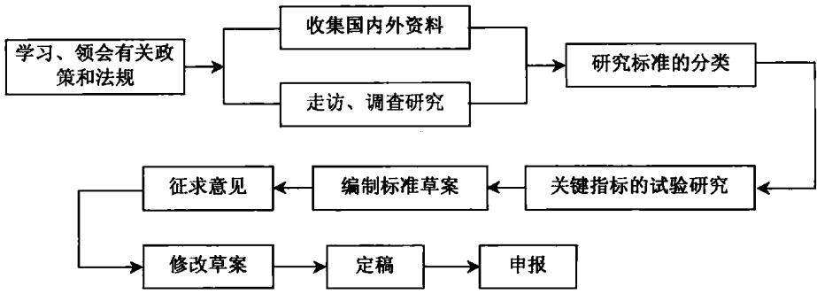  
图 9-1 研究技术路线

## 9.3.1 调研走访

为研究制定好本《标准》，尽量反映本领域国内外先进技术水平和成熟经验，查阅的资料有世界上有关国家标准、国内外大量各行各业废弃地复垦初步资料，包括复垦技术论文年会、管理会，特别是十个试验点典型经验资料。还有国内外大量复垦科学研究及实践工程资料。

走访、调研的部门有：部分各级土地部门、政策部门、规划部门、管理部门，包括冶金、建材、煤炭、有色、水利、建设、铁路、农业、林业、环保等部门管理和领导人员。

还调研走访了部分矿山、土地破坏典型地区，得到和吸取了他们的经验与体会。还有一些复垦专家学者及复垦工作经验丰富的科学技术人员，听取了意见和指导。

## 9.3.2 标准分类

在掌握大量资料和调研的前提下，研究比较了“复垦土地用途”分类和以“废弃场地类型”分类方法，确定了本《标准》采用的分类原则，其分类结构如下：

1）采挖废弃土地复垦技术标准；

2）建设废弃土地复垦技术标准；

3）工业排污破坏土地复垦技术标准；

4）水毁土地复垦技术标准。

在这4个标准中具体规定了各类破坏土地恢复为各种用途土地的标准条款，它包括了覆土厚度、坡度、平整度、排水设施、防洪、控制水土流失、防止污染

及用于建筑的地基要求条款，用于林、牧、渔业的具体要求条款。

关键指标的试验研究，主要依据借鉴盆栽和田间试验数据，同时参考了国内外有关实践与试验结果，并根据国家的政策法令，使标准界限值适合国情，易于推广。

## 9.4 标准条文

## 9.4.1 总则

## 9.4.1.1 制定依据

为了加强土地复垦管理，促进土地整治与保护，提高土地利用的社会、经济和生态效益，依据《土地复垦规定》和有关的法律法规制定本标准。

## 9.4.1.2 适用范围

本标准适用于《采挖废弃土地复垦技术标准》《建设破坏废弃土地复垦技术标准》《工业排污破坏土地复垦技术标准》和《水毁土地复垦技术标准》。

## 9.4.1.3 土地复垦技术质量控制原则

1）符合土地利用总体规划及土地复垦规划。在城市规划区内，符合城市规划。强调服从国家长远利益，宏观利益。

2）依据技术经济合理的原则，兼顾自然条件与土地类型，选择复垦土地的用途，因地制宜，综合治理。宜农则农，宜林则林，宜牧则牧，宜渔则渔，宜建设则建设。条件允许的地方，应优先复垦为耕地或农用地。

3）复垦后地形地貌与当地自然环境和景观相协调。

4）保护土壤、水源和环境质量，保护文化古迹，保护生态，防止水土流失，防止次生污染。

5）坚持经济效益、生态效益和社会效益相统一的原则。

## 9.4.1.4 名词、术语

1）土地破坏：由于人类的生产建设活动导致土地的挖损、塌陷、压占等称之为土地破坏。

2）土地复垦：指对被破坏的土地，通过采取综合整治措施，使其恢复到可

供利用状态的活动。

3）土地复垦率：已复垦的土地面积与被破坏土地的面积之比，即：

$$
L ~ ( \% ) ~ { = } Y / P { \times } 1 0 0 \%
$$

式中：L——土地复垦率（以百分率表示）；

Y——已复垦土地面积 $( \mathrm { h m } ^ { 2 } )$

P——被破坏土地面积 $( \mathbf { h } \mathbf { m } ^ { 2 } )$ 0

## 9.4.1.5 复垦土地质量的检验

## 9.4.1.5.1 检验的时机

复垦为农用地（含林、牧、渔等）的土地复垦，一般由复垦工程和初步生态恢复两部分构成。复垦土地质量的检验，分为二个阶段进行。

## (1)第一阶段检验

在复垦工程完成后，即可申请第一阶段复垦土地质量的检验。

## (2) 第二阶段检验

初步恢复生态后，进行第二阶段复垦土地质量的检验。一般情况下，在复垦工程完成后第三年进行。

复垦后用于渔业等养殖业时，须在第三养殖年进行第二阶段检验。

## 9.4.1.5.2 检验方法

对复垦后土地质量的检验方法，采用随机抽样法。即随机抽取一定量待检验的已复垦土地作为具有代表性的独立样本进行检验，样本量一般为5%～10%。

## 9.4.1.5.3 检验内容

## (1)第一阶段检验内容

A. 提交文件。

1）土地复垦可行性研究报告；

2）土地复垦设计文件；

3）土地复垦施工文件；

4）复垦区当地自然背景资料。

B. 现场测试。

1）用于农业测试项目：宏观布局、覆土面积、覆土厚度、地面坡度、平整度、覆土层土壤容重、土壤pH、含盐总量、排灌设施、防洪设施。

2）用于牧业测试项目：覆土面积、覆土厚度、道路布局、饮水点等配套

设施。

3）用于林业测试项目：覆土面积、覆土厚度、地面坡度、排水设施。

4）用于渔业测试项目：水源、水质、塘（池）修筑质量、塘面积、塘水深、排水防洪设施。

5）用于建筑测试项目：地面坡度、平整度、建筑规划、初步设计、施工区内建筑场地的工程地质勘察资料。

6）其他用途测试指标依具体情况而定。

## (2) 第二阶段检验内容

A. 提交文件（农、林、牧业）。

1）土壤培肥措施；

2）种植概要。

B. 现场测试。

1）农业测试项目：作物长势、土壤有机质、pH值、作物、果实等可食部分有毒有害物质含量、单位产量。

2）林业测试项目：生长势、种植密度、成活率、生长量、郁闭度。

3）牧业测试项目：生长势、覆盖度、产草量。

4）渔业测试项目：单位产量、水中及鱼肉中有毒有害物质含量（依据所在地区充填废弃物及土源等所含有毒有害物质种类和状况，可选择测定有关特征污染成分)。

5）建筑测试项目：地基承载力、变形及稳定性指标。

## 9.4.1.5.4 检验结果的评估

## (1)复垦土地用于农、林、牧业时检验结果的评估内容

1）提交文件是否齐全；

2）现场测试指标是否符合各类场地具体要求，除有毒有害物质含量符合环境标准外，其他土壤相当于当地一般水平。

## (2) 复垦土地用于建筑时检验结果的评估内容

1）提交文件是否齐全；

2）包括建筑地基设计文件，地基处理工程施工记录，其他必要的资料等；

3）现场测试指标是否符合各类场地《地基与基础工程及验收规范》（GBJ202—83）中有关标准与指标。

## (3)复垦土地用于渔业时检验结果的评估内容

1）提交文件是否齐全；

2）包括用于渔业（含养殖）的设计资料，施工验收文件等；

3）现场测试指标是否符合渔业水质及有关质量标准。

## 9.4.1.6 标准的实施

1）本标准发布后，各类土地复垦必须按此标准规定施行。

2）本标准由土地管理部门会同有关行业主管部门负责监督实施。

3）土地管理部门会同有关行业主管部门，负责处理标准实施中出现的技术问题。

4）土地复垦条件较好的地区，或本标准所列项目及其标准值不完全适应当地特点时，各地可结合本地实际情况补充实施本标准。

5）本标准由国家土地管理局负责解释。

## 9.4.1.7 各项目测试方法

1）农、林、牧业指标的测试方法：测试项目和方法，依据不同地区采用相应的方法（表9-1）。

表 9-1 测试项目和方法
<table><tr><td rowspan=1 colspan=1>序号</td><td rowspan=1 colspan=1>项目</td><td rowspan=1 colspan=1>单位</td><td rowspan=1 colspan=1>方法</td></tr><tr><td rowspan=1 colspan=1>1</td><td rowspan=1 colspan=1>覆土面积</td><td rowspan=1 colspan=1> $\mathbf { h m } ^ { 2 }$ </td><td rowspan=1 colspan=1>地测法</td></tr><tr><td rowspan=1 colspan=1>2</td><td rowspan=1 colspan=1>覆土厚度</td><td rowspan=1 colspan=1>m</td><td rowspan=1 colspan=1>地测法（多点）</td></tr><tr><td rowspan=1 colspan=1>3</td><td rowspan=1 colspan=1>地面平整度</td><td rowspan=1 colspan=1> $\mathbf { m }$ </td><td rowspan=1 colspan=1>地测法</td></tr><tr><td rowspan=1 colspan=1>4</td><td rowspan=1 colspan=1>土壤容重</td><td rowspan=1 colspan=1> $\mathsf { g } / \mathsf { c m } ^ { 3 }$ </td><td rowspan=1 colspan=1>环刀法，蜡封法</td></tr><tr><td rowspan=1 colspan=1>5</td><td rowspan=1 colspan=1>土壤有机质</td><td rowspan=1 colspan=1> $\%$ </td><td rowspan=1 colspan=1>土壤有机质测定法</td></tr><tr><td rowspan=1 colspan=1>6</td><td rowspan=1 colspan=1>土壤砾石含量</td><td rowspan=1 colspan=1> $\%$ </td><td rowspan=1 colspan=1>筛分法</td></tr><tr><td rowspan=1 colspan=1>7</td><td rowspan=1 colspan=1>土壤pH值</td><td rowspan=1 colspan=1>pH单位</td><td rowspan=1 colspan=1>电极测定法</td></tr><tr><td rowspan=1 colspan=1>8</td><td rowspan=1 colspan=1>含盐总量</td><td rowspan=1 colspan=1>%</td><td rowspan=1 colspan=1>电导法，残渣烘干法</td></tr><tr><td rowspan=1 colspan=1>9</td><td rowspan=1 colspan=1>覆盖度</td><td rowspan=1 colspan=1>%</td><td rowspan=1 colspan=1>测量法</td></tr><tr><td rowspan=1 colspan=1>10</td><td rowspan=1 colspan=1>其他项目</td><td rowspan=1 colspan=1>%</td><td rowspan=1 colspan=1>参考《水和废水监测分析方法》（第三版）1989</td></tr><tr><td rowspan=1 colspan=1>11</td><td rowspan=1 colspan=1>产草量</td><td rowspan=1 colspan=1> $\underline { { \mathbf { k } \mathbf { g } / \mathbf { h m } ^ { 2 } } }$ </td><td rowspan=1 colspan=1>实测样方、计算法</td></tr><tr><td rowspan=1 colspan=1>12</td><td rowspan=1 colspan=1>种植密度（造林）</td><td rowspan=1 colspan=1>株 $\cdot / \mathbf { h m } ^ { 2 }$ </td><td rowspan=1 colspan=1>实测样方、计算法</td></tr><tr><td rowspan=1 colspan=1>13</td><td rowspan=1 colspan=1>造林成活率</td><td rowspan=1 colspan=1>%</td><td rowspan=1 colspan=1>实测样方、计算法</td></tr><tr><td rowspan=1 colspan=1>14</td><td rowspan=1 colspan=1>郁闭度（造林）</td><td rowspan=1 colspan=1>%</td><td rowspan=1 colspan=1>实测样方、计算法</td></tr><tr><td rowspan=1 colspan=1>15</td><td rowspan=1 colspan=1>鱼塘（池）水质</td><td rowspan=1 colspan=1></td><td rowspan=1 colspan=1>GB 11607—89</td></tr><tr><td rowspan=1 colspan=1>16</td><td rowspan=1 colspan=1>鱼、养殖水产品其他测试指标</td><td rowspan=1 colspan=1></td><td rowspan=1 colspan=1>GB 11607—89</td></tr><tr><td rowspan=1 colspan=1>17</td><td rowspan=1 colspan=1>单位产量</td><td rowspan=1 colspan=1> $\mathbf { k g / h m ^ { 2 } }$ </td><td rowspan=1 colspan=1>实测计算</td></tr></table>

2）渔业测试指标的测试方法。参照《渔业水质标准》（GB1107—89）中所列的部分项目和相应的方法执行（表9-2）。

表 9-2 测试项目和方法
<table><tr><td rowspan=1 colspan=1>序号</td><td rowspan=1 colspan=1>项目</td><td rowspan=1 colspan=1>测定方法</td><td rowspan=1 colspan=1>标准编号</td></tr><tr><td rowspan=1 colspan=1>1</td><td rowspan=1 colspan=1>色、嗅、味</td><td rowspan=1 colspan=1></td><td rowspan=1 colspan=1></td></tr><tr><td rowspan=1 colspan=1>2</td><td rowspan=1 colspan=1>悬浮物质</td><td rowspan=1 colspan=1>滤纸法、石棉坩埚法</td><td rowspan=1 colspan=1></td></tr><tr><td rowspan=1 colspan=1>3</td><td rowspan=1 colspan=1>pH值</td><td rowspan=1 colspan=1>玻璃电极法</td><td rowspan=1 colspan=1>GB 6920—86</td></tr><tr><td rowspan=1 colspan=1>4</td><td rowspan=1 colspan=1>溶解氧</td><td rowspan=1 colspan=1>碘量法</td><td rowspan=1 colspan=1>GB 7489—87</td></tr><tr><td rowspan=1 colspan=1>5</td><td rowspan=1 colspan=1>生化需氧量（5d，20℃）</td><td rowspan=1 colspan=1>稀释与接种法</td><td rowspan=1 colspan=1>GB 7488—87</td></tr><tr><td rowspan=1 colspan=1>6</td><td rowspan=1 colspan=1>总大肠菌群</td><td rowspan=1 colspan=1>多管发酵法、滤膜法</td><td rowspan=1 colspan=1>GB 5750—85</td></tr><tr><td rowspan=1 colspan=1>7</td><td rowspan=1 colspan=1>汞</td><td rowspan=1 colspan=1>冷原子吸收法、双硫腙法</td><td rowspan=1 colspan=1>GB 7468—87GB 7469-87</td></tr><tr><td rowspan=1 colspan=1>8</td><td rowspan=1 colspan=1>镉</td><td rowspan=1 colspan=1>原子吸收法、双硫腙法</td><td rowspan=1 colspan=1>GB 7475—87GB 7470—87</td></tr><tr><td rowspan=1 colspan=1>9</td><td rowspan=1 colspan=1>铅</td><td rowspan=1 colspan=1>原子吸收法、双硫腙法</td><td rowspan=1 colspan=1>GB 7475—87GB 7470—87</td></tr><tr><td rowspan=1 colspan=1>10</td><td rowspan=1 colspan=1>铬</td><td rowspan=1 colspan=1>二苯碳酰二肼光度法</td><td rowspan=1 colspan=1>GB 7467—87</td></tr><tr><td rowspan=1 colspan=1>11</td><td rowspan=1 colspan=1>铜</td><td rowspan=1 colspan=1>原子吸收法、DDTC光度法</td><td rowspan=1 colspan=1>GB 7475—87GB 7474—87</td></tr><tr><td rowspan=1 colspan=1>12</td><td rowspan=1 colspan=1>锌</td><td rowspan=1 colspan=1>原子吸收法、双硫腙法</td><td rowspan=1 colspan=1>GB 7475—87GB 7474—87</td></tr><tr><td rowspan=1 colspan=1>13</td><td rowspan=1 colspan=1>镍</td><td rowspan=1 colspan=1>原子吸收法、丁二肟光度法</td><td rowspan=1 colspan=1></td></tr><tr><td rowspan=1 colspan=1>14</td><td rowspan=1 colspan=1>砷</td><td rowspan=1 colspan=1>DDTC-Ag 光度法</td><td rowspan=1 colspan=1>GB 7485—87</td></tr><tr><td rowspan=1 colspan=1>15</td><td rowspan=1 colspan=1>氰化物</td><td rowspan=1 colspan=1>异烟酸-砥啶啉酮比色法</td><td rowspan=1 colspan=1>GB 7486—87</td></tr><tr><td rowspan=1 colspan=1>16</td><td rowspan=1 colspan=1>硫化物</td><td rowspan=1 colspan=1>对二甲氨基苯胺光度法</td><td rowspan=1 colspan=1></td></tr><tr><td rowspan=1 colspan=1>17</td><td rowspan=1 colspan=1>氟化物</td><td rowspan=1 colspan=1>茜素磺酸锆比色法、选择电极法</td><td rowspan=1 colspan=1>GB 7482—87GB 7484—87</td></tr><tr><td rowspan=1 colspan=1>18</td><td rowspan=1 colspan=1>石油类</td><td rowspan=1 colspan=1>紫外光度法</td><td rowspan=1 colspan=1></td></tr></table>

3）用于建筑测试指标的测试方法。地基承载力：参照《建筑地基基础设计规范》（GBJ7—89）（以下简称《规范》）中第5章、第6章及附录4（地基土载荷试验要点）、附录5（土（岩）承载力标准值）、附录6（标准贯入和轻便触探试验要点）中所列方法进行。变形指标：参照《规范》中变形计算和附录一（沉降观测要点）中所列方法进行。稳定性指标：参照《规范》中稳定性计算和附录7（抗剪强度指标C·Φ标准值）及《土工试验方法》（GBJ123—88）中三轴压缩试验、无侧限抗压强度试验、直接剪切试验等中所列方法进行。

## 9.4.2 采挖废弃土地复垦技术标准

## 9.4.2.1 适用范围

该标准适用于因采矿、挖砂、取土、水利、交通等生产建设活动产生的废弃土地。包括煤矿、金属矿、非金属矿、砂矿等矿山的露天采矿场、最终采掘带沟道、截水沟、采矿沉陷区、废石场、尾矿库、贮灰场、贮泥场、渣场，以及其他工业废弃物堆场等各类矿山场地的复垦。

## 9.4.2.2 复垦工艺构成

复垦土地用于农、林、牧业时复垦工艺一般为两部分构成，即复垦工程和恢复生态两个阶段。由于复垦后用途不同，有的只有复垦工程一个阶段。

## 9.4.2.3 复垦工程标准通则

1）待复垦场地背景资料具备，包括工程地质，水文地质、土壤、植被、区域自然环境和简要社会环境等；待复垦场地原用途的设计、运行及闭坑设计资料；复垦场地利用方向设计论证资料等。

2）待复垦场地利用类型的选择，应与当地地形、地貌及环境相协调。

3）待复垦场地及边坡稳定性可靠，原有工程设施（坝、堤、堰等）稳定（含地震情况下)。

4）用作复垦场地的覆盖材料，不应含有毒有害成分。如复垦场地含有毒有害成分时，应先处置去除。视其废弃物性质、场地条件，必要时设置隔离层后再行覆盖。充分利用从废弃地收集的表土作为顶部覆盖层。

5）覆盖后的复垦场地规范、平整。覆盖层容重等满足复垦利用要求。

6）复垦场地应有满足要求的排水设施，防洪标准符合当地要求。

7）复垦场地有控制水土流失的措施。

8）复垦场地有控制污染措施，包括空气、地表水、地下水等。

9）复垦场地道路、交通干线布置合理。

## 9.4.2.4 废弃露天采矿场复垦工程标准

(1)部分浅采场用于农、林牧业时复垦工程标准

1）覆土厚度为自然沉实土壤0.5m以上。

2）覆土后场地平整，地面坡度一般不超过5°。用作水田时，坡度一般不超过 $2 ^ { \circ } \sim 3 ^ { \circ }$ 。用作林业、牧业时，坡度不超过25°。

3）覆土土壤pH值范围，一般为5.5\~8.5，含盐量不大于0.3%。

4）排水设施满足场地要求，防洪满足当地标准。

5）有控制水土流失措施，边坡宜植被保护。

(2）露采场用于渔业（含养殖业）时复垦工程标准

1）有适宜的水源补给，水质符合标准。

2）塘（池）面积和深度适中，一般0.3\~0.7hm²，深度2.5\~3m为宜。

3）有良好的排水设施，防洪标准与当地一致。

(3)露采场用作人工湖、公园、水域观赏区时复垦工程标准

1）与区域自然环境协调，有景观效果。

2）水质符合《地面水环境质量标准》中Ⅳ、V类水域标准。

3）排水、防洪设施满足当地标准。

4）沿水域布置树草种植区，控制水土流失。

## (4)露采场用于建筑时复垦工程标准

1）待复垦场地应无滑坡、断层、岩溶等不良地质条件，主体建筑应设置于较好地基地段。根据《规范》确定建筑参数（地基承载力、变形和稳定性指标）。

2）用于建筑的坡度允许值，应根据当地经验，参照同类土、岩体的稳定性坡度值确定。坡度一般不超过20%。

3）排水管网布置合理，建筑地基标高满足防洪要求。

(5)露采场用于其他用途时复垦工程标准

根据露采场地形地质条件和利用方向，复垦工程标准另行制定。

## 9.4.2.5 排土场复垦工程标准

我国各类露采矿的排土场，依排岩土工艺和堆放地区，一般分为内排土场和外排土场，包括排土顶部、排土平台和最终边坡等，这些场地均属于复垦场地。其复垦工程包括：

（1）排土场整治（包括顶部、平台和边坡整治）

1）排土场最终坡度应与土地利用方式相适应，一般为 $2 6 ^ { \circ } { \sim } 2 8 ^ { \circ }$ ，机械作业区坡度小于20°。

2）合理安排岩土排弃次序，尽量将含不良成分的岩土堆放在深部，品质适宜的土层包括易风化性岩层可安排在上部，富含养分的土层宜安排在排土场顶部或表层。

3）排水设施满足场地要求。设计和施工中有控制水土流失措施，特别是控制边坡水土流失措施。

4）有合理的道路布置。

## (2) 排土场复垦

1）在经过整治的排土场平台和边坡，应覆盖土层，充分利用工程前收集的表土覆盖于表层。在无适宜表土覆盖时，也可采用经过试验确证，不至于造成污染的其他物料覆盖。覆盖土层厚度应根据场地用途确定。

2）在采矿剥离物含有毒有害或放射性成分时，必须用碎石深度覆盖，不得出露于边坡处，并应有防渗措施。然后再覆盖土层后，方可用于农、牧业用地。

3）覆盖土层前应适当压实，依不同利用确定压实程度。

4）覆土工程及其配套工程规范。

## (3) 排土场复垦后的利用

1）用于农业：见9.4.2.4.1（1）中1）～5）各项条款。

2）用于林业：①覆土厚度0.3m以上；②采取坑栽时，坑内放少许客土或人工土；③边坡缓坡在35°以下可以用于一般林木种植，15°～20°坡度可用于果园（含桑）和其他经济林；④有满足场地要求的排水设施，边坡有保水肥措施。

3）用于牧业场地：①边坡坡度不大于30°；②内排台阶稳定后，覆土0.2m以上；③场地大的复垦区应有作业通道；④依饮水半径合理布置饮水点。

## (4) 用于建筑场地

1）排土场复垦后用于建筑时，场地需经过至少3年的自然沉实或植被稳定措施，也可根据建设需要，进行人工处置等办法稳定场地。经测试场地满足稳定性要求，方可用于建筑。

2）边坡坡度允许值根据当地经验，参照同类土（岩）体的稳定坡度值确定，一般坡度值不超过20%。

3）经试验及计算确定的场地地基承载力、变性指标和稳定性指标满足设计要求时，可用作持力层。不能满足要求时，依据岩土性能，场地条件等提出地基处理方法，采用分层压实或其他方法处理。

## (5) 用于其他

依据覆土后场地条件和拟定用途等另行制定。

## 9.4.2.6 沉陷场地复垦工程标准

采矿等活动引起地表沉陷和变形，依其产状和破坏程度可分为两类：深部开采和浅部开采。因此，沉陷区复垦工程基本分为两类，充填沉陷场地复垦和非充填沉陷地复垦。

## (1) 沉陷场地复垦工程

## A. 充填沉陷场地复垦工程

1）废石（含矸石）充填：用废石（含矸石）充填沉陷场地时，根据复垦场地用途，在充填后应适当碾压，压实程度依用途而定。必要时，可分层充填、分层碾压，充填压实后场地必须稳定。当废石有害成分含量高时，应处置。必要时，设置隔离层后再覆土。

2）矿山废弃物充填（包括废渣、尾矿、炉渣、粉煤灰等充填）：用矿山废弃物充填时，应参照国家有关环境标准，进行卫生安全土地填筑处置，充填后场地稳定。有防止填充物中有害成分污染地下水和土壤的防治措施。视其填充物性质、种类，除采取压实等加固措施外，应作不同程度防渗、防污染处置，必要时，设衬垫隔离层。

3）其他类型废弃物充填：用生活垃圾等废弃物充填时，应按“2）矿山废弃物充填（包括废渣、尾矿、炉渣、粉煤灰等充填)”条款处置。

## B. 非充填沉陷场地复垦工程

（1）高潜水位沉陷场地：依据当地条件，因地制宜，保留水面，集中开挖水库、蓄水池、鱼塘或人工湖等，综合实施沉陷土地整治与生态环境治理的总体规划。

（2）中潜水位沉陷场地：系指局部积水或季节性积水地带。依据当地条件，因地制宜，可综合实施“挖深垫浅”的措施，即在积水区深挖为深水塘（池)，用于渔业等。“垫浅”后场地可改造为水平梯田或水田等。

（3）低潜水位沉陷场地：系指基本不积水或干旱地带形成丘陵地貌。

对局部沉陷地填平补齐，土地进行平整。

沉陷后形成坡地时，坡度大，可修整为水平梯田，局部小面积积水可改造为水田等。

## (2) 沉陷场地复垦后利用

A. 用于建筑（采动沉陷区用于建筑的标准另行制定）：

1）填充沉陷场地采用分层压实，经测试确证压实质量。

2）填充沉陷地地表稳定后，加载进行稳定性分析，满足要求后方可用于建筑。

3）利用压实土地作地基时，不能使用淤泥、冻土、膨胀土以及有机质含量大于8%的物料等作为填料。填料中大于200mm块石去除。若填料中主要成分为易风化碎石时，加强地面排水和表面覆土等措施。有侵蚀性工业废弃物和有机质含量高的生活垃圾等杂填土，未经处理，不得作持力层。

4）一般景观水域、娱乐用水域及游泳区水域，其各自水质分别按照《地面水环境质量标准》（GB3838—88）中I、IV、V类功能水域水质标准执行。

5）用于建筑的地基抗震性能，应执行《建筑抗震设计规范》（GBJ11一89）。

B. 沉陷区用于渔业：

1）水源充足，有排水设施，防洪标准满足当地要求。

2）水深、水面积适宜。

3）水质符合《渔业水质标准》（GB11607—89）。

C. 沉陷场地用于农、林、牧业：同9.4.2.4（1）中1）～5）各项条款。

## 9.4.2.7废石（含矸石）堆场复垦工程标准

（1）易风化废石（含矸石）堆场（含自然后矸石堆场）复垦，依风化程度可分为不覆土和覆土复垦

1）不覆土复垦：已有风化层，层厚在0.1m以上，颗粒细，pH值适中，可直接用于建立植被。

2）风化层薄、含盐量高或具有酸性时，应经处置至pH值适合后，覆土在0.3 m以上。

（2）不易风化废石（含矸石）堆场复垦

1）进行堆场整治，适当压实；

2）缓坡至边坡稳定，有控制水土流失措施；

3）覆土厚度在0.5m以上。

（3）坑栽复垦（用于林、牧业）

1）易风化废石（含矸石）堆场拟坑栽时，应先期备好坑，暴露一段时间，坑内宜放少量客土或人工土，也可放风化碎岩；

2）不易风化废石（含矸石）堆场，坑内应放较多客土；

3）强酸性废石（含矸石）不宜采用坑栽法。

（4）新排弃废石（含矸石）应立即进行压实整治，形成面积大、边坡稳定的复垦场地。

## 9.4.2.8 尾矿库、贮灰场、贮泥场地复垦工程标准

(1）复垦工程

1）待复垦场地及其工程设施稳定性满足要求。

2）有排水设施，防洪标准满足当地要求。

3）废弃的尾矿、赤泥、尘泥等为酸性、碱性时，堆置场地须经处置，处置深度取决于场地利用方向。盐分太大时，应进行去除盐分处置，也可采取深度覆盖。

4）含有毒有害、放射性成分时，应视其废弃物中含量水平，确定隔离层设置的必要性、层厚、材质等，尽可能深度覆盖。

5）依据各类废弃物性状，确定覆土的必要性、覆土层厚度等。一般覆土厚度0.5m以上。

6）覆土后有控制水土流失措施。

7）复土区有控制粉尘的工程措施。

## (2) 复垦土地利用

1）用于农、林、牧业场地：同9.4.2.4.1（1）中1）～5）各项条款。

2）用于建筑场地：同10.4.2.5.4中（1）～（3）各条款。

3）用作其他场地：除执行9.4.2.8.1（1）中1）～7）各条款外，其他标准依据现场条件及利用方向另行制订。

## 9.4.2.9 生态恢复通则

## (1) 用于农业种植

1）选择适应性、抗逆性强的优良品种。

2）有培肥措施，并有试种植记录。

3）灌溉水源水质符合《农田灌溉水质标准》（GB5084—85）。

4）农作物无不良生长反应，有持续生产能力。

5）粮食及作物中有害成分含量符合《粮食卫生标准》（GB2715—81）。

6）3年后复垦区单位面积经济学产量，不低于当地中等产量水平。

## (2) 用于林业

1）复垦区位于城镇、风景区、居民区附近，宜种植观赏林、经济林，也可依所在地配置相应的功能林。

2）选择适宜树种，特别是乡土树种和抗逆性能好的树种。

3）实行草、灌、乔套种混播。

4）3年后植树成活率70%以上。

5）3年后郁闭度30%以上。

## (3) 用于牧业

1）选择抗旱、抗盐碱、抗贫瘠优良草种。

2）多种草类混合种植。

3）有防治病、虫害措施，有防止退化措施。

4）3年后牧草覆盖率70%以上。

5）3年后单位面积产草量不低于当地水平。

6）具有生态稳定性和自我维持力。

## (4) 用于渔业

1）食用鱼放养面积占总养殖水面85%～90%。

2）保持塘（池）清洁，定期清塘消毒，淤泥厚度不超过20cm；有防止含 病原体和病毒等污染塘水的措施；有防止农药、盐渍污染措施。

3）第三年塘养鱼单位面积产量不低于当地平均水平。

4）鱼质量满足食品卫生要求。

(5) 其他用途

依据利用方向确定生态恢复类型，具体标准另行制定。

## 9.4.3 建设破坏废弃土地复垦技术标准

## 9.4.3.1 适用范围

适用于非农业建设废弃地（含城镇建设和村镇建设以及工矿建设用地）和农业建设废弃地（含农田建设，水利疏浚和产业调整用地），如：废弃砖瓦窑址、废弃工厂、矿山、废弃水利设施、废弃居住区等。

## 9.4.3.2 复垦工程标准

## (1)选择复垦利用类型及复垦方法

根据废弃场地类型、特点、数量和破坏状况，以及区域所处位置和环境要求，选择适宜的复垦利用类型及复垦方法。必要时，通过可行性研究确定。

(2)编制复垦工程规划及复垦工程设计书

(3) 各类型土地复垦

A. 非农业建设废弃土地复垦。

1）城镇建设废弃土地复垦：①工程施工前，应将所占耕地至少0.2m的表土层取下收集和贮存，一般堆高不超过2m，并有防止贮存期间流失的措施；②工程中剩余的土方，应集中定点保存；③充分利用不含有害成分的废弃物作为充填物，以剩余土方覆盖后恢复为农田。

2）村镇建设废弃土地复垦：①拆除旧宅基地上残余房屋设施，并挖除地基部分设施；②覆盖土层0.5m以上；③平整土地，自然沉实后，复垦为农田；④废砖瓦场地（坯厂和窑基）宜采用高地取平后填补洼地，或利用边角废弃土坡回填；⑤取土过深的场地，在水源条件具备时，宜采取“挖深填浅”的措施，深部可用作养殖水面，浅部用作农田或水田。

2）工厂矿山建设废弃土地复垦：见《采挖废弃土地复垦技术标准》。

B. 农业建设废弃土地复垦。

1）农田建设废弃土地复垦：①平整土地，尽量利用周围荒山荒坡作为土源，填平废弃沟壑；也可改造旱田为水田或良田。②平整土地时，保护表土，应将表土和生土分别堆放，并防止流失；恢复为耕地、林地、牧业地时，表土覆盖于地表；③有排水设施，防洪标准满足当地要求。

2）水利疏浚废弃土地复垦：①充分利用挖出的大量土方，回填平整废弃低洼地、河渠、故道等。平整后，顶部覆以表土。②废弃水利设施也可根据当地条件，用于公共文化、娱乐、体育等设施建筑。其地基设计、施工，按照《采挖废弃土地复垦技术标准》中有关建筑部分执行。

3）产业调整废弃土地复垦：①农村产业结构调整中，被占用农田的表土要妥善收集和保存，并用于整治后地表覆盖；②清除废弃设施，填平补齐地面，依据当地条件，用于农、林、牧业；③开挖、加深鱼塘（池）的取土，用来覆盖地表，具体标准见《采挖废弃土地复垦技术标准》。

C. 各类用途土地的复垦工程标准。

1）用于农业、林业、牧业：①原土层结构未被破坏的，不需重新覆土，土层容重保持约为1.3g/cm³；②其他条款见《采挖废弃土地复垦技术标准》中相应部分。

2）用于建筑：①对原有建筑及配套设施，在布局合理、地基参数（地基承载力、变形及稳定性指标）合理情况下，尽量再利用；②其他见《采挖废弃土地复垦技术标准》中相应部分。

3）其他技术标准：①依据具体情况另行制定；②其他见《采挖废弃土地复垦技术标准》中相应部分。

## 9.4.4 工业排污破坏土地复垦技术标准

## 9.4.4.1 适用范围

该标准适用于工业排污过程中和结束后所造成的破坏土地的复垦技术质量控制，例如，有毒有害重金属污染土地，有机物污染土地，酸、碱污染土地和致盐渍化土地以及放射性污染土地等（放射性污染系指低于《辐射防护规定》界限值的低放射性引起的污染)。

## 9.4.4.2 复垦工程标准

## (1)选择复垦利用类型及复垦方法

依据工业排污破坏土地的类型、特点、程度、地形和环境要求，选择适宜的复垦利用类型和方法。

## (2) 编制复垦工程规划并提出设计文件

## (3) 工业排污造成破坏土地类型分类

分为有毒有害重金属污染土地，有机物污染土地，酸、碱污染土地和致盐渍化土地以及放射性污染土地等几类。

## (4)各类型破坏土地复垦用途及工程标准

A. 有毒有害重金属污染土地。

1）用于农业：①切断污染源。以环境工程、工艺措施去除致害污染物的引入。必要时，挖出严重受污染的土层，实施去除污染的处置。②采用深埋受污染土壤措施时，依污染程度确定埋深。填筑场地需采取防渗措施，防止对地下水、相邻土层及上部土层的二次污染，即必须实行安全土地填筑处置或其他适宜方法处置；③经过上述工程措施后，须经测试确证土壤中污染物浓度在当地土壤一般范围内，方可用于农业；④覆土厚度0.5m以上，坡度不大于5°。有配套排灌设施，满足当地防洪标准。

2）用于林业：①采取环境工程措施去除污染物，严重污染的土壤层，宜采取挖出处置或其他适宜处置方法；②工程后须经测试确证土壤污染物指标在当地林地范围内，方可用于林、果种植；③岩土厚度1m以上；④坡度10°～25°时，沿等高线修筑梯地、水平沟或鱼鳞坑；⑤有水土保持措施，防洪标准满足要求。⑥有机械化作业通道；⑦果树种植区应有排灌设施。

3）用于牧业：①采取去除污染物的工程措施，清除污染物，严重污染地带，不能用于牧草生产，只能用做一般生态种植；②工程后经测试的土壤中污染物指标在一般草地含量范围内，方可种草；③场地坡度不大于30°；④有布局合理的饮水点及适宜机械化的作业通道。

4）用于渔业：①应有防渗衬垫层或防渗工程结构设施；②有适宜的供、排水设施；③其他同一般破坏场地复垦技术标准。

5）用于建设：①有良好防渗、防污染隔离层设施；②移走或处置复垦区内对人体有害的污染源；③场地、地基、配套设施要求符合一般土地复垦工程标准。B. 酸、碱污染土地。

1）用于农、林、牧业：①切断污染源，采取环境工程措施处置受污染土壤；②处置过后，经测试确证土壤pH值在指定范围（5.5～8.5）内；③处置后的土层，可直接用于农业等种植，不需再覆土层；④场地坡度、排灌设备、防洪、道路等配套设施的指标同《采挖废弃土地复垦技术标准》中相应条款。

2）用于渔业：①有防污染隔离层或防渗漏工程设施；②塘面积、水深、水质、清污、供排水、防洪等场地条件同《采挖废弃土地复垦技术标准》中相应条款。

3）用于建设：①有适宜的防渗和防污染隔离层设施；②场地、地基和配套设施要求符合10.4.4.2.4中“(1）有毒有害重金属污染土地”有关部分。

C. 有机污染和放射性污染土地。

1）用于农、林、牧业：①有关技术标准同前述同类标准；②依据《辐射防护规定》（GB8703一88)，对于放射性污染土地，依据放射性强度和工程后用途，采取深埋等工程措施，降低放射性强度至卫生防护标准，并需实施安全土地填筑方法；③对于受有机污染的土壤，根据污染物种类性质，选择适宜的环境工程措施，降解或分解有机物；④工程设施后，污染物浓度低于有关标准，方可用于农、林、牧业等种植，如浓度超高，则宜种植经济林、观赏林等；⑤有良好供、排水设施，防洪标准满足要求。

2）用于渔业：①经土地安全填筑方法处置后，需有适宜防渗工程设施，方可用于渔业等水面养殖；②有防治污染的一般运行工程措施；③放射性工业废弃物不宜用作养殖业的复垦地填充物；④土壤中放射性和有机污染物在工程后仍含量高者，不得用作渔业等养殖；⑤其他标准同10.4.4.2（4）中“2）酸、碱污染土地”相应部分。

3）用于建设：同9.4.4.2（4）中“1）有毒有害重金属污染土地”相应部分。

D. 盐渍化污染土地。

1）已受盐渍化污染的土壤可采取工程措施、排灌措施或生物措施降低盐含量。

2）其他标准同9.4.4.2（4）中“1）有毒有害重金属污染土地”相应部分。

## 9.4.4.3 生态恢复

## (1)有毒有害重金属污染土地复垦

1）用于农业、林业、牧业：①选择抗逆性强，特别是抗污染物（抗重金属）品质好的品种；②通过生物措施降低土壤污染物，污染物仍高于当地一般水平时，可改种其他非食用经济作物、经济林或观赏林、草等一般功能植物；③可实行草、灌、乔混合播种；④粮食、果品等可食部分，有毒有害物含量符合《食品卫生标准》。牧草中污染物含量符合动物食用一般范围；⑤三年后作物产量，果品以及经济林产品产量相当于当地中等生产水平。如用作牧草种植，三年后单位面积产草量相当于当地一般草场中等产量水平。

2）用于渔业：①场地、水源、水质等同《采挖废弃土地复垦技术标准》中相应部分；②鱼塘水质如有污染物超标，需监测鱼可食性部分污染物含量，如符合《食品卫生标准》，则可以食用。反之，需查明污染源，并采取工程措施切断污染途径，待水质合格后，方可继续养殖。

## (2)酸、碱、盐、有机物及放射性污染土地复垦

1）用于农、林、牧业：①依据污染物清除程度，确定种植种类。土壤所含污染物仍高于正常范围时，适宜种植抗（耐）酸、碱、盐的经济植物和一般用途植物，例如，观赏植物等；②其他技术标准同9.4.4.2（4）中“1）有毒有害重金属污染土地”相应部分；③放射性废物填埋场地需定期检查种植植物可食和可用部分的放射性强度，如有超标，需采取措施清除污染。

2）用于渔业：①一般技术标准同《采挖废弃土地复垦技术标准》中渔业部分；②有防治污染的运行措施。

## 9.4.5 水毁土地复垦技术标准

## 9.4.5.1 适用范围

本标准适用于遭受各种洪涝和工程事故过水冲毁及渍害过后的土地复垦质量控制。

## 9.4.5.2 原则

（1）调查造成水毁地的类型，水的来源、水质及水毁程度。

（2）依据过水类型、水毁程度，选择相应的复垦技术和利用类型。

(3）其他原则同《土地复垦技术标准（试行)》总则中相应部分。

## 9.4.5.3 水毁地复垦技术标准

（1）清除水毁地场地杂物及淤积泥沙等。

（2）清理场地时，地面能够承载机械作业。

（3）场地平整至无大块石、砾石，适合于利用类型要求。

(4）位于粮棉基地的水毁地，排水防洪执行《防洪工程设计规范》中“乡村防洪标准”，特殊情况下，可适当提高防洪标准。

（5）水毁地恢复为各种用地的复垦技术标准：

A. 复垦为农用地。

1）复垦为旱地标准：①土壤pH值为5.5～8.5；②土层厚度0.5m以上。耕层质地为壤土（轻、中、重质）、黏土、砂土；③表层容重不大于1.3g/cm³；④坡度不大于5°；⑤防洪设施满足当地标准。

2）复垦为水田标准：①土地pH值为5.0～8.0，耕层质地为壤土（轻、中、重质）和黏土；②坡度不大于3°；③防洪设施满足当地标准。

3）复垦为菜地标准：①土壤 pH值为6.0～8.5，耕层质地为壤土（轻、中、重质）和黏土；②坡度不大于3°；③土壤容重不大于 $1 . 3 ~ \mathrm { g } / \mathrm { c m } ^ { 3 }$ ；④有排灌设施，防洪设施满足当地标准；⑤灌溉水质满足《农田灌溉水质标准》；⑥代换量为 10 meq/100 g。

B. 复垦为林地标准。

1）土壤 pH 值为5.5\~8.5;

2）土壤厚度不小于0.3m;

3）硬盘层深度大于0.3m;

4）坡度不大于35°。裸岩面积在30%以下。

C. 复垦为草地标准。

1）土壤 pH值为 5.0\~9.0;

2）土壤厚度不小于0.3m;

3）坡度不大于25°，以 $0 \sim 1 5 ^ { \circ }$ 为宜。

## 9.4.5.4 低洼地水毁复垦标准

1）实行小区综合治理，因地制定选择利用方向。

2）立体利用小区水、土、光等自然条件，建立多层次种植体系。

3）防洪排涝设施满足要求。

4）其他废弃地复垦标准。

依据当地条件和利用方向由各地制定，或参照上述有关标准执行。

5）生态恢复。参见《采挖废弃土地复垦技术标准》中有关条款。

## 9.5 标准条文说明

## 9.5.1 总则有关条文说明

## 9.5.1.1 制定依据

依据国家现行的有关法律法规制定现阶段标准。随国家法律法规的修改，标准应相应修改。

## 9.5.1.2 土地复垦技术质量控制的原则

(序号与《土地复垦技术标准（试行)》中相应部分保持一致，以下同。）

依据国家有关法律法规，并考虑到我国幅员广阔，南北及东西的气候、物候自然条件等差异，强调因地制宜，长远与近期结合，整体与局部统筹考虑，保持自然生态，防止次生污染，增加大农业用地的战略需要。

## 9.5.1.3 名词、术语

土地破坏、土地复垦等定义，依据《土地复垦规定》第二、三条规定。

## 9.5.1.4 复垦土地质量的检验

## (1) 关于检验时机

我国目前土地复垦状况，多在覆土后进行一次性验收。本标准根据国内外成熟的土地复垦经验与试验研究数据，建议为两阶段验收，即对土地地表工程完成后，进行土地质量偏重物理性能验收。在建立稳定生物层后进行第二阶段验收。这样可以全面验收复垦后土地质量及土地恢复状况。特别是用于种植的土地质量，从第二阶段验收后可直接反映十壤有机质等的恢复程度。

## (2) 关于检验内容

为使土地复垦工作纳入程序化、科学化轨道，两个阶段验收均设有文件提供，包括可行性研究文件、复垦设计文件、施工文件及相关具体文件等，以便从总体、基础上把握复垦适宜性。

两个验收阶段均有现场测试工作，这些测试项目内容包含了各种用地性能基本要求，但要结合当地具体情况。

## 9.5.1.5 标准的实施

1）监督部门系指省、地、县土地管理局；会同各级主管部门系指行业主管部门。

2）土地验收中，存在技术争议时，可以请土地技术部门参与协调。

3）鼓励和不排除在有条件的区域实施更严格的地方标准和部门行业标准，但它不应与本标准相矛盾。

## 9.5.1.6 各项目测试方法

依据国家或行业有关标准，提供了可以借鉴的参考测试方法。

## 9.5.2 采挖废弃土地复垦技术标准有关条文说明

## 9.5.2.1 废弃露天采矿场复垦工程标准

（1）覆土厚度为自然沉实土0.5m以上，耕层不少于0.2m。这一覆土厚度指标是下限指标，是依据我国复垦现状并综合考虑植被特别是农作物正常生长、防止污染土源和覆土经济指标等综合制订的。

全国土壤普查办公室编著的《中国土壤普查技术》一书中，关于旱地分级及参评项目指标见表9-3和表9-4。

表9-3 旱地等级参评项目与分级指标
<table><tr><td rowspan=1 colspan=1>等级</td><td rowspan=1 colspan=2>pH</td><td rowspan=1 colspan=1>土体厚度</td><td rowspan=1 colspan=3>构层质地</td><td rowspan=1 colspan=2>壤质土质地剖面构型</td><td rowspan=1 colspan=2>障碍层出现深度/cm</td><td rowspan=1 colspan=1>砾石含量/%</td></tr><tr><td rowspan=1 colspan=1>一</td><td rowspan=1 colspan=2>6.5~7.5</td><td rowspan=1 colspan=1>&gt;90</td><td rowspan=1 colspan=3>轻壤土、中壤土</td><td rowspan=1 colspan=2>夹粒</td><td rowspan=1 colspan=2>无</td><td rowspan=1 colspan=1>&lt;5</td></tr><tr><td rowspan=1 colspan=1>二</td><td rowspan=1 colspan=2>7.9~8.0,5.5~6.5</td><td rowspan=1 colspan=1>60~90</td><td rowspan=1 colspan=3>砂壤土、重壤土</td><td rowspan=1 colspan=2>均质</td><td rowspan=1 colspan=2>≥60</td><td rowspan=1 colspan=1>5~10</td></tr><tr><td rowspan=1 colspan=1>三</td><td rowspan=1 colspan=2>8.0~8.5,4.5~5.5</td><td rowspan=1 colspan=1>30~60</td><td rowspan=1 colspan=3>砂土、黏土</td><td rowspan=1 colspan=2>漏砂</td><td rowspan=1 colspan=2>30-60</td><td rowspan=1 colspan=1>10~30</td></tr><tr><td rowspan=1 colspan=1>四</td><td rowspan=1 colspan=2>&gt;8.5,&lt;4.5</td><td rowspan=1 colspan=1>&lt;30</td><td rowspan=1 colspan=3>砂砾土、重黏土</td><td rowspan=1 colspan=2>漏面</td><td rowspan=1 colspan=2>&lt;30</td><td rowspan=1 colspan=1>&gt;30</td></tr><tr><td rowspan=2 colspan=1>等级</td><td rowspan=2 colspan=1>坡度/0</td><td rowspan=2 colspan=1>沟蚀/%</td><td rowspan=2 colspan=2>排水条件</td><td rowspan=2 colspan=1>灌溉条件</td><td rowspan=1 colspan=3>潜水埋深/m</td><td rowspan=1 colspan=2>土壤盐化</td><td rowspan=1 colspan=1>剖面</td></tr><tr><td rowspan=1 colspan=2>非盐渍区</td><td rowspan=1 colspan=1>盐渍度</td><td rowspan=1 colspan=1>程度</td><td rowspan=1 colspan=1>盐斑/%</td><td rowspan=1 colspan=1>水分状况</td></tr><tr><td rowspan=1 colspan=1>一</td><td rowspan=1 colspan=1>&lt;3</td><td rowspan=1 colspan=1>无</td><td rowspan=1 colspan=2>良好无渍涝</td><td rowspan=1 colspan=1>有保证</td><td rowspan=1 colspan=2>1~2</td><td rowspan=1 colspan=1>2~3</td><td rowspan=1 colspan=1>无</td><td rowspan=1 colspan=1>无</td><td rowspan=1 colspan=1>潮</td></tr><tr><td rowspan=1 colspan=1>二</td><td rowspan=1 colspan=1>3~6(7)</td><td rowspan=1 colspan=1>&lt;10</td><td rowspan=1 colspan=2>中等偶渍</td><td rowspan=1 colspan=1>不稳定</td><td rowspan=1 colspan=2>2~4</td><td rowspan=1 colspan=1>3~4</td><td rowspan=1 colspan=1>轻</td><td rowspan=1 colspan=1>&lt;20</td><td rowspan=1 colspan=1>湿润</td></tr><tr><td rowspan=1 colspan=1>三</td><td rowspan=1 colspan=1>6（7)15</td><td rowspan=1 colspan=1>10~30</td><td rowspan=1 colspan=2>不良常渍</td><td rowspan=1 colspan=1>困难</td><td rowspan=1 colspan=2>4~10</td><td rowspan=1 colspan=1>1~2</td><td rowspan=1 colspan=1>中</td><td rowspan=1 colspan=1>20~50</td><td rowspan=1 colspan=1>润湿</td></tr><tr><td rowspan=1 colspan=1>四</td><td rowspan=1 colspan=1>&gt;13</td><td rowspan=1 colspan=1>≥30</td><td rowspan=1 colspan=2>极差重涝</td><td rowspan=1 colspan=1>无水源</td><td rowspan=1 colspan=2>&gt;10</td><td rowspan=1 colspan=1>&lt;1.0</td><td rowspan=1 colspan=1>重</td><td rowspan=1 colspan=1>&gt;50</td><td rowspan=1 colspan=1>干燥</td></tr></table>

表 9-4 旱地级的参评项目与分级指标
<table><tr><td rowspan=2 colspan=1>等级</td><td rowspan=2 colspan=1>暗色土层厚度/cm</td><td rowspan=1 colspan=2>有机质/%</td><td rowspan=1 colspan=1>全氮</td><td rowspan=2 colspan=1>有效磷/(Pµg/g)</td><td rowspan=2 colspan=1>有效钾/(K μg/g)</td><td rowspan=2 colspan=1>代换量/(meq/100 g)</td></tr><tr><td rowspan=1 colspan=1>东北</td><td rowspan=1 colspan=1>其他</td><td rowspan=1 colspan=1>%</td></tr><tr><td rowspan=1 colspan=1>一</td><td rowspan=1 colspan=1>≥40</td><td rowspan=1 colspan=1>&gt;4.0</td><td rowspan=1 colspan=1>&gt;2.0</td><td rowspan=1 colspan=1>&gt;0.12</td><td rowspan=1 colspan=1>&gt;20</td><td rowspan=1 colspan=1>&gt;150</td><td rowspan=1 colspan=1>&gt;25</td></tr><tr><td rowspan=1 colspan=1>二</td><td rowspan=1 colspan=1>30~40</td><td rowspan=1 colspan=1>3.0~4.0</td><td rowspan=1 colspan=1>1.5~2.0</td><td rowspan=1 colspan=1>0.10~0.12</td><td rowspan=1 colspan=1>10~20</td><td rowspan=1 colspan=1>120~-150</td><td rowspan=1 colspan=1>20~25</td></tr><tr><td rowspan=1 colspan=1>三</td><td rowspan=1 colspan=1>20~30</td><td rowspan=1 colspan=1>2.0~3.0</td><td rowspan=1 colspan=1>1.0~1.5</td><td rowspan=1 colspan=1>0.08~0.10</td><td rowspan=1 colspan=1>5~10</td><td rowspan=1 colspan=1>80~120</td><td rowspan=1 colspan=1>15~25</td></tr><tr><td rowspan=1 colspan=1>四</td><td rowspan=1 colspan=1>10~20</td><td rowspan=1 colspan=1>1.5~2.0</td><td rowspan=1 colspan=1>0.6~1.0</td><td rowspan=1 colspan=1>0.05~0.08</td><td rowspan=1 colspan=1>3~5</td><td rowspan=1 colspan=1>50~80</td><td rowspan=1 colspan=1>10~15</td></tr><tr><td rowspan=1 colspan=1>五</td><td rowspan=1 colspan=1>&lt;10</td><td rowspan=1 colspan=1>&lt;1.5</td><td rowspan=1 colspan=1>&lt;0.6</td><td rowspan=1 colspan=1>&lt;0.05</td><td rowspan=1 colspan=1>&lt;3</td><td rowspan=1 colspan=1>&lt;50</td><td rowspan=1 colspan=1>&lt;10</td></tr></table>

表9-3和表94中引用了我国多采用类、等、级（或型）三个层次，“等”是土壤质量评价的核心部分，它反映出土壤因素及环境条件对土地利用适宜程度和生产力的高低；“级”是土壤评价的辅助单元，反映同一等内土壤对其主要利用方式、适宜性和生产潜力级差，以体现土壤等内量上差异。

该标准规定的 0.5m 以上覆土相当于旱地“三等”，这对于通过复垦使我国增加中等地力以上的土地是适宜的。

另外，还参考了我国几年来复垦试验研究结果，参考了曾进行的尾矿库覆土厚度的盆栽及田间试验。试验结果也表明，30cm以下的覆土厚度不能使农作物正常生长，出现多项不良指标，而且产量随覆土厚度明显增加。实验结果：覆土厚度 30 cm，产量 2 850 kg/hm²；60 cm，为 3 750 kg/hm²；100 cm，为 4 650 kg/hm²。60cm以上生长正常，产量上升，开始可以得到较好产量。

我国有关省、区土地复垦标准中制定的覆土厚度如表9-5所示。

表9-5 部分省、区土地复垦厚度
<table><tr><td rowspan=1 colspan=1>单位</td><td rowspan=1 colspan=1>土层厚度/m</td><td rowspan=1 colspan=1>耕层厚度/m</td></tr><tr><td rowspan=1 colspan=1>平顶山</td><td rowspan=1 colspan=1>水浇地&gt;0.6</td><td rowspan=1 colspan=1></td></tr><tr><td rowspan=1 colspan=1>贵州省</td><td rowspan=1 colspan=1>0.8~1.0</td><td rowspan=1 colspan=1>&gt;0.15</td></tr><tr><td rowspan=1 colspan=1>江苏省</td><td rowspan=1 colspan=1>&gt;0.3</td><td rowspan=1 colspan=1>&gt;0.2</td></tr><tr><td rowspan=1 colspan=1>山西省</td><td rowspan=1 colspan=1>&gt;1.0</td><td rowspan=1 colspan=1></td></tr><tr><td rowspan=1 colspan=1>安徽省</td><td rowspan=1 colspan=1>&gt;0.4</td><td rowspan=1 colspan=1></td></tr><tr><td rowspan=1 colspan=1>内蒙古</td><td rowspan=1 colspan=1>0.3~0.5</td><td rowspan=1 colspan=1></td></tr><tr><td rowspan=1 colspan=1>新疆维吾尔自治区</td><td rowspan=1 colspan=1>&gt;0.3</td><td rowspan=1 colspan=1></td></tr><tr><td rowspan=1 colspan=1>化工部（修改稿）</td><td rowspan=1 colspan=1>覆盖层&gt;1.5</td><td rowspan=1 colspan=1>0.4~0.6</td></tr></table>

国外土地复垦工作较好的美国、波兰、前苏联、澳大利亚、加拿大等国，覆土厚度多在1m以上，甚至2m以上。

在国家计委、国家土地局及中国土地学会土地复垦分会组织编写的《土地复垦》一书中，覆土厚度推荐为表9-6所示。

表9-6 不同类型废弃地有关覆土厚度的规定
<table><tr><td rowspan=1 colspan=1>废弃地、种类</td><td rowspan=1 colspan=1>露天矿排土场</td><td rowspan=1 colspan=1>黑色有色矿山</td><td rowspan=1 colspan=1>垃圾回填凹陷区</td><td rowspan=1 colspan=1>有毒物矿山</td><td rowspan=1 colspan=1>无毒物质回填矿坑</td><td rowspan=1 colspan=1>含硫高的酸性砾石</td><td rowspan=1 colspan=1>粉煤灰</td><td rowspan=1 colspan=1>煤矿新排研石</td></tr><tr><td rowspan=1 colspan=1>覆土厚度/m</td><td rowspan=1 colspan=1>0.4~0.8</td><td rowspan=1 colspan=1>0.4~0.6</td><td rowspan=1 colspan=1>&gt;0.6</td><td rowspan=1 colspan=1>&gt;0.5</td><td rowspan=1 colspan=1>&gt;0.5</td><td rowspan=1 colspan=1>&gt;0.5</td><td rowspan=1 colspan=1>&gt;0.3</td><td rowspan=1 colspan=1>&gt;0.3</td></tr></table>

在有条件地区，可依据具体情况，增加覆土厚度，有利于获得更好地力的土地。

对于无土源覆盖，需经过试验研究确证无污染者方可用于作物用地。

障碍层系指不利于根系发育的层次，例如砂浆层、砂石层、铁锰结核层、青泥层、漂洗层（白土层）等（见《全国第二次土壤普查暂行技术规程》；表9-3中规定了障碍层出现深度30～60 cm（三等地）。覆土层内不含大于7cm块石，系依据“6英寸表层内粒度大于3英寸的岩屑含量少于10%”（见《露天矿土地复垦》)。

粒径为0.1\~1.0mm的为砾石，砾石的表面吸湿性和吸肥力都很小，且易溶性的养分也易于随土流失，因此覆土的砾石含量要少，不大于10%为二等地的标准，见表9-3（5%\~10%）。

(2）坡度条件。坡度条件的限制，是为防止水土流失，做到蓄水保肥。根据全国土肥总站在《耕地地力等级及中低产田土壤改良基础研究》一书中的论述，中等地力的坡度一般 ${ < } 5 ^ { \circ } { \sim } 6 ^ { \circ }$ ，用作水田时，坡度严格要求 $2 ^ { \circ } \sim 3 ^ { \circ }$ ，基本属于平地。

（3）各类作物及植被适宜生长的土壤酸碱性不同，其适宜指标如表9-7所示。

表9-7 各类作物对土壤酸、碱性的适宜范围
<table><tr><td rowspan=1 colspan=1>种类</td><td rowspan=1 colspan=1>甘薯</td><td rowspan=1 colspan=1>马铃薯</td><td rowspan=1 colspan=1>小麦</td><td rowspan=1 colspan=1>玉米</td><td rowspan=1 colspan=1>高粱</td><td rowspan=1 colspan=1>花生</td><td rowspan=1 colspan=1>油菜</td><td rowspan=1 colspan=1>烟草</td><td rowspan=1 colspan=1>甜菜</td></tr><tr><td rowspan=1 colspan=1>最佳pH值</td><td rowspan=1 colspan=1>5.2~6.7</td><td rowspan=1 colspan=1>5.5~6.0</td><td rowspan=1 colspan=1>5.8~7</td><td rowspan=1 colspan=1>6.5~7</td><td rowspan=1 colspan=1>6.5~7</td><td rowspan=1 colspan=1>7</td><td rowspan=1 colspan=1>6.5~7</td><td rowspan=1 colspan=1>6~7</td><td rowspan=1 colspan=1>中性微酸</td></tr><tr><td rowspan=1 colspan=1>生长范围pH值</td><td rowspan=1 colspan=1>4.2~8</td><td rowspan=1 colspan=1>5~8</td><td rowspan=1 colspan=1>6.0~8.5</td><td rowspan=1 colspan=1>5~8</td><td rowspan=1 colspan=1></td><td rowspan=1 colspan=1></td><td rowspan=1 colspan=1></td><td rowspan=1 colspan=1>5.6~8</td><td rowspan=1 colspan=1></td></tr></table>

表 9-8 南方水稻土壤 pH 范围
<table><tr><td rowspan=1 colspan=1>等级</td><td rowspan=1 colspan=1>一级</td><td rowspan=1 colspan=1>二级</td><td rowspan=1 colspan=1>三级</td><td rowspan=1 colspan=1>四级</td><td rowspan=1 colspan=1>五级</td><td rowspan=1 colspan=1>六级</td><td rowspan=1 colspan=1>七级</td><td rowspan=1 colspan=1>八级</td><td rowspan=1 colspan=1>九级</td></tr><tr><td rowspan=1 colspan=1>pH</td><td rowspan=1 colspan=1>6.5~7</td><td rowspan=1 colspan=1>6~7.88</td><td rowspan=1 colspan=1>5~6.05</td><td rowspan=1 colspan=1>5.5~6.9</td><td rowspan=1 colspan=1>5.4~8.0</td><td rowspan=1 colspan=1>4.5~8.3</td><td rowspan=1 colspan=1>4.8~8.5</td><td rowspan=1 colspan=1>6~8.2</td><td rowspan=1 colspan=1>6~8.1</td></tr></table>

根据《农业技术经济手册》，划分土壤酸碱度的等级（表9-9)：

表 9-9 土壤酸碱度的等级
<table><tr><td>pH值</td><td>反应强度</td><td>pH值</td><td>反应强度</td></tr><tr><td>&lt;4.5</td><td>酸性极强</td><td>7.5~8.5</td><td>碱性</td></tr><tr><td>4.5~5.5</td><td>强酸性</td><td>8.5~9.5</td><td>强碱性</td></tr><tr><td>5.5~6.5</td><td>酸性</td><td>&gt;9.5</td><td>碱性极强</td></tr><tr><td>6.5~7.5</td><td>中性</td><td></td><td></td></tr></table>

考虑我国南、北方差异，旱、水地适宜pH值差异，将pH下限旱地取值为5.5，水地 5.0；上限旱地 8.5，水地 8.0，是为使覆土后土地适应作物正常生长并适应范围宽。

根据我国惯用土壤盐渍化分级标准，本标准采用作物正常生长允许最多盐分作为界限值。

其理化性能控制指标参考值如表9-10\~9-12所示。

表 9-10 土壤盐渍化分级标准
<table><tr><td>土壤盐渍化程度</td><td>土壤含盐总量 (干土重%)</td><td>氯化物含量 (以Cl-%计)</td><td>硫酸盐含量 (以 SO2-%计)</td><td>作物生长情况</td></tr><tr><td>非盐渍土</td><td>&lt;0.3</td><td>&lt;0.02</td><td>&lt;0.1</td><td>正常</td></tr><tr><td>弱盐渍土</td><td>0.3~0.5</td><td>0.02~0.04</td><td>0.1~0.3</td><td>不良</td></tr><tr><td>中盐渍土</td><td>0.5~1.0</td><td>0.04~0.1</td><td>0.3~0.4</td><td>困难</td></tr><tr><td>强盐渍土</td><td>1.0~2.2</td><td>0.1~0.2</td><td>0.4~0.6</td><td>死亡</td></tr><tr><td>盐土</td><td>&gt;2.0</td><td>&gt;0.2</td><td>&gt;0.6</td><td>死亡</td></tr></table>

表 9-11 各种肥力地力理化指标参数
<table><tr><td rowspan=1 colspan=1>地级</td><td rowspan=1 colspan=1>有机质/%</td><td rowspan=1 colspan=1>全氮%</td><td rowspan=1 colspan=1>有效磷/(μg/g)</td><td rowspan=1 colspan=1>有效钾/(μg/g)</td><td rowspan=1 colspan=1>土壤容量/(g/cm³)</td><td rowspan=1 colspan=1>孔隙度/%</td></tr><tr><td rowspan=1 colspan=1>高肥地</td><td rowspan=1 colspan=1>&gt;11%</td><td rowspan=1 colspan=1>&gt;0.08</td><td rowspan=1 colspan=1>20~30</td><td rowspan=1 colspan=1>50~100</td><td rowspan=1 colspan=1>1.2~1.4</td><td rowspan=1 colspan=1>50</td></tr><tr><td rowspan=1 colspan=1>中肥地</td><td rowspan=1 colspan=1>0.7~1</td><td rowspan=1 colspan=1>0.05~0.08</td><td rowspan=1 colspan=1>10~20</td><td rowspan=1 colspan=1>50~70</td><td rowspan=1 colspan=1></td><td rowspan=1 colspan=1></td></tr><tr><td rowspan=1 colspan=1>低肥地</td><td rowspan=1 colspan=1>&lt;0.7</td><td rowspan=1 colspan=1>0.04~0.06</td><td rowspan=1 colspan=1>&lt;10</td><td rowspan=1 colspan=1>&lt;50</td><td rowspan=1 colspan=1></td><td rowspan=1 colspan=1></td></tr></table>

表 9-12 各种土壤理化性状及养分指标

(包括1\~10等级地力)
<table><tr><td rowspan=1 colspan=1>区域</td><td rowspan=1 colspan=1>有机质/%</td><td rowspan=1 colspan=1>全氮%  (</td><td rowspan=1 colspan=1>有效磷/μg/g)</td><td rowspan=1 colspan=1>有效钾/(μg/g)</td><td rowspan=1 colspan=1>碱解氮/(μg/g)</td><td rowspan=1 colspan=1>容重/(g/cm³)</td><td rowspan=1 colspan=1>孔隙度/%</td><td rowspan=1 colspan=1>CEC交换量/(meq/100 g)</td><td rowspan=1 colspan=1>pH</td></tr><tr><td rowspan=1 colspan=1>东北黑土区</td><td rowspan=1 colspan=1>1.09~7.45</td><td rowspan=1 colspan=1>0.049～0.39</td><td rowspan=1 colspan=1></td><td rowspan=1 colspan=1></td><td rowspan=1 colspan=1></td><td rowspan=1 colspan=1>0.93~1.6</td><td rowspan=1 colspan=1>40.6~64.9</td><td rowspan=1 colspan=1></td><td rowspan=1 colspan=1></td></tr><tr><td rowspan=1 colspan=1>黄淮海平原区</td><td rowspan=1 colspan=1>0.22~1.99</td><td rowspan=1 colspan=1>0.015～0.147</td><td rowspan=1 colspan=1>0.4~9</td><td rowspan=1 colspan=1>52~251</td><td rowspan=1 colspan=1></td><td rowspan=1 colspan=1>1.14~1.5</td><td rowspan=1 colspan=1></td><td rowspan=1 colspan=1>6.3~24.4</td><td rowspan=1 colspan=1>6.3～10.1</td></tr><tr><td rowspan=1 colspan=1>北方丘陵区</td><td rowspan=1 colspan=1>0.462~2.68</td><td rowspan=1 colspan=1>0.037~0.140</td><td rowspan=1 colspan=1>2~15</td><td rowspan=1 colspan=1>64~257</td><td rowspan=1 colspan=1></td><td rowspan=1 colspan=1>0.92~1.5</td><td rowspan=1 colspan=1>43.2~55.0</td><td rowspan=1 colspan=1>7.5~21.9</td><td rowspan=1 colspan=1>6.2~8.9</td></tr><tr><td rowspan=1 colspan=1>黄土高原区</td><td rowspan=1 colspan=1>0.5~1.5</td><td rowspan=1 colspan=1>0.03~0.1</td><td rowspan=1 colspan=1>2~27</td><td rowspan=1 colspan=1>50~200</td><td rowspan=1 colspan=1></td><td rowspan=1 colspan=1></td><td rowspan=1 colspan=1></td><td rowspan=1 colspan=1></td><td rowspan=1 colspan=1></td></tr><tr><td rowspan=1 colspan=1>内陆干旱半干旱区</td><td rowspan=1 colspan=1>0.5~3.0</td><td rowspan=1 colspan=1>0.03~0.19</td><td rowspan=1 colspan=1>2~40</td><td rowspan=1 colspan=1>60~300</td><td rowspan=1 colspan=1></td><td rowspan=1 colspan=1></td><td rowspan=1 colspan=1></td><td rowspan=1 colspan=1></td><td rowspan=1 colspan=1>7.5~9.0</td></tr><tr><td rowspan=1 colspan=1>内陆干旱半干旱区盐碱化耕地区</td><td rowspan=1 colspan=1>0.39～1.42</td><td rowspan=1 colspan=1>0.028～0.078</td><td rowspan=1 colspan=1>2~22</td><td rowspan=1 colspan=1>62~273</td><td rowspan=1 colspan=1></td><td rowspan=1 colspan=1></td><td rowspan=1 colspan=1></td><td rowspan=1 colspan=1></td><td rowspan=1 colspan=1>8.1~9.0</td></tr><tr><td rowspan=1 colspan=1>内陆干旱半干旱区沙化灌溉地</td><td rowspan=1 colspan=1>&lt;1.0~3.0</td><td rowspan=1 colspan=1>0.05～0.15</td><td rowspan=1 colspan=1>2~7</td><td rowspan=1 colspan=1>20~150</td><td rowspan=1 colspan=1></td><td rowspan=1 colspan=1></td><td rowspan=1 colspan=1></td><td rowspan=1 colspan=1></td><td rowspan=1 colspan=1>8.0~8.5</td></tr><tr><td rowspan=1 colspan=1>南方水稻土</td><td rowspan=1 colspan=1>0.95~6.54</td><td rowspan=1 colspan=1>0.05~0.339</td><td rowspan=1 colspan=1>2.5~16.4</td><td rowspan=1 colspan=1>20~111</td><td rowspan=1 colspan=1>91.1~174</td><td rowspan=1 colspan=1>0.72~1.54</td><td rowspan=1 colspan=1>42.7~64.5</td><td rowspan=1 colspan=1>4.3~23.1</td><td rowspan=1 colspan=1>4.5~8.5</td></tr><tr><td rowspan=1 colspan=1>南方丘陵山区</td><td rowspan=1 colspan=1>0.64~3.45</td><td rowspan=1 colspan=1>0.034～0.164</td><td rowspan=1 colspan=1>2.2~14.4</td><td rowspan=1 colspan=1>24.1~104</td><td rowspan=1 colspan=1>23~177</td><td rowspan=1 colspan=1>1.09~1.51</td><td rowspan=1 colspan=1></td><td rowspan=1 colspan=1>3.03~13.4</td><td rowspan=1 colspan=1>4.0~7.0</td></tr><tr><td rowspan=1 colspan=1>紫色土旱耕地</td><td rowspan=1 colspan=1>0.4~2.7</td><td rowspan=1 colspan=1>0.04~0.15</td><td rowspan=1 colspan=1>1~12</td><td rowspan=1 colspan=1>20~183</td><td rowspan=1 colspan=1></td><td rowspan=1 colspan=1>1.20~1.45</td><td rowspan=1 colspan=1>45~52</td><td rowspan=1 colspan=1>10~30</td><td rowspan=1 colspan=1>5.0~8.5</td></tr><tr><td rowspan=1 colspan=1>石灰岩土1</td><td rowspan=1 colspan=1>.0~3.8</td><td rowspan=1 colspan=1>0.07~0.21</td><td rowspan=1 colspan=1>3~20</td><td rowspan=1 colspan=1>0~175</td><td rowspan=1 colspan=1>67~160</td><td rowspan=1 colspan=1></td><td rowspan=1 colspan=1></td><td rowspan=1 colspan=1>12~43.3</td><td rowspan=1 colspan=1>6.5~8.5</td></tr></table>

碎石层为恢复地下水输送通道而设计。

(4）防洪能力采用当地防洪标准，例如，50年一遇设防等。

（5）池塘应有充足水源，不仅丰水期，即使枯水期也需要满足池塘最大用水量需求。因此，邻近河、湖、水库下游等处开挖池塘是适宜的。水质应符合《渔业水质标准》。

(6）池塘面积的要求，以能满足鱼类生态和生长需要为宜。渔谚“宽水养大鱼”充分反映了池塘面积的重要性。国内多数塘养鱼池生产实践表明，池塘面积以0.33～0.66hm²为宜。池塘过大，投喂饲料时易造成鱼类摄食不均，水质不易控制，日常操作管理与成鱼起捕均有一定困难。

渔谚说：“一寸水，一寸鱼”。反映了水深和鱼类生长、鱼产量的关系，具备必要的水深，是夺取池塘高产的重要条件。但过深的池塘，下层光合作用弱，上下层水混合困难，下层溶解氧不足，阻碍物质循环，降低池塘生产力；同时对新开挖的池塘也增加投资。因此，池水深度一般以2.5～3m为宜。

（7）排水渠道的暗渠，多铺设大规格水管，可节省土地，但造价高。因此，多数生产单位都采用明渠土沟。在设计池塘的排水系统时，应充分考虑其防洪排涝能力，复垦后用于淡水鱼养殖的池塘，其防洪排涝等级应与当地一般鱼塘相一致。

对于靠地下水补充的鱼塘，其渗漏速度必须要小于补给速度，这样才能保持池塘的水量。另外，如果存在渗漏时，可对池塘的边帮进行防渗工程处理。

（8）地面水环境质量中，Ⅳ、V类水域为娱乐用水区和一般景观要求水域。

在一般情况，复垦水域水质达到IV、V类水域标准既可。在条件好的地区和当地对水质要求标准高的地区，在不大幅度增加复垦难度和成本的情况下，可提高复垦水域水质。

（9）根据《建筑地基基础设计规模》（GBJ7—89）第6.3.7条：“压实填土地基应采取地面排水措施。当填土塞堵原地表水流或地下潜水时，应根据地形和汇水量，做好排水工程。位于填土区上下水道，应采取防渗、防漏措施”。第6.3.5条“位于斜坡上或软弱土层上的压实填土，必须验算其稳定性。当天然地面坡度大于20%时，应采取有效措施，防止填土沿坡面滑动”。第6.5.1和第6.5.2条“在建设场区内，由于施工或其他因素的影响有可能形成滑坡的地段，必须采取可靠的预防措施，防止产生滑坡，对具有发展趋势并威胁建筑物安全使用的滑坡应及早整治，防止滑坡继续发展”。“必须根据工程地质、水文地质条件以及施工影响等因素，认真分析滑坡可能发生或发展的主要原因，可采取排水、支挡、卸载、反压等防治滑坡的处理措施”。

## 9.5.2.2 排土场复垦工程标准

（1）合理安排排岩土顺序，可以确保覆土地表达到要求。将品质质量较差的

层次留在下部，易风化岩层及表土放于地表主要是为增加土壤肥力。

（2）有毒、有害、放射性矿物剥离排弃地，须先用碎石深度覆盖，确证无影响再行覆土，其覆盖层厚度依具体情况及条件而定，有条件地区，覆土尽量增厚。

覆盖用于林业的岩土混合物需1m以上。虽然林木野生性强、茁壮，对土地的要求一般是不高的，在贫瘠的土地上也能生长，其至于沿海海洋沉积的硅质沙土中，只要有充足的水分，林木也能生长，但是与粮食作物的生产一样，林木仍渴望能生长在有土壤的地方。而且林木的根比粮食作物的根深，所以在复垦时特别是在种植果树或一些经济林时，有一定的覆土厚度仍然是应该做到的，因为土壤是供给植物生长营养的仓库，是林木立地的重要条件。

（3）坑栽时，坑内添加客土增强保肥水能力。

(4)坡度角小于 $1 0 ^ { \circ } \mathrm { \ ; }$ 的复垦地应优先种植粮食。坡度在10\~25°之间适合于植树造林，但仍需要平整土地，植树与种粮食一样要整地。在大于 $2 5 ^ { \circ }$ 的坡地，首先就要整治缓坡，采取种草护坡或工程护坡等措施。

边坡保水工程措施，应依工程所在地条件而设计。地下水位在1\~2m间为宜，若低于2m，则必须有足够的灌溉水设施。

(5）边坡坡度陡，可利用面积小，水土流失大。据国内外边坡整治经验，坡度在30°内可用于牧业。

(6）待排土场内排台阶稳定后，视土源条件，国内外一般覆土20～50 cm，对于草的正常生长来说，应保证20cm的土层。

（7）在土地复垦后草地建设中，要根据轮牧布局，合理布置饮水点和牧道。

（8）《膨胀土地区建筑技术规范》（GBJ112—87）第2.3.4条：根据地形地貌条件，建筑场地可分为两类：

1）平坦场地：地形坡度小于 $5 ^ { \circ }$ ；地形坡度大于 ${ \bar { \mathsf { 5 } } } ^ { \circ } .$ 、小于 $1 4 ^ { \circ }$ ，距坡肩水平距离大于10 cm的坡顶地带。

2）坡地场地：地形坡度大于或等于 $5 ^ { \circ }$ ；地形坡度虽然小于 $5 ^ { \circ }$ ，但同一座建筑物范围内局部地形高差大于1m。又根据《规范》第10.2.3条“当地基承载力或变形不能满足设计要求时地基处理可选用机械压（夯）实、堆载预压、砂井真空预压、垫层、砂桩、碎石桩、水泥土桩以及桩基等方法。处理后的地基承载力应通过试验确定。

## 9.5.2.3 沉陷场地复垦工程标准。

（1）废研石充填料，需经综合论证，不能再综合利用者，方可用作充填。要视具体废弃材料性质防止二次污染。

（2）挖深填浅的抬田措施系综合考虑有效利用土地的复垦实际经验得来。

(3）依据《规范》第6.3.4条“利用压实填土作地基时，不得使用淤泥、耕土、冻土、膨胀性土以及有机物含量大于8%的土做填料；当填料内含有碎石土时，其粒径不宜大于200mm；若填料的主要成分为易风化的碎石土时，应加强地面排水和表面覆盖等措施”。第7章第2节“充填土、建筑垃圾和性能稳定的工业废料，当均匀性和密实度较好时，均可利用作为持力层”；“对于有机质含量较多的生活垃圾和对基础有侵蚀性的工业废料等杂填土，未经处理不宜作为持力层”；“机械压实包括重锤夯实、强夯、振动压实等方法，可用于处理由建筑垃圾或工业废料组成的杂填土地基，处理有效深度应通过试验确定”；“垫层可用于软弱地基的浅层处理。垫层材料可采用中砂、粗砂、角（圆）砾、碎（卵）石、矿渣、灰土、黏性土以及其他性能稳定、无侵蚀性的材料”。

城镇建成区面积的不断扩大，占用和毁坏了大量的耕地。因而，城镇建筑项目，在工程施工之前必须将所占耕地上的0.2m以上的耕作层，全部加以收集贮存，多余的土方也要指定地点集中堆存。这些多余土方可以有计划地运至城镇附近一切过去难以利用的废弃地，按照要求进行回填，使它变为农田。或将剥离土铺敷到邻近农田上，加厚农田的耕土层，增强土壤的肥力，防止肥沃耕土的流失。

（4）渔业水质标准适用于淡水，海水养殖见《渔业水质标准》另外部分(GB 11607—89)。

危害鱼类及其他水生生物的有毒物质种类很多，较常见的有重金属汞、镉、铬、铅等；农药有滴滴涕、六六六、五氯酚钠、对硫磷等。其他有挥发性酚、氰化物、石油类、放射性物质等。

在复垦实践工作中，当人们使用各类废弃物充填较深的塌陷区以达到所需的池塘深度时，为防止废弃物中有毒有害物质对水质的污染和对鱼生长的危害，必须采取工程措施隔离，该措施还应兼顾防止渗漏避免对地下水造成污染，避免池水与工业废弃物的直接接触。

(5）应确证用于充填废弃物是否含有毒有害成分，如废弃物中含有毒有害物质，如有害重金属含量超标等，当植物吸收养分时，容易使有毒有害元素被植物吸收。当有毒有害物质被水浸出土壤和对地下水造成污染影响时，为了保证土壤和对地下水不受危害，国家规定了《农田污泥中污染物控制标准》（GB84284—84）、《农用粉煤灰中污染物控制标准》（GB 8173—87)、《城市垃圾农田控制标准》（GB8172—87）等，复垦时应参照或参考执行。

## 9.5.2.4废石（含矸石）堆场复垦工程标准

（1）依矸石风化层性质不同，可以建立植被，以乡土草种和乡土灌木为宜。因风化时间短，风化层薄，表面具有酸性或含盐者，直接建立植被不易成活，可依据客观条件采取覆土办法，下限20cm，有条件可加厚土层以更好利用。

强酸性矸石堆复垦，需首先用碱性材料处置。碱性材料，可以因地取材，一些无污染的碱性废弃物也可考虑利用。中和处置后再行覆土0.5m以上，以保证种植条件。

（2）根据国内矸石堆复垦经验及试验结果。

(3）矸石山堆积状态复垦，以观赏景观为宜，平地形矸石堆场可因具体情况作其他有效利用。

改变堆制方式应予提倡，可以多恢复一些可有效利用的场地。

## 9.5.2.5尾矿库、贮灰场、贮泥场地复垦工程标准

（1）我国尾矿分为金属矿、非金属矿等类，不少尾矿为酸性、碱性矿、粉煤灰、赤泥、尘泥等亦然，有的尚含大量盐分，如不处置，即使覆土，也仅用于不长的时间。由于土壤与废弃物接触，土壤会转变为原废弃物的酸性、碱性，致使植物生长不良或死亡，因此，处置必须依原废弃物堆场及废弃物性质不同而分别选择适宜路线进行，如处置后，仍不适宜种植，可因地制宜利用。

(2）隔离层应与有毒有害物质含量、放射性水平相匹配考虑，以防止污染为目的。

(3）我国尾矿、粉煤灰等种类繁多，有的尾矿含细泥成分多，且不含有害物时，可酌情少覆土或不覆土用于种植。视具体情况确定，以不对土壤或作物及植被引入污染为目的。

（4）原场地用毕，应有闭库（场）设计，闭库后堆场稳定性应有良好维护，只有稳定场地才能用于复垦各用途，否则，即使复垦后，也会因场地不稳定而前功尽弃。

(5）“有收无收在于水，多收少收在于肥”，概括了土壤中的水、肥在农业中的重要性。降水及灌溉水是农田水的主要来源。复垦造田一般是人工造地，因此，应当增加降水向土壤中入渗的数量，减少和遏止地表径流，控制土壤冲刷，土体防渗性能好，有排灌设施等。能否保证土壤中的养分供应平衡是高产的基本条件。

## 9.5.2.6 生态恢复通则

（1）适应性强，抗逆性强品种可保持复垦后持续几年，甚至几十年的良好生长，覆土区由于土层薄、有机质贫等条件不同，对植物品种要求筛选抗性良好者为佳。例如，品种的抗旱、抗涝、抗污染性能及抗病性能等。

(2）复垦区的培肥措施，是保持其良好生产力的前提。有条件者，培肥应以增加有机肥为主，覆土区“营养库”厚度有限，应依地制宜增加短缺营养元素。

（3）土壤在缺少N、P、K营养及微量元素等时，或强盐、碱地，或土壤中有毒有害物质高时，均会引起植物生长不良。例如，植株矮小，叶色不正，结果（穗）率低等，致使经济学产量和生物学产量过低，或重金属等偏高，这样将不可能有持续生产力。

（4）我国现有粮食及作物（特别是籽粒）中有害物含量标准规定不全，只有Pb、As、Hg、Cd有标准。对于其他目前无标准的，可参考植物正常生长时，各元素在其中的常见含量范围，或参考世界上其他国家标准。

设立常年观测项目的目的是为观察复垦后土地经过长期使用后的动态变化。是否有退化病、虫害及缺少营养成分等现象。是否具备植物正常生长的基本条件。水是植物生长的必要条件，土壤含水量标志其保持土壤有效水的能力，如果不能保持，地力就会下降，随之水土流失会使土壤养分大量流失，肥力下降。肥是植物生产及预防病、虫害等的保证，肥力跟不上，势必使庄稼的生长势下降，从而减产。复垦使用的充填物有害物质有些是超标的，可通过毛管作用上升到土表、被根系吸收而富集到植物中。而植物中的有害元素超标直接影响到植物的可食用性，对人、畜都会造成危害。

（5）经济学产量（单位面积）与当地产量（单产）比较，系指在相同自然条件下的比较。例如，地理位置（经纬度），气候条件，水、肥及耕作制度等相同或相似条件下比较。

建议经三年后比较单产的理由：土壤熟化过程受自然因素和人为因素的综合影响，一般性恢复的土地第一年是荒地，第二年是生地，第三年就成为熟地。在三年的耕作、培肥、浇灌、种植过程中，土壤中的养分及理化性能逐步达到较理想的作物生长生理条件，从而获得较高的产量，表9-13为淮北矿区煤矿塌陷区粉煤灰复田农作物产量表。

表 9-13 粉煤灰复田农作物产量表
<table><tr><td rowspan=1 colspan=1>作物名称</td><td rowspan=1 colspan=1>面积/hm²</td><td rowspan=1 colspan=1>单产/（kg/hm²）</td><td rowspan=1 colspan=1>当地平均单产/（kg/hm²）</td></tr><tr><td rowspan=1 colspan=1>大豆</td><td rowspan=1 colspan=1>0.365</td><td rowspan=1 colspan=1>1 860</td><td rowspan=1 colspan=1>1 200~1 875</td></tr><tr><td rowspan=1 colspan=1>小麦</td><td rowspan=1 colspan=1>0.053</td><td rowspan=1 colspan=1>4 897.5</td><td rowspan=1 colspan=1>255~6000</td></tr><tr><td rowspan=1 colspan=1>玉米</td><td rowspan=1 colspan=1>0.057</td><td rowspan=1 colspan=1>5 625</td><td rowspan=1 colspan=1>3 000~6 000</td></tr><tr><td rowspan=1 colspan=1>芝麻</td><td rowspan=1 colspan=1>0.060</td><td rowspan=1 colspan=1>1167</td><td rowspan=1 colspan=1>750~1 200</td></tr></table>

经过三年多的种植试验，几种主要农作物均获得好收成。对周围社员在粉煤灰复田上种植的农作物调查，也获得较高产量（表9-14和表9-15）。

表 9-14 几个矿山种植作物种类及单产情况
<table><tr><td rowspan=1 colspan=1>矿名</td><td rowspan=1 colspan=1>作物种类</td><td rowspan=1 colspan=1>平均单产/ $( \log \gamma \mathbf { h } m ^ { 2 } )$ </td><td rowspan=1 colspan=1>备注</td></tr><tr><td rowspan=1 colspan=1>常德金刚石矿</td><td rowspan=1 colspan=1>早稻、晚稻</td><td rowspan=1 colspan=1>5 250; 3 000</td><td rowspan=1 colspan=1>3年后可达9000 kg/hm²</td></tr><tr><td rowspan=1 colspan=1>可保露天煤矿</td><td rowspan=1 colspan=1>水田、旱地</td><td rowspan=1 colspan=1>7 500;6 750</td><td rowspan=1 colspan=1>排土前4 500 kg/hm²</td></tr><tr><td rowspan=1 colspan=1>浙江梅溪电厂</td><td rowspan=1 colspan=1>水稻、小麦</td><td rowspan=1 colspan=1>7 500; 5 250</td><td rowspan=1 colspan=1>油菜长势最好</td></tr></table>

表9-15 全国土肥总站对耕地分级标准
<table><tr><td>耕地等级</td><td>一等地</td><td>二等地</td><td>三等地</td><td>四等地</td><td>五等地</td><td>六等地</td><td>七等地</td><td>八等地</td><td>九等地</td><td>十等地</td></tr><tr><td>单产/  $\mathbf { k } \otimes \mathbf { \hat { h } } \mathbf { m } ^ { 2 }$ </td><td>&gt;13 500</td><td>12 000 ~ 13 500</td><td>10 500 ~ 12 000</td><td>9000~ 10 500</td><td>7500~ 9000</td><td>6000~ 7500</td><td>4500~ 6000</td><td>3000~ 4500</td><td>1500~ 3 000</td><td>&lt;1 500</td></tr></table>

## 9.5.3 建设破坏废弃土地复垦技术标准有关条文说明

## 9.5.3.1 适用范围

废弃工厂及矿山系指开发完毕和废弃不用的工厂和矿山原使用区域，和废弃居住区迹地，废弃砖瓦窑址等已废弃场地。

## 9.5.3.2 复垦工程标准

(1）适宜的复垦利用类型及复垦方法，比较重要的区域，应经过可行性论证确定。有些也可结合行业和地区特点具体（在行业的地区范围内）论证。

(2)收集约0.2m表土并妥善保存，用于农业或其他种植用途是十分重要的，因该表土富含丰富的有机质及多种有机酶，是十分宝贵的资源。工程剩余土方也应合理利用，这也是可以综合利用的资源。利用生活垃圾充填作为农用地时，有机质含量多于8%时，覆盖土层应加厚，而且生活垃圾应消除病原体、细菌等有机和无机污染物。

(3）平整土地时，保护耕土。耕地的表土层一般为熟土，利于植物生长，下层为生土，需经长时间熟化后才能适合于植物生长。在平整恢复时，注意合理安排土壤剖面结构，一般先回填生土，整平后覆盖熟土，有利于当年种植获得较好收成。

(4）产业结构调整中，占用农田表土至少应收集20cm，集中堆放，防止流失，尽量综合利用已有地形地势，挖深填浅，少破坏新的土地，表层（耕）上：

容重应保持约1.3g/cm³。适宜作物生长发育的土壤松紧度因气候条件、土壤类型、质地和作物种类而异。在土壤质地相似条件下，容重的大小可以反映土壤的松紧度，而土壤的稳定容重值或稳定松紧度可以反映耕地土壤的熟化程度和结构性。各种作物对土壤松紧度有一定要求，过松过紧均不相宜，一般来说，旱作物的耕层土壤容重在 $1 . 1 { \sim } 1 . 3 ~ \mathrm { g } / \mathrm { c m } ^ { 3 }$ 范围内为宜。

(5)衡量旧有建筑物及设施能否应用的条件是地基承载力变形和稳定指标允许，并与总体环境布置相适应。

## 9.5.4 工业排污破坏土地复垦技术标准有关条文说明

## 9.5.4.1 适用范围

该标准适用于工业排污造成破坏的土地复垦。各污染情况有，各种重金属类污染物，酸、碱和其他无机的污染物，有机污染物，病原生物和低放射性废弃物，可能通过工业排放大气污染物及工业排放废水污染物，工业污泥和其他工业固体废弃物等滤液进入土壤，进而造成污染。这些途径引起污染的土地的复垦均应适应本标准。

## 9.5.4.2 复垦工程标准

（1）适宜复垦利用类型，建议根据污染具体情况和污染类型以及当地客观条件经过技术论证确定。只有对污染土壤实行人为改造才能恢复其自身原有的生产力。

（2）从产业分，工业污染而破坏土地主要是矿业、石油业、天然气业、塑料业、洗涤剂行业，卫生药品制造业、印染业、染料制造业、化妆品业及其他加工业等。其中，矿业开发、金属生产与加工业等过程中，以及煤开发与利用过程中，有可能导致有毒有害重金属污染；染料及印染、医药创造业、塑料加工等过程中造成土壤有机污染；化工业及矿业生产中可形成酸碱污染；矿业开发、化工等工业中可能导致盐污染；放射性矿业开发、应用及时性煤炭业开发中可能导致放射性污染等。

（3）复垦重金属类被破坏土地时，首先要消除污染源，从排放工艺上治理污染，实现向“清洁生产”过渡。对这类严重污染土地，可以通过农业措施改变土壤条件和作物品种来抑制重金属在土壤中的活性，土壤对重金属类的容量有可能通过人工措施提高。对于用抑制措施也不能消除污染的土壤，可通过深耕层稀释法，甚至部分或全部换土的“客土改良法”加以解决。这种治理费用昂贵，因此，应重在预防，不使土壤污染到严重程度。

受污染的土壤也可采取深埋措施，埋深依污染程度确定，符合我国土地安全填筑标准。

对于污染严重又暂无处理办法的，可通过工程措施设置阻隔层，再行覆土。

对有机污染土壤，在充分利用土壤自净能力下，只有采取适宜农业措施减缓，目前尚无有效的措施解决其已污染的问题。或加入一些有针对性物质加速其降解予以减缓。

对于酸污染和碱污染土地，可有效地投加处理剂予以中和，或采取覆盖等措施解决。

对于低于放射性废弃物处置标准的低放射性污染的土地，一般仍采取安全填筑深填的解决办法，降低和切断其污染问题。

对于盐分高的污染问题，可能通过农业改良措施，在严重污染时，可采取洗盐措施消除影响。

(4）《中华人民共和国草原法》第九条规定：“国家保护草原的生态环境，防治污染。”

由于草场是草一牲畜一人食物链中的头一环节，因此要特别注意污染是否会在牲畜体内积累并进而影响食用者身体健康方面的问题，不能解决污染问题的地段，则不宜用作牧场或人工草场。

(5）鉴于放射性污染会严重危害人类的身体健康，因此不能用放射性工业废弃物充填鱼池底部，而且如果在复垦工程后，土壤中仍有较高的放射性或其他毒害物的污染，则不得用于渔业养殖。

## 9.5.4.3 生态恢复

## (1)有毒有害重金属污染土地复垦

1）土壤中某一种或几种污染物浓度超出一般常见范围时，可种植一些改良的先锋植物，如种植某些非食用的吸收重金属能力强的植物，来降低一定重金属含量，如羊齿类铁角蕨属的一种植物，对土壤中Cd吸收率为10%，而水稻为0.2%。如需使土壤Cd含量减少一半，种水稻350年，而种这类蕨类属植物只需7年，但需妥善处置Cd植物体的处理问题。

2）用于农、林等的复垦土地，需检查粮食、果品以及经济林可用部分的有毒有害部分含量，是否达到食品卫生标准；如果严重超出标准，复垦土地则应再行处置或改种林木或观赏植物等用。

## (2)酸、碱、盐有机物及放射性污染土地复垦

1）本部分标准制订依据同前。

2）应坚持常年观测土壤常规理化性质和植物性能测量，以掌握变化情况。

## 9.5.5 水毁土地复垦技术标准有关条文说明

## 9.5.5.1 适用范围

过水后土地恢复时，采用本标准。

## 9.5.5.2 原则

《土地复垦技术标准（试行)》各总则适用本部分。过水地恢复利用类型的确定是在调研基础上进行的。

## 9.5.5.3 水毁地复垦技术标准

水毁地破坏的特点，主要是随来水水质和水量，表层土结构遭到不同程度破坏，含水量超过种植物所能容忍的界限，营养流失。针对上述不同情况，在恢复土地时，要清除杂物，脱除水分，疏松表层，增加肥力，平整土地等。此外，还要改善和提高水利设施的防洪等级和满足供水要求等。

9.4.5.3（5）中“A复垦为农用地”部分技术指标，系参考下述全国土壤普查资料而提出，如表9-16～表9-21。

表 9-16 水田等的参评项目与分级指标
<table><tr><td rowspan=2 colspan=1>等级</td><td rowspan=2 colspan=1>pH值</td><td rowspan=2 colspan=1>耕层质地</td><td rowspan=2 colspan=1>壤质上剖面构型</td><td rowspan=1 colspan=2>障碍层/cm</td></tr><tr><td rowspan=1 colspan=1>出现深度</td><td rowspan=1 colspan=1>厚度</td></tr><tr><td rowspan=1 colspan=1>1</td><td rowspan=1 colspan=1>5.5~6.5</td><td rowspan=1 colspan=1>中壤、重壤</td><td rowspan=1 colspan=1>夹黏</td><td rowspan=1 colspan=1>0</td><td rowspan=1 colspan=1>0</td></tr><tr><td rowspan=1 colspan=1>二</td><td rowspan=1 colspan=1>6.5~7.5</td><td rowspan=1 colspan=1>轻壤、轻黏土</td><td rowspan=1 colspan=1>通体</td><td rowspan=1 colspan=1>&gt;80</td><td rowspan=1 colspan=1>&lt;10</td></tr><tr><td rowspan=1 colspan=1>三</td><td rowspan=1 colspan=1>7.5~3.5, 5.5~4.5</td><td rowspan=1 colspan=1>砂壤、黏土</td><td rowspan=1 colspan=1>漏砂</td><td rowspan=1 colspan=1>30~60</td><td rowspan=1 colspan=1>10~20</td></tr><tr><td rowspan=1 colspan=1>四</td><td rowspan=1 colspan=1>&gt;8.5, &lt;4.5</td><td rowspan=1 colspan=1>砂土、重黏土</td><td rowspan=1 colspan=1>漏石</td><td rowspan=1 colspan=1>&lt;30</td><td rowspan=1 colspan=1>&gt;20</td></tr><tr><td rowspan=1 colspan=1>等级</td><td rowspan=1 colspan=1>旱季潜水埋藏深度/m</td><td rowspan=1 colspan=1>面水分类型</td><td rowspan=1 colspan=1>渍涝及排渍能力</td><td rowspan=1 colspan=1>灌溉条件</td><td rowspan=1 colspan=1>盐化程度</td></tr><tr><td rowspan=1 colspan=1>一</td><td rowspan=1 colspan=1>1.0~1.5</td><td rowspan=1 colspan=1>爽水、侧渗</td><td rowspan=1 colspan=1>无渍涝</td><td rowspan=1 colspan=1>有保证</td><td rowspan=1 colspan=1>无0</td></tr><tr><td rowspan=1 colspan=1>二</td><td rowspan=1 colspan=1>0.8~1.0, 1.5~2.0</td><td rowspan=1 colspan=1>渍水、渍害</td><td rowspan=1 colspan=1>轻涝、排涝配套</td><td rowspan=1 colspan=1>尚能保证</td><td rowspan=1 colspan=1>轻&lt;20</td></tr><tr><td rowspan=1 colspan=1>三</td><td rowspan=1 colspan=1>0.5~0.8,2.0~3.0</td><td rowspan=1 colspan=1>漏水、重渍</td><td rowspan=1 colspan=1>中涝、排水尚可</td><td rowspan=1 colspan=1>一般</td><td rowspan=1 colspan=1>中20~50</td></tr><tr><td rowspan=1 colspan=1>四</td><td rowspan=1 colspan=1>&lt;0.5, &gt;3.0</td><td rowspan=1 colspan=1>囊水、烂田</td><td rowspan=1 colspan=1>重涝、排水无出路</td><td rowspan=1 colspan=1>困难</td><td rowspan=1 colspan=1>强&gt;50</td></tr></table>

表9-17 水田级的参评项目与分级指标
<table><tr><td rowspan=1 colspan=1>等级</td><td rowspan=1 colspan=1>耕层厚度/cm</td><td rowspan=1 colspan=1>渗潴层厚度/cm</td><td rowspan=1 colspan=1>发棵性</td><td rowspan=1 colspan=1>有机质/%</td><td rowspan=1 colspan=1>全氮/%</td><td rowspan=1 colspan=1>有效磷/ $( \mu \mathbf { g } / \mathbf { g } )$ </td><td rowspan=1 colspan=1>有效钾/ $( \mu \mathbf { g } / \mathbf { g } )$ </td><td rowspan=1 colspan=1>代换量/(meq/100 g)</td><td rowspan=1 colspan=1>污染与毒素</td></tr><tr><td rowspan=1 colspan=1>一</td><td rowspan=1 colspan=1>&gt;22</td><td rowspan=1 colspan=1>&gt;40</td><td rowspan=1 colspan=1>前后均发</td><td rowspan=1 colspan=1>3.0~3.5</td><td rowspan=1 colspan=1>&gt;0.15</td><td rowspan=1 colspan=1>&gt;20</td><td rowspan=1 colspan=1>&gt;150</td><td rowspan=1 colspan=1>&gt;25</td><td rowspan=1 colspan=1>无</td></tr><tr><td rowspan=1 colspan=1>二</td><td rowspan=1 colspan=1>18~22</td><td rowspan=1 colspan=1>30~40</td><td rowspan=1 colspan=1>易发早发</td><td rowspan=1 colspan=1>3.0~3.0</td><td rowspan=1 colspan=1>0.12~0.15</td><td rowspan=1 colspan=1>15~20</td><td rowspan=1 colspan=1>100~150</td><td rowspan=1 colspan=1>20~25</td><td rowspan=1 colspan=1>微</td></tr><tr><td rowspan=1 colspan=1>三</td><td rowspan=1 colspan=1>15~18</td><td rowspan=1 colspan=1>20~30</td><td rowspan=1 colspan=1>能发不衰</td><td rowspan=1 colspan=1>2.5~2.5</td><td rowspan=1 colspan=1>0.10~0.12</td><td rowspan=1 colspan=1>10~15</td><td rowspan=1 colspan=1>50~100</td><td rowspan=1 colspan=1>15~20</td><td rowspan=1 colspan=1>轻</td></tr><tr><td rowspan=1 colspan=1>四</td><td rowspan=1 colspan=1>12~15</td><td rowspan=1 colspan=1>10~20</td><td rowspan=1 colspan=1>缓发后发</td><td rowspan=1 colspan=1>2.0~2.0</td><td rowspan=1 colspan=1>0.08~0.10</td><td rowspan=1 colspan=1>5~10</td><td rowspan=1 colspan=1>30~50</td><td rowspan=1 colspan=1>10~15</td><td rowspan=1 colspan=1>中</td></tr><tr><td rowspan=1 colspan=1>五</td><td rowspan=1 colspan=1>&lt;12</td><td rowspan=1 colspan=1>无</td><td rowspan=1 colspan=1>不发早衰</td><td rowspan=1 colspan=1>&gt;3.5或&lt;1.5</td><td rowspan=1 colspan=1>&lt;0.08</td><td rowspan=1 colspan=1>&lt;5</td><td rowspan=1 colspan=1>&lt;30</td><td rowspan=1 colspan=1>&lt;10</td><td rowspan=1 colspan=1>重</td></tr></table>

表9-18 菜地等的参评项目与分级指标
<table><tr><td rowspan=1 colspan=1>等级</td><td rowspan=1 colspan=1>pH值</td><td rowspan=1 colspan=1>土体厚度/cm</td><td rowspan=1 colspan=1>土壤质地</td><td rowspan=1 colspan=1>障碍层出现深度/cm</td><td rowspan=1 colspan=1>壤质土质地剖面构型</td><td rowspan=1 colspan=1>灌溉水质矿化度/(g/L)</td></tr><tr><td rowspan=1 colspan=1>一</td><td rowspan=1 colspan=1>6.5~7.5</td><td rowspan=1 colspan=1>&gt;80</td><td rowspan=1 colspan=1>轻壤土</td><td rowspan=1 colspan=1>无</td><td rowspan=1 colspan=1>均质</td><td rowspan=1 colspan=1>&lt;0.5</td></tr><tr><td rowspan=1 colspan=1>二</td><td rowspan=1 colspan=1>6.0~6.5,7.5~8.0</td><td rowspan=1 colspan=1>60~80</td><td rowspan=1 colspan=1>砂壤土、中壤土</td><td rowspan=1 colspan=1>&gt;60</td><td rowspan=1 colspan=1>夹黏</td><td rowspan=1 colspan=1>0.5~1.5</td></tr><tr><td rowspan=1 colspan=1>三</td><td rowspan=1 colspan=1>5.0~6.0, 8.0~8.5</td><td rowspan=1 colspan=1>30~60</td><td rowspan=1 colspan=1>重壤土</td><td rowspan=1 colspan=1>30~60</td><td rowspan=1 colspan=1>漏砂</td><td rowspan=1 colspan=1>1.5~3.0</td></tr><tr><td rowspan=1 colspan=1>四</td><td rowspan=1 colspan=1>&lt;5.0, &gt;8.5</td><td rowspan=1 colspan=1>&lt;30</td><td rowspan=1 colspan=1>砂土、黏土</td><td rowspan=1 colspan=1>&lt;30</td><td rowspan=1 colspan=1>漏砂</td><td rowspan=1 colspan=1>&gt;3.0</td></tr><tr><td rowspan=1 colspan=1>等级</td><td rowspan=1 colspan=1>潜水埋藏深度/m</td><td rowspan=1 colspan=1>排水条件</td><td rowspan=1 colspan=1>土壤容量/ $( \mathbf { g } / \mathbf { c m } ^ { 3 } )$ </td><td rowspan=1 colspan=1>非毛管孔隙度%</td><td rowspan=1 colspan=2>紧实度</td></tr><tr><td rowspan=1 colspan=1>一</td><td rowspan=1 colspan=1>1.5~2.5</td><td rowspan=1 colspan=1>良好</td><td rowspan=1 colspan=1>1.0~1.1</td><td rowspan=1 colspan=1>&gt;22</td><td rowspan=1 colspan=2>疏松</td></tr><tr><td rowspan=1 colspan=1>二</td><td rowspan=1 colspan=1>1.0~1.5, 2.5~4.0</td><td rowspan=1 colspan=1>偶渍、有排水</td><td rowspan=1 colspan=1>1.1~1.2</td><td rowspan=1 colspan=1>15~22</td><td rowspan=1 colspan=2>较紧</td></tr><tr><td rowspan=1 colspan=1>三</td><td rowspan=1 colspan=1>. 0.5~1.0, &gt;4.0</td><td rowspan=1 colspan=1>中渍、排水尚可</td><td rowspan=1 colspan=1>1.2~1.3</td><td rowspan=1 colspan=1>8~15</td><td rowspan=1 colspan=2>紧实</td></tr><tr><td rowspan=1 colspan=1>四</td><td rowspan=1 colspan=1>&lt;0.5</td><td rowspan=1 colspan=1>强渍、排水差</td><td rowspan=1 colspan=1>&gt;1.3</td><td rowspan=1 colspan=1>&lt;8</td><td rowspan=1 colspan=2>极紧</td></tr></table>

表 9-19 菜地级的参评项目与分级指标
<table><tr><td rowspan=1 colspan=1>等级</td><td rowspan=1 colspan=1>暗色土层厚度/cm</td><td rowspan=1 colspan=1>有机质/%</td><td rowspan=1 colspan=1>全氮/%</td><td rowspan=1 colspan=1>有效磷/ $( \mathbb { P } \mathbb { \mu } \mathbf { \mathbf { g } } / \mathbf { \ g } )$ </td><td rowspan=1 colspan=1>有效钾/ $( \mathbf { K } \mu \mathbf { g } / \mathbf { g } )$ </td><td rowspan=1 colspan=1>代换量/(meq/100 g)</td><td rowspan=1 colspan=1>污染</td></tr><tr><td rowspan=1 colspan=1>一</td><td rowspan=1 colspan=1>&gt;50</td><td rowspan=1 colspan=1>&gt;4.0</td><td rowspan=1 colspan=1>&gt;0.15</td><td rowspan=1 colspan=1>&gt;60</td><td rowspan=1 colspan=1>≥200</td><td rowspan=1 colspan=1>&gt;30</td><td rowspan=1 colspan=1>无</td></tr><tr><td rowspan=1 colspan=1>二</td><td rowspan=1 colspan=1>40~50</td><td rowspan=1 colspan=1>3.0~4.0</td><td rowspan=1 colspan=1>0.12~0.15</td><td rowspan=1 colspan=1>40~60</td><td rowspan=1 colspan=1>150~200</td><td rowspan=1 colspan=1>20~30</td><td rowspan=1 colspan=1>微</td></tr><tr><td rowspan=1 colspan=1>三</td><td rowspan=1 colspan=1>30~40</td><td rowspan=1 colspan=1>2.0~3.0</td><td rowspan=1 colspan=1>0.10~0.12</td><td rowspan=1 colspan=1>20~40</td><td rowspan=1 colspan=1>100~150</td><td rowspan=1 colspan=1>15~20</td><td rowspan=1 colspan=1>轻</td></tr><tr><td rowspan=1 colspan=1>四</td><td rowspan=1 colspan=1>20~30</td><td rowspan=1 colspan=1>1.5~2.0</td><td rowspan=1 colspan=1>0.08~0.10</td><td rowspan=1 colspan=1>10~20</td><td rowspan=1 colspan=1>70~100</td><td rowspan=1 colspan=1>10~15</td><td rowspan=1 colspan=1>中</td></tr><tr><td rowspan=1 colspan=1>五</td><td rowspan=1 colspan=1>&lt;20</td><td rowspan=1 colspan=1>&lt;1.5</td><td rowspan=1 colspan=1>&lt;0.08</td><td rowspan=1 colspan=1>&lt;10</td><td rowspan=1 colspan=1>&lt;70</td><td rowspan=1 colspan=1>&lt;10</td><td rowspan=1 colspan=1>重</td></tr></table>

表9-20 园地等的参评项目与分级指标
<table><tr><td rowspan=1 colspan=1>等级</td><td rowspan=1 colspan=1>pH值</td><td rowspan=1 colspan=1>CaCO₃/(%)(嫌钙植物)</td><td rowspan=1 colspan=1>耕层质地</td><td rowspan=1 colspan=1>壤质土质地剖面构型</td><td rowspan=1 colspan=1>土体厚度/cm</td><td rowspan=1 colspan=1>砾石/%</td><td rowspan=1 colspan=1>心土紧实度</td></tr><tr><td rowspan=1 colspan=1>一</td><td rowspan=1 colspan=1>5.5~6.5</td><td rowspan=1 colspan=1>&lt;1.0</td><td rowspan=1 colspan=1>轻壤土</td><td rowspan=1 colspan=1>均质</td><td rowspan=1 colspan=1>&gt;80</td><td rowspan=1 colspan=1>&lt;10</td><td rowspan=1 colspan=1>疏松</td></tr><tr><td rowspan=1 colspan=1>二</td><td rowspan=1 colspan=1>6.5~7.6</td><td rowspan=1 colspan=1>1.0~2.0</td><td rowspan=1 colspan=1>砂壤土、中壤重壤土</td><td rowspan=1 colspan=1>夹黏</td><td rowspan=1 colspan=1>60~80</td><td rowspan=1 colspan=1>10~20</td><td rowspan=1 colspan=1>稍紧</td></tr><tr><td rowspan=1 colspan=1>三</td><td rowspan=1 colspan=1>7.5~8.5</td><td rowspan=1 colspan=1>2.0~3.0</td><td rowspan=1 colspan=1>砂土、黏土</td><td rowspan=1 colspan=1>漏砂</td><td rowspan=1 colspan=1>30~60</td><td rowspan=1 colspan=1>23~30</td><td rowspan=1 colspan=1>紧实</td></tr><tr><td rowspan=1 colspan=1>四</td><td rowspan=1 colspan=1>&gt;8.5,&lt;5.0</td><td rowspan=1 colspan=1>&gt;3.0</td><td rowspan=1 colspan=1>砂石土、重黏土</td><td rowspan=1 colspan=1>漏石</td><td rowspan=1 colspan=1>&lt;30</td><td rowspan=1 colspan=1>&gt;30</td><td rowspan=1 colspan=1>紧实</td></tr><tr><td rowspan=1 colspan=1>等级</td><td rowspan=1 colspan=1>障碍层深度/cm</td><td rowspan=1 colspan=1>潜水埋深/m</td><td rowspan=1 colspan=1>灌溉条件</td><td rowspan=1 colspan=1>排水条件</td><td rowspan=1 colspan=1>坡度/°</td><td rowspan=1 colspan=1>侵蚀状况沟蚀面积/%</td><td rowspan=1 colspan=1>剖面水分状况</td></tr><tr><td rowspan=1 colspan=1>一</td><td rowspan=1 colspan=1>无</td><td rowspan=1 colspan=1>2.0~3.0</td><td rowspan=1 colspan=1>有保证</td><td rowspan=1 colspan=1>良好</td><td rowspan=1 colspan=1>&lt;7</td><td rowspan=1 colspan=1>无</td><td rowspan=1 colspan=1>湿润</td></tr><tr><td rowspan=1 colspan=1>二</td><td rowspan=1 colspan=1>&gt;80</td><td rowspan=1 colspan=1>3.0~4.0</td><td rowspan=1 colspan=1>不稳定</td><td rowspan=1 colspan=1>中等</td><td rowspan=1 colspan=1>7~5</td><td rowspan=1 colspan=1>&lt;10</td><td rowspan=1 colspan=1>潮</td></tr><tr><td rowspan=1 colspan=1>三</td><td rowspan=1 colspan=1>60~8</td><td rowspan=1 colspan=1>0.8~2.0, 4~10</td><td rowspan=1 colspan=1>困难</td><td rowspan=1 colspan=1>较差、较快</td><td rowspan=1 colspan=1>15~25</td><td rowspan=1 colspan=1>10~30</td><td rowspan=1 colspan=1>润</td></tr><tr><td rowspan=1 colspan=1>四</td><td rowspan=1 colspan=1>30~60</td><td rowspan=1 colspan=1>&lt;0.8, &gt;10</td><td rowspan=1 colspan=1>无水源</td><td rowspan=1 colspan=1>极差、过快</td><td rowspan=1 colspan=1>&gt;25</td><td rowspan=1 colspan=1>&gt;30</td><td rowspan=1 colspan=1>干燥</td></tr></table>

表 9-21 园地级的参评项目与分级指标
<table><tr><td rowspan=1 colspan=1>等级</td><td rowspan=1 colspan=1>暗色土层厚度/cm</td><td rowspan=1 colspan=1>有机质/ $\%$ </td><td rowspan=1 colspan=1>有效磷/ $( \mathbb { P } \mu \mathbf { g } / \mathbf { g } )$ </td><td rowspan=1 colspan=1>有效钾/ $( \mathbf { K } \mu \mathbf { g } / \mathbf { g } )$ </td><td rowspan=1 colspan=1>有效硼/ $( \mathbf { B } \mu \mathbf { g } / \mathbf { g } )$ </td><td rowspan=1 colspan=1>有效锰/ $( \mathbf { M n } \mu \mathbf { g } / \mathbf { g } )$ </td><td rowspan=1 colspan=1>代换量/ $( \mathrm { m e q } / 1 0 0 \mathrm { g } )$ </td></tr><tr><td rowspan=1 colspan=1>一</td><td rowspan=1 colspan=1>&gt;80</td><td rowspan=1 colspan=1>&gt;3.0</td><td rowspan=1 colspan=1>&gt;15</td><td rowspan=1 colspan=1>&gt;150</td><td rowspan=1 colspan=1>&gt;1.0</td><td rowspan=1 colspan=1>&gt;15</td><td rowspan=1 colspan=1>&gt;20</td></tr><tr><td rowspan=1 colspan=1>二</td><td rowspan=1 colspan=1>60~80</td><td rowspan=1 colspan=1>2.0~3.0</td><td rowspan=1 colspan=1>10~15</td><td rowspan=1 colspan=1>100~150</td><td rowspan=1 colspan=1>0.8~1.0</td><td rowspan=1 colspan=1>10~15</td><td rowspan=1 colspan=1>15~20</td></tr><tr><td rowspan=1 colspan=1>三</td><td rowspan=1 colspan=1>40~60</td><td rowspan=1 colspan=1>1.5~2.0</td><td rowspan=1 colspan=1>5~10</td><td rowspan=1 colspan=1>50~100</td><td rowspan=1 colspan=1>0.5~0.8</td><td rowspan=1 colspan=1>5~10</td><td rowspan=1 colspan=1>10~15</td></tr><tr><td rowspan=1 colspan=1>四</td><td rowspan=1 colspan=1>20~40</td><td rowspan=1 colspan=1>1.0~1.5</td><td rowspan=1 colspan=1>3~5</td><td rowspan=1 colspan=1>30~50</td><td rowspan=1 colspan=1>0.3~0.5</td><td rowspan=1 colspan=1>3~5</td><td rowspan=1 colspan=1>5~10</td></tr><tr><td rowspan=1 colspan=1>五</td><td rowspan=1 colspan=1>&lt;20</td><td rowspan=1 colspan=1>&lt;1.0</td><td rowspan=1 colspan=1>&lt;3</td><td rowspan=1 colspan=1>&lt;30</td><td rowspan=1 colspan=1>&lt;0.3</td><td rowspan=1 colspan=1>&lt;3</td><td rowspan=1 colspan=1>&lt;5</td></tr></table>

9.4.5.3（5）中“B复垦为林地”部分技术指标参考全国土壤普查技术资料而提出，如表9-22和表9-23所示。

表9-22 林地等的参评项目与分级指标
<table><tr><td rowspan=1 colspan=1>等级</td><td rowspan=1 colspan=1>亚表层心土层H值</td><td rowspan=1 colspan=1>土体厚度/cm</td><td rowspan=1 colspan=2>土壤质地</td><td rowspan=1 colspan=1>石质含量/%</td><td rowspan=1 colspan=1>硬盘层深度/cm</td><td rowspan=1 colspan=1>紧实度</td><td rowspan=1 colspan=1>剖面湿度</td></tr><tr><td rowspan=1 colspan=1></td><td rowspan=1 colspan=1>6.5~7.5</td><td rowspan=1 colspan=1>&gt;60</td><td rowspan=1 colspan=2>砂壤土、轻壤土、中壤土</td><td rowspan=1 colspan=1>&lt;10</td><td rowspan=1 colspan=1>无</td><td rowspan=1 colspan=1>疏松、稍紧</td><td rowspan=1 colspan=1>湿</td></tr><tr><td rowspan=1 colspan=1>二</td><td rowspan=1 colspan=1>5.5~6.5,7.5~8.0</td><td rowspan=1 colspan=1>30~60</td><td rowspan=1 colspan=2>重壤土</td><td rowspan=1 colspan=1>10~30</td><td rowspan=1 colspan=1>≥60</td><td rowspan=1 colspan=1>较紧</td><td rowspan=1 colspan=1>潮</td></tr><tr><td rowspan=1 colspan=1>三</td><td rowspan=1 colspan=1>4.5~5.5,8.0~8.5</td><td rowspan=1 colspan=1>10~30</td><td rowspan=1 colspan=2>黏土、砂土</td><td rowspan=1 colspan=1>30~50</td><td rowspan=1 colspan=1>30~60</td><td rowspan=1 colspan=1>紧密</td><td rowspan=1 colspan=1>润</td></tr><tr><td rowspan=1 colspan=1>四</td><td rowspan=1 colspan=1>&lt;4.5, &gt;8.5</td><td rowspan=1 colspan=1>&lt;10</td><td rowspan=1 colspan=2>砾质土、砂石土</td><td rowspan=1 colspan=1>≥50</td><td rowspan=1 colspan=1>&lt;30</td><td rowspan=1 colspan=1>极紧、坚实</td><td rowspan=1 colspan=1>干、重湿</td></tr><tr><td rowspan=2 colspan=1>等级</td><td rowspan=2 colspan=1>坡度/°</td><td rowspan=1 colspan=3>侵蚀状况（面积%）</td><td rowspan=2 colspan=2>洪涝灾害及排水条件</td><td rowspan=2 colspan=2>裸岩面积/%</td></tr><tr><td rowspan=1 colspan=1>沟蚀</td><td rowspan=1 colspan=1>片蚀</td><td rowspan=1 colspan=1>崩塌</td></tr><tr><td rowspan=1 colspan=1>一</td><td rowspan=1 colspan=1>&lt;15</td><td rowspan=1 colspan=1>&lt;10</td><td rowspan=1 colspan=1>小部</td><td rowspan=1 colspan=1>&lt;10</td><td rowspan=1 colspan=2>无洪涝</td><td rowspan=1 colspan=2>无</td></tr><tr><td rowspan=1 colspan=1>二</td><td rowspan=1 colspan=1>15~25</td><td rowspan=1 colspan=1>10~25</td><td rowspan=1 colspan=1>占半</td><td rowspan=1 colspan=1>10~20</td><td rowspan=1 colspan=2>偶涝、排水较好</td><td rowspan=1 colspan=2>&lt;30</td></tr><tr><td rowspan=1 colspan=1>三</td><td rowspan=1 colspan=1>25~35</td><td rowspan=1 colspan=1>25~50</td><td rowspan=1 colspan=1>全部</td><td rowspan=1 colspan=1>20~30</td><td rowspan=1 colspan=2>季节涝排水中等</td><td rowspan=1 colspan=2>30~50</td></tr><tr><td rowspan=1 colspan=1>四</td><td rowspan=1 colspan=1>&gt;35</td><td rowspan=1 colspan=1>&gt;50</td><td rowspan=1 colspan=1>心土裸露</td><td rowspan=1 colspan=1>&gt;30</td><td rowspan=1 colspan=2>长期涝、排水差</td><td rowspan=1 colspan=2>≥50</td></tr></table>

表 9-23 林地级的参评项目与分级指标
<table><tr><td rowspan=1 colspan=1>等级</td><td rowspan=1 colspan=1>腐殖质层厚度/cm</td><td rowspan=1 colspan=1>有机质/%</td><td rowspan=1 colspan=1>有效磷 $( \mathbb { P } \mu \mathbf { g } / \mathbf { g } )$ </td><td rowspan=1 colspan=1>盐基饱和度/%</td><td rowspan=1 colspan=1>枯枝落叶层量/ $( \mathbf { t } \mathbf { h } \mathbf { m } ^ { 2 } )$ </td><td rowspan=1 colspan=1>植物覆盖度/%</td><td rowspan=1 colspan=1>地位级</td><td rowspan=1 colspan=1>林木蓄积量/ $\mathrm { ( } \mathbf { m } ^ { 3 } / \mathbf { h } \mathbf { m } ^ { 2 } \mathrm { ) }$ </td></tr><tr><td rowspan=1 colspan=1>一</td><td rowspan=1 colspan=1>&gt;25</td><td rowspan=1 colspan=1>&gt;15.0</td><td rowspan=1 colspan=1>&gt;15</td><td rowspan=1 colspan=1>&gt;18</td><td rowspan=1 colspan=1>&gt;15</td><td rowspan=1 colspan=1>≥80</td><td rowspan=1 colspan=1>Ⅰ级</td><td rowspan=1 colspan=1>≥200</td></tr><tr><td rowspan=1 colspan=1>二</td><td rowspan=1 colspan=1>20~35</td><td rowspan=1 colspan=1>10.0~15.0</td><td rowspan=1 colspan=1>10~15</td><td rowspan=1 colspan=1>60~80</td><td rowspan=1 colspan=1>10~15</td><td rowspan=1 colspan=1>60~80</td><td rowspan=1 colspan=1>ⅡI级</td><td rowspan=1 colspan=1>120~200</td></tr><tr><td rowspan=1 colspan=1>三</td><td rowspan=1 colspan=1>15~20</td><td rowspan=1 colspan=1>5.0~10.0</td><td rowspan=1 colspan=1>5~10</td><td rowspan=1 colspan=1>40~60</td><td rowspan=1 colspan=1>7~10</td><td rowspan=1 colspan=1>40~60</td><td rowspan=1 colspan=1>Ⅲ级</td><td rowspan=1 colspan=1>80~120</td></tr><tr><td rowspan=1 colspan=1>四</td><td rowspan=1 colspan=1>10~15</td><td rowspan=1 colspan=1>2.0~5.0</td><td rowspan=1 colspan=1>.3~5</td><td rowspan=1 colspan=1>20~40</td><td rowspan=1 colspan=1>4~7</td><td rowspan=1 colspan=1>20~40</td><td rowspan=1 colspan=1>IV级</td><td rowspan=1 colspan=1>40~80</td></tr><tr><td rowspan=1 colspan=1>五</td><td rowspan=1 colspan=1>&lt;10</td><td rowspan=1 colspan=1>&lt;2.0</td><td rowspan=1 colspan=1>&lt;3</td><td rowspan=1 colspan=1>&lt;20</td><td rowspan=1 colspan=1>&lt;4</td><td rowspan=1 colspan=1>&lt;20</td><td rowspan=1 colspan=1>V级</td><td rowspan=1 colspan=1>&lt;40</td></tr></table>

9.4.5.3（5)中 $^ { 6 6 } \mathbf { C } .$ 复垦为草地”部分技术指标参考全国土壤普查技术资料而提出，如表9-24和表9-25所示。

表9-24 牧地等的参评项目与分级指标
<table><tr><td rowspan=1 colspan=1>等级</td><td rowspan=1 colspan=3>pH值</td><td rowspan=1 colspan=2>土体厚度/cm</td><td rowspan=1 colspan=2>土壤质地</td><td rowspan=1 colspan=1>表土砾石含量/%</td><td rowspan=1 colspan=2>障碍层出现深度/cm</td><td rowspan=1 colspan=1>剖面水分</td><td rowspan=1 colspan=1>潜水埋藏深度/m</td></tr><tr><td rowspan=1 colspan=1>一</td><td rowspan=1 colspan=3>6.5~7.5</td><td rowspan=1 colspan=2>&gt;70</td><td rowspan=1 colspan=2>砂壤土、中壤土</td><td rowspan=1 colspan=1>&lt;5</td><td rowspan=1 colspan=2>无</td><td rowspan=1 colspan=1>湿</td><td rowspan=1 colspan=1>1.5~2.5</td></tr><tr><td rowspan=1 colspan=1>二</td><td rowspan=1 colspan=3>7.5~8.5, 5.5~6.5</td><td rowspan=1 colspan=2>50~70</td><td rowspan=1 colspan=2>重壤土</td><td rowspan=1 colspan=1>5~20</td><td rowspan=1 colspan=2>&gt;60</td><td rowspan=1 colspan=1>潮</td><td rowspan=1 colspan=1>2.5~4.0</td></tr><tr><td rowspan=1 colspan=1>三</td><td rowspan=1 colspan=3>8.5~9.0, 4.5~5.5</td><td rowspan=1 colspan=2>30~50</td><td rowspan=1 colspan=2>砂土、黏土</td><td rowspan=1 colspan=1>20~40</td><td rowspan=1 colspan=2>30~60</td><td rowspan=1 colspan=1>润</td><td rowspan=1 colspan=1>4.0~10</td></tr><tr><td rowspan=1 colspan=1>四</td><td rowspan=1 colspan=3>&gt;9.0, &lt;4.5</td><td rowspan=1 colspan=2>&gt;30</td><td rowspan=1 colspan=2>砾石、砂砾土</td><td rowspan=1 colspan=1>≥40</td><td rowspan=1 colspan=2>&lt;30</td><td rowspan=1 colspan=1>干、过湿</td><td rowspan=1 colspan=1>&gt;10</td></tr><tr><td rowspan=1 colspan=1>等级</td><td rowspan=1 colspan=1>水源</td><td rowspan=1 colspan=1>排水条件</td><td rowspan=1 colspan=2>坡度/0</td><td rowspan=1 colspan=1>沟蚀/%</td><td></td><td rowspan=1 colspan=3>风蚀状况</td><td rowspan=1 colspan=3>砂化</td></tr><tr><td rowspan=1 colspan=1></td><td rowspan=1 colspan=1>有保证</td><td rowspan=1 colspan=1>良好</td><td rowspan=1 colspan=2>&lt;5</td><td rowspan=1 colspan=1>&lt;10</td><td></td><td rowspan=1 colspan=3>轻度表土砂砾化或轻剥</td><td rowspan=1 colspan=3>轻盖沙&lt;10 cm有砂垄</td></tr><tr><td rowspan=1 colspan=1>二</td><td rowspan=1 colspan=1>不稳定</td><td rowspan=1 colspan=1>中等</td><td rowspan=1 colspan=2>5~15</td><td rowspan=1 colspan=1>10~25</td><td></td><td rowspan=1 colspan=3>中度表土片蚀、A层蚀1/4~1/2</td><td rowspan=1 colspan=3>中盖沙 10~20 cm 丛状丘</td></tr><tr><td rowspan=1 colspan=1>三</td><td rowspan=1 colspan=1>困难</td><td rowspan=1 colspan=1>较差</td><td rowspan=1 colspan=2>15~25</td><td rowspan=1 colspan=1>25~50</td><td></td><td rowspan=1 colspan=3>强度表土全蚀、A层蚀1/2</td><td rowspan=1 colspan=3>重盖沙 30~30 cm 浅丘</td></tr><tr><td rowspan=1 colspan=1>四</td><td rowspan=1 colspan=1>无水源</td><td rowspan=1 colspan=1>极差</td><td rowspan=1 colspan=2>&gt;25</td><td rowspan=1 colspan=1>&gt;50</td><td></td><td rowspan=1 colspan=3>剧烈A层蚀，B层裸露</td><td rowspan=1 colspan=3>极重 盖沙&gt;30 cm 新月丘</td></tr></table>

表9-25 牧地级的参评项目及分级指标
<table><tr><td rowspan=1 colspan=1>等级</td><td rowspan=1 colspan=1>暗色土层厚度</td><td rowspan=1 colspan=1>有机质/%</td><td rowspan=1 colspan=1>有效磷/(P µg/g)</td><td rowspan=1 colspan=1>草场等级</td><td rowspan=1 colspan=1>鲜草产量/(kg/hm²)</td></tr><tr><td rowspan=1 colspan=1>一</td><td rowspan=1 colspan=1>≥25</td><td rowspan=1 colspan=1>≥3.0</td><td rowspan=1 colspan=1>&gt;15</td><td rowspan=1 colspan=1>等优等牧草占60%以上</td><td rowspan=1 colspan=1>&gt;9 000</td></tr><tr><td rowspan=1 colspan=1>二</td><td rowspan=1 colspan=1>20~25</td><td rowspan=1 colspan=1>2.0~3.2</td><td rowspan=1 colspan=1>10~15</td><td rowspan=1 colspan=1>二等良等牧草占60%以上</td><td rowspan=1 colspan=1>6000~9000</td></tr><tr><td rowspan=1 colspan=1>三</td><td rowspan=1 colspan=1>15~20</td><td rowspan=1 colspan=1>1.5~2.0</td><td rowspan=1 colspan=1>5~10</td><td rowspan=1 colspan=1>三等中等牧草占60%以上</td><td rowspan=1 colspan=1>3 000~6 000</td></tr><tr><td rowspan=1 colspan=1>四</td><td rowspan=1 colspan=1>10~15</td><td rowspan=1 colspan=1>1.0~1.5</td><td rowspan=1 colspan=1>3~5</td><td rowspan=1 colspan=1>四等低等牧草占60%以上</td><td rowspan=1 colspan=1>1 500~3 000</td></tr><tr><td rowspan=1 colspan=1>五</td><td rowspan=1 colspan=1>&lt;10</td><td rowspan=1 colspan=1>&lt;1.0</td><td rowspan=1 colspan=1>&lt;3</td><td rowspan=1 colspan=1>五等劣等牧草占60%以上</td><td rowspan=1 colspan=1>&lt;1 500</td></tr></table>

<!-- ===== 分片 p201-228（28页，源：参考_周连碧_矿山废弃地生态修复研究与实践（201-228页））===== -->

## 参考文献

[1] 胡振琪. 土地复垦学研究的现状[J]. 煤矿环境保护，1996，10（4)：16-20.

[2] 白中科，赵景逵，朱荫湄．试论矿区生态重建[J]. 自然资源学报，1999，14（1)：36-41.

[3] 李永庚，蒋高明．矿山废弃地生态重建研究进展[J]. 生态学报，2004，24（1)：95-100.

[4] 吴欢，周兴．矿山废弃地生态恢复研究[J]. 广西师范学院学报，2003，20（S1)：32-35.

[5] 袁先乐.坚持可持续发展战略建设矿山生态环境综合整治示范区[J]. 金属矿山，2003(4):5-6.

[6] 王英辉，陈学军． 金属矿山废弃地生态恢复技术[J]. 金属矿山，2007（6)：4-8.

[7] 张倩．矿业废弃地的生态恢复概述[J]. 江苏环境科技，2008，21（S1）：142-144.

[8] 黄铭洪．环境污染与生态恢复[M]. 北京：科学出版社，2003.

[9] 束文圣，张志权，蓝崇钰。中国矿业废弃地的复垦对策研究[J]. 生态科学，2000，19（2):24-29.

[10] 刘敬勇．矿区土壤重金属污染及生态修复[J]. 中国矿业，2006，15（2)：66-69.

[11] 杨元根，刘丛强，张国平，等．铅锌矿山开发导致的重金属在环境介质中的积累[J]. 矿物岩石地球化学通报，2003，22（4）：305-309.

[12] 刘海龙. 采矿废弃地的生态恢复与可持续景观设计[J]. 生态学报，2004，24(2)：323-329.

[13] 卫智军，李青丰，贾鲜艳．矿业废弃地的植被恢复与重建[J]. 水土保持学报，2003，17(4): 172-175.

[14] 钟爽.矿山废弃地生态恢复理论体系及其评价方法研究[D]. 阜新：辽宁工程技术大学，2003.

[15]李淑芬，魏英林，鲁建功．滨海地区矿业废弃地整顿研究[J. 中国科技信息，2008（11）:31-33.

[16] 史永纯，梁晶． 采金迹地生态恢复与重建技术研究[J]. 黑龙江生态工程职业学院学报，2008, 21 (5): 1-2.

[17] 魏艳，侯明明，王宏镇，等．矿业废弃地的生态恢复与重建研究[J]. 矿业快报，2006（11）:36-39.

[18]王伯荪，彭少麟．植物生态学[M]. 北京：中国环境出版社，1997.

[19] 束文圣，叶志鸿，张志权，等．华南铅锌尾矿生态恢复的理论与实践[J]. 生态学报，2003，23(8):1629-1639.

[20]郭炎．湘中某锰矿区农田锰污染状况与改良途径[J]. 农业环境保护，1993（5)：230-232.

[21] 凌乃规．桂东北地区水果生产基地重金属含量状况调查[J]. 农业环境保护，1993（4):179-180.

[22] 罗亚平，李明顺，李金城，等．广西锰矿废弃地生态恢复的现状与治理对策[J]. 现代农业科技，2008（13）：356-359.

[23] 李明顺，唐绍清，张杏辉．金属矿山废弃地的生态恢复实践与对策[J]. 矿业安全与环保，2005, 32 (4): 16-18.

[24] 席嘉宾，徐昊娟．矿业废弃地复垦的现状与治理对策[J]. 草原与草坪，2001（2)：11-14.

[25] 陈芳清，卢斌，王祥荣．村坪磷矿废弃地植物群落的形成与演替[J]. 生态学报，2001，21(8):1347-1354.

[26] 陈芳清，张丽萍，谢宗强.三峡地区废弃地植被生态恢复与重建的生态学研究[J]. 长江流域资源与环境，2004，13（3）：286-291.

[27] 常庆瑞，安韶山. 黄土高原恢复植被防止土地退化效益研究[J]. 土壤侵蚀与水土保持学报，1999，5（4）：40-44.

[28] 陈波，包志毅.国外采石场的生态和景观恢复[J]. 水土保持学报，2003，17（5)：25-27，37.

[29]陈法扬． 城市化过程中的废弃采石场治理技术探讨[J]. 中国水土保持，2002，（5):39-40.

[30]毕银丽，吴福勇，武玉坤．接种微生物对煤矿废弃基质的改良与培肥作用[J]. 煤炭学报，2006, 31(3): 365-368.

[31] 陈立新.人工林土壤质量演变与调控[M]. 北京：科学出版社，2004.

[32]陈奇伯，王克勤，等． 金沙江干热河谷不同类型植被改良土壤效应研究[J].水土保持学报，2003，17（2)：109-113.

[33]陈天富，林建平，方华. 建设工程迹地岩土坡植被营造试验研究一以珠海市为例[J]. 水土保持研究，2004，11（3）：169-171.

[34]高国雄，周心澄．国外工矿区地复垦动态研究[J]. 水土保持研究，2001，8（1)：98-103.

[35] 高俊凤. 植物生理学实验指导[M]. 北京：高等教育出版社，2006.

[36] 郭宏峰，李瑛.废弃采石场的生态恢复和景观重建—以浙江省乐清市东山公园为例[J].华中建筑，2008，26（3）：148-151.

[37] 郭媚兰. 城市污泥和污泥与垃圾堆肥的农田施用时土坡性质的影响[J]. 农业环境保护，1994, 13(5): 204-209.

[38]郭青霞，吉谦. 安太堡露天煤矿复垦土地适宜性评价研究[J. 山西农业大学学报，2002，22(1):82-86.

[39] 王琼，柯林，辜再元，等．PMS 技术在高速公路岩石边坡生态防护工程中的应用[J. 公路，2009（2）：180-186.

[40] 王琼，辜再元，周连碧.废弃采石场景观设计与植被恢复研究[J]. 中国矿业，2010，19(6): 57-59.

[41]胡振琪，魏忠义，秦萍．矿山复垦土坡重构的概念与方法[J]. 土壤，2005，37（1):9-11.

[42] 李艳艘，陈同斌，罗维，等.中国城市污泥有机质及养分含量与土地利用[J. 生态学报，2003,23（11):2464-2474.

[43]李永庚，蒋高明．矿山废弃地生态重建研究进展[J]. 生态学报，2004，24（1）：95-100.

[44] 刘黎明． 土地资源学[M]. 北京：中国农业大学出版社，2005.

[45] 宁丰收，游霞，杨海林． 重庆市主城区废弃采石场生态与景观恢复对策[J]. 水土保持通报，2005，25（3)：77-80.

[46]彭少麟，陆宏芳．恢复生态学焦点问题[J]. 生态学报，2003，23（7)：1249-1257.

[47]彭少麟．热带亚热带恢复生态学研究与实践[M]. 北京：科学出版社，2003.

[48]任海，彭少麟，陆宏芳.退化生态系统恢复与恢复生态学[J]. 生态学报，2004，24（8):1756-1764.

[49]任海，彭少麟.恢复生态学导论[M]. 北京：科学技术出版社，2001.

[50] 王琼.华东地区采石场自然恢复特征及人工生态恢复研究[D]. 北京：北京林业大学，2009.

[51] 李小平． 冷杰彬．中铝广西分公司赤泥堆场植被护坡试验研究[J]. 矿冶，2007，62 （4）：81-84.

[52] 吴亚君．高坡度赤泥堆场边坡复垦施工技术研究[J]. 矿冶，2007，62（4）：89-91.

[53]吴亚君，周连碧，乔树潭，等．永平铜矿酸性排土场复垦植被的研究[J]. 采矿技术，2002，2 (2): 66-75.

[54] 郑学敏，周连碧，代宏文.无土植被防止杨山冲尾矿库粉尘污染[J]. 2003，55(1):126-129.

[55] 宋书巧，周永章.矿业废弃地及其生态恢复与重建[J]. 矿产保护与利用，2001，(5)：48-49.

[56] 宋永昌． 植被生态学[M]. 上海：华东师范大学出版社，2001.

[57] 苏光全，何书金. 矿区废弃土地资源适宜性评价[J]. 地理科学进展，1998，17（4)：39-46.

[58] 夏汉平，敖惠修．香根草生态工程-实现可持续发展的生物技术[J]. 生态学杂志，1998，17(6):44-50.

[59] 杨京平，卢剑波．生态恢复工程技术[M]. 北京：化学工业出版社，2002.

[60] 周跃. 土壤植被系统及其坡面生态工程意义[J]. 山地学报，1999，17（3)：224-229.

[61] 王洁，周跃．矿区废弃地的恢复生态学研究[J]. 安全与环境工程，2005，12（1）：5-8.

[62] 宋书巧，吴欢，张建勇，等．大厂矿区锡矿尾砂对银合欢生长的影响研究[J]. 环境科学与技术，2004，27（5）：9-92.

[63]束文圣，杨开颜，张志权，等．湖北铜绿山古铜矿冶炼渣植被与优势植物的重金属含量研究[J}. 应用与环境生物学报，2001，7（1）：7-12.

[64] 黄铭洪，骆永明. 矿区土地修复与生态恢复[J]. 土壤学报，2003，40（2)：161-169.

[65]李明顺，唐绍清，张杏辉，等．金属矿山废弃地的生态恢复实践与对策[J]. 矿业安全与环保，2005，32（4）：16-18.

[66] 汪行玉，赵可夫． 植物重金属伤害及其抗性机理[J]. 应用与环境生物学报，2001，7（1):92-99.

[67] 崔丽丽，杨波，李志辉．宝山矿区废弃地植物配置技术初探[J]. 湖南林业科技，2006，33(2): 42-44.

## 附图

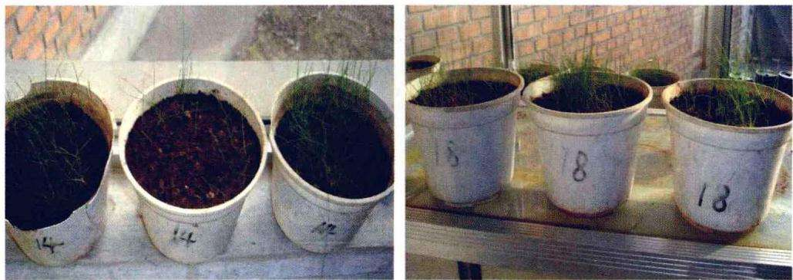  
图 5-2 初期生长状况

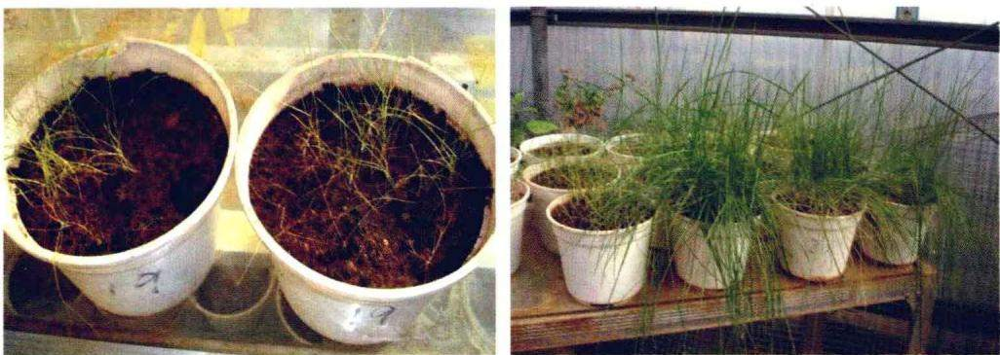  
图 5-3 --年后生长状况

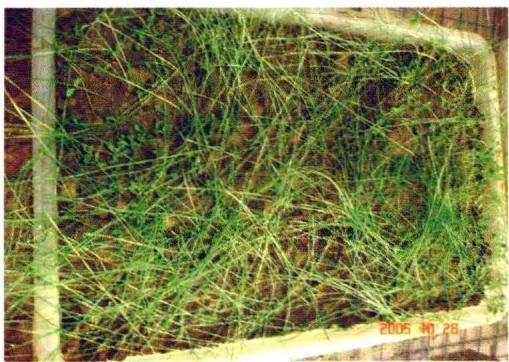  
图5-4 披碱草与豆科相配

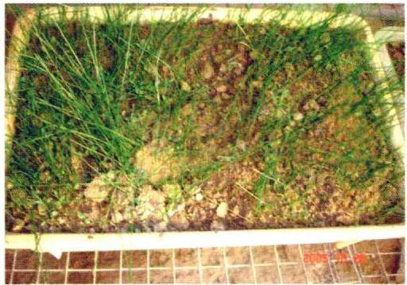  
图5-5 高羊茅与豆科相配

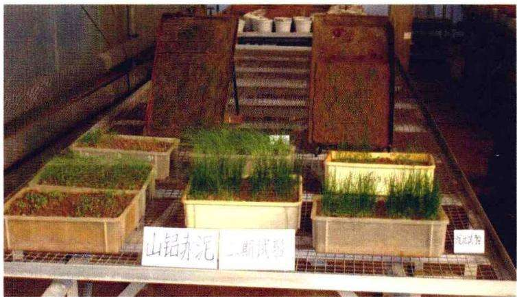  
图5-6 赤泥配比及播种方法试验

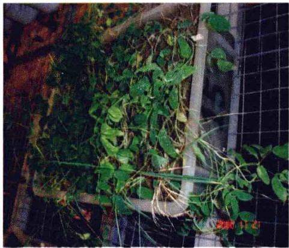  
图5-7 豆科地上部分生长势

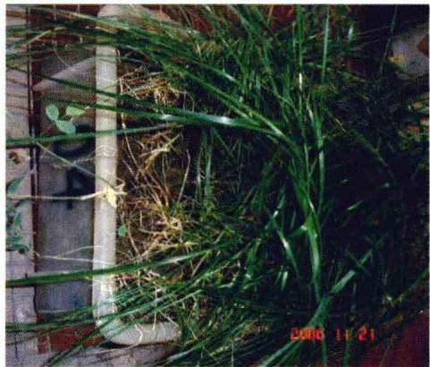  
图5-8 禾本科地上部分生长势

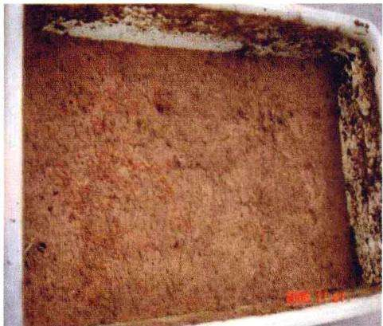  
图5-9 豆科植物根系生长情况

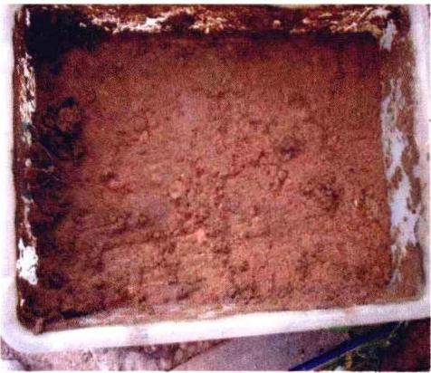  
图5-10 禾本科植物根系生长情况

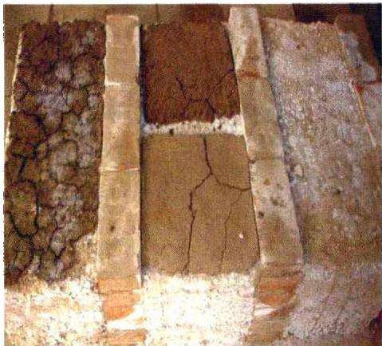  
图 5-11 隔离层试验效果

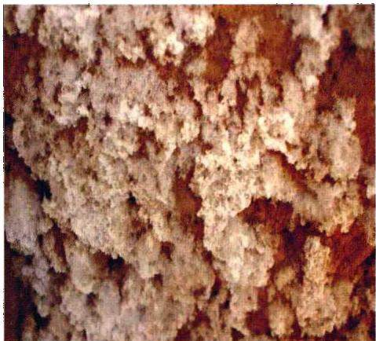  
图 5-12 返碱状态

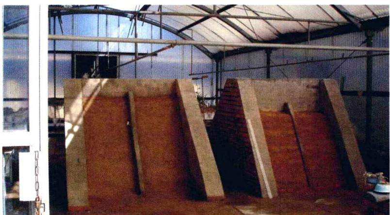  
图5-13 温室内模拟试验现场的赤泥堆坡

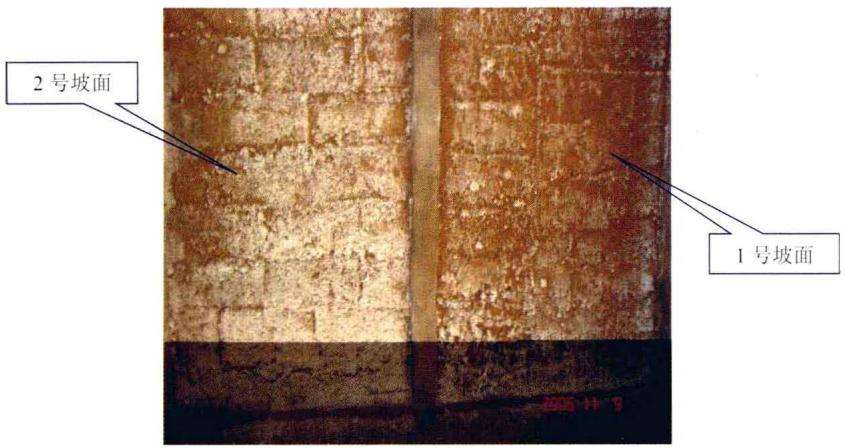  
图 5-14 一星期后返碱现象

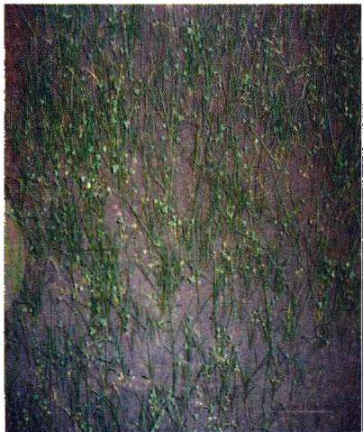  
图 5-15 生长初期

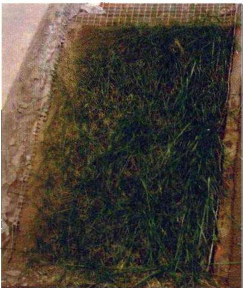  
图 5-16 生长后期

  
图5-17 3号与4号坡试验效果（右为 4号坡）

  
图 5-18 坡面处理后的状况

  
图 5-19 现场施工完成后的框架

  
图 5-20 播种后保护措施图

  
图 5-21 工程复垦阶段完成后状况

  
图 5-22播种后初期的生长情况

  
图 5-23 生长 5 个月后的坡面覆盖情况

  
图 5-24 豆科植物开花时的长势

  
图 5-25 现场扩大试验整体生长情况

  
图 5-26 坡面溶蚀和剥蚀

  
图 5-27 坡面返碱情况


  
图 5-28 坡面侵蚀情况

  
图 5-29 穴播试验失败

  
图 5-30 挖台阶试验不可行

  
图 5-32 土工格室植草护坡初期

  
图 5-33 不成功的土工格室植草护坡

  
图 5-34 土工格室-铺地菊护坡

  
图 5-38 抗滑板固定

  
图 5-39 隔离层铺设

  
图 5-40 回填客土

  
图5-41 植被护坡前的坝外坡面

  
图5-42 植被护坡后的坝外坡面

  
图 5-43 植被护坡前的坝外坡面

  
图 5-44 植被护坡后的坝外坡面

  
图5-45植被护坡前坡脚松散物堆积严重

  
图5-46 植被护坡后的子坝边坡坡脚

  
图 6-3 香根草单株 4 个月生长期长势

  
图6-4 试验区种植区植被生长势

  
图 6-5 植被区生长期4 个月长势

  
图 6-7 VR 生长期 4 个月根系发育状况

  
图 6-8 试验区各品种种植方式

  
图6-9 种植试验区发芽状况

  
图6-10 等高线种植及高秆植物与一般草品种

  
图 6-11 植被护坡效果

  
图6-12 对照试验区发生沟蚀、面蚀

  
图6-13 粗砂区植被品种适生性及其覆盖度

  
图 6-14 作为先锋植物禾本科 GF一年后单株分蘖及其长势

  
图6-17 一年后豆科SH植株长势及株高(黑色茎秆为上一年植株高度)

  
图 6-18 豆科植株 Z生长2 季后的覆盖

  
图6-19禾本科不同生长期的植株根系发育(自左至右依次为2、3、4个生长季根系)

  
图 6-20 BSY 3 季生长植株及根系分布

  
图 6-21 豆科植株 SH根系发育(2 个生长季)

  
图6-22 ZSY 生长一年半根系发育状况

  
图6-23 禾本科根系发育及控制土层直径

  
图6-24 毛家湾尾矿库种植试验场

  
图6-25 尾砂与土壤混合种植花生长势

  
图6-26 尾砂与土壤混合种植花生籽粒和根系

  
图6-27 尾砂与土壤混合种植高梁长势

  
图6-28 复垦区第二年冬小麦长势

  
图 6-30 复垦前现状图


  
图 6-31 复垦施工图


  
图6-32 复垦前期局部效果图


图 6-33 复垦中期局部效果图  


  
图6-34 复垦后期整体效果图

  
图 6-35 复垦后期局部效果图

  
图 6-37 尾矿库粉尘污染状况

  
图 6-38 复垦前

  
图 6-39 复垦后（2000 年）

  
图 6-40 复垦后（2001 年）

  
图 6-41 复垦后（2002 年）

  
图 6-42 复垦后（2003 年）

  
图6-43小学生春游在尾矿库植被区

  
图6-44 昆虫等部分小动物回迁尾矿库调查


  
图7-9 边坡局部立地结构示意图

  
图7-10 施工坡面分区图


图7-11 隔离层铺设示意图  


  
图 7-12 生态棒铺设示意图

  
图7-13 坡面施工结束后效果图


  
图7-14 施工结束后2 天坡面出苗状况


  
图7-15 施工结束后20 天坡面出苗状况


  
图7-16 施工结束后 60 天坡面出苗状况


  
图7-17 施工结束后 90 天坡面出苗状况

  
图8-5 垂直绿化效果图

  
图 8-12 生态截水沟效果图

  
图 8-13 复绿前边坡全景图（C类型采石废弃地）

  
图8-14 复绿后边坡全景图（C类型采石废弃地）


  
图8-15 边坡局部效果图（C类型采石废弃地）

  
图8-17 复绿前边坡全景图（D类型采石废弃地）

  
图8-18 复绿后边坡全景图（D类型采石废弃地）


  
图 8-19 边坡局部效果图（D 类型采石废弃地）


  
图 8-21 生态挡墙施工效果图

  
图 8-22 原始破面图


  
图 8-23 破面局部图


  
图 8-24 人造流水景观

  
图 8-25 自然流水景观

  
图 8-26 人造雾喷景观

  
图 8-27 施工 3 年后的破面远景图


  
图 8-28 施工 3 年后的破面局部效果

  
图 8-29 现状图

  
图 8-30 设计效果图

  
图 8-31 施工后 1 个月

  
图 8-32 施工后 2 个月

  
图 8-33 施工后 1 年

  
图 8-34 施工后 2 年
