# 参考_王家臣_露天矿边坡工程

<!-- 由 MinerU 分片产物合并生成；共 3/3 片；源目录：md文件/参考_王家臣_露天矿边坡工程/ -->


<!-- ===== 分片 p1-200（200页，源：参考_王家臣_露天矿边坡工程（1-200页））===== -->

# 露天矿边坡工程

王家臣孙书伟著

## 露天矿边坡工程


定价：228.00元

# 国家科学技术学术著作出版基金资助出版

# 露天矿边坡工程

王家臣孙书伟著

科学出版社

北京

## 内容简介

本书针对露天矿边坡工程研究需要，结合作者多年研究经验，系统介绍露天矿边坡工程研究的总体思路、研究方法、基础理论和知识，以及一些工程实践和露天矿边坡研究新进展。主要内容包括露天矿边坡工程特点、露天矿典型滑坡实例、岩体力学基础知识、岩体结构面调查与统计分析、边坡二维与三维极限平衡分析方法、极限平衡分析方法对比、边坡可靠性分析基础、边坡数值分析、露天矿边坡加固、排土场主要破坏模式与稳定分析，以及露天矿边坡监测等。

本书可供从事采矿工程、岩土工程、工程地质、交通运输等方面的工程技术人员及相关专业师生参考和使用，也可作为高等院校相关专业的高年级硕士生、博士生的教学用书。

图书在版编目(CIP)数据

露天矿边坡工程/王家臣，孙书伟著.—北京：科学出版社，2016.2

ISBN 978-7-03-046064-6

I.①露…Ⅱ.①王…②孙…Ⅲ.①露天矿边坡—道路工程IV.①U416.1

中国版本图书馆CIP数据核字(2015)第249608号

责任编辑：李雪/责任校对：郭瑞芝

责任印制：张倩/封面设计：耕者设计工作室

科学出版社出版

北京东黄城根北街16号

邮政编码：100717

http://www. sciencep.com

北京市通州皇家印刷厂印刷

科学出版社发行 各地新华书店经销

\*

2016年2月第一版开本：787×10921/16

2016年2月第一次印刷印张：34

字数：806000

定价：228.00元

（如有印装质量问题，我社负责调换)

## 序 一

露天矿边坡是露天矿开采过程中涉及的重要岩石力学问题，世界最大的边坡高度达千余米，我国最大的露天矿边坡高度也有500多米，随着开采继续进行，露天矿边坡高度还会加大，国内外许多露天矿由于边坡失稳造成了重大经济损失，甚至人员伤亡，因此合理设计和形成露天矿边坡是十分重要的科学与工程问题。

露天矿边坡首先是一个岩石力学问题，因此对其稳定分析需要遵循岩石力学的基本原理，研究边坡岩体的基本力学性质、结构面分布、影响边坡稳定因素等，在此基础上对边坡稳定性进行科学的计算与分析。其次露天矿边坡也是采矿工程问题，边坡的组成及其结构要满足露天矿采剥工程、开采程序、开拓运输等需要。边坡工程设计要兼顾岩石力学分析和采矿工程需要，因此露天矿边坡不是单纯的岩体稳定问题，它与自然斜坡稳定等问题是显著不同的。《露天矿边坡工程》一书从露天矿边坡特点、研究程序、影响露天矿边坡稳定因素、岩体力学基础、结构面分布、极限平衡分析、可靠性分析、数值计算、边坡加固等方面介绍了露天矿边坡研究的基础理论、方法与进展。书中既有岩石力学的一般知识介绍、边坡稳定分析的常用方法，也有针对露天矿边坡所取得的研究工作成果，深入浅出。相信对从事露天矿边坡及相关方面的科技工作者有参考和借鉴作用，同时也是采矿工程、岩土工程等专业学生一本很好的参考书。王家臣教授多年来一直坚持放顶煤开采和露天矿边坡这两个研究方向，并且进行了深入的研究，坚持和重视现场工作，取得了优秀的学术成果，在此祝贺作者出版此书，并希望此书对于推动露天矿边坡方面的研究起到积极作用。

中国工程院士、四川大学校长分和平

2016年1月

## 序 二

如何分析和设计露天矿边坡一直是露天开采必须解决的重要科学问题，设计和开挖一个既经济、又稳定的边坡是露天矿边坡研究的核心任务。我国的金属矿产是以露天开采为主，国外其他先进的矿业国家无论是煤炭开采还是非煤开采，都是以露天开采为主，因此露天矿边坡问题在国内外都得到重视，尤其是欧美国家在20世纪60～80年代，开展了大量的露天矿边坡研究工作，取得了一些重要的学术成果，如Hoek的RockSlopeEngineering(1974年、1981年出版)、Sarma于1979年提出的边坡稳定计算倾斜分条方法等有力地促进了边坡研究和工程实践的进步。我国的露天矿边坡研究在80～90年代十分活跃，与欧美等国(地区)进行了大量的学术交流，国外一些岩石力学、边坡研究的新成果迅速用于我国边坡工程实践中。边坡研究队伍也迅速壮大，许多院、所、高等院校等都有一支露天矿边坡的研究队伍，极大地促进了我国露天矿边坡理论与技术的进步。但当时由于计算技术、监测技术的限制，许多边坡研究侧重于工程地质调查、理论分析与评价、模拟试验等基础工作。近年来计算技术和无线监测技术发展迅速，露天矿边坡研究除了传统的基础研究以外，数值模拟和工程监测得到了广泛应用，这对于提升边坡的研究水平、滑坡预测预报起到了积极作用。

王家臣教授多年来一直从事露天矿边坡的研究工作，在边坡三维极限平衡分析、可靠性计算、节理岩体边坡、空间随机场等方面都有深入研究，尤其是近些年来与鞍钢矿业集团合作，在金属露天矿硬岩边坡研究方面取得了优秀研究成果，并以此为基础与孙书伟合作，撰写此书，是一件可喜的事情，相信此书的出版会对露天矿边坡工程研究有积极推动作用。

## 前 言

露天矿边坡工程是一门涉及露天采矿、工程地质与水文地质、岩石力学、土力学、爆破工程、露天矿机械等多个领域的综合性工程技术，其研究的目的就是寻求经济开采与安全生产之间的平衡点，在保障开采安全、露天矿边坡整体稳定的前提下，最大限度地提高边坡角，减少剥离量，以期获得最大开采效益。我国是一个矿业大国，也是露天开采大国，是世界上露天矿数量和露天矿产量最多的国家。我国的大型露天矿大多建于或者改扩建于20世纪50～70年代，目前都已进入了深凹露天开采阶段，边坡高大、问题突出。

我国露天矿边坡的系统研究始于新中国成立后。20世纪50～70年代，主要是借鉴苏联的理论与技术;80～90年代，开始借鉴一些欧美国家的理论与技术，边坡研究十分活跃；进入21世纪，以数值模拟、局部加固、利用先进仪器和技术进行监测等为主，边坡研究平稳推进，有效地保障了我国露天矿的安全、高效和经济开采。

露天矿边坡可分为三种类型：一类是金属露天矿硬岩边坡，其特点是以断层、节理等地质结构面控制边坡的破坏类型为主，因此需充分重视工程地质与岩体特性等基础工作。硬岩露天矿爆破作业频繁，靠帮时的合理控制爆破对于维护边坡稳定非常重要，一些结构面控制的局部破坏也可以通过加固工程得到有效解决。另一类是露天矿软岩边坡，该类边坡以软弱岩层控制为主，沿煤层底板等弱层的滑动为主要破坏模式，尤其是有水参与时，即使坡角很小，也会发生滑动(蠕动)。对该类边坡研究应充分重视软弱岩层的力学和水理性质，并从开采设计、开采程序、合理内排上解决边坡的稳定问题。还有一类是露天矿排土场边坡，这类边坡的特点是剥离的散体岩土物料人工堆积在自然山坡或沟谷中，排土场滑动模式大多是下部以沿山坡基岩上的土层为主，上部剪切排弃物料，形成滑动面。本书基本涵盖上述三种边坡类型。

露天矿边坡、露天矿爆破、卡车自动调度系统、钻采运设备是露天矿的四个重要研究方向。随着露天矿逐年延深，边坡问题更加突出。采矿、岩石力学、工程地质等领域都曾开展了一些露天矿边坡的研究工作，也相继出版了一些边坡方面的学术著作，相对而言，专门的露天矿边坡方面的著作较少。从事露天矿边坡研究时，可以借鉴相关方面的著作，有些原理、方法是相通的，但是差别也是显而易见的，如露天矿边坡既要考虑岩体稳定条件，也要考虑露天矿的延深、露天矿的工程布置，以及开采的时间性等，所以才有了撰写本书的想法。

我1982年毕业于鞍山钢铁学院(现辽宁科技大学)采矿工程专业，1984年进入北京钢铁学院(现北京科技大学)攻读采矿工程专业硕士学位研究生，开始系统学习岩石力学和露天矿边坡方面的知识。2000年以后在鞍钢矿业集团的露天矿进行了持续的露天矿边坡工程研究和实践，本书就是根据自己多年的露天矿边坡学习和研究成果，联合孙书伟副教授共同撰写的。孙书伟于2009年获得中国铁道科学研究院岩土工程专业博士学位，2011年清华大学水利系博士后出站，成为我的同事。他主要擅长边坡加固、数值分析等方面的研究工作。全书共分为10章，第1\~5章由我撰写，第6\~10章由孙书伟撰写。本书从实用角度出发，介绍露天矿边坡研究的基本理论和方法，以及所开展的工程研究，希望本书对于从事露天矿边坡及相关工作的科技与管理人员，以及相关专业的研究生有参考价值。由于我们的水平和对知识的理解还有欠缺，有些观点和内容可能会有不当之处，敬请读者与同仁批评指正。书中也包含一些通用知识、他人的研究成果以及我们与合作单位共同完成的科研成果，在此引用，是为了保持书中体系的完整性与可读性，对于引用的成果，已尽可能注明，若有个别遗漏，请谅解，并在此对引用成果的作者表示衷心的感谢。

在本书出版之时，特别感谢我的博士生导师中国矿业大学钱鸣高院士、骆中洲教授，硕士生导师北京科技大学杜竞中教授对我多年的培养；感谢谢和平院士、何满潮院士对本书的指导和对我一贯的支持与鼓励，并为本书作序；感谢鞍钢矿业集团总经理邵安林院士的支持与指导；感谢国家科学技术学术著作出版基金资助。

感谢多年来与我合作的中国矿业大学(北京)陈忠辉教授；鞍钢矿业集团马旭峰部长、邓鹏宏助理、邓克部长、姜科教授、张宝才高工、吴庆深矿长、王海龙高工、张德辉高工等；辽宁科技大学常来山教授、中勘冶金勘察设计研究院王广和副院长、包头稀土研究院杨占峰院长、中国钢铁协会牛京考主任等对我研究工作的支持。

中国矿业大学（北京）

2015年10月

## 目 录

が口  
第1章概论…………………………………………………………………………………1  
1.1 露天矿边坡工程特点…………………………………………………………1  
1.2 露天矿边坡工程研究的意义和内容…………4  
1.3露天矿边坡研究概况……6  
1.4露天矿边坡常见破坏类型………8  
1.5 影响露天矿边坡稳定的因素…………11  
1.5.1 岩石物理力学性质……………………………………11  
1.5.2 岩体结构面……………………………………………………12  
1.5.3 地下水…16  
1. 5,4 原岩应力…………………… 24  
1.5.5 爆破震动……………………………… 28  
1.5.6 边坡几何形状…………………………………………………………………28  
1.6露天矿典型滑坡…………………………………………………32  
1.6.1 海州露天煤矿典型滑坡实例………………………32  
1.6.2 平庄西露天煤矿滑坡实例…………………………33  
1.6.3 义马北露天煤矿滑坡实例及治理…………………………………………34  
1.6.4 大冶铁矿象鼻山北帮边坡变形破坏…………………………35  
1.6.5 金川露天矿上盘西区滑坡倾倒滑移复合破坏……36  
1.6.6本钢南芬露天铁矿边坡破坏实例………37  
1.6.7 露天矿排土场滑坡……………………………………38  
参考文献………………………………………………………………………… 39  
第2章岩体力学基础………………………………………………………41  
2.1 岩石基本物理性质…………………………………………………………………41  
2.1.1 岩石质量指标………………………………………………………………………………41  
2.1.2 岩石孔隙性…………………………………………………………………………………………………42  
2.1.3 岩石水理性质……………………………………………42  
2.2 岩石强度特征…………………………………………………………42  
- 2.2.1 岩石抗压强度………………………………………………………………………43  
2.2.2 岩石抗拉強度……………………………………………45  
2.2.3 岩石抗剪强度……………………………………………………………………46  
2.2.4 岩石点荷载强度…………………………………………………49  
2.3 岩石变形特征………………………………………50  
2.3.1 岩石基本变形特征………………………………………………………51  
2.3.2 岩石流变性…………………………………………………………………………………52  
2.4 岩石强度准则…………………………………………………………………57  
2.4.1 岩石破坏类型…………………………………………………………………57  
2.4.2 莫尔-库仑(Mohr-Coulomb)强度准则…………………………………… 58  
2.4.3 格里菲斯(Griffith)强度准则……………………………62  
2.5 岩体结构面力学特征…………………………………………………64  
2.5.1 结构面的法向变形…………………………………………………………64  
2.5.2 结构面的剪切变形…………………………………………………………………66  
2.5.3 结构面抗剪强度……………………………………………………………………66  
2.6 岩体强度……70  
2. 6.1 岩体强度分析…………………………70  
2.6.2 岩体强度估算…………………………………………………………………………………73  
2.6.3 霍克-布朗(Hoek-Brown)强度准则……………………………………… 76  
2.7 岩体工程分类………82  
2.7.1 岩石质量指标(RQD)分类法………………………………………………82  
2.7.2 岩体质量评价(RMR)分类法 …………………………………………………… 83  
2.7.3 Q 系统分类法……………………………………………………………………………86  
参考文献………………………91  
3 章 结构面调查与分析…………………………………………………92  
3.1 结构面概述……………………………92  
3.1.1 结构面几何特征……………………………………………………………92  
3.1.2 结构面调查…………………………94  
3.2 结构面几何特征参数的统计分析………………………97  
3. 2. 1 间距分布………………………………………………………98  
3.2.2 RQD指标与结构面间距的关系……………………100  
3.2.3 迹长分布………………………………102  
3.2.4 结构面倾向分布 …………………………………………………………105  
3.3 结构面三维网络模拟……………108  
3. 3.1 三维网络模拟基本原理…………………………108  
3.3.2 结构面三维网络模拟实例………………………………109  
3.4 结构面统计方法………………………………………………………117  
3.4.1 结构面玫瑰花图…………………………………………………………117  
3.4.2 赤平极射投影…………………………………………………………………………118  
3.5 结构面极点图…………………………………………………………………122  
3.6边坡稳定分析的图解法……125  
3.6.1 边坡滑动方向分析……………………………………………………………………………125  
3.6.2 边坡稳定的初步判断…………………………………126  
3. 6.3 工程实例………………………………………………………128  
3.7 岩体结构面的三维不接触测量………131  
3.7.1 系统组成…………132  
3.7.2 系统工作基本原理……………… 132  
3.7.3 工程实例………………………………………………………………………134  
参考文献……………………………………………………………………136  
4章 边坡稳定性极限平衡分析……………………138  
4.1 边坡稳定性分析基本原理…………………139  
4. 2 平面滑坡………………………………………………………………………………141  
4.2.1 边坡内有确定结构面情况………………142  
4.2.2 最危险滑面确定 …………………………………………………………………144  
4.2. 3 边坡临界高度……………………………………146  
4.2.4 张裂面的临界深度…………………………………………………………………147  
4.3 追踪结构面滑坡分析…………………………………………………149  
4.3.1 追踪两组结构面滑坡分析………………………………………………………149  
4. 3.2 沿不贯通结构面滑坡分析………………………………………149  
4. 3. 3 双滑面滑坡 ………………………………151  
4.4 楔体滑坡……………155  
4.5 圆弧滑坡……………………………………158  
4.5.1 费勒纽斯法 ………………………158  
4. 5.2 毕绍普简化法 ………………………159  
4.5.3 费辛科法…………164  
4.6 任意曲面滑坡………………………………………………166  
4.6.1 简布法……………………166  
4.6.2 摩根斯坦法 ……………………………170  
4.6.3 萨尔玛法………………………175  
4.7 各种条分法的精度分析……………………………………………181  
4.8 最危险滑面位置的确定……………………………184  
4. 8.1 圆弧滑面………………………………………………………………………………184  
4.8.2 其他形状的滑面…………………………………………………………187  
4.9三维极限平衡计算法…………………………189  
4.9.1 加权平均计算法 ………………………………………………………………190  
4.9.2 不考虑条柱间作用力的三维方法………190  
4.9.3 考虑条柱间作用力的三维方法……193  
4.9.4 三维滑体形态 …… 201  
4.10 露天铁矿边坡稳定性计算实例……………………208  
4.10.1 边坡现状分析与计算剖面确定………208  
4.10.2 边坡破坏模式分析………………………………211  
4.10.3 计算参数的选取………………………………………………………………212  
4.10.4 边坡稳定性计算……………………………………………………………214  
参考文献……………………………………………………………………………………218  
第5章 边坡工程可靠性分析………220  
5.1 边坡工程中的不确定性……220  
5.2边坡工程可靠性分析基本原理……222  
5.3 可靠性分析基础………………………………………………………………224  
5.4 蒙特卡罗法………………………………………………………………226  
5.5 次二阶矩法………………………………………228  
5.5.1 中心点法………………………………………………………………… 229  
5.5.2 验算点法…………………………………………………………………230  
5.6概率矩点估计法…………………………………………………………………233  
5.7 边坡工程可接受的可靠指标………………………237  
5.7.1 最小可靠指标β的确定…………………………………………237  
5.7.2 边坡可接受的可靠指标建议值…………238  
5.8工程实例…… ……………………………………… 238  
5.8.1鞍钢大孤山露天铁矿边坡可靠性研究……238  
5.8.2鞍钢弓长岭露天铁矿独木采区北帮边坡可靠性研究……245  
5.8.3 鞍钢眼前山露天铁矿南帮边坡可靠性研究………247  
5.8.4 义马北露天煤矿边坡的可靠性研究…………248  
参考文献……………………………………252  
第6章 边坡稳定性数值分析…………253  
6.1 岩土数值分析方法……………………………253  
6.2 数值分析的关键问题………………………………255  
6.2.1 边坡模型的概化………………………………………………………255  
6.2.2 结构面的模拟………………………………………………………………………… 256  
6.2.3 单元尺寸的选取……………………………………………………………………257  
6.2.4 初始应力条件 …………………………………………………………257  
6.2.5 边界条件…………………………………………………………262  
6.2.6 地下水…………………………………………………………………………263  
6.3 边坡稳定性的数值分析方法……263  
6.3.1 边坡稳定性的判定标准………………………263  
6.3.2边坡稳定系数的数值求解…………………266  
6.3.3 层状岩体单轴抗压试验模拟…………270  
6. 3.4 顺层滑动破坏………………………………………………………………………………………………………274  
6.3.5 倾倒破坏………………………………………………………………………………………276  
6.4 加固边坡稳定性的数值分析方法………279  
6.4.1 抗滑桩加固边坡稳定性分析 ………………………279  
6.4.2 锚杆加固边坡稳定性分析…………………………………288  
6.4.3柔性桩-锚联合支护边坡稳定性分析………292  
6.5 边坡动力响应数值模拟分析………301  
6.5.1 拟静力法……………………………………………………………………………… 301  
6.5.2 完全非线性分析方法…………………………………………………………………301  
6.6 工程实例…………………………………………………………………………306  
6.6.1 工程地质概况……………………………………………………306  
6.6.2 网格模型………………………………………………………………………………… 307  
6.6.3 分析方法…………………………………………………………………………307  
6.6.4 监测方案……………………………………………………… 307  
6.6.5 计算结果………………………………………………………………………………………310  
参考文献…………………………………………………………………312  
弯7章露天矿边坡监测与预警……………313  
7.1 边坡变形监测………………………………………………313  
7.1.1 监测方法……………………………………………………………………313  
7.1.2 工程实例…………………………………………………………………………………315  
7.2激光微小位移监测……………………………………………………320  
7.3 边坡应力监测…………………………………………………………321  
7.3.1 工作原理………………………………………………………………………… 321  
7.3.2 系统组成………………………………………………………………………………………322  
7.4 边坡红外热像监测…………………………………………………323  
7.4.1 基本原理……………………………………………………………………………………323  
7.4.2 监测设备……………………………………………………………324  
7.4.3 工程实例………………………………………………………………… 325  
7.5 边坡遥感监测………………………………………………………………………………326  
7.6 合成孔径雷达干涉测量…………………327  
7.7 时间域反射测试技术………………………………329  
7.8 声发射监测技术…………………………………………………………………330  
7.9 水的监测…………………………………………………………………………………… 333  
7.10露天矿边坡预警………………………………………………………………………………………334  
7.10.1 露天矿边坡预警的发展…………………………334  
7.10.2 露天矿边坡预警阈值的选取……………………………………335  
7.10.3 露天矿边坡安全等级的划分…………………335  
7.11 露天矿边坡预警系统的构建………………336  
7.12 露天矿边坡的预警实例………………344  
7.12.1监测点设计…………………………345  
7,12.2 监测结果分析……………………………………………………… 346  
参考文献……………………………………………………………………………………347  
第8 章 边坡加固的一般方法………………………………………………………………349  
8.1 露天矿边坡加固工程的特点……………………349  
8.2 露天矿边坡加固技术及原则……350  
8.2.1 常用加固技术 …………350  
8.2.2 露天矿边坡加固原则………………………………………………………353  
8. 3 抗滑桩……………355  
8.3.1 抗滑桩作用原理…………………………………………………………………355  
8.3.2 抗滑桩设计荷载的确定…………………………………………………… 356  
8.3.3 抗滑桩计算方法………………………………………………………………358  
8.3.4 抗滑桩的设计 ……………………………375  
8.4 锚杆(索)………………376  
8.4.1 锚杆(索)作用原理………………………………………………………………376  
8.4.2 锚杆加固边坡稳定性计算……………376  
8.4.3 锚杆加固边坡设计……………………………………………………………… 377  
8.5 注浆……………………………………………………………………………… 378  
8.5.1 注浆作用原理 ……………………………………………………… 378  
8.5.2 渗入性注浆……………………………………………………379  
8.5.3 劈裂注浆………………………………………………………………………381  
8. 5.4 注浆设计………………………………………………………………………… 382  
8.5.5 注浆效果评价…………………………………………………………………………………………384  
参考文献………………………………………………………………………………………386  
第章 露天矿边坡加固新技术…………387  
9.1 分体式全长注浆锚固方法……………387  
9.1.1 临界锚固长度 ………………………………………………………………………… 388  
9.1,2 基本构造…………………………………………………………………… 389  
9.1.3 受力机制………………………………………………………………………………391  
9.1.4 力学模型…………………………………………………………………………………………411  
9.1.5 设计计算方法……………………………………………………………………………… 412  
9.2 预应力硐锚……………………………………………………………………414  
9. 2.1 基本构造…………………………………………………………………414  
9. 2. 2 工程应用………………………………………………………………… 415  
9.3 微型抗滑桩群………………………………………………416  
9.3.1 工程分类…………………………………………………………417  
9.3.2 微型抗滑桩群水平承载力……………………418  
9.3.3 微型抗滑桩受力机制…………………425  
9.3.4 设计计算方法…………………………………440  
9.4 柔性桩-锚索系统…………………………………………………………………………………448  
9.4.1 技术特点………………………………………………………………………… 448  
9.4.2 受力机制…………………………………………………………………………………450  
9.4.3 力学模型…………………………………………………………………………………………475  
9.4.4 设计计算方法………………………………………………………………………477  
参考文献…………………………………………………………………………………………480  
10 章排土场边坡稳定性分析………482  
10.1 排土场边坡的变形破坏模式……483  
10.2 排土场基底岩土体力学特性………483  
10.2.1 基本物理力学指标及试验方法…………484  
10.2.2 含水量随深度变化规律……………………………489  
10.2.3 固结特性分区研究…………………………………………………………………491  
10.3 排土场岩土的材料模型………………………492  
10.3.1 屈服准则…………………………………………………………………………………493  
10. 3. 2 流动法则…………………………………494  
10.3.3 硬化规律……… 495  
10.4 排土场边坡稳定性分析…………495  
10.4.1 分析方法………………………………………………………………………495  
10.4.2 工程实例………………………………………………………………………497  
10.5 排土场边坡可靠性、敏感性分析……501  
10.5.1 排土场边坡可靠性分析………………………………501  
10.5.2 排土场边坡敏感性分析…………………………………………………………502  
10.6 地震稳定性完全非线性动力耦合分析……502  
10.6.1 分析方法…………………… 502  
10.6.2 模型和参数…504  
10. 6. 3 分析结果………… 506  
10.7 排土场边坡变形机理地质力学模型试验………………510  
10.7.1 试验目的……………………………………………………………… 510  
10.7.2 试验原理……………………………………………………………………………………510  
10.7.3 试验工点概况………………………………………………………………………………………511  
10.7.4 模型试验设计…………………………………………………………………………………… 512  
10.7.5 试验方法及量测系统………………………………………………………………514  
10.7.6 试验过程……………………………………………………………515  
10.7.7 试验结果及分析…………………………………………………………516  
参考文献………………………………………………………………………525

## 第1章 概 论

## 1.1 露天矿边坡工程特点

露天开采在固体矿床开采中占有重要的地位。我国铁矿石产量的80%来自露天开采，有色金属矿石50%、化工原料矿石70%、建筑材料100%，煤炭的露天开采产量占15%。美国煤炭露天开采所占比例为60%，澳大利亚为61%，俄罗斯为60%。由于露天开采的安全条件好，资源回收率高、机械化程度高，所以在条件适宜的矿床，首先选择露天开采方法。

随着露天开采的延深，世界各国相继出现了许多高陡的露天矿边坡。目前我国设计的最高露天矿边坡达800余米，已形成的露天矿边坡已达400余米高，200\~300m高的露天矿边坡比比皆是，而且还正在以每年10m左右的速度向下延深。世界上最深的露天矿边坡已高达1000余米，如图1-1\~图1-4所示。

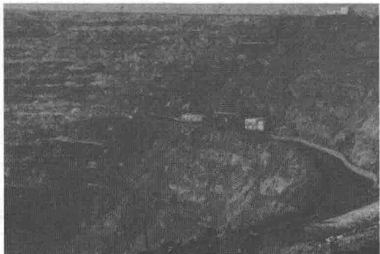  
图1-1 鞍钢大孤山露天铁矿高陡边坡

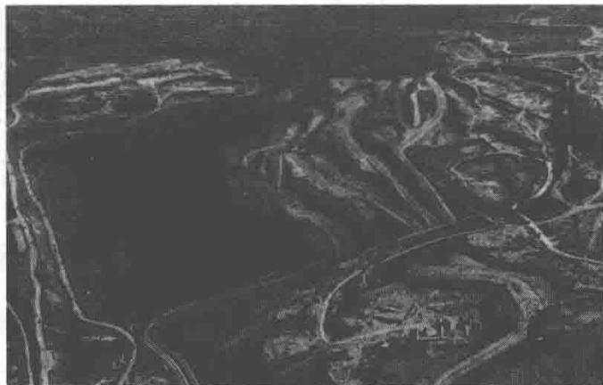

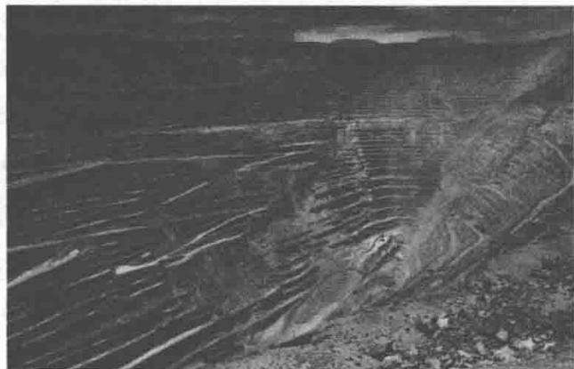  
图1-3 美国宾汉姆露天铜矿采场

图1-2 神华哈尔乌素露天煤矿采场  
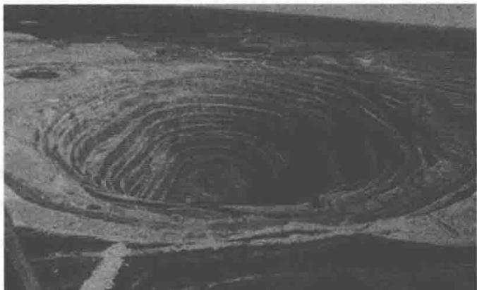  
图1-4 智利楚基卡玛露天矿采场

由于露天矿边坡的高陡，经常发生滑坡等破坏，严重威胁边坡上及下部采矿作业的安全，并造成了巨大经济损失。有些露天矿每年要花费数千万元甚至上亿元的费用用于露天矿边坡的维护与加固治理等，因此露天矿边坡的稳定分析、加固、治理与设计等在露天矿开采中占有极其重要的地位。

露天矿边坡是开采矿石后遗留下来的开采边界，从经济开采角度讲，露天矿边坡的角度越大(越陡)开采效益越好，可以少剥离岩石，减少剥离费用，降低开采成本。但过大的边坡角必然导致边坡滑坡等破坏的风险增大，因此，确定经济合理的边坡角是露天矿边坡设计的核心内容。

如图1-5所示，露天矿边坡是指由露天采场四周的台阶、平台和运输道等构成的倾向采场的岩体。露天矿边坡可以分为两大类，即工作帮边坡和非工作帮边坡。

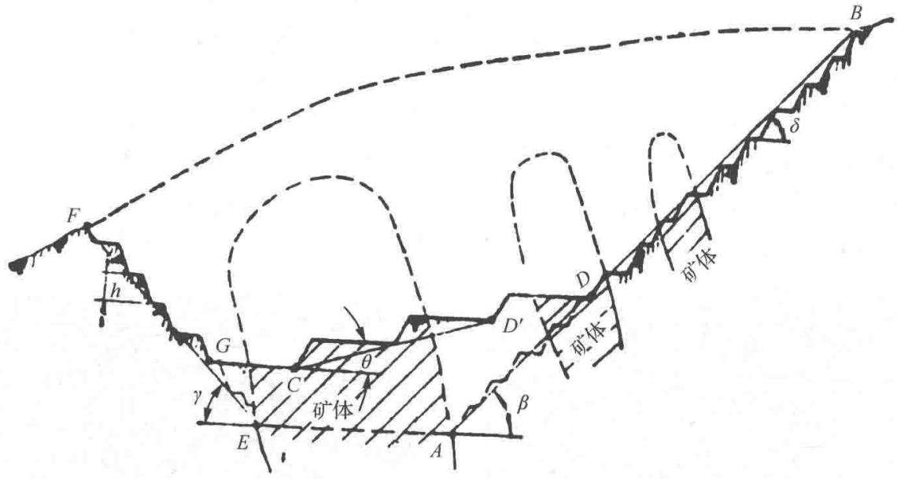  
图1-5 露天矿边坡及构成

工作帮边坡是指正在进行采矿或剥岩作业的边坡，如图1-5中的 $G C D _ { \circ }$ 通过最上部工作台阶坡底线与最下部工作台阶坡底线的假想平面(图1-5中的 $C D ^ { \prime } )$ 与水平面的夹角θ称为工作帮坡角。工作帮坡角的大小取决于采矿条件。工作帮边坡由于坡角较小，且属于临时边坡，所以一般不存在边坡稳定问题。

非工作帮边坡是指由露天矿境界台阶(永久台阶)组成的不进行采矿或剥岩作业的边坡，如图1-5中的FG和BD两部分，其中h称为台阶高度 $_ { \circ } B$ 和F是最上一个永久台阶的坡顶，而D和G是下部永久台阶的坡底。通过D和B以及G和 $F$ 的假想平面与水平面的夹角称为非工作帮边坡角。非工作帮边坡上有许多台阶，这些台阶是采矿作业和维持边坡稳定所必需的。各种台阶的几何尺寸取决于采矿工艺、采矿设备规格、穿孔爆破方法以及整体边坡和台阶边坡稳定的要求。一般而言，台阶高度为 $1 0 { \sim } 1 5 \mathrm { m }$ ，但实施最终边坡台阶并段时，即将2个或3个正常台阶在靠帮时合并成一个大台阶，则台阶高度可为20～$4 0 \mathrm { m }$ 。台阶坡面角δ为 $6 0 ^ { \circ } \sim 6 5 ^ { \circ }$ ，台阶宽度根据功能不同，差异较大，如安全平台宽度一般为 $3 \mathrm { \sim } 5 \mathrm { m }$ ，清扫平台宽为 $7 { \sim } 1 0 \mathrm { m }$ ，运输平台宽为 $1 0 { \sim } 1 5 \mathrm { m }$ 0

随着露天开采的进行，露天矿采场必然逐渐延深，最终达到露天矿的设计境界FEAB。FEAB也称露天矿最终境界，FE和BA称为露天 $\textcircled { 1 } ^ { 2 }$ 最终边坡，其边坡角称为露

天矿最终边坡角，如图1-5中的γ和 $\beta _ { \pmb { \mathscr { n } } }$

根据边坡与矿体的位置关系，将位于矿体下盘一侧的边坡称为下盘边坡，位于矿体上盘一侧的边坡称为上盘边坡，位于矿体两端的边坡称为端帮边坡。对于一些近水平矿体，如露天煤矿，边坡往往是一次开挖到煤层，然后采矿工作线以水平方向推进为主，此时采场四周边坡呈现出逐渐开挖形成，采煤过后的边坡逐渐废弃的特点。

露天矿边坡即是露天开采的边界，同时也是露天开采作业的对象，还担负着提供下部矿石、岩石运输的通道作用，因此与其他岩土边坡相比，具有如下特点。

## 1）露天矿边坡的形成是一动态开挖过程

露天矿边坡是随着采矿工程的延深而逐渐形成的。我国一般的露天矿年下降速度为8\~15m，因此边坡的增高速度为8\~15m/a，在露天矿开采初期，由于边坡高度较小，因此边坡问题并不突出，但对于有些矿山，由于岩层赋存条件、岩体结构等因素，即使是较小的边坡也会时常发生一些局部破坏，因此，有些露天矿山自从开采初期就遇到了边坡失稳问题，一直持续在露天开采的整个过程。这多常见于露天煤矿、边坡岩体中存在顺层结构面的边坡。

一个中型以上的露天矿山，其开采的服务年限一般都在20年以上，而且大部分大型露天矿山的服务年限都在50年以上，这样一个露天矿山边坡的形成就要经历数十年，甚至上百年，一旦整个最终边坡按开采设计形成以后，矿山开采亦废止，边坡也就完成了它的服务功能，随即报废。由于形成过程的时间持续性，整个边坡的服务时间有很大差异，上部边坡的服务时间长，下部边坡的服务时间短；在露天煤矿，对于一些近水平的煤层，广泛采用在开采后的采场内排弃剥离岩土的内排工艺，这使得边坡不同区段的服务年限也有所不同等，因此露天矿边坡与其他行业的岩土边坡有很大差异。一般行业是在边坡形成后才开始投入使用，发挥其功能，如公路、铁路的路堑或路堤边坡、码头岸坡等，均是在完工以后开始服务。露天矿边坡这种形成的渐进性以及服务的动态性是其自身的主要特点之一，即在边坡形成过程中就是边坡服务的过程，一旦最终边坡形成，边坡就完成了服务的任务。

## 2）边坡工程地质条件的不可选择性

露天矿边坡是露天矿场的边界，它的形成只能根据矿体赋存位置和条件、相关的国家矿产需求状况、相关行业的经济水平、开采的技术条件等进行设计和开挖，尤其是边坡的形成位置不具有可选择性，只能是在开采的矿体周围形成，即边坡的工程地质条件、水文地质条件、岩层条件等不具有选择性，无法避开不良的工程地质区域，无法从根本上调整边坡的方位，这与其他行业的岩土边坡有本质差异。因为其他行业岩土边坡的选址并不是唯一的，同时边坡的方位可以适当调整，甚至通过合理设计，避开不良的工程地质区域等。露天矿边坡选址的唯一性，就给边坡设计、稳定维护等带来了许多困难。

## 3）边坡高大且受到日常爆破震动的影响

露天矿边坡是目前各类人工形成的岩土边坡中高度最大的，一般都在百米以上，且已形成千余米高的边坡。为了追求最大的开采效益，我国有些矿山边坡设计高度达800余米，走向长达6\~7km，因而露天矿边坡揭露的岩层多，边坡各部分地质条件差异大，变化复杂，边坡陡立，一般的金属矿最终边坡角都在 $4 0 ^ { \circ } \sim 5 0 ^ { \circ }$ ，甚至更大，这种高大陡立的岩体边坡，对下部安全开采形成了一定威胁。同时采矿的日常生产爆破作业、靠帮爆破作业等也影响到了边坡的稳定。目前，我国矿山一次生产爆破的炸药量均在数十吨，有的甚至近百吨，尽管广泛采用微差爆破等控制爆破作业技术，但对边坡形成的震动影响仍然是巨大的，导致边坡表面岩体进一步破碎，爆破震动诱发边坡滑动、坡面岩石滚落、台阶局部崩塌等。由于露天矿边坡服务的时间性，服务年限就是露天矿开采的寿命，所以在边坡日常维护方面投入费用较少，边坡形成过程中的工程质量控制也不尽一致，有些矿山采用了预裂、光面等靠帮控制爆破技术，但有一些矿山靠帮中没有很好地采用控制爆破技术，致使爆破对边坡岩体的破坏十分严重，边坡表面岩体破碎，且不加防护，风化严重。

## 4）边坡的破坏类型与矿产种类密切相关

露天矿边坡变形破坏的主要类型是滑动破坏，即通常讲的滑坡。滑坡的类型与矿产资源的种类有很大的关系，如对于煤矿而言，滑坡主要是沿层面、软弱夹层，其次是沿断层、节理发生。滑动面下部还往往切断岩层。沿层面、软弱夹层、断层的滑动面较明显，而沿节理与切断岩层部分的滑动面则不明显。对于金属矿而言，矿体及围岩的形成年代久远，岩体坚硬，没有明显的软弱岩层，但矿床往往经历了多次地质构造，因此岩体中节理、断层、破碎带较发育，滑坡常沿断层、破碎带和节理面发生。

露天矿边坡的上述工程特点导致边坡研究、设计、施工、维护等工作更加困难，同时也是采矿界与岩石力学界、工程地质界等关注的重要课题。我国自20世纪50年代就开始了露天矿边坡的研究，在80年代，露天矿边坡的研究工作达到了高潮，全国各主要露天铁矿、铜矿、煤矿、金矿、镍矿等都进行了较系统的边坡研究工作，而且目前仍在继续研究。对于一些危险边坡进行了加固处理与整治，如采用大型抗滑桩、工程排水疏干、锚杆、锚索、护坡等措施，收到了良好的效果，这些研究与治理工作对于后期矿山安全开采具有重要意义。

## 1.2 露天矿边坡工程研究的意义和内容

露天矿边坡的稳定性主要取决于边坡岩体的工程地质和水文地质条件，以及露天矿开挖过程。在工程地质和水文地质条件确定的条件下，边坡的稳定性主要取决于边坡角大小和边坡高度，同时也受采矿作业，如爆破作业、开采程序等影响。后面将详细介绍对影响边坡稳定的具体因素。理论和实践都告诉我们，提高边坡稳定性的重要而有效的方法之一就是减缓边坡角。但是减缓边坡角必然会增大围岩的剥离量，从而降低露天采矿的经济效益。有人计算过，露天矿在容许边坡角的范围内，边坡角每减缓 $1 0 ^ { \circ }$ ，露天矿的剥离总量几乎增加一倍。如果使大型露天矿山的总体边坡角变化1°，则会使剥岩量的变化达几千万吨。例如，大孤山露天矿的总体边坡角每减缓1°，剥岩量增加2000万t。又如，我国某大型铜矿，按国外设计计算，边坡角每加陡1°，可节约剥离岩石费用高达3300万美元。

从减少剥岩量和降低开采成本等经济方面来看，边坡角应尽量陡些，而从生产安全方面来看，边坡角应尽量缓些。研究露天矿边坡稳定的意义就是确定边坡的合理边坡角，以保证露天开采生产既经济又安全，合理的边坡角是经济上和安全上的最优边坡角，应使剥

离费和边坡维护费之和最少。

露天矿边坡稳定性研究的内容，概括地说，就是根据边坡岩体的工程地质和水文地质条件，在尽量保证边坡稳定的前提下，考虑靠帮控制爆破作业、人工加固和排水疏干等稳定边坡的措施，根据岩体力学理论对边坡工程进行稳定性分析，从而确定合理的边坡角与边坡组成结构，同时还要考虑在矿山生产期间对边坡的监测措施。具体地讲，露天矿边坡稳定性研究工作的内容主要包括下列六个方面。

(1）露天矿边坡岩体工程地质和水文地质调查。调查的目的在于查明影响边坡稳定性的工程地质和水文地质条件，主要是查明矿区岩层分布、岩性分布、地质构造和地下水特征及其对边坡稳定性的影响。这方面研究的工作内容包括:收集已有的地质资料；对天然露天和采场揭露的岩体进行工程地质测绘；查明边坡岩体中大、小地质构造，如断层、冲刷带、各种接触面、蚀变带、节理等及其分布规律；对深部岩体进行必要的勘探工程，查明深部对边坡稳定可能起控制作用的断层等构造；进行抽水实验或地下水压的观测等，确定边坡体内的地下水分布及地面水系分布以及边坡岩体的渗透水情况等。该研究工作是边坡稳定性研究的基础工作和先行工作。

（2）确定边坡可能的破坏模式。根据对边坡岩层、岩性、地质构造等的调查、分析，通常要对露天矿四周边坡进行工程地质分区，将岩性、构造、结构面分布、边坡重要性等大体一类边坡划归为同一区域，对边坡进行工程地质分区。通过对各边坡分区内边坡岩体进行进一步的工程地质、水文地质调查与分析，确定各边坡分区的边坡岩体可能的破坏模式，如平面滑坡、楔体滑坡、圆弧滑坡、折面滑坡、沿弱层滑坡、追踪节理滑坡等。

(3)岩体力学性质和震动参数的测试与分析。探求边坡岩体的应力-应变关系和破坏规律，测定边坡稳定性计算需要的岩体各种力学、物理、水文、水理、化学等参数和爆破作业震动参数，特别是一些控制边坡破坏模式的地质结构面的强度和变形参数。进行系统的分析和实验，确定岩体的各种强度参数，将岩石试件的强度参数折减成岩体的强度参数。为此，需要在实验室和现场进行结构面的剪切实验、岩石的常规力学实验和爆破震动测试等。

(4)边坡稳定性计算和分析。进行露天矿边坡各个工程地质分区内典型剖面的边坡稳定计算，提出各分区边坡经济合理、安全可靠的边坡参数和结构，给出合理的边坡角和边坡形状，这是边坡稳定性研究的核心问题，也是露天矿边坡设计的中心环节。在进行边坡稳定计算时，要充分研究边坡的破坏模式、岩体强度参数选取、地下水与地面水的作用、爆破震动作用、边坡表面的卸荷损伤等，确保稳定计算结果真实可信。目前常用的边坡稳定计算方法是极限平衡法，如毕绍普法、简布法、萨尔玛法和三维楔体计算法等，也可以采用有限元等数值计算方法和考虑边坡岩体参数概率分布的可靠性计算法等1]。

(5）边坡治理。对稳定性差的局部边坡区域，要采取人工加固等稳定措施，如边坡体内部疏干排水、地面水截流防止进入边坡体、抗滑桩加固、锚杆锚索加固、挡土墙加固、钢筋网护坡等，确保边坡稳定与安全。根据不同边坡区域的重要程度不同，如运输帮边坡的稳定性要求要高些，边坡加固、治理的标准也有所差别。

（6）边坡监测与预警。根据确保露天开采边坡安全的需要，尤其是近年来，都尽可能地提高了露天矿边坡角度，导致边坡失稳隐患增多，各大型露天矿都需要建立边坡监测系统、边坡失稳的预测与预报，以及边坡预警，如采用无人机、GPS、雷达、红外等边坡预警系统。建立边坡监测预警系统中，主要是要确定边坡预警与预报的标准和建立精确监测系统，如采用边坡表面位移速度或加速度、边坡体内特征点的应力增量等作为预警参数等。

## 1.3露天矿边坡研究概况

岩土边坡稳定性研究工作，最早始于土体边坡。20世纪20年代瑞典的费勒纽斯(Fellenius)、美国的太沙基(Terzaghi)和泰勒(Taylor)等在他们的经典土力学著作中都进行了土体边坡稳定性分析和计算。早期的岩土边坡稳定研究是伴随着铁路修筑、山体稳定和建筑开挖等逐步兴起的。真正意义上大规模开展岩体边坡稳定性研究工作是始于20世纪50年代末期，这主要是随着第二次世界大战结束，各国开始了大规模经济建设，需要开挖大量金属矿石、煤炭等资源，以及兴建水电站等设施，逐步形成了巨大的露天矿坑、坝体、岸坡等，这就迫切需要研究岩体边坡稳定及进行大规模的岩体边坡工程设计，从而极大地促进了岩体边坡工程研究。

苏联、加拿大、美国、英国、澳大利亚等在20世纪50年代开始都进行了露天矿边坡稳定的系统研究。苏联全苏矿山测量科学研究院的费辛柯于1965年编写了《露天矿边坡和排土场稳定性》一书，总结了1950\~1964年苏联12个煤矿和36个金属矿的边坡研究工作。这是一本早期的露天矿边坡稳定性研究专著。1969年和1974年费辛柯及其所在的研究院又出版了边坡加固、用相似模拟试验方法研究边坡应力和排土场稳定性方面的专著[2]。

露天矿边坡工程问题，作为一门独立的科学和技术研究对象，是近50年来在国内外得到迅速发展的。其研究范围极其广泛，包括岩体工程地质和水文地质勘测、岩体结构分析、岩体物理力学性质测定、边坡稳定性分析和计算以及边坡治理和监测等各个方面，汇集了大量的采矿工程、工程地质、岩石力学以及数学、力学等各个专业的人员，逐渐形成了独立的综合性研究队伍，对露天矿边坡开展了大规模的系统研究工作。例如，英国帝国理工学院E.Hoek教授领导下的专门研究人员，在国外十几家矿业公司的支助下，于1968\~1972年对露天矿边坡进行了系统研究工作，并于1974年将其研究成果整理成为专著《岩石边坡工程》(Rock SlopeEngineering)，后于1977年和1981年进行了修改再版，并于1991年、1994年(两次)、1996年、1997年、1999年、2001年多次重印，已经成为世界范围内边坡工程研究的经典著作，2004年，Duncan和Christopher对该书进行了重新修订出版。又如，加拿大矿物与能源部技术中心于1972～1977年组织了庞大的技术力量，系统地总结了露天矿边坡研究的技术经验和资料，于1977年出版了内容全面和丰富的《露天矿边坡手册》(PitSlope Manual)。

20世纪70年代以来国际性边坡研究专业会议相继召开，如1970年、1971年及1981年三次在加拿大的温哥华召开国际性露天矿边坡研讨会，1970年在南非召开了露天采矿设计会议，会议中出现了相当数量的有关露天矿边坡研究的论文。

经过50年的研究与实践，国外露天矿边坡研究工作在理论上和实践上都取得了很大进展，基础理论和研究手段也相对成熟。同时随着发达国家矿产资源的开发规模日趋萎缩，到20世纪90年代初，国外露天矿边坡工程的大规模理论研究趋于结束，而转向更加重视实用技术开发，如编制边坡计算方法的商用软件、结合现代科技进步开发边坡预警技术与装备、边坡加固与治理技术等。

我国露天矿边坡研究工作也是伴随煤炭、金属等矿产资源露天开采而兴起的，随着露天开采深度逐年增加，边坡研究的难度也逐渐增大，遇到的问题也有所不同。早期的研究工作主要是借鉴苏联成果，到了20世纪80年代，开始更多地引用欧美的理论和技术，丰富了我国露天矿边坡的研究思路和手段。我国的露天矿边坡研究大体上可以划分为以下四个阶段。

（1）20世纪50年代，边坡研究工作主要集中于露天煤矿。由于煤矿岩层赋存的特殊性，在露天开采初期，就经常性地形成沿弱层面的滑坡。1955年以后抚顺西露天煤矿、阜新海州露天煤矿和内蒙古平庄西露天煤矿等先后建立了专门的边坡研究与治理机构和实验室，煤炭科学研究总院沈阳研究院建立了边坡研究的专业队伍，北京矿业学院(现中国矿业大学(北京))等单位也都开展了大量的露天煤矿边坡研究工作，并取得了一批研究成果。

（2）20世纪60～70年代，金属露天矿边坡研究得以重视。在露天煤矿边坡继续研究的同时，金属矿边坡研究得以重视。以大冶铁矿露天矿边坡的系统研究为起点，为数不多的金属露天矿相继开展边坡研究工作，如金川镍矿、白银铜矿和攀钢兰尖铁矿等。

（3）20世纪70～90年代，是我国露天矿边坡研究的大发展时期。70年代末以来，我国的一些露天矿相继转入深部露天开采，边坡的高度逐年增大。由于边坡设计不合理，加上边坡管理存在问题，导致一些矿山不断发生不同规模的滑坡，不同程度地威胁着矿山生产。另外，大部分露天矿要进行改扩建，这些都要求对露天矿边坡稳定性作出比较确切的评价，并提出相应的边坡结构和治理措施，这是该阶段发展的历史背景。此时国家开放，客观上为我国引进西方国家的先进技术提供了便利，我国开始注意吸收西方国家边坡研究的理论和成果、经验，陆续翻译和出版了大批国外边坡研究专题论文和专著，如《岩石边坡工程》和《边坡工程手册》等，派人出国考察和邀请国外专家讲学，邀请国外专家参与我国某些矿山的边坡设计。与此同时，我国独具特色的岩体工程地质力学和岩体力学得到相应的发展，逐渐形成了具有我国特点的边坡研究理论和方法。在这一阶段，有关科研、高等学校和设计部门会同矿山一起先后对抚顺西露天煤矿、海州露天煤矿、义马北露天煤矿、大冶铁矿、攀钢石灰石矿、白银铜矿、金川镍矿、海南铁矿、大孤山铁矿、南芬铁矿和盘石镍矿等矿山进行了系统的边坡稳定性研究工作，取得了一批可喜的研究成果。

(4)20世纪90年代至今，露天矿边坡研究面临许多新问题。在经历了20世纪80年代露天矿边坡研究的一轮高潮期后，露天矿边坡研究似乎经历了90年代的平和期，这10年也是各露天矿在应用前期的研究成果，但是进入21世纪后，各露天矿又面临一些新的难题，为了满足国家经济发展的需要，无论露天煤矿还是非露天煤矿，生产能力迅速提升，露天矿扩建，边坡更加高大，边坡失稳现象频繁。深凹露天煤矿面临露天开采资源枯竭、开采边帮煤炭、形成露井联采等；一些金属露天矿面临露天转地下开采、边帮上建地下开采工业场地、露天与地下相互干扰等；一些新建的露天煤矿地质条件差、岩层软、亲水、存在多组致滑弱层等，如位于内蒙古锡林浩特市胜利煤田的几大露天煤矿下盘边坡普遍存在多组弱层与断层的不利影响，给边坡安全和维护带来了极大困难。

这一阶段的边坡研究工作就是结合面临的新问题开展了细致有效的研究工作，如中国矿业大学(北京)与鞍钢集团鞍山矿业公司等合作，对鞍钢6矿7坑边坡、排土场边坡进行了系统研究，在节理岩体边坡、可靠性分析、概率损伤等方面取得了重要进展。北京科技大学对首钢矿业公司主要露天矿边坡的研究，辽宁工程技术大学、中国矿业大学等都开展了有成效的露天煤矿边坡研究工作。与国外相关研究类似，在进行理论研究、针对性研究的同时，在边坡监测、治理等方面也取得了重要进展，如引进国外的GPS、扫描雷达等技术进行边坡变形监测等。

## 1.4 露天矿边坡常见破坏类型

露天矿边坡的开挖主要是在岩体中进行的，在地表很可能通过一定厚度的表土，一般在0\~100m。由于露天矿边坡开挖，使原来位于地壳内部的岩体暴露出来，破坏了边坡岩体内部的初始应力平衡。边坡表面临空岩体在自重和次生应力场作用下，必然会向临空方向移动。当边坡岩体具有足够的强度时，这种移动的位移量较小，在工程允许的范围内，边坡整体处于稳定状态。当边坡岩体强度低，或岩体中有倾向临空的地质结构面，或岩体的弹性模量小，易于产生大变形，或岩体的蠕变严重等，边坡将发生滑动或工程上不能容忍的变形量，这种滑动、变形量过大等统称为边坡破坏。一般而言，边坡变形往往是边坡破坏的前兆，即边坡变形的积累达到一定程度，将导致边坡失稳破坏。但在一定条件下对发生较大变形的边坡进行整治，则不会导致破坏。

露天矿边坡破坏按其发生的形态主要分为塌落、滑坡和倾倒等。

## 1. 塌落

塌落是指台阶上部岩体因在风化、生产爆破震动、运输机械震动等作用下脱离母体，下落堆积坡脚的现象，有时还伴有岩石的翻滚和破碎，如图1-6所示。塌落会破坏台阶原有设计形状，减小台阶上部宽度，台阶无法满足运输、清扫等需要，中断运输线路，增加清扫费用等，严重的塌落也会改变整个边坡的形状，导致边坡角减小等。

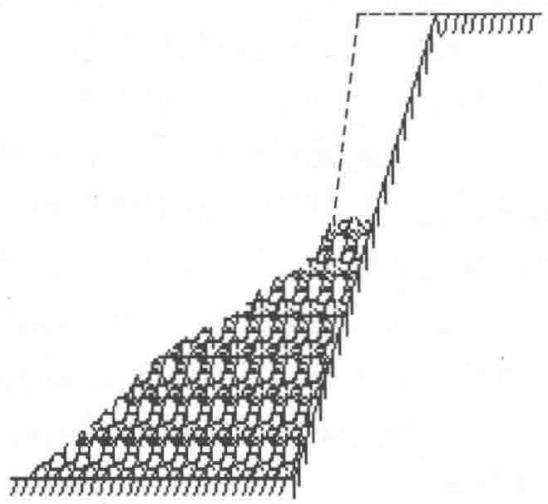  
图1-6 边坡岩体塌落

## 2. 滑坡

滑坡是指边坡岩体在自重或其他外部荷载作用下，在较大范围内沿某一平面或曲面整体向下移动的现象。这一平面或曲面称为滑面，整体向下移动的岩体称为滑体。其破坏机理是由于滑面上的剪力大于抗剪强度所致。一般滑体的生成至整个滑动的时间较长，滑坡初期表现为滑体整体的蠕动变形，最后突然滑落，通常滑体解体。这一过程从数日至数年不等。有些滑坡前具有明显的变形特征，有些滑坡前则变形量较小，滑动迹象不明显。按滑面形状又将滑坡分为平面滑坡、圆弧滑坡和楔体滑坡等。

(1)平面滑坡。如图1-7(a)和图1-8(a)所示，当地质结构面的走向平行边坡坡面，倾向和边坡坡面一致，其倾角小于边坡角而大于摩擦角时，边坡岩体易于发生沿结构面的平面型滑坡。

(2)圆弧滑坡。如图1-7(b)和图1-8(b)所示，滑动面为圆弧形，当岩土非常软弱(土体)，或者边坡岩体的裂隙发育，或者岩体已经破碎(废石堆)时，边坡易于发生圆弧滑坡。圆弧滑面是指垂直于坡肩方向断面上的滑动面呈圆弧形状。

(3)楔体滑坡。如图1-7(c)和图1-8(c)所示，当两个结构面斜交边坡坡面，其交线在边坡坡面出露时，如果此交线的倾角大于结构面的摩擦角而小于边坡角时，则容易发生楔体滑坡。坚硬岩体中的露天矿台阶很多是这种形式破坏的。

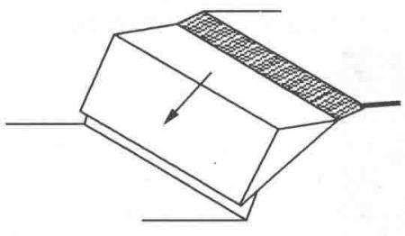  
(a) 平面滑坡

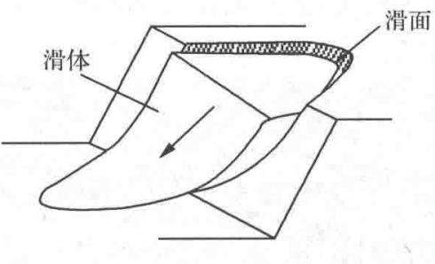  
(b) 圆弧滑坡

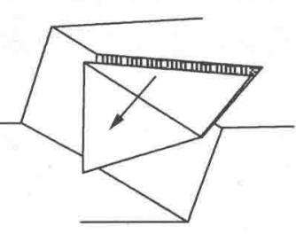  
(c) 楔体滑坡

图1-7 常见滑坡类型  
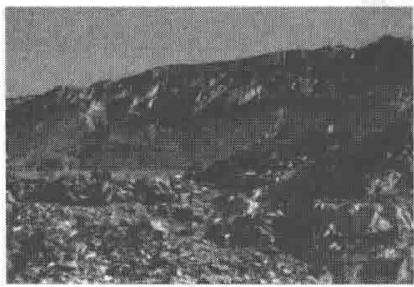  
(a) 绿泥片岩边坡平面滑坡

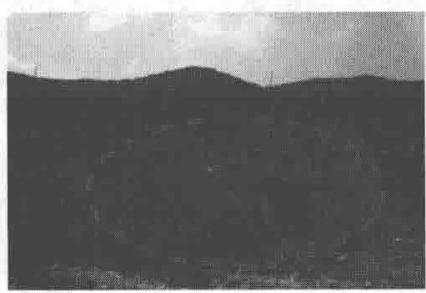  
(b) 松散层的圆弧滑坡

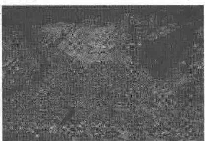  
(c) 混合岩中的楔体滑坡  
图1-8 实际露天矿滑坡照片

由于地质条件的复杂性，露天矿边坡的滑面又常表现为多种滑面的组合，不同地段的边坡发生滑坡破坏的类型也不相同。如图1-9所示，图1-9(a)为下部沿弱层滑动，中部剪切岩体，上部张裂破坏形式。图1-9(b)为沿两组优势节理组形成的追踪节理面的折面滑动形式。

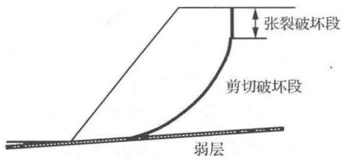  
(a) 沿弱面滑动

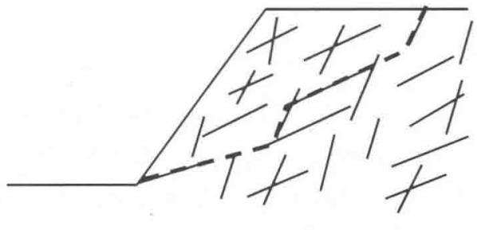  
(b) 沿节理面的折面滑动  
图1-9 组合型滑动面

在露天矿以及其他岩土边坡中危害最大的就是滑坡。例如，阜新海州露天煤矿建于1951年，至今已发生大小60余次滑坡，抚顺西露天煤矿至今也已发生了60余次滑坡，1979年W700剖面线的滑坡量达129万m3[3]。白银露天铁矿1983年的一次滑坡量达100万 $\mathrm { m } ^ { 3 }$ ，攀枝花钢铁(集团)公司石灰石矿1981年6月的一次滑坡量达416万 $\mathrm { m } ^ { 3 }$ ，本溪钢铁(集团)矿业有限责任公司南芬露天铁矿下盘边坡12线至14线附近在1999年下半年至2000年上半年陆续发生了较大规模的滑坡，至2001年4月已形成了高252m、宽250m的滑体，滑坡量达250万 $\mathrm { m ^ { 3 } }$ ，如图1-10(a)所示，后来在原有滑体的左侧又发生了大规模滑坡破坏。

露天矿滑坡的危害极大，如切断运输线路，推倒采掘运输设备，掩埋采矿、剥离工作面与人员，破坏地面工业民用建筑物，甚至迫使矿山停产、倒闭等。而清除滑坡岩碴、修复更新设备、拆迁地面建筑物、恢复生产等均需要大量人力、物力、财力与时间，如图1-10所示。

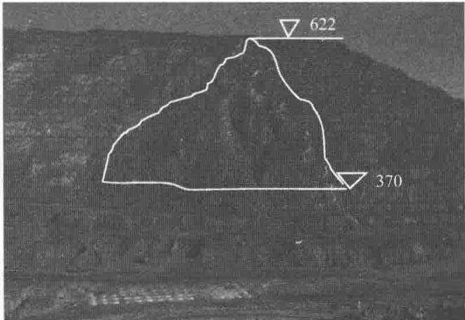  
(a) 南芬露天铁矿非工作帮的大规模滑坡

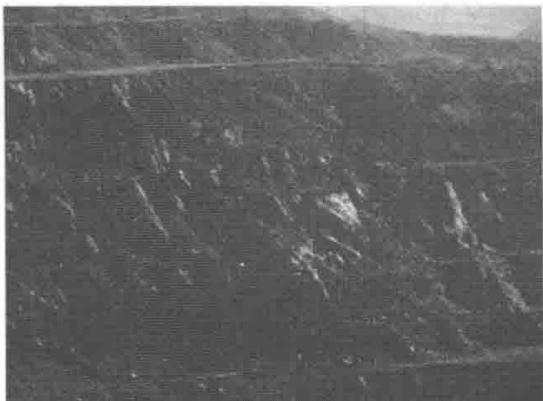

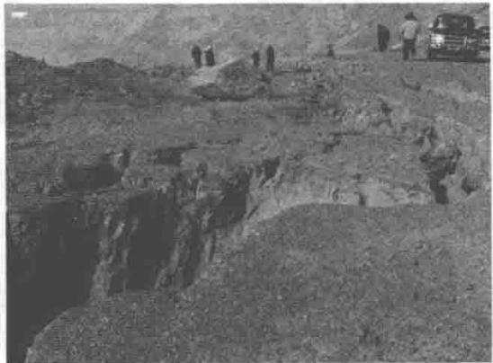  
(b) 某露天铁矿2012年滑坡全貌及滑体顶部地面裂缝  
图1-10 露天铁矿滑坡

## 3. 倾倒

倾倒破坏是一种不同于滑坡，但又和滑坡有着某些联系的边坡破坏类型。其主要特点是边坡岩体内部存在着一组与边坡坡面反倾而倾角又很大的软弱结构面，该组结构面将边坡岩体切割成许多相互平行的块体，在重力作用下，这些平行的块体缓慢地向外弯曲、塌落，如图1-11所示。

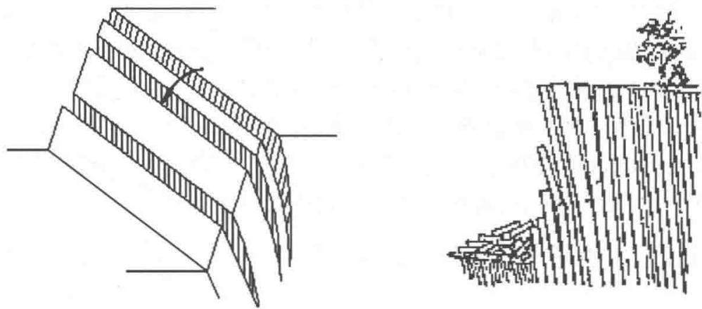  
图1-11 倾倒破坏[4]

上述塌落、滑坡、倾倒三种边坡破坏形式中，塌落一般只涉及边坡台阶的破坏，滑坡则可涉及多个台阶乃至整个边坡破坏，对露天矿开采可造成巨大危害，是边坡破坏的主要形式；倾倒一般只涉及台阶，但是它和滑坡结合起来也可造成较大的边坡破坏。上述几种边坡破坏形式有时不易截然分开，有时边坡破坏可能由一种形式转变为另一种形式。

## 1.5 影响露天矿边坡稳定的因素

露天矿边坡是露天采矿活动过程中，逐渐形成的一种特殊构筑物，它与地壳连成一体，处于原岩应力场内，承受着各种自然营力的作用，同时，它又是采矿工程活动界限，在它所圈定的范围内进行着采矿工程活动。露天矿边坡的稳定性除受地质、岩体等自然条件影响外，还受到采矿工程活动等影响，因此，影响露天矿边坡稳定性的因素很多，准确计算各种因素的影响程度是很复杂的问题。然而，将露天矿边坡按照岩体工程稳定的观点研究时，首先关心的是岩体基本力学特性、岩体结构、地下水以及爆破震动等因素。

## 1.5.1岩石物理力学性质

岩石的物理力学性质是影响边坡稳定的重要因素。主要的物理力学性质如下。

物理性质：容重、孔隙度、湿度、透水性、吸水性、抗冻性等。有时将与水有关的诸物理性质称为水理性质。

力学性质：抗压强度、抗拉强度、内摩擦角、黏结力、弹性模量、泊松比、纵波波速等。

强度大的岩石，尤其是内摩擦角、黏结力大的岩石，具有大的抗剪切破坏的能力，有利于边坡稳定。岩石容重、纵波波速大的岩石，通常有较高的力学强度，有利于边坡的稳定性。岩石的湿度大、可溶性强、吸水性强、抗冻性差，则力学性能弱化，极不利于边坡的稳

定。岩石的孔隙度大，透水性较好有增加水理作用、降低力学强度的缺点，但在特定条件下，却能降低临界边坡的地下水位和静水压力，从而有助于边坡稳定。

岩石的物理力学性质又与其矿物组成、结构、构造、风化程度密切相关。

## 1.5.2岩体结构面

岩体在其形成过程及以后经受的长期地质活动中，形成了大量纵横交错的各种各样的强度减弱面，也是岩体断裂面，这些强度减弱面统称为岩体结构面(也称不连续面或弱面)。它们降低了边坡岩体的完整性，甚至将边坡岩体切割成不同规模和几何形态的块体，即结构体。实践证明，结构面是影响岩体边坡稳定性的最重要因素。

结构面对岩体力学性质的影响及作用效果，称为结构面的力学效应。结构面力学效应又取决于结构面的自然特性。结构面的自然特性与其成因及形成过程密切相关，所以为了便于工程评价，通常将结构面按其成因规模进行分类。

## 1. 结构面成因类型

岩体内的结构面是在不同地质作用中形成和发展的。它们的性质与成因类型有着密切联系，按其地质成因，结构面可划分为三大类。

（1）原生结构面，即在岩体形成过程中所形成的结构面。其特征与岩体成因密切相关，其中又可分为如下几种。

火成结构面：指岩浆侵入活动及冷凝过程中所形成的原生结构面。包括岩浆岩体与周围岩体的接触面，多次侵入的岩浆岩之间的接触面，以及岩浆中冷凝原生节理及侵入挤压破碎结构面等。岩体中冷凝原生节理具有张性破裂面的特征，其产状平缓或是与岩体边缘接近平行，不利于边坡稳定。

沉积结构面：包括岩层面、层理面、原生冷弱夹层、沉积间层面、古风化夹层等。它们的共同特点是与沉积岩的成层性有关。其中，软弱夹层最不利于边坡稳定。软弱夹层是指在两个岩层间充填了一些泥质含量高、性质软弱、力学强度低、易引起滑动的薄夹层。在露天煤矿边坡中，常常是这种软弱夹层控制了边坡稳定，引起边坡大范围滑动，治理难度大。

变质结构面：可分为残留结构面和重结晶结构面，前者为浅变质沉积岩所固有，如板岩、千枚岩等岩石中常具有的绢云母、绿泥石等鳞片状矿物平行排列的一些结构面。重结晶形成的一些结构面，主要指片理、片麻理，这是由片状或柱状矿物富集并平行排列所造成的新结构面，对岩体起主要控制作用。变质岩体中常夹有原来的泥质夹层变质而形成的薄层云母片岩、滑石片岩、绿泥石片岩等。由于片理极发育，岩性极软弱，易受风化，所以也成为相对的软弱夹层。

（2）构造结构面：指由于构造应力作用，在岩体中形成的破裂面或破碎带，包括构造节理、断层及层间错动面等。其性质与力学成因、发育规模、多次活动及次生变化有密切关系。而其产状、分布则主要取决于构造应力场。劈理和节理是规模较小的构造结构面，其特点是分布密集，比较紧闭，并多呈一定方向排列，常导致岩体的各向异性，影响岩体的局部稳定。

断层为规模较大的构造结构面，结构面两侧有显著位移。断层面的特征及破碎带内的物质状态，主要取决于断层的力学成因及岩层岩性。它们对边坡岩体的稳定有重大影响。

（3）次生结构面：指岩体由于卸荷、风化、地下水等次生作用所形成的结构面。例如，卸荷裂隙、爆破裂隙、风化裂隙、风化夹层、泥化夹层、次生夹泥层等。

卸荷裂隙是指由于岩体中局部应力的释放和调整而产生的。它们分布在岩体表面上。露天矿开挖后，引起边坡表面应力释放，会产生一些卸荷结构面。

爆破裂隙是指由于采矿生产的爆破作业而在边坡表面的一定范围内所产生的结构面。一般来说，在边坡表面岩体中会看见密集分布的裂隙，这些裂隙包含了原生裂隙、构造裂隙，也包含了卸荷裂隙、风化裂隙，但是主要应该是爆破裂隙。在边坡管理较好的露天矿，一般均采用靠帮控制爆破作业，如预裂爆破等，而有一些露天矿则在靠帮爆破方面几乎没有采取措施，导致边坡岩体破碎，局部台阶破坏严重。

风化裂隙一般是指沿着岩体中原有的结构面发育，而且多限于表层风化带内。不过，当含有较多易风化矿物的岩层向下延伸得比较深时，它可能伸展到岩体内部相当深的部位，如断层带和某些岩浆岩脉中的风化裂隙。

泥化夹层及次生夹泥层多存在于黏土岩、泥质页岩、泥质板岩和泥灰岩的顶部以及一些构造结构面之中，它主要是受地下水的作用而产生泥化。

次生结构面的共同特点是分布的随机性强，往往没有一定的规律。在分析它们对边坡的稳定性影响时，通常应用数理统计方法进行统计分析，确定优势结构面方位等。

## 2. 结构面分级

结构面影响岩体力学效应的因素很多，其中以充填状况及结构面规模等具有重要意义。结构面内充填有软弱物质时，属于软弱结构面(软弱夹层)；否则属于硬性结构面。我国地质工作者按结构面的空间规模，将其分成以下五级3]。

I级结构面：区域性断裂破碎带，可视为地壳或区域性的巨型结构面，延展远、深度大、厚度宽，往往延展在数十千米以外，厚度达数十米以及数百米。由于它对工程区域的地质构造起控制作用，因此只要对其力学成因、展布规律和发展历史有正确认识，那么对一个地区的断裂系统的格局就有所掌握。Ⅰ级结构面的存在，对区域稳定、山体稳定和岩体稳定都有很大影响。在露天矿规划阶段应尽量避开。当边坡工程无法避开时，则应对其做全面细致的研究，提出预防措施。

Ⅱ级结构面：延展性强、宽度有限的区域地质界面，如中型断裂(对矿区而言属大型断层)、层间错动带、不整合面、假整合面、风化夹层、原生软弱夹层以及接触和挤压破碎带等。一般延展数百米至数千米，贯穿整个矿区，宽为1\~3m。对这一级结构面应注意其产状、形态、物质组成、微结构，以及在地下水等自然地质作用下的发展趋势；同时还需结合具体工程，抓住结构面组合，判断是否存在可能的变形和破坏。Ⅱ级结构面往往控制了边坡的稳定性，影响工程的布局。

Ⅲ级结构面：工程岩体中的中型结构面，为延展数十米至百余米的小断层、破碎带或宽度在数厘米至1m的地质界面，如层间错动面、不整合面、原生软弱夹层等。其工作内容大体与Ⅱ级结构面相仿，并与Ⅱ级结构面共同构成岩体力学作用边界，控制边坡岩体破坏方式与运动轨迹。

Ⅳ级结构面：工程岩体中的小型结构面。延展性差，无明显宽度，仅在小范围内局部地切割岩体，主要包括明显的节理、发育的劈理、层面、片理等。这类结构面在岩体中大量存在，要弄清它们的特征及组合关系。Ⅳ级结构面不仅控制了岩体的物理力学性质和应力状态，还将边坡岩体切割成明显的不连续体，而且在很大程度上，制约着岩体的破坏方式。

V级结构面：延展性和连续性都很差，但数量较多的细小结构面。主要包括小节理、劈理、片理等。它们的存在主要降低了岩体的强度。

上述级序中，工、Ⅱ级结构面属于软弱结构面，边坡岩体变形、破坏几乎全部受它们控制。Ⅲ、Ⅳ级结构面主要属于硬性结构面，边坡岩体变形、破坏有时受其控制。V级结构面主要使岩体在力学性质上具有方向性并对岩体力学性质具有软化作用。然而各级结构面所起的作用并非孤立，而是相互制约的。所以对于具体的边坡工程应做具体分析。

## 3. 结构面对边坡稳定的影响

结构面对边坡稳定的影响方式有很多，在具体工程中应具体加以分析研究。其中，结构面的产状、性质、规模等对边坡稳定的影响起着重要作用。但就一般的情形而言，结构面对边坡稳定的影响有以下两个方面。

## 1）结构面与边坡面的交割关系控制着边坡破坏方式

岩体结构面产状与边坡坡面产状之间的关系往往是岩体边坡稳定性的控制因素，工程实践表明，岩体边坡往往是因岩体沿着适宜的单一结构面或多个结构面的组合面滑动而失稳的。由于结构或其组合面与边坡面的交割关系不同，边坡会产生不同类型的破坏方式。

一般地说，岩体边坡的稳定程度，在具有顺向坡结构面时，要比具有反向坡结构面时差，如图1-12所示，AB帮可能沿结构面产生滑坡破坏。DC帮可能会产生倾倒破坏。但AB帮较DC帮的稳定性要差。

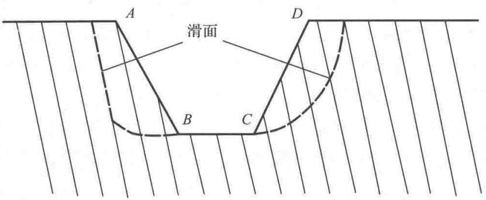  
图1-12 岩层倾向对边坡稳定性的影响

当存在顺向坡结构面时，视结构面的倾角与边坡角之间的关系，对边坡滑坡方式有一定的影响。

(1)边坡角 $\beta$ 大于结构面倾角 $\alpha$ 。这种情况最易沿着结构面产生滑坡，形成平面滑坡

[图 1-13(a)]。

(2) 结构面倾角α大于边坡角 $\beta ,$ 。这种情况也易产生滑坡，滑面上部与结构面一致。下部滑面切割岩层，可用圆弧近似描述下部滑面[图1-13(b)]。

(3)边坡内存在两组结构面。这种情况也易产生滑坡，滑面追踪结构面发育，产生折面滑坡[图1-13(c)]。

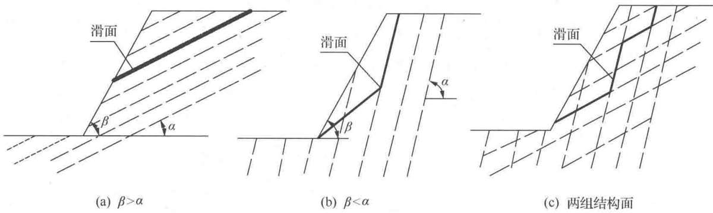  
图1-13 不同结构面倾角边坡破坏模式

## 2）降低边坡岩体的强度

当边坡岩体内存在大型结构面时，如Ⅰ、Ⅱ、Ⅲ级结构面，其结构面的强度以及与边坡的交割关系直接影响着整体边坡的稳定性。而一些规模小、数量多的小型结构面，如Ⅳ、V级结构面，虽然它们的分布具有随机性，但是往往也具有优势方位，如大部分结构面均分布在某一方位上，这也在一定程度上控制着边坡的破坏方式。即使是杂乱无章、没有优势方位的小型结构面，由于它们的存在，降低了边坡岩体强度，不利于边坡稳定。图1-14为司家营铁矿边坡岩体强度的试验结果[5]。

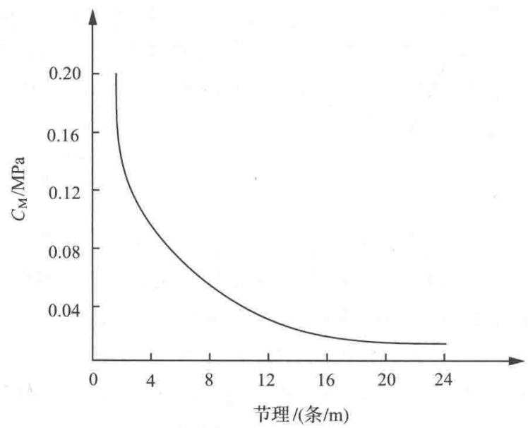  
图1-14 节理密度与黏结力的关系曲线

苏联学者费辛柯通过室内外试验研究，提出岩体黏结力 $C _ { \mathrm { M } }$ 与岩石黏结力 $C _ { \mathrm { R } }$ 之间有如下关系：

$$
C _ { \mathrm { M } } = \frac { C _ { \mathrm { R } } } { 1 + a \ln \Bigl ( \displaystyle \frac { H } { l } \Bigr ) }\tag{1-1}
$$

式中，H为边坡高度；l为岩块的平均尺寸；a为与岩石强度和裂隙特征有关的系数，见表1-1。

表 1-1 不同岩石的a值[5]
<table><tr><td rowspan=1 colspan=1>岩石名称及裂隙特征</td><td rowspan=1 colspan=1>单轴强度 $/ \mathrm { M P a }$ </td><td rowspan=1 colspan=1>a</td></tr><tr><td rowspan=1 colspan=1>不太密实、裂隙少的砂质黏土，强风化沉积层，完全高岭土化的喷出岩</td><td rowspan=1 colspan=1>0.4~0.9</td><td rowspan=1 colspan=1>0.5</td></tr><tr><td rowspan=1 colspan=1>裂隙为主密实的砂质黏土沉积层</td><td rowspan=1 colspan=1>1~2</td><td rowspan=1 colspan=1>2</td></tr><tr><td rowspan=1 colspan=1>高岭土化的喷出岩</td><td rowspan=1 colspan=1>3~8</td><td rowspan=1 colspan=1>2</td></tr><tr><td rowspan=1 colspan=1>裂隙为主的中等坚硬层状岩石</td><td rowspan=1 colspan=1>10~1515~1717~20</td><td rowspan=1 colspan=1>345</td></tr><tr><td rowspan=1 colspan=1>裂隙为主的坚硬岩石</td><td rowspan=1 colspan=1>20~30&gt;30</td><td rowspan=1 colspan=1>67</td></tr><tr><td rowspan=1 colspan=1>裂隙发育的岩石</td><td rowspan=1 colspan=1>&gt;20</td><td rowspan=1 colspan=1>10</td></tr></table>

Gergi对多种岩石的研究结果认为，岩石和岩体的内摩擦角差别不大，可取同值，而黏结力受裂隙的密度影响很大，可用下式计算：

$$
C _ { \mathrm { M } } = C _ { \mathrm { R } } [ 0 . 1 1 4 C _ { \mathrm { ~ R ~ } } ^ { - 0 . 4 8 ( i - 2 ) } + 0 . 0 2 ]\tag{1-2}
$$

式中，i为岩体的裂隙密度(条/m)。

由以上可知，岩体结构面既影响边坡的破坏方式，也降低边坡岩体强度，同时也使岩体具有明显的各向异性。为了系统地研究结构面对边坡稳定的影响，必须调查分析结构面的类型、规模、性质和分布规律。对于结构面具有的力学性质和时间效应必须进行试验研究，对于结构面的组合特征及其在面上与坡面的相对关系必须进行归类分析，以便为边坡稳定定量评价提供可靠的力学基础。

## 1.5.3 地下水

地下水、地表水、降水对边坡的稳定性都有明显影响，这可以从大量的滑坡事故中得到证实。露天矿边坡、山体斜坡等大量滑坡事故都发生在雨季或解冻时期，或因排水不当所致。一般认为，水对边坡有百害而无一利，其中地下水的影响占主要地位，并且一部分降水、地表水会沿着边坡岩体中的裂隙渗入到岩体内，成为地下水的来源之一。

地下水是指赋存于岩体内部孔隙和裂隙中的水。它的作用会使某些亲水性岩石，如页岩、泥岩等泥质岩石浸水后软化和泥化，降低岩石的抗剪强度。此外，由于地下水的静水压力和动水压力作用，降低了边坡的稳定性。

## 1）软化岩石，降低其强度

黏性岩土，遇水膨胀，甚至崩解，特别是含蒙脱石的岩土，强度将显著降低。当边坡岩体中含有一些黏土页岩夹层，泥质充填物的断层时，应尤其注意。例如，1961年3月6日发生在湖南柘溪水库坝址上游1.55km处的塘岩光山体滑坡，就是由于板岩夹层经水饱和后，抗剪强度降低导致滑坡的。在滑坡前曾连续8天降雨，下渗的雨水与水库开始蓄水后不断上升的地下水相互叠加，既增加了滑体质量又增加了动水压力，促进了滑坡的发展，因而在水库蓄水18天后发生了滑坡。滑体长210m，总体积165万 $\mathrm { m } ^ { 3 }$ ，滑体滑入水库时激起了12m高的涌浪，致使在坝前工作的数十名工人丧生，造成严重事故[6]。

当岩体饱水后，裂隙内充满了水，若冻结时，水的体积可增大10%左右，对裂隙两壁产生很大的膨胀力，使岩体内原有裂隙迅速开裂和贯通，降低其强度，并且边坡表面水的冻结会填塞排水通道，引起边坡内水压增高，降低其稳定性。

## 2)产生静水压力

边坡岩体受水浸润后导致容重增加。当岩体饱水后其饱水容重γ为

$$
\gamma = \gamma _ { \mathrm { o } } + n \gamma _ { \mathrm { w } }\tag{1-3}
$$

式中， $\gamma _ { 0 }$ 为干容重 $( \mathrm { k N } / \mathrm { m } ^ { 3 } ) ; \gamma _ { \mathrm { w } }$ 为水的容重 $( \mathrm { k N } / \mathrm { m } ^ { 3 } ) ; n$ 为孔隙率。

岩体的结构面充水后，会引起结构面有效抗剪强度降低，对于边坡内潜在滑面的情况亦如此，其有效抗剪强度应按有效应力原理计算，具体形式如下：

$$
\sigma ^ { \mathrm { { \scriptscriptstyle 0 } } } = \sigma - u\tag{1-4}
$$

式中， $\sigma ^ { 0 }$ 为有效应力 $( \mathrm { M P a } ) { \mathrel { ; } } \sigma$ 为总应力(MPa);u为静水压力(MPa)。

有效抗剪强度：

$$
\tau = c + \sigma ^ { 0 } { \tan } \varphi\tag{1-5}
$$

式中， $c$ 为有效黏聚力 $( \mathrm { M P a } ) { \mathfrak { s } } \varphi$ 为有效内摩擦角 ${ \bf \Xi } ^ { \circ } )$

某点静水压力u的大小等于该点浸在水下的深度与水的容重乘积，同时在各个方向的压强值均相等，如图1-15(a)所示。当边坡内存在着缓倾斜的结构面时，静水压力往往起到浮托作用，削减了有效正应力，降低了结构面的抗剪强度，如图1-15(b)中的AB面，当边坡内有直立或较陡的结构面时，静水压力起到推动滑体滑动作用，不利于边坡的稳定，如图1-15(b)中的BD面。当边坡岩体不透水而只有结构面充水时，通常认为水从结构面上口[图1-15(b)和图1-15(c)中的D点]流入，而从下口流出[图1-15(b)和图1-15(c)中的A点。因此，这两点的水压为零，其内的水压强与充水深度呈线性变化。几种典型的水压分布形式如图1-15所示。

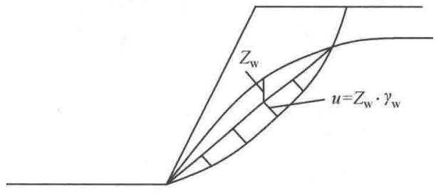  
(a)

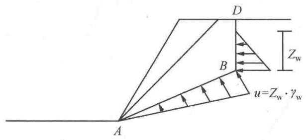  
(b)

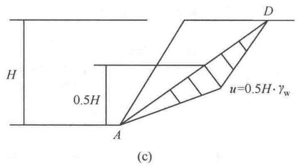  
图1-15 孔隙水压分布形式  
$Z _ { \mathrm { w } }$ 充水深度

## 3)动水压力的作用

地下水在岩体内的流通过程中作用在岩石颗粒上的压力称为动水压力，其方向为水流的方向。由于地下水在岩体内的流动通常是通过渗透完成的。故动水压力又称为渗透压力。流动的水常常会冲刷结构面，将结构面内的松散颗粒带走，降低了结构面强度。

(1）渗透系数。边坡岩体通常为各向异性体，地下水在其内的流动也具有各向异性特点，但目前通常采用近似计算方法。当视边坡岩体为均质、各向同性材料时，会大大地简化地下水的流动问题。地下水流动可用达西(Darcy)定律描述。现从边坡岩体内取一等面积的介质段。水通过面积为A、长为l的介质段时，如图1-16所示，其单位时间内的流量：

$$
Q = A K i\tag{1-6}
$$

式中， $Q$ 为单位时间内的流量；K为渗透系数；i为水力梯度， $i = \frac { h _ { 1 } - h _ { 2 } } { l } ; h _ { 1 } , h _ { 2 }$ 分别为相对于同一基准面时，介质段两端的水压头。

$$
K = { \frac { Q } { A i } } = { \frac { Q l } { A ( h _ { 1 } - h _ { 2 } ) } } = { \frac { v l } { h _ { 1 } - h _ { 2 } } } = { \frac { v } { i } }\tag{1-7}
$$

式中，v为水的流动速度。

渗透系数在确定露天矿的地下涌水量、设计疏干系统等方面具有重要意义。

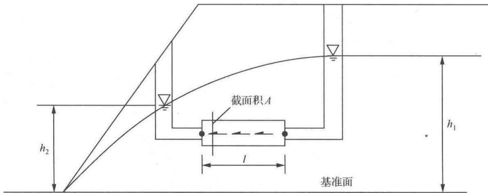  
图1-16 水流示意图

（2）流网绘制。流网是由流线和等势线所组成的曲线正交网络。在稳定渗流场中，流线是指水在流动时的质点流动路径，流线上任一点的切线方向就是流速的矢量方向。等势线是指具有相同水压头或势能的各点连线。在各向同性渗流介质中，各个方向的渗

透性相同，等势线与流线成直角相交。流网可以描述流动类型和水压力。具体原理如下[7]：

二维情况下的达西定律一般形式。

$$
V _ { x } = K i _ { x } = - K { \frac { \partial h } { \partial x } }\tag{1-8}
$$

$$
V _ { z } = K i _ { z } = - K \frac { \partial h } { \partial z }\tag{1-9}
$$

式中， $V _ { x } , V _ { z }$ 分别为X向、Z向的流动速度； $i _ { x } \setminus i _ { z }$ 分别为X、 $Z$ 向的水力梯度；K为渗透系数；h为水压头。负号表示h在 $V _ { x } , V _ { z }$ 的方向上降低。

现取一完全饱和的、单位厚度的岩体单元，如图1-17所示，设水进入单元的流速为$V _ { x }$ 和 $V _ { z }$ ，而从该单元流出的流速分别为 $V _ { x } + \frac { \partial V _ { x } } { \partial x } \mathrm { d } x , V _ { z } + \frac { \partial V _ { z } } { \partial z } \mathrm { d } z$ ，单位时间流入该单元的水量为 $V _ { x } \mathrm { d } z + V _ { z } \mathrm { d } x$ o

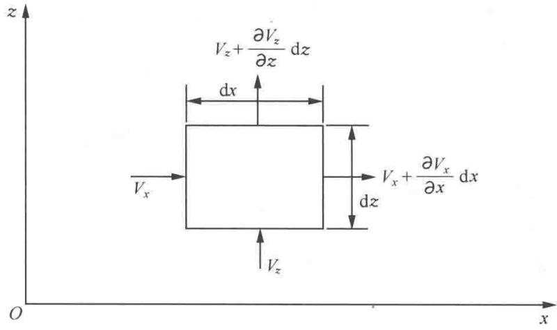  
图1-17 水流经岩体单元示意图

单位时间内流出该单元的水量为

$$
\left( V _ { x } + \frac { \partial V _ { x } } { \partial x } \mathrm { d } x \right) \mathrm { d } z + \left( V _ { z } + \frac { \partial V _ { z } } { \partial z } \mathrm { d } z \right) \mathrm { d } x\tag{1-10}
$$

如果该单元的体积没有变化，以及在该单元内水量没有损耗，流入与流出该单元的水量应相等，得到：

$$
\frac { \partial V _ { x } } { \partial x } + \frac { \partial V _ { z } } { \partial z } = 0\tag{1-11}
$$

该方程称为二维流动问题的连续方程。现引入势函数 $\phi ( \boldsymbol { x } , \boldsymbol { z } )$ 并且令

$$
\begin{array} { r } { \frac { \partial \phi } { \partial x } = V _ { x } = - K \frac { \partial h } { \partial x } } \\ { \frac { \partial \phi } { \partial z } = V _ { z } = - K \frac { \partial h } { \partial z } } \end{array}\tag{1-12}
$$

联立式(1-11)与式(1-12)有

$$
\frac { \partial ^ { 2 } \phi } { \partial x ^ { 2 } } + \frac { \partial ^ { 2 } \phi } { \partial z ^ { 2 } } = 0\tag{1-13}
$$

即 $\phi ( x , z )$ 满足拉普拉斯(Laplace)方程。

对式(1-12)积分有

$$
\phi ( x , z ) = - K h \left( x , z \right) + B
$$

B是常数，这样当给定一个 $\phi ^ { ( { \boldsymbol { x } } , { \boldsymbol { z } } ) }$ 值时，如 $\phi _ { 1 }$ ，它代表了一条曲线，在这条曲线上，水压头h为常量，如果给定一系列的 $\phi ( x , z )$ 值，则就会有一系列的曲线，而在每条曲线上都具有相同的水压头。这些曲线就是等势线。

现引入一个函数 $\psi ( x , z )$ 称为流函数。令

$$
\begin{array} { c } { \displaystyle - \frac { \partial \psi } { \partial x } = v _ { z } = - K \frac { \partial h } { \partial z } } \\ { \displaystyle } \\ { \frac { \partial \psi } { \partial z } = v _ { x } = - K \frac { \partial h } { \partial x } } \end{array}\tag{1-14}
$$

可以证明该函数也满足拉普拉斯方程，该函数的全微分为

$$
\mathrm { d } \psi = \frac { \partial \psi } { \partial x } \mathrm { d } x + \frac { \partial \psi } { \partial z } \mathrm { d } z = - v _ { z } \mathrm { d } x + v _ { x } \mathrm { d } z
$$

如果给定函数 $\psi ( x , z )$ 一个常值 $\psi _ { 1 }$ ,则 $\scriptstyle \mathrm { d } \psi = 0$ ,有

$$
\frac { \mathrm { d } z } { \mathrm { d } x } = \frac { V _ { z } } { V _ { x } }\tag{1-15}
$$

式(1-15)表明了当 $\psi ( x , z ) = \psi _ { 1 }$ 时所描述的曲线上任一点的切线就代表了该点的流速方向，因此，该曲线就代表了流动路线。如果 $\psi ( x , z )$ 给出一系列的值，又可得到一系列代表流动路线的曲线，这些曲线就是流线。

如图1-18所示，在两个流线 $\psi _ { 1 } \cdot \psi _ { 2 }$ 之间，单位时间内的流量为

$$
\Delta q = \int _ { \psi _ { 1 } } ^ { \psi _ { 2 } } ( - V _ { z } \mathrm { d } x + V _ { x } \mathrm { d } z ) = \int _ { \psi _ { 1 } } ^ { \psi _ { 2 } } \Bigl ( \frac { \partial \psi } { \partial x } \mathrm { d } x + \frac { \partial \psi } { \partial z } \mathrm { d } z \Bigr ) = \psi _ { 2 } - \psi _ { 1 }\tag{1-16}
$$

这样在两个流线之间的流量是个常量。

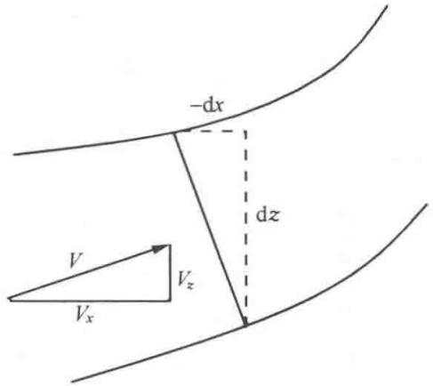  
图1-18流量示意图

函数 $\phi ( x , z )$ 的全微分为

$$
\mathrm { d } \phi = \frac { \partial \phi } { \partial x } \mathrm { d } x + \frac { \partial \phi } { \partial z } \mathrm { d } z = V _ { x } \mathrm { d } x + V _ { z } \mathrm { d } z\tag{1-17}
$$

如果 $\phi ( x , z )$ 是个常数，那么 $\mathrm { d } \phi = 0$ ，则有

$$
\frac { \mathrm { d } z } { \mathrm { d } x } = - \frac { V _ { x } } { V _ { z } }\tag{1-18}
$$

比较式(1-15)和式(1-18)，发现流线的斜率与等势线的斜率在交点处互为负倒数，即流线与等势线在交点处相互垂直。

图1-19所示两条流线 $\psi _ { 1 }$ 和 $\phi _ { 1 } + \Delta \psi$ ，它们之间的距离为 $\Delta n$ ，另有两条间距为 $\Delta s$ 的等势线 $\phi _ { 1 }$ 和 $\phi _ { 1 } + \phi$ 与它们正交，过A点作流线与等势线的切线s与n，并且s和x轴，n与 $\mathcal { z }$ 轴的夹角均为 $\theta _ { c }$ a

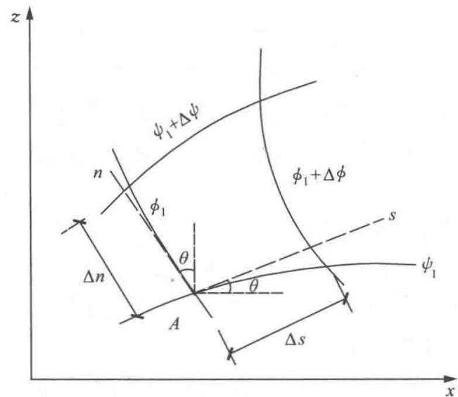  
图1-19 流线与等势线

等势线与流线对 $s , n$ 向的偏导数为

$$
\frac { \partial \phi } { \partial s } = \frac { \partial \phi } { \partial x } \frac { \partial x } { \partial s } + \frac { \partial \phi } { \partial z } \frac { \partial z } { \partial s }\tag{1-19}
$$

$$
\frac { \partial \psi } { \partial n } = \frac { \partial \psi } { \partial x } \frac { \partial x } { \partial n } + \frac { \partial \psi } { \partial z } \frac { \partial z } { \partial n }
$$

式中：

$$
{ \frac { \partial \phi } { \partial x } } = V _ { x } ; \qquad { \frac { \partial \phi } { \partial z } } = V _ { z }
$$

$$
{ \frac { \partial \psi } { \partial x } } = - V _ { z } ; \qquad { \frac { \partial \psi } { \partial z } } = V _ { x }
$$

$$
\frac { \partial x } { \partial s } = \mathrm { c o s } \theta ; \qquad \cdot \frac { \partial z } { \partial s } = \mathrm { s i n } \theta
$$

$$
\frac { \partial x } { \partial n } = - \sin \theta , \frac { \partial z } { \partial n } = \mathrm { c o s } \theta
$$

$$
\frac { \partial \phi } { \partial s } = V _ { x } { \mathrm { c o s } } \theta + V _ { z } { \mathrm { s i n } } \theta
$$

$$
\frac { \partial \psi } { \partial n } = V _ { x } \mathrm { c o s } \theta + V _ { z } \mathrm { s i n } \theta
$$

则有

$$
\frac { \partial \phi } { \partial s } = \frac { \partial \psi } { \partial n }\tag{1-20}
$$

近似地写成：

$$
\frac { \partial \phi } { \partial s } = \frac { \partial \psi } { \partial n }\tag{1-21}
$$

在实际问题中，需要引入一些边界条件来求解势函数 $\phi ( x , z )$ 和流函数 $\psi ( x , z )$ 。从而得到了一簇流线以及与之相交的一簇等势线，构成了流网，在具体应用中，这是一个很复杂的问题，目前可通过有限差分法、有限单元法求解，但最常用的是利用边界条件加以推断和逐次修改。

在绘制流网时需要满足的最基本条件就是流线与等势线必须以直角相交。通常取相邻流线的差值不变，均为 $\Delta \psi$ ，以及相邻等势线的差值不变，均为 $\Delta \phi$ ，并取 $\Delta n = \Delta s$ ，这样由式 $( 1 - 2 1 ) \Delta \psi = \Delta \phi$ ，此时的流网是由一系列的曲边正方形构成的。

露天矿边坡流网的具体做法如下：

制作流网时，应先给出边坡断面图，并在上面标明边界条件，它决定了流网的特征。对于如图1-20所示边坡而言，边界条件如下：

(1）低于坡底面以下某个深度的水平，地下水是相对静止的，这条水平线即为流速为零的流线。

（2）上游有某个地表水体，则可视为一边界，否则远离边坡相当远处，可近似认为地下水面因边坡开挖扰动水位下降甚微，等势线为直立线。

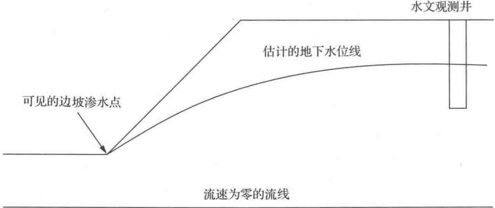  
图1-20 流网的绘制

（3）坡底面水位线是压头为一个大气压的等势线。

(4）边坡内的水位线是一段抛物线，可用边坡面上的渗水点及水位观测井水位确定。根据上述边界条件，从上游直立等势线开始，垂直于此线，并大体上平行于水位线以等距离f可勾画出几条流线，如图1-21所示。垂直流线绘制等势线，但要符合曲边正方形原则，等势线在水位线上的起点高差应等于同一数值。最后，将所绘制的流网图进行调整，使与上述原则皆相符而得流网图(图1-22)。

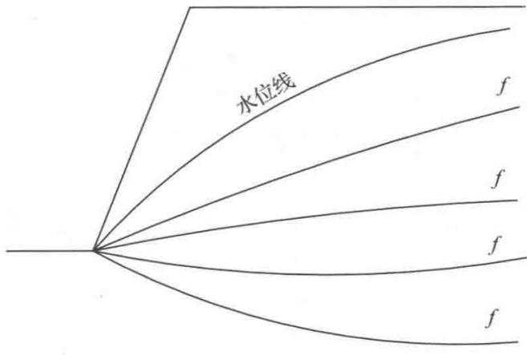  
流线在上游等间距并圆滑地汇集于坡脚

图1-21流线的绘制  
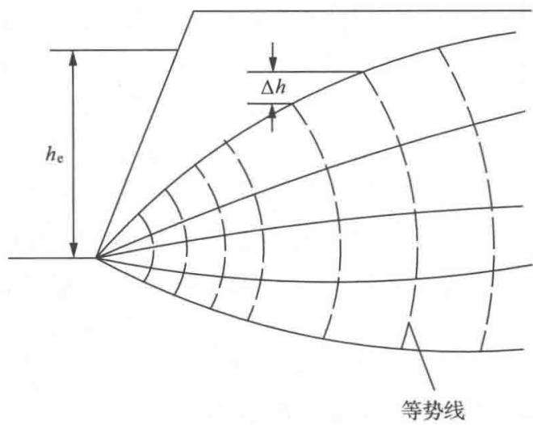  
图1-22 流网绘制

流网图能给出任一点的水压头，利用流网还可计算其流量。

两等势线的平均水力梯度i:

$$
i = \frac { \Delta h } { \Delta s }\tag{1-22}
$$

式中， $\Delta s$ 为两等势线的流程间距，它在流网中是变量，故流程各点有不同的水力梯度； $\Delta h$   
为两等势线间的水压头差。

设所研究的边坡断面厚度为1个单位，所以由达西定律，流经一个流道(两个流线之间称为流道)的水量为

$$
\begin{array} { r } { \Delta q = A K i = f K \frac { \Delta h } { \Delta s } } \end{array}\tag{1-23}
$$

式中，A为流道的截面积;K为渗透系数；f为流道的宽度。

因为每个网格均为曲边正方形，所以

$$
f = \Delta s\tag{1-24}
$$

则 $\Delta q = K \Delta h$

$$
\Delta h = \frac { h _ { \mathrm { e } } } { N _ { \mathrm { e } } }\tag{1-25}
$$

式中， $h _ { \mathrm { e } }$ 为总水压头损失； $N _ { \mathrm { e } }$ 为等势线间隔数量。

总流量为

$$
q = N _ { \mathrm { f } } \Delta q = K h _ { \mathrm { e } } \ \frac { N _ { \mathrm { f } } } { N _ { \mathrm { e } } }\tag{1-26}
$$

式中， $N _ { \mathrm { f } }$ 为流道数量。

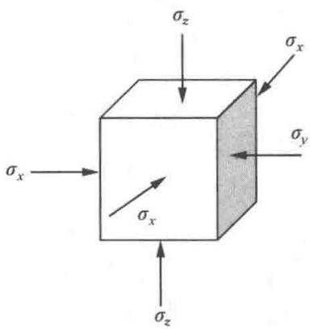  
图1-23原岩应力示意图

## 1.5.4 原岩应力

原岩应力是指在岩体中天然存在的、未受人类工程活动影响的应力，一般情况下，从概念上原岩应力可以包括自重应力、构造应力、地震应力和温度应力等，但是实际工程中很难将上述各应力截然分开，在工程上确定原岩应力也是以应力实际观测为主要手段。原岩应力在地学中称为地应力。地应力这个概念是由瑞士地质学者Haim在1905～1912年首次提出的。三向原岩应力示意图如图1-23所示。

## 1. 自重应力

仅仅由于岩石自重引起的应力称为自重应力。

瑞士地质学家Haim在观察了大型越岭隧道围岩工作状态之后，认为原岩体铅垂应力为上覆岩体自重。在漫长的地质年代中，由于岩体不能承受较大的差值应力和与时间有关的变形影响，使得水平应力与铅垂应力趋于均衡的静水压力状态。

$$
\sigma _ { x } = \sigma _ { y } = \sigma _ { z } = P _ { z } = \gamma z\tag{1-27}
$$

式中， $\sigma _ { x } , \sigma _ { y } , \sigma _ { z }$ 分别为x、y、z方向上的自重应力； $P _ { z }$ 为上覆岩层自重应力(MPa);γ为上覆岩层的容重 $( \mathrm { k N } / \mathrm { m } ^ { 3 } ) ; z$ 为埋深(m)。

由于静水压力下无剪应力，所以任意方向都是主应力方向。

$$
\sigma _ { 1 } = \sigma _ { 2 } = \sigma _ { 3 } = P _ { z } = \gamma z\tag{1-28}
$$

苏联学者金尼克(Duhhuk)认为地下岩体为线弹性体，其铅垂应力等于上覆岩体自

重： $\sigma _ { z } = P _ { z }$ 。在水平方向，岩层内的侧向应力 $\sigma _ { x }$ 与 $\sigma _ { y }$ 相等，且水平方向的应变为零：

$$
\begin{array} { c } { { \sigma _ { x } = \sigma _ { y } } } \\ { { \varepsilon _ { x } = \varepsilon _ { y } = 0 } } \end{array}
$$

由广义胡克定律：

$$
\varepsilon _ { x } = \frac { 1 } { E } [ \sigma _ { x } - \mu ( \sigma _ { y } + \sigma _ { z } ) ] = 0
$$

$$
\varepsilon _ { y } = \frac { 1 } { E } [ \sigma _ { y } - \mu ( \sigma _ { x } + \sigma _ { z } ) ] = 0
$$

$$
\varepsilon _ { z } = \frac { 1 } { E } [ \sigma _ { z } - \mu ( \sigma _ { x } + \sigma _ { y } ) ] \neq 0
$$

则可解出：

$$
\sigma _ { x } = \sigma _ { y } = \frac { \mu } { 1 - \mu } \sigma _ { z } = \frac { \mu } { 1 - \mu } P _ { z }\tag{1-29}
$$

令 $\lambda = \frac { \mu } { 1 - \mu }$ 表示侧向压力系数，则有

$$
\sigma _ { x } = \sigma _ { y } = \lambda \sigma _ { z } = \lambda P _ { z }
$$

一般岩石的泊松比 $\mu = 0 . 1 5 \sim 0 . 3 5$ ,则 $\lambda = \frac { \mu } { 1 - \mu } = 0 . 1 8 \sim 0 . 5 4 _ { c }$ 当 $\mu = 0 . 5$ 时，λ=1，则金尼克计算的结果与Haim结果一致。

## 2. 构造应力

大量地质构造形迹的存在，说明地壳曾经经受过巨大的地质构造应力作用。构造应力以水平应力为主。露天矿采场的开挖，使岩体初始应力场重新分布，以水平方向为特征的构造应力的不均匀释放，会引起岩体向采空区方向回弹变形和膨胀，使原有裂隙进一步扩大或造成新的卸荷裂隙，从而降低岩体强度。同时在边坡坡脚处的应力集中能导致此处应力成倍增加，影响边坡稳定性。构造应力的方向与边坡方位的关系十分重要，如图1-24所示的两种情况，应力场的强度相同，但图1-24(b)中，最大尺寸平行于大主应力方向，其边坡岩体内的应力状态要比图1-24(a)情况好。

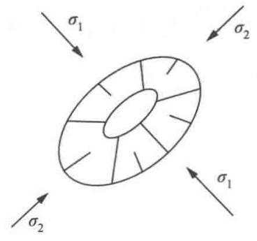  
(a)

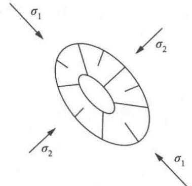  
(b)  
图1-24 边坡与应力场的关系

## 3. 地震应力

地震应力是指由于发生地震时而作用于边坡岩体上的一种巨大的动应力。但是，由于有关地震的活动特性、发震机制以及地震波在岩体中的传播规律等仍不甚清楚，因此，目前仍很难令人信服地给出有关地震应力准确的、定量的分析。

地震应力的分布无论在时间上还是空间上都是非常不均匀的，作用于边坡岩体中地震应力的强度和方向不仅与震源的深度和震级有关，而且还与边坡岩体所处的相对方位和距离有关，并受到地质构造特性、岩体性质、地形条件和地下水赋存状态等多方面的影响。从定性的观点来看，可以认为，在断裂破碎带附近，在岩体变化和构造作用复杂、层面倾角较陡、岩体比较松散或破碎、风化严重、地形起伏较大、切割强烈的地区，地震发生时，所导致的不稳定性将更为突出。在地下水储存比较丰富的地区，由于地震时水位的突变和冲击裂隙水压力效应的影响，地震的破坏作用也比干燥地区严重些。因此，当边坡岩体处于上述不利环境中，应充分重视地震应力的不利影响，在边坡稳定计算中，应考虑地震应力的不利影响。

## 4. 原岩应力实测结果

地壳内部的原岩应力场是一个颇为复杂的问题，人们获得原岩应力场的途径，主要是通过现场实测来实现。虽然各个国家和地区对原岩应力测量做了大量工作。但是关于完整应力场的资料却获得很少，且测量深度也都在3000m之内，尚属地壳浅部。

1953年瑞典Hast在斯堪的纳维亚半岛首先进行了原岩应力实测工作。此后，欧洲、美国、澳大利亚和我国都先后开展了大规模原岩应力实测工作。

Brown和Hoek研究了遍及世界不同地区的原岩应力测量，并进行了汇总[4]。在进行资料选择时，对于那些特别反常地质条件(如近期仍出现构造活动的地区)的实测结果均略去，只选用了可靠的结果，如图1-25和图1-26所示。

图1-25是铅垂应力与深度变化的关系。统计结果表明，铅直应力 $\sigma _ { z }$ 与深度的关系为

$$
\sigma _ { z } = 0 . 0 2 7 z ( \mathrm { M P a } )\tag{1-30}
$$

值得注意的是，式(1-30)的比例系数与地壳浅部岩石的容重相吻合，通常 $\gamma = 2 0 \sim$ $3 0 \mathrm { k N } / \mathrm { m } ^ { 3 }$ 。即实测结果说明，铅垂应力与上覆岩层的自重应力相一致。

图1-26是平均水平应力与铅垂应力之比K随埋藏深度z的变化关系。其中：

$$
K = \frac { \sigma _ { h \bullet \mathrm { a v } } } { \sigma _ { z } } = \frac { \sigma _ { x } + \sigma _ { y } } { 2 \sigma _ { z } }
$$

通过分析发现K值通常取值为

$$
\frac { 1 0 0 } { z } + 0 . 3 < K < \frac { 1 5 0 0 } { z } + 0 . 5\tag{1-31}
$$

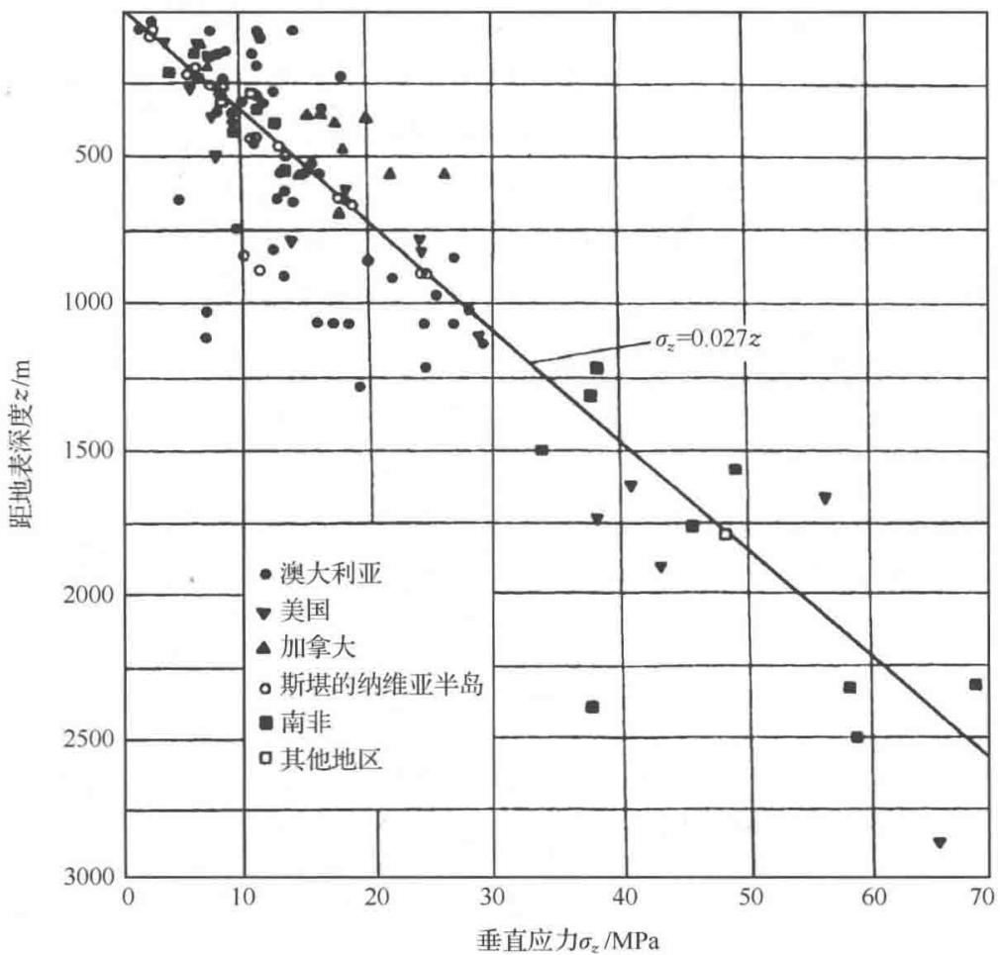  
图1-25 铅垂应力与深度的变化关系

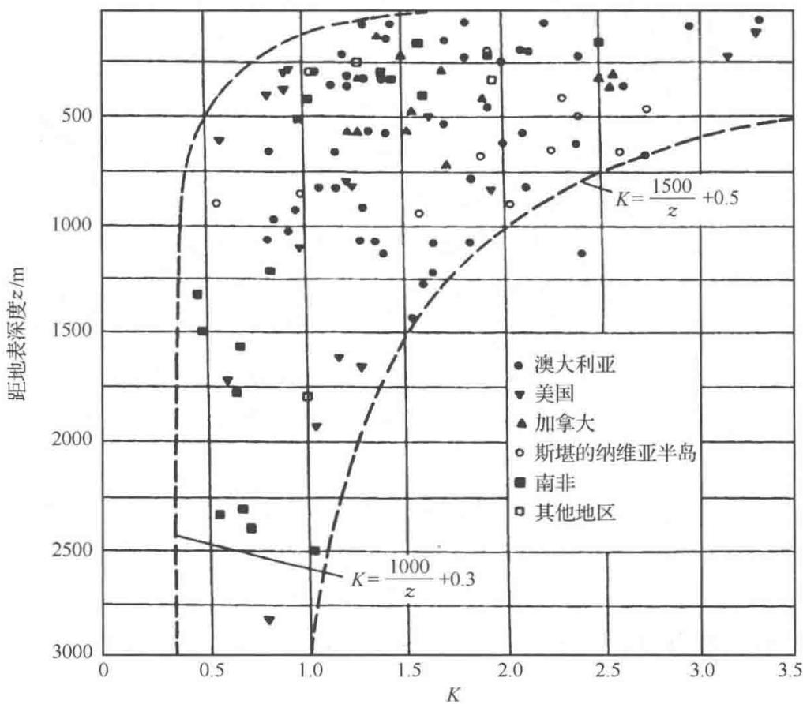  
图1-26 平均水平应力与铅垂应力之比K随埋藏深度z的变化关系

深度小于500m时，平均水平应力明显大于铅垂应力；当深度大于1000m时，平均水平应力与垂直应力趋于相等，处于静水压力状态。这是因为三个主应力差值很大时，岩石不可能承受很高应力，否则必然发生破坏，达到新的平衡。

原岩应力的实测结果表明：①铅垂应力等于上覆岩层的自重应力；②一般情况下，水平应力大于铅垂应力；③水平应力具有明显的方向性；④不同地区的原岩应力相差很大。

在研究边坡稳定时，应分析原岩应力场的情况，判断其性质、方向和大小。原岩应力的确定应根据现场实测，并参与边坡稳定性的定量计算。

## 1.5.5 爆破震动

露天矿边坡围成了露天采矿的作业场地，而采矿作业的基本工序之一就是日常的生产爆破作业，并由此引起爆破震动影响着边坡稳定。目前，采用下述经验公式反映爆破震动的影响，即爆破震动力[3,8]：

$$
F = m a\tag{1-32}
$$

F的方向水平指向采场。式中，m为滑体的质量；a为爆破震动引起岩石质点运动的加速度， $\alpha = 2 \pi f v , f$ 为震动频率，v为质点运动的峰值速度。通常采用下列经验公式计算v值：

$$
v = K \Big ( \frac { Q ^ { \frac { 1 } { 3 } } } { R } \Big ) ^ { \alpha }\tag{1-33}
$$

式中，Q为一次爆破药量(kg);R为测点与震源的距离(m);K为与岩性、地质条件、爆破方法有关的系数；α为衰减系数，与岩性、波型有关。

将震动力 $F$ 换算成静力 $F _ { 0 }$

$$
F _ { 0 } = \beta _ { F } F\tag{1-34}
$$

式中， $\beta _ { F }$ 为爆破时震动力转换为静力的系数，一般取0.2\~0.3。

应指出，边坡稳定计算时，若考虑爆破震动时，假设滑体上所有质点同时达到峰值速度，这种考虑偏于保守。为了减少爆破震动对边坡的影响，以及改善爆破效果，在日常生产爆破中，通常采用微差爆破。而在邻近最终边坡的爆破时，采用预裂爆破或光面爆破等减震控制爆破技术。

## 1.5.6 边坡几何形状

露天矿边坡由于受矿体形态、地形地质条件、开采技术条件及经济条件等多方面因素的影响，其几何形状往往是不规则的几何图形，但就其总体而言，露天矿边坡常见的平面形状为圆形、椭圆形、葫芦形、哑铃形四种，如图1-27所示。

无论哪种形状都可以看成由凹型边坡、直线型边坡和凸型边坡三种基本类型所组成，如图1-28所示。

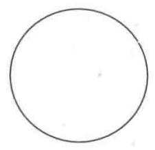  
(a) 圆形

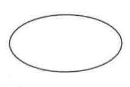  
(b) 椭圆形

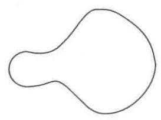  
(c) 葫芦形

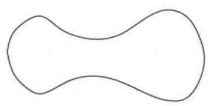  
(d) 哑铃形

图1-27露天矿边坡的水平形状  
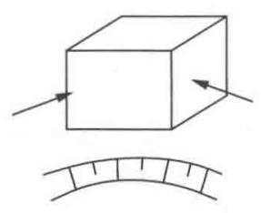  
(a) 凹形边坡

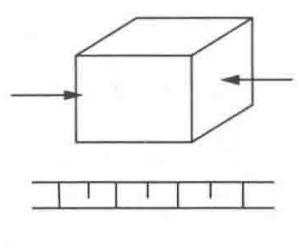  
(b) 直线型边坡

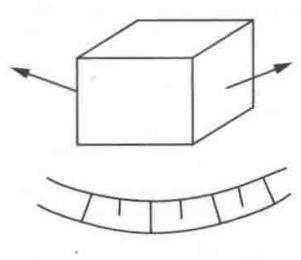  
(c) 凸型边坡  
图1-28 三种基本类型

由于凹型边坡中的岩体受到切向压应力的挤压作用，增加了滑体滑动的侧向阻力，而凸型边坡受到切向拉应力，使滑体减弱了侧向阻力作用，因此，凹型边坡比凸型边坡的稳定性好。直线型边坡介于二者之间。

边坡的几何形状对边坡稳定性有一定的影响，但对这种影响尚处于定性的或半定量的研究阶段。在具体矿山设计和评价中还很难准确地考虑到这种影响。尤其是当边坡条件复杂时，会使研究的难度更大。国内外一些学者通过理论、实验及现场研究获得了一些宝贵的结论，现介绍如下，供实际应用中参考[9]。

(1)C.LoreteDoNo于1969年对轴对称直立边坡的水平曲率进行了模型研究，假设边坡体是理想的弹塑体，服从米塞斯屈服准则，用有限差分法计算分析得出如下结论(图1-29)。

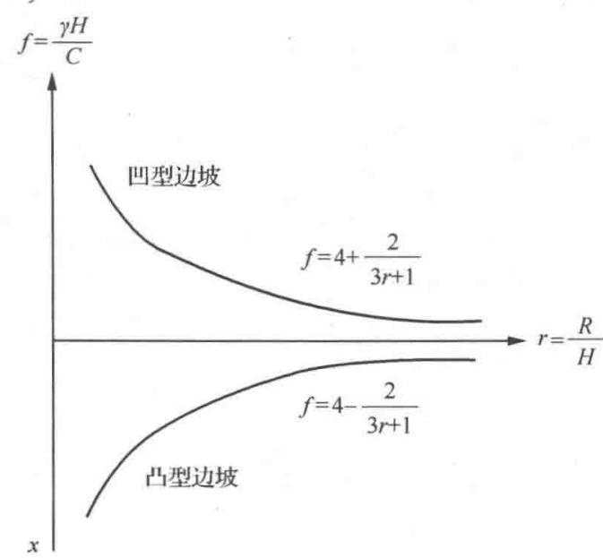  
图 1-29 C. Lorete Do No 研究结果

对于凹型边坡：

$$
f = 4 + { \frac { 2 } { 3 r + 1 } }\tag{1-35}
$$

对于凸型边坡：

$$
f = 4 - \frac { 2 } { 3 r + 1 }\tag{1-36}
$$

式中， $f$ 为相对稳定边坡高， $f = { \frac { \gamma H } { C } } ; r$ 为相对曲率半径， $r = { \frac { R } { H } } ; \gamma$ 为边坡体的容重；  
H为边坡高度;R为边坡水平面半径；C为边坡体的黏结力。

从图1-29中可以看出，凹型边坡的相对稳定边坡高度随相对曲率半径的增加而减小，凸型边坡的相对稳定边坡高度随相对曲率半径的增加而增加。但凹型边坡的相对稳定边坡高度要大于凸型边坡，只有当大于3以后，二者才趋于相同。

(2)Piteau和Jennings于1979年对南非四个地层顺序相同的、废弃了的金刚石矿进行了研究。由于长期的自然破坏，边坡角成为极限稳定边坡角。随着曲率半径的减小，水平切向应力增加，产生了成拱作用，有利于边坡的稳定，极限稳定边坡角较大，见表1-2，曲率半径大时，稳定的边坡角要小一些。

(a)  
(b)  
表1-2 极限稳定边坡角
<table><tr><td rowspan="2">矿坑</td><td colspan="3">曲率半径</td></tr><tr><td>200ft①</td><td>1000ft</td><td>差值</td></tr><tr><td>Kimberley</td><td>35.3°</td><td> $2 7 . 0 ^ { \circ }$ </td><td>8.3°</td></tr><tr><td>Dutoitspan</td><td>37.8°</td><td> $2 5 . 3 ^ { \circ }$ </td><td> $1 2 . 5 ^ { \circ }$ </td></tr><tr><td>Bnltfonten</td><td>44.3°</td><td> $2 4 . 3 ^ { \circ }$ </td><td> $2 0 . 0 ^ { \circ }$ </td></tr><tr><td>Wesseton</td><td> $4 1 . 3 ^ { \circ }$ </td><td> $3 2 . 5 ^ { \circ }$ </td><td> $9 . 8 ^ { \circ }$ </td></tr><tr><td>平均值</td><td>39.  $7 ^ { \circ }$ </td><td> $2 7 . 3 ^ { \circ }$ </td><td>12.7°</td></tr></table>

(3) 英国人Hoek指出：对于凹型边坡，当 $R / H { < } 1$ 时(图1-30)，边坡角比直线型边坡可加陡 ${ 1 0 } ^ { \circ }$ ，当 $R / H { > } 2$ 时，可不考虑水平曲率的影响。对于凸型边坡而言， $R / H { < } 1$ 时，边坡角比直线型边坡要缓 ${ 1 0 } ^ { \circ }$ ，当 $R / H { > } 2$ 时，不考虑水平曲率的影响。

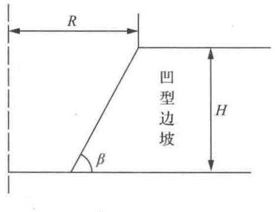

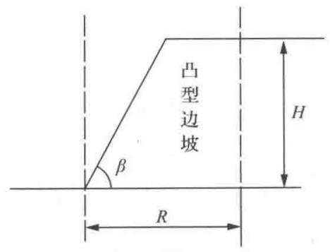  
图1-30 边坡几何尺寸示意图

(4）苏联学者在20世纪60年代通过检测试图得出：对于凹型边坡，当 $R / H { > } 2$ 时，不考虑水平曲率的影响，而 $R / H { < } 1$ 时，与直线型边坡相比，可加陡边坡角 $7 ^ { \circ } \sim 1 2 ^ { \circ }$ o

(5）加拿大的研究结果，凹型边坡较直线型边坡加陡的边坡角为

$$
i = \frac { 3 } { \displaystyle { \frac { 2 R } { H } } - 1 }\tag{1-37}
$$

（6）为了研究几何形状对边坡稳定性的影响，文献[9构筑了图1-31所示形状的边坡模型，模型材料由细沙、石膏粉和机油混合而成。边坡形成后，进行振动。整个边坡模型的破坏顺序为A、B、D，从中可以方便地观察到；凹型边坡较凸型边坡稳定性好，在凹型边坡中，曲率半径小的稳定性好。应用三维极限平衡条柱法对凹型边坡及凸型边坡进行稳定计算，得出了稳定系数随相对曲率半径(R/H)的变化与C.LoreteDoNo得出的曲线形式类似，当 $R / H { > } 3$ 时，稳定系数几乎不受R/H的影响。

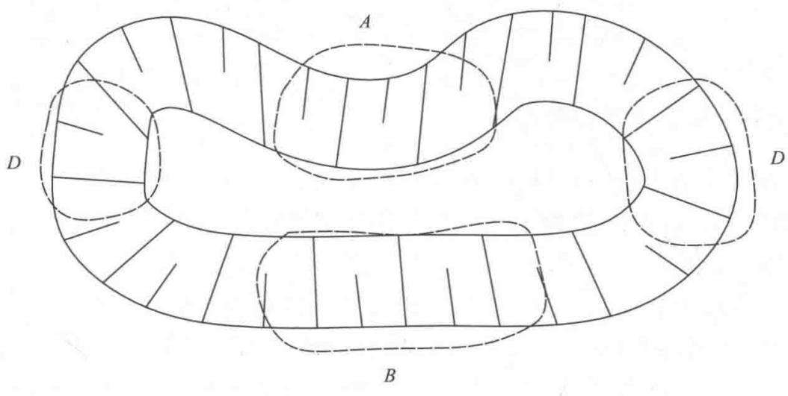  
图1-31 模型示意图

综上所述，边坡的平面几何形状对其稳定性有较大影响，尤其是当 $R / H { < } 1$ 时，这种影响更为显著，为了更加合理地设计和评价露天矿的整体边坡，当遇到凹型或凸型边坡时，其合理的边坡角较直线型边坡的合理边坡角适当地加大或减小。

边坡的断面形状对其稳定性也有一定的影响，有人做过理论探讨，假设均质边坡，圆弧滑面，则凹型边坡面比凸型边坡面的稳定系数(F)高，如图1-32所示。不过应当指出，露天矿边坡，上部岩体处于风化带，强度较低，一般随深度的增加，强度有所提高，故露天矿边坡常见设计成凸型，而未设计成凹型。

除上述的影响因素以外，采掘工作的推进方向，边坡距排土场的距离，已经服务的年限都有一定影响。

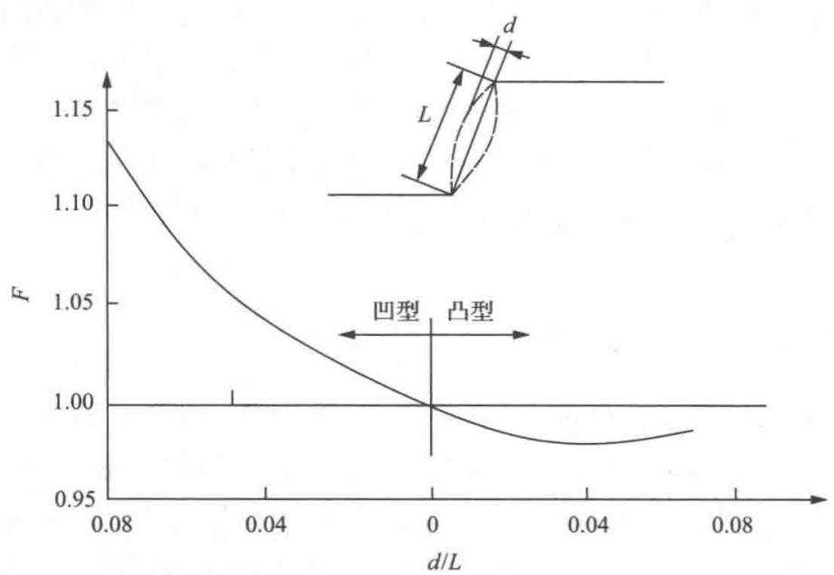  
图1-32 断面形状的影响

## 1.6 露天矿典型滑坡

## 1.6.1 海州露天煤矿典型滑坡实例

辽宁阜新海州露天煤矿1953年投产，设计开采深度350m，设计非工作帮最终边坡沿最下一层煤层底板设置，坡角 $1 8 ^ { \circ } \sim 2 0 ^ { \circ }$ ，工作帮最终边坡角 $3 8 . 6 ^ { \circ }$ 。自投产后，非工作帮发生了70余次滑坡，工作帮10余次。

非工作帮滑坡类型主要是顺层滑坡。滑面形状呈平面或折面。当弱层被切断时，滑面全部为弱层；当弱层未被切断时，滑面下部斜切剪断岩层。根据非工作帮工程水文地质条件和对历次滑坡的勘察分析表明，非工作帮滑坡的主要原因是：①煤层底板下赋存有与煤层基本平行的弱层；②采掘工程切断或接近切断弱层；③水的作用，绝大多数滑坡几乎都与水的作用有关。地下或地表水浸入弱层往往起着促进滑坡发生或由蠕动到剧滑的作用。

非工作帮第9次滑坡，如图1-33所示。滑体在露天西区，走向长240m，标高由地表170\~134m;沿倾斜宽135m，滑体厚度3\~14m，滑落体积 $1 . 3 5 \times 1 0 ^ { 5 } \mathrm { m } ^ { 3 }$ 。滑体上缘呈圆弧形，下部有突起，水平位移81m，垂直落差达 $9 \mathrm { m }$ 。滑面呈平面，为薄煤层与砂质页岩交接面。明显的滑动延续了三天[10]。

滑坡主要原因：①滑坡处于春季解冻期，地表水融化和地下水浸润弱层使其力学指标 $c , \varphi$ 值降低。滑后见到光滑镜面，而且仍有水从滑面渗出。②边坡角度大，为 $2 0 ^ { \circ }$ ,弱层倾角小，为 $1 5 ^ { \circ } \sim 1 6 ^ { \circ }$ ，下部已接近切断弱层。图1-34是1991年7月29日的一次滑坡照片。

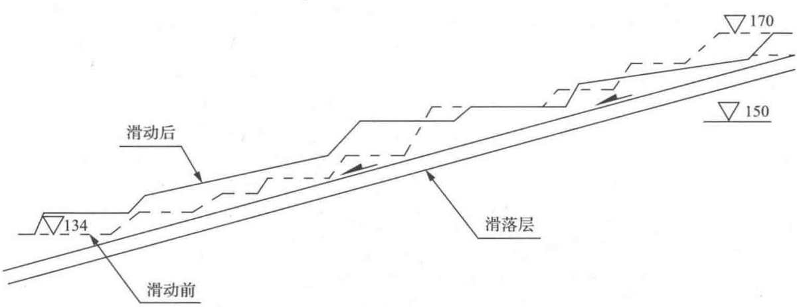  
图1-33非工作帮第9次滑坡剖面

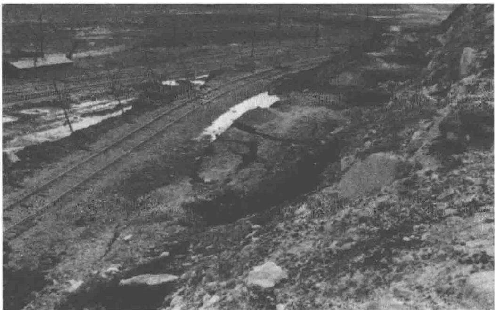  
图1-34 非工作帮三个台阶的滑坡照片

## 1.6.2 平庄西露天煤矿滑坡实例

平庄西露天煤矿位于内蒙古赤峰市，1958年工作帮出现滑坡，后发展到非工作帮和排土场。工作帮第26次滑坡发生于1983年4月，涉及584平盘、596平盘、608平盘和620平盘，滑体长362m、宽163m、高44m，滑坡量 $4 . 7 4 \times 1 0 ^ { 5 } \mathrm { m } ^ { 3 }$ ，滑体主要有玄武岩、砂岩及页岩等。滑前工作帮坡角 $1 5 ^ { \circ } \sim 1 6 ^ { \circ }$ ,最大 $1 6 ^ { \circ } 4 6 ^ { \prime }$ ，滑后稳定坡角为 $1 4 ^ { \circ } \sim 1 5 ^ { \circ }$ 。滑动面上部沿风化玄武岩裂隙垂直拉断，中部为砂岩弧形滑面，底部顺泥岩面滑动，工作帮第26次滑坡剖面如图1-35所示[11,12]。

由图1-35可以看出，工作帮第26次滑坡为逆岩层切层滑坡，滑体上部垂直落差3m，滑坡前缘隆起处有地下水涌出，降雨两天后上部平盘逐渐出现裂缝，产生剧滑。水的影响是这次滑坡的主要原因，玄武岩裂隙水经砂岩渗透到滑体，使滑体底部页岩层泥化。

  
图1-35 工作帮第26次滑坡剖面图

## 1.6.3 义马北露天煤矿滑坡实例及治理

义马北露天煤矿是一座中型露天煤矿，位于河南义马陇海铁路北侧，由于煤层中含有泥岩夹层，在地下水长期作用下，自建矿初期就连续不断发生滑坡。

工作帮(南帮)滑坡区位于采矿场东南端，构成南帮边坡的底层自下而上有三叠系砂岩、细砂岩、煤矸互叠层、2\~3煤层、砂岩层及黄土、砾石层，其中煤层为裂隙含水层、砂岩为弱裂隙含水层、砾石层为渗透性良好的空隙潜水含水层。1982年春，在本区410平盘的入坑干线南侧出现一条东西向长52m的沉陷沟，沟宽8\~10m，沟深0.71\~0.91m。该沟积水补给煤层，不仅降低了泥岩的力学强度，而且对边坡岩体形成水头压力，降低了边坡的稳定性，形成了滑坡，如图1-36所示。

  
图1-36 工作帮(南帮)滑坡  
1-入坑线；2-裂缝；3-公路；4-陇海铁路；5-煤层；6-砂岩；7-煤矸互叠层；  
8-抗滑桩；Q-黄土、砾石层；T3-三叠系砂岩、细砂岩

滑坡区的地下水、采矿工程是影响边坡稳定性的重要因素。研究表明，边坡岩体通过疏干、预留煤柱的措施来阻挡滑坡推力，实现边坡治理难度大，而埋设钢筋混凝土抗滑桩，可以将全部储煤采出，同时保证矿内运输干线和陇海铁路的安全，从经济和技术上都比较合理。

根据边坡稳定分析的要求，确定加固范围为3600～3800剖面。在200m范围内，共布置31个抗滑桩。最终边坡破坏时，滑面为煤矸互叠层与下部底砾岩顶板的接触面，根据各断面设桩处地表距滑面的深度、滑面倾角及滑坡推力，确定抗滑桩的参数13]。抗滑桩于1984年11月竣工，后经10余年开采实践，到1997年，抗滑桩仍发挥着良好效果。

## 1.6.4 大冶铁矿象鼻山北帮边坡变形破坏

武钢大冶铁矿东露天采场象鼻山采区北帮边坡，自1967年开始，一直处于不稳定状态。1972年以后，边坡位移明显增加。1978年3月和10月先后发生过局部滑落，且同年8月在边坡上部地面坡积层出现约100m的弧形开裂，不稳定状况日益加剧。1978年大冶铁矿有限公司会同有关科研单位进行监测，成功地预报了1979年7月11日发生的约$7 \times 1 0 ^ { 4 } \mathrm { m ^ { 3 } }$ 的滑坡。滑坡区剖面如图1-37所示[14]。

  
图1-37 滑体剖面图  
$\mathrm { B } _ { 1 }$ 坡积层； $\delta _ { 5 } \cdot$ 变质闪长岩； $\delta _ { 2 } \cdot$ 高岭土化绿泥石化闪长岩；Fe-铁矿体； $\mathrm { F } _ { 2 5 }$ 断层；→-测点位移矢量

由图1-37可以看出，滑体的上部受 $\mathrm { F _ { 2 5 } }$ 断层控制，形成陡坎。滑体中部，滑床形态受两组节理控制，其组合交线倾向与布置在滑体中上部测点的位移矢量倾角基本一致。滑体下部的平缓节理与边坡走向近乎平行，控制了滑体的底部边界。上述结构面构成了一上陡下缓的折线型滑床。

从宏观现象分析，滑坡首先是从坡顶裂开，然后变形逐渐向中部、下部发展，直至下部岩体被压碎崩溃，才发生整体大滑落。从位移资料看，上部岩体的位移量大于中部、下部；在岩体破坏的初始阶段，岩音频度也是上部明显大于中部、下部，属于重力推动式滑坡。

## 1.6.5 金川露天矿上盘西区滑坡倾倒滑移复合破坏

金川露天矿是我国的一个大型镍矿，位于河西走廊北侧，龙首山东段的东北坡。自1965年起开始剥离开采，到1985年10月成功闭坑。边坡高180～310m，采场纵向长1000m，横宽600m，呈椭圆形。

上盘西区滑坡位于露天矿坑上盘西段，坡顶标高为1830m，设计最低采深为1520m，边坡面走向 $\mathrm { N 4 0 } ^ { \circ } \mathrm { \sim } 6 0 ^ { \circ } \mathrm { W }$ ，倾向NE。滑坡区的边坡结构及岩体结构类型都极为复杂，如图1-38所示[15]。

  
图1-38滑坡区工程地质剖面图

由图1-38可知，矿体上盘边坡条块状结构体主要是反倾坡面，不存在顺层滑动条件。但是，恰好这里在边坡上部有近东西向断层和北东断裂组合，其交线倾向矿坑，而且边坡上部片岩也是倾向矿坑的。岩体的这种结构造成上部边坡有向矿坑滑移的趋势，但受到边坡中下部条块体的阻挡，当它克服了倾倒阻力后，便产生了滑动倾倒的复合变形，上盘西区滑坡从1964年边坡顶部产生裂缝以来，经历了由局部滑移到大面积倾倒，并导致坍塌、滚石灾害的全过程。

如图1-39所示，首先是在岩体内出现裂纹，其后发展成裂缝，缝加宽产生相对升降运动，边坡上产生反翘陡坎，继之岩体开始倾倒破裂，最后坍塌掉块。每一单元的倾倒发生发展全过程完成后，将逐渐沿坡面向下蔓延倾倒变形，重复出现前述过程。每一单元的全部发展过程，一般要经过两年左右。

  
图1-39 岩体倾倒变形发展的基本过程

## 1.6.6本钢南芬露天铁矿边坡破坏实例

本钢南芬露天铁矿是本钢主要铁矿石供应基地，2013年产铁矿石1270万t，采剥总量达9380万t，是国内采剥总量最大的铁矿山。下盘边坡滑体位于露天矿下盘边坡(东帮边坡)中段，继1999年发生滑坡后，其南侧一带于2002年7月又发生了更大规模的滑坡，最终形成了一个高达252m，上端宽250m，下部宽450m的滑体，如图1-10(a)所示。

发生滑坡的主要原因如下。

(1)滑坡区出露的岩体上部526平台以上以二云母石英片岩为主，中部430～526平台以绿帘角闪(片)岩为主，下部430平台以下主要为石英绿泥片岩，上述三种岩石坚硬，顺坡向节理、片理发育，并常有弱夹层。在滑坡区中部出露的长达450m花岗斑岩脉，大致顺坡向侵入，其岩石坚硬，不易风化，但与围岩的接触面局部片理化及热液蚀度明显，形成较弱面。上述岩体的顺坡产状、节理、片理及软弱面的存在是构成滑坡的主要因素。

(2) 滑坡区内 $\mathrm { F } _ { 2 }$ 和 $\mathrm { F } _ { 7 }$ 断层，大致平行展布，小角度斜交边坡走向，断层内充填有断层泥、构造角砾及片理化破碎岩石，由于两条断层横向切割， $\mathrm { F } _ { 7 }$ 形成了滑体后缘裂面， $\mathrm { F _ { 2 } }$ 形成了滑体前缘裂面。

（3）大气降雨的渗入成为产生滑坡的诱因，1999年、2000年、2002年出现的滑坡都是发生在雨季强降雨之后。

（4）采场下盘边坡不同地段地下水位变化较大，表层裂隙水分布不均匀，深层地下水水位稳定，但水头较高，边坡体渗透性低，高水头压力以及露天矿生产爆破作业也是诱发边坡破坏的原因。

上述露天矿滑坡实例表明，露天煤矿滑坡沿弱层面滑动，金属露天矿滑坡沿断层、结构面、追踪结构面滑动是其主要特征，其中无论任何露天矿，水对滑坡的作用巨大。

## 1.6.7露天矿排土场滑坡

露天矿除了采场滑坡以外，排土场滑坡也较为常见。神华宝日希勒能源有限公司露天煤矿在其首采区剥、采、排工程中，分别于2006年5月和2009年5月，发生两次内排土场滑坡现象(图1-40)。而后，随内排排弃强度增大，自2009年5月2日内排土场+660水平沉降加剧并有明显位移，开始滑坡，持续时间1\~2h，滑坡体土方量约1050万 $\mathrm { m } ^ { 3 }$ ,滑体移动距离约200m[图1-40(b)]。

  
(a) 2006年5月

  
(b) 2009年5月  
图1-40 神华宝日希勒能源有限公司露天煤矿内排土场滑坡

白音华二号露天煤 $\textcircled { 1 } ^ { * }$ ，在外排土场载荷作用下，南帮及排土场构成的复合边坡发生了两次巨型厚煤层的特大型顺层滑坡。第一次滑坡发生于2010年9月10日，滑坡滑体东西长约1.5km，南北宽约1.35km，高差约172m，体积约8100万 $\mathrm { m ^ { 3 } }$ [图1-41(a)];第二次滑坡发生于2011年5月16日，滑坡体东西长约1.597km，南北宽约1.476km，高差约205m，体积增大到9400万 $\mathrm { m } ^ { 3 }$ [图1-41(b)]。这两次滑坡涉及南邦外排土场三个台阶，形成的滑坡体压煤3Mt无法回采，直接经济损失约1.5亿元。

  
(a) 2010年9月

  
(b) 2011年5月  
图1-41白音华二号露天矿复合边坡滑坡

平朔安太堡露天矿于1991年10月29日0时10分在南排土场靠工业广场一侧发生大规模滑坡。滑体最大走向长度1095m，滑体前缘冲出距离245m，滑体垂高135m，滑落体积约1000万 $\mathrm { m } ^ { 3 }$ 。滑坡发生后，造成矿区7台设备陷于滑体内，致使平鲁公路1000m堵塞，750m毁坏，滑坡体前缘冲入工业广场，摧毁并埋没了洗车间、灯桥、门卫室等设施，刘家口水源供电线路中断，排水沟被埋600m，滑体前缘紧逼供水塔，临近办公楼和更衣室。此外，白音华四号露天煤矿、元宝山露天煤矿等诸多露天矿排土场均发生过滑坡或坡脚处底鼓、表面出现张裂缝等较大的变形现象。

2008年8月1日0时45分左右，太钢尖山铁矿排土场(图1-42)发生一起特别重大滑坡事故，造成位于尖山铁矿南排土场下面的娄烦县马家庄乡寺沟旧村93间房屋被埋，导致45人死亡、1人受伤。滑坡主要原因是：①1632排土平台2006年2月投入使用，初期排土量较少，之后排土量逐渐增大。2008年4月以后，1632平台多次发生裂缝和局部下沉、塌陷，排土场稳定性差。②产生移动的黄土山梁为孤立的山梁，地形条件不利。③排土场地基为第四纪地层，岩性为黄土、粉土、粉质黏土和碎石，黄土结构松散，裂隙发育，具湿陷性，地基承载力低，抗滑能力弱。④根据当地气象资料，2008年6～7月降水较大，降水渗入地下的量相对较大，降水影响排土场稳定性。⑤1632平台下部的扒渣捡矿活动降低了排土场稳定性[16]。

  
图1-42 排土场滑体平面示意图

## 参考文献

[1]王家臣.边坡工程随机分析原理.北京：煤炭工业出版社，1996.

[2]中国科学院武汉岩土所.岩质边坡稳定性的试验研究与计算方法.北京：科学出版社，1981.

[3]周昌寿，杜竞中，郭增涛，等.露天矿边坡稳定.徐州：中国矿业大学出版社，1990

[4]HoekE，BradyJ W. 岩石边坡工程.北京：冶金工业出版社，1983.

[5]中国科学院地质研究所，北京科技大学，武汉大冶铁矿.大冶铁矿东露天扩帮区边坡稳定性研究报告（鉴定会资料），1984.

[6]孙玉科，牟会宠，姚宝魁.边坡岩体稳定性分析.北京：科学出版社，1988

[7] Craig R F. Soil Mechanics. Berkshire: Van Nostrand Reinhold (UK) Co. Ltd, 1983.

[8]郑永学.矿山岩体力学.北京：冶金工业出版社，1988.

[9]王家臣.水平凸型边坡破坏分析.北京：北京科技大学硕士学位论文，1987.

[10]郭增涛，项永承，傅自厚.海州露天矿滑坡及其防治//中国岩石力学与工程学会地面岩石工程专业委员会，中

国地质学会工程地质专业委员会，中国典型滑坡.北京：科学出版社，1988：137-143.

[11]王广强.平庄西露天煤矿滑坡实例与探测研究//中国岩石力学与工程学会地面岩石工程专业委员会，中国地质学会工程地质专业委员会，中国典型滑坡.北京：科学出版社，1988：157-160.

[12] Wang J C. Simulation of the 26th slide of Pingzhuang west surface coal mine in China.International Journal of Surface Mining, Reclamation and Environment, 1995, V9.

[13]陈景基，江智明，纪玉石.义马北露天矿滑坡与防治//中国岩石力学与工程学会地面岩石工程专业委员会，中国地质学会工程地质专业委员会，中国典型滑坡.北京：科学出版社，1988：161-166.

[14陈英放，孙再南。大冶铁矿象鼻山北帮边坡变形破坏及滑坡预报//中国岩石力学与工程学会地面岩石工程专业委员会，中国地质学会工程地质专业委员会，中国典型滑坡.北京：科学出版社，1988：167-171.

15许兵，李毓瑞.金川露天矿上盘西区滑坡倾倒滑移复合破坏类型的研究//中国岩石力学与工程学会地面岩石工程专业委员会，中国地质学会工程地质专业委员会，中国典型滑坡.北京：科学出版社，1988.

[16]中华人民共和国工业和信息化部网站安全生产管理工作专题报道.

## 第2章 岩体力学基础

## 2.1 岩石基本物理性质

岩石是组成地壳的基本物质，是由各种造岩矿物或岩屑在地质作用下按一定的规律聚集而成的自然体。按照岩石的成因不同，岩石可以分为三种类型。

(1)岩浆岩，也称为火成岩，指由地球深处的岩浆侵入地壳内或喷出地表冷凝后而形成的岩石。

(2)沉积岩，指暴露在地壳表层的岩石在地球发展过程中遭受各种外力的破坏，破坏产物在原地或者经过搬运沉积下来，再经过复杂的成岩作用而形成的岩石。

（3）变质岩，指地壳中原有的岩石受构造运动、岩浆活动或地壳内热流变化等内营力影响，使其矿物成分、结构构造发生不同程度的变化而形成的岩石。

岩体和岩石是不同的概念，在有的教科书或著作里面，二者不严格区分，往往只说岩石，但是在具体内容描述上，是加以区分的，读者也能根据描述的内容区分开来。一般说来，岩石是指小的岩石试件，只包含一种岩石种类。岩体是指大的工程地质体，在岩体中进行工程开挖等，岩体中可能包含多种岩石，尤其是包含一些地质结构面(也称地质弱面、不连续面等)，结构面的性质和产状对岩体工程稳定具有重要影响，同时岩体中也包含原始岩体应力、温度应力等。

岩石的基本物理性质由组成岩石的矿物成分和结构两方面决定，不同矿物成分和连结类型的岩石具有不同的物理性质。工程上常用的描述岩石物理性质的指标有密度、比重、孔隙率、含水量和渗透系数等[1-3]。

## 2.1.1 岩石质量指标

岩石的质量指标主要包括岩石密度、重度以及比重等。

(1)岩石的密度。岩石单位体积的质量称为岩石的密度 $\rho ,$ 基本单位是 $\mathrm { k g / m ^ { 3 } }$ o

$$
\rho = m / V\tag{2-1}
$$

式中，m为岩石质量 $( \mathrm { k g } ) { : } V$ 为岩石体积 $( \mathbf { m } ^ { 3 } )$ 。

(2)岩石的重度。岩石单位体积的重量称为岩石的重度 $\gamma ,$ 单位多用 $\mathrm { k N / m ^ { 3 } }$

$$
\gamma = W / V\tag{2-2}
$$

式中，W为岩石重量(kN)。

(3)岩石的比重。岩石固体颗粒与同体积的 $4 ^ { \circ } \mathrm { C }$ 时纯水的质量比或重量比，称为岩石的比重 $G _ { \mathrm { s } }$ ，无量纲。

$$
G _ { s } = \frac { m _ { s } } { V _ { s } \cdot \rho _ { _ w } }\tag{2-3}
$$

式中， $m _ { s }$ 为岩石固体颗粒的质量(不包含水的质量)； $V _ { \mathrm { s } }$ 为岩石固体颗粒体积(不包含孔隙体积） $\mathrm { : } \rho _ { \mathrm { { w } } }$ 为 $4 ^ { \circ } C$ 时纯水的密度。

## 2.1.2岩石孔隙性

岩石的孔隙性是反映岩石中孔隙和裂隙发育程度的指标，主要包括岩石的孔隙比和孔隙率。

(1）岩石的孔隙比。岩石中孔隙的体积与岩石固体颗粒体积之比，称为岩石的孔隙 比 $e _ { \circ }$

$$
e = V _ { \mathrm { v } } / V _ { \mathrm { s } }\tag{2-4}
$$

式中， $V _ { \mathrm { ~ v ~ } }$ 为岩石中孔隙体积。

(2)岩石的孔隙率。岩石中孔隙的体积与岩石总体积之比，称为岩石的孔隙率 $n$ ,以百分比计。

$$
n = V _ { \mathrm { v } } / V\tag{2-5}
$$

## 2.1.3 岩石水理性质

岩石与水相互作用时所表现的性质称为岩石的水理性质，主要指标包括岩石的含水量、渗透系数与软化系数等。

（1）含水量。岩石中水的质量与固体颗粒质量之比，称为岩石的含水量 $\omega$ ，也称含水率，以百分数计。

$$
\omega = m _ { \mathrm { w } } / m _ { \mathrm { s } }\tag{2-6}
$$

式中， $m _ { \mathrm { w } }$ 为岩石中水的质量。

(2)渗透系数。1855年，法国工程师达西(Darcy)通过室内试验发现，当水在土中流动的形态为层流时，水的渗流遵循下述规律：

$$
\boldsymbol { v } = k \boldsymbol { i }\tag{2-7}
$$

式中， $v$ 为渗流流速；i为水力梯度(单位流程的水头损失)。公式中比例系数k称为渗透系数，单位多用cm/s，达西渗透定律表明在层流状态下流速 $_ { v }$ 与水力梯度i成正比。

(3)软化系数。岩石饱水状态下单轴抗压强度与干燥状态下的单轴抗压强度之比，称为岩石的软化系数 $\eta ,$ 无量纲。

$$
\eta = \sigma _ { \mathrm { s a t } } / \sigma _ { \mathrm { c d } }\tag{2-8}
$$

式中， $\sigma _ { \mathrm { s a t } }$ 为岩石饱水状态下单轴抗压强度； $\sigma _ { \mathrm { c d } }$ 为干燥状态下岩石单轴抗压强度。

## 2.2 岩石强度特征

岩石的强度是指单位面积岩石上所能承受的最大破坏荷载，它反映了岩石抵抗破坏

的能力。常用的岩石强度有抗压强度、抗拉强度和抗剪强度，三者之间，岩石的抗压强度最高，抗剪强度次之，抗拉强度最低。

## 2.2.1岩石抗压强度

## 1. 单轴抗压强度

岩石的单轴抗压强度是指岩石试件在无侧限条件下，受轴向荷载作用破坏时单位面积上所承受的极限荷载。图2-1为单轴压缩试验的加载示意图，设试样的直径为D，无侧限条件下岩石试样破坏时的最大轴向荷载为 $P _ { \mathrm { m a x } }$ ，岩石的单轴抗压强度为 $\sigma _ { \mathrm { c } }$ ，则

$$
\sigma _ { \mathrm { c } } = { \frac { 4 P _ { \mathrm { m a x } } } { \pi D ^ { 2 } } }\tag{2-9}
$$


在试样加压过程中，试件内部的应力分布如图2-2所示，与承压板AB、DE接触的两个三角形区域内为压应力(+)，而其他区域内的表现为拉应力(一)。

图2-1 单轴压缩试验加载示意图  
  
图2-2 圆柱体试件内部的应力分布

在常规岩石单轴压缩试验中，由于试件端面与承压板之间的摩擦力，使试件端面部分形成了一个箍的作用，随远离承压板而减弱，试件的破坏呈现出圆锥形破坏的特征[图2-3(a)]；若采用有效方法消除岩石试件两端面的摩擦力，则试件的破坏形态成为柱状劈裂破坏[图2-3(b)]。

  
(a) 圆锥形破坏

  
(b) 柱状劈裂破坏  
图2-3 圆柱体试件破坏方式[3]

## 2.三轴抗压强度

岩石在三向压缩荷载作用下，达到破坏时所能承受的最大应力称为岩石的三轴抗压强度。图2-4为三轴压缩试验的两种加载示意图，二者的区别在于围压的大小，图2-4(a)为真三轴试验情形，此时 $\sigma _ { 1 } > \sigma _ { 2 } > \sigma _ { 3 }$ ；图2-4(b)为常规三轴试验，俗称假三轴试验，此时$\sigma _ { 1 } > \sigma _ { 2 } = \sigma _ { 3 }$ o

  
(a) 真三轴试验

  
(b) 常规三轴试验  
图2-4 圆柱体试件内部的应力分布

围压的大小不同，表明岩石试件的侧向约束条件不同，所得到的三轴抗压强度也不相同。大量研究表明，岩石三轴抗压强度会随着围压提高而明显增大。图2-5是岩石应力应变曲线与围压关系的示意图，当围压低时，岩石破坏的抗压强度低，反之亦然。当围压增大到一定程度，与最大主应力相等时，即三向等压时，理论上讲岩石的强度会接近于无限大。

  
图2-5 岩石强度与围压关系示意图

将同一种岩石试件在不同围压下的三轴压缩破坏试验结果绘制成极限应力莫尔圆，如图2-6所示，绘出与所有极限莫尔圆相切的包络线，该包络线就是岩石的强度曲线。当岩石应力莫尔圆正好与此包络线相切时，表明此应力条件下岩石将发生破坏。

  
图2-6 莫尔圆和包络线

## 2.2.2 岩石抗拉强度

岩石的抗拉强度是指岩石能够抵抗的最大拉应力。获得岩石抗拉强度的方法有直接法和间接法，直接法通过单轴抗拉试验获得，由于岩石属于脆性材料，很难直接加工成拉伸试件进行试验，所以通常采用劈裂试验(巴西试验)进行岩石抗拉强度的间接测试。

劈裂试验是把一个经过加工的圆盘状岩石试件，放置在压力机的承压板中间，并在试件与上下承压板之间放置一根硬质钢丝作为垫条，然后加压，使试件受力后，沿直径轴向方向发生裂开破坏，以求其抗拉强度。加载方式如图2-7所示，加置垫条的目的是把所施加的压力变为上下一对线性分布的荷载，并使试件中产生垂直于上下荷载作用的拉应力。

  
图2-7 劈裂试验装置  
1-承压板；2-钢丝；3-试件

根据弹性理论，岩石的抗拉强度由下式确定：

$$
\sigma _ { \mathrm { t } } = { \frac { 2 P _ { \mathrm { m a x } } } { \pi D l } }\tag{2-10}
$$

式中，D、l为试件的直径和厚度； $P _ { \operatorname* { m a x } }$ 为试件破坏时的最大荷载。

值得注意的是，劈裂试验时，试件内部的应力状态并非单向拉应力状态，而是拉一压复合应力状态，破裂面(圆盘加载线)上的应力分布如图2-8所示，拉应力基本维持恒定数值，压应力在两个加载端很大，向圆盘中心逐渐减小，试件的破坏是在

两端压荷载作用下沿加载线的拉裂破坏。由于岩石的抗拉强度远小于它的抗压强度，所以在被压坏之前，试件首先被拉坏。

  
图2-8劈裂试验破裂面上的应力状态

## 2.2.3岩石抗剪强度

岩石的抗剪强度是指岩石在一定应力条件下(主要指压应力)所能抵抗的最大剪应力。获得岩石抗剪强度的方法主要有直剪试验和斜面剪切试验等。

## 1. 直剪试验

直剪试验是确定岩石剪切强度的最简单方法。试验装置如图2-9所示，试验时首先对岩石试件施加法向力F，然后再施加水平剪力T将下盒推动，试件便在侧限条件下沿既定的剪切面发生剪切破坏。

  
图2-9 直剪试验装置示意图[2]  
1-正压力；2-振动钢弦测力计；3-聚四氟乙烯；4-球形接头；5-剪力

假定试件的横截面面积为 $A$ ，则试件受到的法向应力 $\sigma$ 和剪应力 $\tau$ 分别为

$$
\sigma = { \frac { F } { A } } ; \tau = { \frac { T } { A } }\tag{2-11}
$$

直剪试验一般用于岩石强度不大的情况，随着施加的法向应力 $\sigma$ 增加，岩石试件破坏时所需的剪应力 $\tau ^ { ( }$ (抗剪强度)也增大，将法向应力 $\sigma$ 与试件破坏时的剪应力 $\tau$ 之间的关系绘成曲线，如图2-10中的 $A B D _ { \circ }$ 一般情况下，曲线ABD接近于直线，可用直线代替，称为岩石的抗剪强度曲线。强度曲线在纵坐标的截距为 $c _ { \cdot }$ 称为岩石的黏聚力；强度曲线的角度为 $\varphi$ ，称为岩石的内摩擦角。强度曲线的方程为

(2-12)

  
图2-10 岩石直剪试验结果

实际上对于岩石情形，剪应力与剪切位移的关系如图2-11所示，在小位移时，岩石的剪应力迅速达到峰值，然后应力降低，且趋于常数。取峰值剪应力作为岩石的抗剪强度 $\tau _ { \mathrm { f } }$ 9有时也称为峰值抗剪强度。峰值后趋于常数的剪应力称为残余抗剪强度。

## 2. 斜面剪切试验

岩石的斜面剪切试验，也称岩石的抗剪断试验，试验装置和试件受力如图2-12所示。把岩石试件置于楔形剪切仪中，放在压力机上进行加压试验，作用于剪切平面上的法向力

  
图2-11 剪应力与位移之间的曲线关系[4]

  
图2-12 岩石抗剪断试验装置和试件受力示意图

N和切向力Q可按下式计算：

$$
N = P ( \cos \alpha + f \sin \alpha )
$$

$$
Q = P ( \sin \alpha - f \cos \alpha )\tag{2-13}
$$

式中，P为压力机施加的总压力 $; \alpha$ 为夹具的倾角；f为圆柱形滚子与上下承压板之间的摩擦系数。

假定试件的横截面面积为A,则试件剪切面上的法向应力 $\sigma$ 和剪应力 $\tau$ 分别为

$$
\left\{ \begin{array} { l l } { \sigma = N / A = P ( \cos \alpha + f \sin \alpha ) / A } \\ { \tau = Q / A = P ( \sin \alpha - f \cos \alpha ) / A } \end{array} \right.\tag{2-14}
$$

以不同倾角的夹具进行试验，一般采用α角度为 $3 0 ^ { \circ } \sim 7 0 ^ { \circ }$ ，分别按式(2-14)求出相应试样受剪破坏时的 $\sigma$ 和 $\tau _ { \mathrm { f } }$ 值，就可以得到岩石试样的 $\sigma ^ { - } \tau _ { \mathrm { f } }$ 关系曲线，类似于图2-10，从而得到岩石的抗剪强度 $\tau _ { \mathrm { f } }$ 与法向应力 $\sigma$ 的关系式，见式(2-12)。

## 2.2.4 岩石点荷载强度

岩石点荷载强度测试具有简单、方便的特点，测试获得的强度也能满足一般情况下计算分析的精度需要。点荷载测试的岩石试件可以是规则岩心、试块，也可以是不规则岩块，如图2-13所示。把测量好尺寸的岩石试件放在点荷载仪的加载盘上，进行加载，直至试件破坏，记录下试件破坏时的荷载P。

  
(a) 现场点荷载强度测试

  
(b) 岩心试件

  
(c) 立方体试件

  
(d) 不规则试件  
图2-13 点荷载强度测试

$$
L > 0 . 5 D , 0 . 3 W < D < W , W = ( W _ { 1 } + W _ { 2 } ) / 2
$$

对于非规则试件而言，通常D=30～55mm。取得试验数据后，按国际岩石力学学会(ISRM)的建议方法计算点荷载指数 $I _ { \mathrm { s } }$ ，并求出岩石的抗压强度和抗拉强度。具体步骤如下：

$$
I _ { \mathrm { s } } = \frac { P } { D _ { \mathrm { e } } ^ { 2 } }\tag{2-15}
$$

式中， $P$ 为破坏荷载； $D _ { \mathrm { e } } ^ { 2 }$ 为当量直径。

对于岩心径向试验， $D _ { \mathrm { e } } = D$ ；对于岩心轴向、规则块体、不规则块体试验，则， $D _ { \mathrm { { e } } } ^ { 2 } =$ $4 W D / \pi$ o

I值不但与试件形状有关，而且是试件尺寸 $D _ { \mathrm { e } }$ 的函数，为了便于比较，获得一致性的点荷载强度指数，必须进行尺寸修正，以岩心直径D=50mm为标准，修正后的点荷载强度指数 $I _ { \mathrm { s ( 5 0 ) } }$ 称为标准点荷载指数。

$$
I _ { \mathrm { s ( 5 0 ) } } = \bigg ( \frac { D _ { \mathrm { e } } } { 5 0 } \bigg ) ^ { 0 . 4 5 } I _ { \mathrm { s } }\tag{2-16}
$$

单轴抗拉强度换算公式为

$$
\sigma _ { \mathrm { t } } = ( 0 . 7 9 \sim 0 . 9 0 ) I _ { \mathrm { s } ( 5 0 ) }\tag{2-17}
$$

单轴抗压强度换算公式为

$$
\sigma _ { \mathrm { c } } = ( 2 2 . 8 \sim 2 3 . 7 ) I _ { \mathrm { s } ( 5 0 ) }\tag{2-18}
$$

## 2.3 岩石变形特征

岩石变形是指岩石在外力作用下形状和大小的变化。研究岩石变形特性的目的是确定岩石的本构关系、相应的力学和变形参数等，为岩石工程变形的理论计算提供依据。

如图2-14所示，有一岩石试件，在压力P的作用下，发生压缩变形，其中， $l _ { 0 }$ 为试件原长度，l为压缩变形后长度，A为试件原断面积，则试件内的轴向应力为

  
图2-14 岩石试件变形

(2-19)

试件的轴向应变为

$$
\varepsilon = \frac { l _ { 0 } - l } { l _ { 0 } }\tag{2-20}
$$

## 2.3.1岩石基本变形特征

岩石在荷载作用下产生的变形包括弹性变形和塑性变形，而且塑性变形的发展往往与弹性变形同时进行，根据岩石的变形性质，可把岩石大致划分为图2-15所示的几种类型[1]。

  
(a)线弹性

  
(b) 非线弹性

  
(c) 黏弹性

  
(d)弹塑性

  
(e) 塑性  
图2-15 岩石的典型变形曲线类型

(1)线弹性岩石。如图2-15(a)所示，岩石的应力-应变关系近似直线。卸载后变形能够完全恢复，即卸载试验曲线可回归到加载试验的起始点，并与加载试验曲线几乎完全重合。新鲜的细粒岩浆岩和细粒变质岩多属于此种类型。

(2)非线弹性岩石。如图2-15(b)所示，岩石的应力-应变关系为曲线，但卸载后变形能够完全恢复，卸载试验曲线与加载试验曲线几乎完全重合。玄武岩、石英岩以及辉绿岩等坚硬岩石多属于此种类型。

(3)黏弹性岩石。如图2-15(c)所示，岩石的应力-应变关系为曲线，卸载后变形能够完全恢复，但卸载试验曲线具有滞后性，与加载试验曲线不重合。

(4)弹塑性岩石。如图2-15(d)所示，试验曲线中直线段代表弹性部分；曲线段代表 塑性部分，反映岩石内孔隙的压密或裂隙的产生、扩展与移动等过程。如遇卸载，变形不 会完全恢复。较坚硬而少裂隙的岩石，如石灰岩和砂砾岩等常呈现这种变形曲线。

(5)塑性岩石。如图2-15(e)所示，岩石的应力-应变曲线逐渐平缓，若卸载，则变形不能恢复。此类岩石的变形特点是试块的横向应变与纵向应变比值较大(泊松比)。泥岩、页岩以及空隙率较大的沉积岩均属此类。

图2-15是岩石在普通单轴抗压试验时获得的应力-应变曲线，这些曲线是达到峰值强度前的。加压试验时，当应力水平达到或接近岩石强度的瞬间，试件往往产生“爆裂”现象，突然破碎，以致很难测得接近及达到峰值时的应力-应变关系，更无法获得峰值后的信息。这是因为在试件加载过程中，普通压力机的柱体内产生了拉应力，积蓄了拉伸弹性变形能，当试件即将破坏时，试件承载能力下降，弹性变形能突然释放，对试件突然加载，导致试件突然破坏，并伴有声响和试件碎块的飞溅，所以人们往往以为岩石的应力与应变关系曲线只有峰前段。实际上，岩石变形不仅具有峰前段曲线，而且还有峰后段曲线，当应力超过岩石极限强度以后，岩石并没有完全失去承载能力，随着塑性变形的增大，强度逐渐降低，达到岩石的残余强度后不再降低。典型岩石破坏全过程应力-应变关系曲线如图2-16所示，可以将曲线分为四个阶段。

OA段：原始岩石内的空隙压密阶段，应力不大时，变形迅速增加；

AB段：线弹性变形阶段，B点为弹性极限；

BD段：裂隙产生和扩展阶段，呈现弹塑性变形，D点的应力为抗压强度；

DE段：残余承载阶段，即岩石受载虽然已过抗压强度，岩石已经破坏，但仍具有部分承载能力，到达E点岩石才完全破坏。

  
图2-16 岩石破坏全过程应力-应变关系曲线

## 2.3.2 岩石流变性

岩石流变性是指岩石变形随时间延长而表现出来的类似黏滞流体流动方面的特性。岩石的流变性包括岩石蠕变、应力松弛和弹性后效等性质。导致岩石发生流变的主要原因在于长期力场作用下岩石矿物骨架随时间的不断调整[1]。

岩石蠕变：岩石在应力恒定条件下，应变随时间延长而增加的现象，只要应力作用时间足够长，即使在低应力水平条件下，岩石也会发生蠕变现象。

应力松弛：岩石的应变一定时，岩石内的应力随时间延长而逐渐减小的现象。

弹性后效:岩石在加载(或卸载)经过一段时间后应变才增加(或减小)到一定数值的现象。

黏性流动：岩石在蠕变发生一段时间以后卸载，部分变形永久不能恢复的现象。

## 1. 岩石蠕变

在岩石试件上施加恒定荷载，观测其变形随时间的发展情况，根据试验数据绘制的应变-时间关系曲线，称为蠕变曲线，如图2-17所示。

  
图2-17 石灰岩蠕变曲线[5]

岩石的蠕变分为两种，即稳定蠕变和不稳定蠕变。

## 1）稳定蠕变

当作用在岩石上的恒定荷载较小时，初始阶段的蠕变速度较快，但随着时间延长，岩石变形趋近于稳定，而不再增长，这种现象称为稳定蠕变，如图2-17中荷载为440MPa的情形。

## 2）不稳定蠕变

当荷载超过某一临界值时，蠕变的发展将导致岩石变形不断增长，直到破坏，这种现象称为不稳定蠕变，如图2-17中荷载为680MPa的情形。不稳定蠕变的发展过程分为四个阶段，如图2-18所示。

瞬时变形阶段：在加载瞬间，岩石有一个弹性变形ε0。

初始蠕变阶段(Ⅰ):瞬时变形后，继而变形以较快的速度增长，随后蠕变速度逐渐降低，并过渡到等速蠕变阶段。如果在该阶段内卸载，会出现瞬间的弹性恢复变形(PQ段)以及一段时间之后恢复的变形(QR段)，后者为弹性后效。

等速蠕变阶段(Ⅱ):该阶段内岩石变形的速度保持恒定。如果在该阶段内卸载，不仅会产生瞬间的弹性恢复变形(TU段)和弹性后效(UV段)，而且会有不可恢复的永久变形。

加速蠕变阶段(Ⅲ):该阶段内岩石变形的速度随时间而增加，并最终导致岩石发生破坏。

  
图2-18 不稳定蠕变的四个阶段[2]

## 2. 岩石流变模型

岩石是一种复杂的流变性材料，具有弹性材料、塑性材料及黏性材料的综合变形特征。通常采用流变学中的基本力学模型元件来组成岩石材料的流变力学模型，从而对岩石流变特性进行一定的数学描述。一般情况下，流变模型由图2-19所示的三种基本元件构成。


  
(a) 弹性元件

  
(b) 塑性元件

  
(c) 黏弹元件  
图2-19 基本元件

## 1）弹性元件(胡克体)

在荷载作用下，如果岩石变形特征符合胡克定律，即岩石应变和所受的应力成正比，$\sigma = E _ { \varepsilon }$ ，则此种岩石变形特征可以用弹性元件描述，如图2-19(a)所示，相当于一个弹簧。由于弹性模量E为常量，于是有

$$
\frac { \mathrm { d } \sigma } { \mathrm { d } t } = E \frac { \mathrm { d } \varepsilon } { \mathrm { d } t }\tag{2-21}
$$

## 2)塑性元件(库仑体)

塑性元件也称摩擦元件、滑块，是一种理想的塑性体。当岩石所受的应力小于其屈服强度时，元件内虽然有应力存在，但不产生变形。当应力达到屈服强度时，便开始产生塑性变形，即使应力不再增加，变形仍会不断增大，如图2-19(b)所示，相当于一个摩擦块。塑性元件服从库仑摩擦定律：

$$
\varepsilon = \left\{ { \begin{array} { l l } { 0 } & { \sigma < \sigma _ { 0 } } \\ { \infty } & { \sigma \geqslant \sigma _ { 0 } } \end{array} } \right.\tag{2-22}
$$

式中， $\sigma _ { 0 }$ 为岩石的屈服强度。

## 3）黏性元件(牛顿体)

黏性元件也称阻尼元件，代表理想的黏性流体，如图2-19(c)所示，相当于一个活塞式液压缸，缸内充满液体，活塞上有一个小孔，在对活塞杆加压过程中，缸内液体通过活塞上的小孔慢慢流出，则活塞位移量与压力大小、加压时间、液体黏性系数有关，其流动性质服从牛顿黏性定律，即黏性体的流动速度(或应变速度)与应力成正比：

$$
\sigma = \eta \frac { \mathrm { d } \varepsilon } { \mathrm { d } t }\tag{2-23}
$$

式中， $\eta$ 为液体黏性系数。

将以上三种基本元件组合成复合体，可以用来模拟各种岩石的变形特征。组合的方式有串联和并联。在串联体中，复合体的总应力等于其中每个元件的应力，总应变则等于各元件的应变之和；在并联体中，总应力等于各元件应力之和，总应变等于每个元件的应变。

## 4)圣维南(S.Venant)模型

圣维南模型由一个弹性元件和一个塑性元件串联而成，如图2-20所示。

  
图2-20 圣维南模型

串联元件的应变之和等于总应变。

当 $\sigma { < } \sigma _ { 0 }$ 时：

$$
\varepsilon = \varepsilon _ { 1 } + \varepsilon _ { 2 } = 0 + \frac { \sigma } { E } = \frac { \sigma } { E }\tag{2-24}
$$

当 $\sigma \geq \sigma _ { 0 }$ 时：

$$
\varepsilon = \infty + \frac { \sigma } { E } = \infty\tag{2-25}
$$

## 5)马克斯威尔(Maxwell)模型

马克斯威尔模型由一个弹性元件和一个黏性元件串联而成，如图2-21所示。

  
图2-21 马克斯威尔模型

因为串联元件的应变之和等于总应变，故有

$$
\frac { \mathrm { d } \varepsilon } { \mathrm { d } t } = \frac { \mathrm { d } \varepsilon _ { 1 } } { \mathrm { d } t } + \frac { \mathrm { d } \varepsilon _ { 2 } } { \mathrm { d } t } = \frac { 1 } { E } \cdot \frac { \mathrm { d } \sigma } { \mathrm { d } t } + \frac { \sigma } { \eta }\tag{2-26}
$$

## 6)凯尔文(Kelvin)模型

凯尔文模型由一个弹性元件和一个黏性元件并联而成，如图2-22所示。

  
图2-22 凯尔文模型

因为并联元件的应力之和等于总应力，故有

$$
\sigma = \sigma _ { 1 } + \sigma _ { 2 } = E \varepsilon + \eta { \frac { \mathrm { d } \varepsilon } { \mathrm { d } t } }\tag{2-27}
$$

t= 0 时， $\sigma { = } \sigma _ { 0 }$ ，将式(2-27)积分可得

$$
\varepsilon = \frac { \sigma _ { 0 } } { E } \big ( 1 - \mathrm { e } ^ { - \frac { E } { \eta } t } \big )\tag{2-28}
$$

## 7)伯格斯(Burgers)模型

伯格斯模型是将凯尔文模型与马克斯威尔模型串联在一起，形成了新的模型，如图2-23所示，应变与时间的关系见式(2-29)。

  
图 2-23 伯格斯模型

$$
\varepsilon = \frac { \sigma } { E _ { 2 } } + \frac { \sigma } { E _ { 1 } } ( 1 - \mathrm { e } ^ { - t \frac { E _ { 1 } } { \eta _ { 1 } } } ) + \frac { \sigma } { \eta _ { 2 } } t\tag{2-29}
$$

上述流变模型的典型曲线关系如图2-24所示。流变模型的作用就是通过试验等确定模型中的参数，然后给出某种岩石的一般性流变曲线等，用来预测预报工程岩体的流变特性及可能的破坏情况，但是目前的流变模型还很难做到可以拟合加速蠕变阶段，因此进行实际工程应用还有一定困难。

  
(a) 圣维南模型

  
(b) 马克斯威尔模型

  
(c) 凯尔文模型

  
(d) 伯格斯模型  
图2-24 流变模型的曲线关系[2]

## 2.4 岩石强度准则

岩石强度准则也称岩石强度理论，是研究岩石在复杂应力状态下破坏的原因、规律及建立相应的破坏判据，历史上已提出过很多种强度理论，但在目前岩石工程中常用的主要有莫尔-库仑强度理论和格里菲斯强度理论。复杂应力状态是指除单轴拉伸和单轴压缩以外的所有应力状态。

岩石的强度准则取决于多种因素，如应力、温度、试件大小等，多数研究仅考虑应力影响，其他因素的研究影响较少。从岩石强度准则的产生过程可以分为经验性准则和理论性准则。经验性准则是根据大量试验结果，分析整理以求得数学表达式，如莫尔-库仑准则；而理论性准则是从固体的基本力学性质来建立岩石的强度准则，如格里菲斯准则。

## 2.4.1 岩石破坏类型

岩石在外力作用下，首先产生不同形式的变形，继而产生微裂隙和破裂，裂隙扩展到

一定阶段，岩石发生破坏。岩石破坏的基本形式有如下三种。

（1）压裂破坏。加压板与试件端面间摩擦阻力小时，试件产生横向变形，变形量达到变形极限时，试件拉裂，形成平行于加压方向的拉裂缝，如图2-25(a)所示。试件破坏是因为在加压过程中，产生横向变形，并附加产生横向拉应力，当拉应力大于试件的抗拉强度时，试件破坏。此类破坏表面上看是由于压载荷造成的，但是其破坏的根本原因是横向拉应力作用。

(2)剪切破坏。岩石的剪切破坏可直接由剪切作用产生，也可以由压缩衍生的剪应力引起。剪切破坏的特点是岩石沿破坏面发生相互错动，且破坏时常出现成对的剪切破坏面。如图2-25(b)所示，加压板与试件端面有较大摩擦力时，在压应力作用下，试件内部产生了一组(或几组)剪切破坏面。

（3）塑性流动破坏。在三轴压缩试验条件下，加压板与试件端面有较大的摩擦力，试件两端面变形受到强阻碍，岩石内部产生多组剪切面，复杂应力状态下试件逐渐缓慢地膨胀成桶形，岩石因塑性流动而产生破坏，如图2-25(c)所示。该破坏形式是岩石颗粒产生微小剪切滑移的结果，仍是一种剪应力造成的剪切错动。

  
(a) 压裂破坏

  
(b) 剪切破坏

  
(c) 塑性流动破坏  
图2-25 岩石破坏形式

## 2.4.2莫尔-库仑(Mohr-Coulomb)强度准则

莫尔-库仑强度准则是莫尔与库仑两人在不同时间所提出的强度理论总称。

库仑(Coulomb)于1773年根据黏性土剪切破坏试验，将其抗剪切破坏能力 $\tau _ { \mathrm { f } }$ 表达为剪切破坏面上法向应力σ的函数：

$$
\tau _ { \mathrm { f } } = c + \sigma \tan \varphi\tag{2-30}
$$

式中， $\tau _ { \mathrm { f } }$ 为抗剪强度 $( \mathrm { M P a } ) { \mathrel { \mathop : } } \sigma$ 为总应力 $( \mathrm { M P a } ) { \mathrel { \mathop { : } } } c$ 为土的黏聚力(MPa); $\varphi$ 为土的内摩擦角 $( ^ { \circ } )$ 。

式(2-30)称为库仑公式或库仑定律， $c , \varphi$ 称为抗剪强度指标。将库仑公式表示在 $\tau _ { \mathrm { f } } { - \sigma }$ 坐标中为两条直线，如图2-26所示。

  
图 2-26 $\tau _ { \mathrm { f } } - \sigma$ 关系

岩石强度具有类似黏性土的强度特点，剪切试验结果也有类似关系，如图2-10和式(2-12)所示，因此在岩石力学中也一直引用库仑强度准则。由式(2-30)可以看出，岩石的抗剪强度由两部分组成，一部分为摩阻力(与法向应力成正比)；另一部分是岩石颗粒间的黏聚力，它是由于岩石颗粒间的胶结作用和静电引力效应等因素引起。

莫尔(Mohr)强度准则是莫尔在1900年提出的，是目前岩土力学中使用最广泛的准则之一。该准则认为，固体材料发生破坏的主要原因是破坏面上的剪力达到一定限度。剪力除了与材料本身的性质有关外，还与破坏面上的正应力造成的摩擦阻力有关。例如，某一点材料发生破坏，不仅取决于该点的剪应力，同时也取决于该点的正应力。因此，岩石沿某一面剪切破坏时所需要的剪应力 $\tau _ { \mathrm { f } }$ 与该面上的正应力 $\sigma$ 存在某种函数关系：

$$
\tau _ { i } = f ( \sigma )\tag{2-31}
$$

该式为莫尔提出的一般形式，也称为莫尔强度理论的普遍形式。具体应用中，要通过试验确定其具体形式。一般的试验方法就是做大量的单向抗拉、单向抗压，不同围压下的三轴抗压试验，得到不同的极限莫尔圆，然后给出极限莫尔圆的包络线，该包络线就是莫尔强度曲线，如图2-6和图2-27所示。

  
图2-27 莫尔包络线

利用强度曲线可以进行如下工作。

(1）判断岩石试件在不同应力作用下是否发生剪切破坏。根据岩石受力状态，画出相应的莫尔圆，然后判断该莫尔圆与该种岩石莫尔包络线的关系，判断岩石在该应力状态下是否破坏。若应力莫尔圆在包络线之内(图2-28中的Ⅰ)，则不破坏；若应力莫尔圆与包络线相切(图2-28中的Ⅱ)，表示该岩石处于破坏的极限平衡状态；若相交(图2-28中的Ⅲ），该岩石已经破坏，实际上这种情况是不可能存在的，因为该点任何方向上的剪应力都不可能超过岩石的抗剪强度，即不存在 $\tau > \tau _ { \mathrm { f } }$ 的情况。

  
图2-28 莫尔圆与抗剪强度之间的关系

(2)可以用于判断岩石破坏面的方向，通常情况下，破坏面与最大主应力方向的夹角为 $( 4 5 ^ { \circ } - \varphi / 2 )$ 0

(3)岩石的单轴抗拉强度远小于单轴抗压强度。如图2-27所示，过坐标原点的两个莫尔圆分别表示单轴受拉和受压应力状态 $, \sigma$ 轴负方向的为单轴受拉极限莫尔圆，正方向为单轴受压极限莫尔圆，可以看到单轴受压极限莫尔圆远大于单轴受拉极限莫尔圆，二者直径分别表示岩石的单轴抗拉和抗压强度，因此岩石的单轴抗拉强度远小于单轴抗压强度，这是岩石材料的强度特点之一。

在岩石力学和工程设计中，为了计算岩石强度，必须给出相应的关系式，莫尔没有给出抗剪强度曲线的具体关系式，有人提出二次曲线或摆线等。但为了便于计算，通常采用斜直线作为强度曲线，即库仑关系式，见式(2-32)：

$$
\tau _ { \mathrm { f } } = c + \sigma \tan \varphi\tag{2-32}
$$

式中， $\tau _ { \mathrm { f } } \setminus \sigma$ 分别为破坏面上的剪应力和正应力 $; c , \varphi$ 分别为岩石的黏聚力和内摩擦角。

莫尔对库仑强度曲线给出了较好的解释，也从更一般的概念上，说明了岩石强度曲线的来源等，因此式(2-32)通常被称为莫尔-库仑强度理论。

根据极限莫尔应力圆与库仑强度曲线相切的几何关系，如图2-29所示，可以得到如下结论。

(1)对比图2-29(a)和图2-29(b)可以发现，图2-29(a)中从最大主应力 $\sigma _ { 1 }$ 到破坏面法线方向的夹角为 $\alpha$ ，但是图2-29(b)中从 $\sigma _ { 1 }$ 到极限莫尔圆与强度曲线相切的点对应的角度是 $2 \alpha$ ，由几何关系 $2 \alpha = 9 0 ^ { \circ } + \varphi$ ，因此：

$$
\alpha = 4 5 ^ { \circ } + { \frac { \varphi } { 2 } }\tag{2-33}
$$

式(2-33)说明了破坏面与最大主应力 $\sigma _ { 1 }$ 的夹角为 $4 5 ^ { \circ } - \varphi / 2$ o

  
(a) 受力岩石

  
图2-29 莫尔-库仑强度条件

(2)如图2-29(b)所示，由几何关系：

$$
\begin{array} { c } { { \mathrm { s i n } \varphi = \displaystyle \frac { M N } { D O + M O } } } \\ { { M N = \displaystyle \frac { \sigma _ { 1 } - \sigma _ { 3 } } { 2 } } } \\ { { D O = c \star \mathrm { c o t } \varphi } } \\ { { M O = \displaystyle \frac { \sigma _ { 1 } + \sigma _ { 3 } } { 2 } } } \end{array}
$$

得到：

$$
\sigma _ { 1 } = \frac { 2 c \sin \varphi \cot \varphi } { 1 - \sin \varphi } + \frac { 1 + \sin \varphi } { 1 - \sin \varphi } \eqno 3\tag{2-34}
$$

式(2-34)是用主应力表示的莫尔-库仑强度条件，与式(2-32)具有同样作用；式(2-34)中，若 $\sigma _ { 3 } = 0$ ,则 $\sigma _ { 1 }$ 就是岩石的单轴抗压强度 $( R _ { \mathrm { c } } )$

$$
\begin{array} { l } { { R _ { \mathrm { c } } = \displaystyle \frac { 2 c \sin \varphi \cot \varphi } { 1 - \sin \varphi } } } \\ { { \displaystyle \vphantom { \frac { 1 } { \cos \varphi } \frac { \sin \varphi } { c } } } } \\ { { \sigma _ { \mathrm { 1 } } = R _ { \mathrm { c } } + \frac { 1 + \sin \varphi } { 1 - \sin \varphi } \sigma _ { \mathrm { 3 } } } } \end{array}
$$

(3)岩石单轴抗拉强度 $R _ { t }$ 与抗压强度关系，如图2-30所示，由几何关系：

$$
{ \mathrm { s i n } } \varphi = { \frac { \frac { R _ { \mathrm { t } } } { 2 } } { c { \cot } \varphi - { \frac { R _ { \mathrm { t } } } { 2 } } } }
$$

$$
R _ { \mathrm { t } } = { \frac { 2 c \sin \varphi \cot \varphi } { 1 + \sin \varphi } }
$$

因此：

$$
\frac { R _ { \mathrm { c } } } { R _ { \mathrm { t } } } = \frac { 2 c \sin \varphi \cot \varphi } { 1 - \sin \varphi } \bigg / \frac { 2 c \sin \varphi \cot \varphi } { 1 + \sin \varphi } = \frac { 1 + \sin \varphi } { 1 - \sin \varphi } = \tan ^ { 2 } \left( 4 5 ^ { \circ } + \frac { \varphi } { 2 } \right)\tag{2-35}
$$

一般来说， $\varphi \approx 2 0 ^ { \circ } \sim 4 0 ^ { \circ }$ ,则 $R _ { \mathrm { c } } = \tan ^ { 2 } { \left( 4 5 ^ { \circ } + \frac { \varphi } { 2 } \right) } R _ { \mathrm { t } } \approx ( 2 . 0 4 \sim 4 . 6 ) R _ { \mathrm { t } }$ ；由于岩石的抗拉强度不易试验求得，通过式(2-35)可由 $R _ { \mathrm { c } }$ 获得 $R _ { 1 }$

  
图2-30 单轴应力作用的莫尔圆

莫尔-库仑强度理论目前在岩石力学领域中应用最广，它能较全面地反映岩石的强度特性，如抗拉强度远小于抗压强度，能很好地解释岩石在三轴受拉时会破坏(因强度包络线在受拉区闭合)和三轴等压压缩时不会破坏(包络线在受压区不闭合，三轴等压时莫尔圆为一点)的现象。它不仅适用于塑性材料，还适用于脆性材料的破坏，所以广泛用来解释岩石的破坏现象。其中，不足之处在于只适用于剪切和塑性流动两种破坏形式，不适用于拉断破坏；同时，莫尔-库仑强度理论只考虑了最大主应力 $\sigma _ { 1 }$ 和最小主应力 $\sigma _ { 3 }$ ，与中间主应力 $\sigma _ { 2 }$ 无关，而一些试验已经证明了 $\sigma _ { 2 }$ 对岩石破坏有影响。

## 2.4.3格里菲斯(Griffith)强度准则

1921年格里菲斯在研究脆性材料的破坏时发现，根据分子键之间的强度进行理论计算，得到的强度比强度试验结果高几个数量级，因此，他认为脆性材料的抗拉强度不是由分子键决定的，而是由材料中大量看不见的微小裂隙所控制。

格里菲斯强度准则也称为拉应力准则。格里菲斯准则认为，任何固体内部都存在窄狭的微裂隙。无论材料的受力状态如何(压、拉或复杂应力状态)，最终都会在裂隙尖端产生拉应力集中。当拉应力大于材料的抗拉强度时，裂隙扩展，直至材料破坏。由此可见，格里菲斯理论认为材料破坏是由于拉应力造成的，这一理论适用于玻璃、陶瓷、岩石等脆性材料。

格里菲斯在进行理论准则推导时，认为材料内的裂隙可用椭圆代替，如图2-31所示，如格里菲斯椭圆裂隙。然后将模型简化为半无限介质中单个椭圆孔洞的平面应力问题处理。引用弹性力学关于半无限大介质椭圆孔周边受力分析结果，得出双向应力状态下裂隙开始扩展的条件：

  
图2-31 二维格里菲斯模型

平面应力状态下格里菲斯强度准则的表达式为

$$
\left. \begin{array} { l l } { { \displaystyle \frac { ( \sigma _ { 1 } - \sigma _ { 3 } ) ^ { 2 } } { 8 ( \sigma _ { 1 } + \sigma _ { 3 } ) } = \sigma _ { \mathrm { t } } \qquad \frac { \sigma _ { 3 } } { \sigma _ { 1 } } \geqslant - \frac { 1 } { 3 } } } \\ { { \qquad \sigma _ { 3 } = - \sigma _ { \mathrm { t } } \qquad \frac { \sigma _ { 3 } } { \sigma _ { 1 } } \leqslant - \frac { 1 } { 3 } } } \end{array} \right\}\tag{2-36}
$$

式中， $\sigma _ { \uparrow }$ 为岩石单轴抗拉强度。

格里菲斯强度准则是在裂隙张开的情况下建立的强度条件。实际上，岩石在大多数情况下承受压应力，裂隙闭合，这样作用在裂隙面上的正应力将使裂隙上产生摩擦阻力，由于摩擦也能承受剪应力，所以岩石强度有所增加。于是麦克林托克(McClintock)和瓦尔西(Walsh)根据裂隙闭合的效果对格里菲斯准则进行了修正[6]。

修正后的格里菲斯强度准则为

$$
\sigma _ { 1 } = \frac { - 4 \sigma _ { \mathrm { t } } } { \left( 1 - \frac { \sigma _ { 3 } } { \sigma _ { 1 } } \right) \sqrt { 1 + f ^ { 2 } } - f \big ( 1 + \frac { \sigma _ { 3 } } { \sigma _ { 1 } } \big ) }\tag{2-37}
$$

式中， $f$ 为内摩擦系数。

尽管以单轴抗拉强度表达破坏发生条件在理论上较好，但因准确确定岩石的抗拉强度值比较困难，使其应用受到限制。对岩石来说，单向抗压强度易于测定，故可用抗压强度代替抗拉强度，采用抗压强度表达的修正格里菲斯强度准则为

$$
\sigma _ { 1 } = \sigma _ { 3 } \frac { \sqrt { 1 + f ^ { 2 } } + f } { \sqrt { 1 + f ^ { 2 } } - f } + \sigma _ { \mathrm { c } }\tag{2-38}
$$

格里菲斯强度准则没有考虑多个裂隙的相互作用，只能作为单个裂隙开裂的判断条件，作为岩石的理论强度准则，格里菲斯强度准则仍不成熟。

在边坡稳定性分析中，很少用到格里菲斯强度准则。

## 2.5 岩体结构面力学特征

岩体在地壳运动过程中，受力的作用，岩层遭到破坏，失去了连续性和完整性的构造形态叫断裂构造，岩体断裂面通常称为岩体结构面，结构面分为两类，一是结构面两侧没有发生明显位移(错动或张开)的叫裂隙或者节理图2-32(a)；二是结构面两侧发生明显位移的叫断层[图2-32(b)。一般情况下，断层是一些大型结构面，会控制边坡岩体的稳定性，在进行边坡稳定研究时，单独进行分析。此处所说的结构面主要是指规模较小的节理、裂隙。

结构面的力学性质主要包括三个方面，一是法向应力作用下产生的法向变形；二是剪应力作用下产生的剪切变形；三是结构面的抗剪强度。

  
(a) 节理

  
(b) 正断层  
图2-32 岩体结构面

## 2.5.1结构面的法向变形

大量的试验发现，作用在结构面上的法向应力 $\sigma$ 与法向位移 $\delta _ { \mathfrak { n } }$ 的关系并不是线性关系，即结构面的法向刚度系数 $k _ { \mathrm { n } }$ 不是常数。考虑极限压密和初始应力状态时结构面 $\sigma ^ { - } \delta _ { \mathfrak { n } }$ 关系曲线如图2-33所示。

图2-33(a)为具有一定抗拉强度的结构面法向应力与变形关系曲线，初始条件下结构面存在一定的压应力，随着应力的释放，结构面逐渐张开，当拉应力大于结构面的抗拉强度时，结构面发生分离；相反，随着压应力增大，结构面逐渐闭合，极限闭合量为 $C _ { \mathrm { m } }$ 图2-33(b)为不能承受拉应力的结构面法向应力与变形关系曲线，随着初始应力逐渐释放，结构面恢复至最大张开量。

  
图2-33 岩体结构面法向应力与变形关系曲线[7]

Goodman于1976年提出结构面法向应力与法向相对位移关系曲线的双曲线型经验模型，如图2-34所示左侧经过原点的曲线，结构面法向应力以拉为正，闭合为负；结构面抗拉强度为 $S _ { t }$ ;模型表达式为[8]

$$
\sigma _ { \mathrm { n } } = S _ { \mathrm { t } } \Big [ 1 - \Big ( \frac { C _ { \mathrm { m } } } { \delta _ { \mathrm { n } } + C _ { \mathrm { m } } } \Big ) ^ { \beta } \Big ]\tag{2-39}
$$

式中， $\beta$ 为节理的力学常数， $\sigma _ { \mathrm { n } } \leqslant S _ { \mathrm { t } } ; \delta _ { \mathrm { n } } = C _ { \mathrm { m } }$ 0

  
图2-34 结构面的双曲线型法向变形曲线

地下岩体中一般存在初始地应力，岩石工程开挖后的位移不包括初始地应力引起的位移，因此在岩石边坡和地下工程稳定性分析中，往往先施加初始地应力，并把初始地应力引起的位移清零。为此，图2-34中把曲线向右平移 $\delta _ { \mathfrak { n } 0 }$ 的距离，使其通过点 $( 0 , \sigma _ { \mathrm { n 0 } } )$ 式(2-39)变为

$$
\sigma _ { \mathrm { n } } = S _ { \mathrm { t } } \Big [ 1 - \Big ( \frac { C _ { \mathrm { m } } } { \delta _ { \mathrm { n } } + \delta _ { \mathrm { n 0 } } + C _ { \mathrm { m } } } \Big ) ^ { \beta } \Big ]\tag{2-40}
$$

## 2.5.2结构面的剪切变形

在恒定法向荷载作用下，结构面在剪切应力作用下的剪切变形与结构面的类型、粗糙度、有无充填物以及充填物的多少等有关。图2-35是两种典型变形曲线，其中曲线A是闭合节理在顺节理剪切时得出的剪切位移与剪应力关系曲线，具有峰值和残余强度。曲线B是充填节理的变形曲线，没有峰值和残余强度。当闭合节理首次被剪断后，若让节理重新闭合后进行剪切，那么剪切变形曲线将变为类似于曲线B的曲线，所以这两种曲线是可以相互转化的，即当闭合节理齿被剪平充填后，将会转变为B型曲线。

  
图2-35 结构面顺节理方向的剪切变形曲线[8]

## 2.5.3结构面抗剪强度

一般来说岩体结构面不能承受法向拉应力，在法向压应力方面与完整岩体区别不大，在沿结构面方向抗剪切能力相对复杂，但是总体上是降低了岩体抗剪能力。有的结构面之间有其他矿物等充填物，有的没有充填，而且结构面可能是平滑的，也可能是凹凸不平的，如图2-36所示。

  
图2-36 起伏不平结构面

对于平滑结构面，结构面的黏聚力为零，摩擦角与岩石的内摩擦角相近。对于起伏不平结构面，结构面受剪切作用时，首先是结构面要克服粗糙角i，向上爬坡，此时粗糙角i有利于提高结构面的抗剪能力，如图2-37所示。当岩石强度较高时，上部岩石受剪力作用开始沿起伏面滑动，除向右移动外，还有向上的位移分量，这一位移分量引起岩体的体积膨胀。如果岩石强度较低，在剪力T作用下没有明显的剪胀，起伏根部即被剪断。因此在同样受力状态下，结构面粗糙程度和结构面两侧岩石的强度影响其抗剪特性。所以结构面粗糙度和岩石强度决定了它的剪切性能。

  
(a) 剪切试验

  
(b) 结构面爬坡  
图2-37 起伏结构面剪切示意图

图2-38为起伏结构面受力示意图，对于光滑、无充填物的结构面而言，结构面破坏形式为沿着结构面的滑动，滑动条件为

$$
\mathrm { t a n } \varphi = { \frac { T } { N } }\tag{2-41}
$$

  
(a)平直

  
(b) 倾角为i  
图2-38 结构面的力学分析

写成剪切强度的形式：

$$
\tau = \sigma { \tan } \varphi\tag{2-42}
$$

当结构面对剪力的作用方向倾斜角度为i时，结构面的滑动条件变为

$$
\mathrm { t a n } \varphi = \frac { T ^ { * } } { N ^ { * } }\tag{2-43}
$$

式中：

$$
T ^ { * } = T { \cos } i - N { \sin } i
$$

$$
N ^ { * } = N { \cos } i + T { \sin } i
$$

所以

$$
_ { \mathrm { t a n } \varphi } = \frac { T \cos i - N \sin i } { N \cos i + T \sin i }\tag{2-44}
$$

$$
\tan ( \varphi + i ) = { \frac { T } { N } }\tag{2-45}
$$

式中， $\varphi + i$ 称为视摩擦角。

当法向荷载N很大时，结构面起伏将被剪断，所以Patton等认为结构面的剪切强度曲线应为双直线形式(图2-39)[9]。

  
图2-39结构面的双直线剪切强度曲线

当法向应力较小时：

$$
\tau = \sigma \tan ( \varphi + i )\tag{2-46}
$$

当法向应力较大时：

$$
\tau = c _ { \mathrm { j } } + \sigma { \tan } \varphi _ { \mathrm { r } }\tag{2-47}
$$

式中， $\varphi _ { r }$ 为平滑结构面的摩擦角 $; C _ { \mathrm { j } }$ 为因结构面起伏部分剪断而呈现出的似黏聚力。

式(2-47)即为结构面的莫尔-库仑准则，工程中通常用 $c _ { \mathrm { j } } \setminus \varphi _ { \mathrm { r } }$ 表示结构面的抗剪强度。由图2-39可知，采用式(2-47)会夸大结构面强度。实际上结构面形状非常复杂，剪切强度曲线一般为曲线。

Barton通过人造粗糙“节理”进行详细试验和观测，采用最小二乘法对试验数据进行处理，并考虑结构面的不同粗糙程度，得出了预测岩石结构面抗剪强度的一般经验公式。在低或中等有效正应力 $\sigma$ 作用下，采用如下的强度准则[10]：

$$
\tau = \sigma \tan \Big ( \varphi _ { \mathrm { r } } + \mathrm { J R C } \cdot \mathrm { l g } \Big ( \frac { R _ { \mathrm { c } } } { \sigma } \Big ) \Big )\tag{2-48}
$$

式中，JRC为粗糙度系数； $R _ { \mathrm { c } }$ 为结构面岩石材料的单轴抗压强度； $\varphi _ { \mathrm { r } }$ 为结构面的残余摩擦角。

节理粗糙度系数JRC可按节理的粗糙程度来决定。Barton将所有节理面的粗糙程度分为10级，如图2-40所示[11]。JRC的值为0～20，描述粗糙程度剖面的长度以10cm为准，在此长度范围内测其起伏粗糙的程度，以确定粗糙等级。

  
图2-40 结构面粗糙度系数取值

试验结果表明，式(2-42)对于在低的或中等有效正应力作用下的一般工程中所遇到的问题，均能得到比较精确的结果。但对于高有效正应力或三轴应力条件下有效正应力提高到接近或超过结构面的抗压强度时，会产生误差累积，故需要加以修正。

在高有效正应力或三轴应力条件下的强度准则，建议以偏应力 $\sigma _ { 1 } - \sigma _ { 3 }$ 取代式(2-48)中的单轴抗压强度 $R _ { \mathrm { c } }$ ，即

$$
\tau = \sigma \tan \Bigl [ \varphi _ { \mathrm { r } } + \mathrm { J R C } \cdot \log \Bigl ( \frac { \sigma _ { 1 } - \sigma _ { 3 } } { \sigma } \Bigr ) \Bigr ]\tag{2-49}
$$

Barton准则中包含了反映结构面性质的 $J \mathrm { R C } , R _ { \mathrm { c } }$ 以及φ三项未知指标，只要精确测 $\varphi _ { r }$ 定此三项指标值，就可按不同的有效正应力值精确估算出相应的抗剪强度值，从而做出峰值强度包络线，进一步确定出表征结构面抗剪性能指标的黏聚力和内摩擦角值[10]。

## 2.6岩体强度

岩体强度是指岩体抵抗外力破坏的能力。它有抗压强度、抗拉强度、抗剪强度等，但对于裂隙岩体来说，其抗拉能力很小，加上岩体抗拉强度测试技术难度大，所以目前对岩体抗拉强度研究较少，一般认为岩体是不能抵抗拉应力的，即岩体中某部位一旦出现拉应力，就认为该部位即将破坏。

## 2.6.1 岩体强度分析

岩体是由岩块和结构面组成的地质体，因此，其强度必然受到岩块和结构面强度及其组合方式(岩体结构)的控制。一般情况下，岩体强度小于岩块强度，而大于结构面强度，如图2-41所示。

  
图2-41 岩体强度示意图

岩体与岩块(石)相比，非均质性、各向异性、非连续性更加明显，而且在不同方向上对岩体进行加载，得到的岩体强度会有所差异，如图2-42所示，以到坐标原点O的距离代表岩体抗压强度大小，由图中可见，当加载方向与结构面夹角介于 $\beta _ { 1 }$ 和 $\beta _ { 2 }$ 之间时，抗压强度最小。

  
图2-42 结构面方向对岩体强度的影响[1]

如果岩体中结构面不发育，呈完整结构，则岩体强度大致等于岩块强度，如果岩体将沿某一结构面滑动时，则岩体强度完全受该结构面强度控制。这两种情况，比较好处理。如果岩体被各种节理、裂隙切割成节理(裂隙)化岩体，那么节理岩体的强度介于岩块强度和结构面强度之间。它一方面受岩石性质的影响，另一方面受结构面特性和赋存条件的控制。

岩体性质具有十分显著的尺寸效应，随着试件尺寸增大，岩体强度降低，图2-43为某岩石的试验结果。采用室内小试件试验方法来确定岩体的力学性质是不准确的，最好的方法是在现场对实际岩体进行原位试验，如平板加载试验、环形加载试验等，但是这些试验费时、费力，且费用很高，所以，除了一些十分重要的工程之外，一般很少进行原位试验。从理论上讲，实际上，岩体与岩石在力学性质上的差异主要取决于岩体中结构面的分布形态和结构面的数量及性质，如层状岩体往往表现为横观各向异性，具有三组近于正交节理的岩体则表现为正交各向异性。然而大多数情况下，岩体中的结构面是随机分布的，结构面对岩体性质的影响非常复杂。下面仅介绍几种最简单情况下的岩体强度特性。

  
图2-43 岩体试件尺寸与单轴抗压强度关系[5]

## 1. 含有单一结构面的岩体强度分析

如图2-44所示，假设岩体中只含有单一结构面，这个模型最早是由Jaeger提出的“单一弱面”理论，由该理论可确定含有单一结构面的岩体试件强度[12]。显然这种岩体的强度取决于是否沿该结构面发生剪切滑移，此时作用在结构面上的剪应力应该满足库仑准则：

$$
\tau = c _ { \mathrm { j } } + \sigma \tan \varphi\tag{2-50}
$$

对于平面问题，滑动面上的法向应力和剪切应力可用最大、最小主应力 $\sigma _ { 1 }$ 和 $\sigma _ { 3 }$ 表示，即

  
图2-44 含有单结构面的岩体

$$
\begin{array} { l } { { \displaystyle \sigma = \frac { 1 } { 2 } ( \sigma _ { 1 } + \sigma _ { 3 } ) + \frac { 1 } { 2 } ( \sigma _ { 1 } - \sigma _ { 3 } ) \cos 2 \beta } } \\ { { \displaystyle \mid \tau \mid = \frac { 1 } { 2 } ( \sigma _ { 1 } - \sigma _ { 3 } ) \sin 2 \beta } } \end{array}\tag{2-51}
$$

或把式(2-51)改写成：

$$
\begin{array} { l } { { \sigma = \sigma _ { \mathrm { m } } + \tau _ { \mathrm { m } } \cos 2 \beta } } \\ { { \mathrm { ~ } } } \\ { { \mid \tau \mid = \tau _ { \mathrm { m } } \mathrm { s i n } 2 \beta } } \end{array}\tag{2-52}
$$

式中：

$$
\begin{array} { l } { { \displaystyle \sigma _ { \mathrm { m } } = \frac { 1 } { 2 } ( \sigma _ { 1 } + \sigma _ { 3 } ) } } \\ { { \displaystyle \tau _ { \mathrm { m } } = \frac { 1 } { 2 } ( \sigma _ { 1 } - \sigma _ { 3 } ) } } \end{array}
$$

把 $\sigma$ 和 $\tau$ 代人式(2-50)中整理得

$$
\begin{array} { l } { { \tau _ { \mathrm { m } } ( \mathrm { s i n } 2 \beta + \mathrm { t a n } \varphi \mathrm { c o s } 2 \beta ) = c _ { \mathrm { j } } + \sigma _ { \mathrm { m } } \mathrm { t a n } \varphi } } \\ { { \tau _ { \mathrm { m } } = ( c _ { \mathrm { j } } + \sigma _ { \mathrm { m } } \mathrm { t a n } \varphi ) \mathrm { s i n } \varphi \mathrm { c s c } ( 2 \beta - \varphi ) } } \end{array}\tag{2-53}
$$

再把 $\sigma _ { \mathrm { m } }$ 和 $\tau _ { \mathrm { m } }$ 代入式(2-53)，得

$$
\sigma _ { 1 } \left[ \cos ( 2 \beta - \varphi ) - \mathrm { s i n } \varphi \right] - \sigma _ { 3 } \left[ \cos ( 2 \beta - \varphi ) + \mathrm { s i n } \varphi \right] = 2 c _ { \mathrm { i } } \mathrm { c o s } \varphi\tag{2-54}
$$

所以

$$
\sigma _ { 1 } - \sigma _ { 3 } = \frac { 2 ( c _ { \mathrm { j } } + \sigma _ { 3 } \tan \varphi ) } { ( 1 - \tan \varphi \cot \beta ) \sin 2 \beta }\tag{2-55}
$$

式(2-55)是式(2-50)和式(2-51)的综合表达式，其物理意义是当作用在节理岩体上的主应力满足该式时，节理面上的应力处于极限平衡状态。

节理对岩体强度的影响程度，除与节理本身的力学性质 $( c _ { \mathrm { j } } \hdots \varphi )$ 有关外，主要取决于节理面与主平面的夹角 $\beta _ { \circ }$ 在围压 $\sigma _ { 3 }$ 为定值的情况下，当 $\beta { = } 4 5 ^ { \circ } { + } \varphi / 2$ 时，岩体的强度最低，如图2-45所示。当 $\beta$ 增大或减小，岩体强度随之增大。当 ${ \beta } > { \beta } _ { 2 }$ 或 $\beta { < } \beta _ { 1 }$ 时，岩体强度等于岩石强度，而与节理无关[12]。

  
图2-45 岩体强度与节理角度的关系

由图2-46的几何关系，可以求出 $\beta _ { 1 }$ 与 $\beta _ { 2 }$

$$
2 \beta _ { 1 } = \sin ^ { - 1 } \biggl [ \frac { ( c _ { \mathrm { j } } \cot \varphi + \sigma _ { \mathrm { m } } ) \sin \varphi } { \tau _ { \mathrm { m } } } \biggr ] + \varphi
$$

$$
2 \beta _ { 2 } = \pi + \varphi + \sin ^ { - 1 } \Bigl [ ( c _ { \mathrm { j } } \cot \varphi + \sigma _ { \mathrm { m } } ) \frac { \sin \varphi } { \tau _ { \mathrm { m } } } \Bigr ]\tag{2-56}
$$

  
图2-46 单结构面的力学效应

## 2. 含有多组结构面的岩体强度分析

当岩体中有两组相交结构面时，其力学效应可从单结构面力学效应引申求解。一般来说，当其中有一个结构面几何关系符合 $\beta _ { 1 } \leqslant \beta \leqslant \beta _ { 2 }$ 的条件时，则岩体破坏沿该结构面发生；若两结构面均满足 $\beta _ { 1 } \leqslant \beta \leqslant \beta _ { 2 }$ ，则沿最接近 $\beta { = } 4 5 ^ { \circ } { + } \varphi / 2$ 的结构面发生；若两组结构面都不满足 $\beta _ { 1 } \leqslant \beta \leqslant \beta _ { 2 }$ ，则岩体破坏与结构面无关。

## 2.6.2岩体强度估算

岩体强度是边坡等岩体工程设计的重要参数，确定岩体强度一般有两种方法：一种是进行现场原位测试；另一种是利用岩石强度，通过一定的方法进行换算。

## 1. 现场原位单向抗压强度测定

在测定地点开凿专用试验平巷，在平巷内切割成一个平面规格为0.5～1.5m的岩体试件，为了保持试件受力均匀，在试件上端抹一层水泥砂浆。用千斤顶加载，通过试件端面尺寸，计算岩体的抗压强度，如图2-47所示[5]。

随着试件尺寸增大，岩体内含有的裂隙增多，测定的强度降低，但当试件达到一定程度时，强度逐渐稳定，如图2-43所示。

  
图2-47 岩体单向抗压强度测定

## 2. 现场原位抗剪强度测定

如图2-48所示，采用双千斤顶法，垂直千斤顶施加正应力，横千斤顶倾斜布置，力作用线过剪断中心，倾角一般为 $\alpha { = } 1 5 ^ { \circ [ 5 ] }$

  
图2-48 现场抗剪强度测定

ab 面上正应力：

$$
\sigma = { \frac { P } { A } } + { \frac { T { \sin } \alpha } { A } } = { \frac { 1 } { A } } ( P + T { \sin } \alpha )\tag{2-57}
$$

ab 面上剪应力：

$$
\tau = \frac { T \mathrm { c o s } \alpha } { A }\tag{2-58}
$$

式中， $P , T$ 分别为两个千斤顶施加的力。

现场岩体强度测试的费用高、时间长，人们从而提出建立岩体强度与岩石强度之间的联系，通过岩石强度反映岩体强度。如何利用地质资料及小型试块室内试验资料，对岩体强度做出合理估算是岩石力学中的重要课题。在长期的工程实践中，人们通过对大量试验资料的统计分析，分别总结出了许多估算岩体强度的经验公式。这些经验公式的共同特点是参数少且容易获取，因此，很容易在工程中应用；每一个经验公式都是在特定的条件下统计出来的，因此原则上只适用于与此相近条件的工程。

## 3. 利用弹性波速描述岩体强度

(1）准岩体强度。影响岩体强度的主要因素是岩体内的裂隙大小和宽度，裂隙多，则强度低。因此通过适当的方法探测岩体内的裂隙多少，从而建立其与岩体强度的关系。理论和试验均表明，弹性波穿过岩体时，遇到裂隙便发生绕射或被吸收，传播速度将有所降低。当试件尺寸小时，含有的裂隙少、波速大，所以用岩体与岩波速之比的平方表示岩体裂隙的发育程度，称为龟裂系数(岩体完整性系数)，以K表示[5]。

$$
K = \left( \frac { V _ { \mathrm { { M } } } } { V _ { \mathrm { { R } } } } \right) ^ { 2 }\tag{2-59}
$$

式中， $V _ { \mathrm { { M } } }$ 为岩体中弹性波传播速度； $V _ { \mathrm { R } }$ 为岩石中弹性波传播速度。

“准岩体抗压强度”：

$$
R _ { \mathrm { { M c } } } = K R _ { \mathrm { { c } } }\tag{2-60}
$$

“准岩体抗拉强度”：

$$
R _ { \mathrm { M t } } = K R _ { \mathrm { 1 } }\tag{2-61}
$$

式中， $R _ { \mathrm { c } }$ 为岩石抗压强度； $R _ { \imath }$ 为岩石抗拉强度。

(2)1993年，Aydan提出了用岩体的弹性波速 $V _ { \mathrm { p } } ^ { \mathrm { m } }$ 估计软弱岩体的单轴抗压强度 $\sigma _ { \mathrm { c m } }$ 的计算公式：

$$
\sigma _ { \mathrm { c m } } = ( 5 V _ { \mathrm { p } } ^ { \mathrm { m } } - 7 ) ^ { 1 . 4 3 }\tag{2-62}
$$

式中，单轴抗压强度的单位为MPa，弹性波速的单位为km/s。当弹性波速小于1.4km/s时，上式表明岩体的强度为零。

(3)1996年，Ito提出了在泥岩和淤泥岩中开挖隧道时采用以下公式计算岩体的单轴抗压强度：

$$
\sigma _ { \mathrm { { e m } } } = \left( \frac { V _ { \mathrm { { p } } } ^ { \mathrm { { m } } } } { 1 . 6 } \right) ^ { 6 . 9 }\tag{2-63}
$$

式中，单轴抗压强度的单位为MPa，弹性波速的单位为km/s。当弹性波速小于1.4km/s时，应采用以下公式计算岩体单轴抗压强度：

$$
\sigma _ { \mathrm { c m } } = \Big ( \frac { V _ { \mathrm { p } } ^ { \mathrm { m } } } { 1 . 5 6 2 } \Big ) ^ { 6 }\tag{2-64}
$$

（4）1995年，Barton等提出了以下岩体单轴抗压强度的计算公式：

$$
\sigma _ { \mathrm { c m } } = 1 0 ^ { \frac { V _ { \mathrm { p } } ^ { \mathrm { m } } + 0 . 2 8 } { 3 } }\tag{2-65}
$$

式中，单轴抗压强度的单位为MPa，弹性波速的单位为km $/ \mathrm { s }$ o

## 4）其他经验公式

(1)1982年，Agapito 和 Hardy 提出以下公式：

$$
\sigma _ { \mathrm { c m } } = \sigma _ { \mathrm { c i } } ~ ( V _ { \mathrm { i } } / V _ { \mathrm { m } } ) ^ { \alpha }\tag{2-66}
$$

式中， $\sigma _ { \mathrm { c m } }$ 为原位岩体的单轴抗压强度； $\sigma _ { \mathrm { c i } }$ 为试验室试件的单轴抗压强度； $V _ { \mathrm { i } }$ 为试验室试件的体积； $V _ { \mathrm { m } }$ 为原位岩体的体积 $; \alpha$ 为体积减小系数，对于煤、油页岩和硬质石英岩分别取0.12、0.08、0.06。

(2)1993年，Singh提出岩体单轴抗压强度与 $Q$ 值之间的直接关系：

$$
\sigma _ { \mathrm { c m } } = 0 . 7 \gamma Q ^ { \frac { 1 } { 3 } }\tag{2-67}
$$

式中， $\boldsymbol { Q }$ 为Barton等提出的挪威岩体分类系统的分类指标值；γ为岩体的密度 $\mathrm { { ( k N / m ^ { 3 } ) } }$ 岩体单轴抗压强度的单位为 $\mathrm { M P a }$ o

(3)1995年,Kalamaras与Bieniawski提出一个依据RMR岩体分类系统的分类指标。RMR确定岩体单轴抗压强度的公式如下：

$$
\frac { \sigma _ { \mathrm { c m } } } { \sigma _ { \mathrm { c i } } } = 0 . 5 \frac { \mathrm { R M R - 1 5 } } { 8 5 }\tag{2-68}
$$

## 2.6.3霍克-布朗(Hoek-Brown)强度准则

岩体与岩石是两个不同的概念，边坡工程涉及的是岩体，其范围远远大于岩石，并且包含许多各种不同的地质结构面。莫尔-库仑强度准则和格里菲斯强度准则都是对于小块岩石的，对于岩体而言，还需要对它们进行修正。霍克和布朗根据他们在岩体性质方面的理论和实践研究基础上，于1980年提出了用经验方程表示的岩体强度准则，对于裂隙化岩体，霍克-布朗强度准则是目前岩体力学中应用最广泛的强度准则。该强度准则于1980年提出后，最早用于坚硬岩石地下工程的开挖设计。霍克-布朗准则最早着眼于完整岩石的强度特性，随后引入节理等信息对岩石强度进行折减，从而将该准则推广至节理化岩体[13-16]。

进行边坡工程及岩体结构分类时，要考虑岩石工程规模与结构体大小之间的相对关系，如图2-49所示，所考虑的岩体范围越小，岩体中所含有的结构面就越少，因而岩体结构类型也会不同。当岩体中不含有任何结构面时，可以作为完整岩石处理，其强度准则可以采用岩石的强度准则；当岩体中含有一组结构面时，对岩块和结构面应分别采用各自的强度准则；当含有两组结构面时，应该采用什么样的强度准则必须十分谨慎；当岩体中含有多组结构面，或者岩体为强节理化岩体，那么可以近似地把岩体看作均质材科，采用下面介绍的霍克-布朗强度准则，即该准则用于岩块尺寸远小于岩石工程规模的情况或只适用于强节理化岩体[15]。

  
图2-49 工程规模与岩体结构的关系[15,16,18]

霍克和布朗根据大量现场岩体强度试验资料分析结果，在岩石强度准则的基础上，提出了一个可用于节理化岩体的经验性强度准则，该准则经过了多次修改完善，下面介绍的是2002年版。这个准则继承了霍克-布朗岩石强度准则的一贯特点和形式，并提出了岩石参数的确定方法，因此是一个比较完善的强度准则，表述如下16]：

$$
\sigma _ { 1 } = \sigma _ { 3 } + \sigma _ { \mathrm { { c i } } } \left( m _ { \mathrm { b } } \ : \frac { \sigma _ { 3 } } { \sigma _ { \mathrm { c } } } + s \right) ^ { a }\tag{2-69}
$$

式中， $\sigma _ { \mathrm { c i } }$ 为完整岩石的单轴抗压强度；s、a、 $, m _ { \mathrm { b } }$ 为岩体力学参数，其中 $m _ { \mathrm { b } }$ 由下式定义：

$$
m _ { \mathrm { b } } = m _ { \mathrm { i } } \mathrm { e x p } \Bigl ( \frac { \mathrm { G S I } - 1 0 0 } { 2 8 - 1 4 D } \Bigr )\tag{2-70}
$$

式中，GSI(geologicalstrength index)称为地质强度指标，它是反映各种地质条件对岩体强度削弱程度的一个参数，取值见表2-1和表2-2;D为描述岩体受到扰动程度的因子，取值区间为0～1，取值越低表明受扰动越小； $m _ { \mathrm { i } }$ 为材料常数，取值见表2-3。

参数s、a由下式确定：

$$
s = \exp \Bigl ( \frac { \mathrm { G S I } - 1 0 0 } { 9 - 3 D } \Bigr )\tag{2-71}
$$

$$
a = { \frac { 1 } { 2 } } + { \frac { 1 } { 6 } } ( \mathrm { e } ^ { - \mathrm { G S I / 1 5 } } - \mathrm { e } ^ { - 2 0 / 3 } )\tag{2-72}
$$

岩体的单轴抗压强度可由式(2-69)中令 $\sigma _ { 3 } = 0$ 求出：

$$
\sigma _ { \mathrm { c } } = \sigma _ { \mathrm { c i } } s ^ { a }\tag{2-73}
$$

抗拉强度可由式(2-69)中令 $\sigma _ { 3 } = \sigma _ { 1 }$ 求得，表明岩体处于三轴受拉情形：

$$
\sigma _ { \mathrm { { t } } } = - { \frac { s \sigma _ { \mathrm { { c i } } } } { m _ { \mathrm { { b } } } } }\tag{2-74}
$$

Hoek的研究表明，对于脆性材料，单轴抗拉强度与三轴抗拉强度相等。

霍克-布朗强度准则中岩体变形模量由下式定义[16]：

$$
E _ { \mathrm { m } } = \Big ( 1 - \frac { D } { 2 } \Big ) \sqrt { \frac { \sigma _ { \mathrm { c i } } } { 1 0 0 } } 1 0 ^ { ( ( \mathrm { G S H - 1 0 } ) / 4 0 ) }\tag{2-75}
$$

图2-50为主应力空间中的霍克-布朗强度准则和等效莫尔-库仑强度准则，霍克建议将拟合得到的黏聚力强度线视为莫尔包络线的上限，此时进行稳定性分析可以得到最优值。

  
图2-50霍克-布朗强度准则和等效莫尔-库仑强度准则的关系16]

表 2-1 节理岩体 GSI 取值16]
<table><tr><td rowspan=1 colspan=4>节理岩体的GSI值：根据岩性、结构和表面条件，来估计GSI的平均值。不要企图太精确，如GSI=33~37比GSI=35更接近实际。注意：表不适用于受结构控制的破坏。在软弱平直结构面与隧道开挖面存在不利组合的地方，这些软弱结构面控制着岩体的变形特性。地下水的存在会导致结构面强度的降低，因此，存在地下水时，结构面条件可以向差一级调整。水压力可以通过有效应力分析来处理</td><td rowspan=1 colspan=1>结构面表面条件</td><td rowspan=1 colspan=1>非常好：非常粗糙的新鲜的无风化表面</td><td rowspan=1 colspan=1>好：粗糙的轻微风化的暗铁色表面</td><td rowspan=1 colspan=1>一般：光滑的中等风化表面</td><td rowspan=1 colspan=1>差：有擦痕面高度风化的具有密实或角块体充填的覆盖表面</td><td rowspan=1 colspan=1>非常差：有擦痕面具有黏土质的软岩覆盖或充填的高度风化表面</td></tr><tr><td rowspan=1 colspan=4>岩体结构</td><td rowspan=1 colspan=1></td><td rowspan=1 colspan=4>结构面表面质量由强至弱</td><td rowspan=1 colspan=1></td></tr><tr><td rowspan=1 colspan=2><span class="missing-image">［原图缺失］</span></td><td rowspan=1 colspan=1>完整或大块体：完整岩体或结构面很少、结构面间距很大的大块岩体</td><td rowspan=6 colspan=2>岩体完整性由好至差</td><td rowspan=1 colspan=1>9080</td><td rowspan=1 colspan=1></td><td rowspan=1 colspan=1></td><td rowspan=1 colspan=1>不取值</td><td rowspan=1 colspan=1>不取值</td></tr><tr><td rowspan=1 colspan=1></td><td rowspan=1 colspan=1><span class="missing-image">［原图缺失］</span></td><td rowspan=1 colspan=1>块状：由三个正交的结构面形成的相互连续很好的未扰动立方块岩体</td><td rowspan=1 colspan=1></td><td rowspan=1 colspan=1>706</td><td rowspan=1 colspan=1>0</td><td rowspan=1 colspan=1></td><td rowspan=1 colspan=1></td></tr><tr><td rowspan=1 colspan=1></td><td rowspan=1 colspan=1><span class="missing-image">［原图缺失］</span></td><td rowspan=1 colspan=1>碎块状：由四个或更多结构面形成的具有多面角状部分扰动相互咬合的块状岩体</td><td rowspan=1 colspan=1></td><td rowspan=1 colspan=1></td><td rowspan=1 colspan=1>504</td><td rowspan=1 colspan=1>0</td><td rowspan=1 colspan=1></td></tr><tr><td rowspan=1 colspan=1></td><td rowspan=1 colspan=1><span class="missing-image">［原图缺失］</span></td><td rowspan=1 colspan=1>块状/扰动/有裂缝：岩体揉皱发育，由很多组结构面切割形成的棱角块体组成。层理或片理化发育</td><td rowspan=1 colspan=1></td><td rowspan=1 colspan=1></td><td rowspan=1 colspan=1></td><td rowspan=1 colspan=1>302</td><td rowspan=1 colspan=1>0</td></tr><tr><td rowspan=1 colspan=1></td><td rowspan=1 colspan=1><span class="missing-image">［原图缺失］</span></td><td rowspan=1 colspan=1>破碎状：岩块间咬合差，岩体严重破碎，由棱角状和似球状的碎石组成</td><td rowspan=1 colspan=1></td><td rowspan=1 colspan=1></td><td rowspan=1 colspan=1></td><td rowspan=1 colspan=1></td><td rowspan=1 colspan=1>10</td></tr><tr><td rowspan=1 colspan=1></td><td rowspan=1 colspan=1><span class="missing-image">［原图缺失］</span></td><td rowspan=1 colspan=1>层理状：由于密集片理或剪切面作用，只有极少的块体组成的岩体</td><td rowspan=1 colspan=1>不取值</td><td rowspan=1 colspan=1>不取值</td><td rowspan=1 colspan=1></td><td rowspan=1 colspan=1></td><td rowspan=1 colspan=1></td></tr></table>

<table><tr><td colspan="5">复合层岩体(砂页岩互层等)GSI取值：根据岩性、结构和表面条件(特别是岩层面),选择图表 中的方框。确定方框中与结构面条件一致的位置，根据轮廓估计GSI的平均值。不要企图太精确， 如GSI=33~37比GSI=35更接近实际。注意：霍克-布朗强度准则不适用于受结构控制的破坏。在 存在不利的贯通的优势软弱结构面的地方，这些软弱结构面控制着岩体的变形特征。地下水的存在 降低了岩体的强度，进而结构面条件可以向差一级调整。水压力不改变GSI值，但其可以通过有效 应力分析来处理</td><td colspan="2">优势 结构 面的 表面</td><td>非常好： 非常粗糙 的新鲜的 无风化表 面 条件</td><td colspan="2">好： 面</td><td>一般： 粗糙的轻 光滑的 微风化的 中等风 暗铁色表 化表面</td><td>差： 有擦痕面高 度风化的具 有密实或角 块体充填的 覆盖的表面</td><td>非常差： 有擦痕面具 有黏土质的 软岩覆盖或 充填的高度 风化的表面</td></tr><tr><td colspan="8">组成及结构</td><td colspan="2">70</td><td colspan="2"></td><td></td></tr><tr><td>B.夹有薄</td><td colspan="6">A.厚层状、大块状砂岩：层面泥膜的影响因素 受到岩体的约束而降到最小。在浅埋隧道或边 坡中，这些岩层面可能导致结构性控制失稳 C. 砂岩 D. 夹砂岩</td><td>E. 夹砂岩 的软弱粉</td><td colspan="2">60 50</td><td colspan="2"></td><td></td><td></td></tr><tr><td></td><td>层粉砂岩 的砂岩</td><td></td><td>和粉砂 岩互层</td><td></td><td>的粉砂岩 或泥页岩</td><td>砂岩或泥 页岩</td><td></td><td></td><td>40</td><td></td><td></td><td></td></tr><tr><td colspan="3">C、D、E和G有少量揉皱，但不改变 岩体强度。构造变形、断层化和连续</td><td></td><td colspan="2">F.有构造变形，强烈的揉皱或断层， 发生剪切的泥页岩或粉砂岩，夹有</td><td>砂岩层，但砂岩层破碎、变形、结</td><td></td><td></td><td></td><td>30</td><td>20</td><td></td></tr><tr><td colspan="5">性的丧失会使它们变成F和H G. 未扰动的、夹有或</td><td colspan="2">构混乱 H.构造变形的粉砂岩或泥页岩，结构</td><td></td><td></td><td></td><td></td><td></td><td></td><td></td></tr><tr><td colspan="6">者未夹有少量极薄砂 岩的粉砂岩或泥页岩</td><td colspan="3">混乱，充填有黏土。薄层砂岩变成小 片状</td><td></td><td></td><td></td><td></td><td>10</td></tr></table>

表 2-3 完整岩体 $m _ { \mathrm { i } }$ 取值[16]
<table><tr><td rowspan="2">岩体类型</td><td rowspan="2">大类</td><td rowspan="2">组别</td><td colspan="4">结构</td></tr><tr><td>粗糙的</td><td>中等的</td><td>细粒的</td><td>粉状的</td></tr><tr><td rowspan="5">沉积岩</td><td rowspan="2">碎屑状</td><td rowspan="2"></td><td>砾岩 (21±3) 角砾岩</td><td>砂岩 (17±4)</td><td>粉砂岩 (7±2) 硬砂岩</td><td>泥岩 (4±2) 页岩</td></tr><tr><td>(19±5)</td><td></td><td>(18±3)</td><td>(6±2) 泥灰岩</td></tr><tr><td rowspan="3">非碎屑状</td><td>碳酸盐岩</td><td>结晶灰岩 (12±3)</td><td>亮灰岩 (10±2)</td><td>泥晶灰岩 (9±2)</td><td>(7±2) 白云质灰岩 (9±3)</td></tr><tr><td>蒸发岩</td><td></td><td>石膏 (8±2)</td><td>硬石膏 (12±2)</td><td></td></tr><tr><td>有机岩</td><td></td><td></td><td></td><td>白垩岩 (7±2)</td></tr><tr><td rowspan="3">变质岩</td><td colspan="2">非层状</td><td>大理岩 (9±3)</td><td>角质岩 (19±4) 变质砂岩</td><td>石英岩 (20±3)</td><td></td></tr><tr><td colspan="2">轻微层状</td><td>复片麻岩 (29±3) (26±6)</td><td>(19±3) 闪石</td><td>片麻岩</td><td></td></tr><tr><td colspan="2">层状</td><td></td><td>片岩</td><td>(28±5) 千枚岩</td><td>板岩</td></tr><tr><td rowspan="8">火成岩</td><td rowspan="4">深成岩</td><td rowspan="2">亮色的</td><td>花岗岩</td><td>(12±3) 闪长岩</td><td>(7±3)</td><td>(7±4)</td></tr><tr><td>(32±3) 花岗闪长岩 (29±3)</td><td>(25±5)</td><td></td><td></td></tr><tr><td>暗色的</td><td>辉长岩 (27±3) 苏长岩</td><td>粗玄岩</td><td></td><td></td></tr><tr><td colspan="2">浅成岩</td><td>(20±5) 斑岩 (20±5)</td><td>(16±5)</td><td>辉绿岩 (15±5)</td><td>橄榄岩 (25±5)</td></tr><tr><td rowspan="2">火山岩</td><td>熔岩</td><td></td><td>流纹岩 (25±5) 安山岩</td><td>石英安山岩 (25±3) 玄武岩</td><td>黑曜石 (19±3)</td></tr><tr><td>火成碎屑物</td><td>砾岩 (19±3)</td><td>(25±5) 角砾岩 (19±5)</td><td>(25±5) 凝灰岩 (13±5)</td><td></td></tr></table>

\*这些值是沿完整岩样层理或片理法向方向的测试值。若沿弱面发生破坏时 $, m _ { \mathrm { i } }$ 的值将发生显著变化

## 2.7 岩体工程分类

岩体是含有各种裂隙和不同矿物组分的固体材料，其力学属性除其自身固有的以外，很多情况下还表现出来与外力环境密切相关。由于岩体内裂隙分布、矿物组分等的复杂性，若想精确地确定每种工程岩体的力学特性是很困难的，为此从工程实用角度出发，可以借助一些关键岩体参数，对岩体类型进行划分，便于工程应用中参考和定性。

岩体工程分类就是按照岩体的物理力学性质、水理性质、完整性和初始应力状态，以及岩体开挖工程特点等，根据大量实际工程经验的统计分析结果，对岩体质量进行分类或分级，以便工程技术人员能够根据不同质量的岩体，进行合理的工程布置或采取相应的加固处理措施等，从而尽可能地使工程做到既经济又安全。

岩体工程分类方法很多，按照所涉及的因素多少，可分为单因素分类法和多因素分类法；按其目的，又可分为综合性和专题性两种。

1991年我国制定了国家标准《工程岩体分级标准》，该标准先不考虑工程类别的差别，按照一般岩体的基本特性，对岩体基本质量进行评价和分级，然后再考虑各类岩体工程特点，根据影响工程岩体稳定性的其他因素，修正原来对岩体基本质量做出的评价，最后确定具体工程岩体的分级。

目前国际上广泛使用的岩体工程分类方法是南非的RMR岩体分类法和挪威的隧道质量指标Q法，这两种方法都是定量的综合分类方法。其中Bienawski等对岩体分类做出了重要贡献，并于1989年出版了专门著作EngineeringRock MassClassifications[18]。

## 2.7.1岩石质量指标(RQD)分类法

岩石质量指标(rock qualitydesignation,RQD)，是由Deere于1964年提出，后由他自己和其他人完善起来的[2,8,15]。

RQD是反映钻孔采取出岩心质量好坏的一个指标，其定义是钻孔采取的岩心中其长度等于或大于10cm的岩心累计长度与钻孔长度之比，并用百分数表示，即

$$
\mathrm { R Q D } = \frac { \sum _ { L } l } { L } \times 1 0 0 \%\tag{2-76}
$$

式中，l为长度大于和等于10cm岩心的单节长;L为同一岩层中钻取岩心的钻孔长度。

工程实践说明，RQD是一种比岩心采集率更好的指标，它反映了岩体完整性的好坏。根据它与岩体质量之间的关系，可按RQD值的大小来描述岩体的质量，岩体分类及标准如表2-4所示。RQD值大，说明岩体的完整性好，反之亦然。

表 2-4按RQD大小的岩体工程分类
<table><tr><td>等级</td><td>RQD/% 工程分级</td></tr><tr><td>I</td><td>90~100 极好的</td></tr><tr><td>Ⅱ</td><td>75~90 好的</td></tr><tr><td>Ⅲ</td><td>50~75 中等的</td></tr><tr><td>N</td><td>25~50 差的</td></tr><tr><td>V</td><td>0~25 极差的</td></tr></table>

这种方法简单易行，是一种快速、经济而实用的岩体分类方法，在一些国家得到了广泛应用，但由于它没有反映出节理的方位、充填物的影响等，因此，在更完善的岩体分类系统中，仅把RQD作为一个参数加以使用。

## 2.7.2 岩体质量评价(RMR)分类法

该法是由南非科学和工业研究委员会(CouncilforScientific and Industrial Re-search,CSIR)的Bieniawski在1976年提出后经过多次修改，逐渐趋于完善的一种综合分类方法，也是目前在岩体分类中常用的一种方法。RMR(rockmassrating)分类法仅考虑了少数几个参数，使用起来相对方便。五个基本分类参数如下[12]：

（1）完整岩块的单轴抗压强度；

(2) 岩石质量指标(RQD);

（3) 结构面间距；

(4)结构面条件，如结构面宽度或开度、连续性、表面粗糙度、结构面状况(软或硬)，以及所含的充填物等因素；

## (5) 地下水状况。

根据观察到的隧道、边坡等涌水量、裂隙水压力与岩体主应力之比，或用对地下水条件的某个一般性的定性观测结果，来考虑地下水流对开挖工程稳定性的影响。

RMR分类法采用对各个参数评分的方法，即对上述的每一个参数均按照表2-5所示规定逐一给出评分值，然后将各个参数的评分值相加，就得到岩体的总评分值。总评分值确定后，还必须按结构面方位的不同做出适当修正(表2-6)。表2-7列出了各不同总评分值的岩体类别、岩性描述及地下开挖体不加支护而能保持稳定的时间和岩体强度参数。表2-6的解释见表2-8，另外，Bieniawski还给出了隧洞未支护跨度的稳定时间与RMR分类指标的关系(图2-51)，据此，只要确定了岩体的评分值，就可以估计在要求期限内岩体能够保证稳定的最大跨度值，或者在给定跨度情况下，不支护岩体能够稳定的时间。

表 2-5节理岩体的 RMR[12]
<table><tr><td rowspan=3 colspan=1>1</td><td rowspan=2 colspan=1>完整岩体的强度/MPa</td><td rowspan=1 colspan=1>点载荷强度</td><td rowspan=1 colspan=1>&gt;10</td><td rowspan=1 colspan=1>4~10*</td><td rowspan=1 colspan=1>2~4</td><td rowspan=1 colspan=1>1~2</td><td rowspan=1 colspan=1>此低值区最好采用单轴抗压强度</td></tr><tr><td rowspan=1 colspan=1>单轴抗压强度</td><td rowspan=1 colspan=1>&gt;250</td><td rowspan=1 colspan=1>100~250</td><td rowspan=1 colspan=1>50~100</td><td rowspan=1 colspan=1>25~50</td><td rowspan=1 colspan=1>&lt;1</td></tr><tr><td rowspan=1 colspan=2>评分</td><td rowspan=1 colspan=1>15</td><td rowspan=1 colspan=1>12</td><td rowspan=1 colspan=1>7</td><td rowspan=1 colspan=1>4</td><td rowspan=1 colspan=1>1</td></tr><tr><td rowspan=2 colspan=1>2</td><td rowspan=1 colspan=2>RQD值/%</td><td rowspan=1 colspan=1>90~100</td><td rowspan=1 colspan=1>75~90</td><td rowspan=1 colspan=1>50~75</td><td rowspan=1 colspan=1>25~50</td><td rowspan=1 colspan=1>&lt;25</td></tr><tr><td rowspan=1 colspan=2>评分</td><td rowspan=1 colspan=1>20</td><td rowspan=1 colspan=1>17</td><td rowspan=1 colspan=1>13</td><td rowspan=1 colspan=1>8</td><td rowspan=1 colspan=1>3</td></tr><tr><td rowspan=2 colspan=1>3</td><td rowspan=1 colspan=2>节理间距/cm</td><td rowspan=1 colspan=1>&gt;200</td><td rowspan=1 colspan=1>60~200</td><td rowspan=1 colspan=1>20~60</td><td rowspan=1 colspan=1>6~20</td><td rowspan=1 colspan=1>&lt;6</td></tr><tr><td rowspan=1 colspan=2>评分</td><td rowspan=1 colspan=1>20</td><td rowspan=1 colspan=1>15</td><td rowspan=1 colspan=1>10</td><td rowspan=1 colspan=1>8</td><td rowspan=1 colspan=1>5</td></tr><tr><td rowspan=2 colspan=1>4</td><td rowspan=1 colspan=2>节理状态</td><td rowspan=1 colspan=1>裂开面极粗糙，节理不连通，未张开，两壁岩石未风化</td><td rowspan=1 colspan=1>裂开面极粗糙，裂开宽度小于1mm，两壁轻度风化</td><td rowspan=1 colspan=1>裂开面极粗糙，裂开宽度小于1mm，两壁强度风化</td><td rowspan=1 colspan=1>裂开面夹泥厚度小于5mm或裂开宽度在1～5mm，节理连通</td><td rowspan=1 colspan=1>裂开面夹泥厚度大于5mm或裂开宽度大于5mm,节理连通</td></tr><tr><td rowspan=1 colspan=2>评分</td><td rowspan=1 colspan=1>30</td><td rowspan=1 colspan=1>25</td><td rowspan=1 colspan=1>20</td><td rowspan=1 colspan=1>10</td><td rowspan=1 colspan=1>0</td></tr><tr><td rowspan=4 colspan=1>5</td><td rowspan=3 colspan=1>地下水状况</td><td rowspan=1 colspan=1>隧洞中每10m长段涌水量/(L/min)</td><td rowspan=1 colspan=1>0</td><td rowspan=1 colspan=1>&lt;10</td><td rowspan=1 colspan=1>10~25</td><td rowspan=1 colspan=1>25~125</td><td rowspan=1 colspan=1>&gt;125</td></tr><tr><td rowspan=1 colspan=1>节理水压力/大主应力值</td><td rowspan=1 colspan=1>0</td><td rowspan=1 colspan=1>0.0~0.1</td><td rowspan=1 colspan=1>0.1~0.2</td><td rowspan=1 colspan=1>0.2~0.5</td><td rowspan=1 colspan=1>&gt;0.5</td></tr><tr><td rowspan=1 colspan=1>隧洞干燥程度</td><td rowspan=1 colspan=1>干燥</td><td rowspan=1 colspan=1>稍潮湿</td><td rowspan=1 colspan=1>潮湿</td><td rowspan=1 colspan=1>滴水</td><td rowspan=1 colspan=1>涌水</td></tr><tr><td rowspan=1 colspan=2>评分</td><td rowspan=1 colspan=1>15</td><td rowspan=1 colspan=1>10</td><td rowspan=1 colspan=1>7</td><td rowspan=1 colspan=1>4</td><td rowspan=1 colspan=1>0</td></tr></table>

表2-6 按结构面产状修正评分值[12]
<table><tr><td rowspan=1 colspan=2>节理走向和倾向</td><td rowspan=1 colspan=1>非常有利</td><td rowspan=1 colspan=1>有利</td><td rowspan=1 colspan=1>一般</td><td rowspan=1 colspan=1>不利</td><td rowspan=1 colspan=1>非常不利</td></tr><tr><td rowspan=3 colspan=1>评分修正值</td><td rowspan=1 colspan=1>隧道</td><td rowspan=1 colspan=1>0</td><td rowspan=1 colspan=1>-2</td><td rowspan=1 colspan=1>-5</td><td rowspan=1 colspan=1>-10</td><td rowspan=1 colspan=1>-12</td></tr><tr><td rowspan=1 colspan=1>地基</td><td rowspan=1 colspan=1>0</td><td rowspan=1 colspan=1>-2</td><td rowspan=1 colspan=1>-7</td><td rowspan=1 colspan=1>-15</td><td rowspan=1 colspan=1>-25</td></tr><tr><td rowspan=1 colspan=1>边坡</td><td rowspan=1 colspan=1>0</td><td rowspan=1 colspan=1>-5</td><td rowspan=1 colspan=1>-25</td><td rowspan=1 colspan=1>-50</td><td rowspan=1 colspan=1>-60</td></tr></table>

表 2-7RMR 岩体分类级别的含义[12]
<table><tr><td rowspan=1 colspan=1>分类级别</td><td rowspan=1 colspan=1>I</td><td rowspan=1 colspan=1>ⅡI</td><td rowspan=1 colspan=1>Ⅲ</td><td rowspan=1 colspan=1>IN</td><td rowspan=1 colspan=1>V</td></tr><tr><td rowspan=1 colspan=1>质量描述</td><td rowspan=1 colspan=1>非常好的岩体</td><td rowspan=1 colspan=1>好岩体</td><td rowspan=1 colspan=1>一般岩体</td><td rowspan=1 colspan=1>差岩体</td><td rowspan=1 colspan=1>非常差的岩体</td></tr><tr><td rowspan=1 colspan=1>评分值</td><td rowspan=1 colspan=1>81~100</td><td rowspan=1 colspan=1>61~80</td><td rowspan=1 colspan=1>41~60</td><td rowspan=1 colspan=1>21~40</td><td rowspan=1 colspan=1>&lt;20</td></tr><tr><td rowspan=1 colspan=1>平均稳定时间</td><td rowspan=1 colspan=1>5m跨度10年</td><td rowspan=1 colspan=1>4m跨度6个月</td><td rowspan=1 colspan=1>3m跨度1星期</td><td rowspan=1 colspan=1>1.5m跨度5h</td><td rowspan=1 colspan=1>0.5m跨度10min</td></tr><tr><td rowspan=1 colspan=1>岩体黏聚力 $/ \mathrm { k P a }$ </td><td rowspan=1 colspan=1>&gt;300</td><td rowspan=1 colspan=1>200~300</td><td rowspan=1 colspan=1>150~200</td><td rowspan=1 colspan=1>100~150</td><td rowspan=1 colspan=1>&lt;100</td></tr><tr><td rowspan=1 colspan=1>岩体内摩擦角/(°)</td><td rowspan=1 colspan=1>&gt;45</td><td rowspan=1 colspan=1>40~45</td><td rowspan=1 colspan=1>35~40</td><td rowspan=1 colspan=1>30~35</td><td rowspan=1 colspan=1>&lt;30</td></tr></table>

表2-8结构面走向和倾角对隧道开挖的影响[12]
<table><tr><td rowspan=1 colspan=4>走向垂直于隧道轴线</td><td rowspan=2 colspan=2>走向平行于隧道轴线</td><td rowspan=3 colspan=1>倾角 $0 ^ { \circ } \sim 2 0 ^ { \circ }$ 不论什么走向</td></tr><tr><td rowspan=1 colspan=2>沿倾向掘进</td><td rowspan=1 colspan=2>反倾向掘进</td></tr><tr><td rowspan=1 colspan=1>倾角 $4 5 ^ { \circ } \sim 9 0 ^ { \circ }$ </td><td rowspan=1 colspan=1>倾角 $2 0 ^ { \circ } \sim 4 5 ^ { \circ }$ </td><td rowspan=1 colspan=1>倾角 $4 5 ^ { \circ } \sim 9 0 ^ { \circ }$ </td><td rowspan=1 colspan=1>倾角 $2 0 ^ { \circ } \sim 4 5 ^ { \circ }$ </td><td rowspan=1 colspan=1>倾角 $4 5 ^ { \circ } \sim 9 0 ^ { \circ }$ </td><td rowspan=1 colspan=1>倾角 $2 0 ^ { \circ } \sim 4 5 ^ { \circ }$ </td></tr><tr><td rowspan=1 colspan=1>非常有利</td><td rowspan=1 colspan=1>有利</td><td rowspan=1 colspan=1>一般</td><td rowspan=1 colspan=1>不利</td><td rowspan=1 colspan=1>非常有利</td><td rowspan=1 colspan=1>一般</td><td rowspan=1 colspan=1>不利</td></tr></table>

  
图2-51 地下开挖未支护跨度的稳定时间与RMR指标的关系[3.12]

RMR岩体分类方法十分重视岩体中结构面的影响，因此对岩体质量评价比较符合工程实际情况，但是在原岩应力比较高的地区，最大应力作用在结构面表面上的角度对围岩稳定性的影响程度，往往比结构面数量更重要，这时应力控制着岩体的变形和破坏，而Bieniawski在进行岩体评分时却未考虑，这就使RMR分类法的适用范围受到一定的限制，但是在露天矿边坡研究中，由于开挖空间大，原岩应力释放较充分，在边坡岩体分类中原岩应力影响较小。表2-8和图2-51是以隧道为例，在边坡研究和分析中可以参照执行。

## 2.7.3 Q系统分类法

挪威岩土工程研究所(Norwegian GeotechnicalInstitute)的 Barton、Lien 和 Lunde等，根据过去的地下开挖工程稳定性的大量实例，提出了确定岩体的隧道开挖质量指标的方法，与RMR分类法相比，Q分类采用了6个参数[3,12]：

(1)岩石质量指标(RQD);

(2) 结构面组数；

（3）最不利结构面的粗糙度；

（4）最弱结构面蚀变或充填程度；

(5)裂隙水;

(6)地应力条件。

Q值按下式计算：

$$
Q = { \frac { \mathrm { R Q D } } { J _ { \mathrm { n } } } } \times { \frac { J _ { \mathrm { r } } } { J _ { \mathrm { a } } } } \times { \frac { J _ { \mathrm { w } } } { \mathrm { S R F } } }\tag{2-77}
$$

式中，RQD为岩石质量指标，见式(2-76)； $J _ { \textrm { n } }$ 为节理组数； $J ,$ 为节理粗糙度系数； $J _ { \textrm { a } }$ 为节理蚀变影响系数； $J _ { \mathrm { ~ w ~ } }$ 为节理水折减系数;SRF为应力折减系数。

第一项比值 $( \mathrm { R Q D } / J _ { \mathrm { { n } } } )$ 代表岩体几何结构的影响，可作为块度或粒度的粗略度，比值越高，岩体的几何结构质量越好。其两个极值(100/0.5和10/20)相差400倍。如果用厘米为单位来说明这个比值，则颗粒尺寸的极值定为200cm和0.5cm看来比较粗略，但却是颇为实际的近似值。也许有这样的可能:最大岩块比200cm大好几倍，而最小碎块还不及0.5cm的一半。

第二项比值 $( J _ { \mathrm { { r } } } / J _ { \mathrm { { a } } } )$ 表示节理壁或节理充填物的粗糙度和摩擦特性。这个比值对于直接接触的未蚀变粗糙节理是比较有利的。这类节理面的强度将接近于峰值强度，一旦发生剪切错动，这个节理势必发生急剧的扩容，因而对隧道稳定性特别有利。

当岩石节理带有黏土质矿物覆盖层和含有充填薄层时，其强度显著降低。然而，如果出现了微小的剪切位移后，节理壁彼此接触到一起，则这种接触可能成为防止隧道最终破坏的重要因素。

第三项比值 $( J _ { \mathrm { { w } } } / \mathrm { { S R F } ) }$ 由两个应力参数组成，属于“环境因子”，或称为主动应力因子。SRF综合了断层带和碎裂岩层的松散载荷、坚硬岩石中的应力、软弱岩石的塑性挤压载荷等，这样，可把SRF看成一个综合应力参数。 $J _ { \mathrm { ~ w ~ } }$ 反映了水压的影响。由于水压力使有效应力降低，故水压对节理的抗剪强度起不利作用。此外，在节理含黏土充填物的情况下，地下水可能起软化和冲刷作用。

为了把隧道质量指标与开挖体的形态和支护要求联系起来，又规定了一个附加参数，称为开挖体的“当量尺寸 $\mathrm { D e } ^ { \mathbf { \eta } ^ { \mathbf { \eta } ^ { \mathbf { \eta } } } }$ ，这个参数是将开挖体的跨度、直径或侧帮高度除以开挖体支护比ESR而得来的，即

$$
\mathrm { D e } =  \frac { \mp \mp 2 \sqrt { 4 } \times  { \Vert \pm \vert \frac {  { \mathrm { H } } \times  { \vert \frac {  { \mathrm { H } } \times  { \vert \frac { \mu } { 2 } } \vert \pm \vert \frac {  { \mathrm { H } } \times  { \vert \frac { \mu } { 2 } } \vert \pm \vert  { \mathrm { H } } \times  { \vert \frac { \mu } { 2 } } \vert \pm \vert  { \mathrm { H } } \times  { \vert \frac { \mu } { 2 } } \vert \pm \vert  { \mathrm { H } } \times  { \vert \mu } \rangle } } } } } { \mp \dagger \pm \mu  { \vert \mu \rangle }  { \frac {  { \mathrm { H } } \times  { \vert \mu \rangle } } { \times  { \vert \mu \rangle }  { \vert \mu \rangle } } } } }\tag{2-78}
$$

开挖体支护比与开挖体的用途和它所允许的不稳定程度两者有关。Barton建议ESR采用表 2-9 中的数据。

表 2-9ESR 建议取值
<table><tr><td rowspan=1 colspan=1>开挖工程类别</td><td rowspan=1 colspan=1>ESR</td></tr><tr><td rowspan=1 colspan=1>临时性矿山巷道</td><td rowspan=1 colspan=1>3~5</td></tr><tr><td rowspan=1 colspan=1>永久性矿山巷道、水电站引水涵洞(不包括高水头涵洞)、大型开挖体的导洞、平巷和风巷</td><td rowspan=1 colspan=1>1.6</td></tr><tr><td rowspan=1 colspan=1>地下储藏室、地下污水处理厂、次要公路及铁路隧道、调压室、隧道联络道</td><td rowspan=1 colspan=1>1.3</td></tr><tr><td rowspan=1 colspan=1>地下电站、主要公路及铁路隧道、民防设施、隧道入口及交叉点</td><td rowspan=1 colspan=1>1.0</td></tr><tr><td rowspan=1 colspan=1>地下核电站、地铁车站、地下运动场和公共设施，以及地下厂房</td><td rowspan=1 colspan=1>0.8</td></tr></table>

隧道质量指标Q与开挖体不支护而能保持稳定的当量尺寸De之间的关系如图2-52所示。根据Q指标的大小把岩体分成9类，分别描述为最差、极差、很差、差、一般、好、很好、极好、最好，详细分类标准见表2-10。

  
图2-52 不支护的地下开挖体最大当量尺寸与Q指标之间的关系[17,18]

表 2-10隧道质量指标Q详细分类标准[12]
<table><tr><td colspan="1" rowspan="1">项目及详细分类</td><td colspan="1" rowspan="1">数值</td><td colspan="1" rowspan="1">备注</td></tr><tr><td colspan="1" rowspan="1">1岩石质量指标A较差B差C一般D好E很好</td><td colspan="1" rowspan="1">RQD/%0~2525~5050~7575~9090~100</td><td colspan="1" rowspan="1">1在实测报告中，若 RQD≤10%(包括0)时，则Q名义上取10%；2 RQD 隔 5 选取就足够精确，如取100,95,90…</td></tr><tr><td>2节理组数</td><td> $J _ { \textrm { n } }$ </td><td rowspan="6"></td></tr><tr><td>A整体性岩体，含少量节理或不含节理 B一组节理</td><td>0.5~1.0 2</td></tr><tr><td>C一组节理，再加些紊乱的节理</td><td>3</td></tr><tr><td>D两组节理</td><td>4</td></tr><tr><td>E两组节理，再加些紊乱的节理 F三组节理</td><td>6</td></tr><tr><td>G三组节理，再加些紊乱的节理</td><td>9 12</td></tr><tr><td>H四组或四组以上的节理，随机分布特别发育的</td><td></td><td rowspan="9"></td></tr><tr><td>节理，岩体被分成“方糖”块，等等</td><td>15</td></tr><tr><td>I粉碎状岩石，泥状物</td><td></td></tr><tr><td>3节理粗糙度</td><td>20  $J _ { \tau }$ </td></tr><tr><td>a 节理壁完全接触</td><td></td></tr><tr><td>b节理面在剪切错动10cm以前是接触的</td><td></td></tr><tr><td>A不连续的节理</td><td>4</td></tr><tr><td>B粗糙或不规则的波状节理</td><td>3</td></tr><tr><td>C光滑的波状节理</td><td>2</td></tr><tr><td>D带擦痕面的波状节理</td><td>1.5</td></tr><tr><td>E粗糙或不规则的平面状节理</td><td>1.5</td></tr><tr><td>F光滑的平面状节理</td><td>1.0</td></tr><tr><td>G带擦痕面的平面状节理</td><td>0.5</td></tr><tr><td>c剪切错动时岩壁不接触</td><td></td></tr><tr><td>H节理中含有足够厚的黏土矿物，足以阻止节理 壁接触</td><td>1.0</td></tr><tr><td>Ⅰ节理含砂、砾石或岩粉夹层，其厚度足以阻止节</td><td></td><td rowspan="9"></td></tr><tr><td>理壁接触</td><td>1.0</td></tr><tr><td>4节理蚀变影响系数</td><td> $J _ { \textrm { a } }$ </td></tr><tr><td>a节理完全闭合</td><td></td></tr><tr><td>A节理壁紧密接触，坚硬、无软化、充填物不透水</td><td>0.75</td><td rowspan="5">1如果存在蚀变产物，则 残余摩擦角可作为蚀变产 物的矿物学性质的一种近</td></tr><tr><td>B节理壁无蚀变，表面只有污染物</td><td>1.0</td></tr><tr><td>C节理壁轻微蚀变，不含软岩矿物覆盖层、砂砾和 无黏土的解体岩石等</td><td>2.0</td></tr><tr><td>D含有砂粉质或砂质黏土覆盖层和少量黏土细粒</td><td></td></tr><tr><td>E含有软化或摩擦力低的黏土矿物覆盖层，如高 岭土和云母，它可以是绿泥石、滑石和石墨等，以 及少量的膨胀性黏土(不连续的覆盖层，厚度1~ 2mm)</td><td colspan="2">4.0</td><td></td></tr><tr><td>b 节理壁在剪切错动10cm前是接触的</td><td colspan="2"></td><td></td></tr><tr><td>F含砂砾和无黏土的解体岩石等 G含有高度固结的，非软化的黏土矿物填充物(连</td><td colspan="2">4.0</td><td></td></tr><tr><td>续的厚度小于5mm）</td><td colspan="2">6.0</td><td>1如果存在蚀变产物，则</td></tr><tr><td>H含有中等(或轻度)固结的软化的黏土矿物充 填物(连续的厚度小于5mm) I含膨胀型黏土充填物，如蒙脱石(连续的厚度小</td><td colspan="2">8.0</td><td></td></tr><tr><td>于5mm)，Jv值取决于有膨胀型黏土颗粒所占的 百分数以及含水量</td><td colspan="2">8.0~12.0</td><td>残余摩擦角可作为蚀变产 物的矿物学性质的一种近 似标准</td></tr><tr><td>c剪切错动时节理壁不接触 J含有解体岩石或岩粉以及黏土的夹层(见关于</td><td colspan="2">6.0~8.0</td><td></td></tr><tr><td>黏土条件的第G、H和I款)</td><td colspan="2">8.0</td><td></td></tr><tr><td>K同上 L同上</td><td colspan="2">8.0~12.0</td><td></td></tr><tr><td>M由粉砂质或砂质黏土和少量黏土微粒(非软化 的)构成的夹层</td><td colspan="2">5.0</td><td></td></tr><tr><td>N含有厚而连续的黏土夹层(见关于黏土条件的 第G、H和J款)</td><td colspan="2">10.0~13.0</td><td></td></tr><tr><td>O同上 P同上</td><td colspan="2">13.0~20.0</td><td></td></tr><tr><td>5节理水折减系数</td><td>Jw</td><td>水压力的近似值 /(kg/cm³)</td><td rowspan="4">1C~F软的数值，均为粗 略值，如果取疏干值，Jw 2由结冰引起的特殊问题</td></tr><tr><td>A隧道干燥或只有极少量的渗水，即局部地区渗 流量小于5L/min</td><td>1.0</td><td>&lt;10</td></tr><tr><td>B中等流量或中等压力，偶尔发生节理充填物被 冲刷的现象</td><td>0.66</td><td>1.0~2.5 可取大些；</td></tr><tr><td>C节理无充填物、岩石坚固，流量大或水压高</td><td>0.5</td><td>2.5~10.0 表中没有考虑</td></tr><tr><td>D流量大或水压高，大量充填物均被冲出</td><td>0.33</td><td>2.5~10.0</td><td rowspan="4"></td></tr><tr><td>E爆破时，流量特大或压力特高，但随时间增长而</td><td></td><td></td></tr><tr><td>减弱</td><td>0.1~0.2</td><td>&gt;10</td></tr><tr><td>F持续不衰减的特大流量，或特高水压</td><td>0.05~0.1</td><td>&gt;10</td></tr><tr><td>项目及详细分类</td><td>数值 SRF</td><td>备注</td></tr><tr><td colspan="4">6应力折减系数 a软弱区穿切开挖体，当隧道掘进时SRF开挖体可 能引起岩体松动 A含黏土或化学分解的岩石的软弱区多处出现， 围岩十分松软(深浅不限)</td></tr><tr><td>B含黏土或化学分解的岩石的单一软弱区(开挖 深度&lt;50m) C含黏土或化学分解的岩石的单一软弱区(隧道 深度&gt;50m)</td><td colspan="3">5.0 2.5</td></tr><tr><td>D岩石坚固，不含黏土，但多处出现剪切带，围岩 松散(深度不限)</td><td>7.5</td><td>响到开挖体，而不与之交 叉，则SRF值减少25%～ 50%。 2对于各向应力差别较大 的原岩应力场(若已测 出），当  $5 { < } \sigma _ { 1 } / \sigma _ { 3 } { < } 1 0$  时，  $\sigma _ { \mathrm { c } }$  减为0.8σc，σ1减为</td></tr><tr><td>E不含黏土的坚固围岩中单一的剪切带(开挖深 度&lt;50m)</td><td>5.0</td><td> $0 , 8 \sigma _ { 1 } ;$  当  $\sigma _ { 1 } / \sigma _ { 3 } > 1 0$  时  $, \sigma _ { \mathrm { c } }$  减为  $0 . 6 \sigma _ { \mathrm { c } } , \sigma _ { \mathrm { t } }$  减为  $0 . 6 \sigma _ { 1 }$ </td></tr><tr><td>F不含黏土的坚固围岩中单一的剪切带(隧道深 度&gt;50m) G含松软的张开节理，节理很发育或像“方糖”块</td><td>2.5</td><td>这里 和 分别表示单轴  $\sigma _ { \mathrm { c } }$   $\sigma _ { t }$  抗压强度和抗拉强度(点 载荷试验） 和 分别为  $, \sigma _ { 1 }$   $\sigma _ { 3 }$ </td></tr><tr><td>(深度不限) b坚固岩石，岩石应力问题 H低应力，接近地表 J中等应力</td><td>5.0  $\sigma _ { \mathrm { { c } } } / \sigma _ { \mathrm { 1 } }$   $\sigma _ { 1 } / \sigma _ { 1 }$  SRF  $> 2 0 0$   ${ > } 1 3$  2.5 100~200 0.66~13 1.0</td><td>最大和最小主应力。</td></tr><tr><td>K高应力，岩体结构非常紧密(一般有利于稳定， 但对侧帮稳定可能不利) L轻微岩爆(整体岩石) M严重岩爆(整体岩石) c挤压型岩石，在很高的应力影响下不坚固岩石的</td><td>5~10 0.33~0.66 0.5~2 2.5~5 0.16~0.33 5~10 &lt;2.5 &lt;0.16 10~20</td><td>3洞室埋深小于其跨度的 情况很少，建议将SRF从 2.5增至5(见H款)</td></tr><tr><td>塑性流动 N挤压性轻微的岩石压力 挤压性很大的岩石压力 d膨胀性岩石，化学膨胀活性取决于水的存在与否</td><td colspan="3">5~10 10~20 5~10 10~20</td></tr></table>

续表  
使用本表的补充说明：  
在估算岩体质量(Q)的过程中，除遵照表内备注栏的说明以外，尚需遵守下列原则：  
1如果无法得到钻孔岩心，则RQD值可由单位体积的节理数来估算。在单位体积中，对每组节理按每米长度计算其节理数，然后相加，对于不含黏土的岩体，可使用简单的关系式将节理数换算成RQD值，如下：  
式中，J为每立方米的节理总数。  
2代表节理组数的参数 $J _ { \mathrm { ~ n ~ } }$ 常常受页理、片理板岩劈理或层理等的影响。如果这类平行的“节理”很发育，显然可视之为一个节理组，但如果明显可见的“节理”很稀疏，或者岩心中由于这些“节理”偶尔出现个别断裂，则在计算 $J _ { \mathrm { ~ n ~ } }$ 时，视它们为“紊乱的节理”(或“随机节理”)似乎更为合适。

$$
J _ { \textrm { a } }
$$

$$
J _ { \tau }
$$

$$
J _ { \tau } / J _ { \mathrm { a } }
$$

RMR岩体分类方法和Q隧道质量指标分类方法都考虑了足够的信息，足以对影响地下工程围岩稳定性的各种因素做出切实的综合评价，而且使用都很简便，可用于大多数岩石工程。前者较为重视岩体结构面的方位和倾角，但未考虑到岩体的应力。后者虽然不包括结构面方位，但在评价结构面粗糙度和蚀变影响因素时，却考虑了最不利结构面组的特性，结构面粗糙度和蚀变影响均代表了岩体的抗剪强度。二者都认为结构面的方位和倾角的影响都远比通常预想得小。RMR和Q之间的关系可近似地表示为12]

$$
\mathrm { R M R } = 9 \mathrm { l n } Q + 4 4\tag{2-79}
$$

由于RMR分类原是为解决坚硬节理岩体中浅埋隧道工程而发展起来的，所以，在处理那些造成挤压、膨胀和涌水的极其软弱的岩体问题时，效果不好，应改用Q指标法。

## 参考文献

[1钱鸣高，石平五，许家林，矿山压力与岩层控制，徐州：中国矿业大学出版社，2010

[2] Vutukuri V S, Katsuyama K. Introduction to Rock Mechanics. Tokyo: Industrial Publishing & Consulting, Inc, 1994.

[3]贾喜荣.矿山岩层力学.徐州：中国矿业大学出版社，2010

[4] Bernaix J. New laboratory methods of studying the mechanical properties of rock, International Journal of Rock Mechanics and MiningSciences, 1969,6:43-90.

[5]张振营.岩土力学.北京：中国水利水电出版社，2000.

[6]郑永学.矿山岩体力学.北京：冶金工业出版社，1988.

[7] Priest S D. Discontinuity Analysis for Rock Engineering. London: Chapmman &. Hall, 1993.

[8] Goodman R E. Introduction to Rock Mechanics. New York: Wiley, 1980.

[9] Patton F D. Multiple modes of shear failure in rock. Lisbon: Proc. 1st International Congress of Mechanics, 1966,(1):509-513.

[10] Barton N R. Reviewofa new shear strength criterion for rock joints. Engineering Geology, 1973, 7: 287-332.

[11] Barton N, Stephansson O. Rock Joints. Rotterdam: A A Balkema Publishers, 1990.

[12] Hudson J A, Harrison J P. Engineering Rock Mechanics. Amsterdam: Elsevier Science Ltd, 1997

[13] Hoek E. Briefhistory of the Hoek-Brown criterion. Rocklab 1. 0 manual, 2002.

[14] Hoek E, Brown E T. The Hoek-Brown failure criterion-a 1988 update. Proc. 15th Canadian Rock Mech. Symp. Toronto: University of Toronto Press,1988

[15] Brady B H G, Brown E T. Rock Mechanics for Underground Mining. London: Kluwer Academic Publishers, 2004.

[16] Duncan C, Christopher W. Rock Slope Engineering. London: Spon Press, 2004.

[17]乔春生.岩石力学.北京交通大学内部讲义，2000

[18] Bieniawski Z T. Engineering Rock Mass Classifications. Hoboken: John Wiley and Sons, Inc, 1989.

## 第3章 结构面调查与分析

## 3.1 结构面概述

结构面也称不连续面或地质弱面，在岩体成岩、构造运动以及开挖过程中均可以形成岩体结构面。岩体中结构面的存在，使岩体不同于一般材料，既被结构面切割成不连续体，又具有连续体的宏观特性，其中结构面的分布规律对岩体物理力学性质、工程稳定性等都有重要影响，因此岩石(体)力学成为一门独特的学科。广义上讲，结构面就是岩体中的不连续面，或者说是岩体中不具备有效抗拉强度的分界面。按结构面规模，一般分为断层和节理，结构面两侧有明显位移的称为断层，没有明显位移的称为节理。本章所说的结构面主要是指节理(joints，也称裂隙)，对于断层(faults)由于数量相对较少、规模大，在岩体工程开挖和稳定分析中可逐个进行测定和分析。

结构面是影响露天矿岩体边坡稳定性的重要因素，一方面结构面的存在往往能控制岩体边坡的破坏模式；另一方面降低了边坡岩体的完整性，即将边坡岩体切割成不同规模和几何形态的块体，如图3-1所示。通过结构面调查，可以获得大量的结构面信息，然后通过对结构面的统计与分析，可以快速确定优势结构面，并确定露天矿边坡的可能破坏模式，从而对露天矿边坡的稳定性进行初步判断。

  
(a)千枚岩边坡现状及片理构造

  
(b) 混合岩边坡节理分布  
图3-1 鞍钢露天矿边坡岩体的结构面分布

## 3.1.1 结构面几何特征

结构面基本几何特征如图3-2所示，分别定义如下。

## 1）结构面产状

结构面产状通常用结构面的走向、倾向、倾角来描述，称为结构面产状三要素，如图3-3所示。结构面与水平面的交线或结构面上的水平线即该结构面的走向线，其两端所指的方向为结构面的走向，可由两个相差 $1 8 0 ^ { \circ }$ 的方位角表示，如 $\mathrm { N E 3 0 } ^ { \circ }$ 与 $\mathrm { S W 2 1 0 } ^ { \circ }$ 。垂直走向线沿倾斜结构面向下方所引直线为结构面倾斜线，倾斜线的水平投影线所指的结构面倾斜方向就是结构面的倾向。走向与倾向相差 $9 0 ^ { \circ }$ 。结构面的倾斜线与其水平投影线之间的夹角即结构面的倾角。所以，结构面的倾角就是垂直结构面走向的剖面上结构面迹线与水平面迹线之间的夹角。

  
图3-2 岩体中结构面几何特征示意图[1]

结构面产状有两种表示方法：①方位角表示法。一般记录倾向和倾角，如 $2 0 5 \angle 6 5$ 即倾向为 $2 0 5 ^ { \circ }$ ，倾角为 $6 5 ^ { \circ }$ ，其走向则为 $\mathrm { N W } 6 5 ^ { \circ }$ 或 $S { \mathrm { E } } 6 5 ^ { \circ }$ ，如图3-4所示。②象限角表示法。一般记录走向、倾角和倾向，如 $N 6 5 ^ { \circ } \mathrm { W } / 2 5 ^ { \circ } \mathrm { S W }$ ，即走向为北偏西 $6 5 ^ { \circ }$ ，倾角为 $2 5 ^ { \circ }$ ，向南西倾斜。用走向和倾角在岩石边坡分析中标定一个平面时，重要的是还要特别说明此平面的倾向，所以一般常用倾向和倾角表示。

  
图 3-3 结构面产状

  
图3-4 结构面产状表示

## 2）间距和频度

结构面间距是指两相邻结构面与测线交点间的距离，反映了结构面的发育程度。频度是指单位距离内结构面的条数，是间距的倒数。

## 3）迹长

迹长是指结构面在所观测岩体暴露面的延展长度。迹长是结构面的最重要特征参数之一，反映了结构面的延展性，见表3-1。

表3-1 结构面延展性分类
<table><tr><td rowspan=1 colspan=1>延展性描述</td><td rowspan=1 colspan=1>迹长/m</td></tr><tr><td rowspan=1 colspan=1>很低延展性</td><td rowspan=1 colspan=1>&lt;1</td></tr><tr><td rowspan=1 colspan=1>低延展性</td><td rowspan=1 colspan=1>1~3</td></tr><tr><td rowspan=1 colspan=1>中等延展性</td><td rowspan=1 colspan=1>3~10</td></tr><tr><td rowspan=1 colspan=1>高延展性</td><td rowspan=1 colspan=1>10~20</td></tr><tr><td rowspan=1 colspan=1>很高延展性</td><td rowspan=1 colspan=1>&gt;20</td></tr></table>

## 4）粗糙度

在进行结构面产状和连通度分析时，通常假定结构面为平面，但是实际上结构面是起伏不平的、粗糙的。粗糙度可以用标准图或者数学方法(如粗糙角)表示。

## 5）开度

开度是指结构面两侧岩壁面之间的垂直距离。当结构面两侧岩壁平直时，开度是一个常量。岩壁平直但不平行时，开度是线性变化的，当岩壁起伏不平时，开度呈不规则变化。

## 6）结构面组

从宏观上看，结构面的产状并不是完全随机的，它们总是因为一定的力学原因和成因机理使得结构面会沿某些方向具有优势，结构面也会成组出现。我们将倾向平行或者接近平行的结构面划分为同一组，也可以用结构面组数来表示岩体的几何特征。

## 3.1.2 结构面调查

结构面现场调查是一项缓慢而繁琐的工作。对于一些重要边坡往往需要进行钻孔取心，通过对岩心的判断分析来确定边坡内部结构面如软弱夹层、断层带等的几何信息。然而，钻孔取心工期长、成本高，因此在边坡岩体表面进行结构面测量是最常用的方法。

在岩体表面进行结构面测量的基本工具是地质罗盘，借助它可以方便地获取结构面产状信息。地质罗盘有多种不同类型，但结构基本一致，最常用的一种是圆盆式罗盘，由磁针、刻度盘、测斜仪、瞄准觇板、水准器等部分组成，如图3-5所示。

罗盘在使用前必须进行磁偏角校正。这是由于地磁的南、北两极与地理上的南北两极位置不完全相符，即地磁子午线与地理子午线不相重合。地球上任一点的磁北方向与该点的正北方向不一致，这两方向间的夹角叫磁偏角。地球上某点磁针北端偏于正北方向的东边称东偏，偏于西边称西偏。东偏为正(十)西偏为负(一)。

  
图 3-5 地质罗盘结构图

(1)结构面走向测量:结构面走向是结构面与水平面交线的方向。测量时将罗盘长边与结构面紧贴，然后转动罗盘，使底盘水准器的水泡居中，读出指针所指刻度即为结构面走向。因为走向是代表一条直线的方向，它可以两边延伸，故指南针或指北针读数如NE30°与SW210°均可代表该结构面走向，如图3-6所示。

  
图3-6 结构面产状及其测量方法

(2)结构面倾向测量：结构面倾向是指结构面向下最大倾斜线在水平方向上的投影倾斜与走向相垂直。测量时，将接物觇板指向倾斜方向，罗盘南端紧靠着结构面并转动罗盘，使底盘水准器水泡居中，指北针所指刻度即为该结构面倾向。

(3）结构面倾角测量:结构面倾角是结构面与水平面间的最大夹角。测量时将罗盘直立，并以长边靠着结构面倾斜线，用中指搬动罗盘底部的活动扳手，使测斜水准器水泡居中，读出悬锥中尖所指读数，即为该结构面倾角。

结构面表面现场测量的常用方法有三种：一是测线法；二是统计窗法；三是摄影测量法，其中测线法应用较多。测线法由Bridges、Priest、Hudson、Steffen等提出和大量采用，目前已经比较完善。测线法对露头面要求较高，现场工作量较大，通过野外结构面实际观测，整理出结构面各几何参数的概率密度分布函数，运用Monte-Carlo随机模拟，得出结构面的三维网络。统计窗法由Kulatilate、Wu等提出。摄影测量法近年来得到了广泛应用。统计窗法和摄影测量法对露头要求较低，现场工作量较小。在现场测量结构面时，对明显是露天矿生产或靠帮爆破作业产生的裂隙可以删去，或者在备注里面明确标出，因为爆破裂隙一般分布于边坡表面，对边坡稳定影响不大，但是它们会破碎边坡表面，容易导致坡面滚石、坍塌等。

## 1）测线法

如图3-7所示，在边坡台阶表面人为地划定一条测线，只测量与测线相交的结构面，量测结构面的产状、间距(D)、半迹长(S)。半迹长S是指结构面在台阶出露长度的一半，在现场测量时只测量测线的上半部分或者下半部分迹长即可。Hudson等已经证明，结构面的半迹长均值的2倍就等于全迹长的均值，且二者具有同类型的概率分布。

  
图3-7 测线法测量结构面  
D-第i个结构面的间距;S-第i个结构面的半迹长

测线长度是L时，与测线相交的结构面数量为N，则结构面平均间距 $\bar { D } ( \mathrm { m } )$ 和频率λ$( \mathrm m ^ { - 1 } )$ 分别为

$$
{ \overline { { D } } } = { \frac { L } { N } }\tag{3-1}
$$

$$
\lambda = \frac { N } { L }\tag{3-2}
$$

现场测量时(图3-8)，可编制表格(表3-2)，进行测量数据的记录。

  
图3-8 结构面现场测量

表3-2结构面调查记录表[2]
<table><tr><td rowspan=1 colspan=7>测线产状：305/04               测量人：                   记录人：</td></tr><tr><td rowspan=1 colspan=1>间距D/m</td><td rowspan=1 colspan=1>半迹长 S/m</td><td rowspan=1 colspan=1>结构面端点</td><td rowspan=1 colspan=1>产状</td><td rowspan=1 colspan=1>起伏分级</td><td rowspan=1 colspan=1>粗糙度分级</td><td rowspan=1 colspan=1>备注</td></tr><tr><td rowspan=1 colspan=1>0.00</td><td rowspan=1 colspan=1>0.40</td><td rowspan=1 colspan=1>A</td><td rowspan=1 colspan=1>331/82</td><td rowspan=1 colspan=1>2</td><td rowspan=1 colspan=1>3</td><td rowspan=1 colspan=1>张开2mm(爆破?)</td></tr><tr><td rowspan=1 colspan=1>0.29</td><td rowspan=1 colspan=1>2+</td><td rowspan=1 colspan=1>I</td><td rowspan=1 colspan=1>124/85</td><td rowspan=1 colspan=1>1/2</td><td rowspan=1 colspan=1>2</td><td rowspan=1 colspan=1></td></tr><tr><td rowspan=1 colspan=1>0.31</td><td rowspan=1 colspan=1>0.10</td><td rowspan=1 colspan=1>A</td><td rowspan=1 colspan=1>155/90</td><td rowspan=1 colspan=1>5</td><td rowspan=1 colspan=1>3</td><td rowspan=1 colspan=1>含有破碎岩石</td></tr><tr><td rowspan=1 colspan=1>0.71</td><td rowspan=1 colspan=1>0.30</td><td rowspan=1 colspan=1>I</td><td rowspan=1 colspan=1>305/74</td><td rowspan=1 colspan=1>2</td><td rowspan=1 colspan=1>2</td><td rowspan=1 colspan=1></td></tr><tr><td rowspan=1 colspan=1>0.78</td><td rowspan=1 colspan=1>≈3.0</td><td rowspan=1 colspan=1>O</td><td rowspan=1 colspan=1>308/72</td><td rowspan=1 colspan=1>2</td><td rowspan=1 colspan=1>4</td><td rowspan=1 colspan=1></td></tr><tr><td rowspan=1 colspan=1>0.80~0.98</td><td rowspan=1 colspan=1></td><td rowspan=1 colspan=1></td><td rowspan=1 colspan=1></td><td rowspan=1 colspan=1></td><td rowspan=1 colspan=1></td><td rowspan=1 colspan=1>模糊不清</td></tr><tr><td rowspan=1 colspan=1>0.98</td><td rowspan=1 colspan=1>1.6</td><td rowspan=1 colspan=1>O</td><td rowspan=1 colspan=1>304/72</td><td rowspan=1 colspan=1>1</td><td rowspan=1 colspan=1>2</td><td rowspan=1 colspan=1></td></tr><tr><td rowspan=1 colspan=1>1.5</td><td rowspan=1 colspan=1>4.0</td><td rowspan=1 colspan=1>0</td><td rowspan=1 colspan=1>32/70</td><td rowspan=1 colspan=1>1/2</td><td rowspan=1 colspan=1>3</td><td rowspan=1 colspan=1>主平面</td></tr><tr><td rowspan=1 colspan=1>1.97</td><td rowspan=1 colspan=1>1.0</td><td rowspan=1 colspan=1>0</td><td rowspan=1 colspan=1>099/82</td><td rowspan=1 colspan=1>2</td><td rowspan=1 colspan=1>2</td><td rowspan=1 colspan=1>张开15mm(爆破?)</td></tr><tr><td rowspan=1 colspan=1>2.7</td><td rowspan=1 colspan=1>2.0</td><td rowspan=1 colspan=1>A</td><td rowspan=1 colspan=1>038/66</td><td rowspan=1 colspan=1>3</td><td rowspan=1 colspan=1>3</td><td rowspan=1 colspan=1></td></tr><tr><td rowspan=1 colspan=1>3.30~3.40</td><td rowspan=1 colspan=1>8+</td><td rowspan=1 colspan=1>O</td><td rowspan=1 colspan=1>138/64</td><td rowspan=1 colspan=1></td><td rowspan=1 colspan=1></td><td rowspan=1 colspan=1>剪切带</td></tr></table>

结构面端点描述：A-终结在另一结构面；I-岩体内终结；O-模糊不清或者超出暴露台阶面

## 2）统计窗法

如图3-9所示，在边坡台阶表面人为地划定一个宽为W、高为h的统计窗，只统计落在统计窗内的结构面，结构面与统计窗有三种关系：包容、相交、切割。现场测量时只量测与统计窗有上述三种关系的结构面，文献[3]有详细的叙述和理论推导。

  
图3-9 结构面与统计窗关系

## 3.2 结构面几何特征参数的统计分析

结构面几何特征参数的获得主要是通过现场实际观测，由于小规模结构面发育和分布具有一定的随机性，因此在现场观测时要求量测的数据不能太少，一般要大于200条，然后进行统计分析，获得结构面各几何参数的统计特征参数，从宏观上反映小规模结构面的分布与发育规律。

## 3.2.1 间距分布

结构面间距是岩体结构面发育程度的重要参数，是反映岩体破碎程度的重要指标之一，也是研究结构面的主要参数之一。通过现场实际观测和大量统计分析，目前已经获得了结构面间距分布的基本规律，一般认为结构面间距服从负指数或对数正态分布。

图3-10是Priest和Hudson在英国某地沉积岩体中进行的结构面间距测量和统计，通过结构面间距直方图进行结构面间距的概率密度分布函数拟合，得出可以用负指数分布函数近似表达。

$$
f ( x ) = \lambda \mathrm { e } ^ { - \lambda x }\tag{3-3}
$$

式中， $\lambda = 1 / \bar { x }$ 为结构面平均发生率，即结构面密度(条/m)。

  
图 3-10 结构面间距分布[1]

图3-11为鞍钢眼前山露天铁矿南帮边坡21m台阶处进行的结构面现场观测，表3-3是各分区观测和拟合结果，图3-12是观测结果的直方图。从图3-12可以看出，结构面间距服从对数正态分布。

  
图3-11 眼前山露天铁矿采场南帮(下盘)边坡

表3-3各区水平测线上的结构面间距分布表
<table><tr><td rowspan=1 colspan=1>分区号</td><td rowspan=1 colspan=1>结构面数目</td><td rowspan=1 colspan=1>间距均值/mm</td><td rowspan=1 colspan=1>间距标准差/mm</td><td rowspan=1 colspan=1>服从分布类型</td></tr><tr><td rowspan=1 colspan=1>I</td><td rowspan=1 colspan=1>374</td><td rowspan=1 colspan=1>432.6</td><td rowspan=1 colspan=1>613.76</td><td rowspan=1 colspan=1>对数正态</td></tr><tr><td rowspan=1 colspan=1>Ⅱ</td><td rowspan=1 colspan=1>241</td><td rowspan=1 colspan=1>249.6</td><td rowspan=1 colspan=1>224.2</td><td rowspan=1 colspan=1>对数正态</td></tr><tr><td rowspan=1 colspan=1>Ⅲ</td><td rowspan=1 colspan=1>492</td><td rowspan=1 colspan=1>409.8</td><td rowspan=1 colspan=1>461.2</td><td rowspan=1 colspan=1>对数正态</td></tr><tr><td rowspan=1 colspan=1>IV</td><td rowspan=1 colspan=1>515</td><td rowspan=1 colspan=1>392.8</td><td rowspan=1 colspan=1>456.9</td><td rowspan=1 colspan=1>对数正态</td></tr><tr><td rowspan=1 colspan=1>V</td><td rowspan=1 colspan=1>1003</td><td rowspan=1 colspan=1>367.9</td><td rowspan=1 colspan=1>425.1</td><td rowspan=1 colspan=1>对数正态</td></tr></table>


(a)Ⅰ区结构面水平间距直方图  
  
(b) Ⅱ区结构面水平间距直方图

  
(c) V区结构面水平间距直方图  
图3-12 结构面间距分布图

图3-13是大同煤田侏罗系煤层结构面间距实测与拟合结果，观测地点是忻州窑煤矿8914放顶煤工作面爆破工艺I巷和Ⅱ巷的煤壁，观测时间为1997年。

  
(a) 爆破工艺Ⅰ巷

  
(b) 爆破工艺Ⅱ巷  
图3-13 大同侏罗系煤层结构面间距分布

由图3-13可以看出，结构面间距服从负指数分布，爆破工艺Ⅰ巷的结构面平均间距为0.658m,结构面平均发生率λ为1.519条/m;爆破工艺Ⅱ巷的结构面平均间距为0.626m,结构面平均发生率λ为1.598条/m。

## 3.2.2RQD指标与结构面间距的关系

在第2章中给出了岩体质量指标RQD的定义，即长度大于或等于10cm岩心长度总和占钻孔长度的百分比。如果岩心钻取过程中没有受到强外力扭动，那么岩心破断主要是由于结构面的分割，这样可以把RQD值引申到结构面间距大于或者等于10cm的间距总和与测线长度的百分比。RQD值越小，反映了岩体越破碎，岩体的完整性越差。同理，可以想象岩体中的结构面密集，结构面间距小时，RQD值就会小，这样在结构面间距或者发生率(密度)与RQD之间可以建立某种关系。

Priest和Hudson于1976年通过结构面间距是负指数假定建立了RQD与结构面间距之间的关系。如图3-14(a)所示，阴影区域是大于RQD阈值(10cm)的间距值，可以通过阴影区域内的间距值占测线(钻孔)长度的百分比得到RQD，而不是仅由曲线以下阴影面积占总面积的百分比表示，因为还必须考虑不同间距所占的不同份额。

  
(a)

  
(b)  
图3-14大于0.1m岩块分布

在x到 $x + \delta x$ 区间，一块完整岩块的长度概率为 $f ( x ) \ \delta x$ 。假设岩心中岩块总数为N，那么在此区间的岩块数目为 $N f ( x ) \ \delta x$ ，其对应的长度为 $N x f ( x ) \ \delta x$ ，对x值求和可以得到岩块的总长度L：

$$
L = \sum _ { i = 1 } ^ { n } N x _ { i } f ( x ) \delta x\tag{3-4}
$$

在连续条件下，由图3-14(b)，长度大于10cm的岩心总长度 $L _ { 0 . 1 }$

$$
L _ { 0 . 1 } = \int _ { x = 0 . 1 } ^ { x = \infty } N x f ( x ) \mathrm { d } x\tag{3-5}
$$

则 RQD 指标为

$$
\mathrm { R Q D } = \frac { 1 0 0 } { L } \int \displaylimits _ { x = 0 . 1 } ^ { x = \infty } N x f ( x ) \mathrm { d } x\tag{3-6}
$$

由于 $N / L = \lambda$ ，将间距的负指数分布代入式(3-6)，得

$$
\mathrm { R Q D } = 1 0 0 \lambda ^ { 2 } \int _ { x = 0 . 1 } x \mathrm { e } ^ { - \lambda x } \mathrm { d } x\tag{3-7}
$$

积分后得到：

$$
\mathrm { R Q D } = 1 0 0 ( 0 . 1 \lambda + 1 ) \mathrm { e } ^ { - 0 . 1 \lambda }\tag{3-8}
$$

式(3-8)给出了RQD值与结构面发生率(密度)λ的关系，即可以通过结构面的发生率估算岩体的RQD值。

由式(3-8)，Priest和Hudson于1976年给出了图3-15结构面发生率λ与RQD的关系，图中的观测值是在沉积岩中观测得到的，表明由式(3-8)在结构面发生率λ在 $2 \sim 3 8$ 得到的RQD值是足够精确的。λ在6\~16时，可以用切线近似，切线方程为

(3-9)

  
图 3-15 结构面发生率λ与RQD的关系[1]

## 3.2.3迹长分布

迹长是指结构面在所观测岩体暴露面的延展长度。实际测量时只量测与测线相交结构面在测线上部分或者下部分的半迹长，如图3-7所示。

迹长实际上是结构面与岩体暴露面的交线，通常情况下假定结构面是一个空间平面，而岩体暴露面也是一个空间平面，当结构面平面与岩体暴露面平面相交时，就会在暴露面(露天矿台阶坡面)上形成一个裂缝，该裂缝长度就是结构面的迹长，因此迹长可以反映结构面规模大小。

理论上已经有严格推导，迹长与半迹长具有同样的概率密度函数，且半迹长均值的2倍就等于全迹长均值。目前假定的全迹长概率密度函数有：①负指数分布；②均匀分布；③三角分布；④正态分布；⑤对数正态分布等。

事实上迹长量测会遇到一些困难，如在边坡台阶坡面或者岩体露头量测迹长时，也会受到台阶坡面和测线方向的影响，有些过短的迹长会被忽略，称为截断；或者由于台阶坡面(岩体露头)面积有限或设备限制，过大的迹长无法量测到，某些迹长得到的就是删截(半)迹长。迹长被删截，有可能是由于岩体露头面不够大，也可能是由于测量范围限制，由人为假定的删截线进行删截，如图3-16所示。

在实际中，由于测量过程中存在偏差，而且截断和删截总会存在。例如，许多文献都讨论了迹长的分布，有的说是负指数分布，有的说是对数正态分布，意见不一。其中的一些分歧可能就来自迹长测量的偏差，但还需要进一步证实。尽管迹长的测量很重要，但目前还没有明确和一致的方法[3]。

用测线法测量平均迹长有两个主要缺陷：①测线将优先交切那些迹长较长的结构面，因此统计结果会有偏差；②一些长度大的迹线会被删截线或者露头面截断，所测得的迹长仅仅是其真实迹长的一部分，所以得出的平均迹长有估计偏差。因此，在测线量测中要研究实际迹长、交切测线迹长、半迹长和删截半迹长的概率密度分布函数形式、总体平均值、估算平均值以及它们之间的相互关系，以得到符合实际的迹长概率模型[3]。

  
图3-16 迹长与暴露面关系

Priest和Hudson给出了不同分布函数时的各种迹长分布函数，见表3-4[4]。

表3-4各类迹长的分布函数和平均值[4]
<table><tr><td rowspan=2 colspan=1>分布类型</td><td rowspan=1 colspan=2>总体迹长分布函数</td><td rowspan=1 colspan=2>交切迹长分布函数</td><td rowspan=1 colspan=2>半迹长分布函数</td></tr><tr><td rowspan=1 colspan=1>密度函数 $f ( l )$ </td><td rowspan=1 colspan=1>平均值 $1 / \mu$ </td><td rowspan=1 colspan=1>密度函数 $g ( l )$ </td><td rowspan=1 colspan=1>平均值 $1 / \mu _ { \mathrm { g } }$ </td><td rowspan=1 colspan=1>密度函数h(l)</td><td rowspan=1 colspan=1>平均值 $1 / \mu _ { \mathrm { h } }$ </td></tr><tr><td rowspan=1 colspan=1>负指数</td><td rowspan=1 colspan=1> $\mu \mathrm { ~ e ~ } ^ { - \mu l }$ </td><td rowspan=1 colspan=1> $1 / \mu$ </td><td rowspan=1 colspan=1> $\mu ^ { 2 } l \mathrm { ~ e ~ } ^ { - \mu l }$ </td><td rowspan=1 colspan=1> $2 / \mu$ </td><td rowspan=1 colspan=1> $\mu \in { \mathbf { \Xi } } ^ { - \mu l }$ </td><td rowspan=1 colspan=1> $1 / \mu$ </td></tr><tr><td rowspan=1 colspan=1>均匀</td><td rowspan=1 colspan=1> $\mu / 2 < l < 2 / \mu$ </td><td rowspan=1 colspan=1> $1 / \mu$ </td><td rowspan=1 colspan=1> $\mu ^ { 2 } l / 2$ </td><td rowspan=1 colspan=1> $4 / 3 \mu$ </td><td rowspan=1 colspan=1> $\mu \left( 1 - \frac { \mu l } { 2 } \right)$ </td><td rowspan=1 colspan=1> $2 / 3 \mu$ </td></tr><tr><td rowspan=1 colspan=1>正态</td><td rowspan=1 colspan=1> $\frac { 1 } { \sigma \ \sqrt { 2 \pi } } \operatorname { e } ^ { \frac { 1 } { 2 } \left( \frac { 1 - 1 / \mu } { \sigma } \right) \ 2 }$ </td><td rowspan=1 colspan=1> $1 / \mu$ </td><td rowspan=1 colspan=1> $\frac { \mu l } { \sigma ~ \sqrt { 2 \pi } } \textrm { e } ^ { \frac { 1 } { 2 } \left( \frac { 1 - 1 / \mu } { \sigma } \right) ~ 2 }$ </td><td rowspan=1 colspan=1> $\frac { 1 } { \mu } + \sigma ^ { 2 } \mu$ </td><td rowspan=1 colspan=1> $\mu [ 1 + f ( l ) ]$ </td><td rowspan=1 colspan=1> $\frac { \frac { 1 } { \mu } + ( \sigma ^ { 2 } \mu ) } { 2 }$ </td></tr></table>

如果删截线删截的迹长为 $c$ ，删截半迹长的样本数为 $r ,$ 半迹长样本数为n，当样本数目足够大时，对于负指数分布的迹长平均值倒数为[4]

$$
\mu = - { \frac { 1 } { c } } \ln \left( { \frac { n - r } { n } } \right)\tag{3-10}
$$

均匀分布时：

$$
\mu = { \frac { 1 - { \sqrt { \frac { n - r } { n } } } } { c / 2 } }\tag{3-11}
$$

表3-5和图3-17是鞍钢眼前山露天铁矿南帮边坡台阶坡面进行的结构面现场观测结果(2002年)，从结果来看结构面迹长服从对数正态分布。

表3-5 各区结构面半迹长分布表
<table><tr><td rowspan=1 colspan=1>分区号</td><td rowspan=1 colspan=1>节理数目</td><td rowspan=1 colspan=1>迹长均值/mm</td><td rowspan=1 colspan=1>迹长标准差/mm</td><td rowspan=1 colspan=1>分布类型</td></tr><tr><td rowspan=1 colspan=1>I</td><td rowspan=1 colspan=1>109</td><td rowspan=1 colspan=1>1301.5</td><td rowspan=1 colspan=1>1256.6</td><td rowspan=1 colspan=1>对数正态</td></tr><tr><td rowspan=1 colspan=1>ⅡI</td><td rowspan=1 colspan=1>86</td><td rowspan=1 colspan=1>899.7</td><td rowspan=1 colspan=1>778.1</td><td rowspan=1 colspan=1>对数正态</td></tr><tr><td rowspan=1 colspan=1>Ⅲ</td><td rowspan=1 colspan=1>173</td><td rowspan=1 colspan=1>1517</td><td rowspan=1 colspan=1>1269</td><td rowspan=1 colspan=1>对数正态</td></tr><tr><td rowspan=1 colspan=1>IV</td><td rowspan=1 colspan=1>164</td><td rowspan=1 colspan=1>1414.1</td><td rowspan=1 colspan=1>1293.1</td><td rowspan=1 colspan=1>对数正态</td></tr><tr><td rowspan=1 colspan=1>V</td><td rowspan=1 colspan=1>360</td><td rowspan=1 colspan=1>1310.1</td><td rowspan=1 colspan=1>1195.7</td><td rowspan=1 colspan=1>对数正态</td></tr></table>

  
图3-17 露天矿结构面迹长分布实测(鞍钢眼前山铁矿V区)

表3-6、表3-7和图3-18是大同煤田侏罗系煤层结构面半迹长实测与拟合结果。  
表3-6 爆破工艺Ⅰ巷结构面半迹长实际统计与理论拟合结果
<table><tr><td rowspan=1 colspan=1>半迹长/cm</td><td rowspan=1 colspan=1> ${ \leqslant } 2 0$ </td><td rowspan=1 colspan=1> ${ \leqslant } 4 0 $ </td><td rowspan=1 colspan=1> ${ \leqslant } 6 0$ </td><td rowspan=1 colspan=1> $\leqslant 8 0$ </td><td rowspan=1 colspan=1> ${ \leqslant } 1 0 0$ </td><td rowspan=1 colspan=1> ${ \leqslant } 1 2 0 $ </td><td rowspan=1 colspan=1> $\leqslant 1 4 0$ </td><td rowspan=1 colspan=1> $\leqslant 1 6 0$ </td><td rowspan=1 colspan=1> $\leqslant 1 8 0$ </td></tr><tr><td rowspan=1 colspan=1>条数/条</td><td rowspan=1 colspan=1>22</td><td rowspan=1 colspan=1>41</td><td rowspan=1 colspan=1>55</td><td rowspan=1 colspan=1>42</td><td rowspan=1 colspan=1>22</td><td rowspan=1 colspan=1>11</td><td rowspan=1 colspan=1>3</td><td rowspan=1 colspan=1>2</td><td rowspan=1 colspan=1>2</td></tr><tr><td rowspan=1 colspan=1>实际频率/%</td><td rowspan=1 colspan=1>11</td><td rowspan=1 colspan=1>20.5</td><td rowspan=1 colspan=1>27.5</td><td rowspan=1 colspan=1>21</td><td rowspan=1 colspan=1>11</td><td rowspan=1 colspan=1>5.5</td><td rowspan=1 colspan=1>1.5</td><td rowspan=1 colspan=1>1</td><td rowspan=1 colspan=1>1</td></tr><tr><td rowspan=1 colspan=1>理论概率/%</td><td rowspan=1 colspan=1>8.299</td><td rowspan=1 colspan=1>17.26</td><td rowspan=1 colspan=1>24.08</td><td rowspan=1 colspan=1>23.32</td><td rowspan=1 colspan=1>15.04</td><td rowspan=1 colspan=1>6.52</td><td rowspan=1 colspan=1>1.89</td><td rowspan=1 colspan=1>0.44</td><td rowspan=1 colspan=1>0</td></tr><tr><td rowspan=1 colspan=1>累计概率/%</td><td rowspan=1 colspan=1>11.51</td><td rowspan=1 colspan=1>28.77</td><td rowspan=1 colspan=1>52.79</td><td rowspan=1 colspan=1>76.11</td><td rowspan=1 colspan=1>91.15</td><td rowspan=1 colspan=1>97.67</td><td rowspan=1 colspan=1>99.56</td><td rowspan=1 colspan=1>1</td><td rowspan=1 colspan=1>1</td></tr></table>

表3-7 各测点结构面半迹长有关参数
<table><tr><td rowspan=1 colspan=1>特征参数</td><td rowspan=1 colspan=1>均值/cm</td><td rowspan=1 colspan=1>标准差 $/ \mathrm { c m }$ </td><td rowspan=1 colspan=1>变异系数</td><td rowspan=1 colspan=1>分布函数</td></tr><tr><td rowspan=1 colspan=1>工艺Ⅰ巷</td><td rowspan=1 colspan=1>57.826</td><td rowspan=1 colspan=1>31.38</td><td rowspan=1 colspan=1>0.5427</td><td rowspan=1 colspan=1>正态</td></tr><tr><td rowspan=1 colspan=1>工艺Ⅱ巷</td><td rowspan=1 colspan=1>76.9139</td><td rowspan=1 colspan=1>40.2116</td><td rowspan=1 colspan=1>0.5228</td><td rowspan=1 colspan=1>正态</td></tr><tr><td rowspan=1 colspan=1>工作面</td><td rowspan=1 colspan=1>39.2273</td><td rowspan=1 colspan=1>20.3421</td><td rowspan=1 colspan=1>0.5187</td><td rowspan=1 colspan=1></td></tr></table>

  
图3-18爆破工艺Ⅰ巷结构面半迹长统计与理论拟合曲线

## 3.2.4结构面倾向分布

结构面倾向是结构面产状的重要参数，一般岩体由于成因及后期地质构造运动过程具有一定的规律，这些规律也会反映在岩体结构面的分布上，因此结构面分布也往往具有一定的方向性，如某些岩体具有一组、两组或者三组在某一些方向上分布具有优势的结构面。

鞍钢眼前山铁矿各区结构面倾向分布如图3-19\~图3-28所示。

  
图3-19 I区节理倾向为 $0 ^ { \circ } \sim 1 8 0 ^ { \circ }$ 的倾向分布直方图

  
图3-20 I区节理倾向为 $1 8 0 ^ { \circ } \sim 3 6 0 ^ { \circ }$ 的倾向分布直方图

  
图3-21 Ⅱ区节理倾向为 $0 ^ { \circ } \sim 1 8 0 ^ { \circ }$ 的倾向分布直方图

  
图3-22 Ⅱ区节理倾向为 $1 8 0 ^ { \circ } \sim 3 6 0 ^ { \circ }$ 的倾向分布直方图

  
图3-23 Ⅲ区节理倾向为 $0 ^ { \circ } \sim 1 8 0 ^ { \circ }$ 的倾向分布直方图

  
图3-24 Ⅲ区节理倾向为 $1 8 0 ^ { \circ } \sim 3 6 0 ^ { \circ }$ 的倾向分布直方图


图3-25 Ⅳ区节理倾向为 $0 ^ { \circ } \sim 1 8 0 ^ { \circ }$ 的倾向分布直方图  
  
图3-26 Ⅳ区节理倾向为 $1 8 0 ^ { \circ } \sim 3 6 0 ^ { \circ }$ 的倾向分布直方图


图3-27 V区节理倾向为 $0 ^ { \circ } \sim 1 8 0 ^ { \circ }$ 的倾向分布直方图  
  
图3-28 V区节理倾向为 $1 8 0 ^ { \circ } \sim 3 6 0 ^ { \circ }$ 的倾向分布直方图

图3-29和图3-30是大同煤田侏罗系煤层结构面倾向实测的分布。

  
图3-29 工艺I巷结构面倾向直方图

  
图3-30 工艺Ⅱ巷结构面倾向直方图

## 3.3 结构面三维网络模拟

## 3.3.1 三维网络模拟基本原理

露天矿边坡的结构面调查与统计分析，只是露天矿边坡岩体的表面结构面，或是岩体内的结构面与边坡坡面的交线，还无法反映边坡岩体内的结构面分布情况。边坡失稳和破坏是沿着内部结构面发生的，因此如何通过表面结构面分布推断岩体内部结构面的分布一直是岩石力学界关注的重要问题之一。

  
图3-31 Beacher 圆盘结构面模型

20世纪60\~80年代，国际上先后有许多学者提出了几种典型模型，用来推断岩体内结构面的分布情况，其中最常用也是比较简单的模型就是由Beacher于1977年提出的泊松圆盘模型，常称为Beacher圆盘模型。该模型认为岩体的结构面是一些圆盘，在岩体表面观测到的结构面迹线就是这些圆盘面与岩体表面的交线，如图3-31所示[5]。

每个结构面圆盘可由中心坐标、直径和产状表示。在空间上圆盘中心位置坐标服从泊松过程，倾向和倾角按现场实测样本数据的拟合分布进行计算，优势结构面组的圆盘直径按现场迹长实测数据的拟合分布导出，然后运用蒙特卡罗法进行随机模拟。

由于结构面圆盘中心及迹长分布与结构面倾向、倾角分布相互独立，因此在模拟迹长与圆盘中心位置时，不需要考虑倾向、倾角分布的影响，统计结果表明，圆盘中心位置的分布在统计区域内为均匀分布，迹长服从对数正态分布，也可以是其他分布形式。

## 3.3.2 结构面三维网络模拟实例

## 1. 三维模拟的图形学表示

小规模结构面在岩体中多属随机分布，通过数理统计方法获得结构面分组及各组的统计参数，如倾向、倾角的均值和标准差，以及结构面半径等。

结构面圆盘所在的平面方程可表示如下。

设空间圆盘结构面 $F _ { i }$ ，其定位参数为：①圆盘中心点坐标 $( \boldsymbol { x } _ { i \mathrm { c } } , \boldsymbol { y } _ { i \mathrm { c } } , \boldsymbol { z } _ { i \mathrm { c } } )$ ;②倾向 $\alpha _ { i }$ 和倾角 $\beta _ { i }$ 。

根据已知参数，可计算出 $F _ { i }$ 面的单位法向量 $\vec { N _ { i } }$ 为

$$
\vec { N } _ { i } = n _ { i x } \cdot \vec { i } + n _ { i y } \cdot \vec { j } + n _ { i z } \cdot \vec { k }\tag{3-12}
$$

式中， $\vec { i } , \vec { j } , \vec { k }$ 为三维坐标轴 $x , y , z$ 方向的单位向量； $n _ { i \mathrm { x } } = \mathrm { s i n } \beta _ { i } \bullet \mathrm { c o s } \alpha _ { i } ; n _ { i \mathrm { y } } = \mathrm { s i n } \beta _ { i } \bullet \mathrm { s i n } \alpha _ { i }$ $n _ { i z } = \cos \beta _ { i }$ o

则 $F _ { i }$ 面上任一点 $( x , y , z )$ 的坐标关系式(即 $F _ { i }$ 面方程)为

$$
( x - x _ { i \mathrm { c } } ) \bullet n _ { i \mathrm { x } } + ( y - y _ { i \mathrm { c } } ) \bullet n _ { i \mathrm { y } } + ( z - z _ { i \mathrm { c } } ) \bullet n _ { i z } = 0\tag{3-13}
$$

在进行三维体显示时，首先需要对所显示的岩体给出定位参数。假定所要显示的岩体是空间中的一个上、下平面均为水平面的长方体，其定位参数如图3-32所示，有：①岩体左下角原点c的空间坐标 $( x _ { \mathrm { c } } , y _ { \mathrm { c } } , z _ { \mathrm { c } } )$ ②岩体顶部高程 $Z _ { \mathrm { p } }$ ;③岩体边长 $X _ { \mathrm { L } } , Y _ { \mathrm { L } } ; \textcircled { 4 }$ 岩体 $X _ { \mathrm { { I } } }$ 边与 $_ { \mathcal { X } }$ 轴夹角α;

在假定视线束相互平行的情况下，用一个垂直于视线束的平面与各条视线相交，则所得各交点的连线就可形成该物体的立体图像，该平面即为视平面。在视线束相互平行时，立体图像的形状取决于视倾角 $\beta$ 和视方位角 $\alpha _ { \circ }$ 其中 $, \beta$ 用以描述观察者的俯看角度，α用以描述观察者观看物体的方位。

  
图 3-32 岩体示意图

当视平面原点与观察体原点重合时，其平行透视公式可表达如下：

$$
\begin{array} { r l } & { u _ { \mathrm { p } } = x ( \cos ^ { 2 } \alpha + \sin ^ { 2 } \alpha \cdot \cos ^ { 2 } \beta ) ^ { \frac { 1 } { 2 } } * \cos \alpha _ { x } - y ( \sin ^ { 2 } \alpha + \cos ^ { 2 } \alpha \cdot \cos ^ { 2 } \beta ) ^ { \frac { 1 } { 2 } } * \cos \alpha _ { y } } \\ & { v _ { \mathrm { p } } = x ( \cos ^ { 2 } \alpha + \sin ^ { 2 } \alpha \cdot \cos ^ { 2 } \beta ) ^ { \frac { 1 } { 2 } } * \sin \alpha _ { x } + y ( \sin ^ { 2 } \alpha + \cos ^ { 2 } \alpha \cdot \cos ^ { 2 } \beta ) ^ { \frac { 1 } { 2 } } * \sin \alpha _ { y } + z \bullet \sin \beta } \end{array}\tag{3-14}
$$

式中， $( x , y , z )$ 为被观察物体上任一点的坐标； $( u _ { \mathrm { p } } , v _ { \mathrm { p } } )$ 为点 $( x , y , z )$ 在视平面上投影的坐标。

$\alpha _ { x } \mathbf { \Omega } \cdot \alpha _ { y }$ 的表达式为

$$
\alpha _ { x } = \arctan \Bigl ( \frac { \sin \alpha \cdot \cos \beta } { \cos \alpha } \Bigr )\tag{3-15}
$$

$$
\alpha _ { y } = \arctan \Bigl ( \frac { \cos \alpha \cdot \cos \beta } { \sin \alpha } \Bigr )
$$

三维网络程序采用编码裁剪法进行二维线段的裁剪。编码裁剪法是用区域检查的办法，有效地识别可以直接接受或直接舍弃的线段。只有不属于这两种情况的线段才需要计算交点。

算法以图3-33所示的9个区域为基础，其中 $X _ { 1 } , X _ { r } , Y _ { b } , Y _ { t }$ 为窗口的4条边界。任何一条线段的端点，根据其坐标所在的区域，都可以赋予4位二进制代码。设最左边的位是第1位，则其含义如下：

第1位为1，表示端点在Yt的上方；

第2位为1，表示端点在 $Y _ { \mathrm { { b } } }$ 的下方；

第3位为1，表示端点在X的右边；

第4位为1，表示端点在 $X _ { 1 }$ 的左边；

否则，相应位为 $0 _ { \circ }$

  
图3-33 窗口及线段端点的编码

显然，如果线段两个端点的4位编码全部为0，则此线段全部在窗口内，可直接接受。如果对线段两个端点的4位编码进行逻辑与运算，结果为非0，则此线段全部在窗口之外，可直接舍弃。否则，这一线段既不能直接接受，也不能直接舍弃，它可能与窗口相交。此时需要对线段进行再分割，即找到与窗口一个边框的交点。根据交点位置，也赋予4位编码，并对分割后的线段进行检查：或者接受，或者舍弃，或者再次进行分割。重复这一过程，直到全部线段均被舍弃或被接受为止。

## 2. 蒙特卡罗模拟方法的基本原理

蒙特卡罗方法又称随机模拟方法或统计试验法，它是一种依据统计抽样理论，利用计算机研究随机变量的数值计算方法。它的应用非常广泛，在目前是相对精确的方法[6.7]。

## 1）均匀分布随机数的产生

区间[0,1]内的均匀随机数是指服从均匀分布随机变量的抽样值。现有一在[0，1]区间上均匀分布的随机变量X，其概率密度函数为

$$
f ( x ) = \left\{ { \begin{array} { l l } { 1 } & { \quad 0 \leqslant x \leqslant 1 } \\ { 0 } & { \quad x < 0 , x > 1 } \end{array} } \right.\tag{3-16}
$$

其分布函数为

$$
F ( x ) = { \left\{ \begin{array} { l l } { 0 } & { x < 0 } \\ { x } & { 0 \leqslant x < 1 } \\ { 1 } & { x \geq 1 } \end{array} \right. }\tag{3-17}
$$

产生[0,1]区间内均匀分布随机数的方法很多，但通常是用数学方法。这种方法迅速简单，经济方便。然而用数学公式产生的随机数并非是真正随机的，因此称之为“伪随机数”，习惯上也称为随机数。只要该随机数序列的均匀性、独立性和周期性能满足模拟要求，我们就把它当做真正的随机数使用。随机数产生的方法有混合线性同余法与乘法线性同余法。

(1)混合线性同余法。同余是指两个数X和Y用同一除数去整除，若它们的余数相同(尽管它们的整数商不同)，则称X和Y是同余的。

混合线性同余法先用一递推公式得到一个整数列 $\{ x _ { i } \} , i = 1 , 2 \cdots$ ，再将 $\left\{ x _ { i } \right\}$ 转换成[0,1]区间的数列 $\left\{ { { u } _ { i } } \right\}$

其通式为

$$
\begin{array} { c } { x _ { i } = ( a x _ { i - 1 } + c ) ( \mathrm { m o d } m ) } \\ { u _ { i } = x _ { i } / m } \end{array}\tag{3-18}
$$

式中，模数 $m$ 、乘子 $\alpha$ 、增量 $c _ { \textup { \scriptsize { \cdot } } }$ 种子数 $x _ { 0 }$ 均为非负整数，且有 $m > a , m > c , m > x _ { 0 }$ 且 $m { > } 0$ O由式(3-18)可推得

$$
x _ { \mathrm { i } } = \left( a ^ { i } \bullet x _ { 0 } + { \frac { a ^ { i } - 1 } { a - 1 } } \bullet c \right) ( { \bmod { m } } )\tag{3-19}
$$

式(3-19)表明，每个 $\mathscr { X } _ { i }$ 值完全由 $m , a , c , x _ { 0 }$ 值所确定，因此只要合理地选择 $m , a , c , x _ { 0 }$ 的数值，就可以使 $u _ { i }$ 近似地服从均匀分布 $u [ 0 , 1 ]$ ，并通过各种统计检验。

(2)乘法线性同余法。在混合线性同余中，若 $c = 0$ ，则为乘法线性同余法。它比混合线性同余法更为简单，其通式为

$$
\begin{array} { c } { { x _ { i } = a x _ { i - 1 } ( \mathrm { m o d } m ) } } \\ { { \nonumber } } \\ { { u _ { i } = x _ { i } / m } } \end{array}\tag{3-20}
$$

由于 $c { = } 0$ ，故c和m的公约数不是唯一的整数1，因为任何数都可整除0,故不满足c和m互质的条件，但只要按下面的方式选择参数，可得到最大的周期长度 $T = 2 ^ { b - 2 } ($ b为计算机字长）， $m = 2 ^ { b } ; a = 8 k \pm 3 ( k$ 为整数)， $x _ { 0 }$ 为奇数。

目前，在实际应用中大多采用乘法线性同余法。

## 2）连续随机变量的产生

均匀分布随机变量。区间 $[ a , b ]$ 上的均匀分布直接抽样方法为

$$
x = a + ( b - a ) \times \operatorname { r a n d }\tag{3-21}
$$

式中，rand为[0,1]区间上产生的均匀分布随机数；x为 $[ a , b ]$ 区间上产生的均匀分布随机数。

负指数分布随机变量。负指数分布的直接抽样方法为

$$
x = - { \frac { 1 } { \lambda } } \times \ln ( { \mathrm { r a n d } } )\tag{3-22}
$$

式中，x、rand含义同上；λ为负指数分布的参数。

正态分布随机变量。正态分布复合抽样方法为

$$
\begin{array} { l } { { x _ { 1 } = \mu _ { x } + \sigma _ { x } \times \sqrt { - 2 \times \ln ( \mathrm { r a n d 1 } ) } \times \cos ( 2 \pi \times \mathrm { r a n d 2 } ) } } \\ { { \nonumber } } \\ { { x _ { 2 } = \mu _ { x } + \sigma _ { x } \times \sqrt { - 2 \times \ln ( \mathrm { r a n d 1 } ) } \times \sin ( 2 \pi \times \mathrm { r a n d 2 } ) } } \end{array}\tag{3-23}
$$

式中， $\mathcal X _ { 1 } \setminus \mathcal X _ { 2 }$ 为服从正态分布的随机数；rand1、rand2为[0,1]区间上产生的均匀分布随机数。

对数正态分布随机变量。根据正态分布与对数正态分布的关系，可以得到对数正态分布的随机数为

$$
\begin{array} { r } { r _ { 1 } = \mathrm { e } ^ { x _ { 1 } } } \\ { r _ { 2 } = \mathrm { e } ^ { x _ { 2 } } } \end{array}\tag{3-24}
$$

式中， $x _ { 1 } 、 x _ { 2 }$ 为服从正态分布的随机数； $r _ { 1 } , r _ { 2 }$ 为服从对数正态分布的随机数。

## 3. 结构面网络系统的蒙特卡罗模拟

根据某露天铁矿实际统计的结构面分布参数和统计规律，采用简便和成熟的圆盘模型，并用大样本参数估计量来表示总体参数。统计结果表明，结构面圆盘中心位置的分布在统计区域内大致为均匀分布，迹长大致符合对数正态分布。

因此，可用蒙特卡罗方法模拟如下。

1）结构面圆盘中心坐标 $( x _ { 0 } , y _ { 0 } , z _ { 0 } )$

结构面圆盘中心坐标按下式生成：

$$
\begin{array} { r } { x _ { 0 } = \mathrm { r a n d } 1 \times x _ { \mathrm { m a x } } } \\ { y _ { 0 } = \mathrm { r a n d } 2 \times y _ { \mathrm { m a x } } } \\ { z _ { 0 } = \mathrm { r a n d } 3 \times z _ { \mathrm { m a x } } } \end{array}\tag{3-25}
$$

式中，rand1、rand2、rand3为区间[0,1]上产生的均匀分布随机数； $\mathcal { X } _ { \mathrm { m a x } } \setminus \mathcal { Y } _ { \mathrm { m a x } } \setminus \mathcal { Z } _ { \mathrm { m a x } }$ 分别为$x , y , z$ 方向上的最大值。

## 2）结构面半径

设圆盘的直径为D，迹长实际是结构面圆盘上的一条弦，弦长L在距圆盘中心任意距离通过的概率均相等，弦长中心在[0，D区间上为均匀分布，其概率密度为 $1 / D ^ { [ 8 , 9 ] }$

因此，迹长L与结构面直径的比值 $( L / D )$ 分布函数为

$$
F ( L / D ) = 1 - \sqrt { 1 - ( L / D ) ^ { 2 } }\tag{3-26}
$$

概率密度函数：

$$
f ( L / D ) = \mathrm { d } ( F ( L / D ) ) / \mathrm { d } L = \frac { \frac { L } { D } } { \sqrt { 1 - ( L / D ) ^ { 2 } } }\tag{3-27}
$$

因此，随机变量 $L / D$ 的数学期望为

$$
E ( L / D ) { = } \intop _ { - \infty } ^ { \infty } ( L / D ) f ( L / D ) \mathrm { d } ( L / D ) { = } \frac { \pi } { 4 } = 0 . 7 8 6\tag{3-28}
$$

即平均迹长是实际尺寸的0.786倍。因此，结构面半径：

$$
r = D / 2 = L / ( 2 \times 0 . 7 8 6 ) = L / 1 . 5 7 2\tag{3-29}
$$

对于占整个结构面系统10%以下的零散结构面，不能忽略，运用蒙特卡罗法进行模拟时，把零散结构面在各区间上的分布视为均匀分布。

实际工程中量测到的结构面密度为线密度，在进行三维网络生成时，首先将其变换成体密度，即单位体积内含有的结构面个数。根据蒙特卡罗法生成的结构面系统，运用空间几何知识，就可以得到结构面系统与空间某平面的交线段，平面内的这些线段就组成了该平面内的结构面网。

如对于结构面系统中的某个半径为r，中心坐标为 $( x _ { 0 } , y _ { 0 } , z _ { 0 } )$ 的空间结构面，其平面方程为

$$
\begin{array} { c } { A x + B y + C z + H = { 0 } } \\ { ( x - x _ { 0 } ) ^ { 2 } + ( y - y _ { 0 } ) ^ { 2 } + ( z - z _ { 0 } ) ^ { 2 } \leqslant r ^ { 2 } } \end{array}\tag{3-30}
$$

式中，A、B、C为结构面的三个方向向量， $A = - \mathrm { c o s } \alpha \mathrm { s i n } \beta , B = \mathrm { s i n } \alpha \mathrm { s i n } \beta , \ C = \mathrm { c o s } \beta , \alpha \mathrm { . } \beta$ 分别为结构面的倾向和倾角；H为结构面的参数， $H = - ( A x _ { 0 } + B y _ { 0 } + C z _ { 0 } )$ ;r为结构面的半径。

结构面与某个 $x = X _ { \mathrm { c } } ( X _ { \mathrm { c } }$ 为任意常数)剖面所交割的直线为

$$
\left\{ { \begin{array} { l } { B y + C z = - A x - H } \\ { x = X _ { \mathrm { { c } } } } \end{array} } \right.\tag{3-31}
$$

结构面圆盘中心 $( \boldsymbol { x } _ { 0 } , \boldsymbol { y } _ { 0 } , \boldsymbol { z } _ { 0 } )$ 到直线的距离为

$$
d = \frac { \vert x _ { 0 } - X _ { \mathrm { c } } \vert } { \sqrt { B ^ { 2 } + C ^ { 2 } } }\tag{3-32}
$$

如果 $d$ 小于r，说明结构面圆盘与剖面有交线段，再使用迭代法求得两边交点，即可得到该线段，依次即可得到该剖面上的结构面网络图7]。

## 4. 岩体三维结构面网络模拟结果

根据蒙特卡罗法生成结构面网络系统，运用空间解析几何知识，可以求出随机生成的结构面圆盘与空间某平面的交线，而平面内的这些线段就组成了该平面上的结构面网。结构面圆盘与空间三维岩体的所有表面相交而形成的交线，则构成该岩体的三维空间结构面网络。模拟框图如图3-34所示。

  
图3-34 模拟程序流程图

模拟结果与现场观测数据的统计结果对比见表3-8，二者具有统计一致性。三维结构面网络模拟的典型图如图3-35～图3-40所示。

表3-8统计参数与计算机生成数据对照表
<table><tr><td rowspan=1 colspan=1>分区号</td><td rowspan=1 colspan=1>分组号</td><td rowspan=1 colspan=1>结构面数据</td><td rowspan=1 colspan=1>统计结果</td><td rowspan=1 colspan=1>模拟结果</td></tr><tr><td rowspan=6 colspan=1>I</td><td rowspan=3 colspan=1>第一组</td><td rowspan=1 colspan=1>迹长/mm</td><td rowspan=1 colspan=1>1335.5</td><td rowspan=1 colspan=1>1271.96</td></tr><tr><td rowspan=1 colspan=1>倾向/(°)</td><td rowspan=1 colspan=1>45.95</td><td rowspan=1 colspan=1>45.97</td></tr><tr><td rowspan=1 colspan=1>倾角/(°)</td><td rowspan=1 colspan=1>63.72</td><td rowspan=1 colspan=1>63.6</td></tr><tr><td rowspan=3 colspan=1>第二组</td><td rowspan=1 colspan=1>迹长/mm</td><td rowspan=1 colspan=1>1335.5</td><td rowspan=1 colspan=1>1261.3</td></tr><tr><td rowspan=1 colspan=1>倾向/(°)</td><td rowspan=1 colspan=1>310.19</td><td rowspan=1 colspan=1>310.12</td></tr><tr><td rowspan=1 colspan=1>倾角/(°)</td><td rowspan=1 colspan=1>50.44</td><td rowspan=1 colspan=1>50.34</td></tr><tr><td rowspan=6 colspan=1>Ⅱ</td><td rowspan=3 colspan=1>第一组</td><td rowspan=1 colspan=1>迹长/mm</td><td rowspan=1 colspan=1>899.73</td><td rowspan=1 colspan=1>867.82</td></tr><tr><td rowspan=1 colspan=1>倾向/(°)</td><td rowspan=1 colspan=1>51.09</td><td rowspan=1 colspan=1>51.38</td></tr><tr><td rowspan=1 colspan=1>倾角/(°)</td><td rowspan=1 colspan=1>67.3</td><td rowspan=1 colspan=1>67.15</td></tr><tr><td rowspan=3 colspan=1>第二组</td><td rowspan=1 colspan=1>迹长/mm</td><td rowspan=1 colspan=1>899.73</td><td rowspan=1 colspan=1>876.22</td></tr><tr><td rowspan=1 colspan=1>倾向/(°)</td><td rowspan=1 colspan=1>313.65</td><td rowspan=1 colspan=1>313.56</td></tr><tr><td rowspan=1 colspan=1>倾角/(°)</td><td rowspan=1 colspan=1>64.33</td><td rowspan=1 colspan=1>64.24</td></tr><tr><td rowspan=6 colspan=1>Ⅲ</td><td rowspan=3 colspan=1>第一组</td><td rowspan=1 colspan=1>迹长/mm</td><td rowspan=1 colspan=1>1509.96</td><td rowspan=1 colspan=1>1538.95</td></tr><tr><td rowspan=1 colspan=1>倾向/(°)</td><td rowspan=1 colspan=1>48.84</td><td rowspan=1 colspan=1>49.05</td></tr><tr><td rowspan=1 colspan=1>倾角/(°)</td><td rowspan=1 colspan=1>63.1</td><td rowspan=1 colspan=1>63.04</td></tr><tr><td rowspan=3 colspan=1>第二组</td><td rowspan=1 colspan=1>迹长/mm</td><td rowspan=1 colspan=1>1509.96</td><td rowspan=1 colspan=1>1528.6</td></tr><tr><td rowspan=1 colspan=1>倾向/(°)</td><td rowspan=1 colspan=1>305.22</td><td rowspan=1 colspan=1>305.28</td></tr><tr><td rowspan=1 colspan=1>倾角/(°)</td><td rowspan=1 colspan=1>65.61</td><td rowspan=1 colspan=1>65.54</td></tr><tr><td rowspan=6 colspan=1>IV</td><td rowspan=3 colspan=1>第一组</td><td rowspan=1 colspan=1>迹长/mm</td><td rowspan=1 colspan=1>1410.1</td><td rowspan=1 colspan=1>1393.5</td></tr><tr><td rowspan=1 colspan=1>倾向/(°)</td><td rowspan=1 colspan=1>43.27</td><td rowspan=1 colspan=1>43.21</td></tr><tr><td rowspan=1 colspan=1>倾角/(°)</td><td rowspan=1 colspan=1>66.47</td><td rowspan=1 colspan=1>66.45</td></tr><tr><td rowspan=3 colspan=1>第二组</td><td rowspan=1 colspan=1>迹长/mm</td><td rowspan=1 colspan=1>1410.1</td><td rowspan=1 colspan=1>1396.75</td></tr><tr><td rowspan=1 colspan=1>倾向/(°)</td><td rowspan=1 colspan=1>323.05</td><td rowspan=1 colspan=1>323.04</td></tr><tr><td rowspan=1 colspan=1>倾角/(°)</td><td rowspan=1 colspan=1>68.45</td><td rowspan=1 colspan=1>68.6</td></tr><tr><td rowspan=6 colspan=1>V</td><td rowspan=3 colspan=1>第一组</td><td rowspan=1 colspan=1>迹长/mm</td><td rowspan=1 colspan=1>1329.9</td><td rowspan=1 colspan=1>1284.99</td></tr><tr><td rowspan=1 colspan=1>倾向/(°)</td><td rowspan=1 colspan=1>51.72</td><td rowspan=1 colspan=1>51.84</td></tr><tr><td rowspan=1 colspan=1>倾角/(°)</td><td rowspan=1 colspan=1>59.49</td><td rowspan=1 colspan=1>59.5</td></tr><tr><td rowspan=3 colspan=1>第二组</td><td rowspan=1 colspan=1>迹长/mm</td><td rowspan=1 colspan=1>1329.9</td><td rowspan=1 colspan=1>1277.46</td></tr><tr><td rowspan=1 colspan=1>倾向/(°)</td><td rowspan=1 colspan=1>292.9</td><td rowspan=1 colspan=1>292.54</td></tr><tr><td rowspan=1 colspan=1>倾角/(°)</td><td rowspan=1 colspan=1>51.57</td><td rowspan=1 colspan=1>51.6</td></tr></table>

  
图3-35I区模拟岩体结构面网络图

  
图3-36 I区模拟岩体结构面剖面图

  
图3-37 Ⅱ区模拟岩体结构面剖面图

  
图3-38 Ⅲ区模拟岩体结构面剖面图

  
图3-39 Ⅳ区模拟岩体结构面剖面图

  
图3-40 V区模拟岩体结构面剖面图

## 3.4 结构面统计方法

现场测量了大量的结构面(节理、层理、断层等)，如何采用简单直观的办法描述这些结构面的产状以及发育情况是十分重要的，目前常用的方法有结构面玫瑰花图和赤平极射投影法，这些方法在相关的教科书中均可以找到，在此简要介绍如下[10]。

## 3.4.1 结构面玫瑰花图

结构面玫瑰花图是一种常用的统计图，这种图形似玫瑰花。其特点是编制简便容易，反映结构面的产状也比较明了：缺点是不能反映各种结构面的确切产状，故此种方法多用来定性分析。结构面玫瑰花图可分为三种：走向玫瑰花图、倾向玫瑰花图和倾角玫瑰花图。

## 1）走向玫瑰花图

（1）整理资料：将观测点所测定的结构面走向换算成北西和北东两个方向，按其方位角的大小，依次以每 $1 0 ^ { \circ }$ 为间隔分组，如 $0 ^ { \circ } \sim 1 0 ^ { \circ } , 1 0 ^ { \circ } \sim 2 0 ^ { \circ } , \cdots , 3 5 0 ^ { \circ } \sim 3 6 0 ^ { \circ }$ ，习惯上把 $0 ^ { \circ }$ 归人 $0 ^ { \circ } \sim 1 0 ^ { \circ }$ 组内， $1 0 ^ { \circ }$ 归入 $1 0 ^ { \circ } \sim 2 0 ^ { \circ }$ 组内。然后统计每组的结构面条数，计算每组的结构面平均走向，把统计好的数据填入结构面统计表中，以备作图使用。

(2）确定作图的比例尺及坐标：根据作图的要求和各种结构面数目，选取一定长度的线段代表一条结构面，然后按比例将数目最多的那一组结构面的线段长度为半径作圆，过圆心作南北线及东西线，并在圆周上标明方位角(图3-41)。因结构面的走向有两个方位角数值，两者相差 $1 8 0 ^ { \circ }$ 。作结构面走向玫瑰花图时，只取半个圆即可。

(3)找点连线：从 $0 ^ { \circ } \sim 1 0 ^ { \circ }$ 一组开始，按各组结构面平均走向方位角顺序在半圆周上做一个记号，再从圆心向圆周上该点的半径方向，按该结构面数目和所定比例找出一点，此点即代表该组结构面平均走向和结构面数目。在某一组内若无结构面，连线时连至圆心，然后再经圆心连出。各组点确定以后，用折线依次连接各点，构成一个封闭形状的好像玫瑰花一样的结构面图。

  
图3-41 结构面走向玫瑰花图

## 2）倾向玫瑰花图

结构面倾向玫瑰花图的编制方法与走向玫瑰花图基本相同，只要把平均走向的数据改用为平均倾向的数据即可，不过用的是整圆。

## 3）倾角玫瑰花图

结构面倾角玫瑰花图的编制方法与结构面倾向玫瑰花图基本相同，只是半径的长度代表结构面的平均角度。通常把倾角和倾向玫瑰花图作在同一图上，合称为结构面倾斜玫瑰花图(图3-42)。比例设定关系是圆心处代表结构面平均角度为 $0 ^ { \circ }$ ，圆周上的点代表平均倾角为 $9 0 ^ { \circ }$ ，结构面玫瑰花图可以定性而形象地反映结构面走向、倾向及倾角的优势分布。

  
图3-42 节理倾斜玫瑰花图

## 3.4.2 赤平极射投影

赤平极射投影是利用一个球体作为投影工具，把结构面的几何要素开始投影在圆球面上，再以南极或北极为发射点将球面上的结构面的几何要素，投影于赤道平面上。在工程地质工作中，赤平极射投影的用途很广，可用它分析各种结构面之间的相互关系11-16]。

## 1. 赤平极射投影球

任意取一圆球作为投影参考球，如图3-43所示。通过球心O作一水平的平面，将圆球分成上下两个半球，该水平面就是赤平极射投影所采用的投影平面，称它为赤道平面，当作一个结构面(平面)的赤平极射投影时，将所要研究的结构面在保持其产状不变的情况下，作平行的移动，将它放在通过投影参照球的球心位置上去，这时在球面上就会得到一条与球面的交线NABCDEGHSN，该球面交线称为球面投影。

通过球心并垂直于赤道平面的直线和投影参照球的上半球面与下半球面各有一个交点，称为投影参照球的北极和南极。以投影参照球的北极为焦点，向位于下半球球面上的球面投影NABCDEGHS发出一束射线，射线在通过赤道平面时，就得到一系列的“穿透点”，即图3-43中的 $a , b , c , d , e , g , h$ 诸点，将这一系列“穿透点”连接起来所得到的曲线，就是具有一定产状的所要研究的结构面在赤道平面上的投影，即赤平极射投影。同理，当我们要求作空间任意一条直线的赤平极射投影时，将该直线平行移动到穿过球心的位置上，得到该直线的球面投影D和 $D ^ { \prime }$ ，由投影参照球的北极向D点发射线，射线在赤道平面上的“穿透点”d，就是这条直线在赤道平面上的投影。因为作为平面或直线的投影时，是由投影参照球的北极F发出射线并在赤道平面上形成投影的，所以称作赤平极射投影，简称为赤平投影。

  
图3-43赤平极射投影参考球

在使用投影参照球时，一种是以北极为焦点对直线或结构面在下半球球面上的球面投影作赤平投影；另一种是以南极为焦点对上半球上的球面投影作赤平投影。两种赤平极射投影的原理是相同的，只是用这两种方法得到的赤平极射投影是互成反象的。一般采用第一种方法，欧美通常采用第二种方法。

## 2. 赤平投影网

赤平投影的作图与测读，可以根据投影的几何原理，利用圆规和直尺直接作图而进行，也可以利用现成的赤平投影网来进行。一般多采用后一种方法。赤平投影网按其投影原理可以分为吴尔夫(Wulff)的等角投影网和施密特(Schmidt)的等面积投影网。每种投影网又各分为赤平投影网和极射投影网，如图3-44和图3-45所示。

  
(a) 赤平投影网

  
(b) 极射投影网

图3-44 吴尔夫投影网  
  
(a) 赤平投影网

  
(b) 极射投影网  
图 3-45 施密特投影网

两种投影网的赤平投影网都是由一系列的经线和纬线所组成的网络，而极射投影网都是由一系列的子午线和纬度圈组成的网络。

（1）赤平投影网中的经线是和通过投影参照球的球心、走向南北、倾向向东或向西、倾角从 $0 ^ { \circ } \sim 9 0 ^ { \circ }$ 的平面一一对应的。经线网中的任意一条经线大圆与东西直径线的交点到距离较近的直径端点[即E(东)点或W(西)点的角距值，就是该经线所对应的结构面的倾角值。经线网中的直径线NS(北南)是一条特殊的经线大圆，它是走向南北、倾向向东或向西、倾角为 $9 0 ^ { \circ }$ 的平面的赤平投影。半圆经线NWS或NES也是一条特殊的经线

大圆，它是水平面的赤平投影。

(2)赤平投影网中的纬线是和不通过投影参照球的球心、走向东西、倾向向南或向北，倾角为 $9 0 ^ { \circ }$ 的铅垂面一一对应的。从图3-46可以看出，纬线也可以看作是以球心为锥顶、以南北直径为锥轴、半顶角为 $0 ^ { \circ } \sim 9 0 ^ { \circ }$ 的圆锥与投影参照球球面交线(球面小圆)的赤平投影，圆锥锥面与赤道大圆的交点A相当于罗盘的刻度，起着量度倾向的作用。经线与纬线的交点，如B点的赤平投影，就是从球心向球面发出的具有一定倾向和一定倾角直线的赤平投影。可以想象出，凡是位于同一经线上的各点，就是位于该经线所代表的平面上的一系列直线的赤平投影。这些点之间的纬度差就是这些直线之间的夹角。

  
图3-46 纬线赤平投影原理

(3)极射投影网中的子午线是和通过球心的具有一定方位的倾角为 $9 0 ^ { \circ }$ 的铅垂平面一一对应。

（4）极射投影网中的纬度圈是以球心为锥顶、以通过投影参照球极点的铅垂线为锥轴的具有一定半顶角的圆锥与投影参照球球面的交线的赤平投影。

施密特等面积投影并不是根据赤平极射投影原理进行的。等面积投影是在投影参照球上任一给定面积的球缺面，无论该球缺面位于球的什么部位，其赤平投影图的面积都应当相等。

吴尔夫网是一种等角度不等面积投影网。等角度性，是指夹角一定的两个平面的投影在投影网上能够反映出相同的夹角度数。由图3-44可以看出，相同角距的经线和纬线所围成的小方格的面积是不相等的，越靠近圆心，小方格的面积越小。正是由于这种不等面性，如果用吴尔夫投影网统计结构面，将造成一定的统计误差，而具有等面积性的施密特投影网则不然。

## 3. 两个平面的交线的赤平投影

两个平面的交线，有时又称为组合交线，其赤平投影是一个点，其作图方法有两种，如图3-47所示。

(1)已知平面A的赤平投影为经线 $A A ^ { \prime }$ ，平面B的赤平投影为经线 $B B ^ { \prime }$ 。经线 $A A ^ { \prime }$ 和 $B B ^ { \prime }$ 的交点I，便是平面A和平面B的交线的赤平投影。

  
图3-47 组合交线的产状

(2)已知平面A和平面B的极点的赤平投影分别为 $P _ { A }$ 和 $P _ { B }$ 。过 $P _ { A }$ 和 $P _ { B }$ 先描绘一条经线，该经线是与平面A和平面B相垂直的平面的赤平投影。再作该经线的极点便得到I点。I点即为平面A和平面B的交线的赤平投影。在赤平投影图上过极点 $P _ { A }$ 和 $P _ { B }$ 的经线与经线 $A A ^ { \prime }$ 和 $B B ^ { \prime }$ 分别相交于G和K两点，用投影网测量KG弧所跨的纬度数，就得到这两个平面的夹角。

## 3.5 结构面极点图

通过对露天矿边坡的野外详细线测量，获得了大量结构面(Ⅳ及V级结构面)的产状数据。对这些数据统计分析和整理，其方法是应用赤平投影的原理绘制结构面的极点图和极点等密线，从而确定结构面的极点集中区域，即优势结构面的极点。根据优势结构面(对于ⅠI、Ⅱ、Ⅲ级大型结构面，可直接进行分析)和边坡坡面的关系，就可确定露天矿岩体边坡的可能破坏形式，从而对露天矿边坡的稳定性作出初步判断。

在赤平投影图上既可以用经线，也可以用极点表示这些结构面。但是以后者更为合适，因为根据极点图可以确定优势结构面的产状。极点图就是用来表示上述全部结构面极点的赤平投影图。

在绘制极点图时，常用极射投影网。可以使用不同的符号表示不同类型结构面的极点。

图3-48是一个断层和350个层面、节理的极点图[15]。图中有两处极点密集。一处是在投影图的北东部分，它是由层面的极点密集而成；另一处在投影图的南部，它是由节理的极点密集而成。其他部分的极点分布比较离散，可以初步估计出，在两处点密集处会有极点集中点，即优势结构面的极点。为确定优势结构面，需要作极点等密度图。

  
图 3-48 结构面极点图15]

极点等密图是用来表示结构面的发育规律，而结构面的极点集中点，就是优势结构面的极点。绘制极点等密图的方法有许多种，这里仅介绍浮动圆计数法。

浮动圆计数法所使用的工具是密度计。密度计是用透明的塑料板制成的。密度计的左端和右端各有一个小圆，称为计数圆。计数圆的直径是赤平投影直径的1/10。因此计数圆的面积是赤平投影面积的1/100。两个计数圆的圆心距等于赤平投影网的直径，为标记极点数字方便起见，在计数圆的圆心处钻一个直径为1mm的小孔。

用浮动圆计数法绘制等密线时，是从低值等密线开始，一条一条地一直绘制到最高等密线。

图3-49描述了用计数圆在图3-48所示的结构面的极点图上绘制3%的等密线的情况15]。使两个计数圆中的一个在极点图上游移，如果在计数圆中刚好圈入10个或11个极点(351个极点的3%\~3.5%)，则经过计数圆的小孔用铅笔做一个记号，然后再将计数圆游移到另一个刚好有10个或11个极点落入到计数圆的位置，经过计数圆圆心用铅笔再做一个记号。对一个计数圆部分游移到赤平投影网外时，落入此计数圆内的极点总数应为落入两个计数圆圆内的极点数之和，按上述方法确定的计数圆的圆心位置的轨迹就是3%的等密线。其他等密线

  
图3-49 浮动圆计数法[15]

的绘制方法以此类推。

图3-50所示的极点等密图是根据图3-48所示的极点图绘制的。除手工绘制外，目前已经有成熟的计算机软件，只要将结构面产状参数输入后，就可以自动绘制，如图3-51所示[17]。

  
图 3-50极点等密图[15]

  
图3-51 某煤体结构面的极点等密图[17]颜色深的表示密度大

## 3.6 边坡稳定分析的图解法

图解分析法是用于边坡岩体中有大型结构面控制的一种边坡稳定分析方法。对于边坡体中没有大型结构面，只是一些小型节理裂隙时，需要在大量的节理裂隙调查统计的基础上，将结构面调查统计的结果绘制成等密度图，得出结构面的优势方位，在赤平极射投影图上，从而根据优势方位结构面的产状和坡面投影关系分析边坡的稳定性。根据《岩土工程勘察规范》(GB50021—2001)按下述原则对边坡进行定性分析[18]：

（1）当结构面或结构面交线的倾向与坡面倾向相反时，边坡为稳定结构；

(2)当结构面或结构面交线的倾向与坡面倾向一致，但倾角大于坡角时，边坡为基本稳定结构；

(3)当结构面或结构面交线的倾向与坡面倾向之间夹角小于 $4 5 ^ { \circ }$ ，且倾角小于坡角时，边坡为不稳定结构。

## 3.6.1 边坡滑动方向分析

对于层状结构边坡或单滑动面边坡，它们的破坏模式往往沿结构面(层面)发生，所以结构面的倾向方向往往是该类边坡的滑动方向，这时主要是判断结构面倾向与边坡面之间的关系，结构面倾向如果与边坡面一致，且结构面倾角小于边坡面角度，则沿结构面发生滑动的可能性很大。此时需要比较结构面的摩擦角与其倾角的关系，如果摩擦角小于其倾角，则结构面以上的岩体必然滑动。

当边坡受两个相交的结构面切割时，构成的可能滑体是楔形体，楔形体在自重作用下，滑动方向一般是由两个结构面的组合交线的倾斜方向控制，可以通过作出结构面与边坡面的赤平极射投影图来判断[14]。

在赤平极射投影图上，分别作出边坡面和两个结构面的投影，如图3-52所示，绘出两结构面的倾向线AO和BO，以及两结构面的组合交线IO，则边坡的滑动方向根据以下几种情形分别判断[14]。

(1)当两结构面的组合交线IO位于它们的倾向线AO和BO之间时，IO的倾斜方向即为滑体的滑动方向，此时两结构面均为滑动面，如图3-52(a)所示。

(2)当两结构面的组合交线IO与某一结构面的倾向线重合时，如图3-52(b)所示，IO与 $J _ { \mathrm { ~ 2 ~ } }$ 结构面的倾向线BO重合，IO的倾斜方向也代表滑体的滑动方向，此时结构面$J _ { 2 }$ 为主要滑动面。

(3)若两结构面的组合交线IO位于它们的倾向线AO和BO的一侧时，如图3-52(c)所示，则位于三者中间的那条倾向线的倾斜方向为滑体的滑动方向，图中结构面 $J _ { 1 }$ 的倾向线AO为滑动方向。这时滑移体为只沿结构面 $J _ { 1 }$ 滑动的单滑面滑移体，结构面 $J _ { 2 }$ 只起到侧向切割面的作用。

  
图3-52 楔形滑体滑动方向分析[14]

(c)

## 3.6.2边坡稳定的初步判断

根据对边坡结构面的赤平极射投影分析，可以初步判断边坡产生滑动的可能性，并作出稳定边坡角的判断。方法如下[14]。

## 1）层状边坡的稳定性判断

对于层状边坡而言，当边坡面走向与层面或优势结构面的走向一致时，边坡稳定性可以根据以下四种情形分别判断。

（1）不稳定条件：层面与边坡面的倾向相同，且层面的倾角比边坡面的倾角小，如图3-53(a)所示，边坡处于不稳定状态。

(2)基本稳定条件：当层面的倾角等于边坡角，如图3-53(b)所示，沿层面不易出现滑动现象，边坡基本是稳定的。

(3)稳定条件：当层面的倾角大于边坡角，如图3-53(c)所示，边坡处于更稳定状态。

(4）最稳定条件：当层面与边坡面的倾向相反，如图3-53(d)所示，不管层面的倾角陡或缓，对于滑动破坏而言，边坡都处于最稳定状态，即层面对边坡稳定没有影响。


  
(a)

  
(b)

  
(c)

  
(d)  
图3-53 层状边坡稳定条件分析[14]

## 2）双滑面边坡的稳定性判断

对于由两组结构面切割构成的双滑面边坡，如图3-54所示，其稳定性可采用下述方法进行判断[14]。

(1)不稳定条件：如图3-54(a)所示，两结构面 $J _ { 1 }$ 和 $J _ { 2 }$ 的投影大圆的交点为I，位于开挖边坡面 $S _ { \mathrm { c } }$ 的投影大圆与自然边坡面 $S _ { \mathrm { n } }$ 的投影大圆之间，表明两结构面的组合交线倾角比开挖边坡面的倾角小，而比自然边坡面倾角更陡，如果组合交线IO在边坡面和坡顶面出露时，边坡处于不稳定状态。

(2)较不稳定条件：如图3-54(b)所示，两结构面 $J _ { 1 }$ 和 $J _ { 2 }$ 的投影大圆的交点I位于边坡面 $S _ { \mathrm { n } }$ 的投影大圆的外侧，说明两结构面的组合交线虽然较开挖边坡面平缓，但它在坡顶面上没有出露点。因此在坡顶面上没有纵向切割面的情况下，边坡能处于稳定状态；如果存在纵向切割面，则边坡易于产生滑动。

(3)基本稳定条件：如图3-54(c)所示，两结构面 $J _ { 1 }$ 和 $J _ { 2 }$ 的投影大圆的交点I位于开挖边坡面 $S _ { \mathrm { c } }$ 的投影大圆上，说明两结构面的组合交线IO的倾角等于开挖边坡面的倾角，边坡处于基本稳定状态。

(4)稳定条件：如图3-54(d)所示，两结构面 $J _ { 1 }$ 和 $J _ { 2 }$ 的投影大圆的交点位于开挖边坡面 $S _ { \mathrm { c } }$ 的投影大圆的内侧，因而两结构面的交线IO的倾角比开挖边坡面的倾角陡，边坡处于稳定状态。

(5)最稳定条件：如图3-54(e)所示，两结构面 $J _ { 1 }$ 和 $J _ { 2 }$ 的投影大圆的交点I位于与开挖边坡面 $S _ { \mathrm { c } }$ 的投影大圆相对的半圆内，说明两结构面的组合交线IO倾向向内，边坡处于最稳定状态。

  
图 3-54 双滑面边坡的稳定性分析[14]

## 3.6.3工程实例

鞍钢大孤山露天铁矿年产铁矿石400万t，是我国一座大型露天铁矿，边坡高度达400余米。露天边坡岩体结构面(节理、裂隙)发育，是影响边坡稳定性的主导因素。边坡不同地段的节理发育程度及产状差别较大。通过野外调查和分析，将采场边坡分为三个区域。

区域Ⅰ(红矿区以南):该段岩性主要为太古代花岗岩。花岗岩强-弱风化，节理主要产状有三组： $\textcircled { 1 } 5 0 ^ { \circ } \sim 9 0 ^ { \circ } \angle 2 0 ^ { \circ } \sim 6 0 ^ { \circ } ; \textcircled { 2 } 1 0 0 ^ { \circ } \sim 1 0 5 ^ { \circ } \angle 8 0 ^ { \circ } ; \textcircled { 3 } 3 1 0 ^ { \circ } \sim 3 2 0 ^ { \circ } \angle 6 0 ^ { \circ } \sim 7 5 ^ { \circ }$ 。岩体节理发育、破碎，节理密度多为5\~20条/m，局部20\~30条/m。

区域Ⅱ(红矿区):该段岩性主要为太古代花岗岩和太古界鞍山群樱桃园组含铁石英岩，局部含千枚岩夹层。节理主要有三组： $\textcircled { 1 } 2 0 ^ { \circ } \sim 3 5 ^ { \circ } \angle 7 0 ^ { \circ } \sim 7 5 ^ { \circ } ; \textcircled { 2 } 1 6 0 ^ { \circ } \sim 1 7 5 ^ { \circ } \angle 1 0 ^ { \circ } \sim$

$2 0 ^ { \circ } ; \textcircled { 3 } 2 3 0 ^ { \circ } \sim 2 6 5 ^ { \circ } \angle 7 9 ^ { \circ } \sim 8 2 ^ { \circ }$ 。岩体节理多密闭，局部张开，泥质或铁质充填，岩体完整性稍好。

区域Ⅲ(红矿区以北):该段岩性主要为铁路平台及以上主要为太古界鞍山群樱桃园组绿泥石英片岩，下元古界辽河群浪子山组炭质千枚岩及燕山期辉绿岩，铁路平台以下主要为太古代花岗岩。节理主要产状有三组： $\textcircled { 1 } 3 5 ^ { \circ } \sim 6 0 ^ { \circ } \angle 7 0 ^ { \circ } \sim 8 6 ^ { \circ } ; \textcircled { 2 } 1 1 0 ^ { \circ } \sim 1 3 0 ^ { \circ } \angle 4 5 ^ { \circ } \sim$ $6 0 ^ { \circ } ; \textcircled { 3 } 2 2 0 ^ { \circ } \sim 2 7 0 ^ { \circ } \angle 7 0 ^ { \circ } \sim 7 5 ^ { \circ }$ 。节理倾角均较陡，裂隙张开度较大，易形成大的切割楔形体，岩体稳定性差。

## 1）调查点一:140～170台阶

该台阶边坡坡面产状为 $2 3 5 ^ { \circ } \angle 5 0 ^ { \circ }$ ，存在两组主要结构面，其产状分别为： $2 7 4 ^ { \circ } \angle 4 5 ^ { \circ }$ 和 $3 2 5 ^ { \circ } \angle 4 6 ^ { \circ }$ 。赤平投影图如图3-55所示，两结构面 $J _ { 1 }$ 和 $J _ { 2 }$ 的投影大圆的交点I位于边坡坡面外侧，说明台阶基本稳定，但由于其相交块体有部分切割边坡形成块体滑动，即加之该处存在一大的光面断层使局部失稳。

  
图3-55 140\~170坡面及结构面赤平投影图

## 2）调查点二：170～200台阶

该台阶边坡坡面产状为 $2 3 4 ^ { \circ } \angle 4 8 ^ { \circ }$ ，存在三组主要结构面，其产状分别为： $1 5 5 ^ { \circ } < 7 5 ^ { \circ }$ $3 2 5 ^ { \circ } \angle 5 2 ^ { \circ }$ 和 $2 6 5 ^ { \circ } \angle 3 3 ^ { \circ }$ 。赤平投影图如图3-56所示，三组结构面 $J _ { 1 } , J _ { 2 } , J _ { 3 }$ 的投影大圆的交点 $I _ { 1 } , I _ { 2 }$ 和 $I _ { 3 }$ ，均位于边坡面投影大圆的内侧，也就是两两结构面的组合交线的倾角比边坡面的倾角缓，边坡处于不稳定状态。

  
图3-56 170\~200坡面及结构面赤平投影图

## 3）调查点三：200～230台阶

该台阶边坡坡面产状为 $2 3 1 ^ { \circ } \angle 5 5 ^ { \circ }$ ，存在三组主要结构面，其产状分别为： $2 9 0 ^ { \circ } \angle 4 7 ^ { \circ }$ $1 7 5 ^ { \circ } \angle 5 2 ^ { \circ }$ 和 $4 0 ^ { \circ } \angle 5 0 ^ { \circ }$ 。赤平投影图如图3-57所示，结构面 $J _ { 1 }$ 与 $J _ { 2 }$ 和 $J _ { 2 }$ 与 $J _ { 3 }$ 的投影大圆的交点 $I _ { 2 }$ 和 $I _ { 3 }$ ，均位于边坡面投影大圆的外侧，边坡处于稳定状态，但 $J _ { 1 }$ 和 $J _ { 3 }$ 的投影大圆的交点 $I _ { 1 }$ 位于边坡面投影大圆的内侧，形成不稳定稳滑体，使坡体有可能沿此三角形楔体滑动。

  
图3-57 200\~230坡面及结构面赤平投影图

4）调查点四：230～260台阶

该台阶边坡坡面产状为 $2 3 5 ^ { \circ } \angle 5 5 ^ { \circ }$ ，存在两组主要结构面，其产状分别为： $3 1 5 ^ { \circ } \angle 4 2 ^ { \circ }$ 和 $3 2 5 ^ { \circ } \angle 4 3 ^ { \circ }$ 。由图3-58所示的赤平投影图可知，结构面 $J _ { 1 }$ 和 $J _ { 2 }$ 的投影大圆的交点I位于边坡坡面投影大圆外侧，坡体稳定。

  
图3-58 230\~260坡面及结构面赤平投影图

## 5）调查点五：260～290台阶

该台阶边坡坡面产状为 $2 3 4 ^ { \circ } \angle 5 6 ^ { \circ }$ ，存在三组主要结构面，其产状分别为： $3 1 0 ^ { \circ } \angle 4 3 ^ { \circ }$ $2 4 1 ^ { \circ } \angle 7 2 ^ { \circ }$ 和 $3 3 0 ^ { \circ } \angle 4 8 ^ { \circ }$ 。赤平投影图如图3-59所示，三组结构面 $J _ { \mathrm { ~ 1 ~ } }$ 与 $J _ { 2 }$ 和 $J _ { \mathrm { ~ i ~ } }$ 与 $J _ { 3 }$ 的投影大圆的交点 $I _ { 1 }$ 和 $I _ { 2 }$ ，均位于边坡面投影大圆的外侧，也就是结构面的组合交线的倾角比边坡面的倾角陡，边坡处于稳定状态，但 $J _ { 2 }$ 与 $J _ { 3 }$ 的投影大圆的交点位于坡面上，可能产生滑体。

  
图3-59 260\~290坡面及结构面赤平投影图

## 6）调查点六：大孤山铁 $\pi$ 西端帮边坡

大孤山铁矿西端帮边坡坡面产状为 $2 3 4 ^ { \circ } \angle 4 2 ^ { \circ }$ ，存在四组主要结构面，其产状分别为：$2 3 0 ^ { \circ } \angle 6 5 ^ { \circ } , 1 5 5 ^ { \circ } \angle 7 5 ^ { \circ } , 3 0 8 ^ { \circ } \angle 7 0 ^ { \circ }$ 及 $4 0 ^ { \circ } \angle 5 0 ^ { \circ }$ 。赤平投影图如图3-60所示，四组结构面产生的楔形体组合为，由结构面 $J _ { 1 }$ 和 $J _ { 2 } , J _ { 1 }$ 和 $J _ { 3 }$ 组成的两种楔形体，其交线方向 $( I _ { 1 } , I _ { 2 } )$ 与边坡面倾向相反，处于内倾稳定状态； $J _ { 3 }$ 和 $J _ { 4 }$ 以及 $J _ { 2 }$ 和 $J _ { 4 }$ 组成的楔形体，其交线方向$( I _ { 4 } , I _ { 5 } )$ 与边坡倾向一致，但倾角大于坡面倾角，即交线不在坡面上出露，因此这三组楔形体基本处于稳定状态 ${ } _ { \circ J _ { 1 } }$ 和 $J _ { 4 }$ 结构面组成楔形体，其交线方向 $( I _ { 3 } )$ 位于坡面投影大圆上，有可能形成滑体 $J _ { 2 }$ 和 $J _ { 3 }$ 结构面组成楔形体，其交线方向 ${ \left( { { I _ { 6 } } } \right) }$ 位于坡面投影大圆内侧，即结构面交线倾角小于边坡坡面角，满足破坏条件，即不稳定。

  
图3-60 西端帮边坡坡面及结构面赤平投影图

## 3.7 岩体结构面的三维不接触测量

岩体结构面的现场测量是一件十分繁琐和艰苦的工作，费时费力。为了解决这一问题，人们在20世纪80年代就试图通过摄影法量测岩体结构面分布，但是精度很难得到保证，而且工作量仍然很大。为此，近年来奥地利3GSM公司开发了一套岩体几何参数三维不接触测量系统—ShapeMetriX3D。它可以提供详细的三维图像，并且提供三维的软件来得到岩体大量、翔实的几何测量数据，记录边坡、隧道轮廓和表面实际岩体结构面的空间位置，确定露天矿采场空间几何形状，确定开挖量，危岩体稳定性鉴别，块体移动分析等[19]。

该系统的两大优点：①解决了传统现场结构面测量低效、费力、耗时、不安全，难以接近实体和不能满足现代快速施工要求的弊端，真正做到现场岩体开挖揭露面的即时定格和精确定位；②传统方法现场真正需要测量的具有一定分布规律和统计意义的Ⅳ和V级结构面几何形态数据无法做到精细、完备、定量的获取，该系统完全可以胜任，使得现场的数据可靠性和精度能够满足进一步分析的要求。

## 3.7.1系统组成

ShapeMetriX3D系统主要包括：成像系统[图3-61(a)]、软件分析系统[图3-61(c)]、用于标准化模型的视距尺[图3-61(d)]。

  
(a) 成像系统

  
(b) 现场测量实例

  
(c) 软件分析系统

  
(d) 视距尺  
图 3-61ShapeMetriX3D系统

## 3.7.2 系统工作基本原理

使用标定后的数码相机在岩体前两个位置对指定的区域进行成像，两个位置距离的基本要求如图3-62所示；然后将获取的照片导入到分析软件包，通过一系列技术(基准标定、像素点匹配、图像变形偏差纠正等)进行三维几何图像合成，实现实体表面真三维模型重构。

  
图3-62 使用时测量位置要求

软件系统中核心部分是三维模型的合成，当用户把照片中岩体表面的边界圈定出来之后，通过左右两个视图上的同一实物点所对应的像素点，软件就自动地计算对应匹配的像素点和对应的图像信息去合成三维模型，如图3-63所示。合成的过程中校正相机内方位元素和光学畸变系数，使生成的模型还原为真实形状和位置。

  
图3-63 两个图像上相应的点P(u,v)组成三维空间物体点P(X，Y,Z)

模型重构完毕并标定后，即可在计算机屏幕上从任何方位观察生成的三维实体模型，使用计算机进行交互式操作来实现结构面分组以及结构面个体的识别、定位、拟合、追踪以及几何形态信息参数(产状、迹长、间距、断距等)的获取，对大量纷繁复杂的结构面进行几何参数统计以及各种几何信息的数理统计等工作(图3-64)。

  
图3-64 系统得到的结构面分布及产状统计

## 3.7.3工程实例

采用ShapeMetriX3D系统对大孤山铁矿西北帮的—26m台阶、—70m台阶和—113m台阶坡面进行结构面的测试和分析。图3-65为边坡结构面测量点具体位置图，其中3期井一113m平台测量了1\~7号点，2期井-78m平台测量了8\~13号点，-26m铁路平台测量了14\~18号点，具体准确位置在图3-65上标注，边坡结构面测量地点主要选择那些没有被浮渣覆盖或很少覆盖，结构面比较清晰的边坡面。其中，1号和2号点为三期井平台红矿区域，3\~5号点为三期井平台西侧混合岩区域，6号和7号点为三期井平台东侧混合岩区域。11号点为二期井平台红矿区域，8\~10号点为二期井平台红矿区域东侧混合岩区域，12号和13号点为二期井平台红矿区域西侧混合岩区域，14\~16号点为铁路平台混合岩测量区域，17号和18号点为千枚岩测量区域。图3-66为测点4结构面测量结果和计算机统计结果。

  
图3-65 边坡结构面测量点具体位置图

  
(a) 左图照片

  
(b) 右图照片

  
(c) 生成的三维实体图

  
(d) 主要结构面分布图  
图3-66 4号点边坡结构面测量结果

为了统一比较起见，把所有测点的结果汇总两个表，表3-9和表3-10分别为边坡结构面测量各点的统计结果。测量结果表明：结构面分布不均匀，其中6号、9号、12号、13号点区域相对比较破碎，结构面发育，平均1m多就有一条大的结构面。而4号、7号、18号点结构面间距相对较大，结构面不发育，平均3m多才有一条大的结构面。其余各点处于两者之间。

表3-9 测量各点边坡结构面的间距结果
<table><tr><td rowspan="2">点号</td><td rowspan="2">节理 条数</td><td rowspan="2">频率 /(条/m)</td><td colspan="4">间距</td><td colspan="3">节理</td></tr><tr><td>均值 /m</td><td>标准差 /m</td><td>最小值 /m</td><td>最大值 /m</td><td>裂隙长度 /m</td><td>均值 /m</td><td>标准差 /m</td></tr><tr><td>1</td><td>68</td><td>0.4130</td><td>2.42</td><td>2.62</td><td>0.00</td><td>9.63</td><td>13.64</td><td>0.20</td><td>0.16</td></tr><tr><td>4</td><td>57</td><td>0.2173</td><td>4.60</td><td>6.80</td><td>0.05</td><td>24.05</td><td>13.43</td><td>0.36</td><td>0.21</td></tr><tr><td>6</td><td>44</td><td>0.6813</td><td>1.47</td><td>2.03</td><td>0.00</td><td>9.18</td><td>14.67</td><td>0.33</td><td>0.19</td></tr><tr><td>7</td><td>42</td><td>0.2156</td><td>4.64</td><td>3.84</td><td>0.02</td><td>17.74</td><td>49.91</td><td>1.19</td><td>1.48</td></tr><tr><td>8</td><td>57</td><td>0.2861</td><td>3.50</td><td>4.48</td><td>0.00</td><td>19.07</td><td>31.48</td><td>0.55</td><td>0.42</td></tr><tr><td>9</td><td>72</td><td>0.7940</td><td>1.26</td><td>2.22</td><td>0.00</td><td>20.20</td><td>57.27</td><td>0.77</td><td>0.74</td></tr><tr><td>10</td><td>58</td><td>0.3303</td><td>3.03</td><td>6.14</td><td>0.01</td><td>30.55</td><td>29.17</td><td>0.50</td><td>0.32</td></tr><tr><td>11</td><td>76</td><td>0.4270</td><td>2.34</td><td>5.60</td><td>0.02</td><td>48.13</td><td>14.57</td><td>0.19</td><td>0.18</td></tr><tr><td>12</td><td>63</td><td>0.5851</td><td>1.71</td><td>2.54</td><td>0.00</td><td>19.49</td><td>56.84</td><td>0.90</td><td>0.56</td></tr><tr><td>13</td><td>33</td><td>0.9044</td><td>1.11</td><td>1.19</td><td>0.00</td><td>5.13</td><td>14.21</td><td>0.43</td><td>0.19</td></tr><tr><td>18</td><td>62</td><td>0.2197</td><td>4.55</td><td>5.29</td><td>0.00</td><td>24.93</td><td>42.86</td><td>0.69</td><td>0.69</td></tr></table>

表3-10 测量各点边坡结构面的倾向和倾角结果
<table><tr><td>点号</td><td>倾向 /(°)</td><td>倾角 1(°)</td><td>孔径球面 1(°)</td><td>集度</td><td>取向度 1%</td><td>锥体的置 信度/(°)</td><td>7%</td><td>结果置信度 节理方向的 数目</td></tr><tr><td>1</td><td>200.77</td><td>33.30</td><td>48.05</td><td>3.56</td><td>44.69</td><td>10.73</td><td>95</td><td>68/70</td></tr><tr><td>4</td><td>118.17</td><td>49.17</td><td>41.24</td><td>4.52</td><td>56.54</td><td>10.02</td><td>95</td><td>57/57</td></tr><tr><td>6</td><td>285.83</td><td>40.23</td><td>44.11</td><td>4.03</td><td>51.55</td><td>12.33</td><td>95</td><td>44/53</td></tr><tr><td>7</td><td>133.43</td><td>31.29</td><td>61.03</td><td>2.55</td><td>23.46</td><td>17.64</td><td>95</td><td>42/48</td></tr><tr><td>∞</td><td>247.91</td><td>69.06</td><td>47.66</td><td>3.60</td><td>45.36</td><td>11.67</td><td>95</td><td>57/69</td></tr><tr><td>9</td><td>285.20</td><td>22.96</td><td>43.04</td><td>4.23</td><td>53.41</td><td>9.28</td><td>95</td><td>72/72</td></tr><tr><td>10</td><td>265.97</td><td>36.17</td><td>44.92</td><td>3.94</td><td>50.15</td><td>10.86</td><td>95</td><td>58/66</td></tr><tr><td>11</td><td>143.45</td><td>29.71</td><td>52.96</td><td>3.10</td><td>36.28</td><td>11.20</td><td>95</td><td>76/88</td></tr><tr><td>12</td><td>159.44</td><td>12.10</td><td>29.84</td><td>7.95</td><td>75.24</td><td>6.78</td><td>95</td><td>63/76</td></tr><tr><td>13</td><td>161.53</td><td>36.46</td><td>44.86</td><td>3.90</td><td>50.25</td><td>14.65</td><td>95</td><td>33/46</td></tr><tr><td>18</td><td>191.10</td><td>22.76</td><td>48.39</td><td>3.52</td><td>44.09</td><td>11.34</td><td>95</td><td>62/77</td></tr></table>

## 参考文献

[1] Hudson J A, Harrison J P. Engineering Rock Mechanics. Amsterdam: Elsevier Science Ltd, 1997.

[2] Brady B H G, Brown E T. Rock Mechanics for Underground Mining. London: George Allen &. Unwin (Publisher) Ltd, 1985.

[3]潘别桐，徐光黎.用统计窗法确定岩石节理规模.工程勘察，1990，(5)：16-20.

[4] Priest S D, Hudson J A. Estimation of discontinuity spacing and trace length using scanline surveys. International Journal of Rock Mechanics and Mining Science, 1981, 18(3): 183-197.

[5] Priest S D. Discontinuity Analysis for Rock Engineering. London: Chapman &. Hall, 1993.

[6]Ross S M. 统计模拟. 北京：人民邮电出版社，2007.

[7]王家臣.边坡工程随机分析原理.北京：煤炭工业出版社，1996.

[8]潘别桐，井兰如.岩体结构概率和应用-岩石力学新进展.沈阳：东北工学院出版社，1989.

[9]陶振宇，潘别栋.岩石力学原理与方法.武汉：中国地质大学出版社，1991.

[10]常士骠，张苏民，等.工程地质手册.北京：中国建筑工业出版社，2006.

[12铁道部第一勘测设计院。铁道工程地质手册(第4版).北京：中国铁道出版社，1999.

[11]张倬元，王士天，王兰生.工程地质分析原理.北京：地质出版社，1994.

[13] Denness B. A revised method of contouring stereograms using variable curvilinear cells. Geological Magazine, 1972,109(2):157-163.

[14孙玉科，古迅.赤平极射投影在岩体工程地质力学中的应用.北京：科学出版社，1983

[15]HoekE，BrayJ W.岩石边坡工程.北京：冶金工业出版社，1981.

[16]郑永学.矿山岩体力学.北京：冶金工业出版社，1988.

[17]王家臣.厚煤层开采理论与技术.北京：冶金工业出版社，2009.

[18]中华人民共和国建设部。岩土工程勘察规范。北京：中国建筑工业出版社，2009.

[19]奥地利Startup公司.ShapeMetriX3D系统使用手册.北京：欧美大地仪器设备中国有限公司，2010

## 第4章 边坡稳定性极限平衡分析

边坡稳定性分析是露天矿边坡工程研究的核心内容。前期的工程地质调查、结构面统计分析、岩体强度力学试验以及边坡破坏模式的判别等均是边坡稳定性分析的基础工作，边坡稳定计算是定量地对边坡进行稳定性评价，是整个边坡工程设计，如极限边坡角确定、合理开采深度、加固方案选择等的理论依据。

露天矿边坡稳定计算通常包括两个方面的内容：①设计露天矿合理的边坡角，即在已知开采深度的情况下，设计既经济又安全的边坡角；或者是在限定边坡角的情况下，确定露天矿的极限开采深度。②验算既有边坡的稳定性，以便决定是否采取防护措施，并作为防护工程设计的依据，或对已有边坡结构进行调整。露天矿合理的边坡角，不仅与科学的计算和合理的设计有关，也与露天矿生产中边坡的技术管理，如最终边坡的减震爆破、防排水、散岩处理等有关，更取决于边坡岩体的综合质量状况。实际生产中，若是管理不善，较缓的边坡也可能屡见破坏，发生一些崩塌、散石掉落等影响生产的事故；而若管理科学，较陡的边坡也可能安全，因此，露天矿边坡的日常管理非常重要。

露天矿边坡角度大小除了与岩体综合质量等有关外，还取决于满足露天开采的边坡组成结构，对于岩体质量好的边坡，按边坡稳定计算得到的边坡角可能要大于按采矿工程需要组成的边坡，尤其是在运输帮，必须留设合理的安全平台、清扫平台和运输平台，由此所组成的边坡角可能会小于按稳定计算得到的边坡角。对于岩体质量不好的边坡，如露天煤矿下盘边坡，边坡角往往取决于边坡内的软弱岩层的倾角，因此露天矿合理的边坡角度 $\beta _ { \mathrm { H } }$

$$
\beta _ { \mathrm { H } } \leqslant \operatorname* { m i n } ( \beta _ { \mathrm { S } } , \beta _ { \mathrm { M } } )\tag{4-1}
$$

式中， $\beta _ { \mathrm { { S } } } , \beta _ { \mathrm { { M } } }$ 分别为按稳定计算和采矿工程得到的最大边坡角。

露天矿边坡角确定要综合岩体条件、开采技术两方面原因综合确定。由于岩体的复杂性和不确定性，露天矿边坡角确定和边坡设计，除了进行必要的、科学的稳定性计算和采矿工程考虑外，还经常参考类似边坡选用经验数据。

边坡稳定计算方法最早始于均质土体边坡，早在20世纪20～30年代，在经典的土力学著作中，如瑞典费勒纽斯(Fellenius)、美国太沙基(Terzaghi)以及泰勒(Taylor)等人的著作中，关于土体边坡的稳定性计算原理已有详细论述，这些原理至今仍被沿用，并且颇有功效。如果说土体边坡的稳定性计算方法已经满足土体边坡工程计算需要，但是简单地引用土力学原理来解决岩体边坡稳定问题，还是存在不少问题。岩体边坡的稳定性计算方法研究起步较晚，一般认为始于20世纪60年代初期，并自那以后，大量关于岩体边坡的研究成果也公布于世。由加拿大的布劳纳(Brawner）主持于1970年、1971年、1981年召开的三次国际露天矿边坡会议以及国际滑坡系列会议等对岩体边坡的计算分析也都有相应的研究。有关专著，如英国帝国理工学院Hoek和Bray所著的《岩石边坡工程》(分别于1974年、1977年、1981年、2004年出版)、中国科学院武汉岩土力学研究所编著的《岩质边坡稳定性试验研究与稳定性计算方法》(1981年出版)，加拿大 $\textcircled { 1 }$ 物和能源技术中心编著的《边坡工程手册》(1977年出版)等相继问世，对促进岩体边坡研究和稳定性计算都起到了促进作用。近30年来，岩体边坡研究有所进展，但是在边坡计算方法方面进步不大，主要的进步表现在边坡监测与加固方面。

## 4.1边坡稳定性分析基本原理

露天矿边坡这一采矿过程中形成的岩体开挖工程，也是采矿场的边界，受到自重、爆破震动、地下水与地面水、原岩应力等的作用，往往会向其开挖方向移动甚至是滑动，但边坡岩体本身又具有抵抗滑动的能力，即岩体强度，因此在滑动力与抗滑力之间需要平衡，以保持边坡岩体稳定。我们将驱动边坡滑动的力称为滑动力，其方向与边坡岩体的滑动方向一致。抵抗滑动的力称为抗滑力，其方向与边坡岩体的滑动方向相反。这两种力(或其各自对某点的矩)的对比结果决定了边坡是处于稳定状态，还是处于滑动状态，若边坡某一区域内岩体上滑动力(矩)超过了抗滑力(矩)时，该区域的岩体便会沿某一界面发生滑动，该界面就称为滑(动)面。

如图4-1所示，在一倾角为 $\alpha$ 的斜面上放置一块体M。块体M的重量为W，块体与斜面间的摩擦角为 $\varphi$ ，二者之间没有黏结力。块体M除受到自重W作用外，还受到与斜面的摩擦力R及法向反力N。

  
(a)

  
(b)  
图4-1 块体受力示意图

斜面所能提供给块体M的最大摩擦力，即抗滑力：

$$
R = N \cdot \mu = N \cdot \mathrm { t a n } \varphi\tag{4-2}
$$

式中， $\mu$ 为摩擦系数。

由块体在斜面法向方向上力的平衡可得

$$
N = W \cdot \cos \alpha\tag{4-3}
$$

则

$$
R = W \cdot \cos \alpha \cdot \tan \varphi\tag{4-4}
$$

块体所受到的滑动力：

$$
T = W \cdot \sin \alpha\tag{4-5}
$$

当抗滑力R大于滑动力T时，块体处于稳定状态，即

$$
W \cdot \cos \alpha \cdot { \mathrm { t a n } } \varphi > W \cdot \sin \alpha\tag{4-6}
$$

可得

$$
\varphi > \alpha\tag{4-7}
$$

同理，R小于T时，块体滑动，即 $\varphi < \alpha ;$ 当R等于T时，块体处于将滑尚未滑的极限平衡状态，此时 $\varphi = \alpha$ o

这样便有如下的结论：如果位于某一斜面上的块体若想稳定，它们之间的摩擦角 $\varphi -$ 定要大于斜面的倾角 $\alpha _ { \circ }$ 这种分析块体沿某一斜面滑动与否的简单原理就是边坡稳定计算的基本原理。

最早采用的判断边坡稳定性的方法是工程地质对比法，这种方法是将露天矿的工程地质条件、水文地质条件及露天矿的边坡要素等与国内外已有的露天矿进行对比，从而基于已有经验设计新露天矿的边坡角。这虽然是一种基于感性认识的直接判断方法，但是它发展至今已成为一种科学的工程地质对比法。

边坡稳定计算方法在近些年来有了很大进展，尤其是随着计算机的问世与进步，一些在力学原理上更加合理的、繁琐的计算方法取得了巨大进展。目前，在理论研究和工程应用中涉及的各种方法可分为三类。

(1)极限平衡分析法(limit equilibrium analysis method)。极限平衡分析法是边坡工程计算的最基本方法，也是最为常用的方法。它的基本原理是首先确定边坡的可能滑动面，然后分析计算滑体上的抗滑力(矩)与下滑力(矩)，并比较二者的大小，从而确定滑体是否处于稳定状态。分析时，将滑体视为不变形的刚体，并认为滑体的滑动是由于滑面上实际存在的剪应力大于该面的抗剪强度所致，所以采用莫尔-库仑强度准则。

本章所介绍的平面滑坡、楔体滑坡、曲面滑坡的各种计算方法都属于极限平衡分析方法，也是边坡计算的一些经典方法。可以进行曲面滑坡计算的瑞典圆弧法(Fellenius)、毕绍普法(Bishop)、简布法(Janbu)、摩根斯坦法(Morgenstern)和萨尔玛法(Sarma)等是一些经典的二维极限平衡计算法，目前在边坡计算中广泛使用，也已经被编成商用软件程序，很方便使用。20世纪70年代后，一些人提出了三维极限平衡计算法，可以考虑到三维滑面和侧压力效应，但总体上是属于二维计算方法的扩展，在计算原理上是一致的。

(2)数值计算法(numericalanalysismethod)。数值计算法的原理出现很早，但是由于计算繁琐，手工计算很难实现，因此在高性能计算机出现以前很少使用。近40年来随着计算机及计算技术的快速发展，数值计算法在露天矿边坡研究方面得到了广泛应用。数值计算方法的实质就是将复杂的边坡问题在理论上不能精确求解时，采用近似方法进行力学计算，将连续的边坡岩体化为离散的由小单元组成的结构体，利用弹塑性力学原理，用数值模拟方法求解边坡体内各点的应力、应变值，判断边坡体内的破坏区。当单元尺寸足够小、单元数量足够多时，可以逼近精确结果。

目前，用于边坡数值计算的方法主要有有限单元法、边界单元法、有限差分法和离散单元法，其中有限单元法应用较多。有限单元法是20世纪60年代产生的，并逐步地用于边坡计算中，目前国内外的边坡计算已经大量使用了这种方法。边界单元法的产生要晚一些，曾经在边坡计算中进行应用尝试，但目前使用较少。有限差分法和离散单元法的产生更晚一些，起步于20世纪80年代，现在在边坡工程中应用也较广泛。

(3)可靠性分析法(reliability analysis method)。可靠性分析法也称为概率分析法，应用于岩体边坡工程始于20世纪70年代，鉴于决定边坡稳定性的诸因素，如岩性、结构面分布、岩体强度、地下水位等具有不确定性，故均可视为随机变量，可以通过影响边坡稳定的基本参数大量测试，获取它们的概率分布。边坡稳定性是这些基本参数的函数，也是随机变量，这样就使得边坡的稳定状态也具有随机性，通过概率数学方法对边坡的破坏概率进行计算和分析。目前的边坡可靠性分析方法也比较成熟，在用于边坡维护方案决策选择和边坡优化设计时十分有效。

除上述所介绍的三种方法以外，还有许多方法，如岩体结构分析法，利用赤平投影原理，应用吴尔夫网，确定边坡中结构面与边坡面的组合关系后，确定边坡是否稳定。边坡稳定计算的方法很多，分类亦各异，工程应用上应尽量用多种方法计算，相互校核，综合分析。边坡工程中常采用敏感度分析，即变动某一因素，固定其他因素，分析该因素的变化对稳定性的影响，从而对那些敏感因素采取相应的对策等。

## 4.2 平面滑坡

平面滑坡是露天矿岩体边坡比较常见的一种破坏形式，也是最简单的破坏形式。发生平面滑坡的条件为结构面走向与边坡走向近于平行(夹角小于20°)、结构面倾角α小于边坡角 $\beta ,$ 结构面出露在边坡面上。稳定计算时，认为滑体沿走向方向无限长，通常取单位长度的边坡进行分析(图4-2)。

  
(a)

  
(b)  
图4-2 平面滑坡示意图

## 4.2.1 边坡内有确定结构面情况

图4-3是平面滑坡的典型计算模型，也是最基本的计算模型，在经典的教科书中都有所介绍[1-3]。边坡内有一确定结构面AD，在AD上的岩体(滑体)蠕动变形及下滑过程中，往往在边坡顶部形成直立的张(拉)裂面DC。这样就由边坡面、坡顶面、结构面和张裂面形成了边坡滑体ADCBA，进行边坡稳定分析时，就是分析滑体上力的平衡关系。

  
图4-3 平面滑坡典型断面示意图

  
图4-4滑块受力示意图

图4-3 中 H 为边坡高度， $\beta$ 为边坡角，α为结构面倾角，Z为张裂面深度， $Z _ { \mathrm { w } }$ 为张裂面充水深度。为了使问题简化，在具体计算中假定：①岩体不透水，水自直立张裂面渗入，流经滑面(结构面)，从坡面逸出，水的压强呈线形分布；②假设滑体ADCBA的重力W、滑面上的水压力U、直立张裂面上的水压力V均过滑体重心，滑体无转动。

滑体ADCBA的受力情况如图4-4所示。图中R为滑面AD提供给滑体的极限抗滑力，由莫尔-库仑准则确定； $N ^ { \prime }$ 为滑面AD上的有效法向力， $N ^ { \prime } { = } N { - } U ; N$ 为滑面AD

上的全法向力。

由莫尔-库仑准则，抗滑力R：

$$
R = c ^ { \prime } \bullet L + ( W \mathrm { c o s } \alpha - U - V \mathrm { s i n } \alpha ) \mathrm { t a n } \varphi ^ { \prime }\tag{4-8}
$$

式中， $c ^ { ' }$ 为滑面AD上的黏聚力;L为滑面AD的长度； $\varphi ^ { ' }$ 为滑面AD上的摩擦角。

滑动力：

$$
T = W \sin \alpha + V \cos \alpha\tag{4-9}
$$

滑体滑动时： $R { < } T$

滑体稳定时： $R { > } T$

滑体处于极限平衡状态时： $R = T$ o

为了简便地使用数字表示滑体稳定与否，定义边坡安全系数(也称稳定系数) $F _ { \mathrm { s } }$ ，在此边坡安全系数 $F _ { \mathrm { s } }$ 定义为抗滑力R与滑动力T之比，故有：

$$
F _ { \mathrm { s } } = { \frac { R } { T } } = { \frac { c ^ { \prime } \bullet L + ( W \mathrm { c o s } \alpha - U - V \mathrm { s i n } \alpha ) \mathrm { t a n } \varphi ^ { \prime } } { W \mathrm { s i n } \alpha + V \mathrm { c o s } \alpha } }\tag{4-10}
$$

若 $F _ { \mathrm { s } } > 1$ ，边坡安全，即滑体稳定；

若 ${ F _ { \mathrm { s } } } = 1$ ，边坡滑体处于极限平衡状态；

若 $F _ { \mathrm { s } } { < } 1$ ，边坡不安全，即滑体不稳定。

由于水是从C点流入的，经CD、DA，从A点流出，所以无论是CD面上还是AD面上，在D点处的水压强相等，为 $\gamma _ { \mathrm { w } } Z _ { \mathrm { w } }$ ,其中 $\gamma _ { \mathrm { w } }$ 为水的容重。

$$
V = \frac { 1 } { 2 } \gamma _ { \mathrm { w } } Z _ { \mathrm { w } } ^ { 2 }\tag{4-11}
$$

$$
U = \frac { 1 } { 2 } \cdot \gamma _ { \mathrm { { w } } } Z _ { \mathrm { w } } \bullet L = \frac { 1 } { 2 } \gamma _ { \mathrm { { w } } } Z _ { \mathrm { w } } ( H - Z ) \mathrm { c s c } \alpha\tag{4-12}
$$

滑面长度：

$$
L = { \frac { H - Z } { \sin \alpha } } = ( H - Z ) \csc \alpha
$$

如图4-4所示，由几何关系，滑体ADCBA的体积等于ADCE的体积减去ABE的体积，则滑体的重力：

$$
W = \frac { 1 } { 2 } \gamma H ^ { 2 } \Big \{ \Big [ 1 - \Big ( \frac { Z } { H } \Big ) ^ { 2 } \Big ] \mathrm { c o t } \alpha - \mathrm { c o t } \beta \Big \}\tag{4-13}
$$

式中，γ为岩体容重。

在实际工程中，遇到的滑体形态可能与上述所述的略有差异，但其分析原理与方法是完全一样的，只是在滑体的几何计算方面略有不同，如图4-5所示。

  
(a)


  
(c)  
图4-5 不同的平面滑坡形式

平面滑坡分析是指在边坡岩体中存在一固定的结构面AD，AD结构面的产状通过地质调查和岩体结构分析确定，平面滑坡计算的任务就是计算可能的滑体沿已有结构面发生滑动的可能性，如果安全系数小于1，就会产生滑坡。当安全系数大于1时，边坡稳定，即虽然边坡岩体中有不利的结构面可能形成潜在滑面，但是由于结构面的强度较高、产状等因素，结构面上的岩体仍然是稳定的。

## 4.2.2最危险滑面确定

最危险滑面是指在边坡岩体中有许多可能引起滑坡的滑面，但沿着该滑面产生滑坡的可能性最大。如图4-6所示，一岩体边坡，其内有一贯通的结构面AC，当结构面倾角α过大、过小，边坡都会处于稳定状态，那么一定存在一个对边坡稳定最不利的倾角。现在的问题便归结为结构面AC的倾角α为多大时，该边坡最不稳定[1]。

  
图4-6 滑面最危险倾角

列出滑体ABC的极限平衡方程：

滑动力：

$$
T = W \cdot \sin \alpha\tag{4-14}
$$

极限抗滑力：

$$
R = c \bullet L + W \mathrm { c o s } \alpha \bullet \mathrm { t a n } \varphi\tag{4-15}
$$

又滑面AC的长度 $L$ …

$$
L = { \frac { H } { \sin \alpha } }\tag{4-16}
$$

所以

$$
R = c \bullet { \frac { H } { \sin \alpha } } + W \cos \alpha \bullet \mathrm { t a n } \varphi\tag{4-17}
$$

式中，W为滑体ABC的重量;L为结构面AC的长度；c为结构面AC的黏聚力;φ为结构 $\varphi$ 面AC的摩擦角。

滑体ABC处于极限平衡状态时，滑动力T与极限抗滑力R相等。所以有

$$
T = W \cdot \mathrm { s i n } \alpha = c \bullet { \frac { H } { \mathrm { s i n } \alpha } } + W \mathrm { c o s } \alpha \bullet \mathrm { t a n } \varphi\tag{4-18}
$$

滑体ABC的体积可写成ACD的体积与ADB的体积之差，通过几何关系得出滑体ABC的重量：

$$
W = \frac { 1 } { 2 } \gamma \bullet H ^ { 2 } ( \mathrm { c o t } \alpha - \mathrm { c o t } \beta ) = \frac { 1 } { 2 } \gamma \bullet H ^ { 2 } \frac { \mathrm { s i n } ( \beta - \alpha ) } { \mathrm { s i n } \alpha \bullet \mathrm { s i n } \beta }\tag{4-19}
$$

式中，γ为岩体容重。代入式(4-17):

$$
{ \frac { 1 } { 2 } } \gamma \bullet H ^ { 2 } { \frac { \sin ( \beta - \alpha ) } { \sin \alpha \bullet \sin \beta } } \bullet \sin \alpha = { \frac { 1 } { 2 } } \gamma \bullet H ^ { 2 } { \frac { \sin ( \beta - \alpha ) } { \sin \alpha \bullet \sin \beta } } \bullet \cos \alpha \bullet \tan \varphi + c \bullet { \frac { H } { \sin \alpha } }
$$

整理有

$$
\frac { 2 c } { \gamma H } = \frac { \sin ( \beta - \alpha ) \cdot ( \sin \alpha - \cos \alpha \tan \varphi ) } { \sin \beta }\tag{4-20}
$$

考虑到：

$$
\sin \alpha - \cos \alpha \mathrm { t a n } \varphi = { \frac { \sin \alpha \mathrm { c o s } \varphi - \mathrm { c o s } \alpha \mathrm { s i n } \varphi } { \cos \varphi } } = { \frac { \sin ( \alpha - \varphi ) } { \cos \varphi } }
$$

代入式(4-20)，得到：

$$
H = { \frac { 2 c } { \gamma } } \cdot { \frac { \sin \beta \bullet \cos \varphi } { \sin ( \beta - \alpha ) \bullet \sin ( \alpha - \varphi ) } }\tag{4-21}
$$

式(4-21)表示极限条件下边坡高与边坡角及结构面(滑面)倾角间的关系，即$H = f ( \beta , \alpha )$ 。它反映了能维持极限平衡的最大边坡高度。最危险滑面倾角就是指当 $\alpha$ 为某一值时，最易产生滑坡，也就是此时的稳定边坡高度H最小。这实质上就是求当 $\alpha$ 为自变量时，边坡高度H的极小值问题。可从 $\mathrm { d } H / \mathrm { d } \alpha = 0$ 中求出。

$$
\begin{array} { l } { { \displaystyle { \frac { \mathrm { d } H } { \mathrm { d } \alpha } } = { \frac { 2 c } { \gamma } } ( \sin \beta \bullet \cos \varphi ) \bullet \left[ { \frac { 1 } { \sin ( \beta - \alpha ) \bullet \sin ( \alpha - \varphi ) } } \right] ^ { \prime } } } \\ { { \displaystyle \quad = - { \frac { 2 c } { \gamma } } ( \sin \beta \bullet \cos \varphi ) \bullet { \frac { - \cos ( \beta - \alpha ) \bullet \sin ( \alpha - \varphi ) + \sin ( \beta - \alpha ) \bullet \cos ( \alpha - \varphi ) } { \sin ^ { 2 } ( \beta - \alpha ) \bullet \sin ^ { 2 } ( \alpha - \varphi ) } } } } \end{array}\tag{4-22}
$$

令

$$
\begin{array} { c } { { \displaystyle \frac { \mathrm { d } H } { \mathrm { d } \alpha } = 0 } } \\ { { { } } } \\ { { \sin ( \beta - \alpha ) \bullet \cos ( \alpha - \varphi ) - \cos ( \beta - \alpha ) \bullet \sin ( \alpha - \varphi ) = 0 } } \end{array}
$$

即

$$
\beta - \alpha = \alpha - \varphi
$$

所以

$$
\alpha = { \frac { \beta + \varphi } { 2 } }
$$

此时的 $\alpha$ 为最危险的滑面倾角，记为 $\alpha _ { \mathrm { c r } }$ ，则

$$
\alpha _ { \mathrm { c r } } = \frac { \beta + \varphi } { 2 }\tag{4-23}
$$

式(4-23)是由Culman(库耳曼)于1886年得出的，故又称为Culman公式。Hoek和Bray指出，当结构面中有水时，破坏面倾角要减少10%[2]。

## 4.2.3 边坡临界高度

将式(4-23)中的 $\alpha _ { \mathrm { c r } }$ 代入式(4-21)，得边坡在最危险滑面倾角时的极限高度 $H _ { \mathrm { c r } }$

$$
H _ { \mathrm { c r } } = { \frac { 2 c } { \gamma } } \bullet { \frac { \sin \beta \bullet \cos \varphi } { \sin ( \beta - \alpha _ { \mathrm { { c r } } } ) \bullet \sin ( \alpha _ { \mathrm { { c r } } } - \varphi ) } } = { \frac { 2 c } { \gamma } } \bullet { \frac { \sin \beta \bullet \cos \varphi } { \sin ^ { 2 } { \frac { ( \beta - \varphi ) } { 2 } } } }
$$

整理后有

$$
H _ { \mathrm { c r } } = \frac { 4 c } { \gamma } \cdot \frac { \sin \beta \bullet \cos \varphi } { 1 - \cos ( \beta - \varphi ) }\tag{4-24}
$$

该高度 $H _ { \mathrm { c r } }$ 称为临界高度，它表达了当边坡内有最不利的结构面时边坡的极限高度。对于直立边坡，边坡角 $\beta = 9 0 ^ { \circ }$ ，由式(4-21):

$$
\begin{array} { r } { H = \frac { 2 c } { \gamma } \cdot \frac { \cos \varphi } { \cos \alpha \cdot \sin ( \alpha - \varphi ) } } \end{array}\tag{4-25}
$$

从式(4-25)可见，边坡的极限高度随结构面的倾角 $\alpha$ 变化而变化。当 $\alpha ^ {  9 0 ^ { \circ } }$ 时， $H \mathrm { \to \infty }$ o

$$
H = { \frac { 2 c } { \gamma } } \cdot { \frac { \mathrm { c o s } \varphi } { \cos { \frac { \pi } { 2 } } \cdot \sin \varphi } } \to \infty
$$

当 $\alpha  \varphi$ 时， $H \mathrm { \to \infty }$ o

$$
H = \frac { 2 c } { \gamma } \cdot \frac { 1 } { \cos 0 ^ { \circ } }  \infty
$$

  
图4-7 边坡高度与结构面的倾角 $\alpha$ 曲线图1]

当 $\alpha { \leqslant } \varphi$ 时，H→∞。而由平面滑坡的条件可知，当结构面的倾角 $\alpha$ 小于该结构面的摩擦角φ时，不会产生滑坡，由此可以推断H→∞， $\varphi$ 这意味着，当结构面的倾角过大或者过小，在理论上，稳定的边坡高度可有无穷大值，如图4-7所示，但实际上这是不可能的，这时边坡不会沿着过陡或过缓的结构面滑动，而是沿岩体材料内部发生破坏，上述计算式已不再适用。

直立边坡的 $\beta = 9 0 ^ { \circ }$ 代入式(4-24)，得直立边坡的临界高度[1,3,4]：

$$
H _ { \mathrm { c r } } = { \frac { 4 c } { \gamma } } \cdot { \frac { \mathrm { c o s } \varphi } { 1 - \mathrm { s i n } \varphi } } = { \frac { 4 c } { \gamma } } \cdot \tan ( 4 5 ^ { \circ } + { \frac { \varphi } { 2 } } )\tag{4-26}
$$

当岩体坚硬，而结构面久经风化，或为光滑的张裂性结构面时，其上的黏聚力 $c = 0$ 在不考虑地下水的情况下则安全系数由式(4-10)有

$$
F _ { s } = { \frac { W \cdot { \cos \alpha } \cdot { \tan \varphi } } { W \cdot { \sin \alpha } } } = { \frac { \tan \varphi } { \tan \alpha } }\tag{4-27}
$$

极限平衡时 $F _ { \mathrm { s } } { = } 1$ ,则 $\alpha = 4$ ，式(4-27)表明，当结构面倾角大于结构面摩擦角、小于边坡角时，边坡失稳，否则稳定。

## 4.2.4 张裂面的临界深度

在前面的分析中认为坡顶直立张裂面的深度和位置是确定的。下面求一种极限情况的张裂面深度 $Z _ { \mathrm { c r } }$ ，认为当张裂面的深度 $Z = Z _ { \mathrm { c r } }$ 时边坡的安全系数为最小值，此时的张裂面深度称为其临界深度。

张裂面的产生往往不受充水的影响，因为在多数情况下，特别是不透水的硬岩，往往先产生张裂面而后充水。所以此时讨论干边坡 $V { = } U { = } 0 ($ 图4-8)，代入式 $( 4 \mathrm { - } 1 0 ) ^ { [ 1 ] }$ :

$$
F _ { \mathrm { s } } = { \frac { c \bullet L + W \bullet \cos \alpha \bullet \mathrm { t a n } \varphi } { W \bullet \sin \alpha } } = { \frac { c \bullet L } { W \bullet \sin \alpha } } + \mathrm { c o t } \alpha \bullet \mathrm { t a n } \varphi\tag{4-28}
$$

其中：

$$
\begin{array} { c } { { L = ( H - Z ) \mathrm { c s c } \alpha } } \\ { { { } } } \\ { { W = \displaystyle \frac { 1 } { 2 } \gamma H ^ { 2 } \left\{ \Big [ 1 - \Big ( \frac { Z } { H } \Big ) ^ { 2 } \Big ] \mathrm { c o t } \alpha - \mathrm { c o t } \beta \right\} } } \end{array}
$$

代入式(4-28)得

$$
F _ { s } = { \frac { R } { T } } = { \frac { 2 c \bullet ( H - Z ) \csc \alpha } { \gamma H ^ { 2 } \left\{ \Big [ 1 - \Big ( { \frac { Z } { H } } \Big ) ^ { 2 } \Big ] \cot \alpha - \cot \beta \right\} \sin \alpha } } + \cot \alpha \bullet \tan \varphi\tag{4-29}
$$

$$
\begin{array} { c } { { \displaystyle \xi = \frac { Z } { H } } } \\ { { \displaystyle P = ( 1 - \xi ) \mathrm { c s c } \alpha } } \\ { { \displaystyle Q = \big [ ( 1 - \xi ^ { 2 } ) \mathrm { c o t } \alpha - \mathrm { c o t } \beta \big ] \mathrm { s i n } \alpha } } \end{array}
$$

则

$$
F _ { \mathrm { s } } = { \frac { 2 c } { \gamma H } } \cdot { \frac { P } { Q } } + \cot \alpha \cdot \tan \varphi\tag{4-30}
$$

将 $F _ { s }$ 对 $\boldsymbol { \xi }$ 求导得

$$
\frac { \mathrm { d } F _ { s } } { \mathrm { d } \xi } = \frac { \partial F _ { s } } { \partial P } \cdot \frac { \mathrm { d } P } { \mathrm { d } \xi } + \frac { \partial F _ { s } } { \partial Q } \cdot \frac { \mathrm { d } Q } { \mathrm { d } \xi }\tag{4-31}
$$

式中：

$$
\frac { \partial F _ { s } } { \partial P } = \frac { 2 c } { \gamma H } \bullet \frac { 1 } { Q } , \qquad \frac { \partial F _ { s } } { \partial Q } = - \frac { 2 c } { \gamma H } \bullet \frac { P } { Q ^ { 2 } }
$$

$$
\frac { \mathrm { d } P } { \mathrm { d } \xi } = - \csc \alpha ; \qquad \frac { \mathrm { d } Q } { \mathrm { d } \xi } = - 2 \xi \cos \alpha
$$

则

$$
\frac { \mathrm { d } F _ { s } } { \mathrm { d } \hat { \varepsilon } } = \frac { 2 c } { \gamma H } \cdot \frac { 1 } { Q } ( - \csc \alpha ) + \frac { 2 c } { \gamma H } \cdot \frac { P } { Q ^ { 2 } } \cdot 2 \varepsilon \cdot \cos \alpha\tag{4-32}
$$

$$
\begin{array} { c } { \displaystyle \frac { \mathrm { d } F _ { \mathrm { s } } } { \mathrm { d } \xi } = 0 } \\ { \displaystyle - \csc \alpha + \frac { 2 P } { Q } \xi \mathrm { c o s } \alpha = 0 } \end{array}
$$

将 $P , Q$ 代入，并整理有

$$
\xi ^ { 2 } - 2 \xi + 1 - \mathrm { t a n } \alpha \cdot \cot \beta = 0
$$

解得

$$
\begin{array} { c } { { \varepsilon = 1 - \sqrt { \tan \alpha \cdot \cot \beta } } } \\ { { Z _ { \mathrm { c r } } = H ( 1 - \sqrt { \tan \alpha \cdot \cot \beta } ) } } \end{array}\tag{4-33}
$$

  
图4-8 干边坡的张裂缝临界深度

由图4-8可求出对应临界深度的张裂面的位置：

$$
b _ { \mathrm { c r } } = ( H - Z _ { \mathrm { c r } } ) \mathrm { c o t } \alpha - H \mathrm { c o t } \beta\tag{4-34}
$$

将式(4-33)代入式(4-34)有[1]

$$
b _ { \mathrm { c r } } = H ( { \sqrt { \cot \alpha \cdot \cot \beta } } - \cot \beta )\tag{4-35}
$$

设有一高H=200m，边坡角 $\beta = { 4 0 } ^ { \circ }$ ,结构面倾角 $\alpha = 3 5 ^ { \circ }$ 的岩体边坡，则可求得直立张裂面的临界深度 $Z _ { \mathrm { c r } } = 3 3 . 1 5 \mathrm { m }$ ，直立张裂面到坡顶线的距离 $b _ { \mathrm { c r } } { = } 2 2 . 5 5 \mathrm { m }$ o

## 4.3 追踪结构面滑坡分析

## 4.3.1 追踪两组结构面滑坡分析

如图4-9所示，边坡岩体中有两组连通的结构面，倾角分别为 $\alpha _ { 1 }$ 和 $\alpha _ { 2 }$ ，这样沿着 $\alpha _ { 1 }$ 组结构面发生滑动，沿 $\alpha _ { 2 }$ 组结构面拉裂。

  
(a)结构面及边坡几何参数

  
(b)滑体示意图  
图4-9 追踪两组结构面滑坡

为了简单起见，假设每组结构面的间距相等，过AB点的滑面平均倾角为 $\alpha$ ，滑体为$A B C$ ，由莫尔-库仑强度准则，边坡的安全系数为[5]：

$$
F _ { \mathrm { s } } = { \frac { 2 c \bullet \sin \beta \bullet \sin ( \alpha _ { 2 } - \alpha ) } { \gamma H \sin ( \beta - \alpha ) \bullet \sin ( \alpha _ { 2 } - \alpha _ { 1 } ) \bullet \sin \alpha _ { 1 } } } + { \frac { \mathrm { t a n } \varphi } { \mathrm { t a n } \alpha } }\tag{4-36}
$$

式中， $c , \varphi$ 分别为结构面的黏聚力和摩擦角； $\gamma$ 为边坡岩体的容重。

事实上，边坡岩体在滑动过程中，结构面若有一定的抗拉强度 $R _ { \mathrm { t } }$ ,那么需要考虑结构面抗拉强度 $R _ { \mathrm { t } }$ 的影响，对式(4-36)进行适当修正，如下[5]：

$$
F _ { \mathrm { s } } = { \frac { 2 [ c \bullet \cos ( \alpha _ { 2 } - \alpha _ { 1 } ) + R _ { \mathrm { t } } \sin ( \alpha - \alpha _ { 1 } ) ] \sin \beta } { \gamma H \sin ( \beta - \alpha ) \bullet \sin \alpha _ { 1 } } } + { \frac { \mathrm { t a n } \varphi } { \mathrm { t a n } \alpha _ { 1 } } }\tag{4-37}
$$

## 4.3.2沿不贯通结构面滑坡分析

如图4-10所示，边坡岩体中有一组不贯通的结构面时，滑坡总体上将沿着结构面产状发生，滑面部分沿着结构面，部分切割完整岩体(这部分完整岩体常称为岩桥)，形成$A C$ 滑面。图中 $a _ { \mathrm { i } } , b _ { \mathrm { i } }$ 分别代表结构面和岩桥的长度，则沿着滑面的结构面连通率[5]：

$$
K = { \frac { \sum a _ { \mathrm { i } } } { \sum a _ { \mathrm { i } } + \sum b _ { \mathrm { i } } } }\tag{4-38}
$$

边坡的抗滑力：

$$
\begin{array} { c } { R = L \cdot ( c _ { \mathrm { a } } + \sigma _ { \mathrm { n } } \varphi _ { \mathrm { a } } ) } \\ { R = \sum b _ { \mathrm { i } } ( c _ { \mathrm { m } } + \sigma _ { \mathrm { n } } \varphi _ { \mathrm { m } } ) + \sum a _ { \mathrm { i } } ( c _ { \mathrm { i } } + \sigma _ { \mathrm { n } } \varphi _ { \mathrm { j } } ) } \end{array}\tag{4-39}
$$

式中， $L$ 为滑面AC的长度 $\mathbf { ; } C _ { \mathrm { { a } } } \setminus \varphi _ { \mathrm { { a } } }$ 为滑面的黏聚力和内摩擦角，下标m、j分别代表完整岩体和结构面的力学参数 $; \sigma _ { \mathrm { n } }$ 为滑面上的法向应力。

  
图4-10 贯通结构面和原岩体的平面滑坡

将式(4-38)代入式(4-39)，有

$$
R = ( 1 - K ) L \bullet ( c _ { \mathrm { m } } + \sigma _ { \mathrm { n } } \varphi _ { \mathrm { m } } ) + K L \bullet ( c _ { \mathrm { j } } + \sigma _ { \mathrm { n } } \varphi _ { \mathrm { j } } )\tag{4-40}
$$

将式(4-40)与式(4-39)联立，则

$$
\begin{array} { c } { { c _ { \mathrm { a } } = ( 1 - K ) ( c _ { \mathrm { m } } + \sigma _ { \mathrm { n } } \varphi _ { \mathrm { m } } ) + K \bullet c _ { \mathrm { j } } } } \\ { { \mathrm { t a n } \varphi _ { \mathrm { a } } = K \bullet \mathrm { t a n } \varphi _ { \mathrm { j } } } } \end{array}
$$

最简单情况下，边坡的下滑力 $T$

$$
T = W \cdot \sin \alpha\tag{4-41}
$$

式中，W为滑体ABC的重量。

$$
W = \frac { 1 } { 2 } \gamma \bullet H ^ { 2 } ( \mathrm { c o t } \alpha - \mathrm { c o t } \beta )
$$

边坡安全系数 $F _ { \mathrm { s } } ^ { [ 5 ] }$

$$
\begin{array} { l } { { { \cal F } _ { \mathrm { s } } { = } \displaystyle \frac { R } { T } = \displaystyle \frac { 1 } { W \star \sin \alpha } \star [ ( 1 - K ) L \bullet ( c _ { \mathrm { m } } + \sigma _ { \mathrm { n } } \varphi _ { \mathrm { m } } ) + K L \bullet ( c _ { \mathrm { j } } + \sigma _ { \mathrm { n } } \varphi _ { \mathrm { i } } ) ] } } \\ { { { } \mathrm { ~ } = \displaystyle \frac { 2 } { \gamma H \bullet \sin ^ { 2 } \alpha \bullet ( \cot \alpha - \cot \beta ) } \bullet [ ( 1 - K ) ( c _ { \mathrm { m } } + \sigma _ { \mathrm { n } } \varphi _ { \mathrm { m } } ) + K ( c _ { \mathrm { j } } + \sigma _ { \mathrm { n } } \varphi _ { \mathrm { i } } ) ] } } \end{array}\tag{4-42}
$$

结构面连通率对边坡安全系数的影响如图4-11所示。

  
图4-11 结构面连通率对边坡安全系数的影响[5]

## 4.3.3 双滑面滑坡

## 1）滑体内有结构面

当边坡岩体中有两个较大结构面时，可能会产生如图4-12所示的双滑面滑坡。这种破坏模式在排土场滑坡中也可能出现，下部沿排土场基底滑出，上部在排土场内部形成滑面。双滑面的稳定性分析与计算要比平面滑坡的情况复杂，在具体分析与计算时，需要根据边坡的实际情况，进行简化处理。

  
图4-12双滑面滑坡示意图  
①，②为块体编号

当双滑面滑坡的滑体中存在结构面BC时，在稳定性分析与计算中将滑体视为两个相互作用的块体，在滑动过程中滑体除沿下部滑面滑动外，同时在结构面所分割的两个(或多个)块体之间也将发生错动。作用在结构面的法向力和切向力往往是未知的，因此在稳定性分析与计算中采用某种假定作为补充的附加条件。有的假定作用在结构面上的法向力和切向力满足极限平衡条件，也有的假定此二力的合力的方向与某一滑面平行，还有的假定此二力的合力的方向与结构面的法线方向相交成内摩擦角等。各种假定都有各自的特点，因而形成了不同的稳定性分析与计算方法。

滑体下滑过程中，沿AB和BE面滑动，在BC面间用力P的联系对滑体进行分割，如图4-13所示，设P力平行BE滑面。BC面以上的滑体称为块体①，BC面以下的滑体称为块体 $\textcircled { 2 } \textcircled { 4 } \textcircled { < } \textcircled { < } \textcircled { < } \textcircled { < } \textcircled { < } \textcircled { < } \textcircled { < } \textcircled { < } \textcircled { < } \textcircled { < } \textcircled { < } \textcircled { < } \textcircled { < }$ 分别为块体的重力、抗滑力、滑面上的法向力、滑面倾角。从图中可以看到，块体①的下滑趋势明显大于块体②，因此称块体①为主滑块，块体②为次滑块。

  
图4-13 双滑面滑体分割示意图

由图4-13可知，主滑块①沿滑面BE的下滑力和抗滑力分别为[1]

$$
T _ { 1 } = W _ { 1 } \cdot \sin \alpha _ { 1 }\tag{4-43}
$$

$$
R _ { 1 } = \frac { c _ { 1 } L _ { 1 } } { F _ { \mathrm { s } } } + \frac { N _ { 1 } \tan \varphi _ { 1 } } { F _ { \mathrm { s } } }\tag{4-44}
$$

式中， $L _ { 1 }$ 为单位宽度滑面BE的面积； $F _ { \mathrm { { s } } }$ 为任意假定的一个大于1的安全系数，假定主滑块和次滑块具有相同的安全系数。此外：

$$
N _ { 1 } = W _ { 1 } \cdot \cos \alpha _ { 1 }
$$

若主滑块①处于极限平衡状态，滑块界面BC需提供给主滑块①的力P为

$$
P = W _ { 1 } \bullet \mathrm { s i n } \alpha _ { 1 } - { \frac { c _ { 1 } L _ { 1 } } { F _ { \mathrm { s } } } } - { \frac { W _ { 1 } \mathrm { c o s } \alpha _ { 1 } \mathrm { t a n } \varphi _ { 1 } } { F _ { \mathrm { s } } } }\tag{4-45}
$$

式(4-45)表明，若保持主滑块①具有 $F _ { \mathrm { { s } } }$ 安全系数时，需要次滑块②提供给P力以维持其平衡。或者说若保持主滑块①具有 $F _ { \mathrm { ~ s ~ } }$ 安全系数时，还剩余P大小的滑动力，那么次滑块②在滑面AB方向上保持平衡的条件为[1]

$$
\Big [ \frac { c _ { 2 } L _ { 2 } } { F _ { \ast } } + \frac { ( W _ { 2 } \cos \alpha _ { 2 } + P \sin ( \alpha _ { 1 } - \alpha _ { 2 } ) ) \tan \varphi _ { 2 } } { F _ { \ast } } \Big ] - [ W _ { 2 } \sin \alpha _ { 2 } + P \cos ( \alpha _ { 1 } - \alpha _ { 2 } ) ] = 0\tag{4-46}
$$

由式(4-46)联立式(4-45)，可以求出边坡安全系数 $F _ { \mathrm { s } }$ 。安全系数 $F _ { \mathrm { { s } } }$ 是一隐函数，具体求解时，采用迭代法，当前后两次迭代的 $F _ { \mathrm { s } }$ 值在允许误差内，如0.001，计算结束，就可以得到边坡的安全系数，此时对于两个滑块和整个滑体都具有相同的安全系数，因此这一求解方法也称为等安全系数法。

当块体②较大时，在整个滑体中占有主导作用，也可以采用一种简便的算法，即认为块体①处于完全的极限平衡状态，此时块体①的剩余下滑力 $P _ { 0 }$ 为

$$
P _ { 0 } = W _ { 1 } \bullet \mathrm { s i n } \alpha _ { 1 } - c _ { 1 } L _ { 1 } - W _ { 1 } \mathrm { c o s } \alpha _ { 1 } \mathrm { t a n } \varphi _ { 1 }\tag{4-47}
$$

认为块体①的剩余下滑力 $P _ { 0 }$ 完全作用于块体②上，此时块体②的安全系数 $F _ { \mathrm { s } }$ 为

$$
F _ { \mathrm { s } } = \frac { c _ { 2 } L _ { 2 } + W _ { 2 } \cos \alpha _ { 2 } \bullet \tan \varphi _ { 2 } + P _ { 0 } \sin ( \alpha _ { 1 } - \alpha _ { 2 } ) \tan \varphi _ { 2 } } { W _ { 2 } \sin \alpha _ { 2 } + P _ { 0 } \cos ( \alpha _ { 1 } - \alpha _ { 2 } ) }\tag{4-48}
$$

边坡安全系数就是式(4-48)计算的值，利用该式进行边坡安全系数计算的出发点是块体①处于极限平衡状态，滑面BE上的抗滑能力完全发挥出来，块体①剩余的下滑力作为载荷施加到块体②上，然后计算块体②所具有的安全储备，或者说块体①和块体②的安全系数是不同的，块体①的安全系数是1，块体②的安全系数由式(4-48)计算，并将该安全系数作为边坡的安全系数。

采用式(4-48)计算，认为块体①是主动滑块，仅仅是以剩余载荷形式施加到块体②上。事实上，在调动块体①抗滑能力过程中，块体①也会产生一定的变形，逐渐施加给块体②上的剩余下滑力，这样就会调用块体②的抗滑能力，二者共同抵抗滑动趋势，因此采用两滑块等安全系数计算的式(4-46)更为合理一些。当块体②较大时，如占整个滑体体积的2/3以上时，采用式(4-48)更为简单一些。

Nguyen在1984年将双滑面滑坡模型用于露天矿排土场稳定分析，并且BC面的倾角也是不确定的，通过试算确定[6]。

## 2）整体滑体时

当滑体完整而无结构面存在时，可将滑体视为刚体进行边坡的稳定性分析与计算(图4-14)。

  
图4-14 滑体内无结构面的双滑面滑坡

滑体的重量用W表示 ${ } _ { \circ } A B$ 和BD滑面，其倾角分别为 $\alpha _ { 1 }$ 和 $\alpha _ { 2 }$ 。滑体在两滑面处所受的法向力和切向抗滑力分别用 $N _ { 1 } , N _ { 2 }$ 和 $R _ { 1 }$ 与 $R _ { 2 }$ 表示。滑面上的切向抗滑力是由作用在滑面上的摩擦力和黏聚力组成，因此两滑面的抗滑力分别为

$$
\begin{array} { r } { R _ { 1 } = c _ { 1 } L _ { 1 } + N _ { 1 } \mathrm { t a n } \varphi _ { 1 } } \\ { R _ { 2 } = c _ { 2 } L _ { 2 } + N _ { 2 } \mathrm { t a n } \varphi _ { 2 } } \end{array}\tag{4-49}
$$

式中，有关符号的含义与上述相同。

如果使边坡稳定性具有一定的安全储备，即边坡的安全系数为 $F _ { \mathrm { { s } } }$ ，则当边坡处于极限平衡状态时，滑面上所调用的抗滑力应只取极限抗滑力的 $1 / F _ { \mathrm { s } }$ ，也就是[1]

$$
\begin{array} { l } { { R _ { 1 } = \frac { c _ { 1 } L _ { 1 } } { F _ { s } } + \frac { N _ { 1 } \tan \varphi _ { 1 } } { F _ { s } } } } \\ { { \ } } \\ { { R _ { 2 } = \frac { c _ { 2 } L _ { 2 } } { F _ { s } } + \frac { N _ { 2 } \tan \varphi _ { 2 } } { F _ { s } } } } \end{array}\tag{4-50}
$$

当滑体处于极限平衡状态时：

$$
\begin{array} { r l } { { } } & { { \sum X = 0 ; N _ { 1 } \bullet \mathrm { s i n } \alpha _ { 1 } + N _ { 2 } \bullet \mathrm { s i n } \alpha _ { 2 } - R _ { 1 } \bullet \mathrm { c o s } \alpha _ { 1 } - R _ { 2 } \bullet \mathrm { c o s } \alpha _ { 2 } = 0 } } \\ { { } } & { { \sum Y = 0 ; N _ { 1 } \bullet \mathrm { c o s } \alpha _ { 1 } + N _ { 2 } \bullet \mathrm { c o s } \alpha _ { 2 } + R _ { 1 } \bullet \mathrm { s i n } \alpha _ { 1 } + R _ { 2 } \bullet \mathrm { s i n } \alpha _ { 2 } - W = 0 } } \end{array}
$$

将式(4-50)分别代入上式，得到：

$$
\begin{array} { r } { N _ { 1 } \bullet \mathrm { s i n } \alpha _ { 1 } + N _ { 2 } \bullet \mathrm { s i n } \alpha _ { 2 } - \Big ( \frac { c _ { 1 } L _ { 1 } } { F _ { s } } + \frac { N _ { 1 } \mathrm { t a n } \varphi _ { 1 } } { F _ { s } } \Big ) \mathrm { c o s } \alpha _ { 1 } - \Big ( \frac { c _ { 2 } L _ { 2 } } { F _ { s } } + \frac { N _ { 2 } \mathrm { t a n } \varphi _ { 2 } } { F _ { s } } \Big ) \mathrm { c o s } \alpha _ { 2 } = 0 } \\ { N _ { 1 } \bullet \mathrm { c o s } \alpha _ { 1 } + N _ { 2 } \bullet \mathrm { c o s } \alpha _ { 2 } + \Big ( \frac { c _ { 1 } L _ { 1 } } { F _ { s } } + \frac { N _ { 1 } \mathrm { t a n } \varphi _ { 1 } } { F _ { s } } \Big ) \mathrm { s i n } \alpha _ { 1 } + \Big ( \frac { c _ { 2 } L _ { 2 } } { F _ { s } } + \frac { N _ { 2 } \mathrm { t a n } \varphi _ { 2 } } { F _ { s } } \Big ) \mathrm { s i n } \alpha _ { 2 } = 0 } \end{array}
$$

整理得

$$
\begin{array} { r } { N _ { 1 } \bullet \Bigl ( \mathrm { s i n } \alpha _ { 1 } - \frac { \mathrm { t a n } \varphi _ { 1 } \bullet \mathrm { c o s } \alpha _ { 1 } } { F _ { s } } \Bigr ) + N _ { 2 } \bullet \Bigl ( \mathrm { s i n } \alpha _ { 2 } - \frac { \mathrm { t a n } \varphi _ { 2 } \bullet \mathrm { c o s } \alpha _ { 2 } } { F _ { s } } \Bigr ) = \frac { c _ { 1 } L _ { 1 } \mathrm { c o s } \alpha _ { 1 } } { F _ { s } } + \frac { c _ { 2 } L _ { 2 } \mathrm { c o s } \alpha _ { 2 } } { F _ { s } } } \\ { N _ { 1 } \bullet \Bigl ( \mathrm { c o s } \alpha _ { 1 } + \frac { \mathrm { t a n } \varphi _ { 1 } \bullet \mathrm { s i n } \alpha _ { 1 } } { F _ { s } } \Bigr ) + N _ { 2 } \bullet \Bigl ( \mathrm { c o s } \alpha _ { 2 } + \frac { \mathrm { t a n } \varphi _ { 2 } \bullet \mathrm { s i n } \alpha _ { 2 } } { F _ { s } } \Bigr ) = W - \Bigl ( \frac { c _ { 1 } L _ { 1 } \mathrm { s i n } \alpha _ { 1 } } { F _ { s } } + \frac { c _ { 2 } L _ { 2 } \mathrm { s i n } \alpha _ { 2 } } { F _ { s } } \Bigr ) } \end{array}\tag{4-51}
$$

在式(4-51)中含有三个未知量 $N _ { 1 } , N _ { 2 }$ 和 $F _ { \mathrm { ~ s ~ } }$ ，无法求解未知量，为确定这三个未知量，必须通过分析滑体的滑动过程补充一附加条件。

由图4-15可知，滑体ABDC的双滑面是AB和 $B D _ { \circ }$ 当滑体没有滑动时，滑体和两个滑面都是接触的。但是当滑体处于即将滑动的极限平衡状态时，滑体和滑面AB还是紧密接触的，而将和滑面BD分离，如图4-15所示，因而这时 $N _ { 1 } = 0$ ，这就是补充条件。因此由式(4-51)可以得到：

$$
\begin{array} { r } { N _ { 2 } \bullet \left( \sin \alpha _ { 2 } - \frac { { \tan \varphi _ { 2 } \bullet \cos \alpha _ { 2 } } } { F _ { \mathrm { s } } } \right) = \frac { c _ { 1 } L _ { 1 } \cos \alpha _ { 1 } } { F _ { \mathrm { s } } } + \frac { c _ { 2 } L _ { 2 } \cos \alpha _ { 2 } } { F _ { \mathrm { s } } } } \\ { N _ { 2 } \bullet \left( \cos \alpha _ { 2 } + \frac { { \tan \varphi _ { 2 } \bullet \sin \alpha _ { 2 } } } { F _ { \mathrm { s } } } \right) = W - \left( \frac { c _ { 1 } L _ { 1 } \sin \alpha _ { 1 } } { F _ { \mathrm { s } } } + \frac { c _ { 2 } L _ { 2 } \sin \alpha _ { 2 } } { F _ { \mathrm { s } } } \right) } \end{array}
$$

整理得

$$
A F _ { \mathrm { ~ s ~ } } ^ { 2 } + B F _ { \mathrm { ~ s ~ } } + C = 0\tag{4-52}
$$

式中：

$$
\begin{array} { r l } & { A = W \mathrm { s i n } \alpha _ { 2 } } \\ & { B = - W \bullet \mathrm { c o s } \alpha _ { 2 } \mathrm { t a n } \varphi _ { 2 } - c _ { 2 } L _ { 2 } - c _ { 1 } L _ { 1 } \mathrm { c o s } ( \alpha _ { 1 } - \alpha _ { 2 } ) } \\ & { C = c _ { 1 } L _ { 1 } \mathrm { t a n } \varphi _ { 2 } \bullet \mathrm { s i n } ( \alpha _ { 1 } - \alpha _ { 2 } ) } \end{array}
$$

  
图4-15 滑体内无结构面的双滑面滑坡

由式(4-52)可以得到边坡的安全系数：

$$
F _ { \mathrm { s } } = { \frac { - B + { \sqrt { B ^ { 2 } - 4 A C } } } { 2 A } }\tag{4-53}
$$

## 4.4楔体滑坡

发生楔体滑坡的条件是:两组结构面与边坡坡面斜交，两组结构面的交线倾向露天采场且交线在边坡面出露，在过交线的铅垂面内交线的倾角大于滑面的摩擦角而小于该铅垂面内的边坡角，如图4-16所示。这种滑坡模式在金属等硬岩露天矿边坡失稳中较为常见，这是因为硬岩露天矿边坡失稳中更多地取决于结构面，而露天煤矿边坡失稳更多地取决于煤层底板的软弱岩层。图1-8(c)为鞍钢某露天铁矿的混合岩边坡楔体滑坡照片。楔体滑坡稳定性分析与计算有多种方法，如解析法、图解法、摩擦角法、全空间赤平投影法和矢量分析法等。在楔体滑坡分析中，许多教科书和著作都引用了文献2所介绍的解析法和图解法等，下面综合文献[1]、[2]、[6]和[7]介绍楔体滑坡稳定计算常用的解析法。

如图4-16所示，设边坡被两个结构面a和b切割成一个四面楔体ABCD，两结构面交线为BD，BD也是四面楔体的滑动方向。楔体重力W在交线BD上有两个分力N和T,N是法向力，T是下滑力，如图4-17所示，γ为楔体的偏斜角，ξ为楔体的内角。


由莫尔-库仑强度准则，边坡的安全系数 $F _ { s }$

图4-16 楔体滑坡示意图

  
图 4-17 楔体滑坡分析[2]

$$
F _ { \mathrm { s } } = { \frac { c _ { a } M _ { a } + c _ { b } M _ { b } + N _ { a } \mathrm { t a n } \varphi _ { a } + N _ { b } \mathrm { t a n } \varphi _ { b } } { W \bullet \mathrm { s i n } \alpha } }\tag{4-54}
$$

式中， $c _ { a } \setminus c _ { b }$ 分别为结构面a、b的黏聚力； $\varphi _ { a } \cdot \varphi _ { b }$ 分别为结构面 $a , b$ 的摩擦角； $M _ { a } , M _ { b }$ 分别为结构面 $a , b$ 的面积 $; \alpha$ 为 $a , b$ 结构面交线的倾角。

当结构面的黏聚力 $C _ { a \setminus C _ { b } }$ 为零时，且两个结构面的摩擦角相等时 $( \varphi _ { a } = \varphi _ { b } = \varphi )$ ，在只有重力作用情况下，边坡安全系数 $F _ { \mathrm { s } }$ 为

$$
F _ { \mathrm { s } } = \frac { ( N _ { a } + N _ { b } ) \mathrm { t a n } \varphi } { W \cdot \mathrm { s i n } \alpha }\tag{4-55}
$$

水平向力的平衡：

$$
N _ { a } \sin ( \gamma - \frac { \xi } { 2 } ) = N _ { b } \sin ( \gamma + \frac { \xi } { 2 } )\tag{4-56}
$$

竖直向力的平衡：

$$
\begin{array} { c } { { N _ { a } { \cos \left( \gamma - \frac { \xi } { 2 } \right) } { + } N _ { b } { \cos \left[ \pi - \left( \gamma + \frac { \xi } { 2 } \right) \right] } { = } N { = } W { \cos \alpha \ } } } \\ { { N _ { a } { \cos \left( \gamma - \frac { \xi } { 2 } \right) } { - } N _ { b } { \cos \left( \gamma + \frac { \xi } { 2 } \right) } { = } N { = } W { \cos \alpha \ } } } \end{array}\tag{4-57}
$$

由(4-56)得到：

$$
\begin{array} { c } { { N _ { a } \displaystyle \Big ( \sin \gamma \cdot \cos \frac \xi 2 - \cos \gamma \cdot \sin \frac \xi 2 \Big ) { = } N _ { b } \Big ( \sin \gamma \cdot \cos \frac \xi 2 + \cos \gamma \cdot \sin \frac \xi 2 \Big ) } } \\ { { { } } } \\ { { ( N _ { a } - N _ { b } ) \bullet \sin \gamma \bullet \cos \frac \xi 2 = ( N _ { a } + N _ { b } ) \bullet \cos \gamma \bullet \sin \frac \xi 2 } } \end{array}
$$

由(4-57)得到：

$$
\begin{array} { c } { { N _ { a } \displaystyle \Big ( \cos \gamma \bullet \cos \frac \xi 2 + \sin \gamma \bullet \sin \frac \xi 2 \Big ) - N _ { b } \Big ( \cos \gamma \bullet \cos \frac \xi 2 - \sin \gamma \bullet \sin \frac \xi 2 \Big ) = W \mathrm { c o s } \alpha } } \\ { { ( N _ { a } - N _ { b } ) \mathrm { c o s } \gamma \bullet \cos \frac \xi 2 + ( N _ { a } + N _ { b } ) \mathrm { s i n } \gamma \cdot \sin \frac \xi 2 = W \mathrm { c o s } \alpha } } \end{array}
$$

联合整理得

$$
N _ { a } + N _ { b } = { \frac { W \mathrm { c o s } \alpha \cdot \mathrm { s i n } \gamma } { \mathrm { s i n } { \frac { \xi } { 2 } } } }\tag{4-58}
$$

代入式(4-55)有

$$
F _ { \mathrm { s } } = { \frac { \mathrm { s i n } \gamma } { \sin { \frac { \xi } { 2 } } } } \cdot { \frac { \mathrm { t a n } \varphi } { \mathrm { t a n } \alpha } } = K \cdot { \frac { \mathrm { t a n } \varphi } { \mathrm { t a n } \alpha } }\tag{4-59}
$$

式中， $K = \frac { \sin \gamma } { \sin \frac { \xi } { 2 } }$ ，称为楔体几何系数。

式(4-59)表明，当两结构面上的黏聚力等于零时，楔体滑坡的安全系数可以写成平面型滑坡的安全系数乘以楔体几何系数 $K _ { c }$

当 $\xi = 1 8 0 ^ { \circ }$ 时，两个结构面完全展开，相当于平面型滑坡， $K = 1$ ;随着 $\boldsymbol { \xi }$ 减小，楔体越尖，楔体侧向的摩擦力越大，K就越大，边坡安全系数就越大。当滑体长度有限时(沿坡肩方向)，若按平面滑坡计算，得到的安全系数偏小，计算结果偏保守。为了便于计算，Hoek 将 K与 $\gamma$ 和 $\xi$ 的关系绘制成图，可供计算时直接选用[2]。

更一般的情况，当楔体上部有张裂缝、结构面内有充水、结构面有黏聚力，以及楔体上有锚杆加固时，如图4-18所示， $\phi _ { \mathrm { w } }$ 为张裂面底部水压力， $\gamma _ { \mathrm { { w } } }$ 为水容重，楔体滑坡的安全系数为[1]

$$
F _ { s } = \frac { c _ { a } M _ { a } + c _ { b } M _ { b } + ( N _ { a } - U _ { a } - V _ { a } + P _ { a } ) \tan \varphi _ { a } + ( N _ { b } - U _ { b } - V _ { b } + P _ { b } ) \tan \varphi _ { b } } { W \bullet \sin \alpha + V _ { s } - P _ { s } }\tag{4-60}
$$

式中， $V _ { a } , V _ { b }$ 分别为垂直张裂面内的静水压力在a、b结构面上的垂直分量； $U _ { a } , U _ { b }$ 分别为$a , b$ 两个结构面上的静水压力； $P _ { a } , P _ { b }$ 分别为锚固力在a、b结构面上的垂直分量； $P _ { \textrm { s } } V _ { \textrm { s } }$ 分别为锚固力和张裂面上水压力沿滑面的分力。

  
图4-18 五面楔体滑坡

## 4.5圆弧滑坡

当边坡岩体为均质或有些不规则的节理、裂隙所切割呈现为伪均质体时，边坡常常表现为圆弧滑坡。例如，均质土坡、露天矿排土场，或结构面与边坡面相反倾向的岩体边坡。通常认为滑体沿坡肩方向很长，取一单位长度的边坡研究，所以从断面上看，滑面呈圆弧形，计算圆弧滑坡最早的理论是由费勒纽斯(Fellenius)和泰勒(Taylor)提出的，目前常用的方法有费勒纽斯法和毕绍普(Bishop)法。

## 4.5.1 费勒纽斯法

该法是由瑞典人费勒纽斯于1927年、1936年提出的，故称为费勒纽斯法，也称瑞典圆弧法[5,8,9]。

该法只适用于圆弧滑面，首先将滑体分成许多直立的条带(一般为10～20条)，并认为条带间没有相互作用力，如图4-19所示。这一将滑体分成直立条带的分析计算原理，促进了边坡计算方法的发展，为后来更加严密的极限平衡方法奠定了基础。

现假设将滑体分成了n个条带，取第i条分析其受力情况，如图4-19(b)所示。

  
(a)

  
(b)  
图4-19 费勒纽斯法条带受力图

第i条的滑面用连接两端点的弦代替，与水平面的夹角为 $\alpha _ { i }$ ,i条带上的参数如下。

$\alpha _ { i }$ ：i条带滑面倾角；

$W _ { i }$ :i条带的重力；

$N _ { i } ^ { \prime }$ ：作用在滑面上的有效法向力；

$u _ { i }$ ：作用在滑面上单位面积的孔隙水压力；

$N _ { i }$ ：作用在滑面上的全法向力， $N _ { i } = N _ { i } ^ { \prime } + u _ { i } l _ { i }$

$R _ { i }$ ：滑面上的极限抗滑力， $R _ { i } = c ^ { \prime } l _ { i } + N _ { i } ^ { \prime } \mathrm { t a n } \varphi ^ { \prime } = c ^ { \prime } l _ { i } + ( W _ { i } \mathrm { c o s } \alpha _ { i } - u _ { i } l _ { i } ) \mathrm { t a n } \varphi ^ { \prime }$

$l _ { i }$ :i条滑面的长度；

$c ^ { ' }$ ：边坡岩体有效黏聚力；

$\varphi ^ { ' }$ ：边坡岩体有效内摩擦角。

由图4-19可知，

极限抗滑力矩：

$$
M _ { R _ { i } ^ { - } } = R _ { i } \bullet r = [ c ^ { \prime } l _ { i } + ( W _ { i } \mathrm { c o s } \alpha _ { i } - u _ { i } l _ { i } ) \mathrm { t a n } \varphi ^ { \prime } ] r\tag{4-61}
$$

滑动力矩：

$$
M _ { T _ { i } } = W _ { i } \bullet a = W _ { i } \bullet \mathrm { s i n } \alpha _ { i } \bullet r\tag{4-62}
$$

安全系数 $F _ { \mathrm { s } }$ .

$$
\begin{array} { r l } & { \displaystyle { F _ { s } = \frac { \displaystyle \sum _ { i = 1 } ^ { n } M _ { R _ { i } } } { n } = \frac { \displaystyle \sum _ { i = 1 } ^ { n } [ c ^ { \prime } l _ { i } + ( W _ { i } \cos \alpha _ { i } - u _ { i } l _ { i } ) \tan \varphi ^ { \prime } ] r } { \displaystyle \sum _ { i = 1 } ^ { n } W _ { i } \star \sin \alpha _ { i } \star r } } } \\ & { \displaystyle { = \frac { \displaystyle \sum _ { i = 1 } ^ { n } [ c ^ { \prime } l _ { i } + ( W _ { i } \cos \alpha _ { i } - u _ { i } l _ { i } ) \tan \varphi ^ { \prime } ] } { \displaystyle \sum _ { i = 1 } ^ { n } W _ { i } \star \sin \alpha _ { i } } } } \end{array}\tag{4-63}
$$

应注意到，式(4-63)右端的物理意义是抗滑力矩与滑动力矩之比。其具体计算表现为抗滑力与滑动力的代数和之比，这是因为分子分母力臂r相等消去所致。实际的边坡，有许多可能滑面，在计算中，需对各个可能的滑面分别试算，取其中安全系数 $F _ { \mathrm { s } }$ 最小的那个滑面作为边坡的最危险滑面，相应的安全系数就是该边坡的安全系数。

## 4.5.2 毕绍普简化法

各条带间实际上是存在着相互作用力的，而费勒纽斯法忽略了条带间的作用力，这与

实际情况有较大误差，通常为10%左右，有时也可达20%。

为了消除这种计算方法上的误差，英国学者A.W.Bishop(毕绍普)于1955年提出了适用于圆弧滑坡，并同时考虑到条带间作用力的计算方法[5,8-10]。该法认为各条带间的作用力为法向力E和剪力X，其具体条带的划分与费勒纽斯法一样。现取第i个条带分析其受力情况(图4-20)。

图4-20中各符号物理意义如下。

$\alpha _ { i } :$ i条带滑面倾角；

$\boldsymbol { W } _ { i }$ :i条带的重力；

$N _ { i } ^ { \prime }$ ：作用在滑面上的有效法向力；

$u _ { i } :$ 作用在滑面上单位面积的孔隙水压力；

$N _ { i }$ ：作用在滑面上的全法向力， $N _ { i } = N _ { i } ^ { \prime } + u _ { i } l _ { i }$ ;

$R _ { i }$ ：滑面上的极限抗滑力， $R _ { i } = c ^ { \prime } l _ { i } + N _ { i } ^ { \prime } \tan \varphi ^ { \prime } = c ^ { \prime } l _ { i } +$

$$
( W _ { i } \mathrm { c o s } \alpha _ { i } - u _ { i } l _ { i } ) \mathrm { t a n } \varphi ^ { \prime }
$$

  
图4-20 单个条带受力图

$l _ { i }$ ：i条滑面的长度；

$E _ { i } , E _ { i + 1 }$ ：条带间的法向作用力；

$X _ { i } \setminus X _ { i + 1 }$ ：条带间的剪切作用力。

滑体中每个条带都处于平衡状态，整个滑体也处于平衡状态。取滑体对滑面圆心O的力矩平衡。

暂不考虑条带间的作用力，则滑体力矩平衡如下：

$$
\sum _ { i = 1 } ^ { n } W _ { i } \bullet \mathrm { s i n } \alpha _ { i } \bullet r = \sum _ { i = 1 } ^ { n } R _ { i } \bullet r\tag{4-64}
$$

由于各分条的r是一样的，所以约去：

$$
\sum _ { i = 1 } ^ { n } W _ { i } \cdot \sin \alpha _ { i } = \sum _ { i = 1 } ^ { n } R _ { i }\tag{4-65}
$$

该法的安全系数定义为滑面上所能提供的极限抗滑力与为了使i条带达到平衡时所需用的临界抗滑力 $R _ { i }$ 之比。并且每个条带都具有相同的安全系数。即安全系数定义为强度储备系数。

$$
F _ { \mathrm { s } } = \frac { c ^ { \prime } l _ { i } + N _ { i } ^ { \prime } \tan \varphi ^ { \prime } } { R _ { i } }\tag{4-66}
$$

式中， $c ^ { \prime }$ 为边坡岩体的黏聚力； $\varphi ^ { ' }$ 为边坡岩体的内摩擦角。

临界抗滑力 $R _ { i }$ 为

$$
R _ { i } = \frac { c ^ { \prime } l _ { i } + N _ { i } ^ { \prime } \mathrm { t a n } \varphi ^ { \prime } } { F _ { s } }\tag{4-67}
$$

  
图4-21 单个条带受力图

毕绍普法分为精确法和简化法两种，精确法中考虑了条带间的法向力 $( E _ { i } , E _ { i + 1 } )$ 及剪切力 $( X _ { i } , X _ { i + 1 } )$ 作用，求解非常繁琐。

简化法只考虑了条带间法向力 $( E _ { i } , E _ { i + 1 } )$ 作用，不考虑剪切力作用。这样简化法与精确法相比，其误差在通常情况下小于2%，并且目前工程实际中广泛应用的都是简化法，故在此只介绍简化法。

当不考虑条带间的剪切力 $X _ { i } , X _ { i + 1 }$ 时，i条带的受力如图4-21所示。

在铅垂方向建立力的平衡方程：

$$
W _ { i } = ( N _ { i } ^ { \prime } + u _ { i } l _ { i } ) \mathrm { c o s } \alpha _ { i } + \frac { 1 } { F _ { \mathrm { s } } } ( c ^ { \prime } l _ { i } + N _ { i } ^ { \prime } \mathrm { t a n } \varphi ^ { \prime } ) \mathrm { s i n } \alpha _ { i }
$$

从中解出 $N _ { i } ^ { \prime }$

$$
N _ { i } ^ { \prime } { = } \frac { W _ { i } { - } \frac { 1 } { F _ { s } } c ^ { \prime } l _ { i } \bullet \mathrm { s i n } \alpha _ { i } { - } u _ { i } l _ { i } \mathrm { c o s } \alpha _ { i } } { \mathrm { c o s } \alpha _ { i } { + } \frac { 1 } { F _ { \mathrm { s } } } \mathrm { s i n } \alpha _ { i } \bullet \mathrm { t a n } \varphi ^ { \prime } }\tag{4-68}
$$

将式(4-68)代入式(4-67)，临界抗滑力 $R _ { i }$ 为

$$
R _ { i } = \frac { 1 } { F _ { \mathrm { s } } } \left( c ^ { \prime } l _ { i } + \frac { W _ { i } - \frac { 1 } { F _ { \mathrm { s } } } c ^ { \prime } l _ { i } \cdot \sin \alpha _ { i } - u _ { i } l _ { i } \cos \alpha _ { i } } { \cos \alpha _ { i } + \frac { 1 } { F _ { \mathrm { s } } } \sin \alpha _ { i } \cdot \tan \varphi ^ { \prime } } \tan \varphi ^ { \prime } \right)
$$

整理得

$$
R _ { i } = \frac { 1 } { F _ { \mathrm { s } } } \left( \frac { c ^ { \prime } l _ { i } \cdot \mathrm { c o s } \alpha _ { i } + ( W _ { i } - u _ { i } l _ { i } \mathrm { c o s } \alpha _ { i } ) \mathrm { t a n } \varphi ^ { \prime } } { \mathrm { c o s } \alpha _ { i } + \displaystyle \frac { 1 } { F _ { \mathrm { s } } } \mathrm { s i n } \alpha _ { i } \cdot \mathrm { t a n } \varphi ^ { \prime } } \right)\tag{4-69}
$$

式(4-69)代入式(4-65)，已知 $b _ { i } = l _ { i } \cos \alpha _ { i }$ ，并令

$$
\begin{array} { c } { m _ { a } = \displaystyle \cos \alpha _ { i } + \frac { 1 } { F _ { s } } \sin \alpha _ { i } \cdot \tan \varphi } \\ { \displaystyle \sum _ { i = 1 } ^ { n } W _ { i } \cdot \sin \alpha _ { i } = \displaystyle \sum _ { i = 1 } ^ { n } \Big \{ \frac { 1 } { F _ { s } } \cdot \Big [ \frac { c ^ { \prime } b _ { i } + ( W _ { i } - u _ { i } b _ { i } ) \tan \varphi ^ { \prime } } { m _ { \alpha } } \Big ] \Big \} } \end{array}
$$

因为整个滑体都是有相同的安全系数，所以各条带的安全系数 $F _ { s }$ 相同，可以从求和号∑内提出，并整理有

$$
F _ { \mathrm { s } } = { \frac { 1 } { \displaystyle \sum _ { i = 1 } ^ { n } W _ { i } \bullet \sin \alpha _ { i } } } \cdot \sum _ { i = 1 } ^ { n } \Bigl [ { \frac { c ^ { \prime } b _ { i } + ( W _ { i } - u _ { i } b _ { i } ) \mathrm { t a n } \varphi ^ { ^ { \prime } } } { m _ { \alpha } } } \Bigr ]\tag{4-70}
$$

式(4-70)中的 $m _ { \alpha }$ 主要是与滑面的倾角 $\alpha _ { i }$ 有关，并且 $N _ { i } ^ { \prime }$ 与 $m _ { \alpha }$ 成反比关系[式(4-68)]，$m _ { a }$ 计算值的合理性会影响 $N _ { i } ^ { \prime }$ 值的合理性。从物理意义上讲 $N _ { i } ^ { \prime }$ 不应该为拉力(压力为正，拉力为负)，并且 $N _ { i } ^ { \prime }$ 不能过大，超过问题本身允许的范围。

图4-22为 $m _ { \alpha }$ 与 $\alpha _ { i }$ 的关系曲线[11]。从图中看到，当 $\tan \varphi / F _ { \mathrm { s } }$ 很大，而 $\alpha _ { i }$ 为负值时，或者 $\tan \varphi / F _ { s }$ 很小，而 $\alpha _ { i }$ 很大时，会引起 $m _ { \alpha }$ 的值小于零或接近于零。在这种情况下会使$N _ { i } ^ { \prime }$ 超出所允许的范围，当 $N _ { i } ^ { \prime }$ 很大时，必会引起抗滑力的计算值 $R _ { i }$ 很大，这样使安全系数 $F _ { s }$ 的计算值就会有一个不合理的放大影响。当 $m _ { \alpha } < 0$ 时， $N _ { i } ^ { \prime }$ 为负值，超出了所允许的范围。当 $m _ { \alpha } < 0$ ，但 $m _ { \alpha }$ 很小时，就会引起 $N _ { i } ^ { \prime } { < } 0$ ,但 $\mid N _ { i } ^ { \prime } \mid$ 很大。当整个滑体中，这种 $N _ { i } ^ { \prime } { < } 0$ 而 $\mid N _ { i } ^ { \prime } \mid$ 很大的条带占有一定的比例时，将会引起安全系数的计算值 $F _ { \mathrm { s } }$ 为负值，这当然是毫无意义的。

目前一般规定 $m _ { a }$ 的下限值为0.2,即当 $m _ { \alpha } \leqslant 0 . 2$ 时，计算停止 $\circ m _ { a }$ 值的不合理性主要是由于滑面形状的不合理性引起的，在计算中若某一滑面的 $m _ { \alpha } \leqslant 0 . 2$ 时，该滑面的计算停止，计算其他滑面。

从式(4-68)中也可看出，当黏聚力 $c ^ { ' }$ 值很高时， $N _ { \ i } ^ { \prime }$ 也会出现负值，在物理意义上，相当于该条带受到浮力的作用，但事实上这是不可能的，即使是在孔隙水压很高的情况下，也不合理，为了解决这一问题，在边坡顶部要给出一适当深度的张裂面，再重新计算。

  
图4-22 $m _ { \alpha }$ 与 $\alpha _ { i }$ 的关系曲线

毕绍普法的计算步骤如下：

（1）根据选定的边坡断面图，选取一滑面圆心的位置。

(2)将所选定的滑体分成许多直立条带，一般分10\~20个即可，至少不少于5个条带。如果边坡的几何形状复杂或岩体情况复杂时，应多分一些条带，然后计算每个条带的$\alpha _ { i } , b _ { i } , h _ { i } ( i$ 条带的高度)、 $W _ { i } , u _ { i }$

(3) 定一个初始安全系数 $F _ { \mathrm { s 0 } }$ ，代入式(4-70)的右端，计算出一个左边的 $F _ { s }$ 值。

(4) 如果 $| F _ { s } - F _ { s 0 } | < \varepsilon = 0 . 0 0 1$ 时，计算结束，边坡的安全系数就为上面计算出的 $F _ { \mathrm { { s } } }$ 值。否则，令 $F _ { \mathrm { s 0 } }$ 取计算出的 $F _ { s }$ 值，代入式(4-70)右端，再计算出一个 $F _ { \mathrm { s } }$ 值，与此时的 $F _ { \mathrm { s 0 } }$ 进行比较，直至满足 $F _ { \mathrm { s } } - F _ { \mathrm { s 0 } } | < \varepsilon$ 为止，ε称为计算精度。

(5)对计算结果需要检验，首先每个条带的 $m _ { \alpha } { > } 0 , 2$ ，其次由式(4-68)算出的 $N _ { i } ^ { \prime } { > } 0$ 若不满足这两个条件，在坡顶处应引入张裂面后再进行计算。

  
图4-23 边坡条带划分

(6)计算完一个滑面以后，再变换滑面圆心的位置，计算其他滑面，直至可能的滑面计算完毕，选出其中安全系数最小的那个滑面作为边坡可能滑坡的滑面，相应的安全系数就是边坡的安全系数，下面举例计算。

某边坡高 $H { = } 2 0 0 \mathrm { m }$ ,边坡角 $\beta = 4 5 ^ { \circ }$ ,边坡岩体的有效黏聚力 $c ^ { \prime } { = } 5 0 0 \mathrm { { k P a } }$ ，有效内摩擦角 $\varphi ^ { \prime } = 3 5 ^ { \circ }$ ,容重 $\gamma = 2 7 \mathrm { k N } / \mathrm { m } ^ { 3 }$ ，边坡滑坡模式为圆弧滑坡。滑面圆心坐标 $x _ { 0 } = 4 6  { \mathrm { m } }$

$y _ { 0 } = 3 1 5 \mathrm { m }$ ，现用毕邵普简化法计算该边坡的安全系数。

如图4-23所示，不考虑孔隙水压力的作用，将滑体等宽度分为5个条带，每个条带的几何参数见表4-1。

表 4-1 各条带参数
<table><tr><td rowspan=1 colspan=1>i</td><td rowspan=1 colspan=1>1</td><td rowspan=1 colspan=1>2</td><td rowspan=1 colspan=1>3</td><td rowspan=1 colspan=1>4</td><td rowspan=1 colspan=1>5</td></tr><tr><td rowspan=1 colspan=1> $b _ { i } / \mathrm { m }$ </td><td rowspan=1 colspan=1>50</td><td rowspan=1 colspan=1>50</td><td rowspan=1 colspan=1>50</td><td rowspan=1 colspan=1>50</td><td rowspan=1 colspan=1>50</td></tr><tr><td rowspan=1 colspan=1> $\alpha _ { i } / ( ^ { \circ } )$ </td><td rowspan=1 colspan=1>60</td><td rowspan=1 colspan=1>44</td><td rowspan=1 colspan=1>31</td><td rowspan=1 colspan=1>22</td><td rowspan=1 colspan=1>12</td></tr><tr><td rowspan=1 colspan=1> $W _ { i } /  { \mathrm { k N } }$ </td><td rowspan=1 colspan=1>62100</td><td rowspan=1 colspan=1>120825</td><td rowspan=1 colspan=1>103950</td><td rowspan=1 colspan=1>68850</td><td rowspan=1 colspan=1>23625</td></tr></table>

选一初始安全系数 $F _ { s 0 }$ ，如令 $F _ { \mathrm { s 0 } } = 1 . 4 9$ ，计算精度 $\varepsilon$ 取为0.02。此处ε取较大值的目的是减少迭代计算次数，实际计算中可取 $\varepsilon { = } 0 . 0 0 1$ ，甚至更小。

由式(4-70)，孔隙水压力 $u _ { i } = 0$ ,将 $F _ { \mathrm { s 0 } } = 1 . 4 9$ 作为式(4-70)右边的 $F _ { \mathrm { s } }$ 值，进行计算,有

$$
F _ { \mathrm { s } } = { \frac { 1 } { \displaystyle { \sum _ { i = 1 } ^ { 5 } } W _ { i } \cdot \sin \alpha _ { i } } } \cdot { \displaystyle { \sum _ { i = 1 } ^ { 5 } } \left[ \frac { c ^ { \prime } b _ { i } + ( W _ { i } - u _ { i } b _ { i } ) \tan \varphi ^ { \prime } } { m _ { a } } \right] } { = \frac { 3 7 3 9 8 8 . 9 2 } { 2 2 1 9 5 4 . 0 6 } } = 1 . 6 8
$$

比较前后两个 $F _ { s }$ 值的大小：

$| F _ { \mathrm { s } } - F _ { \mathrm { s } 0 } | = | 1 . 6 8 - 1 . 4 9 | = 0 . 1 9 > \varepsilon = 0 . 0 2$ ，不满足计算精度要求。

令 $F _ { s 0 } = 1 . 6 8$ ，利用式(4-70)重新计算，得 $F _ { \mathrm { s } } { = } 1 . 7 4$

$| F _ { \mathrm { s } } - F _ { \mathrm { s } 0 } | = | 1 . 7 4 - 1 . 6 8 | = 0 . 0 6 > \varepsilon = 0 . 0 2$ ，不满足计算精度要求。

令 $F _ { \mathrm { s 0 } } = 1 . 7 4$ ，利用式(4-70)重新计算，得 $F _ { \mathrm { s } } { = } 1 . 7 5$

$| F _ { s } - F _ { s 0 } | = | 1 . 7 5 - 1 . 7 4 | = 0 . 0 1 < \varepsilon = 0 . 0 1$ ，满足计算精度要求，计算停止，边坡安全系数 $F _ { \mathrm { s } } { = } 1 . 7 5$ o

计算过程中的分项数值见表 $4 - 2 .$ 上述计算是一个滑面情况，如果有多个可能的滑面，需要按上述过程计算每个滑面的安全系数，然后取安全系数最小的滑面，作为边坡破坏的可能滑面，其安全系数就为边坡的安全系数。

表4-2计算中的分项数值
<table><tr><td rowspan=1 colspan=2>in</td><td rowspan=1 colspan=1>1</td><td rowspan=1 colspan=1>2</td><td rowspan=1 colspan=1>3</td><td rowspan=1 colspan=1>4</td><td rowspan=1 colspan=1>5</td></tr><tr><td rowspan=1 colspan=2> $W _ { i } { \sin } \alpha _ { i } / { \mathrm { k N } }$ </td><td rowspan=1 colspan=1>53780.18</td><td rowspan=1 colspan=1>83932.10</td><td rowspan=1 colspan=1>53538.21</td><td rowspan=1 colspan=1>25791.66</td><td rowspan=1 colspan=1>4911.91</td></tr><tr><td rowspan=1 colspan=2> $c ^ { \prime } b _ { i } + W _ { i } \tan \varphi ^ { \prime } / \mathrm { k N }$ </td><td rowspan=1 colspan=1>68470</td><td rowspan=1 colspan=1>109577.5</td><td rowspan=1 colspan=1>97565</td><td rowspan=1 colspan=1>73195</td><td rowspan=1 colspan=1>41537.5</td></tr><tr><td rowspan=3 colspan=1> $m _ { a } = \cos \alpha _ { i } +$  $( 1 / F _ { \mathrm { s } } ) \sin \alpha _ { i } \cdot { \tan \varphi ^ { \prime } }$ </td><td rowspan=1 colspan=1> $F _ { \mathrm { s 0 } } { = } 1 . 4 9$ </td><td rowspan=1 colspan=1>0.907</td><td rowspan=1 colspan=1>1.046</td><td rowspan=1 colspan=1>1.099</td><td rowspan=1 colspan=1>1.103</td><td rowspan=1 colspan=1>1.076</td></tr><tr><td rowspan=1 colspan=1> $F _ { s 0 } = 1 . 6 8$ </td><td rowspan=1 colspan=1>0.861</td><td rowspan=1 colspan=1>1.009</td><td rowspan=1 colspan=1>1.072</td><td rowspan=1 colspan=1>1.083</td><td rowspan=1 colspan=1>1.065</td></tr><tr><td rowspan=1 colspan=1> $F _ { s 0 } { = } 1 . 7 4$ </td><td rowspan=1 colspan=1>0.849</td><td rowspan=1 colspan=1>0.999</td><td rowspan=1 colspan=1>1.065</td><td rowspan=1 colspan=1>1.078</td><td rowspan=1 colspan=1>1.062</td></tr><tr><td rowspan=3 colspan=1> $( c ^ { \prime } b _ { i } + W _ { i } \tan \varphi ^ { \prime } ) / m _ { \alpha }$ </td><td rowspan=1 colspan=1> $F _ { \mathrm { s 0 } } { = } 1 . 4 9$ </td><td rowspan=1 colspan=1>75490.63</td><td rowspan=1 colspan=1>104758.6</td><td rowspan=1 colspan=1>88778.16</td><td rowspan=1 colspan=1>66359.93</td><td rowspan=1 colspan=1>38603.63</td></tr><tr><td rowspan=1 colspan=1> $F _ { \mathrm { s 0 } } { = } 1 . 6 8$ </td><td rowspan=1 colspan=1>79523.81</td><td rowspan=1 colspan=1>106600.1</td><td rowspan=1 colspan=1>91012.13</td><td rowspan=1 colspan=1>67585.41</td><td rowspan=1 colspan=1>39002.35</td></tr><tr><td rowspan=1 colspan=1> $F _ { \mathrm { s 0 } } { = } 1 . 7 4$ </td><td rowspan=1 colspan=1>80647.82</td><td rowspan=1 colspan=1>109637.2</td><td rowspan=1 colspan=1>91610.33</td><td rowspan=1 colspan=1>67898.89</td><td rowspan=1 colspan=1>39112.52</td></tr></table>

## 4.5.3费辛科法

该法是由苏联人费辛科提出的，其条带划分与费勒纽斯、毕绍普法相同。现取出第i

  
图4-24 条带受力图

个条带研究其受力情况，如图4-24所示[1]。

设i条带滑面AB的倾角为 $\alpha _ { i }$ ，相应的i—1条带的为 $\alpha _ { i - 1 } , i + 1$ 条带的为 $\alpha _ { i + 1 }$ ，在i条带的重心处作用有该条带的重力 $W _ { i } , i$ 条带的左边界BD上作用有i—1条带给它的推力 $E _ { i - 1 }$ ,以指向BD面为正，其作用方向平行于i条带的滑面AB(假定i—1条带下滑力全部传递至i条带)。相应地在右边界AC上作用有i+1条带给i条带的推力 $E _ { i }$ ，以指向AC面为正，作用方向平行于i+1条带的滑面，即与水平方向成$\alpha _ { i + 1 }$ 角度。

垂直滑面AB方向建立平衡方程：

$$
N _ { i } = W _ { i } \mathrm { c o s } \alpha _ { i } + E _ { i } \mathrm { s i n } \delta _ { i }\tag{4-71}
$$

式中， $\delta _ { i } = \alpha _ { i } - \alpha _ { i + 1 }$

由莫尔-库仑破坏准则，极限抗滑力为

$$
R _ { i } = { { c } _ { i } } { { l } _ { i } } + N _ { i } { \tan } { { \varphi } _ { i } } = { { c } _ { i } } { { l } _ { i } } + ( W _ { i } { \cos } { { \alpha } _ { i } } + E _ { i } { \sin } { { \delta } _ { i } } ) \tan { { \varphi } _ { i } }\tag{4-72}
$$

式中， $C _ { i } \setminus \varphi _ { i }$ 为i条带滑面上的黏聚力和内摩擦角，平行于滑面AB方向建立平衡方程：

$$
E _ { i } \mathrm { c o s } \delta _ { i } + R _ { i } = W _ { i } \mathrm { s i n } \alpha _ { i } + E _ { i - 1 }\tag{4-73}
$$

将 $R _ { i }$ 值代入式(4-73)，并整理：

$$
E _ { i } = \frac { W _ { i } ( \mathrm { s i n } \alpha _ { i } - \mathrm { c o s } \alpha _ { i } \bullet \mathrm { t a n } \varphi _ { i } ) - \mathrm { } c _ { i } l _ { i } + E _ { i - 1 } } { \mathrm { c o s } \delta _ { i } + \mathrm { s i n } \delta _ { i } \bullet \mathrm { t a n } \varphi _ { i } }\tag{4-74}
$$

式中，分母 $\mathrm { c o s } \delta _ { i } + \mathrm { s i n } \delta _ { i } \cdot \mathrm { t a n } \varphi _ { i } = \psi$ ，称为力的传播系数，通常 $\delta _ { i }$ 很小，因此 $\psi \approx 1$ 式(4-74)化为

$$
E _ { i } = W _ { i } ( \mathrm { s i n } \alpha _ { i } - \mathrm { c o s } \alpha _ { i } \bullet \mathrm { t a n } \varphi _ { i } ) - \mathrm { } c _ { i } l _ { i } + E _ { i - 1 }\tag{4-75}
$$

设所有条带的 $c , \varphi$ 值相同，逐个条带的平衡方程为

$$
\begin{array} { r l } & { E _ { 1 } = W _ { 1 } ( \sin \alpha _ { 1 } - \cos \alpha _ { 1 } \cdot \tan \varphi ) - c l _ { 1 } } \\ & { E _ { 2 } = W _ { 2 } ( \sin \alpha _ { 2 } - \cos \alpha _ { 2 } \cdot \tan \varphi ) - c l _ { 2 } + E _ { 1 } } \\ & { E _ { 3 } = W _ { 3 } ( \sin \alpha _ { 3 } - \cos \alpha _ { 3 } \cdot \tan \varphi ) - c l _ { 3 } + E _ { 2 } } \\ & { \vdots } \\ & { E _ { n } = W _ { n } ( \sin \alpha _ { n } - \cos \alpha _ { n } \cdot \tan \varphi ) - c l _ { n } + E _ { n - 1 } } \end{array}\tag{4-76}
$$

式(4-76)反映了从第1条开始逐条计算，直至计算到最后一条 $\overset { n } { \cdot }$ 时所剩余的推力。

若 $E _ { n } > 0$ ，说明第n条带在前面诸条带的作用下，还有一部分剩余推力 $E _ { n }$ 需要其他的力相抗衡才能平衡，说明该边坡若想稳定，还必须有一大小为 $E _ { n }$ ,方向与 $E _ { n }$ 反向的外力进行支护，否则边坡将产生滑坡。

若 $E _ { n } = 0$ ，说明边坡处于极限平衡状态。

若 $E _ { n } < 0$ ，说明边坡稳定，若想达到极限平衡状态，还具有能抵抗大小为 $E _ { n }$ 的外力作用。

安全系数 $F _ { \mathrm { { s } } }$ 定义为强度储备系数，即滑面上所能提供的极限抗滑力与为了使i条带达到平衡时所需用的临界抗滑力之比。

$$
\begin{array} { c } { { F _ { \mathrm { s } } = { \frac { \tau ^ { \mathrm { 0 } } } { \tau } } = { \frac { c ^ { \mathrm { 0 } } + \sigma ( \mathrm { t a n } \varphi ) ^ { \mathrm { 0 } } } { c + \sigma \mathrm { t a n } \varphi } } } } \\ { { \tau = { \frac { c ^ { \mathrm { 0 } } } { F _ { \mathrm { s } } } } + \sigma { \frac { ( \mathrm { t a n } \varphi ) ^ { \mathrm { 0 } } } { F _ { \mathrm { s } } } } } } \end{array}\tag{4-77}
$$

式中， $c ^ { 0 } \cdot \varphi ^ { 0 }$ 为计算初始状态下的黏聚力和内摩擦角 $\colon c , \varphi$ 为极限平衡时所需的黏聚力和内摩擦角。

具体求解过程中，首先选定一个 $F _ { s }$ 值；然后令 $c { = } c ^ { 0 } / F _ { s } , \mathrm { t a n } \varphi { = } ( \mathrm { t a n } \varphi ) ^ { 0 } / F _ { s }$ 代入递推公式(4-75)中，求出 $E _ { n }$ ,若 $E _ { n } > 0$ ，则减小 $F _ { \mathrm { s } }$ 值再重新计算；若 $E _ { n } < 0$ 则增大 $F _ { \mathrm { s } }$ 值重新计算，直至 $E _ { n } = 0$ 为止，此时的 $F _ { \mathrm { { s } } }$ 就是边坡的安全系数。

以图4-23中边坡为例，表4-3为计算的各分项数值。

表 4-3 各分项数值
<table><tr><td rowspan=1 colspan=1>i</td><td rowspan=1 colspan=1>1</td><td rowspan=1 colspan=1>2</td><td rowspan=1 colspan=1>3</td><td rowspan=1 colspan=1>4</td><td rowspan=1 colspan=1>5</td></tr><tr><td rowspan=1 colspan=1> $\alpha _ { i } / ( ^ { \circ } )$ </td><td rowspan=1 colspan=1>60</td><td rowspan=1 colspan=1>44</td><td rowspan=1 colspan=1>31</td><td rowspan=1 colspan=1>22</td><td rowspan=1 colspan=1>12</td></tr><tr><td rowspan=1 colspan=1> $W _ { i } / \mathrm { k N }$ </td><td rowspan=1 colspan=1>62100</td><td rowspan=1 colspan=1>120825</td><td rowspan=1 colspan=1>103950</td><td rowspan=1 colspan=1>68850</td><td rowspan=1 colspan=1>23625</td></tr><tr><td rowspan=1 colspan=1> $\mathrm { s i n } \alpha _ { i }$ </td><td rowspan=1 colspan=1>0.866</td><td rowspan=1 colspan=1>0.695</td><td rowspan=1 colspan=1>0.515</td><td rowspan=1 colspan=1>0.375</td><td rowspan=1 colspan=1>0.208</td></tr><tr><td rowspan=1 colspan=1> $\scriptstyle \mathbf { c o s a } _ { i }$ </td><td rowspan=1 colspan=1>0.5</td><td rowspan=1 colspan=1>0.719</td><td rowspan=1 colspan=1>0.857</td><td rowspan=1 colspan=1>0.977</td><td rowspan=1 colspan=1>0.978</td></tr><tr><td rowspan=1 colspan=1> $l _ { i } / \mathrm { m }$ </td><td rowspan=1 colspan=1>100</td><td rowspan=1 colspan=1>69.51</td><td rowspan=1 colspan=1>58.33</td><td rowspan=1 colspan=1>53.93</td><td rowspan=1 colspan=1>51.12</td></tr></table>

安全系数选定一个初始数值后，用然后令 $c = c ^ { 0 } / F _ { s } , \mathrm { t a n } \varphi = ( \mathrm { t a n } \varphi ) ^ { \circ } / F _ { s }$ 代入递推公式(4-75)中，求出 $E _ { n }$ ,列成表4-4，初始 $F _ { \mathrm { s } } { = } 1 . 7 5$ o

表4-4 剩余推力计算
<table><tr><td rowspan=1 colspan=1> $F _ { s }$ </td><td rowspan=1 colspan=1>1.75</td><td rowspan=1 colspan=1>1.72</td><td rowspan=1 colspan=1>1.70</td><td rowspan=1 colspan=1>1.68</td><td rowspan=1 colspan=1>1.678</td><td rowspan=1 colspan=1>1.677</td><td rowspan=1 colspan=1>1.676</td></tr><tr><td rowspan=1 colspan=1> $E _ { \mathrm { 1 } } / \mathrm { k N }$ </td><td rowspan=1 colspan=1>12787</td><td rowspan=1 colspan=1>12071</td><td rowspan=1 colspan=1>11586</td><td rowspan=1 colspan=1>11068</td><td rowspan=1 colspan=1>11024</td><td rowspan=1 colspan=1>11003</td><td rowspan=1 colspan=1>10976</td></tr><tr><td rowspan=1 colspan=1> $E _ { 2 } / \mathrm { k N }$ </td><td rowspan=1 colspan=1>42152</td><td rowspan=1 colspan=1>40486</td><td rowspan=1 colspan=1>39331</td><td rowspan=1 colspan=1>38128</td><td rowspan=1 colspan=1>38040</td><td rowspan=1 colspan=1>37994</td><td rowspan=1 colspan=1>37925</td></tr><tr><td rowspan=1 colspan=1> $E _ { 3 } / \mathrm { k N }$ </td><td rowspan=1 colspan=1>43386</td><td rowspan=1 colspan=1>40800</td><td rowspan=1 colspan=1>39013</td><td rowspan=1 colspan=1>37154</td><td rowspan=1 colspan=1>37026</td><td rowspan=1 colspan=1>36953</td><td rowspan=1 colspan=1>36847</td></tr><tr><td rowspan=1 colspan=1> $E _ { 4 } / \mathrm { k N }$ </td><td rowspan=1 colspan=1>28267</td><td rowspan=1 colspan=1>24965</td><td rowspan=1 colspan=1>22681</td><td rowspan=1 colspan=1>20307</td><td rowspan=1 colspan=1>20146</td><td rowspan=1 colspan=1>20051</td><td rowspan=1 colspan=1>19917</td></tr><tr><td rowspan=1 colspan=1> $E _ { 5 } / \mathrm { k N }$ </td><td rowspan=1 colspan=1>9333</td><td rowspan=1 colspan=1>5615</td><td rowspan=1 colspan=1>3047</td><td rowspan=1 colspan=1>372</td><td rowspan=1 colspan=1>187</td><td rowspan=1 colspan=1>81</td><td rowspan=1 colspan=1>-69</td></tr></table>

边坡的安全系数在1.676\~1.677，该安全系数较毕绍普简化法计算的偏低4.4%，这

是由于认为 $\scriptstyle \psi = 1$ 所致。当计算中取 $\scriptstyle \psi = 1$ 时，适用于滑面倾角不大的情况，实际计算中，可以计算 $\psi$ 的具体值，进行严格计算。图4-25是 $\psi$ 与 $\delta _ { i }$ 的关系。

  
图4-25 $\psi$ 与 $\delta _ { i }$ 的关系

## 4.6 任意曲面滑坡

当边坡岩体非均质时，或部分滑面受到结构面控制时，滑面的形状往往是既非圆弧形又非平面形，是一种任意的或不规则的曲面形状。下面介绍适用于计算这种滑坡类型的简布(Janbu)计算法、摩根斯坦(Morgenstern)计算法和萨尔玛(Sarma)计算法。

## 4.6.1 简布法

当滑面的形状为任意曲面时，不能用计算圆弧滑坡的计算方法，而应使用更普遍的方

  
图4-26 条带受力图

法，如简布法、萨尔玛法等。

简布法是由简布于1954年在考虑到单个条带的力平衡、力矩平衡及整个滑体的力平衡基础上提出的[12]。简布后来于1957年对所提出的方法进行了完善并应用到了土坡的承载能力计算中[13]。该法也是将滑体分成一些直立的条带，现取出第i条带分析其受力情况(图4-26)。

图4-26中各符号物理意义如下。

$E _ { i }$ ：条带侧面上的水平推力；

$X _ { i }$ ：条带侧面上的铅垂剪力；

$\mathrm { d } E _ { i } , \mathrm { d } X _ { i }$ ：分别为水平推力与剪力的增量；

其他符合的物理意义同前。

对i条带建立平衡方程。

Y方向(铅垂方向)力平衡：

$$
\begin{array} { r } { \sum y = 0 ; \quad N _ { i } \mathrm { { c o s } } \alpha _ { i } + R _ { i } \mathrm { { s i n } } \alpha _ { i } - \mathrm { { d } } X _ { i } - W _ { i } = 0 } \end{array}\tag{4-78}
$$

式中， $N _ { i } = N _ { i } ^ { \prime } + u _ { i } l _ { i } , N _ { i } ^ { \prime }$ 为滑面上的有效法向力； $; u _ { i }$ 为滑面上单位面积的孔隙水压力。

X方向(水平方向)力平衡：

$$
\sum x = 0 ; \quad N _ { i } \mathrm { s i n } \alpha _ { i } - R _ { i } \mathrm { c o s } \alpha _ { i } - \mathrm { d } E _ { i } = 0\tag{4-79}
$$

对M点的力矩建立平衡方程：

$$
\begin{array} { c } { \sum { M = 0 } } \\ { x _ { i } \cdot \frac { b _ { i } } { 2 } + E _ { i } \left( h _ { i } + y _ { \mathrm { t } } + \frac { 1 } { 2 } l _ { i } \sin \alpha _ { i } \right) + ( X _ { i } + \mathrm { d } X _ { i } ) \bullet \frac { b _ { i } } { 2 } - ( E _ { i } + \mathrm { d } E _ { i } ) \left( h _ { \mathrm { t } } + \frac { 1 } { 2 } l _ { i } \sin \alpha _ { i } \right) = 0 } \end{array}\tag{4-80}
$$

整理得

$$
X _ { i } b _ { i } + \mathrm { d } X _ { i } \bullet \frac { b _ { i } } { 2 } + E _ { i } y _ { \mathrm { t } } - \mathrm { d } E _ { i } h _ { \mathrm { t } } - \mathrm { d } E _ { i } \bullet \frac { 1 } { 2 } l _ { i } \mathrm { s i n } \alpha _ { i } = 0\tag{4-81}
$$

如果条带很窄， $b _ { i } , l _ { i } , \mathrm { d } X _ { i } , \mathrm { d } E _ { i }$ 均很小，略去无穷小量 $\mathrm { d } X _ { i } \bullet \frac { b _ { i } } { 2 } , \mathrm { d } E _ { i } \bullet \frac { 1 } { 2 } l _ { i } \mathrm { s i n } \alpha _ { i }$ ，则有

$$
X _ { i } b _ { i } + E _ { i } y _ { \mathrm { t } } - \mathrm { d } E _ { i } h _ { \mathrm { t } } = 0\tag{4-82}
$$

由式(4-78)得

$$
N _ { i } = { \frac { W _ { i } + \mathrm { d } X _ { i } - R _ { i } \sin \alpha _ { i } } { \cos \alpha _ { i } } }\tag{4-83}
$$

设i条带滑面上的全部法向应力均匀分布于滑面上，则

$$
\sigma _ { i } = \frac { N _ { i } } { l _ { i } } = \frac { W _ { i } + \mathrm { d } X _ { i } } { \mathrm { c o s } \alpha _ { i } l _ { i } } - \frac { R _ { i } } { l _ { i } } \mathrm { t a n } \alpha _ { i }\tag{4-84}
$$

设i条带滑面上的全部剪应力均匀分布于滑面上，则

$$
\tau _ { i } = \frac { R _ { i } } { l _ { i } }\tag{4-85}
$$

已知 $b _ { i } = l _ { i } \cos \alpha _ { i }$ ，则

$$
\sigma _ { i } = { \frac { W _ { i } + \mathrm { d } X _ { i } } { b _ { i } } } - \tau _ { i } \bullet \mathrm { t a n } \alpha _ { i }\tag{4-86}
$$

安全系数 $F _ { s }$ 定义为抗剪强度的储备系数，则临界抗滑力 $\tau$ 为

$$
\tau _ { i } = \frac { c ^ { ' } + ( \sigma _ { i } - u ) \mathrm { t a n } \varphi ^ { ' } } { F _ { \mathrm { s } } }\tag{4-87}
$$

联立式(4-86)与式(4-87)得到：

$$
\tau _ { i } = \frac { \Big [ c ^ { \prime } + \big ( \frac { W _ { i } } { b _ { i } } + \frac { \mathrm { d } X _ { i } } { b _ { i } } - u \big ) \mathrm { t a n } \varphi ^ { \prime } \Big ] \Big / F _ { s } } { 1 + \mathrm { t a n } \alpha _ { i } \cdot \mathrm { t a n } \varphi ^ { \prime } / F _ { s } }\tag{4-88}
$$

将式(4-83)的 $N _ { i }$ 结果代入式(4-79)：

$$
\mathrm { d } E _ { i } = ( W _ { i } + \mathrm { d } X _ { i } ) \tan \alpha _ { i } - \frac { \tau _ { i } b _ { i } } { \cos ^ { 2 } \alpha _ { i } }\tag{4-89}
$$

将整个滑体在水平方向上的力平衡，作为判别边坡稳定性的依据，如果边坡滑体上没有其他外力时，对逐个条带上的 $\mathrm { d } E _ { i }$ 求和，其结果应为零。若将滑体共分成n个条带，则

$$
\sum _ { i = 1 } ^ { n } \mathrm { d } E _ { i } = 0
$$

由式(4-89)：

$$
\sum _ { i = 1 } ^ { n } { \big [ } ( W _ { i } + \mathrm { d } X _ { i } ) \tan \alpha _ { i } { \big ] } - \sum _ { i = 1 } ^ { n } ( \tau _ { i } b _ { i } \circ \cos ^ { - 2 } \alpha _ { i } ) = 0\tag{4-90}
$$

将式(4-88)代入式(4-90)：

$$
\sum _ { i = 1 } ^ { n } \left[ ( W _ { i } + \mathrm { d } X _ { i } ) \tan \alpha _ { i } \right] = \sum _ { i = 1 } ^ { n } \left[ \frac { \left[ c ^ { \prime } + \left( \frac { W _ { i } } { b _ { i } } + \frac { \mathrm { d } X _ { i } } { b _ { i } } - u _ { i } \right) \tan \varphi ^ { \prime } \right] / F _ { s } } { 1 + \tan \alpha _ { i } \ * \tan \varphi ^ { \prime } / F _ { s } } b _ { i } \bullet \cos ^ { - 2 } \alpha _ { i } \right]\tag{4-91}
$$

设每个条带具有相同的安全系数，对式(4-91)进行整理：

$$
F _ { \mathrm { s } } = \frac { \displaystyle \sum _ { i = 1 } ^ { n } \left[ \frac { \displaystyle \left[ c ^ { i } + \left( \frac { W _ { i } } { b _ { i } } + \frac { \mathrm { d } X _ { i } } { b _ { i } } - u _ { i } \right) \mathrm { t a n } \varphi ^ { \prime } \right] } { \mathrm { c o s } \alpha _ { i } + \mathrm { s i n } \alpha _ { i } \bullet \mathrm { t a n } \varphi ^ { \prime } / F _ { \mathrm { s } } } b _ { i } \cdot \mathrm { s e c } \alpha _ { i } \right] } { \displaystyle \sum _ { i = 1 } ^ { n } \left[ \mathrm { C } W _ { i } + \mathrm { d } X _ { i } ) \mathrm { t a n } \alpha _ { i } \right] }\tag{4-92}
$$

式(4-92)即为简布法计算边坡安全系数的公式。

用 $b _ { i }$ 除以式(4-82)：

$$
X _ { i } = \mathrm { d } E _ { i } { \frac { h _ { \mathrm { t } } } { b _ { i } } } - E _ { i } { \frac { y _ { \mathrm { t } } } { b _ { i } } } = \mathrm { d } E _ { i } { \frac { h _ { \mathrm { t } } } { b _ { i } } } - E _ { i } \mathrm { t a n } \alpha _ { \mathrm { t } }\tag{4-93}
$$

以上所介绍的就是既考虑了条带的水平作用力 $E _ { i }$ ,又考虑了剪力 $X _ { i }$ 的简布求解法，通常称其为简布精确法。

在计算时，首先要假设出合理的推力作用线。推力作用线是指滑体内各条带侧面上力作用点的连线，如图4-27所示。假设推力作用线是简布精确法求解的突破口，也是该法的巧妙所在。

实际上条带侧面上的力作用点是不知道的，但它们总不会落在滑体以外，或紧贴滑面处，而常位于条带侧面高度的下1/3点至中间点范围内。简布的研究结果表明，当黏聚力$c ^ { \prime } = 0$ 时，在大部分条带中，可取力作用点在条带侧面全高的下1/3点处。当 $c ^ { \prime } > 0$ 时，在

  
图4-27 假设推力作用线

条带的上侧面，力作用点稍高于下1/3点，而在条带的下侧面，则稍低于下1/3点。根据这些思想，就可画出一条假定的初始推力作用线，待试算后，再返回来调整和修改，使解答更加精确。

简布精确法的计算过程如下。

## 1) 第一步

令所有条带的 $X _ { i }$ 均为零,用式(4-92)计算当 $X _ { i }$ 和 $X _ { i } { = } 0$ 时的 $F _ { \mathrm { s } }$ 值。即

$$
F _ { \mathrm { s } } = \frac { \displaystyle \sum _ { i = 1 } ^ { n } \left[ \frac { c ^ { \prime } + \left( \frac { W _ { i } } { b _ { i } } - u _ { i } \right) \tan \varphi ^ { \prime } } { \cos \alpha _ { i } + \sin \alpha _ { i } \bullet \tan \varphi ^ { \prime } / F _ { \mathrm { s } } } b _ { i } \bullet \mathrm { s e c } \alpha _ { i } \right] } { \displaystyle \sum _ { i = 1 } ^ { n } \left( W _ { i } \mathrm { t a n } \alpha _ { i } \right) }\tag{4-94}
$$

求出 $F _ { \mathrm { s } }$ 值后，再利用式(4-89)求出 $\mathrm { d } E _ { i }$ 值：

$$
\mathrm { d } E _ { i } = ( W _ { i } + \mathrm { d } X _ { i } ) \tan \alpha _ { i } - \frac { \tau _ { i } b _ { i } } { \cos ^ { 2 } \alpha _ { i } }
$$

$$
\mathrm { d } E _ { i } = W _ { i } \mathrm { t a n } \alpha _ { i } - \frac { 1 } { F _ { \mathrm { s } } } \left( \frac { c ^ { \prime } + \big ( \frac { W _ { i } } { b _ { i } } - u _ { i } \big ) \mathrm { t a n } \varphi ^ { \prime } } { \cos \alpha _ { i } + \sin \alpha _ { i } \cdot \mathrm { t a n } \varphi ^ { \prime } / F _ { \mathrm { s } } } b _ { i } \cdot \mathrm { s e c } \alpha _ { i } \right)\tag{4-95}
$$

累计条带的 $\mathrm { d } E _ { i }$ 值，得条带侧面上的 $E _ { i }$ 值。

## 2) 第二步

将第一步中求出的 $E _ { i }$ 和 $\mathrm { d } E _ { i }$ 值代入式(4-82),求出 $X _ { i }$ 及 $\mathrm { d } X _ { i } ( \mathrm { d } X _ { i } = X _ { i + 1 } - X _ { i } )$ ,再将 $\mathrm { d } X _ { i }$ 值代入式(4-92),再求出 $F _ { \mathrm { s } }$ ,求出 $F _ { \mathrm { s } }$ 值后，用下式计算 $\mathrm { d } E _ { i }$ 值：

$$
\mathrm { d } E _ { i } = ( W _ { i } + \mathrm { d } X _ { i } ) \tan \alpha _ { i } - \frac { 1 } { F _ { s } } \left( \frac { c ^ { \prime } + \Bigl ( \frac { W _ { i } } { b _ { i } } + \frac { \mathrm { d } X _ { i } } { b _ { i } } - u _ { i } \Bigr ) \tan \varphi ^ { \prime } } { \cos \alpha _ { i } + \sin \alpha _ { i } \bullet \tan \varphi ^ { \prime } / F _ { s } } b _ { i } \bullet \mathrm { s e c } \alpha _ { i } \right)\tag{4-96}
$$

## 3） 第三步

将从第二步中求得的 $E _ { i }$ 和 $\mathrm { d } E _ { i }$ 值代入式(4-82),计算出 $X _ { i }$ 及 ${ \mathrm { d } } X _ { i }$ ，再将所得的 $\mathrm { d } X$ 代入式(4-92)，算出新的 $F _ { \mathrm { s } }$ 值，直至前后两次的 $F _ { \mathrm { s } }$ 值相差很小，即收敛为止，通常几次计算循环就能很好收敛。

计算完成后，应将各条带侧面上的 $X _ { i }$ 值与岩体的许用 $X _ { i }$ 值对照一下，许用 $X _ { i }$ 为

$$
[ X _ { i } ] = \frac { 1 } { F _ { s } } c _ { i } ^ { \prime } h _ { i } + \frac { 1 } { F _ { s } } E _ { i } \mathrm { t a n } \varphi _ { i } ^ { \prime }\tag{4-97}
$$

式中， $c _ { i } ^ { \prime } , \varphi _ { i } ^ { \prime }$ 分别为条带侧面上的黏聚力和摩擦角； $h _ { i }$ 为侧面高度。

若发现 $X _ { i } > [ X _ { i } ]$ ，说明侧面上的 $F _ { \mathrm { s } }$ 值已小于滑面上的 $F _ { \mathrm { s } }$ 值，此时可能会沿条带的侧面滑动，这实际上又是不合理的，应调整推力作用线，使 $X _ { i }$ 落入允许的范围内，调整推力作用线后，应再重新计算，经过调整计算后，发现对于均质边坡而言，在条带的滑面倾角$\alpha _ { i }$ 接近于摩擦角 $\varphi ^ { ' }$ 的部位， $X _ { i }$ 值接近于 $[ X , ]$ 值，其他条带的 $X _ { i }$ 值都小于[ ${ [ X _ { i } ] }$ 值。由此可见，简布精确法是介于假定 $X _ { i } = [ X _ { i } ]$ 和每个条带侧面都达到极限平衡之间的一种解答，在许多问题中，它的解答都是符合实际情况的，是目前求解任意曲面滑坡的一种常用方法。

由于简布精确法计算繁琐，所以实际工程中，多用简布简化法，与毕绍普简化类似，不考虑条带间剪力 $X _ { i }$ 的作用，即 $\mathrm { d } X _ { i } = 0$ ，由式(4-92)有

$$
F _ { \mathrm { s } } = \frac { \displaystyle \sum _ { i = 1 } ^ { n } \left[ \frac { c ^ { \prime } + \big ( \frac { W _ { i } } { b _ { i } } - u _ { i } \big ) \bullet \mathrm { t a n } \varphi ^ { \prime } } { \cos \alpha _ { i } + \sin \alpha _ { i } \bullet \mathrm { t a n } \varphi ^ { \prime } / F _ { \mathrm { s } } } b _ { i } \bullet \mathrm { s e c } \alpha _ { i } \right] } { \displaystyle \sum _ { i = 1 } ^ { n } \left( W _ { i } \mathrm { t a n } \alpha _ { i } \right) }\tag{4-98}
$$

它实际上是简布精确法的第一近似解，其计算过程与毕绍普简化法相同。简布简化法与简布精确法相比，误差不大，通常采用如下公式加以修正[2]。

$$
F _ { \mathrm { s } } ^ { \prime } { = } f _ { 0 } \cdot F _ { \mathrm { s } }\tag{4-99}
$$

式中， $F _ { \mathrm { s } }$ 为简布简化法的计算值； $F _ { \mathrm { ~ s ~ } } ^ { \prime }$ 为简化法采用的安全系数值； $f _ { 0 }$ 为简化法的修正系数，算法如下：

$$
f _ { 0 } = 1 + \xi \Bigl [ \frac { d } { L } - 1 . 4 \left( \frac { d } { L } \right) ^ { 2 } \Bigr ] \nonumber\tag{4-100}
$$

式中， $\xi$ 为经验系数，其取值范围如下：

$$
\pmb { \xi } = \left\{ \begin{array} { l l } { 0 . 3 1 \quad } & { c = 0 } \\ { 0 . 5 0 \quad } & { c > 0 } \end{array} \right.
$$

d、L为滑面形状参数，如图4-27所示。

## 4.6.2 摩根斯坦法

为了消除计算方法上的误差,摩根斯坦(Morgenstern)和普莱斯(Price)于1965年提

出了著名的摩根斯坦法[5,14]。该方法考虑到了全部力与力矩平衡条件，并对简布法提供了更加精确的解答，其分析方法与上述方法一样，实质上是条分法的一种推广，方程式的求解是用数值计算方法完成的。

滑体的条带划分与简布方法相同，如图4-28所示，假设滑面方程为 $y = y ( x )$ ,可首先确定或假定：边坡面的方程为 $y = z ( x )$ ，是已知的，推力作用线方程为 $y = y _ { t } ( x )$ ,是未知的；水压力作用线方程为 $y = h ( x )$ o

  
图4-28 边坡面和滑面等形状函数

现取出第i条带分析其受力情况，如图4-29所示，考虑到滑面、推力作用线、水压力作用线的方程，可将各力作用点表示出来。

  
图 4-29 条带受力图

图中各符号物理意义如下。

$U _ { i }$ ：滑面上的水压力 $U _ { i } = u _ { i } l _ { i }$

$E _ { i } ^ { \prime } , E _ { i } ^ { \prime } + \mathrm { d } E _ { i } ^ { \prime }$ ：分别为条带两侧面上的有效水平作用力；

$X _ { i } , X _ { i } + \mathrm { d } X _ { i }$ ：分别为条带两侧面上的剪力；

$E _ { \mathrm { w } } \mathcal { L } _ { \mathrm { w } } + \mathrm { d } E _ { \mathrm { w } }$ ：分别为条带两侧面上的水压力；

dx：条带宽度；

其他符号与前述相同。

对滑面中心点M取力矩，应满足平衡条件，有

$$
\begin{array} { c } { { \sum M = 0 } } \\ { { E _ { i } ^ { \prime } \Big [ ( y - y _ { \mathrm { t } } ) + \frac { 1 } { 2 } \mathrm { d } y \Big ] + E _ { \mathrm { w } } \Big [ ( y - h ) + \frac { 1 } { 2 } \mathrm { d } y \Big ] - ( E _ { i } ^ { \prime } + \mathrm { d } E _ { i } ^ { \prime } ) \left( y - y _ { \mathrm { t } } - \mathrm { d } y _ { \mathrm { t } } + \frac { 1 } { 2 } \mathrm { d } y \right) } } \\ { { - ( E _ { \mathrm { w } } + \mathrm { d } E _ { \mathrm { w } } ) \left( y - h - \mathrm { d } h + \frac { 1 } { 2 } \mathrm { d } y \right) - ( X _ { i } + \mathrm { d } X _ { i } ) \frac { \mathrm { d } x } { 2 } - X _ { i } \bullet \frac { \mathrm { d } x } { 2 } = 0 } } \end{array}\tag{4-101}
$$

展开式(4-101)，并略去二阶小量，然后取极限dx→0，得到下式：

$$
X _ { i } = { \frac { \mathrm { d } } { \mathrm { d } x } } ( E _ { i } ^ { \prime } \bullet \ y _ { \mathrm { t } } ) - y { \frac { \mathrm { d } E _ { i } ^ { \prime } } { \mathrm { d } x } } + { \frac { \mathrm { d } } { \mathrm { d } x } } ( E _ { \mathrm { w } } \ \bullet \ h ) - y { \frac { \mathrm { d } E _ { \mathrm { w } } } { \mathrm { d } x } }\tag{4-102}
$$

垂直于滑面方向建立力的平衡方程：

$$
N _ { i } ^ { \prime } + U _ { i } = W _ { i } \bullet \cos { \alpha _ { i } } - \mathrm { d } X _ { i } \bullet \cos { \alpha _ { i } } + \mathrm { d } E _ { i } ^ { \prime } \bullet \mathrm { s i n } \alpha _ { i } + \mathrm { d } E _ { \mathrm { w } } \bullet \mathrm { s i n } \alpha _ { i }\tag{4-103}
$$

平行于滑面方向建立力的平衡方程：

$$
R _ { i } = - \mathrm { d } E _ { i } ^ { \prime } \bullet \mathrm { c o s } \alpha _ { i } - \mathrm { d } E _ { \mathrm { w } } \bullet \mathrm { c o s } \alpha _ { i } - \mathrm { d } X _ { i } \bullet \mathrm { s i n } \alpha _ { i } + W _ { i } \bullet \mathrm { s i n } \alpha _ { i }\tag{4-104}
$$

由莫尔-库仑强度准则及安全系数定义，则有

$$
R _ { i } = \frac { 1 } { F _ { s } } \Big ( c ^ { \prime } \cdot \frac { \mathrm { d } x } { \mathrm { c o s } \alpha _ { i } } + N _ { i } ^ { \prime } \mathrm { t a n } \varphi ^ { \prime } \Big )\tag{4-105}
$$

将从式(4-103)中求出的 $N _ { i } ^ { \prime }$ 代入式(4-105)，再一并代入式(4-104)，同时考虑到$\tan \alpha _ { i } = { \frac { \mathrm { d } y } { \mathrm { d } x } }$ ，进行适当处理后：

$$
\begin{array} { r } { \frac { \mathrm { d } X _ { i } } { \mathrm { d } x } \Big ( \frac { \mathrm { t a n } \varphi ^ { ' } } { F _ { s } } - \frac { \mathrm { d } y } { \mathrm { d } x } \Big ) - \frac { \mathrm { d } E _ { i } ^ { \prime } } { \mathrm { d } x } \Big ( 1 + \frac { \mathrm { t a n } \varphi ^ { ' } } { F _ { s } } \cdot \frac { \mathrm { d } y } { \mathrm { d } x } \Big ) \qquad } \\ { = \frac { c ^ { \prime } } { F _ { s } } \Big [ 1 + \Big ( \frac { \mathrm { d } y } { \mathrm { d } x } \Big ) ^ { 2 } \Big ] + \frac { \mathrm { d } E _ { w } } { \mathrm { d } x } \Big ( \frac { \mathrm { t a n } \varphi ^ { ' } } { F _ { s } } \cdot \frac { \mathrm { d } y } { \mathrm { d } x } + 1 \Big ) + \frac { W _ { i } } { \mathrm { d } x } \Big \{ \Big ( \frac { \mathrm { t a n } \varphi ^ { ' } } { F _ { s } } - \frac { \mathrm { d } y } { \mathrm { d } x } \Big ) - r _ { u } \Big [ 1 + \Big ( \frac { \mathrm { d } y } { \mathrm { d } x } \Big ) ^ { 2 } \Big ] \frac { \mathrm { t a n } \varphi ^ { ' } } { F _ { s } } \Big \} } \end{array}\tag{4-106}
$$

式中：

$$
r _ { \mathrm { u } } = { \frac { U _ { i } } { l _ { i } } } { \bigg / } { \frac { W _ { i } } { \mathrm { d } x } }
$$

这样，独立的方程有式(4-102)和式(4-106)两个，而需要求解的未知量有 $X _ { i } \setminus E _ { i } ^ { \prime } \setminus y _ { 1 } \equiv$ 个，这显然是一个超静定问题，必须作出某种假设，使问题变为静定。

一般的假设有如下三种：

(1)假设沿着滑面上的正应力按某一规律分布；

（2）假设条带侧面上水平作用力的作用位置；

(3) 假设 $X _ { i }$ 与 $E _ { i } ^ { \prime }$ 之间有一定的关系。

摩根斯坦方法采用了第三种假设，认为：

$$
X _ { i } = \lambda f ( x ) E _ { i } ^ { \prime }\tag{4-107}
$$

如果函数 $f ( x )$ 定义后，问题便可解答，λ和 $f ( x )$ 可从微分方程满足一定的边界条件求出来。原则上讲 $f ( x )$ 可采用任何形式，但由于岩土的性质对 $f ( x )$ 的形式会有某些限制，可根据弹性理论对 $f ( x )$ 的形式进行适当的估计。

将滑体分成许多直立的条带后，各分点的x轴坐标分别为 $x _ { 0 } , x _ { 1 } , x _ { 2 } , \cdots , x _ { n }$ ，由于条带很窄，所以认为每个条带内各参量随x都呈线性变化，则在每一条带内：

$$
y = A x + B\tag{4-108}
$$

$$
\frac { W _ { i } } { \mathrm { d } x } = g x + g\tag{4-109}
$$

$$
f ( x ) = e x + m\tag{4-110}
$$

$$
{ \frac { \mathrm { d } E _ { \mathrm { w } } } { \mathrm { d } x } } = u x + v\tag{4-111}
$$

这种假设并不是过分地苛刻，因为 $e _ { \cdot } m$ 等可以逐条变化。通过适当的简化处理，式(4-106)变为

$$
( K x + L ) \ { \frac { \mathrm { d } E _ { i } ^ { \prime } } { \mathrm { d } x } } + K E _ { i } ^ { \prime } { = } Q x + P\tag{4-112}
$$

式中：

$$
\begin{array} { r } { K = \lambda e \left( \frac { \tan \varphi ^ { \prime } } { F _ { s } } - A \right) } \\ { L = \lambda m \left( \frac { \tan \varphi ^ { \prime } } { F _ { s } } - A \right) - \left( 1 + \frac { A \cdot \tan \varphi ^ { \prime } } { F _ { s } } \right) } \\ { Q = g \Big [ \frac { \tan \varphi ^ { \prime } } { F _ { s } } - A - r _ { \mathrm { { u } } } ( 1 + A ^ { 2 } ) \frac { \tan \varphi ^ { \prime } } { F _ { s } } \Big ] + u \Big ( 1 + \frac { A \cdot \tan \varphi ^ { \prime } } { F _ { s } } \Big ) } \\ { P = \frac { c ^ { \prime } } { F _ { s } } ( 1 + A ^ { 2 } ) + g \Big [ \frac { \tan \varphi ^ { \prime } } { F _ { s } } - A - r _ { \mathrm { { u } } } ( 1 + A ^ { 2 } ) \frac { \tan \varphi ^ { \prime } } { F _ { s } } \Big ] + v \Big ( 1 + \frac { A \cdot \tan \varphi ^ { \prime } } { F _ { s } } \Big ) } \end{array}
$$

式(4-112)可以逐一地沿着每一条带积分，如这时 $_ { \mathcal { X } }$ 是以各条带开始时为准(即开始时 $x = 0 )$ ,则当 $x = 0$ 时 $E _ { i } ^ { \prime }$ 应为1条带左侧面上，有效水平作用力，记为 $E _ { i } ^ { 0 }$ ，则满足这一条件的解如下。

将式(4-112)进行初等变换：

$$
{ \frac { \mathrm { d } E _ { i } ^ { \prime } } { \mathrm { d } x } } + { \frac { K } { K x + L } } E _ { i } ^ { \prime } { = } { \frac { Q x + P } { K x + L } }\tag{4-113}
$$

此式为一阶非线性微分方程，其通解为

$$
y = C \mathrm { e } ^ { - \int P ( x ) \mathrm { d } x } + \mathrm { e } ^ { - \int P ( x ) \mathrm { d } x } \int Q ( x ) \mathrm { e } ^ { \int P ( x ) \mathrm { d } x } \mathrm { d } x\tag{4-114}
$$

式中，C为常数项， $y = E _ { i } ^ { \prime }$

$$
P ( x ) = { \frac { K } { K x + L } } ; \quad Q ( x ) = { \frac { Q x + P } { K x + L } }
$$

将通解进行化简：

$$
\begin{array} { c } { { y = C \mathrm { e } ^ { - \displaystyle \int _ { K + L } ^ { K } \mathrm { d } x } + \mathrm { e } ^ { - \displaystyle \int _ { K + L } ^ { K } \mathrm { d } x } \displaystyle \int _ { K x + L } ^ { } \mathrm { e } ^ { x + P } \mathrm { e } ^ { \displaystyle \int _ { K + L } ^ { K } \mathrm { d } x } \mathrm { d } x } } \\ { { y = C \displaystyle \frac { 1 } { K x + L } + \frac { 1 } { K x + L } \Big [ \left( Q x + P \right) \mathrm { d } x } } \\ { { y = \displaystyle \frac { 1 } { K x + L } \Big ( C + \frac { 1 } { 2 } Q x ^ { 2 } + P x \Big ) } } \end{array}
$$

$x { = } 0$ 时：

$$
E _ { i } ^ { \prime } = \frac { C } { L } = E _ { i } ^ { 0 }
$$

得

$$
C = E _ { i } ^ { 0 } \circ L
$$

故

$$
\begin{array} { r c l } { E _ { i } ^ { \prime } = \displaystyle \frac { 1 } { K x + L } \Big ( E _ { i } ^ { 0 } \bullet L + \frac { 1 } { 2 } Q x ^ { 2 } + P x \Big ) } \\ { E _ { i + 1 } ^ { \prime } = \displaystyle \frac { 1 } { L + K \mathrm { d } x } \Big ( E _ { i } ^ { 0 } \bullet L + \frac { 1 } { 2 } Q \mathrm { d } x + P \mathrm { d } x \Big ) } \end{array}\tag{4-115}
$$

考虑到 $E _ { i } ^ { \prime }$ 对条带右下脚点的矩，即

$$
M ( x ) = E _ { i } ^ { \prime } \circ y _ { 1 }\tag{4-116}
$$

将式(4-102)和式(4-107)联立并代入式(4-116)得

$$
M ( x ) = E _ { i } ^ { \prime } \bullet y _ { \mathrm { t } } = \int _ { x _ { 0 } } ^ { x } \lambda f ( x ) E _ { i } ^ { \prime } \mathrm { d } x + \int _ { x _ { 0 } } ^ { x } { \Big ( } { \frac { \mathrm { d } E _ { i } ^ { \prime } } { \mathrm { d } x } } + { \frac { \mathrm { d } E _ { \mathrm { w } } } { \mathrm { d } x } } { \Big ) } \mathrm { d } x - [ E _ { \mathrm { w } } h ] _ { x _ { 0 } } ^ { x }\tag{4-117}
$$

边坡滑体上没有外力作用时的边界条件为

$$
E _ { i } ^ { \prime } ( x _ { 0 } ) = E _ { i } ^ { \prime } ( x _ { n } ) = 0\tag{4-118}
$$

$$
M ( x _ { 0 } ) = M ( x _ { n } ) = 0\tag{4-119}
$$

式(4-118)是力平衡条件，式(4-119)是力矩平衡条件，因此摩根斯坦法同时考虑了单个条带的力与力矩及整个滑体的力与力矩平衡条件。

计算过程是首先假设一 $f ( x )$ 函数，及 $\lambda , F _ { s }$ 值，代入式(4-115)及式(4-117),求出 $E _ { i } ^ { \prime }$ $M ( x _ { i } )$ ，然后逐条计算 $E _ { i } ^ { \prime } \lrcorner M ( x _ { i } )$ 。当所假设的 $\lambda , F _ { \mathrm { s } }$ 值满足式(4-118)、式(4-119)时为止。

安全系数 $F _ { \mathrm { s } }$ 值受到f(x)函数的影响，但影响并不很大。图4-30是Hamel于1968年关于f(x)采用的八种不同函数，其研究结果表明，采用第一种情况[f(x)=常量]比较好，并且在大部分岩土边坡中均可采用[15]。

(g)  
(h)  
(e)  
  
(a)


  
图 4-30 f(x)的不同形式

## 4.6.3 萨尔玛法

工程实践和研究表明，计算得到的边坡安全系数与条带界面的划分情况有关。直立划分条带往往不能得出最小的安全系数值，所以Sarma(萨尔玛)于1979年提出了著名的萨尔玛倾斜条分法，并成为目前公认的能客观地适用于岩体边坡的计算方法。

英国帝国理工学院土木工程系的Sarma于1975年在研究大坝的稳定计算中，引入水平加速度系数的概念，提出了自己独特的求解思路，此时他提出的方法仍然是直立分条，可以求解任意形状的滑面[16]。后来Sarma经过大量的研究后，于1979年提出了能求解任意形状滑面的倾斜分条法，使极限平衡条分法在沉默了十余年之后再次前进了一大步[17]。

萨尔玛法是极限平衡分析的一种普遍方法，它对折面滑坡、圆弧形滑坡、任意曲面滑坡均适用。

设边坡分条如图4-31所示，分条界面是倾斜的，分条编号自下向上递增。滑面倾角及条带侧面倾角取图中所示方向为“正”(十)、“负”(一)向。

  
图4-31 倾斜分条的萨尔玛法

先取出第i条带分析其受力情况，如图4-32所示。设i条带在水平地震力 $k _ { c } W _ { i } ( W _ { i }$ 为i条带的重力）作用时，达到极限平衡，则称此 $k _ { \mathrm { c } }$ 为临界加速度系数，记为 $k _ { \mathrm { c } }$ o

  
图4-32 单个条带受力图

图中各符号物理意义如下。

$X _ { i } , X _ { i + 1 }$ ：条带两侧面上的剪力；

$E _ { i } \setminus E _ { i + 1 }$ ：条带两侧面上的全法向力， $E _ { i } = E _ { i } ^ { \prime } + P W _ { i }$

$E _ { i } ^ { \prime } \setminus E _ { i + 1 } ^ { \prime }$ ：条带两侧面上的有效法向力；

$P W _ { i } \ldots P W _ { i + 1 }$ ：条带面两侧面上的地下水压力；

$R _ { i }$ ：滑面上的抗滑力；

$N _ { i }$ ：滑面上的全法向力， $N _ { i } = N _ { i } ^ { \prime } { + } U _ { i }$

$U _ { i }$ ：滑面上的地下水压力；

$N _ { i } ^ { \prime }$ ：滑面上的有效法向力。

当 $\delta _ { i }$ 或 $\delta _ { i + 1 }$ 在铅垂方向的右侧时取正值，当 $\delta _ { i }$ 或 $\delta _ { i + 1 }$ 在铅垂方向的左侧时取负值；同理当 $\alpha _ { i }$ 位于水平面上方时取正值，反之取负值。

为了便于理解，先取图4-32所示 $\delta _ { i + 1 }$ 为正值，建立i条带的力极限平衡方程。

(1) $_ { \mathcal { X } }$ 坐标方向：

$$
\begin{array} { c } { \sum _ { x } = 0 } \\ { R _ { i } \mathrm { c o s } \alpha _ { i } + X _ { i } \mathrm { s i n } \hat { \alpha } _ { i } + X _ { i + 1 } \mathrm { s i n } \hat { \alpha } _ { i + 1 } + E _ { i } \mathrm { c o s } \hat { \alpha } _ { i } = k _ { \mathrm { c } } W _ { i } + N _ { i } \mathrm { s i n } \alpha _ { i } + E _ { i + 1 } \mathrm { c o s } \hat { \alpha } _ { i + 1 } } \end{array}\tag{4-120}
$$

(2) $y$ 坐标方向：

$$
\begin{array} { c } { { \sum _ { y } = 0 } } \\ { { { } } } \\ { { N _ { i } \mathrm { c o s } \alpha _ { i } + R _ { i } \mathrm { s i n } \alpha _ { i } + X _ { i } \mathrm { c o s } \hat { \alpha _ { i } } = W _ { i } + X _ { i + 1 } \mathrm { c o s } \hat { \alpha } _ { i + 1 } + E _ { i + 1 } \mathrm { s i n } \hat { \alpha } _ { i + 1 } + E _ { i } \mathrm { s i n } \hat { \alpha } _ { i } } } \end{array}\tag{4-121}
$$

（3）由莫尔-库仑破坏准则，底滑面上满足条件：

$$
R _ { i } = ( N _ { i } - U _ { i } ) \mathrm { t a n } \varphi _ { i } ^ { \prime } + c _ { i } ^ { \prime } b _ { i } \mathrm { s e c } \alpha _ { i }\tag{4-122}
$$

（4）设整个滑体处于极限平衡状态，条带两侧面上的力X、E也处于极限平衡状态，即滑体首先沿其内的结构面达到极限状态后，方能滑动，由莫尔-库仑破坏准则：

$$
\begin{array} { r } { X _ { i } = ( E _ { i } - P W _ { i } ) \tan \varphi _ { i } ^ { \prime } + c _ { i } ^ { \prime } d _ { i } } \\ { X _ { i + 1 } = ( E _ { i + 1 } - P W _ { i + 1 } ) \tan \varphi _ { i + 1 } ^ { \prime } + c _ { i + 1 } ^ { \prime } d _ { i + 1 } } \end{array}\tag{4-123}
$$

式中， $c _ { i } ^ { \prime } \cdot \varphi _ { i } ^ { \prime }$ 为条带侧面上的黏聚力和摩擦角 $; d _ { i }$ 为条带侧面的长度。

将式(4-122)和式(4-123)代入式(4-120)和式(4-121)，并消去 $R _ { i } \setminus X _ { i } , X _ { i + 1 }$ 及 $N _ { i }$ ,可得到 $E _ { i + 1 }$ 与 $E _ { i }$ 的函数关系，过程如下。

已知

$$
\begin{array} { r l } & { R _ { i } = ( N _ { i } - U _ { i } ) \tan \varphi _ { i } ^ { \prime } + c _ { i } ^ { \prime } b _ { i } \sec \alpha _ { i } } \\ & { X _ { i } = ( E _ { i } - P W _ { i } ) \tan \varphi _ { i } ^ { \prime } + c _ { i } ^ { \prime } d _ { i } } \\ & { X _ { i + 1 } = ( E _ { i + 1 } - P W _ { i + 1 } ) \tan \varphi _ { i + 1 } ^ { \prime } + c _ { i + 1 } ^ { \prime } d _ { i + 1 } } \end{array} .
$$

$$
\begin{array} { r l } & { \Omega _ { i } = c _ { i } ^ { ' } d _ { i } - P W _ { i } \cdot \tan \varphi _ { i } ^ { ' } } \\ & { \Omega _ { i + 1 } = c _ { i + 1 } ^ { ' } d _ { i + 1 } - P W _ { i + 1 } \cdot \tan \varphi _ { i + 1 } ^ { ' } } \\ & { \Theta _ { i } = c _ { i } ^ { ' } d _ { i } \cdot \sec \alpha _ { i } - U _ { i } \cdot \tan \varphi _ { i } ^ { ' } } \end{array}
$$

将 $R _ { i } \setminus X _ { i } \setminus X _ { i + 1 }$ 代入式(4-120)，则式(4-120)等号左边：

$$
\begin{array} { r l } & { = \big [ ( N _ { i } - U _ { i } ) \mathrm { t a n } \varphi _ { i } ^ { \prime } + c _ { i } ^ { \prime } b _ { i } \mathrm { s e c } \alpha _ { i } \big ] \mathrm { c o s } \alpha _ { i } + \big [ ( E _ { i } - P W _ { i } ) \mathrm { t a n } \varphi _ { i } ^ { \prime } + c _ { i } ^ { \prime } d _ { i } \big ] \mathrm { s i n } \hat { \sigma } _ { i } } \\ & { \quad + \big [ ( E _ { i + 1 } - P W _ { i + 1 } ) \mathrm { t a n } \varphi _ { i + 1 } ^ { \prime } + c _ { i + 1 } ^ { \prime } d _ { i + 1 } \big ] \mathrm { s i n } \hat { \sigma } _ { i + 1 } + E _ { i } \mathrm { c o s } \hat { \sigma } _ { i } } \end{array}
$$

$$
\begin{array} { r l } & { = N _ { i } \mathrm { t a n } \varphi _ { i } ^ { \prime } \mathrm { c o s } \alpha _ { i } + \theta _ { i } \mathrm { c o s } \alpha _ { i } + E _ { i } \left( \mathrm { t a n } \varphi _ { i } ^ { \prime } \bullet \mathrm { s i n } \delta _ { i } + \mathrm { c o s } \delta _ { i } \right) + \varOmega _ { i } \mathrm { s i n } \delta _ { i } } \\ & { \quad + E _ { i + 1 } \mathrm { t a n } \varphi _ { i + 1 } ^ { \prime } \mathrm { s i n } \delta _ { i + 1 } + \varOmega _ { i + 1 } \mathrm { s i n } \delta _ { i + 1 } } \end{array}
$$

式(4-120)变换为

$$
\begin{array} { r l } & { N _ { i } ( \tan \varphi _ { i } ^ { \prime } \mathrm { c o s } \alpha _ { i } - \mathrm { s i n } \alpha _ { i } ) } \\ & { = k _ { \mathrm { c } } W _ { i } + E _ { i + 1 } ( \cos \delta _ { i + 1 } - \tan \varphi _ { i + 1 } ^ { \prime } \sin \delta _ { i + 1 } ) - E _ { i } ( \tan \varphi _ { i } ^ { \prime } \mathrm { s i n } \delta _ { i } + \cos \delta _ { i } ) } \\ & { \quad - \theta _ { i } \mathrm { c o s } \alpha _ { i } - \Omega _ { i + 1 } \mathrm { s i n } \delta _ { i + 1 } - \mathcal { O } _ { i } \mathrm { s i n } \delta _ { i } } \end{array}\tag{4-124}
$$

将 $R _ { i } \setminus X _ { i } \setminus X _ { i + 1 }$ 代入式(4-121)，则式(4-121)等号左边：

$$
\begin{array} { r l } & { = N _ { i } \mathrm { c o s } _ { \alpha _ { i } } + \left[ ( N _ { i } - U _ { i } ) \mathrm { t a n } \varphi _ { i } ^ { \prime } + c _ { i } ^ { \prime } b _ { i } \mathrm { s e c } _ { \alpha _ { i } } \right] \mathrm { s i n } _ { \alpha _ { i } } + \left[ ( E _ { i } - P W _ { i } ) \mathrm { t a n } \varphi _ { i } ^ { \prime } + c _ { i } ^ { \prime } d _ { i } \right] \mathrm { c o s } \hat { \alpha } _ { i } } \\ & { = N _ { i } ( \mathrm { c o s } \alpha _ { i } + \mathrm { t a n } \varphi _ { i } ^ { \prime } \mathrm { s i n } _ { \alpha _ { i } } ) + \theta _ { i } \mathrm { s i n } _ { \alpha _ { i } } + E _ { i } \mathrm { t a n } \varphi _ { i } ^ { \prime } \mathrm { c o s } \hat { \alpha } _ { i } + \Omega _ { i } \mathrm { c o s } \hat { \alpha } _ { i } } \end{array}
$$

式(4-121)等号右边：

式(4-121)变换为

$$
\begin{array} { r l } & { N _ { i } \left( \cos \alpha _ { i } + \tan \varphi _ { i } ^ { \prime } \sin \alpha _ { i } \right) } \\ & { = W _ { i } + E _ { i + 1 } ( \cos \delta _ { i + 1 } \tan \varphi _ { i + 1 } ^ { \prime } + \sin \delta _ { i + 1 } ) + E _ { i } ( \sin \delta _ { i } - \tan \varphi _ { i } ^ { \prime } \cos \delta _ { i } ) } \\ & { \quad + \Omega _ { i + 1 } \cos \delta _ { i + 1 } - \Omega _ { i } \cos \delta _ { i } - \Theta _ { i } \sin \alpha _ { i } } \end{array}\tag{4-125}
$$

式(4-124)与式(4-125)两式相除：

$$
\begin{array} { r l } & { \quad \frac { \tan \varphi _ { i } ^ { \prime } \cos \alpha _ { i } - \sin \alpha _ { i } } { \cos \alpha _ { i } + \tan \varphi _ { i } ^ { \prime } \sin \alpha _ { i } } } \\ & { = \frac { k _ { c } W _ { i } + E _ { i + 1 } ( \cos \delta _ { i + 1 } - \tan \varphi _ { i + 1 } ^ { \prime } \sin \delta _ { i + 1 } ) - E _ { i } ( \tan \varphi _ { i } ^ { \prime } \sin \delta _ { i } + \cos \delta _ { i } ) - \theta _ { i } \cos \alpha _ { i } - \Omega _ { i + 1 } \sin \delta _ { i + 1 } - \Omega _ { i } \sin \delta _ { i } } { W _ { i } + E _ { i + 1 } ( \cos \delta _ { i + 1 } \tan \varphi _ { i + 1 } ^ { \prime } + \sin \delta _ { i + 1 } ) + E _ { i } ( \sin \delta _ { i } - \tan \varphi _ { i } ^ { \prime } \cos \delta _ { i } ) + \Omega _ { i + 1 } \cos \delta _ { i + 1 } - \Omega _ { i } \cos \delta _ { i } - \theta _ { i } \sin \alpha _ { i } } } \end{array}
$$

由于

$$
\begin{array} { r l } & { \mathrm { t a n } \varphi _ { i } ^ { \prime } \mathrm { c o s } \alpha _ { i } - \mathrm { s i n } \alpha _ { i } = \frac { \mathrm { s i n } \varphi _ { i } ^ { \prime } \mathrm { c o s } \alpha _ { i } - \mathrm { s i n } \alpha _ { i } \mathrm { c o s } \varphi _ { i } ^ { \prime } } { \mathrm { c o s } \varphi _ { i } ^ { \prime } } = \sin ( \varphi _ { i } ^ { \prime } - \alpha _ { i } ) \mathrm { s e c } \varphi _ { i + 1 } ^ { \prime } } \\ & { \mathrm { c o s } \alpha _ { i } + \mathrm { t a n } \varphi _ { i } ^ { \prime } \mathrm { s i n } \alpha _ { i } = \frac { \mathrm { c o s } \varphi _ { i } ^ { \prime } \mathrm { c o s } \alpha _ { i } + \mathrm { s i n } \alpha _ { i } \mathrm { s i n } \varphi _ { i } ^ { \prime } } { \mathrm { c o s } \varphi _ { i } ^ { \prime } } = \cos ( \varphi _ { i } ^ { \prime } - \alpha _ { i } ) \mathrm { s e c } \varphi _ { i + 1 } ^ { \prime } } \end{array}
$$

同理可得

$$
\begin{array} { r l } & { \mathrm { c o s } \delta _ { i + 1 } - \mathrm { t a n } \varphi _ { i + 1 } ^ { \prime } \mathrm { s i n } \delta _ { i + 1 } = \mathrm { c o s } ( \varphi _ { i + 1 } ^ { \prime } + \delta _ { i + 1 } ) \mathrm { s e c } \varphi _ { i + 1 } ^ { \prime } } \\ & { \mathrm { t a n } \varphi _ { i } ^ { \prime } \mathrm { s i n } \delta _ { i } \mp \mathrm { c o s } \delta _ { i } = \mathrm { c o s } ( \delta _ { i } - \varphi _ { i } ^ { \prime } ) \mathrm { s e c } \varphi _ { i } ^ { \prime } } \\ & { \mathrm { c o s } \delta _ { i + 1 } \mathrm { t a n } \varphi _ { i + 1 } ^ { \prime } + \mathrm { s i n } \delta _ { i + 1 } = \mathrm { s i n } ( \varphi _ { i + 1 } ^ { \prime } + \delta _ { i + 1 } ) \mathrm { s e c } \varphi _ { i + 1 } ^ { \prime } } \\ & { \mathrm { s i n } \delta _ { i } - \mathrm { t a n } \varphi _ { i } ^ { \prime } \mathrm { c o s } \delta _ { i } = \mathrm { s i n } ( \delta _ { i } - \varphi _ { i } ^ { \prime } ) \mathrm { s e c } \varphi _ { i } ^ { \prime } } \end{array}
$$

故

$$
\begin{array} { r l } & { \quad \frac { \sin ( \varphi _ { i } ^ { \prime } - \alpha _ { i } ) } { \cos ( \varphi _ { i } ^ { \prime } - \alpha _ { i } ) } } \\ & { = \frac { k _ { c } W _ { i } + E _ { i + 1 } \cos ( \varphi _ { i + 1 } ^ { \prime } + \delta _ { i + 1 } ) \sec \varphi _ { i + 1 } ^ { \prime } - E _ { i } \cos ( \delta _ { i } - \varphi _ { i } ^ { \prime } ) \sec \varphi _ { i } ^ { \prime } - \theta _ { i } \cos \alpha _ { i } - \mathcal { Q } _ { i + 1 } \sin \delta _ { i + 1 } - \mathcal { Q } _ { i } \sin \delta _ { i } } { W _ { i } + E _ { i + 1 } \sin ( \varphi _ { i + 1 } ^ { \prime } + \delta _ { i + 1 } ) \sec \phi _ { i } + E _ { i } \sin ( \delta _ { i } - \varphi _ { i } ^ { \prime } ) \sec \varphi _ { i } ^ { \prime } + \mathcal { Q } _ { i + 1 } \cos \delta _ { i + 1 } - \mathcal { Q } _ { i } \cos \delta _ { i } - \mathcal { Q } _ { i } \sin \alpha _ { i } } } \end{array}
$$

则交叉相乘合并同类项得

$$
\begin{array} { r l } & { \quad E _ { i + 1 } \cos { ( \varphi _ { i + 1 } ^ { \prime } + \delta _ { i + 1 } + \varphi _ { i } ^ { \prime } - \alpha _ { i } ) } \sec { \varphi _ { i + 1 } ^ { \prime } } } \\ & { = E _ { i } \cos { ( \varphi _ { i } ^ { \prime } - \alpha _ { i } - \delta _ { i } + \varphi _ { i } ^ { \prime } ) } \sec { \varphi _ { i } ^ { \prime } } + W _ { i } \sin ( \varphi _ { i } ^ { \prime } - \alpha _ { i } ) + \theta _ { i } \cos { \varphi _ { i } ^ { \prime } } - k _ { c } W _ { i } \cos ( \varphi _ { i } ^ { \prime } - \alpha _ { i } ) } \\ & { \quad + \Omega _ { i + 1 } \sin ( \varphi _ { i } ^ { \prime } - \alpha _ { i } + \delta _ { i + 1 } ) - \Omega _ { i } \sin ( \varphi _ { i } ^ { \prime } - \alpha _ { i } + \delta _ { i } ) } \end{array}
$$

从而

$$
\begin{array} { r l } & { E _ { i + 1 } = \cfrac { W _ { i } \sin ( \varphi _ { i } ^ { \prime } - \alpha _ { i } ) + \theta _ { i } \cos \varphi _ { i } ^ { \prime } + \varOmega _ { i + 1 } \sin ( \varphi _ { i } ^ { \prime } - \alpha _ { i } + \delta _ { i + 1 } ) - \varOmega _ { i } \sin ( \varphi _ { i } ^ { \prime } - \alpha _ { i } + \delta _ { i } ) } { \cos ( \varphi _ { i + 1 } ^ { \prime } + \delta _ { i + 1 } + \varphi _ { i } ^ { \prime } - \alpha _ { i } ) \sec \varphi _ { i + 1 } ^ { \prime } } } \\ & { \qquad + \cfrac { \cos ( \varphi _ { i } ^ { \prime } - \alpha _ { i } - \delta _ { i } + \varphi _ { i } ^ { \prime } ) \sec \varphi _ { i } ^ { \prime } } { \cos ( \varphi _ { i + 1 } ^ { \prime } + \delta _ { i + 1 } + \varphi _ { i } ^ { \prime } - \alpha _ { i } ) \sec \varphi _ { i + 1 } ^ { \prime } } E _ { i } - \cfrac { W _ { i } \cos ( \varphi _ { i } ^ { \prime } - \alpha _ { i } ) } { \cos ( \varphi _ { i + 1 } ^ { \prime } + \delta _ { i + 1 } + \varphi _ { i } ^ { \prime } - \alpha _ { i } ) \sec \varphi _ { i + 1 } ^ { \prime } } k _ { \mathrm { c } } } \end{array}
$$

$E _ { i + 1 }$ 与 $E _ { i }$ 的函数关系最终简化为

$$
E _ { i + 1 } = a _ { i } - P _ { i } k _ { \mathrm { c } } + E _ { i } e _ { i }\tag{4-126}
$$

注意到图4-32中 $\delta _ { i + 1 }$ 应取负值，式中系数项分别为

$$
\begin{array} { c } { { a _ { i } = \displaystyle \frac { W _ { i } \sin ( \varphi _ { i } ^ { \prime } - \alpha _ { i } ) + \theta _ { i } \cos \varphi _ { i } ^ { \prime } + \varOmega _ { i + 1 } \sin ( \varphi _ { i } ^ { \prime } - \alpha _ { i } - \hat { \alpha } _ { i + 1 } ) - \varOmega _ { i } \sin ( \varphi _ { i } ^ { \prime } - \alpha _ { i } - \hat { \alpha } _ { i } ) } { \cos ( \varphi _ { i } ^ { \prime } - \alpha _ { i } + \varphi _ { i + 1 } ^ { \prime } - \hat { \alpha } _ { i + 1 } ) \sec \varphi _ { i + 1 } ^ { \prime } } } } \\ { { P _ { i } = \displaystyle \frac { W _ { i } \star \cos ( \varphi _ { i } ^ { \prime } - \alpha _ { i } ) } { \cos ( \varphi _ { i } ^ { \prime } - \alpha _ { i } + \varphi _ { i + 1 } ^ { \prime } - \hat { \alpha } _ { i + 1 } ) \sec \varphi _ { i + 1 } ^ { \prime } } } } \\ { { e _ { i } = \displaystyle \frac { \cos ( \varphi _ { i } ^ { \prime } - \alpha _ { i } + \varphi _ { i } ^ { \prime } - \hat { \alpha } _ { i } ) \sec \varphi _ { i } ^ { \prime } } { \cos ( \varphi _ { i } ^ { \prime } - \alpha _ { i } + \varphi _ { i + 1 } ^ { \prime } - \hat { \alpha } _ { i + 1 } ) \sec \varphi _ { i + 1 } ^ { \prime } } } } \end{array}
$$

式(4-126)为一递推方程，即

$$
\begin{array} { r l } & { E _ { n + 1 } = a _ { n } - P _ { n } k _ { \mathrm { c } } + E _ { n } e _ { n } } \\ & { E _ { n } = a _ { n - 1 } - P _ { n - 1 } k _ { \mathrm { c } } + E _ { n - 1 } e _ { n - 1 } } \\ & { E _ { n - 1 } = a _ { n - 2 } - P _ { n - 2 } k _ { \mathrm { c } } + E _ { n - 2 } e _ { n - 2 } } \\ & { \vdots } \\ & { E _ { 2 } = a _ { 1 } - P _ { 1 } k _ { \mathrm { c } } + E _ { 1 } e _ { 1 } } \end{array}
$$

再将 $E _ { 1 } , E _ { 2 } , \cdots , E _ { n }$ 逐项代入 $E _ { 2 } , E _ { 3 } , \cdots , E _ { n + 1 }$ 中去，有

$$
\begin{array} { r } { E _ { n + 1 } = ( a _ { n } + a _ { n - 1 } e _ { n } ) - ( P _ { n } + P _ { n - 1 } e _ { n } ) k _ { \mathrm { c } } + E _ { n - 1 } e _ { n } e _ { n - 1 } } \\ { . . . . . . . } \end{array}
$$

逐项展开后：

$$
\begin{array} { c } { E _ { n + 1 } = ( a _ { n } + a _ { n - 1 } e _ { n } + a _ { n - 2 } e _ { n } e _ { n - 1 } + \cdots + a _ { 1 } e _ { n } e _ { n - 1 } \cdots e _ { 3 } e _ { 2 } ) } \\ { - k _ { \mathrm { c } } ( P _ { n } + P _ { n - 1 } e _ { n } + P _ { n - 1 } e _ { n } e _ { n - 1 } + \cdots + P _ { 1 } e _ { n } e _ { n - 1 } \cdots e _ { 3 } e _ { 2 } ) + E _ { 1 } e _ { n } e _ { n - 1 } \cdots e _ { 1 } } \end{array}\tag{4-127}
$$

已知边界条件： $\varphi _ { 1 } ^ { ' } = \varphi _ { n + 1 } ^ { ' } = \delta _ { 1 } = \delta _ { n + 1 } = c _ { 1 } ^ { ' } = c _ { n + 1 } ^ { ' } = 0$

当边坡滑体上无外力作用时， $E _ { 1 } = E _ { n + 1 } = 0$ 代入式(4-127),有

$$
k _ { \mathrm { c } } = { \frac { a _ { n } + a _ { n - 1 } e _ { n } + a _ { n - 2 } e _ { n } e _ { n - 1 } + \dots + a _ { 1 } e _ { n } e _ { n - 1 } \dots e _ { 3 } e _ { 2 } } { P _ { n } + P _ { n - 1 } e _ { n } + P _ { n - 2 } e _ { n } e _ { n - 1 } + \dots + P _ { 1 } e _ { n } e _ { n - 1 } \dots e _ { 3 } e _ { 2 } } }\tag{4-128}
$$

  
图4-33 $k _ { \mathrm { c } }$ 与 $F _ { s }$ 的关系

这样不需要任何迭代过程，利用式(4-128)可以直接求出极限平衡时所需的 $k _ { \mathrm { c } }$ 值。上述各式中，如将岩体的强度指标 $c _ { i } ^ { ' } , \tan \varphi _ { i } ^ { ' }$ 均除以安全系数 $F _ { \mathrm { ~ s ~ } }$ ，代入式(4-128)中，可求出边坡具有安全系数 $F _ { \mathrm { s } }$ 时所需的临界加速度系数，这样 $k _ { \mathrm { c } }$ 与 $F _ { \mathrm { { s } } }$ 有关，当 $k _ { \mathrm { c } } = 0$ 时，即无水平加速度时，所得的 $F _ { \mathrm { s } }$ 为通常意义(边坡在无震动作用下)的 $F _ { \mathrm { { s } } }$ 值。计算时，先设 $F _ { \mathrm { s } } = 1$ 按式(4-128)求得相应的 $k _ { \mathrm { c } }$ ，然后再假设数个 $F _ { \mathrm { s } }$ 值，求得相应数个 $k _ { \mathrm { c } }$ 值，绘制 $k _ { \mathrm { c } } { - } F _ { \mathrm { s } }$ 曲线，如图4-33所示。可得 $k _ { \mathrm { c } } = 0$ 时的 $F _ { \mathrm { s } }$ 值，以及已知边坡经受震动(如爆破震动) $k _ { \mathrm { c } } ^ { \mathrm { 0 } }$ 时的 $F _ { \mathrm { ~ s ~ } } ^ { \mathrm { 0 } }$ 值。

所求得的 $k _ { \mathrm { c } }$ 值必须用来验算各条带的反力

$E _ { i }$ $X _ { i }$ $N _ { i }$ $R _ { i } { \mathrm { ~ } } _ { \mathrm { ~ } }$ 即已知 $k _ { \mathrm { c } }$ 及边界条件 $E _ { 1 } = E _ { n + 1 } = 0$ 后：

(1)用式(4-126)求各条带的 $E _ { i }$ 值；

(2) 用式(4-123)求各条带的 $X _ { i }$ 值，且 $X _ { 1 } = X _ { n + 1 } = 0$ i

(3) 用式(4-121)求各条带的 $N _ { i }$ 值；

(4) 用式(4-122)求各条带的 $R _ { i }$ 值；

（5）根据条带的力矩平衡条件，取条带左下脚点为矩心，则上述各力应满足下式：

$$
\begin{array} { r l } & { N _ { i } l _ { i } - X _ { i + 1 } b _ { i } \sec \alpha _ { i } \bullet \cos ( \alpha _ { i } + \delta _ { i + 1 } ) + E _ { i + 1 } [ Z _ { i + 1 } - b _ { i } \sec \alpha _ { i } \bullet \sin ( \alpha _ { i } + \delta _ { i + 1 } ) ] } \\ & { - E _ { i } Z _ { i } - W _ { i } ( x _ { g i } - x _ { i } ) + k _ { c } W _ { i } ( y _ { g i } - y _ { i } ) = 0 } \end{array}\tag{4-129}
$$

式中， $\mathcal { X } _ { g i } \setminus \mathcal { Y } _ { g i } \setminus \mathcal { X } _ { i } \setminus \mathcal { Y } _ { i }$ 为条带重心及左下脚点坐标值； $l _ { i } , Z _ { i }$ 为 $N _ { i } , E _ { i }$ 的作用点，为满足上式，需假设 $( n - 1 )$ 个 $Z _ { i }$ 值(或 $l _ { i }$ 值)，以求出相应的 $l _ { i }$ (或 $Z _ { i }$ 值）。为此，自第一条带起，注意到$Z _ { 1 } = 0$ ,设 $Z _ { 2 }$ 值，可求出 $l _ { 2 }$ ，以此类推，应注意到 $Z _ { n + 1 } = 0$ ，这样可有许多数组 $l _ { i } , Z _ { i }$ ，但符合下列条件者是合理的。

(1) $l _ { i }$ 和 $Z _ { i }$ 应落在作用面的中间 $1 / 3$ 段内；

(2) $N _ { i }$ 和 $E _ { i }$ 均应为正值，即不为拉力。

$k _ { \mathrm { c } }$ 值和 $F _ { \mathrm { { s } } }$ 值与条带的几何形状，即 $\delta _ { i }$ 有关，如果滑体内无明显分界面，或有多种可能时，应进行试算，自第一条起，设不同的 $\delta _ { i }$ 值，求其中 $k _ { \mathrm { c } }$ 最小者，相继各条带以此类推。

EvertHoek曾对该方法进行了改进，条带的几何计算、水压力计算如 $F ^ { [ 2 ] }$ ，如图4-34所示。

图4-34 中的几何关系：

$$
\begin{array} { c } { d _ { i + 1 } = \big [ ( X T _ { i + 1 } - X B _ { i + 1 } ) ^ { 2 } + ( Y T _ { i + 1 } - Y B _ { i + 1 } ) ^ { 2 } \big ] ^ { \frac { 1 } { 2 } } } \\ { \delta _ { i + 1 } = \sin ^ { - 1 } \big [ ( X T _ { i + 1 } - X B _ { i + 1 } ) / d _ { i + 1 } \big ] } \\ { b _ { i } = X B _ { i + 1 } - X B _ { i } } \end{array}
$$

式中， $X T _ { i + 1 } \setminus Y T _ { i + 1 }$ 等为对应点的坐标值。

  
图4-34 Hoek 的处理

条带自重：

$$
W = \frac { 1 } { 2 } \gamma \bigl [ ( Y B _ { i } - Y T _ { i + 1 } ) ( X T _ { i } - X B _ { i + 1 } ) + ( Y T _ { i } - Y B _ { i + 1 } ) ( X T _ { i + 1 } - X B _ { i } ) \bigr ]
$$

水压力：

$$
Z W _ { i + 1 } = y W _ { i + 1 } - y B _ { i + 1 }
$$

$$
U _ { i } = \frac { 1 } { 2 } \gamma _ { \mathrm { w } } ( Z W _ { i } + Z W _ { i + 1 } ) b _ { i } \bullet \mathrm { s e c } \alpha _ { i }
$$

$$
P W _ { i } = \frac { 1 } { 2 } \gamma _ { \mathrm { w } } Z W _ { i } ^ { 2 } \bullet \mathrm { e c } \delta _ { i }
$$

$$
P W _ { i + 1 } = \frac { 1 } { 2 } \gamma _ { \mathrm { w } } Z W _ { i + 1 } ^ { 2 } \bullet \mathrm { s e c } \delta _ { i + 1 }
$$

式中， $\gamma$ 为岩体的容重； $\gamma _ { \mathrm { w } }$ 为水的容重。

何满潮院士在萨尔玛法基础上，充分考虑了滑体前缘和后缘受水作用条件下，建立了一般条件下的倾斜分条计算公式，并在抚顺西露天煤 $\textcircled { 1 }$ 的边坡稳定分析中进行了具体应用[18]。

## 4.7 各种条分法的精度分析

边坡稳定分析的条分法，到目前为止，已有近十种，这些方法的共同特点如下：

(1)以莫尔-库仑破坏准则为基础；

(2)滑体处于极限平衡状态；

（3）应用有效应力原理；

（4）将滑体视为刚体，没有考虑滑体的应力应变特性。

然而，它们又有着明显的区别：

(1)所适用的滑面形状不同；

（2）在求解安全系数时所满足的静力平衡方程不同；

（3）为了使问题求解所进行的假设不同。

由于第三点差别，使各种方法的计算结果之间存在着一定差别，同时又由于每一种方法可用的平衡方程数目少于未知数的数目，使得所有的方法中都包含近似假设，这就引起了计算结果的误差，但对于具体问题采用适当的计算方法，会使这种误差大幅度降低，并完全满足工程实际需要。

Whitman和Bailey于1967年对某些不同问题采用了三种不同的方法，计算结果见表4-5。

表4-5 三种不同方法计算土坡结果[19]
<table><tr><td>问题的类型</td><td>费勒纽斯法</td><td>毕绍普简化法</td><td>摩根斯坦法</td></tr><tr><td>均质、无水土体边坡</td><td>1.49</td><td>1.61</td><td>1.58~1.62</td></tr><tr><td>三种土体构成的边坡</td><td>1.09</td><td>1.33</td><td>1.24~1.26</td></tr><tr><td>浸水边坡</td><td>1.84</td><td>2.00</td><td>2.01~2.03</td></tr></table>

表4-6为不同方法计算结果比较，滑体均分成20条，按圆弧滑面计算。

表4-6不同方法的安全系数 $F _ { s }$ 计算结果[20]
<table><tr><td rowspan=1 colspan=1>边坡类型</td><td rowspan=1 colspan=1> $\beta$ </td><td rowspan=1 colspan=1>费勒纽斯法</td><td rowspan=1 colspan=1>毕绍普简化法</td><td rowspan=1 colspan=1>摩根斯坦法</td><td rowspan=1 colspan=1>简布法</td><td rowspan=1 colspan=1>萨尔玛法</td></tr><tr><td rowspan=1 colspan=1> $H { = } 1 0 0 \mathrm { m }$  $c = 5 0 0 \mathrm { k P a }$  $\varphi = 3 5 ^ { \circ }$ </td><td rowspan=1 colspan=1> $4 5 ^ { \circ }$  $5 0 ^ { \circ }$  ${ 6 0 } ^ { \circ }$  ${ 7 0 } ^ { \circ }$ </td><td rowspan=1 colspan=1>2.252.231.821.61</td><td rowspan=1 colspan=1>2.392.231.901.66</td><td rowspan=1 colspan=1>2.302.181.931.61</td><td rowspan=1 colspan=1>2.362.221.941.69</td><td rowspan=1 colspan=1>2.382.331.951.71</td></tr><tr><td rowspan=1 colspan=1>H=200mc=500kPa $\varphi = 3 5 ^ { \circ }$ </td><td rowspan=1 colspan=1> $4 5 ^ { \circ }$  $5 0 ^ { \circ }$  ${ 6 0 } ^ { \circ }$  $7 0 ^ { \circ }$ </td><td rowspan=1 colspan=1>1.601.471.221.02</td><td rowspan=1 colspan=1>1.721.571.331.11</td><td rowspan=1 colspan=1>1.641.521.251.11</td><td rowspan=1 colspan=1>1.691.551.321.13</td><td rowspan=1 colspan=1>1.791.611.381.21</td></tr><tr><td rowspan=1 colspan=1>H=200mc=150kPa $\varphi = 3 5 ^ { \circ }$ </td><td rowspan=1 colspan=1> $5 0 ^ { \circ }$ </td><td rowspan=1 colspan=1>0.97</td><td rowspan=1 colspan=1>1.01</td><td rowspan=1 colspan=1>1.03</td><td rowspan=1 colspan=1>1.03</td><td rowspan=1 colspan=1>1.04</td></tr></table>

注：H为边坡高度 $; c$ 为黏聚力；φ为内摩擦角 $_ { ; \beta }$ 为边坡角

从表4-6中看到，萨尔玛法的计算安全系数比其他各种方法略高，一般高3%\~5%(除费勒纽斯法外)。这说明萨尔玛法在考虑了滑体内部强度以后，所得到的安全系数会较其他方法略高一些，但当 $c = 1 5 0 \mathrm { { k P a } }$ 时，萨尔玛法的结果只较其他方法高1%左右，这

说明了滑体内部强度对计算结果的影响。

费勒纽斯法较萨尔玛法的结果一般低6%～10%，个别达到15% $( \beta$ 大、H大、c大时)，这说明了不考虑分条间作用力时其结果会比考虑分条间作用力时小10%左右，但当滑面位置比较深时，这个值还会增大。

毕绍普(简化)法、摩根斯坦法、简布(简化)法的计算结果非常接近，它们之间的差值通常不大于2%。

关于各种方法的精度至今已有许多人研究过，尤其是一些研究土体边坡的人，他们得出的比较一致的结论如下

(1)萨尔玛法的精度比较高，使用条件也比较广；

(2)简布法、摩根斯坦法能得出基本一致的安全系数值，其各自的误差通常不超过5%，都能满足各种实际工程需要；

（3）在圆弧滑坡情况下，不必采用太复杂的方法，使用毕绍普简化法就可以克服计算方法造成的误差；

(4)只适用于圆弧滑坡的费勒纽斯法比更精确的方法给出的 $F _ { \mathrm { s } }$ 值要低。当没有孔隙水压力时，费勒纽斯法的误差不超过百分之几，而当孔隙压力高时，它的误差可达50%。

根据以上分析结果，只要使用恰当，各种方法都可选用，换言之各种分析方法都有适用场合，在条带间的力作了近似处理以后，所得到的结果误差不超过5%。在这种情况下，就实际边坡工程问题而言，可以认为计算的安全系数是正确的，表4-7简单地总结了各种方法的特点。

表4-7各种方法的特点
<table><tr><td rowspan=1 colspan=1>方法</td><td rowspan=1 colspan=1>特点</td></tr><tr><td rowspan=1 colspan=1>费勒纽斯法(Fellenius)</td><td rowspan=1 colspan=1>忽略了条带间的作用力。低估了安全系数，当孔隙水压力高、滑面位置深时，误差更大。安全系数定义为抗滑力矩与滑动力矩之比，只适用于圆弧滑坡，计算简便不用迭代</td></tr><tr><td rowspan=1 colspan=1>毕绍普简化法(Bishop&#x27;Simplified)</td><td rowspan=1 colspan=1>忽略了各条带间的剪力，计算结果准确，只适用于圆弧滑坡，需要迭代，但收敛很快。当滑面的位置不合理时，会引起计算的错误</td></tr><tr><td rowspan=1 colspan=1>简布法(Janbu)</td><td rowspan=1 colspan=1>考虑了条带间的作用力，适用于任意形状的滑面，通常收敛很快，必须用推力作用线的位置校核计算结果</td></tr><tr><td rowspan=1 colspan=1>简布简化法(Janbu&#x27; simplified)</td><td rowspan=1 colspan=1>忽略了条带间的剪力作用，利用了修正系数，适用于任意形状的滑面，结果可信</td></tr><tr><td rowspan=1 colspan=1>摩根斯坦法(Morgenstern)</td><td rowspan=1 colspan=1>满足力与矩平衡条件的一种精确方法，对条带间作用力进行了假设，适用任意形状滑面</td></tr><tr><td rowspan=1 colspan=1>斯盼舍法[21](Spencer)</td><td rowspan=1 colspan=1>假设条带间作用力都是平行的，适用于任意形状滑面</td></tr><tr><td rowspan=1 colspan=1>萨尔玛法(Sarma)</td><td rowspan=1 colspan=1>适用任何滑面，考虑了条带间的强度，采用倾斜分条，结果精确</td></tr></table>

## 4.8 最危险滑面位置的确定

在前面所述的各种计算方法中，如费勒纽斯法、毕绍普法、简布法等，都是计算边坡沿某一给定滑面滑坡时的安全系数，即研究边坡沿某一给定滑面条件下的稳定性。然而在绝大多数情况下，除非边坡岩体内有非常不利的结构面，否则，边坡究竟会沿什么样形状的滑面，以及在什么位置产生滑坡都是未知的。即使在已知滑面形状，如圆弧滑面，而当其位置不同时，所得出的安全系数也会有很大差异，因此确定边坡滑面形状及位置是边坡计算中极其重要的内容之一。

边坡滑面形状确定，即边坡的滑坡模式判别往往可以在边坡的工程地质调查分析中完成，因此，在已知滑面形状的情况下，确定边坡最可能的滑面位置是非常重要的，这样的滑面通常称为最危险滑面。

## 4.8.1 圆弧滑面

当边坡由均质、各向同性岩体组成时，滑面的形状通常近似为圆弧形，此时，有以下几种滑面形态。如图4-35所示，当边坡底部存在较弱岩层时，滑面很可能切穿坡底，如图中$c , f$ 情形。否则，对于岩体边坡而言，滑面通常为图中a所示的情形，所以在此只详细介绍a情形的滑面确定，对于其他情形可采用类似的方法处理。

最危险滑面就是指边坡内众多可能的滑面中，具有最小安全系数的滑面。所以，最危险滑面的确定就是找出安全系数最小的那个滑面。

## 1）经典试算法

如图4-36所示，通过对均质岩土边坡的大量研究发现，当边坡岩体的摩擦角 $\varphi = 0$ 时，最危险滑面的圆心在E点，由 $\theta _ { 1 } \ldots \theta _ { 2 }$ 角定，见表4-8[22]。

  
图4-35 常见的圆弧滑面情况

  
图4-36 圆弧滑面的确定

表4-8边坡滑面圆心参数 $\scriptstyle ( \varphi = 0 )$
<table><tr><td rowspan=1 colspan=1>边坡角</td><td rowspan=1 colspan=1> ${ 6 0 } ^ { \circ }$ </td><td rowspan=1 colspan=1> $4 5 ^ { \circ }$ </td><td rowspan=1 colspan=1> $3 3 ^ { \circ } 4 1 ^ { \prime }$ </td><td rowspan=1 colspan=1> $2 6 ^ { \circ } 3 4 ^ { \prime }$ </td><td rowspan=1 colspan=1> $1 8 ^ { \circ } 2 6 ^ { \prime }$ </td><td rowspan=1 colspan=1> $1 4 ^ { \circ } 0 3 ^ { \prime }$ </td></tr><tr><td rowspan=1 colspan=1> $\theta _ { 1 }$ </td><td rowspan=1 colspan=1> $2 9 ^ { \circ }$ </td><td rowspan=1 colspan=1> $2 8 ^ { \circ }$ </td><td rowspan=1 colspan=1> $2 6 ^ { \circ }$ </td><td rowspan=1 colspan=1> $2 5 ^ { \circ }$ </td><td rowspan=1 colspan=1> $2 5 ^ { \circ }$ </td><td rowspan=1 colspan=1> $2 5 ^ { \circ }$ </td></tr><tr><td rowspan=1 colspan=1> $\theta _ { 2 }$ </td><td rowspan=1 colspan=1> ${ 4 0 } ^ { \circ }$ </td><td rowspan=1 colspan=1> $3 7 ^ { \circ }$ </td><td rowspan=1 colspan=1> $3 5 ^ { \circ }$ </td><td rowspan=1 colspan=1> $3 5 ^ { \circ }$ </td><td rowspan=1 colspan=1> $3 5 ^ { \circ }$ </td><td rowspan=1 colspan=1> $3 6 ^ { \circ }$ </td></tr></table>

如果 $\varphi > 0$ ，圆心点位于DE的延长线上(D点在坡脚A点以下H，水平距离4.5H处）。可用试算法，在DE延长线上选3～6点，如 $O _ { 1 } , O _ { 2 } \cdots$ ，计算各点相应的安全系数 $F _ { \mathrm { s l } }$ $F _ { \mathrm { s 2 } } \cdots$ ，按一定比例画在点与DE相垂直的线上，连成曲线，确定相应于曲线最小值的点，比如 $O _ { 4 }$ ,过 $O _ { 4 }$ 点作 $O _ { 4 } \perp E D$ ，同理在 $O _ { 4 } K$ 上选3～6个点 $O _ { 1 } ^ { \prime } , O _ { 2 } ^ { \prime } \cdots$ ，作圆心，分别计算各自的 $F _ { \mathrm { s l } } ^ { \prime } , F _ { \mathrm { s 2 } } ^ { \prime } \cdots$ ，其最小值对应的O点，即所求最危险滑面的圆心位置。

## 2）网格法

网格法就是将滑面圆心的可能区域分成一定间距的网格，计算当滑面圆心位于每一个网格上的安全系数值，然后，取安全系数值最小的网格点作为最危险滑面的圆心，相应的安全系数便是边坡的安全数值，如图4-37所示，这是一种简便而实用的方法。

  
图 4-37 网格法

将滑面圆心的区域以 $\Delta x , \Delta y$ 间距共分成一定数量的网格点，图4-37中有36个网格点，然后分别计算当滑面圆心位于每一个网格点上时的安全系数值 $F _ { \mathrm { s l } } , F _ { \mathrm { s 2 } } , \cdots , F _ { \mathrm { s 3 6 } }$ ,边坡的安全系数为这36个值中最小的一个，即 $F _ { \mathrm { s } } = _ { \mathrm { m i n } } \{ F _ { \mathrm { s l } } , F _ { \mathrm { s } 2 } , \cdots , F _ { \mathrm { s } 3 6 } \}$ ，相应的网格点就是最危险滑面圆心的位置。这一最小安全系数值不能位于边缘网格上，否则，还需在该边缘网格点外继续增加网格点进行验算，直至确认在最小安全系数的网格点周围所有网格点上的安全系数值均较此点的大为止。

用网格法确认最危险的滑面位置是目前边坡计算中采用最多的一种方法，但也有一些不足之处。例如，网格间距 $\Delta x , \Delta y$ 的取值不同，对边坡计算精度有一定影响。 $\Delta x , \Delta y$ 较大时，精度较差。为了准确求解，往往取较小的 $\Delta x , \Delta y$ 值及加大网格的划分范围，这样在试算中，试算滑面的数量增多，为了克服这一不足之处，采用单纯形加速法寻找最危险滑面位置可取得较好效果。

## 3）单纯形加速法

从数学观点出发，求解最危险的滑面位置也就是寻求安全系数 $F _ { \mathrm { s } }$ 的滑面位置变动时


<!-- ===== 分片 p201-400（200页，源：参考_王家臣_露天矿边坡工程（201-400页））===== -->

的极小值。实际上，滑面圆心存在着一个可行区域 $\varOmega$ ，如图4-38所示，在 $\dot { \varOmega }$ 内存在一点M，当滑面圆心落在M点上时，所计算出的安全系数为极小值，即该点所定的滑面就是最危险滑面。实际上，安全系数 $F _ { \mathrm { s } }$ 是滑面形状、滑面位置，以及边坡的物理力学参数、水文地质条件等因素的函数，其中，在某一具体边坡分析计算中，除了滑面的位置以外，其他因素都具有相同的稳定性，为此，仅就安全系数 $F _ { \mathrm { s } }$ 与滑面位置的函数关系进行讨论，在此，用滑面圆心坐标 $( x _ { 0 } , y _ { 0 } )$ 表示滑面的位置，计算安全系数 $F _ { \mathrm { s } }$ 的极小值过程也就是在二维变量 $x _ { 0 } , y _ { 0 }$ 的定义域内寻找函数 $F _ { \mathrm { s } }$ 的最小值过程，若将滑面表示成其他的变量，亦同样可用该方法。

单纯形就是在一定空间中的最简单图形。例如，二维空间中的三角形，三维空间中的四面体，n维空间中的由n十1个顶点组成的几何体。下面以寻找二元函数的极小值为例，简单介绍单纯形加速法的基本思想，如图4-39所示[23]。

  
图4-38滑面圆心

  
图4-39 单纯形法原理

设有一二元函数 $f ( x , y )$ ，在 $x y$ 平面上取不在同一条直线上的三个点 $H , G , L ;$ 构成一个单纯形，并计算出相应点的函数值 $f _ { H } , f _ { G } , f _ { L }$ ，然后比较各值的大小，设 $f _ { H } > f _ { G } >$ $f _ { L }$ 。因为极小值点为最优点，所以H点最差，L点最好。一般来说，应向最差点的反方向进行搜索，以 $F$ 记G、L的中点，在HF延长线上取R点，且 $H F = F R$ ，以R作为新的计算点，R成为H与F的反射点，计算R点的函数值 $f _ { R }$ ，可能有如下几种情况：

(1) $f _ { R } < f _ { L }$ ，这说明搜索正确，可以进一步扩大效果，将单纯形的步长(相邻两个顶点的直线距离）可以扩张至E点， $E R = R F$ ,若 $f _ { E } < f _ { R }$ ，说明扩张有利，就以E点代替H点构成新单纯形{G、L、E}。若 $f _ { E } > f _ { R }$ ，说明扩张不利，舍弃E点，用R点代替H点，构成新的单纯形{G、L、R}，继续向最小值方向进行搜索。

(2) $f _ { G } < f _ { R } < f _ { H }$ ，说明R走得太远，应缩回一半，即步长压缩，以S点代替R点，构成新的单纯形{G、S、L}。

(3) $f _ { R } > f _ { H }$ ，这时应压缩得更多一些，即将R点压缩至H与 $F$ 点之间的 $R _ { 1 }$ 点，构成新的单纯形 $\{ G , R _ { 1 } , L \}$ 0

（4）若HF方向上所有点的函数值 $f ( x , y )$ 都大于 $f _ { H }$ ，则不能沿此方向搜索，这时应以L为中心进行缩边，即 $H , G$ 点向L点移近一半的距离，得新的单纯形{F、M、L}。

在上述搜索过程中，若单纯形的 $\vert f _ { \mathrm { m a x } } - f _ { \mathrm { m i n } } \vert / f _ { \mathrm { m i n } } { \leqslant } \varepsilon$ ，搜索结束，ε称为计算精度，通

常取 $\varepsilon { = } 0 . 0 0 0 1$ 0

算例：某边坡，高 $H { = } 2 0 0 \mathrm { m }$ ，边坡岩体黏聚力 $c = 5 0 0 \mathrm { k P a }$ ，内摩擦角 $\varphi = 3 5 ^ { \circ }$ ，容重 $\gamma =$ $2 7 \mathrm { k N } / \mathrm { m } ^ { 3 }$ ，滑面为圆弧，滑体从坡脚滑出。分别用网格法和单纯形加速法寻找最危险滑面和计算边坡安全系数，边坡安全系数计算方法为毕绍普简化法。网格间距为40m，单纯形加速法的初始步长为10m。计算结果见表4-9。

表4-9网格法与单纯形加速法对比[24]
<table><tr><td rowspan=1 colspan=1>方法</td><td rowspan=1 colspan=3>网格法</td><td rowspan=1 colspan=3>单纯形加速法</td><td rowspan=2 colspan=1> $( F _ { \mathrm { { W } } } - F _ { \mathrm { { D } } } ) / F _ { \mathrm { { D } } }$ </td></tr><tr><td rowspan=1 colspan=1>边坡角</td><td rowspan=1 colspan=1> $x _ { 0 } / \mathrm { m }$ </td><td rowspan=1 colspan=1> $y _ { 0 } / \mathrm { m }$ </td><td rowspan=1 colspan=1> $F _ { \mathrm { { W } } }$ </td><td rowspan=1 colspan=1> ${ \bar { x } } _ { 0 } / \mathrm { m }$ </td><td rowspan=1 colspan=1> $y _ { 0 } / \mathrm { m }$ </td><td rowspan=1 colspan=1> $F _ { \mathrm { D } }$ </td></tr><tr><td rowspan=1 colspan=1> $3 0 ^ { \circ }$ </td><td rowspan=1 colspan=1> $0$ </td><td rowspan=1 colspan=1>520</td><td rowspan=1 colspan=1>2.395</td><td rowspan=1 colspan=1>-38.58</td><td rowspan=1 colspan=1>416.72</td><td rowspan=1 colspan=1>2.369</td><td rowspan=1 colspan=1>0.0108</td></tr><tr><td rowspan=1 colspan=1> $4 5 ^ { \circ }$ </td><td rowspan=1 colspan=1>40</td><td rowspan=1 colspan=1>320</td><td rowspan=1 colspan=1>1.723</td><td rowspan=1 colspan=1>46.23</td><td rowspan=1 colspan=1>315.70</td><td rowspan=1 colspan=1>1.719</td><td rowspan=1 colspan=1>0.0023</td></tr><tr><td rowspan=1 colspan=1> $5 0 ^ { \circ }$ </td><td rowspan=1 colspan=1>80</td><td rowspan=1 colspan=1>317.54</td><td rowspan=1 colspan=1>1.571</td><td rowspan=1 colspan=1>67.46</td><td rowspan=1 colspan=1>291.50</td><td rowspan=1 colspan=1>1.569</td><td rowspan=1 colspan=1>0.0013</td></tr><tr><td rowspan=1 colspan=1> $5 5 ^ { \circ }$ </td><td rowspan=1 colspan=1>120</td><td rowspan=1 colspan=1>313.05</td><td rowspan=1 colspan=1>1.446</td><td rowspan=1 colspan=1>91.21</td><td rowspan=1 colspan=1>280.25</td><td rowspan=1 colspan=1>1.443</td><td rowspan=1 colspan=1>0.0021</td></tr><tr><td rowspan=1 colspan=1> ${ 6 0 } ^ { \circ }$ </td><td rowspan=1 colspan=1>120</td><td rowspan=1 colspan=1>282.62</td><td rowspan=1 colspan=1>1.329</td><td rowspan=1 colspan=1>109.34</td><td rowspan=1 colspan=1>260.06</td><td rowspan=1 colspan=1>1.326</td><td rowspan=1 colspan=1>0.0230</td></tr></table>

注： $F _ { \mathrm { W } } , F _ { \mathrm { D } }$ 分别为网格法与单纯形加速法计算得到的安全系数。

从表4-9中可以看出，采用单纯形加速法计算的安全系数比网格法的偏小，这是因为网格法只计算滑面圆心可行域 $\varOmega$ 内的某些网格点上的安全系数值，而单纯形加速法可以在可行域Ω内连续计算，因此得到的最危险滑面位置更加精确些，但在通常情况下，二者差别不大。

## 4.8.2其他形状的滑面

对于其他形状的滑面，如平面、折面、任意曲面等，在确定其位置时，同样要经过试算，即当有多个可能的滑面位置时，分别计算每个可能滑面的安全系数，然后取其安全系数最小的那个滑面，就是最危险滑面。当将滑面位置用某几个变量表示时，安全系数就是这几个变量的函数，同样可用单纯形加速法求解最危险滑面位置。如图4-40所示，滑面是由下部软弱结构面DC和上部ED圆弧组成，这种破坏模式在露天煤矿下盘边坡或排土场边坡中较常见。滑面的位置可由圆心坐标 $O ( x _ { 0 } , y _ { 0 } )$ 及半径r(或L)确定。为了寻找在某一组$( x _ { 0 } , y _ { 0 } , L )$ 下安全系数 $F _ { \mathrm { s } }$ 的最小值，可用三维空间内的单纯形加速法。若描述滑面未知的变量共有n个，可应用n维空间内的单纯形加速法。

苏联学者费辛科通过对均质各向同性松散介质极限平衡理论的研究，为了工程实用，提出了适合于松散介质边坡最危险滑面的作图法，如图4-41所示[3]。

该方法认为，在坡顶面一定深度范围内的岩体单元处于单向压缩状态，当它发生破坏时，破坏面与最大主应力 $\sigma _ { 1 }$ 的夹角为 $\theta = 4 5 ^ { \circ } - \varphi / 2$ ，破坏面mn上的正应力 $\sigma _ { \theta }$ 及剪应力 $\tau _ { \theta }$ 可由相应公式计算：

$$
\sigma _ { \theta } = \frac { \sigma _ { 1 } } { 2 } ( 1 - \mathrm { s i n } \varphi )
$$

$$
\tau _ { \theta } = \frac { \sigma _ { 1 } } { 2 } \mathrm { c o s } \varphi
$$

  
图4-40 其他形状滑面

  
图4-41 单向受力岩体单元

mn面刚好达到破坏，其上的应力应满足莫尔-库仑破坏准则：

$$
\tau _ { \theta } = c + \sigma _ { \theta } \mathrm { t a n } \varphi
$$

有

$$
\sigma _ { 1 } = 2 c \bullet { \frac { \mathrm { c o s } \varphi } { 1 - \mathrm { s i n } \varphi } } = 2 c \bullet \cot \left( 4 5 ^ { \circ } - { \frac { \varphi } { 2 } } \right)
$$

此式表示当单向压缩情况下主应力达到式中的值时，岩体便刚好开始剪切破坏。当主应力小于式中的值时，岩体不破坏。

边坡岩体仅受重力作用时：

$$
\sigma _ { 1 } = \gamma Z
$$

式中，Z为坡顶面以下的深度。

$\sigma _ { 1 }$ 随深度Z的增加而增大，当 $\sigma _ { 1 }$ 达到式中的值时，即

$$
Z = { \frac { 2 c } { \gamma } } \mathrm { c o t } \Big ( 4 5 ^ { \circ } - { \frac { \varphi } { 2 } } \Big )\tag{4-130}
$$

此时的Z称为临界深度，记为 $H _ { 9 0 }$ 。在 $H _ { 9 0 }$ 以上部位，由于其主应力小于剪切破坏时所必须的主应力，该区内岩体不会产生剪切破坏，该区亦称为弹性区。而在 $H _ { 9 0 }$ 以下部位，则产生剪切破坏。滑坡首先开始于边坡的下部，进而引起了上部弹性区岩体受到拉力作用而产生直立张裂面，如图4-42所示[1.3]。

在靠近弹性区下部，由于主应力方向基本是铅垂的，所以该部的剪切滑面共有两簇，它们与铅垂方向的夹角为 $4 5 ^ { \circ } - \varphi / 2$ ，共轭出现，如图4-42中的 $B C , B F$ 。在其下部，最大主应力的方向渐渐地平行于坡面，由于剪切破坏面与主应力的夹角始终保持 $4 5 ^ { \circ } - \varphi / 2$ ,因而滑面随着最大主应力方向的变化而变化，形成曲面AB。这样滑面由三部分组成，即BC段、CD段和AB段。其中，关键的问题是如何确定曲面AB的形状和位置，通常认为AB段是一个圆弧，在坡脚处必与AK线相切于A点，其中切线AK与坡面夹角为 $4 5 ^ { \circ } - \varphi / 2$ ,在上部，必切于B点，切线CB的方向也是已知的。

  
图4-42费辛科作图法

下面以高为H，边坡角为 $\beta$ 的边坡为例，说明其具体的作图方法。

(1)根据式(4-130)，求出张裂面的临界深度，然后作铅垂线 $E F = H _ { 9 0 }$ ，并通过F点作坡顶面的平行线FM;

(2)通过F点作与EF夹角为 $4 5 ^ { \circ } - \varphi / 2$ 的斜线FJ；

(3)过坡脚点A 与水平面成 $\alpha _ { \mathrm { c r } } = ( \beta + \varphi ) / 2$ 角作直线AG，AG与FJ交于B点；

(4)作AB的中垂线；

(5)过A点作与边坡面成 $4 5 ^ { \circ } - \varphi / 2$ 夹角的AK线。过A点作AK线的垂线，并与AB的中心线相交于O点，O点即为所求的圆弧B的圆心，以O点为圆心，以OA为半径画弧AB;

(6)过B点，作一直线BC，BC与铅垂线夹角为 $4 5 ^ { \circ } - \varphi / 2$

(7)过C点作一铅垂线CD。

AB、BC、CD组成的面就是边坡的最危险滑面。

## 4.9 三维极限平衡计算法

露天矿边坡、土石坝边坡、自然斜坡等都是三维实体边坡，滑体的形态是三维发育的。因此，在边坡的稳定计算方法中，应考虑到这一事实，然而，由于这种三维计算的难度较大，而且二维计算方法又比较完善，人们目前尚只习惯于二维计算方法，即认为滑体的长度(沿坡肩方向的长度)为无限长，可取单位长度的边坡进行研究。以前所介绍的各种方法，如费勒纽斯法、毕绍普法、简布法、萨尔玛法等均属于二维计算方法。近年来，特别是20世纪80年代以后，人们通过研究发现，有些问题采用二维方法计算能获得较好的结果，而另一些问题用二维方法计算会引起很大误差，有时可达40%，因此对三维方法的研究就更加迫切了[25]。由于三维方法目前仍处于研究阶段，尚不成熟，下面只介绍近年来

主要的、但又易于掌握的一些方法。

## 4.9.1 加权平均计算法

某一边坡可能沿某一空间曲面产生滑坡，如图4-43所示，在滑体内共有n个垂直于边坡坡肩方向的断面，设第i个断面的滑体面积为 $A _ { i }$ ，应用二维方法计算出的安全系数为$F _ { s i }$ ，则边坡的三维安全系数 $F _ { \mathrm { s } }$ 近似为[5]

$$
F _ { s } = { \frac { F _ { \mathrm { s } 1 } A _ { 1 } + F _ { \mathrm { s } 2 } A _ { 2 } + \cdots + F _ { \mathrm { s } i } A _ { \mathrm { i } } + \cdots + F _ { \mathrm { s } i } A _ { n } } { A _ { 1 } + A _ { 2 } + \cdots + A _ { i } + \cdots + A _ { n } } } = { \frac { \displaystyle \sum _ { i = 1 } ^ { n } F _ { \mathrm { s } i } A _ { i } } { \displaystyle \sum _ { i = 1 } ^ { n } A _ { i } } }\tag{4-131}
$$

式(4-131)相当于将滑体分成许多垂直于坡肩方向的剖面，计算每个剖面的二维安全系数，然后进行滑体面积的加权平均。由前面最危险滑面确定研究可知，二维安全系数是针对最危险滑面而言的，而已有三维滑体的每个剖面不会都是二维计算的最危险滑面，如图4-43所示，因此式(4-131)计算的三维安全系数会大于二维安全系数。

  
图4-43 三维滑体与剖面

## 4.9.2不考虑条柱间作用力的三维方法

美国H.J. Hovland于1977年提出了能够计算一般三维边坡的三维计算方法[26]。

首先将滑体分成许多水平断面为矩形的直立小条柱，如图4-44所示，然后取出第(i，j)条柱分析，如图4-45所示。

  
图4-44 三维滑体与条柱划分

条柱的水平断面尺寸为 $\Delta x$ 和 $\Delta y$ ，在YZ面方向上的滑面倾角为 $\alpha _ { y z }$ ,在 xz面方向上

的倾角为 $\alpha _ { x z }$ ，条柱中心线的高度为 $h _ { \mathrm { ~ o ~ } }$ 滑面走向为滑面与水平面的交线，如图4-46所示，该图中表示出了条柱滑面的走向角 $\xi ,$ 倾角 $\omega = \theta _ { \circ }$ 局部走向角 $\xi$ 定义为在水平面上走向线与 $y$ 轴的夹角。

由几何表示：

$$
\begin{array} { c c c } { \displaystyle \sin ( \xi ) = \frac { e } { f } = \frac { \frac { c ^ { ' } } { \tan \alpha _ { x z } } } { \sqrt { e ^ { 2 } + d ^ { 2 } } } = \frac { \frac { c ^ { ' } } { \tan \alpha _ { x z } } } { \sqrt { \left( \frac { c ^ { ' } } { \tan \alpha _ { x z } } \right) ^ { 2 } + \left( \frac { c ^ { ' } } { \tan \alpha _ { y z } } \right) ^ { 2 } } } } \\ { \displaystyle \sin ( \xi ) = \left[ 1 + \left( \frac { \tan ^ { 2 } \alpha _ { x z } } { \tan ^ { 2 } \alpha _ { y z } } \right) \right] ^ { - 1 / 2 } } \end{array}\tag{4-132}
$$

$$
\cos ( \omega ) = \frac { g } { g ^ { \prime } } = \frac { d \sin ( \xi ) } { \cfrac { c ^ { \prime } } { \sin ( \omega ) } } = \frac { \left( \frac { c ^ { \prime } } { \tan \alpha _ { y z } } \right) \sin ( \xi ) } { \cfrac { c ^ { \prime } } { \sin ( \omega ) } } = \frac { \sin ( \omega ) \sin ( \xi ) } { \tan \alpha _ { y z } }\tag{4-133}
$$

  
图4-45 取出个体单元

  
图4-46 滑面的几何分析

将式(4-132)代入式(4-133):

$$
\cos ( \omega ) = ( 1 + \tan ^ { 2 } \alpha _ { x x } + \tan ^ { 2 } \alpha _ { y z } ) ^ { - \frac { 1 } { 2 } }\tag{4-134}
$$

如果 $\begin{array} { r } { \alpha _ { x z } = 0 . } \end{array}$ ,则 $\omega = \alpha _ { y z }$ ，这就是通常的二维情况。

不考虑条柱间相互作用力，条柱上的作用力只有重力 $W$ ，滑面上的全法向力N，以及抗滑力 $R _ { ☉ }$ 。垂直于滑面方向建立平衡方程：

$$
N = W \mathrm { c o s } ( \omega ) = W ( 1 + \tan ^ { 2 } \alpha _ { x x } + \tan ^ { 2 } \alpha _ { y z } ) ^ { - \frac { 1 } { 2 } }\tag{4-135}
$$

条柱滑面的面积 $A _ { \mathrm { s } }$ 用任意四边形面积公式计算。

$$
A _ { \mathrm { s } } = a b \sin \theta\tag{4-136}
$$

由余弦定理：

$$
f ^ { 2 } = d ^ { \prime } { } ^ { 2 } + e ^ { \prime } { } ^ { 2 } - 2 d _ { e } ^ { \prime } \mathrm { c o s } \theta
$$

所以，将它们代入上式，并进行整理有

$$
A _ { s } = \Delta x \Delta y \Big [ \frac { ( 1 - \sin ^ { 2 } \alpha _ { x z } \cdot \sin ^ { 2 } \alpha _ { y z } ) ^ { \frac { 1 } { 2 } } } { \cos \alpha _ { x z } \cdot \cos \alpha _ { y z } } \Big ] = \frac { \Delta x \Delta y } { \cos ( \omega ) }\tag{4-137}
$$

  
图4-47 滑体的边界断面

当 $i , j$ 条柱位于滑体的边界时，其水平断面是不完整的矩形，如图4-47所示，但当断面较大时，如ijmn条柱，此时应将条柱再细分成D、E两个矩形小条柱，对边缘所剩下的小三角棱柱nqk、kum、 $\hbar \dot { n }$ 可以忽略不计。

滑体只沿 $y$ 方向滑动，所以滑动力：

$$
T = W \sin \alpha _ { y z }\tag{4-138}
$$

安全系数定义为抗滑力与滑动力的比值。

$$
F _ { s } = \frac { \displaystyle \sum _ { x } \sum _ { y } \left[ c \bullet A _ { s } + W \bullet \cos ( \omega ) \mathrm { t a n } \varphi \right] } { \displaystyle \sum _ { x } \sum _ { y } W \mathrm { s i n } \alpha _ { y z } }\tag{4-139}
$$

条柱的重力：

$$
W = \gamma _ { z } \circ \Delta x \circ \Delta y
$$

式中，γ为边坡岩体的容重。

将式(4-137)代入式(4-139):

$$
F _ { \mathrm { s } } = \frac { \displaystyle \sum _ { x } \sum _ { y } \left[ \frac { c \bullet ~ \Delta x \Delta y \mathrm { s i n } \theta } { \cos \alpha _ { x x } \bullet ~ \cos \alpha _ { y z } } + \gamma z \Delta x \Delta y \mathrm { c o s } ( \omega ) \mathrm { t a n } \varphi \right] } { \displaystyle \sum _ { x } \sum _ { y } \gamma z \Delta x \Delta y \mathrm { s i n } \alpha _ { y z } }\tag{4-140}
$$

如果只取单位厚度的边坡研究，并且 $\alpha _ { x z } = 0 , \Delta y = 1$ ，由式 $( 4 { - } 1 3 4 ) \cos ( \omega ) { = } \mathrm { c o s } \alpha _ { y z }$ ,式(4-140)退化为

$$
F _ { s } = \frac { \displaystyle \sum _ { y } \left[ \frac { c \bullet \Delta x } { \cos \alpha _ { y z } } + \gamma _ { z } \Delta x \cos \alpha _ { y z } \bullet \mathrm { t a n } \varphi \right] } { \displaystyle \sum _ { y } \gamma _ { z } \Delta x \sin \alpha _ { y z } }\tag{4-141}
$$

该式即为二维方法中的费勒纽斯法，人们通常称费勒纽斯法为普通条分法(ordinary

method ofslices,OMS)，Hovland 这一方法也可称为普通条柱法(ordinarymethodofcolumns，OMC)。二者的共同点是都没有考虑条柱(带)间的作用力，其差异是普通条柱法考虑到了三维空间滑面的作用。

如果在整个滑体内， $c , \varphi , \gamma , \Delta x , \Delta y$ 均为常数，式(4-141)可写成：

$$
\boldsymbol { F } _ { \mathrm { s } } = \Big ( \frac { c } { \gamma H } \Big ) \boldsymbol { G } _ { \mathrm { c s } } + \mathrm { t a n } \boldsymbol { \varphi } \cdot \boldsymbol { G } _ { \mathrm { \varphi \mathrm { s } } }\tag{4-142}
$$

式中，H为边坡高度； $G _ { \mathrm { c s } } \ : , G _ { \mathrm { c s } }$ 为滑体的三维几何参数，公式如下：

$$
\begin{array} { c l l } { G _ { \mathrm { c s } } = \displaystyle \frac { \displaystyle \sum _ { x } \displaystyle \sum _ { y } \mathrm { s e c } \alpha _ { x x } \mathrm { s e c } \alpha _ { y z } \mathrm { s i n } \theta } { \displaystyle \sum _ { x } \displaystyle \sum _ { y } \left( \frac { z } { H } \right) \mathrm { s i n } \alpha _ { y z } } } \\ { G _ { \mathrm { e s } } = \displaystyle \frac { \displaystyle \sum _ { x } \displaystyle \sum _ { y } z \mathrm { c o s } ( \omega ) } { \displaystyle \sum _ { x } \displaystyle \sum _ { y } z \mathrm { \bullet \ s i n } \alpha _ { y z } } } \end{array}
$$

同理对式(4-142)可采取同样的方法处理，并为了与三维的安全系数 $F _ { \mathrm { { s } } }$ 区分开，在此用 $F _ { \mathrm { a } }$ 表示费勒纽斯法的安全系数。

$$
F _ { \mathrm { a } } = \Bigl ( \frac { c } { \gamma H } \Bigr ) G _ { \mathrm { c a } } + \mathrm { t a n } \varphi G _ { \varphi \mathrm { a } }\tag{4-143}
$$

其中：

$$
G _ { \mathrm { c a } } = \frac { \displaystyle \sum _ { y } \mathrm { s e c } \alpha _ { y z } } { \displaystyle \sum _ { y } \left( \frac { z } { H } \right) \mathrm { s i n } \alpha _ { y z } }
$$

$$
G _ { \varphi \circ } = \frac { \displaystyle \sum _ { y } z \cos \alpha _ { y z } } { \displaystyle \sum _ { y } z \sin \alpha _ { y z } }
$$

式中， $G _ { \mathrm { c a } } \ : , G _ { \varphi \mathrm { a } }$ 为滑体的二维几何参数。

比较式(4-142)和式(4-143)发现，此处三维方法与费勒纽斯法的计算只差在各自几何参数不同，这也反映了在不考虑条柱(带)间作用力的情况下，三维方法与二维方法的差别只在于滑体的空间形态上。

## 4.9.3考虑条柱间作用力的三维方法

## 1）方法推导

正如二维分析时所指出的那样，在条柱之间一定存在着相互作用力，并且这种作用力对计算结果也必会有一定影响，因此人们逐渐研究了一些能够考虑到条柱间作用力的方法。但是，由于考虑到条柱间的作用力后，未知量的个数增加了许多，而每个条柱的平衡方程数目却只有六个(三个力平衡方程，三个矩平衡方程)，无论怎样，所要求解的问题都是一个超静定问题，这样就得像所介绍的二维方法那样，对某些未知数作出适当的假设与处理。由于三维方法的未知量多，其求解的难度也就更大。现综合近年来的一些研究成果，将考虑条柱间作用力的一般三维条柱法介绍如下[27-29]。

设某一边坡的潜在滑体如图4-48所示，首先将滑体分成许多直立的小条柱，并选取一适当的坐标系统。然后取i，j条柱分析其受力情况，如图4-49所示。

  
图4-48 坐标系统及条柱划分示意图

  
图4-49 条柱受力图

图中各符号物理意义如下。

$\beta$ 边坡角；

$h _ { i , j }$ ：条柱中心线高度；

$W _ { i , j }$ ：条柱的重量；

$\alpha _ { i }$ ：滑面在x向的倾角；

$\alpha _ { j }$ ：滑面在y向的倾角；

$R _ { i , j } \setminus V _ { i , j }$ :分别为滑面上x向及y向的抗剪力；

$N _ { i , j }$ ：滑面上的全法向力；

$U _ { i , j }$ ：滑面上的水压力；

$E _ { i + 1 , j }$ ：条柱前面上的水平推力；

$E _ { i , j }$ ：条柱后面上的水平推力；

$G _ { i + 1 , j } \setminus G _ { i , j }$ :分别为条柱前后面上的水平剪力；

$S _ { i + 1 , j } \setminus S _ { i , j }$ :分别为条柱前后面上的铅垂剪力。

根据问题的性质、物理条件、实验观测及相关的一些研究成果有如下假设：

(1)滑体是关于xoz面对称的三维实体，并且在即将滑动瞬间整体的下滑趋势也是对称的。

(2) 设：

$$
\begin{array} { r } { S _ { i , j } = f ( x , y ) E _ { i , j } } \\ { S _ { i + 1 , j } = f ( x , y ) E _ { i + 1 } } \end{array}\tag{4-144}
$$

其中 $f ( x , y )$ 是 $x , y$ 的函数，可以通过试算确定，通过分析一些相关研究发现， $f ( x _ { } )$ $_ y )$ 的形式对安全系数计算值影响不大[14,29,30]，为此设 $f ( x , y )$ 为一常数，令 $f ( x , y ) = \lambda$ 所以有

$$
\begin{array} { r } { S _ { i , j } = \lambda E _ { i , j } } \\ { S _ { i + 1 , j } = \lambda E _ { i + 1 } } \end{array}\tag{4-145}
$$

这一假设等价于在整个滑体中的任一条柱上 $S _ { i , j }$ 与 $E _ { i , j }$ 的合力 $X _ { i , j }$ 与水平面的夹角 $\eta$ 是不变的。

$$
{ \mathrm { t a n } } \eta = { \frac { S _ { i , j } } { E _ { i , j } } } = \lambda\tag{4-146}
$$

式中， $\eta$ 为可以调整的系数，如图4-50所示。

（3)滑体即将滑动瞬间，整体没有破坏，尤其是j与 $j + 1$ 条柱间没有前后、上下错动，不计条柱的侧面力。

(4)边坡大规模破坏是滑面上的剪力大于滑面上所能提供的抗剪力造成的，应用莫尔-库仑破坏准则。

安全系数 $F _ { \mathrm { s } }$ 定义为岩体极限抗剪能力 $R _ { i , j } ^ { 0 }$ 的储备系数，即

$$
R _ { i , j } = \frac { 1 } { F _ { s } } R _ { i , j } ^ { \circ }\tag{4-147}
$$

式中， $R _ { i , j }$ 为 $i , j$ 条柱处于极限平衡时所需用的临界抗剪力； $R _ { i , j } ^ { 0 }$ 为 $i , j$ 条柱滑面上的极限抗剪力：

$$
\begin{array} { r l } & { R _ { i , j } ^ { 0 } = c _ { i , j } ^ { ' } \bullet A _ { i , j } + ( N _ { i , j } - U _ { i , j } ) \tan \varphi _ { i , j } ^ { ' } } \\ & { R _ { i , j } = A _ { i , j } \ : \frac { c _ { i , j } ^ { ' } } { F _ { \mathrm { s } } } + ( N _ { i , j } - U _ { i , j } ) \ : \frac { \tan \varphi _ { i , j } ^ { ' } } { F _ { \mathrm { s } } } } \end{array}\tag{4-148}
$$

式中， $A _ { i , j }$ 为 $i , j$ 条柱的底面(滑面)面积 $\ ; c _ { i , j } ^ { \prime } \setminus \varphi _ { i , j } ^ { \prime }$ 分别为 $i , j$ 条柱滑面上的有效黏聚力及内摩擦角。式(4-148)的意义相当于将岩体抗剪强度参数 $c _ { i , j } ^ { ' } , \mathrm { t a n } \varphi _ { i , j } ^ { ' }$ 降低 $F _ { s }$ 倍用来计算$R _ { i , j }$ 。

(5)整个滑体对于边坡而言是一个独立的系统，边坡体对这一个系统的作用只能通过接触面(滑面)传递，这样在边坡体中由于存在着平行于坡肩方向的水平侧压力 $Q _ { i , j }$ ，它能通过滑面对滑体的滑动起一种抗滑摩擦作用。由安全系数的定义，当滑体处于平衡状态时，由 $Q _ { i , j }$ 所产生的抗滑摩擦力 $P _ { i , j }$ 大小为

$$
P _ { i , j } = Q _ { i , j } \ { \frac { { \tan \varphi _ { i , j } } } { F _ { s } } }\tag{4-149}
$$

其中：

$$
Q _ { i , j } = K \cdot \gamma \bullet h _ { i , j }\tag{4-150}
$$

式中，K为边坡岩体的侧压力系数；γ为边坡岩体的容重。

图4-50为简化以后的单个条柱受力图。

  
图4-50 简化后的条状受力图

对边坡采用极限平衡分析时，亦对滑体这个系统而言，在外力(如重力、抗剪力等)的作用下处于极限平衡状态。并且每个条柱都处于极限平衡状态。认为滑体处于极限平衡状态的瞬时仍保持为整体，每个条柱都具有同等的安全程度，因此，条柱间没有相对错动的条柱，条柱垂直(后、前)面滑动的安全系数 $F _ { \mathrm { v } }$ 一定要大于滑面上的安全系数 $F _ { \mathrm { s } }$

$$
F _ { \mathrm { v } } = \frac { X _ { i , j } \cos \eta \cdot \tan \varphi _ { \mathrm { v } } + c _ { \mathrm { v } } A _ { \mathrm { v } } } { X _ { i , j } \sin \eta } > F _ { \mathrm { s } }\tag{4-151}
$$

式中， $A _ { \mathrm { v } }$ 为条柱后面上的面积； $c _ { v } > \varphi _ { v }$ 分别为条柱后面上的黏聚力及内摩擦角。  
式(4-151)可以作为校核条件。

如图4-50所示，在Z向建立条柱上力的平衡方程：

$$
N _ { i , j } \mathrm { c o s } \omega + R _ { i , j } \mathrm { s i n } \alpha _ { i } + P _ { i , j } \mathrm { s i n } \alpha _ { i } - X _ { i , j } ^ { \circ } \mathrm { s i n } \eta - W _ { i , j } = 0\tag{4-152}
$$

式中， $\omega$ 为滑面的法线与 $Z$ 轴的夹角，参见前述方法中的分析， $X _ { i , j } ^ { \mathrm { o } }$ 为条柱前后面上合力之差。

$$
\begin{array} { c } { { X _ { i , j } ^ { \circ } = X _ { i , j } - X _ { i + 1 , j } } } \\ { { \mathrm { c o s } \omega = ( 1 + \tan ^ { 2 } \alpha _ { i } + \tan ^ { 2 } \alpha _ { j } ) ^ { - \frac { 1 } { 2 } } } } \end{array}\tag{4-153}
$$

将式(4-148)代入式(4-153)，并整理：

$$
N _ { i , j } = \Big [ W _ { i , j } + X _ { i , j } ^ { \circ } * \mathrm { s i n } \eta + U _ { i , j } \mathrm { s i n } \alpha _ { i } \bullet \mathrm { t a n } \varphi _ { i , j } ^ { \prime } \frac { 1 } { F _ { s } } - P _ { i , j } \mathrm { s i n } \alpha _ { i } - c _ { i , j } ^ { \prime } A _ { i , j } \mathrm { s i n } \alpha _ { i } \frac { 1 } { F _ { s } } \Big ] \Big / m _ { i , j }\tag{4-154}
$$

其中：

$$
m _ { i , j } = \mathrm { c o s } \omega + \mathrm { s i n } \alpha _ { i } \bullet \frac { \mathrm { t a n } \varphi _ { i , j } ^ { \prime } } { F _ { s } }\tag{4-155}
$$

在X向沿着滑面建立平衡条件：

$$
X _ { i , j } ^ { \circ } \cos ( \alpha _ { i } - \eta ) + W _ { i , j } \sin \alpha _ { i } - P _ { i , j } - R _ { i , j } = 0\tag{4-156}
$$

将式(4-154)代入式(4-148)，再将式(4-148)一并代入式(4-156)，并整理有

$$
\begin{array} { l }  { \displaystyle { X _ { i , j } ^ { \circ } = \frac { \frac { 1 } { F _ { s } } \Big \{ c _ { i , j } ^ { \prime } \bar { A } _ { i , j } - U _ { i , j } \mathrm { t a n } \varphi _ { i , j } ^ { \prime } + \Big [ W _ { i , j } + U _ { i , j } \mathrm { s i n } \alpha _ { i } \cdot \mathrm { t a n } \varphi _ { i , j } ^ { \prime } \frac { 1 } { F _ { s } } - P _ { i , j } \mathrm { s i n } \alpha _ { i } - c _ { i , j } ^ { \prime } A _ { i , j } \mathrm { s i n } \alpha _ { i } \frac { 1 } { F _ { s } } \Big ] \frac { \mathrm { t a n } \varphi _ { i , j } ^ { \prime } } { m _ { i , j } } \Big \} } } } \\ { { \displaystyle { \mathrm { c o s } ( \alpha _ { i } - \eta ) - \mathrm { s i n } \eta \cdot \mathrm { t a n } \varphi _ { i , j } ^ { \prime } \ast \frac { 1 } { m _ { i , j } } \ast \frac { 1 } { F _ { s } } } } } \\ { { \displaystyle { + \frac { P _ { i , j } - W _ { i , j } \mathrm { s i n } \alpha _ { i } } { \mathrm { c o s } ( \alpha _ { i } - \eta ) - \mathrm { s i n } \eta \cdot \mathrm { t a n } \varphi _ { i , j } ^ { \prime } \ast \frac { 1 } { m _ { i , j } } \ast \frac { 1 } { F _ { s } } } } } } \end{array}\tag{4-157}
$$

如果滑体上没有其他外力的作用，整个滑体上的内力和为零：

$$
\begin{array} { r } { \underset { j } { \sum _ { j } } \underset { i } { \sum _ { i } } X _ { i , j } ^ { \circ } \mathrm { c o s } \eta = 0 } \\ { \underset { j } { \sum _ { j } } \underset { i } { \sum _ { i } } X _ { i , j } ^ { \circ } \mathrm { s i n } \eta = 0 } \end{array}
$$

在整个滑体中 $\eta$ 为常数，所以上式简化为

$$
\sum _ { j } \sum _ { i } X _ { i , j } ^ { \circ } = 0\tag{4-158}
$$

将式(4-157)代入式(4-158)，并整理有

$$
F _ { \mathrm { s } } = \frac { \sum \sum \left( \frac { \Gamma _ { i , j } } { B _ { i , j } } \right) } { \sum \sum \left( \frac { D _ { i , j } } { B _ { i , j } } \right) }\tag{4-159}
$$

式中：

$$
\begin{array} { r l } & { T _ { i , j } = c _ { i , j } ^ { \prime } A _ { i , j } - U _ { i , j } \tan \varphi _ { i , j } ^ { \prime } } \\ & { \phantom { T _ { i , j } } + \Big [ \pmb { W } _ { i , j } + U _ { i , j } \sin \alpha _ { i } \bullet \tan \varphi _ { i , j } ^ { \prime } \frac { 1 } { F _ { s } } - P _ { i , j } \sin \alpha _ { i } - c _ { i , j } ^ { \prime } A _ { i , j } \sin \alpha _ { i } \frac { 1 } { F _ { s } } \Big ] \frac { \mathrm { t a n } \varphi _ { i , j } ^ { \prime } } { m _ { i , j } } } \\ & { \phantom { T _ { i , j } } B _ { i , j } = \cos ( \alpha _ { i } - \eta ) - \sin \eta \bullet \tan \varphi _ { i , j } ^ { \prime } \frac { 1 } { m _ { i , j } } \frac { 1 } { F _ { s } } } \\ & { \phantom { T _ { i , j } } D _ { i , j } = W _ { i , j } \sin \alpha _ { i } - P _ { i , j } } \end{array}
$$

如果只取单位长度的边坡研究， $\alpha _ { j } = 0 , P _ { i , j } = 0$ 。则上述三维方法退化成了二维方法。这个二维方法与斯盼舍方法是一致的[27]：

$$
\begin{array} { r } { F _ { s 2 } = \sum _ { i } \left( \frac { \Gamma _ { i } } { B _ { i } } \right) \Big / \sum _ { i } \left( \frac { D _ { i } } { B _ { i } } \right) } \end{array}\tag{4-160}
$$

式中：

$$
\begin{array} { c } { { T _ { i } = c _ { i } ^ { \prime } L _ { i } - U _ { i } \mathrm { t a n } \varphi _ { i } ^ { \prime } + \Big ( W _ { i } + U _ { i } \mathrm { s i n } \alpha _ { i } \frac { 1 } { F _ { \mathrm { s } 2 } } - c _ { i } ^ { \prime } L _ { i } \mathrm { s i n } \alpha _ { i } \frac { 1 } { F _ { \mathrm { s } 2 } } \Big ) \mathrm { t a n } \varphi _ { i } ^ { \prime } / m _ { i } } } \\ { { B _ { i } = \mathrm { c o s } ( \alpha _ { i } - \eta ) - \mathrm { s i n } \eta \bullet \mathrm { t a n } \varphi _ { i } ^ { \prime } \frac { 1 } { m _ { i } } \frac { 1 } { F _ { \mathrm { s } 2 } } } } \\ { { D _ { i } = W _ { i } \mathrm { s i n } \alpha _ { i } } } \\ { { m _ { i } = \mathrm { c o s } \alpha _ { i } + \mathrm { s i n } \alpha _ { i } \bullet \mathrm { t a n } \varphi _ { i } ^ { \prime } \frac { 1 } { F _ { \mathrm { s } 2 } } } } \end{array}
$$

## 2）滑面的建立与分析

滑体是由坡顶面、边坡、滑面所圈定的三维实体。滑体是关于xoz面对称的，如图4-48所示。曾有人研究的三维滑面有：圆柱面[31]；中间为圆柱面，两端为椭球面[25]；中间为圆柱面，而两端为椭球面(旋转椭球)[26,32]；作者认为旋转椭球面作为均质边坡的滑面比较简单，而且能说明问题，也与众多的滑坡实例以及试验研究结果相吻合。

设滑面的旋转轴中心坐标为 $( x _ { 0 } , o , z _ { 0 } )$ ，滑面在x、z向的半轴长为 $a$ ，在y向的半轴长为b，则滑面的方程为

$$
\frac { ( x - x _ { 0 } ) ^ { 2 } } { a ^ { 2 } } + \frac { y ^ { 2 } } { b ^ { 2 } } + \frac { ( z - z _ { 0 } ) ^ { 2 } } { a ^ { 2 } } = 1\tag{4-161}
$$

边坡面的方程：

$$
\begin{array} { l } { X _ { 2 } = x + z \mathrm { c o t } \beta } \\ { Y = y } \end{array}\tag{4-162}
$$

设坡顶面为平面，则其方程为

$$
z = H
$$

式中， $X _ { 2 }$ 为坡底线到坐标原点的垂直距离；H为边坡高度 $; \beta$ 为边坡角。

水平投影上，滑面的边界由L闭曲线描述：

$$
L = L _ { 1 } + L _ { 2 }\tag{4-163}
$$

式中， $L _ { 1 }$ 为滑面与坡顶面的交线，由式(4-161)确定为

$$
{ \frac { ( x - x _ { 0 } ) ^ { 2 } } { a ^ { 2 } - ( H - z _ { 0 } ) ^ { 2 } } } + { \frac { y ^ { 2 } } { b ^ { 2 } - b ^ { 2 } ( H - z _ { 0 } ) / a ^ { 2 } } } = 1\tag{4-164}
$$

滑面与边坡面的交线 $L _ { 2 }$ ，由式(4-161)及式(4-163)确定。 $L _ { 2 }$ 的水平投影方程为

$$
\frac { ( x - x _ { 0 } ) ^ { 2 } } { a ^ { 2 } } + \frac { y ^ { 2 } } { b ^ { 2 } } + \frac { [ ( x _ { a } - x ) \tan \beta - z _ { 0 } ] ^ { 2 } } { a ^ { 2 } } = 1\tag{4-165}
$$

这样式(4-164)与式(4-165)联立确定了滑体的水平投影边界。

## 3）模拟计算分析[27]

模型一:边坡高 $H { = } 2 0 0 \mathrm { m }$ ,边坡角 $\beta = 5 0 ^ { \circ }$ ，边坡岩体容重 $\gamma { = } 2 7 \mathrm { k N } / \mathrm { m } ^ { 3 }$ ，侧压力系数$K { = } 0 , 3 3$ ,黏聚力 $c = 5 0 0 \mathrm { k P a }$ ，内摩擦角 $\varphi = 3 5 ^ { \circ }$ ，水压力系数 $\gamma _ { \mathrm { { u } } } = 0$ ，条柱间力的作用角度$\eta = 1 0 ^ { \circ } , 0 ^ { \circ }$ ;计算结果如图4-51所示，图中横坐标 $( b ^ { * } / H )$ 为滑体的相对半长 $, b ^ { * }$ 为滑体半长。

  
图 4-51 安全系数 $F _ { \mathrm { s } }$ 计算结果

模型二： $H { = } 4 0 0 \mathrm { m } , \eta { = } 0 ^ { \circ } , \beta , \gamma , \varphi$ 与模型一相同， $K , c$ 如图4-51所示，计算结果见图4-51。同时，对模型一中进行了不考虑侧向压力的计算，将其计算结果与考虑侧向压力及二维结果进行了比较(图4-52)。

  
图4-52 不同侧向压力的安全系数 $F _ { \mathrm { s } }$ 计算结果

对模型一中当 $c = 5 0 \mathrm { { k P a } } , c = 1 5 0 \mathrm { { k P a } }$ 也进行了计算，计算结果与二维结果相比见表4-10，图4-53为不同c值时，滑面位置示意图。

通过上述计算有如下分析结果；

(1)通过对上述模型计算结果回归分析，安全系数 $F _ { \mathrm { s } }$ 与滑体相对半长 $( b ^ { * } / H )$ 的增加呈对数函数 $F _ { \mathrm { s } } = A - B \ln ( b ^ { \ast } / H )$ 降低，其中A、B为回归系数。

表4-10 不同c值时的三维(Fs)与二维 $\left( F _ { s 2 } \right)$ 安全系数计算结果
<table><tr><td rowspan=1 colspan=1> $c / \mathrm { k P a }$ </td><td rowspan=1 colspan=1>50</td><td rowspan=1 colspan=1>150</td><td rowspan=1 colspan=1>500</td></tr><tr><td rowspan=1 colspan=1> $F _ { s }$ </td><td rowspan=1 colspan=1>0.843</td><td rowspan=1 colspan=1>1.172</td><td rowspan=1 colspan=1>2.120</td></tr><tr><td rowspan=1 colspan=1> $F _ { \mathrm { s } 2 }$ </td><td rowspan=1 colspan=1>0.806</td><td rowspan=1 colspan=1>1.029</td><td rowspan=1 colspan=1>1.617</td></tr><tr><td rowspan=1 colspan=1> $F _ { \mathrm { s } } / F _ { \mathrm { s } 2 }$ </td><td rowspan=1 colspan=1>1.046</td><td rowspan=1 colspan=1>1.133</td><td rowspan=1 colspan=1>1.311</td></tr></table>

  
图 4-53不同c 时滑面位置图

（2)采用三维方法计算出的安全系数较二维方法高，有时可达到30%以上，见表 $4 \mathrm { - } 1 0 _ { \circ }$ 产生这种结果的原因有：①三维滑面效应。由于二维方法中所确定的滑弧是三维滑面中最不利的一个滑面，三维滑面中的其他断面即使是采用二维方法计算时，也会较该二维断面的安全系数值高，所以三维空间滑面的总体即使是采用二维方法计算时也会得到较二维方法高的安全系数。②侧压力作用。侧压力对滑体的横向挤压会产生摩擦力起到抗滑作用，从而增加安全系数。图4-52中的虚线为当不考虑侧压力时的计算结果。从中可以发现，当无侧压力时，其安全系数会较有侧压力时下降达17%，但它仍会较二维方法高16%，但是当滑体相对半长 $( b ^ { * } / H )$ 增加时，三维方法与二维方法的结果在逼近，尤其是当不考虑侧压力时，逼近得更为明显，这一点也说明了二维方法的适用条件。

  
图4-54 $F _ { \mathrm { s } }$ 与 $\eta$ 的关系

(3)图4-53和表 4-10说明了边坡黏聚力c对三维计算结果有很大影响。当 $c$ 大时，滑面位置深，当c小时，滑面位置浅。这说明对于c值小的边坡，如排土场等近似散体边坡，滑坡常常发生在边坡浅部。三维方法与二维方法的结果比值随c的减小而减小，这说明当滑面位置浅时，三维效应小，反之亦然。

(4) 随 η的增加， $\eta$ $F _ { \mathrm { s } }$ 增加（图4-54）。说明当条柱间的力为水平压力时能够获得小的安全系数。

(5)滑体所分条柱的数量对安全系数的计算结果影响不大，但计算的时间却有较大影响，见表4-11。

表4-11 条柱数量对计算结果的影响
<table><tr><td rowspan=1 colspan=1>条柱数</td><td rowspan=1 colspan=1>320</td><td rowspan=1 colspan=1>480</td><td rowspan=1 colspan=1>600</td><td rowspan=1 colspan=1>900</td><td rowspan=1 colspan=1>1600</td></tr><tr><td rowspan=1 colspan=1> $F _ { s }$ </td><td rowspan=1 colspan=1>2.18</td><td rowspan=1 colspan=1>2.162</td><td rowspan=1 colspan=1>2.121</td><td rowspan=1 colspan=1>2.12</td><td rowspan=1 colspan=1>2.117</td></tr><tr><td rowspan=1 colspan=1>计算时间/min</td><td rowspan=1 colspan=1>5.25</td><td rowspan=1 colspan=1>7.53</td><td rowspan=1 colspan=1>9.41</td><td rowspan=1 colspan=1>12.1</td><td rowspan=1 colspan=1>25.05</td></tr></table>

## 4.9.4 三维滑体形态

## 1）三维滑体长度确定

在边坡稳定的三维计算方法中，安全系数随着计算时所选用的三维滑体长度(沿坡肩方向)的增加而减小，这是由于滑体长度越大，侧压力和三维滑面效应就越小，最后逼近二维计算结果，如图4-52所示。

2000年以后国内也有一些文章进行了边坡三维计算方法研究，国外也有通过变分法进行边坡三维计算的[33]，但是对于滑体长度的影响几乎都没有进行讨论。实际工程中，如果已知或可以估计出三维滑体范围，就按实际可能的滑体长度计算，那么计算就相对简单些。但是更一般的情况下是不知道滑体范围，这就需要试算。对于三维计算而言，安全系数随滑体长度的增加单调减小，没有极值，如图4-52中 $F _ { \mathrm { s } }$ 与 $b ^ { * } / H$ 的关系。如果取小的 $F _ { \mathrm { s } }$ 值时的滑体长度6作为最危险的滑体长度 $b ^ { * }$ ，势必导致 $b ^ { * }$ 为无限长，而实际边坡破坏并不发生这种现象，由此可以推断，在三维边坡的破坏中，一定存在着某一个滑体长度 $2 b ^ { * }$ ，而边坡的破坏通常会沿这样一个长度破坏，该值 $2 b ^ { * }$ 就称为最危险的滑体长度。

关于三维边坡最危险滑体长度的研究目前仍很少见，有人曾提出按安全系数随滑体长度下降开始变慢的点所对应的滑体长度作为最危险的滑体长度。其主要出发点为，当安全系数下降开始变慢后，就意味着滑体长度对它影响不大，这时边坡若滑动，会按较小的滑体长度下滑。对于这种观点，作者认为其理论根据有待研究。美国麻省理工学院土木工程系的Vanmarcke用可靠性理论先后对最危险的滑体长度进行了研究，简单介绍如下[31,34,35]。

  
图 4-55 典型断面

设在一均质边坡中可能会产生一个圆柱形滑

面，沿着坡肩方向的延伸(滑体长度)是一个有限长度 $b _ { \circ }$ 沿着整个边坡的作用力及抗剪力的概率分布不变。传统的二维方法分析了 $y = y _ { 0 }$ 这样一个典型断面，如图4-55所示。

若按费勒纽斯法，安全系数 $F _ { \mathrm { s } }$ 定义为该断面的抗滑力矩 $M _ { \mathrm { R } } ( y _ { 0 } )$ 与滑动力矩 $M _ { \mathrm { D } } ( y _ { 0 } )$ 之比：

$$
F _ { \mathrm { s } } ( y _ { 0 } ) = \frac { M _ { \mathrm { R } } ( y _ { 0 } ) } { M _ { \mathrm { D } } ( y _ { 0 } ) }\tag{4-166}
$$

通常 $M _ { \mathrm { R } } ( y _ { 0 } )$ 和 $M _ { \mathrm { D } } ( y _ { 0 } )$ 随着 $y _ { 0 }$ 的不同是随机变化的，如图 $4 { - } 5 6$ 所示。

$M _ { \mathrm { R } } ( y _ { 0 } ) , M _ { \mathrm { R } b } ( y _ { 0 } )$ 都是随机变量，用其均值 $E _ { \mathrm { R } }$ 、标准差 $\sigma _ { \mathrm { R } }$ 、变异系数 $V _ { \mathrm { R } } = \sigma _ { \mathrm { R } } / E _ { \mathrm { R } }$ 及波


  
图4-56 剖面抗滑力矩 $M _ { \mathrm { R } } ( y _ { 0 } )$ 与局部平均抗滑力矩 $M _ { \mathrm { R } b } ( y _ { 0 } )$

动范围 $\delta _ { \mathrm { R } }$ 来描述 ${ \bf \nabla } _ { \circ } M _ { \mathrm R b } ( { \bf \nabla } y _ { 0 } )$ 表示抗滑力矩 $M _ { \mathrm { R } } ( y _ { 0 } )$ 在局部滑体长度b上的局部平均抗滑力矩。 $M _ { \mathrm { R } } ( y )$ 的波动会引起安全系数 $F _ { \mathrm { s } } ( y )$ 的波动。滑动力矩 $M _ { \mathrm { D } } ( y )$ 可以来用类似的方法处理，并且对 $F _ { \mathrm { s } } ( y )$ 有类似的影响。

三维分析时需要考虑到滑体的端部效应， $F _ { \mathrm { s } } ( y )$ 取决于滑面的位置和尺寸，对于处于$( y _ { 0 } , - b / 2 )$ 之间的滑体来讲，安全系数可以表达成如下形式：

$$
F _ { b } ( y _ { 0 } ) = \frac { \ddagger { \sf D L } \rceil \rlap / { \sf H } } { \rlap / { \sf H } \selectfont \overrightarrow { \Rightarrow } \rlap / { \sf J D A E } } = \frac { M _ { \mathrm { R b } } ( y _ { 0 } ) + M _ { \mathrm { e } } } { M _ { \mathrm { D } } ( y _ { 0 } ) }\tag{4-167}
$$

式中，b为滑体长度； $y _ { 0 }$ 为滑体对称轴的坐标； $M _ { \mathbb { R } b } ( y _ { 0 } )$ 为整个底部滑面的抗滑力矩；  
$M _ { \mathrm { D } b } ( y _ { 0 } )$ 为沿着整个底部滑面的滑动力矩； $M _ { \mathrm { e } }$ 为滑体两端部的抗滑力矩。

$$
y _ { 1 } = \left( y _ { 0 } - { \frac { b } { 2 } } \right) ; y _ { 2 } = \left( y _ { 0 } + { \frac { b } { 2 } } \right)
$$

则

$$
M _ { \mathrm { R } b } ( y _ { 0 } ) = \int _ { y _ { 1 } } ^ { y _ { 2 } } M _ { \mathrm { R } } ( y ) \mathrm { d } y\tag{4-168}
$$

保持 $\mid b = y _ { 2 } - y _ { 1 } \mid =$ 常数，而沿着y轴平动，就会得到随机函数 $M _ { \mathrm R b } ( y )$ ，如图4-56(b)所示， $M _ { \mathbb { R } b } ( y )$ 是由 $M _ { \mathrm { R } } ( y )$ 以b为平均长度的滑动平均得到的，与 $M _ { \mathrm { R } } ( y )$ 相比， $M _ { \mathrm { R } b } ( y )$ 的波动范围要小，即其方差变小了。这一新随机函数的均值为

$$
E _ { \mathrm { { R } } b } = b \cdot E _ { \mathrm { { R } } }\tag{4-169}
$$

如果在每个y的位置时， $M _ { \mathrm { R } } ( y )$ 的值完全相关，那么 $M _ { \mathbb { R } b } ( y _ { 0 } )$ 的标准差为 $b \sigma _ { \textrm { R } }$ ，然而，由于在各个y的位置时， $M _ { \mathrm { R } } ( y )$ 并非完全相关，方程(4-168)减小了 $M _ { \mathrm { R } } ( y )$ 与它均值的偏差，引用一无量纲的均方差衰减函数 $T _ { \mathrm { R } } ( b )$ 来描述。

式中：

$$
\sigma _ { \mathrm { R } b } = b \bullet \sigma _ { \mathrm { R } } \bullet T _ { \mathrm { R } } ( b )\tag{4-170}
$$

$$
{ \cal T } _ { \mathrm { R } } ( b ) = \left\{ \left( \frac { \delta _ { \mathrm { R } } } { b } \right) ^ { \frac { 1 } { 2 } } \qquad b \geq \delta _ { \mathrm { R } } \right.
$$

式中， $\delta _ { \mathrm { R } }$ 为 $M _ { \mathrm { R } } ( y )$ 的波动范围。

设滑体两端部的抗滑力矩的均值为 $E _ { \mathrm { e } } , d = E _ { \mathrm { e } } / E _ { \mathrm { R } }$ ；因此，全部抗滑力矩的均值为

$$
\begin{array} { r } { E _ { \mu \mathrm { R } } = E _ { \mathrm { R } b } + E _ { \mathrm { e } } = ( b + d ) E _ { \mathrm { R } } } \end{array}\tag{4-171}
$$

忽略 $M _ { \mathrm { e } }$ 在边坡断面上的随机变化 $( \sigma _ { \mathrm { e } } = 0 )$ ，其作用效果用滑体长度的延展值 $d$ 等价表示。则全部抗滑力矩的标准差：

$$
\sigma _ { \mu \mathrm { R } } = \sigma _ { \mathrm { R } b } + \sigma _ { \mathrm { e } } = { b \sigma _ { \mathrm { R } } } { \Gamma _ { \mathrm { R } } } ( b )\tag{4-172}
$$

滑动力矩的处理与上述类似，但没有端部效应，以 $E _ { \mathrm { D } } , \sigma _ { \mathrm { D } } , V _ { \mathrm { D } } { = } \sigma _ { \mathrm { D } } / E _ { \mathrm { D } }$ 表示在 $y = y _ { 0 }$ 这一断面的滑动力矩均值、标准差与变异系数。

$$
E _ { \mu \mathrm { { D } } } = b E _ { \mathrm { { D } } }\tag{4-173}
$$

$$
\sigma _ { \mu \mathrm { D } } = b \sigma _ { \mathrm { D } } T _ { \mathrm { D } } ( b )\tag{4-174}
$$

式中， $T _ { \mathrm { D } } ( b )$ 为滑动力矩 $M _ { \mathrm { D } } ( y )$ 的标准差 $\sigma _ { \mathrm { D } }$ 的衰减函数。

设滑动力矩是确定的，安全系数的均值为

$$
E ( F _ { \mathrm { s } b } ) = \frac { E _ { \mathrm { s R } } } { E _ { \mathrm { s D } } } = \frac { E _ { \mathrm { R } b } + E _ { \mathrm { e } } } { b E _ { \mathrm { D } } } = \overline { { F } } _ { \mathrm { s } } \Big ( 1 + \frac { d } { b } \Big )\tag{4-175}
$$

式中， $\overline { { F } } _ { \mathrm { s } } = E _ { \mathrm { R } } / E _ { \mathrm { D } }$ 为二维方法中的安全系数。

$$
\operatorname* { l i m } _ { b  \infty } ( E ( F _ { s b } ) ) = \overline { { F } } _ { s } = \frac { E _ { \mathrm { R } } } { E _ { \mathrm { D } } }\tag{4-176}
$$

式(4-176)说明了计算的滑体长度为无限长时，三维的安全系数与二维的无限逼近，如图4-57所示，与图4-52类似。

  
图4-57 $F _ { s b }$ 与b的关系

b+d称为滑体的有效长度， $d / b$ 体现了滑体端部作用的相对重要性。

$F _ { s b } ( y _ { 0 } )$ 的标准方差：

$$
\begin{array} { r l } & { \sigma _ { \mathrm { F } b } = \frac { \sigma _ { \mu \mathrm { R } } } { E _ { \mathrm { D } b } } = \sigma _ { \mathrm { F } } { \varGamma _ { \mathrm { R } } } ( b ) } \\ & { \sigma _ { \mathrm { F } } = \sigma _ { \mathrm { R } } / E _ { \mathrm { D } } } \end{array}\tag{4-177}
$$

当b→∞时， $F _ { \mathrm { s } b } {  } 0 , V _ { \mathrm { F } } { = } \sigma _ { \mathrm { F } } / E _ { \mathrm { F } }$

因为 $\sigma _ { \mathrm { D } } { = } 0$ 所以 $V _ { \mathrm { { F } } } { = } V _ { \mathrm { { R } } }$ ，利用式(4-175)，安全系数的变异系数：

$$
V _ { \mathrm { F } b } = V _ { \mathrm { F } } T _ { \mathrm { F } } ( b ) \left( 1 + \frac { d } { b } \right) ^ { - 1 }\tag{4-178}
$$

边坡破坏概率 $P _ { \mathrm { f } } \left( b \right)$ 等于 $F _ { s b }$ 的概率密度函数在小于1以下的面积，如图4-58所示，所以， $P _ { \mathrm { f } } ( b ) { = } P ( F _ { \mathrm { s } b } { \leqslant } 1 )$ 的概率分布作为b的函数， $E ( F _ { s b } )$ 随 $^ { b }$ 的增加按式(4-175)减小，当6很小时， $E ( F _ { s b } )$ 值很高，所以破坏概率可以忽略。当b很大时， $, T _ { \mathrm { R } } ( b )$ 趋于零。这说明了边坡滑体的长度不会太长，也不会太短。

  
图4-58 $F _ { s b }$ 的概率分布

引入可靠指标 $\beta _ { b }$ ，它是由安全系数的均值和标准差所定义的：

$$
\beta _ { b } = \frac { E ( F _ { s b } ) - 1 } { \sigma _ { \mathrm { F } b } }\tag{4-179}
$$

$\beta _ { b }$ 反映了安全系数的均值 $E ( F _ { s b } )$ 与它的极限 $[ E ( F _ { s b } ) = 1$ ]之间的距离，其数值大小是以安全系数的标准差 $\sigma _ { \mathrm { { F } } b }$ 为单位。当 $b > d$ 时，将式(4-175)、式(4-170)和式(4-178)代入式(4-179)：

$$
\beta _ { b } = ( V _ { \mathrm { F } } T _ { \mathrm { R } } ( b ) ) ^ { - 1 } \Big ( 1 + \frac { d } { b } \Big ) \Big \{ 1 - \Big [ \overline { { F } } _ { s } \Big ( 1 - \frac { d } { b } \Big ) \Big ] ^ { - 1 } \Big \}\tag{4-180}
$$

将

$$
T _ { \mathrm { R } } ( b ) = \left( \frac { \delta _ { \mathrm { R } } } { b } \right) ^ { \frac { 1 } { 2 } }
$$

代入式(4-180)，并简化：

$$
\beta _ { b } = \sigma _ { \mathrm { F } } ^ { - 1 } ( \delta _ { \mathrm { R } } b ) ^ { \frac { 1 } { 2 } } \big [ b ( \overline { { F } } _ { \mathrm { s } } - 1 ) + \overline { { F } } _ { \mathrm { s } } d \big ]\tag{4-181}
$$

当 $\beta _ { b }$ 为极小值时的b为滑体的最危险长度，记为 $2 b ^ { * }$

$$
\frac { \partial \beta _ { b } } { \partial b } = 0
$$

有

$$
2 b ^ { * } = \frac { \bar { F } _ { s } d } { ( \bar { F } _ { s } - 1 ) }\tag{4-182}
$$

现从边坡中取一典型断面，如图4-59所示，两端面抗滑力距的均值为

$$
E _ { \mathrm { e } } = 2 { \int _ { A } } r \ \cdot \ { \bar { \tau } } { \mathrm d } A = 2 A r _ { \circ } { \bar { \tau } }
$$

  
图4-59 边坡典型断面

图中各符号物理意义如下。

A：滑体的断面面积；

$r :$ 积分半径；

$r _ { 0 }$ ：端面的等效半径；

R：滑面的半径；

τ：端面的抗剪强度均值。

二维方法中的抗滑力矩均值为

$$
E _ { \mathrm { R } } = L R _ { \tau } ^ { - }
$$

由定义：

$$
d = \frac { E _ { \mathrm { e } } } { E _ { \mathrm { R } } } = \frac { 2 A r _ { 0 } \overline { { \tau } } } { L R \overline { { \tau } } } = \frac { 2 A r _ { 0 } } { L R }
$$

现取 $R = r _ { 0 }$

则有

$$
d = { \frac { 2 A } { L } }\tag{4-183}
$$

应用Vanmarcke的理论推导出的式(4-182)、式(4-183)对几个典型的边坡模型进行计算，其结果列成表4-12。

表4-12 计算结果[27]
<table><tr><td rowspan=1 colspan=1>边坡高 $H / \mathrm { m }$ </td><td rowspan=1 colspan=1>200</td><td rowspan=1 colspan=1>200</td><td rowspan=1 colspan=1>250</td><td rowspan=1 colspan=1>200</td></tr><tr><td rowspan=1 colspan=1>边坡角 $/ \beta$ </td><td rowspan=1 colspan=1> $5 0 ^ { \circ }$ </td><td rowspan=1 colspan=1> $6 0 ^ { \circ }$ </td><td rowspan=1 colspan=1> $5 0 ^ { \circ }$ </td><td rowspan=1 colspan=1> $5 0 ^ { \circ }$ </td></tr><tr><td rowspan=1 colspan=1>黏聚力 $/ \mathrm { k P a }$ </td><td rowspan=1 colspan=1>500</td><td rowspan=1 colspan=1>500</td><td rowspan=1 colspan=1>500</td><td rowspan=1 colspan=1>50</td></tr><tr><td rowspan=1 colspan=1>内摩擦角</td><td rowspan=1 colspan=1> $3 5 ^ { \circ }$ </td><td rowspan=1 colspan=1> $3 5 ^ { \circ }$ </td><td rowspan=1 colspan=1> $3 5 ^ { \circ }$ </td><td rowspan=1 colspan=1> $3 5 ^ { \circ }$ </td></tr><tr><td rowspan=1 colspan=1>容重/(kN/m³)</td><td rowspan=1 colspan=1> $2 7$ </td><td rowspan=1 colspan=1> $2 7$ </td><td rowspan=1 colspan=1>27</td><td rowspan=1 colspan=1>27</td></tr><tr><td rowspan=1 colspan=1> $b ^ { * } / H$ </td><td rowspan=1 colspan=1>1.88</td><td rowspan=1 colspan=1>1.91</td><td rowspan=1 colspan=1>1.82</td><td rowspan=1 colspan=1>1.4</td></tr></table>

从计算结果发现，边坡高度对滑体的相对长度有一定的影响，随边坡角的增大，滑体相对长度有所增加。当边坡岩体的黏聚力c较小时， $, b ^ { * } / H$ 会减小，这是因为低黏聚力的边坡，其滑面的位置浅，而滑体不会成为很长的一个薄片，所以滑体长度必会相应的减小，与图4-53表示的结果是一致的。

## 2）三维滑体形态统计分析

东北某露天煤矿自1953年投产至1990年7月底，非工作帮共发生了62次滑坡，见表4-13[36]。其中有45次是沿煤层底板弱层滑动，占72.6%，滑面为炭质泥岩、页岩、煤线等。非工作帮上已查明有8\~9个弱层，这些弱层的接触面多为泥质胶结的含蒙脱石的岩石，吸水性强且膨胀。从滑坡时间上看，大多数发生在3\~5月的春季解冻和7\~9月的雨季，占滑坡总数的63%，这充分说明了水对滑坡的诱发作用。

滑坡的基本原因是煤层底板岩层中存在有一些天然弱层，强度指标低、遇水进一步降低；采矿工程切断弱层，或虽未切断弱层但已使其接近外露，加之采矿爆破作业震动；地下水、地面水、降雨渗入岩体和弱层，浸润软化作用，大幅度降低弱层强度，诱发滑坡发生。滑坡发生的一般过程可以概括为蠕动变形阶段、坡顶裂缝产生和扩展阶段、剧烈滑动阶段。对于露天煤矿边坡上述现象和原因具有普遍性。

滑体的平面形状分为：椭圆形、一侧为椭圆形另一侧受断裂构造切割和其他不规则形状三类，它们分别占86.2%、5.6%和8.2%。如果将一侧为椭圆形另一侧受断裂构造切割的滑体也归结为椭圆形一类，则平面呈椭圆形的滑坡占91.8%，这就是说，滑体平面形状呈椭圆形，且绝大多数的滑体长度(沿坡肩方向)大于宽度。引用式(4-182)对表4-13中的实际滑坡滑体长度计算结果见表4-14[37]。

表4-13 某露天煤矿滑坡统计[36]
<table><tr><td rowspan=2 colspan=1>滑坡编号</td><td rowspan=2 colspan=1>滑坡时间</td><td rowspan=1 colspan=3>滑体尺寸/m</td><td rowspan=2 colspan=1>滑坡编号</td><td rowspan=2 colspan=1>滑坡时间</td><td rowspan=1 colspan=3>滑体尺寸/m</td></tr><tr><td rowspan=1 colspan=1>长</td><td rowspan=1 colspan=1>宽</td><td rowspan=1 colspan=1>高</td><td rowspan=1 colspan=1>长</td><td rowspan=1 colspan=1>宽</td><td rowspan=1 colspan=1>高</td></tr><tr><td rowspan=1 colspan=1>1</td><td rowspan=1 colspan=1>1953.12.01</td><td rowspan=1 colspan=1>110</td><td rowspan=1 colspan=1>25</td><td rowspan=1 colspan=1>8</td><td rowspan=1 colspan=1>32</td><td rowspan=1 colspan=1>1971.04.15</td><td rowspan=1 colspan=1>97</td><td rowspan=1 colspan=1>25</td><td rowspan=1 colspan=1>10</td></tr><tr><td rowspan=1 colspan=1>2</td><td rowspan=1 colspan=1>1955.10.22</td><td rowspan=1 colspan=1>170</td><td rowspan=1 colspan=1>17</td><td rowspan=1 colspan=1>8</td><td rowspan=1 colspan=1>33</td><td rowspan=1 colspan=1>1971.07.06</td><td rowspan=1 colspan=1>45</td><td rowspan=1 colspan=1>15</td><td rowspan=1 colspan=1>10</td></tr><tr><td rowspan=1 colspan=1>3</td><td rowspan=1 colspan=1>1955.11.30</td><td rowspan=1 colspan=1>65</td><td rowspan=1 colspan=1>9</td><td rowspan=1 colspan=1>8</td><td rowspan=1 colspan=1>34</td><td rowspan=1 colspan=1>1972.05.10</td><td rowspan=1 colspan=1>35</td><td rowspan=1 colspan=1>10</td><td rowspan=1 colspan=1>8</td></tr><tr><td rowspan=1 colspan=1>4</td><td rowspan=1 colspan=1>1956.01.31</td><td rowspan=1 colspan=1>65</td><td rowspan=1 colspan=1>20</td><td rowspan=1 colspan=1>8</td><td rowspan=1 colspan=1>35</td><td rowspan=1 colspan=1>1972.05.12</td><td rowspan=1 colspan=1>60</td><td rowspan=1 colspan=1>75</td><td rowspan=1 colspan=1>27</td></tr><tr><td rowspan=1 colspan=1>5</td><td rowspan=1 colspan=1>1956.03.20</td><td rowspan=1 colspan=1>36</td><td rowspan=1 colspan=1>15</td><td rowspan=1 colspan=1>13</td><td rowspan=1 colspan=1>36</td><td rowspan=1 colspan=1>1973.01.05</td><td rowspan=1 colspan=1>70</td><td rowspan=1 colspan=1>26</td><td rowspan=1 colspan=1>9</td></tr><tr><td rowspan=1 colspan=1>6</td><td rowspan=1 colspan=1>1956.05.13</td><td rowspan=1 colspan=1>42</td><td rowspan=1 colspan=1>15</td><td rowspan=1 colspan=1>8</td><td rowspan=1 colspan=1>37</td><td rowspan=1 colspan=1>1973.01.12</td><td rowspan=1 colspan=1>100</td><td rowspan=1 colspan=1>20</td><td rowspan=1 colspan=1>一</td></tr><tr><td rowspan=1 colspan=1>7</td><td rowspan=1 colspan=1>1956.10.09</td><td rowspan=1 colspan=1>45</td><td rowspan=1 colspan=1>23</td><td rowspan=1 colspan=1>8</td><td rowspan=1 colspan=1>38</td><td rowspan=1 colspan=1>1973.08.03</td><td rowspan=1 colspan=1>90</td><td rowspan=1 colspan=1>150</td><td rowspan=1 colspan=1>36</td></tr><tr><td rowspan=1 colspan=1>8</td><td rowspan=1 colspan=1>1957.10.07</td><td rowspan=1 colspan=1>108</td><td rowspan=1 colspan=1>38</td><td rowspan=1 colspan=1>16</td><td rowspan=1 colspan=1>39</td><td rowspan=1 colspan=1>1974.07.27</td><td rowspan=1 colspan=1>200</td><td rowspan=1 colspan=1>210</td><td rowspan=1 colspan=1>64</td></tr><tr><td rowspan=1 colspan=1>9</td><td rowspan=1 colspan=1>1958.05.03</td><td rowspan=1 colspan=1>350</td><td rowspan=1 colspan=1>135</td><td rowspan=1 colspan=1>36</td><td rowspan=1 colspan=1>40</td><td rowspan=1 colspan=1>1975.06.05</td><td rowspan=1 colspan=1>46</td><td rowspan=1 colspan=1>15</td><td rowspan=1 colspan=1>12</td></tr><tr><td rowspan=1 colspan=1>10</td><td rowspan=1 colspan=1>1959.03.10</td><td rowspan=1 colspan=1>140</td><td rowspan=1 colspan=1>65</td><td rowspan=1 colspan=1>36</td><td rowspan=1 colspan=1>41</td><td rowspan=1 colspan=1>1978.12.06</td><td rowspan=1 colspan=1>55</td><td rowspan=1 colspan=1>20</td><td rowspan=1 colspan=1>8</td></tr><tr><td rowspan=1 colspan=1>11</td><td rowspan=1 colspan=1>1959.07.10</td><td rowspan=1 colspan=1>163</td><td rowspan=1 colspan=1>58</td><td rowspan=1 colspan=1>20</td><td rowspan=1 colspan=1>42</td><td rowspan=1 colspan=1>1979.06.17</td><td rowspan=1 colspan=1>60</td><td rowspan=1 colspan=1>20</td><td rowspan=1 colspan=1>12</td></tr><tr><td rowspan=1 colspan=1>12</td><td rowspan=1 colspan=1>1959.07.16</td><td rowspan=1 colspan=1>35</td><td rowspan=1 colspan=1>29</td><td rowspan=1 colspan=1>8</td><td rowspan=1 colspan=1>43</td><td rowspan=1 colspan=1>1981.08.15</td><td rowspan=1 colspan=1>60</td><td rowspan=1 colspan=1>15</td><td rowspan=1 colspan=1>15</td></tr><tr><td rowspan=1 colspan=1>13</td><td rowspan=1 colspan=1>1960.09.18</td><td rowspan=1 colspan=1>100</td><td rowspan=1 colspan=1>26</td><td rowspan=1 colspan=1>13</td><td rowspan=1 colspan=1>44</td><td rowspan=1 colspan=1>1982.02.09</td><td rowspan=1 colspan=1>100</td><td rowspan=1 colspan=1>30</td><td rowspan=1 colspan=1>20</td></tr><tr><td rowspan=1 colspan=1>14</td><td rowspan=1 colspan=1>1961.01.30</td><td rowspan=1 colspan=1>140</td><td rowspan=1 colspan=1>38</td><td rowspan=1 colspan=1>24</td><td rowspan=1 colspan=1>45</td><td rowspan=1 colspan=1>1982.09.13</td><td rowspan=1 colspan=1>100</td><td rowspan=1 colspan=1>12</td><td rowspan=1 colspan=1>一</td></tr><tr><td rowspan=1 colspan=1>15</td><td rowspan=1 colspan=1>1962.05.06</td><td rowspan=1 colspan=1>70</td><td rowspan=1 colspan=1>20</td><td rowspan=1 colspan=1>8</td><td rowspan=1 colspan=1>46</td><td rowspan=1 colspan=1>1982.09.07</td><td rowspan=1 colspan=1>50</td><td rowspan=1 colspan=1>20</td><td rowspan=1 colspan=1>7</td></tr><tr><td rowspan=1 colspan=1>16</td><td rowspan=1 colspan=1>1963.02.07</td><td rowspan=1 colspan=1>120</td><td rowspan=1 colspan=1>50</td><td rowspan=1 colspan=1>16</td><td rowspan=1 colspan=1>47</td><td rowspan=1 colspan=1>1982.10.27</td><td rowspan=1 colspan=1>8</td><td rowspan=1 colspan=1>15</td><td rowspan=1 colspan=1>12</td></tr><tr><td rowspan=1 colspan=1>17</td><td rowspan=1 colspan=1>1963.05.30</td><td rowspan=1 colspan=1>170</td><td rowspan=1 colspan=1>60</td><td rowspan=1 colspan=1>20</td><td rowspan=1 colspan=1>48</td><td rowspan=1 colspan=1>1983.01.07</td><td rowspan=1 colspan=1>80</td><td rowspan=1 colspan=1>30</td><td rowspan=1 colspan=1>10</td></tr><tr><td rowspan=1 colspan=1>18</td><td rowspan=1 colspan=1>1963.09.01</td><td rowspan=1 colspan=1>116</td><td rowspan=1 colspan=1>30</td><td rowspan=1 colspan=1>17</td><td rowspan=1 colspan=1>49</td><td rowspan=1 colspan=1>1983.02.08</td><td rowspan=1 colspan=1>50</td><td rowspan=1 colspan=1>12</td><td rowspan=1 colspan=1>7</td></tr><tr><td rowspan=1 colspan=1>19</td><td rowspan=1 colspan=1>1963.09.12</td><td rowspan=1 colspan=1>134</td><td rowspan=1 colspan=1>18</td><td rowspan=1 colspan=1>8</td><td rowspan=1 colspan=1>50</td><td rowspan=1 colspan=1>1983.04.27</td><td rowspan=1 colspan=1>100</td><td rowspan=1 colspan=1>65</td><td rowspan=1 colspan=1>29</td></tr><tr><td rowspan=1 colspan=1>20</td><td rowspan=1 colspan=1>1964.08.14</td><td rowspan=1 colspan=1>45</td><td rowspan=1 colspan=1>5</td><td rowspan=1 colspan=1>13</td><td rowspan=1 colspan=1>51</td><td rowspan=1 colspan=1>1983.10.06</td><td rowspan=1 colspan=1>71</td><td rowspan=1 colspan=1>14</td><td rowspan=1 colspan=1>7</td></tr><tr><td rowspan=1 colspan=1>21</td><td rowspan=1 colspan=1>1964.08.26</td><td rowspan=1 colspan=1>130</td><td rowspan=1 colspan=1>21</td><td rowspan=1 colspan=1>7</td><td rowspan=1 colspan=1>52</td><td rowspan=1 colspan=1>1984.03.17</td><td rowspan=1 colspan=1>65</td><td rowspan=1 colspan=1>13</td><td rowspan=1 colspan=1>9</td></tr><tr><td rowspan=1 colspan=1>22</td><td rowspan=1 colspan=1>1964.08.31</td><td rowspan=1 colspan=1>150</td><td rowspan=1 colspan=1>25</td><td rowspan=1 colspan=1>7</td><td rowspan=1 colspan=1>53</td><td rowspan=1 colspan=1>1984.04.19</td><td rowspan=1 colspan=1>50</td><td rowspan=1 colspan=1>30</td><td rowspan=1 colspan=1>17</td></tr><tr><td rowspan=1 colspan=1>23</td><td rowspan=1 colspan=1>1965.01.04</td><td rowspan=1 colspan=1>42</td><td rowspan=1 colspan=1>16</td><td rowspan=1 colspan=1>7</td><td rowspan=1 colspan=1>54</td><td rowspan=1 colspan=1>1986.04.07</td><td rowspan=1 colspan=1>48</td><td rowspan=1 colspan=1>45</td><td rowspan=1 colspan=1>25</td></tr><tr><td rowspan=1 colspan=1>24</td><td rowspan=1 colspan=1>1965.01.04</td><td rowspan=1 colspan=1>90</td><td rowspan=1 colspan=1>55</td><td rowspan=1 colspan=1>20</td><td rowspan=1 colspan=1>55</td><td rowspan=1 colspan=1>1986.06.26</td><td rowspan=1 colspan=1>100</td><td rowspan=1 colspan=1>45</td><td rowspan=1 colspan=1>25</td></tr><tr><td rowspan=1 colspan=1>  25</td><td rowspan=1 colspan=1>1969.11.26</td><td rowspan=1 colspan=1>170</td><td rowspan=1 colspan=1>53</td><td rowspan=1 colspan=1>12</td><td rowspan=1 colspan=1>56</td><td rowspan=1 colspan=1>1986.09.03</td><td rowspan=1 colspan=1>215</td><td rowspan=1 colspan=1>207</td><td rowspan=1 colspan=1>64</td></tr><tr><td rowspan=1 colspan=1>26</td><td rowspan=1 colspan=1>1970.09.24</td><td rowspan=1 colspan=1>40</td><td rowspan=1 colspan=1>8</td><td rowspan=1 colspan=1>9</td><td rowspan=1 colspan=1>57</td><td rowspan=1 colspan=1>1986.09.04</td><td rowspan=1 colspan=1>110</td><td rowspan=1 colspan=1>65</td><td rowspan=1 colspan=1>28</td></tr><tr><td rowspan=1 colspan=1>27</td><td rowspan=1 colspan=1>1970.09.27</td><td rowspan=1 colspan=1>80</td><td rowspan=1 colspan=1>20</td><td rowspan=1 colspan=1>8</td><td rowspan=1 colspan=1>58</td><td rowspan=1 colspan=1>1988.01.16</td><td rowspan=1 colspan=1>50</td><td rowspan=1 colspan=1>20</td><td rowspan=1 colspan=1>16</td></tr><tr><td rowspan=1 colspan=1>28</td><td rowspan=1 colspan=1>1970.10.12</td><td rowspan=1 colspan=1>82</td><td rowspan=1 colspan=1>20</td><td rowspan=1 colspan=1>8</td><td rowspan=1 colspan=1>59</td><td rowspan=1 colspan=1>1988.05.08</td><td rowspan=1 colspan=1>400</td><td rowspan=1 colspan=1>150</td><td rowspan=1 colspan=1>57</td></tr><tr><td rowspan=1 colspan=1>29</td><td rowspan=1 colspan=1>1970.11.26</td><td rowspan=1 colspan=1>220</td><td rowspan=1 colspan=1>20</td><td rowspan=1 colspan=1>11</td><td rowspan=1 colspan=1>60</td><td rowspan=1 colspan=1>1990.02.04</td><td rowspan=1 colspan=1>360</td><td rowspan=1 colspan=1>55</td><td rowspan=1 colspan=1>23</td></tr><tr><td rowspan=1 colspan=1>30</td><td rowspan=1 colspan=1>1971.03.20</td><td rowspan=1 colspan=1>90</td><td rowspan=1 colspan=1>30</td><td rowspan=1 colspan=1>10</td><td rowspan=1 colspan=1>61</td><td rowspan=1 colspan=1>1990.04.21</td><td rowspan=1 colspan=1>100</td><td rowspan=1 colspan=1>40</td><td rowspan=1 colspan=1>17</td></tr><tr><td rowspan=1 colspan=1>31</td><td rowspan=1 colspan=1>1971.03.22</td><td rowspan=1 colspan=1>90</td><td rowspan=1 colspan=1>25</td><td rowspan=1 colspan=1>10</td><td rowspan=1 colspan=1>62</td><td rowspan=1 colspan=1>1990.07.24</td><td rowspan=1 colspan=1>216</td><td rowspan=1 colspan=1>140</td><td rowspan=1 colspan=1>63</td></tr></table>

表4-14 三维滑体长度理论计算结果与实测对比
<table><tr><td rowspan=1 colspan=1>滑坡编号</td><td rowspan=1 colspan=1>实测值 $/ \mathrm { m }$ </td><td rowspan=1 colspan=1>计算值 $/ \mathrm { m }$ </td><td rowspan=1 colspan=1>滑坡原因</td></tr><tr><td rowspan=1 colspan=1>25</td><td rowspan=1 colspan=1>170</td><td rowspan=1 colspan=1>183.20</td><td rowspan=1 colspan=1>地表水浸入，沿弱层滑坡</td></tr><tr><td rowspan=1 colspan=1>54</td><td rowspan=1 colspan=1>48</td><td rowspan=1 colspan=1>68.33</td><td rowspan=1 colspan=1>降雨，采矿切割，沿弱层滑坡，一端断层切割</td></tr><tr><td rowspan=1 colspan=1>57</td><td rowspan=1 colspan=1>110</td><td rowspan=1 colspan=1>103.36</td><td rowspan=1 colspan=1>降大雨，沿弱层滑坡</td></tr><tr><td rowspan=1 colspan=1>58</td><td rowspan=1 colspan=1>50</td><td rowspan=1 colspan=1>83.51</td><td rowspan=1 colspan=1>采矿切割，沿弱层滑坡，一端断层切割</td></tr></table>

## 4.10 露天铁矿边坡稳定性计算实例

## 4.10.1 边坡现状分析与计算剖面确定

## 1）边坡现状分析

2000年前后，鞍钢眼前山露天铁矿正处于一期向二期境界过渡开采阶段，二期境界设计的主要参数见表4-15[38]。

表4-15 二期境界设计的主要参数
<table><tr><td rowspan=1 colspan=1>露天矿底部</td><td rowspan=1 colspan=1>标高：—195m</td><td rowspan=1 colspan=1>长：305m</td><td rowspan=1 colspan=1>宽 $: 3 5 \mathrm { m }$ </td><td rowspan=1 colspan=1></td></tr><tr><td rowspan=1 colspan=1>露天矿上口</td><td rowspan=1 colspan=1></td><td rowspan=1 colspan=1>长:1410m</td><td rowspan=1 colspan=1>宽:570~710m</td><td rowspan=1 colspan=1></td></tr><tr><td rowspan=1 colspan=1>最终边坡角</td><td rowspan=1 colspan=1>上盘 $: 4 3 ^ { \circ } \sim 4 7 ^ { \circ }$ </td><td rowspan=1 colspan=1>下盘 $3 6 ^ { \circ } { \sim } 4 1 ^ { \circ }$ </td><td rowspan=1 colspan=1>东端 ${ \mathfrak { s g } } ^ { \circ } { \sim } 4 2 ^ { \circ }$ </td><td rowspan=1 colspan=1>西端 $: 2 3 ^ { \circ } \sim 3 1 ^ { \circ }$ </td></tr><tr><td rowspan=1 colspan=1>阶段坡面角</td><td rowspan=1 colspan=1>上盘 $: 6 5 ^ { \circ }$ </td><td rowspan=1 colspan=1>下盘 $: 6 5 ^ { \circ }$ </td><td rowspan=1 colspan=1>东端 $: 6 5 ^ { \circ }$ </td><td rowspan=1 colspan=1>西端 $: 6 5 ^ { \circ }$ </td></tr><tr><td rowspan=1 colspan=1></td><td rowspan=1 colspan=1>平台宽度： $1 0 \mathrm { m }$ </td><td rowspan=1 colspan=1>阶段高度： $1 2 \mathrm { m }$ </td><td rowspan=1 colspan=1>并段高度 $: 3 6 \mathrm { m }$ </td><td rowspan=1 colspan=1></td></tr></table>

在南帮(下盘)21m水平以上已经形成了二期最终境界，以及三并段台阶。在二期最终边坡形成过程中，先后发生了六次规模不等的局部滑坡，如图4-60～图4-62所示。发生这些滑坡的主要原因是岩体中发育着各种相交的裂隙，形成了以楔体和折面滑动为主的破坏形式。

  
图4-60 南帮东部和中部边坡

  
图4-61 中部局部滑坡破坏区

  
图4-62 东部楔体滑坡区

由于节理切割、爆破作业等，台阶上部岩体经常发生小规模的局部滑落与坍塌，减缓了台阶稳定坡面角，实际台阶坡面角普遍小于设计的 $6 5 ^ { \circ } ($ 图4-63，表4-16)。这一观测结果说明，二期境界设计中的 $6 5 ^ { \circ }$ 台阶坡面角偏大，实际工程中难以保持和维护。

  
图4-63 现场台阶坡面角

表4-16 21\~45m水平各区台阶坡面角实测数据
<table><tr><td rowspan=1 colspan=1>量测剖面</td><td rowspan=1 colspan=1>1</td><td rowspan=1 colspan=1>2</td><td rowspan=1 colspan=1>3</td><td rowspan=1 colspan=1>4</td><td rowspan=1 colspan=1>5</td><td rowspan=1 colspan=1>6</td><td rowspan=1 colspan=1>7</td><td rowspan=1 colspan=1>8</td><td rowspan=1 colspan=1>9</td><td rowspan=1 colspan=1>平均</td></tr><tr><td rowspan=1 colspan=1>倾角/(°)</td><td rowspan=1 colspan=1>58.02</td><td rowspan=1 colspan=1>63.95</td><td rowspan=1 colspan=1>62.83</td><td rowspan=1 colspan=1>56.64</td><td rowspan=1 colspan=1>62</td><td rowspan=1 colspan=1>58.71</td><td rowspan=1 colspan=1>60.96</td><td rowspan=1 colspan=1>53.45</td><td rowspan=1 colspan=1>57.52</td><td rowspan=1 colspan=1>59.34</td></tr></table>

## 2）计算剖面确定

根据边坡实际情况和分区，共确定了5个计算剖面，各剖面的位置如图4-64所示。典型剖面形状和几何尺寸如图4-65所示，图中的现执行设计境界是指二期开采设计中给定的剖面尺寸(表4-15)，调整方案境界是指根据实际的边坡情况，台阶坡面角取为 $6 0 ^ { \circ }$ 其他参数不变的情况下做出的剖面，见表4-17。边坡研究中对这两种剖面形状均进行了详细计算。

  
-

  
图4-65 眼前山铁矿南帮5剖面图

表4-17 计算中采用的各区台阶坡面角计算数据
<table><tr><td rowspan=1 colspan=1>分区号</td><td rowspan=1 colspan=1>I区</td><td rowspan=1 colspan=1>Ⅱ区</td><td rowspan=1 colspan=1>Ⅲ区</td><td rowspan=1 colspan=1>IⅣ区</td><td rowspan=1 colspan=1>V区</td></tr><tr><td rowspan=1 colspan=1>倾向/(°)</td><td rowspan=1 colspan=1>30</td><td rowspan=1 colspan=1>30</td><td rowspan=1 colspan=1>25</td><td rowspan=1 colspan=1>0</td><td rowspan=1 colspan=1>0</td></tr><tr><td rowspan=1 colspan=1>倾角/(°)</td><td rowspan=1 colspan=1>57</td><td rowspan=1 colspan=1>60</td><td rowspan=1 colspan=1>60</td><td rowspan=1 colspan=1>60</td><td rowspan=1 colspan=1>60</td></tr></table>

## 4.10.2 边坡破坏模式分析

岩石边坡的破坏模式主要取决于边坡的岩性以及存在于岩体中的各种结构面与坡面的组合形式和空间关系。对于南帮节理岩体边坡，其可能的破坏模式有：楔体滑动、平面或折面滑动和圆弧滑动等。

## 1）楔体滑动

发生楔体滑动的条件是：两组结构面与边坡坡面斜交，两组结构面的交线在边坡面上出露，在过交线的铅垂面内，交线的倾角大于滑面的内摩擦角而小于该铅垂面内的边坡角。

在研究区域内发生楔体滑动的可能性是存在的，其规模一般不很大，通常属于一至几个台阶间的局部破坏，其发生的地点主要是现有东部区域，在深部边坡逐渐到界后，现有东部发生破坏区域的下部仍然可能出现破坏，这主要是由于上下贯穿的岩脉和结构面所控制。

## 2）平面或折面滑动

当边坡中存在与坡面倾向一致的结构面时，就可能发生平面或折面滑动破坏。当没有上下贯通，且在坡面出露的结构面时，可能形成的是由多组结构面组合而成的折面滑动破坏，即指具由两组或更多的相同倾向的结构面组成的滑面滑动。由于边坡岩体被纵横交错的地质结构面切割，由这些断裂面形成的滑面，往往不是平面或圆弧等规则形状，而是呈现出某一种曲折形状。

根据边坡地质调查及地质分区结果，边坡的某些区段是由多种岩体构成的，且岩性差别较大。在现场地质调查中，发现节理的产状变化比较大，在节理密集地带可能构成近似连续的滑面，这些滑面有可能以折线形式连通而形成折面滑动。

## 3）圆弧滑动

当边坡岩体为均质或由一些不规则的密集的节理、裂隙所切割呈现伪均质时，边坡常常表现为圆弧滑坡。例如，均质土坡、露天矿的排土场边坡或结构面与边坡面相反倾角的岩质边坡。通常认为滑体沿坡肩方向很长，并取一单位长度的边坡进行研究。所以从断面上看，滑面呈圆弧形。

通过现场进行地表调查以及对前人深部钻探资料的整理与综合分析，在采场及外围一定范围内未发现有由延伸规模较大的结构面构成的大的平面型滑坡以及存在平面型滑坡潜在滑面的可能性。从各帮的构造规律和分布情况来看，首先，构成各帮的岩种较为单一、均匀；其次，矿区内的岩体经过多次构造运动，各区的节理较为发育，优势结构面的分布多在三组以上，相互交错，使岩体具有破碎的镶嵌结构。因此，总的看来，岩体具有均匀、构造发育的特征，对于大规模破坏，存在圆弧破坏的可能性。

## 4.10.3 计算参数的选取

根据对各区破坏模式的分析可知，滑体的滑动面可分为两种类型：一类是由岩体中的结构面直接构成；另一类是滑面切割岩体，并且滑面的一部分追踪结构面。由于这两类滑面的机制不同，因此，其力学指标值显然也不相同。前者为结构面的强度参数指标，而后者应为岩体的力学指标。在计算中应根据实际情况进行选取。

## 1）弱面抗剪强度参数的选取

参照了岩性相近的有关矿山边坡结构面试验的大量试验结果，并结合眼前山铁矿工程地质、水文地质各方面的因素，经综合分析后，所选定的强度参数指标。岩体结构面抗剪强度参数的采用值见表4-18。

表4-18 岩体结构面强度参数采用值
<table><tr><td rowspan=1 colspan=1>岩性</td><td rowspan=1 colspan=1>结构面</td><td rowspan=1 colspan=1>黏聚力c/kPa</td><td rowspan=1 colspan=1> $\varphi / ( ^ { \circ } )$ </td></tr><tr><td rowspan=1 colspan=1>混合岩</td><td rowspan=1 colspan=1>断层及分界面</td><td rowspan=1 colspan=1>50</td><td rowspan=1 colspan=1>20~50</td></tr><tr><td rowspan=1 colspan=1>片岩、千枚岩</td><td rowspan=1 colspan=1>断层及分界面</td><td rowspan=1 colspan=1>20</td><td rowspan=1 colspan=1>20~25</td></tr></table>

## 2）岩体抗剪强度参数的选取

岩体抗剪强度指标的选择，主要是根据眼前山铁矿以前所做的各种岩石力学试验而得，同时也参考了邻矿的岩石力学指标。岩体抗剪强度指标的采用值见表4-19。

表4-19岩体抗剪强度指标采用值
<table><tr><td rowspan=1 colspan=1>岩性</td><td rowspan=1 colspan=1>黏聚力 $c / \mathrm { k P a }$ </td><td rowspan=1 colspan=1>内摩擦角 $\varphi / ( ^ { \circ } )$ </td></tr><tr><td rowspan=1 colspan=1>铁矿体</td><td rowspan=1 colspan=1>900~1000</td><td rowspan=1 colspan=1>40~42</td></tr><tr><td rowspan=1 colspan=1>混合岩</td><td rowspan=1 colspan=1>400~450</td><td rowspan=1 colspan=1>38~40</td></tr><tr><td rowspan=1 colspan=1>正长斑岩</td><td rowspan=1 colspan=1>400~450</td><td rowspan=1 colspan=1>38~40</td></tr><tr><td rowspan=1 colspan=1>闪长岩</td><td rowspan=1 colspan=1>550~600</td><td rowspan=1 colspan=1>40~42</td></tr></table>

## 3）边坡稳定性计算实际采用的岩体强度值

实际上，岩体中的结构面并不是完全贯通的，如图4-66所示。因此，在边坡稳定性计算中，完全采用岩体的结构面抗剪强度，可能会低估了边坡的可靠性。为了描述结构面的连通程度，通常采用结构面延伸率K表示。

$$
K = \operatorname* { l i m } _ { A _ { \mathrm { D } }  \infty } \frac { \sum _ { i } A _ { \mathrm { D } i } } { A _ { \mathrm { D } } }\tag{4-184}
$$

式中， $A _ { \mathrm { D } }$ 为岩体中的某一平面面积； $A _ { \mathrm { D } i }$ 为在平面 $A _ { \mathrm { D } }$ 上的第i个结构面的面积。

  
图4-66 岩体中的不结构图

在岩体边坡中，通常用下式表示延伸率K，如图4-67所示。

$$
K = \frac { \sum L _ { \mathrm { J } } } { \sum L _ { \mathrm { J } } + \sum L _ { \mathrm { R B } } }\tag{4-185}
$$

式中， $\sum L _ { \mathrm { J } }$ 为滑动面上结构面的总长度； $\sum L _ { \mathrm { { R B } } }$ 为滑动面上岩桥的总长度。

  
图4-67 岩体边坡中的结构面

在有些边坡计算中，通常认为滑面上结构面延伸率K为100%，即结构面全部贯通。实际上，这种假定是不正确的。一般说来，结构面延伸率 $K { < } 1 0 0 \%$ ，只有在极限情况下，

K=100%。当K<100%时，传统的边坡计算中有两种处理方法：一种是取K=100%，这时滑面上的强度取为结构面强度，即弱面抗剪强度，忽略较高强度的岩桥，其结果可能是低估了边坡的可靠性；另一种是真实地考虑K值，滑面上的强度取为结构面峰值强度和岩桥峰值强度的加权平均值。

在本次边坡的稳定性计算中，采用了第二种，即滑面的强度取为结构面峰值强度和岩桥峰值强度的加权平均值。各区选用的岩体抗剪强度参数值见表4-20。

表4-20 各区岩体抗剪强度指标值
<table><tr><td rowspan=1 colspan=1>分区号</td><td rowspan=1 colspan=1>黏聚力 $c / \mathrm { k P a }$ </td><td rowspan=1 colspan=1>内摩擦角 $\varphi / ( ^ { \circ } )$ </td></tr><tr><td rowspan=1 colspan=1>I</td><td rowspan=1 colspan=1>286</td><td rowspan=1 colspan=1>32</td></tr><tr><td rowspan=1 colspan=1>Ⅱ</td><td rowspan=1 colspan=1>310</td><td rowspan=1 colspan=1>32</td></tr><tr><td rowspan=1 colspan=1>ⅢI</td><td rowspan=1 colspan=1>352</td><td rowspan=1 colspan=1>32</td></tr><tr><td rowspan=1 colspan=1>IV</td><td rowspan=1 colspan=1>340</td><td rowspan=1 colspan=1>32</td></tr><tr><td rowspan=1 colspan=1>V</td><td rowspan=1 colspan=1>370</td><td rowspan=1 colspan=1>32</td></tr></table>

## 4.10.4边坡稳定性计算

## 1）楔体滑动计算

计算原理和方法见4.4节，计算结果见表4-21。

表4-21 楔形滑动稳定性计算结果
<table><tr><td rowspan=2 colspan=1>分区号</td><td rowspan=1 colspan=4>结构面</td><td rowspan=2 colspan=1>滑体高度 $H / \mathrm { m }$ </td><td rowspan=2 colspan=1>滑体宽度 $B / { \mathrm { m } }$ </td><td rowspan=2 colspan=1>安全系数 $F _ { s }$ </td><td rowspan=2 colspan=1>震动折减安全系数</td></tr><tr><td rowspan=1 colspan=1>第一组倾向/(°)</td><td rowspan=1 colspan=1>第一组倾角/(°)</td><td rowspan=1 colspan=1>第二组倾向/(°)</td><td rowspan=1 colspan=1>第二组倾角/(°)</td></tr><tr><td rowspan=1 colspan=1>I</td><td rowspan=1 colspan=1>315</td><td rowspan=1 colspan=1>45</td><td rowspan=1 colspan=1>50</td><td rowspan=1 colspan=1>50</td><td rowspan=1 colspan=1>32.24</td><td rowspan=1 colspan=1>39.8</td><td rowspan=1 colspan=1>2.14</td><td rowspan=1 colspan=1>1.926</td></tr><tr><td rowspan=1 colspan=1>Ⅱ</td><td rowspan=1 colspan=1>325</td><td rowspan=1 colspan=1>49</td><td rowspan=1 colspan=1>70</td><td rowspan=1 colspan=1>53</td><td rowspan=1 colspan=1>43.07</td><td rowspan=1 colspan=1>31.7</td><td rowspan=1 colspan=1>1.811</td><td rowspan=1 colspan=1>1.630</td></tr><tr><td rowspan=1 colspan=1>Ⅲ</td><td rowspan=1 colspan=1>45</td><td rowspan=1 colspan=1>43</td><td rowspan=1 colspan=1>315</td><td rowspan=1 colspan=1>55</td><td rowspan=1 colspan=1>44.36</td><td rowspan=1 colspan=1>29.49</td><td rowspan=1 colspan=1>1.905</td><td rowspan=1 colspan=1>1.715</td></tr><tr><td rowspan=1 colspan=1>IV</td><td rowspan=1 colspan=1>310</td><td rowspan=1 colspan=1>42</td><td rowspan=1 colspan=1>60</td><td rowspan=1 colspan=1>59</td><td rowspan=1 colspan=1>61.5</td><td rowspan=1 colspan=1>45.008</td><td rowspan=1 colspan=1>1.51</td><td rowspan=1 colspan=1>1.359</td></tr><tr><td rowspan=1 colspan=1>V</td><td rowspan=1 colspan=1>45</td><td rowspan=1 colspan=1>44</td><td rowspan=1 colspan=1>305</td><td rowspan=1 colspan=1>59</td><td rowspan=1 colspan=1>72.1</td><td rowspan=1 colspan=1>38.7</td><td rowspan=1 colspan=1>1.364</td><td rowspan=1 colspan=1>1.228</td></tr></table>

注：本计算中考虑了Ⅰ区、Ⅱ区等的边坡方位角(30°)，见表4-17。震动折减安全系数是指考虑靠帮爆破作业震动因素，进行10%的计算安全系数折减。

## 2）折面滑动计算

通过对眼前山铁矿南帮边坡的结构面方位调查，发现区内存在三组不同倾角的优势结构面，其倾向大体一致。从结构网络的三维模拟中，也可看出，区内存在双折面滑动的可能性，采用简布法进行可能形成的折面滑动计算，见4.6节。

利用折面滑动模式对采场南帮边坡的各个剖面进行稳定性计算。计算中主要考虑了两种情况：一是21m以上水平各组合台阶发生折面滑动的可能性；二是整体边坡各组合台阶发生折面滑动的可能性，包括执行境界边坡和调整境界边坡。计算中不考虑孔隙水压力的影响，折面滑动面的位置由优势结构面的随机组合产生，自动搜索。21m以上水

平的计算结果见表4-22和图4-68。

表4-22 21m水平以上折面滑动计算结果
<table><tr><td rowspan=1 colspan=1>剖面</td><td rowspan=1 colspan=1>1</td><td rowspan=1 colspan=1>2</td><td rowspan=1 colspan=1>3</td><td rowspan=1 colspan=1>4</td><td rowspan=1 colspan=1>5</td></tr><tr><td rowspan=1 colspan=1>安全系数</td><td rowspan=1 colspan=1>2.464</td><td rowspan=1 colspan=1>1.88</td><td rowspan=1 colspan=1>2.73</td><td rowspan=1 colspan=1>2.2</td><td rowspan=1 colspan=1>2.215</td></tr><tr><td rowspan=1 colspan=1>折减安全系数</td><td rowspan=1 colspan=1>1.885</td><td rowspan=1 colspan=1>1.438</td><td rowspan=1 colspan=1>2.09</td><td rowspan=1 colspan=1>1.683</td><td rowspan=1 colspan=1>1.69</td></tr></table>

注：折减安全系数是指按爆破震动折减10% $( k _ { z } = 0 , 1 )$ 和地下水折减15% $( k _ { \mathrm { s } } = 0 . 1 5 )$

  
图4-68 剖面5滑面位置

整体边坡计算是指根据设计境界和调整境界情况，对边坡上任意的台阶组合进行自动搜索，求出安全系数最小的滑动面及其安全系数。计算结果见表4-23、图4-69和图4-70。

表4-23整体边坡折面滑动计算结果
<table><tr><td rowspan=1 colspan=1>剖面</td><td rowspan=1 colspan=2>1</td><td rowspan=1 colspan=2>2</td><td rowspan=1 colspan=2>3</td><td rowspan=1 colspan=2>4</td><td rowspan=1 colspan=2>5</td></tr><tr><td rowspan=1 colspan=1>方案</td><td rowspan=1 colspan=1>执行</td><td rowspan=1 colspan=1>调整</td><td rowspan=1 colspan=1>执行</td><td rowspan=1 colspan=1>调整</td><td rowspan=1 colspan=1>执行</td><td rowspan=1 colspan=1>调整</td><td rowspan=1 colspan=1>执行</td><td rowspan=1 colspan=1>调整</td><td rowspan=1 colspan=1>执行</td><td rowspan=1 colspan=1>调整</td></tr><tr><td rowspan=1 colspan=1>安全系数</td><td rowspan=1 colspan=1>1.68</td><td rowspan=1 colspan=1>1.85</td><td rowspan=1 colspan=1>1.384</td><td rowspan=1 colspan=1>1.553</td><td rowspan=1 colspan=1>1.433</td><td rowspan=1 colspan=1>1.55</td><td rowspan=1 colspan=1>1.46</td><td rowspan=1 colspan=1>1.586</td><td rowspan=1 colspan=1>1.46</td><td rowspan=1 colspan=1>1.605</td></tr><tr><td rowspan=1 colspan=1>折减安全系数</td><td rowspan=1 colspan=1>1.428</td><td rowspan=1 colspan=1>1.573</td><td rowspan=1 colspan=1>1.176</td><td rowspan=1 colspan=1>1.32</td><td rowspan=1 colspan=1>1.22</td><td rowspan=1 colspan=1>1.32</td><td rowspan=1 colspan=1>1.24</td><td rowspan=1 colspan=1>1.348</td><td rowspan=1 colspan=1>1.24</td><td rowspan=1 colspan=1>1.364</td></tr></table>

注：折减安全系数是指按15%的地下水影响进行折减的结果

  
图4-69 剖面5执行方案折面滑面位置

  
图4-70 剖面5调整方案折面滑面位置

## 3）圆弧滑动计算

利用毕绍普简化法对采场南帮边坡进行圆弧滑动的稳定性计算，计算中仍不考虑孔隙水压力的影响，见4.5节。

21m水平以上边坡计算结果见表4-24和图4-71。

表4-24 圆弧滑动计算结果
<table><tr><td rowspan=1 colspan=1>剖面</td><td rowspan=1 colspan=1>1</td><td rowspan=1 colspan=1>2</td><td rowspan=1 colspan=1>3</td><td rowspan=1 colspan=1>4</td><td rowspan=1 colspan=1>5</td></tr><tr><td rowspan=1 colspan=1>安全系数</td><td rowspan=1 colspan=1>3.13</td><td rowspan=1 colspan=1>2.64</td><td rowspan=1 colspan=1>3.05</td><td rowspan=1 colspan=1>2.565</td><td rowspan=1 colspan=1>2.4</td></tr><tr><td rowspan=1 colspan=1>折减安全系数</td><td rowspan=1 colspan=1>2.394</td><td rowspan=1 colspan=1>2.02</td><td rowspan=1 colspan=1>2.33</td><td rowspan=1 colspan=1>1.96</td><td rowspan=1 colspan=1>1.836</td></tr></table>

  
图4-71 剖面5圆弧滑面位置

整体边坡圆弧滑动计算结果见表4-25、图4-72和图4-73。

表4-25 整体边坡圆弧滑动计算结果
<table><tr><td rowspan=1 colspan=1>剖面</td><td rowspan=1 colspan=2>1</td><td rowspan=1 colspan=2>2</td><td rowspan=1 colspan=2>3</td><td rowspan=1 colspan=2>4</td><td rowspan=1 colspan=2>5</td></tr><tr><td rowspan=1 colspan=1>方案</td><td rowspan=1 colspan=1>执行</td><td rowspan=1 colspan=1>调整</td><td rowspan=1 colspan=1>执行</td><td rowspan=1 colspan=1>调整</td><td rowspan=1 colspan=1>执行</td><td rowspan=1 colspan=1>调整</td><td rowspan=1 colspan=1>执行</td><td rowspan=1 colspan=1>调整</td><td rowspan=1 colspan=1>执行</td><td rowspan=1 colspan=1>调整</td></tr><tr><td rowspan=1 colspan=1>安全系数</td><td rowspan=1 colspan=1>2.144</td><td rowspan=1 colspan=1>2.3</td><td rowspan=1 colspan=1>1.725</td><td rowspan=1 colspan=1>1.94</td><td rowspan=1 colspan=1>1.8</td><td rowspan=1 colspan=1>1.915</td><td rowspan=1 colspan=1>1.685</td><td rowspan=1 colspan=1>1.84</td><td rowspan=1 colspan=1>1.815</td><td rowspan=1 colspan=1>1.94</td></tr><tr><td rowspan=1 colspan=1>折减安全系数</td><td rowspan=1 colspan=1>1.82</td><td rowspan=1 colspan=1>1.95</td><td rowspan=1 colspan=1>1.466</td><td rowspan=1 colspan=1>1.649</td><td rowspan=1 colspan=1>1.53</td><td rowspan=1 colspan=1>1.628</td><td rowspan=1 colspan=1>1.43</td><td rowspan=1 colspan=1>1.564</td><td rowspan=1 colspan=1>1.543</td><td rowspan=1 colspan=1>1.649</td></tr></table>

注：折减安全系数是指按15%的地下水影响进行折减的结果

  
图4-72 剖面5执行方案圆弧滑面位置

  
图4-73 剖面5调整方案圆弧滑面位置

## 4）全高边坡圆弧滑动计算

全高边坡发生破坏的可能模式按圆弧滑动考虑，且圆弧滑面贯穿整个边坡高度，从坡脚滑出，计算结果见表4-26，典型的滑面位置如图4-74所示。

表4-26 全高边坡圆弧滑动安全系数计算结果
<table><tr><td rowspan=1 colspan=2>剖面</td><td rowspan=1 colspan=1>1</td><td rowspan=1 colspan=1>2</td><td rowspan=1 colspan=1>3</td><td rowspan=1 colspan=1>4</td><td rowspan=1 colspan=1>5</td></tr><tr><td rowspan=1 colspan=2>设计方案</td><td rowspan=1 colspan=1>2.097</td><td rowspan=1 colspan=1>1.769</td><td rowspan=1 colspan=1>1.734</td><td rowspan=1 colspan=1>1.674</td><td rowspan=1 colspan=1>1.64</td></tr><tr><td rowspan=1 colspan=2>调整方案</td><td rowspan=1 colspan=1>2.13</td><td rowspan=1 colspan=1>1.834</td><td rowspan=1 colspan=1>1.82</td><td rowspan=1 colspan=1>1.745</td><td rowspan=1 colspan=1>1.774</td></tr><tr><td rowspan=2 colspan=1>地下水15%折减</td><td rowspan=1 colspan=1>设计方案</td><td rowspan=1 colspan=1>1.782</td><td rowspan=1 colspan=1>1.504</td><td rowspan=1 colspan=1>1.474</td><td rowspan=1 colspan=1>1.423</td><td rowspan=1 colspan=1>1.394</td></tr><tr><td rowspan=1 colspan=1>调整方案</td><td rowspan=1 colspan=1>1.811</td><td rowspan=1 colspan=1>1.559</td><td rowspan=1 colspan=1>1.547</td><td rowspan=1 colspan=1>1.483</td><td rowspan=1 colspan=1>1.508</td></tr></table>

  
图4-74 剖面5调整方案全高边坡圆弧滑面位置

## 5）计算结果评价

前述计算结果汇总见表4-27和表4-28。

表4-2721m水平以上安全系数计算结果
<table><tr><td rowspan=1 colspan=1>剖面</td><td rowspan=1 colspan=1>1</td><td rowspan=1 colspan=1>2</td><td rowspan=1 colspan=1>3</td><td rowspan=1 colspan=1>4</td><td rowspan=1 colspan=1>5</td></tr><tr><td rowspan=1 colspan=1>楔体滑动</td><td rowspan=1 colspan=1>1.926</td><td rowspan=1 colspan=1>1.630</td><td rowspan=1 colspan=1>1.715</td><td rowspan=1 colspan=1>1.359</td><td rowspan=1 colspan=1>1.228</td></tr><tr><td rowspan=1 colspan=1>折面滑动</td><td rowspan=1 colspan=1>1.885</td><td rowspan=1 colspan=1>1.438</td><td rowspan=1 colspan=1>2.09</td><td rowspan=1 colspan=1>1.683</td><td rowspan=1 colspan=1>1.69</td></tr><tr><td rowspan=1 colspan=1>圆弧滑动</td><td rowspan=1 colspan=1>2.394</td><td rowspan=1 colspan=1>2.02</td><td rowspan=1 colspan=1>2.33</td><td rowspan=1 colspan=1>1.96</td><td rowspan=1 colspan=1>1.836</td></tr></table>

表4-28 整体边坡搜索安全系数计算结果
<table><tr><td rowspan=1 colspan=1>剖面</td><td rowspan=1 colspan=2>1</td><td rowspan=1 colspan=2>2</td><td rowspan=1 colspan=2>3</td><td rowspan=1 colspan=2>4</td><td rowspan=1 colspan=2>5</td></tr><tr><td rowspan=1 colspan=1>方案</td><td rowspan=1 colspan=1>执行</td><td rowspan=1 colspan=1>调整</td><td rowspan=1 colspan=1>执行</td><td rowspan=1 colspan=1>调整</td><td rowspan=1 colspan=1>执行</td><td rowspan=1 colspan=1>调整</td><td rowspan=1 colspan=1>执行</td><td rowspan=1 colspan=1>调整</td><td rowspan=1 colspan=1>执行</td><td rowspan=1 colspan=1>调整</td></tr><tr><td rowspan=1 colspan=1>折面滑动</td><td rowspan=1 colspan=1>1.428</td><td rowspan=1 colspan=1>1.573</td><td rowspan=1 colspan=1>1.176</td><td rowspan=1 colspan=1>1.32</td><td rowspan=1 colspan=1>1.22</td><td rowspan=1 colspan=1>1.32</td><td rowspan=1 colspan=1>1.24</td><td rowspan=1 colspan=1>1.348</td><td rowspan=1 colspan=1>1.24</td><td rowspan=1 colspan=1>1.364</td></tr><tr><td rowspan=1 colspan=1>圆弧滑动</td><td rowspan=1 colspan=1>1.82</td><td rowspan=1 colspan=1>1.95</td><td rowspan=1 colspan=1>1.466</td><td rowspan=1 colspan=1>1.649</td><td rowspan=1 colspan=1>1.53</td><td rowspan=1 colspan=1>1.628</td><td rowspan=1 colspan=1>1.43</td><td rowspan=1 colspan=1>1.564</td><td rowspan=1 colspan=1>1.543</td><td rowspan=1 colspan=1>1.649</td></tr><tr><td rowspan=1 colspan=1>全高边坡</td><td rowspan=1 colspan=1>1.782</td><td rowspan=1 colspan=1>1.811</td><td rowspan=1 colspan=1>1.504</td><td rowspan=1 colspan=1>1.559</td><td rowspan=1 colspan=1>1.474</td><td rowspan=1 colspan=1>1.547</td><td rowspan=1 colspan=1>1.423</td><td rowspan=1 colspan=1>1.483</td><td rowspan=1 colspan=1>1.394</td><td rowspan=1 colspan=1>1.508</td></tr></table>

根据国内外相关露天矿边坡研究情况和边坡工程的重要性，取临界安全系数为1.25。表4-27表明，21m水平以上边坡，剖面5发生楔体破坏的可能性大。表4-28表明，下部边坡按现执行设计方案，剖面2、3、4、5均出现安全系数小于临界安全系数为

1.25的情况，方案调整后，发生折面滑动的可能性大于圆弧滑动的，最小安全系数为  
1.32。全高边坡圆弧滑动的安全系数均大于1.25。

## 参考文献

[1]周昌寿，杜竞中，郭增涛.露天矿边坡稳定.徐州：中国矿业大学出版社，1990

[2]Hoek E，Bray J W.岩石边坡工程.北京：冶金工业出版社，1983.

[3]郑永学.矿山岩体力学.北京：冶金工业出版社，1988.

[4] Duncan C W, Christopher W M. Rock Slope Engineering (Civil & Mining). Taylor & Francis Group, 2005.

[5] Chowdhury R, Flentje P, Bhattacharya G. Geotechnical Slope Analysis. Taylor &. Francis Group, 2010.

[6] Nguyen V U, Nemcik J A, Chowdhury R N. Some practical aspects of spoil pile stability by the two-wedge model. Mining Science and Technology, 1984, 2:57-68.

[7]中国科学院武汉岩土所.岩质边坡稳定性试验研究与稳定性计算方法.北京：科学出版社，1981.

[8] Craig R F. Soil Mechanics. Berkshire: Van Nostrand Reinhold(UK) Co. Ltd, 1983.

[9]张天宝.土坡稳定分析和土工建筑物的边坡设计.成都：成都科技大学出版社，1987

[10] Bishop A W. The use of the slip circle in the stability analysis of slopes. Geotechnique, 1955, V5:7-17.

[11] Fredlund D G. The relationship between limit equilibrium slope stability methods. The 10th Conf. Soil mechanics and Foundation, 1981.

[12] Janbu N. Application of composite slip surface for stability analysis. European Conference on Stability of Earth Slopes, Stockholm, Discussion,3, 1954.

[13] Janbu N. Earth pressure and bearing capacity calculations by generalized procedure of slices. Proc. 4th Int. Conf. Soil Mech. Found. Eng. , 1957, 2: 207-212.

[14]Morgenstern N R,Price V E. The analysis of the stability of general slip surfaces. Geotechnique, 1965, 15(1) : 79-93.

[15] Fredlund D G, Krahn J. Comparison of slope stability methods of analysis. Canadian Geotechnical Journal, 1977, 14(3):429-439.

[16]Sarma S K. Seismic stability of earth dams and embankments. Geotechnique, 1975, 25(4) : 743-761.

[17] Sarma S K. Stability analysis of embankment and slopes. Journal of Geotechnical and Geoenvironmental Engineering,ASCE, 1979,105(12):1511-1524.

[18]何满潮.露天矿高边坡工程.北京：煤炭工业出版社，1991.

[19] Whitman R V, Bailey W A. The use of computers in slope stability analysis. Journal of Soil Mechanics and Foundation Engineering,ASCE, 1967,93(4): 475-498.

[20]王家臣，谭英显.边坡稳定分析的各种条分法评价.露天采矿，1988，(2)：20-24.

[21] Spencer E. A method of analysis of the stability of embankments assuming parallel inter-slices forces. Geotechnique, 1967, 7(1):11-26.

[22陈希哲.土力学地基基础(第3版).北京：清华大学出版社，1998

[23范鸣玉，张莹.最优化技术基础.北京：清华大学出版社，1982.

[24]王家臣.用单纯形加速法确定滑面位置.露天采矿，1987，(4):27-30.

[25] Baligh M M, Azzouz A S. End effects on stability of cohesive slopes. Journal of Geotechnical Engineering Division,1975,101(11):1105-1117.

[26] Hovland H J. Three-dimensional slope stability analysis method. Journal of Geotechnical Engineering Division, 1977,103(9):971-986.

[27]王家臣.水平凸型边坡破坏分析.北京：北京钢铁学院硕士学位论文，1987.

[28]王家臣.边坡稳定分析的三维方法.鞍山钢铁学院学报，1988，(2):16-24.

[29] Chen R H,Chameau J L. Three-dimensional limit equilibrium analysis of slopes. Geotechnique, 1982, 32(1) :

31-40.

[30] Anagnosti P. Three-dimentional stability of fill dam. The 7th Int. Conf. Soil Mechanics and Foundations, 1969, V2:275-280.

[31] Vanmarcke E H. Probabilistic stability analysis of earth slopes. Engineering Geology, 1980, 16(1) :29-50.

[32 Hungr O. Evaluation of a three-dimensional method of slope stability analysis. Canadian Geotechnical Journal, 1989,26(4):679-687.

[33] Leshchinsky D, Baker R, Silver M L. Three dimensional analysis of slope stability. International Journal for numericaland analytical methods in Geomechanics, 1985, (9):199-223.

[34] Vanmarcke E H. Probabilistic modeling of soil profiles. Journal of Geotechnical Engineering Division, 1977, 103(11):1227-1246.

[35] Vanmarcke E H. Reliability of earth slopes. Journal of Geotechnical Engineering Division, 1977, 103(11) : 1247- 1265.

36王家臣.岩体性质的空间变异理论及边坡可靠性分析.北京：中国矿业大学北京研究生部博士学位论文，1993

[37王家臣.边坡工程随机分析原理.北京：煤炭工业出版社，1996.

[38中国矿业大学(北京），鞍钢集团鞍山矿业公司.眼前山露天铁矿高陡边坡稳定研究.研究报告，2002.

## 第5章 边坡工程可靠性分析

## 5.1 边坡工程中的不确定性

理论上讲，露天矿边坡是否稳定是一个确定性问题，因为当人们对边坡的几何尺寸、地质条件、岩体条件、开挖过程等都清晰地掌握以后，边坡的稳定状态也就确定了，可以给出边坡状态的确定性评价结果，这也是矿山企业和研究人员所期望的。然而实际情况是边坡工程中存在许多不确定性因素，这些不确定性因素有些是客观存在的，有些是由于本身的复杂性、涉及的量大，只能用统计方法表述，将其作为不确定性问题处理。无论是客观不确定性，还是主观不确定性，都会导致边坡评价结果的不确定性，因此从20世纪60年代起，国内外开始引用概率方法研究岩土边坡的不确定性问题，采用边坡的破坏概率或可靠度描述边坡的稳定状态，而这一分析方法常称为边坡工程的可靠性(度)分析、随机分析或概率分析[1,2]。

在露天矿边坡工程中，常见的不确定性因素可以归结为岩体物理力学性质的固有变异性、节理裂隙分布的随机性、外加载荷大小和分布的不确定性、试验测试样品的数量不足、勘测取样方法与试验方法的误差、计算模型的不确定性等，这些因素都将导致边坡分析结果具有很大的不确定性，这就使人们一直在努力追求的精确确定性结果不易获得，为此，考虑边坡工程中客观存在的诸多不确定性因素进行边坡工程的可靠性分析就显得十分必要和迫切[3]。

## 1）裂隙(节理)分布的随机性

由于成因及后期地质运动等天然或人为作用，岩体边坡中存在着大量结构面，为了反映结构面的空间展布规模及其对边坡工程的影响程度，通常将结构面分为五级，从大到小依次为I、Ⅱ、Ⅲ、Ⅳ、V级，对于Ⅳ级(展布在20～30m)、V级小结构面而言，由于数量、密度较大，其空间分布具有明显的不确定性，它们不仅破坏了岩体的完整性，而且直接影响岩体的力学性质和应力分布状态，且在很大程度上影响着边坡工程的破坏方式。由于数量大、规模小，目前的工程勘探无法确定它们的精确空间分布状态，所以只能借助于统计数学加以描述和分析，将其作为随机变量。

## 2）岩体强度的空间变异性

岩体是非均质的各向异性体，各点间的性质往往有较大差异，同一组试样在相同试验条件下测定其强度，结果也表现出一定的离散性，其中摩擦角的测定值可能离散25%，黏聚力的测定值可能离散50%，给定正应力下的抗剪强度值变化约为30%。表5-1为河南义马北露天煤矿边坡台阶的标准点荷载强度测试结果，它们服从负指数分布。实际上，岩体强度的随机性主要表现为空间的变异性，因此需要引用随机场理论加以研究，如图5-1所示。岩体强度的空间变异性是指空间不同两点的岩体强度既有差异性，又有相关性1]。

表5-1 总体试样的点荷载指数的统计参数
<table><tr><td rowspan=1 colspan=1>参数</td><td rowspan=1 colspan=1>均值/MPa</td><td rowspan=1 colspan=1>标准差/MPa</td><td rowspan=1 colspan=1>变异系数</td></tr><tr><td rowspan=1 colspan=1>黄砂岩</td><td rowspan=1 colspan=1>1.37</td><td rowspan=1 colspan=1>1.01</td><td rowspan=1 colspan=1>0.7372</td></tr><tr><td rowspan=1 colspan=1>白砂岩</td><td rowspan=1 colspan=1>1.14</td><td rowspan=1 colspan=1>0.75</td><td rowspan=1 colspan=1>0.6579</td></tr></table>

  
图5-1 鞍钢眼前山铁矿边坡岩体强度沿台阶走向变化情况

## 3）岩层厚度的不确定性

在边坡开挖设计与施工中，首先需要知道岩层赋存条件和厚度变化，从理论上讲，如果有足够测点或钻孔信息是可以精确地描述它们的。事实上，由于岩层出露条件和钻孔工作量限制，人们很难精确地描述它们，必然会加入一些人为判断因素，在有限个测点之间进行主观推断，用简单的边界来描述真实多变的各岩层边界。由于目前科技发展水平、人类智能的有限及客观问题的复杂性，判断结果与实际情况往往有一定差异，从而影响到边坡工程的设计与施工。岩层厚度随机变化，还会对边坡工程的稳定分析、破坏模式判别等带来影响，由此导致破坏模式和计算模型等的不确定性。

## 4）试验样品数量不足

从理论上讲，岩层的边界和性质等并非是完全随机的，而是确实地存在于三维空间实体中，而且至少在一定范围内这些性质和特征是相关的，可以用某些规律描述，如果进行无限多的勘测工作，情况是可以确知的。但是实践中，无论是地质工作还是试验工作都有限，不可避免地由少量有限的资料去推断全部情况，这样就不得不借助统计理论。为方便起见，通常就将岩层的性质和特征看作随机的，试验样品数量的影响程度也是不确定的，人们很难确知样品数量与真实试验结果之间的确切关系。一般而言，随着估计误差的减小，所需的试验样品数量呈2次幂函数迅速增加。

## 5）勘测取样方法与试验方法的误差

在取样及测试过程中对试件的扰动、试验环境条件以及试验方法的不一致等，都使试验结果产生差异。无论是室内还是现场原位试验，在取样及测试过程中都不可避免地会对试件产生一定程度的扰动，使其与实际工程的岩体情况产生差异，同时试验环境条件以及试验方法的不一致等，都会使试验结果产生波动。

## 6）所受载荷的不确定性

工程的载荷是多样的，同时也具有不确定性，如岩石重度、地应力、地下水、地震、爆破震动、降雨等，这些载荷很难用确定性指标描述，它们都是随机变量，并且其分布的类型和特征参数往往又都具有不确定性，每个研究人员对各种载荷的认识和不确定性类型选取与认识也有很大区别。载荷的不确定性往往又会导致岩体表现出的性质不确定。

## 7）计算模型的不确定性

无论是对边坡工程进行理论分析、数值计算还是随机分析，都需要建立边坡工程的力学模型。为了能够实现量化计算，不得不对复杂的边坡破坏机理、模式及其环境条件等做出某些简化和假设，给出一些确切的函数关系，以此作为一切计算、分析和评价的基础。实际上，在简化和假设的过程中，已经引入了不确定性，即使对于同一边坡工程，不同的研究人员可能会给出不同的破坏模式。因此不能说计算模型就是精确的，即使是输入相同的变量及其分布，由于采用不同的计算模型(当然是合理的)，也会得出不同结果。

Yucemen等对一土体边坡进行了研究，土体的天然变异系数为0.2\~0.3(极限值为0.11\~0.14，变异系数指某一参数的均方差与该参数均值之比)；由于试样扰动、尺寸效应、各向异性、受力状态、渐进破坏等方面的差异所引起的变异系数为0.24左右；由于试验数量不足引起的变异性与试验样品数量有关，它近似地等于空间变异性除以 $n ^ { 1 / 2 }$ ,n为试验样品数量，若试验样品数量在10\~20，那么该项不确定性值为0.05\~0.1，这样土体性质总的变异系数在0.3\~0.35。此外，由于计算模型的不精确，圆弧法(瑞典)所引起的不确定性值约为0.1[4,5]。

由于边坡工程中的不确定性，使人们对采用传统的确定性方法计算边坡工程问题，即用安全系数表示边坡的安全程度产生了疑问。安全系数是边坡及相关条件参数的函数，既然这些参数具有不确定性，那么把安全系数作为确定值来判断边坡工程的安全程度显然有一定缺陷。实际上，在边坡工程实例中，也确实出现过安全系数大于1的边坡发生了破坏，而安全系数小于1的边坡却依然完好的情况。为了最大限度地消除边坡工程中的不确定性，人们试图从提高岩石测试和计算技术的精度入手，这种努力可以取得一定效果。然而，局部试验的精确性、确定性并不能消除岩石性状宏观判断的随机性和模糊性，靠无限度提高单项试验的精度、规模和完善确定性计算方法是不够的，因此用较简单的测试手段对边坡工程进行大量的信息采集，应用和发展随机和工程系统的理论、方法，以提高边坡工程质量状态客观判断的精度，就显得必要和有意义了。因此边坡工程的可靠性分析就成为一种新兴的分析方法，丰富了边坡分析计算的内容。然而我们也不能否定，由于可靠性分析需要的数据量大，需要给出基本计算参数的概率分布(除个别计算方法外)、各种概率计算方法本身也有一定的差异，计算结果(破坏概率或者是可靠指标)的使用相对不直观等，边坡的可靠性分析还不能取代确定性计算，只能是对确定性计算的一种补充。

## 5.2 边坡工程可靠性分析基本原理

无论是对边坡工程进行确定性计算还是可靠性计算，首先要建立相应边坡工程的状

态函数，下面以一个简单的岩石边坡问题为例，说明边坡可靠性计算的基本原理，如图5-2所示[1]。

设只有黏聚力c和内摩擦系数tanφ 是随机变量，且它们相互独立，其余的量均是确定性量。

由莫尔-库仑强度准则，抗滑力T为


$$
T = c L + W \mathrm { c o s } \theta \mathrm { t a n } \varphi\tag{5-1}
$$

图5-2 简单的平面滑坡

滑动力S为

$$
S = W \mathrm { s i n } \theta\tag{5-2}
$$

式中，L为滑面长度； $W$ 为滑体重量；H为滑体高度；θ为滑面倾角。

取安全余量形式作为极限状态函数：

$$
Z = T - S = c L + W \mathrm { c o s } \theta \mathrm { t a n } \varphi - W \mathrm { s i n } \theta\tag{5-3}
$$

边坡的破坏概率：

$$
P _ { \mathrm { f } } = P ( Z < 0 )\tag{5-4}
$$

由于式(5-3)中极限状态函数Z是基本随机变量c和tanφ的线性函数，因此可以方便地计算出Z的均值和方差。设c和tanφ服从正态分布，则Z也服从正态分布，由相关数据可得边坡的破坏概率为4.85%，边坡的均值安全系数为2.44。这一计算结果表明，即使是边坡的均值安全系数为2.44，仍然有4.85%的破坏概率，即边坡的安全系数虽然大于1，但是仍然有破坏的可能。

在其他条件相同时，边坡的安全系数主要取决于基本强度参数的均值，而边坡的破坏概率除了取决于基本强度参数的均值外，还与强度参数的概率分布等有关。

一般情况下，极限状态函数Z通常可表示为边坡工程的抗滑力T和滑动力S的函数，如上例表示为二者之差， $Z = T - S$ ,当 $Z > 0$ 时，边坡处于安全状态； $Z < 0$ 时，边坡处于破坏状态； $Z = 0$ 时，边坡处于极限状态。由于T、S都是基本随机变量的函数，所以它们也是随机变量。更一般的极限状态函数写成下式：

$$
Z = g ( T , S ) = g ( X _ { 1 } , X _ { 2 } , X _ { 3 } , \cdots , X _ { n } )\tag{5-5}
$$

式中， $X _ { i } ( i = 1 , 2 , 3 , \cdots , n )$ 为基本随机变量。

具体应用中，关于极限状态函数主要有以下三种定义：

(1) 安全余量：

$$
Z = g ( T , S ) = T - S\tag{5-6}
$$

(2) 安全系数：

$$
Z = g ( T , S ) = T / S\tag{5-7}
$$

(3) 安全系数的对数：

$$
Z = g ( T , S ) = \ln ( T / S ) = \ln T - \ln S\tag{5-8}
$$

一般的极限状态函数是基本随机变量的非线性函数，所以很难直接用解析法精确求出极限状态函数的有关概率分布特征参数，目前采用近似计算法，常用的有如下几种。

(1)蒙特卡罗法(Monte-Carlo)。该方法简单、原理清楚，经过大量计算后，计算精度有保证。

(2)概率矩点估计法。由摩西哥人EmilioRosenblueth于1975提出的，1981年他又进行了完善和理论化，也称Rosenblueth法。特点是简便，但精度较低[6,7]。

(3)一次二阶矩法(first order second moment)，又称水准Ⅱ方法。具体又可分为中心点法(1969年)、Hasofer-Lind可靠指标法(1974年)和Rackwitz法以及我国提出的验算点法等。在结构工程中广泛应用，精度较高[8]。

(4)随机有限元法。将一次二阶矩法与有限元结合，对有限元的基本方程进行必要的数学推导，然后计算各单元应力或应变的概率特征参数，计算量较小[9,10]。

通过上述分析可知，边坡工程的可靠性分析主要是要完成以下四部分内容。

（1）确定边坡的不确定性因素，即基本随机变量，并进行其特征参数和分布规律测试与确定，如测试边坡岩体的强度、裂隙、外部载荷等概率分布及特征参数。

(2)建立边坡的极限状态函数，根据计算需要和基本随机变量的分布特征，选取合适的极限状态函数形式，将能够反映边坡安全程度的极限状态量表达成基本随机变量的函数。边坡极限状态函数选取也可以直接引用极限平衡分析中的安全系数表达式。

(3)选取适当的可靠性计算方法，进行极限状态函数的概率分布与特征参数计算，然后计算边坡的破坏概率或可靠指标。

（4）根据计算所得到的破坏概率或可靠指标，参考相关的准则或者规程，并考虑实际露天矿边坡情况进行边坡的可靠性分析与评价。

## 5.3 可靠性分析基础

影响边坡稳定性的因素很多，其中有确定性的，也有随机的。如前所述，依照传统的确定性分析方法，也可直接套用极限平衡方法的有关计算公式，建立边坡的极限状态函数(安全余量)，见式(5-5)。

安全余量是指以某种形式定义边坡可靠程度与极限状态的相对值。常见的安全余量形式有安全系数、抗滑力与滑动力之差等，见式(5-6)～式(5-8)。

当 $Z = T / S > 1$ 或 $Z = T - S > 0$ 时，边坡稳定，满足这个条件的基本定量域为安全域，安全域以外称为破坏域，它们的交线为极限状态面。如图5-3所示[8]。

直观上讲，边坡的可靠性指标就是代表在安全域内远离极限状态面的距离，距离越大，反映了边坡的可靠性越高。一般说来，即使边坡的抗滑力均值 $\mu _ { \mathrm { T } }$ 大于滑动力均值μs， $\mu \mathrm { s }$ 如图5-4所示，但是由于二者都是概率分布，它们在一定范围内会有交叉，相互干涉，在干涉区域内，T值小于S值，见图中阴影部分，从而形成了边坡破坏的可能，即破坏概率。

  
图5-3 极限状态空间

图5-4所描述的现象也称为干涉理论[8]。  
  
图5-4抗滑力与滑动力的干涉

极限状态函数Z是边坡岩体强度、结构面分布等基本随机变量的函数，也是随机变量，具有一定的分布，若其服从正态分布(绝大部分情况 $\boldsymbol { \mu }$ 代表均值 $\eqcirc$ 代表标准差)，其概率密度可绘成曲线如图5-5所示。图中阴影部分表示边坡的破坏概率，边坡可靠指标 $\beta$ 与破坏概率 $P _ { \mathrm { ~ f ~ } }$ 有一一对应关系。

  
图5-5 极限状态函数Z的概率分布

破坏概率 $P _ { \mathrm { ~ f ~ } }$ 为图中阴影部分面积：

$$
P _ { \mathrm { f } } = P ( Z < 0 ) = P ( T - S < 0 )\tag{5-9}
$$

图中 $\mu _ { z }$ 为安全余量的均值。直观上来说，μz越大， $\mu _ { z }$ $P _ { f }$ 越小，其实不尽然。两个边坡具有同等的安全余量均值如通常的安全系数，由于参数离散程度不一致，破坏概率 $P _ { \mathrm { ~ f ~ } }$ 是不同的，甚至有这样的情况，均值安全系数大的边坡，其破坏概率反而大。由此可见，破坏概率能更准确地评价边坡稳定性。

由原点到均值 $\mu _ { z }$ 的距离，可用Z的标准差来度量，即

$$
\mu _ { z } = \beta \sigma _ { z }\tag{5-10}
$$

$\beta$ 称为边坡可靠性指标 $, \beta$ 与 $P _ { \mathrm { ~ f ~ } }$ 存在一一对应的关系 $_ { \circ } \beta$ 越小， $P _ { \mathrm { ~ f ~ } }$ 越大;反之 $\beta$ 越大， $P _ { \mathrm { ~ f ~ } }$ 越小。可靠指标 $\beta$ 即为安全余量的均值与标准差之比 $\circ \mu _ { z }$ 一般易求，而 $\sigma _ { z }$ 求解较复杂，由于$\beta$ 与 $P _ { \mathrm { ~ f ~ } }$ 存在对应关系，一般通过求 $P _ { \mathrm { ~ f ~ } }$ ，再转化得 $\beta ,$ 特别是T、S为正态变量， $\beta$ 求解更为简单，若 $T \sim N ( \mu _ { \mathrm { R } } , \sigma _ { \mathrm { R } } ^ { 2 } ) , S \sim N ( \mu _ { \mathrm { S } } , \sigma _ { \mathrm { S } } ^ { 2 } )$ ,Z也是正态变量， $Z \sim N ( \mu _ { z } , \sigma _ { z } ^ { 2 } )$ ，通过标准化后，得[8]

$$
\begin{array} { r } { P _ { \mathrm { f } } = 1 - \Phi \Big ( \frac { \mu _ { z } } { \sigma _ { z } } \Big ) = 1 - \Phi ( \beta ) = \varPhi ( - \beta ) } \end{array}\tag{5-11}
$$

式中， $\varPhi ( \cdot )$ 为标准正态分布函数。

可靠性理论中有许多方法求解破坏概率 $P _ { \ell }$ 或可靠指标 $\beta _ { c }$ 通过多年努力，边坡工程界已接受将 $P _ { \mathrm { ~ f ~ } }$ 或 $\beta$ 连同安全系数 $F _ { \mathrm { { s } } }$ 一起，作为评价边坡稳定性指标。

## 5.4蒙特卡罗法

蒙特卡罗模拟方法又称统计实验方法或随机模拟方法，是一种以数理统计原理为基础，通过随机变量的统计实验随机模拟求解的数值方法。

设 $X = ( x _ { 1 } , x _ { 2 } , \cdots , x _ { n } )$ 是边坡的基本随机变量，其中 $x _ { 1 } , x _ { 2 } , \cdots , x _ { n }$ 为密度、黏聚力、摩擦系数和荷载等随机变量，它们都具有一定的分布，其统计值为已知。对于极限状态函数 $Z = g ( X )$ ，应用随机抽样方法从 $X _ { i } ( i = 1 , 2 , \cdots , n )$ 的母体中随机地抽取一个具有相同分布的变量 $X _ { i } ^ { \prime } ( i = 1 , 2 , \cdots , n )$ ，代入极限状态函数 $Z = g ( X )$ 中得到一个样本 $K _ { j } \left( j = 1 \right.$ $2 , \cdots , N )$ ，如此重复，直到达到预期精度的充分次数N，就可得到N个相互独立的样本$K _ { 1 } , K _ { 2 } , \cdots , K _ { N }$ ，当极限状态函数用安全余量表示时，则 $Z < 0$ 表示破坏，将N次模拟中$K _ { j } < 0$ 的次数记为 $n _ { \mathrm { f } }$ ,则边坡破坏概率 $P _ { \mathrm { ~ f ~ } }$ 的估计值 $\hat { P } _ { \mathrm { ~ f ~ } }$ 为

$$
\hat { P } _ { \mathrm { f } } = \frac { n _ { \mathrm { f } } } { N }\tag{5-12}
$$

由波雷尔大数定理 $\operatorname* { l i m } _ { N  + \infty } P \Big ( \Big | \frac { n _ { \mathrm { f } } } { N } - P _ { \mathrm { f } } \Big | < \varepsilon \Big ) = 1$ 知 $\hat { \boldsymbol P } _ { \mathrm { f } }$ 以概率1收敛于 $P _ { \mathrm { ~ f ~ } }$ o

当极限状态函数用安全系数表示时，则 $Z { < } 1$ 表示破坏，同理可求出其破坏概率 $P _ { \mathrm { ~ f ~ } }$ o用蒙特卡罗模拟方法研究边坡的可靠性回避了边坡可靠度分析中的数学困难，不需要考虑极限状态曲面的复杂性、极限状态方程的非线性、变量分布的非正态性等，其方法和程序都很简单，且能得到一个相对精确的破坏概率值，其一般原理和使用过程在许多工程数学的教科书中都可以找到，具体模拟计算时可以参考有关教科书。蒙特卡罗模拟方法的关键在于随机样品的抽取和模拟次数的确定，其方法如下。

## 1）随机抽样

随机抽样是指用某种特定的方法产生大量的随机数，它一般分两步实现：①产生伪随机数；②随机变量的抽样。

对随机数的产生而言，最基本的随机变量是在0，1上服从均匀分布的随机变量，服从其他分布的随机变量都可以由[0,1]上均匀分布的随机变量变换得到。产生[0,1]上均匀分布随机数的方法有三种：物理方法、随机数表方法和数学方法。一般常用数学方法产生随机数，数学方法产生随机数是通过数学递推式运算实现的，并不是真正的随机数，只有通过有关的各种不同类型的检验才能把它们当作真正的随机数使用，因而常将数学方法产生的随机数称为伪随机数。数学方法产生伪随机数的方法包括迭代取中法、移位法和同余法。最常用的是同余法，同余法包括乘同余法、加同余法、混合同余法等。伪随机数产生后，还必须对其进行随机性检验，随机性检验包括均匀性检验、独立性(不相关性)检验、组合规律性检验和无连贯性检验。伪随机数产生后，必须将其变换为给定或已知分布的随机样本值，即进行随机变量的抽样，常用的随机抽样的方法有反函数法、舍选法和坐标变换法等，见3.3.2节。

## 2)误差估计与模拟次数估计

由于随机试验是概率为P的贝努利试验，所以 $P _ { f }$ 的期望值：

$$
E ( P _ { \mathrm { f } } ) = E \Big ( \frac { M } { N } \Big ) = P\tag{5-13}
$$

$P _ { f }$ 的方差为

$$
D ( P _ { \mathrm { f } } ) = \frac { P ( 1 - P ) } { N }\tag{5-14}
$$

$P _ { \mathrm { ~ f ~ } }$ 的标准差为

$$
\sigma _ { P _ { \mathrm { f } } } = { \sqrt { \frac { P ( 1 - P ) } { N } } }\tag{5-15}
$$

实际应用中P未知，可用计算的 $P _ { \mathrm { ~ f ~ } }$ 作为P的估计值，则

$$
\hat { \sigma } _ { P _ { \mathrm { f } } } = \sqrt { \frac { P _ { \mathrm { f } } ( 1 - P _ { \mathrm { f } } ) } { N } }\tag{5-16}
$$

当试验次数N充分大 $( N { \geqslant } 5 0 )$ 时，由中心极限定理：

$$
\frac { P _ { i } - P } { \sigma _ { P _ { f } } } \sim N ( 0 , 1 )\tag{5-17}
$$

式中，N(0,1)为标准正态分布。

设显著水平为 $\alpha$ ，由

$$
P \Big \{ \left| \frac { P _ { \mathrm { f } } - P } { \sigma _ { P _ { \mathrm { f } } } } \right| \leqslant u _ { \alpha } \Big \} = 1 - \alpha\tag{5-18}
$$

式中， $u _ { \alpha }$ 可由下式得出：

$$
\frac { 1 } { \sqrt { 2 \pi } } \int _ { - u _ { \alpha } } ^ { u _ { \alpha } } \mathrm { e } ^ { - u ^ { 2 } / 2 } \mathrm { d } u = 1 - \alpha\tag{5-19}
$$

则显著水平为α的P的置信区间为 $\left[ P _ { \mathrm { f } } - \sigma _ { P _ { \mathrm { f } } } u _ { \alpha } , P _ { \mathrm { f } } + \sigma _ { P _ { \mathrm { f } } } u _ { \alpha } \right]$ o

设 $P$ 与 $P _ { \mathrm { ~ f ~ } }$ 的绝对误差为 $\varepsilon$

$$
\varepsilon = \mid P _ { \mathrm { f } } - P \mid \leqslant u _ { \alpha } \sigma _ { P _ { \mathrm { f } } } = u _ { \alpha } { \sqrt { \frac { P ( 1 - P ) } { N } } } \approx u _ { \alpha } { \sqrt { \frac { P _ { \mathrm { f } } ( 1 - P _ { \mathrm { f } } ) } { N } } }\tag{5-20}
$$

相对误差 $\varepsilon ^ { ' }$ 00

$$
\varepsilon ^ { \prime } = \frac { \varepsilon } { P } = \left| \frac { P _ { \mathrm { f } } - P } { P } \right| \leqslant \frac { u _ { \alpha } \sigma _ { P _ { \mathrm { f } } } } { P } \approx u _ { \alpha } \sqrt { \frac { 1 - P _ { \mathrm { f } } } { N P _ { \mathrm { f } } } }\tag{5-21}
$$

绝对误差 $\varepsilon$ 表示的模拟次数：

$$
N = \frac { u _ { \alpha } ^ { 2 } P _ { \mathrm { ~ f ~ } } ( 1 - P _ { \mathrm { ~ f ~ } } ) } { \mathsf { \Omega } \mathsf { \Omega } \mathsf { \Omega } \mathsf { \Omega } \mathsf { \Omega } \mathsf { \Omega } \mathsf { \Omega } \mathsf { \Omega } ^ { 2 } }\tag{5-22}
$$

相对误差 $\varepsilon ^ { ' }$ 表示的模拟次数：

$$
N = \frac { u _ { \alpha } ^ { 2 } ( 1 - P _ { \mathrm { f } } ) } { P _ { \mathrm { f } } ( \varepsilon ^ { \prime } ) ^ { 2 } }\tag{5-23}
$$

由上面的推导可知：随着N的增大，误差减少，逐渐趋于收敛；对于给定误差和置信度 $1 - \alpha$ ，假定N取某值，可确定相应的误差，如果计算出的误差小于给定的误差，则所取的N满足要求，否则，应加大N继续模拟计算，直到满足给定的精度为止[8]。

## 5.5 一次二阶矩法

在边坡可靠性计算中，由于边坡体受力情况比较复杂，状态变量众多且分布各异，极限状态函数往往是非线性的，采用蒙特卡罗模拟方法，不受分析条件的限制，不管极限状态函数是否线性，也不管分布是否服从正态分布，都可以简明地模拟出边坡系统的主要状态或特征，只要模拟次数足够多，就能得到一个相对精确的破坏概率值。但是，它需要预知各基本状态变量的分布形式和参数。当基本变量 $X _ { i } ( i = 1 , 2 , \cdots , n )$ 的概率密度未知，或者在概率密度函数复杂不易求其分布参数的积分时，可利用泰勒级数展开后忽略二次以上项，只考虑它们的一阶原点矩(即均值)和二阶中心矩(即方差)这两个特征参数，近似地计算状态函数的均值和方差，求得可靠指标和破坏概率，故也称作一次二阶矩法。根据极限状态函数Z的线性化点的不同，该法又可分为中心点法和验算点法[8]。

## 5.5.1 中心点法

中心点法又称泰勒级数法。实际工程中，有些变量的概率分布很难确定，但其均值和方差一般容易得到，在这种情况下，可以用中心点法近似求解可靠指标。该方法首先将极限状态函数在随机变量的平均值(中心点)处用泰勒级数展开并取线性项，然后近似计算极限状态函数的平均值和标准差，可靠指标直接用极限状态函数的均值和标准差之比表示[8]。

设边坡的极限状态函数为

$$
Z = g ( X _ { 1 } , X _ { 2 } , \cdots , X _ { n } )\tag{5-24}
$$

极限状态方程为

$$
Z = g ( X _ { 1 } , X _ { 2 } , \cdots , X _ { n } ) = 0\tag{5-25}
$$

其中 $X _ { i } ( i = 1 , 2 , \cdots , n )$ 为边坡的基本随机变量，设它们是相互独立的，其统计参数为：均值 $\mu _ { x i } , i = 1 , 2 , 3 , \cdots , n$ ;标准差 $\sigma _ { x i } , i = 1 , 2 , 3 , \cdots , n$ 。

由 $X _ { i } ( i = 1 , 2 , \cdots , n )$ 生成的空间记为 $\Omega , ( X _ { 1 } , X _ { 2 } , \cdots , X _ { n } )$ 表示 $\varOmega$ 中的点。

点 $M = ( \mu _ { x 1 } , \mu _ { x 2 } , \cdots , \mu _ { m } ) \in \Omega$ ，称为 $\varOmega$ 的中心点，它以各基本变量的均值为坐标。极限状态方程 $Z = 0$ 所对应的曲面将空间 $\varOmega$ 分为边坡的可靠区(安全域)和失效区(破坏域)，$Z = 0$ 所对应的曲面称为失效边界(极限状态面)，如图5-3所示。中心点M位于边坡的可靠区内。

中心点法是在中心点M处将边坡的状态函数 $Z = g ( X _ { 1 } , X _ { 2 } , \cdots , X _ { n } )$ 展开成泰勒级数，并只取一次项对边坡的状态函数作线性化处理：

$$
Z = g ( \mu _ { x 1 } , \mu _ { x 2 } , \cdots , \mu _ { m } ) + \sum _ { i = 1 } ^ { n } ( X _ { i } - \mu _ { X _ { i } } ) \frac { \partial g } { \partial X _ { i } } \biggr | _ { \mu }\tag{5-26}
$$

此时， $Z$ 的均值和标准差为

$$
\mu _ { Z } = g ( \mu _ { x 1 } , \mu _ { x 2 } , \cdots , \mu _ { m } )\tag{5-27}
$$

$$
\sigma _ { Z } = \sqrt { \sum _ { i = 1 } ^ { n } \left( \frac { \partial g } { \partial X _ { i } } \right) _ { \mu } ^ { 2 } \sigma _ { X _ { i } } ^ { 2 } }\tag{5-28}
$$

由式(5-28)及可靠指标的定义，按中心点法计算边坡可靠指标的公式为

$$
\beta = \frac { \mu z } { \sigma z } = \frac { \mathrm { g } ( \mu _ { x 1 } , \mu _ { x 2 } , \cdots , \mu _ { m } ) } { \displaystyle { \sqrt { \sum _ { i = 1 } ^ { n } \left( \frac { \partial g } { \partial X _ { i } } \right) _ { \mu } ^ { 2 } } \sigma _ { X _ { i } } ^ { 2 } } }\tag{5-29}
$$

由式(5-29)，假设Z服从正态分布，可按 $P _ { \mathrm { f } } = \varPhi ( - \beta )$ 计算边坡的破坏概率，并由此计算边坡的可靠度 $P _ { \mathrm { r } } = 1 - P _ { \mathrm { f } }$ 0

运用中心点法进行边坡可靠性计算时，不必知道基本变量的真实概率分布，只需知道其统计参数：均值、标准差或变异系数，即可按公式计算出边坡的可靠指标 $\beta$ 和破坏概率 $P _ { \mathrm { ~ f ~ } }$ 。

在运用中心点法计算边坡可靠指标 $\beta$ 和破坏概率 $P _ { \mathrm { ~ f ~ } }$ 时，若 $\beta$ 值较小，即 $P _ { \mathrm { ~ f ~ } }$ 值较大$( P _ { \mathrm { { f } } } \geqslant 1 0 ^ { - 3 } )$ 时， $P _ { \mathrm { ~ f ~ } }$ 值对基本变量联合概率分布类型很不敏感，由各种合理分布计算出的$P _ { \mathrm { ~ f ~ } }$ 值大致在同一个数量级内 $; \beta$ 值较大，即 $P _ { f }$ 值较小 $( P _ { \mathrm { f } } \leqslant 1 0 ^ { - 5 } )$ 时， $P _ { f }$ 值对基本变量联合概率分布类型很敏感，此时，概率分布不同，计算出的 $P _ { \mathrm { ~ f ~ } }$ 值可在几个数量级范围内变化。因此，在运用中心点法进行边坡可靠性计算时，可靠指标 $\beta = 1 . 0 \sim 2 . 0$ 时的结果精度高；当 $P _ { \mathrm { f } } < 1 0 ^ { - 5 }$ 时，使用中心点法必须正确估计基本变量的概率分布和联合分布类型。

当基本变量不服从正态分布或对数正态分布时，运用中心点法计算边坡可靠度的结果与边坡的实际情况出入较大，这时一般不能直接采用中心点法进行计算，对于非线性结构的状态函数运用中心点法时，由于进行了线性化处理，所以误差较大，且这个误差是无法避免的。此外，运用中心点法计算时，对同一个边坡的几种等价的极限状态方程可得出不同的可靠性结果。尽管中心点法有这些缺点，但该法概念清楚，计算简单，便于实际应用，所以仍是目前常用的边坡可靠度计算方法之一。

中心点法的可靠指标首先是由Cornell于1969年提出来的，它是针对极限函数取安全余量形式时推导的，其物理意义是极限状态函数Z的均值到极限点 $( Z = 0 )$ 的距离，并以Z的标准差为单位加以度量，如图5-5所示1,8]。

## 5.5.2 验算点法

为了改进中心点法的一些不足，在一次二阶矩理论发展过程中，Hasofer和Lind、Rackwitz和Fiessler、Paloheimo和 Hannus等提出了验算点法。其特点是可以考虑非正态随机变量的情况，在计算工作量增加不大的情况下，对可靠指标 $\beta$ 可以有较精确的计算。

为了克服中心点法的不足，在展开极限状态函数时，选择极限状态面上的某点，而不是均值点。Hasofer和Lind于1974年提出了具有不变量解答的可靠指标定义:标准正态坐标系中坐标原点到极限状态面的最短距离，将可靠指标的求解转化到标准化随机变量空间中的几何求解问题，可靠指标和极限状态函数无关，是极限状态函数的不变量。这种方法被国际结构安全度联合委员会(JC-SS)推荐采用，因此也称为JC法[8]。

验算点法作为对中心点法的改进，主要有两个特点。

（1）当状态函数Z为非线性时，不以通过中心点的超切平面作为线性近似，而以通过$Z = 0$ 上的某一点 $X ^ { \ast } \left( X _ { 1 } ^ { \ast } , X _ { 2 } ^ { \ast } , \cdots , X _ { n } ^ { \ast } \right)$ 的超切平面作为线性近似，以避免中心点方法中的误差。

（2）当基本变量x具有分布类型的信息时，将 $\mathscr { X } _ { i }$ 的分布在 $( x _ { 1 } ^ { * } \ , x _ { 2 } ^ { * } \ , \cdots , x _ { n } ^ { * } )$ 处以与正态分布等价的条件，变换为当量正态分布，这样可使所得的可靠指标 $\beta$ 和破坏概率 $P _ { \mathrm { ~ f ~ } }$ 之间有一个明确的对应关系，从而在 $\beta$ 中合理反映了分布类型的影响。这个特定点 $( \boldsymbol { \mathcal { X } } _ { 1 } ^ { \ast }$ $x _ { 2 } ^ { * } \ldots , x _ { n } ^ { * } )$ 就称之为验算点。

设状态函数 $Z = g ( X _ { 1 } , X _ { 2 } , \cdots , X _ { n } )$ ，按

$$
U = \frac { X _ { i } - \mu _ { { X _ { i } } } } { \sigma _ { { X _ { i } } } }\tag{5-30}
$$

将X空间变换到U空间，得

$$
Z = g ( U _ { 1 } , U _ { 2 } , \cdots , U _ { n } )\tag{5-31}
$$

可靠指标 $\beta$ 在几何上就是U空间内从原点M(即中心点)到极限状态超曲面 $Z = 0$ 的最短距离。在超曲面 $Z = 0$ 上，离原点M最近的点 $P ^ { * } \left( u _ { 1 } ^ { * } , u _ { 2 } ^ { * } , \cdots , u _ { n } ^ { * } \right)$ 即为验算点。

这样很容易写出通过验算点 $P ^ { * }$ 在超曲面 $Z = 0$ 上的超切平面的方程式：

$$
Z ^ { * } = \operatorname { g } ( u _ { 1 } ^ { * } , u _ { 2 } ^ { * } , \cdots , u _ { n } ^ { * } ) + \sum _ { i = 1 } ^ { n } ( U _ { i } - \mu _ { i } ^ { * } ) \frac { \partial g } { \partial U _ { i } } \biggr | _ { P ^ { * } }\tag{5-32}
$$

由于 $P ^ { * }$ 是 $Z = g ( \bullet ) = 0$ 上的一点，因此：

$$
g ( u _ { 1 } ^ { * } \ , u _ { 2 } ^ { * } \ , \cdots , u _ { n } ^ { * } ) = 0\tag{5-33}
$$

则得超切平面的方程式为

$$
Z ^ { * } = \sum _ { i = 1 } ^ { n } ( U _ { i } - \mu _ { i } ^ { * } ) \frac { \partial g } { \partial U _ { i } } \bigg | _ { P ^ { * } }\tag{5-34}
$$

而从原点M到该切平面的距离也就是可靠指标 $\beta$ ，因此：

$$
\beta = \frac { - \sum _ { i = 1 } ^ { n } \frac { \partial g } { \partial U _ { i } } \Big | _ { P ^ { * } } u _ { i } ^ { * } } { \sqrt { \displaystyle \sum _ { i = 1 } ^ { n } \Big [ \frac { \partial g } { \partial U _ { i } } \Big | _ { P ^ { * } } \Big ] ^ { 2 } } }\tag{5-35}
$$

$$
\alpha = \frac { - \frac { \partial g } { \partial U _ { i } } \Big | _ { P ^ { * } } } { \sqrt { \displaystyle \sum _ { i = 1 } ^ { n } \left[ \frac { \partial g } { \partial U _ { i } } \Big | _ { P ^ { * } } \right] ^ { 2 } } }\tag{5-36}
$$

则

$$
\beta = \sum _ { i = 1 } ^ { n } \alpha _ { i } { u _ { i } ^ { * } }\tag{5-37}
$$

$$
\sum _ { i = 1 } ^ { n } \alpha _ { i } ^ { 2 } = 1\tag{5-38}
$$

因此 $\alpha _ { i }$ 就是 $M P ^ { * }$ 的方向余弦，从而可得

$$
u _ { i } ^ { * } = \alpha _ { i } \beta\tag{5-39}
$$

仍变换回X空间，可得

$$
x _ { i } ^ { * } = \mu _ { X _ { i } } + \alpha _ { i } \beta \sigma _ { X _ { i } }\tag{5-40}
$$

因

$$
\left. { \frac { \partial g } { \partial U _ { i } } } \right| _ { P ^ { * } } = \left. { \frac { \partial g } { \partial X _ { i } } } \right| _ { X } \bullet \sigma _ { X _ { i } }\tag{5-41}
$$

得

$$
\alpha _ { i } = \frac { - \frac { \partial g } { \partial X _ { i } } \Big | _ { X } \bullet \sigma _ { X _ { i } } } { \sqrt { \sum \left( \frac { \partial g } { \partial X _ { i } } \Big | _ { X } \bullet \sigma _ { X _ { i } } \right) ^ { 2 } } }\tag{5-42}
$$

此外

$$
\begin{array} { r } { \mathrm { g } ( u _ { 1 } ^ { * } , u _ { 2 } ^ { * } , \cdots , u _ { n } ^ { * } ) = 0 } \end{array}\tag{5-43}
$$

式(5-41)\~式(5-43)中包含的 $\mathcal { X } _ { i } \setminus \mathcal { \alpha } _ { i }$ 及 $\beta$ 共 $2 n + 1$ 个未知数和标准差，当极限状态的条件为已知时，就可解上述联立方程式，确定验算点的位置和相应的 $\beta$ 值，式中的 $\alpha$ 也称为敏感性系数，它实际上反映了各基本变量的不定性对边坡可靠度影响的权。

一般宜采用逐次迭代法解上述的方程组。

当基本变量为多维正态分布时，可直接由计算所得的 $\beta$ 估计边坡的破坏概率。不然，应按Rackwitz-Fiessler的算法，将非正态的基本变量 $x _ { i }$ 在验算点处，根据分布函数$F _ { x _ { i } } ( x )$ 及密度函数 $f _ { x _ { i } } \left( x \right)$ 等价条件变换为当量正态的变量 $X _ { i }$ (图 5-6),并确定 $X _ { i } ^ { * }$ 的平均值 $\mu _ { X _ { i } }$ 和标准差 $\sigma _ { X _ { i } }$ 。

  
图5-6 当量正态化条件

按在验算点上分布函数相等的条件：

$$
F _ { X _ { i } } \left( x _ { i } ^ { * } \right) = F _ { X _ { i } ^ { * } } \left( x _ { i } ^ { * } \right) = \phi { \left( \frac { x _ { i } ^ { * } - \mu _ { X _ { i } ^ { * } } } { \sigma { _ X _ { i } ^ { * } } } \right) }\tag{5-44}
$$

得出

$$
\mu _ { X _ { i } ^ { \star } } = x _ { i } ^ { \star } - \Phi ^ { - 1 } [ F _ { X _ { i } } ( x _ { i } ^ { \star } ) ] \sigma _ { X _ { i } ^ { \star } }\tag{5-45}
$$

按在验算点上密度函数相等的条件：

$$
f _ { X _ { i } } \left( \boldsymbol { x } _ { i } ^ { * } \right) = \frac { 1 } { \sigma _ { X _ { i } ^ { * } } } \varphi \Bigl ( \frac { \boldsymbol { x } _ { i } ^ { * } - \boldsymbol { \mu } _ { X _ { i } ^ { * } } } { \sigma _ { X _ { i } ^ { * } } } \Bigr )\tag{5-46}
$$

可得

$$
\sigma _ { X _ { i } ^ { * } } = \phi \Bigl ( \frac { x _ { i } ^ { * } - \mu _ { X _ { i } ^ { * } } } { \sigma _ { X _ { i } ^ { * } } } \Bigr ) \biggl / f _ { x _ { i } } ( x _ { i } ^ { * } ) = \varphi \{ \Phi ^ { - 1 } \bigl [ F _ { X _ { i } } ( x _ { i } ^ { * } ) \bigr ] \} / f _ { X _ { i } } ( x _ { i } ^ { * } )\tag{5-47}
$$

式中， $\varPhi ( \cdot )$ 和 $\bar { \Phi } ^ { - 1 } ( \ \cdot \ )$ 为标准正态分布函数和它的反函数； $\phi ( \mathbf { \partial } \cdot \mathbf { \partial } )$ 为标准正态分布的分布密度函数。

当基本变量 $X _ { i }$ 为对数正态时，其当量正态变量的平均值和标准差的公式可导出如下：

$$
\sigma _ { X _ { i } ^ { * } } = x _ { i } ^ { * } \ \sqrt { \ln ( 1 + \delta _ { X _ { i } } ^ { 2 } ) }\tag{5-48}
$$

$$
\mu _ { X _ { i } ^ { * } } = x _ { i } ^ { * } \Big [ 1 - \mathrm { l n } x _ { i } ^ { * } + \mathrm { l n } \frac { \mu _ { X _ { i } } } { \sqrt { ( 1 + \partial _ { X _ { i } } ^ { 2 } ) } } \Big ]\tag{5-49}
$$

式(5-48)中 $\delta { _ { X _ { i } } }$ 为 $X _ { i }$ 的变异系数。

由于验算点和 $\beta$ 皆为未知，须用迭代法计算。计算步骤如下。

(1) 假设 $X _ { i } ^ { * } ( i = 1 , 2 , \cdots , n )$ 的初值，一般取 $\boldsymbol { \mathscr { x } } _ { i } ^ { * } = \boldsymbol { \mathscr { \mu } } _ { X _ { i } }$

(2) 由式(5-36)计算 $\alpha _ { i }$

(3)由式(5-37)得到 $X _ { i } ^ { * }$ 与 $\beta$ 的关系式；

(4) 由式(5-39)求 $\beta$ 的值；

(5) 用(4)求得的 $\beta ,$ 代入(3)所得的 $X _ { i } ^ { * }$ 式中，求出 $X _ { i } ^ { * }$ 的新值；

(6)以新的 $X _ { i } ^ { * }$ 值重新进行(2)～(4)的计算，如果所得的 $\beta$ 值与上一次的 $\beta$ 值之差等于或小于允许的误差，则计算结束，本次所求的 $\beta$ 值即为所求的可靠指标。

## 5.6 概率矩点估计法

概率矩点估计法，也称Rosenblueth法，是由摩西哥人EmilioRosenblueth于1975年提出的，1981年他又对这一方法进行了完善和理论化，特点是简便，精度较低[1,6,7]。

概率矩点估计法是20世纪80年代开始用于岩土及边坡工程的可靠性分析，它主要是根据输入基本随机变量的前三阶矩(均值、方差、偏态系数)来近似地描述极限状态函数的概率矩，不必预先确定基本随机变量的精确分布，应用方便。对于一般的边坡工程问题，也可以满足精度要求，是一种实用的工程方法，其基本原理和计算方法如下。

设有一随机函数 $Z = g ( X )$ ，其中X是随机变量，由概率统计知识可得X的k阶原点矩：

$$
M _ { k } ( X ) = \int _ { - \infty } ^ { \infty } x ^ { k } f _ { X } ( x ) \mathrm { d } x \qquad k = 1 , 2 , 3 , \cdots\tag{5-50}
$$

式中， $_ { x }$ 为随机变量X的样本值； $f _ { X } ( x )$ 为X在 $X = x$ 点处的概率密度函数。

X的k阶中心矩为

$$
M _ { k } ^ { 0 } ( X ) = \int _ { - \infty } ^ { \infty } { ( x - \mu _ { X } ) ^ { k } f _ { X } ( x ) \mathrm { d } x }\tag{5-51}
$$

式中， $\mu x$ 为X的均值。

由式(5-50)和式(5-51)可知，X的零阶矩 $M _ { 0 } ( X ) = 1$ ，一阶原点矩 $M _ { 1 } ( X ) = \mu _ { X }$ ，一阶中心矩 $M _ { 1 } ^ { \mathrm { o } } ( X ) = 0$ ，二阶中心矩 $M _ { 2 } ^ { \circ } ( X ) = \sigma _ { X } ^ { 2 } ( X$ 的方差)，三阶中心矩为X的偏度，即$M _ { 3 } ^ { \circ } ( X ) = V _ { X \sigma _ { X } ^ { 3 } } ( V _ { X }$ 称为X的偏态系数)。

在通过随机变量X的矩近似地表达函数 $Z = g ( X )$ 的矩时，需满足如下条件。

(1)对于任何X的分布，其表达式都有效；

(2)当函数 $Z = X$ 时，求出的函数 $Z$ 的前三阶矩应当精确。

现从X空间中选取两个特定点 $x _ { + }$ 和 $x _ { - }$ ，然后将概率密度函数 $f _ { x } ( x )$ 近似地表达为这两个特定点 $x _ { + }$ 和 $_ { x - }$ 的函数：

$$
f _ { X } ( x ) = P _ { + } \Delta ( \mu _ { X } - x _ { + } ) + P _ { - } \Delta ( \mu _ { X } - x _ { - } )\tag{5-52}
$$

式中， $P _ { + }$ 和 $P _ { - }$ 为系数 $\div \Delta$ 为 Dirac 算子。

据此，将函数 $Z$ 在X的均值 $\mu .$ 处进行泰勒级数展开，有

$$
E [ Z ^ { k } ] \approx P _ { + } Z _ { + } ^ { k } + P _ { - } Z _ { - } ^ { k }\tag{5-53}
$$

式中， $Z _ { + } = g ( x _ { + } ) ; Z _ { - } = g ( x _ { - } )$ 。当 $Z = X$ 时，由X的前三阶矩得

$$
\begin{array} { l } { 1 = P _ { + } + P _ { - } } \\ { \mu _ { X } = P _ { + } x _ { + } + P _ { - } x _ { - } } \\ { \sigma _ { X } ^ { 2 } = P _ { + } ( \ast _ { + } - \mu _ { X } ) ^ { 2 } + P _ { - } ( \ast _ { - } - \mu _ { X } ) ^ { 2 } } \\ { V _ { X } \sigma _ { X } ^ { 3 } = P _ { + } ( \ast _ { + } - \mu _ { X } ) ^ { 3 } + P _ { - } ( x _ { - } - \mu _ { X } ) ^ { 3 } } \end{array}
$$

从上述方程组可以解出：

$$
\begin{array} { l } { P _ { + } = \Big ( \frac { 1 } { 2 } \Big ) \big [ 1 \pm \sqrt { 1 - 1 / ( 1 - ( V _ { X } / 2 ) ^ { 2 } ) } \big ] } \\ { P _ { - } = 1 - P _ { + } } \\ { x _ { \pm } = \mu _ { X } \pm \sigma _ { X } \sqrt { P _ { \mp } / P _ { \pm } } } \end{array}
$$

当X的偏态系数 $V _ { X }$ 未知时，假定 $V _ { X } = 0$ ，则 $P _ { \pm } { = 1 / 2 } , x _ { \pm } { = \mu _ { X } \pm \sigma _ { X } }$ ，这时由式(5-53)得到：

$$
\begin{array} { l } { { \mu _ { Z } = \displaystyle \frac { ( Z _ { + } + Z _ { - } ) } { 2 } } } \\ { { \sigma _ { Z } = \displaystyle \frac { | Z _ { + } - Z _ { - } | } { 2 } } } \end{array}
$$

当极限状态函数Z是多个随机变量 $X _ { 1 } , X _ { 2 } , \cdots , X _ { n }$ 的函数时，同样可以给出相应矩的估计式。

(1)两个随机变量的情况， $Z = g ( X _ { 1 } , X _ { 2 } )$ 时：

$$
E [ Z ^ { k } ] = P _ { + + } Z _ { + + } ^ { k } + P _ { + - } Z _ { + - } ^ { k } + P _ { - + } Z _ { - + } ^ { k } + P _ { -- } Z _ { -- } ^ { k }\tag{5-54}
$$

式中：

$$
P _ { + + } = P _ { -- } = \frac { ( 1 + \rho _ { 1 2 } ) } { 4 }
$$

$$
P _ { + - } = P _ { - + } = \frac { ( 1 - \rho _ { 1 2 } ) } { 4 }
$$

$$
Z _ { + + } = g ( \mu _ { 1 } + \sigma _ { 1 } , \mu _ { 2 } + \sigma _ { 2 } )
$$

$$
\begin{array} { l } { { Z _ { + - } = g ( \mu _ { 1 } + \sigma _ { 1 } , \mu _ { 2 } - \sigma _ { 2 } ) } } \\ { { Z _ { - + } = g ( \mu _ { 1 } - \sigma _ { 1 } , \mu _ { 2 } + \sigma _ { 2 } ) } } \\ { { Z _ { -- } = g ( \mu _ { 1 } - \sigma _ { 1 } , \mu _ { 2 } - \sigma _ { 2 } ) } } \end{array}
$$

其中， $\mu _ { i }$ 为随机变量 $X _ { i }$ 的均值 $; \sigma _ { i }$ 为随机变量 $X _ { i }$ 的标准差 $\mathbf { ; } \rho _ { i j }$ 为 $X _ { i }$ 与 $X _ { j }$ 之间的相关系数。

(2)三个随机变量的情况， $Z = g ( X _ { 1 } , X _ { 2 } , X _ { 3 } )$ 时：

$$
\begin{array} { c } { { E [ Z ^ { k } ] = P _ { + + + } Z _ { + + + } ^ { k } + P _ { + + } \ + \nonumber { _ { + + } } \ - Z _ { + + - } ^ { k } + P _ { + + + } Z _ { + - + } ^ { k } + P _ { + - } \ - Z _ { + -- } ^ { k } + P _ { - + + } Z _ { - + + } ^ { k } + P _ { - + + } \ - Z _ { - + + } ^ { k } } } \\ { { + P _ { -- } \ + \nonumber { _ { -- } ^ { k } } + P _ { -- } \ - \ { _ { Z } ^ { k } } } } \end{array}\tag{5-55}
$$

式中：

$$
\begin{array} { r l } & { P _ { + + } = P _ { -- } = \frac { ( 1 + \rho _ { x } \rho _ { + } + \rho _ { \rho _ { 3 } } + \rho _ { 1 1 } ) } { 8 } } \\ & { P _ { + + } = P _ { -- } = \frac { ( 1 + \rho _ { x } \rho _ { - } - \rho _ { 3 } - \rho _ { 1 1 } ) } { 8 } } \\ & { P _ { + - + } = P _ { - + } = \frac { ( 1 - \rho _ { x } \rho _ { -- } - \rho _ { 3 } + \rho _ { 3 1 } ) } { 8 } } \\ & { P _ { -- } = P _ { - + + } = \frac { ( 1 - \rho _ { x } \rho _ { - } + \rho _ { 3 } - \rho _ { 1 3 } ) } { 8 } } \\ & { P _ { + + + } = \frac { P _ { - + } } { 8 } = \frac { ( 1 - \rho _ { x } \rho _ { - } + \rho _ { 2 3 } - \rho _ { 1 3 } ) } { 8 } } \\ & { Z _ { + + + } = g ( \mu _ { + } + \sigma _ { 1 } , \rho _ { 2 } + \sigma _ { 2 } , \rho _ { 3 } + \sigma _ { 3 } ) } \\ & { Z _ { + - + } = g ( \mu _ { + } + \sigma _ { 1 } , \rho _ { - } - \sigma _ { 2 } , \rho _ { 3 } + \sigma _ { 3 } ) } \\ & { Z _ { - + + } = g ( \mu _ { - } \sigma _ { 1 } , \rho _ { 2 } + \sigma _ { 2 } , \rho _ { 3 } + \sigma _ { 3 } ) } \\ & { \vdots } \\ & { \frac { \rho } { 4 } . } \end{array}
$$

（3)四个随机变量的情况， $Z = g ( X _ { 1 } , X _ { 2 } , X _ { 3 } , X _ { 4 } )$ 时：

$$
\begin{array} { r l } { E [ Z ^ { k } ] = P _ { + + + } Z _ { + + + + } ^ { k } + P _ { + + + - } Z _ { + + - } ^ { k } + P _ { + + - + } Z _ { + + - } ^ { k } + P _ { + + - + } Z _ { + + - } ^ { k } + P _ { + + - } Z _ { + + - } ^ { k } + P _ { + - + + } Z _ { + - } ^ { k } } & { { } } \\ { + P _ { + - + - } Z _ { + - + } ^ { k } + P _ { + - } Z _ { + - } ^ { k } } & { { } + P _ { + -- + } Z _ { + - + } ^ { k } + P _ { - + + + } Z _ { + + + } ^ { k } + P _ { - + + - } Z _ { + + + } ^ { k } } & { { } } \\ { + P _ { - + + } Z _ { + + + } ^ { k } + P _ { - + - } Z _ { - + - } ^ { k } + P _ { -- + } Z _ { - + + } ^ { k } + P _ { -- + } Z _ { - + - } ^ { k } + Z _ { - + - } ^ { k } \mathcal { C } _ { - - } ^ { k } } & { { } } \\ { + P _ { -- + } Z _ { - - + } ^ { k } } & { { } } \end{array}\tag{5-56}
$$

式中：

$$
\begin{array} { l c l } { P _ { + + + + } = P _ { -- } } & { = \frac { ( 1 + \rho _ { 1 2 } + \rho _ { 1 3 } + \rho _ { 1 4 } + \rho _ { 2 3 } + \rho _ { 2 4 } + \rho _ { 3 4 } ) } { 1 6 } } \\ { \widehat { P } _ { + + + - } = P _ { -- + } = \frac { ( 1 + \rho _ { 1 2 } + \rho _ { 1 3 } - \rho _ { 1 4 } + \rho _ { 2 3 } - \rho _ { 2 4 } - \rho _ { 3 4 } ) } { 1 6 } } \\ { \widehat { P } _ { + + -- } = P _ { -- + + } = \frac { ( 1 + \rho _ { 1 2 } - \rho _ { 1 3 } - \rho _ { 1 4 } - \rho _ { 2 3 } - \rho _ { 2 4 } + \rho _ { 3 4 } ) } { 1 6 } } \\ { P _ { + -- } = P _ { -- + } = \frac { ( 1 - \rho _ { 1 2 } - \rho _ { 1 3 } - \rho _ { 1 4 } + \rho _ { 2 3 } + \rho _ { 2 4 } + \rho _ { 3 4 } ) } { 1 6 } } \end{array}
$$

$$
P _ { + + - + } = P _ { -- + - } = \frac { ( 1 + \rho _ { 1 2 } - \rho _ { 1 3 } + \rho _ { 1 4 } - \rho _ { 2 3 } + \rho _ { 2 4 } - \rho _ { 3 4 } ) } { 1 6 }
$$

$$
P _ { + - + + } = P _ { -- } = \frac { ( 1 - \rho _ { 1 2 } + \rho _ { 1 3 } + \rho _ { 1 4 } - \rho _ { 2 3 } - \rho _ { 2 4 } + \rho _ { 3 4 } ) } { 1 6 }
$$

$$
P _ { + - + } = P _ { - + + - } = \frac { ( 1 - \rho _ { 1 2 } - \rho _ { 1 3 } + \rho _ { 1 4 } + \rho _ { 2 3 } - \rho _ { 2 4 } - \rho _ { 3 4 } ) } { 1 6 }
$$

$$
P _ { + - + - } = P _ { - + + } = \frac { ( 1 - \rho _ { 1 2 } + \rho _ { 1 3 } - \rho _ { 1 4 } - \rho _ { 2 3 } + \rho _ { 2 4 } - \rho _ { 3 4 } ) } { 1 6 }
$$

$$
\begin{array} { r l } & { Z _ { + + + + } = g ( \mu _ { 1 } + \sigma _ { 1 } , \mu _ { 2 } + \sigma _ { 2 } , \mu _ { 3 } + \sigma _ { 3 } , \mu _ { 4 } + \sigma _ { 4 } ) } \\ & { Z _ { + - + + } = g ( \mu _ { 1 } + \sigma _ { 1 } , \mu _ { 2 } - \sigma _ { 2 } , \mu _ { 3 } + \sigma _ { 3 } , \mu _ { 4 } + \sigma _ { 4 } ) } \\ & { Z _ { - + - } = g ( \mu _ { 1 } - \sigma _ { 1 } , \mu _ { 2 } + \sigma _ { 2 } , \mu _ { 3 } - \sigma _ { 3 } , \mu _ { 4 } - \sigma _ { 4 } ) } \\ & { \vdots } \end{array}
$$

求出 $E [ Z ^ { k } ]$ 后，就可以求出极限状态函数Z的各阶矩。

极限状态函数Z的均值，即Z的一阶原点矩：

$$
\mu z = M _ { 1 } = E [ Z ^ { 1 } ]\tag{5-57}
$$

极限状态函数Z的方差，即Z的二阶中心矩：

$$
\sigma _ { Z } ^ { 2 } = M _ { Z } = E [ ( Z - \mu _ { Z } ) ^ { 2 } ] = E [ Z ^ { 2 } ] - M _ { 1 } ^ { 2 } = E [ Z ^ { 2 } ] - \mu _ { Z } ^ { 2 }\tag{5-58}
$$

极限状态函数Z的三阶中心矩：

$$
M _ { 3 } = E [ ( Z - \mu _ { Z } ) ^ { 3 } ] = E [ Z ^ { 3 } ] - 3 M _ { 1 } M _ { 2 } - M _ { 1 } ^ { 2 }\tag{5-59}
$$

极限状态函数Z的四阶中心矩：

$$
M _ { 4 } = E \lbrack ( Z - \mu _ { Z } ) ^ { 4 } \rbrack = E \lbrack Z ^ { 4 } \rbrack - 4 M _ { 3 } M _ { 1 } - 6 M _ { 1 } ^ { 2 } M _ { 2 } - M _ { 1 } ^ { 4 }\tag{5-60}
$$

同理，可以求出极限状态函数Z的更高阶矩，对于随机变量多于4个时，也可以类似地写出有关计算公式。

现以图5-2的简单平面滑坡为例，边坡的极限状态函数取安全余量形式：

$$
Z = T - S = c L + W \mathrm { c o s } \theta \mathrm { t a n } \varphi - W \mathrm { s i n } \theta\tag{5-61}
$$

设滑面(结构面)上的黏聚力c和摩擦系数tanφ是基本随机变量，其中滑体重量 $W =$ 4859.8031kPa，滑面长L=74.67m，滑面(结构面)倾角 $\theta { = } 4 0 ^ { \circ }$ ，滑面上的黏聚力均值和标准差分别为 $\mu _ { c } { = } 7 2 . \ 2 \mathrm { k P a } , \sigma _ { c } { = } 3 6 . \ 1 \mathrm { k P a } , \ \mu _ { \mathrm { t a n } \varphi } { = } 0 . \ 6 , \sigma _ { \mathrm { t a n } \varphi } { = } 0 . \ 0 6$ ，黏聚力c和摩擦系数tanφ之间相互独立，即 $\rho _ { c , \mathrm { t a n } \varphi } = 0$ 0

$$
\begin{array} { r l } & { P _ { \mathrm { + + } } = P _ { \mathrm { -- } } = \frac { ( 1 + \rho _ { \mathrm { c , u n g } } ) } { 4 } = 0 . 2 5 } \\ & { P _ { \mathrm { + - } } = P _ { \mathrm { - + } } = \frac { ( 1 - \rho _ { \mathrm { c , u n g } } ) } { 4 } = 0 . 2 5 } \\ & { Z _ { \mathrm { + + } } = ( \mu _ { c } + \sigma _ { c } ) L + W \mathrm { c o s } \theta ( \mu _ { \mathrm { t a n g } } + \sigma _ { \mathrm { t a n g } } ) - W \mathrm { s i n } \theta = 7 4 2 0 . 0 1 \mathrm { ( k P a ) } } \\ & { Z _ { \mathrm { + - } } = ( \mu _ { c } \dot { + } \sigma _ { c } ) L + W \mathrm { c o s } \theta ( \mu _ { \mathrm { t a n g } } - \sigma _ { \mathrm { t a n g } } ) - W \mathrm { s i n } \theta = 6 9 7 3 . 2 7 \mathrm { ( k P a ) } } \end{array}
$$

$$
\begin{array} { r } { Z _ { - + } = ( \mu _ { c } - \sigma _ { c } ) L + W \mathrm {{ c o s } } \theta ( \mu _ { { \mathrm { t a n p } } } + \sigma _ { \mathrm { { z a n p } } } ) - W \mathrm { { s i n } } \theta = 2 0 2 8 . 8 3 ( \mathrm { { k P a } ) } } \\ { Z _ { -- } = ( \mu _ { c } - \sigma _ { c } ) L + W \mathrm { { c o s } } \theta ( \mu _ { { \mathrm { t a n p } } } - \sigma _ { \mathrm { { z a n p } } } ) - W \mathrm { { s i n } } \theta = 1 5 8 2 . 0 9 ( \mathrm { { k P a } ) } } \end{array}
$$

极限状态函数 Z的均值，由式(6-57)：

$$
\mu _ { Z } = E [ Z ^ { 1 } ] = P _ { + + } Z _ { + + } + P _ { + - } Z _ { + - } + P _ { - + } Z _ { - + } + P _ { -- } Z _ { -- } = 4 5 0 1 . 0 5 ( \mathrm { k N } )
$$

极限状态函数Z的方差，由式(5-58):

$$
\begin{array} { r l } & { \sigma _ { z } ^ { 2 } = M _ { 2 } = E [ ( Z - \mu _ { Z } ) ^ { 2 } ] = E [ Z ^ { 2 } ] - M _ { 1 } ^ { 2 } = E [ Z ^ { 2 } ] - \mu _ { Z } ^ { 2 } } \\ & { \qquad = P _ { + + } Z _ { + + } ^ { 2 } + P _ { + - } Z _ { + - } ^ { 2 } + P _ { - + } Z _ { - + } ^ { 2 } + P _ { -- } Z _ { -- } ^ { 2 } - \mu _ { Z } ^ { 2 } = 7 3 1 6 0 8 5 ( \mathrm { k N ^ { 2 } } ) } \end{array}
$$

边坡的可靠指标 $\beta$ 为

$$
\beta = \frac { \mu z } { \sigma z } = \frac { 4 5 0 1 . 0 5 } { \sqrt { 7 3 1 6 0 8 5 } } = 1 . 6 6 4
$$

对于这个简单的边坡问题由概率矩点估计法获得的可靠指标 $\beta$ 与前面的精确求解是一致的，这说明了概率矩点估计法的有效性和在简单极限状态函数时的精确性。概率矩点估计法与蒙特卡罗法一样，不需要对边坡的极限状态函数进行改变和变换，只需要在基本随机变量输入空间选取一些计算点，对极限状态函数进行计算，得到极限状态函数的概率矩，从而对边坡的可靠性进行评价，简单实用。相对来说，概率矩点估计法的计算点远少于蒙特卡罗法，而且也不需要预先给出基本随机变量的分布类型，因此更加简单实用。一般地说，对于n个基本随机变量，需选取 $2 ^ { n }$ 个计算点，当n较小时 $( n \leqslant 1 0 )$ ，比较方便。当n较大时，计算点数会大量增加，可以考虑选取蒙特卡罗法。

目前在边坡和工程结构的可靠性计算中，常用的计算方法就是蒙特卡罗法、概率矩点估计法和一次二阶矩法，这些方法也是比较成熟的方法，在实际计算中得到了较广泛的认可。当然近些年来也有许多人进行了一些改进，甚至提出自己的计算方法，其目的就是提高计算精度，或者是提高收敛速度，或者是更科学地处理基本随机变量的分布类型，如MilikTichy于1994年提出了一次三阶矩的可靠指标法等。事实上在可靠性或者数值计算方面，计算精度和计算简便是一对矛盾，若要提高计算精度，就要牺牲简便为代价，反之亦然。过度追求计算本身的精度是不可取的，因为基本随机变量参数精度的重要性往往大于计算方法本身的精度。从使用角度出发，蒙特卡罗法和概率矩点估计法在露天矿边坡可靠性计算中是值得推荐的。

## 5.7 边坡工程可接受的可靠指标

## 5.7.1 最小可靠指标 $\beta$ 的确定

与确定性方法中所用的分析过程类似，边坡可靠性分析通常包括以下两个步骤：

(1)对于一指定滑面求可靠指标 $\beta ;$

(2)在所有可能的滑面中，用最优化方法寻求一个所谓临界滑面，其 $\beta$ 值为最小值 $\beta _ { \mathrm { m i n } }$ 。

一些研究者将由确定性模型获得的临界滑面所得到的可靠指标作为边坡最小可靠指标，这与随机情况下获得的结果并不相同。可靠性分析的目标是找到破坏概率最大的滑面以及相应的可靠指标 $\beta$ 值。

在实际使用中，对照确定性计算，只需要将目标函数安全系数F改为可靠指标 $\beta$ 计算最小安全系数的各种最优化方法都可以用来计算最小可靠指标，常用的方法有单纯形法(前面有叙述)、Powell法、负梯度法、DFP法等，它们均属于非线性目标函数寻找极值的方法，在相关教科书均可找到，此处不再一一赘述。

## 5.7.2边坡可接受的可靠指标建议值

在进行边坡可靠性评价时，与确定性方法一样，也需要给出可以接受的边坡破坏概率或者可靠指标数值。对于露天矿边坡而言，目前还没有统一的可靠性标准，只能借鉴相关结构工程及前期的一些研究成果，来确定可接受的边坡破坏概率，表5-2是综合了20世纪末的一些研究成果[11]。

表5-2 岩石边坡可接受的破坏概率 $\left[ P _ { \mathrm { f } } \right]$
<table><tr><td rowspan=2 colspan=1>来源(年份)</td><td rowspan=2 colspan=1>Piteau(1977)</td><td rowspan=2 colspan=1>Meyerhof(1982)</td><td rowspan=1 colspan=1>Priest</td><td rowspan=1 colspan=1>Hantz</td><td rowspan=1 colspan=1>Hoek</td><td rowspan=2 colspan=1>Genske(1991)</td><td rowspan=2 colspan=1>Sandroni(1993)</td><td rowspan=2 colspan=1>Wittlestone(1995)</td></tr><tr><td rowspan=1 colspan=1>(1983)</td><td rowspan=1 colspan=1>(1988)</td><td rowspan=1 colspan=1>(1991)</td></tr><tr><td rowspan=1 colspan=1>[P{]/%</td><td rowspan=1 colspan=1>10</td><td rowspan=1 colspan=1>0.001~1</td><td rowspan=1 colspan=1>0.3~20</td><td rowspan=1 colspan=1>15~30</td><td rowspan=1 colspan=1>10~15</td><td rowspan=1 colspan=1>0.1~1</td><td rowspan=1 colspan=1>2</td><td rowspan=1 colspan=1>0.5</td></tr></table>

我国露天矿边坡曾经开展的可靠性研究中，依据Priest和Brown的建议，对于重要边坡区段均选取 $\begin{array} { r } { [ P _ { i } ] { \leqslant } 0 . } \end{array}$ 1或 $\leqslant 0 . 3$ 作为可接受的破坏概率。美国某大型露天铜矿边坡分析中确定的可接受破坏概率为3.9%。根据我国实际情况，露天矿边坡的可接受破坏概率 $\left[ P _ { \mathrm { f } } \right]$ ]或可靠指标[β]建议为表5-3中的值。

表5-3 边坡可接受的破坏概率 $\left[ P _ { \mathrm { f } } \right]$ 建议值
<table><tr><td rowspan=1 colspan=1>建议值</td><td rowspan=1 colspan=1>台阶边坡</td><td rowspan=1 colspan=1>临时边坡、临时排土场 $( \leqslant 1 0$ 年)</td><td rowspan=1 colspan=1>长期边坡、阶段排土场(10~20年)</td><td rowspan=1 colspan=1>永久边坡、永久排土场(≥20年)</td><td rowspan=1 colspan=1>运输帮边坡、到界排土场</td><td rowspan=1 colspan=1>极其重要边坡或排土场(威胁生产及周边安全)</td></tr><tr><td rowspan=1 colspan=1>破坏概率[P{]/%</td><td rowspan=1 colspan=1>10</td><td rowspan=1 colspan=1>3</td><td rowspan=1 colspan=1>1</td><td rowspan=1 colspan=1>0.1</td><td rowspan=1 colspan=1>0.05</td><td rowspan=1 colspan=1>0.01</td></tr><tr><td rowspan=1 colspan=1>可靠指标[β]</td><td rowspan=1 colspan=1>1.28</td><td rowspan=1 colspan=1>1.88</td><td rowspan=1 colspan=1>2.33</td><td rowspan=1 colspan=1>3.09</td><td rowspan=1 colspan=1>3.29</td><td rowspan=1 colspan=1>3.72</td></tr></table>

## 5.8工程实例

## 5.8.1 鞍钢大孤山露天铁矿边坡可靠性研究

## 1）岩体强度的随机分布参数研究

采用南非科学和工业研究委员会提出的RMR分类法评价岩体质量，其指标值RMR由岩石抗压强度 $( R _ { 1 } )$ 、岩石质量指标RQD值 $( R _ { 2 } )$ 、节理间距 $( R _ { 3 } )$ 、节理条件 $( R _ { 4 } )$ 及地下水状态 $( R _ { 5 } )$ 五种指标组成。分类时，先将各种指标的数值按表2-5的标准评分，求和得总

分RMR值，然后按表2-6的规定对总分做适当的修正， $( R _ { 6 } )$ 为修正值。

$$
\mathrm { R M R } = ( R _ { 1 } ) + ( R _ { 2 } ) + ( R _ { 3 } ) + ( R _ { 4 } ) + ( R _ { 5 } ) + ( R _ { 6 } )
$$

如果考虑 $R _ { 1 } , R _ { 2 } , \cdots , R _ { 5 }$ 中一个或多个为随机变量，则RMR即为随机变量，通过RMR与霍克-布朗强度准则的m、s参数及莫尔-库仑强度准则的 $c , \varphi$ 值之间的关系，采用蒙特卡罗模拟技术即可确定岩体强度的随机性分布类型与参数。

Hoek和Brown根据岩体性质的理论与实践经验，用试验法导出了岩块和岩体破坏时主应力之间的关系：

$$
\sigma _ { 1 } = \sigma _ { 3 } + \sqrt { m \sigma _ { c } \sigma _ { 3 } + s \sigma _ { c } ^ { 2 } }\tag{5-62}
$$

式中， $m , s$ 为与岩性及结构面情况有关的常数，可查表或根据岩体分类RMR值计算。

$$
m = m _ { i } \mathrm { e } ^ { ( \frac { \mathrm { R M R } - 1 0 0 } { a } ) }\tag{5-63}
$$

$$
S = \mathrm { e } ^ { ( \frac { \mathrm { R M R } - 1 0 0 } { b } ) }\tag{5-64}
$$

式中， $m _ { i }$ 为完整岩块的m值，对于扰动的岩体， $a = 1 4 , b = 6$ ;对于未扰动的岩体， $a = 2 8$ $b = 9$ 。

根据已知的岩体材料参数 $m \ r , s ,$ 便可较方便地确定莫尔-库仑准则中的岩体强度参数$c > \varphi _ { \mathrm { \ell } }$ 首先假定滑动面上的正应力 $\sigma _ { n }$ ，然后按下式计算：

$$
\left\{ \begin{array} { c } { { h = 1 + \frac { 1 6 ( m \sigma _ { n } + 3 \sigma _ { c } ) } { 3 m ^ { 2 } \sigma _ { c } } } } \\ { { \theta = \frac { 9 0 ^ { \circ } + \arctan ( 1 / \sqrt { h ^ { 3 } } - 1 ) } { 3 } } } \\ { { \phi = \arctan \bigl ( \frac { 1 } { \sqrt { 4 h \cos ^ { 2 } \theta - 1 } } \bigr ) } } \\ { { \tau = \frac { ( \cot \phi - \cos \phi ) m \sigma _ { c } } { 8 } } } \end{array} \right.\tag{5-65}
$$

采用蒙特卡罗模拟技术，考虑单轴抗压强度、RQD指标和节理面间距为随机变量，大孤山铁矿片麻状混合岩和千山花岗岩的岩体强度随机分析统计结果如表5-4和图5-7\~图5-10所示[15,16]。

表5-4 岩体强度随机分析统计结果表
<table><tr><td rowspan=1 colspan=2>岩体名称</td><td rowspan=1 colspan=1>最小值</td><td rowspan=1 colspan=1>最大值</td><td rowspan=1 colspan=1>平均值</td><td rowspan=1 colspan=1>标准差</td><td rowspan=1 colspan=1>变异系数/%</td><td rowspan=1 colspan=1>分布类型</td></tr><tr><td rowspan=2 colspan=1>片麻状混合岩</td><td rowspan=1 colspan=1>黏聚力 $/ \mathrm { k P a }$ </td><td rowspan=1 colspan=1>207.7</td><td rowspan=1 colspan=1>795.8</td><td rowspan=1 colspan=1>373.4</td><td rowspan=1 colspan=1>66.89</td><td rowspan=1 colspan=1>17.91</td><td rowspan=1 colspan=1>正态分布</td></tr><tr><td rowspan=1 colspan=1>内摩擦角 $/ ( ^ { \circ } )$ </td><td rowspan=1 colspan=1>25.2</td><td rowspan=1 colspan=1>44.2</td><td rowspan=1 colspan=1>36.5</td><td rowspan=1 colspan=1>2.69</td><td rowspan=1 colspan=1>7.37</td><td rowspan=1 colspan=1>正态分布</td></tr><tr><td rowspan=2 colspan=1>千山花岗岩</td><td rowspan=1 colspan=1>黏聚力 $/ \mathrm { k P a }$ </td><td rowspan=1 colspan=1>266.5</td><td rowspan=1 colspan=1>1079.5</td><td rowspan=1 colspan=1>529.2</td><td rowspan=1 colspan=1>142.94</td><td rowspan=1 colspan=1>27.01</td><td rowspan=1 colspan=1>正态分布</td></tr><tr><td rowspan=1 colspan=1>内摩擦角 $/ ( ^ { \circ } )$ </td><td rowspan=1 colspan=1>24.2</td><td rowspan=1 colspan=1>44.5</td><td rowspan=1 colspan=1>36.9</td><td rowspan=1 colspan=1>3.57</td><td rowspan=1 colspan=1>9.67</td><td rowspan=1 colspan=1>正态分布</td></tr></table>

  
图5-7 片麻状混合岩区黏聚力统计直方图和曲线

  
图5-8 片麻状混合岩摩擦角统计直方图和曲线

  
图5-9千山花岗岩黏聚力统计直方图和曲线

## 2）边坡可靠性计算与分析

鞍钢大孤山铁矿设计露天底标高一450m，最终境界上口长、宽约1600m，下口长120m，宽35～120m，南帮和东西端帮地表标高为 $7 0 \sim 8 5 \mathrm { m }$ 水平，北帮小孤山区为180～190m水平，设计边坡最大垂高约650m。目前采场最低开采水平为一260m，南帮和东西端帮靠界水平约为一200m，小孤山扩采刚下降至65m水平。根据采场的边坡结构及岩体特征将采场划分为A、B、C、D共四个工程地质分区，如图5-11所示。

  
图5-10 千山花岗岩摩擦角统计直方图和曲线

  
图5-11 大孤山铁矿采场工程地质分区图

A区位于采场西端帮(剖面A1和剖面A2)，主要岩性为千枚岩、石英岩、混合岩、辉绿岩、闪长玢岩和铁矿，边坡体内有矿石胶带运输巷道，靠近北帮的千枚岩破碎带从采场顶部延伸至下部一200m水平矿体处消失，曾发生多次雨后台阶破坏，对生产公路威胁较大。B区位于采场南帮(剖面B)，主要岩性为片麻状混合岩、闪长玢岩和铁矿。C区位于东端帮(剖面C1和剖面C2)，主要岩性为千山花岗岩和铁矿，以F1断裂为界。D区位于北帮，目前正在扩帮，靠界台阶较少(剖面D)。

大孤山铁矿生产现状边坡及最终境界边坡的蒙特卡罗法和罗森布鲁斯法可靠性计算结果列于表 $5 - 5 \sim$ 表5-12。

(1)A区生产现状边坡剖面A1和A2蒙特卡罗法计算的边坡破坏概率均值为0和0,罗森布鲁斯法计算的边坡破坏概率均值为 $2 . 5 6 3 \times 1 0 ^ { - 6 }$ 和 $2 . 0 2 7 \times 1 0 ^ { - 6 }$ ，小于可接受破坏概率0.005，其破坏风险可以接受。

A区最终境界边坡剖面A1和A2蒙特卡罗法计算的边坡破坏概率分别为0和0，罗森布鲁斯法计算的边坡破坏概率分别为 $4 . 1 1 \times 1 0 ^ { - 6 }$ 和 $4 . 6 5 \times 1 0 ^ { - 6 }$ ，小于可接受破坏概率0.005，其破坏风险可以接受。

(2)B区生产现状边坡剖面蒙特卡罗法计算的边坡破坏概率为0，罗森布鲁斯法计算的边坡破坏概率为 $7 . 7 4 8 \times 1 0 ^ { - 7 }$ ，小于可接受破坏概率0.005，其破坏风险可以接受。

B区最终境界边坡剖面蒙特卡罗法计算的边坡破坏概率为0，罗森布鲁斯法计算的边坡破坏概率为 $3 . 5 1 7 \times 1 0 ^ { - 6 }$ ，小于可接受破坏概率0.005，其破坏风险可以接受。

(3)C区生产现状边坡剖面C1和C2蒙特卡罗法计算的边坡破坏概率分别为0和0，罗森布鲁斯法计算的边坡破坏概率分别为 $1 . 3 7 \times 1 0 ^ { - 6 }$ 和 $1 . 6 0 9 \times 1 0 ^ { - 6 }$ ，小于可接受破坏概率0.005，其破坏风险可以接受。

C区最终境界边坡剖面C1和C2蒙特卡罗法计算的边坡破坏概率分别为0和0,罗森布鲁斯法计算的边坡破坏概率分别为 $5 . 4 8 \times 1 0 ^ { - 6 }$ 和 $2 . 9 2 \times 1 0 ^ { - 6 }$ ，小于可接受破坏概率0.005，其破坏风险可以接受。

(4)D区生产现状边坡剖面蒙特卡罗法计算的边坡破坏概率为0，罗森布鲁斯法计算的边坡破坏概率为 $3 . 5 7 6 \times 1 0 ^ { - 6 }$ ，小于可接受破坏概率0.005，其破坏风险可以接受。

D区最终境界边坡剖面蒙特卡罗法计算的边坡破坏概率为0，罗森布鲁斯法计算的边坡破坏概率为 $4 . 1 7 \times 1 0 ^ { - 6 }$ ，远小于可接受破坏概率0.005，其破坏风险可以接受。

(5)蒙特卡罗法的基本原理是随机统计原理，而罗森布鲁斯法是基于最大熵原理，二者截然不同，但分析结果表明非常接近。

表5-5 A区和B区生产现状边坡蒙特卡罗法计算结果表
<table><tr><td rowspan=1 colspan=1>计算剖面</td><td rowspan=1 colspan=1>A1</td><td rowspan=1 colspan=1>A2</td><td rowspan=1 colspan=1>B</td></tr><tr><td rowspan=1 colspan=1>安全系数均值</td><td rowspan=1 colspan=1>3.068</td><td rowspan=1 colspan=1>2.865</td><td rowspan=1 colspan=1>2.251</td></tr><tr><td rowspan=1 colspan=1>置信度95%均值区间</td><td rowspan=1 colspan=1>(3.059,3.076)</td><td rowspan=1 colspan=1>(2.856,2.874)</td><td rowspan=1 colspan=1>(2.245,2.257)</td></tr><tr><td rowspan=1 colspan=1>安全系数标准差</td><td rowspan=1 colspan=1>0.196</td><td rowspan=1 colspan=1>0.211</td><td rowspan=1 colspan=1>0.134</td></tr><tr><td rowspan=1 colspan=1>置信度95%标准差区间</td><td rowspan=1 colspan=1>(0.19,0.202)</td><td rowspan=1 colspan=1>(0.204,0.217)</td><td rowspan=1 colspan=1>(0.13,0.139)</td></tr><tr><td rowspan=1 colspan=1>可靠指标</td><td rowspan=1 colspan=1>10.55702</td><td rowspan=1 colspan=1>8.854</td><td rowspan=1 colspan=1>9.314</td></tr><tr><td rowspan=1 colspan=1>破坏概率均值</td><td rowspan=1 colspan=1>0</td><td rowspan=1 colspan=1>0</td><td rowspan=1 colspan=1>0</td></tr><tr><td rowspan=1 colspan=1>置信度95%均值区间</td><td rowspan=1 colspan=1>(0,0)</td><td rowspan=1 colspan=1>(0,0)</td><td rowspan=1 colspan=1>(0,0)</td></tr><tr><td rowspan=1 colspan=1>破坏概率标准差</td><td rowspan=1 colspan=1>0</td><td rowspan=1 colspan=1>0</td><td rowspan=1 colspan=1>0</td></tr><tr><td rowspan=1 colspan=1>置信度95%标准差区间</td><td rowspan=1 colspan=1>(0,0)</td><td rowspan=1 colspan=1>(0,0)</td><td rowspan=1 colspan=1>(0,0)</td></tr></table>

表5-6C区和D区生产现状边坡蒙特卡罗法计算结果表
<table><tr><td rowspan=1 colspan=1>计算剖面</td><td rowspan=1 colspan=1>Cl</td><td rowspan=1 colspan=1>C2</td><td rowspan=1 colspan=1>D</td></tr><tr><td rowspan=1 colspan=1>安全系数均值</td><td rowspan=1 colspan=1>2.915</td><td rowspan=1 colspan=1>4.155</td><td rowspan=1 colspan=1>2.225</td></tr><tr><td rowspan=1 colspan=1>置信度95%均值区间</td><td rowspan=1 colspan=1>(2.906,2.925)</td><td rowspan=1 colspan=1>(4.142,4.169)</td><td rowspan=1 colspan=1>(2.217,2.232)</td></tr><tr><td rowspan=1 colspan=1>安全系数标准差</td><td rowspan=1 colspan=1>0.22</td><td rowspan=1 colspan=1>0.309</td><td rowspan=1 colspan=1>0.164</td></tr><tr><td rowspan=1 colspan=1>置信度95%标准差区间</td><td rowspan=1 colspan=1>(0.213,0.227)</td><td rowspan=1 colspan=1>(0.299,0.319)</td><td rowspan=1 colspan=1>(0.159,0.169)</td></tr><tr><td rowspan=1 colspan=1>可靠指标</td><td rowspan=1 colspan=1>8.71</td><td rowspan=1 colspan=1>10.227</td><td rowspan=1 colspan=1>7.46</td></tr><tr><td rowspan=1 colspan=1>破坏概率均值</td><td rowspan=1 colspan=1>0</td><td rowspan=1 colspan=1>0</td><td rowspan=1 colspan=1>0</td></tr><tr><td rowspan=1 colspan=1>置信度95%均值区间</td><td rowspan=1 colspan=1>(0,0)</td><td rowspan=1 colspan=1>(0,0)</td><td rowspan=1 colspan=1>(0,0)</td></tr><tr><td rowspan=1 colspan=1>破坏概率标准差</td><td rowspan=1 colspan=1>0</td><td rowspan=1 colspan=1>0</td><td rowspan=1 colspan=1>0</td></tr><tr><td rowspan=1 colspan=1>置信度95%标准差区间</td><td rowspan=1 colspan=1>(0,0)</td><td rowspan=1 colspan=1>(0,0)</td><td rowspan=1 colspan=1>(0,0)</td></tr></table>

表5-7 A区和B区生产现状边坡罗森布鲁斯法计算结果表
<table><tr><td rowspan=1 colspan=1>计算剖面</td><td rowspan=1 colspan=1> $\mathrm { A l }$ </td><td rowspan=1 colspan=1>A2</td><td rowspan=1 colspan=1>B</td></tr><tr><td rowspan=1 colspan=1>一阶矩11 $M _ { 1 }$ (安全系数均值)</td><td rowspan=1 colspan=1>3.0636</td><td rowspan=1 colspan=1>2.868</td><td rowspan=1 colspan=1>2.25</td></tr><tr><td rowspan=1 colspan=1>二阶矩M2(安全系数标准差)</td><td rowspan=1 colspan=1> $\phantom { 0 } { \phantom { 0 } } 4 . 0 6 7 \times 1 0 ^ { - 2 }$ </td><td rowspan=1 colspan=1> $4 . 4 3 8 \times 1 0 ^ { - 2 }$ </td><td rowspan=1 colspan=1>0.176</td></tr><tr><td rowspan=1 colspan=1>三阶矩 $M _ { 3 }$ </td><td rowspan=1 colspan=1>58.48</td><td rowspan=1 colspan=1>46.49</td><td rowspan=1 colspan=1>19.09</td></tr><tr><td rowspan=1 colspan=1>四阶矩 $M _ { 4 }$ </td><td rowspan=1 colspan=1>-716.68</td><td rowspan=1 colspan=1>-533.37</td><td rowspan=1 colspan=1>-171.78</td></tr><tr><td rowspan=1 colspan=1>可靠指标</td><td rowspan=1 colspan=1>10.2332</td><td rowspan=1 colspan=1>8.868</td><td rowspan=1 colspan=1>9.43</td></tr><tr><td rowspan=1 colspan=1>变异系数</td><td rowspan=1 colspan=1> $6 . 5 8 \times 1 0 ^ { - 2 }$ </td><td rowspan=1 colspan=1>0.07345</td><td rowspan=1 colspan=1> $5 . 8 9 \times 1 0 ^ { - 2 }$ </td></tr><tr><td rowspan=1 colspan=1>偏态系数</td><td rowspan=1 colspan=1>869519.55</td><td rowspan=1 colspan=1>531880.245</td><td rowspan=1 colspan=1>3525654.609</td></tr><tr><td rowspan=1 colspan=1>峰态系数</td><td rowspan=1 colspan=1>-433340.2065</td><td rowspan=1 colspan=1>—270810.7865</td><td rowspan=1 colspan=1>-557100.124</td></tr><tr><td rowspan=1 colspan=1>破坏概率</td><td rowspan=1 colspan=1> $2 . 5 6 3 \times 1 0 ^ { - 6 }$ </td><td rowspan=1 colspan=1> $2 . 0 2 7 \times 1 0 ^ { - 6 }$ </td><td rowspan=1 colspan=1> $7 . 7 4 8 \times 1 0 ^ { - 7 }$ </td></tr></table>

表5-8 C区和D区生产现状边坡罗森布鲁斯法计算结果表
<table><tr><td rowspan=1 colspan=1>计算剖面</td><td rowspan=1 colspan=1>C1</td><td rowspan=1 colspan=1>C2</td><td rowspan=1 colspan=1>D</td></tr><tr><td rowspan=1 colspan=1>一阶矩 $M _ { 1 }$ (安全系数均值)</td><td rowspan=1 colspan=1>2.922</td><td rowspan=1 colspan=1>4.152</td><td rowspan=1 colspan=1>2.222</td></tr><tr><td rowspan=1 colspan=1>二阶矩 $M _ { 2 }$ (安全系数标准差)</td><td rowspan=1 colspan=1> $4 . 7 7 5 \times 1 0 ^ { - 2 }$ </td><td rowspan=1 colspan=1> $9 . 0 9 6 \times 1 0 ^ { - 2 }$ </td><td rowspan=1 colspan=1> $2 . 6 0 9 \times 1 0 ^ { - 2 }$ </td></tr><tr><td rowspan=1 colspan=1>三阶矩 $M _ { 3 }$ </td><td rowspan=1 colspan=1>49.64</td><td rowspan=1 colspan=1>164.165</td><td rowspan=1 colspan=1>18.26</td></tr><tr><td rowspan=1 colspan=1>四阶矩 $M _ { 4 }$ </td><td rowspan=1 colspan=1>-580.1616</td><td rowspan=1 colspan=1>-2726.543</td><td rowspan=1 colspan=1>-162.29</td></tr><tr><td rowspan=1 colspan=1>可靠指标</td><td rowspan=1 colspan=1>8.795</td><td rowspan=1 colspan=1>10.45</td><td rowspan=1 colspan=1>7.562</td></tr><tr><td rowspan=1 colspan=1>变异系数</td><td rowspan=1 colspan=1> $7 . 4 8 \times 1 0 ^ { - 2 }$ </td><td rowspan=1 colspan=1> $7 . 2 6 \times 1 0 ^ { - 2 }$ </td><td rowspan=1 colspan=1>0.073</td></tr><tr><td rowspan=1 colspan=1>偏态系数</td><td rowspan=1 colspan=1>456024.369</td><td rowspan=1 colspan=1>218149.599</td><td rowspan=1 colspan=1>1027692</td></tr><tr><td rowspan=1 colspan=1>峰态系数</td><td rowspan=1 colspan=1>-254479.1104</td><td rowspan=1 colspan=1>-329554.739</td><td rowspan=1 colspan=1>-238321</td></tr><tr><td rowspan=1 colspan=1>破坏概率</td><td rowspan=1 colspan=1> $1 . 3 7 \times 1 0 ^ { - 6 }$ </td><td rowspan=1 colspan=1> $1 . 6 0 9 \times 1 0 ^ { - 6 }$ </td><td rowspan=1 colspan=1> $3 . 5 7 6 \times 1 0 ^ { - 6 }$ </td></tr></table>

表5-9 A区和B区最终境界边坡蒙特卡罗法计算结果表
<table><tr><td rowspan=1 colspan=1>计算剖面</td><td rowspan=1 colspan=1>A1</td><td rowspan=1 colspan=1>A2</td><td rowspan=1 colspan=1>B</td></tr><tr><td rowspan=1 colspan=1>安全系数均值</td><td rowspan=1 colspan=1>1.508</td><td rowspan=1 colspan=1>1.704</td><td rowspan=1 colspan=1>1.567</td></tr><tr><td rowspan=1 colspan=1>置信度95%均值区间</td><td rowspan=1 colspan=1>(1.504,1512)</td><td rowspan=1 colspan=1>(1.699,1.709)</td><td rowspan=1 colspan=1>(1.563,1.571)</td></tr><tr><td rowspan=1 colspan=1>安全系数标准差</td><td rowspan=1 colspan=1>0.084</td><td rowspan=1 colspan=1>0.119</td><td rowspan=1 colspan=1>0.092</td></tr><tr><td rowspan=1 colspan=1>置信度95%标准差区间</td><td rowspan=1 colspan=1>(0.082,0.087)</td><td rowspan=1 colspan=1>(0.115,0.123)</td><td rowspan=1 colspan=1>(0.089,0.095)</td></tr><tr><td rowspan=1 colspan=1>可靠指标</td><td rowspan=1 colspan=1>6.039</td><td rowspan=1 colspan=1>5.915</td><td rowspan=1 colspan=1>6.17</td></tr><tr><td rowspan=1 colspan=1>破坏概率均值</td><td rowspan=1 colspan=1>0</td><td rowspan=1 colspan=1>0</td><td rowspan=1 colspan=1>0</td></tr><tr><td rowspan=1 colspan=1>置信度95%均值区间</td><td rowspan=1 colspan=1>(0,0)</td><td rowspan=1 colspan=1>(0,0)</td><td rowspan=1 colspan=1>(0,0)</td></tr><tr><td rowspan=1 colspan=1>破坏概率标准差</td><td rowspan=1 colspan=1>0</td><td rowspan=1 colspan=1>0</td><td rowspan=1 colspan=1>0</td></tr><tr><td rowspan=1 colspan=1>置信度95%标准差区间</td><td rowspan=1 colspan=1>(0,0)</td><td rowspan=1 colspan=1>(0,0)</td><td rowspan=1 colspan=1>(0,0)</td></tr></table>

表5-10 C区和D区最终境界边坡蒙特卡罗法计算结果表
<table><tr><td rowspan=1 colspan=1>计算剖面</td><td rowspan=1 colspan=1>Cl</td><td rowspan=1 colspan=1>C2</td><td rowspan=1 colspan=1>D</td></tr><tr><td rowspan=1 colspan=1>安全系数均值</td><td rowspan=1 colspan=1>1.477</td><td rowspan=1 colspan=1>1.602</td><td rowspan=1 colspan=1>2.098</td></tr><tr><td rowspan=1 colspan=1>置信度95%均值区间</td><td rowspan=1 colspan=1>(1.472,,1482)</td><td rowspan=1 colspan=1>(1.597,1.607)</td><td rowspan=1 colspan=1>(2.091,2.105)</td></tr><tr><td rowspan=1 colspan=1>安全系数标准差</td><td rowspan=1 colspan=1>0.108</td><td rowspan=1 colspan=1>0.116</td><td rowspan=1 colspan=1>0.169</td></tr><tr><td rowspan=1 colspan=1>置信度95%标准差区间</td><td rowspan=1 colspan=1>(0.105,0.111)</td><td rowspan=1 colspan=1>(0.113,0.12)</td><td rowspan=1 colspan=1>(0.164,0.175)</td></tr><tr><td rowspan=1 colspan=1>可靠指标</td><td rowspan=1 colspan=1>4.419</td><td rowspan=1 colspan=1>5.175</td><td rowspan=1 colspan=1>6.48</td></tr><tr><td rowspan=1 colspan=1>破坏概率均值</td><td rowspan=1 colspan=1>0</td><td rowspan=1 colspan=1>0</td><td rowspan=1 colspan=1>0</td></tr><tr><td rowspan=1 colspan=1>置信度95%均值区间</td><td rowspan=1 colspan=1>(0,0)</td><td rowspan=1 colspan=1>(0,0)</td><td rowspan=1 colspan=1>(0,0)</td></tr><tr><td rowspan=1 colspan=1>破坏概率标准差</td><td rowspan=1 colspan=1>0</td><td rowspan=1 colspan=1>0</td><td rowspan=1 colspan=1>0</td></tr><tr><td rowspan=1 colspan=1>置信度95%标准差区间</td><td rowspan=1 colspan=1>(0,0)</td><td rowspan=1 colspan=1>(0,0)</td><td rowspan=1 colspan=1>(0,0)</td></tr></table>

表5-11 A区和B区最终境界边坡罗森布鲁斯法计算结果表
<table><tr><td rowspan=1 colspan=1>计算剖面</td><td rowspan=1 colspan=1>A1</td><td rowspan=1 colspan=1>A2</td><td rowspan=1 colspan=1>B</td></tr><tr><td rowspan=1 colspan=1>一阶矩 $M _ { 1 }$ (安全系数均值)</td><td rowspan=1 colspan=1>1.509</td><td rowspan=1 colspan=1>1.700</td><td rowspan=1 colspan=1>1.57</td></tr><tr><td rowspan=1 colspan=1>二阶矩 $M _ { 2 }$ (安全系数标准差)</td><td rowspan=1 colspan=1> $7 . 3 8 \times 1 0 ^ { - 3 }$ </td><td rowspan=1 colspan=1> $1 . 4 5 \times 1 0 ^ { - 2 }$ </td><td rowspan=1 colspan=1> $8 . 2 2 9 \times 1 0 ^ { - 3 }$ </td></tr><tr><td rowspan=1 colspan=1>三阶矩 $M _ { 3 }$ </td><td rowspan=1 colspan=1>3.511</td><td rowspan=1 colspan=1>6.147</td><td rowspan=1 colspan=1>4.261</td></tr><tr><td rowspan=1 colspan=1>四阶矩 $M _ { 4 }$ </td><td rowspan=1 colspan=1>-21.196</td><td rowspan=1 colspan=1>-41.8</td><td rowspan=1 colspan=1>-26.767</td></tr><tr><td rowspan=1 colspan=1>可靠指标</td><td rowspan=1 colspan=1>5.9259</td><td rowspan=1 colspan=1>5.814</td><td rowspan=1 colspan=1>6.29</td></tr><tr><td rowspan=1 colspan=1>变异系数</td><td rowspan=1 colspan=1> $5 . 6 9 \times 1 0 ^ { - 2 }$ </td><td rowspan=1 colspan=1> $7 . 0 8 \times 1 0 ^ { - 2 }$ </td><td rowspan=1 colspan=1> $5 . 7 8 \times 1 0 ^ { - 2 }$ </td></tr><tr><td rowspan=1 colspan=1>偏态系数</td><td rowspan=1 colspan=1>8735638.258</td><td rowspan=1 colspan=1>2014305.374</td><td rowspan=1 colspan=1>7646313.855</td></tr><tr><td rowspan=1 colspan=1>峰态系数</td><td rowspan=1 colspan=1>-389158.1549</td><td rowspan=1 colspan=1>-198703.424</td><td rowspan=1 colspan=1>—395283.938</td></tr><tr><td rowspan=1 colspan=1>破坏概率</td><td rowspan=1 colspan=1> $4 . 1 1 \times 1 0 ^ { - 6 }$ </td><td rowspan=1 colspan=1> $4 . 6 5 \times 1 0 ^ { - 6 }$ </td><td rowspan=1 colspan=1> $3 . 5 1 7 \times 1 0 ^ { - 6 }$ </td></tr></table>

表5-12C区和D区最终境界边坡罗森布鲁斯法计算结果表
<table><tr><td rowspan=1 colspan=1>计算剖面</td><td rowspan=1 colspan=1>C1</td><td rowspan=1 colspan=1>C2</td><td rowspan=1 colspan=1>D</td></tr><tr><td rowspan=1 colspan=1>一阶矩M1(安全系数均值)</td><td rowspan=1 colspan=1>1.474</td><td rowspan=1 colspan=1>1.6</td><td rowspan=1 colspan=1>2.09</td></tr><tr><td rowspan=1 colspan=1>二阶矩M2(安全系数标准差)</td><td rowspan=1 colspan=1>1.189×10-2</td><td rowspan=1 colspan=1>1.339×10-2</td><td rowspan=1 colspan=1>0.0289</td></tr><tr><td rowspan=1 colspan=1>三阶矩 $M _ { 3 }$ </td><td rowspan=1 colspan=1>3.14</td><td rowspan=1 colspan=1>4.674</td><td rowspan=1 colspan=1>14.612</td></tr><tr><td rowspan=1 colspan=1>四阶矩 $M _ { 4 }$ </td><td rowspan=1 colspan=1>-18.51</td><td rowspan=1 colspan=1>-29.92</td><td rowspan=1 colspan=1>-122.4726</td></tr><tr><td rowspan=1 colspan=1>可靠指标</td><td rowspan=1 colspan=1>4.345</td><td rowspan=1 colspan=1>5.186</td><td rowspan=1 colspan=1>6.44</td></tr><tr><td rowspan=1 colspan=1>变异系数</td><td rowspan=1 colspan=1>7.399×10-2</td><td rowspan=1 colspan=1>7.232×10-2</td><td rowspan=1 colspan=1>8.11×10-2</td></tr><tr><td rowspan=1 colspan=1>偏态系数</td><td rowspan=1 colspan=1>1867788.677</td><td rowspan=1 colspan=1>1945439.433</td><td rowspan=1 colspan=1>605988.572</td></tr><tr><td rowspan=1 colspan=1>峰态系数</td><td rowspan=1 colspan=1>-130926.596</td><td rowspan=1 colspan=1>-166776.998</td><td rowspan=1 colspan=1>-146739.1312</td></tr><tr><td rowspan=1 colspan=1>破坏概率</td><td rowspan=1 colspan=1> $5 . 4 8 \times 1 0 ^ { - 6 }$ </td><td rowspan=1 colspan=1> $2 . 9 2 \times 1 0 ^ { - 6 }$ </td><td rowspan=1 colspan=1>4.17×10-6</td></tr></table>

## 5.8.2鞍钢弓长岭露天铁矿独木采区北帮边坡可靠性研究

鞍钢集团矿业公司弓长岭露天铁矿独木采区设计年产矿石200万t，采场北帮混合岩区段最终境界边坡设计露天底标高为+88m，北部地表最高处为+316.9m，最终边坡角为53°\~55°，最大边坡高度约230m(图5-12)。

  
图5-12 北帮中部岩体边坡变形破坏区范围

独木采区北帮是矿体的上盘，2006年年初北帮中西部沿一条与采场边坡近平行的东西向大断层形成大规模滑体，5月滑体开始出现大范围整体下滑迹象，并且发展迅速，随着雨季的来临下滑加速，7月底沿东西向断层下滑形成的滑体后壁出露高度已达10m左右，断层长约370m，断层的滑移已东延至上部公路以上，滑体西侧切断+304m\~+292m公路，路面下沉近2m，在+304m\~+292m公路及沟下+200m公路路面上均可见大量的平行或斜交公路张裂隙。北帮中部边坡变形破坏区位于北帮Y3500\~Y4000、X-300\~X-600区间内，破坏区长480m，高差110m。

北帮中部最终境界总体边坡的蒙特卡罗法和罗森布鲁斯法可靠性计算结果列于表5-13\~表5-16。

（1)北帮中西部边坡剖面1～剖面3蒙特卡罗法计算的边坡破坏概率为0.153～0.969,罗森布鲁斯法计算的边坡破坏概率为0.147\~0.919,已远大于可接受破坏概率

0.005;剖面4蒙特卡罗法和罗森布鲁斯法计算的边坡破坏概率分别为0.004和0.002，其破坏风险可以接受。

表5-13 北帮中西部边坡蒙特卡罗法计算结果
<table><tr><td rowspan=1 colspan=1>计算剖面</td><td rowspan=1 colspan=1>1</td><td rowspan=1 colspan=1>2</td><td rowspan=1 colspan=1>3</td><td rowspan=1 colspan=1>4</td></tr><tr><td rowspan=1 colspan=1>安全系数均值</td><td rowspan=1 colspan=1>0.713</td><td rowspan=1 colspan=1>0.524</td><td rowspan=1 colspan=1>1.160</td><td rowspan=1 colspan=1>1.389</td></tr><tr><td rowspan=1 colspan=1>置信度95%均值区间</td><td rowspan=1 colspan=1>(0.699,0.728)</td><td rowspan=1 colspan=1>(0.514,0.534)</td><td rowspan=1 colspan=1>(1.153,1.167)</td><td rowspan=1 colspan=1>(1.383, 1.395)</td></tr><tr><td rowspan=1 colspan=1>安全系数标准差</td><td rowspan=1 colspan=1>0.329</td><td rowspan=1 colspan=1>0.238</td><td rowspan=1 colspan=1>0.154</td><td rowspan=1 colspan=1>0.139</td></tr><tr><td rowspan=1 colspan=1>置信度95%标准差区间</td><td rowspan=1 colspan=1>(0.319,0.340)</td><td rowspan=1 colspan=1>(0.231,0.246)</td><td rowspan=1 colspan=1>(0.149,0.159)</td><td rowspan=1 colspan=1>(0.135,0.144)</td></tr><tr><td rowspan=1 colspan=1>可靠指标</td><td rowspan=1 colspan=1>-0.411</td><td rowspan=1 colspan=1>-0.926</td><td rowspan=1 colspan=1>1.040</td><td rowspan=1 colspan=1>9.989</td></tr><tr><td rowspan=1 colspan=1>破坏概率均值</td><td rowspan=1 colspan=1>0.803</td><td rowspan=1 colspan=1>0.969</td><td rowspan=1 colspan=1>0.153</td><td rowspan=1 colspan=1>0.004</td></tr><tr><td rowspan=1 colspan=1>置信度95%均值区间</td><td rowspan=1 colspan=1>(0.802,0.803)</td><td rowspan=1 colspan=1>(0.968,0.969)</td><td rowspan=1 colspan=1>(0.152,0.153)</td><td rowspan=1 colspan=1>(0.003,0.004)</td></tr><tr><td rowspan=1 colspan=1>破坏概率标准差</td><td rowspan=1 colspan=1>0.009</td><td rowspan=1 colspan=1>0.004</td><td rowspan=1 colspan=1>0.008</td><td rowspan=1 colspan=1>0.001</td></tr><tr><td rowspan=1 colspan=1>置信度95%标准差区间</td><td rowspan=1 colspan=1>(0.009,0.009)</td><td rowspan=1 colspan=1>(0.004,0.004)</td><td rowspan=1 colspan=1>(0.008,0.008)</td><td rowspan=1 colspan=1>(0.001,0.001)</td></tr></table>

表5-14 北帮中东部边坡蒙特卡罗法计算结果
<table><tr><td rowspan=1 colspan=1>计算剖面</td><td rowspan=1 colspan=1>5</td><td rowspan=1 colspan=1>6</td><td rowspan=1 colspan=1>7</td><td rowspan=1 colspan=1>8</td></tr><tr><td rowspan=1 colspan=1>安全系数均值</td><td rowspan=1 colspan=1>1.218</td><td rowspan=1 colspan=1>1.068</td><td rowspan=1 colspan=1>0.806</td><td rowspan=1 colspan=1>1.014</td></tr><tr><td rowspan=1 colspan=1>置信度95%均值区间</td><td rowspan=1 colspan=1>(1.210,1.226)</td><td rowspan=1 colspan=1>(1.056,1.081)</td><td rowspan=1 colspan=1>(0.788,0.825)</td><td rowspan=1 colspan=1>(0.987,1.040)</td></tr><tr><td rowspan=1 colspan=1>安全系数标准差</td><td rowspan=1 colspan=1>0.185</td><td rowspan=1 colspan=1>0.280</td><td rowspan=1 colspan=1>0.423</td><td rowspan=1 colspan=1>0.609</td></tr><tr><td rowspan=1 colspan=1>置信度95%标准差区间</td><td rowspan=1 colspan=1>(0.179,0.191)</td><td rowspan=1 colspan=1>(0.272,0.289)</td><td rowspan=1 colspan=1>(0.410,0.437)</td><td rowspan=1 colspan=1>(0.591,0.629)</td></tr><tr><td rowspan=1 colspan=1>可靠指标</td><td rowspan=1 colspan=1>1.180</td><td rowspan=1 colspan=1>0.244</td><td rowspan=1 colspan=1>-0.246</td><td rowspan=1 colspan=1>0.014</td></tr><tr><td rowspan=1 colspan=1>破坏概率均值</td><td rowspan=1 colspan=1>0.121</td><td rowspan=1 colspan=1>0.402</td><td rowspan=1 colspan=1>0.675</td><td rowspan=1 colspan=1>0.530</td></tr><tr><td rowspan=1 colspan=1>置信度95%均值区间</td><td rowspan=1 colspan=1>(0.121,0.121)</td><td rowspan=1 colspan=1>(0.402,0.402)</td><td rowspan=1 colspan=1>(0.675,0.675)</td><td rowspan=1 colspan=1>(0.530,0.530)</td></tr><tr><td rowspan=1 colspan=1>破坏概率标准差</td><td rowspan=1 colspan=1>0.007</td><td rowspan=1 colspan=1>0.011</td><td rowspan=1 colspan=1>0.010</td><td rowspan=1 colspan=1>0.011</td></tr><tr><td rowspan=1 colspan=1>置信度95%标准差区间</td><td rowspan=1 colspan=1>(0.007,0.008)</td><td rowspan=1 colspan=1>(0.011,0.011)</td><td rowspan=1 colspan=1>(0.010,0.011)</td><td rowspan=1 colspan=1>(0.011,0.012)</td></tr></table>

表5-15 北帮中西部边坡罗森布鲁斯法计算结果
<table><tr><td rowspan=1 colspan=1>计算剖面</td><td rowspan=1 colspan=1>1</td><td rowspan=1 colspan=1>2</td><td rowspan=1 colspan=1>3</td><td rowspan=1 colspan=1>4</td></tr><tr><td rowspan=1 colspan=1>一阶矩M1（安全系数均值)</td><td rowspan=1 colspan=1>0.563</td><td rowspan=1 colspan=1>0.405</td><td rowspan=1 colspan=1>1.156</td><td rowspan=1 colspan=1>1.390</td></tr><tr><td rowspan=1 colspan=1>二阶矩M2(安全系数标准差)</td><td rowspan=1 colspan=1>0.373</td><td rowspan=1 colspan=1>0.180</td><td rowspan=1 colspan=1>0.022</td><td rowspan=1 colspan=1>0.019</td></tr><tr><td rowspan=1 colspan=1>三阶矩 $M _ { 3 }$ </td><td rowspan=1 colspan=1>-0.109</td><td rowspan=1 colspan=1>-0.162</td><td rowspan=1 colspan=1>0.700</td><td rowspan=1 colspan=1>2.340</td></tr><tr><td rowspan=1 colspan=1>四阶矩 $M _ { 4 }$ </td><td rowspan=1 colspan=1>0.205</td><td rowspan=1 colspan=1>0.247</td><td rowspan=1 colspan=1>-3.236</td><td rowspan=1 colspan=1>-13.006</td></tr><tr><td rowspan=1 colspan=1>可靠指标</td><td rowspan=1 colspan=1>-1.172</td><td rowspan=1 colspan=1>-3.302</td><td rowspan=1 colspan=1>1.049</td><td rowspan=1 colspan=1>10.019</td></tr><tr><td rowspan=1 colspan=1>变异系数</td><td rowspan=1 colspan=1>1.084</td><td rowspan=1 colspan=1>1.047</td><td rowspan=1 colspan=1>0.128</td><td rowspan=1 colspan=1>0.100</td></tr><tr><td rowspan=1 colspan=1>偏态系数</td><td rowspan=1 colspan=1>-2.109</td><td rowspan=1 colspan=1>-27.685</td><td rowspan=1 colspan=1>65417</td><td rowspan=1 colspan=1>328257</td></tr><tr><td rowspan=1 colspan=1>峰态系数</td><td rowspan=1 colspan=1>1.479</td><td rowspan=1 colspan=1>7.622</td><td rowspan=1 colspan=1>-6663</td><td rowspan=1 colspan=1>-35118</td></tr><tr><td rowspan=1 colspan=1>破坏概率</td><td rowspan=1 colspan=1>0.763</td><td rowspan=1 colspan=1>0.919</td><td rowspan=1 colspan=1>0.147</td><td rowspan=1 colspan=1>0.002</td></tr></table>

表5-16 北帮中东部边坡罗森布鲁斯法计算结果
<table><tr><td rowspan=1 colspan=1>计算剖面</td><td rowspan=1 colspan=1>5</td><td rowspan=1 colspan=1>6</td><td rowspan=1 colspan=1>7</td><td rowspan=1 colspan=1>8</td></tr><tr><td rowspan=1 colspan=1>一阶矩 $M _ { 1 }$ (安全系数均值)</td><td rowspan=1 colspan=1>1.219</td><td rowspan=1 colspan=1>1.063</td><td rowspan=1 colspan=1>0.833</td><td rowspan=1 colspan=1>0.845</td></tr><tr><td rowspan=1 colspan=1>二阶矩 $M _ { 2 }$ (安全系数标准差)</td><td rowspan=1 colspan=1>0.033</td><td rowspan=1 colspan=1>0.077</td><td rowspan=1 colspan=1>0.320</td><td rowspan=1 colspan=1>0.652</td></tr><tr><td rowspan=1 colspan=1>三阶矩 $M _ { 3 }$ </td><td rowspan=1 colspan=1>1.098</td><td rowspan=1 colspan=1>0.457</td><td rowspan=1 colspan=1>0.138</td><td rowspan=1 colspan=1>1.275</td></tr><tr><td rowspan=1 colspan=1>四阶矩 $M _ { 4 }$ </td><td rowspan=1 colspan=1>-5.353</td><td rowspan=1 colspan=1>-1.933</td><td rowspan=1 colspan=1>-0.815</td><td rowspan=1 colspan=1>-3.812</td></tr><tr><td rowspan=1 colspan=1>可靠指标</td><td rowspan=1 colspan=1>1.203</td><td rowspan=1 colspan=1>0.225</td><td rowspan=1 colspan=1>-0.523</td><td rowspan=1 colspan=1>-0.238</td></tr><tr><td rowspan=1 colspan=1>变异系数</td><td rowspan=1 colspan=1>0.149</td><td rowspan=1 colspan=1>0.261</td><td rowspan=1 colspan=1>0.679</td><td rowspan=1 colspan=1>0.956</td></tr><tr><td rowspan=1 colspan=1>偏态系数</td><td rowspan=1 colspan=1>30052</td><td rowspan=1 colspan=1>998</td><td rowspan=1 colspan=1>4.242</td><td rowspan=1 colspan=1>4.607</td></tr><tr><td rowspan=1 colspan=1>峰态系数</td><td rowspan=1 colspan=1>-4862</td><td rowspan=1 colspan=1>-325</td><td rowspan=1 colspan=1>-7.983</td><td rowspan=1 colspan=1>-8.977</td></tr><tr><td rowspan=1 colspan=1>破坏概率</td><td rowspan=1 colspan=1>0.115</td><td rowspan=1 colspan=1>0.411</td><td rowspan=1 colspan=1>0.616</td><td rowspan=1 colspan=1>0.576</td></tr></table>

(2)北帮中东部边坡剖面5～剖面8的蒙特卡罗法计算的边坡破坏概率为0.121～0.675，罗森布鲁斯法计算的边坡破坏概率为0.115\~0.616，虽然破坏概率小于北帮中西部边坡，但其破坏风险亦是不能接受的，必须对边坡进行维护治理。

## 5.8.3鞍钢眼前山露天铁矿南帮边坡可靠性研究

鞍钢眼前山铁矿南帮边坡可靠性分析采用蒙特卡罗法，按蒙特卡罗随机模拟的原理，将产生的一组计算剖面的黏聚力和内摩擦角的随机数，输入到安全系数计算程序中，得到一个安全系数F，以此类推，产生一系列安全系数随机值，然后进行统计分析，求出安全系数的均值和标准差及概率分布，得出相应的各计算剖面的破坏概率和可靠指标12-14]。

根据点荷载强度指数的空间变异性分析，可知各区岩体强度的分布类型及相应的变异性系数，在进行可靠性分析中，首先进行岩体强度的局部平均处理。

通过分析，得出南帮边坡的I、Ⅱ、Ⅲ、Ⅳ、V区强度参数服从正态分布。计算结果见表5-17和表5-18。

计算结果表明，21m水平以上边坡的破坏概率小于可接受的破坏概率极限，整体边坡中，剖面4的破坏概率较大，大于0.5%。结果同时表明，破坏概率和安全系数不是简单的线性关系，它受到强度参数分布的影响。

表5-17 21m水平以上现状边坡破坏概率计算结果
<table><tr><td rowspan=1 colspan=2>剖面</td><td rowspan=1 colspan=1>1</td><td rowspan=1 colspan=1>2</td><td rowspan=1 colspan=1>3</td><td rowspan=1 colspan=1>4</td><td rowspan=1 colspan=1>5</td></tr><tr><td rowspan=3 colspan=1>折面滑动</td><td rowspan=1 colspan=1>安全系数</td><td rowspan=1 colspan=1>1.885</td><td rowspan=1 colspan=1>1.438</td><td rowspan=1 colspan=1>2.09</td><td rowspan=1 colspan=1>1.683</td><td rowspan=1 colspan=1>1.69</td></tr><tr><td rowspan=1 colspan=1>可靠指标</td><td rowspan=1 colspan=1>3.42</td><td rowspan=1 colspan=1>4.26</td><td rowspan=1 colspan=1>4.6</td><td rowspan=1 colspan=1>2.485</td><td rowspan=1 colspan=1>2.511</td></tr><tr><td rowspan=1 colspan=1>破坏概率/%</td><td rowspan=1 colspan=1>0.03</td><td rowspan=1 colspan=1>0</td><td rowspan=1 colspan=1>0</td><td rowspan=1 colspan=1>0.65</td><td rowspan=1 colspan=1>0.6</td></tr><tr><td rowspan=3 colspan=1>圆弧滑动</td><td rowspan=1 colspan=1>安全系数</td><td rowspan=1 colspan=1>2.394</td><td rowspan=1 colspan=1>2.02</td><td rowspan=1 colspan=1>2.33</td><td rowspan=1 colspan=1>1.96</td><td rowspan=1 colspan=1>1.836</td></tr><tr><td rowspan=1 colspan=1>可靠指标</td><td rowspan=1 colspan=1>3.11</td><td rowspan=1 colspan=1>3.93</td><td rowspan=1 colspan=1>4.49</td><td rowspan=1 colspan=1>2.68</td><td rowspan=1 colspan=1>2.312</td></tr><tr><td rowspan=1 colspan=1>破坏概率/%</td><td rowspan=1 colspan=1>0.09</td><td rowspan=1 colspan=1>0.004</td><td rowspan=1 colspan=1>0</td><td rowspan=1 colspan=1>0.37</td><td rowspan=1 colspan=1>1.04</td></tr></table>

表5-18整体边坡面破坏概率计算结果
<table><tr><td rowspan=1 colspan=2>剖面</td><td rowspan=1 colspan=2>1</td><td rowspan=1 colspan=2>2</td><td rowspan=1 colspan=2>3</td><td rowspan=1 colspan=2>4</td><td rowspan=1 colspan=2>5</td></tr><tr><td rowspan=1 colspan=2>方案</td><td rowspan=1 colspan=1>执行</td><td rowspan=1 colspan=1>调整</td><td rowspan=1 colspan=1>执行</td><td rowspan=1 colspan=1>调整</td><td rowspan=1 colspan=1>执行</td><td rowspan=1 colspan=1>调整</td><td rowspan=1 colspan=1>执行</td><td rowspan=1 colspan=1>调整</td><td rowspan=1 colspan=1>执行</td><td rowspan=1 colspan=1>调整</td></tr><tr><td rowspan=3 colspan=1>折面滑动</td><td rowspan=1 colspan=1>安全系数</td><td rowspan=1 colspan=1>1.428</td><td rowspan=1 colspan=1>1.573</td><td rowspan=1 colspan=1>1.176</td><td rowspan=1 colspan=1>1.32</td><td rowspan=1 colspan=1>1.22</td><td rowspan=1 colspan=1>1.32</td><td rowspan=1 colspan=1>1.24</td><td rowspan=1 colspan=1>1.348</td><td rowspan=1 colspan=1>1.24</td><td rowspan=1 colspan=1>1.364</td></tr><tr><td rowspan=1 colspan=1>可靠指标</td><td rowspan=1 colspan=1>3.100</td><td rowspan=1 colspan=1>3.219</td><td rowspan=1 colspan=1>3.6</td><td rowspan=1 colspan=1>5.3</td><td rowspan=1 colspan=1>3.47</td><td rowspan=1 colspan=1>3.815</td><td rowspan=1 colspan=1>2.285</td><td rowspan=1 colspan=1>2.795</td><td rowspan=1 colspan=1>2.7</td><td rowspan=1 colspan=1>3.1</td></tr><tr><td rowspan=1 colspan=1>破坏概率/%</td><td rowspan=1 colspan=1>0.1</td><td rowspan=1 colspan=1>0.06</td><td rowspan=1 colspan=1>0.02</td><td rowspan=1 colspan=1>0</td><td rowspan=1 colspan=1>0.03</td><td rowspan=1 colspan=1>0.007</td><td rowspan=1 colspan=1>1.12</td><td rowspan=1 colspan=1>0.26</td><td rowspan=1 colspan=1>0.35</td><td rowspan=1 colspan=1>0.1</td></tr><tr><td rowspan=3 colspan=1>圆弧滑动</td><td rowspan=1 colspan=1>安全系数</td><td rowspan=1 colspan=1>1.82</td><td rowspan=1 colspan=1>1.95</td><td rowspan=1 colspan=1>1.466</td><td rowspan=1 colspan=1>1.649</td><td rowspan=1 colspan=1>1.53</td><td rowspan=1 colspan=1>1.628</td><td rowspan=1 colspan=1>1.43</td><td rowspan=1 colspan=1>1.564</td><td rowspan=1 colspan=1>1.543</td><td rowspan=1 colspan=1>1.649</td></tr><tr><td rowspan=1 colspan=1>可靠指标</td><td rowspan=1 colspan=1>2.913</td><td rowspan=1 colspan=1>3.045</td><td rowspan=1 colspan=1>3.36</td><td rowspan=1 colspan=1>5.02</td><td rowspan=1 colspan=1>3.155</td><td rowspan=1 colspan=1>3.59</td><td rowspan=1 colspan=1>1.81</td><td rowspan=1 colspan=1>2.375</td><td rowspan=1 colspan=1>2.63</td><td rowspan=1 colspan=1>2.91</td></tr><tr><td rowspan=1 colspan=1>破坏概率/%</td><td rowspan=1 colspan=1>0.18</td><td rowspan=1 colspan=1>0.11</td><td rowspan=1 colspan=1>0.04</td><td rowspan=1 colspan=1>0</td><td rowspan=1 colspan=1>0.08</td><td rowspan=1 colspan=1>0.02</td><td rowspan=1 colspan=1>3.5</td><td rowspan=1 colspan=1>0.86</td><td rowspan=1 colspan=1>0.43</td><td rowspan=1 colspan=1>0.18</td></tr></table>

## 5.8.4 义马北露天煤矿边坡的可靠性研究

义马北露天煤矿工作帮边坡位于采矿场的南侧，最终边坡高度为33\~67m，边坡角为$2 0 ^ { \circ } \sim 3 2 ^ { \circ }$ ，地表距坡顶线50\~100m处有一国有铁路干线(陇海线)通过，因此正确评价边坡的可靠性无论是对于采矿场下部煤炭的经济回采，还是保证国有铁路的安全畅通都具有重要意义。工作帮边坡的典型剖面如图5-13所示。[12]

  
图 5-13 边坡剖面图  
$h _ { \mathrm { { w } } }$ 为水位线高度

本项研究工作是基于岩体强度是空间变异的，因此从空间随机场进行岩体强度的随机统计测试和分析[10]。

沿工作帮390水平进行了砂岩点荷载强度的测试。测试区域长100m，每隔1m取1块试样进行点荷载强度试验，然后将试验结果按ISRM建议方法折算成标准点荷载指数$I _ { \mathrm { s ( 5 0 ) } }$ ，如图5-14所示。

砂岩标准点荷载指数 $I _ { \mathrm { s ( 5 0 ) } }$ 的均值为1.37MPa，标准差为 $1 . 0 1 \mathrm { M P a }$ ，变异系数为0.7372。总体样本的 $I _ { \mathrm { s ( 5 0 ) } }$ 服从负指数分布，其概率密度函数为

$$
f ( I _ { \mathrm { s } ( 5 0 ) } ) = 0 . 7 2 9 9 \mathrm { e x p } ( - 0 . 7 2 9 9 I _ { \mathrm { s } ( 5 0 ) } )\tag{5-66}
$$

  
图5-14 砂岩标准点荷载指数 $I _ { \mathrm { s ( 5 0 ) } }$ 沿台阶的变化情况

从图5-14可以看出，沿台阶轴线方向，砂岩标准点荷载指数波动较大，但总体均值不变，没有产生漂移，且波动范围稳定，满足地质统计学的本征假设，则实验变差函数为

$$
\gamma ^ { * } \left( h \right) = \frac { 1 } { 2 N ( h ) } \sum _ { i = 1 } ^ { N ( h ) } \left[ { { I } _ { s ( 5 0 ) } } \left( { { x } _ { i } } \right) - I _ { s ( 5 0 ) } \left( { { x } _ { i } } + h \right) \right] ^ { 2 }\tag{5-67}
$$

选用球状变差函数理论模型拟合实验变差函数，见式(5-68)与图5-15。从中可以看出，在 $h { = } 0 \mathrm { m }$ 处，函数产生跳跃，不连续，其跳跃值 $C ( 0 ) { = } 0 . 6 1 7 8$ ，称为块金常数，它反映了标准点荷载指数的连续性差，在很短距离内，可产生大的变化。

(5-68)

  
图5-15 砂岩的实验变差函数及理论变差函数图

从中得出，砂岩标准点荷载指数的相关距离为5.4645m。根据相关函数模型对边坡可靠性计算结果影响不大的实际情况，选用三角相关函数模型，得出标准点荷载指数的相关函数R(h)。

$$
R ( h ) = \left\{ \begin{array} { c c } { { 1 - \frac { h } { 5 . 4 6 4 5 } } } & { { \quad h \leqslant 5 . 4 6 4 5 \mathrm { m } } } \\ { { \quad 0 } } & { { \quad h > 5 . 4 6 4 5 \mathrm { m } } } \end{array} \right.\tag{5-69}
$$

在边坡可靠性分析计算区200m范围内的390台阶坡面，人为设定参照标尺，垂直台阶坡面摄影，获取照片，然后在室内进行台阶坡面上裂隙的水平和垂直间距的统计分析，它们均服从对数正态分布，裂隙的水平间距均值258.39mm，标准差224.71mm;裂隙的垂直间距均值275.25mm，标准差187.67mm。

根据岩块标准点荷载指数及裂隙间距分布情况，参照工作帮边坡以前岩体强度研究资料，边坡可靠性计算中选取的强度指标见表5-19。

表5-19边坡岩体强度参数
<table><tr><td rowspan=2 colspan=1>参数岩性</td><td rowspan=1 colspan=2>黏聚力c</td><td rowspan=1 colspan=2>内摩擦角 $\varphi$ </td><td rowspan=2 colspan=1>相关距离a/m</td></tr><tr><td rowspan=1 colspan=1>均值 $/ \mathrm { k P a }$ </td><td rowspan=1 colspan=1>变异系数</td><td rowspan=1 colspan=1>均值/(°)</td><td rowspan=1 colspan=1>变异系数</td></tr><tr><td rowspan=1 colspan=1>砂岩</td><td rowspan=1 colspan=1>211.0</td><td rowspan=1 colspan=1>0.68</td><td rowspan=1 colspan=1>37.1</td><td rowspan=1 colspan=1>0.32</td><td rowspan=1 colspan=1>5.46</td></tr><tr><td rowspan=1 colspan=1>泥岩</td><td rowspan=1 colspan=1>37.0</td><td rowspan=1 colspan=1>0.53</td><td rowspan=1 colspan=1>12.8</td><td rowspan=1 colspan=1>0.24</td><td rowspan=1 colspan=1>3.56</td></tr></table>

岩体强度按负指数分布，通过FLAC数值计算的Monte-Carlo2000次随机模拟，计算边坡剖面各单元的破坏概率，然后将破坏概率最大的单元相连，确定边坡破坏模式。

根据该实际边坡计算情况，当 $M { \geq } 2 0 0 0$ 时，计算的相对误差小于1%，故选M=2000。随机模拟计算中，铁路载荷的线集度按均值为250kN/m，标准差为75kN/m的正态分布计算。

边坡可靠性计算方法为萨尔玛法的Monte-Carlo2000次随机模拟计算，最终计算剖面的典型滑体分块如图5-16所示。

  
图 5-16 滑体分块图

通过相似材料的模拟试验，对典型剖面进行了试验研究，结果与FLAC数值模拟结果相同，同时表明了边坡的渐进破坏过程。即首先在边坡上部产生破坏，形成坡顶拉裂缝，然后剪切破坏逐渐向下扩展，最终整体边坡滑动破坏。

由于计算分块的滑面和分界面具有一定的长度L，因此，岩体强度在计算界面和滑面上要进行局部平均处理。局部平均后的方差要发生变化，根据局部平均域大小、强度的空间相关距离、相关函数等不同，其方差衰减的程度不同。通过上述处理，计算在无震动和水位线为边坡高度的1/3时，边坡的整体可靠指标 $\beta { = } 3 . 5 6 3$ ，破坏概率 $P _ { \mathrm { f } } { = } 0 . 0 1 8 \%$

根据我国工业与民用建筑抗震设计规范，地震烈度与地面最大加速度系数的关系，可

计算出相应的边坡破坏概率，见表5-20。

表5-20 边坡可靠性与地震烈度的关系
<table><tr><td rowspan=1 colspan=1>地震裂度</td><td rowspan=1 colspan=1> ${ < } \mathrm { { W } }$ </td><td rowspan=1 colspan=1>VII</td><td rowspan=1 colspan=1>VII</td><td rowspan=1 colspan=1>IX</td></tr><tr><td rowspan=1 colspan=1>地震系数</td><td rowspan=1 colspan=1>0</td><td rowspan=1 colspan=1>0.1</td><td rowspan=1 colspan=1>0.2</td><td rowspan=1 colspan=1>0.4</td></tr><tr><td rowspan=1 colspan=1>可靠指标 $\beta$ </td><td rowspan=1 colspan=1>3.563</td><td rowspan=1 colspan=1>2.464</td><td rowspan=1 colspan=1>1.33</td><td rowspan=1 colspan=1>-0.876</td></tr><tr><td rowspan=1 colspan=1>破坏概率P/%</td><td rowspan=1 colspan=1>0.018</td><td rowspan=1 colspan=1>0.69</td><td rowspan=1 colspan=1>9.18</td><td rowspan=1 colspan=1>80.95</td></tr></table>

不同水位高度时的边坡可靠性计算结果见表5-21。

表5-21 边坡可靠性与水位高度的关系
<table><tr><td rowspan=1 colspan=1>水位高度 $h _ { \mathrm { w } }$ </td><td rowspan=1 colspan=1>0</td><td rowspan=1 colspan=1>1/3H</td><td rowspan=1 colspan=1>1/2H</td><td rowspan=1 colspan=1>H</td></tr><tr><td rowspan=1 colspan=1>可靠指标 $\beta$ </td><td rowspan=1 colspan=1>3.733</td><td rowspan=1 colspan=1>3.563</td><td rowspan=1 colspan=1>3.011</td><td rowspan=1 colspan=1>2.154</td></tr><tr><td rowspan=1 colspan=1>破坏概率 $P _ { 1 } / \%$ </td><td rowspan=1 colspan=1>0.01</td><td rowspan=1 colspan=1>0.018</td><td rowspan=1 colspan=1>0.13</td><td rowspan=1 colspan=1>1.6</td></tr></table>

## 注：H为边坡高度

引入边坡渐进破坏可靠性计算模型1.11]，得出边坡的渐进破坏过程，即边坡的初始破坏在上部，形成坡顶拉裂缝，然后向下逐渐扩展，到一定阶段，坡脚处开始破裂，最后上下滑面贯通，形成边坡整体破坏滑动面。局部破坏首先产生于边坡体上部是由于边坡蠕动变形，并随着变形增大，边坡顶部出现拉应力，产生顶部直力拉裂缝，这一破坏过程在边坡模拟试验(图5-17)和FLAC数值计算中已得到证实。

  
图5-17 破坏模式的模拟试验

计算结果表明，在0.05%的可接受破坏概率以及无震动、水位为坡高1/3的条件下，计算剖面是可靠的。但考虑到实际边坡的重要性以及破坏始于边坡上部，因此在开采过程中，要及时回填坡脚，形成压坡脚边坡维护工程，减少整体高边坡的暴露时间，同时要注重边坡顶面变形观测，及时维护边坡。地震、水位对边坡可靠性有很大影响，边坡初始破坏区位于边坡上部，因此要有效地降低边坡水位和加强地表变形观测。

可靠性分析是近50年来逐渐用于边坡和岩土工程领域的一个新兴学科分支，它的适用性和可操作性在实践中取得了良好验证。参数不确定性是整个边坡体系所包含不确定因素中十分重要的一个方面。本章前半部分主要是边坡可靠性分析的一些基础知识，就书中所涉及的这些知识与结构工程可靠性、机械工程可靠性、岩土工程可靠性分析中所用到的可靠性知识大体是相同的。本章的工程实例部分是作者科研团队在现场的一些实际工作和进行的研究，包含了团队其他成员的工作，如辽宁科技大学的常来山教授、中国矿业大学(北京)的陈忠辉教授。边坡工程的可靠性分析尽管发展很快，但总体上仍然是对确定性分析评价的一种补充，可以拓展工程人员、设计人员、研究人员等的视野，具有广阔的应用前景。

## 参考文献

[1王家臣.边坡工程随机分析原理.北京：煤炭工业出版社，1996.

[2]祝玉学.边坡可靠性分析.北京：冶金工业出版社，1992.

[3]王家臣.岩石开挖工程随机分析原理与应用.岩石力学与工程学报，2002,21(增2):2474-2479.

[4] Yucemen M S, Tang W H, Ang A S. A probabilistic study of safety and design of earth slope. Structure Research Series, N402, Civil Eng. Dept. University of Illinois, 1973.

[5]包承钢.谈岩土工程概率分析法中的若干基本问题.岩土工程学报，1989，11(4):94-98.

[6] Rosenblueth E. Point estimates for probability moments. Proc. Nat. Acad. Sci., USA., 1975, 27 (10): 3812-3814.

[7] Rosenblueth E. Two-Point estimates in probability. Appl. Math. Modeling, 1981, 5:329-335.

[8]赵国藩.工程结构可靠性理论与应用.大连：大连理工大学出版社，1996.

[9]王家臣，刘琦，骆中洲.边坡可靠性分析的非线性有限元正交设计算法.化工矿山技术，1994，23(4):1-4.

[10]王家臣.岩体性质的空间变异性理论及边坡工程可靠性分析.北京：中国矿业大学(北京)研究生部博士学位论文，1993.

[11] Duzgun K. A probabilistic design approach for rock slopes. Mine Planning and Equipment Selection 1998, Balkema, Rotterdam,1998,179-184.

[12] Wang J C, Tan W H, Feng S W, et al. Reliability analysis of an open pit coal mine slope. International Journal of Rock Mechanics and MiningScience,2000,37(3):715-721.

[13] Wang J C. The simulation of the 26th slide of Pingzhuang West Surface Coal Mine. Int. J. Surface Min. Recl. , 1995,9:125-128.

[14]王家臣，谭文辉.边坡渐进破坏三维随机分析.煤炭学报，1997，22(1):27-31.

[15]王家臣，常来山，夏成华，等，露天矿节理岩体边坡稳定性研究.岩石力学与工程学报，2005，24(18)：3350-3354.

[16]王家臣，常来山，陈亚军.节理岩体边坡概率损伤演化规律研究.岩石力学与工程学报，2006，25(7):1397-1401.

## 第6章 边坡稳定性数值分析

计算机水平的高速发展使采用理论体系更为严格的数值方法进行边坡稳定性分析成为可能。数值方法不受边坡几何形状和材料空间分布的限制，并且可以同时满足静力许可、应变相容以及应力、应变之间的本构关系，是分析边坡应力、变形和稳定性的理想手段。与传统极限平衡法相比，边坡稳定性数值分析方法具有以下特点1]。

（1）破坏面的形状和位置不需要事先假定。破坏自然发生在坡体内岩土抗剪强度不足以抵抗剪应力区域。

(2)由于数值方法能够引入变形协调的本构关系，因此比极限平衡法理论上更为严密。

（3）数值方法可以提供更为丰富的计算结果，如边坡应力和变形等。

传统极限平衡理论致力于求解边坡的安全系数，一旦计算条件确定，很快就能求出边坡的安全系数。数值模型则需要同时求解应力和位移、平衡和本构方程等，故求解过程慢。20世纪90年代后期，随着计算机运算能力的不断提高，运用数值方法来求解边坡的安全系数成为一种行之有效的方法。尽管如此，对于复杂问题的求解，如边坡内含有不连续面等情形，数值方法仍然要花费几个小时或者更长的时间。

如何将数值方法的计算结果合理用于边坡稳定性分析及工程设计，是近些年来被广泛重视的问题，近期在这方面取得了不少有意义的成果。

## 6.1 岩土数值分析方法

目前的数值方法主要分为两大类，一类为连续介质方法，如有限元、边界元、无单元等；另一类为非连续介质方法，包括离散元、流形元等1]。

(1)有限元法(finiteelement method)发展到今天，已成为求解复杂岩土工程问题的有力工具，并被工程科技人员所熟悉。有限单元法建立在固体变分原理基础之上，适宜于求解弹塑性及流变、动力、非稳态渗流等与时间相关性问题以及温度场、渗流、应力场等多场耦合非线性问题。有限元分析中最基本的思想就是单元离散，即将求解域剖分为若干单元，把一个连续的介质转换为有限单元介质，然后就各单元进行分析，最后集成求解整体位移。目前有限单元法的商用程序较多，代表性软件有ANSYS、ABAQUS、ADINA以及PLAXIS等。

(2)快速拉格朗日法(fast Lagrangian analysis of continuum)是一种基于显式有限差分法的数值分析方法，它可以模拟岩土或其他材料的力学行为。三维快速拉格朗日分析将计算区域划分为若于四面体单元，每个单元在给定的边界条件下遵循指定的本构模型，采用显式有限差分法求解场微分方程，并应用了混合单元离散模型，能够准确地模拟材料的屈服、塑性流动、软化等物理过程，在岩土弹塑性分析、大变形以及模拟施工过程等领域具有其独到的优点。目前快速拉格朗日法的代表性商业程序是ITASCA公司的FLAC2D/3D程序。

(3)边界单元法(boundaryelement method)亦称积分方程法，即把区域问题转化为边界问题求解的一种离散方法。边界单元法的最大特点是降低了求解问题的维数。由于采用边界变量表达物体内部变量，一般情况下只需在物体的外表边界上进行离散即可，这样原有问题用边界元法求解降低了一维。另外，由于采用的基本解是无限域(或半无限域)内的满足微分方程和无限域(或半无限域)边界条件的解析解，因而在用边界量求解内部物理量的过程中引入的误差较小。边界积分方程本身所讨论的问题也是一种精确提法，其误差仅来自于离散化的处理。

(4)无单元法(elementfreemethod)，其特点是采用滑动最小二乘法所产生的光滑函数来近似逼近场函数，计算形函数，从而只需计算域的几何边界及计算点，摆脱了单元限制，大大简化了前处理工作。由于提供了场函数的连续可导近似解，在材料分析中，使得位移计应力、应变计算结果表现连续性，不需进行后处理修匀。无单元法的节点生成非常容易，比较容易处理计算的网格重构问题，因此在开裂计算中将有很好的应用前景。整体上，无单元法保留了有限元的一些特点，克服了有限元的不足，适于进行岩土工程数值模拟，尤其便于跟踪裂纹扩展，提供了岩土工程数值模拟的新途径。

(5)离散元法(discrete element method)是一种专门用来解决不连续介质问题的数值模拟方法。该方法把节理岩体视为一种不连续的离散介质，由离散的岩块和节理面组成，允许岩块平移、转动和变形，而节理面可被压缩、分离或滑动。岩体内部可存在大位移、旋转和滑动乃至块体的分离，从而可以较真实地模拟节理岩体中的非线性大变形特征。离散元法的一般求解过程为：将求解空间离散为离散元单元阵，并根据实际问题用合理的连接元件将相邻两单元连接起来；单元间相对位移是基本变量，由力与相对位移的关系可得到两单元间法向和切向的作用力；对单元在各个方向上与其他单元间的作用力以及其他物理场对单元作用所引起的外力求合力和合力矩，根据牛顿运动第二定律可以求得单元的加速度；对其进行时间积分，进而得到单元的速度和位移。从而得到所有单元在任意时刻的速度、加速度、角速度、线位移和转角等物理量。目前离散元法的代表性商业程序是ITASCA公司的UDEC/3DEC程序。

(6)流形元法(manifoldmethod)可用来求解多边形域的微分方程边值问题。流形元法用定义域内待求点来安排覆盖，就覆盖建立插值函数，建立的插值函数在全域定义，由覆盖组成的插值多项式将域内的求解点连在一起。在多边形上一组相交的子域称为基本覆盖，边值的近似解就是覆盖上离散形式的积分，这些近似解是由基本函数组成的。从离散近似解中求出优化的近似式，建立近似解插值多项式。使用覆盖域组合成全域的插值函数式，再进一步运用伽辽金法便可求出近似解。不要单元、只要结点的伽辽金法较有限元法有了新的改进。

(7)块体系统不连续变形分析(discontinuous deformation analysis)是基于岩体介质非连续性提出的分析块体系统运动和变形的一种新的数值分析方法，该方法平行于有限元法，充分考虑了岩体的复杂性，将结构面切割成的块体作为分析单元，将动力学和静力学统一起来，用最小势能原理把块体之间的接触问题和块体本身的变形问题统一到矩阵中求解，具有完备的运动学理论、严格的平衡假定、正确的能量消耗。自1986年块体系统不连续变形分析方法由美籍华人石根华提出以来，受到了国内外岩土工程界学者的广泛关注，其有效性已为国内外学者证明。该方法的基本理论是：以自然存在的岩体被节理面或断层面等结构面切割形成不同的块体单元，块体的运动和变形由刚体位移、转动、正应变和剪应变组成，非连续变形分析以各个块体的位移为未知量，通过块体的接触和几何约束形成一个块体系统，块体单元受非连续面的控制，在块体运动的过程中单元之间可以接触也可以分离，在块体运动过程中，满足块体之间不侵入和不承受拉伸力的条件，总体平衡方程由系统的最小势能原理求得。求解方程组就可得到当前时步的位移场、应力场、应变场和块体间的作用力，反复形成和求解总体平衡方程式，即可得到多个时步后块体的变形、位移和应力情况，也可求得块体系统最终达到平衡时应力场、位移场等情况以及运动过程中各块体的相对位置和接触关系。在已知块体系统中每个块体的几何条件、边界条件及力学条件后，就可以采用非连续变形分析理论计算块体系统中每个块体的位移、应力和应变，从而确定块体间的相对移动和滑动。

## 6.2 数值分析的关键问题

## 6.2.1 边坡模型的概化

在进行边坡工程的数值模拟时，首先应对地质模型进行概化，概化模型应考虑三个因素：①边坡的计算范围；②影响边坡稳定的主要因素；③程序的计算能力。

在模型概化之前，首先需要确定的是采用二维模型还是三维模型进行数值分析。20世纪末，由于计算机运算能力有限，很多三维问题均被简化为平面应力或平面应变问题进行二维求解。近些年来，随着计算机运算能力的提高，大量边坡问题均可以进行三维求解。通常而言，在边坡稳定性分析中，以下情形应采用三维模型进行分析2]。

（1）边坡几何形状上不满足平面应力问题或应变问题的假定条件；

(2)优势结构面与坡面走向的夹角大于 $2 0 ^ { \circ }$

（3）在坡面走向方向上，边坡材料各向异性明显的情形；

（4）主应力法向与坡面既不平行，也不垂直。

目前很多边坡工程数值分析采用准三维模型，准三维模型在一定程度上能够反映边坡的三维变形特性，如锚杆、抗滑桩等加固结构的分析设计；但对于大型露天矿边坡而言，准三维模型不能反映实际情形。大型露天矿多为深凹开挖边坡，边坡坡面的曲率半径会对边坡安全系数的计算产生明显影响，相同坡高、岩体材料参数等条件下，凹形边坡由于侧向约束更强会比平面边坡具有更高的安全系数。Piteau和Jennings对南非4个金刚石矿边坡的研究表明[3]，曲率半径为60.96m时边坡的平均坡角为 $3 9 . 7 ^ { \circ }$ ，而当曲率半径为304.8m时，边坡的平均坡角为 $2 7 . 3 ^ { \circ }$ ，见表1-2。

Hoek和 $\mathrm { B r a y } ^ { [ 4 ] }$ 结合自己的工程经验提出，当凹形边坡的曲率变形低于坡高时，边坡的平均坡角可以比常规稳定性分析所得到的边坡提高 $1 0 ^ { \circ }$ 。随着曲率半径增加到坡高，曲率的影响逐渐减弱，当曲率半径大于2倍的坡高时，可以忽略这种影响。

## 6.2.2结构面的模拟

结构面指岩体中的层理、节理和断层等。FI $\angle A C 3 \mathrm { D } ^ { \left[ 5 \right] }$ 中采用无厚度 Interface 单元来模拟结构面的力学性质。Interface还可以用来模拟非均质材料的分界面以及地基与土的接触作用，分析一定受力作用下两个接触表面的相对错动、张开等特性。

Interface单元是一种无厚度的点-面接触单元，可模拟两种或多种材料界面不同材料性质的间断特性，力学模型如图6-1所示。单元的法向和切向由Hooke弹簧体和库仑滑块组成，同时考虑了法向和切向的耦合作用，即能够模拟结构面的剪胀效应。

  
图 6-1 Interface单元的力学模型  
S-库仑滑块 ${ \bf ; } k _ { \mathrm { s } } { \mathrm { . } }$ 切向弹簧刚度 $\mathfrak { s h } _ { \mathfrak { n } } .$ 法向弹簧刚度；D-膨胀模块；Ss-切向黏结强度； $T _ { \mathrm { s } ^ { - } }$ 法向黏结强度

Interface单元的本构模型由节点最大剪力(线性库仑强度准则确定)、法向和切向弹簧刚度、法向和切向黏结强度以及剪胀角共同定义。

弹性工作阶段，Interface单元在 $( t { + } \Delta t )$ 时刻单元的法向力和切向力为

$$
\begin{array} { l l } { F _ { \mathrm { n } } ^ { ( t + \Delta t ) } = k _ { \mathrm { n } } u _ { \mathrm { n } } A + \sigma _ { \mathrm { n } } A } \\ { F _ { \mathrm { s } } ^ { ( t + \Delta t ) } = F _ { \mathrm { s } } ^ { ( t ) } + k _ { \mathrm { n } } \Delta u _ { \mathrm { s } } ^ { ( t + 1 / 2 \Delta t ) } A + \sigma _ { \mathrm { s } } A } \end{array}\tag{6-1}
$$

式中， $F _ { \mathrm { ~ n ~ } } ^ { ( t + \Delta t ) }$ 为 $t + \Delta t$ 时刻的法向力； $F _ { \mathrm { ~ s ~ } } ^ { ( t + \Delta t ) }$ 为 $t + \Delta t$ 时刻的切向力矢量； $\mid u _ { \mathrm { n } }$ 为P点与目标面法向嵌入的绝对位移； $\Delta u _ { s }$ 为相对切向位移矢量的增量 $; \sigma _ { \mathrm { n } }$ 为界面应力初始化过程中产生的附加法向应力 $; \sigma _ { \mathrm { s } }$ 为界面应力初始化过程中产生的附加切向应力矢量；A为P点所对应的等代面积。

非弹性工作阶段，模型主要包括三种工作模式：黏结状态、黏结滑动及库仑滑动。

（1）黏结状态：即应力水平在黏结强度以下(张拉黏结强度和剪切黏结强度以下），此时Interface单元始终保持弹性状态。程序中法向的张拉黏结强度由tension指定，切向的剪切黏结强度通过命令Interface n prop sbratio=sbr 定义，其中 sbr定义的是剪切黏结强度为法向黏结强度的sbr倍，默认条件下 sbr的值为 $1 0 0 .$ 。如果剪应力超过了剪切黏结强度或者法向张拉应力超过了法向强度，便会产生黏结破坏。

(2)黏结滑动：默认条件下Interface单元为完全黏结(intact bond)，不允许发生相对滑动(slip)或张开(separation)。FLAC3D程序中提供了可选项(bslip)来模拟Interface中接触表面的滑动，通过命令 Interfacen prop bslip=on实现(默认为off)。

（3）库仑滑动：对于产生库仑滑动的Interface单元，存在两种状态：完全黏结和相对滑动。相对滑动条件下，Interface单元的力学行为由黏聚力和内摩擦角定义，此时不会产生有效的法向拉力。根据库仑抗剪强度准则确定得到Interface单元产生相对滑动时的最大切向力：

$$
F _ { \mathrm { s m a x } } = c A + \mathrm { t a n } \varphi ( F _ { \mathrm { n } } - p A )\tag{6-2}
$$

式中， $c$ 为Interface单元的黏聚力;φ为Interface单元的表面摩擦角； $\varphi$ $\phi$ 为Interface 单元表面的孔隙水压力。

如果Interface单元上作用在P点的切向力 $\mid F _ { s }$ 超过 $F _ { \mathrm { s m a x } }$ ，发生库仑滑动，并且$| \boldsymbol { F } _ { \mathrm { s } } | = F _ { \mathrm { s m a x } }$ o

Interface单元模型中考虑了法向和切向的耦合作用，即能够模拟剪胀效应。发生库仑滑动的过程中，切向变形所导致单元有效法向应力增加，法向应力增量 $\Delta \sigma _ { \mathrm { n } }$ 计算公式如下：

$$
\Delta \sigma _ { \mathrm { n } } = \frac { \mid F _ { \mathrm { s } } \mid _ { 0 } - F _ { \mathrm { s m a x } } } { A k _ { \mathrm { s } } } \mathrm { t a n } \phi k _ { \mathrm { n } }\tag{6-3}
$$

式中， $| F _ { \mathrm { s } } | _ { 0 }$ 为修正前切向力； $: \phi$ 为Interface单元的表面剪胀角。

## 6.2.3单元尺寸的选取

在有限元程序中，由于采用的是高阶位移插值函数，故单元的形状和大小等对计算结果影响不大。而在有限差分程序 $\mathrm { F L A C 3 D } ^ { [ 5 ] }$ 中，采用常应变单元进行分析。也就是计算过程中，在一个单元的内部应力和应变是不变的，换言之，单元是数值计算中的基本元素。这样一来，为了获得边坡内部精确的应力和应变梯度，需要将单元剖分得足够细，随着而来的后果是程序运行时间的增加。

通常，对于边坡而言，在边坡高度范围内单元数不应少于30个。

## 6.2.4 初始应力条件

初始条件是指人工开挖之前的原始条件，包括地应力条件和地下水条件等。传统的边坡稳定性分析中常忽略应力条件，原因在于：①极限平衡法不能考虑应力的影响。②传统边坡稳定性分析方法主要针对土质边坡，与岩石边坡相比，地应力比较有限。而且，很多土坡分析都是针对大坝、填土路基等结构，不存在地应力问题。③边坡破坏多数都是重力引起，地应力的影响相对较小。④边坡内部的原始地应力日常监测较为困难，计算中常常被简化忽略。

数值模拟最明显的一个优势便是能够考虑地应力的影响，在稳定性计算中考虑不同的地应力条件并评价它们的作用。构造地应力的方法较多，包括弹性求解法和弹塑性求解法等，如下所述[1]。

## 1）弹性求解法

初始地应力的弹性求解法生成是指将材料的本构模型设置为弹性模型，并将体积模量与剪切模量设置为大值，然后求解生成初始地应力场。图6-2为采用FLAC3D生成简单模型的初始地应力分布图。

  
(b) 水平应力云图  
图6-2 初始地应力场应力云图

采用弹性求解法构造初始地应力场，常用于浅埋工程和地表工程，此类工程的初始地应力场主要是由岩、土体在自重作用下产生的，模型底部 $\dot { \sigma } _ { z z } = \gamma z _ { 3 } \sigma _ { x x } = \gamma z _ { 3 } \sigma _ { y y } =$ $\sigma _ { z z } v / ( 1 - v )$ ，其中γ为重度，z为土层厚度；v为泊松比。

## 2）弹塑性求解法

初始地应力弹塑性求解法生成是指求解过程中始终采用塑性模型，但为防止在计算过程中出现屈服区域，将黏聚力和抗拉强度等设为大值，计算至平衡后，再将黏聚力和抗拉强度改为分析所采用的值计算至最终平衡状态。

由于是弹塑性求解，其生成初始地应力场的时间要更长一些，尤其对于网格和节点数目较多的模型。图6-3为采用FLAC3D生成简单模型的初始地应力分布图，与图6-2(a)对比可以看出，计算结果与弹性求解生成的应力场基本一致。

  
图6-3 初始地应力场竖向应力云图

## 3）考虑地下水条件的初始地应力生成

考虑地下水条件时，数值分析通常分为两种模式，一种为渗流模式；另一种为无渗流模式。

渗流模式中程序会根据孔隙比、饱和度以及水的重度等自动计算总应力；无渗流模式则不考虑水在固体介质中的流动，水压力仅作为静水压力作用在地下水位以下区域，用户须指定水面线的位置，并为水位上下材料分别指定材料重度，进而根据太沙基有效应力原理计算总应力。

## 4）深部岩体工程初始地应力生成

在深埋工程中，初始应力场通常为构造应力场和自重应力场的合成应力场。由于岩体自重是以体力作用在模型上的，这就使得模型的应力重分布成为应力与自重应力相平衡的结果，得到的初始应力场往往只是自重应力场，并不符合深埋工程初始地应力场的实际情况。

文献[6]提出了快速应力边界法来模拟深埋工程的初始地应力场。在初始地应力场的生成过程中，数值模型不设速度边界条件，仅在模型表面根据地应力场的分布情况施加应力边界条件并保持恒定。在模型表面施加的应力边界可以认为是模型最外层单元受到的应力，这一应力转化成节点力作用在模型最外层单元的节点上。图6-4为一最外层单元体， $\sigma$ 为作用在单元上的应力，F为节点力。

  
图6-4 计算域边界上的单元体

对于单元的任何一个面，有

$$
\sigma A = \sum _ { i = 1 } ^ { n } F _ { i }\tag{6-4}
$$

式中，A为单元表面积；i为节点个数。

假定单元右侧表面(面1)是模型外边界，左侧表面(面2)与模型内部单元相连。在初始应力场平衡计算过程中，应力边界保持恒定，即最外层单元边界(面1)处的节点力标尺不变，这就相当于给模型添加了构造应力的边界条件；表层单元与模型内部单元接触面(面2)的节点力向模型内部传播，使得表面的应力分布模型向模型内部扩散，直至达到平衡，这时得到的(初始)应力场可以认为是构造应力场和自重应力场相叠加的结果。由于模型没有位移边界条件，模型在平衡过程中可能会产生很大的位移，但可以通过在模型达到平衡后将所有节点速度清零的方式，来模拟岩、土体在初始地应力场作用下的静力平衡状态。

图6-5为文献[6]采用FLAC3D得到的初始地应力场竖向应力云图，从图中可以看出，模型中部与底部的应力场分布与假定较为接近，顶部的应力场分布与实际情况有一定的出入，这主要是因y和z方向的应力边界梯度值是根据模型的平均高度设置的，与地形的实际起伏高度有一定差异。

图6-6为常规方法得到的初始地应力场的竖向应力云图，该方法仅生成了自重地应力场，这与实际情况不符。通过对比这两种方法的计算结果，可以看出应力边界法要比常规方法更适合模拟深埋工程的初始地应力场。

  
图6-5 应力边界法得到的初始地应力竖向应力云图

  
图6-6 常规方法得到的初始地应力竖向应力云图

对干评价初始应力对边坡稳定性的影响，Loren和Pedro等2]采用FLAC程序对图6-7所示边坡在5种不同初始应力条件的安全系数进行了计算。边坡角为60°，坡高为 $6 0 ^ { \circ }$ 400m，材料密度为 $2 4 5 0 \mathrm { k g / m ^ { 3 } }$ ，内摩擦角为 $3 2 ^ { \circ }$ ，黏聚力为0.92MPa，计算结果见表6-1。

  
图6-7模型边坡形态

表6-1 初始应力对边坡安全系数的影响
<table><tr><td rowspan=1 colspan=1>水平、竖直应力</td><td rowspan=1 colspan=1>法向应力</td><td rowspan=1 colspan=1>安全系数</td></tr><tr><td rowspan=1 colspan=1> $\sigma _ { x x } = \sigma _ { y y }$ </td><td rowspan=1 colspan=1> $\sigma _ { x x } = \sigma _ { y y }$ </td><td rowspan=1 colspan=1>1.30</td></tr><tr><td rowspan=1 colspan=1> $\sigma _ { x x } = 2 . 0 \sigma _ { y y }$ </td><td rowspan=1 colspan=1> $\sigma _ { x x } = 2 . 0 \sigma _ { y y }$ </td><td rowspan=1 colspan=1>1.30</td></tr><tr><td rowspan=1 colspan=1> $\sigma _ { x x } = 0 . 5 \sigma _ { y y }$ </td><td rowspan=1 colspan=1> $\sigma _ { x x } = 0 . 5 \sigma _ { y y }$ </td><td rowspan=1 colspan=1>1.28</td></tr><tr><td rowspan=1 colspan=1> $\sigma _ { x x } = 2 . 0 \sigma _ { y y }$ </td><td rowspan=1 colspan=1> $\sigma _ { x r } = 2 . 0 \sigma _ { y y }$ </td><td rowspan=1 colspan=1>1.30</td></tr><tr><td rowspan=1 colspan=1> $\sigma _ { x x } = 0 . 5 \sigma _ { y y }$ </td><td rowspan=1 colspan=1> $\sigma _ { x x } = 0 . 5 \sigma _ { y y }$ </td><td rowspan=1 colspan=1>1.28</td></tr></table>

注：x为水平向；y为竖直向；z为平面法向

Loren和Pedro等[2]的分析结果表明，初始应力对边坡稳定性的影响大致体现在两方面。

(1）水平向初始应力越大，水平向的弹性变形越大。

（2）平面分析中，与等向应力相比，当水平向初始应力小于竖直初始应力时，边坡的安全系数有所降低。原因在于，水平初始应力低会降低潜在破裂面的法向应力，从而导致抗剪强度有所减小。

## 6.2.5边界条件

边界条件分为真实边界条件和人工边界条件两种。对于边坡稳定性问题，真实边界通常指自然边坡面、开挖面等自由边界。人工边界是指根据边坡范围确定的截断边界。

人工边界分为两种类型:位移边界条件和应力边界条件。位移边界可以约束模型的水平和竖向位移，常用于模型边坡的底部和坡脚等边界的设定。应力边界是指在计算过程中边界保持恒定的应力条件，不随计算过程改变，但会在计算过程中产生变形。

Loren和Pedro等[2]的研究结果表明，边界条件的影响主要表现在以下两个方面。

（1）固定位移边界条件会使计算过程中模型的应力和位移有所降低，应力边界条件则会放大模型中的应力和位移。

(2)两类边界条件计算的结果是真实值的上、下限值，实际计算中可以将两个结果进行平均，以得到更为合理的结果。

边坡稳定性分析中，模型的人工边界应满足如图6-8所示的基本条件，以消除边界截断效应对计算结果的影响。

  
图6-8 边坡人工边界条件

## 6.2.6 地下水

数值计算中对地下水的考虑通常有两种方法，比较严格的方法是进行渗流分析，得到边坡内部的水压力分布情况；而较为普遍的做法是指定水位线，根据水位下深度、水的重度等计算孔隙水压力，这种情形相当于定义了一个浸润面。指定水位线的方法会低估边坡坡脚位置的孔隙水压集中的现象，高估坡脚内侧的孔隙水压力，原因在于忽略了等势线的倾向性。

为了评价两种方法的计算结果，Loren和Pedro等2]对图6-8所示边坡模型分别进行了渗流分析和无渗流分析。渗流分析的目的是确定边坡的孔隙水压力分布；而在无渗流模式，通过定义水位线的方式指定浸润面以计算孔隙水压力。右侧边界延伸至自由浸润面与坡面角点，位置在坡脚2km外侧，假定模型均匀渗透且各向同性。计算结果表明，采用指定水位线的方式获得的孔压在坡脚位置比渗流分析结果低45%，而在坡脚内侧则高出5%左右。靠近浸润线位置的孔隙水压力差别不大，原因在于该位置孔隙水压力较小。

此外，两种情况下边坡的安全系数结果均为 $F _ { \mathrm { s } } = 1 . 1 5$ ，表明对边坡稳定性而言，采用渗流分析和无渗流分析的计算结果相差不大，但对于边坡材料为各向异性的结果仍需进一步研究。

## 6.3 边坡稳定性的数值分析方法

## 6.3.1 边坡稳定性的判定标准

关于边坡失稳的判据，目前主要有三种：①以数值计算的收敛性作为失稳判据；②以塑性区的贯通性作为失稳判据；③以特征点位移的突变性作为失稳判据。FLAC3D程序求解安全系数过程中选用了第一种失稳判据，各种方法的差异如下所述。

## 1）以数值计算的收敛性作为失稳判据

将数值计算的收敛性作为边坡是否稳定的判断依据，是商用数值分析软件的常用做法。若计算不收敛，表明边坡产生了无限发展的塑性变形，此时系统无法从数值方程组中

找到一个既能满足静力平衡又能满足应力-应变关系和强度准则的解，认为边坡处于失稳状态。FLAC3D程序中以系统的不平衡力率 $R { < } 1 0 ^ { - 5 }$ 表征收敛状态。

## 2)以塑性区的贯通性作为失稳判据

边坡失稳破坏可以看作是塑性区逐渐发展、扩大直至贯通而进入完全塑流状态的过程。此判据认为随着折减系数的增大，坡体内部分区域将产生不同程度的塑性变形，若发生塑性变形的区域相互贯通，则表明边坡发生整体失稳。

文献[1]对理想边坡塑性区贯通情况与折减系数K的关系进行了研究，结果如图6-9和图6-10所示，随着折减系数的增大，剪切塑性区从坡脚往坡体上缘延伸，拉伸塑性区的面积逐渐增大：当折减系数小于1.075时计算边坡的塑性区尚未贯通，此后边坡内的塑性区全部贯通并迅速扩展；然而，在一定范围内，边坡仍能满足收敛性要求，只是系统达到收敛状态需要的迭代次数明显增多。该计算情形也反映出采用贯通性作为失稳判据所得到的安全系数会略低于采用收敛性作为失稳判据所得结果，但二者差别在5%以内。

  
图6-9 塑性区贯通情况与折减系数

## 3）以特征点位移的突变性作为失稳判据

边坡失稳的过程必然是坡体的一部分相对于另一部分产生了大的相对变形，通过在坡体内布置若干监测点，可发现这些点的位移随折减系数的增大而存在突变现象，以此作为失稳判据可反映边坡的变形过程。

文献[1]对理想边坡失稳状态边坡的位移场分布进行了监测分析，结果如图6-11和图6-12所示，坡面上、中、下处分别布置了3个监测点P01\~P03，以此3监测点为基准，沿水平方向每隔10m另布置6个监测点P04\~P09，整个坡体监测点数目为9个。从图

  
图6-10不平衡力与计算时步的关系

中可见，监测点P01、P02、P04、P05的位移曲线存在突变，突变点所对应的折减系数约为1.085，故可认为边坡的安全系数为1.085。

  
图6-11 监测点布置

  
图6-12 水平位移和折减系数的关系

## 6.3.2边坡稳定系数的数值求解

岩土工程中通常选用莫尔-库仑模型描述材料的物理力学特性。莫尔-库仑模型为理想弹塑性模型，屈服准则是张拉剪切组合的莫尔-库仑准则，如图6-13所示[5]。

  
图6-13 莫尔-库仑屈服准则

用莫尔-库仑破坏准则描绘从点A到点B破坏包络线 $f ^ { \mathrm { s } } { = } 0$ ，应力以拉应力为正，则

$$
f ^ { \mathrm { s } } = \sigma _ { 1 } - \sigma _ { 3 } N _ { \varphi } + 2 c \sqrt { N _ { \varphi } }\tag{6-5}
$$

用式 $f ^ { \mathrm { t } } = 0$ 张拉破坏准则描绘从点B到点C的包络线：

$$
f ^ { \prime } = \sigma _ { 3 } - \sigma ^ { \prime }\tag{6-6}
$$

式中，应力符号以拉为正， $\varphi$ 为内摩擦角；c为黏聚力 $\ ; \sigma ^ { \prime }$ 为抗拉强度，且有

$$
N _ { \varphi } = \frac { 1 + \mathrm { s i n } \varphi } { 1 - \mathrm { s i n } \varphi }\tag{6-7}
$$

模型中抗拉强度不超过 $\sigma _ { 3 }$ 值，其最大值由下式给定：

$$
\sigma _ { \mathrm { m a x } } ^ { \mathrm { 1 } } = \frac { c } { \mathrm { t a n } \varphi }\tag{6-8}
$$

分别用两个定义剪切塑性流动和张拉塑性流动的函数 $g ^ { \mathrm { s } }$ 和 $g ^ { \mathrm { r } }$ 描述势函数。函数 $g ^ { \mathrm { s } }$ 有如下形式：

$$
g ^ { \mathrm { s } } = \sigma _ { 1 } - \sigma _ { 3 } N _ { \phi }\tag{6-9}
$$

式中， $\phi$ 为剪胀角。

$$
N _ { \phi } = \frac { 1 + \mathrm { s i n } \phi } { 1 - \mathrm { s i n } \phi }\tag{6-10}
$$

函数 $g ^ { \mathrm { t } }$ 符合相关联流动法则，写成：

$$
g ^ { \mathrm { t } } = \sigma _ { 3 }\tag{6-11}
$$

用式 $h ( \sigma _ { 1 } , \sigma _ { 3 } ) = 0$ 将流动法则写成统一的形式：

$$
h = \sigma _ { 3 } - \sigma _ { \mathrm { t } } + a ^ { P } ( \sigma _ { \mathrm { l } } - \sigma ^ { P } )\tag{6-12}
$$

式中， $a ^ { P }$ 和 $\sigma ^ { P }$ 是由下式定义的常数：

$$
a ^ { P } = \sqrt { 1 + N _ { \varphi } ^ { 2 } } + N _ { \varphi }\tag{6-13}
$$

$$
\sigma ^ { P } = \sigma ^ { \ t } N _ { \varphi } - 2 c \ \sqrt { N _ { \varphi } }\tag{6-14}
$$

对于边坡而言，稳定系数的定义是极限抗剪强度与临界抗剪强度之比。Zienkiewicz等[7]最早提出了抗剪强度折减法，该方法利用式(6-15)和式(6-16)折减土体的强度指标 $c$ 和 $\varphi$ ，直至系统不收敛，此时对应的折减系数即为边坡的安全系数。

$$
\varphi _ { \mathrm { t r i a l } } = \arctan \Bigl ( \frac { 1 } { F ^ { \mathrm { t r i a l } } } \mathrm { t a n } \varphi \Bigr )\tag{6-15}
$$

$$
c _ { \mathrm { t r i a l } } = { \frac { 1 } { F ^ { \mathrm { t r a l } } } } c\tag{6-16}
$$

式中， $c$ 和 $\varphi$ 为边坡岩土材料的初始黏聚力和内摩擦角； $F ^ { \mathrm { t r i a l } }$ 为折减系数； $c _ { \mathrm { t r i a l } }$ 和 $\varphi _ { \mathrm { r i a l } }$ 为折减后的黏聚力和内摩擦角。

孙书伟等提出了边坡稳定性分析的改进数值解法[8,9]，该方法与FLAC3D程序中自带的FOS求解器相比，求解速度更快；而与Dawson等[10]的插值方法相比，无须提前指定体系安全系数的上限 $F ^ { \mathrm { u p } }$ 和下限 $F ^ { \mathrm { l o w } }$ ，可操作性更强，方法的实施流程如图6-14所示。

上述方法首先通过线性插值的方法确定体系安全系数的上限 $F ^ { \mathrm { u p } }$ 和下限 $F ^ { \mathrm { l o w } }$ ，其次通过二分法进行迭代求解，当体系安全系数的计算结果达到自定义的精度时，结束计算过程，获得体系安全系数的精确值。方法的实施过程如下[9]。

  
图6-14 边坡稳定系数求解流程

（1）输入初始参数：黏聚力 $c _ { \textup { > } }$ 内摩擦角 $\varphi .$ 抗拉强度T和计算容差ε。

(2)进行初始状态的稳定性判断 $( F ^ { \mathrm { t r i a l } } = 1 )$ :若计算收敛(不平衡力率 $R { < } 1 . 0 { \times } 1 0 ^ { - 5 } )$ 表明体系稳定；若计算不收敛表明体系不稳定。

（3)通过线性插值的方法确定体系安全系数的上限 $F ^ { \mathrm { u p } }$ 和下限 $F ^ { \mathrm { l o w } }$ :对于稳定体系，不断提高体系折减系数 $( F ^ { \mathrm { t r i a l } } { = } 2 F ^ { \mathrm { t r i a l } } )$ ，直至计算不收敛；对于不稳定体系，不断降低体系折减系数 $( F ^ { \mathrm { t r a l } } { = } 1 / 2 F ^ { \mathrm { t r i a l } } )$ ，直至计算收敛。

(4)通过二分法迭代求解体系安全系数：令 $F ^ { \mathrm { t r i a l } } { = } ( F ^ { \mathrm { u p } } { + } F ^ { \mathrm { l o w } } ) / 2$ 进行迭代求解，若计算收敛，则更新 $F ^ { \mathrm { l o w } }$ ;若计算不收敛，则更新 $F ^ { \mathrm { u p } }$

（5）通过自定义精度获取体系安全系数精确值：若计算过程满足 $F ^ { \mathrm { u p } } - F ^ { \mathrm { l o w } } { \leqslant } \varepsilon$ ,则迭代过程结束，此时 $F ^ { \mathrm { t r i a l } }$ 即为体系安全系数的精确值。

对于霍克-布朗岩体，边坡稳定性分析中需要确定由莫尔-库仑破坏准则定义的滑动面上的抗剪强度[2]。因此，需要获取与霍克-布朗准则等效的莫尔-库仑准则强度参数。这些参数包括岩体的内摩擦角、黏聚力以及作用在滑面上的应力。对主应力空间的霍克布朗准则进行线性拟合，可以得到黏聚力和内摩擦角，如图6-15所示。

  
图6-15霍克-布朗准则和等效莫尔-库仑准则的关系

公式如下：

$$
\begin{array} { c } { { \varphi = \sin ^ { - 1 } \left[ \frac { 6 a m _ { b } ( s + m _ { b } \sigma _ { 3 \mathrm { n } } ) ^ { a - 1 } } { 2 ( 1 + a ) ( 2 + a ) + 6 a m _ { b } ( s + m _ { b } \sigma _ { 3 \mathrm { n } } ) ^ { a - 1 } } \right] } } \\ { { c = \frac { \sigma _ { a } \left[ ( 1 + 2 a ) s + ( 1 - a ) m _ { b } \sigma _ { 3 \mathrm { n } } \right] ( s + m _ { b } \sigma _ { 3 \mathrm { n } } ) ^ { a - 1 } } { ( 1 + a ) ( 2 + a ) \sqrt { 1 + \frac { 6 a m _ { b } ( s + m _ { b } \sigma _ { 3 \mathrm { n } } ) ^ { a - 1 } } { ( 1 + a ) ( 2 + a ) } } } } } \end{array}\tag{6-17}
$$

式中， $\sigma _ { 3 \mathrm { n } } { = } _ { \sigma _ { 3 \mathrm { m a x } } } / \sigma _ { c }$

需要注意的是，霍克-布朗准则与莫尔-库仑准则拟合时围压上限值 $\sigma _ { \mathrm { 3 m a x } }$ ，需要根据具体情形来确定。对于边坡，安全系数应与滑面形状和位置对应。采用毕绍普圆弧滑动分析与霍克-布朗准则、莫尔-库仑准则对比研究表明， $\sigma _ { \mathrm { { 3 m a x } } }$ 与岩体强度 $\sigma _ { c m }$ 和滑面上的应力水平 $\sigma _ { 0 }$ 关系如下：

$$
\begin{array} { r } { \frac { \sigma _ { 3 \mathrm { m a x } } } { \sigma _ { o n } } = 0 . 7 2 \left( \frac { \sigma _ { o n } } { \sigma _ { 0 } } \right) ^ { - 0 . 9 1 } } \end{array}\tag{6-18}
$$

式中：

$$
\sigma _ { o n } = \sigma _ { a } ~ \frac { \left[ m _ { b } + 4 s - a ( m _ { b } - 8 s ) \right] ( m _ { b } / 4 + s ) ^ { a - 1 } } { 2 ( 1 + a ) ( 2 + a ) }\tag{6-19}
$$

$$
\sigma _ { 0 } = H \cdot \gamma _ { r }\tag{6-20}
$$

式中，H为边坡高度 $; \gamma _ { \mathfrak { r } }$ 为岩石容重。

## 6.3.3 层状岩体单轴抗压试验模拟

采用FLAC3D程序进行层状岩体单轴抗压试验的过程模拟1]，试件半径为1m，高度为4m，岩体中含有一组结构面，倾角为 $\beta ^ { ( }$ 其值变化于 $0 ^ { \circ } \sim 9 0 ^ { \circ } )$ ，结构面厚度为0.15m，结构面间距为0.15m，模型如图6-16所示。

  
(a) 0°

  
(b) 10°

  
(c) 20°

  
(d) 30°

  
(e)40°

  
(f) $5 0 ^ { \circ }$

  
(g) $6 0 ^ { \circ }$

  
(h) $7 0 ^ { \circ }$

  
(i) $8 0 ^ { \circ }$

  
(j) $9 0 ^ { \circ }$  
图6-16 数值计算模型

为了反映岩体的应变软化特征，根据分段线性原则，预先定义软化参数；在塑性应变产生后，部分或所有单元的屈服参数如黏聚力、内摩擦角、剪胀角和抗拉强度都可发生变化。图6-17所示为图6-16中各试件的破坏模式，不同结构面倾角下岩体的破坏具有如下特点[1]。

(1) $\beta = 0 ^ { \circ }$ 时，试件中央发生鼓胀破坏，其实质是由岩体内部派生出来的拉应力引起的脆性破坏，破坏面与最大拉应力方向垂直；当某一张拉面出现后，下方的岩体材料在轴向的剪应力和拉应力将减为0；其后随着张拉面的不断扩大，张拉破坏逐个发生，从而导致试件内出现众多沿轴向劈裂的破坏面。

  
(a) 0°

  
(b) 10°

  
(c) $2 0 ^ { \circ }$

  
(d) $3 0 ^ { \circ }$

  
(e) 40°

  
(f) 50°

  
(g) 60°

  
(h) $7 0 ^ { \circ }$

  
(i) $8 0 ^ { \circ }$

  
(j) $9 0 ^ { \circ }$  
图6-17 层状岩体破坏模式

(2) $\beta = 1 0 ^ { \circ }$ 时，试件顶部发生剪切破坏，剪切面同时包含了结构面和非结构面，其中非结构面的剪切破坏为穿切结构面和岩石的复合破坏。

(3) $\beta$ 为 $2 0 ^ { \circ } \sim 6 0 ^ { \circ }$ 时，试件沿某一结构面或者两条结构面 $\left( 3 0 ^ { \circ } \right)$ 滑移破坏，这是由于结构面上的剪应力超过抗剪强度引起的。

(4) $\beta { = } 7 0 ^ { \circ } { \sim } 9 0 ^ { \circ }$ 时，并未延续结构面剪切破坏形式，而是发生整体倾斜破坏，以及底部鼓胀破坏，这是由于原先的结构面受到下部端面的支撑，使整体无法发生滑移，而剪切带仍明显出现在各个结构面处；此时岩体受到的荷载超过其临界值，出现塑性流动，丧失继续承受荷载的能力，由于受到边界条件的约束并不一定立刻伴随岩体的破坏，而是无限制地自由发展，最终解体破坏。

图6-18为各试件在加载过程中顶部的应力-位移曲线[1]。从图中可以看出，在加载初期，不同试件峰值前曲线斜率是变化的，说明峰值前试件的刚度也是变化的，其刚度大小与结构面的倾角有关；随着结构面倾角的增大，曲线峰值前斜率的数值呈现先减小后增大的态势；加载过程中，试件逐渐受到破坏：或者沿结构面滑动，或者穿切结构面和岩石发生破坏，以至产生的抗力达到最大值，但由于各个试件中结构面倾角的不同，其最大值也不尽相同；另外，对比 $0 ^ { \circ }$ 和 $9 0 ^ { \circ }$ 倾角结构面试件和其他试件的试验曲线，可以看出这两条曲线存在明显的尖点现象，说明两者的脆性特征较为明显，这是由于其破坏形式主要为穿切结构面和岩石的劈裂破坏；而其他试件当抗力达到最大值后，发生沿结构面或岩石内部的滑动破坏，此时随着剪切错动，出现摩擦剪胀现象，表现出一定的延性；峰值后，试件进入残值强度阶段；对比 $2 0 ^ { \circ }$ 和 $8 0 ^ { \circ }$ 试件曲线可以看出，两者的峰值存在明显差别，但残余强度却大致相等，说明结构面倾角越大残余强度相对于峰值强度的衰减程度越小，表现出摩擦型结构面的典型特征；另外，从各个曲线中还可看到应力跌落和回弹现象 $( 2 0 ^ { \circ } , 3 0 ^ { \circ } , 8 0 ^ { \circ }$ 等)，这是由于最初的剪切滑移面出现在岩样的内部，剪切滑移引起轴向张拉劈裂，出现应力跌落；当张拉过程受到周围介质的约束时，原先存储的弹性形变得到恢复，发生应力回弹。

  
图6-18 试件应力-位移关系

为了分析层状岩体的尺寸效应，每个岩样的半径、高度均为前一个模型的2倍，即保证长径比不变，得到5个不同的方案(图6-19)，文献[1]分析了不同倾角 $( 0 ^ { \circ } , 3 0 ^ { \circ } , 6 0 ^ { \circ } , 9 0 ^ { \circ } )$ 和尺寸(直径为2m、4m、8m、16m、32m)下层状岩体的单轴压缩强度如图6-20所示。

  
图6-19 尺寸效应岩样

  
(a) $0 ^ { \circ }$


  
(c) $6 0 ^ { \circ }$

(b) $3 0 ^ { \circ }$  
  
(d) $9 0 ^ { \circ }$  
图6-20不同倾角和尺寸下层状岩体的单轴压缩强度

从图6-20中可以看出1]，不同倾角下，岩样的压缩强度均随岩样直径的增大而减小，这是由于岩石是矿物颗粒的集合体，内部含有不同尺度的微缺陷，尺寸越大的岩石其内部所含微缺陷的概率也越大，因而其强度越小；但此时岩样的长径比并没有改变，说明岩体的强度并不是简单地取决于长径比这个变量，而是受到二者之间某个函数的影响。

研究表明，加载速率对层状岩体的单轴抗压强度也有明显影响。试验中加载速率位于[0. $4 \times 1 0 ^ { 2 } , 1 2 . 8 \times 1 0 ^ { 2 } ]$ mm/步，变化梯度为2倍，得到不同加载速率情况下岩样的强度特征如图6-21所示。从中可以看出，对于任意结构面倾角的岩样，其压缩强度均随加载速率的增大而增大，说明强度受加载速率影响较为敏感，并且压缩强度与加载速率之间的关系均可通过线性方程进行拟合，而得到较高的相关系数。因此，在实际试验过程中，应根据模拟的工况不同采用不同的加载速率。

  
(a) $0 ^ { \circ }$

  
(b) $3 0 ^ { \circ }$

  
(c) $6 0 ^ { \circ }$

  
(d) $9 0 °$  
图6-21 不同倾角和加载速率下层状岩体的压缩强度

## 6.3.4顺层滑动破坏

顺倾层状边坡是指边坡内部的优势结构面与边坡具有相同的倾向，这类边坡的变形破坏模式主要受到优势结构面的控制，多为顺层滑动破坏，其稳定性与边坡坡脚以及岩层倾角等关系较大。

对于顺倾层状边坡，采用解析方法确定其安全系数比较简单，但为了与数值结果进行对比，文献[2]采用UDEC程序对倾角为 $3 5 ^ { \circ }$ 的顺倾边坡进行了稳定性分析。边坡模型如图6-22所示，层理面黏聚力 $c { = } 1 0 0 \mathrm { k P a }$ ，内摩擦角 $\varphi = 4 0 ^ { \circ }$ ，计算采用刚性块体模型，安全系数 $F _ { \mathrm { s } } { = } 1 . 3 2$ 。如果考虑计算过程中出现张性拉裂面，边坡的安全系数会有所降低，采用UDEC程序中弹塑性变形块体模型对边坡进行分析，边坡的安全系数为1.27，与解析结果1.30较为接近。二者的差别在于解析方法中假定后面拉裂面为竖直方向，而UDEC分析中拉裂面依附滑动面形成，为倾斜张裂面(图6-23)。


图6-22 顺层边坡破坏模式(刚性块体)  
  
图6-23 顺层边坡破坏模式(弹塑性块体)

若层理的倾角大于边坡坡面倾角，边坡的稳定性会有所提高，此时边坡的破坏模式为切层破坏，如图6-24所示，当岩层倾角为 $7 0 ^ { \circ }$ ，结构面间距为20m且无黏聚力时，安全系数 $F _ { \mathrm { s } } = 1 . 5$ 0

  
图6-24 顺层边坡发生切层破坏

图6-25为采用FLAC3D模拟不同倾角优势结构面下边坡的破坏模式，不同倾角下边坡的破坏具有如下特点[1]。

（1）当结构面倾角 $\beta <$ 坡角α，变形破坏多是沿层面的剪切滑移[图6-25(a)\~图6-25(d)]，边坡后缘向临空面产生变形，前缘沿层面滑出。

(2) 当岩层倾角 $\beta >$ 坡角α时，边坡破坏除了沿层面的剪切滑移外，会在坡脚处产生明显地应力集中，从而导致坡脚处产生溃曲变形[图6-25(e)\~图6-25(h)]，发生切层破坏。

## 6.3.5 倾倒破坏

边坡在发生倾倒破坏的过程中常常伴随着岩层的转动，常规的极限平衡法无法对倾倒问题进行解析。刚性倾倒常常意味着块体发生自由转动，而柔性倾倒则意味着岩层的弯曲变形。图6-26为反倾岩体边坡产生刚性倾倒的变形模式，层理面倾角为 $7 0 ^ { \circ }$ ,结构面间距为20m，顺倾节理与其垂直，间距为30m，边坡的安全系数 $F _ { \mathrm { s } } { = } 1 . 3 0$ o

如果边坡由反倾岩层组成，层理密集且倾角较陡，其中不含顺倾向的结构面，此时边坡易产生柔性倾倒变形。需要说明的是，模拟倾倒破坏时需要将模型网格尽量细分，尤其是柔性倾倒破坏，原因在于柔性倾倒会在岩层内部产生较高的应力梯度，只有足够多的网格单元才能够完全刻画出由于岩层弯曲产生的高应力梯度变化。

  
(a) 10°

  
(b) 20°

  
(c) 30°

  
(d) 40°


  
(g) 70°

(f) 60°  
  
(h) 80°  
图6-25 顺倾层状边坡破坏模式

图6-27为采用FLAC3D模拟不同倾角反倾结构面下边坡的破坏模式，不同倾角下边坡的破坏具有如下特点1]。

（1）当岩层倾角较小时，边坡的主要破坏形式为沿边坡底层台阶面滑出，但滑出位置并不在坡脚，而是距坡脚一定距离的台阶面上，坡顶和坡体岩层倾倒变形较小图6-27(a)～图 6-27(d)]。

  
图6-26 反倾岩体刚性倾倒破坏

（2）随着岩层倾角的增大，层状岩体产生向坡外的弯折变形，局部崩塌滑动伴随坡面局部开裂，出现重力褶皱及重力错动带，最终主应力、剪应力超过结构面抗拉和抗折强度，发生折断破坏[图6-27(e)～图6-27(h)]，引起边坡倾倒失稳。

  
(a) 10°


  
(c) 30°

(b) 20°  
  
(d) 40°

  
图6-27 反倾层状边坡破坏模式

## 6.4 加固边坡稳定性的数值分析方法

边坡加固结构的模拟通常有两种方法，一种将加固物视为实体单元，即采用连续介质模拟边坡加固结构；另一种是采用杆系有限元方法，即将边坡加固结构简化为传递力、力矩等的连接杆件。

## 6.4.1 抗滑桩加固边坡稳定性分析

抗滑桩是边坡加固中比较常用的加固手段，在FLAC3D中抗滑桩采用Pile单元进行模拟，Pile单元与实体单元之间的作用通过切向和法向的耦合弹簧实现。

耦合弹簧的力学机制如图6-28和图6-29所示。图6-28(a)和图6-29(a)分别为单元切向和法向力与剪切位移的关系，图6-28(b)和图6-29(b)分别为单元切向和法向满足的屈服准则。图中 $F _ { \mathrm { s } } / L$ 和 $F _ { \mathrm { n } } / L$ 为Pile单元单位长度受到的切向和法向力； $k _ { \mathrm { ~ s ~ } } , k _ { \mathrm { ~ n ~ } }$ 为切向和法向的弹簧刚度 ${ \bf ; } C _ { \textrm { s } } , C _ { \textrm { n } }$ 为微型桩与土接触界面的黏聚力； $\varphi _ { \mathrm { s } } \setminus \varphi _ { \mathrm { n } }$ 为接触界面的内摩擦角； $\boldsymbol { \phi }$ 为微型桩的截面周长 $; \sigma _ { \mathrm { m } }$ 为桩周土压力；g的两种状态on和off分别表示微型桩与土法向的张开和闭合。

文献[9对微型抗滑桩群桩加固不同类型边坡进行了对比研究，采用的分析模型如图6-30所示，模型A为均质土边坡，Fei等[11]以及Jinoh等[12]对该模型边坡进行了系统分析，模型长×高 $= 3 5 \mathrm { m } \times 2 0 \mathrm { m }$ ，边坡高10m，坡率 $H : V = 1 : 1 . 5$ ，微型桩群的施加能够改变边坡的破坏模式；模型B为存在既有滑动面边坡，边坡破坏沿滑动面发生，微型桩群的施加不改变滑面位置，模型B的几何尺寸同模型A。

  
(a) 单位长度剪切力与剪切位移

  
(b)切向屈服准则

图6-28 Pile单元切向弹簧的力学性质  
  
(a) 单位长度法向力与法向位移

  
(b) 法向屈服准则

图6-29 Pile单元法向弹簧的力学特性  
  
(a) 模型A

  
(b) 模型B  
图 6-30 边坡模型

Kourkoulis $\frac { A E } { 1 3 } [ 1 3 ]$ 研究表明，边界位移作用下抗滑桩 $\left( D { = } 1 . 2 \mathrm { m } \right) \vec { \mathrm { y ^ { 2 } } }$ 生土拱效应的最大间距(垂直推力方向) $S { = } 4 D ( D$ 为桩径)， $S { > } 4 D$ 后桩群中各桩受力类似于独立单桩；随着桩间距的减小，桩间土拱效应逐渐增强，使抗滑桩群的整体滑动抗力有所增加；但减小桩间距的同时会导致抗滑桩根数增多，从而增加工程投资。

目前微型桩排距(平行推力方向)方面的研究成果极少，排距过小会导致群桩效应，降低单桩的作用效率，而排距过大则不利于微型桩群-边坡体系整体受力。微型桩为小口径钻孔灌注桩，截面抗弯刚度低，影响半径小于大截面抗滑桩，为了保证微型桩群与桩间土形成三维复合体协同受力，本次分析中微型桩间距S和排距 $S ^ { \prime }$ 均取3D，桩顶为自由边界。

计算采用的边坡岩土参数见表6-2，模型B中滑动面残余强度假定为岩土材料的0.8倍，即 $c = 8 \mathrm { k P a } , \varphi = 2 0 ^ { \circ }$ ，其他同岩土参数。微型桩群由4根微型桩组成， $D { = } 0 . 1 5 \mathrm { m }$ ，假定微型桩-土接触面为粗糙接触面，接触面刚度 $k _ { \mathrm { s } }$ 和 $k _ { \mathrm { n } }$ 分别取 $1 . 3 \times 1 0 ^ { 1 1 } \mathrm { P a }$ 和1 $. . 3 \times 1 0 ^ { 9 } \mathrm { P a }$ 黏聚力 $c _ { s }$ 和 $c _ { \mathfrak { n } }$ 分别取 $1 . 5 \times 1 0 ^ { 1 0 } \mathrm { P a }$ 和 $1 . 0 \times 1 0 ^ { 4 } \mathrm { P a }$ ;内摩擦角 $\varphi _ { s }$ 和 $\varphi _ { \mathrm { n } }$ 均取 $2 0 ^ { \circ }$

表6-2 计算参数
<table><tr><td rowspan=1 colspan=1>材料</td><td rowspan=1 colspan=1>重度 $\gamma / ( \mathrm { k N } / \mathrm { m } ^ { 3 } )$ </td><td rowspan=1 colspan=1>杨氏模量 E/MPa</td><td rowspan=1 colspan=1>泊松比 $_ { v }$ </td><td rowspan=1 colspan=1>黏聚力 $c / \mathrm { k P a }$ </td><td rowspan=1 colspan=1>内摩擦角 $\varphi / ( ^ { \circ } )$ </td></tr><tr><td rowspan=1 colspan=1>模型 A</td><td rowspan=1 colspan=1> $2 0 . 0$ </td><td rowspan=1 colspan=1>60</td><td rowspan=1 colspan=1>0.3</td><td rowspan=1 colspan=1>10.0</td><td rowspan=1 colspan=1>20.0</td></tr><tr><td rowspan=1 colspan=1>模型B</td><td rowspan=1 colspan=1>20.0</td><td rowspan=1 colspan=1>60</td><td rowspan=1 colspan=1>0.3</td><td rowspan=1 colspan=1>10.0</td><td rowspan=1 colspan=1>25.0</td></tr></table>

计算求得模型A边坡的安全系数为 $F _ { \mathrm { s } } { = } 1 . 1 6$ ，该结果与 $\mathrm { F e i }$ 等和 Jinoh 等计算结果接近 $( F _ { \mathrm { s } } { = } 1 . 1 3 { \sim } 1 . 1 5 )$ ，FLAC3D中安全系数受到网格精度和算法的影响，本次计算网格更加细密，所以结果略高于其他结果是合理的，从而表明上述方法是可靠的。模型A和模型B发生破坏时的滑动模式如图6-31所示。

  
(a) 模型A滑动模式(Fs=1.16)

  
(b) 模型B滑动模式 $( F _ { s } { = } 1 . 0 7 )$  
图 6-31 边坡滑动模式

采用微型桩群加固边坡的滑动模式如图6-32所示，分析求得模型A边坡 $F _ { \mathrm { s } } = 1 . 4 5$ 模型 B边坡 $F _ { \mathrm { s } } { = } 1 . 3 5$ ，为了直观评价微型桩群对边坡稳定性的影响，定义 $I _ { f }$ 为边坡安全系数的影响因子：

$$
I _ { \mathrm { f } } = \frac { F _ { \mathrm { s ( ) I I [ ] } } } { F _ { \mathrm { s ( ) I I [ ] } } }\tag{6-21}
$$

  
(a)模型A滑动模式(If=1.25)

  
(b) 模型B滑动模式(If=1.26)  
图6-32 边坡滑动模式

设微型桩群桩间土的中心点位移为 $u _ { \mathrm { s } }$ ，相同深度桩体最大结构位移为 $u _ { \mathrm { \scriptsize { p i } } }$ ，定义δ为描述微型桩群和桩间土共同作用的协变系数：

$$
\delta = \frac { u _ { \mathrm { s } } } { u _ { \mathrm { p i } } }\tag{6-22}
$$

图6-33为微型桩群加固边坡在失稳时，微型桩群及内部土体的协变系数沿深度方向的分布曲线。由图可知，模型A中微型桩群与桩间土的变形协调性好，而模型B中在滑面位置略高，主要由于模型B边坡在滑面位置应力集中引起。通常认为桩间土与桩顶变形之比为1\~2时，桩土可视为“复合体”协同受力，本次计算中微型桩群-边坡的协变系数在1.5以下，表明间距S和排距 $S ^ { \prime }$ 为3D时能够保证微型桩群整体受力。

  
图6-33 协变系数δ分布曲线

将微型桩群布置在边坡不同位置时，边坡的滑动模式如图6-34和图6-35所示。由图6-34可以看出，当微型桩群布置在模型A边坡坡脚 $( L _ { x } / L { = } 0 . 1$ ，符号含义如图6-30所示)时，桩后坡体内部产生了贯通的塑性剪切带，边坡产生了整体性越顶破坏；随着微型桩群布设位置向中部移动，破裂面逐渐向深部发展，当 $L _ { x } / L { = } 0 . 3$ 时，微型桩群的上部区域产生了局部滑坡破坏，下部坡体则仅在坡脚产生了应变集中，边坡的变形模式由整体变形转化为局部变形，边坡的安全系数明显提高；当 $L _ { x } / L { = } 0 . 5$ 时(图6-32)，微型桩群加固区域产生了明显的应变集中，且坡脚产生了滑动剪出；当 $L _ { x } / L { = } 0 . 7$ 时，桩前坡体内部的滑裂面逐渐向后部发展，当 $L _ { x } / L { = } 0 . 9$ 时，桩前坡体内部形成了贯通的塑性剪切带，下部坡体产生了整体的滑动破坏。对比图6-35中微型桩群加固模型B边坡的破坏形态可知，耦合作用下均质土坡的滑动模式与微型桩群的布置位置关系较大，故采用传统非耦合方法假定滑动面位置不变进行分析设计是不合理的，微型桩群加固边坡的工程设计应考虑耦合作用的影响。

  
(a) $L _ { x } / L { = } 0 . 1$

  
(b) $L _ { x } / L { = } 0 . 3$

  
(c) $L _ { x } / L { = } 0 . 7$

  
(d) $L _ { x } / L { = } 0 . 9$

图6-34 模型 A滑动模式  
  
(a) $L _ { x } / L { = } 0 . 1$


  
(c) $L _ { x } / L { = } 0 . 7$

(b) $L _ { x } / L { = } 0 . 3$  
  
(d) $L _ { x } / L { = } 0 . 9$  
图 6-35 模型B滑动模式

微型桩群布置在 $L _ { x } / L { = } 0 . 1 , 0 . 3 , 0 . 5 , 0 . 7 , 0 . 9$ 五个不同的位置对边坡的影响如图6-36所示。由图可知，对模型A和模型B边坡，微型桩群布置在边坡中上部效果最优，模型B的加固效果整体优于模型A。

  
图6-36 微型桩群位置对边坡稳定性的影响

设微型桩群潜在滑动面以上长度为 $H _ { \mathrm { a } }$ ，滑动面以下锚固长度为 $H _ { \mathrm { b } } , H _ { \mathrm { b } } / H _ { \mathrm { a } }$ 为微型桩群的相对锚固长度，不同锚固长度下微型桩群对边坡的影响系数如图6-37所示。由图6-37可以看出，相同条件下，模型A边坡随着相对锚固长度的增加，安全系数有所增加，当 $H _ { \mathrm { b } } / H _ { \mathrm { a } } { > } 2$ 之后，微型桩群对边坡稳定性影响系数差别不大；对于模型B，当 $H _ { \mathrm { b } } /$

  
图6-37 不同锚固长度微型桩群对边坡稳定性的影响

$H _ { \mathrm { a } } > 1 . 5$ 以后，影响系数不再变化，此时增加锚固长度不会提高边坡的稳定性。

图6-38和图6-39为不同锚固长度下微型桩群加固边坡的变形模式。对于模型A，微型桩群锚固深度较小时[图6-38(c)和图6-38(d)，边坡的破坏以深层滑动为主，桩身变形以刚性旋转为主，微型桩群产生明显的整体性倾斜变形；随着微型桩群锚固深度的增加[图6-38(a)和图6-38(b)]，微型桩群的整体抗滑能力明显增加，微型桩群的变形以柔性弯曲为主，表明深层土体的抗力得到了有效发挥。对于模型B，微型桩群的变形主要以弯曲为主。

  
图6-38 模型A变形模式

微型桩截面抗弯刚度低，极易产生弯曲破坏。将微型桩顶部进行削剪(图6-40)，能够减小滑坡推力及其作用力臂，从而在一定程度上减小桩身弯矩，有利于微型桩群受力。但削剪过长则诱发加固边坡发生越顶破坏，导致加固工程的失败。

削剪效应对微型桩群加固边坡稳定性的影响如图6-41所示，可以看出，削剪效应使微型桩群加固边坡的稳定性逐渐降低。但对于模型A，当 $C _ { x } { \leqslant } 1 / 4 H _ { \mathrm { a } }$ 时，削剪微型桩对加固边坡的整体稳定性影响不大；对于模型B，当 $C _ { x } { \leqslant } 1 / 2 H _ { \mathrm { a } }$ 时，削剪效应对边坡的稳定性影响不大； $I _ { \mathrm { f } }$ 降低约5%。

研究削剪效应的实际意义在于改善微型桩群受力，降低加固成本。不同削剪长度下微型桩群加固边坡的内力分布如图6-42所示，图中横坐标M为弯矩，Q为剪力，纵坐标H为桩长。

  
(a)

  
(b)


  
图6-39 模型B变形模式

  
图6-40 削剪示意图

由图6-42(a)可知，对于模型 $\mathrm { A }$ ，削剪长度 $C _ { x } { \leqslant } 1 / 4 H _ { \mathrm { a } }$ 时，不同削剪长度微型桩桩身内力分布差别不大； $C _ { x } { > } 1 / 4 H _ { \mathrm { a } }$ 之后，微型桩最大桩身弯矩和剪力均随 $C _ { x }$ 的增大明显降低，表明削剪效应改善了微型桩的受力条件，即降低了桩身最大弯矩，但此时微型桩的抗滑力也有所降低，且最大桩身弯矩的位置由深到浅的变化表明边坡破坏由深层向浅层发展；对于模型B，削剪长度 $C _ { x } { \leqslant } 1 / 2 H _ { a }$ 时，微型桩最大桩身弯矩随 $C _ { x }$ 的增大明显降低，但微型桩最大桩身剪力降低不明显，即所提供的抗滑力没有降低，表明此时的削剪长度能够确保微型桩群加固效果的同时改善其受力条件； $C _ { x } { > } 1 / 2 H _ { \mathrm { a } }$ 之后，微型桩最大桩身剪力随 $C _ { x }$ 的增大明显降低，说明微型桩群所提供的抗滑力逐渐降低，从而导致边坡安全系数的降低。

  
图6-41 不同削剪长度的微型桩群对边坡稳定性的影响

上述分析结果表明，用微型桩群加固均质土坡时，削剪长度 $C _ { x } { \leqslant } 1 / 4 H _ { a }$ 时不降低边坡稳定性；用微型桩群加固含软弱夹层边坡时，削剪作用更为明显，最大削剪长度可达自由段长度的1/2，此时边坡稳定性不会明显降低并且微型桩的受力也会得到明显改善。削剪长度大于上述临界值时，加固边坡的稳定性会迅速降低。实际工程中对于可削断的微型桩体，无需设置加筋体，仅需将钻孔回填压实即可，以降低成本。


  
(b) 模型B  
图6-42微型桩内力图

## 6.4.2 锚杆加固边坡稳定性分析

锚杆在岩质边坡加固中较为常见，在FLAC3D中锚杆采用Cable单元进行模拟，Cable单元与实体单元之间的作用通过切向弹簧实现。锚杆力学模型如图6-43所示，整根锚杆被分为许多小段的单元体，通过这些小段的积分得到锚杆整体的变形和应力状态。

  
图6-43 锚杆力学模型

## 1. 锚杆轴力 $F _ { \mathrm { : } } ^ { \mathrm { a } }$

锚杆单 $\widehat { \mathcal { T } }$ 的轴向力 $F _ { \mathrm { ~ t ~ } } ^ { \mathrm { a } }$ 可由其轴向位移 $u _ { \mathrm { b t } }$ 得到：

$$
F _ { \mathrm { ~ t ~ } } ^ { \mathrm { a ~ } } = K _ { \mathrm { ~ t ~ } } ^ { \mathrm { a } } u _ { \mathrm { b t } }\tag{6-23}
$$

其中：

$$
u _ { \mathrm { b t } } = u _ { i } ^ { k } n _ { i } = ( u _ { x } ^ { [ 2 ] } - u _ { x } ^ { [ 1 ] } ) n _ { 1 } + ( u _ { y } ^ { [ 2 ] } - u _ { y } ^ { [ 1 ] } ) n _ { 2 } + ( u _ { z } ^ { [ 2 ] } - u _ { z } ^ { [ 1 ] } ) n _ { 3 }\tag{6-24}
$$

式中， $u _ { i } ^ { [ m ] }$ 为锚杆单元m节点在i方向上的位移； $n _ { i }$ 为锚杆轴线的方向余弦。

## 2. 剪切力 $F _ { \mathrm { ~ s ~ } } ^ { \mathrm { a } }$

采用位于节点处的锚杆、砂浆、岩体系统描述锚-岩之间的剪切行为。锚-岩土之间的剪切行为实际上是界面上的黏结效应和摩擦效应。当锚杆-砂浆、砂浆-岩土界面发生剪切滑移后，其剪切行为可通过以下参数进行描述：砂浆的剪切刚度 $K _ { \mathrm { s } } ^ { \mathrm { a } }$ 、砂浆的黏结强度$c _ { \mathrm { g } }$ 、砂浆的内摩擦角©、砂浆的外周长 $\varphi _ { \mathrm { g } }$ $P _ { \mathrm { ~ g ~ } }$ 、锚杆单元法向平均有效围压 $\sigma _ { \mathrm { m } }$

$\sigma _ { \mathrm { m } }$ 可由下式确定：

$$
\sigma _ { \mathrm { m } } = \left( \frac { \sigma _ { \mathrm { b l } } + \sigma _ { \mathrm { b 2 } } } { 2 } + P \right)\tag{6-25}
$$

式中， $P$ 孔隙压力 $\mathsf { s o } _ { \mathrm { b l } } + \sigma _ { \mathrm { b } 2 }$ 为锚杆轴线的法平面应力。

假设砂浆材料为理想弹塑性体，在锚杆和砂浆交界面及砂浆和围岩交界面上产生相对位移时，锚杆的轴向剪力为

$$
\frac { F _ { s } ^ { \mathrm { a } } } { L } = K _ { s } ^ { \mathrm { a } } u _ { \mathrm { b s } }\tag{6-26}
$$

式中， $F _ { \mathrm { s } }$ 为砂浆体内 $\vec { \jmath } ^ { * }$ 生的剪切力(沿锚杆单元和网格之间的交界面)； $u _ { \mathrm { b s } }$ 为锚杆和岩土界面之间的相对位移； $L$ 为有效锚固长度。

在计算锚-岩间的相对位移时，可采用插值的方法，即假定锚杆的每个节点都位于某个网格域内，锚杆节点到该区域各网格点的距离作为权重因子进行插值，权重因子的计算以满足弯矩平衡为原则。

图6-44为某边坡典型工程地质断面，高约20m，自然斜坡约 $4 7 ^ { \circ }$ ;基岩为片岩，砂岩产状 $N 4 5 ^ { \circ } { \sim } 6 3 ^ { \circ } \mathrm { W } / \mathrm { E } 4 2 ^ { \circ } { \sim } 5 7 ^ { \circ }$ ，受强烈挤压作用影响，岩体中节理、裂隙极为发育，岩体呈碎裂状，岩体中发育的结构面主要有以下几组： $\textcircled { 1 } \mathrm { N W 2 5 } ^ { \circ } \sim 4 5 ^ { \circ } / \mathrm { S 4 8 } ^ { \circ } \sim 5 2 ^ { \circ }$ ，张性结构面、贯通； $\textcircled { 2 } \mathrm { N W 6 0 } ^ { \circ } / \mathrm { S 8 6 } ^ { \circ }$ ，张性结构面； $\textcircled{3}$ 张性外倾结构面 $N 4 5 ^ { \circ } \mathrm { E } / \mathrm { N } 5 5 ^ { \circ }$ 。地震诱发边坡产生坡体病害，边坡目前的变形以沿产状 $\mathrm { N W 2 5 ^ { \circ } } \sim 4 5 ^ { \circ } / \mathrm { S } 4 8 ^ { \circ } \sim 5 2 ^ { \circ }$ $\mathrm { N W 6 0 } ^ { \circ } / { \mathrm { S } } 8 6 ^ { \circ }$ 的两组张性结构面产生的坍塌、落石为主。

基于破裂面的发育形态，设计4排锚杆，孔径为0.13m，每根锚杆内含有3根直径为22mm的螺纹钢筋，沿坡面平行布置，与水平夹角 $2 0 ^ { \circ }$

图6-45为由工点典型地质断面拓展而成的三维计算模型，计算模型长45.6m，高$3 2 . 2 \mathrm { { m } ; }$ 单元为8节点六面体单元，单元总数为13260，节点总数为18260。静力计算时，模型底部为固定边界，四周为滚支边界约束。表6-3和表6-4为本次计算中采用的边坡材料参数和锚杆参数，表6-3中片岩1指变形坡体，片岩2为稳定坡体。

  
图6-44 计算工点典型地质断面

  
图 6-45 计算模型

表6-3材料参数
<table><tr><td rowspan=2 colspan=1>类别</td><td rowspan=1 colspan=2>线性参数</td><td rowspan=1 colspan=3>非线性参数</td></tr><tr><td rowspan=1 colspan=1> $E / \mathrm { M P a }$ </td><td rowspan=1 colspan=1>ν</td><td rowspan=1 colspan=1> $\gamma / ( \mathrm { k N / m ^ { 3 } } )$ </td><td rowspan=1 colspan=1> $c / \mathrm { k P a }$ </td><td rowspan=1 colspan=1> $\varphi / ( ^ { \circ } )$ </td></tr><tr><td rowspan=1 colspan=1>片岩1</td><td rowspan=1 colspan=1>6000</td><td rowspan=1 colspan=1>0.25</td><td rowspan=1 colspan=1>22</td><td rowspan=1 colspan=1>20</td><td rowspan=1 colspan=1>28</td></tr><tr><td rowspan=1 colspan=1>片岩2</td><td rowspan=1 colspan=1>6000</td><td rowspan=1 colspan=1>0.25</td><td rowspan=1 colspan=1>23</td><td rowspan=1 colspan=1>25</td><td rowspan=1 colspan=1>35</td></tr></table>

表 6-4 锚杆参数
<table><tr><td rowspan=1 colspan=1> $A / \mathrm { m } ^ { 2 }$ </td><td rowspan=1 colspan=1> $C / \mathrm m$ </td><td rowspan=1 colspan=1> $E / \mathrm { G P a }$ </td><td rowspan=1 colspan=1> $F _ { \mathrm { 1 } } / \mathrm N$ </td><td rowspan=1 colspan=1> $k _ { \mathrm { g } } / \mathrm { P a }$ </td><td rowspan=1 colspan=1> $c _ { \mathrm { g } } / ( \mathrm { N } / \mathrm { m } )$ </td><td rowspan=1 colspan=1> $\varphi _ { \mathrm { { B } } } / ( { } ^ { \circ } )$ </td></tr><tr><td rowspan=1 colspan=1> $1 . 1 4 \times 1 0 ^ { - 3 }$ </td><td rowspan=1 colspan=1>0.408</td><td rowspan=1 colspan=1>200</td><td rowspan=1 colspan=1> $1 \times 1 0 ^ { 2 0 }$ </td><td rowspan=1 colspan=1> $2 \times 1 0 ^ { 1 0 }$ </td><td rowspan=1 colspan=1> $1 . 5 \times 1 0 ^ { 5 }$   6</td><td rowspan=1 colspan=1>25</td></tr></table>

```powershell
$2 . 5 4 7 7 \times 1 0 ^ { - 6 } { \sim } 2 . 5 0 0 0 \times 1 0 ^ { - 5 }$
$2 . 5 0 0 0 \times 1 0 ^ { - 5 } { \sim } 5 . 0 0 0 0 \times 1 0 ^ { - 5 }$
$5 . 0 0 0 0 \times 1 0 ^ { - 5 } { \sim } 7 . 5 0 0 0 \times 1 0 ^ { - 5 }$
$7 . 5 0 0 0 \times 1 0 ^ { - 5 } { \sim } 1 . 0 0 0 0 \times 1 0 ^ { - 4 }$
$1 . 0 0 0 0 \times 1 0 ^ { - 4 } \sim 1 . 2 5 0 0 \times 1 0 ^ { - 4 }$
$1 . 2 5 0 0 \times 1 0 ^ { - 4 } { \sim } 1 . 5 0 0 0 \times 1 0 ^ { - 4 }$
$1 . 5 0 0 0 \times 1 0 ^ { - 4 } - 1 . 7 5 0 0 \times 1 0 ^ { - 4 }$
$1 . 7 5 0 0 \times 1 0 ^ { - 4 } { \sim } 2 . 0 0 0 0 \times 1 0 ^ { - 4 }$
$2 . 0 0 0 0 \times 1 0 ^ { - 4 } { \sim } 2 . 0 7 1 2 \times 1 0 ^ { - 4 }$
```  
剪应变增量分布图

采用6.4节所述方法算得边坡在不加固条件下的安全系数为1.07，加固条件下边坡的安全系数为1.45。图6-46为边坡在两种条件下边坡的破坏模式，锚杆加固条件下边坡的破坏模式与自然斜坡具有较大差异，边坡坡脚部位产生了剪应变集中区域，表明破坏面向深部发展。

$$
1 . 1 6 3 1 \times 1 0 ^ { - 6 } { \sim } 1 . 0 0 0 0 \times 1 0 ^ { - 4 }
$$

$$
1 . 0 0 0 0 \times 1 0 ^ { - 4 } { \sim } 2 . 0 0 0 0 \times 1 0 ^ { - 4 }
$$

$$
2 . 0 0 0 0 \times 1 0 ^ { - 4 } { \sim } 3 . 0 0 0 0 \times 1 0 ^ { - 4 }
$$

$$
3 . 0 0 0 0 \times 1 0 ^ { - 4 } { \sim } 4 . 0 0 0 0 \times 1 0 ^ { - 4 }
$$

$$
4 . 0 0 0 0 \times 1 0 ^ { - 4 } { \sim } 5 . 0 0 0 0 \times 1 0 ^ { - 4 }
$$

$$
5 . 0 0 0 0 \times 1 0 ^ { - 4 } { \sim } 6 . 0 0 0 0 \times 1 0 ^ { - 4 }
$$

$$
6 . 0 0 0 0 \times 1 0 ^ { - 4 } \sim 6 . 8 0 0 0 \times 1 0 ^ { - 4 }
$$


(a) 不加固条件  
剪应变增量分布图  
  
(b) 加固条件  
图6-46 边坡的破坏模式

定义折减因子D为岩土参数折减的百分比。以D为控制元素，可将计算边坡的失稳过程划分为6个阶段，对应特征点分别为5%、10%、15%、20%、25%以及失稳临界状态。如图6-47所示为锚杆加固边坡破坏面的发育过程，图中深色区域为剪应变梯度较大区域，由图可知：①坡体首先沿材料分界面下部产生变形[图6-47(a)]，之后逐渐向上部发展[图6-47(b)]；贯通的塑性剪切带形成后[图6-47(c)]，变形土体作用于锚杆的自由段，继而使锚杆整体受力。②锚杆是一种被动加固结构，其作用相当于打入坡体的铆钉，边坡与锚杆相互作用过程中，下滑力逐渐向深部传递，贯通的塑性剪应变区逐渐向深部发展[图6-47(d)和图6-47(e)，且在锚杆的锚头附近逐渐产生了局部化剪应变[图6-47(f)]。

③随着强度参数的逐渐降低，加固范围以下土体的底部形成贯通的塑性剪应变区，从而导致结构的整体失效。

  
(a) D=5%

  
(b) D=10%

  
(c) D=15%

  
(d) D=20%

  
(e)D=25%

  
(f) 失稳临界状态  
图6-47 锚杆加固边坡破坏过程

## 6.4.3柔性桩-锚联合支护边坡稳定性分析

柔性桩-锚结构是一种边坡联合支护系统，主要由钻孔锚桩和锚固体系如锚杆或预应力锚索等组成，如图6-48所示。

将钻孔锚桩用于边坡加固是一种较新的技术，近年来发展迅速，然而从技术特点来看，单桩抗弯刚度小，钻孔锚桩较难应用于大型边坡或滑坡病害的治理，故本系统在保持钻孔锚桩原有施工快捷、组合灵活的基础上引入锚杆或预应力锚索体系，使较大型边坡病害的快速治理成为可能。采用FLAC3D中Cable单元模拟锚索，柔性桩采用Pile单元。柔性桩顶部与锚索头部之间的连接方式理论上应为固定约束，但实际中较难做到，本次计算也分别计算了固定约束、铰支约束和滚动约束三种连接类型对结构加固效果的影响。

图6-49为某边坡典型工程地质断面，边坡高20m，自然斜坡坡度约 $4 5 ^ { \circ }$ ；基岩为砂岩岩组，砂岩产状 ${ 1 6 0 } ^ { \circ } { \mathrm { E / S E ~ 5 0 } } ^ { \circ }$ ，发育有1组外倾结构面 $N 4 5 ^ { \circ } \mathrm { E } / \mathrm { N W } 5 5 ^ { \circ }$ ;坡顶平台形成滑坡后缘拉张裂缝。

  
图6-48 柔性桩-锚联合支护结构

根据图6-49所示的概化模型，建立工点边

坡的三维计算模型，网格如图6-50所示，模型长57.8m，高32.6m;单元以8节点单元为主，辅以少数6节点单元，单元总数为5864，节点总数为7690。

  
图6-49 计算工点典型地质断面

Pile单元由几何参数、材料参数和耦合弹簧参数来定义，模型参数主要有以下9个：变形模量E、泊松比ν、桩径d、切向弹簧单位长度的刚度 $k _ { \mathrm { s } }$ 、切向弹簧单位长度的黏聚力$c _ { s }$ 、切向弹簧单位长度的内摩擦角φs、法向弹簧单位长度的刚度 $\varphi _ { \mathrm { s } }$ $k _ { \mathrm { n } }$ 、法向弹簧单位长度的黏聚力 $c _ { \mathfrak { n } }$ 、法向弹簧单位长度的内摩擦角φn。Cable单元由几何参数、加筋体材料参数和 $\varphi _ { n }$ 砂浆的材料参数来定义，主要模型参数有7个，几何参数主要有加筋体的截面积A、钻孔周长C;加筋体材料参数主要有变形模量E、抗拉屈服强度 $F _ { 1 }$ ;砂浆材料参数主要有单位长度的黏聚力 $c _ { \mathrm { g } }$ 、摩擦角φg、单位长度的切向刚度 $\varphi _ { \mathrm { g } }$ $k _ { \mathrm { g } }$ o

计算参数见表6-5\~表6-8。表6-5中，①-1为潜在裂面上部填土；①-2为潜在裂面下部填土；②为既有挡墙；③为全-强风化砂岩；④为中风化砂岩。考虑到后缘滑裂面和主滑段滑裂面的物质成分不同，本次计算中设置了两组接触面单元，选用两组接触面参数1和2分别进行了模拟。

  
图6-50 计算网格

表6-5 岩土材料参数
<table><tr><td rowspan=2 colspan=1>材料编号</td><td rowspan=1 colspan=2>线性参数</td><td rowspan=1 colspan=5>非线性参数</td></tr><tr><td rowspan=1 colspan=1> $E / \mathrm { M P a }$ </td><td rowspan=1 colspan=1>ν</td><td rowspan=1 colspan=1> $\gamma / ( \mathrm { k N / m ^ { 3 } } )$ </td><td rowspan=1 colspan=1> $c / \mathrm { k P a }$ </td><td rowspan=1 colspan=1> $\varphi / ( ^ { \circ } )$ </td><td rowspan=1 colspan=1> $\phi / ( ^ { \circ } )$ </td><td rowspan=1 colspan=1> $T / \mathrm { { k P a } }$ </td></tr><tr><td rowspan=1 colspan=1>①-1</td><td rowspan=1 colspan=1>30</td><td rowspan=1 colspan=1>0.35</td><td rowspan=1 colspan=1>18</td><td rowspan=1 colspan=1>10</td><td rowspan=1 colspan=1>19</td><td rowspan=1 colspan=1>10</td><td rowspan=1 colspan=1>0</td></tr><tr><td rowspan=1 colspan=1>①-2</td><td rowspan=1 colspan=1>30</td><td rowspan=1 colspan=1>0.35</td><td rowspan=1 colspan=1>18</td><td rowspan=1 colspan=1>12</td><td rowspan=1 colspan=1>19</td><td rowspan=1 colspan=1>10</td><td rowspan=1 colspan=1>0</td></tr><tr><td rowspan=1 colspan=1>②</td><td rowspan=1 colspan=1>10000</td><td rowspan=1 colspan=1>0.2</td><td rowspan=1 colspan=1>23</td><td rowspan=1 colspan=1>220</td><td rowspan=1 colspan=1>35</td><td rowspan=1 colspan=1>11</td><td rowspan=1 colspan=1>1500</td></tr><tr><td rowspan=1 colspan=1>③</td><td rowspan=1 colspan=1>6000</td><td rowspan=1 colspan=1>0.25</td><td rowspan=1 colspan=1>22</td><td rowspan=1 colspan=1>150</td><td rowspan=1 colspan=1>35</td><td rowspan=1 colspan=1>13</td><td rowspan=1 colspan=1>2000</td></tr><tr><td rowspan=1 colspan=1>④</td><td rowspan=1 colspan=1>20000</td><td rowspan=1 colspan=1>0.22</td><td rowspan=1 colspan=1>24</td><td rowspan=1 colspan=1>270</td><td rowspan=1 colspan=1>40</td><td rowspan=1 colspan=1>13</td><td rowspan=1 colspan=1>2000</td></tr></table>

注：E为变形模量；ν为泊松比；γ为容重；c为黏聚力；φ为内摩擦角；φ为剪胀角；T为抗拉强度

表6-6 滑裂面参数
<table><tr><td rowspan=1 colspan=1>编号</td><td rowspan=1 colspan=1> $k _ { \mathrm { n } } / \mathrm { P a }$ </td><td rowspan=1 colspan=1> $k _ { \mathrm { s } } / \mathrm { P a }$ </td><td rowspan=1 colspan=1> $c / \mathrm { k P a }$ </td><td rowspan=1 colspan=1> $\varphi / ( ^ { \circ } )$ </td><td rowspan=1 colspan=1> $T / \mathrm { k P a }$ </td></tr><tr><td rowspan=1 colspan=1>1</td><td rowspan=1 colspan=1> $1 \times 1 0 ^ { 9 }$ </td><td rowspan=1 colspan=1> $1 \times 1 0 ^ { 9 }$ </td><td rowspan=1 colspan=1>8</td><td rowspan=1 colspan=1>15</td><td rowspan=1 colspan=1>2.4</td></tr><tr><td rowspan=1 colspan=1>2</td><td rowspan=1 colspan=1> $1 . 2 \times 1 0 ^ { 1 0 }$ </td><td rowspan=1 colspan=1> $1 . 2 \times 1 0 ^ { 1 0 }$ </td><td rowspan=1 colspan=1>6</td><td rowspan=1 colspan=1>18</td><td rowspan=1 colspan=1>2.0</td></tr></table>

表6-7 柔性桩参数
<table><tr><td rowspan=1 colspan=1> $E / \mathrm { M P a }$ </td><td rowspan=1 colspan=1>à</td><td rowspan=1 colspan=1> $d / \mathrm { m }$ </td><td rowspan=1 colspan=1> $k _ { \mathrm { s } } / \mathrm { P a }$ </td><td rowspan=1 colspan=1> $c _ { \mathrm { s } } / ( \mathrm { P a } \cdot \mathrm { m } )$ </td><td rowspan=1 colspan=1> $\varphi _ { \mathrm { s } } / ( { } ^ { \circ } )$ </td><td rowspan=1 colspan=1> $k _ { \mathrm { n } } / \mathrm { P a }$ </td><td rowspan=1 colspan=1> $c _ { \mathrm { n } } / ( \mathrm { P a } \cdot \mathrm { m } )$ </td><td rowspan=1 colspan=1> $\varphi _ { n } / ( { \mathrm { } } ^ { \circ } )$ </td></tr><tr><td rowspan=1 colspan=1>25000</td><td rowspan=1 colspan=1>0.2</td><td rowspan=1 colspan=1>0.15</td><td rowspan=1 colspan=1> $1 . 3 \times 1 0 ^ { 1 1 }$ </td><td rowspan=1 colspan=1> $1 \times 1 0 ^ { 1 0 }$ </td><td rowspan=1 colspan=1>2</td><td rowspan=1 colspan=1> $1 . 3 \times 1 0 ^ { 9 }$ </td><td rowspan=1 colspan=1> $1 \times 1 0 ^ { 4 }$ </td><td rowspan=1 colspan=1>5</td></tr></table>

表6-8 锚索参数
<table><tr><td rowspan=1 colspan=1> $A / \mathrm { m } ^ { 2 }$ </td><td rowspan=1 colspan=1> $C / \mathrm { m }$ </td><td rowspan=1 colspan=1> $E / \mathrm { G P a }$ </td><td rowspan=1 colspan=1> $F _ { \mathrm { t } } / \mathrm N$ </td><td rowspan=1 colspan=1> $k _ { \mathrm { g } } / \mathrm { P a }$ </td><td rowspan=1 colspan=1> $c _ { \mathrm { g } } / ( \mathrm { N } / \mathrm { m } )$ </td><td rowspan=1 colspan=1> $\varphi _ { \mathrm { { g } } } / ( \mathrm { { } } ^ { \circ } )$ </td></tr><tr><td rowspan=1 colspan=1> $2 \times 1 0 ^ { - 3 }$ </td><td rowspan=1 colspan=1>0.408</td><td rowspan=1 colspan=1>200</td><td rowspan=1 colspan=1> $1 \times 1 0 ^ { 2 0 }$ </td><td rowspan=1 colspan=1> $2 \times 1 0 ^ { 1 0 }$ </td><td rowspan=1 colspan=1> $1 . 5 \times 1 0 ^ { 5 }$ </td><td rowspan=1 colspan=1>25</td></tr></table>

采用如表6-5中所述参数对自然状态下边坡的稳定性进行了计算，前述方法求得边坡安全系数为1.16，图6-51为边坡在失稳临界状态下坡体内塑性剪应变率的分布云图。

剪应变率   
5.8198×10-16\~1.0000×10-5   
1.0000×10-5\~2.0000×10−5   
2.0000×10-5\~3.0000×10-5   
$3 . 0 0 0 0 \times 1 0 ^ { - 5 } { \sim } 4 . 0 0 0 0 \times 1 0 ^ { - 5 }$   
4.0000×10-5\~5.0000×10−5   
$5 . 0 0 0 0 \times 1 0 ^ { - 5 } { \sim } 6 . 0 0 0 0 \times 1 0 ^ { - 5 }$   
$6 . 0 0 0 0 \times 1 0 ^ { - 5 } { \sim } 7 . 0 0 0 0 \times 1 0 ^ { - 5 }$   
7.0000×10-5\~8.0000×10-5   
$8 . 0 0 0 0 \times 1 0 ^ { - 5 } { \sim } 9 . 0 0 0 0 \times 1 0 ^ { - 5 }$   
9.0000×10-5\~1.0000×10-4   
1.0000×104\~1.1000×104   
1.1000×10-4\~1.1063×104

  
图6-51 自然斜坡的失稳模式

采用表中的结构单元参数计算了柔性桩-锚索系统加固条件下边坡的稳定系数，求得边坡安全系数为1.31。图6-52为加固边坡在失稳临界状态下坡体塑性剪应变率分布图。本次计算中柔性桩-锚索系统由3排柔性桩和预应力锚索组成，柔性桩呈A字形布置，由1对斜桩和1根竖直桩组成，正斜桩(反坡桩)和反斜桩(顺坡桩)与竖向呈 $1 5 ^ { \circ }$ 夹角，桩长15m，桩径.0.15m，单桩抗弯承载力 $M _ { \mathrm { u l t } } { = } 1 5 . 7 9 \mathbf { k N } \cdot \mathrm { m }$ ;锚索与水平方向夹角为 ${ 1 0 } ^ { \circ } .$ 锚索长16.5m，自由段8m，锚固段8.5m，孔径0.13m，预应力大小为400kN。

  
图6-52 柔性桩-锚索系统加固边坡的失稳模式

图6-53为不同柔性桩倾角 $\alpha$ 与安全系数 $F _ { s }$ 的关系曲线，由图中曲线可知，并非柔性桩的倾角越大系统的加固效果越好，当柔性桩倾角 $\alpha$ 约为 $2 5 ^ { \circ }$ 时，工点边坡的稳定安全系数最大。倾角的选取应从结构受力和经济性两方面考虑，建议实际工程中柔性桩的倾角

可取 $1 5 ^ { \circ } \sim 3 0 ^ { \circ }$ o

  
图6-53 $\alpha ^ { - } F _ { \textrm { s } }$ 曲线

图6-54为计算所得锚索倾角 $\beta$ 与安全系数 $F _ { \mathrm { ~ s ~ } }$ 的关系曲线，由图可知，当柔性桩倾角约为 $1 4 ^ { \circ }$ 时，加固边坡的稳定安全系数最大，建议实际工程中取 $1 0 ^ { \circ } \sim 1 5 ^ { \circ }$ ，不应大于 $2 0 ^ { \circ }$ o

  
图6-54 $\beta { - } F _ { \mathrm { ~ s ~ } }$ 曲线

表6-9为不同连接类型条件下安全系数 $F _ { \mathrm { s } }$ 和最大桩顶位移 $\delta$ 的计算结果。由表可知，滚动约束可以获得较大的安全系数，但是会在桩顶产生较大的水平位移；采用固定约束可以获得更大的安全系数和最小的桩顶位移，铰支约束的加固效果最差。

表6-9 不同桩头连接类型下边坡安全系数计算成果
<table><tr><td rowspan=1 colspan=1>类型</td><td rowspan=1 colspan=1>固定约束</td><td rowspan=1 colspan=1>铰支约束</td><td rowspan=1 colspan=1>滚动约束</td></tr><tr><td rowspan=1 colspan=1> $F _ { \mathrm { s } }$ </td><td rowspan=1 colspan=1>1.31</td><td rowspan=1 colspan=1>1.27</td><td rowspan=1 colspan=1>1.30</td></tr><tr><td rowspan=1 colspan=1> $\delta / \mathrm { m m }$ </td><td rowspan=1 colspan=1>7.5</td><td rowspan=1 colspan=1>10.1</td><td rowspan=1 colspan=1>15.6</td></tr></table>

图6-55为柔性桩-锚索系统加固边坡失稳过程中滑裂面形态的变化过程，由图可以看出，柔性桩-锚索系统对边坡的加固机制具有以下特点：①支挡作用较为明显。贯通的塑性剪应变区主要形成于被加固区域的底部，形成了一定厚度的塑性剪切带。②改变了边坡的变形形态。对比图6-51可知，柔性桩-锚索系统的施加，塑性剪应变由浅层向深处发展，且在边坡失稳过程中，柔性桩-锚索系统布设部位产生了较强的局部化应变。③随着抗剪强度参数的不断降低，柔性桩-锚索系统加固区域的顶部产生了“越顶”滑动变形，

从而导致了结构的整体失效。

  
(a) D=5%

  
(b) D=10%

  
(c) D=15%

  
(d) D=20%

  
(e) 临界状态  
图6-55柔性桩-锚索系统加固边坡破坏过程

图6-56为作用在柔性桩-锚索系统中各排柔性桩上的水平应力。图中应力符号规定如下：拉应力为正，压应力为负。柔性桩-锚索系统中各柔性桩的受力具有如下特点：①作用在柔性桩上的水平应力分布形态大致相同，推力的分布形态大致为矩形(滑面深度约为6m)，最大值位于坡顶部位；②作用在各排柔性桩上的推力大小具有以下关系：反坡桩>竖直桩>顺坡桩，该逻辑关系在边坡的破坏失稳过程中保持不变；③选取峰值应力作为参考值，当折减因子 $D = 5 \%$ 时 $, \sigma _ { \mathscr Z } : \sigma _ { \mathscr Z } : \sigma _ { \mathscr I \mathscr I } = 1 : 0 . 9 5 : 0 . 8 5$ ;当 $D = 1 0 \%$ 时 $\cdot \sigma _ { \mathscr { Q } } :$ $\sigma _ { \mathfrak { L } } : \sigma _ { \mathfrak { M } } = 1 : 0 . 9 6 : 0 . 8 6$ ;当 $D = 1 5 \%$ 时 $\sigma _ { ^ { \perp } } : \sigma _ { ^ { \perp } } : \sigma _ { ^ { \perp } } = 1 : 0 . 9 7 : 0 . 8 7$ 当 $D = 2 0 \%$ 时 $, \sigma _ { \mathscr R } : \sigma _ { \mathscr P } : \sigma _ { \mathscr I \mathscr I } = 1 : 0 . 9 8 : 0 . 8 8$ ；当边坡处于失稳的临界状态时 $\sigma _ { \sqrt { x } } : \sigma _ { \mathscr { E } } : \sigma _ { \mathscr { H } } =$ $0 . 9 5 : 1 : 0 . 9 5 $ 。分析结果表明，随着边坡的失稳破坏，各排柔性桩所受的最大水平应力趋

于相等。

  
图6-56 柔性桩承受水平应力分布图

图6-57和图6-58为边坡失稳过程中柔性桩-锚索系统内力分布情况。图6-57为柔性桩内力分布图，符号法则如下：弯矩以桩右侧纤维受拉为正；剪力以绕微分段桩体顺时针旋转为正；轴力以压为正。图6-58为预应力锚索黏结应力分布图，符号法则如下:沿锚索长度方向，指向末端的黏结应力为正，指向锚头的黏结应力为负。


图6-57 柔性桩桩身内力分布图  
  
图6-58 预应力锚索黏结应力分布图

柔性桩-锚索系统中各柔性桩的桩身内力分布具有如下特点：①对比各排桩的内力图可知，在边坡失稳过程中，滑面以上各柔性桩的横向内力(弯矩、剪力)分布形态较为类似，且各排柔性桩内力最大值差别不大；②对比各种计算工况可知，随着边坡的失稳，桩身弯矩最大值位置由浅向深移动，失稳临界状态时，弯矩最大值约为12.81kN·m，位于桩深方向3m处：剪力最大值则位于桩顶部位，大小为11.74kN：③在边坡失稳过程中，反坡桩以受拉为主，顺坡桩以受压为主。随着边坡的失稳破坏，滑面下部桩体产生了被拔出的变形趋势，由图6-57(e)可以看出，失稳临界状态时，滑面下部桩体产生了较大的轴向拉力。

柔性桩-锚索系统中，预应力锚索在滑面以下 $0 \sim 2 \mathrm { m }$ 深度范围产生了较大的应力集中，黏结应力的空间形态为锥形圆柱体，包裹在浆体的周围；在边坡失稳过程中，黏结应力的分布形态差别不大，失稳临界状态时，黏结应力最大，峰值约为183.1kPa。

## 6.5 边坡动力响应数值模拟分析

传统动力分析方法均基于拟静力方法进行，地震对边坡稳定性的影响被简化为水平向或竖直向的加速度。Terzaghi等于1950年最早将拟静力方法应用于地震边坡的稳定性计算，该方法不仅可以用于极限平衡分析也可以用于数值分析。应用拟静力方法的困难在于地震加速度系数的选择，该方法的缺点在于不能够获得地震后的残余变形。随着计算机运算能力的发展，有限单元法以及有限差分法均被用来计算边坡的残余变形。典型的计算过程包括在模型的底部输入地震波，并且在计算过程中施加较小的阻尼来模拟地震过程中能量的消散。

## 6.5.1拟静力法

Terzaghi于1950年首次将拟静力法应用于边坡地震稳定性分析，由于该方法概念简单，在工程中得到了较多应用。目前该方法已经积累了大量的工程经验并编入了有关规范。

拟静力法将地震动简化为水平向和竖直向的恒定惯性力作用，并将其施加在潜在不稳定滑体的重心上。惯性力的方向取最不利于边坡稳定的方向，大小通常用地震系数$\boldsymbol { k } _ { h } \setminus \boldsymbol { k } _ { v }$ 来表示，数值上等于水平或竖直加速度与重力加速度之比。

拟静力法由静力分析方法拓展而来，计算时所需参数仅为一个反映地震作用的地震系数，因而十分简便。然而，作为一种基于经验的方法，拟静力法具有很多缺陷，如无法准确地对地震荷载进行取值，没有考虑边坡的动力放大效应，不能反映边坡岩土体的动力特性等。

## 6.5.2完全非线性分析方法

完全非线性分析方法又称直接动力法，常采用逐步积分法求解。顾名思义，是由初始状态开始一步一步积分直到地震作用终了，求出结构在地震作用下从静止到振动以至到达最终状态的全过程。

在岩土地震工程中，等效线性化方法已经广泛应用于地基土与上部结构的动力作用分析中，该方法假定土体是黏弹性体，参照实验得到的切线模量及阻尼比与剪应变赋值的关系曲线，对地震中每一单元的阻尼和弹性模量重新赋值，目前用于土动力分析的等效线性化模型已有数种，根据骨干曲线的形状可以分为双直线模型、Ramberg-Osgood模型、

Hardin-Drnevich模型等，其中Hardin-Drnevich模型应用最为广泛。

与等效线性化方法不同，FLAC3D采用完全非线性分析方法，基于显式差分方法，使用由周围区域真实密度得出的网格节点集中质量，求解全部运动方程。相对于等效线性化方法而言，完全非线性分析方法主要优点如下。

（1）可以选用任意非线性本构模型；

(2)可以同时模拟压缩波和剪切波的传播及两者耦合作用时对材料的影响；

（3）可以计算周期荷载作用下材料发生的永久变形。

FLAC3D动力分析中可选用模型库中的任意模型，其参数为对应静力本构模型的参数，关键是要设置合适的阻尼形式、阻尼参数及边界条件等。

## 1. 动力边界条件

动力边界有远置人工边界(截断边界)、黏滞边界及自由场边界。远置人工边界条件在处理弹性波的能量逸散时，沿用静力条件下边界的设置，边界对入射波起着完全反射的作用，即既不传播，也不吸收任何能量，在动力体系中，这样被限制的能量会导致结果的严重失真。为使边界对计算结果产生的影响变小，就要求把模型的边界取得足够远，模型究竟取多大才能消除边界的影响，目前还不清楚，所以采用远置人工边界条件的办法不可取。

在进行动力分析时，采用黏滞边界和自由场边界，即模型在底面采用黏滞边界，四周采用自由场边界。黏滞边界通过在边界的法线方向和水平方向上设置独立的黏壶得以实现，以便吸收来自模型内部的入射波。当波动入射角小于 $6 0 ^ { \circ }$ 时，黏滞边界对于体波的吸收是有效的。对于大角度入射问题或者表面波而言，虽然也有一定的能量吸收，但是误差较大。

法向黏滞力 $f _ { \mathfrak { n } }$ 和剪切黏滞力 $f _ { \mathrm { s } }$ 的计算公式为

$$
f _ { \mathrm { n } } = - \rho C _ { \mathrm { p } } v _ { \mathrm { p } }\tag{6-27}
$$

$$
f _ { \mathrm { s } } = - \rho C _ { \mathrm { s } } v _ { \mathrm { s } }\tag{6-28}
$$

式中， $\mathcal { V } _ { \mathrm { p } }$ $ { v _ { \mathrm { s } } }$ 分别为边界上的法向和切向速度分量； $\rho$ 为密度； $C _ { \mathrm { p } } , C _ { \mathrm { s } }$ 分别为P波和S波的波速。

根据弹性波传播理论，纵波和横波在介质中的传播速度可以如下表述：

$$
C _ { \mathrm { p } } = { \sqrt { \frac { E ( 1 - \nu ) } { \rho ( 1 + \nu ) ( 1 - 2 \nu ) } } } = { \sqrt { \frac { K + 4 / 3 G } { \rho } } }\tag{6-29}
$$

$$
C _ { s } = \sqrt { \frac { E } { 2 \rho ( 1 + 2 ) } } = \sqrt { \frac { G } { \rho } }\tag{6-30}
$$

式中，E为介质动弹性模量 $\Game$ 为介质剪切模量； $\rho$ 为介质密度，ν为介质泊松比。

对地面结构进行动力反应分析时，在模型各侧面的边界条件须考虑没有地面结构时的自由场运动。FLAC3D通过在模型四周生成二维和一维网格的方法来实现这种自由场边界条件，主体网格的侧边界通过阻尼器与自由场网格进行耦合，自由场网格的不平衡

力加在主体网格的边界上。由于自由场边界提供了与无限场地相同的效果，因此向上的面波在边界上不会产生扭曲。

## 2. 输入地震波

地震波的输入可以采用加速度时程、速度时程、位移时程和应力时程4种方式。对于黏滞边界条件，边界条件的输入必须采用应力时程，换算公式如下：

$$
\begin{array} { r } { \sigma _ { \mathrm { n } } = - 2 ( \rho C _ { \mathrm { p } } ) v _ { \mathrm { n } } } \\ { \sigma _ { \mathrm { s } } = - 2 ( \rho C _ { \mathrm { s } } ) v _ { \mathrm { s } } } \end{array}\tag{6-31}
$$

式中， $\cdot \sigma _ { \mathrm { n } } \cdot \sigma _ { \mathrm { s } }$ 分别为正应力和剪应力； $ { v _ { \mathrm { n } } } \cdot  { v _ { \mathrm { s } } }$ 分别为竖直方向的质点速度和水平方向的质点速度； $C _ { \mathrm { p } } , C _ { \mathrm { s } }$ 物理意义同前。计算时，首先需将加速度时程通过积分转化成速度时程，再利用式(6-31)转化成相应的应力输入。

## 3. 阻尼

FLAC3D中为用户提供的力学阻尼有瑞利阻尼(Rayleighdamping)、局部阻尼(localdamping)和滞后阻尼(hysteretic damping)。本次计算中选用局部阻尼，局部阻尼系数由下式定义：

$$
\alpha _ { \mathrm { L } } = \pi D\tag{6-32}
$$

式中，D为临界阻尼比。对于阻尼比的确定，一般应通过试验的方法根据试验所得阻尼比-应变幅值的关系来选择阻尼比的大小，文献[2建议岩土材料的取5% $\alpha _ { \mathrm { { L } } }$ 为0.157。

目前国内外关于露天矿边坡发生地震破坏的文献记载较少，但一般自然边坡的地震破坏情形较多。图6-59为某边坡破坏情形，作者采用FLAC3D对该边坡进行了完全非线性动力分析[14]，图6-60为本次计算的网格模型，模型四周为动力黏滞边界。计算中输入的地震波如图6-61和图6-62所示，峰值加速度为0.3g，所得边坡的破坏模式和残余变形如图6-63和图6-64所示。完全非线性动力分析所得到的边坡变形模式与现场勘察结果较为一致，然而，计算结果表明最大残余变形的计算结果略大于实际结果。

  
图6-59 边坡工程地质断面

  
图6-60 边坡动力分析模型

  
(a) 水平向地震加速度时程曲线

  
(b) 竖直向地震加速度时程曲线  
图6-61 输入地震波


(a) 水平向地震加速度反应谱  
  
(b) 竖向地震加速度反应谱

图6-62 地震波加速度放大系数谱  
  
图6-63 地震边坡的破坏模式

  
图6-64 地震边坡的动力残余变形图

## 6.6 工程实例

## 6.6.1 工程地质概况

某矿区总体地貌南高北低，属低山丘陵区，海拔最高522.8m，最低154m。矿区赋矿岩石主要为花岗斑岩、黑云斜长片麻岩、斜长角闪(片)岩，此外在局部边坡及东西两侧沟谷中有少量松散堆积1]。

(1)花岗斑岩。分布于矿区中部，岩体主体部分出露在汤家坪沟西的山梁上。新鲜岩石为灰白一肉红色，肉红色，斑状结构、花岗结构，块状构造。岩石致密坚硬性脆，力学强度大，钻孔岩心多呈长柱状，RQD值(%)大于90，部分裂隙由石英、黄铁矿和辉钼矿细脉充填，起到了新的联结作用，增加了岩石的稳固性。

(2)黑云斜长片麻岩。分布于矿区边部。褐色一暗灰色，花岗变晶结构，片麻状构造。岩石普遍具有绿泥石化、黄铁矿化、弱蒙脱石(高岭土)化及硅化现象，岩石致密坚硬，力学强度大，节理、裂隙较发育，属隔水岩层。黑云斜长片麻岩属矿体围岩，影响着采场边坡稳定性。

（3）斜长角闪岩。分布于矿区边部。灰褐一灰黑色，粒状变晶结构、块状构造、片(麻)状构造。岩石致密坚硬，力学强度较高，裂隙弱发育，裂面一般平直闭合无充填，属隔水岩层；RQD值(%)大于85，岩石质量好—极好。

通过室内岩石力学试验得到上述岩体材料的力学参数见表6-10[1]。

表6-10 岩体力学参数
<table><tr><td rowspan=1 colspan=1>岩石名称</td><td rowspan=1 colspan=1>采样地点</td><td rowspan=1 colspan=1>块体密度 $/ ( \mathrm { g } / \mathrm { c m } ^ { 3 } )$ </td><td rowspan=1 colspan=1>弹性模量/GPa</td><td rowspan=1 colspan=1>泊松比</td><td rowspan=1 colspan=1>黏聚力c/MPa</td><td rowspan=1 colspan=1>内摩擦角4/(°)</td></tr><tr><td rowspan=1 colspan=1>花岗斑岩</td><td rowspan=1 colspan=1>ZK804</td><td rowspan=1 colspan=1>2.61</td><td rowspan=1 colspan=1>44.7</td><td rowspan=1 colspan=1>0.17</td><td rowspan=1 colspan=1>0.757</td><td rowspan=1 colspan=1>48.96</td></tr><tr><td rowspan=1 colspan=1>斜长角闪岩</td><td rowspan=1 colspan=1>ZK1602</td><td rowspan=1 colspan=1>2.61</td><td rowspan=1 colspan=1>57.0</td><td rowspan=1 colspan=1>0.20</td><td rowspan=1 colspan=1>0.257</td><td rowspan=1 colspan=1>50.15</td></tr><tr><td rowspan=1 colspan=1>黑云斜长片麻岩</td><td rowspan=1 colspan=1>ZK1602</td><td rowspan=1 colspan=1>2.73</td><td rowspan=1 colspan=1>61.2</td><td rowspan=1 colspan=1>0.17</td><td rowspan=1 colspan=1>0.245</td><td rowspan=1 colspan=1>48.28</td></tr></table>

## 6.6.2 网格模型

由于地质构造对边坡的稳定性影响较小，并且确定岩体的力学参数时已经考虑了节理、裂隙等的影响，因此模型建立过程中不对断层进行特别处理。通过AutoCAD绘制矿区的概化模型如图6-65所示，并将模型导入ANSYS进行前处理(图6-66)。

  
图 6-65 概化模型

将图6-66所示的三维模型在ANSYS中进行材料分组，然后进行分网处理，并将网格模型通过ANSYS-FLAC3D接口程序导入FLAC3D，如图6-67所示。

## 6.6.3 分析方法

模型长1680m，高900m，宽1000m，开挖边坡高385m，具体计算模型和开挖顺序如图6-68所示。计算中首先是模型在自重应力下平衡，其次将模型在自重应力下产生的位移和速率清零，以获得初始应力和位移场。根据图6-68中的开挖顺序进行开挖。计算中模型的底部采用固定边界条件，左右边界约束y方向位移，前后边界约束x方向位移[1]。

## 6.6.4 监测方案

为了研究边坡各个部位位移的变化情况，设置相应监测点，沿竖直方向均匀布置

P01～P05，具体位置如图6-69所示，并在每个监测点位置沿边坡走向每隔50m布设一点，每条监测线共设21个监测点，动态位移监测点位于监测线的中点即 $y = 5 0 0 \mathrm { m }$ 剖面上；静态位移监测点的设置考虑到三维边界效应，在监测线的 $y = 1 0 0 \sim 9 0 0 \mathrm { m }$ 内共 $5 \times 1 7$ 个监测点[1]。

  
图6-66 三维模型

  
图 6-67 FLAC3D 模型

  
图6-68 数值模型

  
图6-69 监测点位置

## 6.6.5 计算结果

边坡共分17步开挖，记录开挖过程中的位移变化情况。得到动态位移监测结果如图6-70所示，从图中可看出，位移值逐渐增大，在变化过程中共存在17个台阶，说明每次开挖都引起岩体的扰动，开挖扰动结束，边坡处于平衡状态。

  
(a) 动态水平位移

  
(b) 动态竖直位移  
图6-70 动态位移

静态监测点位移监测曲线如图6-71和图6-72所示。可以看出，位移最大值位于边坡表面监测线的中部，远离坡面的介质内水平位移数值很小。竖直位移图显示，各个监测线上的点均存在回弹现象，最大值同样位于各监测线的中部。开挖结束后，边坡介质内的竖直位移都是正值，说明重力产生的位移向下效应小于开挖扰动引起的回弹效应，并且随着深度的增加回弹量越来越大。

  
(a) 静态水平位移  
水平位移/m-3.0951×10-3\~2.0000×10-3-2.000×10-3\~0.00000.0000\~2.0000×10-32.0000×10-3\~4.0000×10-34.0000×10-3\~6.0000×10-36.0000×10-3\~8.0000×10-38.0000×10-3\~1.0000×10-21.0000×10-2\~1.0406×10-2

  
(b) 水平位移云图

图6-71 静态水平位移  
  
(a) 静态竖直位移

## 竖直位移/m

-5.1455×10-3\~-5.0000×10-3   
-5.0000×10-3\~0.0000   
0.0000\~5.0000×10-3   
5.0000×10-3\~1.0000×10-2   
1.0000×10-2\~1.5000×10-2   
1.5000×10-2\~2.0000×10-2   
2.0000×10-3\~2.5000×10-2   
2.5000×10-2\~3.0000×102   
3.0000×10-2\~3.5000×10-2   
3.5000×10-2\~4.0000×10-2   
4.0000×10-2\~4.5000×10-2   
4.5000×10⁻2\~4.7644×10-2

  
(b) 竖直位移云图  
图6-72 静态竖向位移

## 参考文献

[1]孙书伟，林杭，任连伟.FLAC3D在岩土工程中的应用.北京：中国水利水电出版社，2011.

[2] Duncan C W, Christopher W M. Rock Slope Engineering: Civil and Mining (4th edition). Taylor &. Francis Group, 2004.

[3] Piteau D R, Jennings J E. The effects of plan geometry on the stability of natural slopes in rock in the Kimberley area of South Africa, Proceedings of the 2nd Congress of the International Society of Rock Mechanics (Belgrade), 1970,3:289-295.

[4]Hoek E，Bray JW. 岩石边坡工程.北京：冶金工业出版社，1983.

[5] Itasca Consulting Group Inc. Fast Lagrangian Analysis of Continua in 3 Dimensions, Version 3. 0, user's manual. Itasca Consulting Group, Inc. , 2005.

[6]李仲奎，戴荣，姜逸明.Flac3D分析中的初始应力场生成及在大型地下洞室群计算中的应用.岩石力学与工程学报，2002，21(增2):2387-2392.

[7] Zienkiewicz O C, Humpheson C, Lewis R W. Associated and non-associatedvisco-plasticity and plasticity in soil mechanics. Geotechnique, 1975,25(4): 671-689.

[8] Sun S W, Wang W , Zhao F. Three-dimensional stability analysis of a homogeneous slope reinforced with micropiles. Mathematical Problems in Engineering, 2014, 1:1-11.

[9]孙书伟，陈冲，丁辉，等.微型桩群加固土坡稳定性分析.岩土工程学报，2014，36(12)：2306-2314.

[10] Dawson E M, Roth W H, Drescher A. Slope stability analysis by strength reduction. Geotechnique, 1999, 49(6):835-840.

[11] Fei C, Ugai K. Numerical analysis ofthe stability of a slope reinforced with piles. Soils and Foundations, 2000, 40(1):73-84.

[12] Jinoh W, Kwangho Y, Sangseom J. Coupled effects in stability analysis of pile-slope systems. Computers and Geotechnics, 2005, 32：304-315.

[13] Kourkoulis R, Gelagoti F, Anastasopoulos I. Slope stabilizing piles and pile-groups: parametric study and design insights.Journal of Geotechnical and Geoenvironmental Engineering, ASCE,2011, 7: 663-677.

[14] Sun S W, Wang J C, Zheng J. Analysis of a railway embankment landslide induced by the Wenchuan earthquake, China. Soil Mechanics and Foundation Engineering, 2013, 50(2): 56-60.

## 第7章 露天矿边坡监测与预警

由于露天矿边坡岩体条件及环境因素的复杂性，在边坡开挖与评价过程中，单纯的边坡稳定性计算或可靠性分析还是不够的，对一些重要边坡地段或者稳定性差(可靠性小)的边坡地段需进行监测。目前，露天矿边坡监测的主要内容有变形监测、应力监测、岩体破裂监测和地下水监测四个主要类型，其中变形监测应用最为广泛。国内外采用的监测仪器主要有1]：①大地测量(经纬仪、水准仪、测距仪、全站仪等)；②GPS监测；③位移计；④红外遥感监测法；⑤激光微小位移监测；⑥合成孔径雷达干涉测量(INSAR)；⑦时间域反射测试技术(TDR);⑧坡体内部的钻孔测斜仪、锚索测力计和水压监测仪等；⑨声发射监测技术等。其中，①～⑦主要从边坡的外表进行监测；⑧和⑨是对于坡体深部的监测。随着高新技术的广泛推广和应用，从边坡地表到坡体深部一体化、非接触、高智能化和高精度的综合监测技术将成为露天矿边坡监测的发展趋势。

露天矿边坡的变形预测及失稳预报是岩石力学领域的热点和难点问题，也是矿山工程遇到的实际问题。由于露天矿边坡的地质条件较为复杂，影响边坡稳定的因素繁多且难以量化，因此，进行露天矿边坡的变形预测和失稳预报难度很大。目前常用的方法2]有统计归纳法、灰色系统理论、时序分析法、非线性理论方法、系统理论方法和多元信息融合法等。

## 7.1 边坡变形监测

## 7.1.1 监测方法

露天矿边坡的变形主要有地表变形和深部变形两个方面。地表变形的监测包括位移监测和岩体倾斜监测，位移监测分为绝对位移监测和相对位移监测。绝对位移监测，以监测边坡的三维位移量、位移方向、位移速率为主；相对位移监测，监测边坡重点变形部位、裂缝、滑动面等点与点之间的相对位移量，包括张开、闭合、错动、抬升、下沉等内容；倾斜监测，主要是监测坡体的角变位与倾倒。边坡内部的变形观测，即用岩体内钻孔等技术手段进行量测岩体内部的变形，包括张开、闭合、错动、抬升、下沉等。边坡地表变形的监测方法主要有地质宏观形迹观测法、简单观测法、设站观测法等；边坡深部变形的监测主要采用钻孔测斜法。

## 1）地质宏观形迹观测法

地质宏观形迹观测法，是用常规地质调查方法对崩塌、滑坡的宏观变形迹象和与其相关的各种异常现象进行定期的观测、记录，以便随时掌握崩塌、滑坡的变形动态及发展趋势，达到科学预报的目的。该方法具有直观性、动态性、适应性、实用性强的特点。宏观形迹包括滑坡发育过程中的各种迹象，如地裂缝、房屋和树木的倾斜、泉水动态等。在滑坡的形成过程中，地面裂缝现象有不同的显现，在滑坡后缘出现弧形拉裂，在前部出现鼓丘及膨胀裂缝；对降雨诱发滑坡研究发现，利用滑坡体前部的泉水观察地下水动态也能预示滑坡的状态。

## 2）简单观测法

简单观测法是通过人工直接观测边坡中地表裂缝、鼓胀、沉降等现象。该种方法在边坡稳态监测上应用较早也很广泛，对于正在发生变形的边坡进行观测较为有效，也可结合仪器监测资料进行综合分析，用以初步判定滑坡体所处的变形阶段及中短期滑动趋势。

## 3）设站观测法

设站观测法是指在充分了解现场工程地质背景的基础上，在边坡上设立变形观测点(线状、网状)。在变形区影响范围之外稳定地点设置固定观测站，使用经纬仪、水准仪、测距仪、摄影仪及全站型电子速测仪、GPS等仪器定期测量变形区内网点的三维(X，Y，Z)位移变化的一种监测方法。其优点是远离变形区，且无主观成分，比简单观测法客观、精密；观测、比较的范围大，选点方便。这种方法的缺点是需人值守，仪器贵重，且连续观测能力较差。设站观测法进一步又可分为大地测量法和GPS测量法等。

(1）大地测量法：常用的大地测量法主要有两方向(或三方向)前方交会法、双边距离交会法、视准线法、小角法、测距法、几何水准测量法以及精密三角高程测量法等。

(2）GPS测量法：该方法的基本原理是用GPS卫星发送的导航定位信号进行空间后方交会测量，确定地面待测点的三维坐标，根据坐标值在不同时间的变化来获取绝对位移的数据及其变化情况，GPS方法由于采用了自动化远距离监测，节省了大量的人力物力，可实时获取位移量值，但该技术应用之初一套GPS仪器只能监测一个点位，大量点位监测需要较大投入，应用成本较大。针对这一问题，丁晓利等3首次开发了一机多天线GPS系统(图7-1)，即不改变GPS接收机的结构，而通过增加一个GPS多天线转换开关(GPSmulti-antenna switch,GMS)，使其与多个GPS天线相连，使得一套GPS 仪器可以监测多点位置，使应用成本大大降低。近年来，GPS在露天矿边坡变形监测的应用也比较广泛，该项监测技术对露天矿山安全生产起到了很大的积极作用。

  
图7-1 GPS一机多天线边坡实时监测系统[3]

## 4）钻孔测斜法

钻孔测斜法是采用某种测量方法和仪器相结合，测量钻孔轴线在地下空间的坐标位置。通过测量钻孔测点的顶角、方位角和孔深度，经计算可知测点的空间坐标位置，获得钻孔弯曲情况，从而获得边坡深部的变形曲线(图7-2所示为深孔位移曲线)。钻孔测斜技术主要的仪器设备是钻孔测斜仪器，生产钻孔测斜仪器的厂家、仪器的种类型号也很多，但大体的工作原理基本相似。目前，科研和生产人员仍然在不断地进行原有仪器的改良和新型仪器的研制。

## 7.1.2 工程实例

鞍山钢铁集团眼前山铁矿始建于1960年8月，设计采用露天方式开采，设计规模为250万t/a，露天采场上口长1410m，宽570\~710m，封闭圈标高为93m，台阶高度12m，最终露天底标高一183m。西端帮设计采用平峒溜井和斜坡道联合开拓方式、无底柱分段崩落采矿方法，确定一51m、一123m水平作为主运输平峒水平，平峒口均布置在露天宽平台上。由于2010年和2011年仅对西端帮进行回采，因此管理单位对眼前山铁矿西端帮在露天转地下开采过渡期内的地质灾害监测预警系统进行了设计和实施。本节以鞍山钢铁集团眼前山铁矿西端边坡地表监测工作为例(该工作主要由鞍钢集团矿业公司和辽宁科技大学完成)，阐述露天矿边坡地表位移监测系统的建立、监测项目、常用设备以及主要成果等。

## 1. 监测系统的建立

## 1）基准点

矿山边坡地表位移监测系统基准点按设计要求建立基准点8个，选定适宜监测工作的1\~2个基准点为主要监测基准点，其余点为监测基准网稳定参考点，通过高精度空间定位观测，确定监测系统基准，基准点如图7-3所示。

## 2)监测点

按设计要求对矿山边坡地表位移监测系统建立若干个监测点，位移监测点平面布设考虑到采场的地质构造、断层分布、生产计划、采场边坡坡度等各种因素，矿山采场边坡地表位移监测系统监测点的平面位置根据设计位置进行放样，采用美国生产的Trimble5700GPSRTK对设计监测点的平面位置进行放样，然后根据设计人员意见对部分点位进行调整，点位调整的主要原因是经现场测设监测点的平面位置后发现部分点位所处位置不稳定或位于生产设备附近，不利于点位保存，经设计方现场调整，对部分监测点进行调整，调整后的实际位置即为监测点施工位置，监测桩建立尺寸与基准点相同(图7-4)。

<table><tr><td>3#监测孔 孔口标高 孔深 1103.121ml 29.5m</td><td>36.4mm</td></tr><tr><td>5m</td><td></td></tr><tr><td>9.5m 10.5m 11m</td><td>2#监测孔</td></tr><tr><td>15m</td><td></td></tr><tr><td>17.5m</td><td></td></tr><tr><td>22.0m</td><td>监测滑动带</td></tr><tr><td></td><td></td></tr><tr><td>地下水位25.0m</td><td>4m 5.5m</td></tr><tr><td></td><td>监测滑动带 7.5m</td></tr><tr><td></td><td>9m</td></tr><tr><td>29.5m</td><td>11m</td></tr><tr><td></td><td>13m</td></tr><tr><td></td><td></td></tr><tr><td></td><td>16m</td></tr><tr><td></td><td></td></tr><tr><td></td><td>20m</td></tr><tr><td></td><td></td></tr><tr><td></td><td>地下水位 23.6m</td></tr><tr><td></td><td></td></tr><tr><td></td><td>24.5m</td></tr><tr><td></td><td></td></tr><tr><td></td><td></td></tr><tr><td></td><td>15.5m 地下水位16.5m³</td></tr><tr><td></td><td></td></tr><tr><td></td><td>18m</td></tr><tr><td></td><td></td></tr><tr><td></td><td>22.5m</td></tr><tr><td></td><td>24.5h</td></tr><tr><td></td><td></td></tr></table>

  
(a) 基准桩大样

  
(b) 基准桩配筋

图7-3 现场采用的基准点结构图  
图中数字单位为mm;φ16表示直径16mm;@300表示间距300mm  
  
图7-4 监测桩内钢筋笼和强制对中器的安装

## 2. 监测项目

## 1）基准布设、测量及成果

基准网建立时联测了矿山的三个四等点作为基准网参考系的基准，该三个点是在联测前对若干个点进行精度检测后确定的。观测采用GPS设备在基准点间和三个四等点上进行卫星定位测量，观测时间2h获得大量的多余观测量，独立网平差精度达到规范要求，通过联测三个四等点，把所建立的监测系统基准点附合到眼前山铁矿坐标系统中，作为监测系统的基准。为了检查监测系统基准点的稳定性，在以后的监测中采用GPS静态观测对监测系统基准点进行检核。经过数据处理后获得眼前山铁矿监测系统基准点测量成果见表7-1(以眼前山铁矿监测系统数据为例)。

## 2）位移监测点测量

矿山边坡地表位移监测系统监测点监测工作按设计要求执行中华人民共和国标准《工程测量规范》(GB50026—93)(简称《规范》)，满足水平位移二等变形测量的精度要求，利用测量机器人对矿山边坡地表位移监测系统的监测点进行定期和不定期监测，如图7-5所示。

表7-1眼前山铁矿监测系统基准点GPS控制测量成果
<table><tr><td rowspan=1 colspan=1>名称</td><td rowspan=1 colspan=1>北坐标</td><td rowspan=1 colspan=1>东坐标</td><td rowspan=1 colspan=1>高程/m</td></tr><tr><td rowspan=1 colspan=1>大牌子</td><td rowspan=1 colspan=1>4547337.543</td><td rowspan=1 colspan=1>514084.413</td><td rowspan=1 colspan=1>108.336</td></tr><tr><td rowspan=1 colspan=1>桥头</td><td rowspan=1 colspan=1>4547747.824</td><td rowspan=1 colspan=1>512864.662</td><td rowspan=1 colspan=1>94.058</td></tr><tr><td rowspan=1 colspan=1>路边</td><td rowspan=1 colspan=1>4548192.213</td><td rowspan=1 colspan=1>513704.004</td><td rowspan=1 colspan=1>132.565</td></tr><tr><td rowspan=1 colspan=1>小房后</td><td rowspan=1 colspan=1>4548333.137</td><td rowspan=1 colspan=1>513961.525</td><td rowspan=1 colspan=1>133.939</td></tr><tr><td rowspan=1 colspan=1>角7</td><td rowspan=1 colspan=1>4547401.338</td><td rowspan=1 colspan=1>514375.578</td><td rowspan=1 colspan=1>101.757</td></tr><tr><td rowspan=1 colspan=1>97-1</td><td rowspan=1 colspan=1>4547881.097</td><td rowspan=1 colspan=1>513140.055</td><td rowspan=1 colspan=1>93.483</td></tr><tr><td rowspan=1 colspan=1>电铲</td><td rowspan=1 colspan=1>4548020.845</td><td rowspan=1 colspan=1>513671.937</td><td rowspan=1 colspan=1>46.525</td></tr><tr><td rowspan=1 colspan=1>铁架子</td><td rowspan=1 colspan=1>4547422.839</td><td rowspan=1 colspan=1>513631.472</td><td rowspan=1 colspan=1>118.993</td></tr></table>

  
(a) 测量机器人与基点连接及监测


  
(b) 监测点强制对中器的连接  
图7-5 监测系统的连接及监测点的观测

首次监测是在监测点和基准点点位浇筑20天以后进行的，在对基准点进行多测回观测并获得基准点坐标数据后开始观测，观测采用测量机器人。监测时首先对监测基准点进行观测，确定基准点的稳定性，具体方法是在监测基准点上对所建立的表位移监测系统基准点进行边角同测，计算大牌子点的坐标并与监测系统基准网平差结果进行对比，精度符合《规范》中二等变形测量的精度要求后才开始对监测系统的监测点进行观测。

第一次对位移监测点监测时，在监测基准点上对监测点进行盘左、盘右10测回以上的边角观测，该项工程分别进行两次，观测后在对监测数据进行误差改正后计算各监测点的坐标，同时计算监测误差，取观测误差在《规范》规定的水平位移二等变形测量的精度要求范围内的观测数据进行数据统计计算，获得每个监测点的坐标。由于第一次监测数据将作为以后监测的标准值，所以在第一次监测时测量工作独立进行两次，然后取观测误差在《规范》规定的水平位移二等变形测量的精度要求范围内的观测数据进行坐标数据统计计算，获得每个监测点的标准坐标，作为今后监测的监测点的坐标标准。后面各次监测中都是在监测基准点上对监测点进行盘左、盘右10测回以上的边角观测，取观测误差在《规范》规定的水平位移二等变形测量的精度要求范围内的观测数据进行数据统计计算，获得每个监测点的坐标。在观测时采取多种措施减少外界误差影响，如在测站给仪器打伞，避免阳光照射仪器而改变仪器观测状态。由于本项观测使用的仪器TM30全站仪精度非常高，对观测条件的要求非常严格，如果观测条件不好仪器自动停止观测，因此在监测点位置给棱镜安装遮阳罩，避免阳光直接照射棱镜引起杂光干扰仪器本身发出的观测光，提高观测精度。同时，观测尽量选择通视条件好并且风小的时候进行，提高测量机器人观测的成功率。

本监测是对边坡地表水平位移的监测，监测周期每隔10\~15天观测1次，观测时选择有利于观测的天气进行，雨季适当加大监测密度，总监测次数12次(为了更好地分析地表移动趋势，自行增加了2次观测）。

## 3. 监测设备

本次监测具体使用的仪器如下。

(1) 放样桩位采用美国 Trimble GPS5700 3 台套；

(2)安置强制对中器抄平采用日本索佳测绘仪器公司生产的B07型高精度水准仪；

(3) 基准点观测采用美国 Trimble GPS5700;

(4)监测点观测采用瑞士Leica TM30全站仪(测角0.5″，测距0.6mm+1ppm①)。

## 4. 监测结果及分析

监测点1\~3的水平位移发展趋势情况如图7-6所示。

对23个监测点进行了14次监测，由于采用高精度的测量仪器(测量机器人），各点监测精度均远远高于设计要求的3mm，大部分点位误差在2mm以内，观测数据可靠；从对14次的观测数据分析发现，23个监测点均产生不同程度的移动，虽然具体移动方向不同，但总趋势向东南产生位移，移动量最大为25.1mm。整体来看边坡地表移动量较小；在雨季同时气温较高时观测数据移动量偏大，但没有考虑该监测期间的爆破因素影响，随着雨季的结束，数据有回归的现象。

  
图7-6监测点1、2、3水平位移监测曲线

## 7.2 激光微小位移监测

在露天矿边坡监测中，最直接、最易捕捉的信息是地表位移和变形。国内外对边坡的监测，都把地表位移和变形的监测放在首位，采用的监测手段可分为接触式和非接触式3]，接触式监测仪器包括位移计、伸缩计等，非接触式监测仪器包括经纬仪、测距仪、全站仪等。随着电子技术和计算机技术的发展，近年来利用激光技术实现非接触式监测的研究受到了较多关注，赵雪梅等采用激光技术、CCD(charge coupleddevice)技术和计算机技术，研制了一种微小位移监测系统，可以对边坡的水平位移和竖直位移实现远距离、非接触式自动监测，较适宜于大型滑坡的地表位移监测[4]。

激光位移监测系统的测量原理如图7-7所示，在需要监测的边坡上，选择适当位置，建造一个目标平台，激光光源安装于目标平台上，让激光光束与边坡的变形方向垂直。在边坡稳定部位对应于激光光束，建造一个基准平台，由望远镜和CCD摄像器构成的成像系统安放于基准平台，使镜头对准激光束。CCD输出的视频信号经过放大处理后，进入图像采集卡，计算机承担激光束图像(即光斑)信号的存储、显示及处理任务，并给出光斑中心的水平坐标H和垂直坐标V。

  
图7-7 激光位移监测系统的测量原理[4]

假定光源起始位置为 $X _ { 0 } , Y _ { 0 }$ ，对应的图像光斑中心坐标为 $H _ { 0 } , V _ { 0 }$ 。当边坡发生微小位移，光源的位置发生变化，在 $t _ { 1 }$ 时刻，水平方向由 $X _ { 0 }$ 至 $X _ { 1 }$ ，垂直方向由 $Y _ { 0 }$ 至 $Y _ { 1 }$ 。这时，图像光斑中心坐标为 $H _ { 1 } , V _ { 1 }$ ，光斑中心坐标变化量为

$$
\begin{array} { l } { \Delta H _ { 1 } = H _ { 1 } - H _ { \circ } } \\ { \Delta V _ { 1 } = V _ { 1 } - V _ { \circ } } \end{array}\tag{7-1}
$$

光源所在部位的边坡水平位移和垂直位移为

$$
\begin{array} { c } { { X _ { 1 } = K _ { H } \cdot \Delta H _ { 1 } } } \\ { { Y _ { 1 } = K _ { V } \cdot \Delta V _ { 1 } } } \end{array}\tag{7-2}
$$

式中， $K _ { H } , K _ { V }$ 为整个测量系统在水平方向和垂直方向的位移测量灵敏度，它们表示光斑中心每移动1个坐标单位所反映的光源的位移量(以mm为单位)。 $K _ { H } , K _ { V }$ 的取值在现场设备安装调试时标定。

## 7.3 边坡应力监测

应力监测主要是测量边坡岩体内不同部位的应力变化情况，通过分析边坡内部应力的变化，来判断边坡的稳定性。

## 7.3.1 工作原理

中国矿业大学(北京)何满潮院士开发了一套滑坡地质灾害远程实时摄动监测系统(SF-RMWS)[5,6]，该系统通过监测边坡岩体内的牛顿力变化，实现滑动力和抗滑力动态的监测，从而对边坡稳定进行动态监控，如图7-8所示。

  
(a) 力学模型

  
(b) 监测系统  
图7-8 牛顿力间接监测方法

根据监测原理和室内物理模型实验结果，将边坡状态划分为红、橙、黄、蓝四个颜色等级，建立了临滑、近滑、次稳定和稳定四级预警准则(阈值等级)，见表7-2。

表7-2预警准则(阈值)
<table><tr><td rowspan=1 colspan=1>颜色等级</td><td rowspan=1 colspan=1>预警等级</td><td rowspan=1 colspan=1>一级准则：吨滑动力T</td><td rowspan=1 colspan=3>二级准则：吨滑动力增量△T</td></tr><tr><td rowspan=1 colspan=1>蓝色</td><td rowspan=1 colspan=1>稳定预警</td><td rowspan=1 colspan=1>0~30</td><td rowspan=1 colspan=1>2~5升至黄色</td><td rowspan=2 colspan=1>5~10升至橙色</td><td rowspan=3 colspan=1>&gt;10升至红色</td></tr><tr><td rowspan=1 colspan=1>黄色</td><td rowspan=1 colspan=1>次稳预警</td><td rowspan=1 colspan=1>30~60</td><td rowspan=1 colspan=1></td></tr><tr><td rowspan=1 colspan=1>橙色</td><td rowspan=1 colspan=1>近滑预警</td><td rowspan=1 colspan=1>60~90</td><td rowspan=1 colspan=1></td><td rowspan=1 colspan=1></td></tr><tr><td rowspan=1 colspan=1>红色</td><td rowspan=1 colspan=1>临滑预警</td><td rowspan=1 colspan=1>90以上</td><td rowspan=1 colspan=1></td><td rowspan=1 colspan=1></td><td rowspan=1 colspan=1></td></tr></table>

注：滑动力 $T = T _ { n }$ -T0;滑动力增量 $\Delta T = T _ { n } - T _ { n } - 1$ ;初始预应力 $T _ { 0 } = 3 0 \mathrm { t }$

## 7.3.2 系统组成

根据安装位置和功能划分，监测系统分为室外监测系统和室内监测系统。

## 1. 室外监测系统

室外监测设备包括:力学传感装置、数据采集传输设备、GPRSZigbee数传设备、BeiDouZigbee数传设备、太阳能供电设备、北斗卫星一体机、GPRS发射装置(DTU)、路径判断模块，如图7-9所示。

  
图7-9 室外设备组成

现场设备的数据传输采用GPRS和BeiDou双路通信模式，并设置有工作状态识别器，当发现一路信号断开，立刻启动另一路设备进行数据传输，数据传输路径如图7-10所示。首先各节点(nodes)采集到数据后，通过Zigbee链路将其汇聚到SinkNode，然后经工作状态识别器的自动判断，优先将数据传输给GPRS/DTU(如果断路，转传输给BD/DTU)，经过基站和室内数据接收器，将数据储存到服务器数据库内[7]。

  
图7-10 数据传输路径

(1）供电系统。供电系统采用85W单晶硅太阳能板，匹配100Ah专用胶体蓄电池，并设置专用过充控制器，保障通信节点、GPRSDTU(9V)及北斗一体机(12V)等现场设备24h不断电。

(2)力学传导装置。力学传导装置采用具有吸能效应的恒阻大变形锚索[8,9]。该锚索力学参数如下：①恒阻力设计值：350～850kN;②变形区间：0\~2000mm;③恒阻器外径：(133±2)mm;④锚索束体类型：VI-Cone。

（3）力学信号采集装置。数据采集设备主要由力学传感器、信号采集设备和Zigbee数传模块三部分构成：①力学传感器，测量恒阻大变形锚索上承受的外加荷载的轴向分量，精度±0.05%F.S.，量程1700kN。②信号采集设备，包括数据采集模块、数据储存模块、数据传输模块和太阳能供电设备，工作原理如图7-8所示。③Zigbee数传模块，负责将各Nodes采集到的力学数据，通过Zigbee链路(采用网状组网模式或线状组网模式)汇聚到 Sink Node。

## 2. 室内监测系统

室内监测系统包括北斗卫星接收机、GPRS数据接收器、服务器、数据自动处理和分析系统、3D自动搜索和显示设备。

## 7.4 边坡红外热像监测

## 7.4.1 基本原理

当岩石含水时，由于水的热容量和热惯量较大，导致在同样的热力学条件下，含水岩石温度变化要小于干燥岩石。此外，含水区域由于存在蒸发作用，会导致温度比周围岩石低的现象。根据此原理，便可以利用热成像技术进行滑坡的监测。

热成像技术是将不可见的红外辐射转化为可见图像的技术，利用这一技术研制成的装置称为热成像装置或热像仪。热像仪是一种二维平面成像的红外系统，它通过将红外辐射能量聚集在红外探测器上，并转换为电子视频信号，经过电子学处理，形成被测目标的红外热图像，该图像用显示器显示出来。与可见光的成像不同，它是利用目标与周围环境之间由于温度与发射率的差异所产生的热对比度不同，而把红外辐射能量密度分布图显示出来，称为“热图像”，图7-11为通过热像仪获得混凝土破裂与渗水过程的热像变。

  
图7-11 混凝土破裂与渗水过程中试样的热像变化[10]

利用热像仪不能直接测量物体的温度，其测量的是投射到热像仪探测器上的红外辐射能。利用辐射能与温度之间的函数关系来确定温度，所以热像仪所显示的温度值实际上是辐射温度。实际热像仪所接收的辐射不仅包括目标物体的表面辐射，还包括环境反射辐射和大气辐射，故在测量辐射能转换成温度前，其他各辐射能需通过热像仪进行补偿，如此测到的温度才是真正物体的温度。

热像仪在测量时必须考虑到所有辐射能量的补偿，并以软体模式嵌入计算机内，公式如下：

$$
I _ { \mathrm { m e a } } = I ( T _ { \mathrm { o b j } } ) \times \tau \times \varepsilon + I ( T _ { \mathrm { s u r } } ) \times ( 1 - \varepsilon ) \times \tau + I ( T _ { \mathrm { a m } } ) \times ( 1 - \tau )\tag{7-3}
$$

式中， $I _ { \mathrm { m e a } }$ 为热成像仪测量到的总辐射能；I(T)为温度为T时黑体的辐射能量； $T _ { \mathrm { { o b j } } }$ 为目标物体的温度； $T _ { \mathrm { s u r } }$ 为反射到物体的背景周围环境在热像仪光谱范围内的平均温度； $T _ { \mathrm { a t m } }$ 为物体与热像仪之间的大气温度；ε为热像仪在光谱范围内物体的平均发射率； $\tau$ 为热像仪在光谱范围内的平均大气穿透率。

## 7.4.2 监测设备

第一台实时热成像装置产生于20世纪60年代。该热像仪基于热电技术研制而成，最初为单元探测器，扫描速度慢，图像清晰度差，温度灵敏度较低。后期发展为多元扫描探测器，多元探测器可分为多元线列扫、多元线列并扫以及二者结合的多元面阵串并扫三种，这一时期的热像仪整体性能不高，统称为第一代热像仪。70年代后期产生了第二代热像仪，标志是红外焦平面阵列(FPA)探测器技术，它借助于集成电路技术，将探测器装在同一块芯片上并具有信号处理的功能，利用极少量的引线把每个芯片上数以万计的探测器信号读出到信号处理器中，这种焦平面阵列的优点是既能在焦平面上封装高密度探测器，又能在焦平面上进行信号处理。经过几十年的努力，热成像技术已得到了飞速的发展，目前国外的热成像装置大致有数百种产品，广泛应用于军工领域，著名的生产厂家包括美国的Raytheon、Lockfeed Martin、Boeing，英国的GEC-Marconl、Pilkington，法国的SAGEM、Thomson-CSF，德国的Zeiss公司及以色列的Elop公司。

在热像仪中，由各个部件具体实现由红外光变电信号、再由电信号变可见光的转换功能。目前使用的热像仪大多采用光机扫描，这种热像仪主要由光学系统、扫描器红外探测器、信号处理电路和显示记录装置等几部分构成。几种常见的红外探测器及它们的特性参数见表7-3。

表7-3 常见的红外探测器及其特性参数
<table><tr><td rowspan=1 colspan=1>探测器材料</td><td rowspan=1 colspan=1>使用波段/μm</td><td rowspan=1 colspan=1>峰值响应波长/μm</td><td rowspan=1 colspan=1>工作温度/K</td></tr><tr><td rowspan=1 colspan=1>硫化铅(PbS)</td><td rowspan=1 colspan=1>0.6~3.0</td><td rowspan=1 colspan=1>2.3~2.7</td><td rowspan=1 colspan=1>室温</td></tr><tr><td rowspan=1 colspan=1>砷化铟(InAs)</td><td rowspan=1 colspan=1>1.3~3.6</td><td rowspan=1 colspan=1>3.2</td><td rowspan=1 colspan=1>195</td></tr><tr><td rowspan=1 colspan=1>锑化铅(H2PbSb)</td><td rowspan=1 colspan=1>0.5~6.5</td><td rowspan=1 colspan=1>5.1</td><td rowspan=1 colspan=1>195</td></tr><tr><td rowspan=1 colspan=1>碲化汞(HgTe)</td><td rowspan=1 colspan=1>6~15</td><td rowspan=1 colspan=1>10.6</td><td rowspan=1 colspan=1>77</td></tr><tr><td rowspan=1 colspan=1>锗掺汞(Ge,Hg)</td><td rowspan=1 colspan=1>3~14</td><td rowspan=1 colspan=1>11</td><td rowspan=1 colspan=1>30</td></tr></table>

热像仪具有以下优点。  
（1）被动式：不需要配置辐射源，完全利用目标自身的热辐射来成像。

（2）全天候：既可以在白天工作，更重要的是能在夜间工作，这是它的一大优点。

（3）实时性：可以动态、实时获得目标的红外图像。利用这一特点可以跟踪和监测动态目标的行踪。

（4）全场性：不同于一般的温度测定方法，热像仪可以直观地显示目标表面的温度场分布，这使得它在现代无损检测技术中占有重要地位，同时也使得热应力测量(TSA)技术成为可能。

(5)较高的温度分辨率：现代的热像仪最高的温度分辨率可以达到 $1 0 ^ { - 3 }$ 级。

## 7.4.3 工程实例

鞍山钢铁集团齐大山露天铁矿南北长约3km，东西宽约1km，露天矿北部东侧、中部东侧、中部西侧和南部西侧存在5处潜在滑坡体。鞍钢集团矿业公司和东北大学通过对边坡的多次全方位热成像观测，并经过数据处理分析，进行温度场的异常判别，结果发现了5处热像异常区域，它们均呈现两侧低温条带夹中间高温区域的热像特征，该热像特征与滑坡或潜在危险滑坡特征较为吻合，通过现场实际勘测及照片比对，证明热成像监测的结果中有2处已经发生了滑坡(图7-12和图7-13)，分别位于东帮的北侧和中南侧，矿山部门对其进行了相应的削坡工程处理；2处出现了明显的滑动迹象，在坡顶已经出现了宽达几十厘米的裂缝；另1处则处在东帮的中部，该处目前没有滑动迹象10]。

  
图7-12 东帮北测滑坡处的热像特征

  
图7-13 东帮中南部边坡的热成像监测结果

## 7.5 边坡遥感监测

遥感监测是利用遥感技术对露天矿边坡进行非接触、远距离的监测。一般的遥感监测是运用传感器/遥感器对露天矿边坡的电磁波辐射、反射特性等进行探测，并根据其特性对边坡的性质和变形形态等进行系统分析。遥感监测是一门对地观测综合性技术，它的实现既需要一整套的技术装备，又需要多种学科相互配合，因此实施遥感监测是一项复杂的系统工程。一般来说，遥感系统主要由以下四大部分组成。

（1）信息源：遥感监测的目标物。边坡岩土材料具有反射、吸收、透射及辐射电磁波的特性，当岩土体与电磁波发生相互作用时会形成露天矿边坡的电磁波特性，这就为遥感探测提供了获取信息的依据。

（2）信息获取：运用遥感装备接收、记录边坡电磁波特性的过程。信息获取所采用的遥感装备主要包括遥感平台和传感器。其中，遥感平台是用来搭载传感器的运载工具，常用的有飞机和人造卫星等，传感器是用来探测目标物电磁波特性的仪器设备，常用的有照相机、扫描仪和成像雷达等。

（3）信息处理:运用光学仪器和计算机设备对所获取的遥感信息进行校正、分析和解释处理的技术过程。信息处理的作用是通过对遥感信息的校正、分析和解译，掌握或清除遥感原始信息的误差，梳理、归纳出被探测目标物的影像特征，然后依据特征从遥感信息中识别并提取所需的有用信息。

(4)信息应用:将遥感信息进行整理，实现对露天矿边坡的动态监控。

露天矿边坡遥感监测分为直接监测和间接监测。由于突发的高速、超高速崩塌、滑坡及泥石流等活动时间难以预测，并且边坡运动的规模相对于遥感地面分辨率较小，获取遥感数据的不连续性以及价格昂贵等原因，目前较少应用遥感技术直接监测边坡活动。间接监测是指用遥感技术监测边坡滑坡引起的环境变化，通常大规模的高速滑坡对环境的影响往往超出滑坡本身的滑动范围，如造成堰塞湖等，这些影响大多发生在地形复杂、气候恶劣的地区，采用遥感监测具有独到的优势。

由于监测精度低和监测成本高昂等因素，目前国内外采用遥感技术进行露天矿边坡监测方面的应用较少，三维建模方面的研究则较多，此处不赘述。

## 7.6 合成孔径雷达干涉测量

合成孔径雷达(synthetic aperture radar,SAR)是一种高分辨率的二维成像雷达。它作为一种全新的对地观测技术，近20年来获得了很大发展，目前已经成为一种不可缺少的遥感手段。与传统的可见光、红外遥感技术相比，SAR具有许多优越性，它属于微波遥感的范畴，可以穿透云层甚至在一定程度上穿透雨区，而且具有不依赖于太阳作为照射源的特点，具有全天候、全天时的观测能力，这是其他任何遥感手段所不能比拟的；微波遥感还能在一定程度上穿透植被，可以提供可见光、红外遥感所得不到的某些新信息。随着SAR遥感技术的不断发展与完善，它已经被成功应用于地质、水文、海洋、测绘、环境监测、农业、林业、气象、军事等领域。

Graham于1974年最先提出了合成孔径雷达干涉测量(InSAR)三维成像的概念，并用于金星测量和月球观察。后来Zebker、Fornaro及Pepe等做出了进一步的研究，以解决InSAR处理系统中有关基线估计、SAR图像配准、相位解缠及数字高程模型DEM生成等方面的问题。自1991年7月欧洲太空局发射载有C波段SAR的卫星ERS-1以来，极大地促进了有关星载SAR的InSAR技术研究与应用。由于有了优质易得的InSAR数据源，大批欧洲研究者加入到这个领域，亚洲(主要是日本)的一些研究者也开展了这方面的研究。日本于1992年2月发射了JERS-1，加拿大于1995年年初发射了RADARSAT，特别是1995年ERS-2发射后，ERS-1和ERS-2的串联运行极大地扩展了利用星载SAR干涉的机会，为InSAR技术的研究提供了数据保证。目前，用于InSAR技术研究的数据来源主要有ERS-1/2、SIR-C/XSAR、RADARSAT、JERS-1、TOPSAR和 SEASAT等。

1979年9月，我国自行研制的第一台合成孔径雷达原理样机在实验室完成，并在试飞中获得我国第一批SAR影像。1989年起国家科学技术委员会设立了“合成孔径雷达遥感应用实验研究项目”，拉开了大规模雷达遥感研究的帷幕。目前，国内外许多部门和科研机构正积极从事InSAR技术机理及其应用的研究，已经取得了许多成果，InSAR技术的前景日益看好。

InSAR技术是一门根据复雷达图像的相位数据来提取地面目标三维空间信息的技术。其基本思想是：利用两副天线同时成像或一副天线相隔一定时间重复成像，获取同一区域的复雷达图像对，由于两副天线与地面某一目标之间的距离不等，使得在复雷达图像对同名像点之间产生相位差，形成干涉纹图，干涉纹图中的相位值即为两次成像的相位差测量值，根据两次成像相位差与地面目标的三维空间位置之间存在的几何关系，利用飞行轨道的参数，即可测定地面目标的三维坐标11,12]。

InSAR如同立体摄影测量，在2个观测点(2个天线的位置)上对目标进行观测。因此，如果要通过SAR影像获得目标点的高程信息，需要得到同一地区的2幅影像，图7-14为InSAR技术的一般原理。

  
图7-14 合成孔径雷达干涉测量基本原理[12]

其中 $A _ { 1 } \dotsc A _ { 2 }$ 为天线的位置；H为 $A _ { 1 }$ 的高； $P$ 为目标点;h为P的高程； $\theta$ 为 $A _ { 1 }$ 的人射角；B为两天线间的距离，即基线 $; \alpha$ 为基线B相对于水平方向的夹角 $\mathbf { \ ; } \rho$ 为 $A _ { 1 }$ 到 $P$ 的斜距；$\rho + \delta \rho$ 为 $A _ { 2 }$ 到 $P$ 的斜距。

地面目标点P的高程h为

$$
h = H - \rho \mathrm { c o s } \theta\tag{7-4}
$$

由于

$$
( \rho + \delta \rho ) ^ { 2 } = \rho ^ { 2 } + B ^ { 2 } + 2 \rho B \sin ( \alpha - \theta )\tag{7-5}
$$

所以

$$
\rho = \frac { \delta \rho ^ { 2 } - B ^ { 2 } } { 2 B \sin ( \alpha - \theta ) - 2 \delta \rho }\tag{7-6}
$$

$A _ { 1 } \dotsc A _ { 2 }$ 对P的测量相位差 $\varphi$ 为

$$
\varphi = \frac { 2 \pi } { \lambda } \delta \rho\tag{7-7}
$$

式中，λ为雷达信号波长，则

$$
\begin{array} { r } { \delta \rho = \frac { \lambda \varphi } { 2 \pi } } \end{array}\tag{7-8}
$$

将式(7-8)代入式(7-6)后再代入式(7-4)中，得

$$
h = H - \frac { \left( \frac { \lambda \varphi } { 2 \pi } \right) ^ { 2 } - B ^ { 2 } } { 2 B \sin ( \alpha - \theta ) - \frac { \lambda \varphi } { \pi } } \mathrm { c o s } \theta\tag{7-9}
$$

已知天线高度H、相位差 $\varphi$ 基线B、两天线的相对定向角度 $\alpha$ 、天线的入射角 $\theta$ 精度，就可以计算出地面目标点P的高程 $h$ o

利用InSAR获得的数字高程模型DEM能发现地表的变化，如泥石流的沉积、三角洲的演变，大沙丘的移动等。差分干涉技术利用多次干涉的结果进行差分，在去除地形的影响后，可以以雷达波长量级来测量微弱的地表物理运动。InSAR还可以更深入地应用于土地动力学的其他方面，如火山学、气候地貌学、沙漠地形和土壤迁移、海岸过程和侵蚀、灾害风险估计和自然灾害监测(如地震、滑坡)等。这些地表物理运动有可能是断层地区的隆起和弯曲、地震引起的残余位移、地块的沉降等，对于它们的观测可为地震、火山爆发、山体滑坡等灾害发生做出事先预报，减小灾害给人们生命财产带来的损失。

## 7.7 时间域反射测试技术

时域反射法(TDR)是20世纪70年代起开始应用于岩土工程领域的一种检测技术，主要应用于测定土体含水量，监测岩体和土体变形、边坡稳定及结构变形等。在监测边坡稳定性方面，TDR技术的应用始于20世纪90年代，由于具有方便、安全、经济以及智能等特点而受到广泛关注。

TDR监测系统主要由电脉冲信号发生器、传输线(同轴电缆)、信号接收器三部分组成[13]，如图7-15所示。首先，在待监测的边坡上钻孔，将同轴电缆放置于钻孔中，顶端与TDR测试仪相连，并以砂浆填充电缆与钻孔直径的孔隙，以保证同轴电缆与边坡岩土体同步变形。随着边坡情况的变化，边坡岩体或土体的位移和变形使埋置于其中的同轴电缆产生局部剪切、拉伸变形(图7-16)，从而导致其特性阻抗的变化。TDR测试仪所激发的电脉冲信号将在这些阻抗变化区域发生反射和透射，并反映于TDR波形之中，通过对波形的分析，掌握边坡的变形和位移状况。


图 7-15 TDR 监测系统的组成[11]  
  
图 7-16 TDR 监测系统的埋设  
1-TDR测试仪;2-同轴电缆；3-砂浆；4-钻孔

## 7.8声发射监测技术

岩体在内外力或温度变化的作用下，其内部将产生局部弹塑性能集中的现象，当能量积聚到某一临界值之后，就会引起岩石微裂隙的产生与扩展，微裂缝的产生与扩展伴随着弹性波或者应力波的释放并在周围岩体内快速传播，这种弹性波在地质上称为微震。岩石声发射(微震)技术就是利用岩体开挖或者受到施工扰动后本身发射出的弹性波来监测工程岩体稳定性的方法，利用微震监测系统在产生微震的岩体区域安装传感器，通过记录岩石破裂释放出来的震动波，经过反演计算后，就可以进行微破裂位置的确定，还能得到微震活动强弱与频率，声发射监测技术的原理如图7-17所示14]。

  
图7-17 TDR监测系统的埋设[14]

岩石声发射技术在边坡监测方面的应用较晚，20世纪80年代初期美国、加拿大、波兰等应用声发射技术成功地预报了矿井大范围岩体冒落、露天边坡岩体垮落等事故，并进行了岩石工程的稳定性监测与安全评价。国内中钢集团武汉安全环保研究院最早开发了声发射监测仪并成功应用于矿井岩石冒落与露天边坡岩体垮落等的预报，三峡工程开发总公司根据永久船闸开挖工程的实际，于1998年年底将该技术应用于永久船闸右线二、三闸室南直立坡稳定性监测，取得了良好效果14]。

## 1）基本原理

岩质边坡在失稳破坏之前都会出现声发射现象，通过仪器监测声发射现象，就可以判定边坡的失稳状态及其位置，对边坡的失稳状态做出预报。声发射(acousticemis-sion，AE)是指材料或结构在受力变形或破坏过程中以弹性波的形式释放其应变能的现象。岩体声发射技术是根据岩体在外荷载作用下发生变形、破坏的同时发出的应力波来判断内部损伤程度的一种动态无损检测方法，不仅能对材料内部缺陷进行检测，而且能够反映材料内部缺陷形成、发展和失稳破坏的整个动态过程，因而在实际工程中受到广泛应用。声发射监测技术的基本原理是利用耦合在材料表面上的压电陶瓷探头将材料内声发射源产生的弹性波转变为电信号，然后用电子设备将电信号进行放大和处理，使之特性化，并予以显示和记录，从而获得材料内声发射源的特性参数，通过分析检验过程中声发射仪器所得的各种参数，即可知道材料内部的缺陷情况并确定缺陷的具体部位。

## 2）监测仪器

声发射技术所采用的监测系统一般可分为两类[15]：一种是便携式声发射监测系统，这类仪器采用不定期流动监测方法，选取合适的地点，根据声发射参数随时间的变化情况来判断岩石破坏趋势，做出预测和预报；另一种是设立多通道的、固定的微震(声发射)监测系统，该类型仪器通过在监测区内布置多组声发射探头进行连续监测，并实时采集微震数据，利用声发射信号到达各探头的时差和波速关系并经过预置软件处理后就可确定破裂发生位置，同时在三维空间显示出来。和传统监测手段相比，微震定位监测具有远距离、动态、三维、实时监测的特点，同时还可以根据震源情况确定破裂尺度和性质，从而评价、预测岩体的破坏位置，及时掌握地压发展动态规律，以便于矿山制定安全生产规划，进行预测预报。声发射主要记录与分析以下具有统计性质的量。

（1）频度:指单位时间内声发射与微震事件数，单位为次/min，是用声发射或微震评价岩体状态时最常用的参数。

(2)振幅分布：指单位时间内声发射与微震事件振幅分布情况，振幅分布又称幅度分布，被认为是可以更多地反映声发射与微震源信息的一种处理方法。

（3）能率：指单位时间内声发射能量的相对累积，是岩体破裂及尺寸变化的重要标志，综合概括了事件频度、事件振幅及振时变化的总趋势。

(4)事件变化率和能率变化，反映了岩体状态的变化速度。

## 3）岩体声发射技术特点

岩体声发射是伴随岩体受力破坏过程产生的一种自然现象，与岩体的破坏密切相关。大量实验及工程实践表明，岩体声发射现象可以为岩体工程稳定性评价及危险状态预报提供有效信息，通过对声发射各种特效的分析可以看出，岩体声发射检测技术有如下特点：①岩体声发射由声发射源通过介质向四周传播，通过对岩体声发射信号的监测，可以实现对发射源即破坏点的定位；②岩体声发射现象与岩体受力破坏过程相关，可以掌握岩体破坏运动的整个过程，是一种动态实时监测，其监测结果也较为直观，可靠性强；③监测的范围比较大，通过一个监测点可以监控一定范围内的岩体受力破坏情况。在大面积的监测工程中应用比较便利，并且实际操作简单。

## 4）工程应用

杨远清和侯克鹏15]采用声发射技术对某露天矿边坡进行了系统的稳定性监测，在此以该矿为例，对声发射技术用于露天矿边坡稳定性监测过程进行阐述。

该矿于2006年11月引进YSD岩体声发射实时监测仪，该监测仪由计算机控制，八通道实时监控，可实现连续或分时间段自动监测，信号传输距离可达2000m。以图表方式输出声发射大事件、总事件和能量3个参数。这套仪器包括4个部分：探头、声发射监测仪、采集与处理系统、终端输出；整机的主要技术性能如图7-18所示15]。

这套仪器由于实现了微机化，因而在监测参数(时间、延时等)设定后，可对监测信息进行自动采集和记录，并可现场打印数据、绘制图表。监测参数可根据仪器(主机、微机)能连续工作时间的长短(取决于供电方式)及微机内存的大小综合设定。为了减小外界杂音及生产噪声的影响，本次监测中采取了如下措施：①探头与水平钻孔孔底之间采用黄油或稀泥作耦合剂，使探头与孔壁耦合，孔口段用稀泥封闭；②选在每天的同一时间进行监测，并尽量避开边坡内施工放炮作业时间。

  
图7-18岩体声发射自动监测及处理系统示意图[15]

由于边坡规模较大，而声发射监控范围又很有限，杨远清和侯克鹏15]根据地质调查与分析，选择布设了8个岩体声发射监测点，主要选取在边坡中下部拉裂带附近(图7-19)。监测时间为2006年12.月1日～2007年2月28日，数据整理得到8个监测点大事件频度和时间的关系曲线如图7-20所示，其中监测点1\~5和7、8处大事件频度特征值均较低，在0\~0.35次/min，表明这7个监测点附近岩体没有大的破坏活动；6号监测点处大事件频度特征值均较高，都在10～40次/min，表明该测点附近岩体有较大的破坏活动。

关于声发射监测边坡的破坏判据，李典文等在预报矿山冒顶时采用每分钟事件数20\~30次作为判据；日本学者的研究表明边坡发生显著位移前2个月有多次声发射峰值，平均声发射率每分钟达26\~39次；中铁西北科学研究院有限公司于1994年对黄茨大滑坡进行监测时发现，大滑前声发射有多个峰值，大事件声发射率为12～620次/min。建议对于以下滑力增大为主引起失稳的岩质边坡声发射大事件率达到26次/min以上可以预报;对于抗滑力减小为主的岩质边坡预报判据为大事件率为15次/min以上比较合适。

  
图7-19边坡声发射监测点示意图[15]  
图中数字(非编号)表示测点距离，单位为m


(a)监测点1\~5、7、8  
  
(b) 监测点6  
图7-20 各监测点大事件频度-时间关系图[15]

## 7.9水的监测

“无水不滑”、“治滑先治水”表明水对边坡工程中的重要性。这里的水通常包括降雨、地表水和地下水三种。地表水为明水，通常可用目测方法对水的情况（湿、渗、滴、流、涌等)进行分段评价，实际工程中可以采用疏、导等方式进行安全处理；对于降雨的监测，通常监测的是降雨强度和雨量，主要为露天矿边坡的排水工程设计提供依据。对露天矿边坡稳定性影响最大的，同时也是监测中最重要的一环，便是地下水的监测，通常利用垂直钻孔定时量测初见水位、稳定水位以及孔隙水压力等。

地下水对边坡稳定性影响极大，多数滑坡灾害与地下水的影响有直接关系，尤其是黄土基地排土场基底超孔隙压力随加载过程变化的情形，对其边坡稳定制约很大。因此，边坡地下水压监测是边坡监测的重要内容。

地下水位的监测可利用垂直钻孔进行定期量测；水压监测通常采用水压计装置完成。水压计通常安装并密封在钻孔中。除常用的竖管水压计外，压阻水压计也是矿山水压监测的理想设备，该仪器是煤炭科学研究总院抚顺分院和宝鸡市秦岭晶体管厂共同研制的产品，具有坚固耐用、性能可靠等优点。

## 7.10露天矿边坡预警

## 7.10.1 露天矿边坡预警的发展

人们对滑坡由浅入深的研究已有100多年的历史，滑坡的预测预报是科学界公认的尖端课题。滑坡预测预报广义而言，包括时间预报、空间预测及灾害预测。从狭义的角度，滑坡的预测预报仅指滑动时间的预报。由于滑坡地质过程、形成条件、诱发因素的复杂性、多样性及其变化的随机性，从而导致滑坡动态信息极难捕捉，加之滑坡动态监测技术的不成熟和滑坡预报理论的不完善，滑坡时间预报一直被认为是一项十分困难的前沿课题。尽管如此，经过广大学者的苦心探索，滑坡预报理论和方法有了较大的发展，经历了从现象预报、经验预报到统计预报、灰色预报再到非线性预报的历程，目前已进入了系统综合预报、全息预报和实时跟踪动态预报的阶段。国内外滑坡预报研究的发展大体上归纳为3个阶段。

## 1）采用经验-统计学方法预报阶段

滑坡灾害预测预报的专门研究中，日本学者斋藤迪孝可能算是先驱代表之一。他于20世纪40年代中期就开始有关滑坡预报的实验研究。并于1963年提出一个预报滑坡的经验公式及图解，即著名的“斋藤法”，可以作为滑坡预报研究工作的起点；他通过大量的试验，提出了蠕变破坏三阶段理论，建立了加速蠕变的微分方程，利用该模型曾于1970年对日本的高场山滑坡进行了成功的预报。随着概率论、数理统计、灰色系统理论、模糊数学等现代数学理论的诞生和广泛应用，国内外学者在此基础上建立了多个滑坡预报模型。王思敬于1984年提出了边坡失稳前总变形量和位移速率的综合预报方法。

## 2）预测滑坡学形成阶段

自20世纪80年代始，预测滑坡学逐渐成为滑坡学和预测学科交叉的分支学科。这一阶段不但经验式和统计学方法有了进一步的发展，还出现了敏感性制图、信息论等预报方法、数理科学的一些新理论。

## 3）现代科技全新预报阶段

近些年来，随着一些新的、先进的技术手段的应用和发展，一些相邻学科的渗透和新学科的兴起，为滑坡预报研究提供了新的理论方法和观测、实验、计算手段。滑坡研究者开始将GIS技术、InSAR技术、专家系统的理论和方法等运用于滑坡的预测预报中。

边坡稳态监测方法、技术及设备研究为岩土工程界所重视，纵观发展历史取得了可喜的成绩，也存在许多新的研究课题。未来的边坡稳态监测方法、技术及设备的研究发展趋势大致如下。

（1）边坡稳定性监测能够实现远程、自动化、智能化，监测信息的获得具有实时性及对边坡稳态的反应具有超前性。①边坡监测现场一般远离技术人员的工作区，人员到现场进行监测较为困难，进行远程监测可以弥补人员到达现场困难的不足；②监测数据的采集实现自动化，可以避免降雨(雪)天气中断监测的现象，提高监测数据的连续性；③对于数据的采集频度实现智能化，数据变化速率较小时可延长数据采集时间间隔，数据变化速率较大说明边坡岩体稳态有较快变化，自动缩短数据采集时间间隔使监测密度加大；④在室内监测中心能够对现场远程数据进行实时监测；⑤监测的数据内容应该对边坡的稳态做出科学的预报，对可能发生的滑坡做到超前预报。

（2）现代数理科学新理论在滑坡预报方法研究方面的综合应用将进一步发展。

(3)“3S”技术作为滑坡监测和预报的主要手段，仍存在其没有开发出来的较大的优势。

## 7.10.2露天矿边坡预警阈值的选取

露天矿节理边坡预警主要应考虑3个因素，即水平位移、竖向位移和裂缝。根据实际经验，预警阈值选取依据下述原则。

(1)开采层水平或竖向位移量超过10mm/d;

(2)边坡原始地面平均下沉量超过 $3 \times 1 0 ^ { - 3 } H$ ，H为开采深度；

（3）原始地面局部下沉速度超过 $1 0 \mathrm { m m / d }$

(4）原始地面最大总水平位移(即累计水平位移)超过 $6 \times 1 0 ^ { - 3 } H$

（5）原始地面不均匀沉降达到或超过1. $2 \times 1 0 ^ { - 3 } H$

（6）岩基边坡最大裂缝宽度超过 $7 \times 1 0 ^ { - 4 } H$

(7）露天开采边坡周边原始地面裂缝宽度超过50mm。

## 7.10.3露天矿边坡安全等级的划分

露天矿边坡安全等级可以分为四级：安全级、关注级、预警级以及治理级。各等级的划分原则见表7-4。

表7-4 露天矿边坡安全等级划分原则
<table><tr><td rowspan=1 colspan=1>等级</td><td rowspan=1 colspan=1>特征描述</td><td rowspan=1 colspan=1>安全系数</td><td rowspan=1 colspan=1>破坏概率/%</td></tr><tr><td rowspan=1 colspan=1>安全级</td><td rowspan=1 colspan=1>岩体完整、坚硬，结构面影响小，总体边坡稳定，局部没有破坏</td><td rowspan=1 colspan=1>≥1.3</td><td rowspan=1 colspan=1>≤0.05</td></tr><tr><td rowspan=1 colspan=1>关注级</td><td rowspan=1 colspan=1>岩体比较完整，较为坚硬，结构面发育，对局部边坡有影响，发生过3个台阶以下破坏，总体边坡稳定</td><td rowspan=1 colspan=1>1.2~1.3</td><td rowspan=1 colspan=1>0.3~0.05</td></tr><tr><td rowspan=1 colspan=1>预警级</td><td rowspan=1 colspan=1>岩体破碎、风化严重，结构面很发育，对边坡稳定性影响较大，发生过局部3个台阶以上破坏，并仍有发生破坏的可能性</td><td rowspan=1 colspan=1>1.0~1.2</td><td rowspan=1 colspan=1>0.3~10</td></tr><tr><td rowspan=1 colspan=1>治理级</td><td rowspan=1 colspan=1>已经发生破坏，影响安全生产，必须综合治理</td><td rowspan=1 colspan=1>&lt;1.0</td><td rowspan=1 colspan=1>&gt;10</td></tr></table>

## 7.11 露天矿边坡预警系统的构建

下面介绍的露天矿边坡预警系统的创建是以大孤山、眼前山露天矿边坡为依托工程开展的，是鞍钢集团矿业公司和辽宁科技大学在C#.Net平台下，利用ArcEngine组件采用组件式GIS开发方式，开发的一套露天矿边坡变形监测集成系统，系统的功能划分为数据库管理模块、图形管理分析模块、数据空间查询模块、三维分析模块以及预报预警模块[16]。

## 1. 数据库管理模块的设计与实现

露天矿边坡变形监测集成数据库的各要素类以及表的具体设计如图7-21所示，在ArcGIS Diagrammer下，创建一个要素数据集(FeatureDataset)，取名为“露天矿边坡地表位移监测数据集”并设置坐标系统等参数，然后分别创建BP人工神经网络预测点、边坡位移监测点、灰色系统模型预测后监测点、小波变换阈值滤噪后监测点和自适应卡尔曼滤波后监测点等要素类并添加字段，边坡位移监测点要素类包含点号、北坐标X、东坐标

  
图 7-21 ArcGIS Diagrammer 建立数据库模型

Y、高程H、X方向移动量、Y方向移动量、高程方向移动量、移动速率等字段，然后将这五个要素类与露天矿边坡地表位移监测数据集相连接；同样的方法，创建地形数据集，包含露天矿离散点、露天矿等高线两个要素类，其中露天矿离散点为点要素类，露天矿等高线为线要素类，露天矿离散点要素类包含点号、北坐标X、东坐标Y、高程H等字段；对于地质数据、天气状况与爆破量以表的形式进行存储，地质数据表包含点号、坡度、坡向、坡高、内摩擦角、黏聚力等字段。

将建好的数据库模型通过 ArcGIS Diagrammer导出为XML 文档，并在 ArcCatalog下建立文件地理数据库，再将XML文档导入到所建立的数据库中，这样即完成露天矿边坡变形监测集成数据库的创建。之后将测量机器人、地质监测仪器、气温气压计所测的监测数据导入露天矿边坡变形监测集成数据库中，为监测数据的组织与管理以及数据分析提供技术保障。数据库管理模块的主要功能界面如图7-22所示。

  
图7-22 数据库管理模块的主要功能界面

## 2. 图形管理分析模块的设计与实现

图形管理分析模块主要包含绘制变形趋势折线图、绘制三维移动矢量图，以及绘制等值线图功能，如图7-23所示。

## 3.数据空间查询模块的设计与实现

通过数据空间查询模块可以对符合某一条件的要素进行查询，方便地实现露天矿边

坡数据的查询与分析。数据空间查询模块主要包括属性条件查询功能、空间位置、空间关系查询功能以及缓冲区查询功能，如图7-24所示。


图7-23 图形管理分析模块的主要功能模块  
  
图7-24 数据空间查询模块的主要功能界面

## 4. 三维分析模块的设计与实现

三维分析模块主要包括建立露天矿DEM模型、对DEM进行渲染、DEM空间分析以及DEM与遥感影像数据融合建立矿区三维景观图等(图7-25和图7-26)，以实现对露天矿进行三维立体显示，以及通过露天矿三维立体模型进行空间分析。

  
图 7-25露天矿 DEM模型

  
图7-26 露天矿三维景观图

## 5. 预报预警模块的设计与实现

预报预警模块是系统最为核心的模块，包含两个子模块，即边坡位移监测数据预报子模块和边坡危险区域划分子模块，其中边坡位移监测数据预报子模块主要有BP人工神经网络预测模型、小波变换阈值滤噪模型、多变量非等时距灰色预测模型以及自适应卡尔曼滤波模型四种模型，边坡危险区域划分主要采用层次分析法和模糊综合评判法对影响边坡稳定性的几个重要因子进行分析，以实现对露天矿边坡危险区域的划分。

## 1）多变量非等时距灰色预测功能的设计与实现

本模块利用ArcEngine组件技术与C#.Net平台构建 GIS系统，采用C#中基于COM组件对Matlab函数调用的方法来实现对露天矿边坡位移量的多变量非等时距灰色预测，并将边坡灰色预测的变形速率值保存到FileGeodatabase数据库，通过采矿专家推荐的边坡失稳地表位移变形速率的经验阈值，将监测点添加显示到三维露天矿模型中，并进行边坡灾害预警。露天矿边坡灾害预警系统流程图如图7-27所示。

  
图7-27 露天矿边坡灾害预警系统流程图

系统通过搜索变形速率超过阈值的监测点，并提示声音警报以及对监测点进行闪烁，以便于达到边坡灾害预警的目的。边坡监测预警信息界面如图7-28所示。

## 2）自适应卡尔曼滤波预测功能的设计与实现

露天矿边坡各监测点是一系列具有共性的点的集合，在利用测量机器人、GPS等现代化监测设备对露天矿边坡监测点进行位移监测时，可以认为各个边坡监测点是一个具有运动变化性质的动态系统，因而将卡尔曼滤波模型引入到露天矿边坡监测中不但可以实时地预报各监测点的位移状态而且还可以消除由于测量等引起的误差。自适应卡尔曼滤波后边坡监测点的三维位置以及边坡监测预警信息界面如图7-29和图7-30所示。

  
图7-28 多变量非等时距灰色预测功能预警信息界面

  
图7-29 自适应卡尔曼滤波后边坡监测点的三维位置

## 3）小波变换阈值滤噪功能的设计与实现

露天矿边坡地表位移监测中的时间序列监测数据，由于人为、系统以及测量仪器的误差使得监测数据中不可避免地存在噪声，采用小波变换阈值滤噪方法对露天矿边坡监测数据进行去噪处理，不但可以如实地反映露天矿边坡地表位移情况，而且为后续更为复杂的边坡监测数据分析模型的应用提供数据准备。

本模块的功能首先连接“露天矿边坡变形监测集成数据库”，读取存储在其中的“露天矿边坡监测点”点要素，根据点要素中的“点号”、“三维移动量”、“监测日期”三个字段以及

  
图7-30 边坡监测点自适应卡尔曼滤波预警信息界面

ArcEngine中的IQueryFilter接口即可以选取某一边坡监测点三维移动量的时间序列数据，然后通过小波变换阈值滤波模型通过对其进行小波分解、阈值去噪以及小波重构，得到露天矿边坡监测点三维移动量时间序列数据的小波去噪后估计值，然后将滤波后所得的结果保存到“露天矿边坡位移监测集成数据库”中的“小波变换阈值滤噪后监测点”点要素，其中滤躁后的“三维移动量”结果存储到“阈值滤波后位移量”字段中，设计流程如图7-31所示。

  
图7-31 小波变换阈值去噪模块的系统流程图

## 4)BP人工神经网络预测功能的设计与实现

本模块的设计流程图如图7-32所示，首先，连接“露天矿边坡变形监测集成数据库”，根据前述小节的方法对边坡监测数据进行小波阈值滤噪处理，然后对其处理结果“小波变换阈值滤噪后监测点”点要素进行BP人工神经网络预测模型的建立，将预测的各监测点的移动速率值保存到数据库中的“BP人工神经网络预测后监测点”点要素，再加载到三维露天矿模型中，通过设置导致边坡失稳的形变速率阈值，对超过阈值的监测点进行搜索并对其进行闪烁、设置预警色并进行提示声音警报。

  
图7-32BP人工神经网络预测模型系统流程图

5）划分边坡危险区域功能的设计与实现

本功能模块的系统流程图如图7-33所示，首先连接“露天矿边坡位移监测集成数据库”，对存储在数据库中的“地质数据表”的各边坡稳定性因子采用反距离权重法进行插值，以生成各个边坡稳定性评价因子的栅格图。

  
图7-33 模糊综合评判法边坡危险区域评价系统流程图

划分危险区域等级的主界面如图7-34所示，首先对露天矿选取了黏聚力、内摩擦角、坡度、坡向、坡高五个影响边坡稳定性的因子作为评判指标。然后采用层次分析法确定各个评判因子的指标权重。

根据生成的隶属层以及指标权重进行模糊综合评判，然后根据最大隶属度原则对这五个栅格进行叠置分析，以便划分露天矿边坡危险区域等级图。

得到的边坡危险区域等级图如图7-35所示。图中深颜色部分代表安全区域，浅颜色部分代表危险区域。

  
图7-34 划分危险区域等级主界面

  
图7-35 边坡危险区域等级图

## 7.12 露天矿边坡的预警实例

本溪钢铁集团南芬露天铁矿位于华北地台辽东台背斜营口一宽甸隆起的北缘太子河凹

陷之中，矿体赋存于太古界鞍山群含铁岩段中，呈单斜构造，是亚洲最大的单体露天铁矿。  
2008年，为了加大矿石供给量，延长露天开采服务年限，露天铁矿开展了三期扩帮工程。

采场下盘边坡属于岩质顺层边坡，从1964年开始陆续发生了近60次滑坡，形成体积约11万 $\mathrm { m ^ { 3 } }$ 的老滑坡体。滑坡体岩石以绿泥角闪片岩为主，天然含水状态下单轴抗压强度约59.2MPa，饱水状态下(连续吸水8天)单轴抗压强度下降为 $2 2 . 7 1 \mathrm { M P a }$ 。目前，采场底标高+160m，下盘靠帮边坡高达534m，边坡角 $4 6 ^ { \circ } \sim 5 4 ^ { \circ }$ 。由于边坡工程地质条件复杂、滑坡体发育、滚石堆积，加之采矿爆破震动的影响，使下盘边坡370m以下平台未能按设计要求靠帮，压矿近千万吨，使得大量矿石难以开采。

## 7.12.1 监测点设计

2010年8月，中国矿业大学(北京)何满潮院士根据南芬露天铁矿采场下盘老滑坡体的结构特征和规模，设计在滑坡体上(334～662m台阶)安装28个滑动力监测点、2个GPS地表位移监测点。在相对稳定的采场上盘(距离滑坡体直线距离1.4km)安装1个GPRS中继站、1个北斗中继站、1个降雨量监测点，全部满足通视条件。

2010年10月，所有监测点开始正常工作。图7-36(a)中圆点表示深部滑动力监测点，三角表示原有地表位移GPS监测点。图7-36(b)是监测区沿A-A剖面线的断面特征17]。

  
(a) 监测点分布特征

  
(b)  
图7-36 监测点分布及其断面特征

## 7.12.2 监测结果分析

经过近15个月的监测，获得了上万条珍贵的监测数据。2011年10月，该系统成功对发生在No.334-4监测点附近的“11-1005滑坡”提前5天成功预警。依据预警准则，监测曲线逐次按照黄色、橙色和红色发出预警信号。另外，监测预警系统集滑动力、采矿量和降雨量于一体，得到耦合分析曲线(图7-37)。

  
图7-37 耦合监测曲线

图7-37显示了利用SF-RMWS系统对“11-1005滑坡”进行超前预警的全过程[17]。

（1）2011年10月1日前，No.334-4监测曲线滑动力变化幅度非常小，在误差允许范围内，监测曲线趋于水平，边坡处于相对稳定状态；10月1日，滑动力监测曲线出现显著上升趋势，地表调查未发现明显裂缝和滑移。

(2)10月2日，滑动力监测曲线上升速率增加，增量约300kN，经现场调查，发现采场下盘322\~334m台阶坡面微裂隙发育，裂缝宽15\~40cm，长1.5\~5m。

(3)10月3日2:14，滑动力曲线上升速率持续增加。经现场调查，发现322m台阶上一台电铲正在采掘作业，作业点距离No.334-4监测点直线距离约20m，并且322～334m台阶坡面微裂缝逐渐扩展、贯通，裂缝宽25～120cm，长3\~9m，深度不详。由于滑动力增量已达400kN，根据预警准则监测系统自动发出黄色次稳预警，危险区内人员和设备积极避险响应，及时撤离，采矿作业停止。10月3日14:20，滑动力增量已达800kN，监测系统自动发出橙色近滑预警。

(4)10月4日，监测曲线持续上升，上升速率相对减缓，但滑动力增量已达1000kN，监测系统自动发出红色临滑预警。经现场调查，发现采场下盘322\~334m台阶坡面岩体沿裂缝被挤压破碎，大量脱离母体的滚石沿着坡面堆积到322m平台，形成松散堆积体。

由于人员和设备撤离及时，没有发生任何伤亡和财产损失事故。

（5)10月5日19:00，南芬露天矿出现集中强降雨，3h累积降雨量达31.8mm。20:00,No.334-4监测曲线发生突降，滑动力值从1700kN突变到1400kN。10月6日9:00，经现场调查，发现采场下盘322\~358m平台出现局部滑坡，滑体高36m，南北长约50m，如图7-38所示。

  
图 7-38 2011-1005 滑坡特征

由于“2011-1005滑坡”预警及时，采取避险响应措施果断，没有造成任何人员伤亡和财产损失。

## 参考文献

[1]杨天鸿，张锋春，于庆磊，等.露天矿高陡边坡稳定性研究现状及发展趋势.岩土力学，2011，32(5)：1437-1453.

[2]严明，苗放，王士天，等.岩体声发射监测在马步坎高边坡岩体稳定研究中的应用.地质灾害与环境保护，1998，9(1):29-34.

[3] Ding X L, Chen Y Q, Huang D F, et al. Slope monitoring using GPS: a multi-antenna approach. GPS World, 2000,3:52-55.

[4]赵雪梅，张青，史云.激光位移监测系统研制.工程地球物理学报，2007，4(6)：545-548.

[5]何满潮.中国典型工程边坡(矿山工程卷).北京：煤炭工业出版社，2008.

[6]何满潮.滑坡地质灾害远程监测预报系统及工程应用.岩石力学与工程学报，2009,28(6)：1081-1090.

[7] He M C, Tao Z G, Zhang B. Application of remote monitoring technology in landslides in the Luoshan mining area. Mining Science and Technology, 2009, 19(5): 609-614.

[8] He M C. Constant-resistance and large-deformation bolt: Chinese,201010196197.2.2011.

[9] He M C, Tao Z G, Zhang B. Large-deformation cable with constant-resistance and its constant resistance device: Chinese,201110157137.4.2011.

[10]鞍钢集团矿业公司，中国矿业大学(北京). 东北大学，等.大型深凹露天矿岩体边坡稳定性与治理技术研究与应用. 2012.

[11] Zeber H A, Rosen P A, Goldstein R M. Onthe derivation of coseismic displacement fields using differential rador interferometry: the lander earthquake[J]. Journal of Geophysical Research. 1994, 99(10B): 19617-19634.

[12]何敏，何秀风.合成孔径雷达干涉测量技术及其在形变灾害监测中的应用.水电自动化与大坝监测.2005，29(2):45-48.

[13]陈赟，陈仁朋，陈云敏.TDR边坡监测系统的计算模型及试验初探.工业建筑，2003，33(8):37-41.

[14]李金河，玉国进.永久船闸边坡稳定性声发射监测.岩土力学，2001，22(4)：478-480.

[15]杨远清，侯克鹏.声发射技术在某露天矿边坡稳定性监测中的应用.矿业快报，2008，11：102-104.

[16]辽宁科技大学，鞍钢集团矿业公司.大孤山、眼前山露天矿边坡位移监测及预警系统研究汇报材料，2012.

[17]陶志刚，李海鹏，孙光林，等.基于恒阻大变形锚索的滑坡监测预警系统研发及应用.岩土力学，2015,36(10)：3032-3040.

## 第8章 边坡加固的一般方法

露天矿边坡加固技术和设计理论是露天采矿工程重要的研究内容之一。大量的工程实践和理论研究表明，合理的加固措施可以有效预防一些露天矿滑坡事故发生，从而带来巨大经济效益和社会效益。

国外露天矿加固技术的发展，大致经历了以下两个阶段。

(1）20世纪60年代之前：露天矿边坡加固主要以挡墙等为主。

(2)20世纪60年代之后：露天矿边坡加固主要措施包括钢轨钻孔桩、锚索、大型锚杆和钢筋混凝土抗滑桩等。苏联、日本、波兰等于20世纪60年代中期最早使用轻型钢轨钻孔桩进行露天矿边坡加固，桩径为100～500mm；1964年，苏联第一次使用锚索进行边坡加固，锚索长17\~25m，直径50\~70mm，间距8\~12m；1974年，美国双峰露天矿，原最终边坡角为40°，用锚索加固边坡后，设计边坡角由40提高到 $5 0 ^ { \circ }$ ，带来经济效益1020万美元；1974年，美国新墨西哥州纳伊缅托矿，用钢绳锚索加固方法提高边坡角，同样获得了巨大的经济效益。

1973年以来，我国冶金、煤炭系统所属矿山和科研单位在大冶铁矿、白银铜矿、阜新海州露天煤矿和义马北露天煤矿等矿山相继开展露天矿边坡加固工作，根据滑坡体的几何特征，因地制宜地采用了不同的边坡加固方法，使得露天矿边坡加固技术逐渐由以挡墙等为主的简单手段发展到以大型锚杆和钢筋混凝土抗滑桩为主的综合加固方法。

## 8.1 露天矿边坡加固工程的特点

## 1）临时性加固工程

露天矿采场的边坡不同于铁路、公路边坡以及水利坝坡等，其只在边坡形成过程中使用，该过程为不间断爆破作业的整个采矿期，一旦到达开采境界，边坡服务期终止。而铁路、公路边坡等均要求边坡形成后才开始使用，在使用年限内不得产生破坏。因此，露天矿边坡加固工程的重点是研究“总的帮坡及大坡段斜坡的最优帮坡角”，此设计原则不同于其他边坡工程。所以，露天矿边坡加固工程是在一定露天开采年限内的“临时性加固工程”。

## 2）设计总体要求高

露天矿边坡加固工程不仅仅是保证矿山安全生产、防止不稳定区段边坡破坏的一种有效技术措施，而且它已发展成为一种提高边坡角、减少废石剥离量的新的露天开采工艺。图8-1为美国双峰铜矿通过加固提高边坡角时采出矿岩量变化示意图，图8-2为露天矿最终边坡角与矿山经济效益之间的关系。图8-1和图8-2表明，露天矿边坡加固工程设计不仅需要满足露天矿边坡稳定要求，还需采用较大的边坡角以获得露天开采的最大经济效应，故工程设计的总体要求高于铁路、公路边坡等。

  
图8-1 边坡角与矿岩量的关系示意图  
1-减少的剥离量；2-多采出的矿石；3-矿体

  
图8-2 边坡角与露天经济效益关系图  
1-剥离费用；2-加固费用；3-总费用

## 3）加固工程施工难度大

露天矿边坡多为岩石边坡，其特点是坡角陡、边坡高、节理发育和边坡高度随开采时间而逐渐增高，此外，还经常受到开采爆破动力作用的影响。大量露天矿边坡滑坡情形表明，不稳定区段边坡台阶平台往往很狭窄，施工难度较大。对这类边坡的加固，要求加固结构的质量轻，体积小，受力条件好，施工工艺简单。

## 8.2 露天矿边坡加固技术及原则

## 8.2.1 常用加固技术

我国露天矿山目前采用的边坡加固方法主要包括挡墙、片石护坡、抗滑桩、锚杆(索)以及注浆等，广义上的加固方法还包括诸如削坡、排水、控制爆破等一系列有利于露天矿边坡稳定的工程措施。各种方法的特点和适用条件见表8-1。

表 8-1露天矿边坡加固方法
<table><tr><td rowspan=1 colspan=1>类型</td><td rowspan=1 colspan=1>方法</td><td rowspan=1 colspan=1>作用</td><td rowspan=1 colspan=1>适用条件</td></tr><tr><td rowspan=2 colspan=1>削坡、压坡角</td><td rowspan=1 colspan=1>滑坡清理</td><td rowspan=1 colspan=1>对滑体上部或中上部进行削坡，减小边坡角，从而减小下滑力</td><td rowspan=1 colspan=1>滑体确有抗滑部分存在才能应用。可及时调入采运设备的滑坡区段采用</td></tr><tr><td rowspan=1 colspan=1>减重压坡角</td><td rowspan=1 colspan=1>对滑体上部削坡，使下滑力减小，同时将岩土堆积在滑体下部，使抗滑力增大</td><td rowspan=1 colspan=1>滑体下部确有抗滑部分存在，并要求滑体下部有足够的宽度以容纳滑体上部的岩土</td></tr><tr><td rowspan=4 colspan=1>增大或保持边坡岩体强度</td><td rowspan=1 colspan=1>疏干排水</td><td rowspan=1 colspan=1>将滑体内及附近岩体地下水疏干，从而减小动、静水压力，使岩体强度提高</td><td rowspan=1 colspan=1>边坡岩体内含水多，滑床岩体渗透性差</td></tr><tr><td rowspan=1 colspan=1>爆破滑面</td><td rowspan=1 colspan=1>松动爆破滑面，使滑面附近岩体内摩擦角增大，使滑体中地下水渗入滑床下的岩体中</td><td rowspan=1 colspan=1>滑面单一，弱层不太厚，滑体上无重要设施</td></tr><tr><td rowspan=1 colspan=1>破坏弱层回填岩石</td><td rowspan=1 colspan=1>用采掘机械破坏弱面，并立即回填透水岩石，回填以后的岩石内摩擦角大于弱面内摩擦角</td><td rowspan=1 colspan=1>滑面单一的浅层顺层滑坡</td></tr><tr><td rowspan=1 colspan=1>注浆</td><td rowspan=1 colspan=1>用浆液充填岩体中裂隙，使岩体整体强度提高，并堵塞地下水活动的通道；或用浆液建立防渗帷幕，阻截地下水</td><td rowspan=1 colspan=1>岩体中岩块较坚硬，裂隙发育、连通，地下水丰富，严重影响边坡稳定</td></tr><tr><td rowspan=4 colspan=1>人工建造支挡物、人工加固</td><td rowspan=1 colspan=1>大型预应力锚杆(索)加固</td><td rowspan=1 colspan=1>用锚杆(索)，并施加预应力以增加滑面上的正应力和抗滑力，使岩体的稳定性有所提高</td><td rowspan=1 colspan=1>潜在滑面清楚，岩体中的岩块较坚硬，可加固深层滑坡</td></tr><tr><td rowspan=1 colspan=1>抗滑桩支挡</td><td rowspan=1 colspan=1>桩体与桩周围岩体相互作用，桩体将滑体的推力传递至滑面以下的稳定岩体</td><td rowspan=1 colspan=1>滑面较单一、清楚，滑体完整性较好的浅层、中厚层滑坡</td></tr><tr><td rowspan=1 colspan=1>挡墙</td><td rowspan=1 colspan=1>在滑体下部修筑挡墙，以增大抗滑力</td><td rowspan=1 colspan=1>滑体较松散的浅层滑坡;要求有足够的施工场地和建材供应</td></tr><tr><td rowspan=1 colspan=1>超前挡墙法</td><td rowspan=1 colspan=1>在滑体下部的滑动方向上预先修筑人工挡墙</td><td rowspan=1 colspan=1>一般在排土场的下部应用</td></tr></table>

总体而言，现有露天矿边坡加固技术可以归纳为下述几类[1]。  
(1）疏：指疏排水技术。水是促使边坡滑坡发生和发展的重要因素，采用疏、排水方法排出地表水和地下水，可以提高滑坡体的抗滑力。  
（2）减：指削坡减重技术。用削坡减载来减轻滑坡体上部岩体的重量，减小下滑力，以达到滑坡体的力学平衡，是治理推动式滑坡的一种有效方法。  
（3）锚：指锚固技术。用锚杆或锚索将不稳定的滑坡体锚固在深部稳定的岩体中，构成一个共同受力的力学体系，改变滑坡体内部的应力状态。  
（4）抗：指抗滑桩技术。利用桩埋入稳定的岩体内部，使滑坡体下滑力通过桩体传递至稳定地层，从而达到加固的目的。  
（5）挡：泛指各种挡墙，是加固边坡的一种最常用方法，用于不稳定的边坡区段，以自重抵抗滑坡体的下滑力。  
（6)护：泛指各种护坡工程，由于边坡表面岩石直接受雨水、阳光和冰冻作用而遭受

风化破坏，因此将浆砌片石、金属网等设置在坡面，防止边坡表面岩石的破坏与滚落。

（7）爆：用爆破方法将边坡滑动面处的岩石破碎，由于滑动面处爆破后的破碎岩石的内摩擦角大于滑动面原来岩石的内摩擦角，故可以提高滑动面上的摩阻力，进而提高边坡的抗滑稳定性。

表8-2为各种加固技术在我国露天煤矿中应用的典型实例。

表8-2 我国一些露天煤矿边坡加固情况
<table><tr><td colspan="1" rowspan="1">矿山名称</td><td colspan="1" rowspan="1">防治实例</td><td colspan="1" rowspan="1">不稳定岩体体积/104m³</td><td colspan="1" rowspan="1">防治措施</td><td colspan="1" rowspan="1">防治效果</td><td colspan="1" rowspan="1">施工时间</td></tr><tr><td colspan="1" rowspan="9">抚顺西露天煤矿阜新海州露天煤矿</td><td colspan="1" rowspan="1">两大巷基础</td><td colspan="1" rowspan="1"></td><td colspan="1" rowspan="1">(1)对巷道东侧3号滑坡进行减重清理，减小对巷道的压力(2)全部清除巷道2号断层以上凝灰岩，降低巷道煤柱，并加护墙(3)顺整个巷道基础，彻底排出巷道上部地表水</td><td colspan="1" rowspan="1">使巷道基础稳定，未出现移动迹象</td><td colspan="1" rowspan="1">1962年</td></tr><tr><td colspan="1" rowspan="1">西北帮</td><td colspan="1" rowspan="1"></td><td colspan="1" rowspan="1">合理安排剥采生产计划</td><td colspan="1" rowspan="1">确保该区边坡稳定，未因滑坡影响生产</td><td colspan="1" rowspan="1">1958年</td></tr><tr><td colspan="1" rowspan="1">东西大巷间非工作帮2号断层以下边坡</td><td colspan="1" rowspan="1"></td><td colspan="1" rowspan="1">(1)预留保护煤柱(其厚度由稳定计算求得)支撑上部不稳定岩体(2)合理安排回采煤柱与上部清岩的生产计划</td><td colspan="1" rowspan="1">效果良好，未因下部回采煤柱而使上部岩体滑落</td><td colspan="1" rowspan="1"></td></tr><tr><td colspan="1" rowspan="1">维护非工作帮边坡</td><td colspan="1" rowspan="1"></td><td colspan="1" rowspan="1">沿非工作帮距边坡150~350m处，修筑长4086m的疏干巷道用以拦截冲积层地下水，防治向非工作帮边坡岩体渗透</td><td colspan="1" rowspan="1">初期排水量达到10000～12000m³/d，使地下水位高程由161~167m降至159.4m，对非工作帮边坡的稳定起很大作用</td><td colspan="1" rowspan="1">1955年</td></tr><tr><td colspan="1" rowspan="1">86 站滑坡</td><td colspan="1" rowspan="1">30.00</td><td colspan="1" rowspan="1">以100根43kg/m型钢轨抗滑桩支挡，地面修筑排水系统，使坡面水流畅通，不到处漫流</td><td colspan="1" rowspan="1">使趋于滑落的滑体稳定下来维持三年稳定期</td><td colspan="1" rowspan="1">1974年</td></tr><tr><td colspan="1" rowspan="1">西南帮滑坡</td><td colspan="1" rowspan="1">3.00</td><td colspan="1" rowspan="1">修筑疏水平巷与高德老二井贯通，并以超前钻孔放水，使老井和冲积层中水位降低</td><td colspan="1" rowspan="1">初期钻孔涌水量达81.9m³/h，共放出6000m³，使老井中水位高程由185m降至 167m，使涌水量稳定在189.3m³/h</td><td colspan="1" rowspan="1">1972年</td></tr><tr><td colspan="1" rowspan="1">东北环滑坡</td><td colspan="1" rowspan="1">12.62</td><td colspan="1" rowspan="1">用86个松动爆破滑面钻孔，对滑面进行松动爆破</td><td colspan="1" rowspan="1">使滑面处的内摩擦角由19°提高到24°，使稳定系数提高0.2</td><td colspan="1" rowspan="1">1974年</td></tr><tr><td colspan="1" rowspan="1">3、6、5号弱层</td><td colspan="1" rowspan="1"></td><td colspan="1" rowspan="1">在78平盘、46平盘、38平盘分别用380根、141根、94根钢轨抗滑桩加固</td><td colspan="1" rowspan="1">效果良好</td><td colspan="1" rowspan="1"></td></tr><tr><td colspan="1" rowspan="1">非工作帮第56次滑坡</td><td colspan="1" rowspan="1">31.15</td><td colspan="1" rowspan="1">（1）钢筋混凝土抗滑桩(2)钢轨桩(3)桩基挡墙、疏干排水</td><td colspan="1" rowspan="1">效果良好</td><td colspan="1" rowspan="1">1986年</td></tr><tr><td colspan="1" rowspan="3">平庄西露天煤矿</td><td colspan="1" rowspan="1">工作帮第24次滑坡</td><td colspan="1" rowspan="1">40.00</td><td colspan="1" rowspan="1">由上而下逐水平清理，回填砂石，垫起后恢复通车</td><td colspan="1" rowspan="1">基本保证运输安全</td><td colspan="1" rowspan="1">1974年</td></tr><tr><td colspan="1" rowspan="1">北部端帮</td><td colspan="1" rowspan="1"></td><td colspan="1" rowspan="1">在沙砾石层含水层以下基岩中修筑疏干巷道</td><td colspan="1" rowspan="1">排出大量地下水，枯水期达350～400m³/h，洪水期达500m³/h，疏干后只为100m²/h，对维护北端帮边坡效果良好</td><td colspan="1" rowspan="1">1961年1965年</td></tr><tr><td colspan="1" rowspan="1">530站滑坡</td><td colspan="1" rowspan="1"></td><td colspan="1" rowspan="1">(1) 30根大桩(2) 桩基挡墙(3)浆砌片石护坡(4) 疏干排水</td><td colspan="1" rowspan="1">保证车站正常作业</td><td colspan="1" rowspan="1">1991年</td></tr><tr><td colspan="1" rowspan="3">义马北露天煤矿</td><td colspan="1" rowspan="1">外排土场撒灰台滑坡</td><td colspan="1" rowspan="1">30.00</td><td colspan="1" rowspan="1">以22根2.0m×1.8m断面的大型钢筋混凝土抗滑桩支挡</td><td colspan="1" rowspan="1">使正在缓慢滑动的滑体逐渐稳定下来，确保排土干线的安全</td><td colspan="1" rowspan="1">1975年</td></tr><tr><td colspan="1" rowspan="1">外排土场420滑坡</td><td colspan="1" rowspan="1">18.04</td><td colspan="1" rowspan="1">用纵横向盲沟拦截，疏导排土场基底地下水，使之注入涧河</td><td colspan="1" rowspan="1">减轻滑坡对陇海铁路路基的侧向压力，使滑坡体滑动速度明显减缓</td><td colspan="1" rowspan="1">1965年</td></tr><tr><td colspan="1" rowspan="1">工作帮东部</td><td colspan="1" rowspan="1"></td><td colspan="1" rowspan="1">用31根截面尺寸为(2.0m×2.0m)~(2.5m×3.5m)，长14~27m,桩间距7~8m的钢筋混凝土桩加固</td><td colspan="1" rowspan="1">效果良好</td><td colspan="1" rowspan="1">1981年</td></tr></table>

## 8.2.2 露天矿边坡加固原则

露天矿边坡的加固设计往往取决于边坡的破坏规模和破坏模式。露天矿边坡破坏规模可划分为如图8-3所示的四种：①巨型滑落，是指露天矿边坡岩体产生大规模破坏，其滑动的范围、体积都很大，一般在100万m³以上。②大型滑落，是指多台阶边坡岩体沿结构面产生的大规模整体滑落。岩体的破坏类型多为平面破坏和圆弧形破坏，滑体体积一般在10万～100万m3。③中型滑落，是指一个和多个台阶边坡岩体沿结构弱面产生的一定规模的整体滑落，破坏类型多为楔体破坏，破坏的范围限于局部边坡。岩体滑动的体积一般在1万～10万m³。④小型滑落，一般指发生在单台阶局部边坡上小块岩体沿一个或多个节理面产生局部的滑落，其滑落的垂直距离往往小于台阶的高度。

露天矿边坡加固应遵循以下原则。

## 1）大型规模的滑坡变形体

变形体积大，轻型加固技术往往难以发挥效果，重型加固技术如抗滑挡墙和抗滑桩等施工场地条件往往受限，所以大型滑落的加固应以“削坡十锚固”为主，削坡可以有效减小后部牵引荷载，锚固可以起到“固脚强腰”的作用，从而发挥良好效果。

  
图8-3 边坡变形规模分类示意图

## 2）对于小—中型规模的滑落体

变形规模不大，加固以“局部支挡”为主，加固结构可以选择在变形体上部设置钢轨桩，或者在变形体的下部设置抗滑挡墙如片石挡墙等，可以有效防止上部落石等对下部造成危害。

## 3）边坡滑落滚石

往往变形是小范围的落石或崩塌，变形的发生具有偶然性和继发性。本身外荷载不大，故无须设置大型加固结构，其加固应以“坡面加固”为主。例如，在发生边坡滑落滚石区域以及采场关键部位(固定破碎站等)，采用建立钢轨格栅被动防护网阻挡落石并对现场加以保护，或选用SNS主动防护网防护危岩区域，或挂网喷锚等，往往能够取得良好效果。

此外，露天矿边坡加固时，应修建排水沟疏导地下水，减少水对边坡的危害。在临近边坡的生产爆破施工中，尽可能地采取一些减震的措施，及时处理边坡表面的悬石及不稳定岩体，并加强关键部位边坡的巡视工作，及时发现边坡岩体中出现的不稳定现象，为安全生产提出预警。

## 8.3 抗滑桩

## 8.3.1抗滑桩作用原理

抗滑桩通过桩身将上部承受的坡体推力传递至桩下部的侧向土体或岩体，依靠桩下部的侧向阻力来承担边坡的下滑力，使边坡保持稳定(图8-4)。

  
图8-4 抗滑桩工作原理示意图

抗滑桩在国外始于19世纪30年代初，美国、苏联、日本、英国、德国、意大利、波兰、捷克等使用较早。1964年，英国铁路某处滑坡造成山体与挡土墙一起滑动，采用抗滑桩加固后，即达到稳定。1967年，美国旧金山某处由于在铁路隧道的上部开挖公路，导致山体滑动，经过在隧道两侧设60根钢筋混凝土钻孔灌注桩，桩顶两两联结组成30对排架桩，稳定了山体。1968年比利时某处铁路扩建施工引起牵引式滑坡，后来采用两排抗滑桩予以整治。抗滑桩在国内铁路部门应用最早，20世纪50年代修建宝成铁路时已采用钢筋混凝土桩来治理少数顺层岩石滑坡。1954年宝成线史家坝4隧道北口左侧灰岩边坡产生顺层坍塌，采用混凝土榫桩治理。1967年始相继在成昆线沙北、拉普、嘎立、甘洛2#等滑坡采用大截面挖孔抗滑桩治理，首次成功地实现了采用挖孔抗滑桩新型支挡结构治理滑坡，为滑坡整治增添了一种切实可行的新技术。

20世纪80年代开始，我国大型露天煤矿，如海州露天煤矿、平庄西露天煤矿、抚顺西露天煤矿等广泛采用了以抗滑桩为加固主体的综合防治措施。工程应用表明，抗滑桩适用范围广且布置灵活，可单独使用也可与其他防治措施联合使用等，在露天矿边坡加固中具有明显的技术优势，尤其是滑动面比较平缓且部位较浅时，可望取得较好的抗滑效果。

国内目前关于抗滑桩的计算理论，主要沿用了桥梁桩基在横向受力条件下的内力和变形分析方法，以极限平衡法和Winkler弹性地基理论为背景；Ito和Matsui2在1975年基于塑性理论提出了抗滑桩受到滑坡推力的分布形式及解析公式，为抗滑桩的设计奠定了理论基础;Poulos3]在桩-土的相互作用机制、土体移动对桩的影响等方面开展了一系列研究工作，为抗滑桩设计提供了一个相对简便的方法。近年来，许多学者通过建立各种力学模型，建立了一系列基于理论解析和数值分析的抗滑桩设计方法，使抗滑桩的设计逐渐趋于合理。然而，由于土体变形时桩-土相互作用的复杂性以及监测手段的局限性，抗滑桩的设计理论和计算方法目前尚未形成统一的认识，所以本书仍将重点放在一般设计方法的论述上。

## 8.3.2 抗滑桩设计荷载的确定

作用在抗滑桩上的力系主要有两部分：作用于桩上部的滑坡推力和桩周地层对桩的反力。

## 1）滑坡推力的确定

滑坡推力作用在滑面以上部分的桩背上，其大小可采用不平衡力传递系数法计算得到，方向通常假定与滑面平行。

通常假定每根抗滑桩所承担的滑坡推力等于两桩中心间距宽度范围内的滑坡推力，即将计算得到的单位宽度滑坡推力乘以桩间距。滑坡推力在桩背上的分布和作用点位置，与滑坡的类型、部位、地层性质、变形情况及地基反力系数等因素有关。根据文献4的经验(图8-5)，对于液性指数小，刚度较大和较密实的滑坡体，从顶层至底层的滑动速度常大体一致，假定滑面上桩背的滑坡推力分布图形呈矩形；对于液性指数较大，刚度较小和密实度不均匀的塑性滑体，其靠近滑面的滑动速度较大，而滑体表层的速度则较小，假定滑面以上桩背的滑坡推力图形呈三角形分布；介于上述两者之间的情况可假定桩背推力分布呈梯形。

  
(a) 三角形

  
(b) 梯形

  
(c) 矩形  
图8-5 滑坡推力分布形式

## 2）地基反力的确定

地基反力也称地基抗力，指桩体在外力作用下发生侧移挤压土体时，侧面土体对桩体的抗力。地基系数法在确定地基反力时，引用了19世纪60年代捷克学者文克尔的假定，假定此时基础侧面土体处于弹性状态，视为弹性变形介质，并认为地基土对桩的地基反力与相应位置地基土的压缩量成正比，同时又与地基土的性质有关。如下式：

$$
\sigma ( y ) = C \circ X _ { y }\tag{8-1}
$$

式中，C为地基系数 $\mathrm { { ( k N / m ^ { 3 } ) } }$ 。其物理意义是:在弹性变形限度内，使单位面积地基土产生单位压缩变形时所产生的抗力(或者说所需施加的力)。

注：①在 $R { = } 1 0 0 0 { \sim } 2 0 0 0 \mathrm { k P a }$ 的半岩质岩层或破碎带中，可采用 $K { = } K _ { 0 } { + } m y , K _ { 0 }$ 为滑面处地基系数 $( \mathrm { k N / m ^ { 3 } } )$ ②一般侧向 $K _ { H }$ 为竖向 $K _ { V }$ 的0.6\~0.8倍，岩层为厚层或块状时， $K _ { H } = K _ { V }$

在一般土质中，侧向地基系数随深度按幂函数规律变化。具体表达式为

$$
C = m ( y + y _ { 0 } ) ^ { n }\tag{8-2}
$$

式中，m为地基系数随深度变化的比例系数；n为随岩土类别而变的系数；y。为表层地基 $y _ { 0 }$ 系数(常数)。

根据实践经验，也便于计算，可进一步假定如下。

(1)对于硬质岩层或未扰动的硬黏土等，取式(8-2)中 $n { = } 0 , C { = } m ( y { + } y _ { 0 } ) ^ { 0 }$ =常数。与之相应的计算方法称为“K法”。

(2)对于碎石土或风化成土状的软岩等，取式(8-2)中 ${ \mathfrak { n } } = 1 , { \mathfrak { y } } _ { 0 } = 0$ ，则有 $C { = } m y .$ 与之相应的计算方法称为“M法”。

岩石的地基反力系数 $K _ { V }$ (下标V表示竖向；H表示水平向)可通过现场实测确定，或采用隧道中围岩的弹性抗力系数值，见表8-3。

表8-3 较完整岩层的地基系数 $K _ { V }$
<table><tr><td rowspan=1 colspan=1>编号</td><td rowspan=1 colspan=1>饱和极限抗压强度 $/ ( \mathrm { k N / m ^ { 2 } } )$ </td><td rowspan=1 colspan=1> $K _ { V } / ( \mathrm { k N } / \mathrm { m } ^ { 3 } )$ </td><td rowspan=1 colspan=1>重度 $/ ( \mathrm { k N } / \mathrm { m } ^ { 3 } )$ </td><td rowspan=1 colspan=1>备注</td></tr><tr><td rowspan=1 colspan=1>1</td><td rowspan=1 colspan=1>1000</td><td rowspan=1 colspan=1> $0 . 1 \times 1 0 ^ { 6 } \sim 0 . 2 \times 1 0 ^ { 6 }$ </td><td rowspan=1 colspan=1></td><td rowspan=1 colspan=1></td></tr><tr><td rowspan=1 colspan=1>2</td><td rowspan=1 colspan=1>1500</td><td rowspan=1 colspan=1> $2 . 5 \times 1 0 ^ { 6 }$ </td><td rowspan=1 colspan=1>22~26</td><td rowspan=1 colspan=1>页岩、破碎砂岩</td></tr><tr><td rowspan=1 colspan=1>3</td><td rowspan=1 colspan=1>2000</td><td rowspan=1 colspan=1> $3 . 0 \times 1 0 ^ { 6 }$ </td><td rowspan=1 colspan=1></td><td rowspan=1 colspan=1>页岩、破碎砂岩</td></tr><tr><td rowspan=1 colspan=1>4</td><td rowspan=1 colspan=1>3000</td><td rowspan=1 colspan=1> $4 . 0 \times 1 0 ^ { 6 }$ </td><td rowspan=1 colspan=1>24~26</td><td rowspan=1 colspan=1>页岩</td></tr><tr><td rowspan=1 colspan=1>5</td><td rowspan=1 colspan=1>4000</td><td rowspan=1 colspan=1> $6 . 0 \times 1 0 ^ { 6 }$ </td><td rowspan=1 colspan=1>24~27</td><td rowspan=1 colspan=1>坚硬页岩、砂岩</td></tr><tr><td rowspan=1 colspan=1>6</td><td rowspan=1 colspan=1>5000</td><td rowspan=1 colspan=1> $8 . 0 \times 1 0 ^ { 6 }$ </td><td rowspan=1 colspan=1>23</td><td rowspan=1 colspan=1>砂质页岩</td></tr><tr><td rowspan=1 colspan=1>7</td><td rowspan=1 colspan=1>6000</td><td rowspan=1 colspan=1> $1 2 \times 1 0 ^ { 6 }$ </td><td rowspan=1 colspan=1>24</td><td rowspan=1 colspan=1>普通砂岩</td></tr><tr><td rowspan=1 colspan=1>∞</td><td rowspan=1 colspan=1>8000</td><td rowspan=1 colspan=1> $1 5 \times 1 0 ^ { 6 } \sim 2 5 \times 1 0 ^ { 6 }$ </td><td rowspan=1 colspan=1>25</td><td rowspan=1 colspan=1>灰岩、坚硬砂岩</td></tr><tr><td rowspan=1 colspan=1>9</td><td rowspan=1 colspan=1>78000</td><td rowspan=1 colspan=1> $2 5 \times 1 0 ^ { 6 } \sim 2 8 \times 1 0 ^ { 6 }$ </td><td rowspan=1 colspan=1></td><td rowspan=1 colspan=1></td></tr></table>

非岩石地基系数随深度变化的比例系数m见表8-4。

表8-4 土层地基系数取值
<table><tr><td rowspan=1 colspan=1>编号</td><td rowspan=1 colspan=1>土的名称</td><td rowspan=1 colspan=1> $m / ( \mathrm { k N } / \mathrm { m } ^ { 4 } )$ </td></tr><tr><td rowspan=1 colspan=1>1</td><td rowspan=1 colspan=1>流塑黏性土 $I _ { L } \geq 1$ 淤泥</td><td rowspan=1 colspan=1>3000~5000</td></tr><tr><td rowspan=1 colspan=1>2</td><td rowspan=1 colspan=1>软塑黏性土 $I _ { L } \geqslant 0 .$ 5，粉砂</td><td rowspan=1 colspan=1>5000~10000</td></tr><tr><td rowspan=1 colspan=1>3</td><td rowspan=1 colspan=1>硬塑黏性土 $0 . 5 { > } I _ { L } { > } 0 .$ 细砂、中砂</td><td rowspan=1 colspan=1>10000~20000</td></tr><tr><td rowspan=1 colspan=1>4</td><td rowspan=1 colspan=1>半坚硬的黏性土、粗砂</td><td rowspan=1 colspan=1>20000~30000</td></tr><tr><td rowspan=1 colspan=1>5</td><td rowspan=1 colspan=1>砾砂、角砾砂、砾石土、碎石土、卵石土</td><td rowspan=1 colspan=1>30000~80000</td></tr><tr><td rowspan=1 colspan=1>6</td><td rowspan=1 colspan=1>块石土、漂石土</td><td rowspan=1 colspan=1>80000~120000</td></tr></table>

注：本表适用于抗滑结构在地表处位移不超过6mm时，位移较大时应适当降低。对于抗滑桩来说，允许滑面处和桩顶有较大的位移，所以可采用表中偏小的值。 $I _ { L }$ 指液性指数

当桩侧为不同土层时，应将滑面以下 $h _ { m }$ 深度内的各层土按下面公式换算成一个m

值，作为整个深度h内的m值。对刚性桩， $h _ { m }$ 即为整个深度h，即 $h _ { m } = h$ ;对于弹性桩，$h _ { m } { = } 2 ( d { + } 1 ) m$ 。

当 $h _ { m }$ 深度内存在两层不同土层时：

$$
m = \frac { m _ { 1 } h _ { 1 } ^ { 2 } + m _ { 2 } ( 2 h _ { 1 } + h _ { 2 } ) h _ { 2 } } { h _ { m } ^ { 2 } }\tag{8-3}
$$

当 $h _ { m }$ 深度内存在三层不同土层时：

$$
m = \frac { m _ { 1 } h _ { 1 } ^ { 2 } + m _ { 2 } ( 2 h _ { 1 } + h _ { 2 } ) h _ { 2 } + m _ { 3 } ( 2 h _ { 1 } + 2 h _ { 2 } + h _ { 3 } ) h _ { 3 } } { h _ { m } ^ { 2 } }\tag{8-4}
$$

## 8.3.3 抗滑桩计算方法

抗滑桩受到滑坡推力后，将产生一定的变形。根据桩和桩周土的性质和桩的几何性质，其变形有两种情形：一是桩的位置发生了偏离，但桩轴线仍保持原有线型，变形是由于桩周土的变形所致；另一种是桩的位置和桩轴线同时发生改变，即桩轴线和桩周土同时发生变形。前者称为刚性桩，后者称为弹性桩，求解刚性桩的内力和变位时，可根据极限平衡方法求得，而求解弹性桩则需要建立桩身挠曲方程，二者的判断如下。

按K法计算， $\beta l _ { 2 } { \leqslant } 1 . 0$ 时，抗滑桩属于刚性桩 ${ } ; \beta l _ { 2 } > 1 , 0$ 时，抗滑桩属于弹性桩：

$$
\beta = \sqrt [ 4 ] { \frac { K _ { H } B _ { p } } { 4 E I } }\tag{8-5}
$$

按M法计算， $\alpha l _ { 2 } \leqslant 2$ 5时，抗滑桩属于刚性桩； $\alpha l _ { 2 } > 2$ 5时，抗滑桩属于弹性桩：

$$
\alpha = \sqrt [ 5 ] { \frac { m B _ { p } } { E I } }\tag{8-6}
$$

式中， $\alpha \cdot \beta$ 为桩的变形系数 $( \mathrm { m } ^ { - 1 } ) ; l _ { 2 }$ 为桩在滑动面以下的长度； $\boldsymbol { B } _ { p }$ 为桩的计算宽度(m)；EI为桩的平均抗弯刚度 $( \mathrm { k N } \bullet \mathrm { m } ^ { 2 } ) { ; } E I { = } 0 . 8 E _ { \mathrm { w } } \bullet I , E _ { \mathrm { w } }$ 为混凝土的弹性模量 $\mathrm { ( k P a ) }$ ,I为桩截面惯性矩 $( \mathrm m ^ { 4 } )$ 。

## 1）刚性桩的计算[5]

基本假定:桩的刚度与土的刚度相比视为无穷大；滑面以下的土层视为弹性介质，一般土层和风化破碎岩层的侧向地基系数随深度成比例增加，硬黏土(黏土岩)和岩层的地基系数为常数；不考虑桩与土之间的黏着力和摩擦力。

## a.埋于土层或风化破损岩层中的悬臂桩

当桩埋入土层、风化破碎岩层和软弱岩层时，地基系数沿深度方向呈线性分布，侧向地基系数记为 $C = m h$ ，竖向地基系数记为 $C _ { 0 } = m _ { 0 } h$ o

如图8-6左部分所示，抗滑桩悬臂段长度为 $h _ { 1 }$ ，锚固段长度为 $h$ ，截面尺寸为 $B \times d$ 计算宽度为 $\boldsymbol { B } _ { p }$ 。滑坡推力作用下，桩身将绕滑面下 $y _ { 0 }$ 处的O轴旋转一个 $\varphi$ 角，将悬臂段外荷载根据静力平衡换算为滑面位置弯矩 $M _ { 0 }$ ,剪力 $Q _ { 0 }$ 及轴力N(N为桩身自重 $N _ { \mathrm { G } }$ 与滑坡推力在竖直方向的分力 $V _ { \mathrm { T } }$ 之和)，简化为图8-6右部分。

  
图8-6 悬臂式抗滑桩受力示意图

桩身绕O轴旋转φ角时，深度 $\varphi$ $y$ 处的水平位移 $\Delta x = ( y _ { 0 } - y ) \mathrm { t a n } \varphi , \varphi$ 角一般很小，tanφ可用 $\varphi$ (单位为rad)代替，所以 $\Delta x = ( y _ { 0 } - y ) \varphi , y$ 处侧向应力为

$$
\sigma _ { y } = \Delta _ { x } \bullet C _ { y } = ( y _ { 0 } - y ) \varphi \bullet m y\tag{8-7}
$$

桩体总埋深h内侧向土应力之和为

$$
R _ { h } = \int _ { 0 } ^ { h } B _ { p } \cdot m y ( y _ { 0 } - y ) \varphi \mathrm { d } y = { \frac { 1 } { 6 } } B _ { p } m \varphi h ^ { 2 } ( 3 y _ { 0 } - 2 h )\tag{8-8}
$$

$R _ { h }$ 对滑面处a点的力矩为

$$
M _ { a } = B _ { b } m \varphi \int _ { 0 } ^ { h } y ^ { 2 } ( y _ { 0 } - y ) \mathrm { d } y = \frac { 1 } { 1 2 } B _ { b } m \varphi h ^ { 3 } ( 4 y _ { 0 } - 3 h )\tag{8-9}
$$

根据材料力学短柱偏心受压公式，当不考虑桩底应力重分布时，桩底两边缘最大、最小压应力 $\sigma _ { \mathrm { m a x } }$ 和 $\sigma _ { \mathrm { m i n } }$ 为

$$
\sigma _ { \mathrm { m i n } } ^ { \mathrm { m a x } } = \frac { N } { F } \pm \frac { M _ { k } } { W }\tag{8-10}
$$

式中， $F$ 为抗滑桩截面积， $F = B \circ d ; M _ { k }$ 为作用在桩底面的力矩； $W$ 为桩截面的抵抗矩，— $W = b l ^ { 2 } / 6$ o

由图8-6右部分可知，抗滑桩右侧边缘竖向总变形量为d·tanφ，tanφ用 $\varphi$ 代替，桩底面的压应力为

$$
\sigma _ { \mathrm { m i n } } ^ { \mathrm { m a x } } = \frac { N } { F } \pm \frac { 1 } { 2 } C \bullet d \bullet \varphi\tag{8-11}
$$

联立式(8-10)及式(8-11)可得

$$
N _ { k } = \frac { 1 } { 2 } ( \sigma _ { \operatorname* { m a x } } + \sigma _ { \operatorname* { m i n } } ) d \cdot B = N\tag{8-12}
$$

$N _ { k }$ 对桩底截面中心的弯矩为

$$
M _ { k } = { \frac { 1 } { 2 } } C _ { 0 } d \varphi W\tag{8-13}
$$

桩身的静力平衡方程式为

$$
\sum X = 0 ; \quad Q _ { 0 } - R _ { h } = Q _ { 0 } - { \frac { 1 } { 6 } } B _ { p } m \varphi h ^ { 2 } ( 3 y _ { 0 } - 2 h ) = 0
$$

$$
\sum M _ { a } = 0 ; M _ { 0 } + M _ { a } - M _ { k } = M _ { 0 } + \frac { 1 } { 1 2 } B _ { p } m \varphi h ^ { 3 } ( 4 y _ { 0 } - 3 h ) - \frac { 1 } { 2 } C _ { 0 } d \varphi W = 0\tag{8-14}
$$

解方程得

$$
y _ { 0 } = \frac { B _ { p } m h ^ { 3 } ( 4 M _ { 0 } + 3 Q _ { 0 } h ) + 6 Q _ { 0 } C _ { 0 } d W } { 2 B _ { p } m h ^ { 2 } ( 3 M _ { 0 } + 2 Q _ { 0 } h ) }\tag{8-15}
$$

$$
\varphi = \frac { 1 2 ( 3 M _ { \mathrm { 0 } } + 2 Q _ { \mathrm { 0 } } h ) } { B _ { \mathrm { p } } m h ^ { \mathrm { 4 } } + 1 8 C _ { \mathrm { 0 } } d W }\tag{8-16}
$$

滑动面以下桩身各截面的侧向土应力和桩身内力如下。

侧向土应力：

$$
\sigma _ { y } = ( y _ { 0 } - y ) \varphi m y\tag{8-17}
$$

剪力：

$$
Q _ { y } = Q _ { 0 } { - } \frac { 1 } { 6 } B _ { p } m \varphi y ^ { 2 } ( 3 y _ { 0 } - 2 y )\tag{8-18}
$$

弯矩：

$$
M _ { y } = M _ { 0 } + Q _ { 0 } y - \frac { 1 } { 1 2 } B _ { p } m \varphi y ^ { 3 } ( 2 y _ { 0 } - y )\tag{8-19}
$$

桩底最大和最小压应力：

$$
\sigma _ { \mathrm { m i n } } ^ { \mathrm { m a x } } = \frac { N } { F } \pm \frac { 1 } { 2 } C _ { \circ } d \varphi\tag{8-20}
$$

b. 埋于土层或风化破损岩层中的全埋式桩

如图8-7所示，桩前剩余抗滑力作外力考虑，其土层厚度为 $h _ { 2 } , y _ { 0 }$ 和 $y$ 物理意义同前。在深度y处的水平位移为

$$
\Delta x = ( y _ { 0 } - y ) \varphi\tag{8-21}
$$

侧应力 $\sigma _ { y } = m ( h _ { 2 } + y ) ( y _ { 0 } - y ) \varphi$ 0

  
图8-7 全埋式抗滑桩受力示意图

$\sigma _ { y }$ 在深度h上的合力：

$$
R _ { h } = \int _ { 0 } ^ { h } { m B _ { p } ( h _ { 2 } + y ) ( y _ { 0 } - y ) \varphi \mathrm { d } y } = { \frac { 1 } { 6 } } B _ { p } \varphi m h [ 3 y _ { 0 } ( 2 h _ { 2 } + h ) - h ( 3 h _ { 2 } + 2 h ) ]\tag{8-22}
$$

$R _ { h }$ 对滑面处桩中心a点之力矩：

$$
M _ { a } = \int _ { 0 } ^ { h } m y ( h _ { 2 } + y ) ( y _ { 0 } - y ) B _ { p } \varphi \mathrm { d } y = { \frac { 1 } { 1 2 } } B _ { p } \varphi m h ^ { 2 } \big [ 2 y _ { 0 } ( 3 h _ { 2 } + 2 h ) - h ( 4 h _ { 2 } + 3 h ) \big ]\tag{8-23}
$$

桩底应力为

$$
\sigma _ { \mathrm { m i n } } ^ { \mathrm { m a x } } = \frac { N } { F } \pm \frac { 1 } { 2 } C _ { 0 } \cdot d \cdot \varphi\tag{8-24}
$$

桩底反力 $N _ { k } = \frac { 1 } { 2 } ( \sigma _ { \operatorname* { m a x } } + \sigma _ { \operatorname* { m i n } } ) d \cdot B ,$

$N _ { k }$ 对桩底截面中心点之力矩为

$$
M _ { k } = \frac { 1 } { 2 } C _ { 0 } d \varphi W\tag{8-25}
$$

桩身平衡方程式：

$$
\left. \begin{array} { c c c } { { \sum x = 0 ; } } & { { Q _ { 0 } - \displaystyle \frac { 1 } { 6 } B _ { p } \varphi m h { ( 6 h _ { 2 } y _ { 0 } + 3 y _ { 0 } h - 3 h h _ { 2 } - 2 h ^ { 2 } ) } = 0 } } \\ { { } } & { { } } & { { } } \\ { { \sum M _ { a } = 0 ; } } & { { M _ { 0 } + \displaystyle \frac { 1 } { 1 2 } B _ { p } \varphi m h ^ { 2 } { ( 6 h _ { 2 } y _ { 0 } + 4 y _ { 0 } h - 4 h _ { 2 } h - 3 h ^ { 2 } ) } - \displaystyle \frac { 1 } { 2 } C _ { 0 } d \varphi W = 0 \Bigg \} } }  \end{array} \right\}\tag{8-26}
$$

解得

$$
\varphi = \frac { 3 6 M _ { 0 } ( 2 h _ { 2 } + h ) + 1 2 Q _ { 0 } h ( 3 h _ { 2 } + 2 h ) } { B _ { p } m h ^ { 3 } ( 6 h _ { 2 } ^ { 2 } + 6 h h _ { 2 } + h ^ { 2 } ) + 1 8 C _ { 0 } d W ( 2 h _ { 2 } + h ) }\tag{8-27}
$$

$$
y _ { 0 } = \frac { B _ { p } m h ^ { 2 } [ Q _ { 0 } h ( 4 h _ { 2 } + 3 h ) + 2 M _ { 0 } ( 3 h _ { 2 } + 2 h ) ] + 6 Q _ { 0 } C _ { 0 } d W } { 2 B _ { p } m h [ 3 M _ { 0 } ( 2 h _ { 2 } + h ) + Q _ { 0 } h ( 3 h _ { 2 } + 2 h ) ] }\tag{8-28}
$$

侧应力：

$$
\sigma _ { y } = m ( h _ { 2 } + y ) ( y _ { 0 } - y ) \varphi\tag{8-29}
$$

桩身剪力：

$$
Q _ { y } = Q _ { 0 } - \frac { 1 } { 6 } B _ { p } m \varphi y [ 3 y _ { 0 } ( 2 h _ { 2 } + y ) - y ( 3 h _ { 2 } + 2 y ) ]\tag{8-30}
$$

桩身弯矩：

$$
M _ { y } = M _ { 0 } + Q _ { 0 } y - \frac { 1 } { 1 2 } B _ { p } m \varphi y ^ { 2 } \big [ 2 y _ { 0 } ( 3 h _ { 2 } + y ) - y ( 2 h _ { 2 } + y ) \big ]\tag{8-31}
$$

用角变位法计算刚性抗滑桩内力时，抗滑桩的设计计算步骤如下。

（1）根据地质情况确定桩的断面形式，计算宽度 $\boldsymbol { B } _ { p }$ ，选取m值和C值，计算桩的变形系数α，确认是否属于刚性桩；

(2)将各个外力移至滑面处，求出 $Q _ { 0 }$ 和 $M _ { 0 }$

(3) 计算 $\varphi$ 和 $\boldsymbol { y } _ { 0 }$ 0

(4) 计算侧应力 $\sigma _ { y }$ 和桩底最大压应力 $\delta _ { \mathrm { m a x } }$

（5)计算桩身内力 $Q _ { y } \star M _ { y }$ ，并绘出剪力图和弯矩图；

(6)进行配筋计算并绘出结构图、平面布置图、桩排纵剖面图、地质断面图、钢筋图及材料数量表。

## 2）弹性桩的计算

当抗滑桩用于加固岩石滑坡时，若不满足 $\beta l _ { 2 } \leqslant 1 . 0$ 时，应按照弹性桩进行计算。弹性桩可用“分段法”来计算桩的变位和内力，即将全桩分为受荷段和锚固段，根据桩身连续条件和桩底端边界条件求解抗滑桩的变位和内力[6]。

## a. 建立桩轴挠曲线微分方程

取如图8-8(b)所示微分段为研究对象，建立桩体在荷载 $q ( y )$ 作用下桩轴的挠曲线方程。由 $\sum F x = 0$ 得

$$
( Q + \mathrm { d } Q ) - Q - q ( y ) \mathrm { d } y + \sigma ( y ) \mathrm { d } y = 0\tag{8-32}
$$

所以

$$
\frac { \mathrm { d } Q } { \mathrm { d } y } = q ( y ) - \sigma ( y )\tag{8-33}
$$

因剪力Q与弯矩M间的关系为 $Q = { \frac { \mathrm { d } M } { \mathrm { d } y } } $ ，所以

  
图8-8 计算结构示意图

$$
{ \frac { \mathrm { d } Q } { \mathrm { d } y } } = { \frac { \mathrm { d } ^ { 2 } M } { \mathrm { d } y ^ { 2 } } } = q ( y ) - \sigma ( y )\tag{8-34}
$$

从材料力学研究梁的纯弯曲问题可知：

$$
E I ~ { \frac { \mathrm { d } ^ { 2 } X } { \mathrm { d } y ^ { 2 } } } = M\tag{8-35}
$$

式中，X为任意深度y处桩的挠度；E为桩的弹性模量(kPa)；I为桩的截面惯性矩 $\mathrm { ( m ^ { 4 } ) }$ ;EI为桩的抗弯刚度。从而：

$$
E I ~ { \frac { \mathrm { d } ^ { 4 } X } { \mathrm { d } y ^ { 4 } } } = q ( y ) - \sigma ( y )\tag{8-36}
$$

地基反力与挠度的关系为

$$
\sigma ( y ) = K \cdot X\tag{8-37}
$$

现在所讨论的是桩轴受到的地基反力，故应乘以桩的计算宽度 $B _ { p }$ ,即

$$
\sigma ( y ) = K \cdot X \cdot B _ { p }\tag{8-38}
$$

因此，微型桩的基本微分方程为

$$
E I ~ { \frac { \mathrm { d } ^ { 4 } X } { \mathrm { d } y ^ { 4 } } } + K \cdot X \cdot B _ { \widehat { \cal P } } = q ( y )\tag{8-39}
$$

式中， $q ( y )$ 为作用于桩上的滑坡分布荷载。

b. 求微分方程通解

设 $\frac { K B _ { \rho } } { E I } = 4 \alpha ^ { 4 }$ ，则式(8-39)变为

$$
{ \frac { \mathrm { d } ^ { 4 } X } { \mathrm { d } y ^ { 4 } } } + 4 \alpha ^ { 4 } X = { \frac { q ( y ) } { E I } }\tag{8-40}
$$

其齐次方程为

$$
{ \frac { \mathrm { d } ^ { 4 } X } { \mathrm { d } y ^ { 4 } } } + 4 \alpha ^ { 4 } X = 0\tag{8-41}
$$

此为四阶常系数齐次线性微分方程，其特征方程为

故

$$
\begin{array} { c } { { \lambda ^ { 4 } + 4 \alpha ^ { 4 } = 0 } } \\ { { ( \lambda ^ { 2 } + 2 \lambda \alpha + 2 \alpha ^ { 2 } ) ( \lambda ^ { 2 } - 2 \lambda \alpha + 2 \alpha ^ { 2 } ) = 0 } } \\ { { { \scriptstyle \frac { \lambda ^ { 1 } } { \lambda ^ { 2 } } = \alpha \pm \alpha i \quad \quad \quad \frac { \lambda ^ { 3 } } { \lambda ^ { 4 } } = - \alpha \pm \alpha i } } } \\  { { \scriptstyle \left\{ \begin{array} { l l } { { X _ { 1 } = { \mathrm { e } } ^ { \lambda _ { 1 } y } = { \mathrm { e } } ^ { \alpha y } } \cdot { \mathrm { e } } ^ { i \alpha y } } \\ { { X _ { 2 } = { \mathrm { e } } ^ { \lambda _ { 2 } y } = { \mathrm { e } } ^ { \alpha y } \ast { \mathrm { e } } ^ { - i \alpha y } } } \\ { { X _ { 3 } = { \mathrm { e } } ^ { \lambda _ { 3 } y } = { \mathrm { e } } ^ { - \alpha y } \cdot { \mathrm { e } } ^ { i \alpha y } } } \\ { { X _ { 4 } = { \mathrm { e } } ^ { \lambda _ { 4 } y } = { \mathrm { e } } ^ { - \alpha y } \cdot { \mathrm { e } } ^ { - i \alpha y } } } \end{array} \right. } } \end{array}
$$

$\alpha y = z$ ，则式(8-41)的通解为

$$
X = \mathrm { e } ^ { z } ( k _ { 1 } \mathrm { e } ^ { i z } + k _ { 2 } \mathrm { e } ^ { - i z } ) + \mathrm { e } ^ { - z } ( k _ { 3 } \mathrm { e } ^ { i z } + k _ { 4 } \mathrm { e } ^ { - i z } ) \qquad k _ { 1 } , \cdots , k _ { 1 } \ 3 \rangle / \frac { 3 \mathrm { e } ^ { - i z } } { 1 2 \mathrm { e } ^ { - i z } } \frac { 3 \mathrm { e } ^ { - i z } } { 1 2 \mathrm { e } ^ { - i z } } \frac { 3 \mathrm { e } ^ { i z } } { 3 0 }
$$

引入双曲函数：

$$
\begin{array}{c} \{ \begin{array} { l l } { { \displaystyle \mathrm { s h } z = \frac { \mathrm { e } ^ { z } - \mathrm { e } ^ { z } } { 2 } } } & { { } } \\ { { \displaystyle \mathrm { s h } z = \frac { \mathrm { e } ^ { z } + \mathrm { e } ^ { - z } } { 2 } } } & { { } } \end{array}  \quad \mathrm { ~ f i f } \mathrm { L } \quad \quad \{ \mathrm { e } ^ { z } = \mathrm { s h } z + \mathrm { c h } z   \\ { \displaystyle \mathrm { c h } z = \frac { \mathrm { e } ^ { z } + \mathrm { e } ^ { - z } } { 2 } } & { { } } \end{array} 
$$

另，欧拉公式为

$$
\left\{ \begin{array} { l l } { \mathrm { e } ^ { i z } = \mathrm { c o s } z + i \mathrm { s i n } z } \\ { \mathrm { e } ^ { - i z } = \mathrm { c o s } z - i \mathrm { s i n } z } \end{array} \right.
$$

代入上式，并引入新的任意常数 $C _ { 1 } , \cdots , C _ { 4 }$

$$
X = C _ { 1 } \mathrm { c h } z \bullet \cos z + C _ { 2 } \mathrm { c h } z \bullet \sin z + C _ { 1 } \mathrm { s h } z \bullet \cos z + C _ { 4 } \mathrm { s h } z \bullet \sin z\tag{8-42}
$$

要得到式(8-40)的通解，还须它的一个特解，用微分算子求解非齐次方程的特解。设D为x的微分算子：

$$
{ \frac { \mathrm { d } } { \mathrm { d } y } } = D ; \quad { \frac { \mathrm { d } ^ { 2 } } { \mathrm { d } y ^ { 2 } } } = D ^ { 2 } ; \cdots ; { \frac { \mathrm { d } ^ { n } } { \mathrm { d } y ^ { n } } } = D ^ { n }
$$

则式(8-40)变为

$$
( D ^ { 4 } + 4 \alpha ^ { 4 } ) X = { \frac { 1 } { E I } } q ( y )\tag{8-43}
$$

$$
\begin{array} { c } { { F ( D ) = D ^ { 4 } + 4 \alpha ^ { 4 } } } \\ { { X ^ { * } = \displaystyle \frac { 1 } { F ( D ) } \cdot \frac { 1 } { E I } \cdot q ( y ) } } \end{array}
$$

得到(8-40)的特解为

$$
X ^ { \star } = \frac { 1 } { 4 E I \alpha ^ { 4 } } \cdot \frac { 1 } { 1 + D ^ { 4 } / ( 4 \alpha ^ { 4 } ) } \cdot q ( y ) = \frac { 1 } { 4 E I \alpha ^ { 4 } } \Big ( 1 - \frac { D ^ { 4 } } { 4 \alpha ^ { 4 } } + \cdots \Big ) q ( y )
$$

分布函数 $q ( y )$ 最高是y的一次式，上式为

$$
X ^ { * } = \frac { 1 } { 4 E I { \beta } ^ { 4 } } q ( y ) = \frac { q ( y ) } { K b _ { 0 } }
$$

弹性桩轴挠曲线微分方程(8-39)的通解为

$$
X = C _ { \mathrm { 1 } } \mathrm { c h } z \bullet \cos z + C _ { \mathrm { 2 } } \mathrm { c h } z \bullet \sin z + C _ { \mathrm { 1 } } \mathrm { s h } z \bullet \cos z + C _ { \mathrm { 4 } } \mathrm { s h } z \bullet \sin z + { \frac { q ( y ) } { K b _ { 0 } } }\tag{8-44}
$$

其中， $\alpha y = z , q ( y )$ 依荷载分布类型而异(图8-9)，用下式表示：

(1)均布荷载 $q ( y ) = q$

(2)三角形分布荷载 $q ( y ) = \frac { y } { h _ { 1 } } \bullet q ^ { \prime } = \frac { z } { \alpha h _ { 1 } } q ^ { \prime }$

(3)梯形分布荷载 $\begin{array} { r } { q ( y ) = q + \frac { y } { h _ { 1 } } \cdot q ^ { \prime } = q + \frac { z } { \alpha h _ { 1 } } q ^ { \prime } } \end{array}$ 已知：


桩的挠曲转角 $\varphi = { \frac { \mathrm { d } X } { \mathrm { d } y } } = \alpha { \frac { \mathrm { d } X } { \mathrm { d } z } }$ 桩的挠曲弯矩 $M = E I \cdot { \frac { \mathrm { d } ^ { 2 } X } { \mathrm { d } y ^ { 2 } } } = \alpha ^ { 2 } E I \cdot { \frac { \mathrm { d } ^ { 2 } X } { \mathrm { d } z ^ { 2 } } }$ 桩的挠曲剪力 $Q = { \frac { \mathrm { d } M } { \mathrm { d } y } } = E I \cdot { \frac { \mathrm { d } ^ { 3 } X } { \mathrm { d } y ^ { 3 } } } = \alpha ^ { 3 } E I \cdot { \frac { \mathrm { d } ^ { 3 } X } { \mathrm { d } z ^ { 3 } } } \quad$

图8-9 荷载分布形式

令

$$
\begin{array} { r l } { \Theta = \mathrm { c h z c o s z } _ { \mathfrak { X } } \quad S = \mathrm { c h z s i n z } _ { \mathfrak { Y } } } & { \theta = \mathrm { s h z c o s z } _ { \mathfrak { X } } \quad \xi = \mathrm { s h z s i n z } ; } \\ { \mathrm { d } \Theta = ( \theta - s ) \mathrm { d } z _ { \mathfrak { Y } } } & { \mathrm { d } S = ( \Theta + \xi ) \mathrm { d } z _ { \mathfrak { Y } } \quad \mathrm { d } \theta = ( \theta - \xi ) \mathrm { d } z _ { \mathfrak { Y } } \quad \mathrm { d } \xi = ( \theta + s ) \mathrm { d } z } \end{array}
$$

由此可得当滑坡推力为梯形时弹性桩的内力和变位公式：

$$
\left. \begin{array} { l } { { X = C _ { 1 } \Theta + C _ { 2 } S + C _ { 3 } \theta + \bar { C } _ { 4 } \bar { \xi } + \displaystyle \frac { 1 } { K b _ { 0 } } \Big ( q + \frac { q ^ { \prime } } { \alpha h _ { 1 } } \cdot z \Big ) } } \\ { { \ } } \\ { { \displaystyle \frac { \mathcal { L } } { \alpha } = X _ { 1 } ^ { \prime } = C _ { 1 } ( \theta - S ) + C _ { 2 } ( \theta + \bar { \xi } ) + C _ { 3 } ( \theta - \bar { \xi } ) + C _ { 4 } ( \theta + S ) + \displaystyle \frac { q ^ { \prime } } { K b _ { 0 } \alpha h _ { 1 } } \Bigg \} } } \\ { { \displaystyle \frac { M } { \alpha ^ { 2 } E I } = X _ { 1 } ^ { \prime \prime } = 2 ( - C _ { 1 } \bar { \xi } + C _ { 2 } \theta - C _ { 3 } S + C _ { 4 } \theta ) } } \\ { { \ } } \\ { { \displaystyle \frac { Q } { \alpha ^ { 3 } E I } = X _ { 1 } ^ { w } = 2 \big [ - C _ { 1 } ( \theta + S ) + C _ { 2 } ( \theta - \bar { \xi } ) - \bar { C } _ { 3 } ( \theta + \bar { \xi } ) + C _ { 4 } ( \theta - S ) \big ] ~ \Bigg \} } } \\ { { \ } } \\ { { \displaystyle \sigma = K X } } \end{array} \right.\tag{8-45}
$$

此为 $q ( y )$ 为梯形时桩体的内力和变位公式，若为均布，取 $q ^ { \prime } { = } 0$ ；若为三角形分布，取

$q { = } 0$ 。如果桩跨内无荷载作用，即 $q ( y ) = 0$ ，则式(8-45)变为

$$
\left. \begin{array} { l } { { X = C _ { 1 } \Theta + C _ { 2 } S + C _ { 3 } \theta + C _ { 4 } \hat { \varepsilon } } } \\ { { \frac { \mathcal { L } } { \alpha } = C _ { 1 } ( \theta - S ) + C _ { 2 } ( \theta + \hat { \varepsilon } ) + C _ { 3 } ( \Theta - \hat { \varepsilon } ) + C _ { 4 } ( \theta + S ) } } \\ { { \frac { M } { \alpha ^ { 2 } E I } = 2 ( - C _ { 1 } \hat { \varepsilon } + C _ { 2 } \theta - C _ { 3 } S + C _ { 4 } \Theta ) } } \\ { { \frac { Q } { \alpha ^ { 3 } E I } = 2 \big [ - C _ { 1 } ( \theta + S ) + C _ { 2 } ( \theta - \hat { \varepsilon } ) - C _ { 3 } ( \theta + \hat { \varepsilon } ) + C _ { 4 } ( \theta - S ) \big ] } } \\ { { \sigma = K X } } \end{array} \right\}\tag{8-46}
$$

c. 抗滑桩轴挠曲线微分方程的初参数解

初参数是指桩顶的四个物理量，即用 $\scriptstyle y = 0 ( z = 0 )$ 时的 $X _ { 0 } \ldots \varphi _ { 0 } \ldots M _ { 0 } \ldots Q _ { 0 }$ 来表示桩轴挠曲线微分方程的通解及其他物理量解答。

桩顶： $y = 0 , \alpha y = z$ ，所以

$$
\scriptstyle { \begin{array} { c } { z = 0 } \\ { \operatorname { c h } z = \cos z = 1 } \\ { \operatorname { s h } y = \sin z = 0 } \end{array} }\tag{8-47}
$$

(1)将式(8-47)代入桩跨无荷载作用时的解式(8-46)，可得出任意常数 $C _ { 1 } \ 、 C _ { 2 } \ 、 C _ { 3 } \ 、 C _ { 4 }$ 与初参数 $X _ { 0 } \ldots \varphi _ { 0 } \ldots M _ { 0 } \ldots Q _ { 0 }$ 的关系：

$$
\begin{array}{c} \begin{array} { c c } { { X _ { 0 } = C _ { 1 } } } & { { C _ { 1 } = X _ { 0 } } } \\ { { \displaystyle \frac { \varphi _ { 0 } } { \alpha } = ( C _ { 2 } + C _ { 3 } ) } } \\ { { \displaystyle \frac { M } { \alpha ^ { 2 } E I } = 2 C _ { 4 } } } \\ { { \displaystyle \frac { Q } { \alpha ^ { 3 } E I } = 2 ( C _ { 2 } - C _ { 3 } ) } } \end{array} \left\} \begin{array} { c c } { { C _ { 1 } = X _ { 0 } } } \\ { { } } \\ { { } } \\ { { \displaystyle C _ { 2 } = \frac { \varphi _ { 0 } } { 2 \alpha } + \frac { Q _ { 0 } } { 4 \alpha ^ { 3 } E I } } } \\ { { \Rightarrow } } \\ { { } } \\ { { C _ { 3 } = \frac { \varphi _ { 0 } } { 2 \alpha } - \frac { Q _ { 0 } } { 4 \alpha ^ { 3 } E I } } } \\ { { } } \\ { { } } \\ { { { } } } \end{array} \right\}   \end{array}
$$

将所求得的 $C _ { 1 } , C _ { 2 } , C _ { 3 } , C _ { 4 }$ 代回式(8-44),并令

$$
\begin{array} { r } { A _ { 1 z } = \theta } \\ { B _ { 1 z } = \frac { S + \theta } { 2 } } \\ { C _ { 1 z } = \frac { \xi } { 2 } } \\ { D _ { 1 z } = \frac { S - \theta } { 4 } } \end{array}
$$

则有

$$
\begin{array} { c } { { X = X _ { 0 } \bullet A _ { 1 z } + { \frac { \varphi _ { 0 } } { \alpha } } B _ { 1 z } + { \frac { M _ { 0 } } { \alpha ^ { 2 } E I } } C _ { 1 z } + { \frac { Q _ { 0 } } { \alpha ^ { 3 } E I } } D _ { 1 z } } } \\ { { { } } } \\ { { { \frac { \mathcal { L } } { \alpha } } = X _ { 0 } \bullet A _ { 2 z } + { \frac { \varphi _ { 0 } } { \alpha } } B _ { 2 z } + { \frac { M _ { 0 } } { \alpha ^ { 2 } E I } } C _ { 2 z } + { \frac { Q _ { 0 } } { \alpha ^ { 3 } E I } } D _ { 2 z } . } } \\ { { { } } } \\ { { { \frac { M } { \alpha ^ { 2 } E I } } = X _ { 0 } \bullet A _ { 3 z } + { \frac { \varphi _ { 0 } } { \alpha } } B _ { 3 z } + { \frac { M _ { 0 } } { \alpha ^ { 2 } E I } } C _ { 3 z } + { \frac { Q _ { 0 } } { \alpha ^ { 3 } E I } } D _ { 3 z } } } \\ { { { } } } \\ { { { \frac { Q } { \alpha ^ { 3 } E I } } = X _ { 0 } \bullet A _ { 4 z } + { \frac { \varphi _ { 0 } } { \alpha } } B _ { 4 z } + { \frac { M _ { 0 } } { \alpha ^ { 2 } E I } } C _ { 4 z } + { \frac { Q _ { 0 } } { \alpha ^ { 3 } E I } } D _ { 4 z } \ . } } \end{array}\tag{8-48}
$$

其中：

$$
\begin{array} { r l r } { A _ { 2 z } = - 4 D _ { 1 z } } & { } & { A _ { 3 z } = - 4 C _ { 1 z } \quad \quad A _ { 4 z } = - 4 B _ { 1 z } } \\ { B _ { 2 z } = A _ { 1 z } \quad \quad \quad } & { B _ { 3 z } = - 4 D _ { 1 z } \quad \quad } & { B _ { 4 z } = - 4 C _ { 1 z } \quad } \\ { C _ { 2 z } = B _ { 1 z } \quad \quad } & { C _ { 3 z } = A _ { 1 z } \quad } & { C _ { 4 z } = - 4 D _ { 1 z } \quad } \\ { D _ { 2 z } = C _ { 1 z } \quad \quad } & { D _ { 3 z } = B _ { 1 z } \quad \quad } & { D _ { 4 z } = A _ { 1 z } } \end{array}
$$

(2)将式(8-47)代人桩跨作用 $q ( y )$ 时的解式(8-46)，可得出任意常数 $C _ { 1 } \ 、 C _ { 2 } \ 、 C _ { 3 } \ 、 C _ { 4 }$ 与初参数 $X _ { 0 } \ldots \varphi _ { 0 } \ldots M _ { 0 } \ldots Q _ { 0 }$ 的关系：

$$
\begin{array} { c c } { { \displaystyle { \cal X } _ { 0 } = { \cal C } _ { 1 } + \displaystyle \frac { q } { K b _ { 0 } } } } \\  { \displaystyle \frac { \varphi _ { 0 } } { \alpha } = { \cal C } _ { 2 } + { \cal C } _ { 3 } ) + \displaystyle \frac { q ^ { \prime } } { K b _ { 0 } \alpha h _ { 1 } } \displaystyle { \sum _ { \alpha } { \cal C } _ { 2 } + \frac { \varphi _ { 0 } } { 4 \alpha ^ { 3 } E I } - \frac { q ^ { \prime } } { 2 K b _ { 0 } \alpha h _ { 1 } } = \frac { \varphi _ { 0 } } { 2 \alpha } + \displaystyle \frac { Q _ { 0 } } { 4 \alpha ^ { 3 } E I } - \frac { q ^ { \prime } } { 8 \alpha ^ { 5 } E I h _ { 1 } } } } \\ { { \displaystyle \frac { M _ { 0 } } { \alpha ^ { 2 } E I } = 2 { \cal C } _ { 4 } } } \\ { { \displaystyle \frac { Q _ { 0 } } { \alpha ^ { 3 } E I } = 2 ( { \cal C } _ { 2 } - { \cal C } _ { 3 } ) } } \end{array}
$$

将所求得的 $C _ { 1 } , C _ { 2 } , C _ { 3 } , C _ { 4 }$ 代回式(8-46)，并令

$$
\scriptstyle { \begin{array} { l } { A _ { 1 x } = \theta } \\ { B _ { 1 x } = { \frac { S + \theta } { 2 } } } \\ { C _ { 1 z } = { \frac { \hat { \xi } } { 2 } } } \\ { D _ { 1 x } = { \frac { S - \theta } { 4 } } } \\ { E _ { 1 z } = { \frac { 1 - \theta } { 4 } } = { \frac { 1 } { 4 } } ( 1 - A _ { 1 z } ) } \\ { F _ { 1 z } = { \frac { 1 } { 4 } } ( z - { \frac { S + \theta } { 2 } } ) = { \frac { 1 } { 4 } } ( z - B _ { 1 x } ) } \end{array} } \}
$$

则有

$$
\begin{array} { c } { { X = X _ { 0 } \bullet A _ { 1 z } + { \frac { \varphi _ { 0 } } { \alpha } } B _ { 1 z } + { \frac { M _ { 0 } } { \alpha ^ { 2 } E I } } C _ { 1 z } + { \frac { Q _ { 0 } } { \alpha ^ { 3 } E I } } D _ { 1 z } + { \frac { q } { \alpha ^ { 4 } E I } } E _ { 1 z } + { \frac { q ^ { \prime } } { \alpha ^ { 5 } E I h _ { 1 } } } F _ { 1 z } } } \\ { { { } } } \\ { { { \frac { \mathcal { L } } { \alpha } } = X _ { 0 } \bullet A _ { z z } + { \frac { \varphi _ { 0 } } { \alpha } } B _ { 2 z } + { \frac { M _ { 0 } } { \alpha ^ { 2 } E I } } C _ { z z } + { \frac { Q _ { 0 } } { \alpha ^ { 3 } E I } } D _ { z } + { \frac { q } { \alpha ^ { 4 } E I } } E _ { z z } + { \frac { q ^ { \prime } } { \alpha ^ { 5 } E I h _ { 1 } } } F _ { 2 z } . } } \\ { { { } } } \\ { { { \frac { M } { \alpha ^ { 2 } E I } } = X _ { 0 } \bullet A _ { 3 z } + { \frac { \varphi _ { 0 } } { \alpha } } B _ { 3 z } + { \frac { M _ { 0 } } { \alpha ^ { 2 } E I } } C _ { 3 z } + { \frac { Q _ { 0 } } { \alpha ^ { 3 } E I } } D _ { 3 z } + { \frac { q } { \alpha ^ { 4 } E I } } E _ { 3 z } + { \frac { q ^ { \prime } } { \alpha ^ { 5 } E I h _ { 1 } } } F _ { 3 z } } } \\ { { { } } } \\   { \frac { Q } { \alpha ^ { 3 } E I } } = X _ { 0 } \bullet A _ { 4 z } + { \frac { \varphi _ { 0 } } { \alpha } } B _ { 4 z } + { \frac { M _ { 0 } } { \alpha ^ { 2 } E I } } C _ { 4 z } + { \frac { Q _ { 0 } } { \alpha ^ { 3 } E I } } D _ { 4 z } + { \frac { q } { \alpha ^ { 4 } E I } } \end{array}\tag{8-49}
$$

其中 $A _ { i z } , \cdots , D _ { i z } ( i { = } 1 , 2 , 3 , 4 )$ 与式(8-48)中相同， $E _ { i z } , F _ { i z }$ 的计算如下所列：

$$
\left. \begin{array} { c c } { { E _ { 1 z } = \displaystyle \frac { 1 } { 4 } ( 1 - A _ { 1 z } ) \bigg [ } } & { { F _ { 1 z } = \displaystyle \frac { 1 } { 4 } ( 1 - B _ { 1 z } ) \bigg ] , } } \\ { { E _ { 2 z } = D _ { 1 z } } } & { { F _ { 2 z } = E _ { 1 z } } } \\ { { E _ { 3 z } = C _ { 1 z } } } & { { F _ { 3 z } = D _ { 1 z } } } \\ { { E _ { 4 z } = B _ { 1 z } } } & { { F _ { 4 z } = C _ { 1 z } } } \end{array} \right\}
$$

d. 根据边界条件确定初参数值

将抗滑桩分解为受荷段和锚固段进行分析，根据桩身在滑面处的变形协调条件，求解体系的内力，模型如图8-10所示。

  
图8-10 分析模型

（1）受荷段：如图8-11所示，两端自由，桩跨为梯形分布荷载，两端分别作用端荷载 $M _ { 0 } \ldots Q _ { 0 } \ldots M _ { A } , Q _ { A }$ 0

设桩侧有集度为q的均布荷载作用。如图 $M _ { 0 }$ $Q _ { \circ } , M _ { A } , Q _ { A }$ 均为0，将上述条件代入式(8-49)并令$\lambda _ { 1 } = \alpha h _ { 1 }$ 可得

$$
\left. \begin{array} { l } { { X _ { \mathrm { { 0 } } } A _ { 3 { \lambda _ { 1 } } } + \displaystyle \frac { \varphi _ { \mathrm { { 0 } } } } { \alpha } B _ { 3 { \lambda _ { 1 } } } + \frac { q } { { \alpha } ^ { 4 } E I } E _ { 3 { \lambda _ { 1 } } } = 0 } } \\ { { \ } } \\ { { X _ { \mathrm { { 0 } } } A _ { 4 { \lambda _ { 1 } } } + \displaystyle \frac { \varphi _ { \mathrm { { 0 } } } } { \alpha } B _ { 4 { \lambda _ { 1 } } } + \frac { q } { { \alpha } ^ { 4 } E I } E _ { 4 { \lambda _ { 1 } } } = 0 } } \end{array} \right\}
$$

解上式可得

$$
X _ { 0 } = \frac { q } { \alpha ^ { 4 } E I } E _ { X _ { 0 } }
$$

$$
\varphi _ { \scriptscriptstyle 0 } = \frac { q } { \alpha ^ { 3 } E I } E _ { \varphi _ { \scriptscriptstyle 0 } }
$$

其中：

$$
\begin{array} { r } { E _ { X _ { 0 } } = \frac { B _ { 3 \lambda _ { 1 } } E _ { 4 \lambda _ { 1 } } - B _ { 4 \lambda _ { 1 } } E _ { 3 \lambda _ { 1 } } } { A _ { 3 \lambda _ { 1 } } B _ { 4 \lambda _ { 1 } } - A _ { 4 \lambda _ { 1 } } B _ { 3 \lambda _ { 1 } } } } \\ { E _ { \varphi _ { 0 } } = \frac { A _ { 4 \lambda _ { 1 } } E _ { 3 \lambda _ { 1 } } - A _ { 3 \lambda _ { 1 } } E _ { 4 \lambda _ { 1 } } } { A _ { 3 \lambda _ { 1 } } B _ { 4 \lambda _ { 1 } } - A _ { 4 \lambda _ { 1 } } B _ { 3 \lambda _ { 1 } } } } \end{array}
$$

将所得到的初参数 $X _ { 0 } 、 \varphi _ { 0 }$ 代回式(8-49)可得桩侧有集度为q的均布荷载作用下任意截面的变位和内力计算公式：

$$
\begin{array} { c } { { X = \displaystyle \frac { q } { \alpha ^ { 4 } E I } ( E _ { X _ { 0 } } A _ { 1 z } + E _ { \varphi _ { 0 } } B _ { 1 z } + E _ { 1 z } ) = \displaystyle \frac { q } { \alpha ^ { 4 } E I } E _ { X z } } } \\ { { \displaystyle \frac { \mathcal { L } } { \alpha } = \displaystyle \frac { q } { \alpha ^ { 4 } E I } ( E _ { X _ { 0 } } A _ { 2 z } + E _ { \varphi _ { 0 } } B _ { 2 z } + E _ { 2 z } ) = \displaystyle \frac { q } { \alpha ^ { 4 } E I } E _ { \varphi z } } } \\ { { \displaystyle \frac { M } { \alpha ^ { 2 } E I } = \displaystyle \frac { q } { \alpha ^ { 4 } E I } ( E _ { X _ { 0 } } A _ { 3 z } + E _ { \varphi _ { 0 } } B _ { 3 z } + E _ { 3 z } ) = \displaystyle \frac { q } { \alpha ^ { 4 } E I } E _ { M z } } } \\ { { \displaystyle \frac { Q } { \alpha ^ { 3 } E I } = \displaystyle \frac { q } { \alpha ^ { 4 } E I } ( E _ { X _ { 0 } } A _ { 4 z } + E _ { \varphi _ { 0 } } B _ { 4 z } + E _ { 4 z } ) = \displaystyle \frac { q } { \alpha ^ { 4 } E I } E _ { Q z } \ } } \end{array}
$$

  
图8-11 受荷段示意图

上述 $E _ { x z } \ : , E _ { \varphi z } \ : , E _ { M z } \ : , E _ { Q z }$ 可分别称为位移、转角、弯矩、剪力系数。因为它们没有量纲，又称为无量纲系数。第一角标表示位移和内力，第二角标表示截面位置。

同理可得出其他几种荷载作用下的初参数变位和内力计算公式以及无量纲系数，列表8-5，可写出A-A截面的变位计算式：

$$
\begin{array} { c } { { X _ { \mathrm { A } } = \displaystyle \frac { Q _ { 0 } } { \alpha ^ { 3 } E I } A _ { x { \lambda } _ { \mathrm { L } } } + \frac { M _ { 0 } } { \alpha ^ { 2 } E I } B _ { x { \lambda } _ { \mathrm { l } } } + \frac { Q _ { A } } { \alpha ^ { 3 } E I } C _ { { \lambda } { \lambda } _ { \mathrm { l } } } + \frac { - M _ { A } } { \alpha ^ { 2 } E I } D _ { x { \lambda } _ { \mathrm { L } } } + \frac { q } { \alpha ^ { 4 } E I } E _ { x { \lambda } _ { \mathrm { l } } } + \frac { q ^ { \prime } } { \alpha ^ { 5 } E I } F _ { x { \lambda } _ { \mathrm { l } } } } } \\ { { \varphi _ { A } = \displaystyle \frac { Q _ { 0 } } { \alpha ^ { 2 } E I } A _ { \varphi { \lambda } _ { \mathrm { l } } } + \frac { M _ { 0 } } { \alpha ^ { 1 } E I } B _ { \varphi { \lambda } _ { \mathrm { l } } } + \frac { Q _ { A } } { \alpha ^ { 2 } E I } C _ { \varphi { \lambda } _ { \mathrm { l } } } + \frac { - M _ { A } } { \alpha E I } D _ { \varphi { \lambda } _ { \mathrm { l } } } + \frac { q } { \alpha ^ { 3 } E I } E _ { \varphi { \lambda } _ { \mathrm { l } } } + \frac { q ^ { \prime } } { \alpha ^ { 4 } E I } F _ { \varphi { \lambda } _ { \mathrm { l } } } } } \end{array}\tag{8-50}
$$

其中：

$$
\lambda _ { 1 } = \alpha _ { 1 } h _ { 1 } ; \alpha _ { 1 } = \sqrt [ 4 ] { \frac { K _ { 1 } b _ { 0 } } { 4 E I } }
$$

（2）锚固段：如图8-12所示，桩底端固定，有 $X _ { h _ { 2 } } = 0 , \varphi _ { h _ { 2 } } = 0$ ；顶端自由，有 $M _ { \mathrm { 0 } } = 0$ $Q _ { 0 } = Q _ { A }$ ，跨中无荷载。将边界条件代入式(8-48)并令 $\lambda _ { \mathrm { 2 } } = \alpha h _ { \mathrm { 2 } }$ ，则有


$$
\begin{array} { r } { X _ { 0 } A _ { 1 \lambda _ { 2 } } + \frac { \varphi _ { 0 } } { \alpha } B _ { 1 \lambda _ { 2 } } + \frac { Q _ { \mathrm { { A } } } } { \alpha ^ { 3 } E I } D _ { 1 \lambda _ { 2 } } = 0 } \\ { X _ { 0 } A _ { 2 \lambda _ { 2 } } + \frac { \varphi _ { 0 } } { \alpha } B _ { 2 \lambda _ { 2 } } + \frac { Q _ { \mathrm { { A } } } } { \alpha ^ { 3 } E I } D _ { 2 \lambda _ { 2 } } = 0 \Bigg ] } \end{array}
$$

解之得

$$
\begin{array} { l } { { X _ { \mathrm { { 0 } } } = \displaystyle \frac { Q _ { \mathrm { { A } } } } { \alpha ^ { 3 } E I } A _ { X _ { \mathrm { { 0 } } } } } } \\ { { \displaystyle \varphi _ { \mathrm { { 0 } } } = \frac { Q _ { \mathrm { { A } } } } { \alpha ^ { 2 } E I } A _ { \varphi _ { \mathrm { { 0 } } } } } } \end{array}
$$

图8-12 锚固段受力示意图

其中：

$$
\begin{array} { r } { A _ { X _ { 0 } } = \frac { B _ { 1 \lambda _ { 2 } } D _ { 2 \lambda _ { 2 } } - B _ { 2 \lambda _ { 2 } } D _ { 1 \lambda _ { 2 } } } { A _ { 1 \lambda _ { 2 } } B _ { 2 \lambda _ { 2 } } - A _ { 2 \lambda _ { 2 } } B _ { 1 \lambda _ { 2 } } } } \\ { B _ { \varphi _ { 0 } } = \frac { A _ { 2 \lambda _ { 2 } } D _ { 1 \lambda _ { 2 } } - A _ { 1 \lambda _ { 2 } } D _ { 2 \lambda _ { 2 } } } { A _ { 1 \lambda _ { 2 } } B _ { 2 \lambda _ { 2 } } - A _ { 2 \lambda _ { 2 } } B _ { 1 \lambda _ { 2 } } } } \end{array}
$$

自焚热龄
<table><tr><td rowspan=2 colspan=1>图式</td><td rowspan=2 colspan=1>已知条件</td><td rowspan=2 colspan=1>未知初参数(X₀,φ0)</td><td rowspan=2 colspan=1>无量纲系数</td><td rowspan=1 colspan=2>变位</td><td rowspan=1 colspan=2>内力</td><td rowspan=2 colspan=1>无量纲系数</td></tr><tr><td rowspan=1 colspan=1>X2</td><td rowspan=1 colspan=1>φ=</td><td rowspan=1 colspan=1>M</td><td rowspan=1 colspan=1>Q</td></tr><tr><td rowspan=1 colspan=1>Qπh立</td><td rowspan=1 colspan=1>M0 = 0Q₀= QMh = 0Qh= 0</td><td rowspan=1 colspan=1>QAx0α3EIX₀ =QA40α2EIφ0=</td><td rowspan=1 colspan=1>B3xD4λ-D3xB4λAx0 =A3λB4λ−A4λB3λA40=A42D3λ-A32D4λA3λB4λ-A4λB3λ</td><td rowspan=1 colspan=1>QA Xzα3EI</td><td rowspan=1 colspan=1>Qα2EIAφz</td><td rowspan=1 colspan=1>QAMzα</td><td rowspan=1 colspan=1>QAQz</td><td rowspan=1 colspan=1>AXz = Ax0 A1z + Aφ0B1z + D1zAφz = Ax0 A2z + Aφ0 B2z + D2zAxz = AX0 A3z + Aφ0 B3z + D3zAQz = AX0 A4z + Aφ0 B4z + D4z</td></tr><tr><td rowspan=1 colspan=1>Mπ        7h上</td><td rowspan=1 colspan=1>M0 =MQ0=0Mh = 0Qh=0</td><td rowspan=1 colspan=1>MBx0α2EIX₀ =MB40αEI40=</td><td rowspan=1 colspan=1>B3λC4x-B4xC3λBx=A3λB4λ-A4λB3λBφ0    A4λC3a—A3λC4λA3λB4λ-A4λB3λ</td><td rowspan=1 colspan=1>Mα2EIBxz</td><td rowspan=1 colspan=1>MaEIBq</td><td rowspan=1 colspan=1>MBMz</td><td rowspan=1 colspan=1>αMBQx</td><td rowspan=1 colspan=1>Bxz = Bx0 A1z + Bφ0 B1z + C1zBφz = Bx0 A2z + Bφ0 B2z + C2zBMz = Bx0 A3z + Bφ B3z + C3zBQz = Bx0 A4z + Bφ0 B4z + C4z</td></tr><tr><td rowspan=1 colspan=1>πhQ      业</td><td rowspan=1 colspan=1>M0 = 0Q₀=0Mh = 0Qh = Q</td><td rowspan=1 colspan=1>QCx0α3EIX₀=Q4₀=a2E1Cφ0</td><td rowspan=1 colspan=1>—B3λCx0=A3λB4λ-A4λB3λCφ=       A3λA3λB4λ−A4λB3λ</td><td rowspan=1 colspan=1>Qα3EICxz</td><td rowspan=1 colspan=1>Qα2EICφz</td><td rowspan=1 colspan=1>QCMzα</td><td rowspan=1 colspan=1>QCQ=</td><td rowspan=1 colspan=1>Cxz = Cx0 A1z + Cφ0 B1zCφz = Cx0 A2z + Cφ B2zCMz = Cx0 A3z + Cφ0 B3xCQz = Cx0 A4z + Cφ0 B4z</td></tr></table>

<table><tr><td rowspan=2 colspan=1>图式</td><td rowspan=2 colspan=1>已知条件</td><td rowspan=2 colspan=1>未知初参数(X₀,φ0)</td><td rowspan=2 colspan=1>无量纲系数</td><td rowspan=1 colspan=2>变位</td><td rowspan=1 colspan=2>内力</td><td rowspan=2 colspan=1>无量纲系数</td></tr><tr><td rowspan=1 colspan=1>Xz</td><td rowspan=1 colspan=1>φz</td><td rowspan=1 colspan=1>Mz</td><td rowspan=1 colspan=1>Qz</td></tr><tr><td rowspan=1 colspan=1>πh立M</td><td rowspan=1 colspan=1>M0= 0Q₀=0Mh=-MQh= 0</td><td rowspan=1 colspan=1>MDx0α2EIX₀ =Mφ₀=αEIDφ0</td><td rowspan=1 colspan=1>Dx0=      -B{4λA3λB4λ-A4λB3λDφ0           A4λA3λB4λ-A4λB3λ</td><td rowspan=1 colspan=1>MDxzα2EI</td><td rowspan=1 colspan=1>MαEIDφz</td><td rowspan=1 colspan=1>MDMz</td><td rowspan=1 colspan=1>πh7M</td><td rowspan=1 colspan=1>M0= 0Q₀=0Mh=-MQh= 0</td></tr><tr><td rowspan=1 colspan=1>q             h立</td><td rowspan=1 colspan=1>M0= 0Q₀=0Mh = 0Qh = 0</td><td rowspan=1 colspan=1>qEx0α4EIX0 =q  E40φ₀=α3EI</td><td rowspan=1 colspan=1>B3λE4λ—B4λE3λEx0   A3λB4λ-A4xB3λEφ0    A4xE3λ-A3λE4λA3λB4λ−A4λB3λ</td><td rowspan=1 colspan=1>q—Exzα4EI</td><td rowspan=1 colspan=1>qEα3EI</td><td rowspan=1 colspan=1>9EMzα2</td><td rowspan=1 colspan=1>77q             h立</td><td rowspan=1 colspan=1>M0 = 0Q₀=0Mh = 0Qh=0</td></tr><tr><td rowspan=1 colspan=1>7h上q&#x27;</td><td rowspan=1 colspan=1>M0 = 0Q₀=0Mh = 0Qh=0</td><td rowspan=1 colspan=1>q′ Fx0α5EIX0 =q′  F40α4EI4₀=</td><td rowspan=1 colspan=1>B3λF4λ—B4λF3λEx=A3λB4λ-A4λB3λEφ0=A4λF3x−A3λF4AA3λB4λ-A4λB3λ</td><td rowspan=1 colspan=1>q Fxzα5EI</td><td rowspan=1 colspan=1>q   X&amp;α+EI</td><td rowspan=1 colspan=1>g′FMzα3</td><td rowspan=1 colspan=1>h立q′</td><td rowspan=1 colspan=1>M0= 0Q₀=0Mh = 0Qh= 0</td></tr></table>

ce =ztye =γ:

将所得到的初参数 $X _ { 0 } 、 \varphi _ { 0 }$ 代回式(8-48)可得任意截面的变位和内力计算公式：

$$
\left. \begin{array} { c } { { X = \displaystyle \frac { Q _ { A } } { \alpha ^ { 3 } E I } ( A _ { X _ { 0 } } A _ { 1 z } + A _ { \varphi _ { 0 } } B _ { 1 z } + D _ { 1 z } ) = \displaystyle \frac { Q _ { A } } { \alpha ^ { 3 } E I } A _ { X z } \ } }  \\ { { \displaystyle \frac { \varphi } { \alpha } = \displaystyle \frac { Q _ { A } } { \alpha ^ { 3 } E I } ( A _ { X _ { 0 } } A _ { 2 z } + A _ { \varphi _ { 0 } } B _ { 2 z } + D _ { z } ) = \displaystyle \frac { Q _ { A } } { \alpha ^ { 3 } E I } A _ { \varphi z } \ } }  \\ { { \displaystyle \frac { M } { \alpha ^ { 2 } E I } = \displaystyle \frac { Q _ { A } } { \alpha ^ { 3 } E I } ( A _ { X _ { 0 } } A _ { 3 z } + A _ { \varphi _ { 0 } } B _ { 3 z } + D _ { 3 z } ) = \displaystyle \frac { Q _ { A } } { \alpha ^ { 3 } E I } A _ { M z } \ } }  \\ { { \displaystyle \frac { Q } { \alpha ^ { 3 } E I } = \displaystyle \frac { Q _ { A } } { \alpha ^ { 3 } E I } ( A _ { X _ { 0 } } A _ { 4 z } + A _ { \varphi _ { 0 } } B _ { 4 z } + D _ { 4 z } ) = \displaystyle \frac { Q _ { A } } { \alpha ^ { 3 } E I } A _ { \varphi z } \ \qquad } } \end{array} \right\}
$$

桩顶承受弯矩 $M _ { A }$ 的初参数、变位和内力计算公式以及无量纲系数等可以采用相同方法导出，列于表8-6。

根据表8-6计算公式可写出A-A截面的变位计算式：

$$
\left. \begin{array} { r } { { X _ { A } = \frac { { { Q _ { A } } } } { { \alpha _ { 2 } ^ { 3 } E I } } { A _ { X _ { 0 } } } + \frac { { { M _ { A } } } } { { \alpha _ { 2 } ^ { 2 } E I } } { B _ { X _ { 0 } } } } } \\ { { \varphi _ { A } { = \frac { { { Q _ { A } } } } { { \alpha _ { 2 } ^ { 2 } E I } } { A _ { \varphi _ { 0 } } } + \frac { { { M _ { A } } } } { { \alpha _ { 2 } E I } } { B _ { \varphi _ { 0 } } } } } } \end{array} \right\}
$$

式中， $A _ { X _ { 0 } } \ 、 A _ { \varphi _ { 0 } } 、 B _ { \varphi _ { 0 } } 、 B _ { \varphi _ { 0 } }$ 为锚固段桩体在 $Q _ { A } , M _ { A }$ 作用下A-A截面处的位移和转角的无量纲系数。

## e. 变位和内力计算

根据桩身变位的连续条件，即由受荷段桩和锚固段算得的 $X _ { A \setminus \varphi _ { A } }$ 应相等，可求得AA截面的内力 $M _ { A } , \boldsymbol { Q } _ { A }$ 的计算式

$$
\begin{array} { r } { M _ { A } = \frac { Q _ { 0 } } { \alpha _ { 1 } } A _ { M _ { A } } + M _ { 0 } B _ { M _ { A } } + \frac { q } { \alpha _ { 1 } ^ { 2 } } E _ { M _ { A } } + \frac { q ^ { ' } } { \alpha _ { 1 } ^ { 3 } } F _ { M _ { A } } \Biggr \} } \\ { Q _ { A } = Q _ { 0 } A _ { Q _ { A } } + \alpha _ { 1 } M _ { 0 } B _ { Q _ { A } } + \frac { q } { \alpha _ { 1 } } E _ { Q _ { A } } + \frac { q ^ { ' } } { \alpha _ { 1 } ^ { 2 } } F _ { Q _ { A } } \Biggr \} } \end{array}\tag{8-51}
$$

式中：

$$
\begin{array} { r l } & { A _ { M _ { A } } = A _ { X _ { 1 } } \nu + A _ { \rho _ { i } \rho } } \\ & { B _ { M _ { A } } = B _ { X _ { 1 } } \nu + B _ { \mathrm { s t } } \rho } \\ & { E _ { M _ { A } } = E _ { X _ { 1 } } \nu + E _ { \mathrm { s t } , i } \rho } \\ & { F _ { M _ { A } } = F _ { X _ { 1 } } \nu + F _ { \mathrm { s t } , i } \rho } \\ & { A _ { Q _ { A } } = A _ { X _ { 1 } } \eta + A _ { \rho _ { i } , 2 } \chi } \\ & { B _ { Q _ { A } } = B _ { X _ { 1 } } \eta + B _ { \rho _ { i } , 3 } \chi } \\ & { E _ { Q _ { A } } = E _ { X _ { 1 } } \eta + E _ { \mathrm { s t } , 3 } \chi } \\ & { F _ { Q _ { A } } = F _ { X _ { 1 } } \eta + F _ { \mathrm { s t } , 3 } \chi } \end{array}
$$

堆使热-8
<table><tr><td rowspan="2">图式</td><td rowspan="2">已知条件</td><td rowspan="2">未知初参数 (X0,φ0)</td><td rowspan="2">无量纲系数</td><td colspan="2">变位</td><td colspan="2">内力</td><td rowspan="2">无量纲系数</td></tr><tr><td>X</td><td>φz</td><td>M</td><td>Qz</td></tr><tr><td>Q π</td><td>77 h</td><td>M0= 0 X₀ = Q₀= Q Xh = 0 40= φh = 0</td><td>Q Ax0 Ax= α3EI Q A40 Aφ0 α2EI 二</td><td>B1xD2x-D{1xB2a A1λB2λ−A2λB1λ A2λD2a−A1λD2λ A1λB2λ-A2λB1λ</td><td>Q Axz α3EI</td><td>Q Aφz α2EI</td><td>QAMz α</td><td>QAQz</td><td>AXz = Ax0 A1z + Aφ0 B1z + D1z Aφz = Ax0 A2z + Aφ0 B2z + D2z AXz = Ax0 A3z + Aφ0 B3z + D3z AQz = Ax0 A4z + Aφ0B4z + D4z</td></tr><tr><td>M π 7</td><td rowspan="2">h</td><td>M0= M Q₀=0 Xh = 0</td><td>M Bx0 x₀= α2EI</td><td>Bx= B1λC2λ−B2xC1λ A1λB2x−A2λB1λ</td><td>M BXz α2EI</td><td>M aElB</td><td>MBMz</td><td>αMBQz</td><td>Bxz = Bx0 A1z + Bφ0 B1z + C1z Bφz = Bx0 A2z + Bφ0 B2z + C2z</td></tr><tr><td>加</td><td>φh= 0</td><td>M aEIB4 4₀=</td><td>A2λC1λ−A1λC2a Bφ0 A1λB2λ-A2λB1λ</td><td></td><td></td><td></td><td></td><td>BMz = Bx0 A3z + Bφ0 B3z + C3z BQz = Bx0 A4z + Bφ0B4z + C4z</td></tr></table>

cx = z  p =χ:

其中：

$$
\begin{array} { r l } & { \nu = \frac { - ( n ^ { 2 } A _ { \mathrm { e _ { 0 } } } - C _ { \mathrm { e _ { 1 } } } ) } { ( n ^ { 2 } B _ { X _ { \mathrm { 0 } } } + D _ { X _ { \mathrm { 1 } } } ) ^ { 2 } + ( n B _ { \mathrm { e _ { 0 } } } + D _ { \mathrm { e _ { 1 } } } ) ( n ^ { 3 } A _ { X _ { \mathrm { 0 } } } - C _ { X _ { \mathrm { 1 } } } ) } } \\ & { \omega = \frac { n ^ { 3 } A _ { X _ { \mathrm { 0 } } } - C _ { X _ { \mathrm { 1 } } } } { ( n ^ { 2 } B _ { X _ { \mathrm { 0 } } } + D _ { X _ { \mathrm { 1 } } } ) ^ { 2 } + ( n B _ { \mathrm { e _ { 0 } } } + D _ { \mathrm { e _ { 1 } } } ) ( n ^ { 3 } A _ { X _ { \mathrm { 0 } } } - C _ { X _ { \mathrm { 1 } } } ) } } \\ & { \eta = \frac { n B _ { \mathrm { e _ { 0 } } } + D _ { \mathrm { e _ { 1 } } } } { ( n ^ { 2 } B _ { X _ { \mathrm { 0 } } } + D _ { X _ { \mathrm { 1 } } } ) ^ { 2 } + ( n B _ { \mathrm { e _ { 0 } } } + D _ { \mathrm { e _ { 1 } } } ) ( n ^ { 3 } A _ { X _ { \mathrm { 0 } } } - C _ { X _ { \mathrm { 1 } } } ) } } \\ & { \chi = \frac { - ( n ^ { 2 } B _ { X _ { \mathrm { 0 } } } + D _ { X _ { \mathrm { 1 } } } ) } { ( n ^ { 2 } B _ { X _ { \mathrm { 0 } } } + D _ { X _ { \mathrm { 1 } } } ) ^ { 2 } + ( n B _ { \mathrm { e _ { 0 } } } + D _ { \mathrm { e _ { 1 } } } ) ( n ^ { 3 } A _ { X _ { \mathrm { 0 } } } - C _ { X _ { \mathrm { 1 } } } ) } } \end{array}
$$

$$
n = \frac { \alpha _ { 1 } } { \alpha _ { 2 } }
$$

$$
\begin{array} { r l } & { X = \frac { Q _ { R _ { k } } } { \alpha _ { k } ^ { 3 } \bar { H } } \langle A _ { n } + C _ { S } A _ { n } - D _ { x } A _ { n _ { k } } \rangle + \frac { M _ { k } ^ { 2 } } { \alpha _ { k } ^ { 3 } \bar { H } ^ { 2 } } \langle \bar { N } _ { n } + C _ { S } B _ { n _ { k } } - D _ { x } B _ { n _ { k } } \rangle } \\ & { \quad + \frac { Q _ { R _ { k } } } { \alpha _ { k } ^ { 2 } \bar { H } ^ { 2 } } \langle \bar { N } _ { n } + C _ { S } ^ { \dagger } C _ { k _ { k _ { k } } } - D _ { x } E _ { n _ { k } } \rangle + \frac { M _ { k } ^ { 2 } } { \alpha _ { k } ^ { 3 } \bar { H } ^ { 2 } } \langle \bar { N } _ { n } + C _ { S } E _ { n _ { k } } - D _ { x } E _ { n _ { k } } \rangle } \\ & { \quad - \frac { Q _ { R _ { k } } } { \alpha _ { k } ^ { 3 } \bar { H } ^ { 4 } } \langle \bar { N } _ { n } + C _ { S } A _ { n _ { k } } - \bar { N } _ { n _ { k } } A _ { n _ { k } } \rangle + \frac { M _ { k } ^ { 3 } } { \alpha _ { k } ^ { 3 } \bar { H } ^ { 4 } } \langle \bar { N } _ { n } + C _ { F } B _ { n _ { k } } - D _ { x } B _ { n _ { k } } \rangle } \\ & { \quad - \frac { Q _ { R _ { k } } } { \alpha _ { k } ^ { 3 } \bar { H } ^ { 4 } } \langle \bar { N } _ { n } + C _ { S } A _ { n _ { k } } - D _ { x } A _ { n _ { k } } \rangle + \frac { M _ { k } ^ { 3 } } { \alpha _ { k } ^ { 3 } \bar { H } ^ { 4 } } \langle \bar { N } _ { n } + C _ { F } B _ { n _ { k } } - D _ { x } B _ { n _ { k } } \rangle } \\ &  \quad - \frac  Q _  R _ \end{array}
$$

式中 $, \alpha _ { 1 }$ 为受荷段的变形系数， $\alpha _ { 1 } = \sqrt [ 4 ] { \frac { K b _ { 0 } } { 4 E I } }$ 。

(8-52)

将式(8-51)代入表8-5可得受荷段桩变位和内力计算公式：

$$
\begin{array} { l } { { \displaystyle X = \frac { Q _ { 0 } } { \alpha _ { 2 } ^ { 3 } E I } \Big ( A _ { x z } A _ { Q _ { A } } + B _ { x z } \ast \frac { 1 } { n } \bullet A _ { M _ { A } } \Big ) + \frac { M _ { 0 } } { \alpha _ { 2 } ^ { 2 } E I } ( n A _ { x z } B _ { Q _ { A } } + B _ { x z } B _ { M _ { A } } ) } } \\ { { \displaystyle ~ + \frac { q } { \alpha _ { 2 } ^ { 4 } E I } \Big ( \frac { 1 } { n } A _ { x z } E _ { Q _ { A } } + \frac { 1 } { n ^ { 2 } } B _ { x z } E _ { M _ { A } } \Big ) + \frac { q ^ { \prime } } { \alpha _ { 2 } ^ { 5 } E I } \Big ( \frac { 1 } { n ^ { 2 } } A _ { x z } F _ { Q _ { A } } + \frac { 1 } { n ^ { 3 } } B _ { x z } F _ { M _ { A } } \Big ) } } \\ { { \displaystyle { \varphi = \frac { Q _ { 0 } } { \alpha _ { 2 } ^ { 2 } E I } \Big ( A _ { \varphi ^ { \angle } } A _ { Q _ { A } } + \frac { 1 } { n } B _ { \varphi z } A _ { M _ { A } } \Big ) + \frac { M _ { 0 } } { \alpha _ { 2 } E I } ( n A _ { \varphi z } B _ { Q _ { A } } + B _ { \varphi z } B _ { M _ { A } } ) } } } \\ { { \displaystyle ~ + \frac { q } { \alpha _ { 2 } ^ { 3 } E I } \Big ( \frac { 1 } { n } A _ { \varphi z } E _ { Q _ { A } } + \frac { 1 } { n ^ { 2 } } B _ { Q z } E _ { M _ { A } } \Big ) + \frac { q ^ { \prime } } { \alpha _ { 2 } ^ { 4 } E I } \Big ( \frac { 1 } { n ^ { 2 } } A _ { \varphi ^ { \angle } } F _ { Q _ { A } } + \frac { 1 } { n ^ { 3 } } B _ { \varphi z } F _ { M _ { A } } \Big ) } } \end{array}
$$

$$
\left. \begin{array} { c } { { M = { \displaystyle \frac { Q _ { 0 } } { \alpha _ { 2 } } } \Bigl ( A _ { M z } A _ { Q _ { A } } + \frac { 1 } { n } B _ { M z } E _ { M _ { A } } \Bigr ) + M _ { 0 } ( n A _ { M z } B _ { Q _ { A } } + B _ { M z } B _ { M _ { A } } ) } } \\ { { { } } } \\ { { { } + \frac { q } { \alpha _ { 2 } ^ { 2 } } \Bigl ( \frac { 1 } { n } A _ { M z } E _ { Q _ { A } } + \frac { 1 } { n ^ { 2 } } B _ { M z } E _ { M _ { A } } \Bigr ) + \frac { q ^ { \prime } } { \alpha _ { 2 } ^ { 3 } } \Bigl ( \frac { 1 } { n ^ { 2 } } A _ { M z } F _ { Q _ { A } } + \frac { 1 } { n ^ { 3 } } B _ { M z } F _ { M _ { A } } \Bigr ) } } \\ { { { } } } \\ { { Q = Q _ { 0 } \Bigl ( A _ { Q _ { A } } A _ { Q _ { A } } + \frac { 1 } { n } B _ { Q _ { z } } A _ { M _ { A } } \Bigr ) + \alpha _ { 2 } M _ { 0 } ( n A _ { Q _ { z } } B _ { Q _ { A } } + B _ { Q _ { z } } B _ { M _ { A } } ) } } \\ { { { } } } \\ { { { } + \frac { q } { \alpha _ { 2 } } \Bigl ( \frac { 1 } { n } A _ { Q _ { z } } E _ { Q _ { A } } + \frac { 1 } { n ^ { 2 } } B _ { Q _ { z } } E _ { M _ { A } } \Bigr ) + \frac { q ^ { \prime } } { \alpha _ { 2 } ^ { 2 } } \Bigl ( \frac { 1 } { n ^ { 2 } } A _ { Q _ { z } } F _ { Q _ { A } } + \frac { 1 } { n ^ { 3 } } B _ { Q _ { z } } F _ { M _ { A } } \Bigr ) } } \end{array} \right\}\tag{8-53}
$$

将式(8-51)代入表8-6可得锚固段桩变位和内力计算公式。

用上述法计算弹性桩的步骤如下。

（1）判定桩是否属于弹性桩；

(2) 求出 $M _ { 0 }$ 和 $Q _ { 0 }$

（3）根据桩底边界条件，查表找出相应系数，计算桩身内力 $( Q _ { y } , M _ { y } )$ 和侧应力 $\sigma _ { y }$ 及变位X；

（4）确定桩身最大弯矩位置和最大弯矩；

（5）绘出剪力图、弯矩图，并进行配筋计算。

## 8.3.4抗滑桩的设计

## 1）抗滑桩的布置原则

抗滑桩加固边坡时，应当注意桩的布设位置。鉴于抗滑桩的作用原理，桩不能设在过  
于靠近滑坡体的后缘，也不宜设在靠近滑坡体的前缘，否则滑坡体就会在桩下侧出现新的  
张裂缝，桩就与滑坡体一起滑动；或者滑坡体从桩顶部岩体滑出，就起不到加固滑坡体的  
作用，如图8-13所示。因此桩最合适的位置应设在滑坡体的中偏下部位，保证下侧岩体  
有一定的体积，能给予桩提高足够的抗力。1

## 2）抗滑桩的间距

合理的桩间距应该使桩间滑体具有足够的稳定性，在下滑力作用下不至于从桩间挤出。抗滑桩的间距受滑坡推力大小、桩型及断面尺寸、桩的长度和锚固深度、锚固段地层强度等诸多因素的影响，目前没有较为成熟的计算方法，根据经验，钢筋混凝土抗滑桩一般采用的间距为5\~8m。

## 3）抗滑桩的锚固深度

锚固深度是指抗滑桩埋入滑面以下稳定地层内的深度。合理的锚固深度应保证由桩的锚固段传递到滑面以下地层的侧向压应力不大于地层的侧向容许抗压强度，以及桩基底的压应力不大于地基的容许承载力。锚固深度不足，抗滑桩不足以抵抗滑坡推力，容易引起

  
图8-13 抗滑桩布设位置示意图1,2,3分别为抗滑桩编号

桩的失效；但锚固深度过深则又造成工程浪费，并增加了施工难度。根据经验，对于土层

或软质岩层，锚固深度取1/3\~1/2桩长较为合适，对于较坚硬的岩层可取1/4桩长。

## 8.4 锚杆(索)

## 8.4.1锚杆(索)作用原理

锚杆(索)是一种受拉结构体系，由锚头、张拉段和锚固段三部分组成。通常而言，若采用钢筋作为受力材料时，称为锚杆；当采用钢绞线作为受力材料时，称为锚索，此时锚杆可以施加较大的预应力，尤其适用于大型边坡加固。锚杆最早应用于巷道支护，20世纪60年代以后，随着矿山、铁路、公路、水电等工程的迅猛发展，在边坡、大型滑坡治理中应用日益增多，尤以预应力锚杆加固技术应用最为广泛。1974年，武汉钢铁集团矿业有限责任公司大冶铁矿东采场狮子山北帮西口的一个滑坡体和西采场一个断层破碎带都是用预应力锚杆和砂浆锚杆加固的。

锚杆通过锚固于稳定岩土体内的锚固段所提供的抗拔力，来平衡下滑力，从而实现加固边坡的目的。对于预应力锚杆加固露天矿边坡的作用原理，北京矿冶研究总院的研究人员这样认为，当锚杆插入钻孔中，用张拉设备给锚杆施加预应力，通过锚固段砂浆与孔壁周围岩体的摩擦力，锚杆的应力传递到深部稳定的岩体中去。此时，锚杆与锚固段四周形成一个90°的压力锥体，在这个锥体范围内的岩石就相互挤压，把锚杆周围的岩石与锚杆联成一个整体，形成一个均匀的挤压带(图8-14)，这样就阻止了岩体的变形和破坏，改变了边坡内部岩体的应力状态，从而提高了边坡不稳定部分岩体的整体性和稳定性1]。

  
图8-14预应力锚杆加固边坡作用机理

## 8.4.2 锚杆加固边坡稳定性计算

锚杆加固边坡的安全系数可采用条分法进行计算，图8-15为锚杆加固边坡关键条块的受力分析图[7]。

  
图8-15 锚固边坡稳定性分析

$$
k = \frac { f \big ( \displaystyle \sum _ { i = 1 } ^ { n } N _ { i } + P _ { \mathrm { N } } \big ) + \displaystyle \sum _ { i = 1 } ^ { n } c _ { i } L _ { i } } { \displaystyle \sum _ { i = 1 } ^ { n } T _ { i } + P _ { \mathrm { T } } }\tag{8-54}
$$

式中， $N _ { i }$ 为作用在第i条滑面上的法向力； $T _ { i }$ 为作用在第i条滑面上的切向力 $\colon C _ { i }$ 为第i条滑面上的黏聚力； $L _ { i }$ 为第i条滑面长度； $P _ { \mathrm { ~ N ~ } }$ 为锚杆锚固力沿滑面法向的分力； $P _ { \mathrm { ~ T ~ } }$ 为锚杆锚固力沿滑面切向的分力；f为滑面上的摩擦系数。

## 8.4.3锚杆加固边坡设计

## 1）锚杆内钢筋的确定

设推力荷载为F(kN/m)，主滑面水平倾角为 $\alpha ^ { ( ^ { \circ } ) }$ ，设置锚杆断面间距为 $h ( \mathrm { m } )$ ,断面内锚杆排数为n，锚杆水平倾角为 $\beta ( ^ { \circ } )$ ，锚杆的轴向拉力设计值为R(kN)，由水平方向力学平衡可得

$$
F \bullet h \bullet \cos \alpha = n \bullet \cos \beta \bullet R\tag{8-55}
$$

则

$$
R = { \frac { F \bullet h \bullet \cos \alpha } { n \bullet \cos \beta } }\tag{8-56}
$$

设A为锚杆内钢筋截面面积 $( \mathbf { m } ^ { 2 } )$ ，r为边坡的重要性系数， $r _ { \mathrm { 0 } }$ $f _ { y }$ 为钢筋的抗拉强度设计值(kPa)，As应满足以下公式：

$$
A _ { s } \geqslant \frac { r _ { \circ } \cdot R } { \xi _ { 2 } \cdot f _ { y } }\tag{8-57}
$$

式中， $\xi _ { 2 }$ 为锚筋抗拉工作条件系数；参考《建筑边坡工程技术规范》(GB50330—2013)，永久性锚杆 $\xi _ { 2 }$ 为0.69，临时性锚杆 $\xi _ { 2 }$ 为0.92;对安全等级为一级的边坡， $r _ { 0 }$ 取1.1，对二、三级边坡， $r _ { 0 }$ 取1.0。

## 2）锚固长度计算

极软岩和软质岩中的锚固破坏一般发生于锚固体与岩层间，硬质岩中的锚固端破坏可发生在锚杆杆体与锚固体材料之间，因此锚杆的锚固段长度由两方面确定，其一是锚固体与地层之间的设计要求，其二是锚筋与砂浆之间的设计要求，详述如下。

## a.锚固体与地层之间的设计要求

设滑面内侧锚固段长度为 $l _ { \mathrm { a } } ( \mathrm { m } )$ ，锚杆孔径为d（m)，地层与锚固体黏结强度特征值为 $\tau ( \mathrm { k P a } ) , l _ { \mathrm { a } }$ 应满足以下公式：

$$
l _ { \mathrm { a } } \geqslant \frac { R } { r _ { \mathrm { Q } } \bullet \xi _ { \mathrm { l } } \bullet \tau \bullet d }\tag{8-58}
$$

式中， $\xi _ { 1 }$ 为锚固体与地层黏结工作条件系数，永久性锚杆取1.0，临时性锚杆取1.33； $r _ { \mathrm { Q } }$ 为荷载分项系数，参考《建筑边坡工程技术规范》(GB50330—2013)取1.30。

## b.锚筋与砂浆之间的设计要求

设浆体与锚筋黏结强度设计值为 $\tau ^ { ' } ( \mathrm { k P a } )$ ，单根钢筋直径为 $d _ { \mathrm { s } } ( \mathbf { m } )$ ，钢筋根数为n，则锚固段锚筋长度 $l _ { \mathrm { a } }$ 应满足：

$$
l _ { \mathrm { a } } \geqslant \frac { r _ { \mathrm { 0 } } \bullet R } { \xi _ { \mathrm { 3 } } \bullet n \bullet \pi \bullet d _ { \mathrm { s } } \bullet \tau ^ { \prime } }\tag{8-59}
$$

式中， $\xi _ { 3 }$ 为钢筋与砂浆黏结强度工作条件系数，永久性锚杆取0.6，临时性锚杆取 $0 . 7 2 ; r _ { \mathrm { 0 } }$ 物理意义同前。

锚杆的设计锚固段长度 $l _ { \mathrm { a } }$ 取式(8-58)和式(8-59)计算结果的较大者。

## 8.5注 浆

## 8.5.1 注浆作用原理

在露天矿边坡加固中，注浆的对象主要是岩体和土体。注浆技术的作用原理主要表现为将浆液注入岩体裂隙或土体的孔隙中，待浆液凝固后，使岩层和土体的强度大大提高，从而增强岩土体的稳定性。

按照不同浆液材料，可将注浆技术分为三种：水泥注浆、化学注浆和混合注浆。水泥注浆是指注浆材料为水泥浆，由于普通水泥浆在细小裂隙和微空隙地层中可灌性较差，一般只能灌注0.2mm以上的裂隙和空隙；近年来，部分学者研究提出超细水泥浆，但由于成本较高，目前应该尚不广泛。化学注浆主要用于微裂缝的注浆，注浆材料主要有丙烯酰胺类浆液及聚氨酯浆液等。混合注浆是指浆液由混合浆材制成，如在水泥浆中加入粉煤灰形成粉煤灰水泥浆等。

按浆液的分布状态可分为充填注浆、渗透注浆、劈裂注浆、劈裂渗透注浆以及挤密注浆等[8]。

(1）充填注浆是指注入浆液充填地基土内的大孔隙、大空洞的注浆，如卵石层、碎石

层、砂砾层等的注浆；

（2)渗透注浆是浆液在压力作用下，渗入土的孔隙和岩石的裂隙中，将孔隙中的自由水和气体排挤出去，但不改变土体结构的原状和体积，浆液凝固后把土颗粒黏结在一起，土层的抗压强度和抗渗性能得以提高；

(3)劈裂注浆是浆液在较高(相对渗透、充填注浆)压力的作用下，似利斧劈入黏土层，浆液的劈裂路线呈纵横交叉的脉状网络，故又称脉状注浆，固结状态多呈偏平球体或板状固结；

（4）劈裂渗透注浆是控制注入压力、速度使其先形成劈裂注入，但形成的劈裂面不大，此后浆液沿劈裂脉作渗透注入，固结形状为扁平球体；

(5)挤密注浆是用一定的压力注入黏稠的不易流动的惰性浆液取代并挤压周围土体，凝固形状多为柱状或球体，占据一定的空间，同时压密土体。

注浆加固技术在露天矿边坡中的应用一般有两个方面，一种是对于松动岩体构成的极易滑动的边坡或由于开挖形成的卸荷裂隙边坡，对坡体注入水泥砂浆，提高边坡岩体的整体强度，防止出现滑裂面。另一种是对于正处于滑动的边坡，存在潜在滑面的边坡，或者处于不稳定的滑坡，运用注浆技术对滑带压力注浆，从而提高滑面抗剪强度，提高滑体稳定性；这种情况实际上是把注浆加固作为边坡滑带改良的一种技术，滑带改良后，边坡的安全系数评价一般采用抗剪断标准。

边坡注浆加固一般适用于以岩石为主的滑坡，崩塌堆积体，岩溶角砾岩堆积体，以及松动岩体边坡。同时采用注浆加固边坡前必须进行注浆试验和效果评价，注浆后必须进行开挖或钻孔取样检验。

## 8.5.2 渗入性注浆

渗入性注浆是指注浆压力较小、地层结构不受破坏的条件下浆液渗入裂缝。因此，要完全实现渗入性注浆，浆液的颗粒尺寸必须小于裂缝尺寸。

## 1）发生条件[8]

假定浆材的颗粒尺寸为d，地层裂缝的尺寸为 $D _ { p }$ ，渗入性注浆发生条件为

$$
R = D _ { p } / d > 1\tag{8-60}
$$

式中，R为净空比。实际注浆过程中，当注浆浓度较大时，浆材颗粒会群集进入裂缝，从而使裂缝堵塞；为了避免这种现象发生，必须提高设计净空比，一般认为当净空比大于或等于3时，浆液颗粒的群集容易被注浆压力集散，即

$$
R = D _ { p } / d \geqslant 3\tag{8-61}
$$

地层裂缝的尺寸 $D _ { \rho }$ 通常由下述方法确定[8]。

## a. 砂砾石的空隙尺寸

设D为砂砾石的颗粒直径，有效空隙比 $e _ { \mathrm { E } } = D _ { p } / D$ ，试验表明 $e _ { \mathrm { { E } } } -$ 般在0.195\~0.215变化，取平均值 $e _ { \mathrm { E } } { = } 0 . 2$ ，则砂砾石的空隙尺寸为

$$
D _ { p } = 0 . 2 D\tag{8-62}
$$

## b. 岩石裂隙的尺寸

要准确测定岩石中的裂隙尺寸较为困难，通常运用钻孔压水资料近似估算岩石裂隙尺寸，假定有一宽度为 $e$ 的平面裂隙被半径为 $r _ { 0 }$ 的钻孔垂直穿过，现用大小为P的压力进行压水实验，并测得裂隙的吸水量为 $q$ ，由下式近似求得裂隙的宽度：

$$
e = \sqrt [ 3 ] { \frac { 6 q \eta \log \left( \frac { R } { r _ { 0 } } \right) } { \pi P } }\tag{8-63}
$$

式中， $\eta$ 为浆液的黏度;R为水的扩散距离。

## 2）渗透注浆的计算[8]

1938年，马格(Maag)首次发表牛顿型浆液球形扩散公式，随后各国学者又导出了一些理论公式，运用这些公式可以计算有关注浆参数的大致范围，了解影响注浆效果的各种因数，对注浆设计、施工都具有一定意义。

## a. 砂土注浆球形扩散公式

Maag假定被灌砂土为均质各向同性体，浆液为牛顿流体，浆液从灌浆管底部进入地层后呈球形状扩散，推导出浆液的渗透公式为

$$
t = { \frac { r _ { 1 } ^ { 3 } \beta n } { 3 k h _ { 1 } r _ { 0 } } } \quad { \bar { \# } } { \bar { \mathsf { X } } } \quad r _ { 1 } = { \sqrt [ { 3 } ] { \frac { 3 k h _ { 1 } r _ { 0 } t } { \beta n } } }\tag{8-64}
$$

式中,t为注浆时间(s)； $r _ { \mathrm { ~ l ~ } }$ 为浆液的扩散半径(cm)； $r _ { 0 }$ 为注浆管半径 ${ \mathrm { ( c m ) } } : \beta$ 为浆液黏度 对水的黏度比；n为砂土的孔隙率； $h _ { 1 }$ 为灌浆压力水头高度(cm);k为砂土的渗透系数 $\mathrm { { ( c m / s ) } }$ 0

除了式(8-64)所示球形扩散公式外，常见的还有Karol和Raffle公式。

Karol 公式：

$$
t = \frac { r _ { 1 } ^ { 2 } \beta n } { 3 k h _ { 1 } }\tag{8-65}
$$

Raffle公式：

$$
t = \frac { r _ { 0 } ^ { 2 } n } { 3 k h _ { 1 } } \Big [ \frac { \beta } { 3 } \Big ( \frac { r _ { 1 } ^ { 3 } } { r _ { 0 } ^ { 3 } } - 1 \Big ) - \frac { \beta - 1 } { 2 } \Big ( \frac { r _ { 1 } ^ { 2 } } { r _ { 0 } ^ { 2 } } - 1 \Big ) \Big ]\tag{8-66}
$$

## b. 砂土注浆的柱形扩散公式

公式如下：

$$
t = \frac { r _ { 1 } ^ { 2 } \beta n \ln ( r _ { 1 } / r _ { 0 } ) } { 2 k h _ { 1 } }\tag{8-67}
$$

$$
r _ { 1 } = \sqrt { \frac { 2 k h _ { 1 } t } { \beta n \ln ( r _ { 1 } / r _ { 0 } ) } }\tag{8-68}
$$

## c. 砂砾石层的注浆扩散公式

假定浆液在砂砾石层中作紊流运动，则扩散公式为

$$
t = \frac { 1 } { 4 } r _ { 1 } ^ { 2 } n \sqrt { \frac { d _ { 0 } } { k _ { 2 } h _ { 1 } r _ { 0 } } }\tag{8-69}
$$

$$
r _ { \mathrm { r } } = 2 \times \sqrt { \frac { t } { n } \sqrt [ ] { \frac { k _ { \mathrm { 2 } } h _ { \mathrm { 1 } } r _ { \mathrm { 0 } } } { d _ { \mathrm { 0 } } } } }\tag{8-70}
$$

## d.裂隙岩石的注浆扩散公式

假定浆液为牛顿型流体，浆液在岩石裂隙中作层流运动，则扩散公式如下。

刘嘉村公式：

$$
r _ { 1 } = 9 0 0 5 \times \sqrt [ 2 . 2 1 ] { \frac { ( \phi _ { \mathrm { c } } - \phi _ { \mathrm { o } } ) t b ^ { 2 } r _ { 0 } ^ { 0 . 2 1 } } { \eta } } + r _ { 0 }\tag{8-71}
$$

贝克(Beekr)公式：

$$
\displaystyle { p _ { \mathrm { c } } - p _ { \mathrm { o } } = \frac { 6 n Q } { \pi b ^ { 3 } } \ln \Big ( \frac { r _ { \mathrm { 1 } } } { r _ { \mathrm { 0 } } } \Big ) + \frac { 3 \Delta Q ^ { 2 } \big ( \frac { 1 } { r _ { \mathrm { 0 } } ^ { 2 } } - \frac { 1 } { r _ { \mathrm { 1 } } ^ { 2 } } \big ) } { 2 0 g \pi ^ { 2 } e ^ { 2 } } }\tag{8-72}
$$

式中， $\phi _ { \mathrm { c } }$ 为注浆压力(kPa); $\boldsymbol { \mathscr { P } } _ { \mathrm { o } }$ 为裂隙内部地下水压力(kPa);b为裂隙宽度(cm);η为浆液的黏度；Q为注浆量;△为浆液密度；g为重力加速度；其他符号意义同前。

## 8.5.3 劈裂注浆

劈裂注浆通过增大注浆压力，使细小裂缝产生水力劈裂，以提高浆液的可注性。劈裂注浆的关键问题是获得产生水力劈裂的最小注浆压力。不同地层条件需要的最小劈裂注浆压力可由下式计算[8]。

## 1）岩层劈裂公式[8]

假定地层为各向同性、均匀的弹性体，钻孔壁发生水力劈裂的条件如下。

竖直劈裂：

$$
p _ { \circ } = \frac { 1 - \nu } { 1 - N _ { 2 } } ( 2 \gamma h K _ { \circ } + S _ { \mathrm { t } } )\tag{8-73}
$$

水平劈裂：

$$
p _ { \circ } = \frac { 1 - \nu } { \nu ( 1 - N ) } ( \gamma h + S _ { \iota } )\tag{8-74}
$$

式中， $\phi _ { \mathrm { 0 } }$ 为注浆压力(kPa);γh为岩石竖向自重应力(kPa);ν为岩石泊松比； $K _ { 0 }$ 为岩石侧压力系数； $S _ { t }$ 为岩石的抗压强度(kPa)；N为比例系数，与地层的渗透系数和浆液的黏度有关，在0～1变化，对于不透水岩石取1，透水性较大的岩石接近于0。

## 2)砂和砂砾石劈裂公式[8]

在砂和砂砾石地层中注浆，当注浆压力达到下述公式的标准时，就会导致地层破坏：

$$
\ p _ { \circ } = \frac { ( r h - r _ { \mathrm { w } } h _ { \mathrm { w } } ) ( 1 - K ) } { 2 } - \frac { ( r h - r _ { \mathrm { w } } h _ { \mathrm { w } } ) ( 1 - K ) } { 2 \mathrm { s i n } \varphi } + c ^ { \prime } \mathrm { c o t } \varphi ^ { \prime }\tag{8-75}
$$

式中， $\boldsymbol { \mathscr { P } } _ { 0 }$ 为注浆压力 $( \mathrm { k P a } ) ; \gamma$ 为砂砾石土的容重 $\mathrm { { ( k N / m ^ { 3 } ) } }$ $\gamma _ { \mathrm { w } }$ 为水的容重 $\mathrm { ( k N / m ^ { 3 } ) }$ ;h为注浆段的深度 ${ \mathrm { ( m ) } } _ { \mathrm { { s } } } h _ { \mathrm { { w } } }$ 为岩地下水位高度(m);K为主应力比。

## 3）黏性土劈裂公式[8]

在黏性土中，水力劈裂将引起土体固结和挤出等现象，当仅有固结时，注浆量体积V及单位体积所需的浆液量Q可由下式计算：

$$
V = \int _ { 0 } ^ { a } ( \not p _ { 0 } - u ) m _ { \mathrm { V } } \cdot 4 \pi r ^ { 2 } \mathrm { d } r\tag{8-76}
$$

$$
Q = p m _ { \mathrm { ~ V ~ } }\tag{8-77}
$$

式中， $\phi _ { \mathrm { o } }$ 为注浆压力(kPa); $\phi$ 为有效注浆压力；a为浆液扩散半径；u为孔隙水压力； $m _ { \mathrm { V } }$ 为土的压缩系数。

土层注浆后固结度的计算公式：

$$
U = \frac { ( 1 - V ) ( n _ { 0 } - n _ { 1 } ) } { 1 - n _ { 0 } } \times 1 0 0 \%\tag{8-78}
$$

式中，V为注入土中的结石总体积； $n _ { 0 }$ 为土体的天然孔隙比； $n _ { 1 }$ 为土体注浆后的孔隙比；U为注浆后土体的固结度。

在裂隙岩石中注浆，控制水力劈裂发生和发展的主要因素是岩石中存在的软弱结构面。含裂隙岩体是否发生水力劈裂可以通过压水试验资料分析判断，通常采用的方法是$Q P$ 曲线法(流量-压力曲线法)。

  
图8-16 注浆加固边坡设计流程图[8]

## 8.5.4 注浆设计

对露天矿边坡进行注浆加固设计，主要内容包括：边坡工程地质调查、注浆方案的选择、注浆标准的确定、边坡注浆位置的确定、浆液配方的设计、钻孔的布置与注浆压力的确定以及注浆后边坡的稳定性验算等。设计流程如图8-16所示。

## 1）注浆方案的选择

注浆的目的主要是提高承载力和抗滑稳定性，根据不同的地层可由表8-7选择相应的注浆方法和浆材。

表8-7 注浆加固边坡的方案选择
<table><tr><td rowspan=1 colspan=1>岩土类别</td><td rowspan=1 colspan=1>适用的注浆原理</td><td rowspan=1 colspan=1>注浆方法</td><td rowspan=1 colspan=1>常用浆材</td></tr><tr><td rowspan=1 colspan=1>岩层</td><td rowspan=1 colspan=1>渗入性注浆劈裂注浆</td><td rowspan=1 colspan=1>自上而下分段注浆法</td><td rowspan=1 colspan=1>水泥浆或硅粉水泥浆</td></tr><tr><td rowspan=1 colspan=1>岩石堆积体、松散岩体</td><td rowspan=1 colspan=1>渗入性注浆</td><td rowspan=1 colspan=1>自上而下分段注浆法</td><td rowspan=1 colspan=1>水泥浆或水泥砂浆</td></tr><tr><td rowspan=1 colspan=1>断层带、滑带</td><td rowspan=1 colspan=1>渗入性注浆劈裂注浆</td><td rowspan=1 colspan=1>自上而下分段注浆法</td><td rowspan=1 colspan=1>水泥浆或先灌水泥浆后灌改性环氧树脂</td></tr><tr><td rowspan=1 colspan=1>卵石、砾石</td><td rowspan=1 colspan=1>渗入性注浆</td><td rowspan=1 colspan=1>自上而下分段注浆法</td><td rowspan=1 colspan=1>水泥浆或硅粉水泥浆</td></tr><tr><td rowspan=1 colspan=1>砂上、粉细砂</td><td rowspan=1 colspan=1>渗入性注浆劈裂性浆</td><td rowspan=1 colspan=1>自上而下分段注浆法</td><td rowspan=1 colspan=1>硅粉水泥浆或酸性水玻璃</td></tr><tr><td rowspan=1 colspan=1>黏性土</td><td rowspan=1 colspan=1>压密注浆劈裂注浆</td><td rowspan=1 colspan=1>自上而下分段注浆法</td><td rowspan=1 colspan=1>水泥浆或硅粉水泥浆</td></tr></table>

注：在边坡注浆中采用自上而下分段注浆法，每段4m，孔口至地下1\~2m留空

## 2）浆液配方的设计

边坡注浆加固的浆液一般要求具有流动性好、稳定性高、无毒、无污染等特点。浆液一般采用水泥浆，水泥标号不低于425，水灰比采用逐级变换方式，一般用5：1～2：1开灌，然后根据耗浆量逐渐变换水灰比，不低于0.5:1，具体参数可通过现场灌浆试验确定。

对于浆液的配方设计，还要考虑凝结时间问题。对于干燥且裂缝不发育的边坡，浆液应有足够长的凝结时间，以保证注浆达到预定的影响范围；反之，如果边坡中地下水丰富或裂隙中孔隙尺寸较大，应尽量缩短凝结时间，以防止浆液过分稀释或大量流失。一般浆液的凝结时间可分为极限注浆时间、零变位时间、初凝时间和终凝时间，在进行浆液设计时应视具体情况的需要分布予以考虑。

## 3）浆液扩散半径的确定

浆液扩散半径的确定有两种方法，一是运用前述理论公式进行计算；二是通过现场注浆试验来确定。现场注浆试验可采用三角形、矩形或圆形布孔方法，如图8-17所示，通过对观测孔进行压水试验和冲浆观测确定出浆液的扩散半径。


  
图8-17 注浆试验钻孔布置  
1-检查孔；2-注浆孔

## 4）注浆孔的平面布置

确定浆液扩散半径后，在边坡上确定的注浆范围内进行注浆孔的平面布置，钻孔布置的原则如下。

(1)以提高滑动抗剪强度为目的的灌浆，灌注深度应达滑带下部2m;

(2)注浆孔呈梅花状布置，间距为注浆半径的2/3，一般为1.0\~2.0m;

(3）钻孔设计孔径为91\~127mm，一般用127mm开孔；

(4）注浆孔中应适当布置用于注浆质量检查的测量孔。

## 5）注浆标准的确定

注浆标准是指注浆后岩体应达到的质量标准。然而，由于边坡的地质条件千差万别，很难规定一个统一的标准。注浆加固的基本原则是加固边坡的稳定性达到规范要求的安全系数。也可以根据边坡的地质情况和要求的安全系数反求岩土体的强度参数，将该强度参数作为边坡注浆加固设计的标准。

## 8.5.5 注浆效果评价

为了检验注浆是否达到设计要求和预期效果，在注浆施工完毕后应对注浆区域岩土介质的物理力学性质进行评价，并对加固后边坡的稳定性进行验算。注浆效果的评价方法较多，可以采用静态力学检验法、动力测试评价法、电探法以及化学分析等，可以在边坡表面进行，也可以在钻孔中进行。

静态力学检验法主要是通过对注浆后的岩土体作静力学试验(如旁压试验、载荷试验、静力触探、动力触探等)，或通过注浆后钻探取样进行室内岩土体力学参数试验，来获取岩土体在注浆后的地基承载力以及强度指标，根据这些指标对注浆效果进行评价。该方法的优点是直观、可信度高，缺点是费用昂贵。

动力测试评价法，是利用动力学测试技术通过对边坡注浆前后测得的动力学参数的相互对比来评价注浆达到的效果。目前一般采用超声波测试法。该方法通过在边坡被注浆加固区域设置测试孔，用声波对注浆前后的岩土体性状进行检测，求取注浆前后的纵横波速、动弹性模量、动剪切模量、动泊松比等，由这些参数对注浆效果进行评价。

目前，边坡注浆工程中一般采用动力学测试方法并结合钻探取样对注浆效果进行评价。下面主要介绍工程中常用的声波测井和CT成像两种测试方法。

## 1）声波测井法[8]

声波测井法是在灌浆区域布设一定密度的钻孔，在钻孔中采用一发双收的超声波换能器，测试沿深度的声波速度变化，通过声速的变化来反映灌浆的密实度。每个钻孔中的测点间距一般为20\~50cm。测试要求可按《超声波法检测混凝土缺陷技术规程》(CECS21—2000)进行。

各测点的波速按下式计算：

$$
v _ { i } = l _ { i } / t _ { c i }\tag{8-79}
$$

式中， $\boldsymbol { v } _ { i }$ 为第i点波速 $( \mathrm { m } / \mathrm { s } ) { \mathrel { } } _ { i } l _ { i }$ 为第i 点测距值(mm); $t _ { c i }$ 为传播时间 $( \mu \mathrm { { s } ) }$

对岩心进行声波测试，可以获得注浆后边坡岩体的完整性系数、龟裂系数和风化系

数等：

$$
K _ { \mathrm { w } } = ( V _ { \frac { m } { G _ { 1 } } / k } / V _ { \frac { m } { G _ { 1 } } \chi _ { 1 } } ) ^ { 2 }\tag{8-80}
$$

$$
L _ { \mathrm { m } } = ( V _ { \frac { \omega } { G } \zeta _ { 1 } } - V _ { \frac { \omega } { G } | \mathscr { k } } ) / V _ { \frac { \omega } { G } \zeta _ { 1 } }\tag{8-81}
$$

$$
K _ { t } = ( V _ { \mathbb { X } \mathbb { H } } \mathbb { A } _ { t } - V _ { \mathbb { X } \mathbb { X } } ) / V _ { \mathbb { H } }\tag{8-82}
$$

式中，V代表波速，下标代表介质类型。

## 2) CT 成像方法[8]

CT成像技术是近年来被广泛用于灌浆效果评价的一种新技术，其基本原理是利用钻孔间的声波透射，测试岩土介质的纵、横波速，来反映灌浆后的密实度。

图8-18为研究对象的几何模型，被研究对象是钻孔1和钻孔2之间介质的结构。为了便于研究，通常使用矩形网络对几何模型进行离散，以研究介质的不均匀性，如图8-19所示。

  
图8-18 几何模型

  
图8-19 矩形网格离散

运用CT成像反演理论，将测试数据进行反演分析，可以得到整个剖面的纵、横波速分布，由此对灌浆区域的加固效果进行评价。图8-20为某边坡注浆加固后的CT成像纵、横波速剖面。


  
图8-20 某边坡注浆加固后CT成像纵、横波速剖面


<!-- ===== 分片 p401-542（142页，源：参考_王家臣_露天矿边坡工程（401-542页））===== -->

## 参考文献

[1]北京矿冶研究总院.我国露天矿边坡加固概况.金属矿山，1978，(4)：13-19.

[2] Ito T, Matsui T. Methods to estimate lateral force acting on stabilizing piles. Soils and Foundations. 1975, 15 (4): 43-49.

[3] Poulos H G. Design of reinforcing piles to increase slope stability. Canadian Geotechnical Journal. 1995, 32: 808- 818.

[4] Jeong S, Kim B, Won J. Uncoupled analysis of stabilizing piles in weathered slopes. Computers and Geotechnics, 2003,30:671-682.

5王恭先，徐俊岭，刘光代，等.滑坡学与滑坡防治技术。北京：中国铁道出版社，2004

[6]孙书伟.顺层高边坡开挖松动区研究及微型桩设计计算理论.北京：中国铁道科学研究院硕士学位论文，2006.

[7]李海光.新型支挡结构设计与工程实例.北京：人民交通出版社，2004.

[8]赵明阶，何光春，王多垠.边坡工程处治技术。北京：人民交通出版社，2004

## 第9章 露天矿边坡加固新技术

经过多年的工程实践和理论研究，国内外在边坡工程的各个方面都取得了很大成就，其中支挡结构的发展应用尤为迅速。目前，常用于边坡加固的主要方法有：削坡卸荷、坡脚反压、坡面防护、抗滑桩、锚杆(索)、锚固洞、排水、挡墙以及综合加固法等，上述加固方法和相应技术在国内大规模经济建设中发挥了很大的作用。应当指出，近年来所发展的边坡工程加固技术要少于地下工程和地基工程的加固技术，在有效利用现有边坡加固技术的同时，加强边坡加固新方法和新技术的研究实属必要。

由于露天采矿工程自身的特点，边坡加固新技术领域的研究涉及较少，随着我国露天开采领域的飞速发展，研究露天矿边坡加固新技术，对确保矿山稳产高产具有重要的现实意义。本章重点介绍作者所在科研团队在边坡加固工程理论研究和实践中发展的几种新技术，旨在为相关工作者提供参考。

## 9.1分体式全长注浆锚固方法

大量的研究表明，荷载作用下锚杆沿长度方向其黏结应力具有明显的不均匀性。具体表现为在距离滑面的近端存在较为明显的应力集中，而锚杆的末梢却几乎不受力，随着锚筋/砂浆或砂浆/岩土接触面发生屈服破坏，锚杆会产生“渐进性”破坏（图9-1)。Barley1]的研究表明，锚杆渐进性失效的原因在于锚筋、砂浆、岩土之间变形模量的差异所导致的结构内部的变形不协调。Briaud等2]研究均表明，由于锚杆的渐进失效特性，国际上通常采用锚杆承载力与锚固长度成比例的设计方法是不合理的。为此，Phibrick3]建议基于“名义锚固长度”进行工程设计，并提出了其计算公式；Barley建议在传统锚杆承载力计算公式中引入锚固长度对黏结强度的影响系数 $f _ { \mathrm { e f f } }$ ，并基于试验和解析等方法提出了$f _ { \mathrm { e f f } }$ 的计算公式，程良奎4建议对于锚固长度大于6m的岩石锚杆和10m的土层锚杆， $f _ { \mathrm { e f f } }$ 可取0.6\~1.0;对于锚杆长度小于6m的岩石锚杆和10m的土层锚杆，该值为1.0\~1.6。

  
图9-1 锚杆黏结应力的分布形态

为了从根本上改善锚杆的荷载传递机制，减弱或克服锚杆在滑面近端的应力集中现象，最大限度地发挥整个锚固段长度的地层强度，国内外研究工作者提出了SBMA(sin-gle boremultiple anchors)技术1]和单孔复合锚固方法[4]。该类技术的特点是在同一钻孔中设计多个单元锚杆，每个单元锚杆采用不同的自由长度和锚固长度，每个单元所承受的荷载通过各自的千斤顶分别施加，并通过预先补偿张拉的方法使所有单元锚杆承受相同的荷载。工程实践表明，SBMA技术能够明显改善锚杆的受力条件，大大地提高锚杆的承载能力，对大荷载的深层预应力锚杆(也称锚索)尤为明显。但对于普通全长注浆型锚杆而言，由于锚杆全长黏结且被动受力，边坡滑动条件下在滑面附近锚杆的自由段和锚固段均会产生明显的应力集中，继而产生渐进性破坏，故其受力机制更为复杂，SBMA技术和单孔复合锚固方法往往难以适用。

孙书伟等通过系统研究全长注浆型锚杆的临界锚固长度，提出了一种新型锚杆结构—分体式全长注浆锚杆(专利号:ZL201120477930.8)，该锚杆能够有效克服普通全长注浆型锚杆在滑面两侧的应力集中现象，同时较大限度地发挥锚杆自由段和锚固段的地层强度。本节将重点介绍该锚杆的构造、技术特点和受力机制，旨在为科研和实践工作者提供参考借鉴。

## 9.1.1 临界锚固长度

Barley和Windsor[5通过现场原位试验，系统研究了黏土、粉质黏土、砂质黏土、含砾石黏土、冰碛土等地层中不同锚固长度对锚杆承载力的影响，并提出了锚杆锚固长度影响系数 $f _ { \mathrm { e f f } }$ 的计算公式。

黏性土：

$$
f _ { \mathrm { e f f } } = 1 . 6 \left( \frac { L _ { \mathrm { f i x } } } { L _ { 0 } } \right) ^ { - 0 . 5 7 }\tag{9-1}
$$

砂土：

$$
f _ { \mathrm { e f f } } = 0 . 9 1 ^ { ( \frac { L _ { \mathrm { f i x } } } { L _ { 0 } } ) \tan \varphi }\tag{9-2}
$$

式中， $L _ { \mathrm { f i x } }$ 为锚杆的锚杆长度； $L _ { 0 }$ 为参考长度，取1\~2m； $\varphi$ 为砂土的内摩擦角。

锚杆的极限承载力由下式定义：

$$
T _ { \mathrm { u l t } } = \pi \cdot d \cdot L _ { \mathrm { f i x } } \cdot \tau _ { \mathrm { f i x } } \cdot f _ { \mathrm { e f f } }\tag{9-3}
$$

式中，τ为砂浆与地层的黏结强度； $\tau _ { \mathrm { f i x } }$ $d$ 为锚杆直径。

由式(9-3)可以看出，相同承载力条件下，锚杆的锚杆长度与影响系数 $f _ { \mathrm { e f f } }$ 成反比，相同地层条件下黏性土中锚杆的临界锚固长度由下式定义：

$$
L _ { \mathrm { f i x } } = L _ { 0 } \bullet \left( \frac { f _ { \mathrm { e f f } } } { 1 . 6 } \right) ^ { - 1 . 7 5 }\tag{9-4}
$$

式(9-4)中令 $L _ { 0 } { = } 1 \mathrm { m } , f _ { \mathrm { e f f } } { = } 1 . 0$ ,则 $L _ { \mathrm { f i x } } { = } 2 . 3 \mathrm { m }$ 若 $L _ { 0 } { = } 2 \mathrm { m } , f _ { \mathrm { e f f } } { = } 1 . 0$ ,则 $L _ { \mathrm { f i x } } { = } 4 . 6 \mathrm { m } _ { \circ }$

上述结果表明，对于黏性土中的锚杆而言，当锚固长度为2.3～4.6m时，锚固段地层的锚杆效果最好，若低于该临界长度，锚杆被拔出的危险性增大；若高于该临界长度，所增加的锚固长度不会引起锚杆承载力的显著提高。

国内大量的工程试验证实，在硬质岩和软质岩中，中、小级承载力锚杆在工作阶段锚固段应力传递深度为1.5\~3.0m，三峡工程锚固于花岗岩中3000kN，锚索工作阶段应力传递深度实测值约为4.0m;对于土质边坡或软岩边坡，注浆型锚杆的临界锚固长度小于硬岩边坡，临界锚固长度为2.0\~4.0m。

## 9.1.2 基本构造

分体式锚杆(专利号:ZL201120477930.8)是一种改进的全长注浆型锚杆。该锚杆中锚筋为并排设置的不等长的三根锚筋；每一根锚筋均被分成无黏结段和受力段，无黏结段为锚筋上缠绕了高强聚酯胶带的一段，锚筋裸露部分为受力段；每一根锚筋的受力段均位于该锚筋的首尾两端，无黏结段位于两受力段之间；锚筋首端均固定在锚头反力钢板上。该锚杆可以最大限度地发挥锚杆自由段和锚固段的地层强度，有效克服传统全长注浆型锚杆在滑面两侧渐进性破坏现象，较大程度地提高锚杆的承载能力。

分体式锚杆与传统全长注浆型锚杆的加固示意如图9-2所示，图中阴影部分为滑动土体，L为锚杆的总长度， $L _ { \mathrm { a } }$ 为锚杆的锚固长度， $L _ { \mathrm { b } }$ 为锚杆中钢筋(也称锚筋)的黏结长度， $L _ { \mathrm { s } }$ 为锚杆的沉渣段长度。图9-2(b)中 $L _ { 1 }$ 为锚固段中锚固单元的长度， $L _ { 2 }$ 为自由段中锚固单元的长度， $L _ { 1 } , L _ { 2 }$ 的取值根据地层条件并结合前述临界锚固长度经验值综合确定。

  
图9-2 锚杆加固边坡示意图

图9-3为锚杆的构造图，图9-3(a)中 $d$ 为锚杆孔径； $L _ { 0 }$ 为分体式锚杆内部支架的间距，通常为2.0\~3.0m，其他符号含义同前，支架主要起到锚筋定位的作用，通常由直径25mm钢筋侧面焊接直径为8mm的圆钢加工而成，截面如图9-3(b)所示。分体式锚杆的外部结构如图9-3(c)所示，反力结构通常为300mm×300mm(B)的方形钢板，厚12mm，锚筋搭接长度 $l _ { \mathrm { a } }$ 按构造要求通常取100\~150mm。分体式全长注浆锚杆的施工图如图 $9 -$ 4所示。

  
图9-3 分体式全长注浆锚杆构造图

  
图9-4 分体式全长注浆锚杆加固施工

## 9.1.3受力机制

为了研究分体式全长注浆锚杆的加固效果和受力机制，本书选取玉树大地震后某岩质边坡为背景进行静动力分析。需要说明的是，由于缺乏室内试验结果和工点边坡的实测变形资料，在既有理论框架内，通过动力时程法反演分析确定坡体岩土参数较为困难，故本书所用计算参数主要是在经验参数的基础上采用拟静力法进行反演分析获得。本次分析包括以下方案。

## 1）参数的反演分析

（1）获取自重应力场。地震之前，工点边坡处于稳定状态，坡体内的应力主要是自重应力。反演分析的第一步即获取自重应力场。

(2)岩土参数的反演分析。基于该边坡地震过程中的地表变形形迹，采用拟静力法对地震时的岩土参数进行反演分析。计算工点的地震烈度为Ⅶ度，附加地震加速度为0.15g。

## 2)静力计算

（1）自然边坡的稳定性。主要计算震后边坡在当前状态下的稳定系数。

(2)分体式全长注浆锚杆加固边坡的稳定性。系统分析分体式全长注浆锚杆加固边坡的稳定性，研究分体式全长注浆锚杆的加固机制和失效机理，并与普通锚杆进行了对比。通过自编FISH程序提取不同阶段锚杆的黏结应力以及锚杆轴力，观察边坡失稳过程中分体式全长注浆锚杆黏结应力的分布形态以及轴力的变化。

## 3）动力计算

(1）震后自然边坡的动力稳定性计算。采用拟静力法计算震后边坡在地震烈度为ⅦI度(附加地震加速度0.15g)下的稳定系数。

(2)分体式全长注浆锚杆加固边坡的动力稳定性计算。采用拟静力法计算震后分体式全长注浆锚杆加固边坡在地震烈度为Ⅶ度(附加地震加速度0.15g)下的稳定系数。

(3)自然边坡的动力响应分析。采用动力时程法对震后边坡在当前状态下再次发生地震的动力响应进行了分析，输入地震波为ElCentro波，地震波历时为40s。

(4)分体式全长注浆锚杆加固边坡的动力响应分析。采用动力时程法对震后边坡在分体式全长注浆锚杆加固条件下再次发生地震的动力响应进行了分析，研究了边坡的残余变形特性、地震加速度的放大效应以及分体式全长注浆锚杆的受力机制。输入地震波和自然边坡动力分析中地震波相同。

## 1. 工点概况

本书选取某岩质边坡为计算工点对分体式全长注浆锚杆的加固效果和作用机理等进行研究。边坡高约20m，自然斜坡约 $4 7 ^ { \circ }$ ;基岩为片岩，砂岩产状 $N 4 5 ^ { \circ } { \sim } 6 3 ^ { \circ } \mathrm { W } / \mathrm { E } 4 2 ^ { \circ } { \sim } 5 7 ^ { \circ }$ 受强烈挤压作用影响，岩体中节理、裂隙极为发育，岩体呈碎裂状，岩体中发育的结构面主要有以下几组： $\textcircled { 1 } \mathrm { N W } 2 5 ^ { \circ } \sim 4 5 ^ { \circ } / \mathrm { S W } 4 8 ^ { \circ } \sim 5 2 ^ { \circ }$ ，张性结构面、贯通；②NW60°/SW86°，张性结构面；③张性外倾结构面 $N 4 5 ^ { \circ } \mathrm { E } / \mathrm { N W } 5 5 ^ { \circ }$ 。玉树大地震诱发边坡产生坡体病害，边坡目前的变形以沿产状 $\mathrm { N W 2 5 ^ { \circ } } \mathrm { \sim } 4 5 ^ { \circ } / \mathrm { S W 4 } 8 ^ { \circ } \mathrm { \sim } 5 2 ^ { \circ } \mathrm { \sim } \mathrm { N W 6 0 ^ { \circ } } / \mathrm { S W 8 6 ^ { \circ } }$ 的两组张性结构面产生的坍塌、落石为主。边坡的典型工程地质断面如图9-5所示，工点抗震烈度为度，设计采用附加地震加速度为 $0 . 1 5 g$ o

  
图9-5 计算工点典型地质断面

## 2. 计算模型及边界条件

图9-6为由工点典型地质断面拓展而成的三维计算网格，计算模型长45.6m，高32.2m；单元为8节点六面体单元，单元总数为13260，节点总数为18260。静力计算时，模型底部为固定边界，四周为滚支边界约束；动力计算时，模型在底部采用黏滞边界，四周采用自由场边界。

  
图9-6 计算网格

## 3. 计算参数的反演分析

工点边坡为破碎岩质边坡，岩性为片理岩，上部风化程度较强，病害性质以上部的坍塌、落石为主。

反演分析时，坡体材料选用修正莫尔-库仑模型，输入端的参数主要有7个：变形模量E、泊松比ν、重度γ、黏聚力c、内摩擦角 $\varphi .$ 剪胀角∮和抗拉强度T。关于弹性模量、泊松比以及剪胀角对边坡稳定系数的影响，文献6进行了较为系统地分析，研究表明，弹性模量和泊松比为材料的变形参数，对边坡安全系数的计算影响不大；剪胀角对边坡的稳定系数计算有一定影响，随着剪胀角的增大，对于同一状态的边坡对应的稳定系数逐渐增大。忽略对边坡稳定系数计算影响不大的元素，本次计算选取输入端的反演指标共有3个，分别为：黏聚力c、内摩擦角 $\varphi$ 以及剪胀角 $\phi$ o

反演分析中输出端的控制指标主要为边坡的位移和边坡的稳定系数。由于本计算工点缺乏现场实测的变形资料，所以在变形层面上仅能通过将计算结果中位移场和地表变形形迹进行对比实现，边坡的稳定系数是边坡工程中参数反算所依据的重要指标。徐邦栋在《滑坡分析与防治》[6]一书中提出“滑坡形成以后才进入整体移动阶段；若将滑坡形成剪出口瞬间的稳定度假定为1.0，那么滑坡整体处于时滑时停或整体等速移动阶段时的稳定度在0.95～1.0；当滑坡整体进入滑动加速阶段至大滑动破坏瞬间，这时的稳定度就由0.95降至0.90。当滑坡前部停止移动直至后部岩土将前部岩土挤紧并停止移动，这时滑坡的稳定度从0.90恢复到1.0；在滑体上的裂缝全部密闭消失后，这时滑坡的稳定度可达1.15。只有在滑体上各部分的岩土挤密沉实且地表水不易下渗时，滑坡的稳定度才可等于或大于1.20”。本工点崩塌病害尚未大规模形成，且未见贯通张开裂缝，参考上述建议，本书选取稳定系数 $F _ { \mathrm { s } } { = } 1 . 0 3$ 对工点边坡采用拟静力法进行指标反演分析。

本次反演分析的基本参数见表9-1。表中 $\gamma , c , \varphi , \phi , T , E , \nu$ 分别表示重度、黏聚力、内摩擦角、剪胀角、抗拉强度、弹性模量及泊松比。

表9-1材料基本参数
<table><tr><td rowspan="2">类别</td><td colspan="2">线性参数</td><td colspan="5">非线性参数</td></tr><tr><td> $E / \mathrm { M P a }$ </td><td>ν</td><td> $\gamma / ( \mathrm { k N } / \mathrm { m } ^ { 3 } )$ </td><td> $c / \mathrm { k P a }$ </td><td> $\varphi / ( ^ { \circ } )$ </td><td> $\phi / ( ^ { \circ } )$ </td><td> $T / \mathrm { { k P a } }$ </td></tr><tr><td>强—中风化片岩</td><td>6000</td><td>0.25</td><td>22</td><td>23</td><td>35</td><td>10</td><td>0</td></tr></table>

## 1）基本参数计算结果

采用表9-1中所示的基本参数求得边坡的稳定系数为0.99，图9-7显示出了采用拟静力法反演得到的坡体失稳模式，破裂面剪出口位于路基面以上约5m部位，与图9-5中地质工程师的推测滑裂面形态基本吻合。

## 2)反演方案设计

在基本参数计算结果的基础上，采用正交试验法确定本次反演分析的计算方案。需要反演的参数有三个：黏聚力c、内摩擦角 $\varphi$ 以及剪胀角 $\phi$ ；每个因素选取三个水平， $c _ { 1 }$ $c _ { 2 } \setminus c _ { 3 }$ 分别表示黏聚力的三个水平，即 $c _ { 1 } = 2 1 \mathrm { { k P a } , \it { c } _ { 2 } = 2 3 \mathrm { { k P a } , \it { c } _ { 3 } = 2 5 \mathrm { { k P a } } } }$ ；类似地，用 $\varphi _ { 1 }$

  
图9-7 基本参数拟静力法反演破裂面

$\varphi _ { 2 }$ 、φ3分别表示内摩擦角的三个水平；用 $\varphi _ { 3 }$ $\phi _ { 1 }$ 、φ2、φ3分别表示剪胀角的三个水平。将因素水平列成表9-2。

表9-2 反演参数的因素水平表
<table><tr><td rowspan="2">水平</td><td colspan="3">因素</td></tr><tr><td> $c / \mathrm { k P a }$ </td><td> $\varphi / ( ^ { \circ } )$ </td><td> $\phi / ( ^ { \circ } )$ </td></tr><tr><td>1</td><td>21</td><td>33</td><td>8</td></tr><tr><td>2</td><td>23</td><td>35</td><td>10</td></tr><tr><td>3</td><td>25</td><td>37</td><td>12</td></tr></table>

表 9-3 为标准的 $L _ { 9 } ( 3 ^ { 4 } )$ 正交试验表，将三个因素黏聚力 $c _ { \textup { \scriptsize { i } } }$ 内摩擦角 $\varphi$ 以及剪胀角φ分别放在表头的三列上，将各个因素水平依次放在第1、2、3列上，然后将相应列中水平一一替换，即可得到本次反演分析的方案表，见表9-4。

表9-3 反演参数的因素水平表
<table><tr><td rowspan="2">方案号</td><td colspan="4">因素</td></tr><tr><td>1</td><td>2</td><td>3</td><td>4</td></tr><tr><td></td><td>1 1</td><td>1</td><td>1</td><td>1</td></tr><tr><td>2</td><td>1</td><td>2</td><td>2</td><td>2</td></tr><tr><td></td><td>3 1</td><td>3</td><td>3</td><td>3</td></tr><tr><td>4</td><td>2</td><td>1</td><td>2</td><td>3</td></tr><tr><td>5</td><td>2</td><td>2</td><td>3</td><td>1</td></tr><tr><td>-- 6</td><td>2</td><td>3</td><td>1</td><td>2</td></tr><tr><td>7</td><td>3</td><td>1</td><td>3</td><td>2</td></tr><tr><td>8</td><td>3</td><td>2</td><td>1</td><td>3</td></tr><tr><td>9</td><td>3</td><td>3</td><td>2</td><td>1</td></tr></table>

表9-4中最后一列为反演方案的评价指标，本项计算的结果为稳定系数，为了合理评

价反演的结果，引入了评价指标S，S由下式定义：

$$
S = \frac { 1 . 0 3 } { \left| F _ { s } - 1 . 0 3 \right| }\tag{9-5}
$$

这样一来，便可以根据评价指标S的大小对各种反演方案的计算结果进行评价。

表9-4 分析方案表
<table><tr><td rowspan="2">方案号</td><td colspan="3">因素</td></tr><tr><td> $c / \mathrm { k P a }$ </td><td> $\varphi / ( ^ { \circ } )$ </td><td> $\phi / ( ^ { \circ } )$ </td></tr><tr><td>1</td><td>21(1)</td><td>33(1)</td><td>8(1)</td></tr><tr><td>2</td><td>21(1)</td><td>35(2)</td><td>10(2)</td></tr><tr><td>3</td><td>21(1)</td><td>37(3)</td><td>12(3)</td></tr><tr><td>4</td><td>23(2)</td><td>33(1)</td><td>10(2)</td></tr><tr><td>5</td><td>23(2)</td><td>35(2)</td><td>12(3)</td></tr><tr><td>6</td><td>23(2)</td><td>37(3)</td><td>8(1)</td></tr><tr><td>7</td><td>25(3)</td><td>33(1)</td><td>12(3)</td></tr><tr><td>8</td><td>25(3)</td><td>35(2)</td><td>8(1)</td></tr><tr><td>9</td><td>25(3)</td><td>37(3)</td><td>10(2)</td></tr></table>

注：括号内数字为反演参数的因素水平，下同

## 3)反演结果分析

根据强度折减法求得各方案的结果见表9-5，表中最后一列为不同方案求得边坡的稳定系数 $F _ { s }$ ，其他参数物理含义同前。

表9-5 反演结果分析表
<table><tr><td rowspan="2">方案号</td><td colspan="5">因素</td></tr><tr><td> $c / \mathrm { k P a }$ </td><td> $\varphi / ( ^ { \circ } )$ </td><td> $\phi / ( ^ { \circ } )$ </td><td>评价指标S</td><td> $F _ { \mathrm { { s } } }$ </td></tr><tr><td>1</td><td>21(1)</td><td>33(1)</td><td>8(1)</td><td>8.24</td><td>0.905</td></tr><tr><td>2</td><td>21(1)</td><td>35(2)</td><td>10(2)</td><td>12.56</td><td>0.948</td></tr><tr><td>3</td><td>21(1)</td><td>37(3)</td><td>12(3)</td><td>26.41</td><td>0.991</td></tr><tr><td>4</td><td>23(2)</td><td>33(1)</td><td>10(2)</td><td>13.21</td><td>0.952</td></tr><tr><td>5</td><td>23(2)</td><td>35(2)</td><td>12(3)</td><td>29.43</td><td>0.995</td></tr><tr><td>6</td><td>23(2)</td><td>37(3)</td><td>8(1)</td><td>147.14</td><td>1.023</td></tr><tr><td>7</td><td>25(3)</td><td>33(1)</td><td>12(3)</td><td>33.23</td><td>0.999</td></tr><tr><td>8</td><td>25(3)</td><td>35(2)</td><td>8(1)</td><td>343.33</td><td>1.027</td></tr><tr><td>9</td><td>25(3)</td><td>37(3)</td><td>10(2)</td><td>25.75</td><td>1.070</td></tr><tr><td> $K _ { 1 }$ </td><td>47.21</td><td>189.78</td><td>402.31</td><td></td><td></td></tr><tr><td> $K _ { 2 }$ </td><td>54.67</td><td>385.32</td><td>199.30</td><td>总和：639.3</td><td></td></tr><tr><td> $K _ { 3 }$ </td><td>498.72</td><td>51.52</td><td>89.06</td><td></td><td></td></tr><tr><td> $k _ { 1 }$ </td><td>15.74</td><td>63.26</td><td>134.10</td><td></td><td></td></tr><tr><td> $k _ { 2 }$ </td><td>18.22</td><td>128.44</td><td>66.43</td><td></td><td></td></tr><tr><td> $k _ { 3 }$ </td><td>166.24</td><td>17.17</td><td>29.69</td><td></td><td></td></tr><tr><td> $R$ </td><td>150.50</td><td>111.27</td><td>104.41</td><td></td><td></td></tr></table>

由表9-5可知，在9种方案中，方案8的评价指标最高，对应计算条件为 $c _ { 3 } \varphi _ { 2 }$ φ1 $; C _ { 1 }$ 计算条件下的评价指标之和是498.72，反映在正交表上就是第1列中数字“1”对应的试验指标之和，用 $K _ { 1 }$ (第1列)表示这个和， $k _ { 1 }$ 表示3个数的平均数，对 $K _ { 2 } , K _ { 3 }$ 分别进行同样的计算，所有计算结果填入表9-5。从结果来看，黏聚力评价指标极差R值最大，说明本次方案中黏聚力c对计算结果影响最大，需控制它在最好的水平上，因此黏聚力必须取 $c _ { 3 }$ 内摩擦角 $\varphi _ { 2 }$ 比其他两种求得评价指标更高，所以取 $\varphi _ { 2 }$ ;剪胀角 $\phi$ 对计算结果影响不大，取中间值 $\varphi _ { 2 }$ ，最终方案取 $c = 2 5 \mathrm { \ k P a } , \varphi = 3 5 ^ { \circ } , \phi = 1 0 ^ { \circ }$

## 4. 静力计算参数

本节所述静力计算参数是指地震发生之后边坡在当前状态下的材料参数。地震过程中，一方面坡体内部产生了滑裂面，另一方面边坡岩土体在地震作用下会产生松动，从而造成强度参数的降低。如何评价地震之后岩土体强度参数降低的程度是一直以来岩土工程领域的难题，相关文献报道也较少。本书采取以下做法：地震造成边坡上部岩体(图95中虚线所圈定区域)产生了较大的变形松动，其强度参数 $c , \varphi$ 取反演参数的0.8倍；对于其他区域，由于缺乏地质勘察资料，地震对其影响较难评价，考虑到地表未见变形形迹，故本次计算取基本参数。

依据上述原则，并结合工程经验确定本次计算中坡体材料的静力学参数见表9-6，表中片岩1即指图9-5中虚线所圈定区域，参数的物理意义同前。

表 9-6 材料参数
<table><tr><td rowspan="2">材料 编号</td><td rowspan="2">类别</td><td colspan="2">线性参数</td><td colspan="5">非线性参数</td></tr><tr><td> $E / \mathrm { M P a }$ </td><td>ν</td><td> $\gamma / ( \mathrm { k N / m ^ { 3 } } )$ </td><td> $c / \mathrm { k P a }$ </td><td> $\varphi / ( ^ { \circ } )$ </td><td> $\phi / ( ^ { \circ } )$ </td><td> $T / \mathrm { k P a }$ </td></tr><tr><td>①</td><td>片岩1</td><td>6000</td><td>0.25</td><td>22</td><td>20</td><td>28</td><td>10</td><td>0</td></tr><tr><td>②</td><td>片岩2</td><td>6000</td><td>0.25</td><td>23</td><td>25</td><td>35</td><td>10</td><td>0</td></tr></table>

采用Cable单元对分体式全长注浆锚杆进行模拟，Cable单元由几何参数、加筋体材料参数和砂浆的材料参数来定义，主要模型参数有7个，几何参数主要有加筋体的截面积A、钻孔周长 $C ;$ 加筋体材料参数主要有变形模量E、抗拉屈服强度 $F _ { t }$ ;砂浆材料参数主要有单位长度的黏聚力 $c _ { \mathrm { g } }$ ,摩擦角 $\varphi _ { \mathrm { g } }$ ，单位长度的切向刚度 $k _ { \mathrm { g } }$ 。本次计算选用钻孔为0.13m，孔内加筋体为3根直径为22mm的钢筋，表9-7所示为文献7确定的本次计算中采用的锚杆参数，分体式全长注浆锚杆中的无黏结段 $c _ { \mathrm { g } }$ 取0。

表9-7 锚杆参数
<table><tr><td> $A / \mathrm { m } ^ { 2 }$ </td><td> $C / { \mathrm { m } }$ </td><td> $E / \mathrm { G P a }$ </td><td> $F _ { \mathrm { t } } / \mathrm N$ </td><td> $k _ { g } / \mathrm { P a }$ </td><td> $c _ { \mathrm { g } } / ( \mathrm { N } / \mathrm { m } )$ </td><td> $\varphi _ { \mathrm { g } } / ( { \mathrm { } } ^ { \circ } )$ </td></tr><tr><td> $\cdot 1 . 1 4 \times 1 0 ^ { - 3 }$ </td><td>0.408</td><td>200</td><td> $1 \times 1 0 ^ { 2 0 }$ </td><td> $2 \times 1 0 ^ { 1 0 }$ </td><td> $1 . 5 \times 1 0 ^ { 5 }$ </td><td>25</td></tr></table>

## 5. 动力计算参数

本书采用拟静力法计算玉树大地震之后自然状态边坡和分体式全长注浆锚杆加固边坡的稳定性，采用动力时程法分析自然状态边坡和分体式全长注浆锚杆加固边坡在地震荷载下的动力响应，参数选取原则如下所述。

拟静力法中附加地震加速度根据地震烈度确定，该工点地震烈度为Ⅶ度，水平向附加地震加速度为0.15g。

动力计算中除材料的模型参数以外，还有动荷载参数和阻尼参数。本次计算中动荷载选用地震波。通常获取地震波主要有3种方式即直接记录地震波、类似场地条件的实测地震记录修正以及以一定原则生成人工地震波。本次计算中选用第2种方式，即对类似场地条件的实测地震波进行修正，计算中选用的地震波是ElCentro波，ElCentro波实测数据较为完整，是国内外研究岩土地震动力响应较为经典的一种波形，水平向(1940，N-S向)和竖直向(1940，V向)地震波的加速度峰值分别为3.03m/s2和1.67m/s2，地震波历时为40s。

本次计算中所输入的水平向和竖直向地震波的加速度时程曲线和单自由度体系反应谱分别如图9-8和图9-9所示，水平向地震波的卓越周期为0.26s，竖直向地震波的卓越周期为0.10s。

  
(a) 水平向地震加速度时程曲线

  
(b)竖直向地震加速度时程曲线  
图9-8 输入地震波


(a) 水平向地震加速度反应谱  
  
(b) 竖直向地震加速度反应谱  
图9-9 地震波加速度放大系数谱

## 6. 静力计算结果与分析

本次静力计算的成果主要有以下几个内容。

（1）计算震后边坡在天然状态下的稳定系数和采用分体式全长注浆锚杆加固后的稳定系数，通过研究稳定安全系数的变化从静力学角度评价分体式全长注浆锚杆对边坡的加固效果。

(2)通过对比不同阶段分体式全长注浆锚杆和普通锚杆黏结应力和轴力的分布形态，研究了分体式全长注浆锚杆的加固机理，并讨论了无黏结段长度等对结构受力的影响。

## 1）震后边坡天然状态下稳定安全系数

采用表9-6中所示参数对震后边坡在天然状态下的稳定性进行了计算，强度折减法求得边坡安全系数为1.07，图9-10为边坡在失稳临界状态下坡体内塑性剪应变率的分布云图。通常的非线性迭代分析中采用最大剪应变率和剪应变的结果是一致的，本书在后续分析中均采用塑性剪应变率来描述边坡破裂面的形态。

## 2)分体式全长注浆锚杆加固下边坡稳定系数

基于破裂面的发育形态，本次计算设置4排分体式全长注浆锚杆(图9-11)，孔径0.13m，每根分体式全长注浆锚杆内含有3根直径为22mm的螺纹钢筋，沿坡面平行布置，与水平夹角20°。

  
图9-10 震后自然边坡的失稳模式

  
图9-11 分体式全长注浆锚杆布置图

采用表9-7中的结构单元参数计算了分体式全长注浆锚杆加固条件下边坡的稳定系数，强度折减法求得边坡安全系数为1.45。图9-12为被加固边坡在失稳临界状态下坡体内塑性剪应变率的分布云图，对比图9-10不难看出，被加固坡体的失稳形态与自然斜坡的失稳形态具有较大差异，边坡坡脚部位产生了剪应变集中区域，表明下滑力向深部传递。

## 3）不同岩土参数对结构受力的影响

为了研究不同岩土参数对结构受力的影响，本书基于强度折减法模拟分体式全长注浆锚杆加固边坡降强式失稳全过程，重点研究分体式全长注浆锚杆的受力特点以及普通锚杆受力机制的差异性。

结合研究需要，引入一个参数折减因子D，意义为材料参数所折减的百分数，前述计算求得分体式全长注浆锚杆加固边坡的稳定系数 $F _ { s } { = } 1 . 4 5$ ，换算后D=31%。以D为控制元素，可将计算边坡的失稳过程划分为6个阶段，对应特征点分别为5%、10%、15%、20%、25%以及失稳临界状态，在此基础上，对分体式全长注浆锚杆的受力特点进行研究。

  
图9-12 震后分体式全长注浆锚杆加固边坡的破坏模式

图9-13显示出了分体式全长注浆锚杆加固边坡失稳过程中滑裂面形态的变化过程，图中深颜色区域为剪应变梯度较大区域，由图中云图可知。

(1)坡体首先沿材料分界面下部产生变形[图9-13(a)]，之后逐渐向上部发展[图9-13(b)];贯通的塑性剪切带形成后[图9-13(c)]，变形土体作用于分体式全长注浆锚杆的自由段，继而使分体式全长注浆锚杆整体受力。

（2）分体式全长注浆锚杆是一种被动加固结构，其作用相当于打入坡体的铆钉，边坡与分体式全长注浆锚杆相互作用过程中，下滑力逐渐向深部传递，贯通的塑性剪应变区逐渐向深部发展图9-13(d)和图9-13(e)，且在分体式全长注浆锚杆的锚头附近逐渐产生了局部化剪应变[图9-13(f)]。

（3）随着强度参数的逐渐降低，加固范围以下土体的底部形成贯通的塑性剪应变区，从而导致结构的整体失效图9-13(f)。

图9-14为不同岩土参数下锚杆1内各主筋黏结应力的分布形态，图中符号规则如下：正号表示沿锚杆指向坡体，负号表示沿锚杆指向临空面。由图中曲线可以看出，分体式全长注浆锚杆的黏结应力分布具有如下特点。

(1）坡体变形使自由段承受了一定的外荷载，从而在锚固段产生了较大的正向黏结应力，随着变形的增加，锚杆黏结应力明显增加。

（2）随着坡体的变形破坏，分体式全长注浆锚杆自由段负黏结应力逐渐增大，分体式全长注浆锚杆自由段黏结应力分布形态犹如相位不同的正弦波相互叠加[图9-14(d)和图9-14(e)]，较好地起到了传递荷载的作用。

为了探讨分体式全长注浆锚杆与普通锚杆受力的差异性以及一定条件采用分体式全长注浆锚杆代替普通锚杆的可行性，本书对普通全长注浆型锚杆加固工点边坡的稳定性也进行了计算。计算中普通锚杆的布置与分体式全长注浆锚杆一致，计算参数见表9-7。

  
(a)D=5%

  
(b) D=10%

  
(c) D=15%

  
(d) D=20%

  
(e) D=25%

  
(f) 失稳临界状态  
图9-13 分体式全长注浆锚杆加固边坡破坏过程

图9-15显示出了两种锚杆加固边坡失稳过程中(D=25%)1#锚杆内各主筋黏结应力的分布形态。由图9-15可以看出，分体式全长注浆锚杆由于设置了无黏结段，在受力过程中自由段多段达黏结强度峰值，从而很好地改善了锚杆的受力性能。

  
(a) D=5%

  
(b) D=10%

  
(c) D=15%

  
(d) D=20%

  
(e) D=25%

  
(f) 临界状态

图9-14 分体式全长注浆锚杆黏结应力分布形态  
  
(a) 分体式全长注浆锚杆

  
(b) 全长注浆锚杆  
图9-15 普通锚杆黏结应力分布形态

图9-16为边坡失稳临界状态下分体式全长注浆锚杆与普通锚杆轴力分布形态的对比图。由图中曲线可以看出，与普通锚杆相比，分体式全长注浆锚杆由于设置无黏结段轴力分布更为均匀，且无黏结段的锚杆轴力为常数，普通锚杆会在滑面位置产生应力集中现象。

  
(a) 分体式全长注浆锚杆轴力图

  
(b) 全长注浆型锚杆  
图9-16 轴力对比图

## 7. 动力计算结果与分析

本次动力计算的成果主要有以下几个方面。

(1)自然边坡的动力稳定性计算。采用拟静力法计算了边坡在地震烈度为Ⅶ度(附加地震加速度为0.15g)下的稳定系数。

（2）分体式全长注浆锚杆加固边坡的动力稳定性计算。采用拟静力法计算分体式全长注浆锚杆加固条件下边坡在地震烈度为Ⅶ度(附加地震加速度0.15g)下的稳定系数。

（3)自然边坡的动力响应分析。采用动力时程法对震后边坡在当前状态下再次发生地震的动力响应进行了分析，输入地震波为ElCentro波，地震波历时为40s，水平向和竖直向峰值加速度分别为3.03m/s²和1.67m/s²。

（4）分体式全长注浆锚杆加固边坡的动力响应分析。采用动力时程法对震后边坡在分体式全长注浆锚杆加固条件下再次发生地震的动力响应进行了分析，研究了边坡的残余变形特性和地震加速度的放大效应。输入地震波和自然边坡动力分析中的地震波相同。

## 1）自然边坡的动力稳定性

强度折减法求得自然边坡的安全系数为0.95，图9-17为自然边坡临界状态下塑性剪应变增量云图。

## 2）分体式全长注浆锚杆加固边坡的动力稳定性

强度折减法求得分体式全长注浆锚杆加固边坡的安全系数为1.20，图9-18为分体式全长注浆锚杆加固边坡临界状态下塑性剪应变增量云图。

## 3）地震对自然斜坡的影响

采用动力参数对自然边坡在地震荷载作用下的动力响应进行了计算。如前所述，输入地震波为ElCentro波，地震波历时为40s，水平向和竖直向峰值加速度分别为 $3 . 0 3 \mathrm { m / s ^ { 2 } }$ 和1. $6 7 \mathrm { m } / \mathrm { s } ^ { 2 }$ 。主要计算内容如下。

(1)通过监测坡体内关键点加速度随时间的变化，对自然边坡的加速度反应及分布

  
图9-17 震后自然边坡动力破坏模式

  
图9-18 分体式全长注浆锚杆加固边坡动力破坏模式

规律进行了研究。计算中共布设加速度监测点11个，分布如图9-19所示。

  
图 9-19 监测点布置

（2）对地震过程中自然边坡残余变形的大小和分布形态进行研究。

图9-20为监测点A5、A8、A10的地震响应曲线，A5与A8为坡体内部监测点，A10为坡顶监测点。测点A5的加速度峰值为 $3 . 9 0 \mathrm { m } / \mathrm { s } ^ { 2 }$ ，测点A8的加速度峰值为 $4 . 6 8 \mathrm { m } / \mathrm { s } ^ { 2 }$ 测点A10的加速度峰值为 $5 . 6 2 \mathrm { m } / \mathrm { s } ^ { 2 }$ ，对应放大系数分别为1.30、1.54及1.85;计算表明，自然边坡加速度在竖直方向具有放大效应，放大系数随高程增加而增大，上部坡体的加速度放大效应更为明显。


(a) A5监测点  
  
(b) A8监测点

  
(c) A10监测点  
图9-20 不同高程地震响应曲线

图9-21为监测点A7、A9的地震响应曲线，A7、A9与A8位于同一高程，测点A7靠近临空面。测点A7的加速度峰值为5.38m/s2，测点A9的加速度峰值为4.82m/s²，对比A8 峰值 $4 . 6 8 \mathrm { { m } / \mathrm { { s } ^ { 2 } } }$ 可知，自然斜坡加速度在水平方向也具有放大效应，越靠近临空面的位置放大效应越强。根据地震响应曲线，计算了阻尼比为0.05的单自由度体系放大系数谱，如图9-22所示，由图中曲线看到，各反应谱存在两个峰值，卓越周期为0.46s，第二峰值对应的周期为0.2s，对比前述输入地震波的单自由度反应谱可知(卓越周期为0.25s，第二峰值对应的周期为0.5s)，输入地震波的成分对地震响应影响较大，本次计算中输入地震波频率在2.0Hz左右的成分较多，故当输入地震波周期在0.5s附近时，本计算工点的地震响应更强。


(a) A7监测点  
  
(a) A9监测点  
图9-21 不同水平位置地震响应曲线

工点边坡的残余变形如图9-23所示，图中曲线表明，地震荷载作用下坡体的残余变形主要集中在边坡顶部的松动区域，在松动区域的底部产生了塑性剪切带，剪出口附近残余变形最大，最大残余变形为10.71cm。

## 4）地震对结构受力的影响

本书采用动力时程法对分体式全长注浆锚杆加固边坡在地震荷载作用下的动力响应进行了计算，输入地震波如前所述。计算内容如下。


(a) A5监测点  
  
(b)A8监测点

  
(c) A10监测点  
图9-22 不同高程地震反应放大系数谱

（1）通过监测坡体内关键点加速度随时间的变化，对分体式全长注浆锚杆加固边坡的加速度反应及分布规律进行了研究。

(2)通过与前述自然边坡地震作用下的残余变形进行对比，对分体式全长注浆锚杆的加固效果进行评价。

(3）根据地震波的历时，选取关键点，记录地震过程中分体式全长注浆锚杆黏结应力的分布形态，对地震作用下分体式全长注浆锚杆的受力机制进行研究。

以输入地震波峰值加速度为基准值，可以得到坡体内任意一点加速度放大系数。本次计算仍以位于边坡中部的 $x = 2 0$ 断面上的监测点A5、A8和A10为例，对被加固边坡的加速度反应及分布规律进行了研究。

图9-24为监测点A5、A8、A10的地震响应曲线。测点A5的加速度峰值为 $2 . 9 3 \mathrm { { m } / \mathrm { { s } ^ { 2 } } }$ 测点A8的加速度峰值为 $3 . 5 1 \mathrm { m / s ^ { 2 } }$ ，测点A10的加速度峰值为 $4 . 2 1 \mathrm { m / s ^ { 2 } }$ ，对应放大系数分别为0.98、1.16及1.39;前述自然边坡地震响应的分析表明，放大系数随高程增加而增大，然而加固边坡的动力响应规律有所不同，这是因为边坡中部监测点A5靠近分体式全长注浆锚杆，由于分体式全长注浆锚杆的加固和阻滞作用，附近土体的动力响应受到限制，使该位置的加速度放大幅值有所减小。

  
图9-23 边坡水平向残余变形(单位：m)


(a) A5监测点  
  
(b) A8监测点

  
(c) A10监测点  
图9-24 加固边坡不同高程地震响应曲线

根据图9-24中所示地震响应曲线，计算了阻尼比为0.05的单自由度体系放大系数谱如图9-25所示，由图中曲线看到，各放大系数谱的峰值对应周期为0.46s；对比图9-22所示自然边坡各监测点的单自由度体系反应谱可知，坡体的地震反应的频谱特性主要由输入地震波的卓越频率和成分决定，对于本工点边坡而言，当输入地震波的周期为0.46s时，坡体的整体地震响应最强。

  
(a) A5监测点

  
(b) A8监测点

  
(c) A10监测点  
图9-25 加固边坡不同高程地震反应放大系数谱

工点边坡的残余变形如图9-26所示，对比图9-23所示自然边坡的残余变形形态可知，分体式全长注浆锚杆的施加改变了边坡的变形形态，加固范围以上区域边坡的残余变形较小，而加固范围以下区域产生了较大的残余变形，由图中等值线看到，剪出口附近残余变形梯度较大，表明松动区域的下部形成了贯通的塑性剪切带，从而导致结构的整体失效，水平方向最大残余变形为7.1cm，小于前述自然边坡的最大残余变形10.71cm。

  
图9-26 加固边坡残余变形(单位:m)

图9-27显示出了地震波作用下4个特征时间最下一排锚杆内各主筋黏结应力的分布形态，图中符号规则如下：正号表示沿锚杆指向坡体，负号表示沿锚杆指向临空面。由图中曲线看到：

（1）在时域内，分体式全长注浆锚杆黏结应力随地震波的输入历时产生了较为明显的变化，主要原因在于地震波输入过程中边坡的变形形态发生了较大改变，开始阶段坡体变形以表层为主，滑面两侧和锚杆头部产生了较大的黏结应力，随着地震波的输入，坡体变形逐渐向深部发展。

(2)当无黏结段处于自由段(滑体内部)时，由图9-27(b)可以看出，自由段黏结应力分布形态犹如相位不同的正弦波相互叠加，表明无黏结段可以较好地传递荷载，改善锚杆的受力性能。该结论与前述静力分析所得结论基本相同。

（3）历时1.5s时，锚杆末端黏结应力迅速增大，该特征时间与输入地震波加速度峰值时间点基本相同，可知该现象主要由地震波加速度较大引起。随着地震波的输入，锚杆末端达到其黏结强度，长度区间逐渐扩大。

  
(a) 历时0.5s

  
(b) 历时1.5s

  
(c) 历时10.0s

  
(d) 历时40.0s  
图9-27 分体式全长注浆锚杆黏结应力分布形态

图9-28为4个特征时间最下一排锚杆内各主筋轴力图。由图可知，在时域内，分体式全长注浆锚杆最大轴力值出现在锚杆的中部，无黏结段降低了峰值轴力，且无黏结段的锚杆轴力为常数。

## 9.1.4 力学模型

分体式全长注浆锚杆是轴向受力结构，锚杆与坡体通过孔壁摩擦力相互作用，坡体沿破裂面产生运动时，作用在破裂面前部的锚杆受到向外的荷载，滑面后部的锚杆受到内侧方向荷载，结构的力学模型如图9-29所示。图中τ为滑床与锚杆浆体的黏结应力，τ为 $\tau _ { 1 }$ $\tau _ { 2 }$ 滑体与锚杆浆体的黏结应力；当锚杆设计荷载大于 $\tau _ { 2 }$ 产生的合力时，需要在锚头部位增设外锚结构物；外锚结构物受力如图9-29(b)所示，图中 $q$ 为地基反力，R为设计锚固力，$d$ 为锚杆孔径， $l _ { 2 }$ 为自由段长度，k为设计安全系数。

  
(a) 历时0.5s

  
(b) 历时1.5s

  
(c) 历时10.0s

  
(d) 历时40.0s

图9-28分体式全长注浆锚杆轴力图  
  
(a) 锚杆受荷示意图

  
(b)外锚结构物受荷示意图  
图9-29分体式全长注浆锚杆力学模型

## 9.1.5 设计计算方法

## 1）锚杆内钢筋的确定

设推力荷载为 $F \ \mathrm { { ( k N / m ) } }$ ，主滑面水平倾角为 $\alpha ^ { ( ^ { \circ } ) }$ ，设置锚杆断面间距为 $h ( \mathrm { m } )$ ,断面内锚杆排数为n，锚杆水平倾角为 $\beta ( ^ { \circ } )$ ，锚杆的轴向拉力设计值为 $R ( \mathrm { k N } )$ ，由水平方向力学平衡可得

$$
F \bullet h \bullet \cos \alpha = n \bullet \cos \beta \bullet R\tag{9-6}
$$

则

$$
R = { \frac { F \bullet h \bullet \cos \alpha } { n \bullet \cos \beta } }\tag{9-7}
$$

设 $A _ { \mathrm { s } }$ 为锚杆内钢筋截面面积 $( \mathbf { m } ^ { 2 } )$ $r _ { \mathrm { 0 } }$ 为边坡的重要性系数， $f _ { y }$ 为钢筋的抗拉强度设计值 $\mathrm { ( k P a ) }$ ，A应满足以下公式：

$$
A _ { s } \geqslant \frac { r _ { \circ } \bullet R } { \xi _ { 2 } \bullet f _ { y } }\tag{9-8}
$$

式中， $\boldsymbol { \xi } _ { 2 }$ 为锚筋抗拉工作条件系数；参考《建筑边坡工程技术规范》(GB50330—2013)，永久性锚杆 $\xi _ { 2 }$ 为0.69，临时性锚杆 $\xi _ { 2 }$ 为0.92；对安全等级为一级的边坡，r取1.1，对二、三 $r _ { \mathrm { 0 } }$ 级边坡， $r _ { \mathrm { 0 } }$ 取1.0。

## 2）锚固长度计算

极软岩和软质岩中的锚固破坏一般发生于锚固体与岩层间，硬质岩中的锚固端破坏可发生在锚杆杆体与锚固体材料之间，因此锚杆的锚固段长度由两方面确定，其一是锚固体与地层之间的设计要求，其二是锚筋与砂浆之间的设计要求，详述如下。

## a.锚固体与地层之间的设计要求

设滑面内侧锚固段长度为 $l _ { \mathrm { a } } ( \mathrm { m } )$ ，锚杆孔径为d(m)，地层与锚固体黏结强度特征值为 $\tau ( \mathrm { k P a } ) , l _ { \mathrm { a } }$ 应满足以下公式：

$$
l _ { \mathrm { a } } \geqslant \frac { R } { r _ { \mathrm { Q } } \bullet \xi _ { 1 } \bullet \tau \bullet d }\tag{9-9}
$$

式中， $\xi _ { 1 }$ 为锚固体与地层黏结工作条件系数，永久性锚杆取1.0，临时性锚杆取1.33； $r _ { \mathrm { Q } }$ 为荷载分项系数，参考《建筑边坡工程技术规范》(GB50330—2013)取1.30。

## b. 锚筋与砂浆之间的设计要求

设浆体与锚筋黏结强度设计值为 $\tau ^ { \prime } ( \mathrm { k P a } )$ ，单根钢筋直径为 $d _ { \mathrm { s } } ( \mathbf { m } )$ ，钢筋根数为 $n$ ，则锚固段锚筋长度 $l _ { \mathrm { a } }$ 应满足：

$$
l _ { \mathrm { a } } \geqslant \frac { r _ { \mathrm { 0 } } \bullet R } { \xi _ { \mathrm { 3 } } \bullet n \bullet \pi \bullet d _ { \mathrm { s } } \bullet \tau ^ { \prime } }\tag{9-10}
$$

式中， $\xi _ { 3 }$ 为钢筋与砂浆黏结强度工作条件系数，永久性锚杆取0.6,临时性锚杆取0.72； $r _ { \mathrm { 0 } }$   
物理意义同前。

锚杆的设计锚固段长度 $l _ { \mathrm { a } }$ 取式(9-9)和式(9-10)计算结果的较大者。

## 3）刚性垫板内力计算

设坡面对垫板的反力荷载为均布荷载，集度为 $q ( \mathrm { k P a } )$ ,则

$$
q = \frac { R - \pi \cdot d \cdot \tau _ { 2 } \cdot l _ { 2 } } { A }\tag{9-11}
$$

式中， $l _ { 2 }$ 为沿锚杆长度方向滑体厚度；τ。物理意义同前；A为外锚结构物与坡面的接触面 $\tau _ { 2 }$ 积。外锚结构物与边坡的接触面通常为正方形，设边长为 $a$ ，截面最大剪力可由下式求得：

$$
Q _ { \operatorname* { m a x } } = { \frac { q \bullet a ^ { 2 } } { 2 } }\tag{9-12}
$$

最大弯矩则为

$$
M _ { \mathrm { m a x } } = { \frac { q \bullet a ^ { 3 } } { 8 } }\tag{9-13}
$$

## 9.2 预应力硐锚

露天矿边坡加固中常常会遇到陡帮开采引起的大型滑落体，该变形体变形规模大，且变形体深度大。预应力锚索等工程由于抗剪强度太小，往往容易发生剪断破坏，传统的锚固洞是被动受力结构，虽然具有较强的抗剪能力，但整体抗滑动能力差。中勘冶金勘察设计研究院有限责任公司结合两种加固结构的优点，提出了一种边坡结构组合新结构预应力硐锚。

该结构使用钢筋砼对硐室进行浇筑，并在稳定岩层设置多孔预应力锚索和全长黏结锚杆，一方面置换了碎裂结构和散体结构的岩土体，大大提高了岩土体的力学性质；另一方面预应力锚索和全长黏结锚杆形成复合型加固结构，实现大截面、高预应力、深层加固的功效。目前，关于预应锚力硐设计理论方面的研究还不成熟，本节仅介绍其构造特点、施工工艺以及在实际工程中的应用效果。

## 9.2.1 基本构造

预应力硐锚的基本构造如图9-30所示。

  
图9-30 预应力硐锚构造  
1-预应力锚索；2-原岩；3-扩底混凝土；4-硐室开挖界限；5-纵向钢筋；6-箍筋；7-钢筋应力计；8-断层破碎带(滑动面)；9-泄水管；10-锚杆；11-钢筋应力计；12-外锚墩；13-锚索测力计；14-封锚；15-排水管

施工工艺如下。

（1）详细查明滑体的工程地质和水文地质条件，可能滑面的位置、深度及滑面的矿物成分和力学性质。

(2)在硐室内稳定岩层钻孔4\~5个，安装2700～3300kN的锚索，可实现单硐10000kN以上的主动预应力锚固。

（3）使用钢筋砼对硐室进行浇筑，置换了碎裂结构和散体结构的岩土体，大大提高了岩土体的力学性质，并在局部剖面切断了滑面，可阻碍滑面的贯通。

（4）确室钢筋砼配置40根以上直径为32mm的Ⅲ级螺纹钢(连接套连接），形成全长黏结锚杆，可提供8000kN以上的抗拉力和7000kN的抗剪力。在硐室底部和断层位置扩大截面，形成硐塞，可进一步提高杆体的抗拔加固效果。

（5）预应力锚索和全长黏结锚杆形成复合型加固结构，实现大截面、高预应力、深层加固的功效。

（6）硐室内布置排水系统，降低滑带内的水压力，最大限度地发挥岩体自承能力。

（7）安置多种监测仪器，对滑体深部位移、钢筋应力、混凝土应变、锚索应力等进行立体监测，对可能发生的滑坡进行预警和预报。

## 9.2.2 工程应用

预应力硐锚在白云鄂博铁矿东矿B区滑体治理工程中得到了成功应用(图9-31)。

  
图9-31 东矿B区总体加固照片

硐室尺寸2.5m×2.7m，深度60\~80m，锚固角 $0 ^ { \circ } \sim 5 ^ { \circ }$ ，采用直径为32mm的螺纹钢作为受拉钢筋，箍筋采用直径为16mm的螺纹钢，硐内C20混凝土浇筑，二次注浆采用M30水泥(砂)浆；利用硐室布设4根2700kN预应力锚索，锚固段长10～12m，成孔直径185mm。单位硐室设计被动抗拉力为10000kN，主动预应力10800kN;图9-32为钢筋网施工图。

  
图9-32 锚硐施工照片

采用钻爆法全断面开挖，HXB-22轮式扒装机出渣，局部锚喷支护，MD80锚杆钻机洞内成锚索孔，连续浇筑混凝土和多次高压注浆(确保混凝土和周围岩体紧密结合)。

白云鄂博铁矿东矿B区滑体从2005年7月开始加固，到2010年5月累计实施了18排1800\~2700kN预应力锚索，加固边坡坡高182m，但随着下方台阶的靠界，加固滑体仍有一定程度的变形。2010年5\~9月在1460m水平实施了9根预应力锚硐，2011年1446m水平靠界滑体变形趋于稳定。

## 9.3微型抗滑桩群

微型桩是一种小口径的钻孔灌注桩，孔径通常小于300mm，桩内通常含有加筋体，根据工程需要，加筋体可以为钢筋、钢管以及废旧钢轨等[8]。微型桩是一种常用的边坡快速加固手段，多大面积成群布置(图9-33)。微型抗滑桩群在加固边坡时有以下特点。

（1）有类似土钉墙的作用。利用桩顶连接梁可以形成空间框架结构，并与桩间土体一起形成复合型挡土墙以支挡其后土体。相对土钉墙而言，微型桩框架结构刚度更大，边坡变形较小。

(2)微型桩具有一般抗滑桩的作用。微型桩嵌入潜在滑面以下的稳定土(岩)层足够深度，滑面以上为被动受力机制，滑面以下为主动受力机制，犹如在滑体和滑床之间打入了楔子，可以承受较大剪切力。但与一般抗滑桩相比，由于微型桩抗弯刚度更小，故水平承载能力更差。

（3）微型桩施工所需要的场地较小，且没有开挖方，不会形成较大的临空面，故施工速度快且比较安全。

(4)可以单独使用或与其他支挡工程如锚索(杆)等配合使用。

  
(a) 露天矿边坡

  
(b) 公路边坡  
图9-33 微型抗滑桩群加固边坡

20世纪50年代微型桩技术应用以来，尤其是80年代以后，随着钻孔设备的不断改进以及钻孔工艺的提高，微型桩群在边坡工程中显示出了较好的应用前景，然而因对象的复杂性以及以往试验方法和测量手段的局限性，目前工程中对其加固机制和失效机理认识不清。作者所在的课题组采用模型试验、数值模拟以及现场试验等手段对微型抗滑桩群进行了系统研究，本节重点介绍微型抗滑桩群的承载力特性、受力机制以及设计计算方法等的最新研究成果。

## 9.3.1 工程分类

注浆对微型桩的承载能力具有直接影响，基于工程实践经验，作者根据注浆方法的不同，将微型桩分成4类[9]。

（1）A:重力灌浆型。注浆材料为水泥砂浆或净水泥浆。

(2)B:低压注浆型。注浆压力在0.5\~1MPa，主要是为了防止桩周岩土体被压裂引起浆液注入量过大。

(3) $\mathrm { C } { \mathrm { : } }$ 二次注浆型。重力作用下进行初始注浆，浆液硬化前(15～25min)，用1MPa以上的注浆压力将相同浆液通过预置的注浆管注入钻孔。

（4)D:后注浆型。在重力或低压作用下进行初始注浆，初始浆液硬化后，用2～8MPa的注浆压力将相同浆液通过预置的注浆管采用分段注浆的方式注入钻孔。

微型桩结构通过刚性顶梁联结成一个结构框架，通过结构框架来抵抗外荷载，故要求单根微型桩具有较高的承载力，边坡工程中常选用A型微型桩(用于岩质边坡)、B型微型桩(用于土质边坡)或D型微型桩(用于土质边坡)并配合高强度的加筋体。

微型抗滑桩群根据空间布置形式可以分为以下4种[9]。

## 1）独立布置的微型桩群

独立布置的微型桩群是指按照一定的纵横间距，在边坡坡面的一定范围内布置一定数量的微型桩，各桩相互独立。荷载作用下，桩与桩的相互作用通过桩间岩土体传递，如图9-34所示。这种结构形式主要以提高滑面抗剪能力为主，比较适合于滑面确定、滑体相对变形小的坡体，如岩层完整性较好且强度较高的顺层岩质边坡。工程中，可以根据滑面的位置将微型桩布置成“榫”状，仅在滑面附近一定范围内布设加筋体。

  
图9-34 独立布置的微型桩群

## 2）框架连接的微型桩结构

将微型桩顶部用框架连系梁连接，从而形成空间框架式的微型桩结构。如图9-35所示，框架每间隔一定距离设置伸缩缝。这种结构形式中，连系梁的存在对桩顶位移有一定的约束作用，可防止微型桩由于位移过大而失效；此外，与独立布置的微型桩群相比，除了增强滑面的抗剪强度外，这种组合结构整体刚度大，具有更好的抗弯能力，故在实践中应用较多，可适合于坡体内节理裂隙较为发育、滑体完整性差、岩体软弱破碎，且滑体内相对变形较大的情形。

  
图9-35 框架连接的微型桩结构

## 3）顶板连接的微型桩结构

将多排微型桩的顶部用顶板连接，形成顶板连接的微型桩结构，如图9-36所示，这种组合结构可布置在每级边坡的平台上，也可布置在坡顶，顶板形状可以是矩形、正方形、圆形等。

  
图9-36平台上顶板连接的微型桩组合结构(单位:m)

  
图9-37 空间网状微型桩结构

## 4）空间网状微型桩结构

空间网状微型桩结构是指微型桩一定数量的竖直微型桩和倾斜微型桩在空间上呈网状布置，形成一个密集的三维结构网，如图9-37所示。

## 9.3.2 微型抗滑桩群水平承载力

微型桩结构在滑坡推力作用下受力机制的研究对微型桩在边坡工程中的应用具有重要意义，为了直观地反映出推力荷载下微型桩群的受力性状，作者基于相似理论对普通抗滑桩与微型桩结构进行了室内对比试验[10]。

Iai等11]对模型试验中各物理量的相似关系进行了研究，结果表明，以上物理量中的相似系数中只有3个是独立的，分别是几何相似系数、密度相似系数以及应变相似系数。表9-8为各物理量相似系数之间满足的关系以及本次试验选用的相似系数值。表中，λ为几何相似系数，本次试验取25;应变比例系数 $\lambda _ { E }$ 取1。

表9-8 各物理量的相似关系
<table><tr><td>符号</td><td>物理含义</td><td>相似系数</td><td>本次试验取值</td></tr><tr><td>x</td><td>长度</td><td>λ</td><td>25</td></tr><tr><td> $\rho$ </td><td>密度</td><td> $\lambda _ { \rho }$ </td><td>1</td></tr><tr><td>ω</td><td>应变</td><td> $\lambda _ { \varepsilon }$ </td><td>1</td></tr><tr><td>6</td><td>总应力</td><td> $\lambda _ { \rho }$ </td><td>25</td></tr><tr><td> $\boldsymbol { \sigma } ^ { \prime }$ </td><td>有效应力</td><td> $\lambda _ { \rho }$ </td><td>一</td></tr><tr><td>p</td><td>孔隙水压力</td><td> $\lambda _ { \rho }$ </td><td>一</td></tr><tr><td></td><td>位移</td><td> $\lambda _ { E }$ </td><td>25</td></tr><tr><td>77</td><td>空隙率</td><td>1</td><td>1</td></tr><tr><td>EI</td><td>抗弯刚度</td><td> $\lambda ^ { + } \lambda _ { p } / \lambda _ { E }$ </td><td>390625</td></tr><tr><td>EA</td><td>轴向刚度</td><td> $\lambda ^ { 2 } \lambda _ { p } / \lambda _ { E }$ </td><td>625</td></tr><tr><td>M</td><td>弯矩</td><td> $\lambda ^ { 3 } \lambda _ { p }$ </td><td>15625</td></tr><tr><td>S</td><td>剪力</td><td> $\lambda ^ { 2 } \lambda _ { p }$ </td><td>625</td></tr><tr><td>F</td><td>轴力</td><td> $\lambda ^ { 2 } \lambda _ { p }$ </td><td>625</td></tr></table>

试验中所采用的装置为小比例尺模型试验箱(图9-38)，试验箱水平长度1.2m，宽度0.7m，高0.7m;试验的加载装置为油压千斤顶。

  
图9-38 试验装置图

岩土试样取自青海某滑坡工点，为强风化泥质砂砾岩。模型材料根据相似性关系制作而成，本次试样模型材料由石膏粉和中砂混合而成，配合比为石膏粉：砂=1：5，含水量为8%，原型和模型岩土体的力学参数见表9-9，其中γ、c、φ、E、ν分别表示重度、黏聚力、内摩擦角、弹性模量及泊松比。

表9-9 原型与模型岩土体的力学参数
<table><tr><td>项目</td><td> $\mathrm { E / M P a }$ </td><td>ν</td><td> $\gamma / ( \mathrm { k N } / \mathrm { m } ^ { 3 } )$ </td><td> $\mathrm { c / k P a }$ </td><td> $\varphi / ( ^ { \circ } )$ </td></tr><tr><td>原型</td><td> $1 . 3 \times 1 0 ^ { 3 }$ </td><td>0.30</td><td>22.0</td><td>41.4</td><td>22.4</td></tr><tr><td>模型</td><td>61</td><td>0.35</td><td>21.5</td><td>1.60</td><td>24</td></tr></table>

模型边坡如图9-39所示，高320mm，长680mm;对应原型边坡高8m，长 $1 7 \mathrm { m }$ ，倾角与相似系数无关，故原型和模型边坡的倾角均为 $4 5 ^ { \circ }$

  
图9-39 模型边坡总体尺寸(单位：mm)

抗滑桩及微型桩的桩体材料均由石膏、水泥等配制而成，配合比为石膏：水泥：水=$3 : 1 : 4 _ { \circ }$ 抗弯刚度(EI)是影响桩体抗滑性能最为重要的参数，故除几何尺寸外，试验中应对普通抗滑桩以及微型桩的抗弯刚度进行合理的模拟。抗滑桩原型的截面尺寸为$1 . 5 \mathrm { m } \times 2 . 0 \mathrm { m }$ ，桩间距为4m，截面抗弯刚度为 $2 . 5 \times 1 0 ^ { 7 } \mathrm { k N } \cdot \mathrm { m } ^ { 2 }$ 。根据前述相似关系，模型抗滑桩截面尺寸为60mm×80mm，间距为160mm，采用直径为0.5cm的细铁丝网模拟普通抗滑桩中钢筋的作用，模型截面的抗弯刚度为 $6 4 \mathrm { k N \cdot m ^ { 2 } }$ 。原型微型桩为孔径180mm、内置外径102mm、壁厚4mm钢管的钻孔灌注桩，截面抗弯刚度为 $2 9 6 . 2 \mathrm { k N } \cdot \mathrm { m } ^ { 2 }$ ;根据前述相似关系，模型微型桩的抗弯刚度应为 $7 . 5 8 \times 1 0 ^ { - 4 } \mathrm { k N } \cdot \mathrm { m } ^ { 2 }$ ，实际中很难获取在几何尺寸和抗弯刚度上同时满足相似关系的材料，本次试验中选用模型微型桩直径为15mm，内置直径为3mm的铁丝，结构抗弯刚度为 $7 . 9 5 \times 1 0 ^ { - 4 } \mathrm { k N } \cdot \mathrm { m } ^ { 2 }$ ；由于部分监测微型桩内需布设电阻式应变片，故监测桩内加筋体改为 $\mathrm { 6 m m } \times 2 \mathrm { m m }$ 的弹簧钢条，截面的抗弯刚度为$8 \times 1 0 ^ { - 3 } \mathrm { k N } \cdot \mathrm { m } ^ { 2 }$ 。本次试验中微型桩结构受力以侧向力为主，故满足抗弯刚度的相似关系，对桩身弯矩和侧向位移不会产生较为明显的影响。

为了与抗滑桩进行抗滑效果比较，同等条件下试验中设计3组微型桩结构来代替抗滑桩，结构的外围尺寸与抗滑桩的截面尺寸相同，为 $6 0 \mathrm { m m } \times 8 0 \mathrm { m m }$ ，每组微型桩结构中包括9根微型桩，桩群间距与抗滑桩的中心间距相同，为160mm；桩群的顶部由承台相连，承台材料与桩体相同，平面尺寸为80mm×100mm，微型桩群及承台的平面和断面布置如图9-40和图9-41所示。


图9-40 测点平面分布图(单位:mm)  
  
图9-41 模型测点断面分布图(单位:mm)

采用百分表量测普通抗滑桩的桩顶水平位移(测点ph1\~ph3)以及微型桩结构承台的水平和竖向位移(测点pv1和pv2);埋设土压力盒监测微型桩群不同排微型桩之间土压力的变化，测点沿微型桩长布置，共布置17个测点，分布在3条监测断面上；采用电阻式电测应变计监测微型桩的内力变化，在每根弹簧钢条的受荷面各布设10个应变测点，用YJ-26电阻应变仪采集其数据；测点布置如图9-42和图9-43所示。

  
图9-42 普通抗滑桩的试验布置图

  
图9-43 微型桩群的试验布置图

试验分为两组，试验一为普通抗滑桩抗滑试验，试验二为微型桩结构抗滑试验；采用分级加载的方式，观察每一级荷载下抗滑桩以及微型桩群的受力性状。以试验二为例，将模型制作以及试验方法简述如下：①将石膏和砂按1:5的比例拌和制作含水量为8%的坡体材料。②将坡体材料填入模型箱，每填5～6cm用铁碾将其压实达到设计重度，分层填到设计高度。分层压实的过程中，在模型桩的位置插入PVC管预留微型桩孔，在设计土压力测点位置埋设土压力盒。③在预留的微型桩孔中放入铁丝或贴有应变片的钢条，用石膏：水泥：水=3：1：4的石膏水泥浆灌注成桩。一组微型桩群灌注完毕之后，采用同样配合比的石膏水泥砂浆灌注承台。④对桩前土体进行1：1削坡。⑤在承台的前缘和后缘安装百分表，并将百分表和应变计初始读数清零。⑥安装加载装置。⑦试验采用分级加载的方式，油压表读数每隔0.05MPa记录应变计和百分表的数据。图9-42和图9-43为模型制作完成后，抗滑桩与微型桩群的布置图。

图9-44为试验一中抗滑桩顶水平位移随荷载的变化曲线，推力为1.7kN时桩顶开始产生位移，各桩顶位移曲线的变化趋势大致相同，由于荷载作用于承压板的中间部位，故位于中间的抗滑桩桩2的读数较位于两侧的抗滑桩桩1和桩3更大，随着荷载的施加，这种差异更为明显。

推力达13.4kN时，桩1后土体产生第一条裂缝，随着荷载的不断增加，裂缝沿与桩背平面近似成 $4 5 ^ { \circ } + \varphi / 2 ($ 约 $6 0 ^ { \circ } )$ 夹角方向延伸，土体的破坏形态如图9-45所示；当推力达14.1kN时，桩2后土体出现第二条裂缝。试验结果表明，随着推力荷载的施加，桩后土体由于侧向抗压强度的不足产生了压裂破坏。

微型桩群为柔性支护结构，其变形特性较为复杂，为了观察微型桩结构在推力作用下的变形特性，试验二除了在各桩群承台前缘布设水平位移测点外，还在桩群1的承台前缘和后缘分别布置了竖向位移测点，图9-46和图9-47分别为微型桩群竖向位移和水平位移随荷载的变化曲线。由图9-46可以看出，推力为3.3kN时桩群开始产生位移，各微型桩群承台水平位移的变化趋势与普通抗滑桩大致相同。由图9-47可以看出，当推力小于

  
图9-44抗滑桩顶水平位移随荷载的变化曲线

  
图9-45 试验一坡体裂缝的形态

  
图9-46 各承台水平位移随荷载的变化曲线

  
图9-47 桩群1承台竖向位移随荷载的变化曲线

7.5kN时，承台前缘竖向位移测点pv2略大于后缘竖向位移测点读数pv1，表明在推力作用下，承台发生了顺时针倾斜；当推力超过7.5kN以后，后缘测点pv1读数明显大于pv2，表明推力荷载作用下，微型桩结构在弯曲过程中后排微型桩有向上被拔出的趋势。模型试验所揭示微型桩结构的变形特性与框架微型桩结构变形特性的数值模拟结果具有较强的一致性。试验二结束后，坡体的破坏形态如图9-48所示，该破坏形态与试验一有较大的不同，不仅在坡顶产生了较多的微裂纹，且坡面上滑面部位出现了较为明显的水平裂缝。

  
图9-48 试验二坡体破坏形态

滑坡推力作用下两种结构破坏形态的不同，表明二者在受力机制上有很大的不同。普通抗滑桩刚度大，推力作用下桩后土体由于侧向抗压强度不足产生了压裂破坏，导致结构产生倾斜变形；微型桩群结构抗弯刚度小，桩与桩间岩土体材料性能差别较大，推力作用下桩身发生挠曲变形，并使滑面处桩间土体的塑性区发生交叉重叠，从而使滑面处以及桩顶均产生了较大变形。从而表明，沿用普通抗滑桩的设计方法将桩侧岩土体的容许抗压强度作为检算指标进行微型桩的设计是不合理的，微型桩的设计必须以单桩的抗弯承载力为控制指标，在此基础上分析微型桩所能提供的最大抗滑力。

对比图9-46和图9-47以水平位移作为控制指标，对普通抗滑桩与微型桩群的抗滑承载力进行对比分析：当抗滑桩顶部水平位移为0.5mm时，试验一中施加推力荷载为6.08kN，试验二中施加推力荷载为5.97kN；当抗滑桩顶部水平位移为1mm时，试验一中施加推力荷载为7.97kN，试验二中施加推力荷载为7.74kN;实际工程中抗滑桩的桩顶位移容许值为30\~50mm，以2mm(相当于原型中5cm)水平位移作为模型结构水平位移的容许值，试验一中施加推力荷载为10.46kN，试验二中施加推力荷载为9.79kN，表明微型桩群抗滑承载力略小于普通抗滑桩，在本次试验条件下可以代替普通抗滑桩对边坡进行加固。

## 9.3.3 微型抗滑桩受力机制

国内外关于大截面桩在水平荷载作用下受力机制的研究较多，但关于微型桩结构受力机制方面的研究则较少。杨克己[12]在调查研究和模型试验的基础上，结合固定式海上平台规范中在水平力作用下群桩的研究课题，对群桩的工作性状与破坏机理，产生群桩效应的临界桩距，群桩的水平承载力及其主要影响因素，单桩与群桩情况下应力-应变关系等方面进行了全面深入的研究。微型桩结构加固边坡的受力机制是一个较为复杂的空间问题，国内外研究较少。本节在数值模拟的基础上，对微型桩结构的工作性状与加固机理、结构的受力机制及推力作用方向各微型桩受力分配的不均匀性等进行了较为深入的探讨。

图9-49为模型边坡，高8m，坡率为1V:2H，模型滑面以下土体厚度为8m。模型底部为固定边界，高度与微型桩长相等；左右均为滚动边界；边界位移δ按增量的方式施加，施加在模型的后部边界。

  
图9-49 土体模型及边界条件

计算中微型桩的平面布置方式分为行列式和交错式两种，为研究顶梁的影响，对有无顶梁情形分别进行了计算，如图9-50所示，模型11为框架式布置的独立微型桩群，行间距(平行滑动方向)为1.5m，列间距(垂直滑动方向)为2.0m;模型21为带顶梁的框架式微型桩群，将模型11中各微型桩顶部用连系梁两两相连而成；模型12为交错式布置的独立微型桩群，行间距为1.5m，列间距为2.0m;模型22为带顶梁的交错式微型桩群；计算中为了研究微型桩间距对加固效果的影响，模型31对模型11进行了加密，加密后微型桩行间距(平行滑动方向)为0.75m，列间距(垂直滑动方向)为1.0m;模型41由模型31将各微型桩顶部用连系梁两两相连而成。

  
(a) 模型11

  
(b) 模型12

  
(c) 模型21

  
(d) 模型22

  
(e)模型31

  
(f) 模型41  
图 9-50 模型布置图

模型在自重作用下初始平衡后，将位移和速率清零。然后，在模型的左侧边界施加位移，使滑体产生运动。边界位移按照增量的方式施加，施加边界速率为 $1 \times 1 0 ^ { - 3 } \mathrm { m m }$ 时步。为了研究各排微型桩受力的不均匀性，在模型中各排微型桩间和桩后布设4条参考断面，分别为 $x { = } 1 . 5 , x { = } 3 . 0 , x { = } 4 . 5 , x { = } 6 . 0$ ;通过自编FISH程序将参考面数据取出，从而对研究对象进行量化。土体的材料参数以及结构单元的几何参数见表9-10。

表9-10 材料参数及几何参数
<table><tr><td></td><td>材料参数</td><td>数值</td></tr><tr><td rowspan="9">土体</td><td>容重/(kg/m³)</td><td>20.0</td></tr><tr><td>塑性常数(莫尔-库仑)</td><td></td></tr><tr><td>黏聚力/kPa</td><td>10.0</td></tr><tr><td>内摩擦角/(°)</td><td>20.0</td></tr><tr><td>剪胀角/(°)</td><td>0</td></tr><tr><td>弹性常数</td><td></td></tr><tr><td>弹性模量/kPa</td><td>2×10⁵</td></tr><tr><td>泊松比</td><td>0.25</td></tr><tr><td>直径/m</td><td>0.15</td></tr><tr><td rowspan="3">微型桩</td><td></td><td>2.5×107</td></tr><tr><td>弹性模量/kPa</td><td></td></tr><tr><td>泊松比</td><td>0.2</td></tr><tr><td rowspan="3">顶梁</td><td>边长/m</td><td>0.3</td></tr><tr><td>弹性模量/kPa</td><td>3×107</td></tr><tr><td>泊松比</td><td>0.25</td></tr><tr><td rowspan="2">滑面</td><td>黏聚力/kPa</td><td>7.0</td></tr><tr><td>内摩擦角/(°)</td><td>14.0</td></tr></table>

图9-51～图9-56为施加在边界上的水平位移1mm下各种不同微型桩布置形式下土体的水平位移云图。由图可知：①水平边界位移下，滑面以上土体位移由后到前逐渐减小。此外，微型桩的加固机理体现在使发生水平位移的区域呈“放射状”向滑面以下发展，从而阻止了加固土体的整体水平运动。②微型桩的抗力作用使微型桩底部区域的土体产生了负x轴方向的位移。且由各图可以看出，后排桩桩后负位移区域较大，前排桩较小。③对比带顶梁和不带顶梁的微型桩群加固土体水平位移云图可以看出，顶梁的作用仅使坡面下较小范围的位移场形态产生了变化，但土体内部的位移场形态相差不大。

  
图9-51 模型11加固土体位移云图(δ=1mm)

  
图9-52 模型12加固土体位移云图(δ=1mm)

```csv
-6.8866×106~0.0000×10
0.0000×100~2.0000×10→4
2.0000×104~4.0000×104
4.0000×104~6.0000×104
6.0000×104~8.0000×104
8.0000×104~1.0000×10-3
1.0000×10-3~1.0000×10^-3
```


```csv
-6.0225×10-6~0.0000×100
0.0000×100~2.0000×10→4
2.0000×10-4~4.0000×104
4.0000×10→4~6.0000×10→4
6.0000×10~8.0000×104
8.0000×10~1.0000×10-3
1.0000×10-3~1.0000×10-3
```  
图9-53 模型21加固土体位移云图(δ=1mm)  
-6.6590×10-6\~0.0000×1000.0000×100\~2.0000×10−42.0000×104\~4.0000×1044.0000×10\~6.0000×10→46.0000×10-4\~8.0000×10→48.0000×10-4\~1.0000×10-31.0000×10-3\~1.0000×10-3

  
图9-54模型22加固土体位移云图(δ=1mm)

```csv
-1.2448×10-5~0.0000×100
0.0000×100~2.0000×104
2.0000×10-4~4.0000×104
4.0000×10→4~6.0000×104
6.0000×10-4~8.0000×104
8.0000×104~1.0000×10-3
1.0000×10-3~1.0000×10-3
```

  
图9-55 模型31加固土体位移云图(δ=1mm)

  
图9-56 模型41加固土体位移云图(δ=1mm)

图9-57和图9-58分别为不同边界位移下模型11和模型21加固土体中各参考断面水平应力的分布曲线。

  
(a) δ=1mm

  
(b) δ=5mm

  
(c) δ=10mm

  
(d) δ=20mm

  
(e) δ=40mm  
图9-57 模型11加固土体各参考断面水平应力

对比两种模型下的计算结果可知，相同边界位移作用下，仅x=1.5断面模型21在桩顶部分水平应力比模型11略大，整体而言，坡体水平应力的分布与微型桩结构的布置形式关系不大，两种模型加固下土体各参考断面的水平应力曲线几乎相同。此外，由图9-57和图9-58可以较为明显地看出，滑坡推力沿x轴正向逐渐减小。图9-59为不同边界位移下模型11加固土体各断面的应力分担关系，计算中取滑面附近最大水平应力值作为参考值。将各种工况进行加权平均后可得各断面的应力分担关系为 $\sigma _ { x = 1 5 } : \sigma _ { x = 3 } :$ $\sigma _ { x = 4 , 5 } : \sigma _ { x = 6 } = 0 . 3 : 0 . 2 6 : 0 . 2 3 : 0 . 2 1$ o

  
(a) δ=1mm

  
(b) $\delta { = } 5 \mathrm { m m }$

  
(c) δ=10mm

  
(d) $\delta { = } 2 0 \mathrm { m m }$

  
(e) δ=40mm  
图9-58 模型21加固土体各参考断面水平应力

  
图9-59 模型11加固土体各参考断面应力分担比

各参考断面上水平应力的分布形式与荷载水平有关，当施加在边界上的水平位移较小时，只有位于桩后的 $x { = } 1 , 5$ 断面受到较大的压应力，其他各断面保持初始应力状态；随着施加在边界上水平位移的增大，各参考断面水平应力的分布形式较为类似，滑面以上的滑坡推力和滑面以下的地基抗力均为非线性函数。

研究微型桩结构中桩后和桩间滑坡推力的分布形式对微型桩结构的工程设计具有重要意义。为此，本书基于麦夸特法(Levenberg-Marquardt）和通用全局优化法对微型桩结构中桩后和桩间滑坡推力的分布形式进行了非线性拟合，公式如下：

$$
y = A + B \cdot x + C \cdot \mathrm { ~ e ~ } ^ { - x }\tag{9-14}
$$

式中，自变量 $_ { \mathcal { X } }$ 为滑面以上高度(m);因变量 $y$ 为滑坡推力 $( \mathrm { 1 0 ^ { 5 } P a ) }$ ;A、B、C为拟合参数，本次计算各种工况下的参数值见表9-11，表中R为相关系数。

表9-11 各参考断面滑坡推力函数的拟合参数
<table><tr><td rowspan=1 colspan=3>计算工况</td><td rowspan=1 colspan=1> $A$ </td><td rowspan=1 colspan=1>B</td><td rowspan=1 colspan=1>C</td><td rowspan=1 colspan=1>R</td></tr><tr><td rowspan=12 colspan=1>模型11</td><td rowspan=4 colspan=1> $\delta { = } 1 0 \mathrm { m m }$ </td><td rowspan=1 colspan=1> $x { = } 1 , 5$ </td><td rowspan=1 colspan=1>4.14</td><td rowspan=1 colspan=1>-0.48</td><td rowspan=1 colspan=1>-2.53</td><td rowspan=1 colspan=1>0.99</td></tr><tr><td rowspan=1 colspan=1> $x { = } 3$ </td><td rowspan=1 colspan=1>3.87</td><td rowspan=1 colspan=1>-0.44</td><td rowspan=1 colspan=1>-2.57</td><td rowspan=1 colspan=1>1.00</td></tr><tr><td rowspan=1 colspan=1>x=4.5</td><td rowspan=1 colspan=1>3.51</td><td rowspan=1 colspan=1>-0.38</td><td rowspan=1 colspan=1>-2.14</td><td rowspan=1 colspan=1>1.00</td></tr><tr><td rowspan=1 colspan=1> $x = 6$ </td><td rowspan=1 colspan=1>3.14</td><td rowspan=1 colspan=1>-0.33</td><td rowspan=1 colspan=1>-1.53</td><td rowspan=1 colspan=1>0.98</td></tr><tr><td rowspan=4 colspan=1> $\delta { = } 2 0 \mathrm { m m }$ </td><td rowspan=1 colspan=1> $x { = } 1 , 5$ </td><td rowspan=1 colspan=1>4.12</td><td rowspan=1 colspan=1>-0.47</td><td rowspan=1 colspan=1>-2.00</td><td rowspan=1 colspan=1>1.00</td></tr><tr><td rowspan=1 colspan=1>x=3</td><td rowspan=1 colspan=1>3.95</td><td rowspan=1 colspan=1>-0.45</td><td rowspan=1 colspan=1>-2.45</td><td rowspan=1 colspan=1>1.00</td></tr><tr><td rowspan=1 colspan=1> $x { = } 4 . 5$ </td><td rowspan=1 colspan=1>3.64</td><td rowspan=1 colspan=1>-0.40</td><td rowspan=1 colspan=1>-2.17</td><td rowspan=1 colspan=1>1.00</td></tr><tr><td rowspan=1 colspan=1>x=6</td><td rowspan=1 colspan=1>3.29</td><td rowspan=1 colspan=1>-0.35</td><td rowspan=1 colspan=1>-1.61</td><td rowspan=1 colspan=1>0.99</td></tr><tr><td rowspan=4 colspan=1>δ=40mm</td><td rowspan=1 colspan=1>x=1.5</td><td rowspan=1 colspan=1>4.35</td><td rowspan=1 colspan=1>-0.51</td><td rowspan=1 colspan=1>-2.18</td><td rowspan=1 colspan=1>0.99</td></tr><tr><td rowspan=1 colspan=1> $x { = } 3$ </td><td rowspan=1 colspan=1>4.00</td><td rowspan=1 colspan=1>-0.46</td><td rowspan=1 colspan=1>-2.23</td><td rowspan=1 colspan=1>1.00</td></tr><tr><td rowspan=1 colspan=1>x=4.5</td><td rowspan=1 colspan=1>3.67</td><td rowspan=1 colspan=1>-0.41</td><td rowspan=1 colspan=1>-2.12</td><td rowspan=1 colspan=1>1.00</td></tr><tr><td rowspan=1 colspan=1>x=6</td><td rowspan=1 colspan=1>3.31</td><td rowspan=1 colspan=1>-0.36</td><td rowspan=1 colspan=1>-1.55</td><td rowspan=1 colspan=1>1.00</td></tr><tr><td rowspan=12 colspan=1>模型21</td><td rowspan=4 colspan=1>δ=10mm</td><td rowspan=1 colspan=1>x=1.5</td><td rowspan=1 colspan=1>4.07</td><td rowspan=1 colspan=1>-0.46</td><td rowspan=1 colspan=1>-2.44</td><td rowspan=1 colspan=1>0.99</td></tr><tr><td rowspan=1 colspan=1> $x { = } 3$ </td><td rowspan=1 colspan=1>3.93</td><td rowspan=1 colspan=1>-0.46</td><td rowspan=1 colspan=1>-2.64</td><td rowspan=1 colspan=1>1.00</td></tr><tr><td rowspan=1 colspan=1> $x { = } 4 . 5$ </td><td rowspan=1 colspan=1>3.60</td><td rowspan=1 colspan=1>-0.41</td><td rowspan=1 colspan=1>-2.24</td><td rowspan=1 colspan=1>0.99</td></tr><tr><td rowspan=1 colspan=1> $x = 6$ </td><td rowspan=1 colspan=1>3.20</td><td rowspan=1 colspan=1>-0.35</td><td rowspan=1 colspan=1>-1.62</td><td rowspan=1 colspan=1>0.98</td></tr><tr><td rowspan=4 colspan=1> $\delta { = } 2 0 \mathrm { m m }$ </td><td rowspan=1 colspan=1> $x { = } 1 , 5$ </td><td rowspan=1 colspan=1>4.06</td><td rowspan=1 colspan=1>-0.46</td><td rowspan=1 colspan=1>-1.94</td><td rowspan=1 colspan=1>1.00</td></tr><tr><td rowspan=1 colspan=1>x=3</td><td rowspan=1 colspan=1>4.00</td><td rowspan=1 colspan=1>-0.47</td><td rowspan=1 colspan=1>-2.53</td><td rowspan=1 colspan=1>1.00</td></tr><tr><td rowspan=1 colspan=1> $x { = } 4 . 5$ </td><td rowspan=1 colspan=1>3.69</td><td rowspan=1 colspan=1>-0.42</td><td rowspan=1 colspan=1>-2.23</td><td rowspan=1 colspan=1>1.00</td></tr><tr><td rowspan=1 colspan=1> $x = 6$ </td><td rowspan=1 colspan=1>3.36</td><td rowspan=1 colspan=1>-0.37</td><td rowspan=1 colspan=1>-1.69</td><td rowspan=1 colspan=1>0.98</td></tr><tr><td rowspan=4 colspan=1> $\delta { = } 4 0 \mathrm { m m }$ </td><td rowspan=1 colspan=1> $x { = } 1 . 5$ </td><td rowspan=1 colspan=1>4.20</td><td rowspan=1 colspan=1>-0.49</td><td rowspan=1 colspan=1>-1.98</td><td rowspan=1 colspan=1>1.00</td></tr><tr><td rowspan=1 colspan=1> $x { = } 3$ </td><td rowspan=1 colspan=1>3.98</td><td rowspan=1 colspan=1>-0.46</td><td rowspan=1 colspan=1>-2.29</td><td rowspan=1 colspan=1>1.00</td></tr><tr><td rowspan=1 colspan=1> $x { = } 4 , 5$ </td><td rowspan=1 colspan=1>3.70</td><td rowspan=1 colspan=1>-0.42</td><td rowspan=1 colspan=1>-2.18</td><td rowspan=1 colspan=1>1.00</td></tr><tr><td rowspan=1 colspan=1> $x { = } 6$ </td><td rowspan=1 colspan=1>3.40</td><td rowspan=1 colspan=1>-0.38</td><td rowspan=1 colspan=1>-1.68</td><td rowspan=1 colspan=1>0.99</td></tr></table>

图9-60为施加在边界上的水平位移分别为1～40mm下模型21结构的轴力图，图中轴力拉为正，压为负；微型桩1～4分别为沿边界位移方向各排微型桩的中桩。由图可知，$\delta { = } 1 \mathrm { m m }$ ，模型21中各微型桩轴向均受压； $\delta { = } 5 \mathrm { m m }$ ，尽管模型21中各微型桩轴向仍受压，但轴力值减小 $\delta { = } 1 0 \mathrm { m m }$ ，模型21中后两排微型桩1、2轴向受拉； $\delta { = } 2 0 \mathrm { m m }$ ，模型21的轴向受力状态与10mm时较为类似，前两排微型桩3、4受压，后两排微型桩1、2受拉； $\delta =$ 40mm，各桩均受拉。由图9-61可知，桩顶连系梁均受压，横梁(垂直于荷载方向)几乎不受力。

  
图9-60 模型21轴力图

  
(a)δ=1mm(Nmax=7.3kN)

  
(b) δ=5mm(Nmax=34.0kN)

  
(c) δ=10mm(Nmax=37.6kN)

  
(d)δ=20mm(Nmax=36.2kN)

  
(e)δ=40mm(Nmax=31.8kN)  
图9-61 模型21连系梁轴力图

综上所述，框架微型桩结构轴向受力具有以下特点：当施加在边界上的水平位移较小时，微型桩结构整体轴向受压；随着边界位移的增加，位于后排的微型桩逐渐由受压变为受拉；当水平位移达一定值后，微型桩结构中微型桩群均轴向受拉。纵向顶梁轴向受压，横向顶梁基本不受力。此外，微型桩结构中微型桩轴力的最大值多位于桩顶部位，连系梁中轴力的最大值则位于结构的中部。

图9-62和图9-63为施加在边界上的水平位移分别为1\~40mm下模型11和模型21各微型桩的弯矩图，图中弯矩以靠位移边界侧受拉为正，反之为负。可以看出，桩身弯矩的分布与荷载水平有较大的关系。当施加在边界上的水平位移较小时 $( \delta \mathrm { = } 1 \mathrm { m m } )$ ,各桩身弯曲分布形式差异较大，后排微型桩1下部和前排微型桩4上部桩身弯矩值较大，中间两排桩弯矩值较小。随着施加在边界上的水平位移的增大 $( \delta > 5 \mathrm { { m m } ) }$ ，各桩身弯矩分布形式趋于类似，均为滑面附近桩身弯矩值较大，其他部位弯矩较小，当δ>10mm时尤为明显。总体而言，结构中桩身最大正弯矩位于后排微型桩(微型桩1)滑面以上部位，桩身最大负弯矩位于前排微型桩(微型桩4)滑面部位。对比可知，桩顶连系梁的作用使各排微型桩的顶部产生了应力集中，使前排桩(微型桩4)顶部产生了较大的正弯矩，后排桩顶(微型桩1)顶部产生了较大的负弯矩。当施加在边界上的水平位移较小时 $( \delta < 5 \mathrm { { m m } ) }$ ,这种现象尤为明显。随着施加在边界上的水平位移的增大 $( \delta > 5 \mathrm { m m } )$ ，各桩身弯矩分布形式与不带顶梁的模型11中各微型桩趋于类似。

  
图9-62 模型11桩身弯矩图

  
图9-63 模型21桩身弯矩图

图9-64和图9-65为施加在边界上的水平位移分别为1\~40mm下模型11和21各微型桩的剪力图，图中剪力与边界位移方向一致为正，反之为负。从图中可知，与桩身弯矩分布图类似，当施加在边界上的水平位移较小时(δ=1mm)，各桩身剪力分布形式差异较大，桩顶连系梁的作用使后排微型桩1顶部产生了正剪力，微型桩2～4顶部产生了负剪力。随着施加在边界上的水平位移的增大(δ>5mm)，各桩身剪力分布形式较为类似，均为滑面附近桩身剪力值较大，其他部位弯矩较小，最大剪力值位于滑面以上1m位置。

  
图9-64 模型11桩身剪力图

  
图9-65 模型21桩身剪力图

图9-66为施加在边界上的水平位移分别为1\~40mm下模型11的结构变形图。在模型11中，当施加在边界上的水平位移较小时(δ=1mm)，各桩身变形差异较大，后排桩(微型桩1)在土体作用下滑面以上部分产生了向前的位移，前排桩(微型桩4)由于桩前抗力的作用，在滑体内部产生了向后的位移，中排桩(微型桩2与微型桩3)的变形情况较为类似，微型桩群产生了被“挤密”的变形趋势。随着施加在边界上的水平位移的增大(δ>5mm)，滑体逐渐发生了整体滑移，滑面处微型桩均产生了较大的剪切变形，各微型桩变形情况与单桩类似。

  
(a) magf=5000, δ=1mm

  
(b) magf=500, δ=5mm

  
(c) magf=500, δ=10mm

  
(d) magf=200, δ=20mm

  
(e)magf=100, δ=40mm  
图9-66 模型11结构变形图  
magf-放大系数

图9-67为施加在边界上的水平位移分别为1\~40mm下模型21的变形图。如图9-67(a)所示，当施加在边界上的水平位移较小时(δ=1mm)，微型抗滑桩群不仅产生了被“挤密”的变形趋势，而且桩顶连系梁发生了刚性的倾斜。对比图9-66(a)可知，微型桩2\~4顶部均产生了较大的负挠度，从而表明，桩顶连系梁使“挤密”效应得到了加强，提高了结构的整体性。随着施加在边界上的水平位移的增大 $( \delta > 5 \mathrm { m m } )$ ，微型桩变形情况与模型11类似。

综上所述，微型抗滑桩的受力机制主要表现为以下几点。

（1）微型抗滑桩-边坡体系稳定性的耦合分析结果表明，微型抗滑桩布置于边坡中部时边坡的安全系数最大，且用带顶梁及含斜桩的微型抗滑桩群加固边坡可以较为明显地提高边坡的安全系数。

(2)水平边界位移下，滑面以上土体位移由后到前逐渐减小。此外，微型桩的加固机理体现在：①使发生水平位移的区域呈“放射状”向滑面以下发展，从而阻止了加固土体的整体水平运动。②抵消了施加在边界上的水平位移使土体产生了的水平应力，使加固体系前部土体处于初始水平应力状态。

  
(a)magf=5000, δ=1mm

  
(b) magf=500, δ=5mm

  
(c) magf=500, δ=10mm

  
(d) magf=200, δ=20mm

  
(e)magf=100,δ=40mm  
图9-67 模型21结构变形图

(3）作用在各参考断面上的推力沿外荷载方向逐渐减小，桩间和桩后滑坡推力的分布形式均为非线性，且均可由函数 $y = A + B \cdot x + C \cdot \mathrm { e } ^ { - x }$ 表述，作用在各排桩上的推力大小比例关系基本不变。

(4)桩身轴力的分布与荷载水平有较大的关系。当施加在边界上的水平位移较小时，微型桩结构整体轴向受压；随着边界位移的增加，位于后排的微型桩逐渐由受压变为受拉；当水平位移达一定值后，微型桩结构中各微型桩均轴向受拉。纵向顶梁轴向受压，横向顶梁基本不受力。

(5)桩身弯矩的分布与荷载水平有较大的关系。当施加在边界上的水平位移较小时，后排微型桩下部和前排微型桩上部桩身弯矩值较大，中间两排桩弯矩值较小。随着施加在边界上的水平位移的增大，各桩身弯矩和剪力的分布较为类似，均为滑面附近值较大，其他部位弯矩较小。结构中桩身最大正弯矩位于后排微型桩滑面以上部位，桩身最大负弯矩位于前排微型桩滑面部位；最大剪力值均位于滑面以上1m位置。顶梁的作用使框架微型桩中前排桩顶产生了较大的正弯矩，后排微型桩顶部产生了较大的负弯矩。

(6）当施加在边界上的水平位移较小时，微型桩群会产生被“挤密”的变形趋势；桩顶连系梁使“挤密”效应得到了加强，提高了结构的整体性。随着施加在边界上的水平位移的增大，滑面处微型桩均产生了较大的剪切变形，各微型桩变形情况较为类似。

## 9.3.4 设计计算方法

长期以来，对于水平荷载作用下桩基的内力和位移分析，都基于Winkler弹性地基模型，该模型不易考虑岩土应力-应变关系的非线性，故不能充分反映桩土共同作用的实际情况，在变形较大条件下尤为明显。微型桩作为柔性结构，主要依赖桩身挠曲抵抗横向力，采用弹性地基系数法进行微型桩加固土质边坡的设计计算显然过于保守。鉴于此，作者基于梁柱理论和弹塑性地基系数法中的 $\phi ^ { - } y$ 曲线方法，通过对微型桩极限抗力的分析建立了微型桩群加固土质边坡的设计方法[13]。

## 1）微型抗滑桩极限抗力分析

用微型桩进行边坡加固时，其受力以横向力为主，故极限抗力是指微型桩所能抵抗的最大弯矩和剪力。实际工程中微型桩在横向力作用下发生弯曲破坏情形居多，较少发生剪断破坏，故书中微型桩所能抵抗的最大弯矩 $M _ { \mathrm { u l t } }$ 是指微型桩截面不发生材料屈服条件下的极限弯矩，而微型桩的最大抗剪力 $Q _ { \mathrm { u l t } }$ 则是指当桩身弯矩最大值为 $M _ { \mathrm { u l t } }$ 时相应潜在滑面处的剪力。

图9-68为微分段微型桩体弯曲变形示意图。图中虚线区域abcd为桩体变形前轮廓；实线为桩体变形后轮廓；dθ为侧面的相对转角；o为曲率半径： ${ \bf ; } \rho$ $; \phi$ 为曲率 $\dag \Delta$ 为距中性轴任意位置点的轴向变形量；dx为微分单元的长度； $\eta$ 为计算点距中性轴的距离。

微分段沿桩长方向的轴向应变为

  
图9-68 微分段微型桩体弯曲变形示意图

$$
\varepsilon _ { X } = { \frac { \Delta } { \operatorname { d } x } }\tag{9-15}
$$

根据三角形相似性原理：

$$
{ \frac { \rho } { \mathrm { d } x } } = { \frac { \eta } { \Delta } }\tag{9-16}
$$

由 $\mathrm { d } x = \rho$ dθ得

$$
{ \frac { 1 } { \rho } } = { \frac { \mathrm { d } \theta } { \mathrm { d } x } } = \phi\tag{9-17}
$$

将式(9-15)\~式(9-17)联立可得

$$
\varepsilon _ { X } = \phi \eta\tag{9-18}
$$

微型桩截面为复合材料截面，且水平荷载作用下截面的抗弯刚度EI为变量，须采用试算的方法求截面极限弯矩 $M _ { \mathrm { u l t } }$ ，方法如下。

(1)选取曲率 $\phi$ ，根据式(9-18)可得截面内各计算点的轴向应变，根据静力平衡条件，试算复合截面中性轴的位置；

（2）将浆体和加筋体应力分别对中性轴求矩，可得截面弯矩 $M { \mathrm { : } }$

(3）调整曲率，截面最大应变达混凝土极限应变0.003时所对应弯矩M即为截面极限弯矩 $M _ { \mathrm { u l t } }$ o

为了能够更好地反映桩土接触的弹塑性发展过程，本书采用弹塑性地基系数法中的

(a)

p-y曲线法对微型桩进行抗力分析。图9-69为本书采用 $\phi ^ { - } y$ 曲线法分析微型桩水平抗力的分析模型，图中 $d _ { 1 } \sim d _ { 5 }$ 分别为从潜在滑面到桩身各点的距离 ${ \bf \mathrm { ( m ) } } ; L _ { 1 } , L _ { 2 }$ 意义同前。

通过对潜在滑面上部和下部微型桩体的力学分析，根据桩身变形协调条件，即可确定微型桩的最大抗剪力 $Q _ { \mathrm { u l t } }$ ，方法如下。

(1) 选取 $Q _ { 0 } , M _ { 0 }$ (图9-69)作为滑面处微型桩边界弯矩和剪力，进行上部和下部桩体的内力和变形分析；

（2）根据桩身变形协调条件，调整 $Q _ { 0 } , M _ { 0 }$ 值，直至滑面处微型桩挠度相等；

(3)将桩身最大弯矩值与截面极限弯矩进行对比，若 $M _ { \mathrm { m a x } } { = } M _ { \mathrm { u l t } }$ ，则迭代过程结束，$Q _ { 0 }$ 即为 $Q _ { \mathrm { u l t } }$ ;若 $M _ { \mathrm { m a x } } { \neq } M _ { \mathrm { u l t } }$ ,则调整 $Q _ { 0 } , M _ { 0 }$ 值重新进行迭代运算。

  
(b)  
图9-69 微型桩的水平抗力分析模型

2) $\phi ^ { - } y$ 曲线法求解微型桩内力和变位

图 9-70 和图 9-71 为 Matlock[14]与 Reese 和 $\mathrm { W e l c h } ^ { [ 1 5 ] }$ 通过钻孔桩水平抗力载荷试验提出的黏土 $\phi ^ { - } y$ 曲线。图中 $\phi$ 为水平土抗力(kPa)，y为桩身挠曲变形量(mm)， $y _ { 5 0 }$ 为桩周土极限水平土抗力之半时对应桩的侧向水平变形 $( \mathrm { m m } ) , \boldsymbol { p } _ { u }$ 为极限水平土抗力标准值(kPa)。由于土的水平抗力 $\phi$ 与桩身挠曲变形y之间为非线性关系，用解析法来求解微型桩的内力和变位较为复杂，故本书采用有限差分法求解。

  
图 9-70 软黏土的 p-y 曲线

  
图 9-71 硬黏土的 $\phi - y$ 曲线

  
图9-72 微元体受力示意图

微型桩微元体受力如图9-72所示，p为 $\boldsymbol { \mathscr { P } } _ { X }$ 轴力;M、dM分别为弯矩和弯矩增量；Q、dQ为剪力和剪力增量， $\overline { { \sigma } }$ 为土体抗力， $W$ 为推力荷载。

由微元体弯矩平衡且忽略二阶微分项后，可得桩身挠度的基本方程：

$$
\frac { \mathrm { d } M } { \mathrm { d } x } + p _ { x } \frac { \mathrm { d } y } { \mathrm { d } x } - Q = 0\tag{9-19}
$$

式(9-19)两边对x求导，可得

$$
{ \frac { \mathrm { d } ^ { 2 } M } { \mathrm { d } x ^ { 2 } } } + { \mathcal { P } } _ { X } { \frac { \mathrm { d } ^ { 2 } y } { \mathrm { d } x ^ { 2 } } } - { \frac { \mathrm { d } Q } { \mathrm { d } x } } = 0\tag{9-20}
$$

设地基土压缩模量为 $E _ { \mathrm { s } }$ ，可得推力荷载W作用下微型桩的挠曲微分方程：

$$
{ \frac { \mathrm { d } ^ { 2 } M } { \mathrm { d } x ^ { 2 } } } + \dot { p } _ { x } { \frac { \mathrm { d } ^ { 2 } y } { \mathrm { d } x ^ { 2 } } } + E _ { \mathrm { s } } y - W = 0\tag{9-21}
$$

将桩身划分为若干单元[图9-73(a)]，可将式(9-21)转变为差分方程：

$$
\begin{array} { r l r } & { } & { y _ { m - 2 } R _ { m - 1 } + y _ { m - 1 } ( - 2 R _ { m - 1 } - 2 R _ { m } + \phi _ { X } h ^ { 2 } ) + y _ { m } ( R _ { m - 1 } + 4 R _ { m } + R _ { m + 1 } - 2 \beta _ { X } h ^ { 2 } + k _ { m } h ^ { 4 } ) + } \\ & { } & { y _ { m + 1 } ( - 2 R _ { m } - 2 R _ { m + 1 } + \phi _ { X } h ^ { 2 } ) + y _ { m + 2 } R _ { m + 1 } - W _ { m } h ^ { 4 } = 0 \qquad ( 9 - 2 2 ) } \end{array}
$$

式中， $R _ { m } = E _ { m } I _ { m } ; k _ { m } = E _ { s m }$

微型桩为弹性长桩，桩底视为固定边界，桩顶边界可任意，本书以桩顶自由且作用已知水平力 $\boldsymbol { \mathscr { P } } _ { t }$ 和弯矩 $M _ { t }$ [图9-73(b)和图9-73(c)]为例列出相应差分格式边界条件，其他约束条件可依此类推。

  
(a)


  
(b)

  
(c)  
图9-73 微型桩分段示意图

（1）桩底嵌固：

$$
y _ { - 1 } - 2 y _ { 0 } + y _ { 1 } = 0\tag{9-23}
$$

$$
y _ { - 2 } = y _ { - 1 } \Big ( 2 - \frac { \mathcal { P } _ { X } h ^ { 2 } } { R _ { 0 } } \Big ) - y _ { 1 } \Big ( 2 - \frac { \mathcal { P } _ { X } h ^ { 2 } } { R _ { 0 } } \Big ) + y _ { 2 }\tag{9-24}
$$

(2)桩顶自由且作用水平力 $\boldsymbol { \mathscr { P } } _ { t }$ 和弯矩 $M _ { \iota }$ …

$$
\frac { R _ { t } } { 2 h ^ { 3 } } ( y _ { t - 2 } - 2 y _ { t - 1 } + 2 y _ { t + 1 } - y _ { t - 2 } + \frac { \not P _ { X } } { 2 h } ( y _ { t - 1 } - y _ { t + 1 } ) = p _ { t }\tag{9-25}
$$

$$
\frac { R _ { t } } { h ^ { 2 } } ( y _ { t - 1 } - 2 y _ { t } + y _ { t + 1 } ) = M _ { t }\tag{9-26}
$$

假定桩身任意m点压缩模量 $k _ { m }$ ，将式(9-23)～式(9-26)代入式(9-22)，即可得到m点挠度ym，由ym查 $y _ { m }$ $y _ { m }$ $\phi ^ { - } y$ 曲线可得 $\boldsymbol { \underline { P } } _ { m }$ 值，从而得出一个新的 $k _ { m }$ 值；重复上述迭代过程，直至假定值与计算 $k _ { m }$ 值相等，通过下述公式求得桩身转角 $\varphi _ { m }$ 、弯矩 $M _ { m }$ 、剪力 $Q _ { m }$ 00

$$
\varphi _ { m } = { \frac { y _ { m - 1 } - y _ { m + 1 } } { 2 h } }\tag{9-27}
$$

$$
M _ { m } = \frac { R _ { m } } { h ^ { 2 } } ( y _ { m - 1 } - 2 y _ { m } + y _ { m + 1 } )\tag{9-28}
$$

$$
Q _ { m } = { \frac { R _ { m } } { 2 h ^ { 3 } } } ( y _ { m - 2 } - 2 y _ { m - 1 } + 2 y _ { m + 1 } - y _ { m + 2 } )\tag{9-29}
$$

## 3）微型桩抗滑桩群加固边坡设计方法

微型桩抗弯刚度小，如何最大限度地发挥各微型桩的横向抗力是微型桩群设计的重点。本书基于前述极限抗力分析，建立了微型桩群加固土质边坡的设计方法，内容包括微型桩群布设位置的选取、微型桩截面选型、桩长选取、微型桩群断面设计、微型桩群平面设计以及顶梁设计等。

## a. 微型桩群的布设位置

通常而言，将微型桩群布置在边坡中部附近往往可以获得较大的安全系数。然而，由于微型桩群在断面上布设位置不同所承受下滑力 $H _ { \mathrm { r } }$ 的大小也不同，故微型桩群布设位置的选取除须满足安全性的要求外，还应满足经济合理性的要求。

微型桩群布设位置选定后，应对布设微型桩群位置以上和以下的坡体分别进行局部稳定性计算，一旦局部坡体的稳定系数小于设计安全系数，则需要调整微型桩群的布设位置，或在局部增加微型桩工程以满足设计需要。

## b. 微型桩的截面类型

常用微型桩的截面形式如图9-74所示，桩内的加筋体为螺纹钢或钢管，注浆体则主要为水泥砂浆或净水泥浆。

## c. 微型桩的桩长

设 $L _ { 1 } , L _ { 2 }$ 分别为潜在滑面以上和以下微型桩长 $\mathrm { ( m ) } ; \alpha _ { 1 } \mathrm { , } \alpha _ { 2 }$ 分别为潜在滑面上部和下部桩(岩)土接触面的黏结强度 $( \mathrm { k P a } ) , d$ 为微型桩直径(m)，设计安全系数为 $F _ { s }$ ,则 $L _ { 2 }$ 须


  
图 9-74 微型桩截面形式

满足以下关系：

$$
\alpha _ { 2 } \bullet L _ { 2 } \bullet \pi \bullet d \geqslant \alpha _ { 1 } \bullet L _ { 1 } \bullet \pi \bullet d \bullet F _ { \mathrm { s } }\tag{9-30}
$$

从而可得

$$
L _ { 2 } \geqslant { \frac { \alpha _ { 1 } } { \alpha _ { 2 } } } \bullet L _ { 1 } \bullet F _ { \mathrm { s } }\tag{9-31}
$$

微型桩的桩长通过以下公式求得：

$$
L = L _ { 1 } + L _ { 2 }\tag{9-32}
$$

式中， $L _ { \mathrm { 1 } }$ 从断面图上量取。

## d. 微型桩群的断面设计

微型桩群在水平受荷下会产生群桩效应，且群桩的侧向承载能力比各单桩承载能力的总和要小;Juran等的研究表明[16]，侧向受力的微型桩群，当排间距达7～8倍桩径时，忽略排间的群桩效应。故为了避免断面内微型桩一土一微型桩之间产生群桩效应，滑面位置纵向微型桩间距 $s _ { 1 } \geq 8 d$ o

图9-75为同一断面内作用在竖直微型桩和倾斜微型桩滑面位置的力系，图中H为微型桩最大抗滑力， $Q _ { \mathrm { u l t } }$ 为微型桩的最大抗剪力(kN)； $\boldsymbol { \mathscr { P } } _ { X }$ 为轴力 $( \mathrm { k N } ) : \psi$ 为桩轴线与滑面法线方向的夹角 ${ \mathcal { C } } ^ { \circ } ) { \ : } ; x$ 为桩轴线方向。

  
(a) 竖直微型桩

  
(b) 倾斜微型桩  
图9-75 滑面位置作用力

由图9-75(a)可知，竖直微型桩所能提供的最大抗滑力即为 $Q _ { \mathrm { u l t } }$ ,即

$$
H = Q _ { \mathrm { u l t } }\tag{9-33}
$$

由图9-75(b)中倾斜微型桩滑面位置水平方向力平衡可得

$$
H = Q _ { \mathrm { u l t } } \mathrm { c o s } \psi + \phi _ { _ X } \mathrm { s i n } \psi\tag{9-34}
$$

Poulos 和 Davis 的研究表明[17]， $\psi$ 约为 $3 0 ^ { \circ }$ 时，桩体轴力 $\phi _ { \boldsymbol { X } }$ 达到最大值。因此，微型桩的最大抗滑力H可按以下方法确定。

(1) 当 $0 ^ { \circ } \leqslant \psi < 1 0 ^ { \circ }$ 时， $H = Q _ { \mathrm { u l t } }$

(2) 当 $\psi \geqslant 3 0 ^ { \cdot }$ 时，H由式(9-34)确定，其中 $p _ { x } = \alpha _ { 1 } \bullet L _ { 1 } \bullet \pi \bullet d$ ，式中符号意义同前；

(3)当 $1 0 ^ { \circ } < \psi \leqslant 3 0 ^ { \circ }$ 时，H通过插值获得。

实际工程中常将微型桩群断面呈“A”字形布置，即同时布置一定数量的正斜桩和反斜桩，以提高结构自身的整体稳定性，微型桩群的最大抗滑力 $H _ { \mathrm { A } }$ 由下式求得：

$$
H _ { \mathrm { A } } = \sum H = H _ { 1 } + H _ { 2 } + H _ { 3 }\tag{9-35}
$$

式中， $H _ { 1 }$ 为截面内正斜桩的抗滑力的总和； $H _ { 2 }$ 为竖直桩抗滑力的总和； $H _ { 3 }$ 为反斜桩抗滑力的总和。

## e.微型桩群的平面设计

微型桩的横向最大间距通过以下公式求得：

$$
S _ { \mathrm { m a x } } = { \frac { H _ { \mathrm { A } } } { H _ { \mathrm { r } } } }\tag{9-36}
$$

式中， $H _ { \mathrm { A } }$ 为微型桩群的最大抗滑力； $H _ { \tau }$ 为设计安全系数下微型桩群所承受的下滑力。

当边坡岩土体强度过低时，岩土体有可能沿相邻微型桩间发生滑动挤出（图9-76)，Ito 和 $\mathrm { M a t s u i ^ { [ 1 8 ] } }$ 将这种破坏机制称为塑性流，并提出了相邻桩间土体发生塑性变形时作用在桩上的荷载分布形式：

  
图9-76 相邻微型桩间土体发生塑性变形示意图

$$
\begin{array} { l } { { q = A c \Big [ \displaystyle \frac { 1 } { N _ { \varphi } \tan \varphi } ( B - 2 E - 1 ) + F \Big ] - c \big [ D _ { 1 } F - 2 D _ { 2 } N _ { \varphi } ^ { \ - ( 1 / 2 ) } \big ] \ ^ { \ } } } \\ { { \mathrm { ~ } + \displaystyle \frac { \gamma \bar { \varepsilon } } { N _ { \varphi } } ( A B - D _ { 2 } ) } } \end{array}\tag{9-37}
$$

式中，c为土的黏聚力； $\varphi$ 为土的内摩擦角；γ为土体容重；z为地面以下深度； $D _ { 1 } = S _ { \mathrm { { t } } } { ; } D _ { 2 }$

为微型桩间净间距， $D _ { 2 } = D _ { 1 } - d$

$$
\begin{array} { r l } & { N _ { \varphi } = \mathrm { t a n } ^ { 2 } \big [ ( \pi / 4 ) + ( \varphi / 2 ) \big ] } \\ & { A = D _ { 1 } \times \Big [ \frac { D _ { 1 } } { D _ { 2 } } \Big ] ^ { \mathrm { C } N _ { \varphi } \mathrm { i } / 2 \mathrm { t a n } \varphi + \mathrm { N } _ { \varphi } - 1 / 2 } } \\ & { B = \mathrm { e x p } \Big [ \frac { D _ { 1 } - D _ { 2 } } { D _ { 2 } } \times N _ { \varphi } \mathrm { t a n } \varphi \mathrm { t a n } \Big ( \frac { \pi } { 8 } + \frac { \varphi } { 4 } \Big ) \Big ] } \\ & { E = N _ { \varphi } \mathrm { ~ } ^ { \mathrm { ( i / 2 ) } } \mathrm { t a n } \varphi } \\ & { F = \frac { ( 2 \times \mathrm { t a n } \varphi ) + \big [ 2 N _ { \varphi } \mathrm { ~ } ^ { \mathrm { ( i / 2 ) } } \big ] + N _ { \varphi } - \mathrm { c i } / 2 ) } { E + N _ { \varphi } - 1 } } \end{array}
$$

将滑面以上微型桩长度范围内q进行积分，即可求得相邻桩间土体作用在微型桩上的水平力 $H _ { 1 }$

当采用微型桩群加固软弱岩土边坡时，为了评价相邻微型桩间塑性流发生的可能性，微型桩的横向间距S除满足式(9-37)所述条件外，还需进行如下检算。

(1) $H _ { \mathrm { I } } \geq H _ { \mathrm { A } } / 2$ ，塑性流不会发生， $S = S _ { \mathrm { m a x } }$ 00

(2) $H _ { \mathrm { I } } < H _ { \mathrm { A } } / 2$ ，塑性流会发生， $S = S _ { \mathrm { t } }$ 0

## f. 顶梁设计

顶梁将各微型桩联系在一起，可以改善微型桩的受力性能，以及有效限制微型桩的桩顶位移。

顶梁的设计除满足钢筋混凝土的结构设计要求外，还应该满足构造要求。顶梁宜采用埋入式，可以为单片式，也可以为框架式。单片连系梁的厚度和宽度不应小于2～3d；此外，为了保证微型桩与顶梁嵌接良好，微型桩在连系梁的嵌入深度不小于 $2 d _ { \cdot }$ 。对于单片式连系梁而言，根据微型桩径的大小，通常可选用宽1～2m，深0.5～1m的矩形截面梁。

## g. 设计实例

某填土边坡走向近南北，顶宽9m，高30m。该边坡2007年6月产生变形，2008年3月，坡面排水沟产生开裂，坡脚处可见出口裂缝，长约40m，剪出口反翘，与水平夹角为$1 2 ^ { \circ } \sim 1 5 ^ { \circ }$ ;坡顶可见走向NW14°，长度57m的后缘拉张裂缝。病害性质为填土沿原坡面产生的边坡滑坡。

坡体内的地层主要为粉质黏土覆盖层、钙质粉砂岩。病害工点处于高原山区，地势较高，未见地表明流及地下水出露。岩土物理力学参数见表9-12,γ为容重，φ为内摩擦角， $\varphi$ c为黏聚力。

表9-12坡体各层土体的主要物理力学参数(CU)
<table><tr><td>土层</td><td>γ/(kN/m³)</td><td> $c / \mathrm { k P a }$ </td><td> $\varphi / ( ^ { \circ } )$ </td></tr><tr><td>粉质黏土</td><td>21.2</td><td>25</td><td>18</td></tr><tr><td>钙质粉砂岩</td><td>23</td><td>480</td><td>23</td></tr></table>

考虑到项目工期紧急，经过相关各方论证比较，决定采用微型桩群代替原抗滑桩方案

对该病害边坡进行加固，与此同时，在坡面布设位移监测点，长期监测边坡的变形情况。  
与抗滑桩相比，微型桩群具有以下特点。

（1)从施工周期看，微型桩群为钻孔施工，没有大的开挖方，施工快捷且安全性高。而传统抗滑桩为人工挖孔施工，进度慢，且需人工支模、绑钢筋笼等，安全性差。

（2）从生态保护角度比较，微型桩群几平不形成开挖方，故对环境造成的破坏程度要低得多。而抗滑桩施工则会产生一定的开挖方，所以会对植被造成一定的破坏，此外较大方量的弃土需专门处理。

设计中选用本书图9-56中(a)型微型桩，外径230mm，内置API-N80型无缝钢管，浆体抗压强度 $f _ { \mathrm { c } } ^ { \prime } { = } 2 7 . 6 \mathrm { M P a }$ ;钢管屈服强度 $f _ { \mathrm { y } } { = } 5 5 2 \mathrm { M P a }$ 。微型桩截面的极限弯矩 $M _ { \mathrm { u l t } }$ 由前述方法求得：

(1) 当 $0 ^ { \circ } \leqslant \psi < 1 0 ^ { \circ }$ 时， $\begin{array} { r } { \mathcal { P } _ { x } = 0 , M _ { \mathrm { u l t } } = 1 6 1 . 3 \mathrm { k N } \cdot \mathrm { m } ; } \end{array}$

(2) 当 $\psi \geq 3 0 ^ { \circ } \mathbb { H } \cdot \mathrm { , } \mathrm { , } \mathrm { ~ } \mathrm { ~ } \mathrm { ~ } \mathrm { ~ } \mathrm { ~ } \mathrm { ~ } \mathrm { ~ } \mathrm { ~ } \mathrm { ~ } \mathrm { ~ } \mathrm { ~ } \mathrm { ~ } \mathrm { ~ } \mathrm { ~ } \mathrm { ~ } \mathrm { ~ } \mathrm { ~ } \mathrm { ~ } \mathrm { ~ } \mathrm { ~ } \mathrm { ~ } \mathrm { ~ } \mathrm { ~ } \mathrm { ~ } \mathrm { ~ } \mathrm { ~ } \mathrm { ~ } \mathrm { ~ } \mathrm { ~ } \mathrm { ~ } \mathrm { ~ } \mathrm { ~ } \mathrm { ~ } \mathrm { ~ } \mathrm { ~ } \mathrm { ~ } \mathrm { ~ } \mathrm { ~ } \mathrm { ~ } \mathrm { ~ } \mathrm { ~ } \mathrm { ~ } \mathrm { ~ } \mathrm { ~ } \mathrm { ~ } \mathrm { ~ } \mathrm { ~ } \mathrm { ~ } \mathrm { ~ } \mathrm { ~ } \mathrm { ~ } \mathrm { ~ } \mathrm { ~ } \mathrm { ~ } \mathrm { ~ } \mathrm { ~ } \mathrm { ~ } \mathrm { ~ } \mathrm { ~ } \mathrm { ~ } \mathrm { ~ } \mathrm { ~ } \mathrm { ~ } \mathrm { ~ } \mathrm { ~ } \mathrm { ~ } \mathrm { ~ } \mathrm { ~ } \mathrm { ~ } \mathrm { ~ } \mathrm { ~ } \mathrm { ~ } \mathrm { ~ } \mathrm { ~ } \mathrm { ~ } \mathrm { ~ } \mathrm { ~ } \mathrm { ~ } \mathrm { ~ } \mathrm { ~ } \mathrm { ~ } \mathrm { ~ } \mathrm { ~ } \mathrm { ~ } \mathrm { ~ } \mathrm { ~ } \mathrm { ~ } \mathrm { ~ } \mathrm { ~ } \mathrm { ~ } \mathrm { ~ } \mathrm { ~ } \mathrm { ~ } \mathrm { ~ } \mathrm { ~ } \mathrm { ~ } \mathrm { ~ } \mathrm { ~ } \mathrm { ~ } \mathrm { ~ } \mathrm { ~ } \mathrm { ~ } \mathrm { ~ } \mathrm { ~ } \mathrm { ~ } \mathrm { ~ } \mathrm { ~ } \mathrm { ~ } \mathrm { ~ } \mathrm { ~ } \mathrm { ~ } \mathrm { ~ } \mathrm { ~ } \mathrm { ~ } \mathrm { ~ } \mathrm { ~ } \mathrm { ~ } \mathrm { ~ } \mathrm { ~ } \mathrm { ~ } \mathrm { ~ } \mathrm { ~ } \mathrm  $

微型桩群布设在坡体的中部，桩位处设计安全系数下 $( F _ { s } = 1 . 3 0 )$ 下滑力 $H _ { \mathrm { r } } =$ $6 5 0 \mathrm { k N / m }$ 。前排桩为正斜桩，中排桩和后排桩均为反斜桩，桩轴与竖向的夹角 $\psi$ 分别为$1 0 ^ { \circ }$ 、3°及 $2 1 ^ { \circ }$ 桩长 $L { = } 1 5 \mathrm { m }$ ，其中滑面以下锚固段桩长 $L _ { 2 } { = } 4 . 5 { \sim } 6 . 0 \mathrm { m }$ 。各微型桩所能提供的最大抗滑力H分别为329kN、329kN、420kN。

需说明的是，计算中选用硬黏土的 $\phi ^ { - } \mathcal { y }$ 曲线对微型桩进行了横向抗力分析， $\phi - y$ 曲线法中所用参数为土层的不排水抗剪强度(UU)，参数见表9-13，表中粉质黏土1和粉质黏土2分别代表粉质黏土在水位线以上和以下部分； $\gamma$ 为有效容重； $C _ { \mathrm { u } }$ 为不排水抗剪强度；$\varepsilon _ { 5 0 }$ 为三轴不排水试验(UU)中最大主应力差一半时对应的应变值。

表9-13 土层计算参数(UU)
<table><tr><td>土层</td><td> $C _ { \mathrm { u } } / ( \mathrm { k N } / \mathrm { m } ^ { 3 } )$ </td><td> $\gamma / ( \mathrm { k N } / \mathrm { m } ^ { 3 } )$ </td><td> $\varepsilon _ { 5 0 }$ </td></tr><tr><td>粉质黏土1</td><td>120</td><td>21.2</td><td>0.0050</td></tr><tr><td>粉质黏土2</td><td>168</td><td>11.4</td><td>0.0040</td></tr><tr><td>钙质粉砂岩</td><td>480</td><td>13.2</td><td>0.0025</td></tr></table>

由式(9-35)求得微型桩群能提供的最大水平抗力 $H _ { \mathrm { A } } { = } 1 0 7 8 \mathrm { k N }$ ；由式(9-36)求得横向最大间距 $S _ { \mathrm { m a x } } { = } 1 . 6 5 \mathrm { m }$ ，本次设计中实际取1.5m。经检算，当相邻桩间土体发生运动时，作用在微型桩上的最大水平力 $H _ { 1 } { = } 7 5 3  { \mathrm { k N } } { > } H _ { \mathrm { A } } / 2$ ，故桩间塑性流不会发生。

本次设计中顶梁为单片式C25钢筋混凝土埋入梁，截面尺寸为 $1 . 5 \mathrm { { m } } \times 0 . 7 5 \mathrm { { m } ; }$ 微型桩在顶梁内的锚固长度为0.5m。加固工程断面如图9-77所示。

工后施工方对坡体地表位移进行了监测，图9-78为测点JC1\~JC3实测位移随时间的变化曲线。监测结果表明，开始阶段各测点位移随时间略有增加，一段时间后，坡体位移在微型桩群的支挡作用下逐渐趋于收敛，路基面变形得到了有效控制。本次工程不仅施工周期短(3个月)，并且与原抗滑桩方案相比，节省投资约78万元，取得了良好的经济效益和社会效益，同时也说明设计方法积极有效。

  
图9-77 整治工程典型断面

  
图9-78地表监测点的水平位移曲线

## 9.4 柔性桩-锚索系统

柔性桩是指直径小于300mm，长细比大于30的小口径灌注桩或者插入桩。柔性桩由于截面小，抗弯刚度较为有限，提高柔性桩的抗弯能力是柔性桩工程的一个核心难题，增大孔径、采用高压注浆等工艺以及在关键部位增设套管等都可以在一定程度上提高单根柔性桩的抗弯性能，然而，上述手段较为有限，如何使柔性桩体系整体受力才是研究的关键。

## 9.4.1 技术特点

本书在既有柔性桩的应用基础上，研究提出了柔性桩-锚索系统。系统中柔性桩呈“A”形布置，“A”形柔性桩体系对边坡的加固类似于树根，结构整体性好，外力作用下结构变形小，结构抗弯性能好于行列式布置的竖向微型桩群。此外，本系统在保持柔性桩原有施工快捷、组合灵活的基础上引入预应力锚索结构，在一定程度上提高了结构的抗滑承载力。

既有钻孔柔性桩工程中往往采用现浇混凝土承台或将桩顶用现浇混凝土连系梁两两相连，柔性桩-锚索系统与既有钻孔柔性桩工程有较大的不同：既有柔性桩工程中的连系梁主要起到限制桩顶位移的作用，多采用构造设计；而本系统由于引入了预应力锚索结构，其核心技术在于钻孔柔性桩与预应力锚索等结构的衔接，该结构具有以下技术特点。

(1）柔性桩呈“A”形布置，“A”形柔性桩体系对边坡的加固类似于树根，结构整体性好，外力作用下结构变形小，结构抗弯性能好于行列式布置的竖向微型桩群；

（2）由于引入了预应力锚索结构，柔性桩-锚索系统的抗滑承载力明显提高。

柔性桩-锚索体系的构造如图9-79所示。系统中连接体采用带肋板的L形预制件(preformedL-unit)，整个系统由钻孔柔性桩、预应力锚索及带肋板的L形预制件组成。结构特点如下。

  
图9-79 柔性桩-锚索体系结构图

（1）柔性桩：孔径小于300mm的小口径钻孔灌注桩，考虑经济性和实用性，桩内加筋体可以为无缝钢管或螺纹钢等。钻孔柔性桩成群布置，可与坡面呈竖直或大角度斜交。

（2)预应力锚索：体系中预应力锚索设计为单孔。

（3）连接体：带肋板的L形钢筋混凝土预制件，底板预留柔性桩孔，侧面预留锚索孔「图9-80(a)，柔性桩的加筋体(多为钢管或螺纹钢)通过底部预留孔，利用短钢筋将柔性桩内主筋焊接在刚性垫板上图9-80(b)，工后采用混凝土将预制件肋板之间的区域进行浇注，从而实现对锚头和焊接部位的保护。

柔性桩-锚索系统由于引入了预应力锚索，结构可以承受较大的外荷载，可单独或与其他结构物联合用于大型边坡加固工程以及滑坡治理等外荷载较大的情形。

此外，柔性桩-锚索系统主体工程均为钻孔施工，不会对植被造成大面积破坏。

  
(a)连接体

  
(b) 垫板  
图9-80 连接件示意图

柔性桩-锚索系统的施工步骤如下：

（1）锚索施工及柔性桩的施工；

(2)预制承压台的制安；

（3）柔性桩的固定；

（4）锚索的张拉和锁定；

（5）封锚浆体的施工。

## 9.4.2 受力机制

为了研究采用柔性桩-锚索系统进行边坡病害快速加固的效果和结构自身的受力机制，本书选取5·12汶川大地震后某边坡为依托工点进行静动力分析。需说明的是，由于缺乏室内试验结果和工点边坡的实测变形资料，在既有理论框架内，通过动力时程法反演分析确定坡体岩土参数较为困难，故本节所用计算参数主要是在经验参数的基础上采用拟静力法进行反演分析获得。本次计算包括以下内容。

## 1）参数的反演分析

(1)获取自重应力场。地震之前，工点边坡处于稳定状态，坡体内的应力主要是自重应力。反演分析的第一步即获取自重应力场。

(2)岩土参数的反演分析:基于该边坡地震过程中的地表变形形迹，采用拟静力法对地震时的岩土参数进行反演分析。

2）静力计算

(1)自然边坡的稳定性。主要计算震后边坡在当前状态下的稳定系数。

(2)柔性桩-锚索系统加固边坡的稳定性。计算柔性桩-锚索系统加固边坡的稳定系数，并对柔性桩和锚索两种结构单独作用下边坡的稳定系数进行计算，借以评价柔性桩锚索系统结构的合理性以及柔性桩、锚索两种结构在系统中的贡献；此外，研究柔性桩-锚

索系统中柔性桩倾角、锚索倾角以及连接部位的连接类型等对结构加固效果的影响。

## 3）动力计算

(1)自然边坡的动力稳定性计算。采用拟静力法计算了边坡在地震烈度为度(附加地震加速度 $0 . 1 g )$ 下的稳定系数。

(2)柔性桩-锚索系统加固边坡的动力稳定性计算。采用拟静力法计算柔性桩-锚索系统加固条件下边坡在地震烈度为Ⅶ度(附加地震加速度为 $0 . 1 g )$ 下的稳定系数。

（3）自然边坡的动力响应分析。采用动力时程法对震后边坡在当前状态下再次发生地震的动力响应进行了分析，输入地震波为ElCentro波，地震波历时为40s。

（4）柔性桩-锚索系统加固边坡的动力响应分析。采用动力时程法对震后边坡在柔性桩-锚索系统加固条件下再次发生地震的动力响应进行了分析，研究了柔性桩-锚索系统加固边坡的动力特性以及动土压力、动态弯矩及剪力的分布规律等。输入地震波和自然边坡动力分析中的地震波相同。

## 1. 工点概况

柔性桩-锚索系统主要以加固路堤填土边坡为主，本书在野外调查的基础上，选取某边坡工点为背景，对柔性桩-锚索系统的加固效果和受力机制等进行研究。

工点边坡高20m，自然斜坡坡度约 $4 5 ^ { \circ }$ ;基岩为砂岩岩组，砂岩产状 $N 6 0 ^ { \circ } \mathrm { E } / { \mathrm { S E } } 5 0 ^ { \circ }$ ,发育有1组外倾结构面 $N 4 5 ^ { \circ } \mathrm { E } / \mathrm { N W } 5 5 ^ { \circ }$ ;该边坡的病害性质为路堤滑坡，以 $\mathrm { K } 4 3 9 + 5 0 5$ 涵洞为界分为A、B两段，其中A段变形较小；B段变形较大，护面墙下部形成剪出口，坡顶平台形成滑坡后缘拉张裂缝，工点抗震烈度为Ⅶ度，主断面如图9-81所示。

  
图9-81计算工点典型地质断面

## 2.计算模型和边界条件

## 1）计算模型

由图9-81可知，坡体材料共有3种，以崩坡积物为主的人工填土、全-强风化砂岩以及中风化砂岩。由于人工填土的上部在地震过程中发生了松动，故计算时将填土进行了细化，这样一来，图9-81中模型材料共有5类，分别为潜在裂面上部填土、潜在裂面下部填土、全-强风化砂岩、中风化砂岩以及既有的人工挡墙。在此基础上，建立K439十450～十680边坡工点典型断面的概化地质断面如图9-82所示，编号如下：①-1为潜在裂面上部填土；①-2为潜在裂面下部填土；②为既有挡墙；③为全-强风化砂岩；④为中风化砂岩。

  
图 9-82 概化地质模型

根据图9-82所示的概化模型，建立工点边坡的三维计算模型，网格如图9-83所示，模型长57.8m，高32.6m；单元以8节点单元为主，辅以少数6节点单元，单元总数为5864，节点总数为7690。

  
图9-83 计算网格

## 2）边界条件

静力计算时，模型底部为固定边界，四周为滚支边界约束；静力计算所采用的固定边界，在动力分析中将导致向外传播的波反射回模型，影响计算结果。为解决这一问题，动

力计算时，采用黏滞边界和自由场边界，模型在底部采用黏滞边界，四周采用自由场边界。

## 3. 计算参数的反演分析

反演分析时，材料①-1、①-2、②、③、④均选用弹塑性模型中的修正莫尔-库仑模型，输入端的参数主要有7个：变形模量E、泊松比v、重度γ、黏聚力c、内摩擦角 $\varphi$ 剪胀角∮和抗拉强度T。忽略对边坡稳定系数计算影响不大的元素，本次计算选取输入端的反演指标共有3个，分别为：黏聚力c、内摩擦角φ以及剪胀角 $\phi$ 。根据地震后工点边坡地表变形形迹，护面墙下部形成剪出口，坡顶平台形成滑坡后缘拉张裂缝，可以推断边坡的失稳区域主要位于人工填土内部，故本次反演的材料主要是人工填土。

反演分析中输出端的控制指标主要为边坡的位移和边坡的稳定系数。由于本计算工点缺乏现场实测的变形资料，所以在变形层面上仅能通过将计算结果中潜在裂面的形态和由地表形迹推断的潜在裂面形态进行对比实现，本工点填土滑坡前缘剪出口已形成，且后缘可见拉张裂缝，参考文献[6]，本书选取稳定系数 $F _ { \mathrm { s } } { = } 0 . 9 9$ 对工点边坡采用拟静力法进行指标反演分析。

根据参考文献提供的材料物理力学参数，确定本次反演分析的基本参数见表9-14。表中γ、c、φ、φ、T、E、ν分别表示重度、黏聚力、内摩擦角、剪胀角、抗拉强度、弹性模量及泊松比。

表9-14 材料基本参数
<table><tr><td rowspan="2">材料 编号</td><td rowspan="2">类别</td><td colspan="2">线性参数</td><td colspan="5">非线性参数</td></tr><tr><td>E/MPa</td><td>ν</td><td> $\gamma / ( \mathrm { k N / m ^ { 3 } } )$ </td><td> $c / \mathrm { k P a }$ </td><td> $\varphi / ( ^ { \circ } )$ </td><td>∮/(°)</td><td>T/kPa</td></tr><tr><td>①</td><td>填土</td><td>30</td><td>0.35</td><td>18</td><td>10</td><td>25</td><td>10</td><td>0</td></tr><tr><td>②</td><td>既有挡墙</td><td>10000</td><td>0.2</td><td>23</td><td>220</td><td>35</td><td>11</td><td>1500</td></tr><tr><td>③</td><td>全-强风化砂岩</td><td>6000</td><td>0.25</td><td>22</td><td>150</td><td>35</td><td>13</td><td>2000</td></tr><tr><td>④</td><td>中风化砂岩</td><td>20000</td><td>0.22</td><td>24</td><td>270</td><td>40</td><td>13</td><td>20000</td></tr></table>

## 1）基本参数计算结果

采用表9-14中所示的基本参数求得边坡的稳定系数为0.97，图9-84显示出了采用拟静力法反演得到的填土内部的滑裂面形态，坡体内部产生了较为贯通的塑性剪切带，后缘依附填土与全-强风化砂岩的接触面，剪出口的位置与现场调查结果大致吻合，位于挡墙的顶部。

## 2）反演方案设计

在基本参数计算结果的基础上，本书采用正交试验法确定本次反演分析的计算方案。需要反演的参数即正交试验法中的因素有三个:黏聚力c、内摩擦角 $\varphi$ 以及剪胀角 $\phi$ ；每个因素选取三个水平，用 $c _ { 1 } , c _ { 2 } , c _ { 3 }$ 分别表示黏聚力的三个水平，即 $c _ { 1 } { = } 8 \mathrm { k P a } \mathrm { _ { \cdot } } c _ { 2 } { = } 1 0 \mathrm { k P a } \mathrm { _ { \cdot } } c _ { 3 } { = }$ 12kPa;类似地，用 $\varphi _ { 1 } , \varphi _ { 2 } , \varphi _ { 3 }$ 分别表示内摩擦角的三个水平；用 $\phi _ { 1 } , \phi _ { 2 } , \phi _ { 3 }$ 分别表示剪胀角的三个水平。将因素水平列成表9-15。

  
图9-84 基本参数拟静力法反演破裂面

表9-15 反演参数的因素水平表
<table><tr><td rowspan="2">水平</td><td colspan="3">因素</td></tr><tr><td> $\boldsymbol { c } / \mathrm { { k P a } }$ </td><td> $\varphi / ( ^ { \circ } )$ </td><td> $\phi / ( ^ { \circ } )$ </td></tr><tr><td>1</td><td>8</td><td>23</td><td>8</td></tr><tr><td>2</td><td>10</td><td>25</td><td>10</td></tr><tr><td>3</td><td>12</td><td>27</td><td>12</td></tr></table>

将三个因素黏聚力 $c _ { \textup { y } }$ 内摩擦角 $\varphi$ 以及剪胀角 $\phi$ 分别放在正交表 $L _ { 9 } ( 3 ^ { 4 } )$ 表头的三列上。依次放在第1、2、3列上，然后将相应列中水平一一替换，即可得到本次反演分析的方案。表9-16显示出了根据强度折减法求得各方案的结果，表中最后一列为不同方案求得边坡的稳定系数 $F _ { \mathrm { s } }$ ，其他参数物理含义同前。

表9-16 反演结果分析表
<table><tr><td rowspan="2">方案号</td><td colspan="5">因素</td></tr><tr><td> $c / \mathrm { k P a }$ </td><td> $\varphi / ( ^ { \circ } )$ </td><td>∮/(°)</td><td>评价指标S</td><td> $F _ { \mathrm { s } }$ </td></tr><tr><td>1</td><td>8(1)</td><td>23(1)</td><td>8(1)</td><td>6.2</td><td>0.83</td></tr><tr><td>2</td><td>8(1)</td><td>25(2)</td><td>10(2)</td><td>9.9</td><td>0.89</td></tr><tr><td>3</td><td>8(1)</td><td>27(3)</td><td>12(3)</td><td>24.8</td><td>0.95</td></tr><tr><td>4</td><td>10(2)</td><td>23(1)</td><td>10(2)</td><td>12.4</td><td>0.91</td></tr><tr><td>5</td><td>10(2)</td><td>25(2)</td><td>12(3)</td><td>49.5</td><td>0.97</td></tr><tr><td>6</td><td>10(2)</td><td>27(3)</td><td>8(1)</td><td>49.5</td><td>1.01</td></tr><tr><td>7</td><td>12(3)</td><td>23(1)</td><td>12(3)</td><td>99.0</td><td>0.98</td></tr><tr><td>8</td><td>12(3)</td><td>25(2)</td><td>8(1)</td><td>49.5</td><td>1.01</td></tr><tr><td>9</td><td>12(3)</td><td>27(3)</td><td>10(2)</td><td>12.4</td><td>1.07</td></tr></table>

续表
<table><tr><td rowspan="2">方案号</td><td colspan="4">因素</td></tr><tr><td> $c / \mathrm { k P a }$ </td><td> $\varphi / ( ^ { \circ } )$ </td><td> $\phi / ( ^ { \circ } )$ </td><td>评价指标S  $F _ { \mathrm { { s } } }$ </td></tr><tr><td> $K _ { 1 }$ </td><td>40.8</td><td>117.6</td><td>105.2</td><td></td></tr><tr><td> $K _ { 2 }$ </td><td>111.4</td><td>108.9</td><td>34.7</td><td>总和：220.5</td></tr><tr><td> $K _ { 3 }$ </td><td>160.9</td><td>86.6</td><td>173.3</td><td></td></tr><tr><td> $k _ { \mathrm { I } }$ </td><td>13.6</td><td>39.2</td><td>35.1</td><td></td></tr><tr><td> $k _ { 2 }$ </td><td>37.1</td><td>36.3</td><td>11.6</td><td></td></tr><tr><td> $k _ { 3 }$ </td><td>53.6</td><td>28.9</td><td>57.8</td><td></td></tr><tr><td> $R$ </td><td>40.0</td><td>10.3</td><td>46.2</td><td></td></tr></table>

由表9-16可知，在9种方案中，方案7的评价指标最高，其计算条件为 $c _ { 3 } \varphi _ { 1 } \phi _ { 3 } ; c _ { 1 }$ 计算条件下的评价指标之和是40.8,反映在正交表上就是第1列中数字“1”对应的试验指标之和，用 $K _ { 1 }$ (第1列)表示这个和， $k _ { 1 }$ 表示3个数的平均数，对 $K _ { 2 } , K _ { 3 }$ 分别进行同样的计算，所有计算结果填入表9-16。从结果来看，内摩擦角 $\varphi$ 的各个水平值求得安全系数评价指标的平均值 $k _ { 1 } \sim k _ { 2 }$ 均较高，且极差R值最小，黏聚力和剪胀角评价指标极差R值较大，说明本次方案中黏聚力c和剪胀角 $\phi$ 的选取对计算结果影响较大。然而，方案中黏聚力c和剪胀角 $\phi$ 的选取具有相关性，为了进一步评价黏聚力 $c$ 和剪胀角 $\phi$ 各自对计算结果的影响，还需要进行单因素分析。为此，本书进行了方案的补充，对剪胀角φ进行了单因素分析，结果详见表9-17。

表9-17 附加方案表
<table><tr><td rowspan="2">方案号</td><td colspan="4">因素</td></tr><tr><td> $c / \mathrm { k P a }$ </td><td> $\varphi / ( ^ { \circ } )$ </td><td> $\phi / ( ^ { \circ } )$ </td><td> $F _ { \mathrm { s } }$ </td></tr><tr><td>1</td><td>10</td><td>23</td><td>12</td><td>0.92</td></tr><tr><td>2</td><td>10</td><td>25</td><td>∞</td><td>0.96</td></tr><tr><td>3</td><td>10</td><td>27</td><td>10</td><td>1.02</td></tr><tr><td>4</td><td>12</td><td>23</td><td>10</td><td>0.97</td></tr><tr><td>5</td><td>12</td><td>25</td><td>12</td><td>1.02</td></tr><tr><td>6</td><td>12</td><td>27</td><td>8</td><td>1.06</td></tr></table>

对比表9-16中的计算结果不难看出，在保证黏聚力c和内摩擦角 $\varphi$ 不变的条件下，单纯提高剪胀角 $\phi$ 值对计算结果影响不大，如表9-16中方案5与表9-17中方案2，剪胀角 $\phi$ 提高了 $4 ^ { \circ }$ ，稳定系数 $F _ { \mathrm { s } }$ 的值仅提高了0.01。

由于主要因素水平的变化对指标影响较大，所以我们必须控制它在最好的水平上，因此黏聚力取 $c _ { 3 }$ ；内摩擦角为φ时比其他两种求得评价指标更高，所以取 $\varphi _ { 1 }$ $\varphi _ { 1 }$ ;剪胀角φ影响不大，取中间值。综合分析后确定本次反演分析得到的最终参数为 $c { = } 1 2 \mathrm { \ k P a } , \varphi { = } 2 3 . 5 ^ { \circ }$ $\phi = 1 0 ^ { \circ }$ o

## 4. 静力计算参数

本节所述静力参数是指地震之后边坡在当前状态下的力学参数，地震作用下，一方面边坡内部产生破裂面，另一方面边坡岩土体在地震动力作用下会产生松动，从而造成强度参数的降低。如何评价地震之后岩土体强度参数降低的程度是岩土工程领域一直以来的难题，相关文献报道也较少。本书的做法是，根据地震对边坡岩土体影响的程度对前述反演参数进行折减。具体而言，以崩坡积物为主的人工填土受地震影响最大，滑面上部的土体产生了较大的变形松动，其强度参数 $c , \varphi$ 均取反演参数的0.8倍，其他参数取基本参数；滑面下部土体没有产生变形破坏，考虑地震动力作用下导致强度的降低，其强度参数φ取 $\varphi$ 反演参数的0.8倍，其他参数取基本参数；对于全-强风化砂岩、中风化砂岩位于坡体深层，地震对其影响较难评价，且地表未见变形形迹，故本次计算取基本参数；对于挡墙，地震过程中未发生开裂、掉块等现象，推测仅发生了弹性变形，参数仍选用基本参数。依据上述原则，并结合工程经验确定本次计算中坡体材料的静力学参数见表9-18，表中参数的物理意义同前。

表9-18 材料参数
<table><tr><td rowspan="2">材料编号</td><td colspan="2">线性参数</td><td colspan="5">非线性参数</td></tr><tr><td> $E / \mathrm { M P a }$ </td><td>ν</td><td> $\gamma / ( \mathrm { k N / m ^ { 3 } } )$ </td><td> $c / \mathrm { k P a }$ </td><td> $\varphi / ( ^ { \circ } )$ </td><td> $\phi / ( ^ { \circ } )$ </td><td> $T / \mathrm { { k P a } }$ </td></tr><tr><td>①-1</td><td>30</td><td>0.35</td><td>18</td><td>10</td><td>19</td><td>10</td><td>0</td></tr><tr><td>①-2</td><td>30</td><td>0.35</td><td>18</td><td>12</td><td>19</td><td>10</td><td>0</td></tr><tr><td>②</td><td>10000</td><td>0.2</td><td>23</td><td>220</td><td>35</td><td>11</td><td>1500</td></tr><tr><td>③</td><td>6000</td><td>0.25</td><td>22</td><td>150</td><td>35</td><td>13</td><td>2000</td></tr><tr><td>④</td><td>20000</td><td>0.22</td><td>24</td><td>270</td><td>40</td><td>13</td><td>20000</td></tr></table>

由于地震过程中边坡产生了滑裂面，故在分析边坡当前状态的稳定性时，必须考虑滑裂面的影响。本次计算中选用Interface单元对滑裂面进行模拟，Interface单元是一种无厚度的接触面单元，其本构模型采用的是库仑剪切模型。Interface单元的模型参数主要有5个，分别是黏聚力 $c ,$ 内摩擦角φ、抗拉强度 $\varphi .$ $T ,$ 法向刚度 $k _ { \mathrm { n } }$ 和切向刚度 $k _ { s }$ 。在这些参数中， $\boldsymbol { { \cdot } } \boldsymbol { k } _ { \mathrm { n } }$ 和 $k _ { \mathrm { s } }$ 的量纲为应力/位移，大小由下式确定[7]：

$$
k _ { \mathrm { n } } = k _ { \mathrm { s } } = 1 0 \cdot \mathrm { m a x } \biggl [ \frac { K + \frac { 4 } { 3 } G } { \Delta z _ { \mathrm { m i n } } } \biggr ]\tag{9-38}
$$

式中，K为体积模量 $_ \Game$ 为剪切模量； $\Delta z _ { \mathrm { m i n } }$ 为单元的最小尺寸。

由于Interface单元所模拟的是滑裂面，故摩擦参数c和φ的取值非常重要，本次计 $\varphi$ 算中“滑裂面”为软接触面，c和 $\varphi$ 取相邻土体的0.6\~0.8倍。依据此原则，结合工程经验确定本次计算中滑裂面的力学参数见表9-19，表中参数的物理意义如前所述。

表9-19 滑裂面参数
<table><tr><td>编号</td><td> $k _ { \mathrm { n } } / \mathrm { P a }$ </td><td> $k _ { \mathrm { s } } / \mathrm { P a }$ </td><td> $c / \mathrm { k P a }$ </td><td> $\varphi / ( ^ { \circ } )$ </td><td> $T / \mathrm { { k P a } }$ </td></tr><tr><td>1</td><td> $1 \times 1 0 ^ { 9 }$ </td><td> $1 \times 1 0 ^ { 9 }$ </td><td>8</td><td>15</td><td>2.4</td></tr><tr><td>2</td><td> $1 . 2 \times 1 0 ^ { 1 0 }$ </td><td> $1 . 2 \times 1 0 ^ { 1 0 }$ </td><td>6</td><td>18</td><td>2.0</td></tr></table>

需要说明的 $\scriptstyle { \frac { \prod } { \mathcal { N } } }$ ，由于缺乏勘察资料，要想准确确定破裂面的空间形态较为困难，对比工点工程地质断面和反演所得滑裂面不难推断，滑裂面实际依附以崩坡积物为主的填土和全-强风化砂岩层的接触带形成，前缘剪出口位于挡墙顶部，结合前述反演分析的结果，大致确定滑裂面的形态如图9-85所示。考虑到后缘滑裂面和主滑段滑裂面的物质成分不同，后缘滑裂面实际为填土与全-强风化砂岩层的接触带，前缘则为填土内部的剪切带，故本次计算中设置了两组接触面单元，选用两组接触面参数1和2分别进行了模拟。

  
图9-85 滑裂面的位置和形态

柔性桩-锚索系统由柔性桩和锚索组成，为了研究其受力机制和加固效果，计算中分别采用Pile单元和Cable单元对其进行模拟。Pile单元与周围介质的相互作用通过耦合弹簧来实现，耦合弹簧为非线性、可滑动的连接体，能够在柔性桩桩身节点和实体单元之间传递弯矩和剪力等。Cable单元为一维材料单位，仅能够模拟轴向的力学行为，可以传递轴向力，但不能传递弯矩，可以模拟锚杆与周围介质的黏结特性和摩擦特性。计算中连接件视为刚体，柔性桩顶部与锚索头部之间的连接方式理论上应为固定约束，但实际中较难做到，本次计算也分别计算了固定约束、铰支约束和滚动约束三种连接类型对结构加固效果的影响。

Pile单元由几何参数、材料参数和耦合弹簧参数来定义，模型参数主要有以下9个：变形模量E、泊松比v、桩径 $d .$ 切向弹簧单位长度的刚度 $k _ { \mathrm { s } }$ 、切向弹簧单位长度的黏聚力 $c _ { s }$ 切向弹簧单位长度的内摩擦角φ、法向弹簧单位长度的刚度 $\varphi _ { \mathrm { s } }$ $k _ { \mathrm { n } }$ 、法向弹簧单位长度的黏聚力 $c _ { \mathrm { n } }$ 、法向弹簧单位长度的内摩擦角 $\varphi _ { \mathrm { n } }$ 。Cable单元由几何参数、加筋体材料参数和砂浆的材料参数来定义，主要模型参数有7个，几何参数主要有加筋体的截面积A、钻孔周长 $C ;$ 加筋体材料参数主要有变形模量E、抗拉屈服强度 $F _ { t }$ ;砂浆材料参数主要有单位长度的黏聚力 $c _ { \mathrm { g } }$ 、摩擦角φ。、单位长度的切向刚度 $\varphi _ { \mathrm { g } }$ $k _ { \mathrm { g } }$ 。Pile单元和Cable单元的计算参数分别见表9-20和表9-21。

表9-20 柔性桩参数
<table><tr><td> $E / \mathrm { M P a }$  à</td><td></td><td> $d / \mathrm { m }$ </td><td> $k _ { \mathrm { s } } / \mathrm { P a }$ </td><td> $c _ { \mathrm { s } } / ( \mathrm { P a } \cdot \mathrm { m } )$ </td><td> $\varphi _ { \mathrm { s } } ( { \mathrm { ~ } } ^ { \circ } )$ </td><td> $k _ { \mathrm { n } } / \mathrm { P a }$ </td><td> $c _ { \mathrm { n } } / ( \mathrm { P a } \cdot \mathrm { m } )$ </td><td> $\varphi _ { \mathrm { n } } / ( { } ^ { \circ } )$ </td></tr><tr><td>25000</td><td>0.2</td><td>0.15</td><td> $1 . 3 \times 1 0 1 1$ </td><td> $1 \times 1 0 ^ { 1 0 }$ </td><td>2</td><td> $1 . 3 \times 1 0 ^ { 9 }$ </td><td> $1 \times 1 0 ^ { 4 }$ </td><td>5</td></tr></table>

表9-21 锚索参数
<table><tr><td> $\mathrm { A } / \mathrm { m } ^ { 2 }$ </td><td> $C / \mathrm { m }$ </td><td> $E / \mathrm { G P a }$ </td><td> $F _ { \mathrm { t } } / \mathrm N$ </td><td> $k _ { \mathrm { g } } / \mathrm { P a }$ </td><td> $c _ { \mathrm { g } } / ( \mathrm { N } / \mathrm { m } )$ </td><td> $\varphi _ { \mathrm { g } } / ( { \mathrm { } \mathrm { } \mathrm { } \mathrm { } \mathrm { } \mathrm { } } ^ { \circ } )$ </td></tr><tr><td> $2 \times 1 0 ^ { - 3 }$ </td><td>0.408</td><td>200</td><td> $1 \times 1 0 ^ { 2 0 }$ </td><td> $2 \times 1 0 ^ { 1 0 }$ </td><td> $1 . 5 \times 1 0 ^ { 5 }$ </td><td>25</td></tr></table>

## 5. 动力计算参数

本书采用拟静力法分析震后自然状态边坡和柔性桩-锚索系统加固边坡在当前状态下的稳定性，采用动力时程法分析震后自然边坡和柔性桩-锚索系统加固边坡在地震荷载作用下的动力响应，相关参数选取的原则如下所述。

拟静力法中附加地震加速度根据当地抗震烈度确定，该工点地震烈度为Ⅶ度，水平向附加地震加速度为0.1g。

动力时程法中除材料的模型参数以外，还有动荷载参数和阻尼参数。本次计算中输入地震波为ElCentro波，水平向(1940，N-S向)和竖直向(1940，V向)地震波的加速度峰值分别为 $3 . 0 3 \mathrm { m / s ^ { 2 } }$ 和 $1 . 6 7 \mathrm { m } / \mathrm { s } ^ { 2 }$ ，地震波历时为 $4 0 \mathrm { s }$ 。本次计算中选用局部阻尼，局部阻尼系数 $\alpha _ { \mathrm { L } }$ 为0.157。

## 6. 静力计算结果与分析

本次静力计算的成果主要有以下几个方面。

（1）计算了震后边坡在天然状态下的稳定系数和采用柔性桩-锚索系统加固后的稳定系数，通过研究稳定系数的变化从静力学角度评价了柔性桩-锚索系统对边坡的加固效果。此外，对柔性桩加固边坡和锚索加固边坡的稳定系数单独进行了计算，借以评价柔性桩-锚索系统结构的合理性以及柔性桩和锚索各自对系统受力的贡献。

(2)通过比较不同阶段坡体塑性剪应变率的分布形态，研究了柔性桩-锚索系统的破坏机理，并讨论了柔性桩倾角的影响、锚索倾角的影响、桩头连接类型等对结构加固效果的影响。

## 1）震后边坡天然状态下稳定系数

采用如表9-18中所述参数对震后边坡在天然状态下的稳定性进行了计算，强度折减法求得边坡安全系数为1.16，图9-86显示出了边坡在失稳临界状态下坡体内塑性剪应变率的分布云图。

## 2）柔性桩-锚索系统加固下边坡稳定系数

采用表9-20和表9-21中的结构单元参数计算了柔性桩-锚索系统加固条件下边坡的稳定系数，强度折减法求得边坡安全系数为1.31。本次计算中柔性桩-锚索系统由3排柔性桩和预应力锚索组成(图9-87)，柔性桩呈“A”字形布置，由1对斜桩和1根竖直桩组成，正斜桩(反坡桩)和反斜桩(顺坡桩)与竖向呈15°夹角，桩长15m，桩径0.15m，单桩抗弯承载力 $M _ { \mathrm { u l t } } { = } 1 5 . 7 9 \mathbf { k N } \cdot \mathrm { m }$ ;锚索与水平方向夹角为 ${ 1 0 } ^ { \circ }$ ，锚索长16.5m，自由段 $8 \mathrm { m }$ ，锚固段8.5m，孔径0.13m，预应力大小为400kN。

  
图9-86 自然斜坡的失稳模式

  
图9-87 柔性桩-锚索系统加固边坡的失稳模式

## 3）柔性桩倾角的影响

为了研究柔性桩-锚索系统的合理布局，基于表9-18中坡体材料的参数以及表9-20和表9-21中结构单元的力学参数，对不同柔性桩倾角情形(该处倾角指桩轴线与竖直向的夹角)柔性桩-锚索体系加固工点边坡的稳定性进行了对比分析。方案中中桩为竖直桩，前排桩为顺坡桩，后排桩为反坡桩，桩轴线与竖直向的夹角均为 $\alpha$ o

图9-88为计算所得 $\alpha$ 与安全系数 $F _ { s }$ 的关系曲线，由图中曲线不难看出，并非柔性桩的倾角越大系统的加固效果越好，当柔性桩倾角 $\alpha$ 约为 $2 5 ^ { \circ }$ 时，工点边坡的稳定安全系数最大。倾角的选取应从结构受力和经济性两方面考虑，建议实际工程中柔性桩的倾角可取 $1 5 ^ { \circ } \sim 3 0 ^ { \circ }$ o

## 4）锚索倾角的影响

一基于表9-18中坡体材料的参数以及表9-20和表9-21中的结构单元的力学参数，对不同锚索倾角情形(该处倾角指锚索轴线与水平向的夹角)柔性桩-锚索体系加固工点边坡的稳定性进行了对比分析。图9-89为计算所得锚索倾角 $\beta$ 与安全系数 $F _ { i }$ 的关系曲

  
图 9-88 $\dot { \alpha }  { F _ { s } }$ 曲线

线，由图可知，当柔性桩倾角约为 $1 4 ^ { \circ }$ 时，加固边坡的稳定安全系数最大，建议实际工程中取 $1 0 ^ { \circ } \sim 1 5 ^ { \circ }$ ，不应大于 $2 0 ^ { \circ }$ o

  
图9-89 $\beta { - } F _ { s }$ 曲线

## 5）柔性桩与锚索连接类型的影响

考虑柔性桩与锚索之间的连接类型主要包括三种：固定、铰支以及滚动约束。表9-22为不同连接类型条件下安全系数 $F _ { \mathrm { s } }$ 和最大桩顶位移δ的计算结果。由表中结果不难看出，滚动约束可以获得较大的安全系数，但是会在桩顶产生较大的水平位移；采用固定约束可以获得更大的安全系数和最小的桩顶位移，铰支约束的加固效果最差。

表9-22 不同桩头连接类型下边坡安全系数计算成果
<table><tr><td>类型</td><td>固定约束</td><td>铰支约束</td><td>滚动约束</td></tr><tr><td> $F _ { s }$ </td><td>1.31</td><td>1.27</td><td>1.30</td></tr><tr><td> $\delta / \mathrm { m m }$ </td><td>7.5</td><td>10.1</td><td>15.6</td></tr></table>

## 6)不同岩土参数对柔性桩-锚索系统受力的影响

为了研究不同岩土参数对柔性桩-锚索系统受力的影响，采用强度折减法模拟柔性桩-锚索系统加固边坡失稳全过程，讨论失稳不同阶段柔性桩上外荷载的分布形态以及不同柔性桩上外荷载的分配关系，在此基础上，研究边坡失稳过程中柔性桩-锚索系统的受力机制。

前述计算求得柔性桩-锚索系统加固边坡的稳定系数为 $F _ { \mathrm { s } } = 1 . 3 1$ ，换算后强度折减因子 $D = 2 4 \%$ ，将计算边坡的失稳过程划分为5个阶段，对应特征点分别为5%、10%、15%、20%以及失稳临界状态。

图9-90显示出了柔性桩-锚索系统加固边坡失稳过程中滑裂面形态的变化过程，由图可以看出，柔性桩-锚索系统对边坡的加固机制具有以下特点：①支挡作用较为明显：贯通的塑性剪应变区主要形成于被加固区域的底部，形成了一定厚度的塑性剪切带。②改变了边坡的变形形态：对比图9-86可知，柔性桩-锚索系统的施加，塑性剪应变由浅层向深处发展，且在边坡失稳过程中，柔性桩-锚索系统布设部位产生了较强的局部化应变。③随着抗剪强度参数的不断降低，柔性桩-锚索系统加固区域的顶部产生了“越顶”滑动变形，从而导致了结构的整体失效。

  
(a) D=5%

  
(b) D=10%

  
(c) D=15%

  
(d) D=20%

  
(e) 失稳临界状态  
图9-90 柔性桩-锚索系统加固边坡破坏过程

图9-91为作用在柔性桩-锚索系统中各排柔性桩上的水平应力，为了更直观地进行描述，图中仍采用了顺坡桩、反坡桩和竖直桩的表述方法。图中应力符号规定如下：拉应力为正，压应力为负。由图9-91可知，柔性桩-锚索系统中各柔性桩的受力具有如下特点：①作用在柔性桩上的水平应力分布形态大致相同，推力的分布形态大致为矩形(滑面深度约为6m)，最大值位于坡顶部位。②作用在各排柔性桩上的推力大小具有以下关系：反坡桩>竖直桩>顺坡桩，该逻辑关系在边坡的破坏失稳过程中保持不变。③选取峰值应力作为参考值，当D=5%时 $, \sigma _ { \scriptscriptstyle | \overline { { \times } } } : \sigma _ { \scriptscriptstyle | \mathrm { d g } } : \sigma _ { \scriptscriptstyle | | \mathrm { d f } } = 1 : 0 . 9 5 : 0 . 8 5$ ;当 $D { = } 1 0$ %时 $, \sigma _ { E } : \sigma _ { \parallel g }$ 00$\sigma _ { \mathfrak { m } } = 1 : 0 . 9 6 : 0 . 8 6$ ;当 $D = 1 5 \%$ 时 $\sigma _ { \scriptscriptstyle | | X } : \sigma _ { \scriptscriptstyle | | X } : \sigma _ { \scriptscriptstyle | | \beta | } = 1 : 0 . 9 7 : 0 . 8 7 :$ 当 $D = 2 0 \%$ 时 $\sigma _ { \sqrt { x } }$ $\sigma _ { \scriptscriptstyle \mathscr { G } } : \sigma _ { | \mathfrak { R } | } = 1 : 0 . 9 8 : 0 . 8 8$ ;当边坡处于失稳的临界状态时 $, \sigma _ { E } : \sigma _ { \ast s } : \sigma _ { \ast \ast } = 0 . 9 5 : 1 : 0 . 9 5$ 0分析结果表明，随着边坡的失稳破坏，各排柔性桩所受的最大水平应力趋于相等。

  
图9-91 柔性桩承受水平应力分布图

图9-92和图9-93为边坡失稳过程中柔性桩-锚索系统内力分布情况。图9-92为柔性桩弯矩分布图，符号法则如下：弯矩以桩右侧纤维受拉为正；剪力以绕微分段桩体顺时针旋转为正；轴力以压为正。图9-93为预应力锚索黏结应力分布图，符号法则如下：沿锚索长度方向，指向末端的黏结应力为正，指向锚头的黏结应力为负。


  
图9-92 柔性桩桩身内力分布图

  
图9-93 预应力锚索黏结应力分布图

由图9-92可知，柔性桩-锚索系统中各柔性桩的桩身内力分布具有如下特点。

（1）对比各排桩的内力图可知，在边坡失稳过程中，滑面以上各柔性桩的横向内力(弯矩、剪力)分布形态较为类似，且各排柔性桩内力最大值差别不大；

（2）对比各种计算工况可知，随着边坡的失稳，桩身弯矩最大值位置由浅向深移动，失稳临界状态时，弯矩最大值约为12.81kN·m，位于桩深方向3m处；剪力最大值则位

于桩顶部位，大小为11.74kN；

（3）在边坡失稳过程中，反坡桩以受拉为主，顺坡桩以受压为主。随着边坡的失稳破坏，滑面下部桩体产生了被拔出的变形趋势，由图9-92(e)可以看出，失稳临界状态时，滑面下部桩体产生了较大的轴向拉力。

由图9-93可知，柔性桩-锚索系统中，预应力锚索在滑面以下0～2m深度范围产生了较大的应力集中，黏结应力的空间形态为锥形圆柱体，包裹在浆体的周围；在边坡失稳过程中，黏结应力的分布形态差别不大，失稳临界状态时，黏结应力最大，峰值约为183.1kPa。

## 7.动力计算结果与分析

## 1）自然斜坡的动力稳定性

采用拟静力法对震后边坡在地震烈度为Ⅶ度(附加地震加速度为0.1g)时的动力稳定性进行了计算，强度折减法求得边坡安全系数为0.96，图9-94所示为边坡在失稳临界状态下坡体内塑性剪应变率的分布云图。

  
图9-94 地震荷载作用下自然斜坡失稳模式

## 2）柔性桩-锚索系统加固边坡的动力稳定性

柔性桩-锚索系统加固条件下边坡的动力稳定系数为1.11。本次计算中柔性桩-锚索系统的布置与前述方案一致，即由3排柔性桩和预应力锚索组成，正斜桩(反坡桩)和反斜桩(顺坡桩)与竖向呈15°夹角，桩长15m，桩径0.15m，锚固段长10m;锚索与水平方向夹角为10°，锚索长16.5m，孔径0.13m，自由段8m，锚固段8.5m。图9-95显示出了加固边坡在失稳临界状态下坡体内塑性剪应变率的分布云图，由图可知，动力荷载作用下，加固区域内侧产生了较为明显的塑性剪切带。

## 3）地震对自然斜坡的影响

输入地震波为ElCentro波，地震波持时为40s,水平向和竖直向峰值加速度分别为3.03m/s²和1. $6 7 \mathrm { m } / \mathrm { s } ^ { 2 }$ 。计算内容如下：

（1）通过监测坡体内关键点加速度随时间的变化，对自然边坡的加速度反应及分布规律进行了研究，共设置10个监测点，布置如图9-96所示。

  
图9-95 地震荷载作用下柔性桩-锚索系统加固边坡失稳模式

  
图9-96 监测点布置

(2)自然边坡地震作用下的残余变形计算。

图9-97所示为监测点A4、A7、A9、A10的地震响应曲线，A9和A10为坡顶监测点。测点A4的加速度峰值为 $3 . 4 9 \mathrm { m } / \mathrm { s } ^ { 2 }$ ，测点A7的加速度峰值为 $4 . 0 3 \mathrm { m } / \mathrm { s } ^ { 2 }$ ，测点A9的加速度峰值为 $5 . 1 2 \mathrm { m } / \mathrm { s } ^ { 2 }$ ，测点A10的加速度峰值为 $4 . 7 6 \mathrm { { m } / \mathrm { { s } ^ { 2 } } }$ ，对应放大系数分别为1.16、1.33、1.59及1.69；计算结果表明，自然边坡加速度在竖直方向和水平方向均具有放大效应，竖直向放大系数随高程增加而增大，水平向越靠近临空面方向放大系数越大。

  
(a) A4监测点

  
(b) A7监测点

  
(c) A9监测点

  
(d) A10监测点  
图9-97 典型监测点地震响应曲线

根据地震响应曲线，计算了阻尼比为0.05时坡顶监测点A9的单自由度体系反应谱，如图9-98所示。由图中曲线看到，反应谱存在两个峰值，卓越周期为0.25s，第二峰值对应的周期为0.5s，表明当输入地震波周期在0.25s附近时，本计算工点的地震响应更强。

图9-99为本次计算自然边坡在地震荷载作用下的塑性剪应变率和残余变形分布图，对比图9-95中拟静力法结果可以看出，地震波作用下边坡的变形形态更为复杂，挡墙以上填土区域内部产生了大范围的应变局部化区域。图9-99(a)中标示了贯通的塑性剪切带的发育形态，动力时程法计算滑裂面的形态与拟静力法差别不大，取滑动区域为研究对象，图9-99(b)显示出了边坡水平向残余变形的分布形态，由图中等值线可以看出，滑体剪出口附近等值线梯度较大，历时40s后残余变形最大值为12.6cm。

  
图9-98 坡顶测点放大系数谱


  
(b) 自然斜坡水平残余变形(单位：m)  
图9-99 地震荷载作用下边坡的变形形态

## 4）地震对结构受力的影响

本次计算仍以监测点A4、A7、A9和A10为例，对被加固边坡的加速度反应及分布规律进行了研究。如图9-100所示为监测点A4、A7、A9、A10的地震响应曲线，测点A4的加速度峰值为 $3 . 4 9 \mathrm { m } / \mathrm { s } ^ { 2 }$ ,测点A7的加速度峰值为 $3 . 6 4 \mathrm { m } / \mathrm { s } ^ { 2 }$ ，测点A9的加速度峰值为$4 . 5 8 \mathrm { m } / \mathrm { s } ^ { 2 }$ ，测点A10的加速度峰值为 $4 . 7 1 \mathrm { m } / \mathrm { s } ^ { 2 }$ ，对应放大系数分别为1.15、1.20、1.51及1.55。对比图9-97所示自然边坡的动力响应结果可知，柔性桩-锚索系统施加后，边坡的整体地震响应有所减弱。此外，由于柔性桩-锚索系统的加固和阻滞作用，附近土体的动力响应受到限制，从而使靠近结构的测点A9的加速度幅值与远离结构的坡顶测点A10差别不大。坡顶竖直向放大系数仍随高程增加而增大，且上部坡体的地震响应更强，该规律与自然边坡相一致。

  
(a) A4监测点


(b) A7监测点  


(c) A9监测点  
  
(d) A10监测点  
图9-100 加固边坡典型监测点地震响应曲线

根据如图9-100中所示地震响应曲线，计算了阻尼比为0.05的单自由度体系反应谱，由图9-101中曲线看到，各反应谱均存在两个峰值，卓越周期为0.25s，第二峰值对应的周期为0.46s，反应谱揭示的地震响应放大规律与加速度放大系数分布规律基本一致。对比图9-98自然边坡坡顶测点的反应谱可知，对本计算工点而言，加固结构施加前后对边坡系统的自振频率影响不大，当输入地震波的周期为0.25s时，坡体的整体地震响应最强。


(a) A4监测点  


(b) A7监测点  


(c) A9监测点  
  
(d) A10监测点  
图9-101 加固边坡不同高程地震反应放大系数谱

图9-102所示为本次计算柔性桩-锚索系统加固边坡在地震荷载作用下的塑性剪应变率分布，对比图9-95所示拟静力法的计算结果可知，由于柔性桩-锚索系统的加固和阻滞作用，塑性剪应变沿加固土体内侧向下发展，与拟静力法计算结果相比，地震波作用下坡体内部应变局部化效应更强。此外，对比图9-90所示静力计算结果可知，地震波作用下被加固边坡并未产生“越顶”变形破坏。图9-102(b)所示为细部边坡水平向残余变形的分布形态，由图中等值线可以看出，滑体剪出口附近等值线梯度较大，历时40s后残余变形最大值为9.4cm，与自然边坡残余变形最大值相比，减小约1/3。


(a) 柔性桩-锚索系统加固边坡潜在破坏模式  
  
(b)柔性桩-锚索系统加固边坡水平残余变形(单位：m)  
图9-102 加固边坡地震荷载作用下边坡的变形形态

图9-103所示为6个特征时间对应的柔性桩-锚索系统中各排柔性桩上的水平应力分布形态。可以看出，地震波作用过程中各柔性桩的受力具有如下特点：

(1）在时域内，水平应力在地震波输入的初期迅速增大，峰值在1.5s时间点左右，与输入地震波加速度峰值时间点基本相同，此后随着地震波的输入，水平应力基本稳定下来，仅有小幅波动。

（2）作用在柔性桩上的水平应力分布形态大致相同，水平应力最大值位于坡顶部位，滑面(深度4\~6m)上部推力的分布形态大致为矩形，与静力计算所揭示的规律相同。

(3）作用在各排柔性桩上的推力大小具有以下关系:反坡桩>竖直桩>顺坡桩，该逻辑关系在地震波的作用过程中保持不变。

(4）地震波输入完成后，形成残余推力于柔性桩上，通过计算矩形的面积，可以近似得到各排柔性桩上残余推力的比例关系，本次计算求得各排柔性桩残余推力比例关系大致为反坡桩:竖直桩:顺坡桩=1:0.95:0.90。


  
图9-103 柔性桩承受动土压力分布图

图9-104和图9-105显示出了6个特征时间柔性桩-锚索系统内力分布情况。由图9-104可知，柔性桩-锚索系统中各柔性桩的桩身内力分布具有如下特点：

(1)历时0.5s时，桩身弯矩最大值位于1.0m深度附近，表明该阶段边坡的变形以表层为主；随着地震波的输入，历时1.5s时，滑面附近桩身弯矩迅速增大，说明此时深层产生了变形，特征时间与输入地震波加速度峰值时间点基本相同，表明与时刻地震波加速度较大有关。


  
图9-104 柔性桩桩身内力分布图

（2)随着地震波的输入，弯矩最大值向下部移动，弯矩分布图的形态也趋于类似，表明边坡产生了整体滑动变形。

（3）历时5.0s以后，各桩的弯矩最大值差别不大，表明坡体变形在地震输入的初期已经基本完成，此后地震输入只引起了土体变形的微小变化。

（4）针对每排微型桩而言，反坡桩桩身弯矩最大，顺坡桩次之，竖直桩最小，整体而言，各桩差别不大。地震波输入完成后，桩身弯矩峰值为12.9kN·m，小于拟静力法结果26.44kN·m。

(5)剪力最大值位于桩顶部位，地震波输入完成后，峰值剪力为11.0kN，小于拟静力法结果20.8kN。

（6）在时域内，反坡桩以受拉为主，顺坡桩以受压为主，随着地震波的输入，滑面下部桩体产生了被拔出的变形趋势，故滑面下部桩体产生了较大的轴向拉力。

由图9-105中曲线可以看出，在时域内，预应力锚索黏结应力在地震波输入的初期迅速增大，峰值在0.5s时间点左右，黏结应力最大值为315.6kPa，此后随着地震波的输入，黏结应力的分布形态基本稳定下来，仅有小幅波动，时域内预应力锚索黏结应力峰值小于拟静力法结果365.0kPa。

  
图9-105 地震条件下预应力锚索黏结应力分布图

## 9.4.3力学模型

通过对柔性桩-锚索系统受力机制的分析，建立柔性桩-锚索系统的力学模型如图9-106所示。图中 $q ( x )$ 为滑体运动作用在系统上的推力荷载，P为施加在锚索上的预应力，土体反力采用非线性弹簧模拟，弹簧刚度取地基系数，滑体为 $\boldsymbol { k } _ { 1 }$ ，滑床为 $k _ { 2 }$ o

柔性桩-锚索系统计算所依据外荷载 $q ( x )$ 的分布形式以及各排柔性桩之间的荷载分配关系对本项研究最为重要。关于水平力在各排桩间的分配，杨克己12]通过对重塑饱和亚黏土的模型试验对竖向群桩在水平力作用下的工作性状进行了研究，结果表明：受荷方向桩排中的中、后桩，在同等桩身变位条件下，所受到的土反力较前桩小，其差值随桩矩的加大而减小，当 $S / d \geqslant 8$ 时，前、后桩的p-y曲线基本接近。结合国内外经验，可以认为在水平力作用下，划分单、群桩的临界桩距以作用力方向上8倍桩径为宜，即当间距大于8倍桩径时，可以不考虑群桩效应；黄河河务局的现场试验表明2]，群桩中离推力最远的前排桩受到的土抗力最大，分配到最大的水平力；靠近推力的后排桩受到的土抗力最小，分配到的水平力最小，图9-107为土抗力实测分布图。Juran对小口径微型桩的研究表明16」，侧向受力的微型桩群，当排间距达7～8倍桩径时，忽略群桩效应；当列间距(垂直于受力方向)达3倍直径时，忽略群桩效应；同时指出，与同样数目竖直微型桩相比，含有斜桩的微型桩群，可以提供更大的横向抗力。

  
图9-106 柔性桩-锚索系统力学模型

  
图9-107 黄河洛口试桩4号桩组桩侧土压力实测分布图[12]  
土质：粉砂；桩型：直径为33cm的钻孔灌注桩；桩矩：3d

上述试验多在桩顶承台施加集中力，相关研究成果较难应用于边坡工程中。实际中柔性桩-锚索系统为被动受力结构，结构所受外荷载大小与滑体位移有较大关系，故柔性桩-锚索系统加固边坡的受力机制是一个较为复杂的空间问题。前述对柔性桩-锚索系统受力机制的静动力分析结果表明，柔性桩-锚索系统的受力具有以下特点：

(1)作用在柔性桩上的水平应力分布形态大致相同，形状为矩形。

(2)作用在各排柔性桩上的推力大小具有以下关系：反坡桩>竖直桩>顺坡桩。选取峰值应力作为参考值，静力分析结果表明，随着边坡的失稳破坏，各排柔性桩所受的最大水平应力趋于相等。动力分析结果表明，残余推力比例关系大致为反坡桩：竖直桩：顺坡桩 $= 1 : 0 . 9 5 : 0 . 9 0$ 0

(3)在边坡失稳过程中，滑面以上各柔性桩的横向内力(弯矩、剪力)分布形态较为类似，且各排柔性桩内力最大值差别不大。

（4)对比各种计算工况可知，随着边坡的失稳，桩身弯矩最大值位置由浅向深移动。

(5)在边坡失稳过程中，反坡桩以受拉为主，顺坡桩以受压为主。随着边坡的失稳破坏，滑面下部桩体产生了被拔出的变形趋势。

地基反力的大小 $\sigma$ 与结构变形的关系：

$$
\sigma = k y\tag{9-39}
$$

式中， $y$ 为计算点处结构的位移量；k为该处的地基反力系数，各地层地基反力系数应根据实测得出，也可参考相关规范和手册按照“K法”或“M法”确定。

## 9.4.4 设计计算方法

## 1）计算假定

三维空间中柔性桩-锚索系统加固边坡的内力计算问题是一个强非线性问题，无法求得解析解，为了能够方便地求出柔性桩-锚索系统的结构内力，本书基于弹性地基系数法建立了求解柔性桩-锚索系统的结构内力的差分方法，结合前人研究成果以及本书对柔性桩-锚索系统受力机制的分析结果，在此作如下计算假定：

（1）柔性桩-锚索系统简化为受横向变形约束的弹性地基梁，根据位移变形协调原理，按地基系数法可确定锚索拉力及桩身内力；

（2)各排柔性桩的横向受力条件相同，外荷载均等地分配给各柔性桩；

(3)柔性桩-锚索系统为横向受力结构，考虑轴向荷载对斜桩的影响，对倾斜布置柔性桩进行抗拉拔检算；

(4)柔性桩-锚索系统和土体的变形均是线弹性的，满足Winkler弹性地基梁假定；

（5）不计桩体自重、桩底反力、桩与岩土间侧向摩擦力。

## 2）锚索拉力的确定

图9-108为柔性桩-锚索系统各桩的内力计算简图，以直桩为例，桩锚固段O点处的剪力 $Q _ { 0 }$ 及弯矩 $M _ { 0 }$ 计算如下：

$$
\begin{array} { l } { { Q _ { 0 } = Q - R } } \\ { { M _ { 0 } = M - R L \Big \} } } \end{array}\tag{9-40}
$$

式中，M、Q分别为在推力荷载、土体抗力共同作用下桩身在滑面处的弯矩及剪力;R为锚索拉力；L为锚索锚固点距滑面的距离。

  
(a) 柔性桩-锚索系统结构图

  
(b) 柔性桩-锚索系统受荷示意图

  
(c) 各桩受力示意图  
图9-108柔性桩-锚索系统计算简图

$\mathcal { X } 0 \setminus \mathcal { X } 1 \setminus \mathcal { X } 2 ^ { - }$ 水平位移 $; \varphi _ { 0 } \ldots \varphi _ { 1 } \ldots \varphi _ { 2 } \cdot$ 转角 $; q _ { 1 } , q _ { 2 } $ 滑坡推力荷载集度 $; q _ { 3 } \ldots q _ { 4 }$ 剩余下滑力荷载分布集度R-锚索预应力;L-滑面的上长度;h-滑面的下长度

由位移变形协调原理，锚索伸长量 $\varDelta$ 与该锚索所在点处桩的水平位移f相等，建立位移协调方程：

$$
f = \Delta\tag{9-41}
$$

$$
f = x _ { 0 } + \varphi _ { \mathrm { 0 } } L + \Delta _ { q } - \Delta _ { k } - \Delta _ { R }\tag{9-42}
$$

$$
\Delta = \delta ( R - R _ { 0 } )\tag{9-43}
$$

式中， $x _ { 0 }$ 、φ。分别为滑面处桩的位移及转角； $\varphi _ { \mathrm { 0 } }$ $\Delta _ { q }$ 为滑坡推力作用下桩的位移； $\Delta _ { k }$ 为土体抗力作用下桩的位移； $\Delta _ { R }$ 为锚索拉力R作用下桩的位移； $R _ { 0 }$ 为锚索的初始预应力;δ为锚索的柔度系数，按下式计算。

$$
\delta = \frac { 4 l } { N E _ { \mathrm { g } } \pi d ^ { 2 } }\tag{9-44}
$$

式中，l为锚索自由段长度； $d$ 为锚索孔径； $E _ { \mathrm { g } }$ 为锚索的弹性模量；N为每孔锚索的钢绞线根数。

$x _ { 0 }$ 、φ由地基系数法确定： $\varphi _ { \mathrm { 0 } }$

$$
\left. \begin{array} { c } { { x _ { 0 } = \displaystyle \frac { Q _ { 0 } } { \beta ^ { 3 } E I } \phi _ { 1 } + \frac { M _ { 0 } } { \beta ^ { 2 } E I } \phi _ { 2 } } } \\ { { \displaystyle \varphi _ { 0 } = \frac { Q _ { 0 } } { \beta ^ { 2 } E I } \phi _ { 2 } + \frac { M _ { 0 } } { \beta E I } \phi _ { 3 } } } \end{array} \right\}\tag{9-45}
$$

式中， $\phi _ { 1 }$ 、φ2、φ3为无量纲系数； $Q _ { 0 } , M _ { 0 }$ 为桩顶边界荷载； $E$ 为桩的弹性模量；I为桩的截面惯性矩； $\beta = \sqrt [ 4 ] { \frac { k b _ { 0 } } { 4 E I } }$ ，其中k为地基系数， $b _ { 0 }$ 为柔性桩的计算宽度。

$$
X _ { \ i } + \varphi _ { \ i } L = A Q _ { \ i } + B M _ { \ i }\tag{9-46}
$$

$$
\left. \begin{array} { c } { A = \frac { \phi _ { 1 } } { \beta ^ { 3 } E I } + \frac { \phi _ { 2 } } { \beta ^ { 2 } E I } L } \\ { B = \frac { \phi _ { 2 } } { \beta ^ { 2 } E I } + \frac { \phi _ { 3 } } { \beta E I } L } \end{array} \right\}\tag{9-47}
$$

$\Delta _ { q }$ $\varDelta _ { k }$ 可由图乘法计算确定：

$$
\Delta _ { q } = \frac { L } { 1 2 0 E I } ( 1 5 q _ { 1 } + 4 q _ { 0 } ) ; q _ { 0 } = q _ { 2 } - q _ { 1 }\tag{9-48}
$$

$$
\Delta _ { k } = \frac { L } { 1 2 0 E I } ( 1 5 q _ { 3 } + 4 q _ { 0 } ^ { \prime } ) ; q _ { 0 } ^ { \prime } = q _ { 4 } - q _ { 3 }\tag{9-49}
$$

$\Delta _ { R }$ 为锚索拉力R作用下桩的位移，由下式确定：

$$
\Delta _ { R } = R \circ \delta _ { R }\tag{9-50}
$$

式中， $\delta _ { R }$ 为锚索拉力R作用于桩上的位移系数，可由图乘法求得：

$$
\delta _ { R } = \frac { L ^ { 3 } } { 3 E I }\tag{9-51}
$$

将式(9-46)、式(9-48)及式(9-49)代入式(9-42)，整理可得

$$
( A + B L + \delta _ { R } ) R + \delta R = A Q + B M + \delta R _ { 0 } + \Delta _ { q } - \Delta _ { k }\tag{9-52}
$$

$$
\begin{array} { l } { { \hat { \xi } = A + B L + \delta _ { R } } } \\ { { C = A Q + B M + \delta R _ { 0 } + \Delta _ { q } - \Delta _ { k } } } \end{array}
$$

则

$$
\xi R + \delta R = C\tag{9-53}
$$

解上面的线性方程，即可确定锚索拉力R，从而可求解桩身内力。

3）柔性桩内力计算

(1)柔性桩自由段内力由式(9-54)求得

$$
\left. \begin{array} { l } { Q _ { y } = Q ( y ) - R } \\ { M _ { y } = M ( y ) - R L } \end{array} \right\}\tag{9-54}
$$

式中， $Q _ { y } , M _ { y }$ 分别为桩身剪力和弯矩； $Q ( y ) , M ( y )$ 分别为推力荷载作用于桩上的剪力及弯矩。

（2）柔性桩锚固段桩身内力。锚固段桩身内力按普通抗滑桩计算，采用地基系数法求解桩身内力和弯矩，相关文献较多，此处不再赘述。

## 4）柔性桩轴向抗拔检算

柔性桩在外力作用下应保证不被拔出，故应满足如下要求。

设 $\alpha _ { 1 } \ldots \alpha _ { 2 }$ 分别为潜在滑面上部和下部桩(岩)土接触面的黏结强度 $( \mathrm { k P a } ) , d$ 为微型桩直径 $( \mathrm { m } )$ ,设计安全系数为 $F _ { \mathrm { s } }$ ，则潜在滑面以下桩长 $L _ { 2 }$ 须满足以下关系：

$$
\alpha _ { 2 } \bullet L _ { 2 } \bullet \pi \bullet d \gtrless \alpha _ { 1 } \bullet L _ { 1 } \bullet \pi \bullet d \bullet F _ { \mathrm { s } }\tag{9-55}
$$

从而可得

$$
L _ { 2 } \geqslant \frac { \alpha _ { \mathrm { 1 } } } { \alpha _ { \mathrm { 2 } } } \bullet L _ { 1 } \bullet F _ { \mathrm { { s } } }\tag{9-56}
$$

## 参考文献

[1] Barley A D. The single bore multiple anchor system. London: Proc. Int, Conf. : Ground anchorages and anchored structures:65-75.

[2]Briaud B J, Powers W F, Weatherby D E. Should ground anchors have short tendon bond length? Journal of Geotechnical and Geoenvironmental Engineering, 1998, 124(2): 110-119.

[3]Phibrick S S. Anchoring in Rock. New York: Elsevier Scientific Publishing Company, 1978.

[4]程良奎.岩土锚固研究与新进展.岩石力学与工程学报，2005，24(21)：3803-3811.

[5] Barley A D, Windsor C R. Recent advances in ground anchor and grout reinforcement technology with reference to the development of the art. Melbourne: GeoEng2000, Int. Conf. on Geotechnical and Gelogical Engineering:

1083-1094.

[6]徐邦栋.滑坡分析与防治.北京：中国铁道出版社，2000.

[7] ITASCA. Fast Lagrangian Analysis of Continua in 3 Dimension: user's Guide. Minneapolis: Itasca Consulting Group, Inc. , 2005.

[8] Sun S W, Zhu B Z, Wang J C. Design method for stabilization of earth slopes with micropiles. Soils and Foundations,2013,53(4): 487-497.

[9]孙书伟.顺层高边坡开挖松动区及微型桩的内力计算方法.北京：中国铁道科学研究院硕士论文，2006.

[10]孙书伟，朱本珍，杨让宏.微型桩群与普通抗滑桩受力特性的室内对比试验研究.岩土工程学报，2009，31(10):1564-1570.

[11] Iai S. Similitude for shaking table test on soil-structure-fluid model in 1-g gravitational field. Soils and Foundations, 1989, 29(1):105-118.

[12]杨克已.实用桩基工程.北京：人民交通出版社，2004

[13]孙书伟，朱本珍，郑静.基于极限抗力分析的微型桩群加固土质边坡设计方法.岩土工程学报，2010，32(11)：1671-1677.

[14] Matlock H. Correlations for design of laterally loaded piles in soft clay. Houston: Proc. Annual Offshore Technology Conference: 1970:577-594.

[15] Reese L C, Welch R C. Lateral loading of deep foundations in stiff clay. Journal of the Geotechnical Engineering Division, 1975,101(7): 633-649.

[16] Juran I, Bruce D A, Dimillio A. Micropiles: the state of practice, Part II: design of single micropiles and groups and networds ofmicropiles.Ground Improvement, 1999, 3: 89-110.

[17] Poulos H G, Davis E H.Pile foundation analysis and design. New York: John Wiley & Sons, 1980.

[18]Ito T, Matsui T. Methods to estimate lateral force acting on stabilizing piles. Soils and Foundations, 1975, 15(4):43-59.

## 第10章 排土场边坡稳定性分析

排土场是露天矿采掘剥离废石的排弃堆积体，它由承纳废石的基底和排弃的散体废石两部分组成。目前国内最大的排土场高度超过400m，最大容量达10亿m³。

露天矿排土场的失稳在国内外露天矿山中较为多见，并且常常造成重大经济损失，如2004年10月希腊北部SouthField煤矿外排土场发生大规模滑坡，滑体总方量达4000万m31];1991年10月我国平朔安太堡露天煤矿南排土场发生大型高速滑坡，滑体总方量为1000万～1300万m³，成为我国露天煤矿发生规模最大、危害最重的一次工程地质灾害；1999年8月西昌太和铁矿排土场发生大面积滑坡、塌方，总方量达20万m³以上，给当地彝族人民的生命财产造成了严重损失。目前我国露天煤矿数量虽然不多，但是多数露天煤矿排土场都存在十分突出的边坡稳定问题(图10-1)，海州露天煤矿、平庄西露天煤矿、元宝山露天煤矿、尹敏河露天煤矿、扎赉诺儿露天煤矿、抚顺露天煤矿等均发生过大规模滑坡，造成了严重的经济损失，危害极大。

  
图10-1 排土场滑坡

排土场边坡与铁路、公路路堤填土边坡差异较大，后者要求边坡仅满足安全性要求，而前者则要求工作者在安全和高效之间寻找平衡点，如何在有限的征地范围内最大限度地提升其容积是排土场设计的核心问题。近年来，大量学者针对排土场边坡稳定性、滑坡机理等问题开展了一系列研究，并取得了大量成果2-4]。然而，由于研究对象的复杂性和研究手段的局限性，排土场稳定方面具有标志性的成果较少，而以经典土力学原理、弹塑性理论为基础的应用性研究则较多。

影响排土场边坡稳定的因素较多，内在因素包括排弃土强度、排土台阶坡高、平台宽度、极限堆载高度、排弃方法、基底承载力等，外在因素包括地表降雨、渗流、地震等，系统开展排土场边坡稳定性和变形机理的研究对排土场工程具有重要的指导意义。

本章主要阐述排土场边坡的一般变形模式、岩土物性指标及试验方法、排土场边坡岩土材料模型、静动力稳定性分析、非线性地震响应以及软弱基底排土场边坡变形机理模型试验等成果，旨在为相关学者和工程人员提供借鉴。

## 10.1排土场边坡的变形破坏模式

排土场边坡的变形破坏模式主要有三类，第一类为排弃堆积物产生的不均匀沉降，第二类为边坡滑坡，第三类为排土场边坡泥石流。在这三类变形破坏模式中，边坡滑坡最为常见，大致有以下三种常见情形(图10-2)[5]。

  
(a) 内部发生滑动破坏

  
(b) 接触面破坏诱发滑动破坏

  
(c)排土场软弱基底破坏  
图10-2 排土场滑坡主要情形

## 1）排土场内部发生剪切破坏

当基底岩层坚硬稳定，排弃散体强度低且透水性差时，常常发生这类破坏，如图10-2(a)所示。

## 2）沿排土场基底与地表接触面发生滑动

当排土场散体物料及基底岩层强度较大、二者的接触面存在软弱覆土时，常发生这种滑坡。这类破坏通常会在排土场前缘产生鼓胀现象，滑坡的力学性质以牵引为主，如图10-2(b)所示。

## 3）基底破坏

当承纳废石的基底岩层承载力较小，在排土场的压力作用下可能会沿基底产生滑动，从而引起排土场滑塌。如在外排土场陡倾山坡基底表面存在第四系黄土覆盖层或内排土场基底表面存在全风化岩层时，容易产生沿排土场基底与地表接触面的滑坡，如图10-2(c)所示。

## 10.2排土场基底岩土体力学特性

排土场基底岩土体的工程性质是排土场边坡设计、综合评价和稳定性计算的基础。根据以往工程经验，排土场变形是自重应力长期作用的结果，具有明显的蠕变特征。尤其对于基底存在软弱岩层或浸水情形，基底岩土的物理力学性质将发生较大变化，只有合理地确定基底岩土的长期强度，才能对排土场边坡进行科学的稳定性评价。

## 10.2.1 基本物理力学指标及试验方法

## 1）岩土体密度 $\rho$

基底岩土的天然密度 $\rho$ 用环刀法测定，用一个圆形环刀(刀刃向下)放在削平的原状土样面上，徐徐削去环刀外围的土，边削边压，使保持天然状态的土样压满环刀内，称得环刀内土样质量，求得它与环刀容积的比值即为基底岩土的天然密度值[6,7]。黑岱沟露天煤矿阴湾排土场边坡岩土的试验结果见表10-1。

表10-1 黑岱沟露天煤矿阴湾排土场边坡岩土体强度指标
<table><tr><td>地层岩性</td><td>弹性模量E/MPa</td><td>泊松比ν</td><td>黏聚力  $c / \mathrm { k P a }$ </td><td>内摩擦角  $\varphi / ( ^ { \circ } )$ </td><td>密度  $\rho / ( \mathrm { g } / \mathrm { c m } ^ { 3 } )$ </td></tr><tr><td>排弃物</td><td>2.46</td><td>0.42</td><td>19.3</td><td>29</td><td>1.99</td></tr><tr><td>粉质黏土</td><td>9.61</td><td>0.32</td><td>11</td><td>8.6</td><td>1.93</td></tr><tr><td>粉质黏土(挤淤固结)</td><td></td><td></td><td>20.5</td><td>14.9</td><td>1.95</td></tr><tr><td>黏土</td><td>5.04</td><td>0.4</td><td>12.8</td><td>15.2</td><td>1.88</td></tr><tr><td>风化泥岩</td><td>12.2</td><td>0.22</td><td>52</td><td>29.5</td><td>1.98</td></tr><tr><td>基岩</td><td>23.7</td><td>0.16</td><td>242</td><td>34</td><td>2.32</td></tr></table>

## 2）岩土体的含水量ω

含水量ω是标志岩土含水程度(或湿度)的一个重要的物理指标。天然土层的含水量变化范围较大，它与土的种类、埋藏条件及其所处的自然地理环境等有关。一般来说，同一类岩土材料，当其含水量增大时强度相应降低。

含水量采用“烘干法”测定[6.7]，先称小块原状土样的湿土质量，然后置于烘箱内维持105℃烘至恒重，再称干土质量，湿、干土质量之差与干土质量的比值，就是岩土的含水量。黑岱沟露天煤矿阴湾排土场基底岩土含水量的试验结果见表10-2。

表10-2黑岱沟露天煤矿阴湾排土场基底软弱层力学试验成果统计
<table><tr><td rowspan="2">弱层 名称</td><td rowspan="2">正应力  $\sigma / \mathrm { k P a }$ </td><td rowspan="2">第三屈服值  $f _ { \mathrm { 3 } } / \mathrm { k P a }$ </td><td colspan="2">剪切模量  $G / \mathrm { M P a }$ </td><td colspan="2">长期强度指标</td><td rowspan="2">密度  $\rho / ( \mathrm { g / c m ^ { 3 } } )$ </td><td rowspan="2">含水量  $\omega / \%$ </td></tr><tr><td>瞬时模量  $G _ { 0 }$ </td><td>长期模量  $G _ { \infty }$ </td><td> $c / \mathrm { k P a }$ </td><td> $\varphi / ( ^ { \circ } )$ </td></tr><tr><td rowspan="4">黏土 弱层</td><td>100</td><td>29.1</td><td>0.3</td><td>0.15</td><td></td><td></td><td></td><td></td><td></td></tr><tr><td>200</td><td>43.69</td><td>0.35</td><td>0.17</td><td>14.51</td><td></td><td>8.3</td><td>2.10</td><td>18.5</td></tr><tr><td>300</td><td>58.28</td><td>0.42</td><td>0.24</td><td></td><td></td><td></td><td></td><td></td></tr><tr><td>400</td><td>72.86</td><td>0.51</td><td>0.27</td><td></td><td></td><td></td><td></td><td></td></tr></table>

## 一3）抗剪强度指标 $c , \varphi$

岩体的抗剪强度指标c、可通过直接剪切试验、三轴压缩试验、无侧限抗压强度试验和现场的十字板剪切试验获得，其中直剪试验和三轴试验由于操作方便、成本低，故本次试验选用这两种试验方法确定抗剪强度指标。

直剪试验设备为三速电动应变控制式直接剪切仪[6]，如图10-3所示，该仪器的主要部件由固定的上盒和活动的下盒组成，试样放在上下盒内上下两块透水石之间。试验时，由杠杆系统通过加压活塞和上透水石对试件施加某一垂直应力σ，然后等速转动手轮对下盒施加水平推力，使试样在上下盒之间的水平接触面上产生剪切变形，直至破坏。剪应力的大小可借助与上盒接触的量力环的变形值计算确定。在剪切过程中，随着上下盒相对剪切变形的发展，土样中的抗剪强度逐渐发挥出来，直到剪应力等于土的抗剪强度时，土样剪切破坏。所以土样的抗剪强度是用剪切破坏时的剪应力来度量。

  
图10-3 应变控制式直剪仪  
1-轮轴；2-底座；3-透水石;4-量表；5-活塞；6-上盒；7-土样；8-量表；9-量力环；10-下盒

图10-4为剪切过程中剪应力与剪切位移之间的关系曲线，试验中取峰值或稳定值作为破坏点，如图中箭头所示。取垂直应力分别为 $1 0 0 \mathbf { k P a } \cdot 2 0 0 \mathbf { k P a } \cdot 3 0 0 \mathbf { k P a } \cdot 4 0 0 \mathbf { k P a }$ 下剪切破坏结果，绘制成图10-5所示抗剪强度 $\tau _ { \mathrm { f } }$ 和垂直压力σ之间的关系曲线。黑岱沟露天煤矿阴湾排土场试验结果见表10-1和表10-2。

  
图 10-4 τ-δ 的关系曲线

  
图10-5 $\tau _ { \mathrm { f } } - \sigma$ 关系曲线

三轴试验设备通常为台式三轴仪(TSZ30-2.0)[6]。三轴仪由压力室、轴向加载系统、施加周围压力系统、孔隙水压力系统等组成，如图10-6所示。压力室是三轴压缩仪的主要组成部分，它是一个由金属上盖、底座和透明有机玻璃圆筒组成的密闭容器。

试验中将岩土切成圆柱体套在橡胶膜内，放在密封的压力室中，然后向压力室内注水，使试样在各向均受到围压 $\sigma _ { 3 }$ ，并使液压在整个试验过程中保持不变，这时试件内各向的主应力都相等，因此不产生剪应力[图10-7(a)]。然后再通过传力杆对试件施加竖向压力，这样竖向主应力就大于水平向主应力，随着竖向主应力逐渐增大而水平向主应力保持不变，试件受剪而发生破坏[图10-7(b)]。

设剪切破坏时由传力杆加在试件上的竖向压应力增量为 $\Delta \sigma _ { 1 }$ ，则试件上的最大主应力为 $\sigma _ { 1 } = \Delta \sigma _ { 1 } + \sigma _ { 3 }$ ,以 $( \sigma _ { 1 } - \sigma _ { 3 } )$ 为直径可画出一个极限应力圆，如图10-8中圆A。对三个试样按此方法分别进行试验，每个试件施加不同的围压 $\sigma _ { 3 }$ ，可分别得出剪切破坏时的最大主应力 $\sigma _ { 1 }$ ，将这些结果绘出一组极限应力圆，如图10-8中的圆A、B和 $\mathrm { C } _ { \circ }$ 由于这些试件都剪切至破坏，根据莫尔-库仑理论，作一组极限应力圆的公共切线，即为岩土的抗剪强度线，该直线与横坐标的夹角为岩土的内摩擦角φ，直线与纵坐标的截距为土的黏聚力 $\varphi$ $c _ { \circ }$

  
图10-6 三轴压缩仪

  
(a)

  
(b)

图10-7 试件受力示意图  
  
图10-8 τ-σ 关系曲线

三轴压缩试验按剪切前受到周围压力 $\sigma _ { 3 }$ 作用下的固结状态和剪切时的排水条件，分为三种方法：①不固结不排水试验(UU)，简称不排水试验：试样在施加围压和随后施加竖向压力直至剪切破坏的整个过程中都不允许排水，试验自始至终关闭排水阀门；②固结不排水试验(CU):试样在施加围压 $\sigma _ { 3 }$ 时打开排水阀门，允许排水固结，待固结稳定后关闭排水阀门，再施加竖向压力，使试样在不排水的条件下剪切破坏；③固结排水试验(CD)，简称排水试验：试验在施加围压时允许排水固结，待固结稳定后，再在排水条件下施加竖向压力至试样剪切破坏。采用固结不排水试验获得黑岱沟露天煤矿阴湾排土场基底岩士的强度指标见表10-3。

表10-3 黑岱沟露天煤矿阴湾排土场大三轴试验成果表
<table><tr><td rowspan="2">试样 编号</td><td rowspan="2">周围压力  $\sigma _ { 3 } / \mathrm { k P a }$ </td><td rowspan="2"> $\frac { \sigma _ { 1 } - \sigma _ { 3 } } { 2 }$   $/ \mathrm { k P a }$ </td><td rowspan="2"> $\frac { \sigma _ { 1 } + \sigma _ { 3 } } { 2 }$   $/ \mathrm { k P a }$ </td><td colspan="2">抗剪强度指标</td><td rowspan="2"> $E / \mathrm { M P a }$ </td><td rowspan="2">ν</td><td rowspan="2">变形模量 泊松比 体积压缩模 量  $K / \mathrm { M P a }$ </td><td rowspan="2"> $P _ { 1 } ^ { \prime } \frac { P ^ { \prime } } { x } \rho$   $/ ( \mathrm { g / c m ^ { 3 } } )$ </td><td rowspan="2">试样 性状</td></tr><tr><td> $c / \mathrm { k P a }$ </td><td> $\varphi / ( ^ { \circ } )$ </td></tr><tr><td rowspan="2">HDSZ1</td><td>100 200</td><td>0.415 0.800</td><td>1.415 2.800</td><td>5.58</td><td>16.8</td><td>2.37</td><td>0.42</td><td>19.75</td><td>1.85</td><td>黄土</td></tr><tr><td>300 100</td><td>1.120 0.575</td><td>4.130 1.575</td><td></td><td></td><td></td><td></td><td></td><td></td><td>黄土</td></tr><tr><td>HSDZ2</td><td>200 300</td><td>0.855 1.300</td><td>2.855 4.300</td><td>13.82</td><td>17.2</td><td>2.54</td><td>0.46</td><td>21.17</td><td>1.99</td><td>碎石</td></tr></table>

## 4）弹性模量E

岩土的弹性模量E是指岩土体在无侧限条件下瞬间压缩的应力应变模量。通常采用三轴压缩试验确定排土场基底岩土体的弹性模量。

采用取样质量最好的原状土样，在三轴仪中进行固结，所施加的固结应力为 $\sigma _ { 3 }$ 各向相等，其值取等于试样在现场固结条件下的有效自重应力。固结后在不排水的情况下，施加轴向压力增量 $\Delta \sigma$ ，达到现场条件下的有效附加应力 $\Delta \sigma { = } \sigma _ { z }$ ，此时试样中的轴向压应力为 $\Delta \sigma + \sigma _ { 3 } = \sigma _ { 1 }$ ，然后减压到零。重复加载和卸载5～6个循环，在主应力差 $( \sigma _ { 1 } - \sigma _ { 3 } )$ 与轴向应变ε关系图上可得 $E _ { \mathrm { i } }$ 和 $E _ { \mathrm { r } }$ ，图10-9中 $E _ { \mathrm { i } }$ 为初始切向模量， $E _ { r }$ 为再加载模量，在周期荷载作用下土样随着应变量增大而逐渐硬化。黑岱沟露天煤矿岩土弹性模量试验结果见表10-1。

  
图10-9 三轴压缩试验确定土的弹性模量

## 5）压缩系数a、压缩模量 $E _ { \mathrm { s } }$

压缩系数 $\alpha$ 是岩土体在侧限条件下孔隙比减小量与有效压应力增量的比值$\mathrm { ( M P a ^ { - 1 } ) }$ 。压缩系数是反映岩土压缩性的重要指标，压缩系数越大，岩土体的压缩性越强，本次试验通过固结试验确定。

固结试验所用的固结仪由固结容器、加压设备和量测设备组成[6]，如图10-10所示。试验时取出金属环刀小心切入保持天然结构的原状土样，并置于圆筒形固结容器的刚性护环内，土样上下各垫一块透水石，受压后土中水可以上下双向排出。由于金属环刀和刚性护环的限制，土样在压力作用下只能发生竖向压缩，而无侧向膨胀(侧限条件)，即岩土体的横截面面积不会变化。试样经过人工饱和后(考虑基底浸水情形)，进行逐级加压，测定各级压力 $\phi _ { \mathrm { i } }$ 作用下土样竖向变形稳定后的孔隙比 $e _ { \mathrm { i } }$ o

  
图 10-10 固结仪

设试样的初始高度为 $H _ { 0 }$ ，受压后土样高度为 $H _ { \mathrm { i } }$ ，则 $H _ { \mathrm { i } } = H _ { \mathrm { o } } - \Delta H _ { \mathrm { i } } , \Delta H _ { \mathrm { i } }$ 为压力 $\phi _ { \mathrm { i } }$ 作用下土样的稳定压缩量(图10-11)。根据土的孔隙比的定义以及土颗粒体积 $V _ { \textrm { s } }$ 不会变化，令 $V _ { \textrm { s } } { = } 1$ ，则压缩前后孔隙体积 $V _ { \mathrm { ~ v ~ } }$ 分别为 $e _ { 0 }$ 和 $e _ { \mathrm { i } }$ 。压缩前后土颗粒的高度分别为 $H _ { 0 } /$ $( 1 + e _ { 0 } )$ 和 $H _ { \mathrm { i } } / ( 1 + e _ { \mathrm { i } } )$ ,则 $e _ { \mathrm { i } }$ 可由下式求出：

$$
e _ { \mathrm { i } } = e _ { \mathrm { 0 } } - { \frac { \Delta H _ { \mathrm { i } } } { H _ { \mathrm { 0 } } } } ( 1 + e _ { \mathrm { 0 } } )\tag{10-1}
$$

  
图10-11 侧限条件下岩土体孔隙比的变化

测定岩土试样在各级压力 $\phi _ { \mathrm { i } }$ 作用下的稳定压缩量 $\Delta H _ { \mathrm { i } }$ 后，就可按式(10-1)计算出相应的孔隙比 $e _ { \mathrm { i } }$ ，从而绘制岩土的压缩曲线如图10-12所示。土的压缩系数也用图中割线$M _ { 1 } M _ { 2 }$ 的斜率表示，由式(10-2)求出。 e4

$$
a = \frac { \Delta e } { \Delta p } = \frac { e _ { 1 } - e _ { 2 } } { p _ { 2 } - p _ { 1 } }\tag{10-2}
$$

压缩模量 $E _ { s }$ 是土体在侧限条件下的竖向附加压应力与竖向应变之比 $\mathrm { ( M P a ) }$ 岩土体的压缩模量越小，土的压缩性越高，本次试验通过固结试验确定，公式如下：

$$
E _ { \mathrm { s } } = { \frac { \Delta \phi } { ( e _ { 1 } - e _ { 2 } ) / ( 1 + e _ { 1 } ) } } = { \frac { 1 + e _ { 1 } } { \alpha } }\tag{10-3}
$$

6）固结系数 $c _ { \mathrm { v } }$

固结系数 $c _ { \mathrm { v } }$ 是反映岩土体固结快慢的一个重要指标，c值越大，在其他条件相同的情况下，土体内孔隙水排出速度也越快。它是渗透系数k、压缩系数 $\alpha \mathrm { ~ }$ 、天然孔隙比 $e$

的函数，通过固结试验直接确定，计算公式如下：

  
图10-12侧限条件下岩土体孔隙比的变化

$$
c _ { \mathrm { v } } = { \frac { k ( 1 + e ) } { \gamma _ { \mathrm { w } } a } }\tag{10-4}
$$

## 10.2.2含水量随深度变化规律

黑岱沟露天煤矿阴湾排土场是我国西北地区的一座大型排土场(图10-13)，其南部基底由于长期受到地表排水的浸泡，力学性质较为复杂，为了查明黑岱沟露天煤矿阴湾排土场软弱基底的浸水深度以及基底的工程地质条件，沿浸水区域周边布设了ZK1\~ZK6六个勘察孔(图10-14)，通过取样对不同深度岩土含水率以及饱和度进行了室内试验，结果见表10-4\~表10-6。

表10-4ZK1孔粉质黏土含水率、饱和度随深度变化统计
<table><tr><td>深度  $/ \mathrm { m }$ </td><td>含水率/%</td><td>饱和度/%</td></tr><tr><td>2.5 3.6</td><td>22.6</td><td>87</td></tr><tr><td></td><td>21.9</td><td>80</td></tr><tr><td>5.0</td><td>19.4</td><td>79</td></tr><tr><td>6.5</td><td>20.7</td><td>85</td></tr><tr><td>7.5</td><td>24.6</td><td>95</td></tr><tr><td>11.2</td><td>20.8</td><td>81</td></tr><tr><td>15.8</td><td>24.6</td><td>89</td></tr></table>

  
图10-13 黑岱沟露天煤矿阴湾排土场全貌

  
图10-14浸水区域形态以及勘察孔位置

表10-5ZK2孔粉质黏土含水率、饱和度随深度变化统计
<table><tr><td>深度/m 含水率/%</td><td>饱和度/%</td></tr><tr><td>3.0</td><td>23.2 90</td></tr><tr><td>3.8</td><td>25.0 89</td></tr><tr><td>4.9</td><td>25.1 86</td></tr><tr><td>5.6</td><td>24.4 91</td></tr><tr><td>6.5 24.3</td><td>88</td></tr><tr><td>7.0 23.9</td><td>90</td></tr><tr><td>7.5</td><td>24.9 84</td></tr><tr><td>7.7 23.6</td><td>83</td></tr><tr><td>11.2 28.0</td><td>98</td></tr><tr><td>16.8 24.3</td><td>79</td></tr></table>

从粉质黏土含水率、饱和度随深度变化趋势看，总体随着深度增加含水率、饱和度均增大，以5.0m深度为分界线，5.0m以上粉质黏土含水率、饱和度变化不大；5.0m以下粉质黏土含水率、饱和度有所增高。

表10-6 ZK3孔粉质黏土含水率、饱和度随深度变化统计
<table><tr><td>深度/m</td><td>含水率/%</td><td>饱和度/%</td></tr><tr><td>2.5</td><td>22.7</td><td>80</td></tr><tr><td>3.5</td><td>23.4</td><td>78</td></tr><tr><td>5.0</td><td>22.0</td><td>85</td></tr><tr><td>6.6</td><td>25.3</td><td>87</td></tr><tr><td>7.3</td><td>23.4</td><td>80</td></tr><tr><td>8.4</td><td>23.8</td><td>83</td></tr></table>

## 10.2.3固结特性分区研究

由于黑岱沟露天煤矿阴湾排土场南侧浸水区域地貌形态为一水坑，地表水排出以后，水坑底部为高含水量的饱和黏土，该部分在排水的作用下会产生固结沉降，故饱和土的固结沉降特性也是本书研究的重点内容。为此本书进行了系统的固结试验，试验结果p-e、$\phi ^ { - } E , \phi ^ { - } \mathrm { D r }$ 关系曲线见表10-7及图10-15～图10-17，图中p为荷载，e为孔隙比，E为压缩模量，Dr为相对密度。从图中可以看出，随着荷载的增加，基底粉质黏土的孔隙比不断减小，而压缩模量、相对密度不断增加。

表10-7 固结试验成果分区统计表
<table><tr><td>试验项目</td><td>加载压力/kPa</td><td>土样1</td><td>土样5</td><td>土样8</td></tr><tr><td rowspan="7">孔隙比e</td><td>0</td><td>0.71</td><td>0.705</td><td>0.695</td></tr><tr><td>50</td><td>0.665</td><td>0.657</td><td>0.608</td></tr><tr><td>100</td><td>0.627</td><td>0.628</td><td>0.58</td></tr><tr><td>200</td><td>0.579</td><td>0.59</td><td>0.543</td></tr><tr><td>400</td><td>0.528</td><td>0.55</td><td>0.507</td></tr><tr><td>800</td><td>0.472</td><td>0.505</td><td>0.465</td></tr><tr><td>1600</td><td>0.412</td><td>0.456</td><td>0.419</td></tr><tr><td rowspan="4">压缩模量 E/kPa</td><td> $P _ { 1 } { = } 5 0 \mathbf { k P a } , P _ { 2 } { = } 1 0 0 \mathbf { k P a }$ </td><td>2.25</td><td>2.94</td><td>3.03</td></tr><tr><td> $P _ { 1 } { = } 1 0 0 \mathbf { k P a } , P _ { 2 } { = } 2 0 0 \mathbf { k P a }$ </td><td>3.56</td><td>4.49</td><td>4.58</td></tr><tr><td> $P _ { 1 } { = } 2 0 0 \mathbf { k P a } , P _ { 2 } { = } 4 0 0 \mathbf { k P a }$ </td><td>6.58</td><td>8.53</td><td>9.42</td></tr><tr><td> $P _ { 1 } { = } 4 0 0 \mathbf { k } \mathrm { P a } , P _ { 2 } { = } 8 0 0 \mathbf { k } \mathrm { P a }$ </td><td>12.21</td><td>15.5</td><td>15.41</td></tr><tr><td rowspan="5">相对密度 Dr</td><td> $P _ { 1 } { = } 8 0 0 \mathbf { k P a } , P _ { 2 } { = } 1 6 0 0 \mathbf { k P a }$  50</td><td>21.38</td><td>28.42</td><td>28.25</td></tr><tr><td>100</td><td>0.15</td><td>0.19</td><td>0.32</td></tr><tr><td>200</td><td>0.28</td><td>0.31</td><td>0.42</td></tr><tr><td>400</td><td>0.44 0.61</td><td>0.46 0.62</td><td>0.55 0.68</td></tr><tr><td>800</td><td>0.80</td><td>0.80</td><td>0.83</td></tr></table>

  
图 10-15 p-e 关系曲线

  
图10-16 p-E关系曲线

  
图 10-17 p-Dr关系曲线

## 10.3排土场岩土的材料模型

一般认为，岩土的变形具有弹塑性的特点，因此多年来土的弹塑性本构模型的研究一直是土的本构关系研究的重点。土的弹塑性模型建立在弹性理论和塑性增量理论基础之上，它将土的应变分解为弹性应变和塑性应变，并分别由弹性理论和塑性增量理论计算。土的塑性增量理论通常由屈服准则、流动法则和硬化规律组成。它们分别规定了塑性应变增量的产生条件、方向和大小。不同的塑性理论的区别就在于对这三种规则作出不同的假设。

## 10.3.1 屈服准则

由材料的单向拉伸试验可知，随着外力的增加，材料由弹性状态过渡到塑性状态，这个由弹性过渡到塑性的条件，就是单向应力状态下的屈服条件，即屈服准则。在应力空间中，每个点都代表一个应力状态，应力的变化在相应的空间中绘出一条曲线，称为应力路径。根据不同的应力路径进行试验，可以定出从弹性阶段进入塑性阶段的分界面，称为屈服面。

对于理想弹塑性材料，材料达到屈服也就是达到破坏，屈服面和破坏面是重合的，这时的屈服面是固定的。但对于加工硬化材料，屈服和破坏不同，屈服面不是一个固定面，它随着荷载的增加与塑性变形的增大而不断地向外扩大，甚至从一种形式变为另一种形式。此时，破坏面可以认为是代表极限状态的一个屈服面。在应变软化的材料中，破坏后的屈服面不断收缩，收缩到最后的屈服面与残余破坏面一致。

虽然许多模型均可以描述岩土的应力-应变性状，但是莫尔-库仑模型仍然是岩土工程实践中应用最广泛的一个，莫尔-库仑模型的屈服函数为

$$
\tau = c + \sigma { \tan } \varphi\tag{10-5}
$$

或

$$
\frac { \sigma _ { 1 } - \sigma _ { 3 } } { 2 } = c \bullet \cos \varphi + \frac { \sigma _ { 1 } + \sigma _ { 3 } } { 2 } \mathrm { s i n } \varphi\tag{10-6}
$$

以 $\phi , q$ 表示的莫尔-库仑屈服准则为(图10-18):

$$
q = { \bar { c } } + p \cdot { \mathrm { t a n } } { \bar { \varphi } }\tag{10-7}
$$

式中：

$$
\begin{array} { l } { q = { \sigma _ { 1 } } - { \sigma _ { 3 } } } \\ { \displaystyle { \dot { p } } = \frac { { \sigma _ { 1 } } + 2 { \sigma _ { 3 } } } { 3 } } \\ { \displaystyle { \bar { c } } = \frac { 3 c \cdot \cos \varphi } { \sqrt { 3 } \cos \theta _ { o } + \mathrm { s i n } \theta _ { o } \sin \varphi } } \\ { \mathrm { t a n } \bar { \varphi } = \frac { 3 \sin \varphi } { \sqrt { 3 } \cos \theta _ { o } + \mathrm { s i n } \theta _ { o } \sin \varphi } } \end{array}
$$

其中 $\theta _ { \sigma }$ 为罗台(Lode)应力角。

以应力不变量 $I _ { 1 }$ 及偏应力不变量 $J _ { 2 }$ 表示的莫尔-库仑屈服准则为

$$
\frac { 1 } { 3 } I _ { 1 } \mathrm { s i n } \varphi - ( \mathrm { c o s } \theta _ { \sigma } + \frac { 1 } { \sqrt { 3 } } \mathrm { s i n } \theta _ { \sigma } \mathrm { s i n } \varphi ) \ \sqrt { J _ { 2 } } + c \bullet \mathrm { c o s } \varphi = 0\tag{10-8}
$$

式中：

$$
\begin{array} { l } { I _ { 1 } = \sigma _ { 1 } + \sigma _ { 2 } + \sigma _ { 3 } } \\ { J _ { 2 } = \displaystyle \frac { 1 } { 6 } [ ( \sigma _ { 1 } - \sigma _ { 2 } ) ^ { 2 } + ( \sigma _ { 2 } - \sigma _ { 3 } ) ^ { 2 } + ( \sigma _ { 3 } - \sigma _ { 1 } ) ^ { 2 } ] } \end{array}
$$

  
图10-18 岩土的应力-应变关系曲线

在主应力空间中，莫尔-库仑屈服面的形式是一个不等角的六边形锥体，如图10-19(a)所示为不考虑中间主应力影响的情形，黏聚力c影响六边形锥体在主应力轴上截距的大小， $\varphi$ 影响六边形锥体的开口大小；考虑中间主应力影响的情形如图10-19(b)所示。

  
图10-19 主应力空间中莫尔-库仑屈服面

## 10.3.2 流动法则

流动法则也称正交定律，是确定塑性应变增量各分量与应力间的相互关系，也就是塑性应变增量方向的一条规定。任何加工硬化(或软化)材料在不同的应力状态时，具有不同的塑性应变能 $W _ { \mathrm { p } }$ ，在主应力空间中将塑性应变能相同的点连起来形成的曲面，称为塑性势面。流动法则规定任意点处的塑性应变增量，其方向总是与塑性势面正交，即塑性应变增量与应力存在下述正交关系：

$$
\delta \varepsilon _ { i j } ^ { p } = \mathrm { d } \lambda \frac { \partial g } { \partial \sigma _ { i j } }\tag{10-9}
$$

式中，dλ为一个确定塑性应变增量大小的函数； $\boldsymbol { \varepsilon } _ { i j } ^ { p }$ 为塑性应变； $_ g$ 为塑性势函数； $\sigma _ { i j }$ 为应力。

流动法则是为计算而作的一种假定。塑性势面可以假设为各种不同的形式。在塑性理论中，如果塑性势面与10.4.1节所述的屈服面相重合，即 $g = f$ ，那么这个流动法则就称为相关联流动法则，可适用于软黏土等；如果 $g \neq f$ ，则称为不相关联流动法则，可适用于无黏性土。

众所周知，在屈服过程中，真实的土体体积是变化的。例如，一种中等密度的材料在剪切过程中，也许初始体积是减小的(剪胀角 $\phi { < } 0 )$ ，随后是剪胀阶段 $( \phi > 0 )$ ，最终是在体积为常量条件下的屈服 $( \phi = 0 )$ 。如果取 $\phi$ 与内摩擦角 $\varphi$ 相等，则塑性流动法则是关联的，应力和速度是一致的，用有限元预测的破坏机制与用极限平衡法得到的临界破坏面基本一致。

在边坡稳定性分析中，研究对象是没有约束的边坡，研究目的是准确地预测边坡的安全系数，Terzaghi等[7]采用 $\phi = 0$ 进行研究，结果表明 $\phi$ 的取值可以使模型给出可靠的安全系数，并合理地预测可能破坏面的位置和形状。

## 10.3.3 硬化规律

硬化规律是确定一个给定的应力增量引起的塑性应变增量的一条准则，也就是确定塑性应变增量大小的一条规定。如果用塑性势能的观点来解释，硬化规律是指达到屈服所用的塑性能与应力水平之间的关系。在流动法则中，dλ这个因素可以假定为

$$
\mathrm { d } \lambda = \frac { 1 } { A } \frac { \partial f } { \partial \sigma _ { i j } } \mathrm { d } \sigma _ { i j } = ( - 1 ) \frac { 1 } { A } \frac { \partial f } { \partial H } \mathrm { d } H\tag{10-10}
$$

式中， $f$ 为屈服函数；A为硬化参数H的函数。不同学者曾建议用不同的硬化规律来计算A的数值，本书不赘述。

## 10.4 排土场边坡稳定性分析

## 10.4.1 分析方法

排土场边坡稳定性研究是一项复杂的系统工程，历来都是采矿和岩土工程界感兴趣的传统问题之一。多年的理论研究和实践使从单体边坡到群体性边坡等跨越不同层次的边坡稳定性评价方法得到了探索和发展，其中包括以工程地质类比及图解法为主的定性分析、极限平衡理论、数值模拟以及考虑不确定性因素的综合评判方法等，适用于排土场边坡稳定性分析的方法主要有极限平衡法、有限元抗剪强度折减法以及基于模糊理论的边坡稳定性综合评判方法等。

## 1)极限平衡法

极限平衡法以莫尔-库仑准则为基础，将潜在滑动体按照一定的规则分为土条，通过土条间力的平衡条件建立整个边坡静力平衡方程，从而求得边坡的安全系数。边坡滑动面可以是圆弧型、组合型以及折线型等。图10-20所示为作用在某一条块上的所有外部力系。

图10-20中W为条块的重力；N为条块底部法向支撑力； $S _ { \mathrm { m } }$ 为条块底部的切向力；$E _ { \mathrm { i } , \bullet } E _ { \mathrm { R } }$ 为条块左侧和右侧条间的水平力； $X _ { \mathrm { L } } , X _ { \mathrm { R } }$ 为条块左侧和右侧条间的竖向力；D为外荷载；kW为地震荷载；A为外部水压力； $R , f , x , e , d , h , a , w , \alpha$ 为几何参数。

  
图10-20 主应力空间中莫尔-库仑屈服面

土体的抗剪强度：

$$
s = c ^ { ' } + ( \sigma _ { \mathrm { n } } - u ) \mathrm { t a n } \varphi ^ { ' }\tag{10-11}
$$

安全系数F定义为

$$
F = \beta \bullet \frac { c ^ { \prime } + ( \sigma _ { \mathrm { n } } - u ) \mathrm { t a n } \varphi ^ { \prime } } { S _ { \mathrm { m } } }\tag{10-12}
$$

式中， $S _ { \mathrm { m } }$ 为滑块下滑力 $_ { ; \beta }$ 为条块的底面长度(图10-20)； $c ^ { \prime } \cdot \varphi ^ { \prime }$ 为有效抗剪强度参数；u为孔隙水压力 $; \sigma _ { \mathrm { n } }$ 为条块底部的法向应力，大小为 $N / \beta .$

边坡的稳定性分析是个超静定问题，为了求出安全系数，必须假定一些力的方向、大小或作用点，使问题变为静定问题。不同的简化方法衍生出了不同的稳定性计算理论，如费勒纽斯法(瑞典条分法)、毕绍普法、简布法、斯盼舍法、摩根斯坦-普莱斯法、美国陆军工程师团法、罗厄法、萨尔玛法等，表10-8为各种方法关于条间力的假定和所满足的静力平衡条件。

表10-8 不同极限平衡方法满足的平衡条件和基本假设
<table><tr><td colspan="1" rowspan="2">方法</td><td colspan="2" rowspan="1">力平衡</td><td colspan="1" rowspan="2">力矩平衡</td><td colspan="1" rowspan="2">条间作用力假设</td></tr><tr><td colspan="1" rowspan="1">垂直方向</td><td colspan="1" rowspan="1">水平方向</td></tr><tr><td colspan="1" rowspan="1">费勒纽斯法</td><td colspan="1" rowspan="1">满足</td><td colspan="1" rowspan="1">不满足</td><td colspan="1" rowspan="1">满足</td><td colspan="1" rowspan="1">忽略条间力</td></tr><tr><td colspan="1" rowspan="1">简化毕绍普法</td><td colspan="1" rowspan="1">满足</td><td colspan="1" rowspan="1">不满足</td><td colspan="1" rowspan="1">满足</td><td colspan="1" rowspan="1">条间法向力水平，忽略条间剪力</td></tr><tr><td colspan="1" rowspan="1">简化简布法</td><td colspan="1" rowspan="1">满足</td><td colspan="1" rowspan="1">满足</td><td colspan="1" rowspan="1">不满足</td><td colspan="1" rowspan="1">条间法向力水平，忽略条间剪力</td></tr><tr><td colspan="1" rowspan="1">斯盼舍法</td><td colspan="1" rowspan="1">满足</td><td colspan="1" rowspan="1">满足</td><td colspan="1" rowspan="1">满足</td><td colspan="1" rowspan="1">X/E为常量，整个滑体条间力是同一倾角</td></tr><tr><td colspan="1" rowspan="1">摩根斯坦-普莱斯法</td><td colspan="1" rowspan="1">满足</td><td colspan="1" rowspan="1">满足</td><td colspan="1" rowspan="1">满足</td><td colspan="1" rowspan="1">用任意一个函数确定条间力方向</td></tr><tr><td colspan="1" rowspan="1">美国陆军工程师兵团法(方法1)</td><td colspan="1" rowspan="1">满足</td><td colspan="1" rowspan="1">满足</td><td colspan="1" rowspan="1">不满足</td><td colspan="1" rowspan="1">条间合力倾角等于滑体顶部到底部(即滑面进出口)连线的倾角</td></tr><tr><td colspan="1" rowspan="1">美国陆军工程师兵团法(方法2)</td><td colspan="1" rowspan="1">满足</td><td colspan="1" rowspan="1">满足</td><td colspan="1" rowspan="1">不满足</td><td colspan="1" rowspan="1">条间合力倾角为条块顶部的倾角</td></tr><tr><td colspan="1" rowspan="1">罗厄法</td><td colspan="1" rowspan="1">满足</td><td colspan="1" rowspan="1">满足</td><td colspan="1" rowspan="1">不满足</td><td colspan="1" rowspan="1">条间合力的斜率等于条块顶部和底部斜率平均值</td></tr><tr><td colspan="1" rowspan="1">萨尔玛法</td><td colspan="1" rowspan="1">满足</td><td colspan="1" rowspan="1">满足</td><td colspan="1" rowspan="1">满足</td><td colspan="1" rowspan="1">条间法向力和剪力满足： $X = c \bullet h + E \tan \varphi$ </td></tr><tr><td colspan="1" rowspan="1">通用简布法</td><td colspan="1" rowspan="1">满足</td><td colspan="1" rowspan="1">满足</td><td colspan="1" rowspan="1">不满足</td><td colspan="1" rowspan="1">通过假设推力线定义条间合力作用位置</td></tr></table>

## 2）强度折减法

传统的强度折减法要点是利用式(10-13)和式(10-14)调整土体的强度指标c和 $\varphi$ ，采用折减后的 $c _ { \mathrm { t r i a l } } ^ { \prime } \cdot \varphi _ { \mathrm { t r i a l } } ^ { \prime }$ 进行一系列的稳定性计算(图10-21)。

$$
\varphi _ { \mathrm { t r i a l } } ^ { \prime } = \mathrm { t a n } ^ { - 1 } \left( \frac { 1 } { F ^ { \mathrm { t r a l } } } \mathrm { t a n } \varphi ^ { \prime } \right)\tag{10-13}
$$

$$
c _ { \mathrm { t r i a l } } ^ { \prime } = { \frac { 1 } { F ^ { \mathrm { t r i a l } } } } c ^ { \prime }\tag{10-14}
$$

式中， $c ^ { ' }$ 和 $\varphi ^ { ' }$ 为真实参数； $F ^ { \mathrm { t r i a l } }$ 为试算折减系数。

  
图10-21 真实参数值与折减后值的关系

实践表明，地震动力作用下边坡岩土体更易发生拉裂破坏，故边坡地震动力破坏分析除了要考虑边坡体的剪切破坏，还要考虑边坡体的受拉破坏。动力分析中，在进行强度折减时除考虑剪切强度参数的折减，还应考虑抗拉强度参数的折减：

$$
\sigma _ { \imath } ^ { \prime } { = } \frac { 1 } { F ^ { \mathrm { t i a l } } } \sigma _ { \imath }\tag{10-15}
$$

## 10.4.2 工程实例

图10-22为黑岱沟露天煤矿阴湾排土场边坡的二维计算模型。计算模型长360m，高

114m，共六级边坡，边坡坡率均为1：1.25。边坡基底为淤泥质黄土和天然黄土，坡体的组成材料为排弃土，计算时视为均质材料。

  
图10-22 k172+735边坡计算模型

岩土体容重、黏聚力和摩擦角等参数均依据勘察资料以及经验资料选取，见表10-9。

表10-9 计算参数值
<table><tr><td>岩性</td><td>项目</td><td>重度  $\gamma / ( \mathrm { k N } / \mathrm { m } ^ { 3 } )$ </td><td> $c / \mathrm { k P a }$ </td><td> $\varphi / ( ^ { \circ } )$ </td></tr><tr><td>淤泥质黄土</td><td>计算值</td><td>20.0</td><td>40.0</td><td>10.0</td></tr><tr><td>天然黄土</td><td>计算值</td><td>18.5</td><td>30.0</td><td>20.0</td></tr><tr><td>排弃土</td><td>计算值</td><td>19.0</td><td>10.0</td><td>35.0</td></tr></table>

由于本段室内试验数据较少，且离散性大，故引入了概率论中的SD(standarddevia-tion，标准差）表示各参数的标准偏差，进行稳定安全系数的可靠性分析，假定淤泥质黄土和排弃土的黏聚力 $c$ 和内摩擦角 $\varphi$ 服从正态分布，图10-23和图10-24为各参数的概率密度函数分布图。


  
图10-23 淤泥质黄土抗剪强度参数概率密度分布(SD=1)

  
(a) 内摩擦角φ

  
(b)黏聚力c  
图10-24 排弃土抗剪强度参数概率密度分布(SD=1)

图10-25中滑面为简化毕绍普法计算所得的最危险滑动面，其稳定安全系数为1.380。根据计算结果，黑岱沟露天煤矿阴湾排土场边坡的稳定安全系数FOS>1.3，故天然状态下不会发生整体滑动破坏。表10-10为各种计算方法的结果对比。

表10-10 稳定安全系数计算结果
<table><tr><td rowspan=2 colspan=1>计算断面</td><td rowspan=1 colspan=4>稳定性分析计算结果</td></tr><tr><td rowspan=1 colspan=1>简化毕绍普法</td><td rowspan=1 colspan=1>摩根斯坦-普莱斯法</td><td rowspan=1 colspan=1>瑞典条分法</td><td rowspan=1 colspan=1>简布法</td></tr><tr><td rowspan=1 colspan=1>D3-D4</td><td rowspan=1 colspan=1>1.380</td><td rowspan=1 colspan=1>1.291</td><td rowspan=1 colspan=1>1.113</td><td rowspan=1 colspan=1>1.226</td></tr></table>

  
图10-25 坡体内最危险滑面

采用表10-9中所述参数对黑岱沟露天煤矿阴湾排土场边坡稳定性进行了计算，强度折减法求得边坡安全系数为1.34，边坡在失稳临界状态下坡体内塑性剪应变率的分布如图10-26所示。

采用拟静力法对黑岱沟露天煤矿阴湾排土场边坡在地震烈度为度(附加地震加速度为0.1g)时的动力稳定性进行了计算，强度折减法求得边坡安全系数为1.04，边坡在失稳临界状态下坡体水平位移分布如图10-27所示。

  
图10-26 排土场边坡失稳模式

  
图10-27 动力失稳模式

## 10.5排土场边坡可靠性、敏感性分析

## 10.5.1 排土场边坡可靠性分析

在边坡稳定安全系数的计算中，虽然在整个或一段滑带土中强度参数均为定值，而实际的 $c , \varphi$ 取值带有很大的随机性，因取样位置，数量及实验条件的不同会产生不同的结果。而稳定安全系数FOS值又与 $c , \varphi$ 密切相关，显然计算得出的 $\mathrm { F O S }$ 值也具有随机性，这种随机性意味着 $\mathrm { F O S } { > } 1$ 就不能说是绝对稳定，而 $\mathrm { F O S } { < } 1$ 也不能说必定会失稳。因此有必要采用破坏概率进行分析。一般认为，破坏概率 $P { < } 5$ %视为不可能事件， $P >$ 95%视为必然事件。

根据参数的标准偏差值(SD)，对最危险滑面的稳定安全系数进行了破坏概率分析，由图10-28可以看出，如果以 $\mathrm { F O S } { = } 1$ 为临界值，其毕绍普方法破坏失稳概率仅1%左右，如果以 $\mathrm { F O S } { = } 1 . 3$ 为临界值则为13%；由图10-29可以看出，该边坡的稳定安全系数主要分布在区间(1.33，1.41)。表10-11为各种计算方法的结果对比。

  
图10-28 稳定系数的概率分布函数(简化毕绍普法)

  
图10-29稳定系数的概率密度函数(简化毕绍普法)

表10-11 可靠性分析结果
<table><tr><td rowspan=2 colspan=1>设计安全系数</td><td rowspan=1 colspan=4>不同稳定系数下黑岱沟露天煤矿阴湾排土场边坡失稳概率/%</td></tr><tr><td rowspan=1 colspan=1>简化毕绍普法</td><td rowspan=1 colspan=1>摩根斯坦-普莱斯法</td><td rowspan=1 colspan=1>瑞典条分法</td><td rowspan=1 colspan=1>简布法</td></tr><tr><td rowspan=1 colspan=1> $F _ { \mathrm { s } } { = } 1$ </td><td rowspan=1 colspan=1>1</td><td rowspan=1 colspan=1>1</td><td rowspan=1 colspan=1>5</td><td rowspan=1 colspan=1>1</td></tr><tr><td rowspan=1 colspan=1> $F _ { \mathrm { s } } { = } 1 , 3$ </td><td rowspan=1 colspan=1>13</td><td rowspan=1 colspan=1>44</td><td rowspan=1 colspan=1>95</td><td rowspan=1 colspan=1>75</td></tr></table>

## 10.5.2排土场边坡敏感性分析

边坡的强度参数随外部条件的变化会产生不同程度的衰减，参数的敏感度分析能够得出边坡稳定系数与关键参数的敏感关系曲线，分析结果对黑岱沟露天煤矿阴湾排土场边坡的长期稳定性有重要的指导意义。

图10-30为淤泥质黄土和排弃土强度参数对稳定系数的敏感度分析曲线。由图可以看出，淤泥质黄土中内摩擦角 $\varphi$ 对边坡的稳定系数最为敏感，黏聚力c对边坡的稳定安全系数影响不大；对于排弃土材料而言，内摩擦角 $\varphi$ 对边坡的稳定安全系数影响较大，黏聚力c对边坡的稳定安全系数影响不大。敏感度从大到小依次为：淤泥质黄土中内摩擦角$\varphi >$ 排弃土内摩擦角 $\varphi >$ 淤泥质黄土黏聚力 $c >$ 排弃土黏聚力c。

  
图10-30 典型参数对稳定系数的敏感度曲线

## 10.6 地震稳定性完全非线性动力耦合分析

## 10.6.1 分析方法

## 1）动力本构模型

在岩土地震工程中，大部分动力本构模型是在静力本构模型的基础上发展起来的，它们大致可以分为两大类，即黏弹性模型和弹塑性模型。

常用的黏弹性模型有等效线性模型和曼辛型非线性模型两大类。等效线性模型把土体视为黏弹性材料，不用求滞回曲线的具体表达式，而是给出等效弹性模量和等效阻尼比随剪应变幅值和有效应力状态变化的表达式，把循环荷载作用下具有滞回圈的弹塑性响应按等效的黏弹性响应处理。等价线性分析方法具有概念清晰明确、模型应用方便等优点，而且在参数的确定和应用方面积累了较丰富的试验资料和工程经验，容易为工程界所接受。

曼辛型非线性模型则根据不同的加载条件、卸载和再加载条件直接给出动应力-应变的表达式，即在给出初始加载条件下的动应力-应变关系式(骨干曲线方程)后，再利用曼辛二倍法得出卸载和再加载条件下的动应力-应变关系，以构成滞回曲线方程。HardinDrnevieh模型、Ramberg-Osgood模型、双曲线模型以及一些组合曲线模型均属于曼辛型非线性模型。

一般的黏弹性模型不能计算永久变形，Martin等根据等应变反复单剪试验结果，提出了循环荷载作用下永久体积应变的增量公式。沈珠江等对等价黏弹性模型进行了较为全面的研究，认为一个相对完整的黏弹性模型应该包含四个经验公式：①平均剪切模量；②阻尼比；③永久体积应变增量和永久偏应变增量；④当饱和土体处于完全不排水及部分排水条件下时，需给出孔隙水压力的增长和消散模型。

黏弹性模型的缺点在于，将本属于塑性性质的变形当成黏性变形处理显然是不符合实际的；需分别进行静动力及残余变形计算；不能得到岩土地震动力反应的真实过程；不能反映应力路径及各向异性等的影响。

相对于黏弹性模型，弹塑性模型在理论上更为严密，适用条件更为广泛，而且能够反映土体较为复杂的各向异性、剪胀性等力学特性，在描述复杂加载条件下的变形与破坏机理方面具有极大的潜力，通常称为完全非线性分析方法。主要优点如下：

(1）可以遵循任何指定的非线性本构模型，如果模型本身能够反映土体在动力作用下的滞回特性，则不需要其他阻尼参数；

（2）采用非线性材料模型，不同频率的波之间可以自然出现干涉和混合；

（3）可以自动计算动力残余变形。

## 2）动荷载的输入

动力荷载输入的方式有三种：①加速度时程；②速度时程；③应力(压力)时程或集中力时程。

## 3）边界条件

在动力问题中，模型周围边界条件的选取是一个主要内容，因为边界上会存在波的反射，对动力分析的结果产生影响。把分析模型的范围设置得越大，分析结果就越好，但较大的模型会导致巨大的计算负担。通常采用静止(黏性)边界和自由场边界两种边界条件来减少模型边界上的波的反射。

## 4）力学阻尼

阻尼的产生主要来源于材料的内部摩擦以及可能存在的接触表面的滑动。常用阻尼形式有三种：瑞利阻尼、局部阻尼和滞后阻尼。

在这些阻尼形式中，瑞利阻尼计算得到的加速度响应规律比较符合实际，唯一不足的是瑞利阻尼计算时间步太小，导致动力计算时间过长。局部阻尼不用求解系统的自振频率，而且相对于瑞利阻尼而言不会减小时间步，从这个意义上来说具有较大的优势，但局部阻尼只适合于简单问题的求解，实践证明设置局部阻尼不能有效地衰减复杂波形的高频部分，计算结果会产生一些高频“噪声”。滞后阻尼是与材料无关的阻尼形式，可以直接采用动力试验中的剪切模量衰减曲线，相对于瑞利阻尼而言，滞后阻尼不影响动力计算的时间步，而且可以与其他阻尼同时使用。

## 10.6.2模型和参数

本次分析依托黑岱沟露天煤矿阴湾排土场工程实际，借助于FLAC3D软件实现。图10-31为由工程地质断面拓展而成的三维计算网格，计算模型长360m，高114m，宽40m，底部计算深度取至粗砂顶面；单元为8节点六面体单元，单元总数为13260，节点总数为18260。动力计算时，模型在四周采用自由场边界。

  
图10-31 动力计算网格模型

动力计算中除材料的静力模型参数(表10-12)以外，还有动荷载参数和阻尼参数。本次计算中动荷载选用地震波。通常获取地震波主要有三种方式即直接记录地震波、类似场地条件的实测地震记录修正以及以一定原则生成人工地震波。本次计算中选用第二种方式，即对类似场地条件的实测地震波进行修正，计算中选用的地震波是ElCentro波，ElCentro波实测数据较为完整，是国内外研究地震动力响应较为完整的一种波形，水平向(1940，N-S向）和竖直向（1940，V向)地震波的加速度峰值分别为3.03m/s²和$1 . 6 7 \mathrm { m } / \mathrm { s } ^ { 2 }$ ，地震波历时为40s。

表10-12 材料静力参数
<table><tr><td rowspan="2">材料 编号</td><td rowspan="2">类别</td><td colspan="2">线性参数</td><td colspan="5">非线性参数</td></tr><tr><td>E/MPa</td><td>ν</td><td> $\gamma / ( \mathrm { k N } / \mathrm { m } ^ { 3 } )$ </td><td>c/kPa</td><td>φ/(°)</td><td> $\varphi / ( ^ { \circ } )$ </td><td>T/kPa</td></tr><tr><td>①</td><td>淤泥质黄土</td><td>70</td><td>0.30</td><td>20.0</td><td>40.0</td><td>10.0</td><td>0</td><td>0</td></tr><tr><td>②</td><td>天然黄土</td><td>300</td><td>0.25</td><td>18.5</td><td>30.0</td><td>20.0</td><td>0</td><td>0</td></tr><tr><td>③</td><td>排弃土</td><td>140</td><td>0.25</td><td>19.0</td><td>10.0</td><td>35.0</td><td>8</td><td>0</td></tr></table>

本次计算中所输入的水平向和竖直向地震波的加速度时程曲线和加速度放大系数谱分别如图10-32和图10-33所示，水平向地震波的卓越周期为0.26s，竖直向地震波的卓越周期为0.10s。

  
(a) 水平向地震波加速度时程曲线

  
(b) 竖直向地震波加速度时程曲线

图10-32输入地震波  
  
(a) 水平向地震波加速度反应谱

  
(b) 竖向地震波加速度反应谱  
图10-33 地震波加速度放大系数谱

分析过程中，共布置5条水平监测断面(H1～H5)，5条竖直监测断面(V1～V5)和测点21个，如图10-34所示。计算分为六种工况：第一种工况为初始平衡，第二种工况为第一级排土；第三种工况为第二级排土；第四种工况为第三级排土；第五种工况为第四级排土；第六种工况为第五级排土。

  
图10-34 监测断面及测点布置

## 10.6.3分析结果

图10-35为监测点P12、P13、P15、P20和P21的地震响应曲线，其中P13、P15与P20为坡体内部监测点，P21为坡顶监测点，P12为H3断面靠近临空面加速度监测点。

  
(a) P12监测点

  
(b) P13监测点


(c) P15监测点  
  
(d) P20监测点

  
(e) P21监测点  
图10-35 排土场边坡监测点地震响应

由图10-35可以看出，测点P12的加速度峰值为 $5 . 7 0 \mathrm { m / s ^ { 2 } }$ ，放大系数为1.86;测点P13的加速度峰值为 $4 . 3 \mathrm { m } / \mathrm { s } ^ { 2 }$ ，放大系数为1.40;测点P15的加速度峰值为 $3 . 3 \mathrm { m } / \mathrm { s } ^ { 2 }$ ,对应放大系数为1.07;测点P20的加速度峰值为 $3 . 8 0 \mathrm { m / s ^ { 2 } }$ ，放大系数为1.24;测点P21的加速度峰值为 $6 . 3 0 \mathrm { m / s ^ { 2 } }$ ，放大系数为2.05。计算表明，排土场边坡加速度在竖直方向和水平方向均具有明显的放大效应，在竖直方向上，放大系数随高程增加而增大，上部坡体的加速度放大效应更为明显；在水平方向上，靠近临空面位置地震响应更强。根据图10-35计算阻尼比为0.05的单自由度体系放大系数谱如图10-36所示，由图可知0.5\~1.0s的成分放大效应较强，对应地震波频率为 $1 { \sim } 2 \mathrm { H z }$ ，表明当地震波含频率成分为1\~2Hz较多时，造成黑岱沟露天煤矿阴湾排土场边坡的动力变形最严重。对比图10-33中输入地震波的单自由度反应谱可知(卓越周期为0.25s，第二峰值对应的周期为0.5s)，输入地震波

  
(a) P12监测点

  
(b) P13监测点

  
(c) P15监测点

  
(d) P20监测点

  
(e) P21监测点  
图10-36 不同高程地震反应谱

的成分对地震响应影响较大，本次计算中输入地震波频率在2.0Hz左右的成分较多，故当输入地震波频率在2.0Hz时，模型的大部分区域均表现出了较强的地震响应。

工点边坡的残余变形如图10-37所示，地震荷载作用下坡体变形与静力作用情形有较大的不同，由干坡体上部和临空部位地震放大效应更强，故时域空间内，坡体的残余变形主要集中在边坡顶部，在坡顶松动区域产生了明显的滑动破坏区。边坡最大水平残余变形量为2.0m，最大竖向残余沉降量为1.01m。

  
(a)水平动力残余变形(单位：m)

  
(b) 竖向动力残余变形(单位：m)  
图10-37 黑岱沟露天煤矿阴湾排土场边坡动力残余变形

## 10.7 排土场边坡变形机理地质力学模型试验

## 10.7.1 试验目的

为了揭示黑岱沟露天煤矿阴湾排土场边坡的变形机理和潜在破坏的发生发展规律，选取代表性断面进行了地质力学模型试验[8]。采用分级填筑的方法模拟排土场边坡增高过程，研究排土场边坡在增高过程中的变形机制；并模拟地下水入渗基底软弱黄土层，研究基底黄土在饱水条件下边坡的潜在失稳模式，本节主要阐述该部分内容。

## 10.7.2 试验原理

地质力学模型试验是结构模型试验的一种，它们是采用物理模拟的方法来研究结构及地基的问题。这种物理模型必须是根据原体结构的具体情况，按照相似理论来确定模型的各项物理量，这样才可以通过所模拟的物理量的变化规律来推断或预测原体结构的相应物理量将出现的结果。换句话说，即模型与原体结构(包括基础)之间，必须满足相似律的要求，故可以认为，相似理论是模型试验的理论基础。通常把原型和模型间相同的物理量i之比叫做“相似系数 $C _ { i } ^ { ~ \mathfrak { p } }$ ,即

$$
C _ { i } = \frac { i _ { \mathrm { p } } } { i _ { \mathrm { m } } }\tag{10-16}
$$

式中，i为任一种物理量，下标“p”和“m”分别代表原型和模型。通常采用的 $C _ { l } , C _ { \sigma } , C _ { \epsilon }$ $C _ { \delta } \ : , C _ { E } \ : , C _ { \nu } \ : , C _ { \times } \ : , C _ { \rho } \ : , C _ { \gamma }$ 相应为原型和模型的几何长度、应力、应变、位移、弹性模量、泊松比、体积力、材料密度、材料容重之比例，即对应各物理量的相似系数。

在进行模型试验设计时，模型的几何比例、力学参数、荷载强度、应力、应变和位移等各项参数均需满足相似的要求，具体如下：

应变比例尺为

$$
C _ { \varepsilon } = \frac { \varepsilon _ { \mathrm { p } } } { \varepsilon _ { \mathrm { m } } } = 1 . 0\tag{10-17}
$$

泊松比比例尺为

$$
C _ { \nu } = \operatorname * { \frac { \mu _ { \mathrm { p } } } { \mu _ { \mathrm { m } } } } _ { \mu _ { \mathrm { m } } } = 1 . 0\tag{10-18}
$$

摩擦因数比例尺为

$$
C _ { f } = { \frac { f _ { \mathrm { p } } } { f _ { \mathrm { m } } } } = 1 . 0\tag{10-19}
$$

满足上述要求就能确保应力-应变关系全过程相似，如为线弹性材料，还可以推导得到以下相似关系式：

$$
C _ { \sigma } = C _ { l } \bullet C _ { x }\tag{10-20}
$$

$$
C _ { \sigma } = C _ { E } = C _ { \gamma } \bullet C _ { l }\tag{10-21}
$$

由于试验中坡体可能会沿软弱滑带发生剪切破坏，所以对于岩土体材料而言，其抗剪强度也应满足一定的相似比要求，即要求满足下列关系式：

$$
C _ { \tau } = C _ { c } = C _ { \sigma }\tag{10-22}
$$

本次试验几何相似系数 $C _ { l } { = } 2 0 0 : 1$ ，为重点考虑排土在自重应力场作用下产生滑坡推力的作用，试验中排土容重相似系数取 $C _ { \gamma } = 1$ ，排土其他相似系数随之而定，可知本次模型试验中坡体材料的相似条件为

$$
C _ { \gamma } = C _ { \varepsilon } = C _ { f } = C _ { \nu } = 1\tag{10-23}
$$

$$
C _ { E } = C _ { \sigma } = C _ { c } = C _ { \delta } = C _ { l } = 2 0 0\tag{10-24}
$$

## 10.7.3试验工点概况

黑岱沟露天煤矿阴湾排土场设计占地面积1. $9 5 8 \mathrm { k m ^ { 2 } }$ ，最终排弃高度1300m。排土场边坡设计为八级边坡，坡顶设计标高1300m，边坡最大高度约152m，每一级边坡设计高度均为20m，坡率为1：1.25。黑岱沟露天煤矿阴湾排土场边坡地基条件较差，勘察资料表明，基底岩性从上到下依次如下。

(1) 粉质黏土 $( Q _ { 4 } )$ ：灰褐色一黄褐色，软塑一可塑，土质不均匀，粉粒含量较高，夹粉细砂、粉土、淤泥薄层；岩心切面稍光滑，具中等一高压缩性。该层分布普遍，揭露厚度3.90\~9.00m,层顶标高1143.00\~1148.10m,平均层厚6.65m。

(2)黏土 $( Q _ { 3 } )$ ：黄褐色一棕褐色，可塑，土质较均匀，夹粉土、粉质黏土薄层，土心切面较光滑，具中等压缩性。该层厚度变化较大，揭露厚度1.40～12.30m，层顶标高1136.00～1144.20m，平均层厚6.72m。

(3) 粗砂 $( Q _ { 3 } )$ ，浅灰色—黄褐色，中密—密实，含砾石，砾径为2\~20mm，该层厚度变化较大，揭露厚度2.60\~30.20m，层顶标高1126.30\~1138.00m,平均层厚18.04m。

(4) 黏土 $( Q _ { 3 } )$ ，红褐色，局部为青灰色，硬塑一坚硬，土质均匀，岩心切面光滑细腻，底部含泥岩碎块，为泥岩全风化层。

(5)强风化泥岩 $( P )$ ：灰色一黑褐色，泥质结构，层状构造，原岩结构较清晰，岩心呈土状、碎块状、块状，少量柱状，锤击声哑易断。揭露厚度7.30～25.60m，层顶标高1110.80\~1138.60m，平均层厚13.45m。

整体而言，对边坡稳定性影响较大的地层为粉质黏土层和黏土层，两层均为隔水层，共计层厚16\~20m。下部粗砂为透水层，底部黏土和强风化泥岩埋深较大，对排土场边坡的稳定性影响不大。

## 10.7.4 模型试验设计

选取计算原型断面如图10-38所示，边坡总高度约为120m，每级边坡均为20m，坡率为1：1.25。

  
图 10-38 Z3-Z4 工程地质断面图

概化后的原型范围为长360m，高113m，纵向厚80m，断面如图10-39所示，结合室内试验槽宽0.4m，水平距离1.8m，高1.2m的实际情况，确定模拟试验的几何相似比为$C _ { l } = 2 0 0 : 1$ ，模拟范围包括了原型坡体的主要地层及相应边界条件，因此能满足本项试验要求。

根据相似关系，主要选用重晶石粉、石英砂、石膏等相似材料配置坡体相似模型材料。坡体材料的物理力学参数见表10-13，其中γ、c、φ、E、ν分别表示重度、黏聚力、内摩擦角、弹性模量及泊松比。下标p代表原型，m代表模型。材料1为淤泥质黄土，材料2为天然黄土，材料3为排弃土，相似材料制备如图10-40所示。

  
图10-39 模型断面（单位：m）

  
(a) 饱水黄土软基

  
(b) 天然黄土

  
(c) 排弃土  
图10-40 相似材料制备

表10-13 原型坡体材料与模型材料的力学参数
<table><tr><td>材料</td><td> $\gamma _ { \mathrm { p } } / ( \mathrm { k N } / \mathrm { m } ^ { 3 } )$ </td><td> $c _ { \mathrm { p } } / \mathrm { k P a }$ </td><td> $\varphi _ { \mathrm { p } } / ( ^ { \circ } )$ </td><td> $E _ { \mathrm { p } } / \mathrm { M P a }$ </td><td> $\nu _ { \mathrm { p } }$ </td><td> $\gamma _ { \mathrm { m } } / ( \mathrm { k N } / \mathrm { m } ^ { 3 } )$ </td><td> $c _ { \mathrm { m } } / \mathrm { k P a }$ </td><td> $\varphi _ { \mathrm { m } } / ( { } ^ { \circ } )$ </td><td> $E _ { \mathrm { m } } / \mathrm { M P a }$ </td><td> $\nu _ { \mathrm { m } }$ </td></tr><tr><td>1</td><td>20</td><td>40</td><td>10</td><td>79</td><td>0.30</td><td>20</td><td>0.28</td><td>10</td><td>0.5</td><td>0.3</td></tr><tr><td>2</td><td>18.5</td><td>30</td><td>20</td><td>300</td><td>0.25</td><td>18.5</td><td>0.15</td><td>20</td><td>2.0</td><td>0.42</td></tr><tr><td>3</td><td>19</td><td>10</td><td>35</td><td>140</td><td>0.25</td><td>19</td><td>0.20</td><td>35</td><td>1.0</td><td>0.3</td></tr></table>

本次试验模型箱的主体由24号槽钢和角钢组成，架子两边有孔，以便固定模板，后方模板用宽0.01m的若干块钢模板制成；为了便于观察和实时监测，前方模板采用一块透明的整体玻璃板。

（1）上模板：将模型前面的整体玻璃板安装好，后面的钢模板每填筑一级沙土加装一块钢模板。

(2)配料：按已计算好的各分层材料所需量，把细沙、石灰、石膏以及水用天平、量杯称好，饱水黄土软基区域加红色颜料，以便进行颜色区分增加辨识度，其余各层分别使用不同的颜料进行染色，便于监测分析。

（3）搅拌：先将干料拌匀，再加入所需配比的水，并迅速搅拌均匀。

（4）填料：将搅拌均匀的材料倒入模子内，采用从下到上的顺序分层填筑坡体模型，各分层的高度按照设计的模型尺寸进行。分层间撒一层白色泡沫塑料以便进行不同层间的区分。同时分别取样测试其物理力学指标，检验其是否满足设计指标。

## 10.7.5试验方法及量测系统

本次试验采用中国矿业大学(北京)采矿实验室三维模型箱，该模型箱长2m，高1m，沿坡体纵向厚0.4m，模型箱底部设计注水孔和排水孔，可以实现对模型材料含水量的控制，装置如图10-41所示。

  
图10-41 模型箱

试验分两个阶段，第一阶段试验(试验一)为天然状态下排土场边坡填筑试验，在保持基底黄土天然含水量下进行分层排土(共5次);第二阶段试验(试验二)为破坏性试验，在排土场边坡成形后，持续增加基底黄土含水量。两阶段试验采用相同的位移观测系统。

试验量测内容以位移为主，采用高精度电子经纬仪观察测点位移随各阶段填筑位置的变化情况，位移基点采用10×10的网格式布置，共布置测点57个，分布如图10-42所示。

  
图10-42测点布置图(单位：mm)

## 10.7.6试验过程

## 1）第一阶段试验过程

本试验实施过程为11月5\~7日，历经72h。具体试验过程如下。

(1）11月5日:试验台和监测系统准备就绪，模型所需相似材料制备完成，试样如图10-40所示。

（2)11月6日9:30，第一层填筑，模拟淤泥质黄土和天然黄土层，填筑厚度95\~105mm，填筑完成后测量并记录各基点位置。

(3)11月6日14：30，第一层排土，排土厚度75mm，填筑完成后测量并记录各基点位置。

(4)11月6日18：30，第二层排土，排土厚度100mm，填筑完成后测量并记录各基点位置。

(5)11月7日9:30，第三层排土，排土厚度100mm，填筑完成后测量并记录各基点位置。

（6)11月7日14：30，第四层排土，排土厚度100mm，填筑完成后测量并记录各基点位置。

(7)11月7日18：30，第五层排土，排土厚度100mm，如图10-43所示，填筑完成后测量并记录各基点位置。

## 2）第二阶段试验过程

完成第一阶段试验5h后，进行第二阶段试验。具体操作如下。

（1）11月7日22：30，将试验台底部圆孔全部打开，第一次注水，使基底黄土达到饱和含水量的40%，同时测量并记录各基点位置。

（2)11月8日00：30，将试验台底部圆孔打开，第二次注水，使基底黄土达到饱和含水量的60%，同时测量并记录各基点位置，观察边坡裂缝开展和发育特征以及边坡破裂面的空间形态。

（3)11月8日02：30，将试验台底部圆孔打开，第三次注水，使基底黄土完全饱和，

  
图10-43 第五层排土

同时测量并记录各基点位置，观察边坡裂缝开展和发育特征以及边坡破裂面的空间形态。

## 10.7.7 试验结果及分析

## 1）第一阶段试验

天然含水条件下，随着填筑高度的增加，分为六种工况：第一种工况为初始地表；第二种工况为第一层排土；第三种工况为第二层排土；第四种工况为第三层排土；第五种工况为第四层排土；第六种工况为第五层排土。根据每个工况下测量所得数据，换算为各测点的位移增量，如下所述。

(1）工况2:第一层排土完成后，可以观察到左侧测点竖向位移普遍大于右侧的情况，如图10-44所示，表明左侧淤泥质黄土区域的强度明显低于天然黄土，该种情况在之后的逐级填筑过程中依然存在，但随着饱水黄土逐渐被压实，位移量逐渐变小。

  
(a) 水平位移

  
(b) 竖向位移  
图10-44 工况2末各测点位移

（2)工况3：第二层排土完成后，可以明显观察到在第二层排弃土的自重压力下，第一层台阶中部出现了较左右两端大的竖向位移，如图10-45所示，表明黄土地基的中部为饱水黄土和天然黄土的交界处，由于材料的差异性，极易引起受力的不均匀，从而导致产生较大的位移变化。

(3)工况4:第三层排土完成后，同样产生了工况3类似的变形情况，但是由于第三层排弃土的大部位于天然黄土之上，故变形相较工况3小，如图10-46所示。

(4)工况5：第四层排土完成后，发现第四层排弃土基本全部位于天然黄土正上方，其自重增加受饱水黄土软基区域的影响而产生的变形是相当小的，但是对与其较近的第二、三层排土影响较大，由图10-47可知第三排中部测点位移较工况4明显增加。

  
(a) 水平位移

  
(b) 竖向位移  
图10-45 工况3末各测点位移

（5）工况6:第五层排土完成后，由于第五层排弃土全部位于天然黄土正上方的内部，相当于其自重全部加在了模型的右侧，所以第五级填筑完成后，模型右侧的变形有所增加，如图10-48所示。

六个工况全部完成之后，经过对测点位移的分析，可以发现位移变化较大的测量基点大多集中在饱水黄土与天然黄土交界处上方及其两侧(测点5～10号)，虽然并未出现明显的破坏迹象，但是可以预测破坏应当最先出现在该区域内。

## 2）第二阶段试验

由于黑岱沟露天煤矿阴湾排土场基底积水坑的存在，在地表积水的长期作用下，岩土体性质发生变化，随着天然含水率的增大，土粒之间的连结减弱，强度降低，势必影响着基底的承载力。试验中对积水坑所在位置的饱水黄土软基区域进行了相应的模拟，通过3次注水使黄土的含水量持续增加，以研究排土场在饱水黄土含水量加大的过程中边坡裂缝开展和发育特征以及边坡破裂面的空间形态。

第二阶段试验细分为三步：蠕动变形阶段(注水工况1)，后缘裂缝产生阶段(注水工况2)，裂缝发展阶段(注水工况3)。

第一步(注水工况1):随着边坡模型底部黄土含水量持续增加至饱和含水量的40%，根据每个工况下测量所得数据，换算成为各测点的位移增量。由图10-49可以看出，整体变形情况逐渐增大，主要以竖向位移为主，但仍未产生裂纹。

第二步(注水工况2):随着注水量的继续增加至基底黄土达到饱和含水量的60%，在该过程中，第四级边坡坡顶开始出现裂缝，如图10-50所示。裂纹位于第四级填筑土的顶部，共两条：第一条裂纹在靠近第五级填筑土的坡脚处，基本平行于第五级坡脚，长约300mm，宽1\~3mm，平均2mm;第二条裂纹起始于距第五级坡脚后缘大约100mm处，长25mm，宽1\~2mm，平均约1.5mm。模型右侧的变形明显增加，如图10-51所示。


(a) 水平位移  
  
(b) 竖向位移  
图10-46 工况4末各测点位移

  
(a) 水平位移

  
(b) 竖向位移  
图10-47 工况5末各测点位移

  
(a) 水平位移

  
(b) 竖向位移  
图10-48工况6末各测点位移


  
图10-49 注水工况1末各测点位移

  
图10-50 第二次注水后开始产生裂纹

  
(a) 水平位移

  
(b) 竖向位移  
图10-51 注水工况2末各测点位移

第三步(注水工况3):随着注水量的继续增加至基底黄土达到饱和，此过程中裂纹继续发展，长度变长，宽度变宽，并且在模型的正面也出现了较为明显的裂缝，如图10-52所示，各测点位移如图10-53所示。

  
(a)裂缝宽度

  
(b) 裂缝深度

图 10-52 裂纹发展情况  


  
图10-53注水工况3末各测点位移

模型正面的裂纹发展为长40mm，宽约3mm的明显裂缝，成为该边坡模型的主要破坏形态，裂纹出现的原因主要是饱水黄土地基引起上方边坡内部的竖向和横向位移不断增大，从而在坡脚应力集中处产生拉裂缝，从模型正面测量基点的大致位移变化情况可以粗略地看出边坡整体的变形破坏趋势如图10-54所示，图中标示的三条线所在区域是整个模型中位移变化相对较大的测量基点的集中区域，从中可以大致看出积水坑所处的饱水黄土区域对模型整体变形破坏的影响，并可以预测边坡失稳破坏的大致趋势。

  
图10-54 模型变形集中区域

模型试验结果表明，软弱基底排土场边坡的变形机理具有以下特点。

（1）淤泥质黏土自然状态下(含水量约为23.8%)，边坡原设计排土方案能够保证边坡的整体稳定性。开始排土阶段，边坡变形以淤泥质黄土的压缩变形为主；随着排土高度的增加，淤泥质黄土上部坡体产生了向临空方向的压剪变形，水平位移量最大值换算成原型边坡约为28.4cm。

（2）第四层排土以后，排弃土基本不在淤泥质黄土上部区域，坡体自重应力的增加对淤泥质黄土区域影响不大，随着边坡排土高度的增加，坡体变形以天然黄土上方坡体竖向沉降为主，最大沉降量换算成原型约为1.35m，沉降最大值位于第五层排土的底部靠近右侧模型边界部位。

(3)黄土地基含水量的持续增加会直接引起边坡的破坏失稳，变形模式为后缘依附淤泥质黄土与天然黄土(水坑边缘)分界面的整体滑动。模型试验结果表明，当淤泥质黄土达饱水状态后，模型正面产生了多条张拉裂缝。

（4）建议应做好黑岱沟露天煤矿阴湾露天矿排土场边坡附近的截排水工作，严防出现积水坑再次积水引起饱水黄土含水量增加的情形。

## 参考文献

[1] Steiakakis E, Kavouridis K, Monopolis D. Large scale failure of the external waste dump at the “Souht Field" lignite nine, Northern Greece. Engineering Geology, 2009, 104;269-279.

[2] Koner R A, Chakravarty D. Discrete element approach for mine dump stability analysis. Mining Science and Tech-

nology(China),2010,20(6):809-813.

[3]王家臣，谭文辉.边坡渐进破坏三维随机分析.煤炭学报，1997，22(1)：27-31.

[4]孙世国，杨宏，冉启发，典型排土场边坡稳定性控制技术.北京：冶金工业出版社，2011.

[5]贺跃光.露天矿山排土场的变形破坏及其监测.中国锰业，2002，20(2)：11-14

[6东南大学，浙江大学，湖南大学，等，土力学.北京：中国建筑工业出版社，2010

[7] Terzaghi K, Peck R B.Soil Mechanics in Engineering Practice. NewYork: John Wiley&. Sons Inc. , 1996.

[8]王俊，孙书伟，陈冲.饱水黄土基底排土场地质力学模型试验研究.煤炭学报，2014，39(5)：861-867.

"zip\_password": "28zrs",

"total\_pages": 541,

Document generated by Anna's Archive around 2023-2024 as part of the DuXiu collection (https://annas-blog.org/duxiu-exclusive.html).

Images have been losslessly embedded. Information about the original file can be found in PDF attachments. Some stats (more in the PDF attachments):

"filename": "MTM5MzMyMDAuemlw",

"filename\_decoded": "13933200.zip",

"filesize": 81168236,

"md5": "312cb0bc5e4cbdc9500d77fe48ae6fb6",

"header\_md5": "ee350b78e81b57f7c63b65b91b37fab3",

"sha1": "b4baebab22bc929b7c90784e4d0b41243850c868",

"sha256": "1abac10f3b2f8bae4649f87b5d4ce37c7aa18cf6b42482a42a0d3e7de45c139b",

"uncompressed\_size": 102338766,

"pdg\_dir\_name": "\u9732\u5929\u77ff\u8fb9\u5761\u5de5\u7a0b\_13933200",

"pdg\_main\_pages\_found": 526,

"pdg\_main\_pages\_max": 526,

"total\_pixels": 3226483432,

'pdf\_generation\_missing\_pages": false
