Lutíankuang Shengchan Yu Shengtaí Chongjían Lilun Ji Yingyong

# 露天矿生产与生态重建理论及应用

马从安 才庆祥 王启瑞 著

中国矿业大学出版社

# 露天矿生产与生态重建理论及应用

马从安才庆祥王启瑞著

中国矿业大学出版社

## 内容提要

本书对露天煤矿的生产与生态重建的理论和实践进行了研究。内容主要包括：露天矿重金属污染与土壤肥力评价，露天矿景观生态评价指标模型，露天矿区景观生态质量评价，露天矿区景观生态的空间格局分析，露天矿水土流失预测与防治，露天矿剥离与排土工艺参数及时空关系的综合优化设计，露天矿生产与生态重建适宜性评价专家系统，露关矿生产与生态重建一体化系统研究，国内外露天矿生态恢复与重建的发展趋势等。

本书可供大中专院校师生及相关专业工程技术人员参考。

图书在版编目(CIP)数据

露天矿生产与生态重建理论及应用/马从安，才庆祥，

王启瑞著.一徐州：中国矿业大学出版社，2009.12

ISBN 978 - 7 - 5646 - 0542 - 1

I.露…Ⅱ.①马…②才…③王…Ⅲ.①露天开采研究②露天矿一生态环境一矿区环境保护—研究Ⅳ.TD804X322

中国版本图书馆CIP数据核字(2009)第 222878号

书 名露天矿生产与生态重建理论及应用

著者马从安 才庆祥 王启瑞

责任编辑 姜志方

责任校对杜锦芝

出版发行中国矿业大学出版社

（江苏省徐州市解放南路 邮编221008)

营销热线 (0516)83885307 83884995

网址 http://www.cumtp.com E-mail:cumtpvip@cumtp.com

排 版徐州中矿大印发科技有限公司排版中心

印 刷徐州中矿大印发科技有限公司

经 销新华书店

开 本 787×960 1/16 印张 11.5 字数 220 千字

版次印次 2009年12月第1版 2009年12月第1次印刷

定价 35.00元

（图书出现印装质量问题，本社负责调换)

## 前 言

大型露天煤矿具有以下特点：①开采速度快，集中开采，生产规模大，每年形成数千万方，甚至上亿方的固体废弃岩土；②占地面积大，数十至数百公顷；③影响范围广，几乎扰动了大气圈、土壤圈、岩石圈、水圈和生物圈；④开采时间长，数十年至上百年；⑤地貌构造特殊，露天矿排弃的岩土是一种人工松散堆积地貌；⑥涉及领域广，包括采矿学、地理学、土壤学、农学、林学、生态学、社会学等；⑦生态重建目标要求高，不是最初环境的简单恢复，而是按照采矿的时空发展顺序和最终符合当地人们的需求和价值取向，对生态系统的组成、结构和功能进行积极的安排和调控，重建一个高水平、可持续发展的生态系统。为保护和改善生态环境，对露天矿区被破坏的土地进行生态重建是十分必要的。

本书结合实例对大型露天煤矿的生产和生态重建等方面的问题进行了研究。基于景观生态学、土壤学、系统工程学、计算机专家系统等领域的原理和方法，提出了新的思路和途径，并建立了相应的数学模型和计算机程序。内容主要包括：露天矿重金属污染与土壤肥力评价，露天矿景观生态评价指标模型，露天矿区景观生态质量评价，露天矿区景观生态的空间格局分析，露天矿水土流失预测与防治，露天矿剥离与排土工艺参数及时空关系的综合优化设计，露天矿生产与生态重建适宜性评价专家系统，露天矿生产与生态重建一体化系统研究等。

本书在已完成的国家自然科学基金项目“露天采矿与生态重建一体化理论与方法研究”(50474069)等若于科研项目和有关学位论文的基础上撰写而成。神华集团准格尔能源有限公司董事长马军教授级高级工程师、准格尔能源有限公司总工程师郭昭华教授级高级工程师等为本书的撰写提供了宝贵的资料，神华北电能源有限公司生产与安全部经理张文英高级工程师、中国矿业大学王辉副教授等参加了部分课题的研究工作。本书在撰写过程中，参考了许多国内外研究文献，在此一并表示诚挚的感谢！

中国矿业大学出版社为本书的出版给予了大力支持，特此致谢！

作者恳请广大读者批评指正。

作 者

2009年4月

## 目录

1 绪论………  
1.1 国内外研究现状……………………………………(3)  
1.2 研究内容………………………………………………………………(7)  
1.3 研究方法与技术路线……………………………(10)  
1.4 小结………  
2 露天矿重金属污染与土壤肥力评价…………(12)  
2.1概述…… ……………………………………(12)  
2.2 胜利露天煤矿重金属污染分析…………………(13)  
2.3 准格尔哈尔乌素露天煤矿重金属污染分析……………(18)  
2.4 控制土壤受重金属污染的对策……………………………(22)  
2.5土壤肥力综合评价……………………………………(26)  
2.6小结………………………………………………………………………………(32)  
3露天煤矿景观生态评价指标模型……(34)  
3.1 露天煤矿开采环境破坏的特点………………(34)  
3.2 景观生态评价研究现状……………………………………(40)  
3.3 矿区景观特点……… ……(41)  
3.4 矿区景观生态评价指标选取的原则…………………(42)  
3.5 生态评价指标体系……………………………………(42)  
3.6小结…………………………………………………………………………………(53)  
4露天矿区景观生态质量评价……(54)  
4.1 矿区景观生态质量评价……………………(54)  
4.2 矿区景观生态质量评价指标体系……………(54)  
4.3生态评价指标权重的确定………… …………(54)  
4.4 胜利露天矿区生态评价指标及其等级划分与赋值标准………………(57)  
4.5 结果与分析………………………………………………………………(59)  
4. 6 小结……………………………………………………………………(61)  
5 露天矿区景观生态的空间格局分析…………………(62)  
5.1概述…… …………………………………………………(62)  
5.2 研究区域的景观概况……………………………………(64)  
5.3 研究方法…… ……………………………………(65)  
5.4 研究区景观格局的指标计算与结果分析………………(68)  
5.5 小结………… ………………………………(70)  
6 露天矿水土流失预测与防治…………(72)  
6.1概述…… ………………………(72)  
6.2 预测区域及预测时段……………………………(72)  
6.3 水土流失成因、类型及分布……………………………(73)  
6.4 预测内容……… …(76)  
6.5 预测方法及水土流失强度值预测……………………(76)  
6.6 水土流失量预测…………………………………………………………(79)  
6.7水土流失危害……………………………………………………………(80)  
6.8 水土流失防治方案……………………(81)  
6.9 水土流失防治分区及分区防治措施…………………(81)  
6.10 防治工程与防治措施设计…………(83)  
6.11小结……………………………………………(89)  
7 露天矿内外排土场复垦工程设计……………………(90)  
7.1概述…… ………………………(90)  
7.2 剥离与排土工艺参数的确定……………(91)  
7.3 哈尔乌素露天煤矿内外排土场复垦工程设计…………………(94)  
7.4 胜利露天矿内外排土场复垦工艺……………(105)  
7.5 小结……  
8 露天矿生产与生态重建适宜性评价专家系统…………(114)  
8.1概述…… ……………(114)  
8.2待复垦土地适宜性评价方法…………………(114)  
8.3 复垦土地适宜性评价等级体系… … (115)  
8.4生态重建适宜性评价专家系统……………… … (116)  
8.5 专家系统的知识表示与推理…………… … (116)  
8.6 专家系统工具 CLIPS 原理………… … (120)  
8.7复垦土地适宜性评价专家系统设计………………… … (127)  
8.8 系统的运行及应用实例………… … (134)  
8.9 小结… … (137)  
9露天矿生产与生态重建体化系统研究…………… … (139)  
9.1 采矿—复垦一体化作业的工艺研究……… …………… ……(139)  
9.2 露天矿生产与生态重建一体化系统模型研究…………(140)  
9.3 露天矿生产与生态重建一体化系统的 SD 模型………………(142)  
9.4 小结… … (145)  
10 国内外露天矿生态恢复的发展趋势……… · (146)  
10.1 美国及加拿大露天煤矿生态恢复的研究现状及发展趋势…………(146)  
10.2 澳大利亚露天煤矿的生态重建研究现状………………(160)  
10.3 小结……… … (161)  
参考文献…… ……(162)

## 1 绪论

煤炭是我国重要的基础能源和原料，在国民经济中具有重要的战略地位。露天煤矿开发与建设，是我国“十一五”期间建设十三个大型煤炭基地的重要组成部分。国家《“十一五”煤炭行业发展规划》中提出“大型煤炭基地建设将以大型煤炭企业为主体，优先建设大型现代化露天煤矿和矿井”；《中国节能技术政策大纲》12.3.1中明确指出：“新建矿山，在采矿技术和经济条件允许的情况下，优先采用露天开采。大中型露天矿，边坡稳定，岩石坚硬，尽量采用陡帮开采；深凹露天矿，宜采用汽车胶带联合运输方案；露天采矿设备应逐步大型化、配套化。”

露天采煤有以下主要特点：

①资源友好——回收率高，可以达到95%以上；

②安全友好——死亡率低，可以连续多年保持零死亡率；

③环境友好—土地复垦，容易实现露天采矿与生态环境重建一体化；

④集中开采生产规模大，吨煤投资与生产成本低；

⑤机械化程度和人均工效高，便于实现现代化管理；

⑥能够突出体现煤炭资源安全、高产高效、高回收率的开发。

世界各主要采煤国都优先发展露天采煤。以露天煤矿的产量占煤炭生产总量计算，德国为76.6%，澳大利亚为71.2%，印度为70.5%，美国为67.0%，俄罗斯为58.2%，南非为52.9%，波兰为32.0%。目前我国露天煤矿的产量只占煤炭总产量的5.0%左右。

根据规划，“十一五”期间我国进行改扩建和新建的生产能力为10M～20Mt/a的特大型露天煤矿逾20座，总能力占全国煤炭总产量的比例将明显提高。

一般来说，露天煤矿(区)生态重建研究主要包括以下内容：

(1)基于环境工程的类型识别与矿区生态环境特征分析。

矿区生态环境分析：对矿区所在区域的生态环境现状作全面调查分析，了解矿区生态环境存在的主要问题、产生环境问题的主要原因和主导限制因素、生态环境问题的主要危害。

矿区原生地面土壤侵蚀分析：分析矿区未开发建设前主要的土壤侵蚀类型和分布情况、土壤侵蚀的强度和主要形成原因、影响本区土壤侵蚀的主要限制因

素等。

矿区开发建设可能造成的生态环境问题分析：在对矿区生产规模、生产方式、生产工艺等进行全面了解的基础上，分析矿区开发建设可能造成的环境问题的种类、分布和危害程度，矿区生产建设影响生态环境的主要因素等。

（2）适于本矿区的生态环境评价指标体系。

对影响生态环境系统的生态环境因子在自然干扰和人类活动干扰下所表现出的敏感性和回复力进行全面考核，综合考虑这两方面的表现，对各评价因子给予较为全面的评价。

首先通过调查、数据分析以及专家评判等方法对具体的生态环境系统各评价因子给出基准值来作为评价的依据。针对不同的因子制订出相应的评定规则和计算公式，通过与基准值的对比最终确定各因子的敏感性和回复力等级。

组成生态环境系统的系统因子有很多，在系统因子的确定上必须要选择那些能够完整、准确地反映生态环境系统状况、代表所评价的生态环境系统特点的系统因子。同时注意所选取的系统因子应概念明确、容易获取和有足够的数据量，即具有简明性和可操作性。

对于露天煤矿生态环境系统的评价方法与步骤：

①确定要进行评价的系统因子项目，对系统的各生态环境因子确定评价基准值；

②根据因子敏感性等级判定准则和计算公式以及回复力等级判定准则和计算公式对各因子的敏感性等级和回复力等级进行判定；

③根据脆弱程度与敏感性、回复力的组合关系转换定义以及脆弱度取值定义，对各因子的脆弱度值给予确定；

④计算出被评价的生态环境系统的脆弱程度或敏感度的度量值。

（3）露天矿采剥生产对生态环境影响的全面评价分析。

露天矿采剥生产对生态环境影响的全面评价分析内容有：矿区建设损坏、占压土地、植被；排土场土壤侵蚀；排土场稳定性分析；矿区建设对水、土等环境的影响；矿区景观格局时空变化分析。

（4）土壤成分及其物理、化学性质试验。

①采用筛分和直接量测相结合的方法对露天矿山排土场散体岩石的粒度分布进行现场调查。在实测资料的基础上，求出各不同粒径下对应的筛下累计质量相对含量后，即可以对排土场散体岩块粒度组成进行分形分析。

②分析排土场组成物质的化学组成，特别是对排弃物中有毒、有害物质进行测定，分析其对环境可能造成的危害。

(5)基于矿区生态环境重建的露天矿剥离与排土工艺参数及其时空关系的

综合优化设计。

对矿区生产工艺进行了解，分析其生产过程中的特点，为矿区土地复垦和生态环境重建提供依据。结合矿区表土层的覆盖特点，把表土作为有限资源，对其剥离参数和生产工艺进行专门设计。为适应未来矿区生态环境重建，以及与采场生产工艺相匹配，对排土工艺和排土场参数进行设计，优化不同性质剥离物在排土场立面和平面上的排弃位置，使采矿工程与生态环境重建在工艺参数及时间和空间上优化配置，并对矿区生态重建所需资源的流量和流向进行优化控制，提高矿区土地复垦与生态重建的综合效益。

(6)研究采矿过程中环境成本的计算方法及生态重建的经济效益、社会效益和生态效益评价模型。

(7)建立露天矿生产与生态环境重建一体化预控技术数字化采集系统。

(8)设计土地复垦方案，建立土地复垦示范区。

## 1.1 国内外研究现状

## （1）煤炭工业发展中存在的主要问题

总结我国“九五”以来煤炭工业发展现状及存在的问题，可以看出煤矿环境保护与改善受诸多因素的制约，也能够折射出矿区生态环境重建工作严重滞后的深层次原因。

①组织结构不合理。2000年，全国矿井平均每处产煤只有3万余吨。国有重点煤矿矿井平均年生产能力0.8Mt，是先进采煤国家的1/3左右。119家国有重点煤矿平均每个企业年销售煤炭4.4Mt，市场占有率不到0.5%。没有形成产、运、销一体化综合经营体系，经营效益受外部条件制约严重。

②技术和装备水平低。全国煤矿非机械化采煤占60%以上，大中型矿井生产设备老化，小型和乡镇煤矿生产工艺落后，破坏和浪费资源现象十分严重。

③产品结构单一。2000年全国原煤入选比例只有35%左右，洁净和高附加值产品少。

④煤矿安全事故居高不下。重大、特大事故频繁发生，全国一次性死亡10人以上的事故煤矿占80%。

⑤国有煤炭企业尚未摆脱困境。职工工作环境恶劣，待遇低，企业自身和社会负担重。

⑥资源枯竭矿区转产困难。富余人员转业和就业难，影响社会稳定。

⑦矿区环境综合治理进展缓慢。污染和破坏环境的增长速率远大于环境恢复和治理的进展速率，而且这种污染和破坏对人是全方位的。

⑧技术管理手段落后，从业人员素质低。

（2）煤炭工业面临的形势和市场需求

①总体来说，世界煤炭需求量将持续增长。据预测，到2020年，世界石油消费量年均增长1.9%，天然气消费量年均增长2.6%，煤炭消费量年均增长2.2%。亚洲大部分国家煤炭消费年均增长3.8%左右，而欧洲国家年均下降0.6%。未来五年，世界煤炭贸易量将以年均3.6%的速度增长。

②我国在亚洲煤炭贸易市场中仅占20%的份额，煤炭出口增长潜力较大。

③“十五”及“十一五”期间，国民经济增长速度(预计)为年均8%左右，煤炭需求量稳步上升，年均增长20Mt以上。

④加强矿区环境综合治理。以土地复垦为重点，协调各方面力量，建立各种类型的矿区生态重建示范基地，逐步形成与生产同步的生态恢复建设机制，使矿区土地复垦、生态重建工作取得明显成效，大中型煤矿矿井水复用率达60%以上，外排水达标率100%。

从以上对煤炭工业存在的主要问题和面临的形势分析，可以进一步理解煤炭矿区土地复垦与生态重建工作严重滞后的深层次原因以及推进煤炭矿区土地复垦与生态重建工作的紧迫性、必要性和艰巨性。

矿山开采造成大规模土地破坏，特别是露天煤矿开采每年破坏的土地面积达2200ha，且每年以8%～9%的速度递增，到2020年破坏土地面积约66000ha，今后 30 a累计破坏土地面积将达0.135 Mha[1]。露天矿对矿区土地及生态环境的破坏日益加剧，因此矿山开采对土地破坏的治理已成为我国持续发展政策优先关注的问题之一。

矿山开采对土地破坏的治理就是在条件许可的情况下建设一个与当地自然界相和谐的人类生态系统，或建立一个自然生态系统，以弥补和充实该地区原有的自然界，真正实现可持续发展[2]。由于治理本质上都是生态学的，比起原有的复垦概念(即矿山对土地破坏的治理恢复至具有农业使用价值)范围要广，所以将矿山开采对土地破坏的治理概括为生态重建以取代原来广泛使用的复垦的提法。

矿区生态建设不是在采矿出现环境问题后才采取的一种后患处理措施，而是在开采之前就预测可能发生的环境问题，在开采中尽量避免或减少对环境的破坏，对策是超前的[3]；其追求的目标不是原始的环境，而是主动按照采矿的时空发展顺序和最终人类的需求及价值取向对生态系统的组成、结构和功能进行积极的设计与调控。重建一个高水平可持续的支持系统，其对策是主动的[3]。露天开采与生态重建一体化研究，将突破传统单一的矿区土地复垦或闭坑后再进行矿区环境治理的传统模式，使矿山开采的各个作业环节与生态重建作业的各个环节能最佳配合，以产生最大的经济效益、社会效益和生态环境效益，实现对生态系统的组成、结构和功能进行积极的安排和调控，重建一个高水平、可持续发展的生态系统[4]。

由于矿区开采是分期进行的，其生态重建也逐步展开。主要分为三个阶段[5]：生态系统的破坏阶段、生态重建的建设阶段和生态重建的平衡阶段。相应地，生态重建的目标也分为三个层次：近期目标、中期目标和远期目标[25]。近期目标以确保矿山企业安全生产和改善生活环境为主，强调防护性生态效益，减少采矿引发的地质灾害；中期目标注意培育生态系统的生产价值功能，突出生态系统的经济效益；远期目标是最大程度实现生态系统的经济效益、生态效益和社会效益，为矿山建设一个美好的生产、生活家园，保证代际或代间平等和社会可持续发展。

根据近期目标的特点，这段时期生态重建主要采用稳定性工艺[2]，即对平台、边坡等景观采取有效的措施以确保它们的稳定。文献[6]从生产实际出发，讨论了平台的排水措施及边坡加固等工程设计问题。

对于中期目标阶段来说，植被恢复是生态重建的主要任务。研究的主要方法是土壤条件的改善及生物物种的选用[2]。文献[7]根据采矿对土地破坏的机理，提出了“分层剥离、交错回填”土壤剖面重构原理，根据剥离物的性质和数量，将剥离物分层逐段排弃，力求复垦后的土地和土壤的自然结构相一致。文献[8]利用复垦用地结构多样性指数和生物多样性指数来评价矿区生态恢复状况的方法，对复垦方案及复垦时植物品种进行了选择。文献[11]引用景观生态学中景观异质性和缀块的概念，分析了复垦区的景观异质性，但对于格局和生态过程的相互作用也没有进行研究。根据景观生态学格局与生态过程理论，植被恢复和土地结构一定存在某种相互作用的关系，如果能从理论上找出它们之间的关系，建立起理论模型，预测出在不同的结构(格局)下植被(生态过程)的变化，或根据不同的土地结构给出不同的生态重建方案，对于提高复垦效益、指导矿区的生态重建将会有重大的实际意义。另外，也克服了目前的复垦技术仅停留在试验与示范阶段、由复垦实践上升到复垦理论技术不足的问题[9]。

对于远期目标阶段来说，该阶段生态重建的研究重点是生态系统的功能设计。此阶段生态重建被视为一项有着高经济社会效益和生态环境，并最终成为建设用地、农业用地、娱乐用地和野生生物保护。在发达国家采矿生态重建的主流是兼顾娱乐和野生生物保护目的，大多采用高尔夫球场和自然公园的形式，这样既给人类一个休息的场所，也给野生生物一个良好的栖居场所[12]\~[16]。文献[6]在工业区、生活区、复垦区等景观的防护植被措施进行了实践。按照景观生态学的等级尺度观点，尺度从大到小分为全球一大陆一区域一景观一生态系统，如果尺度较小，很难实现持续发展；如果尺度较大，比较容易实现持续发展。文献[8]利用复垦用地结构多样性指数对徐州矿区两个乡镇开采沉陷前后的用地结构分析，在景观或区域尺度上对复垦方案进行了评价，但是也没有从理论上探讨用地结构的最佳配置。理论上可以假设，任何景观都存在最佳配置的问题，如果某一景观或区域的土地利用格局是最佳的，那么可以确认这个景观或区域的土地、水、生物多样性能一代一代地持续下去。因此从理论上探讨生态重建的空间格局评价，看其是否合理，进而决策出最佳配置是远期目标生态重建阶段需要解决的问题。

由前面的分析知道矿区的生态重建主要分为三个阶段，根椐这三个不同的阶段，生态重建的目标也不同，决策的方法与内容也不尽相同。

对于近期目标决策阶段来说，主要是以确保矿山企业安全生产、减少采矿引发的地质灾害为主。因此其决策目标相对来说比较单一，主要是考虑工程的稳定性。文献[6]从生产实际出发，讨论了平台的排水措施及边坡加固等工程设计问题。

中期目标阶段生态重建的决策目标，相对来说也比较单一，主要是研究土地结构与植被恢复的关系。根据景观生态学的尺度概念，该阶段主要是讨论小尺度下格局与生态过程的关系，建立相应的理论模型，寻求最佳的植被方案。文献[10]和文献[17]通过专家系统的方法，对土地结构与植被的关系进行适宜性评价，该专家系统采用人机对话的模式，由推理机向用户提问，用户以点菜单的方式做出回答，通过启动咨询模块就可以得到专家系统的诊断结果、建议性(预测性)方案。文献[18]根据Ramganjmandi矿区的自然和文化属性，建立了土地利用方向的计算机模型，为该矿的采后复垦及土地利用方向的最佳决策提出了快速、便捷的分析工具。文献[19]也在湿地的分类及工作能力的评价等领域建立了专家系统，为及时方便地对湿地的分类、植物品种的选择及工作能力的客观评价提供了一个科学的决策工具。文献[41，42，68]根据大型露天煤矿生产的特点，建立了生产与生态重建一体化土地适宜性评价专家系统。

远期目标阶段生态重建的目的是实现生态重建的经济、生态和社会效益三个指标都达到最佳，实现矿山的可持续发展。这是一个多目标决策问题。文献[5]运用土地利用结构单一指标来综合定量评价生态重建的经济、生态和社会效益，尽管可以粗略定量评价生态重建效益，该方法需要进一步商榷。文献[21]采用模糊分析、灰色理论的多目标决策模型设计出黄土区露天煤矿废弃地复垦决策的信息系统，但其决策目标的权重问题过分强调了人为主观意志的作用，值得进一步探讨。文献[22]采用灰色系统理论，根据复垦决策的特点、内容、目标、准则去建立复垦决策因素的量化模型，对复垦方案优选的综合效果测度指标体系有较大的指导意义，但对优选方案中多目标的权重问题仍存在较大的人为因素。文献[23]通过对露天煤矿土地复垦特点和GIS强大功能的分析，阐述了露天煤矿土地复垦信息系统建立的计算机思想、系统结构、功能和实现途径，并在安太堡露天煤矿人工重建的生态系统上进行运行验证，给出了安太堡露天煤矿2000年生态景观嵌镶格局和重建规划的平面图。文献[24]以德国LUSATIAN露天矿为例，探讨了该地区的土地、森林、农业生态环境、水文地质条件等因素受到破坏后，同时由于长期的开采及产量的下降引起了该地区的经济社会条件发生了巨大的变化，发生了失业率上升及人口的迁出等问题。为处理好这样一个复杂的问题，文献[25]针对整个系统进行了综合分析，采用了分步建模原理，建立了一个由社会一经济模块、林业及农业经济部门模块、景观模块、土壤模块、水文地质模块、林业生态系统模块、农业生态系统模块等不同尺度的7个模块组成的决策支持系统，为该地区的景观恢复，改善其经济及社会条件，对该地区的生态及经济进行了评价，得出了相应的结论。

远期目标阶段的生态重建的另一个内容是虚拟现实技术研究。但如何将GIS技术和虚拟现实技术结合起来，将生态重建景观的空间格局和重建规划真实地展现出来，从而为决策者提供一个可视化的决策平台是一个需要进一步研究的问题。文献[46]利用可视化计算机软件成功实现了澳大利亚Mt Owen露天煤矿的规划与设计。文献47]利用虚拟现实技术对露天煤矿电铲司机进行了仿真模拟训练，提高了电铲司机操作的工作效率。文献[27]和[28]根据村庄的物理特征设计地图元素并用不同的图标符号表示，并通过地图热点技术将地图的坐标和相应的村庄代码形成热点查询，用户点击图标，在图标被触发时，通过地理信息数据库和模型库的链接实现村庄信息的地理显示、查询和分析，使用户的决策活动更加直观、方便。

大型露天煤矿开采强度大，对周围环境破坏较大，特别是重金属元素由地下深部转至地表，改变了它们迁移的地球化学条件，在地表重新分异，形成了局部地区的严重污染。因此，积极开展矿山开发的环境影响评价，预测矿山开发中重金属的地球化学影响，分析其生态环境效应，提出控制重金属污染的措施和土地利用方向，已经是一件刻不容缓的任务。文献[37]对山西平朔安太堡大型露天煤矿重金属地球化学影响进行了分析，但对控制重金属污染的措施和土地利用方向没有作进一步研究。

## 1.2 研究内容

（1）露天矿重金属污染与土壤肥力评价研究。大型露天煤矿开采强度大，对周围环境破坏较大，特别是重金属元素由地下深部转至地表，改变了它们迁移的地球化学条件，在地表重新分异，形成了局部地区的严重污染。因此，积极开展矿山开发的环境影响评价，分析其生态环境效应，提出控制重金属污染的措施和土地利用方向；土壤肥力是土壤为植物生长提供和协调营养条件和环境条件的能力，是土壤物理、化学和生物学性质的综合反映，是土地生产力的基础。本书从既全面又较简洁的原则出发，选择适当的土壤环境质量评价方法用于综合定量评价土壤肥力水平，并以胜利露天煤矿南排土场土壤基本养分状况的调查分析为依据，得到该矿土壤全氮含量极缺、土壤有机质和有效磷少缺、土壤肥力贫瘠的结论。土壤肥力贫瘠是导致矿区排土场、工业广场等地幼苗生长不良、苗木成活率不高的主要原因。因为豆科植物在废弃地植被恢复中能够起到促进N素的累积与循环作用，因此，在排土场推广种植耐性豆科植物，从而进一步提高土壤肥力，同时还可以利用木本豆科植物来修复由于露天矿开采过程中造成的重金属污染。

（2）露天矿景观生态评价指标模型研究。通过对露天煤矿开采环境破坏的特点和矿区景观特点的分析，提出了矿区景观生态评价指标选取的原则；根据景观生态学理论中景观生态评价的原理，并结合露天煤矿开采对环境破坏的特点，采用层次分析法，构造了包括景观的稳定性、景观的功效性、景观的宜人性和景观的美学价值等五个评价指标在内的露天矿采剥生产对生态环境影响及景观生态评价指标体系。针对该评价指标体系的17项具体指标的内容进行了相关的分析，并提出了这些指标相应的计算方法。

（3）露天矿区景观生态质量评价。矿区景观生态综合评价由生态质量评价、社会经济评价和有效管理评价组成，其中生态质量评价是主体。生态质量评价从生态系统层次或生态系统组合体(景观）上研究系统各组分，特别是生命组分的质量变化规律和相互关系，以及人为作用下系统结构与功能质量变化的程度。评价指标的代表性和指标的相互独立性是建立评价指标体系的基本原则。建立生态评价的指标体系，并科学合理地确定体系中各指标的重要性，使之数量化并最终对胜利露天矿区的景观生态质量进行分析评价。

(4）露天矿区景观生态的空间格局分析。景观空间格局一般指大小和形状不一的景观斑块在空间上的配置。景观要素的组成和构型是其基本特点。景观要素组成是指景观要素类型以及各类型在景观中所占的比重，而景观要素构型则是指不同景观要素的空间排列方式。文章通过对胜利露天矿区建设前期(一期)和胜利露天矿区建设后期(二期)景观嵌块体的分类分析，在矿区建设前期(一期)农田、露天煤矿和城镇及工矿用地类型仅占1.66%，但在胜利露天矿区建成后，工矿景观的数目、面积均增加，其中仅露天煤矿与城镇及工矿这两类景观用地类型就达6.517%，草原景观的面积减少，由建设前的82.03%下降到65.683%，因此，要想扭转这种草原景观面积减少的不利状况，应大力开展矿区的植被恢复，特别是草原植被的恢复，实现露天煤矿生产与生态重建的一体化。景观空间格局分析表明：建设后的景观生态的多样性和均匀性程度高于建设前，表明建设后矿区的土地利用较建设前趋于多样化、均匀化；建设后矿区的景观优势度减少，表明土地开发利用程度(人类活动强度)较建设前大大增加；建设后矿区的景观破碎度较建设前的景观破碎度增大，表明随着矿区的建成，土地利用的完整性变差。

（5）露天矿水土流失预测与防治研究。露天煤矿一般地处生态环境脆弱，随着露天矿建设与生产，对区域草地植被及土壤产生损毁和扰动，造成人为水土流失。露天煤矿区水土流失预测是根据露天矿工程布局、施工工艺及施工组织等特点，预测因露天矿建设和生产可能造成的新增水土流失，以便为矿区水土流失防治分区和分区防治措施、数量、施工进度及水土保持监测方案提供依据。

(6）露天矿剥离与排土工艺参数及时空关系的综合优化设计。矿山生产期间，剥离物的排弃要按照排土场的设计规划有计划地进行，在排土场安全、稳定的前提下，为了减少露天矿排土场裸露的岩石对周围环境的危害，缩短复垦周期及提高复垦效益，要求对排土场中排弃到界的区域及时地进行复垦。为了尽早将被破坏的土地加以复垦利用，排土作业和复垦作业应当有机地结合起来，使采矿、排土和复垦作业融为一体，相互兼顾，从而实现剥离与复垦一体化的平行作业。

(7)露天矿生产与生态重建适宜性评价专家系统研究。露天矿生产与生态重建适宜性评价研究的主要内容是对待复垦土地的生态重建进行适宜性评价。待复垦土地大多地形尚未成型，属未来空间，但可以根据可能出现的立地类型进行适宜性评价，实现对生态系统的组成、结构和功能进行积极的安排和调控。利用CLIPS专家系统语言，采用模块控制技术，对土地复垦适宜性评价专家系统运行进行总体控制的推理机设计。通过人机对话方式，用户将事实库输入计算机，利用事先建立好的含有规则的知识库，实现了事实库、知识库和推理机的集成，完成了大型露天煤矿土地复垦适宜性评价专家系统的设计，该系统用户界面良好，在WINDOWS系统下运行该软件，效果较好，汉字提示输入，大大方便了用户；实现了人机对话的模式；解决了不同立地类型土地利用的农、林、牧等适宜性评价问题；为大型露天煤矿复垦土地适宜性评价提供了方便快捷的决策工具。

(8)露天矿生产与生态重建一体化系统研究。露天开采不仅破坏了矿区的生态系统，而且使得当地的经济结构也受到了极大的影响。特别是大型露天矿区，由于其开采时间长，这种影响变得更加显著。对于露天矿生态重建系统来说，由于开采的周期长，少则几十年，多则上百年，长期的开采对环境产生较大的破坏，特别是开采后期矿区开采能力的下降等因素引起了失业率的上升和人口的迁出，产生一系列社会问题，是一个集社会、经济、生态系统于一体的复杂系统。通过对露天矿生产与生态重建一体化系统特征的分析，得出露天煤矿生产与生态重建一体化是一个集社会、经济、生态系统于一体的复杂巨系统，建立了相应的人口、经济、景观、生态系统等5个子模型。

## 1.3 研究方法与技术路线

露天煤矿生产及生态重建理论与实践研究的技术路线如图1.1所示。

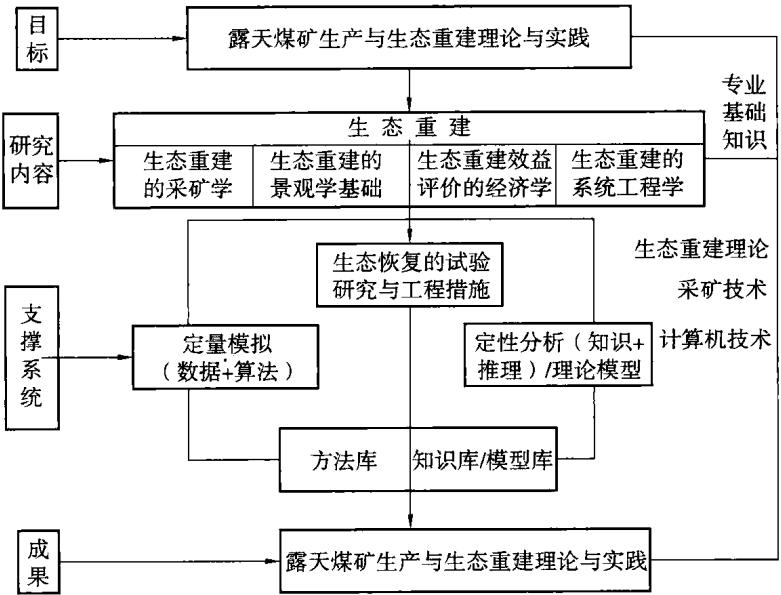  
图1.1 研究的方法和技术路线

露天煤矿生产及生态重建一体化研究内容是根据开采阶段的时期不同，在不同的尺度上对生态重建进行研究，一方面实现生态重建和开采的一体化，另一方面实现矿区的可持续发展；生态重建的采矿学研究包括土地的利用方向、土地的适宜性评价等内容；生态重建的景观生态基础包括景观格局分析、露天矿固体废物环境影响分析及控制土壤受重金属污染的生态对策研究等研究内容；生态重建效益的评价包括经济效益、生态效益、社会效益分析等内容；生态重建决策的系统工程学研究包括矿区生态重建复杂系统的整体优化研究等内容。

科学的生态恢复试验研究包括固体废物环境影响分析、重金属元素地球化学影响的环境评价研究及控制土壤受重金属污染的生态对策研究；定量模拟(数据+方法)的内容包括土地适宜性评价方法、评价单元的空间格局分析、矿区生态重建复杂系统的整体优化研究的系统动力学模型等内容；定性分析(知识+推理)/理论模型的内容主要包括土地利用方向的专家系统等；方法库的内容包括生态重建的各项指标的定量分析方法；知识库/模型库包括土地利用方向的知识库、矿区受损区的生态系统和社会经济系统的研究模型等。

## 1.4 小结

本章从露天矿山的生态重建规划、决策和治理及矿区的可持续发展的实际需要出发，阐述了本书的选题背景与意义；介绍了该领域内已有的研究成果，并进行了相应的综合评述。在此基础上，给出了主要研究内容，以及欲采取的研究方法和技术路线。

## 2 露天矿重金属污染与土壤肥力评价

## 2.1 概述

重金属是指密度大于5.0 $\mathsf { g } / \mathsf { c m } ^ { 3 }$ 的金属元素，在自然界中大约存在45种。但是，由于不同的重金属在土壤中的毒性差别很大，所以在环境科学中人们通常关注汞、镉、铅、铬、铜、锌、镍、钼、钴等。土壤重金属污染是指由于人类活动将重金属带入到土壤中，致使土壤中重金属的含量明显高于背景含量，并可能造成现存的或潜在的土壤质量退化、生态与环境恶化的现象。由于人类活动使重金属在土壤中的累积量，明显高于土壤环境背景值或土壤环境质量标准，致使土壤环境质量下降和农田生态环境恶化。其中，尤其受人们关注的是对生物毒性较大的汞(Hg)、镉(Cd)、铅(Pb)、铬(Cr)、铜(Cu)以及类金属砷(As)。土壤环境中的重金属污染物在土壤中的滞留时间长，一般不易迁移，也不能被土壤微生物分解，相反可在土壤中累积，并通过食物链在生物体中富集，或转化为毒性更大的甲基化合物，对食物链中某些生物达到有害水平，最终在人体内蓄积而危害人体健康。重金属元素在土壤中的累积初期，不易表现出毒害效果，一旦毒害作用表现出来，其自然净化过程和人工治理都是非常困难的，是具有潜在性危害的无机污染物。如20世纪50年代前后西方发达国家出现的震惊世界的八大公害事件中，日本的“富山事件(骨痛病)”就是由于重金属镉(Cd)和甲基汞污染中毒导致的[151]。由于土壤重金属污染物具有多源性、隐蔽性、积蓄性、难以恢复性和污染后果的严重性，被环境学界比喻为“化学定时炸弹”，已成为全球环境变化的重大问题之一，是近年来环境科学领域研究的热点问题。

土壤重金属污染来源广泛，主要包括有大气降尘、污水灌溉、工业固体废弃物的不当堆置、矿业活动、农药和化肥等。工矿地区重金属污染主要是由采矿和冶炼中的废水、废渣及降尘所造成。对江西省西华山、下龙塘、荡坪、大吉山、盘古山五个钨矿，永平和德兴两个铜矿和贵溪铜冶炼厂等8个主要金属矿山及冶炼厂附近地区环境重金属污染状况的调查，农田土壤中的最高含镉量达29.8${ \bf { m g } } / { \bf { k g } }$ ，含铜量达 $\mathrm { ~ 2 ~ 0 8 1 ~ } \mathrm { m g / k g }$ 。镉的污染非常严重，饲料中镉的含量最高达

16.1mg/kg，铜的含量最高也达863 mg/kg。铜、钼含量比例严重失调，导致耕牛发生钼、镉中毒综合征的广泛流行，其他家畜也受到不同程度的伤害89]。

大型露天煤矿开采强度大，对周围环境破坏较大，特别是重金属元素由地下深部转至地表，改变了它们迁移的地球化学条件，在地表重新分异，形成了局部地区的严重污染。因此，积极开展矿山开发的环境影响评价，预测矿山开发中重金属的地球化学影响，分析其生态环境效应，提出控制重金属污染的措施和土地利用方向，已经是一件刻不容缓的任务。

矿山开发中重金属元素地球化学影响环境评价研究主要包括以下内容[37]：

①矿山类型和矿物中重金属的含量及赋存状态的调查；

②矿山开发规模及服务年限；

③矿区布置及废、矸石堆的堆放方式；

④矿山重金属元素排放量及排放方式；

⑤国家重金属元素环境标准及矿山所在地区的地方性重金属环境标准；

⑥重金属元素在矿区迁移转化规律的研究；

⑦重金属元素预测；

⑧重金属元素的生态效应及对人体健康影响的研究；

⑨提出减轻重金属污染的环境保护措施。

环境影响评价就是根据不同的目的要求，按照一定的原则和方法，对某区域的某些环境要素的质量好坏进行单项的或综合的客观评价和分级。评价过程中一般以国家颁布的环境质量标准或环境标准值为背景值和评价依据。本章以胜利露天煤矿和准格尔哈尔乌素露天煤矿为分析案例，对大型露天煤矿重金属污染进行分析。

环境影响评价是环境管理的重要手段之一，土壤环境质量评价是环境影响评价的重要组成部分。一方面，它是正确反映过去和现在的环境质量，确定是否污染，何种污染，污染程度和范围，指导环境管理和污染治理工作；另一方面，对环境质量的将来趋势作出预测，评价拟建项目对环境的影响，从而为保护环境、发展生产提供科学的规划和决策依据。

## 2.2 胜利露天煤矿重金属污染分析

## 2.2.1 开采现状

胜利露天矿区位于内蒙古自治区锡林郭勒盟中部，矿区煤炭资源分布面积广，煤层赋存稳定，资源十分丰富，是适宜露天和井工开采的特大型煤田，是我国重要的能源基地。矿区经过近20年的初步开发，水、电、路等基本开发建设条件已经具备，有利于建设以煤炭资源开发为龙头的大型综合性工业基地。胜利煤田的进一步开发将会极大地带动锡林郭勒盟边疆少数民族地区经济和社会的发展，对实现国家“西部大开发”的经济发展战略起到积极的推动作用。

胜利煤田位于内蒙古自治区锡林郭勒盟锡林浩特市西北部胜利苏木境内。南东边界距市区约2km，地理坐标：东经 $1 1 5 ^ { \circ } 3 0 ^ { \prime } \sim 1 1 6 ^ { \circ } 2 6 ^ { \prime }$ ，北纬 $4 3 ^ { \circ } 5 7 ^ { \prime } \sim$ $4 4 ^ { \circ } 1 4 ^ { \prime }$ 。胜利煤田总体呈北东一南西条带状展布，走向长45km，倾向宽平均7.6 km，含煤面积 342 km²。煤炭地质储量 22 442 Mt。煤层厚度平均 49.05m，可采煤层数为4层，目前开采对象为一号露天矿5号煤层。

一号露天矿地处煤田西部的剥蚀堆积与侵蚀堆积地形的过渡地带。露天矿西北部为低缓的丘陵区，东西高差较大，海拔标高在+970m～+1035m之间。该露天矿境内及其周围地势平坦，草原植被发育，地形略呈西高东低。本区属半干旱草原气候，冬寒夏炎，年温差较大。本区极端最高气温38.3℃（1955年7月25日），最低气温一42.4℃（1953年1月15日）。气温一25℃以下平均每年有40.15d。1974\~1993年近20a间年平均降水量294.74mm，年平均蒸发量1794.64mm。每年的6、7、8三个月为雨季，占全年降水量的71%。年最大降水量481.0mm(1974年)，最小降水量146.7mm(1980年)，日最大降水量43.9mm。春季多风，风向多为南西，风速2.1～8.4m/s，瞬时最大风速36.6m/s。1979\~1988年近10a间平均每年发生大风1.2次，平均10min最大风速20.7m/s(1990～1993年)。冻结期为10月初～12月上旬，解冻期为翌年3月末～4月中旬，最大冻土深度2.89m，1984\~1993年近10a由于气候变暖，最大冻土深度为2.40m。露天矿区土壤类型主要由栗钙土、草甸栗钙土、草甸土等组成。由于草场退化，已形成沙化、砾石化栗钙土，土壤有机质含量低，土壤肥力差。

胜利煤田一号露天矿一期工程设计规模10Mt/a。该工程2004年完成开工前的准备工作，2005年正式开工;2006年按3Mt/a生产能力移交生产，生产剥采比为2.15 m³/t;2007年达到 5 Mt/a 的生产能力，生产剥采比为 2.15$\mathbf { m } ^ { 3 } / \mathbf { t } ; 2 0 0 9$ 年达到设计一期规模10Mt/a，生产剥采比为2.15m³/t。

胜利煤田一号露天矿一期工程设计采用单斗一卡车+吊斗铲倒堆综合工艺方案，即5煤顶板以上剥离采用单斗一卡车工艺；5煤采用前装机一卡车工艺；5煤～6煤夹石层采用吊斗铲倒堆工艺；6煤采用单斗一卡车工艺。

外排土场位置选择在首采区初始拉沟地段地表境界外的西南侧，总占地$5 . 1 7 ~ \mathrm { k m } ^ { 2 }$ 。为满足开采进度计划安排的89.10Mm³外排量，外排土场收容量为103.00Mm³。外排土场采用单斗一卡车排土，设计在开始剥离时要将表土单独堆放，在外排土场排弃土岩到达设计标高时，然后覆盖在地表。覆土后，地表将

成为一梯田式人造假山。

内排土场下部为吊斗铲倒堆排土岩，上部为单斗一卡车排土，内排土场在开始剥离时要将表土单独堆放，然后覆盖在到位的地表；在形成一定的工作面后，采取连续生产工艺，边开采、边将表土覆盖在地表。

## 2.2.2 胜利露天矿区开采顺序

胜利煤田具有非常好的露天开采条件，优先开发大型露天矿符合国家的《煤炭工业技术政策》和矿区实际。并且胜利露天矿区作为一个生产多年的露天矿区，其比较完善的生产配套设施和丰富的管理经验，为优先开发大型露天矿提供了非常有利的条件。因此总体规划安排先开发五个大型露天矿，后期用并工矿接续露天矿。

按照优先开发技术条件好、煤质好、经济效益好的矿田和对矿区总体发展有利的原则，《内蒙古胜利露天矿区总体规划》确定首先开发胜利西一号露天矿。其他矿田的开发顺序是胜利西二号露天矿→东一号露天矿→东二号露天矿→东三号露天矿→西二矿井→西一矿井→东一矿井。

按照矿区煤炭产量接续计划，胜利西一号露天矿2005年开始扩建，2007年投产,2009年一期达产10.0Mt/a；2013年二期扩建，2015年二期达产20.0Mt/a。2040年矿区总规模达到60.0Mt/a，矿区服务年限为295a。

## 2.2.3 开采过程中产生的剥离物

胜利西一号露天矿在评价第一时段(2004～2009年)间，规划开采煤炭总量为266.50Mt，剥离物排至外排土场，估计外排剥离物57.290Mm³，平均每年外排剥离物9.550Mm³。在评价第二时段(2010～2015年)间，规划开采煤炭总量为750.00Mt，剥离物排至外排土场，估计外排剥离物169.0Mm³，平均每年外排剥离物 28.167 Mm³。

## 2.2.4 围岩特征

本区含煤地层主要为巴彦花群上含煤段，是含厚煤层的碎屑沉积。主要岩性为煤、泥岩、粉砂岩、细砂岩、粗砂岩及砂砾岩。

露天开采各煤层顶底板岩性以泥岩、粉砂岩、碳质泥岩为主，个别点有细砂岩、中砂岩及粗砂岩。一号露天勘探区内第四系层厚度为4.1～23.1m，平均11.89 m。

## 2.2.5 5号煤层上覆岩层重金属元素的平均浓度及评价标准

## 2.2.5.1 样品的采集和处理

在胜利煤田一号露天矿采场、地表等选择有代表性的样地，主要为一号露天矿5号煤层上覆各岩层。在地表样地内采集土样(0\~30cm)装入布袋中，采用“之”字形取样，样品数为10个。5号煤层埋藏深度38～88m，上覆岩层分别为泥岩(10\~37.59m)、粉砂岩(1\~10m)、砂岩(0.30\~1m)和表土(0\~0.3m)，各岩层中的取样根据剥离揭露的不同岩性和深度选择代表性的岩样，采集后装入布袋中，每层岩性平均样品数为8个，室内风干后进行理化分析。调查的重金属为：铜(Cu)、铅(Pb)、铬(Cr)、镉(Cd)、锌(Zn)。

## 2.2.5.2 5号煤层上覆各岩层重金属元素的平均浓度值

现场采样得到的样品，在室内阴凉通风处自然风干后，其常规理化分析参照《土壤农业化学分析方法》(鲁如坤，2000)，土壤中全量铬、锌、铜、铅采用X荧光法，全量镉采用原子吸收石墨炉法。通过统计分析得到5号煤层上覆各岩层重金属元素的平均浓度值如表2.1所示。

5 号煤层上覆各岩层重金属元素的平均浓度值
<table><tr><td rowspan=1 colspan=1> $m / \mathrm { m } \mathrm { g } \cdot \mathrm { k g } ^ { - 1 }$ 地层深度/m</td><td rowspan=1 colspan=1> $m _ { \mathrm { { C u } } }$ </td><td rowspan=1 colspan=1> $m _ { \mathbf { p } \mathbf { b } }$ </td><td rowspan=1 colspan=1> $m _ { \mathrm { c } _ { \tau } }$ </td><td rowspan=1 colspan=1> $m _ { \mathrm { C d } }$ </td><td rowspan=1 colspan=1> $m _ { { \mathrm { Z n } } }$ </td></tr><tr><td rowspan=1 colspan=1>表土(0~0.3)</td><td rowspan=1 colspan=1>11.200</td><td rowspan=1 colspan=1>10.719</td><td rowspan=1 colspan=1>19.817</td><td rowspan=1 colspan=1>0.3336</td><td rowspan=1 colspan=1>64.739</td></tr><tr><td rowspan=1 colspan=1>砂岩(0.30~1)</td><td rowspan=1 colspan=1>6.37</td><td rowspan=1 colspan=1>2.778</td><td rowspan=1 colspan=1>14.928</td><td rowspan=1 colspan=1>0.3501</td><td rowspan=1 colspan=1>46.225</td></tr><tr><td rowspan=1 colspan=1>粉砂岩(1~10)</td><td rowspan=1 colspan=1>19.497</td><td rowspan=1 colspan=1>18.216</td><td rowspan=1 colspan=1>29.813</td><td rowspan=1 colspan=1>0.77</td><td rowspan=1 colspan=1>98.638</td></tr><tr><td rowspan=1 colspan=1>泥岩(10~37.59)</td><td rowspan=1 colspan=1>22.292</td><td rowspan=1 colspan=1>16.59</td><td rowspan=1 colspan=1>18.869</td><td rowspan=1 colspan=1>0.995</td><td rowspan=1 colspan=1>155.608</td></tr></table>

根据表2.1内各岩层重金属元素的平均浓度值得到胜利露天矿5号煤层上覆各岩层重金属元素浓度变化趋势如图2.1所示。

## 2.2.5.3 重金属元素的评价标准

胜利露天矿位于国家自然保护区锡林郭勒草原，根据《中华人民共和国环境影响评价法与规划、设计、建设项目实施手册》[39]，重金属含量评价应采用一级标准进行评价，见表2.2。表中一级标准主要适用于国家规定的自然保护区、集中式生活饮用水源地、茶园、牧场和其他保护地区的土壤，土壤质量基本上保持自然背景水平；二级标准主要适用于一般农田、蔬菜地、茶园、果园、牧场等土壤，土壤质量基本上对植物和环境不造成危害和污染；三级标准主要适用于林地土壤及污染物容量较大的高背景值土壤和矿产附近等地的农田土壤(蔬菜地除外)，土壤质量基本上对植物和环境不造成危害和污染。

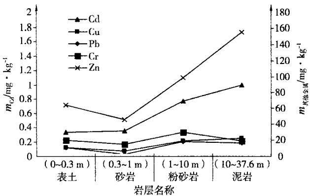  
图2.1 5号煤层上覆各岩层重金属元素浓度变化趋势

## 2.2.6 结果分析

从图2.1可以看出：

(1)Cu(铜)的含量最大值在泥岩中，为22.292mg/kg，虽然超出表土的自然背景值(11.200 mg/kg)，但根据土壤环境质量标准(GB/T 15618—1995)(见表2.2)可以看出，铜金属含量没有超过一级标准的自然背景值(35mg/kg)，符合要求；

(2)Pb(铅)的含量最大值在粉砂岩中，为18.2mg/kg，超出表土的自然背景值(10.7mg/kg)，但也没超过土壤环境质量标准中一级标准规定的自然背景值(35 mg/kg);

(3)Cr(铬)的含量最大值在粉砂岩中，为29.813 mg/kg，超出表土的自然背景值(19.817mg/kg)，也没有超过土壤环境质量标准中一级标准规定的自然背景值(90 mg/kg)；

(4)Cd(镉)的含量最大值在粉砂岩中，为0.995mg/kg，超出表土的自然背景值(0.3336mg/kg)，同时也超过土壤环境质量标准中一级标准规定的自然背景值(0.2mg/kg)和二级标准规定的标准值(0.6mg/kg)，满足三级标准规定的标准值(1.0 mg/kg)；

(5)Zn(锌)的含量最大值在泥岩中，为155.608mg/kg，超出表土的自然背景值(64.739mg/kg)，同时也超过土壤环境质量标准中一级标准规定的自然背景值(100 mg/kg)，但满足二级标准规定的标准值(300mg/kg)和三级标准规定的标准值(500 mg/kg)。

由于胜利露天矿位于国家自然保护区锡林郭勒草原，重金属含量应该不超过一级标准规定的自然背景值，但从上述分析可以看出，重金属镉(Cd)和锌(Zn)的含量已经超标，应该特别注意。

表2.2  
土壤环境质量标准值(mg/kg)
<table><tr><td rowspan=2 colspan=2>级别土壤pH值项   目</td><td rowspan=1 colspan=1>一级</td><td rowspan=1 colspan=3>二   级</td><td rowspan=1 colspan=1>三级</td></tr><tr><td rowspan=1 colspan=1>自然背景值</td><td rowspan=1 colspan=1>&lt;6.5</td><td rowspan=1 colspan=1>6.5~7.5</td><td rowspan=1 colspan=1>&gt;7.5</td><td rowspan=1 colspan=1>&gt;6.5</td></tr><tr><td rowspan=1 colspan=2>镉≤</td><td rowspan=1 colspan=1>0.2</td><td rowspan=1 colspan=1>0.3</td><td rowspan=1 colspan=1>0.3</td><td rowspan=1 colspan=1>0.6</td><td rowspan=1 colspan=1>1.0</td></tr><tr><td rowspan=1 colspan=2>汞≤</td><td rowspan=1 colspan=1>0.15</td><td rowspan=1 colspan=1>0.3</td><td rowspan=1 colspan=1>0.5</td><td rowspan=1 colspan=1>1.0</td><td rowspan=1 colspan=1>1.5</td></tr><tr><td rowspan=2 colspan=1>砷</td><td rowspan=1 colspan=1>水田≤</td><td rowspan=1 colspan=1>15</td><td rowspan=1 colspan=1>30</td><td rowspan=1 colspan=1>25</td><td rowspan=1 colspan=1>20</td><td rowspan=1 colspan=1>30</td></tr><tr><td rowspan=1 colspan=1>旱地≤</td><td rowspan=1 colspan=1>15</td><td rowspan=1 colspan=1>40</td><td rowspan=1 colspan=1>30</td><td rowspan=1 colspan=1>25</td><td rowspan=1 colspan=1>40</td></tr><tr><td rowspan=2 colspan=1>铜</td><td rowspan=1 colspan=1>农田等≤</td><td rowspan=1 colspan=1>35</td><td rowspan=1 colspan=1>50</td><td rowspan=1 colspan=1>100</td><td rowspan=1 colspan=1>100</td><td rowspan=1 colspan=1>400</td></tr><tr><td rowspan=1 colspan=1>果园≤</td><td rowspan=1 colspan=1>150</td><td rowspan=1 colspan=1>200</td><td rowspan=1 colspan=1>200</td><td rowspan=1 colspan=1>400</td><td rowspan=1 colspan=1></td></tr><tr><td rowspan=1 colspan=2>铅≤</td><td rowspan=1 colspan=1>35</td><td rowspan=1 colspan=1>250</td><td rowspan=1 colspan=1>300</td><td rowspan=1 colspan=1>350</td><td rowspan=1 colspan=1>500</td></tr><tr><td rowspan=2 colspan=1>铬</td><td rowspan=1 colspan=1>水田≤</td><td rowspan=1 colspan=1>90</td><td rowspan=1 colspan=1>250</td><td rowspan=1 colspan=1>300</td><td rowspan=1 colspan=1>350</td><td rowspan=1 colspan=1>400</td></tr><tr><td rowspan=1 colspan=1>旱地≤</td><td rowspan=1 colspan=1>90</td><td rowspan=1 colspan=1>150</td><td rowspan=1 colspan=1>200</td><td rowspan=1 colspan=1>250</td><td rowspan=1 colspan=1>300</td></tr><tr><td rowspan=1 colspan=2>锌≤</td><td rowspan=1 colspan=1>100</td><td rowspan=1 colspan=1>200</td><td rowspan=1 colspan=1>250</td><td rowspan=1 colspan=1>300</td><td rowspan=1 colspan=1>500</td></tr><tr><td rowspan=1 colspan=2>镍≤</td><td rowspan=1 colspan=1>40</td><td rowspan=1 colspan=1>40</td><td rowspan=1 colspan=1>50</td><td rowspan=1 colspan=1>60</td><td rowspan=1 colspan=1>200</td></tr></table>

备注[39]：  
(1)一级标准：为保护区域自然生态，维持自然背景的土壤环境质量的限制值；二级标准：为保障农业生产，维护人体健康的土壤限制值；三级标准：为保障农林业生产和植物正常生长的土壤临界值。  
(2)各类土壤环境质量执行标准的级别规定如下：Ⅰ类土壤环境质量执行一级标准；Ⅱ类土壤环境质量执行二级标准；Ⅲ类土壤环境质量执行三级标准。  
(3)Ⅰ类土壤主要适用于国家规定的自然保护区(原有背景金属含量高的除外)、集中式生活饮用水源地、茶园、牧场和其他保护地区的土壤，土壤质量基本上保持自然背景水平；Ⅱ类主要适用于一般农田、蔬菜地、茶园、果园、牧场等土壤，土壤质量基本上对植物和环境不造成危害和污染；Ⅲ类主要适用于林地土壤及污染物容量较大的高背景值土壤和矿产附近等地的农田土壤(蔬菜地除外)，土壤质量基本上对植物和环境不造成危害和污染。

## 2.3 准格尔哈尔乌素露天煤矿重金属污染分析

## 2.3.1 矿区概况及生产现状

哈尔乌素露天煤矿位于准格尔煤田中部，地理坐标为东经 $1 1 1 ^ { \circ } 1 0 ^ { \prime } 0 0 ^ { \prime \prime } \sim$

$1 1 1 ^ { \circ } 2 2 ^ { \prime } 3 0 ^ { \prime \prime }$ ,北纬 $3 9 ^ { \circ } 3 9 ^ { \prime } 4 5 ^ { \prime \prime } { \sim } 3 9 ^ { \circ } 4 4 ^ { \prime } 1 5 ^ { \prime \prime }$ ，与已经建成生产的黑岱沟露天煤矿毗邻，距中心区薛家湾镇约18km，东距黄河约4.8km，南距黄河万家寨水利枢纽工程4.5km。哈尔乌素露天煤矿占地面积为6142.68ha，开采境界内可采原煤储量为1775.22Mt，地质储量为1649.00Mt，建设规模为20.00Mt/a，露天煤矿设计服务年限为68a。其中首采区占地面积为326.00ha，可采原煤储量597.99 Mt，设计服务年限为 20 a。

准格尔煤田位于半干旱地区，属于大陆性半干旱气候。总的气候特点是冬季寒冷，夏季炎热，春秋两季气温变化剧烈，昼夜温差大。降水量较小，蒸发量较大，常有春旱现象。年平均气温8.8℃，最高气温出现在7月，最低气温出现在1月。年平均降水量340.40mm，雨水多集中在7、8、9月，占全年降水量的60%～70%。全年大风日数6d，最大风速12.7m/s，年平均风速1.4m/s，风向以西北风为主，7月出现9m/s东北风，9月出现5.7m/s东南风。全年日照时数2876.8h。

哈尔乌素露天矿区共含煤12层，含煤地层为山西组和太原组。本矿开采范围内的可采煤层有5煤、 $\cdot 6 _ { \mathrm { \ : E } }$ 煤、 $6 _ { \mathbb { I } }$ 煤、6煤、 $6 _ { \mathsf { F } }$ 煤、9煤等6个煤层，结合本矿具体条件、台阶划分方法和追踪方式，将煤层划分采用两个采煤台阶，两台挖掘机追踪开采方式。采煤用 $4 4 , 3 5 \ \mathrm { m } ^ { 3 }$ 单斗挖掘机，运煤用185t自卸卡车。该方式实行6煤全层(含 $6 _ { \tt { I } }$ )穿孔爆破，并划分为高度大致相等的两个采煤台阶，每个台阶约16m，优劣煤混采，每个台阶配备一台 $4 4 . 3 5 \ \mathrm { m } ^ { 3 }$ 挖掘机，实行端工作面开采，向185t卡车装载，两台挖掘机之间实行追踪开采。这样就减少了一个工作面，缩短了采煤区段长度，有利于吊斗铲倒堆与采煤分区作业相互衔接，减少或避免相互等待时间。

剥离设计选用单斗一卡车和吊斗铲倒堆剥离工艺。吊斗铲倒堆开采煤层顶板以上45m厚剥离物，进行穿孔、抛掷爆破，部分剥离物直接抛至采空区，剩余部分则由吊斗铲倒入采空区，实现剥离露煤。吊斗铲倒堆剥离顶面以上剥离物，由单斗—卡车开采，水平划分台阶。表土标准台阶高度17.5m，采宽60m，由单斗挖掘机端工作面采装，卡车运输。岩石标准台阶高度35m，预先松动爆破，单斗挖掘机分层开采，端工作面采装作业，卡车运输。倒堆台阶顶面以上的剥离台阶，当其高度小于3m时，由推土机辅助前装机进行处理。

## 2.3.2 样品的采集和处理

在哈尔乌素露天矿采场、地表等选择有代表性的样地，选择7个采集地，分别为原始地貌，植被沙蒿，采样深度60cm(简称样地1)；采场内，采样深度800cm(简称样地2);排土场北侧，地表植被沙蒿，采样深度60 cm(简称样地3)；排土场北侧，采样深度 30 cm(简称样地4)；采场内，采样深度50 cm(简称样地5)；原始地貌，植被芥草，采样深度60cm（简称样地6)；采场内，采样深度250cm（简称样地7)。每个采集地按等高点将其划分为3个采样区，多点采样混合为一个混合样。采集后装入布袋中，室内风干后进行理化分析。调查的重金属为：铜(Cu)、铅(Pb)、铬(Cr)、镉(Cd)、锌(Zn)。

## 2.3.3 不同样地重金属元素的平均浓度值

现场采到的样品，在室内阴凉通风处自然风干后，其常规理化分析参照《土壤农业化学分析方法》，土壤中全量铬、锌、铜、铅采用X荧光法，全量镉采用原子吸收石墨炉法。通过统计分析得到各样地重金属元素的平均浓度值如表2.3。

哈尔乌素露天矿不同样地土层重金属元素的浓度值
<table><tr><td rowspan=2 colspan=1>样地</td><td rowspan=2 colspan=1> $\mathsf { p H }$ </td><td rowspan=1 colspan=5> $m / \mathrm { m } \mathbf { g } \cdot \mathbf { k } \mathbf { g } ^ { - 1 }$ </td></tr><tr><td rowspan=1 colspan=1> ${ \tt C u }$ </td><td rowspan=1 colspan=1>Pb</td><td rowspan=1 colspan=1> $\mathtt { C r }$ </td><td rowspan=1 colspan=1>Cd</td><td rowspan=1 colspan=1> $Z \mathbf { n }$ </td></tr><tr><td rowspan=1 colspan=1>样地1</td><td rowspan=1 colspan=1>6.986</td><td rowspan=1 colspan=1>18.41</td><td rowspan=1 colspan=1>16.91</td><td rowspan=1 colspan=1>70.06</td><td rowspan=1 colspan=1>0.119</td><td rowspan=1 colspan=1>20.81</td></tr><tr><td rowspan=1 colspan=1>样地2</td><td rowspan=1 colspan=1>7.498</td><td rowspan=1 colspan=1>10.89</td><td rowspan=1 colspan=1>14.64</td><td rowspan=1 colspan=1>50.47</td><td rowspan=1 colspan=1>0.114</td><td rowspan=1 colspan=1>46</td></tr><tr><td rowspan=1 colspan=1>样地3</td><td rowspan=1 colspan=1>6.740</td><td rowspan=1 colspan=1>10.89</td><td rowspan=1 colspan=1>15.29</td><td rowspan=1 colspan=1>50.57</td><td rowspan=1 colspan=1>0.098</td><td rowspan=1 colspan=1>4.556</td></tr><tr><td rowspan=1 colspan=1>样地4</td><td rowspan=1 colspan=1>7.865</td><td rowspan=1 colspan=1>10.9</td><td rowspan=1 colspan=1>17.61</td><td rowspan=1 colspan=1>42.81</td><td rowspan=1 colspan=1>0.094</td><td rowspan=1 colspan=1>19.04</td></tr><tr><td rowspan=1 colspan=1>样地5</td><td rowspan=1 colspan=1>7.9</td><td rowspan=1 colspan=1>8.23</td><td rowspan=1 colspan=1>22</td><td rowspan=1 colspan=1>77.58</td><td rowspan=1 colspan=1>0.118</td><td rowspan=1 colspan=1>54.74</td></tr><tr><td rowspan=1 colspan=1>样地6</td><td rowspan=1 colspan=1>7.905</td><td rowspan=1 colspan=1>20.25</td><td rowspan=1 colspan=1>18.24</td><td rowspan=1 colspan=1>76.99</td><td rowspan=1 colspan=1>0.121</td><td rowspan=1 colspan=1>21.38</td></tr><tr><td rowspan=1 colspan=1>样地7</td><td rowspan=1 colspan=1>8.109</td><td rowspan=1 colspan=1>14.21</td><td rowspan=1 colspan=1>16</td><td rowspan=1 colspan=1>49.71</td><td rowspan=1 colspan=1>0.105</td><td rowspan=1 colspan=1>41.66</td></tr></table>

## 2.3.4 重金属元素的评价标准

根据《中华人民共和国环境影响评价法与规划、设计、建设项目实施手册》(见表2.2)，露天煤矿开采后复垦的生态环境应达到或超过开采前的生态环境水平，土壤质量基本上对植物和环境不造成危害和污染，因此这里对重金属含量这里采用二级标准进行评价。

## 2.3.5 结果分析

从表2.3和表2.2可以得到如下结论：

（1）样地1。镉没有超过二级标准的自然背景值 $( 0 , 3 \mathrm { { \ m g / k g } ) }$ ，符合要求；铅含量没有超过二级标准的自然背景值 $( 3 0 0 ~ \mathrm { m g / k g } )$ ，符合要求；锌含量没有超过二级标准的自然背景值(250mg/kg)，符合要求；铜含量没有超过二级标准的自然背景值(100mg/kg)，符合要求；铬含量没有超过二级标准的自然背景值(200 mg/kg)，符合要求。

(2)样地2。镉没有超过二级标准的自然背景值(0.3mg/kg)，符合要求；铅含量没有超过二级标准的自然背景值(300mg/kg)，符合要求；锌含量没有超过二级标准的自然背景值(250mg/kg)，符合要求；铜含量没有超过二级标准的自然背景值(100mg/kg)，符合要求；铬含量没有超过二级标准的自然背景值(200 mg/kg)，符合要求。

(3)样地3。镉没有超过二级标准的自然背景值(0.3mg/kg)，符合要求；铅含量没有超过二级标准的自然背景值(300mg/kg)，符合要求；锌含量没有超过二级标准的自然背景值(250mg/kg)，符合要求；铜含量没有超过二级标准的自然背景值(100mg/kg)，符合要求；铬含量没有超过二级标准的自然背景值(200 mg/kg)，符合要求。

(4)样地4。镉没有超过二级标准的自然背景值(0.6mg/kg)，符合要求；铅含量没有超过二级标准的自然背景值(350mg/kg)，符合要求；锌含量没有超过二级标准的自然背景值(300mg/kg)，符合要求；铜含量没有超过二级标准的自然背景值(100mg/kg)，符合要求；铬含量没有超过二级标准的自然背景值(250 mg/kg)，符合要求。

(5)样地5。镉没有超过二级标准的自然背景值(0.6mg/kg)，符合要求；铅含量没有超过二级标准的自然背景值(350mg/kg)，符合要求；锌含量没有超过二级标准的自然背景值(300mg/kg)，符合要求；铜含量没有超过二级标准的自然背景值(100mg/kg)，符合要求；铬含量没有超过二级标准的自然背景值(250 mg/kg)，符合要求。

(6)样地6。镉没有超过二级标准的自然背景值(0.6mg/kg)，符合要求；铅含量没有超过二级标准的自然背景值(350mg/kg)，符合要求；锌含量没有超过二级标准的自然背景值(300mg/kg)，符合要求；铜含量没有超过二级标准的自然背景值(100mg/kg)，符合要求；铬含量没有超过二级标准的自然背景值(250 mg/kg)，符合要求。

(7)样地7。镉没有超过二级标准的自然背景值(0.6 mg/kg)，符合要求；铅含量没有超过二级标准的自然背景值(350mg/kg)，符合要求；锌含量没有超过二级标准的自然背景值(300mg/kg)，符合要求；铜含量没有超过二级标准的自然背景值(100mg/kg)，符合要求；铬含量没有超过二级标准的自然背景值(250 mg/kg)，符合要求。

通过对哈尔乌素露天矿5煤上部不同样地的重金属的含量及赋存状态的调查，得到该矿重金属的浓度值未超出土壤环境质量标准中二级标准规定的自然背景值，符合要求。

## 2.4 控制土壤受重金属污染的对策

土壤一方面对重金属有一定的保留和固定的能力，可以允许一定量的重金属而不表现出对植物生长危害或对食物链产生污染；但另一方面，土壤的重金属从开始产生污染到产生后果有一个长时间的逐步积累的隐蔽过程，是潜在危害。土壤一旦遭受重金属污染，是难以治理的。因此，必须严格控制进入土壤的重金属。在防治措施上，应采取以防为主，综合治理的方针。

土壤重金属的防治应包括两个方面：一是“防”，即贯彻“预防为主的原则”，通过立法管理和综合治理相结合的原则，彻底消除土壤重金属污染源；二是“治”，即对已经被污染的土壤，采取有效的措施进行改良、治理，从而提高土壤环境质量，以保障动植物与人类健康。土壤重金属污染修复措施是近年来发展迅速的研究领域。据陈怀满[72](2005)统计表明，我国1997年才开始有土壤修复措施的相关报道，而在1997～2002年学术界就发表相关研究论文94篇。李永涛等[152](1997)介绍了近年来土壤重金属治理的方法，将其按处理方式归并为四类：

（1）工程措施，包括客土法、翻土法、土壤淋洗法、电动修复法等。工程措施中客土、翻土法是比较经典的土壤重金属污染治理措施，它具有彻底、稳定消除土壤重金属污染的优点。土壤污染通常集中在土壤表层，翻土就是深翻土壤，使聚积在表层的污染物分散到较深的层次，达到稀释的目的。该法适用于土层较厚的土壤，且要配合增加施肥量，以弥补根层养分的减少。客土法就是在污染的土壤上加入大量的干净土壤，或与原有的土壤混匀，使污染物浓度降到临界危害浓度以下；或覆盖在表层，减少污染物与植物根系的接触，从而达到减轻危害的目的。客土应尽量选择比较黏重或有机质含量高的土壤，以增加土壤对污染物的负载容量。

客土、翻土法治理轻污染土壤的效果显著，但需大量人力、物力，投资大，且土壤肥力和初级生产力会有所降低，应注意施肥。对换出的土壤应妥善处理，以防止二次污染。它可按固体废弃物的方法进行填埋处理，即将挖掘出的污染土壤填埋到采用水泥、黏土、石板、塑料等防渗材料进行防渗处理的填埋场中，从而使污染土壤与未污染土壤分开，以减少或阻止污染物扩散到其他土壤中。

土壤的化学淋洗法是指利用物理化学原理去除非饱和带或近地表饱和带土壤中污染的方法。按照对提取液的处理方式又分为清洗法和提取法。清洗法就是用清水或含有能与污染物形成配位化合物的溶液冲洗土壤，当污染物(如重金属)到达根层以外但未到达地下水时，用含有能与污染物形成难溶性沉淀物的溶液继续冲洗土壤，使其在一定深度的土层中形成难溶的间层，以防止其污染地下水。提取法的具体做法是：将水、溶剂以及淋洗助剂渗入或者注入污染土壤中，然后再把这些含有污染物的水溶液从土壤中提取出来，并送到传统的污水处理厂进行再处理。

土壤固持金属的机制可分为两大类：一是以离子态吸附在土壤组分的表面；二是形成金属化合物的沉淀。土壤淋洗就是利用淋洗液把土壤固相中的重金属转移到土壤液相中去，再把富含重金属的废水进一步回收处理的土壤修复法。该方法的技术关键是寻找一种既能提取各种形态的重金属，又不破坏土壤结构的淋洗液。目前，用于淋洗土壤的淋洗液较多，包括有机或无机酸、碱、盐。据报道，美国曾应用淋洗法成功治理了镉、铅、铬、铜等8种重金属污染土壤，采用的提取剂主要为酸性溶剂，并加入氧化剂、还原剂和络合剂；Blaylock等检验了柠檬酸、苹果酸、乙酸、EDTA(乙二胺四乙酸)等对印度芥菜吸收Cd和Pb的效应：研究表明，EDTA可提高镉离子的移动性，使之由表层淋洗到下层。日本利用EDTA或稀盐酸淹水清洗土壤镉取得较好的效果[159]。土壤质地对土壤淋洗的效果有重要影响。它较为适合于砂质土壤，当黏粒含量达20%～30%时，其效果不佳，而黏粒含量达40%时则不宜使用。

电动修复法是通过电流的作用，在电场的作用下，土壤中的Cd、Pb、Cr等重金属离子和As离子以电渗透和电迁移的方式向电极运输，然后进行集中处理。研究发现，土壤pH值、缓冲性能、土壤组分及污染金属种类会影响修复的效果。该方法特别适合于低渗透的黏土和淤泥土，可以控制污染物的流动方向。Ribe-rio和Villumsen等研究了应用电动力学方法去除土壤中砷的方法，表明电流能打破金属一土壤键，当电压稳定时，去除效果与通电时间成正比[159]；在沙土上的实验结果表明，土壤中的 $\mathrm { P b } ^ { 2 + } , \mathrm { C r } ^ { 3 + }$ 等重金属离子的去除率也可达90%以上。电动修复是一种原位修复技术，不搅动土层，并可以缩短修复时间，是一种经济可行的修复技术[160]，[161]，[162]。

（2）生物措施，即种植某些具有很高富集重金属的作物，通过植物吸收作用，可以降低土壤中的某些重金属。该方法利用绿色植物来转移、容纳或转化土壤中的污染物，降低其对环境的危害。由于这种方法成本低、效果较好、不破坏环境，因而受到了广泛的关注。由于植物具有生物量大且易于后处理的优势，因此植物修复是解决重金属污染问题的一个有效手段。

这种技术是利用重金属超富集植物从土壤中吸收重金属，并将其转运到可收割的部位；然后收割植物富集部位，并经过热处理、微生物、物理或化学的处理，减少植物的体积或重量，以达到降低加工、填埋和人工操作费用的目的。骆永明等曾于2000年和2001年两次用专辑的方式在《土壤》杂志上对此进行了讨论(土壤，2000,32卷2期；土壤，2001,33卷4期)；熊治廷[154](2000)和张从[155](2000)对生物修复措施进行了很好的总结；在超累积植物研究中，沈振国曾有出色的研究工作和总结[156][157](沈振国，1998，2000)；在砷(As)超富集植物筛选中，陈同斌等有着突出的贡献[158]。生物修复措施是一项新兴的高效修复技术，具有良好的社会、生态综合效益，并且易被大众接受。由于该方法效果好，易于操作，日益受到人们的重视，已成为污染土壤修复研究的热点。

植物修复技术是一种利用自然生长或遗传培育植物修复重金属污染土壤的技术。根据其作用过程和机理，重金属污染土壤的植物修复技术可分为植物提取、植物挥发和植物稳定三种类型163]。

①植物提取。植物提取即利用重金属超富集植物从土壤中吸取金属污染物，随后收割地上部分并进行集中处理，连续种植该植物，达到降低或除去土壤重金属污染的目的。

②植物挥发。其机理是利用植物根系吸收重金属，将其转化为气态物质挥发到大气中，以降低土壤污染。目前研究较多的是Hg和Se。湿地上的某些植物可清除土壤中的Se，其中单质占75%，挥发态占20%\~25%。

③植物稳定。利用耐重金属植物或超累积植物降低重金属的活性，从而减少重金属被淋洗到地下水或通过空气扩散进一步污染环境的可能性。其机理是通过金属在根部的累积、沉淀或根表吸收来加强土壤重金属的固化。如植物根系分泌物能改变土壤根际环境，可使多价态的Hg、Cr、As的价态和形态发生改变，影响其毒性效应[155]。

(3）化学措施，是指使用改良剂、抑制剂等来降低土壤中重金属污染物的水溶性、扩散性和生物有效性，从而减少土壤污染的环境风险。该技术的关键在于选择经济有效的改良剂，常用的改良剂有石灰、沸石、碳酸钙、磷酸盐、硅酸盐和促进还原作用的有机物质。不同改良剂对重金属的作用机理不同，施用石灰或碳酸钙主要是提高土壤pH值，促使土壤中的Hg、Cd、Cu、Zn等元素形成氢氧化物或碳酸盐结合态盐类沉淀。廖敏等(1998)研究发现[164]，在低石灰水平下，土壤有机质的羟基和羧基与OH反应，促使土壤可变电荷增加，有机结合态的重金属增多，并且 $\mathrm { C d } ^ { 2 + }$ 与 $\mathrm { C O } _ { 3 } { } ^ { 2 - }$ 结合生成难溶于水的 $\mathrm { C d C O } _ { 3 }$ 。关于磷酸盐和硅酸盐固化土壤重金属的技术研究报道较多，一般认为该物质可使土壤中重金属形成难溶性的沉淀物。如向土壤中投放硅酸盐钢渣，对Cd、Zn等的离子具有吸附和共沉淀作用，可使水田土壤中的Cd以磷酸镉的形式沉淀，磷酸汞的溶解度也很小；沸石是碱金属或碱土金属的水化铝硅酸盐晶体，含有大量的三维晶体结构和很强的离子交换能力，从而能通过离子交换吸附和专性吸附降低土壤中重金属的有效性；有机物可促使重金属以硫化物的形式沉淀，同时有机物中的腐殖酸能与重金属离子形成络合物以降低其活性。

（4）农业措施，是指通过土壤水、肥的科学管理，选择适当的肥料与作物品种来避开食物链的重金属污染。土壤重金属污染物主要是通过植物的吸收积累，并通过食物链的传递才对人体健康造成危害的。因而，运用生态农业原理，通过调整作物种植结构，改变耕作制度，因地制宜地设计绿色生态农业模式，合理利用农业自然资源，保护土壤环境质量，控制和减少植物特别是植物可食部分对重金属的吸收量，或者利用非食用植物如树木、绿化用草等来吸收去除土壤中的重金属，防止土壤重金属进入食物链危害人体健康，以实现污染土壤的安全与高效的农业利用。如王凯荣等[165]（1998)建立的桑蚕农业模式，对镉污染农田进行农业生态整治，不仅改良了土壤结构，降低了土壤环境中镉的含量，而且提高了农田耕作方式的经济效益。

## 2.4.1 超富集植物

矿业废弃地的众多理化因素，包括金属毒性、极端的酸碱度、养分缺乏等，都会限制植物在废弃地上定居和生长。但另一方面，在植物界的自然种群中，存在着对重金属具有耐性的植物种类，成为矿业废弃地植被自然恢复的先锋入侵种或被选择为人工种植的种类[153]。

近年来的研究还发现，有一些所谓“超富集植物”(Hyperaccumulator)，这些植物不但对重金属环境具有很强的适应能力，而且在体内所富集的重金属浓度是通常植物的数十倍乃至过100倍[153]。利用这些植物来修复重金属污染地时，经几次收割之后，土壤中的重金属水平的确显著地减少。

植物可以吸收和积累必需的营养元素，浓度可高达1%～3%。大多数植物都会将重金属排除在组织外，使重金属浓度一般不超过数毫克每千克。但是也有一些特殊植物能超量富集重金属，即重金属的超富集植物。超富集植物是能超量吸收重金属并将其运移到地上部的特殊植物。对于超富集植物的界定，植物地上部重金属含量是常用的指标。由于各种重金属在地壳中的丰度及在土壤和植物中的背景值存在较大的差异，因此，对不同的重金属，其超富集植物的浓度标准也有所不同。目前采用较多的是Baker等人(2000)提出的参考值，即把植物叶片或地上部(干重)中含镉达到100mg/kg，含砷、钴、铜、镍、铅达到1000mg/kg，含锰、锌达到10 000 mg/kg以上的植物称为超富集植物。

## 2.4.2 镉超富集植物

现已发现堇菜属的两种植物对镉具有超富集能力(刘威等，2003)，地上部镉的含量最高可达1846mg/kg。一些镉超富集植物能够富集2种重金属，例如对锌超富集植物的室内研究和野外实验表明，T.caerulescens也是镉、锌的超富集植物，镉含量可达1020mg/kg。Lombi等（2000）发现镍的超富集植物T. goesingense中镉的含量也可以达到830 mg/kg，也是镉的超富集植物。另外,Dahmani Muller等(2000)发现锌的超富集植物 Arabidopsishalleri 对镉也有超富集能力。

## 2.4.3 锌超富集植物

Zn超量积累植物的分布较少，目前发现的约有18种，主要是十字花科遏蓝菜属(Thelaspi)植物，其中以 T.caerulescens最为著名。早期的研究结果表明，德国西部和比利时东部的 T.caerulescens和堇菜属叶片能够积累高达4%的锌而没有明显的伤害。T. caerulescens在不列颠和比利时的分布与Pb/Zn矿和其他工业污染有关。Zn超量积累植物 T. caerulescens 对其他重金属也有较高的积累能力，这对复合污染土壤的植物修复具有特别的意义。除了遏蓝菜属外，Zn 超量积累植物还有Cardaminopsis halleri 和 Viola calaminaria 等。T.caerulescens是当前研究得比较多的锌超富集植物，对其吸收和富集机制、解毒机制、根系分布、实际修复能力等方面已进行了广泛的研究，并获得了很多有价值的研究成果。

## 2.5 土壤肥力综合评价

土壤肥力是土壤为植物生长提供和协调营养条件和环境条件的能力，是土壤物理、化学和生物学性质的综合反映，是土地生产力的基础。不同土壤间的肥力比较和随时间的变化情况需要用定量或半定量的指标来说明，这对于土壤和土地资源管理是非常重要的。但是，目前尚未找到一种简单的物理、化学或生物学性质能较好地反映土壤肥力水平，因此需要用综合的指标体系来表达。长期以来，人们多采用土壤性质或环境因素与土壤肥力(植物产量)的相关关系来表现土壤肥力的高低，包括一元回归和多元回归，如生态指数法等。但这些方法只考虑较少的土壤或环境因素，较难全面综合地反映土壤肥力的高低。本节将从既全面又较简单的原则出发，选择适当的土壤环境质量评价方法用于综合定量评价土壤肥力水平，并分别以胜利露天煤矿南排土场土壤基本养分状况的调查分析及准格尔哈尔乌素露天煤矿排土场土壤质地和肥力的分析与评价为依据，说明该方法的具体应用。

## 2.5.1 矿山土对植物生长的限制

矿业废弃地的基质，是一些与一般土壤有着显著区别的所谓矿山土，它是以采矿业等产生的固体废弃物作为母质，经人工整理、改良，促进其风化、熟化而成的一类土壤。这类土壤养分的最明显特点是有机质、N和P缺乏，对植物的生长十分不利。

养分对生长的限制作用是由于当养分中的N和P这两种元素供应不足时，将会导致幼苗生长不良继而死亡，其过程如图2.2所示。

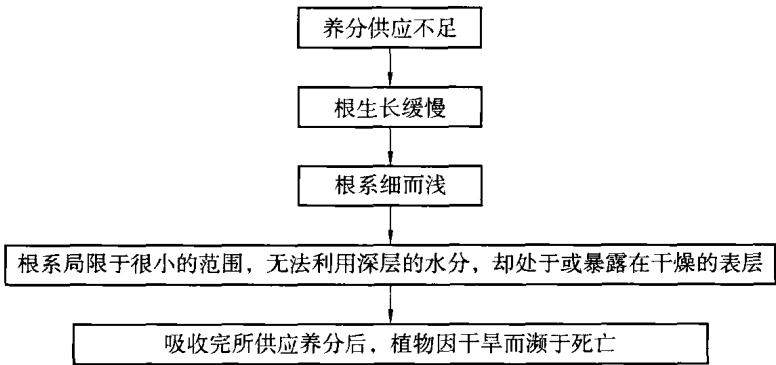  
图2.2 养分供应不足对植物生长的影响

## 2.5.2 胜利露天煤矿样品的采集与结果分析

## 2.5.2.1 样品的采集

在该矿南排土场等地选择有代表性的样地进行采样，样点分别为南端帮、破碎站西侧、南排坡面和南排东部表土。每个采集地按等高点将其划分为3个采样区，多点采样混合为一个混合样，采样深度为0～30cm。用常规方法测定土壤养分。全氮用凯氏法；全磷用酸溶一钼锑抗比色法；全钾用氢氧化钠熔融一火焰光度计法；有效磷用Olsen法；速效钾用中性醋酸铵浸提一火焰光度计法。南排土场表土粒度的测定及粒径分析采用吸管法得到。

## 2.5.2.2 土壤肥力的诊断指标

表2.4和表2.5为胜利煤田一号露天矿南排土场的土壤肥力单项指标及表土粒度测定值。根据土壤养分状况系统研究法[19]与中国第二次土壤普查标准所设立的临界指标，对胜利煤田一号露天矿南排土场的土壤肥力进行诊断分析。样地土壤的pH值在9.0～9.54之间，属碱性。矿坑南端帮、破碎站及南排土场(表土全部取自锡林河河床表土)土壤有机质值在 $0 . 7 4 8 { \sim } 1 . 2 4 \mathrm { ~ g } / \mathrm { k g }$ 之间，处于少缺状态；全氮含量在 $0 . 0 3 { \sim } 0 . 0 5 1 ~ \mathbf { g } / \mathbf { k g }$ 之间，全部极缺；水解性氮值在19～32$\mathbf { m g } / \mathbf { k g }$ 之间，也极缺；有效磷值在 $6 . \ 0 6 \sim 1 0 . \ 1 \ \mathrm { m g / k g }$ 之间，少缺；速效钾值在$1 4 0 { \sim } 1 7 0 \ \mathrm { m g / k g }$ 之间，处于稍丰或中等水平。

表 2.4  
南排土场土壤基本养分状况
<table><tr><td rowspan=1 colspan=1>样地</td><td rowspan=1 colspan=1> $\mathtt { p H }$ </td><td rowspan=1 colspan=1>有机质 $/ { \bf g } \cdot { \bf k g } ^ { - 1 }$ </td><td rowspan=1 colspan=1>全氮(N) $/ { \bf g } \cdot { \bf k } { \bf g } ^ { - 1 }$ </td><td rowspan=1 colspan=1>有效磷(P)速 $/ \mathbf { m } \mathbf { g } \cdot \mathbf { k } \mathbf { g } ^ { - 1 }$ </td><td rowspan=1 colspan=1>效钾(K)水 $/ \mathbf { m } \mathbf { g } \cdot \mathbf { k } \mathbf { g } ^ { - 1 }$ </td><td rowspan=1 colspan=1>解性氮(N) $/ \mathbf { m } \mathbf { g } \cdot \mathbf { k } \mathbf { g } ^ { - 1 }$ </td><td rowspan=1 colspan=1>全盐1%</td></tr><tr><td rowspan=1 colspan=1>南端帮</td><td rowspan=1 colspan=1>9.0</td><td rowspan=1 colspan=1>1.22</td><td rowspan=1 colspan=1>0.051</td><td rowspan=1 colspan=1>8.67</td><td rowspan=1 colspan=1>170</td><td rowspan=1 colspan=1>32</td><td rowspan=1 colspan=1>0.574</td></tr><tr><td rowspan=1 colspan=1>破碎站西侧</td><td rowspan=1 colspan=1>9.36</td><td rowspan=1 colspan=1>1.24</td><td rowspan=1 colspan=1>0.044</td><td rowspan=1 colspan=1>6.27</td><td rowspan=1 colspan=1>148</td><td rowspan=1 colspan=1>29</td><td rowspan=1 colspan=1>0.308</td></tr><tr><td rowspan=1 colspan=1>南排坡面</td><td rowspan=1 colspan=1>9.54</td><td rowspan=1 colspan=1>1.14</td><td rowspan=1 colspan=1>0.05</td><td rowspan=1 colspan=1>6.06</td><td rowspan=1 colspan=1>158</td><td rowspan=1 colspan=1>21</td><td rowspan=1 colspan=1>0.512</td></tr><tr><td rowspan=1 colspan=1>南排东部表土</td><td rowspan=1 colspan=1>9.34</td><td rowspan=1 colspan=1>0.748</td><td rowspan=1 colspan=1>0.03</td><td rowspan=1 colspan=1>10.1</td><td rowspan=1 colspan=1>140</td><td rowspan=1 colspan=1>19</td><td rowspan=1 colspan=1>0.35</td></tr></table>

表 2.5  
南排土场各样点表土粒度组成百分数(%)
<table><tr><td rowspan=1 colspan=1>粒度范围/μm样地</td><td rowspan=1 colspan=1> ${ > } 2 \ 0 0 0$ </td><td rowspan=1 colspan=1>1000~2000</td><td rowspan=1 colspan=1>250~1000</td><td rowspan=1 colspan=1>50~250</td><td rowspan=1 colspan=1>10~50</td><td rowspan=1 colspan=1>5~10</td><td rowspan=1 colspan=1>1~5</td><td rowspan=1 colspan=1> $< 1$ </td></tr><tr><td rowspan=1 colspan=1>南端帮</td><td rowspan=1 colspan=1>38.3</td><td rowspan=1 colspan=1>0.3</td><td rowspan=1 colspan=1>17.4</td><td rowspan=1 colspan=1>0</td><td rowspan=1 colspan=1>9.0</td><td rowspan=1 colspan=1>6.0</td><td rowspan=1 colspan=1>4.0</td><td rowspan=1 colspan=1>25.0</td></tr><tr><td rowspan=1 colspan=1>破碎站西侧</td><td rowspan=1 colspan=1>33.4</td><td rowspan=1 colspan=1>1.3</td><td rowspan=1 colspan=1>25.3</td><td rowspan=1 colspan=1>0</td><td rowspan=1 colspan=1>8.0</td><td rowspan=1 colspan=1>5.0</td><td rowspan=1 colspan=1>5.0</td><td rowspan=1 colspan=1>22.0</td></tr><tr><td rowspan=1 colspan=1>南排坡面</td><td rowspan=1 colspan=1>26.9</td><td rowspan=1 colspan=1>0.5</td><td rowspan=1 colspan=1>18.6</td><td rowspan=1 colspan=1>12.0</td><td rowspan=1 colspan=1>8.0</td><td rowspan=1 colspan=1>6.0</td><td rowspan=1 colspan=1>6.0</td><td rowspan=1 colspan=1>22.0</td></tr><tr><td rowspan=1 colspan=1>南排东部表土</td><td rowspan=1 colspan=1>22.8</td><td rowspan=1 colspan=1>0.1</td><td rowspan=1 colspan=1>4.0</td><td rowspan=1 colspan=1>37.1</td><td rowspan=1 colspan=1>1.0</td><td rowspan=1 colspan=1>14.0</td><td rowspan=1 colspan=1>4.0</td><td rowspan=1 colspan=1>17.0</td></tr></table>

## 2.5.2.3 土壤质地的确定及土壤肥力的综合评价

根据卡钦斯基土壤质地基本分类，对于碱土及碱化土，粒级<0.01mm的含量在30%～40%，属于重壤土。根据表2.5得到南排土场各样点表土粒度组成如图2.3所示。从图2.3可以看出，南端帮粒级<0.01mm的含量为35%，破碎站西侧粒级 $< 0 . \ 0 1 \ \mathrm { { \ m m } }$ 的含量为32%，南排坡面 $< 0 . \ 0 1 \ \mathrm { m m }$ 的含量为34%，南排东部表土 $< 0 . 0 1 \ \mathrm { m m }$ 的含量为35%，所以南排土场的土壤质地为重壤土。根据文献，对于重壤土，其土壤质地肥力系数为 $\mathbf { \nabla } _ { \mathbf { \mathbf { \mathit { P } } } _ { i } } = 3$ 。由于南排土场的土壤质地类型为碱土，已经考虑了土壤的pH值，所以胜利煤田一号露天矿南排土场的土壤肥力的综合评价主要因子有：质地、有机质、全氮、有效磷、速效钾。

土壤的肥力水平是土壤众多基本特征的综合反应，本节主要采用改进的内梅罗综合指数法进行综合评价。其计算公式为：

$$
\small p = \sqrt { \frac { \dot { p } _ { \mathrm { i a v } } ^ { 2 } + \dot { p } _ { \mathrm { i m i n } } ^ { 2 } } { 2 } } \left( \frac { n - 1 } { n } \right)\tag{2.1}
$$

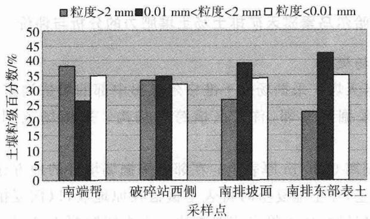  
图2.3 南排土场各样点表土粒度组成

式中 $\scriptstyle { \hat { p } } ^ { . }$ 土壤肥力系数；

$\phi _ { i a v }$ —土壤各属性分肥力系数的平均值；

$\pmb { \phi } _ { \mathrm { i m i n } }$ ——土壤各属性分肥力系数中的最小值；

n——参与评价的土壤属性个数。

土壤肥力综合评价应尽量多地考虑与肥力有关的土壤性状，本书参照第二次全国土壤普查标准和胜利一号露天 $\mathfrak { P }$ 的土壤调查资料，主要因子有：质地、有机质、pH值、全氮、有效磷、速效钾等。首先对上述评价因子进行标准化计算，以消除各参数间量的差别。其次对土壤各属性因子进行分级，分级标准主要参照第二次全国土壤普查标准划分。最后得到胜利矿南排土场综合评价结果(见表2.6)。

表2.6  
排土场土壤肥力的综合评价结果
<table><tr><td rowspan=1 colspan=1>样地</td><td rowspan=1 colspan=1>质地</td><td rowspan=1 colspan=1>有机质 $/ { \bf g } \cdot { \bf k g } ^ { - 1 }$ </td><td rowspan=1 colspan=1>全氮 $/ \mathbf { g } \cdot \mathbf { k } \mathbf { g } ^ { - 1 }$ </td><td rowspan=1 colspan=1>有效磷 $/ \mathbf { m } \mathbf { g } \cdot \mathbf { k } \mathbf { g } ^ { - 1 }$ </td><td rowspan=1 colspan=1>速效钾 $/ \mathbf { m } \mathbf { g } \cdot \mathbf { k } \mathbf { g } ^ { - 1 }$ </td><td rowspan=1 colspan=1>综合肥力系数p</td></tr><tr><td rowspan=1 colspan=1>南端帮</td><td rowspan=1 colspan=1>3</td><td rowspan=1 colspan=1>0.122</td><td rowspan=1 colspan=1>0.068</td><td rowspan=1 colspan=1>1.734</td><td rowspan=1 colspan=1>2.7</td><td rowspan=1 colspan=1>0.86</td></tr><tr><td rowspan=1 colspan=1>破碎站西侧</td><td rowspan=1 colspan=1>3</td><td rowspan=1 colspan=1>0.124</td><td rowspan=1 colspan=1>0.0587</td><td rowspan=1 colspan=1>1.254</td><td rowspan=1 colspan=1>2.48</td><td rowspan=1 colspan=1>0.78</td></tr><tr><td rowspan=1 colspan=1>南排坡面</td><td rowspan=1 colspan=1>3</td><td rowspan=1 colspan=1>0.114</td><td rowspan=1 colspan=1>0.067</td><td rowspan=1 colspan=1>1.212</td><td rowspan=1 colspan=1>2.58</td><td rowspan=1 colspan=1>0.79</td></tr><tr><td rowspan=1 colspan=1>南排东部表土</td><td rowspan=1 colspan=1>3</td><td rowspan=1 colspan=1>0.0748</td><td rowspan=1 colspan=1>0.04</td><td rowspan=1 colspan=1>2.01</td><td rowspan=1 colspan=1>2.4</td><td rowspan=1 colspan=1>0.85</td></tr></table>

根据修正的内梅罗公式计算的综合肥力系数 $( \phi )$ 给出土壤的肥力评价指标， $\hbar \geqslant 2 , 7$ 为土壤很肥沃， $\phi$ 值在2.7\~1.8之间为肥沃， $\pmb { \phi }$ 值在1.8\~0.9之间为一般， $\hbar { < } 0 , 9$ 为贫瘠。根据此指标评价胜利一号露天矿南排土场土壤肥力为贫瘠。

## 2.5.3 准格尔哈尔乌素露天矿排土场土壤肥力的分析与评价

## 2.5.3.1 排土场概况

哈尔乌素露天煤矿采掘场位于准格尔煤田中部的黑岱沟露天煤矿南侧，并与黑岱沟露天采掘场紧邻，首采区横跨黑岱沟。采掘场范围的土地面积为6 142.68 ha。

露天开采剥离0.30m厚表土。在邻近采掘场境外的地方建立临时的表土堆放场，贮存表土，在土地复垦时将表土覆盖在原地表，以恢复植被。在采区剥离、开采、土地复垦时，也可将采前剥离的表土直接铺覆于已回填或部分回填废弃岩土的采空区，避免二次搬运。采掘场表土剥离量为18.428Mm³。

## 2.5.3.2 样品的采集与处理

样品的采集同2.3.2节。用常规方法测定土壤养分。全氮用凯氏法；有效磷用Olsen法。南排土场表土粒度的测定及粒径分析采用吸管法得到。

## 2.5.3.3 土壤肥力的诊断指标

表2.7和表2.8为哈尔乌素露天矿的土壤肥力单项指标及土壤粒度测定值。

表2.7  
样地土壤基本养分状况
<table><tr><td rowspan=1 colspan=1>样地</td><td rowspan=1 colspan=1> $\mathtt { p H }$ </td><td rowspan=1 colspan=1>有机质 $/ \mathbf { m } \mathbf { g } \cdot \mathbf { k } \mathbf { g } ^ { - 1 }$ </td><td rowspan=1 colspan=1>总盐 $/ \mathbf { m } \mathbf { g } \cdot \mathbf { k } \mathbf { g } ^ { - 1 }$ </td><td rowspan=1 colspan=1>有效磷 $/ \mathbf { m } \mathbf { g } \cdot \mathbf { k } \mathbf { g } ^ { - 1 }$ </td><td rowspan=1 colspan=1>总氮 $/ \mathbf { m } \mathbf { g } \cdot \mathbf { k } \mathbf { g } ^ { - 1 }$ </td><td rowspan=1 colspan=1>水解性氮 $/ \mathbf { m } \mathbf { g } \cdot \mathbf { k } \mathbf { g } ^ { - 1 }$ </td><td rowspan=1 colspan=1>质地</td></tr><tr><td rowspan=1 colspan=1>样地1</td><td rowspan=1 colspan=1>6.986</td><td rowspan=1 colspan=1>22.9</td><td rowspan=1 colspan=1>2.3</td><td rowspan=1 colspan=1>10.22</td><td rowspan=1 colspan=1>2.31</td><td rowspan=1 colspan=1>109.2</td><td rowspan=1 colspan=1>粗砂土</td></tr><tr><td rowspan=1 colspan=1>样地2</td><td rowspan=1 colspan=1>7.498</td><td rowspan=1 colspan=1>10.9</td><td rowspan=1 colspan=1>1.2</td><td rowspan=1 colspan=1>15.12</td><td rowspan=1 colspan=1>1.43</td><td rowspan=1 colspan=1>49</td><td rowspan=1 colspan=1>粗砂土</td></tr><tr><td rowspan=1 colspan=1>样地3</td><td rowspan=1 colspan=1>6.740</td><td rowspan=1 colspan=1>8.9</td><td rowspan=1 colspan=1>0.9</td><td rowspan=1 colspan=1>21.9</td><td rowspan=1 colspan=1>2.45</td><td rowspan=1 colspan=1>92.4</td><td rowspan=1 colspan=1>粗砂土</td></tr><tr><td rowspan=1 colspan=1>样地4</td><td rowspan=1 colspan=1>7.865</td><td rowspan=1 colspan=1>8.9</td><td rowspan=1 colspan=1>0.7</td><td rowspan=1 colspan=1>13.6</td><td rowspan=1 colspan=1>1.36</td><td rowspan=1 colspan=1>19.6</td><td rowspan=1 colspan=1>粗砂土</td></tr><tr><td rowspan=1 colspan=1>样地5</td><td rowspan=1 colspan=1>7.9</td><td rowspan=1 colspan=1>19.5</td><td rowspan=1 colspan=1>0.6</td><td rowspan=1 colspan=1>13.6</td><td rowspan=1 colspan=1>1.34</td><td rowspan=1 colspan=1>21</td><td rowspan=1 colspan=1>粗砂土</td></tr><tr><td rowspan=1 colspan=1>样地6</td><td rowspan=1 colspan=1>7.905</td><td rowspan=1 colspan=1>24.3</td><td rowspan=1 colspan=1>0.8</td><td rowspan=1 colspan=1>9.08</td><td rowspan=1 colspan=1>2.78</td><td rowspan=1 colspan=1>176.4</td><td rowspan=1 colspan=1>粗砂土</td></tr><tr><td rowspan=1 colspan=1>样地7</td><td rowspan=1 colspan=1>8.109</td><td rowspan=1 colspan=1>12.1</td><td rowspan=1 colspan=1>0.9</td><td rowspan=1 colspan=1>9.46</td><td rowspan=1 colspan=1>0.77</td><td rowspan=1 colspan=1>98</td><td rowspan=1 colspan=1>粗砂土</td></tr></table>

根据土壤养分状况系统研究法与中国第二次土壤普查标准所设立的临界指标，对哈尔 $\frac { H } { I }$ 素露天矿的土壤肥力进行诊断分析。样地土壤的pH值在6.74～8.109之间，属中性。样地2、样地3、样地4、样地7土壤有机质值在8.9～12.1g/kg之间，含量较低；样地1、样地5、样地6土壤有机质值在19.5～24.3g/kg之间，含量中等；样地2、样地4、样地5、样地7总氮含量在0.77～1.43 mg/kg之间，含量略低；样地1、样地3、样地6总氮含量在2.31\~2.78mg/kg之间，含量较高；样地2、样地4、样地5水解性氮值在19.6\~49mg/kg之间，含量低；样地1、样地3、样地7水解性氮值在92.4\~109.2mg/kg之间，含量略低；样地6水解性氮为176.4 mg/kg，含量较高；各样地有效磷值在9.08\~21.9mg/kg之间，含量较高。

表2.8  
各样点土壤粒度组成百分数(%)
<table><tr><td rowspan=1 colspan=1>粒度范围/μm样地</td><td rowspan=1 colspan=1>&gt;2 000</td><td rowspan=1 colspan=1>1000~2000</td><td rowspan=1 colspan=1>250~1000</td><td rowspan=1 colspan=1>50~250</td><td rowspan=1 colspan=1>10~50</td><td rowspan=1 colspan=1>5~10</td><td rowspan=1 colspan=1>1~5</td><td rowspan=1 colspan=1>&lt;1</td></tr><tr><td rowspan=1 colspan=1>样地1</td><td rowspan=1 colspan=1>0</td><td rowspan=1 colspan=1>0.1</td><td rowspan=1 colspan=1>10.4</td><td rowspan=1 colspan=1>85.7</td><td rowspan=1 colspan=1>3.8</td><td rowspan=1 colspan=1>4.0</td><td rowspan=1 colspan=1>25.0</td><td rowspan=1 colspan=1>0</td></tr><tr><td rowspan=1 colspan=1>样地2</td><td rowspan=1 colspan=1>0</td><td rowspan=1 colspan=1>0.1</td><td rowspan=1 colspan=1>3.7</td><td rowspan=1 colspan=1>96.1</td><td rowspan=1 colspan=1>0.1</td><td rowspan=1 colspan=1>0</td><td rowspan=1 colspan=1>0</td><td rowspan=1 colspan=1>0</td></tr><tr><td rowspan=1 colspan=1>样地3</td><td rowspan=1 colspan=1>0</td><td rowspan=1 colspan=1>0</td><td rowspan=1 colspan=1>5.1</td><td rowspan=1 colspan=1>94.3</td><td rowspan=1 colspan=1>0.6</td><td rowspan=1 colspan=1>0</td><td rowspan=1 colspan=1>0</td><td rowspan=1 colspan=1>0</td></tr><tr><td rowspan=1 colspan=1>样地4</td><td rowspan=1 colspan=1>0</td><td rowspan=1 colspan=1>0</td><td rowspan=1 colspan=1>7.1</td><td rowspan=1 colspan=1>92.4</td><td rowspan=1 colspan=1>0.5</td><td rowspan=1 colspan=1>0</td><td rowspan=1 colspan=1>0</td><td rowspan=1 colspan=1>0</td></tr><tr><td rowspan=1 colspan=1>样地5</td><td rowspan=1 colspan=1>0</td><td rowspan=1 colspan=1>0.2</td><td rowspan=1 colspan=1>39.6</td><td rowspan=1 colspan=1>58.1</td><td rowspan=1 colspan=1>2.1</td><td rowspan=1 colspan=1>0</td><td rowspan=1 colspan=1>0</td><td rowspan=1 colspan=1>0</td></tr><tr><td rowspan=1 colspan=1>样地6</td><td rowspan=1 colspan=1>0</td><td rowspan=1 colspan=1>0.2</td><td rowspan=1 colspan=1>10.7</td><td rowspan=1 colspan=1>84.7</td><td rowspan=1 colspan=1>4.4</td><td rowspan=1 colspan=1>0</td><td rowspan=1 colspan=1>0</td><td rowspan=1 colspan=1>0</td></tr><tr><td rowspan=1 colspan=1>样地7</td><td rowspan=1 colspan=1>0</td><td rowspan=1 colspan=1>0</td><td rowspan=1 colspan=1>40.9</td><td rowspan=1 colspan=1>57.9</td><td rowspan=1 colspan=1>1.2</td><td rowspan=1 colspan=1>0</td><td rowspan=1 colspan=1>0</td><td rowspan=1 colspan=1>0</td></tr></table>

## 2.5.3.4 土壤肥力的综合评价

土壤的肥力水平是土壤众多基本特征的综合反应，本节主要采用改进的内梅罗综合指数法进行综合评价。其计算公式参见式(2.1)。

评价因子主要考虑与肥力有关的土壤性状，主要因子有pH值、有机质、全N、全K、全P、水解性氮、有效磷等。首先对上述评价因子进行标准化计算，以消除各参数间量的差别，处理方法见表2.9，土壤各属性因子分级标准值(X。、$X _ { \mathrm { c } } \ l , X _ { \mathrm { p } } )$ 主要参照第二次全国土壤普查标准划分(表2.10)。土壤肥力的综合评价结果见表2.11。

表2.9  
土壤肥力评价因子标准化处理方法
<table><tr><td rowspan=1 colspan=1>分级标准</td><td rowspan=1 colspan=1>处理方法</td></tr><tr><td rowspan=1 colspan=1>差  $C _ { i } { \leqslant } X _ { s } \ \sharp :$ </td><td rowspan=1 colspan=1> $\pmb { \mathscr { p } } _ { i } = \pmb { \mathscr { C } } _ { i } / X _ { a } ( \pmb { \mathscr { p } } _ { i } \{ \leqslant 1 \}$ </td></tr><tr><td rowspan=1 colspan=1>中等  $X _ { \mathfrak { a } } { < } C _ { i } { \leqslant } X _ { \mathfrak { c } }$ 时：</td><td rowspan=1 colspan=1> $\scriptstyle \pmb { \phi _ { i } = l + ( C _ { i } - X _ { \mathbf { a } } ) } / ( X _ { \mathbf { c } } - X _ { \mathbf { a } } ) ( 1 < \mathtt { p } _ { i } \leqslant 2 )$ </td></tr><tr><td rowspan=1 colspan=1>较好  $\smash { X _ { s } < C _ { i } \leqslant X _ { p } }$ 时：</td><td rowspan=1 colspan=1> $\scriptstyle { \dot { p } } _ { i } = 2 + ( C _ { i } - X _ { \mathrm { c } } ) / ( X _ { \mathrm { p } } - X _ { \mathrm { c } } ) ( 2 < { \dot { p } } _ { i } < 3 )$ </td></tr><tr><td rowspan=1 colspan=1>好  $C _ { i } { > } X _ { \mathfrak { p } }$ 时：</td><td rowspan=1 colspan=1> $\pmb { \mathscr { P } _ { i } } = 3$ </td></tr></table>

表 2.10  
土壤肥力分级 $\ d \big ( X _ { \mathtt { a } } , X _ { \mathtt { c } } , X _ { \mathtt { p } } \big )$
<table><tr><td rowspan=1 colspan=1>属性</td><td rowspan=1 colspan=1> $\mathsf { p H }$ </td><td rowspan=1 colspan=1>有机质 $/ \tt g \cdot \tt k g ^ { - 1 }$ </td><td rowspan=1 colspan=1>全氮 $/ \mathsf { g } \cdot \mathsf { k } \mathsf { g } ^ { - 1 }$ </td><td rowspan=1 colspan=1>全磷 $/ { \bf g } \cdot { \bf k } { \bf g } ^ { - 1 }$ </td><td rowspan=1 colspan=1>全钾 $/ \mathbf { g } \cdot \mathbf { k } \mathbf { g } ^ { - 1 }$ </td><td rowspan=1 colspan=1>水解性氮 $/ \mathbf { m } \mathbf { g } \cdot \mathbf { k } \mathbf { g } ^ { - }$ -1</td><td rowspan=1 colspan=1>有效磷 $/ \mathbf { m } \mathbf { g } \cdot \mathbf { k } \mathbf { g } ^ { - }$ -1</td><td rowspan=1 colspan=1>速效钾 $/ \mathbf { m } \mathbf { g } \cdot \mathbf { k } \mathbf { g } ^ { - 1 }$ </td></tr><tr><td rowspan=1 colspan=1> $X _ { \mathrm { a } }$ </td><td rowspan=1 colspan=1>4.5</td><td rowspan=1 colspan=1>10</td><td rowspan=1 colspan=1>0.75</td><td rowspan=1 colspan=1>0.75</td><td rowspan=1 colspan=1>10</td><td rowspan=1 colspan=1>60</td><td rowspan=1 colspan=1>5</td><td rowspan=1 colspan=1>50</td></tr><tr><td rowspan=1 colspan=1> $X _ { \mathrm { c } }$ </td><td rowspan=1 colspan=1>5.5</td><td rowspan=1 colspan=1>20</td><td rowspan=1 colspan=1>1.5</td><td rowspan=1 colspan=1>1.5</td><td rowspan=1 colspan=1>20</td><td rowspan=1 colspan=1>120</td><td rowspan=1 colspan=1>10</td><td rowspan=1 colspan=1>100</td></tr><tr><td rowspan=1 colspan=1> $X _ { \mathfrak { p } }$ </td><td rowspan=1 colspan=1>6.5</td><td rowspan=1 colspan=1>30</td><td rowspan=1 colspan=1>2.0</td><td rowspan=1 colspan=1>2.0</td><td rowspan=1 colspan=1>30</td><td rowspan=1 colspan=1>180</td><td rowspan=1 colspan=1>20</td><td rowspan=1 colspan=1>200</td></tr></table>

表 2.11  
土壤肥力的综合评价结果
<table><tr><td rowspan=1 colspan=1>样地</td><td rowspan=1 colspan=1> $\mathsf { p H }$ </td><td rowspan=1 colspan=1>有机质 $/ \mathbf { m } \mathbf { g } \cdot \mathbf { k } \mathbf { g } ^ { - 1 }$ </td><td rowspan=1 colspan=1>有效磷 $/ \mathbf { m } \mathbf { g } \cdot \mathbf { k } \mathbf { g } ^ { - 1 }$ </td><td rowspan=1 colspan=1>总氮 $/ \mathbf { m } \mathbf { g } \cdot \mathbf { k } \mathbf { g } ^ { - 1 }$ </td><td rowspan=1 colspan=1>水解性氮 $/ \mathbf { m } \mathbf { g } \cdot \mathbf { k } \mathbf { g } ^ { - 1 }$ </td><td rowspan=1 colspan=1>综合肥力系数p</td></tr><tr><td rowspan=1 colspan=1>样地1</td><td rowspan=1 colspan=1>3</td><td rowspan=1 colspan=1>2.29</td><td rowspan=1 colspan=1>2.022</td><td rowspan=1 colspan=1>3</td><td rowspan=1 colspan=1>1.82</td><td rowspan=1 colspan=1>1.716</td></tr><tr><td rowspan=1 colspan=1>样地2</td><td rowspan=1 colspan=1>3</td><td rowspan=1 colspan=1>1.09</td><td rowspan=1 colspan=1>2.512</td><td rowspan=1 colspan=1>1.907</td><td rowspan=1 colspan=1>0.817</td><td rowspan=1 colspan=1>1.152</td></tr><tr><td rowspan=1 colspan=1>样地3</td><td rowspan=1 colspan=1>3</td><td rowspan=1 colspan=1>0.89</td><td rowspan=1 colspan=1>3</td><td rowspan=1 colspan=1>3</td><td rowspan=1 colspan=1>1.54</td><td rowspan=1 colspan=1>1.388</td></tr><tr><td rowspan=1 colspan=1>样地4</td><td rowspan=1 colspan=1>3</td><td rowspan=1 colspan=1>0.89</td><td rowspan=1 colspan=1>2.36</td><td rowspan=1 colspan=1>1.813</td><td rowspan=1 colspan=1>0.327</td><td rowspan=1 colspan=1>0.967</td></tr><tr><td rowspan=1 colspan=1>样地5</td><td rowspan=1 colspan=1>3</td><td rowspan=1 colspan=1>1.95</td><td rowspan=1 colspan=1>2.36</td><td rowspan=1 colspan=1>1.787</td><td rowspan=1 colspan=1>0.35</td><td rowspan=1 colspan=1>1.087</td></tr><tr><td rowspan=1 colspan=1>样地6</td><td rowspan=1 colspan=1>3</td><td rowspan=1 colspan=1>2.43</td><td rowspan=1 colspan=1>1.816</td><td rowspan=1 colspan=1>3</td><td rowspan=1 colspan=1>2.94</td><td rowspan=1 colspan=1>1.81</td></tr><tr><td rowspan=1 colspan=1>样地7</td><td rowspan=1 colspan=1>3</td><td rowspan=1 colspan=1>1.21</td><td rowspan=1 colspan=1>1.892</td><td rowspan=1 colspan=1>1.027</td><td rowspan=1 colspan=1>1.63</td><td rowspan=1 colspan=1>1.149</td></tr></table>

根据修正的内梅罗公式计算的综合肥力系数(p)给出土壤的肥力评价指标， $\hbar \geqslant 2 . 7$ 为土壤很肥沃， $\boldsymbol { \phi }$ 值在2.7\~1.8之间为肥沃，p值在1.8～0.9之间为一般， $\phi { < } 0 , 9$ 为贫瘠。

通过对哈尔乌素露天煤矿土壤基本养分状况的调查分析，得到该矿样地1和样地6综合肥力系数值较好，分别为1.716和1.81。样地1和样地6均为原始地貌，故在生产剥离阶段，应将剥离的表土保存起来，用于将来排土场的覆土；该矿其他样地的综合肥力系数在0.967～1.388之间。综合评价哈尔乌素露天矿排土场土壤肥力为一般。

## 2.6 小结

本章通过对胜利露天煤矿上覆岩层的重金属的含量及赋存状态的调查，得到该矿重金属镉的浓度值已大大超出土壤环境质量标准中一级标准规定的自然背景值，最大超出量为0.8mg/kg，平均超出量为0.4mg/kg，是本区今后土壤重金属污染的主要因子。金属锌的浓度最大值虽然超过土壤环境质量标准中一级标准规定的自然背景值，最大超出量为55.6mg/kg，但平均值尚未超出。因此在今后矿区外(内)排土场土地生态恢复与生态重建中，外(内)排土场应种植吸收镉的植物，例如T. caerulescens等遏蓝菜属(Thelaspi)类植物，而且在外(内)排土场排弃岩土时，应将剥离的泥岩排弃在外(内)排土场的最下层以最大限度上减少重金属对土壤的污染。

在对矿业废弃地复垦中，往往不但要求在废弃地上重新种上植物，而且为了使废弃地可以重新利用来进行农业生产，这就需要逐渐将基质中的重金属浓度减少到可接受的水平，这时候一些具有较高的地上部与地下部金属元素浓度比的植物就具有较大的植物修复潜力。因其所吸收的重金属较多地被转移到便于收获和从系统中移走的地上部分，因此，在一些耐性先锋种生长过一段时间或经一定程度修复后的重金属污染地上，种植这类植物将更有助于把重金属从污染地中清除和加快废弃地的复垦。木本豆科植物在金属污染地改良中的作用越来越受到关注[153]。Piha等(1995)利用30多种草本和木本植物对钛(Ti)矿尾矿地的植被重建试验研究后认为，耐性的木本豆科植物不仅因为可以与根瘤菌共生而克服废弃地的瘦瘠所带来的障碍，而且由于其深根的特点还有利于克服废弃地上常常遇到的干旱胁迫[153]，因而，木本植物尤其是木本豆科植物的这一优点，在利用植物修复重金属污染地的实践中是非常有价值的。

通过对胜利露天煤矿南排土场土壤基本养分状况的调查分析，得到该矿土壤全氮含量极缺；土壤有机质、有效磷值少缺；土壤肥力贫瘠。

土壤肥力贫瘠是导致矿区排土场、工业广场等地幼苗生长不良、苗木成活率不高的主要原因。今后应加强对排土场耐性豆科植物的种植，因为豆科植物在废弃地植被恢复中能够起到促进N素的累积与循环作用，从而进一步提高土壤肥力，同时还可以利用木本豆科植物来修复由于露天矿开采过程中造成的重金属污染。大面积种植能固氮的豆科植物，如沙打旺、苜蓿、草木樨、小叶锦鸡儿等增加土壤有机质、培肥地力、改良土壤，将是一种切实可行的办法。

## 3 露天煤矿景观生态评价指标模型

## 3.1 露天煤矿开采环境破坏的特点

## 3.1.1 土地的挖损和压占

露天开采的剥离是按照一定的作业参数将煤层上方的表土和岩层逐渐剥离的过程。煤层上方的表土和上覆岩层被直接挖损，使组成土地的基本物质和地表植被荡然无存；排土场的建设和发展占用大片土地，约占露天矿总面积的50%。多数露天矿采场剥离的土岩在排土场是简单的堆砌，原来采场地层的土岩层序完全改变，排土场原有的地表植被被剥离物压占和破坏，结果导致了土壤侵蚀等问题。此外，在开采过程中，从采场深数十米甚至数百米挖掘的岩土堆垫在地面，将不同深度岩层中的重金属元素由地下深部转至地表，改变了它们迁移的地球化学条件，在地表重新分异，形成了局部地区的严重污染。

## 3.1.1.1 对土地的直接破坏

主要表现为对土地的挖损、占压、塌陷。如，安太堡露天矿目前已挖损和占压土地31579亩；三河尖煤矿已形成了11000余亩的塌陷地，其中积水面积近4000亩。

## 3.1.1.2 对土地的间接破坏

主要表现为：

①土壤的酸化、盐碱化和盐渍化，是由于塌陷区易形成封闭式湖泊、固体排弃物中有害元素与物质析出造成的，越往深层表现越甚。固体排弃物在风雨的侵蚀下，其中的Ca、Mg、K、Na等单一元素和重碳酸等盐类成分淋失，溶于地表和地下径流中汇集到低洼处，再经过蒸发作用使周围土壤酸化、盐碱化和盐渍化；另外，排土场堆垒承压，抬高地下水位，增加地下水的矿化度，也加剧了土壤的盐碱化。

②土地沙化和土壤贫瘠化。剥离物排弃使潜层沙土表面化，其他辅助作业也可以使土地沙化。裸沙1亩，风力和水力侵蚀将影响邻近3亩土地；沙化土壤有机质含量将减少79.2%，全氮量减少77.7%，全磷量减少15.5%，物理性黏粒减少50%，造成原始土壤的严重贫化。

③水土流失。水土流失主要是由风力和水力侵蚀造成的。霍林河矿区的风力侵蚀模数为 $1 5 ~ 0 0 0 ~ \mathrm { t } / ( \mathrm { k m } ^ { 2 } \cdot \mathrm { a } )$ ，水力侵蚀模数为 $2 1 ~ 0 0 0 ~ \mathrm { t } / ( \mathrm { k m } ^ { 2 } \cdot \mathrm { a } )$ ,排土场年风蚀量157.5kt以上，年水土流失量183.6kt以上；胜利一号露天矿在一期达产年时预测新增水土流失量143275.12t/a，二期达产年时预测新增水土流失量 218445.12t/a，二期达产后预测水土流失量将逐年增加8220 t/a;排土场侵蚀模数是原地貌模数的1.42倍，特殊的是排土场边坡径流模数只有平台的1/3，但侵蚀模数是平台的10倍。这主要是由于边坡陡而松散，易冲蚀，并没有因径流模数比平台的小，而侵蚀模数也比平台的小。

## 3.1.1.3 对景观和植被的破坏

①所有挖损、占压、塌陷和其他一切对地表的人为扰动，都会破坏原有的自然景观和生态植被；

②煤炭赋存的自然位置，使人们很难顾及地表自然景观和生态植被；

③采矿对自然景观和生态植被的破坏有时是毁灭性的、不可逆的；

④采矿对空气、土壤的污染，地下水域、水土流失都会对自然景观和生态植被造成不良影响。

## 3.1.1.4 对永久性建筑与设施的破坏

不均匀沉降、地表开裂、岩层移动或滑动、泥石流与岩体崩塌等对永久性建筑与设施会造成破坏。一般要求露天矿境界和煤矿塌陷区要与永久性建筑和设施保持200m以上的距离。如，义马露天煤矿的境界距陇海铁路只有50m；抚顺西露天开采场边坡变形引起抚顺石油一厂建筑物和储油设施的倾斜、变形和开裂；矿区塌陷引起的建筑物变形、开裂和倒塌更是不胜枚举。

## 3.1.1.5 岩土边坡的影响

露天矿边坡主要包括采场边坡、排土场边坡，最直接的影响就是边坡物质运动，如滑坡、崩塌、泥石流、地面变形等多种地质灾害。露天矿资源开采完后需要闭坑，此时地质环境也会发生一系列的变化，主要表现在以下几个方面：

①露天开采边坡岩体的采动破坏、地质构造的扰动、地下水位的变化等原因诱发滑坡、塌陷、水土流失、泥石流等环境灾害，而地面变形又危及周边地区的工业企业和居民建筑的安全。

②坑内和外排土场排放的油母页岩、含煤矸石会形成大面积自燃，严重地污染周边的大气环境，对工人的作业安全、居民健康造成危害。

③排弃物及与煤相伴生的多种常见有害元素例如重金属等通过地表水、地下水渗透，造成水质污染。

④矿坑、排土场裸露的岩体、边坡没有植被覆盖，大片土地荒废，产生大量的扬尘及有害气体，影响空气质量，危害市民健康，对生态环境相当有害。

⑤露天煤矿中，岩土边坡占有相当大的比重，而且维护非常困难，常出现反复现象，对安全生产的影响非常严重。当前露天煤矿的大多数边坡都是土质边坡，研究其稳定性对露天煤矿的安全生产具有重要意义。

⑥露天与井工联合开采。

随着采深的增加或者为了多回收煤炭资源，露天采煤逐步向露天、并工联合开采的方向发展。很多矿山在开采边帮煤层时大多考虑了平硐，开采深部煤层时也有考虑转入地下开采的情况。如此的综合开采方法对矿区生态环境的影响就会呈现出新的特征。

许多露天矿由于历史原因或是当初设计等因素，周边边坡附近或是稍远处有居民区和民用建筑，或是建有永久建筑，例如选煤厂、发电厂等，甚至是为了经济发展不得不在城市附近建矿山。由于上述原因使得周边地区的生态环境、工业与民用建筑物、生活区、密布的地下油气管道等，对矿坑发生的地质灾害外力作用特别敏感、特别脆弱，灾害影响后果也是相当严重。

露天开采矿坑后，周边岩层地应力的平衡就遭到了很大的破坏，采用平确开采边帮煤层时，对地层又会产生很大扰动。根据现场资料，边帮周围岩层内的应力都会向平硐集中，并在硐口形成一个集中区，这将给平硐的维护甚至是边坡的稳定带来很大的困难。

## 3.1.2 水资源的污染和破坏

露天开采把地壳深部的岩层完全暴露于地表，由于植被的严重破坏和水土流失，通过地表径流等作用将一些有毒有害物质溶于水中汇入江湖，且地表径流使被污染的地表水通过渗透给土壤和地下水体造成污染。一些地下水位较高的矿区，常对矿坑突水进行疏干排放，不仅破坏了地下储水结构，而且造成了矿区及周围区域水资源严重浪费和短缺。此外，露天采场内基岩裸露，使流入坑内的地下水遭到污染，大量排放含有大量固体悬浮物及有害杂质的矿坑水，也给周围水系和土壤造成了污染。有资料显示，山西省每采1t煤，便损失3m³甚至更多的水资源。潞安五阳煤矿矿井水日排放量为13kt。元宝山露天矿日排水量0.45\~0.50 Mm³。

露天矿开采对地表水和地下水系的破坏与地下水流失的影响主要表现在：

（1）采场挖损面积多达十几平方公里、采深多达800m，破坏地表水系和地下水系，降低地下水位，地下水严重流失。安太堡露天矿从地表到开采底部深达200m，过去沟谷中的泉眼水自流，经挖掘后已成枯泉。

（2）排土场占地面积多达十几平方公里、排弃高度达100m以上，破坏地表水系和地下水系，抬高地下水位。

(3）采场内泵站排水、采场内和采场外钻孔与巷道疏干排水，是地下水流失的主要方式；排水沟和防洪沟，改变地表水汇流与径流系统。

(4)污染水系和水源。

自然界中各物种均按自然界中的生态平衡关系即自我调节、相互协调、相互补充和相互制约的原则共存于自然界中。

（5）井工采煤对地下水的影响：

①对地下松散孔隙水的影响。煤矿开采导致地下孔隙水补给及周围基岩裂隙水侧向补给的减少，同时某些含水层底板被采煤裂隙所波及，进而又增加了含水层向下部基岩的垂直渗入，因此，采煤疏干了区域孔隙水。如山西的阳泉等地，由于河谷周围皆为采空区，因而两侧基岩裂隙水侧向补给河谷冲积层的途径基本切断，上游河川径流量受采煤的影响来水减少，水位显著下降，曾使阳泉矿区约180眼第四系浅井因受采煤影响而干枯报废，约163眼水位明显下降，使部分村庄人畜饮水及村办企业用水出现困难。

②对地层裂隙水的影响。在天然条件下，煤、水资源共存于地质体中，各有自身的赋存条件和变化规律。由于煤矿排水打破了地下水原有的自然平衡状态，形成以矿井为中心的降落漏斗，使得地下水向矿坑汇流，在其影响半径范围内，地下水流速加快，水位下降，贮存量减少，局部由承压转为无压，使煤系地层裂隙水受到明显的影响。如山西昔阳与吕梁等缺水山区，由于煤矿排水形成以矿区为中心的降落漏斗，致使煤系地层的地下水水平运动转向垂直流入矿坑，使得含水层水位大幅度下降，在其影响范围内，泉水断流，水井水位下降，流量减少，局部地下水被疏干，使人畜饮水受到严重影响。因此，地下开采使含水层受破坏，地下水直接涌入矿坑，改变了自然条件下补、径、排关系，形成“三水”入渗一矿，进行外排，再入渗、再外排的恶性循环状况，地下水受到严重损失。

③对深层岩溶水的影响。深层岩溶水主要是煤系底部奥灰岩溶水，分布于各大煤田边缘和底部。如岩溶水是山西的主要含水层，是该省工农业供水的主要水源。由于煤矿开采使得深层岩溶水变成矿坑水，改变了岩溶水的补、径、排关系，对煤矿附近的固定供水水源造成极大的影响，特别是许多煤炭开发层位于奥灰岩溶水水位以下，很容易发生断裂导水，它不仅造成岩溶水严重损失，也给水资源带来了严重影响，并且有可能造成恶性突水事故。如在山西太原、轩岗等地曾都多次发生了恶性突水事故，直接影响到当地的用水。

④对地下水的污染。煤矿开采不但对地下各类水的正常循环与补给产生影响，而且造成地下水的严重污染。以山西为例进行说明：从坑水的水质特征

看，其pH值超标，多为酸性水，这是由于含煤地层中硫含量高，且有硫铁矿伴煤分布，在天然状态下含水层水体与煤系地层相隔，而当煤矿开采后，各含水层发生水力联系，氧化成酸过程大大加快而形成酸性水，污染地下水；其二，硫酸根离子含量偏高，硫铁矿在充分接触水体和空气后反应生成硫酸及其化合物，从而使矿坑水中硫酸根离子的含量偏高；其三，总硬度偏大，矿坑水在氧化成酸的过程中对含水体围岩不断溶蚀，使水中 $\mathrm { C a } ^ { 2 + }$ 增多；第四，铁离子含量高，天然水中铁离子含量一般较低，因采煤，煤系地层中的硫铁矿氧化形成铁的可溶化合物而加入矿坑水，使铁离子的含量增高；第五，毒理学成分增高，酚类有机物在天然条件下转化困难，故天然状态下煤系地层水体中很少检出，而在开采条件下其有机反应加快，矿坑水中酚含量增加，90%以上矿坑水有酚检出，36%以上超标；第六，汞主要与煤系地层中的黄铁矿与朱砂伴生，在煤矿开采条件被破坏的情况下，朱砂被加速氧化、溶解，而使汞离子进入水体，导致汞的超标率达22.9%；第七，受矿坑水污染的地表水，直接补给浅层地下水，致使浅层地下水也受到不同程度的污染，如：阳泉桃河赛鱼段以下至阳泉水文站，为中等污染区，地下水化学类型为硫酸重碳酸钙镁型水，硫酸盐严重超标；盂县县城以下至温池段挥发酚最大超标倍数达63倍，超标率为8.1%；第八，在山西采煤对石炭系、二叠系含水层的破坏使其含水层的水转化成为矿坑水，呈现与矿坑水相同的水质特征。

（6)井工采煤对地表水的影响：

①对地表水资源的影响。首先，随着煤矿开采量的不断增加，矿坑排水量也随之增大。当矿坑水排出地表后，直接使矿区附近的地表水受到不同程度的污染，往往由于河水的自净能力很弱，在河水断流时期，河道容纳的几乎全是污水；因此，未经处理的矿井污水直接排放，造成对地表水、土壤等的环境污染，使河水中鱼死虾亡。同时，在矿井水流经之地，改变了土壤的湿化性质，pH值降低，从而抑制了农作物的生长，致使农业生态环境也受到不良影响。第二，由于煤层浅埋藏区煤矿开采采空面积不断扩大，采空区导水裂隙带和地面塌陷范围也随之扩大，造成河川径流量大量渗漏，使地表水与地下水、矿坑水发生了直接的水力联系，如在阳泉矿区，由于长期大面积采煤使得采空范围逐年加大，造成采空塌陷、裂隙遍布矿区，调查表明，矿区70%以上出现裂缝或地面塌陷现象，因此，地表水在汇流区及径流区水量漏失严重，河川径流明显减少。

②对地表生态环境的影响。因疏排地下水，使地下水动力条件改变，经常发生地面塌陷等环境灾害，这样给地表环境及生态带来极大的破坏，如破坏地表水源，导致水库干涸，河泉断流；破坏房屋建筑及工程设施，影响道路交通安全；引起突水、地表水回灌，恶化矿山安全作业环境；破坏耕地，加大水土流失，改变生态平衡等。在某些地区，矿区的工业广场和职工生活区的地面沉降已对部分工业和民用建筑产生了不同程度的变形破坏，如近年来在两淮矿区和徐州大屯矿区等，因疏排厚冲积覆盖层中孔隙水引起了矿井井壁破坏，该问题已越来越受到煤矿科技工作者的重视。

③地下水的大量流失同样引起地表沉降，但比塌陷来得均匀些。

## 3.1.3 大气污染

露天矿的穿爆、采装、运输和排土等作业产生大量且长时间悬浮于大气中的粉尘及硫氧化物等有毒有害气体，进入大气后会迅速扩散，给人类生存环境造成严重危害。此外，由于露天采场和排土场完全将基岩暴露于大气中，风化破碎的土、岩颗粒在气流冲击作用下，随风飞扬，加重了大气的粉尘污染。

## 3.1.3.1 烟尘排放

矿区内集中供热锅炉、生产炸药锅炉、燃煤电厂等排放的烟尘。

## 3.1.3.2 煤及煤矸石自燃产生的烟尘

①采场工作面、采场煤帮暴露时间过长、煤层氧化燃烧；

②采坑内不可采煤层、煤层顶板损失煤作为剥离物进入排土场时间过长引起自燃；

③选煤厂选后矸石自燃；

④露天储煤场和储煤堆自燃。

烟尘中含有 $\mathrm { S O } _ { 2 } \ 、 \mathrm { N O } _ { x } \ 、 \mathrm { C O } \ 、 \mathrm { H } _ { 2 } \mathrm { S }$ 等有害气体，对生态系统构成影响。遇到雨水和潮湿的空气生成酸性硫化物，其腐蚀性非常强，从钢铁、水泥构件到人体均会受到腐蚀和侵害。

## 3.1.3.3 $\ E F$ 区粉尘

粉尘沉淀在植物叶片，影响植物的光合作用；太阳暴晒后温度升高，灼伤植物。矿区尘源主要来自大型设备剥离、采掘、运输、排土作业时的粉尘，煤的采掘、运输、储煤、粉碎及作业过程粉尘，辅助设备作业粉尘；穿孔爆破粉尘，选煤厂粉尘；道路运输粉尘等。

## 3.1.3.4 煤层气排放

煤层气的主要成分是甲烷。甲烷是一种重要的温室效应气体，能使对流层中的臭氧增加，使平流层中的臭氧减少。排放方式有直接排放、燃烧排放、通风系统排放。

烟尘与粉尘及有害气体对环境的污染是全方位的。对水、空气(包括气味)、动植物的健康造成直接损害。

这些污染源借风、雨等自然媒介，其污染范围远远超出 $\textcircled { + }$ 区本身。

## 3.1.4 噪声与震动污染

噪声与震动源主要有以下类型：

①空气动力源。如通风机、风扇、跳汰机和风阀等。

②机械动力源。如铆枪、振动筛、溜槽、各种采掘设备和运输设备以及其他各种机械设备。

③电磁动力源。如电机、电焊机、电气设备等。

④人工动力源。如爆破、人力施工等。

三河尖煤矿通风机运转时白天产生的噪声为57 dB(A)，夜间超标12 dB(A)；在工业广场范围内，主井提升、原煤洗选及锅炉引风机等作业时产生较强的噪声，在围墙外所测噪声值白天为55 dB(A)，夜间超标10 dB(A)。淮北石台煤矿中央风井产生噪声最大值为95dB(A)，平均值为87.5 dB(A)，是典型的强低频噪声。一般情况下，选煤厂内的噪声都在75dB(A)以上。

露天矿多采用大型重载卡车、凿岩机、破碎机、采掘机械和筑路机械等大型设备，这些大型设备的运转都产生持续强烈的噪声，使人们的情绪不安、厌倦，工作效率降低等。

## 3.2 景观生态评价研究现状

景观生态评价是景观规划、管理和保护的基础，是景观生态学理论与应用研究的纽带。景观生态评价在近20a内发展很快，由最初的定性及评价少数几个功能的模型方法，现在进入定量化、多学科交叉、多功能评价阶段[197].[198].[199]。文献184提出了自然保护区景观生态评价的指标：多样性、代表性、自然性、稀有性、面积适宜性、稳定性和人类干扰等7个指标对丰林自然保护区进行了景观生态评价。文献[119]提出了景观受协度、景观生产力和景观稳定性对海洋带土地持续利用进行了景观生态评价。但目前有关矿区景观生态评价的文献很少。这为研究工作的开展增加了一定难度，但同时也为研究工作的创新提供了一个契机。

文献[199]将景观分为自然景观、经营景观和人工景观。自然景观分为原始景观和轻度人为活动于扰的自然景观，如某些自然保护区。经营景观分为人工自然景观和人工经营景观，如农耕景观。人工景观是一种自然界原先不存在的景观，完全是人类活动所创造，如矿山景观等。该文献提出了景观的独特性、景观的多样性、景观的功效性、景观的宜人性和景观的美学价值等五个评价指标。

其中景观的多样性是指景观要素在结构与功能方面的多样性，反映了景观的复杂程度，景观的多样性包括斑块的多样性、组分种类多样性与格局多样性，前者指景观中斑块的数量、大小和形状的复杂程度，中者指景观组分类型的丰富度，后者指斑块间的空间关联性和功能联系性。景观多样性对于物质迁移，能量交换，生产力水平，物种分布、扩散和觅食有重要影响。景观多样性的评定对于生物多样性研究具有直接和重要意义。

景观的功效性主要指标有：景观的生物生产力，景观的水分、养分等物质循环，经济密度即单位面积的经济产出等内容。

景观的宜人性主要评价适于人类生存、走向生态文明的人居环境，因子包括：景观的通达性(位置、区位、交通条件易于到达)、生态的稳定性、环境的清洁度(洁净的大气、水、土壤环境，在环境容量允许的范围之内的污染物排放)、空间的拥挤度(单位空间的建筑密度和人口密度)及景色优美度(景观美学质量的度量，含文化特征、景观视阈、绿色覆盖）。

景观的美学价值因子有：合适的空间尺度；景观结构的有序化多样性和变化性、安静性；景观的静谧、幽美，持续性和自然性；景观的开发利用体现可持续思想，保持其自然特色。与此相对应的景观的负向美学特征则表现为：人类尺度的丧失，景观组分的多少，大小比例失调，极端无序，清洁性丧失，废物垃圾遍地；空间组合性丧失；噪声污染；景观经济或生态功能损失。

但如何对矿区景观生态进行评价，文献[199]也没有作出评价。

## 3.3 矿区景观特点

景观生态学中的景观是由各种景观要素组成的。景观要素按其形状和作用可分为斑块(patch)、廊道(corridor)和基质(matrix)3种基本类型。其中斑块是在空间比例尺上所能见到的最小的异质性单元；廊道是指不同于两侧基质的狭长地带，可以看做是一个线状或带状斑块；基质是景观生态学中范围广阔、相对同质且连通性最强的背景地域，是一种重要的景观元素，它在很大程度上决定着景观的性质，对景观的动态起主导作用。

露天矿区的斑块主要包括露天矿的采掘场、外排土场等矿山生产区及工业场地，如办公楼、储煤场、破碎站等。廊道主要为矿山运输道路、供电线路、铁路专用线等矿区线性工程。对于胜利露天矿区来说，其基质是草地。

在上述各种景观要素中，矿区的采掘场、外排土场等矿山生产区斑块对环境造成的破坏最大，其次是矿区线性工程，如地面运输系统、地面防排水工程、给排水管线工程、供电线路工程等，大量的弃土、弃渣和开挖活动对草地资源破坏严重，使原地貌的风水蚀加剧。

## 3.4 矿区景观生态评价指标选取的原则

评价指标的选取必须结合露天煤矿开采环境破坏的特点，具有景观生态学特征，同时指标本身还具备有效性与合理性。因此，根据文献199提出的景观的独特性、景观的多样性、景观的功效性等5个评价指标原理，结合露天煤矿开采的特点，提出以下矿区生态景观评价指标的原则：

①系统全面性原则。既要对生态、经济、社会和景观等各方面进行评价，又要将它们协调起来，进行综合评价。

②景观生态原则。景观生态评价是以景观为研究对象，评选的指标应具有一定的景观生态学特征。

③动态性原则。大型露天煤矿开采的周期较长，矿区景观格局时空会不断变化，评价指标应具有时间概念。

④相对独立性原则。各指标之间应具有一定的相对独立性，不能重复使用。

⑤可操作性原则。评价的关键在于评价方法是否可以操作，指标最好能量化，资料可以容易获取。

## 3.5 生态评价指标体系

参照文献199提出的景观的独特性、景观的多样性、景观的功效性、景观的宜人性和景观的美学价值等5个评价指标，并结合露天煤矿开采对环境破坏的特点，采用层次分析法，构造露天矿采剥生产对生态环境影响及景观生态评价指标体系。

该评价指标体系分为三个层次：第一层次为目标层，即景观生态质量总目标层；第二层次为准则层，包括景观的稳定性、景观的功效性、景观的宜人性和景观的美学价值等；第三层次为指标层，包括景观多样性等17项具体指标(参见图3.1)。

## 3.5.1 景观的稳定性

景观的稳定性指景观各种参数的长期变化呈现水平状态，包括景观功能的稳定性和景观的空间结构稳定性，格局决定功能。景观稳定性越高，景观受外界干扰的抵抗力越强，受干扰后的恢复能力也越强，越有利于维持景观格局，保障景观功能的稳定发挥。

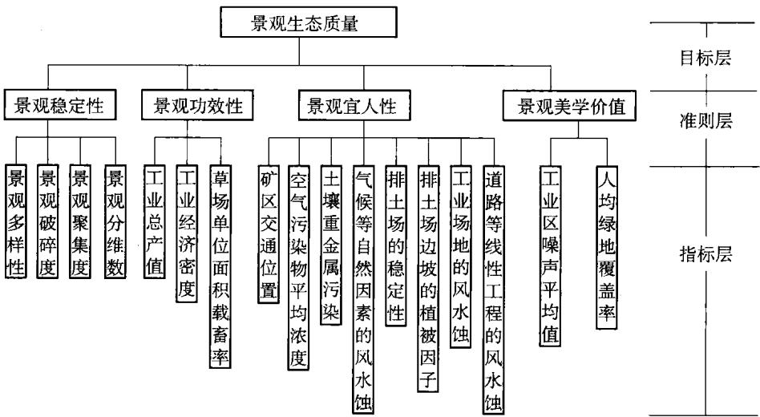  
图 3.1 矿区生态评价指标体系

景观的稳定性可采用反映景观异质性的景观多样性、景观破碎度、景观聚集度和景观分维数等指标来衡量。

## 3.5.1.1 景观多样性

景观多样性指景观中斑块类型的丰富和复杂程度，主要考虑不同景观类型在景观中所占面积的比例和类型的多少。景观多样性反映景观斑块类型的面积异质性，多样性指数越高，各类型所占的面积比例越相当，景观斑块异质性越高，景观越稳定。这里采用景观多样性 Shannon—Weaver 指数：

$$
H = - \sum _ { k = 1 } ^ { n } P _ { i } \lg \ p _ { i }\tag{3.1}
$$

式中 n——研究区景观类型数目；

$P _ { i }$ ——第i种景观类型面积占总面积的比例，即计算结果为景观面积的多样性；

$\phi _ { i }$ ——第i种景观类型斑块数占总斑块数的比例，即计算结果为景观斑块数的多样性。

以下各多样性指数均是以上2种类型。

## 3.5.1.2 景观破碎度

景观破碎度指景观被分割的破碎程度，反映景观斑块的面积异质性。斑块的面积越小，景观破碎度越大，景观异质性越高。景观破碎度指标计算公式为：

$$
\ C = { \frac { \sum N _ { i } } { A } }\tag{3.2}
$$

式中 C——景观破碎度；

A——研究区景观总面积；

∑ $N _ { i }$ 景观中所有景观类型斑块的总个数。

## 3.5.1.3 景观聚集度

景观聚集度指景观中不同景观类型的非随机性或聚集程度，反映一定数量的景观类型在景观中的相邻关系，相互分散性代表景观斑块的邻接异质性。一般采用相对聚集度来表示：

$$
R _ { C } = 1 - C / C _ { \operatorname* { m a x } }\tag{3.3}
$$

式中 $R _ { C }$ 相对聚集度指数；

C——复杂性指数；

$C _ { \mathrm { m a x } }$ ——C的最大可能值。

$R _ { C }$ 取值范围为 $0 \sim 1$ $R _ { C }$ 取值大，表明景观以少数大斑块为主或同一类型斑块高度连接，景观异质性程度低； $R _ { C }$ 取值小，表明景观由分散交错的许多小斑块组成，景观异质性程度高，有利于景观的稳定性。

## 3.5.1.4 景观分维数指标

分维数描述景观镶嵌体的几何形状复杂性，反映景观的形状异质性。斑块形状越复杂，分维数越大，景观异质性越高。景观分维数通常采用线性回归的方法求得：

$$
{ F _ { \mathrm { D } } } = 2 s\tag{3.4}
$$

式中 $ { \boldsymbol { F } } _ { \mathrm { D } }$ ——景观分维数；

s——对景观中所有斑块的周长和面积的对数回归而产生的斜率。

$\boldsymbol { F } _ { \mathrm { D } }$ 取值范围为1～2。 $\boldsymbol { F } _ { \mathrm { D } }$ 越接近1，斑块的自相似性越强，斑块形状越有规律；同时，斑块的几何形状也越趋近简单，景观异质性越低，表明受干扰的程度越大，景观稳定性越差。

## 3.5.2 景观的功效性

景观的功效性反映景观生态生产能力水平，包括景观的生物生产力、经济密度，即单位面积的经济产出等内容。人类利用土地的根本目的就在于实现土地的生产功能，满足人类的需求。在人和自然和谐共存的过程中，实现经济的可行性，适应人类不断增长的物质需求。景观生产力在一定程度上反映了土地的经济可行性与生产力目标。景观生产力越高，土地提供物质产品的能力越强。

胜利露天 $\textcircled { 1 } ^ { 2 }$ 区地处边疆不发达地区。本项目开发建设对繁荣民族地区经济，促进地区资源转化为经济优势，规模化发展煤炭及相关能源产业，缓解北方地区能源短缺，向下游用户提供优质煤炭，满足煤炭市场需求，带动相关产业发展有长期的重大有利影响。考虑到 $\textcircled { 1 } ^ { 2 . }$ 区煤炭产业为当地的支柱产业，煤炭产业的建设和发展，将带动相关产业及区域经济的加快发展，对缩小边疆地区与内地间的贫富差距，增加收入，提高当地整体生活水平，具有长期的有利影响。因此选取工业总产值(万元/a)、工业经济密度(工业总产值/区域总面积，万元 $/  { \mathbf { k } }  { \mathbf { m } } ^ { 2 } )$ 作为测度景观生产力的两个指标。

由于胜利露天矿区位于内蒙古自治区锡林郭勒草原，因此草场资源与载畜量也将是景观生产力的另一个评价指标。草场资源载畜量是草场资源生态研究中不可缺少的内容，同时也是合理利用草场和防治草场退化的关键环节。

草场载畜量的衡量指标是载畜率，目前我国估算载畜率最常用的、同时也是最简便的方法是草场单位面积产草量和家畜日食量比值法，其估算公式为：

$$
\sharp \sharp \sharp \sharp \sharp \sharp \sharp \sharp \sharp \sharp \sharp \sharp / \operatorname* { m i n } _ { \sharp \sharp \sharp \sharp \sharp \sharp \sharp \sharp \sharp } \sharp \sharp \sharp \sharp \sharp \sharp \sharp \sharp \sharp \sharp \ : \sharp \sharp \sharp \ : ( \sharp \wedge \ j ) \ : = \frac { \overline { { \jmath } } _ { \sharp } \sharp \sharp \sharp \sharp \sharp \sharp \sharp \sharp \sharp \sharp \sharp \sharp \sharp \cdot \sharp \sharp \sharp \langle \sharp \sharp \ j \rangle ^ { 2 + \sharp } }  \sharp \sharp \sharp \sharp \sharp \sharp \sharp \sharp \sharp \sharp \lVert \sharp \sharp \lVert \sharp \rVert ^ { 2 + \sharp } \lVert \xi \rVert ^ { 2 + } \lVert \xi \rVert ^ { 2 + } \lVert \xi \rVert ^ { 2 + } \lVert \xi \rVert ^ { 2 + } \lVert \xi \rVert ^ { 2 + } \lVert \xi \rVert ^ { 2 + } \lVert \xi \rVert ^ { 2 + } \lVert \xi \rVert ^ { 2 + } \lVert \xi \rVert ^ { 2 + } \lVert \xi \rVert ^ { 2 + } \lVert \xi \rVert ^ { 2 + } \lVert \xi \rVert ^ { 2 + } \lVert \xi \rVert ^ { 2 + } \lVert \xi \rVert ^ { 2 + } \lVert \xi \rVert ^ { 2 + } \lVert \xi \rVert ^ { 2 + } \lVert \xi \rVert ^ { 2 + } \lVert \xi \rVert ^ { 2 + } \lVert \xi \rVert ^ { 2 + } \lVert \xi \rVert ^ { 2 + } \lVert \xi \rVert ^ { 2 + } \lVert \xi \rVert ^ { 2 + } \lVert \xi \rVert ^ { 2 + } \lVert \xi \rVert ^ { 2 + } \lVert \xi \rVert ^ { 2 + } \lVert \xi \rVert ^ { 2 + } \lVert \xi \rVert ^ { 2 + } \lVert \xi \rVert ^ { 2 + } \lVert \xi \rVert ^ { 2 + } \lVert \xi \rVert ^ { 2 + } \lVert \xi \rVert ^ { 2 + } \lVert \xi \rVert ^ { 2 + } \lVert \xi \rVert ^ { 2 + } \lVert \xi \rVert ^ { 2 + } \lVert \xi \rVert ^ { 2 + } \lVert \xi \rVert ^ { 2 + } \lVert \xi \rVert ^ { 2 + } \lVert \xi \rVert ^ { 2 + } \lVert \xi \rVert ^ { 2 + } \lVert \xi \rVert ^ { 2 + } \lVert \xi \rVert ^ { 2 + } \lVert \xi \rVert ^ { 2 + } \lVert \xi \rVert ^ { 2 + } \lVert \xi \rVert ^  2 +\tag{3.5}
$$

草场载畜率一律以绵羊(只)为单位，各类牲畜与绵羊的折合比例：山羊为1，牛、马、骡为5，驴为3。通过各类型草场单位面积载畜率可以得到草场的理论载畜量，进而得出经济效益指标。

## 3.5.3 景观的宜人性

景观的宜人性主要评价适于人类生存，走向生态文明的人居环境，因子包括：景观的通达性(位置、区位、交通条件易于到达)、环境的清洁度(洁净的大气、水、土壤环境，在环境容量允许的范围之内的污染物排放)、空间的拥挤度(单位空间的建筑密度和人口密度)及景色优美度。

根据景观的宜人性评价因子的内容，结合胜利露天矿区的主要特点，这里主要考虑的评价指标有以下几方面。

## 3.5.3.1 矿区的位置及交通条件

胜利露天矿区位于内蒙古自治区锡林郭勒市，交通十分方便。

## 3.5.3.2 大气的污染

大气污染主要来自露天矿的穿爆、采装、运输等生产作业区的污染和排土场矸石自燃造成的空气污染。评价矿区空气污染程度主要采用空气污染物 $( \mathsf { S O } _ { 2 }$ TSP, $\mathrm { N O } _ { 2 } )$ 平均浓度 $\mathrm { ( m g / m ^ { 3 } } \cdot$ 指标；由于矿区空气污染程度主要受空气污染物$( \mathrm { S O } _ { 2 } , \mathrm { T S P } , \mathrm { N O } _ { 2 } )$ 影响，因此采用大气质量综合污染指数评价法。

此方法简明合理，可用于多种污染物的评价，既反映各污染物平均污染水平，又可反映某种严重污染物对污染的影响，公式如下：

$$
I _ { i } = \sqrt { \left( { \frac { \rho _ { i } } { S _ { i } } } \right) _ { \mathrm { \scriptsize ~ m a x } } \left( { \frac { \rho _ { i } } { S _ { i } } } \right) _ { \mathrm { \scriptsize ~ a v } } }\tag{3.6}
$$

式中 $I _ { i }$ ——大气质量指数；

$\rho _ { i } \mathrm { ~ } , S _ { i }$ —某污染物的实测浓度和国家环境标准值；

$\left( \frac { \rho _ { i } } { S _ { i } } \right) _ { \mathrm { { m a x } } }$ —几种污染物中最大分指数值；

$\left( \frac { \rho _ { i } } { S _ { i } } \right)$ 几种污染物的平均值 $\left[ \frac { 1 } { n } \sum _ { i = 1 } ^ { n } \left( \underline { { \rho _ { i } } } \right) \right]$ av

n——污染物种类数。

计算结果明确表达了评价区大气环境的污染程度，根据综合污染指数的计算结果，再按如下标准划分污染等级：

清洁 综合污染指数<0.7

轻污染 综合污染指数0.7\~1

污染 综合污染指数1.0\~1.87

重污染 综合污染指数1.87\~2.83

根据近5年在锡林浩特市环境质量现状监测资料，整理出不同年份的大气环境质量概况，列为表3.1。

表3.1  
锡林浩特市不同年份的区域环境空气质量概况
<table><tr><td rowspan=2 colspan=1>污染物指标</td><td rowspan=1 colspan=5>日均浓度范围 $/ \mathbf { m } \mathbf { g } \cdot \mathbf { L } ^ { - 1 }$ </td></tr><tr><td rowspan=1 colspan=1>1999年</td><td rowspan=1 colspan=1>2000年</td><td rowspan=1 colspan=1>2001年</td><td rowspan=1 colspan=1>2002年</td><td rowspan=1 colspan=1>2003年</td></tr><tr><td rowspan=1 colspan=1> $\mathsf { S O } _ { 2 }$ </td><td rowspan=1 colspan=1>0.054</td><td rowspan=1 colspan=1>0.034</td><td rowspan=1 colspan=1>0.034</td><td rowspan=1 colspan=1>0.034</td><td rowspan=1 colspan=1>0.024</td></tr><tr><td rowspan=1 colspan=1> $\aleph { \sf O } _ { 2 }$ </td><td rowspan=1 colspan=1>0.035</td><td rowspan=1 colspan=1>0.030</td><td rowspan=1 colspan=1>0.030</td><td rowspan=1 colspan=1>0.030</td><td rowspan=1 colspan=1>0.020</td></tr><tr><td rowspan=1 colspan=1> $\tt T S P$ </td><td rowspan=1 colspan=1>0.326</td><td rowspan=1 colspan=1>0.412</td><td rowspan=1 colspan=1>0.412</td><td rowspan=1 colspan=1>0.300</td><td rowspan=1 colspan=1>0.126</td></tr></table>

表3.1的数据表明，环境空气质量中 $\mathrm { S O } _ { 2 } \ldots \mathrm { N O } _ { 2 }$ 的浓度变化不显著，2001～2003年 $\mathrm { { S O } } _ { 2 }$ 全年日平均值还有所降低，这和市区积极治理大气污染有关。

从锡林浩特市市区空气环境监测的历史来看，其主要污染是出现在冬季，TSP $\mathrm { . } \mathrm { s O } _ { 2 }$ 有污染情况，但从近年的监测来看，大气环境质量较好，其中 $\mathsf { S O } _ { 2 }$ $\mathrm { N O } _ { 2 }$ 年均值、日均值均不超标。

采用单因子指数法对其进行评价，以国家《大气环境质量标准》(二级)为评价标准 $( \mathrm { S O _ { 2 } } \mathrm { - } \mathrm { - } 0 . 1 5 ~ \mathrm { m g / m ^ { 3 } , N O _ { 2 } } \mathrm { - } 0 . 1 ~ \mathrm { m g / m ^ { 3 } , T S P } \mathrm { - } 0 . 3 ~ \mathrm { m g / m ^ { 3 } } )$ ,评价结果如下：

①各监测点 $\mathrm { S O } _ { 2 }$ 浓度在监测时段内的日平均值指数均小于1，即没有超过国家大气环境质量二级标准，表明评价区内无 $\mathrm { S O } _ { 2 }$ 污染。此外，监测时段内任何一次浓度值中最高值的单因子评价指数值为0.4，也小于1。

②各监测点TSP浓度在监测的时段内的日平均值指数均小于1，即没有超过国家大气环境质量二级标准，表明从TSP污染分析，总体规划区的环境质量现状良好。但是，胜利东一号露天矿的指数值接近1，表明该点有轻度的TSP污染。

③各监测点 $\Nu { 0 _ { 2 } }$ 浓度在监测时段内的日平均值指数均小于1，即没有超过国家大气环境质量二级标准，表明评价区内无NO2污染。此外，监测时段内任 $\mathrm { N O } _ { 2 }$ 何一次浓度值中最高值的单因子评价指数值为0.14，远远小于1。

以上说明，胜利露天矿区评价区区域内大气环境质量较好。

## 3.5.3.3 土壤重金属污染

土壤环境质量现状评价的任务是要对土壤环境污染的现状(包括污染程度、范围和污染物的分布)作出定量或半定量的评价。

土壤环境质量现状评价是在全面掌握土壤及环境特征、主要污染源和污染物、土壤背景值等基础资料之后，选择适当的评价参数和评价标准，建立评价模式和指数系统，再进行研究分析，评定土壤的污染级别。

## (1)评价参数的选择

根据评价的目的要求和评价区域的主要污染物来选择适当的评价参数。土壤污染可供选择的参数有两类：一类是重金属及其他无机污染物，主要包括汞、镉、铅、铬、铜、锌、镍和氰化物等；另一类是有机污染物，主要包括酚、石油、DDT、六六六、三氯乙醛及其他农药。根据胜利露天矿区开采的环境特点，这里选择重金属锌(Zn)、铜(Cu)、铅(Pb)、镉(Cd)、铬(Cr)作为评价参数。

## (2) 单因子评价

单因子评价即对土壤中的某一污染物的污染程度进行评价。评价的依据是该污染物的单项污染指数：

$$
\pmb { \mathscr { p } } _ { i } = { C _ { i } } / { S _ { i } }\tag{3.7}
$$

式中 $\phi _ { i }$ —土壤中污染物i的污染指数；

$C _ { i }$ —土壤中污染物i的实测含量，mg/kg；

$S _ { i }$ —土壤污染物的评价标准，mg/kg。

土壤各元素评价标准采用土壤环境质量标准(GB/T15618一1995)为评价标准。算出污染指数后，再按如下标准划分污染等级：

$$
\begin{array} { r l r l } & { \mathbb { M } \mathbb { M } \mathbb { M } \mathbb { M } } & & { \mathbb { M } \mathbb { M } \mathbb { M } \mathbb { M } \mathbb { M } \mathbb { M } \mathbb { M } \mathbb { M } \mathbb { M } \mathbb { M } \mathbb { M } } \\ & { \mathbb { E } \mathbb { M } \mathbb { M } \mathbb { M } \mathbb { M } \mathbb { M } \mathbb { M } } & & { \mathbb { M } \mathbb { M } \mathbb { M } \mathbb { M } \mathbb { M } \mathbb { M } \mathbb { M } \mathbb { M } \mathbb { M } \mathbb { M } \mathbb { M } \mathbb { M } \mathbb { M } \mathbb { M } \mathbb { M } \mathbb { M } \mathbb { M } \mathbb { M } \mathbb { M } } \\ & { \mathbb { H } \mathbb { M } \mathbb { M } \mathbb { M } \mathbb { M } \mathbb { M } \mathbb { M } \mathbb { M } } & & { \mathbb { M } \mathbb { M } \mathbb { M } \mathbb { M } \mathbb { M } \mathbb { M } \mathbb { M } \mathbb { M } \mathbb { M } \mathbb { M } \mathbb { M } \mathbb { M } \mathbb { M } \mathbb { M } \mathbb { M } \mathbb { M } \mathbb { M } \mathbb { M } \mathbb { M } \mathbb { M } \mathbb { M } \mathbb { M } } \\ & { \mathbb { E } \mathbb { M } \mathbb { M } \mathbb { M } \mathbb { M } \mathbb { M } \mathbb { M } \mathbb { M } } & & { \mathbb { M } \mathbb { M } \mathbb { M } \mathbb { M } \mathbb { M } \mathbb { M } \mathbb { M } \mathbb { M } \mathbb { M } \mathbb { M } \mathbb { M } \mathbb { M } \mathbb { M } \mathbb { M } \mathbb { M } \mathbb { M } \mathbb { M } \mathbb { M } \mathbb { M } \mathbb { M } \mathbb { M } \mathbb { M } \mathbb { M } \mathbb { M } \mathbb { M } \mathbb { M } \mathbb { M } \mathbb { M } \mathbb { M } \mathbb { M } \mathbb { M } \mathbb { M } } \end{array}
$$

本书通过对胜利露天矿区5号煤层上覆各岩层的现场采样和分析，得到5

号煤层上覆各岩层重金属元素的平均浓度值如表2.1所示。

## (3) 多因子评价

在实际情况中，常出现多种污染物同时污染某一区域的现象。单因子评价难以表示它们的整体污染水平，因此需要一种同时考虑土壤中多种污染物综合污染水平的多因子评价方法。为了对以上各种重金属对土壤环境的污染程度进行分析评价，这里采用多因子综合评价法。多因子评价是综合考虑土壤中各污染因子的影响，计算出综合指数进行评价。这里采用均方根的方法求土壤污染综合指数，其计算公式[186]为：

$$
\mathbf { \nabla } \mathbf { \mathcal { P } } = \sqrt { \frac { 1 } { \mathfrak { n } } \sum _ { i = 1 } ^ { \mathfrak { n } } \mathbf { \nabla } \mathbf { \mathcal { P } } _ { i } ^ { 2 } }\tag{3.8}
$$

一般， $\scriptstyle { p \leqslant 1 }$ ，未受污染； $\phi { > } 1$ ，已受污染； $\pmb { \mathscr { P } }$ 越大，受到的污染越严重。

若以国家土壤环境质量标准(GB/T15618—1995)为土壤环境质量现状的评价标准，综合评价分级标准宜采用：

$$
\begin{array} { r l r l } & { \pmb { \phi } _ { \pmb { \frac { \kappa } { \sqrt { 2 } } } } \leqslant 0 . 8 5 } & & { \mp \sharp \sharp \sharp \sharp } \\ & { 0 . 8 5 < \pmb { \phi } _ { \pmb { \frac { \kappa } { \sqrt { 2 } } } } \leqslant 1 . 7 1 } & & { \pm \sharp \sharp \vec { z } \vec { y } _ { \pmb { \frac { \kappa } { \sqrt { 2 } } } } \mathtt { y } _ { \pmb { \frac { \kappa } { \sqrt { 2 } } } } } \\ & { 1 . 7 1 < \pmb { \phi } _ { \pmb { \frac { \kappa } { \sqrt { 2 } } } } \leqslant 2 . 5 6 } & & { \mp \sharp \sharp \vec { z } \vec { y } _ { \pmb { \frac { \kappa } { \sqrt { 2 } } } } \mathtt { y } _ { \pmb { \frac { \kappa } { \sqrt { 2 } } } } } \\ & { p _ { \pmb { \frac { \kappa } { \sqrt { 2 } } } } > 2 . 5 6 } & & { \frac { \mp } { \lVert \pmb { \xi } \rVert } \vec { y } _ { \pmb { \frac { \kappa } { \sqrt { 2 } } } } \mathtt { y } _ { \pmb { \frac { \kappa } { \sqrt { 2 } } } } } \end{array}
$$

## 3.5.3.4 土壤的侵蚀

土壤侵蚀评价因子一般选取土壤侵蚀量，也称为土壤流失量，一般用侵蚀模数来表示，单位为 $\mathbf { t } / ( \mathbf { k } \mathbf { m } ^ { 2 } \cdot \mathbf { a } )$ 。目前我国普遍采用侵蚀模数将土壤侵蚀分为微（轻)度侵蚀、中度侵蚀、强度侵蚀、极强度侵蚀等5个级别[186]。

露天矿建设生产过程中新增水土流失是由于人为扰动地面、构筑各类人工平台、边坡等活动，在侵蚀营力的作用下产生的，属于人为水土流失，其形成包括自然地理因素和人为因素两种。自然地理因素包括气候因素和下垫面状况两个方面。下垫面状况(主要包括土壤机械组成、土壤水分状况、植被条件、地形地貌等)是决定土壤侵蚀的物质基础；气候因素(特别是风力及降雨强度和频度)是引起水土流失的动力条件，主要表现为侵蚀营力；人为因素主要指各种施工建设与生产活动，改变了外营力与土体抵抗力之间形成的自然相对平衡，使潜在的自然因素在人为因素的诱发下发挥作用，导致形成新增水土流失。

## (1)自然因素引起的水土流失主要有风力和降水

## ① 风力

风是造成土壤风蚀的起因和形成风沙流的动力。项目区属中温带半干旱大陆性草原气候，春、秋、冬季多大风，土壤侵蚀形式主要以风蚀为主。春、秋、冬季大风一般4～9级，全年大风日数61d，全年平均风速3.5m/s，大风多集中在

4\~5月份，月平均风速4.0m/s，最大风速为24m/s，主导风向为西南风。起沙风速5.0m/s，起沙风速频率占60.7%，扬尘日数14 d，退化草场土壤风蚀较为严重。

考虑这一因素后，主要指标为土壤风蚀模数。类比霍林河露天矿，矿区范围内生态治理区土壤风蚀模数降低到 $2 ~ 5 0 0 ~ \mathrm { t } / ( \mathrm { k m } ^ { 2 } \cdot \mathrm { a } )$

## ②降水

项目区所在地区多年平均降水量294.74mm，6～9月占全年降水量的75%以上；降雨常以暴雨的形式出现，多年平均24h最大降雨量为46.8mm；日最大降雨量为71.3mm，出现在1968年8月17日；小时最大降雨量为27.3mm，最大降雨强度为0.74mm/min，出现在1964年6月29日。降雨集中、强度大，容易产生超渗产流，因此，在下垫面条件具备时，短历时强降雨极易造成水力侵蚀和重力侵蚀。

考虑这一因素后，其主要指标为土壤水蚀模数。类比霍林河露天矿结果，经过水土保持措施治理之后，矿区范围内土壤水蚀模数低于 $1 ~ 0 0 0 ~ \mathrm { t } / ( \mathrm { k m } ^ { 2 } \cdot \mathrm { a } )$

## (2) 人为因素

## ①外排土场水风复合侵蚀及重力侵蚀区

外排土场是人为形成的台阶式塔状巨大岩土松散堆积体，土壤结构、植被、地貌形态和物质组成不同于原地貌，成为露天矿水土流失的主要发生地。外排土场因其特殊的物质构成和存在形态，无植被覆盖，平台在秋冬、春季主要以风蚀为主，在夏季以水蚀为主(表现为击溅、面蚀和沉陷侵蚀)；边坡主要以沟蚀和重力侵蚀为主并兼有风蚀，易发生泻溜、崩塌和滑坡等。外排土场发生土壤侵蚀的地点主要在平台侵蚀区、边坡侵蚀区和坡脚沉积区。

## ②平台侵蚀区

由于平台具有一定坡度，在一定范围内形成集流区域，形成平台地表径流，冲刷坡面形成细沟侵蚀。

露天矿的采、排工艺决定了不同粒径的排弃物集中于排土场，排土场不同区段的排弃物组成差异大，容易在结合部位形成裂缝和沉陷性洞穴，细小的颗粒随径流下渗，填充在岩土混合物的大孔隙内或在某出口处随径流搬移或沉积，产生非均匀沉降。沉陷侵蚀多种多样，主要形态有陷穴、裂缝、穿洞、盲洞，其中盲洞、穿洞分布于排土场下层，排土场内部形成集中渗流，地表径流沿裂缝下渗到排土场与原地面接合部，使得排土场底部水分富积，导致排土场滑坡。引起这一现象的密切相关的主要因素是排土场的稳定性。

## ③ 边坡侵蚀区

排土场边坡坡度大(约33°)，未经自卸汽车压实，土体结构松散，粒级大小

不均，胶结性差。边坡不仅受到坡面降雨形成径流的侵蚀，还会受到平台汇流冲刷，面蚀、沟蚀、风蚀、重力侵蚀同时存在。引起这一现象的相关的主要因素为排土场边坡的植被状况因子和排土场的稳定性。

## ④ 工业场地风水蚀区

工业场地地处河流左岸的草甸地，草场植被覆盖度大于50%，原地面为微度风蚀。施工期由于平整场地、建筑挖方和临时堆土，使原地面水土流失加剧。基建工程结束后，以建筑物和硬化为主。

⑤地面生产系统建设区包括带式输送机及维修道路、破碎站及储煤场等，在修建过程中，由于平整地面、开挖基础等，破坏表土和植被，会促进风蚀和水蚀的发展。在输煤灰廊道修建过程中，由于机械设备、材料堆放、人员往来和基桩挖方，损毁和占压地表，对草场植被造成破坏，形成新增水土流失。

⑥地面防排水工程、地面运输系统和供排水管线及供电线路的临时施工道路占地区进行道路施工期间，由于路基开挖、整平、铺垫等活动，形成临时堆土场和路基堆垫带，易造成风蚀和水蚀。

## 3.5.3.5 地下水质量评价

地下水质量评价以地下水水质调查分析资料或水质监测资料为基础，分为单项组分评价和综合评价两种。首先根据地下水各指标含量特征，分为五类（I、Ⅱ、Ⅲ、Ⅳ、V)，分类方法参见表3.2。

对各类别按表3.3分别确定单项组分评价分值 $\boldsymbol { F } _ { i }$

按式(3.9)和式(3.10)计算综合评价分值 $F$ 4

$$
F = \sqrt { \frac { \overleftarrow { F } ^ { 2 } + F _ { \mathrm { \ m a x } } ^ { 2 } } { 2 } }\tag{3.9}
$$

$$
\overline { { F } } = \frac { 1 } { n } \sum _ { i = 1 } ^ { n } F _ { i }\tag{3.10}
$$

式中 F——各单项组分评分值 $\boldsymbol { F } _ { i }$ 的平均值；

$\pmb { F } _ { \mathrm { m a x } }$ ——单项组分评分值 $\boldsymbol { F } _ { i }$ 中的最大值；

n——项数。

根据综合评价分值F，将地下水质量分为优良、良好、较好、较差、极差5个等级。标准划分如下：

优良 综合评价分值 F<0.8

良好 综合评价分值 0.8≤F<2.5

较好 综合评价分值 2.5≤F<4.25

较差 综合评价分值 4.25≤F<7.20

极差综合评价分值 $F { > } 7 . 2 0$

表 3.2  
地下水质量分类指标
<table><tr><td rowspan=1 colspan=1>项目序号</td><td rowspan=1 colspan=1>类别标准值项目</td><td rowspan=1 colspan=1>I类</td><td rowspan=1 colspan=1>Ⅱ类</td><td rowspan=1 colspan=1>Ⅲ类</td><td rowspan=1 colspan=1>N类</td><td rowspan=1 colspan=1>V类</td></tr><tr><td rowspan=1 colspan=1>1</td><td rowspan=1 colspan=1>pH</td><td rowspan=1 colspan=3>6.5~8.5</td><td rowspan=1 colspan=1>5.5~6.58.5~9</td><td rowspan=1 colspan=1>&lt;5.5&gt;9</td></tr><tr><td rowspan=1 colspan=1>2</td><td rowspan=1 colspan=1>色度</td><td rowspan=1 colspan=1>≤5</td><td rowspan=1 colspan=1>≤5</td><td rowspan=1 colspan=1>≤5</td><td rowspan=1 colspan=1>≤25</td><td rowspan=1 colspan=1>&gt;25</td></tr><tr><td rowspan=1 colspan=1>3</td><td rowspan=1 colspan=1>浊度</td><td rowspan=1 colspan=1>≤3</td><td rowspan=1 colspan=1>≤3</td><td rowspan=1 colspan=1>≤3</td><td rowspan=1 colspan=1>≤10</td><td rowspan=1 colspan=1>&gt;10</td></tr><tr><td rowspan=1 colspan=1>4</td><td rowspan=1 colspan=1>总硬度(以CaCO₃计)/mg·L-1</td><td rowspan=1 colspan=1>≤150</td><td rowspan=1 colspan=1>≤300</td><td rowspan=1 colspan=1>≤450</td><td rowspan=1 colspan=1>≤550</td><td rowspan=1 colspan=1>&gt;550</td></tr><tr><td rowspan=1 colspan=1>5</td><td rowspan=1 colspan=1>挥发酚/mg·L-1</td><td rowspan=1 colspan=1>≤0.001</td><td rowspan=1 colspan=1>≤0.001</td><td rowspan=1 colspan=1>≤0.002</td><td rowspan=1 colspan=1>≤0.01</td><td rowspan=1 colspan=1>&gt;0.01</td></tr><tr><td rowspan=1 colspan=1>6</td><td rowspan=1 colspan=1>硫酸盐/mg·L-1</td><td rowspan=1 colspan=1>≤50</td><td rowspan=1 colspan=1>≤150</td><td rowspan=1 colspan=1>≤250</td><td rowspan=1 colspan=1>≤350</td><td rowspan=1 colspan=1>&gt;350</td></tr><tr><td rowspan=1 colspan=1>7</td><td rowspan=1 colspan=1>氟化物/mg·L-1</td><td rowspan=1 colspan=1>≤1.0</td><td rowspan=1 colspan=1>≤1.0</td><td rowspan=1 colspan=1>≤1.0</td><td rowspan=1 colspan=1>≤2.0</td><td rowspan=1 colspan=1>&gt;2.0</td></tr><tr><td rowspan=1 colspan=1>8</td><td rowspan=1 colspan=1>氯化物/mg·L-1</td><td rowspan=1 colspan=1>≤50</td><td rowspan=1 colspan=1>≤150</td><td rowspan=1 colspan=1>≤250</td><td rowspan=1 colspan=1>≤350</td><td rowspan=1 colspan=1>&gt;350</td></tr><tr><td rowspan=1 colspan=1>9</td><td rowspan=1 colspan=1>铁(Fe)/mg·L-1</td><td rowspan=1 colspan=1>≤0.1</td><td rowspan=1 colspan=1>≤0.2</td><td rowspan=1 colspan=1>≤0.3</td><td rowspan=1 colspan=1>≤1.5</td><td rowspan=1 colspan=1>&gt;1.5</td></tr><tr><td rowspan=1 colspan=1>10</td><td rowspan=1 colspan=1>镉(Cd)/mg·L-1</td><td rowspan=1 colspan=1>≤0.0001</td><td rowspan=1 colspan=1>≤0.001</td><td rowspan=1 colspan=1>≤0.01</td><td rowspan=1 colspan=1>≤0.01</td><td rowspan=1 colspan=1>&gt;0.01</td></tr><tr><td rowspan=1 colspan=1>11</td><td rowspan=1 colspan=1>锰(Mn)/mg·L-1</td><td rowspan=1 colspan=1>≤0.05</td><td rowspan=1 colspan=1>≤0.05</td><td rowspan=1 colspan=1>≤0.1</td><td rowspan=1 colspan=1>≤1.0</td><td rowspan=1 colspan=1>&gt;1.0</td></tr><tr><td rowspan=1 colspan=1>12</td><td rowspan=1 colspan=1>汞(Hg)/mg·L-1</td><td rowspan=1 colspan=1>≤0.00005</td><td rowspan=1 colspan=1>≤0.0005</td><td rowspan=1 colspan=1>≤0.001</td><td rowspan=1 colspan=1>≤0.001</td><td rowspan=1 colspan=1>&gt;0.001</td></tr><tr><td rowspan=1 colspan=1>13</td><td rowspan=1 colspan=1>铬(六价)(Cr⁵+)/mg·L-1</td><td rowspan=1 colspan=1>≤0.005</td><td rowspan=1 colspan=1>≤0.01</td><td rowspan=1 colspan=1>≤0.05</td><td rowspan=1 colspan=1>≤0.1</td><td rowspan=1 colspan=1>&gt;0.1</td></tr><tr><td rowspan=1 colspan=1>14</td><td rowspan=1 colspan=1>铅(Pb)/mg·L-¹</td><td rowspan=1 colspan=1>≤0.005</td><td rowspan=1 colspan=1>≤0.01</td><td rowspan=1 colspan=1>≤0.05</td><td rowspan=1 colspan=1>≤0.1</td><td rowspan=1 colspan=1>&gt;0.1</td></tr><tr><td rowspan=1 colspan=1>15</td><td rowspan=1 colspan=1>细菌总数/个·L-1</td><td rowspan=1 colspan=1>≤100</td><td rowspan=1 colspan=1>≤100</td><td rowspan=1 colspan=1>≤100</td><td rowspan=1 colspan=1>≤1000</td><td rowspan=1 colspan=1>&gt;1000</td></tr><tr><td rowspan=1 colspan=1>16</td><td rowspan=1 colspan=1>大肠菌群/个·L-1</td><td rowspan=1 colspan=1>≤3.0</td><td rowspan=1 colspan=1>≤3.0</td><td rowspan=1 colspan=1>≤3.0</td><td rowspan=1 colspan=1>≤100</td><td rowspan=1 colspan=1>&gt;100</td></tr></table>

表3.3
<table><tr><td rowspan=1 colspan=1>类别</td><td rowspan=1 colspan=1>I</td><td rowspan=1 colspan=1>Ⅱ</td><td rowspan=1 colspan=1>Ⅲ</td><td rowspan=1 colspan=1>N</td><td rowspan=1 colspan=1>V</td></tr><tr><td rowspan=1 colspan=1>Fi</td><td rowspan=1 colspan=1>0</td><td rowspan=1 colspan=1>1</td><td rowspan=1 colspan=1>3</td><td rowspan=1 colspan=1>6</td><td rowspan=1 colspan=1>10</td></tr></table>

本节以胜利露天矿区的三个露天矿区(胜利东一号露天矿、胜利东二号露天矿、胜利东三号露天矿)为例，采用地下水环境污染评价的16个因子(pH值、色度、浊度、总硬度等)对胜利露天矿区的地下水质量进行评价(表3.4)。

根据式(3.9)、式(3.10)和表3.4计算得到F=4.6，表明胜利露天矿区地下水质较差。

表3.4  
胜利露天矿区地下水水质监测结果
<table><tr><td rowspan=1 colspan=1>地点项目</td><td rowspan=1 colspan=1>胜利东二号露天矿</td><td rowspan=1 colspan=1>胜利东三号露天矿</td><td rowspan=1 colspan=1>胜利东一号露天矿</td></tr><tr><td rowspan=1 colspan=1>pH值</td><td rowspan=1 colspan=1>7.64</td><td rowspan=1 colspan=1>8.04</td><td rowspan=1 colspan=1>7.42</td></tr><tr><td rowspan=1 colspan=1>色度</td><td rowspan=1 colspan=1>10</td><td rowspan=1 colspan=1>5</td><td rowspan=1 colspan=1>20</td></tr><tr><td rowspan=1 colspan=1>浊度</td><td rowspan=1 colspan=1>1.0</td><td rowspan=1 colspan=1>2.0</td><td rowspan=1 colspan=1>7.0</td></tr><tr><td rowspan=1 colspan=1>总硬度(以CaCO₃计)/mg·L-1</td><td rowspan=1 colspan=1>1 010.02</td><td rowspan=1 colspan=1>350.73</td><td rowspan=1 colspan=1>503.90</td></tr><tr><td rowspan=1 colspan=1>挥发酚 $/ \mathbf { m } \mathbf { g } \cdot \mathbb { L } ^ { - 1 }$ </td><td rowspan=1 colspan=1>0.001</td><td rowspan=1 colspan=1>0.001</td><td rowspan=1 colspan=1>0.001</td></tr><tr><td rowspan=1 colspan=1>硫酸盐/mg·L-1</td><td rowspan=1 colspan=1>468.32</td><td rowspan=1 colspan=1>140.47</td><td rowspan=1 colspan=1>114.14</td></tr><tr><td rowspan=1 colspan=1>氟化物/mg·L-1</td><td rowspan=1 colspan=1>0.79</td><td rowspan=1 colspan=1>1.84</td><td rowspan=1 colspan=1>0.85</td></tr><tr><td rowspan=1 colspan=1>氯化物/mg·L-¹</td><td rowspan=1 colspan=1>629.36</td><td rowspan=1 colspan=1>118.38</td><td rowspan=1 colspan=1>195.20</td></tr><tr><td rowspan=1 colspan=1>铁 $\left( \mathrm { F e } \right) / \mathbf { m g } \cdot \mathrm { L } ^ { - 1 }$ </td><td rowspan=1 colspan=1>0.32</td><td rowspan=1 colspan=1>0.48</td><td rowspan=1 colspan=1>2.27</td></tr><tr><td rowspan=1 colspan=1>镉 $( \mathrm { C d } ) / \mathrm { m g } \cdot \mathrm { L } ^ { - 1 }$ </td><td rowspan=1 colspan=1>0.0005</td><td rowspan=1 colspan=1>0.000 5</td><td rowspan=1 colspan=1>0.0005</td></tr><tr><td rowspan=1 colspan=1>锰 $( \mathrm { M n } ) / \mathrm { m } { \bf g } \cdot \mathrm { \bf ~ L } ^ { - 1 }$ </td><td rowspan=1 colspan=1>0.68</td><td rowspan=1 colspan=1>0.005</td><td rowspan=1 colspan=1>0.92</td></tr><tr><td rowspan=1 colspan=1>汞 $( \mathrm { H } \mathbf { g } ) / \mu \mathbf { g } \cdot \mathrm { L } ^ { - 1 }$ </td><td rowspan=1 colspan=1>0.005</td><td rowspan=1 colspan=1>0.005</td><td rowspan=1 colspan=1>0.005</td></tr><tr><td rowspan=1 colspan=1>铬(六价) $( \mathbf { C r ^ { 6 + } } ) / \mathbf { m g } \cdot \mathbb { L } ^ { - 1 }$ </td><td rowspan=1 colspan=1>0.002</td><td rowspan=1 colspan=1>0.002</td><td rowspan=1 colspan=1>0.002</td></tr><tr><td rowspan=1 colspan=1>铅 $( \mathbf { P b } ) / \mathbf { m g } \cdot \mathrm { L } ^ { - 1 }$ </td><td rowspan=1 colspan=1>0.005</td><td rowspan=1 colspan=1>0.005</td><td rowspan=1 colspan=1>0.005</td></tr><tr><td rowspan=1 colspan=1>细菌总数/个·L-1</td><td rowspan=1 colspan=1>3</td><td rowspan=1 colspan=1>230</td><td rowspan=1 colspan=1>3</td></tr><tr><td rowspan=1 colspan=1>大肠菌群/个·L-1</td><td rowspan=1 colspan=1>4</td><td rowspan=1 colspan=1>4</td><td rowspan=1 colspan=1>4</td></tr></table>

## 3.5.4 景观的美学价值

景观的美学价值因子有：合适的空间尺度、景观结构的有序化多样性和变化性、安静性，景观的静谧、幽美，持续性和自然性等。结合胜利露天矿区的主要特点，这里主要考虑的评价指标有：

①噪声污染。露天矿多采用大型重载卡车、凿岩机、破碎机、采掘机械和筑路机械等大型设备，这些大型设备的运转都产生持续强烈的噪声，使人们的心情不安、厌倦、工作效率降低等。主要评价指标为噪声工业区区域噪声平均值(dB(A))(昼/夜)。

②绿地面积。主要评价指标为人均绿地、绿地覆盖率。

## 3.6 小结

本章通过对露天煤矿开采环境破坏的特点和矿区景观特点的分析，提出了矿区景观生态评价指标选取的原则；根据景观生态学理论中景观生态评价的原理，并结合露天煤矿开采对环境破坏的特点，采用层次分析法，构造了包括景观的稳定性、景观的功效性、景观的宜人性和景观的美学价值等5个评价指标在内的露天矿采剥生产对生态环境影响及景观生态评价指标体系。针对该评价指标体系的17项具体指标的内容进行了相关的分析，并提出了这些指标的相应的计算方法。

## 4 露天矿区景观生态质量评价

## 4.1 矿区景观生态质量评价

矿区景观生态综合评价由生态质量评价、社会经济评价和有效管理评价组成，其中生态质量评价是主体。生态质量评价从生态系统层次或生态系统组合体(景观)上研究系统各组分，特别是生命组分的质量变化规律和相互关系，以及人为作用下系统结构与功能质量变化的程度。评价指标的代表性和指标的相互独立性是建立评价指标体系的基本原则。建立生态评价的指标体系，并科学合理地确定体系中各指标的重要性，使之数量化并最终对胜利露天矿区的景观生态质量进行分析评价是本章的主要研究内容。

## 4.2 矿区景观生态质量评价指标体系

由第三章提出的景观的独特性、景观的多样性、景观的宜人性等五个评价指标及景观生态原则和可操作性原则，并结合露天煤矿开采对环境破坏的特点，采用层次分析法，构造胜利露天煤矿景观生态质量评价指标如图4.1所示。该评价指标体系分为三个层次：第一层次为目标层，即景观生态质量总目标层；第二层次为准则层，包括景观的稳定性 $( B _ { 1 } )$ 和景观的宜人性 $( B _ { 2 } )$ ；第三层次为指标层，包括景观多样性 $( C _ { 1 } )$ 、景观代表性 $( C _ { 2 } )$ 、空气污染物平均浓度 $( C _ { 3 } )$ 、土壤重金属污染 $( C _ { 4 } )$ 、土壤的侵蚀 $( C _ { 5 } )$ 、地下水的污染 $( C _ { 6 } )$ 等6项具体指标。

## 4.3 生态评价指标权重的确定

本章采用层次分析法(Analytic Hierarchy Process,AHP)确定评定指标的权重。层次分析法是由美国著名运筹学家萨蒂(T.L.Saaty)作为一种定性和定量相结合的决策工具提出来的，它不论在理论上还是在实际运用中，都得到了迅速发展。AHP是处理系统工程中一些难于用其他定量方法进行分析的复杂问题的有效方法，也是一种整理和综合人们主观判断的客观方法[71]。该方法的特点是在对复杂的决策问题的本质、影响因素及其内在关系等深入分析的基础上，利用较少的定量信息，使决策的思维过程数学化，从而为多目标、多准则或无结构特性的复杂决策问题提供简便的决策方法。

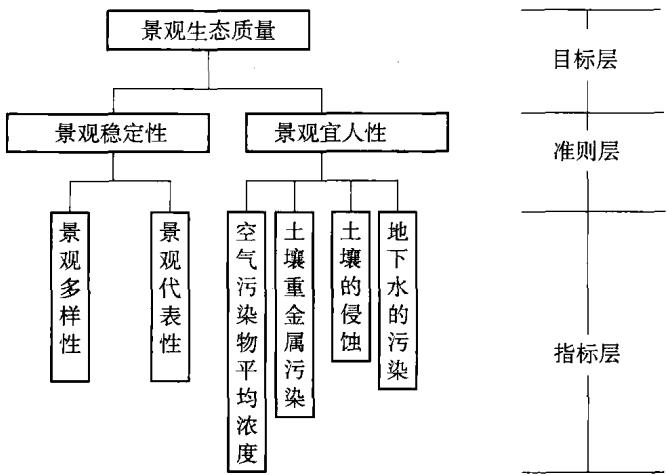  
图4.1 胜利露天煤矿景观生态质量评价指标

层次分析法的基本内容是：首先根据问题的性质和要求，提出一个总的目标。然后将问题按层次分解，对同一层次内的诸因素通过两两比较的方法确定出相对于上一层目标各自的权系数。这样层层分析下去，直到最后一层，即可给出所有元素(或方案)相对于总目标而言的按重要性程度的一个排序。具体步骤为：

第1步 明确问题，提出总目标。

第2步 建立层次结构，把问题分解成若干层次。第一层为总目标；中间层可根据问题的性质分成准则层，部门层等；最低层一般为方案层。

第3步 求同一层次上的权系数。假设当前层次上的因素为 $A _ { 1 } , \cdots , A _ { n }$ ,相关的上一层因素为C，则可针对因素C，对所有因素 $A _ { 1 } , \cdots , A _ { n }$ 进行两两比较，得到数值 $\alpha _ { i j }$ ，其定义和解释见表4.1，并得到判断矩阵 $\pmb { A } = ( \alpha _ { i j } ) _ { n \times n }$ 。计A的最大特征根为 $\lambda _ { \textrm m a x }$ ，属于 $\lambda _ { \mathfrak { m a x } }$ 的标准化的特征向量为 $\pmb { w } = ( \pmb { w } _ { 1 } , \pmb { w } _ { 2 } , \pmb { \cdots } , \pmb { w } _ { n } ) ^ { \top } , \pmb { w } _ { 1 } , \pmb { w } _ { 2 }$ $\cdots , w _ { n }$ 给出了因素 $A _ { 1 } , \cdots , A _ { n }$ 相应于因素C的重要程度的一个排序。

第4步 求同一层次上的组合权系数。设当前层次上的因素为 $A _ { 1 } , \cdots , A _ { n }$ 相关的上一层因素为 $C _ { 1 } , \cdots , C _ { m }$ ，则对每个 $C _ { i }$ ，根据第3步的讨论可求得一个权向量 $\pmb { w } ^ { i } = ( { \pmb { w } } _ { 1 } ^ { ~ i } , { \pmb { w } } _ { 2 } ^ { ~ i } , \cdots , { \pmb { w } } _ { n } ^ { ~ i } ) ^ { \top }$ 。如果已知上一层m个因素的权重分别为 $\alpha _ { 1 } \ldots$ $a _ { m }$ ，则当前层每个因素的组合权系数为：

$$
\sum _ { i = 1 } ^ { m } a _ { i } { \mathbf { w } } _ { 1 } ^ { i } \ : , \sum _ { i = 1 } ^ { m } a _ { i } { \mathbf { w } } _ { 2 } ^ { i } \ : , \cdots , \sum _ { i = 1 } ^ { m } a _ { i } { \mathbf { w } } _ { n } ^ { i }\tag{4.1}
$$

表4.1  
判断矩阵标度及其含义
<table><tr><td>相对重要程度  $\alpha _ { i j }$ </td><td>定义</td><td>解释</td></tr><tr><td>1</td><td>同样重要</td><td>目标i和j同样重要</td></tr><tr><td>3</td><td>稍微重要</td><td>目标i比j稍微重要</td></tr><tr><td>5</td><td>相当重要</td><td>目标 i比j 重要</td></tr><tr><td>7</td><td>明显重要</td><td>目标i比 j明显重要</td></tr><tr><td>9</td><td>绝对重要</td><td>目标i比j绝对重要</td></tr><tr><td>2,4,6,8</td><td>介于两相邻重要程度间</td><td></td></tr></table>

第5步一致性检验。在得到判断矩阵A时，有时免不了出现判断上的不一致性。因而还需利用一致性指标C.Ⅰ进行检验，其中

$$
\mathrm { C } . \mathrm { I } { = } \frac { \lambda _ { \operatorname* { m a x } } - n } { n - 1 }\tag{4.2}
$$

一般，只要 $\mathrm { C } , \mathrm { I } { \leqslant } 0 . 1$ ，就可认为判断矩阵A是满意的。

对图4.1所示的层次结构按层次分析法用1～9标度构造了3个比较判断矩阵，分别如表4.2、表4.3、表4.4所示。

表4.2  
准则层相对目标层各相关因子的判断矩阵
<table><tr><td rowspan=1 colspan=1> $B$ </td><td rowspan=1 colspan=1> $B _ { 1 }$ (景观稳定性)</td><td rowspan=1 colspan=1> $B _ { 2 }$ (景观宜人性)</td></tr><tr><td rowspan=1 colspan=1> $B _ { 1 }$ </td><td rowspan=1 colspan=1>1</td><td rowspan=1 colspan=1>1/2</td></tr><tr><td rowspan=1 colspan=1> $B _ { 2 }$ </td><td rowspan=1 colspan=1>2</td><td rowspan=1 colspan=1>1</td></tr></table>

表4.3  
指标层相对准则层 $\left( B _ { 1 } \right)$ 各相关因子的判断矩阵
<table><tr><td rowspan=1 colspan=1> $B _ { 1 }$ </td><td rowspan=1 colspan=1> $C _ { 1 }$ (景观多样性)</td><td rowspan=1 colspan=1> $C _ { 2 } ($ 景观代表性）</td></tr><tr><td rowspan=1 colspan=1> $C _ { 1 }$ </td><td rowspan=1 colspan=1>1</td><td rowspan=1 colspan=1>2</td></tr><tr><td rowspan=1 colspan=1> $C _ { 2 }$ </td><td rowspan=1 colspan=1>1/2</td><td rowspan=1 colspan=1>1</td></tr></table>

利用这些比较判断矩阵对各层元素进行单排序、总排序计算，可得准则层与指标层各项指标相对于目标层的权重值(表4.5)，并通过了一致性检验。

表4.4  
指标层相对准则层 $\left( B _ { 2 } \right)$ 各相关因子的判断矩阵
<table><tr><td rowspan=1 colspan=1> $B _ { 2 }$ </td><td rowspan=1 colspan=1> $C _ { 3 }$ (空气污染物平均浓度)</td><td rowspan=1 colspan=1> $C _ { 4 }$ (土壤重金属污染)</td><td rowspan=1 colspan=1> $C _ { 5 }$ (土壤的侵蚀)</td><td rowspan=1 colspan=1> $C _ { 6 }$ (地下水的污染)</td></tr><tr><td rowspan=1 colspan=1> $C _ { 3 }$ </td><td rowspan=1 colspan=1>1</td><td rowspan=1 colspan=1>3</td><td rowspan=1 colspan=1>1/5</td><td rowspan=1 colspan=1>1/3</td></tr><tr><td rowspan=1 colspan=1> $C _ { 4 }$ </td><td rowspan=1 colspan=1>1/3</td><td rowspan=1 colspan=1>1</td><td rowspan=1 colspan=1>1/7</td><td rowspan=1 colspan=1>1/5</td></tr><tr><td rowspan=1 colspan=1> $C _ { 5 }$ </td><td rowspan=1 colspan=1>5</td><td rowspan=1 colspan=1>7</td><td rowspan=1 colspan=1>1</td><td rowspan=1 colspan=1>2</td></tr><tr><td rowspan=1 colspan=1> $C _ { \delta }$ </td><td rowspan=1 colspan=1>3</td><td rowspan=1 colspan=1>5</td><td rowspan=1 colspan=1>1/2</td><td rowspan=1 colspan=1>1</td></tr></table>

表4.5  
胜利露天矿区景观生态评价指标权重
<table><tr><td rowspan=2 colspan=1>指标</td><td rowspan=2 colspan=3> $B _ { 1 }$ </td><td rowspan=1 colspan=5> $B _ { 2 }$ </td></tr><tr><td rowspan=1 colspan=1></td><td rowspan=1 colspan=1></td><td rowspan=1 colspan=1></td><td rowspan=1 colspan=1> $C _ { 3 }$ </td><td rowspan=1 colspan=1> $C _ { 4 }$ </td><td rowspan=1 colspan=1> $C _ { 5 }$ </td><td rowspan=1 colspan=1> $C _ { 6 }$ </td></tr><tr><td rowspan=1 colspan=1>权重</td><td rowspan=1 colspan=1>0.333</td><td rowspan=1 colspan=1>0.222</td><td rowspan=1 colspan=1>0.111</td><td rowspan=1 colspan=1>0.667</td><td rowspan=1 colspan=1>0.082</td><td rowspan=1 colspan=1>0.037</td><td rowspan=1 colspan=1>0.349</td><td rowspan=1 colspan=1>0.199</td></tr></table>

## 4.4 胜利露天矿区生态评价指标及其等级划分与赋值标准

根据胜利露天矿区生态评价指标的原则、评价指标体系确立的要求，确立了一套系统较为完整、评价指标具有代表性和独立性、操作简便的生态评价指标体系如表4.6所示。

胜利露天矿区生态评价指标及其等级划分与赋值标准
<table><tr><td rowspan=1 colspan=1>评价指标</td><td rowspan=1 colspan=1>等    级</td><td rowspan=1 colspan=1>分值</td></tr><tr><td rowspan=4 colspan=1>多样性[184]</td><td rowspan=1 colspan=1>A生境(生态系统)类型多样，极为复杂，物种多样性极丰，高等植物≥2000种，或高等动物≥300种</td><td rowspan=1 colspan=1>8</td></tr><tr><td rowspan=1 colspan=1>B生境(生态系统)类型多样，比较复杂，物种多样性较丰，高等植物1000～1999种，或高等动物200～299种</td><td rowspan=1 colspan=1>6</td></tr><tr><td rowspan=1 colspan=1>C生境(生态系统)类型较少，物种多样性中等丰富，高等植物500~999种，或高等动物100～199种</td><td rowspan=1 colspan=1>4</td></tr><tr><td rowspan=1 colspan=1>D生境(生态系统)类型简单，物种较少，高等植物&lt;500种，或高等动物&lt;100种</td><td rowspan=1 colspan=1>2</td></tr></table>

续表4.6
<table><tr><td rowspan=1 colspan=1>评价指标</td><td rowspan=1 colspan=1>等     级</td><td rowspan=1 colspan=1>分值</td></tr><tr><td rowspan=4 colspan=1>代表性[184]</td><td rowspan=1 colspan=1>A主要植被类型在植被区域内具有突出的代表性，或在全球范围或同纬度地区内具有突出代表意义</td><td rowspan=1 colspan=1>8</td></tr><tr><td rowspan=1 colspan=1>B主要植被类型在植被地带内具有突出的代表性，或在全国范围或同生理地区内具有突出代表意义</td><td rowspan=1 colspan=1>6</td></tr><tr><td rowspan=1 colspan=1>C主要植被类型在植被亚地带内具有突出的代表性，或在地区范围或生物地理省内具有突出代表意义</td><td rowspan=1 colspan=1>4</td></tr><tr><td rowspan=1 colspan=1>D主要植被类型在植被区内具有突出的代表性</td><td rowspan=1 colspan=1>2</td></tr><tr><td rowspan=5 colspan=1>土壤侵蚀</td><td rowspan=1 colspan=1>A 无明显侵蚀 土壤剖面保存完整</td><td rowspan=1 colspan=1>8</td></tr><tr><td rowspan=1 colspan=1>B 微(轻)度侵蚀 年平均侵蚀模数&lt;2 500 t/(km²·a)</td><td rowspan=1 colspan=1>6</td></tr><tr><td rowspan=1 colspan=1>C中度侵蚀 年平均侵蚀模数2500～5000t/(km²·a)</td><td rowspan=1 colspan=1>4</td></tr><tr><td rowspan=1 colspan=1>D强度侵蚀 年平均侵蚀模数5000~8000t/(km²·a)</td><td rowspan=1 colspan=1>2</td></tr><tr><td rowspan=1 colspan=1>E极强度侵蚀年平均侵蚀模数8000~15000t/(km²·a)</td><td rowspan=1 colspan=1>0</td></tr><tr><td rowspan=4 colspan=1>大气环境质量</td><td rowspan=1 colspan=1>A 清洁   综合污染指数&lt;0.7</td><td rowspan=1 colspan=1>8</td></tr><tr><td rowspan=1 colspan=1>B轻污染   综合污染指数0.7~1</td><td rowspan=1 colspan=1>6</td></tr><tr><td rowspan=1 colspan=1>C污染   综合污染指数1.0~1.87</td><td rowspan=1 colspan=1>4</td></tr><tr><td rowspan=1 colspan=1>D重污染    综合污染指数1.87~2.83</td><td rowspan=1 colspan=1>2</td></tr><tr><td rowspan=4 colspan=1>土壤污染[66]</td><td rowspan=1 colspan=1>A 清洁   污染指数 p{&lt;1</td><td rowspan=1 colspan=1>8</td></tr><tr><td rowspan=1 colspan=1>B轻污染   污染指数1≤p:&lt;2</td><td rowspan=1 colspan=1>6</td></tr><tr><td rowspan=1 colspan=1>C 中污染   污染指数2≤pi&lt;3</td><td rowspan=1 colspan=1>4</td></tr><tr><td rowspan=1 colspan=1>D重污染   污染指数 pi≥3</td><td rowspan=1 colspan=1>2</td></tr><tr><td rowspan=5 colspan=1>地下水[185]</td><td rowspan=1 colspan=1>A 优良    综合评价分值 F&lt;0.8</td><td rowspan=1 colspan=1>8</td></tr><tr><td rowspan=1 colspan=1>B良好   综合评价分值0.8≤F&lt;2.5</td><td rowspan=1 colspan=1>6</td></tr><tr><td rowspan=1 colspan=1>C 较好   综合评价分值 2.5≤F&lt;4.25</td><td rowspan=1 colspan=1>4</td></tr><tr><td rowspan=1 colspan=1>D较差   综合评价分值 4.25≤F&lt;7.20</td><td rowspan=1 colspan=1>2</td></tr><tr><td rowspan=1 colspan=1>E极差   综合评价分值 F&gt;7.20</td><td rowspan=1 colspan=1>0</td></tr></table>

## 4.5 结果与分析

## 4.5.1 单项指标评价结果

## 4.5.1.1 多样性

胜利露天矿区位于锡林郭勒自然保护区内。锡林郭勒自然保护区的天然植被类型以草原为主体，并有沙地疏林、灌丛、河漫滩草甸、沼泽，形成有规律的结合格局。现已查明保护区境内共有种子植物658种，分属299属74科；苔藓植物74种，常见大型真菌40多种，常见地衣29种。种子植物区系地理成分比较复杂，以组成蒙古草原植物为主，哈萨克斯坦和哈萨克斯坦一蒙古种合占5.8%，古地中海种占1.1%，反映了欧亚大陆草原植被的统一性。锡林郭勒流域的上游靠近大兴安岭南部山地和浑善达克沙地，为北方山地森林种(包括东西伯利亚种和欧洲一西伯利亚种)和东亚森林种(包括东亚种、东北种、华北种)的渗透提供了条件，并成为许多种向蒙古高原分布的西部和北部边界。例如：夏绿灌木虎榛子(中国特有种)、沙地云杉林和油松(华北特有种)分布的北界都在本区境内及毗邻地区。

经调查，保护区及其周边地区共分布有鸟类16目34科136种，其中以雀形目翁科及雁形目鸭科的种类最多，分别为18种和15种，其次为行鸟形目科和雀形目雀科，均有9种。该区鸟类分布的一个特点是，草原鸟类和低湿地鸟类所占比例较大，此外由于保护区内还分布有较大面积的沙地疏林及云杉林，林行鸟类也有一定的分布。

保护区内还分布有兽类16目15科33种，其中以啮齿目仓鼠类的种类较多，有10种。从生态特征来看，植食性兽类有12种，杂食性兽类有9种，肉食性兽类有12种。此外，据调查该区有蝗虫33种，分属4亚科24属。

在保护区分布的野生动物中有22种属国家重点保护物种，如白鹳、黑鹳、丹顶鹳、白枕鹳、灰鹳、蓑衣鹳、玉带海雕以及黄羊等。

因此，物种多样性赋分4分。

## 4.5.1.2 代表性

根据文献[66]，锡林郭勒自然保护区的草原是内蒙古保存较好的、大面积连续分布的草原之一，以大针茅、克氏针茅、羊草、隐子草、冷蒿、贝加尔针茅、羊茅、线叶菊等多种植物为优势种所构成的原生草原植被。作为草地类保护区，锡林郭勒大草原是温带草原最有代表性的类型，它是分布在我国北方的温带草原，是天然草地的主体，是欧亚大陆草原的重要组成部分，是我国北方重要的生态屏

障。因此，代表性赋分4分。

## 4.5.1.3 土壤侵蚀

风是造成土壤风蚀的起因和形成风沙流的动力。胜利露天矿区属中温带半干旱大陆性草原气候，春、秋、冬季多大风，土壤侵蚀形式主要以风蚀为主。类比霍林河露天矿，矿区范围内生态治理区土壤风蚀模数降低到 $2 ~ 5 0 0 ~ \mathrm { t } / ( \mathrm { k m } ^ { 2 } \cdot \mathrm { a } )$ o因此，土壤侵蚀赋分4分。

## 4.5.1.4 大气环境质量

根据第三章3.5.3节的讨论，胜利露天矿区评价区区域内大气环境质量较好。因此，大气环境质量赋分6分。

## 4.5.1.5 土壤污染

为综合考虑上述各种重金属元素对矿区土壤的污染程度的影响，采用多因子综合评价法。其土壤污染综合指数的计算公式同式(3.8)。将上述土壤中各重金属污染物的污染指数 $\pmb { \mathscr { p } } _ { 1 } \ : , \pmb { \mathscr { p } } _ { 2 } \ : , \pmb { \mathscr { p } } _ { 3 } \ : , \pmb { \mathscr { p } } _ { 4 } \ : , \pmb { \mathscr { p } } _ { 5 }$ 代入式(3.8)得土壤污染综合指数p=1.45，因此胜利露天矿区土壤污染级别属于轻污染级。因此，土壤污染赋分6分。

## 4.5.1.6 地下水

根据第三章3.5.3节的讨论，胜利露天矿区评价区区域内地下水质量较差。因此，地下水质量赋分2分。

## 4.5.2 综合评价结果

综合评价结果由综合评价指数反映出来，其算式为[183]：

$$
\mathrm { C E I } = \frac { 1 } { 4 } \sum _ { i = 1 } ^ { n } I _ { i } W _ { i }\tag{4.3}
$$

式中 ${ \boldsymbol { I } } _ { i }$ ——单项评价指标分值；

$\boldsymbol { W } _ { i }$ ——评价指标Ⅰ的权重；

n—评价指标数。

经计算得 CEI 值为0.96。

根据郑允文等[183]划分的评判各自然保护区的生态质量等级： $0 . 8 6 { \leqslant } \mathbf { C E I } { \leqslant }$ 1,生态质量很好 $\mathfrak { j } 0 . 7 1 { \leqslant } \mathbf { C E I } { \leqslant } 0 . 8 5$ ，生态质量较好； $0 . 5 1 { \leqslant } \mathrm { C E I } { \leqslant } 0 . 7 0$ ，生态质量一般； $0 . 3 5 { \leqslant } \mathbf { C E I } { \leqslant } 0 . 5 0$ ，生态质量较差； $\mathrm { C E I } { \leqslant } 0 . 3 5$ ，生态质量很差。胜利露天矿区的综合评价指数为0.96，表明目前 $\textcircled { 1 }$ 区的生态质量很好，能满足可持续发展的要求。

## 4.6 小结

（1）根据景观生态评价的理论与方法，结合露天煤矿开采对环境破坏的特点，构造了基于景观的稳定性和宜人性指标的露天矿区生态质量评价模型。

（2）以胜利露天矿区为例，通过选用多样性、代表性、空气污染浓度、重金属污染、土壤侵蚀、地下水污染等6项指标建立了三个层次的生态评价指标体系，通过运用层次分析法确定出各个评价指标权重。

（3）根据生态评价指标权重、等级划分与赋值标准，计算出各生态评价因子的综合评价指数(CEI)，其值为0.96，表明该矿区的生态质量很好，能满足可持续发展的要求。

## 5 露天矿区景观生态的空间格局分析

## 5.1 概述

景观空间格局一般指大小和形状不一的景观斑块在空间上的配置。景观要素的组成和构型是其基本特点。景观要素组成是指景观要素类型以及各类型在景观中所占的比重，而景观要素构型则是指不同景观要素的空间排列方式[62]。景观异质性是指景观格局在空间和时间上的复杂性和变异性，即景观要素的组成和构型在时空上的变化。景观格局是景观异质性的具体表现，同时又是包括干扰在内的各种生态过程在不同尺度上作用的结果。景观格局作为景观生态学的一个重要概念，其研究在生态学文献中占有很大比重。景观格局分析的目的是从看似无序的景观斑块镶嵌中，发现潜在的有意义的规律性。通过景观格局分析，我们希望能确定产生和控制格局的因子和机制，比较不同景观的空间格局及其效应，探讨空间格局的尺度性等。

景观空间格局、景观功能和景观动态是景观生态学研究的核心内容，而对景观格局进行定量分析，则是研究格局与过程相互关系的基础，也是研究景观动态和景观功能的关键。此外，景观格局分析还在资源管理和生物多样性保护等方面起着重要作用。

景观生态现状评价是应用景观生态学的原理和相关景观格局指数，在绘制出评价区景观类型图的基础上，对评价区内的各景观草原、农田、湿地、人工景观等生态系统中的宏观结构、功能、人类活动等景观层次上作出分析和比较，在景观斑块尺度、景观类型尺度和景观区域尺度，开展景观空间格局的评价。

景观生态格局变化在于外界的干扰作用，这些于扰作用往往是综合的，它包括自然环境、多种生物及人类社会活动之间的复杂相互作用。胜利露天矿的开发建设是以人类干扰为主的景观生态结构变化，这种景观生态格局带来人的主观臆断，而从景观生态学结构和功能相匹配的观点出发，结构是否合理也决定了景观生态功能状况的优劣。该矿山开发建设项目，随着项目的实施，会使项目区原有的景观生态结构发生变化。原来的生态功能、景观生态格局、景观的组成发生变化，对区域的生态环境产生深远的影响。

在具体的矿区开采面，由于开采作业，将使开采区的草原景观变为工矿建设地景观，如采掘场景观、排土场景观、工业场地景观和工业建筑景观等。在矿区开采面周边一定范围内，由于各项相关工程和配套工程施工和建设以及锡林浩特市建成区的发展，也将草原景观变为工矿建设用地和城镇景观。这些工矿地建设景观，包括排土场和采掘场，如果植被恢复与建设滞后或草原植被恢复不成功，必将使风天起尘过程的概率和强度大大增加，影响到周边一定范围的大气环境和人类生活环境。另外，由于交通运输量增大的需求，各种车辆增多，评价区的交通道路长度和影响范围将增加，分布将更广泛，交通道路景观也将会大大增加，并在一定程度上将大面积均匀分布的草原基底切割成一些破碎景观斑块，景观的破碎化程度将增加。与景观类型和格局密切相关的生物学、生态学过程，也将随之发生变化，如草原植被生物量将降低。

对于草原露天矿区来说，采矿扰动是引发草地荒漠化的主要因子[190]。草地荒漠化过程实际上是在各种不当的人为活动与自然营力交互作用下草地植被与土壤的退化过程。从其作用结果来看，主要表现为植被盖度的下降、草地生物量的减少和土壤性状的改变。文献[190]通过对霍林河煤矿区1987，1996和2003年遥感影像荒漠化分类图进行研究，将植被盖度、生物量和土壤质地(沙地比例)作为采矿扰动下草地荒漠化评价的重要指标。为了深入说明采矿扰动对草地荒漠化的影响，针对矿区草地荒漠化的分布特点，并借助于遥感图像解译结果，作者以矿业建设用地为中心、3km为半径做缓冲区分析，得到1987～2003年间的草地荒漠化情况。由研究结果可以看出，霍林河煤矿区矿业建设用地和重度荒漠化面积发展迅速，应用线性回归方程对两者进行分析，两者的相关系数达0.9881427，可见矿业建设用地面积与重度荒漠化面积之间关系密切，因此可将矿业建设用地面积作为预测、评价该区煤炭开发对生态环境影响的重要依据。

景观评价方法通过对比分析建设前后景观缀块及优势度、模地的变化，来分析人类活动对景观生态格局所起的作用。随着矿区各项目的建设，会使评价区一部分草原景观变为工矿地景观，原来的生态功能、景观生态格局等会发生一定的变化，对区域生态环境产生一定的影响。

理论上，可以假设任何景观都存在最佳配置的问题，如果某一景观或区域的土地利用格局是最佳的，那么可以确认这个景观或区域的土地、水、生物多样性能一代一代地持续下去。因此，从理论上探讨生态重建的空间格局评价，看其是否合理，进而决策出最佳配置，是远期目标生态重建阶段需要解决的问题。

景观格局优化尚处在研究初期。景观格局优化首先要假设景观格局对景观中的物质、能量和信息流的产生、变化有决定性影响，同时这些生态流对景观格局有调整和维持作用。景观格局的优化不仅要根据生态因子对景观斑块的类型进行调整，而且还要运用景观生态学的理论和方法对景观的管理方法进行优化，其目标是在合理的土地利用和管理措施下，实现区域可持续发展与维持区域生态安全。景观格局优化目标是调整优化景观组分、斑块的数量和空间分布格局，使各组分之间达到和谐、有序，以改善受胁受损的生态功能，提高景观总体生产力和稳定性，实现区域可持续发展。

目前关于优化的理论和方法尚处于探索阶段，概念模型实际上是最早出现的建立在景观生态学基础理论上的景观规划方法，在生态因子调查研究的基础上，考察景观格局与功能关系的一般规律，以经验的或已有理论的模式对景观的空间分布格局进行调整，也会有一些比较通用的土地利用模式，如Forman等[187]提出了下列两个景观整体模式。

①不可替代格局。其设计思想是：以几个大型的自然植被斑块作为水源涵养所必需的自然地；有足够宽的廊道用以保护水系和满足物种空间运动的需要；在开发区或建成区里有一些小的自然斑块和廊道，用以保证景观的异质性。这一优先格局在生态功能上具有不可替代性。它应作为任何景观规划的一个基础格局。根据这一基础格局，又发展出了最优景观格局。

②最优景观格局。“集聚间有离析”被认为是生态学意义上最优的景观格局模式[187]，这一模式(原理)强调应将土地利用分类集聚，并在发展区和建成区内保留小的自然斑块，同时沿主要的自然边界地带分布一些人类活动的“飞地”。这一模式的景观生态学意义有：保留了生态学上具有不可替代意义的大型自然植被斑块，用以涵养水源，保护稀有生物；景观质地满足大间小的原则；风险分担；维持遗传多样性；形成边界过渡带，减少边界阻力；自然植被廊道利于物种的空间运动，在小尺度上形成的道路交通网满足人类活动的需要。

## 5.2 研究区域的景观概况

胜利露天矿区一、二期规划主要开发的是胜利西一号露天矿。一期(2004～2009年)和二期(2010～2015年)规划建设开采的胜利西一号露天矿区，规划的采掘场、排土场和其他密切相关的生产和环保设施占地面积约10km²，因此，大约10km²的草原景观将会变为工矿建设地景观，而且是许多面积较小的各种工矿建设地景观斑块。在矿区建成后（二期），露天煤矿的面积将发展到61.74km²，整个评价区的景观斑块数和斑块密度将会增加。

景观是指由地貌过程和各种干扰作用形成的，具有特定结构、功能和动态特征的一种宏观系统，是具有高度空间异质性的区域[62]。景观生态格局及其变化是自然和人为的多种因素相互作用所产生的一定区域生态环境体系的综合反映，景观嵌体的类型、形状、大小、数量和空间组合既是各种干扰因素相互作用的结果，又影响着该区域的生态过程和边缘效应63]。胜利露天矿的开发建设是以人类干扰为主的景观生态结构变化，随着项目的实施，会使项目区原有的景观生态结构发生变化。开采区的草原景观将会变为工矿建设地景观，如采掘场景观、排土场景观、工业场地景观和工业建筑景观等。在矿区开采面周边一定范围内，由于各项相关工程和配套工程施工和建设以及锡林浩特市建成区的发展，也将草原景观变为工矿建设用地和城镇景观。在一定程度上，将大面积均匀分布的草原基底切割成一些破碎景观斑块，景观的破碎化程度将增加。与景观类型和格局密切相关的生物学、生态学过程，也将随之发生变化，对区域的生态环境产生深远的影响。因此，研究该地区区域景观生态空间格局及其与自然和社会经济活动的关系，对于揭示该区域生态状况及空间变异特征、生态环境评价、景观规划设计、土地资源利用的合理化都有重要的意义。

胜利煤田位于内蒙古高原的中部，大兴安岭西延的北坡，属于NE—SW向高原、丘陵地形，地形标高+970～+1326m。区内地貌形态由构造剥蚀地形、剥蚀堆积地形、侵蚀堆积地形、熔岩台地等四个地貌单元组成。一号露天矿地处煤田西部的剥蚀堆积与侵蚀堆积地形的过渡地带，露天矿西北部为低缓的丘陵区，东西高差较大，海拔标高在+970m～+1035m之间。胜利西一号露天矿境内及其周围地势平坦，草原植被发育，地形略呈西高东低。锡林河为本煤田内最大一条河流，全长175km，发源于赤峰市克旗白音查干诺尔滩地，向西流至锡尔塔拉转向西北，经锡林浩特水库于露天区东部向北汇入巴彦诺尔。锡林河在近几十年已经成为季节性河流，失去了原来河流的功能，只有在春汛或暴雨时才有流水，平时为一干河床。

露天矿区土壤类型主要由栗钙土、草甸栗钙土、草甸土等组成，由于草场退化，已形成沙化、砾石化栗钙土，土壤有机质含量低，土壤肥力差。本区草原植被发育，地带性植被类型属于典型草原类型，草地分区为内蒙古中东部温带半湿润半干旱草原区，植物组成有克氏针茅、大针茅、糙隐子草、冷蒿、羊草、洽草、冰草、锦鸡儿等。

## 5.3 研究方法

评价区景观生态类型调查采用中国科学院遥感中心接收的美国陆地卫星TM遥感信息资料，以Lantsat TM遥感数据为信息源，结合地面土地利用和植

被调查，绘制出评价区土地利用现状图[66]，本研究选用土地利用现状图作为景观格局分析底图(参见图5.1)。

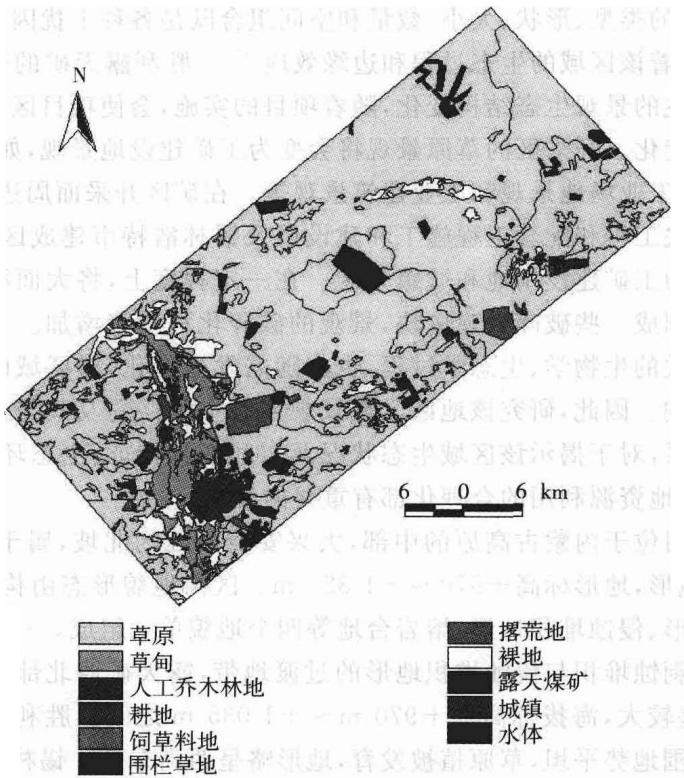  
图5.1 评价区土地利用类图[66]

为揭示矿区建设前后景观生态状况及空间变异特征，根据胜利露天矿区一期(2004\~2009年)和二期(2010\~2015年)规划建设，将研究区分成两个研究单元：矿区建设前期(一期)单元和矿区建设后期(二期)单元。

## 5.3.1 景观嵌块体类型的选取

景观嵌体类型的选择，一般采用土地利用现状的一级系统[63]，结合本地区的特点，选取嵌块体类型如下：

草原包括贝加尔针茅草原、克氏针茅草原、大针茅草原和冷蒿草原。

草甸包括盐生草甸、芨芨草甸及马蔺草甸。

乔木林地主要是人工乔木林地，树种是杨树和榆树。

农田农田植被主要分布在评价区的中部，主要农作物种类是蔬菜、油料作物和小麦。

围栏草地主要指存在着一定面积的、围封时间较长的围栏草场。

撂荒地、裸地指未利用土地。

露天煤矿主要是胜利西一号露天矿。

城镇及工矿包括城乡居民点、工矿企业用地、交通用地和特殊用地。

水体包括水库、河流等。

## 5.3.2 景观格局分析的指标及其计算方法

关于景观空间格局分析，已提出了许多指标[62,63]，本节选取以下几种指标来研究胜利露天矿区的景观格局特征。

①景观多样性Shannon指数。根据信息论中关于不定性的理论，景观多样性指数 H表示为

$$
H = - \sum _ { k = 1 } ^ { n } P _ { i } \mathrm { l n } P _ { i }\tag{5.1}
$$

式中 n——研究区景观类型数目；

$P _ { i }$ 第i种景观类型面积占总面积的比例，即计算结果为景观面积的多样性。

在一个景观系统中，H越大，景观类型越丰富。该指数同时表达了景观中嵌块体的异质性。

②景观均匀度指标。景观实际多样性指数与最大多样性指数之比值称均匀性指数，用E表示。该指数反映了最大均匀条件下的多样性指数。

$$
E = \frac { H } { H _ { \textrm m a x } }\tag{5.2}
$$

式中 E——景观均匀度；

H——Shannon 多样性指数；

$H _ { \mathrm { m a x } }$ 多样性指数最大值。

③景观优势度指标。优势度[64]是测试嵌块体在景观中重要性的指标，它反映一种或几种景观嵌块体支配景观格局的程度。用下式计算：

$$
D = H _ { \mathrm { m a x } } + \sum _ { k = 1 } ^ { n } P _ { i } \lg P _ { i }\tag{5.3}
$$

式中 D——景观优势度。

较大的D值反映景观只受一个或少数几个嵌块体类型所支配，较小的D值则表示该景观结构是由多个比例大致相等的嵌块体类型所组成的。D在完全同质性的景观中无意义，此时D为0。

④景观破碎度指标。景观的破碎化程度反映景观空间结构的复杂性。本

研究采用单位面积上各种嵌块体的数目C来表示[64]：

$$
C = \frac { \displaystyle \sum _ { i = 1 } ^ { n } n _ { i } } { A }\tag{5.4}
$$

式中 C——景观破碎度；

A——研究区景观总面积；

$\sum _ { i = 1 } ^ { n } n _ { i }$ 景观中所有景观类型斑块的总个数。

⑤景观的分离度。某景观类型中不同斑块个体分离程度。本书采用文献[64]提出的计算方法，计算公式为

$$
S _ { i } = \frac { D _ { i } } { B _ { i } }\tag{5.5}
$$

式中 $D _ { i }$ 景观类型i的距离指数， $D _ { i } { = } \frac { 1 } { 2 } \sqrt { \frac { n _ { i } } { A } }$

$B _ { i }$ ——景观i的面积指数， $B _ { i } = \frac { A _ { i } } { A }$ ;

$A _ { i } , A$ —分别表示景观类型i的面积和景观总面积；

$\scriptstyle n _ { i }$ 景观类型i中的斑块总个数；

$S _ { i }$ 景观类型i的分离度值，分离度越小，景观分布越复杂，破碎化程度也较高。

## 5.4 研究区景观格局的指标计算与结果分析.

按照上述景观嵌块体的分类，分析各研究分区的嵌块体数目及其面积等指标列于表 5.1。

由表5.1可看出，在胜利露天矿区建设前期(一期），农田、露天煤矿和城镇及工矿用地类型仅占1.66%，这表明人为活动对该区域的景观生态的影响较弱。这与文献[67]研究结果中该矿区的生态质量很好的结论相一致。但在胜利露天矿区建成后，工矿景观的数目、面积均增加，其中仅露天煤矿与城镇及工矿这两类景观用地类型就达6.517%，而草原景观的面积减少，由建设前的82.03%下降到65.683%。因此，要想扭转这种草原景观面积减少的不利状况，在煤矿开采的同时，应大力开展矿区的植被恢复，特别是草原植被的恢复，实现露天煤矿生产与生态重建的一体化。

表 5.2 矿区建设前后期的景观多样性、优势度及破碎度值  
各类景观嵌块体的数目、面积及所占比例统计
<table><tr><td rowspan=2 colspan=1>景观</td><td rowspan=1 colspan=3>建设前期(一期)</td><td rowspan=1 colspan=3>建设后期(二期)</td></tr><tr><td rowspan=1 colspan=1>数目/块</td><td rowspan=1 colspan=1>面积 $/  { \mathbf { k } }  { \mathbf { m } } ^ { 2 }$ </td><td rowspan=1 colspan=1>面积比/%</td><td rowspan=1 colspan=1>数目/块</td><td rowspan=1 colspan=1>面积 $/ \mathrm { k m } ^ { 2 }$ </td><td rowspan=1 colspan=1>面积比/%</td></tr><tr><td rowspan=1 colspan=1>草原</td><td rowspan=1 colspan=1>117</td><td rowspan=1 colspan=1>1 417.9</td><td rowspan=1 colspan=1>82.03</td><td rowspan=1 colspan=1>117</td><td rowspan=1 colspan=1>1125.9</td><td rowspan=1 colspan=1>65.683</td></tr><tr><td rowspan=1 colspan=1>草甸</td><td rowspan=1 colspan=1>60</td><td rowspan=1 colspan=1>94.51</td><td rowspan=1 colspan=1>5.4.7</td><td rowspan=1 colspan=1>60</td><td rowspan=1 colspan=1>84.51</td><td rowspan=1 colspan=1>4.93</td></tr><tr><td rowspan=1 colspan=1>乔木林地</td><td rowspan=1 colspan=1>8</td><td rowspan=1 colspan=1>5.43</td><td rowspan=1 colspan=1>0.31</td><td rowspan=1 colspan=1>8</td><td rowspan=1 colspan=1>5.43</td><td rowspan=1 colspan=1>0.317</td></tr><tr><td rowspan=1 colspan=1>农田</td><td rowspan=1 colspan=1>7</td><td rowspan=1 colspan=1>8.80</td><td rowspan=1 colspan=1>0.51</td><td rowspan=1 colspan=1>4</td><td rowspan=1 colspan=1>4.80</td><td rowspan=1 colspan=1>0.28</td></tr><tr><td rowspan=1 colspan=1>围栏草地</td><td rowspan=1 colspan=1>52</td><td rowspan=1 colspan=1>64.64</td><td rowspan=1 colspan=1>3.74</td><td rowspan=1 colspan=1>80</td><td rowspan=1 colspan=1>264.64</td><td rowspan=1 colspan=1>15.44</td></tr><tr><td rowspan=1 colspan=1>撂荒地</td><td rowspan=1 colspan=1>12</td><td rowspan=1 colspan=1>15.96</td><td rowspan=1 colspan=1>0.92</td><td rowspan=1 colspan=1>12</td><td rowspan=1 colspan=1>15.96</td><td rowspan=1 colspan=1>0.931</td></tr><tr><td rowspan=1 colspan=1>裸地</td><td rowspan=1 colspan=1>108</td><td rowspan=1 colspan=1>95.45</td><td rowspan=1 colspan=1>5.52</td><td rowspan=1 colspan=1>108</td><td rowspan=1 colspan=1>95.45</td><td rowspan=1 colspan=1>5.57</td></tr><tr><td rowspan=1 colspan=1>露天煤矿</td><td rowspan=1 colspan=1>2</td><td rowspan=1 colspan=1>1.74</td><td rowspan=1 colspan=1>0.1</td><td rowspan=1 colspan=1>10</td><td rowspan=1 colspan=1>61.74</td><td rowspan=1 colspan=1>3.6</td></tr><tr><td rowspan=1 colspan=1>城镇及工矿</td><td rowspan=1 colspan=1>4</td><td rowspan=1 colspan=1>18.29</td><td rowspan=1 colspan=1>1.06</td><td rowspan=1 colspan=1>9</td><td rowspan=1 colspan=1>50.00</td><td rowspan=1 colspan=1>2.917</td></tr><tr><td rowspan=1 colspan=1>水体</td><td rowspan=1 colspan=1>9</td><td rowspan=1 colspan=1>5.76</td><td rowspan=1 colspan=1>0.333</td><td rowspan=1 colspan=1>9</td><td rowspan=1 colspan=1>5.76</td><td rowspan=1 colspan=1>0.336</td></tr><tr><td rowspan=1 colspan=1>合计</td><td rowspan=1 colspan=1>379</td><td rowspan=1 colspan=1>1 728.48</td><td rowspan=1 colspan=1>100</td><td rowspan=1 colspan=1>417</td><td rowspan=1 colspan=1>1714.19</td><td rowspan=1 colspan=1>100</td></tr></table>

根据公式(5.1)～公式(5.4)，计算出建设前、后期的多样性指数H，优势度D，景观破碎度C及均匀性E列于表5.2。

<table><tr><td rowspan=1 colspan=1>不同时期景观</td><td rowspan=1 colspan=1>景观多样性(H)</td><td rowspan=1 colspan=1>景观优势度(D)</td><td rowspan=1 colspan=1>景观破碎度(C)</td><td rowspan=1 colspan=1>景观均匀性(E)</td></tr><tr><td rowspan=1 colspan=1>建设前</td><td rowspan=1 colspan=1>1.659</td><td rowspan=1 colspan=1>0.98</td><td rowspan=1 colspan=1>0.22</td><td rowspan=1 colspan=1>0.629</td></tr><tr><td rowspan=1 colspan=1>建设后</td><td rowspan=1 colspan=1>1.971</td><td rowspan=1 colspan=1>0.668</td><td rowspan=1 colspan=1>0.243</td><td rowspan=1 colspan=1>0.747</td></tr></table>

分析研究区景观格局的指标值(见表5.2)，可以归纳其景观生态的基本特征如下：

①建设后的景观生态的多样性和均匀性程度高于建设前，表明建设后矿区的土地利用较建设前趋于多样化、均匀化；

②建设后矿区的景观优势度减少，表明土地开发利用程度(人类活动强度)较建设前大大增加；

③景观破碎度与景观生态的多样性和均匀性具有一致性，建设后矿区的景观破碎度较建设前的景观破碎度增大，表明随矿区的建成，土地利用的完整性变差。

表5.3列出了各类景观类型在不同分区所具有的分离度。

表 5.3  
胜利露天矿区几种景观类型的分离度值
<table><tr><td rowspan=1 colspan=1>分区</td><td rowspan=1 colspan=1>草原</td><td rowspan=1 colspan=1>草甸</td><td rowspan=1 colspan=1>乔木林地</td><td rowspan=1 colspan=1>农田</td><td rowspan=1 colspan=1>围栏草地</td><td rowspan=1 colspan=1>撂荒地</td><td rowspan=1 colspan=1>裸地</td><td rowspan=1 colspan=1>露天煤矿</td><td rowspan=1 colspan=1>城镇及工矿</td><td rowspan=1 colspan=1>水体</td><td rowspan=1 colspan=1>平均值</td></tr><tr><td rowspan=1 colspan=1>一期</td><td rowspan=1 colspan=1>0.16</td><td rowspan=1 colspan=1>1.7</td><td rowspan=1 colspan=1>11.33</td><td rowspan=1 colspan=1>6.4</td><td rowspan=1 colspan=1>2.35</td><td rowspan=1 colspan=1>4.7</td><td rowspan=1 colspan=1>2.27</td><td rowspan=1 colspan=1>17</td><td rowspan=1 colspan=1>2.4</td><td rowspan=1 colspan=1>10.91</td><td rowspan=1 colspan=1>5.92</td></tr><tr><td rowspan=1 colspan=1>二期</td><td rowspan=1 colspan=1>0.2</td><td rowspan=1 colspan=1>1.91</td><td rowspan=1 colspan=1>11.33</td><td rowspan=1 colspan=1>8.57</td><td rowspan=1 colspan=1>0.699</td><td rowspan=1 colspan=1>4.49</td><td rowspan=1 colspan=1>2.25</td><td rowspan=1 colspan=1>1.056</td><td rowspan=1 colspan=1>1.24</td><td rowspan=1 colspan=1>10.71</td><td rowspan=1 colspan=1>4.25</td></tr></table>

从表5.3中可以看出，在矿区建设前期(一期)研究区，草原和草甸两种主要景观类型的分离度比较低，说明该区域这两种主要景观生态类型占主导地位，它们控制该区域的景观空间格局及其发展。在矿区建设后期(二期)研究区，草原、围栏草地、露天煤矿和城镇及工矿这四种主要景观类型的分离度比较低，说明在该区域除草原景观外，与人类活动最为紧密联系的围栏草地、露天煤矿和城镇及工矿这三种景观生态类型已控制着该区域的景观空间格局及其发展。若用一定区域内各种景观类型的分离度平均值来表征区域总体景观分离度，则分离度越小，意味着该区域的土地开发利用程度越高。从表5.3可以看出，建设后的分离度平均值小于建设前的分离度平均值，由此可见，随着采矿活动的加强，矿区的土地开发利用程度变高。

## 5.5 小结

(1）通过对胜利露天矿区建设前期(一期)和胜利露天矿区建成后(二期)景观嵌块体的分类分析，在矿区建设前期(一期)，农田、露天煤矿和城镇及工矿用地类型仅占1.66%，但在胜利露天矿区建成后，工矿景观的数目、面积均增加，其中仅露天煤矿与城镇及工矿这两类景观用地类型就达6.517%，草原景观的面积减少，由建设前的82.03%下降到65.683%，因此，要想扭转这种草原景观面积减少的不利状况，应大力开展矿区的植被恢复，特别是草原植被的恢复，实现露天煤矿生产与生态重建的一体化。

（2）景观空间格局分析表明：建设后的景观生态的多样性和均匀性程度高于建设前，表明建设后矿区的土地利用较建设前趋于多样化、均匀化；建设后矿区的景观优势度减少，表明土地开发利用程度(人类活动强度)较建设前大大增加；建设后矿区的景观破碎度较建设前的景观破碎度增大，表明随着矿区的建成，土地利用的完整性变差。

（3）建设后的分离度平均值小于建设前的分离度平均值，由此可见，随着采矿活动的加强，矿区的土地开发利用程度变高。对景观类型而言，具有较小的分离度值的景观类型占据总体景观特征的主导地位，对景观生态结构与演变起支配作用。在矿区建设后(二期)研究区，草原、围栏草地、露天煤矿和城镇及工矿这四种主要景观类型的分离度比较低，说明在该区域除自然草原景观外，与人类活动最为紧密联系的围栏草地、露天煤矿和城镇及工矿这三种景观生态类型将控制着该区域的景观空间格局及其发展。

## 6 露天矿水土流失预测与防治

## 6.1 概述

露天煤矿区水土流失预测是根据露天矿工程布局、施工工艺及施工组织等特点，预测因露天矿建设和生产可能造成的新增水土流失，以便为矿区水土流失防治分区和分区防治措施、数量、施工进度及水土保持监测方案提供依据。

## 6.2 预测区域及预测时段

## 6.2.1 预测区域

一般说来，根据露天矿工程分布、施工生产特点和对土地扰动强度，水土流失预测区域分为采掘场、外排土场、工业场地区、地面防排水工程区、地面运输及管线区等预测区域。

## 6.2.2 预测时段

水土流失预测时段一般划分为建设期和生产运行期。

## 6.2.2.1 建设期

建设期露天煤矿采掘场的开挖、排土场的形成、工业场地及其附属设施的建设，使得大量的土地被征占和使用，改变了项目区的生态环境，破坏了采掘场、排土场、工业场地等施工区内的全部植被。施工活动、施工机械的碾压和人员往来等也将不同程度地破坏和影响施工场地及周围的植被。项目区植被的损失，直接影响项目区域植被分布数量及质量，使区域内植被覆盖度降低，植物物种多样性减少，土地退化。建设期一般分为以下两个时期。

①施工期：施工期主要包括工业场地平整和四通工程、矿建剥离、辅助生产设施、运输系统、给排水等工程建设活动。根据施工特点，此阶段的水土流失类型复杂，分布面宽，水土流失严重，是重点预测时段。

②自然恢复期：从生产设施与辅助设施、工业场地、地面运输系统、供排水管线、供电线路等一次性建设工程完工后，进入植被恢复期。根据矿区一般自然条件，自然恢复期预测时段确定为2a。

## 6.2.2.2 生产运行期

此时期水土流失主要集中在排土场和采掘场，如图6.1及图6.2。采掘场在剥离上覆地层的过程中可产生较重的风蚀，外排土场如果没有防护措施，会造成严重的水土流失。因此生产运行期是重点预测时段，其预测时段一般为8a。

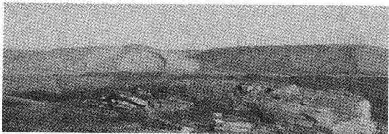  
图 6.1 黑岱沟露天煤矿排土场

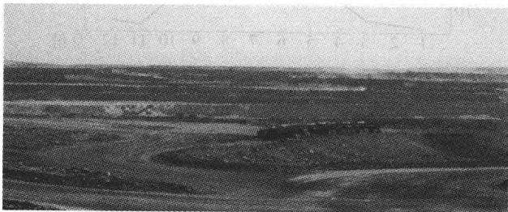  
图 6.2 黑岱沟露天煤矿采掘场

## 6.3水土流失成因、类型及分布

## 6.3.1 水土流失成因

露天矿建设生产过程中新增水土流失是由于人为扰动地面、构筑各类人工平台、边坡等活动，在侵蚀营力的作用下产生的，属于人为水土流失，其形成包括自然地理因素和人为因素两种。

## 6.3.1.1 自然因素引起的水土流失

## (1) 风力

风是造成土壤风蚀的起因和形成风沙流的动力。

## (2) 降水

短历时强降雨极易造成水力侵蚀和重力侵蚀。

项目区降雨(水力)和风力孕育了土壤风、水两项侵蚀的动力，以胜利露天矿为例，胜利露天矿区各月平均风速及降雨强度分布曲线强度如图6.3。由图6.3看出，土壤水力侵蚀主要发生在6～9月份，同期的风力侵蚀较弱；风力侵蚀主要发生在2\~5月份，同期的水力侵蚀相对弱；但在5～6月及9～10月同时存在着风力和水力两项侵蚀，两者在空间上叠加，时间上交错，土壤侵蚀严重。

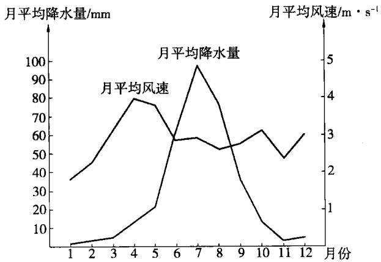  
图6.3 胜利露天矿各月平均风速及降雨强度分布曲线

## (3) 下垫面

下垫面主要表现在土壤与植被方面。

①土壤：土壤既是侵蚀对象，又是影响侵蚀的因素。各种土壤都具有不同的抗蚀力。当侵蚀外营力(水力、风力、重力)一定时，土壤抵抗风、水蚀的能力主要取决于土壤质地及有机质含量等。土壤颗粒质量越小，沙性越大，有机质含量越低，抵抗侵蚀的能力越小；反之越大。

②植被：由于场地平整、建(构)筑物基础开挖及回填、路基修筑、各类管线开挖等活动，完全破坏了原地表的植被，使土壤抗蚀性能力全部丧失，加剧了原地貌的土壤侵蚀。

## 6.3.1.2 工程建设生产过程中引起的新增水土流失

据有关研究资料分析，开矿扰动土体后的土壤抗侵蚀能力下降2～5倍，土体扰动后岩土可蚀性变化如表6.1。

根据露天矿建设特点，工程建设生产过程中引起的新增水土流失主要环节为：

①植被受到扰动和破坏。

②土壤表层松散性加大。露天矿的建设，使表土发生运移和重新堆积，土壤水分大量散失，丧失了原地表土壤的抗蚀力。

③地形、地貌的变化。露天矿建设形成坡度大的人工堆垫坡面和陡立的挖损边坡，增加了发生水蚀和重力侵蚀的可能；排土场排弃物为泥岩和土沙，物料质地不均匀、松散，导致受力不均匀，因平台形成沉陷、裂缝；排土场排水系统不健全，超渗产流，可形成平台溅蚀和面蚀、坡面沟蚀，在排水不畅的情况下，在平台低洼处积水，形成陷穴。

表 6.1  
土体扰动后岩土可蚀性变化表
<table><tr><td rowspan=1 colspan=1>试验内容</td><td rowspan=1 colspan=1>指标</td><td rowspan=1 colspan=1>土壤侵蚀增加倍数</td></tr><tr><td rowspan=1 colspan=1>页岩试验</td><td rowspan=1 colspan=1>凝聚力 $/ \mathbf { M P a }$ </td><td rowspan=1 colspan=1>1.111</td></tr><tr><td rowspan=1 colspan=1>土壤试验</td><td rowspan=1 colspan=1>凝聚力 $/ \mathbf { M P a }$ </td><td rowspan=1 colspan=1>0.23~1.27</td></tr><tr><td rowspan=1 colspan=1>泥沙起动拖曳力计算</td><td rowspan=1 colspan=1>拖曳力/Pa</td><td rowspan=1 colspan=1>0.013 4~0.015 5</td></tr><tr><td rowspan=1 colspan=1>人工降雨模拟试验</td><td rowspan=1 colspan=1>侵蚀量/kg</td><td rowspan=1 colspan=1>1.27~3.38</td></tr><tr><td rowspan=1 colspan=1>开矿与非开矿对比</td><td rowspan=1 colspan=1>侵蚀模数 $/ \mathbf { t } \bullet ( \mathbf { k } \mathbf { m } ^ { 2 } \bullet \mathbf { a } ) ^ { - 1 }$ </td><td rowspan=1 colspan=1>1.9~2.1</td></tr></table>

## 6.3.2 水土流失类型及其分布

露天矿工程水土流失有以下特点：

（1）土体扰动强度大，侵蚀类型多、分布广；

(2)排土场排弃物质组成不均一，水力、风力、重力侵蚀形式多样；

(3)不同功能区水土流失存在着显著的差异；

（4）水土流失分布表现为分散型；

(5)破坏矿区地表水与地下水资源系统。

露天矿工程水土流失分布有以下特点：

(1）采掘场和内排土场风蚀、水蚀及重力侵蚀区。

(2) 外排土场水风复合侵蚀及重力侵蚀区：

① 平台侵蚀区；

②边坡侵蚀区；

③坡脚沉积区。

(3) 工业场地风水蚀区。

(4)地面生产系统建设区以风蚀为主，兼有水蚀：

①胶带输送机及维修道路；

②破碎站及储煤场。

(5)地面防排水工程。

(6)地面运输系统风蚀、水蚀并存。

（7)供排水管线及供电线路风水复合侵蚀区。

## 6.4 预测内容

## 6.4.1 扰动原地貌和土地面积预测

扰动和占压原地貌及土地主要为挖损和堆垫两种作用。一般采用简单统计方法预测相应的面积。

## 6.4.2 损坏水土保持设施面积和数量预测

经统计得出露天矿建设期破坏水土保持设施面积，生产运行期破坏水土保持设施的面积至水土保持方案服务期末共破坏水土保持设施面积。

## 6.4.3 弃土弃渣量预测

①基建期工程弃土弃渣量。

②运行期弃渣量。

③生活垃圾的排弃量。

## 6.4.4 可能造成水土流失面积及数量预测

①建设期水土流失预测面积。

②自然植被恢复期水土流失预测面积。

③生产运行期水土流失预测面积。

## 6.5 预测方法及水土流失强度值预测

## 6.5.1 预测方法

## 6.5.1.1 类比实测法

## (1) 排土场

对露天矿排土场边坡随机布设样方，实测样方内侵蚀沟的数量、长度、宽度、深度和侵蚀年限，对边坡水蚀量作出测算。边坡土壤水蚀量采用体积法进行估算，侵蚀量：

$$
V _ { E } = a h l n r\tag{6.1}
$$

式中 r——侵蚀年限；

$\alpha \cdot$ ——侵蚀沟平均宽度，m；

$h \cdot$ ——侵蚀沟平均深度，m；

l——侵蚀沟平均长度，m；

n——侵蚀沟条数。

平均侵蚀模数用公式(6.2)计算：

$$
M = \frac { \gamma V _ { E } } { m }\tag{6.2}
$$

式中 m——排土场边坡堆弃年限；

γ——岩土容重， $\mathrm { { \mathbf t } } / \mathrm { m } ^ { 3 }$

$V _ { E }$ ——样方总侵蚀量， $\mathrm { { m } } ^ { 3 } / \mathrm { { k } } \mathrm { { m } } ^ { 2 }$

$M ^ { \prime }$ ——平均侵蚀模数， $\mathbf { t } / ( \mathbf { k } \mathbf { m } ^ { 2 } \cdot \mathbf { a } )$ o

排土场边坡侵蚀沟中，大、中冲沟总体呈“∪”形，细沟总体呈“V”形。根据内蒙古坝口子水土保持试验站多年观测资料统计，在坡面土壤侵蚀过程中，面蚀占沟蚀量的30%左右，据此，坡面土壤侵蚀量为面蚀与沟蚀的合计值。

## (2) 运输系统及临时堆土场

根据对铁路工程水土流失现状调查实测资料，预测土质路基、堆土场土壤侵蚀结果，以胜利露天矿为例，同时参照霍林河 $\textcircled { 1 }$ 区道路及铁路专用线建设过程中土壤侵蚀模数值，确定该矿区铁路专用线、道路路基边坡水蚀模数为4000$\mathbf { t } / ( \mathbf { k } \mathbf { m } ^ { 2 } \cdot \mathbf { a } )$ ，土质路面水蚀模数为 $2 ~ 3 0 0 ~ \mathrm { t } / ( \mathrm { k m } ^ { 2 } \cdot \mathrm { a } )$ ，水土流失强度综合值为$1 0 \ 2 1 0 \ \mathrm { t / ( k m ^ { 2 } \cdot } \mathrm { a ) }$ ;防排水系统在建设过程中形成的临时弃土堆土壤水蚀强度为 $4 ~ 5 0 0 ~ \mathrm { t / ( k m ^ { 2 } \cdot } \mathrm { a } )$ o

## 6.5.1.2 类比资料法

## (1)资料Ⅰ:霍林河露天矿水土流失试验资料

霍林河露天煤矿各区域多年的试验观测结果表明：排土场平台以风蚀为主，风水复合侵蚀，侵蚀模数达 $1 5 ~ 0 0 0 ~ \mathrm { t } / ( \mathrm { k m } ^ { 2 } \cdot \mathrm { a } )$ ，排土场边坡以水力侵蚀为主，水风复合侵蚀，侵蚀模数达 $1 9 ~ 8 0 0 ~ \mathrm { t } / ( \mathrm { k m } ^ { 2 } \cdot \mathrm { a } )$ ；工业广场以风力侵蚀和扬尘为主，兼有水力侵蚀，其侵蚀模数为 $6 ~ 5 0 0 ~ \mathrm { t / ( k m ^ { 2 } \cdot { a } ) }$ ；矿区铁路和道路建设过程中风水复合侵蚀，侵蚀模数达 $1 3 ~ 0 0 0 ~ \mathrm { t } / ( \mathrm { k m } ^ { 2 } \cdot \mathrm { a } )$

## (2) 资料Ⅱ

根据内蒙古水科院已鉴定的“内蒙古内陆河农牧交错区水土保持生态建设试验研究”科研成果，乌兰察布市四子王旗秋翻的农耕地所进行的风力侵蚀试验结果：无任何覆盖物的农耕地平均年风蚀厚度为0.6cm，风蚀模数达8700

$\mathbf { t } / ( \mathbf { k } \mathbf { m } ^ { 2 } \cdot \mathbf { a } )$ 0

## (3) 资料Ⅲ

根据对乌兰图嘎露天矿附近的裸露农耕地利用测签法所得到的调查资料，农耕地在秋末冬初及春季平均风力侵蚀厚度0.4cm左右，则风蚀强度为5800$\mathbf { t } / ( \mathbf { k } \mathbf { m } ^ { 2 } \cdot \mathbf { a } )$ (土的容重为 $1 . 4 5 ~ \mathrm { g } / \mathrm { c m } ^ { 3 } )$ 。

根据以上类比资料Ⅰ～资料Ⅲ，确定本矿地表扰动区土壤侵蚀强度值。

## 6.5.2 水土流失强度预测

## 6.5.2.1 排土场侵蚀强度

排土场整体呈台阶式松散岩土堆积体，平台占地面积大，基本没有植物覆盖，而且存在不均匀沉陷，形成产流面，导致排土场平台风力和水力侵蚀十分严重。

## (1) 风蚀预测

根据胜利露天矿土壤粒径与起沙风速的关系(见表6.2)，另外由于该露天  
矿排土场物料组成和结构与霍林河矿区相似，外营力发生强度和频次相近，所以  
排土场风蚀强度观测值在霍林河露天矿排土场观测值的基础下调后，确定排土  
场平台及边坡风蚀强度为 $5 ~ 5 0 0 ~ \mathrm { t / ( k m ^ { 2 } \cdot { a } ) }$ 0

表 6.2  
粒径与起沙风速值的关系
<table><tr><td rowspan=1 colspan=1>粒径/mm</td><td rowspan=1 colspan=1>起沙风速 $/ \mathbf { m } \cdot \mathbf { s } ^ { - 1 }$ </td></tr><tr><td rowspan=1 colspan=1>0.1~0.25</td><td rowspan=1 colspan=1>4.0</td></tr><tr><td rowspan=1 colspan=1>0.25~0.5</td><td rowspan=1 colspan=1>5.6</td></tr><tr><td rowspan=1 colspan=1>0.5~1.0</td><td rowspan=1 colspan=1>6.7</td></tr><tr><td rowspan=1 colspan=1>&gt;1.0</td><td rowspan=1 colspan=1>7.1</td></tr></table>

## (2) 水蚀预测

利用体积法对边坡水蚀的调查结果得出，排土场平台水蚀模数为3500$\mathbf { t } / ( \mathbf { k } \mathbf { m } ^ { 2 } \cdot \mathbf { a } )$ ，边坡水蚀模数为 $4 ~ 5 0 0 ~ \mathrm { t } / ( \mathrm { k m } ^ { 2 } \cdot \mathrm { a } )$

## 6.5.2.2 工业广场及其他施工区水土流失强度

依据对农耕地风蚀试验及矿区周边农耕地风蚀强度的调查结果，结合扰动、开垦时间与土壤粒径的关系，确定工业广场及其他附属设施施工区风蚀模数为$5 ~ 8 0 0 ~ \mathrm { t / ( k m ^ { 2 } \cdot { a } ) }$ ，水蚀模数为 $2 ~ 3 0 0 ~ \mathrm { t } / ( \mathrm { k m } ^ { 2 } \cdot \mathrm { a } )$ 0

## 6.5.2.3 运输及防排水系统水土流失强度

根据铁路路基建设过程中对路基(路堤边坡、路面)及弃土场边坡的侵蚀沟实测结果，同时参照霍林河矿区铁路与公路建设过程中的土壤侵蚀模数值，确定本矿区铁路专用线、道路路基边坡土壤水蚀强度为 $\textbf { 3 } 7 0 0 \textbf { t } / ( \textbf k \mathbf { m } ^ { 2 } \cdot \textbf { a } )$ ，土质路面水蚀强度为 $2 ~ 3 0 0 ~ \mathrm { t } / ( \mathrm { k m } ^ { 2 } \cdot \mathrm { a } )$ ，风蚀模数为 $5 ~ 8 0 0 ~ \mathrm { t } / ( \mathrm { k m } ^ { 2 } \cdot \mathrm { a } )$ ;防排水系统在建设过程中形成的临时弃土堆土壤水蚀强度 $4 ~ 3 0 0 ~ \mathrm { t / ( k m ^ { 2 } \cdot { \^ a } ) }$ ，风蚀模数为6000$\mathbf { t } / ( \mathbf { k } \mathbf { m } ^ { 2 } \cdot \mathbf { a } )$ 0

## 6.5.2.4 水土流失强度值预测结果

根据风力和水力侵蚀强度和侵蚀时限，确定施工单元综合侵蚀模数值为风蚀、水蚀模数与复合侵蚀季节侵蚀模数的相加值。

## 6.6 水土流失量预测

## 6.6.1 水土流失背景值

胜利矿区所在区域位于锡林河流域下游，属缓坡丘陵典型草原及非地带性平原盐化草甸草地，属于内蒙古高原草原风蚀区，水土流失类型基本以风蚀为主，属微轻度；水蚀微弱，土壤容许流失量为 $5 0 0 ~ \mathrm { t } / ( \mathrm { k m } ^ { 2 } \cdot \mathrm { a } )$

由于干旱、多风、生态环境脆弱等自然因素和过度放牧等人为因素，该地区草场退化、沙化严重。本次通过外业实地调查和遥感手段，针对露天矿水土流失现状，结合锡林浩特市水保部门的有关资料，确定项目区水土流失背景值为500$\sim 1 ~ 0 0 0 ~ \mathrm { t / ( k m ^ { 2 } \cdot \ a ) }$ ，属微轻度侵蚀区。

## 6.6.2 水土流失量

在获得水土流失背景值、水土流失强度预测值和水土流失面积的基础上，求得工程建设生产过程中产生的水土流失总量。流失量的计算如下：

$$
W _ { 1 } = \sum _ { 1 } ^ { n } ( F _ { i } \cdot M _ { i } \bullet T _ { i } )\tag{6.3}
$$

式中 $\pmb { W } _ { 1 }$ ——原地貌现状土壤侵蚀量；

$F _ { i }$ ——水土流失面积；

$M _ { i }$ ——原地貌土壤侵蚀模数；

$T _ { i }$ ——侵蚀年限；

$\pmb { \mathscr { n } } ^ { - }$ ——预测时段数。

$$
W _ { 2 } = \sum _ { 1 } ^ { n } ( { F _ { i } } ^ { \prime } \cdot { M _ { i } } ^ { \prime } \cdot { T _ { i } } ^ { \prime } )\tag{6.4}
$$

式中 $\boldsymbol { W } _ { 2 }$ —工程建设中土壤侵蚀总量；

${ F _ { i } } ^ { \prime }$ —工程建设造成水土流失面积；

$\boldsymbol { T } _ { i } ^ { \prime }$ ——侵蚀年限。

新增水土流失量：

$$
W = W _ { 2 } - W _ { 1 }
$$

按前述确定的土壤侵蚀强度值和水土流失面积，在不采取任何防治措施的情况下，预测露天矿一期工程建设期2a、生产运行期8a产生的水土流失总量为396.9kt，原地貌土壤侵蚀量为 45.7kt，新增水土流失量为 351.1 kt。其中：建设期间因各类工程建设可能造成土壤侵蚀量59.8kt，新增水土流失量47.1kt;在运行期 8 a内将造成土壤侵蚀量 337.1 kt,新增土壤侵蚀量 304.1 kt。

## 6.7 水土流失危害

从以上预测结果可以看出，大量的弃土、弃渣和开挖活动对草地资源破坏严重，使原地貌的风水蚀加剧。另外煤炭生产过程中必将引起大量的扬尘，对大气环境造成污染，影响煤炭的生产及周边居民生活。

（1）对土地资源的破坏：严重的水土流失加速土壤盐渍化，排土场堆积使含Ca、Mg、K、Na等盐类淋失，溶解于地表和地下径流中，随后汇集到平原或低洼地区，再通过蒸发作用使土壤盐渍化。另外，排土场承压，抬高地下水位，增加地下水的矿化度。据乌兰图嘎露天矿排土场周围调查66]，距排土场越近，盐分含量越重，距排土场越远，含盐越轻；随着排土堆积逐年增高，淋洗作用逐年进行，则土壤盐渍化范围和面积有逐渐增加的趋势。

（2）对水资源的破坏：排土场在无挡护措施时，强降雨和大风可使其沙土直接输入锡林河，导致河水含沙量升高，淤积河道，直接影响锡林河的泄洪能力，使得下游河床逐步提高，降雨的渗透率降低，涵蓄水的能力减低，大部分降水形成无效降水流走。

(3)采掘场帮坡有可能发生的崩塌、坡面泥石流、滑坡可直接对正常生产造成不利影响；春、秋季大风条件下发生扬尘，直接影响到生产和周边植物生长。

（4）露天开采和排土工程，不仅改变了原有地貌，而且加重了该地区的土壤侵蚀，对周边居住点及草场存在潜在威胁，可能导致草原植被破坏，生态环境质量下降，动、植物资源及种类减少。

## 6.8 水土流失防治方案

## 6.8.1 防治方案的原则和目标

## 6.8.1.1 指导思想

全面贯彻国家和地方的有关法律、法规，以服务于矿区建设和正常运行为基本出发点，解决好矿区建设与环境保护之间的关系，使草地生态环境得以改善和恢复；防治开发建设引起的新增水土流失，保障矿区生产安全。

坚持预防为主、因地制宜、因害设防，在科学分析和预测新增水土流失的基础上，进行各项水土流失防治措施的规划和布局，做到责任范围明确、治理措施得当、防治效益显著。

## 6.8.1.2 防治原则

根据本项工程建设特点，突出以下防治原则：

①谁开发谁保护，谁造成水土流失谁负责治理原则；

②预防为主原则；

③ 生态优先原则；

④综合治理原则；

⑤ 重点突出原则；

⑥“三同时”原则：建设项目中的水土保持工程，必须与主体工程同时设计、同时施工、同时投入使用；

⑦与主体工程相衔接原则：将主体工程中具有水土保持功能的工程纳入到方案的水土保持措施体系中，以做到不重不漏，系统全面；

⑧经济可行原则。

## 6.8.1.3 防治目标

主要分建设期末水土流失防治目标和方案服务期末水土流失防治目标。量化目标值：扰动土地治理率(%)，水土流失治理程度(%)，水土流失模数的控制比，拦渣率(%)，植被恢复系数(%)，林草覆盖率(%)。

## 6.9 水土流失防治分区及分区防治措施

## 6.9.1 水土流失防治分区

一般分为以下五个防治区：外排土场防治区，采掘场防治区，工业场地防治

区，地面防排水工程区，运输系统及管线防治区。

## 6.9.2 分区防治措施

## 6.9.2.1 外排土场防治区

外排土场是人工巨型松散岩土堆积体，平台岩土由大型机械分层压实，而边坡自然堆倒岩土松散。排土场范围内原地貌、土壤、植被尽被淹没其下。新建排土场非均匀沉降明显，多裂缝和陷穴，暴雨造成排土场剧烈的水蚀和大量的水损失，径流的汇集灌缝，还可加剧沉陷并引起滑坡，因此成为矿区水土流失的最主要源地，属于重点治理区域。该区水土流失治理主要是通过分散径流、土地整治措施和复垦绿化措施控制平台沉陷、斜坡水蚀、风力侵蚀和重力侵蚀，最终达到恢复植被、重建生态的目的。

外排土场属于人工新塑地貌，土壤结构、植被、地貌形态和地面组成物质与原地貌有较大差异，除了普遍发生的面蚀、沟蚀外，还有沉陷、坡面泥石流等新的侵蚀类型。土壤风蚀在排土场也普遍存在。排土场占地面积大，水土流失形式多样，侵蚀强度大、危害大、治理难度大。根据排土场的土壤条件和地形等特点，应采取综合防护工程措施，从根本上控制水土流失。外排土场水土流失防治措施有：边坡稳定措施，作业面洒水抑尘；排土场周边防护林、挡土围埂、围埂种草防护及周边排水工程；排土场平台整平覆土并设置网格围埂，平台造林种草恢复植被；边坡种植灌木进行防护；在排土场平台及边坡设置排水系统。

排土场防护工程。针对边坡发生水土流失较为严重的问题，在排土工艺上，首先将弃土堆放在排土场的外边缘上，以便修筑挡土围堰。修筑后的挡土围堰形成类反坡式阶梯，在排土场深翻土地之后，分区平整，打埂成畦，留有出水口，使之既能蓄水，又能排水。排土场修整后，要迅速进行人工生态系统的建设工作，恢复重建植被。

在排土场边坡上进行鱼鳞坑整地来防治坡面沟蚀和重力侵蚀，防护后的边坡在雨季到来之前尽快重建植被，见图6.4。

## 6.9.2.2 采掘场防治区

采掘场是低于周边原地貌数十米至百余米的巨大采坑。面蚀、沟蚀和重力侵蚀主要发生在采掘场帮坡和工作平台上，且土壤侵蚀以内部搬移和沉积为主，因此采掘坑的水土流失较小。由于采掘场低于原地面，经常处于逆温和内部环流状态，扬尘较严重。

采掘场水土流失防治措施以周边防护为主：对边坡稳定进行系统设计；坑底设置集水坑、排水泵站及排水管线；采掘场周边设置网围栏围封；对采掘场的剥离表土设置临时挡护措施。

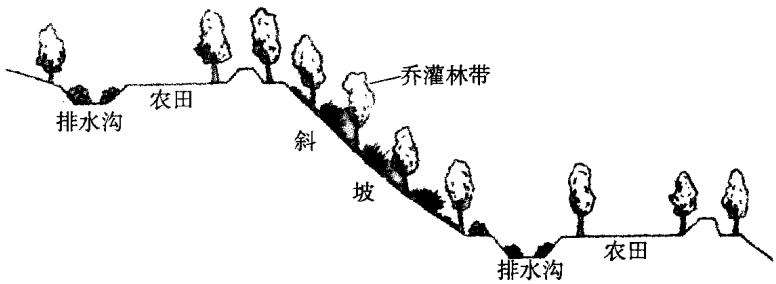  
图6.4 鱼鳞坑整地后的植被种植

## 6.9.2.3 工业场地防治区

地面生产系统及工业场地布设在地形平坦、临近矿区道路的开阔地上，原地面以风力侵蚀为主。施工活动主要表现在扰动原地貌，破坏地表植被，降低原地面水土保持功能。土壤侵蚀类型以风力侵蚀为主，防治措施应以植物措施为主：储煤场周边设置挡风幕墙；在胶带输送机上设置防护罩；对工业场地内道路及广场进行固化、硬化；工业场地设排水系统；工业场地预留地人工种草防护；基础开挖及管沟开挖土料设临时堆土场，周边采用纤维布临时挡护措施；工业场地周边防护林、工业场地内道路两侧绿化、工业场地空地绿化美化。

## 6.9.2.4 地面防排水工程防治区

地面防排水工程施工活动主要表现在开挖和堆垫破坏了土壤结构和地表植被，机械的碾压和人为践踏扰动了原地貌，降低了原地面水土保持功能，加强了施工区的水土流失强度。土壤侵蚀类型以风力和水力侵蚀为主，防治措施应以工程结合植物措施防护为主：在采掘场周边布设防洪堤和排水沟，并实施种草植树防护。

## 6.9.2.5 运输系统及管线防治区

运输系统包括矿山道路、工业场地外部联络道路及铁路专用线等设施。在工程建设期间，由于机械的碾压及人为践踏，开挖和堆垫破坏了原有地表植被和土壤结构，不可避免地加大了沿线的水土流失强度。因此主要防治措施有：路面硬化、固化；设排水沟、翼墙挡护、临时挡护土堤；防护林、空地种草。

## 6.10 防治工程与防治措施设计

## 6.10.1 水土保持工程设计原则

①采取分区防治的原则，制定切实可行的防治体系，坚持工程措施和植物

措施相结合，永久措施和临时措施相结合的治理原则；

②水+保持工程设计坚持“预防为主、防治结合、先拦后弃”的原则，防患于未然；

③坚持做到不重不漏、系统全面的原则；

④植物措施设计与所在区域的景观相一致；

⑤草灌乔合理配置原则：矿区植被类型为草原，植物措施优先选择草本植物，其次考虑灌木，个别区域选择乔木；

⑥植物措施设计以经济实用、方便施工和美观大方为原则。

## 6.10.2 排土场防治区措施设计

## 6.10.2.1 外排土场工程防治措施设计

## （1）排土场外围土围埂设计

①防御标准

20 a 一遇 24 h 暴雨产生的径流。

②坡面来水量确定

采用GB/T16453.1\~16453.6—1996水土保持综合防治技术规范，径流总量计算公式：

$$
W { = } 1 0 K R F\tag{6.5}
$$

式中 W——来水总量， $\mathbf { m } ^ { 3 }$

R——暴雨量，mm；

F——集水面积，ha;

K——径流系数。

R 和K 值，查当地水文资料得知胜利矿 20 a一遇 24 h暴雨量为 $R = 1 4 2 , 6$ mm，K值取0.35，F按每延长米控制面积计算，排土场第一层边坡控制每延长米面积为 $2 7 ~ \mathrm { m } ^ { 2 }$ ，则径流总量W为 $1 . 3 4 \mathrm { ~ m } ^ { 3 }$ 0

③外围挡水围埂设计

围埂蓄水量按式(6.6)计算：

$$
V = L ( H B / 2 ) = L H ^ { 2 } / 2 i\tag{6.6}
$$

式中 V——围埂蓄水量， $\mathbf { m } ^ { 3 }$

L—围埂长度，m；

B——回水长度，m；

H——埂内蓄水深，m；

i——地面比降，%。

围埂顶宽结合机械施工取1.5m，内外坡比分别为1：1和1：1.5，排土场

边坡比降i=66.7%，围埂蓄水量按拦蓄坡面径流总量计算，求得围埂蓄水深为1.0m，加安全超高0.5m，围埂总高度1.5m。

## (2) 平台整平措施

在平台复垦前要对平台进行整平，具体做法是：使用推土机或整平机平整台面，使整个平台向排水渠有一定坡度，形成一个倒坡，避免平台水流对排土场边坡的冲刷。平台径流最终流入地面排水沟中。

## (3) 覆土

一般来说，当土地利用方向为牧业用地时，平均覆土0.30m，灌木用地覆土厚0.50m，灌木采用带状覆土或穴状覆土方式。

## (4) 平台网格围埂设计

防御标准：10 a一遇 24 h 暴雨产生的径流。

经计算，网格围埂高度取0.3m，顶宽0.3m，内外坡比1：1。挡水埂高度取0.5m，顶宽0.4m，内外坡比1：1。

## （5)排土场排水工程设计

在外排土场周边围埂坡脚处设置排水沟，因外排土场所处的地形较平坦，排水设计标准达到20 a一遇平均1 h暴雨强度即可。

## ① 洪峰流量计算

采用《开发建设项目水土保持方案技术规范》(SL204—98)推荐公式：

$$
Q _ { \mathrm { B } } = 0 , 2 7 8 K i F\tag{6.7}
$$

查《内蒙古自治区水文手册》，i取20a一遇多年平均1h暴雨强度50.45mm，K取0.3。

按照排土最终平台面积及布设道路的位置，排水沟汇水面积最小为7.15ha，最大为 51.10 ha。

经计算，排土场可产生的洪峰流量：

$$
Q _ { \mathrm { * } } = 0 . 3 0 ~ \mathrm { m } ^ { 3 } / \mathrm { s } , Q _ { \mathrm { * } } = 2 . 1 5 ~ \mathrm { m } ^ { 3 } / \mathrm { s }
$$

## ②排水沟断面设计

排土场的平台与边坡虽然经过重型机械的碾压，但在前几年仍有不同程度的沉降，因此排水沟采用梯形断面，混凝土预制块结构较好，不仅运输方便，且施工与维修简便。边坡比为1：1，纵坡比降在平台内为1：100，在边坡与弃土边坡坡比一致。

I. 纵向排水沟断面：设计断面为底宽0.30m，水深0.15m，加安全超高0.15m，排水沟深为0.30m，边坡比为1：1。

Ⅱ．横向排水沟断面：设计断面为底宽0.40m，水深0.25m，加安全超高0.15m，排水沟深为0.40m，边坡比为1：1。

Ⅲ．外围围埂外的排水沟断面：设计断面为底宽1.0m，水深0.50m，加安全超高0.30m，排水沟深为0.80m，边坡比为1：1。

## ③ 排水沟结构设计

排土场平台和边坡排水沟由于布设在新堆垫的弃土表面，土体还达不到自然的稳定性，采用C15混凝土预制块砌筑，施工与维修较为方便，厚0.10m，长×宽纵向排水沟为 $3 0 ~ \mathrm { c m } \times 4 5 ~ \mathrm { c m }$ ，横向排水沟为 $4 0 \ \mathsf { c m } \times 5 5 \ \mathsf { c m }$ 。排土场外围围埂外的排水沟采用浆砌片石砌筑，厚30cm。为了防止冬季冻胀破坏，铺设15cm厚的砂砾石垫层。

## ④消力池设计

排水沟下泄的水流流速较大，需经过分级平台消力池消能后再汇入沟道。消力池底宽取各进口沟道的开口宽。各消力池设计参数详见表6.3。

表6.3  
消力池计算参数
<table><tr><td rowspan=1 colspan=1>名   称</td><td rowspan=1 colspan=1>流量 $Q / { \mathfrak { m } } ^ { 3 } \cdot { \mathfrak { s } } ^ { - 1 }$ </td><td rowspan=1 colspan=1>底宽 $\delta / { \mathfrak { m } }$ </td><td rowspan=1 colspan=1>池深 $S / { \mathfrak { m } }$ </td><td rowspan=1 colspan=1>池长 $\pmb { L } / \mathbf { m }$ </td></tr><tr><td rowspan=1 colspan=1>纵向分级入口消力池</td><td rowspan=1 colspan=1>0.04</td><td rowspan=1 colspan=1>0.90</td><td rowspan=1 colspan=1>0.50</td><td rowspan=1 colspan=1>2.00</td></tr><tr><td rowspan=1 colspan=1>横向出口消力池</td><td rowspan=1 colspan=1>0.30</td><td rowspan=1 colspan=1>120</td><td rowspan=1 colspan=1>0.60</td><td rowspan=1 colspan=1>4.50</td></tr><tr><td rowspan=1 colspan=1>外围围埂外的排水沟出口消力池</td><td rowspan=1 colspan=1>2.15</td><td rowspan=1 colspan=1>260</td><td rowspan=1 colspan=1>150</td><td rowspan=1 colspan=1>8.00</td></tr></table>

## ⑤消力池结构设计

消力池采用浆砌石片砌筑，底板厚0.50m，侧墙厚0.30m。为了防止冬季冻胀破坏，浆砌石片铺设15cm厚的砂砾石垫层。

## 6.10.2.2 排土场水土保持植物措施设计

排土场要迅速恢复植被，防止土壤水蚀和风蚀的发生，保持水土。排土场土地复垦根据发展的需要可进行林业、牧业等方式的复垦，建成一个综合的人工生态系统，促进经济与环境的持续发展。

在矿区生物防护措施研究中建立起的乔灌草优化结构模式中，生态效益较好，并兼顾经济效益的生态模式有：

## (1)灌草型(见图6.5)

沙棘—沙打旺；沙棘—草木樨；沙棘一紫花苜蓿一冰草；沙棘—草木樨—紫花苜蓿一冰草。

## (2) 乔灌型(见图6.6)

杨(柳)树一沙棘；油松—沙棘。

(3)乔灌草型(见图6.7)

杨(柳)树—沙棘—沙打旺；油松—沙棘—紫花苜蓿—冰草。

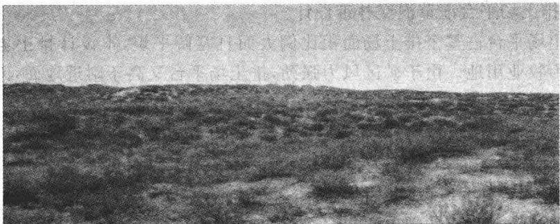

图 6.5 灌草型种植图  
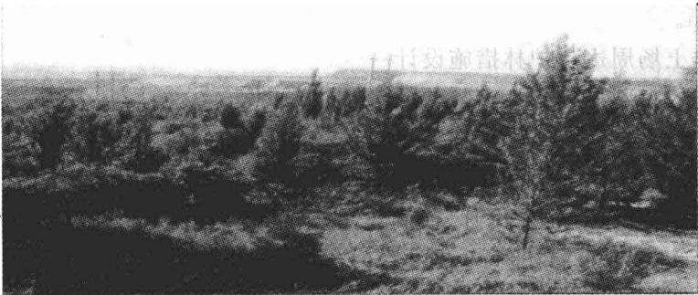  
图 6.6 乔灌型种植图

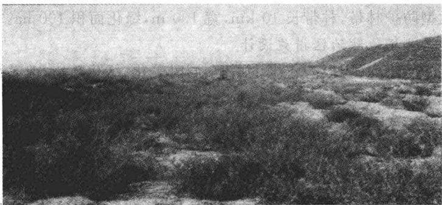  
图 6.7 乔灌草型种植图

排土场的复垦绿化过程是相对复杂、长期的过程，需要根据排土场不同时期的条件来选择不同的生物措施。在恢复、重建植被时，按乔灌草结合的原则进行，先治坡后治台，先南坡后北坡，先覆土后建立人工植被。边坡植被沿等高线布置，平台植被根据最终用地方向选择多种配置模式。将地带性植物与固氮能力较强的多年生豆科植物混交种植以加速排土场的植被演替，最终实现宜林、宜草的土地复垦治理目标。

## ①排土场平台灌草混交林带设计

排土场平台占整个排土场面积比例大而且宽阔平坦，本设计排土场平台规划主要为牧业用地。由于矿区风力强劲，排土场平台又高于附近地面，因此在排土场应营造平台牧草地灌木防护林。

树种选择：柠条、沙棘；林带间距：主林带20m，副林带100m，主林带5行一带式，副林带2行一带式。

## ②排土场边坡植物防护措施设计

树种选择：柠条、沙棘。

整地方式：造林前一年雨季或当年人工进行穴状整地，规格为0.4m×0.4m×0.4 m。

## ③排土场周边防护林措施设计

树种选择：柠条。株距2.0m，行距2m。

## 6.10.2.3 采掘场防治区措施设计

## ① 网围栏

用水泥柱和5道钢丝网片(或刺丝)将采掘坑外围进行围封，设置网围栏时，每隔10m建1根水泥柱，高1.8m。

## ②采掘场周边防护林

## ③大型隔离带防护林

设置大型防护林带，林带长10km，宽100m，绿化面积100ha。

## 6.10.2.4 工业场地防治区措施设计

对其实施生物保护，以防止煤尘扩散，同时美化、绿化环境，改善生活环境。

## ①工业场地空地绿化

栽植穴的规格：乔木为0.8m×0.8m×0.8m；灌木为0.6m×0.6m×0.8m。土质不好的地方需全面客土，深为0.25～0.3m。

栽植：根据气候条件，春秋季栽植树木为主，夏季栽植草坪、花卉；云杉秋季带土移植，花灌木4月底到5月初裸根移植；草坪、花卉6～7月均可移植。

## ②工业厂区周边防护林

在工业厂区周边营造乔灌针阔混交防护林带，避免飞扬的煤尘污染环境。

造林前一年的雨季人工穴状整地，乔木穴径0.8m，深0.8m；灌木穴径0.6m，深0.4m。

栽植：针叶树栽植一般定植的坑径为80cm，并且回填15～25cm沙质土壤后，再放苗入穴。

③工业场地内道路遇空地绿化。

④工业场地内预留地绿化。

按相关规范和要求，栽植树木与建筑物、道路等要求保持一定距离，如：建筑物外墙(有窗)至乔木中心3.0～5.0m，至灌木中心1.5m；建筑物外墙(无窗)至乔木中心2.0m，至灌木中心1.5m；道路路面边缘至乔木中心2.0m，至灌木中心1.0m。

## 6.10.2.5 地面防排水工程措施设计

①防洪堤植草防护设计。

②施工便道和施工区。

## 6.10.2.6 地面运输系统防治区措施设计

①铁路专用线植物措施设计：铁路防护以防风蚀为主，同时兼有隔音、隔尘、保护环境的作用。铁路防护主要选择以抗风蚀强的草、灌木或乔木品种。

②矿区道路防治措施设计：对道路边坡和两侧采取植草和种植乔灌混交防护林的方式进行绿色通道建设。

## 6.11 小结

露天开采和排土工程，不仅改变了原有地貌，而且加重了该地区的土壤侵蚀，对周边居住点及草场存在潜在威胁，可能导致草原植被破坏，生态环境质量下降，动、植物资源及种类减少。本章通过对矿区水土流失预测与防治的研究，得到结论如下。

(1）根据露天矿工程分布、施工生产特点和对土地扰动强度，首先对水土流失预测区域和预测时段进行了划分，其中预测区分为采掘场、外排土场、工业场地区、地面防排水工程区、地面运输及管线区共5个预测区域，预测时段划分为建设期和生产运行期。

(2)运用类比实测法及类比资料法等方法针对上述不同的预测时段和不同的预测区域，对土壤侵蚀强度值和水土流失面积、水土流失强度和流失量进行了预测，结果表明：在不采取任何防治措施的情况下，预测露天矿一期工程建设期2 a、生产运行期8a共产生的水土流失总量为396.9kt，原地貌土壤侵蚀量为45.7kt，新增水土流失量为351.1 kt。其中：建设期间因各类工程建设可能造成土壤侵蚀量为 59.8 kt，新增水土流失量为47.1 kt;在运行期8 a 内将造成土壤侵蚀量为 337.1 kt,新增土壤侵蚀量为 304.1 kt。

（3）通过对上述预测区域的水土流失成因、类型及分布的详细研究及水土流失危害的分析，提出了具有针对性的防治分区方案及对这些分区相应的水土流失防治方案及分区防治措施，最后对这些防治措施进行了详细的方案设计。

## 7 露天矿内外排土场复垦工程设计

## 7.1 概述

不同的开采工艺导致对土地破坏形式的不同，从总体而言，露天煤矿开采对土地的破坏主要表现为压占、挖损和污染等方面。

压占主要指煤矸石压占、粉煤灰压占、露天煤矿排弃剥离物压占土地。因固体废物数量庞大，种类繁多，物理化学性质复杂，回收利用率低下，将会对矿区的土地造成严重的污染和破坏。压占对土地的破坏形式主要是在外排土场被堆积如山的剥离废弃土石改变了原来土地的地表形态；废弃物含有大量有害元素，废弃物与原土地相比有机质含量下降；废弃物被雨水冲刷，造成水土流失。加之该地区风沙多、气候干燥，由此引起粉煤灰四处飘扬、煤矸石自燃等现象，严重地污染大气，给当地居民带来生产生活上的影响。

挖损是将露天煤矿开采范围内的覆盖物(包括岩石、土壤)全部剥离后再采煤，故比矿井开采对土地的破坏更严重。露天矿的采煤，一方面造成局部土地的挖损，另一方面，它更破坏了矿区更大面积的地质稳定性和地下水平衡系统，会导致更大面积的地下水位下降、土地干旱和地面沉降。所以矿山挖掘使原始地貌发生很大的变化，它对土地的影响主要表现为地表变形、地表裂缝及矿坑水文地质特征的变化等。

污染是指各类废弃物的处理场所，由于大气降水的淋漓作用，使含有污染物质的渗出液或污水渗入土壤，使大量有机和无机污染物进入土壤，造成矿区土壤污染。其次，土壤作为自然环境的要素之一，因大气的污染，其中的污染物质经迁移转化而进入土壤，使土壤随之污染。自然环境不同要素中的污染物质大多相同，土壤中的污染物质主要包括有机污染物、重金属、放射性物质和有害微生物等。

## 7.2 剥离与排土工艺参数的确定

## 7.2.1 表土的采集

表土的采集是在采场和排土场范围内，预先对原始地表的表土按照一定的厚度和作业工艺进行剥离的一种土工工程，也是露天矿复垦作业中必不可少的环节。表土是土地复垦所需的有用资源，在采矿作业过程中对表土进行有计划的采集，是保证剥离与复垦一体化作业顺利进行的必要条件。需要注意的是，为减少土壤肥力的损失，表土的采集工作最好在其解冻和自然湿润状态下进行，严禁在雨雪天气条件下进行表土采集。

## 7.2.2 表土的堆存

对采集下来的表土资源的处理方式通常有两种：一种是将表土直接运往排土场复垦地点进行铺设；另一种是将表土在适当位置暂时贮存一段时间，等排土场需铺设表土时再运往复垦地点进行铺设。第一种方式是我们期望的最佳表土处理方式，这种方式由于移运次数少而能较好地保持土壤的肥力，同时作业费用也相对较低。但是在多数情况下，采集下来的表土都涉及贮存问题，表土的有计划堆存能有效地解决采矿作业和复垦作业过程中对表土资源的充分、合理的利用问题，同时也为复垦作业顺利进行提供了有力保障。表土堆存时，为了较好地保护表土的特性和肥力，根据土壤学知识及农垦经验，表土最好堆存于排土场或采场附近标高较高的干燥处，并且要保证堆存场不影响采矿作业。表土的堆存高度一般不宜超过5～10m，为防风蚀、水蚀和杂草滋生，表土堆上要及时种上多年生的草本植物，如沙打旺、紫花苜蓿等。值得注意的是，存土场要保证安全、稳定。表土堆存时，表土贮存场的容量、尺寸及形状要合理确定，这样可较好地保护表土的土壤特性和土壤肥力，同时也能为表土堆存作业的顺利进行提供保障。表土贮存场的容量是首先应该考虑的内容，其容量应以不小于所期望或可能要堆存的表土量为前提，具体确定要根据矿山采剥进度计划及表土铺设计划来统筹考虑。表土堆存场底部通常设计为圆形或椭圆形，堆存场的底面积可按式(7.1)[182]设计：

$$
S = { \frac { \pi } { 4 } } \bigg [ h \cot \alpha + \sqrt { \frac { 4 K _ { \mathrm { p } } V } { \pi h } - { \frac { h ^ { 2 } \cot \alpha } { 3 } } } \bigg ] ^ { 2 } .\tag{7.1}
$$

式中 S——底面为圆形的堆存场的下底面积， $\mathbf { m } ^ { 2 }$

$\pmb { \alpha }$ —表土的自然安息角，(°)；

$K _ { \mathfrak { p } }$ ——表土的松散系数；

V—所要堆存的表土在未剥离状态下的体积， $\mathbf { m } ^ { 3 }$

$h \cdot$ —表土的堆存高度，一般不超过10m，堆存期在2a以内通常取10m，堆存期在2a以上堆存高度通常要适当减小。

在矿山实际生产过程中，表土堆存场的形状并非像理论设计的那样规则，具体情况要视矿山实际具体对待，原则上在条件许可的前提下尽量按设计要求进行表土的堆存。

## 7.2.3 剥离废岩的排弃

矿山生产期间，剥离物的排弃要按照排土场的设计规划有计划地进行，在排土场安全、稳定的前提下，为了减少露天矿排土场裸露的岩石对周围环境的危害，缩短复垦周期及提高复垦效益，要求对排土场中排弃到界的区域及时地进行复垦。为了尽早将被破坏的土地加以复垦利用，排土作业和复垦作业应当有机地结合起来，使采矿、排土和复垦作业融为一体，相互兼顾，从而实现剥离与复垦一体化的平行作业。外排土场在建设和发展时，采用上、下两个台阶同时进行作业能给排土和复垦作业的交替进行提供可能和保证，同时也能给剥离物的分层排弃提供条件。在排土场上、下两个台阶同时作业互不影响的前提条件是要保证排土平盘宽度和复垦平盘宽度都不小于相应的最小工作平盘宽度。

对实现内排的矿山，剥离物的排弃主要是要回填采空区。在排土场排弃剥离物的方式比较简单，矿山更易且更有条件实现“边采矿、边排土、边复垦”的一体化作业，这种作业方式通常是通过调整开采程序来实现的，一般实行的是条带开采的内排程序和分期开采的内排程序。

## 7.2.4 场地的平整

当剥离物在排土场排弃到界并达到最终标高时，在进行表土铺设前要对待复垦场地进行必要的平整以便使复垦作业顺利进行。场地平整前应首先明白复垦的要求，使场地的平整工作能按要求进行，从而为进一步的复垦工作打下基础.复垦场地的要求一般有以下几个方面：

①排土场的稳定性不会受到地形、地表水的影响，不会发生泥石流；

②排土场顶部标高应高于采场附近地带地下水的最高水位1～2m；

③场地平整后能适合农业和林业机械作业；

④场地边坡满足复垦要求，并且能防止边坡被冲蚀；

⑤平盘场地要有一定的纵坡和反向横坡，以满足灌溉要求为准；

⑥有通往复垦场地的专用道路。

场地的平整主要是为了使复垦地今后便于耕种植被或作为场地使用。场地的平整工作包括排土台阶坡面平整为复垦台阶坡面和复垦平盘的平整两方面的工作。

对内排土场的平整工作来讲，当排土场某一区域排弃至地表设计标高后，可利用推土机、铲运机、带犁耙的拖拉机等平地工程机械将场地平整，然后再进行表土铺设。通常情况下，为防止复垦地日后沉降为一凹陷地，应根据沉降量的不同对平整覆土后的场地标高加以调整。场地平整后的标高、场地覆土后的标高以及充填废岩的沉降量等有关参数可由下面的公式[182]求得：

$$
\Delta h = ( K _ { \circ } \cdots 1 ) h\tag{7.2}
$$

$$
H _ { 2 } = H _ { \odot } - h _ { \odot } + \Delta h\tag{7.3}
$$

$$
H _ { 1 } = H _ { 0 } + h _ { 0 }\tag{7.4}
$$

式中 $\Delta h ^ { . }$ ——剥离废岩的沉降量，m；

$K _ { 0 }$ —剥离废岩的平均松散系数；

$h$ 地表至采空区底部的深度即充填高度，m；

$H _ { \mathfrak { o } }$ —复垦地最终标高，m；

$H _ { 2 }$ ———场地平整后的标高，m；

$H _ { 1 }$ ——场地覆土后的标高，m；

$h _ { 0 }$ ——表土铺设厚度，m。

## 7.2.5 表土的铺设

待复垦的场地平整后，在天气许可的条件下，根据当地土质情况和复垦地的利用方向，利用汽车、推土机、铲运机等工程机械在平整后的场地上铺设一层表土，使生物复垦有可靠的保障。值得强调的是，严禁在雨雪天气进行表土铺设，以尽可能保护土壤结构和肥力。

复垦种植分为覆土种植和不覆土种植两种形式。覆土与不覆土相比，覆土种植牧草或树木易于成活，环境能较快得到改善，但费用较高。不覆土形式的使用有一定条件，必须有足够厚度的岩石风化壳以及适合的树种。

实践证明，覆土厚度增加至一定值，作物产量不再增加或增加量甚小，而覆土费用却随覆土厚度的增加直线上升。因此，根据费用效益分析方法，按最大效益可确定最佳覆土厚度。

$$
E _ { \mathrm { m a x } } = \sum _ { i = 1 } ^ { n } { \left[ \left( E - C _ { \alpha } \right) \left( 1 + \dot { I } \right) { } ^ { i } \right] } - C _ { 0 }\tag{7.5}
$$

式中 E—复垦土地单位面积年收益，元/a；

$C _ { \alpha }$ 复垦土地单位面积年管理或经营费用，元/a;

$C _ { \mathfrak { d } }$ 单位面积覆土费用，元 $/ { \mathrm { a } } , C _ { 0 } = k h , h$ 为覆土厚度，k为单位厚度单位面积的覆土费用；

t——计算期，a；

I——基准收益率。

## 7.3 哈尔乌素露天煤矿内外排土场复垦工程设计

## 7.3.1 内排土场(采掘场)复垦工程设计

采掘场造地工艺与矿区开采工艺紧密结合，根据排土场的排弃计划，对内排土场排弃时间3a以上的稳定边坡和平台及时开展土地复垦工作，每年复垦面积随主体工程推进度进行设计，从而达到恢复植被、保护生态环境的目的。主要工程设计如下。

## 7.3.1.1 内排土场地形设计

重整地形是工程复垦的最主要的内容。哈尔乌素露天煤矿煤层赋存近水平，因此当采矿工程发展到一定位置时，其采空区开始内排，随着采矿工程推进，其剥离物可全部实现内排。由于开采工艺为单斗一卡车与吊斗铲综合工艺，因此内排空间主要由两部分排弃量组成：下部为吊斗铲直接倒退排弃，上部为单斗一卡车排弃量。吊斗铲排弃台阶是倾斜的，单斗一卡车的排弃台阶水平分层，台阶标准高度与采掘台阶高度相匹配。根据内排土场的排土工艺，对内排土场进行定型设计。

## (1) 排土场边坡设计

不同的土地用途，对于边坡角度都有一定的要求，一般存在一个上限值。排土场边坡复垦为灌木林地，其最大坡度为25°。

对自然界的天然斜坡形状进行仔细观察可知，多数天然斜坡的剖面轮廓大约为“S”形，在其上部一般占总长20%～30%(0.2\~0.3)部分为凸形，下部约占坡长70%\~80%(0.7\~0.8)部分为凹形，见图7.1。

这种形状是天然坡面受到侵蚀力与沉积力再经过整个地质年代长期的相互作用而最终达到平衡稳定的结果，是环境的各种因素中和作用的结果。这种“S”形坡形应是进行排土场坡形设计时较为理想的方案，因其坡面所受侵蚀程度最小。在这种坡面上沿坡长方向的任一点，随着离坡首的距离增加，其集水面积虽然增大，但沿此坡面的径流流速并不是逐渐增加，而是保持在一个较低的数值，且形状恒定，从而控制了径流对坡面的冲刷力，有效地控制了水土流失。

## (2) 内排土场平台的设计

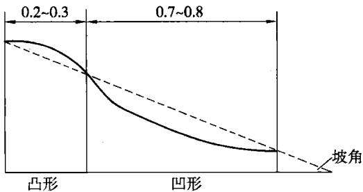  
图 7.1 “S”形斜坡

考虑排土作业安全、汽车回转顺利及挡土堆等要求，内排土工作平盘要素见表7.1，内排土工作平盘示意图见图7.2。

表7.1  
内排土场工作平盘要素表
<table><tr><td rowspan=1 colspan=1>符号</td><td rowspan=1 colspan=1>符号意义</td><td rowspan=1 colspan=1>单位5</td><td rowspan=1 colspan=1>数值</td></tr><tr><td rowspan=1 colspan=1> $\pmb { \alpha _ { \mathrm { p } } }$ </td><td rowspan=1 colspan=1>内排土场台阶坡面角</td><td rowspan=1 colspan=1>(°)</td><td rowspan=1 colspan=1>22</td></tr><tr><td rowspan=1 colspan=1> $H _ { p }$ </td><td rowspan=1 colspan=1>内排土台阶高度</td><td rowspan=1 colspan=1>m</td><td rowspan=1 colspan=1>35</td></tr><tr><td rowspan=1 colspan=1> $A _ { \mathfrak { p } }$ </td><td rowspan=1 colspan=1>内排幅宽度</td><td rowspan=1 colspan=1>m</td><td rowspan=1 colspan=1>50</td></tr><tr><td rowspan=1 colspan=1> $\boldsymbol { F }$ </td><td rowspan=1 colspan=1>道路外缓挡土堆</td><td rowspan=1 colspan=1>m</td><td rowspan=1 colspan=1>4</td></tr><tr><td rowspan=1 colspan=1> $\boldsymbol { \mathsf { T } }$ </td><td rowspan=1 colspan=1>路面宽度</td><td rowspan=1 colspan=1>m</td><td rowspan=1 colspan=1>26</td></tr><tr><td rowspan=1 colspan=1> $G$ </td><td rowspan=1 colspan=1>大块滑落距离</td><td rowspan=1 colspan=1>m</td><td rowspan=1 colspan=1>10</td></tr><tr><td rowspan=1 colspan=1> $B _ { 0 }$ </td><td rowspan=1 colspan=1>道路平盘宽度</td><td rowspan=1 colspan=1>m</td><td rowspan=1 colspan=1>40</td></tr><tr><td rowspan=1 colspan=1> $B _ { \mathrm { m i n } }$ </td><td rowspan=1 colspan=1>最小排土工作平盘宽度</td><td rowspan=1 colspan=1>m</td><td rowspan=1 colspan=1>90</td></tr></table>

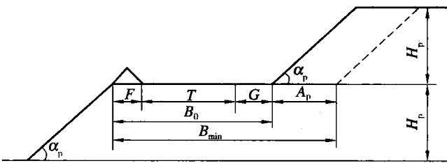  
图 7.2 内排土工作平盘示意图

## 7.3.1.2 表土储存

采区表层肥沃的土壤是土地复垦时进行再种植成功的关键。因此，必须妥善就近贮存并与底土分别堆放，防止岩石混入使土质恶化，尽可能做到回填保持原有的土壤结构，以利种植。露天开采剥离0.30m厚表土在邻近采掘场境外的地方建立临时的表土堆放场，贮存表土，在土地复垦时将表土覆盖在原地表，以恢复植被。在采区剥离、开采、土地复垦时，也可将采前剥离的表土直接铺覆于已回填或部分回填废弃岩土的采空区，避免二次搬运。采掘场表土剥离量为$1 8 , 4 2 8 \ \mathrm { M m } ^ { 3 }$

## 7.3.1.3 土壤改良

哈尔乌素露天煤矿采掘场土质要通过生物措施进行土壤改良，熟化土壤，抑盐改土，增加地面植被覆盖，熟化表层，使用有机肥，加强土层的有机质含量，改善土壤表层结构，适当地种植适应矿区的紫花苜蓿、披碱草、柠条、沙棘、杨树等作物。

## 7.3.1.4 回填(包括压实)、土地平整、覆土

结合露天煤矿的开采工艺及开采进度，在露天煤矿整个生产过程中，外排土量为 $2 8 3 ~ \mathrm { M m ^ { 3 } }$ ，内排土量为 $1 0 . \ 4 1 2 \ 3 \ \mathrm { G m } ^ { 3 }$ ，总剥离量为 $1 0 . 6 7 5 \ : 3 \ : \mathrm { G m } ^ { 3 }$ ，可采原煤量为1.775Gt。在露天煤矿进行内排时，将开采中剥离的废弃岩土回填至采空区，使采矿与废弃岩土回填相互配合，使废弃岩土回填到采空区，在采区内解决，避免往返运输，缩短造地周期，做到开采一片、回填一片、复垦一片。回填后将进行土地平整、覆盖表土，土地平整根据同类地区经验平整厚度0.30～0.50m；复垦为耕地区覆土厚度0.50m，复垦为牧草地与林地区覆盖表土厚度为0.30m，最终达到设计要求。由于煤炭的开挖最终将使回填土量减少，将在项目区东南角形成一个矿坑，可根据当时的情况规划为坑塘水面来发展渔业养殖。

## 7.3.1.5 采掘场复垦土地利用类型的确定

采掘场在服务期结束后将形成一个大平台、五阶人造阶梯与一个矿坑，根据土地破坏的预测程度、适宜性评价、土地的立地条件及在总布局中所处的实际位置，采掘场土地复垦后利用方向为耕地、牧草地、林地、其他农用地(道路)、居民点及独立工矿用地。项目区内的土壤类型为黄土和栗钙土，内排土场最终平台复垦为林地、牧草地、其他农用地(道路)、居民点及独立工矿用地，林地种植杨树或柳树为主乔木树种，牧草地撒播披碱草和紫花苜蓿，居民点及独立工矿用地，布设凉亭、景点及休闲广场，其他农用地主要用于复垦区道路的建设；阶梯平台复垦为耕地、林地与牧草地，耕地类型为旱地，种植农作物为玉米、小麦或葵花等，林地种植小叶杨树或柳树，牧草地撒播披碱草和紫花苜蓿；阶梯边坡复垦为林地，种植沙棘或柠条；矿坑复垦为坑塘水面，其阶梯平台复垦为林地，种植小叶杨或柳树等乔木，边坡种植沙棘、柠条等灌木植被；同时在道路、广场周围布置林带。树种以美化环境、适应地区特点为主。绿化树种选樟子松、山杏、丁香、玫瑰、榆叶梅、榆叶绿篱、青杨等。采掘场复垦各类用地面积见表7.2和表7.3。

表7.2  
内排土场分台阶复垦面积表
<table><tr><td rowspan=1 colspan=1>排土台阶序号</td><td rowspan=1 colspan=1>台阶设计水平/m</td><td rowspan=1 colspan=1>平台面积/ha</td><td rowspan=1 colspan=1>垦后面积/ha</td><td rowspan=1 colspan=1>垦后类型</td><td rowspan=1 colspan=1>边坡面积/ha</td><td rowspan=1 colspan=1>垦后类型</td><td rowspan=1 colspan=1>垦后矿区道路面积/ha</td><td rowspan=1 colspan=1>总面积/ha</td></tr><tr><td rowspan=3 colspan=1>最终平台</td><td rowspan=3 colspan=1>1 200</td><td rowspan=3 colspan=1>3 183.55</td><td rowspan=1 colspan=1>1605.94</td><td rowspan=1 colspan=1>牧草地</td><td rowspan=3 colspan=1>140.01</td><td rowspan=3 colspan=1>林地</td><td rowspan=3 colspan=1></td><td rowspan=3 colspan=1>3 323.56</td></tr><tr><td rowspan=1 colspan=1>1 284.75</td><td rowspan=1 colspan=1>林地</td></tr><tr><td rowspan=1 colspan=1>292.86</td><td rowspan=1 colspan=1>居民点及独立工矿用地</td></tr><tr><td rowspan=2 colspan=1>阶梯1台</td><td rowspan=2 colspan=1>1 165</td><td rowspan=2 colspan=1>158.07</td><td rowspan=1 colspan=1>45.36</td><td rowspan=1 colspan=1>耕地</td><td rowspan=2 colspan=1>144.93</td><td rowspan=2 colspan=1>林地</td><td rowspan=2 colspan=1></td><td rowspan=2 colspan=1>303.00</td></tr><tr><td rowspan=1 colspan=1>112.71</td><td rowspan=1 colspan=1>牧草地</td></tr><tr><td rowspan=2 colspan=1>阶梯2台</td><td rowspan=2 colspan=1>1 130</td><td rowspan=2 colspan=1>168.31</td><td rowspan=1 colspan=1>50.11</td><td rowspan=1 colspan=1>耕地</td><td rowspan=2 colspan=1>154.18</td><td rowspan=2 colspan=1>林地</td><td rowspan=2 colspan=1></td><td rowspan=2 colspan=1>322.49</td></tr><tr><td rowspan=1 colspan=1>118.20</td><td rowspan=1 colspan=1>牧草地</td></tr><tr><td rowspan=2 colspan=1>阶梯3台</td><td rowspan=2 colspan=1>1 095</td><td rowspan=2 colspan=1>178.90</td><td rowspan=1 colspan=1>55.79</td><td rowspan=1 colspan=1>耕地</td><td rowspan=2 colspan=1>164.03</td><td rowspan=2 colspan=1>林地</td><td rowspan=2 colspan=1></td><td rowspan=2 colspan=1>342.93</td></tr><tr><td rowspan=1 colspan=1>123.11</td><td rowspan=1 colspan=1>林地</td></tr><tr><td rowspan=2 colspan=1>阶梯4台</td><td rowspan=2 colspan=1>1 060</td><td rowspan=2 colspan=1>188.33</td><td rowspan=1 colspan=1>61.23</td><td rowspan=1 colspan=1>耕地</td><td rowspan=2 colspan=1>174.49</td><td rowspan=2 colspan=1>林地</td><td rowspan=2 colspan=1></td><td rowspan=2 colspan=1>362.82</td></tr><tr><td rowspan=1 colspan=1>127.10</td><td rowspan=1 colspan=1>林地</td></tr><tr><td rowspan=2 colspan=1>阶梯5台</td><td rowspan=2 colspan=1>1 025</td><td rowspan=2 colspan=1>213.12</td><td rowspan=1 colspan=1>67.54</td><td rowspan=1 colspan=1>耕地</td><td rowspan=2 colspan=1>183.67</td><td rowspan=2 colspan=1>林地</td><td rowspan=2 colspan=1></td><td rowspan=2 colspan=1>396.79</td></tr><tr><td rowspan=1 colspan=1>145.58</td><td rowspan=1 colspan=1>林地</td></tr><tr><td rowspan=1 colspan=7>复垦后矿区道路</td><td rowspan=1 colspan=1>28.33</td><td rowspan=1 colspan=1>28.33</td></tr><tr><td rowspan=1 colspan=8>合    计</td><td rowspan=1 colspan=1>5 079.92</td></tr></table>

表7.3  
坑塘水面区复垦面积表
<table><tr><td rowspan=1 colspan=1>复垦区域</td><td rowspan=1 colspan=1>台阶设计水平/m</td><td rowspan=1 colspan=1>平台面积/ha</td><td rowspan=1 colspan=1>垦后用地类型</td><td rowspan=1 colspan=1>边坡面积/ha</td><td rowspan=1 colspan=1>垦后用地类型</td><td rowspan=1 colspan=1>总面积/ha</td></tr><tr><td rowspan=1 colspan=1>平台1</td><td rowspan=1 colspan=1>1010</td><td rowspan=1 colspan=1>210.65</td><td rowspan=1 colspan=1>林地</td><td rowspan=1 colspan=1>182.23</td><td rowspan=1 colspan=1>林地</td><td rowspan=1 colspan=1>392.88</td></tr><tr><td rowspan=1 colspan=1>平台2</td><td rowspan=1 colspan=1>995</td><td rowspan=1 colspan=1>174.72</td><td rowspan=1 colspan=1>林地</td><td rowspan=1 colspan=1>176.32</td><td rowspan=1 colspan=1>林地</td><td rowspan=1 colspan=1>351.04</td></tr><tr><td rowspan=1 colspan=1>水面</td><td rowspan=1 colspan=1>一</td><td rowspan=1 colspan=1>-</td><td rowspan=1 colspan=1>二</td><td rowspan=1 colspan=1></td><td rowspan=1 colspan=1>二</td><td rowspan=1 colspan=1>318.84</td></tr><tr><td rowspan=1 colspan=1>合计</td><td rowspan=1 colspan=1></td><td rowspan=1 colspan=1>385.37</td><td rowspan=1 colspan=1></td><td rowspan=1 colspan=1>358.55</td><td rowspan=1 colspan=1></td><td rowspan=1 colspan=1>1 062.76</td></tr></table>

## 7.3.1.6 内排土场平台挡土围埂、畦田

内排土场边坡采用鱼鳞坑整地，平台外侧修筑挡土围埂，内部设计为畦田种植植被，降水可蓄积在坑内，为植被的成长提供水分，在设计中不考虑排水系统。

经过实地调查，结合相邻矿区治理过程中的成功经验，在当地由于冬季冷冻度大，刚性堆砌易于发生冻胀破坏，而挡土围埂具有施工难度小、投资少和适应性强等特点。因此，挡土围埂采用土围埂形式。挡土围埂高度确定为0.65m，顶宽0.50m，内外边坡比均分为1：1，修筑围埂207.02km。将平台分割成长100 m、宽50 m规格的畦田，防护标准为10a一遇24h特大暴雨量计算的。

## 7.3.1.7 采掘场生态恢复措施

## （1）内排土场最终平台造林种草设计

①立地条件：经整平、覆土(厚度0.3m)后的内排土场最终平台，造林种草面积 2890.69 ha。

②造林种草设计：内排土场最终平台造林种草技术指标见表7.4。

表7.4  
内排土场最终平台造林种草技术指标表
<table><tr><td rowspan=1 colspan=1>名称</td><td rowspan=1 colspan=1>草树种</td><td rowspan=1 colspan=1>混交方式</td><td rowspan=1 colspan=1>带宽/m</td><td rowspan=1 colspan=1>株行距/m</td><td rowspan=1 colspan=1>苗木/种子</td><td rowspan=1 colspan=1>需种苗量</td><td rowspan=1 colspan=1>面积/ha</td><td rowspan=1 colspan=1>总需种苗量</td><td rowspan=1 colspan=1>备注</td></tr><tr><td rowspan=3 colspan=1>内排土场最终平台</td><td rowspan=1 colspan=1>小叶杨</td><td rowspan=1 colspan=1></td><td rowspan=1 colspan=1></td><td rowspan=1 colspan=1>2×3</td><td rowspan=1 colspan=1>2~3 m高</td><td rowspan=1 colspan=1>1667 株/ha</td><td rowspan=1 colspan=1>1284.752</td><td rowspan=1 colspan=1>141 596 株</td><td rowspan=1 colspan=1>一</td></tr><tr><td rowspan=1 colspan=1>紫花苜蓿</td><td rowspan=1 colspan=1></td><td rowspan=2 colspan=1>0.3</td><td rowspan=2 colspan=1>一</td><td rowspan=2 colspan=1>一级种</td><td rowspan=1 colspan=1>9.00 kg/ha</td><td rowspan=1 colspan=1>1605.94</td><td rowspan=1 colspan=1>14453.46 kg</td><td rowspan=2 colspan=1>按1：1的比例混播</td></tr><tr><td rowspan=1 colspan=1>披碱草</td><td rowspan=1 colspan=1>11.25 kg/ha</td><td rowspan=1 colspan=1></td><td rowspan=1 colspan=1>18 066.83 kg</td></tr></table>

## ③造林、种草技术措施

整地：种草带，在种草前耙糖整平，禾本科牧草播前需进行去芒处理，为防病虫害，播前应进行种子消毒或晒种，并用农药包衣拌种，以防鸟害。干旱季节用洒水车浇水，第二年，缺苗断垄处适时进行补播，并加强后期管护。

牧草雨季(6月中旬至7月上旬)抢墒机械条播，播深1～2cm，稍镇压。

整地方式：种树季节在春季、夏季、秋季进行整地，规格为长0.80m，宽0.60m，深0.60m，回填表层剥离土0.30m。

栽植：春季人工植苗造林。杨树苗栽植前在清水中全株浸泡48h，剪去树于离地面2.0m以上的主梢和全部主于上的枝条，剪口处涂抹油漆，树体刷白。栽植时将未完全风化的石块清除出坑外，并将坑外风化生土填入坑内，这样有利于蓄水保墒，提高成活率。

春季、夏季、秋季人工植苗造林。人工植苗造林，每穴栽植1株，苗木直立穴中，分层覆土、踏实，埋土至地径以上2cm，栽后浇水。

抚育管理：造林后及时灌水2～3次，一般为一周浇灌一次，成活后半个月浇灌一次。乔木灌水量为25kg/穴。前三年每年穴内除草2\~3次。另外，需定时整形修枝。

(2)内排土场阶梯平台造林种草设计

①立地条件：经整平、覆土(厚度0.3m)后的内排土场阶梯平台，造林种草面积 626.70 ha。

②造林种草设计：内排土场阶梯平台造林种草技术指标见表7.5。

③造林、种草技术措施。

表7.5  
内排土场阶梯平台造林种草技术指标表
<table><tr><td rowspan=1 colspan=1>名称</td><td rowspan=1 colspan=1>草树种</td><td rowspan=1 colspan=1>混交方式</td><td rowspan=1 colspan=1>带宽/m</td><td rowspan=1 colspan=1>株行距/m</td><td rowspan=1 colspan=1>苗/种子规格</td><td rowspan=1 colspan=1>需种苗量</td><td rowspan=1 colspan=1>面积/ha</td><td rowspan=1 colspan=1>总需种苗量</td><td rowspan=1 colspan=1>备注</td></tr><tr><td rowspan=3 colspan=1>内排土场阶梯平台</td><td rowspan=1 colspan=1>小叶杨</td><td rowspan=1 colspan=1></td><td rowspan=1 colspan=1></td><td rowspan=1 colspan=1>2×3</td><td rowspan=1 colspan=1>2~3m高</td><td rowspan=1 colspan=1>1667 株/ha</td><td rowspan=1 colspan=1>395.79</td><td rowspan=1 colspan=1>659 782 株</td><td rowspan=1 colspan=1>一</td></tr><tr><td rowspan=1 colspan=1>紫花苜蓿</td><td rowspan=2 colspan=1>混交</td><td rowspan=2 colspan=1>0.3</td><td rowspan=2 colspan=1>一</td><td rowspan=2 colspan=1>一级种</td><td rowspan=1 colspan=1>9.00 kg/ha</td><td rowspan=1 colspan=1>230.91</td><td rowspan=1 colspan=1>2078.19 kg</td><td rowspan=2 colspan=1>按1：1的比例混播</td></tr><tr><td rowspan=1 colspan=1>披碱草</td><td rowspan=1 colspan=1>11.25 kg/ha</td><td rowspan=1 colspan=1></td><td rowspan=1 colspan=1>2 597.74 kg</td></tr></table>

（3）内排土场边坡造林技术指标

①立地条件：经削坡、覆土0.3 m后的内排土场边坡造林面积961.31 ha。

②内排土场边坡造林指标见表7.6。

表7.6  
内排土场边坡造林技术指标
<table><tr><td rowspan=2 colspan=1>位置</td><td rowspan=2 colspan=1>●树种</td><td rowspan=2 colspan=1>株距/m</td><td rowspan=2 colspan=1>行距/m</td><td rowspan=2 colspan=1>面积/ha</td><td rowspan=1 colspan=2>苗木</td><td rowspan=1 colspan=2>需苗量</td><td rowspan=1 colspan=2>总需苗量/株</td></tr><tr><td rowspan=1 colspan=1>株龄/a</td><td rowspan=1 colspan=1>种类</td><td rowspan=1 colspan=1>株/穴</td><td rowspan=1 colspan=1>株/ha</td><td rowspan=1 colspan=1>初期</td><td rowspan=1 colspan=1>补植</td></tr><tr><td rowspan=1 colspan=1>内排土场边坡</td><td rowspan=1 colspan=1>沙棘</td><td rowspan=1 colspan=1>1.5</td><td rowspan=1 colspan=1>2.0</td><td rowspan=1 colspan=1>961.31</td><td rowspan=1 colspan=1>1</td><td rowspan=1 colspan=1>实生容器苗</td><td rowspan=1 colspan=1>1</td><td rowspan=1 colspan=1>3 333</td><td rowspan=1 colspan=1>3204046</td><td rowspan=1 colspan=1>640 809</td></tr></table>

③造林技术措施：

整地：春、夏、秋季均可进行鱼鳞坑整地，规格为长40cm，宽40cm，深40cm，回填表层剥离土 30 cm。

造林方法；选择健壮并有较多侧根的大苗，苗木主干圆满，通直健壮，无病虫害，无机械损伤；苗木直立穴中，扶正调直，不窝根，浇水至淹没根系，回填表土，注意慢慢往坑的四周填，把水挤向树的根部，保持水面一直高于土层，填到大半坑水时停止填土，这时水达15kg左右，把树苗向上略提，待渗透好后填平陷坑，踩实扶正。

幼林抚育：采取一定的生物与化学方法进行病虫害防治；每年夏季进行松土、除草，深度约10cm，前两年每年2～3次，以后次数可适当减少；干旱严重，影响树木生长或导致死亡时，要及时浇水，每年1～2次。

## （4）采掘场坑塘水面平台、边坡造林技术指标

①立地条件：覆土0.30m厚的采掘场坑塘水面平台、边坡造林面积743.92ha。

②采掘场坑塘水面平台、边坡造林指标见表7.7。

表7.7  
坑塘水面平台、边坡造林技术指标
<table><tr><td rowspan=2 colspan=1>位置</td><td rowspan=2 colspan=1>树种</td><td rowspan=2 colspan=1>株距/m</td><td rowspan=2 colspan=1>行距/m</td><td rowspan=2 colspan=1>面积/ha</td><td rowspan=1 colspan=2>苗木</td><td rowspan=1 colspan=2>需苗量</td><td rowspan=1 colspan=2>总需苗量株</td></tr><tr><td rowspan=1 colspan=1>株龄</td><td rowspan=1 colspan=1>种类</td><td rowspan=1 colspan=1>株/穴</td><td rowspan=1 colspan=1>株/ha</td><td rowspan=1 colspan=1>初期</td><td rowspan=1 colspan=1>补植</td></tr><tr><td rowspan=1 colspan=1>坑塘水面平台</td><td rowspan=1 colspan=1>小叶杨</td><td rowspan=1 colspan=1>2</td><td rowspan=1 colspan=1>3</td><td rowspan=1 colspan=1>385.37</td><td rowspan=1 colspan=1>1~2a生</td><td rowspan=1 colspan=1>一</td><td rowspan=1 colspan=1>1</td><td rowspan=1 colspan=1>1 667</td><td rowspan=1 colspan=1>642 412</td><td rowspan=1 colspan=1></td></tr><tr><td rowspan=1 colspan=1>坑塘水面边坡</td><td rowspan=1 colspan=1>沙棘</td><td rowspan=1 colspan=1>1.5</td><td rowspan=1 colspan=1>2.0</td><td rowspan=1 colspan=1>358.55</td><td rowspan=1 colspan=1>1 a</td><td rowspan=1 colspan=1>实生容器苗</td><td rowspan=1 colspan=1>1</td><td rowspan=1 colspan=1>3 333</td><td rowspan=1 colspan=1>1 195 047</td><td rowspan=1 colspan=1>239 009</td></tr></table>

## ③ 造林技术措施

坑塘水面平台种树措施同内排土场最终平台。坑塘水面边坡沙棘造林技术同内排土场边坡。

## 7.3.2 外排土场(黑岱沟排土场)复垦工程设计

哈尔乌素露天煤矿黑岱沟排土场基底为风积沙和腐殖土，强度较低，排弃物料为煤层顶板以上的砂岩、砂质泥岩及第四系沙、土等松散物料，堆积物土壤含水量低，其机械组成参差不一，堆土坡度大，因此成为矿区土地复垦的重要部分。针对露天煤矿排土场岩土松散、固结能力弱、有坡面这一问题，解决的最好办法是对弃土方式及排土场地貌边坡及形状作合理的规划设计，其次是尽早恢复植被。

黑岱沟排土场复垦工程包括土壤重构和地表整形，其工程进度与采矿同时进行，所用设备也与采矿设备相同。

## 7.3.2.1 表土处置

## (1) 土体剖面构型

土壤具有层次性，人类生产活动和自然因素的综合作用，使耕作土壤产生层次划分，其剖面从上而下大体可分为：表土层，厚度30cm左右；心土层，位于表土层以下，厚度为23～30 cm；底土层，一般位于土体表面50～60 cm以下的深度，此层植物根系分布较少。而露天煤矿复垦时人工堆造的土体构型常常是覆盖土层、土岩混合层及砾石层，若不考虑复垦要求，最终形成的地表层则可能通

体为土岩混合层。

## (2)采矿时保留表土的必要性

在采矿时，一般保留采空区的表层土壤以备复垦用。依据剥离区的表土的性质特征、数量、分布以及复垦后土地的用途来决定开采区域应保留的表土。一般来说，当采后排弃的覆盖土或其他表土替代土的成本代价超过剥离表土的储存与二次搬运费用时，应保留表土。国内外复垦经验表明，当进行林地或牧业用地复垦时，可根据覆盖土的含沙砾量、机械组成及养分状况，通过调查、分析或种植试验的对比，确定保留表土是必要的。排土场剥离表土量为1.518Mm³。

## 7.3.2.2 最佳覆土厚度的确定

由公式(7.5)确定排土场最佳覆土厚度为0.30m。

## 7.3.2.3 排土场地形设计

重整地形是工程复垦最主要的内容。由于采矿剥离岩土的膨胀因素，人工堆置的排土场是较陡较长的斜坡，加之场地内排水系统紊乱的状况，极易造成场地边坡的不稳定和加剧水土流失。关于边坡稳定方面，设计技术较为成熟，一般在露天采矿工程设计时均已考虑。本露天煤矿着重从水土保持、控制水土侵蚀的要求角度，来探讨排土场地形设计的基本原理和方法。

具体的地形设计要求：

①整个排土场的景观要与周围未开采地区协调一致；

②防止水土流失；

③满足生物复垦的要求。

在实际工作中，主要依靠对边坡的整治与排水沟渠的规划来完成。依据排土场所在地区的地形、地貌、水文、降水量、侵蚀模数、土壤或剥离物的性质及植被等基础资料，确定排土场的斜坡角度、排水密度等指标。

## (1) 排土场边坡设计

不同的土地用途，对于边坡角度都有不同的要求，一般存在一个上限值。根据排土场边坡复垦为林地，确定其最大坡度为25°。边坡设计同内排土场。

## (2) 排土场平盘的整治

考虑排土作业安全、汽车回转顺利及挡土堆等要求，排土工作平盘要素见表7.8。排土工作平盘示意图同内排土场(见图7.2)。

## （3）排土场排水系统的布置

排土场边坡采用鱼鳞坑整地，平台周围修筑挡土围堰、内部畦田化。排土场平台面积较大，由于重力机械排弃，平台土壤密实度较大，人渗慢，产汇流量较大，如果不分块拦蓄，集中径流极有可能发生冲沟，因此，畦田化分块拦蓄，设计水平按10 a一遇24 h暴雨情况设计，长100m，宽50m规格划分畦田拦蓄径流，为植物生长提供水源。经过实地调查，结合相邻矿区在水土流失治理过程中的成功经验，在当地由于冬季冷冻度大，刚性堆砌易于发生冻胀破坏，而土围堰具有施工难度小、投资少和适应性强等特点，因此，排土场平台挡土围堰采用土围堰形式。挡土围堰高度为0.65m，顶宽0.50m，内外边坡比均为1：1，挡土围堰长 74.34 km。

表7.8  
黑岱沟排土场工作平盘要素表
<table><tr><td rowspan=1 colspan=1>符号</td><td rowspan=1 colspan=1>符号意义</td><td rowspan=1 colspan=1>单位</td><td rowspan=1 colspan=1>数值</td></tr><tr><td rowspan=1 colspan=1> $\alpha _ { \mathbb { P } }$ </td><td rowspan=1 colspan=1>排土场台阶坡面角</td><td rowspan=1 colspan=1>(°)</td><td rowspan=1 colspan=1>20</td></tr><tr><td rowspan=1 colspan=1> $H _ { \mathfrak { p } }$ </td><td rowspan=1 colspan=1>排土台阶高度</td><td rowspan=1 colspan=1>m</td><td rowspan=1 colspan=1>15</td></tr><tr><td rowspan=1 colspan=1> $A _ { \mathfrak { p } }$ </td><td rowspan=1 colspan=1>排幅宽度</td><td rowspan=1 colspan=1>m</td><td rowspan=1 colspan=1>60</td></tr><tr><td rowspan=1 colspan=1> $\pmb { F }$ </td><td rowspan=1 colspan=1>道路外延挡土堆</td><td rowspan=1 colspan=1>m</td><td rowspan=1 colspan=1>4</td></tr><tr><td rowspan=1 colspan=1> $\boldsymbol { \mathsf { T } }$ </td><td rowspan=1 colspan=1>路面宽度</td><td rowspan=1 colspan=1>m</td><td rowspan=1 colspan=1>17</td></tr><tr><td rowspan=1 colspan=1> $G ^ { \cdot }$ </td><td rowspan=1 colspan=1>大块滑落距离</td><td rowspan=1 colspan=1>m</td><td rowspan=1 colspan=1>9</td></tr><tr><td rowspan=1 colspan=1> $\scriptstyle B _ { 0 }$ </td><td rowspan=1 colspan=1>道路平盘宽度</td><td rowspan=1 colspan=1>m</td><td rowspan=1 colspan=1>30</td></tr><tr><td rowspan=1 colspan=1> $B _ { \mathrm { m i n } }$ </td><td rowspan=1 colspan=1>最小排土工作平盘宽度</td><td rowspan=1 colspan=1>m</td><td rowspan=1 colspan=1>90</td></tr></table>

## 7.3.2.4 黑岱沟排土场复垦土地利用类型的确定

根据排土场土地破坏的预测程度、土地适宜性评价、土地的立地条件等，黑岱沟排土场复垦后的土地利用类型以牧草地、林地为主。排土场结合工程整地，最终平台复垦为林地、牧草地、其他农用地(道路等)、居民点及独立工矿用地等，林地种植小叶杨或柳树为主乔木，牧草地撒播披碱草和紫花苜蓿，其他农用地布置矿区道路，居民点及独立工矿用地布置景点、休闲广场、标志性建筑物等矿区生态用地；黑岱沟排土场阶梯平台复垦为林地与牧草地，种植植被为小叶杨、紫花苜蓿、披碱草等；排土场边坡复垦为林地，植被种植沙棘。同时在排土场内部道路、排土场周围布置林带，绿化树种选樟子松、丁香、玫瑰、榆叶梅、榆叶绿篱、青杨等。黑岱沟排土场复垦土地面积见表7.9。

## 7.3.2.5 黑岱沟排土场生态恢复措施

根据黑岱沟排土场复垦后的地形设计类型，排土场生态措施布置如卜。

（1）黑岱沟排土场最终平台种树种草设计

①立地条件：平整后的排土场最终平台1、2、3；

②树种草种：小叶杨、紫花苜蓿和披碱草混播牧草；

③种树种草面积：222.09ha;

表7.9  
黑岱沟排土场分台阶复墨土地面积表
<table><tr><td rowspan=1 colspan=1>排土台阶序号</td><td rowspan=1 colspan=1>台阶设计水平/m</td><td rowspan=1 colspan=1>平台面积/ha</td><td rowspan=1 colspan=1>垦后面积/ha</td><td rowspan=1 colspan=1>垦后类型</td><td rowspan=1 colspan=1>边坡面积/ha</td><td rowspan=1 colspan=1>垦后类型</td><td rowspan=1 colspan=1>总面积/ha</td></tr><tr><td rowspan=4 colspan=1>最高1平台</td><td rowspan=4 colspan=1>1 260</td><td rowspan=4 colspan=1>112.34</td><td rowspan=1 colspan=1>56.17</td><td rowspan=1 colspan=1>牧草地</td><td rowspan=4 colspan=1></td><td rowspan=4 colspan=1></td><td rowspan=4 colspan=1>112.34</td></tr><tr><td rowspan=1 colspan=1>44.94</td><td rowspan=1 colspan=1>林地</td></tr><tr><td rowspan=1 colspan=1>1.12</td><td rowspan=1 colspan=1>其他农用地(道路)</td></tr><tr><td rowspan=1 colspan=1>10.11</td><td rowspan=1 colspan=1>居民点及独立工矿用地</td></tr><tr><td rowspan=4 colspan=1>最高2 平台</td><td rowspan=4 colspan=1>1 230</td><td rowspan=4 colspan=1>56.57</td><td rowspan=1 colspan=1>28.27</td><td rowspan=1 colspan=1>牧草地</td><td rowspan=4 colspan=1></td><td rowspan=4 colspan=1></td><td rowspan=4 colspan=1>56.57</td></tr><tr><td rowspan=1 colspan=1>22.62</td><td rowspan=1 colspan=1>林地</td></tr><tr><td rowspan=1 colspan=1>0.57</td><td rowspan=1 colspan=1>其他农用地(道路)</td></tr><tr><td rowspan=1 colspan=1>5.11</td><td rowspan=1 colspan=1>居民点及独立工矿用地</td></tr><tr><td rowspan=4 colspan=1>最高3 平台</td><td rowspan=4 colspan=1>1 215</td><td rowspan=4 colspan=1>77.88</td><td rowspan=1 colspan=1>38.94</td><td rowspan=1 colspan=1>牧草地</td><td rowspan=4 colspan=1></td><td rowspan=4 colspan=1></td><td rowspan=4 colspan=1>77.88</td></tr><tr><td rowspan=1 colspan=1>31.15</td><td rowspan=1 colspan=1>林地</td></tr><tr><td rowspan=1 colspan=1>0.64</td><td rowspan=1 colspan=1>其他农用地(道路)</td></tr><tr><td rowspan=1 colspan=1>7.15</td><td rowspan=1 colspan=1>居民点及独立工矿用地</td></tr><tr><td rowspan=1 colspan=1>阶梯1台</td><td rowspan=1 colspan=1>1245</td><td rowspan=1 colspan=1>16.90</td><td rowspan=1 colspan=1>16.90</td><td rowspan=1 colspan=1>牧草地</td><td rowspan=1 colspan=1>15.79</td><td rowspan=1 colspan=1>林地</td><td rowspan=1 colspan=1>32.69</td></tr><tr><td rowspan=1 colspan=1>阶梯2台</td><td rowspan=1 colspan=1>1 230</td><td rowspan=1 colspan=1>13.80</td><td rowspan=1 colspan=1>13.80</td><td rowspan=1 colspan=1>牧草地</td><td rowspan=1 colspan=1>16.59</td><td rowspan=1 colspan=1>林地</td><td rowspan=1 colspan=1>30.39</td></tr><tr><td rowspan=1 colspan=1>阶梯3台</td><td rowspan=1 colspan=1>1 215</td><td rowspan=1 colspan=1>13.39</td><td rowspan=1 colspan=1>13.39</td><td rowspan=1 colspan=1>牧草地</td><td rowspan=1 colspan=1>20.85</td><td rowspan=1 colspan=1>林地</td><td rowspan=1 colspan=1>34.24</td></tr><tr><td rowspan=1 colspan=1>阶梯4台</td><td rowspan=1 colspan=1>1 200</td><td rowspan=1 colspan=1>26.25</td><td rowspan=1 colspan=1>26.25</td><td rowspan=1 colspan=1>林地</td><td rowspan=1 colspan=1>21.97</td><td rowspan=1 colspan=1>林地</td><td rowspan=1 colspan=1>48.22</td></tr><tr><td rowspan=1 colspan=1>阶梯 5台</td><td rowspan=1 colspan=1>1 185</td><td rowspan=1 colspan=1>16.91</td><td rowspan=1 colspan=1>16.91</td><td rowspan=1 colspan=1>林地</td><td rowspan=1 colspan=1>19.03</td><td rowspan=1 colspan=1>林地</td><td rowspan=1 colspan=1>35.94</td></tr><tr><td rowspan=1 colspan=1>阶梯6台</td><td rowspan=1 colspan=1>1170</td><td rowspan=1 colspan=1>14.02</td><td rowspan=1 colspan=1>14.02</td><td rowspan=1 colspan=1>林地</td><td rowspan=1 colspan=1>15.05</td><td rowspan=1 colspan=1>林地</td><td rowspan=1 colspan=1>29.07</td></tr><tr><td rowspan=1 colspan=1>阶梯7台</td><td rowspan=1 colspan=1>1 155</td><td rowspan=1 colspan=1>10.91</td><td rowspan=1 colspan=1>10.91</td><td rowspan=1 colspan=1>林地</td><td rowspan=1 colspan=1>13.32</td><td rowspan=1 colspan=1>林地</td><td rowspan=1 colspan=1>24.23</td></tr><tr><td rowspan=1 colspan=1>阶梯8台</td><td rowspan=1 colspan=1>1 140</td><td rowspan=1 colspan=1>7.00</td><td rowspan=1 colspan=1>7.00</td><td rowspan=1 colspan=1>林地</td><td rowspan=1 colspan=1>8.18</td><td rowspan=1 colspan=1>林地</td><td rowspan=1 colspan=1>15.18</td></tr><tr><td rowspan=1 colspan=1>阶梯9台</td><td rowspan=1 colspan=1>1125</td><td rowspan=1 colspan=1>4.36</td><td rowspan=1 colspan=1>4.36</td><td rowspan=1 colspan=1>林地</td><td rowspan=1 colspan=1>4.89</td><td rowspan=1 colspan=1>林地</td><td rowspan=1 colspan=1>9.25</td></tr><tr><td rowspan=1 colspan=1>合计</td><td rowspan=1 colspan=1></td><td rowspan=1 colspan=1>370.33</td><td rowspan=1 colspan=1></td><td rowspan=1 colspan=1></td><td rowspan=1 colspan=1>135.67</td><td rowspan=1 colspan=1></td><td rowspan=1 colspan=1>506.00</td></tr></table>

④种树种草设计：排土场最终平台种草技术指标见表7.10；  
⑤播种时间、播种方法同内排土场最终平台。  
(2)黑岱沟排土场阶梯平台造林种草设计  
①立地条件：经整平、覆土(厚度0.3m)后的排土场阶梯平台，造林种草面积123.54 ha。  
②造林种草设计：排土场阶梯平台造林种草技术指标见表7.11。  
③造林、种草技术措施同内排土场阶梯台阶设计。

表7.10  
黑岱沟排土场最终平台种树种草技术指标
<table><tr><td rowspan=2 colspan=1>位置</td><td rowspan=2 colspan=1>草树种</td><td rowspan=2 colspan=1>面积/ha</td><td rowspan=2 colspan=1>栽植行数</td><td rowspan=2 colspan=1>株距、播深 $/ { \mathfrak { m } }$ </td><td rowspan=2 colspan=1>行距 $/ { \mathfrak { m } }$ </td><td rowspan=1 colspan=2>苗木规格</td><td rowspan=2 colspan=2>需(种)苗量</td><td rowspan=2 colspan=1>需苗(种)量</td></tr><tr><td rowspan=1 colspan=1>规格</td><td rowspan=1 colspan=1>种类</td></tr><tr><td rowspan=3 colspan=1>黑岱沟排土场最终平台紫</td><td rowspan=1 colspan=1>小叶杨</td><td rowspan=1 colspan=1>98.71</td><td rowspan=1 colspan=1></td><td rowspan=1 colspan=1>2</td><td rowspan=1 colspan=1>3</td><td rowspan=1 colspan=1>2~3 m高</td><td rowspan=1 colspan=1>实生</td><td rowspan=1 colspan=1>1</td><td rowspan=1 colspan=1>1667 株</td><td rowspan=1 colspan=1>164 550株</td></tr><tr><td rowspan=1 colspan=1>披碱草</td><td rowspan=2 colspan=1>123.38</td><td rowspan=2 colspan=1>条播1:1混播</td><td rowspan=2 colspan=1>0.01~0.02</td><td rowspan=2 colspan=1>0.3</td><td rowspan=1 colspan=1>一级</td><td rowspan=1 colspan=1>种子</td><td rowspan=2 colspan=1></td><td rowspan=1 colspan=1>11.25kg/ha</td><td rowspan=1 colspan=1>1 388.02 kg</td></tr><tr><td rowspan=1 colspan=1>花苜蓿</td><td rowspan=1 colspan=1>一级</td><td rowspan=1 colspan=1>种子</td><td rowspan=1 colspan=1>9.00 kg/ha</td><td rowspan=1 colspan=1>1 110.42 kg</td></tr></table>

表7.11  
黑岱沟排土场阶梯平台造林种草技术指标表
<table><tr><td rowspan=1 colspan=1>名称</td><td rowspan=1 colspan=1>草树种</td><td rowspan=1 colspan=1>混交方式</td><td rowspan=1 colspan=1>带宽/m</td><td rowspan=1 colspan=1>株行距/m</td><td rowspan=1 colspan=1>苗、种子规格</td><td rowspan=1 colspan=1>需种苗量</td><td rowspan=1 colspan=1>面积 $/ \mathbf { h } \mathbf { a }$ </td><td rowspan=1 colspan=1>总需种苗量</td><td rowspan=1 colspan=1>备  注</td></tr><tr><td rowspan=3 colspan=1>黑岱沟排土场阶梯平台</td><td rowspan=1 colspan=1>小叶杨</td><td rowspan=2 colspan=1>带状</td><td rowspan=1 colspan=1></td><td rowspan=1 colspan=1>2×3</td><td rowspan=1 colspan=1>2~3m高</td><td rowspan=1 colspan=1>1667株/kg</td><td rowspan=1 colspan=1>44.09</td><td rowspan=1 colspan=1>73 498株</td><td rowspan=1 colspan=1></td></tr><tr><td rowspan=1 colspan=1>紫花苜蓿</td><td rowspan=2 colspan=1>混交</td><td rowspan=2 colspan=1>0.3</td><td rowspan=2 colspan=1>一</td><td rowspan=2 colspan=1>一级种</td><td rowspan=1 colspan=1>9.00 kg/ha</td><td rowspan=1 colspan=1></td><td rowspan=1 colspan=1>715.05 kg</td><td rowspan=2 colspan=1>按1：1的比例混播</td></tr><tr><td rowspan=1 colspan=1>披碱草</td><td rowspan=1 colspan=1>11.25 kg/ha</td><td rowspan=1 colspan=1>79.45</td><td rowspan=1 colspan=1>893.81 kg</td></tr></table>

（3)黑岱沟排土场边坡造林技术指标

① 立地条件：经削坡、覆土0.3 m后的排土场边坡造林面积135.67 ha。

②黑岱沟排土场边坡造林指标见表7.12。

③造林技术措施同采掘场边坡造林设计。

表7.12  
黑岱沟排土场边坡造林技术指标
<table><tr><td rowspan=2 colspan=1>树种</td><td rowspan=2 colspan=1>株距 $/ { \mathfrak { m } }$ </td><td rowspan=2 colspan=1>行距 $/ { \mathfrak { m } }$ </td><td rowspan=2 colspan=1>面积 $/  { \mathrm { h m } ^ { 2 } }$ </td><td rowspan=1 colspan=2>苗  木</td><td rowspan=1 colspan=2>需苗量</td><td rowspan=1 colspan=2>总需苗量/株</td></tr><tr><td rowspan=1 colspan=1>株龄/a</td><td rowspan=1 colspan=1>种类</td><td rowspan=1 colspan=1>株/穴</td><td rowspan=1 colspan=1>株/ha</td><td rowspan=1 colspan=1>初期</td><td rowspan=1 colspan=1>补植</td></tr><tr><td rowspan=1 colspan=1>沙棘</td><td rowspan=1 colspan=1>1.5</td><td rowspan=1 colspan=1>2.0</td><td rowspan=1 colspan=1>135.67</td><td rowspan=1 colspan=1>1</td><td rowspan=1 colspan=1>实生容器苗</td><td rowspan=1 colspan=1>1</td><td rowspan=1 colspan=1>3 333</td><td rowspan=1 colspan=1>452188</td><td rowspan=1 colspan=1>90 438</td></tr></table>

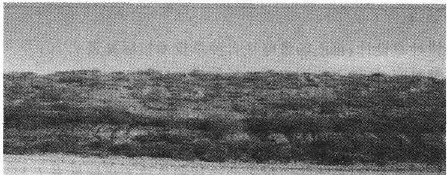  
图7.3 黑岱沟露天煤矿排土场边坡种植的沙棘

## 7.4 胜利露天矿内外排土场复垦工艺

## 7.4.1 内排土场复垦工艺

胜利煤田一号露天矿一期工程设计规模10Mt/a。该工程2004年完成开工前的准备工作，2005年正式开工；2006年按3Mt/a移交生产，生产剥采比为2.15m³/t;2007年达到规模 $5 \ \mathrm { M t / a }$ ，生产剥采比为2.15m³/t;2009年达到设计一期规模10Mt/a，生产剥采比为 $2 . 1 5 \ \mathrm { m } ^ { 3 } / \mathrm { t } .$

胜利煤田一号露天矿一期工程设计采用单斗一卡车+吊斗铲倒堆综合工艺方案，即5煤顶板以上剥离采用单斗—卡车工艺；5煤采用前装机—卡车工艺；5煤～6煤夹石层采用吊斗铲倒堆工艺；6煤采用单斗一卡车工艺。

目前6煤开采采用单斗一自移式破碎机一带式输送机半连续开采工艺，其余剥离采用单斗一卡车开采工艺。5号煤层选择大型液压正铲+液压反铲选采方案，即配大型履带推土机和轮式装载机采装，采用容积为 $1 8 ~ \mathrm m ^ { 3 }$ 和 $3 . 6 ~ \mathrm { { m } } ^ { 3 }$ 液压反铲，91t自卸卡车运输。平均生产剥采比首采区 $2 . 5 6 \mathrm { ~ m } ^ { 3 }$ /t、全矿 $2 . 6 6 \ \mathrm { m ^ { 3 } / t }$

内排土场下部为吊斗铲倒堆排土岩，上部为单斗一卡车排土，整个排弃土岩层与原地层柱状基本相同。内排土场在开始剥离时要将表土单独堆放，然后覆盖在到位的地表，在形成一定的工作面后，采取连续生产工艺，边开采边将表土覆盖在地表。覆土后，地表将成为一面积广阔的“人造平原”。

## 7.4.2 外排土场数量及复垦工艺

胜利露天矿计划4个外排土场，一采区东北侧约0.9km处，排土总容量为$1 2 8 . 0 0 ~ \mathrm { M m } ^ { 3 }$ ，总占地2.81km²；一采区东侧约0.5km处，排土总容量为49.30$\mathrm { { M m } } ^ { 3 }$ ，总占地1. $4 8 ~ \mathrm { \ k m } ^ { 2 }$ ；一采区东南侧约0.3 km处，排土总容量为 23.29$\mathbf { M m } ^ { 3 }$ ，总占地 $0 . 7 9 \ \mathrm { k m } ^ { 2 }$ ；紧邻一采区东北帮处，排土总容量为 $3 3 . 2 4 ~ \mathrm { M m } ^ { 3 }$ ，总占地 $1 . 5 0 ~ \mathrm { k m } ^ { 2 }$

外排土场位置选择在首采区初始拉沟地段地表境界外的西南侧，总占地面积 $5 . 1 7 ~ \mathrm { k m } ^ { 2 }$ 。为满足开采进度计划安排的 $8 9 . 1 0 ~ \mathrm { M m } ^ { 3 }$ 外排量，外排土场收容量为 $1 0 3 . 0 0 ~ \mathrm { M m } ^ { 3 }$ 。外排土场采用单斗一卡车排土，设计在开始剥离时要将表土单独堆放，在外排土场排弃土岩到达设计标高时，覆盖在地表，覆土后，地表将成为一梯田式人造假山。

排土场建成工程措施之后，其上要迅速恢复植被，以防止土壤水蚀和风蚀的发生，保持水土。在排土场的平缓地区，大面积种植能固氮的豆科植物如沙打旺、紫花苜蓿、草木樨、蒙古冰草、羊草、披碱草等，增加土壤有机质，培肥地力，改良土壤，达到人工草地可利用状态。文献166研究结果表明，种植沙打旺有显著提高土壤肥力的作用。沙打旺是一种抗逆性强、生长非常迅速的植物，在类似于黑岱沟矿区深层剥离土这样的土壤条件下，土壤肥力极低，几乎达到最低极限，种植沙打旺甚至种植任何植物都不会使土壤肥力下降很多。相反，由于沙打旺的固氨作用及其根系活动对土壤的其他作用，会使土壤的肥力得以提高。

在排土场内边坡上进行沙棘、丁香、柠条、豆科与禾本科植物的混合种植，适当栽植乔木，以防风固坡为目的，发展成永久性植被。文献[125]分析结果表明，在草原露天矿区排土场边坡的恶劣环境和土壤条件下，栽培山杏和丁香等普通耐寒、耐旱灌木，很难在短时间形成郁闭人工林地，保持水土的效益不明显。而沙棘可以凭借其独特的生物固氮能力和耐逆境特性，迅速在排土场边坡形成郁闭度很高的人工林，有显著的护坡固土和土壤培肥作用，同时能明显改善坡下汇水区的土壤条件，使植被向中生的喜肥植物群落演替。文献[135]研究表明，在山杏和丁香林坡段，由于林冠郁闭度低，土壤透水性差，且无地表凋落物的阻留，径流将在降雨不久后产生，而且强度大，持续时间短。大量的表层土壤和盐分随降水流失，在坡下低洼地段形成暂时或永久积水，并使土壤发生轻度盐渍化，所以该坡段坡下植物群落演替为耐盐的水生植物种类，如香蒲、芦苇、小叶章等。沙棘人工林坡段由于林冠郁闭度高，地表有丰富的凋落物覆盖，截留或暂时截留大量的降水，其径流强度都远远低于山杏和丁香坡段。比较沙棘坡段与山杏、丁香坡段地表径流沟的密度和深度，其泥沙和盐分的流失量也大幅度减少。沙棘坡面的降水是在较长时间内缓慢而相对均匀地汇流于坡下，普通强度的降雨一般不会形成大规模积水；由于沙棘是一种固氮能力较强的植物，大量的氮素被降水浸提出来并汇流于坡下，使土壤的氮素含量明显提高，更有利于中生喜肥植物的生长，如刺菜、凤毛菊、苣荚菜、苍耳等，并保持较高的生物生产力。沙棘地段的土壤环境已接近半湿润地区的农田土壤条件，有非常好的开发利用前景。

因此，利用人工沙棘林护坡，应该作为草原露天矿区的土地复垦的一种重要模式。

## 7.4.3 逐年外排的剥离物量

胜利西一号露天矿在评价第一时段(2004～2009年)，规划开采煤总量为266.5Mt，剥离物排至外排土场，估计外排的剥离物57.29 $\mathbf { M } \mathbf { m } ^ { 3 }$ ，平均每年外排的剥离物9.55Mm³。在评价第二时段（2010～2015年)，规划开采煤总量为750.0Mt，剥离物排至外排土场，估计外排的剥离物 $1 6 9 . 0 ~ \mathrm { M m } ^ { 3 }$ ，平均每年外排的剥离物 $2 8 . 1 6 7 ~ \mathrm { M m } ^ { 3 }$ 。各年外排的剥离物量见表7.13。

表7.13 胜利西一号露天矿开采进度规划及剥离量预测
<table><tr><td rowspan=1 colspan=1>序号</td><td rowspan=1 colspan=1>生产年度</td><td rowspan=1 colspan=1>煤量/Mt</td><td rowspan=1 colspan=1>剥离量 $/  { \mathbf { M } }  { \mathbf { m } } ^ { 3 }$ </td><td rowspan=1 colspan=1>剥采比 $/ \mathbf { m ^ { 3 } } \cdot \mathbf { t ^ { - 1 } }$ </td></tr><tr><td rowspan=1 colspan=5>一   期</td></tr><tr><td rowspan=1 colspan=1>1</td><td rowspan=1 colspan=1>2004</td><td rowspan=1 colspan=1>0.75</td><td rowspan=1 colspan=1>1.60</td><td rowspan=1 colspan=1>2.15</td></tr><tr><td rowspan=1 colspan=1>2</td><td rowspan=1 colspan=1>2005</td><td rowspan=1 colspan=1>0.90</td><td rowspan=1 colspan=1>1.94</td><td rowspan=1 colspan=1>2.15</td></tr><tr><td rowspan=1 colspan=1>3</td><td rowspan=1 colspan=1>2006</td><td rowspan=1 colspan=1>3.0</td><td rowspan=1 colspan=1>6.45</td><td rowspan=1 colspan=1>2.15</td></tr><tr><td rowspan=1 colspan=1>4</td><td rowspan=1 colspan=1>2007</td><td rowspan=1 colspan=1>5.0</td><td rowspan=1 colspan=1>10.75</td><td rowspan=1 colspan=1>2.15</td></tr><tr><td rowspan=1 colspan=1>5</td><td rowspan=1 colspan=1>2008</td><td rowspan=1 colspan=1>7.0</td><td rowspan=1 colspan=1>15.05</td><td rowspan=1 colspan=1>2.15</td></tr><tr><td rowspan=1 colspan=1>6</td><td rowspan=1 colspan=1>2009</td><td rowspan=1 colspan=1>10.0</td><td rowspan=1 colspan=1>21.5</td><td rowspan=1 colspan=1>2.15</td></tr><tr><td rowspan=1 colspan=2>总   和</td><td rowspan=1 colspan=1>26.65</td><td rowspan=1 colspan=1>57.29</td><td rowspan=1 colspan=1></td></tr><tr><td rowspan=1 colspan=5>二   期</td></tr><tr><td rowspan=1 colspan=1>1</td><td rowspan=1 colspan=1>2010</td><td rowspan=1 colspan=1>10.0</td><td rowspan=1 colspan=1>21.5</td><td rowspan=1 colspan=1>2.15</td></tr><tr><td rowspan=1 colspan=1>2</td><td rowspan=1 colspan=1>2011</td><td rowspan=1 colspan=1>10.0</td><td rowspan=1 colspan=1>21.5</td><td rowspan=1 colspan=1>2.15</td></tr><tr><td rowspan=1 colspan=1>3</td><td rowspan=1 colspan=1>2012</td><td rowspan=1 colspan=1>10.0</td><td rowspan=1 colspan=1>21.5</td><td rowspan=1 colspan=1>2.15</td></tr><tr><td rowspan=1 colspan=1>4</td><td rowspan=1 colspan=1>2013</td><td rowspan=1 colspan=1>10.0</td><td rowspan=1 colspan=1>25.0</td><td rowspan=1 colspan=1>2.50</td></tr><tr><td rowspan=1 colspan=1>5</td><td rowspan=1 colspan=1>2014</td><td rowspan=1 colspan=1>15.0</td><td rowspan=1 colspan=1>37.5</td><td rowspan=1 colspan=1>2.50</td></tr><tr><td rowspan=1 colspan=1>5</td><td rowspan=1 colspan=1>2015</td><td rowspan=1 colspan=1>20.0</td><td rowspan=1 colspan=1>42.0</td><td rowspan=1 colspan=1>2.10</td></tr><tr><td rowspan=1 colspan=2>总   和</td><td rowspan=1 colspan=1>75.0</td><td rowspan=1 colspan=1>169.0</td><td rowspan=1 colspan=1></td></tr></table>

## 7.4.4 排土场覆土绿化面积的确定

胜利露天矿外排土场有南排土场、北排土场和沿帮排土场。这三个外排土 场排弃到界并达到最终标高时其绿化覆土面积见表7.14、表7.15和表7.16。

表7.14  
南排土场覆土绿化面积
<table><tr><td rowspan=1 colspan=1>水平/m</td><td rowspan=1 colspan=1>覆土位置</td><td rowspan=1 colspan=1>覆土面积/ha</td></tr><tr><td rowspan=2 colspan=1>∇1040</td><td rowspan=1 colspan=1>∇1040坡面</td><td rowspan=1 colspan=1>9</td></tr><tr><td rowspan=1 colspan=1>∇1040平盘</td><td rowspan=1 colspan=1>60</td></tr><tr><td rowspan=2 colspan=1>∇1025</td><td rowspan=1 colspan=1>∇1 025坡面</td><td rowspan=1 colspan=1>14</td></tr><tr><td rowspan=1 colspan=1>∇1025平盘</td><td rowspan=1 colspan=1>18</td></tr><tr><td rowspan=2 colspan=1>∇1 010</td><td rowspan=1 colspan=1>∇1 010坡面</td><td rowspan=1 colspan=1>15</td></tr><tr><td rowspan=1 colspan=1>∇1010平盘</td><td rowspan=1 colspan=1>21</td></tr><tr><td rowspan=2 colspan=1>∇995</td><td rowspan=1 colspan=1>∇995 坡面</td><td rowspan=1 colspan=1>18</td></tr><tr><td rowspan=1 colspan=1>∇995平盘</td><td rowspan=1 colspan=1>26</td></tr><tr><td rowspan=1 colspan=1>累计</td><td rowspan=1 colspan=1></td><td rowspan=1 colspan=1>181</td></tr></table>

表7.15  
北排土场覆土绿化面积
<table><tr><td rowspan=1 colspan=1></td><td rowspan=1 colspan=1>水平/m</td><td rowspan=1 colspan=1>覆土位置</td><td rowspan=1 colspan=1>覆土面积/ha</td></tr><tr><td rowspan=2 colspan=1></td><td rowspan=2 colspan=1>∇1040</td><td rowspan=1 colspan=1>∇1040坡面</td><td rowspan=1 colspan=1>14</td></tr><tr><td rowspan=1 colspan=1>∇1040平盘</td><td rowspan=1 colspan=1>60</td></tr><tr><td rowspan=2 colspan=1></td><td rowspan=2 colspan=1>∇1 025</td><td rowspan=1 colspan=1>∇1025坡面</td><td rowspan=1 colspan=1>19</td></tr><tr><td rowspan=1 colspan=1>∇1025 平盘</td><td rowspan=1 colspan=1>43</td></tr><tr><td rowspan=2 colspan=2>∇1 010</td><td rowspan=1 colspan=1>∇1 010坡面</td><td rowspan=1 colspan=1>21</td></tr><tr><td rowspan=1 colspan=1>∇1010平盘</td><td rowspan=1 colspan=1>24</td></tr><tr><td rowspan=2 colspan=2>∇995</td><td rowspan=1 colspan=1>∇995 坡面</td><td rowspan=1 colspan=1>21</td></tr><tr><td rowspan=1 colspan=1>∇995平盘</td><td rowspan=1 colspan=1>26</td></tr><tr><td rowspan=1 colspan=2>累计</td><td rowspan=1 colspan=1></td><td rowspan=1 colspan=1>228</td></tr></table>

表7.16  
沿帮排土场覆土绿化面积
<table><tr><td rowspan=1 colspan=1>水平/m</td><td rowspan=1 colspan=1>覆土位置</td><td rowspan=1 colspan=1>覆土面积/ha</td></tr><tr><td rowspan=2 colspan=1>∇1040</td><td rowspan=1 colspan=1>∇1040坡面</td><td rowspan=1 colspan=1>11</td></tr><tr><td rowspan=1 colspan=1>∇1040平盘</td><td rowspan=1 colspan=1>75</td></tr><tr><td rowspan=2 colspan=1>∇1025</td><td rowspan=1 colspan=1>∇1025坡面</td><td rowspan=1 colspan=1>12</td></tr><tr><td rowspan=1 colspan=1>∇1025平盘</td><td rowspan=1 colspan=1>12</td></tr><tr><td rowspan=2 colspan=1>∇1 010</td><td rowspan=1 colspan=1>∇1010坡面</td><td rowspan=1 colspan=1>13</td></tr><tr><td rowspan=1 colspan=1>∇1010平盘</td><td rowspan=1 colspan=1>14</td></tr><tr><td rowspan=2 colspan=1>∇995</td><td rowspan=1 colspan=1>∇995坡面</td><td rowspan=1 colspan=1>14</td></tr><tr><td rowspan=1 colspan=1>∇995平盘</td><td rowspan=1 colspan=1>15</td></tr><tr><td rowspan=1 colspan=1>累计</td><td rowspan=1 colspan=1></td><td rowspan=1 colspan=1>166</td></tr></table>

## 7.4.5 排土场覆土绿化面积所需表土量的确定

根据表7.14、表7.15和表7.16中各排土场确定的覆土绿化面积、表土的松散系数、表土的铺设厚度等参数，利用式(7.6)求得胜利露天矿各排土场的复垦所需的表土量，求得的结果见表7.17。

$$
V _ { \mathrm { 1 } } = S h / K _ { \mathrm { p } }\tag{7.6}
$$

式中 $V _ { 1 }$ ——待复垦的表土需方量，万 $\mathfrak { m } ^ { 3 }$

S———待覆土绿化面积，ha;

h—表土的铺设厚度，m，参照霍林河南露天矿排土场复垦表土铺设厚度为1.0m；

$K _ { \mathfrak { p } }$ ——表土的松散系数，这里取1.1。

表7.17  
胜利露天煤矿矿外排土场复垦需用的表土量
<table><tr><td rowspan=1 colspan=1>排土场</td><td rowspan=1 colspan=1>覆土面积/ha</td><td rowspan=1 colspan=1>需用的表土量 $/ \mathbf { M } \mathbf { m } ^ { 3 }$ </td></tr><tr><td rowspan=1 colspan=1>南排土场</td><td rowspan=1 colspan=1>181</td><td rowspan=1 colspan=1>1.645 45</td></tr><tr><td rowspan=1 colspan=1>北排土场</td><td rowspan=1 colspan=1>228</td><td rowspan=1 colspan=1>2.072 73</td></tr><tr><td rowspan=1 colspan=1>沿帮排土场</td><td rowspan=1 colspan=1>166</td><td rowspan=1 colspan=1>1.50909</td></tr><tr><td rowspan=1 colspan=1>累计</td><td rowspan=1 colspan=1>575</td><td rowspan=1 colspan=1>5.227 27</td></tr></table>

## 7.4.6 表土提供量的预测分析

表土提供量来自两个方面：一是各排土场的新征地，二是3a之中采掘场可剥离的表土量。根据胜利露天煤矿排土场绿化覆土规划，各排土场新征地的面积见表7.18。

表 7.18  
各排土场新征地面积
<table><tr><td rowspan=1 colspan=1>排土场</td><td rowspan=1 colspan=1>南排土场</td><td rowspan=1 colspan=1>北排土场</td><td rowspan=1 colspan=1>沿帮排土场</td></tr><tr><td rowspan=1 colspan=1>面积/ha</td><td rowspan=1 colspan=1>92.343 4</td><td rowspan=1 colspan=1>130.873 8</td><td rowspan=1 colspan=1>203.321 6</td></tr><tr><td rowspan=1 colspan=1>合计/ha</td><td rowspan=1 colspan=3>426.538 8</td></tr></table>

如果剥离范围内的表土厚度按1m计算，由表7.18可得各排土场的新征地能提供的表土量为 $4 , 2 6 5 \ 3 8 8 \ \mathrm { M m } ^ { 3 }$ 。另外，3a之中采掘场可剥离的表土量为$0 , 6 0 \ \mathrm { M m } ^ { 3 }$ 。这两项共产生的表土量为 $4 . 8 6 5 ~ 3 8 8 ~ \mathrm { M m } ^ { 3 }$ 。该值和外排土场复垦需用的表土需求总量 $5 , 2 2 7 \ 2 7 \ \mathrm { M m } ^ { 3 }$ 相比还差 $0 . 3 6 1 8 8 \mathrm { M m } ^ { 3 }$

若3个排土场新征地表土厚度按1.1m计算，则可产生表土量4.692$\mathbf { M m } ^ { 3 }$ 。加上3a之中采掘场可剥离的表土量为 $0 . 6 ~ \mathrm { M m } ^ { 3 }$ ,共 $5 , 2 9 2 \ \mathrm { M m } ^ { 3 }$ 。此时正好能满足3个排土场复垦需用的表土需求总量，仅多了 $6 4 ~ 7 3 0 ~ \mathrm { m } ^ { 3 }$ 。因此3个排土场新征地表土厚度不得小于1.1m。

## 7.4.7 胜利露天矿外排土场的植被恢复

草原地区露天矿大量剥离物形成的巨大排土场，将会对周围环境产生严重的影响，导致水土流失加剧，土壤盐渍化，草场退化。因此，排土场的水土保持和植被恢复是草原露天矿区环境治理的关键和重点。

根据表土提供量的预测分析，3个排土场新征地表土厚度不得小于1.1m，否则，3个外排土场的表土需求量就满足不了要求。这对处于生态环境非常脆弱的锡林郭勒草原的胜利矿来说是一个严峻的挑战，因为矿区沙化严重，地表土非常薄，仅有0.5～3m厚，表土资源对胜利矿来说，是一种稀缺资源。一方面矿区四周都是草原，土源难寻；另一方面，即使找到土源，价格也昂贵。从长远的角度来看，胜利矿的生态重建与恢复工作任务非常艰巨。那么能否从现有的露天矿排土场的排弃物着手，对其进行改良，实现矿区的内外排土场的生态恢复与重建呢？这对于胜利矿的生态重建工作将是一个非常积极、具有重要的现实意义而且值得探索研究的问题。

胜利露天矿现有排土场的排弃物80%是泥岩，其余为粉砂岩。而从重金属污染分析评价中我们知道，金属镉(Cd)的浓度的变化趋势随着深度的增加而增加，在泥岩中达到最大值，为0.995mg/kg，超出表土的自然背景值(0.3336mg/kg)，在排土场中种植喜镉植物，进行喜镉植物的筛选培育将是胜利矿排土场生态重建中植被恢复的重要研究方向。同时对泥岩的熟化改良技术也要进行研究。因为泥岩本身有机质含量少，结构致密，孔隙率小，这些因素对植物的生长很不利。因此泥岩的“熟化”与植物栽培技术的研究势在必行。

参照霍林河煤矿多年的土地复垦工作经验[150]，霍林河煤矿东排土场最初形成于1985年，1992年起部分到界，平台面积近200ha，是矿区最大的外排土场。由于露天煤矿开采排土的随机性，表层的暗栗钙土都被深埋在排土场的最下层，大部分排土场的表层都是100m以下的绿色泥岩土。因此，排土场整治的主要任务是表层土壤以绿色泥岩土为主的排土场平台的治理，占总面积的80%以上，其治理难度甚至比同类型土壤的边坡更大。因为，相对于边坡这种特殊地形条件，平坦的排土场平台，在冬、春多风的季节，更容易受风蚀的影响。而草原地区风蚀的危害比水蚀更加普遍和严重。在草原露天矿区排土场边坡的恶劣环境和土壤条件下，栽培山杏和丁香等普通耐寒、耐旱灌木，很难在短时间形成郁闭人工林地，保持水土的效益不明显。而沙棘可以凭借其独特的生物固氮能力和耐逆境特性，迅速在排土场边坡形成郁闭度很高的人工林，有显著的护坡固土和土壤培肥作用。同时能明显改善坡下汇水区的土壤条件，使植被向中生的喜肥植物群落演替。因此，利用人工沙棘林护坡，应该作为草原露天矿区的土地复垦的一种重要模式。

根据文献[150]，沙棘不仅成活率高(85%以上)，而且5a之后即达到郁闭，平均株高达到2.5m，其林下固留大量的凋落物（主要为沙棘落叶，厚达5～10cm)，草本植物开始在林下发育，主要为羊草和一些中生的藜科植物，在灌丛间的一些空地，出现面积大小不等的纯羊草斑块，其长势和地面生物量均高于该区典型羊草草原。尤其是靠近拦水堰附近的沙棘灌丛，由于高1m左右的拦水堰形成的避风效果，林下固留了大量的风蚀物和凋落物，土壤养分和理化特性大幅度改善，因此，沙棘生长更加迅速，植株高度达到3.5\~5m，枝条更加粗壮和茂密。灌丛内开始有许多鸟类和小型哺乳动物出现，生态环境明显改善。1993年春起，在到界部分开始土地复垦对比实验。其中人工沙棘带5ha(排土场平台边缘拦水堰内侧)，刺梅与丁香各3ha，自然恢复5ha(行车道两侧)。实验结果表明，山杏、丁香等灌木虽然可以成活，但是其纯“林”的平均株高始终维持在0.5m左右，虽然每个生长季可生长0.2\~0.3m，但冬春季节发生枯梢现象后又恢复到原来的高度，生长十分缓慢，至1999年树冠盖度仍在10%～20.%之间，难以形成郁闭灌丛。由于所植苗木间距过大(行距2m，株距1.5m)，呈整齐的矩形排列，灌丛内自然形成笔直的通风道，风蚀严重，凋落物很少能在灌丛下固留，地表仍为光秃的裸地，只有少量大籽蒿、猪毛菜等先锋物种。在比较平坦开阔的地段，排土多年(7a)一直是光秃的裸地，仅有稀疏的耐贫瘠的季节性先锋植物生长，如大籽蒿、猪毛菜等，很难形成有规模的植物群落。因此，平坦的泥岩土平台植被的自然恢复在短时期内几乎是不可能的。但在一些比较低洼的地段，由于泥岩土渗透性较差，在雨季可以形成季节性汇水，则出现水生植物群落，包括芦苇(Phraagmites australis)、香蒲(Typha angustifolia)和小叶章(Calama-grostis angustifolia)等，这种现象在排土场平台随处可见。在略有起伏的避风地形，因风蚀物和地表凋落物的堆积，形成盖度和生物量很高的羊草+藜科杂类草群落。根据排土场平台植被在不同地形条件的恢复情况，结合沙棘、丁香、刺梅、金老梅等灌木丛下草本植物群落的发育特点，可以推断出：限制绿色泥岩土排土场平台植被恢复的主要因素是严重的风蚀作用，导致植物种子和凋落物无法就地存留，土壤养分和保水能力始终得不到改善。

因此，如何减弱排土场强烈的风蚀作用，将成为该类型排土场治理的快速有效的关键措施。这一结论在1998年霍林河煤矿进行的复垦实验中也得到了验证。在稀疏的丁香和刺梅灌丛补栽沙棘，使原有灌木的株行距减小，阻断风道，降低风蚀作用，凋落物覆盖区开始由灌木根部不断向周围扩大，至2000年，灌丛下开始出现一定厚度(2～5cm)的地表凋落物覆盖层，林下草本植物也更加丰富。

文献研究发现191]，猪毛菜属藜科、一年生草本植物，喜光，耐干旱贫瘠，多生于原生植被破坏后的农田和撂荒地，是排土场最常见的先锋植物，可以在水分条件好的时期迅速生长，单株植物生物量可达500g(干重)，冠幅可达0.5m²，是比较理想的水土保持和土壤培肥植物。在半干旱草原地区，猪毛菜等藜科先锋植物总是最先出现在原生植被(羊草一针茅草原)被破坏的撂荒地和矿山排土场，形成具有一定生物量的单一植物群落。3～5a后，开始出现小的纯羊草植物斑块，随着羊草斑块的扩大，猪毛菜等先锋植物逐渐被羊草群落取代。最后，针茅开始侵入，整个过程大约持续15\~20a。

猪毛菜根系浅，冠幅大，易受风力作用形成风滚，很难在多风的排土场边坡长期停留，使其利用受到限制。然而，沙棘灌从和于枯的猪毛菜均具有多刺而蓬松的生物学特性，相互间有天然的亲和能力，接触后可形成一定强度的粘连，如同多钩环的尼龙扣带。所以，深根系的沙棘灌丛对猪毛菜有非常强的固留作用。边坡上风滚植物覆盖斑块的形成主要取决于斑块上限(坡上)的沙棘灌丛能否对冬春季节快速滚动的猪毛菜截留成功。一旦有较大个体的风滚植物被多刺的沙棘灌丛截留，那么该风道上滚动的所缺外源猪毛菜与其相互间的粘连而被截留并向两侧和坡下延伸，形成一定形状、厚度和面积的风滚植物覆盖斑块191]。

另外，沙棘对山杏和丁香的生长有明显的促进作用，不仅新栽的沙棘高度达到1.5m左右，而且丁香、刺梅的平均高度也从0.5m长高到0.8\~1.1m，远远优于纯丁香和刺梅灌丛的生长状况。根系发达的灌木可迅速降低土壤容重，沙棘生长可使绿色泥岩土的土壤容重由 $1 . 5 1 ~ \mathrm { \& } / \mathrm { c m } ^ { 3 }$ 下降到 $1 . 3 5 ~ \mathrm { g } / \mathrm { c m } ^ { 3 }$ ，降水的初渗速度加快，有利于土壤的水分吸收；灌丛对风蚀物和凋落物有良好的固留作用，增加了土壤有机质的含量，加快表层土壤的熟化速度。另外，沙棘为非豆科固氮植物，其土壤中有机质的含量，在5a内可由1.45%提高到6.83%，总氮的含量由0.06%提高到0.10%，已经接近暗栗钙土中的有机质水平。以沙棘为核心，辅之以灌木和草本植物而构成的灌草结合体系，既可以加速排土场的植被恢复进程，又改良了土壤的理化性质，实现了排土场的绿化美化，是排土场平台复垦与生态重建的有效模式之一。

## 7.5 小结

（1）矿山生产期间，剥离物的排弃要按照排土场的设计规划有计划地进行，在排土场安全、稳定的前提下，为了减少露天矿排土场裸露的岩石对周围环境的危害，缩短复垦周期及提高复垦效益，要求对排土场中排弃到界的区域及时地进行复垦。为了尽早将被破坏的土地加以复垦利用，排土作业和复垦作业应当有机地结合起来，使采矿、排土和复垦作业融为一体，相互兼顾，从而实现剥离和与复垦一体化的平行作业。

(2)草原地区露天矿大量剥离物形成的巨大排土场，将会对周围环境产生严重的影响，导致水土流失加剧，土壤盐渍化，草场退化。因此，排土场的水土保持和植被恢复是草原露天矿区环境治理的关键和重点，对处于生态环境非常脆弱的锡林郭勒草原的胜利矿来说是一个严峻的挑战。因为矿区沙化严重，地表土非常薄，仅有0.5～3m厚，表土资源对胜利矿来说，是一种稀缺资源。一方面矿区四周都是草原，土源难寻，另一方面，即使找到土源，价格也昂贵。从长远的角度来看，胜利矿的生态重建与恢复工作任务非常艰巨。那么，能否从现有的露天矿排土场的排弃物着手，对其进行改良，实现矿区的内外排土场的生态恢复与重建，对于胜利矿的生态重建工作将是一个非常积极、具有重要的现实意义而且非常值得探索研究的问题。

(3)参照霍林河煤矿多年的土地复垦工作经验，在草原露天矿区排土场边坡的恶劣环境和土壤条件下，栽培山杏和丁香等普通耐寒、耐旱灌木，很难在短时间形成郁闭人工林地，保持水土的效益不明显。而沙棘可以凭借其独特的生物固氮能力和耐逆境特性，迅速在排土场边坡形成郁闭度很高的人工林，有显著的护坡固土和土壤培肥作用。沙棘是草原露天矿排土场最理想的复垦植物，可以在短时期内(3～5a)在排土场边坡(包括平台)的绿色泥岩土上，形成郁闭的人工沙棘灌丛，其土壤培肥和水土保持效果显著。同时能明显改善坡下汇水区的土壤条件，使植被向中生的喜肥植物群落演替。因此，利用人工沙棘林护坡，应该作为草原露天矿区的土地复垦的一种重要模式。

限制绿色泥岩土排土场平台植被恢复的主要因素是严重的风蚀作用，导致植物种子和凋落物无法就地存留，土壤养分和保水能力始终得不到改善。严重的风蚀作用是限制排土场平台植被恢复的主要因素，而一定密度的人工灌丛可以大幅度减轻排土场平台的风蚀强度，固留大量的风蚀物、凋落物，迅速改良表层土壤，加速植被的恢复。因此，以沙棘为主的人工灌丛，应该成为排土场环境综合整治的主要模式而进行推广。

## 8 露天矿生产与生态重建适宜性评价专家系统

## 8.1 概述

矿山开采对土地破坏的治理就是在条件许可的条件下建立一个与当地自然界相和谐的人类生态系统，或建立一个自然生态系统，以弥补和充实该地区原有的自然界，真正实现可持续发展。由于治理本质上都是生态学的，所以将矿山开采对土地破坏的治理概括为生态重建。

矿区生态建设不是在采矿出现环境问题后才采取的一种后患处理措施，而是在开采之前就预测可能发生的环境问题，在开采中尽量避免或减少对环境的破坏，对策是超前的；其追求的目标不是原始的环境，而是主动按照采矿的时空发展顺序和最终人类的需求及价值取向对生态系统的组成、结构和功能进行积极的设计与调控，重建一个高水平可持续的支持系统，其对策是主动的。

露天矿生产与生态重建一体化系统突破传统单一的矿区土地复垦或闭坑后再进行矿区环境治理的传统模式，使矿山开采的各个作业环节与生态重建作业的各个环节能最佳配合，以产生最大的经济效益、社会效益和生态环境效益。

露天矿生产与生态重建一体化适宜性评价研究的主要内容是对待复垦土地的生态重建进行适宜性评价。待复垦土地大多地形尚未成型，属未来空间，但可以根据可能出现的立地类型进行适宜性评价，实现对生态系统的组成、结构和功能进行积极的安排和调控。

## 8.2 待复垦土地适宜性评价方法

待复垦土地适宜性评价是对矿山废弃地自然属性和社会经济因素进行综合鉴定，阐明其所具有的生产潜力和对农、林、牧、副、渔等各业生物生长及其他用途(如建筑用地)的适宜性。目前复垦土地适宜性评价的方法主要有主导因子评价法、多因素单方向评价法和多因素综合评价法[141]。

多因素单方向评价法是根据评价单元的评价因子，对不同的评价因子赋予不同的权重，最后和评价标准比较，得到评价单元的适宜性并找出指定利用方向的限制因素，以便在复垦利用时克服。

多因素综合评价法对不同的复垦利用方向，其影响因素不尽相同，因素间的重要性也不相同，通常采用层次分析法、多元回归分析方法确定评价因子的权重，最后建立多方向综合适宜性决策模型，得到最佳的复垦方法。

这里采用主导因子评价法进行评价，其主要特点是将评价单元与评价标准进行直接比照，定性确定评价单元与适宜类之间的匹配关系，容易实现对待复垦土地的适应性进行分类(如宜农类、宜林类等)及对每种分类的较好分级。

## 8.3 复垦土地适宜性评价等级体系

目前，我国复垦土地适宜性评价尚没有建立统一的等级体系，卞正富[141]提出了纲一类一级一型四组的复垦等级体系，具体内容见表8.1。前苏联提出了按复垦土地在经济建设中的作用和自然环境保护目的土地利用方向进行分类。

复垦土地适宜性评价纲一类一级一型等级体系
<table><tr><td rowspan=1 colspan=1>层次</td><td rowspan=1 colspan=1>下一层次</td><td rowspan=1 colspan=1>含    义</td></tr><tr><td rowspan=2 colspan=1>纲</td><td rowspan=1 colspan=1>适宜纲</td><td rowspan=1 colspan=1>已具备复垦条件的矿山废弃地</td></tr><tr><td rowspan=1 colspan=1>暂不适宜纲</td><td rowspan=1 colspan=1>由于正在破坏或受复垦技术条件等因素限制暂不适宜复垦的矿山废弃地</td></tr><tr><td rowspan=6 colspan=1>类</td><td rowspan=1 colspan=1>宜农类</td><td rowspan=1 colspan=1>适宜复垦为农业，主要是种植用地</td></tr><tr><td rowspan=1 colspan=1>宜林类</td><td rowspan=1 colspan=1>适宜复垦为林木，果树栽培用地</td></tr><tr><td rowspan=1 colspan=1>宜建类</td><td rowspan=1 colspan=1>适宜复垦为矿山或居民建设用地</td></tr><tr><td rowspan=1 colspan=1>宜渔类</td><td rowspan=1 colspan=1>适宜复垦水产养殖用地</td></tr><tr><td rowspan=1 colspan=1>宜牧类</td><td rowspan=1 colspan=1>适宜复垦为放牧用地</td></tr><tr><td rowspan=1 colspan=1>其他适宜类</td><td rowspan=1 colspan=1>适宜其他用地的废弃地</td></tr><tr><td rowspan=3 colspan=1>级</td><td rowspan=1 colspan=1>一级</td><td rowspan=1 colspan=1>在某适宜类下，土地自然属性最适宜其用途的</td></tr><tr><td rowspan=1 colspan=1>二级</td><td rowspan=1 colspan=1>在某适宜类下，土地自然属性中等适宜其用途的</td></tr><tr><td rowspan=1 colspan=1>三级</td><td rowspan=1 colspan=1>在某适宜类下，土地自然属性不太适宜其用途的</td></tr><tr><td rowspan=1 colspan=1>型</td><td rowspan=1 colspan=1>各种限制型</td><td rowspan=1 colspan=1>一级适宜类下基本不受限制，二、三级适宜类下，土地复垦利用受到某些因素限制，如裂缝限制型、坡度限制型、排水不畅限制型</td></tr></table>

由于黄土高原区主要限制因素的农林牧评价等级标准涉及因素较多，而且安太堡露天矿待复垦土地的立地类型较为复杂(主要立地类型有厚层覆土平台、

薄层覆土坡、岩土混排坡和泥岩碎砾坡)，依靠传统的专家经验的方法难以准确、及时地进行科学的评价，所以采用计算机专家系统来实现及时、准确、科学的评价。

## 8.4 生态重建适宜性评价专家系统

计算机专家系统是一种智能的计算机程序，它运用知识和推理来解决只有专家才能解决的问题。自20世纪80年代以来，各式各样的专家系统遍及各类专业领域。文献[18]根据Ramganjmandi矿区的自然和文化属性，建立了土地利用方向的计算机模型，为该矿的采后复垦及土地利用方向的最佳决策提出了快速、便捷的分析工具。文献[10,17，41，42,68]根据大型露天煤矿生产的特点，建立了生产与生态重建一体化土地适宜性评价专家系统。

## 8.5 专家系统的知识表示与推理

专家系统中，知识被定义为人类专家在某个特定领域内的专业知识，包括经验知识、启发性知识、规则等。在现实生活中，对问题的求解大致分为两个领域：一个是数据世界领域；一个是现实世界领域。传统的计算机技术已经表明了它具有解决数据世界问题的强大能力，但如何在计算机中正确地表示知识，使计算机懂得知识，能对知识进行处理，并将处理结果告诉人们。显然，没有知识表示就谈不上运用知识，知识的表示方法通常会直接影响到问题求解的效率。

所谓知识表示，就是通过某种语言或媒介来描述某个领域的内容。在专家系统中，对知识进行处理的首要问题是解决如何表示知识的问题，即如何把人类的知识逻辑地表示出来，并将它存储在计算机上。同时，知识表示的工作还包括对这些存储信息进行推理演变的发展过程。目前，常用的知识表示方法有产生式表示、语义网络表示、框架表示和面向对象表示等。下面对本系统运用到的产生式表示方法进行简要介绍。

## 8.5.1 产生式规则的知识表示

知识的产生式表示是用产生规则来表示知识的方法。目前，比较成功的专家系统大都采用了这种基于规则的产生式知识表示模式[147-149]。这种方法在产生式系统中被用来表示问题域的一般性知识。

产生式规则是一个表示“如果条件成立则进行操作或得出结论”的单一形式描述语句。即：

IF<条件>THEN<结论或动作>  
在专家系统中，产生式规则的一般形式为：  
IF<条件成分1>  
<条件成分2>  
<条件成分n>  
THEN<操作1>〔或<结论1>〕  
<操作2>〔或<结论2>）  
<操作n>〔或<结论n>〕

产生式描述了事物之间的一种对应关系，这种对应关系包括因果关系和蕴含关系。这种知识表示的优点在于容易描述事实、规则以及它们的正确性度量，表示格式固定，形式也比较简单。一个产生式就是一条知识。

## 8.5.2 产生式系统

产生式系统是迄今使用最多的知识表示系统之一。产生式系统的结构见图8.1。它由产生式规则库、推理机、动态数据库三个基本部分组成。

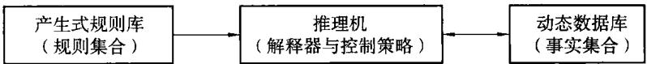  
图 8.1 产生式系统的基本结构

## 8.5.2.1 产生式规则库(知识库)

知识库是专家系统的核心组成部分，用于存储从专家那里得到的关于某一特定领域的专门知识和经验，这些知识和经验是决定专家系统能力的关键。产生式系统中的每条规则都是一个“IF条件THEN操作”的产生式，所有规则组成一个产生式规则库，也可以把规则库看做是一个存储某个领域知识(规则)的知识库。在经典的产生式系统中，规则库中的规则是相互独立的，规则之间不互相调用，充分体现了模块化。

产生式规则的作用是对动态数据库进行操作。规则的前件(条件成分LHS)描述了要应用规则时必须满足的条件。规则前件是否满足以当前动态数据库存在的事实为依据，如果动态数据库中存在某个事实与规则的前件一致，则规则的前件满足，相应规则将被激活使用。规则的后件(操作或结论RHS)一般是能引起动态数据库状态发生变化的断言或操作。与动态数据库不同的是，规则库中所存储的知识(规则)不是关于某一具体的特点问题的，而是关于整个应用领域的，因此规则库相对而言比较稳定。

## 8.5.2.2 推理机(控制策略器)

推理机是专家系统的核心，是人类专家思维机制的一种算法表示和机器实现。它包括推理机制和控制策略，是一组根据知识库进行各种搜索和推理的程序模块，用于控制系统的运行和执行各种任务。其中推理部分是运用已有的知识和规则去推理，以谋求新的结论，而控制策略的作用是确定运用规则进行推理的顺序，并决定下一步的工作。在产生式系统中，控制策略则规定如何选择一条可应用的规则来执行。

在产生式系统中，推理机也称控制策略器，是一个规则解释程序，它决定问题求解过程的推理路线。推理机包含推理方式和控制策略。根据推理的方向，产生式系统的推理方式分为正向推理、反向推理和双向推理3种。

## 8.5.2.3 动态数据库

动态数据库也称全局数据库、综合数据库、黑板等，是产生式系统所使用的主要数据结构，用来存放问题求解过程中的各种当前信息，包括初始事实数据、推理的中间结果和最终的结论等。

## 8.5.3 产生式系统的推理过程

## 8.5.3.1 推理过程

产生式系统的运行是从初始事实出发，通过推理查找达到目标条件的路线，进行问题求解。也可以把产生式系统的运行过程看成是一个推理的过程。推理执行过程一般都包含三个主要的阶段，即模式匹配、冲突消解和操作。

产生式系统推理过程的第一阶段是模式匹配阶段，其任务是根据动态数据库中已存在的事实，在规则库中寻找可用规则，组成可用规则集。

第二阶段是冲突消解阶段，其工作是按照某种准则，从可用规则集中选择一条规则作为当前要执行的规则并启用之。一般说来，可用规则集存在着许多可供选择的规则，但不是每条可用规则都能被启用，这就需要进行冲突消解工作。冲突消解的方法很多，常用的策略有：

①按规则的优先级别启用优先权最高的规则；

②按照Agenda方法选择启用规则，该方法规定一条规则仅可执行一次；

③优先启用最近使用过的规则或使用率最高的规则；

④将所有的规则进行线性排序，优先启用排在前面的规则；

⑤优先启用所含条件较多的规则，若两条规则所含的条件个数一样，则优先启用所含结论或操作较多的规则。

一般说来，一些大型的系统常采用几种方法的组合来提高冲突消解的功效。

第三阶段是操作阶段，即执行启用规则，执行的结果作用于动态数据库，以完成对动态数据库的更新。模式匹配和冲突消解合称为推理的识别周期，操作称为推理的操作周期。由此可见，产生式系统的执行过程就是“识别一操作”周期的重复循环过程。在识别周期中选择的启用规则，在操作周期中被执行，从而更新了动态数据库的内容，使得下一个识别周期选择不同的启用规则。这个“四配一冲突消除一操作”的反复循环，其结果只有两种可能：一是动态数据库中的内容最终包含目标状态，问题得解；二是规则集中再没有可用规则可以选择，问题求解失败。

## 8.5.3.2 推理方向

产生式系统的推理方式分为正向推理、反向推理和双向推理3种，下面主要介绍本系统采用的正向推理。正向推理又称数据驱动推理，它是从已知事实出发，通过规则库逐步推导出结论的过程。正向推理的过程大致如卜：

①将动态数据库中的初始事实与产生式规则的前件进行匹配，并将匹配成功的规则加入可用规则集；

②按冲突消解策略从可用规则集中选取一条启用规则；

③执行启用规则，用启用规则的结论或动作更新动态数据库内容；

④用更新后的动态数据库的状态和推导规则重复上述步骤，直到动态数据库中的某些中间结果恰好是求解问题的结论，或再也推不出任何新的结论为止。

相对而言，正向推理比较容易实现，而且系统能迅速地对使用者输入的信息作出反应，但算法处理的开销较大。

## 8.5.4 产生式系统的分析与评价

## 8.5.4.1 产生式系统的优点

①模块性。在规则库中，全部规则以“前件一后件”的统一形式表示，规则间不相互调用，每条规则可自由地增删和修改，为规则库的建立、扩展和完善提供了可管理性。

②全局性。动态数据库是系统各规则相互作用的唯一场所，可被所有规则访间。规则间的关系只能通过动态数据库间接地表示出来，这种性质使推理机制简单明确，易于控制和操作。

③自然性。产生式的“如果……，那么……”知识结构和推理机接近人类的思维方式，知识表示直观自然，易于理解。

④表层知识的有效表达。在表达人类在一个特定领域关于“怎么做”的过程性知识时，用规则提供的“如果…….那么……”型表达方式非常方便。另外，

产生式系统的推理方式单纯，没有复杂的计算，实现起来比较容易。

## 8.5.4.2 产生式系统的缺点

①非透明度性。虽然每条规则易于表达和理解，但由于规则间不能相互嵌套，也不相互调用，所以难于对知识的整体形象作出解释；

②大型系统的推理效率降低；

③解释能力的局限性。

## 8.6 专家系统工具 CLIPS 原理

CLIPS 是 C Language Integrated Production System(C 语言集成产生式系统)的首字母缩略词。它是Johnson太空中心NASA所开发的一个基于规则的专家系统工具147]，其基本组成有三部分：一是事实库，用于存储数据(事实)；二是知识库，包括所有规则；三是推理机，用于控制推理程序的执行。

## 8.6.1 事实表示

为了解决一个问题，CLIPS必须有数据或事实，然后根据这些数据或事实进行推理。在CLIPS中，一个信息块被称为事实。事实由关系名（一个符号字段)、后跟零个或多个槽以及它们的相关值组成。整个事实以及每个槽由一对左、右括号括住。例如事实person表示为：

```lisp
(person (name “John Q. Public")
(age 23)
(eye—color blue)
(hair—color black))
```

符号 person 是事实的关系名，此事实包括4个槽：name、age、eye— color、hair—color，槽 age 的值是 23 等。

## 8.6.2 自定义模板结构

事实被创建之前，必须告知CLIPS一个给定关系名的合法槽的列表。共享相同的关系名和包含共同的信息的几组事实用自定义模板结构来描述。自定义模板的一般格式是：

```clojure
(deftemplate <relation—name>
<slot—definition>)
<slot—definition>的语法描述定义为：
(slot <slot—name>)
```

(deffacts people “some people we know"   
(person (name “John Q. Public")(age 23)   
(eye—color blue)(hair—color black))   
(person (name “Jack S. Public")(age 24)   
(eye—color blue)(hair—color black))   
(person (name “Jane Q. Public")(age 35)   
(eye—color green)(hair—color red))   
自定义事实结构的一般格式为：   
(deffacts <deffacts name [optional comment]>   
<facts>)

使用这种语法，事实person可描述成下面的自定义模板：

```lisp
(deftemplate person
(slot name)
(slot age)
(slot eye—color)
(slot hair—color))
```

## 8.6.3 自定义事实结构

能够自动声明一组事实，而不用在顶层键入相同的声明信息，这是很方便的。这特别适合在程序运行前已知是正确的事实(即初始知识)。表示初始知识的一组事实可使用deffacts(自定义事实)结构来定义。例如，下面的自定义事实语句提供了已经遇到的一些人的初始信息：

自定义事实关键词后面是本结构必须有的自定义事实名。本例中选取的自定义结构名为people。此名字后面的方括号中的选项是可选的注释。名字或注释后面是事实，它将被此自定义事实语句声明到事实列表中。

## 8.6.4 规则的组成

## 8.6.4.1 规则的定义

为了使专家系统能够工作，必须具有规则，在专家系统工具CLIPS中，规则的定义用defrule命令，其格式为：

(defrule <rule—name>   
<<patters>>   
=>   
<<actions>>)

整条规则必须用括号括起，规则中的每一个模式(patter)和行为(action)也必须括起。一条规则可能有多个模式和行为。defrule命令的例子如下：

$$
\begin{array} { r l } & { ( \mathrm { d e f r u l e ~ f i r e ~ - e m e r g e n c y ~ ^ { * } A n ~ e x a m p l e ~ r u l e } ^ { p } } \\ & { \qquad \mathrm { ( e m e r g e n c y ~ ( t y p e ~ f i r e ) ) } } \\ & { \qquad \mathrm = > } \\ & { \qquad \mathrm { ( a s s e r t ~ ( r e s p o n s e ~ ( a c t i o n ~ a c t i v e - s p r i n k l e r - s y s t e m ) ) ) } ) } \end{array}
$$

规则的开头包括三个部分，它必须以关键字defrule开头；第二部分是规则名，在本例中规则名是fire一emergency，接下来是可选的注释字符串。

在规则头之后是零个或多个条件元素。最简单的条件元素是模式条件元素或只是模式。每一个模式由一个或多个约束构成，其目的是匹配自定义模板事实中的字段。在 fire— emergency规则中，模式是（emergency（type fire)）。Type 字段的约束表示这一规则只满足在 Type 字段中包含符号 fire 的 emer-gency事实。CLIPS使规则的模式和事实列表中的事实相匹配。如果规则的所有模式和事实匹配，则规则就被激活并放入议程(已被激活的规则集合)。

规则中模式后面是一个箭头，由等号和大于号组成。箭头是IF…THEN规则中THEN部分开始的标记。箭头前的规则部分称之为左部(LHS)，箭头后是规则的右部(RHS)，也就是动作部分，给出动作表。

规则的最后一部分是行为列表，当此规则触发时这些行为就会被执行。本例中这个行为是声明事实(response（action active一sprinkler一system))。触发是指CLIPS执行议程中某条规则的行为。当议程中没有规则时，CLIPS正常地停止执行。当议程中有多条规则时，CLIPS会自动决定哪条要触发的规则。CLIPS按从低到高的优先级对议程中的规则排序，并触发优先级最高的那条规则。

## 8.6.4.2 使用复合规则

到现在为止提到的都是只有一条规则组成的最简单的程序。然而仅有一条规则组成的专家系统没有多少应用的价值。实际的专家系统可能由成百上千条规则组成，不能仅用一种简单模式来表达规则。例如，对扑灭不同类型的火灾，采用的灭火剂是不同的。对于普通易燃物如纸、木等的火灾(A类火灾)可以用水剂灭火器扑灭；对于易燃液体、油脂类材料的火灾(B类火灾)只能用二氧化碳灭火器来扑灭。此时需要采用多模式的规则来表示。采用灭火系统的自定义模板和一组规则来表示：

```lisp
(deftemplate extinguish—system
(slot type)
(slot status))
```

$$
 \begin{array} { r l } & { { \langle \operatorname* { d e f m l e } \ \operatorname { c h a s s } - \operatorname { A - f r e c o n r e t e r g } { \mathrm { ~ e x f r e e } } \ \operatorname { c h e s e } \rangle } } \\ & { \qquad { \langle \operatorname { c e n e r g e t e r g } \ ( \operatorname { v } \wp \in \operatorname { A s s } - \operatorname { A - f i r e c y } ) \ } } \\ & { \qquad { \langle \operatorname { c e x t i n g u i t i o n - y s t e r o n } \ ( \operatorname { v g e } \ \operatorname { e x p s e r o i t e r } - \operatorname { s p i n i k i e r } ) } } \\ & { \qquad \quad { \langle \operatorname { s t a n s t e r o f } \ ( \operatorname { v } ) } } \\ & { \qquad \quad - \geqslant } \\ & { \qquad { \langle \operatorname { p r i n t o f } \ \operatorname { t e } \operatorname { a s } \operatorname { \delta - } \operatorname { a t c i n v a t e ~ s q r o } \ \operatorname { v a r i n k i e r } ^ { \prime } \ \operatorname { e x t f i } { \mathrm { ) } } } ) } \\ & { \qquad { \langle \operatorname { d e f r a l e c } \operatorname { f i s s } - \operatorname { B - f i r e c o n r e r g e n e r g } { \mathrm { ~ e x p e r o i t e r } } { \mathrm { ) } } } } \\ & { \qquad { \langle \operatorname { c e n e r g e n e r g } \ ( \operatorname { v p e } \ \operatorname { e x p s e } - \operatorname { B - f i r e c y } ) \ } } \\ & { \qquad { \ \langle \operatorname { c e x t i n g u i t i o n - y s t e m } \ ( \operatorname { v p e } \ \operatorname { c a r s h o n - d i o n s i d e } ) } } \\ & { \qquad { \langle \operatorname { s t a n s t a n s } \ \operatorname { o f } \ \operatorname { i } { \mathrm { ) } } } } \\ & { \qquad { \langle \operatorname { p e t a n d } \ \operatorname { t e } \operatorname { s u r e m } \ - \operatorname { c i n c o n s i d e } \ \operatorname { c a r s i n g } \operatorname { i n k i e r } ^ { \prime } \ \operatorname { e x t i n y } { \mathrm { ) } } } } \\ &  \qquad { \langle \operatorname { p e t a n d } \ \operatorname { t e } \operatorname { s u r e m } \ \operatorname { c a r s i n k e r - d i r e c h i s e r s i n k e r } ^ { \prime } \ \operatorname { o f } \operatorname { v } \ \operatorname { e x p e r s e r o i t } { \mathrm { ) } } } \end{array} 
$$

规则中可包含任意多种模式。只有所有模式与事实匹配，该规则才被置于议程中。

## 8.6.5 议程与执行

当运行CLIPS程序时，议程中优先级最高的规则会被触发。运行CLIPS程序采用run命令。run命令的语法结构为：

$$
( \mathrm { r u n } [ < \mathrm { l i m i t } > ] )
$$

其中可选的参数<limit>是要被触发的规则的最大数目。如果<limit>没有输人或等于一1，则规则会被触发，直到议程中无规则剩下为止。否则，触发<limit>规定的规则个数后，就会停止执行规则。

每当规则的全部模式与事实相匹配，规则即变为激活状态。无论事实是否在规则定义之前或定义之后被声明，模式匹配过程总是一直进行并不断更新。

因为规则需要事实来执行，在CLIPS中reset命令是启动或重新启动专家系统的主要方法。一般地，用reset命令声明的事实与一条或多条规则的模式相匹配，并把这些规则的激活状态置于议程之中。发出run命令则开始执行该程序。

## 8.6.6 事实地址

在专家系统中，事实的撤销、修改和复制是经常发生的，通常不在顶层上完成，而是在规则的RHS进行。为此，要在LHS中先把事实地址同一个变量联系起来。通常使用模式约束操作符“<一”，在规则的LHS上将某个变量约束到匹配某个模式的事实地址上。该变量约束后，就可以在事实指针处与撤销、修改和复制命令一起使用。下面的例子说明如何在规则的RHS上更新自定义模板槽值。

(deftemplate person   
(slot name)   
(slot address))   
(deftemplate moved   
(slot name)   
(slot address))   
(defrule process—moved—information   
? f1 <— (moved (name ? name)   
(address ? address))   
? f2 <— (person (name ? name))   
=>   
(retract ? f1)   
(modify ? f2 (address? address)))   
(deffacts example   
(person (name “John Hill")   
(address “25 Mulbery Lane"))   
(moved (name“John Hill")   
(address “37 Cherry Lane")))   
CLIPS> (reset)   
CLIPS> (watch rules)   
CLIPS> (watch facts)   
CLIPS> (run)   
FIRE 1 process—moved—information;f—2,f—1   
<== f—2 (moved (name “John Hill")   
(address “37 Cherry Lane"))   
<= = f—1 (person (name “John Hill")   
(address “25 Mulbery Lane"))   
= => f—3 (person (name “John Hill")   
(address “37 Cherry Lane"))   
本例中使用了两个自定义模板：自定义模板person用于存储关于某个人的   
息；自定义模板 moved用于说明某人的地址已改变，其新地址在 address槽中   
日。

规则 process一moved一information的第一个模式确定地址改变是否需要处理，第二个模式查找事实person中有待改变的地址信息。事实moved的事实地址约束于变量？f1中，从而处理完该地址变化后，即可撤销该事实。事实person的事实地址约束于变量？f2中，之后，该变量可在规则的RHS上用来修改 address 槽的槽值。

## 8.6.7 自定义模块结构

CIIPS提供两种具体的技术来控制规则的执行：优先级(Salience)和模块。本系统采用模块控制技术，所以这里主要介绍自定义模块结构。

直到现在，所有的自定义规则、自定义模板和自定义事实都只包含在单个工作空间中。首先，CLIPS用自定义模块结构通过不同的模块来划分知识库。这种结构的基本语法是：

$$
( \mathrm { d e f m o d u l e < m o d u l e - n a m e > [ < c o m m e n t > ] ) }
$$

CLIPS定义的模块缺省名叫做MAIN模块。当CLIPS开始启动或被清除时，当前模块自动置为MAIN模块。结构所在的模块可在结构名中详细说明。在结构名中，首先规定模块，接着是模块分隔符，用符号“：：”表示，最后是结构名。例如自定义模板结构 sensor包含在模块MAIN中：

```lisp
(deftemplate MAIN :: sensor
(slot name))
```

## 8.6.8 输出输入事实

自定义模板结构(和所有使用该自定义模板的事实)不像自定义规则和自定义事实结构一样，它可以与其他模块共享。事实被包含自定义模板的模块所“拥有”，但该模块能输出(export)与事实相关的自定义模板，这样，使得该事实和所有使用该定义模板的事实都可以为其他模块可见(Visible)。

输出自定义模板的模块在自定义模块的定义中使用输出属性。输出属性使用下面的格式：

$$
( { \bf e x p o r t } \ ? \ { \bf A L L } )
$$

表示从一个模块中输出所有可输出的结构。本系统中只有自定义模板是可以输出的。

根据自定义模块结构的基本语法和输出属性得到输出某个模块(例如，MAIN)的所有的自定义模板的定义：

$$
\mathrm { ( d e f m o d u l e ~ M A I N ~ ( e x p o r t ~ ? ~ \mathrm { ~ A L L } ) ) }
$$

仅输出自定义模板使某个事实为另一个模块可见是不够的。为了能使用在另一个模块中定义的自定义模板，一个模块还必须输入(import)该自定义模板的定义。输入属性使用下面的格式：

```lisp
(defmodule DETECTION (export deftemplate fault))
(deftemplate DETECTION :: fault (slot component))
(defmodule ISOLATION (export deftemplate possible—failure))
(deftemplate ISOLATION :: possible—failure (slot component))
(defmodule RECOVERY
```

```lisp
(import <module—name> ? ALL)
```

为了说明输入和输出事实的含义，我们假设模块RECOVERY从模块DE-TECTION中输入自定义模板 fault自定义模板，从模块 ISOLATION中输入possible一failure自定义模板，和其他结构不同，自定义模块一旦被定义后就不可以被重新定义。

关于 DETECTION、ISOLATION 和 RECOVERY 模块及其自定义模板的定义如下：

有了这些定义，就可以声明在 DETECTION和RECOVERY模块中的fault 事实以及声明在 ISOLATION 和 RECOVERY 中的 possible—failure 事实：

```lisp
(deffacts DETECTION ::start
(fault (component A)))
(deffacts ISOLATION ::start
(possible—failure (component B)))
(deffacts RECOVERY ::start
(fault (component C))
(possible—failure (component D)))
```

```lisp
CLIPS>(reset)
CLIPS>(facts DETECTION)
f—0 (fault (component A))
f—2 (fault (component C))
for a total of 2 facts.
CLIPS>(facts ISOLATION)
f—1 (possible—failure (component B))
f-3(possible—failure (component D))
```

for a total of 2 facts.   
CLIPS>(facts RECOVERY )   
f—0 (fault (component A))   
f—1(possible—failure (component B))   
f—2 (fault (component C))   
f—3(possible—failure (component D))   
for a total of 4 facts.

## 8.6.9 模块与执行控制

除了控制模块能输入和输出哪些自定义模板外，自定义模块结构还能用来控制规则的执行。每个在CLIPS中定义过的模块都有自己的议程，而不只是一个总体议程中的一部分。例如，以下自定义规则可全部由上例中声明的fault和possible—failure事实激活：

```lisp
(defrule DETECTION ::rule—1
(fault (component A|C))
=>)
(defrule ISOLATION ::rule—2
(possible—failure (component B|D))
=>)
(defrule RECOVERY ::rule—3
(fault (component A|C))
(possible—failure (component B|D))
=>)
```

## 8.7 复垦土地适宜性评价专家系统设计

复垦土地适宜性评价是对矿山废弃地自然属性和社会经济因素进行综合鉴定，阐明其所具有的生产潜力和对农、林、牧、渔等生物生长及其他用途的适宜性。本系统采用主导因子评价法进行评价，其主要特点是将评价单元与评价标准进行直接比照，定性确定评价单元与适宜类之间的匹配关系，容易实现对待复垦土地的适应性进行分类(如宜农类、宜林类等)及对每种分类的较好分级。

首先将待复垦土地的地质、地貌、土壤性质等自然地理属性与评价标准进行直接比照，定性确定评价单元与适宜类之间的匹配关系。其次，以产生式规则作为知识表达方式，利用CLIPS专家设计语言设计了基于规则的土地复垦适宜性评价专家系统，及时给出土地利用的“匹配”模式和适宜性评价。该系统采用人机对话方式，用户将事实库(事实列表)输入计算机，利用事先建立好的含有规则的知识库及对运行进行总体控制的推理机实现事实库、知识库和推理机的集成，完成对复垦土地的适宜性评价并给出土地利用方向的专家意见，为大型露天煤矿土地复垦适宜性评价和土地利用方向提供决策工具。

## 8.7.1 复垦土地适宜性评价标准

由于本系统主要针对平朔矿区的复垦土地的适宜性进行评价，所以这里采用黄土高原区主要限制因素的农、林、牧评价等级标准作为基本标准，并结合安太堡多年的土地复垦经验[146]，建立了反映安太堡矿复垦土地质量4个类型的10项评价指标体系(见表8.2)，并制定了复垦土地适宜性评价标准(见表8.3)。

表8.2  
复垦土地适宜性评价指标体系
<table><tr><td rowspan=1 colspan=1>指标类型</td><td rowspan=1 colspan=1>人工重塑地貌的形态</td><td rowspan=1 colspan=1>人工重塑地貌的侵蚀</td><td rowspan=1 colspan=1>人工再造土地的排水与灌溉</td><td rowspan=1 colspan=1>人工再造土地的地表性状</td></tr><tr><td rowspan=1 colspan=1>指标体系</td><td rowspan=1 colspan=1>坡度</td><td rowspan=1 colspan=1>土壤侵蚀</td><td rowspan=1 colspan=1>排水条件；灌溉条件</td><td rowspan=1 colspan=1>岩土污染土体容重非均匀沉降土壤有机质有效土层厚度地表物质组成</td></tr><tr><td rowspan=1 colspan=1>物理意义</td><td rowspan=1 colspan=1>决定物质和能量的再分配，是直观有效的土地评价因子</td><td rowspan=1 colspan=1>直接关系到地表景观的稳定、矿山生产的安全和植被恢复难易程度</td><td rowspan=1 colspan=1>植物生长最重要的因子，尤其在半干旱区</td><td rowspan=1 colspan=1>直接影响土地利用方向和改良措施</td></tr></table>

## 8.7.2 复垦土地适宜性评价的知识表示

## 8.7.2.1 问题描述

复垦土地适宜性评价的主导因子评价法的实质是将评价单元与评价标准进行直接比照，定性确定评价单元与适宜类之间的匹配关系的方法。即根据评价单元(评价地点)的评价指标体系值和评价标准直接比照，得到农、林、牧适宜性评价的等级。它是以评价单元的数据(评价指标体系值)为驱动，因此适宜使用基于规则的正向链语言。一般说来，通过读取一组输入评价指标值，经推理过程得到从输入的数据推出的结论。

表8.3 复垦土地主要限制因素的农、林、牧业评价等级标准
<table><tr><td rowspan=1 colspan=1>序号</td><td rowspan=1 colspan=2>限制因素及分级指标</td><td rowspan=1 colspan=1>农业评价</td><td rowspan=1 colspan=1>林业评价</td><td rowspan=1 colspan=1>牧业评价</td></tr><tr><td rowspan=4 colspan=1>1</td><td rowspan=4 colspan=1>土壤侵蚀(侵蚀沟占土地面积)/%</td><td rowspan=1 colspan=1>&lt;10</td><td rowspan=1 colspan=1>1</td><td rowspan=1 colspan=1>1</td><td rowspan=1 colspan=1>1</td></tr><tr><td rowspan=1 colspan=1>11~30</td><td rowspan=1 colspan=1>2</td><td rowspan=1 colspan=1>1</td><td rowspan=1 colspan=1>1</td></tr><tr><td rowspan=1 colspan=1>31~50</td><td rowspan=1 colspan=1>3</td><td rowspan=1 colspan=1>2</td><td rowspan=1 colspan=1>2</td></tr><tr><td rowspan=1 colspan=1>&gt;50</td><td rowspan=1 colspan=1>不或3</td><td rowspan=1 colspan=1>3</td><td rowspan=1 colspan=1>3</td></tr><tr><td rowspan=6 colspan=1>2</td><td rowspan=6 colspan=1>地形坡度</td><td rowspan=1 colspan=1>&lt;3</td><td rowspan=1 colspan=1>1</td><td rowspan=1 colspan=1>1</td><td rowspan=1 colspan=1>1</td></tr><tr><td rowspan=1 colspan=1>4~7</td><td rowspan=1 colspan=1>1或2</td><td rowspan=1 colspan=1>1</td><td rowspan=1 colspan=1>1</td></tr><tr><td rowspan=1 colspan=1>8~15</td><td rowspan=1 colspan=1>2</td><td rowspan=1 colspan=1>1</td><td rowspan=1 colspan=1>1</td></tr><tr><td rowspan=1 colspan=1>16~25</td><td rowspan=1 colspan=1>3</td><td rowspan=1 colspan=1>2或1</td><td rowspan=1 colspan=1>2</td></tr><tr><td rowspan=1 colspan=1>26~35</td><td rowspan=1 colspan=1>不</td><td rowspan=1 colspan=1>2</td><td rowspan=1 colspan=1>3</td></tr><tr><td rowspan=1 colspan=1>&gt;35</td><td rowspan=1 colspan=1>不</td><td rowspan=1 colspan=1>3 或 2</td><td rowspan=1 colspan=1>不或3</td></tr><tr><td rowspan=5 colspan=1>3</td><td rowspan=5 colspan=1>有效土层厚度/cm</td><td rowspan=1 colspan=1>&gt;100</td><td rowspan=1 colspan=1>1</td><td rowspan=1 colspan=1>1</td><td rowspan=1 colspan=1></td></tr><tr><td rowspan=1 colspan=1>99~60</td><td rowspan=1 colspan=1>2</td><td rowspan=1 colspan=1>1</td><td rowspan=1 colspan=1></td></tr><tr><td rowspan=1 colspan=1>59~30</td><td rowspan=1 colspan=1>3</td><td rowspan=1 colspan=1>1</td><td rowspan=1 colspan=1></td></tr><tr><td rowspan=1 colspan=1>29~10</td><td rowspan=1 colspan=1>不</td><td rowspan=1 colspan=1>2或3</td><td rowspan=1 colspan=1></td></tr><tr><td rowspan=1 colspan=1>&lt;10</td><td rowspan=1 colspan=1>不</td><td rowspan=1 colspan=1>3或不</td><td rowspan=1 colspan=1></td></tr><tr><td rowspan=4 colspan=1>4</td><td rowspan=4 colspan=1>非均匀沉降</td><td rowspan=1 colspan=1>无</td><td rowspan=1 colspan=1>1</td><td rowspan=1 colspan=1>1</td><td rowspan=1 colspan=1>1</td></tr><tr><td rowspan=1 colspan=1>轻度</td><td rowspan=1 colspan=1>2或3</td><td rowspan=1 colspan=1>1</td><td rowspan=1 colspan=1>2</td></tr><tr><td rowspan=1 colspan=1>中度</td><td rowspan=1 colspan=1>不</td><td rowspan=1 colspan=1>2或3</td><td rowspan=1 colspan=1>3</td></tr><tr><td rowspan=1 colspan=1>重度</td><td rowspan=1 colspan=1>不</td><td rowspan=1 colspan=1>3</td><td rowspan=1 colspan=1>3</td></tr><tr><td rowspan=3 colspan=1>5</td><td rowspan=3 colspan=1>土壤有机值/g·kg−¹</td><td rowspan=1 colspan=1>&gt;10</td><td rowspan=1 colspan=1>1</td><td rowspan=1 colspan=1>1</td><td rowspan=1 colspan=1>1</td></tr><tr><td rowspan=1 colspan=1>10~6</td><td rowspan=1 colspan=1>2或3</td><td rowspan=1 colspan=1>1</td><td rowspan=1 colspan=1>1</td></tr><tr><td rowspan=1 colspan=1>&lt;6</td><td rowspan=1 colspan=1>3或不</td><td rowspan=1 colspan=1>2或3</td><td rowspan=1 colspan=1>2或3</td></tr></table>

矿山废弃地一般分为压占、挖损、塌陷三大类。对于露天矿的复垦土地适宜性评价来说，主要为压占和挖损两大类，这两大类中又以压占为主。因此这里主要讨论露天矿压占地(排土场)的适宜性评价。一般说来，排土场由厚层覆土平台、薄层覆土坡、岩土混排坡等不同评价单元(评价地点)构成。对于不同的评价地点，评价指标体系有所不同。其主要评价指标有地形坡度、土壤侵蚀、有效土层厚度、非均匀沉降、土壤有机质等内容。

对于不同的评价地点，评价类型又有农业评价、林业评价和牧业评价等内容。为了全面反映各评价指标在不同的范围内对适宜性评价的影响，需要建立评价指标值与适官性评价的关系。根据黄土高原区主要限制因素的农林牧评价等级标准(见表8.3)，得到评价指标值与适宜性评价的关系(见表8.4)。

表8.4  
评价指标值与适宜性评价的关系
<table><tr><td rowspan=1 colspan=2>评价指标值</td><td rowspan=1 colspan=1>适宜性</td></tr><tr><td rowspan=1 colspan=2>地形坡度 $< 3 ^ { \circ }$ </td><td rowspan=1 colspan=1>农业评价1级，林业评价1级，牧业评价1级</td></tr><tr><td rowspan=1 colspan=2>4°≤地形坡度&lt;7°</td><td rowspan=1 colspan=1>农业评价1级或2级，林业评价1级，牧业评价1级</td></tr><tr><td rowspan=1 colspan=2>8°≤地形坡度 $: < 1 5 ^ { \circ }$ </td><td rowspan=1 colspan=1>农业评价2级，林业评价1级，牧业评价1级</td></tr><tr><td rowspan=1 colspan=2>16°≤地形坡度&lt;25°</td><td rowspan=1 colspan=1>农业评价3级，林业评价2级，牧业评价2级</td></tr><tr><td rowspan=1 colspan=2>26°≤地形坡度&lt;35°</td><td rowspan=1 colspan=1>农业评价不适宜，林业评价2级，牧业评价3级</td></tr><tr><td rowspan=1 colspan=2>地形坡度&gt;35°</td><td rowspan=1 colspan=1>农业评价不适宜，林业评价2级或3级，牧业评价不适宜或3级</td></tr><tr><td rowspan=1 colspan=2>土壤侵蚀&lt;0.1</td><td rowspan=1 colspan=1>农业评价1级，林业评价1级，牧业评价1级</td></tr><tr><td rowspan=1 colspan=2>0.1≤土壤侵蚀&lt;0.3</td><td rowspan=1 colspan=1>农业评价2级，林业评价1级，牧业评价1级</td></tr><tr><td rowspan=1 colspan=2>0.3≤土壤侵蚀&lt;0.5</td><td rowspan=1 colspan=1>农业评价3级，林业评价2级，牧业评价2级</td></tr><tr><td rowspan=1 colspan=2>土壤侵蚀&gt;0.5</td><td rowspan=1 colspan=1>农业评价不适宜或3级，林业评价3级，牧业评价3级</td></tr><tr><td rowspan=1 colspan=2>有效土层厚度&gt;100 cm</td><td rowspan=1 colspan=1>农业评价1级，林业评价1级</td></tr><tr><td rowspan=1 colspan=2>60 cm≤有效土层厚度&lt;99 cm</td><td rowspan=1 colspan=1>农业评价2级，林业评价1级</td></tr><tr><td rowspan=1 colspan=2>30 cm≤有效土层厚度&lt;59 cm</td><td rowspan=1 colspan=1>农业评价3级，林业评价1级</td></tr><tr><td rowspan=1 colspan=2>10 cm≤有效土层厚度&lt;29 cm</td><td rowspan=1 colspan=1>农业评价不适宜，林业评价2级或3级</td></tr><tr><td rowspan=1 colspan=2>有效土层厚度&lt;10 cm</td><td rowspan=1 colspan=1>农业评价不适宜，林业评价不适宜或3级</td></tr><tr><td rowspan=1 colspan=2>土壤有机质&lt;6 g/kg</td><td rowspan=1 colspan=1>农业评价不适宜或3级，林业评价2或3级，牧业评价2或3级</td></tr><tr><td rowspan=1 colspan=2>6≤土壤有机质&lt;10 g/kg</td><td rowspan=1 colspan=1>农业评价2或3级，林业评价1级，牧业评价1级</td></tr><tr><td rowspan=1 colspan=2>土壤有机质&gt;10 g/kg</td><td rowspan=1 colspan=1>农业评价1级，林业评价1级，牧业评价1级</td></tr><tr><td rowspan=4 colspan=1>非均匀沉降</td><td rowspan=1 colspan=1>无</td><td rowspan=1 colspan=1>农业评价1级，林业评价1级，牧业评价1级</td></tr><tr><td rowspan=1 colspan=1>轻度</td><td rowspan=1 colspan=1>农业评价2或3级，林业评价1级，牧业评价2级</td></tr><tr><td rowspan=1 colspan=1>中度</td><td rowspan=1 colspan=1>农业评价不适宜，林业评价2或3级，牧业评价3级</td></tr><tr><td rowspan=1 colspan=1>重度</td><td rowspan=1 colspan=1>农业评价不适宜，林业评价3级，牧业评价3级</td></tr><tr><td rowspan=4 colspan=1>排水条件</td><td rowspan=1 colspan=1>排水好</td><td rowspan=1 colspan=1>农业评价1级，林业评价1级，牧业评价1级</td></tr><tr><td rowspan=1 colspan=1>排水较好</td><td rowspan=1 colspan=1>农业评价2级，林业评价2级，牧业评价2级</td></tr><tr><td rowspan=1 colspan=1>排水差</td><td rowspan=1 colspan=1>农业评价3级，林业评价3级，牧业评价3级或不适宜</td></tr><tr><td rowspan=1 colspan=1>排水很差</td><td rowspan=1 colspan=1>农业评价不适宜，林业评价不适宜，牧业评价不适宜</td></tr></table>

## 8.7.2.2 知识的表示

本问题的知识表示，首先用自定义模板来描述评价地点：

```lisp
(defmodule MAIN(export ? ALL))
(deftemplate MAIN ::device
(slot name(type SYMBOL))
(slot status(allowed—values on off)))
```

其中，name槽是评价地点名，status表示评价地点的状态(是否是待评状态)。假定所有评价地点初始状态是待评(on)，则可以用下列自定义事实描述评价地点的初始状态：

(deffacts MAIN ::device—information

```lisp
(device(name D1)(status on))
```

```lisp
(device(name D2)(status on))
```

```lisp
(device(name D3)(status on))
```

```clojure
(device(name D4)(status on)))
```

其中D1，D2，D3，D4分别表示厚层覆土平台、薄层覆土坡、岩土混排坡和泥岩碎砾坡。

评价指标和评价地点之间的关系可用下面的自定义模板来表示：

```lisp
(deftemplate MAIN ::sensor
(slot name(type SYMBOL))
(slot device(type SYMBOL))
(slot raw—value(type SYMBOL NUMBER)
(allowed—symbols none)
(default none))
(slot state(allowed—values
low-three-degree
fifteen—twentyfive—degree
twentyfive—thirtyfive—degree
high—thirtysix—degree
seven— fifteen—degree
low—ten—percent
ten-thirty—percent
thirty—fifty—percent
high—fifty—percent
low—six—g
```

```lisp
six—ten-g
high—ten-g
low-ten-cm
ten—thirty—cm
thirty—sixty—cm
sixty—one—hundred-cm
high-one-hundred-cm
no—subsidence
slight—subsidence
middle—subsidence
severe—subsidence))
(slot low-three—degree (type NUMBER))
(slot three—seven—degree (type NUMBER))
(slot seven—fifteen—degree (type NUMBER))
(slot fifteen— twentyfive—degree (type NUMBER))
(slot twentyfive — thirtyfive —degree (type NUMBER))
(slot high-thirtysix—degree (type NUMBER))
(slot low—ten—percent (type NUMBER))
(slot ten—thirty—percent (type NUMBER))
(slot thirty —fifty—percent (type NUMBER))
(slot high —fifty—percent (type NUMBER))
(slot low —six—g (type NUMBER))
(slot six -ten—g (type NUMBER))
(slot high —ten—g (type NUMBER))
(slot low —limit—cm—line (type NUMBER))
(slot low —ten—cm(type NUMBER))
(slot ten —thirty—cm(type NUMBER))
(slot thirty—sixty—cm(type NUMBER))
(slot sixty-one—hundred—cm(type NUMBER))
(slot high-one—hundred—cm(type NUMBER))
(slot no—subsidence(type NUMBER))
(slot slight—subsidence(type NUMBER))
(slot middle—subsidence(type NUMBER))
(slot severe—subsidence(type NUMBER)))
```

其中，name槽是评价指标名，device槽是与评价指标相关的评价地点名。raw一value槽是处理之前直接输入的评价指标值。State槽是评价指标的当前状态。

## 8.7.3 复垦土地适宜性评价专家系统的执行控制

本评价系统分三个阶段：第一阶段读入用户提供的与评价地点相关的评价指标的实际值；第二阶段将输入的评价指标值和评价指标的设定值比较，确定评价指标的状态；第三阶段根据评价指标所处的状态确定出适宜性评价等级。三个阶段的执行控制技术采用模块控制技术，这里建立三个模块：INPUT、TRENDS 和EVALUATIONS，通过 focus命令聚焦于正在工作的模块。下列规则将执行这些操作：

```lisp
(defrule MAIN::Begin—Next—Cycle
? f<—(cyccle ? current—cycle)
=>
(retract ? f)
(assert(cycle (+ ? current—cycle 1)))
(focus INPUT TRENDS EVALUATIONS))
```

在这三个模块用focus命令指定时，这些模块将从右至左推入焦点栈中。

## 8.7.4 适宜性评价的专家系统模型

三个阶段的执行控制通过模块控制技术实现事实库、知识库和推理机的集成。

## 8.7.4.1 事实库的建立

建立评价单元的立地类型(泥岩碎砾坡、岩土混排坡、薄层覆土坡、厚层覆土平台)及这些评价单元的自然地理属性(如地形特征、坡度、土壤的有机质、土壤侵蚀状况、非均匀沉降等性质)的事实库(事实列表)，为专家系统推理机提供所需的数据。

## 8.7.4.2 知识库的建立与评价指标状态的确定

土地利用方向及适宜性评价的专家系统的知识库(准则库)的建立。即建立基于以产生式规则作为知识表达方式的含有所有规则的知识库。依此准则库为标准，进行比照。

## 8.7.4.3 推理机(控制策略器)

推理机是专家系统的核心，它包括推理机制和控制策略，其中推理部分是运用已有的知识和规则去推理，控制策略是确定运用规则进行推理的顺序。产生

式系统的推理方式分为正向推理、反向推理和双向推理三种。本系统采用的是正向推理。正向推理又称数据驱动的推理，它是从已知事实出发，通过规则库逐步推导出结论的过程并最终给出适宜性评价结果。

## 8.8 系统的运行及应用实例

## 8.8.1 安太堡露天煤矿复垦土地立地类型概述

为验证该系统的使用性，体现其良好的效果和应用前景，本系统选用大型露天煤矿安太堡露天煤矿作为实例研究。位于山西北部黄土高原的平朔安太堡露天煤矿是我国最大、世界上少有的超大型露天煤矿，其采剥厚度在150m左右，排放的废土矸石已达近1.0Gt，形成高约100m的小山三座，占地面积620ha，还有内排土场将形成1520ha废弃地，如不及时治理，这样一个半干旱、风蚀、水蚀危害严重的生态脆弱区，势必成为一个风沙源、沙暴中心。其严重的水土流失还将对周围农田造成很大的危害。

安太堡露天矿对土地的破坏形式包括挖损和压占。挖损是对原地表形态、地质层组、生物种群的直接摧毁，致使原土地不复存在。2000～2010年间，采掘区有大量原地貌被挖损。压占是挖损过程中产生的废弃岩土堆置于原土地上造成原地貌功能的丧失。2000～2010年间，少部分剥离的岩土排在西排扩大区一期工程范围内，大部分剥离岩土排在西排扩大区二期工程范围内和内排区。

安太堡露天矿复垦土地适宜性评价主要包括已复垦土地的适宜性评价和待复垦土地的适宜性评价两部分。已复垦土地主要在二铺排土场、南排土场、西排土场和内排土场的部分地块。这类土地经过土地整理和土壤改良，已具有一定的生产力，但由于复垦年限不同，适宜性也不相同。待复垦土地主要分布在西排与内排接壤区，西排扩大区和内排土场的部分地块，以及在2000～2010年要回填的土地，这部分土地大多地形尚未成型，属于未来空间，无法落实到斑块，但可根据可能出现的立地类型进行评价。

经过调查、综合分析推断，安太堡露天矿复垦土地的主要类型有：厚层覆土平台、薄层覆土坡、岩土混排坡和泥岩碎砾坡。不同的立地类型其相应的质量状况见表8.5。

表8.5  
复垦土地的主要立地类型及其质量状况
<table><tr><td rowspan=1 colspan=1>指标体系</td><td rowspan=1 colspan=1>厚层覆土平台</td><td rowspan=1 colspan=1>薄层覆土坡</td><td rowspan=1 colspan=1>岩土混排坡</td><td rowspan=1 colspan=1>泥岩碎砾坡</td></tr><tr><td rowspan=1 colspan=1>土壤侵蚀</td><td rowspan=1 colspan=1>&lt;10%，局部压实地块&gt;50%</td><td rowspan=1 colspan=1>&gt;50%</td><td rowspan=1 colspan=1>&lt;50%</td><td rowspan=1 colspan=1>&lt;30%</td></tr><tr><td rowspan=1 colspan=1>地形坡度</td><td rowspan=1 colspan=1>&lt;3°</td><td rowspan=1 colspan=1> $3 0 ^ { \circ } \sim 3 5 ^ { \circ }$ </td><td rowspan=1 colspan=1> $3 0 ^ { \circ } \sim 3 5 ^ { \circ }$ </td><td rowspan=1 colspan=1> $3 0 ^ { \circ } \sim 3 5 ^ { \circ }$ </td></tr><tr><td rowspan=1 colspan=1>有效土层厚度</td><td rowspan=1 colspan=1>&gt;80 cm</td><td rowspan=1 colspan=1>&lt;30 cm</td><td rowspan=1 colspan=1></td><td rowspan=1 colspan=1></td></tr><tr><td rowspan=1 colspan=1>土壤有机质/g·kg~1</td><td rowspan=1 colspan=1>&lt;3 a,&lt;6;3~6a,6~10;&gt;6 a,&gt;10</td><td rowspan=1 colspan=1>&lt;3 a,&lt;6;3~6a,6~10;&gt;6 a,&gt;10</td><td rowspan=1 colspan=1></td><td rowspan=1 colspan=1></td></tr><tr><td rowspan=1 colspan=1>非均匀沉降</td><td rowspan=1 colspan=1>&lt;3a,严重；3~5a，中度；6～10a，轻度；&gt;10a,无</td><td rowspan=1 colspan=1>&lt;10 a，中度或轻度；&gt;10a,无</td><td rowspan=1 colspan=1>&lt;10 a，中度或轻度；&gt;10a,无</td><td rowspan=1 colspan=1>&lt;10 a，中度或轻度；&gt;10a,无</td></tr><tr><td rowspan=1 colspan=1>地表物质组成</td><td rowspan=1 colspan=1>砂壤一壤土</td><td rowspan=1 colspan=1>砂壤一壤土</td><td rowspan=1 colspan=1>土多石少</td><td rowspan=1 colspan=1>无土但易风化</td></tr><tr><td rowspan=1 colspan=1>排水条件</td><td rowspan=1 colspan=1>排水良好但局部地块有短期积水</td><td rowspan=1 colspan=1>排水良好</td><td rowspan=1 colspan=1>排水良好</td><td rowspan=1 colspan=1>排水良好</td></tr></table>

## 8.8.2 系统的运行

## 8.8.2.1 评价指标值的输入

评价指标值的输入采用直接询问用户的方式读取。由于对每个评价指标都直接询问用户，因此具有很大的灵活性。评价指标值的输入和适宜性评价运行结果分别见图8.2和图8.3。

## 8.8.2.2 评价结果的输出

应用本系统对安太堡露天煤矿复垦土地适宜性进行了评价。结果表明：对于厚层覆土平台，当其非均匀沉降指标为中度，土壤有机质指标值在6～10g/kg之间时，农业评价等级为3级，牧业评价等级与林业评价等级为2级。即在宜农类下，土地自然属性适宜于农业用途的适宜性较差。在宜林类或宜牧类下，土地自然属性适宜于林业用途或牧业用途的适宜性中等。对于薄层覆土坡，当其非均匀沉降指标为轻度，土壤有机质指标值在6～10g/kg之间，土壤侵蚀指标大于50%，有效土层厚度指标小于30cm时，其农业评价等级为不宜，主要限制因子是地形坡度，牧业评价与林业评价等级为2级或3级，即土地自然属性适宜于林业用途或牧业用途的适宜性在中等与较差之间。其他不同评价地点的评价结果见表8.6。

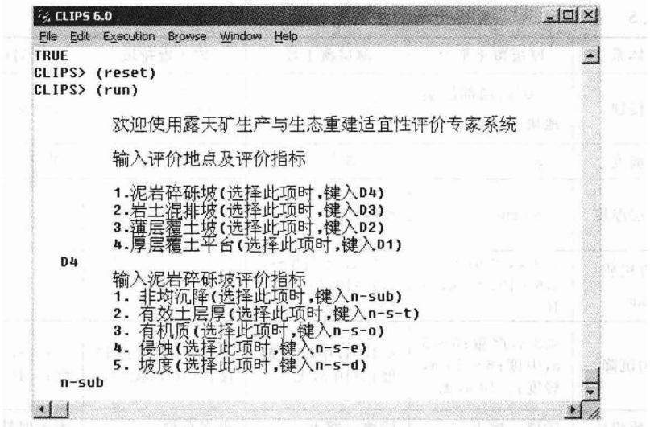  
图8.2 输人评价地点与评价指标

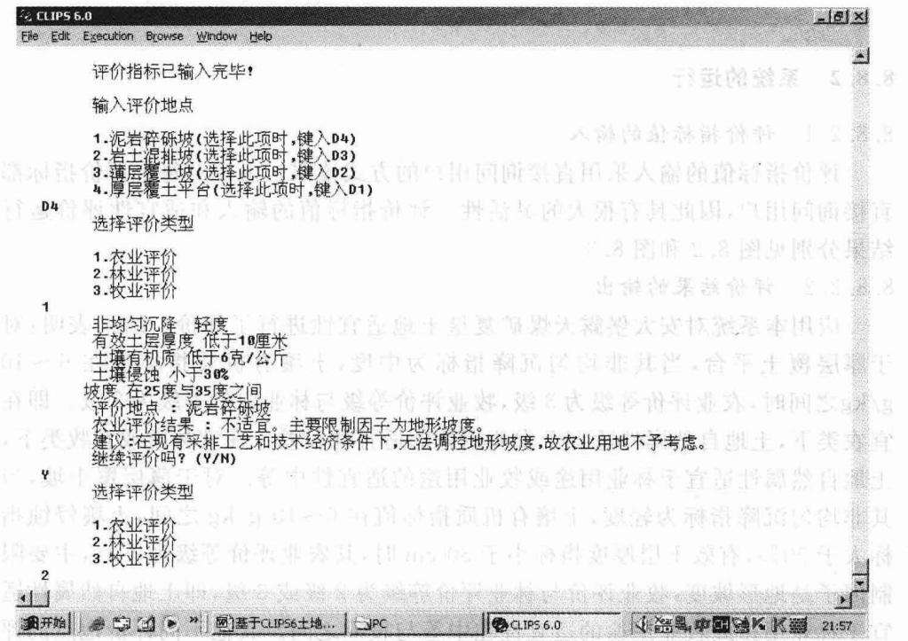  
图 8.3 适宜性评价结果

表8.6  
安太堡露天煤矿复垦土地适宜性评价结果
<table><tr><td rowspan=1 colspan=1>评价地点</td><td rowspan=1 colspan=1>评价指标</td><td rowspan=1 colspan=1>评价结果</td></tr><tr><td rowspan=1 colspan=1>厚层覆土平台</td><td rowspan=1 colspan=1>地形坡度 $\bullet < 3 ^ { \circ } ;$ 非均匀沉降：中度；土壤有机质：6～10g/kg；土壤侵蚀：&lt;10%；有效土层厚度：&gt;80cm</td><td rowspan=1 colspan=1>农业评价等级：3级；牧业评价等级：2级；林业评价等级：2级</td></tr><tr><td rowspan=1 colspan=1>薄层覆土坡</td><td rowspan=1 colspan=1>地形坡度： $3 0 ^ { \circ } \sim 3 5 ^ { \circ } ;$ 非均匀沉降：轻度；土壤有机质：6~10 g/kg；土壤侵蚀：&gt;50%；有效土层厚度：&lt;30cm</td><td rowspan=1 colspan=1>农业评价等级：不宜，主要限制因子：地形坡度；牧业评价等级：2或3级；林业评价等级：2或3级</td></tr><tr><td rowspan=1 colspan=1>岩土混排坡</td><td rowspan=1 colspan=1>地形坡度：30°~35°；非均匀沉降：轻度；排水条件：良好；土壤侵蚀：&lt;50%；灌溉水源保证：无保证</td><td rowspan=1 colspan=1>农业评价等级：不宜，主要限制因子：地形坡度；牧业评价等级：2或3级；林业评价等级：2或3级</td></tr><tr><td rowspan=1 colspan=1>泥岩碎砾坡</td><td rowspan=1 colspan=1>地形坡度：30°~35°；非均匀沉降：轻度；有效土层厚度：&lt;10cm；土壤侵蚀：&lt;30%；土壤有机质：&lt;6 g/kg</td><td rowspan=1 colspan=1>农业评价等级：不宜，主要限制因子：地形坡度；牧业评价等级：3级；林业评价等级：2或3级</td></tr></table>

## 8.9 小结

（1）根据土地复垦适宜性评价的主导因子法和复垦土地的自然地理属性，将评价单元与评价标准进行直接比照，定性确定评价单元与适宜类之间的匹配关系。给出土地利用的“匹配”模式，利用计算机这一快速方便的辅助决策工具实现了复垦土地“垂直”方向“匹配”的适宜性评价研究。

（2）根据黄土高原区主要限制因素的农、林、牧评价等级标准，建立了基于以产生式规则作为知识表达的含有所有规则的知识库，为该地区露天矿区及类似地理条件的露天矿区的复垦土地适宜性评价提供了一个较为丰富全面的工作平台。

（3）本系统利用CLIPS专家系统语言，采用模块控制技术，对土地复垦适宜性评价专家系统运行进行总体控制的推理机设计。通过人机对话方式，用户将事实库输入计算机，利用事先建立好的含有规则的知识库，实现了事实库、知识库和推理机的集成，完成了大型露天煤矿土地复垦适宜性评价专家系统的设计，通过启动评价结果模块就可以得到专家系统的诊断结果与建议性方案。

(4）本系统以安太堡露天煤矿复垦土地适宜性评价为例，对露天矿复垦土地适宜性评价专家系统进行了验证，其结果令人满意。

(5）露天煤矿土地复垦适宜性评价的专家系统是在基于CLIPS专家设计语言基础上编制的，用户界面良好，该系统在WINDOWS系统下运行，效果较好，汉字提示输入，大大方便了用户。实现了人机对话的模式，解决了针对不同的立地类型，其土地利用的农、林、牧等适宜性评价问题，为大型露天煤矿复垦土地适宜性评价提供了方便快捷的决策工具。另外，该专家系统可进一步开发用于湿地的分类、设备运行监视等研究领域。对具有类似生产条件的金属与化工矿山土地复垦适宜性评价也有较为广阔的应用前景。

## 9 露天矿生产与生态重建一体化系统研究

## 9.1 采矿一复垦一体化作业的工艺研究

露天开采的剥离是按照一定的作业参数将煤层上方的表土和岩层逐渐剥离的过程。煤层上方的表土和上覆岩层被直接挖损，使组成土地的基本物质和地表植被荡然无存；排土场的建设和发展占用大片土地，约占露天矿总面积的50%。多数露天矿采场剥离的土岩在排土场是简单的堆砌，原来采场地层的土岩层序完全改变，排土场原有的地表植被被剥离物压占和破坏。

矿山生产一生态重建一体化作业，突破单一的矿区土地复垦或闭坑后再进行矿区环境治理的传统模式，边开采边治理，体现了污染少、效率高的特点。其工艺是将开采和复垦融为一体，使剥离、采矿、排土和复垦等作业统一规划，平行作业，形成“边开采、边复垦”的良性循环工艺系统。根据露天矿区煤层赋存情况，兼顾复垦土地带来的社会、经济、生态效益，该工艺系统大体上有如下三种。

## （1）条带开采的内排一体化工艺系统

该工艺系统的特点是按开采和复垦工艺及土壤重构原理的要求将矿田划分为若干条带，分层剥离，交错回填，适用于水平、近水平的矿床。其作业过程是：先剥离第一条带的表土层和煤层上覆岩层，将其分别堆存于不影响采矿作业的适当位置，在第一条带采煤的同时，对第二条带的表土进行采集并堆存植被，以作为第n一1条带(假设露天矿田划分为n个开采条带)复垦的覆盖土；随后对第二条带进行剥离，并将剥离物充填于第一条带的采空区内，当排弃到设计标高时，整平场地，铺设第三条带采集的表土，同时也将第二条带的煤炭资源采出；最后可在第一条带按复垦要求进行复垦作业，以此类推，进行一体化作业。

## (2)分期开采的内排一体化工艺系统

该工艺系统是沿煤层走向分为若干区段，在某一时期内针对某一区段强化开采，在本区段采矿完毕时，才进行下一区段的采矿作业，实现分区剥采，交错回填。其适用于各种露天开采的煤层，尤其适宜于倾斜和急倾斜的矿床。其工艺过程为：先对第一区段进行强化开采，首先采集并堆存第一区段的表土，然后开始第一区段的开采工作，并将其剥离的废岩堆存于适当的排弃场地。在第一区段采矿接近尾声时，开始对第二区段的表土进行采集堆存，然后随着第一区段开采的结束便转入对第二区段的开采，这时将第二区段的剥离物回填到第一区段的采空区；在第一区段采空区回填到设计标高时，整平场地，铺设第一区段采集下来的表土，此时第三区段开始采剥作业；最后在第一区段平整后的场地上进行复垦作业，以此类推，进行一体化作业。

## (3)开采外排一体化工艺系统

该工艺系统的特点是采场剥离物基本上全部外排。其作业过程为：剥离前要预先采集表土并将其堆存或运往排土场排弃到界的区域进行铺设，排土场调整现有排土作业为上、下两个台阶同时作业。复垦台阶和排土台阶的接替作业顺序：排土场在接受排弃物时，当某个(假定为第i个)台阶排弃快到边界时，需要对其上(假定为i+1)台阶的推进速度适当加以减小，调整第i+1台阶的排土工作平盘宽度到最小复垦工作平盘宽度，同时在第i+1台阶上部留出最小复垦工作平盘宽度开始建设第i+2台阶，当第i+2台阶推进到最小复垦工作平盘宽度时，最小排土工作平盘宽度开始在第i十2台阶上留出最小复垦工作平盘宽度建设第i+3台阶，当第i+3台阶建设完成后，即可使第i+2台阶、第i+3台阶同时进行排土作业，同时可在第i+1台阶和第i+2台阶部分到界区域由原来的排土台阶向复垦台阶过渡并进行复垦作业。

## 9.2 露天矿生产与生态重建一体化系统模型研究

## 9.2.1 露天矿生产与生态重建一体化系统特征

露天开采不仅破坏了矿区的生态系统，而且使得当地的经济结构受到了极大的影响。特别是大型露天矿区，由于其开采时间长，这种影响变得更加显著。对于露天矿生态重建系统来说，由于开采的周期长，少则几十年，多则上百年，长期的开采对环境产生较大的破坏，特别是开采后期矿区开采能力的下降等因素引起了失业率的上升和人口的迁出[24]，产生了一系列社会问题，是一个集社会、经济、生态系统于一体的复杂系统。主要特征表现在：

(1）集合性。由于采矿活动影响了采矿地的地形、空气和地下水系，同时对土地的破坏，使耕地数量锐减，人地关系紧张，特别是在开采的后期，由于产量的下降，劳动力需求减少等社会经济问题也逐渐暴露出来，因此它是一个由社会、经济、生态等子系统组成的一个集合体。

(2)整体性。露天煤矿生态重建系统虽然由相对独立的各个部分组成，但它们是一个完整的整体。它不是仅对采矿造成的污染进行限制、赔偿，而是从社会一经济一自然复合生态系统的角度，突出人地关系，追求整体协调、共生协调和发展协调。

(3）振荡性。对于露天矿生态重建系统来说，由于开采的周期长，特别是开采后期矿区开采能力的下降等因素会引起失业率的上升和人口的迁出，产生了一系列社会问题，使系统的宏观行为发生了变化，使系统呈现振荡性。

(4）层次性。露天矿生态重建系统具有明显的层次性。该系统不仅包括宏观经济层子系统和区域经济层子系统，还包括景观、生态和基础模型子系统(土壤、空气及水文地质模型)。

(5）相关性。露天煤矿生态重建的系统内部各元素之间相互作用，每一因素的变化都会影响其他元素的状态变化。从这些子系统之间的相互作用关系上看，各层次的功能是相互关联的。一个系统输出作为与它相关的另一个系统的输入，反过来另一个系统的输出又作为系统的输入。

(6）动态性。矿区生态重建系统来说，系统的动态性体现在生产与生态重建的一体化的动态过程与生态重建目标的动态性两方面。

露天煤矿区生态重建是一个“动态”、“连续”、“滚动”的过程，它不仅应能够预测未来的变化趋势，而且可以指导人们适时、适地采取措施。矿区生态重建大多是事先的推测、估计、规划，绝不可能等待一切准备完善后再进行，只能在不完善的方法下起步，在探索、学习中完成规划，再在设计过程中完善规划。

矿区生态重建目标虽在当时、当地应是明确的，但随着时间的推移、社会要求和经济制约的变化，其目标是变动的，尤其是大尺度、长时间的大型矿区生态重建，其目标常会提高。

## 9.2.2 露天矿生产与生态重建一体化系统的系统动力学(SD)方法

从露天矿生产与生态重建一体化系统特征可以看到，露天矿生产与生态重建的一体化是一个复杂的社会一经济一生态系统。

一方面，其生态重建目标的变动性特点使得系统优化的效果在时空两方面往往存在矛盾。从时间上看，远近期的优化效果通常不一致，远期利益与近期利益相矛盾；从空间上看，局部的优化效果和整体的优化效果也难以相容。这样很难实现系统目标的最优化，只能获得次优化的结果。现有的最优控制理论和方法尚不足以解决该生态重建系统的优化问题。

另一方面，系统的振荡性需要我们对系统的内部结构加以研究。按照系统动力学原理，系统的宏观行为源自其微观结构[26]。为减少系统的振荡行为，达到系统优化的目的，需要对露天煤矿生态重建系统的内部结构进行分析。露天煤矿生态重建系统的研究不仅要使该地区的生态系统得到恢复，而且还要使当地的社会经济系统形成一个良性循环，真正实现可持续发展。

第三，露天矿生产与生态重建一体化系统的相关性特点也需要我们从露天煤矿生态重建系统内部各元素之间的相互作用关系进行探讨。以往的复垦工艺研究着重于复垦土地“垂直”方向的“匹配”，即着眼于复垦土地的地质一水文一土壤一植被间的关系研究，而忽视了“水平”方向上矿区生态重建各因素之间关系的研究，在系统整体功能研究方面显得不足。通过对露天煤矿生态重建系统内部各元素之间相互作用关系的研究，使得系统的整体效益达到最优的效果。

针对露天矿生产与生态重建一体化系统的复杂性，为了揭示该系统的整体行为，需要一个从定性到定量的综合集成的研究方法。系统动力学(SD)提供了一个分析和解决社会经济复杂系统的有效工具。系统动力学由美国麻省理工学院福瑞斯特(Jay Forrester W)教授创立于1956年。该方法在分析研究复杂系统时主要通过以下两条技术实现了综合集成的研究方法：

一是提出了因果关系及流位流率系的反馈结构建模方法。通过这种建模方法将理论、经验知识和专家判断力相结合，建立定性认识，提出假设并建立包括大量参数的系统结构模型。

二是系统动力学具有专用的便于参数调试的系统动力学仿真语言。通过人机交互、调整参数等，进行仿真计算，反复对比，逐次逼近，实现从感性到理性、由定性分析到定量的转化。目前系统动力学方法在系统研究，尤其是复杂社会经济系统研究中得到了广泛的应用[26]。

## 9.3 露天矿生产与生态重建一体化系统的 SD 模型

## 9.3.1 露天矿生产与生态重建一体化系统结构分析

露天矿生产与生态重建一体化系统特征，生产与生态重建一体化模型主要包括下面5个子模型，见图9.1。

## 9.3.1.1 人口模型

由于露天煤矿开采的时间长，环境破坏严重，特别是开采后期产量下降等因素造成失业率升高等社会问题，根据宏观经济学的失业理论，失业与人口的规模与结构有关。该模型分析了矿山不同的开采时期人口规模与结构的变化。

## 9.3.1.2 经济模型

矿区开采对土地、地下水等环境的破坏，使农作物产量下降及该地区的农、林等经济部门的收入、盈利等指标都发生了变化，该模型模拟分析了农、林等经

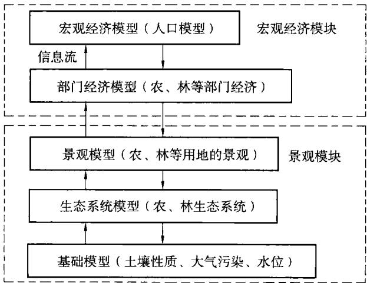  
图9.1 矿区生态重建系统的社会—经济—生态系统

济部门在地下水位、土壤性质改变情况下上述指标的动态变化。

## 9.3.1.3 生态系统模型

包括农业生态系统，林业生态系统等子模型。该模型模拟分析复垦土地农作物的产量变化过程，给出在一定气候条件和地下水位条件下农作物的产量目标，模拟采用生产与生态重建一体化方案时地下水位发生变化时产量的变化；林业生态系统模拟分析了林业生长量的变化等。

## 9.3.1.4 景观模型

露天矿开采对土地的挖损和压占等破坏形式使得该地区的地形发生了改变。景观模型模拟分析了景观主要特征的动态变化，根据不同的景观用途，如农业用地、工业用地、建筑用地等，动态模拟分析对于不同的景观结构得到相应的规划方案与评价结果。

## 9.3.1.5 基础模型

露天开采把地壳深部的岩层完全暴露于地表，由于植被的严重破坏和水土流失，通过地表径流等作用将一些有毒有害物溶于水中汇入江湖，且地表径流使污染的地表水通过渗透给土壤和地下水体造成污染。一些地下水位较高的矿区，常对矿坑突水进行疏干排放，不仅破坏了地下储水结构，而且造成了矿区及周围区域水资源严重浪费和短缺。此外，露天采场内基岩裸露，使流入坑内的地下水遭到污染，大量排放含有大量固体悬浮物及有害杂质的矿坑水，也给周围水系和土壤造成了污染。

露天矿的穿爆、采装、运输和排土等作业产生大量且长时间悬浮于大气中的粉尘及硫氧化物等有毒有害气体，进入大气后会迅速扩散，给人类生存环境造成严重危害。此外，由于露天采场和排土场完全将基岩暴露于大气中，风化破碎的土、岩颗粒在气流冲击作用下随风飞扬，加重了大气的粉尘污染。

基础模型由土壤性质子模型、大气环境污染子模型及水文地质子模型组成。在土壤性质子模型中包括在不同开采时期废弃土地量的变化及由于不同的土地利用方式的影响引起的土壤性质的动态变化。在水文地质子模型中包括因不同的土地利用方式及气候条件的影响，其水质及地下水位变化的动态分析。在空气环境污染子模型中模拟分析了不同的开采时期粉(烟)尘量的动态变化。

## 9.3.2 露天矿生产与生态重建一体化系统的 SD 模型

根据生产一生态重建一体化工艺与生态重建各因素之间的反馈关系分析及系统动力学(SD)原理，建立了露天矿生产一生态重建一体化系统模型(图9.2)。为露天矿生产一生态重建一体化模式的系统动态模拟及采用该模式与单一的矿区土地复垦或闭坑后再进行矿区环境治理的传统模式的决策分析奠定了基础。该模型主要由三个模块组成。

## 9.3.2.1 采矿—复垦一体化水土流失保持模块

该模块主要包括复垦工艺、植被面积、水土流失量和挖占土地面积。在该模块中，由于采用了采矿一复垦一体化模式，一方面减少了挖占土地面积，降低了大气粉尘污染；另一方面由于及时进行边坡复垦，植被的根系提高了排土场边坡的抗剪强度，使边坡的稳定性得到提高，减少了水土流失；同时由于植被量的增加，吸收了一部分采掘机械、重载卡车等大型设备产生的噪声，降低了露天采场的噪声污染。

## 9.3.2.2 生态重建生产功能模块

该模块主要包括农业生产、林业生产和牲畜养殖三个子模块。林木量的增加改善了水位水质，减少了大气污染，使农业谷物产量提高，从而使用于牲畜养殖的谷物量增加，牲畜养殖量增加，土壤改良措施的有机肥影响因子增加，在采用深耕松土等土壤改良措施后再增加土壤有机质，将减少覆土平台的压实度，使水土流失量减少。

## 9.3.2.3 人口分析模块

该模块主要包括人口数、人口的生态环境影响因子、生态重建的意识因子等。生态重建的意识因子依赖于人口数及人口生态环境因子，因为生态重建改变了人们的生存环境，这种效益更增加了人们进行生态重建的信心与决心，积极进行矿区复垦，加大了植被面积流率，增加了复垦的植被面积。

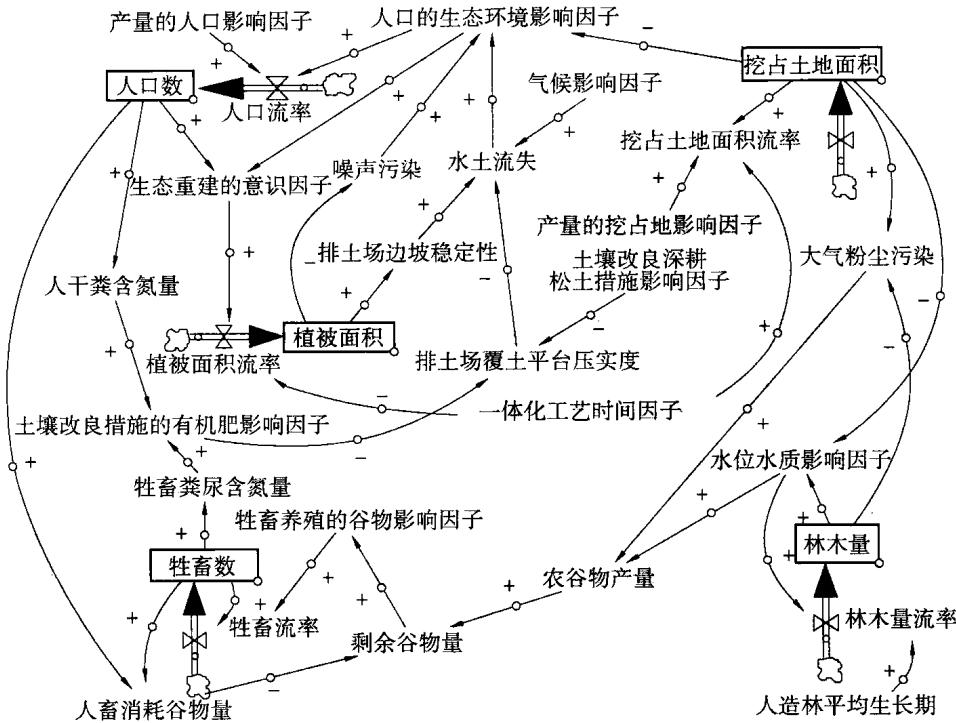  
图9.2 露天矿生产—生态重建一体化系统模型

## 9.4 小结

(1）通过对露天矿生产与生态重建一体化系统特征的分析，得出露天煤矿生产与生态重建一体化是一个集社会、经济、生态系统于一体的复杂巨系统。建立了相应的人口、经济、景观、生态系统等5个子模型。

(2)利用系统动力学原理探讨了这些子模型之间的因果关系，根据生产生态重建一体化工艺与生态重建各因素之间的反馈关系，建立了露天矿生产生态重建一体化系统动力学模型，为进一步分析露天矿生产与生态重建系统的整体功能和系统行为奠定了基础，实现了矿区生态重建“水平”方向上各因素之间关系研究的突破，从一个新的角度提出了解决露天煤矿生态重建复杂巨系统的优化方法，使人们对该复杂巨系统有了更加全面、深入的认识。

(3)需要进一步完善的工作是利用 SD 仿真软件 Vensim 模拟分析露天矿生产一生态重建一体化系统动力学模型，揭示出露天矿生产与生态重建一体化系统的整体行为模式。实现由定性分析到输出定量结果的转化，为露天矿生产与生态重建一体化提供更加科学化的决策依据。

## 10 国内外露天矿生态恢复的发展趋势

## 10.1 美国及加拿大露天煤矿生态恢复的研究现状及发展趋势

## 10.1.1 矿区生态恢复的功能标准研究

生态恢复的功能标准用来衡量矿区生态恢复得是否成功，同时该标准用来保证长期的环境退化量最小或者彻底消除环境的退化。生态恢复的功能标准(或效率标准)用来评价露天矿区生态恢复的标准主要有4个方面的内容：①开采后的土地利用；②生态恢复后的景观特征描述；③比较的标准；④评价的方法，见表10.1。

表 10.1 美国和加拿大部分煤矿开采地区的生态恢复的功能标准
<table><tr><td rowspan=1 colspan=1>内容</td><td rowspan=1 colspan=2>加拿大</td><td rowspan=1 colspan=7>美国</td></tr><tr><td rowspan=1 colspan=1></td><td rowspan=1 colspan=1>阿尔伯塔</td><td rowspan=1 colspan=1>英属哥伦比亚</td><td rowspan=1 colspan=1>阿拉斯加</td><td rowspan=1 colspan=1>科罗拉多</td><td rowspan=1 colspan=1>蒙塔拿</td><td rowspan=1 colspan=1>新墨西哥</td><td rowspan=1 colspan=1>犹他</td><td rowspan=1 colspan=1>俄亥明</td><td rowspan=1 colspan=1>哥伦比亚特区</td></tr></table>

<table><tr><td rowspan=1 colspan=1>1.1 开采后土地利用选择</td><td rowspan=1 colspan=1>十</td><td rowspan=1 colspan=1>+</td><td rowspan=1 colspan=1>十</td><td rowspan=1 colspan=1>+</td><td rowspan=1 colspan=1>十</td><td rowspan=1 colspan=1>十</td><td rowspan=1 colspan=1>十</td><td rowspan=1 colspan=1>+</td><td rowspan=1 colspan=1>十</td></tr><tr><td rowspan=1 colspan=1>1.2 恢复后景观特征描述</td><td rowspan=1 colspan=1>十</td><td rowspan=1 colspan=1>十</td><td rowspan=1 colspan=1>十</td><td rowspan=1 colspan=1>十</td><td rowspan=1 colspan=1>十</td><td rowspan=1 colspan=1>十</td><td rowspan=1 colspan=1>十</td><td rowspan=1 colspan=1>十</td><td rowspan=1 colspan=1>十</td></tr><tr><td rowspan=1 colspan=1>1.3 比较的标准</td><td rowspan=1 colspan=1></td><td rowspan=1 colspan=1></td><td rowspan=1 colspan=1>十</td><td rowspan=1 colspan=1>十</td><td rowspan=1 colspan=1>十</td><td rowspan=1 colspan=1>十</td><td rowspan=1 colspan=1>十</td><td rowspan=1 colspan=1>十</td><td rowspan=1 colspan=1>十</td></tr><tr><td rowspan=1 colspan=1>1.4 评价的方法</td><td rowspan=1 colspan=1></td><td rowspan=1 colspan=1></td><td rowspan=1 colspan=1>十</td><td rowspan=1 colspan=1>十</td><td rowspan=1 colspan=1>十</td><td rowspan=1 colspan=1>十</td><td rowspan=1 colspan=1>十</td><td rowspan=1 colspan=1>十</td><td rowspan=1 colspan=1>十</td></tr></table>

<table><tr><td rowspan=1 colspan=1>2.1 生产能力</td><td rowspan=1 colspan=1></td><td rowspan=1 colspan=1>+</td><td rowspan=1 colspan=1>十</td><td rowspan=1 colspan=1>+</td><td rowspan=1 colspan=1>十</td><td rowspan=1 colspan=1>十</td><td rowspan=1 colspan=1>十</td><td rowspan=1 colspan=1>十</td><td rowspan=1 colspan=1>十</td></tr><tr><td rowspan=1 colspan=1>2.2 潜在能力</td><td rowspan=1 colspan=1>+</td><td rowspan=1 colspan=1></td><td rowspan=1 colspan=1></td><td rowspan=1 colspan=1></td><td rowspan=1 colspan=1></td><td rowspan=1 colspan=1></td><td rowspan=1 colspan=1></td><td rowspan=1 colspan=1></td><td rowspan=1 colspan=1></td></tr><tr><td rowspan=1 colspan=1>2.3 功能性分析</td><td rowspan=1 colspan=1></td><td rowspan=1 colspan=1></td><td rowspan=1 colspan=1></td><td rowspan=1 colspan=1></td><td rowspan=1 colspan=1></td><td rowspan=1 colspan=1></td><td rowspan=1 colspan=1></td><td rowspan=1 colspan=1></td><td rowspan=1 colspan=1></td></tr></table>

注：(+)，要求；()，未要求。

生态恢复的功能标准在不同的地区要求也不一样，例如在加拿大阿尔伯塔地区和英属哥伦比亚通常要求生态恢复后的土地要等于或高于原来土地的利用水平；在美国不仅要求等于或高于干扰前土地的利用水平，而且在生物方面(如植被覆盖度、生物量和物种的多样性)有进一步的要求，美国政府颁布的露天采矿控制与生态恢复法令(SMCRA)明确要求生态恢复地区的植被覆盖度和植被的产量不低于参考地区的90%。

植被恢复是否成功的标准，首先是对开采前的植被覆盖度、多样性和生产性能进行定量评价，然后比较开采前、后的植被覆盖度和生产性是否一致。露天采矿控制与生态恢复法令(SMCRA)中对生态恢复的效率(功能)的评价在很大程度上取决于重建后的植被和土壤的生产能力。

生态恢复的功能通常要求生态恢复后的土地要等于或高于原来土地的利用水平，表现在3个方面：①生产能力；②潜在能力；③功能分析。

## 10.1.1.1 生产能力

生产能力是生态系统功能的一个综合性指标，它要求测出所选定植被的生物量、植被覆盖度、多样性及牧草饲料的质量。尽管这些指标都很简单且容易测出，但由于它们不能很好地反映出土壤的质量，所以很难反映出生态系统怎样较好地向营养自足方面发展。在加拿大和英国，要求开采前和开采后的土地生产能力相同，这显然不尽合理，因为不同的生态系统中其生物量的分配格局(模式)是不同的，过分地强调其生产能力往往会导致忽视物种组成，这样会抑制生态系统的演替。

过分看重生产能力还可能会造成生态恢复管理上的误区，由于高产地的产量可以弥补低产地的产量损失，因此管理活动会对高产地关注而忽视不利于植物生长的低产地，这样对地表下营养循环非常不利。

## 10.1.1.2 潜在能力

潜在能力反映的是以人类为中心实用功利的方法。它是基于对生态恢复地区一些生物物理属性的评价，这些属性包括地形和土壤的性质。潜在能力的主要特征包括景观的形态，如坡度、排水系统及土壤的定性和定量分析。生态恢复地区的潜在能力表现将来可用做森林、野生动物保护和农业用地。

## 10.1.1.3 功能分析

功能分析方法是基于生态系统的动态功能，生态恢复是否成功基于对地表上的过程(如产量)和地表下的过程(如有机物的组成及营养物的循环)之间的联系是否是高效的。功能分析方法要求采用等级评价的系统方法，即从景观→生态系统→植物群落和种群的这样一个等级系统进行监测。

## 10.1.2 矿区生态恢复系统的监测研究

生态恢复的监测是一个反馈机制，通过对生态恢复状况的监测保证采取正确、合适的环境管理标准，并对生态恢复对物种、种群、生态系统和景观的影响及最终的预测作出决策。周密设计的生态恢复的监测方案对于全面的生态恢复规划和管理是必不可少的，可靠的监测方案必须对监测参数、抽样方案和统计程序进行明确的定义和计划。

生态恢复的监测内容见表10.2。从表中可以看出，种群、生态系统和景观监测没有得到体现。该监测内容只反映了一个静态的生态系统，没有反映出生态系统的动态变化。

在美国生态恢复的监测也采用参考地的方法来衡量矿区的生态恢复，即用参考地区(未破坏地区)的植被覆盖度、植物物种的多样性和生产能力作为比较标准。采用参考地的方法作为开采区生态恢复的等同性比较是一种不灵活且成本较高的方法，而且它没有考虑到开采后采矿地的生态恢复系统和目前未破坏的原始系统是不同的新系统，而且将采矿地生态恢复的早期的演替阶段和目前未破坏的参考地的顶极演替或后期演替相比也缺乏科学依据。尽管采用参考地的方法有缺陷，但用它来作为长期的演替轨迹进行监测还是有益的。

## 10.1.3 矿区生态恢复的功能和监测的新方案

针对上述矿区生态恢复的功能和监测的缺点和不足，C.R.Smyth[168]等提出了新的方案，该方案包括两个阶段：土地的整形和土壤的重构；长期的生态稳定性。

第一阶段强调的是政府、企业和公众的共同协商，是将恢复地恢复到开采前的生产力水平或等同的土地潜在能力。在该阶段，地形和土壤的性质将决定土地潜在能力的使用特征。在该阶段强调的是对土地的潜在能力和生产能力的分析方法。

文献研究结果表明[192]，为使复垦土壤达到最优的生产力，构造一个较优的土壤物理、化学和生物条件是最基本的和最重要的内容。土壤重构是土地复垦最重要的组成部分，是土地复垦的核心内容。土壤是植物赖以生存的基础，没有良好的土壤母质，作物与植被的建立就无从谈起或者说很难达到良好的效果。在土壤重构的前期和中期，应该十分明确土壤重构最为重要的任务是重构、改良与培肥土壤，作物与林草措施应该十分注重以土壤的重构和快速培肥为目的。重构土壤是植被重建的基础，复垦效果的评价，应该以重构土壤的质量作为主要标准，而不仅仅在于人工措施支持下的作物与植被的效果如何，重构土壤的质量

是决定复垦成败与效益高低的关键。

表10.2美国和加拿大部分煤矿开采地区的生态恢复的监测标准要求
<table><tr><td rowspan=1 colspan=1>内     容</td><td rowspan=1 colspan=2>加拿大</td><td rowspan=1 colspan=7>美   国</td></tr><tr><td rowspan=1 colspan=1></td><td rowspan=1 colspan=1>阿尔伯塔</td><td rowspan=1 colspan=1>英属哥伦比亚</td><td rowspan=1 colspan=1>阿拉斯加</td><td rowspan=1 colspan=1>科罗拉多</td><td rowspan=1 colspan=1>蒙塔拿</td><td rowspan=1 colspan=1>新墨西哥</td><td rowspan=1 colspan=1>犹他</td><td rowspan=1 colspan=1>俄亥明</td><td rowspan=1 colspan=1>哥伦比亚特区</td></tr><tr><td rowspan=1 colspan=1>1. 地下水的监测</td><td rowspan=1 colspan=1>A</td><td rowspan=1 colspan=1></td><td rowspan=1 colspan=1>A</td><td rowspan=1 colspan=1>A</td><td rowspan=1 colspan=1>A</td><td rowspan=1 colspan=1></td><td rowspan=1 colspan=1></td><td rowspan=1 colspan=1></td><td rowspan=1 colspan=1>A</td></tr><tr><td rowspan=1 colspan=1>2. 地表水的监测</td><td rowspan=1 colspan=1>A</td><td rowspan=1 colspan=1>A</td><td rowspan=1 colspan=1>A</td><td rowspan=1 colspan=1>A</td><td rowspan=1 colspan=1>A</td><td rowspan=1 colspan=1>A</td><td rowspan=1 colspan=1>A</td><td rowspan=1 colspan=1>A</td><td rowspan=1 colspan=1>A</td></tr><tr><td rowspan=1 colspan=1>3. 沉陷的监测</td><td rowspan=1 colspan=1></td><td rowspan=1 colspan=1></td><td rowspan=1 colspan=1>D</td><td rowspan=1 colspan=1></td><td rowspan=1 colspan=1>D</td><td rowspan=1 colspan=1>D</td><td rowspan=1 colspan=1>D</td><td rowspan=1 colspan=1></td><td rowspan=1 colspan=1>D</td></tr><tr><td rowspan=1 colspan=1>4. 土壤发育的监测</td><td rowspan=1 colspan=1></td><td rowspan=1 colspan=1></td><td rowspan=1 colspan=1></td><td rowspan=1 colspan=1></td><td rowspan=1 colspan=1>+</td><td rowspan=1 colspan=1></td><td rowspan=1 colspan=1></td><td rowspan=1 colspan=1></td><td rowspan=1 colspan=1></td></tr><tr><td rowspan=1 colspan=1>4.1 土壤的物理性质</td><td rowspan=1 colspan=1>D</td><td rowspan=1 colspan=1></td><td rowspan=1 colspan=1></td><td rowspan=1 colspan=1></td><td rowspan=1 colspan=1>A</td><td rowspan=1 colspan=1>A</td><td rowspan=1 colspan=1></td><td rowspan=1 colspan=1></td><td rowspan=1 colspan=1></td></tr><tr><td rowspan=1 colspan=1>4.2 土壤的化学性质</td><td rowspan=1 colspan=1>D</td><td rowspan=1 colspan=1></td><td rowspan=1 colspan=1></td><td rowspan=1 colspan=1></td><td rowspan=1 colspan=1>A</td><td rowspan=1 colspan=1>A</td><td rowspan=1 colspan=1></td><td rowspan=1 colspan=1></td><td rowspan=1 colspan=1></td></tr><tr><td rowspan=1 colspan=1>4.3 土壤的生物性质</td><td rowspan=1 colspan=1></td><td rowspan=1 colspan=1></td><td rowspan=1 colspan=1></td><td rowspan=1 colspan=1></td><td rowspan=1 colspan=1></td><td rowspan=1 colspan=1></td><td rowspan=1 colspan=1></td><td rowspan=1 colspan=1></td><td rowspan=1 colspan=1></td></tr><tr><td rowspan=1 colspan=1>5. 植被的监测</td><td rowspan=1 colspan=1></td><td rowspan=1 colspan=1></td><td rowspan=1 colspan=1></td><td rowspan=1 colspan=1></td><td rowspan=1 colspan=1></td><td rowspan=1 colspan=1></td><td rowspan=1 colspan=1></td><td rowspan=1 colspan=1></td><td rowspan=1 colspan=1></td></tr><tr><td rowspan=1 colspan=1>5.1 使用参考地区</td><td rowspan=1 colspan=1></td><td rowspan=1 colspan=1></td><td rowspan=1 colspan=1></td><td rowspan=1 colspan=1></td><td rowspan=1 colspan=1></td><td rowspan=1 colspan=1></td><td rowspan=1 colspan=1></td><td rowspan=1 colspan=1></td><td rowspan=1 colspan=1></td></tr><tr><td rowspan=1 colspan=1>5.1.1 历史记录</td><td rowspan=1 colspan=1></td><td rowspan=1 colspan=1></td><td rowspan=1 colspan=1></td><td rowspan=1 colspan=1></td><td rowspan=1 colspan=1>A</td><td rowspan=1 colspan=1>A</td><td rowspan=1 colspan=1></td><td rowspan=1 colspan=1>A</td><td rowspan=1 colspan=1>A</td></tr><tr><td rowspan=1 colspan=1>5.1.2 自然控制</td><td rowspan=1 colspan=1></td><td rowspan=1 colspan=1></td><td rowspan=1 colspan=1>A</td><td rowspan=1 colspan=1></td><td rowspan=1 colspan=1></td><td rowspan=1 colspan=1>A</td><td rowspan=1 colspan=1>A</td><td rowspan=1 colspan=1>A</td><td rowspan=1 colspan=1>A</td></tr><tr><td rowspan=1 colspan=1>5.1.3 技术标准</td><td rowspan=1 colspan=1></td><td rowspan=1 colspan=1></td><td rowspan=1 colspan=1>A</td><td rowspan=1 colspan=1></td><td rowspan=1 colspan=1></td><td rowspan=1 colspan=1>A</td><td rowspan=1 colspan=1></td><td rowspan=1 colspan=1></td><td rowspan=1 colspan=1>A</td></tr><tr><td rowspan=1 colspan=1>5.2 植被产量的要求</td><td rowspan=1 colspan=1></td><td rowspan=1 colspan=1>D</td><td rowspan=1 colspan=1></td><td rowspan=1 colspan=1></td><td rowspan=1 colspan=1>A</td><td rowspan=1 colspan=1>A</td><td rowspan=1 colspan=1>A</td><td rowspan=1 colspan=1></td><td rowspan=1 colspan=1>A</td></tr><tr><td rowspan=1 colspan=1>5.3 植被林冠盖度要求</td><td rowspan=1 colspan=1>B</td><td rowspan=1 colspan=1>D</td><td rowspan=1 colspan=1></td><td rowspan=1 colspan=1></td><td rowspan=1 colspan=1>A</td><td rowspan=1 colspan=1>A</td><td rowspan=1 colspan=1>A</td><td rowspan=1 colspan=1></td><td rowspan=1 colspan=1>A</td></tr><tr><td rowspan=1 colspan=1>5.4 永久植被</td><td rowspan=1 colspan=1></td><td rowspan=1 colspan=1>C,D</td><td rowspan=1 colspan=1></td><td rowspan=1 colspan=1></td><td rowspan=1 colspan=1>A</td><td rowspan=1 colspan=1>A</td><td rowspan=1 colspan=1>A</td><td rowspan=1 colspan=1></td><td rowspan=1 colspan=1></td></tr><tr><td rowspan=1 colspan=1>5.5 植被的植物多样性</td><td rowspan=1 colspan=1></td><td rowspan=1 colspan=1></td><td rowspan=1 colspan=1></td><td rowspan=1 colspan=1></td><td rowspan=1 colspan=1>A</td><td rowspan=1 colspan=1>A</td><td rowspan=1 colspan=1>A</td><td rowspan=1 colspan=1>A</td><td rowspan=1 colspan=1></td></tr><tr><td rowspan=1 colspan=1>5.6季节性</td><td rowspan=1 colspan=1></td><td rowspan=1 colspan=1></td><td rowspan=1 colspan=1></td><td rowspan=1 colspan=1></td><td rowspan=1 colspan=1>A</td><td rowspan=1 colspan=1></td><td rowspan=1 colspan=1></td><td rowspan=1 colspan=1></td><td rowspan=1 colspan=1></td></tr><tr><td rowspan=1 colspan=1>5.7 毒性的分析</td><td rowspan=1 colspan=1></td><td rowspan=1 colspan=1></td><td rowspan=1 colspan=1></td><td rowspan=1 colspan=1></td><td rowspan=1 colspan=1>A</td><td rowspan=1 colspan=1>A</td><td rowspan=1 colspan=1></td><td rowspan=1 colspan=1></td><td rowspan=1 colspan=1></td></tr><tr><td rowspan=1 colspan=1>5.8 森林与灌木的测量标准</td><td rowspan=1 colspan=1>A</td><td rowspan=1 colspan=1>A</td><td rowspan=1 colspan=1></td><td rowspan=1 colspan=1></td><td rowspan=1 colspan=1>A</td><td rowspan=1 colspan=1>A</td><td rowspan=1 colspan=1>A</td><td rowspan=1 colspan=1>A</td><td rowspan=1 colspan=1></td></tr><tr><td rowspan=1 colspan=1>6. 动物演替的监测</td><td rowspan=1 colspan=1></td><td rowspan=1 colspan=1></td><td rowspan=1 colspan=1></td><td rowspan=1 colspan=1></td><td rowspan=1 colspan=1></td><td rowspan=1 colspan=1></td><td rowspan=1 colspan=1></td><td rowspan=1 colspan=1></td><td rowspan=1 colspan=1></td></tr><tr><td rowspan=1 colspan=1>6.1 无脊椎动物</td><td rowspan=1 colspan=1></td><td rowspan=1 colspan=1></td><td rowspan=1 colspan=1></td><td rowspan=1 colspan=1></td><td rowspan=1 colspan=1></td><td rowspan=1 colspan=1></td><td rowspan=1 colspan=1></td><td rowspan=1 colspan=1></td><td rowspan=1 colspan=1></td></tr><tr><td rowspan=1 colspan=1>6.2 脊椎动物</td><td rowspan=1 colspan=1></td><td rowspan=1 colspan=1></td><td rowspan=1 colspan=1></td><td rowspan=1 colspan=1></td><td rowspan=1 colspan=1></td><td rowspan=1 colspan=1></td><td rowspan=1 colspan=1></td><td rowspan=1 colspan=1></td><td rowspan=1 colspan=1></td></tr><tr><td rowspan=1 colspan=1>7. 景观水平的过程监测</td><td rowspan=1 colspan=1></td><td rowspan=1 colspan=1></td><td rowspan=1 colspan=1></td><td rowspan=1 colspan=1></td><td rowspan=1 colspan=1></td><td rowspan=1 colspan=1></td><td rowspan=1 colspan=1></td><td rowspan=1 colspan=1></td><td rowspan=1 colspan=1></td></tr></table>

注：(A)，定量数据；(B)，定性数据；(C)，描述性数据；(D)，要求模糊；()，未要求。

土壤重构是以工矿区破坏土地的土壤恢复或重建为目的，采取适当的采矿和重构技术工艺，应用工程措施及物理、化学、生物、生态措施，重新构造一个适宜的土壤剖面与土壤肥力条件以及稳定的地貌景观，在较短的时间内恢复和提高重构土壤的生产力，并改善重构土壤的环境质量。土壤重构所用的物料既包括土壤和土壤母质，也包括各类岩石、矸石、粉煤灰、矿渣、低品位矿石等矿山废弃物，或者是其中两项或多项的混合物。所以在某些情况下，复垦初期的“土壤”并不是严格意义上的土壤，真正具有较高生产力的土壤，是在人工措施定向培肥条件下，重构物料与区域气候、生物、地形和时间等成土因素相互作用，经过风化、淋溶、淀积、分解、合成、迁移、富集等基本成土过程而逐渐形成的。

土壤重构的实质是人为构造和培育土壤，其理论基础主要来源于土壤学科。在矿区土壤重构过程中，人为因素是一个独特的而且最具影响力的成土因素，它对重构土壤的形成产生广泛而深刻的影响，可使土壤肥力特性短时间内即产生巨大的变化，减轻或消除土壤污染，改善土壤的环境质量。另外，人为因素能够解决土壤长期发育、演变及耕作过程中产生的某些土壤发育障碍问题，使土壤的肥力迅速提高。但是，自然成土因素对重构土壤的发育产生长期、持久、稳定的影响，并最终决定重构土壤的发育方向。因此，土壤重构必须全面考虑到自然成土因素对重构土壤的潜在影响，采用合理有效的重构方法与措施，最大限度地提高土壤重构的效果，并降低土壤重构的成本和重构土壤的维护费用。

土壤重构的目的是重构并快速培肥土壤，消除污染，改善土壤环境质量，恢复和提高重构土壤的生产力，恢复土壤生态系统。对主要以土壤为重构材料的，恢复重构土壤的生产力是主要方面；对以矿区废弃物为主要重构物料的，应该在恢复重构土壤生产力的同时采取相应的污染处理与防治措施，减轻或消除土壤以及对作物的污染。土壤重构最经济、有效的方法是将矿区土壤重构与采矿工艺相结合，在某些情况下，可以不增加成本而构造出比采矿前更好的土壤。土壤重构过程与采矿工艺脱节必然导致复垦费用高、效果差。总之，土壤重构应该与采矿工艺密切结合，统筹考虑，应该将土壤重构或土地复垦一开始就纳入矿山开采设计，走在矿山开采之前。

土壤重构根据目的和用途可分为耕地土壤重构、林地土壤重构、草地土壤重构，其中耕地土壤重构的标准最高。耕地土壤重构是将恢复后的土地用于作物种植，是沉陷区土壤重构的重点研究目标，它要求重构土地平整、土壤特性较好、具备一定的水利条件。工程重构结束后应及时进行有效的生物重构措施，进一步改良培肥土壤。林地土壤重构是将重构后的土壤作乔灌种植，是重构物料特性较差时的主要重构方式，它对重构土壤层的标准要求较低，地形要求亦不是很严，允许地表存在较大的坡度。林业重构一般侧重其环境与生态效益，在此基础上才能考虑经济效益。所选先锋树种应该对特定恶劣立地条件有较强的适应性。对未达到土壤环境质量标准的废弃地的重构，可栽植能吸收、降解有害元素的抗性乔灌品种，达到逐步净化重构土壤的目的。草地土壤重构国内研究较少，西方发达国家相关研究较多，可与乔灌措施相结合使用。

文献188通过对土壤容重的时空变异特性的分析得知，铲运机复垦由于机械作用对土壤的压实作用明显，土壤容重增大，不利耕作和作物生长。故在应用铲运机方法复垦土壤时需要考虑减小土壤压实作用的措施，降低复垦土壤容重，改善土壤耕性对策。具体做法有以下几项：

①搞好规划，合理安排，缩短工期。首先，应该请专业机构做好复垦规划，这是搞好复垦工作的第一步，也是工程是否成功的重要环节，计划要合理细致。其次，要拿出复垦工程实施规划，扎实做好各项准备工作，避免因为工程安排失误导致的返工和工期的拖延。第三，工程实施时，应根据规划要求，由远而近，后退式进行，尽量做到标高一次到位，避免机械设备的反复碾压而造成的土壤压实情况。最后，根据天气状况合理组织施工，严格避免为了抢工期而造成的雨中施工或者雨后地未干透就立刻施工的情况发生，尽量将复垦机械对土壤的压实作用减小到最低程度。

②深耕翻晒，恢复疏松。耕作主要影响土壤的物理和水分条件。但是，土地复垦结束后，不要立刻进行耕作活动，应该对复垦土地进行深耕翻晒，时间许可的话，尽量让其经过冬天的冻晾，使之经过冻融让土壤变疏，以利于地力恢复。

③采取土壤改良措施。为尽快恢复地力，改良土壤，提高肥力，科学合理地种植作物和施肥就非常重要。种植绿肥作物是改良土壤和生态环境、提高土壤肥力的有效手段。种植绿肥可以增加耕层土壤养分，改善土壤理化性状，改良低产田，能够覆盖地面，固沙护坡，防止水土流失，改善生态环境。种植作物时综合施用有机肥料如厩肥、堆肥、沤肥和沼气池肥以及秸秆还田等手段，对降低土壤容重、改善土壤耕性、提高地力有很明显的效果。通过接种菌根也是一种快速的改良方法。对粮食产量需求不迫切的地区，可以考虑种植速生经济林，这样可使低产的复垦土地用较少的投人获得较大的经济效益。

文献[189通过对露天煤矿复垦土壤物理特性的空间变异性研究发现，第一，复垦土壤穿透阻力的空间变异性与采煤方向有关，沿开采方向比垂直于开采方向变异性大。这要求田间管理和改良措施应主要针对沿开采方向，复垦过程应减少沿开采方向的设备移动以利于减低土壤压实程度。第二，空间变异在土壤的垂直剖面上有明显的规律性。0～20cm和80\~100cm具有相近且最小的变异，20～40cm具有最大的变异，所以各种土壤改良措施应主要针对20～80cm深的土层。第三，穿透阻力在断面上的分布以及变异函数分析均表明表土与心土之间(20\~40cm)的压实程度最高，这主要是铲运机回填表土所致。因此，为改善压实程度应改进表土回填的工艺和设备。第四，复垦土壤物理特征的空间变异性与其压实程度成正比，压实程度越高，变异性越大。

第二阶段则对数据进行收集，用来评价发育中的生态系统的功能能力及向亚稳定状态变化的趋势。在该阶段强调的是生态系统功能的方法。

## 10.1.3.1 生态恢复的长期监测和短期监测

尽管对生态恢复演替的轨迹的监测多少带有不确定性的结果，但这些监测在维护发展生态系统的亚稳定性，及向该系统发展过程中形成生态恢复的特点方面是必不可少的。因此必须设计一个监测方案，确定出抽样参数和关键的带有指示性的地区或生态响应单元。对每个矿山来说，指示性的地区应该是能够代表开采后该矿区的景观异质性的地区。表10.3包括了长期和短期的露天矿生态恢复研究的内容。

表 10.3  
露天矿生态恢复研究内容与时间界限
<table><tr><td rowspan=1 colspan=1>时间界限</td><td rowspan=1 colspan=1>研究内容说明</td><td rowspan=1 colspan=1>过程</td></tr><tr><td rowspan=1 colspan=1>短期监测研究(1~5a)</td><td rowspan=1 colspan=1>研究评估矿山酸性水(废水)排泄系统土地整形与工程措施水系及水文地质恢复地的准备表土堆放土壤分析土壤参数的空间分布施肥与施肥管理物种选取播种速度直接播种的方法移植的成活率植物和动物的自然群集微气候美学</td><td rowspan=1 colspan=1>集合</td></tr><tr><td rowspan=1 colspan=1>长期监测研究(6~100a)</td><td rowspan=1 colspan=1>植物和动物的种群的动态变化土壤发育土壤植物和动物动态变化植物群落和依赖植物群落的动态变化生态系统的动态变化过程矿山酸性水(废水)排泄系统美学</td><td rowspan=1 colspan=1>响应</td></tr></table>

尽管美国政府颁布的露天采矿控制与生态恢复法令中的监测要求比加拿大的生态恢复监测内容包含了更多生态方面的内容，但对生态恢复的评价还是不够全面。以前常用于长期的生态恢复系统的评价属性仅仅与植被的结构有关，如森林的密度或灌木的密度、植被的覆盖率或草本植物的生物量、物种的多样性，但这些参数还不能提供一个可靠的反映实际演替的轨迹。在美国，用于最终的生态恢复评价的指标，例如多样性、生物气候学、稳定性和生产能力，虽然代表了植物群落水平的特征，但还没有生态恢复过程中植物群落的结构与功能属性。在生态恢复过程中，植物群落的共同作用这一自然特性必须加以考虑。Aron-son等[169]提出了功能属性的方法，该方法可以在开采后矿区景观监测及长期演替趋势中加以应用。

C. R.Smyth等[168]为生态恢复的实施操作人员和管理人员提出了一个基于生态的、全面的生态恢复演替监测方案，该方案和其他的方案有显著的不同，主要体现在该方案是一个跨学科的综合性方案，参见图10.1。图中包括了生态恢复规划、实施和功能监测的全过程，并将监测的内容进行了集成。该方案强调对生态恢复演替的动态变化过程的监测或轨迹的监测，而不是对最终结果的监测。演替过程的结果，例如覆盖度的比例、丰富度、生物量、无脊椎动物物种的丰富度、土壤的碳/氮比、土壤中氮的比例、微生物量、微生物活性等指标每隔几年进行一次调查并做记录，根据这些指标确定演替结果的趋势是进化还是退化。最后给出详细、全面的生态监测分析报告，用于指导矿区生态恢复与重建的管理工作。

## 10.1.3.2 生态恢复的植被监测

由于植被是一个包括土壤稳定和水质的综合要素，从开始植物生长时就必须对植被进行监测。多数情况下必须根据植被的时间系列确定演替变化的格局，分析推导演替的趋势。采用该方法时需要注意两个问题：

（1）适当的恢复地的整理准备情况和种植的技术方法必须准确提供，因为不准确或不可靠的历史记录往往会导致错误的结论；

(2)由于采矿活动的进行，往往会将地表扰动的时空变化直接看做是最初的原始演替，因此需要分清哪些是地表扰动的时间变化，哪些是植被的时间序列变化，这一点需要注意。

单个的植被参数如覆盖度的比例、丰富度、密度、生物量不能作为植被恢复情况最好的评价指标，因此必须收集多种类型的植被数据来检测植被的时空变化。

多样性和物种的组成已经包括在美国露天煤矿生态恢复的立法条例中，所有形式的生物多样性(α多样性，β多样性，γ多样性)对保证最终的生态恢复都是很重要的，而且生态系统的稳定性、恢复力及在系统中起机能作用的关键物种都离不开多样性。

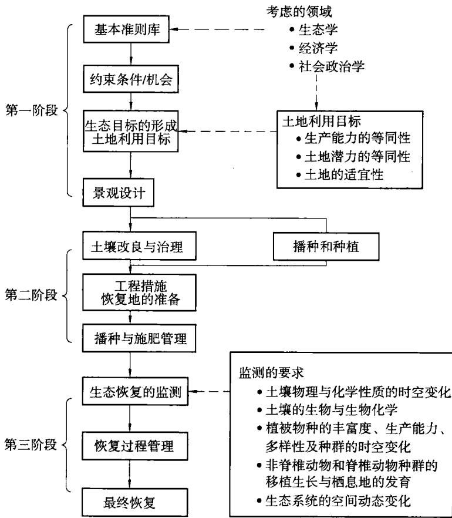  
图10.1 生态恢复的规划、实施及功能监测流程

尽管高水平的多样性在采矿迹地难以复制，但功能的多样性，包括不同形式的物种和生物气候学都能够实现。近期的研究表明，用分类群的方法对多样性进行定量评价不太可靠，而功能群(组)的方法，即将生态系统中具有相似功能效果的物种进行分组的方法是评价物种多样性最合适的方法。多样性的分类学方法关心的是植物群落，而功能群则强调的是对生物地理群落的研究。功能群的多样性分析方法对矿区生态恢复的生态系统重建及监测非常有用，因为该方法是为物种的选取及和功能的监测提供了一个实用的方法。另外，分类群(丰富度)的多样性和结构(斑块和垂直分布)的多样性对生态恢复也很重要，它们可用来监测最终的生态恢复作为动物的栖息地及动物种群迁移的可能性。应该将功能多样性和结构多样性的数据收集后进行分析并整理成报告。

目前，越来越多的学者把注意力转向功能群，即将一个生态系统的种类划分为不同类型的功能群，以此来阐述生态系统的稳定性与功能群多样性的关系。功能群系指生态系统内具有相同功能所有种类的集合，从某种意义来说是可替换的，常常被看做一个单位整体。功能群的多样性比物种的多样性对生态系统的影响更大，从功能群的角度来考虑群落，比从种类组成来研究群落更稳定，更易于预测。

文献[170]指出，在一个生态系统中，所有种类的作用是不平等的，具有某种功能特征的种类的消失或加入，对某一特定的生态系统功能过程的影响有可能大于其他种类，但不同的功能过程倾向于受不同种类和功能群的影响。众多的生态因子里，每一个因子都会对生态系统的许多功能过程产生效应，但功能组成和功能的多样性是解释植物生产力、植物的N动态以及群落光透射比率的主要因子。

物种多样性是生态系统的重要特征并维持系统的功能运行，生物种和不同种类构成的群落为人类提供诸如营养物质循环、生物生产力、营养功能等形式的重要生态服务。物种多样性与生态系统抵御逆境和干扰的能力紧密相关，多样性的提高会增加系统的稳定性。与单个种和种类的数量相比，功能群和功能多样性对生态系统功能的影响效应要大得多，且易于被用来测度稳定性和预测群落变化。文献[170]提出并探讨了种对生态系统功能作用的几种形式。理解物种多样性与生态系统的功能关系能指导退化生态系统恢复和维持其功能的实践活动，尤其为恢复的初始阶段进行群落的“种类组装”提供生态理论基础。

生态恢复的实践中，构建初始生态系统是恢复演替的第一步，也是关键的一步。以何种类、多少种类(即群落的种类组成)去组建先锋群落，决定了生态恢复计划的首战能否成功，并会影响退化生态系统恢复的方向和速度。如何确定最低限度的种类数量或类型，以保证群落功能的恢复与维持，对恢复生态学工作者来说尤其重要。因此，种类组成与退化生态系统功能的恢复是生态恢复的核心问题，必然要涉及生物多样性与生态系统功能的关系这一问题。生物多样性与生态功能是当今生态学研究领域的焦点问题之一[170]。

我国学者余作岳[171]和赵平[172]在恢复生态学研究中发现，恢复的速率明显受系统的起始阶段驱动种的影响。我国南方退化生态系统的植被恢复工作常以豆科植物作为先锋树种，其高的净光合速率和根瘤固N作用的生物学特性能加快能量和物质(主要是离子N)向系统内输入，使得群落演替的初级阶段处于一个较高的起点，在较短的时间内明显改善系统的微环境，为后继种类的入侵创造条件，加快了群落的演替进程，突显豆科固N植物的迅速驱动作用。此外，关键种对生态系统的脆弱性具明显的指示作用，寻找和鉴别出关键种对指导生态恢复非常重要，因此，在生态恢复的实践中，尤其要仔细考虑关键种的需要。因为关键种一旦建立(形成)，将会决定群落恢复的结果、生物多样性的维持及要恢复的生态功能。但要鉴别关键种，在技术上比较困难，因为关键种在生态系统内往往是低多度的，生态行为甚至不明显，必须依靠对种类的研究和野外试验来确定关键种。

生态恢复的工作必须考虑实际需要以及恢复全部所有种类的可能性，更要顾及成本/收益的比例关系。按照自然生态系统的演替规律，群落内的种类组成随着演替从低级到高级逐渐增加，尤其是起始阶段，此时的环境条件往往无法容纳太多的种类，种类过多只会造成竞争激烈，相当多的种类会因此灭亡或退出群落，因此最低阈值的理论还是有明显的指导意义的。实践上可优先考虑驱动种的选择，先让群落的基本结构和功能恢复，进而让新的种类成员不断地进入，逐步地增加种的多样性。

明确被恢复地区的退化生态系统的功能类型，是指导构建群落种类组成所用方法的重要原则，若是恢复植被的防风效应(如海岸防风林)，考虑的种类就应该是那些生长快但机械纤维丰富、抗物理压力强的种类以及适当的下层灌木；若要恢复水土保持的功能，则首先考虑选用耐瘠、护沙固土强的草本植物组建先锋群落；若要恢复具净化环境功能的人工植被，具有抗污染生理生态特征的种类应是优先被考虑的对象；若要恢复生产力高的人工植被(薪炭林、造纸林等)，速生快长和更新能力强的阳生性树种常常被优先选用；若要以恢复自然景观为主要目的，种类的选择和群落构建的方法会复杂些，常常选用不同生长型的乡土树种进行株行混交以及块状混交。

退化生态系统恢复的实质是群落演替，每一个阶段系统功能的恢复都会有利于引入构成下一个阶段种类组成中的新种类，如阳生性树种组成的乔木层形成以后，对下层空间起到盖幕作用，适宜中生和阴生植物种类的入侵和定居，同时增加土壤表面的生物和其他动物种类的数量。退化生态系统恢复的演替过程中，经常出现不可预测的干扰，种类的入侵和定居也呈现随机性，以功能群为核心的群落组建理论指导生态恢复显得非常重要，生态恢复研究者必须关心环境和生物相互作用对具有特殊功能特征的种类的效应。一旦理解构成某个演替阶段的种类的功能作用，就可以通过人为介入，按顺序地向群落加入不同的种或功能群，能加速系统沿着自然演替路线发展。如果这些种、功能群的优先效应和相互作用不干扰恢复的序列，还可以操纵绕过某些阶段，促使群落向所期望的最终阶段演替。

总之，弄清哪些种对系统的功能至关重要，既能理解自然生态系统的结构与功能的内在关系，又有助于我们有目的地选择特别的种或功能群，将系统恢复到能自我维持功能的水平，从而实现生态恢复的目的。

文献173通过对浙江省天台铅锌银尾矿区土壤微生物活性指标以及微生物群落功能多样性研究，结果表明，矿区侵蚀土壤环境中重金属含量明显升高而土壤理化性质变差，并使土壤微生物量和细菌数量出现明显降低，而土壤基础呼吸量显著增加，微生物代谢墒 $( q _ { \mathsf { C O } _ { 2 } }$ )有所提高。Biolog测试结果显示，该矿区侵蚀土壤微生物群落结构发生了相应变化，微生物群落代谢剖面(AWCD)及群落丰富度、多样性指数均显著低于无明显侵蚀土壤，表明矿区水土流失引起了土壤微生物群落功能多样性的下降，减少了能利用有关碳源底物的微生物数量，降低了微生物对单一碳源底物的利用能力，最终导致土壤微生物群落功能结构多样性发生变化。可见，微生物活性和群落功能多样性是指示矿区土壤环境质量变化的灵敏、有效生物学指标。因此要较为理想地恢复一个受扰受损的土壤生态系统，建立一个高质量的健康土壤生态，应该具有良好的生物活性状况和稳定的微生物种群组成，如矿山复垦，不仅要采用水保工程措施恢复地上部植被，还应考虑恢复地下部土壤微生物群落多样性。

## 10.1.3.3土壤微生物监测

矿区开采后生态系统的可持续发展依赖于一系列生态系统的指示指标的发展，这些指标的发展都是在各种时空尺度上的。矿区生态恢复忽视对土壤的评价(物理，化学的、生物)会是一个严重的疏忽。过去的生态恢复的评价忽略了生态系统地表以下的成分，而这些成分往往表明了长期生态演替结果。生态系统结构和功能的评价对于指导和确定恢复地的恢复程度是必须的，通过对生态系统结构和功能的评价可以确定恢复地是否发育成一个适宜的综合稳定的生物群落。

尽管与土壤相关的一些容易测定的指标，如土壤的物理性质(湿度、质地)和化学性质(全氮，有机碳比例)不能为生态恢复方案提供一个准确的结论，但当这些指标和生物指标联系在一起时，就能够揭示出潜在的长期植被的生产力，演替轨迹和恢复地景观的生态功能。

文献[174]主要分析了土壤因素所引起的多样性指数的变化。从物种多样性在土壤含水量、pH梯度上的变化可以看出，Pielou指数与pH呈极显著相关$( P { < } 0 , 0 1 )$ ，物种丰富度指数、Simpson指数、Shannon—Wiener指数与土壤pH虽然没有达到显著相关，但是与其他土壤理化指标相比，相关系数相对较大；与其他土壤环境因子与多样性指标的相关性相比，土壤含水量与多样性指标相关性相对较小。浑善达克沙地土壤盐碱化程度高，使生长在盐碱化土壤上的植物向耐盐碱的生态适应方向发展，因而土壤pH成为与多样性相关的限制性因子。

浑善达克沙地地下水埋深较浅，基本上可以满足植物生长发育的需要，而且当地主要分布一些旱生或超旱生植物，利用有限的水分可以完成生活史。总体上看，pH值是对浑善达克沙地植物群落多样性具有较大影响的土壤因子。土壤养分与物种多样性的关系，存在不同看法。多数人认为，植物群落高的物种多样性出现在土壤养分梯度的中间位置。本研究表明，浑善达克沙地植物群落物种多样性在固定沙丘上最高，其土壤全氮和有机质的含量并非处在最高水平，即高于流动半流动沙丘，但低于丘间低地和淖尔边缘，植物群落高的物种多样性出现在土壤养分梯度的中间位置。

白永飞等[175](2000)对锡林河流域草原植物群落的研究以及李新荣等[176]对沙坡头植物群落的研究表明，物种丰富度和多样性指数与土壤有机质及全氮含量呈正相关。Tilman等[177](2000)对人工草地小区研究认为，高的多样性能够更完全地利用土壤的限制性养分使土壤养分的总量增加。

功能容量能力的测定，如营养物的循环，对于监测生态系统的动态变化是必不可少的。土壤微生物参数，如微生物的生物量、微生物活性、微生物生物量与全碳比、菌根感染类型和速度都是最终生态恢复最重要的指示指标。微生物活性和有机物产量之间的关系最接近整个系统恢复状态。在微生物群落水平，物种的丰富度分布和年变化率为评价群落结构和稳定性的短期和长期恢复速度提供了一个完整的指标。

## 10.1.3.4 非脊椎动物与脊椎动物监测

非脊椎动物的监测，如节肢动物的监测能够为预测演替轨迹和评价最终的生态恢复提供一个可靠的数据。文献「178]对平朔安太堡露天煤矿排土场恢复生态系统5种植被模式下的大型土壤动物进行调查，共获取大型土壤动物246头，分属于2纲、9目、24科。利用DIC与DG多样性指数对其群落结构进行分析，结果表明，大型土壤动物多样性由多到少的次序为：针阔叶混交林，乔灌混交林，草；针叶混交林，灌木；大型土壤动物密度与土壤有机质、土壤含水量密切相关；大型土壤动物类群数与土壤容重、含水量密切相关。影响土壤动物生存的是土壤物理条件，恢复生态系统为土壤动物回迁的主要因素，土壤的肥力是影响土壤动物繁殖的主要因素。

文献[179安太堡露天煤矿恢复生态系统中，土壤动物群落随复垦时间的延长，其群落结构趋于复杂。并且复垦时间越长，不同群落之间的相似性越大。恢复生态系统土壤动物群落的演替过程同植被群落的演替相类似，划分为增长期、过渡期和稳定期。研究结果表明，依照复垦地基底稳定性划分的复垦初期、复垦中期及复垦基本安定期的方法并不适合于土壤动物群落的演替阶段划分。安太堡露天煤矿恢复生态系统在过去的13a土壤动物群落整体属于增长期。在这段增长期内，其增长速度为快一慢一快。至于矿区恢复生态系统土壤动物群落的具体增长期与过渡期需多长时间，恢复生态系统中的土壤动物群落可以发展到动态的稳定阶段，还有待进一步研究。

## 10.1.3.5 景观监测

每座露天矿形成了各种各样的景观，矿区运输道路、坑道、排土场、矿坑、尾矿坝、办公区等，因此一个完整的矿区生态恢复评价必须考虑景观过程在生态系统重建和维护中的重要性。景观的时空变化包括：①斑块的数量；②斑块的大小；③廊道的数量和类型；④扩散障碍的数量和类型；⑤扰动的传播和可能性。

遥感技术和地理信息系统(GIS)以及景观生态学相结合能大大提高生态恢复监测过程的效率，航空照片的分析可以揭示植被空间格局的时空变化，而且可以看出沿着不同的演替路径的变化速度。通过对航空照片的分析，还可以得到景观异质性及种源对植被演替的影响。空间评价及长期的开采活动结果的评价还包括斑块的大小及外形，边界的长度及外形，及干扰的影响。遥感数据和地理信息系统(GIS)的结合为恢复地的景观提供一个总体的分析以指导生态恢复的管理活动。

文献[180]以安太堡大型露天煤矿为研究对象，以研究区4期Landsat TM卫星影像为数据源，将露天矿区土地利用类型按照剥离区、采挖区、复垦区和原地貌进行分类，采用监督分类与人机交互解译相结合的方法，获得研究区4个时期土地利用类型图，将不同时期土地利用类型图叠加，分析了露天矿区土地利用变化过程。结果表明，研究区原地貌15a间平均每年减少1km²左右，并由于近年来煤炭产量的逐步增加原地貌面积有加速减少的趋势，采挖区的面积基本保持在7km²左右，剥离区与复垦区面积有不断增长的趋势，但复垦区增长速度较剥离区增长速度快，预计在2015年复垦面积与剥离面积基本保持平衡。运用RS 和GIS技术对大型露天矿区土地利用变化分析，可快速准确地掌握露天矿区土地利用的时空结构、不同时期不同土地类型的转移情况及其发展趋势，为大型露天矿区土地复垦与生态重建规划提供决策支持。

文献[181]选用1985年和20Q5年两期土地利用现状图，借助MAPOLS软件，采用单一土地利用动态度和综合土地利用动态度等指数模型，分析了安太堡露天煤矿1985～2005年土地利用类型的数量变化和空间变化特征。结果表明：① 各类土地利用类型综合动态度为 2.07%；② 安太堡露天煤矿 20 a来各类土地利用类型的增减在空间上存在快速的变化，通过统计分析显示，灌木林地、工业用地、裸土地增加迅速，而旱地、未成林地大幅度减少；③安太堡露天煤矿空间动态演变特点为空间扰动剧烈、地类变化明显、空间变化持续时间长。

## 10.2 澳大利亚露天煤矿的生态重建研究现状

## 10.2.1 露天煤矿生态系统成功恢复的指标体系

为了对目前的生态恢复系统的健康状况进行评估及保证长期的可持续性，澳大利亚多数矿山就生态恢复系统中多方面的因素提出了评价指标，这些指标包括植被物种的密度、多样性和植被演替、土壤发育和营养物的循环、动物的迁移状况及生境的变化发展。

1996年，澳大利亚采矿地生态恢复研究中心根据澳大利亚国家矿物委员会提出的要求，对矿区生态系统是否成功恢复的指标体系进行了研究，通过长达18个月对全国13个矿山的调查研究[167]，提出了该评价方法。

该评价方法是基于长达20a的牧场生态系统恢复中的研究中所形成的景观功能分析(LFA,LandscapeFunction Analysis)的概念。景观功能分析强调的是，在长期的时空变化中，像水、土壤、有机物和营养物这样重要的生态系统源是如何被保护(保留)、利用及循环使用的。研究发现，生态系统中的生物及非生物成分构成的空间格局能够反映生态过程。该生态过程在时间和空间上影响了生态系统源的有效性。

该研究方法被称为生态系统功能分析(EFA，Ecosystem Function Analy-sis)。它由三个模块构成：景观功能分析模块；植被动态模块；生境复杂性模块。

## 10.2.1.1 景观功能分析模块

该模块分析分为两个步骤：第一步，根据生态源的主要流动方向(顺坡度而下)的横剖面，收集连续的数据做出景观层理，测出这些流动生态源在景观中的范围，确定出“源”与“汇”；第二步，沿着每个横剖面，根据每个景观带的类型，将土壤表面的状况按10个不同的特征(见表10.4)进行划分。

通过现场土壤条件的调查研究，将其分为三大类指标：①稳定性或侵蚀阻力；②水的渗透/储存；③营养物的循环状态。

在同一剖面上，计算出该剖面上每个“源”与“汇”的三大类指标，并将其集成为一个单一生境指标。

## 10.2.1.2 植被的动态模块

该模块用物种的组成、与类似地区(未受到破坏地区)物种的相似程度、框架物种的存在度、目标物种的自然发育来进行评价。框架物种能够提供阴地和保护地，促进水和营养物的循环及资源的平衡调节，否则生态系统不能实现自身的可持续发展。评价的方法是根据它和“汇”地的空间关系来进行评价。植被的特征通过用框架物种的高度、林冠大小、胸径指标来度量。

表 10.4 土壤表面状况特征与其基于过程的解释(Tongway 和 Hindley,1995)
<table><tr><td rowspan=1 colspan=1>特征</td><td rowspan=1 colspan=1>解释</td></tr><tr><td rowspan=1 colspan=1>土被</td><td rowspan=1 colspan=1>评价易受溅击侵蚀的程度</td></tr><tr><td rowspan=1 colspan=1>多年生植物基盖度</td><td rowspan=1 colspan=1>评价表土下有机质对营养物循环过程的作用</td></tr><tr><td rowspan=1 colspan=1>落叶覆盖、起源与分解度</td><td rowspan=1 colspan=1>评价地表有机物质对分解和营养循环的有效性</td></tr><tr><td rowspan=1 colspan=1>隐花植物覆盖</td><td rowspan=1 colspan=1>评价表土的稳定性、侵蚀阻力、营养的有效性</td></tr><tr><td rowspan=1 colspan=1>结皮的破碎状态</td><td rowspan=1 colspan=1>评价松散的结壳物质对风蚀与水蚀的有效性</td></tr><tr><td rowspan=1 colspan=1>侵蚀特征</td><td rowspan=1 colspan=1>评价当前表土侵蚀的性质和严重程度</td></tr><tr><td rowspan=1 colspan=1>沉积物</td><td rowspan=1 colspan=1>可以识别出流动的土壤沉积物</td></tr><tr><td rowspan=1 colspan=1>小(微)地形</td><td rowspan=1 colspan=1>评价表土的粗糙度对水的渗透、流动破坏和种子倒伏的作用</td></tr><tr><td rowspan=1 colspan=1>表土的侵蚀阻力</td><td rowspan=1 colspan=1>评价由于机械扰动造成的土壤分解与流动的可能性</td></tr><tr><td rowspan=1 colspan=1>水化试验</td><td rowspan=1 colspan=1>评价土壤在湿润状态下的稳定性与分散性</td></tr></table>

## 10.2.1.3 生境的复杂性模块

生境复杂性由五个特征进行评价：林冠覆盖面、灌木覆盖面、地表植被覆盖面、落叶的数量、落木和随之落下的泥块、自由水的有效性。每个特征的评价值范围是0～3，五个特征的总分合计作为整个生境的复杂性得分。

生态系统功能分析(EFA)的优点是：①生态恢复地的指标值能够直接与类似地区(未受到破坏地区)进行比较，以确定将来生态系统功能的发展趋势；②该方法简单易行。

## 10.3 小结

矿区生态恢复的监测是对矿区生态恢复演替的动态变化过程的监测，具有多学科的综合性特点。物种多样性与生态系统的功能关系研究能指导矿区退化生态系统的恢复，尤其为恢复的初始阶段进行群落的“种类组装”提供生态理论基础。以功能群为核心的群落组建理论指导矿区生态恢复非常重要，一旦理解构成某个演替阶段的种类的功能作用，就可以通过人为介入，按顺序地向群落加入不同的种或功能群，能加速矿区生态恢复系统沿着自然演替路线发展。矿山复垦不仅要采用水保工程措施恢复地表上部植被，还应考虑恢复地表下部土壤微生物群落多样性。运用RS和GIS技术对大型露天矿区土地利用变化分析，可快速、准确地掌握露天矿区土地利用的时空结构、不同时期不同土地类型的转移情况及其发展趋势，为大型露天矿区土地复垦与生态重建规划提供决策支持。

## 参考文献

[1]高更君，才庆祥.露天煤矿的土地复垦[J].煤矿环境保护，1999(3).

[2]徐嵩龄.采矿地的生态重建和恢复生态学[J].科学导报，1994(3).

[3]白中科.矿区生态重建理论与方法研究[J].煤矿环境保护，1999(1).

「4]才庆祥，马从安，韩可琦，等.露天煤矿生产与生态重建一体化系统模型[J].中国矿业大学学报，2002,31(2):162-165.

[5]史源荣，等.矿区“生态重建”效益的阶段性极其定量评价探讨[J].煤矿环境保护,1998,12(3).

6宋振勇.露天矿复垦土地的生态分类与工程设计[J].露天采煤技术，1999(1).

[7胡振琪.煤矿山复垦土壤剖面重构的基本原理与方法[J].煤炭学报，1997，22(6).

[8卞正富.生物多样性指数在矿山土地复垦中的应用[J].煤炭学报，2000(1).

「9张绍良，等.我国矿区土地复垦研究的回顾与展望[J].煤矿环境保护，1999(4).

[10]申广荣，等.黄土区大型露天煤矿土地复垦专家系统的程序设计[J].煤矿环境保护,1998(12).

[11]凌海明.复垦区景观异质性研究[J].煤矿环境保护，2000(5).

[12] Rod Eckels. Satellites and Surface Mines[J]. World Coal,2000(8):21-23.

[13] Tim Elliott,Successful Rehabilitation[J]. World Coal,2000(8):39-42.

[14] Torie L Thornhill. Reclaiming Wyoming's mined land[J]. World Coal, 2002(4):31-34.

[15] Gayla Hoffman. Nature Revival[J]. World Coal,2002(5):31-36.

[16] W Fritz,P Tropp, A Meltzer. A Remediation and Reclamation Strategy for Disused Brown Coal Mines in Geiseltal Area[J]. Surfacing Mining/ Braunkohle &Other Minerals,2001,53(2):155-166.

[17]申广荣，等.黄土区大型露天煤矿土地复垦专家系统研究[J].煤矿环境保护,1997(5).

[18] D K Sharma,M R Saharan. Evaluation of land use potential for quarrying area around Ramganjmandi(Kota, Rajasthan), India [J]. International Journal of Surface Mining, Reclamation and Enviroment,1996(10):13- 16.

[19] Eric K Albert. An expert system for the classification of wetlands: The wetland advisor[J]. Intenational Journal of Surface Mining and Reclamation,1990(4):107-113.

[20] Mo Adam Mahmood, Mary A Gowan, Shwu-Ping Wang. Developing a prototype job evaluation expert system : A compensation management application[J]. Information & Management,1995(29):9-28.

[21]沙晋明，等.露天煤矿土地复垦与生态重建规划决策信息系统[J].煤矿环境保护,1997(2).

[22]张国良.矿区土地复垦灰色决策模式研究[J].中国矿业大学学报，1997(1).

[23]申广荣，等.基于GIS的露天矿土地复垦信息系统的建立[J].煤矿环境保护,2000,14(5).

[24] K Bellmann. Towards to a system analytical and modelling approach for integration of ecological,hydrological,economical and social componts of disturbed regions[J]. Landscape and Urban Planning,2000(51):75-87.

[25]张晓东，池天河.环境保护与经济计划决策支持系统模型研究[J].地理科学进展,1999,18(4).

[26]王其藩.高级系统动力学[M].北京：清华大学出版社，1995.

[27]王恒山，等.决策支持支持系统与地理信息系统的集成化研究[J].计算机工程与应用，2000,36(5).

[28]王恒山，浦志华.具有 GIS 特征的村庄布局优化 DSS 的系统集成[J]. 系统工程的理论与实践，1999,19(9).

[29] Tony B Szwilski, Betsy E Dulin, James W Hooper. An Innovative Approach to Managing the Environmental Imapacts of Mountaintop Coal Mining in West Virginia[J]. International Journal of Surface Mining, Reclamation and Enviroment,2001,15(2):73-85.

[30]王林，等.IDSS中专家系统的建造[J].计算机工程，2000,26(12).

[31] Cameron J Churchill,Braian W Baetz,P E. Development of decision support system for sustainable community design[J]. Journal of Urban planning and Development,1999,125(1):17-33.

[32]杨曦，等.基于 VISUAL C++的 MAPINFO 的地理信息系统地图集成的实 $\mathrm { C ^ { + + } }$ 现[J].计算机工程，2001,27(1).

[33] Rajive Ganguli, Sukumar Bandopadhyay. Expert System for Eqiupment Selection[J]. International Journal of Surface Mining, Reclamation and Enviroment ,2002,16(3):163-170.

[34]于瑞峰，等.区域可持续发展状况的评估方法研究及应用[J].系统工程的理论与实践，1998,18(5).

[35] Jon Bryan Burley,Gary W Fowler, Ken Polakowski, Terry J Brown. Soil Based Vegetation Productivity Model for the North Dakota Coal Mining Region[J]. International Journal of Surface Mining, Reclamation and Enviroment,2001,15(4):213-234.

[36] Zhenqi Hu. Evaluation of farmland reclamation effectiveness based on reclaimed mine soil properties[J]. Intenational Journal of Surface Mining and Reclamation,1992(6):129-135.

「37]王华东，王健，矿山开发中重金属元素的地球化学的影响分析//环境中重金属研究文集[C].北京：科学出版社，1988：75-79.

[38]余存祖，彭琳，刘耀宏，等.黄河中游土壤锌、铜、铁、锰、钼、硼含量分布与迁移极其生态环境效应//环境中重金属研究文集[G].北京：科学出版社，1988:27-37.

[39]中华人民共和国环境影响评价法与规划、设计、建设项目实施手册编委会，全国人大法制工作委员会经济法室编.中华人民共和国环境影响评价法与规划设计建设项目实施手册[M].北京：中国环境科学出版社，2002：1442-1445.

「40金岚主编.环境生态学[J].北京：高等教育出版社1992:240.

[41]马从安，才庆祥，韩可琦.基于规则的露天矿土地复垦适宜性评价专家系统[J].能源环境保护,2004,18(6):57-60.

「42]马从安，才庆祥，韩可琦，露天煤矿土地复垦适宜性评价专家系统设计LJ」.能源环境保护,2003，17(5):55-57.

[43]马从安，才庆祥，韩可琦，等.基于SD的露天矿生产与生态重建一体化系统模型[J].中国矿业，2004，13(4)：45-47.

「44夏汉平，蔡锡安，采矿地的生态恢复技术[J].应用生态学报，2002，13(11）：1 471-1 476.

[45 M K GHOSE,N K KUNDU. Feasibility of storing topsoil in coal mining areas without biological reclamation[J]. JOURNAL OF MINES, MET-

ALS & FUELS,2001(7): 244-249.

[46] Ross Marples,Shaun Tamplin. Innovations in Mine Planning at Mt Owen [J]. World Coal,2001(6):17-21.

[47] Bryan Denby, Robin Hollands. OPERATOR TRAINING USING VIR-TUAL TECHNOLOGY[J]. World Coal,2001(11):44-48.

[48]刘青松，左平，邹欣庆，等.吴县市露采矿区生态重建与环太湖地区生态旅游模式的契合[J].生态学杂志，2003,22(1):73-78.

[49] M P SHARMA,S B SINGH LALIT MOHAN,P K GHOSE. Technological and biological reclamation of overburden dumps in NCL[J]. JOUR-NAL OF MINES,METALS & FUELS. 2000:129-131.

[50] W Fritz,P Tropp,A Meltzer. A remediation and Reclamation Strategy for Disused Brown Coal Mines in the Geiseltal Area[J]. Braunkohle/surfacing mining. 2001,53(2):155-165.

[51] Torie L. Thornhill,Reclaiming Wyoming's mined land[J]. World Coal, 2002(4):31-34.

[52] TERRENCE J TOY,James Jackson GRIFFITH. Changing Surface-mine Reclamation Practices in Minas Gerais,Brazil[J]. International Journal of Surface Mining,Reclamation and Enviroment,2001,15(1):33-51.

[53]刘志斌.大型露天煤矿闭坑后的生态环境问题及其对策[J].露天采矿技术，2003(3):1-3.

[54] Luscar Ltd .Successful land reclamation[J]. World Coal,2001(9):27-29.

[55] A Oster, M Eyll-Vetter. Landfilling Technique and Management in the Rhenish Mining Area[J]. Braunkohle/surfacing mining,2001,53(2):167- 176.

[56] D M MCHAINA. Environmental Planning Considerations for the Decommissioning, Closure and Reclamation of a Mine Site [J]. International Journal of Surface Mining, Reclamation and Enviroment,2001, 15(3): 163-176.

[57]欧阳志云，王如松.生态规划的回顾与展望[J].自然资源学报，1995，10(3):203-213.

[58]马从安，才庆祥.露天矿生态恢复监测的研究进展[J].煤炭工程，2009，(10): 95-97.

[59]连恺.粉煤灰作为土壤改良剂的试验研究[J]. 露天采煤技术.1997(3).

[60]胡振琪，戚家忠，司继涛.粉煤灰充填复垦土壤理化性状研究[J].煤炭学

报,2002,27(6):639-643.

[61]陈引亮.矿区工业生态经济研究[J].煤炭学报，2003，28(4):337-341.

[62]肖笃宁.景观生态学理论、方法及应用[M].北京：中国林业出版社，1991.

[63]许慧，王家骥.景观生态学的理论与应用[M].北京：中国环境科学出版社，1993.

[64]陈利顶，傅伯杰.黄河三角洲地区人类活动对景观结构的影响分析[J].生态学报，1996,16(4):334-337.

[65] Loehle C,Wein G. Landscape habitat diversity:a multiscale information theory approach [J]. ECO modeling,1994,73:311-329.

[66]内蒙古自治区环境科学研究院.内蒙古自治区锡林郭勒盟胜利露天矿区总体规划环境影响报告书[R].2004.

[67]马从安，王启瑞.大型露天矿区生态评价模型研究及应用[J].采矿与安全工程学报，2006,23(4)：446-451.

[68]马从安，才庆祥，韩可琦.露天矿生产与生态重建适宜性评价专家系统[J]中国矿业大学学报，2006,35(2)：231-234.

[69]傅伯杰，陈利顶，马克明，王仰麟，等编著.景观生态学原理及应用景观生态学原理及应用[M].北京：科学出版社，2002:59-62.

[70]吕永波，胡天军，雷黎主编.系统工程[M].北京：北方交通大学出版社，2003:152-160.

[71]胡运权主编.运筹学教程[M].北京：清华大学出版社，2003：:436-440.

[72]陈怀满主编.环境土壤学[M].北京：科学出版社，2005：217-219.

[73]鲁如坤.土壤农业化学分析方法[M].中国农业科技出版社，2000.

[74]蔡强国，陆兆雄，王贵平.黄土丘陵沟壑区典型小流域侵蚀产沙过程模型[J].地理学报,1996,51(2):108-115.

[75]陆兆雄，蔡强国，朱同新，等.黄土丘陵沟壑区土壤侵蚀过程研究[J].中国水土保持，1991,11:19-22.

[76]刘黎明，林培.黄土高原丘陵沟壑区土壤侵蚀定量方法与模型研究[J].水土保持学报，1993,7(3):73-79.

[77]佟则昂，陈建军，柴书杰，等.安太堡露天矿排土场径流一侵蚀特征、复垦减流效果初报//安太堡露天煤矿土地复垦协作组编.黄土高原地区露天煤矿土地复垦研究论文集(第一集)[C].北京：中国科学技术出版社，1995：48-53.

[78]王贵平，曾伯庆，陆兆雄，等.晋西黄土丘陵沟壑区坡面土壤侵蚀及预报研究(I.细沟间侵蚀)[J].中国水土保持，1992,5:15-18.

「79]贾志军，李俊义，王小平.地面坡度对坡耕地土壤侵蚀地影响//陈永宗主编.晋西黄土高原土壤侵蚀规律实验研究文集[C].北京：水力电力出版社，1990:58-67.

[80]张科利，唐克丽，王斌科.黄土高原坡面浅沟侵蚀特征值的研究[J].水土保持学报，1991,5(2):8-13.

[81]张科利，唐克丽.浅沟发育与陡坡开垦历史的研究[J].水土保持学报，1992,6(2):59-67.

「82]白中科，王治国，赵景逵等.现代化大型露天煤矿排土场岩土侵蚀时空变异规律的研究//安太堡露天煤矿土地复垦协作组编.黄土高原地区露天煤矿土地复垦研究论文集(第一集)[C].北京：中国科学技术出版社，1995：40-46.

[83]夏艳华，张平仓.基于侵蚀力学机制的流域土壤侵蚀模型研究[J].水土保 持学报,2003,17(1):152-154.

[84]朱同新，蔡强国，高平，等.黄土丘陵区洞穴侵蚀产流产沙规律初步研究[J].水土保持学报，1992,6(1):40-47.

[85白中科，柴书杰.安太堡露天矿排土场表层岩土的径流特征与复垦种植//安太堡露天煤矿土地复垦协作组编.黄土高原地区露天煤矿土地复垦研究论文集(第一集)[C].北京：中国科学技术出版社，1995：48-53.

[86]包建军.霍林河南露天矿环境质量评价研究[D].辽宁工程技术大学，2005.

[87]杨选民.印度加亚昆达姆褐炼露天矿土地复垦措施[J].露天采煤技术，1999(1).

[88]林宏.霍林河露天矿排土场对环境的影响主人与复垦模式研究[J].中国矿业,1998(1).

[89]马长信.江西城门山铜硫矿湖下露天采矿中的环境污染与保护[J].江西地质,1997(1).

[90]D·捷尼科，S·米特罗维克，王迪.露天矿采用新工艺开采低品位铜矿体降低采矿成本和强化生产环境保护的趋势[J].国外金属矿山，1995(3).

[91]耿立君，张桂军，马洪伟.扎哈淖尔露天矿土地复垦可行性研究[J].露天采矿技术,2003(5).

[92]∂·I·叶夫列莫夫，李显靖.露天矿大爆破的大气环境保护[J].国外金属矿山,1997(1).

[93]S·K·穆科霍帕德海，S·K·帕尔，J·博哈塔查赖，祝玉学.在印度背景下露天采矿引起土地剥蚀的环境衍生结果[J]. 国外金属矿山，1995(7).

[94]陈遵.露天开采面临的环境问题及其对策[J]. 中国矿业，1992(1).

「95]杨选民.试论露天煤矿土地复垦及水土保持[J].能源环境保护，1997(4).

「96范军富，刘志斌，冯蕾.生态学原理在露天煤矿土地复垦中的应用[J].露天采矿技术，2005(1).

[97]陶家元.矿区资源环境的保护与可持续发展[J].华中师范大学学报(自然科学版),1997(1).

[98]车兆学，才庆祥.黑岱沟露天煤矿剥离黄土半连续工艺研究[J].中国矿业大学学报，2004(11).

[99尚涛，才庆祥，张幼蒂，等.我国大型露天煤矿若干生产工艺问题分析[J].中国矿业大学学报，2005(3).

[100]马军，李克民.抛掷爆破与拉斗铲倒堆工艺研究[J].中国矿业，2003(7).

「101王喜富，张幼蒂，才庆祥，等.露天煤矿半连续工艺关键技术研究[J].中国矿业大学学报，1998(12).

[102]杨云浩，邹德仑，张幼蒂，等.露天矿采用倒堆工艺下铲型规格的选择[J].露天采矿技术，2003(2).

[103] Zhang Youdi,Zhang Daxian,Li Xinchun. Semi-continuous Coal Haulage System in Chinese Surface Mines[G]. Proceedings of the 4th International Symposium on Mine Planning and Equipment Selection,1995.

[104]才庆祥，彭世济，张达贤.提高露天矿工艺系统可靠性的途径[J].中国矿业大学学报，1994(12).

[105]张幼蒂.现代露天开采技术国际发展与我国露天采煤前景[J]. 露天采矿技术,2005(3).

[106]蔡光琪，魏强.露天采矿中的环境问题与土地复垦[J].能源环境保护，2000(6).

[107]O·E·舍什科，李显靖.露天矿土地破坏的调控方法[J].国外金属矿山，1996(8).

[108]周晓谦，殷伯良.浅谈露天矿实现无废开采的意义及途径[J].露天采矿技术,2004(3).

[109]姜立聪.论露天铝矿外部排土场的优化设计与建设[J].轻金属，1996(4).

[110]王永生，郑敏.废弃矿坑综合利用[J].中国矿业，2002(6).

[111]K·H·特鲁别茨科伊，A·A·佩什科夫，H·A·马茨科，唐建，宗海祥.深凹露天矿内排土少废技术应用的展望[J].国外金属矿山，1998(4).

[112]武强，罗元华，孙卫东，金玉洁，叶贵钧，夏镛华，林曾平.矿井水的资源化与环境保护—以焦作矿区典型地段为例[J].地质论评，1997(2).

[113]周明芳，李赋屏，邓文辉.广西资源县沙子江矿环境保护及效果[J].矿产

与地质,2001(6).

[114]汪益敏，陈页开，韩大建，莫海鸿.降雨入渗对边坡稳定影响的实例分析[J].岩石力学与工程学报，2004(6).

[115]郭邵华，陈虎唯，赵瑞玺.吊斗铲倒堆工艺在神华集团露天矿区的应用研究[J].露天采矿技术，2005(1).

[116]胡福祥，蔡鸿起.虚拟现实技术在露天矿山设计中应用的展望[J].金属工程，2004(2).

[117]李明辉，马从安.煤炭资源安全影响因素分析及评价[J].煤炭工程，2009，(6):75-77.

[118]K·伊拉尔斯兰，N·塞莱比.露天矿优化设计模拟模型[J].矿业工程，2003(6).

[119]彭建，王仰麟，刘松，等.海洋带土地持续利用景观生态评价[J].地理学报.2003.5.58(3)363-371.

[120]林启太，李靖.多目标模糊优选模型在露天矿山中的应用[J].武汉理工大学学报，2002(2).

[121]候煜.露天采矿境界的灰色聚类决策评优[J].采矿技术，2004(12).

[122]王书杰，尚涛，李树学.单斗一卡车工艺中横采工作线的优势[J].露天采矿技术,2005(2).

[123]李杰.凹陷露天矿无预疏干条件下的掘沟方法[J].矿业快报，2005(4).

[124]白晓平，王宏明，骆正山.矿山胶带运输系统生产状况的可靠性方法应用[J].有色金属(矿山部分),2005(1).

[125]台培东，孙铁珩，贾宏宇，等.草原地区露天矿排土场土地复垦技术研究[J].水土保持学报，2002(9):90-93.

[126]胡振琪.关于土地复垦若干问题的探讨[J].煤矿环境保护，1997，11(2)：24-28.

[127]左寻，白中科.工矿区土地复垦、生态重建与可持续发展[J].中国土地科学,2002,16(2):39-42.

[128]孙翠玲等.废弃矿区生态环境恢复林业复垦技术的研究[J].资源科学，1999,21(3):68-71.

[129]任海，彭少麟.恢复生态学导论[M].北京：科技出版社，2002.

[130]赵晓英等.恢复生态学及其发展[J].地球科学进展，1998，13(5):475

[131]李根福.土地复垦知识[M].北京：冶金工业出版社，1991.

[132]严志才.土地复垦[M].北京：学苑出版社，1988.

[133]张绍良，张国良.土地复垦的基础研究[J].中国矿业大学学报，1999，28

(4):389-392.

[134]孙铁珩，姜凤岐.草原矿区开发的环境影响和生态工程[M].北京：科学出版社，1995:8-27.

「135]台培东，不同人工林在草原露天矿区排土场边坡的水土保持效益及其环境影响[J].水土保持学报，2000,14(3):27-30.

[136李青丰，曹江营.准格尔煤田露天矿植被恢复研究J].中国草地，1997(2):23-25.

「137]台培东，贾宏宇.排土场边坡人工沙棘林对风滚植物的固留作用及其生态效应[J].应用生态学报，2001，12(6):53-56.

[138]韦冠俊.矿山环境保护[M].北京：冶金工业出版社，1990.

[139]余雪.美国矿山环境治理[J].国土资源，2001，(1)

「140]郭昭华.黑岱沟露天煤矿生态综合整治工程初步研究与生态恢复进展[J].露天采煤技术，1996.

[141]卞正富，翟光忠.矿区土地复垦规划的理论与实践[M].北京：煤炭工业出版社，1996.

[142] 刘志斌.法国 La Martinie 露天煤矿排土场建设及其生态恢复[J]. 露天采煤技术，2001，,4.

[143]张应红，文志岳.矿山环境综合治理政策研究[J].中国地质矿产经济，2003(6):9-111.

[144]宋焕斌，张文彬.加强矿山复垦保护土地资源[J].中国矿业，1998(3)：72-751.

[145]杨福海，李富平，甘德清，等.矿山生态复垦与露天地下联合开采[M].北京：冶金工业出版社，2002.

「146]李晋川，白中科.露天煤矿土地复垦与生态重建—平朔露天矿的研究与实践[M].北京：科学出版社，2000:133-134.

「147]（美） Giarratano J，Riley G. 专家系统原理与编程[M]. 印鉴，刘星成，汤庸，译.北京：机械工业出版社，2000:231-232.

[148]吴鹤龄编译.专家系统工具CLIPS及其应用[M].北京：北京理工大学出版社，1991.

[149]史济建，俞瑞钊.专家系统实现技术[M].杭州：浙江大学出版社，1995.

[150]台培东，孙铁珩，贾宏宇等.草原地区露天矿排土场土地复垦技术研究[J].水土保持学报,2002,16(3).

[151]刘培桐.环境学概论[M].北京：高等教育出版社，1995.

[152]李永涛，吴启堂.土壤污染治理决策系统研究[J].农业环境保护，1997，16

(4):172-175.

[153]张志权，束文圣，蓝崇钰，等．土壤种子库与矿业废弃地植被恢复研究：定居植物对重金属的吸收和再分配J植物生态学报，2001，25(3)：306-311.

[154]熊治廷.环境生物学[M].武汉：武汉大学出版社，2000.

[155]张从，夏立江.污染土壤生物修复技术[M].北京：中国环境科学出版社，2000.

[156]沈振国，刘友良.超累积重金属植物研究进展[J].植物生理学通讯，1998，34(2):133-139.

[157]沈振国，陈怀满.土壤重金属污染生物修复的研究进展[J].农村生态环境，2000,16(2):39-44.

「158陈同斌，韦朝阳，黄泽春，等，砷超富集植物蜈蚣草及其对砷的富集特征[J].科学通报，2002,47(3):207-210.

[159]孟紫强.环境毒理学基础[M].北京：高等教育出版社，2003.

[160] Probstein R F,Hick R E. Removal of contaminants from soils by electric fields[J].Science,1993,260:498-503.

[161 Kawachi T,Kubo H. Model experiment study on the migration behavior of heavy metals in electrickinetic remedration process for contaminated soil[J]. Soil Sci. Plant Nutr. ,1999,45(2):259-268.

「162郑喜坤，鲁安怀，高翔，等.土壤重金属污染现状与防治方法J].土壤与环境,2002,11(1):79-84.

[163]郑国璋.农业土壤重金属污染研究的理论与实践[M].北京：中国环境科学出版社，2007.

[164廖敏，谢正苗，黄昌勇.镉在土水系统中的迁移特征[J].土壤学报，1998，35(2):179-184.

[165]王凯荣，陈朝明，龚惠群等.镉污染农田农业生态整治与安全高效利用模式[J].中国环境科学，1998,18(2):97-101.

[166]李青丰，曹江营，张树礼等.黑岱沟露天煤矿排土场植被人工恢复的研究[J].中国草地学，1996(1):60-63.

[167] L C Bell. Establishment of native ecosystem after mining—Australian experience across diverse biogeographic zones[J]. Ecological Engineering,2001,17:179-186.

[168] C R Smyth,P. Dearden,Performance standards and monitoring requirements of surface coal mine reclamation success in mountainous jurisdic-

tions of western North American :a review[J]. Journal of Environmental Management,1998,53:209-229.

[169 Aronson J, Floret C,Le Floch F. Restoration and rehabilitation of degraded ecosystem in arid and semi-arid lands. I. A view from the south [J]. Restoration Ecology,1993(1):8-17.

[170赵平，彭少麟，种、种的多样性及退化生态系统功能的恢复和维持研究[J].应用生态学报，2001，12(1):132-136.

[171] Yu Z2Y(余作岳),Peng Sh2L(彭少麟). Ecological Studies on Vegetation Rehabilitation of Tropical and Subtropical Degraded Ecosystems[M]. Guangzhou : Guangdong Science & Technology Press,1996.

[172] Zhao P(赵平),Zeng X2P(曾小平),Yu Z2Y(余作岳). The annual photosynthetic trend of trees on downland in Heshan,Guangdong[J]. Acta Ecol Sin(生态学报),1995,15(supp A):64-67.

「173滕应，黄昌勇，龙健，等，矿区侵蚀土壤的微生物活性及其群落功能多样性研究[J].水土保持学报，2003,174(1):115-118.

[174]宋创业.浑善达克沙地植物群落物种多样性与土壤因子的关系J].生态学杂志，2008,27(1):8-13.

「175]白永飞，李凌浩，王其兵，锡林河流域草原群落植物多样性和初级生产力沿水热梯度变化[J].植物生态学报，2000，24(6)：667-673.

[176]李新荣，张景光，刘立超，我国干旱沙漠地区人工植被与环境演变过程中植物多样性的研究[J].植物生态学报，2000，24(3)：257-261.

[177] Tilman D. Cause, consequence and ethics of biodiversity[J]. Nature. 2000.405:208-211.

178崔艳，张继栋，白中科，等.露天煤矿不同恢复植被大型土壤动物群落比较[J].生态环境，2008,17(3):1024-1027.

「179]崔艳，白中科，李晋川，等，露天煤矿不同恢复阶段大型土壤动物群落结构[J].生态学杂志，2007,26(4)：607-610.

[180]毕如田，白中科，李华，等.基于RS和GIS技术的露天矿区土地利用变化分析[J].农业工程学报，2008,24(12)：201-204.

「181]张前进，白中科，郝晋珉，等.基于GIS的露天煤矿区土地动态变化分析[J].生态经济，2006(9).

「182]尚涛，顾正洪，才庆祥，等.现代化露天开采若于问题的研究M.徐州：中国矿业大学出版社，2004.

[183] Zheng Y-W(郑允文),Xue D-Y(薛达元),Zhang G-S(张更生). The eco-

logical evaluation index and evaluation standard[J]. 农村生态环境， 1994,10(3):22-25.

[184国庆喜，王天明.丰林自然保护区景观生态评价：量化与解释J].应用生态学报.2005,16(5):825-832.

[185陆雍森编著，环境影响评价（第二版)M.上海：同济大学出版社.1999.

[186]陆书玉主编.环境影响评价[M].北京：高等教育出版社.2001.

[187 Forman R T T. Land Mosaics: the Ecology of Landscape and Region [M]. Ambridge:Cambrige University Press,1995.

「188]戚家忠，胡振琪，赵艳玲.铲运机复垦重构土壤容重值的时空变异特性[J].中国矿业大学学报，2005,34(4):468-471.

[189胡振琪，露天煤矿复垦土壤物理特性的空间变异性J].中国矿业大学学报,1992,21(4):31-37.

190王广军，胡振琪，杜海清等，采矿扰动下草地荒漠化的遥感分析以霍林河露天煤矿区为例[J.遥感学报，2006，10(6)：917-925.

「191]台培东，李培军，贾宏宇，等.排土场边坡人工沙棘灌丛对风滚植物的固留作用及生态效应[J7.应用生态学报，2001，12(6):833-836.

「192]胡振琪，魏忠义，秦萍.矿山复垦土壤重构的概念与方法J].土壤，2005，37(1):8-12.

[193马从安，才庆祥，王启瑞.胜利矿区景观生态的空间格局分析J].采矿与安全工程学报，2007,24(4):490-493.

「194马从安，才庆祥，王启瑞等，露天煤矿排土场土壤质地和肥力的分析与评价[J].煤炭工程，2008(5):77-79.

[195]马从安，王启瑞，才庆祥.大型露天煤矿重金属污染评价[J].矿业安全与环保，2007,34(2):36-40.

[196]沈善敏.中国土壤肥力[M].北京：中国农业出版社，1998.

197 Carey,PD,Short C,Morris C,et al. The multi-disciplinary evaluation of a national agri-environment scheme[J]. J Environ Man,2003,69(1):71- 91.

[198] Ouyang Z-Y(欧阳志云), Wang R-S(王 如松). Ecosystem service and their sustainable development. The Study of Society Economic Nature Compound Ecosystem Sustainable Development [M]. Beijing: China Environment Science Press1999:84-88.

[199]肖笃宁，钟林生，景观的分类与评价的生态原则J.应用生态学报，1998，9(2):217-221.

# Lutíankuang Shengchan Yu Shengtaí Chongjían Lilun Ji Yingyong

China University of Mining and Technology Press

责任编辑 姜志方 封面设计 肖新生

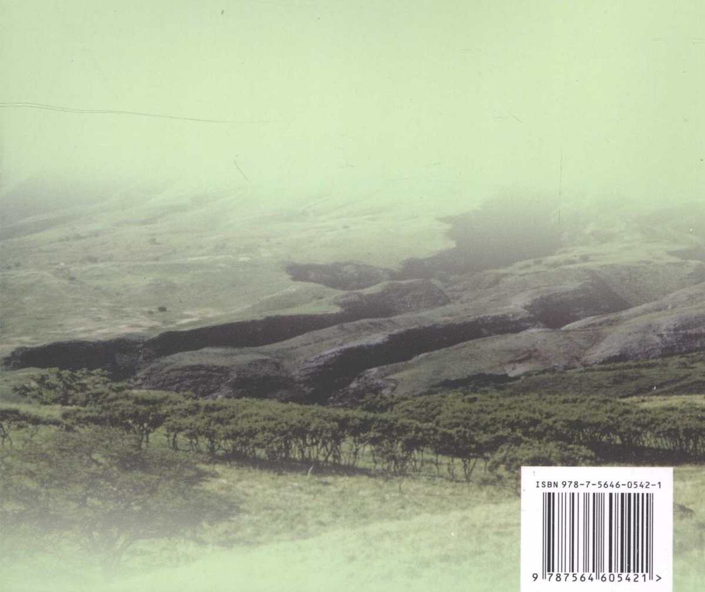