分类号

密级公计

中国地质大学（北京）

博士学位论文.

# 露天铝土矿矿山地质环境综合评价与恢复治理研究—以豫西夹沟矿区为例

学号：3001110152

研究生：程宝成

专业：资源产业经济

研究方向：资源产业经济与可持续发展

指导教师：张寿庭

2015年05月

分类号

密级

中国地质大学（北京）

# 博士学位论文

# 露天铝土矿矿山地质环境综合评价与恢复治理研究一以豫西夹沟矿区为例

学 号：3001110152

研究生：程宝成

专 业：资源产业经济

研究方向：资源产业经济与可持续发展

指导教师：张寿庭

2015年05月

A Dissertation Submitted to

China University of Geosciences for Doctoral Degree

# Research on the comprhensive Recovery and governance for geological Environmen of Opencast bauxite mine ----To Jiagou area of western henna as research object

Ph.D. Candidate: Cheng Baocheng

Major: Resource Industrial Economy

Study Orientation: Resources Industrial Economy

& Sustainable Development

Dissertation Supervisor: Prof. Zhang Shouting

China University of Geosciences (Beijing )

## 中文摘要

以铝为主的有色金属工业是河南省的五大支柱产业之一，河南铝土矿资源有力地支撑了河南省铝工业的发展，但对生态环境产生的负面影响也与日俱增。露天开采形成的采坑及堆渣场破坏了大量的土地资源，对地形地貌景观及生态环境的破坏也较大，还可能引发崩塌、滑坡、泥石流等地质灾害；

选择豫西地区代表性矿山夹沟矿区为研究样本，本着理论与实践相结合、定性与定量相结合的原则，论文系统分析了区内矿山地质环境，查明了矿山开采引起的地质环境问题主要是：滑坡、崩塌、生态景观破坏、水土流失、水体污染、矿渣堆积占地、对土地资源的影响与破坏等。并对这些地质环境问题的产生原因、分布规律、影响因素、危害情况及发展趋势进行了详细研究。为克服矿山边坡稳定性分析与评价遇到的单个矿山容易形成滑坡群和矿山小范围内岩土力学参数不一致的特点，提出和初步运用复合数值法分析矿山边坡稳定性。选取五个具有代表性的影响因子，用人工神经网络模型对矿区地质环境进行综合评价与分区。

在综合分析铝土矿矿山地质环境特点及影响的基础上，结合矿山地质环境特点及其演变规律，对研究区进行综合防治分区，并对于目前正在开采矿坑所存在的滑坡、崩塌等灾害点进行治理设计，对一些地质灾害隐患点进行实时监测。针对目前夹沟矿区所存在的矿渣堆污染、水环境污染等问题，提出了适宜于当地经济条件的保护与治理方案。

结合理论研究和实证分析，论文以促进矿区经济、社会、环境效益协调发展为主线，提出了建立和完善我国矿山环境保护的法律、法规体系建设、加强矿山管理的制度建设的对策建议，探求经济发展、资源开发、环境保护和谐发展的矿业开发模式。

关键词：铝土矿，开采，矿山环境，综合治理，河南省

## Abstract

Nonferrous metals industry based aluminum is one of the five pillar industries in Henan province. Bauxite resources supported effectively the development of aluminum industry in Henan province. However, it has affected seriously ecological environment. A large number of land resources, landform and landscape, and ecological environment were destroyed due to open pit and spoil area of surface mining.

This paper analyzed systematically geological environment in Jiagou area of Western Henan and found out geologically environmental problems in Jiagou area of Western Henan which included landslides, collapse, ecological landscape damage, soil and water loss, water pollution, land occupation caused by slag accumulation, effect and damage of land resource based on the principle of the combination of theory and practice, and a combination of quality and quantity. It also introduced the reasons, regularities of distribution, influencing factors, damage and trend of development of geologically environmental problems by detailed study.In order to overcome the mine slope stability analysis and evaluation of a single mining landslide group of easy formation and small scale characteristics of rock and soil mechanics parameters inconsistent, and preliminary numerical method using the composite analysis of mining slope stability. Choose five factors have shipped representative, using artificial neural network model for comprehensive evaluation of mine geological environment and partition.

Based on the characteristics of geological environment, effect and evolution of bauxite mine, the study area was divided into different regions and improved the landslides and collapse of mining pit at present. In addition, some potential geological hazard was monitored in time. It was proposed to appropriate plan of protection and management to slagheap and water pollution in Jiagou area.

Based on theoretical research and empirical analysis, this paper presented suggestions and strategies which established and perfected the legal systematic construction in protection of mine environment and the system construction of mine management in order to promote coordinative development of economic, social and environmental benefits in mining area.Furthermore, this paper introduced how to explore mining development model in coordination of economic development, resource development and environmental protection.

Key words: Bauxite, Exploitation, Mining environment, Comprehensive control, Henan Province

中文摘要.  
ABSTRACT.  
第1章 前言  
1.1 选题依据与研究意义  
1.1.1 研究背景  
1.1.2 研究意义.  
1.2研究现状与研究进展.  
1.2.1国外矿山环境治理现状及特点.  
1.2.2我国矿山环境治理现状..  
1.2.3夹沟矿区地质、生态环境治理现状.  
1.3 矿山地质、环境问题及发展趋势分析..  
1. 4 研究内容...  
1.5 技术路线与研究方法.  
1.5.1 技术路线  
1.5.2研究方法.  
1.6完成的主要工作量. 9  
1.7主要成果和创新点. 10  
第 2 章 夹沟矿区地质环境背景... 12  
2.1 自然地理... 12  
2.1.1 位置、交通. 12  
2.1.2 水文气象.. 12  
2.1.3 地形地貌. 13  
2.2 社会经济... 14  
2.3 地质环境背景. 15  
2.3.1 地层岩性. 16  
2.3.2 矿区构造.. 18  
2.3.3 矿区水文地质条件. 18  
2.3.4 工程地质条件.. 21  
第 3 章 矿山地质环境问题分析.. 26  
3.1采矿引发地质环境问题概述.. 26  
3.2采矿引发地质灾害 28  
3.2.1滑坡现状与分析. 28  
3.2.2崩塌现状与分析. 39  
3.3 露天开采对生态环境影响... 41  
3.3.1 概述.. 41  
3.3.2 矿区生态环境现状.. 41  
3.3.3 矿区景观结构的影响. 42  
3.3.4 露天开采对土地资源的影响. 42  
3.3.5 露天开采对矿区土壤的影响. 44  
3.4 露天开采对水资源的影响与破坏. 44  
3.4.1矿山废水排泄情况及影响. 44  
3.4.2 露天开采对地表水的影响. 45  
3.4.3 露天开采对地下水的影响. 46  
3.5 矿山废渣对矿区环境影响.. 47  
3.5.1 废渣排放概述..... 47  
3.5.2 矿山废渣对环境的影响. 48  
第4章 矿山地质环境影响综合评价与分区..... .50  
4.1 矿山地质环境评价标准.. 50  
4.1.1 评价原则.. 50  
4.1.2 评价思路.. 51  
4.1.3评价指标体系. 51  
4.1.4评价因子的取值和分级标准. 51  
4.1.5 评价单元... 52  
4.2矿山地质环境评价方法.. 52  
4.2.1 BP 人工神经网络模型 52  
4.2.2 BP人工神经网络的改进.... 56  
4.2.3 LMBP人工神经网络在矿山地质环境质量评价中的应用 59  
4.2.4 评价单元的积分计算和分级. 61  
4.3 矿山环境综合分区... 61  
4.3.1 矿山环境影响严重区. 66  
4.3.2 矿山环境影响较严重区. 67  
4.3.3 矿山环境影响一般区.. 68  
4.3.4 矿山地质环境综合评述.. 68  
第 5 章 矿山地质环境综合治理方法... ..69  
5.1 夹沟典型铝土矿矿坑地质灾害治理... 69  
5.1.1 夹沟矿坑 503-2 采坑各帮治理方法. 69  
5.1.2 夹沟典型铝土矿矿坑滑坡、崩塌治理方法. 69  
5.1.3 典型矿坑滑坡治理方法(联合支护法) 70  
5.2 夹沟典型铝土矿生态环境恢复方案.... 75  
5.2.1夹沟矿区环境保护与治理. 75  
5.2.2 河南典型铝土矿露天开采生态环境保护. 77  
5.3 夹沟典型铝土矿矿山废渣综合治理..... 78  
5.3.1 夹沟矿区废渣处理.. 78  
5.3.2 河南典型铝土矿废渣处理... 78  
5.4 夹沟典型铝土矿矿山废水综合治理及利用... 79  
5.4.1 夹沟典型铝土矿矿区废水处理措施... .79  
5.4.2 河南省典型铝土矿矿山废水综合治理.. .80  
第6章露天矿山环境恢复治理对策及建议 .... 82  
6.1矿山环境恢复治理的对策... .82  
6.1.1扩大矿业用地复耕还田规模.. .82  
6.1.2加强对矿区水资源的保护治理.... 82  
6.2矿山环境恢复治理的政策建议..... .83  
6.2.1提高全民矿山环境恢复治理的意识.. 83  
6.2.2 全面推进矿山环境恢复治理工作... .84  
6.2.3建立地质环境监测体系.... .84  
6.2.4建立地质环境保护与治理多元投入机制.. .85  
6.2.5完善矿山环境治理恢复保证金信用体系....... ..86  
6.2.6实行措施减缓矿山环境压力..... .87  
第7章 结论.…. ..89  
7.1 主要认识与成果. .89  
7.2 问题与展望... . 90  
致谢.… ..91  
参考文献... ..92  
附录. ...97

## 第1章 前言

## 1.1 选题依据与研究意义

## 1.1.1研究背景

20世纪是人类大量消耗资源，快速积累财富，高速发展经济的世纪。随着新世纪的到来，更大量、更快速的矿产资源将被正在进行着或即将陆续步入工业化发展阶段的发展中国家所消耗。河南是全国重要的有色金属产业大省，铝、铅锌、钼等有色金属在国内外占有重要地位，河南铝土矿储量占全国的16.7%，居全国第三名。2013年，河南省氧化铝产量 $1 2 1 3 . 4 \times 1 0 ^ { 4 } \mathrm { t }$ 、电解铝 $3 2 8 \times 1 0 ^ { 4 } \mathrm { t }$ 、铝材加工 $7 7 6 . 5 \times 1 0 ^ { 4 } \mathrm { t }$ ，分别占国内产量的27.34%、14.9%、28.1%，均居全国第1位；铝合金加工产量为 $5 0 . 7 \times 1 0 ^ { 4 } \mathrm { t }$ ，占国内产量的8.5%，居全国第5位。作为河南省有色金属行业的主导产业之一的铝工业，目前以铝土矿、氧化铝、电解铝和铝加工为主线，发电、炭素、氟化盐等辅助产业配套齐全的完整产业链已经形成，郑洛工业走廊无愧为国内最大的铝工业集聚区。

以三水铝石、一水软铝石或一水硬铝石为主要矿物所组成的铝土矿是河南省国民经济重要的基础性原料，也是河南省重要的战略资源，应用范围广，产业链条长，后续加工附加值高。铝土矿主要用于冶炼铝（河南省正在成为世界重要的铝工业基地），冶炼刚玉用于砂轮、砂纸等磨料磨具，作为原料生产高铝水泥，作化工原料制造硫酸铝、氯化铝及氯酸钠等，铝土矿还广泛用于造纸涂料、电缆、高压电瓷、净水剂、陶瓷匣钵等等。铝土矿矿石的有效供给，将对钢铁、铝工业、磨料磨具、水泥、建材涂料、陶瓷、化工、造纸等众多工业部门产生重要的影响。通过几十年的开发建设，河南省铝土矿资源采选加工业已成为河南省国民经济重要组成部分，在全国的影响重大。

## 1.1.2研究意义

以铝为主的有色金属工业是河南省的五大支柱产业之一，长时间以来，河南省铝工业的发展得到了河南铝土矿资源有力地支撑。在铝土矿资源开发利用取得巨大成就的同时，对生态环境产生的负面影响也与日俱增使人痛心，因为铝土矿开采所形成的“三废”污染、生态环境整体恶化的趋势已然成为制约河南社会和经济持续发展的重要因素。按照我国现在经济可持续发展的要求以及原材料结构特征，现阶段河南省有色金属产业的高速发展与铝土矿矿产资源有着极其密切的联系，在相当长的时期内不会有大的变化。目前，我国大部分铝土矿开采方式以露天开采为主，兼有地下开采。露天开采形成的采坑及堆渣场破坏了大量的土地资源，对地形地貌景观及生态环境的破坏也较大，还可能引发崩塌、滑坡、泥石流等地质灾害；地下开采形成的采空区可造成地面塌陷、地裂缝等地质灾害；随着铝土矿开采深度的增加，对地下水的影响也越来越明显。总之，随着矿山开采活动的不断深入，对矿山地质环境的破坏日益加剧。

针对河南省铝土矿资源开发过程中存在的环境问题，探索适应河南省社会、经济、矿产资源可持续发展中的环境战略，着力于铝土矿资源开发朝着实现资源循环利用、经济持续发展、社会稳定进步、生态环境的良性循环，最终满足社会经济发展需要的方向发展，对河南省加快实现工业化和全面实现小康社会有着极为重要的现实意义。为此，实施铝土矿资源开发与环境保护协调发展的战略，治理铝土矿开发过程中产生的地质灾害，开展铝土矿矿山地质环境综合评价与恢复治理方案研究，是河南省可持续发展的必然选择。

中铝河南偃师夹沟铝土矿是中国铝业股份有限公司的重要铝土矿山，选择中铝河南偃师夹沟铝土矿开展铝土矿山环境保护与综合治理技术方法研究具有广泛的代表性。开展夹沟铝土矿矿山环境保护与综合治理技术方法研究，不仅对中铝河南偃师夹沟铝土矿矿山环境保护与综合治理工作起重要的指导作用，同时，对河南省乃至全国其它铝土矿矿山环境保护与治理工作的开展在理论和实践上也具有示范意义。

## 1.2 研究现状与研究进展

## 1.2.1国外矿山环境治理现状及特点

矿山环境是一个涉及众多学科的复杂问题，国外早在工业革命时期就已经产生众多与矿山环境相关的理论研究，但多数是针对局域问题的单因素分析。由于矿山固有的局域特点和实际情况复杂多变，对这一问题的系统性研究鲜见于学术界。这也为本文的研究提供宽广的舞台和增加一定的难度。但是国外多从管理和立法角度倒逼矿山开发者进行一定程度的矿山环境恢复与治理，并且一度收到良好的效果。

早在20世纪20年代，美国就开始矿山环境治理，恢复废弃矿山用地。80年代后，随着矿山地质环境恢复治理技术的发展和矿业、环境保护等管理法规的局部完善，矿山环境恢复治理中的生态系统重建工作已经成为该领域的研究焦点（余雪，2001）。美国政府在矿山环境恢复治理工作上投入了大量的科技和财政力量。1995年制定的“国家矿产资源调查计划”，提出实现矿产资源可持续利用的最终目标，其最大特点是将环境、资源、土地利用以及技术发展等合成一体共同研究。美国地调所1997\~2001年实施的废弃矿地优先研究为联邦土地管理局治理废弃矿山环境提供了技术支持（余雪，2001）。酸性废水的治理以及生物工程技术的应用是矿业环境治理面临的主要问题。针对采矿活动对周围环境、公众健康、人身与财产安全构成的较大威胁，美国土地管理局2000年还出台了废弃矿山土地清理方案2001～2005年长期目标战略计划，美国土地管理局与联邦、州政府将联手清理废弃矿山土地及周围的水域。该战略分为三个步骤：①至2005年鉴定并清除50个废弃矿山；②至2005年完成20%水域的水质改善方案；③准确跟踪、报道废弃矿山用地清理计划的费用预算、费用报道管理等，从而进一步有效推进该项工作的进行；确认短期-中期计划所需的附加资源并提出管理办法。

英国政府对采矿造成的环境破坏十分重视。在1990年英国有矿山废弃土地$7 . 1 \times 1 0 ^ { 4 } \mathrm { h m } ^ { 2 }$ ，其中每年煤矿露采占地 $2 1 0 0 \mathrm { h m } ^ { 2 }$ ，因为各级政府的重视，通过法律、经济等措施，生态恢复效果显著，1984～1992年间，因采矿废弃土地 $1 9 3 6 2 \mathrm { h m } ^ { 2 }$ ，生态恢复面积达 $1 6 9 5 2 \mathrm { h m } ^ { 2 }$ ，恢复率达87.6%，到2003年露天采矿占用地已恢复 $5 . 4 \times 1 0 ^ { 4 } \mathrm { h m } ^ { 2 }$ (刘国华等，2003）。

德国是世界上重要的采煤国家，年产煤量达 $2 \times 1 0 ^ { 8 } \mathrm { t }$ ，以露采为主。德国政府对矿山废弃地的生态恢复、保持农林面积、恢复生态平衡十分重视（钟爽，2005）。莱茵地区露天开采时，让剥离的粘土单独存放被用作覆盖表土，沙、石和电厂的粉煤灰等废料被用作直接回填到采煤坑，填至标高，上面覆盖表土1m厚。多施肥料，首先过渡性的种植苜蓿草，苜蓿根系发达且入土很深，可活化土层改良土壤，经过2\~3年将苜蓿翻种后，土壤中留下了大量的腐殖质和氮素养份，最好再多施一些厩肥，然后再种植小麦、黑麦、甜菜。经过过渡性生态恢复后的各种作物均达到或超过当地原地的收获水平。由于机构健全、严格执法、资金渠道稳定，德国的生态恢复工作取得了巨大成绩。到2006年，德国煤矿采矿破坏土地 $1 5 . 3 4 \times 1 0 ^ { 4 } \mathrm { h m } ^ { 2 }$ ，已经完成的生态恢复的面积有 $8 . 2 3 \times 1 0 ^ { 4 } \mathrm { h m } ^ { 2 }$ 恢复率达53.5%（钟爽，2005）。

在澳大利亚，采矿业是国家的主导产业，矿山生态恢复已经取得长足进展和令人瞩目的成绩，由此被认为是世界上先进而且成功地处理扰动土地的国家，生态恢复已然成为开采工艺的一部分。矿山生态恢复已然成为一种行业，正像冶金、采矿业等一样，正在发挥其独特的作用。通过采取开采和复垦同时进行的方式，至2003年，已复垦矿山土地达到一万多公顷，每公顷复垦费用约为2.5万澳元，复垦费用占到采矿综合成本的15%（朱鸿儒，2012）。

综上所述，为了保证矿山废弃地生态环境恢复的工作顺利进行，许多国家如美国、加拿大、德国、澳大利亚、东欧及日本一些国家都先后制定了有关法律、法令、规章来约束采矿业对土地的破坏，以法律形式要求对采矿占用、破坏的土地生态环境进行恢复。如匈牙利就有严格的法律规定：当把肥沃的土地作其它用途时，使用者应付一大笔赔偿费，其相当部分是用来改良贫瘠的土地，在工业生产活动中被破坏的并已不用作工业用途的土地，原使用者必须将其进行恢复，然后归还农业部门。此外，许多国家为了搞好生态恢复工作建立了一些机构。

## 1.2.2我国矿山环境治理现状

我国关于矿山环境理论研究相对滞后，在管理和立法角度更是落后。最早的矿山环境方面的研究始于上世纪八十年代中后期，但是由于国内近几十年经济的飞速发展和对矿产资源的需求的增加，人们把目光大都集中于对资源的掠取而忽略对矿山环境恶化的思考和研究。直到近几年随着国家和人民对环境污染的日益重视，矿山环境的研究和治理才被提上日程，与此同时对国外先进的矿山环境管理和立法的学习也被广泛引鉴和试用。但是对矿山环境研究的系统问题阐述也如同国外一样，学者发声较少。

据2006年度《中国地质环境公报》显示，截止2006年全国矿业开发占用和损坏的土地面积达 $1 5 4 . 5 { \times } 1 0 ^ { 4 } \mathrm { h m } ^ { 2 }$ ，其中尾矿堆放 $9 1 . 5 { \times } 1 0 ^ { 4 } \mathrm { h m } ^ { 2 }$ ，露天采坑 $2 3 . 0 { \times } 1 0 ^ { 4 } \mathrm { h m } ^ { 2 }$ ，采矿塌陷 $3 3 . 0 { \times } 1 0 ^ { 4 } \mathrm { h m } ^ { 2 }$ 。2006年全国因矿业活动引发地质灾害190起，造成18人伤亡，造成直接经济损失11465万元，矿山开发中“三废”的排放严重污染了矿山及周围地区的地质环境；矿产开采诱发的崩塌、滑坡、泥石流、地面塌陷等地质灾害十分普遍；采矿活动使矿区周围水平衡系统遭受破坏。总之，我国矿山生态环境保护形势十分严峻。

党和国家非常重视矿山生态环境恢复治理工作。胡锦涛总书记在2003年中央人口资源环境工作座谈上指出：“积极探索矿山环境恢复治理新机制。”中央领导同志多次做出批示，要求加快矿山生态环境恢复治理体制建立。《国民经济和社会发展第十个五年计划纲要》明确要求，加强矿山生态环境恢复治理。国家计委发布的《“十五”生态建设和环境保护重点专项规划》中，矿山生态环境恢复治理被列为重点工程内容。

近年来，国土资源部认真贯彻落实党中央、国务院关于矿山生态环境保护和恢复治理的一系列指示精神，大力开展矿山环境保护与恢复治理。为了查清我国矿产资源开采中的环境地质问题，在地质大调查中安排了专项资金。自2002年开始，开展了全国范围的矿山地质环境调查工作。在中央财政的支持下，自2001年开始，选择了一批不同矿种、不同类型、不同地区的老矿业基地，实施了多个矿山地质环境治理示范工程，为我国矿山环境恢复治理提供了宝贵的典型和经验：2001年至2002年，在中央财政的大力支持下，选择了18个不同地区、不同类型的矿山，针对矿产资源开发利用所造成的矿山环境破坏问题，开展矿山地质环境治理以及生态恢复示范工作；2003年财政部拨款1.72亿元，选择不同的矿山分72个工程项目进行矿山地质环境整治；近年来，国家对地质环境保护与综合治理的投资力度逐年加大，截止2013年中央财政投入矿山环境治理资金近270亿元（图1-1），全国31个省(区、市)全部建立了矿山地质环境治理恢复保证金制度。全国已缴存保证金矿山数量为71726个，缴存矿山数量占比达80%。

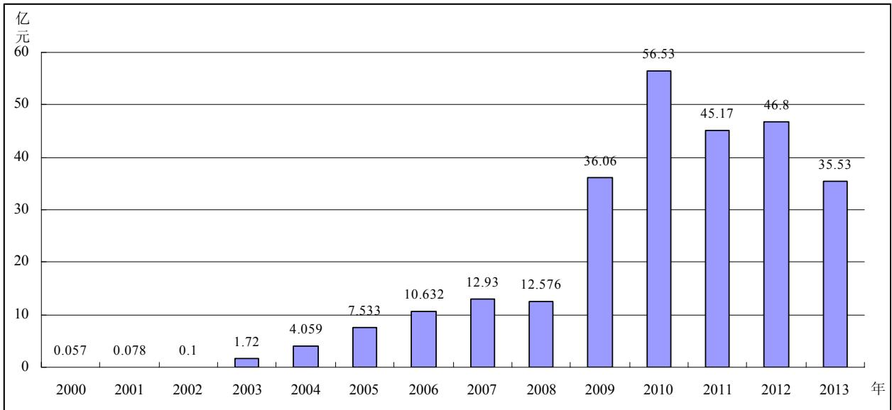  
图1-1 2000-2013年中央财政投入矿山环境治理资金柱状图

## 1、我国矿山环境恢复治理相关法规

《中华人民共和国宪法》明确规定“国家保护和改善生活环境和生态环境，防治污染和其他公害”。《中华人民共和国刑法》把严重危害自然环境等行为定为危害公共安全罪和破坏社会主义经济秩序罪。1979年，全国人民代表大会常务委员会通过并颁布了《中华人民共和国环境保护法（试行）》，确立了生态环境影响评价制度。自1982年以后，全国人民代表大会常务委员会先后通过了《中华人民共和国海洋环境保护法》、《中华人民共和国水污染防治法》和《中华人民共和国大气污染防治法》。1989年12月26日第七届全国人民代表大会常务委员会第十一次会议通过了《中华人民共和国环境保护法》，第十九条规定“开发利用自然资源，必须采取措施保护生态环境”。《土地复垦规定》于1988年10月21日由国务院第二十二次常务会议通过，自1989年1月1日起施行，规定采矿活动造成破坏的土地要采取治理措施，使其恢复到可供使用状态的活动，实行“谁破坏、谁复垦”的原则。1996年《国务院关于环境保护若于问题的决定》指出，要建立并完善恢复生态环境和有偿使用自然资源的经济补偿机制。1996年8月29日第八届全国人民代表大会常务委员会第二十一次会议通过了《中华人民共和国煤炭法》，总则第十一条规定“开发利用煤炭资源，应当遵守有关环境保护的法律、法规，保护生态环境”。1997年实施的《矿产资源法》明确规定，由于采矿活动受到破坏的土地和耕地，矿山企业应当因地制宜适当采取复垦措施。《矿产资源法实施细则》对矿山开发中环境保护和土地复垦的具体要求做了一系列详细规定。1991年6月29日第七届全国人民代表大会常务委员会第二十次会议通过了《中华人民共和国水土保持法》，对人为活动造成水土流失要采取积极预防和治理措施。2003年11月19日国务院第29次常务会议通过了《地质灾害防治条例》、2009年2月2日国土资源部第4次部务会议审议通过了《矿山地质环境保护规定》，对矿产资源勘查开采活动造成的矿山地质环境破坏和产生的地质灾害要进行保护与治理。《全国生态环境保护纲要》(国发[2000]38号)切实解决生态资源开发与环境保护的矛盾问题。

## 2、我国矿山环境治理与恢复保证金制度

矿山环境治理恢复保证金是为了保证采矿权人在采矿过程中合理开采资源、积极保护矿山环境，在闭坑、停办、关闭矿山后做好地质灾害治理和矿山地质环境恢复等工作应缴纳的备用金，来履行矿山环境恢复治理恢复义务。

我国20世纪末就已经有部分地区出台了矿山环境恢复的保证金政策，并试行或者实施了类似于保证金政策的管理办法。1999年宁夏回族自治区和黑龙江省分别颁布了《宁夏回族自治区小型矿山闭坑保证金管理办法(试行)》和《黑龙江省小型矿山闭坑抵押金管理办法》，通过管理办法采矿权人须缴存闭坑抵押金，以促进矿山环境的保护。2002年浙江省、山东招远市、江苏省分别颁布和实施了《浙江省人民政府关于矿山自然生态环境治理备用金收取管理办法的通知》、《招远市开发利用矿产资源收取地质环境治理预备金规定》、《江苏省矿山环境恢复治理保证金收缴及使用管理暂行办法》，采矿权人缴纳部分资金作为矿山自然生态环境治理备用金，用于环境恢复治理。2003年安徽省也颁布实施了《安徽省矿山环境保护管理办法》，2004年湖南省实施了《湖南省矿山地质环境治理备用金管理暂行办法》，规定采矿权人必须依法履行矿山环境恢复治理义务，在办理采矿登记时就应当向国土资源行政主管部门做出书面承诺，并缴纳矿山环境恢复治理保证金。2005年陕西省大同市、辽宁省潮阳市、河南省灵宝市相继颁布了类似的矿山环境恢复治理保证金管理办法，作为约束采矿权人依法履行矿山环境恢复治理。

2006年财政部、国土资源部、环保总局联合发布《关于逐步建立矿山环境治理和生态恢复责任机制的指导意见》，正式提出建立中国矿山环境治理恢复保证金制度，对保证金的使用和监管做出了明确的要求，实行“企业所有、政府监管、专款专用”的原则。以此为依据，山东、云南、云南曲靖市、安徽巢湖市、内蒙古自治区、贵州、青海、甘肃等地区相继出台了矿山环境治理恢复保证金管理办法，各地在制定保证金制度的具体内容上缺乏统一，存在明显的差异。2009年，国土资源部颁布了《矿山地质环境保护规定》，第一次以国务院部门规章的形式对保证金制度从征收、使用、监管到返还等作了详细的规定。但在该规定中仅限于矿山地质环境保护，没有涵盖矿山整体环境的保护和生态功能的恢复，适用面比较狭窄（燕守广等，2012）。

## 1.2.3夹沟矿区地质、生态环境治理现状

近十年来，随着《土地法》、《环境保护法》、《矿产资源法》、《土地复垦规定》等一系列法律、法规的颁布，贯彻落实矿山生态地质环境建设逐步被地方政府以及矿山企业所认知、重视，逐步走向一个法制化、规范化的轨道。但矿区目前仍有闭坑露天采场、废渣石堆场和采矿引起的滑坡、崩塌等地质环境问题。

## 1.3 矿山地质、环境问题及发展趋势分析

虽然目前整个矿山地质环境较好，但局部仍然存在一些环境地质问题，如果不加以重视，后果将不堪设想。存在的问题主要表现为：

## (1) 矿山地质环境保护意识淡薄

目前多数的矿山业主，受经济利益的驱动，只顾大肆开挖矿产资源，忽视了对矿山地质环境的保护，造成矿山地质环境不能从根本上得到治理，随着开矿活动的持续，地质环境将在原有问题上诱发一系列的次生灾害，使得环境更加复杂、更加恶化。

## (2) 私人矿坑诱发的矿山地质环境问题日益突出

本次调查的矿坑共有九个，其中国有矿坑有两个，剩余均为私人矿坑，越界开采、无证偷采、乱采滥挖现象较为严重，这种无序开采方式，不但破坏了资源和矿区生产环境，加剧了矿山地质环境的恶化；而且也给矿区环境治理工作造成一定的困难。

(3)矿山地质灾害分析与评估方法欠缺。

矿坑边坡分析和评价由于其关联性强和地域性明显等特点一直缺乏有力的评价方法，国内外广大地质工作者长期采用现场调查和观察的方法认定滑坡的性质和稳定特点，其方法感性认识太多而理性不足。但如果把矿坑周边所有位置都做详细的勘探，又不切实际。众所周知，矿坑的开采是为了获取资源，如果投入巨资根据矿坑开采的情况一遍遍的做详细勘查显然是不可行的。

(4)矿山地质环境保护法规不健全，缺乏执行力度

目前，颁布了一些关与环境保护的法律法规，但是还没有一部完整的、有针对性的法规是关于矿山环境保护的，有关矿山环境保护的规定仅仅是散见于有关的法律、法规条文中；对矿山环境保护的特殊性认识不足，针对性不强，大多限于“废水、废渣、废气”污染与治理，而对矿山开发存在的其他环境问题关注仍然很少，以致“谁开发、谁保护，谁污染、谁治理，谁破坏、谁恢复”的政策不能有效落实。

## 1.4 研究内容

(1)查明研究区矿山基本情况，主要包括社会经济、地层岩性、地质构造、地形地貌、水文地质条件和工程地质条件等方面进行研究；

(2)查明研究区存在的生态和地质环境问题，并对其危害性和危险性进行评价，预测未来发展趋势及其可能引起的不良后果，具体包括：

①矿山开发对土地资源和地形、地貌景观的影响与评估；

②矿山地质灾害的类型、规模、损失及潜在危害与评估；

③矿业开发对水资源特别是地下水系统的影响与评估；

④固体废弃物（堆渣场）和废水（矿坑水）排放对土壤和水体的污染和生态资源的影响与评估；

(3) 利用 BP神经网络聚类法综合各环境影响因子对夹沟典型铝土矿矿区地质环境进行分区评价研究。

(4)借鉴国内外矿山环境保护、综合治理与生态恢复技术，特别是在生态保护、固体废弃物治理与综合利用、地质灾害防治等主要技术领域，吸纳其中的先进、实用技术方法，针对典型铝土矿矿山环境保护与综合治理技术方法进行研究。

(5)针对我国矿山地质环境恢复治理存在的问题提出对策与建议。

## 1.5 技术路线与研究方法

## 1.5.1技术路线

（1）选择豫西地区代表性矿山夹沟矿区为研究样本，通过调查研究区的工程地质环境和矿山生态环境，查明了矿山开采引起的地质环境问题主要是：滑坡、崩塌、生态景观破坏、水土流失、水体污染、矿渣堆积占地、对土地资源的影响与破坏等。并对这些地质环境问题的产生原因、分布规律、影响因素、危害情况及发展趋势进行了详细研究。

（2）在综合分析夹沟铝土矿矿山地质环境特点及影响的基础上，结合矿山地质环境特点及其演变规律，通过BP神经网络聚类法对研究区矿山地质环境进行综合防治分区，并对夹沟矿区存在的地质灾害（滑坡、崩塌等）、矿渣堆污染、水环境污染等问题点提出综合治理方案。

（3）根据我国在矿山地质环境恢复治理过程中存在的问题，提出相应的对策及建议。

## 1.5.2研究方法

（1）在充分学习和了解前人研究成果的基础上，在对典型研究区开展野外实地调查研究，进行室内分析研究和重点解剖。在研究中注重引进新理论、新思想、新方法、新技术，开拓思路，使各项研究更富针对性、创造性，取得尽可能贴近当地地质环境实际的资料、数据和认识。

（2）采用理论与实践相结合、定性分析与定量分析相结合的研究方法，指出铝土矿矿山存在的地质环境问题及其类型，从而提出了更符合实际的治理方法和对策。

## 1.6 完成的主要工作量

外业工作重点调查夹沟矿区面积为 $2 \mathrm { k m } ^ { 2 }$ ，调查点数233处。其中露天开采矿坑共9处，占地面积约 $0 . 2 6 \mathrm { k m } ^ { 2 }$ ，占调查面积的约13%；滑坡灾害点8处；易发生矿区突水1处；矿渣堆积点大小共18处占地面积约 $0 . 1 4 \mathrm { k m } ^ { 2 }$ ，占调查面积的7%，堆积厚度 $5 \sim 1 0 \mathrm { m }$ 其中有部分约 $0 . 0 4 6 6 \mathrm { k m } ^ { 2 }$ 的土地已被复垦利用；矿区水井1处；填写记录本5本；拍摄照片414张；填写调查表3张；绘制野外实际材料图(1:2000)1张。主要完成实物工作量见表1-1。

表1-1 完成主要工实物工作量一览表
<table><tr><td rowspan=1 colspan=1>工作内容</td><td rowspan=1 colspan=1>单位</td><td rowspan=1 colspan=1>完成工作量</td><td rowspan=1 colspan=1>备注</td></tr><tr><td rowspan=1 colspan=1>调查面积</td><td rowspan=1 colspan=1> $\mathrm { k m } ^ { 2 }$ </td><td rowspan=1 colspan=1>2.08</td><td rowspan=1 colspan=1></td></tr><tr><td rowspan=1 colspan=1>调查点</td><td rowspan=1 colspan=1>个</td><td rowspan=1 colspan=1>233</td><td rowspan=1 colspan=1></td></tr><tr><td rowspan=1 colspan=1>调查天数</td><td rowspan=1 colspan=1>天</td><td rowspan=1 colspan=1>30</td><td rowspan=1 colspan=1></td></tr><tr><td rowspan=1 colspan=1>采场调查</td><td rowspan=1 colspan=1>个</td><td rowspan=1 colspan=1>9</td><td rowspan=1 colspan=1></td></tr><tr><td rowspan=1 colspan=1>采集水样</td><td rowspan=1 colspan=1>个</td><td rowspan=1 colspan=1>4</td><td rowspan=1 colspan=1></td></tr><tr><td rowspan=1 colspan=1>采集土样</td><td rowspan=1 colspan=1>个</td><td rowspan=1 colspan=1>10</td><td rowspan=1 colspan=1></td></tr><tr><td rowspan=1 colspan=1>照片</td><td rowspan=1 colspan=1>张</td><td rowspan=1 colspan=1>414</td><td rowspan=1 colspan=1></td></tr><tr><td rowspan=1 colspan=1>阅读文献</td><td rowspan=1 colspan=1>篇</td><td rowspan=1 colspan=1>124</td><td rowspan=1 colspan=1></td></tr><tr><td rowspan=1 colspan=1>完成图件</td><td rowspan=1 colspan=1>张</td><td rowspan=1 colspan=1>3</td><td rowspan=1 colspan=1></td></tr></table>

## 1.7 主要成果和创新点

1. 选择豫西地区代表性矿山夹沟矿区为研究样本，对区内的露天采坑进行了矿山地质环境研究，查明了矿山开采引起的地质环境问题主要是：滑坡、崩塌、生态景观破坏、水土流失、水体污染、矿渣堆积占地、对土地资源的影响与破坏等。并对这些地质环境问题的产生原因、分布规律、影响因素、危害情况及发展趋势进行了详细研究。

2. 提出和应用复合数值法：即对矿区九个已经滑动和极有可能滑动的边坡进行数值模拟，首先要求模拟结果与实际滑动结果一致；在不违背前期调查岩土力学参数的基础上对参数进行修正，以选用模拟结果和实际结果一致的岩土力学参数；再用选定参数对典型矿坑(503-2#)进行数值分析，得到最终分析结果，做出正确评价。

3. 在充分调查和研究该区地质环境背景和主要地质环境问题及矿山开采活动特点的基础上，选取采矿影响的地形地貌、占用破坏耕地规模、占用破坏林地规模、“三废”排放量、矿山次生地质灾害5个因子，并进行单元格剖分；利用定量和定性相结合的方法，对每一个单元格的每一个评价因子进行赋值评价；利用积分算法，分别计算各单元格的矿山地质环境及恢复治理、人类活动和矿山地质背景的得分，并连加计算其总得分：给出矿山地质环境评价和分区。

4. 针对矿山滑坡特点针对性提出和应用联合支护法：主要采用削坡、排水、锚杆以及综合治理等方法。针对铝土矿矿山不稳定边坡和其易产生崩塌、塌滑、剥落等破坏形式，依据边坡的不同破坏特点，采用削坡、排水等治理方法。

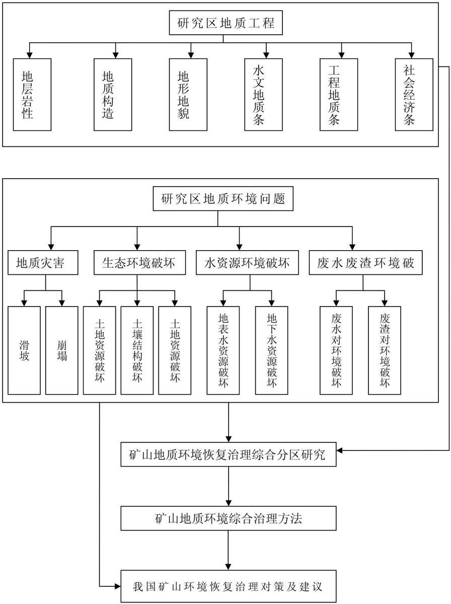  
图 1-2 研究思路框架图

## 第 2 章 夹沟矿区地质环境背景

## 2.1 自然地理

## 2.1.1 位置、交通

研究区位于河南省西部偃师市，北濒黄河，同孟州市相望，南与登封市、伊川县接壤，西接洛阳市，东连巩义市。地理坐标东经 $1 1 2 ^ { \circ } 2 9 ^ { \prime } 4 0 " \sim 1 1 2 ^ { \circ } 5 8 ^ { \prime } 5 2 "$ ，北纬34°27'18"～34°49'03"，全市面积 $9 4 8 . 4 \mathrm { k m } ^ { 2 }$ 。陇海铁路、开（封）～洛（阳））、洛（阳）～界（首）高速公路及310、207国道从境内通过,焦枝铁路在市境西侧。柏油路、水泥路通往各乡、镇，交通极为便利。

研究区位于偃师市南东约30km，行政区划隶属于偃师市府店镇所管辖，面积2km²。本次调查的矿区位于河南省偃师市夹沟铝土矿区中部，距偃师火车站约30km，距龙门火车站约60km，距洛阳火车站约70km。矿区北侧和东侧有登封—偃师—洛阳公路通过，到矿区有柏油路支线及数条简易公路相连，交通比较方便（图2-1）。调查区距郑州铝厂82km，为郑州铝厂的原料基地之一。

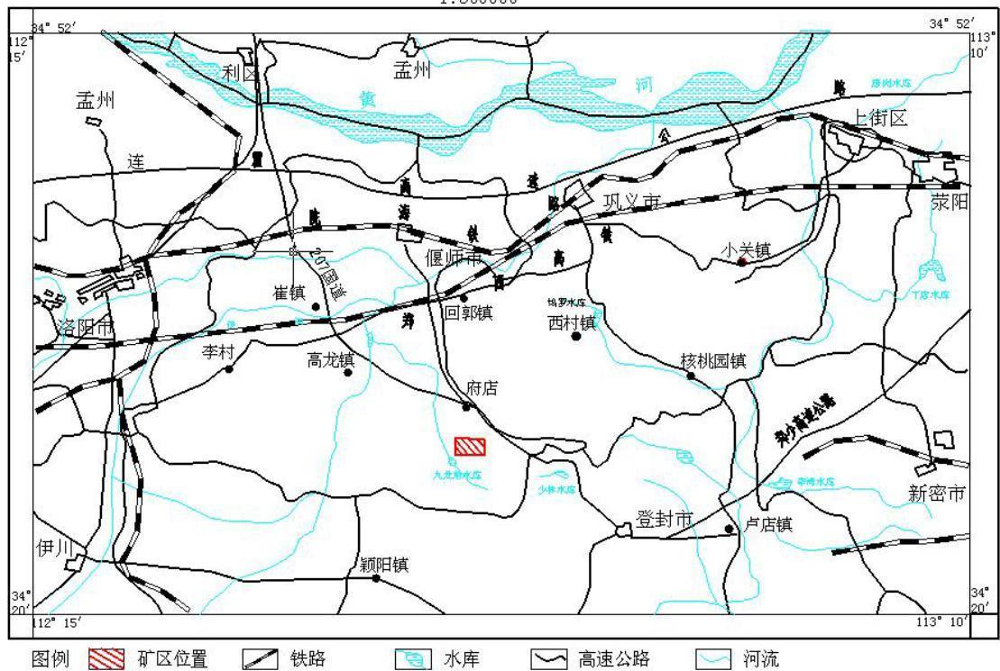  
图2-1 工作区交通位置图

## 2.1.2 水文气象

## (1) 河流

矿区北侧有伊河和洛河，伊河发源地是栾川县境内伏牛山区，流经嵩县、伊川，穿 过龙门至偃师市境内。洛河发源于陕西省洛南县华山南坡，流经卢氏、洛宁、宜阳、洛 阳市，进入偃师市境内。两河在偃师杨村附近汇合，叫伊洛河，又叫青河，流经巩义县 注入黄河。

伊河全长237.9km，流域面积为 $5 8 5 7 \mathrm { k m } ^ { 2 }$ ，水源以大气降水为主，年降雨量的多少，直接影响年径流量的大小。据龙门水文站观测资料统计，年平均流量为 $5 . 6 6 { \sim } 9 8 . 4 \mathrm { m } ^ { 3 } / \mathrm { s }$ 总平均流量为 $2 6 . 0 5 \mathrm { m } ^ { 3 } / \mathrm { s }$ ，总平均年径流量为8.22亿 $\mathfrak { m } ^ { 3 }$ 。最大洪水达 $2 4 8 0 \mathrm { m } ^ { 3 } / \mathrm { s }$

洛河集水面积为 $1 1 8 9 1 \mathrm { k m } ^ { 2 }$ ，据白马寺水文站观测资料统计，年平均流量为23.5～$1 8 8 . 0 \mathrm { m } ^ { 3 } / \mathrm { s }$ ，平均流量为 $5 3 . 2 5 \mathrm { m } ^ { 3 } / \mathrm { s }$ ，平均年径流量为16.04亿 $\mathfrak { m } ^ { 3 }$ 。最大洪水达 $2 9 9 0 \mathrm { m } ^ { 3 } / \mathrm { s }$ o

夹沟铝土矿区位于区域水文地质单元的东部偏南，区内及其附近无大的地表水体，仅有马涧河从矿区西部边缘由南东向北西流过。在上游矿区南西方向，距口孜村南东2.5km处，于1960年建成九龙角水库，坝高 28.1m，坝顶标高+329.60m，库底标高+301.50m，汇水面积 $1 0 . 6 \mathrm { k m } ^ { 2 }$ ，库容量620万 $\mathfrak { m } ^ { 3 } .$ 。库水主要用于农田灌溉。调查区内无河流及大的地表水体。

## (2) 气候

偃师为暖温带大陆性季风气候，春夏秋冬四季分明，气候具“冬长寒冷雨雪少，春季干旱大风多，夏季多雨且集中，秋天晴和日照长”的特点。据偃师市气象站观测资料，最高气温达 $4 3 . 4 \mathrm { { } ^ { \circ } C }$ ，最低气温是 $. 1 9 . 5 \mathrm { ^ \circ C }$ ，年平均气温约 $1 3 . 9 ^ { \circ } \mathrm { C } \sim 1 5 . 7 ^ { \circ } \mathrm { C }$ 。绝对湿度为0～45.1毫巴，平均13.2毫巴；平均相对湿度为69%。年降雨量为309.1～924.2mm，平均527.2mm。最大暴雨一次为1999年9月22日～37日，降雨量为187.6mm；一次为2003年7月17日～22日，降雨量为179.6mm，其中7月19日一次降雨101.1mm。最大积雪为20cm(2004年12月24日)。据1995～2005年10年统计，年蒸发量为1429.7mm～1693.9mm，平均1608.0mm。

## 2.1.3 地形地貌

偃师市位于洛阳盆地东部，其地势是南北高中间低，为两峰夹一堑的地形地貌。南部为山区，属嵩山山脉的西段(万安山)，最高海拔标高1303m；北部为邙岭，横亘于黄河与洛河之间，最高海拔标高403.9m；中部为宽阔的伊、洛河冲积平原和山前倾斜平原，海拔115\~135m。

本次的调查区位于嵩山山脉北坡山脚处，嵩山山脉为黄河水系与淮河水系的分水岭，山岳耸峙、高峻巍峨，西段玉寨山海拔1512.4m，中段嵩山主峰海拔1487.9m，东段五指岭海拔1215.9m，为侵蚀类型的低～中山区，相对高差100～300m。

区内海拔标高+300～+400m，南北向冲沟十分发育，多呈陡峭的“V”字型，深10～30m。

## 2.2 社会经济

偃师位于河南省西部，南屏嵩岳，北临黄河，东西长约44km，南北宽约34km，总面积 $6 6 8 . 5 8 \mathrm { k m } ^ { 2 }$ ，其中平原面积占31.4%，丘陵占51.9%，山区占16.7%。至2013年底，全市下辖11镇1个工业区、210个行政村、32个社区，总人口达61.6万，包括汉、回、藏、维、侗、苗、纳西、满、裕固、蒙古、壮、白、瑶等13个民族，其中汉族占99.4%。偃师市是中原经济区郑洛工业走廊上的重要节点城市，河南省经济扩权县（市）、对外开放重点县（市）、首批小康达标县（市）、城乡一体化试点市，综合经济实力居全省前列(偃师政府网，2014)。偃师市区面积 $1 6 \mathrm { k m } ^ { 2 }$ ，市区人口14万人，是全国卫生先进城市、省级文明城市、省级卫生城市、省级园林城市和荣获全国人居环境范例奖城市。

偃师市是一个农、工业都比较发达的地方。偃师市主要粮食作物有小麦、大麦、玉米、稻子、谷子、高梁、红薯等，主要油料作物有芝麻、油菜籽、大豆、花生、棉仔等，经济作物有棉花、黄麻、烟叶、蔬菜等。偃师是全国小麦稳产、高产、优质、低成本栽培技术发源地、国家优质专用粮生产基地以及全国重要的小麦良种繁育基地，被授予全省农业标准化先进县（市）和全省畜牧业重点县（市）。2013年，紧紧围绕稳定基础强支撑，持续实施“1+1”经济结构转型战略，不断增强农业基础地位,粮食生产再获丰收，总产达4.98亿斤(偃师政府网，2014)。

主要工业有：制造业、采矿业等，采矿业以煤、铝、石灰石矿为主，近几年发展迅猛。

偃师市矿产资源较丰富，产地集中，综合集约开发互补性强，易于转变为经济优势。水资源丰富，可利用的地表水、地下水总量为 $4 6 9 4 3 { \times } 1 0 ^ { 4 } \mathrm { m } ^ { 3 }$ ，有稳固的农业基础。偃师历史悠久，有丰富的人文和自然景观旅游资源，是河南“三点一线”的旅游开发重点地域，被国家科技部批准为国家星火技术密集区；获省级园林城市称号；顺利通过洛阳小城镇建设检查验收。

新中国成立以后，尤其是改革开放以来，全市经济飞速发展，农业基础地位不断巩固，农业结构调整取得突破进展。工业结构调整取得显著成效，特色产业提升速度加快，非公有制经济进一步壮大；城镇建设实现历史性转变，城乡面貌发生巨大变化；重点工程进展顺利，基础设施建设步伐不断加快；各项改革稳步推进，经济效益和社会效益明显提高；人民生活水平明显改善。于1997年率先成为全省首批10个小康达标县(市)之

2013年，全市共完成地区生产总值354亿元，增长9.8%；固定资产投资199亿元，增长24.9%；公共财政预算收入12.12亿元，增长16.5%；社会消费品零售总额116.8亿元，增长13.2%；城镇居民人均可支配收入22357元，增长10.5%；农民人均纯收入12596元，增长13%。在全省108县（市）首次经济发展质量总体评价中，偃师综合评价排名第七位，发展结构排名第六位，发展效益和民生幸福均列第四位(偃师政府网，2014)。

从总体情况看，经济和社会发展还存在突出问题，主要表现在：工业经济结构不合理；第三产业发展滞后，比重偏低，初级加工业比重过大，精、深加工产品和高新技术产品少，难以适应快速变化的市场需求；乡镇企业发展较缓慢；农民收入增速减缓；人口、资源、环境面临较大压力等问题。

## 2.3 地质环境背景

夹沟矿区位于参店一龙门矿带东段，东自宋寨，西至口孜，长6km。矿区在嵩山北坡山前丘陵区，沟谷发育，沿矿体走向在山坡和沟谷有露头断续分布。区域构造上属于华北地块嵩箕台隆北部。地质力学体系属于昆仑—秦岭东西向复杂构造带，有华夏—新华夏系和北西向构造体系的复合(见图2-2)。

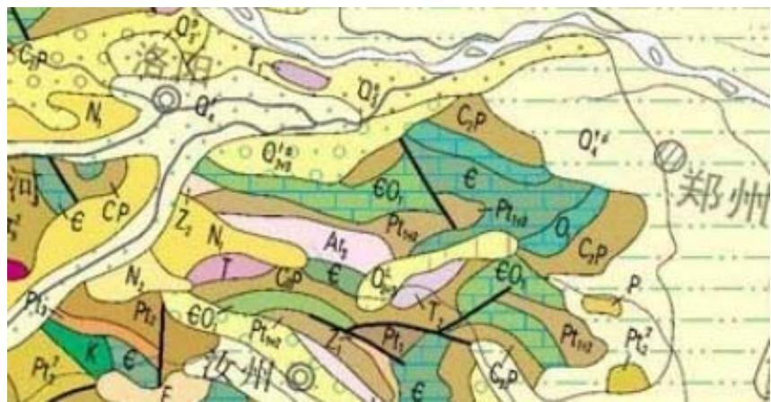  
图2-2 夹沟地区地质图

## 2.3.1 地层岩性

本区除了缺失 $\mathrm { O } _ { 3 } \setminus \mathrm { S } \setminus \mathrm { D } , \mathrm { C } _ { 1 }$ 地层外，自太古宇至新生界均有出露，为华北型地层。前震旦纪变质岩系分布于嵩山复背斜和箕山复背斜的核部，古生界地层分布于复背斜的两翼，中新生界地层分布于断陷盆地中。

## 1.太古宇(Arg)

早期为粘土、半粘土质沉积和中基性火山岩，晚期为含砾泥砂沉积。嵩阳运动经受区域变质，属于铁铝榴石角闪岩相，并伴有混合岩化和花岗岩化。其后在形变中发生退变质。该群厚度大于1566m，岩性主要为黑云角闪斜长片麻岩，顶部为含砾绿泥绢云石英片岩，局部存在混合岩化。

## 2.古元古界(Pt)

为海滨—浅海陆源砂质、泥砂质、泥质及白云质碳酸盐沉积。中岳运动经受浅变质，属绿片岩相黑云母亚相。该群地层厚度为1735～3101m。

## 3.新元古界震旦系(Z)

为浅海碎屑岩，基本上未变质，局部浅变质。地层厚度为0～306m。

## 4.古生界寒武系(∈)

区域上寒武系地层出露较完整，分布较广泛，岩性为中厚层白云质灰岩，含燧石条带白云质灰岩及白云岩。该群地层厚度为549～1224m。

## 5.古生界奥陶系(O)

本区主要出露中统马家沟组 $\left( \mathrm { O } _ { 2 \mathrm { m } } \right)$ ，缺失下统和上统地层。地层厚度为42～126m。岩性有灰色厚层状灰岩、角砾状灰岩、豹皮状灰岩及灰黄色薄层泥灰岩夹薄层状页岩，底部见有含砾砂岩。以灰色厚层状灰岩为主，在矿区东部地表常见。

## 6.古生界石炭系(C)

石炭系为滨海相、海陆交互相地层，区域上缺失下统地层，出露上统本溪组 $( \mathrm { C } _ { 2 \mathrm { b } } )$ 和太原组 $( \mathrm { C } _ { 2 \mathfrak { t } } )$

(1) 石炭系上统本溪组 $. ( \mathrm { C } _ { 2 \mathrm { b } } )$ ：该组地层厚度为0.45～87m。为铁铝矿层，是工作的主要对象，与下伏奥陶系为平行不整合接触，与上覆太原组呈整合接触。

(2) 石炭系上统太原组 $( \mathrm { C } _ { 2 \mathrm { t } } )$ ：该组地层厚度为51～105m。其岩性为生物灰岩、砂岩和砂质页岩，间夹薄煤11层，化石丰富。根据沉积旋回和岩性特征可分为三层：

①砂质页岩、粉细砂岩 $\cdot ( \mathbf { C } _ { 2 \mathrm { t } } ^ { 1 } )$ ：本区此层经常缺失，厚度<4.66m。

②黑色块状亮煤及炭质页岩 $\cdot ( \mathrm { C } _ { 2 \mathrm { t } } ^ { 2 } )$ ：即一，煤，俗称炭煤，具沥青光泽，岩性硬脆，含黄铁矿结核，局部可采，厚0.67～2.56m，平均1.64m。

③深灰色厚层状含生物灰岩 $\cdot ( \mathrm { C } _ { 2 \mathrm { t } } ^ { 3 } )$ ：结构致密，岩性硬脆。下部质纯，上部含燧石团块或条带。含方解石细脉，夹薄层状亮煤或炭质页岩三层(一 $\overline { { \underline { { \mathbf { \Pi } } } } } _ { 2 - 4 } \mathbf { \Pi } )$ ，不可采。含大量的纺锤虫、海百合茎、长身贝(即犬齿珊瑚(未定种))等化石。

## 7.上古生界二叠系(P)

为滨海相、海陆交互相及陆相煤系地层。本区出露下统的山西组 $\left( \mathrm { P _ { 1 s } } \right)$ 、下统下石盒子组 $\left( \mathrm { P } _ { 1 x } \right)$ 、上统上石盒子组 $\left( \mathrm { P } _ { 2 \mathrm { s } } \right)$ 、石千峰组 $( \mathrm { P } _ { 2 \mathrm { s h } } )$

(1) 山西组 $\left( \mathrm { P _ { 1 s } } \right)$ ：杂色砂岩夹黑色页岩及煤层，地层厚度为10～65m。主要岩性为深灰色及黑灰色薄层状砂质页岩、页岩及粉砂岩，含煤三层(二。、二1、二)。

(2)二叠系下统下石盒子组 $( \mathrm { P } _ { \mathrm { 1 x } } )$ ：地层厚度为22～77m。主要岩性为灰白色中粗粒 砂岩、灰白色细中粒砂岩、粉砂岩夹砂质页岩、灰黑色砂质页岩、粉砂岩及页岩。

(3) 上石盒子组 $( \mathrm { P } _ { 2 \mathrm { s } } )$ ：分布在缑山一带，地层厚度为403～969m。可以分为三层：下层：肝红色砂质页岩夹薄层细砂岩；中层：灰绿色薄层状细砂岩夹钙质砂岩结核，结核呈圆球状或铁饼状，并夹薄层砂岩2～3层；上层：紫红色厚层状石英砂岩，胶结致密，质地坚硬，有波痕。

(4) 石千峰组 $( \mathrm { P } _ { 2 \mathrm { s h } } )$ ：地层厚度为470～865m，可分为上下两层：下层：砂岩、粉砂岩、砂质页岩；上层：灰黄色石英砂岩及长石砂岩。

## 8.中生界三叠系(T)

该地层仅在断陷盆地及河流两岸有零星分布，中统和下统界线不清，地层厚度为1080\~1292m。

## 9.新生界古近系(E)和新近系(N)

零星分布在断陷盆地中及河流两岸。地层厚度为106～2665m。

## 10.新生界第四系(Q)

零星分布于断陷盆地及河流两岸，地层厚度为0～245m。主要岩性为棕红色粉砂质亚粘土、黄土及近代冲积砂砾石层。

(1) 更新统 $\mathrm { ( Q p ) }$

①Qp1：砾石层或基底的残、坡积层，半成岩，砾石呈次棱角状、次圆状，大小不一，以20cm以下者居多。岩性以奥陶系和寒武系灰岩的白云岩为主。

②Qp2：棕红、褐红色粘土。粘性大，塑性较强，内含较多的钙质结核，并含少量砂粒，有时夹2m厚的砾石层，主要出露在沟谷中。

③Qp3：黄土层，垂直节理发育，直立性强，常形成陡壁，在矿区大面积分布。

(2)全新统(Qh)：为近代河流、冲沟冲积的砂砾石层。

## 2.3.2 矿区构造

矿区构造简单，为一向北倾斜的舒缓单斜构造，构造线近似东西向展布，倾向 $3 4 0 ^ { \circ } \sim$ 20°，倾角12°～23°。

在局部地段，岩层有波状弯曲，但轴向有东西向的，也有南北向或近南北向。这种情况可能既与构造作用有关，也与古地形有关。断裂构造，位于调查区中部有一条隐伏逆断层F1，此断层呈NWW向展布，长700m，平均走向 $3 4 0 ^ { \circ }$ ，倾向SW，倾角75°左右，为压扭性断层，上盘往北斜冲，对矿体有一定程度的破坏。

## 2.3.3 矿区水文地质条件

## 1.地表水特征

夹沟铝土矿区位于区域水文地质单元的东部偏南，区内及其附近无大的地表水体，仅有马涧河从矿区西部边缘由南东向北西流过，在上游矿区南西方向，距口孜村南东2.5km处，于1960年建成九龙角水库，坝高28.1m，坝顶标高+329.60m，库底标高+301.50m，汇水面积 $1 0 . 6 \mathrm { k m } ^ { 2 }$ ，库容量620万 $\mathfrak { m } ^ { 3 }$ ，库水主要用于农田灌溉。调查区内无河流及大的地表水体。

## 2.地下水供给及特征

据调查，九龙角水库坝址直接座落在奥陶系石灰岩上，库底漏水严重，常年聚水不多，夏季洪水期最高水位标高+323m，此时库水大量补给地下水，冬季库水很少，有时干枯。

(1)含水层：根据富水性及其与矿床的直间接关系，将含水层由老至新叙述如下：

①奥陶系中统 $( \mathrm { O } _ { 2 } )$ 灰岩裂隙岩溶承压含水层：在矿区南部及东南部广泛出露，由深灰色厚层状石灰岩，灰白色白云质灰岩、含白云质灰岩、角砾状灰岩及灰黄色薄层状泥质灰岩等组成，厚度60m左右，含裂隙岩溶承压水。顶面呈凹凸不平的古岩溶剥蚀面，岩层由南向北缓倾斜，倾角 $1 8 ^ { \circ } \sim 2 0 ^ { \circ }$ ，构成铝土矿层的直接底板，是矿区主要含水层。含水层主要接受大气降水的补给后，经地下径流补给矿区，补给量较大。水位埋深由东向西逐渐变深(80～110m)，地下水的流向由东向西和由南向北运动，水力坡度千分之八左右，静止水位标高一般+230～+250m，最高+274.11m(ZK308 孔 82 年11 月)，最低+217.58m(ZK366孔82年6月10日)，年水位变幅30.68～38.45m。

②石炭系上统太原组下段 $( \mathbf { C } _ { 2 \mathrm { { t } } } ^ { \phantom { + } 1 } )$ 及太原组上段 $( \mathrm { C } _ { 2 \mathrm { t } } ^ { 2 } )$ 石灰岩裂隙岩溶承压含水层：矿区内为大面积第四系地层覆盖，仅在矿区东段有零星出露，一般厚度36.95～80.96m，平均厚度51.85m。含水层主要由上下两层深灰色含辉石灰岩及厚层状(含生物)灰岩，其次为灰黄色、灰色中—细粒石英砂岩等组成。上部灰岩厚度0.45～18.69m，平均7.00m，下部灰岩厚1.70～35.07m，平均厚度10.37m。中部夹厚度不等的砂质页(泥)岩及数层层位、厚度不稳定的生物(含生物)灰岩、砂质页岩、泥岩不含水，灰岩含水微弱，为相对隔水层。砂岩致密坚硬、风化裂隙较发育；灰岩裂隙岩溶发育，岩芯普遍破碎。岩溶形态以溶蚀裂隙、溶洞、溶孔为主。溶洞高一般小于1m，最高2.78m，大多被粘土类物质及灰岩碎块全充填或半充填，个别无充填，在标高+200m以上岩溶较发育。标高+200m以下逐渐消失。该层除少量大气降水直接补给地下水外，主要以越流形式补给为主，补给量小，纵Ⅱ线以南所处位置较高，透水而不含水，为饱气带，在该线以北岩层含水。

③二叠系下统 $( \mathsf { P } _ { 1 } )$ 砂岩裂隙承压含水层：该层在矿区全部被第四系地层覆盖，岩性由深灰色、黑灰色砂质页岩、炭质页(泥)岩、煤层及灰白色中—细粒、粉—细粒砂岩组成。岩层由南向北倾斜，倾角 $1 9 \sim 2 0 ^ { \circ }$ 。砂质页岩、炭质页(泥)岩、粉砂岩及煤层为隔水层，中细粒石英砂岩含裂隙承压水。地下水的补给来源主要为大气降水，补给途径是通过第四系地层间接补给。在纵V线以南为饱气带，以北为饱水带，厚度一般4.97～22.92m，平均13.06m。

④第四系(Q)孔隙潜水含水层：第四系广布全区(仅在矿区南部和东南部有零星基岩出露)，厚度由南向北和由东向西逐渐变厚，一般30～40m，最厚244.73m。上部为浅黄色、灰黄色亚粘土、亚砂土及砂砾石层等，分布于矿区的中部和北部，厚度一般5～20m，最厚44.35m，亚粘土不含水。亚砂土(疏松、质均、垂直节理发育)、砂砾石层(呈透镜体)为含水层。下部为棕红色、红褐色土质粘土、重亚粘土，含砾粘土及砂砾石层等组成。厚度一般10～30m，最厚82.48m，粘土和亚粘土含铁锰质斑点及结核，致密状不含水，砂砾石层呈透镜状为含水层，一般钻孔揭露1～3层，最多5层，厚度一般2m左右，最厚20m以上，富水性较弱。

(2) 隔水层：石炭系上统 $( \mathbf { C } _ { 2 } )$ 本溪组含矿层隔水层，由铁质或含铁质粘土岩、杂色粘土岩、铝土质粘土岩、铝土岩、铝土矿及薄层铁矿层等组成。厚度变化与底板奥陶系$\left( \mathrm { O } _ { 2 \mathrm { m } } \right)$ 古岩溶剥蚀面的起伏形态有关，一般厚度0.45～54.25m，平均15.18m。该层在钻探过程中，除底部铁矿层微弱漏水外，一般均不漏水，是铝土矿顶底板含水层的主要隔水层。

## 3.岩溶发育带、构造破碎带的水文地质特征

(1) 灰岩溶洞发育带规律

①岩溶在平面位置上的发育规律：在核查区第23横勘探线以西，纵Ⅲ线以南，岩溶发育相对较强，溶洞规模相对较大，但多数粘土类物质，灰岩碎块全充填，这与马涧河水长期补给地下水有关。溶洞在平面位置上多分布在纵Ⅲ线以南，大部溶洞均为干溶洞。

②岩溶发育近地表部位较强：据钻孔溶洞统计表明，纵Ⅲ线以南，标高+250m以上，岩溶较其他部位发育，这与矿区第四系地层覆盖程度及可溶岩的产状有关。从第四系盖层看，南薄北厚，可溶岩层有出露；从可溶岩的产状看，岩层处于北倾的单斜构造区。可溶岩在纵Ⅱ线以南接近于地表，便于接受大气降水的补给，故岩溶较其他部位较发育。

③岩溶在垂直方向上的发育规律：石炭系和奥陶系灰岩的岩溶发育规律，普遍在标高+200m以上较发育，但充填率较高，这与地下水径流条件差，水流缓慢，使地下水携带物易于沉淀有关。在地下水位线以下开采矿床时，坑道有可能遇到大量流沙溢入的现象。应引起注意。

表 2-1 铝土矿(O₂)不同可溶岩岩溶发育统计表
<table><tr><td rowspan=1 colspan=2>可溶岩名称</td><td rowspan=1 colspan=1>石灰岩</td><td rowspan=1 colspan=1>含白云质灰岩</td><td rowspan=1 colspan=1>白云质灰岩</td><td rowspan=1 colspan=1>其他</td></tr><tr><td rowspan=1 colspan=2>见可溶岩钻孔数(个)</td><td rowspan=1 colspan=1>107</td><td rowspan=1 colspan=1>54</td><td rowspan=1 colspan=1>68</td><td rowspan=1 colspan=1>67</td></tr><tr><td rowspan=1 colspan=2>见溶洞钻孔数(个)</td><td rowspan=1 colspan=1>25</td><td rowspan=1 colspan=1>14</td><td rowspan=1 colspan=1>11</td><td rowspan=1 colspan=1>7</td></tr><tr><td rowspan=1 colspan=2>钻孔溶洞能见率(%)</td><td rowspan=1 colspan=1>23.36</td><td rowspan=1 colspan=1>25.39</td><td rowspan=1 colspan=1>16.18</td><td rowspan=1 colspan=1>10.45</td></tr><tr><td rowspan=1 colspan=2>揭露可溶岩厚度(m)</td><td rowspan=1 colspan=1>742.63</td><td rowspan=1 colspan=1>403.92</td><td rowspan=1 colspan=1>440.35</td><td rowspan=1 colspan=1>496.77</td></tr><tr><td rowspan=1 colspan=2>见溶洞总高(m)</td><td rowspan=1 colspan=1>35.41</td><td rowspan=1 colspan=1>22.72</td><td rowspan=1 colspan=1>22.30</td><td rowspan=1 colspan=1>13.6</td></tr><tr><td rowspan=1 colspan=2>平均岩溶率(m)</td><td rowspan=1 colspan=1>4.768</td><td rowspan=1 colspan=1>5.625</td><td rowspan=1 colspan=1>5.064</td><td rowspan=1 colspan=1>2.738</td></tr><tr><td rowspan=4 colspan=1>溶洞规模及数量</td><td rowspan=1 colspan=1>&lt;1m</td><td rowspan=1 colspan=1>19(个)</td><td rowspan=1 colspan=1>10(个)</td><td rowspan=1 colspan=1>9(个)</td><td rowspan=1 colspan=1>3(个)</td></tr><tr><td rowspan=1 colspan=1>1~2m</td><td rowspan=1 colspan=1>7(个)</td><td rowspan=1 colspan=1>10(个)</td><td rowspan=1 colspan=1>1(个)</td><td rowspan=1 colspan=1>3(个)</td></tr><tr><td rowspan=1 colspan=1>&gt;2m</td><td rowspan=1 colspan=1>4(个)</td><td rowspan=1 colspan=1>1(个)</td><td rowspan=1 colspan=1>5(个)</td><td rowspan=1 colspan=1>1(个)</td></tr><tr><td rowspan=1 colspan=1>最大值(m)</td><td rowspan=1 colspan=1>4.37</td><td rowspan=1 colspan=1>2.47</td><td rowspan=1 colspan=1>3.90</td><td rowspan=1 colspan=1>2.48</td></tr></table>

注：数据由核查结果所得。

④岩溶发育与可溶岩岩性有关：矿区太原组下段 $( \mathbf { C } _ { 2 \mathrm { { t } } } ^ { 1 } )$ 和太原组上段 $( \mathrm { C } _ { 2 \mathrm { t } } ^ { 2 } )$ 可溶岩岩性比较单纯，多为生物或含生物灰岩，而奥陶系(O₂)可溶岩则比较复杂，主要由石灰岩、含白云质灰岩、白云质灰岩、角砾状灰岩、泥质灰岩、泥质白云岩等多种可溶岩组成。据2005年该区铝矿资源核查钻孔揭露的岩洞表明，石灰岩、含白云质灰岩和白云质灰岩岩溶较其他可溶岩发育。见表2-1。

## (2) 构造破碎带特征

矿区构造比较简单，除在矿区中部横18～20线间揭露一条F1隐伏逆断层外，其他地段未发现大的断裂构造破碎带。F1断层NWW向延伸，走向 $3 4 0 ^ { \circ }$ 左右，倾向 SW，倾角 $7 0 ^ { \circ }$ 左右，垂直断距20～30m，性质为压扭性。据钻孔揭露，由于断层破碎带均为粘土类物质所充填，矿层顶底板与断层接触带的灰岩不发育，钻孔遇该破碎带时孔内不漏水，故透水性差。

## 2.3.4 工程地质条件

## 1.铝土矿矿层及其顶底板岩石的稳固性

(1) 铝土矿矿层 $( { \mathrm { C } _ { 2 \mathrm { b } } } ^ { 4 } )$ 的稳定性：铝土矿层风化比较强烈，钻孔岩芯普遍破碎，根据2005年夹沟铝土矿核查报告对矿区东段安乐露天采场采力学试验样所作的风干与饱和两种状态下的力学试验，结果表明：根据完整岩块的工程地质分类，按极限强度划分，铝土矿层为中等强度的岩石；按模量比划分，为模量比低的岩石；按抗压强度与弹性模量之间的关系划分，为中等坚硬类型的岩石。

该层中的铝土岩、粘土岩和粘土类页岩等薄的软弱夹层，工程地质稳定性差，在纵Ⅲ线以南饱气带露天开采时，工程地质稳定性问题不大，矿区东段安乐露采场边坡角 $7 0 ^ { \circ }$ 左右，但边坡不是很稳定的；在纵Ⅲ线以北饱水带地下开采时，强烈风化地段，矿层及其软弱夹层工程地质稳定性较差。

(2) 顶板 $( \mathbf { C } _ { 2 \mathrm { t } } ^ { 1 } )$ 岩层的稳定性：矿层顶板由石灰岩、砂岩夹薄层页岩、粘土岩及煤等组成，顶板共有石灰岩3层，风化裂隙岩溶比较发育，顶部和底部两层(岩石力学试验样为此层位)比较稳定，厚度均在7～11m左右，中间一层不稳定，呈透镜状，厚1～4m左右，顶部石灰岩工程地质稳定性较好，底部石灰岩呈波浪式起伏变化较大，并且岩石比较破碎，普遍呈块状，工程地质稳定性差，易产生塌方。砂岩致密坚硬，风化裂隙发育，但其边坡工程地质稳定性良好。页岩、粘土岩及薄层煤等软弱夹层，在露天开采时，边坡稳定性问题不大，地下开采时，饱水的软弱夹层，工程地质稳定性很差，斜并和运

输大巷遇此层地段，应采取加固措施。

(3)底板(O₂)岩层的稳定性：矿层底板由石灰岩、角砾状灰岩、白云质灰岩及白云岩等组成。底板石灰岩古岩溶剥蚀面呈波浪式起伏凹凸不平。岩石致密、坚硬，在不受构造影响下，节理、裂隙不发育，岩溶发育不均，溶洞大部被粘土类物质充填，工程地质条件良好，露天开采遇此层时矿已采完，故不存在露天采矿场边坡稳定性的问题；地下开采时，局部地段裂隙岩溶比较发育外，一般工程地质稳定性问题不大。

## 2.二叠系及第四系岩层的稳固性

## (1) 二叠系岩石的稳定性

在矿区主要分布在纵Ⅲ线以北(纵Ⅲ线上仅有零星分布)，为细砂岩、泥(页)岩及薄层煤等组成。在开采范围内埋深35～50m，厚4.0\~23.0m左右。通过对夹沟煤矿生产坑道的观察，砂岩风化裂隙不发育，岩石致密坚硬、工程地质稳定性良好；页(泥)岩工程地质稳定性差。

## (2) 第四系岩土力学特征及其稳固性

在不同的矿坑内，对第四系下部的粉土质粘土各取原状土样10组，进行物理力学试验，试验结果见表2-2、表2-3和表2-4。粉土质粘土主要物理力学性质评述如下：

天然含水量(ω)在23.5\~29.1%之间，平均值为26.1%；天然重度(γ)在18.68\~20.12kN/cm³之间，平均值为 $1 9 . 3 0 \% \mathrm { k N / c m } ^ { 3 }$ ；为非湿陷性土。天然孔隙比(e)在0.701～0.816之间，平均值为0.750，为密实土。按稠度界限分，液限(ωL)在36.00～39.50%之间，平均值为37.98%；塑性指数(ωp)在18.80～22.80%之间，平均值为21.01%；属无机粘土。按液限的高低分，为高塑性土(MH)；抗剪强度：内摩擦角(φ)在23.5～27.3°之间，平均值为25.4kPa;凝聚力(C)在50.97～70.03 kPa之间，平均值为60.50kPa;压缩系数 $\left( \mathfrak { a } _ { 1 - 2 } \right)$ 在 $0 . 1 3 5 { \sim } 0 . 1 5 7 \mathrm { M P a } ^ { - 1 }$ 之间，平均值为 $0 . 1 5 0 \mathrm { M P a } ^ { - 1 }$ ；为低压缩性土。

第四系(Q)土的边坡稳固性：矿区第四系厚度，随基岩产状由南向北和由东向西逐渐变厚，露天采矿场该层的边坡稳定性，主要是南部的边坡问题，因该坡是外倾边坡(基岩结构面走向与边坡面走向一致，结构面倾向与边坡倾向相同)，而结构面的倾角(β)又小于边坡坡角(α)，容易沿基岩倾斜面产生滑坡，工程地质稳定性差；露天采矿场的北部边坡是内倾边坡（基岩结构面倾向与边坡破相相反），不易产生滑坡，工程地质稳定性好。

总的来说，调查区内工程地质条件属中等类型。

表 2-2 土样土工试验成果表(一)
<table><tr><td rowspan=5 colspan=1>野外编号</td><td rowspan=5 colspan=1>土样深度(m)</td><td rowspan=5 colspan=1>室内定名</td><td rowspan=1 colspan=4>颗  粒  组  成</td><td rowspan=4 colspan=1>土粒比重Gs</td><td rowspan=4 colspan=1>天然含水率ω</td><td rowspan=4 colspan=1>液限ω</td><td rowspan=4 colspan=1>塑限ωp</td><td rowspan=4 colspan=1>塑性指数Ip</td><td rowspan=4 colspan=1>液性指数11</td><td rowspan=4 colspan=1>自由膨胀率δef</td></tr><tr><td rowspan=1 colspan=1>砂粒</td><td rowspan=1 colspan=2>粉粒</td><td rowspan=1 colspan=1>粘粒</td></tr><tr><td rowspan=1 colspan=4>颗粒大小(mm)</td></tr><tr><td rowspan=1 colspan=1>0.250～0.075</td><td rowspan=1 colspan=1>0.0750.050</td><td rowspan=1 colspan=1>0.050～0.005</td><td rowspan=1 colspan=1>&lt;0.005</td></tr><tr><td rowspan=1 colspan=4>%</td><td rowspan=1 colspan=1></td><td rowspan=1 colspan=1>%</td><td rowspan=1 colspan=1>%</td><td rowspan=1 colspan=1>%</td><td rowspan=1 colspan=1></td><td rowspan=1 colspan=1></td><td rowspan=1 colspan=1>%</td></tr><tr><td rowspan=1 colspan=1>C01</td><td rowspan=1 colspan=1>6.0-7.0</td><td rowspan=1 colspan=1>粉质粘土</td><td rowspan=1 colspan=1>0.7</td><td rowspan=1 colspan=1>10.0</td><td rowspan=1 colspan=1>67.3</td><td rowspan=1 colspan=1>22.0</td><td rowspan=1 colspan=1>2.72</td><td rowspan=1 colspan=1>27.3</td><td rowspan=1 colspan=1>39.5</td><td rowspan=1 colspan=1>22.6</td><td rowspan=1 colspan=1>16.9</td><td rowspan=1 colspan=1>0.28</td><td rowspan=1 colspan=1>32</td></tr><tr><td rowspan=1 colspan=1>C02</td><td rowspan=1 colspan=1>6.0-7.0</td><td rowspan=1 colspan=1>粉质粘土</td><td rowspan=1 colspan=1>1.3</td><td rowspan=1 colspan=1>12.5</td><td rowspan=1 colspan=1>64.5</td><td rowspan=1 colspan=1>21.7</td><td rowspan=1 colspan=1>2.72</td><td rowspan=1 colspan=1>25.5</td><td rowspan=1 colspan=1>39.4</td><td rowspan=1 colspan=1>21.4</td><td rowspan=1 colspan=1>18.0</td><td rowspan=1 colspan=1>0.23</td><td rowspan=1 colspan=1>48</td></tr><tr><td rowspan=1 colspan=1>C03</td><td rowspan=1 colspan=1>6.0-7.0</td><td rowspan=1 colspan=1>粉质粘土</td><td rowspan=1 colspan=1>1.0</td><td rowspan=1 colspan=1>9.7</td><td rowspan=1 colspan=1>67.0</td><td rowspan=1 colspan=1>22.3</td><td rowspan=1 colspan=1>2.71</td><td rowspan=1 colspan=1>23.5</td><td rowspan=1 colspan=1>36.2</td><td rowspan=1 colspan=1>18.8</td><td rowspan=1 colspan=1>17.4</td><td rowspan=1 colspan=1>0.27</td><td rowspan=1 colspan=1>39</td></tr><tr><td rowspan=1 colspan=1>C04</td><td rowspan=1 colspan=1>6.0-7.0</td><td rowspan=1 colspan=1>粉质粘土</td><td rowspan=1 colspan=1>1.3</td><td rowspan=1 colspan=1>12.5</td><td rowspan=1 colspan=1>66.1</td><td rowspan=1 colspan=1>20.1</td><td rowspan=1 colspan=1>2.71</td><td rowspan=1 colspan=1>24.9</td><td rowspan=1 colspan=1>36.0</td><td rowspan=1 colspan=1>19.9</td><td rowspan=1 colspan=1>16.1</td><td rowspan=1 colspan=1>0.31</td><td rowspan=1 colspan=1>42</td></tr><tr><td rowspan=1 colspan=1>C05</td><td rowspan=1 colspan=1>7.0-8.0</td><td rowspan=1 colspan=1>粉质粘土</td><td rowspan=1 colspan=1>1.2</td><td rowspan=1 colspan=1>12.3</td><td rowspan=1 colspan=1>66.7</td><td rowspan=1 colspan=1>19.8</td><td rowspan=1 colspan=1>2.73</td><td rowspan=1 colspan=1>25.4</td><td rowspan=1 colspan=1>38.2</td><td rowspan=1 colspan=1>21.4</td><td rowspan=1 colspan=1>16.8</td><td rowspan=1 colspan=1>0.24</td><td rowspan=1 colspan=1>41</td></tr><tr><td rowspan=1 colspan=1>C06</td><td rowspan=1 colspan=1>7.0-8.0</td><td rowspan=1 colspan=1>粉质粘土</td><td rowspan=1 colspan=1>0.6</td><td rowspan=1 colspan=1>11.3</td><td rowspan=1 colspan=1>63.2</td><td rowspan=1 colspan=1>24.9</td><td rowspan=1 colspan=1>2.72</td><td rowspan=1 colspan=1>24.1</td><td rowspan=1 colspan=1>36.7</td><td rowspan=1 colspan=1>19.4</td><td rowspan=1 colspan=1>17.3</td><td rowspan=1 colspan=1>0.27</td><td rowspan=1 colspan=1>43</td></tr><tr><td rowspan=1 colspan=1>C07</td><td rowspan=1 colspan=1>7.0-8.0</td><td rowspan=1 colspan=1>粉质粘土</td><td rowspan=1 colspan=1>0.9</td><td rowspan=1 colspan=1>9.3</td><td rowspan=1 colspan=1>65.8</td><td rowspan=1 colspan=1>24.0</td><td rowspan=1 colspan=1>2.71</td><td rowspan=1 colspan=1>28.1</td><td rowspan=1 colspan=1>39.3</td><td rowspan=1 colspan=1>22.8</td><td rowspan=1 colspan=1>16.5</td><td rowspan=1 colspan=1>0.32</td><td rowspan=1 colspan=1>42</td></tr><tr><td rowspan=1 colspan=1>C08</td><td rowspan=1 colspan=1>7.0-8.0</td><td rowspan=1 colspan=1>粉质粘土</td><td rowspan=1 colspan=1>0.8</td><td rowspan=1 colspan=1>10.9</td><td rowspan=1 colspan=1>66.8</td><td rowspan=1 colspan=1>21.5</td><td rowspan=1 colspan=1>2.71</td><td rowspan=1 colspan=1>26.6</td><td rowspan=1 colspan=1>37.6</td><td rowspan=1 colspan=1>20.7</td><td rowspan=1 colspan=1>16.9</td><td rowspan=1 colspan=1>0.35</td><td rowspan=1 colspan=1>38</td></tr><tr><td rowspan=1 colspan=1>C09</td><td rowspan=1 colspan=1>7.0-8.0</td><td rowspan=1 colspan=1>粉质粘土</td><td rowspan=1 colspan=1>0.3</td><td rowspan=1 colspan=1>12.6</td><td rowspan=1 colspan=1>68.8</td><td rowspan=1 colspan=1>18.3</td><td rowspan=1 colspan=1>2.73</td><td rowspan=1 colspan=1>29.1</td><td rowspan=1 colspan=1>38.3</td><td rowspan=1 colspan=1>21.2</td><td rowspan=1 colspan=1>17.1</td><td rowspan=1 colspan=1>0.46</td><td rowspan=1 colspan=1>37</td></tr><tr><td rowspan=1 colspan=1>C10</td><td rowspan=1 colspan=1>7.0-8.0</td><td rowspan=1 colspan=1>粉质粘土</td><td rowspan=1 colspan=1>1.1</td><td rowspan=1 colspan=1>12.9</td><td rowspan=1 colspan=1>68.5</td><td rowspan=1 colspan=1>17.5</td><td rowspan=1 colspan=1>2.74</td><td rowspan=1 colspan=1>26.7</td><td rowspan=1 colspan=1>38.6</td><td rowspan=1 colspan=1>21.9</td><td rowspan=1 colspan=1>16.7</td><td rowspan=1 colspan=1>0.29</td><td rowspan=1 colspan=1>46</td></tr></table>

表 2-3 土样土工试验成果 表(二)
<table><tr><td rowspan=3 colspan=1>野外编号</td><td rowspan=3 colspan=1>土样深度(m)</td><td rowspan=3 colspan=1>室内定名</td><td rowspan=1 colspan=2>湿化试验</td><td rowspan=1 colspan=2>击实</td><td rowspan=2 colspan=1>制样干密度 $\rho _ { d }$ </td><td rowspan=2 colspan=1>制样压实度</td><td rowspan=1 colspan=3>固结试验</td><td rowspan=1 colspan=1>渗透试验</td><td rowspan=1 colspan=2>直剪试验</td></tr><tr><td rowspan=1 colspan=1>时间</td><td rowspan=1 colspan=1>百分数</td><td rowspan=1 colspan=1>最大干密度 $\rho _ { d }$ </td><td rowspan=1 colspan=1>最优含水率 $\omega _ { o \rho }$ </td><td rowspan=1 colspan=1>初始孔隙比 $e _ { o }$ </td><td rowspan=1 colspan=1>压缩系数 $\alpha _ { \nu 1 - 2 }$ </td><td rowspan=1 colspan=1>压缩模量 $E _ { s 1 - 2 }$ </td><td rowspan=1 colspan=1>垂直渗透系数 $k _ { 2 0 }$ </td><td rowspan=1 colspan=1>凝聚力 $C _ { q }$ </td><td rowspan=1 colspan=1>摩檫角 $\phi _ { q }$ </td></tr><tr><td rowspan=1 colspan=1>S</td><td rowspan=1 colspan=1> $\%$ </td><td rowspan=1 colspan=1>g/cm3</td><td rowspan=1 colspan=1>%</td><td rowspan=1 colspan=1>g/cm3</td><td rowspan=1 colspan=1>%</td><td rowspan=1 colspan=1></td><td rowspan=1 colspan=1>MPa-1</td><td rowspan=1 colspan=1>MPa</td><td rowspan=1 colspan=1>cm/s</td><td rowspan=1 colspan=1>kPa</td><td rowspan=1 colspan=1>0</td></tr><tr><td rowspan=1 colspan=1>C01</td><td rowspan=1 colspan=1>6.0-7.0</td><td rowspan=1 colspan=1>粉质粘土</td><td rowspan=1 colspan=1>480</td><td rowspan=1 colspan=1>100</td><td rowspan=1 colspan=1>1.56</td><td rowspan=1 colspan=1>22.6</td><td rowspan=1 colspan=1>1.50</td><td rowspan=1 colspan=1>96</td><td rowspan=1 colspan=1>0.816</td><td rowspan=1 colspan=1>0.151</td><td rowspan=1 colspan=1>12.03</td><td rowspan=1 colspan=1>2.52E-06</td><td rowspan=1 colspan=1>69.63</td><td rowspan=1 colspan=1>23.5</td></tr><tr><td rowspan=1 colspan=1>C02</td><td rowspan=1 colspan=1>6.0-7.0</td><td rowspan=1 colspan=1>粉质粘土</td><td rowspan=1 colspan=1>505</td><td rowspan=1 colspan=1>100</td><td rowspan=1 colspan=1>1.59</td><td rowspan=1 colspan=1>22.1</td><td rowspan=1 colspan=1>1.53</td><td rowspan=1 colspan=1>96</td><td rowspan=1 colspan=1>0.782</td><td rowspan=1 colspan=1>0.140</td><td rowspan=1 colspan=1>12.73</td><td rowspan=1 colspan=1>2.04E-06</td><td rowspan=1 colspan=1>59.39</td><td rowspan=1 colspan=1>24.5</td></tr><tr><td rowspan=1 colspan=1>C03</td><td rowspan=1 colspan=1>6.0-7.0</td><td rowspan=1 colspan=1>粉质粘土</td><td rowspan=1 colspan=1>557</td><td rowspan=1 colspan=1>100</td><td rowspan=1 colspan=1>1.65</td><td rowspan=1 colspan=1>19.4</td><td rowspan=1 colspan=1>1.58</td><td rowspan=1 colspan=1>96</td><td rowspan=1 colspan=1>0.711</td><td rowspan=1 colspan=1>0.152</td><td rowspan=1 colspan=1>11.26</td><td rowspan=1 colspan=1>1.65E-06</td><td rowspan=1 colspan=1>68.14</td><td rowspan=1 colspan=1>26.1</td></tr><tr><td rowspan=1 colspan=1>C04</td><td rowspan=1 colspan=1>6.0-7.0</td><td rowspan=1 colspan=1>粉质粘土</td><td rowspan=1 colspan=1>480</td><td rowspan=1 colspan=1>100</td><td rowspan=1 colspan=1>1.66</td><td rowspan=1 colspan=1>18.9</td><td rowspan=1 colspan=1>1.59</td><td rowspan=1 colspan=1>96</td><td rowspan=1 colspan=1>0.701</td><td rowspan=1 colspan=1>0.135</td><td rowspan=1 colspan=1>12.60</td><td rowspan=1 colspan=1>1.48E-06</td><td rowspan=1 colspan=1>62.71</td><td rowspan=1 colspan=1>25.4</td></tr><tr><td rowspan=1 colspan=1>C05</td><td rowspan=1 colspan=1>7.0-8.0</td><td rowspan=1 colspan=1>粉质粘土</td><td rowspan=1 colspan=1>480</td><td rowspan=1 colspan=1>100</td><td rowspan=1 colspan=1>1.67</td><td rowspan=1 colspan=1>19.2</td><td rowspan=1 colspan=1>1.57</td><td rowspan=1 colspan=1>96</td><td rowspan=1 colspan=1>0.706</td><td rowspan=1 colspan=1>0.152</td><td rowspan=1 colspan=1>12.71</td><td rowspan=1 colspan=1>1.73E-06</td><td rowspan=1 colspan=1>67.76</td><td rowspan=1 colspan=1>27.3</td></tr><tr><td rowspan=1 colspan=1>C06</td><td rowspan=1 colspan=1>7.0-8.0</td><td rowspan=1 colspan=1>粉质粘土</td><td rowspan=1 colspan=1>500</td><td rowspan=1 colspan=1>100</td><td rowspan=1 colspan=1>1.63</td><td rowspan=1 colspan=1>18.3</td><td rowspan=1 colspan=1>1.61</td><td rowspan=1 colspan=1>96</td><td rowspan=1 colspan=1>0.712</td><td rowspan=1 colspan=1>0.157</td><td rowspan=1 colspan=1>11.28</td><td rowspan=1 colspan=1>1.62E-06</td><td rowspan=1 colspan=1>70.03</td><td rowspan=1 colspan=1>26.5</td></tr><tr><td rowspan=1 colspan=1>C07</td><td rowspan=1 colspan=1>7.0-8.0</td><td rowspan=1 colspan=1>粉质粘土</td><td rowspan=1 colspan=1>550</td><td rowspan=1 colspan=1>100</td><td rowspan=1 colspan=1>1.58</td><td rowspan=1 colspan=1>22.3</td><td rowspan=1 colspan=1>1.58</td><td rowspan=1 colspan=1>96</td><td rowspan=1 colspan=1>0.803</td><td rowspan=1 colspan=1>0.149</td><td rowspan=1 colspan=1>12.05</td><td rowspan=1 colspan=1>1.69E-06</td><td rowspan=1 colspan=1>68.95</td><td rowspan=1 colspan=1>23.8</td></tr><tr><td rowspan=1 colspan=1>C08</td><td rowspan=1 colspan=1>7.0-8.0</td><td rowspan=1 colspan=1>粉质粘土</td><td rowspan=1 colspan=1>567</td><td rowspan=1 colspan=1>100</td><td rowspan=1 colspan=1>1.62</td><td rowspan=1 colspan=1>21.7</td><td rowspan=1 colspan=1>1.54</td><td rowspan=1 colspan=1>96</td><td rowspan=1 colspan=1>0.789</td><td rowspan=1 colspan=1>0.148</td><td rowspan=1 colspan=1>12.12</td><td rowspan=1 colspan=1>2.36E-06</td><td rowspan=1 colspan=1>58.97</td><td rowspan=1 colspan=1>26.2</td></tr><tr><td rowspan=1 colspan=1>C09</td><td rowspan=1 colspan=1>7.0-8.0</td><td rowspan=1 colspan=1>粉质粘土</td><td rowspan=1 colspan=1>545</td><td rowspan=1 colspan=1>100</td><td rowspan=1 colspan=1>1.64</td><td rowspan=1 colspan=1>23.4</td><td rowspan=1 colspan=1>1.59</td><td rowspan=1 colspan=1>96</td><td rowspan=1 colspan=1>0.763</td><td rowspan=1 colspan=1>0.151</td><td rowspan=1 colspan=1>12.36</td><td rowspan=1 colspan=1>2.41E-06</td><td rowspan=1 colspan=1>60.76</td><td rowspan=1 colspan=1>23.8</td></tr><tr><td rowspan=1 colspan=1>C10</td><td rowspan=1 colspan=1>7.0-8.0</td><td rowspan=1 colspan=1>粉质粘土</td><td rowspan=1 colspan=1>485</td><td rowspan=1 colspan=1>100</td><td rowspan=1 colspan=1>1.68</td><td rowspan=1 colspan=1>21.6</td><td rowspan=1 colspan=1>1.55</td><td rowspan=1 colspan=1>96</td><td rowspan=1 colspan=1>0.709</td><td rowspan=1 colspan=1>0.145</td><td rowspan=1 colspan=1>11.89</td><td rowspan=1 colspan=1>1.98E-06</td><td rowspan=1 colspan=1>59.65</td><td rowspan=1 colspan=1>24.5</td></tr></table>

表2-4 土样工程特性指标统计表
<table><tr><td rowspan=1 colspan=1>序号</td><td rowspan=1 colspan=1>地基土工程特性指标</td><td rowspan=1 colspan=1>土数最</td><td rowspan=1 colspan=1>小值</td><td rowspan=1 colspan=1>最大值</td><td rowspan=1 colspan=1>平均值</td><td rowspan=1 colspan=1>标准差</td><td rowspan=1 colspan=1>变异系数</td><td rowspan=1 colspan=1>序号</td><td rowspan=1 colspan=1>地基土工程特性指标</td><td rowspan=1 colspan=1>土数</td><td rowspan=1 colspan=1>最小值</td><td rowspan=1 colspan=1>最大值</td><td rowspan=1 colspan=1>平均值标</td><td rowspan=1 colspan=1>准差变</td><td rowspan=1 colspan=1>异系数</td></tr><tr><td rowspan=1 colspan=1>1</td><td rowspan=1 colspan=1>天然含水量 w(%)</td><td rowspan=1 colspan=1>10</td><td rowspan=1 colspan=1>23.50</td><td rowspan=1 colspan=1>29.10</td><td rowspan=1 colspan=1>26.10</td><td rowspan=1 colspan=1>5.301</td><td rowspan=1 colspan=1>4.928</td><td rowspan=1 colspan=1>8</td><td rowspan=1 colspan=1>液性指数I1</td><td rowspan=1 colspan=1>10</td><td rowspan=1 colspan=1>0.2300</td><td rowspan=1 colspan=1>0.4600</td><td rowspan=1 colspan=1>0.3000</td><td rowspan=1 colspan=1>0.1984</td><td rowspan=1 colspan=1>1.522</td></tr><tr><td rowspan=1 colspan=1>2</td><td rowspan=1 colspan=1>天然重度 $\gamma ( \mathrm { k N } / \mathrm { m } ^ { 3 } )$ </td><td rowspan=1 colspan=1>10</td><td rowspan=1 colspan=1>18.68</td><td rowspan=1 colspan=1>20.12</td><td rowspan=1 colspan=1>19.30</td><td rowspan=1 colspan=1>1.334</td><td rowspan=1 colspan=1>14.49</td><td rowspan=1 colspan=1>9</td><td rowspan=1 colspan=1>含水比 W/W1</td><td rowspan=1 colspan=1>10</td><td rowspan=1 colspan=1>0.6472</td><td rowspan=1 colspan=1>0.7598</td><td rowspan=1 colspan=1>0.6900</td><td rowspan=1 colspan=1>0.1048</td><td rowspan=1 colspan=1>6.560</td></tr><tr><td rowspan=1 colspan=1>3</td><td rowspan=1 colspan=1>干重度 $\gamma _ { \mathrm { d } } ( \mathrm { k N } / \mathrm { m } ^ { 3 } )$ </td><td rowspan=1 colspan=1>10</td><td rowspan=1 colspan=1>14.68</td><td rowspan=1 colspan=1>15.78</td><td rowspan=1 colspan=1>15.33</td><td rowspan=1 colspan=1>1.026</td><td rowspan=1 colspan=1>14.49</td><td rowspan=1 colspan=1>10</td><td rowspan=1 colspan=1>液塑比 $\mathrm { W _ { l } / W _ { p } }$ </td><td rowspan=1 colspan=1>10</td><td rowspan=1 colspan=1>1.724</td><td rowspan=1 colspan=1>1.926</td><td rowspan=1 colspan=1>1.810</td><td rowspan=1 colspan=1>0.1877</td><td rowspan=1 colspan=1>9.647</td></tr><tr><td rowspan=1 colspan=1>4</td><td rowspan=1 colspan=1>天然孔隙比e</td><td rowspan=1 colspan=1>10</td><td rowspan=1 colspan=1>0.7010</td><td rowspan=1 colspan=1>0.8160</td><td rowspan=1 colspan=1>0.7500</td><td rowspan=1 colspan=1>0.1376</td><td rowspan=1 colspan=1>5.444</td><td rowspan=1 colspan=1>11</td><td rowspan=1 colspan=1>液限孔隙比 W1/e</td><td rowspan=1 colspan=1>10</td><td rowspan=1 colspan=1>47.66</td><td rowspan=1 colspan=1>54.11</td><td rowspan=1 colspan=1>50.80</td><td rowspan=1 colspan=1>6.693</td><td rowspan=1 colspan=1>7.589</td></tr><tr><td rowspan=1 colspan=1>5</td><td rowspan=1 colspan=1>饱和度 Sr(%)</td><td rowspan=1 colspan=1>10</td><td rowspan=1 colspan=1>68.70</td><td rowspan=1 colspan=1>86.91</td><td rowspan=1 colspan=1>75.45</td><td rowspan=1 colspan=1>16.75</td><td rowspan=1 colspan=1>4.504</td><td rowspan=1 colspan=1>12</td><td rowspan=1 colspan=1>压缩系数 $\mathbf { a } _ { 1 - 2 } ( \mathbf { M P a } ^ { - 1 } )$ </td><td rowspan=1 colspan=1>10</td><td rowspan=1 colspan=1>0.1350</td><td rowspan=1 colspan=1>0.1570</td><td rowspan=1 colspan=1>0.1500</td><td rowspan=1 colspan=1>0.0193</td><td rowspan=1 colspan=1>7.653</td></tr><tr><td rowspan=1 colspan=1>6</td><td rowspan=1 colspan=1>液限 W1(%)</td><td rowspan=1 colspan=1>10</td><td rowspan=1 colspan=1>36.00</td><td rowspan=1 colspan=1>39.50</td><td rowspan=1 colspan=1>37.98</td><td rowspan=1 colspan=1>3.934</td><td rowspan=1 colspan=1>9.654</td><td rowspan=1 colspan=1>13</td><td rowspan=1 colspan=1>压缩模量 $\mathrm { E s } _ { 1 - 2 } ( \mathrm { M P a } )$ </td><td rowspan=1 colspan=1>10</td><td rowspan=1 colspan=1>11.26</td><td rowspan=1 colspan=1>12.73</td><td rowspan=1 colspan=1>12.10</td><td rowspan=1 colspan=1>1.586</td><td rowspan=1 colspan=1>7.630</td></tr><tr><td rowspan=1 colspan=1>7</td><td rowspan=1 colspan=1>塑限 $\mathrm { W _ { p } ( \% ) }$ </td><td rowspan=1 colspan=1>10</td><td rowspan=1 colspan=1>18.80</td><td rowspan=1 colspan=1>22.80</td><td rowspan=1 colspan=1>21.01</td><td rowspan=1 colspan=1>3.958</td><td rowspan=1 colspan=1>5.308</td><td rowspan=1 colspan=1></td><td rowspan=1 colspan=1></td><td rowspan=1 colspan=1></td><td rowspan=1 colspan=1></td><td rowspan=1 colspan=1></td><td rowspan=1 colspan=1></td><td rowspan=1 colspan=1></td><td rowspan=1 colspan=1></td></tr></table>

## 第 3 章 矿山地质环境问题分析

## 3.1 采矿引发地质环境问题概述

铝土矿矿产资源的开发，不可避免地产生一些矿山地质环境问题，并且随着地表矿产资源量的锐减，矿产资源开采深度的逐步加大，矿产开采条件的日趋复杂，矿产开采所诱发环境地质问题的危害程度将进一步加剧。根据此次对夹沟铝土矿区的调查，该矿山开采所引发的主要的地质环境问题有地面沉陷、崩塌、滑坡、地裂缝等地质灾害，并存在农田生态系统、地表景观破坏、区域地下水位下降及水土流失，水体污染等潜在环境问题。主要矿山环境问题之间的关系见图3-1。

其中根据《全国矿山地质环境调查技术要求》实施细则中的崩塌、滑坡、泥石流、地面塌陷、地面裂缝规模级别划分标准见(表3-1)。

表3-1 常见地质灾害规模等级划
<table><tr><td rowspan=1 colspan=2>地质灾害规模灾种与划分指标</td><td rowspan=1 colspan=1>大型</td><td rowspan=1 colspan=1>中型</td><td rowspan=1 colspan=1>小型</td></tr><tr><td rowspan=1 colspan=1>崩塌</td><td rowspan=1 colspan=1>体积 $( 1 0 ^ { 4 } \mathrm m ^ { 3 } )$ </td><td rowspan=1 colspan=1>&gt;10</td><td rowspan=1 colspan=1>10~1</td><td rowspan=1 colspan=1>&lt;1</td></tr><tr><td rowspan=1 colspan=1>滑坡</td><td rowspan=1 colspan=1>体积 $( 1 0 ^ { 4 } \mathrm m ^ { 3 } )$ </td><td rowspan=1 colspan=1>&gt;100</td><td rowspan=1 colspan=1>100~10</td><td rowspan=1 colspan=1>&lt;10</td></tr><tr><td rowspan=1 colspan=1>泥石流</td><td rowspan=1 colspan=1>堆积物体积 $( 1 0 ^ { 4 } \mathrm m ^ { 3 } )$ </td><td rowspan=1 colspan=1>&gt;20</td><td rowspan=1 colspan=1>20~2</td><td rowspan=1 colspan=1>&lt;2</td></tr><tr><td rowspan=1 colspan=1>地面塌陷</td><td rowspan=1 colspan=1>影响范围(km²)</td><td rowspan=1 colspan=1>&gt;1</td><td rowspan=1 colspan=1>1~0.1</td><td rowspan=1 colspan=1>&lt;0.1</td></tr><tr><td rowspan=1 colspan=1>地裂缝</td><td rowspan=1 colspan=1>规模</td><td rowspan=1 colspan=1>长&gt;500m,或条带宽&gt;50m</td><td rowspan=1 colspan=1>长500～100m，或条带宽5~2m</td><td rowspan=1 colspan=1>长&lt;100m,或条带宽&lt;2m</td></tr><tr><td rowspan=2 colspan=1>地面沉降</td><td rowspan=1 colspan=1>沉降面积 $\scriptstyle \{ ( \mathrm { k m } ^ { 2 } )$ </td><td rowspan=1 colspan=1>500~100</td><td rowspan=1 colspan=1>100~10</td><td rowspan=1 colspan=1>&lt;10</td></tr><tr><td rowspan=1 colspan=1>最大累计沉降量(m)</td><td rowspan=1 colspan=1>1.0~0.5</td><td rowspan=1 colspan=1>0.5~0.1</td><td rowspan=1 colspan=1>&lt;0.1</td></tr></table>

备注：只要其中一项指标符合地质灾害规模等级划分表中上一级标准，即归属于上一级别。通过研究，夹沟铝土矿主要地质环境问题概括为以下4个方面：①矿山滑坡、崩塌地质灾害；②露天开采对生态环境影响；③矿业开发对水资源的影响与破坏；④矿山废水、废渣对环境影响等问题。

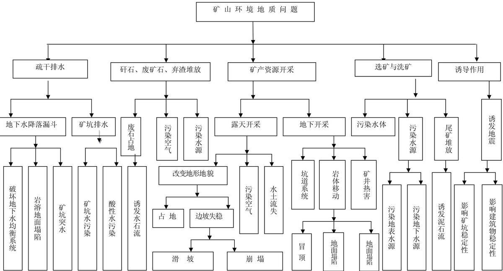  
图 3-1 矿山环境地质关系框图

## 3.2 采矿引发地质灾害

## 3.2.1滑坡现状与分析

## 1、概述

经过调查发现：4个矿坑有滑坡6处，其中中国长城铝业公司东、西采坑(503-1、503-2)有滑坡4处， $0 1 ^ { \# } , \ 0 4 ^ { \# }$ 采坑各有滑坡1处（照片3-1～3-6）。滑坡体厚度大部分在2～10m左右，规模为小～中等，滑动面以圆弧状为主(见附图一)。其中以中国长城铝业公司东采坑(503-2坑)滑坡现象较为严重，面东、面西南、面北三面均存在较大幅度的滑坡，8月份雨季新发生的西南面滑坡将矿坑道路冲垮，影响了采矿工作的进行。同时，由于滑坡坡壁较陡，坑边缘出现裂缝，有进一步滑移的危险。经现场调查发现滑坡产生的主要原因是：第四系松散覆盖物较厚，矿坑壁的角度在 $6 0 ^ { \circ } \sim 8 5 ^ { \circ }$ 之间，在开采矿时未进行边坡防护，雨季造成坡体力学性质下降，产生滑动。

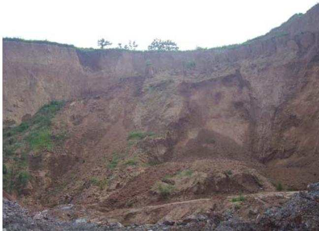

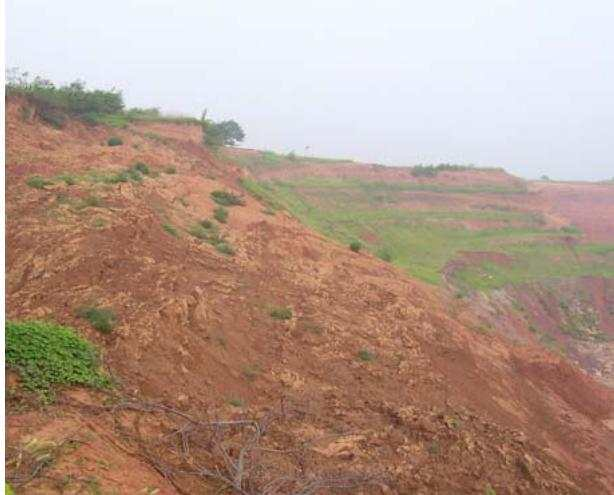

照片 3-1 503-2 坑滑坡  
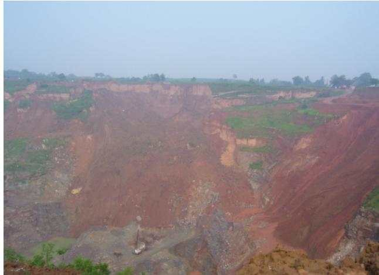  
照片3-3 503-2坑西南壁滑坡

照片 3-2 503-2 南壁滑坡  
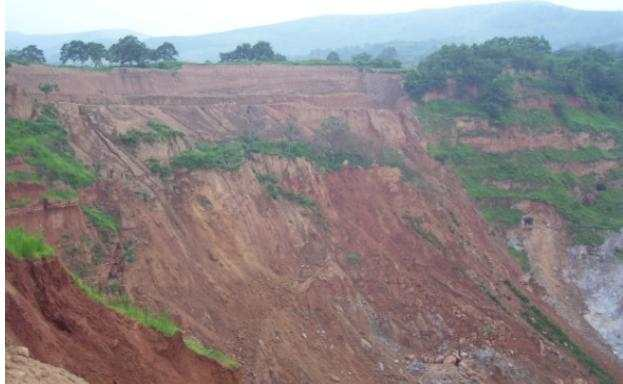  
照片3-4503-2坑东壁滑坡

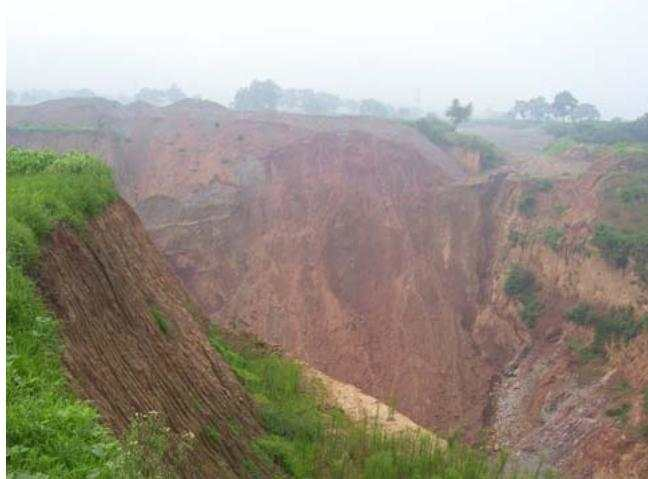  
照片3-51#露天采坑滑坡

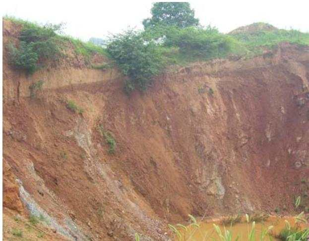  
照片 3-63#采坑滑塌

## 2、滑坡地质灾害特征

## (1) 1#矿坑东南壁滑坡(H1)

## ①基本情况

位置：位于夹沟矿区南桥沟1#矿坑东南壁。观测点坐标：x：3823767，y：395365。地质环境特征：微地貌为黄土陡坡。出露地层为黄土、砾石。上部为第四系黄土层$( { \mathrm { Q } } { \mathrm { p } } ^ { 3 } )$ 厚6～8m，下部为砾石基岩 $\cdot ( \mathrm { Q p } ^ { 2 \cdot }$ 1)厚 $5 \mathrm { \sim } 8 \mathrm { m }$ 。土体结构疏松，垂直节理发育。坡体为单层结构土质斜坡。斜坡是由于露大开矿、上部堆积有厚的较陡的废弃黄土、渣石层而形成的陡崖，且坡体无任何防护措施。

滑体特征：宽20m，长56m，厚3m。坡向335°，坡角75°。体积 $3 . 4 0 \times 1 0 ^ { 3 } \mathrm { m } ^ { 3 }$ 。平面形态矩形。属于小型土质滑坡。

## ②活动现状及变形原因分析

滑体上部不稳定黄土层沿滑坡面下滑，坡体两侧有雨蚀冲沟，宽0.5m，深度达15m，向后延伸约有5m。

影响因素：黄土垂直节理发育，主要由于人工露天采矿、以及斜坡上部有厚的红土，废渣堆积造成，还与降雨、矿山开采震动等诱发因素有关。

## ③危险性初步评估及预测

稳定性差，垂直节理发育有裂缝。

危害程度：主要威胁到矿区的开采，隔断运输道路，损害了矿山的经济效益。

危险性：属于危险。如遇强降水过程，下滑加剧。

## （2） 503-1 矿坑南壁滑坡(H2)

①基本情况

位置：位于夹沟矿区503-1 矿坑南壁。观测点坐标：x：3823715，y：395911。

地质环境：微地貌为黄土陡坡。出露地层为黄土、红色黏土夹僵结石、砾石。上部为第四系黄土层 $( { \mathrm { Q } } { \mathrm { p } } ^ { 3 } )$ 厚 $5 \mathrm { \sim } 6 \mathrm { m }$ ，中部为红色黏土夹僵结石层 $( \mathrm { Q } \mathrm { p } ^ { 2 - 2 } )$ 厚为10～15m，下部为砾石基岩 $( \mathrm { Q } _ { \mathrm { P } } ^ { 2 - 1 } )$ 厚 $8 \sim 1 2 \mathrm { m }$ 。土体结构疏松，垂直节理发育。坡体为单层结构土质斜坡。斜坡是由于露天开矿、开挖坡体较陡形成的陡崖，坡体无任何防护措施。

滑体特征：宽150m，长50m，厚6m。坡向 $2 0 ^ { \circ }$ ，坡角 $6 5 ^ { \circ } .$ 。体积 $4 5 { \times } 1 0 ^ { 3 } \mathrm { m } ^ { 3 }$ 。平面形态矩形。属于小型土质滑坡。

## ②活动现状及变形原因分析

滑坡后缘出现有拉张裂缝，最宽处达1.5m，深度大于3m，长度分别为80m。滑体上部约有5m厚度不稳定黄土层沿滑坡面下滑，滑块整体现处于蠕动阶段，有加速滑动的趋势。

影响因素：黄土垂直节理发育，主要由于人工露天采矿坡面较陡造成，还与降雨，矿山开采震动等诱发因素有关。

## ③危险性初步评估及预测

稳定性差，垂直节理发育有裂缝。

危害程度：主要威胁到矿区的开采，滑体下滑会将采矿点掩盖，给矿山的开采带来不便，损害了矿山的经济效益。

危险性：属于危险。如遇强降水过程，下滑加剧。

## （3）4#矿坑坑壁滑坡(H3)

## ①基本情况

位置：位于夹沟矿区4#矿坑南壁。观测点坐标：x：3823634，y：395286。

地质环境：微地貌为黄土陡坡。出露地层为黄土、砾石。上部为第四系黄土层 $( { \mathrm { Q } } { \mathrm { p } } ^ { 3 } )$ 厚8～10m，下部为砾石基岩 $( \mathrm { Q } \mathrm { p } ^ { 2 - 1 } )$ 厚3～5m。土体结构疏松，垂直节理发育。坡体为单层结构土质斜坡。斜坡是由于露天开矿、开挖坡体较陡形成的陡崖，坡体无任何防护措施。

滑体特征：宽120m，长15m，厚5m。坡向 $1 5 ^ { \circ }$ ，坡角 $6 5 ^ { \circ }$ 。体积 $9 . 0 { \times } 1 0 ^ { 3 } \mathrm { m } ^ { 3 }$ 。平面形态矩形。属于小型土质滑坡。

## ②活动现状及变形原因分析

$4 ^ { \# }$ 坑坑壁大部分在雨季都发生了滑塌现象，主滑体下滑 $1 \sim 2 \mathrm { m }$ ，矿坑底部的采矿点已基本被掩盖。

影响因素：土质结构松散；主要由于人工露天采矿坡面较陡造成，还与降雨诱发因素有关。

## ③危险性初步评估及预测

稳定性差。

危害程度：主要威胁到矿区的开采，滑体下滑会将采矿点掩盖，给矿山的开采带来不便，损害了矿山的经济效益。

危险性：属于危险。如遇强降水过程，下滑加剧。

## （4）503-2矿坑东、西、北壁滑坡(H4、H5、H6)

## ①基本情况

位置：位于夹沟矿区 $5 0 3 - 2 ^ { \# }$ 矿坑东、西、北壁。观测点坐标：x1：3823930，y1：396669；x2: 3823915, y2: 396360; x₃: 3824004, y₃: 396404。

地质环境：微地貌为黄土陡坡。出露地层为黄土、红土夹僵结石、砾石。上部为第四系黄土层 $( { \mathrm { Q } } { \mathrm { p } } ^ { 3 } )$ 厚8～10m，中间为红土夹僵结石层 $( \mathrm { Q } \mathrm { p } ^ { 2 - 2 } )$ 厚16\~25m，下部为砾石基岩$( { \mathrm { Q } } _ { \mathrm { P } } ^ { 2 - 1 } )$ 厚5～8m。土体结构疏松，垂直节理发育。坡体为单层结构土质斜坡。斜坡是由于露天开矿、开挖坡体较陡形成的陡崖，坡体无任何防护措施。

滑体特征：东面滑坡宽120m，长40m，厚4m。坡向 $2 6 0 ^ { \circ }$ ,坡角 $6 0 ^ { \circ }$ ，体积 $1 9 . 2 { \times } 1 0 ^ { 3 } \mathrm { m } ^ { 3 }$ 西面滑坡宽160m，长30m，厚6m。坡向 $8 0 ^ { \circ }$ ，坡角 $6 5 ^ { \circ }$ ，体积 $2 8 . 8 { \times } 1 0 ^ { 3 } \mathrm { m } ^ { 3 }$ 。北面滑坡宽60m，长43m，厚4m。坡向 $1 9 0 ^ { \circ }$ ，坡角 $6 5 ^ { \circ }$ ，体积 $1 0 . 3 { \times } 1 0 ^ { 3 } \mathrm { m } ^ { 3 }$ 。平面形态矩形。属于小中型土质滑坡。

## ②活动现状及变形原因分析

在7、8月分雨季发生了大面积的滑塌，东北、西南、北壁的主体部分都已经滑塌下来，其中西南壁的滑塌切断了采矿道路，目前，主体滑坡两侧的次级滑坡发现拉裂，也有滑动的趋势。

影响因素：主要影响因素首先是较厚的松散的黄土层，其次人工露天采矿坡面较陡，还与降雨、矿山开采震动等诱发因素有关。

## ③危险性初步评估及预测

稳定性差。

危害程度：主要威胁到矿区的开采，滑体下滑将采矿点掩盖，切断矿坑道路，给矿山的开采带来不便，损害了矿山的经济效益。

危险性：属于危险。遇强降水过程，下滑加剧。

## 3、稳定性分析和评价(复合数值法)

## (1)简述

为克服矿山边坡稳定性分析与评价遇到的单个矿山容易形成滑坡群和矿山小范围内岩土力学参数不一致的特点。提出和应用复合数值法：即对矿区九个已经滑动和极有可能滑动的边坡进行数值模拟，首先要求模拟结果与实际滑动结果一致；在不违背前期调查岩土力学参数的基础上对参数进行修正，以选用模拟结果和实际结果一致的岩土力学参数；再用选定参数对典型矿坑(503-2#)进行数值分析，得到最终分析结果，做出正确评价。具体模型：利用数值模拟软件对存在滑动可能性边坡的主滑断面进行模拟。建立边坡的二维数值模型，并对其计算分析，直到结果接近真实情况，且计算结果相对安全为止。采用强度折减、极限平衡折线型滑动面和极限平衡圆弧形滑动面三种边坡强度分析理论，得到边坡的最大剪应变、最大剪应力出现的部位、数值大小以及边坡整体稳定系数。由此确定边坡的薄弱带和潜在滑面，足以反映边坡稳定性，提供综合治理依据。

边坡治理的前提和依据是边坡稳定性分析和评价，它为护坡设计提供科学合理参数，同时直接决定边坡是否失稳和边坡存在多大下滑推力。但是目前稳定性分析尚不能完全真实反映和分析边坡的稳定程度，因为解决这个问题需要查清坡体的物理力学参数和原始地质条件，同时还要有科学合理的研究方法。当前，边坡稳定性分析方法主要有两类；一是极限平衡法(建立在刚体极限平衡理论上)，另一种是以有限元法为代表的数值计算方法(强度折减)。复合数值法将上述两类理论进行有机结合用于边坡分析。采用数值模拟软件，计算边坡岩土体的应力应变以及位移，得出与该滑动面对应的稳定系数。和极限平衡方法相似，可以首先假设一系列不同的滑动面，计算得出对应的滑动面和最小稳定系数。这种方法既能反映边坡和岩土体变形之间的关系，并且能用工程界所熟悉的单一稳定系数来评估边坡的稳定性。

## (2)典型矿坑工程地质概况(见附图一)

## 地质概况

503-2矿坑东、西、北壁滑坡(H4、H5、H6)

位置：

位于夹沟矿区503-2#矿坑东、西、北壁。观测点坐标：x1：3823930，y1：396669；x2: 3823915, y2: 396360; x3: 3824004, y3: 396404。

基本特征：

地质环境：微地貌为黄土陡坡。出露地层为黄土、红土夹僵结石、砾石。上部为第四系黄 $\pm \sqrt { \frac { 1 } { \cal Z } } ( \mathrm { Q } _ { \mathrm { P } } ^ { 3 } )$ 厚8～10m，中间为红土夹僵结石层 $\mathrm { ( Q _ { P } } ^ { 2 - 1 }$ )厚16\~25m，下部为砾石基岩$( \mathrm { Q } \mathrm { p } ^ { 2 - 1 } )$ 厚 $5 \mathrm { \sim } 8 \mathrm { m }$ 。土体结构疏松，垂直节理发育。坡体为单层结构土质斜坡。斜坡是由于露天开矿、开挖坡体较陡形成的陡崖，坡体无任何防护措施。

滑体特征：

东面滑坡宽120m，长40m，厚4m。坡向 $2 6 0 ^ { \circ }$ ，坡角 $6 0 ^ { \circ }$ ，体积 $1 9 . 2 \times 1 0 ^ { 3 } \mathrm { m } ^ { 3 }$ 。西面滑坡宽160m，长30m，厚6m。坡向 $8 0 ^ { \circ }$ ，坡角 $6 5 ^ { \circ }$ ，体积 $2 8 . 8 { \times } 1 0 ^ { 3 } \mathrm { m } ^ { 3 }$ 。北面滑坡宽60m，长43m，厚4m。坡向190°，坡角 $6 5 ^ { \circ }$ ，体积 $1 0 . 3 { \times } 1 0 ^ { 3 } \mathrm { m } ^ { 3 }$ 。平面形态矩形。属于小中型土质滑坡。

## 边坡模拟设计方案

利用对矿区九个滑坡和崩塌处模拟实况得到的岩土力学参数，对503-2矿坑东、西、北壁滑坡(H4、H5、H6)主滑断面分别进行模拟。采用数值模拟软件计算边坡在强度折减理论、极限平衡折线型滑面理论、极限平衡圆弧形滑面理论下的应力应变好、最危险滑动面位置和整体稳定系数。并且比较三种理论下的整体稳定系数，讨论在既定条件和地质工程条件下数值模拟效果。

## ③边坡稳定性数值模拟分析

## 计算模型

根据调查资料所得到的数据和研究的需要，503-2矿坑东、西、北壁滑坡(H4、H5、H6)设计模型：

东滑-H6：沿纵向长为1m，边坡滑移方向长为80m，高度65m，黄土厚12m，红土夹僵结石厚23m，砾石基岩厚30m，滑移方向投影长度20m。设计模型如图3.1所示。

西滑-H4：沿纵向长为1m，边坡滑移方向长为73m，高度62m，黄土厚10m，红土夹僵结石厚22m，砾石基岩厚30m，滑移方向投影长度13m。设计模型如图3.1所示。

北滑-H5：沿纵向长为1m，边坡滑移方向长为78m，高度69m，黄土厚12m，红土夹僵结石厚24m，砾石基岩厚33m，滑移方向投影长度18m。设计模型如图3-2所示。

模型边界约束条件设定如下：

①模型左右边界定为 X 方向边界约束，取u=0。(u为 X 方向，v为 Y 方向位移，w 为 Z 方向位移)；②模型前后边界定为 Z轴方向边界约束，取 w=0；③模型底边界和左右边界定义为全约束边界，取u=0，v=0，w=0；④模型上边界定义为自由边界，不予约束。

自重应力是边坡模型的初始应力。

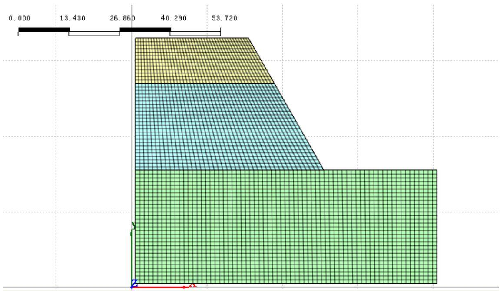  
图 3-2 计算模型（东滑H6)

## 物理力学参数的选取

利用对矿区三个滑坡处模拟实况得到的岩土力学参数，总共由三层土组成，从上到下、从左到右依次为黄土、红土夹僵结石、砾石基岩。

在选取岩土层物理力学参数时，其主要是依据调查报告所提供的数据，同时参考其它研究资料，对部分数据进行合理的换算和调整，力求达到与现场实际一致。各部分具体参数详见表3-2。

表3-2 各土层物理力学参数
<table><tr><td rowspan=1 colspan=1>层号</td><td rowspan=1 colspan=1>土层</td><td rowspan=1 colspan=1>厚度(m)</td><td rowspan=1 colspan=1>容重(kN/m3)</td><td rowspan=1 colspan=1>泊松比(v)</td><td rowspan=1 colspan=1>弹性模量(KPa)</td><td rowspan=1 colspan=1>粘聚力(KPa)</td><td rowspan=1 colspan=1>摩擦角(0)</td></tr><tr><td rowspan=1 colspan=1>1</td><td rowspan=1 colspan=1>黄土</td><td rowspan=1 colspan=1>12(10、12)</td><td rowspan=1 colspan=1>19.3</td><td rowspan=1 colspan=1>0.44</td><td rowspan=1 colspan=1>60000</td><td rowspan=1 colspan=1>60.5</td><td rowspan=1 colspan=1>25.4</td></tr><tr><td rowspan=1 colspan=1>2</td><td rowspan=1 colspan=1>红土夹僵结石</td><td rowspan=1 colspan=1>23(22、24)</td><td rowspan=1 colspan=1>19.6</td><td rowspan=1 colspan=1>0.38</td><td rowspan=1 colspan=1>100000</td><td rowspan=1 colspan=1>33.2</td><td rowspan=1 colspan=1>20.5</td></tr><tr><td rowspan=1 colspan=1>3</td><td rowspan=1 colspan=1>古土壤</td><td rowspan=1 colspan=1>30(30、33)</td><td rowspan=1 colspan=1>22.5</td><td rowspan=1 colspan=1>0.27</td><td rowspan=1 colspan=1>300000</td><td rowspan=1 colspan=1>500</td><td rowspan=1 colspan=1>30.6</td></tr></table>

注：以调查报告为依据。

## 计算过程

计算时，主要按强度折减理论、极限平衡折线型滑面理论、极限平衡圆弧形滑面理论考虑。具体按如下步骤进行：首先，本构模型选择摩尔库仑，按前述约束条件，在仅考虑重力作用的条件下，进行弹塑性求解分析，计算到达平衡后生成初始应力场；

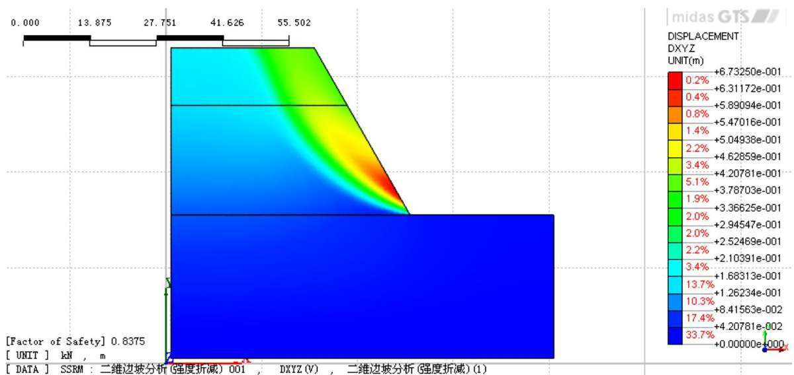

图 3-3 强度折减理论下坡体 XY 向位移(H6)  
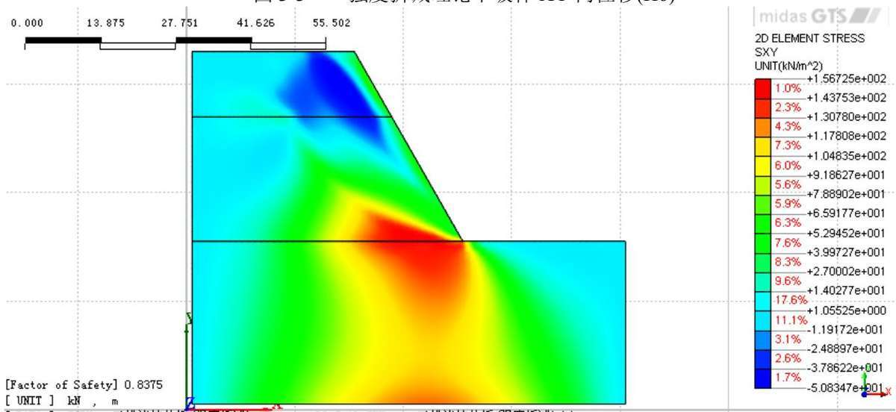  
[DATA] SSRM：二维边坡分析强度折减）001 , LO-Soil SXY二维边坡分析 强度折减)(1)

图 3-4 强度折减理论下土体 XY 向应力(H6)  
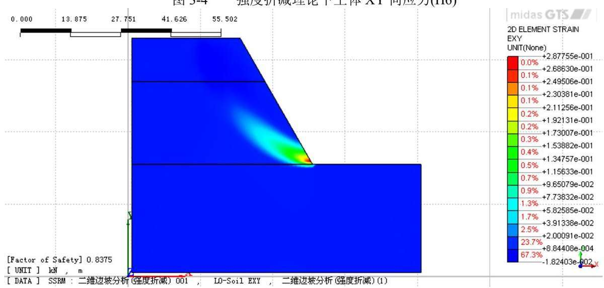  
图 3-5 强度折减理论下土体 XY 向应变(H6)

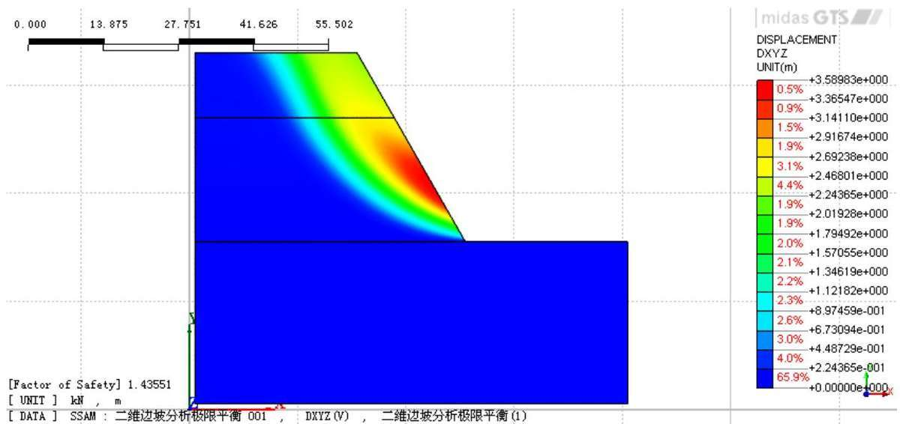

图 3-6 极限平衡理论折线型下 XY 向位移(H6)  
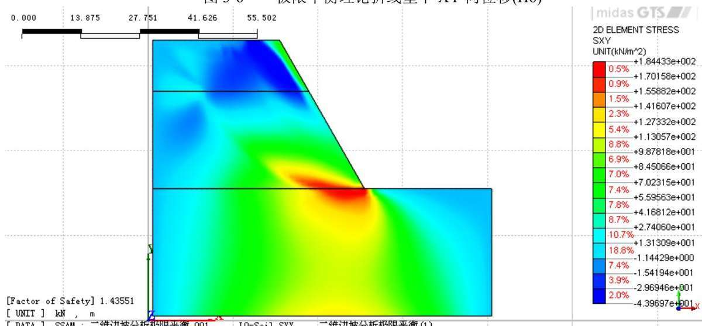  
图 3-7 极限平衡理论折线型下 XY向应力(H6)

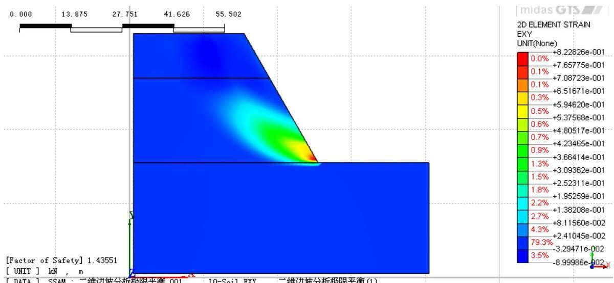  
图 3-8 极限平衡理论折线型下 XY 向应变(H6)

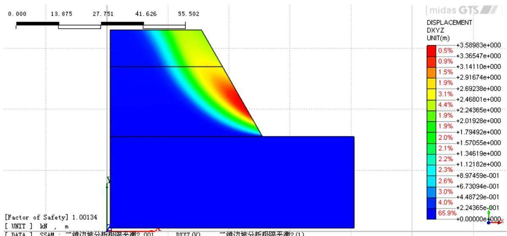

图 3-9 极限平衡理论圆弧形下 XY 向位移(H6)  
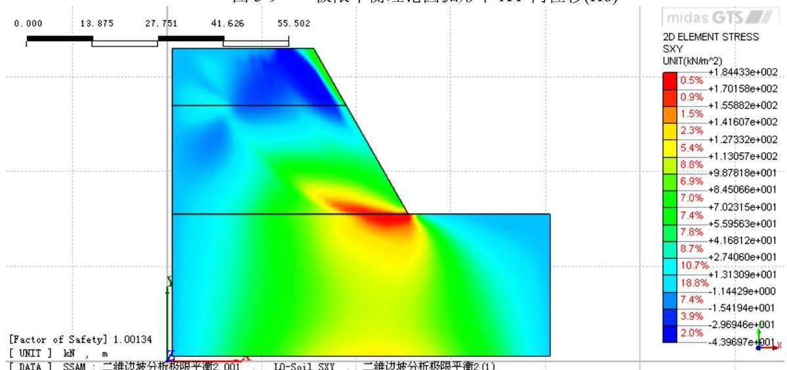  
图 3-10 极限平衡理论圆弧型下 XY 向应力(H6)

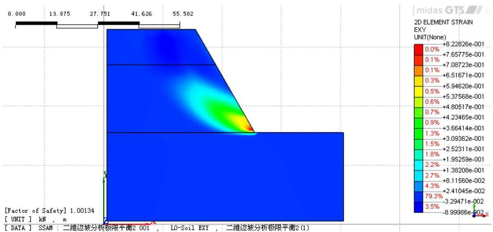  
图 3-11 极限平衡理论圆弧型下 XY 向应变(H6)

## 模拟结果分析

图3-3\~11表示边坡在强度折减理论和极限平衡理论下数值模拟位移和应力应变云图。横纵比较和观察图中数据和结果可以看出：受土体固结的影响，坡体红土夹僵结石层位移较大；同时在红土层应变最大，但其应变顺坡向逐渐减小，极可能形成贯通的滑动面，该层对坡体稳定构成威胁的可能性最大。从图3-3～11整体分析，可以推断此边坡在原始天然条件下处于欠稳定状态。

## 数值模拟分析小结

模拟三种理论条件下所得稳定系数为(H6)：强度折减理论0.8375、极限平衡折线型滑面理论1.43551、极限平衡圆弧形滑面理论1.00134。对比现场调查资料给出该处矿坑已经形成严重滑坡事实，可知在既定条件下三种理论模拟结果近似真实情况，且强度折减理论模拟所得稳定系数更趋于安全。

模拟结果：西滑-H4，强度折减理论0.7875、极限平衡折线型滑面理论1.10164、极限平衡圆弧形滑面理论1.02123。北滑-H5，强度折减理论0.7625、极限平衡折线型滑面理论1.39984、极限平衡圆弧形滑面理论1.00733。

## (4)总结

1.矿坑边坡分析和评价由于其关联性强和地域性明显等特点一直缺乏有力的评价方法，国内外广大地质工作者长期采用现场调查和观察的方法认定滑坡的性质和稳定特点，其方法感性认识太多而理性不足。但如果把矿坑周边所有位置都做详细的勘探，又不切实际众所周知，矿坑的开采是为了获取资源，如果投入巨资根据矿坑开采的情况一遍遍的做详细勘查显然是不可行的。本文针对以上两难问题提出“复合数值法”评价矿坑边坡稳定性：即对矿坑周边滑坡群发的难题加以利用，化不利条件为有利条件，采用数值模拟软件对典型矿坑(503-2#)进行数值模拟和计算，根据已经掌握为数不多的现场调查资料合理调整物理力学参数，在不违背原始数据的真实性和经典理论权威性的基础上逐步达到现实状态，同时得出合理的参数用于周边滑坡的分析和评价。

2.快速而又有充分依据的给出三处边坡主要的薄弱部位是红土土层，很有可能形成潜在的滑动面，且可能从剪应力集中处剪出，深层滑动破坏相继发生。

3.强度折减理论和极限平衡折线型滑面理论、极限平衡圆弧形滑面理论结合使用能够更全面的反应边坡潜在滑动面和滑动趋势。通过分析可以直观地显示出坡体的实际滑动面，给出稳定系数，提供削方减载的理论依据。

## 3.2.2崩塌现状与分析

## 1、概述

经过调查发现：矿区共存在三个小型崩塌3处，其中中国长城铝业公司东采坑(503-1采坑）有崩塌1处（照片3-7），在 $0 3 ^ { \# }$ 和 $0 5 ^ { \# } .$ 采坑各有崩塌1处（照片3-8）。崩塌体厚度大部分在2～10m左右，规模较小，滑动面为矩形状(见附图一)。主要是由于人工开挖形成的边坡坡角为 $7 0 ^ { \circ } \sim 9 0 ^ { \circ }$ 的陡壁，该地区的黄土层较厚，加上的雨季较为集中在7～8月份，因此在陡峭的黄土层矿坑边坡最易形成崩塌。

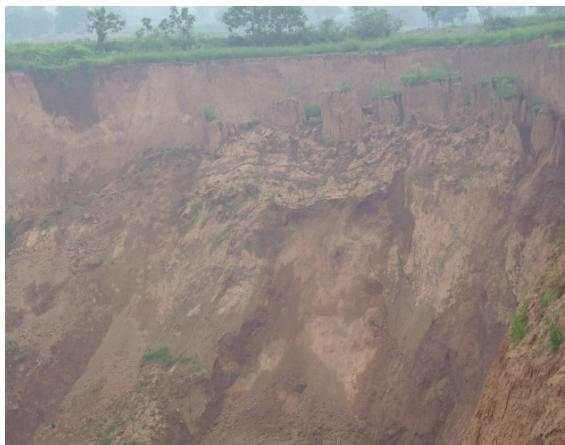  
照片 3-7503-1#坑南壁崩塌

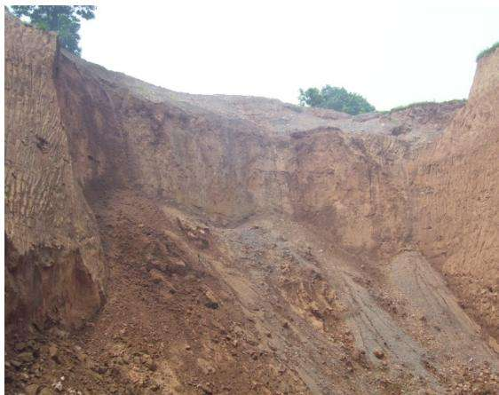  
照片3-85#坑壁崩塌

## 2、崩塌地质灾害特征(见附图一)

## (1)503-1#南壁崩塌(T1)

位置：位于503-1采坑南边界。观测点坐标：x:3823865，y:395489。

## ①基本特征

地质环境：微地貌为陡坡，所处地层主体为第四纪松散黄土 $\therefore \sqrt { \frac { 1 } { z } } ( \mathrm { Q } _ { \mathrm { p } } ^ { 3 } )$ 。土体中垂直节理发育。主要是由于人工开挖造成的陡坡。

灾体特征：崩塌体宽80m，高15m，厚2m，体积 $2 . 5 { \times } 1 0 ^ { 3 } \mathrm { m } ^ { 3 }$ 。崩向 $4 0 ^ { \circ }$ ，坡角 $8 5 ^ { \circ }$ o平面形态梯形，剖面呈阶状。属小型崩塌。

## ②现状及变形原因分析

变形：坑壁在雨季已经发生了部分的崩塌，崩塌主体两侧也有进一步滑塌的趋势。  
影响因素：①较厚的松散黄土层；②降水；③坡底开采损坏底板。

## ③危险性初步评估及预测

该崩塌隐患体稳定性差，危害程度较大。崩塌土体掩盖采矿点，威胁到矿区的开采。  
危险性：危险。如遇强降水过程崩塌加剧。

## (2)3#坑东北壁崩塌(T2)

位置：位于 $3 ^ { \# }$ 采坑东北壁边界。观测点坐标：x:3823665，y:395586。

## ①基本特征

地质环境：微地貌为陡坡，所处地层上部主体为红土层夹僵结石 $( \mathrm { Q } _ { \mathrm { p } } ^ { 2 - 2 } )$ ，下部为砾石层 $( \mathrm { Q } _ { \mathfrak { p } } ^ { 2 - 1 } )$ 。主要是由于人工开挖造成的陡坡。

灾体特征：西南部崩塌体宽65m，高5m，厚1m，体积 $0 . 4 { \times } 1 0 ^ { 3 } \mathrm { m } ^ { 3 }$ 。崩向 $2 5 0 ^ { \circ }$ ，坡角75°。东北部崩塌体宽50m，高5m，厚1m，体积 $0 . 2 5 { \times } 1 0 ^ { 3 } \mathrm { m } ^ { 3 }$ 。崩向 $7 5 ^ { \circ }$ ，坡角78°。

## ②现状及变形原因分析

变形：坑壁在雨季的冲刷作用下坑壁主体大部分发生崩塌现象，坑底有少量积水，崩塌体的后缘也不稳定，有发生进一步崩塌的趋势。

影响因素：①松散土层；②降水；③坡底积水。

③危险性初步评估及预测

该崩塌隐患体稳定性差，对铝土矿的开采有较大的影响。

危险性：危险。如遇强降水，崩塌加剧。

## (3)5#采坑西南壁(T3)

位置：位于 $5 ^ { \# }$ 坑采矿点西南边界。观测点坐标：x:3823716，y:396663。

## ①基本特征

地质环境：微地貌为陡坡，所处地层主体为第四纪松散黄土 $\therefore \sqrt { \frac { 1 } { 2 } } ( \mathrm { Q } _ { \mathrm { p } } ^ { 3 } )$ 。土体中垂直节理发育。主要是由于人工开挖造成的陡坡。

灾体特征：崩塌体宽40m，高15m，厚2m，体积 $1 . 2 { \times } 1 0 ^ { 3 } \mathrm { m } ^ { 3 }$ 。崩向 $4 5 ^ { \circ }$ ，坡角 $8 6 ^ { \circ }$ 平面形态梯形，剖面呈阶状。属小型崩塌。

## ②现状及变形原因分析

变形：该矿坑属新建矿坑，新开挖的坑壁在雨水的冲刷下，且在坑底有大量的积水未被排出，西南坑壁主体部分发生崩塌。

影响因素：①较厚的松散黄土层；②降水；③坑底积水。

③危险性初步评估及预测

该崩塌隐患体稳定性差，危害程度较大。崩塌土体掩盖采矿点，影响到矿区的开采，危险性：危险。遇强降水，崩塌加剧。

## 3.3 露天开采对生态环境影响

因采矿活动引起的土地破坏点多面广，程度又各不相同，情况非常复杂，本次研究的部分数据是在野外利用GPS定点、罗盘定向实测得来的。部分数根据开采平面图，结合现场调查和地表移动参数确定塌陷边界计算而来，遗漏较少，准确性较高。

## 3.3.1 概述

根据本次研究实地调查，夹沟铝土矿采用的开采方式均为露天开采，因此对地貌景观的破坏十分严重。该调查区包含采坑共9个，其中包含503-1#、503-2#两个大、中型国有矿坑和7个小型民采矿坑，占地面积达 $0 . 2 5 7 6 \mathrm { k m } ^ { 2 }$ ，占调查面积总数的13.1%(见附图一)。这些采坑多深达30m以上，较深的矿坑则有80～100m，在开采的过程中还临时修建了多条运矿石的道路，占用大面积的土地。这些矿坑不仅完全改变了当地的地形地貌，而且占用的多为可耕种的田地，土地资源的利用发生彻底的改变，破坏了周边的植被和土壤结构，造成水土流失，地下水位下降等生态环境问题。

## 3.3.2 矿区生态环境现状

评价区内的生态系统主要是以农业生态系统为主，包括一些零星的不连续的灌丛生态系统。

## 1. 植被现状

本区主要植被类型有杂粮农作物群落，白杨草、黄背草，白羊草、荆条、灌草丛，人类长期的垦殖活动的原因，很多土地被开垦为农田，仅在侵蚀沟壑内或坡度较大的坡顶残留着极少量的自然植被，矿区附近农田栽培植被以一年一熟制为主，玉米、土豆、谷子、马铃薯等等是该区主要栽植的农作物，作物产量一般为每公顷750～1125kg。

## 2.野生动物资源

区域内野生动物包括各种昆虫，两栖纲的蛙类，爬行纲的蛇类，小型兽类如田鼠，和一些鸟类如麻雀等。未见有珍稀、频危物种分布。

## 3.土壤现状

本区域土壤类型主要为山地黄褐土，由于具有多年的农业种植历史，原有的土壤结构发生改变，土壤中包含大量农作物秸秆和根茎腐烂后的有机质类，以及农民为提高农作物的产量而施加的有机肥、化肥等，土地较为肥沃。

## 4.土地资源利用现状

目前夹沟矿区的土地资源主要存在以下几种利用类型：

(1)作为农作物庄稼种植用地，在调查区内面积约 $1 . 2 3 6 4 \mathrm { k m } ^ { 2 }$ ，占调查总面积的61.8%。主要种植玉米，大豆等作物。

(2)矿山开采区用地，研究区范围内有大小9个露天采场，在调查区内面积达$0 . 2 5 7 6 \mathrm { k m } ^ { 2 }$ ，占调查总面积的13.1%。这些采坑深达30～60m，以采掘铝土矿石为主。

(3)运输道路和运输系统建设用地，为使得矿区采掘的矿石能运送到矿石加工场，及时排出矿渣，需要建设多条运输道路和挖掘机休息场所，这些占用的土地资源也不容忽视，在调查图上虽未建区划分开来，但是根据线路及其路宽可大致估计出占地面积约$0 . 0 2 \mathrm { k m } ^ { 2 }$ ，占调查总面积的1%。

(4)矿渣堆积地，矿渣废石和开采剥离的土层及基岩大多堆积在采矿区周围的沟壑中，沟已基本被填平，作为矿渣堆积地，调查区范围内总共有5个大的矿渣堆场，和其他一些小的矿渣堆积地，占地面积为 $0 . 1 2 3 \mathrm { k m } ^ { 2 }$ ，占调查总面积的6.2%，其中有些渣堆地已经开始种植庄稼。一部分也开始进行土地的整平和复垦工作。

## 3.3.3 矿区景观结构的影响

矿山开采直接导致矿区景观结构与功能的改变，地形的改变和生态系统改变所造成原有景观的破坏和新自然景观格局的形成是其对景观的影响。采矿活动清除地表植被、挖毁原地貌、废石堆场的修建、新建人工生产设施等，采矿区的地貌、地形被改变，极大降低了矿区原有自然景观美学价值。尤其在矿区服务期满以后，采矿区形成了相对低洼的矿坑和废石填满的山坳，又由于新的生态系统难以形成，景象甚是荒凉。

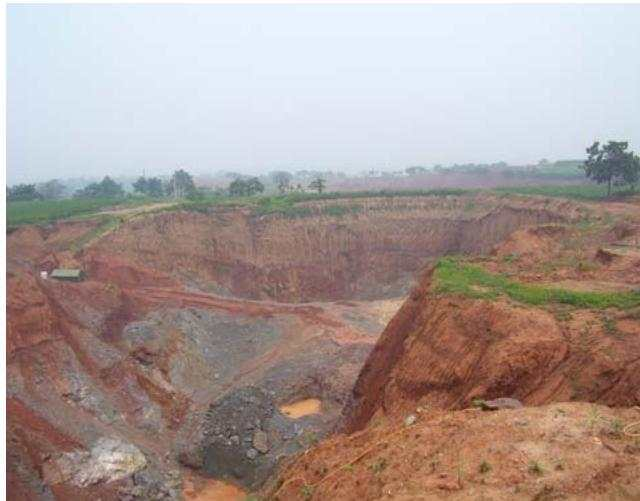  
照片3-9 露天采矿对景观的影响

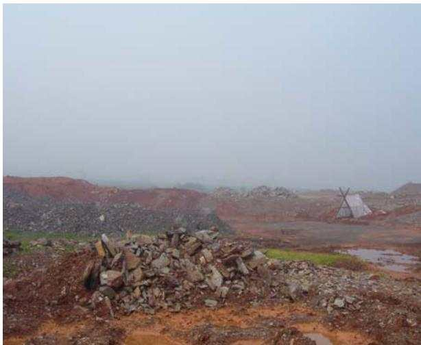  
照片3-10 露天采矿对矿区景观的影响

## 3.3.4 露天开采对土地资源的影响

## 1、影响方式

露天开采过程中的的剥离工程和排石、排土工程和配套设施建设等环节是主要的矿山开采对地表形态的破坏。矿坑开挖、表土剥离将造成地表形态的极大改变。地面平整、道路修建、表土剥离和运输系统建设是矿山建设期对地表的主要影响。运营期产生的大量废石堆置、对废石场地形地貌的影响很大。露天矿建设期间，上覆表土和岩层被剥离，同时需要进行大规模的开挖，使原有的土地环境和生态环境被破坏，引发水土流失，地下水位降低和生态系统恶化等环境问题。其次是开挖出来的土石方需异地存放，大量剥离物存放场压占原有土地。

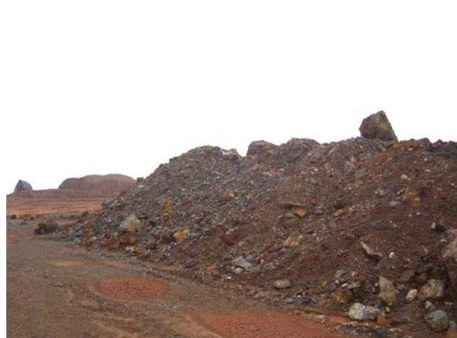  
照片3-11 露天采矿对景观的影响

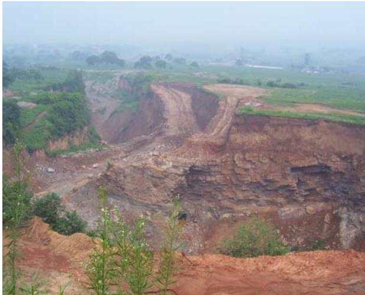  
照片3-12 露天采矿对矿区景观的影响

## 2、露天开采对土地资源的影响分析

研究区内的露天矿坑，不仅使得表层富含肥力的土壤消失，露天开采工作完全改变了原有的土地利用方式，破坏了原有土地结构和地形地貌，使得原有的农田生态系统的完整性和连接性遭到了破坏。破坏产生的主要表现在以下几个方面：

(1)对土地利用的影响：夹沟矿区铝土矿露天矿坑所在区域为农业区，其中矿坑开挖、修建道路占耕地0.2776km²，占调查总面积的14.1%，开采铝土矿所产生的废渣基本排放在矿区附近的沟壑中，西桥沟和寨孜沟的部分段已经填平，并开始复垦种植庄稼，由于部分耕地被转化为独立的工矿用地，项目的建设将对当地农业生产力产生一定的影响。

(2)对当地农田生态系统的影响：矿区所采取的开采方式是完全破坏原有的土地利用结构，对原有的农田生态系统产生了具有摧毁性和不可恢复性的影响。一方面，地表植被遭到不同程度的破坏，农田生态系统所需的富含营养的表土层被完全剥离；另一方面，调查区内的露天开采区基本上是不连续分布的，往往是比较零散的分布在评价区，这使得农田生态系统的连续性破坏较严重，水土流失加剧，一定程度上影响到矿区附近的耕地的农业生产力。

## 3.3.5 露天开采对矿区土壤的影响

在采矿活动中，开采和基础设施建设需要开挖占用大量土地资源，大面积的地表植被剥离、矿石抛洒、地形改变、废土（石）堆积等，直接决定土壤侵蚀的强度和范围扩大和增强，引起大量水土流失，生态环境被严重破坏。此外，如果矿体倾角较小，剥离也有减轻水土流失作用。

在进行露天开采时，因为表土被清除或者挖走，采矿后往往是心土或矿渣被留下，同时加之大型采矿设备的重压，矿区土壤往往重度加大，有机质、水分与养分等植物生存条件缺少或者缺失。据测定，有机质、氮、磷等的含量在不同矿区土壤中含量均很低，仅仅是正常植被覆盖土壤的20%～30%。同时，风雨冲刷和侵蚀下的固体废弃物，其中的盐类成分淋失后随雨水汇集到低洼处，经过蒸腾作用很容易使土壤盐渍化。而露天开采形成的大面积的深达30～60m的矿坑将直接导致地下水位下降、土壤裂隙高度发育，不仅使土壤返湿非常困难，也大大加强了风力裹胁土壤水分的能力，土壤湿度下降。矿区附近土壤中的各种营养元素也会随着裂隙、地表径流流入矿坑或是洼地，造成矿坑周边土壤的生物承载力下降。

## 3.4 露天开采对水资源的影响与破坏

## 3.4.1矿山废水排泄情况及影响

## 1、矿山废水排泄情况

矿山废水主要包括由伴随矿井开采而产生的地表渗透水、矿坑水、岩石孔隙水、地下含水层的疏放水、以及井下生产防尘、充填、灌浆污水，选矿厂污水是矿山废水的主要来源。夹沟铝土矿的矿坑水年产出量 $2 3 . 8 7 \times 1 0 ^ { 4 } \mathrm { m } ^ { 3 }$ ，年排放量 $1 7 . 3 1 \times 1 0 ^ { 4 } \mathrm { m } ^ { 3 }$

据调查，偃师夹沟矿区属于于旱半干旱气候区，降雨量平均为534.64mm，区内的地表水系基本不发育，区内没有河流、湖泊，仅有一个季节性河流从矿区西南3km处流过。降雨多集中在一年的七、八月份，区内地表水水系基本不发育，在调查中有503-2矿坑(见附图一)和个别私有矿坑中存在少量矿坑积水，积水的形式主要有雨水和矿坑涌水。这些矿坑水基本不作任何处理排放给附近农田中。

## 2、矿山废水对环境的影响

一般铝土矿露天开采深度未达到地下水位深度，在调查中，该地区的地下水位在地下150～200m，因此对矿山开采对地下水危害较小。

本次调查的铝土矿采用露天开采，矿山废水主要是指矿坑涌水。矿坑涌水排出后，由于环境条件改变，地下水被氧化形成酸性矿坑水，在硫的参与下形成含有有害元素的酸性水渗入地下或汇入地表水体，容易构成对水体的污染，导致水体质量下降而影响水资源的利用。根据上表的采样调查显示，地下水pH值接近7，在标准范围之内，说明矿坑涌水酸化作用较弱。

## 3.4.2 露天开采对地表水的影响

## (1) 样品采集

采矿工程对地表水的影响主要包括矿坑用水和废水的排放，进入自然水体对其水质的影响．矿坑排水主要是围岩地下水和矿坑的雨水堆积。本次调查取水样四份，其中地表水样两份，其取样地点如下：1#水样在5矿坑的底部积水潭中取得；2水样取于503-2采矿坑底部积水区。

## (2) 样品分析

进行室内化验分析的监测结果如表3-3所示：

表3-3 地表水水样全分析结果及标准值
<table><tr><td rowspan=1 colspan=1>项目</td><td rowspan=1 colspan=1>1#水样</td><td rowspan=1 colspan=1>2水样</td><td rowspan=1 colspan=1>GB3838-2002《地表水环境质量标准》ⅢI类标准限值</td></tr><tr><td rowspan=1 colspan=1>PH</td><td rowspan=1 colspan=1>7.48</td><td rowspan=1 colspan=1>7.13</td><td rowspan=1 colspan=1>6-9</td></tr><tr><td rowspan=1 colspan=1>悬浮物(mg/L)</td><td rowspan=1 colspan=1>49</td><td rowspan=1 colspan=1>30</td><td rowspan=1 colspan=1>--</td></tr><tr><td rowspan=1 colspan=1>浊度(度)</td><td rowspan=1 colspan=1>3L</td><td rowspan=1 colspan=1>2L</td><td rowspan=1 colspan=1>--</td></tr><tr><td rowspan=1 colspan=1>色度(倍)</td><td rowspan=1 colspan=1>1</td><td rowspan=1 colspan=1>1</td><td rowspan=1 colspan=1>--</td></tr><tr><td rowspan=1 colspan=1>化学需氧量(mg/L)</td><td rowspan=1 colspan=1>5</td><td rowspan=1 colspan=1>4</td><td rowspan=1 colspan=1>--</td></tr><tr><td rowspan=1 colspan=1>六价铬(mg/L)</td><td rowspan=1 colspan=1>0. 004</td><td rowspan=1 colspan=1>0. 003</td><td rowspan=1 colspan=1>≤0.05</td></tr><tr><td rowspan=1 colspan=1>氟化物(mg/L)</td><td rowspan=1 colspan=1>1. 61</td><td rowspan=1 colspan=1>0. 980</td><td rowspan=1 colspan=1>≤1.0</td></tr><tr><td rowspan=1 colspan=1>挥发酚(mg/L)</td><td rowspan=1 colspan=1>0. 002</td><td rowspan=1 colspan=1>0. 002</td><td rowspan=1 colspan=1>≤0.005</td></tr><tr><td rowspan=1 colspan=1>铜(mg/L)</td><td rowspan=1 colspan=1>0. 001</td><td rowspan=1 colspan=1>0. 003</td><td rowspan=1 colspan=1>≤1.0</td></tr><tr><td rowspan=1 colspan=1>铅(mg/L)</td><td rowspan=1 colspan=1>0. 01</td><td rowspan=1 colspan=1>0. 020</td><td rowspan=1 colspan=1>≤0.05</td></tr><tr><td rowspan=1 colspan=1>锌(mg/L)</td><td rowspan=1 colspan=1>0. 05</td><td rowspan=1 colspan=1>0. 040</td><td rowspan=1 colspan=1>≤10</td></tr><tr><td rowspan=1 colspan=1>砷(mg/L)</td><td rowspan=1 colspan=1>0. 0013</td><td rowspan=1 colspan=1>0. 0012</td><td rowspan=1 colspan=1>≤0.05</td></tr><tr><td rowspan=1 colspan=1>镉(mg/L)</td><td rowspan=1 colspan=1>0. 001</td><td rowspan=1 colspan=1>0. 002</td><td rowspan=1 colspan=1>≤0.005</td></tr><tr><td rowspan=1 colspan=1>汞(mg/L)</td><td rowspan=1 colspan=1>0. 00002</td><td rowspan=1 colspan=1>0. 00003</td><td rowspan=1 colspan=1>≤0.00011</td></tr></table>

## (3) 误差分析

由于本次取样是在七八月份的雨季进行的，因此采样的矿坑水多被雨水稀释后取得的，样品中污染物浓度的分析结果有少许误差。

## (4) 结果分析

两组水样中，除1#水样的氟化物超过GB3838-2002《地表水环境质量标准》Ⅲ类标准限制值外，其余指标均符合标准。

从水样分析的结果看来，评价区域的地表水水质受矿山开采的影响较少，且由于该区域的地表水系不发育，调查区内没有河流、湖泊等水域生态系统，因此矿山开采对地表水的影响甚微，不作为评价的重点。

## 3.4.3 露天开采对地下水的影响

## 1、地下水水质分析

## (1) 采样地点

本次调查采地下水样2组，主要是调查由于采矿活动对地下水造成的破坏，最重要的是对周围居民的生活饮水，生产用水是否造成危害。采样地点分别为：1水样在503-2采坑附近的水井中；2#水样在503-2矿坑底部附近渗水点(见附图一)。

(2) 对采集的样品进行室内化验分析的监测结果如表3-4所示：

## (3) 结果分析

分析结果表明2组地下水样中的监测项目均未超过GB3838-2002《地下水环境质量标准》Ⅲ类标准限制值。

取回的地下水样品的分析结果表明，矿山露天开采对地下水的污染甚微，不会影响到当地居民的饮用水水质，因此可以不用对矿区地下水水质作处理工作。

表3-4 地下水水样全分析结果及标准值
<table><tr><td rowspan=1 colspan=1>项目</td><td rowspan=1 colspan=1>1#水样</td><td rowspan=1 colspan=1>2#水样</td><td rowspan=1 colspan=1>GB3838-2002《地表水环境质量标准》I类标准限值</td></tr><tr><td rowspan=1 colspan=1>PH</td><td rowspan=1 colspan=1>7. 69</td><td rowspan=1 colspan=1>8.18</td><td rowspan=1 colspan=1>6-9</td></tr><tr><td rowspan=1 colspan=1>总硬度(CaCO3)</td><td rowspan=1 colspan=1>26</td><td rowspan=1 colspan=1>29</td><td rowspan=1 colspan=1>≤450</td></tr><tr><td rowspan=1 colspan=1>悬浮物(mg/L)</td><td rowspan=1 colspan=1>4</td><td rowspan=1 colspan=1>6</td><td rowspan=1 colspan=1>--</td></tr><tr><td rowspan=1 colspan=1>浊度(度)</td><td rowspan=1 colspan=1>3L</td><td rowspan=1 colspan=1>2L</td><td rowspan=1 colspan=1>--</td></tr><tr><td rowspan=1 colspan=1>色度(倍)</td><td rowspan=1 colspan=1>1</td><td rowspan=1 colspan=1>1</td><td rowspan=1 colspan=1>--</td></tr><tr><td rowspan=1 colspan=1>化学需氧量(mg/L)</td><td rowspan=1 colspan=1>3</td><td rowspan=1 colspan=1>4</td><td rowspan=1 colspan=1>--</td></tr><tr><td rowspan=1 colspan=1>六价铬(mg/L)</td><td rowspan=1 colspan=1>0. 004</td><td rowspan=1 colspan=1>0. 003</td><td rowspan=1 colspan=1>≤0.05</td></tr><tr><td rowspan=1 colspan=1>氟化物(mg/L)</td><td rowspan=1 colspan=1>0. 45</td><td rowspan=1 colspan=1>0. 47</td><td rowspan=1 colspan=1>≤1.0</td></tr><tr><td rowspan=1 colspan=1>挥发酚(mg/L)</td><td rowspan=1 colspan=1>0. 002</td><td rowspan=1 colspan=1>0. 002</td><td rowspan=1 colspan=1>≤0.002</td></tr><tr><td rowspan=1 colspan=1>铜(mg/L)</td><td rowspan=1 colspan=1>0. 001</td><td rowspan=1 colspan=1>0. 002</td><td rowspan=1 colspan=1>≤1.0</td></tr><tr><td rowspan=1 colspan=1>铅(mg/L)</td><td rowspan=1 colspan=1>0. 01</td><td rowspan=1 colspan=1>0. 020</td><td rowspan=1 colspan=1>≤0.05</td></tr><tr><td rowspan=1 colspan=1>锌(mg/L)</td><td rowspan=1 colspan=1>0. 05</td><td rowspan=1 colspan=1>0. 040</td><td rowspan=1 colspan=1>≤1.0</td></tr><tr><td rowspan=1 colspan=1>砷(mg/L)</td><td rowspan=1 colspan=1>0. 0006</td><td rowspan=1 colspan=1>0. 0022</td><td rowspan=1 colspan=1>≤0.05</td></tr><tr><td rowspan=1 colspan=1>镉(mg/L)</td><td rowspan=1 colspan=1>0. 001</td><td rowspan=1 colspan=1>0. 002</td><td rowspan=1 colspan=1>≤0.011</td></tr><tr><td rowspan=1 colspan=1>汞(mg/L)</td><td rowspan=1 colspan=1>0. 00002</td><td rowspan=1 colspan=1>0. 00005</td><td rowspan=1 colspan=1>≤0.0011</td></tr><tr><td rowspan=1 colspan=1>总大肠菌数/(个/L)</td><td rowspan=1 colspan=1>--</td><td rowspan=1 colspan=1>--</td><td rowspan=1 colspan=1>≤3.0</td></tr></table>

## 2、露天开采对地下水影响分析

根据地下水水质分析结果以及调查区的水文地质特征，露天开采对地下水系统的影响主要表现在以下几个方面：

(1) 露天开采的铝土矿床的底板为奥陶系中统 $\left( \mathrm { O } _ { 2 \mathrm { m } } \right)$ 裂隙岩溶含水层，含裂隙岩溶水，水位标高夹沟矿区一般+230～+250m，最高+273.41m，年最大水位变幅23.41m，为矿区地下水的补给区，富水性较强，因此在开采静水面以下的铝土矿矿体与构造断裂带和强岩溶带时，破坏原有的含水层结构，会有水患之忧，是矿床充水的主要充水层。因此在开采到一定的深度后，会有矿坑突水的情况发生。这样在一定程度上会影响到地下水径流的连续性，当地居民的饮用水受到一定的影响。

(2)灰岩为铝土矿层的顶板，裂隙岩溶比较发育，是含裂隙岩溶水铝土矿床充水的因素之一，且容易对露天开采工作造成间歇性影响。

## 3.5 矿山废渣对矿区环境影响

## 3.5.1 废渣排放概述

废渣包括尾矿、废石(土)、矸石等。据调查，废石、废渣年产出量 $2 5 . 9 2 \times 1 0 ^ { 4 } \mathrm { t }$ ，年排放量 $2 3 . 6 2 \times 1 0 ^ { 4 } \mathrm { t }$ ，累计积存量 $1 2 6 . 3 7 \times 1 0 ^ { 4 } \mathrm { t }$ o

矿区的废渣石多排放在矿区附近已经干涸的地沟中，现场调查发现矿坑附近的寨孜沟、南桥沟、西桥沟在调查区段内的部分已经基本被填平，西桥沟和寨孜沟的部分段已经复土种植庄稼，南桥沟也正在进行复土整平工作。但由于缺乏科学的计划和组织，主要是组织当地农民完成这一复垦工作，在充填的过程中并未考虑填充的先后顺序、合理的压实和排水沟设计等要求。由于在此前并未进行废渣的危险性鉴别试验，充填区的土壤污染等方面的研究，对于复垦去庄稼的污染情况也未可知。在本次调查过程中，共采集土壤样10组，除一组对照土壤样外，矿渣底部取两组土壤样、其他在渣堆附近玉米地中每隔5m取一土壤样。

本次调查的矿渣堆积地共18处。分布在各个矿坑附近，占地面积达 $0 . 1 2 3 \mathrm { k m } ^ { 2 }$ ，约占本次调查面积的6.2%，堆积厚度5～20m。堆积的矿渣类型主要有：废石、废渣、基岩等。

## 3.5.2 矿山废渣对环境的影响

## 1、矿渣堆土壤质量分析

## (1) 样品采集

野外采样工作的工作手图是预先设计好的1：2000地形图，参照地形地物确定实际采样点，地理坐标的测定采用便携式GPS，做好描述和记录，采样地点位于07#坑东南部的矿渣堆附近，对503-2矿坑(见附图一)附近矿渣堆土壤进行采样和研究工作，采样时间为07年7月15～07年7月16日。本次调查采集土壤样10组。

为尽可能减少土壤空间分布不均一性的干扰，在一个采样单元内不同方位上设置多个采样点，采样后均匀混合成等量具有代表性的土壤样品。采集至地表20cm深处的土柱，采样深度控制在0～20cm，并去除草根、杂草、砖块、砾石、肥料团块等杂物。由于调查区属于土层较为浅薄的山区，因此在每点设两个层取样，第一层取5cm深土样，第二层取15cm深土样。其中1#、6#样为渣堆表层土壤，2#、7#样为渣堆底边缘层土壤，3#、8#样为离渣堆10m远玉米地中表层土壤，4#、9#样为离渣堆20m远玉米地中表层土壤，5#、10#样为离渣堆30m远表层土壤。采样时将一处作为中心(定点位置)，用土钻或土铲等工具多点采集5～10个子样组合为一个样品在距离中心点周围5m范围内，每个单元内的单点样的土壤类尽可能做到一致。每个单元内，每个子样不得少于0.6kg，混合均匀作为平均样品，然后反复使用四分法缩减，至最后的样品重量应不得少于1kg。样品采集好，装入统一的塑料保鲜袋，贴上标签密封，并做好记录与描述。

## (2) 样品分析

取回的土样在实验室中对土壤中重金属的含量进行分析，样品加工采用有无污染加工至粒度为0.074mm，凭手感检查样品的粒度，不过筛。在土壤监测中总铬依据GB/7466-87，镍依据GB/T17139-1997，铜、锌依据GB/T17138-1997，铅、镉依据GB/T17141-1997等分析方法，采用以电感耦合等离子原子发射光谱仪和X荧光光谱仪为主体的分析配套方案，各元素分析方法的各项技术指标均满足规定的要求。分析结果如表4-4所示。

## (3) 结果分析

分析项目中除了1号镉外均未超过GB15618-2008《土壤环境质量标准》三级标准限值。而且1号镉的含量也未超过标准含量的20%，土壤中重金属元素基本上符合土壤质量三级标准的要求。

表3-5 土样重金属含量分析结果及三级标准值
<table><tr><td rowspan=1 colspan=1>编号</td><td rowspan=1 colspan=1>PH</td><td rowspan=1 colspan=1>铜(mg/kg)</td><td rowspan=1 colspan=1>铅(mg/kg)</td><td rowspan=1 colspan=1>锌(mg/kg)</td><td rowspan=1 colspan=1>砷(mg/kg)</td><td rowspan=1 colspan=1>镉(mg/kg)</td><td rowspan=1 colspan=1>汞(mg/kg)</td><td rowspan=1 colspan=1>总铬(mg/kg)</td></tr><tr><td rowspan=1 colspan=1>1</td><td rowspan=1 colspan=1>7.34</td><td rowspan=1 colspan=1>18.1</td><td rowspan=1 colspan=1>20.4</td><td rowspan=1 colspan=1>31.5</td><td rowspan=1 colspan=1>14.56</td><td rowspan=1 colspan=1>1.19</td><td rowspan=1 colspan=1>0.084</td><td rowspan=1 colspan=1>1.00</td></tr><tr><td rowspan=1 colspan=1>2</td><td rowspan=1 colspan=1>7.46</td><td rowspan=1 colspan=1>18.6</td><td rowspan=1 colspan=1>20.4</td><td rowspan=1 colspan=1>33.7</td><td rowspan=1 colspan=1>14.67</td><td rowspan=1 colspan=1>0.99</td><td rowspan=1 colspan=1>0.161</td><td rowspan=1 colspan=1>0.983</td></tr><tr><td rowspan=1 colspan=1>3</td><td rowspan=1 colspan=1>7.53</td><td rowspan=1 colspan=1>17.5</td><td rowspan=1 colspan=1>28.6</td><td rowspan=1 colspan=1>29.1</td><td rowspan=1 colspan=1>17.78</td><td rowspan=1 colspan=1>0.80</td><td rowspan=1 colspan=1>0.120</td><td rowspan=1 colspan=1>1.05</td></tr><tr><td rowspan=1 colspan=1>4</td><td rowspan=1 colspan=1>7.48</td><td rowspan=1 colspan=1>45.7</td><td rowspan=1 colspan=1>36.8</td><td rowspan=1 colspan=1>23.6</td><td rowspan=1 colspan=1>14.60</td><td rowspan=1 colspan=1>0.41</td><td rowspan=1 colspan=1>0.002</td><td rowspan=1 colspan=1>1.07</td></tr><tr><td rowspan=1 colspan=1>5</td><td rowspan=1 colspan=1>7.59</td><td rowspan=1 colspan=1>20.3</td><td rowspan=1 colspan=1>28.6</td><td rowspan=1 colspan=1>33.4</td><td rowspan=1 colspan=1>14.25</td><td rowspan=1 colspan=1>0.22</td><td rowspan=1 colspan=1>0.002</td><td rowspan=1 colspan=1>1.03</td></tr><tr><td rowspan=1 colspan=1>6</td><td rowspan=1 colspan=1>7.38</td><td rowspan=1 colspan=1>21.3</td><td rowspan=1 colspan=1>34.0</td><td rowspan=1 colspan=1>35.0</td><td rowspan=1 colspan=1>15.40</td><td rowspan=1 colspan=1>0.98</td><td rowspan=1 colspan=1>0.112</td><td rowspan=1 colspan=1>0.987</td></tr><tr><td rowspan=1 colspan=1>7</td><td rowspan=1 colspan=1>7.43</td><td rowspan=1 colspan=1>21.2</td><td rowspan=1 colspan=1>34.7</td><td rowspan=1 colspan=1>36.7</td><td rowspan=1 colspan=1>15.85</td><td rowspan=1 colspan=1>0.91</td><td rowspan=1 colspan=1>0.089</td><td rowspan=1 colspan=1>0.956</td></tr><tr><td rowspan=1 colspan=1>8</td><td rowspan=1 colspan=1>7.55</td><td rowspan=1 colspan=1>32.4</td><td rowspan=1 colspan=1>35.6</td><td rowspan=1 colspan=1>36.8</td><td rowspan=1 colspan=1>18.90</td><td rowspan=1 colspan=1>0.82</td><td rowspan=1 colspan=1>0.065</td><td rowspan=1 colspan=1>0.899</td></tr><tr><td rowspan=1 colspan=1>9</td><td rowspan=1 colspan=1>7.58</td><td rowspan=1 colspan=1>48.6</td><td rowspan=1 colspan=1>40.5</td><td rowspan=1 colspan=1>35.8</td><td rowspan=1 colspan=1>17.65</td><td rowspan=1 colspan=1>0.45</td><td rowspan=1 colspan=1>0.057</td><td rowspan=1 colspan=1>0.760</td></tr><tr><td rowspan=1 colspan=1>10</td><td rowspan=1 colspan=1>7.66</td><td rowspan=1 colspan=1>35.1</td><td rowspan=1 colspan=1>39.4</td><td rowspan=1 colspan=1>40.7</td><td rowspan=1 colspan=1>17.04</td><td rowspan=1 colspan=1>0.37</td><td rowspan=1 colspan=1>0.049</td><td rowspan=1 colspan=1>0.970</td></tr><tr><td rowspan=2 colspan=1>试验标准</td><td rowspan=1 colspan=1>&gt;6.5</td><td rowspan=1 colspan=1>≤400</td><td rowspan=1 colspan=1>≤500</td><td rowspan=1 colspan=1>≤500</td><td rowspan=1 colspan=1>≤40</td><td rowspan=1 colspan=1>≤1.0</td><td rowspan=1 colspan=1>≤1.5</td><td rowspan=1 colspan=1>≤300</td></tr><tr><td rowspan=1 colspan=8>注：GB15618-1995《土壤环境质量标准》三级标准限值</td></tr></table>

注：以上水质分析试验取自河南有色工程勘查有限公司。

## 2、矿渣堆积环境影响分析

## (1) 对地貌景观的影响

据调查，在矿区建设期和开采期所产生的矿渣基本上是充填在矿区附近的几条常年干枯的沟壑中，其中西桥沟和寨孜沟的部分地段已填平，并种植上当地的玉米，大豆等农作物，这一地段的原有的寨孜沟和西桥沟已不复存在。矿渣的充填在一定程度上对当地原有的地貌景观造成影响。

## (2) 对土壤环境的影响

根据对矿渣堆附近的土壤样品的分析结果，对比《土壤环境质量标准》三级标准，土壤中重金属污染基本无影响，对渣堆附近的农作物的受污染情况较小。在渣堆上进行生态复垦工作时也无需进行重金属的治理和防护工作。

## (3) 对土地资源的影响

在夹沟铝土矿建设和开采期间，产生的矿渣大多被填理在于涸的沟壑中，填理高至周围田地相同的高度，上表层进行复土整平，种植庄稼。部分面积的矿渣土地被重新利用作耕地。复耕面积达到0.053km²，对当地的土地资源的利用有一定积极的影响。

## 第4章 矿山地质环境影响综合评价与分区

影响地质环境质量评价的因素很多，所以说矿山地质环境质量评价是一项复杂的系统工程，包含矿山地质环境现状和区域地质环境，作为衡量地质环境质量好坏的各因素权值不一样，参考资料人为划分等级，不可避免的这种评价方法降低了分区的合理性、客观性和可重复性（蔡博峰，2008）；并且很难用经典数学模型进行描述，也很难将复杂的影响因素综合成一个因素进行评价，对于这种复杂的系统问题，一般常用的方法有工程类比法、层次分析法、加权比较法、相关分析法、综合指数法、灰色系统法、模糊综合评判法及人工神经网络法等方法更可合理的解决。

本文主要采用BP人工神经网络模型综合评判法进行评价，其具备分布式的信息存储方式、大规模并行处理、自适应性和自学性、较强的容错性和鲁棒性等优良性质，能从具体的学习样本出发获得基于客观数据的权重，具有“区内相似、区际相异”的特点，从而很好的对矿山地质环境破坏程度进行分析和分级。

## 4.1 矿山地质环境评价标准

## 4.1.1 评价原则

在研究和制定矿山地质环境质量评价指标体系时，主要遵循以下几个原则：

## 1、科学性原则

评价指标体系要能够真实和客观地反映矿山地质环境的现状、发展趋势以及内在机制，进而保证矿山地质环境质量评价的客观性、真实性和有效性。

## 2、引导性原则

指标体系一方面可以体现与矿区环境总体战略目标一致的方针进和策略，另一方面可以引导和规范未来发展的方向和行为。

## 3、层次性原则

根据矿区生态系统的复杂性特点，指标体系应该分解为若干层次结构，同时尽力保持指标在一定时间限度内的稳定性，便于进行分析评价。

## 4、可操作性原则

指标体系中各属性因子来自矿山地质环境调查的量化指标，对缺乏定量数据的因子，采取定性描述，通过相对比较赋值进行量化。

## 4.1.2 评价思路

选取主要评价因子并进行单元格划分；利用定量和定性相结合的方法，对每一个单元格的每一个评价因子进行赋值评价；采用积分值法，分别计算各单元格的采矿影响的地形地貌、占用破坏耕地规模、占用破坏林地规模、“三废”排放量、矿山次生地质灾害的得分，连加得其总得分；以各项得分作为分级因素，采用神经网络方法进行定量分级，在这个基础上，根据各个单元格内矿山地质环境问题的发育程度和危害程度对单元格的等级进行量化评定；最后依据各个单元格的等级划分，对全矿山环境地质问题进行综合评估分区。

## 4.1.3评价指标体系

目前，矿山地质环境影响评价体系的研究中主要包含几个大的要素，如区域地质环境背景、矿山开发、矿山地质灾害、社会经济、矿山地质环境现状等；这几大要素下划分一些次一级因子，主要为地质构造、地形地貌、地层岩性土性、工程地质条件、水文气象条件、水文地质条件、矿产资源分区和分布、开采规模、开采矿种和方式、开采强度、矿山规模、占用破坏林地和耕地的规模、“三废”排放量、水土污染、地下采空面积、矿山次生地质灾害、矿山开发利用及恢复治理规划、人类工程活动等。

夹沟铝土矿属于豫西比较典型的露天开采的金属矿，选取矿山环境影响因子主要针对本矿区内具有独特性，综合选取采矿影响的地形地貌、占用破坏耕地规模、占用破坏林地规模、“三废”排放量、矿山次生地质灾害5项。

## 4.1.4评价因子的取值和分级标准

为了同《矿山地质环境保护与恢复治理方案编制规范》中规定的一致，矿山地质环境影响程度划分为三个等级，为影响严重、影响较严重和影响一般。根据这三个等级的划分，评价因子的指标也分为三个等级。对参评因子三个等级评价标准的基准值是根据相关标准、规范，以及前人研究，结合研究区实际情况和研究实际给出的，同时兼顾到评价的可行性，尽量使其定量化（见表4-1）。

表4-1 矿山地质环境影响评价因子基准值表
<table><tr><td rowspan=2 colspan=1>指标</td><td rowspan=1 colspan=3>影响级别</td></tr><tr><td rowspan=1 colspan=1>影响严重区</td><td rowspan=1 colspan=1>影响较严重区</td><td rowspan=1 colspan=1>影响一般区</td></tr><tr><td rowspan=1 colspan=1>地形地貌景观破坏面积得分  $( \mathbf { m } ^ { 2 } )$ </td><td rowspan=1 colspan=1>&gt;4000</td><td rowspan=1 colspan=1>4000~1000</td><td rowspan=1 colspan=1>&lt;1000</td></tr><tr><td rowspan=1 colspan=1>单元格内占用破坏耕地面积得分  $( \mathbf { m } ^ { 2 } )$ </td><td rowspan=1 colspan=1>&gt;5000</td><td rowspan=1 colspan=1>5000~1000</td><td rowspan=1 colspan=1>&lt;1000</td></tr><tr><td rowspan=1 colspan=1>单元格内占用破坏林地面积得分  $( \mathbf { m } ^ { 2 } )$ </td><td rowspan=1 colspan=1>&gt;7000</td><td rowspan=1 colspan=1>7000~3000</td><td rowspan=1 colspan=1>&lt;3000</td></tr><tr><td rowspan=1 colspan=1>“三废”排放影响面积得分  $( \mathbf { m } ^ { 2 } )$ </td><td rowspan=1 colspan=1>&gt;8000</td><td rowspan=1 colspan=1>8000~2000</td><td rowspan=1 colspan=1>&lt;2000</td></tr><tr><td rowspan=1 colspan=1>单元格内矿山次生地质灾害影响面积得分  $( \mathbf { m } ^ { 2 } )$ </td><td rowspan=1 colspan=1>&gt;4000</td><td rowspan=1 colspan=1>4000~1000</td><td rowspan=1 colspan=1>&lt;1000</td></tr></table>

## 4.1.5 评价单元

结合夹沟铝土矿的实际情况，选择正方形网格法对研究区进行矿山地质环境质量评价。即将整个研究区划分成大小和形状相同的网格，网格间距为100m，研究区分为205个网格（图4-1）。以网格为单元，在研究矿区地质环境数据、地质环境现状资料等基础上，基于BP人工神经网络模对整个研究区进行矿山地质环境质量评价。

<table><tr><td rowspan=1 colspan=1>1</td><td rowspan=1 colspan=1>2</td><td rowspan=1 colspan=1>3</td><td rowspan=1 colspan=1>4</td><td rowspan=1 colspan=1>5</td><td rowspan=1 colspan=1>6</td><td rowspan=1 colspan=1>7</td><td rowspan=1 colspan=1>8</td><td rowspan=1 colspan=1>9</td><td rowspan=1 colspan=1>10</td><td rowspan=1 colspan=1>11</td><td rowspan=1 colspan=1>12</td><td rowspan=1 colspan=1>13</td><td rowspan=1 colspan=1>14</td><td rowspan=1 colspan=1>15</td><td rowspan=1 colspan=1>16</td><td rowspan=1 colspan=1>17</td><td rowspan=1 colspan=1>18</td><td rowspan=1 colspan=1>19</td><td rowspan=1 colspan=1>20</td><td rowspan=1 colspan=1>21</td><td rowspan=2 colspan=1>22</td></tr><tr><td rowspan=1 colspan=1>23</td><td rowspan=1 colspan=1>24</td><td rowspan=1 colspan=1>25</td><td rowspan=1 colspan=1>26</td><td rowspan=1 colspan=1>27</td><td rowspan=1 colspan=1>28</td><td rowspan=1 colspan=1>29</td><td rowspan=1 colspan=1>30</td><td rowspan=1 colspan=1>31</td><td rowspan=1 colspan=1>32</td><td rowspan=1 colspan=1>33</td><td rowspan=1 colspan=1>34</td><td rowspan=1 colspan=1>35</td><td rowspan=1 colspan=1>36</td><td rowspan=1 colspan=1>37</td><td rowspan=1 colspan=1>38</td><td rowspan=1 colspan=1>39</td><td rowspan=1 colspan=1>40</td><td rowspan=1 colspan=1>41</td><td rowspan=1 colspan=1>42</td><td rowspan=1 colspan=1>43</td></tr><tr><td rowspan=1 colspan=1>44</td><td rowspan=1 colspan=1>45</td><td rowspan=1 colspan=1>46</td><td rowspan=1 colspan=1>47</td><td rowspan=1 colspan=1>48</td><td rowspan=1 colspan=1>49</td><td rowspan=1 colspan=1>50</td><td rowspan=1 colspan=1>51</td><td rowspan=1 colspan=1>52</td><td rowspan=1 colspan=1>53</td><td rowspan=1 colspan=1>54</td><td rowspan=1 colspan=1>55</td><td rowspan=1 colspan=1>56</td><td rowspan=1 colspan=1>57</td><td rowspan=1 colspan=1>58</td><td rowspan=1 colspan=1>59</td><td rowspan=1 colspan=1>60</td><td rowspan=1 colspan=1>61</td><td rowspan=1 colspan=1>62</td><td rowspan=1 colspan=1>63</td><td rowspan=1 colspan=1>64</td><td rowspan=2 colspan=1>65</td></tr><tr><td rowspan=1 colspan=1>66</td><td rowspan=1 colspan=1>67</td><td rowspan=1 colspan=1>68</td><td rowspan=1 colspan=1>69</td><td rowspan=1 colspan=1>70</td><td rowspan=1 colspan=1>71</td><td rowspan=1 colspan=1>72</td><td rowspan=1 colspan=1>73</td><td rowspan=1 colspan=1>74</td><td rowspan=1 colspan=1>75</td><td rowspan=1 colspan=1>76</td><td rowspan=1 colspan=1>77</td><td rowspan=1 colspan=1>78</td><td rowspan=1 colspan=1>79</td><td rowspan=1 colspan=1>80</td><td rowspan=1 colspan=1>81</td><td rowspan=1 colspan=1>82</td><td rowspan=1 colspan=1>83</td><td rowspan=1 colspan=1>84</td><td rowspan=1 colspan=1>85</td><td rowspan=1 colspan=1>86</td></tr><tr><td rowspan=1 colspan=1>87</td><td rowspan=1 colspan=1>88</td><td rowspan=1 colspan=1>89</td><td rowspan=1 colspan=1>90</td><td rowspan=1 colspan=1>91</td><td rowspan=1 colspan=1>92</td><td rowspan=1 colspan=1>93</td><td rowspan=1 colspan=1>94</td><td rowspan=1 colspan=1>95</td><td rowspan=1 colspan=1>96</td><td rowspan=1 colspan=1>97</td><td rowspan=1 colspan=1>98</td><td rowspan=1 colspan=1>99</td><td rowspan=1 colspan=1>100</td><td rowspan=1 colspan=1>101</td><td rowspan=1 colspan=1>102</td><td rowspan=1 colspan=1>103</td><td rowspan=1 colspan=1>104</td><td rowspan=1 colspan=1>105</td><td rowspan=1 colspan=1>106</td><td rowspan=1 colspan=1>107</td><td rowspan=2 colspan=1>108</td></tr><tr><td rowspan=1 colspan=1>109</td><td rowspan=1 colspan=1>110</td><td rowspan=1 colspan=1>111</td><td rowspan=1 colspan=1>112</td><td rowspan=1 colspan=1>113</td><td rowspan=1 colspan=1>114</td><td rowspan=1 colspan=1>115</td><td rowspan=1 colspan=1>116</td><td rowspan=1 colspan=1>117</td><td rowspan=1 colspan=1>118</td><td rowspan=1 colspan=1>119</td><td rowspan=1 colspan=1>120</td><td rowspan=1 colspan=1>121</td><td rowspan=1 colspan=1>122</td><td rowspan=1 colspan=1>123</td><td rowspan=1 colspan=1>124</td><td rowspan=1 colspan=1>125</td><td rowspan=1 colspan=1>126</td><td rowspan=1 colspan=1>127</td><td rowspan=1 colspan=1>128</td><td rowspan=1 colspan=1>129</td></tr><tr><td rowspan=1 colspan=1>130</td><td rowspan=1 colspan=1>131</td><td rowspan=1 colspan=1>132</td><td rowspan=1 colspan=1>133</td><td rowspan=1 colspan=1>134</td><td rowspan=1 colspan=1>135</td><td rowspan=1 colspan=1>136</td><td rowspan=1 colspan=1>137</td><td rowspan=1 colspan=1>138</td><td rowspan=1 colspan=1>139</td><td rowspan=1 colspan=1>140</td><td rowspan=1 colspan=1>141</td><td rowspan=1 colspan=1>142</td><td rowspan=1 colspan=1>143</td><td rowspan=1 colspan=1>144</td><td rowspan=1 colspan=1>145</td><td rowspan=1 colspan=1>146</td><td rowspan=1 colspan=1>147</td><td rowspan=1 colspan=1>148</td><td rowspan=1 colspan=1>149</td><td rowspan=1 colspan=1>150</td><td rowspan=2 colspan=1>151</td></tr><tr><td rowspan=1 colspan=1>152</td><td rowspan=1 colspan=1>153</td><td rowspan=1 colspan=1>154</td><td rowspan=1 colspan=1>155</td><td rowspan=1 colspan=1>156</td><td rowspan=1 colspan=1>157</td><td rowspan=1 colspan=1>158</td><td rowspan=1 colspan=1>159</td><td rowspan=1 colspan=1>160</td><td rowspan=1 colspan=1>161</td><td rowspan=1 colspan=1>162</td><td rowspan=1 colspan=1>163</td><td rowspan=1 colspan=1>164</td><td rowspan=1 colspan=1>165</td><td rowspan=1 colspan=1>166</td><td rowspan=1 colspan=1>167</td><td rowspan=1 colspan=1>168</td><td rowspan=1 colspan=1>169</td><td rowspan=1 colspan=1>170</td><td rowspan=1 colspan=1>171</td><td rowspan=1 colspan=1>172</td></tr><tr><td rowspan=1 colspan=1>173</td><td rowspan=1 colspan=1>174</td><td rowspan=1 colspan=1>175</td><td rowspan=1 colspan=1>176</td><td rowspan=1 colspan=1>177</td><td rowspan=1 colspan=1>178</td><td rowspan=1 colspan=1>179</td><td rowspan=1 colspan=1>180</td><td rowspan=1 colspan=1>181</td><td rowspan=1 colspan=1>182</td><td rowspan=1 colspan=1>183</td><td rowspan=1 colspan=1>184</td><td rowspan=1 colspan=1>185</td><td rowspan=1 colspan=1>186</td><td rowspan=1 colspan=1>187</td><td rowspan=1 colspan=1>188</td><td rowspan=1 colspan=1>189</td><td rowspan=1 colspan=1>190</td><td rowspan=1 colspan=1>191</td><td rowspan=1 colspan=1>192</td><td rowspan=1 colspan=1>193</td><td rowspan=1 colspan=1>194</td></tr><tr><td rowspan=1 colspan=2>195</td><td rowspan=1 colspan=2>196</td><td rowspan=1 colspan=2>197</td><td rowspan=1 colspan=2>198</td><td rowspan=1 colspan=2>199</td><td rowspan=1 colspan=2>200</td><td rowspan=1 colspan=2>201</td><td rowspan=1 colspan=2>202</td><td rowspan=1 colspan=2>203</td><td rowspan=1 colspan=2>204</td><td rowspan=1 colspan=2>205</td></tr></table>

图 4-1 研究区单元格划分图

## 4.2 矿山地质环境评价方法

## 4.2.1 BP 人工神经网络模型

## 1、BP人工神经网络模型的基本原理

20世纪40年代由 W.McCulloch和 W.Pitts分析、总结神经元基本特性的基础上首先提出 MP 理论，在此基础上 1986 年由 Rumelhart、McCelland 等科学家提出 BP 神经网

络模型。

BP神经网络通常由有三部分组成：输入层、隐含层和输出层。层与层之间全互连，每层节点之间不相连。BP神经网络通的输入层节点个数和输入向量的维数相同，输出层节点的个数和输出向量的维数相同。输入层接收外来的输入信息，并直接传递给中间层；中间层就是内部信息处理层，根据函数需要中间层可以设计为单一隐层或者多个隐层结构；信息传递到输出层被最后一个隐层，即完成一次学习的正向传播处理的过程，由输出层向外界输出信息和处理结果。这样的BP神经网络和非线性连续函数极其相似，其拓扑结构如图4-2所示。

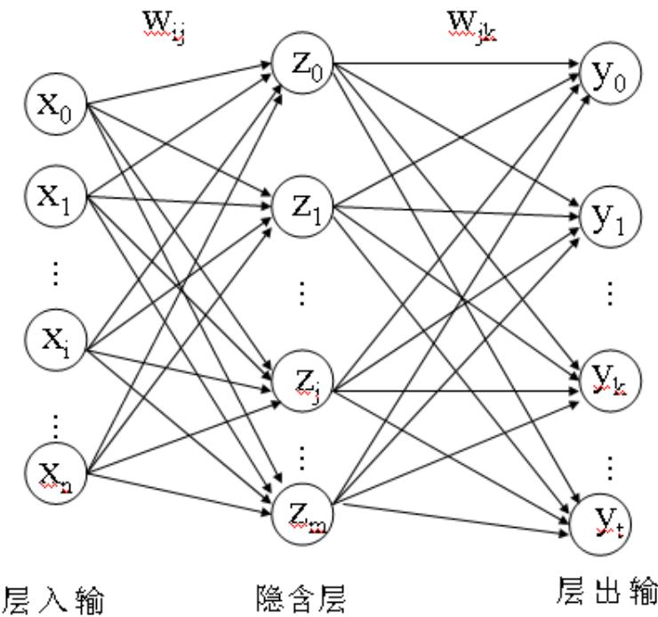  
图4-2 含有单个隐含层的BP神经网络拓扑结构图

假设BP神经网络的输入矢量为 $\boldsymbol { x } = \left( x _ { 0 } , x _ { 1 } , \cdots , x _ { i } , \cdots x _ { n - 1 } , x _ { n } \right) ^ { T }$ ；隐含层有j个神经元，它们的输出为 $\boldsymbol { z } = \left( z _ { 0 } , z _ { 1 } , \cdots , z _ { j } , \cdots , z _ { m - 1 } , z _ { m } \right) ^ { T }$ ；输出层有t个神经元，输出$y = \left( y _ { 0 } , y _ { 1 } , \cdots , y _ { k } , \cdots , y _ { t - 1 } , y _ { t } \right) ^ { T }$ ，期望输出为 $d = \left( d _ { 0 } , d _ { 1 } , \cdots , d _ { k } , \cdots , d _ { t - 1 } , d _ { t } \right)$ 。输入层到隐含层的权值为 $w = \left( w _ { 0 0 } + w _ { 1 1 } + \cdots + w _ { i j } \right)$ ，隐含层到输出层的权值为 $w ^ { ' } { = } \left( w _ { 0 0 } + w _ { 1 1 } { + } \cdots + w _ { j k } \right)$ 。于是各层神经元输出为：

$$
\left\{ \begin{array} { l } { \displaystyle Z _ { j } = f ( \sum _ { j = 0 } ^ { m } w _ { i j } x _ { i } ) , j = 0 , 1 , \cdots m - 1 , m } \\ { \displaystyle Y _ { k } = f ( \sum _ { k = 0 } ^ { t } w _ { j k } ^ { ' } z _ { j } ) , k = 0 , 1 , \cdots , t - 1 , t } \end{array} \right.\tag{4-1}
$$

完成i维空间矢量到k维的映射。其中， $f ( x )$ 为单极性 Sigmoid 函数

$$
f ( x ) = { \frac { 1 } { 1 + e ^ { - x } } }\tag{4-2}
$$

f(x)具有可导性，且有

$$
f ^ { \prime } ( x ) = f ( x ) ( 1 - f ( x ) )\tag{4-3}
$$

当网络输出与期望输出不相等时，存在输出误差E

$$
E = \frac { 1 } { 2 } { \sum _ { k = 1 } ^ { t } { { \left( { { d _ { k } } - y _ { k } } \right) } ^ { 2 } } }\tag{4-4}
$$

将式(4-4)的误差定义展开至隐含层，有

$$
E = \frac { 1 } { 2 } \sum _ { \mathrm { k = 1 } } ^ { t } \left[ d _ { k } - f \left( \sum _ { j = 0 } ^ { m } w _ { i j } ^ { \prime } z _ { j } \right) \right] ^ { 2 }\tag{4-5}
$$

将式(4-5)进一步展开至输入层，有

$$
E = \frac { 1 } { 2 } \sum _ { k = 1 } ^ { t } \left\{ d _ { k } - f \left[ \sum _ { j = 0 } ^ { m } w _ { j k } ^ { ' } f \left( \sum _ { i = 0 } ^ { n } w _ { i j } x _ { i } \right) \right] \right\} ^ { 2 }\tag{4-6}
$$

当 $E \leq \varepsilon$ （ε为期望精度）时，计算结束；否则，进入误差的反向传播阶段。误差通过输出层，对各层权值进行修正按误差梯度下降的方式，就是使权值的调整量与误差的梯度下降构成正比关系。

$$
\varTheta w _ { j k } ^ { ' } = - \eta \frac { \partial E } { \partial w _ { j k } ^ { ' } } = \eta \bigl ( d _ { k } ^ { } - y _ { k } ^ { } \bigr ) \bigl ( 1 - y _ { k } ^ { } \bigr ) z _ { j } ^ { }\tag{4-7}
$$

$$
\triangledown w _ { i j } = - \eta \frac { \partial E } { \partial w _ { i j } } = \eta \left( \sum _ { k = 1 } ^ { t } \left[ \left( d _ { _ k } - y _ { _ k } \right) y _ { _ k } \left( 1 - y _ { _ k } \right) \right] w _ { i j } - z _ { _ k } \right) z _ { j } \left( 1 - z _ { _ j } \right) x _ { i } = 0 .\tag{4-8}
$$

式中，η--学习率，通常取 $0 { < } \eta { < } 1$

网络的权值及闲值更新公式为

$$
W _ { i j } ( n + 1 ) = W _ { i j } ( n ) + \varTheta W _ { i j }\tag{4-9}
$$

$$
{ W _ { j k } } ^ { \prime } ( n + 1 ) = W _ { j k } ^ { \prime } ( n ) + \varTheta W _ { j k } ^ { \prime }\tag{4-10}
$$

当求出各层新的权值和闽值后在转向正向传播。

神经网络在实际应用中需要权值调整，一般有两种方法，即单样本训练法和总误差训练法；而批量的样本要比单样本的训练收敛速度快。

$$
E _ { _ { \perp } } { = } \sqrt { \frac { 1 } { 2 } \sum _ { P = 1 } ^ { P } \sum _ { k = 1 } ^ { t } \left( d _ { k } ^ { P } - z _ { k } ^ { P } \right) ^ { 2 } }\tag{4-11}
$$

式中，P--训练样本数。

这种来来回回的信息正向传播和误差反向传播过程，就是各层权值不断调整的过程，即BP神经网络学习训练的过程，由此过程一直进行到网络输出的误差减少到函数指定的范围，或者设定的学习次数为止。

## 2、BP人工神经网络模型的计算流程

第一步：权值初始化；

第二步：依次输入学习样本；

第三步：依次计算各层的输出；

第四步：求各层的误差；

第五步：记录已学习过的样本数，如果不满足要求，转到第二步继续计算；如果满足要求转到第六步；

第六步：按权值修正公式修正各层的权值；

第七步：按新的权值再计算各层输出值和E，每个都满足要求或达到最大学习次数，否则终止学习，转到第二步继续新一轮的学习。

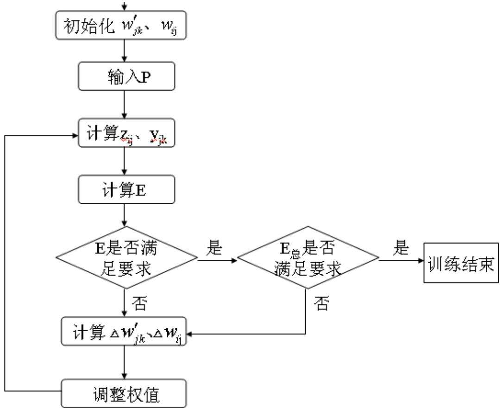  
图 4-3 BP 神经网算法流程图

3、BP人工神经网络模型存在的问题

## （1）易陷入局部极小值

对于绝大多数神经网络，训练误差函数的曲面上存在着多个梯度为零但又不是最小误差点的情况，也就是说可能是局部极小点。正是因为这些局部极小点的客观存在，使得基于梯度下降法的神经网络学习算法在搜索最优权值以及阀值时容易陷入这些局部极小点或者鞍点等而停止迭代与更新，导致网络最终无法收敛而得到问题的最优解，进而无法得到网络的最优连接权值和阀值等参数（周政，2008；王吉权，2011）。

## （2）学习过程收敛速度缓慢

影响神经网络收敛速度是由学习率和相关激励函数导数两个方面决定的（周政，2008；张青贵，2002；王吉权，2011）。一般情况下学习率的大小不好选择，如果学习率选取过大，使在训练过程中发生振荡甚至不收敛；如果学习率选取过小，将影响权值和阀值的更新速度，即增大迭代的次数，从而使训练得收敛速度过慢。

## (3）网络结构难以确定

网络结构难以确定包括隐层数及各隐含层节点数的难以确定。一般情况下，三层的BP神经网络能以任意精度逼近非线性函数，但是隐含层节点数过少将无法达到学习与逼近性能的要求。

## (4) 网络泛化能力不强

BP神经网络的结构复杂，训练样本的质量和数量、网络的初始权值、学习时间、目标函数的先验知识、目标函数的复杂性等，都对神经网络的泛化能力有一定影响，这种影响情况十分复杂，致使神经网络的泛化能力难以保证（黄丽，2008）。

## 4.2.2 BP 人工神经网络的改进

为了优化标准BP算法的缺点，主要基于负梯度思想和数值优化方法两个方向来进行的（郭军，2005），第一类方法有最速下降法、增加动量项法、学习率渐小法、自适应学习律法、弹性学习算法等，第二类改进算法有共扼梯度法、牛顿法、拟牛顿法和LM算法等。

## 1、最速下降法

最速下降法是1847年由著名数学家Cauchy提出的，最速下降BP算法（SDBP）每一层权值和阀值的修正按下式进行

$$
y ( k + 1 ) = y ( k ) - \eta g ( k )\tag{4-12}
$$

式中，y(k)--第k次迭代各层之间的链接权向量或者阀值向量

$g ( k ) = \frac { \partial E ( K ) } { \partial y ( k ) }$ --第k次迭代输出误差对个权值或者阀值的梯度向量。负号就表示方向相反，即梯度的速度下降方向；

η--学习率；

## E(k)--第k次迭代输出总误差函数

最速下降BP算法的传输函数为非线性的，所以误差函数往往有许多极小点，如果误差有a、b两个极小点，在学习过程中，误差先达到局部极小点a，该点梯度为0，按公式（4-12）无法调整权值或者阀值，学习结束，但尚未达到全局最小点。此外，如果误差曲面在a、b两点的梯度相同，方向相反，在第k次迭代的误差落在a点，而k+1次落在b，权值和阀值的调整将会在a、b两点之间反复进行，形成震荡，无法收敛。

## 2、动量算法

动量算法（MOBP）是在梯度下降算法的基础上引入动量因子， $\alpha ( 0 < \alpha { < } 1 )$ ，即

$$
y ( k + 1 ) = y ( k ) + \perp y ( k + 1 )\tag{4-13}
$$

$$
\boxed { \begin{array} { r c l } { \boxed { } y ( k + 1 ) = \alpha \boxed { } y ( k ) + \eta ( 1 - \alpha ) \frac { \partial E ( k ) } { \partial y ( k ) } } \end{array} }\tag{4-14}
$$

这种算法就是用前一次的修正量来影响本次的修正量，当前一次修正过大时 $\frac { \partial E ( k ) } { \partial y ( k ) }$ 会变成负号，改变修正方向，从而减小修正量；当前一次修正量过小时， $\frac { \partial E ( k ) } { \partial y ( k ) }$ 的方向不变，本次修正方向与上次相同，增加修正量，加速修收敛。

## 3、增加动量项法

Rumelhart于1986年提出的，该方法是前一次的权值变化量叠加到本次权值调整量中。

$$
\varPi w _ { i j } = \eta \delta z _ { j } ( n ) + \alpha \varPi w _ { i j } ( n - 1 )\tag{4-15}
$$

式中，—动量系数，一般取值(0,1);

η—学习率：

动量项反应了以前积累的调整经验和数值，对于n时刻的调整起阻尼作用。当误差曲面出现骤然起伏跌宕时，可以有效减小振荡趋势，极大提高训练速度。但是，不能根据误差曲面的情况自适应调整学习率，在一定程度收敛速度上受到影响。

## 4、弹性法

德国的 Martin Riedmiller 和 Heinrich Braun 于 1993 年提出的 RPROP 算法，又称弹性BP算法。这种算法不再考虑梯度的大小，只考虑梯度方向。

$$
\scriptstyle { \big | } \exists y ( k + 1 ) = \ ? { y ( k + 1 ) } \cdot s i g n { \big [ } g ( k ) { \big ] }\tag{4-16}
$$

$$
\begin{array} { r }  \begin{array} { r l }  \boxed { \mathrm { I } y ( k + 1 ) = \left\{ \begin{array} { l l } { \mathrm { I } y ( k ) \cdot \alpha } & { \overset { \cdot \pmb { \Sigma } } { \pmb { \Sigma } } \not \equiv \not { \underline { { y \Sigma } } } \not \equiv \not { \underline { { y \Sigma } } } \not \equiv \not { \underline { { \Sigma } } } \not \equiv \not { \mathrm { I } } \not \equiv \not { \mathrm { I } } \not \equiv \not { \mathrm { I } } \not \equiv \not { \mathrm { I } } \not \equiv \not { \mathrm { I } } \not \equiv } \\ { \mathrm { I } y ( k ) \cdot \beta } & { \overset { \cdot \pmb { \Sigma } } { \pmb { \Sigma } } \not \equiv \not { \underline { { y \Sigma } } } \not \equiv \not { \mathrm { I } } \not \equiv \not { \mathrm { I } } \not \equiv \not { \mathrm { I } } \not \equiv \not { \mathrm { I } } \not \equiv \not { \mathrm { I } } \not \equiv } \\ { \big \Sigma ( k ) } & { \overset { \mathrm { \scriptsize ~ { I } } \not \equiv } { \equiv } \not { \mathrm { I } } g ( k ) = 0 } \end{array} \right. } \end{array} \end{array}\tag{4-17}
$$

式中， $\alpha$ $\beta$ --为增量因子和减量因子，需要事先确定好的；

g(k)——迭代梯度；

## y(k)—-权值，其中·y(0)也需要事先确定好的

连续两次迭代方向相同，权值和阀值的修正值乘上一个增量因子 $\alpha$ ，使其修正至增加；连续两次迭代方向相反，权值和阀值的修正值乘上一个减量因子 $\beta$ ，使其修正至减小；当梯度为零时，权值和阀值保持不变。假设权值在相同梯度方向上连续被修正，其幅度必然增大，克服了梯度偏导的不利影响。

弹性BP算法收比增加动量项和可变学习率的算法收敛速度快，而且其算法实现过程简单。该方法增加的参数数量，其参数取值的合理性对网络的收敛速度会有很大的影响。

## 5、牛顿法

1983 年 Dennis J.E.和 Schnabel R.B.基于牛顿法提出的牛顿 BP 算法，也就是基于二阶泰勒级数的快速优化法。其基本方法是

$$
y ( k + 1 ) = y ( k ) - A ^ { - 1 } ( k ) g ( k )\tag{4-18}
$$

式中，A(k)--误差性能函数在当前权值和阀值下的Hessian矩阵（二阶导数），即

$$
A ( k ) = \nabla ^ { 2 } F ( y ) \big | _ { y = y ( k ) }\tag{4-19}
$$

相对于下降梯度法收敛速度快，但是运算过程中Hessian矩阵占用的空间比较大，如果网络规模比较大，就需要更大的储存空间，这对于牛顿法有点不现实。

## 6、拟牛顿法

Davidon在1959年首先提出了拟牛顿法。针对牛顿法的很多缺点，牛顿法拟利用目标函数的一阶导数来构造Hessian矩阵的近似矩阵。第一次迭代的搜索方向被确定为负梯度方向，即搜索方向 $S ( { Y } ^ { ( k ) } ) { = } { - } { \nabla } f ( { Y } ^ { ( k ) } )$ ，以后每次迭代搜索方向由下式确定

$$
S ( { \boldsymbol { Y } } ^ { ( k ) } ) { = } { - } ( { \boldsymbol { H } } ^ { ( k ) } ) ^ { - 1 } { \nabla } f ( { \boldsymbol { Y } } ^ { ( k ) } )\tag{4-20}
$$

$$
\mathbb { H } [ ] Y ^ { ( k + 1 ) } = Y ^ { ( k ) } - d ^ { ( k ) } S ( Y ^ { ( k ) } ) = Y ^ { ( k ) } - d ^ { ( k ) } ( H ^ { ( k ) } ) ^ { - 1 } \nabla f ( Y ^ { ( k ) } )\tag{4-21}
$$

式中， $Y ^ { ( k ) }$ --网络所有权值和阀值向量；

$S ( { Y } ^ { ( k ) } )$ —有Y的各分量组成的向量空间中的搜索方向；

$$
d ^ { ( k ) } \mathrm { - } \mathrm { \bar { \ t } } \Sigma \left( Y ^ { ( k ) } \right) \mathrm { \bar { \mathcal { H } } } | \mathrm { \bar { \mathbb { H } } } | \mathrm { \Sigma } , \langle \mathrm { \Sigma } | \mathrm { \bar { \Sigma } } S ( Y ^ { ( k + 1 ) } ) \mathrm { \mathrm { i } } \Sigma \mathrm { \bar { \Sigma } } | \mathrm { \Sigma } \mathrm { \bar { \Sigma } } | \mathrm { \Sigma } \mathrm { \Sigma } | \mathrm { \bar { \Sigma } } \mathrm { \bar { \Sigma } } \mathrm { \Sigma } \mathrm { \bar { \Sigma } } \mathrm { \Sigma } \mathrm { \bar { \Sigma } } \mathrm { \Sigma } \mathrm { \bar { \Sigma } } \mathrm { \Sigma } \mathrm { \bar { \Sigma } } \mathrm { \Sigma } \mathrm { \bar { \Sigma } } \mathrm { \Sigma } \mathrm { \bar { \Sigma } } \mathrm { \Sigma } \mathrm { \bar { \Sigma } } \mathrm { \Sigma } ,
$$

$$
H ^ { ( k ) } \mathrm { - } \mathrm { H e s s i a n } \arrowsboxed { \downarrow } \downarrow \downarrow ( \stackrel {  } { \mathrm { - } } \boxed { \langle \langle \mathcal { I } \rangle } \stackrel {  } { \mathrm { - } } \Zag \Zag \ Z \Zag \ Z \dag )
$$

拟牛顿法的收敛速度比一阶的梯度法快，不过因为网络数目庞大，导致计算Hessian矩阵增加。

## 7、LM法

此算法首先由 Levenberg 在 1944 提出，1963 年 Marquardt 重新发现，因此命名为Levenberg-Marquardt 法，简称 LM 法。

LMBP算法其实是牛顿法和梯度下降法的结合。梯度下降法在开始的几步下降较快，但其随着越来越接近最优值，由于梯度趋于零，使得目标函数下降非诚缓慢，然而牛顿法可以在最优值附近指导一个理想的搜索方向。

LM算法既具有梯度法的全局收敛性，又结合了牛顿法的快速收敛性，但是其缺点是仍需要很大的存储空间，当网络数据规模较大时是不推荐使用的。

综上所述，考虑到算法所需的极大收敛速度和存储量，在选择算法对网络进行训练时，可以遵循以下三个原则：

（1）当参数较少时，可使用LM法或牛顿法；

（2）当参数一般时，可使用拟牛顿法；

（3）当参数较多时，不妨使用共轭梯度法。

## 4.2.3LMBP人工神经网络在矿山地质环境质量评价中的应用

## 1、数据准备训练样本和检验样本

基于LMBP人工神经网络的矿山地质环境质量评价模型，采用的数据为夹沟铝土矿区205个方格的实测数据，分析影响夹沟矿山地质环境质量的特征，选定影响矿山地质

环境质量的5个主要因子：采矿影响的地形地貌、占用破坏耕地规模、占用破坏林地规模、“三废”排放量、矿山次生地质灾害面积作为模型的输入层输入，输出层输出为预测矿山地质环境影响程度，划分为三个等级：影响严重、影响较严重和影响一般。

将205个网格中的80组数据作为为训练样本，其余125组数据作为预测检验样本。

## 2、矿山地质环境质量评价预测模型的训练与预测

基于LMBP人工神经网络结构：输入层节点数为5，隐含层2个，节点数分别为10、3，输出层只有3个节点，为一维的零矩阵。(图4-4)

## 3、预测结果分析

为评价矿山地质环境质量评价模型的仿真效果，将4.2.2节所述的改进的最速下降法、动量法、共轭梯度法、弹性法、自适应学习率法、拟牛顿法、LMBP神经网络模型，应用统一的样本和参数，并用同一检验样本，对测试的结果进行比较。

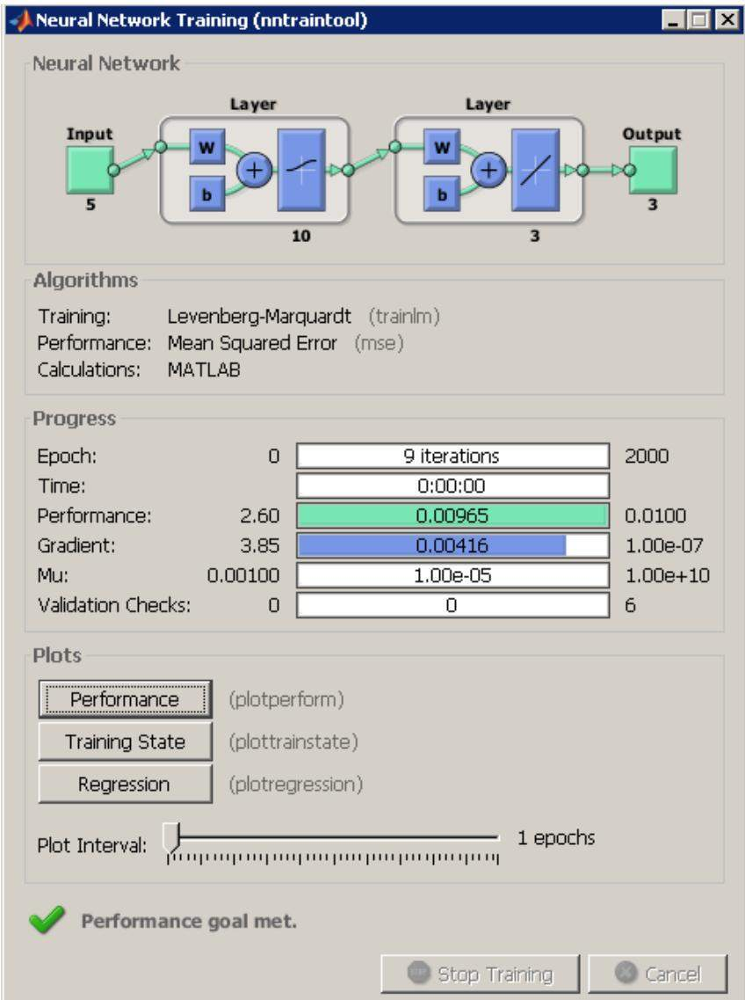  
图 4-4 BP 神经网结构界面

## 4.2.4 评价单元的积分计算和分级

分别计算各单元格的采矿影响的地形地貌、占用破坏耕地规模、占用破坏林地规模、“三废”排放量、矿山次生地质灾害面积的得分，并计算总得分。计算方法主要采用积分值法，即：

$$
M = \sum _ { n = 1 } ^ { i } \alpha _ { i }
$$

式中：M为某评价单元的总评分值；

$\alpha _ { i }$ 为第i个评价因子的评分值；

n为i个评价因子数。

根据表4-1中评价因子赋值分级标准，每个评价因子都要赋值，将每个单元内的评价因子赋值累计求和，得出其积分值。(单位：m²)

## 4.3 矿山环境综合分区

在模型和积分运算的基础上运用网格边界中点重复二分法找出各个分区边界节点，然后分别用圆滑的曲线连接得到矿山环境影响分区图(附图二)

表4-2 评价单元各因子的取值和分级表  
(单位：m²)
<table><tr><td colspan="1" rowspan="1">评价单元</td><td colspan="1" rowspan="1">占用破坏耕地面积得分</td><td colspan="1" rowspan="1">占用破坏林地面积得分</td><td colspan="1" rowspan="1">“三废”排放影响面积得分</td><td colspan="1" rowspan="1">次生地质灾害影响面积得分</td><td colspan="1" rowspan="1">地形地貌景观破坏面积得分</td><td colspan="1" rowspan="1">影响级别</td></tr><tr><td colspan="1" rowspan="1">1</td><td colspan="1" rowspan="1">2438.19</td><td colspan="1" rowspan="1">0</td><td colspan="1" rowspan="1">2438.19</td><td colspan="1" rowspan="1">0</td><td colspan="1" rowspan="1">0</td><td colspan="1" rowspan="1">II</td></tr><tr><td colspan="1" rowspan="1">2</td><td colspan="1" rowspan="1">1350.45</td><td colspan="1" rowspan="1">0</td><td colspan="1" rowspan="1">1350.45</td><td colspan="1" rowspan="1">0</td><td colspan="1" rowspan="1">0</td><td colspan="1" rowspan="1">III</td></tr><tr><td colspan="1" rowspan="1">3</td><td colspan="1" rowspan="1">0</td><td colspan="1" rowspan="1">0</td><td colspan="1" rowspan="1">0</td><td colspan="1" rowspan="1">0</td><td colspan="1" rowspan="1">0</td><td colspan="1" rowspan="1">III</td></tr><tr><td colspan="1" rowspan="1">4</td><td colspan="1" rowspan="1">0</td><td colspan="1" rowspan="1">0</td><td colspan="1" rowspan="1">0</td><td colspan="1" rowspan="1">0</td><td colspan="1" rowspan="1">0</td><td colspan="1" rowspan="1">III</td></tr><tr><td colspan="1" rowspan="1">5</td><td colspan="1" rowspan="1">0</td><td colspan="1" rowspan="1">0</td><td colspan="1" rowspan="1">0</td><td colspan="1" rowspan="1">0</td><td colspan="1" rowspan="1">0</td><td colspan="1" rowspan="1">III</td></tr><tr><td colspan="1" rowspan="1">6</td><td colspan="1" rowspan="1">0</td><td colspan="1" rowspan="1">0</td><td colspan="1" rowspan="1">0</td><td colspan="1" rowspan="1">0</td><td colspan="1" rowspan="1">0</td><td colspan="1" rowspan="1">III</td></tr><tr><td colspan="1" rowspan="1">7</td><td colspan="1" rowspan="1">0</td><td colspan="1" rowspan="1">0</td><td colspan="1" rowspan="1">0</td><td colspan="1" rowspan="1">0</td><td colspan="1" rowspan="1">0</td><td colspan="1" rowspan="1">III</td></tr><tr><td colspan="1" rowspan="1">8</td><td colspan="1" rowspan="1">0</td><td colspan="1" rowspan="1">0</td><td colspan="1" rowspan="1">0</td><td colspan="1" rowspan="1">0</td><td colspan="1" rowspan="1">0</td><td colspan="1" rowspan="1">III</td></tr><tr><td colspan="1" rowspan="1">9</td><td colspan="1" rowspan="1">0</td><td colspan="1" rowspan="1">0</td><td colspan="1" rowspan="1">0</td><td colspan="1" rowspan="1">0</td><td colspan="1" rowspan="1">0</td><td colspan="1" rowspan="1">III</td></tr><tr><td colspan="1" rowspan="1">10</td><td colspan="1" rowspan="1">0</td><td colspan="1" rowspan="1">0</td><td colspan="1" rowspan="1">0</td><td colspan="1" rowspan="1">0</td><td colspan="1" rowspan="1">0</td><td colspan="1" rowspan="1">III</td></tr><tr><td colspan="1" rowspan="1">11</td><td colspan="1" rowspan="1">0</td><td colspan="1" rowspan="1">0</td><td colspan="1" rowspan="1">0</td><td colspan="1" rowspan="1">0</td><td colspan="1" rowspan="1">0</td><td colspan="1" rowspan="1">III</td></tr><tr><td colspan="1" rowspan="1">12</td><td colspan="1" rowspan="1">0</td><td colspan="1" rowspan="1">0</td><td colspan="1" rowspan="1">0</td><td colspan="1" rowspan="1">0</td><td colspan="1" rowspan="1">0</td><td colspan="1" rowspan="1">III</td></tr><tr><td colspan="1" rowspan="1">13</td><td colspan="1" rowspan="1">0</td><td colspan="1" rowspan="1">0</td><td colspan="1" rowspan="1">0</td><td colspan="1" rowspan="1">0</td><td colspan="1" rowspan="1">0</td><td colspan="1" rowspan="1">III</td></tr><tr><td colspan="1" rowspan="1">14</td><td colspan="1" rowspan="1">0</td><td colspan="1" rowspan="1">0</td><td colspan="1" rowspan="1">0</td><td colspan="1" rowspan="1">0</td><td colspan="1" rowspan="1">0</td><td colspan="1" rowspan="1">III</td></tr><tr><td colspan="1" rowspan="1">15</td><td colspan="1" rowspan="1">0</td><td colspan="1" rowspan="1">0</td><td colspan="1" rowspan="1">0</td><td colspan="1" rowspan="1">0</td><td colspan="1" rowspan="1">0</td><td colspan="1" rowspan="1">III</td></tr><tr><td colspan="1" rowspan="1">16</td><td colspan="1" rowspan="1">0</td><td colspan="1" rowspan="1">0</td><td colspan="1" rowspan="1">0</td><td colspan="1" rowspan="1">0</td><td colspan="1" rowspan="1">0</td><td colspan="1" rowspan="1">III</td></tr><tr><td colspan="1" rowspan="1">17</td><td colspan="1" rowspan="1">0</td><td colspan="1" rowspan="1">0</td><td colspan="1" rowspan="1">0</td><td colspan="1" rowspan="1">0</td><td colspan="1" rowspan="1">0</td><td colspan="1" rowspan="1">III</td></tr><tr><td colspan="1" rowspan="1">18</td><td colspan="1" rowspan="1">0</td><td colspan="1" rowspan="1">0</td><td colspan="1" rowspan="1">0</td><td colspan="1" rowspan="1">0</td><td colspan="1" rowspan="1">0</td><td colspan="1" rowspan="1">III</td></tr><tr><td colspan="1" rowspan="1">19</td><td colspan="1" rowspan="1">0</td><td colspan="1" rowspan="1">0</td><td colspan="1" rowspan="1">0</td><td colspan="1" rowspan="1">0</td><td colspan="1" rowspan="1">0</td><td colspan="1" rowspan="1">III</td></tr><tr><td colspan="1" rowspan="1">20</td><td colspan="1" rowspan="1">0</td><td colspan="1" rowspan="1">0</td><td colspan="1" rowspan="1">0</td><td colspan="1" rowspan="1">0</td><td colspan="1" rowspan="1">0</td><td colspan="1" rowspan="1">III</td></tr><tr><td colspan="1" rowspan="1">21</td><td colspan="1" rowspan="1">0</td><td colspan="1" rowspan="1">0</td><td colspan="1" rowspan="1">0</td><td colspan="1" rowspan="1">0</td><td colspan="1" rowspan="1">0</td><td colspan="1" rowspan="1">III</td></tr><tr><td colspan="1" rowspan="1">22</td><td colspan="1" rowspan="1">0</td><td colspan="1" rowspan="1">0</td><td colspan="1" rowspan="1">0</td><td colspan="1" rowspan="1">0</td><td colspan="1" rowspan="1">0</td><td colspan="1" rowspan="1">III</td></tr><tr><td colspan="1" rowspan="1">23</td><td colspan="1" rowspan="1">6306.99</td><td colspan="1" rowspan="1">0</td><td colspan="1" rowspan="1">6306.99</td><td colspan="1" rowspan="1">0</td><td colspan="1" rowspan="1">0</td><td colspan="1" rowspan="1">I</td></tr><tr><td colspan="1" rowspan="1">24</td><td colspan="1" rowspan="1">8566.94</td><td colspan="1" rowspan="1">0</td><td colspan="1" rowspan="1">8566.94</td><td colspan="1" rowspan="1">0</td><td colspan="1" rowspan="1">0</td><td colspan="1" rowspan="1">I</td></tr><tr><td colspan="1" rowspan="1">25</td><td colspan="1" rowspan="1">21.72</td><td colspan="1" rowspan="1">0</td><td colspan="1" rowspan="1">21.72</td><td colspan="1" rowspan="1">0</td><td colspan="1" rowspan="1">0</td><td colspan="1" rowspan="1">III</td></tr><tr><td colspan="1" rowspan="1">26</td><td colspan="1" rowspan="1">0</td><td colspan="1" rowspan="1">0</td><td colspan="1" rowspan="1">0</td><td colspan="1" rowspan="1">0</td><td colspan="1" rowspan="1">0</td><td colspan="1" rowspan="1">III</td></tr><tr><td colspan="1" rowspan="1">27</td><td colspan="1" rowspan="1">0</td><td colspan="1" rowspan="1">0</td><td colspan="1" rowspan="1">0</td><td colspan="1" rowspan="1">0</td><td colspan="1" rowspan="1">0</td><td colspan="1" rowspan="1">III</td></tr><tr><td colspan="1" rowspan="1">28</td><td colspan="1" rowspan="1">0</td><td colspan="1" rowspan="1">0</td><td colspan="1" rowspan="1">0</td><td colspan="1" rowspan="1">0</td><td colspan="1" rowspan="1">0</td><td colspan="1" rowspan="1">III</td></tr><tr><td colspan="1" rowspan="1">29</td><td colspan="1" rowspan="1">0</td><td colspan="1" rowspan="1">0</td><td colspan="1" rowspan="1">0</td><td colspan="1" rowspan="1">0</td><td colspan="1" rowspan="1">0</td><td colspan="1" rowspan="1">III</td></tr><tr><td colspan="1" rowspan="1">30</td><td colspan="1" rowspan="1">0</td><td colspan="1" rowspan="1">0</td><td colspan="1" rowspan="1">0</td><td colspan="1" rowspan="1">0</td><td colspan="1" rowspan="1">0</td><td colspan="1" rowspan="1">III</td></tr><tr><td colspan="1" rowspan="1">31</td><td colspan="1" rowspan="1">0</td><td colspan="1" rowspan="1">0</td><td colspan="1" rowspan="1">0</td><td colspan="1" rowspan="1">0</td><td colspan="1" rowspan="1">0</td><td colspan="1" rowspan="1">III</td></tr><tr><td colspan="1" rowspan="1">32</td><td colspan="1" rowspan="1">0</td><td colspan="1" rowspan="1">0</td><td colspan="1" rowspan="1">0</td><td colspan="1" rowspan="1">0</td><td colspan="1" rowspan="1">0</td><td colspan="1" rowspan="1">III</td></tr><tr><td colspan="1" rowspan="1">33</td><td colspan="1" rowspan="1">0</td><td colspan="1" rowspan="1">0</td><td colspan="1" rowspan="1">0</td><td colspan="1" rowspan="1">0</td><td colspan="1" rowspan="1">0</td><td colspan="1" rowspan="1">III</td></tr><tr><td colspan="1" rowspan="1">34</td><td colspan="1" rowspan="1">0</td><td colspan="1" rowspan="1">0</td><td colspan="1" rowspan="1">0</td><td colspan="1" rowspan="1">0</td><td colspan="1" rowspan="1">0</td><td colspan="1" rowspan="1">III</td></tr><tr><td colspan="1" rowspan="1">35</td><td colspan="1" rowspan="1">0</td><td colspan="1" rowspan="1">0</td><td colspan="1" rowspan="1">0</td><td colspan="1" rowspan="1">0</td><td colspan="1" rowspan="1">0</td><td colspan="1" rowspan="1">III</td></tr><tr><td colspan="1" rowspan="1">36</td><td colspan="1" rowspan="1">0</td><td colspan="1" rowspan="1">0</td><td colspan="1" rowspan="1">0</td><td colspan="1" rowspan="1">0</td><td colspan="1" rowspan="1">0</td><td colspan="1" rowspan="1">III</td></tr><tr><td colspan="1" rowspan="1">37</td><td colspan="1" rowspan="1">0</td><td colspan="1" rowspan="1">0</td><td colspan="1" rowspan="1">0</td><td colspan="1" rowspan="1">0</td><td colspan="1" rowspan="1">0</td><td colspan="1" rowspan="1">III</td></tr><tr><td colspan="1" rowspan="1">38</td><td colspan="1" rowspan="1">0</td><td colspan="1" rowspan="1">0</td><td colspan="1" rowspan="1">0</td><td colspan="1" rowspan="1">0</td><td colspan="1" rowspan="1">0</td><td colspan="1" rowspan="1">III</td></tr><tr><td colspan="1" rowspan="1">39</td><td colspan="1" rowspan="1">0</td><td colspan="1" rowspan="1">0</td><td colspan="1" rowspan="1">0</td><td colspan="1" rowspan="1">0</td><td colspan="1" rowspan="1">0</td><td colspan="1" rowspan="1">III</td></tr><tr><td colspan="1" rowspan="1">40</td><td colspan="1" rowspan="1">0</td><td colspan="1" rowspan="1">0</td><td colspan="1" rowspan="1">0</td><td colspan="1" rowspan="1">0</td><td colspan="1" rowspan="1">0</td><td colspan="1" rowspan="1">III</td></tr><tr><td colspan="1" rowspan="1">41</td><td colspan="1" rowspan="1">0</td><td colspan="1" rowspan="1">0</td><td colspan="1" rowspan="1">0</td><td colspan="1" rowspan="1">0</td><td colspan="1" rowspan="1">0</td><td colspan="1" rowspan="1">III</td></tr><tr><td colspan="1" rowspan="1">42</td><td colspan="1" rowspan="1">0</td><td colspan="1" rowspan="1">0</td><td colspan="1" rowspan="1">0</td><td colspan="1" rowspan="1">0</td><td colspan="1" rowspan="1">0</td><td colspan="1" rowspan="1">III</td></tr><tr><td colspan="1" rowspan="1">43</td><td colspan="1" rowspan="1">0</td><td colspan="1" rowspan="1">0</td><td colspan="1" rowspan="1">0</td><td colspan="1" rowspan="1">0</td><td colspan="1" rowspan="1">0</td><td colspan="1" rowspan="1">III</td></tr><tr><td colspan="1" rowspan="1">44</td><td colspan="1" rowspan="1">0</td><td colspan="1" rowspan="1">0</td><td colspan="1" rowspan="1">0</td><td colspan="1" rowspan="1">0</td><td colspan="1" rowspan="1">0</td><td colspan="1" rowspan="1">III</td></tr><tr><td colspan="1" rowspan="1">45</td><td colspan="1" rowspan="1">2050.83</td><td colspan="1" rowspan="1">0</td><td colspan="1" rowspan="1">2050.83</td><td colspan="1" rowspan="1">0</td><td colspan="1" rowspan="1">0</td><td colspan="1" rowspan="1">II</td></tr><tr><td colspan="1" rowspan="1">46</td><td colspan="1" rowspan="1">487.64</td><td colspan="1" rowspan="1">0</td><td colspan="1" rowspan="1">487.64</td><td colspan="1" rowspan="1">0</td><td colspan="1" rowspan="1">0</td><td colspan="1" rowspan="1">III</td></tr><tr><td colspan="1" rowspan="1">47</td><td colspan="1" rowspan="1">0</td><td colspan="1" rowspan="1">0</td><td colspan="1" rowspan="1">0</td><td colspan="1" rowspan="1">0</td><td colspan="1" rowspan="1">0</td><td colspan="1" rowspan="1">III</td></tr><tr><td colspan="1" rowspan="1">48</td><td colspan="1" rowspan="1">0</td><td colspan="1" rowspan="1">0</td><td colspan="1" rowspan="1">0</td><td colspan="1" rowspan="1">0</td><td colspan="1" rowspan="1">0</td><td colspan="1" rowspan="1">III</td></tr><tr><td colspan="1" rowspan="1">49</td><td colspan="1" rowspan="1">0</td><td colspan="1" rowspan="1">0</td><td colspan="1" rowspan="1">0</td><td colspan="1" rowspan="1">0</td><td colspan="1" rowspan="1">0</td><td colspan="1" rowspan="1">III</td></tr><tr><td colspan="1" rowspan="1">50</td><td colspan="1" rowspan="1">0</td><td colspan="1" rowspan="1">0</td><td colspan="1" rowspan="1">0</td><td colspan="1" rowspan="1">0</td><td colspan="1" rowspan="1">0</td><td colspan="1" rowspan="1">III</td></tr><tr><td colspan="1" rowspan="1">51</td><td colspan="1" rowspan="1">0</td><td colspan="1" rowspan="1">0</td><td colspan="1" rowspan="1">0</td><td colspan="1" rowspan="1">0</td><td colspan="1" rowspan="1">0</td><td colspan="1" rowspan="1">III</td></tr><tr><td colspan="1" rowspan="1">52</td><td colspan="1" rowspan="1">0</td><td colspan="1" rowspan="1">0</td><td colspan="1" rowspan="1">0</td><td colspan="1" rowspan="1">0</td><td colspan="1" rowspan="1">0</td><td colspan="1" rowspan="1">III</td></tr><tr><td colspan="1" rowspan="1">53</td><td colspan="1" rowspan="1">0</td><td colspan="1" rowspan="1">0</td><td colspan="1" rowspan="1">0</td><td colspan="1" rowspan="1">0</td><td colspan="1" rowspan="1">0</td><td colspan="1" rowspan="1">III</td></tr><tr><td colspan="1" rowspan="1">54</td><td colspan="1" rowspan="1">0</td><td colspan="1" rowspan="1">0</td><td colspan="1" rowspan="1"></td><td colspan="1" rowspan="1">0</td><td colspan="1" rowspan="1">0</td><td colspan="1" rowspan="1">III</td></tr><tr><td colspan="1" rowspan="1">55</td><td colspan="1" rowspan="1">1601.61</td><td colspan="1" rowspan="1">0</td><td colspan="1" rowspan="1">1601.61</td><td colspan="1" rowspan="1">0</td><td colspan="1" rowspan="1">0</td><td colspan="1" rowspan="1">II</td></tr><tr><td colspan="1" rowspan="1">56</td><td colspan="1" rowspan="1">1935.74</td><td colspan="1" rowspan="1">0</td><td colspan="1" rowspan="1">1935.74</td><td colspan="1" rowspan="1">0</td><td colspan="1" rowspan="1">0</td><td colspan="1" rowspan="1">II</td></tr><tr><td colspan="1" rowspan="1">57</td><td colspan="1" rowspan="1">0</td><td colspan="1" rowspan="1">0</td><td colspan="1" rowspan="1">0</td><td colspan="1" rowspan="1">0</td><td colspan="1" rowspan="1">0</td><td colspan="1" rowspan="1">III</td></tr><tr><td colspan="1" rowspan="1">58</td><td colspan="1" rowspan="1">0</td><td colspan="1" rowspan="1">0</td><td colspan="1" rowspan="1">0</td><td colspan="1" rowspan="1">0</td><td colspan="1" rowspan="1">0</td><td colspan="1" rowspan="1">III</td></tr><tr><td colspan="1" rowspan="1">59</td><td colspan="1" rowspan="1">0</td><td colspan="1" rowspan="1">0</td><td colspan="1" rowspan="1">0</td><td colspan="1" rowspan="1">0</td><td colspan="1" rowspan="1">0</td><td colspan="1" rowspan="1">III</td></tr><tr><td colspan="1" rowspan="1">60</td><td colspan="1" rowspan="1">863.81</td><td colspan="1" rowspan="1">0</td><td colspan="1" rowspan="1">863.81</td><td colspan="1" rowspan="1">0</td><td colspan="1" rowspan="1">0</td><td colspan="1" rowspan="1">III</td></tr><tr><td colspan="1" rowspan="1">61</td><td colspan="1" rowspan="1">0</td><td colspan="1" rowspan="1">4522.27</td><td colspan="1" rowspan="1">4522.27</td><td colspan="1" rowspan="1">0</td><td colspan="1" rowspan="1">0</td><td colspan="1" rowspan="1">II</td></tr><tr><td colspan="1" rowspan="1">62</td><td colspan="1" rowspan="1">1273.26</td><td colspan="1" rowspan="1">0</td><td colspan="1" rowspan="1">1273.26</td><td colspan="1" rowspan="1">0</td><td colspan="1" rowspan="1">0</td><td colspan="1" rowspan="1">II</td></tr><tr><td colspan="1" rowspan="1">63</td><td colspan="1" rowspan="1">0</td><td colspan="1" rowspan="1">2478.17</td><td colspan="1" rowspan="1">2478.17</td><td colspan="1" rowspan="1">0</td><td colspan="1" rowspan="1">0</td><td colspan="1" rowspan="1">II</td></tr><tr><td colspan="1" rowspan="1">64</td><td colspan="1" rowspan="1">0</td><td colspan="1" rowspan="1">0</td><td colspan="1" rowspan="1">0</td><td colspan="1" rowspan="1">0</td><td colspan="1" rowspan="1">0</td><td colspan="1" rowspan="1">III</td></tr><tr><td colspan="1" rowspan="1">65</td><td colspan="1" rowspan="1">0</td><td colspan="1" rowspan="1">0</td><td colspan="1" rowspan="1">0</td><td colspan="1" rowspan="1">0</td><td colspan="1" rowspan="1">0</td><td colspan="1" rowspan="1">III</td></tr><tr><td colspan="1" rowspan="1">66</td><td colspan="1" rowspan="1">0</td><td colspan="1" rowspan="1">0</td><td colspan="1" rowspan="1">0</td><td colspan="1" rowspan="1">0</td><td colspan="1" rowspan="1">0</td><td colspan="1" rowspan="1">III</td></tr><tr><td colspan="1" rowspan="1">67</td><td colspan="1" rowspan="1">503.65</td><td colspan="1" rowspan="1">0</td><td colspan="1" rowspan="1">503.65</td><td colspan="1" rowspan="1">0</td><td colspan="1" rowspan="1">0</td><td colspan="1" rowspan="1">III</td></tr><tr><td colspan="1" rowspan="1">68</td><td colspan="1" rowspan="1">7358.75</td><td colspan="1" rowspan="1">0</td><td colspan="1" rowspan="1">7358.75</td><td colspan="1" rowspan="1">0</td><td colspan="1" rowspan="1">0</td><td colspan="1" rowspan="1">I</td></tr><tr><td colspan="1" rowspan="1">69</td><td colspan="1" rowspan="1">35.3</td><td colspan="1" rowspan="1">0</td><td colspan="1" rowspan="1">35.3</td><td colspan="1" rowspan="1">0</td><td colspan="1" rowspan="1">0</td><td colspan="1" rowspan="1">III</td></tr><tr><td colspan="1" rowspan="1">70</td><td colspan="1" rowspan="1">0</td><td colspan="1" rowspan="1">171.02</td><td colspan="1" rowspan="1">171.02</td><td colspan="1" rowspan="1">0</td><td colspan="1" rowspan="1">0</td><td colspan="1" rowspan="1">III</td></tr><tr><td colspan="1" rowspan="1">71</td><td colspan="1" rowspan="1">0</td><td colspan="1" rowspan="1">1717.64</td><td colspan="1" rowspan="1">1717.64</td><td colspan="1" rowspan="1">0</td><td colspan="1" rowspan="1">0</td><td colspan="1" rowspan="1">II</td></tr><tr><td colspan="1" rowspan="1">72</td><td colspan="1" rowspan="1">0</td><td colspan="1" rowspan="1">0</td><td colspan="1" rowspan="1">0</td><td colspan="1" rowspan="1">0</td><td colspan="1" rowspan="1">0</td><td colspan="1" rowspan="1">III</td></tr><tr><td colspan="1" rowspan="1">73</td><td colspan="1" rowspan="1">0</td><td colspan="1" rowspan="1">0</td><td colspan="1" rowspan="1">0</td><td colspan="1" rowspan="1">0</td><td colspan="1" rowspan="1">0</td><td colspan="1" rowspan="1">III</td></tr><tr><td colspan="1" rowspan="1">74</td><td colspan="1" rowspan="1">0</td><td colspan="1" rowspan="1">0</td><td colspan="1" rowspan="1">0</td><td colspan="1" rowspan="1">0</td><td colspan="1" rowspan="1">0</td><td colspan="1" rowspan="1">III</td></tr><tr><td colspan="1" rowspan="1">75</td><td colspan="1" rowspan="1">0</td><td colspan="1" rowspan="1">421.09</td><td colspan="1" rowspan="1">421.09</td><td colspan="1" rowspan="1">0</td><td colspan="1" rowspan="1">0</td><td colspan="1" rowspan="1">III</td></tr><tr><td colspan="1" rowspan="1">76</td><td colspan="1" rowspan="1">0</td><td colspan="1" rowspan="1">0</td><td colspan="1" rowspan="1">0</td><td colspan="1" rowspan="1">0</td><td colspan="1" rowspan="1">0</td><td colspan="1" rowspan="1">III</td></tr><tr><td colspan="1" rowspan="1">77</td><td colspan="1" rowspan="1">998.42</td><td colspan="1" rowspan="1">0</td><td colspan="1" rowspan="1">998.42</td><td colspan="1" rowspan="1">0</td><td colspan="1" rowspan="1">0</td><td colspan="1" rowspan="1">III</td></tr><tr><td colspan="1" rowspan="1">78</td><td colspan="1" rowspan="1">0</td><td colspan="1" rowspan="1">0</td><td colspan="1" rowspan="1">0</td><td colspan="1" rowspan="1">0</td><td colspan="1" rowspan="1">0</td><td colspan="1" rowspan="1">III</td></tr><tr><td colspan="1" rowspan="1">79</td><td colspan="1" rowspan="1">0</td><td colspan="1" rowspan="1">0</td><td colspan="1" rowspan="1">0</td><td colspan="1" rowspan="1">0</td><td colspan="1" rowspan="1">0</td><td colspan="1" rowspan="1">III</td></tr><tr><td colspan="1" rowspan="1">80</td><td colspan="1" rowspan="1">2518.39</td><td colspan="1" rowspan="1">0</td><td colspan="1" rowspan="1">0</td><td colspan="1" rowspan="1">0</td><td colspan="1" rowspan="1">2518.39</td><td colspan="1" rowspan="1">II</td></tr><tr><td colspan="1" rowspan="1">81</td><td colspan="1" rowspan="1">2935.3</td><td colspan="1" rowspan="1">0</td><td colspan="1" rowspan="1">0</td><td colspan="1" rowspan="1">1307.07</td><td colspan="1" rowspan="1">1628.23</td><td colspan="1" rowspan="1">II</td></tr><tr><td colspan="1" rowspan="1">82</td><td colspan="1" rowspan="1">908.31</td><td colspan="1" rowspan="1">0</td><td colspan="1" rowspan="1">0</td><td colspan="1" rowspan="1">550.79</td><td colspan="1" rowspan="1">357.52</td><td colspan="1" rowspan="1">III</td></tr><tr><td colspan="1" rowspan="1">83</td><td colspan="1" rowspan="1">26.21</td><td colspan="1" rowspan="1">0</td><td colspan="1" rowspan="1">0</td><td colspan="1" rowspan="1">0</td><td colspan="1" rowspan="1">26.21</td><td colspan="1" rowspan="1">III</td></tr><tr><td colspan="1" rowspan="1">84</td><td colspan="1" rowspan="1">0</td><td colspan="1" rowspan="1">0</td><td colspan="1" rowspan="1">0</td><td colspan="1" rowspan="1">0</td><td colspan="1" rowspan="1">0</td><td colspan="1" rowspan="1">III</td></tr><tr><td colspan="1" rowspan="1">85</td><td colspan="1" rowspan="1">0</td><td colspan="1" rowspan="1">0</td><td colspan="1" rowspan="1">0</td><td colspan="1" rowspan="1">0</td><td colspan="1" rowspan="1">0</td><td colspan="1" rowspan="1">III</td></tr><tr><td colspan="1" rowspan="1">86</td><td colspan="1" rowspan="1">0</td><td colspan="1" rowspan="1">0</td><td colspan="1" rowspan="1">0</td><td colspan="1" rowspan="1">0</td><td colspan="1" rowspan="1">0</td><td colspan="1" rowspan="1">III</td></tr><tr><td colspan="1" rowspan="1">87</td><td colspan="1" rowspan="1">0</td><td colspan="1" rowspan="1">0</td><td colspan="1" rowspan="1">0</td><td colspan="1" rowspan="1">0</td><td colspan="1" rowspan="1">0</td><td colspan="1" rowspan="1">III</td></tr><tr><td colspan="1" rowspan="1">88</td><td colspan="1" rowspan="1">0</td><td colspan="1" rowspan="1">0</td><td colspan="1" rowspan="1">0</td><td colspan="1" rowspan="1">0</td><td colspan="1" rowspan="1">0</td><td colspan="1" rowspan="1">III</td></tr><tr><td colspan="1" rowspan="1">89</td><td colspan="1" rowspan="1">172.49</td><td colspan="1" rowspan="1">0</td><td colspan="1" rowspan="1">172.49</td><td colspan="1" rowspan="1">0</td><td colspan="1" rowspan="1">0</td><td colspan="1" rowspan="1">III</td></tr><tr><td colspan="1" rowspan="1">90</td><td colspan="1" rowspan="1">0</td><td colspan="1" rowspan="1">0</td><td colspan="1" rowspan="1">0</td><td colspan="1" rowspan="1">0</td><td colspan="1" rowspan="1">0</td><td colspan="1" rowspan="1">III</td></tr><tr><td colspan="1" rowspan="1">91</td><td colspan="1" rowspan="1">0</td><td colspan="1" rowspan="1">777.38</td><td colspan="1" rowspan="1">777.38</td><td colspan="1" rowspan="1">0</td><td colspan="1" rowspan="1">0</td><td colspan="1" rowspan="1">III</td></tr><tr><td colspan="1" rowspan="1">92</td><td colspan="1" rowspan="1">0</td><td colspan="1" rowspan="1">7828.89</td><td colspan="1" rowspan="1">4898.25</td><td colspan="1" rowspan="1">0</td><td colspan="1" rowspan="1">2930.64</td><td colspan="1" rowspan="1">I</td></tr><tr><td colspan="1" rowspan="1">93</td><td colspan="1" rowspan="1">0</td><td colspan="1" rowspan="1">1310.23</td><td colspan="1" rowspan="1">14.54</td><td colspan="1" rowspan="1">0</td><td colspan="1" rowspan="1">1295.69</td><td colspan="1" rowspan="1">II</td></tr><tr><td colspan="1" rowspan="1">94</td><td colspan="1" rowspan="1">0</td><td colspan="1" rowspan="1">509.91</td><td colspan="1" rowspan="1">0</td><td colspan="1" rowspan="1">0</td><td colspan="1" rowspan="1">509.91</td><td colspan="1" rowspan="1">III</td></tr><tr><td colspan="1" rowspan="1">95</td><td colspan="1" rowspan="1">0</td><td colspan="1" rowspan="1">5509.76</td><td colspan="1" rowspan="1">3989.24</td><td colspan="1" rowspan="1">0</td><td colspan="1" rowspan="1">1520.52</td><td colspan="1" rowspan="1">II</td></tr><tr><td colspan="1" rowspan="1">96</td><td colspan="1" rowspan="1">0</td><td colspan="1" rowspan="1">6231.6</td><td colspan="1" rowspan="1">6231.6</td><td colspan="1" rowspan="1">0</td><td colspan="1" rowspan="1">0</td><td colspan="1" rowspan="1">II</td></tr><tr><td colspan="1" rowspan="1">97</td><td colspan="1" rowspan="1">0</td><td colspan="1" rowspan="1">46.36</td><td colspan="1" rowspan="1">46.36</td><td colspan="1" rowspan="1">0</td><td colspan="1" rowspan="1">0</td><td colspan="1" rowspan="1">III</td></tr><tr><td colspan="1" rowspan="1">98</td><td colspan="1" rowspan="1">0</td><td colspan="1" rowspan="1">144.05</td><td colspan="1" rowspan="1">144.05</td><td colspan="1" rowspan="1">0</td><td colspan="1" rowspan="1">0</td><td colspan="1" rowspan="1">III</td></tr><tr><td colspan="1" rowspan="1">99</td><td colspan="1" rowspan="1">0</td><td colspan="1" rowspan="1">0</td><td colspan="1" rowspan="1">0</td><td colspan="1" rowspan="1">0</td><td colspan="1" rowspan="1">0</td><td colspan="1" rowspan="1">III</td></tr><tr><td colspan="1" rowspan="1">100</td><td colspan="1" rowspan="1">0</td><td colspan="1" rowspan="1">0</td><td colspan="1" rowspan="1">0</td><td colspan="1" rowspan="1">0</td><td colspan="1" rowspan="1">0</td><td colspan="1" rowspan="1">III</td></tr><tr><td colspan="1" rowspan="1">101</td><td colspan="1" rowspan="1">7717.67</td><td colspan="1" rowspan="1">0</td><td colspan="1" rowspan="1">0</td><td colspan="1" rowspan="1">5679.01</td><td colspan="1" rowspan="1">2038.66</td><td colspan="1" rowspan="1">I</td></tr><tr><td colspan="1" rowspan="1">102</td><td colspan="1" rowspan="1">9999.99</td><td colspan="1" rowspan="1">0</td><td colspan="1" rowspan="1">0</td><td colspan="1" rowspan="1">2670.46</td><td colspan="1" rowspan="1">7329.53</td><td colspan="1" rowspan="1">I</td></tr><tr><td colspan="1" rowspan="1">103</td><td colspan="1" rowspan="1">10000</td><td colspan="1" rowspan="1">0</td><td colspan="1" rowspan="1">0</td><td colspan="1" rowspan="1">2818.79</td><td colspan="1" rowspan="1">7181.21</td><td colspan="1" rowspan="1">I</td></tr><tr><td colspan="1" rowspan="1">104</td><td colspan="1" rowspan="1">0</td><td colspan="1" rowspan="1">1419.03</td><td colspan="1" rowspan="1">0</td><td colspan="1" rowspan="1">1005.32</td><td colspan="1" rowspan="1">413.71</td><td colspan="1" rowspan="1">III</td></tr><tr><td colspan="1" rowspan="1">105</td><td colspan="1" rowspan="1">0</td><td colspan="1" rowspan="1">2716.02</td><td colspan="1" rowspan="1">2716.02</td><td colspan="1" rowspan="1">0</td><td colspan="1" rowspan="1">0</td><td colspan="1" rowspan="1">II</td></tr><tr><td colspan="1" rowspan="1">106</td><td colspan="1" rowspan="1">0</td><td colspan="1" rowspan="1">734.93</td><td colspan="1" rowspan="1">490.47</td><td colspan="1" rowspan="1">0</td><td colspan="1" rowspan="1">244.46</td><td colspan="1" rowspan="1">III</td></tr><tr><td colspan="1" rowspan="1">107</td><td colspan="1" rowspan="1">0</td><td colspan="1" rowspan="1">1015.24</td><td colspan="1" rowspan="1">1015.24</td><td colspan="1" rowspan="1">0</td><td colspan="1" rowspan="1">0</td><td colspan="1" rowspan="1">III</td></tr><tr><td colspan="1" rowspan="1">108</td><td colspan="1" rowspan="1">0</td><td colspan="1" rowspan="1">8.08</td><td colspan="1" rowspan="1">8.08</td><td colspan="1" rowspan="1">0</td><td colspan="1" rowspan="1">0</td><td colspan="1" rowspan="1">III</td></tr><tr><td colspan="1" rowspan="1">109</td><td colspan="1" rowspan="1">0</td><td colspan="1" rowspan="1">0</td><td colspan="1" rowspan="1">0</td><td colspan="1" rowspan="1">0</td><td colspan="1" rowspan="1">0</td><td colspan="1" rowspan="1">III</td></tr><tr><td colspan="1" rowspan="1">110</td><td colspan="1" rowspan="1">1294.09</td><td colspan="1" rowspan="1">0</td><td colspan="1" rowspan="1">1294.09</td><td colspan="1" rowspan="1">0</td><td colspan="1" rowspan="1">0</td><td colspan="1" rowspan="1">III</td></tr><tr><td colspan="1" rowspan="1">111</td><td colspan="1" rowspan="1">0</td><td colspan="1" rowspan="1">4634.96</td><td colspan="1" rowspan="1">4634.96</td><td colspan="1" rowspan="1">0</td><td colspan="1" rowspan="1">0</td><td colspan="1" rowspan="1">II</td></tr><tr><td colspan="1" rowspan="1">112</td><td colspan="1" rowspan="1">0</td><td colspan="1" rowspan="1">3738.27</td><td colspan="1" rowspan="1">572.75</td><td colspan="1" rowspan="1">0</td><td colspan="1" rowspan="1">3165.52</td><td colspan="1" rowspan="1">II</td></tr><tr><td colspan="1" rowspan="1">113</td><td colspan="1" rowspan="1">1969.08</td><td colspan="1" rowspan="1">0</td><td colspan="1" rowspan="1">0</td><td colspan="1" rowspan="1">0</td><td colspan="1" rowspan="1">1969.08</td><td colspan="1" rowspan="1">II</td></tr><tr><td colspan="1" rowspan="1">114</td><td colspan="1" rowspan="1">9068.87</td><td colspan="1" rowspan="1">0</td><td colspan="1" rowspan="1">0</td><td colspan="1" rowspan="1">0</td><td colspan="1" rowspan="1">9068.87</td><td colspan="1" rowspan="1">I</td></tr><tr><td colspan="1" rowspan="1">115</td><td colspan="1" rowspan="1">4109.69</td><td colspan="1" rowspan="1">0</td><td colspan="1" rowspan="1">0</td><td colspan="1" rowspan="1">0</td><td colspan="1" rowspan="1">4109.69</td><td colspan="1" rowspan="1">I</td></tr><tr><td colspan="1" rowspan="1">116</td><td colspan="1" rowspan="1">4523.24</td><td colspan="1" rowspan="1">0</td><td colspan="1" rowspan="1">0</td><td colspan="1" rowspan="1">0</td><td colspan="1" rowspan="1">4523.24</td><td colspan="1" rowspan="1">I</td></tr><tr><td colspan="1" rowspan="1">117</td><td colspan="1" rowspan="1">10000</td><td colspan="1" rowspan="1">0</td><td colspan="1" rowspan="1">0</td><td colspan="1" rowspan="1">0</td><td colspan="1" rowspan="1">10000</td><td colspan="1" rowspan="1">I</td></tr><tr><td colspan="1" rowspan="1">118</td><td colspan="1" rowspan="1">9080.26</td><td colspan="1" rowspan="1">0</td><td colspan="1" rowspan="1">0</td><td colspan="1" rowspan="1">0</td><td colspan="1" rowspan="1">9080.26</td><td colspan="1" rowspan="1">I</td></tr><tr><td colspan="1" rowspan="1">119</td><td colspan="1" rowspan="1">2268.25</td><td colspan="1" rowspan="1">0</td><td colspan="1" rowspan="1">1041.69</td><td colspan="1" rowspan="1">0</td><td colspan="1" rowspan="1">1226.56</td><td colspan="1" rowspan="1">II</td></tr><tr><td colspan="1" rowspan="1">120</td><td colspan="1" rowspan="1">0</td><td colspan="1" rowspan="1">2408.38</td><td colspan="1" rowspan="1">2408.38</td><td colspan="1" rowspan="1">0</td><td colspan="1" rowspan="1">0</td><td colspan="1" rowspan="1">II</td></tr><tr><td colspan="1" rowspan="1">121</td><td colspan="1" rowspan="1">0</td><td colspan="1" rowspan="1">0</td><td colspan="1" rowspan="1">0</td><td colspan="1" rowspan="1">0</td><td colspan="1" rowspan="1">0</td><td colspan="1" rowspan="1">III</td></tr><tr><td colspan="1" rowspan="1">122</td><td colspan="1" rowspan="1">0</td><td colspan="1" rowspan="1">0</td><td colspan="1" rowspan="1">0</td><td colspan="1" rowspan="1">0</td><td colspan="1" rowspan="1">0</td><td colspan="1" rowspan="1">III</td></tr><tr><td colspan="1" rowspan="1">123</td><td colspan="1" rowspan="1">8731.21</td><td colspan="1" rowspan="1">0</td><td colspan="1" rowspan="1">0</td><td colspan="1" rowspan="1">8270.35</td><td colspan="1" rowspan="1">460.86</td><td colspan="1" rowspan="1">I</td></tr><tr><td colspan="1" rowspan="1">124</td><td colspan="1" rowspan="1">10000</td><td colspan="1" rowspan="1">0</td><td colspan="1" rowspan="1">0</td><td colspan="1" rowspan="1">2396.4</td><td colspan="1" rowspan="1">7603.6</td><td colspan="1" rowspan="1">I</td></tr><tr><td colspan="1" rowspan="1">125</td><td colspan="1" rowspan="1">9996.84</td><td colspan="1" rowspan="1">0</td><td colspan="1" rowspan="1">0</td><td colspan="1" rowspan="1">3918.84</td><td colspan="1" rowspan="1">6078</td><td colspan="1" rowspan="1">I</td></tr><tr><td colspan="1" rowspan="1">126</td><td colspan="1" rowspan="1">1894.15</td><td colspan="1" rowspan="1">0</td><td colspan="1" rowspan="1">0</td><td colspan="1" rowspan="1">1894.15</td><td colspan="1" rowspan="1">0</td><td colspan="1" rowspan="1">II</td></tr><tr><td colspan="1" rowspan="1">127</td><td colspan="1" rowspan="1">0</td><td colspan="1" rowspan="1">2208.98</td><td colspan="1" rowspan="1">2208.98</td><td colspan="1" rowspan="1">0</td><td colspan="1" rowspan="1">0</td><td colspan="1" rowspan="1">II</td></tr><tr><td colspan="1" rowspan="1">128</td><td colspan="1" rowspan="1">0</td><td colspan="1" rowspan="1">5054.88</td><td colspan="1" rowspan="1">0</td><td colspan="1" rowspan="1">0</td><td colspan="1" rowspan="1">5054.88</td><td colspan="1" rowspan="1">I</td></tr><tr><td colspan="1" rowspan="1">129</td><td colspan="1" rowspan="1">0</td><td colspan="1" rowspan="1">265</td><td colspan="1" rowspan="1">0</td><td colspan="1" rowspan="1">0</td><td colspan="1" rowspan="1">265</td><td colspan="1" rowspan="1">III</td></tr><tr><td colspan="1" rowspan="1">130</td><td colspan="1" rowspan="1">0</td><td colspan="1" rowspan="1">0</td><td colspan="1" rowspan="1">0</td><td colspan="1" rowspan="1">0</td><td colspan="1" rowspan="1">0</td><td colspan="1" rowspan="1">III</td></tr><tr><td colspan="1" rowspan="1">131</td><td colspan="1" rowspan="1">1584.26</td><td colspan="1" rowspan="1">0</td><td colspan="1" rowspan="1">1584.26</td><td colspan="1" rowspan="1">0</td><td colspan="1" rowspan="1">0</td><td colspan="1" rowspan="1">II</td></tr><tr><td colspan="1" rowspan="1">132</td><td colspan="1" rowspan="1">0</td><td colspan="1" rowspan="1">1238.24</td><td colspan="1" rowspan="1">1238.24</td><td colspan="1" rowspan="1">0</td><td colspan="1" rowspan="1">0</td><td colspan="1" rowspan="1">III</td></tr><tr><td colspan="1" rowspan="1">133</td><td colspan="1" rowspan="1">0</td><td colspan="1" rowspan="1">6313.85</td><td colspan="1" rowspan="1">639.67</td><td colspan="1" rowspan="1">338.62</td><td colspan="1" rowspan="1">5335.56</td><td colspan="1" rowspan="1">I</td></tr><tr><td colspan="1" rowspan="1">134</td><td colspan="1" rowspan="1">6945.71</td><td colspan="1" rowspan="1">0</td><td colspan="1" rowspan="1">1413.51</td><td colspan="1" rowspan="1">971.97</td><td colspan="1" rowspan="1">4560.23</td><td colspan="1" rowspan="1">I</td></tr><tr><td colspan="1" rowspan="1">135</td><td colspan="1" rowspan="1">6735.65</td><td colspan="1" rowspan="1">0</td><td colspan="1" rowspan="1">0</td><td colspan="1" rowspan="1">2930.22</td><td colspan="1" rowspan="1">3805.43</td><td colspan="1" rowspan="1">I</td></tr><tr><td colspan="1" rowspan="1">136</td><td colspan="1" rowspan="1">3082.28</td><td colspan="1" rowspan="1">0</td><td colspan="1" rowspan="1">0</td><td colspan="1" rowspan="1">0</td><td colspan="1" rowspan="1">3082.28</td><td colspan="1" rowspan="1">II</td></tr><tr><td colspan="1" rowspan="1">137</td><td colspan="1" rowspan="1">4897.31</td><td colspan="1" rowspan="1">0</td><td colspan="1" rowspan="1">0</td><td colspan="1" rowspan="1">0</td><td colspan="1" rowspan="1">4897.31</td><td colspan="1" rowspan="1">I</td></tr><tr><td colspan="1" rowspan="1">138</td><td colspan="1" rowspan="1">8876.14</td><td colspan="1" rowspan="1">0</td><td colspan="1" rowspan="1">0</td><td colspan="1" rowspan="1">1204.21</td><td colspan="1" rowspan="1">7671.93</td><td colspan="1" rowspan="1">I</td></tr><tr><td colspan="1" rowspan="1">139</td><td colspan="1" rowspan="1">9983.47</td><td colspan="1" rowspan="1">0</td><td colspan="1" rowspan="1">0</td><td colspan="1" rowspan="1">2180.48</td><td colspan="1" rowspan="1">7802.99</td><td colspan="1" rowspan="1">I</td></tr><tr><td colspan="1" rowspan="1">140</td><td colspan="1" rowspan="1">408.43</td><td colspan="1" rowspan="1">0</td><td colspan="1" rowspan="1">0</td><td colspan="1" rowspan="1">0</td><td colspan="1" rowspan="1">408.43</td><td colspan="1" rowspan="1">III</td></tr><tr><td colspan="1" rowspan="1">141</td><td colspan="1" rowspan="1">0</td><td colspan="1" rowspan="1">0</td><td colspan="1" rowspan="1">0</td><td colspan="1" rowspan="1">0</td><td colspan="1" rowspan="1">0</td><td colspan="1" rowspan="1">III</td></tr><tr><td colspan="1" rowspan="1">142</td><td colspan="1" rowspan="1">0</td><td colspan="1" rowspan="1">0</td><td colspan="1" rowspan="1">0</td><td colspan="1" rowspan="1">0</td><td colspan="1" rowspan="1">0</td><td colspan="1" rowspan="1">III</td></tr><tr><td colspan="1" rowspan="1">143</td><td colspan="1" rowspan="1">0</td><td colspan="1" rowspan="1">2982.43</td><td colspan="1" rowspan="1">2982.43</td><td colspan="1" rowspan="1">0</td><td colspan="1" rowspan="1">0</td><td colspan="1" rowspan="1">II</td></tr><tr><td colspan="1" rowspan="1">144</td><td colspan="1" rowspan="1">7472.97</td><td colspan="1" rowspan="1">0</td><td colspan="1" rowspan="1">651.74</td><td colspan="1" rowspan="1">376.85</td><td colspan="1" rowspan="1">6444.38</td><td colspan="1" rowspan="1">I</td></tr><tr><td colspan="1" rowspan="1">145</td><td colspan="1" rowspan="1">10000</td><td colspan="1" rowspan="1">0</td><td colspan="1" rowspan="1">0</td><td colspan="1" rowspan="1">0</td><td colspan="1" rowspan="1">10000</td><td colspan="1" rowspan="1">I</td></tr><tr><td colspan="1" rowspan="1">146</td><td colspan="1" rowspan="1">6485.95</td><td colspan="1" rowspan="1">0</td><td colspan="1" rowspan="1">0</td><td colspan="1" rowspan="1">0</td><td colspan="1" rowspan="1">6485.95</td><td colspan="1" rowspan="1">I</td></tr><tr><td colspan="1" rowspan="1">147</td><td colspan="1" rowspan="1">0</td><td colspan="1" rowspan="1">2428.19</td><td colspan="1" rowspan="1">0</td><td colspan="1" rowspan="1">84.34</td><td colspan="1" rowspan="1">2343.85</td><td colspan="1" rowspan="1">II</td></tr><tr><td colspan="1" rowspan="1">148</td><td colspan="1" rowspan="1">0</td><td colspan="1" rowspan="1">764.56</td><td colspan="1" rowspan="1">0</td><td colspan="1" rowspan="1">0</td><td colspan="1" rowspan="1">764.56</td><td colspan="1" rowspan="1">III</td></tr><tr><td colspan="1" rowspan="1">149</td><td colspan="1" rowspan="1">2563.73</td><td colspan="1" rowspan="1">0</td><td colspan="1" rowspan="1">0</td><td colspan="1" rowspan="1">0</td><td colspan="1" rowspan="1">2563.73</td><td colspan="1" rowspan="1">II</td></tr><tr><td colspan="1" rowspan="1">150</td><td colspan="1" rowspan="1">4949.89</td><td colspan="1" rowspan="1">0</td><td colspan="1" rowspan="1">0</td><td colspan="1" rowspan="1">0</td><td colspan="1" rowspan="1">4949.89</td><td colspan="1" rowspan="1">I</td></tr><tr><td colspan="1" rowspan="1">151</td><td colspan="1" rowspan="1">0</td><td colspan="1" rowspan="1">0</td><td colspan="1" rowspan="1">0</td><td colspan="1" rowspan="1">0</td><td colspan="1" rowspan="1">0</td><td colspan="1" rowspan="1">III</td></tr><tr><td colspan="1" rowspan="1">152</td><td colspan="1" rowspan="1">0</td><td colspan="1" rowspan="1">0</td><td colspan="1" rowspan="1">0</td><td colspan="1" rowspan="1">0</td><td colspan="1" rowspan="1">0</td><td colspan="1" rowspan="1">III</td></tr><tr><td colspan="1" rowspan="1">153</td><td colspan="1" rowspan="1">0</td><td colspan="1" rowspan="1">0</td><td colspan="1" rowspan="1">0</td><td colspan="1" rowspan="1">0</td><td colspan="1" rowspan="1">0</td><td colspan="1" rowspan="1">III</td></tr><tr><td colspan="1" rowspan="1">154</td><td colspan="1" rowspan="1">0</td><td colspan="1" rowspan="1">0</td><td colspan="1" rowspan="1">0</td><td colspan="1" rowspan="1">0</td><td colspan="1" rowspan="1">0</td><td colspan="1" rowspan="1">III</td></tr><tr><td colspan="1" rowspan="1">155</td><td colspan="1" rowspan="1">4583.86</td><td colspan="1" rowspan="1">0</td><td colspan="1" rowspan="1">4583.86</td><td colspan="1" rowspan="1">0</td><td colspan="1" rowspan="1">0</td><td colspan="1" rowspan="1">II</td></tr><tr><td colspan="1" rowspan="1">156</td><td colspan="1" rowspan="1">8242.14</td><td colspan="1" rowspan="1">0</td><td colspan="1" rowspan="1">4409.61</td><td colspan="1" rowspan="1">0</td><td colspan="1" rowspan="1">3832.53</td><td colspan="1" rowspan="1">I</td></tr><tr><td colspan="1" rowspan="1">157</td><td colspan="1" rowspan="1">6289.23</td><td colspan="1" rowspan="1">0</td><td colspan="1" rowspan="1">0</td><td colspan="1" rowspan="1">37.44</td><td colspan="1" rowspan="1">6251.79</td><td colspan="1" rowspan="1">I</td></tr><tr><td colspan="1" rowspan="1">158</td><td colspan="1" rowspan="1">659.03</td><td colspan="1" rowspan="1">0</td><td colspan="1" rowspan="1">0</td><td colspan="1" rowspan="1">97.24</td><td colspan="1" rowspan="1">561.79</td><td colspan="1" rowspan="1">III</td></tr><tr><td colspan="1" rowspan="1">159</td><td colspan="1" rowspan="1">0</td><td colspan="1" rowspan="1">584.66</td><td colspan="1" rowspan="1">0</td><td colspan="1" rowspan="1">0</td><td colspan="1" rowspan="1">584.66</td><td colspan="1" rowspan="1">III</td></tr><tr><td colspan="1" rowspan="1">160</td><td colspan="1" rowspan="1">118.17</td><td colspan="1" rowspan="1">0</td><td colspan="1" rowspan="1">0</td><td colspan="1" rowspan="1">118.17</td><td colspan="1" rowspan="1">0</td><td colspan="1" rowspan="1">III</td></tr><tr><td colspan="1" rowspan="1">161</td><td colspan="1" rowspan="1">1533.39</td><td colspan="1" rowspan="1">0</td><td colspan="1" rowspan="1">0</td><td colspan="1" rowspan="1">1477.5</td><td colspan="1" rowspan="1">55.89</td><td colspan="1" rowspan="1">II</td></tr><tr><td colspan="1" rowspan="1">162</td><td colspan="1" rowspan="1">0</td><td colspan="1" rowspan="1">0</td><td colspan="1" rowspan="1">0</td><td colspan="1" rowspan="1">0</td><td colspan="1" rowspan="1">0</td><td colspan="1" rowspan="1">III</td></tr><tr><td colspan="1" rowspan="1">163</td><td colspan="1" rowspan="1">2401.49</td><td colspan="1" rowspan="1">0</td><td colspan="1" rowspan="1">2401.49</td><td colspan="1" rowspan="1">0</td><td colspan="1" rowspan="1">0</td><td colspan="1" rowspan="1">II</td></tr><tr><td colspan="1" rowspan="1">164</td><td colspan="1" rowspan="1">4789.67</td><td colspan="1" rowspan="1">0</td><td colspan="1" rowspan="1">4789.67</td><td colspan="1" rowspan="1">0</td><td colspan="1" rowspan="1">0</td><td colspan="1" rowspan="1">II</td></tr><tr><td colspan="1" rowspan="1">165</td><td colspan="1" rowspan="1">6187.57</td><td colspan="1" rowspan="1">0</td><td colspan="1" rowspan="1">2110.1</td><td colspan="1" rowspan="1">3268.79</td><td colspan="1" rowspan="1">808.68</td><td colspan="1" rowspan="1">I</td></tr><tr><td colspan="1" rowspan="1">166</td><td colspan="1" rowspan="1">9283.28</td><td colspan="1" rowspan="1">0</td><td colspan="1" rowspan="1">54.81</td><td colspan="1" rowspan="1">546.31</td><td colspan="1" rowspan="1">8682.16</td><td colspan="1" rowspan="1">I</td></tr><tr><td colspan="1" rowspan="1">167</td><td colspan="1" rowspan="1">0</td><td colspan="1" rowspan="1">4613.82</td><td colspan="1" rowspan="1">0</td><td colspan="1" rowspan="1">0</td><td colspan="1" rowspan="1">4613.82</td><td colspan="1" rowspan="1">I</td></tr><tr><td colspan="1" rowspan="1">168</td><td colspan="1" rowspan="1">0</td><td colspan="1" rowspan="1">667.61</td><td colspan="1" rowspan="1">0</td><td colspan="1" rowspan="1">0</td><td colspan="1" rowspan="1">667.61</td><td colspan="1" rowspan="1">III</td></tr><tr><td colspan="1" rowspan="1">169</td><td colspan="1" rowspan="1">0</td><td colspan="1" rowspan="1">4559.28</td><td colspan="1" rowspan="1">0</td><td colspan="1" rowspan="1">521.88</td><td colspan="1" rowspan="1">4037.4</td><td colspan="1" rowspan="1">I</td></tr><tr><td colspan="1" rowspan="1">170</td><td colspan="1" rowspan="1">0</td><td colspan="1" rowspan="1">2908.19</td><td colspan="1" rowspan="1">0</td><td colspan="1" rowspan="1">0</td><td colspan="1" rowspan="1">2908.19</td><td colspan="1" rowspan="1">II</td></tr><tr><td colspan="1" rowspan="1">171</td><td colspan="1" rowspan="1">0</td><td colspan="1" rowspan="1">1556.43</td><td colspan="1" rowspan="1">221.2</td><td colspan="1" rowspan="1">0</td><td colspan="1" rowspan="1">1335.23</td><td colspan="1" rowspan="1">II</td></tr><tr><td colspan="1" rowspan="1">172</td><td colspan="1" rowspan="1">0</td><td colspan="1" rowspan="1">8419.43</td><td colspan="1" rowspan="1">1286.84</td><td colspan="1" rowspan="1">0</td><td colspan="1" rowspan="1">7132.59</td><td colspan="1" rowspan="1">I</td></tr><tr><td colspan="1" rowspan="1">173</td><td colspan="1" rowspan="1">0</td><td colspan="1" rowspan="1">0</td><td colspan="1" rowspan="1">0</td><td colspan="1" rowspan="1">0</td><td colspan="1" rowspan="1">0</td><td colspan="1" rowspan="1">III</td></tr><tr><td colspan="1" rowspan="1">174</td><td colspan="1" rowspan="1">0</td><td colspan="1" rowspan="1">0</td><td colspan="1" rowspan="1">0</td><td colspan="1" rowspan="1">0</td><td colspan="1" rowspan="1">0</td><td colspan="1" rowspan="1">III</td></tr><tr><td colspan="1" rowspan="1">175</td><td colspan="1" rowspan="1">0</td><td colspan="1" rowspan="1">0</td><td colspan="1" rowspan="1">0</td><td colspan="1" rowspan="1">0</td><td colspan="1" rowspan="1">0</td><td colspan="1" rowspan="1">III</td></tr><tr><td colspan="1" rowspan="1">176</td><td colspan="1" rowspan="1">73.86</td><td colspan="1" rowspan="1">0</td><td colspan="1" rowspan="1">73.86</td><td colspan="1" rowspan="1">0</td><td colspan="1" rowspan="1">0</td><td colspan="1" rowspan="1">III</td></tr><tr><td colspan="1" rowspan="1">177</td><td colspan="1" rowspan="1">2820.93</td><td colspan="1" rowspan="1">0</td><td colspan="1" rowspan="1">110.6</td><td colspan="1" rowspan="1">0</td><td colspan="1" rowspan="1">2710.33</td><td colspan="1" rowspan="1">II</td></tr><tr><td colspan="1" rowspan="1">178</td><td colspan="1" rowspan="1">437.56</td><td colspan="1" rowspan="1">0</td><td colspan="1" rowspan="1">0</td><td colspan="1" rowspan="1">80.84</td><td colspan="1" rowspan="1">356.72</td><td colspan="1" rowspan="1">III</td></tr><tr><td colspan="1" rowspan="1">179</td><td colspan="1" rowspan="1">1272.28</td><td colspan="1" rowspan="1">0</td><td colspan="1" rowspan="1">0</td><td colspan="1" rowspan="1">439.43</td><td colspan="1" rowspan="1">832.85</td><td colspan="1" rowspan="1">III</td></tr><tr><td colspan="1" rowspan="1">180</td><td colspan="1" rowspan="1">0</td><td colspan="1" rowspan="1">0</td><td colspan="1" rowspan="1">0</td><td colspan="1" rowspan="1">0</td><td colspan="1" rowspan="1">0</td><td colspan="1" rowspan="1">III</td></tr><tr><td colspan="1" rowspan="1">181</td><td colspan="1" rowspan="1">0</td><td colspan="1" rowspan="1">0</td><td colspan="1" rowspan="1">0</td><td colspan="1" rowspan="1">0</td><td colspan="1" rowspan="1">0</td><td colspan="1" rowspan="1">III</td></tr><tr><td colspan="1" rowspan="1">182</td><td colspan="1" rowspan="1">0</td><td colspan="1" rowspan="1">0</td><td colspan="1" rowspan="1">0</td><td colspan="1" rowspan="1">0</td><td colspan="1" rowspan="1">0</td><td colspan="1" rowspan="1">III</td></tr><tr><td colspan="1" rowspan="1">183</td><td colspan="1" rowspan="1">818.73</td><td colspan="1" rowspan="1">0</td><td colspan="1" rowspan="1">818.73</td><td colspan="1" rowspan="1">0</td><td colspan="1" rowspan="1">0</td><td colspan="1" rowspan="1">III</td></tr><tr><td colspan="1" rowspan="1">184</td><td colspan="1" rowspan="1">7008.46</td><td colspan="1" rowspan="1">0</td><td colspan="1" rowspan="1">7008.46</td><td colspan="1" rowspan="1">0</td><td colspan="1" rowspan="1">0</td><td colspan="1" rowspan="1">I</td></tr><tr><td colspan="1" rowspan="1">185</td><td colspan="1" rowspan="1">748.94</td><td colspan="1" rowspan="1">0</td><td colspan="1" rowspan="1">748.94</td><td colspan="1" rowspan="1">0</td><td colspan="1" rowspan="1">0</td><td colspan="1" rowspan="1">III</td></tr><tr><td colspan="1" rowspan="1">186</td><td colspan="1" rowspan="1">1378.96</td><td colspan="1" rowspan="1">0</td><td colspan="1" rowspan="1">507.09</td><td colspan="1" rowspan="1">871.87</td><td colspan="1" rowspan="1">0</td><td colspan="1" rowspan="1">II</td></tr><tr><td colspan="1" rowspan="1">187</td><td colspan="1" rowspan="1">3923.75</td><td colspan="1" rowspan="1">0</td><td colspan="1" rowspan="1">0</td><td colspan="1" rowspan="1">1868.33</td><td colspan="1" rowspan="1">2055.42</td><td colspan="1" rowspan="1">II</td></tr><tr><td colspan="1" rowspan="1">188</td><td colspan="1" rowspan="1">694.9</td><td colspan="1" rowspan="1">0</td><td colspan="1" rowspan="1">0</td><td colspan="1" rowspan="1">45.75</td><td colspan="1" rowspan="1">649.15</td><td colspan="1" rowspan="1">III</td></tr><tr><td colspan="1" rowspan="1">189</td><td colspan="1" rowspan="1">0</td><td colspan="1" rowspan="1">0</td><td colspan="1" rowspan="1">0</td><td colspan="1" rowspan="1">0</td><td colspan="1" rowspan="1">0</td><td colspan="1" rowspan="1">III</td></tr><tr><td colspan="1" rowspan="1">190</td><td colspan="1" rowspan="1">2264.13</td><td colspan="1" rowspan="1">0</td><td colspan="1" rowspan="1">0</td><td colspan="1" rowspan="1">0</td><td colspan="1" rowspan="1">2264.13</td><td colspan="1" rowspan="1">II</td></tr><tr><td colspan="1" rowspan="1">191</td><td colspan="1" rowspan="1">0</td><td colspan="1" rowspan="1">0</td><td colspan="1" rowspan="1">0</td><td colspan="1" rowspan="1">0</td><td colspan="1" rowspan="1">0</td><td colspan="1" rowspan="1">III</td></tr><tr><td colspan="1" rowspan="1">192</td><td colspan="1" rowspan="1">0</td><td colspan="1" rowspan="1">0</td><td colspan="1" rowspan="1">0</td><td colspan="1" rowspan="1">0</td><td colspan="1" rowspan="1">0</td><td colspan="1" rowspan="1">III</td></tr><tr><td colspan="1" rowspan="1">193</td><td colspan="1" rowspan="1">3428.59</td><td colspan="1" rowspan="1">0</td><td colspan="1" rowspan="1">3428.59</td><td colspan="1" rowspan="1">0</td><td colspan="1" rowspan="1">0</td><td colspan="1" rowspan="1">II</td></tr><tr><td colspan="1" rowspan="1">194</td><td colspan="1" rowspan="1">3359.12</td><td colspan="1" rowspan="1">0</td><td colspan="1" rowspan="1">3359.12</td><td colspan="1" rowspan="1">0</td><td colspan="1" rowspan="1">0</td><td colspan="1" rowspan="1">II</td></tr><tr><td colspan="1" rowspan="1">195</td><td colspan="1" rowspan="1">0</td><td colspan="1" rowspan="1">0</td><td colspan="1" rowspan="1">0</td><td colspan="1" rowspan="1">0</td><td colspan="1" rowspan="1">0</td><td colspan="1" rowspan="1">III</td></tr><tr><td colspan="1" rowspan="1">196</td><td colspan="1" rowspan="1">0</td><td colspan="1" rowspan="1">0</td><td colspan="1" rowspan="1">0</td><td colspan="1" rowspan="1">0</td><td colspan="1" rowspan="1">0</td><td colspan="1" rowspan="1">III</td></tr><tr><td colspan="1" rowspan="1">197</td><td colspan="1" rowspan="1">0</td><td colspan="1" rowspan="1">0</td><td colspan="1" rowspan="1">0</td><td colspan="1" rowspan="1">0</td><td colspan="1" rowspan="1">0</td><td colspan="1" rowspan="1">III</td></tr><tr><td colspan="1" rowspan="1">198</td><td colspan="1" rowspan="1">0</td><td colspan="1" rowspan="1">0</td><td colspan="1" rowspan="1">0</td><td colspan="1" rowspan="1">0</td><td colspan="1" rowspan="1">0</td><td colspan="1" rowspan="1">III</td></tr><tr><td colspan="1" rowspan="1">199</td><td colspan="1" rowspan="1">0</td><td colspan="1" rowspan="1">0</td><td colspan="1" rowspan="1">0</td><td colspan="1" rowspan="1">0</td><td colspan="1" rowspan="1">0</td><td colspan="1" rowspan="1">III</td></tr><tr><td colspan="1" rowspan="1">200</td><td colspan="1" rowspan="1">0</td><td colspan="1" rowspan="1">0</td><td colspan="1" rowspan="1">0</td><td colspan="1" rowspan="1">0</td><td colspan="1" rowspan="1">0</td><td colspan="1" rowspan="1">III</td></tr><tr><td colspan="1" rowspan="1">201</td><td colspan="1" rowspan="1">0</td><td colspan="1" rowspan="1">0</td><td colspan="1" rowspan="1">0</td><td colspan="1" rowspan="1">0</td><td colspan="1" rowspan="1">0</td><td colspan="1" rowspan="1">III</td></tr><tr><td colspan="1" rowspan="1">202</td><td colspan="1" rowspan="1">0</td><td colspan="1" rowspan="1">0</td><td colspan="1" rowspan="1">0</td><td colspan="1" rowspan="1">0</td><td colspan="1" rowspan="1">0</td><td colspan="1" rowspan="1">III</td></tr><tr><td colspan="1" rowspan="1">203</td><td colspan="1" rowspan="1">0</td><td colspan="1" rowspan="1">0</td><td colspan="1" rowspan="1">0</td><td colspan="1" rowspan="1">0</td><td colspan="1" rowspan="1">0</td><td colspan="1" rowspan="1">III</td></tr><tr><td colspan="1" rowspan="1">204</td><td colspan="1" rowspan="1">0</td><td colspan="1" rowspan="1">0</td><td colspan="1" rowspan="1">0</td><td colspan="1" rowspan="1">0</td><td colspan="1" rowspan="1">0</td><td colspan="1" rowspan="1">III</td></tr><tr><td colspan="1" rowspan="1">205</td><td colspan="1" rowspan="1">252.43</td><td colspan="1" rowspan="1">0</td><td colspan="1" rowspan="1">252.43</td><td colspan="1" rowspan="1">0</td><td colspan="1" rowspan="1">0</td><td colspan="1" rowspan="1">III</td></tr></table>

注：由神经网络法计算后统计所得。

在对单元进行具体分级时，主要遵照以下原则：

(1)兼顾地质环境背景和经济活动强度、人类工程的主旨下，贯彻以矿山地质环境的多少、危害程度、发育程度为主体。

(2) 利用神经网络方法进行定量分级，同时以矿山地质环境及恢复治理得分、矿山地质背景得分、人类活动得分及总得分为分级因素。

(3)在定量分级的基础上，根据各单元格内矿山地质环境问题的发育强度及程度和采矿类型和方式、矿山企业的数量进行综合评定。

依据上述分级原则，将评价单元积分值划分为三个等级：Ⅰ级、Ⅱ级、Ⅲ级。分别对应于矿山环境地质问题的发育程度：Ⅰ级为环境影响严重区、Ⅱ级为环境影响较严重区、Ⅲ级为环境影响一般区。

根据神经网络分析法的计算，结果表明：Ⅰ级环境影响严重区为4个，面积为$0 . 3 7 \mathrm { k m } ^ { 2 }$ ；Ⅱ级环境影响较严重区为3个，面积为 $0 . 5 4 \mathrm { k m } ^ { 2 }$ ；Ⅲ级环境影响一般区，面积为 $1 . 0 9 \mathrm { k m } ^ { 2 }$ 。(见附图二)

## 4.3.1 矿山环境影响严重区

## 1、南大坪露天采坑环境影响严重区(I-01)

该区面积为 $0 . 1 7 \mathrm { k m } ^ { 2 }$ 。区内包括503-1、1#、2#、3露天铝土矿坑，存在的地质环境问题包括滑坡、崩塌、生态景观破坏、土地资源破坏、水土流失等，露天采矿场的边坡坡度多大于 $6 0 ^ { \circ }$ ，边坡岩体主要为第四系松散黄 $\pm \sqrt { \frac { 1 } { 2 } } ( \mathrm { Q p } ^ { 3 } )$ 和红色粘土夹僵结石 $\scriptstyle \overbrace { \overline { { \cal Z } } \scriptscriptstyle \mathrm { ( Q p } } ^ { \mathrm { 2 } . 2 } )$ 由于采矿活动的扰动以及在雨季的冲刷等外在因素影响下，在503-1采坑南边界和1坑东北壁发生两处较大的滑坡，并且在503-1和3坑壁发现有两处崩塌。同时由于矿石的爆破和采掘作用，破坏了矿床隔水底板岩石结构的完整性，矿坑有突水的隐患。露天开采活动使得矿区的地表形态完全改变，由于原有的肥沃的地表土壤被剥离，植被破坏等，造成采坑区周围土地资源破坏、水土流失严重。为地质环境影响严重区。

2、西桥沟露天铝土矿坑环境影响严重区(I-02)

该区面积为 $0 . 1 5 \mathrm { k m } ^ { 2 }$ 。区内包括503-2、4#露天铝土矿采坑。存在的地质环境问题包括滑坡、矿坑突水、土地资源破坏、生态景观破坏、水土流失等等，露天采矿场的边坡坡度平均大于 $5 5 ^ { \circ }$ ，边坡岩体主要为第四系松散黄土层 $( { \mathrm { Q } } _ { \mathrm { P } } ^ { 3 } )$ 和红色粘土夹僵结石层$( \mathrm { Q } \mathrm { p } ^ { 2 - 2 } )$ ，边坡岩体在采矿活动的扰动下以及在雨季的冲刷作用下，503-2矿坑有东、西、北三面均发生大面积滑坡，4坑发生大面积黄土层滑塌，基本掩盖采矿点。同时，由于采掘作用与矿石爆破的进行，诱发矿床隔水底板上部破坏裂隙的形成与发展，极大破坏矿床隔水底板岩石结构的完整性，导致矿床底板的突水。露天开采使得矿区的地表形态完全改变、原有的肥沃的地表土壤被剥离、植被破坏、水土流失严重等。

## 3、寨孜沟露天矿坑环境影响严重区(I-03)

该区面积为 $0 . 0 2 1 \mathrm { k m } ^ { 2 }$ 。区内包括 $5 ^ { \# }$ 、6露天铝土矿坑，存在的地质环境问题包括滑坡、崩塌、生态景观破坏、土地资源破坏、水土流失矿渣堆积引起的土壤污染和水污染等，露天采矿场的边坡坡度多大于 $5 5 ^ { \circ }$ ，边坡岩体主要为第四系松散黄土层、红色粘土夹僵结石层，边坡岩体在采矿活动的扰动下以及在雨季的冲刷作用下， $5 ^ { \# } \cdot$ 采坑坑壁发生崩塌。采矿活动改变矿区周围的地表形态，由于原有的肥沃的地表土壤被剥离，植被破坏等，造成矿区土地资源破坏、水土流失严重等。

## 4、寨孜沟露天矿坑环境影响严重区(I-04)

该区面积为 $0 . 0 2 8 \mathrm { k m } ^ { 2 }$ 。区内包括7露天铝土矿坑包括主要矿渣堆积地，存在的地质环境问题包括滑坡、生态景观破坏、土地资源破坏、水土流失矿渣堆积引起的土壤污染和水污染等，露天采矿场的边坡坡度多大于 $6 0 ^ { \circ }$ ，边坡岩体主要为第四系松散黄土层、红色粘土夹僵结石层以及基岩，边坡岩体在采矿活动的扰动下以及在雨季的冲刷作用下，矿坑进口发生小型滑坡，隔断矿坑道路。采矿活动使得原有地表形态完全改变，地表土壤被剥离，植被破坏等，造成采坑周围土地资源破坏、水土流失严重。大量堆渣是直接堆放在坑边，堆放高度5～10m，且无护坡措施，存在滑坡、崩塌等灾害隐患。同时堆渣地堆浸废水污染周围农田农作物和土壤环境。

## 4.3.2 矿山环境影响较严重区

## 1、南桥沟矿渣堆积地环境影响较严重区(Ⅱ-01)

该区面积为 $0 . 0 5 2 \mathrm { k m } ^ { 2 } .$ 。是503-1、1#、2露天采坑的主要矿渣堆积地，存在的环境问题种类繁多，主要包括地裂缝、生态景观破坏、土地资源破坏、水土流失、矿渣堆积引起的土壤污染和水污染等。大量堆渣是直接堆放在沟壑内，累积堆积的矿渣量约为8.5万t，堆放高度5～10m，且无护坡措施，雨季存在滑坡(滑塌)的隐患。堆渣场的高度高于周围的农田，7～8月份雨季，矿渣场的淋滤废水直接流入周围农田中，污染农作物

和土壤。

## 2、伙计沟矿渣堆积地环境影响较严重区(Ⅱ-02)

该区面积为 $0 . 2 7 \mathrm { k m } ^ { 2 }$ 。包含503-1、01#、 $0 2 ^ { \# }$ 、 $0 3 ^ { \# }$ 矿坑等外围及伙计沟矿渣堆积地，累积堆积矿渣量为25.6万t，堆积高度为平均3～5m，高于附近农田。受露天矿坑以及堆渣地影响，存在的主要矿山地质环境问题包括植被和自然景观破坏、占用耕地、水土流失、堆渣引起的土壤污染和水体污染等，部分堆渣地未设防护措施，存在滑坡、泥石流等隐患。

## 3、寨孜沟矿渣堆积地环境影响较严重区(Ⅱ-03)

该区面积 $0 . 2 2 \mathrm { k m } ^ { 2 }$ 。区内包含503-2、 $0 4 ^ { \# }$ $0 5 ^ { \# }$ $0 6 ^ { \# }$ 、07#矿坑等外围及寨孜沟矿渣堆积地，堆积高度平均3～5m，寨孜沟沟谷部分段已被填平复垦，渣堆地植被覆盖不足，未设排水沟渠，矿渣堆污染土壤，淋滤废水污染附近农作物。存在的主要地质环境问题包括自然景观破坏、占用耕地、水土流失、堆渣地引起的水体污染及土壤污染等，属矿山环境影响较严重区。

## 4.3.3 矿山环境影响一般区

该区面积为 $1 . 0 9 \mathrm { k m } ^ { 2 }$ 。区内主要是农田生态系统，包括矿区道路、采矿机械休息场所以及小型堆渣地，主要的矿山环境问题表现为水土流失、占用和破坏耕地、影响景观生态系统。整体属矿山环境良好区。

## 4.3.4 矿山地质环境综合评述

调查矿区面积 $2 \mathrm { k m } ^ { 2 }$ ，在评价单元分级的基础上进行评价，矿山地质环境问题主要表现为矿山开采造成造成的滑坡、崩塌以及矿坑突水等地质灾害，露天采坑占用和破坏耕地、矿坑附近水土流失严重，堆渣基本堆积在附近干涸的沟壑中，占用耕地较少，但堆渣无防护措施，局部堆渣场存在崩塌、滑坡隐患，露天采矿场离最近的居民点1～2km远，对当地居民饮用水和噪声影响较小，且矿区四周均为农田，植被覆盖率高，整体属矿山地质环境较好区。

Ⅰ级环境影响严重区占比例18.5%；Ⅱ级环境影响较严重区占比例27%；级环境影响一般区占比例 54.5%。

## 第 5章 矿山地质环境综合治理方法

## 5.1 夹沟典型铝土矿矿坑地质灾害治理

## 5.1.1 夹沟矿坑503-2采坑各帮治理方法

目前夹沟铝土矿503-2矿坑(见附图三)各帮边坡均有不同程度的滑塌，截断了采矿道路，影响到了矿山开采工作的进行和工人的生命财产安全，是夹沟铝土矿区环境影响最严重矿坑。通过总结运用以上露天矿坑边坡治理技术，对于503-2坑各帮边坡滑综合坡治理措施如表5-1所示。

表 5-1 503-2 坑各帮治理方法建议一览表
<table><tr><td rowspan=1 colspan=1>位置</td><td rowspan=1 colspan=1>西帮</td><td rowspan=1 colspan=1>北帮</td><td rowspan=1 colspan=1>东帮</td><td rowspan=1 colspan=1>南邦</td></tr><tr><td rowspan=1 colspan=1>综合治理措施</td><td rowspan=1 colspan=1>清除掉滑坡体，来减轻上覆土体的自重;坡顶修筑一条截水沟，来阻止地表水对坡面的冲刷和渗透;降低土质边坡的坡率并借助预先已设计好运输通道，来阻止边坡的继续滑动等。</td><td rowspan=1 colspan=1>削坡和压角去掉最上面两段体部分的土体，使最终边坡角控制在35°以下，坡顶修筑一条截水沟，在压脚处修一条排水沟，同时在坡面上设置平孔排水等措施。</td><td rowspan=1 colspan=1>削坡和压角同时去除掉己滑的土体，来减轻边坡上覆土体的自重;坡顶修筑一条截水沟，来阻止地表水对坡面的冲刷和渗透;通过方案比较，在开采过程中采用锚杆加固，来阻坡的继续滑动。</td><td rowspan=1 colspan=1>清除掉滑坡体，来减轻上覆土体的自重;降低土质边坡的坡率使最终边坡角控制在35°以下，并借助预先已设计好运输通道，来阻止边坡的继续滑动等。</td></tr></table>

## 5.1.2 夹沟典型铝土矿矿坑滑坡、崩塌治理方法

1、边坡、滑坡治理方法

(1)通过对铝土矿矿坑边坡的稳定性、工程地质条件等因素进行分析，对其边坡进行加固，拟按如下的原则进行。

①该矿坑滑坡属于黄土滑坡，主要是因为放坡过高、过陡形成较大的临空面，在地表水侵入和基岩裂隙水作用下土体失稳从而沿着软弱结构面发生滑移，随后牵引坍滑体后缘扩张进而形成拉裂滑移。主要采用削坡、排水及综合治理等方法。

②对于该矿山不稳定边坡，它们极易产生滑坡、崩塌、剥落等破坏形式，依据边

坡的破坏形式，主要采用削坡、护坡、排水等治理方法。

(2)铝土矿矿坑的边坡坡型、坡率和坡高：根据国内外工程经验，根据现有夹沟铝土矿矿坑边坡形态的调查，对于高度较低的边坡以折线形(上缓下陡)形式较为有益；对于高度较高的边坡以阶梯形(大平台)形式较为有益。对于基岩边坡坡率宜采用45°，对于黄土边坡坡率采用35～45°，边坡坡高采用20～30m较为合理的。

(3)边坡截排水措施：在坡顶或坡脚部位设置截水沟，截水沟底宽为35cm，高为55cm，边坡坡比为1:1；对于破碎岩体尚考虑水平排水管，以保证矿坑边坡的安全。

(4)锚杆加固：设计时应根据边坡使用条件、地质情况和工程断面等，选用不同类型的锚杆。在铝土矿矿坑边坡工程中主要为全长粘结型锚杆，设计时应遵守下列规定：

①杆体材料宜采用Ⅱ、Ⅲ级钢筋，钻孔直径为28～32mm的小直径锚杆的杆体材料宜用Q235钢筋；杆体钢筋直径宜为16～32mm；杆体直径大于32mm的锚杆，应采取杆体居中的构造措施；

②钢筋材料保护层厚度，采用水泥砂浆时不小于8mm，采用树脂时不小于4mm;

③水泥砂浆的强度等级不应低于M20。

④锚杆水平和竖向间距宜1.5\~2.5m之间，长度在8\~20m。

## 2、崩塌治理方法

①对于有可能产生崩塌的边坡，主要应采用降低土质边坡的坡率及其设置边坡平台(可兼作运输通道之用)的方法；

②对于已产生崩塌的边坡，清理边坡崩塌物后，按边坡和滑坡加固处理。

③根据夹沟矿区的实际情况，应加强对于已有矿坑边坡的监测与监控工作。遵循“经济上合理、技术上可行”的原则，建议在矿坑边坡顶部布设简易观测桩，排专人定期进行变形观测，根据变形观测结果，采取相应的防治措施，以保证矿坑生产的安全。

## 5.1.3 典型矿坑滑坡治理方法(联合支护法)

## 1、滑坡基本特征

## 1、滑坡形态特征以及规模、类型划分

503-2矿坑(见附图三)东、西、北壁滑坡(H4、H5、H6)

东面滑坡宽120m，长40m，厚4m。坡向260°，坡角 $6 0 ^ { \circ }$ ，体积 $1 9 . 2 \times 1 0 ^ { 3 } \mathrm { m } ^ { 3 }$ 。西面滑坡宽160m，长30m，厚6m。坡向 $8 0 ^ { \circ }$ ，坡角 $6 5 ^ { \circ }$ ，体积 $2 8 . 8 { \times } 1 0 ^ { 3 } \mathrm { m } ^ { 3 }$ 。北面滑坡宽60m，长43m，厚4m。坡向 $1 9 0 ^ { \circ }$ ，坡角 $6 5 ^ { \circ }$ ，体积 $1 0 . 3 { \times } 1 0 ^ { 3 } \mathrm { m } ^ { 3 }$ 。平面形态矩形。属于小中型

土质滑坡。滑坡体物质以黄土和红土为主，按滑体规模及物质组成划分，该滑坡属中小型土质滑坡。

## 2、滑坡岩土特征

微地貌为黄土陡坡。出露地层为黄土、红土夹僵结石、砾石。上部为第四系黄土层$( { \mathrm { Q } } { \mathrm { p } } ^ { 3 } )$ 厚8～10m，中间为红土夹僵结石层 $( \mathrm { Q } \mathrm { p } ^ { 2 - 2 } )$ 厚16～25m，下部为砾石基岩 $( \mathrm { Q } \mathrm { p } ^ { 2 - 1 } )$ 厚 $5 \sim$ 8m。土体结构疏松，垂直节理发育。坡体为单层结构土质斜坡。斜坡是由于露天开矿、开挖坡体较陡形成的陡崖，坡体无任何防护措施。

依据土工试验资料，滑坡体上部土体无自重湿陷性。

## 3、滑带土特征

滑带土是指坡体在滑动过程中，滑动面附近经挤压受热变形、错动的土体结构构造已经破坏，一般厚度较薄，仅几十厘米厚。据野外调查揭露，该滑坡滑带土为粉质粘土，呈褐黄、灰褐色，内夹有浅黄色、棕红色粘土块，土质不匀，结构较疏松，稍湿，硬塑。

## 4、滑床岩土特征

滑床岩土是指滑动带以下的欠稳定岩土体，据勘探钻孔揭露滑床岩性为僵结石、砾石基岩，滑面较光滑。

## 5、滑面特征

据野外调查揭露，该滑面（带）较平滑，滑带土体破碎，挤压错动现象非常明显，且有揉皱感，滑面总体形态显现呈周围高、中心低，滑面总体倾向中心，倾角呈上陡下缓。

## 2、滑坡成因分析

从该滑坡所处地形地貌看，在雨水冲刷作用下侵蚀前缘，使前缘逐步掏空失稳，使前缘滑动带动滑坡体整体滑动。另外，由于滑坡地形上高差较大，滑坡体两侧为排水沟，大气降雨形成地表水从滑坡体两侧排泄到沟内，将潜在滑体土切开，同时在土体重力牵引作用下，滑体土拉张裂缝。滑坡体的后缘有较大的汇水面积存在，在暴雨或长时间降雨期间，地表水沿裂缝下渗到滑床进而浸润滑动面。同时滑坡体两侧由于水流冲刷作用导致滑坡体与周边土体切割分开，滑坡体在重力牵引作用下产生滑动。

## 3、滑坡稳定性分析与评价

## 1、定性评价

本区属黄土斜坡区，滑坡体位于黄土斜坡上，岩土体主要由黄土、红土夹僵结石和砾石基岩组成，通过外业地质调绘和钻探揭露，滑坡体厚度为4\~6米。从野外观察，由于滑坡坡壁较陡，坑边缘出现裂缝，有进一步滑移的危险。经现场调查发现滑坡产生的主要原因是：第四系松散覆盖物较厚，矿坑壁的角度在 $6 0 ^ { \circ } \sim 8 5 ^ { \circ }$ 之间，在开采矿时未进行边坡防护，雨季造成坡体力学性质下降，产生滑动。

## 2、定量评价

（1）计算公式选择：

按《岩土工程勘察规范》（GB50021-2009）条文说明中的公式进行滑坡稳定性系数计算，其公式如下：

$$
F _ { \textit { s } } = \frac { \displaystyle \sum _ { i = 1 } ^ { n ^ { - 1 } } ( R _ { \textit { i } } \prod _ { j = i } ^ { n ^ { - 1 } } \psi _ { \textit { j } } ) + R _ { \textit { n } } } { \displaystyle \sum _ { i } ^ { n - 1 } ( T _ { \textit { i } } \prod _ { j } ^ { n - 1 } \psi _ { \textit { j } } ) + T _ { \textit { n } } }
$$

$$
\Psi ~ \mathrm { j = c o s \left( \textnormal { \textsf { 0 i - 6 i + l } } \right) } ^ { l } - \sin { ( \textnormal { \textsf { 6 i - 6 i + l } } ) } \tan { \Phi } \mathrm { i } + 1
$$

$$
\mathrm { R i = N i \ t a n \Phi i + C i L i }
$$

式中：Fs——稳定系数；

θi——第 i 块段滑动面与水平面的夹角（°）；

Ri——作用于第i块段的滑动力（KN/m）；

φi——第i 块段土的内摩擦角（°）；

Ci——第 i 块段土的粘聚力（Kpa）；

Li——第 i 块段滑动面长度（m）；

Ti—作用于第i块段滑动面上的滑动分力（KN/m），出现与滑动方向相反的滑动分力时，Ti取负值；

Ψ——第i块段的剩余下滑动力的传递至i+1块段时的传递系数（j=i）。

滑坡下滑推力按下述公式进行计算：

$$
\mathrm { F n } \mathrm { = F n } \mathrm { - } 1 \ \Psi + \mathrm { y } \ \mathrm { t G n t } \mathrm { - } \mathrm { G n n t a n } \ \Phi \ \mathrm { n } \mathrm { - } \mathrm { C n L n }
$$

$$
\Psi = \cos \left( \mathrm { ~ \beta \mathrm { n - 1 - ~ \beta \mathrm { n } } } \right) - \sin \mathrm { ~ \beta \mathrm { n - 1 - ~ \beta \mathrm { 8 n } ) ~ \ t a n \Phi \mathrm { n } } }
$$

式中：Fn、Fn-1——第n块、第n-1块滑体的剩余下滑力；

Ψ——传递系数；

x t——滑坡推力安全系数（本次勘察其取值为1.25）；

Gnt、Gnn——第n块滑体自重沿滑动面、垂直滑动面的分力；

φn——第n块滑体沿滑动面土的内摩擦角标准值；

C n——第n块滑体沿滑动面土的粘聚力标准值；

Ln——第 n 块滑体沿滑动面的长度；

注：（①上述稳定系数公式与下滑推力计算公式中有相同的参数，为了使引用公式与规范一致，在表达上有不一致之处，但其内涵是相同的。

## (2) 计算工况选取

①自然状态下：自然条件下仅考虑滑体自重；矿山环境设计条件下考虑滑体自重、采矿加（减）载及工程行车荷载；

②饱和状态下：自然条件下考虑滑体自重、降雨；矿山环境设计条件下考虑滑体自重、降雨、采矿加（减）载及工程行车荷载。

③天然+地震状态下：自然条件下考虑滑体自重；矿山环境设计条件下考虑滑体自重、采矿加（减）载及工程行车荷载，以及考虑地震作用。

④饱和+地震状态下：自然条件下考虑滑体自重、降雨；矿山环境设计条件下考虑滑体自重、降雨、采矿加（减）载及工程行车荷载，以及考虑地震作用。

## （3）计算剖面选择

选择位于滑坡轴线处且纵向贯穿整个滑坡前后缘的断面进行计算。

## （4）滑体计算参数的选取

采用滑坡调查报告推荐的计算参数如下(表5-2):

表 5-2 滑体计算参数一览表
<table><tr><td rowspan=1 colspan=1>层号</td><td rowspan=1 colspan=1>土层</td><td rowspan=1 colspan=1>厚度(m)</td><td rowspan=1 colspan=1>容重(kN/m3)</td><td rowspan=1 colspan=1>泊松比(v)</td><td rowspan=1 colspan=1>弹性模量(KPa)</td><td rowspan=1 colspan=1>粘聚力(KPa)</td><td rowspan=1 colspan=1>摩擦角(0)</td></tr><tr><td rowspan=1 colspan=1>1</td><td rowspan=1 colspan=1>黄土</td><td rowspan=1 colspan=1>12(10、12)</td><td rowspan=1 colspan=1>19.3</td><td rowspan=1 colspan=1>0.44</td><td rowspan=1 colspan=1>60000</td><td rowspan=1 colspan=1>60.5</td><td rowspan=1 colspan=1>25.4</td></tr><tr><td rowspan=1 colspan=1>2</td><td rowspan=1 colspan=1>红土夹僵结石</td><td rowspan=1 colspan=1>23(22、24)</td><td rowspan=1 colspan=1>19.6</td><td rowspan=1 colspan=1>0.38</td><td rowspan=1 colspan=1>100000</td><td rowspan=1 colspan=1>33.2</td><td rowspan=1 colspan=1>20.5</td></tr><tr><td rowspan=1 colspan=1>3</td><td rowspan=1 colspan=1>古土壤</td><td rowspan=1 colspan=1>30(30、33)</td><td rowspan=1 colspan=1>22.5</td><td rowspan=1 colspan=1>0.27</td><td rowspan=1 colspan=1>300000</td><td rowspan=1 colspan=1>500</td><td rowspan=1 colspan=1>30.6</td></tr></table>

表 5-3 滑坡各自然状态下稳定系数一览表
<table><tr><td rowspan=2 colspan=1>稳定系数</td><td rowspan=2 colspan=1>天然状态</td><td rowspan=2 colspan=1>饱水状态</td><td rowspan=1 colspan=2>地震作用下</td></tr><tr><td rowspan=1 colspan=1>天然状态</td><td rowspan=1 colspan=1>饱水状态</td></tr><tr><td rowspan=1 colspan=1>东滑-H6</td><td rowspan=1 colspan=1>0.949</td><td rowspan=1 colspan=1>0.832</td><td rowspan=1 colspan=1>0.866</td><td rowspan=1 colspan=1>0.757</td></tr><tr><td rowspan=1 colspan=1>西滑-H4</td><td rowspan=1 colspan=1>0.899</td><td rowspan=1 colspan=1>0.789</td><td rowspan=1 colspan=1>0.805</td><td rowspan=1 colspan=1>0.723</td></tr><tr><td rowspan=1 colspan=1>北滑-H5</td><td rowspan=1 colspan=1>0.969</td><td rowspan=1 colspan=1>0.852</td><td rowspan=1 colspan=1>0.917</td><td rowspan=1 colspan=1>0.832</td></tr></table>

## (5) 稳定性评价

本次对滑坡稳定性的评价标准为：稳定系数K<1.0为不稳定状态；1.0<K<1.05为欠稳定状态； $1 . 0 5 { < } \mathrm { K } { < } \mathrm { K } _ { \mathrm { f } }$ 为基本稳定状态；K≥Kf为稳定状态。

由表5-3计算结果可知：该滑坡在天然状态下稳定系数为0.949(0.899、0.969)，饱水状态下稳定系数为0.832(0.789、0.852)，在地震状态下稳定系数为0.866(0.805、0.917)，饱水+地震状态下稳定系数为0.757(0.723、0.832)。滑坡总体处于不稳定状态。该滑坡天然状态下处于不稳定状态，饱和状态和地震作用下更处于不稳定状态，考虑到采矿的安全，需要对该滑坡进行治理。

## 4、滑坡治理工程设计

## 1、安全系数的选取：

《滑坡防治工程设计与施工技术规范》要求，对矿山工程上的滑坡采取整治工程措施时抗滑安全系数的取值范围为1.20～1.30。因此，本次滑坡整治工程设计，安全系数选用1.30。

## 2、滑坡推力计算

按《岩土工程勘察规范》（GB50021-2009）条文说明中5.2.8的公式进行计算。

## 3、治理工程设计

## (1）治理方案的选择

根据滑坡特征及其与矿坑开采的关系，经过大量试算，采取后缘减载措施，滑坡更趋于稳定，同时，尽量减少对矿坑的影响，在矿坑合适的位置设置抗滑桩，即采取“后缘减载+抗滑桩支挡”的方案对滑坡进行治理，以确保采矿安全及后期滑体的稳定

## (2) 治理工程措施

①减载：对滑坡后部进行减载。

滑坡后段：仰坡开挖至坡顶；根据矿坑的高度以及路基边坡支护的特征，在坑底以上10m处为一平台，宽度8m；一级坡率为1:0.75,其余边坡坡率1:1.0，边坡坡高8m，平台宽度为6-18m。

## ②抗滑桩支挡

在滑坡抗滑段与阻滑段之间，在坑底以上10m处的平台上设置一排4跟洞门桩，其中：桩径2.0×3.0m，间距为6m,桩长为25m，为防止该平台以上土体的挤出与滑动。三处滑坡共计12跟桩。对边坡起到支撑作用，确保施工期间坑底安全及滑体的稳定。

③边坡防护：

一级边坡为窗孔护面墙，其余可考虑为拱形骨架护坡。

④截排水工程：

在坡体上周界外侧5m以外及滑坡周界外设置截水沟拦截坡顶水，在边坡平台上设置平台截水沟排泄坡面水，在地形急剧变化的地方设置急流槽或跌水。将坡顶、边坡水汇入矿坑边沟排水。

## 5.2 夹沟典型铝土矿生态环境恢复方案

## 5.2.1夹沟矿区环境保护与治理

根据研究区内露天矿坑的地理位置、开采年限，矿坑的规模、破坏的程度、恢复目标等条件，提出生态环境恢复与治理技术建议如下：

## 1、植被恢复与重建

①物种选择。通过对河南夹沟矿区的土壤和理化条件分析，土壤中的重金属含量基本在标准以内，土壤中的养分、有机质含量极少。矿区废弃地影响植物定居的主要威胁因子有：一、不良的物理结构和较差的持水保肥能力；二、土壤极端贫瘠，N、P、K和有机质含量低。该地区有许多抗逆性强的乡土植物可以作为先锋植物。例如，木本植物以刺槐、臭椿、侧柏为宜；灌木植物以紫穗槐、锦鸡儿为主；豆科植物可以选择紫云英、怪麻、绿豆、黄豆、沙打旺、紫花苜蓿等。地区气候条件为干旱半干旱气候，且降雨多集中在7～8月份，种植的时期尽量选择在春夏季，物种易存活。

②基质改良。调查区内的露天采矿活动使得该地区土壤层被完全剥离，对这一地区的废弃地及充填矿坑的土壤基质改良可采用客土法，如果选择种植当地农作物，可以选择在充填层上铺洒0.5m厚的表土层，覆盖表土为红土、黄土混合土，其配比为红土70%，黄土30%。然后在表土上覆盖一层0.25m厚的耕植土，耕植土一般取自附近农田中。

③植被重建方式。对于矿区503-1和503-2(见附图三)这两个面积较大的露天矿坑，可将复垦地区划分成若于个小块，相间地种植植物，但是小块的合理面积还有待于继续的研究与分析。这种做法节约了人工和经费，且为植物的自然恢复提供了空间。

## 2、矿区土地复垦

调查区内的废弃露天矿坑复垦建议采用充填复垦工艺，一方面，可以充分利用矿渣回填采坑，以减少矿渣的堆存占用耕地。另一方面可以从根本上恢复矿区的生态景观系统并有效的防止水土流失，同时使得当地农民的人均耕地面积得到保障。可将复垦施工与采矿施工统一进行，以及设备、工艺、组织、人员的统一调配，实现边复垦边采矿力求采矿占地周期和复垦周期最短，复垦成本最低，复垦效果最好。

复垦工艺流程可简单概括为：表土采集一矿渣充填矿坑一场地平整一基底整平夯实一回填耕作层一耕作种植。充分依靠矿区附近的农民来完成充填矿坑的复垦、复耕工作。

## 3、矿区土壤环境修复

根据调查，矿区的土壤理化特征表现为重金属含量不超标，但土壤中的养分、有机质含量极少。因此对于区内的露天矿坑废弃地的土壤修复可以采用生物修复措施，种植一些豆科植物和接种过根瘤菌的禾科植物或者施加一些氮菌、磷细菌、钾细菌肥料来提高土壤中的固氮菌、磷细菌、细菌和菌根的数量，能效地提高土壤对植物供给氮、磷、钾养分的能力，以达到快速提高土壤肥力的效果。

## 5.2.2 河南典型铝土矿露天开采生态环境保护

豫西地区是河南铝土矿的分布集中区域，且大部分矿体埋藏较浅，水文地质简单，多以露采为主。且目前存在较多乡镇、个体户组成的是无序化的开采，采富弃贫，乱采乱挖，对矿区环境影响严重。针对这一问题，河南省应多加强中小型矿山的矿山环境保护与治理工作，充分考虑到河南省铝土矿地域分布及开采特点，初步总结出河南省典型铝土矿山露采环境保护技术如下：

(1)结合当地自然环境条件和经济社会条件，充分考虑当地农业生态功能特点，对于矿区的生态环境恢复有以下三类技术措施：

①物种选择。根据河南典型铝土矿区的土壤理化条件以及气候特征，可以选取一些对贫瘠、干旱等不良土地因子有较强的忍耐能力，固氮能力，翻种栽植比较容易、有较快生长速度且根系发达的植物作为先锋植物种植。尽量多选择本地区具有抗逆性强等特性的乡土植物，可以作为先锋植物。

②基质改良。河南省铝矿区所进行的露天采矿活动使得矿区土壤层被完全剥离，对于这些土壤环境极差的矿区废弃地的土壤基质改良措施可采用客土法，部分地区存在客土的土源问题可选择直接改良法。复土的过程中注意土的营养配比：

③植被重建方式。矿区植被重建过程中主要考虑植被结构、植被的种植密度、植被的配置、树种的组成四类，植被结构的选择过程中应结合河南典型铝土矿区的密度、配置、组成等因素，遵循地区种群密度制约与空间分布格局要素。种植密度以当地种植农作物为准，合理密植，以达到保持水土、恢复生态的目的，在进行矿山植被的配置方面可以选择群状配置的方式，实行多种庄稼作物的不均匀群状分布，这样配置的好处是群内能很早达到郁闭，有利于矿区生态环境系统的恢复，抵御外来不良因子的危害。缺点是不好统一管理。

(2)废弃矿坑充填复垦：废弃露天矿坑复垦建议采用充填复垦工艺，一方面，可以充分利用矿渣回填采坑，以减少矿渣的堆存占用耕地。另一方面可以从根本上恢复矿区的生态景观系统并有效的防止水土流失，同时使得当地农民的人均耕地面积得到保障。对于新建矿坑和开采矿坑，可将采矿施工与复垦施工的统一进行，以及设备、工艺、人员、组织的统一调配，实现边采矿边复垦，力求采矿占地周期和复垦周期最短，复垦成本最低，复垦效果最好。

(3)矿区土壤环境的修复：在分析矿区土壤的理化性质的基础上，选择合适的理化修复措施，对于一些土壤呈酸性的铝土矿区，一般采取化学修复措施，例如在值不太低的酸性矿区，调节土壤酸性可施用碳酸氢盐或石灰；对值过低或产酸较久的，宜少量多次施用碳酸氢盐或石灰，也可施用磷矿粉。

## 5.3 夹沟典型铝土矿矿山废渣综合治理

## 5.3.1 夹沟矿区废渣处理

通过对夹沟矿区矿渣场的调查并取样分析研究，矿渣中重金属元素含量在标准值范围以内，且调查区范围内有自然冲沟发育，矿山开采的废渣、废石基本排放在沟壑中作露天堆存和充填处理，有部分填平的冲沟已经进行土地的复垦和植被的恢复工作，但仍然需要进行以下的工作。

(1)矿渣回填废弃矿坑。对于一些已经采空废弃后的矿坑，可以将废渣充填到矿坑中，以全厚充填的方式进行回填，为防止地下水渗漏引起对周围环境的再次影响，对回填区域的矿坑进行防渗堵漏治理，在坑壁、坑底部垫3m的隔离层。回填至地面标高后，采用后退式自然堆积法在其上覆盖厚度不小于50cm的覆土，使其靠自然方法或人工方法逐渐恢复为农业用地。

(2)堆渣场复垦。矿区堆渣场的复垦采用农业复垦模式，建议组织矿区附近农民进行堆渣场的土地复垦工作。复垦工艺可概括为：表土采集一渣堆垫平一表层覆土一表土整平一耕作种植。选择抗逆性强（抗旱、耐贫瘠、抗病虫害能力）农作物、肥田固土能力好同时适应当地耕作习惯的农作物，例如玉米、大豆等。实施间作或者轮等方式进行耕作。

(3)堆渣场土壤改良。结合夹沟矿区堆渣场土壤的污染特点，对堆渣场的土壤改良与修复工作建议采用生物修复技术，种植一些适宜在当地生长的超富集植物，来转化固定污染物、吸收富集污染物以及通过还原、氧化或水解反应等生物化学过程，使土壤环境中的无机污染物得以降解。

## 5.3.2 河南典型铝土矿废渣处理

河南省典型铝土矿山所排放的废渣主要包括废石(土)渣、尾矿两类，大多数集中于豫西、豫北、豫西南的中低山、丘陵区，地理位置一般较偏远，周边地区经济往往欠发达，决定了矿山企业废渣综合利用量较小。大部分矿山企业受经济条件、科技条件制约，将废渣仅仅作为废物排放，很少利用或根本无利用。开展综合利用的企业主要为城镇、公路干线附近的部分大中型企业及小型企业。综合利用措施主要有：

(1) 直接用于铺垫公路路基和其它建筑工程填方；

(2) 用于矿山附近充填沟谷改造地形；

(3)废石料加工，对于部分岩性较好，含土质少的废石加工为建筑石料用于工业民用建筑；

(4)尾矿回收利用。河南省大多数铝土矿矿山企业多为民采、乡镇开采，采富弃贫，资源浪费严重；因选矿技术较为落后或不成熟，致使所排放尾矿中仍具有相当品位，许多尾矿仍具有工业价值。另外，河南省铝土矿矿床多共生伴生其他矿种(例如铁矿)，以往采选只注重采集一种矿产，其它矿产则白白浪费，大量弃置于尾矿中。随着选矿技术水平的不断提高，许多尾矿库将成为未来资源，产生不可估量的经济和社会效益。

## 5.4 夹沟典型铝土矿矿山废水综合治理及利用

## 5.4.1 夹沟典型铝土矿矿区废水处理措施

通过对夹沟矿区现场的调查，在调查中有503-2矿坑(见附图三)和个别民采矿坑中存在少量矿坑积水，积水的形式主要有雨水和矿坑涌水。这些矿坑水基本不作任何处理排放给附近农田中。通过取样分析研究，分析结果表明2组地下水样中的监测项目均未超过GB3838-2002《地下水环境质量标准》Ⅲ类标准限制值。矿山露天开采对地下水的污染甚微，不会影响到当地居民的饮用水水质，因此可以不用对矿区地下水水质作处理工作，但由于矿坑内采矿活动的因素，建议仍然采用物理处理法处理，使废水初步净化，主要处理对象是水中大颗粒悬浮物。采用的分离设备一般为沉淀池等。对矿坑水简单处理后再供当地农民生活和生产使用。

夹沟矿区的废水处理主要针对矿坑水进行，对于废石场淋滤废水和选矿废水。经调查，矿石挖出后直接出运，异地筛选，采区内不存在选矿废水污染情况，在废石场周围的采样表明，该矿山废石堆积无腐蚀性、浸出毒性、急性毒性、反应性、放射性、传染性，属于一般工业固体废物，采场范围内和排土场接受降水淋滤，根据矿石的化学成分分析，淋溶水不再含有毒物质，对地面水和地下水污染比较小，因此，可以暂时考虑不做污染物处理。

由于这次对矿坑水取样较少，缺乏足够的分析依据，建议今后对该方面应进行详细的研究工作，以达到创建和谐、人文社会的目的。

## 5.4.2 河南省典型铝土矿矿山废水综合治理

河南省铝土矿山，绝大部分位于丘陵区和中低山区，大部分矿体埋藏较浅，水文地质条件较简单，有利于开采。开采过程中，抽排地下水量较小。由于大多数铝土矿山企业设备简陋，大部分不设有选矿厂，而是集中将矿石运送到选矿厂进行分选。矿山的废水组成主要是采矿废水、淋滤废水和选矿废水。

## 1、矿坑废水利用

铝土矿在进行露采过程中产生的一些矿坑积水，以及地下水突水，这些废水的淤积影响到矿山的正常开采，但这些废水的受污染程度并不大，可作为农业灌溉用水，因此对于这类废水可抽取后经初步沉淀直接作为矿区附近农作物的灌溉用水。

## 2、矿山废石淋滤废水治理

河南省大多数铝土矿山在矿石开采的过程中产生的废石渣多堆放在矿山周围，形成堆渣场。这些堆渣场矿石和水或者水蒸气接触后，形成可溶性的金属离子，随地表水径流排泄或渗透到地下水中，造成水环境污染。目前采取的经济而有效的措施有：①设置填埋场合理填埋这些污染废渣石以控制污染源；②在矿渣堆附近设置废水排水沟，收集废水进行统一治理；③在堆渣场底层设置隔水层，割断淋滤废水渗透到地下水中。

## 3、选矿废水的利用

铝土矿石在选矿的过程中会产生大量废水，而且废水中的固体悬浮物的浓度、重金属离子浓度和化学需氧量等指标均都大大超过国家的排放标准，从国内外目前对废水的资源利用与净化现状来看，单纯的对选矿废水进行处理使之达标排放，不仅处理技术难度大，而且处理成本高。因此建议河南省铝土矿等金属矿石选矿废水处理时应根据废水的水质状况，确定废水的用途，尽量回用到选矿工艺环节中。这样不仅可以减少废水处理费用，节约药剂和新水的用量，而且还可以减轻对周围环境的污染。

## 第6章 露天矿山环境恢复治理对策及建议

## 6.1矿山环境恢复治理的对策

## 6.1.1扩大矿业用地复耕还田规模

多年来，豫西铝土矿开采一直是热点，乱采滥挖现象严重，开采中采用平面拓展型露天开采，占地量大且占地速率快，复垦难度大。针对这一现状，我们首先应科学规划，合理有序开采资源，在保护地质环境的前提下，进行矿业开发。对已产生的矿山，矿山环境地质调查与评价工作要积极开展，本地矿山地质环境的基本情况和破坏规律要牢牢掌握，建立矿山信息系统，如采场、井巷分布情况，灾害发生及处理情况，动态掌握矿山信息。为以后的持续矿业开发及维护矿区良好的生态环境，留下必要的数据资料。其次，重视矿区的水土流失问题，全面调查摸清矿区的水土流失现状、特点及危害的基础上，分析产生水土流失的成因。重点要加强尾矿坝安全管理，避免发生溃坝，确保坝基安全。

## 6.1.2加强对矿区水资源的保护治理

矿区水资源的保护治理分为地上水资源和地下水资源两个方面。

矿区内地上水资源的保护治理。首先是开采前，要砌墙筑坝在废弃物的堆放地，进行排水工程的处理，进行防漏和拦截处理对于固体废弃物。然后对于影响矿山安全的坡面，尽量修筑排洪渠，设置截流沟等水利工程，并且还要在坡面建设防护带，设法增加植被的覆盖率，防止坡面的径流和极端天气引发的泥石流和滑坡的影响，力保矿区内的安全。然后，在矿山周围的边坡也要尽可能的恢复植被、增加植被，同时采取相应的防护措施，根据边坡的稳定程度。

矿区内地下水资源的保护治理。应对矿区内地下水资源全面进行规划，综合治理，力争地下水采补平衡，把地下水开采量控制在不致加剧地质环境恶化的允许范围之内，具体措施包括：(1)合理开发水资源，防止过量开采地下水，增加地表水用量。(2）调整产业结构及布局，加大节水科技投入，大力提倡节约用水。建立节水型的矿山工业体系，致力于降低耗水量，加速提高工业用水的重复利用率，走节约用水型经济发展道路。农业生产应积极推广节水灌溉技术。对生活用水提倡大力节约，从而尽可能的压缩地下水升采量。（3）全面规划，调整地下水升采布局。确定合理的升采层位和井位，使单位地下水开采量引起的水位下降尽可能最小。(4)加强对地下水环境保护，开展水文地质、工程地质、环境地质综合调查研究工作，对地下水进行动态监测，控制地下水下降漏斗，使污染源位于取水区降落漏斗影响之外，以防地下水遭受污染。

## 6.2矿山环境恢复治理的政策建议

河南省铝土矿资源开采历史悠久，可是历史遗留下的矿山环境问题也十分严重，因露天开挖、采矿和各类废渣、废石、尾矿堆置等，直接侵占和破坏土地；矿山开发诱发的崩塌、滑坡、泥石流、地面塌陷等地质灾害越来越多；井泉干枯，人畜饮水困难。矿区周围群众的正常生活社会稳定受到严重影响，也使得矿山环境恢复治理工作变得艰巨繁重。同时，我国国民经济发展正处于持续、快速、稳定的阶段，对铝矿产资源的需要势必持续增加，由此引发的矿山环境问题也将日益严重，加强矿山环境的保护和治理已是迫在眉睫。加强矿山环境治理需要注重以下几个方面：

## 6.2.1提高全民矿山环境恢复治理的意识

地质环境关系到经济可持续发展和社会进步，与人民生活息息相关，但其重要性尚不为社会所广泛了解，必须加强矿山环境保护及其防治知识的普及宣传力度，营造浓厚的舆论氛围。第一、要积极广泛宣传国家政策。将国家和各级政府对绿色矿山创建工作的规划、要求、政策等，利用电视、报纸、广播等媒体全面地进行宣传，利用会议、资料和文件全面进行动员，让广大人民、社会各界特别是矿山企业知道、了解、明白绿色矿山创建工作的目的、决心和意义。接着是要对先进典型进行深入宣传。要及时积极宣传创建工作实施快、效果优、完成好的矿山和地区，将成熟的做法、成功的经验和取得的成绩进行深入的宣传报道，形成良好的舆论导向，提高创建意识。

通过宣传教育让政府领导真正重视矿山环境保护和治理的管理工作，使矿山企业真正明白合理开采矿产资源可以降低甚至避免地质灾害发生，使更多的人了解地质灾害的危害，参与地质灾害的预防，让全社会都知道防治地质灾害、保护人类赖以生存的地质环境是功在当代，利在千秋的大事。

## 6.2.2 全面推进矿山环境恢复治理工作

建立和完善法律法规体系，使矿山环境治理真正有法可依，加强相关法律和规章的制定，建立起全面的、完善的矿山环境治理法律法规体系，以适应新形势下社会、经济与矿山环境治理的协调发展，使矿山环境治理有法可依。矿山环境治理法制建设中存在以下问题：

1、目前，有关环境保护的法律法规颁布了一些，但对于矿山环境保护还没有一部完整的、有针对性的法规，有关矿山环境保护的规定只是散见于有关的法律、法规条文中：依据矿山环境问题的严重性和解决问题的紧迫性，急需从与矿产资源开发利用紧密关联的特点和矿山环境问题的特点出发，推进《矿山环境保护管理条例》的立法工作。《矿山环境保护管理条例》要覆盖矿山勘探、可行性研究、矿山设计、施工、生产和闭坑等全过程，必须将有效的环境管理制度法规化，并将矿山环境管理与矿产开发管理、矿业权管理紧密结合。（陈豪俊等，2006)

2、我国在矿山环境恢复保证金制度方面还没有专门的法律，至今仍然停留在政府部门的规章制度和文件上，立法的效力和层次很低。

3、矿山环境管理对象复杂，内容广泛，与其他部门交叉多、协调难，管理权责存在模糊地带。为此，急需顶层系统性、综合性的地质环境资源保护法予以规范（郑娟尔等，2012），逐步健全完善法规体系，使矿山环境恢复治理工作走向法制化轨道，在规划、区划、勘察、设计、施工、监测及监督等各个方面，都要采取立法的形式，明确责权利关系，使矿山环境恢复治理工作有章可循，有法可依，实现规范化管理，使矿山环境恢复治理真正成为经济和社会发展的重要组成部分。

## 6.2.3建立地质环境监测体系

积极建设矿山环境监测信息系统。监测是矿山环境恢复治理研究工作的基础，也是进行地质环境管理的依据，尽管地质灾害的发生具有突发性，但其突发前会出现各类征兆和变化，只有加强监测，才能做到提前预报，提前防治，减少损失，因此，有必要建立具有现代化通讯设施、先进监测手段、统一联网的矿山环境地质监测系统。

一、积极开展矿山环境地质调查与评价工作，全面掌握该地区矿山地质环境的基本情况以及破坏规律，制定良好的《矿山地质环境保护和治理规划》，地方总体发展规划当中必须包括矿山地质环境保护规划，为全面开展矿山的治理工作提供科学的依据。矿山地质环境监测信息系统及数据库要积极建设，促进政府与企业之间更多更好的信息交流，使国土资源管理部门及时全面掌握矿山动态信息得以确保，分析矿山现状，着力加强宏观管理和做出及时正确的决策。

二、强化地质环境管理职能。对生产矿区要加大监管力度，着力于规范矿山开采行为，确保环保投入，要及早对存在的潜在隐患进行防治以及“二废”的合理排放。对已破坏的环境，应限期进行治理恢复。严禁在划定的保护区(禁采区)内开矿，交通于线两侧可视范围内的开采行为要尽可能杜绝。对资源浪费严重、污染大、安全性差的矿山(点)应及早关闭取缔。应充分利用高新技术手段，发挥监测技术和监测资料的优势，为当地政府决策部门提供准确情报信息，减少决策失误，提高地矿行政管理地位，树立良好社会形象，扩大监测执法影响。

三、强化基层组织建设和管理技术支撑体系建设。尽快制定措施配置完善市、县、乡、村的地质环境管理人员、机构、设备和办公场所。另外，为加强基层国土资源部门地质环境督察检查组织及其技术支撑能力的建设，应建立隶属于国土资源执法机构和监管队伍的地质环境督察、巡查组织和队伍，强化市、县、乡等基层地质环境督察、巡查和监管能力。同时，应根据生产过程和矿山建设中对环境污染的程度及企业规模的大小设立矿山环境保护机构。一般大型矿山设置环保科，中、小型矿山建立科、组。矿山企业中的环境保护人员主要包括：矿山环保科研人员，环境监测人员，污水治理人员，矿区绿化人员，复垦造田人员，保护设备险修人员等。

## 6.2.4建立地质环境保护与治理多元投入机制

一、我国废弃矿山的环境恢复和土地复垦方面的欠帐太多。对于历史上由采矿造成的矿山地质环境破坏而责任人灭失的，要积极开辟稳定的资金来源，从矿产资源采矿权价款和补偿费中拿出一定的比例进行矿山治理恢复，解决“老账”问题中央财政和省财政建立保障补助机制，加大环境治理费用的投入。例如地方政府出台相关的政策，利用离城市较近的废弃矿山进行房地产开发、主题公园等社会公益项目，确保矿山恢复治理资金的来源（孙尚贵，2009）；

对于虽有责任人的原国有矿山企业，矿山开发时间较长或者已接近闭坑，矿山地质环境破坏非常严重，矿山企业经济困难到已经无力承担治理费用的，由政府协助企业共同治理；对于新建矿山和正在生产的矿山，要遵照“谁开发、谁保护”、“谁破坏、谁治理”、“谁治理、谁受益”的原则，实行边开采、边治理，新出现的地质环境问题要确保得到及时有效治理。同时积极争取国家财政、地方财政配套资金和社会资金，建立多元化的矿山自然生态环境保护与治理投入长效机制。

对现开采矿山按照“谁开发，谁保护，谁利用，谁补偿”的原则，尽快建立矿山环境保护、治理以及生态恢复责任机制。实行生态环境补偿政策，对生态环境造成直接影响的组织或个人，征收生态环境补偿费，使矿山开采企业或个人在开发利用铝土矿资源的同时，能自觉的、有效地保护、恢复生态环境，实现生态效益和经济效益相统一。

矿产资源的开发和保护是相互联系、相互促进和相互制约的整体，开发的目的是为了利用，而保护反过来又为资源的后续利用创造了有利条件。因此，开采矿产资源应严格遵守“在保护中开发，在开发中保护”的原则，开采单位和个人对矿产资源有依法开发利用的权利的同时，还有依法管理和保护矿山的义务。因此，要明确地质灾害防治的职责，按照谁开发谁负责保护，谁破坏谁恢复治理的原则，对已发生的地质灾害，特别是因无序采矿活动引发的地质灾害进行治理。对自然地质灾害则应增加政府投入，特别是在矿产资源补偿费项目中要增加水文地质、工程地质、环境地质立项，加大投入，可以大大提高地矿部门在当地政府领导和群众中的地位，树立良好的社会形象，其社会效益和示范作用显著。

二、制定优惠政策，特别是运用余留资源开发利用权、灾毁土地恢复后的土地使用权、矿地复垦后的土地使用权的出让、转让、作价、出资、入股等政策手段，带动社会各方的资金和技术投入，逐步形成地质环境保护与恢复治理的多元长效投入机制。

## 6.2.5完善矿山环境治理恢复保证金信用体系

保证金制度是为采矿人设置的申请采矿权的“门坎”之一。它的实质是动用经济和管理手段，强制采矿人履行土地复垦和矿山环境恢复义务。为此，要按政府规定的时间提交保证金。如果采矿人按规定履行矿山用地恢复义务，政府将退还该保证金以及利息；否则这笔资金将由政府进行矿山环境恢复使用。

基于保证金的重要性，要通过各方面的共同努力完善矿山环境治理与恢复保证金制度，一是，加快保证金制度的立法。目前我国保证金的法律效力层次比较低，相关部门之间的协调不完善，因此要将保证金作为一项独立法律制度（郭伟杰，2014），从国家层面给予立法确定；二是完善矿山开采许可证制度，要将矿山开采许可证与保证金相挂钩，企业要想获得矿山开采许可证就必须要以缴纳保证金为前提；三是建立科学的信用制度。保证金会占用企业大量的流动资金，不利于企业的生产，而如果不缴纳相应的保证金又不能督促企业进行矿山环境治理，因此可以借鉴国外信用制度，比如通过银行担保、公司保证等其它非现金方式为企业提供担保，既缓解了企业的资金压力，又实现了约束作用。

建立完善有效的地质环境补偿机制。一是建立矿产资源开发环境代价核算或损益核算制度，着力于完善矿山地质环境治理恢复保证金缴存和支用管理制度。二是在矿产资源开发环境代价核算或损益核算制度基础上，建立资源开发和工程建设导致的地质环境质量降低与破坏（不可逆的，即不能恢复治理的）以及相关权益受损的补偿机制。三是建立地下水资源开发的地质环境补偿机制。从水费中提取部分建立地下水资源保护基金。在地面沉降比较严重区域，利用联席会议制度，建立地下水资源开发的地面沉降防治补偿机制，由地方政府从地下水资源开采中加收地面沉降防治附加费并建立补偿基金，用于地面沉降风险较高地区的地面沉降防治。

完善矿山环境恢复治理全过程的制度化和规范化，明确监督管理的主体和责任。对保证金的监督管理包括保证金的充足率、保证金的缴存、环境恢复治理情况、生态环境的破坏程度、保证金的返还等。对于不按照法规要求缴纳保证金、不按照要求完成环境恢复治理、不按照法规管理和使用保证金等行为要严格其法律责任，甚至追究其刑事责任（王世进等，2008）。

## 6.2.6实行措施减缓矿山环境压力

我国（包括河南省）正处于经济增长依赖于矿产资源消费同步增长的中期工业化的关键发展阶段，矿产资源的大量消耗是必然趋势。只有探索实施省外、国外矿产资源战略，才能保障河南省经济的健康、快速发展。

虽然我省铝土矿将面临资源严重短缺，但世界上的铝土矿资源储量丰富，与国内资源和市场互补性强；从我省铝土矿资源的特点出发，实施“两种资源、两个市场”战略要有针对性，积极创造条件参与国际矿产资源的竞争。目前河南已经具备了“走出去”，探索实施全球矿产资源战略的环境和条件。

在地区选择上，要立足省内，拓展省外，走向境外，确保铝土矿资源的保障程度和安全。在省外方面，本着有利于发挥各自的交通、资源、资金优势，互惠互利，促进各方经济协调发展原则，山西省的铝矿资源是我省的2倍之多，约合8亿吨资源储备量。但由于其交通等条件制约，其氧化铝、电解铝规模仅是我省的1/2。为此，逐步在山西省建立铝矿勘查开发基地，对于合理利用省内省外两种资源，延长我省氧化铝厂所需铝矿资源的供给年限，是较佳的选择。建议由省政府或相关部门出面协调，通过晋、豫两省高层领导及部门的协商和沟通，使竞争有序、统一开放的区域铝（矿）业大市场尽快得以构建完成。在境外，要充分利用我国的政治优势合地缘优势，在矿产资源相对丰富的发展中国家，特别是周边地区、拉美和非洲国家，兼顾铝土矿资源比较丰富的发达国家和地区，实现我省铝土矿资源在全球范围内的优化配置。

通过“两种资源、两个市场”战略的实施可以达到以下目标：

1)建立安全、稳定、经济的省外、国外铝土矿资源供应体系。通过购买矿权、风险勘查和自主开发，建立一批关系河南铝土矿资源消耗产业发展的省外、国外资源储备基地和供应基地，在河南省需要时能保证这些资源的安全有效供应，从而为河南省长期、稳定、经济的利用省外、国外铝土矿资源提供保障。

2)为河南铝土矿资源消耗产业的可持续发展寻找新的增长点。通过重点支持和政策扶持，形成一批具有相当规模和实力的跨国资源企业，培养一批既懂矿产专业又熟悉跨国企业经营、矿产品贸易和国际资本运营的企业管理人才队伍，使河南省跨国利用铝土矿资源的国际竞争能力达到发展中国家的先进水平；建立较为完善的，既符合国情和省情又符合国际惯例的参与全球矿产资源勘查开发利用政策、管理与服务保障体系；促进河南铝土矿业的结构调整和现代矿山企业制度的建立，使省外、国外资源勘查开发成为河南省铝土矿资源消耗产业发展新的增长点。

## 第7章 结论

## 7.1 主要认识与成果

## 1、矿山滑坡危险性评价

提出和应用复合数值法：即对矿区九个已经滑动和极有可能滑动的边坡进行数值模拟，首先要求模拟结果与实际滑动结果一致；在不违背前期调查岩土力学参数的基础上对参数进行修正，以选用模拟结果和实际结果一致的岩土力学参数；再用选定参数对典型矿坑(503-2#)进行数值分析，得到最终分析结果，做出正确评价。具体模型：利用数值模拟软件对存在滑动可能性边坡的主滑断面进行模拟。建立边坡的二维数值模型，并对其计算分析，直到结果接近真实情况，且计算结果相对安全为止。采用强度折减、极限平衡折线型滑动面和极限平衡圆弧形滑动面三种边坡强度分析理论，得到边坡的最大剪应变、最大剪应力出现的部位、数值大小以及边坡整体稳定系数。由此确定边坡的薄弱带和潜在滑面，足以反映边坡稳定性，提供综合治理依据。

## 2、矿山地质环境影响综合评估方法

在充分调查和研究该区地质环境背景、主要地质环境问题和矿山开采活动特点的基础上，选取采矿影响的地形地貌、占用破坏耕地规模、占用破坏林地规模、“三废”排放量、矿山次生地质灾害5个因子，并进行单元格划分；利用定性和定量相结合的办法，对每一个单元格的每一个评价因子进行评价赋值；采用积分值法，分别计算各单元格的各个因子的得分，连加得其总得分；

依据分级因素和分级原则，将评价单元积分值划分为三个等级：Ⅰ级、Ⅱ级、Ⅲ级。分别对应于矿山环境地质问题的发育程度：Ⅰ级为环境影响严重区、Ⅱ级为环境影响较严重区、Ⅲ级为环境影响一般区。

神经网络分析法的计算结果：Ⅰ级环境影响严重区为4个，面积为 $0 . 3 7 \mathrm { k m } ^ { 2 }$ ；Ⅱ级环境影响较严重区为3个，面积为 $0 . 5 3 \mathrm { k m } ^ { 2 }$ ；Ⅲ级环境影响一般区，面积为 $1 . 1 1 \mathrm { k m } ^ { 2 }$ 。(见附图一)

## 3、矿山地质灾害防治

## 1 边坡、滑坡治理

(1)对于高度较低的边坡以折线(上缓下陡)形式较为有益；对于高度较高的边坡以阶梯形(大平台)形式较为有益。对于基岩边坡坡率宜采用45°，对于黄土边坡坡率采用35～45°，边坡坡高采用20～30m较为合理的。

(2)边坡截排水措施：在坡顶或坡脚部位设置排水沟，截水沟底宽为40cm，高为60cm，边坡坡比为1:1；对于破碎岩体尚考虑水平排水管，以保证矿坑边坡的安全。

(3)提出和应用联合支护法。

## 2 崩塌治理

(1)对于有可能产生崩塌的边坡，主要应采用降低土质边坡的坡率及其设置边坡平台(可兼作运输通道之用)的方法；

(2)对于已产生崩塌的边坡，清理边坡崩塌物后，按边坡和滑坡加固处理；

(3)加强对已有矿坑边坡的监测与监控，遵循“经济上合理、技术上可行”的原则，在矿坑边坡顶部布设简易观测桩，由专人定期进行变形观测，根据变形观测结果，采取相应的防治措施，以保证矿坑生产的安全。

## 4、矿山生态环境恢复

结合当地自然环境条件和经济社会条件，充分考虑当地农业生态功能特点，对于矿区的生态环境恢复有三类技术措施：物种选择、基质改良、植被重建。另外还有堆渣场的环境保护与综合治理以及矿山废水的处理等等。

## 7.2 问题与展望

随着人民生活水平的提高，人们对矿山地质环境保护提出了越来越高的要求。进一步加强与矿山地质环境相关的理论研究，推进“资源节约型、环境友好型”的矿山运动势在必行，首先需要加强以下几方面的研究。

1、矿山环境地质问题的形成机理研究。典型矿山地质环境演变研究应重点加强，如生态环境脆弱区资源开发生态环境演化研究、山地矿山泥石流和滑坡的形成机理及防治研究、金属矿山废弃矿场土地复垦农作物种植安全实践与研究、金属矿山土壤重金属元素污染及环境效应研究等等；同时研究不同类型矿山、不同开采方式、不同地质环境下，矿产资源开发的矿山环境地质问题影响、类型及控制因素；矿产资源勘探、开发、闭坑不同阶段矿山地质环境问题的有限元分析模型研究和构建，为矿山地质环境保护提供扎实的理论依据。

2、矿山环境地质问题评价指标体系研究。研究建立科学、实用的矿山地质环境问题评价体系，着力建立起多指标、多层次的综合评价模型的重点对于矿山环境问题评价指标，以及不同类型矿产矿山地质环境问题评价模型，以便为矿山地质环境监督、管理及预警提供技术支撑。

3、矿山环境地质编图理论与方法研究。矿山地质环境调查研究的目的、对象、范围的差异较大，不同尺度和内容的矿山地质环境图系的编制无疑是当务之急。重点是研究中、小比例尺图件的图面“点”、“线”、“标”的表达方式和运用规范，基本图式和图例的指定，规范区位、省区、区域性、全国性等中、大比例尺图件的编制。

4、矿山地质环境保护与矿业可持续发展研究。为实现矿产资源开发与矿山环境保护的双重发展目标，绿色矿山开采开发、固体废弃物减量化微量化生产、废弃物资源化利用、矿山地质环境灾害防治、矿山废弃土地复垦利用、污染土壤修复使用、干旱地区生态建设等技术力量的实现都需要研究。同时建立健全矿山地质环境保护的法律法规系统，矿山地质环境损坏的鉴定制度，矿山地质环境恢复治理保证金征收核算的依据、补偿机制，矿山地质环境评估与监管的方法等等一系列问题。

## 致 谢

时间如同白驹过隙，转眼间博士研究生生活就已一篇毕业论文的提交而结束，回首在中地大学习和生活的点点滴滴，感恩之情情不自禁溢于言表。中国地质大学(北京)为我提供了弥足珍贵的科研资源以及受教机会。

首先要感谢我的导师张寿庭教授，论文从选题、开题、建模分析，直到现在的写作完成，都离不开张老师对我的点播和指导，他在繁忙的工作之中给予我的论文以极大的关注和支持。论文撰写过程中难免遇到很多棘手问题，每次张老师都悉心指导，让我能及时有效解决问题，每一次和他的沟通都使我受益匪浅。他严谨的治学态度、敏捷的学术思维，均使我受益良多。

感谢地球科学与资源学院多位老师在学生求学期间对我的大力帮助。诸位老师执着的专业追求、严谨的治学精神和豁达宽容的人生态度，使我在中国地质大学（北京）地球科学与资源学院的学习和生活收获颇丰，也使我终身受益。

本文依托于典型铝土矿矿山环境保护与综合治理技术方法研究项目。感谢参与此项目的各位同事，感谢河南省有色金属地矿局、河南省有色岩土工程公司和长春建筑学院对我学习生活的大力支持。

感谢父母和爱人对我的爱和帮助，他们是我坚强的精神支柱和永不枯竭的力量源泉，他们陪伴我度过生活中的艰辛、克服工作和科研中的困难。

## 参考文献

David F R.Strategic Management.Merrill Publishing Company.1989

Kirschvink J L, Gaidos E J and Bertani L E et al. Paleoproterozoic Snowball Earth: Extreme climatic and geochemical global change and its biological consequences. Proceedings of the National Academy of Sciences,2000.97:1400-1405

Meadows D, et al.The Limit to Growth. Washington D C. Potomac. 1972.

Micharlis P. Waste Minimization and Economic Efficieney:Lesson from Germany.Journal of Environmental Planning and Management,1995.(2):39-58

Moffatt I.Sustainable Development: Principle, Analysis and Policies. The Parthenon Publishing Group, New York.1996

Moore JI. Writers on Strategy and Strategic Management.Penguin Books.1992:165-186

Niu W Y,Harris M.China:the forecast of its environmental situation in the 21st century.Journal of Environmental Management,1996.(47):623-657

Niu Wenyuan. Spatial systems Approach to Sustainable Development:A Conceptual Framework Environmental Management,1993.(17):298-209

Paul G Nutt.Making Strategic Choices. Journal of Management Studies.January. 2002.56-69

Prabalad C Kand Hamel G.The Core Competence of the corpomfion.Harrard Business Review,May-June.1990.

Raymond F.Milesell,John w,Whitey,The World Mining Indistry, 1987:127-133

Reed D. Sustalhable Development[M], Earthscan Publkation Ltd. London.1986.

Zhang Erxun. Analysis Oil the Causes of Sutainable Development Theories[J],Chinese Sustainable Development,1992Volume 14:255-276

蔡博峰,穆彬,方皓等.基于自组织神经网络的生态敏感性分区—以北京市房山区为例[J].中国环境科学,2008,28(4):375\~379.

曹鹏．冻融交替及水分对风化煤改良露天煤矿复垦土壤及植被恢复的影响研究:[硕士学位论文].太原:中南大学,2008

陈丽娟，张建东． 豫西偃师南部铝土矿地质特征及控矿地质条件[J]. 地质找矿论丛. 2008,23(2):144-148

陈旺． 豫西石炭纪铝土矿成矿系统[D]. 北京:中国地质大学,2009

陈旺. 豫西济源西部铝土矿成矿地质环境[J]. 地质与勘探.2007,43(1): 26-31

陈伟军,刘红涛.对我国矿产资源可持续发展的几点思考[J].矿产综合利用,2008,(2):45-49.

陈毓川,朱裕生.中国矿床成矿模式.北京:地质出版社,1993,367

楚新春,王亨治,申学广,等.河南省地质矿产志[M].北京:中国展望出版社,1992,632-638,764-785

戴建设,王书宁.1994,约束理论原理技术和应用.计算技术与自动化,13（2）:60-65

戴志雄.2005.中国铝业向何处去[J].北京.中国金属学会,3-5

邓军,翟裕生,杨立强,等.构造演化与成矿系统动力学[J].地学前缘,6(2):315-323.1999

董光辉.河南省铝土矿资源保证程度分析[J]. 轻金属.2004(01)资源公报

董家龙. 贵州铝土矿基本地质特征及勘查开发的思考[J]. 矿产与地质.2000,18(6): 555-558

冯磊.新乡市白垩土矿石废弃地生态与景观重建研究:[硕士学位论文].长沙:中南林业科技大学，2009

甘德清．华北地台沉积型铝土矿成矿作用的分析[J]. 沉积学报1984(02)

谷树忠.资源经济学的学科性质、地位及思维.资源科学.2000,(1):16-21

郭军.BP神经网络算法研究:[硕士学位论文].武汉:华中科技大学,2005

郭伟杰.关于我国矿山环境治理与恢复创新研究[J].价值工程.2014（03）

国土资源部.中国主要矿产资源可供性论证总报告.2003

国土资源部.2013中国国土资源公报．http://www.mlr.gov.cn/xwdt/jrxw/201404/t20140422313354.htm

国土资源部信息中心编著.世界矿产资源年评（2012-2013）.北京:地质出版社,2013

国土资源部信息中心编著.世界矿产资源年评（2013-2014）.北京:地质出版社,2014

国土资源部矿产开发管理司.中国矿产资源主要矿种开发利用水平与政策建议.北京:冶金工业出版社,2002

贺建委.危机矿山接替资源找矿问题探讨[J].中国国土资源经济.2008,21(1): 8-10

贺建委.加大找矿力度为中原崛起提供资源保障[A].见王建平等主编,河南地球科学通报，北京：中国大地出版社2008，743-745

河南省地质矿产局.河南省区域地质志.北京:地质出版社,1989

黄丽.BP神经网络算法改进及应用研究:[硕士学位论文].重庆:重庆师范大学,2008

靳亲国.2005.河南省铝土矿资源现状与可持续开发建议[J].耐火材料,39（4）303-30

李长根,孙传尧.俄罗斯和独联体国家选矿[A].中国矿业联会选矿委员会,中国有色金属学会选矿学

术委员会,中国金属学会选矿分会,等.第十届全国选矿年评学术会议论文集[C].2007,621-657

李丕基，刘秀华. 我国矿产资源开发思路浅析[J]. 现代农业,2008,1:97-99

李奔腾.浅谈河南铝业铝土矿矿石供应的保证措施[J].矿产保护与利用,2005，（2）:14-16.

李奔腾,李长渠,宋建治.河南铝土矿成矿特征对勘探开发方案的影响[J].矿产保护与利用,2005.(4):5-8.

李剑,李赋屏,张万益等中国有色金属资源约束问题的研究.中国矿业,.2004.13（11）:8-12

李剑.中国有色金属资源约束问题研究：[博士学位论文].北京：中国地质大学.2005.

李江锋.北京矿山废弃地生态恢复质量评价研究：[博士学位论文].北京：北京林业大学.2010.

李秀珍,马振丽.河南铝土矿资源开发与可持续发展[J].采矿技术,2001.（1）:32-33.

李永峰.河南省铝土矿资源约束及发展对策[J].中国矿业.2004，13(12):37-40

李永峰.资源危机矿山成矿预测研究:[博士后流动站出站科研报告].北京：中国地质大学，2006

李永峰,李俊平,王金亮.实施走出去战略实现河南有色地矿科学发展[A].见朱东晖等主编,地质找矿技

术经济管理研究[C].北京：地质出版社.2010,74-81

李枝.我国矿山生态环境治理法律制度研究[博士学位论文].西安:长安大学,2012

廖士范.中国铝土矿地质学[J].贵州科技出版社.4-168.1991

梁有海,王春新.河南铝土矿资源可持续利用问题探讨[J].矿产保护与利用,2004，（3）:48-51.

刘长龄.中国石炭纪铝土矿的地质特征与成因[J].沉积学报.1988.5-9

刘福兴.中铝股份铝土矿资源保障战略研究:[硕士学位论文].长沙:中南大学,2005

刘国光，王洛林，李京文，等.中国经济形势分析与预测.北京:社会科学文献出版社,2003

刘国华.南京幕府山构树种群生态学及矿区废弃地植被恢复技术研究:[博士学位论文].南京：南京林业大学.2004.

刘国华,舒洪岚.矿区废弃地生态恢复研究进展[J].江西林业科技，2003

刘惠欣.菌根在尾矿废弃地生态恢复中的试验研究:[硕士学位论文].唐山:河北理工大学,2008

刘江.中国资源利用战略研究.北京:中国农业出版社,2002,347

刘立斌.河南省铝工业可持续发展研究:[硕士学位论文].北京：北京理工大学2002

刘玉强.发展绿色矿山建设美丽中国[A].国土资源部信息中心,中国矿业联会选矿委员会,内蒙古自

治区国土资源厅,国土资源部国土资源战略研究重点实验室.矿产资源勘查开发与生态保护研讨会论文集[C].2013,1-6.

刘中凡.世界铝土矿资源综述[J].轻金属,2001.（5）:7-12.

刘中杰.提高河南省铝土矿保障年限研究：[硕士学位论文].郑州：郑州大学.2005]

柳杨青．可持续发展经济学的形成与创新[J]，华东经济管理,2003，(2):12-15

罗铭玖,黎世美,卢欣祥,等.河南省主要矿产的成矿作用及矿床成矿系列[M].北京:地质出版社，200081-111

马志军，王文学．河北省非金属矿产资源勘查及开发利用对策探讨[J].中国非金属矿工业导刊，2008，(1):58-60

梦莉.废弃矿区植被恢复对物种多样性及土壤性状影响：[硕士学位论文].南京：南京林业大学.2010.

彭凤.矿山废弃地景观修复与再造的研究：[硕士学位论文].武汉：华中农业大学.2008

秦德先,刘春学.矿产资源经济学,北京.科学出版社.2002，11-13

秦远见,胡继灵.林根祥.企业战略管理.武汉.武汉理工大学出版社.2002.

盛科荣,孙威.中国矿业城市经济增长的因素分析.矿业研究与开发,2004，24（3）：5-8

宋学信,陆峻.全球矿产资源形势[M].北京:地震出版社,2003.

苏东水.产业经济学.北京:高等教育出版社2000.

孙鸿烈,封志明.资源科学研究的现在与未来.资源科学20（1）：3-11

苏强平.植被恢复下矸石山土壤改良效益研究：[硕士论文].北京：北京林业大学，2004.

孙明迪.门头沟废弃矿山生态治理理论与技术研究：[硕士论文].北京：北京林业大学，2004

孙尚贵．我国矿山环境恢复治理保证金制度体系构成研究[J].现代矿业.2009，481（5）：10～13

孙一琳.北京矿山废弃地植被恢复技术定额初步研究：[硕士论文].北京：北京林业大学，2007.

王邦贤.矿山景区和谐交融绘画卷． 2009.http://www.clr.cn/front/read/read.asp?ID=183047国土资源网.（2009年12月22日)

王春秋.河南省铝土矿:[博士学位论文].北京：中国地质大学，2006

王吉权.BP人工神经网络的理论及其在农业机械化的应用研究：[博士论文].沈阳：沈阳农业大学，2011.

王世进，孟春阳.论我国矿山环境恢复治理保证金制度的完善[J].江西理工大学学报，2008，29(4):50\~52

王秋霞,等.我国铝土矿资源开发与保护对策[J].矿产保护与利用,2000，（3）:49-54.

王笑峰．矸石废弃地生态恢复机制及优化模式研究[博士学位论文].哈尔滨:东北林业大学，2009

王艳萍，余振国.应制定尾矿资源开发利用专项政策.国土资源网，2008年12月5日

王永锋.甘肃矿山地质生态环境问题的初步研究：[硕士论文].西安：西安科技大学，2010.

王永生. 我国矿山环境治理的现状、问题与对策[J].西部资源.2006,(5).

王永生，黄洁，李虹.澳大利亚矿山环境治理管理、规范与启示[J].中国国土资源经济.2006，36\~37

王玉婧，可持续发展理论探源及其经济学思考[J].经济问题探索，2004，（7）：11-13

王志光. 我国铝矿业资源现状与可持续发展[J]. 中国矿业.2002, 11(5): 28-30

魏自帅中国铝工业现状及河南省铝工业发展研究:[硕士学位论文].洛阳:河南科技大学.2005.

温同想. 河南石炭纪铝土矿地质特征[J]. 华北地质矿产杂志.1996,11(4): 491-512

吴国炎.豫西铝土矿的物质来源和成矿模式探讨.地质与勘探.1987.11-14

吴国炎. 华北铝土矿的物质来源及成矿模式探讨[J]. 河南地质.1997,15(3): 161-166

吴国炎，姚公一，吕夏，等．河南铝土矿床[M].北京：冶金工业出版社,1996:183

吴尚昆，李守义，孙英男，等.矿产资源经济学基本理论的发展与展望J. 吉林大学学报(地球科学版)，2004,34（2）：211-215

谢海燕，樊燕． 矿产资源可持续性发展思路探究[J].人民长江,2008,(3)2:96-98

邢新田.规范推进探矿权市场建设.http://www.chinamining.com.cn.2009年07月11日

徐向阳，彭秀平． 试论实现矿产资源可持续开发的可能性[J]. 矿冶工程,2008,(2)1:97-99

偃师人民政府网.偃师概况.http://www.yanshi.gov.cn/html/zsgk\_37\_80.html

燕守广，沈渭寿，邹长新.中国矿山环境治理恢复保证金制度[J].环境科学与管理，2012，37(6):

杨春彪.邯郸市矿山废弃地生态恢复技术研究:[硕士学位论文]. 邯郸:河北工程大学.2009.

杨胜香.广西锰矿废弃地重金属污染评价及生态恢复研究:[硕士学位论文]. 南宁:广西师范大学.2007.

姚公一. 关于尽快提高河南省铝土矿资源保障程度的对策[J]. 河南国土资源.2003(08): 25

叶镇杰.矿山环境工程[M].长沙:中南工业大学出版社,1987.

殷俐娟. 我国铝土矿资源利用现状与未来管理政策[J]. 中国矿业.2004,13(1): 11-15

于润沧.有色金属工业转型战略探讨. http://blog.sina.com.cn/s/blog\_81e5cfe70102v2jf.html.

于海兵. 宁镇山区采石废弃矿山裸岩生态恢复技术研究:[硕士学位论文]. 南京: 南京林业大学.2009.

余雪.美国矿山环境治理[J].国土资源.2001

虞莳君．废弃地再生的研究：[硕士论文].北京：南京农业大学硕士论文，2007

翟裕生，姚书振，崔彬.成矿系列研究[M].北京：中国地质大学出版社，1996

张侍威.河南省铝土矿资源潜力和可供性分析[J].中国矿业,2004.（9）：

张璐，黄德林.完善我国矿山环境恢复治理保证金制度的若干建议[J].资源与产业.2012，14(2)：43～47

张涛.干旱矿区废弃地土壤种子库特征研究:[硕士学位论文]. 兰州：甘肃农业大学.2009.

张青贵.工神经网络导论[M].北京.北京中国水利水电出版社,2004

张心蕊.中国“资源约束”问题再次凸显须走可持续发展之路.中新网，2004年3月2日

郑秀岚.铝土矿开采综述.沈阳铝镁设计研究院.1987.14-16

郑家驹,任柏峰,王飞虹等..2005年中国铝工业总盘点.中国金属通报2006（4）:11-13

郑九华.沉陷地复垦基质效应与重金属元素的植物修复研究[博士学位论文].泰安:山东农业大学，2008

赵鹏大,陈建平,张寿庭.“三联式”成矿预测新进展. 地学前缘,2003,10(2): 455-463

赵鹏大，张寿庭，陈建平．危机矿山可接替资源预测评价若干问题探讨[J].成都理工大学学报(自然科学版),2004,31(2):111-117

郑娟尔,余振国.构建地质环境管理新机制.国土资源网,2009年7月24日

中华人民共和国地质矿产行业标准DZ/T0202-2002，铝土矿、冶镁菱镁矿地质勘查规范（2003年3月1日实施）

中国铝业公司.铝土矿资源开发利用产业政策研究.中国有色金属工业协会.2004.（4）

钟爽.矿山废弃地生态恢复理论体系及其评价方法研究.[硕士论文].沈阳：辽宁工程技术大学，2005

周政.神经网络的发展综述[J].山西电子技术.2008,2:90-92

朱东晖． 河南省铝土矿勘查现状及找矿前景分析[J]. 中国国土资源经济.2008，21(07):4-7

朱东晖,崔宝宪,贺建委.地质找矿技术经济管理研究.北京：地质出版社.

朱东晖.河南省铝土矿资源潜力评价与勘查开发战略研究[博士学位论文].北京：中国地质大学，2010

朱鸿儒.神木县工矿废弃地复垦研究[J].长安大学，2012