# 学位论文_中国矿业大学_2022_博士_宫传刚_高寒矿区大型排土场生态致灾机理及功能提升研究

<!-- 由 MinerU 分片产物合并生成；共 2/2 片；源目录：md文件/学位论文_中国矿业大学_2022_博士_宫传刚_高寒矿区大型排土场生态致灾机理及功能提升研究/ -->

<!-- ===== 分片 p1-200（200页，源：学位论文_中国矿业大学_2022_博士_宫传刚_高寒矿区大型排土场生态致灾机理及功能提升研究（1-200页））===== -->

## 博士学位论文

# 高寒矿区大型排土场生态致灾机理及功能提升研究

# Ecological Disaster Mechanism and Function Improvement for Open-pit Mine Dump in Severe Cold Area

作者：宫传刚

导师：卞正富教授雷少刚教授

中国矿业大学2021年10月

# 博士学位论文

# 高寒矿区大型排土场生态致灾机理及功能提升研究

# Ecological Disaster Mechanism and Function Improvement for Open-pit Mine Dump in Severe Cold Area

作 者 宫传刚

申请学位管理学博士学位

学科专业土地资源管理

答辩委员会主席刘友兆

导 师 卞正富

培养单位公共管理院

研究方向矿山生态修复

评阅人匿名评审

二〇二一年十月

## 致谢

时光成风，岁月如流，转眼间博士四年求学生涯已接近尾声，一路走来心中感慨万千。学术攀登之路总是艰难的，所幸，我不是一个人在前进，这一路上得到众多师长、同门、家人和朋友的陪伴与帮助，心怀无限感激，一一铭记在心。

2017年1月11日，我第一次来到中国矿业大学，通过面试，我成为了矿大2017级博士研究生，师从卞正富教授。2017年7月15日，距离正式开学还有50天，此时我已经提前进入卞老师的团队，在听取了卞正富老师和雷少刚老师对我博士期间的规划后，算是正式进入博士学习阶段。卞老师厚德载物、学识渊博、治学严谨、和蔼可亲，是我毕生学习的楷模。每一次得到卞老师的指导都获益匪浅，尤其对我的博士论文进行了提纲挈领的指导和逐字逐句的修改。在此，我谨向卞老师表示最衷心的感谢和最诚挚的敬意！同时也衷心感谢指导老师雷少刚教授，雷老师对我的期望很高，一直很关心我的科研进度，四年里，雷老师为我提供了很好的科研平台和实验条件，提供了多次学术会议和科研项目交流会的学习机会。同时，我的毕业论文从选题立题、方案设计、具体实验、结果分析直至文章撰写和修改都凝结了雷老师的心血和智慧。雷老师严谨的科研思路和治学态度、创新的思维方式和对科研工作敏锐的洞察能力是我学习的榜样。

感谢国家重点研发计划“东部草原区大型煤电基地生态修复与综合整治技术及示范”项目给我提供了良好的科研条件以及宝贵的学习交流机会，感谢项目负责人国家能源集团2030项目办公室主任李全生教授，感谢东部草原区项目的所有领导、老师和研究骨干给与我的指导与帮助。

感谢刘友兆教授、严家平教授、黄赳教授、李效顺教授、程伟副教授、杨永均副教授在论文选题和答辩过程中给我提出的宝贵意见。感谢张绍良教授、陈龙乾教授、郑南山教授、李永峰教授、董霁红教授、谭琨教授、贺晓教授、曹学章研究员、熊集兵副教授、牟守国副教授、郝明副教授、侯湖平副教授、杨德军副教授、金丹副教授、冯超副教授、卞和方老师、蒋冬梅老师、康萨如拉老师、赵春晓老师在我博士研究生期间对我的指导。感谢国能宝日希勒能源有限公司领导和工作人员在我现场调研、样品采集和数据获取时给予的各项支持与帮助。

感谢田雨、赵义博、杨星晨、李恒等4位师弟在外业数据采集和内业数据处理方面给与的帮助。感谢刘振国师兄、鹿晴晴师姐、葛四杰师兄、刘英师兄、吴振华师兄、张周爱师兄、邓彪师兄、金咏春师姐、王丽师姐、王雨辰师姐、袁俊芳师姐、若姗（Raushan)、李心慧、王藏姣、蔡臻、计楚柠、夏嘉南、韩晓彤、李园园、朱国庆、张免、徐清清、鲁晓娟、付尉敏、许木桑、宗亚强、史运喜、李云鹏、卢洁、陈航、邢龙飞、戴玉玲、于昊辰、李建柱、徐朝容、朱壮壮、王壮、杜芳、赵小同等同门们一直以来的陪伴以及对我学业和生活上的帮助。感谢中国矿业大学公共与管理学院博17级的全体兄弟姐妹。

感谢参加我博士论文评审的各位专家及老师，虽然我不知道你们是谁，但是你们的指导对我今后的研究工作非常有价值与意义，你们的每一项指导意见也必定让我的论文更加完善！感谢所有审过我小论文的审稿专家，你们的鼓励和鞭笞使我从一个科研“小白”逐渐成长为科研“小兵”，未来的科研路上我也必将披荆斩棘再创新高。

感谢陪伴我4个春秋的美丽的南湖校园，那玉棠园里的海棠，行健路上的香樟，环测楼旁的樱花，博雅桥下的荷香，还有那镜湖里的红掌戏水忙。我喜欢走路，常常在清晨或深夜穿梭于宿舍到实验室的小路上，校园很大，二十多分钟的路程我有时思考问题，有时感悟生活，有时畅想未来。

最后我要特别感谢我的家人，感谢爸爸妈妈们，感谢你们这么多年来支持、理解与关心，你们对我无私的爱是我一直以来前进的动力，我永远爱你们，祝福你们健康、平安！尤其感谢我的爱人许琨琦女士，从我决定放弃工作读博到现在，一如既往的陪伴、等待、支持我。陪伴是最长情的告白，唯愿很多很多年后，还依然能和你一起回首人生，笑看风云。

值此论文即将付梓之际，谨以此文向所有帮助和支持过我的人致敬！

二零二一年秋矿大南湖

宫传刚

## 摘要

我国内蒙古东部高寒草原区蕴藏着丰富的煤炭资源，大面积的露天开采形成的大型排土场，不仅重塑了区内微地貌单元，也加剧了矿区生态环境的恶化。恢复与提升其生态功能是矿产资源持续开发、保护好矿区生态环境的重要前提。因此，通过监测技术成果，研究高寒矿区大型排土场生态致灾机理，积极探索极端环境下生态功能提升方法，并采取科学的防治措施，对于实现矿山绿色开采及生态文明建设具有十分重要的现实意义。

针对高寒区大型排土场面临的岩土体稳定性差、水土资源保持能力低及重建植物群落难以自维持等问题，论文以生态环境脆弱的宝日希勒露天煤矿为对象，采用时序遥感、无人机遥感、地面监测等技术，构建高寒矿区大型排土场的生态功能环境影响要素多源监测技术体系，从多角度、多尺度开展了生态功能影响要素的监测，实现了排土场生态功能隐患的识别与诊断。模拟了分层、松散堆积下边坡壤中流侵蚀作用过程，构建了冻融循环下冻融侵蚀分布模型，揭示了高寒区排土场在壤中流侵蚀和冻融循环下的生态致灾机理，并构建了生态功能指标评价体系和评价模型，探索了生态功能提升策略与模式，从而为高寒区大型排土场生态修复与治理提供科学有效方法，主要成果为：

（1）通过星载遥感、无人机遥感和地面调查等多源协同监测，得出了影响高寒矿区大型排土场生态功能的三种主要因素：①存在非均匀沉降、浅层滑坡、边坡蠕动、地裂缝、冻融破坏等多种边坡破坏形式，导致的地质稳定性差；②紊乱的地表径流以及在风力、水力、冻融和重力等外营力引起侵蚀破坏作用下而导致的水土资源保持能力低；③生态恢复区植物物种多样性低、结构简单、正向演替速度慢而导致重建植物群落难以自维持。

（2）以时序Sentinel-1影像为数据源，基于SBAS InSAR技术和幅度跟踪技术对研究区进行长时序、大面积、高精度的变形监测，结果发现，研究区普遍存在非均匀形变。通过构建排土场地质灾害隐患识别方法，识别出多个地质灾害隐患区，均存在不同程度浅层滑坡、地裂缝、边坡蠕动、地面塌陷和非均匀沉降等边坡破坏形式。分析表明，研究区地质稳定性受自身岩土性质、局部坡体结构、整体地貌结构及侵蚀风化环境的共同影响，特别是在寒旱交替、冻融循环的特殊气候条件下，区内坡体受内部冻胀、坡面冻融蠕变和冻融滑坡影响严重。

（3）采用多源协同监测技术获取了研究区复合型土壤侵蚀状况，结合地貌、水文、气象等数据，分析了风力、水力、冻融和重力等因素对排土场的多重侵蚀作用，并基于时序分解获取了各类侵蚀的空间分布特征。以研究区坡形和岩

土理化参数为基础构建了边坡侵蚀作用模型，采用数值模拟研究了不同降雨强度、不同坡度条件下的边坡壤中流侵蚀作用过程，结果表明，不同条件下坡面壤中流侵蚀的程度和维持时间均不同，侵蚀在降雨初期就已形成，且侵蚀程度随降雨强度或坡度增大而增强。研究区独特的气候特征还导致了冻融侵蚀的发生，侵蚀搬运主要发生于陡边坡，侵蚀程度随坡度增加而加剧，随坡度坡长因子的增加而降低，随日辐射量增加而加剧。

（4）采用无人机遥感与地面调查相结合方法，建立了区内优势种光谱库、获取了植物精细分类，并利用遥感空间制图优势完成了研究区物种多样性制图。发现研究区不同立地条件下植物生长差异性较大，坡度、坡位和复垦恢复年限是影响植物生长和演替的主要立地因素。植被覆盖度和物种多样性随着恢复期的延长而增加，逐渐由全人工植物群落演替为以原生物种为主的自然群落。构建了基于支持向量机、人工神经网络、逻辑回归模型和分类回归树的生态功能指标评价体系和评价模型。经过精度统计分析与受试者可接受曲线分析显示，支持向量机的非线性生态功能评价模型精度最高，区域植被状态、复垦恢复年限、地形变形速率和区域边坡坡度是影响生态功能的主要因素。

（5）根据地质稳定性、水土保持性和群落稳定性对生态功能的作用机理与表现形式，提出了“长期规划，重点治理，整体修复”的提升准则和“监测、评价、规划、治理、反馈”的实施框架。同时提出了以生态功能问题诊断技术、分布式保水控蚀技术和物种配置与种植技术为保障的实施措施；以建立稳定生态系统为目标，综合边坡稳定性、水土保持性和群落稳定性为前提的高寒矿区排土场生态功能提升方案。构建了高寒矿区排土场生态功能提升模式，解答和示范了排土场松散边坡地质稳定的控制，稀缺水土资源的保持和重建植物群落的维持与演替等几个基本问题，丰富和发展了高寒矿区排土场生态功能稳定提升的理论方法和实践依据。

该论文有图117幅，表36个，参考文献364篇。

关键词：高寒矿区排土场；矿山生态监测；生态致灾；生态功能提升；植物群落稳定性

## Abstract

There are abundant coal resources in the alpine steppe area of eastern Inner Mongolia. The large-scale dump formed by large-scale open-pit mining reshapes the micro geomorphic unit in the area and aggravates the deterioration of the ecological environment of the mining area. Restoring and improving the ecological function of open-pit dump is an important premise to ensure the sustainable development of mineral resources and protect the ecological environment of mining area. Therefore, it is of great significance to study the ecological function improvement factors of dump under the disturbance of open-pit mining in severe cold area, and actively explore the ecological function improvement methods and measures of large dump under extreme environment, to ensure the green mining of mines and the construction of ecological civilization of mines in China.

The thesis takes the Baorixile coal mine with fragile ecological environment as the object, and aims at the problems that affect the ecological function of the large-scale dumping site formed by mining, such as poor geological stability, low water and soil resource conservation ability, and poor self-sustainment of rebuilding plant communities. Using time-series remote sensing, UAV remote sensing, ground monitoring and other technologies, construct a multi-source collaborative monitoring technology system for ecological functions of large dumping yards in high-cold mining areas under complex conditions, and develop the elements of large dumping yards' ecological functions from multiple angles and multiple scales Time series monitoring, and in-depth research on the methods of early diagnosis and identification of geological disasters in dumps, as well as the process and cause mechanism of soil erosion changes, constructed an ecological function evaluation model, and explored strategies and models for improving the ecological functions of large dumps. It provides a scientific and effective method for the restoration and management of the ecological environment of the large dumping site in the alpine mining area. The main results are:

(1) Through multi-source coordinated monitoring such as spaceborne remote sensing, UAV remote sensing, and ground surveys, it is found that there are three main problems affecting ecological functions in large-scale dumps in high-cold mining areas: (i) The overall situation is affected by uneven settlement, shallow landslides, slope creep, Poor geological stability caused by various forms of slope damage such as ground fissures, freeze-thaw damage, etc.; (ii) Turbulent surface runoff and water and soil resource retention capacity caused by various forms of erosion and damage such as

wind, hydraulic, freeze-thaw, and gravity Low; (iii) The low vegetation species diversity, simple structure, and slow forward succession speed in the ecological restoration area make it difficult for the rebuilt plant community to sustain itself.

(2) Using the time series Sentinel-1 image as the data source, long time series, large area, and high-precision deformation monitoring of the study area based on SBAS InSAR technology and amplitude tracking technology found that the study area generally has non-uniform deformation, which has accumulated vertical in the past three years. The maximum amount of deformation is 298 mm, and it increases with the increase of the dumping height. Through the constructed dynamic evaluation system for the potential disasters of the dumps, the potential geological hazard areas concentrated on the upper part of the slope were identified, and various degrees of shallow landslides, ground fissures, slope creeping, ground subsidence and uneven settlement were found. A form of slope failure. The geotechnical nature of the dump site, the local slope structure, the overall landform structure and the erosion and weathering environment affect the stability of the slope. Especially under the special conditions of alternating cold and drought and freeze-thaw cycles, the slope in the study area is subject to internal freezing heave, slope freeze-thaw creep and freeze-thaw landslide have serious impacts.

(3) Multi-source collaborative monitoring technology is used to monitor the compound soil erosion status in the study area in time series, combined with geomorphology, hydrology, meteorology and other data, to study the various erosion effects of wind, hydraulic, freeze-thaw and gravity factors on the dump. Based on the time series decomposition, the spatial distribution characteristics and erosion degree of various erosions in the study area are obtained. Based on the geotechnical and chemical parameters of the study area, a profile erosion model was constructed. Numerical simulations were used to study the soil flow erosion in slope hydraulic erosion under different rainfall intensities and different slope conditions. The results showed that the slope soil under different conditions The degree and maintenance time of midstream erosion are different. Erosion begins to form at the beginning of rainfall, and the flow velocity increases with the increase of rainfall intensity or slope. The unique climatic characteristics of the study area have led to the occurrence of freeze-thaw erosion. Erosion transport mainly occurs on the slopes on both sides of the erosion ditch. The area subject to freeze-thaw erosion accounts for more than 80% of the total area. The degree of erosion increases with the increase of the slope, and the length of the slope

increases. The factor increases and decreases, and it increases with the increase in daily radiation. Under the effect of frost heave, the upper soil of the slopes on both sides of the erosion ditch is easy to freeze and crack, forming a wedge-shaped failure surface. Under the action of gravity, the erosion phenomenon is formed in the form of flakes, causing the erosion ditch to continue to develop on both sides.

(4) Using surface sampling survey and handheld hyperspectral camera to acquire and establish a spectral library of superior potential plant species in the study area, use UAV hyperspectral remote sensing technology to obtain vegetation spectral images in the study area, and use the spectral angle classification method to obtain The refined classification of plants in the study area, combined with the advantages of remote sensing spatial mapping, completed the mapping of species diversity in the study area. It is found that plant growth varies greatly under different site conditions in the study area. Slope, slope position and reclamation period are the main factors affecting plant growth and succession. Vegetation coverage and species diversity increase with the extension of the restoration period, and gradually succeed from an entirely artificial plant community to a natural community dominated by native species.

(5) Using support vector machine, artificial neural network, logistic regression model and classification regression tree model, the ecological function evaluation model of the study area was constructed respectively. After accuracy statistical analysis and subject acceptance curve analysis, it is shown that the non-linear ecological function evaluation model of support vector machine has the highest accuracy. Vegetation status, reclamation period, terrain deformation rate and slope are the main factors affecting ecological functions.

(6) According to the mechanism and manifestation of "geology-soil-vegetation" on the ecological function of the study area, the promotion criteria of "long-term planning, key management, overall restoration", and "monitoring, evaluation, planning, management and feedback" are proposed. Implementation framework, as well as implementation measures guaranteed by ecological function problem diagnosis technology, distributed water conservation and erosion control technology, and species allocation technology. A plan for improving the ecological function of the dump in the alpine mining area is proposed with the goal of establishing a stable ecosystem, and comprehensive consideration of slope stability, water and soil resource utilization, and plant community stability. The constructed model for improving the ecological function of the dump in the high-cold mining area has answered and demonstrated several basic

issues, such as the control of loose slope geological stability, the maintenance and reconstruction of scarce water and soil resources, the maintenance of plant communities and the acceleration of forward succession, enrichment and development The theoretical method and practical basis for the stable improvement of the ecological function of the dump in the alpine mining area are presented.

Keywords: severe cold open-pit mining dump; mining ecological monitoring; ecological disaster; ecological function improvement; vegetation community stability

## 目录

摘要.....  
目录..… ...VII  
图清单…… .... XI  
表清单. .....XIX  
变量注释表.. ....XXI  
1引言…  
1.1 研究背景与意义..  
1.2 研究内容....  
1.3 研究方法与技术路线... 3  
2 文献综述……  
2 Literature Review .....  
2.1 高寒矿区生态致灾研究进展.. 6  
2.2 矿区生态恢复与重建研究进展.... ..11  
2.3排土场生态致灾与生态功能研究进展. ....14  
2.4 本章小结.. ....9  
3 研究区概况与数据来源... ....21  
3.1 研究区概况.. ...21  
3.2排土场生态功能要素多源数据获取方法. ...28  
3.3 排土场高精度DEM数据获取. ...32  
3.4排土场地质稳定性数据获取.. ...41  
3.5排土场植被生长状态数据获取.. ...53  
3.6 本章小结..... ....60  
4大型排土场地质灾害隐患识别及影响因素... ....61  
4.1 排土场地质灾害隐患类型. ...61  
4.2排土场地质灾害隐患识别 ....64  
4.3排土场地质灾害隐患诱发因素. ...73  
4.4 本章小结.... ...77  
5大型排土场土壤侵蚀规律及致灾机理... .....79  
5.1 排土场复合型土壤侵蚀分解及其空间分布. ...79  
5.2不同因素影响下壤中流侵蚀作用机理模拟.. ...85  
5.3排土场冻融侵蚀作用规律分析 ..99  
5.4 本章小结... ..109  
6大型排土场重建植被分布特征与生态功能影响过程..... ...110  
6.1 排土场典型区域植物状况. ...110  
6.2不同立地条件下物种空间分布.. ...117  
6.3 重建植被对排土场的生态功能提升过程.. ...121  
6.4 本章小结..... ...124  
7大型排土场生态功能评价与提升策略... ....1266  
7.1 排土场生态功能提升的内涵.. ...126  
7.2排土场生态功能评价模型 ..126  
7.3排土场生态功能评价指标筛选.. ..129  
7.4排土场生态功能评价结果与讨论. ..138  
7.5排土场生态功能提升策略... ..143  
7.6 应用案例.. ..150  
7.7 本章小结.. ..155  
8 结论与展望.. ....1557  
8.1 结论.... ...157  
8.2 创新点.. ..159  
8.3 不足与展望.. ...159  
参考文献... ...10  
作者简历... ....185

## Contents

Abstract.   
Contents ... IX   
List of Figures XI   
List of Tables .XIX   
List of Variables. .XXI   
1 Introduction..   
1.1 Backgrounds and Significances   
1.2 Contents 2   
1.3 Research Methods and Route   
2 Literature Review ...   
2.1 Research Progress of Ecological Disaster in Severe Cold Mining Area   
2.2 Research Progress of Ecological Restoration and Reconstruction in Mining Area   
.11   
2.3 Research Progress on Ecological Disaster and Ecological Function of Dump ..... 14   
2.4 Chapter Summary .19   
3 Overview of the Study Area and Data Resources .... ....21   
3.1 Overview of the Study Area .21   
3.2 Multi-source Data Acquisition Method for Dump Ecological Function Elements28   
3.3 Data Acquisition of High-precision Dump Digital Elevation Model . .32   
3.4 Data Acquisition of Dump Geological Stability .41   
3.5 Data Acquisition of Dump Vegetation Status. .53   
3.6 Chapter Summary ..60   
4 Recognition of Hidden Dangers of Geological Hazards and Influencing Factors   
of Large-scale Dump... ..61   
4.1 Types and Hazards of Potential Geological Disasters in Dump ..61   
4.2 Recognition of Potential Geological Hazards in Dump. ..64   
4.3 Influencing Factors of Potential Geological Disasters in Dump ..73   
4.4 Chapter Summary .77   
5 Soil Erosion Law and Disaster Mechanism of Large-scale Dump .... …79   
5.1 Decomposition and Spatial Distribution of Compound Soil Erosion in Dump.....79   
5.2 Simulation of Erosion Mechanism of Subsurface Flow under the Influence of   
Different Factors .85   
5.3 Analysis on the Law of Freeze-thaw Erosion in the Dump .99   
5.4 Chapter Summary 109   
6 Vegetation Distribution Characteristics and Ecological Function Influence   
Process of Large-scale Dump Reconstruction .. ..110   
6.1 Vegetation Status in Typical Area of Dumping. .110   
6.2 Spatial Distribution of Species Under Different Site Conditions .117   
6.3 Ecological Function Improvement Process of Dump by Vegetation Reconstruction   
.121   
6.4 Chapter Summary 124   
7 Ecological Function Evaluation and Improvement Strategies of Large-scale   
Dump.. ..126   
7.1 Connotation of Improving the Ecological Function of Dump .126   
7.2 Evaluation Principle of Ecological Function of Dump. .126   
7.3 Selection of Evaluation Index for Ecological Function of Dump. 129   
7.4 Modeling and Precision Evaluation of Ecological Function Evaluation of Dump   
.138   
7.5 Strategies for Improving Ecological of Dump .143   
7.6 Application Case. .150   
7.7 Chapter Summary .155   
8 Conclusions and Prospects .. ..157   
8.1 Conclusions .157   
8.2 Innovations. 159   
8.3 Limitations and Prospects 159   
References.. ..160   
Author's Resume ..185

图清单
<table><tr><td colspan="1" rowspan="1">图序号</td><td colspan="1" rowspan="1">图名称</td><td colspan="1" rowspan="1">页码</td></tr><tr><td colspan="1" rowspan="1">图1-1</td><td colspan="1" rowspan="1">技术路线图</td><td colspan="1" rowspan="1">5</td></tr><tr><td colspan="1" rowspan="1">Figure 1-1</td><td colspan="1" rowspan="1">Technical route</td><td colspan="1" rowspan="1">5</td></tr><tr><td colspan="1" rowspan="1">图2-1</td><td colspan="1" rowspan="1">生态环境系统与地质环境系统关系</td><td colspan="1" rowspan="1">6</td></tr><tr><td colspan="1" rowspan="1">Figure 2-1</td><td colspan="1" rowspan="1">The relationship between eco-environment system and geo-environmentsystem</td><td colspan="1" rowspan="1">6</td></tr><tr><td colspan="1" rowspan="1">图 2-2</td><td colspan="1" rowspan="1">生态地质学相关研究体系</td><td colspan="1" rowspan="1">7</td></tr><tr><td colspan="1" rowspan="1">Figure 2-2</td><td colspan="1" rowspan="1">Eco-geology related research system</td><td colspan="1" rowspan="1">7</td></tr><tr><td colspan="1" rowspan="1">图3-1</td><td colspan="1" rowspan="1">研究区地理位置及无人机正射影像（数据采集时间：2020.09）</td><td colspan="1" rowspan="1">21</td></tr><tr><td colspan="1" rowspan="1">Figure 3-1</td><td colspan="1" rowspan="1">Geographical location and UAV orthophoto image of the study area</td><td colspan="1" rowspan="1">21</td></tr><tr><td colspan="1" rowspan="1">图3-2</td><td colspan="1" rowspan="1">研究区边坡内部永久冻土（2019.09.02）</td><td colspan="1" rowspan="1">22</td></tr><tr><td colspan="1" rowspan="1">Figure 3-2</td><td colspan="1" rowspan="1">Permafrost in study area (September 2019)</td><td colspan="1" rowspan="1">22</td></tr><tr><td colspan="1" rowspan="1">图3-3</td><td colspan="1" rowspan="1">宝煤近3年气象数据</td><td colspan="1" rowspan="1">22</td></tr><tr><td colspan="1" rowspan="1">Figure 3-3</td><td colspan="1" rowspan="1">Meteorological data of the study area in the past 3 years</td><td colspan="1" rowspan="1">22</td></tr><tr><td colspan="1" rowspan="1">图 3-4</td><td colspan="1" rowspan="1">矿区所在区域水系图</td><td colspan="1" rowspan="1">23</td></tr><tr><td colspan="1" rowspan="1">Figure 3-4</td><td colspan="1" rowspan="1">Water system map of mining area</td><td colspan="1" rowspan="1">23</td></tr><tr><td colspan="1" rowspan="1">图3-5</td><td colspan="1" rowspan="1">陈旗煤田构造示意图</td><td colspan="1" rowspan="1">25</td></tr><tr><td colspan="1" rowspan="1">Figure 3-5</td><td colspan="1" rowspan="1">Structural sketch of coalfield in study area</td><td colspan="1" rowspan="1">25</td></tr><tr><td colspan="1" rowspan="1">图3-6</td><td colspan="1" rowspan="1">研究区内钻孔地层信息</td><td colspan="1" rowspan="1">26</td></tr><tr><td colspan="1" rowspan="1">Figure 3-6</td><td colspan="1" rowspan="1">The borehole and geological profile information</td><td colspan="1" rowspan="1">26</td></tr><tr><td colspan="1" rowspan="1">图3-7</td><td colspan="1" rowspan="1">排土场分层堆排及机械压实示意图</td><td colspan="1" rowspan="1">27</td></tr><tr><td colspan="1" rowspan="1">Figure 3-7</td><td colspan="1" rowspan="1">Schematic diagram of layered stacking and machinery compaction inmining dump</td><td colspan="1" rowspan="1">27</td></tr><tr><td colspan="1" rowspan="1">图3-8</td><td colspan="1" rowspan="1">宝煤北排土场各类地质失稳与土壤侵蚀示意图</td><td colspan="1" rowspan="1">27</td></tr><tr><td colspan="1" rowspan="1">Figure 3-8</td><td colspan="1" rowspan="1">Map of various types of geological instability and soil erosion in the dumpsite</td><td colspan="1" rowspan="1">27</td></tr><tr><td colspan="1" rowspan="1">图3-9</td><td colspan="1" rowspan="1">排土场生态功能多源协同监测技术体系</td><td colspan="1" rowspan="1">29</td></tr><tr><td colspan="1" rowspan="1">Figure 3-9</td><td colspan="1" rowspan="1">Multi-source collaborative monitoring technology system for ecologicalfunctions of mining dump</td><td colspan="1" rowspan="1">29</td></tr><tr><td colspan="1" rowspan="1">图 3-10</td><td colspan="1" rowspan="1">无人机摄影测量系统</td><td colspan="1" rowspan="1">33</td></tr><tr><td colspan="1" rowspan="1">Figure 3-10</td><td colspan="1" rowspan="1">UAV photogrammetry system</td><td colspan="1" rowspan="1">33</td></tr><tr><td colspan="1" rowspan="1">图3-11</td><td colspan="1" rowspan="1">研究区数字正射影像与数字地表模型示意图</td><td colspan="1" rowspan="1">34</td></tr><tr><td colspan="1" rowspan="1">Figure 3-11</td><td colspan="1" rowspan="1">Orthophotomap and DSM data of the study area</td><td colspan="1" rowspan="1">34</td></tr><tr><td colspan="1" rowspan="1">图3-12</td><td colspan="1" rowspan="1">基于RGBVI的研究区植物高度估算结果</td><td colspan="1" rowspan="1">37</td></tr><tr><td colspan="1" rowspan="1">Figure 3-12</td><td colspan="1" rowspan="1">Estimation results of vegetation height in the study area based on RGBVImodel</td><td colspan="1" rowspan="1">37</td></tr><tr><td colspan="1" rowspan="1">图 3-13</td><td colspan="1" rowspan="1">研究区植物高度估算结果细节特征</td><td colspan="1" rowspan="1">37</td></tr><tr><td colspan="1" rowspan="1">Figure 3-13</td><td colspan="1" rowspan="1">Detail characteristics of vegetation height estimation results</td><td colspan="1" rowspan="1">37</td></tr><tr><td colspan="1" rowspan="1">图3-14</td><td colspan="1" rowspan="1">研究区 DEM 数据比较</td><td colspan="1" rowspan="1">39</td></tr><tr><td colspan="1" rowspan="1">Figure 3-14</td><td colspan="1" rowspan="1">DEM data comparison in the study area</td><td colspan="1" rowspan="1">39</td></tr><tr><td colspan="1" rowspan="1">图3-15</td><td colspan="1" rowspan="1">随机点高程差正态分布曲线</td><td colspan="1" rowspan="1">40</td></tr><tr><td colspan="1" rowspan="1">Figure 3-15</td><td colspan="1" rowspan="1">Difference of elevation normal curve of random points</td><td colspan="1" rowspan="1">40</td></tr><tr><td colspan="1" rowspan="1">图 3-16</td><td colspan="1" rowspan="1">无人机摄影测量解算数据与已有GPS RTK测量数据剖面对比示意图</td><td colspan="1" rowspan="1">40</td></tr><tr><td colspan="1" rowspan="1">Figure 3-16</td><td colspan="1" rowspan="1">Cross-sections through modelled surface with perpendicular distancebetween the surface obtained from UAV photogrammetric data and thereference surface</td><td colspan="1" rowspan="1">40</td></tr><tr><td colspan="1" rowspan="1">图3-17</td><td colspan="1" rowspan="1">基于无人机影像获取的数字正射影像、数字表面模型影像及数字地形模型影像</td><td colspan="1" rowspan="1">41</td></tr><tr><td colspan="1" rowspan="1">Figure 3-17</td><td colspan="1" rowspan="1">Digital orthophotos image, digital surface model image and digitalelevation model acquired based on UAV images</td><td colspan="1" rowspan="1">41</td></tr><tr><td colspan="1" rowspan="1">图3-18</td><td colspan="1" rowspan="1">TOP SAR 成像模式</td><td colspan="1" rowspan="1">43</td></tr><tr><td colspan="1" rowspan="1">Figure 3-18</td><td colspan="1" rowspan="1">TOP SAR imaging mode</td><td colspan="1" rowspan="1">43</td></tr><tr><td colspan="1" rowspan="1">图 3-19</td><td colspan="1" rowspan="1">基于 SBAS InSAR技术的排土场时序变形监测处理流程</td><td colspan="1" rowspan="1">44</td></tr><tr><td colspan="1" rowspan="1">Figure 3-19</td><td colspan="1" rowspan="1">Time series deformation monitoring process of waste dump based onSBAS InSAR Technology</td><td colspan="1" rowspan="1">44</td></tr><tr><td colspan="1" rowspan="1">图3-20</td><td colspan="1" rowspan="1">干涉图时空基线图</td><td colspan="1" rowspan="1">45</td></tr><tr><td colspan="1" rowspan="1">Figure 3-20</td><td colspan="1" rowspan="1">The spatial and temporal baselines of the Sentinel-1 data used in this study</td><td colspan="1" rowspan="1">45</td></tr><tr><td colspan="1" rowspan="1">图3-21</td><td colspan="1" rowspan="1">基于 SBAS InSAR 的排土场形变处理流程</td><td colspan="1" rowspan="1">47</td></tr><tr><td colspan="1" rowspan="1">Figure 3-21</td><td colspan="1" rowspan="1">Workflow of the Small Baseline Subsets processing for the slopedeformation analysis</td><td colspan="1" rowspan="1">47</td></tr><tr><td colspan="1" rowspan="1">图3-22</td><td colspan="1" rowspan="1">部分差分干涉相位图</td><td colspan="1" rowspan="1">47</td></tr><tr><td colspan="1" rowspan="1">Figure 3-22</td><td colspan="1" rowspan="1">Partial differential interferogram</td><td colspan="1" rowspan="1">47</td></tr><tr><td colspan="1" rowspan="1">图3-23</td><td colspan="1" rowspan="1">研究区整体垂向形变时序示意图</td><td colspan="1" rowspan="1">48</td></tr><tr><td colspan="1" rowspan="1">Figure 3-23</td><td colspan="1" rowspan="1">Schematic diagram of the overall vertical deformation sequence of thestudy area</td><td colspan="1" rowspan="1">48</td></tr><tr><td colspan="1" rowspan="1">图 3-24</td><td colspan="1" rowspan="1">研究区岩土性质调查与采样</td><td colspan="1" rowspan="1">49</td></tr><tr><td colspan="1" rowspan="1">Figure 3-24</td><td colspan="1" rowspan="1">Investigation and sampling of geotechnical properties in the study area</td><td colspan="1" rowspan="1">49</td></tr><tr><td colspan="1" rowspan="1">图3-25</td><td colspan="1" rowspan="1">岩土性质测试</td><td colspan="1" rowspan="1">50</td></tr><tr><td colspan="1" rowspan="1">Figure 3-25</td><td colspan="1" rowspan="1">Geotechnical properties test</td><td colspan="1" rowspan="1">50</td></tr><tr><td colspan="1" rowspan="1">图 3-26</td><td colspan="1" rowspan="1">研究区野外植物样方调查及调查记录样表</td><td colspan="1" rowspan="1">53</td></tr><tr><td colspan="1" rowspan="1">Figure 3-26</td><td colspan="1" rowspan="1">Sample survey of field vegetations in the study area and survey recordsample form</td><td colspan="1" rowspan="1">53</td></tr><tr><td colspan="1" rowspan="1">图 3-27</td><td colspan="1" rowspan="1">研究区植物实景照片（部分）</td><td colspan="1" rowspan="1">55</td></tr><tr><td colspan="1" rowspan="1">Figure 3-27</td><td colspan="1" rowspan="1">Real photos of plants in the study area (partial)</td><td colspan="1" rowspan="1">55</td></tr><tr><td colspan="1" rowspan="1">图 3-28</td><td colspan="1" rowspan="1">无人机高光谱摄影测量集成装置及其光谱响应函数曲线</td><td colspan="1" rowspan="1">56</td></tr><tr><td colspan="1" rowspan="1">Figure 3-28</td><td colspan="1" rowspan="1">UAV hyperspectral photogrammetry integrated device and spectralresponse curve</td><td colspan="1" rowspan="1">56</td></tr><tr><td colspan="1" rowspan="1">图3-29</td><td colspan="1" rowspan="1">高光谱影像采集</td><td colspan="1" rowspan="1">57</td></tr><tr><td colspan="1" rowspan="1">Figure 3-29</td><td colspan="1" rowspan="1">Hyperspectral image acquisition</td><td colspan="1" rowspan="1">57</td></tr><tr><td colspan="1" rowspan="1">图 3-30</td><td colspan="1" rowspan="1">白板校正前后影像及其光谱曲线</td><td colspan="1" rowspan="1">58</td></tr><tr><td colspan="1" rowspan="1">Figure 3-30</td><td colspan="1" rowspan="1">The image and spectral curve before and after whiteboard calibration</td><td colspan="1" rowspan="1">58</td></tr><tr><td colspan="1" rowspan="1">图 3-31</td><td colspan="1" rowspan="1">植物光谱原位采集</td><td colspan="1" rowspan="1">59</td></tr><tr><td colspan="1" rowspan="1">Figure 3-31</td><td colspan="1" rowspan="1">In-situ collection of vegetation spectrum</td><td colspan="1" rowspan="1">59</td></tr><tr><td colspan="1" rowspan="1">图 3-32</td><td colspan="1" rowspan="1">利用ROI纯净植被像元提取（红色区域）及其光谱曲线</td><td colspan="1" rowspan="1">59</td></tr><tr><td colspan="1" rowspan="1">Figure 3-32</td><td colspan="1" rowspan="1">Pure Vegetation Pixels (red region) obtained by ROI and spectral curvesextracted</td><td colspan="1" rowspan="1">59</td></tr><tr><td colspan="1" rowspan="1">图4-1</td><td colspan="1" rowspan="1">研究区边坡多处浅层滑坡发育</td><td colspan="1" rowspan="1">62</td></tr><tr><td colspan="1" rowspan="1">Figure 4-1</td><td colspan="1" rowspan="1">Development of shallow landslides on the slope of the study area</td><td colspan="1" rowspan="1">62</td></tr><tr><td colspan="1" rowspan="1">图 4-2</td><td colspan="1" rowspan="1">研究区主要地裂缝类型</td><td colspan="1" rowspan="1">62</td></tr><tr><td colspan="1" rowspan="1">Figure 4-2</td><td colspan="1" rowspan="1">Main types of surface cracks in study area</td><td colspan="1" rowspan="1">62</td></tr><tr><td colspan="1" rowspan="1">图4-3</td><td colspan="1" rowspan="1">研究区边坡地裂缝发育</td><td colspan="1" rowspan="1">63</td></tr><tr><td colspan="1" rowspan="1">Figure 4-3</td><td colspan="1" rowspan="1">Development of ground cracks on the slope of study area</td><td colspan="1" rowspan="1">63</td></tr><tr><td colspan="1" rowspan="1">图 4-4</td><td colspan="1" rowspan="1">研究区地面塌陷发育</td><td colspan="1" rowspan="1">63</td></tr><tr><td colspan="1" rowspan="1">Figure 4-4</td><td colspan="1" rowspan="1">Development of ground collapse pits in the study area</td><td colspan="1" rowspan="1">63</td></tr><tr><td colspan="1" rowspan="1">图4-5</td><td colspan="1" rowspan="1">基于时序InSAR的研究区2016年9月28日~2019年9月25日垂向变形监测</td><td colspan="1" rowspan="1">64</td></tr><tr><td colspan="1" rowspan="1">Figure 4-5</td><td colspan="1" rowspan="1">Vertical deformation monitoring in the study area based on time seriesInSAR from September 28, 2016 to September 25, 2019</td><td colspan="1" rowspan="1">64</td></tr><tr><td colspan="1" rowspan="1">图 4-6</td><td colspan="1" rowspan="1">排土场变形监测分类</td><td colspan="1" rowspan="1">65</td></tr><tr><td colspan="1" rowspan="1">Figure 4-6</td><td colspan="1" rowspan="1">The deformation monitoring classification of the dump</td><td colspan="1" rowspan="1">65</td></tr><tr><td colspan="1" rowspan="1">图4-7</td><td colspan="1" rowspan="1">排土场变形分类工作流程</td><td colspan="1" rowspan="1">66</td></tr><tr><td colspan="1" rowspan="1">Figure 4-7</td><td colspan="1" rowspan="1">Workflow of dump deformation classification</td><td colspan="1" rowspan="1">66</td></tr><tr><td colspan="1" rowspan="1">图 4-8</td><td colspan="1" rowspan="1">排土场堆存高度分布识别流程</td><td colspan="1" rowspan="1">66</td></tr><tr><td colspan="1" rowspan="1">Figure 4-8</td><td colspan="1" rowspan="1">Identification process of dump height distribution</td><td colspan="1" rowspan="1">66</td></tr><tr><td colspan="1" rowspan="1">图4-9</td><td colspan="1" rowspan="1">排土场堆积高度H与累积固结沉降量C之间的回归关系拟合曲线及固结沉降分布</td><td colspan="1" rowspan="1">67</td></tr><tr><td colspan="1" rowspan="1">Figure 4-9</td><td colspan="1" rowspan="1">Fitting curve of regression relationship between dumping height (H) andcumulative consolidation settlement (C) and consolidation settlementdistribution</td><td colspan="1" rowspan="1">67</td></tr><tr><td colspan="1" rowspan="1">图 4-10</td><td colspan="1" rowspan="1">排土场累积土壤侵蚀分布</td><td colspan="1" rowspan="1">67</td></tr><tr><td colspan="1" rowspan="1">Figure 4-10</td><td colspan="1" rowspan="1">Distribution of cumulative soil erosion in waste dump</td><td colspan="1" rowspan="1">67</td></tr><tr><td colspan="1" rowspan="1">图4-11</td><td colspan="1" rowspan="1">（a）Sentinel-1卫星视向线与斜坡最陡坡度方向平面示意图；（b、c）斜坡运动方向与形变速率值关系图</td><td colspan="1" rowspan="1">68</td></tr><tr><td colspan="1" rowspan="1">Figure 4-11</td><td colspan="1" rowspan="1">(a) Schematic diagram of Sentinel-1 visual line and the steepest slopedirection of the slope; (b/c) Diagram of slope movement direction anddeformation rate value</td><td colspan="1" rowspan="1">68</td></tr><tr><td colspan="1" rowspan="1">图 4-12</td><td colspan="1" rowspan="1">研究区边坡累积变形量估算及典型区域时序变形状态</td><td colspan="1" rowspan="1">69</td></tr><tr><td colspan="1" rowspan="1">Figure 4-12</td><td colspan="1" rowspan="1">Estimation of the cumulative deformation of the slope in the study areaand the time series deformation state of the typical area</td><td colspan="1" rowspan="1">69</td></tr><tr><td colspan="1" rowspan="1">图 4-13</td><td colspan="1" rowspan="1">监测结果比较：（a）GNSS位移监测站；（b）位移监测预警系统位置分布；（c）Sentinel-1B数据监测所得形变量与位移监测预警系统的累积形变量对比关系</td><td colspan="1" rowspan="1">70</td></tr><tr><td colspan="1" rowspan="1">Figure 4-13</td><td colspan="1" rowspan="1">Comparison of monitoring results: (a) GNSS station; (b) GNSS monitorsite (yellow points) location; and (c) cumulative vertical deformation</td><td colspan="1" rowspan="1">70</td></tr><tr><td colspan="1" rowspan="1"></td><td colspan="1" rowspan="1">(black points) and slope deformation (red points) measured at permanentGNSS stations, compared with those measured by Sentinel-1B data</td><td colspan="1" rowspan="1"></td></tr><tr><td colspan="1" rowspan="1">图 4-14</td><td colspan="1" rowspan="1">测钎随边坡形变多次测量示意图</td><td colspan="1" rowspan="1">71</td></tr><tr><td colspan="1" rowspan="1">Figure 4-14</td><td colspan="1" rowspan="1">Schematic diagram of multiple measurements of the marking pins withslope deformation</td><td colspan="1" rowspan="1">71</td></tr><tr><td colspan="1" rowspan="1">图 4-15</td><td colspan="1" rowspan="1">测钎布置方式、分布点及 Sentinel-1B数据监测所得结果与测钎监测所得结果比较</td><td colspan="1" rowspan="1">71</td></tr><tr><td colspan="1" rowspan="1">Figure 4-15</td><td colspan="1" rowspan="1">Comparison of the monitoring results</td><td colspan="1" rowspan="1">71</td></tr><tr><td colspan="1" rowspan="1">图 4-16</td><td colspan="1" rowspan="1">研究区地质灾害区域的现场核查</td><td colspan="1" rowspan="1">72</td></tr><tr><td colspan="1" rowspan="1">Figure 4-16</td><td colspan="1" rowspan="1">On-site verification of geological hazards in the study area</td><td colspan="1" rowspan="1">72</td></tr><tr><td colspan="1" rowspan="1">图4-17</td><td colspan="1" rowspan="1">研究区地质灾害隐患风险等级识别</td><td colspan="1" rowspan="1">73</td></tr><tr><td colspan="1" rowspan="1">Figure 4-17</td><td colspan="1" rowspan="1">Recognition of hidden risk level of geological disasters</td><td colspan="1" rowspan="1">73</td></tr><tr><td colspan="1" rowspan="1">图4-18</td><td colspan="1" rowspan="1">降雨入渗过程中土壤含水率示意图</td><td colspan="1" rowspan="1">74</td></tr><tr><td colspan="1" rowspan="1">Figure 4-18</td><td colspan="1" rowspan="1">Schematic diagram of soil moisture content during rainfall infiltration</td><td colspan="1" rowspan="1">74</td></tr><tr><td colspan="1" rowspan="1">图 4-19</td><td colspan="1" rowspan="1">排土场内部渗流演变为管涌示意图</td><td colspan="1" rowspan="1">75</td></tr><tr><td colspan="1" rowspan="1">Figure 4-19</td><td colspan="1" rowspan="1">Schematic diagram of seepage evolution into piping in dump</td><td colspan="1" rowspan="1">75</td></tr><tr><td colspan="1" rowspan="1">图 4-20</td><td colspan="1" rowspan="1">研究区部分区域雨季地表膨胀现象</td><td colspan="1" rowspan="1">76</td></tr><tr><td colspan="1" rowspan="1">Figure 4-20</td><td colspan="1" rowspan="1">Surface expansion in rainy season in some areas of the study area</td><td colspan="1" rowspan="1">76</td></tr><tr><td colspan="1" rowspan="1">图 4-21</td><td colspan="1" rowspan="1">冻融作用下边坡破坏示意图</td><td colspan="1" rowspan="1">77</td></tr><tr><td colspan="1" rowspan="1">Figure 4-21</td><td colspan="1" rowspan="1">Schematic diagram of slope failure under freeze-thaw</td><td colspan="1" rowspan="1">77</td></tr><tr><td colspan="1" rowspan="1">图 5-1</td><td colspan="1" rowspan="1">多种侵蚀的交替复合作用示意</td><td colspan="1" rowspan="1">81</td></tr><tr><td colspan="1" rowspan="1">Figure 5-1</td><td colspan="1" rowspan="1">The alternative and compound action of various erosion factors</td><td colspan="1" rowspan="1">81</td></tr><tr><td colspan="1" rowspan="1">图5-2</td><td colspan="1" rowspan="1">研究区风速风向玫瑰图</td><td colspan="1" rowspan="1">83</td></tr><tr><td colspan="1" rowspan="1">Figure 5-2</td><td colspan="1" rowspan="1">Statistic graph of wind rose-binned data in study area</td><td colspan="1" rowspan="1">83</td></tr><tr><td colspan="1" rowspan="1">图 5-3</td><td colspan="1" rowspan="1">研究区所受风力侵蚀分布</td><td colspan="1" rowspan="1">83</td></tr><tr><td colspan="1" rowspan="1">Figure 5-3</td><td colspan="1" rowspan="1">Distribution of wind erosion in study area</td><td colspan="1" rowspan="1">83</td></tr><tr><td colspan="1" rowspan="1">图 5-4</td><td colspan="1" rowspan="1">研究区所受水力侵蚀分布</td><td colspan="1" rowspan="1">84</td></tr><tr><td colspan="1" rowspan="1">Figure 5-4</td><td colspan="1" rowspan="1">Distribution of water erosion in study area</td><td colspan="1" rowspan="1">84</td></tr><tr><td colspan="1" rowspan="1">图5-5</td><td colspan="1" rowspan="1">研究区所受冻融侵蚀分布</td><td colspan="1" rowspan="1">85</td></tr><tr><td colspan="1" rowspan="1">Figure 5-5</td><td colspan="1" rowspan="1">Distribution of freeze-thaw erosion in study area</td><td colspan="1" rowspan="1">85</td></tr><tr><td colspan="1" rowspan="1">图5-6</td><td colspan="1" rowspan="1">降水流动路径示意图</td><td colspan="1" rowspan="1">86</td></tr><tr><td colspan="1" rowspan="1">Figure 5-6</td><td colspan="1" rowspan="1">Precipitation flow path</td><td colspan="1" rowspan="1">86</td></tr><tr><td colspan="1" rowspan="1">图5-7</td><td colspan="1" rowspan="1">流一固耦合系统相互作用的力学机理</td><td colspan="1" rowspan="1">88</td></tr><tr><td colspan="1" rowspan="1">Figure 5-7</td><td colspan="1" rowspan="1">The mechanical mechanism of the interaction of flow-solid couplingsystem</td><td colspan="1" rowspan="1">88</td></tr><tr><td colspan="1" rowspan="1">图 5-8</td><td colspan="1" rowspan="1">研究区剖面采样</td><td colspan="1" rowspan="1">93</td></tr><tr><td colspan="1" rowspan="1">Figure 5-8</td><td colspan="1" rowspan="1">Surface soil profile of study area</td><td colspan="1" rowspan="1">93</td></tr><tr><td colspan="1" rowspan="1">图 5-9</td><td colspan="1" rowspan="1">排土场初始模型台阶剖面示意图</td><td colspan="1" rowspan="1">93</td></tr><tr><td colspan="1" rowspan="1">Figure 5-9</td><td colspan="1" rowspan="1">Schematic diagram of the step profile of the initial model of the dump</td><td colspan="1" rowspan="1">93</td></tr><tr><td colspan="1" rowspan="1">图 5-10</td><td colspan="1" rowspan="1">降雨强度与持续时间的对应关系</td><td colspan="1" rowspan="1">94</td></tr><tr><td colspan="1" rowspan="1">Figure 5-10</td><td colspan="1" rowspan="1">Relationship between rainfall intensity and persistence</td><td colspan="1" rowspan="1">94</td></tr><tr><td colspan="1" rowspan="1">图5-11</td><td colspan="1" rowspan="1">应力平衡前后土壤表层孔隙中水的分布</td><td colspan="1" rowspan="1">95</td></tr><tr><td colspan="1" rowspan="1">Figure 5-11</td><td colspan="1" rowspan="1">Distribution of water in pores of soil surface before and after stressbalance</td><td colspan="1" rowspan="1">95</td></tr><tr><td colspan="1" rowspan="1">图 5-12</td><td colspan="1" rowspan="1">以2mm/h降雨施加于33°边坡壤中流状况：（a）降雨刚开始时及（b）降雨过程中；（c）降雨结束后24h及（d）降雨结束后72h壤中流状况</td><td colspan="1" rowspan="1">95</td></tr><tr><td colspan="1" rowspan="1">Figure 5-12</td><td colspan="1" rowspan="1">At the beginning of rainfall (a) and in the process of rainfall (b) thecondition of soil flow on the slope; at the end of rainfall 24h (c) and 72h(d) the condition of soil flow on the slope</td><td colspan="1" rowspan="1">95</td></tr><tr><td colspan="1" rowspan="1">图 5-13</td><td colspan="1" rowspan="1">研究区坡面点设置</td><td colspan="1" rowspan="1">96</td></tr><tr><td colspan="1" rowspan="1">Figure 5-13</td><td colspan="1" rowspan="1">Setting of detection points on slope surface of study area</td><td colspan="1" rowspan="1">96</td></tr><tr><td colspan="1" rowspan="1">图 5-14</td><td colspan="1" rowspan="1">不同降雨强度下25°边坡监测点流速变化曲线</td><td colspan="1" rowspan="1">96</td></tr><tr><td colspan="1" rowspan="1">Figure 5-14</td><td colspan="1" rowspan="1">Velocity curve of 25° slope monitoring point under different rainfallintensity</td><td colspan="1" rowspan="1">96</td></tr><tr><td colspan="1" rowspan="1">图 5-15</td><td colspan="1" rowspan="1">不同降雨强度下30°边坡监测点流速变化曲线</td><td colspan="1" rowspan="1">97</td></tr><tr><td colspan="1" rowspan="1">Figure 5-15</td><td colspan="1" rowspan="1">Velocity curve of 30° slope monitoring point under different rainfallintensity</td><td colspan="1" rowspan="1">97</td></tr><tr><td colspan="1" rowspan="1">图5-16</td><td colspan="1" rowspan="1">不同降雨强度下33°边坡监测点流速变化曲线</td><td colspan="1" rowspan="1">97</td></tr><tr><td colspan="1" rowspan="1">Figure 5-16</td><td colspan="1" rowspan="1">Velocity curve of 33° slope monitoring point under different rainfallintensity</td><td colspan="1" rowspan="1">97</td></tr><tr><td colspan="1" rowspan="1">图5-17</td><td colspan="1" rowspan="1">不同降雨强度下40°边坡监测点流速变化曲线</td><td colspan="1" rowspan="1">98</td></tr><tr><td colspan="1" rowspan="1">Figure 5-17</td><td colspan="1" rowspan="1">Velocity curve of 40° slope monitoring point under different rainfallintensity</td><td colspan="1" rowspan="1">98</td></tr><tr><td colspan="1" rowspan="1">图 5-18</td><td colspan="1" rowspan="1">2mm/h降雨强度及不同坡度下壤中流流速变化曲线</td><td colspan="1" rowspan="1">99</td></tr><tr><td colspan="1" rowspan="1">Figure 5-18</td><td colspan="1" rowspan="1">Variation curve of interflow velocity on different slopes under rainfall of2mm/h</td><td colspan="1" rowspan="1">99</td></tr><tr><td colspan="1" rowspan="1">图5-19</td><td colspan="1" rowspan="1">研究区北坡典型侵蚀沟位置示意图</td><td colspan="1" rowspan="1">100</td></tr><tr><td colspan="1" rowspan="1">Figure 5-19</td><td colspan="1" rowspan="1">Location of typical erosion gully on the north slope of the study area</td><td colspan="1" rowspan="1">100</td></tr><tr><td colspan="1" rowspan="1">图 5-20</td><td colspan="1" rowspan="1">图现场像控点及检查点布设及摄影测量数据处理</td><td colspan="1" rowspan="1">101</td></tr><tr><td colspan="1" rowspan="1">Figure 5-20</td><td colspan="1" rowspan="1">(a) Dispose and measure the image control points and check points; (b)the flight plan; and (c) dense point cloud with camera locations estimated</td><td colspan="1" rowspan="1">101</td></tr><tr><td colspan="1" rowspan="1">图5-21</td><td colspan="1" rowspan="1">研究区一个冻融循环下气象数据</td><td colspan="1" rowspan="1">102</td></tr><tr><td colspan="1" rowspan="1">Figure 5-21</td><td colspan="1" rowspan="1">Meteorological data under a freeze-thaw cycle in the study area</td><td colspan="1" rowspan="1">102</td></tr><tr><td colspan="1" rowspan="1">图 5-22</td><td colspan="1" rowspan="1">研究区 DoD 及鸟瞰示意图</td><td colspan="1" rowspan="1">102</td></tr><tr><td colspan="1" rowspan="1">Figure 5-22</td><td colspan="1" rowspan="1">DOD and aerial view of the study area</td><td colspan="1" rowspan="1">102</td></tr><tr><td colspan="1" rowspan="1">图 5-23</td><td colspan="1" rowspan="1">研究区地形变化体积分布及坡向分布</td><td colspan="1" rowspan="1">104</td></tr><tr><td colspan="1" rowspan="1">Figure 5-23</td><td colspan="1" rowspan="1">Volume distribution and aspect distribution of topographic changes in thestudy area</td><td colspan="1" rowspan="1">104</td></tr><tr><td colspan="1" rowspan="1">图 5-24</td><td colspan="1" rowspan="1">研究区微地形特征分布</td><td colspan="1" rowspan="1">104</td></tr><tr><td colspan="1" rowspan="1">Figure 5-24</td><td colspan="1" rowspan="1">The distribution of micro-topography characteristics</td><td colspan="1" rowspan="1">104</td></tr><tr><td colspan="1" rowspan="1">图 5-25</td><td colspan="1" rowspan="1">冻融循环前后典型剖面对比</td><td colspan="1" rowspan="1">105</td></tr><tr><td colspan="1" rowspan="1">Figure 5-25</td><td colspan="1" rowspan="1">Comparison of typical profiles before and after freezing and thawingcycles</td><td colspan="1" rowspan="1">105</td></tr><tr><td colspan="1" rowspan="1">图 5-26</td><td colspan="1" rowspan="1">研究区各影响因子与DoD之间关系</td><td colspan="1" rowspan="1">106</td></tr><tr><td colspan="1" rowspan="1">Figure 5-26</td><td colspan="1" rowspan="1">Diagram of the relationship between elevation change (DoD) and (a)internal gradient, (b) LS fator, (c) slope aspect and (d) average daily solarradiation in the study area</td><td colspan="1" rowspan="1">106</td></tr><tr><td colspan="1" rowspan="1">图5-27</td><td colspan="1" rowspan="1">研究区边坡侵蚀沟受到冻融风化作用示意图</td><td colspan="1" rowspan="1">108</td></tr><tr><td colspan="1" rowspan="1">Figure 5-27</td><td colspan="1" rowspan="1">Schematic diagram of freeze-thaw weathering in erosion gully of dumpslope</td><td colspan="1" rowspan="1">108</td></tr><tr><td colspan="1" rowspan="1">图 6-1</td><td colspan="1" rowspan="1">研究区典型区域NDVI与植被覆盖度分布</td><td colspan="1" rowspan="1">111</td></tr><tr><td colspan="1" rowspan="1">Figure 6-1</td><td colspan="1" rowspan="1">Distribution of NDVI and vegetation coverage in typical areas of thestudy area</td><td colspan="1" rowspan="1">111</td></tr><tr><td colspan="1" rowspan="1">图 6-2</td><td colspan="1" rowspan="1">高光谱成像概念（引自参考文献[350])</td><td colspan="1" rowspan="1">112</td></tr><tr><td colspan="1" rowspan="1">Figure 6-2</td><td colspan="1" rowspan="1">Hyperspectral imaging concept</td><td colspan="1" rowspan="1">112</td></tr><tr><td colspan="1" rowspan="1">图 6-3</td><td colspan="1" rowspan="1">参考光谱与测试光谱的光谱角度示意</td><td colspan="1" rowspan="1">112</td></tr><tr><td colspan="1" rowspan="1">Figure 6-3</td><td colspan="1" rowspan="1">Spectral Angle of reference spectrum and test spectrum</td><td colspan="1" rowspan="1">112</td></tr><tr><td colspan="1" rowspan="1">图 6-4</td><td colspan="1" rowspan="1">研究区植物分类图</td><td colspan="1" rowspan="1">113</td></tr><tr><td colspan="1" rowspan="1">Figure 6-4</td><td colspan="1" rowspan="1">Vegetation classification map of the study area</td><td colspan="1" rowspan="1">113</td></tr><tr><td colspan="1" rowspan="1">图 6-5</td><td colspan="1" rowspan="1">物种多样性指数制图过程</td><td colspan="1" rowspan="1">116</td></tr><tr><td colspan="1" rowspan="1">Figure 6-5</td><td colspan="1" rowspan="1">Species diversity index mapping process</td><td colspan="1" rowspan="1">116</td></tr><tr><td colspan="1" rowspan="1">图 6-6</td><td colspan="1" rowspan="1">物种多样性指数制图结果</td><td colspan="1" rowspan="1">116</td></tr><tr><td colspan="1" rowspan="1">Figure 6-6</td><td colspan="1" rowspan="1">Species diversity index mapping results</td><td colspan="1" rowspan="1">116</td></tr><tr><td colspan="1" rowspan="1">图6-7</td><td colspan="1" rowspan="1">基于植物精细分类的物种多样性制图精度验证</td><td colspan="1" rowspan="1">117</td></tr><tr><td colspan="1" rowspan="1">Figure 6-7</td><td colspan="1" rowspan="1">Accuracy verification of species diversity mapping based on refined plantclassification</td><td colspan="1" rowspan="1">117</td></tr><tr><td colspan="1" rowspan="1">图 6-8</td><td colspan="1" rowspan="1">研究区不同坡度等级下各植被覆盖类型情况</td><td colspan="1" rowspan="1">118</td></tr><tr><td colspan="1" rowspan="1">Figure 6-8</td><td colspan="1" rowspan="1">Different vegetation cover types under different slope grades in the studyarea</td><td colspan="1" rowspan="1">118</td></tr><tr><td colspan="1" rowspan="1">图 6-9</td><td colspan="1" rowspan="1">植被生长差异性统计样方分布</td><td colspan="1" rowspan="1">119</td></tr><tr><td colspan="1" rowspan="1">Figure 6-9</td><td colspan="1" rowspan="1">Statistical quadrat distribution of vegetation growth difference</td><td colspan="1" rowspan="1">119</td></tr><tr><td colspan="1" rowspan="1">图 6-10</td><td colspan="1" rowspan="1">不同立地条件下各区多样性指数统计</td><td colspan="1" rowspan="1">120</td></tr><tr><td colspan="1" rowspan="1">Figure 6-10</td><td colspan="1" rowspan="1">Diversity index statistics of each district under different site conditions</td><td colspan="1" rowspan="1">120</td></tr><tr><td colspan="1" rowspan="1">图 6-11</td><td colspan="1" rowspan="1">草本植物根系对浅层滑坡的防治机理示意图</td><td colspan="1" rowspan="1">122</td></tr><tr><td colspan="1" rowspan="1">Figure 6-11</td><td colspan="1" rowspan="1">The mechanisms of slope failure and stability of herbaceous vegetatedslopes</td><td colspan="1" rowspan="1">122</td></tr><tr><td colspan="1" rowspan="1">图7-1</td><td colspan="1" rowspan="1">神经网络模型基本结构图</td><td colspan="1" rowspan="1">128</td></tr><tr><td colspan="1" rowspan="1">Figure 7-1</td><td colspan="1" rowspan="1">Basic structure diagram of neural network model</td><td colspan="1" rowspan="1">128</td></tr><tr><td colspan="1" rowspan="1">图7-2</td><td colspan="1" rowspan="1">排土场生态功能评价指标筛选流程</td><td colspan="1" rowspan="1">129</td></tr><tr><td colspan="1" rowspan="1">Figure 7-2</td><td colspan="1" rowspan="1">Selection process of ecological function evaluation index of dumping site</td><td colspan="1" rowspan="1">129</td></tr><tr><td colspan="1" rowspan="1">图7-3</td><td colspan="1" rowspan="1">研究区生态功能典型区分布</td><td colspan="1" rowspan="1">131</td></tr><tr><td colspan="1" rowspan="1">Figure 7-3</td><td colspan="1" rowspan="1">The distribution of the typical area of ecological function status of thestudy area</td><td colspan="1" rowspan="1">131</td></tr><tr><td colspan="1" rowspan="1">图7-4</td><td colspan="1" rowspan="1">研究区基本状况指标</td><td colspan="1" rowspan="1">132</td></tr><tr><td colspan="1" rowspan="1">Figure 7-4</td><td colspan="1" rowspan="1">Basic status indicators of the study area</td><td colspan="1" rowspan="1">132</td></tr><tr><td colspan="1" rowspan="1">图 7-5</td><td colspan="1" rowspan="1">研究区地质稳定性指标</td><td colspan="1" rowspan="1">133</td></tr><tr><td colspan="1" rowspan="1">Figure 7-5</td><td colspan="1" rowspan="1">Geological stability indicators of the study area</td><td colspan="1" rowspan="1">133</td></tr><tr><td colspan="1" rowspan="1">图7-6</td><td colspan="1" rowspan="1">研究区水土保持性指标</td><td colspan="1" rowspan="1">134</td></tr><tr><td colspan="1" rowspan="1">Figure 7-6</td><td colspan="1" rowspan="1">water and soil conservation indicators of the study area</td><td colspan="1" rowspan="1">134</td></tr><tr><td colspan="1" rowspan="1">图7-7</td><td colspan="1" rowspan="1">研究区群落稳定性指标</td><td colspan="1" rowspan="1">134</td></tr><tr><td colspan="1" rowspan="1">Figure 7-7</td><td colspan="1" rowspan="1">Community stability indicators of the study area</td><td colspan="1" rowspan="1">134</td></tr><tr><td colspan="1" rowspan="1">图 7-8</td><td colspan="1" rowspan="1">生态功能评价指标平均贡献度</td><td colspan="1" rowspan="1">137</td></tr><tr><td colspan="1" rowspan="1">Figure 7-8</td><td colspan="1" rowspan="1">Average contribution of ecological function evaluation index</td><td colspan="1" rowspan="1">137</td></tr><tr><td colspan="1" rowspan="1">图7-9</td><td colspan="1" rowspan="1">基于支持向量机和人工神经网络的生态功能评价结果</td><td colspan="1" rowspan="1">138</td></tr><tr><td colspan="1" rowspan="1">Figure 7-9</td><td colspan="1" rowspan="1">Evaluation result of ecological function based on support vector machineand artificial neural network</td><td colspan="1" rowspan="1">138</td></tr><tr><td colspan="1" rowspan="1">图7-10</td><td colspan="1" rowspan="1">基于逻辑回归模型和分类回归树模型的生态功能评价结果</td><td colspan="1" rowspan="1">139</td></tr><tr><td colspan="1" rowspan="1">Figure 7-10</td><td colspan="1" rowspan="1">Ecological function evaluation results based on logistic regression modeland classification regression tree model</td><td colspan="1" rowspan="1">139</td></tr><tr><td colspan="1" rowspan="1">图7-11</td><td colspan="1" rowspan="1">基于 ROC 曲线的模型精度评价</td><td colspan="1" rowspan="1">140</td></tr><tr><td colspan="1" rowspan="1">Figure 7-11</td><td colspan="1" rowspan="1">Model accuracy evaluation based on ROC curve</td><td colspan="1" rowspan="1">140</td></tr><tr><td colspan="1" rowspan="1">图7-12</td><td colspan="1" rowspan="1">地质稳定性、水土保持性及群落稳定性与排土场生态功能之间的关系</td><td colspan="1" rowspan="1">141</td></tr><tr><td colspan="1" rowspan="1">Figure 7-12</td><td colspan="1" rowspan="1">Relationship between geological stability, soil and water conservation,community stability and ecological function</td><td colspan="1" rowspan="1">141</td></tr><tr><td colspan="1" rowspan="1">图 7-13</td><td colspan="1" rowspan="1">研究区生态功能等级分布</td><td colspan="1" rowspan="1">142</td></tr><tr><td colspan="1" rowspan="1">Figure 7-13</td><td colspan="1" rowspan="1">Distribution of ecological functions in the study area</td><td colspan="1" rowspan="1">142</td></tr><tr><td colspan="1" rowspan="1">图 7-14</td><td colspan="1" rowspan="1">保水控蚀单元区域选址</td><td colspan="1" rowspan="1">147</td></tr><tr><td colspan="1" rowspan="1">Figure 7-14</td><td colspan="1" rowspan="1">Location selection of water conservation and erosion control unit</td><td colspan="1" rowspan="1">147</td></tr><tr><td colspan="1" rowspan="1">图 7-15</td><td colspan="1" rowspan="1">降雨条件下生态储水过程：（a）自然地层（b）传统排土场地层(c) 人工保水单元</td><td colspan="1" rowspan="1">148</td></tr><tr><td colspan="1" rowspan="1">Figure 7-15</td><td colspan="1" rowspan="1">Ecological water storage process under rainfall conditions: (a) naturalstratum, (b) traditional dumping site layer and (c) artificial waterconservation unit</td><td colspan="1" rowspan="1">148</td></tr><tr><td colspan="1" rowspan="1">图 7-16</td><td colspan="1" rowspan="1">保水潜流湿地剖面示意图</td><td colspan="1" rowspan="1">148</td></tr><tr><td colspan="1" rowspan="1">Figure 7-16</td><td colspan="1" rowspan="1">Profile of water conservation subsurface flow wetland</td><td colspan="1" rowspan="1">148</td></tr><tr><td colspan="1" rowspan="1">图7-17</td><td colspan="1" rowspan="1">排土场微地形改造分布式储水/持水/导水单元整体平面示意图</td><td colspan="1" rowspan="1">149</td></tr><tr><td colspan="1" rowspan="1">Figure 7-17</td><td colspan="1" rowspan="1">Overall plan of distributed water storage / water holding / water diversionunit for dump micro topography reconstruction</td><td colspan="1" rowspan="1">149</td></tr><tr><td colspan="1" rowspan="1">图 7-18</td><td colspan="1" rowspan="1">储水植物塘剖面示意图</td><td colspan="1" rowspan="1">149</td></tr><tr><td colspan="1" rowspan="1">Figure 7-18</td><td colspan="1" rowspan="1">Section diagram of water storage plant pond</td><td colspan="1" rowspan="1">149</td></tr><tr><td colspan="1" rowspan="1">图 7-19</td><td colspan="1" rowspan="1">研究区分布式保水控蚀系统示意图</td><td colspan="1" rowspan="1">151</td></tr><tr><td colspan="1" rowspan="1">Figure 7-19</td><td colspan="1" rowspan="1">Schematic diagram of distributed water conservation and erosion controlsystem in study area</td><td colspan="1" rowspan="1">151</td></tr><tr><td colspan="1" rowspan="1">图7-20</td><td colspan="1" rowspan="1">研究区生态功能提升示范工程建设</td><td colspan="1" rowspan="1">152</td></tr><tr><td colspan="1" rowspan="1">Figure 7-20</td><td colspan="1" rowspan="1">Construction of a demonstration project to enhance the ecologicalfunctions of the study area</td><td colspan="1" rowspan="1">152</td></tr><tr><td colspan="1" rowspan="1">图 7-21</td><td colspan="1" rowspan="1">利用测钎与移动监测站进行排土场3D位移监测（负值表示位移向下沉降）</td><td colspan="1" rowspan="1">153</td></tr><tr><td colspan="1" rowspan="1">Figure 7-21</td><td colspan="1" rowspan="1">3D displacement monitoring of waste dump using drill rod and mobilemonitoring station</td><td colspan="1" rowspan="1">153</td></tr><tr><td colspan="1" rowspan="1">图 7-22</td><td colspan="1" rowspan="1">研究区2020年08月19日土壤含水率分布图</td><td colspan="1" rowspan="1">154</td></tr><tr><td colspan="1" rowspan="1">Figure 7-22</td><td colspan="1" rowspan="1">Soil water content map of the study area on August 19, 2020</td><td colspan="1" rowspan="1">154</td></tr><tr><td colspan="1" rowspan="1">图 7-23</td><td colspan="1" rowspan="1">示范工程部分区域建设前后对照</td><td colspan="1" rowspan="1">155</td></tr><tr><td colspan="1" rowspan="1">Figure 7-23</td><td colspan="1" rowspan="1">Comparison before and after construction of some areas of demonstrationproject</td><td colspan="1" rowspan="1">155</td></tr></table>

表清单
<table><tr><td colspan="1" rowspan="1">表序号</td><td colspan="1" rowspan="1">表名称</td><td colspan="1" rowspan="1">页码</td></tr><tr><td colspan="1" rowspan="1">表2-1</td><td colspan="1" rowspan="1">露天采矿活动产生的环境效应、环境问题及破坏形式</td><td colspan="1" rowspan="1">14</td></tr><tr><td colspan="1" rowspan="1">Table 2-1</td><td colspan="1" rowspan="1">Environmental effects, environmental problems and forms of damagecaused by o</td><td colspan="1" rowspan="1">14</td></tr><tr><td colspan="1" rowspan="1">表3-1</td><td colspan="1" rowspan="1">区域地层简表</td><td colspan="1" rowspan="1">24</td></tr><tr><td colspan="1" rowspan="1">Table 3-1</td><td colspan="1" rowspan="1">Brief table of regional strata</td><td colspan="1" rowspan="1">24</td></tr><tr><td colspan="1" rowspan="1">表3-2</td><td colspan="1" rowspan="1">岩（土）体工程地质分类表</td><td colspan="1" rowspan="1">26</td></tr><tr><td colspan="1" rowspan="1">Table 3-2</td><td colspan="1" rowspan="1">Engineering geological classification of rock and soil</td><td colspan="1" rowspan="1">26</td></tr><tr><td colspan="1" rowspan="1">表3-3</td><td colspan="1" rowspan="1">排土场生态功能要素地面监测内容</td><td colspan="1" rowspan="1">31</td></tr><tr><td colspan="1" rowspan="1">Table 3-3</td><td colspan="1" rowspan="1">The contents of ground monitoring for ecological function elements of thedump</td><td colspan="1" rowspan="1">31</td></tr><tr><td colspan="1" rowspan="1">表3-4</td><td colspan="1" rowspan="1">无人机及飞行参数</td><td colspan="1" rowspan="1">33</td></tr><tr><td colspan="1" rowspan="1">Table 3-4</td><td colspan="1" rowspan="1">UAV and ground survey details</td><td colspan="1" rowspan="1">33</td></tr><tr><td colspan="1" rowspan="1">表3-5</td><td colspan="1" rowspan="1">主要可见光植被指数</td><td colspan="1" rowspan="1">35</td></tr><tr><td colspan="1" rowspan="1">Table 3-5</td><td colspan="1" rowspan="1">Major vegetation indices of visible bands</td><td colspan="1" rowspan="1">35</td></tr><tr><td colspan="1" rowspan="1">表3-6</td><td colspan="1" rowspan="1">植被指数与植物高度的相关系数</td><td colspan="1" rowspan="1">35</td></tr><tr><td colspan="1" rowspan="1">Table 3-6</td><td colspan="1" rowspan="1">Correlation coefficient between vegetation index and vegetation height</td><td colspan="1" rowspan="1">35</td></tr><tr><td colspan="1" rowspan="1">表3-7</td><td colspan="1" rowspan="1">植被指数-植物高度回归模型与精度检验</td><td colspan="1" rowspan="1">36</td></tr><tr><td colspan="1" rowspan="1">Table 3-7</td><td colspan="1" rowspan="1">Vegetation index-vegetation height regression model and precision test</td><td colspan="1" rowspan="1">36</td></tr><tr><td colspan="1" rowspan="1">表3-8</td><td colspan="1" rowspan="1">控点误差统计</td><td colspan="1" rowspan="1">38</td></tr><tr><td colspan="1" rowspan="1">Table 3-8</td><td colspan="1" rowspan="1">Photo-control-points error statistics</td><td colspan="1" rowspan="1">38</td></tr><tr><td colspan="1" rowspan="1">表3-9</td><td colspan="1" rowspan="1">检查点与解算点高程比较</td><td colspan="1" rowspan="1">38</td></tr><tr><td colspan="1" rowspan="1">Table 3-9</td><td colspan="1" rowspan="1">Comparison between checkpoints and solution points elevation</td><td colspan="1" rowspan="1">38</td></tr><tr><td colspan="1" rowspan="1">表3-10</td><td colspan="1" rowspan="1">随机点地面植物高度统计表</td><td colspan="1" rowspan="1">39</td></tr><tr><td colspan="1" rowspan="1">Table 3-10</td><td colspan="1" rowspan="1">Vegetation height statistics of ground random points</td><td colspan="1" rowspan="1">39</td></tr><tr><td colspan="1" rowspan="1">表3-11</td><td colspan="1" rowspan="1">Sentinel-1 相关参数</td><td colspan="1" rowspan="1">43</td></tr><tr><td colspan="1" rowspan="1">Table 3-11</td><td colspan="1" rowspan="1">Detailed parameters of the Sentinel-1 data</td><td colspan="1" rowspan="1">43</td></tr><tr><td colspan="1" rowspan="1">表3-12</td><td colspan="1" rowspan="1">Sentine-1 SAR 影像数据参数</td><td colspan="1" rowspan="1">45</td></tr><tr><td colspan="1" rowspan="1">Table 3-12</td><td colspan="1" rowspan="1">Sentine-1 data specification</td><td colspan="1" rowspan="1">45</td></tr><tr><td colspan="1" rowspan="1">表3-13</td><td colspan="1" rowspan="1">研究区土壤物理和土力学性质测试结果</td><td colspan="1" rowspan="1">51</td></tr><tr><td colspan="1" rowspan="1">Table 3-13</td><td colspan="1" rowspan="1">Test results of soil physical and geomechanical properties in the study area</td><td colspan="1" rowspan="1">51</td></tr><tr><td colspan="1" rowspan="1">表3-14</td><td colspan="1" rowspan="1">膨胀土性质测试</td><td colspan="1" rowspan="1">51</td></tr><tr><td colspan="1" rowspan="1">Table 3-14</td><td colspan="1" rowspan="1">Test percentage of expansion soil</td><td colspan="1" rowspan="1">51</td></tr><tr><td colspan="1" rowspan="1">表3-15</td><td colspan="1" rowspan="1">研究区岩土的力学测试结果</td><td colspan="1" rowspan="1">52</td></tr><tr><td colspan="1" rowspan="1">Table 3-15</td><td colspan="1" rowspan="1">Test results of rock mechanics samples in the study area</td><td colspan="1" rowspan="1">52</td></tr><tr><td colspan="1" rowspan="1">表3-16</td><td colspan="1" rowspan="1">粘土颗粒级配测试</td><td colspan="1" rowspan="1">52</td></tr><tr><td colspan="1" rowspan="1">Table 3-16</td><td colspan="1" rowspan="1">Clay particle gradation test</td><td colspan="1" rowspan="1">52</td></tr><tr><td colspan="1" rowspan="1">表3-17</td><td colspan="1" rowspan="1">研究区及周边区域植物列表</td><td colspan="1" rowspan="1">54</td></tr><tr><td colspan="1" rowspan="1">Table 3-17</td><td colspan="1" rowspan="1">List</td><td colspan="1" rowspan="1">54</td></tr><tr><td colspan="1" rowspan="1">表3-18</td><td colspan="1" rowspan="1">大疆如风-4参数</td><td colspan="1" rowspan="1">56</td></tr><tr><td colspan="1" rowspan="1">Table 3-18</td><td colspan="1" rowspan="1">Parameters of DJI WIND4</td><td colspan="1" rowspan="1">56</td></tr><tr><td colspan="1" rowspan="1">表3-19</td><td colspan="1" rowspan="1">SPECIM FX10 相机参数</td><td colspan="1" rowspan="1">56</td></tr><tr><td colspan="1" rowspan="1">Table 3-19</td><td colspan="1" rowspan="1">Parameters of SPECIM FX10</td><td colspan="1" rowspan="1">56</td></tr><tr><td colspan="1" rowspan="1">表3-20</td><td colspan="1" rowspan="1">手持高光谱相机参数</td><td colspan="1" rowspan="1">58</td></tr><tr><td colspan="1" rowspan="1">Table 3-20</td><td colspan="1" rowspan="1">Parameter of handheld hyperspectral camera</td><td colspan="1" rowspan="1">58</td></tr><tr><td colspan="1" rowspan="1">表4-1</td><td colspan="1" rowspan="1">研究区不同风险等级地质灾害隐患特征</td><td colspan="1" rowspan="1">73</td></tr><tr><td colspan="1" rowspan="1">Table 4-1</td><td colspan="1" rowspan="1">Characteristics of hidden dangers of geological hazards with different risklevels</td><td colspan="1" rowspan="1">73</td></tr><tr><td colspan="1" rowspan="1">表5-1</td><td colspan="1" rowspan="1">土壤侵蚀的主要类型和表现形式</td><td colspan="1" rowspan="1">79</td></tr><tr><td colspan="1" rowspan="1">Table 5-1</td><td colspan="1" rowspan="1">The main types and manifestations of soil erosion</td><td colspan="1" rowspan="1">79</td></tr><tr><td colspan="1" rowspan="1">表5-2</td><td colspan="1" rowspan="1">土壤侵蚀强度分级标准[309]</td><td colspan="1" rowspan="1">80</td></tr><tr><td colspan="1" rowspan="1">Table 5-2</td><td colspan="1" rowspan="1">Classification standard of soil erosion intensity</td><td colspan="1" rowspan="1">80</td></tr><tr><td colspan="1" rowspan="1">表5-3</td><td colspan="1" rowspan="1">研究区风速频率统计</td><td colspan="1" rowspan="1">83</td></tr><tr><td colspan="1" rowspan="1">Table 5-3</td><td colspan="1" rowspan="1">Frequency statistics of wind speed in study area</td><td colspan="1" rowspan="1">83</td></tr><tr><td colspan="1" rowspan="1">表5-4</td><td colspan="1" rowspan="1">无人机及飞行参数</td><td colspan="1" rowspan="1">101</td></tr><tr><td colspan="1" rowspan="1">Table 5-4</td><td colspan="1" rowspan="1">UAV and ground survey details</td><td colspan="1" rowspan="1">101</td></tr><tr><td colspan="1" rowspan="1">表5-5</td><td colspan="1" rowspan="1">基于像控点与检查点的误差统计</td><td colspan="1" rowspan="1">103</td></tr><tr><td colspan="1" rowspan="1">Table 5-5</td><td colspan="1" rowspan="1">Error statistics based on image control points and check points</td><td colspan="1" rowspan="1">103</td></tr><tr><td colspan="1" rowspan="1">表5-6</td><td colspan="1" rowspan="1">冻融循环下侵蚀沟发育状况</td><td colspan="1" rowspan="1">105</td></tr><tr><td colspan="1" rowspan="1">Table 5-6</td><td colspan="1" rowspan="1">Calculated soil losses from October 2017 to May 2018</td><td colspan="1" rowspan="1">105</td></tr><tr><td colspan="1" rowspan="1">表5-7</td><td colspan="1" rowspan="1">研究区域侵蚀/沉积过程中各因素间相关性</td><td colspan="1" rowspan="1">107</td></tr><tr><td colspan="1" rowspan="1">Table 5-7</td><td colspan="1" rowspan="1">Correlation (r) between explanatory factors of erosion/deposition processeson the study area, as observed at the grid cell scale</td><td colspan="1" rowspan="1">107</td></tr><tr><td colspan="1" rowspan="1">表6-1</td><td colspan="1" rowspan="1">研究区典型植物混淆矩阵</td><td colspan="1" rowspan="1">114</td></tr><tr><td colspan="1" rowspan="1">Table 6-1</td><td colspan="1" rowspan="1">Establishment of confusion matrix of typical plants in the study area</td><td colspan="1" rowspan="1">114</td></tr><tr><td colspan="1" rowspan="1">表6-2</td><td colspan="1" rowspan="1">研究区不同坡度等级下的k值</td><td colspan="1" rowspan="1">119</td></tr><tr><td colspan="1" rowspan="1">Table 6-2</td><td colspan="1" rowspan="1">The k value of different slope grades in the study area</td><td colspan="1" rowspan="1">119</td></tr><tr><td colspan="1" rowspan="1">表6-3</td><td colspan="1" rowspan="1">不同区域优势种组成</td><td colspan="1" rowspan="1">121</td></tr><tr><td colspan="1" rowspan="1">Table 6-3</td><td colspan="1" rowspan="1">Composition of dominant species in different regions</td><td colspan="1" rowspan="1">121</td></tr><tr><td colspan="1" rowspan="1">表7-1</td><td colspan="1" rowspan="1">生态功能评价指标的共线性检验结果</td><td colspan="1" rowspan="1">135</td></tr><tr><td colspan="1" rowspan="1">Table 7-1</td><td colspan="1" rowspan="1">Collinearity test results of ecological function evaluation index</td><td colspan="1" rowspan="1">135</td></tr><tr><td colspan="1" rowspan="1">表7-2</td><td colspan="1" rowspan="1">剔除不重要指标的生态功能评价模型精度</td><td colspan="1" rowspan="1">137</td></tr><tr><td colspan="1" rowspan="1">Table 7-2</td><td colspan="1" rowspan="1">Accuracy of ecological function evaluation model excluding unimportantindicators</td><td colspan="1" rowspan="1">137</td></tr><tr><td colspan="1" rowspan="1">表7-3</td><td colspan="1" rowspan="1">生态功能评价精度统计</td><td colspan="1" rowspan="1">139</td></tr><tr><td colspan="1" rowspan="1">Table 7-3</td><td colspan="1" rowspan="1">Accuracy statistics of ecological function evaluation</td><td colspan="1" rowspan="1">139</td></tr><tr><td colspan="1" rowspan="1">表7-4</td><td colspan="1" rowspan="1">研究区生态功能不同等级面积占比</td><td colspan="1" rowspan="1">142</td></tr><tr><td colspan="1" rowspan="1">Table 7-4</td><td colspan="1" rowspan="1">The proportion of different grades of ecological functions in the study area</td><td colspan="1" rowspan="1">142</td></tr></table>

变量注释表
<table><tr><td rowspan=1 colspan=1> $d T _ { a }$ </td><td rowspan=1 colspan=1>地表在视线方向上，在 $T _ { a }$ 时刻的累积形变量（相对于初始时刻 $d T _ { a } = 0 )$ </td></tr><tr><td rowspan=1 colspan=1> $d T _ { b }$ </td><td rowspan=1 colspan=1>地表在视线方向上，在 $T _ { b }$ 时刻的累积形变量（相对于初始时刻 $d T _ { b } = 0 )$ </td></tr><tr><td rowspan=1 colspan=1> $\varDelta { { \varphi } _ { j } } ^ { t o p o }$ </td><td rowspan=1 colspan=1>差分于涉结果中残余地形相位</td></tr><tr><td rowspan=1 colspan=1> $\varDelta \varphi \flat ^ { a t m }$ </td><td rowspan=1 colspan=1>差分干涉结果中大气延迟相位</td></tr><tr><td rowspan=1 colspan=1>T</td><td rowspan=1 colspan=1>基于时序 TOPS Sentinel-1B 数据监测到的总垂向变形值</td></tr><tr><td rowspan=1 colspan=1>C</td><td rowspan=1 colspan=1>由于重力作用引起的固结沉降量</td></tr><tr><td rowspan=1 colspan=1>S</td><td rowspan=1 colspan=1>各类土壤侵蚀的地表剥蚀导致的地貌形变量。</td></tr><tr><td rowspan=1 colspan=1> $\mathrm { S } _ { 1 }$ </td><td rowspan=1 colspan=1>由于风力侵蚀所导致的地表剥蚀量</td></tr><tr><td rowspan=1 colspan=1> $\mathrm { S } _ { 2 }$ </td><td rowspan=1 colspan=1>由于水力侵蚀所导致的地表剥蚀量</td></tr><tr><td rowspan=1 colspan=1> $\mathrm { S } _ { 3 }$ </td><td rowspan=1 colspan=1>由于冻融侵蚀所导致的地表剥蚀量</td></tr><tr><td rowspan=1 colspan=1> $\mathrm { S } _ { 4 }$ </td><td rowspan=1 colspan=1>由于重力侵蚀所导致的地表剥蚀量</td></tr><tr><td rowspan=1 colspan=1> $C$ </td><td rowspan=1 colspan=1>地表形变与 SDFP点目标所测位移的比例系数</td></tr><tr><td rowspan=1 colspan=1> $V _ { L O S }$ </td><td rowspan=1 colspan=1>Sentinel-1 卫星沿其视线方向所测得速度</td></tr><tr><td rowspan=1 colspan=1>γ</td><td rowspan=1 colspan=1>Sentinel-1卫星视线方向和斜坡最陡坡度方向的夹角</td></tr><tr><td rowspan=1 colspan=1>τf</td><td rowspan=1 colspan=1>抗剪强度参数</td></tr><tr><td rowspan=1 colspan=1>C</td><td rowspan=1 colspan=1>粘聚力</td></tr><tr><td rowspan=1 colspan=1>σ</td><td rowspan=1 colspan=1>剪切破坏面上的法向压应力</td></tr><tr><td rowspan=1 colspan=1>φ</td><td rowspan=1 colspan=1>土的内摩擦角</td></tr><tr><td rowspan=1 colspan=1>DoD</td><td rowspan=1 colspan=1>两期DEM空间做差所得值</td></tr><tr><td rowspan=1 colspan=1> $\mathrm { U } _ { \mathrm { c r i t } }$ </td><td rowspan=1 colspan=1>DoD中的临界阈值误差，或高程变化的检测水平</td></tr><tr><td rowspan=1 colspan=1>t</td><td rowspan=1 colspan=1>给定置信区间</td></tr><tr><td rowspan=1 colspan=1> $\delta \boldsymbol { z } _ { \mathrm { n e w } }$ </td><td rowspan=1 colspan=1>2018年5月所获DEM数据中误差</td></tr><tr><td rowspan=1 colspan=1> $\ S _ { \mathrm { { Z _ { \mathrm { { o l d } } } } } }$ </td><td rowspan=1 colspan=1>2017年10月所获DEM数据中误差</td></tr><tr><td rowspan=1 colspan=1>A(x, y)</td><td rowspan=1 colspan=1>A 点绝对坐标</td></tr><tr><td rowspan=1 colspan=1> $H _ { 0 }$ </td><td rowspan=1 colspan=1>绝对高程值为</td></tr><tr><td rowspan=1 colspan=1> $h _ { \theta }$ </td><td rowspan=1 colspan=1>基于植被指数-植物高度修正模型估算所得植物高度</td></tr><tr><td rowspan=1 colspan=1>NDVI</td><td rowspan=1 colspan=1>归一化植被指数</td></tr><tr><td rowspan=1 colspan=1> $\mathrm { \Delta N D V I _ { \mathrm { { m a x } } } }$ </td><td rowspan=1 colspan=1>区域内植被最大NDVI值</td></tr><tr><td rowspan=1 colspan=1> ${ \mathrm { N D V I } } _ { \operatorname* { m i n } }$ </td><td rowspan=1 colspan=1>区域内植被最小NDVI值</td></tr><tr><td rowspan=1 colspan=1> $\mathrm { F V C }$ </td><td rowspan=1 colspan=1>植被覆盖度</td></tr><tr><td rowspan=1 colspan=1> $\mathrm { { X ^ { * } } }$ </td><td rowspan=1 colspan=1>测试光谱</td></tr><tr><td rowspan=1 colspan=1> $\mathrm { X } _ { \mathrm { i } }$ </td><td rowspan=1 colspan=1>参考光谱</td></tr></table>

## 1引言

## 1 Introduction

## 1.1 研究背景与意义（Backgrounds and Significances）

## (1）矿业的可持续发展维系着国家的能源安全

矿业开发一直伴随着人类文明的进程，化石能源的工业化利用是现代社会发展的重要基石[1]。在我国，煤炭资源一直以来都是最重要的基础能源之一：根据国家统计局发布的《2020年国民经济和社会发展统计公报》显示，2020年我国原煤产量39亿吨，较上年增长0.5亿吨，原煤消费量占一次能源消费总量的56.8%；根据国家能源局和中国电力企业联合会发布的2020年全国电力工业统计数据显示，2019年我国煤电发电量45538亿千瓦时，占全国全口径发电量（73266亿千瓦时）的62.2%；截至2020年底我国煤电装机容量约10.8亿千瓦，占全国全口径发电设备装机容量（22亿千瓦）的49.1%。

在目前“逆全球化”大背景下，国家提出了构建以国内大循环为主体的发展格局，而我国“缺油、少气、贫铀、相对富煤”的能源结构将持续很久，因此煤炭工业的可持续发展仍然维系着国家的能源安全。国家能源“十三五”发展规划提出，内蒙古东部地区为国家5大综合能源基地、14个大型煤炭基地（2020年产能达到全国96.6%以上）之一，这其中以露天煤炭开采为主的能源基地煤炭产能超4亿吨/年，约占东北区产能的57%2]。可以预见内蒙古东部露天煤炭资源的开发与利用在我国未来能源供应中起着举足轻重的地位，在东部煤矿区资源量大幅减少的背景下，该区已成为我国重要的能源接替区和战略能源储备区。

## （2）矿山生态修复是国家生态文明建设的重大战略需求

生态文明建设关系人民福祉，关乎民族未来，是功在当代、利在千秋的事业，国家“第十四个五年规划和2035年远景目标的建议”中也将生态文明建设设定为国家的指导方针和主要目标之一。自1988年《土地复垦规定》（2011被《土地复垦条例》取代）和2009年《矿山地质环境保护规定》颁布实施以来，国家一直都将矿山生态文明建设视为重要内容，其中“两屏三带”生态安全屏障建设被列为国家重大科技需求，而关系到生态安全和国土利用的典型脆弱生态区及其区内矿山生态修复与保护更是被列为优先关注主题。

据中国地质调查局统计，我国现有露天矿山超过34000座，露天矿长时间、高强度、大规模的土方剥离与堆砌活动所形成的大型排土场不仅会伴随矿山生产活动一直存在，而且将成为永久矿业遗迹。在生态脆弱的内蒙古东部高寒草原矿区，人工堆排而成的大型排土场所带来的地质灾害隐患、复合型土壤侵蚀以及水-土-植被的调控与配置等影响生态功能的问题直接关系到矿山的生产安全与生态安全，其生态功能提升成为矿区生态文明建设的现实需求。

## （3）排土场生态功能提升是促进矿业可持续发展的必然要求

排土场是露天采矿的必然产物，主要是由露天开采时的土方剥离物组成的一种大型人工松散堆积体，据统计我国排土场占地总面积已超过20000km²，其产生的生态功能问题已受到广泛关注。

目前，我国环境风险管理研究关注的重点之一是矿山地质环境及生态功能的恢复与提升策略，露天矿的生态环境保护与可持续发展是国家重要发展目标。然而这一目标在生态脆弱的内蒙古东部高寒草原矿区面临诸多矛盾：其一，大型排土场将存在的长期性与生态环境亟需的可持续性之间的矛盾：其二，大型排土场生态功能影响因素的复杂性与生态功能诊断技术体系的迫切性之间的矛盾；其三，大型排土场本底条件的恶劣性与重建植物群落亟需的自维持之间的矛盾。因而亟需对高寒矿区大型排土场生态功能提升进行深入研究，厘清其长期存在的影响生态功能的因素，探索生态功能提升的有效方法是矿区生态环境修复与维持的重要途径。

在国家生态环境保护、绿色矿山建设以及露天开采规模与排土场数量日益增大的战略背景下，掌握大型露天矿排土场的地质稳定性、水土保持性、群落稳定性及生态功能提升模式，有助于科学评估大型排土场环境影响程度、范围及其长期环境污染风险，对及时采取预防和治理措施，优化排土工艺具有指导性作用。同时对加大矿区生态环境保护力度，研究推广绿色矿山，促进草原区煤炭产业可持续发展具有重要的现实意义。

论文依托国家重点研发计划“东部草原区大型煤电基地生态修复与综合整治技术及示范”（项目编号：2016YFC0501100）之课题七“大型煤电基地景观生态恢复关键技术”（课题编号：2016YFC0501107)，对高寒矿区大型排土场生态功能提升与模式应用展开深入研究。

## 1.2 研究内容（Contents）

针对高寒矿区大型排土场生态致灾与生态功能提升定问题，以我国内蒙古东部高寒地区宝日希勒露天煤矿的北排土场为研究对象，采用于涉合成孔径雷达（Interferometric Synthetic Aperture Radar，InSAR）时序监测、无人机（UnmannedAerial Vehicle,UAV）遥感及地面调查为一体的多源协同监测技术体系，开展相关边坡稳定性、水土保持性、群落稳定性以及生态功能提升的研究，探索高寒矿区大型排土场生态功能提升模式，为排土场复垦和土地利用管理提供理论基础。具体研究内容为：

## （1）识别地质灾害隐患，分析致灾诱发因素

通过现代测绘与遥感技术获取研究区时序变形状况，通过构建地质灾害隐患识别技术进行地质灾害隐患区提取，通过分析研究区地质灾害隐患诱发因素实现地灾早期识别与诊断。

## （2）揭示复合型土壤侵蚀发育规律和致灾机理

结合地貌、水文、气象数据，利用时序分解技术获取风力、水力、冻融等各类侵蚀的空间分布规律，利用数值模拟分析不同因素影响下壤中流侵蚀对边坡的破坏过程，利用现场监测手段分析冻融侵蚀对边坡的破坏过程，探讨复合型土壤侵蚀致灾机理。

## （3）获取重建植被分布特征与其生态功能影响过程

利用植物光谱库和无人机高光谱影像完成研究区植被覆盖度估算、植物精细分类和物种多样性空间制图，获取不同立地条件下植物的生长差异和分布特征，分析重建植被对研究区的生态功能提升机制，并基于植物群落稳定性获取重建植被最优物种配置模式。

## （4）构建“地质-水土-植被”多要素影响下的生态功能评价模型

建立排土场生态功能多指标评价体系，筛选得到生态功能评价建模指示性指标，应用支持向量机、人工神经网络、逻辑回归和分类回归树分别构建排土场生态功能评价模型并对比分析各模型性能，应用评价模型评估研究区生态功能状态并给出提升建议。

## （5）提出排土场生态功能提升策略

基于排土场生态功能提升的设计准则、实施框架提出相应建议，选择宝日希勒露天煤矿北排土场作为应用示范区，在示范区建立用于水土调控的分布式保水控蚀系统，建立基于物种多样性和群落稳定性的重建物种配置模式，并对示范区效果进行评估。

## 1.3 研究方法与技术路线（Research Methods and Route)

## 1.3.1 研究方法

为解决高寒矿区大型排土场生态功能提升问题，以国家能源集团宝日希勒露天煤矿的北排土场为研究对象。通过时序遥感、无人机遥感、地面监测等技术实现排土场生态功能问题诊断，进而获取研究区地质灾害隐患及复合型土壤侵蚀发育规律；通过GIS空间分析提取排土场生态功能影响指标，应用机器学习进行生态功能评价：通过水-土-植被调控配置策略实现排土场生态功能提升目标。采用的主要研究方法如下：

## (1） 文献研究法

1）充分利用国内外文献和网络资源，系统梳理高寒矿区生态功能提升相关研究进展，归纳维持矿区生态功能提升的基本特征和影响因素。2）广泛收集研究区已有相关资料。3）深入研究排土场变形监测、边坡稳定性、水土保持、群落演替及生态工程对其生态功能提升效果等方面的研究成果和最新研究动态。4）参加国内外学术交流会，实时了解景观生态学、生态地质学、地理学、采矿、测绘、遥感、地理信息系统等方面最新科研动态。5）国家重点研发计划项目“东部草原区大型煤炭基地生态修复与综合整治技术及示范”内部会议的交流与学习。

## (2) 遥感监测法

1）以 Sentinel-1 时序影像为数据源，采用 SBAS InSAR 技术和幅度跟踪技术，对研究区进行变形监测。2）采用无人机摄影测量技术获取研究区精细DEM数据。3）通过手持高光谱相机获取并建立排土场优势植物物种光谱库，通过无人机高光谱获取排土场植物光谱信息，获取研究区植物精细分类与物种多样性空间制图。

## (3)现场调查法

1）现场调查核实遥感监测结果，并使用GPS-RTK进行精确定点。2）在研究区典型坡面开挖表土剖面，获取0\~2m范围内土壤样品，利用ABAQUS建立分层模型，模拟不同降雨强度、不同坡度下边坡水力侵蚀状况。3）现场布设GNSS位移观测站、测钎位移监测点、地裂缝监测仪和综合气象站，持续获取边坡位移信息及气象信息，用以验证遥感监测精度。4）采用手持高高光谱相机、固定植物/土壤样方等定期监测手段，建立排土场生态功能多要素监测网，实现协同监测。

## (4) 模型构建法

利用信息量模型分析生态功能影响因素，应用共线性分析和信息增益率算法对评价指标因素进行筛选；分别应用支持向量机、人工神经网络、逻辑回归模型和分类回归树构建研究区生态功能评价性模型，分析影响生态功能主要植被因素。

## (5) 多学科交叉法

本研究属于土地资源管理、景观生态学、地理信息科学、恢复生态学、土地复垦与重建、开采学等多学科交叉的研究领域。集成多学科的先进理论和技术优势，并应用到现场实践工作中，立足可持续性为原则为高寒矿区排土场生态功能提升拓宽新的思路与方法。

## 1.3.2 研究技术路线

本研究在基于国内外相关研究现状、遥感监测、现场调查及室内实验的基础上，深入研究高寒矿区排土场生态致灾机理和功能提升策略。针对上述主要研究内容及方法，采取的技术路线如下：

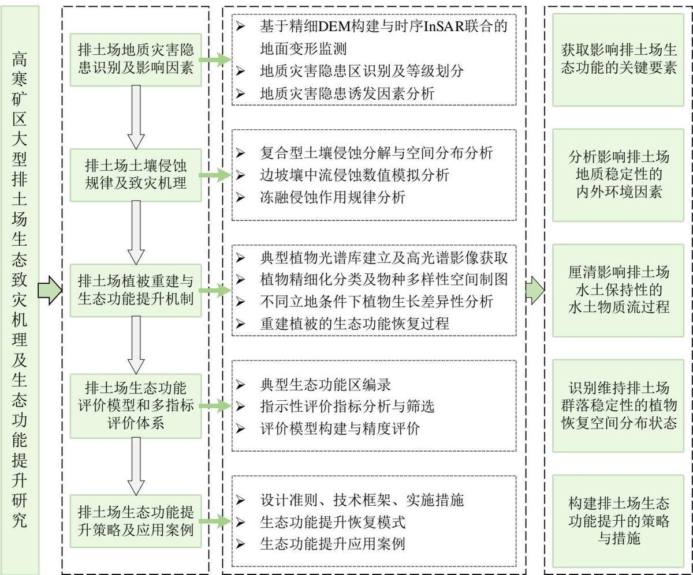  
Figure 1-1 Technical route  
图 1-1 技术路线图

## 2 文献综述

## 2 Literature Review

本章主要对高寒矿区影响生态功能的问题、排土场生态地质扰动及排土场生态功能提升三个方面的研究进展进行系统性回顾与总结，并评述当前研究存在的不足。

## 2.1 高寒矿区生态致灾研究进展（Research Progress of EcologicalDisaster in Severe Cold Mining Area)

## 2.1.1生态地质的概念内涵及理论基础

生态致灾是指因生态系统平衡被破坏而带来的地质灾害。在深入解读生态致灾的内涵时，要首先了解“生态地质”、“生态环境”和“地质环境”在人类活动空间内的相互影响机制。人类活动空间是由“大气圈-水圈-生物圈-岩石圈”所组成的复杂系统3]，生态环境是人类活动空间的主要载体，地质环境则是水圈和生物圈的主要载体。生态环境和地质环境是相互伴生关系，它们以岩石圈为主要物质基础，同时在水圈循环和大气圈循环中进行物质流、能量流及信息流的交换，生态环境是地质环境的表现形式，地质环境是生态环境的承载主体（图2-1)。若要厘清生态、地质、环境、经济问题的相互耦合关系，则需要打破传统学科固有界限，进行跨领域的交叉学科建设与研究，构建全新的学科体系[4]。由此，“生态地质学”、“地质生态学”、“环境地质学”等交叉学科应运而生。

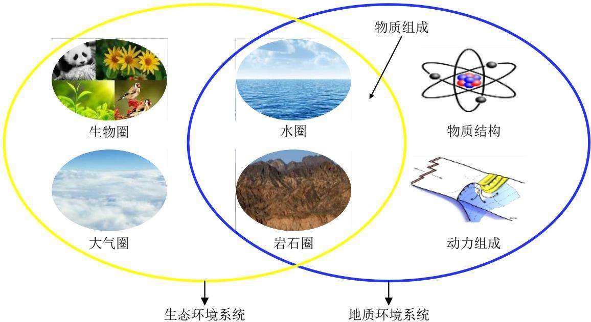  
图2-1生态环境系统与地质环境系统关系  
Figure 2-1 The relationship between eco-environment system and geo-environment system

上世纪九十年代初，俄罗斯学者提出“生态环境地质”的概念，主要针对自然生物群落（生命体）与岩石圈（非生命体）之间相互影响、演化过程展开大量研究。生态地质学（Ecological Geology）定义最早出现于1984年的前苏联，在研究生态系统时将地质环境作为其重要研究对象，目前则被认为是地质科学的一个新方向，主要研究岩石圈的生态特征、功能、形成模式以及时空变化，尤其关注与生物群落活动（主要为人类活动）有关的自然技术因素[5]（图2-2）。岩石圈表层（包括地下水和土壤空气）是生态系统的主要非生物组成部分，从生物始新世到生态圈具有高度的组织性[]。因此，生态地质学是地质学与生态学交叉学科，以生态问题为导向涉及到大气圈、水圈和土壤圈问题[7-11]。

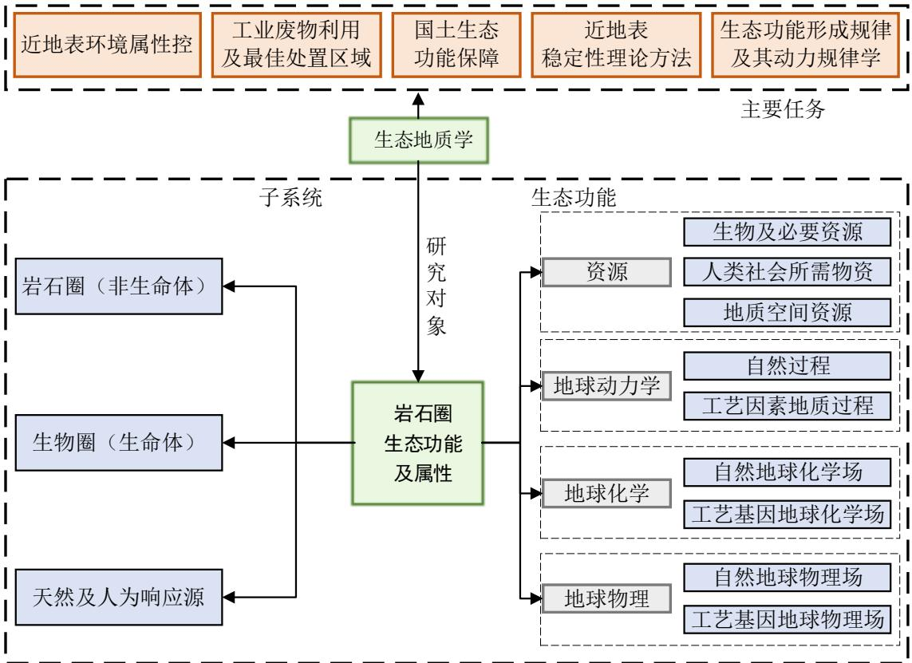  
图2-2生态地质学相关研究体系  
Figure 2-2 Eco-geology related research system

由此可见，生态地质学不仅是研究岩石圈中的地球化学和地球物理的循环过程，还包括人类活动在内的生物圈的演替和发展过程。其研究目的是了解岩石圈的生态功能和性质以及生态地质系统中的功能关系。岩石圈生态功能的概念是生态地质学的基础，它明确了岩石圈作为有机生命存在环境的作用，即水-土-动植物群落和人类的关系（图2-1）。

生态地质学主要研究三类问题：（1）形态学问题，研究系统的组成、状态、结构和属性，以及形成条件。（2）追溯性问题，主要围绕生态地质系统形成与演化过程。（3）预测性问题，在自然演变与人类干扰影响条件下，地质生态系统未来发展的趋势。为深入研究这些问题，还引入了诸如地震构造学、火山学、地球化学、地球物理学、矿物地质学、水文地质学、工程地质学、环境地质学、土壤学、生态学、地理学、自然资源学、环境科学等，同时也衍生出新的生态地质学方法，如生态地质制图、生态地质模拟、生态地质监测、生态功能分析等。尽管生态地质概念尚未达成统一，但目前通过对岩石、土壤、水、动植物及人类活动等多因素作为相互作用与影响的生命循环系统研究，达到协调自然资源分配、维护生态系统平衡的作用[12]。

从上世纪七十年代开始，我国在生态科学、地质科学、环境科学等成熟理论和方法指导下，逐渐开展生态环境系统的特征、功能及演变规律等生态地质学方面的研究[12-16]。此后还开展了不同尺度、不同区域生态地质理论方法研究，形成了大量具有正对性的调查方法、评价体系和经验半经验模型[17]。

近年来，有学者进一步剖析了生态地质、环境地质、地质生态三者之间的关系与差异[18]，描绘了生态地质系统的分类及形成条件[19]，明确了现代生态地质学的系统结构[20]，揭示了生态地质和工程地质和在当前环境下的表现形式[21]，阐明了生态地质学的发展现状和存在问题[22]，拓展了地质环境的相关概念[23]，评价了地质生态系统在跨学科领域的研究模式[24]，论证了生态功能相关理念在地球非生物圈领域的重要程度[25]，扩充了矿业生成在生态地质方面的基本构架[26]，评估了人类活动对区域生态系统服务价值的影响[27]。

因而，生态地质学是现代生态学和环境地质学的交叉学科，是地质学在理论概念和研究领域的延展，以全新视角来探索和协调人地关系的重要方法。对生态地质相关领域的探究为实现生态环境保护、自然资源可持续开发及生态文明建设具有十分重要的意义。

## 2.1.2 生态地质与生态功能的关系

生态地质主要研究地表环境的时空演化特征，遵循：“构建指标体系一确定评价标准一综合评价”的研究模式，分析各子系统的互馈机制，生态地质要素监测与评价的最终目标是实现“人一地一生态”复杂系统协调。生态功能主要体现在地质稳定性、水土保持性、群落稳定性、生态固碳、水源涵养、栖息地提供及景观提升等诸多方面。因此，生态地质的研究成果可制定合理的措施，实现对区域生态功能的提升，进而达到对生态系统保护、提高区域生态功能，消除和缓解灾害性限制性因子，促进区域生态文明建设，实现社会经济的可持续发展[28-30]。

## 2.1.3 高寒矿区典型生态致灾现状

露天采矿活动对矿区及周边水、土壤、大气、景观生态、地质环境、生物多样性、人类健康等诸多方面造成一定的负面影响[31-37]。尤其在生态环境脆弱的高寒地区，矿区排土场在长期冻融循环侵蚀、径流/潜流侵蚀、风蚀、重力侵蚀等叠加交替作用[38]，使其地质稳定性、水土保持能力及生态功能恢复能力都受到了极大损伤[39]，长期的累积效应所诱发的矿业生态问题不容忽视[40-42]。这些问题与排土场重构地貌的微地貌环境、植物生长的水土环境及其维持、演替规律密切相关[43-45]。

## (1）典型生态问题

冻融侵蚀是造成的高寒矿区水土流失的主要因素之一。在季节性冻融循环条件下，土壤与水力侵蚀相互叠加交替作用，导致矿区排土场的水肥流失严重，植物生长环境恶化4]。人类采矿活动破坏了矿区生态功能，地貌及生态环境改变超出了自然系统调节能力和物种对环境适应能力，致使水土保持能力、土壤质量下降[47-50]，及地表损毁[48]，并伴随着环境污染问题。随着矿区自然环境逐渐破坏，原有生态系统限制植物生长和发育[51-53]。

再者，矿山废弃裸地与不科学排水加剧生态环境的恶化，造成大范围内生物多样性减少，导致生态平衡的失调[54等。矿区生态功能提升，就是对矿区土地资源的持续治理开发和植物恢复保护；矿山有效治理不仅可以保证矿区的持续安全生产，还对当地环境进行改善与保护。如何快速地、有效地提升矿区土地复垦与生态重建，是采矿行业面临的重点问题之一[54-57]。大量学者针对高寒矿区生态问题展开了研究，集中于排土场复垦土壤质量[58]、排土场坡面水蚀特征与控制效果[59,60]、草本植物固坡效果[61]。

## (2) 典型地质灾害问题

露天矿排土场是典型的人工重构岩土体，边坡强度低、结构松散，常常由于降雨入渗[62-64]、高异质性[65]、高孔隙度[66,67]、外在荷载[68]、软弱基底[69,70]或边坡过高[71]等因素影响而引起严重的地质失稳现象，诸如滑坡、地裂缝、地面塌陷、非均匀沉降等时而发生。研究表明，我国近30%的排土场存在不同程度地质灾害的风险，降雨是诱发排土场地质灾害最主要因素之一[72]。

在高寒矿区，冻融循环作用是边坡稳定性破坏的另一影响因素。近年来有关高寒矿区边坡岩土体在冻融循环条件下岩土力学性质相关研究较多，而针对露天煤矿矿坑边帮和高大排土场边坡稳定性虽然重视，但研究相对较少[73-77]。

因此，矿山开采活动与冻融循环作用极易引发矿区土石边坡稳定性，尤其是露天开采，当自然地层被人工开挖、堆砌而成土石边坡直接暴露于地表，经长期冻融、地下水入渗、采矿活动等因素持续扰动，边坡岩土体的结构完整性和抗滑性大大降低，极易诱发排土场地质灾害[78]。在温低、低压及冻融循环等恶劣环境下，高寒矿区排土场的土石边坡往往具有岩性差异性大、裂隙发育成熟、冻融破坏显著等特征。因而生态致灾机理复杂，现有相关理论与技术难以适用。根据国家标准《GB/T28921-2012自然灾害分类与代码》，自然灾害分为气象水文灾害、地质地震灾害、海洋灾害、生物灾害和生态环境灾害等五大类[79]。矿区所面临的生态问题（水土流失、风蚀沙化等）和地质问题（崩塌、滑坡、地面塌陷、地面沉降、地裂缝等）分别属于生态环境灾害和地质地震灾害范畴。

## 2.1.4高寒矿区地质灾害影响要素监测研究现状

## （1）现场监测

矿山地质灾害现场监测方法主要有：固定样方对植物的调查、水土流失仪对土壤侵蚀的监测、全球导航卫星系统（Global Navigation Satellite System,GNSS）地面控制点对边坡位移的监测等传统方法，此外还有手持高光谱相机、光纤传感器、GNSS监测站、地裂缝监测仪、综合气象站等实时自动采集及远程无线传输等。

近年来，声发射（AcousticEmission,AE）监测技术在土石边坡监测中越来越受到关注，主要通过采集、分析响应信息，获得岩土体边坡失稳的早起识别和预警[80]。由于高寒矿区岩土体在冻融循环作用下导致坡体内应力重新分布，AE系统可利用该变化通过声发射信号，达到对边坡形变量监测，实现边坡失稳的实时监测与预警[81]。

## (2) 模拟实验

水土间相互作用是矿山地质灾害监测研究中最主要的研究对象之一，模拟实验则是其最早研究方法，可追溯到上世纪初，随后国内外学者在小流域水土资源配置作用[82]、植物与径流关系[83]、不同植物覆盖下抗蚀过程[84]、不同下垫面条件下水文循环过程[85]、高寒草甸生态系统水循环过程[86]、排土场边坡侵蚀模拟[87]、排土场坡形重塑与模拟[88]等方面展开一系列研究。

## (3) 遥感技术

随着3S（RS、GIS、GPS）技术和各类遥感数据发展与完善，越来越多的遥感数据被应用到矿山地质灾害解译中。近年来，随着各类传感器的小型化和成熟化，基于无人机遥感技术应运而生，在矿区粉尘监测[89]、排土场土壤物理性质反演[90]、矿区地物提取[91]、尾矿库风险评价[92]等矿区生态监测方面发挥着越来越重要的作用。同时，随着三维激光扫描（Three Dimensional LaserScanning Technology）[93]、合成孔径雷达（Synthetic Aperture Radar，SAR）[94]、地基雷达（Ground-based Synthetic Aperture radar,GB-SAR）[95]、红外热成像（Infrared Thermography, IRT）[96]、延时摄影技术[97]等现代遥感监测技术的快速发展，能够快速有效的对高寒矿区岩土边坡地貌及地质力学活动进行大面积监测。

## (4) 其他方法

此外，随着恢复生态学理论[98,99]、景观生态学[100,101]、生态经济学和恢复生态学理论[102]、循环经济理论[103,104]、模糊数学与层次分析法[105,106]等方法在矿区土地复垦与生态重建中的运用，对矿区生态功能提升、生态安全评价、生态修复规划建议与生态修复策略、利用方式和技术措施等方面进行了深入研究，为煤矿区的生态系统受损分析、人工生态系统重建规划与设计、生态重建障碍因子分析、地形重塑工艺、土壤重构工艺和植物重建工艺、生态产业链、生态重建一体化作业模式等提供了总体规划原则、目标、研究的基本思路和基本内容[107,108]。

2.2 矿区生态恢复与重建研究进展（Research Progress of Ecological Restoration and Reconstruction in Mining Area)

## 2.2.1 矿区生态恢复与重建相关理论

矿区生态恢复与重建在实践中主要涉及恢复生态学、景观生态学、循环经济等生态学相关理论。有学者认为，矿区生态恢复与重建是将矿区及其影响区域内地表环境（包括水、土、植物、地形地貌、气候气象等）与区域内生物群落视为共生生态系统[109,110]，其重点关注矿区生物群落与环境介质之间的关系。另有学者从经济学理论出发，将矿区生态系统视为受采矿活动影响的空间范围内的生态系统，其本质为矿业资源、生态功能、经济效益、社会属性的耦合系统[111,112]，矿区生态恢复与重建为基于上述系统内的。矿区生态系统具有结构复杂性、生态功能多样性、人类持续扰动性、信息流通与能量转化的动态性等[113]。有学者将水土流失模型与生态功能模型进行耦合，来表征矿区水、土、植物、地形地貌、气候气象等因素之间的复杂关系[114]；另有学者则从矿区重构土壤营养物质、复垦植被覆盖度和生物量、矿区地裂缝、非均匀沉降、侵蚀模数等指标，构建采矿扰动下矿区生态恢复评价模型[115]；还有学者从矿区水-土-植被互相耦合关系角度，深入研究了采矿扰动下矿区生态恢复与重建的影响因素[116-119]

## 2.2.2矿区生态恢复与重建研究进程

露天煤矿排土场重构土壤及地貌直接影响到土壤微生物以及地表植物群落的组成、分布、丰富度以及覆盖度，并进一步在景观尺度的基质稳定、斑块和廊道的连通性以及整体生态功能方面造成整体性和区域性的影响，有造成区域整体生态类型和相关产业逐步退化和消亡的风险[120-125]。国内外在排土场植物恢复与重建方面大多进行三步走，即地貌重塑一土壤修复一植物恢复。

欧美发达国家在排土场生态重建方面的开展研究工作较早，目前在矿区可持续发展、矿区生态功能提升等方面已建立较为完善的技术理论体系。同时有较为健全的法律基础和资金保证，矿区生态恢复技术不断完善。

美国于上世纪初就颁布了《矿山租赁法》，明确要求在矿业开采过程中要注重自然环境和土地资源的保护工作。后经过几十年探索与完善，于1977年颁布《露天采矿与土地复垦法规》，主要关注露天开采所引发的环境与社会矛盾。该法规规范了煤炭开采时所需关注的环境保护和矿业遗迹的生态恢复问题[126,127]，明确了矿区生态修复的责任主体和资金来源，进一步加大了美国对矿区土地复垦的力度[128,129]，标志着矿区土地复垦的正规化与法制化，为后期矿区复垦方面的研究奠定了重要基础[130,131]。德国要求矿区生态修复不仅要保证地貌优化和植被绿化，同时更注重矿区整体生态平衡和与周围人类社会的相互兼容[129]。针对矿业开采和环境保护，德国从上世纪五十年代开始先后颁布了《普鲁士采矿法》、《废弃地利用条例》、《土地保护法》、《矿山采石场堆放条例》、《联邦采矿法》、《矿产资源法》和《控制污染条例》等一系列法规，不仅明确了相关责任主体，而且从矿业开采到污染防控进行了详尽的规定，为矿区生态修复提供了法律保障。德国在露天矿区土地复垦方面经积累了大量经验，并形成了以技术理论和人才培养为基础的良性循环氛围[132-134]。澳大利亚针对矿区土地复垦与生态重建中单项措施效果不佳的问题，提出多领域合作、先进技术理论指导的综合治理模式，充分利用土地自身恢复力，兼顾矿区地表及地下被污染环境，实现水土环境和植物的综合恢复模式[135,136]。英国在上世纪40年代开始重视矿区生态恢复工作，于1969年颁布《矿山采矿场法》，并同时提出矿业开采与生态修复同时进行的治理政策[129]。

我国矿区生态重建的研究工作起步相对较晚，但随着国家、政府、科学研究者、企业和人民大众的环境保护意识增加，矿区生态修复工作日益受到重视，并发展迅速[54,137]。自1988年《土地复垦规定》（2011被《土地复垦条例》取代）和2009年《矿山地质环境保护规定》颁布实施以来，国家一直都将矿山生态文明建设视为重要内容，极大促进了矿区生态修复工作的进展[54]。国内大量学者从多角度开展矿区生态重建工作，并逐步建立一套技术理论体系[138]。尤其近年来，在我国“缺油、少气、贫铀、相对富煤”的能源结构背景下[139]，矿产资源开发与对环境的破坏的矛盾日益突出，亟需得到解决，同时随着我国经济的飞速发展和对环境保护的日益重视和对矿产资源需求的不断增加，矿区生态重建迎来新的发展机遇[140]。

## 2.2.3 矿区生态扰动影响研究

露天采矿是人类历史上改变生态与地貌的活动之一，对地表结构产生了巨大且不可逆转的改变[141,142]，其土地损毁系数约为980m²/万吨[143]。露天煤炭开采的影响传递顺序为：地表植物清理一土方、岩层剥离一土方、岩石排弃并行成排土场一煤炭开采一生态退化。排土场地质稳失稳、土壤侵蚀和生态功能低下是多因素共同作用的复杂过程，尤其受自身状态和自然环境影响剧烈。由于露天采煤活动对微地貌的永久改变，对陆地生态系统造成严重干扰[144,145]，直接导致矿区植物破坏、地貌变化、土壤侵蚀、土壤质量恶化等问题，严重影响后续生态系统的恢复重建。尤其将矿层上覆表土和岩层全部剥离后在地表重新堆积，形成大型土石堆积体的排土场，其形成过程对矿区原有地貌进行强烈扰动，使得地貌形态与生态格局发生彻底改变46]。同时，排土场由人工堆积而成，具有分层、异质性强等特点147，长期存在会带来非均匀沉降、边坡失稳变形、滑移、暗涌、土壤侵蚀、生态功能低下等地质环境问题[148,149]。

同时，在生态脆弱的草原地区，采煤活动在破坏了原有耕植层与植物的同时，将原本深埋地下的土层被挖掘并重新堆存在地表，在破坏了原有耕植层与植物的同时，形成的耕植层生物活性低下[150]。分层松散的堆存方式无法形成稳定的隔水层和保水层，使得排土场水土保持能力、土壤质量较扰动前大幅下降[47-50]，超出了自然系统的调节能力和物种对环境的适应能力，形成限制植物生长和发育的环境因子，难以维持植物快速恢复与演替，长期处于生态功能低下状态，要再次形成稳定的生态系统，需长时间的土壤、植物的自然过程演替过程[38]。因此这一特殊大型人工土石堆积体在其生态环境演替过程中，呈现出一系列问题：（1）岩土剥离并重新堆积后，形成不规则连续阶梯状的复杂地貌，其边坡稳定性难以保证[151]。（2）持续的风化、侵蚀作用不断破坏排土场坡体结构，威胁边坡稳定性的同时造成严重土壤侵蚀[152]。（3）贫瘠的水土环境使得生态环境的恢复与演替过程难以进展，先锋植物难以发挥改善土壤质量的作用[153，154]，植物恢复过度依赖人工养护。（4）排土场倾倒工艺造成的特殊微地貌特征使得有限的水土资源无法充分利用，生态功能提升困难[147]。

草原煤矿区自然生态环境脆弱，煤炭资源开发产生的生态环境问题也具有特殊性，生态损伤后恢复难度较大，由此造成原有环境的严重破坏并导致矿区自然环境逐渐恶化，原有生态系统遭到破坏。同时，矿山废弃地不科学的排土、排水进一步加剧破坏程度，造成矿区范围内生物多样性的锐减和生态平衡的失调[54]。采矿活动产生的环境效应、环境问题及破坏形式如表2-1所示，如何快速有效地提升矿区排土场地质稳定性，提升土地复垦与生态重建，是采矿行业面临的重点难题之一[54,155]。

表2-1露天采矿活动产生的环境效应、环境问题及破坏形式  
Table 2-1 Environmental effects, environmental problems and forms of damage caused by open pit mining activities
<table><tr><td>环境效应</td><td>矿山生态功能问题</td><td>破坏形式分析</td></tr><tr><td>占用与破坏 土地资源[147]</td><td>固相废弃物堆积与污染—地面形 变问题、土壤侵蚀、沙漠化等。</td><td>以占用、物理机械破坏和化学污染破 坏等形式减少可用的土地资源总量。</td></tr><tr><td>水资源损毁[156,157]</td><td>液（固）相废弃物渗透与淋滤污 染、矿山疏排水与突水等。</td><td>以形成地下水降落漏斗导致的水量减 少和以废弃物渗透与淋滤导致的地下 水、地表水水质污染两种损毁形式。</td></tr><tr><td>矿山 次生地质灾害[158]</td><td>地面形变问题、土壤侵蚀、沙漠 化、固相废弃物堆积、尾矿库 （坝）溃决、矸石自然、放射性 污染等。</td><td>诸多矿山环境问题处理不当诱发和加 剧矿山次生地质灾害。</td></tr><tr><td>粉尘导致的重金属 及其他污染[159,160]</td><td>表土剥离、运输及煤炭开采、运 输造成的粉尘污染；排土场风蚀 造成矿区及周边粉尘污染。</td><td>粉尘携带重金属等有害元素污染周边 土壤及水源，同时粉尘对植物光合作 用造成胁迫。</td></tr><tr><td>自然地貌 与生态破坏[161,162]</td><td>土壤侵蚀、沙漠化、地面变形、 固相废弃物堆积、山岩裸露、崩 塌和边坡失稳等。</td><td>采矿活动对地貌形态的改造超出其承 载能力，以资源量和生物种属的减少 为代价。</td></tr></table>

## 2.3 排土场生态致灾与生态功能研究进展（Research Progress on Ecological Disaster and Ecological Function of Dump)

## 2.3.1 排土场地质稳定性

由于煤炭开采引起地形地貌的改变，露天矿排土场形成堆垫地貌、采场形成深坑，必然对地貌造成巨大扰动，同时造成的地裂缝、滑坡等次生地质灾害也不容忽视[34,163]。

露天矿岩土剥离及边坡稳定性的研究是传统的研究方向，并形成了较为成熟的理论方法[140,164]。目前，对排土场坡体和边坡的地质稳定性的研究通常是借鉴传统边坡稳定性分析方法，即针对不同边坡破坏方式，采用相对应的方法及模型来表征其稳定性程度，尤其是在寒旱交替、冻融循环条件下排土场的地质稳定性问题[165,166]。如根据坡体及边坡静力平衡原理分析坡体受力状态及破坏模式的极限平衡法（Limit Equilibrium Method）[167]；基于连续介质力学数值分析的有限单元法（Finite Element Method）[168]；基于牛顿第二运动定律的离散单元法（Discrete Element Method）[169]；基于显示有限差分原理的快速拉格朗日分析法（Fast Lagrangian Analysis of Continua）[170]；以 Betti 定理和 Kelvin 基本解为基础的边界元法（Boundary Element Method）[171]；源于均质弹性刚体—弹簧元模型的界面元法（Interface Element Method）[172]及基于岩体介质非连续性，利用最小位能原理的不连续变形分析法（Discontinuous Deformation Analysis）[172]和数值流形法（Numerical Manifold Method）[173]等。露天开采土方剥离及排土场边坡稳定性的模拟研究是传统研究方向，并已形成较为成熟的理论方法[140]。除此之外，相似材料模拟法采用不同种类、粒径的相似材料模拟排土场边坡的形成过程，模拟在不同堆存方式或外界环境下排土场的地质稳定性[174]。但是传统的地质稳定性评价方法主要以理论研究与模型模拟为主，以时序遥感监测为基础数据的研究较少，同时结合环境修复与生态功能提升的考虑不足。

近些年来我国在露天矿排土场边坡稳定性提升方面取得了很大进步：卞正富等140提出在露天矿区土地修复中将地貌重塑工作与采矿工艺相结合，既降低了复垦成本，也为下一步工作创造条件。同时利用3S技术对矿区地貌进行分析，对露天开采排土场存在地质灾害进行了阐述，为植物恢复创造良好基础[54]。白中科等[108]在总结了采矿活动和矿区生态恢复的研究基础上，提出“地貌重塑、土壤重构、植被重建、景观再现、生物多样性重组与保护”的矿区恢复重建“五阶段”，为矿区生态系统恢复重建的基础工作。指出地貌重塑应考虑矿区原有地貌特点，结合土方剥离工艺和土地损毁程度，通过调整排土方式和后期土地整治工程进行地貌重塑，使其与矿区周边地貌达到融合一致，进而起到防治地质灾害、抑制土壤侵蚀的作用。胡振琪等[75提出矿区生态环境修复应是“主动的、超前的、动态的”，地形重塑技术是土地复垦与生态重建的重要技术与发展方向[55]。寇晓蓉等[176]以平朔矿区为例，对其进行长期跟踪采样监测指出，地貌重塑与土壤重构的质量直接影响复垦土地的成败，重塑地貌应当具有较高的稳定系数和抗侵蚀能力。在我国黄土区，合理利用采矿设备、依托采矿设计、优化排弃顺序，可消除和缓解复垦土地的负面因子（如非均匀沉降、崩塌、滑坡、泥石流等)。杨翠霞等[177]从矿区所在流域角度出发，根据流域地貌学及其自相似原理，采用空间分析和水文分析技术，在废弃矿区所在子流域内重新规划和重建河道，同时将周边自然地貌形态作为学习参照编制，对矿区地貌进行人为重塑。上述成果为后期露天矿排土场边坡稳定性提升奠定了研究基础。

## 2.3.2排土场浅层边坡破坏

排土场松散边坡破坏具有隐蔽性、累积性和长期性，影响边坡稳定性的因素主要包括地貌条件、气候条件及人类活动，可持续的土地管理策略需充分考虑浅层边坡破坏的控制[178]。排土场浅层边坡破坏是边坡土壤侵蚀常见诱发因素[179,180]，其表现为地表植物、表层松散土壤（或替代材料）的剥离破坏过程。排土场浅层边坡破坏常以浅层滑坡（ShallowLandslides）和浅层侵蚀（ShallowErosion）为主：

（1）浅层滑坡是指当边坡重力超过其内部最大阻力时发生的滑坡运动[181]，通常是由表土孔隙水压力增加、土壤凝聚力降低导致的边坡内部物理过程引起，常发生在土壤内部的软弱滑动层上[182,183];

（2）浅层侵蚀通常由积雪体运动[184]、动物踩踏[185]或人类活动[186]等扰动因素造成，过度扰动造成植物退化及地表拉伸型裂隙，雨水或融雪径流入渗后形成滑动面，进而导致地表植物和表层土壤的流失[187,188]。

浅层边坡破坏会造成水肥流失[189]、生态系统质量下降[190]、基础设施受损[191,192]，甚至会诱发滑坡、泥石流等地质灾害[192]。自然生态环境一旦遭到破坏，恢复起来难度较大，单纯依靠自然恢复往往需要数十年时间[193]，且恢复期间易发生二次破坏[194]。而人工恢复措施成本高，且难以保证获得预期的治理效果，因此如何有效防治浅层边坡破坏显得尤为重要。

相较于后期治理，适当的生态边坡工程措施是预防排土场浅层边坡破坏的有效手段[195]，植物对于边坡起到加筋作用，在有害荷载作用时会协同受力并协调形变，能够很好地预防浅层边坡破坏，且不同的植物配置管理方式直接影响浅层边坡破坏的发生概率[196]。因此，生态边坡工程不仅能够维持生态系统的稳定性，也是防治各类滑坡的常用方法[197]，对于提升边坡稳定性、抑制水土流失具有重要现实意义。

近年来，生态边坡工程相关研究主要集中于灌木和乔木的固坡机制上，在理论和实践上均取得了重大进展[198]。相比而言，草本植物对边坡稳定性提升的相关机理研究较少，对草本植物在边坡稳定性提升机理和动态认识上仍需进一步探究[199]。与木本植物相比，草本植物在相同条件下具有更高的物种密度和多样性、更短的生长周期、更快演替速度。深入开展针对草本植物的固坡效果研究，对于浅层边坡破坏的防治具有重要意义。

## 2.3.3 排土场水土资源调控

水土资源调控即如何高效利用水土资源，这其中包括水土保持、开发、利用和保护。具体而言，水土资源调控就是基于可持续发展理念，遵循高效性与可持续性原则，兼顾生态保护、环境治理和资源开发的前提下，通过人力对水资源的改造、调节与重分配过程。排土场的水土资源调控是以排土场这一微流域为对象，借助生态工程措施对其自然水资源进行优化配置和开发利用，以实现排土场生态可持续的目标。

自然水资源循环主要受气候因素和自然地理因素影响较大，而在露天矿排土场，由于露天采煤活动对自然地貌的强烈扰动，使得区域微地貌永久改变，导致人工堆砌而成的排土场地貌与原本自然地貌发生彻底变化。同时，排土场表土理化性质、植物生境条件等其他立地条件也均发生改变，因此排土场水资源循环中的各个环节均受到巨大影响。

欧美发达国家在上世纪八十年代开展矿区水资源科学处理和高效利用工作，重点利用人工湿地处理矿区水[200,201]，把矿区水资源处理归为环保领域，矿区水资源利用率在80%以上，并且在进行水资源处理与循环利用后产生了一定经济效益[202]。我国露天煤矿大多处于干旱半干旱的水资源匮乏的生态极脆弱区，在排土场，其水资源循环平衡一旦被打破，生态恢复往往受阻。因此，对水资源的科学调控和高效利用尤为重要。露天矿排土场水资源的利用主要分为对自然降水的利用和对矿坑疏于水的利用。自然降雨的利用是利用生态工程将雨季短时集中强降雨截留下来，减少雨水汇流后在坡面形成临时性地表径流和内部渗流，从而减少土壤侵蚀和水土流失，达到降水资源高效利用的目的[60]。对于矿坑疏干水的利用则在排土场建设疏干水缓存蓄水池，可作为排土场生态用水[203]，此外，坑口电厂循环冷却水循环复用技术也是对矿区水资源的有效利用[204]

近年来，我国在生态型复垦模式中已取得大量成果，这些成果一直指导着矿区水土资源调控工作的进展且效果显著，为露天矿排土场水土资源调控提供了宝贵经验。随着人们对地貌、水文、地表物质运动机理研究逐步深入，以及3S技术、生物技术、生态学技术的成熟[205,206]，利用空间分析对矿区水土资源调控进行分析与评价应用广泛[207,208]；土壤的侵蚀控制技术[209]等在排土场水土资源调控中发挥着越来越重要的作用。

## 2.3.4 排土场植被恢复技术

## （1）生境改良技术

包括矿山生态系统在内的所有生态系统自身均具有恢复力，即受到扰动情况下的自我维持能力恢复能力[210]。但如果是在排土场这种强扰动且环境恶劣条件下，尤其在生态脆弱的草原地区，破坏后生境难以维持植物的恢复与演替，再次形成稳定的生态系统需长时间的土壤、植物的自然演替过程。大量学者对采矿形成的限制性因子[211]、煤矸石对植物生境的影响[212]、矿区生境与植物生物量之间关系[213]、植物根际土壤条件及抑制和适应植物生长的关键限制性要素[214]等矿区生境相关领域进行了深入研究。

排土场复垦土地植被恢复限制性因子主要集中于土壤微量元素[215]、重金属[216]、土壤微生物[217,218]等方面，因此土壤基质改良是排土场生境改良的最有效措施之一。土壤基质改良技术一般包括：①物理改良，即通过客土改良、地裂缝填充、地貌重塑等土地整治技术，消除植物生长的限制因子[219]；②化学改良，即通过有针对性的施加肥料或其他改良剂，起到提高复垦土壤营养、改善酸碱条件的作用[220]；③生物改良，即通过耐寒旱、耐酸碱植物筛选或通过微生物、菌根、真菌技术来改善土壤肥力，加快土壤熟化[221,222]。

## （2）植物种植技术

排土场植物种植技术一般包括：①无覆土种植技术，即先进行土地整治后，再直接进行种植。其优点是成本低、效率高、无需额外腐殖土，缺点是对复垦地土壤质量要求较高，在土壤贫瘠地区难以保证植物存活率，同时在复垦前期易造成土壤侵蚀与水土流失[223]。②覆土种植技术，即先在地表覆盖腐殖土或其他替代性表土（如粉煤灰、污泥等），后进行植物种植。其优点是重建植物存活率高、可明显改善重构区土壤质量[224]，其缺点是成本较高，尤其是使用替代性表土前需要做可行性实验。③抗旱种植技术，即在干旱半干旱矿区，在生态修复区内采用表土混合添加剂（保水剂、生根粉等）、滴灌技术、杯苗种植技术等人工辅助种植技术[225]。其优点是土壤含水率大幅提升，进而保证植物成活率，其缺点是建设成本与养护成本过高，群落自维持能力低。

## （3）适应性管理与养护技术

排土场复垦土地往往并不适宜植物生长，因此植被恢复后的养护管理是必要环节，其目的是保障复垦植物群落的稳定性及正向演替进程，以保证复垦效果[226]。排土场植被恢复后的养护技术一般包括灌溉、补种、施肥等，需根据实际需要开展适宜强度的管护工作，待植物适应并存活后可降低管护强度。

## 2.3.5 排土场生态功能提升

排土场生态功能主要体现在地质稳定性、水土保持性、群落稳定性、生态固碳、栖息地提供及景观提升等方面。生态功能恢复与提升的关键在于复垦后土壤和植物稳定，对于大型排土场则聚焦于人造地质体的土体结构的稳定、大气降水资源高效利用以及重建植物群落正向演替等。

地质体稳定性是排土场生态功能提升的最基本前提，排土场边坡破坏的主要表现形式为滑坡、地裂缝、侵蚀沟、边坡蠕动、地面塌陷、非均匀沉降等。其主要原因有设计不合理、堆排方式不科学、本底条件缺陷多、排水设施不完善、极端气候条件及其他人为或不可抗力等。在排土场边坡治理中，有学者提出通过改善入渗[62-64]、降低孔隙度[66,67]、减小外在荷载[68]、增强基底[69,70]、降低边坡过高[71]或抗滑桩加固[227]等措施提升排土场边坡稳定性。

排土场生态功能提升主要靠植物，而植物的生长与演替依赖稳定的水土环境，表土层的水文效应直接影响着植物的生长环境，同时表土的水文物理特性和植物结构的区别造成土壤蓄水固土效应的差异。表土层水文效应表现为水分入渗特征和自身保水能力两方面，其对大气降水的再分配、水分的内循环及水土保持等方面具有重要作用。排土场由于特殊的结构与构成，其表土异质性强，入渗能力差异较大，在雨季极易造成土壤侵蚀，对矿山植被恢复与重建造成严重的影响。有学者提出通过重塑微地貌特征[88]、增强区域保水能力[228]、优化表土入渗能力[5]、改善土壤物理性质、恢复植物固土效应等措施形成稳定水土环境。

露天矿区土地复垦与生态重建对陆地生态系统碳素生物地球化学循环有着重要影响，其土地利用类型与生态固碳之间具有一定关系。按照有利的方式进行矿区生态系统的恢复和重建有助于提高矿区复合生态系统的碳汇量[229]。对于露天矿排土场而言，其土壤有机碳是土壤质量评价的重要指标，并在全球碳循环及区域碳平衡中起关键作用。研究排土场的植被恢复与生态重建对区内土壤有机碳的影响，对于评价植被恢复下排土场土壤质量改良和生态恢复效果有重要意义[230]。作为人工重构土壤，排土场土壤固碳能力与自然土壤固碳能力差距巨大，其主要原因为排土场土壤层次紊乱、养分贫瘠、表土压实等影响。

植被恢复与生态重建是排土场土壤质量恢复的重要手段，且不同类型植物对土壤有机碳的作用差异较大[231]。

## 2.4 本章小结（Chapter Summary）

本章主要对高寒矿区影响生态功能的问题、排土场地质扰动及排土场生态功能提升三个方面的研究进展进行系统性回顾，根据相关研究进展可以看出，高寒矿区生态功能提升研究尚存在以下不足：

（1）目前针对矿区生态功能要素监测技术取得了很多成果，但同时多为单一要素的监测。而露天矿长时间、高强度、大规模的土方剥离与堆砌活动所形成的大台阶、陡边坡的大型排土场所面临的生态功能问题极为复杂，单一监测方法往往无法对其展开全面诊断。因此其生态功能多要素监测技术有待进一步完善。

（2）在高寒矿区，排土场会同时面临固结沉降、边坡蠕动、滑坡、地裂缝、冻融破坏等多重破坏形式，现有矿业开采矿山地质灾害相关理论与技术在高寒矿区难以适用。目前较为成熟的类比法、数值模拟、相似模拟、单点监测等方法均难以准确描述异质性极强的排土场边坡破坏实况。因此需要构建一套高寒矿区大型排土场变形监测方法，满足大面积、高精度、长时序的监测需求，为极端气候下排土场地质灾害隐患识别及致灾机理提供技术支撑。

（3）近年来，矿山生态恢复相关研究取得了显著成果，特别是在生态效应监测、水土保持、植被恢复等方面。但高寒矿区排土场在分层散松、降雨集中、径流紊乱、寒旱交替、冻融循环等恶劣条件下，整体面临生态功能低下，同时植物生境限制性因子显著，重建植物维持、演替规律尚不明确，其群落稳定性、物种多样性的生态功能提升规律不清，生态功能提升策略仍有待进一步确定。

总而言之，针对高寒矿区大型排土场生态功能状况，急需建立一套生态功能多要素多源协同综合监测技术体系，从而实现排土场复杂致灾条件下的地质灾害隐患的识别及其发育机理的揭示，进一步构建极端环境下排土场水-土-植被的功能提升技术。面对查明的排土场生态功能问题，如何进行科学分析与评判，如何解决问题并提升其稳定性是一个现实而又亟待解决的科学难题。

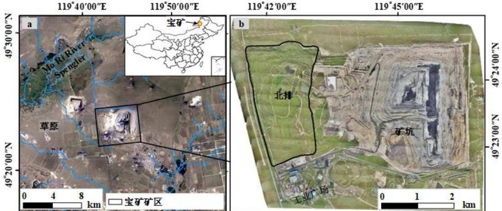  
图3-1研究区地理位置及无人机正射影像（数据采集时间：2020.09）  
Figure 3-1 Geographical location and UAV orthophoto image of the study area

## 3 研究区概况与数据来源

## 3 Overview of the Study Area and Data Resources

## 3.1 研究区概况(Overview of the Study Area)

## 3.1.1 自然地理

## (1）地理位置

宝日希勒露天煤矿（简称宝煤）位于内蒙古东部呼伦贝尔市陈巴尔虎旗（简称陈旗）煤田东部，属海拉尔区和陈旗辖区，是全国52个千万吨级煤矿之一，地理坐标：119°41'20″～119°45′40″E，49°21′50″～49°24′45″N（图3-1）。

## (2) 地形地貌

研究区所在区域属于高平原地貌，整体略有起伏，整体上北东高而南西低，北部及东北部有低丘陵分布。按成因、岩性和地貌特征，该区可划分为下列地貌单元：

1）剥蚀山地形：区内北部及东北部的低山丘陵地带海拔650-750m，制高点达800m，相对高差100余米，坡度较陡。主要岩性由侏罗系上统兴安岭群的中酸性熔岩及碎屑岩组成，岩石坚硬，抗风化能力强，其上部被风积层和零星分布的湖积层所覆盖。

2）剥蚀丘陵：区内以南的馒头山、关界山等低山，因长期受风化剥蚀作用而渐变为丘陵地貌。其特点是：山顶为近似台地的平坦区域，整体上地形坡度较小，海拔为670-720m。岩性为海西期花岗岩，侏罗系上统兴安岭群火山岩、碎屑岩、第四系泥砾岩及风积层。

3）剥蚀平原：矿区内北高南低，高差约27m，地表形态呈缓岗与凹地相交替，岩性为侏罗系上统扎赉诺尔群的含煤地层及上覆冰石碛、湖积、风积等第四系地层。

## (3) 气象

研究区属于大陆性亚寒带气候，常受西伯利亚寒流袭击，冬季漫长寒冷，根据陈旗近20年气象资料，区内最高气温38.8℃(2010年6月)，最低气温-42.6℃(2011年1月)，冻结期160-180天，年平均气温-0.6℃，属于“稀疏岛状多年冻土”区，多年平均最大冻土深度为2.1\~3.0m，历年最大土结深度为 2.3\~3.1m，研究区部分区域存在永久冻土现象（图3-2）。

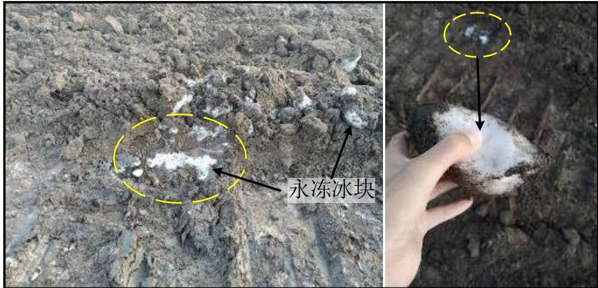  
图3-2研究区边坡内部永久冻土（2019.09.02）  
Figure 3-2 Permafrost in study area (September 2019)

研究区自然降水在时空上分布极不均衡，年平均降水量372mm，年平均蒸发量1247mm。区内2018年降雨量为349.1mm，蒸发量为937.1mm，2019年降雨量为330.2mm，蒸发量为975.6mm，其中雨季（6\~8月）平均降雨量之和约占年平均降雨量76.14%，且多以短时暴雨为主（图3-3）。

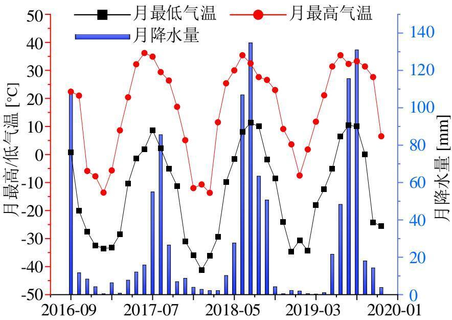  
图3-3宝煤近3年气象数据  
Figure 3-3 Meteorological data of the study area in the past 3 years

## (4) 水文

陈旗地表水系属额尔古纳水系，区域内其主要河流有额尔古纳河、海拉尔河、特尼河及莫日格勒河河。全旗河流总长约912km，共有大小湖泊317个，其中淡水湖泊约200个。矿区内无河流、湖泊，西北部有湿地分布，随着区域内降雨量减少和水位的大幅下降，现已基本退化；距矿区南部7km有海拉尔河，西北1\~5km为莫日格勒河，它们对本区的地下水有一定的调节作用。

海拉尔河从矿区南部经过，发源于大兴安岭西侧的左鲁契山山麓，自东向西，注入额尔古纳河。据海拉尔河坝后水文站1955至2003年48年的水文资料统计，海拉尔河多年平均径流量34.7亿 $\mathrm { m } ^ { 3 }$ ；最大流量 $1 8 4 0 ~ \mathrm { m } ^ { 3 } / \mathrm { s }$ ；最小流量0;年径流深73.3mm，平均封冻天数169天，河槽宽100～200m，行洪宽度在1～4km之间，河道蛇曲。莫日格勒河自北东向南西流径本区北部注入海拉尔河，是区内第二大河，全长319km，流域面积 $4 9 8 7 ~ \mathrm { k m } ^ { 2 }$ 。河道曲率大，河流弯曲。最大流量 $2 0 4 \mathrm { m } ^ { 3 } / \mathrm { s }$ ，最小流量 $0 ~ \mathrm { m } ^ { 3 } / \mathrm { s }$ ，平均流量 $4 . 8 \mathrm { m } ^ { 3 } / \mathrm { s }$ ，最大流速2.70m/s。冰厚为0.4\~0.98m，地区的水系详见图3-4。

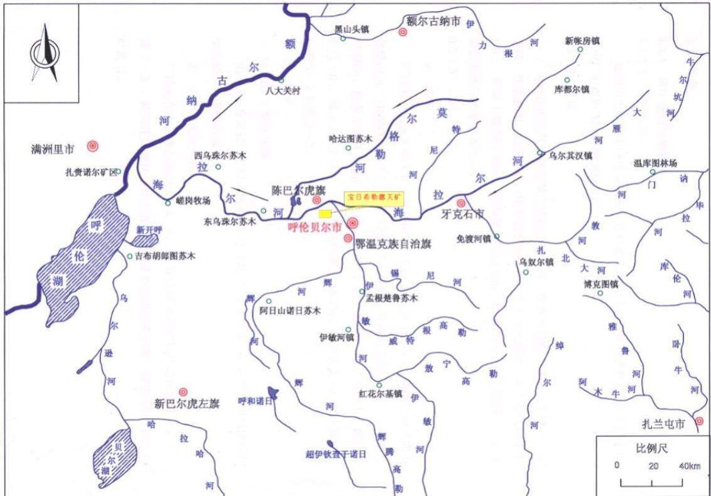  
图3-4矿区所在区域水系图  
Figure 3-4 Water system map of mining area

## 3.1.2 水文地质条件

## (1) 地层

本区属北疆-兴安地层大区兴安地层区达赉-兴隆地层分区。中新生代地层区划属滨太平洋地层区大兴安岭-燕山地层分区博克图-二连浩特地层小区。区

域发育的地层有：古生界泥盆系上统变质岩系，中生界侏罗系上统白音高老组，白垩系下统的梅勒图组和大磨拐河组，第四系，区域地层见表3-1。

表 3-1 区域地层简表  
Table 3-1 Brief table of regional strata
<table><tr><td rowspan=1 colspan=3>地层系统</td><td rowspan=1 colspan=1>厚度(m)</td><td rowspan=1 colspan=1>主要岩性</td></tr><tr><td rowspan=1 colspan=3>新生界Q</td><td rowspan=2 colspan=1>4.8577.951111159521540</td><td rowspan=1 colspan=1>全区发育，主要由冰、湖积、冰水沉积、冲积、洪积的更新统和湖沼沉积、风积、残积的全新统组成。</td></tr><tr><td rowspan=3 colspan=1>中生界MZ</td><td rowspan=2 colspan=1>白垩系下统K1</td><td rowspan=1 colspan=1>大磨拐河组K1d</td><td rowspan=1 colspan=1>以整个海拉尔盆地群发育及含有经济价值的煤层为特征。按岩性组合和含煤性分为5个岩段：①砂砾岩段：岩性以灰、灰白色砂砾岩为主，中夹薄层细砂岩，厚约 200~500m。②泥岩段：岩性以灰、深灰色泥岩、粉砂岩为主，中夹薄层细砂岩和1-2层煤层，厚约300~520m，与下伏砂砾岩段呈整合接触。③砂砾岩段：以灰、灰绿、深灰及暗灰色砾岩、砂岩、粉砂岩为主，中夹薄层泥砾岩和泥岩，厚约150m，与下伏泥岩段呈整合接触。④砂、泥岩段：主要为灰、灰白、深灰色泥岩、粉砂岩和细砂岩，中夹薄层粗砂岩、粗砂岩，厚度110-330m，与下伏砂砾岩段呈整合接触。⑤含煤段：岩性以灰、灰白色砾岩、砂质砾岩、细砂岩和暗灰色粉砂岩、泥岩为主，中夹6个煤层群14个煤层，厚约150~400m，与下伏砂、泥岩段呈整合接触，与上覆第四系呈角度不整合接触。</td></tr><tr><td rowspan=1 colspan=1>梅勒图组K1l</td><td rowspan=1 colspan=1>400292011111</td><td rowspan=1 colspan=1>发育于盆地以北的莫日格勒河河沿岸，及库库湖以西等地，由一套中、酸性熔岩及火山碎屑岩组成。按岩性组合分为以下2段：①酸性熔岩段：于头站公路旁和莫日格勒河河沿的昂供山、富温多尔、789.6高地一带呈大面积出露，岩性由灰白色，紫色球状流纹岩、酸性熔岩、流纹岩、岩屑晶屑凝灰岩等组成。与下伏地层整合接触。②中酸性熔岩段：零星出露于头站和莫日格勒河河北山一带,岩性主要是灰、灰紫色安山岩、鞍山玢岩及凝灰岩,与下伏地层呈角度不整合接触。</td></tr><tr><td rowspan=1 colspan=1>侏罗系B</td><td rowspan=1 colspan=1>白音高老组</td><td rowspan=1 colspan=1>150~200</td><td rowspan=1 colspan=1>仅出露于海拉尔河左岸的海拉尔后山663.9高地附近。由灰白-黄褐色的板状粗砂岩、中细砂岩、黄绿-灰黑绿色板状粉砂岩、凝灰质粉砂岩及酸性火成岩组成，岩石致密坚硬，具轻微蚀变现象。与下伏古生界地层呈角度不整合接触。</td></tr><tr><td rowspan=1 colspan=1>古生界PZ</td><td rowspan=1 colspan=2>泥盆系上统变质岩系D3</td><td rowspan=1 colspan=1>不详</td><td rowspan=1 colspan=1>零星出露于海拉尔河北山采石场处，其岩性为一套灰绿色、灰黑色绿帘石、片理化安山玢岩安山玄武玢岩和酸性熔岩。</td></tr></table>

## (2) 构造

陈旗煤田位于新华夏系第三沉降带海拉尔沉降区的中偏北部，东以免渡河断裂与原林凹陷为邻，西以上库力断裂与西乌珠尔盆地相望，南以海拉尔河区域性东西向构造与呼山盆地、南屯-西索木盆地为邻，北邻莫日格勒河河凸起

(见图3-5)。海拉尔河沉降区的构造格局是新华夏系与区域性东西向构造的复合。新华夏系构造行迹比比皆是，大者如额尔古纳隆起的黑山头、满洲里隆起区、小的如开放山盆地、克鲁伦盆地、呼和诺尔盆地和红花尔基盆地，区域性东西向构造行迹有三条，是三河断裂、海拉尔河断裂和哈拉哈河断裂，且分别以125km的等距由北往南平行展布。

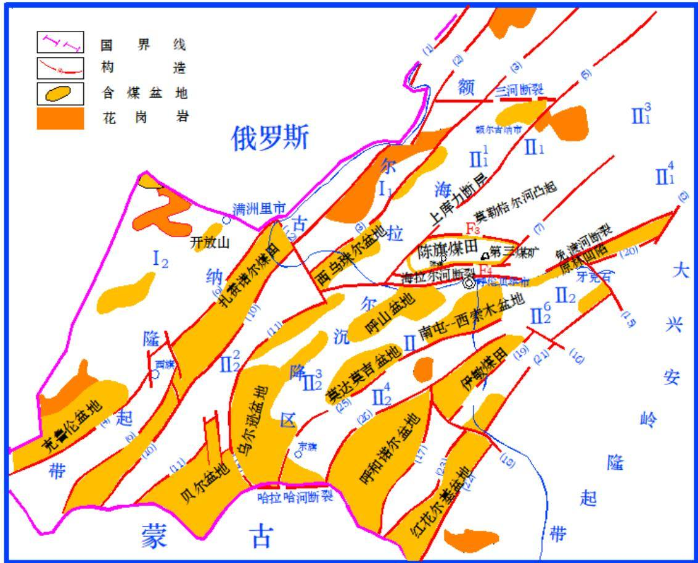  
图 3-5 陈旗煤田构造示意图  
Figure 3-5 Structural sketch of coalfield in study area

陈旗煤田位于海拉尔盆地群西北部，为一断陷型向斜含煤盆地、走向近东西，南北两侧为 $\mathrm { F } _ { 3 \setminus \mathrm { ~ } } \mathrm { F } _ { 4 }$ 盆缘断裂控制，煤系基底为兴安岭群火山岩系。本区位于陈旗煤田的中西部，西接巴彦哈达区。

## 3.1.3 水文地质与工程地质

依据含水介质类型，将区内的含水层划分为两大含水岩组：第四系孔隙含水岩组和白垩纪下统大磨拐河组裂隙一孔隙含水岩组。含水层岩性以煤层、砾岩、粗砂岩及中细砂岩为主；隔水层以泥岩、粉砂质泥岩为主。区内主要靠季节性大气降水补给，然后通过地表入渗，最终排向低洼处。

由矿区内钻孔资料（图3-6）显示，研究区土方剥离岩（土）体划分为三大岩组，即第四系松散岩组、碎屑岩组和煤岩组，具体工程地质分类见表3-2。

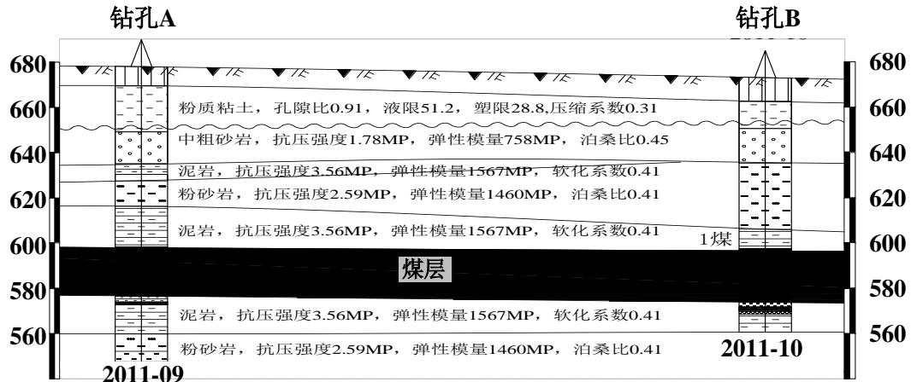  
图3-6研究区内钻孔地层信息  
Figure 3-6 The borehole and geological profile information

其中第四系松散岩组组自上而下分别为：地表腐殖土一一亚砂土、砂土、粉细砂——粘土、含砾粘土和少量亚粘土——泥砾及含砂砾石等[203]。

表3-2岩（土）体工程地质分类表  
Table 3-2 Engineering geological classification of rock and soil
<table><tr><td>工程地质分类</td><td>岩层组</td><td>空间分布</td><td>岩体结构</td></tr><tr><td rowspan="2">第四系松散岩组</td><td>粘土、粉质粘土</td><td>分布于地表，全区广泛分布</td><td rowspan="2">散体结构</td></tr><tr><td>砾石层</td><td>局部分布，呈透镜状</td></tr><tr><td rowspan="2">白垩系碎屑岩组</td><td>风化岩组</td><td>煤系顶部与第四系的接触带</td><td>碎裂结构</td></tr><tr><td>砂岩、泥岩和砾岩</td><td>全区分布，呈互层状或透镜状</td><td></td></tr><tr><td>煤岩岩组</td><td>煤层</td><td>全区分布，个别煤层不稳定</td><td>层状结构</td></tr></table>

## 3.1.4排土场概况及存在的生态地质问题

排土场属于神华宝日希勒能源有限公司，矿区占地面积约 $2 5 \mathrm { k m } ^ { 2 }$ ，已探明煤炭储量41.66亿吨，可采储量1372.52Mt，现有生产一号露天煤矿原煤产能3500万吨/年，与生产同步产生的剥离与排弃土方超过6000万 $\mathbf { m } ^ { 3 }$ /年的。从南到北区内的排土场堆放时长跨度长，从8年到14年不等，最高堆积高度为116m，总体积约为 $3 . 5 { \times } 1 0 ^ { 8 } \mathrm { m } ^ { 3 }$ 。与此同时，岩土排弃所形成的排土场不仅改变了原地貌，同时也对局部生态系统造成强烈扰动[145,161]。尤其在生态脆弱的高寒草原地区，人工生态重建区植物难以自维持，与正向演替[150]，再次形成稳定的生态系统需长时间的土壤、植物的演替过程[38]。因此研究区内生态系统在生态演替过程中，呈现出一系列新的生态环境问题：

## （1）地质稳定性差

在露天矿开采中，将自然地貌下的岩土进行挖掘、剥离、运输、排弃、堆积的过程，形成大型人工堆积体即为排土场。一般情况下设计成多级阶梯状，相对高度在几十到一百多米。在排土场堆存过程中，由于采用大型机械进行土石分层混排的生产工艺，使排土场具有压实度差异性大、异质性强特点（图3-7)。这种人工堆放混排结构与自然地层存在较大差异，地质稳定性不同于自然岩土边坡。

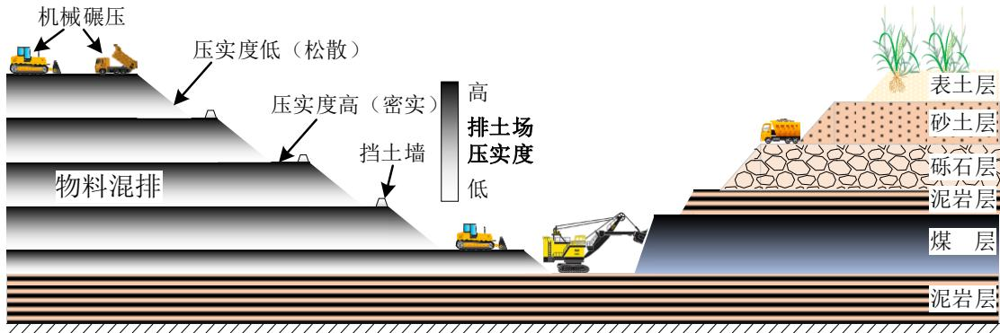  
图3-7排土场分层堆排及机械压实示意图  
Figure 3-7 Schematic diagram of layered stacking and machinery compaction in mining dump

堆放松散土体在重力作用下固结压密而形成大面积不均匀固结沉降，一旦遇到诸如降水、冻融等因素扰动，易出现诸如边坡浅层滑坡（图3-8a）、冲沟（图3-8b）、侵蚀溶洞（图3-8c）、地裂缝（图3-8d）、潜蚀塌陷坑（图3-8f）等发育而诱发的各种地质灾害现象，严重威胁着排土场生态地质安全。

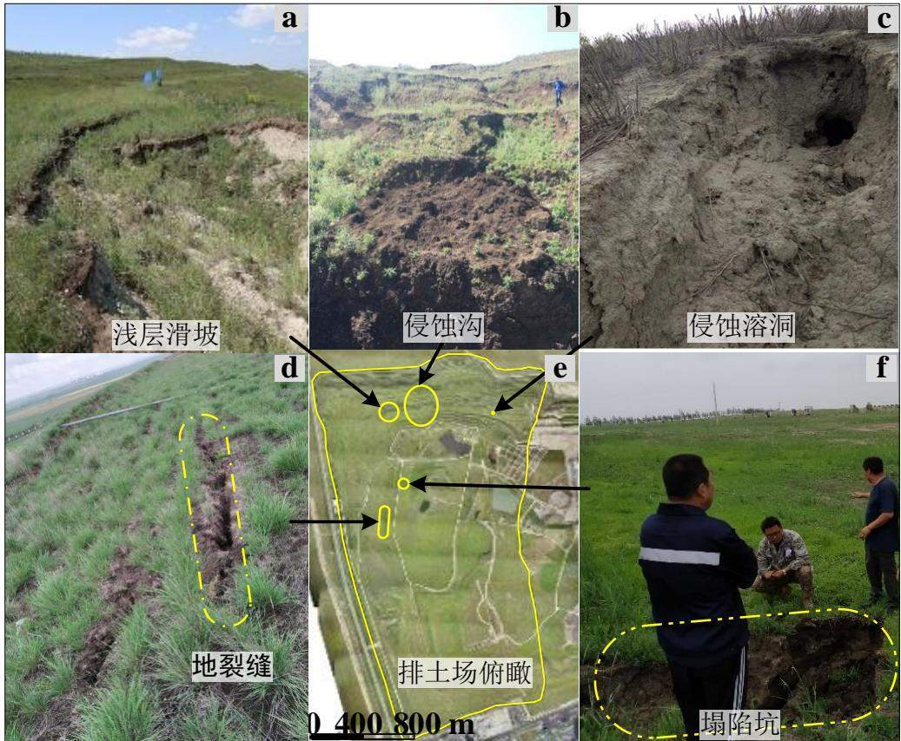  
图3-8宝煤北排土场各类地质失稳与土壤侵蚀示意图  
Figure 3-8 Map of various types of geological instability and soil erosion in the dump site

## （2）水土保持能力低

自然情况下土壤中含有缓渗层，可有效防止浅层地下水的流失，而煤炭资源的开发破坏矿区地层分布，缓渗层损失殆尽。露天排土场回填物主要为岩土剥离物，所形成的堆积体孔隙大，无法形成有效的缓渗层，大气降水难以保存，极易造成严重的水土流失[232]。此外，排土场地表往往人工覆盖厚度数十厘米至数米不等的表土（如腐殖土、粘土或沙土等），导致不同区域表土渗透率差异较大，雨季降水在低渗透率区域形成地表径流，流至高渗透率区域后入渗形成内部渗流、暗涌等，极易造成土壤侵蚀、滑坡等灾害。

此外，研究区处于半干旱生态脆弱区，采矿活动使水源涵养能力较扰动前发生显著变化，主要体现在：（1）研究区分层松散的堆存方式无法形成稳定的隔水层及保水层，水土保持能力较扰动前大幅下降，区内可供生态利用的有效降雨量远低于实际降雨量；（2）雨季短时集中强降雨降低了坡体强度，雨水汇流后在坡面形成临时性地表径流和内部渗流，导致研究区边坡失稳及土壤侵蚀；（3）非雨季蒸发量大，植物难以获取水分补充，长期处于干旱胁迫状态。同时，除了在雨季受到径流侵蚀外，地处高寒矿区的排土场受到冻融侵蚀作用，处于冻-融循环状态下粘聚力降低，加速了边坡侵蚀发育[152]。

## （3）重建植物群落难以自维持

这种地质稳定性与水土资源保持能力无法为重建植被提供良好生境。此外，开采活动在破坏原有耕植层的同时，将原本深埋地下的土层挖掘并重新堆存在地表，在北方独特的水分和温度环境下，土壤中生物活性长期处于较低水平，导致重构土壤难以形成适宜植被恢复的环境。在多重因素共同作用下，复垦生境形成了限制植物生长和发育的环境因子，超出了自然系统的调节能力和物种的适应能力，进一步加大了生态功能提升难度。

尽管人工重建植被在短时间内起到较好视觉效果，但从长远看来难以解决物种多样性少、植被结构差、维护成本高、整体生态功能低的问题，重建植物群落难以自维持。

综上，除研究区特殊地层和岩土结构外，诱发其生态功能问题的重要因素是水，主要表现在雨季水流造成土壤侵蚀、旱季缺水导致植群落难以维持、冬季的冻融循环作用对边坡破坏等。由此可见，控水是提升研究区生态功能的重要手段。

## 3.2 排土场生态功能要素多源数据获取方法（Multi-source Data Acquisition Method for Dump Ecological Function Elements)

对于露天大型排土场，单一数据获取手段无法满足其生态功能多要素诊断的具体要求。实际上，采用光学遥感或雷达遥感等多种形式相结合的卫星观测手段进行大面积时序监测；也可以采用无人机搭载相关传感器进行精细化监测；

还可以在地面布设相应的监测系统、构建物联网对重点区域进行连续监测与信息获取（图3-9）。

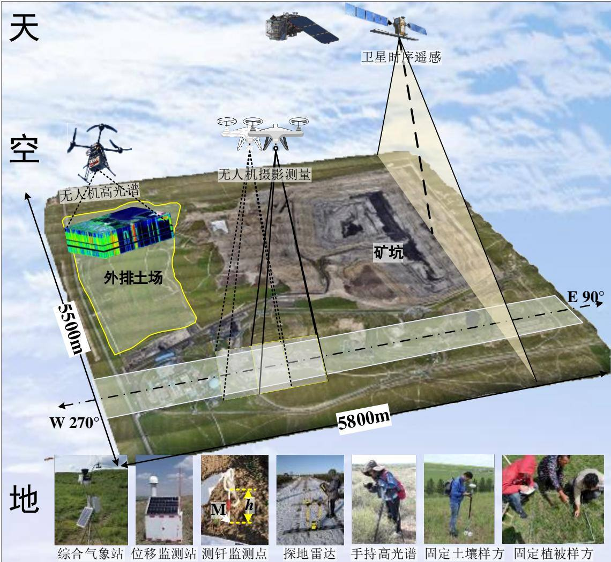  
图3-9排土场生态功能多源协同监测技术体系  
Figure 3-9 Multi-source collaborative monitoring technology system for ecological functions of mining dump

## 3.2.1 基于时序卫星遥感的生态功能普查技术

近年来，随着遥感技术的不断发展和历史影像的持续积累，卫星遥感技术在矿区生态功能要素监测中的应用不断增多，且越来越呈现出对大范围、长时序的生态功能过程的理解[233-235]。针对研究区生态功能要素监测，利用光学遥感和雷达遥感各自优势分别进行要素监测与问题诊断。

卫星光学遥感技术因其技术成熟、时效性好、历史资料充裕、可用信息丰富等优势，一直以来都是矿区生态功能要素诊断的重要技术手段。从上世纪七八十年代开始以来，以Landsat、SPOT等为代表的中等分辨率卫星数据，以IKONS、QuickBird等为代表的高分辨率卫星数据便一直被用于矿区生态功能要素的诊断与分析[236,237]。近年来，遥感卫星数据不断丰富：高分/资源系列卫星数据，中等分辨率开源卫星数据（如Landsat-8、Sentinel-2等）、高分辨率全色/多光谱商业卫星数据（如 WorldView-3/4等）、高光谱商业卫星数据（如EO-1、珠海一号等）均取得快速发展[238-241]。随着光学遥感数据数量、质量及精度的不断提高，光学遥感技术在矿区排土场生态功能要素监测与诊断中的应用也更加成熟，在数据源方面已逐渐由单一资料向多时项、多尺度、多数据源融合的复合型应用方向发展；在应用解决方案方面已由静态地物要素的辨识、形态分析向生态功能多要素动态监测过渡。

卫星雷达遥感中，InSAR技术因其全天候、全天时、高精度、低成本等优点[242,243]，被广泛用于矿区生态功能要素的长期监测中[244-246]。由于InSAR技术可以实现长时序、微变形的监测能力，以及克服了传统形变测量的点式测量局限，因此对研究区地质灾害隐患的早期识别和土壤侵蚀量估算具有突出优势。同时，利用时序分解技术，可对研究区径流侵蚀、潜流侵蚀及冻融侵蚀等复合型侵蚀进行分解。此外，雷达数据与光学多光谱数据结合，可对研究区地表温度、土壤含水率进行估算，为生态复垦评价提供依据[247]。

本次将使用星载遥感技术对整个矿区进行形变、位移、侵蚀、植物状况、地表温度、表土含水率等影响研究区生态功能指标进行普查性监测，进行地质灾害隐患识别与提取、土壤侵蚀状况监测及植被恢复群落演替状况监测，从而对研究区生态功能进行初步诊断，进而甄别出影响生态功能的关键靶区。

## 3.2.2基于无人机遥感的排土场生态功能详查技术

尽管日益发展的卫星遥感手段已经展现出越来越多的优势，但依然受天气状况、回访周期、监测盲区等客观条件限制。随着无人机（UnmannedAerialVehicle，UAV）与传感器的不断发展，基于无人机平台的低空（100-1000m）/超低空（<100m）摄影测量技术已显示出独特优越性[151,248]。无人机摄影测量技术结合了无人机驾驶飞行器技术、遥感传感器技术、遥测遥控技术、通信技术、导航定位定向系统、GPS（Global Positioning System）差分定位技术和遥感应用技术，具有系统灵活、起降方便、成本低、质量高、自动化和智能化等特点[248-250]，在快速获取小区域和复杂地形区域高分辨率影像方面具有明显优势[251]，其空间信息密度与精度可达机载雷达水平[252,253]，可作为卫星遥感手段的有力补充。

本次将利用无人机垂直航空摄影测量和倾斜摄影测量，基于空中三角测量与密集匹配[254]、SfM（Structure from Motion）摄影测量处理、多视图三维立体重建和几何模型建立等处理，可快速生成高精度三维点云（Point Cloud）数据和数字地表模型（Digital Surface Model，DSM)，再对影像进行数字微分纠正、拼接、镶嵌等处理，可获得整个研究区数字正射影像（Digital Orthophoto Map，DOM)。利用三维点云数据与DSM，可实现研究区高精度三维模型重建与生态水文网的识别。利用无人机摄影测量获取的研究区高精度地貌数据可进行浅层滑坡、土壤侵蚀等生态功能问题突出的关键靶区进行目视解译，也可利用高精度地貌数据对研究区的生态流量过程进行识别与提取，亦可利用多期点云数据进行地貌形变、土壤侵蚀区的定量监测。

此外，还通过无人机高光谱技术，获取研究区关键靶区植物光谱信息，进而建立典型植物光谱库，进行研究区植物精细分类和物种多样性制图，再结合DEM数据获取的地貌信息，可得到不同植物复垦恢复年限、不同立地条件下的植物分布规律，实现研究区植物分类及其健康状态的精细化监测。

## 3.2.3 基于实地监测与调查的排土场生态功能勘察技术

基于空-天遥感途径所获取的研究区生态功能要素监测结果受多种因素影响，其获取结果需要进行精度验证。同时，甄别研究区生态功能关键靶区需进一步的复核与持续监测。因此，在基于星载遥感和无人机遥感监测基础上，需对排土场地质灾害隐患、复合型土壤侵蚀、生态复垦典型区域等关键靶区进行现场勘查，同时在现场布设多要素自动监测设备以实现关键靶区的精准密集监测。

随着传感器技术的发展，可用于生态功能要素地面勘察的监测系统已具有数字化、自动化和网络化的特点，在实现多种传感器的协同监测的同时，实现监测工作的自动采集、数字化传输等功能（表3-3）。在关键靶区现场布设GNSS位移观测站、测钎位移监测点、地裂缝监测仪、综合气象站、探地雷达、手持高高光谱相机、固定植物/土壤样方等连续或定期监测手段，建立研究区生态功能要素多参数监测网，实现协同监测。

表3-3排土场生态功能要素地面监测内容  
Table 3-3 The contents of ground monitoring for ecological function elements of the dump
<table><tr><td>监测类别</td><td>监测内容</td><td>监测设备</td></tr><tr><td rowspan="6">地质稳定性</td><td>地表位移监测</td><td>GNSS观测站、固定测钎</td></tr><tr><td>内部位移监测</td><td>测斜仪、锚杆式伸长计</td></tr><tr><td>分层沉降监测</td><td>沉降仪</td></tr><tr><td>边坡地裂缝监测</td><td>单/多向测缝计、测距仪</td></tr><tr><td>震动监测</td><td>微震仪、震动加速计</td></tr><tr><td></td><td></td></tr><tr><td rowspan="4">生态稳定性</td><td>植物光谱库建设</td><td>手持高光谱相机</td></tr><tr><td>植物演替监测</td><td>固定植物样方</td></tr><tr><td>土壤养分监测</td><td>固定土壤样方</td></tr><tr><td>水土流失监测</td><td>水土流失监测仪</td></tr><tr><td rowspan="2">其他</td><td>区域气象</td><td>综合气象站</td></tr><tr><td>实时视频监控</td><td>视频监控</td></tr></table>

地面勘察既是对空-天遥感监测结果精度的验证，也是对排土场地质灾害隐患与复合型土壤侵蚀的进一步精确核实与诊断，是确认或排查排土场生态功能问题的最终手段。

最后，以无人机三维模型为底图，以空-天-地多参数监测数据为基础，基于物联网建立监测云和解算云，将研究区生态功能状况进行耦合与显示，设置实时监测阈值（如边坡位移速率、地裂缝变化速率、降雨量等），从而根据多平台多参数进行生态功能状况的分析与判断，为研究区潜在边坡破坏的治理、水-土-植被调控配置提供依据。

## 3.3 排土场高精度 DEM 数据获取（Data Acquisition of Highprecision Dump Digital Elevation Model)

由于持续的人工干扰与自然侵蚀，露天煤矿外排土场地形复杂且不断变化，掌握外排土场地形数据是对坡体稳定性评价、侵蚀沟信息提取、精细水文网识别、水土流失控制和植被恢复监测的重要保障，也为矿山生态修复提供基础数据支撑[140,255]。

## 3.3.1 无人机摄影测量的优势

采用传统手段进行地形测量更新慢、成本高，难以满足较高需求[256,257]，无人机摄影测量技术可以获取地面高精度地形数据，且整体空间信息密度与精度可达机载雷达水平。然而，无人机摄影测量直接获取的地貌数据是基于可见光立体像对匹配而获取的，其地形数据未能剔除地表植被与其他地物对高程产生的影响，因此在高精度地形提取方面难以保证垂直精度。

针对这一问题，在植物类型单一且无建筑物干扰区，可以利用可见光植被指数间接反映植物高度，利用植被指数-植物高度回归模型剔除植被对地形的影响，从而获得真实地形。本次采用旋翼无人机平台与地面GPSRTK系统，构建外排土场地形测量作业平台，建立可见光植被指数-植物高度修正模型对无人机摄影测量地形进行修正获取研究区DEM数据。最后用检查点对测量结果进行精度检验，同时与GPSRTK地形测量数据进行比较分析。

## 3.3.2 数据采集及预处理

数据采集空中飞行单元采用大疆精灵4-RTK旋翼无人机飞行平台；测量作业单元由机载数码相机、机载数据采集存储子系统组成；像控点测量单元、植物实测量单元由 GPS RTK和钢尺组成；数据处理由内业工作站组成（图 3-10）。

## （1）像控点、检查点和植物实测点量测

可靠及稳定的地面参考系统是重要的前提，而无人机上搭载的GPS精度较低，因此需对航拍添加地面像控点数据以保证精度[258]。此外，在研究区布置多个控制点（检查点），可以对解算的数据进行精度检验。像控点按照GB/T7931-2008《1:500，1:1000，1:2000地形图航空摄影测量外业规范》采用内业人员设计、外业人员布设的方式进行。

在研究区，共布设像控点19个，检查点8个，植物高度实测点43个。像控点均布设在无植被覆盖区且保证航向及旁向6片重叠范围内可见；检查点与植物高度实测点布置在坡顶、坡脚、平台及坡面等区域，其中1个检查点位于裸土地上、7个检查点位于植被覆盖区；植物高度实测点采用五点取样法在10cm×10cm样方内用钢尺测得。所有点位置信息均采用GPSRTK进行测量，测量模式为“地面控制点模式”，单点测量180次取平均值。

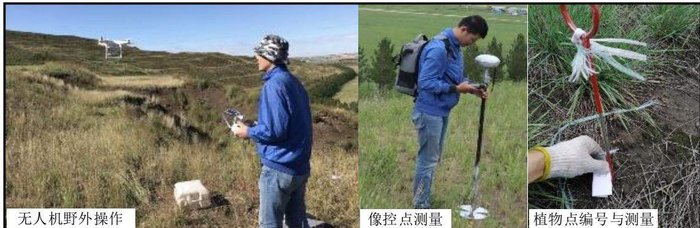  
图3-10无人机摄影测量系统  
Figure 3-10 UAV photogrammetry system

## (2) 影像获取

数据采集空中飞行单元采用旋翼无人机飞行平台；测量作业单元由机载数码相机、机载数据采集存储子系统组成；地面控制单元由地面站和数传电台组成；像控点、检查点测量单元由地面点设施和GPS-RTK组成。

在设计航线时需根据航向重叠、旁向重叠、地面分辨率的要求来设定航高以及拍摄间隔，再由航高和相机参数来确定航线地面最低点分辨率[259]。无人机及相机等参数如表3-4所示，飞行中由GPS飞行控制系统控制相机快门进行定点曝光，相机设置为固定无穷远对焦、固定光圈以保证统一物镜畸变参数。除此之外，由于研究区地势起伏大，为减小影像畸变，重点区域采用倾斜拍摄与垂直拍摄相结合的影像获取方式，充分利用侧视影像来获取地物的侧面纹理信息，保证整体精度。此次实验数据采集于2017年8月30日，天气晴朗无云，微风，共采集航片1282张。

表3-4无人机及飞行参数  
Table 3-4 UAV and ground survey details
<table><tr><td>航线相对高度</td><td>~110 m AGL</td><td>地面像控点数量</td><td>19</td></tr><tr><td>航向/旁向重叠度</td><td>80%/75%</td><td>地面检查点数量</td><td>8</td></tr><tr><td>采集照片数量</td><td>1282</td><td>影像分辨率</td><td>~5 cm pix−1</td></tr></table>

## (3） 数据处理

将外业采集影像与像控点导入 Pix4D Mapper，在软件中对相机参数进行检校，并将每个像控点转刺到5到8张影像上。利用软件进行空中三角测量与密集匹配[254]、SfM摄影测量处理、多视图三维立体重建和几何模型建立等处理，进而生成高精度三维点云数据和数字地表模型（Digital Surface Model，DSM），再对影像进行数字微分纠正、拼接、镶嵌等处理，可获得整个研究区数字正射影像（Digital Orthophoto Map，DOM)。其中，DSM 数据为包含地面植物高度信息的地面高程模型，DOM数据为含有RGB波段的正射影像（图3-11），其空间分辨率均为5cm。

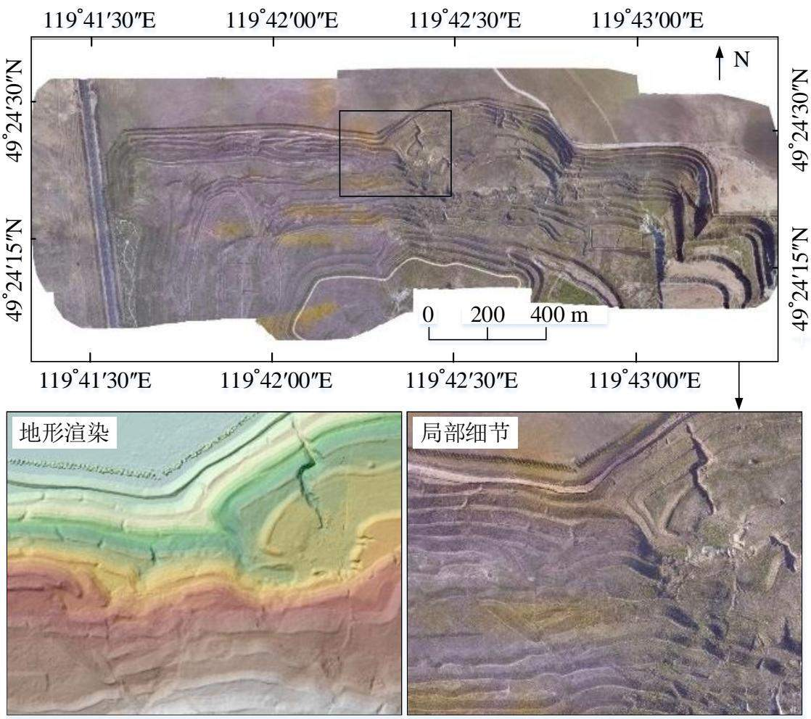  
图3-11研究区数字正射影像与数字地表模型示意图  
Figure 3-11 Orthophotomap and DSM data of the study area

## 3.3.3 植被指数与地形修正模型

由于 Pix4D Mapper 解算获得的 DSM 数据中高程值包含了地表植物高度，为获取研究区真实地形（DEM数据)，需建立可见光植被指数-植物高度模型修正DSM数据。

## （1）植被指数-植物高度相关性分析

植被指数是地物反射波段间的不同组合方式，已有大量学者针对各类之类光谱指数展开大量研究，目前已公开发表的植被指数模型超过150种[260]，其中基于红光、近红外波段反射率差异构建的植被指数NDVI得到广泛应用。同样，绿色植被在可见光波段的光谱差异性也有大量研究，其部分常见可见光植被指数及其变形式见表3-5。

为了使所有植被指数与植物高度呈正相关关系，取原文献中GRRI与GBRI植被指数的倒数。利用表3-5所示公式分别计算出研究区地面实测样本的6种植被指数，利用 SPSS 建立植被指数一植物高度相关性模型，其相关性见表7-1表3-6。

表3-5主要可见光植被指数  
Table 3-5 Major vegetation indices of visible bands
<table><tr><td>植被指数名称</td><td>计算公式</td></tr><tr><td>绿红比值指数[261]（Green-red ratio index, GRRI）</td><td> $\underline { { \rho _ { \mathrm { g r e e n } } } }$   $\rho _ { \mathrm { r e d } }$ </td></tr><tr><td>绿蓝比值指数[262]（Green-blue ratio index, GBRI）</td><td> $\underline { { \rho _ { \mathrm { g r e e n } } } }$   $\rho _ { \mathrm { b l u e } }$ </td></tr><tr><td>归一化绿红差异指数[263]（Normalized green-red difference index, NGRDI)</td><td> $\rho _ { \mathrm { g r e e n } } - \rho _ { \mathrm { r e d } }$   $\rho _ { \mathrm { g r e e n } } + \rho _ { \mathrm { r e d } }$ </td></tr><tr><td>归一化绿蓝差异指数[264]（Normalized green-blue difference index, NGBDI)</td><td> $\rho _ { \mathrm { g r e e n } } - \rho _ { \mathrm { b l u e } }$   $\rho _ { \mathrm { g r e e n } } + \rho _ { \mathrm { b l u e } }$ </td></tr><tr><td>超绿指数[265]（Excess green, EXG）</td><td> $2 \rho _ { \mathrm { g r e e n } } - \rho _ { \mathrm { r e d } } - \rho _ { \mathrm { b l u e } }$ </td></tr><tr><td>红绿蓝植被指数[266](Red Green Blue Vegetation Index, RGBVI)</td><td> $\rho _ { \mathrm { g r e e n } } ^ { 2 } - ( \rho _ { \mathrm { r e d } } \times \rho _ { \mathrm { b l u e } } )$   $\rho _ { \mathrm { g r e e n } } ^ { 2 } + ( \rho _ { \mathrm { r e d } } \times \rho _ { \mathrm { b l u e } } )$ </td></tr></table>

注：Pgreen、ρred、ρblue分别为无人机影像在绿、红、蓝波段的反射率

由表3-6可知，研究区植物高度与植被指数均呈正相关关系，其中植物高度与 RGBVI的相关性系数最高 $( \mathrm { R } ^ { 2 } { = } 0 . 9 4 2 )$ ，其次为 $\operatorname { E X G } \ ( \mathbf { R } ^ { 2 } { = } 0 . 9 0 8 )$ ，最低的为GRRI $\scriptstyle ( \mathrm { R } ^ { 2 } = 0 . 5 3 1 )$ 。在所有列出植被指数之间，GRRI与NGRDI、GBRI与NGBDI相关性较高，绝对值均大于0.99。经对比发现，与植物高度相关性较高的植被指数均由红、绿、蓝三个波段通过不同组合方式计算所得，如RGBVI和EXG。

表3-6植被指数与植物高度的相关系数  
Table 3-6 Correlation coefficient between vegetation index and vegetation height
<table><tr><td></td><td>植物高度</td><td>GRRI</td><td>GBRI</td><td>NGRDI</td><td>NGBDI</td><td>EXG</td><td>RGBVI</td></tr><tr><td>植物高度</td><td>1</td><td>0.531</td><td>0.855**</td><td>0.537</td><td>0.857**</td><td>0.908**</td><td>0.942**</td></tr><tr><td>GRRI</td><td></td><td>1</td><td>0.171</td><td>0.999**</td><td>0.161</td><td>0.520</td><td>0.525</td></tr><tr><td>GBRI</td><td></td><td></td><td>1</td><td>0.182</td><td>0.997**</td><td>0.899**</td><td>0.926**</td></tr><tr><td>NGRDI</td><td></td><td></td><td></td><td>1</td><td>0.172</td><td>0.532</td><td>0.535</td></tr><tr><td>NGBDI</td><td></td><td></td><td></td><td></td><td>1</td><td>0.901**</td><td>0.925**</td></tr><tr><td>EXG</td><td></td><td></td><td></td><td></td><td></td><td>1</td><td>0.979**</td></tr><tr><td>RGBVI</td><td></td><td></td><td></td><td></td><td></td><td></td><td>1</td></tr></table>

注：\*\*表示在置信度（双测）为0.01时显著相关。

利用植物高度实测样本（随机布置在草地和裸土地上，共43个）分为两部分，随机选择70%（30个）用于建立植被指数一植物高度回归模型，30%（13个）用于检验。利用SPSS回归分析模块拟合得到植物高度与各种植被指数之间最佳拟合曲线为线性拟合。统计回归模型的相关性系数 $\mathtt { R } ^ { 2 }$ 和检验样本的平均绝对误差（Mean Absolute Deviation，MAD）及均方根误差（Root Mean SquaredError，RMSE)，公式如下，统计结果见表3-7。

$$
M A D = \frac { 1 } { n } \sum _ { i = 1 } ^ { n } \left| E _ { i } \right|\tag{3-1}
$$

$$
R M S E = \sqrt { \frac { 1 } { n } \sum _ { i = 1 } ^ { n } { E _ { i } ^ { 2 } } }\tag{3-2}
$$

式中：E为模型预测值与真实值的差值；n为验证样本数。

表3-7植被指数-植物高度回归模型与精度检验  
Table 3-7 Vegetation index-vegetation height regression model and precision test
<table><tr><td>植被指数</td><td>模型</td><td> $\overline { { \mathrm { ~ \bf ~ R } ^ { 2 } } }$ </td><td>MAD/m</td><td>RMSE/m</td></tr><tr><td>GRRI</td><td> $\mathrm { y } = 0 . 7 5 7 \mathrm { x } - 0 . 6 6 5$ </td><td>0.274</td><td>0.075</td><td>0.097</td></tr><tr><td>GBRI</td><td> $\mathrm { y } = 0 . 5 1 1 \mathrm { x } - 0 . 4 6 2$ </td><td>0.767</td><td>0.046</td><td>0.056</td></tr><tr><td>NGRDI</td><td> $\mathrm { y } = 1 . 7 9 6 \mathrm { x } + 0 . 0 7 3$ </td><td>0.217</td><td>0.080</td><td>0.102</td></tr><tr><td>NGBDI</td><td> $\mathrm { y } = 1 . 4 2 4 \mathrm { x } + 0 . 0 2 6$ </td><td>0.789</td><td>0.040</td><td>0.053</td></tr><tr><td>EXG</td><td> $\mathrm { y } = 0 . 0 0 7 \mathrm { x } + 0 . 0 2 3$ </td><td>0.952</td><td>0.020</td><td>0.025</td></tr><tr><td>RGBVI</td><td> $\mathrm { y } = 1 . 2 8 0 \mathrm { x } + 0 . 0 2 2$ </td><td>0.950</td><td>0.022</td><td>0.026</td></tr></table>

由表3-7可知，不同植被指数一植物高度回归模型的 $\mathtt { R } ^ { 2 }$ 、MAD、RMSE表现出明显差异。其中 $\mathtt { R } ^ { 2 }$ 最高的为 EXG 模型 $( \mathrm { R } ^ { 2 } { = } 0 . 9 5 2 )$ ，其次为 RGBVI 模型$( \mathrm { R } ^ { 2 } { = } 0 . 9 5 0 )$ ，最低的为 NGRDI模型 $( \mathrm { R } ^ { 2 } { = } 0 . 2 1 7 )$ 。验证样本中 MAD 和 RMSE最小值为EXG模型（MAD=0.02m，RMSE=0.025m），其次 RGBVI模型$( \mathrm { M A D } { = } 0 . 0 2 \mathrm { m }$ ，RMSE=0.025m），为最大值为NGRDI模型（MAD=0.08m，$\mathrm { R M S E } { = } 0 . 1 0 2 \mathrm { m } )$ 0

综合分析3种评价指标及3.2中植被指数与植物高度相关性分析结果可知，EXG模型与 RGBVI模型能有效的反映研究区植物高度。下面以 RGBVI模型为例估算研究区植物高度，进而得到研究区修正后数字高程模型（DigitalElevation Model,DEM)。

## (2) 地形修正模型

利用RGBVI模型指数估算得到研究区内植物高度分布见图3-12。由图3-12可知，研究区内裸土地（植物高度为0）面积占总面积约32.7%，植物高度低于

15cm 区域面积占总面积约 60.9%，植物高度高于15cm区域面积占总面积约  
6.4%。整体来看研究区东部比西部植物高度高，坡顶和平台比坡面高度高。图  
3-12中A、B、C、D为研究区4块典型区域，其植物高度估算结果细节如图3-  
13所示。

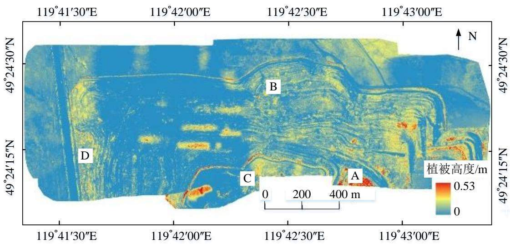  
图3-12基于RGBVI的研究区植物高度估算结果  
Figure 3-12 Estimation results of vegetation height in the study area based on RGBVI model

由图3-13可知，在研究区不同区域，植物高度对地形的影响程度与实际情况基本一直。区域A位于排土场坡顶，植物高度差异性明显，部分植物高度较高，对地形测量影响明显。区域B接近坡脚，内有冲蚀沟发育，地形起伏较大。区域C位于坡顶与边坡过渡区，内有防护林与少量人工建筑，植物高度差异性大。区域D位于坡脚，区内有公路、花坛等地物，其植物高度为0且轮廓非常清晰。

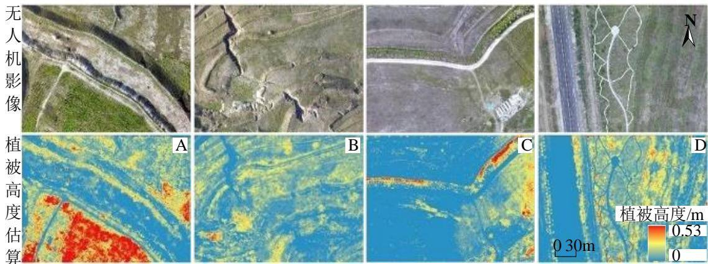  
图3-13研究区植物高度估算结果细节特征  
Figure 3-13 Detail characteristics of vegetation height estimation results

根据以上分析，可建立地形修正模型以除去研究区内植物高度对地形的影响。假设无人机摄影测量所获DSM数据任意点 $A ( x , y )$ 高程值为 $H _ { 0 }$ ，利用植被指数-植物高度修正模型估算该点植物高度为h0，则修正后该点绝对坐标为：

$$
A ^ { \prime } ( x , y , z ) = A ( x , y , H _ { 0 } - h _ { 0 } )\tag{3-3}
$$

## 3.3.4 DEM 模型结果精度分析

## （1）基于像控点的位置精度评价

为确定修正后地形数据的准确性，采用像控点误差统计和检查点验证两种方式进行精度评估。像控点误差统计如表3-8所示，检查点高程值与影像解算对应高程比较如表3-9所示。

由表3-8与表3-9可知，所有像控点和检查点均有效，未出现异常值。其中像控点投影误差均控制在在0.5个像素之内，精度满足设计要求；修正后影像高程大多小于修正前，点CheckP-5处为裸土地，植被指数为0，修正前后影像高程值不变。

表3-8控点误差统计  
Table 3-8 Photo-control-points error statistics
<table><tr><td>点号</td><td>高程误差/m</td><td>投影误差/像素</td><td>校准影像数</td></tr><tr><td>GCP-01</td><td>-0.023</td><td>0.481</td><td>7</td></tr><tr><td>GCP-02</td><td>0.021</td><td>0.427</td><td>5</td></tr><tr><td>GCP-03</td><td>0.039</td><td>0.443</td><td>5</td></tr><tr><td>GCP-04</td><td>0.019</td><td>0.369</td><td>5</td></tr><tr><td>GCP-05</td><td>-0.024</td><td>0.145</td><td>5</td></tr><tr><td>GCP-06</td><td>0.026</td><td>0.263</td><td>5</td></tr><tr><td>GCP-07</td><td>0.018</td><td>0.306</td><td>7</td></tr><tr><td>GCP-08</td><td>0.022</td><td>0.265</td><td>5</td></tr><tr><td>GCP-09</td><td>0.014</td><td>0.194</td><td>5</td></tr><tr><td>GCP-10</td><td>-0.006</td><td>0.474</td><td>5</td></tr><tr><td>GCP-11</td><td>0.019</td><td>0.438</td><td>5</td></tr><tr><td>GCP-12</td><td>-0.018</td><td>0.457</td><td>5</td></tr><tr><td>GCP-13</td><td>0.019</td><td>0.315</td><td>5</td></tr><tr><td>GCP-14</td><td>-0.057</td><td>0.362</td><td>5</td></tr><tr><td>GCP-15</td><td>-0.061</td><td>0.216</td><td>6</td></tr><tr><td>GCP-16</td><td>-0.077</td><td>0.479</td><td>5</td></tr><tr><td>GCP-17</td><td>-0.025</td><td>0.477</td><td>8</td></tr><tr><td>GCP-18</td><td>0.021</td><td>0.47</td><td>8</td></tr><tr><td>GCP-19</td><td>0.021</td><td>0.349</td><td>8</td></tr></table>

表3-9检查点与解算点高程比较  
Table 3-9 Comparison between checkpoints and solution points elevation
<table><tr><td>检查点号</td><td>修正前影像高程/m</td><td>修正后影像高程/m</td><td>检查点高程/m</td></tr><tr><td>CheckP-1</td><td>651.110</td><td>651.014</td><td>651.038</td></tr><tr><td>CheckP-2</td><td>625.712</td><td>625.614</td><td>625.591</td></tr><tr><td>CheckP-3</td><td>687.992</td><td>687.771</td><td>687.861</td></tr><tr><td>CheckP-4</td><td>631.266</td><td>631.254</td><td>631.221</td></tr><tr><td>CheckP-5</td><td>716.697</td><td>716.597</td><td>716.567</td></tr><tr><td>CheckP-6</td><td>697.706</td><td>697.614</td><td>697.631</td></tr><tr><td>CheckP-7</td><td>720.503</td><td>720.411</td><td>720.352</td></tr><tr><td>CheckP-8</td><td>698.755</td><td>698.547</td><td>698.579</td></tr></table>

使用均方根误差公式（式2）对检查点的可靠性进行评估[267]，检查点均方根误差由修正前的0.111m变为0.045m，精度显著提高，根据《数字航空摄影测量空中三角测量规范》（GB/T23236-2009）的要求，测量结果符合1:500地形数据制作要求。

## (2) 基于 GPS RTK 的 DEM 数据精度验证

为进一步评估修正后无人机摄影测量地形数据的可靠性，将修正后地形数据与同期使用GPS RTK所测地形数据做进行比较和分析。由于无人机摄影测量数据由点云生成，而GPS RTK地形测量数据由多点插值获得，因此无人机摄影测量（图3-14A）解算数据比已有GPS RTK地形测量数据（图3-14 B）更加精细，在测量复杂地形时无人机摄影测量体现出明显优势。同时，将两组DEM数据相重叠（图3-14C）发现，两组数据在不同区域呈现出不同高程值，以下将具体论述。

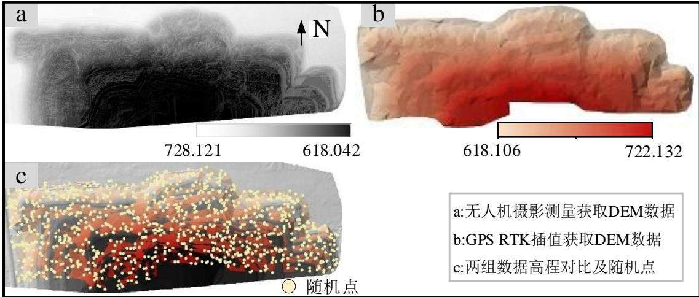  
图 3-14 研究区 DEM 数据比较  
Figure 3-14 DEM data comparison in the study area

利用 ArcGIS在研究区内取1000个随机点（图3-14C），分别将修正后无人机解算高程数据和 GPS RTK地形测量高程数据提取至随机点，建立同名点高程属性对照表，得出两组数据同名点高程差。除去异常值后，统计随机点高程差正态分布直方图如图3-15所示。

表3-10随机点地面植物高度统计表  
Table 3-10 Vegetation height statistics of ground random points
<table><tr><td>植物高度（cm） 0(裸地)</td></tr><tr><td>0~5 5~10 10~20 &gt;20 24.7 19.9 15.6 3.9</td></tr></table>

由图3-15可知，无人机摄影测量解算高程数据与GPSRTK地形测量高程数据高程差主要集中在0.1m内，但也有部分点的差值超过0.1m。

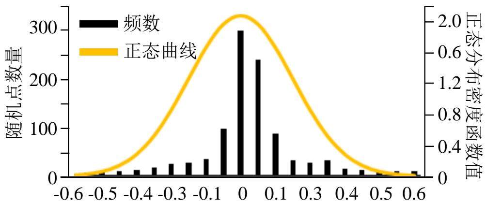  
图3-15随机点高程差正态分布曲线  
Figure 3-15 Difference of elevation normal curve of random points

为进一步分析误差来源，在研究区中心区随机取3条剖面线（图3-16）进行地形对比。根据实地调查，研究区以平台加斜坡的形式堆放，其中斜坡呈$2 0 ^ { \circ } { \sim } 3 0 ^ { \circ }$ 角，在从平台过度到斜坡时地形变化剧烈、棱角分明。由图3-16可知，修正后无人机解算地形与现实相符，而GPSRTK测量地形数据只能在整体上体现地形起伏。在地形平坦处两组数据高度重合，而在地形突变处差异较大。

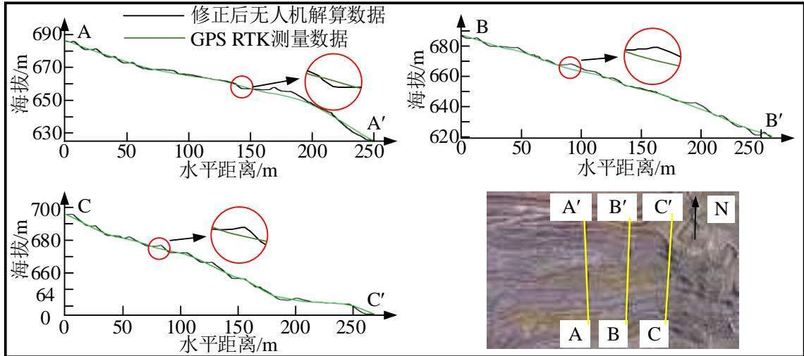  
图3-16无人机摄影测量解算数据与已有GPSRTK测量数据剖面对比示意图  
Figure 3-16 Cross-sections through modelled surface with perpendicular distance between the surface obtained from UAV photogrammetric data and the reference surface

## 3.3.5 精细地形三维建模

利用上述方法，可获取研究区正射影像及三维模型，研究区占地面积约5.5平方公里，其中北坡约1.2平方公里，坡顶平台约1.8平方公里，南坡约0.8平方公里。基于无人机摄影测量获取的数字表面模型（DSM）和数字正射影像(DOM)，再基于植被修正模型进行排土场精细DEM构建（如图3-17所示，其三维模型详见网址：http://p.tuxingis.com/w?s=eYNBBf

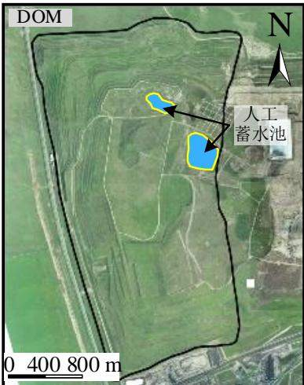

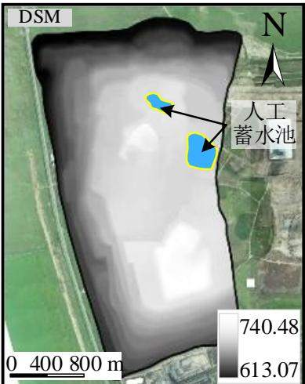

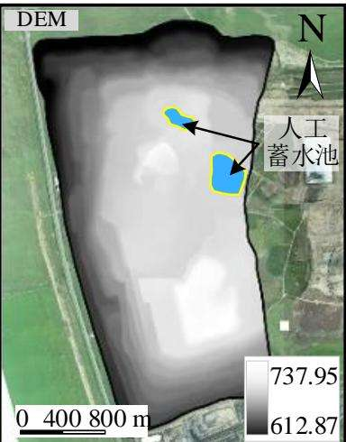  
图3-17基于无人机影像获取的数字正射影像、数字表面模型影像及数字地形模型影像  
Figure 3-17 Digital orthophotos image, digital surface model image and digital elevation model acquired based on UAV images  
所获取的研究区高精度DEM与三维模型可进行以下应用：

（1）微地貌特征参数获取：高精度DEM模型可准确提取研究区岩土堆存高度、坡度、坡向、表面曲率、地形变形速率、所受太阳辐射量、累计流量指数、地形湿度指数、地面粗糙度等多项微地貌参数。同时还将用以InSAR辅助相位解缠和高光谱影像配准的参考数据。

（2）精细径流途径的识别：排土场高精度三维建模为其精细径流水文网的识别提供了直观数据支持，为掌握露天煤矿排土场水土资源调控与利用规律，提供有力技术支撑。

（3）等高线生成、土方量计算：利用无人机摄影测量技术，配合地面控制点和矿区已有RTK基站，可定期获取高精度DSM数据，DSM可生成精细等高线，也可以进行土方量计算，多期DSM数据还可实现土方量变化的动态监测精确计算，节省大量人力物力。为定期更新全矿精细等高线图、各项土方量提供数据支撑。

（4）对矿区全局掌控：高精度三维模型可实现管理者对矿区全局掌控，使用无人机视角，了解资产在其生命周期的每个阶段内的状态。其有助于优化矿场开发，定期更新的矿区图来优化矿山设施布局：有助于更知情的决定，通过快速数据采集和3D建模，更快地了解复杂情况；有助于简化批准和申请流程：生成矿区的高分辨率地图、精确的3D模型，以便简化批准和申请流程。

## 3.4 排土场地质稳定性数据获取（Data Acquisition of Dump Geological Stability)

为探究研究区地表变形对生态功能的影响，首先需要获取地表变形数据。通过文献综述、区内本底调查发现，地表变形诱发因素主要为固结沉降、边坡浅层滑坡、冲沟、侵蚀溶洞、地裂缝和潜蚀塌陷坑等。传统水准测量和GPS等方法虽能够进行高精度的地面变形监测（DeformationMonitoring)，但所获得的数据在时空上较为稀疏，难以精确、定期评估研究区整体地质稳定性。与基于点的大地测量方法如水准测量和全球定位系统（GPS）[268,269]相比，卫星合成孔径雷达干涉测量（InSAR）技术是一种基于卫星的遥感技术，具有高空间和时间分辨率，能够精确地量化地表形变，在大范围内全天候监测精确的地表位移[270]。这一技术已经成功运用在城市沉降监测[271]、地震破坏监测[272]、滑坡监测[273]、植物监测[274]、水文地质调查[275]、冰山移动监测[276]、冻土表面变形监测[277]、矿业开采导致的地面沉降监测[245,246]等多个领域。与其他人为活动（如城市建设、地下水过度开采等）或自然地质灾害引起的沉降相比，采矿活动导致的形变要复杂得多。然而，以往基于DInSAR对矿区位移监测的研究主要集中在井工开采方面[246]，而忽略了因露天排土场的地质稳定性问题[278]。使用InSAR以高时空分辨率持续监测排土场整体变形过程，为研究排土场生态地质灾害成因机理，灾害预测防治及生态修复治理提供基础数据支撑。

## 3.4.1 数据来源及方法原理

## （1）Sentinel-1 卫星参数简介

哨兵1号（Sentinel-1）卫星是欧洲航天局哥白尼计划中的地球观测卫星，Sentinel-1A于2014年4月3号成功发射升空，经调试后于2015年4月稳定运行，并以12天的重访周期对全球进行观测。Sentinel-1A稳定运行约1年后，其姊妹星 Sentinel-1B于2016年4月25日成功发射升空。Sentinel-1单颗卫星重放周期为12 天，Sentinel-1A/B 的双星组合可将重访周期缩短至6 天[279]。Sentinel-1 共有 4 种数据获取模式：条带模式 SM（Stripmap Model）、干涉宽幅模式 IW（Interferometric Wide Swath)、极宽幅模式 EW（Extra-Wide Swath）和波浪模式WM（Wave Model）。Sentinel-1具有较短的基线（即轨道间隔）[279]，其干涉宽幅模式 IW是目前陆地观测常用采集模式，该模式基于 Terrain Observation withProgressive Scans SAR（TOPSAR）获取三个子条带[280]（如图 3-18 所示）。

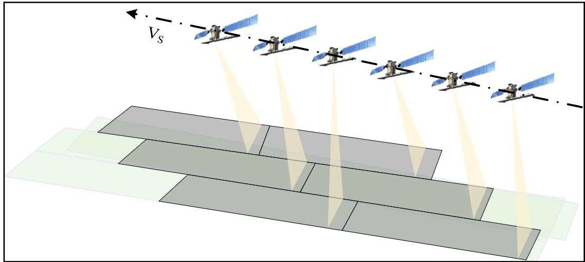

图 3-18 TOP SAR 成像模式

Figure 3-18 TOP SAR imaging mode

TOPS 模式 SAR 影像由具有较大多普勒中心变化的突发信号组成，使得其在保证影像空间分辨率（5×20米）、提高了信噪比（Signal-Noise Ratio，SNR）、分布目标模糊比（Distributed Target Ambiguity Ratio，DTAR）和覆盖范围（250公里）[281,282]的同时，还最大限度避免了扇形（Scalloping）变形，进而保证整幅影像数据质量的均匀性。此外，Sentinel-1轨道维护策略可确保准确的地面轨道重复性，从而将InSAR基线缩短到150m左右[283]。Sentinel-1其他参数如表3-1所示。

表 3-11 Sentinel-1 相关参数  
Table 3-11 Detailed parameters of the Sentinel-1 data
<table><tr><td>参数名称</td><td>参数值</td><td>参数名称</td><td>参数值</td></tr><tr><td>高度</td><td>693km</td><td>高程光束宽度</td><td>3.43°</td></tr><tr><td>倾角</td><td>98.18°</td><td>仰角转向范围</td><td>-13.0° to +12.3°</td></tr><tr><td>重访周期</td><td>12 d</td><td>射频峰值功率</td><td>- 4.368 kW, - 4.075 kW (IW，双极化)</td></tr><tr><td>极化方式</td><td>HH+HV, VV+VH, VV, HH</td><td>占空比</td><td>Max 12%, SM 8.5%, IW 9%, EW 5%, WV 0.8%</td></tr><tr><td>入射角范围</td><td>20°-46°</td><td>噪声系数</td><td>3 dB</td></tr><tr><td>中心频率</td><td>5.405 GHz</td><td>带宽最大范围</td><td>100 MHz</td></tr><tr><td>中心波长</td><td>~5.5465763cm</td><td>方位角波束宽度</td><td>0.23°</td></tr></table>

## (2) SBAS InSAR 方法与原理

基于分布式散射体特性的小基线集干涉测量（Small Baseline Subset InSAR，SBASInSAR）方法[284]主要利用短时间和空间基线的干涉图，达到干涉最大化效果，可监测短时间内保持较高相干性的分布式目标。SBASInSAR基本原理是基于慢失相关滤波相位（Slowly-Decorrelating Filtered Phase，SDFP)，获得的同一个区域的SAR数据按照空间基线组成多个集合，利用最小二乘方法分别得到每个集合的沉降时间序列，利用奇异值分解法（Singular Value Decomposition，SVD）将多个集合联合求解从而得到整个观测时间周期的形变时间序列、平均形变速率、位移时间序列等结果。SBASInSAR可有效抑制由于时间、空间造成的失相干和大气效应，相对于Persistent Scatterer InSAR（PS InSAR）技术，SBAS InSAR技术可对 SAR 数据进行组合，得到的差分干涉结果具有空间基线短、相干性强等特点，在低植被覆盖区域可得到高精度的沉降时序数据，因此SBAS InSAR被广泛用于非城市地区的形变监测[243]。其具体流程如图3-19所示。

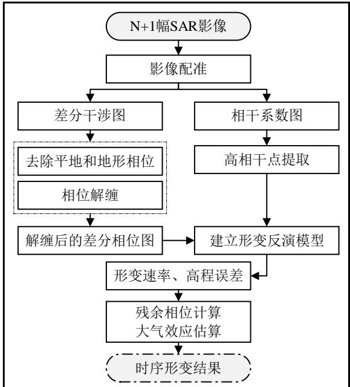  
图3-19基于 SBAS InSAR技术的排土场时序变形监测处理流程  
Figure 3-19 Time series deformation monitoring process of waste dump based on SBAS InSAR Technology

其方法可简单概况为：①获取某区域内N+1幅SAR影像数据；②选取其中一幅影像数据为主影像，同时将其余影像配准到该主影像上；③设置时间基线和空间基线阈值，对SAR影像进行干涉对组合；④对差分干涉结果进行了相位解缠[284]。在相位解缠中，从影像 $T _ { a }$ 和主影像 $T _ { b }$ 所生成的第j景差分干涉结果$( T _ { a } < T _ { b } )$ ，其干涉相位可以表示为：

$$
\delta \rho _ { j } = \varphi _ { T _ { b } } - \varphi _ { T a } \approx \frac { 4 \pi } { \lambda } \big [ \mathrm { d } _ { T _ { b } } - \mathrm { d } _ { T _ { a } } \big ] + \varDelta \varphi _ { j } ^ { t o p o } + \varDelta \varphi _ { j } ^ { a t m } + \varDelta \varphi _ { j } ^ { n o i s e }\tag{3-4}
$$

式中， $j \in [ 1 , . . . , M ]$ $d T _ { a }$ 和 $d T _ { b }$ 分别表示研究区地表在视线方向上，在 $T _ { a }$ 与$T _ { b }$ 时刻的累积形变量（相对于初始时刻 $d T _ { a } = 0 )$ i $\varDelta { { \varphi } _ { j } } ^ { t o p o }$ $\varDelta \varphi _ { j } ^ { a t m }$ 分别表示差分干涉结果中残余地形相位和大气延迟相位，因此公式3-4可简化为：

$$
\delta \rho _ { j } = \varphi _ { T _ { b } } - \varphi _ { T a } \approx \frac { 4 \pi } { \lambda } \big [ { \bf d } _ { T _ { b } } - { \bf d } _ { T _ { a } } \big ]\tag{3-5}
$$

根据现场调查与实测可知 $T _ { a }$ 与 $T _ { b }$ 时间间隔内研究区表面形变近似为线性变化，因此第 $j$ 景干涉结果形变相位值可表示为：

$$
\delta \varphi _ { j } = \sum _ { \mathrm { k } = \mathrm { T } _ { a , j } + 1 } ^ { \mathrm { T } _ { b , j } } ( T _ { k } - T _ { k - 1 } ) v _ { k }\tag{3-6}
$$

进一步地将计算所得解缠差分于涉相位组合为矩阵形式，可表示为：

$$
\delta \varphi = B v\tag{3-7}
$$

式中，Bv为M×N矩阵，采用奇异值分解方法可以求得矩阵B的广义逆矩阵，进而计算地表形变速率及时序位移结果。

## 3.4.2 地表形变时序监测

在本文中，利用 TOPS Sentinel-1B时序 SAR影像数据对研究区时序形变进行监测，同时利用3.3节中利用无人机摄影测量技术获取的研究区高分辨率DEM（8cm/pix）[285,286]，用来辅助干涉处理，去除地形起伏造成的误差。根据固结沉降引起的变形与堆积厚度之间的关系，区分研究区重力侵蚀（浅层滑坡、拉伸型地裂缝、边坡蠕动等）和非重力侵蚀（如水力侵蚀、冻融侵蚀等）导致的地表形变。通过对重力侵蚀变形和不同因素引起的土壤侵蚀变形的分析，确定了边坡失稳的潜在隐患点和土壤侵蚀的关键区域。

## （1）Sentinel-1B影像的获取及预处理

选用 Sentine-1B IW 模式下的单视复数数据（Single Look Complex，SLC），极化方式为VV和VH，其空间分辨率为5m×20m。数据时间跨度为2016年9月28日至2019年9月24日，其中除缺失2017年5月20日一期数据外，其余数据时间间隔均为12d，共计94景降轨影像（表3-12）。同时，所用影像所对应的精密轨道参数也一并获取。选取时间基线阈值为60天，时空基线图如图3-20所示，获得了443个具有高相干性的干涉图，这为我们提供了足够的冗余观测值，以确保最终时间序列结果的可靠性。

表 3-12 Sentine-1 SAR 影像数据参数  
Table 3-12 Sentine-1 data specification
<table><tr><td>卫星名称</td><td>模式</td><td>Pass</td><td>极化</td><td>角度</td><td>重访周期</td><td>Rg × Az</td><td>W.L</td></tr><tr><td>Sentinel-1B</td><td>IW</td><td>降轨</td><td>VV</td><td>-165°</td><td>12天</td><td>3.8 m × 13.8 m</td><td>5.6 cm</td></tr></table>

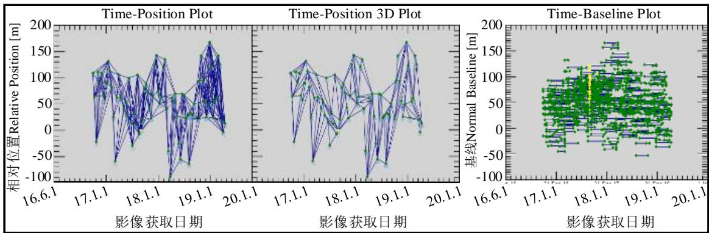  
图3-20干涉图时空基线图  
Figure 3-20 The spatial and temporal baselines of the Sentinel-1 data used in this study

## （2）地形辅助数据

露天煤矿在生产过程中，土方的剥离、运输、堆排所形成的高大排土场使得原有地貌发生巨大的变化，原本的矿坑已被土方充填并且堆存为高于地面100米的排土场。在本研究的于涉处理中，由于地形误差和低相于性引起的相位解缠误差，使得获得精确的 DEM变得非常重要[281]。对于本研究区，现有常规开源 DEM（如 Shuttle Radar Topography Mission，SRTM;Advanced Land ObservingSatellite Global Digital Surface Model，AW3D30 等）数据不仅分辨率较低，同时其采集时间均较早，已无法准确描述研究区地貌。

使用无人机摄影测量技术获取研究区DEM能够更好的体现实际情况。为获取研究区最新地貌数据，于2019年7月18日利用无人机摄影测量技术采集并获得8厘米分辨率 DEM，将其作为 SBAS InSAR地形辅助属于运用于影像配准与辅助解缠[285,286]。在配准步骤中同时使用高精度DEM数据和轨道信息数据以估算局部非参数位移估计，进而提高配准精度、降低地貌变化而引起的干涉相位[281]。同时，高分辨率无人机图像能够辅助验证 SBAS InSAR的变形监测结果及配合地面调查。

## (3) GCPs 获取

在 SBAS InSAR 处理流程中，其地面形变计算基于相移转换中的地面控制点（GCPs）。因此，GCPs的准确性与稳定性在很大程度上决定了InSAR监测结果的质量。确定GCPs有一些前提条件，如没有残留地形条纹、远离形变区等，因此一般在一些干涉条纹交宽（地形较平）、相干性较高等区域选择GCPs。为了避免手动创建GCPs时的人为误差，本文利用永久散射体干涉测量[287]（Permanent Scatter InSAR，PS InSAR）法，在其处理流程中会自动识别选择一些参考点（GCP点），这些参考点会选择形变小、相干性高的区域，基本也符合SBAS中GCP的选择要求。据此，使用该方法识别提取了36个GCPs，精度满足 SBAS InSAR 中对 GCPs 选择的要求。

## （4）处理流程及相关参数

图3-21 总结了 SBAS InSAR估算研究区定量变形的参数和处理步骤[288]，同时使用精密轨道星历数据做轨道误差校正，并在去除轨道误差后进行干涉处理。在干涉测量过程中，依次进行了配准，干涉图生成，多视图，滤波和相位展开。多视因素（4×1，像素大小14.08m×13.87m）用于增加干涉图的信噪比，以实现更可靠的相干估计，并且应用Goldstein滤波[289]去除干涉图噪声并平滑干涉图。相位展开（Phase Unwrapping, PhU）基于最小成本流（Minimum Cost Flow, MCF）网络[290]和 Delaunay 3D（D3D）方法[291]，利用时序信息减少大气和轨道所产生的影响建立规则网格覆盖数据范围[292]。大气低通和高通空间滤波器用于滤波和去除大气相位分量。然后，将通过PS InSAR创建的36个参考点应用于SBAS，作为GCP进行细化和再整理。此外，在处理工作流中，通过手动编辑来删除部分轨道不正确或受大气噪声严重影响的干涉图对。

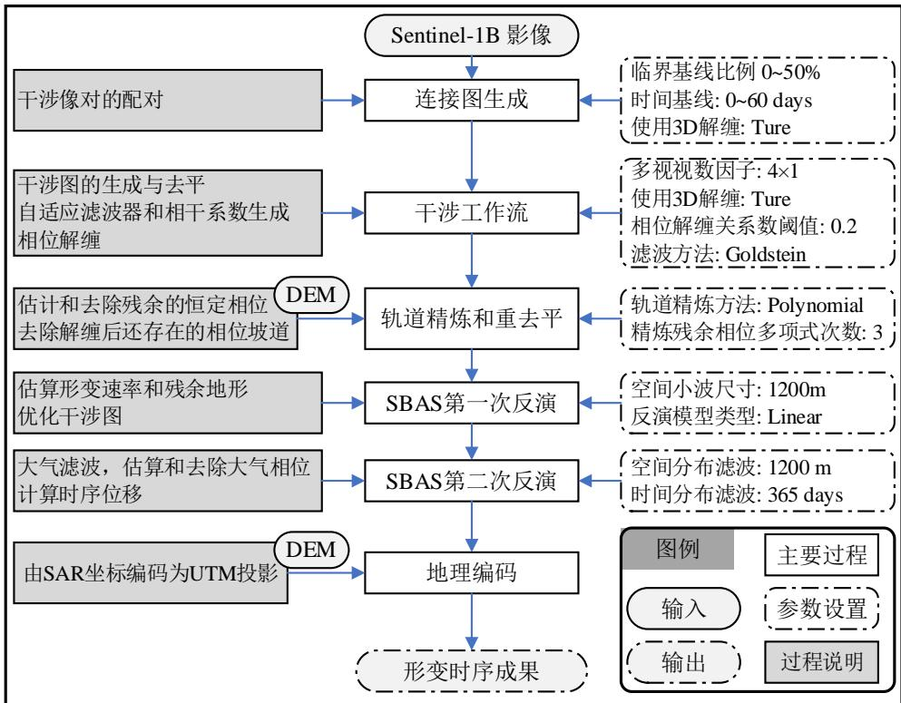  
图 3-21 基于 SBAS InSAR 的排土场形变处理流程  
Figure 3-21 Workflow of the Small Baseline Subsets processing for the slope deformation analysis

为了估计研究区的变形速度场，使用线性模型[284]来检索变形率和残余形貌，同时使用大气滤波（设置滤波窗口为1200m、365天）来评估和消除大气影响。最后，将获得的变形时间序列图从 SAR 地理编码到通用横向墨卡托 UTM参考系统。图3-22为研究区部分差分干涉相位图。

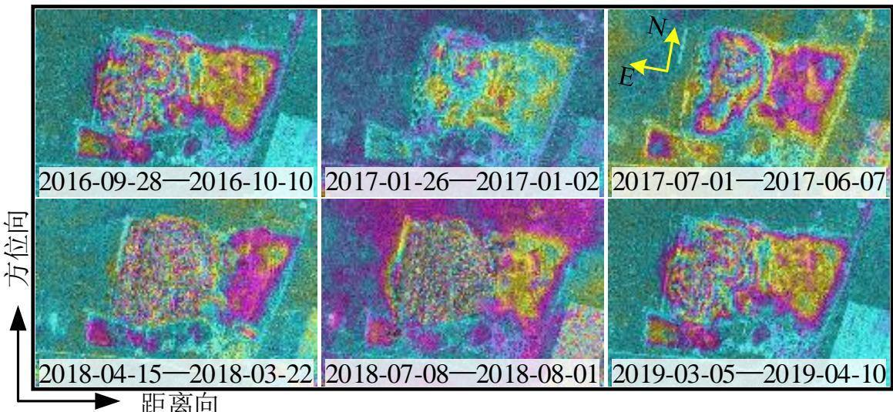  
图3-22部分差分干涉相位图  
Figure 3-22 Partial differential interferogram

## (5) 监测变形结果

基于 Sentinel-1B 数据集和高分辨率 DEM，InSAR SBAS 方法用于获得的时间序列变形结果，其干涉图的重复测量确保了时间序列结果的可靠性。整个沉降物的沉降和变形都在雷达视线方向（Line of Sight，LOS）中。图 3-23 显示了从2016年9月到2019年9月的LOS时间序列结果。其中绝大多数区域地面已移离卫星，说明处于沉降变形中，其中时间序列日期为相对于图像的参考日期（2016.9.24）的天数。

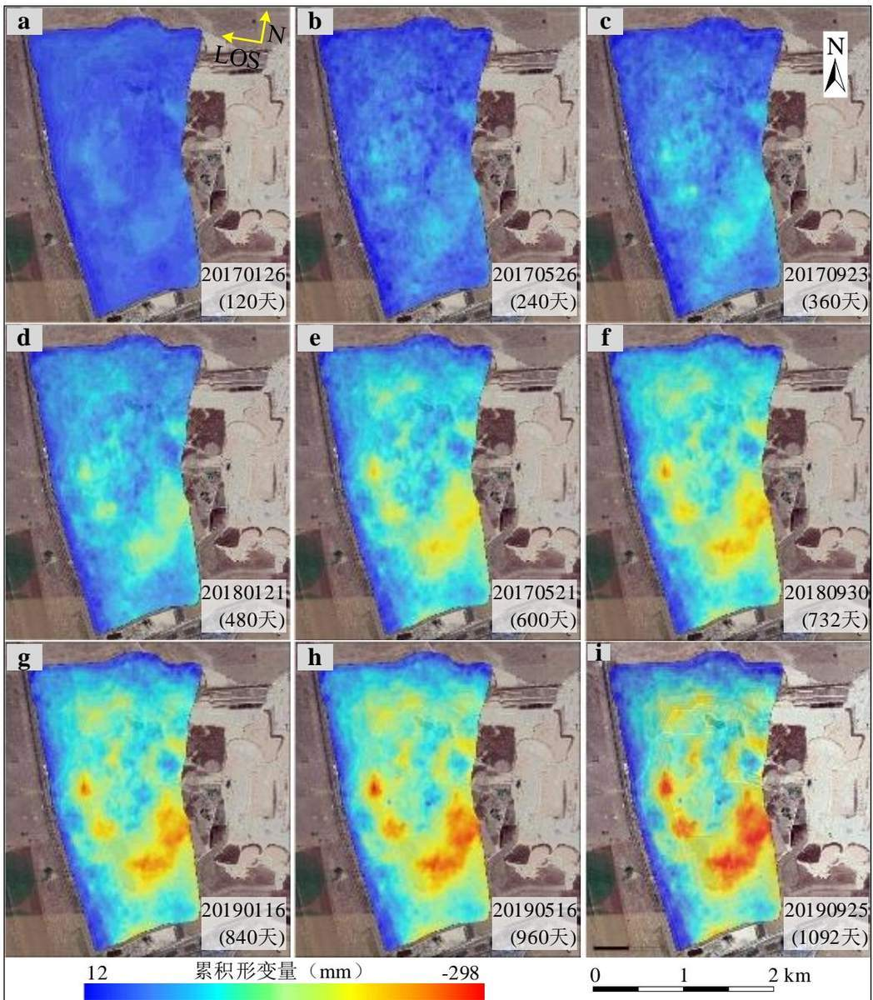  
图3-23研究区整体垂向形变时序示意图  
Figure 3-23 Schematic diagram of the overall vertical deformation sequence of the study area

## 3.4.3 岩土理化参数测试

排土场的岩土理化性质直接影像到边坡地质稳定性、表土抗侵蚀能力和土水土保持能力。选择岩土力学指标、表层土壤含水率（原位测量+烘于法测量）、土壤容重（烘干法）、土壤颗粒级配（BT-9300Z粒径仪）和表土渗透率（原位测量）等进行测定，具体为：

（1）土壤参数测定：考虑到排土场人工堆存的异质性，结合矿区自然地层钻孔数据，现场岩土采样时需保证每种类型的岩土样品均采集到。其中土壤样品采集时需先剥离表层受扰动土层后，使用环刀收集直径5.02cm×5cm样本，岩石样本则需开挖剖面后采样，以保证样品受未受风化。此外，同时使用TRIME-PICO 64/32 TDR便携式土壤水分测量仪对土壤水分进行现场测量，使用土壤渗透率测量仪对表土渗透率进行现场测量（图3-24）。

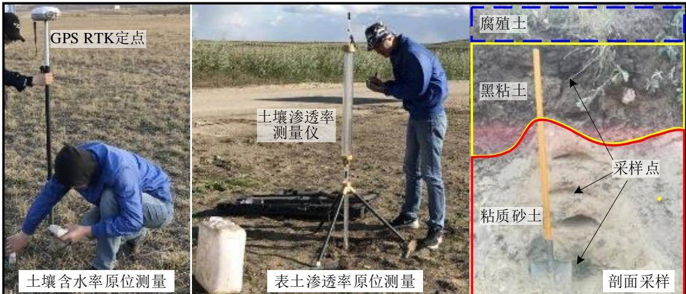  
图3-24研究区岩土性质调查与采样  
Figure 3-24 Investigation and sampling of geotechnical properties in the study area

具体的岩土样品采集步骤为：首先使用铁铲在土壤拟采集处进行平整，将环刀刃口向下垂直压入土中，使环刀整体完全进入土壤，随后使用铁铲将环刀及周边土壤整体取出，在剥离环刀外侧土壤后立即加盖，用马克笔在盖子上记录样点编号，此步骤重复两次；在挖取的剖面（深2m）处从地表向下每20cm取一次岩土样1kg装入自封袋；利用便携式土壤水分测量仪检测样点的土壤含水率水分；所有采样点均使用GPSRTK进行定位和数码相机拍照。

（2）岩土性质测定：在室内化验时，使用烘干法测量岩土样本的容重；使用土样压制机进行土样加工，使用MTS力学实验机测定岩土样的单轴以及三轴抗压强度、弹性模量、泊松比、内摩擦角等物理力学参数；使用应力控制式直剪仪测定岩土样的峰值剪切应力、粘聚力和内摩擦角；使用BT-9300Z粒径仪测定岩土样本的颗粒级配，部分实验室仪器如图3-25所示。

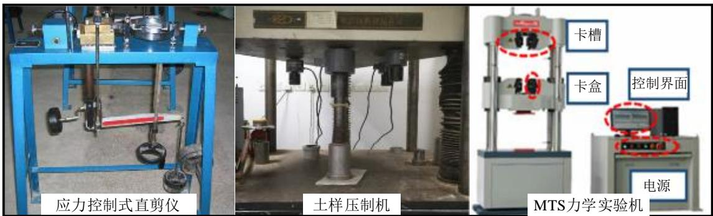  
图 3-25 岩土性质测试  
Figure 3-25 Geotechnical properties test

采集样本的各项性质见表表3-13、表3-14和表3-15。需要注意的是，第四系松散岩中的粘土和碎屑岩中的泥岩、粉砂岩中含有高岭石、伊利石和蒙脱石等膨胀土指示性矿物（表3-14）。

表3-13研究区土壤物理和土力学性质测试结果  
Table 3-13 Test results of soil physical and geomechanical properties in the study area
<table><tr><td rowspan="2">土类</td><td rowspan="2">测试 指标</td><td colspan="9">物理性质</td><td colspan="4">力学性质</td></tr><tr><td>含水率 %</td><td>干密度 g/cm³</td><td>湿密度 g/cm³</td><td>比重</td><td>孔隙比</td><td>饱和度 %</td><td>液限 %</td><td>塑限 %</td><td>塑性 指数</td><td>压缩系数  $\mathrm { M P a ^ { - 1 } }$ </td><td>压缩模量 MPa</td><td>粘聚力 KPa</td><td>内摩擦 角()</td></tr><tr><td rowspan="3">黑色粘土</td><td>Min</td><td>5.5</td><td>1.62</td><td>1.43</td><td>2.69</td><td>0.53</td><td>27.48</td><td>33.0</td><td>18.0</td><td>13.00</td><td>0.14</td><td>3.37</td><td>36</td><td>8.8</td></tr><tr><td>Max</td><td>30.4</td><td>2.04</td><td>1.77</td><td>2.78</td><td>0.94</td><td>90.04</td><td>59.0</td><td>34.0</td><td>25.00</td><td>0.50</td><td>12.1</td><td>86</td><td>16.0</td></tr><tr><td>Avg</td><td>14.2</td><td>1.88</td><td>1.64</td><td>2.71</td><td>0.67</td><td>58.46</td><td>37.3</td><td>21.4</td><td>15.86</td><td>0.28</td><td>8.63</td><td>66</td><td>12.1</td></tr><tr><td rowspan="3">黄色粘土</td><td>Min</td><td>19.4</td><td>1.78</td><td>1.41</td><td>2.66</td><td>0.68</td><td>62.36</td><td>54.0</td><td>22.0</td><td>20.00</td><td>0.10</td><td>6.18</td><td>36</td><td>9.1</td></tr><tr><td>Max</td><td>33.2</td><td>2.03</td><td>1.61</td><td>2.79</td><td>0.96</td><td>108.72</td><td>69.0</td><td>42.0</td><td>38.00</td><td>0.30</td><td>16.1</td><td>124</td><td>16.2</td></tr><tr><td>Avg</td><td>25.7</td><td>1.91</td><td>1.52</td><td>2.76</td><td>0.82</td><td>86.63</td><td>60.9</td><td>33.1</td><td>27.71</td><td>0.22</td><td>9.35</td><td>90</td><td>12.8</td></tr><tr><td rowspan="3">粉质粘土</td><td>Min</td><td>5.6</td><td>1.82</td><td>1.41</td><td>2.66</td><td>0.82</td><td>83.70</td><td>33.0</td><td>20.0</td><td>12.00</td><td>0.22</td><td>4.49</td><td>77</td><td>9.8</td></tr><tr><td>Max</td><td>32.8</td><td>1.91</td><td>1.52</td><td>2.79</td><td>0.96</td><td>97.37</td><td>68.0</td><td>36.0</td><td>35.00</td><td>0.44</td><td>9.35</td><td>90</td><td>13.3</td></tr><tr><td>Avg</td><td>20.8</td><td>1.88</td><td>1.46</td><td>2.73</td><td>0.91</td><td>89.23</td><td>51.2</td><td>28.8</td><td>22.34</td><td>0.31</td><td>6.89</td><td>85</td><td>12.0</td></tr></table>

表3-14膨胀土性质测试  
Table 3-14 Test percentage of expansion soil
<table><tr><td>岩类</td><td>土类</td><td>高岭石%</td><td>伊利石%</td><td>蒙脱石%</td><td>抗压强度 (-5℃)Mpa</td></tr><tr><td>第四系松散岩组</td><td>粘土类</td><td>9.17±3.04</td><td>8.45±4.11</td><td>9.08±4.42</td><td>2.8±0.8</td></tr><tr><td>碎屑岩组</td><td>泥岩</td><td>17.34±2.11</td><td>7.61±1.95</td><td>1</td><td></td></tr></table>

表3-15研究区岩土的力学测试结果  
Table 3-15 Test results of rock mechanics samples in the study area
<table><tr><td colspan="2"></td><td colspan="5">容重g/cm3</td><td colspan="2">自然 抗剪强度</td><td colspan="3">抗压强度</td><td colspan="3">弹性模量</td><td></td><td>膨</td></tr><tr><td colspan="2">岩石名称</td><td>天然含水率 %</td><td>自然</td><td>干燥</td><td>比重 g/cm³</td><td>空隙 率 %</td><td>吸水 率 %</td><td>内摩 擦角</td><td>内聚 力</td><td>自然</td><td>干燥</td><td>饱和</td><td>软化 系数</td><td>弹性 模量</td><td>泊桑比</td><td>胀 率</td></tr><tr><td></td><td>Min</td><td>13.9</td><td>1.71</td><td>1.41</td><td>2.29</td><td>29.1</td><td>17.9</td><td>φ₀ 19.3</td><td>Mpa 0.15</td><td>0.10</td><td>0.84</td><td>0.67</td><td>0.09</td><td>MPa 274</td><td>0.36</td><td>% 1.14</td></tr><tr><td>泥 岩</td><td>Max</td><td>27.7</td><td>2.17</td><td>1.79</td><td>2.62</td><td>45.4</td><td>26.7</td><td>36.9</td><td>1.58</td><td>12.70</td><td>20.34</td><td>4.66</td><td>0.93</td><td>4210</td><td>0.47</td><td>3.11</td></tr><tr><td></td><td>Avg</td><td>20.9</td><td>1.91</td><td>1.58</td><td>2.53</td><td>37.6</td><td>21.6</td><td>22.9</td><td>0.63</td><td>3.56</td><td>9.39</td><td>2.36</td><td>0.41</td><td>1567</td><td>0.42</td><td>1.88</td></tr><tr><td>粉</td><td>Min</td><td>13.7</td><td>1.76</td><td>1.55</td><td>2.49</td><td>32.8</td><td>11.9</td><td>15.0</td><td>0.19</td><td>1.75</td><td>3.47</td><td>1.12</td><td>0.17</td><td>613</td><td>0.42</td><td>1.04</td></tr><tr><td>砂</td><td>Max</td><td>23.7</td><td>2.02</td><td>1.70</td><td>2.58</td><td>39.3</td><td>22.6</td><td>26.8</td><td>0.64</td><td>4.55</td><td>11.62</td><td>1.12</td><td>0.69</td><td>1460</td><td>0.46</td><td>1.18</td></tr><tr><td>岩</td><td>Avg</td><td>17.6</td><td>1.90</td><td>1.61</td><td>2.54</td><td>36.7</td><td>17.5</td><td>22.9</td><td>0.46</td><td>2.59</td><td>7.51</td><td>1.12</td><td>0.39</td><td>884</td><td>0.45</td><td>1.11</td></tr><tr><td>细</td><td>Min</td><td>12.9</td><td>1.67</td><td>1.36</td><td>2.15</td><td>29.6</td><td>14.3</td><td>5.0</td><td>0.24</td><td>0.54</td><td>3.73</td><td>1</td><td>0.13</td><td>387</td><td>0.40</td><td>0.47</td></tr><tr><td>砂</td><td>Max</td><td>25.7</td><td>2.13</td><td>1.77</td><td>2.65</td><td>42.7</td><td>19.0</td><td>27.6</td><td>0.74</td><td>4.47</td><td>12.36</td><td>1</td><td>0.70</td><td>1660</td><td>0.47</td><td>1.67</td></tr><tr><td>岩</td><td>Avg</td><td>18.7</td><td>1.91</td><td>1.61</td><td>2.52</td><td>35.9</td><td>16.1</td><td>22.8</td><td>0.38</td><td>1.93</td><td>7.05</td><td>1</td><td>0.28</td><td>960</td><td>0.44</td><td>0.94</td></tr><tr><td></td><td>Min</td><td>17.2</td><td>1.81</td><td>1.54</td><td>2.54</td><td>38.5</td><td>1</td><td>26.1</td><td>0.04</td><td>0.60</td><td>4.34</td><td>0.97</td><td>0.11</td><td>346</td><td>0.43</td><td>2.79</td></tr><tr><td>中粗 砂岩</td><td>Max</td><td>22.7</td><td>1.97</td><td>1.63</td><td>2.65</td><td>40.4</td><td>1</td><td>32.9</td><td>0.36</td><td>3.00</td><td>22.07</td><td>0.97</td><td>0.32</td><td>1170</td><td>0.47</td><td>2.79</td></tr><tr><td></td><td></td><td></td><td></td><td></td><td></td><td>39.2</td><td>1</td><td>29.0</td><td>0.20</td><td></td><td></td><td></td><td></td><td></td><td></td><td></td></tr><tr><td></td><td>Avg</td><td>20.2</td><td>1.90</td><td>1.58</td><td>2.60</td><td></td><td></td><td></td><td></td><td>1.78</td><td>9.79</td><td>0.97</td><td>0.21</td><td>758</td><td>0.45</td><td>2.79</td></tr></table>

表 3-16粘土颗粒级配测试  
Table 3-16 Clay particle gradation test
<table><tr><td colspan="5">颗粒级配（%）</td></tr><tr><td>粒径（mm）</td><td>&lt;0.002 mm</td><td>0.002~0.05</td><td>0.05~2</td><td>&gt;2</td></tr><tr><td>比例（%）</td><td> $4 . 5 \pm 0 . 2 1$ </td><td> $7 7 . 0 \pm 0 . 3 1$ </td><td> $1 1 . 5 \pm 0 . 1 8$ </td><td>6.7 ± 0.21</td></tr></table>

## 3.5 排土场植被生长状态数据获取（Data Acquisition of Dump Vegetation Status)

植被生长状态是反应区域生态功能最直接的因素，高光谱影像具有光谱分辨率高、数据维度广的特征，在植物调查上具有显著优势。本节利用无人机高光谱采集研究区的遥感影像，结合无人机遥感和野外植物样方调查建，利用手持高光谱相机建立矿区典型植物光谱库，为第6章实现植物精细分类、判断研究区植物分布规律和物种配置的优化提供技术支撑。

## 3.5.1 物种组成数据获取方法

本次研究区植物样方调查于2019年8月3日\~8月6日进行。调查共计75个样方，样方大小1m×1m，样方内再次分割为10×10个小样方以方便详查。在每个样方调查时，需记录物种数量、植株高度（钢尺3\~4次测量取平均）、密度和盖度等。同时，采用GPSRTK的“地面控制点模式”对样方四个角及中心位置进行单点180次测量取平均值，保证精度优于2mm，最后对样方进行拍照存档(图3-26)。

通过野外调查并结合《内蒙古植物志》，共得到研究区及周边区域典型植物物种44种，具体种属如表3-17所示，样方调查时所拍植物实景照片如图3-27所示。

<table><tr><td rowspan=1 colspan=9>［原图缺失］                                                      ［原图缺失］</td></tr><tr><td rowspan=1 colspan=3>样方号:A7-2</td><td rowspan=1 colspan=6>调查日期：2019.8.4</td></tr><tr><td rowspan=1 colspan=3>样方总盖度：26</td><td rowspan=1 colspan=6>中心坐标：119°44′34.683″E，49°24&#x27;31.736&quot;N，海拔633m</td></tr><tr><td rowspan=1 colspan=1>植物种名</td><td rowspan=1 colspan=5>株高（cm）</td><td rowspan=1 colspan=1>平均株高</td><td rowspan=1 colspan=1>盖度</td><td rowspan=1 colspan=1>密度</td></tr><tr><td rowspan=1 colspan=1>冰草</td><td rowspan=1 colspan=1>14</td><td rowspan=1 colspan=2>14</td><td rowspan=1 colspan=1>13</td><td rowspan=1 colspan=1>15</td><td rowspan=1 colspan=1>14</td><td rowspan=1 colspan=1>1</td><td rowspan=1 colspan=1>4</td></tr><tr><td rowspan=1 colspan=1>羊草</td><td rowspan=1 colspan=1>14</td><td rowspan=1 colspan=2>12</td><td rowspan=1 colspan=1>13</td><td rowspan=1 colspan=1>14</td><td rowspan=1 colspan=1>13.25</td><td rowspan=1 colspan=1>0.5</td><td rowspan=1 colspan=1>8</td></tr><tr><td rowspan=1 colspan=1>蒲公英</td><td rowspan=1 colspan=1>1</td><td rowspan=1 colspan=2>2</td><td rowspan=1 colspan=1>2</td><td rowspan=1 colspan=1>1</td><td rowspan=1 colspan=1>1.67</td><td rowspan=1 colspan=1>0.1</td><td rowspan=1 colspan=1>1</td></tr><tr><td rowspan=1 colspan=1>寸草苔</td><td rowspan=1 colspan=1>3</td><td rowspan=1 colspan=2>4</td><td rowspan=1 colspan=1>7</td><td rowspan=1 colspan=1>1</td><td rowspan=1 colspan=1>4.67</td><td rowspan=1 colspan=1>3</td><td rowspan=1 colspan=1>90</td></tr><tr><td rowspan=1 colspan=1>星毛委陵菜</td><td rowspan=1 colspan=1>1</td><td rowspan=1 colspan=2>1</td><td rowspan=1 colspan=1>2</td><td rowspan=1 colspan=1>2</td><td rowspan=1 colspan=1>1.5</td><td rowspan=1 colspan=1>12</td><td rowspan=1 colspan=1>46</td></tr><tr><td rowspan=1 colspan=1>…</td><td rowspan=1 colspan=1>…</td><td rowspan=1 colspan=2>…</td><td rowspan=1 colspan=1>…</td><td rowspan=1 colspan=1>…</td><td rowspan=1 colspan=1>…</td><td rowspan=1 colspan=1>…</td><td rowspan=1 colspan=1>…</td></tr></table>

图3-26研究区野外植物样方调查及调查记录样表  
Figure 3-26 Sample survey of field vegetations in the study area and survey record sample form

表3-17研究区及周边区域植物列表  
Table 3-17 List of plants in the study area and surrounding areas
<table><tr><td>植物种名</td><td>拉丁名</td><td>种属</td><td>植物种名</td><td>拉丁名</td><td>种属</td></tr><tr><td>糙隐子草</td><td>Cleistogenes squarrosa</td><td>禾本科隐子草 属多年生草本</td><td>铁杆蒿</td><td>Artemisia gmelinii</td><td>菊科蒿属多年 生半灌木</td></tr><tr><td>灰绿藜</td><td>Chenopodium glaucum</td><td>藜科藜属一年 生草本</td><td>蒲公英</td><td>Taraxacum mongolicum</td><td>菊科蒲公英属 多年生草本</td></tr><tr><td>苦苣菜</td><td>Sonchus oleraceus</td><td>菊科一二年生 草本植物</td><td>巴天酸模</td><td>Rumex patientia</td><td>蓼科酸模属多 年生草本</td></tr><tr><td>多头 麻花头</td><td>Klasea centauroides subsp. polycephala</td><td>菊科麻花头属 多年生草本</td><td>克氏针茅</td><td>Stipa capillata</td><td>禾本科针茅属 多年生草本</td></tr><tr><td>斜茎黄芹</td><td>Astragalus adsurgens</td><td>豆科黃耆属多 年生草本</td><td>毛莲菜</td><td>Picris hieracioides</td><td>菊科毛连菜属 草本</td></tr><tr><td>寸草苔</td><td>Carex duriuscula</td><td>莎草科苔草属 多年生草本</td><td>榆叶梅</td><td>Amygdalus triloba</td><td>蔷薇科桃属多 年生灌木</td></tr><tr><td>香青兰</td><td>Dracocephalum moldavica</td><td>唇形科青兰属 一年生草本</td><td>大籽蒿</td><td>Artemisia sieversiana</td><td>菊科蒿属一二 年生草本</td></tr><tr><td>星毛 委陵菜</td><td>Potentilla acaulis</td><td>蔷薇科委陵菜 属多年生草本</td><td>车前</td><td>Plantago asiatica</td><td>车前科车前属 多年生草本</td></tr><tr><td>菊叶委陵菜</td><td>Potentilla tanacetifolia</td><td>薇科委陵菜属 多年生草本</td><td>反枝苋</td><td>Amaranthus retroflexus</td><td>苋科苋属一年 生草本</td></tr><tr><td>野韭</td><td>Allium ramosum</td><td>葱科多年生草 本</td><td>阿尔泰 狗娃花</td><td>Heteropappus</td><td>菊科狗娃花属 多年生草本</td></tr><tr><td>刺儿菜</td><td>Cirsium arvense var. integrifolium</td><td>菊科蓟属多年 生草本</td><td>大果</td><td>altaicuc Cynoglossum</td><td>紫草科琉璃草</td></tr><tr><td>猪毛蒿</td><td>Artemisia scoparia</td><td>菊科蒿属多年 生草本</td><td>琉璃草 委陵菜</td><td>divaricatum Potentilla chinensis</td><td>属多年生草本 蔷薇科委陵菜</td></tr><tr><td>瑞香狼毒</td><td>Stellera chamaejasme</td><td>瑞香科瑞香属 多年生草本</td><td>赖草</td><td>Leymus secalinus</td><td>属多年生草本 禾本科赖草属 多年生草本</td></tr><tr><td>紫花苜蓿</td><td>Medicago sativa</td><td>豆科苜蓿属多 年生草本</td><td>地肤</td><td>Kochia scoparia</td><td>藜科地肤属一 年生草本</td></tr><tr><td>野豌豆</td><td>Vicia sepium</td><td>豆科野豌豆属 多年生草本</td><td>牻牛儿苗</td><td>Erodium stephanianum</td><td>牻牛儿苗科牻 牛儿苗属多年</td></tr><tr><td>扁蓿豆</td><td>Melissilus ruthenicus</td><td>豆科扁蓿豆属 多年生草本</td><td>羊草</td><td>Aneurolepidum chinense</td><td>生草本 禾本科赖草属 生多年生草本</td></tr><tr><td>狗尾草</td><td>Setaria viridis</td><td>禾本科狗尾草 属一年生草本</td><td>老芒麦</td><td>Elymus sibiricus</td><td>禾本科披碱草 属多年生丛生</td></tr><tr><td>短芒</td><td>Hordeum</td><td>禾本科大麦属</td><td>白婆婆纳</td><td></td><td>草本 玄参科婆婆纳</td></tr><tr><td>大麦草 小叶</td><td>brevisubulatum Caragana</td><td>多年生草本 豆科锦鸡儿属</td><td></td><td>Veronica incana</td><td>属一年生草本 豆科草木犀属</td></tr><tr><td>锦鸡儿</td><td>microphylla</td><td>多年生灌木</td><td>草木犀</td><td>Melilotus officinalis</td><td>二年生草本</td></tr><tr><td>中间 锦鸡儿</td><td>Caragana intermedia</td><td>豆科锦鸡儿属 多年生灌木</td><td>鸦葱</td><td>Scorzonera austriaca</td><td>菊科鸦葱属多</td></tr><tr><td>无芒雀麦</td><td>Bromus inermis</td><td>禾本科雀麦属</td><td>酸模叶蓼</td><td>Polygonum</td><td>年生草本 蓼科蓼属一年</td></tr><tr><td></td><td></td><td>多年生草本</td><td></td><td>lapathifolium</td><td>生草本</td></tr><tr><td>冷蒿</td><td>Artemisia frigida</td><td>菊科蒿属植物 多年生草本</td><td>冰草</td><td>Agropyron cristatum</td><td>禾本科冰草属 多年生草本</td></tr></table>

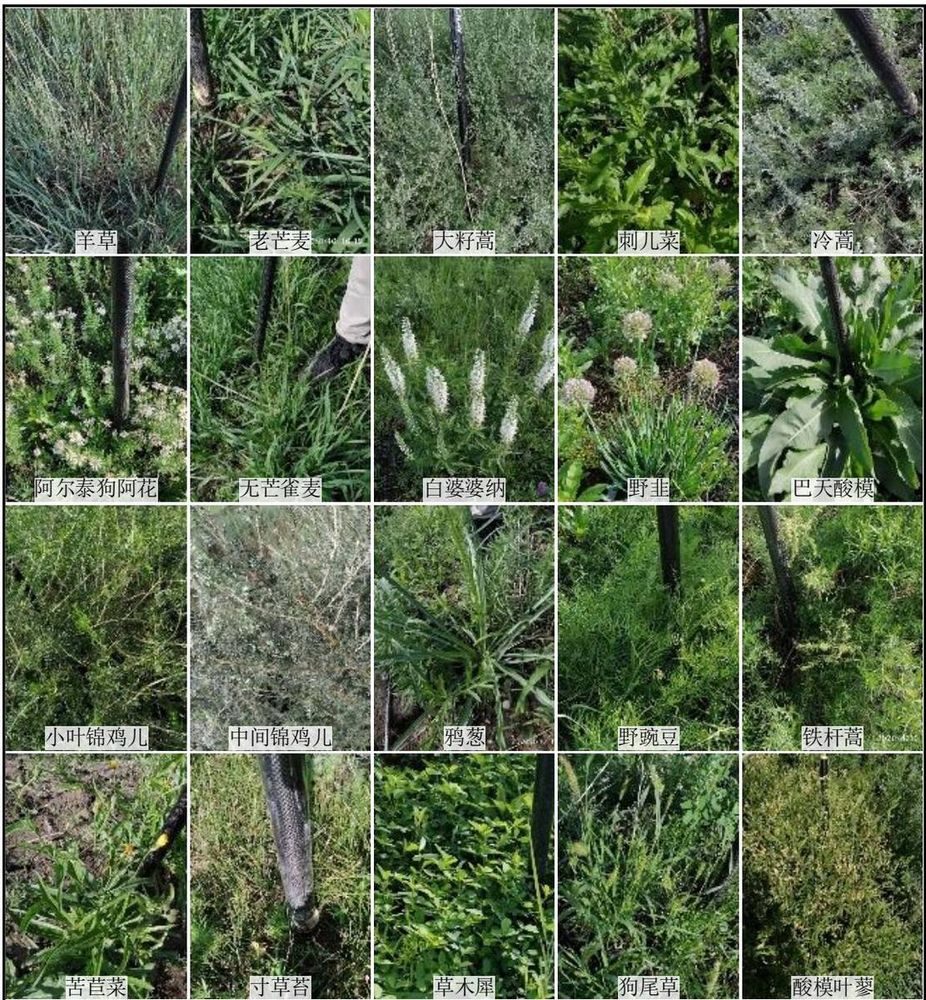  
图3-27研究区植物实景照片（部分）  
Figure 3-27 Real photos of plants in the study area (partial)

## 3.5.2 无人机高光谱影像获取

## （1）数据采集系统

本次采用无人机高光谱数据采集系统由“飞行平台”和“光谱成像系统”两大部分组成。其中飞行平台由大疆如风-4旋翼无人机和地面遥控器统组成，该平台拥有强劲的动力和出色的抗风性能，满足本次数据采集的作业需求，其相关参数见表 3-18。光谱成像系统主要由 SPECIM FX10 高光谱扫描仪（SPECIMTM，芬兰）、控制器（DPU）、GNSS/IMU组合导航和地面站四部分组成（图3-28a)，其中 SPECIMFX10高光谱成像仪是一款线阵推扫式成像光谱仪，其光谱响应函数曲线如图 3-28b所示，其他相关参数见表3-19。DPU用于控制采集区域、采集频率、曝光时间、存储数据等。GNSS/IMU组合导航系统是将

GPS接收机与惯性导航元件（IMU）相结合，既弥补了GPS容易受到外界环境影响的缺点，又解决了IMU误差累积的弊端，获取成像光谱仪扫描瞬间的高精度位置与姿态信息，并用于后续高光谱影像几何校正。地面站用于数据采集区域规划及光谱成像系统工作状态监测。

表3-18 大疆如风-4参数  
Table 3-18 Parameters of DJI WIND4
<table><tr><td>参数名称</td><td>参数值</td><td>参数名称</td><td>参数值</td></tr><tr><td>整机重量（不含电池）</td><td>7.3 kg</td><td>最大上升速度</td><td>5 m/s</td></tr><tr><td>最大起飞重量</td><td>24.5 kg</td><td>最大下降速度</td><td>3m/s</td></tr><tr><td>动力电池型号/重量</td><td>DZ-12000/3.8 kg</td><td>最大可承受风速</td><td>10 m/s</td></tr><tr><td>最大旋转角速度</td><td>150°/s</td><td>最大飞行速度</td><td>14 m/s</td></tr><tr><td>最大俯仰角度</td><td>25°</td><td>工作环境温度</td><td>-10℃~+45℃</td></tr></table>

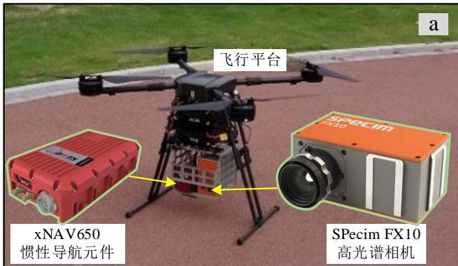

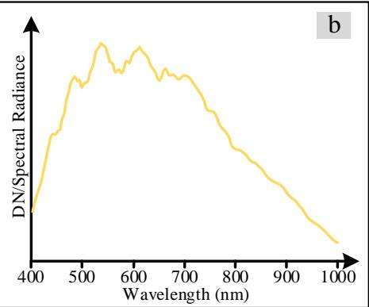  
图3-28无人机高光谱摄影测量集成装置及其光谱响应函数曲线  
Figure 3-28 UAV hyperspectral photogrammetry integrated device and spectral response curve

表 3-19 SPECIM FX10 相机参数  
Table 3-19 Parameters of SPECIM FX10
<table><tr><td>参数名称</td><td>参数值</td><td>参数名称</td><td>参数值</td></tr><tr><td>波长范围</td><td>397~1003 nm</td><td>峰值信噪比</td><td>600:1</td></tr><tr><td>最大光谱分辨率</td><td>2.62 nm</td><td>最大帧率</td><td>330</td></tr><tr><td>最大波段数</td><td>224</td><td>整机重量</td><td>1.26 kg</td></tr><tr><td>最大空间像素数</td><td>1024</td><td>工作环境温度</td><td>+5℃~+40℃</td></tr><tr><td>最大视场角（FOV）</td><td>38°</td><td>工作环境相对湿度</td><td>5%~95%</td></tr></table>

## （2）影像数据获取与预处理

数据获取时需要选择晴朗且无云或少云的天气，最终确定飞行日期为2019年8月18日，飞行时间为10点至14点。由于高光谱影像数据采集效率较低、耗时长，为减小影像受太阳高度、角度和强度的变化所带来的影响，本次数据采集规划在研究区北坡和西坡3块典型区域进行（图3-29）。同时在综合考虑影像地面分辨率、无人机续航时间、采集区域面积和区域限飞政策等多方面因素后，确定飞行高度为117m，飞行速度为10m/s，相对应的影像空间分辨率为0.16m，单条条带宽度为82m，光谱分辨率为5.5nm，波段数为112，数据区域及航线规划如图3-29b所示。此外，在影像数据采集同时需进行白板校正信息。

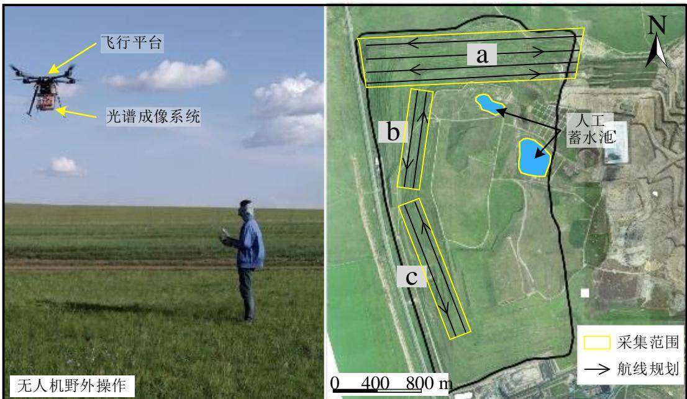  
图 3-29 高光谱影像采集  
Figure 3-29 Hyperspectral image acquisition

在进行数据分析前，需要将无人机高光谱影像进行辐射定标、几何校正、影像配准、白板校正和影像镶嵌等预处理。

## 1）辐射定标与几何校正

辐射定标目的是消除传感器系统误差，在可见光及近红外波段范围将传感器记录的原始DN值转换成辐射亮度值的过程，本次辐射定标使用高光谱传感器生产商 SPECIM公司配套的 CaliGeoPRO v2.3.6软件完成。在进行辐射定标的同时，利用组合导航系统记录的相机姿态和位置数据完成影像地理位置的校正。

## 2）影像配准

在进行辐射定标和几何校正后影像仍存在地理位置上的偏差，影像配准是利用更高空间分精度的影像去校正高光谱影像。这里使用无人机摄影测量获取厘米级DEM对高光谱影像进行控制配重，误差控制在0.5个像元内。

## 3）白板校正

在对无人机高光谱影像进行辐射定标、几何校正和影像配准后，还需进一步使用大气校正方法得到绝对反射率。通过在研究区铺设反射率已知的白板，在进行数据采集的同时获取白板的影像，进而对影像进行相对反射率校正（图3-30)，具体公式为：

$$
R = { \frac { F - D } { W - D } }\tag{3-8}
$$

式中：R为影像校正后相对反射率；F为目标地物福亮度；D为暗噪声均值；W为白板平均辐亮度。

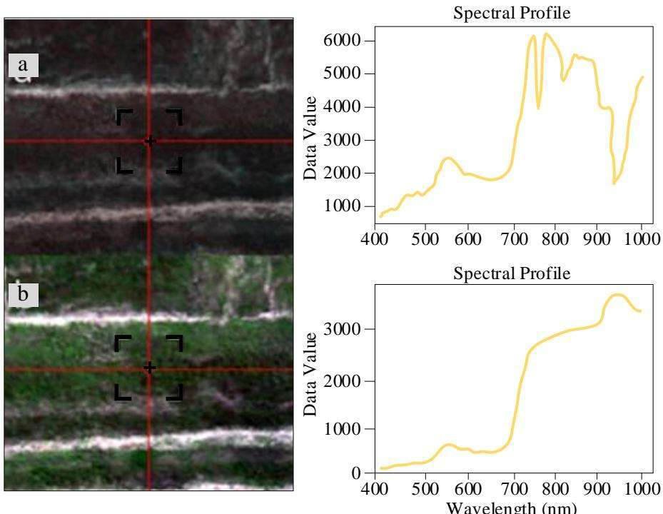

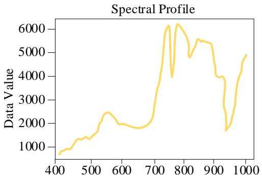

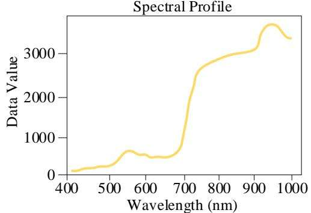  
图3-30白板校正前后影像及其光谱曲线  
Figure 3-30 The image and spectral curve before and after whiteboard calibration

## 4）影像镶嵌

由于线阵推扫式SPECIMFX10高光谱成像仪数据采集模式的特性和无人机续航能力的限制，使得每条飞行航带所采集的影像均为独立数据，因此需要对将多幅影像拼接在一起构成一幅完整影像。利用 ENVI中的 Seamless Mosaic 镶嵌工具，将采集影像重置叠放顺序、镶嵌匀色、添加接边线和边缘羽化，并生成一幅单一的合成影像。

## 3.5.3 典型植物光谱库建立

建立研究区典型植物光谱库不仅可以用于无人机高光谱影像的植物精细分类，还可以扩充现有光谱库基础数据。本次植物光谱信息采用芬兰SPECIMM公司的手持式高光谱相机（SpecimIQ）进行采集，相机相关参数见表3-20。

表3-20手持高光谱相机参数  
Table 3-20 Parameter of handheld hyperspectral camera
<table><tr><td>参数名称</td><td>参数值</td><td>参数名称</td><td>参数值</td></tr><tr><td>波长范围</td><td>400~1000nm</td><td>峰值信噪比</td><td>400：1</td></tr><tr><td>光谱分辨率</td><td>3nm</td><td>视场角（FOV）</td><td> $3 1 ^ { \circ } \times 3 1 ^ { \circ }$ </td></tr><tr><td>波段数</td><td>204</td><td>工作温度</td><td> $0 ^ { \circ } C \sim 4 0 ^ { \circ } C$ </td></tr><tr><td>像素数</td><td>512*512</td><td>工作环境相对湿度</td><td>&lt; 95%</td></tr></table>

为避免传感器响应漂移和太阳高度角变化等对数据的影响，在使用手持高光谱相机对植物进行光谱采集时需保证相机镜头垂直向下，且距植物目标150mm以上，通过调整焦距确保目标植被完全出现在镜头视野内。同时，每次数据采集时还需将白板放置于目标植物旁，在获取植物影像的同时也获取白板数据，以供后续校正目标光谱曲线（图3-31），以确保数据的准确性和可靠性。此外，为避免裸露土壤、岩石和其他植被的干扰，在光谱采集时注意尽量选择植被覆盖度较大，样方植被构成较纯的地段。手持高光谱相机对植物光谱的采集工作与无人机高光谱影像采集工作同时展开，以保证二者具有相同太阳辐射强度。

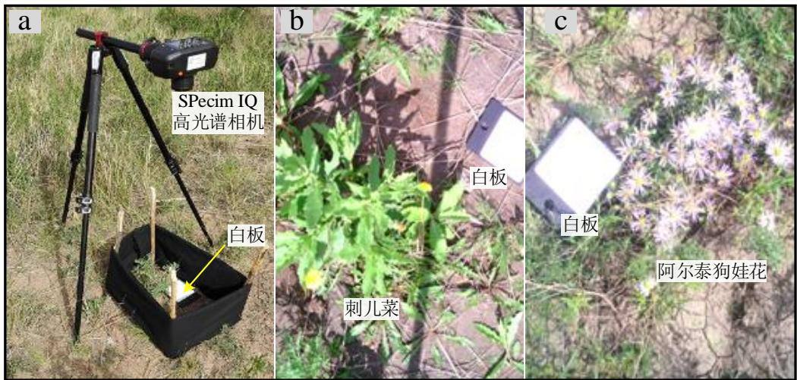  
图3-31 植物光谱原位采集  
Figure 3-31 In-situ collection of vegetation spectrum

本次共采集研究区内 44 种植物光谱信息，在 ENVI 中利用利用 SpectralLibrary Builder工具选择植物纯净像元，提取区内像元平均光谱曲线完成该植物光谱库的建立。如图3-32a所示，提取的植物光谱曲线均呈现出典型植被光谱曲线特征，即在550nm（绿光）附近有反射率为0.1\~0.2的反射峰，两侧（蓝光和红光附近）则有两个吸收谷，同时由于植被的“红边效应”反射率从680nm开始激增。不同植被的光谱曲线均呈现植被光谱特征，同时相互之间又略有差异(图3-32b)。

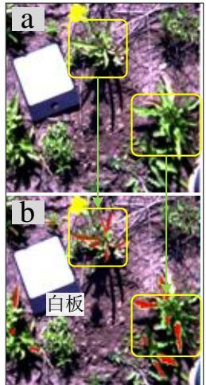

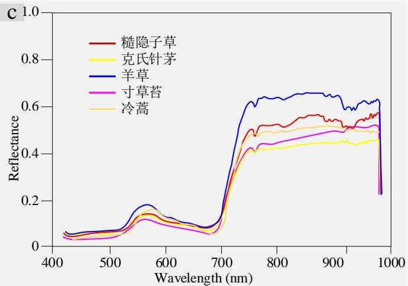  
图3-32利用ROI纯净植被像元提取（红色区域）及其光谱曲线  
Figure 3-32 Pure Vegetation Pixels (red region) obtained by ROI and spectral curves extracted

## 3.6 本章小结（Chapter Summary）

本章主要介绍了研究区基本信息，以及生态功能相关要素的获取途径。介绍了研究区的自然环境条件和生态功能本底特征，同时就生态功能要素获取途径介绍了天空地多源协同监测方法。研发了基于植被修正模型的精细DEM构建方法；利用时序InSAR获取了研究区地表变形特征；通过野外样方调查、典型植物光谱库建立和无人机高光谱影像获取了研究区植物的精细分类。研究结果表面：

（1）研究区年降雨量小，蒸发量大，降雨时空分布不均，属于大陆性亚寒带气候稀疏岛状多年冻土区，受寒旱交替、冻融循环影响较大，生态环境极为脆弱。矿业开采破坏下生态功能严重受扰，研究区所面临的生态功能问题有：地质稳定性差、水土资源保持能力低、重建植物群落难以自维持等。

（2）天空地多源协同监测技术是获取研究区生态功能要素的有效手段。时序InSAR技术具有全天候、全天时、高精度、低成本等优点，可实现长时序、微形变的研究区大面积变形监测，是传统变形监测方法的有力补充。监测结果发现研究区普遍出现不同程度变形，存在地质灾害隐患风险。

（3）研究区植物以草本为主，野外样方调查结果反映出较强的空间差异，植物物种类型的变化波动性较强。

本章在介绍了研究区基本概况的基础上，以研究区生态功能要素多源数据获取为手段，分别获取了高精度地形、地质稳定性和植被生长状况等三类生态功能指示性数据，为后续研究提供数据支撑。

## 4大型排土场地质灾害隐患识别及影响因素

## 4 Recognition of Hidden Dangers of Geological Hazards and Influencing Factors of Large-scale Dump

地质体稳定性是生态修复工作最基本的前提，排土场地质灾害不仅会造成人员财产损失，更是给生态修复成果带来毁灭性。研究区由于其独特的地貌与环境特性，其地质稳定性受自身重力、状态和自然环境等诸多种因素共同影响。在重力侵蚀及其他因素持续作用下，研究区已出现如边坡浅层滑坡发育、拉伸型地裂缝发育、地面塌陷等各类环境地质问题，严重威胁着排土场的生态功能，因此及时诊断识别排土场地质灾害隐患是保障其生态功能的重要前提。

## 4.1 排土场地质灾害隐患类型（Types and Hazards of Potential Geological Disasters in Dump)

地质灾害是影响排土场生态功能的最大威胁之一，根据对研究区调查，发现其主要地质灾害有浅层滑坡、地裂缝、地面沉降、地面塌陷等。

## (1) 滑坡

滑坡（Landslide）指斜坡上的岩土体由于种种原因，在重力的作用下沿一定的软弱面（或软弱带）整体向下滑动的现象[293]。

滑坡对排土场地质稳定性破坏性最强、危害性最大。同时由于排土场边坡滑坡滑移发生前具有一定隐秘性，一旦灾害发生极易造成严重后果，严重威胁着矿区生产安全和排土场地质安全。目前，我国因矿山开采导致的滑坡灾害多达1200起，研究区近年来尚未发生大规模滑坡灾害，但浅层滑坡普遍发育（如图4-1所示)。浅层滑坡不仅会破坏地表植被及表层腐殖土，造成水分和养分快速入渗，并导致严重水土流失，同时也是深层滑坡致灾因素之一。

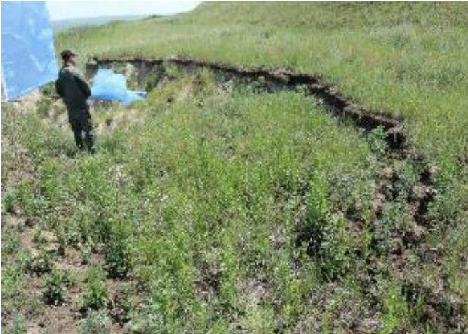

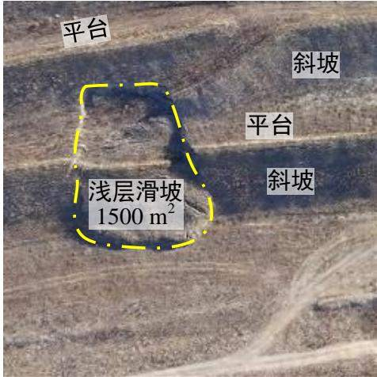

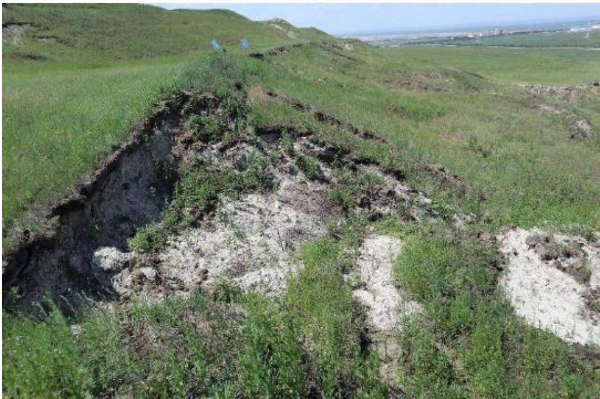  
图4-1研究区边坡多处浅层滑坡发育  
Figure 4-1 Development of shallow landslides on the slope of the study area

## (2) 地裂缝

地裂缝（SurfaceCrack）是在坡体内外应力共同作用下，浅层岩土被破坏而形成的宏观裂隙，主要发育位置为土层裂隙或断裂处。地裂缝是研究区地地质灾害中分布最广、数量最多的一种，其一般为重力作用导致拉伸型裂缝，及不均匀沉降导致塌陷型裂缝两种（图4-2）。拉伸型裂缝大多位于平台上，平行于等高线分布[74,294,295]，长度数米到数百米不等，开口宽度在15\~20 cm（图4-3a）。塌陷型裂缝分布无明显规律，与非均匀沉降关系密切（图4-3b）。地裂缝不仅破坏了排土场坡体整体性，同时所形成的地表径流与溶质运移的优先流现象破坏边坡稳定性，增加其发生滑坡、崩塌、泥石流等大型地质灾害风险，对矿山地质环境造成较大威胁。同时，地裂缝也会造成地表水肥流失，进一步加剧了限制植物生长和发育的环境因子，使本就贫瘠的生境更加难以修复，土地生态安全问题日益突出[46]。

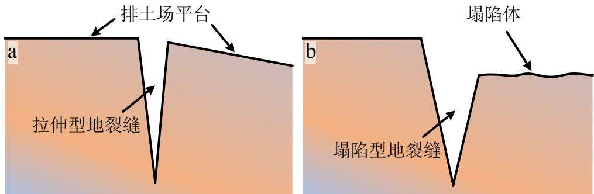  
图4-2研究区主要地裂缝类型  
Figure 4-2 Main types of surface cracks in study area

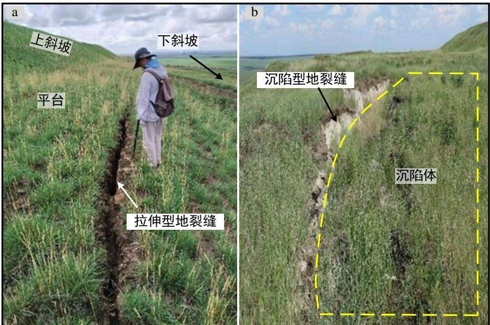  
图4-3 研究区边坡地裂缝发育  
Figure 4-3 Development of ground cracks on the slope of study area

## (3) 地面塌陷

地面塌陷（Sinkhole Collapse）是地表岩土体在外力作用遭到破坏而向下陷落，并在地面形成塌陷坑（洞）的一种现象。研究区地面岩土松散、压实不均匀，内部孔隙较多，存在较多漏洞隐患，这会增加雨水入渗与侵蚀作用，极易造成塌陷、滑坡发育（图4-4）。

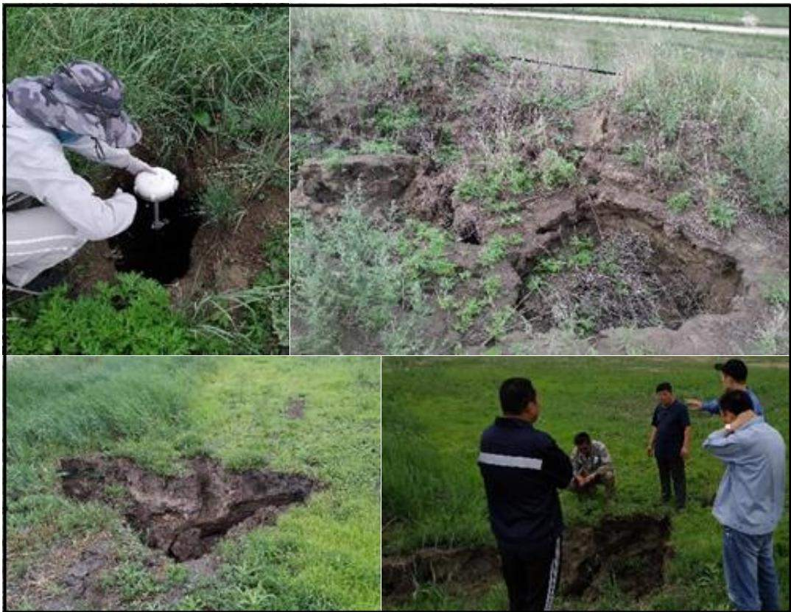  
图4-4 研究区地面塌陷发育  
Figure 4-4 Development of ground collapse pits in the study area

## 4.2 排土场地质灾害隐患识别（Recognition of Potential Geological Hazards in Dump)

## 4.2.1 地面变形演化特征

根据上一章时序InSAR对研究区地面变形的监测结果（图3-23）可知，除坡脚区域存在少量沉积外，大部分范围内为负值，即垂向沉降或变形普遍存在于整个研究区。基于时序监测结果，可获取研究区典型区域P1\~P6的时序变化曲线（图4-5），结果显示，所有区域变形均具有连续性，并未发现大尺度的如崩塌、滑坡等突发性灾害。

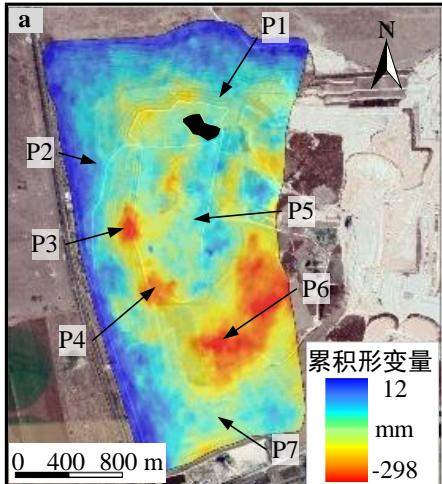

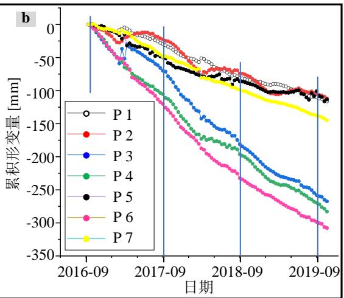  
图4-5基于时序InSAR的研究区2016年9月28日\~2019年9月25日垂向变形监测  
Figure 4-5 Vertical deformation monitoring in the study area based on time series InSAR from September 28, 2016 to September 25, 2019

在研究时段内，区内累积垂向变形为0\~298mm；中位数为176mm，平均值为114mm，集中分布于128\~216mm之间（占总面积的80%）。其中变形量大于10mm/a、30mm/a、50mm/a的区域分别占总研究区面积的68.1%，36.8%和23.4%。研究区的垂向变形随着排土场堆积高度增加而增大。变形严重的区域主要集中在顶部的斜坡边缘，并由北向南逐渐增强，如图4-5a所示，P3，P4和P6区域的形变量显著高于其他区域。

## 4.2.2地质灾害隐患区初步识别及诱因分析

基于时序InSAR获取的研究区地表变形是由多种因素引起的，如图4-6所示，可将其分为2大类：①固结沉降（ConsolidationSettlement)：由于岩土体自重导致的土壤固结现象，其对提高研究区地质稳定性有积极作用；②土壤侵蚀(SoilErosion)：由于各类扰动因素导致的研究区地表剥蚀现象，其对研究区地质稳定性起负面作用。通过星载遥感手段监测技术，获得研究区形变量，即为固结沉降量和土壤侵蚀量之和（公式4-1）。

$$
\mathrm { T } = \mathrm { C } + \mathrm { S }\tag{4-1}
$$

其中：T是基于时序TOPS Sentinel-1B数据监测到的总垂向变形值；C表示由于重力作用引起的固结沉降量；S表示各类土壤侵蚀的地表剥蚀导致的地貌形变量。

排土场地质灾害隐患多由重力侵蚀导致，因此在对地质灾害隐患进行识别之前，需先将固结沉降对研究区造成的形变量和土壤侵蚀对研究区造成的形变量分解开来。

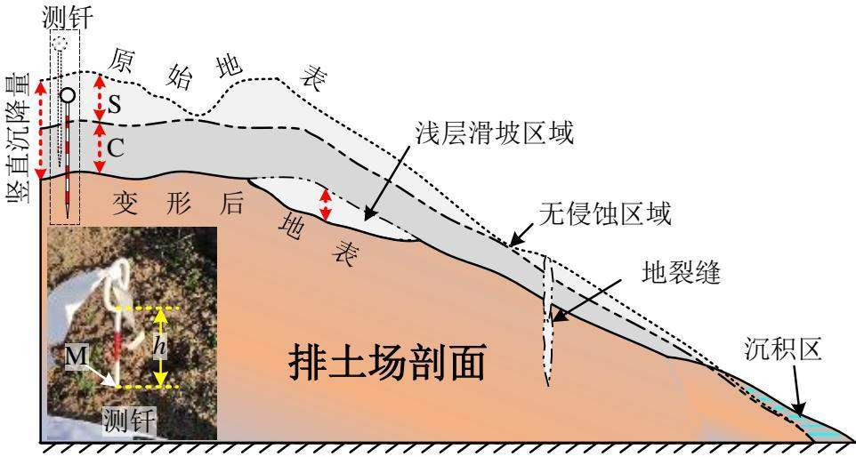  
图4-6排土场变形监测分类  
Figure 4-6 The deformation monitoring classification of the dump

一般来说，沉积物在自重作用下会发生持续固结沉降，研究发现沉积物高度与固结沉降之间存在高度相关性[271]，自然重力引起的固结通常会导致沉降速度低于5mm/a[296]。研究区的沉积物异常固结主要是由于未固结的材料堆积，主要为煤层以上第四纪松散砂土层和白垩纪碎屑岩，白垩纪碎屑岩由于成岩作用晚，沉积时间短，因而固结度差，岩石强度低，更易形成固结沉降。此外，研究区是在人工机械帮助下，通过剥离和重新堆放岩土而形成的，具有分层明显、固结性差、异质性强等特征，在重力作用下易于引起固结沉降。

因此，固结沉降存在于整个研究区，沉降程度取决于岩土堆放高度；而土壤侵蚀则仅存在于发生侵蚀区域内。当在无侵蚀发生区域内（即S=0时），时序Sentinel-1B数据所监测到研究区地表变形量就是固结沉降量（即T=C）。基于这一原则，可利用以下方法将研究区固结沉降量和土壤侵蚀量分别从总形变量中区分出来：

①利用 SBAS InSAR 获取研究区总形变量 T 分布；

②根据无人机摄影测量获取的研究区高精度DEM数据，将研究区按岩土堆存高度5m间隔将其分割为23个子区域（如图4-8所示），结合研究区总沉降分布与分割区域，统计出每个堆存高度所对应子区域的沉降分布，去除异常值后，提取沉降量最小值将其视为土壤侵蚀量为零，即S=0，则T=C，该区域仅有固结沉降发生（如图4-6无侵蚀区域所示）;

③基于23组研究区堆存高度H与对应固结沉降C的数据组，建立研究区堆存高度H与固结沉降量C之间的回归关系；

④根据回归关系模型和研究区堆存高度影像数据，得到研究区的固结沉降量分布；

⑤根据研究区总沉降T分布和固结沉降量C分布，结合公式4-1可得到研究区土壤侵蚀导致的地表剥蚀量S分布（图4-10所示）。

图4-7和图4-8总结了研究区变形分类的过程步骤。

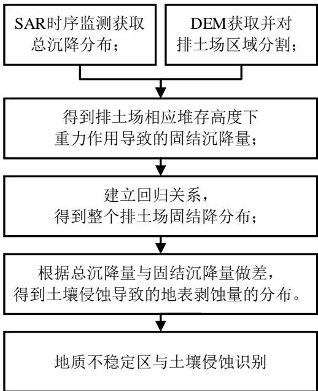  
图4-7排土场变形分类工作流程

Figure 4-7 Workflow of dump deformation classification  
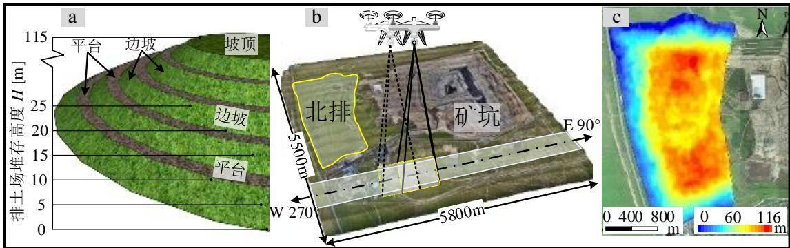  
图4-8排土场堆存高度分布识别流程  
Figure 4-8 Identification process of dump height distribution

## ●固结沉降分布

根据固结沉降量与研究区岩土堆存高度之间的拟合方程（图4-9）可以看出，固结沉降量与研究区岩土堆存高度之间呈线性正相关。因此，可建立研究区堆积高度（H）与累积固结沉降量（C）之间的回归关系（如图4-8A和图4-9所示）。回归方程是通过原点的线性方程，其斜率为-1.24，R²为0.98的直线。最后，根据研究区DEM数据，利用研究区堆积高度（H）与累积固结沉降量（C）

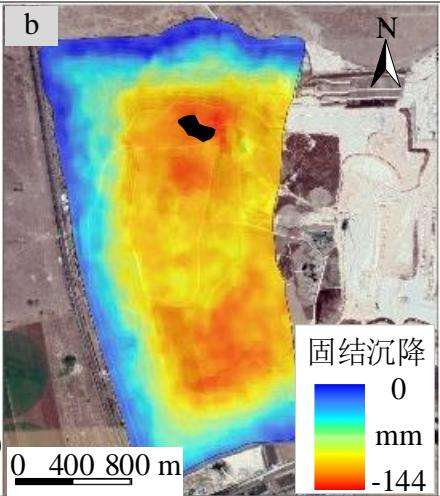

之间的回归方程可获得研究区的固结沉降分布（图4-8b所示），其累积固结沉降量（C）范围为0到-144mm。

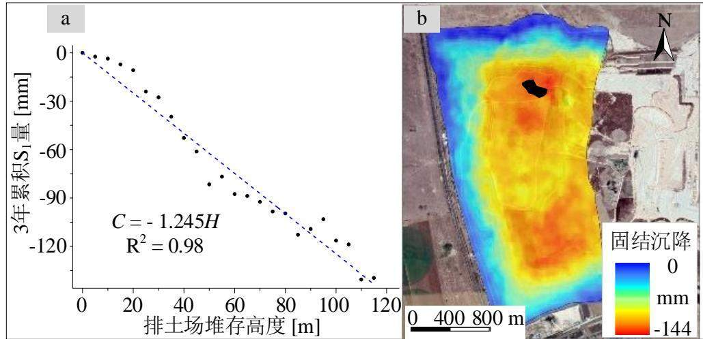  
图4-9排土场堆积高度H与累积固结沉降量C之间的回归关系拟合曲线及固结沉降分布 Figure 4-9 Fitting curve of regression relationship between dumping height (H) and cumulative consolidation settlement (C) and consolidation settlement distribution

## ●土壤侵蚀分布

滑坡、地裂缝、地面塌陷等排土场地质灾害大多由重力侵蚀诱发造成，因而将研究区土壤侵蚀按照侵蚀程度进行区域划分，对研究区地质灾害隐患的识别具有重要作用。

根据研究区形变分解方法，在研究区总形变分布数据和固结沉降分布数据的基础上，利用栅格计算可得到研究区土壤侵蚀分布（图4-10）。由图4-10a可以看出，研究区大部分区域都出现不同程度的侵蚀现象，与研究区总形变状况相比较，土壤侵蚀导致的地表剥蚀现象分布异质性更强，更能体现出研究区所受侵害状况。

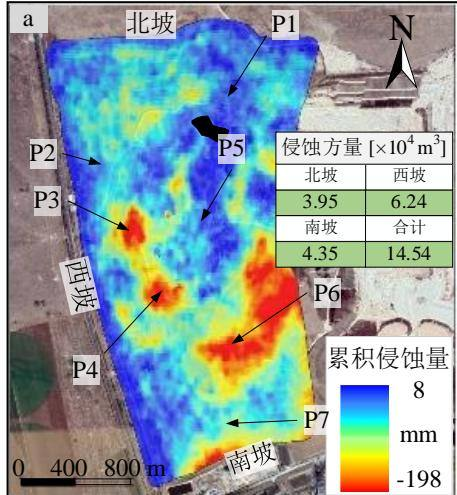

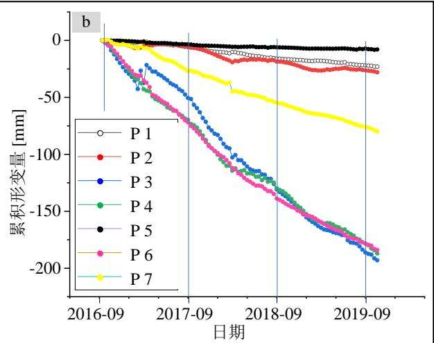  
图4-10排土场累积土壤侵蚀分布  
Figure 4-10 Distribution of cumulative soil erosion in waste dump

研究区土壤侵蚀严重区域主要集中于坡顶的南部和西部边缘区域，以及西坡的上部，而在坡顶中间区域（P5）则几乎无侵蚀发生。研究区西南角为整个研究区最为低洼区域，与此同时西坡与南坡侵蚀较为严重，因而在西南坡坡脚位置呈现少量沉积现象。

## 4.2.3 最大坡度向边坡蠕动量估算

基于 SBAS InSAR技术监测得到的形变速率结果只是表征了研究区地表形变位移中沿 Sentinel-1雷达视线方向（Line of Sight，LOS）的一位投影结果。由于研究区地表地貌特征与卫星视线向角均会导致地面形变速率的监测结果存在误差，为解决这一误差，可将形变速率投影转换至斜坡最陡坡度方向上。这一方法可用来直观比较研究区不同坡向上形变速率[297,298]，其最大地形坡度方向形变速率投影方程如所示：

$$
\left\{ \begin{array} { l l } { V _ { \mathrm { s l o p e } } = { \frac { V _ { L O S } } { C } } } \\ { C = \cos \gamma } \end{array} \right.\tag{4-2}
$$

式中， $V _ { L O S }$ 是 Sentinel-1 卫星沿其视线方向所测得速度；C表示研究区地表形变与 SDFP 点目标所测位移的比例系数；γ表示 Sentinel-1 卫星视线方向和斜坡最陡坡度方向的夹角（如图4-11a所示）。

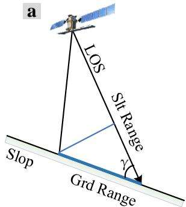

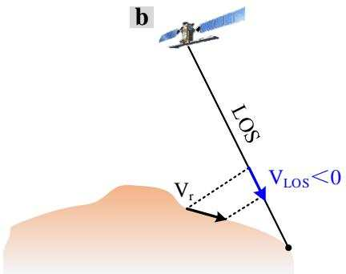

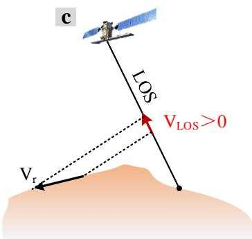  
图4-11（a）Sentinel-1卫星视向线与斜坡最陡坡度方向平面示意图；（b、c）斜坡运动方向与形变速率值关系图  
Figure 4-11 (a) Schematic diagram of Sentinel-1 visual line and the steepest slope direction of the slope; (b/c) Diagram of slope movement direction and deformation rate value

基于三角函数关系，可以将C的计算公式转换为：

$$
\begin{array} { c } { { C = ( h _ { L O S } * \sin ( S ) ) + \left( n _ { L O S } * \cos ( S ) * \sin \left( A - \displaystyle \frac { \pi } { 2 } \right) \right) + } } \\ { { { } } } \\ { { \left( e _ { L O S } * ( - 1 * \cos ( S ) ) * \cos \left( A - \displaystyle \frac { \pi } { 2 } \right) \right) } } \end{array}\tag{4-3}
$$

式中：

$$
h _ { L O S } = \cos \alpha\tag{4-4}
$$

$$
{ n _ { L O S } } = \cos \left( { \frac { \pi } { 2 } } - \alpha \right) * \cos \delta\tag{4-5}
$$

$$
e _ { L O S } = \cos \left( \frac { \pi } { 2 } - \alpha \right) * \cos \left( \frac { \pi } { 2 } \pm \omega \right)\tag{4-6}
$$

式中：S为地表坡度，A为地表坡向，均由无人机摄影测量得到的DEM数据提取； $\alpha$ 为Sentinel-1 卫星成像入射角； $\omega$ 为卫星轨道方向与地理正北方向的夹角；δ为地理正西方向与卫星成像视线向的夹角。

根据现场调研研究区实际形变情况，不存在坡体沿最陡坡度方向向上运动的情形，因此在运用速度投影方法实现研究区不同斜坡状态下形变速率估算时，需注意剔除异常点[299,300]：即当最陡坡度方向的形变速率为正值时，仅保留速率值为负的 SDFP目标点（如图4-11b、c所示）。

应用如上所述方法，将研究区在卫星视向线方向形变速率投影至其边坡最大地形坡度方向上如图4-12所示。黑色箭头指示为基于高进度DEM生成的最大地形坡度方向。可以看出，研究区北坡、西坡及南坡出现不同程度的边坡蠕动变形现象（图4-12a），研究区东侧为仍在进行剥离土方人工排弃区，因而排除在外。从研究区整体可以看出，北坡和西坡的变形量随岩土堆存高度的增加而增大，而南坡的整体变形均较为严重。区域内，累积变形量小于30mm（即10mm/a）的区域占总区域的4.3%，累积变形量大于50mm（即16.7mm/a）的区域占总区域的69%。形变明显区集中于靠近西坡与南坡上部区域及坡顶边缘区域，其最大累积形变量超过300mm（即100mm/a）的区域约占总面积的27%。

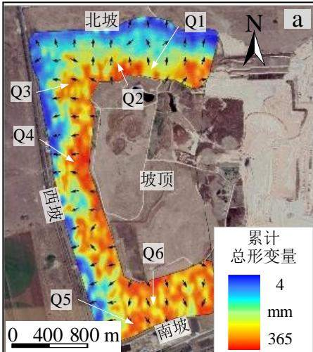

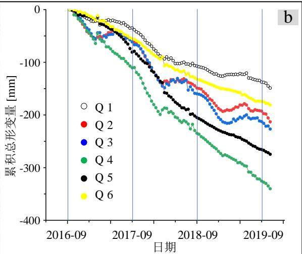  
图4-12研究区边坡累积变形量估算及典型区域时序变形状态  
Figure 4-12 Estimation of the cumulative deformation of the slope in the study area and the time series deformation state of the typical area

## 4.2.4 监测精度验证

为检验基于时序InSAR技术的变形监测方法的精度及区域地质灾害隐患快速识别的可靠性，通过现场变形监测结果和野外核查方式进行验证与评价。

## （1）现场GNSS 监测站点的变形监测验证

为了对研究区关键靶区的地质灾害隐患进行实时监测，2019年8月在研究区的北坡、西坡和南坡均布设了基于GNSS位移监测站的位移自动监测预警系统，可监测毫米级地形变化数据。在研究区的北坡（2个），西坡（3个），南坡(2个)，如图4-13b所示建立永久双频GNSS位移监测站，均配备了4G无线数据传输模块，防雷系统及太阳能充电模块（图4-13a）。通过位移自动监测预警系统可监测并获取关键靶区实时逐点形变位移数据信息，用来评价SBASInSAR所监测的地表形变结果。

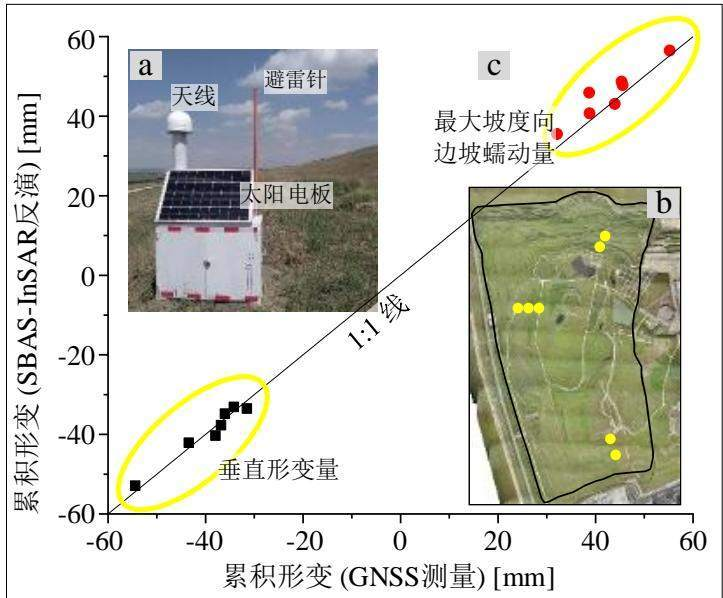  
图4-13监测结果比较：（a）GNSS位移监测站；（b）位移监测预警系统位置分布；（c）Sentinel-1B数据监测所得形变量与位移监测预警系统的累积形变量对比关系  
Figure 4-13 Comparison of monitoring results: (a) GNSS station; (b) GNSS monitor site (yellow points) location; and (c) cumulative vertical deformation (black points) and slope deformation (red points) measured at permanent GNSS stations, compared with those measured by Sentinel-1B data

将基于 SBAS InSAR监测的地表变形时间序列结果与位移自动监测预警系统测量的结果进行比较（图4-13c）。综合考虑总变形（3D变形）和检查点垂向分量，以计算均方根误差（RMSE）。结果表明，来自Sentinel-1B数据的测量结果与基于GNSS的测量数据吻合度较高。垂向变形量和沿最大坡度向边坡蠕动量之差的RMSE分别为1.6mm和3.5mm。分析可知，导致这些误差的原因有：大气延迟及时间相关的不确定性导致的误差、InSAR和 GNSS 位移监测站采集的时间位置差异导致的误差[301]。

## (2）基于现场测钎测量的变形验证

除利用位移监测预警系统验证关键靶区形变精度外，还验证了研究区形变分解结果的可靠性。在研究区坡顶及边坡不同位置共布设57红白相间的测钎(图4-15a、b)，用以评估研究区固结沉降量和土壤侵蚀量的估算精度。使用GPS-RTK定期测量每根测钎标定的绝对地理位置（即图4-14和图4-15a中M点），同时用钢尺测量测钎露出地面的长度（即图4-14和图4-15a中h的长度）。

该调查于2019年4月至2019年10月每月重复测量，将定期测量的每根测钎M$( x _ { n } , y _ { n } , z _ { n } )$ 点位置差和h的长度变化分别记为∆M和 $\Delta h$ ，其中 $\Delta h$ 可表示该点受到地表剥蚀的程度，进而结合∆M可得到该点受其他侵蚀所造成的形变量。

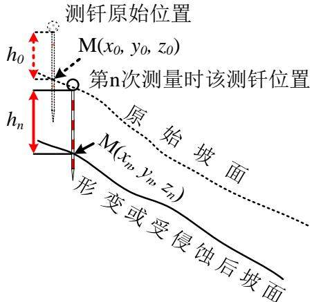  
图4-14测钎随边坡形变多次测量示意图  
Figure 4-14 Schematic diagram of multiple measurements of the marking pins with slope deformation

由于3根测钎所测位置表土剥蚀量超过测钎插入深度而导致测钎标记失效，因此最终获取54根测钎所监测的数据组进行比较。结果表明，Sentinel-1B数据的测量结果与测钎的实测值据吻合度较高。Sentinel-1B数据监测所得研究区总形变量与测钎监测到的总形变量的 RMSE为4.3mm，估算所得土壤侵蚀量与测钎监测所得土壤侵蚀量的 RMSE分别为7.2 mm图4-15c。分析可知知，造成这些误差的可能性有：①Sentinel-1B数据自身基线较小导致的误差；②大气延迟及时间相关的不确定性导致的误差；③非线性和非LOS取向的变形误差；④手动操作GPS-RTK测量测量时天线或对中杆倾斜引起的测量误差；⑤钢尺测量误差；⑥固结沉降拟合方程的误差。

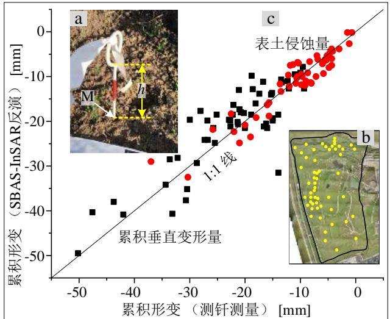  
图4-15测钎布置方式、分布点及 Sentinel-1B数据监测所得结果与测钎监测所得结果比较Figure 4-15 Comparison of the monitoring results

## （3）地质灾害隐患的现场验证

基于时序InSAR技术的区域地质灾害隐患快速识别方法可以对研究区地质灾害隐患区域进行初步的自动识别，大大降低现场实地调查与核查的工作量。地质灾害隐患的现场核查即在初步识别的基础上，结合无人机DOM影像在地灾隐患区进行现场勘查和确认。同时，有些研究区地质灾害隐患仅从外观难以确认，通过探地雷达（Ground penetrating radar,GPR）等技术手段（图4-16），对研究区坡体内部结构和物质组成进行探测来辅助核查。

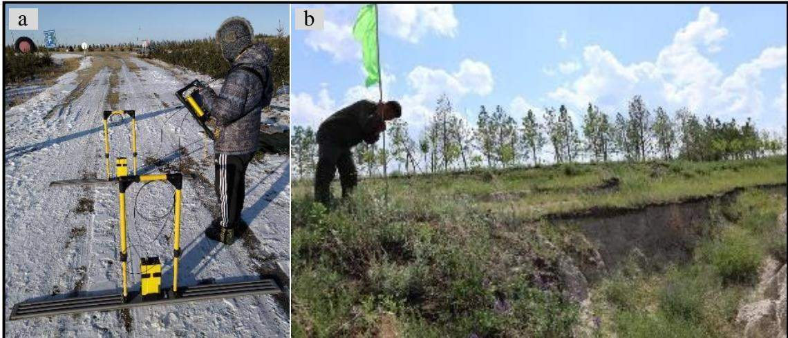  
图4-16研究区地质灾害区域的现场核查  
Figure 4-16 On-site verification of geological hazards in the study area

## 4.2.5 地质灾害隐患风险识别与等级划分

在经过时序InSAR大范围变形监测、地质灾害隐患区域初步识别、最大坡度向边坡蠕动量估算及野外辅助验证后，综合各方结果可对研究区地质灾害隐患区进行定点确认并成图表达。如图4-17所示，将研究区地质灾害隐患区域分为高中低三个等级共7个区域。其中A、B两个地灾隐患区位于北坡，已发生主要地质灾害为浅层滑坡（图4-1）和塌陷型地裂缝（图4-2b、图4-3b），其地表剥蚀形变量约 30\~50 mm/a，同时需要注意的是，A区域上游约100m处建设有人工蓄水池（图4-17），其面积约 $3 0 0 0 0 \mathrm { m } ^ { 2 }$ ，设计蓄水能力约 $9 0 0 0 0 \mathrm { m } ^ { 3 }$ ，为保证蓄水池及边坡地质安全，需加强A区域及蓄水池周边的动态监测。地灾隐患区C位于西坡边坡中上部，已发生地质灾害主要为平行于等高线分布的拉伸型地裂缝（图4-2a、图4-3a)，该区地裂缝长度从几十米到数百米不等，开口宽度一般15\~20 cm（图4-3a），同时其边坡沿最大坡度向蠕动速率 50\~90 mm/a。地灾隐患区D和E范围较大，从研究区西坡中部向上一直延伸至坡顶，该区域已发生地质灾害主要有浅层滑坡、拉伸型地裂缝、边坡蠕动、及地面塌陷（图4-4）等，同时大范围的非均匀沉降、边坡蠕动亦不容忽视，区内地表剥蚀形变量约20\~60 mm/a，边坡沿最大坡度向蠕动速率约50\~90 mm/a，此区域为研究区形变速率最大、危险系数最高的区域。地灾隐患区D和E范围最大，位于坡顶南部和南坡上部，主要出现大面积非均匀沉降现象，由于其位于坡顶内部且南坡坡度较小，因此危险系数不高，需要注意防范出现大面积沉陷和地面塌陷。

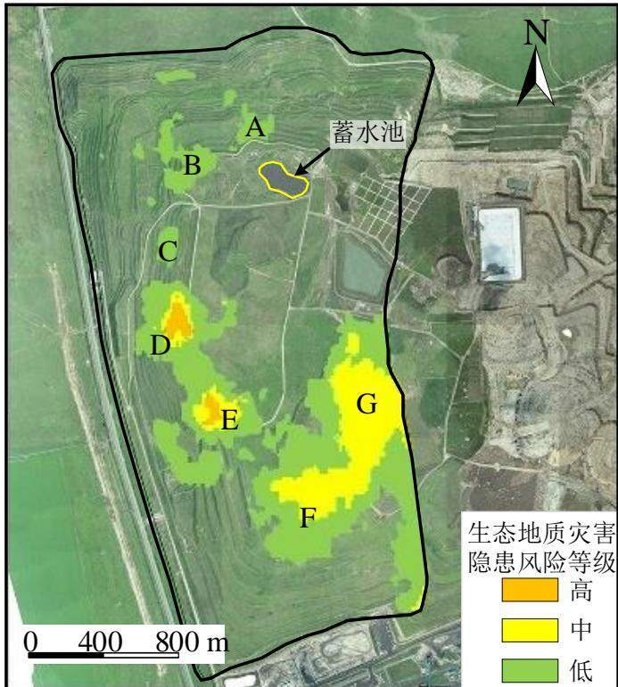  
图4-17研究区地质灾害隐患风险等级识别  
Figure 4-17 Recognition of hidden risk level of geological disasters

表4-1研究区不同风险等级地质灾害隐患特征  
Table 4-1 Characteristics of hidden dangers of geological hazards with different risk levels
<table><tr><td>区域</td><td>主要破坏形式</td><td>地灾风险等级</td></tr><tr><td>A</td><td>浅层滑坡、塌陷型地裂缝、侵蚀沟</td><td>低</td></tr><tr><td>B</td><td>浅层滑坡、塌陷型地裂缝、侵蚀沟</td><td>低</td></tr><tr><td>C</td><td>拉伸型地裂缝、边坡蠕动</td><td>低</td></tr><tr><td>D</td><td>浅层滑坡、拉伸型地裂缝、边坡蠕动、地面塌陷</td><td>高</td></tr><tr><td>E</td><td>浅层滑坡、拉伸型地裂缝、边坡蠕动、地面塌陷</td><td>高</td></tr><tr><td>F</td><td>非均匀沉降</td><td>中</td></tr><tr><td>G</td><td>非均匀沉降</td><td>中</td></tr></table>

## 4.3 排土场地质灾害隐患诱发因素（Influencing Factors of Potential Geological Disasters in Dump)

## 4.3.1 本底因素分析

## （1）岩土性质的影响

研究区所堆存的岩土主要来自于自然地层岩土剥离物，在人工重新堆排后，研究区成为腐殖土、亚砂土、砂土、粉细砂、粘土、含砾粘土、泥砾及含砂砾石等多种岩土的混合体，因此表现出局部岩性多变、透水性强、整体坚硬程度

低、抗风化能力差、软化系数低等特点。加之堆存岩土中还含有高岭石、伊利石、蒙脱石等遇水易膨胀的矿物，使得研究区力学强度远低于自然地貌。

## (2) 坡体结构的影响

研究区的松散混排工艺直接导致其内部断裂缺陷众多，岩性界面和破碎带导致的软弱面更是将坡体分割为众多不连续结构。同时，断裂缺陷还为降雨等进入坡体内部提供优先流通道，致使平行和垂直斜坡的陡倾断裂缺陷大量发育，大大降低坡体地质稳定性。

## (3）地形地貌的影响

由于受施工工艺限制，研究区具有大台阶、陡边坡等复杂地貌特征，边坡多以平台加斜坡的形式存在，其中斜坡角度多在20°\~35°之间，为侵蚀物的搬运提供便利地貌条件，加之坡体断裂缺陷、隐伏裂隙的存在，在重力作用下易形成滑坡、地裂缝等地质灾害。

## （4）侵蚀风化作用的影响

研究区堆存岩土原本深埋并封存于地下，在人为扰动下被挖掘、剥离并堆存在地表，在改变其风化环境后，尤其在北方高寒地区，在独特的水分和温度环境下极易造成岩土的快速风化[302]。

## 4.3.2 降水因素分析

形成排土场地质灾害隐患的因素除研究区自身本底条件外，最主要的外在诱发因素为降水，如持续长时间的降雨、短时间内的暴雨及初春融雪入渗等。根据研究区历史气象数据及在研究区建设的综合气象站获得的近3年气象数据可知，研究区虽然年度平均总降水量不超过400mm，但其大部分降雨集中于雨季，且大多以短时暴雨的形式发生。短时暴雨是影响研究区边坡稳定性、造成边坡失稳的最主要的因素之一。

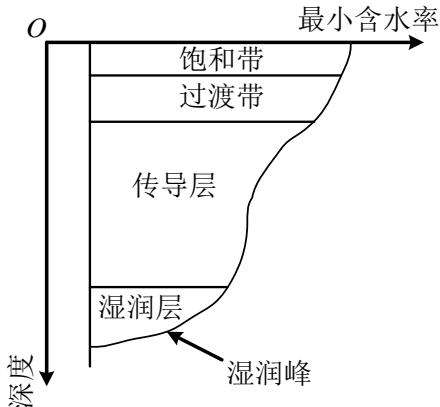  
图4-18降雨入渗过程中土壤含水率示意图  
Figure 4-18 Schematic diagram of soil moisture content during rainfall infiltration

入渗是降雨随时空变化的饱和-非饱和运动过程，是雨水入渗、驱替土壤空气并逐渐饱和空隙的渐进过程。雨水入渗过程中，在达到潜水面前会通过饱和非饱和渗流过程，且以坡体浸润线为分界线，在浸润线以上含水率逐渐增大，土体由非饱和状态变为饱和状态，其典型含水率分布可分为4个区域（图4-18）：①饱和带，位于表土层；②过渡带，含水率差异较大；③传导层，厚度大，含水率分布较均匀；④湿润层，含水率随深度增加而降低。

降水入渗后导致坡体非饱和区土壤含水率增加，因而导致土体孔隙水压力增大、土壤凝聚力和基质吸力降低，进而导致边坡抗剪切能力下降、稳定性降低[303]。松散堆积体在雨水冲刷、潜流侵蚀、软化作用等共同作用下，易使内部颗粒以悬浮颗粒物的形式流失，进而造成坡体开裂、塌陷其至滑坡。

同时，坡体土壤还会受到静水浮力作用，使得雨水在下渗的同时，还将侵蚀并悬浮在水中的细小颗粒搬运走而形成内部渗流。坡体内部渗流的持续侵蚀会形成内部导水通道，随着水力坡降和渗透力的增大会进一步加大渗流速度和流量，随着渗流通道的扩张和流速的增快，最终会演变为管涌路径（图4-19）。内部渗流导致的管涌是破坏坡体稳定性的最主要因素，一旦形成管涌路径，管道上壁会逐渐失去支撑作用而形成塌陷，最终导致研究区边坡稳定性受到威胁。

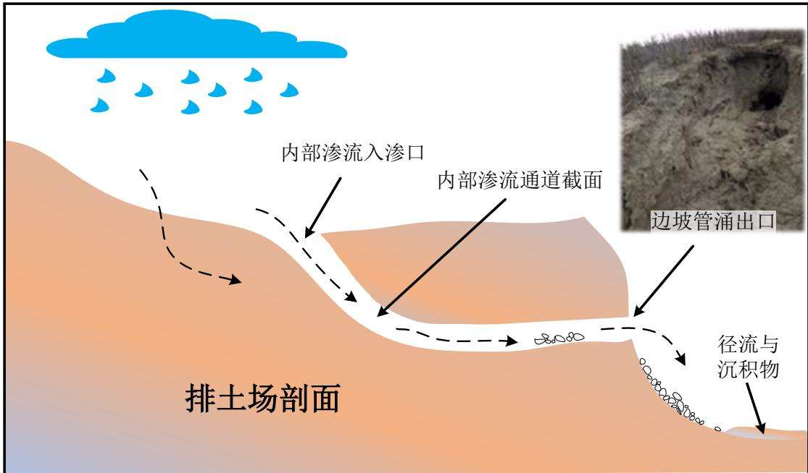  
图4-19排土场内部渗流演变为管涌示意图  
Figure 4-19 Schematic diagram of seepage evolution into piping in dump

此外，由于研究区堆存岩土物料中存在膨胀土，其中粘土类中含强亲水性粘土矿物质高岭石9.17%、伊利石8.45%、蒙脱石9.08%；泥岩类中含高岭石17.34%、伊利石7.61%。膨胀土遇水时颗粒表面结合水膜增厚，颗粒间距变大，进而土体膨胀；失水时结合水膜减薄，颗粒间距缩小，土体收缩。在干湿循环下土体地裂缝大量发育，不仅破坏了坡体完整性，而且易形成优先流现象，进一步加速水分入渗和坡体内部地裂缝生成，形成恶性循环。因此，研究区地表覆土含膨胀土的区域在雨季出现土体膨胀、旱季收缩的现象，进而在全年出现周期性起伏（图4-20），最终导致坡体承载力衰减和地质失稳隐患。

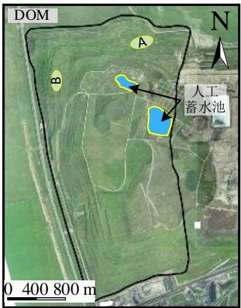

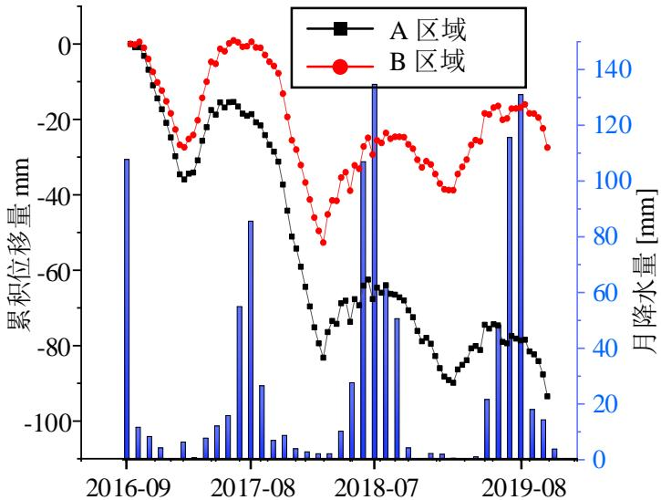  
图4-20研究区部分区域雨季地表膨胀现象  
Figure 4-20 Surface expansion in rainy season in some areas of the study area

总的来说，研究区在降雨时，雨水汇流后在坡面形成临时性地表径流和内部渗流，导致本就缺水的矿区降雨资源不仅未能被保留和利用，反而成为造成研究区边坡失稳及土壤侵蚀的最主要诱因。可见，控水是提高研究区地质稳定性的重要途径。

## 4.3.3 冻融因素分析

冻融是寒冷地区边坡重力侵蚀蠕变、边坡失稳的主要诱发因素。在寒旱交替、冻融循环下，研究区边坡表土抗剪强度下降[304]，边坡安全系数降低[305]。研究区边坡在冻融循环下的地质稳定性影响机理包括三方面：一是地裂缝导致冻结锋面深入研究区内部而形成的内部冻胀作用，二是冻融循环与重力侵蚀共同作用下的冻融蠕变（Frost Creep），三是冻结锋面（Freezing Front）下降导致的冻融滑坡。

## （1）内部冻胀

研究区冻胀作用一般仅发生于表土层，但当局部存在深入边坡内部的地裂缝时，内部冻胀力（Frost-heaveForce）会对边坡造成严重破坏。如图4-21所示，地裂缝深入研究区边坡内部，降水极易沿地裂缝形成优先流现象，导致地裂缝内部土体含水率较高，当低温冻结时地裂缝两侧土体在冻胀力作用下而进一步分离，极大危害边坡稳定性。

## (2) 冻融蠕变

冻融蠕变是高寒矿区边坡蠕动的主要因素[306]，在冻融循环与重力侵蚀共同作用下，表土颗粒和岩石碎屑会随冻融交替而膨胀收缩。当坡面土石低温冻胀时，会整体垂直于斜坡向上运动，而当其融化收缩时，膨胀体则沿重力方向回落（图4-21）。在多次冻胀、收缩循环下，坡面土石会逐渐向下蠕动，即形成冻融蠕变[307,308]。冻融蠕变还会造成表土更加松散，为风力侵蚀、水力侵蚀提供侵蚀风化物。

## (3) 冻融滑坡

在春季时候，边坡冻土由表层向内部逐步融化，冻结锋面逐渐下降。如图4-21所示，冻结锋面位于表层土以下，此时由于积雪和冻土中冰的融化导致冻结锋面以上的土石体含水量快速升高，进而整体自重增加、剪切力降低，而下层为不透水冻土层。此时冻土层则演变为单坡平面滑床，冻结锋面处土壤抗剪强度和摩擦力降低，形成潜在剪切破坏面，极易形成浅层滑坡（图4-21）。此外，地裂缝的存在会造成冻结锋面深入研究区边坡内部，此种状态有引发深层滑坡的可能性。

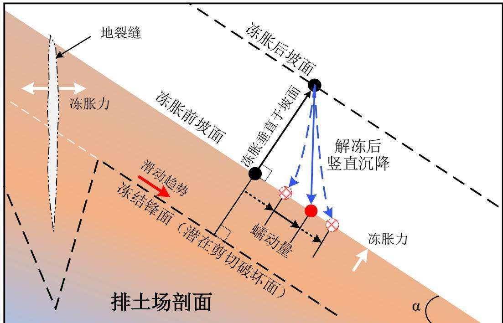  
图4-21 冻融作用下边坡破坏示意图  
Figure 4-21 Schematic diagram of slope failure under freeze-thaw

## 4.4 本章小结（Chapter Summary）

本章介绍研究区地质灾害隐患的类型和可能带来的破坏形式，然后基于现代测绘与遥感技术持续获取研究区地质灾害状况，分析了研究区地质灾害隐患类型。构建了研究区固结沉降估算模型、土壤侵蚀监测模型和地质灾害隐患识别方法，实现了研究区地质灾害有效诊断，得出研究成果如下：

（1）研究区存在的浅层滑坡、地裂缝、地面塌陷、边坡蠕动等多种形式的地质灾害对研究区生态功能造成严重影响。在时序InSAR对研究区大面积变形监测基础上，分析发现研究区变形主要有固结沉降和土壤侵蚀两类，其中固结沉降有助于提升边坡地质稳定性，其沉降量与岩土堆存高度相关；而土壤侵蚀尤其是重力侵蚀则是造成地质灾害隐患的主要诱因。

（2）研究区存在不同程度地质灾害隐患风险，区内非均匀变形严重，整体变形量随岩土堆存高度的增大而加剧，近3年垂向累积变形量平均114mm，最大达298mm，变形严重区主要集中于西坡坡顶，并由北向南呈逐渐增强趋势。结合现场调查与无人机获取DOM数据可知，研究区边坡位移异常区域往往会伴随着浅层滑坡发育和平行于平台的拉伸型地裂缝发育，这些区域为地质灾害隐患区，需持续监测与关注。

基于多源协同监测结果，构建的研究区固结沉降估算模型和地质灾害隐患识别方法，在自重作用下，其整体稳定性会随着密实度的增大而略有增加，但局部地质灾害隐患的增多威胁着整体地质稳定性。

（3）研究区边坡稳定性受多因素、多过程共同影响。基于遥感监测、现场验证和过程分析，明确了导致研究区地质灾害的因素包括自身岩土性质、局部坡体结构、整体地貌结构及侵蚀风化环境。特别是在寒旱交替、冻融循环条件下，研究区自身地裂缝发育下的坡体受内部冻胀，高陡边坡下的坡面冻融蠕变和冻融滑坡。

上述研究表明，高寒矿区大型排土场存在多种形式的地质失稳现象，其失稳严重程度与排土场自身本底条件、区域降水特征以及冻融循环的特殊气候特征有关。

## 5大型排土场土壤侵蚀规律及致灾机理

## 5 Soil Erosion Law and Disaster Mechanism of Largescale Dump

排土场复杂地貌下岩土体稳定性差、水土保持性低、径流极其紊乱，加之北方高寒地区独特的气候条件，使得研究区受水力、风力、冻融及重力等多种外营力共同作用，形成具有季节性循环和交替发育的复合型土壤侵蚀。这些侵蚀是造成排土场生态致灾的关键因素。因此，厘清研究区复合型土壤侵蚀发育规律及其发育机理，是保障其生态功能的关键。

本章利用多尺度多手段监测技术对研究区生态功能问题中土壤侵蚀状况进行时序监测，在此基础上结合地貌、水文、气象数据进一步对研究区复合型土壤侵蚀进行分解；重点对研究区发育范围最广的水力侵蚀（壤中流侵蚀）及其高寒矿区特有的冻融侵蚀进行监测和模拟，厘清了高寒矿区排土场复合型土壤侵蚀发育规律及机理。

## 5.1 排土场复合型土壤侵蚀分解及其空间分布（Decomposition and Spatial Distribution of Compound Soil Erosion in Dump)

## 5.1.1 排土场土壤侵蚀类型

土壤侵蚀是表土或下覆土体、岩屑、松软岩层等其他组成物质在重力、水力、风力、冻融、冰川运动等外营力作用下，被破坏、分离、剥蚀、搬运和沉积的过程[309]。根据外营力不同，土壤侵蚀一般可分为重力侵蚀、水力侵蚀、风力侵蚀、冻融侵蚀和冰川侵蚀等（表5-1）。

表5-1土壤侵蚀的主要类型和表现形式  
Table 5-1 The main types and manifestations of soil erosion
<table><tr><td>侵蚀类型</td><td>主要表现形式</td></tr><tr><td>重力侵蚀</td><td>滑坡、崩塌、泥石流、塌陷、泻溜、蠕动、雪崩等</td></tr><tr><td>水力侵蚀</td><td>溅蚀、面蚀、沟侵、淋溶侵蚀、渗流侵蚀、山洪侵蚀、波浪侵蚀等</td></tr><tr><td>风力侵蚀</td><td>吹移搬运：风扬、跃移、滚动</td></tr><tr><td>冻融侵蚀</td><td>冰冻风化、融冻泥流等</td></tr><tr><td>冰川侵蚀</td><td>拔蚀作用、磨蚀作用、冰楔作用、撞击作用等</td></tr></table>

根据布设在研究区顶部气象站监测结果统计，近3年研究区年平均风速4.2m/s（3级），年内日平均风速大于5m/s的天数达到120天以上，在4\~5月和9\~10月常见风速10m/s（6级）以上强风，加之4\~5月为积雪融化后植被未生长期，9\~10月为植被枯黄期，因此这两个时间段裸露在地表的表土易受到风力侵蚀。研究区年平均降水量372mm，其中雨季（6\~8月）平均降雨量之和约占年平均降雨量76.14%，且多以短时暴雨为主，这是造成边坡水力侵蚀的主要因素。

研究区为大陆性亚寒带气候，冻结期160-180天，年平均气温 $- 0 . 6 \mathrm { \mathrm { } } ^ { \circ } \mathrm { C }$ ，属于稀疏岛状多年冻土区，受冻融侵蚀影响显著。在上述几类土壤侵蚀发育过程中，重力侵蚀也会参与其中，进而形成复合、交替型侵蚀过程。

综上可知，研究区受到的土壤侵蚀主要为风力侵蚀、水力侵蚀、冻融侵蚀和重力侵蚀。其中，风力侵蚀可将各类侵蚀、风化物搬运至周边自然草原；水力侵蚀主要表现有地表径流侵蚀、表土界面以上的壤中流侵蚀和土体内部的地下径流侵蚀（即渗流侵蚀）（图4-19）；冻融侵蚀有冻胀作用下的冻融风化（图5-27）和冻融循环下的融冻泥流；重力侵蚀则伴随以上几类侵蚀同时发生，主要表现有浅层滑坡、地表塌陷和拉伸型地裂缝等。

根据4.2节对研究区地表变形监测结果，通过栅格计算可统计研究区在监测时间范围内所受各类侵蚀总量S约为 $1 . 4 5 \times 1 0 ^ { 5 } \mathrm { m } ^ { 3 }$ (图4-10a)，平均侵蚀厚度为20.4mm/a，平均侵蚀模数为 $1 3 2 3 5 \mathrm { t / ( k m ^ { 2 } \cdot { \mathrm a } ) }$ ，达到极强烈侵蚀等级（表5-2）。

表 5-2 土壤侵蚀强度分级标准[309]  
Table 5-2 Classification standard of soil erosion intensity
<table><tr><td>级别</td><td>平均侵蚀模数  $\mathrm { t } / ( \mathrm { k m } ^ { 2 } \cdot \mathrm { a } )$ </td></tr><tr><td>微度</td><td>&lt;1000</td></tr><tr><td>轻度</td><td>1000~2500</td></tr><tr><td>中度</td><td>2500~5000</td></tr><tr><td>强度</td><td>5000~8000</td></tr><tr><td>极强度</td><td>8000~15000</td></tr><tr><td>剧烈</td><td>&gt;15000</td></tr></table>

## 5.1.2 排土场土壤侵蚀分解

根据 4.2 节对排土场地表变形的监测与分析可知，利用 Sentinel-1B 数据所监测到研究区形变量可视为是固结沉降量（Consolidation Settlement）和土壤侵蚀剥蚀量（SoilErosion）之和，即 $\mathrm { T } = \mathrm { C } + \mathrm { S }$ 。固结沉降在整个研究区普遍存在，而土壤侵蚀只在部分区域发生，在无侵蚀发生区域 S =0时，则时序TOPSSentinel-1B 数据监测到的总垂向变形值 T = C。利用栅格计算将时序 TOPSSentinel-1B 数据监测到的总垂向变形值 T与土场固结沉降量 C 做差，即可获得土壤侵蚀S的分布。

这其中，根据研究区所受侵蚀状况，土壤侵蚀量S可进一步分解为4类：①风力侵蚀 $\mathrm { S } _ { 1 }$ (WindErosion)：如对研究区表土的吹移和搬运导致的地表剥蚀量；②水力侵蚀 $\mathbf { S } _ { 2 }$ （Water Erosion)，地表径流侵蚀、表土壤中流侵蚀、土体内部渗流侵蚀等导致的冲蚀量；③冻融侵蚀 $\mathrm { S } _ { 3 }$ (Freeze-thawErosion)：冻融风化及融冻泥流导致的地面形变量；④重力侵蚀 $\mathrm { S } _ { 4 }$ (Gravity Erosion)：如浅层滑坡、地面沉降、边坡蠕动等导致的地面形变量。具体分解如下式所示：

$$
S = S _ { 1 } + S _ { 2 } + S _ { 3 } + S _ { 4 }\tag{5-1}
$$

式中： $S$ 为土壤侵蚀导致的研究区地表剥蚀总量， $\mathbf { S } _ { 1 }$ 、 $\mathbf { S } _ { 2 }$ 、 $\mathrm { S } _ { 3 }$ 和 $\mathrm { S } _ { 4 }$ 分别表示由于风力侵蚀、水力侵蚀、冻融侵蚀及重力侵蚀所导致的地表剥蚀量。

为了对研究区复合型土壤侵蚀发育规律及形成机理有进一步的认识，以及对其土壤侵蚀、水土流失进行针对性防治措施，将各类侵蚀 $\mathbf { S } _ { 1 }$ 、 ${ \bf S } _ { 2 }$ 、 ${ \bf S } _ { 3 }$ 和 $\mathrm { S } _ { 4 }$ 进一步分解出来尤为重要。由于研究区土壤侵蚀发育具有显著的时空发育特征，因此可以根据时序监测结果以及基本地貌特征对研究区土壤侵蚀进行类别分解。如图5-1所示，图中月均温度、月均降水量及每月内日均风速大于等于5m/s天数，均根据研究区设立气象站获取的近3年数据统计所得。可以看出，冻融侵蚀、风力侵蚀、水力侵蚀及重力侵蚀之间具有显著的时间交替发育顺序。因此以Sentinel-1B数据所监测到研究区时序形变为基础，结合气象数据及其他调查数据，可对各类侵蚀进行细化分解。各类侵蚀交替作用：风力侵蚀发育于4\~5月和9\~10月，水力侵蚀发育于6\~8月，冻融侵蚀从10月开始一直延续至次年4月。各类侵蚀过渡期间还存在复合侵蚀效应，同时重力侵蚀也贯穿伴随于整个过程。

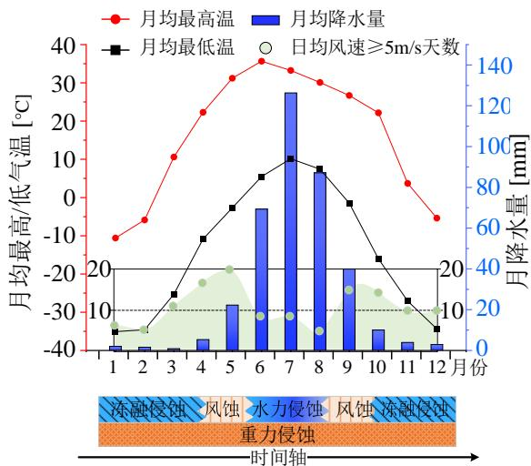

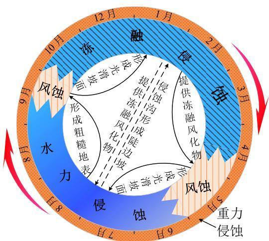  
图5-1 多种侵蚀的交替复合作用示意  
Figure 5-1 The alternative and compound action of various erosion factors

研究区的土壤侵蚀是一个复杂过程，是多因素共同作用的结果，在不同季节受到各类土壤侵蚀的共同影响，其主要为风力侵蚀、水力侵蚀、冻融侵蚀和重力侵蚀，尤其以冻融侵蚀和水力侵蚀最为严重，各类侵蚀之间具有显著的季节性循环交替发育特征。

如图5-1所示为研究区复合型土壤侵蚀循环交替示意图：

①冻融侵蚀：冬季和初春的冻融侵蚀产生的风化物成为春季风力侵蚀和夏季水力侵蚀的良好搬运物；

②风力侵蚀：风季风力侵蚀则通过吹移、搬运将冻融风化物搬运至周边草原，同时将冻融侵蚀、水力侵蚀留下的粗糙地表剥蚀的更加平滑，为雨季径流和融雪径流提供有利地貌环境，雨季径流和融雪径流在研究区高陡边坡、光滑坡面上动能更大，携带泥沙量更多，快速流动并形成侵蚀沟；

③水力侵蚀：雨季水力侵蚀形成高陡边坡侵蚀沟，是冻融侵蚀中冻融风化和楔形破坏的理想发育环境，而同时冻融风化物又在重力作用下以泻溜的形式搬运至侵蚀沟沟底，为水力侵蚀提供侵蚀物；

④重力侵蚀：重力侵蚀则伴随以上几类侵蚀同时发生，且各类侵蚀循环交替作用下亦会出现多重侵蚀同时作用。如雨季研究区坡体孔隙水压力增大、土壤凝聚力降低、基质吸力降低，进而导致边坡抗剪切能力下降，则在重力侵蚀下边坡会出现拉伸型裂缝和塌陷型裂缝，一旦地裂缝形成，不但会进一步加速水力侵蚀的深度，也会为冬季雪水入渗和内部冻胀提供条件，极大危害边坡稳定性。

以上多重侵蚀循环交替形成的复合型侵蚀，是造成研究区水土流失和边坡失稳的重要诱因。同时，无论是风力侵蚀的吹移搬运效应、水力侵蚀的冲刷剥蚀效应、冻融侵蚀的冰冻风化效应，还是重力侵蚀的破坏效应，都造成了研究区严重的水肥流失，进而导致生境的进一步恶化，植被的缺失反过来进一步降低边坡抗蚀能力。

## 5.1.3 排土场土壤侵蚀分布

基于Sentinel-1B数据所监测到研究区土壤侵蚀所导致的地表形变量平均为61.1mm，中位数为50mm，区内侵蚀形变超过100mm区域占研究区总面积的22.6%。对于进一步分解和获取研究区各类型土壤侵蚀的分布有助于更加准确地监测和解决其生态功能问题，对厘清研究区生态功能问题演化规律和早期预警至关重要。

## （1）风力侵蚀分布

风力侵蚀（WindErosion）是在气流冲击作用下土粒、沙粒脱离地表，被搬运和堆积的过程，简称风蚀。日平均风速≥5m/s的年内日累积风速达200m/s以上的区域均可能受到风力侵蚀的影响。研究区风季集中于每年4、5、9、10月，风季每月内日平均风速≥5m/s的天数均在10天以上。统计研究区2000年\~2020年每年风季4、5、9、10月风速风向玫瑰图如图5-2所示。可以看出，研究区主要风向为：西南偏南-西-西北偏西-西北-西北偏北风，约占整体的47%，其次是南风和东南偏南风，约占整体的16%，10m/s以上强风多为西风、西北偏西风、西北风和西北偏北风为主，具体风速频率统计如表5-3所示。

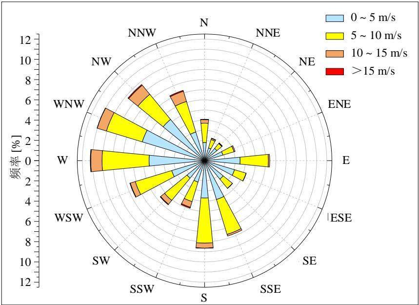  
图5-2研究区风速风向玫瑰图  
Figure 5-2 Statistic graph of wind rose-binned data in study area

表5-3研究区风速频率统计  
Table 5-3 Frequency statistics of wind speed in study area
<table><tr><td>风速 [m/s]</td><td>0~5</td><td>5~10</td><td>10~15</td><td>&gt;15</td></tr><tr><td>频率[%]</td><td>51.4</td><td>40.8</td><td>7.3</td><td>0.5</td></tr></table>

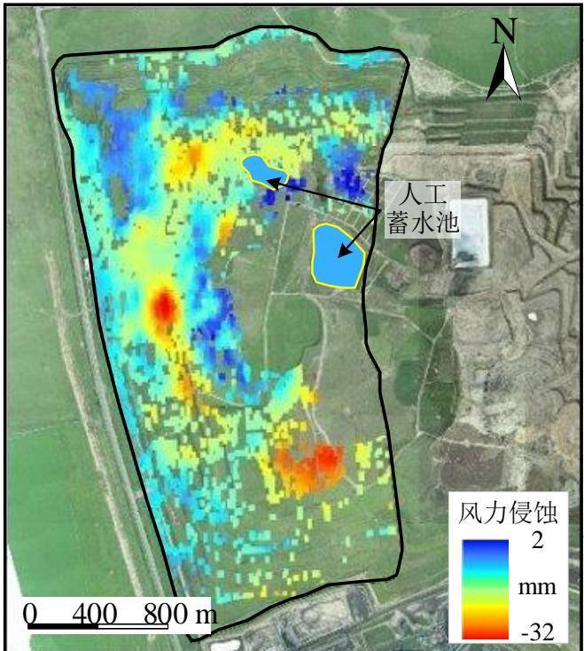  
图 5-3 研究区所受风力侵蚀分布  
Figure 5-3 Distribution of wind erosion in study area

以Sentinel-1B数据所监测到研究区时序形变为基础，结合风季分布时间，以及风季主风向分布，可获得研究区近3年所受风力侵蚀状况（图5-3所示）。

可以看出，风力侵蚀分布与风季主风向重合度较高，风力侵蚀严重区域集中于风力较大的边坡上部，这与现有研究具有相似结果[310]。

## (2) 水力侵蚀分布

水力侵蚀（WaterErosion）是指降雨或雪水所形成的地表径流、表土壤中流及土体内部渗流作用下，土壤或下覆土体、岩屑、松软岩层等其他组成物质被破坏、分离、剥蚀、搬运和沉积的现象。研究区雨季（6\~8月）的短时暴雨是造成研究区水力侵蚀的主要因素。以Sentinel-1B数据所监测到研究区时序形变为基础，结合雨季分布时间，以及研究区地表径流网、内部渗流路径，可获得研究区近3年所受水力侵蚀状况（图5-4所示）。

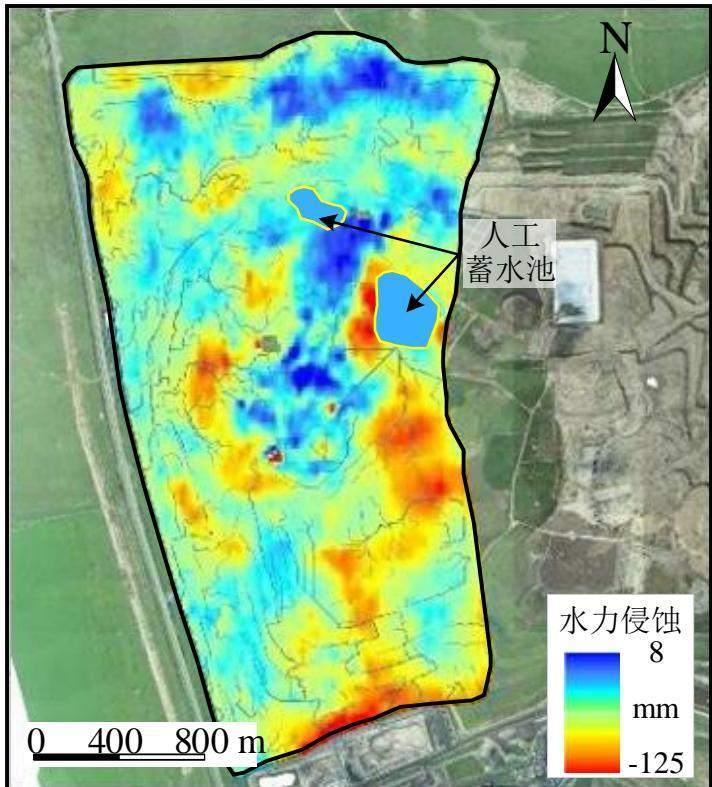  
图5-4研究区所受水力侵蚀分布  
Figure 5-4 Distribution of water erosion in study area

可以看出，水力侵蚀是研究区内侵蚀面积分布最广、影响程度最深的侵蚀类型，其侵蚀严重程度与区域汇水能力相关。

## (3） 冻融侵蚀分布

冻融侵蚀（Freeze-thawErosion）是指土壤或下覆土体、岩屑、松软岩层等其他组成物质孔隙中或裂缝中的水分冻结膨胀致使岩土体碎裂、裂隙增大增多，冰冻体融化后其抗蚀性、稳定性降低，在重力作用下侵蚀物顺坡向下被搬运和堆积的现象。研究区每年冻结期160-180天，受冻融侵蚀影响显著。以Sentinel-1B数据所监测到研究区时序形变为基础，结合年度温度分布，以及研究区地貌特征，可获得研究区近3年所受冻融侵蚀状况（图5-5所示）。

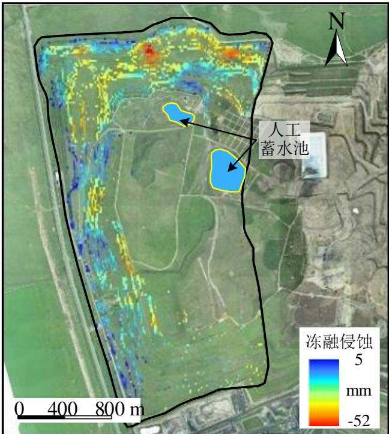  
图5-5研究区所受冻融侵蚀分布  
Figure 5-5 Distribution of freeze-thaw erosion in study area

可以看出，冻融侵蚀主要发生在北坡和西坡的斜坡上，平台上受冻融侵蚀影响较小，同时南坡由于人工放坡，使得整体坡度较小，有效的缓解了冻融侵蚀的发育。

## (4) 重力侵蚀分布

重力侵蚀（GravitationalErosion）是指在其他外营力作用下，土壤或下覆土体、岩屑、松软岩层等其他组成物质受重力作用失去平衡引起的地表物质移动和堆积的现象，国际上又称之为块体运动（Mass Wasting)，其广泛发育于稳定性低的边坡上。重力侵蚀往往伴随其他类型侵蚀共同作用，如降雨会导致研究区自重的增加而增大重力侵蚀的发育；风力侵蚀会将边坡上沉积物吹移，在重力作用下滚动搬运至坡脚；冻融侵蚀在边坡形成的冻融风化物在重力侵蚀作用下滞留至低处等。

5.2 不同因素影响下壤中流侵蚀作用机理模拟（Simulation ofErosion Mechanism of Subsurface Flow under the Influence ofDifferent Factors)

## 5.2.1 水力侵蚀对边坡的破坏特征

岩土中的水通常以结合水（CombinedWater）和游离水（Freewater）组成，其对岩土产生连接作用、润滑作用、水楔作用、孔隙压力作用、溶蚀一潜蚀作用、软化作用及冻融时的涨缩作用等。其中连接作用、润滑作用、水楔作用主要由结合水产生，孔隙压力作用、溶蚀一潜蚀作用则由游离水造成。孔隙压力作用、溶蚀一潜蚀作用、软化作用是造成研究区水力侵蚀的最主要原因，大气降雨对研究区边坡的破坏形式如下。

## （1）地表径流和地下入渗

通常，大气降水到达地表后，有三种径流迁移方式，即汇集地表、浅层入渗和深层入渗，其分别对应地表径流（Surface Runoff）、壤中流（SubsurfaceFlow）和地下径流（Groundwater Runoff）（如图5-6所示）。大气降水迁移方式并非固定不变，除受土壤性质和降雨强度影响外，还与坡度、坡位及边坡汇水方式等因素有关，在多重因素共同作用降水迁移方式之间可互相转换。

如图5-6所示，简化示意边坡上3种降水迁移方式及路径：路径I为地表径流，当降雨持续进行时，降雨速率大于入渗速率，无法入渗的降水堆积于地表，在重力作用下沿最大坡度向向下流动，即形成地表径流。路径Ⅱ为壤中流，当降雨时间和强度进一步增大时时，雨水入渗至表层土壤与深层土壤交界处，若深层土壤渗透系数小于表层土壤，则降水迁移路径I的深层入渗路径会在不连续界面上受阻积蓄，形成暂时饱和带和侧向水力坡度，进而在渗透率更高的浅层土壤中沿最大坡度向向下流动，形成壤中流。此外，壤中流在坡面断裂处或者拐点从表层涌出时形成回归流，之后转换为地表径流。路径Ⅲ为地下径流，其渗流水来源于直接降雨和上游地表径流（即路径I），深层土壤渗透系数大于或等于表层土壤，渗流水继续入渗至深层土壤，最终形成地下径流。

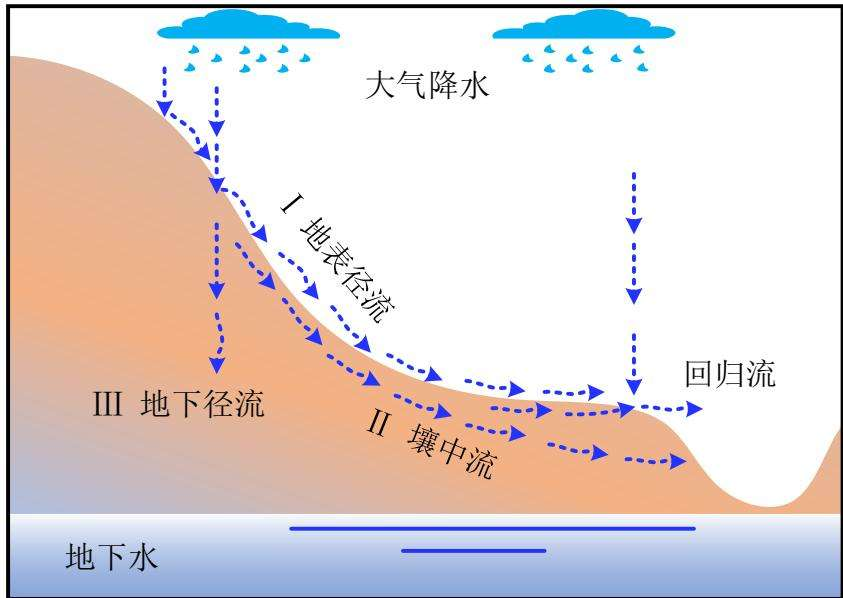  
图5-6 降水流动路径示意图  
Figure 5-6 Precipitation flow path

## (2） 排土场水力侵蚀

不同降雨迁移方式均会对排土场边坡造成水力侵蚀破坏。地表径流对坡面造成持续冲刷、剥蚀和搬运，而研究区松散堆积的特性使其在雨水冲刷和软化作用下，极易形成水土流失。壤中流在造成土层间界面以上形成饱和带和侧向水力坡度的同时，坡体孔隙水压力增大、土壤凝聚力降低、基质吸力降低，进而导致边坡抗剪切能力下降[303]，最终以回归流的形式在坡面断裂处或者拐点从表层涌出，造成边坡破坏和水土流失。研究区分层碾压堆砌及表土覆盖的施工工艺都为壤中流侵蚀提供了极佳的发育环境。地下径流则使研究区坡体内土壤受到静水浮力作用，将侵蚀并悬浮在水中的细小颗粒搬运走而形成内部渗流，内部渗流的持续侵蚀会形成内部导水通道，加之研究区因自身松散、压实不均匀，内部孔隙较多，地下径流会使得研究区内部物质流动和搬运，进而造成漏洞隐患。

壤中流侵蚀实质上是当表土与下层土之间形成壤中流后，坡体原本的静力状态将被打破，其饱和度陡然增加，坡面非饱和土的基质吸力会导致颗粒之间的内聚力下降。壤中流的形成是土体的从非饱和到饱和的变化过程，同时伴有水在土体运动过程中的驱替空气和孔隙的过程。

由于研究区地表覆盖厚度及覆盖物的不同，导致表土渗透率异质性强，雨季降水不仅形成地表径流，还会入渗形成壤中流。加之研究区年降雨量小、蒸发量大，表土常处于干燥缺水状态，雨季短时暴雨所形成的地表径流不多（取决于区域汇水能力)，而坡面上更多的降水则会入渗形成壤中流。加之研究区特殊的堆砌工艺，使得边坡壤中流侵蚀广泛发育。因此在上述几类水力侵蚀中，壤中流侵蚀不仅破坏程度大，且破坏面相比较地表径流侵蚀和地下径流侵蚀更为广泛，已有学者针对壤中流对边坡的破坏特征展开一系列研究[311-314]。

## 5.2.2排土场非饱和边坡流-固耦合分析

流固耦合是研究变形固体在流场作用下的各种相互作用，是流体和固体领域问题的耦合。流固耦合问题一般分为流-固单向耦合和流-固双向耦合两类。流-固单向耦合是通过计算流体动力学（Computational Fluid Dynamics, CFD）进行分析，提取出作用于固体表面的力，然后将其导入到结构分析中。在单向耦合中，结构分析的响应不会影响CFD分析。流-固双向耦合则考虑结构响应，更适合结构变形大、流场边界形貌及流场分布有明显变化的情况。

## （1）渗流-应力耦合的力学机理

研究区岩土介质的流一固耦合是坡体内部水体流动和岩土介质变形相互作用和影响的结果，其作用机理如图5-7所示。图中I和Ⅱ表示变形和孔隙水相互作用所产生的“直接耦合”过程；Ⅲ和IV表示由有效应力的变化导致岩土孔隙度改变，进而硬气渗透率变化所产生的“间接耦合”。

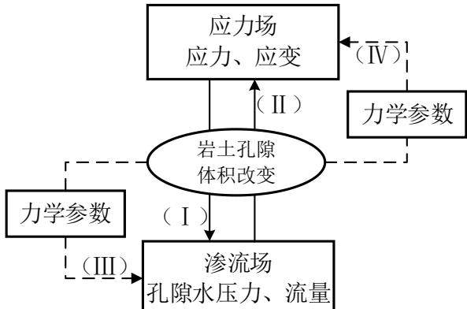  
图5-7流一固耦合系统相互作用的力学机理  
Figure 5-7 The mechanical mechanism of the interaction of flow-solid coupling system

## （2）排土场多孔介质中流体渗流规律

研究区孔隙流体流速较慢，其渗流行为遵循Darcy定律，即表示层流条件下通过多孔介质的渗流速度与水力梯度满足线性关系，在一维条件下为：

$$
v ^ { \prime } = { \frac { Q } { A } } = - k \operatorname { g r a d } H = k J\tag{5-2}
$$

式中， $v ^ { \prime }$ 为研究区空隙流体平均渗流速度，Q为流量，A为过水截面积，k为渗透系数，gradH为水力梯度。上式Darcy定律所表示的是理想状态下渗流流速，即研究区岩土介质内空隙内和固体骨架内均存在渗流，这显然与实际不符。在考虑实际有效孔隙率 $n _ { e }$ 后，渗流有效过水截面积为 $n _ { e } A$ ，研究区岩土介质空隙内渗流速度v可表示为 $v = Q / n _ { e } A = v ^ { \prime } / n _ { e }$ 。在饱和条件且有效孔隙率为 $n _ { e }$ 时，Darcy 定律可表示为：

$$
n _ { e } v = - k g r a d H = k J\tag{5-3}
$$

在一维条件下，研究区岩土介质内部渗透速度v、水力梯度gradH和渗透系数k均为标量，而在三维条件下，渗透速度ν和水力梯度gradH则为矢量。渗透系数k在各向同性介质中为标量，在各向异性介质中为二阶张量。在非饱和条件下，受饱和度s影响的 Darcy定律可表达式为：

$$
s n _ { e } v = - k g r a d H = k J\tag{5-4}
$$

各向异性渗透介质的 Darcy定律表达式为：

$$
s n _ { e } \mathbf { v } _ { i } = - k _ { i j } J _ { j }\tag{5-5}
$$

即某一流速分量 $\mathrm { v } _ { i }$ 分别与水力梯度分量成正比，式中 $k _ { i j }$ 为渗透张量，记为[K]，在总体坐标系中可表示为：

$$
[ K ] = { \left[ \begin{array} { l l l } { k _ { x x } } & { k _ { x y } } & { k _ { x z } } \\ { k _ { y x } } & { k _ { y y } } & { k _ { y z } } \\ { k _ { z x } } & { k _ { z y } } & { k _ { z z } } \end{array} \right] }\tag{5-6}
$$

## （3）排土场孔隙介质有效应力原理

研究区岩土介质是由固体骨架、孔隙以及储存于孔隙中的流体（气和水）组成的多孔介质，其岩土介质中流体承担并传递的压力为孔隙压力，岩土颗粒间接触面传递的应力为有效应力。基于Biot固结理论[315]的直接耦合法可有效表达这一过程，其有效应力表达式为：

$$
\sigma _ { i j } ^ { \prime } = \sigma _ { i j } + \alpha \delta _ { i j } [ \chi p _ { w } + ( 1 - \chi ) p _ { a } ]\tag{5-7}
$$

式中， $\sigma _ { i j } ^ { \prime }$ 为有效应力， $\sigma _ { i j }$ 为总应力， $\delta _ { i j }$ 为 Kronecker 符号， $\alpha .$ 为Biot系数，通常取 1,

$p _ { w }$ 与 $p _ { a }$ 分别为孔隙水压力和孔隙气压力， $\chi .$ 与饱和度和表面张力有关一般可假定 $\chi = \mathbf { s }$ ，即 $s _ { w } + s _ { a } = 1$ ，因而有效应力又可表示为：

$$
\sigma _ { i j } ^ { \prime } = \sigma _ { i j } + \delta _ { i j } [ s _ { w } p _ { w } + ( 1 - s _ { w } ) p _ { a } ] = \sigma _ { i j } + \delta _ { i j } \overline { { p } }\tag{5-8}
$$

式中， $\overline { { p } }$ 为研究区岩土介质内流体平均压力。

## （4）排土场应力平衡方程和渗流连续方程

研究区岩土介质内部存在水气两相流体，同时非饱和区与大气相通，水无粘滞性，同时空气不溶于水，此时气压在整个区域上保持恒定。基于虚功原理（Principle of Virtual Work）和有效应力原理（Principle of Effective Stress)，研究区岩土介质在某一时刻的虚功与作用在该介质上作用力产生的虚功相等，即：

$$
\begin{array} { c } { { { \displaystyle \int _ { V } \delta \varepsilon ^ { T } D _ { e p } \left( d \varepsilon + m \frac { d \overline { { { p } } } } { 3 K _ { S } } \right) d V - \int _ { V } \delta \varepsilon ^ { T } m d \overline { { { p } } } \mathrm { d } V - \int _ { V } \delta u ^ { T } d f \mathrm { d } V } } } \\ { { - \displaystyle \int _ { S } \delta u ^ { T } d t \mathrm { d } S = 0 } } \end{array}\tag{5-9}
$$

式中：t为面力， $f$ 为体力， $\delta \varepsilon$ 为虚位移， $\delta u$ 为虚应变， $D _ { e p }$ 为弹塑性矩阵，dε为孔隙流体压力引起的颗粒压缩，仅在正方向上产生变形。

为了将应力和渗流进行耦合，同时由于研究区气压在非饱和区域维持恒定，即 ${ d p _ { a } } / { d t } = 0$ ，因此对上式进行时间求导并化简为：

$$
\frac { d \overline { { p } } } { d t } = \frac { d ( s _ { w } p _ { w } + ( 1 - s _ { w } ) p _ { a } ) } { d t } = s _ { w } \frac { d p _ { w } } { d t } + p _ { w } \frac { d s _ { w } } { d t }\tag{5-10}
$$

取 $p _ { a }$ 为一个标准大气压，饱和度即毛细压力函数、孔隙水压力函数，于是结合以上可建立研究区应力平衡方程为：

$$
\begin{array} { r l } { \displaystyle \int _ { V } \delta \varepsilon ^ { T } D _ { e p } \frac { d \varepsilon } { d t } d V + \int _ { V } \delta \varepsilon ^ { T } D _ { e p } \left[ m \frac { ( s _ { w } + p _ { w } \xi ) } { 3 K _ { s } } \frac { d p _ { w } } { d t } \right] d V } & { } \\ { - \displaystyle \int _ { V } \delta \varepsilon ^ { T } m ( s _ { w } + p _ { w } \xi ) \frac { d p _ { w } } { d t } d V } & { } \\ { = \displaystyle \int _ { V } \delta u ^ { T } \frac { d f } { d t } d V + \int _ { s } \delta u ^ { T } \frac { d t } { d t } d S } & { } \end{array}\tag{5-11}
$$

根据质量守恒原理，在dt时间内流入研究区岩土介质内水量与其内部储水增量相等，其渗流用 Darcy定律来推导，可得研究区岩土介质渗流的连续性方程为：

$$
\begin{array} { c } { { s _ { w } \left( m ^ { T } - \displaystyle \frac { m ^ { T } D _ { e p } } { 3 K _ { S } } \right) \displaystyle \frac { \mathrm { d } \varepsilon } { \mathrm { d } t } - \nabla ^ { T } \left[ k _ { 0 } k _ { r } \left( \displaystyle \frac { \nabla p _ { w } } { \rho _ { w } } - g \right) \right] + } } \\ { { \left\{ \xi n + n \displaystyle \frac { s _ { w } } { K _ { w } } + s _ { w } \left[ \displaystyle \frac { 1 - n } { 3 K _ { S } } - \displaystyle \frac { m ^ { T } D _ { e p } m } { ( 3 K _ { S } ) ^ { 2 } } \right] ( s _ { w } + p _ { w } \xi ) \right\} \displaystyle \frac { \mathrm { d } \rho _ { w } } { \mathrm { d } t } = 0 } } \end{array}\tag{5-12}
$$

式中， $k _ { 0 }$ 为研究区岩土介质初始渗透系数张量与水密度的乘积； $k _ { r }$ 为比渗透系数，可为饱和度、应力、应变或损伤变量等的函数； $g$ 为当地重力加速度；n为岩土介质孔隙度； $K _ { w }$ 为水的体积模量。

## （5）排土场应力渗流耦合模型建立

研究区的多孔岩土介质中水头差引起内部水体的渗流运动，渗流所产生的动水压力以渗流体积力的形式作用于岩土介质。以Biot固结理论为基础，在忽略气体压力、压缩性、温度变化和微小变形的前提下，定义应力以拉力为正，孔压在饱和区以压应力为正，在非饱和区孔隙压力为负，建立应力-渗流耦合数学模型[316]：

$$
\left\{ \begin{array} { c } { { u = N _ { u } \overline { { u } } } } \\ { { \varepsilon = B \overline { { u } } } } \\ { { p _ { w } = N _ { p } \overline { { p } } _ { w } } } \end{array} \right.\tag{5-13}
$$

式中， ${ \overline { { u } } } .$ $\overline { { p } } _ { w }$ 分别为单元节点的位移和孔隙压力，带入式5-11简可得固相有限元列式：

$$
K { \frac { \mathrm { d } { \overline { { u } } } } { d t } } + C { \frac { \mathrm { d } { \overline { { p } } } _ { w } } { d t } } = { \frac { d f } { d t } }\tag{5-14}
$$

式中：

$$
K = \int _ { V } B ^ { T } D _ { e p } B d V\tag{5-15}
$$

$$
C = \int _ { V } B ^ { T } D _ { e p } m \frac { ( s _ { w } + \xi p _ { w } ) } { 3 K _ { s } } N _ { p } d V - \int _ { V } B ^ { T } ( s _ { w } + \xi p _ { w } ) m N _ { p } d V\tag{5-16}
$$

$$
d f = \int _ { V } N _ { u } ^ { T } d f d V + \int _ { S } N _ { u } ^ { T } d t d S\tag{5-17}
$$

流量边界条件可以表示为 $- n ^ { T } k k _ { r } ( \nabla p _ { w } / \rho _ { w } - g ) = q _ { w }$ ，n为流量边界单位法向， $q _ { w }$ 为单位时间内流过边界水流量；空隙压力边界条件可表示为 $p _ { w } = p _ { w b }$ $p _ { w b }$ 为已知边界处孔隙压力值。

利用伽辽金方法（GalerkinMethod），结合岩土介质渗流的连续性方程和流量边界条件可得：

$$
E \frac { d \overline { { u } } } { d t } + F \overline { { p _ { w } } } + G \frac { d \overline { { p _ { w } } } } { d t } = \hat { f }\tag{5-18}
$$

式中：

$$
\hat { f } = \int _ { s } N _ { p } ^ { T } q _ { w b } d S - \int _ { V } ( \nabla \ : N _ { p } ) ^ { T } k _ { k } g d V\tag{5-19}
$$

$$
E = \int _ { V } N _ { P } ^ { T } \left[ s _ { w } \left( m ^ { \mathrm { T } } - \frac { m ^ { \mathrm { T } } D _ { e p } } { 3 K _ { S } } \right) B \right] \mathrm { d } V\tag{5-20}
$$

$$
F = \int _ { V } ( \nabla \ : N _ { p } ) ^ { T } k k _ { r } \ : \nabla \ : N _ { p } d V\tag{5-21}
$$

$$
\begin{array} { c l } { { G = \displaystyle \int _ { V } N _ { P } ^ { \mathrm { T } } \left\{ s _ { w } \left[ \left( \frac { 1 - n } { K _ { S } } - \frac { m ^ { \mathrm { T } } D _ { e p } m } { ( 3 K _ { S } ) ^ { 2 } } \right) \right] ( s _ { w } + p _ { w } \xi ) + \xi n \right. } } \\ { { \left. + n \frac { s _ { w } } { K _ { w } } \right\} N _ { p } d V } } \end{array}\tag{5-22}
$$

联合式5-14和式5-18，研究区岩土介质中应力-渗流耦合方程可表示为：

$$
\left[ { K } \quad { C } \right] \frac { \mathrm { d } } { \mathrm { d } t } \left\{ \frac { \overline { { u } } } { p _ { w } } \right\} + \left[ { 0 } \quad { 0 } _ { F } \right] \left\{ \frac { \overline { { u } } } { p _ { w } } \right\} = \left\{ \frac { d f } { d t } \right\}\tag{5-23}
$$

根据连续介质体积力的计算原理，以及渗流体积力与水力梯度的正比关系，可将单元渗透体积力转化为单元等效结点荷载：

$$
\{ F _ { s } \} = \int _ { \Omega } [ \boldsymbol { \mathrm { N } } ] ^ { \mathrm { T } } \left\{ \frac { f _ { x } } { f _ { y } } \right\} \mathrm { d } x \ \mathrm { d } y\tag{5-24}
$$

$$
\{ \Delta F _ { s } \} = \int _ { \Omega } [  { \mathrm { N } } ] ^ { \mathrm { T } } \left\{ \frac { f _ { x } } { f _ { y } } \right\} \mathrm { d } x \ \mathrm { d } y\tag{5-25}
$$

式中： $\{ \mathrm { F } _ { \mathrm { s } } \}$ 与 $\{ \Delta \mathrm { F } _ { \mathrm { s } } \}$ 分别为渗流体积力和渗流体积力增量所造成的等效节点力；[N]为单元形函数； $f _ { x }$ 与 $f _ { y }$ 分别为渗流体积力在x、y方向上的分量。

在外力荷载作用下，多孔等效连续岩土介质通常会产生压缩-固结变形，导致土体孔隙率发生变化，进而使得土体渗透系数发生变化，进一步再影响土体应力分布。土体渗透系数可表示为应力场 $\sigma _ { i j }$ 的函数，即 $k = k ( \sigma _ { i j } )$ 0

$$
\left[ { K } \quad { C } \right] \frac { \mathrm { d } } { \mathrm { d } t } \left\{ \frac { \overline { { u } } } { p _ { w } } \right\} + \left[ { 0 } \quad { 0 } _ { F } \right] \left\{ \frac { \overline { { u } } } { p _ { w } } \right\} = \left\{ \frac { d f } { d t } \right\}\tag{5-26}
$$

式中：

$$
E = \int _ { V } N _ { P } ^ { T } \left[ s _ { w } \left( m ^ { \mathrm { T } } - \frac { m ^ { \mathrm { T } } D _ { e p } } { 3 K _ { S } } \right) B \right] \mathrm { d } V\tag{5-27}
$$

$$
F = \int _ { V } ( \nabla \ : N _ { p } ) ^ { T } k k _ { r } \ : \nabla \ : N _ { p } d V\tag{5-28}
$$

$$
\begin{array} { c l } { { G = \displaystyle \int _ { V } N _ { P } ^ { \mathrm { T } } \left\{ s _ { w } \left[ \left( \frac { 1 - n } { K _ { S } } - \frac { m ^ { \mathrm { T } } D _ { e p } m } { ( 3 K _ { S } ) ^ { 2 } } \right) \right] ( s _ { w } + p _ { w } \xi ) + \xi n \right. } } \\ { { \left. + n \frac { s _ { w } } { K _ { w } } \right\} N _ { p } d V } } \end{array}\tag{5-29}
$$

$$
\hat { f } = \int _ { s } N _ { p } ^ { T } q _ { w b } d S - \int _ { V } ( \nabla \ : N _ { p } ) ^ { T } k _ { k } g d V\tag{5-30}
$$

K为渗透系数， $p$ 为孔隙流体压力，m为水容量，V为水的运动粘滞系数，u为流速分量，f为作用力。

## 5.2.3 排土场水力侵蚀发育数值模拟

基于研究区堆存现状，可建立分层模型，模拟不同强度降雨条件下，对研究区不同坡度的边坡土壤侵蚀状况。利用ABAQUS有限元分析软件的流固耦合模块来模拟大气降水在土壤中流动的物理过程。

## (1） ABAQUS 建模与参数设置

## 1）几何模型的建立

研究区堆存岩土主要来自于腐殖土、粘质砂土、砂土、粉细砂、粘土、含砾粘土、亚粘土、泥砾及含砂砾石等的松散岩组的混合。为了方便后期的绿化，会将适宜植物生长的自然表土剥离并存储，在研究区土方堆排时会将砂砾岩等难以为植物提供适宜生境的岩土对方在底部，再将厚度数十厘米至数米不等的腐殖土、粘土、沙土等覆盖于表面。如图5-8所示为研究区某区域表层土壤剖面，最上层为厚度0.2\~0.5 m厚的腐殖土，下面为厚度约 0.5m的黑粘土，再下层为厚度约1m的粘质砂土。

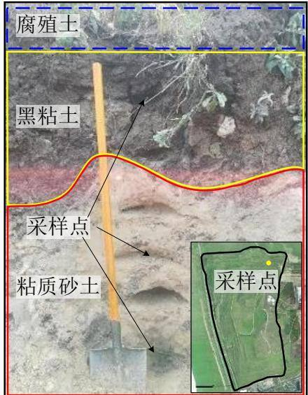  
图5-8研究区剖面采样  
Figure 5-8 Surface soil profile of study area

首先需要定义基质吸力随土壤饱和度的变化以及渗透系数随饱和度的变化情况。由于黑粘土渗透率低、隔水性强，因此在覆盖有黑粘土的区域，大气雨不易下渗。为探究壤中流对边坡侵蚀破坏的机理过程，因此可简化模型为2层材料，即表层为腐殖土0.3m，综合渗透系数约 $3 . 5 { \times } 1 0 ^ { - 5 } \mathrm { m } / \mathrm { h }$ ，下层为粘土，综合渗透系数约 $4 { \times } 1 0 ^ { - 1 1 } ~ \mathrm { m / h }$ ，其他参数参照表3-13、表3-14和表3-15。坡体形态采用研究区的典型构型，坡面角25\~40度，台阶高25米，如图5-9所示。

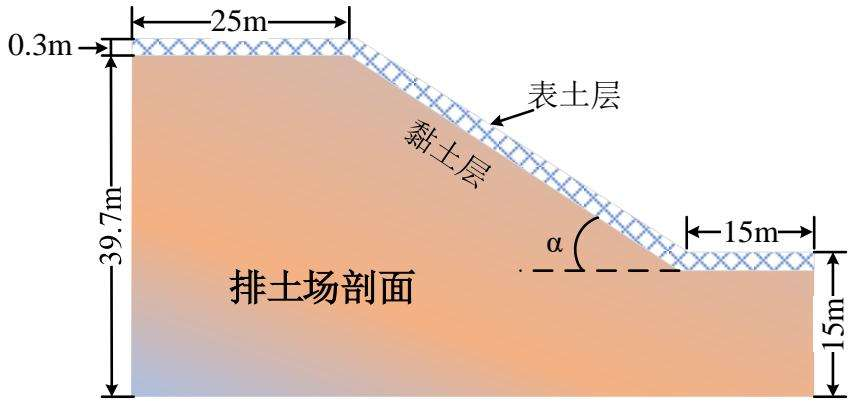  
图5-9排土场初始模型台阶剖面示意图  
Figure 5-9 Schematic diagram of the step profile of the initial model of the dump

## 2）定义土体破坏准则

对于耦合模型的求解需设定相应定解条件，即设定初始水头边界、初始流量边界、应力边界及位移边界等限定条件。基于LOAD模块添加相应的边界条件，并通过\*Soils分析步求解应力-渗流耦合问题。当土体中某点剪应力等于土的抗剪强度时，该点即处于濒于破坏的“极限平衡状态”。利用库伦方程（式(5-31)）可得到土体遭到破坏的临界强度极限，即土体中某点的临界抗剪强度。

$$
\tau _ { f } = c + \sigma t a n \varphi\tag{5-31}
$$

其中， $\tau _ { f }$ 为抗剪强度参数， $c$ 是土的粘聚力； $\sigma$ 为剪切破坏面上的法向压应力； $\varphi$ 为土的内摩擦角。

## 3）建立初始状态

在进行降雨条件对壤中流的形成及其对边坡的侵蚀情况分析之前，需对土体进行初始应力的平衡，包括建立简化模型、设置材料属性（依据表3-13、表3-14和表3-15定义渗透折减系数与饱和度的关系，以及定义孔压与饱和度的关系）、定义载荷、定义边界条件、输出应力条件等。

## 4）建立降雨模型

研究区所在区域年降水时空分布及其不均，结合3.1.1节中气象数据，考虑一般情况和极端情况下的降雨情况，分别取2mm/h、5mm/h、10mm/h、20mm/h四个梯度的大气降水作为基础降雨强度。同时，结合区域降水特征，将降雨时长设为6小时，降雨强度按随时间先增强、再稳定、后减弱的趋势进行（图5-10)。

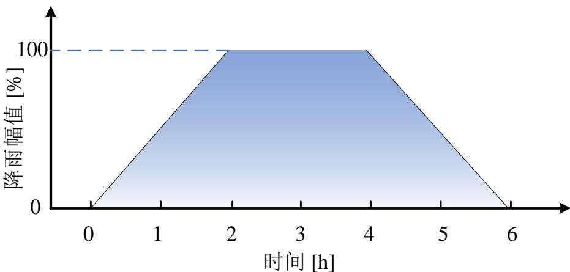  
图5-10降雨强度与持续时间的对应关系  
Figure 5-10 Relationship between rainfall intensity and persistence

## 5.2.4排土场水力流侵蚀作用分析

土壤是否被侵蚀主要土粒运动轨迹以及水流强度来判断，可通过水流在土壤孔隙中的速度来判别土壤是否被侵蚀。水的流速越大，越容易对土壤骨架产生向外的作用力，导致土体孔隙度增大，结构变松散，同时速度越大能量越大，能带走的土粒就越多，土体就越容易被侵蚀。

## （1）降雨前表层土壤中水分运移情况

根据研究区的降雨情况，其降雨强度随着月份的改变分布不均，分析四种降雨强度对表面流形成的影响以及对表面流对边坡的侵蚀情况。以坡度角为 $3 3 ^ { \circ }$ 的边坡为例，应力平衡前（图5-11a）后（图5-11b）降雨前表土孔隙水均以渗

流为主的无规则运动。堆积后由于土体受重力作用以及内部的应力作用，土体略有沉降，表面略有变形。

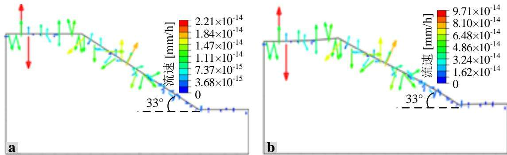  
图5-11应力平衡前后土壤表层孔隙中水的分布  
Figure 5-11 Distribution of water in pores of soil surface before and after stress balance

## (2) 壤中流的来水与退水

在有限元模拟中，由于土体被视为连续性介质而无法追踪土粒的剥离、运动轨迹，因此可用孔隙流速向量来判断壤中流侵蚀发育状况，孔隙流速等于真实速度与孔隙度的乘积，孔隙度越大，流动速度越接近真实速度，因此可用流速值及流动持续时长来表征土体侵蚀程度。

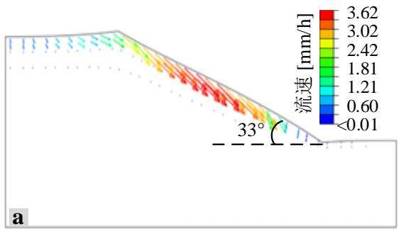

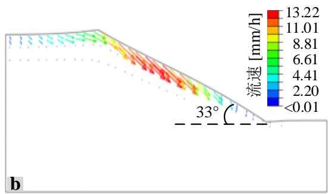

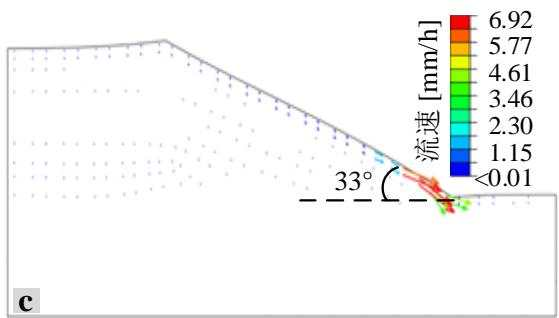

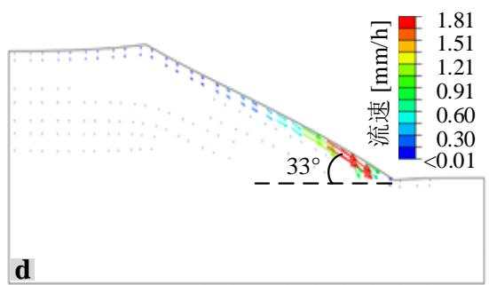  
图 5-12 以 2mm/h 降雨施加于 $3 3 ^ { \circ }$ 边坡壤中流状况：（a）降雨刚开始时及（b）降雨过程中；（c）降雨结束后24h及（d）降雨结束后72h壤中流状况  
Figure 5-12 At the beginning of rainfall (a) and in the process of rainfall (b) the condition of soil flow on the slope; at the end of rainfall 24h (c) and 72h (d) the condition of soil flow on the slope

以2mm/h降雨强度按图5-10降雨幅值曲线施加于33°边坡。当降雨开始约0.25小时后（图5-12a），土层界面处形成明显壤中流，雨水汇集于表层，在坡降作用下雨水沿分界面向下流动。由于短时间内上游汇水聚集于坡面上部，造成壤中流流速峰值出现在坡面上部。当降雨持续约5.2小时后（图5-12b），雨水在重力作用下沿分界面向下流动，流速增幅显著增大，边坡中部壤中流流速到达峰值，过程中同时伴随少量雨水渗入深层。降雨结束24小时后（图5-12c），降水大量渗入下层，此时入渗作用对流速阻力大于重力作用，壤中流流速逐渐降低。如图5-12d所示，降雨结束72小时后壤中流流速持续下降，最大流速位于坡脚处且呈现向外扩散趋势，大部分雨水渗入到下层土壤，壤中流几乎消失。

总体而言，随着时间推移，壤中流经历了一个先增大再减小的过程，降雨初期壤中流就已经形成，在降雨后期壤中流速度达到峰值，降雨结束后逐渐减小直至消失。

## 5.2.5 不同条件下壤中流侵蚀作用模拟

## （1）壤中流侵蚀作用模拟

如前节所述，壤中流流速越大则动能越大，对边坡造成的侵蚀破坏越严重，因此可利用提取模拟过程中流速峰值位置来判定壤中流侵蚀与破坏过程。如图5-13所示，在研究区边坡自上而下设置顶部、上部、中部、下部和底部共计5个检测点，分别模拟不同坡度、不同降雨强度下壤中流发育特征。

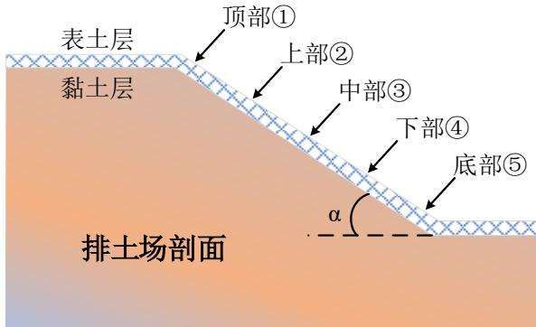  
图 5-13 研究区坡面点设置  
Figure 5-13 Setting of detection points on slope surface of study area

1）25°边坡不同降雨强度下壤中流发育特征

分别以2mm/h和 5mm/h降雨强度按图5-10降雨幅值曲线施加于25°边坡，边坡不同部位监测点流速随时间的变化曲线如图5-14所示。

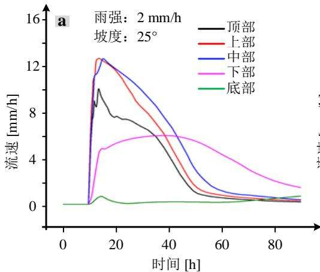

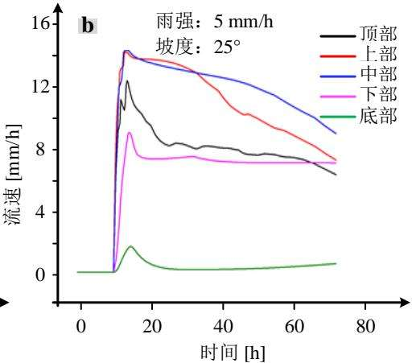  
图5-14不同降雨强度下25°边坡监测点流速变化曲线  
Figure 5-14 Velocity curve of 25° slope monitoring point under different rainfall intensity

可以看出，在 2mm/h和 5mm/h的降雨强度下， $2 5 ^ { \circ } .$ 边坡坡面上部和中部均出现壤中流峰值，峰值流速分别为13mm/h和14mm/h，二者达到峰值时间接近；在2mm/h的降雨强度下壤中流流速达到峰值后迅速下降，在约 50h时流速趋近于0，而5mm/h的降雨强度下壤中流维持较长时间的高速流动。

## 2) $3 0 ^ { \circ } .$ 边坡不同降雨强度下壤中流发育特征

分别以 2mm/h和 5mm/h降雨强度按图5-10降雨幅值曲线施加于 $3 0 ^ { \circ }$ 边坡，边坡不同部位监测点流速随时间的变化曲线如图5-15所示。

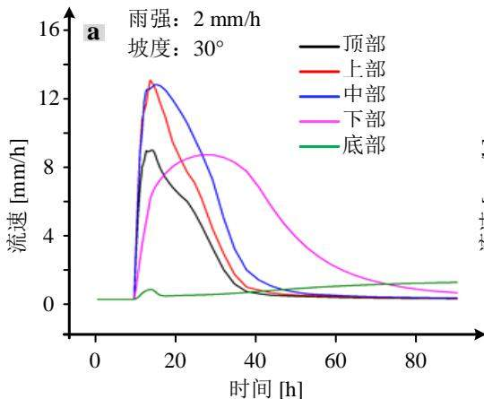

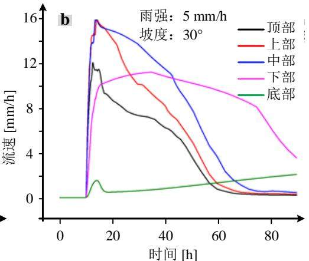  
图5-15不同降雨强度下30°边坡监测点流速变化曲线  
Figure 5-15 Velocity curve of 30° slope monitoring point under different rainfall intensity

可以看出，在2mm/h和5mm/h的降雨强度下，30°边坡坡面上部和中部均出现壤中流峰值，流速峰值分别为13mm/h和16mm/h，二者达到峰值时间接近；在2mm/h的降雨强度下壤中流流速达到峰值后迅速下降，在约38h时流速趋近于0，而5mm/h的降雨强度下壤中流不仅流速峰值显著高于前者，而且维持较长时间的高速流动，在约58h处壤中流流速趋近于0。

## 3) $3 3 ^ { \circ } .$ 边坡不同降雨强度下壤中流发育特征

分别以 2mm/h和 5mm/h 降雨强度按图 5-10 降雨幅值曲线施加于 $2 5 ^ { \circ } { } ~ .$ 边坡，边坡不同部位监测点流速随时间的变化曲线如图5-16所示。

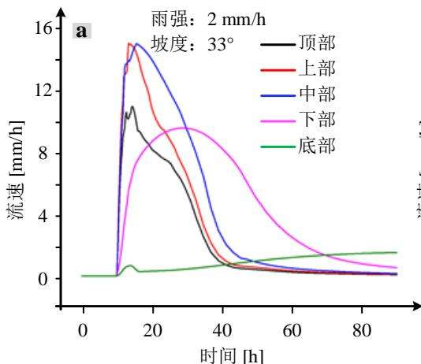

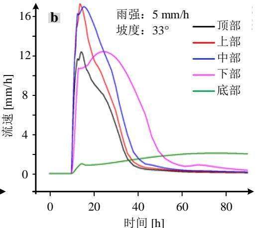  
图5-16不同降雨强度下33°边坡监测点流速变化曲线  
Figure 5-16 Velocity curve of 33° slope monitoring point under different rainfall intensity

可以看出，在2mm/h和 5mm/h的降雨强度下，33°边坡坡面上部和中部均出现壤中流峰值，流速峰值分别为15mm/h和17mm/h，二者达到峰值时间接近，且壤中流流速达到峰值后均迅速下降，在约38h时流速趋近于0。

## 4）40°边坡不同降雨强度下壤中流发育特征

分别以2mm/h和5mm/h降雨强度按图5-10降雨幅值曲线施加于25°边坡，边坡不同部位监测点流速随时间的变化曲线如图5-17所示。

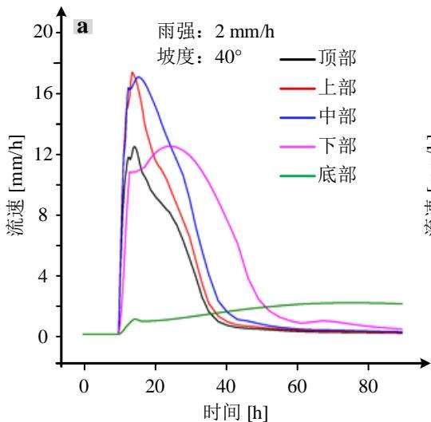

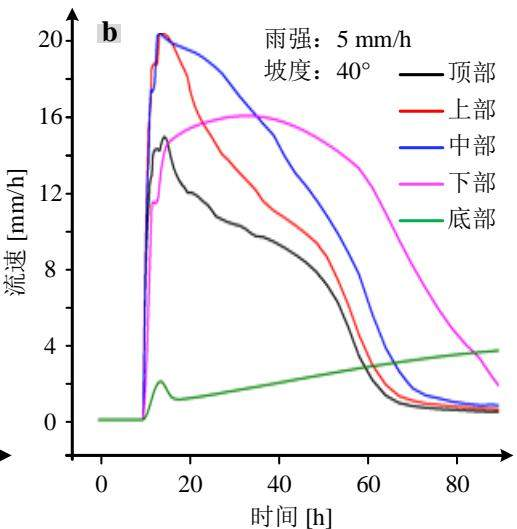  
图5-17不同降雨强度下40°边坡监测点流速变化曲线  
Figure 5-17 Velocity curve of 40° slope monitoring point under different rainfall intensity

可以看出，在2mm/h和 5mm/h的降雨强度下，40°边坡坡面上部和中部均出现壤中流峰值，流速峰值分别为17.5mm/h和20.5mm/h，二者达到峰值时间接近，在2mm/h的降雨强度下壤中流流速达到峰值后迅速下降，在约38h时流速趋近于0，而5mm/h的降雨强度下壤中流不仅流速峰值显著高于前者，而且维持较长时间的高速流动，在约58h处壤中流流速趋近于0。

## (2）壤中流侵蚀作用机理

坡面侵蚀受坡度的影响较大，设定2mm/h降雨强度按图5-10降雨幅值曲线施加于不同坡度边坡上，边坡不同部位监测点流速随时间的变化曲线如图5-18所示。

降雨从第10小时开始后共持续6小时，可以看出在降雨中及降雨结束后，边坡不同部位壤中流随时间变化出现不同规律，整体而言，壤中流流速随着坡度增大而增大，受影响最大的为边坡的上部和中部，持续时间最长的为边坡下部，边坡底部壤中流流速最慢。

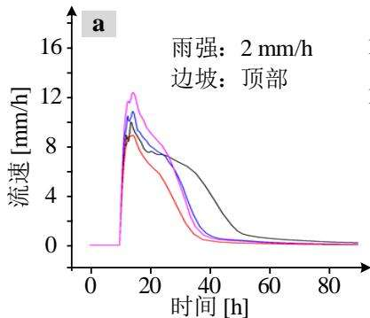

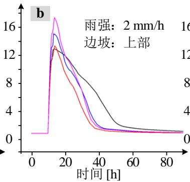

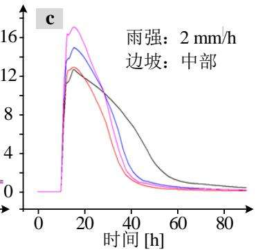

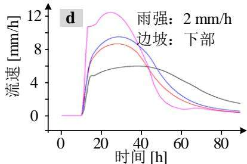

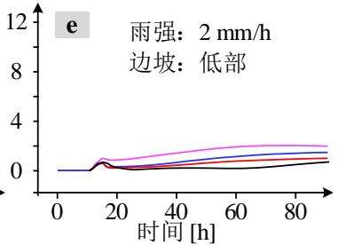  
图5-182mm/h降雨强度及不同坡度下壤中流流速变化曲线  
Figure 5-18 Variation curve of interflow velocity on different slopes under rainfall of 2mm/h

综合以上可以看出，在不同降雨强度和坡度下，边坡壤中流均有不同程度的发育，从降雨初期即开始发育于边坡中部和上部，随着降雨时间持续流速逐渐增大；总体上降雨强大越大壤中流流速峰值越高、流速下降越缓慢，一般在降雨中期及后期达到峰值，随着降雨停止流速逐渐减小，直至消失。

壤中流侵蚀是研究区覆盖面最广的土壤侵蚀类型，其破坏力主要取决于雨季短时强降雨的强度以及区域坡度，而研究区雨季短时强降雨和复杂高陡边坡为壤中流侵蚀提供了良好的发育条件，进而称为生态致灾的重要因素。

## 5.3 排土场冻融侵蚀作用规律分析（Analysis on the Law of Freeze-thaw Erosion in the Dump)

处于高寒矿区的研究区除受到典型水力侵蚀外，还在漫长的冬季受到冻融侵蚀，而冻融侵蚀主要集中发育于边坡侵蚀沟边坡两侧。以研究区北坡某侵蚀沟为例，在一次季节性冻融循环周期前后分别进行两次无人机贴近摄影测量与建模，实测冻融循环下侵蚀沟的发育规律，分析侵蚀沟发育过程与微地形因子的关系。

## 5.3.1 冻融侵蚀发育概况

在高纬度或高海拔的高寒地区，昼夜和季节性冻融循环及融雪径流是造成地表冻融侵蚀的重要因素[317-320]。初春时期的融雪水昼夜冻融循环所造成的土壤侵蚀对边坡造成严重破坏[321]，直接威胁边坡稳定[322,323]。传统针对冻融侵蚀的研究大多集中于高原或高山等自然地貌[324,325]，而对于高寒矿区人工地貌（如露天采矿场）受到冻融侵蚀的研究较少。为了了解侵蚀沟沟壑侵蚀的动态，有必要对冻融循环中的土壤侵蚀进行准确的测量，从而为土地管理和水土保持管理提供依据。

研究区北坡地貌复杂、表土松散，在雨季时受水力侵蚀而形成大量侵蚀沟。侵蚀沟截面呈“U”形或“V”形，其两侧边坡坡度陡、植物难以生存，在冻融循环下对形成侵蚀活动[322,326,327]。本次定量监测的侵蚀沟为北坡众多侵蚀沟中较典型的一个（图5-9c），其位于研究区北坡中部，毗邻天然草原，长约150m，贯穿多级台阶，最大宽度约18m，最大深度约7.2m。

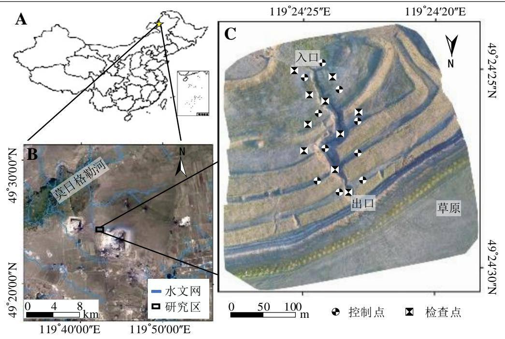  
图5-19研究区北坡典型侵蚀沟位置示意图  
Figure 5-19 Location of typical erosion gully on the north slope of the study area

## 5.3.2 冻融侵蚀作用监测方法

传统冻融侵蚀研究方法为数值模拟[328]、实地调查[329,330]、铯-137示踪法[331]等。这其中，如通用土壤流失方程（UniversalSoil Loss Equation, USLE）[332]或修正通用土壤流失方程（Revised UniversalSoil Loss Equation, RUSLE）[333]等模型更适合于大范围区域，而实地调查与铯-137示踪法则成本高、效率低，并可能造成二次污染。

随着遥感技术的进步极，基于无人机平台的低空摄影测量技术（<1000m）已显示出其独特的优势，利用无人机摄影测量技术可在保证精度的同时，极大提高土壤侵蚀调查效率[334,335]。无人机摄影测量具有自动化高、系统灵活、起降方便、成本低廉、数据质量可靠等优点，尤其在小区域和复杂地貌下展现出独特优势，已成为野外调查以及卫星遥感、航空遥感的有力补充[336]。

## （1）数据采集及预处理

基于双架次无人机摄影测量的冻融侵蚀监测需要在一个冰冻季节前后分别获取地表精细点云数据。无人机摄影测量外业需首先布设像控点和检查点，然后根据地面分辨率需求确定飞行参数设定；内业经过空中三角测量与密集匹配等步骤获得三维点云、数字地表模型及数字正射影像，其具体步骤已在3.3节详细介绍。无人机摄影测量所得结果无法直接将植物与地面分开，同时由于研究区植物稀疏，可利用斜率检测算法（Slope Detection Algorithms）和SOR滤波（Statistical Outlier Removal）[337]来减弱或消除植物对地貌的影响，以得到精确的研究区数字高程模型（Digital Elevation Model, DEM)。

除正射飞行外，还利用倾斜摄影测量技术在坡度较大区域进行补拍以提高精度[338]。每次飞行均在中午12点至下午1点之间完成，飞行高度为30m，速度为3.5m/s，同时利用“仿地飞行”功能保证相对地面高度的稳定，每架次数据采集时间约为25分钟，本次实验数据分别采集于2017年10月1日和2018年5月1日（图5-20、表5-4），飞行区域规划航线如图5-20b所示。

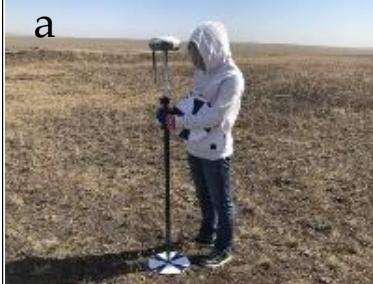

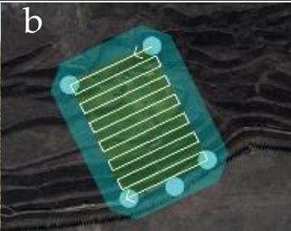

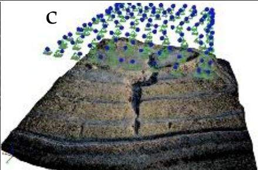  
图5-20图现场像控点及检查点布设及摄影测量数据处理  
Figure 5-20 (a) Dispose and measure the image control points and check points; (b) the flight plan; and (c) dense point cloud with camera locations estimated

表5-4无人机及飞行参数  
Table 5-4 UAV and ground survey details
<table><tr><td></td><td>October 2017</td><td>May 2018</td></tr><tr><td>飞行高度（相对地面）</td><td colspan="2">~30 m AGL</td></tr><tr><td>航向重叠</td><td colspan="2">85 %</td></tr><tr><td>旁向重叠</td><td colspan="2">85 %</td></tr><tr><td>获取影像数量</td><td>957</td><td>1132</td></tr><tr><td>研究区影像重叠数</td><td>&gt;9</td><td></td></tr><tr><td>控制点个数</td><td>10</td><td></td></tr><tr><td>检查点个数</td><td>10</td><td></td></tr><tr><td>结果分辨率 (GSD, cm pix−1)</td><td>~1.8</td><td></td></tr></table>

同时，利用设立在研究区的气象站可获取研究期内每天气象数据（图5-21）。两次无人机摄影测量数据采集时地面温度均为 $1 5 \mathrm { { ^ \circ C } }$ 左右，因此确保具有相似的土壤热胀冷缩度。

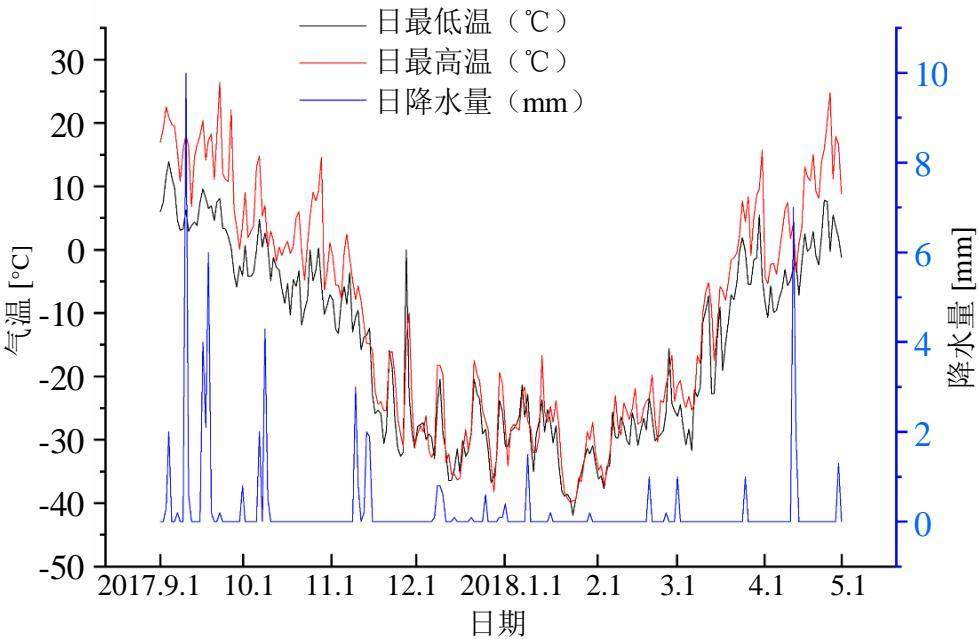  
图5-21研究区一个冻融循环下气象数据  
Figure 5-21 Meteorological data under a freeze-thaw cycle in the study area

## (2) 冻融侵蚀量定量计算

利用一个冻融循环周期前后两景DEM数据空间做差，可评估地表在一个冻融循环周期下的冻融侵蚀量。为了计算两个调查阶段之间的地形变化，利用两期 DEM 之差 DEM 来创建差异 DEM，即 DoD（DEM of Difference)，DoD 中负值表示地形的即侵蚀量，正值表示沉积量（图5-22）。为了考虑DoD的不确定性，应用了最小检测阈值以区分实际地形变化与由误差和不确定性引起的伪影。

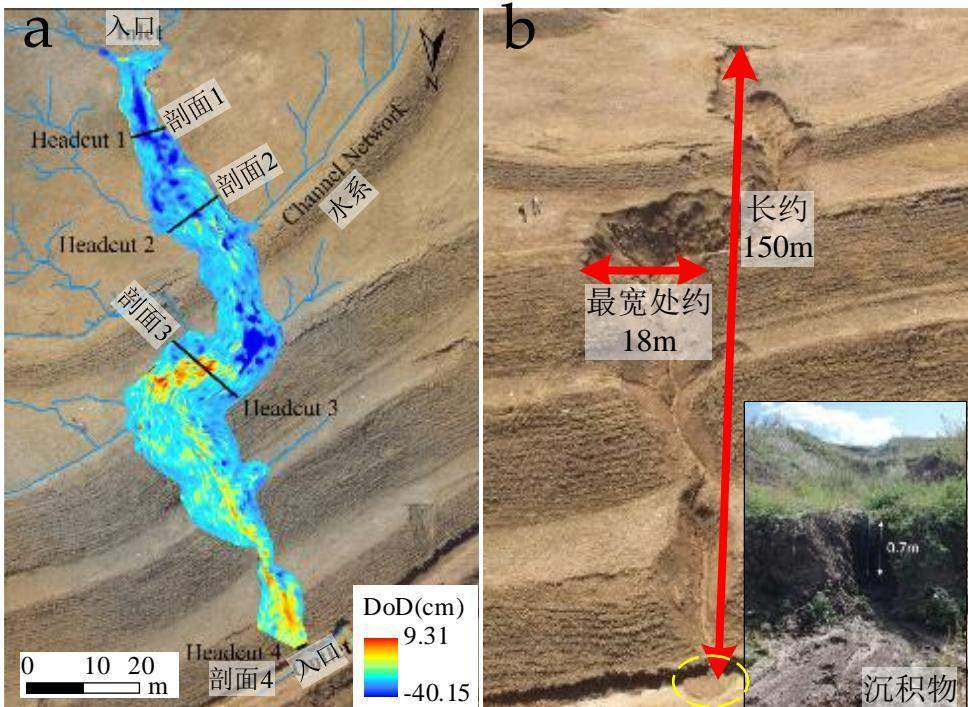  
图 5-22 研究区 DoD 及鸟瞰示意图  
Figure 5-22 DOD and aerial view of the study area

每个DEM的误差和地形不确定性是控制地形变化的重要指标。在这项研究中，最小检测阈值用于区分两个DEM中的实际地形变化以及误差和不确定性。根据物理测量中的不确定性[339]，通过假定误差为非正态分布，DoD偶然误差根据下式进行传播：

$$
U _ { \mathrm { c r i t } } = t \sqrt { ( \delta z _ { \mathrm { n e w } } ) ^ { 2 } + ( \delta z _ { \mathrm { o l d } } ) ^ { 2 } }\tag{5-32}
$$

其中 $\mathrm { U } _ { \mathrm { c r i t } }$ 是DoD中的临界阈值误差，或高程变化的检测水平；t是给定置信区间； $\delta \boldsymbol { z } _ { \mathrm { n e w } }$ 和 $\ S _ { \mathrm { { Z o l d } } }$ 分别为2018年5月和2017年10月所获取的DEM数据中误差。

根据定量重复性误差，设置置信区间为90%，利用公式（5-32）计算每个DoD栅格像元的临界阈值误差，以得出高程变化的检测水平 $\mathrm { U } _ { \mathrm { c r i t } }$ ，再将其从所有DoD像元中减去，以校正得出高程变化图并计算侵蚀和沉积量。

## (3）精度评价

无人机摄影测量所获取地貌数据的精度是保证冻融侵蚀定将监测的关键，采用像控点误差统计和检查点验证两种方式进行精度评估。分别将像控点/检查点实测值与DEM影响提取值做比较，其误差统计如表5-5所示。

表5-5基于像控点与检查点的误差统计  
Table 5-5 Error statistics based on image control points and check points
<table><tr><td rowspan="3"></td><td rowspan="3">采集 时间</td><td colspan="10">误差(cm)</td></tr><tr><td rowspan="2"></td><td colspan="3">东西向（向东偏移为正）</td><td colspan="3">南北向（向北偏移为正）</td><td colspan="4">竖直向（向上偏移为正）</td></tr><tr><td>Max</td><td>Min</td><td>Mean</td><td>RMSE</td><td>Max Min</td><td>Mean</td><td>RMSE</td><td>Max</td><td>Min</td><td>Mean RMSE</td></tr><tr><td>控 制</td><td>2017.10</td><td>1.8</td><td>-0.7</td><td>0.3</td><td>0.8</td><td>0.8</td><td>-1.8</td><td>-0.4</td><td>0.9</td><td>1.6 -1.2</td><td>0.2</td><td>1.1</td></tr><tr><td>点</td><td>2018.05</td><td>1.0</td><td>-0.8 0.2</td><td></td><td>0.5</td><td>1.2 -0.9</td><td>0.3</td><td>0.7</td><td>2</td><td>-2.1</td><td>0.3</td><td>1.7</td></tr><tr><td>检 查</td><td>2017.10</td><td>1.9</td><td>-1.2</td><td>0.4</td><td>1.1</td><td>2.6</td><td>-1.6 0.8</td><td>1.5</td><td>2.2</td><td>-2.1</td><td>0.3</td><td>1.6</td></tr><tr><td>点</td><td>2018.05</td><td>2.1</td><td>-1.1</td><td>0.4</td><td>1.3</td><td>1.8 -2.8</td><td>-0.6</td><td>1.6</td><td>2.1</td><td>-1.9</td><td>0.5</td><td>1.5</td></tr></table>

无人机低空摄影测量结合地面像控点可以获取研究区精细地貌数据，正射和倾斜摄影测量的组合数据采集模式可保证研究区各角度下精细点云密度。同时，由于低空摄影测量具有以下优势，使其综合质量可与三维激光扫描获取的DEM数据质量相当[340]：①无人机摄影测量效率更高，相同野外作业时间内可获取更高精度数据；②SfM-MVS算法数据集子网格密度更大；③通过数据采集视角优势和算法改进，摄影测量获取数据点云密度更均匀，阴影区更小。

由于无人机摄影测量技术可以在研究区内获得高分辨率地形数据，且像素细节清晰可见，因此可对研究区的侵蚀/沉积过程精确定量计算。这一方法在也获得了其他学者的认可[341]，在侵蚀沟3D重建方面取得成果[342]。基于以上，无人机摄影测量技术是在激光雷达、三维激光扫描以外的一种可靠新方法。

## (4) 冻融侵蚀因子提取

## 1）地貌特征参数提取

基于高精度DEM数据及 DoD数据，利用空间分析工具可得到研究区内地貌变化的体积分布及微地形特征分布（图5-23、图5-24）及冻融循环下侵蚀沟发育状况（表5-6）。

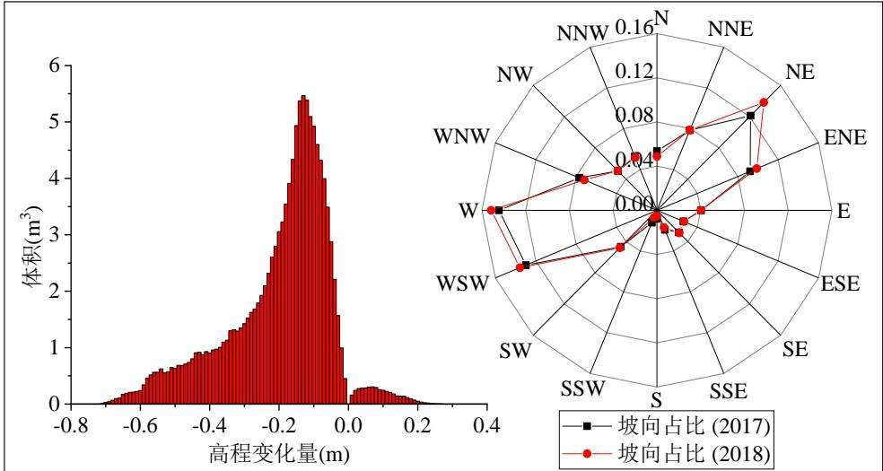  
图5-23研究区地形变化体积分布及坡向分布

Figure 5-23 Volume distribution and aspect distribution of topographic changes in the study area  
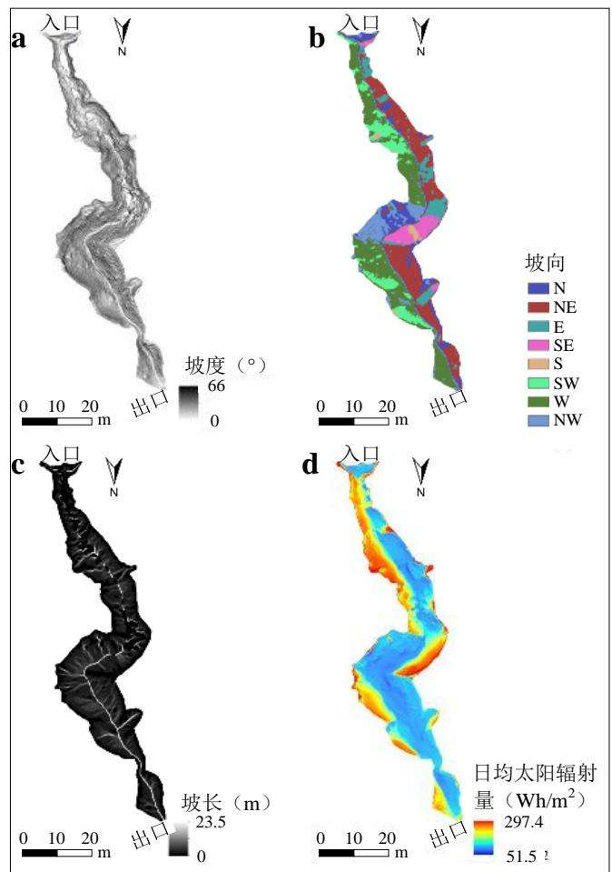  
图5-24研究区微地形特征分布  
Figure 5-24 The distribution of micro-topography characteristics

可以看出，研究区域的主要坡向为 W-WSW和NE-ENE，其主要原因为研究区为位于研究区北坡的“V”型侵蚀。研究区内坡度分布为 $0 { \sim } 6 6 ^ { \circ }$ 且符合呈正态分布（图5-24a）；坡长在 0\~23.5m之间（图5-24c）；日平均太阳辐射量为$9 1 . 5 1 { \sim } 2 9 7 . 4 2 \mathrm { W h } / \mathrm { m } ^ { 2 }$ （图5-24d)。如图5-22a所示的DoD显示了研究区域内在一个冻融循环季节前后地貌变化状况，正值表示沉积量，而负值表示侵蚀量。

表5-6冻融循环下侵蚀沟发育状况  
Table 5-6 Calculated soil losses from October 2017 to May 2018
<table><tr><td>年份</td><td>长度(m)</td><td>宽度(m)</td><td>深度(m)</td><td>面积(m²)</td><td>土壤损失量(m³)</td></tr><tr><td>2017</td><td>125.91</td><td>2.20~18.43</td><td>0.87~8.24</td><td>950.3</td><td>/</td></tr><tr><td>2018</td><td>126.52</td><td>2.22~18.51</td><td>0.85~8.53</td><td>958.4</td><td>111.24</td></tr></table>

基于DoD数据进行栅格计算可知，研究区在一个冻融循环下土壤流失量为$1 1 1 . 2 4 \mathrm { m } ^ { 3 }$ (表5-6)，平均流失量为 $0 . 1 1 7 \mathrm { m } ^ { 3 } \cdot \mathrm { m } ^ { - 2 }$ ，且在不同空间位置出现显著差异，与坡度因子、坡向因子、坡长因子及日均太阳辐射量因子之间存在定量关系。

## 2）典型剖面对比

为获取侵蚀沟在冻融循环前后变化情况，分别在其上游、中上游、中游和下游获取4个典型剖面进行对比，如图5-25所示。

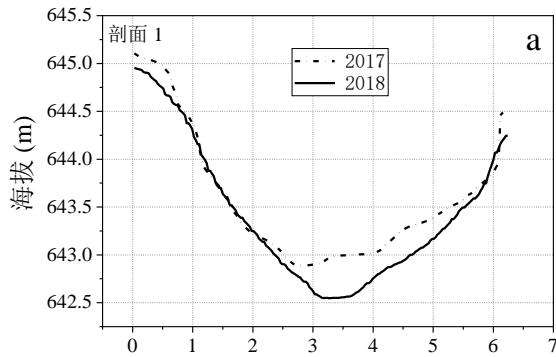

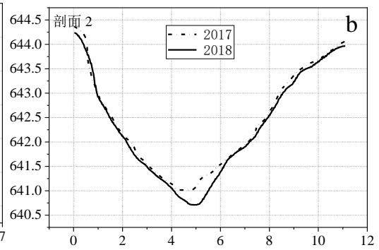

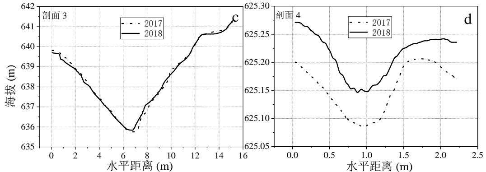  
图5-25 冻融循环前后典型剖面对比  
Figure 5-25 Comparison of typical profiles before and after freezing and thawing cycles

可以看出，侵蚀沟剖面呈“V”字型或“U”字型，结合图5-22a可知，在冻融循环前后侵蚀沟有明显变化，在上游及中游出现明显侵蚀剥离现象，而在中下游侵蚀量与沉积量基本持平，在下游及出口出现明显沉积现象。

## 3）各因子与冻融侵蚀之间的关系

为探究研究区冻融侵蚀的影响因子，分别基于无人机摄影测量获取的精细DEM数据和气象站获取的气象数据，分别获取影响冻融侵蚀最大的坡度因子、坡向因子、LS因子（L为坡长因子，S为坡度因子）[343]以及日均太阳辐射量因子[344]（图5-26)，将获取的上述因子与DoD数据进行多元逐步回归分析，进而获取各因子对冻融侵蚀的贡献程度。

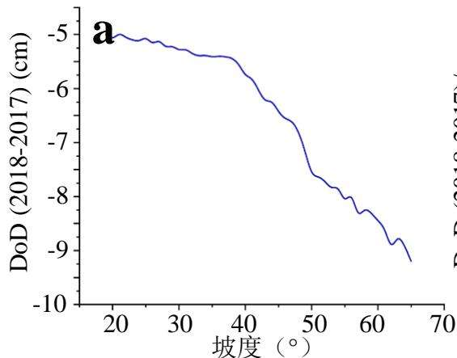

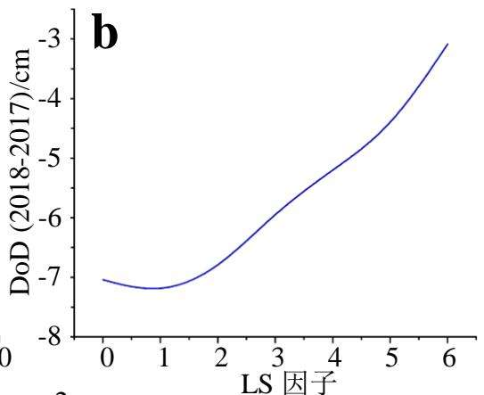

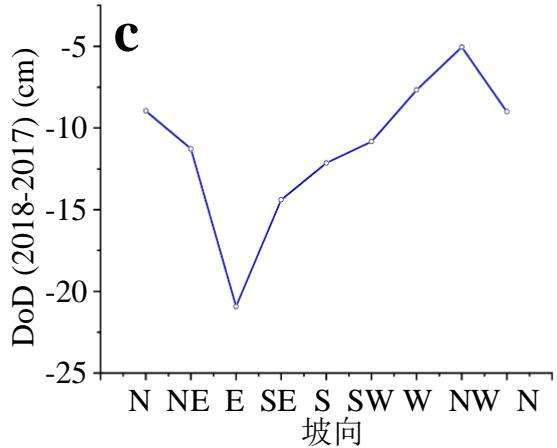

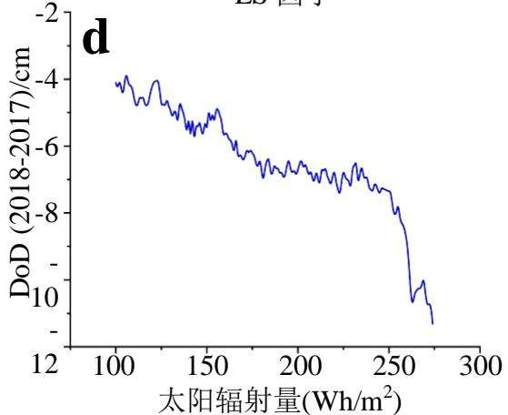  
图 5-26 研究区各影响因子与 DoD 之间关系  
Figure 5-26 Diagram of the relationship between elevation change (DoD) and (a) internal gradient, (b) LS fator, (c) slope aspect and (d) average daily solar radiation in the study area

可以看出，随着侵蚀沟边坡坡度的增加，其土壤侵蚀程度也随之增加，在坡度相对较低 $( 0 { \sim } 4 0 ^ { \circ } )$ 区域，侵蚀程度缓慢增加，在坡度相对较高 $( > 4 0 ^ { \circ } )$ 区域随坡度升高侵蚀程度急剧增强（图5-26a）。同时，随着LS因子增加，当0<LS<1.5时，侵蚀程度基本保持不变；当LS>1.5时，侵蚀程度显著持续上升(图5-26b)。在不同坡向方面侵蚀程度出现显著差异，如图5-26c所示，侵蚀沟NE-E-SE方向侵蚀程度最高，平均达13.93cm，从东向西北方向逐渐减小，西南方向侵蚀程度最低，平均为5.05cm。如图5-26d所示，土壤侵蚀同时也与单位面积的日平均日辐射量相关，随着日平均日辐射量侵蚀程度呈持续增大趋势。

## 4）冻融侵蚀与多种因子之间回归关系

为进一步分析分析影响研究区在冻融循环下的侵蚀/沉积过程，分别建立各主要影响因素与DoD之间的相关关系（表5-7）。

表5-7研究区域侵蚀/沉积过程中各因素间相关性  
Table 5-7 Correlation (r) between explanatory factors of erosion/deposition processes on the study area, as observed at the grid cell scale
<table><tr><td>坡度  $( 0 ^ { \circ } - 6 6 ^ { \circ } )$ </td><td>坡长</td><td></td><td>太阳辐射量(136-296Wh/m²)</td></tr><tr><td>DoD</td><td>0.919**</td><td>0.922</td><td>0.808</td></tr></table>

变量之间关系使用皮尔逊相关系数r进行表征，通过F检验和p检验验证其显着性。为避免多元回归中的多重共线性，在独立变量之间建立相关矩阵，同时使用主成分分析来降维并简化分析过程。最终采用逐步回归法建立各因子与DoD之间回归关系，如下式所示：

$$
D o D = - 0 . 0 4 1 x _ { 1 } - 0 . 0 1 6 x _ { 2 } - 1 . 6 9 ~ \mathrm { R } ^ { 2 } = 0 . 9 6\tag{5-33}
$$

式中 DoD 是利用空间分析工具得到的 DEM2018与 $\mathrm { D E M } _ { 2 0 1 7 }$ 差值，DoD通常为负，其绝对值越大，侵蚀程度越严重；和 $x _ { I }$ 和 $x 2$ 分别为研究区坡度和日均太阳辐射量。

## 5.3.3 冻融侵蚀发育特征

## (1）侵蚀/沉积发育分布

如图5-22a所示的 DoD显示了研究区域内在一个冻融循环季节前后地貌发生显著变化，可监测到最大侵蚀量为40.15cm，最大沉积量为9.31cm，侵蚀沟入口和出口之间高度差为20.33m，总体受侵蚀面积与和沉积面积分别占总面积的81.0%和15.7%，另一小部分侵蚀量与沉积量一致而使地形保持不变。侵蚀沟剖面呈“V”字型或“U”字型，从上下游角度来看，侵蚀剥离主要发生在坡的上游与中上游，在中下游侵蚀量与沉积量基本持平，在下游及出口出现明显沉积现象，且最终在出口处形成小型冲积扇式沉积（图5-22b）；从侵蚀沟两侧边坡的不同部位分析，侵蚀严重区集中于坡度更陡的边坡边缘。

## (2) 侵蚀发育过程

研究区表土在冻融侵蚀作用下，孔隙中或裂缝中水分冻结膨胀致使土体碎裂、裂隙增大增多，抗蚀性、稳定性降低，侵蚀物在重力作用和融雪径流冲刷作用下被搬运和沉积。

严冬过后，从3月底4月初开始，气温升高，但仍然在 $0 \mathrm { { } ^ { \circ } C }$ 度上下的冻融线附近波动（图5-21）。在冻融循环的作用下，会使研究区表土粉土颗粒含量增高，这是季节性冻结和融化层的重要特征，其原因有：（1）在反复冻融作用下，寒冻风化使土（岩）逐步粉碎，形成原生粉土颗粒[345]；（2）在冻融循环作用下粘性土中粘粒和胶体颗粒经受物理-化学作用发生凝聚形成次生粉土微集合体，同时土的粉粒化又反过来促进增强冻胀趋势。白天的高温下，雪融化并渗入土壤；当夜间气温下降时，雪水会结冰并膨胀，导致土壤分解和破碎。此外，表土在冻融循环状态下，可反复形成0.1\~0.3m厚的不稳定融化层，融化层与下伏冰冻层之间形成冰面滑动层，即冻结锋面（FreezingFront)，在冰雪融化、土壤解冻时，疏松、粉化的表土呈含水过饱和状态，形成塑性融冻泥流缓慢向下移动[320，326]。在上述冻融侵蚀作用下，尤其在侵蚀沟两侧边坡上边缘处，其受冻胀致使土体碎裂后极易形成楔形破坏面，该区域普遍坡度较大，在重力作用下以片状脱落的形式形成泻溜现象，致使侵蚀沟宽向发育迅速（图5-27）。

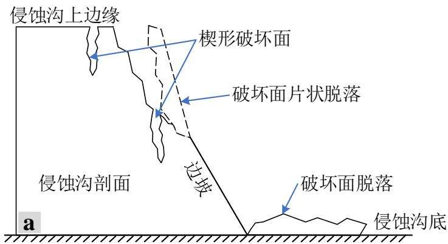

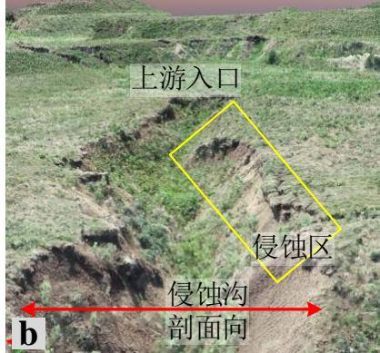  
图5-27研究区边坡侵蚀沟受到冻融风化作用示意图  
Figure 5-27 Schematic diagram of freeze-thaw weathering in erosion gully of dump slope

因此，侵蚀沟内部坡度与坡向很大程度上决定了融雪径流流速度，因而成为影响侵蚀沟侵蚀量的又一主要因素。沟底径流中的侵蚀与沉积物是一个动态过程，侵蚀物极易被融雪径流搬运，但同时若搬运路径过长或融雪径流补给不足则会导致融雪径流中沉积物浓度急速增加，进而形成融冻泥流，一旦融冻泥流流速有所下降（如地形坡度下降或局部地形粗糙度增加等），则沟底过饱和融冻泥流就会出现沉积现象[346]。因此，缓坡坡长的增长并不会显著增加侵蚀沟下游的侵蚀状况。侵蚀速率最大会发生在气温较高的下午，融雪径流冲刷地表并携带最大的泥沙，随着温度的升高，冻土的融化深度和融雪径流都有所增加，进而携带更多的侵蚀性沉积物。然而，夜晚时解冻的表土会重新冻结，融雪径流也会由于补给不足而停止[347]。在冻融季节，融水径流停止并在第二天早晨再次开始，冻融侵蚀由此昼夜循环。

冻融侵蚀程度除与上述温度、坡度等有关外，还与坡向和单位面积日平均太阳辐射量有关[152]。由于主要风向为NE-E-SE，因而该坡面上会沉积更厚的积雪，而拥有更充足的融雪径流补给源。坡向则影响了地表单位面积受到太阳辐射量的多少，进而决定了一个冻融周期内表土受冻-融的循环次数与程度，阳坡比阴坡能获得更多的太阳辐射量，因此阳坡更早的进入冻融循环期，同时每年经历的冻融循环次数更多，且昼夜间温差也更大。由图5-26d可以看出，随着太阳辐射量的增大，研究区冻融侵蚀程度增加

## 5.4 本章小结（Chapter Summary）

高寒矿区排土场的土壤侵蚀是一个复杂过程，其主要受风力侵蚀、水力侵蚀、冻融侵蚀和重力侵蚀等是多因素共同循环交替作用的结果，本章在对以上各要素分析基础上得出研究成果如下：

（1）利用多源协同监测技术，结合地貌、水文、气象数据对研究区复合型土壤侵蚀进行了分解，各类侵蚀之间具有独特的时空分布特征。风力侵蚀分布与风季主风向重合度较高，侵蚀严重区域集中于风力较大的边坡上部；水力侵蚀广泛分布于研究区大部分区域，侵蚀严重程度与区域汇水能力相关；冻融侵蚀主要发生于坡度较陡的北坡和西坡的斜坡上，平台上受冻融侵蚀影响较小；冻融侵蚀则伴随各类侵蚀同时发生。

（2）水力侵蚀是研究区影响范围最大、程度最深的侵蚀类型，其中又以壤中流侵蚀发育最为广泛。以研究区边坡地形及表土理化参数为基础，对研究区典型边坡壤中流进行数值模拟发现：壤中流贯穿于整个降雨过程，随降雨强度增大而增强，在降雨中后期流速达到峰值并在降雨结束后维持一段时间；在固定降雨强度下，壤中流侵蚀主要发育于边坡的上部和中部。

（3）冻融侵蚀是研究区处于高寒矿区域而特有的侵蚀类型，其主要集中发育于陡边坡区域，尤其为侵蚀沟两侧边坡。侵蚀沟边坡在不同坡度、坡向、坡长和日均太阳辐射量等因素下受冻融侵蚀程度不尽相同，总的来说是受局部冻融循环次数、程度和侵蚀物易搬运程度觉得。

上述研究表明，高寒矿区排土场受到的侵蚀类型众多、过程复杂，各类型侵蚀循环交替，造成了研究区宝贵水土资源难以保持。

## 6大型排土场重建植被分布特征与生态功能影响过程

## 6 Vegetation Distribution Characteristics and Ecological Function Influence Process of Large-scale Dump Reconstruction

排土场生态功能提升最终表现为植被的恢复，研究区植被恢复要经历从单一且脆弱的人工植物群落到复杂且稳定的自然群落的演替过程，加速这一进程是提升排土场生态功能的有效途径。因此，厘清植被恢复对排土场生态功能的提升机制，有助于为人工植被重建与适宜性管理提供有效策略。

## 6.1 排土场典型区域植物状况(Vegetation Status in Typical Area of Dumping)

本章针对研究区植被恢复与植被对研究区的生态功能提升机制进行了研究。首先利用无人机高光谱遥感影像和典型物种光谱库获取了研究区植被状况、精细分类和多样性制图，然后对研究区不同立地条件下植被生长状态进行差异性分析，最后从边坡稳定性和水文条件优化的角度讨论了重建植被对研究区生态功能的提升机制，并给出重建植被最优物种配置模式。

## 6.1.1 植被覆盖度估算

植被覆盖度是指植被在单位面积内的垂直投影面积所占的比例，反映了地表植被覆盖情况及生物量分布情况，是重要的生态参数之一。植被覆盖度的测量可分为用于田间的地面实测和区域尺度的遥感估算。目前，地面实测所采用的方法有目测法，采样法，仪器法等，常用于小尺度测量，由于其精度较高，同时可作为遥感估算覆盖度的检验手段。

植被覆盖度的遥感估算常用像元二分法，通过构建一定的指标进行植被与非植被像元二值分割，逐渐成为分析植被覆盖度的主要方法。现在多数学者采用归一化差分植被指数（Normalized Difference Vegetation Index，NDVI）作为指标进行植被覆盖度的分析。本文以3.5节所获取的无人机高光谱遥感影像为数据源，采用基于像元二分法的改进模型来获取研究区植被覆盖度（Fraction ofVegetation Cover, FVC）[348]，其计算公式如下：

$$
\mathrm { F V C = \frac { N D V I - N D V I _ { s i o l } } { N D V I _ { v e g } - N D V I _ { s i o l } } }\tag{6-1}
$$

$$
\mathrm { N D V I _ { s o i l } = \frac { F V C _ { m a x } * N D V I _ { m i n } - F V C _ { m i n } * N D V I _ { m a x } } { F V C _ { m a x } - F V C _ { m i n } } }\tag{6-2}
$$

$$
\mathrm { N D V I _ { v e g } { = } \frac { ( 1 - F V C _ { m i n } ) * N D V I _ { m a x } - ( 1 - F V C _ { m a x } ) * N D V I _ { m i n } } { F V C _ { m a x } - F V C _ { m i n } } }\tag{6-3}
$$

其中，FVC为植被覆盖度， $\mathrm { \Delta N D V I _ { v e g } }$ 为纯植被所在像元NDVI值， $\mathrm { N D V I _ { s o i l } }$ 为无植被覆盖区域NDVI值。取区内 $\mathrm { F V C } _ { \mathrm { m a x } }$ 为 100%， $\mathrm { F V C } _ { \mathrm { m i n } }$ 为0，对公式进行变换，得到以下式子：

$$
\mathrm { F V C = \frac { N D V I - N D V I _ { \operatorname* { m i n } } } { N D V I _ { \operatorname* { m a x } } - N D V I _ { \operatorname* { m i n } } } }\tag{6-4}
$$

基于以上可分别得到研究区典型区域NDVI（图6-1a）和植被覆盖度（图6-1b）分布。

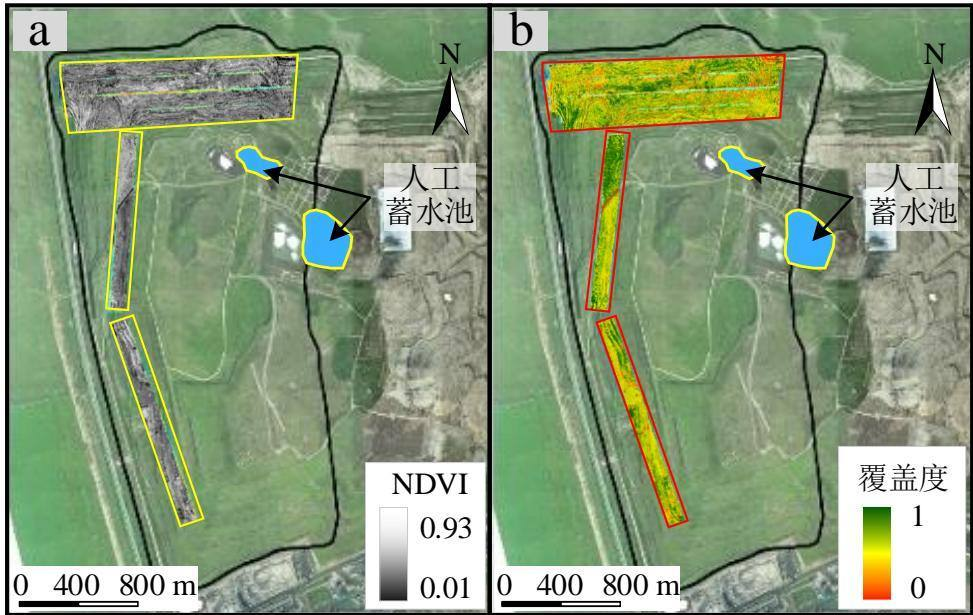  
图6-1研究区典型区域NDVI与植被覆盖度分布  
Figure 6-1 Distribution of NDVI and vegetation coverage in typical areas of the study area

## 6.1.2 植物精细分类

高光谱影像最大的特点是拥有众多波段，因此影像上每个像元均可提取出一条连续的光谱曲线，同时不同的地物拥有不同的光谱曲线（图6-2）。基于高光谱影像的分类方法较多，包括最小距离、二值编码、最大似然值分类、人工神经网络、支持向量机等方法。由于本文已经建立了研究区典型植被的光谱库，因此更适于选择光谱角制图法（Spectral Angle Mapping，SAM）[349]。

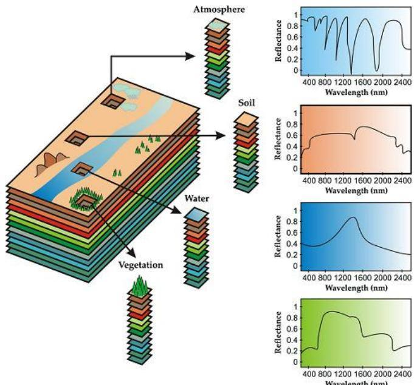  
图6-2高光谱成像概念（引自参考文献[350]）  
Figure 6-2 Hyperspectral imaging concept

## (1) 分类方法与结果

光谱角制图法是是一种比较测试光谱与已知光谱相似度来进行光谱曲线识别的方法。将高光谱影像的n维特征空间的每条光谱曲线都被视为一个矢量，通过计算待分类光谱与参考光谱（如光谱库）之间的“角度”来确定它们二者之间的相似程度，夹角越小，则相似度越高。

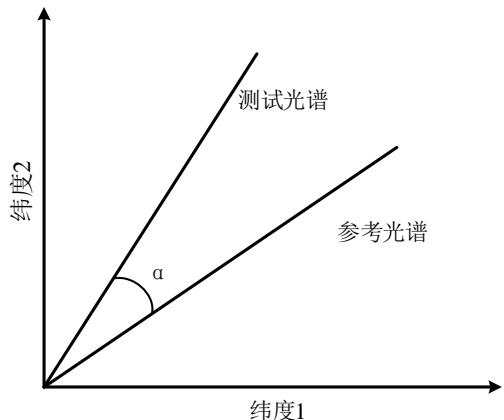  
图6-3参考光谱与测试光谱的光谱角度示意  
Figure 6-3 Spectral Angle of reference spectrum and test spectrum

光谱角制图法主要步骤包括噪声处理、去除包络线、获取吸收深度和相似性计算四步。如式6-5表示为两波段（二维）考光谱和待分类光谱之间的关系。

$$
\mathsf { a } { = } \mathsf { c o s } ^ { - 1 } \frac { \mathrm { X } _ { i } ^ { \mathrm { T } } \mathrm { X } ^ { * } } { ( \| \mathrm { X } _ { \mathrm { i } } \| ) ( \| \mathrm { X } ^ { * } \| ) }\tag{6-5}
$$

式中： $\mathrm { \boldsymbol { X } } ^ { * }$ 为未知向量，即测试光谱； $\mathrm { X } _ { \mathrm { i } }$ 为已知向量，即参考光谱；α为两向量之间的夹角。

对于高光谱影像可采用下式来确定各光谱间的相似性：

$$
\alpha = \operatorname { a r c c o s } ^ { - 1 } \left[ { \frac { \sum _ { i = 1 } ^ { n _ { b } } t _ { i } r _ { i } } { \sqrt { \sum _ { i = 1 } ^ { n _ { b } } r _ { i } ^ { 2 } } { \sqrt { \sum _ { i = 1 } ^ { n _ { b } } t _ { i } ^ { 2 } } } } } \right]\tag{6-6}
$$

式中： $n _ { b }$ 为波段数， $t _ { i }$ 未为知向量，即待分类像元第i波段的反射率值； $r _ { i }$ 为已知向量，即参考光谱第i波段的反射率值。

基于SAM方法研究区共识别出32种植被，其中优势种为大籽蒿、老芒麦、披碱草、刺儿菜、灰绿藜、多头麻花头、斜茎黄芪、苦苣菜等；其中B区共识别出23种植被，优势种为大籽蒿、老芒麦、阿尔泰狗娃花、苦苣菜、斜茎黄芪等；C区共识别出24种植被，优势种为大籽蒿、老芒麦、披碱草、刺儿菜、多头麻花头、阿尔泰狗娃花等（图6-4）。

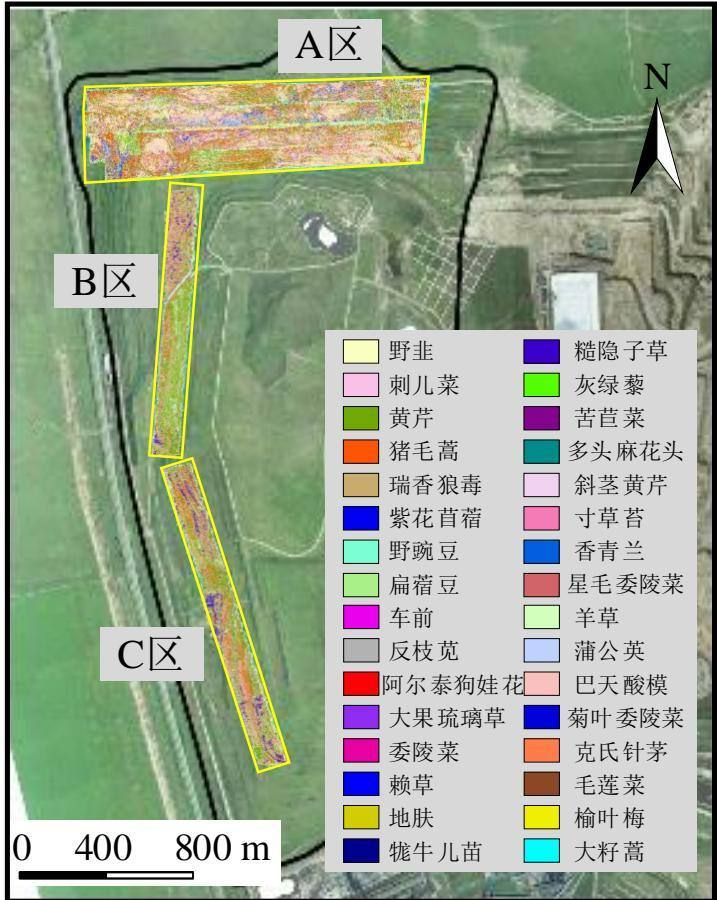  
图 6-4 研究区植物分类图  
Figure 6-4 Vegetation classification map of the study area

## (2） 精度评价

为验证分类结果的可靠性，采用混淆矩阵（Confusionmatrix）对分类结果进行精度验证。混淆矩阵是一个大小特定的表布局，具有实际和预测两个拥有相同类集合的维度，通过可视化形式表示多个变量的频率分布。矩阵的每一行表示地类的预测值，即分类结果所显示的类别，每一列则表示地类的真实值。

混淆矩阵中最重要的精度评价指标为 Kappa系数（Kappa coefficient）和总体分类精度（Overall accuracy）。

为了建立分类数据与实地真实数据的混淆矩阵，根据实地测量坐标点利用ArcGIS软件实现分类植被提取，结合野外样方调查的植物分布数据建立混淆矩阵（表6-1）可知影像总体分类精度达81.18%，Kappa系数为0.793，分类结果具有较高的精度。

表6-1研究区典型植物混淆矩阵  
Table 6-1 Establishment of confusion matrix of typical plants in the study area
<table><tr><td rowspan=2 colspan=2>总体精度：81.18%Kappa系数：0.793</td><td rowspan=1 colspan=9>样方调查地面实测物种</td></tr><tr><td rowspan=1 colspan=1>糙隐子草刺</td><td rowspan=1 colspan=1>儿菜寸</td><td rowspan=1 colspan=1>草苔多</td><td rowspan=1 colspan=1>头麻花头</td><td rowspan=1 colspan=1>苦苣菜</td><td rowspan=1 colspan=1>毛连菜</td><td rowspan=1 colspan=1>斜茎黃芪</td><td rowspan=1 colspan=1>野韭</td><td rowspan=1 colspan=1>用户精度</td></tr><tr><td rowspan=9 colspan=1>访</td><td rowspan=1 colspan=1>糙隐子草</td><td rowspan=1 colspan=1>6</td><td rowspan=1 colspan=1>0</td><td rowspan=1 colspan=1>0</td><td rowspan=1 colspan=1>0</td><td rowspan=1 colspan=1>0</td><td rowspan=1 colspan=1>0</td><td rowspan=1 colspan=1>0</td><td rowspan=1 colspan=1>0</td><td rowspan=1 colspan=1>100%</td></tr><tr><td rowspan=1 colspan=1>刺儿菜</td><td rowspan=1 colspan=1>0</td><td rowspan=1 colspan=1>3</td><td rowspan=1 colspan=1>0</td><td rowspan=1 colspan=1>0</td><td rowspan=1 colspan=1>1</td><td rowspan=1 colspan=1>0</td><td rowspan=1 colspan=1>0</td><td rowspan=1 colspan=1>0</td><td rowspan=1 colspan=1>75%</td></tr><tr><td rowspan=1 colspan=1>寸草苔</td><td rowspan=1 colspan=1>0</td><td rowspan=1 colspan=1>0</td><td rowspan=1 colspan=1>5</td><td rowspan=1 colspan=1>0</td><td rowspan=1 colspan=1>0</td><td rowspan=1 colspan=1>0</td><td rowspan=1 colspan=1>0</td><td rowspan=1 colspan=1>0</td><td rowspan=1 colspan=1>100%</td></tr><tr><td rowspan=1 colspan=1>多头麻花头</td><td rowspan=1 colspan=1>1</td><td rowspan=1 colspan=1>0</td><td rowspan=1 colspan=1>0</td><td rowspan=1 colspan=1>6</td><td rowspan=1 colspan=1>0</td><td rowspan=1 colspan=1>1</td><td rowspan=1 colspan=1>1</td><td rowspan=1 colspan=1>0</td><td rowspan=1 colspan=1>67%</td></tr><tr><td rowspan=1 colspan=1>苦苣菜</td><td rowspan=1 colspan=1>1</td><td rowspan=1 colspan=1>0</td><td rowspan=1 colspan=1>0</td><td rowspan=1 colspan=1>0</td><td rowspan=1 colspan=1>8</td><td rowspan=1 colspan=1>0</td><td rowspan=1 colspan=1>0</td><td rowspan=1 colspan=1>0</td><td rowspan=1 colspan=1>89%</td></tr><tr><td rowspan=1 colspan=1>毛连菜</td><td rowspan=1 colspan=1>0</td><td rowspan=1 colspan=1>0</td><td rowspan=1 colspan=1>0</td><td rowspan=1 colspan=1>0</td><td rowspan=1 colspan=1>0</td><td rowspan=1 colspan=1>6</td><td rowspan=1 colspan=1>0</td><td rowspan=1 colspan=1>0</td><td rowspan=1 colspan=1>100%</td></tr><tr><td rowspan=1 colspan=1>斜茎黄芪</td><td rowspan=1 colspan=1>0</td><td rowspan=1 colspan=1>0</td><td rowspan=1 colspan=1>0</td><td rowspan=1 colspan=1>1</td><td rowspan=1 colspan=1>0</td><td rowspan=1 colspan=1>0</td><td rowspan=1 colspan=1>7</td><td rowspan=1 colspan=1>0</td><td rowspan=1 colspan=1>88%</td></tr><tr><td rowspan=1 colspan=1>野韭</td><td rowspan=1 colspan=1>0</td><td rowspan=1 colspan=1>1</td><td rowspan=1 colspan=1>1</td><td rowspan=1 colspan=1>0</td><td rowspan=1 colspan=1>0</td><td rowspan=1 colspan=1>0</td><td rowspan=1 colspan=1>0</td><td rowspan=1 colspan=1>5</td><td rowspan=1 colspan=1>71%</td></tr><tr><td rowspan=1 colspan=1>制图精度</td><td rowspan=1 colspan=1>75%</td><td rowspan=1 colspan=1>75%</td><td rowspan=1 colspan=1>83%</td><td rowspan=1 colspan=1>86%</td><td rowspan=1 colspan=1>89%</td><td rowspan=1 colspan=1>86%</td><td rowspan=1 colspan=1>88%</td><td rowspan=1 colspan=1>100%</td><td rowspan=1 colspan=1></td></tr></table>

## 6.1.3 基于植物精细分类的物种多样性制图

目前物种多样性大多基于地面样方调查，而样方调查在空间上为点状分布，空间分布则只能由插值得到，因此难以准确精确反应空间尺度上的多样性状态。在植物精细分类的基础上，结合遥感空间制图技术实现研究区物种多样性的制图方法，以实现物种多样性的空间信息化表达。

## （1） 原理介绍

物种多样性指标较多，常见的有α多样性、β多样性和γ多样性三类。其中α多样性也称生境内多样性（Within-habitat Diversity），指某个群落或生境内部的种的多样性；β多样性也称生境间多样性（Between-habitat Diversity），指在地区尺度上物种在一个梯度上从一个群落到另一个群落的变化率；γ多样性也称区域多样性（Regional Diversity)，主要描述更广阔地理尺度上穿过一系列群落的物种多样性。考虑本研究区的尺度与群落特征，本文只关注α多样性中的马加利夫指数（Margalef）、香农指数（Shannon-Wiener）、辛普森指数（Simpson）和均匀度指数（Pielou）。

①马加利夫指数（Margalef)，是最简单的物种多样性测度方法，仅考虑群落物种数量和总个体数，可以用一定大小的样方内物种的数目表示，也可以用物种数目与样方大小或个体总数之间的关系来测度，用于反映物种数目随样方增大而增大的速率，其表达式为：

$$
\mathrm { M a } { = } \frac { \mathsf { S } - 1 } { \mathsf { l n } \mathsf { N } }\tag{6-7}
$$

式中，S为物种类型总数，N为物种个体总数。

②香农指数（Shannon-Wiener），可以更好的体现出富集种和稀疏种对群落多样性贡献的差异，其表达式为：

$$
\mathrm { H } { = } - \sum _ { \mathrm { i } = 1 } ^ { \mathrm { S } } p _ { i } \ast l n p _ { i }\tag{6-8}
$$

式中，S为物种类型总数； $p _ { i }$ 为物种i的出现概率，即相对丰度。

③辛普森指数（Simpson），同样考虑了各物种占比与不同物种对群落多样性贡献的差异，其表达式为：

$$
\mathrm { D } { = } 1 - et { } { ^ \mathrm { S } } \sum _ { \mathrm { i } = 1 } ^ { \mathrm { S } } p _ { i } ^ { 2 }\tag{6-9}
$$

式中，S为物种类型总数； $\mathrm { \ p i { \bf } }$ 为物种i的出现概率，即相对丰度。

④均匀度指数（Pielou），是关于均匀度测度的主要指数，其表达式为：

$$
\mathrm { J } { = } \frac { H } { l n S }\tag{6-10}
$$

式中，H为 Shannon-Wiener指数值；S为物种类型总数。

在植物分类栅格中不同像元值代表不同物种，因此可基于交互式数据编程语言（Interactive Data Language，IDL）进行栅格计算，实现物种多样性指数的计算与成图。其过程概括如下：

a.根据样方需求与分类栅格分辨率设置大小固定的搜索窗口；

b.将搜索窗口置于分类栅格上，并记录搜索窗口内所有像元的值；

c.根据物种多样性指数计算公式，计算对应窗口内的物种多样性指数

d.将计算所得物种多样性指数赋值给该窗口内的中间像元；

e将窗口平移至下一个像元，重复步骤（b）～（d），以逐行扫描的形式对整幅分类栅格进行搜索、计算和赋值，最终完成物种多样性制图。

下面以分类栅格分辨率0.2m、样方需求 $\mathrm { l m } ^ { * } \mathrm { l m }$ 为例进行实例介绍，如图6-5所示设置栅格大小为 $5 ^ { * } 5$ 的搜索窗口（图6-5a中红色框），在窗口（即样方）内共计出现1\~7共7种不同的数值，即代表7类物种，故将数值“7”赋值给窗口内的中间像元（图 6-5b 中红色框）；然后窗口向右平移一个像素后（图6-5a中粉色框），再次重复上述步骤后将值“6”赋值给窗口内的中间像元（图6-5b中粉色框)。依此类推可获取物种数栅格，每个栅格的像元值代表以该像元为中心的 $\mathrm { l m } ^ { * } \mathrm { l m }$ 样方物种数。

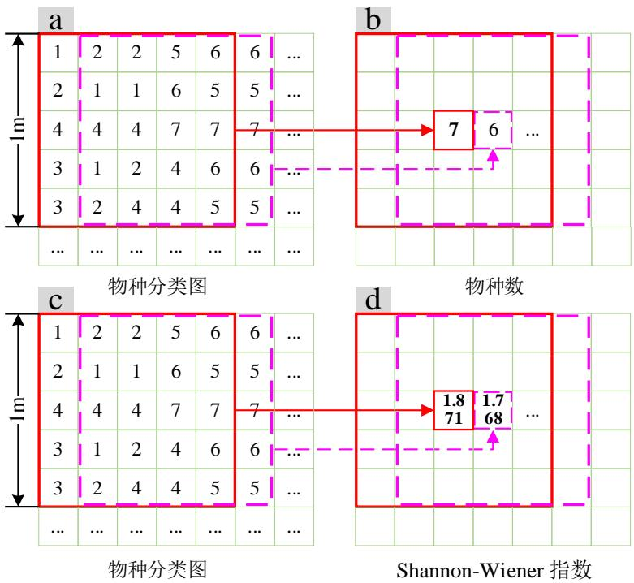  
图6-5 物种多样性指数制图过程  
Figure 6-5 Species diversity index mapping process

## (2) 制图结果

对于Shannon-Wiener指数等其他物种多样性指数的成图采用类似的原理（图6-5c、d），即根据不同指数的计算公式，将搜索窗口内的栅格运算后赋值给中间像元，即可得到任意区域的物种多样性指数栅格数据。由于本文所获取高光谱影像地面分辨率为0.16m，为满足上述制图条件，将影像重采样至0.2m后进行物种多样性制图，其结果如图6-6所示。

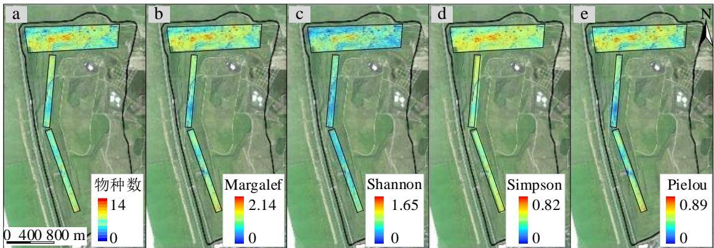  
图6-6 物种多样性指数制图结果  
Figure 6-6 Species diversity index mapping results

## （3）制图精度评价

为评价制图结果的精度，利用地面样方调查结果对制图结果进行验证。具体为利用野外样方调查时GPSRTK获取的样方坐标，在多样性制图栅格数据中选点，获取样方调查点所对应的栅格像元值。以样方调查实测值为横坐标、栅

格像元值为纵坐标建立精度评价坐标系图6-7。可以看出，基于植物精细分类的物种多样性制图所得栅格像元值与实地样方调查值之间具有较强的相关性。

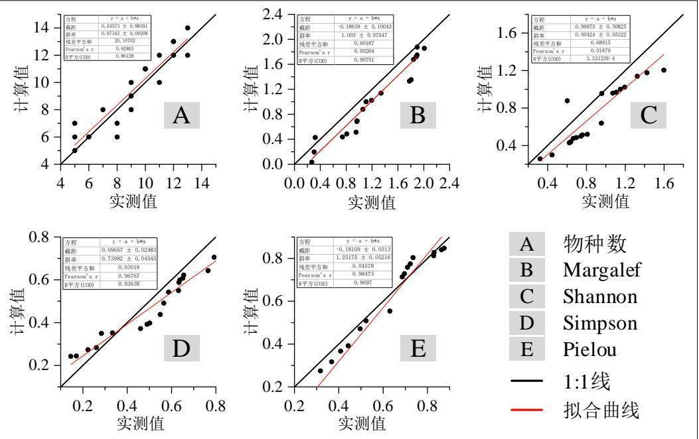  
图6-7基于植物精细分类的物种多样性制图精度验证  
Figure 6-7 Accuracy verification of species diversity mapping based on refined plant classification

基于植物分类的物种多样性制图可以以栅格数据的形式展示大面积的物种多样性，这相较于传统样方调查的点数据有质的提升。这主要得益于高分辨率的无人机高光谱影像和植物光谱库相结合的植物精细分类结果。

## 6.2 不同立地条件下物种空间分布（Spatial Distribution of SpeciesUnder Different Site Conditions)

## 6.2.1 不同坡度植物生长差异性分析

为获取研究区不同坡度等级下植物生长差异性，以A区为例，结合无人机摄影测量获取的DEM数据得到研究区坡度，参考《水土保持综合治理规划通则(GB/T15772-2008)》中的坡度分级标准，将研究区按坡度等级划分成≤3°（I）、3°\~5°（II）、5°\~15°（III）、15°\~25°（IV）、25°\~35°（V）和>35°（VI）六个坡度等级。将植被覆盖度等分为低植被覆盖度、中植被覆盖度、中高植被覆盖度和高植被覆盖度4个等级。

利用ArcGIS区域分析工具统计不同坡度等级下植被覆盖类型（图6-8），可知A区坡度主要集中于5°\~15°，植被覆盖类型总体上集中在中植被覆盖和中高植被覆盖类型，共占研究区总面积62.76%。在不同坡度等级下，中植被覆盖和中高植被覆盖类型均占主导地位，这与研究区总体情况一致。其中在坡度小于5°时，中植被覆盖面积≈中高植被覆盖面积>低植被覆盖度>高植被覆盖度；在坡度大于5°，高植被覆盖面积持续下降。

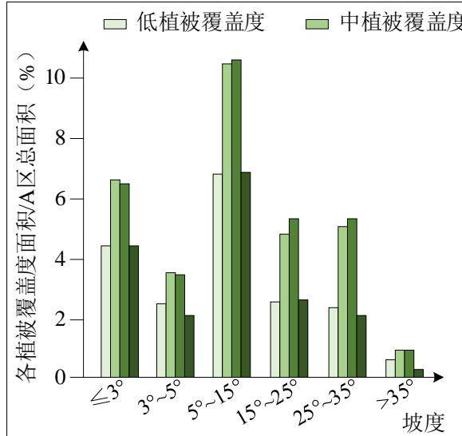

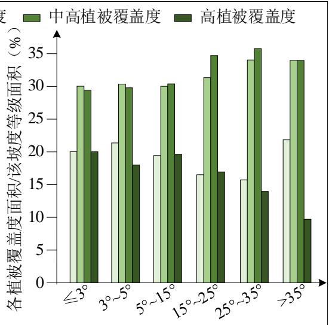  
图6-8研究区不同坡度等级下各植被覆盖类型情况  
Figure 6-8 Different vegetation cover types under different slope grades in the study area

为消除不同坡度等级因地形绝对面积不同而引起的植被恢复评价的不确定性，引入地形面积差异修正系数k，其表达式为：

$$
\mathrm { k } = { \frac { S _ { i j } / S _ { j } } { S _ { i } / S } }\tag{6-11}
$$

式中： $\mathrm { S _ { i j } }$ 为第i种植被覆盖类型在第j级坡度所占面积， $S _ { \mathrm { j } }$ 为第j级总面积；$\mathrm { S _ { i } }$ 为第i种植被覆盖类型的总面积；S为研究区总面积。若k>1，则该植被覆盖类型在该坡度等级属于优势分布，面积比趋于增加；k=1，则该植被覆盖类型在该坡度等级的变化与该植被覆盖类型在研究区的分布比例持平，变化趋于平稳；k<1，则该植被覆盖类型在该坡度等级属于劣势分布，面积比趋于减少。统计结果如表6-2所示。

可以看出，在≤3°和 $5 ^ { \circ } { \sim } 1 5 ^ { \circ }$ 坡度等级下，低植被覆盖类型和高植被覆盖类型分布优势明显（k>1），中植被覆盖类型和中高植被覆盖类型变化趋势平缓。$3 ^ { \circ } { \sim } 5 ^ { \circ } .$ 坡度等级下，低植被覆盖类型分布优势明显（k=1.12），中植被覆盖类型变化趋势与研究区该植被覆盖类型一致（k=1），中高植被覆盖类型和高植被覆盖类型变化趋势平缓。在大于15°坡度等级下，高植被覆盖类型分布处于劣势(0.52<k<0.94)，且随着坡度的增加，劣势趋于明显，中植被覆盖类型和中高植被覆盖类型为分布优势（1.01<k<1.15）；低植被覆盖类型在15°\~35°坡度等级下处于劣势分布（0.82<k<0.87），在大于35°坡度等级下为优势分布。总体而言，$1 5 ^ { \circ } { \sim } 2 5 ^ { \circ }$ 坡度等级优势明显（0.95≤k≤1.12）。

表6-2研究区不同坡度等级下的k值  
Table 6-2 The k value of different slope grades in the study area
<table><tr><td rowspan="2">坡度等级</td><td colspan="4">地形面积差异修正系数k</td><td rowspan="2">FVC</td></tr><tr><td>低植被覆盖</td><td>中植被覆盖</td><td>中高植被覆盖</td><td>高植被覆盖</td></tr><tr><td>≤3°</td><td>1.07</td><td>0.98</td><td>0.92</td><td>1.10</td><td>0.767</td></tr><tr><td>3°~5°</td><td>1.12</td><td>1.00</td><td>0.95</td><td>0.96</td><td>0.761</td></tr><tr><td>5°~15°</td><td>1.04</td><td>0.96</td><td>0.95</td><td>1.11</td><td>0.768</td></tr><tr><td>15°~25°</td><td>0.87</td><td>1.01</td><td>1.11</td><td>0.94</td><td>0.769</td></tr><tr><td>25°~35°</td><td>0.82</td><td>1.09</td><td>1.15</td><td>0.77</td><td>0.765</td></tr><tr><td>&gt;35°</td><td>1.11</td><td>1.11</td><td>1.11</td><td>0.52</td><td>0.749</td></tr></table>

## 6.2.2 不同坡位植物生长差异性分析

为获取研究区不同立地条件下植被生长的差异性，结合研究区特有的地貌特征，以研究区物种多样性制图为基础，在坡脚、坡中和平台（即坡顶）三种不同立地类型上选择标准样方，提取并比较样方内物种多样性。根据前文物种多样性制图设定窗口大小，将样方标准设置为 $\mathrm { l m } ^ { * } \mathrm { l m }$ ，即对应分类影像中为5\*5像元区域。基于无人机摄影测量获取正射影像，采用目视解译选取统计样方430个，其中A区246个，B区89个，C区95个（图6-9）。

利用ArcGIS空间分析工具，将各物种多样性制图数据提取至样方点属性，分别统计坡脚、坡中和平台等三种各立地条件下不同区域的 Margalef 指数、Simpson 指数、Shannon 指数和 Pielou 均匀度如图 6-10 所示。

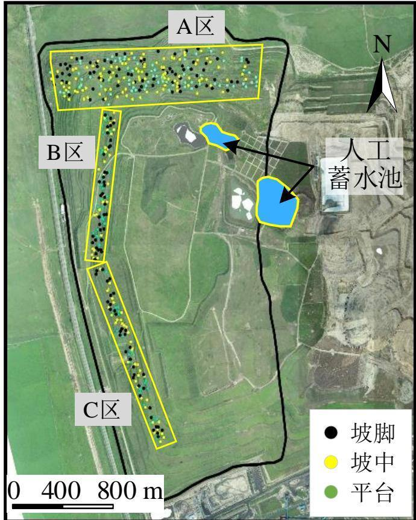  
图6-9植被生长差异性统计样方分布  
Figure 6-9 Statistical quadrat distribution of vegetation growth difference

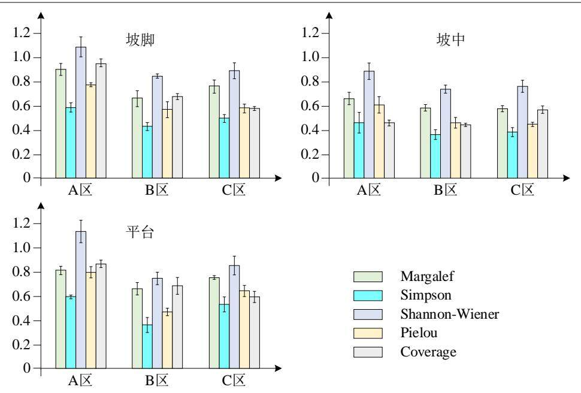  
图6-10不同立地条件下各区多样性指数统计  
Figure 6-10 Diversity index statistics of each district under different site conditions

可以看出，在不同立地条件下各区物种多样性表现出较大差异，其中坡脚与平台上A区的整体物种多样性和植被覆盖度最大。其主要原因为A区为北坡，接受的太阳辐射量少于其他两区，地表水分蒸发速率低，有利于水分的保持。此外，在三块区域中A区植物恢复年限最长，在经历人工种植和养护期后已进入自然演替阶段，物种多样性总体显著高于其他区域。同时，坡中的植被在多样性和覆盖度上均小于坡脚和平台，其主要原因是研究区的复杂陡峭的边坡形态不利于水土保持，同时易产生水力侵蚀和浅层滑坡等植被生长限制性因子。

从同一区域不同立地条件来看，A区的坡脚位置物种多样性与植被覆盖度均显著高于坡中位置，其原因有：坡脚与平台整体地质稳定性高于边坡，不易发生地质失稳现象；相对于边坡，坡脚与平台的处于地貌上的汇水位，大气降水更易保存，植被不易受到干旱胁迫；良好的植被覆盖度与生物量又促进生境改良，形成良性循环。

## 6.2.3 不同区域物种分布特征

通过资料收集可知A区于2008年完成人工种植与修复工作，后经过若干年人工养护，近年来处于自然演替状态；B区于2012年完成人工种植与修复工作，后经过若干年人工养护，现只对植被退化严重区（如浅层滑坡、冲沟等导致的植被损毁）进行补种，其他区域开始进入自然演替阶段；C区于2014年完成人工种植于修复工作，后经过若干年人工养护，近年来处于轻度养护阶段。

ABC三区最初复垦和养护模式相似，均为披碱草、老芒麦、紫花苜蓿等易成活先锋物种单播或混播，但经过不同的恢复年限，植被类型发生了较大变化。

2020年的地面调查在 ABC三区共发现15科28属32种植物，其中菊科8种，豆科5种，蔷薇科4种，禾本科3种，共4科17属20种，占总物种种数的62.5%。同时不同坡向的植被组成也存在差异，A区共15科28属32种植物，其中菊科占25%，豆科占15.62%，蔷薇科占12.5%，禾本科占 9.37%；B区共12科13属23种植物，其中菊科6种，豆科5种，禾本科和蔷薇科各2种，占B区总植被的65.21%；C区共11科14属24种植被，其中菊科7种，豆科5种，蔷薇科3种，禾本科2种，占C区总植被的70.83%。根据获得的样方数据及植物分类图，分别统计不同恢复年限区域内的优势种组成，见表6-3。

表6-3 不同区域优势种组成  
Table 6-3 Composition of dominant species in different regions
<table><tr><td>区域</td><td>优势种组成</td></tr><tr><td>A区</td><td>大籽蒿、羊草、冷蒿、阿尔泰狗娃花、苦苣菜、斜茎黄芪、多头麻花头、狗尾草</td></tr><tr><td>B区</td><td>大籽蒿、老芒麦、阿尔泰狗娃花、苦苣菜、斜茎黄芪、星毛委陵菜、多头麻花头</td></tr><tr><td>C区</td><td>大籽蒿、老芒麦、披碱草、刺儿菜、灰绿藜、多头麻花头、斜茎黄芪、苦苣菜</td></tr></table>

根据6.1节中获取的研究区 2020年植物精细分类和物种多样性制图结果可知，经过12年的人工恢复加自然演替，其植物类型发生显著变化。A区植物以草本为主，其中一二年生草本植物作为环境破坏后生态恢复的先锋植物，在恢复初期数量最多，后随着自然演替进程，多年生草本植物逐渐成为研究区植物的优势种。多年生植物在区域植物恢复与演替中比例逐渐增加，标志着A区植物恢复正在朝正向演替进行。目前A区已形成以大籽蒿、羊草、冷蒿、阿尔泰狗娃花、苦苣菜、斜茎黄芪、多头麻花头、狗尾草等多种野生种为主的生态自维持状态，且在可预见的未来该区将向更高等级群落演替。A区的演替进程与物种组成可为研究区植物恢复生态工程提供植物筛选依据，即在生态恢复初期，可采用先锋物种与演替进程上优势种混播的方式以创造足够的种子库，进而加速复垦区演替进程。

6.3 重建植被对排土场的生态功能提升过程（Ecological Function Improvement Process of Dump by Vegetation Reconstruction)

## 6.3.1 边坡稳定性提升过程

边坡稳定性是指边坡岩土体在一定坡高和坡度条件下的稳定程度，是边坡抵抗自身破坏的力学表现[182]。若边坡重力超过其内部最大阻力，则可能发生浅层滑坡[351]或浅层侵蚀[352]。研究区以草本植物为主，通过生态过程改善边坡水文条件，通过根系加筋作用来提升边坡机械强度，进而起到减少边坡浅层滑坡和降低表土浅层侵蚀的作用。

## (1）减少边坡浅层滑坡

浅层滑坡是危害研究区边坡稳定性的最主要因素，研究区草本植物可有效降低边坡浅层滑坡发生的概率。从力学角度分析，草本植物根系受力时是非弹性形变，据此可建立非刚性根（NonrigidRoots）与土体间的受力加固模型。草本植物根系向下发育形成密根层和稀根层（图6-11），根系的加筋作用使含根土体抗剪强度增强，进而有效提高边坡机械稳定性、抑制浅层滑坡。除了竖直根系的加筋作用以外，草本植物水平根、茎及其他紧密交织生长的植物纤维可通过交织效应（Surface-mat Effect）构成根-土复合体[199,353]。该复合体符合摩尔-库伦定律，可改变土体力学特性，为土壤提供额外粘聚力。同时，在这种交织效应下，即使只有少量根系贯穿潜在剪切破坏面并将表层土与深层土相连，水平植物纤维也可以将局部剪切应力从浅层边坡破坏隐患点传递到稳定区域，从而提升边坡整体稳定性。

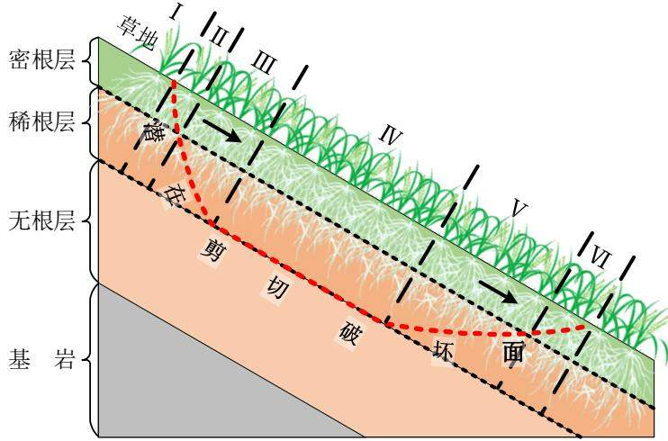  
图6-11草本植物根系对浅层滑坡的防治机理示意图  
Figure 6-11 The mechanisms of slope failure and stability of herbaceous vegetated slopes

如图6-11所示，箭头表示边坡重力沿坡面的分力，红色虚线表示潜在边坡破坏面。图中区域I为边坡稳定区，区域Ⅱ-VI为潜在浅层滑坡区，区域Ⅱ-IV为拉伸应力区，V-VI为压缩应力区。在区域Ⅱ、VI中，大量根系贯穿潜于剪切面而形成稳定的根-土复合体，根系加筋作用与交织效应同时对抗滑坡拉力应力；在区域Ⅲ-V中，少了根系贯穿潜剪切面，根系加筋作用效果降低，此时交织效应仍发挥作用，将区内部分剪切应力传递到区域I、Ⅱ和VI等相对稳定区。

边坡的稳定性与根系的密度和长度有关，草本植物拥有大量细根系，且深度大多集中于对边坡整体稳定性影响最大的表层十几到几十厘米处[354]。草本植物的浅层根系与表土形成的根-土复合体不仅极大地增加土体抗剪强度，而且为土壤微生物提供更稳定的繁衍空间，有助于提高土壤团聚体稳定性和生境的良性循环。在生态边坡工程建设中，为保证边坡根-土界面快速融合，植物的快速重建是关键环节，草本植物以生长快、密度高的优势可以起到快速固坡的效果[355]。

## (2) 降低表土浅层侵蚀

研究区地表径流侵蚀[356]、浅层潜流侵蚀[357]、雪蚀[358]、冻融侵蚀[359]等都是造成边坡浅层侵蚀的主要因素。雨季短时集中强降雨降低了土体强度，雨水汇流后在坡面形成临时性地表径流和内部渗流是造成边坡浅层侵蚀的主要诱因。浅层侵蚀发展过程中，侵蚀形式为：面蚀（片流侵蚀）一细沟侵蚀一浅沟侵蚀一切沟侵蚀，最终发育为大型侵蚀沟，这是一个侵蚀程度逐步增强的链状发展过程。密集的草本植物具有滞留降雨、削减雨滴动能、减缓地表径流的坡面冲刷、再分配侵蚀能量的作用，从而提高土壤抗蚀性[360]。

研究区处于北方高寒地区，除雨季受到径流侵蚀外，还会受到雪蚀和冻融侵蚀的破坏。厚重的积雪在重力作用下与坡面间形成滑动趋势[361]，一旦发生积雪滑移或雪崩现象，极易造成地表浅层侵蚀[362]。冻融侵蚀则一般发生于初春，当气温逐渐升至融雪线附近，表土在昼夜温差作用下处于反复冻-融循环状态，并在表土层反复形成不稳定融化层。雪水入渗降低土壤凝聚力、表土粉化降低抗侵蚀能力，此时疏松、粉化的表土呈过饱和状，形成塑性融冻泥流缓慢向下移动。边坡草本植物的种植可隔绝积雪与表土直接接触，增加坡面粗糙度及滑移阻力、降低冻融损害程度，进而缓解浅层侵蚀。

## 6.3.2 水文条件优化过程

研究区坡面水文条件（如土壤入渗率、含水率）的变化是浅层边坡破坏的主要诱发因素之一，其边坡稳定性影响过程如下：（1）降雨或融雪通过入渗作用使得土壤含水率增加，导致土体孔隙水压力增大、土壤凝聚力降低，进而导致边坡抗剪切能力下降、稳定性降低[303]；（2）植物通过根系的水势差作用与叶片的蒸腾作用吸收土壤水，减少土壤含水率，进而提高边坡稳定性[363]。

优化边坡水文条件，即控制边坡土壤的入渗率及保持较低含水率是维持边坡稳定性的有效措施。研究区植物以草本为主，草本边坡相比较于乔灌边坡或裸土边坡，在水文条件改善方面具有不同特征。一方面，茂密的草本茎叶能起到滞留部分降雨、削弱雨滴飞溅侵蚀引起的土壤团聚体破碎，同时也具有较高的水分蒸散能力，从而降低土壤含水率；另一方面，草本植物密集的茎、叶使得坡面粗糙度增加，因而地表径流速度慢、水分入渗时间久，从而增加土壤含水率。此外，植物还可以通过影响收缩裂缝的形成来影响边坡的稳定性。在土壤粘土含量较高的区域，会出现由于干旱或植物吸水作用引起的地表收缩裂缝，使得降雨再次来临时水分快速入渗到深层土壤中进而威胁边坡稳定性，植被的恢复可很大程度上减小收缩型裂缝的程度和持续时间。

植物群落的恢复演替与土壤质量的改良提升是相互促进关系，在植被恢复后，生态修复区土壤性质很大程度上决定了植物群落的生长状态，而一旦生态修复区形成稳定群落后，改良熟化后的生境又影响着群落的演替方向和结构组成。适应性管理就是在矿山生态功能提升过程中，维持并加速这一正向演替的速率。在了解重建植被对边坡稳定性的提升机理及优势后，需应用到生态边坡工程的实践中去。生态边坡工程融合了生态学和工程学相关理念，在边坡稳定性提升方面起到重要作用。工程措施及后续适应性管理措施会持续影响边坡生境和植物状态，进而改变边坡水文条件和表土抗性，最终影响边坡稳定性及生态服务功能。

## 6.3.3 重建植被最优物种配置

研究区植被恢复一般需经历植被重建、群落正向演替以及长期稳定性管理三个阶段，物种选择尤为重要。研究区地貌复杂、土壤贫瘠、环境恶劣，植物难以在短时间内形成稳定的群落系统。在植物重建初期应当把重心放在土壤生境恢复上，因地制宜的选择速生本地草本植物作为先锋物种，同时与演替进程上优势种混播以创造足够的种子库，或按“先锋种、过渡种、演替种、顶级种”的配搭方式进行不同阶段的种植，以快速恢复至稳定群落。再配合人工管理措施以加速生态植物群落正向演替，达到对土壤生境提质增效的目的。

此外，由于单一物种根系分布的局限性而难以充分利用土壤空间，多物种混播的另一优势是充分利用土层空间。物种间竞争也会提高区域内根系总体生物量、密度及抗拉强度，达到更好固坡效果。因此在生态工程中应注意物种的选择与搭配，可根据边坡不同立地条件进行最优物种配置，优选地下生物量大且直根系、须根系相结合的物种配置模式，以实现根系功能和结构的多样性，在具有更高的生态服务价值及生态系统恢复力的同时，达到立体式护坡的目的。

## 6.4 本章小结（Chapter Summary）

（1）通过地面样方调查、典型物种光谱库和无人机高光谱影像相结合的方式进行的植被调查具有精度高、效率高的特点。实现了调查区域物种级别的精细分类，在此基础上结合遥感空间制图的优势完成了研究区物种多样性制图，这是传统植被多样性调查方法的有力补充。

（2）研究区不同立地条件下植物生长差异性较大，不同坡度、坡位和复垦恢复年限均是导致重建区植物生长和演替差异的原因。尤其随着复垦恢复年限的延长和人为扰动的减少，A区逐渐由人工种植的植物群落演替为以原生物种为主的自然群落，在整体覆盖度、物种多样性方面均优于其他区。该区的演替进程与物种组成可为研究区植物恢复生态工程提供植物筛选依据和植物配置方案。

（3）研究区生态功能提升的直接表现是植被覆盖度与物种多样性的增加，同时重建植被的良好状态也通过提高边坡稳定性和优化水文条件来改善生境，进而形成良性循环。

上述研究表明，植物群落的稳定与正向演替是研究区生态功能提升的核心，植物的健康状态与生境改良是相互促进关系，厘清研究区植物演替规律有助于为生态工程提供植物筛选依据和植物配置方案。

## 7大型排土场生态功能评价与提升策略

## 7 Ecological Function Evaluation and Improvement Strategies of Large-scale Dump

排土场生态功能的高低是指在排土场某一区域内地质稳定性、水土保持性及群落稳定性的综合判断，是区域生态系统稳定性评价的关键要素。排土场生态功能评价是一个动态变化过程，会在不同时期随外界诱发因素条件的变化而变化。因此构建稳定的评价体系、提出切实可行的提升策略是排土场生态功能提升的必要手段。

## 7.1 排土场生态功能提升的内涵（Connotation of Improving the Ecological Function of Dump)

排土场作为典型人工重建生态系统，其生态功能主要体现在地质稳定性、水土保持性、群落稳定性、生态固碳、水源涵养、栖息地提供及景观提升等诸多方面。而高寒矿区大型排土场受恶劣的自然环境、独特的本底条件和强烈的人为扰动共同影响，其生态功能问题表现为：①非均匀沉降、浅层滑坡、边坡蠕动、地裂缝、冻融破坏等多种边坡破坏形式而导致的地质稳定性差；②紊乱的地表径流以及在风力、水力、冻融和重力等多种外力侵蚀破坏作用下而导致的水土资源保持能力低；③恢复区植物物种多样性低、结构简单、正向演替速度慢而导致重建植物群落难以自维持等方面。

针对排土场所面临的生态功能问题，传统土壤重构、植被重建、微生物修复等单一修复方式难以保证长期效果。因此，怎样保证煤炭资源的可持续开发与生态重建共存、如何就“地质-水文-植被”的优化进行排土场系统性生态功能提升，是本内涵需要解释的核心科学问题。

根据“高寒矿区”和“露天矿”的生态特征、“大型排土场”的产生背景以及“生态功能”的概念，本文把高寒矿区大型排土场生态功能提升的内涵确定为：在煤炭资源和土地资源维系着国家的能源安全、矿山生态修复支撑国家生态文明建设以及排土场生态功能提升促进煤炭的可持续开发的大背景下，高寒矿区大型排土场这一典型人工重建生态系统能够以自然修复为主、人工修复为辅的模式，实现地质-水土-植被等多要素的抗扰动性和自维持性，并能够成为源地且提供一定的生态系统服务功能，从而保障煤炭资源的可持续开发与高寒矿区生态系统的可持续发展。

## 7.2 排土场生态功能评价模型（Evaluation Principle of Ecological Function of Dump)

建立排土场生态功能评价模型可以为矿区生态重建管理者制定生态恢复策略提供技术依据，而机器学习技术也已经在很多评价预测领域取得了大量成果。在众多机器学习技术中，支持向量机、人工神经网络、分类回归树和逻辑回归是有效且应用广泛的模型。本节将介绍基于上述四类方法建立排土场生态功能评价模型，通过对比模型精度，遴选出研究区生态功能评价的最优模型。

## （1）支持向量机模型

支持向量机（Support Vector Machine，SVM）是一种非线性分类模型，其原理是按监督学习的方式将输入变量映射到一个高维线性特征空间，通过非线性变换构造最优决策函数，以最大边距超平面（Maximum-margin Hyperplane）为决策边界对数据进行二元分类，以解决原始空间中线性不可分的问题。若设$( \mathrm { x _ { i } } , \mathrm { x _ { j } } ) = 1 , 2 , \cdots$ ,n为线性可分样本，其最大边距超平面可通过下式求解：

$$
\left\{ \begin{array} { l } { \displaystyle M i n \left( \frac { 1 } { 2 } \parallel \vec { \omega } \parallel ^ { 2 } + C \sum _ { i = 1 } ^ { n } \xi _ { i } \right) } \\ { \displaystyle y _ { i } \left( \vec { \omega } \cdot \vec { x } _ { i } + b \right) - 1 + \xi _ { i } \geq 0 } \\ { \displaystyle \xi _ { i } \geq 0 , i = 1 , 2 \cdots , n } \end{array} \right.\tag{7-1}
$$

式中： $\omega$ 为最大边距超平面的方向权重向量，b为偏差， $\xi _ { i }$ 为松弛因子，C为惩罚因子，作用为控制决策函数复杂性与训练样本中误分类样本数量之间的平衡。为求得最优解，利用拉格朗日乘数法（Lagrange Multiplier Method)，应用Wolf对偶理论将以上问题化简为以下等价对偶问题：

$$
\left\{ \begin{array} { c } { \displaystyle M a x \left[ \sum _ { i } x _ { i } - \frac { 1 } { 2 } { \sum _ { i , j } } \alpha _ { i } \alpha _ { j } y _ { i } y _ { j } ( \vec { x _ { i } } \cdot \vec { x _ { j } } ) \right] } \\ { \displaystyle \sum _ { i } \alpha _ { i } y _ { i } = 0 , 0 \le \alpha _ { i } \le C } \end{array} \right.\tag{7-2}
$$

式中： $\alpha _ { i }$ 为拉格朗日乘子，C为惩罚因子，利用以上所得决策函数对新样本进行分类：

$$
f ( x ) = s g n \left( \sum _ { i = 1 } ^ { n } y _ { i } \alpha _ { i } K ( x _ { i } , x _ { j } ) + b \right)\tag{7-3}
$$

式中： $\pmb { K } ( x _ { i } , x _ { j } )$ 为支持向量机核函数，一般有线性核，多项式核，径向基核函数和 Sigmoid函数4类，核函数决定模型性能。

## (2) 人工神经网络模型

人工神经网络（ArtificialNeuralNetwork，ANN）是一种模仿人脑功能和神经系统的推理模型，在国内外得到广泛应用。在ANN模型中，多层感知器（Multilayer Perceptron）可将输入的多个数据集映射到单一输出数据集上，可用来进行排土场功能评价建模。

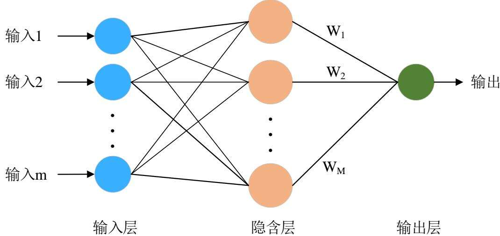  
图7-1神经网络模型基本结构图  
Figure 7-1 Basic structure diagram of neural network model

BP神经网络是一种信号向前传递，误差反向传播的多层前馈神经网络模型，一般由输入层、隐藏层和输出层组成，其基本结构如图7-1所示。在信号前向传递时，上下层神经元状态单向传导，若输出层未达到期望值，则转入反向传播。通过对误差的判定调整网络阈值，达到预测输出逐步趋向期望值的目的。

## (3） 分类回归树模型

分类与回归树（Classification and regression tree，CART）是一种非参数非线性分类回归法，是在给定输入随机变量下输出随机的条件概率分布学习法。CART假设决策树为左“是”右“否”的二叉树，因此其决策树相当于递归二分每个特征，将输入空间划分为确定预测概率分布的有限单元。CART模型无需设定因变量、自变量的关系，而是利用递归划分法将自变量定义的空间划分为同类别。

若设有数据集 $X _ { m , p }$ ，将所有样本中属性F排序，取其相邻两点均值作为分割点，记为 $\eta _ { s } ( s = 1 , 2 , \cdots , m - 1 )$ 。将数据集 $X _ { m , p }$ 按属性F值划分为大于 $\eta _ { s }$ 和小于 $\eta _ { s }$ 的两个子集 $X _ { 1 }$ 和 $X _ { 2 }$ ，其GINI系数为：

$$
G _ { F } ^ { \eta _ { s } } ( X ) = \frac { | X _ { 1 } | } { p } I ( X _ { 1 } ) + \frac { | X _ { 2 } | } { p } I ( X _ { 2 } )\tag{7-4}
$$

式中： $p$ 为属性个数， $| X _ { 1 } |$ 和 $| X _ { 2 } |$ 分别为子集 $X _ { 1 }$ 和 $\left| { { X } _ { 2 } } \right.$ 样本数； $I ( { \pmb X } _ { 1 } )$ 和 $ { | ( X _ { 2 } ) }$ 分别为数据集 $X _ { 1 }$ 和 $\lvert { X } _ { 2 }$ 的纯度。I(X)表达式为：

$$
I ( X ) = 1 - \sum _ { i = 1 } ^ { 2 } \left( \frac { | \mathrm { C } _ { i } | } { | X _ { j } | } \right) ^ { 2 } ( j = 1 , 2 )\tag{7-5}
$$

式中： $| X _ { j } |$ 和 $| \mathsf { C } _ { i } |$ 分别表示数据集 $X _ { j }$ 和该数据集中属于 $\mathsf { C } _ { i }$ 类的总样本数，通过p个属性及m -1个分割点的 GINI 系数 $G _ { F } ^ { \eta _ { S } } ( X )$ ，取其最小间隔点划分数据集$X _ { m , p }$ ，依次递归循环建立子节点，直到所有子节点属性为同类或无分裂属性。

## (4) 逻辑回归模型

逻辑回归（Logistic Regression,LR）是广义的线性回归分析模型，能揭示一个因变量与多个自变量之间的多元回归关系。将排土场生态功能量化为逻辑回归模型的因变量，排土场地质稳定性、水土保持性及群落稳定性等评价指标选为模型自变量，应用逻辑回归模型进行排土场生态功能分析即寻找最优拟合函数来定量化描述生态功能和评价指标之间的关系，其表达式为：

$$
y = { \frac { 1 } { 1 + e ^ { - ( \alpha + \beta _ { 1 } x _ { 1 } + \beta _ { 2 } x _ { 2 } + \cdots + \beta _ { n } x _ { n } } ) } }\tag{7-6}
$$

式中： $\alpha$ 为常数，n排土场生态功能评价指标个数， $x _ { i } ( i = 1 , 2 , \cdots , n )$ 为分类器变量，即生态功能评价指标， $\beta _ { i } ( i = 1 , 2 , \cdots , n )$ 为各生态功能评价指标模型系数。

## 7.3 排土场生态功能评价指标筛选（Selection of Evaluation Index for Ecological Function of Dump)

## 7.3.1 筛选步骤

在进行评价性建模前需要进行评价指标的筛选，本节将介绍评价指标的筛选流程（图7-2）。

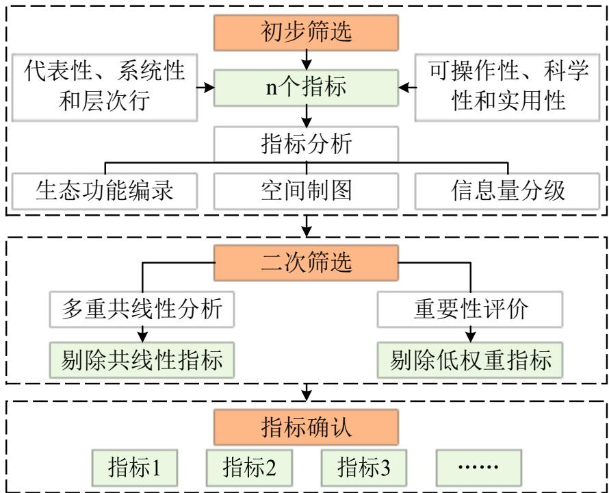  
图7-2排土场生态功能评价指标筛选流程  
Figure 7-2 Selection process of ecological function evaluation index of dumping site

初步筛选时不仅要全面考虑指标的代表性、系统性和层次行，还要体现出评价过程的动态性、可操作性、科学性和实用性。在初步筛选基础上进行功能区编录、空间制图和信息量分级等指标分析。

在二次筛选时，需考虑到模型中使用的多个评价指标间会存在多重共线性和权重差异性，这均会影响模型精度。因此基于指标分析结果，分别利用多重共线性分析和利用重要性评价，剔除共线性指标和低权重指标。经过二次筛选所得指标具有较高的建模精度。

## 7.3.2 初步筛选

研究区生态功能的高低受自身本底条件与外界环境因素共同作用，主要包括排土场基本状况、地质稳定性、水土保持性和群落稳定性4大类，包含微地貌特征、重构岩土体地质结构、水文环境、立地条件及人类扰动等方面。根据野外现场调查及前期研究结果分析，选取研究区岩土堆存高度、坡度、坡向、表面曲率、地形变形速率、土壤侵蚀速率、固结沉降速率、边坡蠕动速率、累积流量、地面粗糙度、地形湿度指数、地表温度植被干旱指数、修复区复垦年限、归一化植被指数、植被覆盖度和植物高度等16项影响因子作为生态功能建模初步筛选指标。

由以上指标可以看出，研究区生态功能评价指标数据类型包括连续型和离散型两类，连续型变量（如堆存高度、平面曲率等）可以用连续数值表达，而离散型变量（如坡向、有无人工养护等）则只能用自然数或整数数值作为单位计算。因此在进行生态功能分析与建模前，需要对各指标进行分级，即将单个指标按标准划分为若干二级指标。离散型指标的划分主要依据现场调查与现有标准，而连续性指标则根据不同指标特征进行划分。

本文利用信息量模型来定量分析生态功能评价指标对其空间影响作用。对于连续型指标，可基于栅格重分类技术将其初步离散化，得到相应分级指数，其计算公式如下：

$$
I _ { L i } = \log _ { 2 } \left( \frac { N _ { L i } / N _ { L } } { N _ { R i } / N _ { R } } \right)\tag{7-7}
$$

式中： $I _ { L i }$ 为第i个分级状态信息量化值； $N _ { L i }$ 为第i个分级状态的区域生态功能健康的区域数； $N _ { L }$ 为对应状态区域的栅格数； $N _ { R i }$ 为第i个分级状态栅格数；$N _ { R }$ 为研究区总栅格数。对分级状态的指数分别进行曲线拟合，以信息量值分布曲线突变阈值作为联系性指标再次进行栅格重分类，同时将相近的信息量值合并。信息量值分布曲线突变阈值展示了评价指标对生态功能指示性的相似性，也体现了不同分级状态下对生态功能的差异性。按照上述方法对各评价指标进行空间信息化展示。此外由于机器学习过程中对[0，1]的数据更敏感，因此还需将生态功能评价指标按分级数归一化到[0.01,0.99]范围内。

## 7.3.3 指标分析

研究区典型区域生态功能编录是评价指标信息量计算的基础，准确可靠的研究区生态功能要素编录是保证模型精度的前提。基于时序卫星遥感的普查技术、无人机遥感的详查技术和实地监测与调查的勘察技术，开展研究区生态功能的编录工作。具体编录步骤为：（1）利用ArcGIS数据管理工具，在候选编录区域内生成200个随机点作为抽样检验点；（2）结合时序InSAR变形监测、无人机遥感与现场调查，在候选编录区域内进一步对区域地质稳定性、水土保持性及群落稳定性进行综合筛选；（3）以无人机遥感DOM数据为底图，在ArcGIS中将筛选结果进行编录成图，结果如图7-3所示。

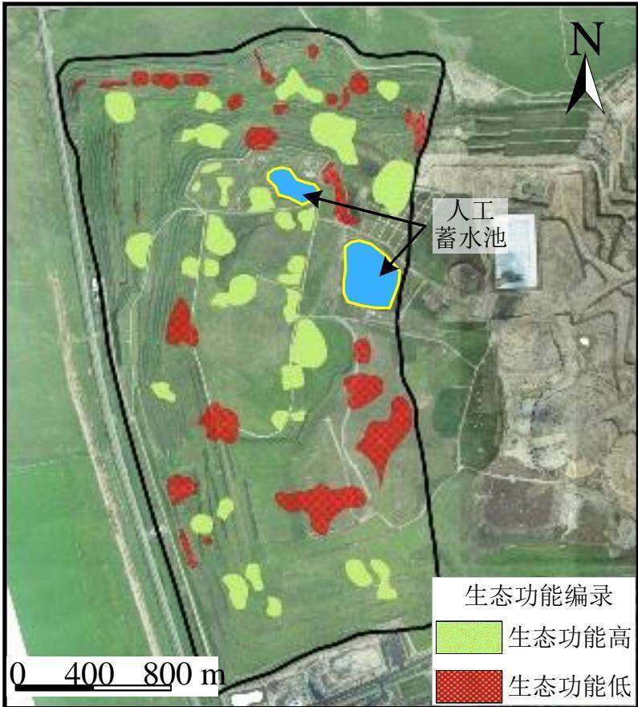  
图7-3研究区生态功能典型区分布  
Figure 7-3 The distribution of the typical area of ecological function status of the study area

基于以上对研究区生态功能评价指标的初步筛选与功能区编录结果，分别对16个评价指标进行分析与空间制图如下。

## （1）排土场基本状况指标

排土场基本状况包括排土场堆存高度（Stacking Height of the Dump）、坡度（Slope）、坡向（Slope Aspect）和表面曲率（Curvature）等指标。

研究区松散堆积、存在不均匀压实，排土场岩土堆存高度的不同使得其承受自重不同，导致固结沉降速率不同，进一步也影响着边坡稳定性。此外，不同堆存高度所受汇水能力也不相同，汇水能力会对植被生长产生影响。

坡度是排土场微地貌的基本参数，也是影响边坡地质稳定性的重要因素。坡度对排土场人工堆积、应力分布、地表水径流等都会产生不同程度的影响。不同坡向会使得所受风力侵蚀强度不同、太阳辐射强度不同、地表水分蒸发速率不同及植物生境不同。

不同坡向会使得所受风力侵蚀强度不同、太阳辐射强度不同、地表水分蒸发速率不同及植物生境不同。同时，不同坡向还会影响有效降雨量，进而影响边坡稳定性。将坡度按平面（-1°）、北（0\~22.5°，337.5\~360°）、东北(22.5\~67.5°)、东（67.5\~112.5°)、东南（112.5\~157.5°)、南（157.5\~202.5°）、西南（202.5\~247.5°）、西（247.5\~292.5°）、西北（292.5\~337.5°）共分为9类。

表面曲率是表面的二阶导数，因此又称之为坡度的坡度。表面曲率是将地面上某像元通过将该像元与八个相邻像元拟合而得，它在垂直于最大坡度方向和沿最大坡度方向的分量分别为平面曲率和剖面曲率。利用表面可以用来判断某一坡面的坡形，正曲率为凸形坡、负曲率为凹形坡，曲率为0是直线坡，不同坡形会直接影响土壤侵蚀和沉积状况。

以无人机摄影测量所获取的DEM数据为基础，结合空间分析工具获取研究区堆存高度、坡度、坡向和表面曲率等排土场基本状况指标（图7-4），利用连续型指标离散化方法将各指标分级，其信息量值按式7-7进行栅格计算。

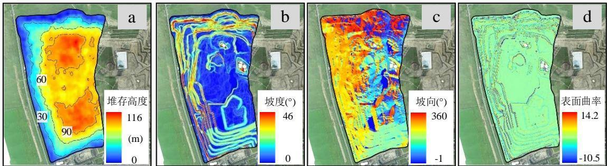  
图7-4研究区基本状况指标  
Figure 7-4 Basic status indicators of the study area

## （2）排土场地质稳定性指标

排土场地质稳定性包括地形变形速率（Terrain Deformation Rate）、土壤侵蚀速率（Soil Erosion Rate）、固结沉降速率（Consolidation Settlement Rate）和边坡蠕动速率（Slope creep rate）等指标。

排土场变形、土壤侵蚀、沉降及边坡蠕动会通过诱发研究区滑坡、地裂缝、边坡蠕动等地质失稳因素影响整体地质稳定性，进而影响研究区生态功能。以

近3年 Sentinel-1雷达卫星遥感影像为数据源，利用 SBAS InSAR技术结合现场实测可获取各地质稳定性指标（图7-5），其信息量值按式7-7进行栅格计算。

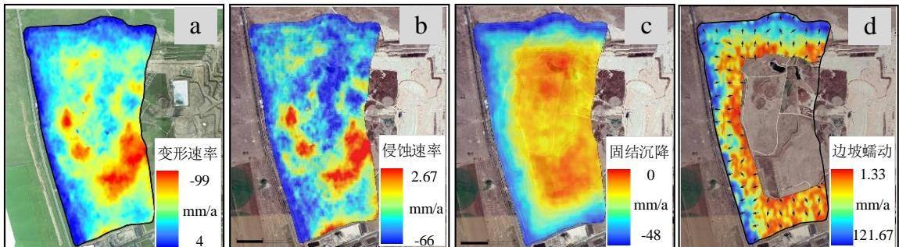  
图7-5研究区地质稳定性指标  
Figure 7-5 Geological stability indicators of the study area

## （3）排土场水土保持性指标

排土场水土保持性包括累积流量（Flow Accumulation）、地面粗糙度（Surface Roughness)、地形湿度指数（Topographic Wetness Index, TWI）和地表温度植被干旱指数（Temperature Vegetation Drought Index, TVDI）等指标。

累积流量是在假定所有降雨均经过一定路径流出所在流域，即不存在入渗、蒸发、截取或损耗等情况下，地表每个点所能累计流经的面积。在地理栅格中则可以表示为流入输出栅格中的每个下坡像元的所有像元的累积权重，即累积像元个数。高流量的区域是径流集中区，可用于识别河道，流量为0的像元是无径流区，也就是局部地形高点，可用于识别山脊。在排土场生态功能评价中，水文径流流量可以用来反应区域水力侵蚀和沉积的演化关系。

地面粗糙度又称“粗糙度参数”，是表示地表地面起伏状态的特征参数，其可以通过反映区域抗侵蚀能力与降水滞留能力来影响生态功能。地面粗糙度可以用地表单元曲面面积与投影面积之比来表示，表达式如下：

$$
S R = \frac { 1 } { \cos { \beta } }\tag{7-8}
$$

式中：SR为地面粗糙度， $\beta$ 为坡度。

地形湿度指数可以用来描述研究区微地貌特征与土壤水分干湿状态的关系，进而通过改变生境来影响生态功能。地形湿度指数表达式为：

$$
T W I = \ln \left( { \frac { \alpha } { \tan \beta } } \right)\tag{7-9}
$$

式中： $\alpha .$ 为地面某点的上游汇集面积，可利用累积流量指数获取， $\beta$ 为坡度。  
地表温度植被干旱指数（TVDI）是表征土壤干旱状态的常用指标。

以无人机摄影测量所获取的DEM数据和地面调查数据为基础，结合水文分析和空间分析工具，可获取各水土保持性指标（图7-6），其信息量值按式7-7进行栅格计算。

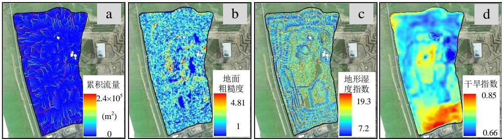  
图7-6研究区水土保持性指标  
Figure 7-6 water and soil conservation indicators of the study area

## （4）排土场群落稳定性指标

排土场群落稳定性包括修复区复垦年限（Years of Reclamation）、归一化植被指数（NDVI）、植被覆盖度（vegetation coverage）和植物高度（VegetationHeight）等指标。

体现排土场生态功能高低最直接的因素是植被生长状况，其具体包括植被覆盖度、物种多样性、植被结构、物种配置、地上地下生物量等多方面。其中，NDVI是反映植被生长状态、植被覆盖度和消除部分辐射误差的重要指数，能反映出植物受水、土、植被等因素影响的程度；植被覆盖度是指植被（包括叶、茎、枝）在地面的垂直投影面积占统计区总面积的百分比，是体现排土场生态功能高低最直接的因素之一；植被高度则在物种类型单一的研究区更能直观表示生态恢复程度。

此外，排土场人工复垦工作一般会选择种植披碱草、老芒麦、无芒雀麦、紫花苜蓿等易成活物种，后进行一定年限维护后任其自然演替。因此，复垦恢复年限会影响区域物种多样性和群落结构，复垦恢复年限长的区域群落稳定性往往更高。

利用无人机高光谱遥感影像、无人机摄影测量所获取的DOM数据以及前期收集的研究区基础资料，获取了研究区复垦绿化状况，可获取各群落稳定性指标（图7-7），其信息量值按式7-7进行栅格计算。

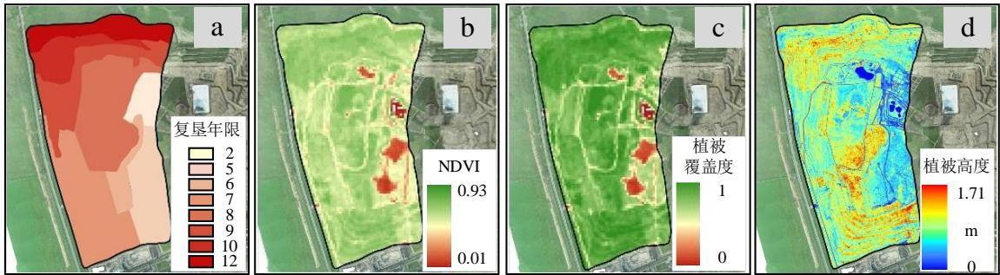  
图7-7研究区群落稳定性指标  
Figure 7-7 Community stability indicators of the study area

## 7.3.4 二次筛选

## （1）指标多重共线性分析与筛选

为减小共线性指标对模型精度的影响，需对上述初步筛选后所得的16个指标进行共线性检验，并剔除共线性指标。

本文使用方差膨胀系数（Variance Inflation Factor，VIF）进行指标共线性检验，其表达式为：

$$
V I F = \frac { 1 } { 1 - R _ { i } ^ { 2 } }\tag{7-10}
$$

式中：VIF为方差膨胀系数， $R _ { i }$ 为某一自变量对其余自变量作回归分析的负相关系数。

方差膨胀系数VIF越大，则各自变量间越可能存在共线性，一般认为，当方差膨胀系数≥5时，则指标存在共线性。将初步筛选所得的16个指标进行共线性检验。结果如表7-1所示，排土场堆存高度、固结沉降速率、边坡蠕动速率存在共线性问题；累计流量、地形湿度指数、温度植被干旱指数存在共线性问题；NDVI、植被覆盖度、植物高度存在共线性问题。将排土场固结沉降速率、边坡蠕动速率、地形湿度指数、温度植被干旱指数、NDVI、植被覆盖度

指标从指标体系中剔除后再次进行共线性检验，所列评价指标方差膨胀系数均小于3，不存在共线性问题。

表7-1生态功能评价指标的共线性检验结果  
Table 7-1 Collinearity test results of ecological function evaluation index
<table><tr><td>指标 类型</td><td>评价指标</td><td>原始指标 方差膨胀系数</td><td>剔除共线指标后 方差膨胀系数</td></tr><tr><td rowspan="4">基本 状况</td><td>堆存高度</td><td>5.57</td><td>1.72</td></tr><tr><td>坡度</td><td>2.37</td><td>1.92</td></tr><tr><td>坡向</td><td>1.61</td><td>1.51</td></tr><tr><td>表面曲率</td><td>1.35</td><td>1.01</td></tr><tr><td rowspan="4">地质 稳定性</td><td>地形变形速率</td><td>1.56</td><td>1.55</td></tr><tr><td>土壤侵蚀速率</td><td>1.42</td><td>1.31</td></tr><tr><td>固结沉降速率</td><td>6.77</td><td>/</td></tr><tr><td>边坡蠕动速率</td><td>5.11</td><td>1</td></tr><tr><td rowspan="4">水土 保持性</td><td>累积流量</td><td>5.01</td><td>1.44</td></tr><tr><td>地面粗糙度</td><td>1.82</td><td>1.04</td></tr><tr><td>地形湿度指数</td><td>5.62</td><td>/</td></tr><tr><td>温度植被干旱指数</td><td>5.31</td><td>1</td></tr><tr><td rowspan="4">群落 稳定性</td><td>修复区复垦年限</td><td>1.76</td><td>1.85</td></tr><tr><td>NDVI</td><td>5.21</td><td>/</td></tr><tr><td>植被覆盖度</td><td>6.26</td><td>/</td></tr><tr><td>植物高度</td><td>5.31</td><td>1.42</td></tr></table>

## （2）指标重要性评价与筛选

不同指标在建模中的贡献度（即权重）不同，低权重指标会带来过大的噪声而降低模型精度。因此，为排除低权重指标对模型精度的影响，需对上述共线性筛选后所得的10个指标进行重要性评价，并剔除低权重指标。

信息增益率（Information GainRatio，IGR）是一种有效的特征选择方法，高信息增益率指标具有较高指示性，即高权重性。假设训练数据集T包含n个样本， $\mathrm { C _ { i } }$ （生态功能状态）为样本数据分类集合，可得到评价指标期望信息表达式：

$$
I n f o ( T ) = - \sum _ { i = 1 } ^ { 2 } \frac { n ( C _ { i } , T ) } { | T | } \mathrm { l o g } _ { 2 } \frac { n ( C _ { i } , T ) } { | T | }\tag{7-11}
$$

将训练数据T划分为m个子样本 $( \mathrm { T } _ { 1 } , \ \mathrm { T } _ { 2 } { \cdot } { \cdot } { \cdot } \mathrm { T } _ { \mathrm { m } } )$ ，每个生态功能评价指标的信息度量可表示为：

$$
I n f o ( T , F ) = - \sum _ { j = 1 } ^ { m } \frac { T _ { j } } { | T | } \log _ { 2 } I n f o ( T )\tag{7-12}
$$

设F为任意评价指标，指标F的信息增益率可表示为：

$$
I G R ( T , F ) = \frac { I n f o ( T ) - I n f o ( T , F ) } { S p l i t I n f o ( T , F ) }\tag{7-13}
$$

式中， $S p l i t I n f o$ 为通过将训练数据划分为m个子集而生成的潜在信息熵，表达式为：

$$
S p l i t I n f o ( T , F ) = - \sum _ { j = 1 } ^ { m } { \frac { | T _ { j } | } { | T | } } \mathrm { l o g } _ { 2 } { \frac { | T _ { j } | } { | T | } }\tag{7-14}
$$

利用信息增益率来定量比较各评价指标对模型的贡献度，评价指标对建模的贡献度越高，表明其对评价模型精度的贡献越大，结果如图7-8所示。

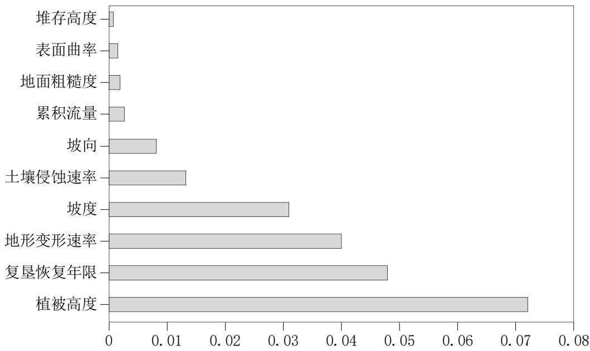  
图7-8生态功能评价指标平均贡献度  
Figure 7-8 Average contribution of ecological function evaluation index

从信息增益计算结果可以看出，植被状态、复垦恢复年限和地形变形速率三个指标对排土场生态功能评价建模精度贡献度最高，分别为0.072，0.048和0.04；排土场堆存高度、便面曲率和地表粗糙度三个指标对生态功能评价建模精度贡献度最低，分别为0.001，0.003和0.004。

虽然贡献度低的评价指标也会在建模过程中起到提升精度的作用，但同时也会产生噪音，若噪音造成的负作用高于其贡献度，则需要将其从评价指标中剔除。为对评价指标进行筛选，可从贡献度最低的指标开始逐个剔除，同时用支持向量机模型测试剩余指标的精度。如表7-2所示，当依次剔除堆存高度，表面曲率，地面粗糙度和累积流量指标时，模型精度提高到0.923，继续剔除坡向时模型精度降为0.901。在综合考虑模型精度与运算效率的情况下，将堆存高度，表面曲率，地面粗糙度和累积流量4个指标从生态功能评价体系中剔除。

表7-2剔除不重要指标的生态功能评价模型精度  
Table 7-2 Accuracy of ecological function evaluation model excluding unimportant indicators
<table><tr><td>模型</td><td>指标剔除</td><td>精度</td></tr><tr><td>模型1</td><td>不剔除</td><td>0.879</td></tr><tr><td>模型2</td><td>堆存高度</td><td>0.883</td></tr><tr><td>模型3</td><td>堆存高度，表面曲率</td><td>0.902</td></tr><tr><td>模型4</td><td>堆存高度，表面曲率，地面粗糙度</td><td>0.919</td></tr><tr><td>模型 5</td><td>堆存高度，表面曲率，地面粗糙度，累积流量</td><td>0.923</td></tr><tr><td>模型6</td><td>堆存高度，表面曲率，地面粗糙度，累积流量，坡向</td><td>0.901</td></tr></table>

综上，研究区生态功能评价指标经过筛选流程后，筛选出坡度、地形变形速率、坡向、地形湿度指数、复垦恢复年限和植物高度等6个指标参与建模，这些指标既能够表征研究区生态功能状态，又具有较高的建模精度。

## 7.4 排土场生态功能评价结果与讨论（Modeling and Precision Evaluation of Ecological Function Evaluation of Dump)

## 7.4.1生态功能评价结果与精度分析

## （1） 评价结果

分别将生态功能评价归一化指标数据和编录区生态功能高低数据作为评价模型的输入/输出项，将生态功能编录数据随机均分为两部分，一半作为训练样本，另一半作为验证样本。在分类模型训练过程中，为保证模型训练的平衡性，需保证高生态功能区和低生态功能区样本数量保存一致。

利用支持向量机、人工神经网络、分类回归树和逻辑回归四个模型对研究区进行生态功能评价。选取筛选后坡度、地形变形速率、坡向、地形湿度指数、复垦恢复年限和植物高度共6个指标作为生态功能评价建模输入项。在模型构建过程中，支持向量机模型惩罚因子函数c设为20，核函数设为1.3；人工神经网络模型中神经元个数设为60，动量参数α设为0.9。

分别应用支持向量机等四个模型计算排土场生态功能指数（归一化），结果如图7-9和图7-10所示。图中生态功能指数分为为0\~1，指数越高说明该区域地质稳定性、水土保持性和群落稳定性越高。

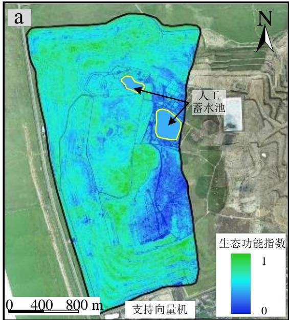

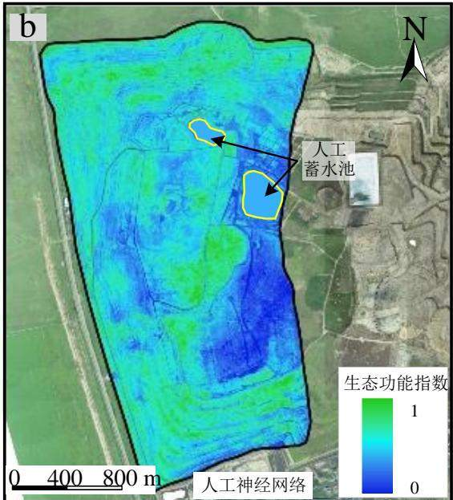  
图7-9基于支持向量机和人工神经网络的生态功能评价结果  
Figure 7-9 Evaluation result of ecological function based on support vector machine and artificial neural network

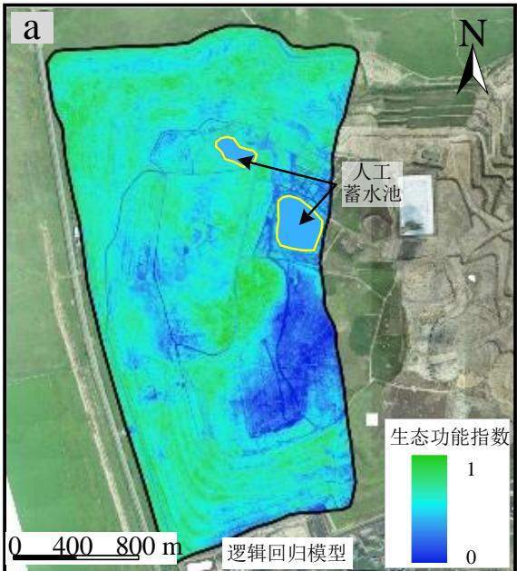

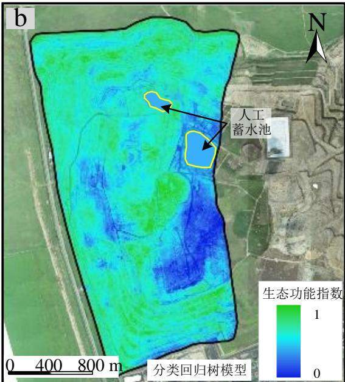  
图7-10基于逻辑回归模型和分类回归树模型的生态功能评价结果  
Figure 7-10 Ecological function evaluation results based on logistic regression model and classification regression tree model

## (2） 精度分析

## 1）模型精度统计分析

为对建立的生态功能评价模型分类结果进行精度验证，将模型评价结果分为：E1生态功能低（25%）、E2生态功能一般（25%）、E3生态功能较高（25%）和E4生态功能高（25%）共四个等级。分别统计生态功能典型编录区在各等级中的分布状态，其结果如表7-3所示。

表7-3生态功能评价精度统计  
Table 7-3 Accuracy statistics of ecological function evaluation
<table><tr><td>生态功能 评价类型</td><td>分类等级</td><td>占低生态功能 编录区面积比例</td><td>占高生态功能 编录区面积比例</td></tr><tr><td rowspan="4">支持 向量机</td><td>E1</td><td>89.22%</td><td>0.03%</td></tr><tr><td>E2</td><td>9.03%</td><td>1.50%</td></tr><tr><td>E3</td><td>1.73%</td><td>12.3%</td></tr><tr><td>E4</td><td>0.02%</td><td>86.17%</td></tr><tr><td rowspan="4">人工神 经网络</td><td>E1</td><td>80.10%</td><td>0.56%</td></tr><tr><td>E2</td><td>16.8%</td><td>5.04%</td></tr><tr><td>E3</td><td>2.09%</td><td>19.85%</td></tr><tr><td>E4</td><td>1.01%</td><td>74.55%</td></tr><tr><td rowspan="4">逻辑 回归</td><td>E1</td><td>71.05%</td><td>1.14%</td></tr><tr><td>E2</td><td>22.30%</td><td>7.00%</td></tr><tr><td>E3</td><td>3.45%</td><td>20.52%</td></tr><tr><td>E4</td><td>3.20%</td><td>71.34%</td></tr><tr><td rowspan="4">分类 回归树</td><td>E1</td><td>66.31%</td><td>1.66%</td></tr><tr><td>E2</td><td>26.14%</td><td>5.54%</td></tr><tr><td>E3</td><td>6.50%</td><td>24.70%</td></tr><tr><td>E4</td><td>1.05%</td><td>68.10%</td></tr></table>

可以看出，在支持向量机评价模型中，89.22%的低生态功能区和86.17%的高生态功能区被正确分类；在人工神经网络评价模型中，80.10%的低生态功能区和74.55%的高生态功能区被正确分类；在逻辑回归评价模型，71.05%的低生态功能区和71.34%的高生态功能区被正确分类；在分类回归树评价模型，66.31%的低生态功能区和68.10%的高生态功能区被正确分类。可见支持向量机评价模型在分类统计方面精度高于其他三类模型。

## 2）模型应用精度对比分析

受试者工作特性曲线（Receiver operating characteristic curve，ROC）又称感受性曲线，是一种通过确定分类标准来进行精度评价的方法[364]。利用ROC曲线进行精度评价的优点是无需对模型分类结果进行阈值断点的主观设定，而是在不同阈值下，以特异性（即1减去正确模拟不存在的比率）为横坐标，以敏感性（即正确模拟存在的比率）为纵坐标，通过作图法绘制在图上。通过比较所绘 ROC曲线与横坐标所围成的面积（Area Under Curve，AUC）来确定模型精度，其面积越大则模型精度越高，因此是ROC曲线是生态功能评价评价模型精度验证的有效指标。

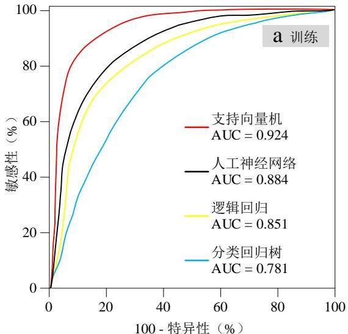

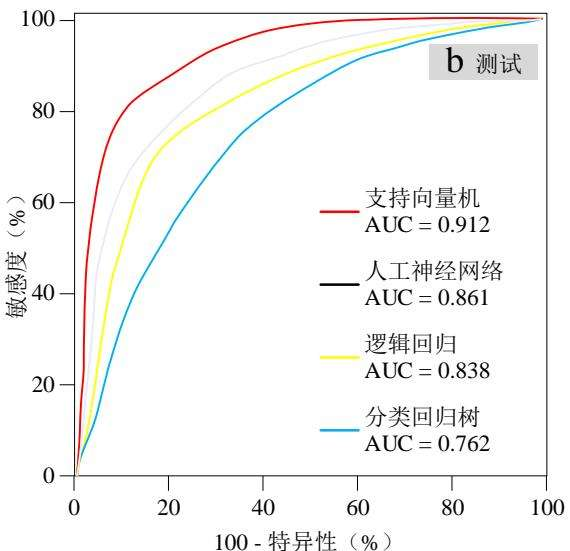  
图 7-11 基于 ROC 曲线的模型精度评价  
Figure 7-11 Model accuracy evaluation based on ROC curve

如图7-11所示，分别对四个模型的训练和测试结果建立ROC曲线，同时计算各曲线的AUC值。其中支持向量机、人工神经网络、逻辑回归和分类回归树的模型训练结果分的AUC分别为0.924、0.884、0.854和 0.781，支持向量机模型训练结果最优，说明其可以准确拟合生态功能与其他影响因素之间的关系。同时，在测试结果的ROC曲线中，四个模型的AUC分别为0.912、0.861、0.838和0.762，支持向量机的测试结果依然为最优。

综合精度统计分析和ROC曲线分析两种精度评价方式可以看出，支持向量机模型在本研究区的生态功能评价模型建立中表现优异，其次是人工神经网络模型和逻辑回归模型，分类回归树模型精度较低。此外，现阶段常见的统计分析模型和机器学习模型均为基于数据的模型，因此在不同环境下由于基础数据不同、评价性指标不同会导致模型精度存在较大差异。

## 7.4.2 生态功能评价结果分析讨论

## （1）模型分析

影响研究区生态功能的环境因素种类众多，但其在某一时刻的状态主要可以用区域地质稳定性、水土保持性及群落稳定性三类要素共同表征（图7-12）。

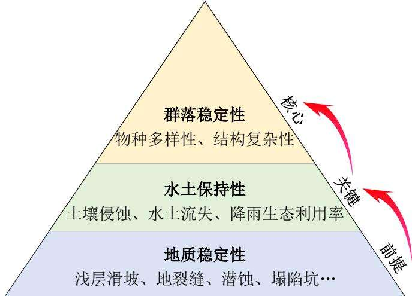  
图7-12地质稳定性、水土保持性及群落稳定性与排土场生态功能之间的关系  
Figure 7-12 Relationship between geological stability, soil and water conservation, community stability and ecological function

地质稳定性要素则主要包括是否存在浅层滑坡、地裂缝、潜蚀、地面塌陷等，地质稳定性是生态功能提升的最基本前提。水土作为植物的载体，与植物间存在密切的相互作用关系，可以通过土壤侵蚀率、水土流失量、降水资源的生态利用率等方面影响植物群落稳定性，因此是表征生态功能的关键。群落稳定性指标不仅可以反映当前时刻的生物多样性、结构复杂性等方面的状态，同时也决定了其未来的发展和恢复能力，是区域生态功能高低的直观判断依据，是生态功能提升的核心。

本文经过筛选得到的坡度等6项评价指标既能够较为全面的反应研究区地质-水土-植被的状况，也有较高的模型评价精度，经过对四个模型的对比分析可知，基于支持向量机的评价方法满足对研究区生态功能的评价要求，可以为矿区生态重建管理者制定生态恢复策略提供技术依据。

## (2) 结果讨论

以评价精度最高的支持向量机模型获取的研究区生态功能评价结果为基准，按照自然断点法将生态功能分类结果分为“低、一般、较高、高”四类，可以看出研究区内生态功能分布差异显著（图7-13，表7-4），且与4.3节对研究区地质灾害隐患区识别结果以及5.1节研究区土壤侵蚀分布结果有较大吻合度。

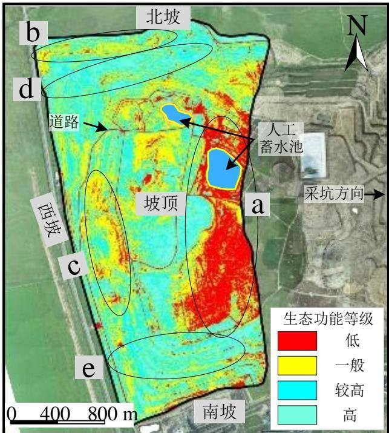  
图7-13研究区生态功能等级分布  
Figure 7-13 Distribution of ecological functions in the study area

表7-4研究区生态功能不同等级面积占比  
Table 7-4 The proportion of different grades of ecological functions in the study area
<table><tr><td>生态功能等级</td><td>低</td><td>一般</td><td>较高</td><td>高</td></tr><tr><td>比例（%）</td><td>16.8</td><td>36.2</td><td>29.6</td><td>17.4</td></tr></table>

坡顶偏东部a区生态功能最低，其主要原因为该区域堆排形成时间较短，目前尚处于初步恢复阶段，不仅土壤贫瘠，而且区域非均匀沉降、地面塌陷发育较多，人工种植先锋物种存活率不高。针对该区给出的提升意见为先把修复重心放在土壤生境改良上，选择速生本地草本植物作为先锋物种，该区处于坡顶平台，基本不会出现滑坡、侵蚀沟等地质灾害，但需注意防止地面塌陷、地裂缝等造成的水肥流失。

北坡西北边缘的b区生态功能处于较低水平，主要因为该区地形复杂，径流紊乱，雨季上游降水汇流而下导致区内有大量浅层滑坡、塌陷型地裂缝和侵蚀沟发育，水土流失严重，植物难以存活。西坡中部的c区生态功能亦处于低到一般的范围，主要因为该区台阶较高，坡度较陡，边坡挡土墙造成径流易集中，区内有拉伸型地裂缝、浅层滑坡、边坡蠕动及塌陷坑发育，土壤侵蚀严重，植物生长状况差异性较大。针对b区和c区，建议以调控水土关系、提升水土保持能力为主，如截留、护坡等生态工程措施。

北坡大部分区域（如d区）生态功能处于较高水平，主要原因是该区复垦恢复年限超过十年，大部分区域地质稳定性基本稳定，区内植物逐渐由人工种植的植物群落演替为以原生物种为主的自然群落，整体植被覆盖度、物种多样性均处于相对较高且稳定的状态。针对该区要留意水土保持，尤其需要防止面状侵蚀和侵蚀沟的发育，提升d区水土保持能力也可以降低雨季径流对下游a区地质稳定性的影响。

南坡大部分区域生态功能较高（如e区），其主要是由于南坡存在时间最短，近年来管理者越来越重视排土场生态功能的综合质量，南坡不仅平均坡度小于其他区域，且在坡体上实施了网格化土地整治，这样不仅降低了地质灾害发生的概率，而且一定程度上阻止了降水的汇集、冲刷。但同时，由于表土持水能力有限，边坡网格化措施依然未能完全解决水土保持性低的问题，雨季短时暴雨依然在每个网格内汇集于相对低洼处的地表，降水生态利用率依然不高。

综合以上可以看出，研究区生态功能受地质-水土-植被共同影响，而区域水土不匹配是影响三大要素的最主要原因，可见对水的调控显得尤为重要。

7.5 排土场生态功能提升策略（Strategies for Improving Ecological of Dump)

## 7.5.1 生态功能提升设计准则

生态功能提升的设计准则反应了整体工程预期达到的总体目标和技术思路，是生态功能提升工程设计者工作的核心指导思想。根据高寒矿区大型排土场边坡稳定性、水土保持性和群落稳定性对生态功能的作用机理与影响特征，在设计排土场生态功能提升工程时，应该以消除和缓解灾害性限制性因子为出发点，以建立稳定生态系统为最终目的，至少需要遵循“长期规划，重点治理，整体提升”的三项准则。

## （1）长期规划

1）影响过程的长期性。前文从岩土体变形的长期性、土壤侵蚀的长期性和重建植物演替的长期性证明了生态功能提升的限制性因子存在长期影响，无论是生态功能提升过程中的扰动探测、损伤评价或治理设计环节，都应当将“地质-水土-植被”作为生态恢复的长期提升对象。

2）恢复过程的长期性。生态功能提升以建立稳定生态系统为目的，这需要区域地质稳定性、水土保持性和群落稳定性的共同维持，恢复到这一状态必然是一个长期过程。

3）修复目标的长期性。排土场生态功能是一个动态变化过程，不仅会随着采矿活动而持续，而且会在不同时期随外界诱发因素条件的变化而变化，因此需设定以长期持续修复目标。同时，生态修复尤其是植被重建过程中若过度追求短期成活率与覆盖度，但由于没有消除地质和水土限制因子的影像，会出现重建植被退化、土壤质量下降的情况。

因此，在制定生态功能提升规划时需要遵循“地质-水土-植被”三要素的动态变化规律，基于以上三点考虑需遵循长期规划的原则进行生态功能提升。

## (2) 重点治理

在高寒矿区大型排土场生态功能提升策略中，需要针对“地质-水土-植被”三大要素的具体情况重点展开，主要体现为：

1）根据区域生态功能限制性因子实施重点修复。第七章研究发现，生态功能提升中地质稳定性是前提、水土保持性是关键、群落稳定性是核心，当区域地质、水土、植被均为生态功能限制性因子时，应当按提升地质稳定性一提升水土保持性一提升群落稳定性的顺序进行，若只进行单一的植被恢复则无法保证长期修复效果。

2）微地貌关键区改造以提高水土保持能力。第四章和第五章研究发现，研究区地貌复杂、径流紊乱，使得稀缺降水资源不仅未能被保留和利用，反而成为造成排土场边坡失稳及土壤侵蚀的最主要诱因。在无人机摄影测量获取高分辨率DEM数据基础上，对排土场微地貌进行优化，达到阻断汇流、减少冲刷、增加大气降水利用率的目的。

3）根据不同立地条件进行植被重建。第六章研究发现，研究区人工植物群落随自身演替逐渐变为以原生物种为主的自然群落，且不同立地条件、不同演替时长下优势种组成不尽相同。因此，在生态修复初期人工植物修复工程过程中，可采用先锋物种与演替进程上优势种混播的方式创建潜在种子库，或按“先锋种、过渡种、演替种、顶级种”的配搭方式进行不同阶段的种植，再配合人工管理措施以加速生态植物群落正向演替，达到加速植物演替的目的。

## （3）整体提升

生态功能整体提升主要来自并针对影响生态功能的各类要素间的复杂作用关系。因此整体提升主要分为：

1）全区域修复。虽然排土场地质稳定性、水土保持性和群落稳定性均存在较强的空间差异，但他们一旦在局部造成生态功能受损必定也会逐渐影响到周边区域，例如研究区边坡局部浅层滑坡会导致表土损毁，在降雨条件下引发侵蚀沟，并直接影响至下游区域，最终导致区域水土流失和植物退化。因此，针对排土场某一区域的生态功能提升难以改善整体状态，需要区域内的整体修复。

2）全要素修复。生态功能要素间复杂的相互作用关系是生态系统不断发展同时又保持结构和功能相对稳定的基础，单一生态功能要素的受损也必然将影响传递至其他要素。针对单一要素的修复难以改善整体状态，需要“地质-水土-植被”全要素的整体修复。

## 7.5.2 生态功能提升技术框架

生态功能提升的实施框架为生态重建管理者提供了生态工程设计的具体步骤。在实施过程中，生态功能提升至少需要包含监测、评价、规划、治理以及反馈等五个具体环节，每个环节依次进行，分别针对生态功能提升过程中不同要素和过程。

## (1） 监测

监测环节为后续措施提供了排土场地质稳定性、水土保持性和植被群落稳定性的基本信息。主要通过时序InSAR、无人机遥感和地面调查的多源协同监测方法，作为后续的评价和反馈环节的基础数据。

## (2) 评价

评价环节将反映排土场“地质-水土-植被”对生态功能的影响情况，主要针对地表变形、土壤侵蚀和植被恢复三方面。基于监测环节获取的基础数据，构建排土场生态功能评价模型，评价的结果将后续修复规划的制定提供依据。

## （3）规划

规划环节决定实现生态功能提升需要采取的工程措施，通过前面的监测和评价环节可以对生态功能具体分布状况有了了解，在规划环节将整合各环节的成果制定具体工程方案。

## (4) 治理

治理环节负责实现规划环节中制定的实施方案，其主要手段包括边坡稳定性提升、水土保持功能提升和重建植物群落优化配置三个方面。

## (5) 反馈

反馈环节将实施框架中的所有环节进行串联，同时不断完善各环节的措施，根据评价结果完善监测方法和指标，根据评价结果完善规划和设计方案，根据监测结果修改治理方案，根据评价结果增加监测指标，依次不断改进实施框架。

## 7.5.3 生态功能提升实施措施

目前排土场生态修复未考虑整体水土资源调控的重要性，仍然处于单一要素修复的状态。如排土场边坡冲沟主要采用削坡、填筑等传统方法进行治理，未能从源头上解决问题，复发性高，当雨季再次来临时，还会再次受到侵蚀形成冲沟，需要再次治理，导致工作量大大增多，治理成本大大提高；生态重建只考虑短期内植被覆盖度，未能从植物演替与最优配置的角度长远考虑恢复效果。综合本文研究可以发现，研究区水资源并非十分匮乏，而水资源生态利用率低下不仅是影响植物生长最主要的因素之一，而且是引发地质失稳和土壤侵蚀的主要诱因。如何合理利用并调配降水资源，保证水土资源的科学调控与高校利用是排土场生态功能提升的关键。

为实现高寒矿区大型排土场这一典型矿业景观的生态功能提升，通过时序遥感、无人机遥感、地面监测等技术实现排土场生态问题诊断，发现排土场地质灾害隐患及复合型土壤侵蚀发育规律，最后通过水-土-植被调控配置策略实现排土场生态功能提升目标。具体技术措施包括排土场生态功能问题诊断技术、分布式保水控蚀技术以及物种配置与种植技术，实现“海绵”排土场的构建。前文已对问题诊断技术与物种配置与种植技术做了详细研究，本节具体介绍在生态功能问题诊断基础上的“海绵”排土场构建技术，即保水控蚀系统的构建。

## (1） 总体思想

排土场水资源调控是以生态功能提升为前提，综合采用“渗、导、蓄、用、排”等工程技术措施，将排土场建设成为具有“自然积存、自然渗透、自然净化、科学利用”功能的生态源地，旨在解决排土场雨水径流控制、雨洪资源存储、矿坑水体净、水资源科学利用等问题。

渗一—减少坡面径流，雨水就地下渗，从源头减少地表径流；

导一一短时强降雨不能完全入渗的，利用已有精细水文网对地表径流进行合理疏导；

蓄一一利用分布式蓄水系统、人工湿地等将雨水及矿坑水蓄积起来，削减峰值流量，调节水资源时空分布，为其资源化利用创造条件；

用一一实现雨洪、矿坑水资源化，水资源灌溉及构造实地景观，形成水资源径流源的深层次循环利用；

排一一统筹雨水、疏干水利用系统，结合矿区所在流域地形，合理规划矿区雨水、疏干水水渠系统，做到超标水径流科学排放，构建安全矿区排水体系。

针对排土场水资源难以保存、水肥流失严重、雨季强降雨威胁坡体地质安全、旱季时植物长期处于干旱胁迫状态且难以自维持的问题，研发了排土场集控水、集水、用水为一体的分布式保水控蚀系统，在实现了排土场水资源高效利用的同时，降低了水肥流失、增加了坡体地质稳定性，为生态功能提升提供了基础。

## (2) 目标与技术

为达到阻断降雨向排土场边坡汇水导致水土流失，降低坡体浸润线，提高边坡稳定性、提高土壤持水能力，提高雨水利用率，降低浇灌维护成本的目的，借鉴低影响开发策略（Low impact development)，采用自然恢复与人工辅助恢复相结合、生物措施与工程措施相结合，遵循截流、保边护底，以增加植物、控制水土流失，改善生态系统为核心的调控原则；通过不同坡位、不同植物配置、不同水流路径优化控制地表径流；通过在关键地段建立以分布式保水控蚀系统等地表蓄水与释水设施为主体的排土场水土物质流控制系统，以减少地表径流提高水资源生态利用效率，提升排土场生态系统自维持性水平。基于地表潜在汇水区与径流路径分析，确定在雨季强降雨情况下每个子区域的汇水面积，进而确定每个“潜流湿地—植物塘—植物沟”系统，可在达到蓄水、护土的同时，提升排土场生态功能。

通过分布式保水控蚀系统最大限度将地表径流蓄积起来，通过湿地、植物塘防止径流和蒸发损失；加强土壤培肥，提高土壤水分利用率，特别是深层水分的利用率；旱改水，通过雨水集蓄和智能灌溉技术，在不同植物需水关键期进行节水补灌，提高水分生产效率。

## （3）保水控蚀系统关键区域选址

研究区整体径流较为紊乱，排土场保水控蚀的原则是在径流关键节点处构建保水控蚀单元，通过人造含水层形成上层滞水效果，多个保水控蚀单元相互联通形成分布式保水控蚀系统，以局部治理实现排土场生态功能的整体提升，起到了控水、集水、用水的效果。

首先利用无人机摄影测量技术获取的高精度DEM数据，通过水文分析工具获得地表精细径流网络；其次再通过流量分析、分水岭识别来获取研究区汇水子流域分布；再次计算汇水子流域面积及其潜在储水/持水能力，基于流量阈值确定关键区域位置；最后结合区域内表土渗透率及历史降雨参数，以保证设计的系统能抵御20年一遇暴雨量来确定保水控蚀单元的面积。具体流程如图7-14所示。

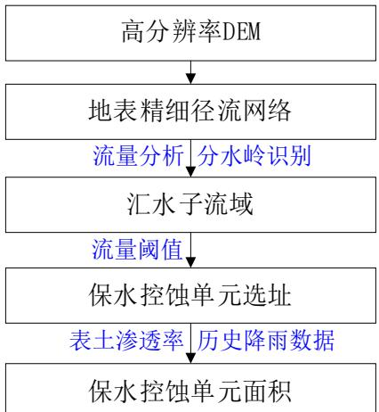  
图7-14保水控蚀单元区域选址  
Figure 7-14 Location selection of water conservation and erosion control unit

## （4）关键单元技术参数

在保水控蚀系统关键区域科学选址的基础上，在排土场顶部平台内部汇水区布置储水植物塘，在排土场顶部平台外围汇水区和边坡平台汇水区布置保水潜流湿地，储水植物塘与保水潜流湿地由导水植物沟相连通；分别在储水植物塘、保水潜流湿地和导水植物沟内按照本文研究的物种配置方法进行种植。

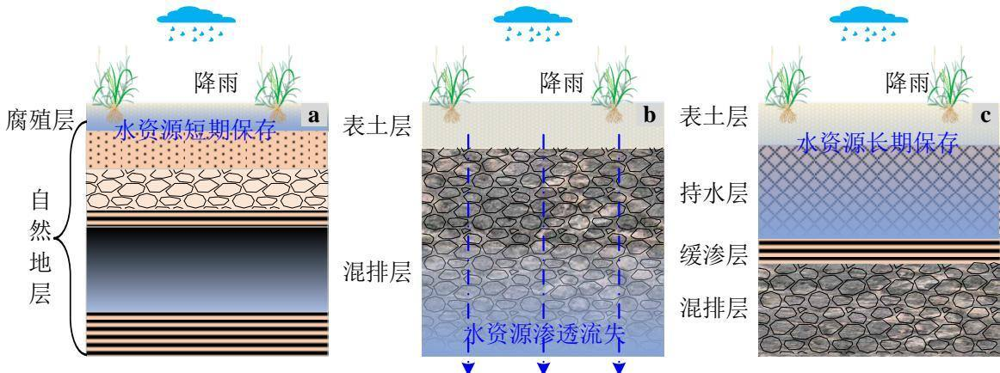  
图7-15降雨条件下生态储水过程：（a）自然地层（b）传统排土场地层（c）人工保水单元

Figure 7-15 Ecological water storage process under rainfall conditions: (a) natural stratum, (b) traditional dumping site layer and (c) artificial water conservation unit  
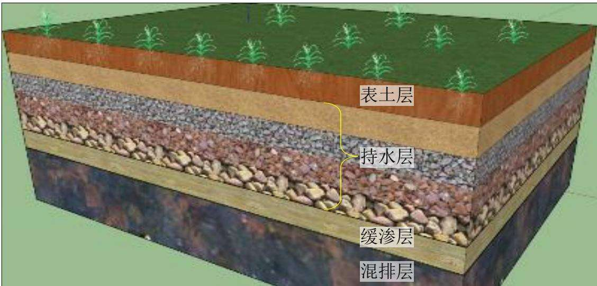  
图7-16保水潜流湿地剖面示意图  
Figure 7-16 Profile of water conservation subsurface flow wetland

针对系统的每一个单元，首先进行潜流湿地的开挖，开挖后底部铺设防渗层及垫层；垫层往上依次铺设粒径由大到小的砾石，构建一个稳定的储水空间：最后在地表铺设腐殖土，进行草灌配置。系统通过人造含水层形成上层滞水，以局部治理实现排土场生态功能的整体提升，可起到对自然水资源的调控作用，雨季蓄水、旱季供水，为排土场植物生长提供一个持续、稳定的水源，剖面示意图如图7-16所示，生态储水过程如图7-15所示。

由以上步骤在排土场坡顶平台及边坡上设置分布式储水/持水/导水单元，可起到水土物质流控制作用，人工保水控蚀单元生整体示意图如图7-17所示。

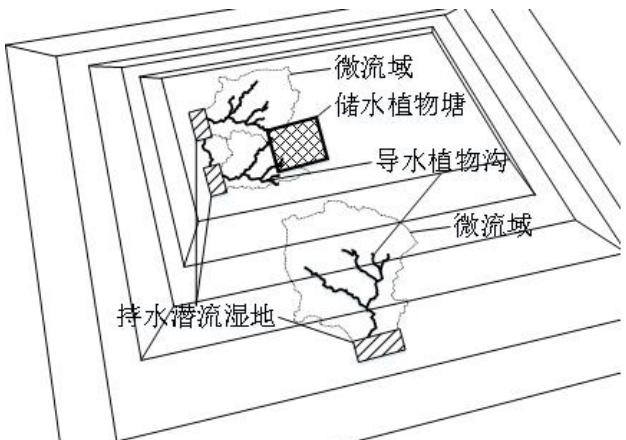  
图7-17排土场微地形改造分布式储水/持水/导水单元整体平面示意图  
Figure 7-17 Overall plan of distributed water storage / water holding / water diversion unit for dump micro topography reconstruction

其中，储水植物塘中心深度为2.2m，边坡比小于等于1：3，储水植物塘与边坡底部使用粘土或土工布做防渗层，防渗层上覆盖0.5m厚腐殖土。保水潜流湿地深度为1.5m，边坡比小于等于1：3，保水潜流湿地与边坡底部使用粘土或土工布做防渗层，底部防渗层往上依次填充细沙或粉煤灰垫层0.2m、粒径32\~64mm的砾石或煤矸石0.4m、粒径16\~32mm的砾石或煤矸石0.2m、粒径5\~16mm的砾石或煤矸石0.2m、腐殖土0.4\~0.5m；保水潜流湿地最终标高与周围持平或略低（如图7-19所示）。

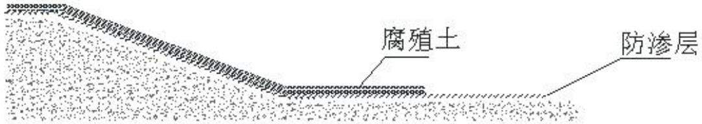  
图7-18 储水植物塘剖面示意图  
Figure 7-18 Section diagram of water storage plant pond

导水植物沟布置在已有水文网的位置，可随着重力流进行导水。植物沟剖面呈倒梯形，深度为1.5m，导水植物沟沟底与边坡底部使用粘土或土工布做防渗层，底部防渗层往上依次填充细沙或粉煤灰垫层0.2m、粒径32\~64mm的砾石或煤矸石0.4m、粒径16\~32mm的砾石或煤矸石 0.2m、粒径 5\~16mm的砾石或煤矸石0.2m、腐殖土0.4\~0.5m；保水潜流湿地最终标比周围略低。排土场顶部外围保水潜流湿地与顶部边缘线之间设置安全距离，长度为50\~80米。

本方案利用已有微地貌及水流特征，在排土场顶部平台设置分布式储水植物塘、保水潜流湿地等若干个蓄水单元，再通过导水植物沟将微流域内降雨导入蓄水单元；合理控制、分配降雨资源，有效防止降雨形成侵蚀性坡面径流、地下渗流、暗涌等，在确保排土场边坡稳定性与减少水土流失的同时，更加高效的利用有限的水资源，起到排土场水土物质流控制作用，同时可有效存储短时过多疏干水，供缺水时使用。

## 7.6 应用案例（Application Case）

## 7.6.1 区域概况

宝日希勒煤矿企业在矿区环境生态修复方面开展了一系列控（控）治（理）工作，并取得了一定的生态效果。但是，由于自然或人文因素的干扰导致生态斑块破碎化现象。在矿区中仍然存在着干旱缺水与水土流失的矛盾，排土场主要面临着土壤养分贫瘠、植物群落退化、绿化持续灌溉用水、土壤界面不稳定、抗蚀能力差、部分区域存在浅层滑坡等灾害，排土场边坡失稳与水土流失问题突出，破碎斑块生境退化情况越来越严重。传统复垦方式往往形成单一坡度的坡面，排水系统不够便利，易受到自然降雨的侵蚀，使得生态廊道受阻；极端气候条件下破坏现象更为严重，维护费用高昂；并且单一坡度条件下难以维持生物群落稳定性，整体生态功能与生态服务价值退化。

目前对于露天煤矿土地复垦与生态恢复的研究大多侧重于土地利用工程改造、土壤改良、植被重建以及与之相关联的微观条件，常常忽略露天矿区整体地质稳定性和水土资源调控配置。

排土场地质灾害要以防为主，对于规划新建排土场，可综合考虑排土场地基强度和排弃工艺、岩土松散体力学性质和理化性质、当地水文地质条件和气象气候条件等，还可以辅助以工程排水和固坡措施，进而从源头上杜绝大规模排土场地质灾害发生的可能。然而对于研究区这类现存排土场，面临堆存时间久、地灾隐患多、治理难度大等问题。放坡是提升边坡稳定性最为有效的方法之一，然而不得不面对放坡空间不足、放坡成本过高等现实问题。

对于这类排土场地质灾害，要以限制灾害源为基本原则，即限制致灾因子、消除或减弱地灾隐患活动体能量来源，进而解除或缓解地灾隐患威胁。在排土场坡顶建立潜流湿地、植物塘、植物沟渠等人工保水控蚀措施，可显著减少坡顶雨水入渗，在达到蓄水、护土的同时，也提升了坡顶生态功能，充分利用季节性水源，减少水源对边坡的冲刷。在减少排土场边坡破坏的同时，实现排土场的生态系统的构建，使排土场生态功能得到提升。

## 7.6.2 实施过程

针对宝日希勒露天煤矿的北排土场生态功能提升示范，按照“现场踏勘一一无人机超低空航拍数据采集一—构建排土场厘米级精度的地形高程模型——精细地形提取与水文网识别一一关键控制单元的识别与提取一一分布式保水控蚀系统的设计与建设——现场试验与数据采集一—生态功能提升评价与修正”。

具体来说，首先利用无人机遥感技术，对排土场及周边地区进行精细航拍，获取其高精度（厘米级）地形及水文网数据，获取侵蚀沟三维模型，结合地表水文生态学，识别排土场地表径流路径、水土流失与坡体崩塌部位；以侵蚀沟为治理单元，分块立体综合治理，遵循“截流、保边护底、蓄水”的治理方针，建立分布式保水控蚀系统进行水资源调控，雨季蓄水、旱季供水，为排土场植被生长提供一个持续、稳定的水源。通过不同坡位、不同植物配置、不同水流路径优化控制地表径流；通过在关键地段建立地表蓄水与用水设施，如在草原矿区堆土场坡顶构建植物沟、保水控蚀单元和植物塘，在坡边平台构建保水控蚀单元和植物沟：在坡底构建植物沟、泥沙沉积区及植物塘，最终形成一个以堆土场为平台的雨水层层节流和利用的“海绵”式排土场生态维持模式。

在研究区内基于地表潜在汇水区与径流路径分析，确定在雨季强降雨情况下每个子区域的汇水面积，进而确定每个分布式保水控蚀系统单元（图7-19），可在达到蓄水、护土的同时，提升排土场生态功能。

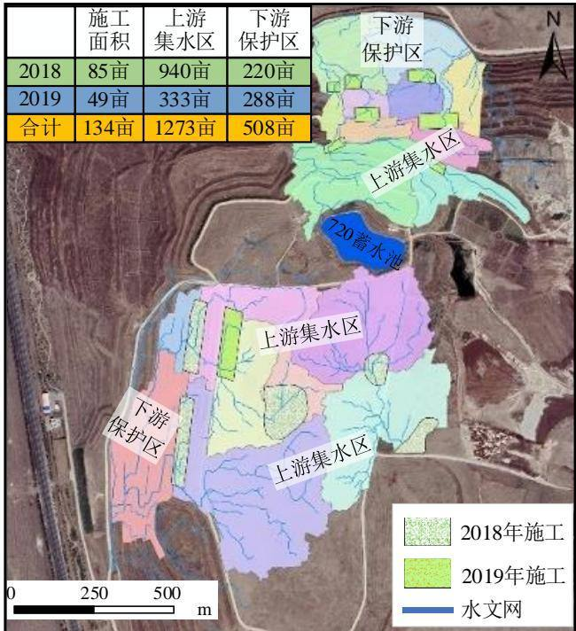  
图7-19研究区分布式保水控蚀系统示意图  
Figure 7-19 Schematic diagram of distributed water conservation and erosion control system in study area

研究区顶部平台海拔约720m，相对高度约120m，边坡角度15\~35°之间。通过对地形数据进行空间、水文分析，将整个排土场提取出13个汇水区进行分布式保水控蚀系统改造，其中顶部平台中心汇水区布置储水植物塘1个，顶部平台外围汇水区和边坡平台汇水区布置保水控蚀单元12个。保水控蚀单元由布置在原有水文网上的导水植物沟相连通。分别在保水控蚀单元和导水植物沟内种按照重建植物群落最优配置进行种植，以保持水土、防止径流冲刷，提升生态功能。

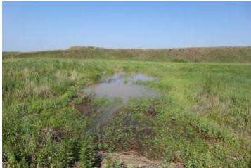  
排土场原始地貌一角

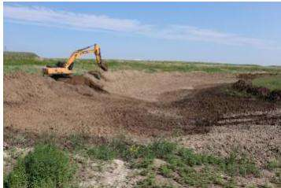  
机械开挖人工湿地

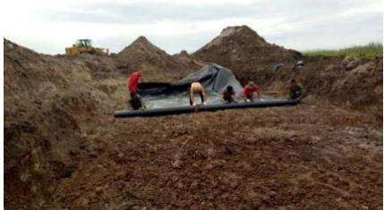  
铺垫黏土层后铺设土工布

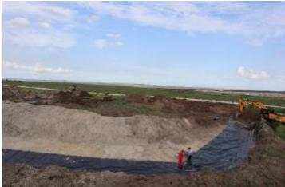  
铺设土工布后分层回填表土

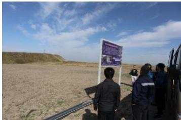  
专家指导

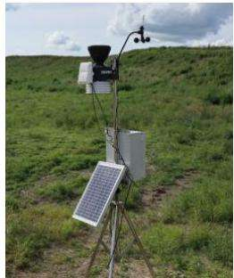  
气象数据采集  
图7-20研究区生态功能提升示范工程建设  
Figure 7-20 Construction of a demonstration project to enhance the ecological functions of the study area

示范工程在2018年施工面积85亩，汇集上游集水区面积940亩，下游保护区面积220亩，平台汇降水控制率达到60%以上。在2018年示范工程建设的基础上，2019进一步扩大示范面，施工面积49亩，主要围绕北坡，汇集上游集水区面积333亩，下游保护区面积288亩。示范工程能满足20年一遇降雨的地表径流，有效减少系统下游坡面水土流失与坡体失稳问题。算上已有蓄水池的水资源调控能力，现有建设物质流控制系统（保水控蚀单元、植物塘、蓄水池）排土场坡顶（720平台）降雨汇流利用率的有效控制范围达75%以上，对治理坡顶水土流失、边坡失稳、边坡侵蚀沟、冻融侵蚀、潜流侵蚀起到重要作用。示范区2017年作为排土场边坡失稳与水土流失防控示范样地，到目前为止，排土场在边坡稳定性与水土保持方面收到良好的效果。降雨汇水控制率提高到75%以上，最大可以防控20年一遇强降雨对坡顶平台及边坡的冲刷。与未建设分布式储水-用水系统区相比，建设区没有发现大冲沟，小冲沟的数量明显减少，没有发现滑坡塌方迹象。

## 7.6.3 效果评估

## （1）边坡稳定性提升评价

在排土场不同位置布置测钎52根（如图7-21a）所示，使用GPSRTK测量测钎初始位置的绝对坐标 $M o ~ ( x o , y o )$ ，同时用钢尺测量露出地面高度 $h _ { \theta } { \mathrm { . } }$ 对测钎坐标 M (x, y)及露出地面高度 h 定期重复测重，得到 $M _ { i } \ ( x _ { i } , y _ { i } )$ 及 $h _ { i } .$ 。根据测钎插入点坐标值的差值 $\varDelta M ( x _ { i } - x _ { 0 } , y _ { i } - y _ { 0 } )$ 可计算出该点的实际位移量，根据测钎露出地面的长度的变化值Δh可得到该点土壤侵蚀或沉积量。由测钎实测数据（图7-21b）可以看出，所有测钎监测点都仍然处于位移状态。相比对照组，示范工程所覆盖的实验组在2020年位移量比2019年略有下降，钢尺测量侵蚀量（即Δh）均值由2019年的年平均0.98cm降为2020年的0.5cm，下降了49%；3D位移量（即ΔM）从2019年的年平均8.8cm降为2020年的5.7cm。根据已有SAR时序监测与现场调查，排土场在自重作用下仍然处于自然固结沉降状态，每年沉降量与堆存高度呈线性正相关。经计算，测钎监测位移量中，去除排土场自重导致的固结沉降量平均3.6cm/a后，施工后坡面3D位移量由从5.2cm降到为2.1cm，降低了59.6%。

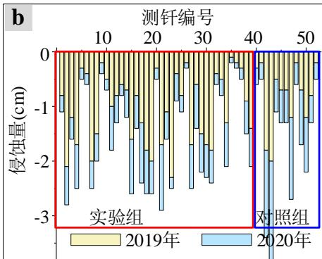

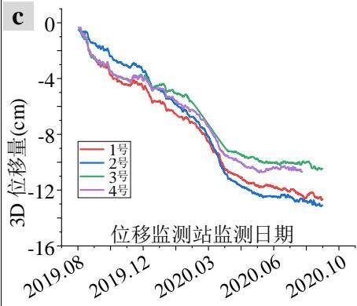

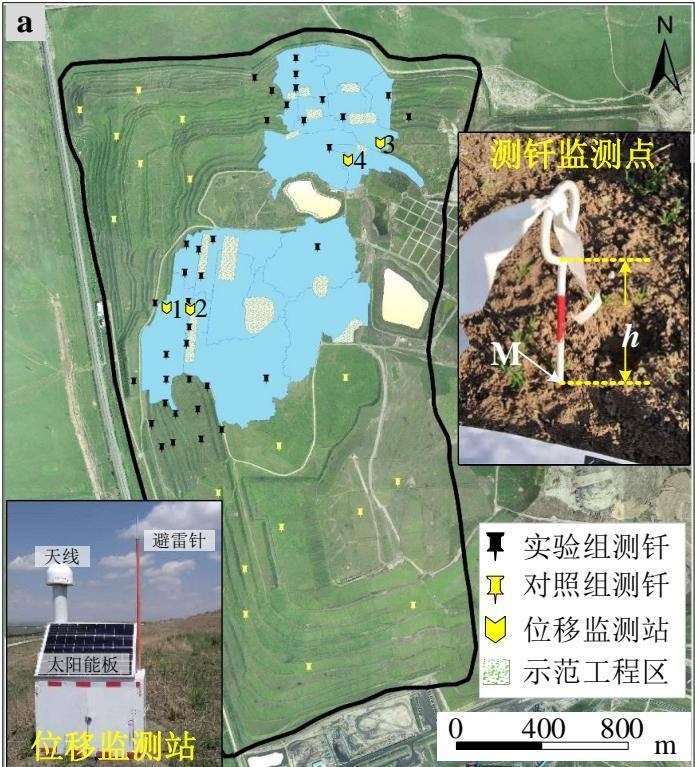  
图7-21利用测钎与移动监测站进行排土场3D位移监测（负值表示位移向下沉降）  
Figure 7-21 3D displacement monitoring of waste dump using drill rod and mobile monitoring station

同时，排土场设有一套GNSS位移自动化监测预警系统，示范工程研究区共有4个站点（图7-21a），可进行24小时连续位移监测。根据站点获取数据（图7-21c）可以看出，所有站点在监测时间内均处于持续沉降并位移状态，边坡平均位移速率由8.8cm/a降为5.7cm/a。同时，从2020年4月起，4个站点的沉降与位移速度明显有所放缓。1号站从平均位移量0.46mm/d降为0.16mm/d;2号站从平均位移量0.47mm/d降为0.17mm/d；3号站从平均位移量0.32mm/d降为0.09mm/d；4号站从平均位移量0.42mm/d降为0.1mm/d。

从以上两组数据可以看出，示范工程所在区域边坡形变与位移量在2020年度明显小于2019年度，从2020年4月起，4个站点的沉降与位移速度与示范工程建设之前相比至少降低60%。

## （2）水资源保持能力提升评价

利用 Sentinel-1B和 Landsat-8数据协同反演示范区及周边土壤水含水率，如图7-22所示为反演得到2020年08月19日排土场土壤水含水率分布图。

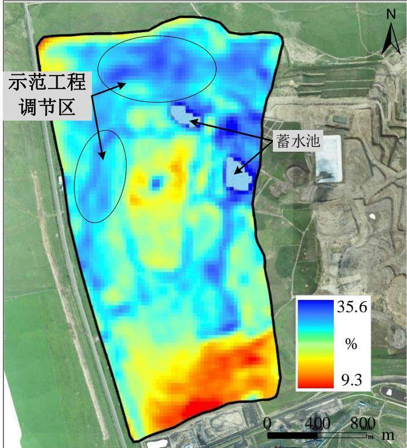  
图7-22研究区2020年08月19日土壤含水率分布图  
Figure 7-22 Soil water content map of the study area on August 19, 2020

由示范区建设的气象站可知，8月15日\~16日有间歇性小雨，两日累计降雨量66.5mm，后天气转晴。由图7-22可以看出，08月19日排土场整体含水率北高南低，蓄水池周边含水率最高。由于示范工程的分布式保水控蚀系统，合理利用并调配降水资源，保证水土资源的良性保持与高效利用，使得保水控蚀系统及周边区域在没有人工灌溉的情况下依然维持较高含水率。

## (3）植物生境改良评价

本应用案例主要是通过建设“控水、集水、用水”为一体的保水控蚀系统，实现对示范区降水资源的调控，在起到降低降水入渗破坏坡体稳定性以及降低边坡水力侵蚀程度的同时，还提升了水资源生态利用率。因此示范区可以为重建植被提供适宜的水土环境，进而形成了促进区内植物群落快速正向演替的生境。经过2018年和2019年两阶段的建设，示范区内重建植物较示范区建设前已有较大提升（图7-23）。

## (4) 其他方面评价

示范区不仅提升了边坡稳定性、加强了水资源保持能力、改良了植物生境，而且在群落稳定性、生态固碳、水源涵养、栖息地提供及景观提升等诸多方面均有改善。不仅如此，示范区植物群落的正向演替和生态环境的良性循环会使排土场生态系统持续向好，并能在未来发挥源地作用。

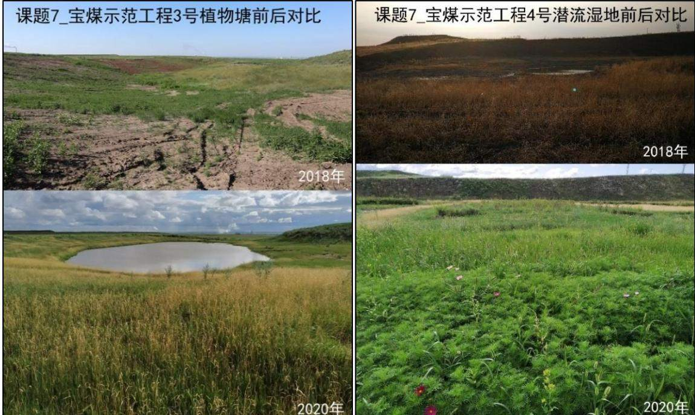  
图7-23示范工程部分区域建设前后对照  
Figure 7-23 Comparison before and after construction of some areas of demonstration project

## 7.7 本章小结（Chapter Summary）

本章结合前文关于研究区地质稳定性、水土保持性和群落稳定性对生态功能产生的影响的研究结果，利用机器学习方法构建生态功能评价体系，再分别面向生态修复工程的设计者、实施者和监督者，针对排土场生态功能提升的设计准则、实施框架提出建议，最后选择宝煤北排土场作为生态功能提升策略应用试验区，按照本章所确立的恢复模式，在区内开展生态恢复会重建工作，得出研究成果如下：

（1）基于机器学习的生态功能评价模型可为科学评估排土场生态功能分布状况，为管理者制定生态恢复策略提供技术支撑。

（2）影响生态功能状态的指标众多，经过两次筛选获得坡度等6项指标能够全面的反应研究区地质-水土-植被的状况，也有较高的模型评价精度。应用支持向量机、人工神经网络、逻辑回归模型和分类回归树模型，分别进行评价性建模。经过精度统计分析与受试者可接受曲线分析显示，支持向量机的非线性生态功能评价模型精度最高，低生态功能编录区和高生态功能编录区的正确识别比分别为 89.22%和 86.17%；ROC 曲线的训练和测试 AUC 值分别为 0.924和 0.912。

（3）高寒矿区大型排土场生态功能提升设计时，应当遵循“长期规划，重点治理，整体修复”的准则，并按照“监测、评价、规划、治理以及反馈”的实施框架，以生态功能问题诊断技术、分布式保水控蚀技术以及物种配置与种植技术为基础实施具体措施。

（4）按照本章设立的生态功能提升目标、准则和模式，对研究区开展生态功能提升应用示范。在选定研究区内通过InASR时序获取排土场地质灾害隐患分布，通过地表水文过程诊断，关键部位识别，确立分布式保水控蚀单元选址，单元之间相互连通形成保水控蚀系统。在示范区内种植植物时则根据演替过程，充分利用当地原生物种中物种密度大、根系成型周期短、演替速度快的优势种，根据不同立地条件下最佳植物配置模式，按“先锋种、过渡种、演替种、顶级种”的配搭方式进行不同阶段的种植，以快速恢复至稳定群落。通过时序地面形变监测显示示范区建成后边坡稳定性、水土保持能力和生物量均显著提升，有效改善区内生态功能，说明此技术方法具有一定作用和应用推广价值。

上述研究表明，利用机器学习方法构建生态功能评价模型可以有效评估区域生态功能，可为具体提升策略提供依据。基于地质稳定性、水土保持性及群落稳定性的排土场生态功能提升与以往的研究既有相似也有差异，设计准则、技术框架和实施措施的制定有助于完善生态功能提升策略。

## 8结论与展望

## 8 Conclusions and Prospects

## 8.1 结论（Conclusions）

本文以宝日希勒露天煤矿的北排土场为研究对象，主要围绕高寒矿区排土场生态功能提升面临的：松散边坡地质稳定如何控制、稀缺水土资源如何保持及重建植物群落稳定性如何维持等基本问题。在对研究区自然地理、地质条件、岩土性质的调查基础上，基于卫星遥感、无人机遥感、地面调查等数据获取手段，采用理论分析、室内测试、数值模拟、模型构建等研究方法探索了高寒矿区大型排土场生态致灾机理及功能提升策略，取得主要结论为：

（1）采用时序InSAR的普查、无人机遥感的详查和实地监测与调查等相结合，建立了研究区生态功能要素监测体系，结果发现：①研究区普遍存在非均匀沉降、浅层滑坡、边坡蠕动、地裂缝、冻融破坏等多种边坡破坏形式，导致其地质稳定性差；②紊乱的地表径流以及在风力、水力、冻融和重力等外营力引起侵蚀破坏作用下而导致的水土资源保持能力低；③生态恢复区物种多样性低、结构简单、正向演替速度慢而导致群落稳定性差等。大气降水是影响研究区地质稳定性、水土保持性和群落稳定性的控制因素，对降水资源的科学调控是生态功能提升有效手段之一。

（2）以时序 Sentinel-1B影像为数据源，利用 SBAS InSAR技术和幅度跟踪技术，通过对研究区长时序、大面积的变形监测，结果发现，区内存在非均匀沉降和不同程度的地质灾害隐患风险，近三年总体累积垂向形变量最大298mm，平均垂向形变量114mm，且随排土场堆存高度的增加而加剧。同时，边坡沿最陡坡度方向累积形变量最大达365mm，形变速率大于100mm/a的区域约占总坡面面积的27%。通过构建的地质灾害隐患风险识别与等级划分方法，识别出地灾隐患7处，均存在不同程度浅层滑坡、地裂缝、边坡蠕动、地面塌陷和非均匀沉降等边坡破坏形式。研究区自身岩土性质、地貌形态、坡体结构及侵蚀风化环境共同影响边坡稳定性，特别是在寒旱交替、冻融循环的特殊条件下，坡体受内部冻胀、坡面冻融蠕变和冻融滑坡影响严重。

（3）在时序InSAR、无人机遥感和地面监测等多源监测基础上，获取了研究区复合型土壤侵蚀状况，结合地貌、水文、气象等数据，研究了多种外力因素对排土场的侵蚀作用，基于时序分解获取了各类侵蚀的空间分布特征，发现研究区主要受风力侵蚀、水力侵蚀、冻融侵蚀和重力侵蚀等共同复合、交替作用。利用ABAQUS有限元分析软件建立剖面侵蚀作用模型，采用数值模拟研究了不同降雨强度、不同坡度条件下的边坡水力侵蚀中的壤中流侵蚀作用过程，结果表明，不同条件下坡面壤中流侵蚀的程度和维持时间均不同，侵蚀作用在降雨初期形成，且流速随降雨强度或坡度增大而增强。因此控制边坡坡度和坡长可有效减缓壤中流侵蚀作用。

（4）采用无人机摄影测量技术监测冻融循环周期前后的典型侵蚀沟冻融侵蚀发育过程，分析发现受冻融侵蚀面积占总面积81%，侵蚀程度随坡度增加而加剧，随坡度坡长因子的增加而降低，随日辐射量增加而加剧。在冻胀作用下，侵蚀沟两侧边坡上部土体易冻裂碎裂，形成楔形破坏面，在重力作用下以片状脱落的形式形成泻溜现象，致使侵蚀沟持续向两侧发育。

（5）采用无人机遥感与地面调查相结合方法，建立了区内优势种光谱库、获取了植物精细分类，并利用遥感空间制图优势完成了研究区物种多样性制图，此方法精度高、效率快，从而丰富完善了传统植被多样性调查方法。

研究区植物生长差异性与坡度、坡位和复垦恢复年限等因素密切相关，且植被覆盖度和物种多样性随恢复期的延长而增加，其中北坡已由全人工植物群落演替为以原生物种为主自然群落，该区演替进程与物种组成可为排土场植物恢复生态工程提供植物筛选依据和植物配置方案。

（6）生态功能状态主要受植被状态、复垦恢复年限、地形变形速率、坡度等指标影响，结合研究区地质稳定性、水土保持性和群落稳定性对生态功能产生的影响的研究结果，建立生态功能指标评价体系。采用多重共线性分析和重要性评价对指标进行筛选，基于支持向量机、人工神经网络、逻辑回归和分类回归树分别构建生态功能评价模型。经精度分析表面，支持向量机的非线性生态功能评价模型精度最高，低生态功能编录区和高生态功能编录区的正确识别比分别为 89.22%和 86.17%；ROC 曲线的训练和测试 AUC 值分别为 0.924 和0.912。

（7）在综合考虑“地质-水土-植被”情况下，提出了“长期规划，重点治理，整体修复”的生态功能提升准则，和“监测、评价、规划、治理以及反馈”的实施框架。构建了以生态功能问题诊断技术、分布式保水控蚀技术以及物种配置与种植技术为保障的实施措施；以建立稳定生态系统为目标，综合边坡稳定性、水土保持性和群落稳定性为前提的高寒矿区排土场生态功能提升方案。研究发现，提升边坡地质稳定性是前提，保证水土保持性是关键，保障群落稳定性是核心。

（8）按照研究区生态功能提升既定目标、准则和模式开展生态功能提升应用示范。在生态功能要素监测的基础上，对研究区地表径流网络和水文过程进行诊断，确立生态功能提升关键区，通过建设分布式保水控蚀系统，形成上层滞水效果，可以起到以局部控水、集水、用水的治理模式，达到边坡稳定性提升和水土资源高效利用的效果，实现“海绵”排土场的构建。最后依据植物物种配置模式，按照先锋物种与演替进程上优势种混播的方式创建潜在种子库，达到加速植物演替的目的，实现了高寒矿区排土场生态功能提升模式，具有较强的实用价值。

## 8.2 创新点（Innovations）

从排土场变形综合监测技术体系、地质灾害隐患致灾机理、水土资源调控、重建植物群落优化、生态功能评价模型构建及工程应用模式构建的可实施性出发，研究了高寒矿区大型排土场生态功能提升策略。具体有以下3点创新点：

（1）研发了复杂地形精细DEM获取、高陡边坡形变时序InSAR监测、多种外营力作用下土壤侵蚀分解和重建植物稳定性调查为核心的高寒区排土场生态功能监测技术，实现了排土场生态功能隐患的识别与诊断。

（2）模拟了分层松散堆积的露天排土场边坡壤中流侵蚀作用过程，构建了排土场冻融侵蚀空间分布模型，揭示了高寒区排土场在壤中流侵蚀和冻融循环作用下的生态致灾机理，实现了壤中流侵蚀与冻融侵蚀的预测。

（3）构建了基于机器学习的排土场生态功能评价方法，针对水土保持功能与群落维持功能低下问题，提出了分布式保水控蚀方法与人工重建植物群落物种配置模式，并应用到示范工程，实现了高寒条件下排土场生态功能的提升。

## 8.3 不足与展望（Limitations and Prospects）

论文针对高寒矿区大型排土场生态致灾机理及功能提升进行了深入细致的研究。但是，由于知识水平有限，研究中仍然存在许多不足之处，笔者认为今后可以从以下几个方面对本研究继续进行深入探索：

（1）论文应用时间序列InSAR、无人机遥感及地面监测对影响高寒区排土场生态功能的环境影响因素进行监测，但是在更长时间尺度下的动态评价研究并未展开，后续将基于现有数据的基础上，在更长时序下对该研究区进行持续性研究。

（2）论文研究区植物精细分类依赖于植物光谱库的准确性，而本次光谱库的建立未能充分考虑同种植物在不同生长阶段（如幼苗阶段和成熟阶段）或不同生境（如干旱胁迫）等条件下的光谱异质性，后续将开展更广时空尺度的光谱库建设工作，以期能够提高模型预测的精度和稳定性。

（3）论文仅讨论排土场自身生态功能问题，但是在更大空间尺度上的影响效应研究未能开展，后续需要对排土场产生的生态功能效应对周边产生的影响进行更深入的探究。

## 参考文献

[1]卞正富.矿山生态学导论[M].北京: 煤炭工业出版社,2015.

[2]李全生. 东部草原区大型煤电基地开发的生态影响与修复技术[J]. 煤炭学报,2019,44(12):3625-3635.

[3]周广胜,周莉,袁文平.地球环境与生命过程[J]. 地球科学进展,2004,19(05): 706-711.

[4]杨建锋，张翠光. 地球关键带:地质环境研究的新框架[J]. 水文地质工程地质，2014,41(03):98-104.

[5] TROFIMOV V T. The ecological-geological system, its types and position in the structure of an ecosystem[J]. Moscow University Geology Bulletin, 2009,64(2): 111-115.

[6] 林景星，张静，史世云，等. 生态环境地质学—21 世纪新兴的地球学科[J]. 地质通报，2003(07): 459-469.

[7] SWENNEN R, Van KEER I, De VOS W. Heavy metal contamination in overbank sediments of the Geul river (East Belgium): Its relation to former Pb-Zn mining activities[J]. Environmental Geology, 1994,24(1): 12-21.

[8] KUCHA H, MARTENS A, OTTENBURGS R, et al. Primary minerals of Zn-Pb mining and metallurgical dumps and their environmental behavior at Plombières, Belgium[J]. Environmental Geology, 1996,27(1): 1-15.

[9] KELLAWAY G A. Environmental geology of Bath, England[J]. Environmental Geology, 1995,26(3): 189-191.

[10] DICKINSON W W, DUNBAR G B, MCLEOD H. Heavy metal history from cores in Wellington Harbour, New Zealand[J]. Environmental Geology, 1996,27(1): 59-69.

[11] PANDA D, SUBRAMANIAN V, PANIGRAHY R C. Geochemical fractionation of heavy metals in Chilka Lake (east coast of India)-a tropical coastal lagoon[J]. Environmental Geology, 1995,26(4): 199-210.

[12]何政伟，刘峻杉，赵银兵，等．西部矿产资源开发的地质生态环境承载力理论与方法探讨[J]. 地球与环境, 2011,39(02): 237-241.

[13]陈梦熊.环境地质科学的基本理论与发展前景[J]. 工程地质学报,1995(03): 31-34.

[14]张宗祜，任福弘，费瑾，等.开展中国大陆水圈演化研究，保护人类生存环境[J].地球学报1995(01): 22-27.

[15]张宗祜，袁道先. 我国跨世纪的重大地学问题—环境地学发展前景[J]. 电子科技大学学报, 1995(05): 60-69.

[16]陈梦熊.沿海地区地质环境特征与地质环境系统--兼论“人地系统”[J].中国地质灾害与防治学报, 1998(S1): 84-90.

[17]周爱国，孙自永，徐恒力，等.地质环境生态适宜性评价指标体系研究[J].地质科技情报，2001(02): 71-74.

[18] TROFIMOV V T. Ecological geology, environmental geology, geoecology: Contents and relations[J]. Moscow University Geology Bulletin, 2008,63(2): 59-69.

[19] TROFIMOV V T. The ecological-geological system, its types and position in the structure of an ecosystem[J]. Moscow University Geology Bulletin, 2009,64(2): 111-115.

[20] KOROLEV V A, BUSLAEVA O V. A system of proper environmental geology categories[J] Moscow University Geology Bulletin, 2012,67(5): 298-307.

[21] ALEKSANDROVICH P I. Engineering-geological or geoecological processes and phenomena; their developmentin the present-day environment[J]. Vestnik MGSU, 2012,7(9): 191-196.

[22] TROFIMOV V T. Current state, tasks, and problems of the further development of ecological geology[J]. Moscow University Geology Bulletin, 2013,68(3): 155-164.

[23] TROFIMOV V T, KOROLEV V A. New noospheric concepts of the geological environment[J] Moscow University Geology Bulletin, 2014,69(3): 178-182.

[24] KUMAR A, DESHMUKH B. A review on Geo-ecological Studies'-An interdisciplinary approach for evaluation and sustainable management of Geo-ecosystems'[J]. Journal of the Geological Society of India, 2015,86(5): 605-612.

[25] TROFIMOV V T, KURILENKO V V. Ecological functions of the abiotic spheres of the earth: The content and significance for the formation of a new theoretical basis of geoecology[J]. Moscow University Geology Bulletin, 2015,70(3): 270-279.

[26]王佟,孙杰,江涛,等.煤炭生态地质勘查基本构架与科学问题[J]. 煤炭学报,2020,45(01):276-284.

[27]王尧，陈睿山，夏子龙，等.黄河流域生态系统服务价值变化评估及生态地质调查建议[J]地质通报,2020,39(10): 1650-1662.

[28]李鹏.地质灾害易发区生态地质环境安全时空演化研究[D].成都理工大学,2020.

[29]姜林.植物功能群去除对高寒草甸生态系统功能的影响及其机制[D]. 西北农林科技大学，2020.

[30]刘英,魏嘉莉，毕银丽,等.神东矿区生态系统服务功能评价[J].煤炭学报,2021:1-16.

[31] SINGH R, VENKATESH A S, SYED T H, et al. Assessment of potentially toxic trace elements contamination in groundwater resources of the coal mining area of the Korba Coalfield, Central India[J]. Environmental Earth Sciences, 2017,76(16): 1-17.

[32] RIBEIRO J, TAFFAREL S R, SAMPAIO C H, et al. Mineral speciation and fate of some hazardous contaminants in coal waste pile from anthracite mining in Portugal[J]. International Journal of Coal Geology, 2013,109-110: 15-23.

[33] UPADHYAY N, VISHWAKARMA K, SINGH J, et al. Tolerance and reduction of chromium (VI) by Bacillus sp. MNU16 isolated from contaminated coal mining soil[J]. Frontiers in Plant Science, 2017,8(5): 778.

[34] SAINI V, GUPTA R P, ARORA M K. Environmental impact studies in coalfields in India: A case study from Jharia coal-field[J]. Renewable and Sustainable Energy Reviews, 2016,53: 1222-1239.

[35] GAO Y, LIU H, LIU G. The spatial distribution and accumulation characteristics of heavy metals in steppe soils around three mining areas in Xilinhot in Inner Mongolia, China[J]. Environmental Science and Pollution Research, 2017,24(32): 25416-25430.

[36] QIAN D, YAN C, XING Z, et al. Monitoring coal mine changes and their impact on landscape patterns in an alpine region: a case study of the Muli coal mine in the Qinghai-Tibet Plateau[J]. Environmental Monitoring and Assessment, 2017,189(11): 559.

[37] WANG S, HUANG J, YU H, et al. Recognition of landscape key areas in a coal mine area of a Semi-Arid steppe in China: a case study of Yimin open-pit coal mine[J]. Sustainability, 2020,12(6): 2239.

[38] ZHAO Z, WANG L, BAI Z, et al. Development of population structure and spatial distribution patterns of a restored forest during 17-year succession (1993-2010) in Pingshuo opencast mine spoil, China[J]. Environmental Monitoring and Assessment, 2015,187(7): 431.

[39] ARCA D, CITIROGLU H K, KUTOGLU H S, et al. Assessment of geo-environmental properties depressing urban development with GIS: a case study of Kozlu settlement, Turkey[J] Natural Hazards, 2017,87(1): 307-322.

[40] PANDEY B, MUKHERJEE A, AGRAWAL M, et al. Assessment of seasonal and site-specific variations in soil physical, chemical and biological properties around opencast coal mines[J]. Pedosphere, 2019,29(5): 642-655.

[41] SÁNCHEZ DE LA CAMPA A M, SÁNCHEZ-RODAS D, MÁRQUEZ G, et al. 2009-2017 trends of PM10 in the legendary Riotinto mining district of SW Spain[J]. Atmospheric Research, 2020,238: 104878.

[42] RAJ D, KUMAR A, MAITI S K. Evaluation of toxic metal(loid)s concentration in soils around an open-cast coal mine (Eastern India)[J]. Environmental Earth Sciences, 2019,78(22): 645.

[43] ZHANG M, WANG J, LI S. Tempo-spatial changes and main anthropogenic influence factors of vegetation fractional coverage in a large-scale opencast coal mine area from 1992 to 2015[J]. Journal of Cleaner Production, 2019,232: 940-952.

[44]黄雨晗，况欣宇，曹银贵，等.草原露天矿区复垦地与未损毁地土壤物理性质对比[J].生态与农村环境学报,2019,35(7): 940-946.

[45]罗古拜，曹银贵，白中科，等.露天矿区排土场复垦地土壤容重差异、GPR特征识别与反演[J]. 农业资源与环境学报,2019,36(04): 441-452.

[46]陈超,胡振琪.我国采动地裂缝形成机理研究进展[J]. 煤炭学报,2018,43(03): 810-823.

[47] SHACKELFORD N, MILLER B P, ERICKSON T E. Restoration of open-cut mining in semi-Arid systems: a synthesis of long-term monitoring data and implications for management[J]. Land Degradation & Development, 2018,29(4): 994-1004

[48] JING Z, WANG J, ZHU Y, et al. Effects of land subsidence resulted from coal mining on soil nutrient distributions in a loess area of China[J]. Journal of Cleaner Production, 2018,177: 350- 361.

[49] HANCOCK G R, CRAWTER D, FITYUS S G, et al. The measurement and modelling of rill erosion at angle of repose slopes in mine spoil[J]. Earth Surface Processes and Landforms, 2008,33(7): 1006-1020.

[50] ZHANG L, BAI K Z, WANG M J, et al. Basin-scale spatial soil erosion variability: Pingshuo opencast mine site in Shanxi Province, Loess Plateau of China[J]. Natural Hazards, 2016,80(2): 1213-1230.

[51]白中科,赵景逵.工矿区土地复垦、生态重建与可持续发展[J]. 科技导报, 2001,19(9): 49-52.

[52]汤惠君. 土地复垦与生态重建[J]. 衡阳师范学院学报,2004,25(3): 85-88.

[53]卞正富，林家聪.矿区的土地复垦规划问题[J]. 煤炭学报,1992(01): 53-62.

[54]卞正富.我国煤矿区土地复垦与生态重建研究[J]. 资源·产业, 2005(02): 18-24.

[55]胡振琪. 中国土地复垦与生态重建20年:回顾与展望[J]. 科技导报,2009(17): 25-29.

[56]付薇.矿区生态环境综合治理协同机制与对策研究[D]. 北京: 中国地质大学(北京),2010.

[57]王军,张亚男,郭义强.矿区土地复垦与生态重建[J].地域研究与开发,2014,33(6): 113-116.

[58]王金满，杨睿璇，白中科.草原区露天煤矿排土场复垦土壤质量演替规律与模型[J].农业工程学报,2012(14): 229-235.

[59]张宇,高永,汪季,等.伊敏露天煤矿排土场坡面水蚀特征研究[J].内蒙古农业大学学报(自然科学版), 2011(02): 93-97.

[60]郭建英,何京丽,李锦荣,等.典型草原大型露天煤矿排土场边坡水蚀控制效果[J].农业工程学报,2015(03): 296-303.

[61]杨幼清，胡夏嵩，李希来，等.高寒矿区草本植物根系增强排土场边坡土体抗剪强度试验研究[J]. 水文地质工程地质,2018,45(6): 105-113.

[62]速欢,王文龙,康宏亮,等.露天矿排土场平台-边坡系统侵蚀形态及径流产沙特征[J].应用生态学报,2020,31(9):1-16.

[63] LAVIGNE F, WASSMER P, GOMEZ C, et al. The 21 February 2005, catastrophic waste avalanche at Leuwigajah dumpsite, Bandung, Indonesia[J]. Geoenvironmental Disasters, 2014,1(1): 1-12.

[64] KOERNER R M, SOONG T. Stability assessment of ten large landfill failures[M]//Advances in transportation and geoenvironmental systems using geosynthetics. 2000:1-38.

[65]冯宇.大型露天煤矿区排土场机械压实对土壤大孔隙结构及水力特性的影响[D]. 中国地质大学(北京),2019.

[66] JAFARI N H, STARK T D, MERRY S. The July 10 2000 Payatas landfill slope failure[J] ISSMGE International Journal of Geoengineering Case Histories, 2013,2(3): 208-228.

[67] STEIAKAKIS E, KAVOURIDIS K, MONOPOLIS D. Large scale failure of the external waste dump at the “South Field" lignite mine, Northern Greece[J]. Engineering Geology, 2009,104(3- 4): 269-279.

[68] SHAKESBY R A, WHITLOW J R. Failure of a mine waste dump in Zimbabwe: Causes and consequences[J]. Environmental Geology and Water Sciences, 1991,18(2): 143-153.

[69] SU W X, MILLER H. Waste pile stability and debris flow formation: The 35th US Symposium on Rock Mechanics (USRMS)[C]. American Rock Mechanics Association, 1995.

[70]陈冲.软弱基底排土场边坡破坏模式与稳定性分析[D]. 中国矿业大学(北京),2018.

[71] JAHANFAR A, DUBEY B, GHARABAGHI B, et al. Landfill failure mobility analysis: A probabilistic approach[J]. International Journal of Environmental, Chemical, Ecological, Geological and Geophysical Engineering, 2016,10: 476-484.

[72]包一丁.排土场边坡稳定性评价及潜在滑坡灾害范围预测[D]. 吉林大学,2020

[73]李江，张利忠，徐振东.宝日希勒露天矿内排土场边坡稳定分析[J].露天采矿技术，2009(03): 29-31.

[74]李叶鑫，吕刚，王道涵，等.北方草原区露天煤矿外排土场平台土体裂缝形态特征[J].煤炭 学报,2020,45(11): 3781-3792.

[75]谷运峰.高排土场下露天矿采场边坡稳定性研究[D]. 内蒙古科技大学,2020.

[76] HARRIES N, NOON D, PRITCHETT H, et al. Slope stability radar for managing rock fall risks in open cut mines: Rock Engineering in Difficult Conditions, Proceedings of the 3rd Canada–US Rock Mechanics Symposium[C]. 2009.

[77]陈鹏.宝日希勒露天矿软岩直边坡失稳机理及稳定性分析研究[D].辽宁工程技术大学，2013.

[78] KE B, ZHOU K, DENG H, et al. NMR pore structure and dynamic characteristics of sandstone caused by ambient freeze-thaw action[J]. Shock and Vibration, 2017,2017: 1-10.

[79]中华人民共和国国家质量监督检验检疫总局.GB/T 28921-2012 自然灾害分类与代码[S].北京:中国标准出版社出版发,2013.

[80] CODEGLIA D, DIXON N, FOWMES G J, et al. Analysis of acoustic emission patterns for monitoring of rock slope deformation mechanisms[J]. Engineering Geology, 2017,219: 21-31.

[81] DIXON N, SPRIGGS M P, SMITH A, et al. Quantification of reactivated landslide behaviour using acoustic emission monitoring[J]. Landslides, 2015,12(3): 549-560.

[82]李文华,何永涛,杨丽韫.森林对径流影响研究的回顾与展望[J]. 自然资源学报,2001(05):398-406.

[83] GOEKING S A, TARBOTON D G. Forests and water yield: A synthesis of disturbance effects on streamflow and snowpack in western coniferous forests[J]. Journal of Forestry, 2020,118(2): 172-192.

[84]赵炯昌，潘岱立，卫伟，等.植被格局对土壤入渗和水沙过程影响的模拟试验研究[J].生态学报,2021,41(04): 1373-1380.

[85]陈仁升，阳勇，韩春坛，等.高寒区典型下垫面水文功能小流域观测试验研究[J].地球科学进展, 2014,29(04): 507-514.

[86]童雅琴，王佩，李小雁，等.黑河流域高寒草甸生态系统水分收支及蒸散发拆分研究[J].生态学报,2018,38(20): 7400-7411.

[87]徐朝容,黄赳，王鹏，等.降雨对宝日希勒排土场边坡侵蚀的数值模拟[J].河南理工大学学报(自然科学版), 2019,38(05): 72-79.

[88]李恒，雷少刚，黄云鑫，等.基于自然边坡模型的草原煤矿排土场坡形重塑[J].煤炭学报 2019,44(12): 3830-3838.

[89] ZHAO Y, LEI S, YANG X, et al. Study on Spectral Response and Estimation of Grassland Plants Dust Retention Based on Hyperspectral Data[J]. Remote Sensing, 2020,12(12): 2019.

[90]赵艳玲，刘慧芳，王鑫，等.基于无人机影像的复垦排土场地形因子与土壤物理性质的关系研究[J]. 中国煤炭,2018,44(09): 117-122.

[91]蔡祥，李琦，罗言，等.面向对象结合深度学习方法的矿区地物提取[J].国土资源遥感，2021,33(01): 63-71.

[92] DU Z, GE L, NG A H, et al. Risk assessment for tailings dams in Brumadinho of Brazil using InSAR time series approach[J]. Science of The Total Environment, 2020,717: 137125.

[93] LUO L, MA W, ZHANG Z, et al. Freeze/thaw-induced deformation monitoring and assessment of the slope in permafrost based on terrestrial laser scanner and GNSS[J]. Remote Sensing, 2017,9(3): 198.

[94] ATZENI C, BARLA M, PIERACCINI M, et al. Early warning monitoring of natural and engineered slopes with ground-based synthetic-aperture radar[J]. Rock Mechanics and Rock Engineering, 2015,48(1): 235-246.

[95] Di MATTEO L, ROMEO S, KIEFFER D S. Rock fall analysis in an Alpine area by using a reliable integrated monitoring system: results from the Ingelsberg slope (Salzburg Land, Austria)[J]. Bulletin of engineering geology and the environment, 2017,76(2): 413-420.

[96] TEZA G, MARCATO G, PASUTO A, et al. Integration of laser scanning and thermal imaging in monitoring optimization and assessment of rockfall hazard: a case history in the Carnic Alps (Northeastern Italy)[J]. Natural Hazards, 2015,76(3): 1535-1549.

[97] DRAEBING D, HABERKORN A, KRAUTBLATTER M, et al. Thermal and mechanical responses resulting from spatial and temporal snow cover variability in permafrost rock slopes, Steintaelli, Swiss Alps[J]. Permafrost and Periglacial Processes, 2017,28(1): 140-157.

[98]寇晓蓉.矿区复垦土地功能提升的方法与途径研究[D].北京:中国地质大学（北京），2017.

[99]刘峰.煤炭行业低碳生态矿山建设模式及评价研究[D].北京:中国矿业大学（北京），2011.

[100]张云路，李雄，田野.基于景观生态学“源-汇”理论的市域尺度生态功能分区—以内蒙古通辽市为例[J]. 生态学报,2018,38(01): 1-8.

[101]王军，钟莉娜.景观生态学在土地整治中的应用研究进展[J]. 生态学报，2017,37(12):3982-3990.

[102]杨灏.“城市双修”视角下矿业废弃地再生规划研究[D].北京:中国矿业大学(北京),2018.

[103]王斌.我国绿色矿山评价研究[D].北京:中国地质大学（北京），2014.

[104]白中科，贺振伟，李晋川，等.矿区土地复垦与生态产业链总体规划设计[J].山西农业科学, 2010,38(1): 51-55.

[105] 王文才，赵婧雯，付鹏，等.露天矿生态环境的 AHP 与模糊数学评价法[J]. 金属矿山，2016,45(1): 146-150.

[106]刘喜韬，鲍艳，胡振琪，等.闭矿后矿区土地复垦生态安全评价研究[J]. 农业工程学报，2007,23(08): 102-106.

[107]卞正富，许家林,雷少刚.论矿山生态建设[J].煤炭学报,2007,32(01): 13-19.

[108]白中科,周伟,王金满,等.再论矿区生态系统恢复重建[J].中国土地科学,2018,32(11):1-9.

[109]张发旺,侯新伟,韩占涛.神府—东胜矿区地质-生态系统结构与组成研究[J].地理与地理信息科学, 2002,18(1): 80-82.

[110] HAOGE, YINYI, XIANKEYANG, et al. Study on ecological characteristic and reclamation in Xiangshui coal mining area, Guizhou, China[J]. International Journal of Surface Mining Reclamation & Environment, 2010,24(1): 18-33.

[111]金丹.矿山生态系统物能流核算[D]. 中国矿业大学,2010.

[112] 王广成. 煤炭矿区复合生态系统及其耦合机理研究[J]. 生态经济(中文版), 2014,30(2):139-142.

[113]金丹.矿山生态系统物能流核算[J]. 煤炭学报,2011(4): 711-712.

[114] ROGOWSKI A S, WEINRICH B E. Modeling the effects of mining and erosion on biomass production[J]. Ecological Modelling, 1987,35(1): 85-112.

[115]李云鹏，卞正富，雷少刚，等.西部风积沙区超大工作面开采土地损伤评价[J].煤炭科学技术, 2017,45(4): 188-194.

[116] BIAN Z, DONG J, LEI S, et al. The impact of disposal and treatment of coal mining wastes on environment and farmland[J]. Environmental Geology, 2009,58(3): 625-634.

[117] LEI S G, BIAN Z F, DANIELS J L, et al. Improved spatial resolution in soil moisture retrieval at arid mining area using apparent thermal inertia[J]. Transactions of Nonferrous Metals Society of China, 2014,24(6): 1866-1873.

[118] LEI S, REN L, BIAN Z. Time-space characterization of vegetation in a semiarid mining area using empirical orthogonal function decomposition of MODIS NDVI time series[J]. Environmental Earth Sciences, 2016,75(6): 516.

[119]雷少刚. 缺水矿区关键环境要素的监测与采动影响规律研究[M]. 中国矿业大学出版社，2012:1587-1588.

[120] YUCEL D S, YUCEL M A, BABA A. Change detection and visualization of acid mine lakes using time series satellite image data in geographic information systems (GIS): Can (Canakkale) County, NW Turkey[J]. Environmental Earth Sciences, 2014,72(11): 4311-4323.

[121] PANDEY B, AGRAWAL M, SINGH S. Coal mining activities change plant community structure due to air pollution and soil degradation[J]. Ecotoxicology, 2014,23(8): 1474-1483.

[122] LI N, YAN C Z, XIE J L. Remote sensing monitoring recent rapid increase of coal mining activity of an important energy base in northern China, a case study of Mu Us Sandy Land[J]. Resources, Conservation and Recycling, 2015,94: 129-135.

[123] CALVARIO G, SIERRA B, ALARCÓN T, et al. A Multi-Disciplinary Approach to Remote Sensing through Low-Cost UAVs[J]. Sensors, 2017,17(6): 1411.

[124] MATZENBACHER C A, GARCIA A L H, DOS SANTOS M S, et al. DNA damage induced by coal dust, fly and bottom ash from coal combustion evaluated using the micronucleus test and comet assay in vitro[J]. Journal of Hazardous Materials, 2017,324: 781-788.

[125]武强. 矿山环境修复治理模式理论与实践[J]. 煤炭学报,2017,42(5): 1052-1092.

[126]胡振琪,赵艳玲,毕银丽.美国矿区土地复垦[J]. 中国土地,2001(06): 44-45.

[127] MENZEL D C. Implementation of the federal surface mining control and reclamation act of 1977[J]. Public Administration Review, 1981,41(2): 212-219.

[128] SCHLADWEILER B K. 40 years of the Surface Mining Control and Reclamation Act (SMCRA): what have we learned in the State of Wyoming[J]. International Journal of Coal Science & Technology, 2018,5(1): 3-7.

[129]金丹，卞正富. 国内外土地复垦政策法规比较与借鉴[J]. 中国土地科学,2009,23(10): 66-73.

[130] JACKSON S T, HOBBS R J. Ecological Restoration in the Light of Ecological History[J]. Science, 2009,325(5940): 567-569.

[131]张成梁, LI B·LARRY.美国煤矿废弃地的生态修复[J]. 生态学报,2011,31(01): 276-285.

[132]梁留科，常江，吴次芳，等.德国煤矿区景观生态重建/土地复垦及对中国的启示[J].经济地理,2002,22(6): 711-715.

[133]潘明才.德国土地复垦和整理的经验与启示[J]. 国土资源,2002(1): 50-51.

[134] LARONDELLE N, HAASE D. Valuing post-mining landscapes using an ecosystem services approach-An example from Germany[J]. Ecological Indicators, 2012,18: 567-574.

[135] RILEY S J. Geomorphic estimates of the stability of a uranium mill tailings containment cover: Nabarlek, Northern Territory, Australia[J]. Land Degradation & Development, 2010,6(1): 1-16.

[136]罗明，王军.双轮驱动有力量—澳大利亚土地复垦制度建设与科技研究对我国的启示[J]. 中国土地, 2012(4): 51-53.

[137] BIAN Z, BIAN Z, LU Q, et al. Ecological effects analysis of land use change in coal mining area based on ecosystem service valuing: a case study in Jiawang[J]. Environmental Earth Sciences, 2013,68(6): 1619-1630.

[138]武强，陈奇.矿山环境治理模式及其适用性分析[J]. 水文地质工程地质,2010,37(06): 91-96.

[139]张海龙. 中国新能源发展研究[D]. 长春: 吉林大学,2014.

[140]卞正富，雷少刚,金丹,等.矿区土地修复的几个基本问题[J].煤炭学报,2018,43(01):190- 197.

[141] DULIAS R. Landscape planning in areas of sand extraction in the Silesian Upland, Poland[J]. Landscape & Urban Planning, 2010,95(3): 91-104.

[142] SCHULZ F, WIEGLEB G. Development options of natural habitats in a post-mining landscape[J]. Land Degradation & Development, 2000,11(2): 99-110.

[143]周妍,周伟，白中科.矿产资源开采土地损毁及复垦潜力分析[J].资源与产业,2013,15(5): 100-107.

[144] USSIRI D A N, LAL R. Carbon sequestration in reclaimed minesoils[J]. Critical Reviews in Plant Sciences, 2005,24(3): 151-165.

[145] SHRESTHA R K, LAL R. Changes in physical and chemical properties of soil after surface mining and reclamation[J]. Geoderma, 2011,161(3-4): 168-176.

[146] WICKHAM J D, RIITTERS K H, WADE T G, et al. The effect of appalachian mountaintop mining on interior forest[J]. Landscape Ecology, 2007,22(2): 179-187.

[147] FENG Y, WANG J, BAI Z, et al. Effects of surface coal mining and land reclamation on soil properties: A review[J]. Earth-Science Reviews, 2019,191: 12-25.

[148]汪海滨，李小春，米子军，等.排土场空间效应及其稳定性评价方法研究[J].岩石力学与工程学报,2011,30(10):2103-2111.

[149] LEI H, PENG Z, YIGANG H, et al. Vegetation and soil restoration in refuse dumps from open pit coal mines[J]. Ecological Engineering, 2016,94: 638-646.

[150] BALDRIAN P, TRÖGL J, FROUZ J, et al. Enzyme activities and microbial biomass in topsoil layer during spontaneous succession in spoil heaps after brown coal mining[J]. Soil Biology and Biochemistry, 2008,40(9): 2107-2115.

[151]宫传刚，卞正富，卞和方，等.基于无人机与植被指数的排土场DEM模型构建关键技术 [J]. 煤炭学报, 2019,44(12): 3849-3858.

[152] GONG C, LEI S, BIAN Z, et al. Analysis of the Development of an Erosion Gully in an Open-Pit Coal Mine Dump During a Winter Freeze-Thaw Cycle by Using Low-Cost UAVs[J]. Remote Sensing, 2019,11(11): 1356.

[153]吴云霄，雷忻，王文强.先锋种对护坡群落演替和护坡性能的影响[J]. 环境科学与技术，2016,39(12): 94-99.

[154] YUAN Y, ZHAO Z, NIU S, et al. Reclamation promotes the succession of the soil and vegetation in opencast coal mine: A case study from Robinia pseudoacacia reclaimed forests, Pingshuo mine, China[J]. CATENA, 2018,165: 72-79.

[155]胡振琪，李勇，陈洋，等.2019年土地科学研究重点进展评述及2020年展望—土地工程与信息技术分报告[J]. 中国土地科学,2020,34(02): 93-102.

[156] XING Z, PENG S, DU W, et al. Hydrogeological changes caused by opencast coal mining in steppe zone: a case study of Shengli 1 open-pit coal mine[J]. Desalination and Water Treatment, 2018,121:126-133.

[157] HAQUE E, REZA S, AHMED R. Assessing the vulnerability of groundwater due to open pit coal mining using DRASTIC model: a case study of Phulbari Coal Mine, Bangladesh[J]. Geosciences Journal, 2018,22(2): 359-371.

[158] IGWE O, IGWE O, CHUKWU C, et al. Slope stability analysis of mine waste dumps at a mine site in Southeastern Nigeria[J]. Bulletin of Engineering Geology and the Environment, 2019,78(4): 2503-2517.

[159] WANJUN T, QINGXIANG C. Dust distribution in open-pit mines based on monitoring data and fluent simulation[J]. Environmental Monitoring and Assessment, 2018,190(11): 632.

[160] CHENG W, LEI S, BIAN Z, et al. Geographic distribution of heavy metals and identification of their sources in soils near large, open-pit coal mines using positive matrix factorization[J]. Journal of Hazardous Materials, 2020,387: 121666.

[161]康萨如拉，牛建明，张庆,等.草原区矿产开发对景观格局和初级生产力的影响以黑岱沟露天煤矿为例[J]. 生态学报,2014,34(11): 2855-2867.

[162]雷少刚，张周爱，陈航，等．草原煤电基地景观生态恢复技术策略[J].煤炭学报，2019,44(12): 3662-3669.

[163] UTEMBE W, FAUSTMAN E M, MATATIELE P, et al. Hazards identified and the need for health risk assessment in the South African mining industry[J]. Human & Experimental Toxicology, 2015,34(12): 1212-1221.

[164]卞正富，雷少刚.新疆煤炭资源开发的环境效应与保护策略研究[J].煤炭科学技术，2020,48(04): 43-51.

[165]姚海林，郑少河，李文斌，等.降雨入渗对非饱和膨胀土边坡稳定性影响的参数研究[J].岩石力学与工程学报,2002,21(07): 1034-1039.

[166]赵洪宝，魏子强，罗科，等.降雨工况下露天矿排土场边坡稳定性与治理措施[J]. 煤炭科学技术,2019,47(10): 67-74.

[167] CHING R K H, FREDLUND D G. Slope failure in underconsolidated soft soils during the development of a port in Tianjin, China. Part 2: Analytical study[J]. Canadian Geotechnical Journal, 2005,42(1): 166-183.

[168] RANK E, WERNER H. An adaptive finite element approach for the free surface seepage problem[J]. International journal for numerical methods in engineering, 1986,23(7): 1217-1228.

[169] CUNDALL P A. A computer model for simulating progressive, large-scale movement in blocky rock system: Proceedings of the International Symposium on Rock Mechanics[C]. France, 1971.

[170] CUNDALL P A. Explicit finite differnce method in geomechanics: Second Int. Conf. Numerical Methods in Geomechanics[C]. Blacksburg, 1976.

[171] CROUCH S L, STARFIELD A M, RIZZO F J. Boundary element methods in solid mechanics[J]. Journal of Applied Mechanics, 1983,50: 704-705.

[172] TADAHIKO K, YASUHIRO K. A new discrete model for analysis of solid mechanics problems[J]. Seisan Kenkyu, 1977,29: 288-290.

[173] MA G, AN X, HE L. The numerical manifold method: a review[J]. International Journal of Computational Methods, 2011,07(01): 1-32.

[174]刘福明，才庆祥，周伟，等.露天矿排土场边坡降水入渗规律试验研究[J].煤炭学报，2015,40(07): 1534-1540.

[175]胡振琪,杨秀红,鲍艳,等. 论矿区生态环境修复[J]. 科技导报,2005,23(1): 38-41.

[176]寇晓蓉，白中科，杜振州，等.黄土区大型露天煤矿企业土地复垦质量控制研究[J].农业环境科学学报,2017,36(05): 957-965.

[177]杨翠霞，赵廷宁，谢宝元，等.基于小流域自然形态的废弃矿区地形重塑模拟[J].农业工程学报,2014,30(01): 236-244.

[178] PANAGOS P, IMESON A, MEUSBURGER K, et al. Soil Conservation in Europe: Wish or Reality ?[J]. Land Degradation & Development, 2016,27(6): 1547-1551.

[179] HESS D M, LESHCHINSKY B A, BUNN M, et al. A simplified three-dimensional shallow landslide susceptibility framework considering topography and seismicity[J]. Landslides, 2017,14(5): 1677-1697.

[180] BROOKS S M, CROZIER M J, PRESTON N J, et al. Regolith stripping and the control of shallow translational hillslope failure: application of a two-dimensional coupled soil hydrologyslope stability model, Hawke's Bay, New Zealand[J]. Geomorphology, 2002,45(3): 165-179.

[181] CAVIEZEL C, HUNZIKER M, SCHAFFNER M, et al. Soil-vegetation interaction on slopes with bush encroachment in the central Alps - adapting slope stability measurements to shifting process domains[J]. Earth Surface Processes and Landforms, 2014,39(4): 509-521.

[182] STOKES A, ATGER C, BENGOUGH A G, et al. Desirable plant root traits for protecting natural and engineered slopes against landslides[J]. Plant and Soil, 2009,324(1-2): 1-30.

[183] GENET M, STOKES A, FOURCAUD T, et al. The influence of plant diversity on slope stability in a moist evergreen deciduous forest[J]. Ecological Engineering, 2010,36(3): 265-275.

[184] CEAGLIO E, MITTERER C, MAGGIONI M, et al. The role of soil volumetric liquid water content during snow gliding processes[J]. Cold Regions Science and Technology, 2017,136: 17- 29.

[185] PANDE T N, YAMAMOTO H. Cattle treading effects on plant growth and soil stability in the mountain grassland of Japan[J]. Land Degradation & Development, 2006,17(4): 419-428.

[186]王金亮，谢德体，倪九派，等.基于源汇景观单元的流域土壤侵蚀风险格局识别[J].生态 学报,2017,37(24): 1-11.

[187] SUN B Y, XIAO J B, LI Z B, et al. An analysis of soil detachment capacity under freeze-thaw conditions using the Taguchi method[J]. CATENA, 2018,162: 100-107.

[188] ZHANG X, ZHANG H, WANG C, et al. Time-Series InSAR Monitoring of Permafrost Freeze-Thaw Seasonal Displacement over Qinghai-Tibetan Plateau Using Sentinel-1 Data[J]. Remote Sensing, 2019,11(9): 1000.

[189] RAHARDJO H, SATYANAGA A, LEONG E C, et al. Performance of an instrumented slope covered with shrubs and deep-rooted grass[J]. Soils and Foundations, 2014,54(3): 417-425.

[190] KONDRATYEVA L M, MAKHINOV A N, ANDREEVA D V, et al. Changes in Water Quality in the Bureiskoe Reservoir Caused by a Large Landslide[J]. Water resources, 2020,47(2): 257- 268.

[191] ZIEHER T, PERZL F, RÖSSEL M, et al. A multi-annual landslide inventory for the assessment of shallow landslide susceptibility-Two test cases in Vorarlberg, Austria[J]. Geomorphology, 2016,259: 40-54.

[192] KAINTHOLA A, SINGH P K, SINGH T N. Stability investigation of road cut slope in basaltic rockmass, Mahabaleshwar, India[J]. Geoscience Frontiers, 2015,6(6): 837-845.

[193] MEUSBURGER K, ALEWELL C. Impacts of anthropogenic and environmental factors on the occurrence of shallow landslides in an alpine catchment (Urseren Valley, Switzerland)[J]. Natural hazards and earth system sciences, 2008,8(3): 509-520.

[194] STOCKER E. Geomorphic responses to landuse changes on steep slopes in timberline environment; Central Alps, Austria[J]. Romanian Journal of Geography, 2009,53(1): 91-106.

[195] BORDOLOI S, NG C W W. The effects of vegetation traits and their stability functions in bio-engineered slopes: A perspective review[J]. Engineering Geology, 2020,275: 105742.

[196] KOKUTSE N K, TEMGOUA A G T, KAVAZOVIĆ Z. Slope stability and vegetation: Conceptual and numerical investigation of mechanical effects[J]. Ecological Engineering, 2016,86: 146-153.

[197] STOKES A, SOTIR R, CHEN W, et al. Soil bio- and eco-engineering in China: past experience and future priorities[J]. Ecological Engineering, 2010,36(3): 247-257.

[198] WU T H. Root reinforcement of soil: review of analytical models, test results, and applications to design[J]. Canadian Geotechnical Journal, 2013,50(3): 259-274.

[199] LÖBMANN M T, TONIN R, WELLSTEIN C, et al. Determination of the surface-mat effect of grassland slopes as a measure for shallow slope stability[J]. CATENA, 2020,187: 104397.

[200] VYMAZAL J. Constructed wetlands for wastewater treatment: five decades of experience[J]. Environmental science & technology, 2011,45(1): 61-69.

[201] KIFLAY E, SELEMANI J, NJAU K. Integrated constructed wetlands treating industrial wastewater from seed production[J]. Water Practice and Technology, 2021,2021: 1-12.

[202] NAKASHIMA M, WENZEL JR H G, BRILL JR E D. Water supply system models with capacity expansion[J]. Journal of Water Resources Planning and Management, 1986,112(1): 87- 103.

[203]李雪健，李江，张利忠，等.酷寒草原区露天煤矿剥离物及水资源综合利用[J]. 神华科技，2017,15(1): 35-39.

[204]高燕宁，张立军，孙小军，等.矿井疏干水回用于大型火力发电厂[J].中国给水排水2013,29(16): 61-64.

[205]汤国安，那嘉明，程维明. 我国区域地貌数字地形分析研究进展[J]. 测绘学报,2017(10):1570-1591.

[206]郑子彦,张万昌，邰庆国.基于DEM与数字化河道提取流域河网的不同方案比较研究[J]资源科学, 2009,31(10): 1730-1739.

[207]李保杰，顾和和，纪亚洲.复垦矿区景观格局指数的粒度效应研究[J].水土保持研究，2015,22(4): 253-257.

[208]李保杰，顾和和，纪亚洲.矿区土地复垦景观格局变化和生态效应[J]. 农业工程学报，2012,28(3): 251-256.

[209]黄翌.煤炭开采对植被—土壤物质量与碳汇的扰动与计量[D].徐州:中国矿业大学,2014.

[210]杨永均.矿山土地生态系统恢复力及其测度与调控研究[D].中国矿业大学,2017

[211] MEYER A, COMBROUX I, TRÉMOLIÈRES M. Dynamics of Nutrient Contents (Phosphorus, Nitrogen) in Water, Sediment and Plants After Restoration of Connectivity in Side-Channels of the River Rhine[J]. Restoration Ecology, 2013,21(2): 232-241.

[212]王晓春,蔡体久，谷金锋.鸡西煤矿矸石山植被自然恢复规律及其环境解释[J].生态学报，2007,27(9): 3744-3751.

[213]王金满，郭凌俐，白中科，等.黄土区露天煤矿排土场复垦后土壤与植被的演变规律[J].农业工程学报,2013,29(21):223-232.

[214]白中科，吴梅秀.矿区废弃地复垦中的土壤学与植物营养学问题[J]. 能源环境保护，1996(5): 39-42.

[215]赵广东，王兵，苏铁成，等.煤矸石山废弃地不同植物复垦措施及其对土壤化学性质的影响[J]. 中国水土保持科学, 2005,3(2): 65-69.

[216]宫传刚，严家平，刘杰，等.煤矸石充填型重构土壤中重金属的生物迁移及分布特征[J]湖北农业科学,2016(09): 2202-2205.

[217]毕银丽,郭晨,王坤.煤矿区复垦土壤的生物改良研究进展[J].煤炭科学技术,2020,48(4):52-59.

[218]张振佳,曹银贵，王舒菲,等.平朔黄土露天矿区复垦地表层土壤微生物与酶活性分析[J]生态学报,2021,41(01): 110-123.

[219] MCLENAGHEN R D, MALCOLM B J, CAMERON K C, et al. Improvement of degraded soil physical conditions following the establishment of permanent pasture[J]. New Zealand Journal of Agricultural Research, 2017, 60(3): 287-297.

[220] MACCI C, DONI S, PERUZZI E, et al. Almond tree and organic fertilization for soil quality improvement in southern Italy[J]. Journal of Environmental Management, 2012,95(2): S215- S222.

[221]张立平.矿区土地复垦格局优化与赤泥微生物修复研究[D]. 北京: 中国农业大学,2017.

[222]岳辉，毕银丽.基于主成分分析的矿区微生物复垦生态效应评价[J].干旱区资源与环境，2017,31(04): 113-117.

[223]李文超，李继,李希耀,等.伊敏露天矿复垦绿化技术研究[J]. 露天采矿技术,2016,31(6):94-96.

[224]魏观希.采石矿山绿化治理的探讨[J]. 采矿技术,2015,15(6): 74-75.

[225]柳艳.植物抗旱理论技术及其在旱区植被恢复中的应用[D].西北农林科技大学,2008

[226]左俊杰，樊金拴.三里洞矸石废弃地人工植被群落构建初探[J].环境科学与技术，2009,32(4): 145-148.

[227]王莉.露天矿大型排土场稳定性及安全控制关键技术研究[D].北京科技大学,2015.

[228]吕刚.露天煤矿排土场植被恢复的土壤水文效应研究[D].沈阳农业大学,2017.

[229]张召，白中科，贺振伟，等.基于RS 与GIS的平朔露天矿区土地利用类型与碳汇量的动态变化[J]. 农业工程学报,2012,28(03): 230-236.

[230]唐骏，党廷辉，李俊超，等.黄土区煤矿排土场重建草地土壤剖面有机碳变化特征[J].草 地学报, 2015,23(04): 718-725.

[231]郭凌俐,王金满,张萌,等.草原露天煤矿区不同复垦模式效果对比[J].金属矿山,2014(6):150-155.

[232] SANCHEZ C E, KARL WOOD M. Infiltration rates and erosion associated with reclaimed coal mine spoils in west central New Mexico[J]. Landscape and Urban Planning, 1989,17(2): 151-168.

[233]李晶, ZIPPER CARL E.,李松,等. 基于时序 NDVI的露天煤矿区土地损毁与复垦过程特征分析[J]. 农业工程学报,2015(16): 251-257.

[234] SONG W, SONG W, GU H, et al. Progress in the Remote Sensing Monitoring of the Ecological Environment in Mining Areas[J]. International Journal of Environmental Research and Public Health, 2020,17(6): 1846.

[235] KENNEDY R E, ANDRÉFOUËT S, COHEN W B, et al. Bringing an ecological view of change to Landsat-based remote sensing[J]. Frontiers in Ecology and the Environment, 2014,12(6): 339-346.

[236] HENGKAI L, FENG X, QIN L. Remote sensing monitoring of land damage and restoration in rare earth mining areas in 6 counties in southern Jiangxi based on multisource sequential images[J]. Journal of environmental management, 2020,267: 110653.

[237] BLAHWAR B, SRIVASTAV S K, de SMETH J B. Use of high-resolution satellite imagery for investigating acid mine drainage from artisanal coal mining in North-Eastern India[J]. Geocarto international, 2012,27(3): 231-247.

[238] YANG Z, LI W, PEI Y, et al. Classification of the type of eco-geological environment of a coal mine district: A case study of an ecologically fragile region in Western China[J]. Journal of Cleaner Production, 2018,174: 1513-1526.

[239] CHEN W, LI X, WANG L. Fine Land Cover Classification in an Open Pit Mining Area Using Optimized Support Vector Machine and WorldView-3 Imagery[J]. Remote sensing (Basel, Switzerland), 2019,12(1): 82.

[240] CHEN T, HU N, NIU R, et al. Object-Oriented Open-Pit Mine Mapping Using Gaofen-2 Satellite Image and Convolutional Neural Network, for the Yuzhou City, China[J]. Remote Sensing, 2020,12(23): 3895.

[241] IBRAHIM E, LEMA L, BARNABÉ P, et al. Small-scale surface mining of gold placers: Detection, mapping, and temporal analysis through the use of free satellite imagery[J]. International Journal of Applied Earth Observation and Geoinformation, 2020,93: 102194.

[242] ROSEN P A, HENSLEY S, JOUGHIN I R, et al. Synthetic aperture radar interferometry[J] Proceedings of the IEEE, 2000,88(3): 333-382.

[243]廖明生，张路，史绪国，等.滑坡变形雷达遥感监测方法与实践[M]. 北京: 科学出版社，2017.

[244] SAMSONOV S, D OREYE N, SMETS B. Ground deformation associated with post-mining activity at the French-German border revealed by novel InSAR time series method[J] International Journal of Applied Earth Observation and Geoinformation, 2013,23: 142-154.

[245] YANG Z, LI Z, ZHU J, et al. An Alternative Method for Estimating 3-D Large Displacements of Mining Areas from a Single SAR Amplitude Pair Using Offset Tracking[J]. IEEE Transactions on Geoscience and Remote Sensing, 2018,56(7): 3645-3656.

<!-- ===== 分片 p201-213（13页，源：学位论文_中国矿业大学_2022_博士_宫传刚_高寒矿区大型排土场生态致灾机理及功能提升研究（201-213页））===== -->

[246] NG A H, GE L, DU Z, et al. Satellite radar interferometry for monitoring subsidence induced by longwall mining activity using Radarsat-2, Sentinel-1 and ALOS-2 data[J]. International Journal of Applied Earth Observation and Geoinformation, 2017,61: 92-103.

[247] AMAZIRH A, MERLIN O, ER-RAKI S, et al. Retrieving surface soil moisture at high spatiotemporal resolution from a synergy between Sentinel-1 radar and Landsat thermal data: A study case over bare soil[J]. Remote sensing of environment, 2018,211: 321-337.

[248]李德仁，李明. 无人机遥感系统的研究进展与应用前景[J]. 武汉大学学报(信息科学版)，2014,39(05): 505-513.

[249]张太鹏，宋会传.无人机技术在现代矿山测量中的应用探讨[J]. 矿山测量，2010,15(03):44-46.

[250]汪沛，罗锡文，周志艳，等.基于微小型无人机的遥感信息获取关键技术综述[J]. 农业工程学报,2014,30(18): 1-12.

[251]马怀武，王俊强.RTK结合无人机低空摄影在高原地区测绘中的应用[J]. 测绘地理信息，2014,39(03): 47-50.

[252] NIETHAMMER U, JAMES M R, ROTHMUND S, et al. UAV-based remote sensing of the Super-Sauze landslide: Evaluation and results[J]. Engineering Geology, 2012,128: 2-11.

[253] HUGENHOLTZ C H, WHITEHEAD K, BROWN O W, et al. Geomorphological mapping with a small unmanned aircraft system (sUAS): Feature detection and accuracy assessment of a photogrammetrically-derived digital terrain model[J]. Geomorphology, 2013,194: 16-24.

[254] DANIEL S, RICHARD S. A Taxonomy and Evaluation of Dense Two-Frame Stereo Correspondence Algorithms[J]. International Journal of Computer Vision, 2002,47(1): 7-42.

[255]毕银丽，申慧慧．西部采煤沉陷地微生物复垦植被种群自我演变规律[J]. 煤炭学报，2019,44(01): 307-315.

[256]蔡利平,李钢,史文中.增地节地型露天矿排土场优化设计[J]. 煤炭学报,2013(12): 2208- 2214.

[257]栾婷婷，谢振华,吴宗之,等.露天矿排土场滑坡的可拓评价预警[J]. 中南大学学报(自然科学版), 2014,45(04): 1274-1280.

[258]周旺辉,蔡东健，甄宗坤.控制点布设对低空小型无人机高分影像精度的影响[J].测绘通报, 2017(S1): 69-74.

[259]陈天博，胡卓玮，魏铼,等.无人机遥感数据处理与滑坡信息提取[J].地球信息科学学报，2017,19(5): 692-701.

[260]田庆久,闵祥军.植被指数研究进展[J]. 地球科学进展,1998,13(4): 327-333.

[261] GAMON J A, SURFUS J S. Assessing leaf pigment content and activity with a reflectometer[J]. New Phytologist, 1999,143(1): 105-117.

[262] SELLARO R, CREPY M, TRUPKIN S A, et al. Cryptochrome as a Sensor of the Blue/Green Ratio of Natural Radiation in Arabidopsis[J]. Plant Physiology, 2010,154(1): 401-409.

[263] GITELSON A A, KAUFMAN Y J, STARK R, et al. Novel algorithms for remote estimation of vegetation fraction[J]. Remote Sensing of Environment, 2002,80(1): 76-87.

[264] HUNT JR E R, CAVIGELLI M, DAUGHTRY C S T, et al. Evaluation of Digital Photography from Model Aircraft for Remote Sensing of Crop Biomass and Nitrogen Status[J]. 2005,6(4): 359-378.

[265] SONNENTAG O, HUFKENS K, TESHERA-STERNE C, et al. Digital repeat photography for phenological research in forest ecosystems[J]. Agricultural and Forest Meteorology, 2012,152:159-177.

[266] BENDIG J, YU K, AASEN H, et al. Combining UAV-based plant height from crop surface models, visible, and near infrared vegetation indices for biomass monitoring in barley[J]. International Journal of Applied Earth Observation and Geoinformation, 2015,39: 79-87.

[267] MESÁROŠOVÁ A, HERNANDEZ M F, MESÁROŠ P. Augmented reality as an educational tool of M-learning focused on architecture and urban planning: IEEE International Conference on Emerging Elearning Technologies and Applications[C]. 2015.

[268] DEMOULIN A, CAMPBELL J, WULF A D, et al. GPS monitoring of vertical ground motion in northern Ardenne-Eifel: five campaigns (1999-2003) of the HARD project[J]. International Journal of Earth Sciences, 2005,94(4): 515-524.

[269] RUCCI A, FERRETTI A, MONTI GUARNIERI A, et al. Sentinel 1 SAR interferometry applications: The outlook for sub millimeter measurements[J]. Remote Sensing of Environment, 2012,120: 156-163.

[270] HAGHSHENAS HAGHIGHI M, MOTAGH M. Ground surface response to continuous compaction of aquifer system in Tehran, Iran: Results from a long-term multi-sensor InSAR analysis[J]. Remote Sensing of Environment, 2019,221: 534-550.

[271] MA P, WANG W, ZHANG B, et al. Remotely sensing large- and small-scale ground subsidence: A case study of the Guangdong-Hong Kong-Macao Greater Bay Area of China[J] Remote Sensing of Environment, 2019,232: 111-282.

[272] FENG W, LINDSEY E, BARBOT S, et al. Source characteristics of the 2015 MW 7.8 Gorkha (Nepal) earthquake and its MW 7.2 aftershock from space geodesy[J]. Tectonophysics, 2017,712-713: 747-758.

[273] HU X, BÜRGMANN R, SCHULZ W H, et al. Four-dimensional surface motions of the Slumgullion landslide and quantification of hydrometeorological forcing[J]. Nature Communications, 2020,11(1): 1-9.

[274] FORKUOR G, BENEWINDE ZOUNGRANA J, DIMOBE K, et al. Above-ground biomass mapping in West African dryland forest using Sentinel-1 and 2 datasets - A case study[J]. Remote Sensing of Environment, 2020,236: 111496.

[275] REZAEI A, MOUSAVI Z. Characterization of land deformation, hydraulic head, and aquifer properties of the Gorgan confined aquifer, Iran, from InSAR observations[J]. Journal of Hydrology, 2019,579: 124196.

[276] ROHNER C, SMALL D, BEUTEL J, et al. Multisensor validation of tidewater glacier flow fields derived from synthetic aperture radar (SAR) intensity tracking[J]. The Cryosphere, 2019,13(11): 2953-2975.

[277] GONG W, DARROW M M, MEYER F J, et al. Reconstructing movement history of frozen debris lobes in northern Alaska using satellite radar interferometry[J]. Remote Sensing of Environment, 2019,221: 722-740.

[278] TAROLLI P, SOFIA G. Human topographic signatures and derived geomorphic processes across landscapes[J]. Geomorphology, 2016,255: 140-161.

[279] TORRES R, SNOEIJ P, GEUDTNER D, et al. GMES Sentinel-1 mission[J]. Remote Sensing of Environment, 2012,120: 9-24.

[280] De ZAN F, MONTI GUARNIERI A. TOPSAR: Terrain Observation by Progressive Scans[J]. IEEE Transactions on Geoscience and Remote Sensing, 2006,44(9): 2352-2360.

[281] DAI K, LI Z, TOMÁS R, et al. Monitoring activity at the Daguangbao mega-landslide (China) using Sentinel-1 TOPS time series interferometry[J]. Remote Sensing of Environment, 2016,186: 501-513.

[282] KARIM BOULEMNAKHER. TOPS 模式数据配准模型及其对相干性的影响研究[D]. 武汉大学,2017.

[283] YAGUE-MARTINEZ N, PRATS-IRAOLA P, RODRIGUEZ GONZALEZ F, et al. Interferometric Processing of Sentinel-1 TOPS Data[J]. IEEE Transactions on Geoscience and Remote Sensing, 2016,54(4): 2220-2234.

[284] BERARDINO P, FORNARO G, LANARI R, et al. A new algorithm for surface deformation monitoring based on small baseline differential SAR interferograms[J]. IEEE Transactions on Geoscience and Remote Sensing, 2002,40(11): 2375-2383.

[285] WESTOBY M J, BRASINGTON J, GLASSER N F, et al. 'Structure-from-Motion' photogrammetry: A low-cost, effective tool for geoscience applications[J]. Geomorphology, 2012,179:300-314.

[286] XIANG T, XIA G, ZHANG L. Mini-Unmanned Aerial Vehicle-Based Remote Sensing: Techniques, applications, and prospects[J]. IEEE Geoscience and Remote Sensing Magazine, 2019,7(3): 29-63.

[287] FERRETTI A, PRATI C, ROCCA F. Nonlinear subsidence rate estimation using permanent scatterers in differential SAR interferometry[J]. IEEE Transactions on Geoscience and Remote Sensing, 2000,38(5): 2202-2212.

[288] SARMAP S A. Synthetic Aperture Radar and SARscape: SAR Guidebook[M]. Purasca, Switzerland: 2009: 274.

[289] GOLDSTEIN R M, WERNER C L. Radar interferogram filtering for geophysical applications[J]. Geophysical Research Letters, 1998,25(21): 4035-4038.

[290] COSTANTINI M, FALCO S, MALVAROSA F, et al. A New Method for Identification and Analysis of Persistent Scatterers in Series of SAR Images: IEEE International Geoscience and Remote Sensing Symposium[C]. IEEE, 2008.

[291] HOOPER A, ZEBKER H A. Phase unwrapping in three dimensions with application to InSAR time series[J]. J Opt Soc Am A Opt Image Sci Vis, 2007,24(9): 2737-2747.

[292] COSTANTINI M. A novel phase unwrapping method based on network programming[J]. IEEE Transactions on Geoscience and Remote Sensing, 1998,36(3): 813-821.

[293]陈飞. 地质灾害防治[M]. 长沙: 中南大学出版社,2017.

[294]李叶鑫，王道涵，吕刚，等.煤矿区土体裂缝特征及其生态环境效应研究进展[J].生态学杂志, 2018,37(12): 3769-3779.

[295]马施民，王洋，杨雯，等.山西煤矿潞安矿区地裂缝发育特征及形成机理分析[J].中国地质灾害与防治学报,2014,25(01): 28-32.

[296] MAZZOTTI S, LAMBERT A, Van der KOOIJ M, et al. Impact of anthropogenic subsidence on relative sea-level rise in the Fraser River delta[J]. Geology, 2009,37(9): 771-774.

[297] CASCINI L, FORNARO G, PEDUTO D. Advanced low- and full-resolution DInSAR map generation for slow-moving landslide analysis at different scales[J]. Engineering Geology, 2010,112(1-4): 29-42.

[298] SILVIA B, GERARDO H, ROSA M, et al. Landslide Activity Maps Generation by Means of Persistent Scatterer Interferometry[J]. Remote Sensing, 2013,5(12): 6198-6222.

[299] NOTTI D, HERRERA G, BIANCHINI S, et al. A methodology for improving landslide PSI data analysis[J]. International Journal of Remote Sensing, 2014,35(5-6): 2186-2214.

[300] HERRERA G, GUTIÉRREZ F, GARCÍA-DAVALILLO J C, et al. Multi-sensor advanced DInSAR monitoring of very slow landslides: The Tena Valley case study (Central Spanish Pyrenees)[J]. Remote Sensing of Environment, 2013,128: 31-43.

[301] SCHMIDT D A, BÜRGMANN R. Time-dependent land uplift and subsidence in the Santa Clara valley, California, from a large interferometric synthetic aperture radar data set[J]. Journal of Geophysical Research: Solid Earth, 2003,108(B9): 1-4.

[302] HENDRICKX H, De SLOOVER L, STAL C, et al. Talus slope geomorphology investigated at multiple time scales from high-resolution topographic surveys and historical aerial photographs (Sanetsch Pass, Switzerland)[J]. Earth Surface Processes and Landforms, 2020,45(14): 3653-3669.

[303] KIM J H, FOURCAUD T, JOURDAN C, et al. Vegetation as a driver of temporal variations in slope stability: The impact of hydrological processes[J]. Geophysical Research Letters, 2017,44(10): 4897-4907.

[304] QU Y, CHEN G, NIU F, et al. Effect of freeze-thaw cycles on uniaxial mechanical properties of cohesive coarse-grained soils[J]. Journal of Mountain Science, 2019,16(9): 2159-2170.

[305] WANG X, LIU C, CHEN S, et al. Impact of coal sector's de-capacity policy on coal price[J] Applied Energy, 2020,265: 114802.

[306] NIU F, LIN Z, LU J, et al. Characteristics of roadbed settlement in embankment-bridge transition section along the Qinghai-Tibet Railway in permafrost regions[J]. Cold Regions Science and Technology, 2011,65(3): 437-445.

[307] LI S, ZHANG M, TIAN Y, et al. Experimental and numerical investigations on frost damage mechanism of a canal in cold regions[J]. Cold Regions Science and Technology, 2015,116: 1- 11.

[308] LI G, YU Q, MA W, et al. Freeze-thaw properties and long-term thermal stability of the unprotected tower foundation soils in permafrost regions along the Qinghai-Tibet Power Transmission Line[J]. Cold Regions Science and Technology, 2016,121: 258-274.

[309]王礼先.中国水利百科全书-水土保持分册[M].北京:中国水利水电出版社,2004

[310] LI M, SHI X, SHEN Z, et al. Effect of hillslope aspect on landform characteristics and erosion rates[J]. Environmental Monitoring and Assessment, 2019,191(9): 598.

[311]严登明.那曲流域草地演变对产汇流的影响研究[D]. 东华大学,2019.

[312]曹程鹏,张飞,段建明.黑土区坡耕地壤中流水平迁移动力学模型研究[J].水土保持研究，2019,26(04): 259-264.

[313]蒋志云，姜皓月，赖振，等.基于稳定氢氧同位素的高寒草甸坡地壤中流产流研究[J].华南师范大学学报(自然科学版), 2020,52(04): 79-85.

[314]徐露，张丹，向宇国，等.季节性干旱区紫色土坡耕地土壤水分对降雨的响应[J].水土保 持学报,2020,34(06): 37-45.

[315] BIOT M A. General theory of three-dimensional consolidation[J]. Journal of applied physics, 1941,12(2): 155-164.

[316]陈勇，杨贝贝.基于 ABAQUS 的非饱和边坡流-固耦合分析[J]. 地下空间与工程学报，2016,12(04): 938-945.

[317] JOHNSSON H, LUNDIN L. Surface runoff and soil water percolation as affected by snow and soil frost[J]. Journal of Hydrology, 1991,122(1): 141-159.

[318] WANG G, HU H, LI T. The influence of freeze-thaw cycles of active soil layer on surface runoff in a permafrost watershed[J]. Journal of Hydrology, 2009,375(3-4): 438-449.

[319] MILLARES A, POLO M J, MOÑINO A, et al. Bedload dynamics and associated snowmelt influence in mountainous and semiarid alluvial rivers[J]. Geomorphology, 2014,206: 330-342.

[320] BAN Y, LEI T, CHEN C, et al. Meltwater erosion process of frozen soil as affected by thawed depth under concentrated flow in high altitude and cold regions[J]. Earth Surface Processes and Landforms, 2017,42(13): 2139-2146.

[321] KURYLYK B L, MACQUARRIE K T B, MCKENZIE J M. Climate change impacts on groundwater and soil temperatures in cold and temperate regions: Implications, mathematical theory, and emerging simulation tools[J]. Earth-Science Reviews, 2014,138: 313-334.

[322] KVAERNØ S H, ØYGARDEN L. The influence of freeze-thaw cycles and soil moisture on aggregate stability of three soils in Norway[J]. CATENA, 2006,67(3): 175-182.

[323] XU J, WANG Z, REN J, et al. Mechanism of slope failure in loess terrains during spring thawing[J]. Journal of Mountain Science, 2018,15(4): 845-858.

[324] ZEGEYE A D, LANGENDOEN E J, GUZMAN C D, et al. Gullies, a critical link in landscape soil loss: A case study in the subhumid highlands of Ethiopia[J]. Land Degradation & Development, 2018,29(4): 1222-1232.

[325] ELTNER A, MAAS H, FAUST D. Soil micro-topography change detection at hillslopes in fragile Mediterranean landscapes[J]. Geoderma, 2018,313: 217-232.

[326] WU Y, OUYANG W, HAO Z, et al. Snowmelt water drives higher soil erosion than rainfall water in a mid-high latitude upland watershed[J]. Journal of Hydrology, 2018,556: 438-448.

[327] BAN Y Y, LEI T W, LIU Z Q, et al. Comparative study of erosion processes of thawed and non-frozen soil by concentrated meltwater flow[J]. Catena, 2017,148: 153-159.

[328] TIAN P, XU X, PAN C, et al. Impacts of rainfall and inflow on rill formation and erosion processes on steep hillslopes[J]. Journal of Hydrology, 2017,548: 24-39.

[329] ROWNTREE K M. Morphological Characteristics of Gully Networks and their Relationship to Host Materials, Baringo District, Kenya[J]. Geojournal, 1991,23(1): 19-27.

[330] NADAL-ROMERO E, PETRLIC K, VERACHTERT E, et al. Effects of slope angle and aspect on plant cover and species richness in a humid Mediterranean badland[J]. Earth Surface Processes and Landforms, 2014,39(13): 1705-1716.

[331] EVANS R, COLLINS A L, ZHANG Y, et al. A comparison of conventional and 137 Cs-based estimates of soil erosion rates on arable and grassland across lowland England and Wales[J]. Earth-Science Reviews, 2017,173: 49-64.

[332] WISCHMEIER W H, SMITH D D. Predicting rainfall erosion losses - a guide to conservation planning[J]. Agric Handbook, 1978,537.

[333] RENARD K G, FOSTER G R, WEESIES G A, et al. Predicting soil erosion by water: a guide to conservation planning with the Revised Universal Soil Loss Equation (RUSLE)[M]. United States Government Printing, 1997.

[334] GLENDELL M, MCSHANE G, FARROW L, et al. Testing the utility of structure-frommotion photogrammetry reconstructions using small unmanned aerial vehicles and ground photography to estimate the extent of upland soil erosion[J]. Earth Surface Processes and Landforms, 2017,42(12): 1860-1871.

[335] GONZALES-INCA C, VALKAMA P, LILL J, et al. Spatial modeling of sediment transfer and identification of sediment sources during snowmelt in an agricultural watershed in boreal climate[J]. Science of The Total Environment, 2018,612: 303-312.

[336] D'OLEIRE-OLTMANNS S, MARZOLFF I, PETER K, et al. Unmanned Aerial Vehicle (UAV) for Monitoring Soil Erosion in Morocco[J]. Remote Sensing, 2012,4(12): 3390-3416.

[337] TADDIA Y, CORBAU C, ZAMBELLO E, et al. UAVs for Structure-From-Motion Coastal Monitoring: A Case Study to Assess the Evolution of Embryo Dunes over a Two-Year Time Frame in the Po River Delta, Italy[J]. Sensors, 2019,19(7): 1717.

[338] JAMES M R, ROBSON S. Mitigating systematic error in topographic models derived from UAV and ground-based image networks[J]. Earth Surface Processes and Landforms, 2014,39(10): 1413-1420.

[339] TAYLOR J R, SEMON M D, PRIBRAM J K. POST-USE REVIEW: An Introduction to Error Analysis: The Study of Uncertainties in Physical Measurements[Z]. 1983: 51, 191-192.

[340] COOK K L. An evaluation of the effectiveness of low-cost UAVs and structure from motion for geomorphic change detection[J]. Geomorphology, 2017,278: 195-208.

[341] SMITH M W, VERICAT D. From experimental plots to experimental landscapes: topography, erosion and deposition in sub-humid badlands from Structure-from-Motion photogrammetry[J]. Earth Surface Processes and Landforms, 2015,40(12): 1656-1671.

[342] KAISER A, NEUGIRG F, ROCK G, et al. Small-Scale Surface Reconstruction and Volume Calculation of Soil Erosion in Complex Moroccan Gully Morphology Using Structure from Motion[J]. Remote Sensing, 2014,6(8): 7050-7080.

[343] Van REMORTEL R D, HAMILTON M E, HICKEY R J. Estimating the LS Factor for RUSLE through Iterative Slope Length Processing of Digital Elevation Data within Arclnfo Grid[J]. Cartography, 2001,30(1): 27-35.

[344] FU P, RICH P M. A geometric solar radiation model with applications in agriculture and forestry[J]. Computers and Electronics in Agriculture, 2002,37(1): 25-35.

[345]周幼吾，郭东信，邱国庆,等.中国冻土[M].北京: 科学出版社,2000.

[346] STEFANO C D, FERRO V, PORTO P. Slope curvature influence on soil erosion and deposition processes[J]. Water Resources Research, 2000,36(2): 607-617.

[347] LI Z, WEI X L, WANG X J, et al. Study of soil temperature and thaw depth during spring in Jilin Province[J]. Chinese Journal of Soil Science, 2016,47(2): 334-338.

[348]李苗苗.植被覆盖度的遥感估算方法研究[D].中国科学院研究生院（遥感应用研究所）,2003.

[349] KUCHING S. The performance of maximum likelihood, spectral angle mapper, neural network and decision tree classifiers in hyperspectral image analysis[J]. Journal of Computer Science, 2007,3(6): 419-423.

[350] BIOUCAS-DIAS J M, PLAZA A, DOBIGEON N, et al. Hyperspectral Unmixing Overview: Geometrical, Statistical, and Sparse Regression-Based Approaches[J]. IEEE Journal of Selected Topics in Applied Earth Observations and Remote Sensing, 2012,5(2): 354-379.

[351] GUZZETTI F, PERUCCACCI S, ROSSI M, et al. The rainfall intensity-duration control of shallow landslides and debris flows: an update[J]. Landslides, 2008,5(1): 3-17.

[352] KNAPEN A, POESEN J, GOVERS G, et al. Resistance of soils to concentrated flow erosion: A review[J]. Earth-Science Reviews, 2007,80(1-2): 75-109.

[353]李本锋，朱海丽，谢彬山，等.黄河源区河岸带高寒草甸植物根-土复合体抗拉特性研究[J]. 岩石力学与工程学报, 2020,39(02): 424-432.

[354] BONIS A, CHANTELOUP P. Root Characteristics of Herbaceous Species for Topsoil Stabilization in Restoration Projects[J]. Land Degradation & Development, 2018,29(10): 3836.

[355] YILDIZ A, GRAF F, RICKLI C, et al. Determination of the shearing behaviour of rootpermeated soils with a large-scale direct shear apparatus[J]. CATENA, 2018,166: 98-113.

[356] HUO J, YU X, LIU C, et al. Effects of soil and water conservation management and rainfall types on runoff and soil loss for a sloping area in North China[J]. Land degradation & development, 2020,31(15): 2117-2130.

[357]鲜青松，唐翔宇.薄层紫色土坡耕地胶体颗粒随地表径流及裂隙潜流迁移规律[J]. 农业工程学报,2017,33(13):143-150

[358] MEUSBURGER K, LEITINGER G, MABIT L, et al. Soil erosion by snow gliding-a first quantification attempt in a subalpine area in Switzerland[J]. Hydrology and Earth System Sciences, 2014,18(9): 3763-3775.

[359]罗路广，裴向军,黄润秋,等.冰缘地区岩质斜坡冻融侵蚀时空分异特征与产屑率研究[J].工程地质学报,2020,28(06): 1319-1328.

[360]胡晋飞. 黄土丘陵沟壑区流域水沙动态及其对变化环境的响应[D]. 中国科学院大学(中国科学院教育部水土保持与生态环境研究中心),2020.

[361] LEITINGER G, HÖLLER P, TASSER E, et al. Development and validation of a spatial snowglide model[J]. Ecological Modelling, 2008,211(3-4): 363-374.

[362] FROMM R, BAUMGÄRTNER S, LEITINGER G, et al. Determining the drivers for snow gliding[J]. Natural Hazards and Earth System Sciences, 2018,18(7): 1891-1903.

[363] BIERBAß P, WÜNDSCH M, MICHALZIK B. The impact of vegetation on the stability of dispersive material forming biancane badlands in Val d'Orcia, Tuscany, Central Italy[J]. CATENA, 2014,113: 260-266.

[364] HANLEY J A, MCNEIL B J. A method of comparing the areas under receiver operating characteristic curves derived from the same cases[J]. Radiology, 1983,148(3): 839-843.

## 学位论文原创性声明

本人郑重声明：所呈交的学位论文《高寒矿区大型排土场生态致灾机理及功能提升研究》，是本人在导师指导下，在中国矿业大学攻读学位期间进行的研究工作所取得的成果。据我所知，除文中已经标明引用的内容外，本论文不包含任何其他个人或集体已经发表或撰写过的研究成果。对本文的研究做出贡献的个人和集体，均已在文中以明确方式标明。本人完全意识到本声明的法律结果由本人承担。

学位论文作者签名：

年 月 日

学位论文数据集
<table><tr><td rowspan=1 colspan=3>关键词*</td><td rowspan=1 colspan=2>密级*</td><td rowspan=1 colspan=2>中图分类号*</td><td rowspan=1 colspan=2>UDC</td><td rowspan=1 colspan=1>论文资助</td></tr><tr><td rowspan=1 colspan=3>半干旱区；高寒矿区排土场；矿山生态监测；生态致灾；生态功能提升；植物群落稳定性</td><td rowspan=1 colspan=2>公开</td><td rowspan=1 colspan=2>X192</td><td rowspan=1 colspan=2>502</td><td rowspan=1 colspan=1>国家重点研发计划</td></tr><tr><td rowspan=1 colspan=1>学位授予单位名称*</td><td rowspan=1 colspan=5>学位授予单位代码*</td><td rowspan=1 colspan=3>学位类别*</td><td rowspan=1 colspan=1>学位级别*</td></tr><tr><td rowspan=1 colspan=1>中国矿业大学</td><td rowspan=1 colspan=5>10290</td><td rowspan=1 colspan=3>管理学</td><td rowspan=1 colspan=1>博士</td></tr><tr><td rowspan=1 colspan=6>论文题名*</td><td rowspan=1 colspan=3>并列题名*</td><td rowspan=1 colspan=1>论文语种*</td></tr><tr><td rowspan=1 colspan=6>高寒矿区大型排土场生态致灾机理及功能提升研究</td><td rowspan=1 colspan=3>无</td><td rowspan=1 colspan=1>中文</td></tr><tr><td rowspan=1 colspan=1>作者姓名*</td><td rowspan=1 colspan=5>宫传刚</td><td rowspan=1 colspan=3>学号*</td><td rowspan=1 colspan=1>TB17160026B4</td></tr><tr><td rowspan=1 colspan=1>培养单位名称*</td><td rowspan=1 colspan=5>培养单位代码*</td><td rowspan=1 colspan=3>培养单位地址</td><td rowspan=1 colspan=1>邮编</td></tr><tr><td rowspan=1 colspan=1>中国矿业大学</td><td rowspan=1 colspan=5>10290</td><td rowspan=1 colspan=3>江苏省徐州市</td><td rowspan=1 colspan=1>221116</td></tr><tr><td rowspan=1 colspan=1>学科专业*</td><td rowspan=1 colspan=5>研究方向*</td><td rowspan=1 colspan=3>学制*</td><td rowspan=1 colspan=1>学位授予年*</td></tr><tr><td rowspan=1 colspan=1>土地资源管理</td><td rowspan=1 colspan=5>矿山生态恢复</td><td rowspan=1 colspan=3>三年</td><td rowspan=1 colspan=1>2022</td></tr><tr><td rowspan=1 colspan=5>论文提交日期*</td><td rowspan=1 colspan=5></td></tr><tr><td rowspan=1 colspan=1>导师姓名*</td><td rowspan=1 colspan=5>卞正富</td><td rowspan=1 colspan=3>职称*</td><td rowspan=1 colspan=1>教授</td></tr><tr><td rowspan=1 colspan=1>评阅人</td><td rowspan=1 colspan=5>答辩委员会主席*</td><td rowspan=1 colspan=4>答辩委员会成员</td></tr><tr><td rowspan=1 colspan=1></td><td rowspan=1 colspan=5>刘友兆</td><td rowspan=1 colspan=4>严家平、雷少刚、黄赳、李效顺</td></tr><tr><td rowspan=1 colspan=10>电子版论文提交格式文本（√）图像（）视频（）音频（）多媒体（）其他（）推荐格式：application/msword; application/pdf</td></tr><tr><td rowspan=1 colspan=2>电子版论文出版（发布）者</td><td rowspan=1 colspan=6>电子版论文出版（发布）地</td><td rowspan=1 colspan=2>权限声明</td></tr><tr><td rowspan=1 colspan=2></td><td rowspan=1 colspan=6></td><td rowspan=1 colspan=2></td></tr><tr><td rowspan=1 colspan=4>论文总页数*</td><td rowspan=1 colspan=6>194</td></tr><tr><td rowspan=1 colspan=10>注：共33项，其中带*为必填数据，共22项。</td></tr></table>
