## 硕士学位论文

# 地表覆盖砾石厚度对（半）干旱区排土场水分损失与植物生长的影响

# Effect of Thickness of Gravel Covering Surface on Water Loss and Plant Growth of Dump in (Semi) Arid Area

作者：潘朝港

导师：陈树召副教授

中国矿业大学

二零二二年五月

中图分类号TD824

学校代码 10290

UDC 622

密 级 公开

硕士学位论文

# 地表覆盖砾石厚度对（半）干旱区排土场水分损失与植物生长的影响

# Effect of Thickness of Gravel Covering Surface on Water Loss and Plant Growth of Dump in (Semi) Arid Area

作者潘朝港

申请学位工学硕士学位

学科专业采矿工程

答辩委员会主席周伟

导 师 陈树召

培养单位矿业工程学院

研究方向 露天开采

评阅人 盲审

二〇二二年五月

## 致谢

宝贵、难忘的求学生涯即将结束，回顾七年学习生活的点滴，酸甜苦辣，自在心中，有太多值得感激的人和事。

“犹记当时离校处，依依握手泪花涟”。中国矿业大学为我七年的成长提供了向上的平台，学习生活的感悟无不和母校有着千丝万缕的联系。衷心祝福我的母校蒸蒸日上、昌盛繁荣！无论我身处何处，我心依然是矿大心！

“好风凭借力，送我上青云”。矿业工程学院是我学习、生活的家，采矿工程专业这一最耀眼的星一直指引着我前行的道路，难忘采矿精神：永远不向困难低头！

“春播桃李三千圃，秋来硕果满神州”。七年来教导过我的每一位老师都有着渊博的学识，他们传授的知识令我受益匪浅，让我得以在一点一滴的积累中不断丰富自己的知识、成就现在的我，感谢老师们的辛勤付出！

“长亭外，古道边，芳草碧连天。晚风拂柳笛声残，夕阳山外山”。七年来的同学和朋友，陪伴我度过美好且充实的大学时光，大家一起经历、一起成长。成长道路上有你们，足矣！祝福大家毕业快乐，未来工作顺利！

“古之学者必严其师，师严然后道尊”。导师陈树召严谨治学的态度、研究思路的创新性以及对科研的执著追求深深感染了我，对我产生了深远、积极的影响。硕士学位论文的选题、研究思路、试验实施、理论分析以及论文的成稿等，都体现了导师无微不至的关怀。在学习、生活中，我自始至终得到了陈老师的悉心指导和大力支持，导师待我亦师亦友，他让我成为了更好的人。值此毕业之际，特向陈老师表示衷心的感谢和崇高的敬意！

“仰之弥高，钻之弥坚”。露天开采与边坡工程研究所的各位老师在学术和科研上取得了突出的成就，他们一直以来是我孜孜不倦学习的榜样！特此向才庆祥老师、尚涛老师、舒继森老师、周伟老师、彭洪阁老师、丁小华老师、韩流老师和陆翔老师表示崇高的敬意！由于大学七年来课堂和课余专业知识的传授，我得以习得了丰富的理论知识，特此感谢各位老师的谆谆教导！

“儿行千里路，亲心千里逐”。感激我的家人对我一直以来的支持和关心！学习生活有苦有累，在外地求学的时光时常想家，但每次和家人通话后心里又安生了许多，一想到家人在默默地支持我，又会重燃奋进的动力！

“道之所存，师之所存也”。感谢在百忙之中抽出时间评阅本论文和参与答辩环节的各位老师！

潘朝港

2022年5月

## 摘要

目前我国矿区的生态修复已取得很大进展，矿区生态修复的前景乐观但任务艰巨。位于（半）干旱区的排土场数量众多，搞好（半）干旱区矿区的生态修复工作对建设资源节约型、环境友好型社会，促进经济社会全面协调可持续发展具有重大意义。因此，本文通过研究地表覆盖砾石厚度对（半）干旱区排土场水分损失与植物生长的影响，以期达到减少排土场土壤水分损失、促进植物生长的目的，提高（半）于旱区排土场的生态修复效果。

为研究覆盖层厚度对土壤水分损失的影响，基于土壤水分蒸发理论，开展覆盖层厚度影响下的土壤水分损失试验。根据长期观测数据，借助相关土壤水分与覆盖层性能指标，揭示覆盖层厚度对相关指标的影响规律。结果表明：覆盖层对土壤水分损失的抑制效果明显，覆盖层抑制率随着覆盖层厚度的增加而增加，但是覆盖层厚度增加会提高覆盖层截留率，因此，覆盖层厚度影响土壤水分时发挥“双刃剑”作用。覆盖层厚度影响下的土壤水分损失试验为植物种植试验奠定基础。

覆盖层对土壤水分损失的抑制效果明显。为研究覆盖层厚度对植物生长的影响，并揭示不同覆盖层厚度下植物生长的影响因素，开展覆盖层厚度影响下的植物种植试验。进行土壤湿度、温度等参数监测，测定相关植物生长状况指标与土壤性质指标。结果表明：覆盖层厚度影响下的植物生长状况差异性显著，T2组对植物生长的促进作用最显著；覆盖层厚度影响下的土壤性质差异性较小。覆盖层厚度影响下的土壤水-热变化特征差异性显著，覆盖层具有增加或降低土壤温度的作用，且能改变土壤逆湿。

为研究坡位与降水条件对不同覆盖层厚度下植物生长的影响，开展覆盖层厚度影响下的植物萌发与坡面植物生长试验。基于植物萌发试验，测定相关植物萌发指标，结果表明：植物萌发时期，尽管覆盖层有利于促进根系生长发育，但对植株地上部分的抑制效果明显。基于植物生长试验，以平台、坡上、坡中以及坡下为研究对象，测定相关植物生长指标，结果表明：覆盖层的存在使得影响植物生境的坡位生态效应得以产生，以黄叶数来看，坡上的生态于扰最不强烈，不同覆盖层厚度下的青叶数均表现为平台最大。根据最大株高变化评价体系，得到的高频次降水下不同种植区域综合最优厚度分别为T3、T1、T2、T1，低频次降水下不同种植区域综合最优厚度分别为T1、T1、T2、T3。

指出砾石覆盖层建设应考虑的参数；阐述覆盖层对排土场生态修复地层结构与地表性质的影响；分析（半）干旱区排土场生态修复砾石覆盖层建设作业的环节，主要包括覆盖层物料的采集与堆存、植物种植与覆盖层铺设等，并提出作业

各环节规范。以黑岱沟露天矿为例，介绍其排土场生态修复砾石覆盖层建设的应用背景，探讨其覆盖层建设成本涉及的主要环节并根据组成要素进行成本分析，对预期生态效益与社会效益等作出评价。通过开展（半）干旱区排土场生态修复砾石覆盖层建设作业，走一条符合国情、矿情、地情的可持续发展生态修复道路，实现环境、资源与人类的可续持发展。

本论文有图31幅，表25个，参考文献92篇。

关键词：地表覆盖砾石厚度；排土场；水分损失；土壤水-热变化特征；植物生长；覆盖层建设

## Abstract

At present, great progress has been made in the ecological restoration of mining areas in China. The prospect of ecological restoration in mining areas is optimistic, but the task is arduous. There are a large number of dumps located in (semi) arid areas. Doing a good job in the ecological restoration of mining areas in (semi) arid areas is of great significance to build a resource-saving and environment-friendly society and promote the comprehensive, coordinated and sustainable development of economy and society. Therefore, this thesis studies the effect of thickness of gravel covering surface on water loss and plant growth of dump in (semi) arid area, in order to reduce the soil water loss and promote plant growth of dump, and improve the ecological restoration effect of dump in (semi) arid area.

In order to study the influence of overburden thickness on soil water loss, based on the theory of soil water evaporation, the soil water loss test under the influence of overburden thickness was carried out. According to the long-term observation data, with the help of relevant soil moisture and overburden performance indicators, the influence law of overburden thickness on relevant indicators is revealed. The results show that, the overburden has an obvious inhibitory effect on soil water loss. The soil water loss rate decreases with the increase of overburden thickness, but the increase of overburden thickness will improve the interception rate of overburden. Therefore, when overburden thickness affects soil water, it plays a "double-edged sword" role. The soil water loss test under the influence of overburden thickness laid the foundation for pot planting test.

The overburden has obvious inhibitory effect on soil water loss. In order to study the influence of overburden thickness on plant growth and reveal the influencing factors of plant growth under different overburden thickness, the pot planting experiment under the influence of overburden thickness was carried out. Soil humidity-temperature monitor, relevant plant growth status and soil property indicators determination were carried out. The results showed that, the difference of plant growth under the influence of overburden thickness was significant, and T2 group had the most significant effect on plant growth; The difference of soil properties under the influence of overburden thickness is small; The change characteristics of soil water and heat under the influence of overburden thickness are significantly different. Overburden can increase or reduce soil temperature and change soil inverse humidity; The influencing factors of plant growth in the presence of

overburden are summarized, and the influence mechanism of overburden thickness on each factor is expounded.

In order to study the influence of overburden thickness on plant germination and the influence of slope position and precipitation conditions on plant growth under different overburden thickness, the experiment of plant germination and growth under the influence of overburden thickness were carried out. Based on the plant germination experiment, the relevant plant germination indexes were measured. The results showed that, during plant germination, although overburden had an obvious inhibitory effect on the overground part of plant, it was beneficial to promote the growth and development of roots; Based on the plant growth experiment, taking the platform, the upper of slope, the middle of slope, the lower of slope as the research object, the relevant plant growth indexes were measured. The results showed that, the existence of overburden produced the slope ecological effect affecting the plant habitat. In terms of the number of yellow leaves, the ecological interference on the upper of slope was the least intense, the number of green leaves under different overburden thickness was the largest on the platform; According to the maximum plant height variation evaluation system, the comprehensive optimal thickness of different planting areas under high-frequency precipitation is T3, T1, T2 and T1 respectively, and the comprehensive optimal thickness of different planting areas under low-frequency precipitation is T1, T1, T2 and T3 respectively.

The influence of gravel overburden on the sequence structure and surface properties of ecological restoration is expounded; the parameters that should be considered in overburden construction are pointed out. This thesis analyzes the construction links of ecological restoration overburden of dump in (semi) arid area, mainly including the collection and stockpiling of overburden materials, plant planting and overburden laying, and puts forward the basic requirements and specifications of each link. Taking Heidaigou open pit coal mine as an example, this thesis introduces the application background of the construction of ecological restoration overburden in its dump, discusses the main links involved in the construction cost of overburden, analyzes the production cost according to the constituent elements, and evaluates the expected ecological and social benefits. By carrying out the construction of ecological restoration overburden of dump in (semi) arid areas, take a sustainable development ecological restoration road in line with national conditions, mining conditions and geological conditions, so as to realize the

sustainable development of environment, resources and human beings.

The thesis has 31 figures, 25 tables and 92 references.

Keywords: thickness of gravel covering surface; dump; soil moisture loss; soil water-heat variation characteristics; plant growth; overburden construction

## 目 录

摘要...  
目录.. .VI  
图清单……  
表清单. ..XII  
变量注释表... .. XIV  
1 绪论.  
1.1 研究背景及意义.  
1.2 国内外研究现状..  
1.3 主要研究内容.…...  
1.4 研究方法及技术路线...  
2 覆盖层厚度对土壤水分损失影响研究....  
2.1 试验概况.…….  
2.2 理论模型与指标计算.. ..10  
2.3 结果与分析... ..12  
2.4 土壤水分损失特征分析.... ..16  
2.5 本章小结……. ...17  
3 覆盖层厚度对植物生长影响研究.... ....19  
3.1 试验概况..…. ....19  
3.2 植物生长指标差异性分析... ...20  
3.3 土壤性质差异性分析... ..22  
3.4 土壤水-热变化特征..... ..24  
3.5 土壤水-热变化特征差异性分析. ...32  
3.6 覆盖层对植物生长影响因素作用机制.. ..37  
3.7 本章小结.... ..38  
4 覆盖层厚度对坡面植物生长影响研究.. ...40  
4.1 覆盖层厚度对植物萌发的影响. ..40  
4.2 坡面植物生长试验概况.... ..43  
4.3 不同种植区域植物生长差异性. ...45  
4.4 降水条件对最大株高的影响.….. ..47  
4.5 本章小结.... ..52  
5 干旱半干旱区排土场生态修复砾石覆盖层建设.... ... 53  
5.1 参数确定.. ..53  
5.2 作业环节... ..55  
5.3 案例分析.. ...57  
5.4 本章小结... ...60  
6 结论与展望. ...62  
6.1 结论.. ...62  
6.2 展望. ...63  
参考文献.. ...64  
作者简历.. ...70  
学位论文原创性声明.. ..71  
学位论文数据集... ....72

## Contents

Abstract.   
Contents   
List of Figures X   
List of Tables. XI   
List of Variables.   
1 Introduction..   
1.1 Research Background and Significance   
1.2 Research Status at Home and Abroad.   
1.3 Main Research Contents.   
1.4 Research Methods and Technical Route.   
2 Study on Effect of Overburden Thickness on Soil Water Loss.   
2.1 Test Overview. ..9   
2.2 Theoretical Model and Index Calculation. ..10   
2.3 Results and Analysis.. .12   
2.4 Characteristics Analysis of water loss of Soil. .16   
2.5 Chapter Summary. .17   
3 Study on Effect of Overburden Thickness on Plant Growth... ... 19   
3.1 Test Overview. ..19   
3.2 Difference Analysis of Plant Growth Indexes. .20   
3.3 Difference Analysis of Soil Properties. .22   
3.4 Variation Characteristics of Soil Water-Heat. ..24   
3.5 Difference Analysis of Soil Water-Heat Variation Characteristics. ..32   
3.6 Mechanism of Overburden Thickness on Influence Factors of Plant Growth...... 37   
3.7 Chapter Summary. .38   
4 Study on Effect of Overburden Thickness on Plant Growth on Slope.........40   
4.1 Effect of Overburden Thickness on Plant Germination. .40   
4.2 Overview of Slope Plant Growth Test. ..43   
4.3 Difference of Plant Growth in Planting Areas. .45   
4.4 Effect of Precipitation Conditions on Maximum Plant Height. .47   
4.5 Chapter Summary. .52   
5 Gravel Overburden Construction of Ecological Restoration of Dumps in (Semi)   
Arid Area.... ..53   
5.1 Parameters Determination.. ..53   
5.2 Links.. ..55   
5.3 Case Analysis.. ..57   
5.4 Chapter Summary... ..60   
6 Conclusion and Prospect..... ...62   
6.1 Conclusion.. ..62   
6.2 Prospect... .63   
Reference.... ..64   
Author Resume... ...70   
Declaration of Thesis Originality.. .71   
Thesis Date Collection.. ..72

## 图清单

<table><tr><td colspan="1" rowspan="1">图序号</td><td colspan="1" rowspan="1">图名称</td><td colspan="1" rowspan="1">页码</td></tr><tr><td colspan="1" rowspan="1">图1-1</td><td colspan="1" rowspan="1">技术路线图</td><td colspan="1" rowspan="1">8</td></tr><tr><td colspan="1" rowspan="1">Figure 1-1</td><td colspan="1" rowspan="1">Technical route</td><td colspan="1" rowspan="1">8</td></tr><tr><td colspan="1" rowspan="1">图 2-1</td><td colspan="1" rowspan="1">试验装置</td><td colspan="1" rowspan="1">10</td></tr><tr><td colspan="1" rowspan="1">Figure 2-1</td><td colspan="1" rowspan="1">Test device</td><td colspan="1" rowspan="1">10</td></tr><tr><td colspan="1" rowspan="1">图 2-2</td><td colspan="1" rowspan="1">水分蒸发阻力模型示意图</td><td colspan="1" rowspan="1">11</td></tr><tr><td colspan="1" rowspan="1">Figure 2-2</td><td colspan="1" rowspan="1">Schematic diagram of water evaporation resistance model</td><td colspan="1" rowspan="1">11</td></tr><tr><td colspan="1" rowspan="1">图 2-3</td><td colspan="1" rowspan="1">土壤持水量-时间线性回归</td><td colspan="1" rowspan="1">12</td></tr><tr><td colspan="1" rowspan="1">Figure 2-3</td><td colspan="1" rowspan="1">Linear regression between water holding capacity of soil and time</td><td colspan="1" rowspan="1">12</td></tr><tr><td colspan="1" rowspan="1">图 2-4</td><td colspan="1" rowspan="1">累积土壤水分损失量-时间线性回归</td><td colspan="1" rowspan="1">13</td></tr><tr><td colspan="1" rowspan="1">Figure 2-4</td><td colspan="1" rowspan="1">Linear regression between cumulative water loss of soil and time</td><td colspan="1" rowspan="1">13</td></tr><tr><td colspan="1" rowspan="1">图 2-5</td><td colspan="1" rowspan="1">土壤水分日损失量与土壤持水量的相关性</td><td colspan="1" rowspan="1">14</td></tr><tr><td colspan="1" rowspan="1">Figure 2-5</td><td colspan="1" rowspan="1">Correlation between daily water loss of soil and water holding capacity ofsoil</td><td colspan="1" rowspan="1">14</td></tr><tr><td colspan="1" rowspan="1">图 2-6</td><td colspan="1" rowspan="1">覆盖层截留率与覆盖层厚度回归曲线</td><td colspan="1" rowspan="1">15</td></tr><tr><td colspan="1" rowspan="1">Figure 2-6</td><td colspan="1" rowspan="1">Regression curve between interception rate of overburden and overburdenthickness</td><td colspan="1" rowspan="1">15</td></tr><tr><td colspan="1" rowspan="1">图2-7</td><td colspan="1" rowspan="1">覆盖层抑制率与覆盖层厚度回归曲线</td><td colspan="1" rowspan="1">16</td></tr><tr><td colspan="1" rowspan="1">Figure 2-7</td><td colspan="1" rowspan="1">Regression curve between inhibition rate of overburden and overburdenthickness</td><td colspan="1" rowspan="1">16</td></tr><tr><td colspan="1" rowspan="1">图 2-8</td><td colspan="1" rowspan="1">土体上方存在覆盖层时的水分蒸发阻力模型示意图</td><td colspan="1" rowspan="1">17</td></tr><tr><td colspan="1" rowspan="1">Figure 2-8</td><td colspan="1" rowspan="1">Schematic diagram of water evaporation resistance model whenoverburden above the soil</td><td colspan="1" rowspan="1">17</td></tr><tr><td colspan="1" rowspan="1">图 3-1</td><td colspan="1" rowspan="1">试验装置与植物采样区域</td><td colspan="1" rowspan="1">19</td></tr><tr><td colspan="1" rowspan="1">Figure 3-1</td><td colspan="1" rowspan="1">Test device and plant sampling area</td><td colspan="1" rowspan="1">19</td></tr><tr><td colspan="1" rowspan="1">图3-2</td><td colspan="1" rowspan="1">植株试样</td><td colspan="1" rowspan="1">20</td></tr><tr><td colspan="1" rowspan="1">Figure 3-2</td><td colspan="1" rowspan="1">Plant sample</td><td colspan="1" rowspan="1">20</td></tr><tr><td colspan="1" rowspan="1">图 3-3</td><td colspan="1" rowspan="1">植物生长指标测定结果</td><td colspan="1" rowspan="1">21</td></tr><tr><td colspan="1" rowspan="1">Figure 3-3</td><td colspan="1" rowspan="1">Determination results of plant growth index</td><td colspan="1" rowspan="1">21</td></tr><tr><td colspan="1" rowspan="1">图 3-4</td><td colspan="1" rowspan="1">各组粒径质量百分比</td><td colspan="1" rowspan="1">23</td></tr><tr><td colspan="1" rowspan="1">Figure 3-4</td><td colspan="1" rowspan="1">Proportion of each particle size range to the total mass per group</td><td colspan="1" rowspan="1">23</td></tr><tr><td colspan="1" rowspan="1">图 3-5</td><td colspan="1" rowspan="1">两次降雨间隔的土壤湿度变化类型</td><td colspan="1" rowspan="1">25</td></tr><tr><td colspan="1" rowspan="1">Figure 3-5</td><td colspan="1" rowspan="1">Types of soil moisture changes between two rainfall intervals</td><td colspan="1" rowspan="1">25</td></tr><tr><td colspan="1" rowspan="1">图 3-6</td><td colspan="1" rowspan="1">土壤温度/湿度变化</td><td colspan="1" rowspan="1">28</td></tr><tr><td colspan="1" rowspan="1">Figure 3-6</td><td colspan="1" rowspan="1">Change of soil temperature and humidity</td><td colspan="1" rowspan="1">28</td></tr><tr><td colspan="1" rowspan="1">图3-7</td><td colspan="1" rowspan="1">土壤溫湿度日变化</td><td colspan="1" rowspan="1">31</td></tr><tr><td colspan="1" rowspan="1">Figure 3-7</td><td colspan="1" rowspan="1">Daily change of soil temperature and humidity</td><td colspan="1" rowspan="1">31</td></tr><tr><td colspan="1" rowspan="1">图 3-8</td><td colspan="1" rowspan="1">各时期温度峰值曲线</td><td colspan="1" rowspan="1">32</td></tr><tr><td colspan="1" rowspan="1">Figure 3-8</td><td colspan="1" rowspan="1">Temperature peak curve of each period</td><td colspan="1" rowspan="1">32</td></tr><tr><td colspan="1" rowspan="1">图 3-9</td><td colspan="1" rowspan="1">各时期（前期）温度谷值曲线</td><td colspan="1" rowspan="1">33</td></tr><tr><td colspan="1" rowspan="1">Figure 3-9</td><td colspan="1" rowspan="1">Temperature valley curve of each period</td><td colspan="1" rowspan="1">33</td></tr><tr><td colspan="1" rowspan="1">图 3-10</td><td colspan="1" rowspan="1">各时期温差曲线</td><td colspan="1" rowspan="1">34</td></tr><tr><td colspan="1" rowspan="1">Figure 3-10</td><td colspan="1" rowspan="1">Temperature difference curve of each period</td><td colspan="1" rowspan="1">34</td></tr><tr><td colspan="1" rowspan="1">图 4-1</td><td colspan="1" rowspan="1">植物萌发试验</td><td colspan="1" rowspan="1">41</td></tr><tr><td colspan="1" rowspan="1">Figure 4-1</td><td colspan="1" rowspan="1">Plant germination test</td><td colspan="1" rowspan="1">41</td></tr><tr><td colspan="1" rowspan="1">图 4-2</td><td colspan="1" rowspan="1">植物萌发指标随时间变化规律</td><td colspan="1" rowspan="1">42</td></tr><tr><td colspan="1" rowspan="1">Figure 4-2</td><td colspan="1" rowspan="1">variation of plant germination indexes with time</td><td colspan="1" rowspan="1">42</td></tr><tr><td colspan="1" rowspan="1">图 4-3</td><td colspan="1" rowspan="1">边坡模型</td><td colspan="1" rowspan="1">43</td></tr><tr><td colspan="1" rowspan="1">Figure 4-3</td><td colspan="1" rowspan="1">Slope model</td><td colspan="1" rowspan="1">43</td></tr><tr><td colspan="1" rowspan="1">图 4-4</td><td colspan="1" rowspan="1">台阶铺设覆盖层前后对比</td><td colspan="1" rowspan="1">43</td></tr><tr><td colspan="1" rowspan="1">Figure 4-4</td><td colspan="1" rowspan="1">Comparison of steps before and after laying overburden</td><td colspan="1" rowspan="1">43</td></tr><tr><td colspan="1" rowspan="1">图 4-5</td><td colspan="1" rowspan="1">“半阴半阳”下试验组与对照组植物长势对比</td><td colspan="1" rowspan="1">44</td></tr><tr><td colspan="1" rowspan="1">Figure 4-5</td><td colspan="1" rowspan="1">Comparison of plant growth between the experimental group and thecontrol group under "half shade and half sun"</td><td colspan="1" rowspan="1">44</td></tr><tr><td colspan="1" rowspan="1">图 4-6</td><td colspan="1" rowspan="1">裸土水土流失与植株根部倒伏</td><td colspan="1" rowspan="1">45</td></tr><tr><td colspan="1" rowspan="1">Figure 4-6</td><td colspan="1" rowspan="1">Bare soil erosion and plant root lodging</td><td colspan="1" rowspan="1">45</td></tr><tr><td colspan="1" rowspan="1">图 4-7</td><td colspan="1" rowspan="1">不同种植区域黄叶数</td><td colspan="1" rowspan="1">46</td></tr><tr><td colspan="1" rowspan="1">Figure 4-7</td><td colspan="1" rowspan="1">Number of yellow leaves in different planting areas</td><td colspan="1" rowspan="1">46</td></tr><tr><td colspan="1" rowspan="1">图 4-8</td><td colspan="1" rowspan="1">不同种植区域青叶数</td><td colspan="1" rowspan="1">46</td></tr><tr><td colspan="1" rowspan="1">Figure 4-8</td><td colspan="1" rowspan="1">Number of green leaves in different planting areas</td><td colspan="1" rowspan="1">46</td></tr><tr><td colspan="1" rowspan="1">图 4-9</td><td colspan="1" rowspan="1">高频次降水下最大株高-时间线性回归曲线与斜率</td><td colspan="1" rowspan="1">49</td></tr><tr><td colspan="1" rowspan="1">Figure 4-9</td><td colspan="1" rowspan="1">Linear regression curve and slope between maximum plant height andtime under high frequency precipitation</td><td colspan="1" rowspan="1">49</td></tr><tr><td colspan="1" rowspan="1">图 4-10</td><td colspan="1" rowspan="1">低频次降水下最大株高-时间线性回归曲线与斜率</td><td colspan="1" rowspan="1">49</td></tr><tr><td colspan="1" rowspan="1">Figure 4-10</td><td colspan="1" rowspan="1">Linear regression curve and slope between maximum plant height andtime under low frequency precipitation</td><td colspan="1" rowspan="1">49</td></tr><tr><td colspan="1" rowspan="1">图 5-1</td><td colspan="1" rowspan="1">生态修复层序结构示意图</td><td colspan="1" rowspan="1">54</td></tr><tr><td colspan="1" rowspan="1">Figure 5-1</td><td colspan="1" rowspan="1">Schematic diagram of sequence structure of ecological restoration</td><td colspan="1" rowspan="1">54</td></tr><tr><td colspan="1" rowspan="1">图 5-2</td><td colspan="1" rowspan="1">生态修复覆盖层建设作业流程</td><td colspan="1" rowspan="1">55</td></tr><tr><td colspan="1" rowspan="1">Figure 5-2</td><td colspan="1" rowspan="1">Construction process of ecological restoration overburden</td><td colspan="1" rowspan="1">55</td></tr></table>

## 表清单

<table><tr><td colspan="1" rowspan="1">表序号</td><td colspan="1" rowspan="1">表名称</td><td colspan="1" rowspan="1">页码</td></tr><tr><td colspan="1" rowspan="1">表 2-1</td><td colspan="1" rowspan="1">土壤持水量-时间线性回归结果</td><td colspan="1" rowspan="1">12</td></tr><tr><td colspan="1" rowspan="1">Table2-1</td><td colspan="1" rowspan="1">Regression results between water holding capacity of soil and time</td><td colspan="1" rowspan="1">12</td></tr><tr><td colspan="1" rowspan="1">表2-2</td><td colspan="1" rowspan="1">累积土壤水分损失量-时间线性回归结果</td><td colspan="1" rowspan="1">13</td></tr><tr><td colspan="1" rowspan="1">Table2-2</td><td colspan="1" rowspan="1">Regression results between cumulative water loss of soil and time</td><td colspan="1" rowspan="1">13</td></tr><tr><td colspan="1" rowspan="1">表2-3</td><td colspan="1" rowspan="1">覆盖层截留率</td><td colspan="1" rowspan="1">15</td></tr><tr><td colspan="1" rowspan="1">Table2-3</td><td colspan="1" rowspan="1">Interception rate of overburden</td><td colspan="1" rowspan="1">15</td></tr><tr><td colspan="1" rowspan="1">表 2-4</td><td colspan="1" rowspan="1">覆盖层抑制率</td><td colspan="1" rowspan="1">15</td></tr><tr><td colspan="1" rowspan="1">Table2-4</td><td colspan="1" rowspan="1">Inhibition rate of overburden</td><td colspan="1" rowspan="1">15</td></tr><tr><td colspan="1" rowspan="1">表3-1</td><td colspan="1" rowspan="1">植物生长指标测定结果</td><td colspan="1" rowspan="1">21</td></tr><tr><td colspan="1" rowspan="1">Table3-1</td><td colspan="1" rowspan="1">Determination results of plant growth index</td><td colspan="1" rowspan="1">21</td></tr><tr><td colspan="1" rowspan="1">表3-2</td><td colspan="1" rowspan="1">植物生长状况变异程度</td><td colspan="1" rowspan="1">22</td></tr><tr><td colspan="1" rowspan="1">Table3-2</td><td colspan="1" rowspan="1">Variation degree of plant growth status</td><td colspan="1" rowspan="1">22</td></tr><tr><td colspan="1" rowspan="1">表3-3</td><td colspan="1" rowspan="1">容重、孔隙度、饱和持水率测定结果</td><td colspan="1" rowspan="1">23</td></tr><tr><td colspan="1" rowspan="1">Table3-3</td><td colspan="1" rowspan="1">Measurement results of ρb, f and saturated water holding capacity</td><td colspan="1" rowspan="1">23</td></tr><tr><td colspan="1" rowspan="1">表3-4</td><td colspan="1" rowspan="1">土壤性质变异程度</td><td colspan="1" rowspan="1">24</td></tr><tr><td colspan="1" rowspan="1">Table3-4</td><td colspan="1" rowspan="1">Variation degree of soil properties</td><td colspan="1" rowspan="1">24</td></tr><tr><td colspan="1" rowspan="1">表3-5</td><td colspan="1" rowspan="1">土壤温度/湿度变化特征汇总</td><td colspan="1" rowspan="1">29</td></tr><tr><td colspan="1" rowspan="1">Table3-5</td><td colspan="1" rowspan="1">Change characteristic of soil temperature and humidity</td><td colspan="1" rowspan="1">29</td></tr><tr><td colspan="1" rowspan="1">表3-6</td><td colspan="1" rowspan="1">土壤温度-湿度关联变化特征汇总</td><td colspan="1" rowspan="1">32</td></tr><tr><td colspan="1" rowspan="1">Table3-6</td><td colspan="1" rowspan="1">Change characteristic of soil temperature-humidity</td><td colspan="1" rowspan="1">32</td></tr><tr><td colspan="1" rowspan="1">表3-7</td><td colspan="1" rowspan="1">不同时期覆盖层增加或降低温度峰值幅度（单位：℃）</td><td colspan="1" rowspan="1">33</td></tr><tr><td colspan="1" rowspan="1">Table3-7</td><td colspan="1" rowspan="1">Degree of overburden increases or decreases temperature peak of eachperiod(Unit:C)</td><td colspan="1" rowspan="1">33</td></tr><tr><td colspan="1" rowspan="1">表3-8</td><td colspan="1" rowspan="1">不同时期覆盖层增加或降低温度谷值幅度（单位：℃）</td><td colspan="1" rowspan="1">33</td></tr><tr><td colspan="1" rowspan="1">Table3-8</td><td colspan="1" rowspan="1">Degree of overburden increases or decreases temperature valley of eachperiod(Unit:℃)</td><td colspan="1" rowspan="1">33</td></tr><tr><td colspan="1" rowspan="1">表3-9</td><td colspan="1" rowspan="1">不同时期覆盖层增加或降低温差幅度（单位：℃）</td><td colspan="1" rowspan="1">34</td></tr><tr><td colspan="1" rowspan="1">Table3-9</td><td colspan="1" rowspan="1">Degree of overburden increases or decreases temperature difference ofeach period(Unit: C)</td><td colspan="1" rowspan="1">34</td></tr><tr><td colspan="1" rowspan="1">表3-10</td><td colspan="1" rowspan="1">不同时期覆盖层增加或降低温度效果汇总</td><td colspan="1" rowspan="1">35</td></tr><tr><td colspan="1" rowspan="1">Table3-10</td><td colspan="1" rowspan="1">Effect of overburden increases or decreases temperature of each period</td><td colspan="1" rowspan="1">35</td></tr><tr><td colspan="1" rowspan="1">表3-11</td><td colspan="1" rowspan="1">土壤逆湿强度（单位：%）</td><td colspan="1" rowspan="1">36</td></tr><tr><td colspan="1" rowspan="1">Table3-11</td><td colspan="1" rowspan="1">Degree of moisture inversion(Unit:C)</td><td colspan="1" rowspan="1">36</td></tr><tr><td colspan="1" rowspan="1">表3-12</td><td colspan="1" rowspan="1">覆盖层厚度对植物生长影响因素作用机制</td><td colspan="1" rowspan="1">37</td></tr><tr><td colspan="1" rowspan="1">Table3-12</td><td colspan="1" rowspan="1">Mechanism of overburden thickness on influence factors of plant growth</td><td colspan="1" rowspan="1">37</td></tr><tr><td colspan="1" rowspan="1">表4-1</td><td colspan="1" rowspan="1">植物萌发指标变异程度</td><td colspan="1" rowspan="1">42</td></tr><tr><td colspan="1" rowspan="1">Table4-1</td><td colspan="1" rowspan="1">Variation degree of plant germination indexes</td><td colspan="1" rowspan="1">42</td></tr><tr><td colspan="1" rowspan="1">表4-2</td><td colspan="1" rowspan="1">降水方案</td><td colspan="1" rowspan="1">43</td></tr><tr><td colspan="1" rowspan="1">Table4-2</td><td colspan="1" rowspan="1">Precipitation Scheme</td><td colspan="1" rowspan="1">43</td></tr><tr><td colspan="1" rowspan="1">表4-3</td><td colspan="1" rowspan="1">09.10降水前0:00~16:30土壤温度（单位：℃）</td><td colspan="1" rowspan="1">44</td></tr><tr><td colspan="1" rowspan="1">Table4-3</td><td colspan="1" rowspan="1">Soil temperature of 0:00 ～ 16:30 before precipitation at 09.10(Unit:C)</td><td colspan="1" rowspan="1">44</td></tr><tr><td colspan="1" rowspan="1">表4-4</td><td colspan="1" rowspan="1">高频次降水下最大株高变化</td><td colspan="1" rowspan="1">47</td></tr><tr><td colspan="1" rowspan="1">Table4-4</td><td colspan="1" rowspan="1">Maximum plant height variation under high frequency precipitation</td><td colspan="1" rowspan="1">47</td></tr><tr><td colspan="1" rowspan="1">表4-5</td><td colspan="1" rowspan="1">低频次降水下最大株高变化</td><td colspan="1" rowspan="1">48</td></tr><tr><td colspan="1" rowspan="1">Table4-5</td><td colspan="1" rowspan="1">Maximum plant height variation under low frequency precipitation</td><td colspan="1" rowspan="1">48</td></tr><tr><td colspan="1" rowspan="1">表4-6</td><td colspan="1" rowspan="1">高频次降水下最大株高变化评价结果</td><td colspan="1" rowspan="1">50</td></tr><tr><td colspan="1" rowspan="1">Table4-6</td><td colspan="1" rowspan="1">Evaluation results of maximum plant height change under highfrequency precipitation</td><td colspan="1" rowspan="1">50</td></tr><tr><td colspan="1" rowspan="1">表4-7</td><td colspan="1" rowspan="1">低频次降水下最大株高变化评价结果</td><td colspan="1" rowspan="1">50</td></tr><tr><td colspan="1" rowspan="1">Table4-7</td><td colspan="1" rowspan="1">Evaluation results of maximum plant height change under low frequencyprecipitation</td><td colspan="1" rowspan="1">50</td></tr><tr><td colspan="1" rowspan="1">表4-8</td><td colspan="1" rowspan="1">高频次降水下不同区域单项最优厚度的线性回归结果</td><td colspan="1" rowspan="1">51</td></tr><tr><td colspan="1" rowspan="1">Table4-8</td><td colspan="1" rowspan="1">Linear regression results of single optimal thickness in different regionsunder high frequency precipitation</td><td colspan="1" rowspan="1">51</td></tr><tr><td colspan="1" rowspan="1">表4-9</td><td colspan="1" rowspan="1">高/低频次降水下综合最优厚度汇总</td><td colspan="1" rowspan="1">52</td></tr><tr><td colspan="1" rowspan="1">Table4-9</td><td colspan="1" rowspan="1">Summary of comprehensive optimal thickness under high/low frequency</td><td colspan="1" rowspan="1">52</td></tr></table>

## 变量注释表

<table><tr><td colspan="1" rowspan="1"> $E$ </td><td colspan="1" rowspan="1">土壤水分蒸发速率</td></tr><tr><td colspan="1" rowspan="1"> $\rho$ </td><td colspan="1" rowspan="1">空气密度，  $\mathrm { k g } / \mathrm { m } ^ { 3 }$ </td></tr><tr><td colspan="1" rowspan="1"> $h _ { a }$ </td><td colspan="1" rowspan="1">大气参考高度处的相对湿度，%</td></tr><tr><td colspan="1" rowspan="1"> $T e$ </td><td colspan="1" rowspan="1">蒸发面温度，℃</td></tr><tr><td colspan="1" rowspan="1"> $q ^ { * } ( T e )$ </td><td colspan="1" rowspan="1">蒸发面温度 Te下的饱和比湿，kg/kg</td></tr><tr><td colspan="1" rowspan="1"> $T \mathbf { a }$ </td><td colspan="1" rowspan="1">大气参考高度处的温度，℃</td></tr><tr><td colspan="1" rowspan="1"> $q ^ { * } ( T a )$ </td><td colspan="1" rowspan="1">大气温度 Ta 下的饱和比湿，kg/kg;</td></tr><tr><td colspan="1" rowspan="1"> $r _ { \mathrm { s w } }$ </td><td colspan="1" rowspan="1">水蒸气从土体孔隙水表面运动到干土层底部孔隙的阻力</td></tr><tr><td colspan="1" rowspan="1"> $r _ { \mathrm { d } }$ </td><td colspan="1" rowspan="1">水蒸气从干土层底部运动到土体表面的阻力</td></tr><tr><td colspan="1" rowspan="1"> $r _ { \mathrm { a } }$ </td><td colspan="1" rowspan="1">水蒸气从土体表面运动到大气中的阻力</td></tr><tr><td colspan="1" rowspan="1"> $F _ { \mathrm { J } }$ </td><td colspan="1" rowspan="1">覆盖层截留率，%</td></tr><tr><td colspan="1" rowspan="1"> $F$ </td><td colspan="1" rowspan="1">覆盖层截留的水量，mm</td></tr><tr><td colspan="1" rowspan="1"> $J$ </td><td colspan="1" rowspan="1">降水量，mm</td></tr><tr><td colspan="1" rowspan="1"> $F _ { \mathrm { Y } }$ </td><td colspan="1" rowspan="1">覆盖层抑制（水分损失）率，%</td></tr><tr><td colspan="1" rowspan="1"> $S _ { \mathrm { w } }$ </td><td colspan="1" rowspan="1">无覆盖层的土壤水分损失量，mm</td></tr><tr><td colspan="1" rowspan="1"> $S _ { \mathrm { y } }$ </td><td colspan="1" rowspan="1">有覆盖层的土壤水分损失量，mm</td></tr><tr><td colspan="1" rowspan="1"> $V$ </td><td colspan="1" rowspan="1">土壤水分损失速率，mm/d</td></tr><tr><td colspan="1" rowspan="1"> $H$ </td><td colspan="1" rowspan="1">覆盖层厚度，mm</td></tr><tr><td colspan="1" rowspan="1"> $E _ { \mathrm { a } }$ </td><td colspan="1" rowspan="1">土壤水分损失量，mm</td></tr><tr><td colspan="1" rowspan="1"> $r _ { \mathrm { t } }$ </td><td colspan="1" rowspan="1">土壤水分蒸发总阻力</td></tr><tr><td colspan="1" rowspan="1"> $r _ { \mathrm { s } }$ </td><td colspan="1" rowspan="1">土壤阻力</td></tr><tr><td colspan="1" rowspan="1"> $r _ { \mathrm { m } }$ </td><td colspan="1" rowspan="1">覆盖层阻力</td></tr><tr><td colspan="1" rowspan="1">C.V</td><td colspan="1" rowspan="1">变异系数</td></tr><tr><td colspan="1" rowspan="1">S</td><td colspan="1" rowspan="1">数据标准差</td></tr><tr><td colspan="1" rowspan="1">X</td><td colspan="1" rowspan="1">数据均值</td></tr><tr><td colspan="1" rowspan="1"> $\rho _ { b }$ </td><td colspan="1" rowspan="1">土壤容重，  $\mathrm { g } / \mathrm { c m } ^ { 3 }$ </td></tr><tr><td colspan="1" rowspan="1"> $m _ { s }$ </td><td colspan="1" rowspan="1">土壤固相物质的质量，g</td></tr><tr><td colspan="1" rowspan="1"> $V _ { t }$ </td><td colspan="1" rowspan="1">土壤总容积，  $\mathrm { c m } ^ { 3 }$ </td></tr><tr><td colspan="1" rowspan="1">f</td><td colspan="1" rowspan="1">土壤孔隙度，%</td></tr><tr><td colspan="1" rowspan="1"> $\rho _ { s }$ </td><td colspan="1" rowspan="1">土壤密度，常取 $2 . 6 5 \mathrm { g } / \mathrm { c m } ^ { 3 }$ </td></tr><tr><td colspan="1" rowspan="1">Max</td><td colspan="1" rowspan="1">最大值，cm</td></tr><tr><td colspan="1" rowspan="1">Δ</td><td colspan="1" rowspan="1">增长量，cm</td></tr><tr><td colspan="1" rowspan="1">r</td><td colspan="1" rowspan="1">增幅，%</td></tr><tr><td colspan="1" rowspan="1">k</td><td colspan="1" rowspan="1">增长速率，cm/d</td></tr><tr><td colspan="1" rowspan="1"> $S _ { d }$ </td><td colspan="1" rowspan="1">年到界排土场面积，  $\mathrm { m } ^ { 2 }$ </td></tr><tr><td colspan="1" rowspan="1">L</td><td colspan="1" rowspan="1">工作线长度，m</td></tr><tr><td colspan="1" rowspan="1"> $H _ { c }$ </td><td colspan="1" rowspan="1">露天矿采深，m</td></tr><tr><td colspan="1" rowspan="1"> $T _ { n }$ </td><td colspan="1" rowspan="1">露天矿年推进度，m</td></tr><tr><td colspan="1" rowspan="1"> $H _ { p }$ </td><td colspan="1" rowspan="1">地表以上排土场高度，m</td></tr><tr><td colspan="1" rowspan="1"> $\alpha$ </td><td colspan="1" rowspan="1">露天矿稳定帮坡角，°</td></tr><tr><td colspan="1" rowspan="1"> $\beta$ </td><td colspan="1" rowspan="1">排土场自然安息角，。</td></tr><tr><td colspan="1" rowspan="1"> $V _ { f }$ </td><td colspan="1" rowspan="1">覆盖层物料年用量，  $\mathrm { m } ^ { 3 }$ </td></tr><tr><td colspan="1" rowspan="1"> $t _ { 1 }$ </td><td colspan="1" rowspan="1">移动站运行时间，d</td></tr><tr><td colspan="1" rowspan="1"> $m$ </td><td colspan="1" rowspan="1">覆盖层物料质量，t</td></tr><tr><td colspan="1" rowspan="1"> $\mathcal { Q }$ </td><td colspan="1" rowspan="1">移动式破碎筛分站的处理能力，t/h</td></tr><tr><td colspan="1" rowspan="1"> $W _ { 1 }$ </td><td colspan="1" rowspan="1">动力费，元</td></tr><tr><td colspan="1" rowspan="1"> $w _ { 1 }$ </td><td colspan="1" rowspan="1">电费单价，元/kW·h;</td></tr><tr><td colspan="1" rowspan="1"> $n _ { 1 }$ </td><td colspan="1" rowspan="1">电量，kW·h</td></tr><tr><td colspan="1" rowspan="1"> $W _ { 2 }$ </td><td colspan="1" rowspan="1">人员工资，元</td></tr><tr><td colspan="1" rowspan="1"> $w _ { 2 }$ </td><td colspan="1" rowspan="1">工资单价，元/天·人</td></tr><tr><td colspan="1" rowspan="1"> $n _ { 2 }$ </td><td colspan="1" rowspan="1">工作人员数量，人</td></tr><tr><td colspan="1" rowspan="1"> $t _ { 2 }$ </td><td colspan="1" rowspan="1">播种机运行时间，h</td></tr><tr><td colspan="1" rowspan="1"> $n _ { 3 }$ </td><td colspan="1" rowspan="1">播种机数量，台</td></tr><tr><td colspan="1" rowspan="1">η</td><td colspan="1" rowspan="1">播种机工作效率，亩/h</td></tr><tr><td colspan="1" rowspan="1"> $W _ { 3 }$ </td><td colspan="1" rowspan="1">播种机购置成本，元</td></tr><tr><td colspan="1" rowspan="1">W3</td><td colspan="1" rowspan="1">播种机单价，元/台</td></tr><tr><td colspan="1" rowspan="1"> $W _ { 4 }$ </td><td colspan="1" rowspan="1">劳务费，元</td></tr><tr><td colspan="1" rowspan="1"> $w _ { 4 }$ </td><td colspan="1" rowspan="1">劳务单价，元/天·人</td></tr><tr><td colspan="1" rowspan="1"> $n _ { 4 }$ </td><td colspan="1" rowspan="1">劳务人员数量，人</td></tr></table>

## 1 绪论

## 1 Introduction

## 1.1 研究背景及意义（Research Background and Significance）

矿物资源是重要的自然资源，是社会生产发展的重要物质基础，矿物资源开采不可避免引发一系列土地损毁问题：地表的大量剥离、大面积沉陷、大量固体废弃物堆积等。随着经济的发展，人口、资源、环境是制约我国可持续发展的重要难题。胡锦涛同志的科学发展观、习近平总书记“既要金山银山，也要绿水青山”的“两山”发展战略[2]以及《土地复垦条例》[3]，其提倡或实施都意味着以经济建设为中心的同时亟需加强生态文明建设。因此在矿区生产过程中进行生态修复意义重大。

生态修复的主要目标是针对受损的生态系统采取一系列的措施，运用多学科、综合的方法重建其结构和功能，使其恢复到或接近于受损前的状况。目前我国矿区的生态修复已取得很大进展，但是挖损、压占和破坏的速度大于生态修复的速度，生态修复的前景乐观但任务艰巨。搞好生态修复工作对建设资源节约型、环境友好型社会[4]，促进经济社会全面协调可持续发展具有重大意义。

干旱半干旱区横跨内蒙古、山西、陕西、新疆、甘肃、宁夏、青海、西藏等省市自治区，其中内蒙古、山西、陕西、新疆等地成为我国煤炭资源的主要供应地，战略地位愈发凸显，典型的露天矿有位于鄂尔多斯市准格尔旗的黑岱沟露天矿、位于呼伦贝尔市陈巴尔虎旗的宝日希勒露天矿等。这些地区年降水量普遍在400mm以下，且蒸发量明显超过降水量，整体水资源匮乏。不仅如此，该地区煤炭开采每年破坏的地下水资源数量众多，而以目前的技术能力和生产需要利用率较低[5]。矿区水资源利用不当，会对周围生态环境产生重大影响[6]。

土壤水分蒸发与植物水分蒸腾是土壤-植物-大气物质和能量交换的主要过程。干旱半干旱地区降水量少、且土壤在无保护措施下蒸发量大，进而影响土壤的性质与植被生长状况。因此，考虑通过改变土壤层序结构、在土壤上方设置覆盖层的方式，研究地表覆盖砾石厚度对干旱半干旱区排土场水分损失与植物生长的影响，以期达到减少排土场土壤水分损失、促进植物生长的目的，提高干旱半干旱区排土场的生态修复效果。通过开展干旱半干旱区排土场生态修复砾石覆盖层建设作业，走一条符合国情、矿情、地情的可持续发展生态修复道路，实现碳达峰碳中和背景下环境、资源与人类的可续持发展。砾石适用于于旱半干旱区排土场生态修复的主要原因有：一方面，位于干旱半干旱区的排土场数量众多，砾石应用于排土场生态修复的前景广阔。另一方面，砾石物料可从露天矿剥离物中获取，砂砾层为大多数露天矿的原始地层之一，可提供数量充足的砾石用于生态修复。

为避免叙述的复杂性，本文以“覆盖层”来表述该类覆盖方式，“地表覆盖砾石厚度”统一简称为“覆盖层厚度”。

## 1.2 国内外研究现状(Research Status at Home and Abroad)

## 1.2.1 覆盖层对土壤水分损失的影响研究

## （一）土壤水分蒸发研究

对于自然界的土体而言，蒸发的驱动力来自气候作用，尤其是干旱气候作用。研究者主要从蒸发量监测、蒸发量对比、蒸发影响因素以及施用添加剂抑制蒸发等方面研究土壤水分蒸发。张丽娜等[7]以旱作区为例，明确了区域降水年内分布差异与土壤水分变化、果园蒸散规律的响应关系；张建国等[8]以塔克拉玛于沙漠为背景，研究了公路防护林棵间土壤水分蒸发规律并进行蒸发量估算；刘艳婷[9]采用试验一理论模型的综合方法，研究气象因素对蒸发的影响，结果表明大气温度与蒸发量相关性最强；ZhenLi等[10采用数值模拟和蒸发实验相结合的方法，研究了土壤层位的不用排列形式对蒸发和土壤水分、特别是近地表土壤水分的影响；Pedro de Amesti等[11]提出了一个引入无量纲数计算非饱和土壤蒸发量的理论框架，并基于室内试验进行了验证；研究表明，土壤水分蒸发速率呈近似阶梯形曲线，可分为快速蒸发、缓慢蒸发和恒定蒸发三个阶段[12];

## （二）覆盖层对土壤水分损失的影响研究

## （1）覆盖层影响蒸发研究

在土壤表面铺设覆盖层抑制蒸发研究方面，车陆禄等[13]基于室内蒸渗试验，以苔藓和松针作为森林近地表层覆盖物，分析不同生物量对碳酸盐岩红土蒸发过程及表层温度时空分布的影响规律，结果表明该类覆盖层能显著降低累计蒸发量和蒸发速率；贾浩等[14对比分析了无地膜和四种地膜覆盖条件下的土壤水分蒸发特性；车飞伟等[15]以木片、树皮及经过堆腐的园林废弃物为研究对象，进行模拟蒸发及桶装控制试验，对比分析了不同粒径覆盖层对土壤水分蒸发量、土壤含水量的影响；罗皓峰等[6采用风管模拟实验装置，研究松针覆盖层厚度对下垫面水分蒸发的影响，结果表明，覆盖层厚度的增大有利于抑制水分蒸发，但随着厚度的继续增大对水分的抑制作用并未显著增加；孙池涛等[7研究了不同秸秆生物量覆盖对滨海土壤蒸发的影响，构建了水分蒸发动力学模型及秸秆覆盖模式下的蒸发阻力模型，并根据阻力模型模拟的土壤蒸发量与实际蒸发量进行对比；苗春燕等[18]以干旱半干旱农业区为背景，研究地表覆砂对季节性冻融期土壤蒸发的影响，结果表明覆砂条件下累积蒸发量与时间符合幂函数关系。

国外有学者基于轻度疏水生物基覆盖室内试验[19]，探究了其作为环境可持续材料减少土壤蒸发失水的可行性[20]；基于砾石、沙子及混合物覆盖的蒸渗仪试验数据建立了经验方程，利用经验方程和土壤水分平衡方程构建了土壤水分深层渗透模型[21]；JiantingZhu等[22]探讨了非饱和土壤分形特性对稳态蒸发与入渗的影响，研究表明，粒径服从分形分布，非饱和土的有效蒸发量和有效入渗量随分形维数的增大而增大；BanihabibME等[23]在伊朗 Shahrekord平原，研究了降水条件下覆盖层在增加土壤水分和含水层补给的效率，结果表明，覆盖土壤相比未覆盖土壤深层渗透增加，砾石覆盖土壤的深层渗透增加最大，累积增加为30%。

（2）砂砾覆盖层影响蒸发研究

于旱与半于旱区研究砂砾覆盖层土壤水分蒸发与入渗方面，兰州理工大学赵文举团队[24]基于野外大田试验，用灰色关联度和水分入渗模型研究裸地与不同年限压砂地土壤水分入渗规律，结果表明土壤水分入渗能力随着压砂地年限的增加而降低；谭军利等[25]研究指明，随着年限的增加，压砂地砂层大颗粒含量减少，小颗粒含量增加，从而提高了砂层的截留性，降水的入渗速率与入渗量减小，进而导致土壤的保水蓄水性能下降；周约等[26]以紫石为覆盖层，采用蒸发器称重法，研究不同类型紫石覆盖对土壤蒸发量的影响，结果表明规则紫石对土壤蒸发的抑制效果比不规则紫石好；谭军利等[27研究指明，覆砂相比裸地增加了水分下渗深度，保蓄了上层土壤水分含量，低降水量时0\~20cm土壤水分含量减少幅度覆砂处理比裸地降低了17.1%；郁文[28]结合野外试验和室外模拟，探究了降雨脉动对压砂地土壤含水率的影响及砂石覆盖对土壤温度的影响规律，研究不仅指明了压砂处理会增加土壤平均含水率，而且得出了不同时段温度与深度的多项式关系；崔珍[29]利用盐砂地研究区土壤水分四年的连续监测数据，采用统计分析、Person相关系数、平均绝对误差等方法对土壤粒径分布与土壤含水率的相关性进行了分析研究。

（3）砂砾厚度与粒径影响蒸发研究

谭军利等[30]通过土柱试验，研究了微咸水灌溉条件下砂层级配与厚度对土壤水分运移规律及动态分布的影响，结果表明覆砂厚度相同时砂层级配对土壤水分布影响较小；陈嵩等[31]采用不同粒径砾石与土壤混合蒸发试验，研究表明一定量条件下，小粒径砾石减少土壤累计蒸发量的效果比大粒径砾石优越；赵文举等[32]根据3个厚度与粒径层级，研究发现抑制土壤蒸发效果与覆砂厚度与细砂的质量百分比成正相关关系；赵伶俐[33采用土柱蒸发称重法，研究砾石覆盖厚度与粒径对于旱区瓜田土壤表层水分蒸发量的影响，并对累积蒸发量进行多种回归拟合，并根据经济性、利用率及持水性等原则采取最适宜的覆盖厚度与覆盖物粒径。

Junfeng Chen等[34]开展了5 种覆沙厚度的大田试验，探讨了中国北方冻融期

的土壤蒸发特征，结果表明了覆沙处理对3个冻融阶段的土壤蒸发量都有着显著的抑制作用；研究表明，在干旱、半干旱地区，农田覆沙是减少水分胁迫的有效措施[35-36]。

## 1.2.2 覆盖层对植物生长的影响研究

Kumar V等[37]基于印度 Himachal Pradesh田间试验，采取黑色地膜覆盖、草覆盖、松针覆盖及未覆盖对照四种处理，揭示了覆盖类型对植物生长的影响机制，研究表明，黑色地膜覆盖增加了土壤水分并缓和了土壤温度，草覆盖与松针覆盖提高了土壤有机碳含量，无机质（黑色地膜）与有机质（草、松针）覆盖均通过增加次生有利生长因素（水分、养分等）提高了花椰菜的产量；BuckiP等[38]指出减少土壤蒸发的有效方式之一是添加覆盖物，具有高效利用水、减少土壤侵蚀和将养分淋滤到深层的作用，并从生长发育、果实产量及其生物学价值等方面评价了各种类型覆盖物对瓜类蔬菜的影响；Arora,V.K等[39指出在半干旱环境下灌水和施氮与春玉米产量有协同效应，秸秆覆盖改变了这种协同作用，使部分灌溉比完全灌溉增产更多；研究探讨了在亚热带环境下秸秆覆盖对春玉米根系生长与水分利用的影响，结果表明秸秆覆盖使土壤最高温度降低了3.5-8.5℃，从而促进了根系生长。

董宏源[40]进行裸露坡面、植绿坡面、红黏土植绿坡面及砂层植绿坡面四种处理，分析了长期气候环境下不同覆盖层与覆盖层厚度对坡面浅层含水量的影响，总结了不同覆盖层对坡面植被马尼拉草生长状况的影响，结果发现，膨胀土上覆砂层植绿坡面不利于植被生长。

Baumhardt RL等[41]探究了免耕（NT）与作物残茬覆盖（SM）条件下梯田径流与种植土壤水分及休耕轮作种植下小麦与高粱产量的关系，指出SM比NT的土壤流失更大，结果表明，NT的径流量大于SM的径流量，但NT相比 SM土壤剖面含水量也更大，显著提高了高粱产量；LiHC等[42]以半干旱区黄土高原坡地枣园为例，开展了鱼鳞坑+枝条覆盖、鱼鳞坑+稻草覆盖、鱼鳞坑不加覆盖及裸地处理4个条件下的土壤蓄水试验，采用土壤水分补偿度来对比雨季末/初降水对土壤水分的补给程度，指出采用鱼鳞坑+树枝覆盖的方式在黄土高原果园进行水土保持的方法可行；ManuV等[43]进行了植物覆盖坡地试验，研究了植物覆盖对粮食作物芋头与纤维作物构树生长和产量的影响，结果表明，厚层植物覆盖分别提高了芋头球茎产量81%及构树皮产量30%，芋头与构树皮净利润分别增加2660元/公顷、12108元/公顷。

## 1.2.3 覆盖层对植物萌发的影响研究

张佳宁等[44]阐述了主要环境因子对种子萌发时间的调节机制，指出环境因子能够通过直接调节种子萌发季节或者影响种子休眠状态的方式进而影响种子萌发，确保种子萌发发生在最有利于幼苗建植的季节。谭美等[45]研究了生境异质性对厚朴种子萌发和幼苗生长特征的影响，并指出厚朴在幼苗前期(4～8周)死亡率最大，之后趋于稳定。杨赵平等[46]通过分析裸果木的结实率、种子大小等以及种子萌发对环境因子的响应，探讨种子萌发阶段的生态适应性，研究发现干旱胁迫下未萌发种子进入休眠状态，水分是限制种子萌发的一个主要因素。

魏林源等[47以流动沙丘先锋植物沙米为例，研究紫外线、冷冻处理等不同处理方式对沙米种子萌发的影响，指出在种子萌发时须提供必要的水分条件以促进种子正常萌发。王鹏鹏等[48]指出种子萌发的温度范围很广，但具有适宜的萌发温度区间。王稷等[49]探讨了草本植物种子萌发与幼苗生长对植被混凝土水泥含量的响应，评价了植被混凝土生态防护技术在工程边坡生态恢复中的应用。雷威肖等[50]以黄土高原常见蒿属植物为例，选取种子发芽率、发芽势以及幼苗地上、地下生物量等指标，研究其对豆科牧草种子萌发与幼苗生长的化感作用。张爱宾等[51]研究了绿地废弃物制作的覆盖层对植物萌发率、植物生长高度的影响，发现绿地废弃物覆盖层相较于无覆盖处理保持水土的能力更高、更有利于植物生长。

## 1.2.4 坡位因素对植物生长的影响研究

王凯等[52]以辽宁某露天矿排土场边坡为对象，研究了坡位等因素对土壤物理、化学和生物学形状的影响，结果表明边坡土壤质量表现为坡下>坡中>坡上的变化规律，并指出了坡位是影响排土场边坡土壤质量与生态修复成功与否的重要因素。珊丹等[53]研究发现干旱荒漠区排矸场边坡表层土壤含水量基本呈随着坡位降低而增加的变化规律。奚成刚等[54以黄土区为背景，研究了边坡土壤水分空间分布特性，结果表明表层土壤与中层土壤间存在良好的水分互补关系，即有水分补给表层土壤时，水分也能继续向下传输给中层土壤，反之表层土壤因蒸发失水时，中层土壤水分也会因水势的改变向上运移至表层土壤进行水分补偿；在同层位上，表层土壤含水率下坡位一般高于上坡位，但因径流再分配与横向流失等因素而表现出无规律特征。

刘乐等[55]选取兰州为研究区，研究结果显示陡峭边坡不同坡位的植被盖度表现规律为：下坡位>中坡位>上坡位 $( \mathrm { P } { < } 0 . 0 5 )$ 。李鹏飞等[56]以河南南阳市为研究区，选取高羊茅、黑麦草等植物，研究了坡位等因素影响下的边坡植物根系抗拉特性，结果表明中、下坡植物抗拉力多大于上坡，并指出植被多样性、植被力学特性、土壤三者间的耦合关系是边坡绿地构建的研究重点。

## 1.2.5 降水条件对植物生长的影响研究

任亦君等[57以河西走廊荒漠绿洲过渡带为例，选取典型一年生禾本科植物狗尾草与虎尾草等，分析单次小降雨（≤5mm）对其生长和繁殖的影响。尉剑飞等[58]以宁夏固原云雾山典型草原为例，模拟不同降水梯度下植物叶片、根系、掉落物以及土壤碳氮磷钾等对降水变化的响应规律。张浩等[59]指出降水是荒漠生态系统过程和功能的最重要限制因子。

张彬等[60]阐述了极端降水事件与极端干旱事件对草原生态系统植物生长发育和生理特性的影响，并指出草原生态系统是陆地生态系统中对降水格局变化非常敏感的系统。蒋菊芳等[61]以干旱胁迫、补充灌水以及自然生长3种处理方式，分析荒漠草本植物的外部形态、产量等变化，研究表明补水能推迟黄枯期，于旱胁迫能推迟植物进入开花期且缩短生殖生长期。郭亚飞等[62]研究发现，极端减水处理相比于增水处理对半干旱荒漠草原植物群落密度、高度和盖度的影响显著，且降水处理的效应在植物生长季7\~9月明显强于5\~6月。

刘洋等[63]指出植物幼苗通过调节自身生长状况、渗透调节物质及抗氧化酶活性等以此适应环境，在生长形态与生理生化等方面对于旱胁迫做出积极响应。朱自洋等[64]通过控制生物炭用量与降水量，探究了对于旱土壤中黑麦草生长促进的直接或间接作用，结果表明适当添加生物炭可促进缺水条件下黑麦草植株增高、根系生长以及发芽率的提高，缓解植物受干旱胁迫的影响。

## 1.3 主要研究内容（Main Research Contents）

基于研究背景与意义，综合运用土壤学、植物学、生态学、热力学、采矿学以及统计学等多学科交叉知识，本文包括以下主要研究内容：

## （1）覆盖层厚度影响下的土壤水分损失试验

为研究覆盖层厚度对土壤水分损失的影响，基于土壤水分蒸发理论，开展覆盖层厚度影响下的土壤水分损失试验。根据长期观测数据，借助相关土壤水分指标与覆盖层性能指标，揭示覆盖层厚度影响下的土壤持水量、累积土壤水分损失量随时间变化规律，分析覆盖层厚度对土壤水分日损失量、覆盖层截留率、覆盖层抑制率的影响；分析覆盖层抑制水分损失原因，阐述覆盖层厚度影响土壤水分的“双刃剑”作用。覆盖层厚度影响下的土壤水分损失试验为植物种植试验奠定基础。

## （2）覆盖层厚度影响下的植物种植试验

为研究覆盖层厚度对植物生长的影响，并揭示不同覆盖层厚度下植物生长的影响因素，开展覆盖层厚度影响下的植物种植试验。进行土壤湿度、温度等参数监测以及植物生长指标与土壤性质数据采集。选取最大株高、最大根长、根鲜重、植株鲜重、苗数、植株地上部分鲜重、植株地上部分干重、植株地上部分单位鲜重、植株地上部分单位干重等指标构建植物生长状况评价体系，定量对比分析覆盖层厚度影响下的植物生长状况差异性。

测定有/无覆盖层条件下的土壤质地、容重、孔隙度、饱和持水率等土壤性质，定量对比分析覆盖层厚度影响下的土壤性质差异性；阐述、归纳覆盖层厚度影响下的各时期土壤水-热变化特征，分别从湿度变化特征、温度变化特征以及温度-湿度关联变化特征分析覆盖层厚度影响下的土壤水-热变化特征差异性；总结不同覆盖层厚度下植物生长影响因素，阐述覆盖层厚度对各因素的影响机制。

## （3）覆盖层厚度影响下的植物萌发与生长试验

为研究坡位与降水条件对不同覆盖层厚度下植物生长的影响，开展覆盖层厚度影响下的植物萌发与坡面植物生长试验。选取累积出苗数、最大苗长、最大苗长中值、最大苗长中值以上数量以及最大根长等作为衡量植物萌发的指标，分析覆盖层厚度对植物萌发的影响。以平台、坡上、坡中以及坡下为研究对象，选取黄叶数、青叶数等植物生长指标，揭示不同种植区域植物生长的差异；选取最大值（Max）、增长量（Δ）、增幅（r）以及增长速率（k）4个指标组成最大株高变化评价体系，研究降水条件对最大株高的影响。

## （4）干旱半干旱区排土场生态修复砾石覆盖层建设

阐述覆盖层对排土场生态修复地层结构与地表性质的影响，包括表面粗糙度、孔隙度以及渗透性等；对（半）干旱区排土场生态修复覆盖层建设作业进行适应性分析，并指出砾石物料适用于（半）干旱区排土场生态修复的主要原因；指出砾石覆盖层建设应考虑的参数，包括厚度、物料粒径以及物料用量等。

分析（半）干旱区排土场生态修复覆盖层建设作业的环节，主要包括覆盖层物料的采集与堆存、植物种植与覆盖层铺设等，并提出作业各环节规范：以黑岱沟露天矿为例，介绍其排土场生态修复砾石覆盖层建设的应用背景，探讨其覆盖层建设成本涉及的主要环节并根据组成要素进行成本分析，对预期生态效益与社会效益等作出评价。

## 1.4 研究方法及技术路线(Research Methods and Technical Route)

根据主要研究内容，本文所采用的的研究方法主要包括文献法、模拟试验法以及统计分析法等。

（1）文献法：通过查找书籍、学位论文与期刊论文等文献资料，充分了解同类研究起源、近年来国内外研究进展及采用的研究手段，探索、总结本文的主要研究内容与研究思路。

（2）模拟试验法：梳理相关研究中可操作性强的试验方法，择善而从并结合实际进行完善与改进，通过开展覆盖层影响下的土壤水分损失与植物生长等试验，为定性与定量分析提供数据基础。

数据获取利用RS485型传感器。其运行原理为：研究若干种土壤的介电特性，分析相关土壤物化特性，对比分析典型的土壤含水量(e v)与介电常数(Ka)

关系模型；采用试验法进行TDR测定；根据实际含水量与介电常数，建立土壤Ov-Ka\~(0.5）标定公式。具有精度高、响应快、输出稳定的特点。

（3）统计分析法：基于模拟试验法获取的人工统计数据与传感器监测数据，借助图表等研究工具，利用相关性分析、回归分析、变异性分析等统计学方法对数据进行处理，推导、归纳可靠性强的规律与结论。

技术路线图如图1-1所示。

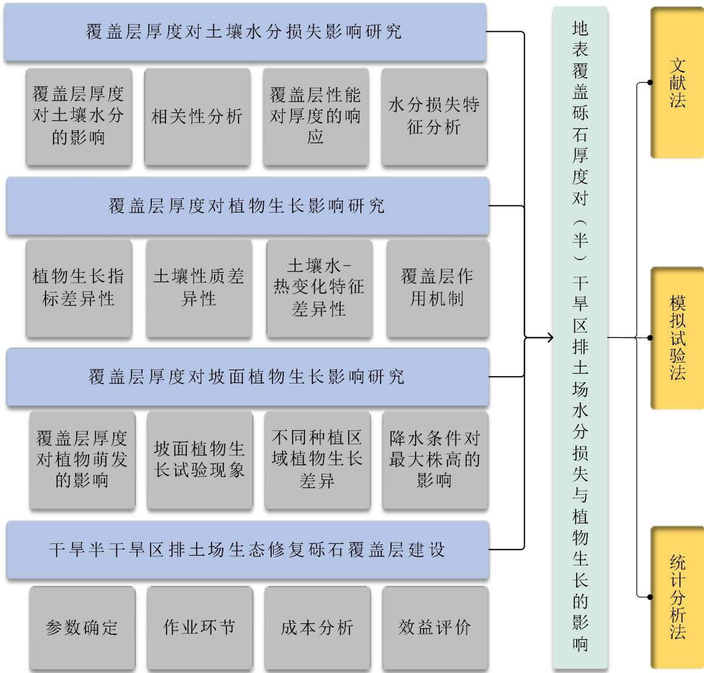  
图 1-1 技术路线图  
Figure 1-1 Technical route

## 2 覆盖层厚度对土壤水分损失影响研究

## 2 Study on Effect of Overburden Thickness on Soil Water Loss

为研究覆盖层厚度对土壤水分损失的影响，基于土壤水分蒸发理论，开展覆盖层厚度影响下的土壤水分损失试验。根据长期观测数据，借助相关土壤水分指标与覆盖层性能指标，揭示覆盖层厚度影响下的土壤持水量、累积土壤水分损失量随时间变化规律，分析覆盖层厚度对土壤水分日损失量、覆盖层截留率、覆盖层抑制率的影响；分析覆盖层抑制水分损失原因，阐述覆盖层厚度影响土壤水分损失的“双刃剑”作用。覆盖层厚度影响下的土壤水分损失试验为植物种植试验奠定基础。

## 2.1 试验概况（Test Overview）

## 2.1.1 试验区概况

试验地位于内蒙古鄂尔多斯市。全市辖东胜区、康巴什区和7个旗，总面积为8.688万km²。东部为准格尔黄土丘陵沟壑区，西部为桌子山低山缓坡和鄂托克高地，北部为库布齐沙漠，南部为毛乌素沙漠和滩地，大部分海拔为1300\~1500m。

研究区属于典型的北温带大陆性季风气候，年平均气温为5.5\~8.7℃；年降水量为170\~490mm，年蒸发量为2000\~3000mm，降水多集中于7\~8月，其它月份降水少。该区是畜牧业向农业的过渡区、干旱半干旱区的气候过渡带。土壤类型主要有栗钙土、棕钙土、灰钙土、灰漠土和潮土等[65]。

该地区天然植被稀疏，种类结构单一，主要植物有针茅、赖草、白草、沙珍棘豆等，此外还有以杨树、沙枣、榆树、柠条和灌木柳等耐旱树种构成的人工林，以及狭叶锦鸡儿、猫头刺、骆驼刺、白刺、杠柳等灌木或半灌木[66-67]。

## 2.1.2 试验设计

已有的关于砂砾覆盖层的研究存在大厚度、大粒径的特点，针对较小厚度、小粒径的研究不多。笔者考虑从现有研究粒径范围、厚度之外入手，选取的粒径不大于5mm。根据国际制土壤质地分类，<2mm的颗粒为砂粒，2mm以上的颗粒为砾粒，试验选用的砾石粒径范围为2\~5mm。试验方案设置裸露(对照组CK)与覆盖砾石处理，4组装置覆盖厚度依次是0mm、10mm（T1组）、20mm（T2组）与30mm（T3组）。

供试土样取自某煤矿复垦区，试验之前将土壤与砾石置于室内通风处自然风干。土壤中粒径<0.075、0.075\~0.15、0.15\~0.25、0.25\~0.50、0.50\~1.0、1.0\~2.0mm的质量比例分别为8.42%、14.79%、32.14%、26.94%、9.18%、8.54%。根据试验内容，采用土柱试验，以盛装土壤的下层桶与装砾石的上层筛作为试验装置。桶的直径上部为30cm、下部为22cm，高度为30cm，密封性好；筛的孔径为1mm，直径为30cm、与上部桶径一致，保证试验装置完整接合，如图1所示。

试验置于室内，降水方案为一次降水。试验日期为03.22\~04.14，共历时24d，以月尺度下降水量为依据，设计降水量为30mm。试验期间空气温度为-4.3\~28.7℃，平均为10.7℃；空气湿度为7.3\~97.6%，平均为30.4%。每日18点记录4组装置的土柱质量数据，土柱质量采用称重法测定，使用精度为0.001kg的电子天平，分别测定上层筛与下层桶的质量。

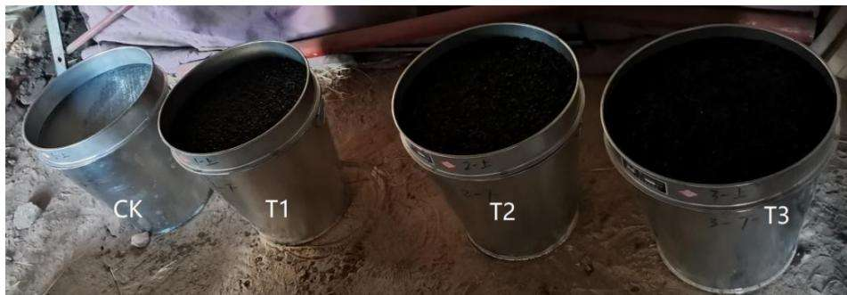  
图 2-1 土壤水分损失试验  
Figure 2-1 Soil water loss test

## 2.2 理论模型与指标计算（Theoretical Model and Index Calculation)

## 2.2.1 土壤水分蒸发理论

土壤水经过土壤表面以水蒸气形式扩散到大气中的过程称为土壤蒸发。土体水分蒸发条件为[68-70]：①必须有不断的热能供给，以满足水分汽化热的需要；②蒸发面和大气之间必须存在水汽压梯度；③蒸发面必须不断地得到水分补充。前两个条件由气象因素决定，通常用大气蒸发力衡量；第三个条件由土壤导水性质决定。

土体水分蒸发阶段为[71-72]：(①常蒸发速率阶段，土体中水分满足蒸发要求，蒸发速率仅受大气条件控制；②蒸发速率减小阶段，随着土体表面含水率减小，蒸发发生在土体表面及以下土层内，蒸发包括液态水蒸发和汽态水扩散两个过程，蒸发速率受控于土体含水率和孔隙通量；③蒸发消滞阶段，即水蒸汽扩散阶段，此时土体表层达到风干状态，蒸发面在干土层底部，孔隙中的液态水在土壤热通量的作用下汽化，通过扩散作用穿过干土层传送至土体表面，最后逸出进入大气；蒸发速率受控于下层土体含水率、固液表面分子间的吸附力。

无覆盖时，Aluwihare和 Watanabe[73]将土体蒸发分为三个过程，水分蒸发阻

力模型如图2-2所示，蒸发模型为：

$$
E = \frac { \rho [ q ^ { * } ( T _ { e } ) - { q _ { \mathrm { a } } } ^ { * } ( T _ { a } ) h _ { a } ] } { r _ { s w } + r _ { d } + r _ { a } }\tag{2-1}
$$

式中，E为土壤水分蒸发速率； $\rho .$ 为空气密度， $\mathrm { k g } / \mathrm { m } ^ { 3 }$ ； $h _ { a }$ 为大气参考高度处的相对湿度，%；Te为蒸发面温度， ${ } ^ { \circ } \mathrm { C } ; ~ q ^ { * } ( T e )$ 为蒸发面温度Te下的饱和比湿，kg/kg；Ta为大气参考高度处的温度， $^ \circ \mathrm { C }$ $q ^ { * } ( T a )$ 为大气温度Ta下的饱和比湿，kg/kg; $r _ { \mathrm { s w } }$ 为水蒸气从土体孔隙水表面运动到干土层底部孔隙的阻力； $r _ { \mathrm { d } }$ 为水蒸气从干土层底部运动到土体表面的阻力； $r _ { \mathrm { a } }$ 为水蒸气从土体表面运动到大气中的阻力。

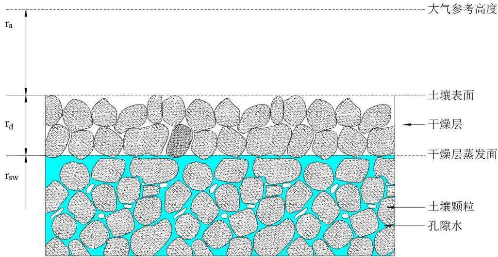  
图2-2 水分蒸发阻力模型示意  
Figure 2-2 Schematic diagram of water evaporation resistance model

## 2.2.2 指标计算

## （一）土壤水分指标

覆盖层的存在使土壤水分环境变得复杂，覆盖层对土壤水分的作用机制尚未明确，土壤水分可能不仅以蒸发的形式减少，因此，本文用“损失”代替“蒸发”来表示土壤水分的减少。本试验每日18点记录4组装置的土柱质量数据，即以1d为单位时间来分析土壤水分指标。

（1）土壤持水量，指的是降水后某时间点的土柱质量与未降水前的土柱质量之差，即为该时间点的土壤持水质量（kg）。为方便表征土壤持水量与降水量（单位：mm）的关系，土壤持水量单位用mm表示。

（2）累积土壤水分损失量，指的是降水结束时的土壤持水量与某时间点的土壤持水量之差，即为降水结束到该时间点的累积土壤水分损失量（mm）。

（3）土壤水分日损失量，指的是相邻两天同一时刻的土壤持水量之差，即为土壤水分日损失量（mm）。

## （二）覆盖层性能指标

（1）覆盖层截留率，指的是覆盖层截留的水量与降水量的比值。计算方法为：

$$
F _ { J } = { \frac { F } { J } }\tag{2-3}
$$

式中， $F _ { \mathrm { { J } } }$ 一覆盖层截留率，%；F—覆盖层截留的水量，mm；J—降水量，mm。

（2）覆盖层抑制（土壤水分损失）率，简称覆盖层抑制率，指的是某时段无覆盖层的土壤水分损失量与相同时段有覆盖层的土壤水分损失量的差值与该时段无覆盖层的土壤水分损失量之比。计算方法为：

$$
F _ { _ { Y } } = \frac { S _ { w } - S _ { y } } { S _ { w } }\tag{2-4}
$$

式中， $F _ { Y }$ 一覆盖层抑制（水分损失）率，%； $S _ { \mathrm { w } } \mathrm { \hbar }$ 一无覆盖层的土壤水分损失量，mm; $S _ { \mathrm { y } } { \mathrm { \Omega } }$ 一有覆盖层的土壤水分损失量，mm。

## 2.3 结果与分析（Results and Analysis）

## 2.3.1 覆盖层对土壤水分的影响

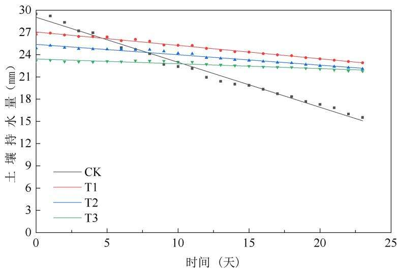  
图2-3 土壤持水量随时间变化曲线  
Figure 2-3 Variation curve of soil water holding capacity with time

土壤持水量随时间变化曲线如图2-3所示，各组试验土壤持水量与时间呈线性关系，土壤持水量-时间线性回归结果如表2-1所示。将相关线性回归方程联合求解可得，T1、T2、T3处理组的土壤持水量大于等于CK组的日期分别大约是第5d、第8d、第10d。在0\~26.3d，各覆盖层组土壤持水量的顺序为： $\mathrm { T 1 } { > } \mathrm { T } 2 { > } \mathrm { T } 3$ 在26.3d\~31.4d，各覆盖层组土壤持水量的顺序为： $\mathrm { T 1 } { > } \mathrm { T } 3 { > } \mathrm { T } 2$ ；在 31.4\~40.8d，各覆盖层组土壤持水量的顺序为： $\mathrm { T } 3 \mathrm { > T } 1 \mathrm { > T } 2$ ；在40.8d以后，各覆盖层组土壤持水量的顺序为：T3>T2>T1。

表2-1 土壤持水量-时间线性回归结果  
Table 2-1 Regression results between water holding capacity of soil and time
<table><tr><td>组别</td><td>截距/mm</td><td>斜率</td><td>方程</td><td>R²</td></tr><tr><td>CK</td><td>29.042</td><td>-0.607</td><td>y=-0.607x+29.042</td><td>0.988</td></tr><tr><td>T1</td><td>27.058</td><td>-0.181</td><td>y=-0.181x+27.058</td><td>0.990</td></tr><tr><td>T2</td><td>25.387</td><td>-0.140</td><td>y=-0.140x+25.387</td><td>0.962</td></tr><tr><td>T3</td><td>23.417</td><td>-0.065</td><td>y=-0.065x+23.417</td><td>0.882</td></tr></table>

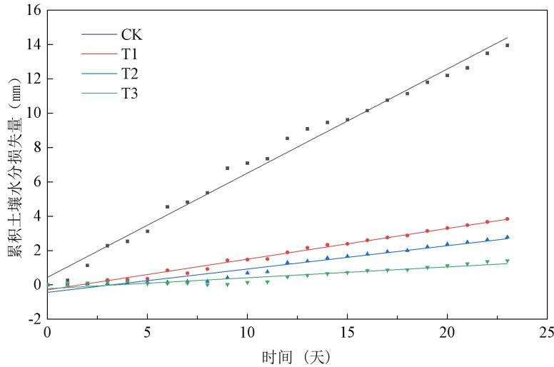  
图2-4 累积土壤水分损失量随时间变化曲线  
Figure 2-4 Variation curve of cumulative water loss of soil with time

表2-2 累积土壤水分损失量-时间线性回归结果  
Table 2-2 Regression results between cumulative water loss of soil and time
<table><tr><td>组别</td><td>截距/mm</td><td>斜率</td><td>方程</td><td>R²</td></tr><tr><td>CK</td><td>0.442</td><td>0.607</td><td>y=0.607x+0.442</td><td>0.988</td></tr><tr><td>T1</td><td>-0.290</td><td>0.179</td><td>y=0.179x-0.290</td><td>0.989</td></tr><tr><td>T2</td><td>-0.434</td><td>0.136</td><td>y=0.136x-0.434</td><td>0.953</td></tr><tr><td>T3</td><td>-0.219</td><td>0.063</td><td>y=0.063x-0.219</td><td>0.874</td></tr></table>

累积土壤水分损失量随时间变化曲线如图2-4所示，随着时间的推移，累积土壤水分损失量依次为 $\mathrm { C K } { > } \mathrm { T } 1 { > } \mathrm { T } 2 { > } \mathrm { T } 3$ 。各组试验累积土壤水分损失量与时间呈线性关系，曲线斜率陡峭程度为 $\mathrm { C K } { > } \mathrm { T } 1 { > } \mathrm { T } 2 { > } \mathrm { T } 3$ ，累积土壤水分损失量-时间线性回归结果如表2-2所示。

土壤水分损失速率为土壤水分损失量与时间的比值，单位为mm/d。取线性回归方程的斜率为土壤水分损失速率，土壤水分损失速率越大，单位时间内土壤水分损失越多。CK、T1、T2、T3组的土壤水分损失速率分别为0.607、0.179、0.136、0.063mm/d，随着覆盖层厚度的增加，土壤水分损失速率逐渐减缓，CK组的水分损失速率分别为T1、T2、T3组的3.4、4.5、9.6倍，覆盖层对土壤水分损失的抑制效果明显，试验期间，累计土壤水分损失量大幅度下降。

## 2.3.2 土壤水分日损失量与持水量相关性

相关性分析是指对两个或多个具备相关性的变量元素进行分析，从而衡量变量元素的相关密切程度。相关性的元素之间需要存在一定的联系或者概率才可以进行相关性分析。相关性系数的取值范围为-1\~1。当相关系数小于0时，称为负相关；大于0时，称为正相关；等于0时，称为零相关。

两个变量的关系可以直观地用散点图表示，当其紧密地群聚于一条直线的周围时，变量间存在强相关性。土壤水分日损失量与土壤持水量的相关性如图2-5所示。

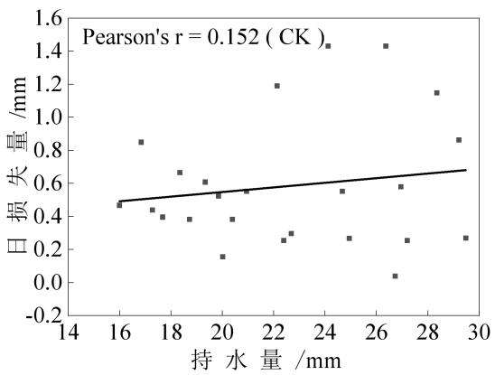

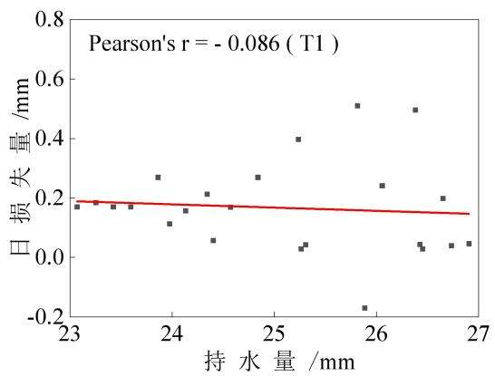

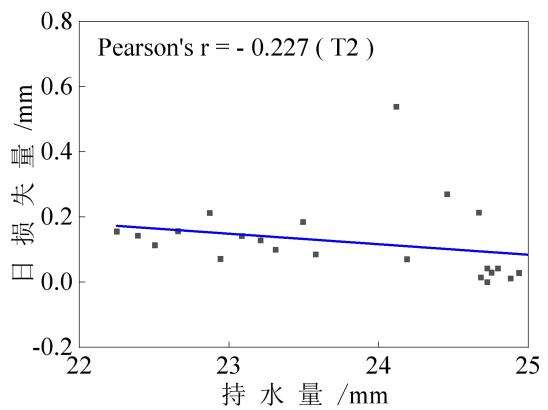

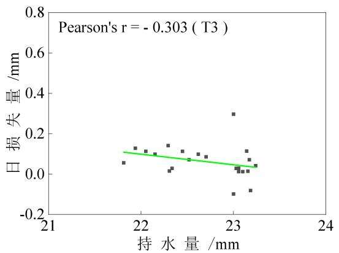  
图2-5 土壤水分日损失量与土壤持水量相关性  
Figure 2-5 Correlation between daily water loss of soil and water holding capacity of soil

由土壤水分日损失量与土壤持水量相关性分析结果可知，CK组的日损失量与持水量的相关性系数为0.152，呈轻度正相关；T1、T2、T3组的日损失量与持水量的相关性系数分别为-0.086、-0.227、-0.303，呈轻度负相关。无覆盖层时，相关性系数为正，覆盖层存在时相关性系数为负，由此可知，覆盖层的存在改变了日损失量与持水量相关性的正负向。根据相关性系数绝对值可知，T1、T2、T3组的日损失量与持水量的相关性系数绝对值大小顺序为T3>T2>T1，日损失量与持水量的相关性随着覆盖层厚度的增加而增强。

## 2.3.3 覆盖层性能对厚度的响应

覆盖层截留率，表征覆盖层条件下的降水再分配结果：降水自上而下运移，先与覆盖层接触，经覆盖层截留后进入土壤层。植物根系分布在土壤层，未被覆盖层截留、进入土壤层的水分为土壤层能够利用的水分。每次降水事件均包含3个阶段：覆盖层湿润阶段、覆盖层饱和阶段以及降水结束后覆盖层干燥阶段，覆盖层持水能力决定了覆盖层截留率的大小。

覆盖层截留率如表2-3所示。CK、T1、T2、T3组的覆盖层截留率分别为0.81%、10.45%、16.29%、22.05%，覆盖层截留率与覆盖层厚度的回归分析结果如图2-6所示。若要覆盖层的存在有意义，即满足 $0 { \leqslant } \mathrm { F } _ { \mathrm { J } } { \leqslant } 1 0 0 \%$ ，则覆盖层厚度需满足0≤x≤141mm。

表 2-3 覆盖层截留率  
Table 2-3 Interception rate of overburden
<table><tr><td>指标</td><td>CK</td><td>T1</td><td>T2</td><td>T3</td></tr><tr><td>覆盖层厚度/mm</td><td>0</td><td>10</td><td>20</td><td>30</td></tr><tr><td>覆盖层截留的水量F/mm</td><td>0.241</td><td>3.120</td><td>4.842</td><td>6.554</td></tr><tr><td>实际降水量/mm</td><td>29.724</td><td>29.857</td><td>29.725</td><td>29.725</td></tr><tr><td>覆盖层截留率  $\mathrm { F } _ { \mathrm { J } } / \%$ </td><td>0.81</td><td>10.45</td><td>16.29</td><td>22.05</td></tr></table>

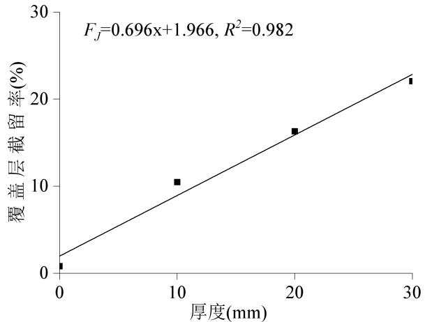  
图2-6 覆盖层截留率与厚度回归曲线  
Figure 2-6 Regression curve between interception rate of overburden and overburden thickness

覆盖层抑制率，表征覆盖处理相对于裸露处理对土壤水分损失的抑制效果。跟据0\~23d土壤持水量观测数据，得到的0\~23d覆盖层抑制率如表2-4所示。CK、T1、T2、T3组的覆盖层抑制率分别为0、72.52%、80.02%、89.86%，覆盖层抑制率与覆盖层厚度回归分析结果如图2-7所示。当 $\mathbf { \Delta } _ { \mathbf { X } } { \approx } 5 6$ 时，覆盖层抑制率接近于100%。因此，考虑经济性，覆盖层厚度需满足 $0 { \leqslant } \mathbf { x } { \leqslant } 5 6 \mathrm { m m }$

表 2-4 覆盖层抑制率  
Table 2-4 Inhibition rate of overburden
<table><tr><td rowspan="2">组 别</td><td rowspan="2">覆盖层厚度/mm</td><td>土壤水分损失量/mm</td><td>覆盖层抑制率/%</td></tr><tr><td> $\mathrm { C } _ { 0 } – \mathrm { C } _ { 2 3 }$ </td><td> $( \mathrm { S w - S y } )$  /Sw</td></tr><tr><td>CK</td><td>0</td><td>13.956</td><td>0</td></tr><tr><td>T1</td><td>10</td><td>3.836</td><td>72.52</td></tr><tr><td>T2</td><td>20</td><td>2.788</td><td>80.02</td></tr><tr><td>T3</td><td>30</td><td>1.415</td><td>89.86</td></tr></table>

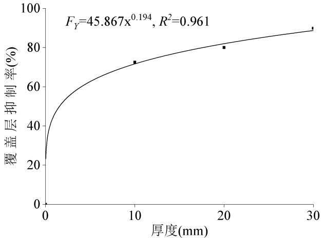  
图2-7 覆盖层抑制率与厚度回归曲线  
Figure 2-7 Regression curve between inhibition rate of overburden and overburden thickness

2.4 土壤水分损失特征分析（Characteristics Analysis of water lossof Soil)

## 2.4.1 覆盖层抑制土壤水分损失原因

Yamanaka等[74]测得无覆盖和不同砾石覆盖的土壤蒸发率，进而确定土壤水分蒸发受到大气、砾石覆盖层和土壤各部分的阻力作用，计算公式为：

$$
r _ { t } = r _ { a } + r _ { m } + r _ { s } = \frac { \rho [ q ^ { * } ( T _ { e } ) - { q _ { a } } ^ { * } ( T _ { a } ) h _ { a } ] } { E }\tag{2-7}
$$

式中， $r _ { \mathrm { t } }$ 为土壤水分蒸发总阻力； $r _ { \mathrm { a } }$ 为大气阻力； $r _ { \mathrm { s } }$ 为土壤阻力； $r _ { \mathrm { m } }$ 为覆盖层阻力； $\rho _ { . }$ 为空气密度， $\mathrm { k g } / \mathrm { m } ^ { 3 }$ ; $h _ { a }$ 为大气参考高度处的相对湿度，%；Te为蒸发面温度， ${ } ^ { \circ } \mathrm { C } ; ~ q ^ { * } ( T e )$ 为蒸发面温度Te下的饱和比湿，kg/kg；Ta为大气参考高度处的温度， ${ } ^ { \circ } \mathrm { C } ; ~ q ^ { * } ( T a )$ 为大气温度 Ta下的饱和比湿，kg/kg。

土体上方存在覆盖层时的水分蒸发阻力模型示意图如图2-8所示。蒸发过程中，土壤水分会补给到覆盖层，随着覆盖层水分蒸发流失。覆盖层能有效抑制土体水分损失，一方面，覆盖层存在时，在土壤表面起到物理阻隔作用，影响空气动力的因素不能直接作用于土壤层表面，使得土壤水分垂向蒸发受阻，在一定程度上抑制了蒸发的形成。另一方面，本试验选用的砾石覆盖层粒径为2\~5mm，土壤粒径<2mm，覆盖层的粗粒径与表层土壤的细粒径形成毛细结构，增加了接触面处覆盖层水分向下运移的驱动力，抵制水分向上运移。

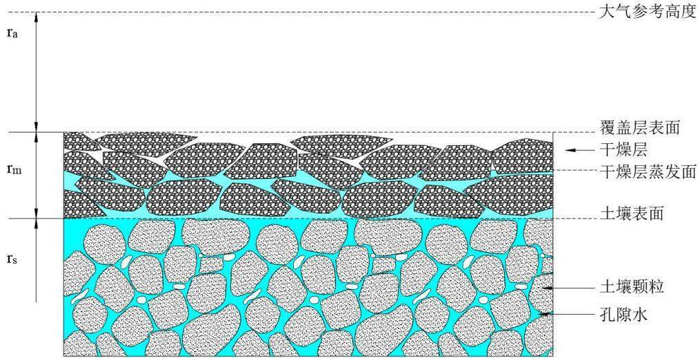  
图2-8土体上方存在覆盖层时水分蒸发阻力模型示意  
Figure 2-8 Schematic diagram of water evaporation resistance model when overburden above the soil

## 2.4.2覆盖层厚度影响土壤水分的“双刃剑”作用

覆盖层对土壤水分损失的抑制效果明显，但覆盖层厚度对土壤水分的影响并非单一的，且覆盖层厚度的选择与指标相互联系、共同作用。覆盖层抑制率表征覆盖处理相对于裸露处理对土壤水分损失的抑制效果，其值越大，抑制土壤水分损失的效果越好，覆盖层抑制率对土壤水分起正向作用；覆盖层截留率指的是覆盖层截留的水量与降水量的比值，其值越大，进入土壤中的降水比例越小，覆盖层截留率对土壤水分起负向作用。

由前文分析可知，覆盖层抑制率与覆盖层厚度的函数关系为 $F _ { Y } { = } 4 5 . 8 6 7 H ^ { 0 . 1 9 4 }$ 呈正相关关系。覆盖层抑制率随着覆盖层厚度的增大而增大，覆盖层厚度越大，对土壤水分的正向作用越强。

覆盖层截留率与覆盖层厚度的函数关系为F=0.696H+1.966，呈线性正相关关系。覆盖层截留率随覆盖层厚度的增大而增大，覆盖层厚度越大，对土壤水分的负向作用越强。若要覆盖层的存在有意义，则覆盖层厚度必须不大于某上限阈值，否则当覆盖层厚度超过上限阈值时进入土壤中的水分减小为0。

## 2.5 本章小结（Chapter Summary）

基于土壤水分蒸发理论，开展覆盖层厚度影响下的土壤水分损失试验；根据长期观测数据，借助相关土壤水分指标与覆盖层性能指标，研究覆盖层厚度对土壤水分损失的影响。结果表明：

（1）T1、T2、T3处理组的土壤持水量大于等于CK组的日期分别约为第5d、第8d、第10d；CK组的水分损失速率分别为T1、T2、T3组的3.4、4.5、

9.6倍，覆盖层对土壤水分损失的抑制效果明显。覆盖层的存在改变了日损失量与持水量相关性的正负向，且相关性随着覆盖层厚度的增加而增强。

（2）覆盖层截留率、覆盖层抑制率对应的覆盖层厚度上限阈值或经济阈值分别为141、56mm。

（3）覆盖层对土壤水分损失的抑制效果明显，覆盖层抑制率随着覆盖层厚度的增加而增加，但是覆盖层厚度增加会提高覆盖层截留率，因此，覆盖层厚度影响土壤水分时发挥“双刃剑”作用。

## 3 覆盖层厚度对植物生长影响研究

## 3 Study on Effect of Overburden Thickness on Plant Growth

覆盖层对土壤水分损失的抑制效果明显。为研究覆盖层厚度对植物生长的影响，并揭示不同覆盖层厚度下植物生长的影响因素，开展覆盖层厚度影响下的植物种植试验。进行土壤湿度、温度等参数监测，测定相关植物生长状况指标与土壤性质指标。阐述、归纳覆盖层厚度影响下的各时期土壤水-热变化特征，分别从湿度变化特征、温度变化特征以及温度-湿度关联变化特征分析覆盖层厚度影响下的土壤水-热变化特征差异性；总结不同覆盖层厚度下植物生长影响因素，阐述覆盖层厚度对各因素的影响机制。

## 3.1 试验概况（Test Overview）

试验地选取、供试土壤、砾石试样以及试验前处理与第二章试验一致。试验选用的砾石粒径范围为2\~5mm，试验方案设置裸露（对照组CK）与覆盖砾石处理，4组装置覆盖厚度依次是0mm、10mm（T1组）、20mm（T2组）与30mm（T3组）。

根据试验内容，进行针茅草种植试验，并进行土壤温湿度监测。盆的高度为30cm，底部具有排水孔。采用RS485型传感器，进行土壤温湿度实时监测，数据每隔30min传输、保存至云平台，其运行原理为：研究若干种土壤的介电特性，分析相关土壤物化特性，对比分析典型的土壤含水量(e v)与介电常数(K a)关系模型；采用试验法进行TDR测定；根据实际含水量与介电常数，建立土壤O v-K a\~(0.5)标定公式。具有精度高、响应快、输出稳定的特点。

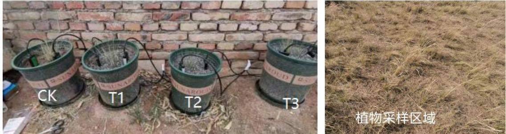  
图3-1 植物种植试验与采样区域  
Figure. 3-1. Planting test and sampling area

供试植物取自某煤矿复垦区，采样区域的选取原则为：保证区域内的植物生长状况大致相同，如图3-1所示。选取4株长势大致相同的植物样本，采样、移栽后浇透水，放置在室外自然生长若于天。待移栽后的针茅草长势稳定后，进行根长与株高处理，并铺设覆盖层。处理后的根长为10cm，株高为15cm，保证供试植物的生长状况相同。盆栽置于室外，接受自然降雨补给。

5\~10月作为温带草地的生长季，试验日期设置为05.19\~10.15，历时约5个月，试验周期划分为前期(05.19\~06.10)、前中期(06.11\~07.10)、中期(07.11\~08.10)、中后期（08.11\~09.10）以及后期（09.11\~10.15）五个时期。试验期间空气温度为10.1\~30.0℃，平均为19.2℃；空气湿度为13.2\~73.2%，平均为34.3%。

## 3.2 植物生长指标差异性分析（Difference Analysis of PlantGrowth Indexes)

## （一）植物生长指标测定方法

选取最大株高、最大根长、根鲜重、植株鲜重、苗数、植株地上部分鲜重、植株地上部分干重、植株地上部分单位鲜重、植株地上部分单位干重等指标构建植物生长状况评价体系。植物生长指标测定方法[75-76]如下所述。

（1）株高（cm），利用直尺测定，为根茎连接处至植株顶端的长度。

（2）根长（cm），利用直尺测定，为根茎连接处至根部末端的长度。

（3）鲜重与干重（g），采用精度为0.01g的电子天平，将植株分为地上和地下两部分，分别测定鲜重；采用烘箱将分装样品于 $1 0 5 \mathrm { { ‰} }$ 烘干8h，分别测定干重。

（4）单位鲜重或干重（g/棵），鲜重或干重与苗数的比值。

植株试样如图3-2所示，0号、1号、2号、3号分别对应CK组、T1组、T2组、T3 组。

（a) 地上部分  
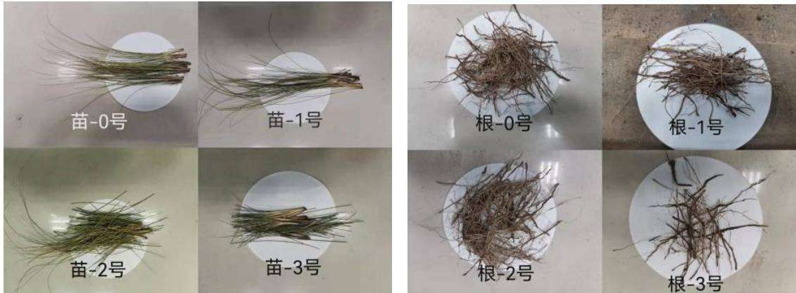  
图 3-2 植株试样  
(b）根  
Figure 3-2 Plant sample

## （二）植物生长指标测定结果

植物生长指标测定结果如表3-1和图3-3所示。

表 3-1 植物生长指标测定结果  
Table 3-1 Determination results of plant growth index
<table><tr><td>组别</td><td>最大 株高 /cm</td><td>最大 根长 /cm</td><td>根鲜 重/g</td><td>植株 鲜重/g</td><td>苗 数/ 棵</td><td>植株地 上部分 鲜重/g</td><td>植株地 上部分 干重/g</td><td>植株地上 部分单位 鲜重  ${ \bf \Xi } ( { \bf g } /$  棵）</td><td>植株地上 部分单位 干重  ${ \bf \Xi } ( { \bf g } /$  棵）</td></tr><tr><td>CK</td><td>22</td><td>26.2</td><td>3.88</td><td>7.86</td><td>136</td><td>3.98</td><td>1.99</td><td>0.029</td><td>0.015</td></tr><tr><td>T1</td><td>28</td><td>22.0</td><td>3.42</td><td>6.47</td><td>78</td><td>3.05</td><td>1.41</td><td>0.039</td><td>0.018</td></tr><tr><td>T2</td><td>40</td><td>32.6</td><td>6.12</td><td>12.90</td><td>131</td><td>6.78</td><td>3.10</td><td>0.052</td><td>0.024</td></tr><tr><td>T3</td><td>25</td><td>15.5</td><td>1.59</td><td>4.26</td><td>53</td><td>2.67</td><td>1.32</td><td>0.050</td><td>0.025</td></tr><tr><td>最值 对应 厚度</td><td>T2</td><td>T2</td><td>T2</td><td>T2</td><td>CK</td><td>T2</td><td>T2</td><td>T2</td><td>T3</td></tr></table>

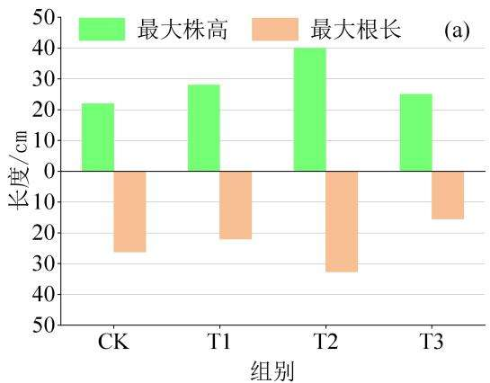

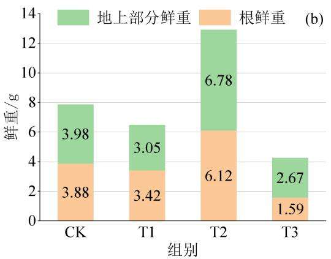

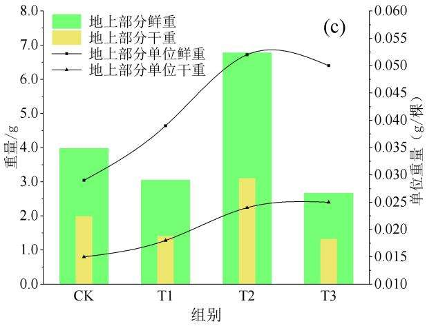  
图 3-3 植物生长指标测定结果  
Figure 3-3 Determination results of plant growth index

其中最大株高、最大根长、根鲜重、植株鲜重、地上部分鲜重、地上部分干

重、地上部分单位鲜重均为T2组最大：苗数、地上部分单位于重T2组数据与最大值差别不大。综上所述，T2组对植物生长的促进作用最显著。

变异系数是概率分布离散程度的一个归一化量度，是衡量数据变异程度的统计量[77-80]。变异系数的计算如式（3-1）所示：

$$
C . V = S / X { \times } 1 0 0 \%\tag{3-1}
$$

式中，C.V为变异系数，%；S为数据标准差；X为数据均值。根据变异程度分级，C.V≤10%时为弱变异性，C.V介于10%\~100%为中等程度变异；C.V≥100%时为强变异性。

覆盖层影响下的植物生长状况各指标变异程度如表3-2所示。

表3-2 植物生长状况变异程度  
Table 3-2 Variation degree of plant growth status
<table><tr><td>目标</td><td>指标</td><td>变异系数/%</td><td>变异程度</td></tr><tr><td rowspan="9">植物生长状况</td><td>最大株高/cm</td><td>27</td><td>中等</td></tr><tr><td>最大根长/cm</td><td>30</td><td>中等</td></tr><tr><td>根鲜重  $/ \mathbf { g }$ </td><td>50</td><td>中等</td></tr><tr><td>植株鲜重  $/ \mathrm { g }$ </td><td>47</td><td>中等</td></tr><tr><td>苗数/棵</td><td>41</td><td>中等</td></tr><tr><td>地上部分鲜重  $/ \mathrm { g }$ </td><td>45</td><td>中等</td></tr><tr><td>地上部分干重  $/ \mathrm { g }$ </td><td>42</td><td>中等</td></tr><tr><td>地上部分单位鲜重（g/棵）</td><td>25</td><td>中等</td></tr><tr><td>地上部分单位干重  $( \mathbf { g } / \mathbf { \Sigma }$  棵）</td><td>23</td><td>中等</td></tr></table>

由表3-2可知，覆盖层厚度影响下的植物生长状况各指标变异程度均为中等，变异系数为23\~50%，覆盖层厚度影响下的植物生长状况差异性显著。

影响植物生长的因素主要有温度、水分、光照、养分、土壤等。覆盖层的存在对大气性质的影响忽略不计，因此，本文主要从土壤性质、土壤水分条件、土壤热量条件入手，分析覆盖层对各因素的影响。

## 3.3 土壤性质差异性分析（Difference Analysis of Soil Properties）

从影响植物生长的土壤物理性质入手，选取主要因素包括容重、孔隙度、饱和持水率、质地等，分析覆盖层厚度影响下各因素的变异程度。

## （一）土壤性质测定方法

土壤性质的测定方法参考《土壤分析》[81]与《土壤物理学》[82]。

（1）土壤质地，指的是土壤各种大小颗粒的相对比例，采用筛分法测定。

（2）土壤容重，指的是土壤固相部分的质量与总容积的比值，采用环刀法测定。计算方法为：

$$
\rho _ { b } = \frac { m _ { s } } { V _ { t } }\tag{3-2}
$$

式中， $\rho \boldsymbol { b }$ 一容重， $\mathrm { g } / \mathrm { c m } ^ { 3 }$ . $m _ { s } \mathrm { \overline { { \Omega } } }$ 一固相物质的质量，g； $V _ { t } -$ 总容积， $\mathrm { c m } ^ { 3 }$

（3）土壤孔隙度，指的是单位容积土壤中孔隙容积所占的百分数。计算方法为：

$$
f = ( 1 - \frac { \rho _ { b } } { \rho _ { s } } ) { \times } 1 0 0 \%\tag{3-3}
$$

式中，f—孔隙度， $\% ; \rho _ { b }$ 一容重， $\mathrm { g } / \mathrm { c m } ^ { 3 } ; \ \rho _ { s }$ —密度，常取 $2 . 6 5 \mathrm { g } / \mathrm { c m } ^ { 3 }$

（4）土壤饱和持水率，指的是土壤饱和时水分质量与干土质量的比值，采用环刀浸水法测定。

## （二）土壤性质测定结果

土壤容重、孔隙度、饱和持水率测定结果如表3-3所示。

表3-3容重、孔隙度、饱和持水率测定结果  
Table 3-3 Measurement results of ${ \dot { \rho } } _ { b } ,$ f and saturated water holding capacity
<table><tr><td>组 别</td><td>样本 序号</td><td>容重  $( \mathrm { g } / \mathrm { c m } ^ { 3 } )$ </td><td>孔隙度/%</td><td>饱和持水 率/%</td><td>容重均值  $( \mathrm { g } / \mathrm { c m } ^ { 3 } )$ </td><td>孔隙度均 值/%</td><td>饱和持水 率均值/%</td></tr><tr><td rowspan="3">CK</td><td>1</td><td>1.472</td><td>44.5</td><td>29.32</td><td rowspan="3">1.473</td><td rowspan="3">44.4</td><td rowspan="3">29.31</td></tr><tr><td>2</td><td>1.473</td><td>44.4</td><td>29.33</td></tr><tr><td>3</td><td>1.474</td><td>44.4</td><td>29.29</td></tr><tr><td rowspan="3">T1</td><td>1</td><td>1.535</td><td>42.1</td><td>27.56</td><td rowspan="3">1.537</td><td rowspan="3">42.0</td><td rowspan="3">27.56</td></tr><tr><td>2</td><td>1.537</td><td>42.0</td><td>27.58</td></tr><tr><td>3</td><td>1.538</td><td>42.0</td><td>27.54</td></tr><tr><td rowspan="3">T2</td><td>1</td><td>1.557</td><td>41.2</td><td>26.90</td><td rowspan="3">1.558</td><td rowspan="3">41.2</td><td rowspan="3">26.96</td></tr><tr><td>2</td><td>1.559</td><td>41.2</td><td>26.94</td></tr><tr><td>3</td><td>1.560</td><td>41.1</td><td>27.04</td></tr><tr><td rowspan="3">T3</td><td>1</td><td>1.488</td><td>43.8</td><td>29.89</td><td rowspan="3">1.488</td><td rowspan="3">43.8</td><td rowspan="3">29.89</td></tr><tr><td>2</td><td>1.488</td><td>43.8</td><td>29.92</td></tr><tr><td>3</td><td>1.490</td><td>43.8</td><td>29.86</td></tr></table>

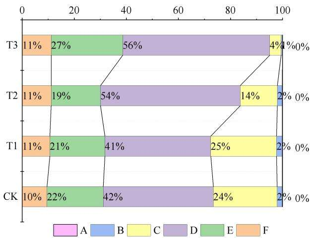  
图 3-4 粒径质量百分比  
Figure 3-4 Proportion of each particle size range to the total mass

各组别各粒径范围占总质量的比例如图3-4所示。CK、T1、T2、T3组的粒径组成差异主要体现在C、D、E部分。各组别C部分的质量比例分别为24.49%、25.25%、14.26%、4.38%，D部分的质量比例分别为42.31%、40.67%、53.67%、56.47%，E部分的质量比例分别为21.61%、21.15%、18.93%、27.47%。

根据土壤质地分类，粒径大于0.25mm的颗粒含量超过全重50%的土壤，即为中砂土。由表可知，各组别土壤类型均为中砂土。各组别大于0.25mm粒径（D+E+F）的质量比例分别为73.44%、72.44%、83.73%、95.08%。

土壤性质变异程度如表3-4所示。根据变异系数计算公式，4组容重的变异系数为2.6%，属于弱变异性；4组孔隙度的变异系数为3.5%，属于弱变异性；4组饱和持水率的变异系数为4.9%，属于弱变异性；4组大于0.25mm粒径质量百分比的变异系数为13%，属于中等变异程度。

表3-4 土壤性质变异程度  
Table 3-4 Variation degree of soil properties
<table><tr><td>组别</td><td>容重 (g/cm³)</td><td>孔隙度/%</td><td>饱和持水率/%</td><td>粒径 D+E+F 比例/%</td></tr><tr><td>CK</td><td>1.473</td><td>44.4</td><td>29.31</td><td>73.44</td></tr><tr><td>T1</td><td>1.537</td><td>42.0</td><td>27.56</td><td>72.44</td></tr><tr><td>T2</td><td>1.558</td><td>41.2</td><td>26.96</td><td>83.73</td></tr><tr><td>T3</td><td>1.488</td><td>43.8</td><td>29.89</td><td>95.08</td></tr><tr><td>变异系数</td><td>2.6</td><td>3.5</td><td>4.9</td><td>13</td></tr><tr><td>变异程度</td><td>弱</td><td>弱</td><td>弱</td><td>中等</td></tr></table>

## 3.4 土壤水 - 热变化特征（Variation Characteristics of SoilWater-Heat)

本研究将土壤湿度作为水分条件，将土壤温度作为热量条件。研究覆盖层厚度影响下的土壤水-热变化特征，包括：湿度变化特征、温度变化特征以及温度-湿度关联变化特征。采用从整体到局部、以点切入的原则，分别以无降水补充下湿度增大现象、温度差异、温度-湿度关联变化趋势为入手点阐述湿度变化特征、温度变化特征以及温度-湿度关联变化特征。

## 3.4.1 土壤湿度变化类型

将植物生长试验周期大致分为降雨补给阶段和非降雨阶段。根据土壤湿度长期监测数据与降雨条件下水分变化情况，将植物生长情况下的土壤湿度变化划分为以下3阶段：①干燥状态下湿度总体下降阶段（一阶段）；②降雨湿度上升/稳定阶段（二阶段）；③降雨结束后湿度稳定/下降阶段（三阶段）。

一阶段：非降雨阶段，湿度总体呈现减小趋势；二阶段：降雨阶段，湿度总体呈现增大趋势，降雨历时较长时土壤可达到饱和状态并趋于稳定；三阶段：非降雨阶段，湿度稳定阶段仍有持续，总体呈现先稳定后减小趋势。

将植物生长情况下两次降雨间隔的土壤湿度变化类型分为两类：类型一与类型二，如图3-5所示。类型一与类型二的区别在于两次降雨间隔的时间长短，若两次降雨的时间间隔不长，则不存在一阶段，符合类型一的特征；类型二则符合土壤湿度变化的普遍特点：两次降雨间隔若于天，降雨后依次经历湿度上升/稳定、湿度下降、干燥状态下湿度总体下降等阶段。

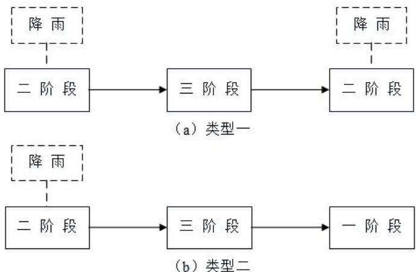  
图3-5 两次降雨间隔土壤湿度变化类型  
Figure 3-5 Types of soil moisture changes between two rainfall intervals

选取各时期内发生的湿度变化类型二，以类型二为例说明各时期的土壤水-热变化特征，类型二对应日期分别为前期（05.19\~05.25）、前中期（06.13\~07.07）、中期（07.25\~08.03）、中后期（08.18\~08.28）以及后期（09.18\~10.06）。

## 3.4.2 土壤温度/湿度变化特征

（一）前期土壤温度/湿度变化特征（05.19-05.25）

前期（05.19-05.25）土壤温度/湿度变化如图3-6（a）所示。对照组与试验组温度曲线均呈现周期性变化，温度最值出现的时间点大致相同。温度差异主要体现在从峰值到谷值的下降阶段，该阶段内温度大小顺序大致为T3>T2>T1>Ck。CK组的温度范围大致为0\~35℃，T1组的温度范围大致为5\~38℃，T2、T3组的温度范围大致为 $5 { \sim } 4 0 ^ { \circ } \mathrm { C }$ 。温度降低时，覆盖层具有一定的增温作用，增温作用T2、T3组大于T1组。

4组湿度曲线均呈现整体下降趋势，但CK组曲线呈现明显的波形变化，T1、T2、T3组曲线无明显波形变化。无水分补充的情况下，CK组湿度出现明显增大现象，而T1、T2、T3组湿度增大现象不明显。

（二）前中期土壤温度/湿度变化特征（06.13-07.07）

前中期（06.13-07.07）土壤温度/湿度变化如图3-6（b）所示。对照组与试验组温度曲线均呈现周期性变化，温度最值出现的时间点大致相同。以06.24为分界点，分为两个阶段：前半段温度差异类似于前期；后半段温度谷值差异不明显，温度峰值差异显著：试验组温度大致相同，且小于Ck组。CK组的温度范围大致为 $1 0 { \sim } 5 0 ^ { \circ } \mathrm { C }$ ，T1、T2、T3组的温度范围大致为 $1 0 { \sim } 4 5 ^ { \circ } \mathrm { C }$ 。温度较高时，覆盖层具有一定的降温作用。

4组湿度曲线均呈现整体下降趋势，但CK、T1组曲线呈现明显的波形变化，T2、T3组曲线无明显波形变化。无水分补充的情况下，CK、T1组湿度出现明显的增大现象，CK、T1组湿度增大现象在06.25加剧；而T2、T3组湿度增大现象不明显。

（三）中期土壤温度/湿度变化特征（07.25-08.03）

中期（07.25-08.03）土壤温度/湿度变化如图3-6（c）所示。对照组与试验组温度曲线均呈现周期性变化，温度最值出现的时间点大致相同。温度谷值差异不明显，温度峰值差异显著：试验组温度大致相同，且小于Ck组。CK组的温度范围大致为 $1 0 { \sim } 5 5 ^ { \circ } \mathrm { C }$ ，T1、T2、T3组的温度范围大致为 $1 0 { \sim } 5 0 ^ { \circ } \mathrm { C }$ 。温度较高时，覆盖层具有一定的降温作用。

4组湿度曲线均呈现整体下降趋势，但CK、T1组曲线呈现明显的波形变化，T2、T3组曲线无明显波形变化。无水分补充的情况下，CK、T1组湿度出现明显的增大现象，而T2、T3组湿度增大现象不明显。

## （四）中后期土壤温度/湿度变化特征（08.18-08.28）

中后期（08.18-08.28）土壤温度/湿度变化如图3-6（d）所示。对照组与试验组温度曲线均呈现周期性变化，温度最值出现的时间点大致相同。温度谷值差异不明显，温度峰值各组交替领先。CK、T1、T2、T3组的温度范围大致为 $5 { \sim } 5 0 ^ { \circ } \mathrm { C }$ o

4组湿度曲线均呈现整体下降趋势，但CK、T1组曲线呈现明显的波形变化，T2、T3组曲线无明显波形变化。无水分补充的情况下，CK、T1组湿度出现明显的增大现象，而T2、T3组湿度增大现象不明显。

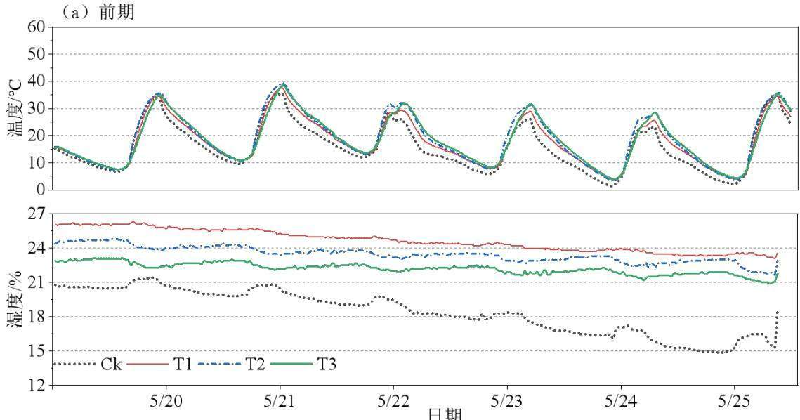

（b）前中期  
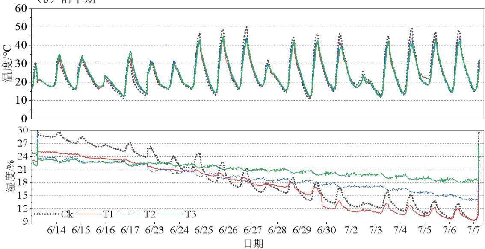

(c) 中期  
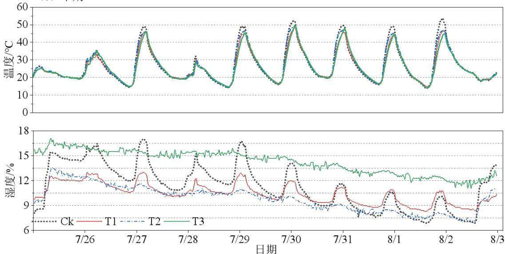

(e）后期  
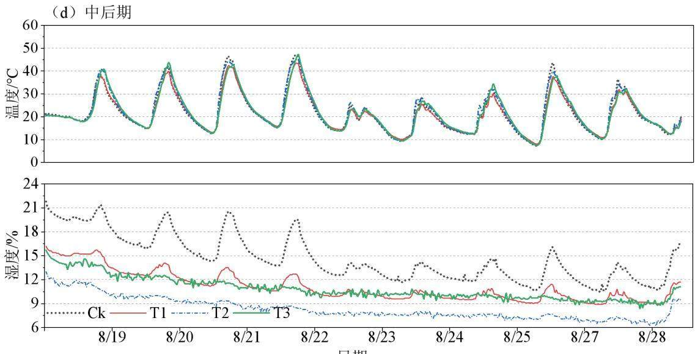

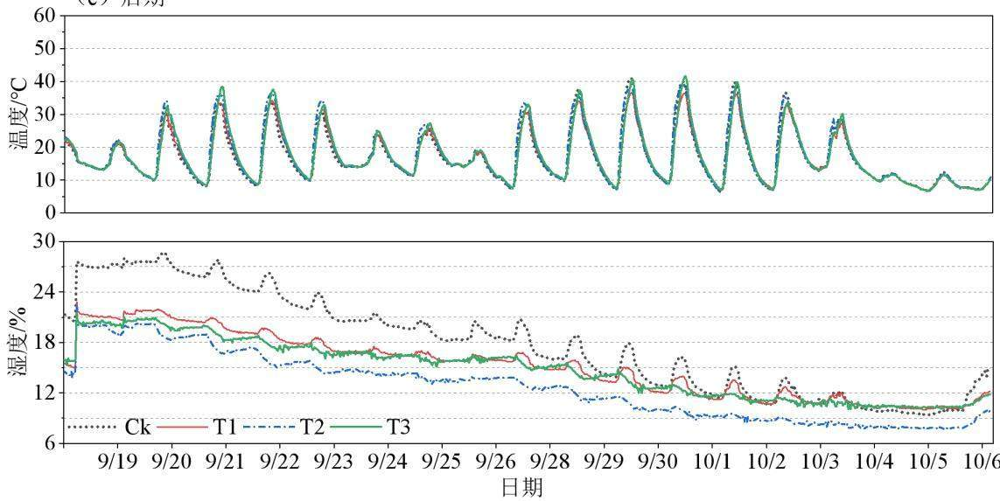  
图3-6 土壤温度/湿度变化曲线  
Figure 3-6 Change curves of soil temperature and humidity  
（五）后期土壤温度/湿度变化特征（09.18-10.06）

后期（09.18-10.06）土壤温度/湿度变化如图3-6（e）所示。对照组与试验组温度曲线均呈现周期性变化，温度最值出现的时间点大致相同。温度谷值差异不明显，温度峰值各组交替领先。CK、T1、T2、T3组的温度范围大致为5\~45C。

4组湿度曲线均呈现整体下降趋势，但CK、T1组曲线呈现明显的波形变化，T2、T3组曲线无明显波形变化。无水分补充的情况下，CK、T1组湿度出现明显的增大现象，而T2、T3组湿度增大现象不明显。

## （六）各时期土壤温度/湿度变化特征汇总

覆盖层厚度影响下的各时期土壤温度/湿度变化特征汇总如表3-5所示。

表3-5土壤温度/湿度变化特征汇总  
Table 3-5 Change characteristic of soil temperature and humidity
<table><tr><td>研 究 对 象</td><td>入手 点</td><td>组 别</td><td>前期</td><td>前中期</td><td>中期</td><td>中后期</td><td>后期</td></tr><tr><td>湿</td><td>无水</td><td>Ck</td><td>明显</td><td>明显</td><td>明显</td><td>明显</td><td>明显</td></tr><tr><td>度 变</td><td>分补 充下 湿度</td><td>T1</td><td>不明显</td><td>明显</td><td>明显</td><td>明显</td><td>明显</td></tr><tr><td>化 特 征</td><td>增大</td><td>T2</td><td>不明显</td><td>不明显</td><td>不明显</td><td>不明显</td><td>不明显</td></tr><tr><td></td><td>现象</td><td>T3</td><td>不明显 温度差异主</td><td>不明显 分为两个阶</td><td>不明显 温度谷值差</td><td>不明显</td><td>不明显 温度谷值差</td></tr><tr><td>温 度 变 化 特 征</td><td>温度 差异</td><td>Ck T1 T2 T3</td><td>要体现在从 峰值到谷值 的下降阶 段，温度顺 序为 T3 &gt; T2 &gt; T1 &gt; Ck。 同，且小于</td><td>段：前半段 温度差异类 似于前期； 后半段温度 谷值差异不 明显，温度 峰值差异显 著：试验组 温度大致相</td><td>异不明显， 温度峰值差 异显著：试 验组温度大 致相同，且 小于Ck组。</td><td>温度谷值差 异不明显， 温度峰值各 组交替领 先。</td><td>异不明显， 温度峰值各 组交替领 先。</td></tr></table>

## 3.4.3 土壤温度-湿度关联变化特征

## （一）前期土壤温度-湿度关联变化特征（05.21-05.22）

05.21-05.22的土壤温湿度日变化如图3-7（a）所示。前期土壤温度-湿度关联变化趋势为：CK组，温度上升阶段，湿度总体呈现增大趋势；温度下降阶段，湿度总体呈现减小趋势。T1组，湿度总体变化不明显，温度上升阶段，湿度增大到位于温度谷值与峰值之间的某一时刻，随后湿度减小；温度下降阶段，湿度总体呈现减小趋势。T2组，温度上升阶段，湿度总体呈现减小趋势；温度下降阶段，湿度总体呈现增大趋势。T3组，温度上升阶段，湿度总体呈现减小趋势；温度下降阶段，湿度总体呈现增大趋势。

## （二）前中期土壤温度-湿度关联变化特征（06.29-06.30）

06.29-06.30的土壤温湿度日变化如图3-7（b）所示。前中期土壤温度-湿度关联变化趋势为：CK组，温度上升阶段，湿度总体呈现增大趋势；温度下降阶段，湿度总体呈现减小趋势。T1组，温度上升阶段，湿度增大到位于温度谷值与峰值之间的某一时刻，随后湿度减小；温度下降阶段，湿度总体呈现减小趋势。T2组，温度上升阶段，湿度总体呈现减小趋势；温度下降阶段，湿度总体呈现增大趋势。T3组，温度上升阶段，湿度总体呈现减小趋势；温度下降阶段，湿度总体呈现增大趋势。

（三）中期土壤温度-湿度关联变化特征（07.29-07.30）

07.29-07.30的土壤温湿度日变化如图3-7（c）所示。中期土壤温度-湿度关联变化趋势为：CK组，温度上升阶段，湿度总体呈现增大趋势；温度下降阶段，湿度总体呈现减小趋势。T1组，温度上升阶段，湿度增大到位于温度谷值与峰值之间的某一时刻，随后湿度减小；温度下降阶段，湿度总体呈现减小趋势。T2组，温度上升阶段，湿度增大到位于温度谷值与峰值之间的某一时刻，随后湿度减小；温度下降阶段，湿度总体呈现减小趋势。T3组，温度上升阶段，湿度总体呈现减小趋势；温度下降阶段，湿度总体呈现增大趋势。

（四）中后期土壤温度-湿度关联变化特征（08.21-08.22）

08.21-08.22的土壤温湿度日变化如图3-7（d）所示。中后期土壤温度-湿度关联变化趋势为：CK组，温度上升阶段，湿度总体呈现增大趋势；温度下降阶段，湿度总体呈现减小趋势。T1组，温度上升阶段，湿度增大到位于温度谷值与峰值之间的某一时刻，随后湿度减小；温度下降阶段，湿度总体呈现减小趋势。T2组，温度上升阶段，湿度增大到位于温度谷值与峰值之间的某一时刻，随后湿度减小；温度下降阶段，湿度总体呈现减小趋势。T3组，温度上升阶段，湿度总体呈现减小趋势；温度下降阶段，湿度总体呈现增大趋势。

（五）后期土壤温度-湿度关联变化特征（09.29-09.30）

09.29-09.30的土壤温湿度日变化如图3-7（e）所示。后期土壤温度-湿度关联变化趋势为：CK组，温度上升阶段，湿度总体呈现增大趋势；温度下降阶段，湿度总体呈现减小趋势。T1组，温度上升阶段，湿度增大到位于温度谷值与峰值之间的某一时刻，随后湿度减小；温度下降阶段，湿度总体呈现减小趋势。T2组，温度上升阶段，湿度总体呈现减小趋势；温度下降阶段，湿度总体呈现增大趋势。T3组，温度上升阶段，湿度总体呈现减小趋势；温度下降阶段，湿度总体呈现增大趋势。

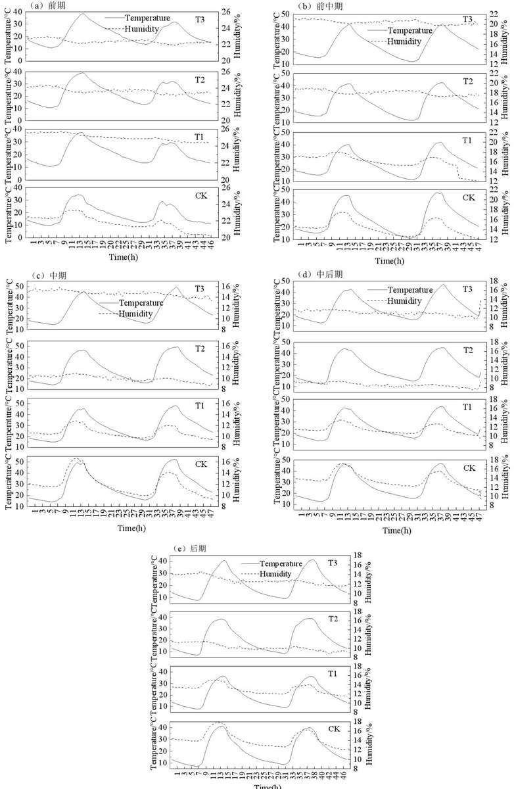  
图3-7 土壤温湿度日变化曲线  
Figure 3-7 Daily change curves of soil temperature and humidity

## （六）土壤温度-湿度关联变化特征汇总

覆盖层厚度影响下的各时期土壤温度-湿度关联变化特征汇总如表3-6所示。

表3-6 土壤温度-湿度关联变化特征汇总  
Table 3-6 Change characteristic of soil temperature-humidity
<table><tr><td>研究 对象</td><td>入手点</td><td>组别</td><td>前期</td><td>前中期</td><td>中期</td><td>中后期</td><td>后期</td></tr><tr><td rowspan="5">温度-湿 度关联变 化特征</td><td></td><td>Ck</td><td>协同</td><td>协同</td><td>协同</td><td>协同</td><td>协同</td></tr><tr><td>温度-湿</td><td>T1</td><td>温度上升阶段，湿度增大到位于温度谷值与峰值之间的 某一时刻，随后湿度减小；温度下降阶段，湿度减小。</td><td></td><td></td><td></td><td></td></tr><tr><td>度关联变 化趋势</td><td>T2</td><td>相反</td><td>相反</td><td>与 T1 一</td><td>与 T1一</td><td>相反</td></tr><tr><td></td><td>T3</td><td>相反</td><td>相反</td><td>致 相反</td><td>致</td><td></td></tr><tr><td></td><td></td><td></td><td></td><td></td><td>相反</td><td>相反</td></tr></table>

综上所述，无覆盖时土壤温度-湿度关联变化特征为：温度上升阶段，湿度总体呈现增大趋势；温度下降阶段，湿度总体呈现减小趋势。存在覆盖层时土壤温度-湿度关联变化特征主要有二：（①）T1组、T2组中期与中后期的土壤温度-湿度关联变化特征为：温度上升阶段，湿度增大到位于温度谷值与峰值之间的某一时刻，随后湿度减小；温度下降阶段，湿度减小；②T2组部分时期、T3组的土壤温度-湿度关联变化特征为：温度上升阶段，湿度总体呈现减小趋势；温度下降阶段，湿度总体呈现增大趋势。

## 3.5 土壤水-热变化特征差异性分析（Difference Analysis of SoilWater-Heat Variation Characteristics)

## 3.5.1 土壤温度变化特征差异性

## （一）温度峰值差异

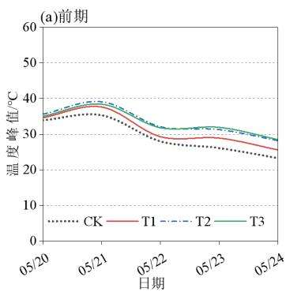

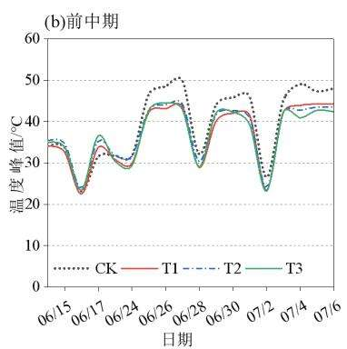  
图3-8 各时期温度峰值曲线

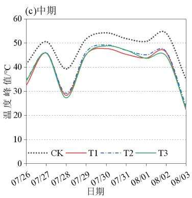  
Figure 3-8 Temperature peak curve of each period

各时期温度峰值曲线如图3-8所示。各时期温度峰值表现为：前期温度峰值大致呈现 ${ \mathrm { T } } 3 { \approx } { \mathrm { T } } 2 { \ > } { \mathrm { T } } 1 { \ > } { \mathrm { C k } }$ 的顺序，覆盖层具有一定的增温作用。前中期温度峰值Ck组最大，T1、T2、T3组交替领先，覆盖层具有一定的降温作用。中期温度峰值Ck组最大，T1、T2、T3组交替领先，覆盖层具有一定的降温作用。

表3-7不同时期覆盖层增加或降低温度峰值幅度（单位：℃）  
Table 3-7 Degree of overburden increases or decreases temperature peak of each period(Unit:C)
<table><tr><td>时期</td><td colspan="3">前期（增温）</td><td colspan="3">前中期（降温）</td><td colspan="3">中期（降温）</td></tr><tr><td>组别</td><td>T3-CK</td><td>T2-CK</td><td>T1-CK</td><td>CK-T3</td><td>CK-T2</td><td>CK-T1</td><td>CK-T3</td><td>CK-T2</td><td>CK-T1</td></tr><tr><td>1</td><td>1.1</td><td>1.7</td><td>0.7</td><td>4.0</td><td>4.5</td><td>5.4</td><td>7.2</td><td>6.8</td><td>9.0</td></tr><tr><td>2</td><td>3.1</td><td>3.8</td><td>2.3</td><td>3.0</td><td>1.7</td><td>3.2</td><td>12.0</td><td>10.3</td><td>11.0</td></tr><tr><td>3</td><td>3.8</td><td>4.1</td><td>1.3</td><td>3.5</td><td>3.2</td><td>3.8</td><td>5.4</td><td>5.0</td><td>6.6</td></tr><tr><td>4</td><td>5.8</td><td>5.2</td><td>2.8</td><td>3.3</td><td>2.5</td><td>3.1</td><td>7.0</td><td>5.6</td><td>6.9</td></tr><tr><td>5</td><td>5.2</td><td>4.9</td><td>2.3</td><td>8.1</td><td>6.3</td><td>5.1</td><td>12.1</td><td>11.2</td><td>12.7</td></tr><tr><td>均值</td><td>3.8</td><td>3.9</td><td>1.9</td><td>4.4</td><td>3.6</td><td>4.1</td><td>8.7</td><td>7.8</td><td>9.2</td></tr></table>

不同时期覆盖层增加或降低温度峰值幅度如表3-7所示。试验前期，试验组T1、T2、T3增温幅度平均值分别为 $1 . 9 , ~ 3 . 9 , ~ 3 . 8 ^ { \circ } \mathrm { C }$ ，增温效果为 ${ \mathrm { T } } 2 { \approx } { \mathrm { T } } 3 { > } { \mathrm { T } } 1$ 试验前中期，试验组T1、T2、T3降温幅度平均值分别为4.1、3.6、4.4℃，降温效果为前中期 $\mathrm { T } 3 \mathrm { > T } 1 \mathrm { > T } 2$ ；试验中期，试验组T1、T2、T3降温幅度平均值分别为9.2、7.8、 $8 . 7 ^ { \circ } \mathrm { C }$ ，降温效果为 $\mathrm { T } 1 { > } \mathrm { T } 2 { > } \mathrm { T } 3$ o

## （二）温度谷值差异

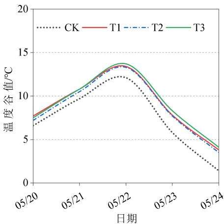  
图3-9各时期（前期）温度谷值曲线  
Figure 3-9 Temperature valley curve of each period

表3-8不同时期覆盖层增加或降低温度谷值幅度（单位： $^ { \circ } C )$  
Table 3-8 Degree of overburden increases or decreases temperature valley of each period(Unit:C)
<table><tr><td>时期</td><td colspan="2">前期 (增温)</td></tr><tr><td>组别</td><td>T3-CK</td><td>T2-CK T1-CK</td></tr><tr><td>1</td><td>0.9</td><td>0.6 1.1</td></tr><tr><td>2</td><td>1.1</td><td>1.1</td></tr><tr><td>3</td><td>1.6</td><td>1.3</td></tr><tr><td>4</td><td>2.5</td><td>1.9 2</td></tr><tr><td>5</td><td>2.7</td><td>2.1 2.4</td></tr><tr><td>均值</td><td>1.8</td><td>1.3 1.6</td></tr></table>

各时期温度谷值曲线如图3-9所示。各时期温度峰值表现为：前期温度谷值大致呈现 ${ \mathrm { T } } 3 { \mathrm { > T } } 2 { \approx } { \mathrm { T } } 1 { \mathrm { > C k } }$ 的顺序，覆盖层具有一定的增温作用。

不同时期覆盖层增加或降低温度谷值幅度如表3-8所示。试验前期，试验组T1、T2、T3增温幅度平均值分别为1.6、1.3、1.8℃，增温效果为 $\mathrm { T } 3 \mathrm { > T } 1 \mathrm { > T } 2$ O

## （三）温差差异

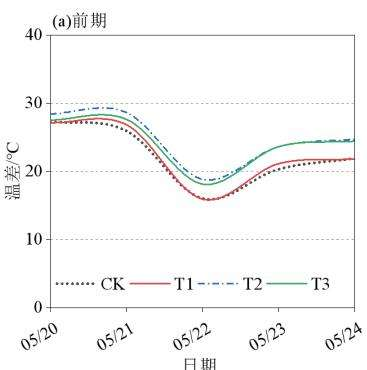

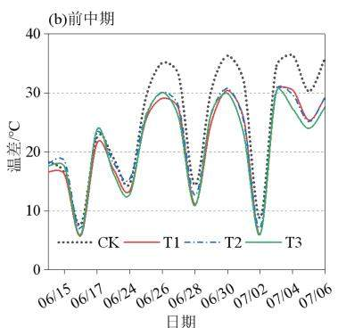

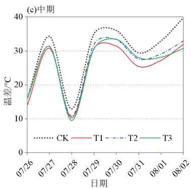

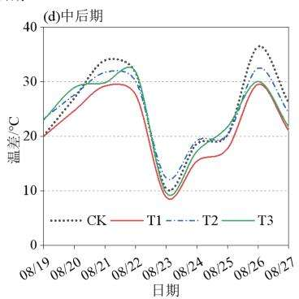

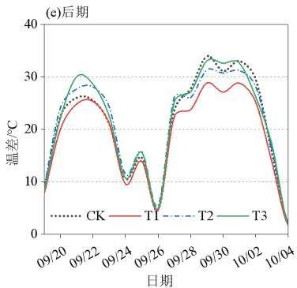  
图 3-10 各时期温差曲线  
Figure 3-10 Temperature difference curve of each period

表3-9不同时期覆盖层增加或降低温差幅度（单位：℃）  
Table 3-9 Degree of overburden increases or decreases temperature difference of each period(Unit:°C)
<table><tr><td>时期</td><td></td><td>前期</td><td></td><td></td><td>前中期</td><td></td><td></td><td>中期</td><td></td><td>中后期</td><td>后期</td></tr><tr><td>效果</td><td></td><td>增温</td><td></td><td></td><td>降温</td><td></td><td></td><td>降温</td><td></td><td>降温</td><td>降温</td></tr><tr><td>组别</td><td>T3</td><td>T2</td><td>T1</td><td>T3</td><td>T2</td><td>T1</td><td>T3</td><td>T2</td><td>T1</td><td>T1</td><td>T1</td></tr><tr><td>1</td><td>0.2</td><td>1.1</td><td>-0.2</td><td>5.0</td><td>5.0</td><td>6.0</td><td>0.1</td><td>-0.2</td><td>2.0</td><td>0.1</td><td>0.9</td></tr><tr><td>2</td><td>1.7</td><td>2.7</td><td>0.9</td><td>3.5</td><td>1.8</td><td>3.2</td><td>3.4</td><td>2.2</td><td>2.6</td><td>4.7</td><td>0.2</td></tr><tr><td>3</td><td>2.1</td><td>2.8</td><td>-0.1</td><td>6.4</td><td>5.5</td><td>5.9</td><td>2.6</td><td>2.7</td><td>4.6</td><td>1.6</td><td>0.7</td></tr><tr><td>4</td><td>3.3</td><td>3.3</td><td>0.8</td><td>2.8</td><td>1.7</td><td>2.7</td><td>4.8</td><td>3.8</td><td>5.7</td><td>2.5</td><td>4.0</td></tr><tr><td>5</td><td>2.5</td><td>2.8</td><td>-0.1</td><td>9.1</td><td>6.7</td><td>5.9</td><td>9.0</td><td>6.8</td><td>7.8</td><td>5.1</td><td>4.2</td></tr><tr><td>均值</td><td>2.0</td><td>2.5</td><td>0.3</td><td>5.4</td><td>4.1</td><td>4.7</td><td>4.0</td><td>3.1</td><td>4.5</td><td>2.8</td><td>2.0</td></tr></table>

各时期温差曲线如图3-10所示。各时期温差表现为：前期温差大致呈现T3${ \approx } \mathrm { T } 2 { \ > } \mathrm { T } 1 { > } \mathrm { C k }$ 的顺序，覆盖层具有一定的增温作用。前中期温差Ck组最大，T1、T2、T3组交替领先，覆盖层具有一定的降温作用。中期温差Ck组最大，T1、T2、T3组交替领先，覆盖层具有一定的降温作用。中后期温差T1组最小，

CK、T2、T3组交替领先，T1组相较于CK组温差减小，T1组覆盖层具有一定的降温作用。后期温差T1 组最小，CK、T2、T3组交替领先，T1 组相较于CK组温差减小，T1组覆盖层具有一定的降温作用。

不同时期覆盖层增加或降低温差幅度如表3-9所示。试验前期，试验组T1、T2、T3增温幅度平均值分别为 $2 . 0 , \ 2 . 5 , \ 0 . 3 ^ { \circ } \mathrm { C }$ ，增温效果为T2>T3>T1；试验前中期，试验组T1、T2、T3降温幅度平均值分别为5.4、4.1、4.7C，降温效果为前中期 $_ { \mathrm { T 3 > T 1 > T 2 } }$ ；试验中期，试验组T1、T2、T3降温幅度平均值分别为4.0、3.1、 $4 . 5 \mathrm { { ^ \circ C } }$ ，降温效果为 $\mathrm { T } 1 { > } \mathrm { T } 3 { > } \mathrm { T } 2$ ；试验中后期，试验组T1降温幅度平均值分别为 $2 . 8 ^ { \circ } \mathrm { C } ;$ 试验后期，试验组T1降温幅度平均值分别为 $2 . 0 \mathrm { { } ^ { \circ } C }$ O

不同时期覆盖层增加或降低温度效果汇总如表3-10所示。受气象温度的影响，不同时期砾石表现出不同的温度调控效果。在气温较低的前期（5月），覆盖层表现出增温效果，在气温较高的其他时期（6\~10月），覆盖层表现出降温效果。

表3-10 不同时期覆盖层增加或降低温度效果汇总  
Table 3-10 Effect of overburden increases or decreases temperature of each period
<table><tr><td>指标</td><td>前期</td><td>前中期</td><td>中期</td><td>中后期</td><td>后期</td></tr><tr><td>温度峰值</td><td>增温，T2≈T3 &gt;T1&gt;CK</td><td>降温，CK&gt; T3&gt;T1&gt;T2</td><td>降温，CK&gt; T1&gt;T2&gt;T3</td><td>无</td><td>无</td></tr><tr><td>温度谷值</td><td>增温，T3&gt;T1</td><td>无</td><td>无</td><td>无</td><td>无</td></tr><tr><td></td><td>&gt;T2&gt;CK 增温，T2&gt;T3</td><td>降温，CK&gt;</td><td>降温，CK&gt;</td><td>降温，CK&gt;</td><td>降温，CK&gt;</td></tr><tr><td>温差</td><td>&gt;T1&gt;CK</td><td>T3&gt;T1&gt;T2</td><td>T1&gt;T3&gt;T2</td><td>T1</td><td>T1</td></tr></table>

## 3.5.2 土壤湿度变化特征差异性

由上文的湿度变化特征可知，无水分补充的情况下，土壤湿度会出现增大现象，土壤湿度的日变化能清楚地区分为水分补给与水分损失2个阶段。无水分补充下湿度增大现象，称为逆湿[83]；湿度增大值，称为逆湿强度。

土壤逆湿现象，证明无降水下的土壤持水量并非只减不增，土壤水分有“支出”，也有“收入”。由土壤湿度变化特征可知，土壤湿度呈现周期性变化，一天内土壤水分经历补给和损失阶段，总体呈现“支出”状态，即土壤水分减少。以CK组05.20土壤湿度变化为例，水分补给阶段大致为6时(土壤湿度为20.8%)至14时（土壤湿度为21.5%）；水分损失阶段大致为14时至次日6时，水分损失结束时土壤湿度为20.3%，土壤湿度日变化量为-0.5%。

各时期土壤逆湿强度如表3-11所示。

表3-11土壤逆湿强度（单位：%）  
Table 3-11 Degree of moisture inversion(Unit:°C)
<table><tr><td rowspan="2">时 期</td><td rowspan="2">组 别</td><td colspan="11">日期/d</td><td rowspan="2">均 值</td></tr><tr><td></td><td>2</td><td>3</td><td>4</td><td>5</td><td>6</td><td>7</td><td>8</td><td>9</td><td>10</td><td>11</td><td>12</td><td>13</td></tr><tr><td rowspan="5">前 期</td><td>CK</td><td>0.8</td><td>0.8</td><td>0.7</td><td>1.0</td><td>0.7</td><td>1.5</td><td></td><td></td><td></td><td></td><td></td><td></td><td></td><td>0.9</td></tr><tr><td>T1</td><td>0.1</td><td>0.2</td><td>0.1</td><td>0.3</td><td>0.3</td><td>0.2</td><td></td><td></td><td></td><td></td><td></td><td></td><td></td><td>0.2</td></tr><tr><td>T2</td><td>0.2</td><td>0.3</td><td>0.3</td><td>0.3</td><td>0.6</td><td>0.5</td><td></td><td></td><td></td><td></td><td></td><td></td><td></td><td>0.4</td></tr><tr><td>T3</td><td>0.2</td><td>0.6</td><td>0.4</td><td>0.5</td><td>0.5</td><td>0.5</td><td></td><td></td><td></td><td></td><td></td><td></td><td></td><td>0.5</td></tr><tr><td>CK</td><td>3.4</td><td>4.5</td><td>4.4</td><td>2.4</td><td>3.3</td><td>4.3</td><td>3.5</td><td>0.6</td><td>3.5</td><td>3.8</td><td>3.1</td><td>3.2</td><td></td><td>3.3</td></tr><tr><td rowspan="3">前 中 期</td><td>T1</td><td>0.2</td><td>0.6</td><td>0.8</td><td>0.7</td><td>1.1</td><td>1.6</td><td>1.8</td><td>0.3</td><td>2.2</td><td>2.1</td><td>1.9</td><td>2.3</td><td></td><td>1.3</td></tr><tr><td>T2</td><td>0.8</td><td>0.7</td><td>0.5</td><td>0.9</td><td>0.4</td><td>0.8</td><td>0.6</td><td>0.2</td><td>0.4</td><td>0.5</td><td>0.2</td><td>0.1</td><td></td><td></td></tr><tr><td>T3</td><td>0.3</td><td>0.4</td><td>0.5</td><td>0.7</td><td>0.1</td><td>0.8</td><td>0.8</td><td>0.5</td><td>0.5</td><td>0.3</td><td>0.0</td><td>0.6</td><td></td><td>0.5 0.5</td></tr><tr><td rowspan="5">中 期</td><td>CK</td><td>2.1</td><td>4.9</td><td>4.4</td><td>5.1</td><td>4.1</td><td>2.7</td><td>2.8</td><td>3.2</td><td></td><td></td><td></td><td></td><td></td><td>3.7</td></tr><tr><td>T1</td><td>1.0</td><td>2.4</td><td>2.0</td><td>2.5</td><td>2.3</td><td>1.8</td><td>2.0</td><td>2.3</td><td></td><td></td><td></td><td></td><td></td><td>2.0</td></tr><tr><td>T2</td><td>0.0</td><td>0.3</td><td>0.2</td><td>0.4</td><td>0.5</td><td>0.4</td><td>0.4</td><td>0.5</td><td></td><td></td><td></td><td></td><td></td><td>0.3</td></tr><tr><td>T3</td><td>0.0</td><td>0.1</td><td>0.3</td><td>0.1</td><td>0.2</td><td>0.2</td><td>0.2</td><td>0.1</td><td></td><td></td><td></td><td></td><td></td><td></td></tr><tr><td>CK</td><td>1.9</td><td>4.3</td><td>6.2</td><td>5.6</td><td>1.5</td><td>2.3</td><td>2.8</td><td>5.4</td><td>3.4</td><td>6.3</td><td></td><td></td><td></td><td>0.2 4.0</td></tr><tr><td>中</td><td>T1</td><td>0.7</td><td>1.5</td><td>2.3</td><td>2.1</td><td>0.9</td><td>1.0</td><td>1.3</td><td>2.2</td><td>1.8</td><td>3.0</td><td></td><td></td><td></td><td></td></tr><tr><td>后 期</td><td>T2</td><td>0.4</td><td></td><td></td><td>0.4</td><td>0.0</td><td></td><td>0.0</td><td>0.5</td><td>0.5</td><td>2.8</td><td></td><td></td><td></td><td>1.7</td></tr><tr><td></td><td>T3</td><td></td><td>0.1</td><td>0.1</td><td></td><td></td><td>0.2</td><td></td><td></td><td>0.2</td><td>2.1</td><td></td><td></td><td></td><td>0.5</td></tr><tr><td></td><td>CK</td><td>0.2</td><td>0.1</td><td>0.3</td><td>0.9</td><td>0.0</td><td>0.0</td><td>0.0</td><td>0.2</td><td></td><td></td><td></td><td></td><td></td><td>0.4</td></tr><tr><td>后</td><td></td><td>2.1</td><td>2.1</td><td>1.9</td><td>0.7</td><td>0.8</td><td>2.2</td><td>2.4</td><td>2.7</td><td>4.0</td><td>3.6 1.9</td><td>3.6 2.3</td><td>3.1 1.9</td><td>1.2</td><td>2.3</td></tr><tr><td>期</td><td>T1</td><td>0.5</td><td>0.7</td><td>0.9</td><td>0.3</td><td>0.4</td><td>0.6</td><td>1.1</td><td>1.0</td><td>1.7 0.2</td><td>0.7</td><td>0.1</td><td></td><td>1.2</td><td>1.1</td></tr><tr><td></td><td>T2</td><td>0.4</td><td>0.6</td><td>0.6</td><td>0.5</td><td>0.4</td><td>0.5</td><td>0.5</td><td>0.1</td><td></td><td></td><td></td><td>0.7</td><td>0.3</td><td>0.4</td></tr><tr><td></td><td>T3</td><td>0.3</td><td>0.6</td><td>0.5</td><td>1.0</td><td>0.0</td><td>0.4</td><td>0.2</td><td>0.2</td><td>0.6</td><td>1.1</td><td>0.9</td><td>0.2</td><td>0.7</td><td>0.5</td></tr></table>

以49天的样本为例，CK、T1、T2、T3组的土壤逆湿强度均值分别为2.96%、1.31%、0.44%、0.41%，土壤逆湿强度的大小顺序为：CK>T1>T2>T3，覆盖层厚度改变了土壤逆湿强度，土壤逆湿强度随着覆盖层厚度的增加而减小。

土壤逆湿中水分补给阶段的存在使水分指标的计算变得复杂。例如，土壤水分日损失量变为水分损失阶段的土壤持水量的起始值与终了值之差（1.2%），与相邻两天同一时刻的土壤持水量之差（0.5%）存在明显出入。与此类似的还有累计土壤水分损失量等指标。但当研究过程以1d为单位时间时，即省略了水分补给阶段的影响，以每天同一时刻的土壤持水量数据为基础计算相关土壤水分指标依旧可行。

# 3.6覆盖层对植物生长影响因素作用机制（Mechanism ofOverburden Thickness on Influence Factors of Plant Growth)

覆盖层厚度对植物生长影响因素作用机制如表3-12所示。

表3-12 覆盖层厚度对植物生长影响因素作用机制  
Table 3-12 Mechanism of overburden thickness on influence factors of plant growth
<table><tr><td>影响因素</td><td>覆盖层厚度作用机制</td></tr><tr><td>容重</td><td>覆盖层厚度影响下的土壤容重发生轻度变异。</td></tr><tr><td>孔隙度</td><td>覆盖层厚度影响下的土壤孔隙度发生轻度变异。</td></tr><tr><td></td><td>饱和持水率覆盖层厚度影响下的土壤饱和持水率发生轻度变异。</td></tr><tr><td>质地</td><td>覆盖层厚度影响下的土壤质地发生中等程度变异。</td></tr><tr><td>温度</td><td>覆盖层具有增加或降低土壤温度的作用，不同厚度对应不同的增温或降温幅度。</td></tr><tr><td>湿度</td><td>覆盖层能有效抑制土壤水分损失，土壤水分损失速率随着覆盖层厚度的增加而减 小；覆盖层能改变土壤逆湿，逆湿强度随着覆盖层厚度的增加而减小。</td></tr><tr><td>关联变化度-湿度关联变化趋势。</td><td>温度-湿度覆盖层厚度影响土壤温度-湿度关联变化趋势，不同覆盖层厚度对应不同的土壤温</td></tr></table>

不同覆盖层厚度下植物生长影响因素并非单一的，植物生长差异性是多重因素共同作用的结果，容重、孔隙度、饱和持水率、质地、温度、水分等土壤环境因素对植物生长的影响机理复杂。其中，覆盖层厚度影响下的容重、孔隙度、饱和持水率以及质地的变异系数分别为2.6%、3.5%、4.9%、13%，差异性较小。笔者主要从温度、湿度、温度-湿度关联变化阐述覆盖层对植物生长影响因素的作用。

## （1）温度

砾石覆盖增加了地表粗糙度，且砾石颜色深，增加了砾石对太阳辐射的吸收能力，加之砾石热容量和导热率均小于土粒，因此具有升温快、散热快的特点[84]。试验期间，土壤温度峰值最高可达约 $5 5 \mathrm { { ^ \circ C } }$ ，覆盖层在大部分时期表现出降低土壤温度效果（试验周期为5\~10月，降温时期约为6\~10月），降温幅度最高达到8.7℃。当气象温度较高时，砾石覆盖层能吸收一定的太阳辐射，起到调节土壤温度的作用，使土壤温度的变化比较平稳。

## (2)湿度

①蓄水保墒。土壤水分损失速率随着覆盖层厚度的增加而减小，变异系数达到100%，覆盖层能有效抑制土壤水分损失，为无水分补充情况下植物生长保持更多水分，从而有助于植物生长发育。②改变土壤逆湿。覆盖层的存在相较于裸露表土改变了下垫面性质，直接影响了大气与地表接触面的物化性质，如土壤类型、粒径与含水率等，还可能影响到近地空气温度的变化规律，间接影响到水汽的运移规律，从而影响到土壤逆湿的形成。逆湿强度变异系数达到93%，差异性显著。

## （3）温度-湿度关联变化

根据上文土壤温度-湿度关联变化特征分析结果，覆盖层厚度影响土壤温度-湿度关联变化特征。

无覆盖层时，土壤逆湿的水分来源可能包括大气凝结水与土壤孔隙中空气凝结水，土壤温度-湿度关联变化特征形成机制可以概括为：一天内，土壤湿度经历补给与损失阶段。第一天，表层土壤湿度经历损失阶段，湿度不断减小，致使深层与表层土壤出现足够的水汽压梯度，深层土壤水分不断输送到表层土壤，表层土壤湿度经历补给阶段，即出现逆湿现象。而且，在水分补给阶段土壤温度不断升高，给予了土壤持续的热能供给，满足了水分汽化热的需要，为土壤水汽向上运移提供了动力。第二天，土壤水分损失阶段开始，表层土壤湿度在经历第一天的水分补给阶段后蓄积了充分的水汽压力，致使表层土壤与大气存在足够的水汽压梯度，土壤水分不断输送到大气中，土壤湿度下降，该阶段土壤水分主要受蒸发效应控制。水分损失阶段土壤温度不断下降，土壤热能不断散失，温度下降阶段结束，土壤热能不再满足水分蒸发的需要，土壤水分损失阶段结束。

存在覆盖层时，土壤逆湿的水分来源可能包括覆盖层孔隙中空气凝结水与土壤孔隙中空气凝结水。一方面，覆盖层的存在缩短了水分补给阶段、延长了水分损失阶段；另一方面，覆盖层改变了水分补给与损失阶段出现的时间，即土壤逆湿出现的时间。夜晚温度降低，地表大气水冷凝进入覆盖层，在重力作用以及毛细作用下补给表层土壤，故浅层土壤湿度增大，出现逆湿现象；温度升高阶段，土壤水分蒸发。

## 3.7 本章小结（Chapter Summary）

为分析覆盖层厚度影响下植物生长状况的差异性，并探讨不同覆盖层厚度下植物生长影响因素，进行针茅草种植试验，并进行土壤温湿度监测，试验结束后测定植物生长指标与土壤理化性质指标。结果表明：

（1）植物生长指标变异程度均为中等，变异系数为23\~50%，覆盖层影响下的植物生长状况差异性显著，T2组对植物生长的促进作用最显著。

（2）土壤容重、孔隙度、饱和持水率发生轻度变异，土壤质地发生中等程度变异，覆盖层厚度影响下的土壤性质差异性较小。

（3）无覆盖时土壤温度-湿度关联变化趋势为：温度上升阶段，湿度总体呈现增大趋势；温度下降阶段，湿度总体呈现减小趋势。T1组、T2组中期与中后期的土壤温度-湿度关联变化趋势为：温度上升阶段，湿度增大到位于温度谷值与峰值之间的某一时刻，随后湿度减小；温度下降阶段，湿度减小。T2组部分时期、T3组的土壤温度-湿度关联变化趋势为：温度上升阶段，湿度总体呈现减小趋势；温度下降阶段，湿度总体呈现增大趋势。

（4）不同时期覆盖层分别发挥增加或降低土壤温度的作用，不同厚度对应不同的增温或降温幅度；覆盖层能改变土壤逆湿强度，大致表现为逆湿强度随着覆盖层厚度的增加而减小。

## 4 覆盖层厚度对坡面植物生长影响研究

## 4 Study on Effect of Overburden Thickness on Plant Growth on Slope

为研究坡位与降水条件对不同覆盖层厚度下植物生长的影响，开展覆盖层厚度影响下的植物萌发与坡面植物生长试验。选取累积出苗数、最大苗长、最大苗长中值、最大苗长中值以上数量以及最大根长等作为衡量植物萌发的指标，分析覆盖层厚度对植物萌发的影响。以平台、坡上、坡中以及坡下为研究对象，选取黄叶数、青叶数等植物生长指标，揭示不同种植区域植物生长的差异；选取最大值（Max）、增长量（Δ）、增幅（r）以及增长速率（k）4个指标组成最大株高变化评价体系，研究降水条件对最大株高的影响。

供试土壤、砾石试样、试验前处理与第二章试验一致。试验置于室内，试验砾石粒径均为2\~5mm，4组装置的覆盖厚度依次是0mm（CK组）、10mm（T1组）、20mm（T2组）与30mm（T3组）。选择护坡固土性能、抗旱性能良好的黑麦草，分别进行植物萌发与坡面植物生长试验。

## 4.1 覆盖层厚度对植物萌发的影响（Effect of OverburdenThickness on Plant Germination)

种子萌发与幼苗发育属于早期植物生长，决定着植物对环境的适应性。覆盖层厚度影响下的植物萌发试验研究结果能丰富覆盖层对植物生长影响的研究，为坡面植物生长试验提供前期准备，同时为植物种植与覆盖层铺设时机提供指导依据。

植物萌发试验步骤如下：①整平：进行盆栽土壤整平，以疏松透气为宜，且不能有板结的泥块、杂物等；②播种：均匀播撒种子，各组种子数量分别为40颗，种子撒播完毕后在其表面覆上一层薄细土；③铺设覆盖层：播种后即按照设计厚度铺设覆盖层，试验方案如表所示；④降水：进行喷洒式降水，使得土壤湿润即可，各组降水量相同；种子发芽后避免阳光暴晒，出苗后每日保持土壤湿润。

选取累积出苗数、最大苗长、最大苗长中值、最大苗长中值以上数量以及最大根长等作为衡量植物萌发的指标。试验期间，对植物萌发相关指标进行连续监测，包括累计出苗数、最大苗长、最大苗长中值、最大苗长中值以上数量；试验结束后，测定最大根长。植物萌发试验如图4-1所示，0号、1号、2号、3号分别对应CK、T1、T2、T3组。

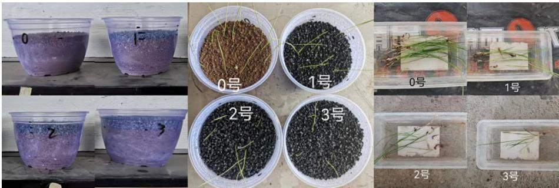  
图 4-1 植物萌发试验  
Figure 4-1 Plant germination test

植物萌发指标随时间变化规律如图4-2所示。由图4-2（a）所示，累积出苗数随时间变化曲线自上而下依次为CK、T1、T2、T3，累积出苗数呈现CK>T1≈T2>T3的顺序，且CK组远远超过T1、T2、T3组。由图4-2（b）所示，最大苗长随时间变化曲线自上而下依次为CK、T1、T2、T3，最终最大苗长呈现$\mathrm { C K } { > } \mathrm { T } 1 { \approx } \mathrm { T } 2 { > } \mathrm { T } 3$ 的顺序。由图4-2（c）所示，最大苗长中值呈现CK>T1≈T2>T3 的顺序，最大苗长中值以上数量呈现CK>T1≈T2>T3的顺序，且 CK组远远大于T1、T2、T3组。

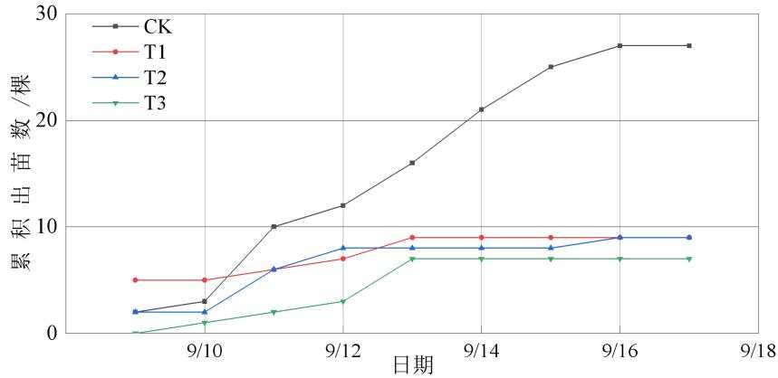

（a）累积出苗数随时间变化曲线  
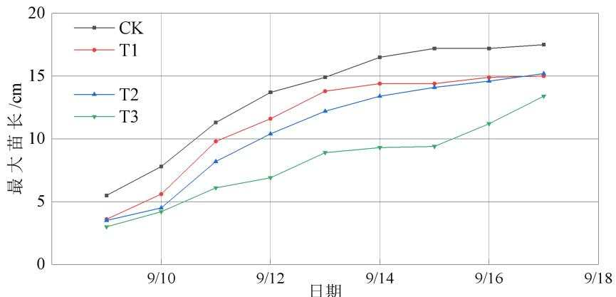  
（b）最大苗长随时间变化曲线

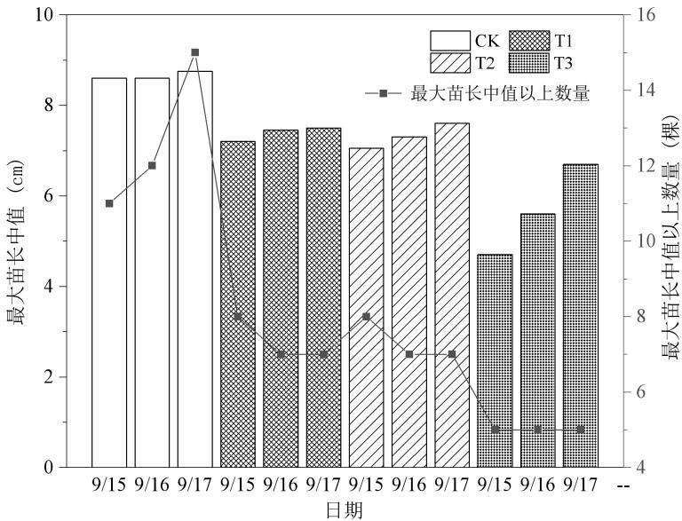  
（c） 最大苗长中值与最大苗长中值以上数量随时间变化规律图4-2 植物萌发指标随时间变化规律

Figure 4-2 variation of plant germination indexes with time表 4-1 植物萌发指标变异程度  
Table 4-1 Variation degree of plant germination indexes
<table><tr><td>组别</td><td>累积出苗数</td><td>最大苗长</td><td>最大苗长中值</td><td>最大苗长中值以上数量</td><td>最大根长</td></tr><tr><td>CK</td><td>27</td><td>17.5</td><td>8.75</td><td>15</td><td>2.2</td></tr><tr><td>T1</td><td>9</td><td>15.0</td><td>7.5</td><td>7</td><td>6.3</td></tr><tr><td>T2</td><td>9</td><td>15.2</td><td>7.6</td><td>7</td><td>4.2</td></tr><tr><td>T3</td><td>7</td><td>13.4</td><td>6.7</td><td>5</td><td>3.6</td></tr><tr><td>变异系数/%</td><td>72</td><td>11</td><td>11</td><td>52</td><td>42</td></tr><tr><td>变异程度</td><td>中等</td><td>中等</td><td>中等</td><td>中等</td><td>中等</td></tr></table>

植物萌发指标变异程度如表4-1所示。覆盖层厚度影响下的植物萌发指标的变异程度均为中等，变异系数为11\~72%，覆盖层厚度影响下的植物萌发状况差异性显著。其中累计出苗数、最大苗长、最大苗长中值、最大苗长中值以上数量均为CK组最大，顺序大致为 $\mathrm { C K } { > } \mathrm { T } 1 { \approx } \mathrm { T } 2 { > } \mathrm { T } 3$ ；最大根长为CK组最小，顺序为 $_ { \mathrm { T 1 > T 2 > T 3 > C K } }$ 。植物萌发时期，尽管覆盖层有利于促进根系生长发育，但对植株地上部分的抑制效果明显。

覆盖层厚度直接影响植物萌发的关键限制因子：温度、光照以及掩埋深度等。适宜的温度能提高种子吸水速率，同时还能加强酶促反应和呼吸作用，促进能量储存物质的分解，保证其他生理活动的正常进行[85]。地表覆盖砾石使得植物种子处于弱光甚至无光环境，种子储存的能量有限，无法有效从阳光中获取供萌发与幼苗生长的能量，从而导致萌发率降低以及生长状况变差。不同覆盖层厚度对应不同的种子掩埋深度，在掩埋深度较大时，即使种子能够萌发，幼苗短期内由于覆盖层阻力也难以穿过覆盖层，当种子内部营养物质消耗殆尽时幼苗存活期结束，使得出苗数急剧下降。因此，在利用种子恢复植被时，应避免覆盖物的掩埋。

## 4.2 坡面植物生长试验概况(Overview of Slope Plant Growth Test)

## 4.2.1 试验设计

边坡模型由两个台阶组成，台阶参数：高20cm，坡面角 $2 5 ^ { \circ }$ ；边坡平台宽度上部为15cm，下部为5cm。边坡形状如图4-3所示。将边坡上部台阶设定为植物种植区域，坡面划分为坡上、坡中、坡下，植物种植区域整体包括平台、坡上、坡中、坡下4个区域。

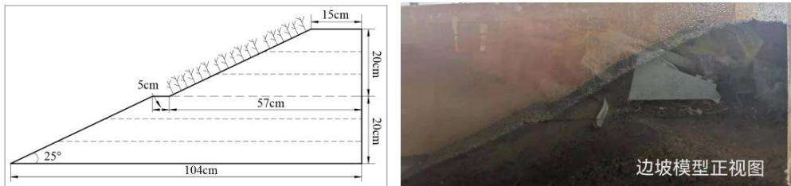  
图 4-3 边坡模型  
Figure 4-3 Slope model

08.12开展植物生长试验，步骤为整平、播种、降水、铺设覆盖层。其中整平、播种、降水的方法与植物萌发试验相同。09.05，将各组植株的株高统一修剪成5cm，各植物种植区域株数相同，按照设计厚度铺设覆盖层，如图4-4所示。

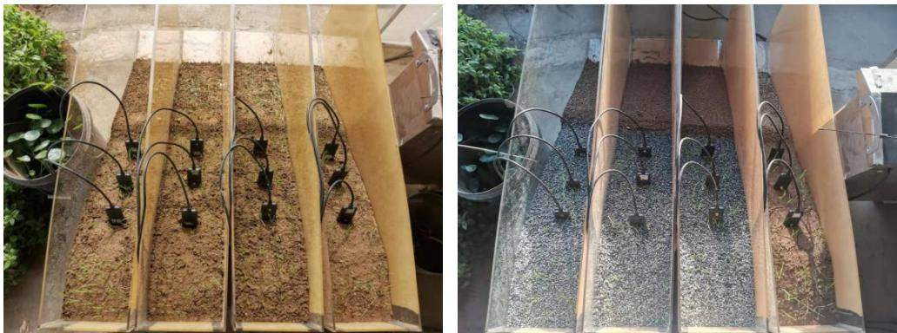  
图4-4 台阶铺设覆盖层前后对比  
Figure 4-4 Comparison of steps before and after laying overburden

严格调控降水频次，把较长时间尺度上才可能发生的降水事件与干旱事件控制到短时间尺度上实现。坡面植物生长试验的降水方案如表4-2所示，以月尺度下降水量为依据，方案1为高频次的小降水量降水方式，方案2设置一定的水分亏缺持续时间。

表4-2 坡面植物生长试验降水方案  
Table 4-2 Slope plant growth test precipitation scheme
<table><tr><td>方案</td><td>降水量/mm</td><td>降水频次</td><td>降水日期</td><td>降水次数</td><td>备注</td></tr><tr><td>1</td><td>10</td><td>1天1次</td><td>09.11~09.16</td><td>6</td><td>高频次</td></tr><tr><td>2</td><td>15</td><td>15天1次</td><td>10.01</td><td>1</td><td>低频次</td></tr></table>

## 4.2.2 试验现象

## （一）幼苗长势

播撒种子5天后，08.17夜晚至08.18早晨，种子破土而出形成幼苗，株高约2\~3.5cm，此时植物种植区域幼苗出芽不均匀，出芽率约50%；08.18夜晚至08.19早晨，幼苗出现明显生长形成植株，株高与出芽率同步增加，最大株高约3.5\~6cm，植物出芽率约70%；08.19夜晚至08.20早晨，植株长势明显，株高与出芽率继续同步增加，最大株高约6\~8cm，植物出芽率约 80%\~85%；到08.30，最大株高约15\~20cm，植株出现叶尖重力过大弯曲现象。

## （二）光照下植物长势差异

09.10，在下午的某时间段，发现试验装置出现“半阴半阳”现象：一部分被阳光直射，另一部分由于箱体存在呈现遮阴效果，如图所示。在“半阴半阳”现象中，铺设覆盖层的试验组中，被阳光直射的部分植株出现重度蔫萎，在覆盖层表面位置出现枯黄、倒伏现象，而遮阴部分植株长势正常；未铺设覆盖层的对照组中，阳光直射部分与遮阴部分的植株长势均正常，“半阴半阳”现象对无覆盖层组的植物长势影响不大，如图4-5所示。

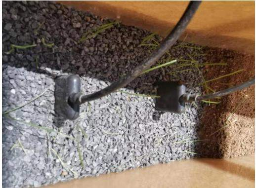

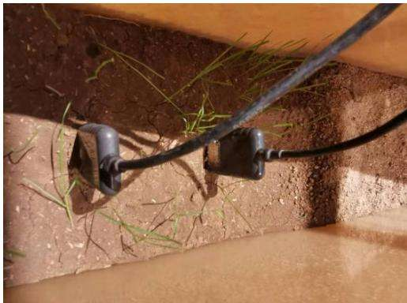  
图4-5“半阴半阳”下试验组与对照组植物长势对比  
Figure 4-5 Comparison of plant growth between the experimental group and the control group under "half shade and half sun"

为探究该现象出现的原因，笔者借助温湿度传感器与监测云平台，云平台数据如表4-3所示。究其原因，笔者认为在较强光照的影响下，覆盖层使得土壤温度以及与植株接触的覆盖层的温度升高，致使植株出现蔫萎现象。经过持续观察，发现该蔫萎现象不可逆，受害植株不能康复，最终枯落。

表4-309.10降水前0:00\~16:30土壤温度（单位：℃）  
Table 4-3 Soil temperature of 0:00 \~ 16:30 before precipitation at 09.10(Unit:°C)
<table><tr><td>温度</td><td>CK</td><td>T1</td><td>T2</td><td>T3</td></tr><tr><td>0:00温度</td><td>25.6</td><td>27.4</td><td>27.2</td><td>27.7</td></tr><tr><td>谷值</td><td>23.1</td><td>24.3</td><td>24.3</td><td>24.5</td></tr><tr><td>12:00 温度</td><td>24.7</td><td>26.0</td><td>25.5</td><td>26.2</td></tr><tr><td>峰值</td><td>33.0</td><td>34.9</td><td>33.5</td><td>33.9</td></tr></table>

## （三）水土流失

09.13，对各组装置实施相同强度的较强降水，裸露对照组相对于覆盖层试验组出现明显的水土流失现象，如图所示。砾石覆盖层能够增加坡面粗糙度，削弱雨滴溅蚀力，使得坡面径流速度变缓，减缓了过量水沿坡面的移动，从而抑制水土流失。翌日，裸露对照组植株出现严重的根部倒伏现象，而覆盖层试验组植株未出现倒伏现象，如图4-6所示。

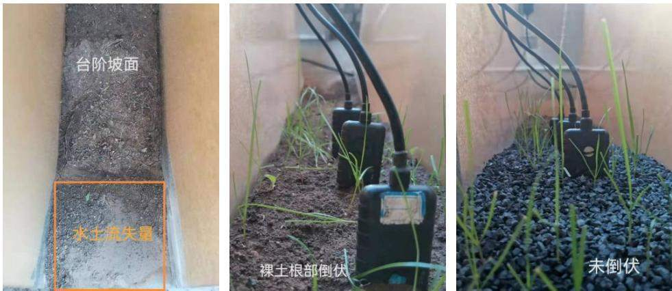  
图4-6 水土流失与植株根部倒伏  
Figure 4-6 Soil erosion and plant root lodging

## 4.3 不同种植区域植物生长差异性（Difference of Plant Growth inPlanting Areas)

09.06铺设覆盖层至09.10，期间实施频次为1天1次、单次水量为5mm的连续降水。09.09部分植株长势不良，出现明显的黄叶现象，黄叶数统计的日期为09.09\~09.12。青叶数统计的日期为09.13\~09.17，期间实施频次为1天1次、单次水量为10mm的连续降水（方案1）。

植物种植区域整体包括平台、坡上、坡中、坡下4个区域。坡位的生态效应主要是通过影响土壤属性和土壤发育过程而产生的，土壤及其中的水分和养分形成一个由源到汇的生态梯度[86]。在一定海拔范围内，坡位是影响天然植被组成特点的重要因素。不同种植区域黄叶数与青叶数分别如图4-7和4-8所示。

黄叶数的出现与植物受到生态于扰有关。如图4-7所示，随着时间推移，CK组不同种植区域总是呈现黄叶数为零的情况，无覆盖层时不同种植区域的植物均能正常生长。覆盖层的存在，使得T1、T2、T3组部分植株长势不良，出现明显的黄叶现象，植物生长收到于扰。T1组黄叶数始终呈现坡下>坡中>平台>坡上的情况；T2组黄叶数大致呈现坡中>坡下>平台>坡上的情况，统计日期结束时黄叶数的大小顺序为坡中>坡下>平台=坡上；T3组黄叶数大致呈现坡下>平台>坡中>坡上的情况，逐渐呈现坡下>平台>坡中>坡上的情况，统计日期结束时黄叶数的大小顺序为坡下>平台>坡中>坡上。覆盖层的存在使得影响植物生境的坡位生态效应得以产生，其中坡上的生态干扰最不强烈。

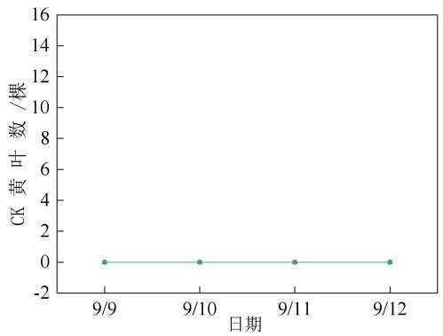

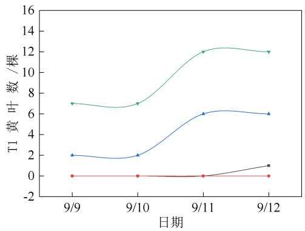

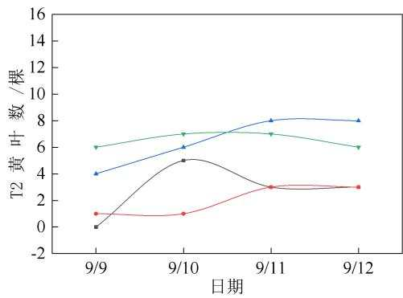

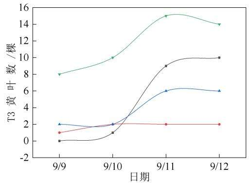  
平台→ 坡上→ 坡中 坡下  
图4-7 不同种植区域黄叶数差异

Figure 4-7 Number of yellow leaves in different planting areas  
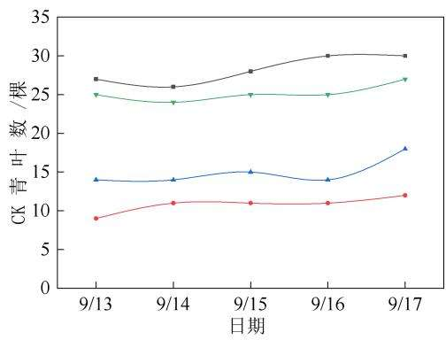

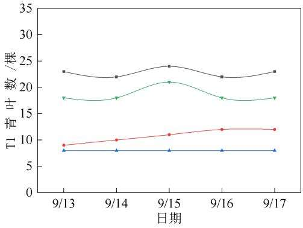

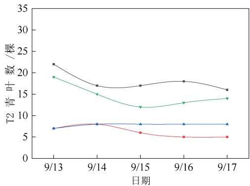

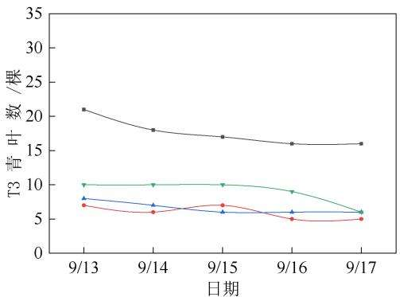  
平台→ 坡上→ 坡中→ 坡下  
图4-8 不同种植区域青叶数差异  
Figure 4-8 Number of green leaves in different planting areas  
青叶数在一定程度上能反映植物生长情况。如图4-8所示，随着时间推移，

CK组青叶数始终呈现平台>坡下>坡中>坡上的情况；T1组青叶数始终呈现平台>坡下>坡上>坡中的情况；T2组青叶数大致呈现平台>坡下>坡中≥坡上的情况，逐渐呈现平台>坡下>坡中>坡上的情况；T3组青叶数大致呈现平台>坡下≥坡中>坡上的情况，逐渐呈现平台>坡下≥坡中>坡上的情况，统计日期结束时青叶数的大小顺序为平台>坡下=坡中>坡上。不同覆盖层厚度下的青叶数均表现为平台最大，平台的植物生长情况最佳。

## 4.4降水条件对最大株高的影响（Effect of Precipitation Conditions on Maximum Plant Height)

水分是植物生长的主要限制因子之一，植物对降水条件的改变高度敏感，降水条件对草本植物的影响应当是生态修复研究领域关注的重点问题。研究表明，植物对土壤水分胁迫有着复杂的调控反馈机制，水分亏缺并不总是降低产量，适度的水分亏缺有些作物并不减产[87]。

株高在一定程度上能反映作物的生长情况和营养状况[88]，不仅是影响株型的决定性因素之一，而且是一个决定作物种植密度进而影响产量的主要农艺性状[89]。研究表明，株高可以用于作物地上生物量和叶面积指数的估算[90-91]。根据试验统计数据，选取最大值（Max）、增长量（Δ）、增幅（r）以及增长速率（k）4个指标组成最大株高变化评价体系。其中，最大值（Max）、增长量（Δ）、增幅（r）作为最大株高变化基础特征，可由统计数据直接获得或经计算求得。由最大株高-时间回归分析结果可知，最大株高与时间成线性关系，增长速率（k）即为线性回归线斜率。根据最大株高变化基础特征，结合线性回归结果，对最大株高变化进行评价，探讨覆盖层最优厚度。

## （一）最大株高变化特征对降水条件的响应

高/低频次降水下最大株高最大值、增长量、增幅如表4-4和4-5所示。

表4-4 高频次降水下最大株高变化  
Table 4-4 Maximum plant height variation under high frequency precipitation
<table><tr><td colspan="2" rowspan="2"></td><td colspan="4">平台</td><td colspan="4">坡上</td></tr><tr><td>CK</td><td>T1</td><td>T2</td><td>T3</td><td>CK</td><td>T1</td><td>T2</td><td>T3</td></tr><tr><td></td><td>09.12</td><td>10.5</td><td>12.3</td><td>11</td><td>9.8</td><td>11.7</td><td>12.1</td><td>12.7</td><td>10.5</td></tr><tr><td>生</td><td>09.13</td><td>11.1</td><td>13.7</td><td>12.2</td><td>11.7</td><td>12</td><td>13.3</td><td>12.7</td><td>11.2</td></tr><tr><td>长</td><td>09.14</td><td>12.4</td><td>14.1</td><td>13.2</td><td>12.1</td><td>12</td><td>14.4</td><td>13</td><td>12.3</td></tr><tr><td>目</td><td>09.15</td><td>13.9</td><td>14.1</td><td>14.2</td><td>13.8</td><td>13.1</td><td>16.2</td><td>13.3</td><td>13.1</td></tr><tr><td>期</td><td>09.16</td><td>13.9</td><td>15.6</td><td>14.7</td><td>14.7</td><td>13.1</td><td>18.4</td><td>13.7</td><td>15.4</td></tr><tr><td></td><td>09.17</td><td>15.2</td><td>15.8</td><td>14.7</td><td>15.2</td><td>14.4</td><td>19.8</td><td>15.1</td><td>15.9</td></tr><tr><td colspan="2">最大值/cm</td><td>15.2</td><td>15.8</td><td>14.7</td><td>15.2</td><td>14.4</td><td>19.8</td><td>15.1</td><td>15.9</td></tr><tr><td colspan="2">增长量/cm</td><td>4.7</td><td>3.5</td><td>3.7</td><td>5.4</td><td>2.7</td><td>7.7</td><td>2.4</td><td>5.4</td></tr><tr><td colspan="2">增幅/%</td><td>44.76</td><td>28.46</td><td>33.64</td><td>55.1</td><td>23.08</td><td>63.64</td><td>18.9</td><td>51.43</td></tr><tr><td rowspan="2"></td><td rowspan="2"></td><td colspan="4">坡中</td><td colspan="4">坡下</td></tr><tr><td>CK</td><td>T1</td><td>T2</td><td>T3</td><td>CK</td><td>T1</td><td>T2</td><td>T3</td></tr><tr><td></td><td>09.12</td><td>12.7</td><td>11.4</td><td>10.4</td><td>16.2</td><td>17</td><td>12.5</td><td>13.1</td><td>10.8</td></tr><tr><td>生</td><td>09.13</td><td>13.3</td><td>12.4</td><td>11.3</td><td>17.5</td><td>19.5</td><td>13.9</td><td>13.5</td><td>10.8</td></tr><tr><td>长</td><td>09.14</td><td>14.1</td><td>13</td><td>12.5</td><td>18.1</td><td>20.2</td><td>15.6</td><td>13.5</td><td>10.8</td></tr><tr><td>日</td><td>09.15</td><td>14.9</td><td>13</td><td>13.1</td><td>18.3</td><td>20.3</td><td>16.4</td><td>14.7</td><td>10.9</td></tr><tr><td>期</td><td>09.16</td><td>17.1</td><td>13</td><td>14.7</td><td>19.1</td><td>21.6</td><td>17.6</td><td>16.5</td><td>11.6</td></tr><tr><td></td><td>09.17</td><td>18.5</td><td>13</td><td>16.9</td><td>19.1</td><td>21.6</td><td>18.1</td><td>16.6</td><td>12.4</td></tr><tr><td colspan="2">最大值/cm</td><td>18.5</td><td>13</td><td>16.9</td><td>19.1</td><td>21.6</td><td>18.1</td><td>16.6</td><td>12.4</td></tr><tr><td colspan="2">增长量/cm</td><td>5.8</td><td>1.6</td><td>6.5</td><td>2.9</td><td>4.6</td><td>5.6</td><td>3.5</td><td>1.6</td></tr><tr><td colspan="2">增幅/%</td><td>45.67</td><td>14.04</td><td>62.5</td><td>17.9</td><td>27.06</td><td>44.8</td><td>26.72</td><td>14.81</td></tr></table>

表4-5低频次降水下最大株高变化

Table 4-5 Maximum plant height variation under low frequency precipitation
<table><tr><td rowspan="2" colspan="2"></td><td colspan="4">平台</td><td colspan="4">坡上</td></tr><tr><td>CK</td><td>T1</td><td>T2</td><td>T3</td><td>CK</td><td>T1</td><td>T2</td><td>T3</td></tr><tr><td></td><td>10.03</td><td>10</td><td>10</td><td>10</td><td>10</td><td>10</td><td>10</td><td>10</td><td>10</td></tr><tr><td></td><td>10.05</td><td>14.7</td><td>16.7</td><td>15.5</td><td>16</td><td>15.4</td><td>15.6</td><td>16.3</td><td>14.8</td></tr><tr><td>生</td><td>10.06</td><td>15.7</td><td>17.5</td><td>16.9</td><td>17.6</td><td>17.5</td><td>17.1</td><td>17.5</td><td>16.4</td></tr><tr><td>长</td><td>10.07</td><td>16.5</td><td>18.1</td><td>18.2</td><td>18.8</td><td>17.7</td><td>17.5</td><td>18.3</td><td>17.4</td></tr><tr><td>日</td><td>10.08</td><td>18.4</td><td>21.1</td><td>19.4</td><td>20.4</td><td>17.7</td><td>19.3</td><td>19.8</td><td>18.4</td></tr><tr><td>期</td><td>10.09</td><td>19.5</td><td>23.5</td><td>20.7</td><td>22.7</td><td>19</td><td>22.5</td><td>21.7</td><td>20.3</td></tr><tr><td></td><td>10.10</td><td>22</td><td>27.5</td><td>23.1</td><td>25.1</td><td>21.3</td><td>25.5</td><td>24.1</td><td>22.6</td></tr><tr><td></td><td>10.11</td><td>23.1</td><td>29.8</td><td>24.2</td><td>27.3</td><td>22.4</td><td>27.6</td><td>26</td><td>25.1</td></tr><tr><td colspan="2">最大值/cm</td><td>23.1</td><td>29.8</td><td>24.2</td><td>27.3</td><td>22.4</td><td>27.6</td><td>26</td><td>25.1</td></tr><tr><td colspan="2">增长量/cm</td><td>13.1</td><td>19.8</td><td>14.2</td><td>17.3</td><td>12.4</td><td>17.6</td><td>16</td><td>15.1</td></tr><tr><td colspan="2">增幅/%</td><td>131</td><td>198</td><td>142</td><td>173</td><td>124</td><td>176</td><td>160</td><td>151</td></tr><tr><td colspan="2"></td><td colspan="4">坡中</td><td colspan="4">坡下</td></tr><tr><td></td><td></td><td>CK</td><td>T1</td><td>T2</td><td>T3</td><td>CK</td><td>T1</td><td>T2</td><td>T3</td></tr><tr><td></td><td>10.03</td><td>10</td><td>10</td><td>10</td><td>10</td><td>10</td><td>10</td><td>10</td><td>10</td></tr><tr><td></td><td>10.05</td><td>14.7</td><td>15.5</td><td>16.5</td><td>17.9</td><td>15.6</td><td>15.3</td><td>14.4</td><td>14.4</td></tr><tr><td>生</td><td>10.06</td><td>15.4</td><td>16.6</td><td>18</td><td>18</td><td>15.8</td><td>16.3</td><td>16.7</td><td>17.9</td></tr><tr><td>长</td><td>10.07</td><td>16.2</td><td>16.8</td><td>18.7</td><td>18.8</td><td>16.4</td><td>16.6</td><td>17.8</td><td>19.5</td></tr><tr><td>日</td><td>10.08</td><td>19.4</td><td>18.7</td><td>20.4</td><td>19</td><td>18.6</td><td>17.3</td><td>19.6</td><td>21.5</td></tr><tr><td>期</td><td>10.09</td><td>20.1</td><td>20.7</td><td>22.1</td><td>19.9</td><td>19.7</td><td>18.7</td><td>20.9</td><td>23.7</td></tr><tr><td></td><td>10.10</td><td>21.2</td><td>23.1</td><td>23.6</td><td>21.2</td><td>23.1</td><td>20.3</td><td>23.2</td><td>26.7</td></tr><tr><td></td><td>10.11</td><td>22.8</td><td>24.7</td><td>26.1</td><td>23.3</td><td>25.1</td><td>23.1</td><td>24.9</td><td>28.8</td></tr><tr><td colspan="2">最大值/cm</td><td>22.8</td><td>24.7</td><td>26.1</td><td>23.3</td><td>25.1</td><td>23.1</td><td>24.9</td><td>28.8</td></tr><tr><td colspan="2">增长量/cm</td><td>12.8</td><td>14.7</td><td>16.1</td><td>13.3</td><td>15.1</td><td>13.1</td><td>14.9</td><td>18.8</td></tr><tr><td colspan="2">增幅/%</td><td>1.28</td><td>147</td><td>161</td><td>133</td><td>151</td><td>131</td><td>149</td><td>188</td></tr></table>

## （二）高/低频次降水下最大株高-时间回归分析

根据最大株高测定数据，得到的高/低频次降水下的最大株高-时间线性回归

结果如图4-9所示，最大株高随时间变化规律类似线性关系。

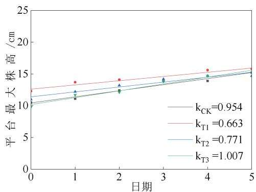

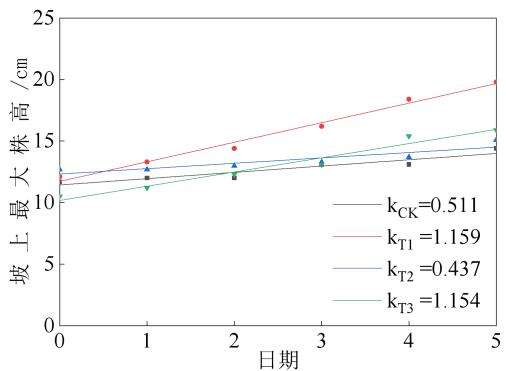

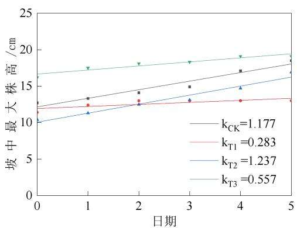

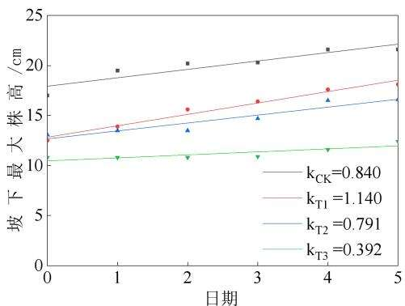  
图4-9 高频次降水下最大株高-时间线性回归曲线与斜率

Figure 4-9 Linear regression curve and slope between maximum plant height and time under high frequency precipitation  
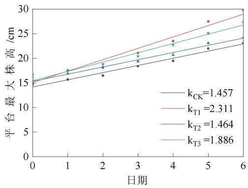

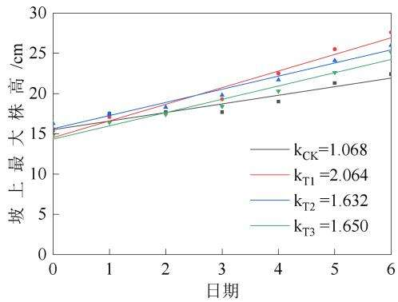

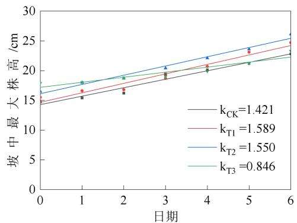

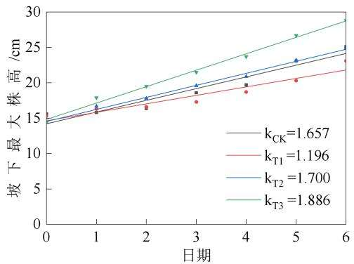  
图4-10低频次降水下最大株高-时间线性回归曲线与斜率  
Figure 4-10 Linear regression curve and slope between maximum plant height and time under low frequency precipitation

## （三）降水条件下最优覆盖层厚度综合评价

当各指标间的单项最优厚度一致时，认为综合最优厚度与单项最优厚度一致；当各指标间的单项最优厚度不一致时，为了得到综合最优厚度，考虑从线性回归结果入手，进行相关线性回归方程联合求解，并结合降水频次，确定最终的综合最优厚度。

表4-6 高频次降水下最大株高变化评价结果  
Table 4-6 Evaluation results of maximum plant height change under high frequency precipitation
<table><tr><td>区域</td><td>指标</td><td>CK</td><td>T1</td><td>T2</td><td>T3</td><td>单项最优厚度</td><td>综合最优厚度</td></tr><tr><td rowspan="4">平台</td><td>Max/cm</td><td>15.2</td><td>15.8</td><td>14.7</td><td>15.2</td><td>T1</td><td rowspan="4"></td></tr><tr><td>∆cm</td><td>4.7</td><td>3.5</td><td>3.7</td><td>5.4</td><td>T3</td></tr><tr><td>r/%</td><td>44.76</td><td>28.46</td><td>33.64</td><td>55.10</td><td>T3</td></tr><tr><td>k（cm/d)</td><td>0.954</td><td>0.663</td><td>0.771</td><td>1.007</td><td>T3</td></tr><tr><td rowspan="4">坡上</td><td>Max/cm</td><td>14.4</td><td>19.8</td><td>15.1</td><td>15.9</td><td>T1</td><td rowspan="4">T1</td></tr><tr><td>∆/cm</td><td>2.7</td><td>7.7</td><td>2.4</td><td>5.4</td><td>T1</td></tr><tr><td>r/%</td><td>23.08</td><td>63.64</td><td>18.90</td><td>51.43</td><td>T1</td></tr><tr><td>k（cm/d)</td><td>0.511</td><td>1.159</td><td>0.437</td><td>1.154</td><td>T1</td></tr><tr><td rowspan="4">坡中</td><td>Max/cm</td><td>18.5</td><td>13</td><td>16.9</td><td>19.1</td><td>T3</td><td rowspan="4">T2</td></tr><tr><td>∆/cm</td><td>5.8</td><td>1.6</td><td>6.5</td><td>2.9</td><td>T2</td></tr><tr><td>r/%</td><td>45.67</td><td>14.04</td><td>62.50</td><td>17.90</td><td>T2</td></tr><tr><td>k（cm/d)</td><td>1.177</td><td>0.283</td><td>1.237</td><td>0.557</td><td>T2</td></tr><tr><td rowspan="4">坡下</td><td>Max/cm</td><td>21.6</td><td>18.1</td><td>16.6</td><td>12.4</td><td>CK</td><td rowspan="4">T1</td></tr><tr><td>∆/cm</td><td>4.6</td><td>5.6</td><td>3.5</td><td>1.6</td><td>T1</td></tr><tr><td>r/%</td><td>27.06</td><td>44.80</td><td>26.72</td><td>14.81</td><td>T1</td></tr><tr><td>k（cm/d)</td><td>0.840</td><td>1.140</td><td>0.791</td><td>0.392</td><td>T1</td></tr></table>

表4-7低频次降水下最大株高变化评价结果

Table 4-7 Evaluation results of maximum plant height change under low frequency precipitation
<table><tr><td>区域</td><td>指标</td><td>CK</td><td>T1</td><td>T2</td><td>T3</td><td>单项最优厚度</td><td>综合最优厚度</td></tr><tr><td rowspan="4">平台</td><td>Max/cm</td><td>23.1</td><td>29.8</td><td>24.2</td><td>27.3</td><td>T1</td><td rowspan="4"></td></tr><tr><td>∆/cm</td><td>13.1</td><td>19.8</td><td>14.2</td><td>17.3</td><td>T1</td></tr><tr><td>r/%</td><td>131</td><td>198</td><td>142</td><td>173</td><td>T1</td></tr><tr><td>k（cm/d)</td><td>1.457</td><td>2.311</td><td>1.464</td><td>1.886</td><td>T1</td></tr><tr><td rowspan="4">坡上</td><td>Max/cm</td><td>22.4</td><td>27.6</td><td>26</td><td>25.1</td><td>T1</td><td rowspan="4">T1</td></tr><tr><td>∆/cm</td><td>12.4</td><td>17.6</td><td>16</td><td>15.1</td><td>T1</td></tr><tr><td>r/%</td><td>124</td><td>176</td><td>160</td><td>151</td><td>T1</td></tr><tr><td>k(cm/d)</td><td>1.068</td><td>2.064</td><td>1.632</td><td>1.650</td><td>T1</td></tr><tr><td rowspan="4">坡中</td><td>Max/cm</td><td>22.8</td><td>24.7</td><td>26.1</td><td>23.3</td><td>T2</td><td rowspan="4">T2</td></tr><tr><td>∆/cm</td><td>12.8</td><td>14.7</td><td>16.1</td><td>13.3</td><td>T2</td></tr><tr><td>r/%</td><td>1.28</td><td>147</td><td>161</td><td>133</td><td>T2</td></tr><tr><td>k（cm/d)</td><td>1.421</td><td>1.589</td><td>1.550</td><td>0.846</td><td>T1</td></tr><tr><td rowspan="4">坡下</td><td>Max/cm</td><td>25.1</td><td>23.1</td><td>24.9</td><td>28.8</td><td>T3</td><td rowspan="4">T3</td></tr><tr><td>∆/cm</td><td>15.1</td><td>13.1</td><td>14.9</td><td>18.8</td><td>T3</td></tr><tr><td>r/%</td><td>151</td><td>131</td><td>149</td><td>188</td><td>T3</td></tr><tr><td>k(cm/d)</td><td>1.657</td><td>1.196</td><td>1.700</td><td>1.886</td><td>T3</td></tr></table>

高/低频次降水下评价指标分别对应的覆盖层最优厚度如表4-6和表4-7所示。部分区域不同指标对应的单项最优厚度不一致，高频次降水下不同指标对应的单项最优厚度不一致的区域为平台、坡中、坡下，低频次降水下不同指标对应的单项最优厚度不一致的区域为坡中。

如表4-6所示，高频次降水下，坡上区域4个指标对应的最优厚度均为T1，因此，坡上的综合最优厚度容易确定，即为单项最优厚度T1。平台的增长量、增幅、增长率对应的最优厚度均为T3，而最大值对应的最优厚度为T1；坡中的增长量、增幅、增长率对应的最优厚度均为T2，而最大值对应的最优厚度为T3；坡下的增长量、增幅、增长率对应的最优厚度均为T1，而最大值对应的最优厚度为CK。平台、坡中、坡下区域4个指标对应的最优厚度不一致，无法确定综合最优厚度。

表4-8为高频次降水下不同区域单项最优厚度线性回归结果。  
表4-8 高频次降水下不同区域单项最优厚度线性回归结果  
Table 4-8 Linear regression results of single optimal thickness in different regions under high frequency precipitation
<table><tr><td>指标</td><td>平台</td><td>坡中</td><td>坡下</td></tr><tr><td>Max</td><td>T1：y=0.663x+12.610</td><td>T3：y=0.557x+16.657</td><td>CK：y=0.840x+17.933</td></tr><tr><td>Δ、r、k</td><td>T3：y=1.007x+10.190</td><td>T2：y=1.237x+10.057</td><td>T1：y=1.140x+12.833</td></tr></table>

根据线性回归结果，平台T3 组最大株高超过T1 组最大株高的日期为7.0d，坡中 T2 组最大株高超过T3 组最大株高的日期为 9.7d，坡下 T1 组最大株高超过CK组最大株高的日期为17.0d。因此，平台、坡中、坡下区域的综合最优厚度分别为T3、T2、T1，限制日期分别为7.0d、9.7d、17.0d。

如表4-7所示，低频次降水下，平台区域4个指标对应的最优厚度均为T1，坡上区域4个指标对应的最优厚度均为T1，坡下区域4个指标对应的最优厚度均为T3。因此，平台、坡上与坡下的综合最优厚度容易确定，即与单项最优厚度一致，分别为T1、T1与T3。坡中区域4个指标对应的最优厚度不一致，最大值、增长量、增幅对应的最优厚度均为T2，而增长率对应的最优厚度为T1，无法确定综合最优厚度。

由线性回归结果可知，坡中区域T1、T2组的线性回归方程分别为$\mathrm { y } { = } 1 . 5 8 9 \mathrm { x } { + } 1 4 . 6 7 5$ 、y=1.550x+16.121，根据线性回归结果，T1 组最大株高超过T2组最大株高的日期为37.1d，而该方案下降水频次为15d/次，在15d内最大株高的大小满足T2>T1。因此，坡中区域的综合最优厚度确定为T2。

最终确定的高/低频次下不同种植区域综合最优厚度汇总如表4-9所示。在植物生长期间，各砾石覆盖厚度相较于CK组均表现出明显优势，这与砾石良好的调温保水效果有着直接的关系。

表4-9高/低频次降水下综合最优厚度汇总  
Table 4-9 Summary of comprehensive optimal thickness under high/low frequency
<table><tr><td>植物种植区域</td><td>高频次降水</td><td>低频次降水</td></tr><tr><td>平台</td><td>T3（限制日期：7.0d）</td><td>T1</td></tr><tr><td>坡上</td><td>T1</td><td>T1</td></tr><tr><td>坡中</td><td>T2（限制日期：9.7d）</td><td>T2</td></tr><tr><td>坡下</td><td>T1（限制日期：17.0d）</td><td>T3</td></tr></table>

## 4.5 本章小结（Chapter Summary）

为研究坡位与降水条件对覆盖层厚度下植物生长的影响，进行覆盖层厚度影响下的植物萌发与坡面植物生长试验，选取相关植物萌发与植物生长指标，利用人工测量手段进行试验数据采集。结果表明：

（1）植物萌发时期，尽管覆盖层有利于促进根系生长发育，但对植株地上部分的抑制效果明显。

（2）覆盖层的存在使得影响植物生境的坡位生态效应得以产生，以黄叶数来看，坡上的生态干扰最不强烈，不同覆盖层厚度下的青叶数均表现为平台最大。

（3）根据最大株高变化评价体系，得到的高频次降水下不同种植区域综合最优厚度分别为T3、T1、T2、T1，低频次降水下不同种植区域综合最优厚度分别为T1、T1、T2、T3。

## 5 干旱半干旱区排土场生态修复砾石覆盖层建设

## 5 Gravel Overburden Construction of Ecological Restoration of Dumps in (Semi) Arid Area

本章指出砾石覆盖层建设应考虑的参数，阐述覆盖层对排土场生态修复地层结构与地表性质的影响。分析（半）干旱区排土场生态修复覆盖层建设的作业环节，并提出作业的基本要求与各环节规范。以黑岱沟露天矿为例，介绍其排土场生态修复砾石覆盖层建设的应用背景，探讨其覆盖层建设成本涉及的主要环节并根据组成要素进行生产成本分析，对预期生态效益与社会效益等作出评价。通过开展（半）干旱区排土场生态修复砾石覆盖层建设作业，走一条符合国情、矿情、地情的可持续发展生态修复道路，实现环境、资源与人类的可续持发展。

## 5.1 参数确定（Parameters Determination）

除了覆盖层厚度，排土场生态修复砾石覆盖层建设需要考虑的覆盖层参数还包括物料粒径以及物料用量等。一方面，当要求的覆盖层物料粒径范围较大时，相应地可获得的覆盖层物料数量随之增大。另一方面，覆盖层物料粒径范围的确定也需要考虑厚度因素，即覆盖层物料粒径最大值不应大于设计的覆盖层厚度。

## （1）覆盖层物料粒径

赵伶俐[33]研究砾石覆盖厚度（2cm、5cm、10cm、15cm）与粒径（5\~50mm）对干旱区瓜田土壤表层水分蒸发量的影响，研究发现覆盖层砾石厚度越大、粒径越小，抑制蒸发效果越好；并根据经济性、利用率及持水性等原则采取最适宜的覆盖厚度与覆盖物粒径。前人研究发现粒径>5mm的覆盖物料同样能发挥保蓄土壤水分、缓和土壤温度等作用，并增加植物生长有力因素[30]。

为使各露天矿的覆盖层物料均能满足用量要求、提高生态修复覆盖层建设适用于露天矿的普遍性，筛分后获得的覆盖层物料粒径不局限于本文研究所限定的2\~5mm范围。对于原始地层砂砾层厚度不大、砾石物料数量较小的露天矿，覆盖层物料粒径最小值取2mm、最大值可根据各粒径范围砾石物料数量与覆盖层厚度确定，这样不仅能减少物料获取环节的操作复杂性，而且能提高砾石物料的可利用率。

## （2）覆盖层物料用量

排土场面积的计算如式（5-1）所示[92]：

$$
S _ { d } = ( L + 2 H _ { \mathfrak { c } } \cot \alpha ) T _ { n } + 2 T _ { n } { \frac { H _ { p } } { \sin \beta } }\tag{5-1}
$$

式中， $S _ { d }$ 为到界排土场面积， $\mathbf { m } ^ { 2 } ;$ $L$ 为工作线长度，m； $H _ { c }$ 为露天矿采深，m; $T _ { n }$ 为露天矿年推进度，m； $H _ { p }$ 为地表以上排土场高度，m； $\alpha$ 为露天矿稳定帮坡角，°； $\beta \mathrm { \hbar }$ 为排土场自然安息角，°。

覆盖层物料用量的计算如式（5-2）所示：

$$
V _ { f } = S _ { d } \times H\tag{5-2}
$$

式中， $V _ { f }$ 为覆盖层物料年用量， $\mathrm { m } ^ { 3 }$ ; $S _ { d }$ 为年到界排土场面积， $\mathrm { m } ^ { 2 }$ ; $H$ 为覆盖层厚度，mm。当露天矿内部覆盖层物料数量不足时，考虑外购覆盖层物料。

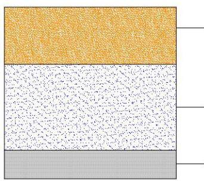  
(a) 无覆盖层

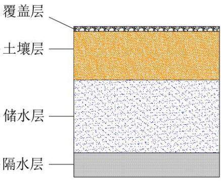  
（b）地表覆盖  
图5-1 排土场生态修复地层结构示意  
Figure 5-1 Schematic diagram of sequence structure of ecological restoration

覆盖层的存在改变了排土场生态修复地层结构。无覆盖层时，地层结构自下而上分别为隔水层、储水层以及土壤层；在土壤表层铺设覆盖层，自此地层结构自下而上变为隔水层、储水层、土壤层以及覆盖层，排土场生态修复地层结构如图5-1所示。地表由土壤层变为覆盖层，表面粗糙度、孔隙度、渗透性等性质变化不可忽略。

（1）表面粗糙度。覆盖层的存在，使大气与地表的接触面由土壤表面变为覆盖层表面。合理地选择覆盖层物料种类，能增加表面粗糙度，起到减缓坡面径流速度以及抑制降水对土壤表面溅蚀的效果，从而抑制水土流失。表面粗糙度与覆盖层的种类、形状等有关。

（2）孔隙度。孔隙度直接反映了覆盖层物料的孔隙容积，即覆盖层中液相与气相的空间。孔隙度影响覆盖层的通透性，直接或间接地影响植物生长状况，包括：(1孔隙度影响覆盖层的水分含量，即覆盖层持水能力，体现在指标“覆盖层截留率”上；②覆盖层的存在成为了大气与土壤之间气体交换的媒介与桥梁，影响大气与土壤的气体交换量。孔隙度大时，用于植物生命活动的气体充足，孔隙度较小时可能影响植物的生命活动。

（3）渗透性。渗透性指的是覆盖层对地表水的渗透能力。覆盖层条件下的降水再分配结果为：降水自上而下运移，先与覆盖层接触，经覆盖层截留后进入土壤层。若覆盖层渗透性好，则降水不至于在覆盖层中发生大量滞留，能在短时间内经过覆盖层；且渗透性好则覆盖层截留率减小，有利于土壤利用水分。

## 5.2 作业环节（Links）

（半）于旱区排土场生态修复砾石覆盖层建设作业环节，主要包括覆盖层物料的采集与堆存、植物种植与覆盖层铺设，具体包括：覆盖层物料的采集、覆盖层物料的破碎与筛分、覆盖层物料的运输与排卸、覆盖层物料储存场地选择与建设、覆盖层物料的管理、植物种植与覆盖层铺设以及可选环节；可选环节包括从存储场地到铺设场地覆盖层物料的装车、二次运输与排卸，当存储场地靠近铺设场地时，可选环节可以省略。生态修复砾石覆盖层建设作业流程如图5-2所示。

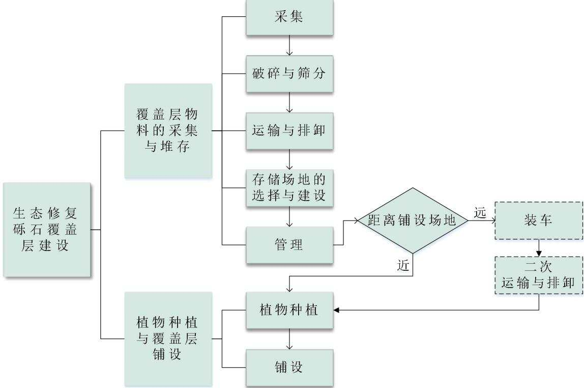  
图5-2 生态修复砾石覆盖层建设作业流程  
Figure 5-2 Construction process of ecological restoration overburden

## 5.2.1 覆盖层物料的采集与堆存

覆盖层物料的采集与堆存作业环节，包括：覆盖层物料的采集、覆盖层物料的破碎与筛分、覆盖层物料的运输与排卸、覆盖层物料存储场地选择与建设、覆盖层物料的管理。筛分环节是生态修复覆盖层建设的必要条件，目的是筛选出符合目标粒径的物料。覆盖层的采集与堆存作业规范如下：

## （一）覆盖层物料的采集

（1）采集覆盖层物料应优先选用露天矿现有设备，且尽量保证采集设备清洁、不污染覆盖层物料。

（2）覆盖层物料采集过程避免压实和污染。

①覆盖层物料采集设备仅在自天作业，并在雨雾等恶劣天气停止作业，以保证司机有足够的视野分辨覆盖层物料和其他剥离物；②覆盖层物料采集作业应使用专属设备，在采集覆盖层物料期间不进行其他物料的剥离作业。

## （二）覆盖层物料的破碎与筛分

（1）对采集的覆盖层物料进行破碎，覆盖层物料破碎过程避免污染。

1破碎设备的选择应考虑物料的硬度与目标粒径；②应保证覆盖层物料破碎设备清洁，在破碎覆盖层物料期间，不进行其他物料的破碎作业。

（2）对破碎后的物料进行筛分，以此获取目标粒径的物料。

（3）覆盖层物料粒径以2\~5mm为宜，可根据各粒径范围砾石物料数量与设计的覆盖层厚度确定。

## （三）覆盖层物料的运输与排卸

覆盖层物料运输过程避免污染，在运输覆盖层物料期间，车辆不进行其他物料的运输作业。

## （四）覆盖层物料存储场地选择与建设

## （1）存储场地选择

①覆盖层物料存储场地应优先选择需要进行生态修复的到界排土场区域或其附近区域，以避免新增占地并缩短后期使用的运距；②堆存场地应满足地表承载力与周边环境安全的要求，覆盖层物料存储场地应远离建筑物、河流湖泊、铁路等易受影响区域；③覆盖层物料堆体与露天矿边坡的距离不小于堆体高度的3倍，以免影响边坡安全；当场地有限与露天矿边坡的距离较近时，应进行边坡稳定性分析。

## （2）存储场地建设

①对优选的存储场地进行清理、平整，保证不存在高于或低于周边地表10cm以上的凸点或凹点：②覆盖层物料存储场地平整后，应选择若于位置进行地基承载力测试，堆存场地与进出场地通道应满足路面承载力要求；③覆盖层物料存储场地应设置排水系统，排出场地内的大气降水以免污染存储环境。

## （五）覆盖层物料的管理

（1）在现场树立标志牌，标记堆存量、堆存时间、责任人等信息。

（2）覆盖层物料堆体上应设置集水和排水系统，避免降雨淋漓造成物料流失。

（3）为防止覆盖层物料流失和场地扬尘，应在覆盖层物料堆体建设过程中及时覆盖土工布、防尘网等材料。

（4）及时清理覆盖层物料堆体表面和排水沟等附属装置中的杂物，减少存储期间的污染。

（5）堆存、维护、使用过程中防止碾压覆盖层物料。

## 5.2.2植物种植与覆盖层铺设

种植植物与覆盖层铺设时机该如何选择？可以考虑两种方案：(1先播种、立即铺设覆盖层；②先播种、等待植物完成萌发与早期生长、再铺设覆盖层。植物萌发试验结果表明，覆盖层的存在，有利于促进根系生长发育；但显著地降低了植物出苗率、抑制了植株地上部分的发育，不利于植物萌发与幼苗发育。为了不影响植物萌发与幼苗发育，故先播种，等待植物生长到一定高度后，再铺设覆盖层。

植物种植与覆盖层铺设作业规范如下：

## （一）表土铺设与植物种植

（1）植物种植前应进行表土铺设作业。

①排土场到界后对场地进行平整，排土场平整后根据生态修复需要及时铺设表土；②表土铺设厚度满足要求时，工程参数如坡度等应符合设计要求，并形成间隔均匀的排水沟槽；③表土铺设过程中，卸载的表土通过履带式推土机整平，避免设备频繁碾压；表土铺设完成后，通过翻耕破碎大块表土；④表土质量应符合生态修复土壤环境质量标准要求。

（2）表土铺设完成后，及时进行植物种植作业。

①选择成活率高、生长迅速、具有较强的环境适应性和抗逆性的植物进行种植；②可采用播种或移栽的方式进行植物种植，应根据草灌乔植物种类合理选择种植方式；③种植植物时应保持一定的行间距，满足覆盖层铺设设备或人员走行的要求。

## （二）覆盖层铺设

（1）待植物生长到一定高度后，按照设计厚度铺设覆盖层，设计厚度不应大于覆盖层厚度上限阈值和经济阈值，以10\~30mm为宜。

（2）覆盖层的铺设可采用农业生产惯用的播种机或其改进机械，进行覆盖层物料的喷播，覆盖层物料喷播机械尽量轻便、灵活。

（3）覆盖层物料尽量保证铺设均匀，排水沟槽可不进行覆盖层铺设作业。

## 5.3 案例分析（Case Analysis）

黑岱沟露天矿位于准格尔矿区，春季于旱少雨多大风，不利于植物的成活和生长，矿区内没有大片植物群落分布。以黑岱沟露天矿为例，阐述砾石覆盖层应用于（半）干旱区排土场生态修复的前景，探讨其覆盖层建设成本涉及的主要环节并根据组成要素进行成本分析，对预期生态效益与社会效益等作出评价。

## 5.3.1 应用背景

黑岱沟露天矿每年新增待复垦排土场面积约1000亩。覆盖层厚度取10\~30mm，则覆盖层物料年用量为 $6 . 6 7 \times 1 0 ^ { 3 } { \sim } 2 . 0 0 1 \times 1 0 ^ { 4 } \mathrm { m } ^ { 3 }$ 。以服务年限50年为例，则服务年限内所需的总覆盖层物料用量约为 $3 . 3 4 \times 1 0 ^ { 5 } { \sim } 1 . 0 \times 1 0 ^ { 6 } \mathrm { m } ^ { 3 }$ 。黑岱沟露天矿含砾地层由老到新概述如下：

（1）二叠系下统山西组：厚度为36.24～98.81m，平均厚度为57.36m。下部为浅黄、灰白、黄褐色长石石英砂岩，含砾粗砂岩，夹灰色粉砂质粘土岩、泥岩及5号煤层。

（2）二叠系下统下石盒子组：厚度为60.18～136.92m，平均厚度为95.17m。上岩段：紫色、黄绿色泥岩、砂泥岩，夹浅黄色长石质石英砂岩，局部含砾；中岩段：黄绿色含砾粗砂岩、夹紫色、暗绿色泥岩、粘土岩；底部含砾粗砂岩，厚层状，斜层理发育，胶结中等。

（3）二叠系上统上石盒子组：厚度>290m。底部为黄绿色含砾粗砂岩，具大型斜层理。

## 5.3.2 建设成本

（半）干旱区排土场生态修复砾石覆盖层建设成本，主要由三部分组成：（1覆盖层物料存储场地选择与建设、覆盖层物料的管理作为辅助环节，成本可忽略不计：②涉及的成本主要来源于覆盖层物料的破碎与筛分、覆盖层铺设两大添加环节；③其余环节为露天矿山基本生产环节，成本不计入覆盖层建设成本中。因此，主要从添加环节对黑岱沟露天矿排土场生态修复砾石覆盖层建设作出额外成本估算。

## （一）覆盖层物料的破碎与筛分成本

可借鉴金属矿山、建筑石料、固体废弃物处理等多个领域的生产经验，考虑使用移动式破碎筛分站，进行覆盖层物料的破碎与筛分作业。主要优点有：可根据客户对目标粒径的需求调整粒度方案；不仅不需土建、安装便捷、投资小，而且机动环保。移动式破碎筛分站的技术参数如下所述：

（1）破碎设备的型号为CS75B，功率为75kW，处理能力为59\~163t/h。

（2）筛分设备的型号为3Y1848，功率为15kW，处理能力与破碎设备一致。覆盖层物料的破碎与筛分成本包括动力费 $W _ { 1 }$ 与人员工资 $W _ { 2 }$ o

移动站运行时间 $t _ { 1 }$ 为：

$$
t _ { 1 } = m / Q\tag{5-3}
$$

式中， $t _ { 1 }$ 为移动站运行时间，d；m为覆盖层物料质量，t； $\mathcal { Q }$ 为移动式破碎筛分站的处理能力，取130t/h。

动力费 $W _ { 1 }$ 为：

$$
W _ { 1 } = w _ { 1 } \times n _ { 1 }\tag{5-4}
$$

式中， $W _ { 1 }$ 为动力费， $\widehat { \pi }$ ； $w _ { 1 }$ 为电费单价，取0.65元/kW·h； $n _ { 1 }$ 为电量，kWh。

人员工资 $W _ { 2 }$ 为：

$$
W _ { 2 } = t _ { 1 } \times w _ { 2 } \times n _ { 2 }\tag{5-5}
$$

式中， $W _ { 2 }$ 为人员工资，元； $t _ { 1 }$ 为移动站运行时间，d；w2为工资单价，根据当地水平，取300元/天·人； $n _ { 2 }$ 为工作人员数量，人。

所需目标粒径的覆盖层物料体积约为 $1 . 0 \times 1 0 ^ { 6 } \mathrm { m } ^ { 3 }$ ，质量约为 $2 . 0 \times 1 0 ^ { 6 } \mathrm { t }$ ，则移动站运行时间 $t _ { 1 }$ 约为 $1 . 5 \times 1 0 ^ { 4 } \mathrm { h }$ ，所需电量 $n _ { 1 } { = } ( 7 5 { + } 1 5 ) { \times } 1 5 0 0 0 { = } 1 . 4 { \times } 1 0 ^ { 6 } \mathrm { k W \cdot h }$ ，动力费 $W _ { 1 } { = } 0 . 6 5 \times 1 . 4 \times 1 0 ^ { 6 } { = } 9 1 . 0$ 万元。

设备运行期间每班2人管理，实行三班倒制度，则所需工作人员数量 $n _ { 2 }$ 为6人。人员工作时间与移动站运行时间相同，为 $1 5 0 0 0 \div 2 4 \mathrm { h } = 6 2 5 \mathrm { d }$ ，则人员工资$W _ { 2 } { = } 6 2 5 \times 6 \times 3 0 0 { = } 1 1 2 . 5$ 万 $\widehat { \pi }$ 。因此，覆盖层物料的破碎与筛分成本为$W _ { 1 } { + } W _ { 2 } { = } 2 0 3 . 5$ 万元。

## （二）覆盖层铺设成本

覆盖层铺设成本包括播种机购置成本 $W _ { 3 }$ 与劳务费 $W _ { 4 }$ o

播种机运行时间 $t _ { 2 }$ 为：

$$
t _ { 2 } = \frac { 5 0 S _ { d } } { n _ { 3 } \times \eta }\tag{5-6}
$$

式中， $t _ { 2 }$ 为播种机运行时间，h； $S _ { d }$ 为年到界排土场面积，亩； $n _ { 3 }$ 为播种机数量，台； $\eta .$ 为播种机工作效率，取1亩/h。

播种机购置成本 $W _ { 3 }$ 为：

$$
W _ { 3 } = w _ { 3 } \times n _ { 3 }\tag{5-7}
$$

式中， $W _ { 3 }$ 为播种机购置成本，元；w3为播种机单价，取300元/台。

劳务费 $W _ { 4 }$ 为：

$$
W _ { 4 } = t _ { 2 } \times w _ { 4 } \times n _ { 4 } / 8\tag{5-8}
$$

式中， $W _ { 4 }$ 为劳务费，元； $t _ { 2 }$ 为播种机运行时间，h； $w _ { 4 }$ 为劳务单价，根据当地水平，取300元/天·人； $n _ { 4 }$ 为劳务人员数量，人。

劳务人员数量与播种机数量相同，取 $\scriptstyle n _ { 3 } = n _ { 4 } = 2 0$ 。播种机运行时间 $t _ { 2 } { = } 5 0 \times 1 0 0 0$ $\div 2 0 \div 1 = 5 0 0 \mathrm { h } \approx 6 3$ 天，劳务费 $W _ { 4 } { = } 6 3 \times 3 0 0 \times 2 0 { = } 3 7 . 8$ 万元。播种机购置成本 $W _ { 3 } { = } 3 0 0 { \times } 2 0 { = } 0 . 6 0$ 万元。因此，覆盖层铺设成本为 $W _ { 3 } { + } W _ { 4 } { = } 3 8 . 4$ 万元。

综上所述，生态修复覆盖层建设添加环节成本为203.5+38.4=241.9万元。

## 5.3.3 效益评价

## （一）预期生态效益

（1）一方面，根据覆盖层厚度影响下的土壤水分损失试验，相同降水量下，覆盖层影响下的土壤能够保蓄更多水分；另一方面，根据覆盖层厚度对植物生长的影响试验，在低频次降水条件下，覆盖层影响下的植物长势良好，植物长势覆盖层组优于无覆盖层组。鉴于此，可减少用于植物养护的灌溉水量与灌溉次数，节约水资源。

（2）根据覆盖层厚度影响下的植物种植试验，合理的覆盖层厚度相较于裸露表土植物生长状况更好。鉴于此，在生态修复实际工作中可以预见，相较于裸露表土，覆盖层影响下的植物株高、生物量更大，且枝繁叶茂、具有更多的分蘖数，以此形成更强的覆盖度，更有利于生态修复效果的提高。

（3）根据覆盖层厚度影响下的植物生长试验现象，覆盖层相较于裸露表土，在较大强度降雨影响下能抑制水土流失且防止植株出现倒伏现象。可以期望在矿山环境治理工作中覆盖层发挥减少水土流失的积极作用。

## （二）社会效益

走一条符合国情、矿情、地情的可持续发展生态修复道路，自我开发，然后推广，以解决资源开采破坏环境、自然资源日益匮乏与持续增长的人口对水、食物、能源等资源需求的矛盾，实现环境、资源与人类的可续持发展。

（1）丰富了绿色开采理念，是响应、落实国家煤炭工业高质量发展政策的创举，推进资源开发与生态环境保护融合发展。

（2）能显著提高矿区生态修复效果，改善矿区工作环境，推进矿山达到绿色矿山建设标准，促进全行业绿色高效发展。

（3）有利于加快生态恢复、产业转型进程，有利于矿区后期取得间接经济效益。

## （三）经济效益

有利于促进固体废弃物资源化利用，如利用于生态修复、建材等，变废为宝。若砾石覆盖层应用于（半）干旱区排土场生态修复的案例得以成功，并加以推广至（半）干旱区复垦区生态修复，外加建材等用途，则砾石交易具有广阔的市场前景。保守估计，以砾石物料每吨80元、储备物料数量20万吨为例，则砾石物料产生的直接销售额约为1600万元，经济效益显著。

## 5.4 本章小结（Chapter Summary）

覆盖层建设应考虑的参数包括厚度、物料粒径、物料用量等，覆盖层的存在改变了排土场生态修复地层结构，影响了地表的表面粗糙度、孔隙度、渗透性等性质。（半）干旱区排土场生态修复砾石覆盖层建设作业环节，主要包括覆盖层物料的采集与堆存、植物种植与覆盖层铺设等，露天矿进行排土场生态修复覆盖层建设作业，涉及的成本主要来源于覆盖层物料的破碎与筛分（约203.5万元）、覆盖层铺设（约38.4万元）两大添加环节。

## 6 结论与展望

## 6 Conclusion and Prospect

## 6.1 结论（Conclusion）

于旱半干旱地区降水量少、且土壤在无保护措施下蒸发量大，进而影响土壤的性质与植被生长状况。以此为背景，本文研究地表覆盖砾石厚度对（半）干旱区排土场水分损失与植物生长的影响，阐述（半）干旱区排土场生态修复砾石覆盖层建设内容。本文的结论如下：

（1）覆盖层对土壤水分损失的抑制效果明显，CK组的水分损失速率分别为T1、T2、T3组的3.4、4.5、9.6倍。覆盖层厚度影响土壤水分时发挥“双刃剑”作用，T1、T2、T3组的覆盖层抑制率分别为72.52%、80.02%、89.96%，但T1、T2、T3组的覆盖层截留率分别为10.45%、16.29%、22.05%。覆盖层的存在改变了日损失量与持水量相关性的正负向，覆盖层截留率、覆盖层抑制率对应的覆盖层厚度上限阈值或经济阈值分别为141、56mm。

（2）覆盖层厚度影响下的植物生长状况差异性显著，T2组对植物生长的促进作用最显著；覆盖层厚度影响下的土壤性质差异性较小。覆盖层具有增加或降低土壤温度的作用，不同厚度对应不同的增温或降温幅度；覆盖层能改变土壤逆湿强度，大致表现为逆湿强度随着覆盖层厚度的增加而减小。无覆盖时土壤温度-湿度关联变化特征为：温度上升阶段，湿度总体呈现增大趋势；温度下降阶段，湿度总体呈现减小趋势；T1组、T2组中期与中后期的土壤温度-湿度关联变化特征为：温度上升阶段，湿度增大到位于温度谷值与峰值之间的某一时刻，随后湿度减小；温度下降阶段，湿度减小；T2组部分时期、T3组的土壤温度-湿度关联变化特征为：温度上升阶段，湿度总体呈现减小趋势；温度下降阶段，湿度总体呈现增大趋势。

（3）植物萌发时期，尽管覆盖层有利于促进根系生长发育，但对植株地上部分的抑制效果明显。覆盖层的存在使得影响植物生境的坡位生态效应得以产生，以黄叶数来看，坡上的生态干扰最不强烈，不同覆盖层厚度下的青叶数均表现为平台最大。根据最大株高变化评价体系，得到的高频次降水下不同种植区域综合最优厚度分别为T3、T1、T2、T1，低频次降水下不同种植区域综合最优厚度分别为T1、T1、T2、T3。

（4）砾石覆盖层具有抑制水分损失与促进植物生长的作用。覆盖层建设应考虑的参数包括厚度、物料粒径、物料用量等，覆盖层的存在改变了排土场生态修复地层结构，影响了地表的表面粗糙度、孔隙度、渗透性等性质。（半）干旱区排土场生态修复砾石覆盖层建设作业环节，主要包括覆盖层物料的采集与堆存、植物种植与覆盖层铺设等，露天矿进行排土场生态修复覆盖层建设作业，涉及的成本主要来源于覆盖层物料的破碎与筛分（约203.5万元）、覆盖层铺设（约38.4万元）两大添加环节。通过开展（半）干旱区排土场生态修复砾石覆盖层建设作业，走一条符合国情、矿情、地情的可持续发展生态修复道路，实现环境、资源与人类的可续持发展。

## 6.2 展望（Prospect）

本文试验日期主要设置为温季，今后考虑开展冬季覆盖层厚度影响下的植物生长试验，研究寒冷条件下覆盖层厚度对植物生长的影响，结合本文结果，形成至少以年为时间单位的覆盖层厚度影响下的植物生长试验综合研究成果。

## 参考文献

[1]谷春德.中国特色社会主义法治理论与实践研究[M].中国人民大学出版社:中国特色社会主义法学理论体系丛书,201706.366.

[2]赵建军,杨博.“两山论”是生态文明的理论基石[N].中国环境报,2016-02-02(003).

[3] 土地复垦条例[N].人民日报,2011-12-08(015).

[4]赵微璐.建设资源节约型与环境友好型社会对策研究[J].文化创新比较研究,2018,2(23):150-151.

[5]代革联,薛小渊,牛超,许珂,蒋泽泉,肖乐乐,刘美乐.煤炭开采对相邻区域生态潜水流场扰动特征[J].煤炭学报,2019,44(03):701-708.

[6]柳宁,赵晓光,解海军,等.榆神府地区煤炭开采对地下水资源的影响[J].西安科技大学学报，2019, 39(01):74-81.

[7]张丽娜,张育斌,王军德.黄土高原降水年内分布差异对旱作果园蒸散特征的影响[J].应用 生态学报,2020,31(07):2363-2372.

[8]张建国,孙树国,徐新文,雷加强,李生宇.塔克拉玛干沙漠公路防护林棵间土壤蒸发及蒸发量估算[J].水土保持通报,2011,31(01):145-148+248.

[9]刘艳婷．盐碱土蒸发试验及模型研究[D].西安理工大学,2019.

[10] Zhen Li, Jan Vanderborght, Kathleen M. Smits. The effect of the top soil layer on moisture and evaporation dynamics[J]. Vadose Zone Journal, 2020, 19(1).

[11] Pedro de Amesti, Alberto de la Fuente, Francisco Suárez. Evaporation From Unsaturated Soils as a Function of the Air and Soil Sides of the Land Surface[J]. Water Resources Research, 2020, 56(12).

[12] Ballesteros M , Ca adas, Eva María, Marrs R H , et al. Restoration of Gypsicolous Vegetation on Quarry Slopes: Guidance for Hydroseeding under Contrasting Inclination and Aspect[J]. Land Degradation and Development, 2017,61(9):2146-2154.

[13]车陆禄,刘冬冬,杨娅,陈雪.喀斯特森林近地表层覆盖对碳酸盐岩红土蒸发过程的影响[J].水土保持学报,2020,34(05):153-161.

[14]贾浩,李文昊,王振华,丁宏伟,许虎.可降解膜覆盖对土壤水分蒸发特性的影响[J].干旱地区农业研究,2020,38(02):1-9.

[15]车飞伟,李素艳,孙向阳,曲炳鹏,负炳辉,王心语,熊凯毅.不同有机材料覆盖对土壤保水效果的影响[J].水土保持通报,2020,40(02):182-187.

[16]罗皓峰，杨启良.松针覆盖层厚度和风速对水分蒸发量的影响机制[J].江苏农业科学,2020,48(21):249-254.

[17]孙池涛,邓亚鹏,张俊鹏,孙景生,毛伟兵,孙玉霞.秸秆覆盖条件下滨海土壤蒸发阻力模型

研究[J].农业机械学报,2020,51(12):284-291.

[18]苗春燕,陈军锋,郑秀清,冯慧君.地表覆砂对季节性冻融土壤蒸发影响的试验研究[J].节 水灌溉,2018(11):5-9.

[19] Jesse Lee Barnes, Michael John Nicholl. Mildly hydrophobic biobased mulch: A sustainable approach to controlling bare soil evaporation[J]. Vadose Zone Journal, 2020, 19(1).

[20] Ji-Chao, Zuo, Hai-Jin, et al. Characteristics of Phosphorus Output Through Runoff on a Red Soil Slope Under Natural Rainfall Conditions[J]. Huan jing ke xue= Huanjing kexue, 2017, 38(10):4178-4186.

[21] Vourlitis G L , Griganavicius J , Gordon N , et al. Hydroseeding increases ecosystem nitrogen retention but inhibits natural vegetation regeneration after two years of chaparral post-fire recovery[J]. Ecological Engineering, 2017, 102:46-54.

[22] Jianting Zhu. Impact of fractal characteristics on evaporation and infiltration in unsaturated heterogeneous soils[J]. Hydrological Sciences Journal, 2020, 65(11):1872-1878.

[23] Banihabib M E , Vaziri B , Javadi S . A Model for the Assessment of the Effect of Mulching on Aquifer Recharging by Rainfalls in an Arid Region[J]. Journal of Hydrology, 2018, 567.

[24]赵文举,李晓萍，范严伟,郁文.西北旱区压砂地土壤水分入渗规律研究[J].土壤通报,2016,47(01):150-155.

[25]谭军利，王西娜，田军仓，王玉龙，朱勇静.压砂地砂层持水特性研究[J].土壤通 报,2017,48(02):319-325.

[26]周约，谢铁娜.不同类型砾石覆盖对土壤水分蒸发的影响[J].湖南农业科学,2016(01):40-42.

[27]谭军利,王西娜,田军仓,苏小林.不同微咸水灌水量条件下覆砂措施对土壤水盐运移的影响[J].农业工程学报,2018,34(17):100-108

[28]郁文. 压砂对土壤水分和温度的影响规律研究[D].兰州理工大学,2016.

[29]崔珍．压砂地土壤水分、粒径、容重的空间变异及相关性研究[D].兰州理工大学,2018.

[30]谭军利,王西娜,金慧娟,杜飞飞,田军仓.微咸水灌溉下砂层级配及覆砂厚度对土壤水盐运移的影响[J].灌溉排水学报,2020,39(09):7-13.

[31]陈嵩,吕刚,张卓,王婷,王韫策,李叶鑫,汤家喜.辽西低山丘陵区坡地砾石量及粒径对土壤水分蒸发影响的模拟试验研究[J].灌溉排水学报,2019,38(S1):86-89.

[32]赵文举,徐裕,郁文,马宏.不同压砂厚度和粒径对土壤水盐运移的影响[J].兰州理工大学学报,2016,42(04):65-69.

[33]赵伶俐.干旱区瓜田不同压砂覆盖对土壤水分蒸发的影响及回归模型[J].中国瓜菜,2020,33(12):39-43.

[34] Junfeng Chen, Xue Xie, Xiuqing Zheng, Jing Xue, Chunyan Miao, Qi Du, Yongxin Xu.

Effects of sand - mulch thickness on soil evaporation during the freeze – thaw period[J]. Hydrological Processes, 2020, 34(13):2830-2842.

[35] Li Z G , Gu C M , Zhang R H , et al. The benefic effect induced by biochar on soil erosion and nutrient loss of slopping land under natural rainfall conditions in central China[J]. Agricultural Water Management, 2017, 185:145-150.

[36] Panigrahi P , Srivastava A K , Panda D K , et al. Rainwater, soil and nutrients conservation for improving productivity of citrus orchards in a drought prone region[J]. Agricultural Water Management, 2017, 185:65-77.

[37] Kumar V , Sharma J C , Kumar M , et al. Mulches and nutrients affect the soil environment crop performance and profitability of cauliflower[J]. Journal of Animal and Plant Sciences, 2019, 29(1):194-204.

[38] Bucki P , Siwek P . Organic and non-organic mulches - Impact on environmental conditions, yield, and quality of Cucurbitaceae[J]. Folia Horticulturae, 2019, 31(1).

[39] Arora, V. K.,Kaur, Rajbir.Deep tillage and residue mulch effects on productivity and water and nitrogen economy of spring maize in north-west India[J].Agricultural Water Management,2019,213:724-731.

[40]董宏源.膨胀土边坡浅层含水量变化特征及影响因素研究[D].广西大学,2020.

[41] Baumhardt R L , Johnson G L , Dockal J R , et al. Precipitation, runoff, and yields from terraced drylands with stubble - mulch or no tillage[J]. Agronomy Journal.

[42] Li H C , Gao X D , Zhao X N , et al. Integrating a mini catchment with mulching for soil water management in a sloping jujube orchard on the semiarid Loess Plateau of China[J]. Solid Earth,7,1(2016-02-01), 2016, 7(4):3199-3222.

[43] Manu V , Whitbread A , Blair G , et al. Effects of vegetative mulches on growth of indigenous crops in the Kingdom of Tonga[J]. Soil Use and Management, 2018,34(1):147-153.

[44] 张佳宁,刘坤.植物调节萌发时间和萌发地点的机制[J].草业学报,2014,23(01):328-338.

[45]谭美,杨志玲,杨旭,程小燕,李公荣,马文明.不同生境内厚朴种子萌发和幼苗生长研究[J].生态与农村环境学报,2018,34(10):910-916.

[46]杨赵平,梁继业,柴学平,薛婉婷.环境因子对珍稀濒危植物裸果木种子萌发特性的影响[J].西南林业大学学报,2017,37(01):49-53.

[47]魏林源,张卫星,马全林,张德魁,樊宝丽,陈芳,胡小柯.不同处理方式对流动沙丘先锋植物沙米种子萌发的影响[J].中国农学通报,2017,33(34):76-80.

[48]王鹏鹏,何影,马淼,赵婷婷.入侵植物蒙古苍耳种子萌发对环境因子的响应[J].石河子大学学报(自然科学版),2018,36(04):509-514.

[49]王稷,谭向前,熊丹伟,陈芳清.两种草本植物种子萌发与幼苗生长对植被混凝土水泥含量的响应[J].三峡大学学报(自然科学版),2019,41(01):46-51.

[50]雷威肖,陈巧玲,陈康丽,刘晶,郭梁,金晶炜,程积民,李伟.黄土高原常见蒿属植物对4种豆科牧草种子萌发和幼苗生长的化感作用[J].中国草地学报,2020,42(01):21-30.

[51]张爱宾,李义强,胡兴波,赵斌,李一为,曹玉海,张璐,王建超.公路绿地废弃物制作边坡绿化覆盖物的性能研究[J].水土保持应用技术,2020(01):14-16.

[52]王凯,张亮,刘锋,王道涵,宋子岭.阜新露天煤矿排土场边坡土壤质量分异特征[J].中国环境科学,2015,35(07):2119-2128.

[53]珊丹,荣浩,刘艳萍,梁占岐,张欣,石红标.干旱荒漠区排矸场不同覆盖类型对土壤水分蒸发的影响[J].水土保持通报,2020,40(05):15-20.

[54]奚成刚,王亮,倪栋,张建丰.黄土区公路边坡土壤水分空间分布特性[J].公路交通科技,2019,36(05):36-42.

[55]刘乐,孙宏义,张建新,李东泽.几种工程措施对黄土区陡峭边坡植被盖度的影响及其机理[J].干旱区研究,2019,36(04):1041-1048.

[56]李鹏飞,吕若冰,贺环宇,曹娓,周鑫,田国行.信南高速不同类型坡面下边坡植物根系抗拉特性[J].西北林学院学报,2016,31(04):73-80+122.

[57]任亦君,席璐璐,缑倩倩,宋冰,王国华.单次小降雨（≤5mm）事件对4种典型荒漠一年生草本植物生长和繁殖的影响[J].中国沙漠,2021,41(04):87-99.

[58]尉剑飞,王誉陶,张翼,张昊,李建平.黄土高原典型草原植被及土壤化学计量对降水变化 的响应[J].草地学报,2022,30(03):532-543.

[59]张浩,王新平,张亚峰,虎瑞,潘颜霞,陈宁.干旱荒漠区不同生活型植物生长对降雨量变化的响应[J].生态学杂志,2015,34(07):1847-1853.

[60]张彬,朱建军,刘华民,潘庆民.极端降水和极端干旱事件对草原生态系统的影响[J].植物生态学报,2014,38(09):1008-1018.

[61]蒋菊芳,陈雷,丁文魁,张宇林,魏育国.荒漠草本植物生长对干旱胁迫的反应[J].中国农学通报,2017,33(24):68-73.

[62]郭亚飞,张丽华,赵锐锋,谢忠奎,王军锋,蒿廉伊,高江平,王梦梦,高晗.月尺度视角下荒漠草原植物群落特征对降水变化的响应[J].生态学杂志,2021,40(07):1895-1906.

[63]刘洋,王娟,白婷玉,李青丰.4种园林植物幼苗对干旱胁迫的生长和生理响应[J].干旱区资源与环境,2021,35(04):173-179.

[64]朱自洋,段文焱,陈芳媛,李杉,陶文梅,唐睿裕.干旱土壤中生物炭对黑麦草生长的促进机制[J].水土保持学报,2022,36(01):352-359.

[65]王瑞杰,闫峰,张学良.2000-2015年鄂尔多斯高原生态承载力时空变化特征[J].水土保持通报,2020,40(01):91-98+107+2.

[66]李志熙.毛乌素沙地高等植被调查与研究[D].西北农林科技大学,2005.

[67]张广才,黄利江,于卫平,马晖,王涵.毛乌素沙地南缘植被类型及其演替规律初步研究[J].林业科学研究,2004(S1):131-136.

[68]欧阳斌强，唐朝生，王德银，徐士康，施斌.土体水分蒸发研究进展[J].岩土力学,2016,37(03):625-636+654.

[69]张晓.感热平衡原理测定土壤水分蒸发的改进及分解农田蒸散的实验研究[D].中国农业大学,2014.

[70]孟春雷.陆面过程模式中土壤蒸发与水热耦合传输的进一步研究[D].北京师范大学,2006.

[71] Philip J.R. Evaporation and moisture and heat fields in the soil[J]. Journal of Atmospheric Sciences,1957,14(4),354-366.

[72] Idso S.B., Reginato R.J., Jackson R.D., Kimball B.A., Nakayama F.S. The three stages of drying of a field soil[J]. Soil Science Society of America Journal,1974,38(5):831-837.

[73] Aluwihare S and Watanabe K. 2003. Measurement of evaporation on bare soil and estimating surface resistance [J]. Journal of Environmental Engineering, 129(12): 1157-1168.

[74] Yamanaka T, Inoue M, Kaihotsu I. Effects of gravel mulch on water vapor transfer above and below the soil surface. Agricultural Water Management,2004,67:145-155.

[75]邢德科.三种植物对高pH和低营养的响应及其在生态修复中的应用[D].江苏大学,2009.

[76]陈敏.Sr、Cs污染土壤指示植物筛选及其生物标志物研究[D].西南科技大学,2020.

[77]吕刚,刘雅卓,李叶鑫,傅昕阳,王磊.露天煤矿排土场边坡表层土壤水分物理性质空间变 异特征[J].土壤通报,2018,49(01):69-77.

[78] Zhan Jun,Wu Chengkun,Ma Xiandong,Yang Canqun,Miao Qiucheng,Wang Shilin. Abnormal vibration detection of wind turbine based on temporal convolution network and multivariate coefficient of variation[J]. Mechanical Systems and Signal Processing,2022,174.

[79] Ranjana Jaiswal,S. C. Gaur,Sunil K. Jaiswal,Anil Kumar. An Estimate of Variability, Heritability and Genetic Advance for Grain Yield and Yield Components in Bread Wheat (Triticum aestivum L.)[J]. Current Journal of Applied Science and Technology,2020.

[80] Singh S.R.,Ahmed N.,Kumar D.,Trivedi A.K.,Singh A.,Mir M.. Assessment of genetic variability of chilli in Western Himalayan Region[J]. Journal of Environmental Biology,2020,41(2).

[81]聂立水,王登芝.土壤分析[M].北京：中国林业出版社,2019:59-60.

[82]邵明安,王全九,黄明斌.土壤物理学[M].北京：高等教育出版社,2006:37-38.

[83]张强，卫国安.邻近绿洲的荒漠表层土壤逆湿和对水分"呼吸"过程的分析[J].中国沙漠,2003(04):45-50.

[84]王丽丽,余海龙,黄菊莹,赖荣生.不同覆盖措施的土壤生态环境效应和作物增产效应述评[J].江苏农业科学,2016,44(07):11-15.

[85]刘燕国.种子萌发过程中水分与温度的作用[J].农机化研究,2005(03):308.

[86]方精云.探索中国山地植物多样性的分布规律[J].生物多样性,2004(01):1-4+213.

[87]闫建成,梁存柱,付晓玥,等.草原与荒漠一年生植物性状对降水变化的响应[J].草业学报,2013,22(1):68-76.

[88] WATANABE K, GUO W, ARAI K, et al. High-throughput phenotyping of sorghum plant height using an unmanned aerial vehicle and its application to genomic prediction modeling[J]. Frontiers in Plant Science, 2017, 8: 421.

[89]库丽霞,张君,张伟强,吴连成,张少方,王平安,陈彦惠.作物株型相关性状分子机理的研究进展[J].中国农学通报,2010,26(05):20-25.

[90]陶惠林，徐良骥，冯海宽，等.基于无人机高光谱遥感的冬小麦株高和叶面积指数估算[J].农业机械学报,2020,51(12):193-201.

[91]牛庆林，冯海宽，杨贵军，等.基于无人机数码影像的玉米育种材料株高和LAI监测[J].农业工程学报,2018,34(5):73-82.

[92]杨猛.基于粉煤灰改良试验的露天矿排土场土壤提质增肥研究[D].中国矿业大学,2019.

## 学位论文原创性声明

本人郑重声明：所呈交的学位论文《地表覆盖砾石厚度对（半）干旱区排土场水分损失与植物生长的影响》，是本人在导师指导下，在中国矿业大学攻读学位期间进行的研究工作所取得的成果。据我所知，除文中已经标明引用的内容外，本论文不包含任何其他个人或集体已经发表或撰写过的研究成果。对本文的研究做出贡献的个人和集体，均已在文中以明确方式标明。本人完全意识到本声明的法律结果由本人承担。

学位论文作者签名：

年 月 日

学位论文数据集
<table><tr><td rowspan=1 colspan=1>关键词*</td><td rowspan=1 colspan=4>密级*</td><td rowspan=1 colspan=2>中图分类号*</td><td rowspan=1 colspan=4>UDC</td><td rowspan=1 colspan=1>论文资助</td></tr><tr><td rowspan=1 colspan=1>地表覆盖砾石厚度；排土场；水分损失；土壤水-热变化特征；植物生长；覆盖层建设</td><td rowspan=1 colspan=4>公开</td><td rowspan=1 colspan=2>TD824</td><td rowspan=1 colspan=4>622</td><td rowspan=1 colspan=1></td></tr><tr><td rowspan=1 colspan=1>学位授予单位名称*</td><td rowspan=1 colspan=5>学位授予单位代码*</td><td rowspan=1 colspan=3>学位类别*</td><td rowspan=1 colspan=3>学位级别*</td></tr><tr><td rowspan=1 colspan=1>中国矿业大学</td><td rowspan=1 colspan=5>10290</td><td rowspan=1 colspan=3>工学</td><td rowspan=1 colspan=3>硕士</td></tr><tr><td rowspan=1 colspan=4>论文题名*</td><td rowspan=1 colspan=6>并列题名</td><td rowspan=1 colspan=2>论文语种*</td></tr><tr><td rowspan=1 colspan=4>地表覆盖砾石厚度对（半）干旱区排土场水分损失与植物生长的影响</td><td rowspan=1 colspan=6>Effect of Thickness of GravelCovering Surface on Water Lossand Plant Growth of Dump in(Semi) Arid Area</td><td rowspan=1 colspan=2>中文</td></tr><tr><td rowspan=1 colspan=1>作者姓名*</td><td rowspan=1 colspan=5>潘朝港</td><td rowspan=1 colspan=3>学号*</td><td rowspan=1 colspan=3>TS19020031A31TM</td></tr><tr><td rowspan=1 colspan=1>培养单位名称*</td><td rowspan=1 colspan=5>培养单位代码*</td><td rowspan=1 colspan=3>培养单位地址</td><td rowspan=1 colspan=3>邮编</td></tr><tr><td rowspan=1 colspan=1>中国矿业大学</td><td rowspan=1 colspan=5>10290</td><td rowspan=1 colspan=3>江苏省徐州市</td><td rowspan=1 colspan=3>221116</td></tr><tr><td rowspan=1 colspan=1>学科专业*</td><td rowspan=1 colspan=5>研究方向*</td><td rowspan=1 colspan=3>学制*</td><td rowspan=1 colspan=3>学位授予年*</td></tr><tr><td rowspan=1 colspan=1>采矿工程</td><td rowspan=1 colspan=5>露天开采</td><td rowspan=1 colspan=3>3</td><td rowspan=1 colspan=3>2022</td></tr><tr><td rowspan=1 colspan=5>论文提交日期*</td><td rowspan=1 colspan=7>2022.06</td></tr><tr><td rowspan=1 colspan=1>导师姓名*</td><td rowspan=1 colspan=5>陈树召</td><td rowspan=1 colspan=3>职称*</td><td rowspan=1 colspan=3>副教授</td></tr><tr><td rowspan=1 colspan=3>评阅人</td><td rowspan=1 colspan=4>答辩委员会主席*</td><td rowspan=1 colspan=5>答辩委员会成员</td></tr><tr><td rowspan=1 colspan=3>盲审</td><td rowspan=1 colspan=4>周伟</td><td rowspan=1 colspan=5>李小双，刘福明，陈彦龙，韩流</td></tr><tr><td rowspan=1 colspan=12>电子版论文提交格式  文本（√）图像（√）视频（）音频（）多媒体（）其他（）推荐格式：application/msword;application/pdf</td></tr><tr><td rowspan=1 colspan=2>电子版论文出版（发布）者</td><td rowspan=1 colspan=6>电子版论文出版（发布）地</td><td rowspan=1 colspan=4>权限声明</td></tr><tr><td rowspan=1 colspan=2></td><td rowspan=1 colspan=6></td><td rowspan=1 colspan=4></td></tr><tr><td rowspan=1 colspan=3>论文总页数*</td><td rowspan=1 colspan=9>72</td></tr><tr><td rowspan=1 colspan=12>注：共33项，其中带*为必填数据，共22项。</td></tr></table>