分类号

UDC

密级

学号060814010645

# 硕士学位论文

# 石窑店煤矿水土保持及生态修复体系下植物护坡及拦渣坝稳定性研究

时 乐

学科名称： 岩土工程

学科门类： 工学

指导教师： 李占斌教授

刘奉银 副教授

申请日期： 2009年5月

## 独创性声明

秉承祖国优良道德传统和学校的严谨学风郑重申明：本人所呈交的学位论文是我个人在导师指导下进行的研究工作及取得的成果。尽我所知，除特别加以标注和致谢的地方外，论文中不包含其他人的研究成果。与我一同工作的同志对本文所研究的工作和成果的任何贡献均已在论文中作了明确的说明并已致谢。

本论文及其相关资料若有不实之处，由本人承担一切相关责任

论文作者签名：时乐\_2009年6月23日

## 学位论文使用授权声明

本人时乐在导师的指导下创作完成毕业论文。本人已通过论文的答辩，并已经在西安理工大学申请博士/硕士学位。本人作为学位论文著作权拥有者，同意授权西安理工大学拥有学位论文的部分使用权，即：1）已获学位的研究生按学校规定提交印刷版和电子版学位论文，学校可以采用影印、缩印或其他复制手段保存研究生上交的学位论文，可以将学位论文的全部或部分内容编入有关数据库进行检索；2）为教学和科研目的，学校可以将公开的学位论文或解密后的学位论文作为资料在图书馆、资料室等场所或在校园网上供校内师生阅读、浏览。

本人学位论文全部或部分内容的公布（包括刊登）授权西安理工大学研究生部办理。

(保密的学位论文在解密后，适用本授权说明)

论文作当装名时压签：209年6月25日刘奉银

# 论文题目：石窑店煤矿水土保持及生态修复体系下植物护坡及拦渣坝稳定性研究

学科专业：岩土工程

研究生：时 乐

指导教师：李占斌 教 授刘奉银 副教授

签名：时乐

签名：李点

签名：刘奉银

## 摘要

本文基于弹塑性力学、土力学、水土保持学、森林生态学、数学等原理和方法，运用有限元方法，模拟了根-土复合体的应力场、位移场，揭示了根土相互物理作用的机理，为石窑店煤矿边坡治理设计提供一定的理论依据。

拦渣坝安全稳定在煤矿安全生产和环境保护中有着十分重要的作用。本文以石窑店煤矿拦渣坝为例,在理论计算的基础上，应用有限元原理，结合数值仿真分析方法，从拦渣坝力学稳定和受力破环的角度，按坝体仅受矿渣压力作用和坝体受矿渣压力与水压力共同作用两种工况，应用有限元软件对石窑店煤矿拦渣坝坝体在设计堆渣量下的应力场和位移场进行了稳定性仿真分析，指出了最大应力和位移分布区域，为拦渣坝的安全稳定设计提供了参考依据，并通过计算说明了两种方法联合应用具有互补性，同时也为拦渣坝的设计提供了有益的参考。

根据石窑店煤矿在建设和生产过程中的水土流失预测结果，针对该煤矿在建设和生产过程中的水土保持和生态修复问题，在现场勘察的基础上，将该煤矿矿区水土流失防治区划分为工业场地防治区、弃渣场防治区、地面运输系统防治区、场外线性工程防治区、首采沉陷防治区等五部分，并根据各水土流失防治分区的水土流失特点和各自的植被生长立地条件的差异，提出了相应的水土保持工程措施和生态植被恢复措施。这些措施的实施对做好矿区水土保持，防止生态破坏，实现资源合理利用，促进人与自然和谐，推动煤矿生产建设的可持续发展具有重大意义。

关键词：根系；土体；有限元；拦渣坝；稳定性分析；水土保持；生态恢复

# Title: STUDY ON STABILITY OF VEGETATION SLOPE AND TAILING DAM IN SOIL AND WATER CONSERVATION AND ECOLOGICAL REHABILITATION SYSTEMS OF SHI YAODIAN COAL MINE

Major: Geotechnical Engineering

Name: Le Shi

Supervisor: Prof. Zhanbin Li

Associate Prof. Fenyin Liu

Signature: le Shi

Signature: Zhanbin Li

Signature: Liu Fengyin

## Abstract

Based on the elastic-plastic mechanics, soil mechanics, soil and water conservation science, forest ecology, principles and methods of mathematics, the use of finite element method to simulate the root - soil complex stress field, displacement field, revealing the role of the root soil of each physical mechanism, of governance for the Shi Yaodian coal mine slope design to provide a theoretical basis.

The safety and stability of tailing dam play an important role on the mining production and environmental protection. Take the Shi Yaodian Coal Mining dam as an example, based on theoretical computing,the finite element method combined with simulation analysis was applied. Concerning the dam's mechanical stabilization and destroyed by stress, this article analyzed the Shi Yaodian Coal Mining dam's stress field and displacement field with the finite element software in two conditions of loading states in designed amount of dregs. One is the dam only stressed by slag's compressive force, another is slags and hydrostatic pressure combined action. The obtained maximum stress and displacement fields can provide a reliable evidence for safety running of the dam; meanwhile, consociation applications of the two methods having complementary advantages with each other was explained through the calculation, it is also providing a beneficial reference for the design of sand dam.

According to the predication results of the construction and production processes of Shi Yaodian coal mine, aiming at the existing problems of soil and water conservation and ecological rehabilitation in the construction and production stages of Shi Yaodian coal mine, the prevention and control regions of soil and water loss in Shi Yaodian coal mine are divided into

five regions including the prevention and control region of industry area, rehabilitation region of dreg disposal area, the prevention and control region of transportation system, the prevention and control region of off-site linear construction, the prevention and control region of sink area due to first coal mining based on the investigation information. According to the characteristics of soil and water loss in the different prevention and control regions and the differences of the growth site conditions of different vegetation, the corresponding soil and water conservation engineering measures and ecological vegetation measures are proposed. The Implementation and construction of these mentioned soil and water conservation measures may be of great importance for strengthening soil and water conservation in mining area, prevention of destroy of ecological environment, harmonious development between human and the nature, as well as the sustainable development of the production and construction of Shi Yaodian coal mine.

Key words: roots;soil; finite element method; tailing dam; tability analysis; soil and water conservation; ecological restoration

## 目录

1 绪论...  
1.1 问题提出以及研究意义..  
1.1.1 环境岩土工程的形成与发展  
1.1.2 环境岩土工程的定义....  
1.1.3 环境岩土工程的学科意义.  
1.2环境岩土工程的研究内容、工作方法和专业特色.  
1.2.1 环境岩土工程的研究内容.....  
1.2.2环境岩土工程的工作方法...  
1.3 环境岩土工程与可持续发展.  
1.3.1 可持续发展战略的提出.  
1.3.2可持续发展战略的内涵....  
1.3.3环境岩土工程与可持续发展的关系..  
1.3.4 植物在护坡和水土保持积极作用..  
1.4 研究内容和技术路线...  
2 植物根系固土护坡的有限元数值模拟  
2.1 基本理论....  
2.2 有限元基本模型 12  
2.2.1 根系简化模型. 12  
2.2.2计算剖面及边界约束条件.. 12  
2.3 有限元基本参数 14  
2.4 根系固土护坡作用分析 15  
2.4.1 边坡稳定性分析. 15  
2.4.2 边坡位移... 19  
2.5 小结...... 21  
3 基于有限元的石窑店煤矿拦渣坝稳定性分析. 23  
3.1 研究区概况..... 23  
3.2 拦渣坝稳定的理论分析计算 24  
3.2.1 坝坡抗滑稳定.. 24  
3.2.2 坝体抗滑稳定.. 24  
3.2.3 坝基承载力验算. 25  
3.3 拦渣坝稳定的数值仿真计算. 25  
3.3.1 参数选取... 25  
3.3.2渣体干燥状态下拦渣坝受力分析. .26  
3.3.3渣体饱和状态下拦渣坝受力分析.. .28  
3.4 小结... 30  
4石窑店煤矿水土保持与生态修复措施体系研究. 31  
4.1 项目区自然环境概况.. 31  
4.1.1 自然环境概况.. 31  
4.2 项目区水土流失及水土保持现状. 33  
4.2.1 项目区地貌... 33  
4.2.2 项目区土地利用现状. 34  
4.2.3 项目区水土流失现状.. 34  
4.2.4 项目区水土保持现状.. 35  
4.3 水土流失预测评价... 36  
4.3.1 煤矿建设及生产过程中的水土流失成因分析... .36  
4.3.2 预测的内容和方法... 37  
4.3.3 建设期水土流失预测结果. 39  
4.3.4 可能造成新增水土流失面积的预测结果. 39  
4.4 地表沉陷 40  
4.4.1 地表沉陷影响预测... 40  
4.4.2 地表沉陷可能导致水土流失的相关影响分析. 43  
4.4.3 地表沉陷可能加剧的水土流失预测结果. .49  
4.5 石窑店煤矿水土保持与生态修复措施.. .50  
4.5.1 防治原则... .50  
4.5.2水土保持与生态修复的目标及范围. 51  
4.5.3 水土流失防治分区的划分及水土保持措施总体布局. .51  
4.5.4 水土保持生态修复分区防治措施体系……………… ....53  
4.5.5 小结... ... 56  
4.6 效益分析... ..57  
4.6.1 生态效益.. ..57  
4.6.2 社会效益... .58  
4.6.3 经济效益.. 58  
5 结论与展望. 59  
5.1 结论. 59  
5.2 展望.. 60  
致谢.... 61  
参考文献.. 63

## 1 绪论

## 1.1 问题提出以及研究意义

## 1.1.1 环境岩土工程的形成与发展

人类在征服自然和发展经济的历程中，造成了全球性的环境的严重污染和破坏，并引发一系列如水土流失、土地荒漠化、滑坡、泥石流、生物多样性锐减、废弃物泛滥等自然或人为灾害。人类赖以生存和发展的环境受到了严重的挑战，资源日益枯竭，生态遭到破坏，多种污染事故频繁发生。更现实地说，这些灾害正威胁着人类的生存与可持续发展。环境问题显然已经成为全球性问题之一，引起了世界各国的普遍关注。如何保护好并合理开发现有的土地、海洋与空间资源，己成为广大自然科学工作者、社会科学工作者的历史使命和研究课题。因此，如何在工程建设的同时，保护好我们的生态环境，进而实现人类与环境的可持续发展，是一个十分重要和值得关注的问题。

半个世纪以来，全球经济高速发展带动了各类基础设施的建设，使土木工程活动与环境相互作用的深度和广度不断增加。在此背景下，工程活动的评价标准也随之扩展，除了涉及工程自身的技术问题之外，还要考虑其对环境的影响或环境对其的制约条件，环境岩土问题由此而提出。例如，上世纪70年代，美国和欧洲一些工业化国家所面临的核电站选址、核废料安全处置问题是较为典型的环境岩土问题。学科的发展总是靠解决问题的需求来推动，当人们面临上述问题时，很自然会从各自的知识结构中寻找解决办法。但我们往往发现原来学科的理论与方法已不能完全适应了，“岩土工程”的含义需要外延，对新概念下的工程建设也需要更多力学以外的知识和方法，于是以岩土工程为基础并融合环境学、生物学、化学、土壤学、社会科学等多个知识体系的环境岩土工程学便应运而生4-15]。

作为一门崭新的独立学科。环境岩土工程所取得的进展是有目共睹的。1982年在美国旧金山召开的“第十届国际土力学与基础工程学术会议”上，由意大利和日本两位学者共同撰写的“环境岩土工程现状报告”第一次提出环境岩土工程的概念(GeoenvironmentalEngineering 或 Environmental Geotechnical Engineernig)。1986 年，第一届国际环境岩土工程学术会议在美国里海大学召开，三年后在中国同济大学召开了第二次会议，方晓阳教授(1989)提出用于评价土-水一污染物相互作用的粒子能场理论，开拓了全新广东工业大学工学硕士学位论文的思维方式和研究手段，从而奠定本学科的理论基础。此后数年，环境岩土工程正式分化出来，普遍认同以美国的《土力学与基础工程杂志(Journal of SoilMechanics and Foundation Engineering)》更名为《岩土与环境工程杂志(Journal of

Geotechnical anics and Geoenvironmental Engineering)》作为一种标志[1]。1999 年8月在我国南京大学举办的“高原与生态敏感地区环境岩土工程国际讨论会”对本学科作了新世纪展望，环境岩土工程充分显示出其学术价值。可以预一言，21世纪的环境岩土工程将在环境保护与防灾减灾方面发挥越来越重要的作用。

## 1.1.2 环境岩土工程的定义

虽然环境岩土工程已经获得了学术界的认可,并形成了一定的科学体系,但由于它是一个跨学科多领域的新兴学科,所以从不同的角度和立场出发,许多学者对其定义不一。.

## a国际上的定义

在国际上对环境岩土工程的定义存在着两种观点:一种观点是以环境岩土工程学的创始人之一、原美国里海大学教授的方晓阳为代表的一些学者，认为“环境岩土工程(Environmental Geotechnology)是一门交叉学科,研究岩石、土的物理化学性质及其与大气圈、生物圈、水圈、岩石圈和微生物圈的相互作用”[2];另一种观点是以美国工程院院士、著名岩土工程学家、现为美国西弗吉尼亚理工学院教授的J.K.Mitchell为代表的一些学者，认为“环境岩土工程是岩土工程学科中的一个分支学科”[7]。显然这两位大师对环境岩土工程的定位是不同的,这与他们研究的出发点和认识上的侧重点不同而密切相关。方晓阳提出环境岩土工程的出发点就是要改变目前人们在解决各种岩土工程问题都要从力学角度入手的传统方法.主张要考虑化学的、生物的、物理-化学的等非力学因素对岩土工程的影响。因此，他把环境岩土工程定义为一门岩土工程、环境科学与工程以及土壤科学等多学科交叉的前沿学科。然而，J.K.Mitchell却认为环境岩土工程是岩土工程的一个分支学科.属于岩土工程范畴环境岩土工程的目的是应用岩土工程的原理和方法解决环境问题。它所要研究的内容主要包括安全和经济的土地复垦、场址修复、废物处理和隔离等。他认为环境岩土工程的研究对象与传统的岩土工程有很大不同，具有许多特殊性。所以,Mitchell认为,在进行环境岩土工程理论与实践时,传统的岩土工程理论和方法不可缺少，岩十力学的原理和方法对大部分环境岩土工程来说常是一个有用的开端和整个工程的框架。

## b 国内的定义

自从全国“环境岩土工程”学术交流会和第一届全国环境岩土工程与土工合成材料技术研讨会分别于2002年6月和2002年11月在同济大学和浙江大学召开以来,国内出现了研究环境岩土工程的热潮。

（1）胡中雄等认为环境岩土工程是一门应用岩土工程的概念进行环境保护的跨学科的边缘学科,其研究内容包括环境工程、环境卫生工程和人类工程活动引起的环境问题三方面(胡中雄等，1990)。

(2)袁建新认为环境岩土工程是一门涉及岩土力学与岩土工程、卫生工程、环境工程、土壤学、地质学、水文地质地球化学及农业工程等内容的新兴综合性交叉学科，主要课题有固体废物的特性及处置技术、污染物质在地下水中的传输及与岩土介质的相互作用[3](袁建新,1996)。

（3）曲永新等认为环境岩土工程不仅研究传统的环境工程地质和地质灾害，还包括对与固体、液体废弃物排放、填埋有关的环境地质工程问题以及与城市建设有关的环境问题的研究[4](曲永新,1998)。

（4）施斌认为环境岩土工程是一门以运用岩土工程的基本原理、方法和手段防止自然或工程活动引起的岩土环境恶化，分析和评价环境与各类岩土工程间的关系为研究内容的一个学科体系,环境岩土工程的最终目的是保持社会经济的可持续发展[5]。

(5）龚晓南认为环境岩土工程是一门岩土工程和环境科学密切结合的新学科,主要应用岩土工程的观点、技术和方法为治理和保护环境服务,既是一门应用工程学,又是一门社会学[6]。

(6)罗国煜等认为环境岩土工程属于环境地质学的范畴,并将环境岩土工程分为区域环境岩土工程和城市环境岩土工程(罗国煜等，2000)。

各种观点虽有所差别，但在许多方面却是一致的，其共通点也就是环境岩土工程的内涵，即“环境岩土工程研究环境与岩土体之间的相互作用和影响，应用岩土工程的理论、技术和方法为治理和保护环境服务，以及应用环境科学的理论方法解决岩土工程问题”。环境岩土工程涉及气象、水文、地质、农业、化学、医学、工程学等诸多学科，是岩土力学与环境科学密切结合的一门新学科，既是应用性的工程学，又是社会学，是技术、经济、政治、文化相结合的跨学科的新型学科。

## 1.1.3 环境岩土工程的学科意义

环境岩土工程是在工程科技发展的同时，以控制地球环境变化、开发对环境友好技术为宗旨的必然产物，具有独特的全新的学科意义。

它首次将环境科学的学科思路与岩土工程的学科思路有机渗透结合，并根据所研究的具体对象或具体问题创造出与其相适应的新思路，成为联系环境保护和岩土工程建设之间的一座桥梁，这无疑是土木工程领域的重大突破，也是环境科学史上一次新的飞跃。它将工程环境问题放在与“污染和生态破坏问题”同样重要的位置上来研究，并克服了传统十力学和基础工程较少对岩土体性质影响因素进行研究的不足，不仅拓宽了环境科学和岩十工程的研究领域，而且为协调人与自然的关系，为解决环境、人口、资源与发展的世界性问题提供了新的思路和途径。

现今世界各国已认识到保护地球、保护环境的重要性，即使我国这样一个发展中国家，每年用于环境保护与治理的经费也达到上千亿。据有关报道，北京申奥成功以后，计划用于体育场馆建设的资金不过180亿，而用于环境保护方面的资金至少660多亿。每个与环境有一定关系的学科和专业，不论是出于责任感还是寻求发展机会，都不约而同地向环境领域伸出了触角，如环境物理学、环境化学、环境生物学、环境地学、环境医学、环境经济学、环境法学等边缘学科的出现便是最好的印证。随着环境岩土工程的逐步完善与成熟它必将促进与之相关相邻学科的发展，同时也是进一步充实岩土工程专业的大好机遇。

国外对环境岩土工程的发展相当重视，立法更起到决定性的作用。美国政府早在20年前就接连颁布了三个保护建设环境方面的联邦法案一“全面的环境回应、补偿与责任法案9，强调对建设项目的环境污染评估。以此为契机，世界上不少大学都将土木工程系改名为环境与土木工程系，而各大岩土专业公司也纷纷开展这方面的业务与研究。

比如，美国著名的Demse& Moore公司迅速在他们的丹佛分部设立了与环境项目有关的中心试验站，在各地的分部也设立机构并开发计算机程序，开展与法律配套的业务。到目前为止，发达国家的环境岩土工程业务己经成为岩土工程公司或

研究机构相当主要的任务来源和业务组成部分。比如，美国的 Woodwar & Clyde 公司，环境岩土工程项目的市场份额占公司总产值的 29%，美国的 Demse & Moore 占 53%，加拿大的 Cltfion& Associates几乎所有的业务项目都来自于环境岩土工程领域。资料显示，在2002年度世界200强的国际设计咨询公司中，拥有环境岩土工程项目的几家公司，由于相关业务的展开，排名都明显上升了。

与国外情况相比，我国的环境岩土工程不论在立法管理、行业发展还是科研成果方面均略显滞后，理论研究、工程实践及一些具体问题的解决仍有待深入探讨。可以预见，由于客观的需求和政策的推动，尚处于幼年时期方兴未艾的环境岩土工程将在我国社会经济可持续发展方面显示出旺盛的生命力和广阔的发展前景。

## 1.2环境岩土工程的研究内容、工作方法和专业特色

环境岩土工程虽以岩土工程的许多基本理论作为基础，但如果研究与之有关的问题以及解决这些问题所应用的观点、理论和方法均与岩土工程没有相别之处，学科就失去其存在价值了。可见，环境岩土工程并非学科的简单组合体，它有独立的工作内容、方法和专业特色。[7]

## 1.2.1 环境岩土工程的研究内容

当前社会实践显示，岩土工程发展到今天面临一系列新的问题:首先，人口增长、生产规模扩大需要征用更多土地，使工程场址的可选择性越来越小。许多以前被认为不适合居住和建设的土地，如填地、湿地、活动土壤地段、矿井沉陷区也将开发利用，岩土体的复杂性增加，工程人员面临如何对岩土环境进行评价、整治和改造的问题。其次，人类活动己成为地球表层特别活跃的因素和力量，工程活动打破了原有环境的平衡，[8]对环境的扰动甚至己超出污染的范畴，因而面临如何预测、防止工程活动对环境影响的问题。另外，传统岩土工程静态且孤立地研究岩土体，而岩土体本身处于地球各圈层和人类作用之下，其性质是不断变化的，研究中应强调在不同环境因素下岩土体的性质及其对工程的影响。上述列举的问题是传统岩土工程难以解决的，而这正是环境岩土工程的研究任务和内容。

研究任务具体归纳起来有三点[9]:①揭示人类生活生产与岩土环境之间的相互关系，特别要对工程活动对环境影响进行评价和预测，合理利用环境资源，防止和控制环境向不良方向发展，使环境能够满足人类可持续发展的要求。②探索新的理论和方法，用于描述复杂或特殊岩土体以及环境变化影响下的岩土体的性质，使结果更符合实际并为工程建设的设计、施工提供可靠的参数与信息。③用岩土工程的理论、技术和方法治理、改善和控制自然及人为条件下恶化的环境，以期将环境破坏减到最小限度。

## 1.2.2 环境岩土工程的工作方法

环境岩土工程与一般岩土工程在内容上有共同之处，但不是把某些工作“拿出来”单独分成一科进行研究，其内容的广泛性和复杂性决定了环境岩土工程应采用以系统论为指导、多种方法综合互补的思维方式和工作方式。

最早的系统论是上世纪中叶由奥地利生物学家贝塔朗菲创立，我国科学家钱学森将系统论、信息论和控制论合称为广义系统论。广义系统论对于环境岩土工程问题的宏观分析与判断有重要意义。

在研究具体问题时，原有的力学方法需要加以扩充，因为土的性质随环境条件而变化，而传统十力学“并没有原理和理论分析各种环境条件下的各类土壤”[2]，例如，受污染情况下土承载力的变化、温室效应使冻土复苏并对其性质的影响、对于给定的土壤在任何条件下其Atterberg界限是否为常数。此外，大多数岩土工程项目设计都是按荷载条件而定，忽略了控制所有土木工程结构总体稳定性的一个重要因素一环境因素，比如，设计堆置场或填埋场除了考虑瞬时沉降、固结和次固结沉降外，废弃物的凋蔫与降解气化造成的沉降也可能对堆场的空间利用有重大影响;把建筑垃圾回填处理不能忽视有机废料对地下水的污染。所有这些问题都要求通过对环境的评价来获得边界条件及其解，我们必须在力学范畴之外探索新的方法，将力学方法与之相结合，才能适应环境岩土工程的发展[10][15]。

方晓阳针对现有土力学只重视土的物理力学性状而忽视其它基本性质的不足，提出了用于分析各种环境条件下土性状的粒子能场理论，不同的环境受控于不同的能量场，不同的能量场由不同的自然规律支配，以此来解决土一水一环境相互作用问题。罗国煜在研究中非常注意场地区域性和综合性特征，突出人类活动的影响，认为各种环境岩上工程问题是一个以优势面为骨架、受多种因素和人工加速机制作用的系统，并据此提出了本领域的优势面理论0。这是在岩体结构控制论基础上认识的深化，对防灾减灾方面有重要指导意义，尤其在区域稳定性、土壤污染、地下空间开发研究中成效显著。例如，优势面理论解决了久拖8年的南京市明镜湖塌陷问题，又在黄河悬河稳定性分析中发挥重要作用。以上方法突破力学的边界去研究新问题，为探索环境岩土工程的工作方法开辟了一条广阔道路，也是对岩土工程旧式工作方法的丰富和补充。

## 1.3 环境岩土工程与可持续发展

## 1.3.1 可持续发展战略的提出

人类经过对自然顶礼膜拜的漫长历史阶段之后，通过工业革命铸就了驾驭和征服自然的现代科学技术之剑，一跃成为大自然的主宰。然而种种始料不及的环境问题却击破了单纯追求经济增长的美好神话，固有的思想观念和思维方式受到强大冲击，传统的发展模式面临严峻挑战。

20世纪50年代以前，人们总是自觉或不自觉地认为，地球向人类社会提供自然资源和环境空间的能力是无限的，我们不必庸人自忧，于是便有了朱利安L·西蒙的《没有极限的增长》、《资源丰富的地球》以及H.卡恩的《今后二百年》等乐观思想。60年代后人们开始意识到自然资源和环境空间是一种稀缺资源，如何支配、使用它关系到人类的未来，这种认识的转变是人类自身觉醒的标志。可是1972年罗马俱乐部发表的《增长的极限》极端地指出只有限制增长，即“零增长”才能避免因超越地球资源极限而导致世界崩溃，其反增长情绪反而成了悲观主义思想。尽管《增长的极限》的结论存在明显缺陷，其积极意义却是无庸置疑的，它为孕育可持续发展的思想萌芽提供了土壤。

经过十多年努力探索，由联合国世界环境与发展委员会于1987年提交的《我们共同的未来》终于找到了能永久支持全球人类进步的道路，即可持续发展道路。持续发展(Sustainable development)概念的提出实现了人类有关环境与发展思想的飞跃。1992年联合国大会通过了《里约环境与发展宣言》，可持续发展成为世界最广泛和最高级别的政治承诺，预示着人类迈出了跨向新文明时代的关键性一步[11][15]。

## 1.3.2 可持续发展战略的内涵

可持续发展是在不损害后代人满足其自身需求的前提下，追求一种最大限度地满足当代人生产、生活需要的发展模式[11]。该定义具有丰富的内涵。自然属性方面，它是寻求一种最佳生态系统以支持生态的完整性，使人类的生存环境得以持续发展，强调保护和加强环境系统的生产更新能力。社会属性方面，是指在生存不超出维持生态系统涵容能力的情况下，提高人类的生活质量。这里特别指出可持续发展的最终目标是人类社会的进步，强调真正的发展必须包括提高健康水平、改善生活质量，创造一个平等、自由的生存环境。经济属性方面，它是动态的经济系统与更为动态、但在正常条件下变动却很缓慢的生态系统之间的一种关系，这种关系意味着人类活动的影响需保持在某些限度之内，以免破坏生存支持系统的多样性、复杂性和基本功能。工程学方面，则从技术选择角度扩展了可持续发展的定义，要求工程活动尽可能减少能源资源的消耗并建立极少产生废料和污染的工艺或技术系统。

由此可见，可持续发展模式不是鼓励经济“零增长”，而是在增长的前提下统筹兼顾，充分考虑自然资源的长期供给能力和生态环境的长期承受能力，依靠先进科技来提高经济活动中的效益和质量并减少对环境造成的压力，最终目标是谋求社会的全面进步。因此优化人一地关系与人一人关系就是可持续发展的本质所在。

## 1.3.3 环境岩土工程与可持续发展的关系

可持续发展战略的提出，使人们越来越意识到人类的一切活动应建立在对自然界发展演化规律深刻认识的基础上，强调人一一地关系的协调发展，各种工程活动必须从追求局部、短期利益的阶段转向追求整体、长远利益的阶段。岩土工程是建设活动的重要部分，它又以岩石圈表层及其单体一土和岩石作为直接研究对象，与地质环境和工程环境的关系非常密切，如果不加以重视，造成的后果不仅是经济上的损失，对生态环境的破坏更是难以完全复原。素有“泉城”美称的济南市，由于对地下水的过度开采、施工对承压层的肆意开挖，现在的“泉城”之名已难副其实了。因此，建设方案的选择必须在以往单纯的技术、经济要素上加入环境和社会评价指标，实质上这就是环境岩土工程的学科思想。社会、经济、技术和环境四方面的协调一致体现人与自然和谐相处的哲学观点，符合当前的可持续发展战略。环境岩土工程与可持续发展的关系不仅表现在前者对后者的践行属性，即环境岩土工程的全部内容都是在贯彻可持续发展思想，用工程领域特别是岩土工程的理论、技术、方法去履行可持续发展的责任和义务;而且还表现在后者对前者的推动作用，任何环境岩土工程活动的实施都需要对可持续发展体系的社会、经济、环境指标(工程活动当然包括自身的技术指标)作综合评价，寻找它们的最优结合点，这样既丰富了本领域的工作内容，又提出许多挑战性的课题，促进学科的发展。例如，以前污水是不处理就排放的，现在处理后才排放，但一般为地面处理，仍然会污染环境，将来应建立封闭式地下污水处理系统:再如固体废物问题，现在大多采用卫生填埋，即使这样也要占用大量土地，于是垃圾资源化处广理成为目前研究热点，哪怕只是填埋也要千方百计将其压缩或预处理后充当填料加固地基。这就是土地资源可持续发展为环境岩土工程提出的新课题[11]。

## 1.3.4 植物在护坡和水土保持积极作用

长期以来科学和实践证实，植被永远是防治水土流失最积极的因素。近年来，随着经济和社会的发展，人们的环境意识逐渐增强，人们对环境的要求也越来越高，植被建设被放到了越来越高的位置。植被除了具有固土护坡，减少水土流失等作用，还能够改善生态环境，涵养水源，这是其他工程措施所不具备的。通过植被建设加固土体的稳定性，是一种既经济又环保的做法，倍受人们的关注，因而，在水土流失，固土护坡方面植被建设能够发挥极其重要的作用。植物固土边坡是一门新兴的技术，涉及到岩土工程学、恢复生态学、景观生态学、植物学、土壤肥料学、水文地质学、工程地质学等多学科领域，是典型的交叉型、边缘型综合工程技术。与传统的工程护坡方式相比，植物固坡以其具有环境保护功能和景观生态功能，有低投入、低养护极具竞争力而得到广泛应用。[11][12]植物固坡除了有明显的生态效益，并且同时有很好的经济效益和社会效益。

植物护坡技术能弥补传统护坡技术中的不足，同时能满足对环境的保护要求。植物护坡通过植物与土壤的相互作用来实现，对于生态边坡来讲，根系和土壤之间的附着力，对边坡起加固作用，土层抗剪强度的增加是植物护坡的主要影响方式，在植被覆盖的坡面上，植物根系互相缠绕形成具有一定抗张拉强度的根系网，将根际土壤固结为一个整体；同时根系把浅层土壤锚固到深处较稳定的土层中去，更增加了土体的稳定性。植被的这一作用在近地面上层非常重要，表现为根系密度越大而土壤越疏松，密集的根系可以加固疏松的土壤，保护深层的土壤。[13]

## 1.4 研究内容和技术路线

人们对植物在水土保持中的作用研究比较多，而对工程中护坡作用研究的并不多，而石窑店煤矿工程中经常遇到护坡问题，因此有必要对植物护坡的作用做研究，本文依据对石窑店煤矿的环境，及其常见树种的考察，选择油松为研究对象，对其根系进行护坡有限元模拟，为石窑店煤矿矿区边坡固土护坡治理植物措施提供一定的依据。

本文针对石窑店煤矿另一问题，拦渣坝的安全与稳定问题，应用力学分析原理和有限元方法利用有限元软件对煤矿拦渣坝的稳定性进行分析和计算，以期为矿区拦渣坝的设计与施工提供可靠的设计参数和依据，实现开发建设项目的快速治理和生态修复。

针对石窑店煤矿水土流失的预测结果，分析研究了该矿井的水土保持工程布设措施及生态修复措施，在发挥工程措施控制性和速效性特点的同时，充分发挥植物措施的长效性和美化效果，形成工程措施和植物措施结合互补的防治体系，力求使项目建设造成的水土流失得以全面的治理。

## 2 植物根系固土护坡的有限元数值模拟

## 2.1 基本理论

有限元是随着计算机的发展而迅速发展起来。它是50年代首先在连续体力学领域飞机结构静、动态特性分析中应用的一种有效的数值分析方法，随后很快广泛的应用于求解热传导、电磁场、流体力学等连续性问题。

有限元法分析计算的思路和做法可归纳如下：

## （1）物体离散化

将某个工程结构离散为由各种单元组成的计算模型，这一步称作单元剖分。离散后单元与单元之间利用单元的节点相互连接起来：单元节点的设置、性质、数目等应视问题的性质，描述变形形态的需要和计算进度而定（一般情况单元划分越细则描述变形情况越精确，即越接近实际变形，但计算量越大)。所以有限元中分析的结构已不是原有的物体或结构物，而是同新材料的由众多单元以一定方式连接成的离散物体。这样，用有限元分析计算所获得的结果只是近似的。如果划分单元数目非常多而又合理，则所获得的结果就与实际情况相符合。

## (2) 单元特性分析

## (a) 选择位移模式

在有限单元法中，选择节点位移作为基本未知量时称为位移法；选择节点力作为基本未知量时称为力法：取一部分节点力和一部分节点位移作为基本未知量时称为混合法。位移法易干实现计算自动化，所以，在有限单元法中位移法应用范围最广。

当采用位移法时，物体或结构物离散化之后，就可把单元总的一些物理量如位移，应变和应力等由节点位移来表示。这时可以对单元中位移的分布采用一些能逼近原函数的近似函数予以描述。通常，有限元法我们就将位移表示为坐标变量的简单函数。

## (b) 分析单元的力学性质

根据单元的材料性质、形状、尺寸、节点数目、位置及其含义等，找出单元节点力和节点位移的关系式，这是单元分析中的关键一步。此时需要应用弹性力学中的几何方程和物理方程来建立力和位移的方程式，从而导出单元刚度矩阵，这是有限元法的基本步骤之一。

## (c) 计算等效节点力

物体离散化后，假定力是通过节点从一个单元传递到另一个单元。但是，对于实际的连续体，力是从单元的公共边传递到另一个单元中去的。因而，这种作用在单元边界上的表面力、体积力和集中力都需要等效的移到节点上去，也就是用等效的节点力来代替所有

作用在单元上得力。

## (3) 单元组集

利用结构力的平衡条件和边界条件把各个单元按原来的结构重新连接起来，形成整体的有限元方程。

ANSYS软件是融结构、流体、电场、磁场、声场分析于一体的大型通用有限元分析软件。由世界上最大的有限元分析软件公司之一的美国 ANSYS 开发，它能与多数 CAD软件接口，实现数据的共享和交换，如 Pro/Engineer,NASTRAN，Alogor,I—DEAS,AutoCAD 等，是现代产品设计中的高级 CAD 工具之一。

CAE 的技术种类有很多，其中包括有限元法(FEM,即 Finite Element Method),边界元法(BEM,即 Boundary Element Method)，有限差法(FDM,即 Finite Difference Element Method)等。每一种方法各有其应用的领域，而其中有限元法应用的领域越来越广，现已应用于结构力学、结构动力学、热力学、流体力学、电路学、电磁学等。

ANSYS有限元软件包是一个多用途的有限元法计算机设计程序，可以用来求解结构、流体、电力、电磁场及碰撞等问题。因此它可应用于以下工业领域：航空航天、汽车工业、生物医学、桥梁、建筑、电子产品、重型机械、微机电系统、运动器械等。

软件主要包括三个部分：前处理模块，分析计算模块和后处理模块。

前处理模块提供了一个强大的实体建模及网格划分工具，用户可以方便地构造有限元模型；

ANSYS的前处理模块主要有两部分内容：实体建模和网格划分。

## （1） 实体建模

ANSYS程序提供了两种实体建模方法：自顶向下与自底向上。自顶向下进行实体建模时，用户定义一个模型的最高级图元，如球、棱柱，称为基元，程序则自动定义相关的面、线及关键点。用户利用这些高级图元直接构造几何模型，如二维的圆和矩形以及三维的块、球、锥和柱。无论使用自顶向下还是自底向上方法建模，用户均能使用布尔运算来组合数据集，从而“雕塑出”一个实体模型。ANSYS程序提供了完整的布尔运算，诸如相加、相减、相交、分割、粘结和重叠。在创建复杂实体模型时，对线、面、体、基元的布尔操作能减少相当可观的建模工作量。ANSYS程序还提供了拖拉、延伸、旋转、移动、延伸和拷贝实体模型图元的功能。附加的功能还包括圆弧构造、切线构造、通过拖拉与旋转生成面和体、线与面的自动相交运算、自动倒角生成、用于网格划分的硬点的建立、移动、拷贝和删除。自底向上进行实体建模时，用户从最低级的图元向上构造模型，即：用户首先定义关键点，然后依次是相关的线、面、体。

## (2) 网格划分

ANSYS程序提供了使用便捷、高质量的对CAD模型进行网格划分的功能。包括四种网格划分方法：延伸划分、映像划分、自由划分和自适应划分。延伸网格划分可将一个二维网格延伸成一个三维网格。映像网格划分允许用户将几何模型分解成简单的几部分，然后选择合适的单元属性和网格控制，生成映像网格。ANSYS程序的自由网格划分器功能是十分强大的，可对复杂模型直接划分，避免了用户对各个部分分别划分然后进行组装时各部分网格不匹配带来的麻烦。自适应网格划分是在生成了具有边界条件的实体模型以后，用户指示程序自动地生成有限元网格，分析、估计网格的离散误差，然后重新定义网格大小，再次分析计算、估计网格的离散误差，直至误差低于用户定义的值或达到用户定义的求解次数。

分析计算模块包括结构分析（可进行线性分析、非线性分析和高度非线性分析）、流体动力学分析、电磁场分析、声场分析、压电分析以及多物理场的耦合分析，可模拟多种物理介质的相互作用，具有灵敏度分析及优化分析能力；

后处理模块可将计算结果以彩色等值线显示、梯度显示、矢量显示、粒子流迹显示、立体切片显示、透明及半透明显示（可看到结构内部）等图形方式显示出来，也可将计算结果以图表、曲线形式显示或输出。

软件提供了100种以上的单元类型，用来模拟工程中的各种结构和材料。该软件有多种不同版本，可以运行在从个人机到大型机的多种计算机设备上，如PC，SGI，HP，SUN，DEC，IBM，CRAY等。

## 2.2 有限元基本模型

本文利用有限元软件ANSYS对根、土体和根土接触面分别进行离散，采用二维三结点和四结点等参元。根系采用弹性模型，土体采用E-μ模型。

## 2.2.1 根系简化模型

树木[16][17][18][19]根系是一个庞大、复杂的系统，主要有两大类直根系和须根系，用试验的方法研究可操作性不高，由于树木根系形态极为复杂，又不可能严格按照实际情形进行模拟，因此，本文将其简化处理。通过前人对油松根系形态的研究，油松[19]根系的骨架结构主要是由主根和水平根组合构成，属于直根型树种。根据实测结果，本文对油松根系做了简化，其形态简化模型见图2-1。

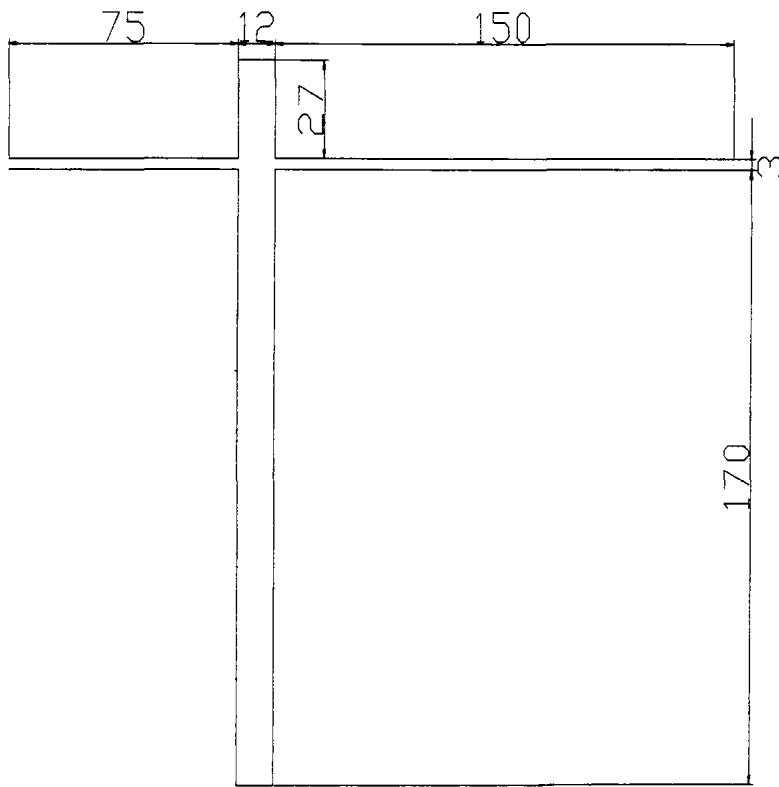  
图2-1根系形态简化模型（单位：cm）  
Fig.2-1 Simplized model of root system morphology

## 2.2.2 计算剖面及边界约束条件

根据研究地区的实际情况，林木根系固土边坡坡度为 $2 5 ^ { \circ } \sim 4 5 ^ { \circ }$ 之间；坡长10m\~30m：下面以坡度37°，坡长15m，油松林边坡为例，说明造林边坡的剖面划分和边界约束条件。

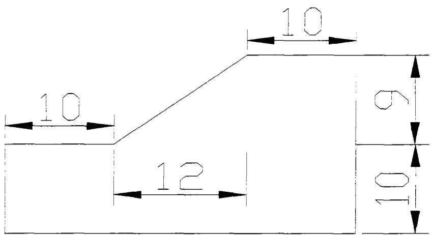  
图2-2有限元分析几何实体模型图（单位：m）

Fig2-2 Geometric entity model of finite element analysis  
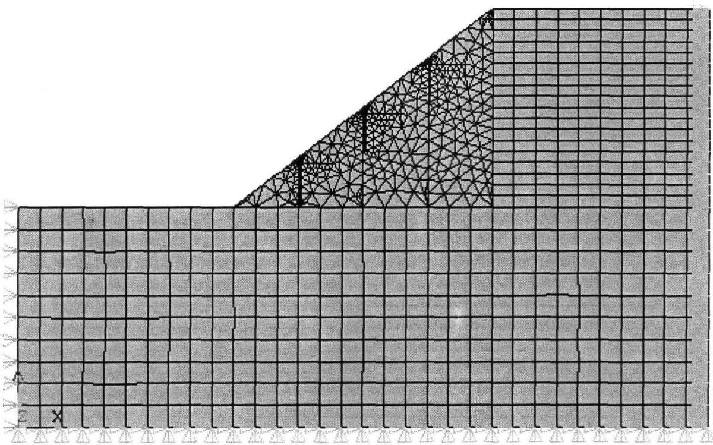  
(a)造林边坡网格剖分图

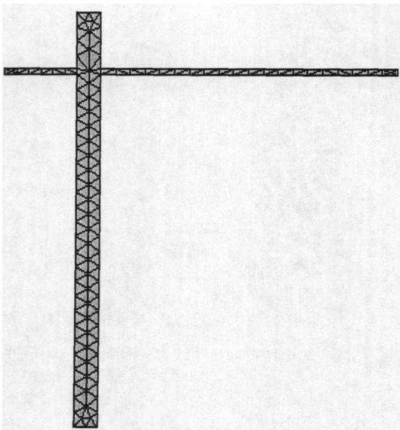  
(b) 树根网格剖分图  
图 2-3 造林边坡网格剖分图  
Fig.2-3 Meshes partition of the afforestation slope

坡度 $3 7 ^ { \circ }$ ，坡长15m，株间距3m的边坡上设计生长3 棵树，考虑边坡地形条件以及稳定分析的要求，在坡上和坡下加大计算范围。为了便于资料整理和分析，计算坐标以剖面左下角为坐标原点，X轴向右为正，Y轴向上为正。根据地形、地层特点，对根系、土体和根土接触面进行离散，采用三角形单元和四边形单元进行划分，在边坡周围采用较细的单元，远离根系区根据圣维南原理划分为较大单元，以提高计算的速度和精度。计算侧边界采用水平向约束，垂直向自由；底边界水平向、垂直向均约束；坡面和坡顶则完全自由。图2-2 是模型边界土体计算范围实体模型，计算区域及有限元网格剖分结果见图2-3。

## 2.3 有限元基本参数 [19]

油松根系容重为 $1 1 . 4 0 \mathrm { k N } / \mathrm { m } ^ { 3 }$ ，弹性模量为 6000kPa，泊松比为 0.3。

20年油松树体鲜重为 70kg，树体自重应力按面力荷载分别施加于基径为12cm的树根桩上。

各种材料的邓肯E-μ模型参数见表2-1。

表 2-1 土体材料计算参数表  
Table 2-1 Calculating parameters of materials
<table><tr><td rowspan=1 colspan=1>材料</td><td rowspan=1 colspan=1>含水量/%</td><td rowspan=1 colspan=1>γ (kN $/ \mathfrak { m } ^ { 3 } )$ </td><td rowspan=1 colspan=1>K</td><td rowspan=1 colspan=1> $K _ { u r }$ </td><td rowspan=1 colspan=1>n</td><td rowspan=1 colspan=1> $R _ { f }$ </td><td rowspan=1 colspan=1> $K _ { b }$ </td><td rowspan=1 colspan=1>m</td><td rowspan=1 colspan=1>C/(kPa)</td><td rowspan=1 colspan=1>φ/(°)</td><td rowspan=1 colspan=1> ${ \tt K } _ { 0 }$ </td></tr><tr><td rowspan=1 colspan=1>黄土</td><td rowspan=1 colspan=1>20</td><td rowspan=1 colspan=1>16</td><td rowspan=1 colspan=1>33.9</td><td rowspan=1 colspan=1>40.68</td><td rowspan=1 colspan=1>0.62</td><td rowspan=1 colspan=1>0.6</td><td rowspan=1 colspan=1>17</td><td rowspan=1 colspan=1>0.86</td><td rowspan=1 colspan=1>20</td><td rowspan=1 colspan=1>25</td><td rowspan=1 colspan=1>0.5</td></tr><tr><td rowspan=1 colspan=1>油松根土接触面</td><td rowspan=1 colspan=1>15</td><td rowspan=1 colspan=1></td><td rowspan=1 colspan=1>3431.68</td><td rowspan=1 colspan=1>0</td><td rowspan=1 colspan=1>0</td><td rowspan=1 colspan=1>0.7</td><td rowspan=1 colspan=1>0</td><td rowspan=1 colspan=1>0</td><td rowspan=1 colspan=1>15.35</td><td rowspan=1 colspan=1>24.45</td><td rowspan=1 colspan=1>0.5</td></tr></table>

## 2.4 根系固土护坡作用分析

## 2.4.1 边坡稳定性分析

[16-18]将根土模型参数代入有限元处理软件进行分析，对坡度为 $3 7 ^ { \circ }$ ，坡长 15m，株间距3m的油松林边坡和无林边坡的应力和位移进行了计算，并由后处理程序绘出应力和位移等值线图。图中规定压应力为正，拉应力为负。应力单位Pa，位移单位是m。

图2-4\~2-9是无林边坡和有林边坡的应力场，其中图2-4是无林边坡最大主应力等值线图，图2-5是有林边坡最大主应力等值线图，图2-6是无林边坡最小主应力等值线图，图2-7是有林边坡最小主应力等值线图，图2-8是无林边坡剪应力等值线图，图2-9是有林边坡剪应力等值线图。

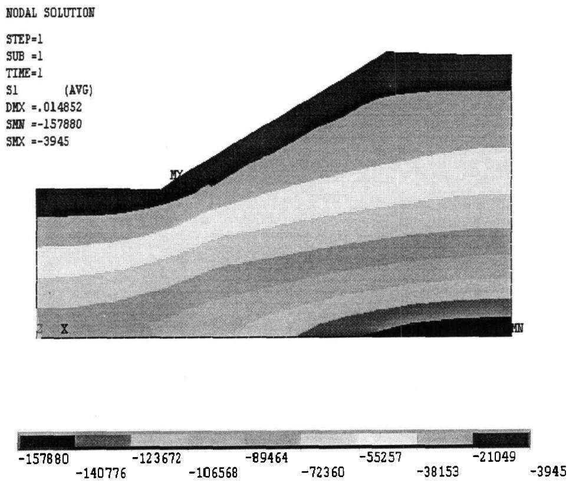  
图2-4无林边坡最大主应力等值线图（Pa）  
Fig.2.4 The maximum principal stress isoline of non-forested slope(Pa)

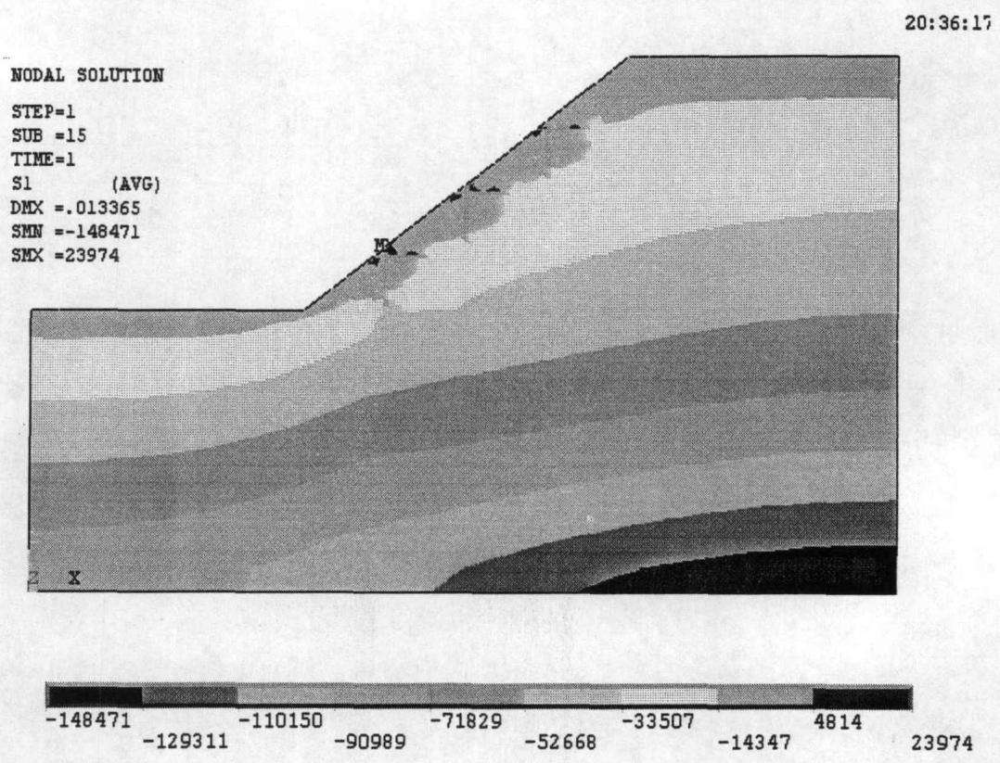  
图 2-5 有林边坡最大主应力等值线图（Pa）

Fig.2-5 The maximum principal stress isolineof afforestation slope (Pa)  
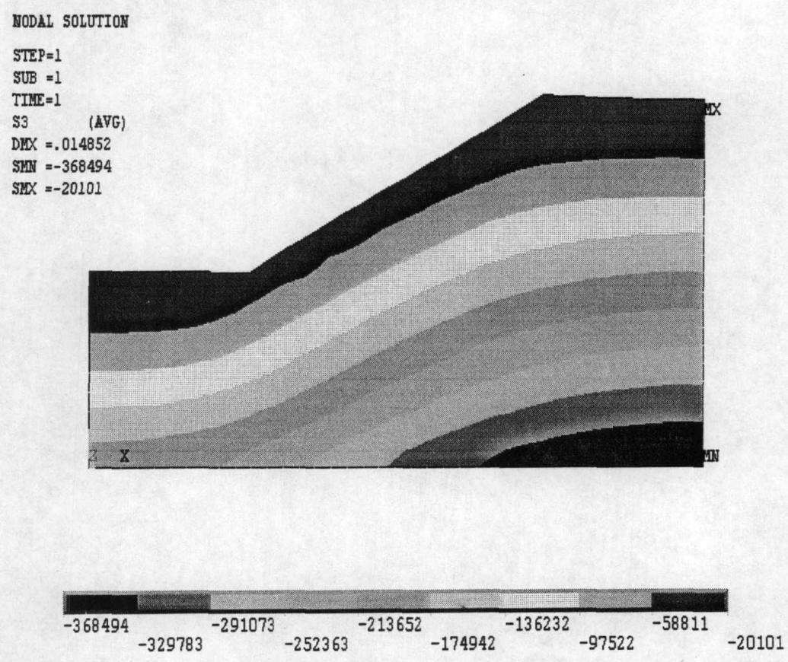  
图 2-6 无林边坡最小主应力等值线图（Pa）  
Fig.2.6 The minimum principal stress isoline of non-forested slope (Pa)

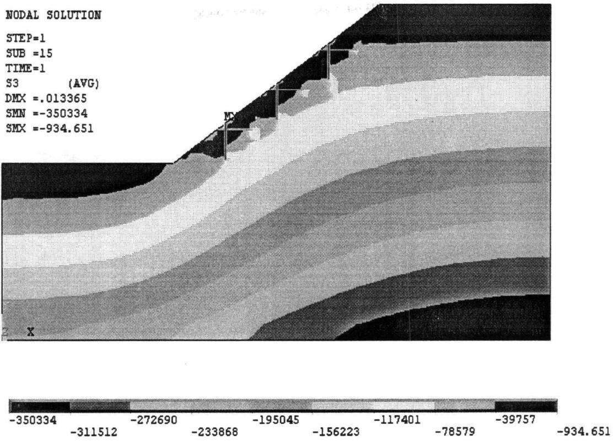  
图2-7有林边坡最小主应力等值线图（Pa)

Fig.2-7 The minimum principal stress isoline of afforestation slope(Pa)  
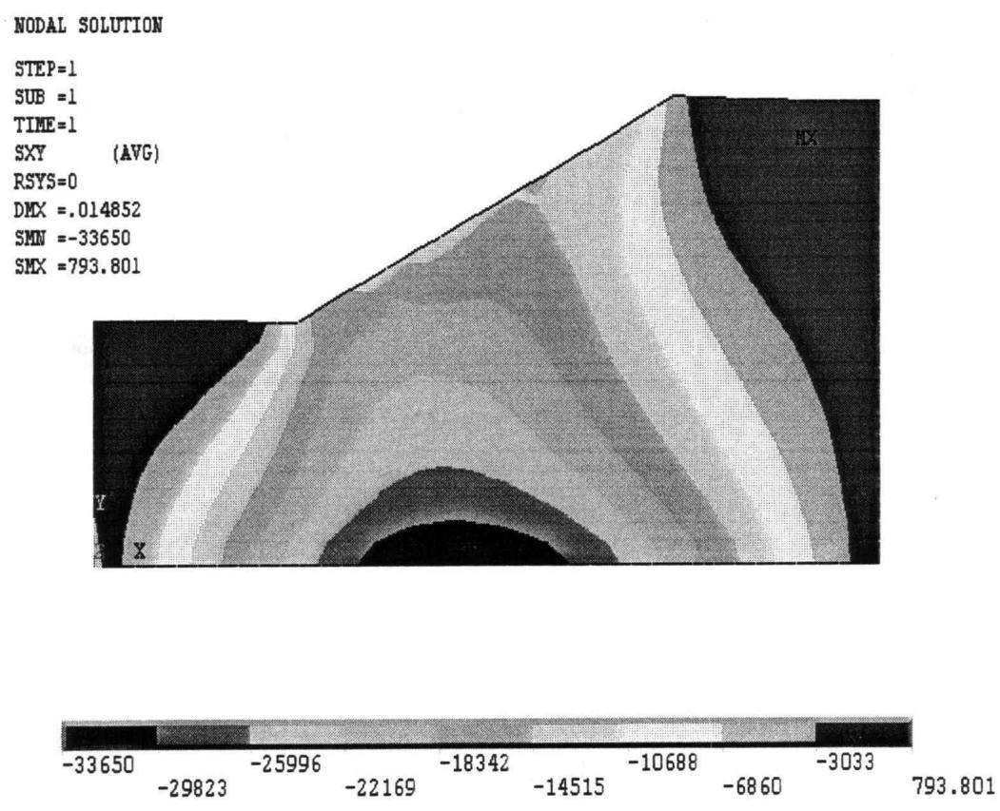  
图2-8无林边坡剪应力等值线图（Pa)  
Fig.2-8The shearing stress isoline of non-forested slope(Pa)

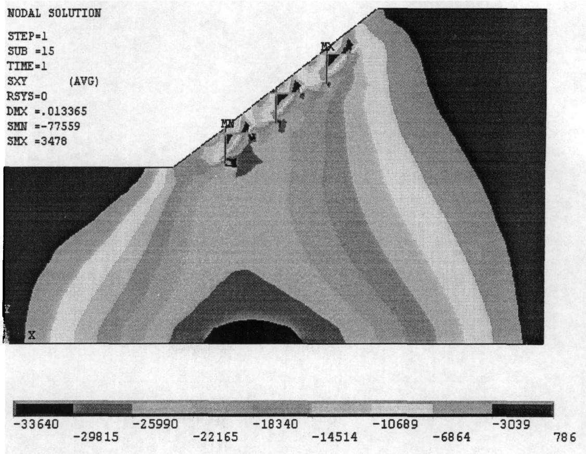  
图2-9有林边坡剪应力等值线图（Pa）  
Fig.2-9 The shearing stress isoline of afforestation slope (Pa)

从以上图2-4\~2.9应力图可以看出，无林边坡、有林边坡最大、最小主应力等值线数值增加趋势总体上随深度的增加而增加，增幅比较缓慢，最大、最小主应力最大值均出现在边坡底部，其中边坡的坡脚向土体内侧存有一个应力的集中带。

一般认为，根系与土体之间的摩擦，提高了土体的摩擦强度。由于根系与土体相比有很高的抗拉、抗剪强度和抗弯刚度，在土层发生变形过程中根土的变形差就形成了对土层的约束力。

边坡中的荷载会向根系转移，在这个过程中，根系不仅能承担土体的部分应力，而且还能通过应力扩散作用把应力传递到周围土体中，把应力往土体深部传递，减弱了根系层应力的作用，从而起到减小了土体的应力集中，使塑性区域减小，对提高边坡的稳定性起到积极的作用。

如果发生浅层滑动，滑裂面通过垂直根系时，根系会在土层发生错动中产生剪应力，并且会在孔壁间产生剪应力来约束土体变形。因此，根系的存在可以控制边坡的变形和提高边坡的稳定性。

由计算结果及应力图分析得知，在无林边坡中坡面压应力非常小，甚至在有的情况下会产生拉应力，一般认为，坡面拉应力的存在是边坡产生崩塌的内在原因。而有林边坡可以降低边坡上部张拉区和塑性区范围，从而提高边坡的稳定性。

根土复合，可以改变土体的力学性能，提高土体的抗剪强度，而根系提高土体强度的根本在于根土变形存在着比较大的差异，而在共同变形中，会产生相互错动的趋势。这种错动被根土之间存在的摩阻力抵抗，从而使根系承受比较大的拉力，而根系的之间的土体侧向约束提高了根土复合体的强度。由于根能产生这样的积极效果，并且植物自认的生态特性，可以在发生降雨时截留到达坡面的雨水，从而降低雨水的侵蚀，起到抗蚀固坡的作用，由此可见根不仅能起到固坡的作用还可以降低水土流失的发生。

## 2.4.2 边坡位移

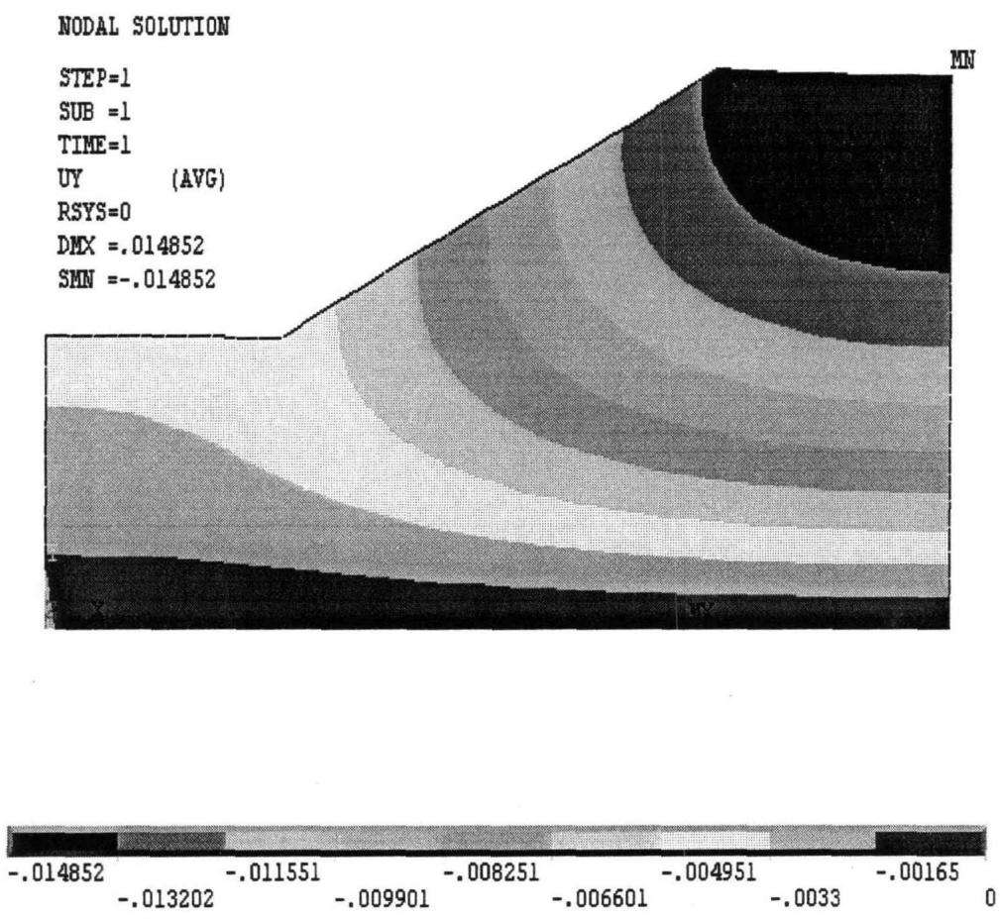  
图2-10无林边坡垂直位移等值线图（m）  
Fig.2-10 Vertical displacement isoline of non-forested slope (m)

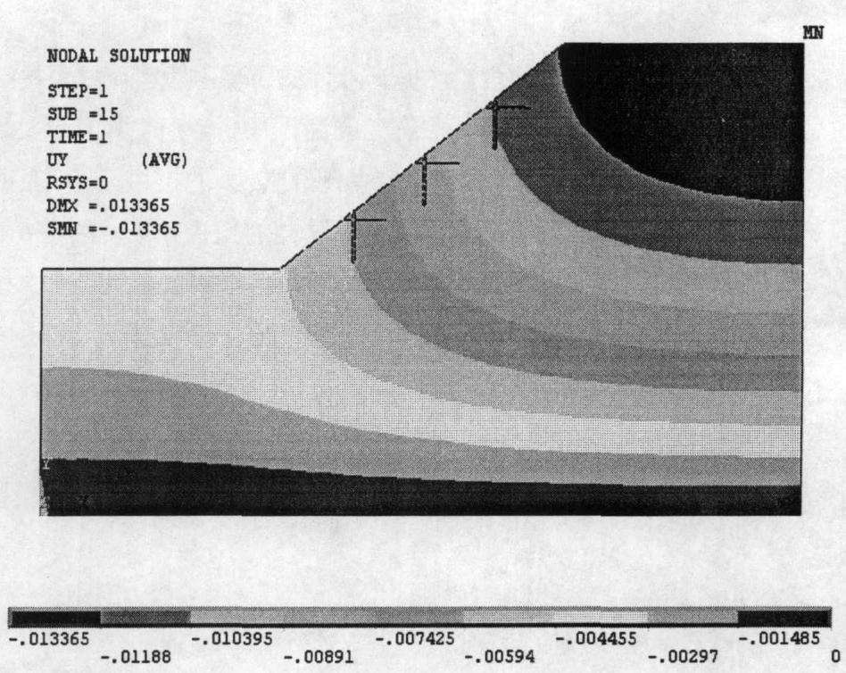

图 2-11 有林边坡垂直位移等值线图（m）  
Fig.2-11 Vertical displacement isoline of afforestation slope(m)  
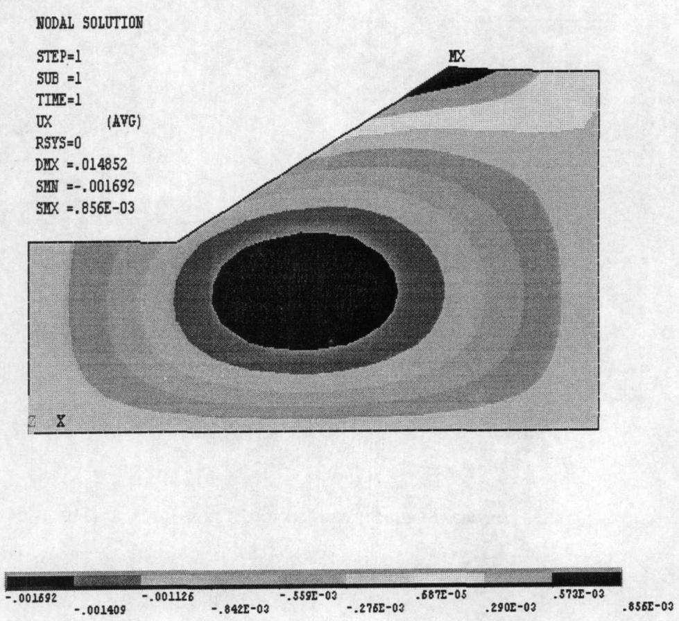  
图2-12 无林边坡水平位移等值线图（m）  
Fig.2-12 Horizontal displacement isoline of non-forested slope(m)

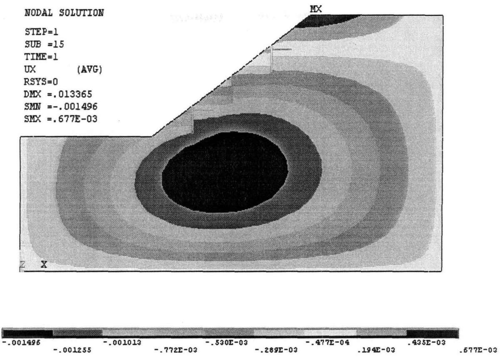  
图2-13有林边坡水平位移等值线图（m）  
Fig2-13 Horizontal displacement isoline of afforestation slope(m)

图2-10\~2-13 是有林边坡和无林边坡的位移场，其中图2-10 是无林边坡垂直水平位移等值线图，图2-11是有林边坡水平位移等值线图，图2-12是无林边坡水平位移等值线图，图2-13是有林边坡垂直位移等值线图。

从图中可以[20]看出，边坡位移趋势具有明显的分区性。在坡脚处无林边坡比有林边坡更容易发生较大位移。而变形发生的区域出现在坡面附近，由于根系的弹性模量比土体大的多，在相同应力下根比土体的变形要小，加上树木本身的受到重力作用，根系会挤压周围土体，而使土体向上位移量，有根系的存在可以降低该区域的变形量。

## 2.5 小结

根系的的存在，起到了加筋作用、锚固作用。并且根系的弹性模量要比土层大很多，这样会在十层变形过程中产生约束力，在防治滑动过程中根系的抗剪作用发挥了比较大的作用。植物的垂直根系穿过容易发生破坏的浅层土层，深入到相对稳定的深层土层中，能够起到预应力锚杆作用。植物向纵横方向都有分布的特点起到加筋作用，侧向根系的牵引和支撑作用，提高土体的强度。同时考虑到植物自认的生态特性，植物能够降低雨水的冲蚀，从而起到降低在雨水发生时所产生的滑坡泥石流现象的发生。由此可见根不仅起到护坡的作用，还降低水土流失的发生起到水土保持的作用，与传统护坡相比植物护坡还是具有很大的优点的。因此能够为石窑店煤矿边坡生的态修复植物措施提供有益的补充。

## 3 基于有限元的石窑店煤矿拦渣坝稳定性分析

随着我国经济建设速度的加快，资源开发利用的速度不断加大。陕北作为我国重要的能源重化工基地，煤炭、矿产等资源开发是其能源格局中的重要内容。在矿产资源开发过程中，必然会产生大量的弃土弃渣，若不采取有力的防治措施，将会加速当地土地荒漠化和水土资源损失，对项目区及周边生态环境造成不良影响。拦渣坝作为开发建设项目进行弃土弃渣治理的一种主要的工程措施，其稳定性和安全性对于整个项目的安全生产和可持续发展具有至关重要的作用。

针对陕北石窑店煤矿拦渣坝的安全与稳定问题，应用力学分析原理和有限元方法，利用有限元软件对煤矿拦渣坝的稳定性进行分析和计算，以期为矿区拦渣坝的设计与施工提供可靠的设计参数和依据，实现开发建设项目的快速治理和生态修复。

## 3.1 研究区概况

石窑店煤矿位于陕西省神木县东北部、府谷县西部，属于神府矿区新民开采区的一部分。矿区地表地形支离破碎，属于典型的黄土高原丘陵地貌区。本区属中温带大陆性干旱一半干旱季风气候，多年平均气温 $1 0 . 3 \%$ ，年平均气温差33.2℃；年平均降雨量339.4mm，降雨量主要集中在7\~9月份，约占年降雨量的50～60%。

根据预测，石窑店矿井施工过程中建设期弃土、弃石、弃渣总量为2.08万 $\mathfrak { m } ^ { 3 }$ ，约合3.59万t。主体方案设计根据骨干坝坝址选择条件，将坝址选在距离矿井工业场地南侧约0.5km处的自然冲沟沟道内，沟底基岩出露，筑坝形式采用碾压土石坝，筑坝材料采用井巷工程弃碴。反滤体为干砌石结构。泄洪建筑物采用竖井、涵洞、排水沟。根据沟道具体情况和计划弃渣量，拦渣坝的洪水设计标准分别采用30年一遇设计，50年一遇校核。拦渣坝坝体的设计参数如下表3-1。

表 3-1 拦渣坝体的设计参数  
Table 3-1 The design parameters of tailing dam
<table><tr><td rowspan=1 colspan=1>坝顶长(m)</td><td rowspan=1 colspan=1>坝底长(m)</td><td rowspan=1 colspan=1>坝高(m)</td><td rowspan=1 colspan=1>坝顶宽(m)</td><td rowspan=1 colspan=1>坝底宽(m)</td><td rowspan=1 colspan=1>上游边坡比</td><td rowspan=1 colspan=1>下游边坡比</td><td rowspan=1 colspan=1>设计堆渣高度(m)</td></tr><tr><td rowspan=1 colspan=1>58.3</td><td rowspan=1 colspan=1>8.3</td><td rowspan=1 colspan=1>11</td><td rowspan=1 colspan=1>3</td><td rowspan=1 colspan=1>55.5</td><td rowspan=1 colspan=1>01:02.5</td><td rowspan=1 colspan=1>01:01.3</td><td rowspan=1 colspan=1>25</td></tr></table>

## 3.2 拦渣坝稳定的理论分析计算

## 3.2.1 坝坡抗滑稳定

经典的滑坡理论认为[23]，坝坡（粘聚力 $\mathbf { \boldsymbol { C } } \mathbf { \boldsymbol { > } } 0 )$ 发生滑坡时，其滑动面形状通常为一曲面，其截面近似于圆弧(称滑弧)，并认为滑动面以上的滑动体为刚性体，然后取该体为脱离体，分析其在各种力作用下的稳定性。圆弧滑动条分法计算图如下图3-1所示。

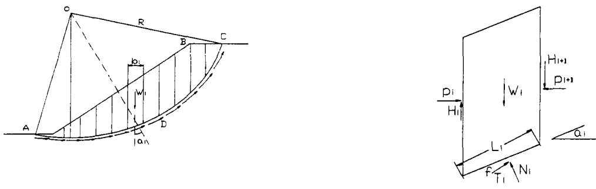  
图 3-1 圆弧滑动条分法计算图  
Fig.3-.1 Calculation picture of fellenius method

工程实践中常常为了简化计算，假定i渣条两侧Pi、Hi的合力与Pi+1、Hi+1的合力大小相等、方向相反且作用线重合，则作用在矿渣条的力就只有 $\mathbf { W } _ { \mathrm { ~ i ~ , ~ } } \mathbf { N } _ { \mathrm { i } } \mathbf { \Pi } _ { \mathbb { X } } \mathbf { T } _ { \mathrm { i } } \mathbf { \Pi } _ { \ b { \mathcal { I } } }$ 。利用矿渣条的平衡条件及由瑞典圆弧法公式

$$
F _ { s } = { \frac { { \ddag { \Pi } } { \sqrt { \mathsf { s } } } { \bf { \mathcal { H } } } { \bf { \mathcal { H } } } { \bf { \mathcal { H } } } { \bf { \Xi } } } { \sqrt [ { 3 } ] { \Xi } { \Xi } { \bf { \mathcal { H } } } { \bf { \Xi } } { \mathcal { H } } \Xi } } { = { \frac { { \bf { M } } _ { \mathrm { R } } } { { \bf { \Xi } } } } { \bf { \Xi } } { \bf { \mathcal { H } } } : \ }
$$

$$
\mathrm { F } _ { \mathrm { s } } = \frac { \sum ( \mathrm { c } _ { \mathrm { i } } \mathrm { l } _ { \mathrm { i } } + \mathrm { W } _ { \mathrm { i } } \mathrm { c o s } \alpha _ { \mathrm { i } } \mathrm { t a n } \phi _ { \mathrm { i } } ) } { \sum \mathrm { W } _ { \mathrm { i } } \mathrm { s i n } \alpha _ { \mathrm { i } } }\tag{3.1}
$$

式中： $\mathbf { W }$ i一第i条块矿渣条自重； $\pmb { \alpha _ { \mathrm { i } } }$ 一第i条块矿重力线与通过此条块底面中点半径之间的夹角；b一第i条块宽度；R一圆弧半径；1—第i条块滑弧长度；C、φ一第i ${ \bf b _ { i } ^ { * } }$ $\mathbf { l _ { i } } .$ $\Phi$ 条块的内聚力和内摩擦角。

由于上式未考虑坝体中矿渣条两侧的推力，因此计算得到的稳定安全系数偏低。根据《碾压式土石坝设计规范》（SL274-2001）的规定，不考虑坝体中矿渣条间作用力时，对 $\overrightarrow { y }$ 四、五级坝正常条件下抗滑稳定安全系数取1.15。

## 3.2.2 坝体抗滑稳定

坝体是否滑动取决于坝体重量压在基岩面上所产生的摩擦力的大小。如果摩擦力大于水平推力，则不会滑动[24]。坝体抗滑稳定计算公式如下：

$$
K _ { s } = f { \frac { N } { P } }\tag{3.2}
$$

式中f一坝体与基础的摩擦系数，要求 $\mathrm { K s } { = } 1 . 0 { \sim } 1 . 0 5$ ；N—坝体垂直力的总和，向下为正，向上为负；P—坝体水平力的总和，向下游为正，向上游为负。

## 3.2.3 坝基承载力验算

坝基承载力计算公式为[25]：

$$
\delta _ { \mathrm { \ m a x , \ m i n } } = \frac { \sum _ { \mathrm { } } \mathrm { W } } { \mathrm { \bf \Sigma B } } ( 1 \pm \frac { 6 \mathrm { e } } { \mathrm { \bf B } } )\tag{3.3}
$$

验算坝基承载力须同时满足公式（3.7）和（3.8）

$$
\frac { 1 } { 2 } ( \delta _ { \mathrm { \scriptsize ~ m a x } } + \delta _ { \mathrm { \scriptsize ~ m i n } } ) \leqslant \mathrm { f }\tag{3.4}
$$

$$
\delta _ { \mathrm { \ m a x } } { \leqslant } 1 . 2 \mathrm { ~ f ~ }\tag{3.5}
$$

式中： $\sum ^ { W }$ 一坝基的总铅直向荷载；e—铅直荷载的偏心距；f—坝基承载力；δ—坝基边缘压力；B一坝基宽度。

表 3-2 拦渣坝的稳定性计算结果  
Table 3-2 The calculating result of stability on tailing dam
<table><tr><td rowspan=1 colspan=2>稳定类型稳定系数</td><td rowspan=1 colspan=1>坝坡抗滑稳定系数 $\mathbf { F } _ { s }$ </td><td rowspan=1 colspan=1>坝体抗滑稳定Ks</td><td rowspan=1 colspan=1>坝基承载力 f(Mpa)</td></tr><tr><td rowspan=2 colspan=2>允许值</td><td rowspan=2 colspan=1>≥1.15（干燥）</td><td rowspan=2 colspan=1>1.0~1.05</td><td rowspan=1 colspan=1>f 抗压：4.5 ～10</td></tr><tr><td rowspan=1 colspan=1>f 执拉：2 ~5.5</td></tr><tr><td rowspan=4 colspan=1>计算值</td><td rowspan=2 colspan=1>矿渣干燥</td><td rowspan=2 colspan=1>2.50</td><td rowspan=2 colspan=1>1.05</td><td rowspan=1 colspan=1>压应力 $\delta _ { \mathrm { m a x } } = 1 . 6 5$ </td></tr><tr><td rowspan=1 colspan=1>拉应力 $\delta _ { \mathrm { m a x } } = 1 . 1 0$ </td></tr><tr><td rowspan=2 colspan=1>矿渣湿润</td><td rowspan=2 colspan=1>1.90</td><td rowspan=2 colspan=1>0.97</td><td rowspan=1 colspan=1>压应力 $\delta _ { \operatorname* { m a x } } = 1 . 2 4$ </td></tr><tr><td rowspan=1 colspan=1>拉应力 $\delta _ { \operatorname* { m a x } } = 0 . 8 3$ </td></tr></table>

注：坝坡抗滑稳定系数 $\mathtt { F } _ { s }$ 的计算采用圆弧滑动条分法，且矿渣湿润时的坝坡抗滑稳定系数考虑了水渗流的影响，坝基承载力允许值取岩石的抗压抗拉允许值。

## 3.3 拦渣坝稳定的数值仿真计算

## 3.3.1 参数选取

根据黄土地区筑土石坝工程经验、设计资料、现场资料分析[26-28]、现场及室内岩土物理力学试验[29]和有限元计算的需要，拦渣坝材料特征取值如下表3-3。

表 3-3 拦渣坝材料特征参数  
Table 3-3 The characteristics of materials parameters of tailing dam
<table><tr><td rowspan=1 colspan=1>项目参数</td><td rowspan=1 colspan=1>土石模量 $\bf E ( P a )$ </td><td rowspan=1 colspan=1>泊松比μ</td><td rowspan=1 colspan=1>重度 $\pmb { \gamma }$  $\mathbf { k } \mathbf { N } / \mathbf { m } ^ { 3 }$ </td><td rowspan=1 colspan=1>内聚力 $\mathsf { c l }$  $\mathbf { k } \mathbf { p } \mathbf { a }$ </td><td rowspan=1 colspan=1>内摩擦角 $\phi / ^ { \circ }$ </td></tr><tr><td rowspan=1 colspan=1>坝体</td><td rowspan=1 colspan=1> $2 . 0 \times 1 0 ^ { 8 }$ </td><td rowspan=1 colspan=1>0.38</td><td rowspan=1 colspan=1>16.5</td><td rowspan=1 colspan=1>19.0</td><td rowspan=1 colspan=1>20.5</td></tr><tr><td rowspan=1 colspan=1>反滤体干砌石、基岩</td><td rowspan=1 colspan=1> $2 . 9 \times 1 0 ^ { 9 }$ </td><td rowspan=1 colspan=1>0.23</td><td rowspan=1 colspan=1>23.2</td><td rowspan=1 colspan=1>437.0</td><td rowspan=1 colspan=1>40.1</td></tr></table>

在拦渣坝的单元格剖分过程中，坝体和反滤体的单元格边长取3m，基岩的单元格边长取10m，共得到节点281个，单元120个；计算中取坝体对基岩和其周围的影响范围为坝高的一半5.5米，基岩与其周围的连接设定为固定支座。

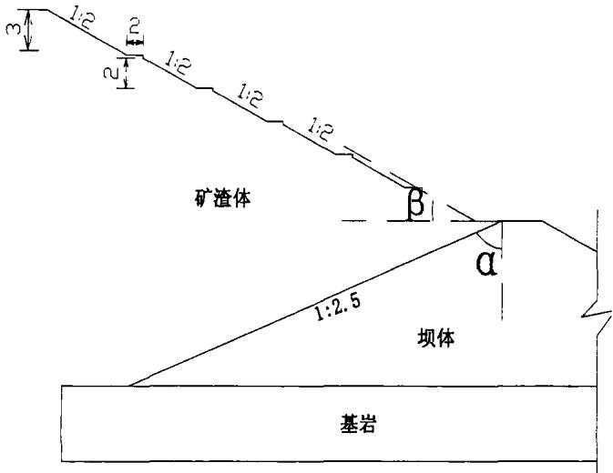

图 3-2 矿渣堆渣方式  
Fig.3-2 Method of slags stacked  
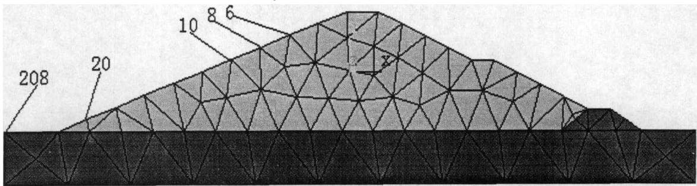  
图3-3带节点编号的拦渣坝网格划分图  
Fig.3-3 Picture of tailing dam meshing with the node number

## 3.3.2 渣体干燥状态下拦渣坝受力分析

在干旱季节，坝坡面粗糙，加之竖井、涵洞、排水沟等排水设施的排水情况艮好，矿渣处干于燥状态，故坝的摩擦角δ取矿渣的内摩擦角 $\Phi ( 3 5 ^ { \circ } )$ 的 $1 / 2 { \sim } 1 / 3 ^ { [ 2 1 ] }$ ，本坝取$\delta = 1 5 ^ { \circ }$

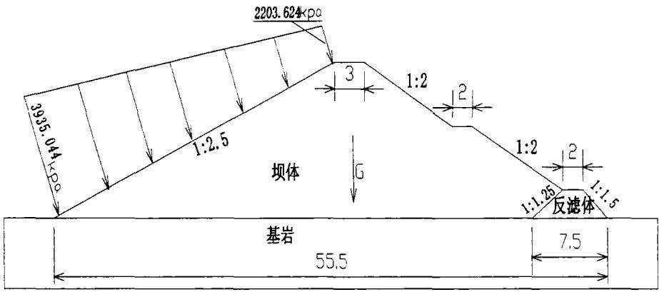  
图3-4仅受矿渣压力情况下拦渣坝的受力图  
Fig.3-4 Picture of tailing dam under condition of pressure caused by slags

矿渣的库仑主动压力计算公式为[21]： $P _ { a } = \gamma H K _ { a }$

(3.6)

式中：γ—矿渣的容重， $\scriptstyle \mathtt { Y } = \rho _ { \mathrm { \# } } \mathtt { g } = 1 6 . 5 \mathrm { k N } / \mathbf { m } ^ { 3 }$ H—矿渣堆渣高度； ${ \bf K } _ { \tilde { \bf a } } .$ 一库仑主动压力系数。

$$
\scriptstyle { \overline { { \Pi } } } \textrm { K } _ { \mathbf { a } } = { \frac { \cos ^ { 2 } ( \varphi - \alpha ) } { \cos \alpha ^ { 2 } \cos ( \alpha + \delta ) [ 1 + { \sqrt { \frac { \sin ( \varphi + \delta ) \sin ( \varphi - \beta ) } { \cos ( \alpha + \delta ) \cos ( \alpha - \beta ) } } } ] ^ { 2 } } }\tag{3.7}
$$

式中：φ一矿渣的内摩擦角；α—拦渣坝迎水坡与铅直线的夹角；δ—坝的摩擦角，有经验或规范确定，在本坝中取 $1 5 ^ { \circ }$ ；β一堆渣表面与水平线所成夹角。由计算可得：$a = 6 8 . 2 ^ { \circ }$ ，取 $6 8 ^ { \circ }$ $\beta = 2 6 . 6 ^ { \circ }$ ，取 $2 7 ^ { \circ } ( < 3 5 ^ { \circ } )$ ，代入（3.11）计算得 $\mathtt { K a = 9 . 5 3 9 5 }$ 0

当堆渣达到设计高度 25.0m 时，矿渣对坝的压力分布从坝顶至坝底为直线，计算可得拦渣坝坝顶所受矿渣的库仑压力 $\mathbf { P l a _ { \perp } }$ 为 2203.624 kPa，坝底所受矿渣的库仑压力 $\mathbf { P l a } _ { \textsf { F } }$ 为 3935.044kPa，坝体受力如图3-4 所示。

## 3.3.3 渣体饱和状态下拦渣坝受力分析

当有暴雨洪水时，矿渣全部处于饱和含水状态，此时矿渣的浮容重γ为 $1 1 . 7 7 \mathrm { ~ k N } / \mathrm { m } ^ { 3 }$ $( \mathrm { ~ \tt ~ { ~ p ~ s a t } = 2 . 2 g / c m } ^ { 3 } )$ ，当堆渣达到设计高度25.0m时，矿渣对坝的压力分布为折线，计算可得拦渣坝坝顶所受矿渣的库仑压力 $\mathbf { P } 2 \mathbf { a } _ { \textrm { \pm } }$ 为 2203.624kpa，坝底所受矿渣的库仑压力 $\mathbf { P } 2 \mathbf { a }$ $\ F .$ 为3548.704kpa。由于拦渣坝的拦水作用，水对坝的静水压力为三角形分布，坝顶处为零，坝底处为 $\mathtt { P _ { W } }$ 为110 kpa，坝体受力如图3-5所示。

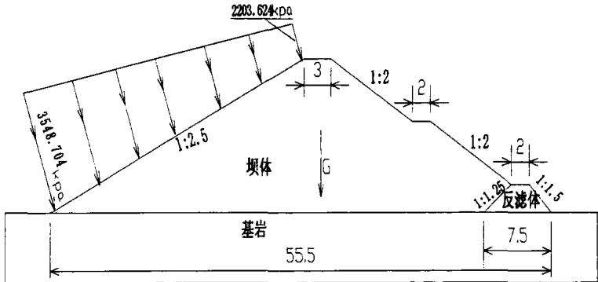  
图3-5 受矿渣库仑压力和水压力时的拦渣坝横断面图  
Fig.3-5 Picture of tailing dam under condition of pressure caused by slags and hydrostatic pressure combined action

经有限元软件计算知：拦渣坝自重下沉降为4.19mm,仅受矿渣压力作用下坝体的最大合位移在第 ${ \bf 6 }$ 节点上，其值为94.55mm，矿渣和水压力共同作用下坝体最大合位移也在第6节点上，其值为68.66mm，均满足变形小于经验的H/100(坝高的百分之一)即110mm的要求。

在两种工况下，坝体中X方向的位移均为正，且变化规律一致，以坝体中迎渣面离坝顶3m～9m、垂直迎渣面斜向坝体内5m的范围为X方向位移的最大值区域；X方向的其它位移近似以第6节点为圆心、以迎渣面为直径的的同心圆从迎渣面贯穿坝体向背渣面、从坝顶向坝底递减直至减小为最小值0。两种工况下X方向位移的最大值为67.68mm（第6节点是位移最大点，见图3-3）。基岩在X方向是固定不动的，其位移为0。

两种工况下Y方向的位移变化规律也一致，且基本分为两部分，坝体中心左侧由于受到矿渣或矿渣和水压力的作用，位移向下，表现为下沉，坝体中心右侧由于受到左侧坝体的挤压，位移向上，表现为抬升，这与力学的分析是相吻合的。坝体中心左侧的下沉位移中，迎渣面离坝顶3m～9m，垂直迎渣面斜向坝体内3m的范围为Y方向位移的最大值区域：Y方向的其它下沉位移近似直径沿着迎渣面、依次以第6、8、10节点为圆心的同心圆从垂直迎渣面向坝底递减直至减小为最小值0。两种工况下Y方向位移的最大值为66.02mm（第6节点是位移最大点，见图3-3）；坝体的抬升位移区主要分布在坝体中心左侧，垂直背渣面从背渣面向坝体延伸6m左右的范围内，其最大值为1.66mm。

在两种工况下，坝体中X方向的应力全为压应力，由于土石矿渣是抗压不抗拉的，能满足规范规定的坝体中不许出现拉应力的要求。X方向的压应力最大值区域位于坝体迎渣面的坝脚处从迎渣面向背渣面延伸15m左右、从坝底向坝顶延伸5m左右的三角形区域内，其最大值为2.27Mpa（第20节点是压应力最大点，见图3-3），远小于坝体的抗压允许应力值4Mpa\~7Mpa，坝体中其它部位的 X方向应力从最大值区域贯穿坝体从迎渣面向背渣面递减，直至减小到位于反滤体周围的应力最小值0.15Mpa，由此可知坝体是安全的。在基岩的左上角邻近坝脚处，在距基岩面3m深度的范围从上至下出现了局部拉应力，其最大值为2.34Mpa（第208节点是拉应力最大点，见图3-3），最小值为0.23Mpa，远远小于基岩的允许拉应力值2\~5.5Mpa，基岩的其它部位压应力远小于其抗压允许应力4.5\~10Mpa，基岩是安全的。

在两种工况下，Y方向最大压应力均出现在基岩底部距左侧10m、向上延伸3米的范围内，其最大值为5.49Mpa（第216节点是压应力最大点，见图3-3），在基岩的抗压允许应力4～10Mpa之内。坝体中Y方向的应力也全为压应力，也满足规范规定的坝体中不许出现拉应力的要求，Y方向的压应力分布为贯穿坝体从迎渣面向背渣面递减，坝体的最大压应力在坝体从迎渣面的坝脚向背渣面延伸12m 左右、从坝底向坝顶延伸 5m 左右的三角形区域内，其最大值为4.03Mpa（第20节点是压应力最大点，见图3-3），小于矿渣的抗压允许应力值4～7Mpa；坝体中其它部位的Y方向应力从最大值区域贯穿坝体从迎渣面向背渣面递减，直至减小到位于反滤体周围的应力最小值0.25Mpa，由此可知坝体是安全的。在基岩的左侧邻近坝脚处，在基岩面向下5.5m、从左至右3米的范围出现了局部拉应力，其最大值为1.1Mpa（第208节点是拉应力最大点，见图3-3），最小值为0.31Mpa，远远小于基岩的允许拉应力值2\~5.5Mpa，在基岩的其它部位压应力均在其抗压允许应力4.5～10Mpa之内，基岩也是安全的。

## 3.4 小结

通过理论分析计算石窑店煤矿拦渣坝坝坡的抗滑稳定系数、坝体抗滑稳定系数和坝基承载力，均满足设计要求；利用有限元软件对该拦渣坝在假定的两种工矿条件下的稳定性进行了分析，绘出了一系列坝体应力场和位移场图，得到坝体中应力场和位移场的分布规律，其最大值区域如下：

(1)位移的最大值区域：坝体中迎渣面离坝顶3m～9m、垂直迎渣面斜向坝体内5m的范围；

(2)应力的最大值区域：坝体迎渣面的坝脚处从迎渣面向背渣面延伸15m左右、从坝底向坝顶延伸5m左右的三角形区域，坡脚是一个应力集中区，也是坡体破坏的起点。

这些区域将指导在建坝过程中采取措施进行重点防护，以确保矿渣达到堆渣高度时坝体的安全。

从上表3-2可以看出，除了在有暴雨洪水矿渣湿润时坝体抗滑稳定不满足稳定性要求外，其余各项均满足要求，且强度储备很大，说明该坝无论是在拦渣运行期还是在坝库堆满的运行后期都是稳定的，但是在有暴雨洪水时坝体有可能产生滑移，建议在坝体下游采取抗滑桩等措施，以确保坝体的稳定性。通过有限元软件的计算，两种工况下坝体中的压应力和位移均满足要求，坝体是安全的。

拦渣坝稳定性计算不同于一般的水库或边坡，对拦渣坝稳定性分析时要综合考虑各影响因素，如水的渗透作用对坝体稳定的影响等[30]。所建模型为二维平面应变模型，不能全面模拟坝体的实际受力和位移情况，同时采用稳定性计算公式得出的稳定性系数，可以减少人为指定滑动面而带来计算误差，但不能得出坝体可能发生破坏的大概区域，但有限元有不完善的地方，即误差累积和不可计算稳定系数等缺点，本文结合理论计算和数值仿真两种方法，各取所长，优势互补，可以更好地为拦渣坝的设计工作服务，建议实际设计工作中多种方法综合运用，以便对拦渣坝的设计更科学，同时该方法也可为防治泥石流的拦渣坝的设计提供有益的参考。

## 4石窑店煤矿水土保持与生态修复措施体系研究

水土保持生态修复是指在水土流失区，通过一定的人工辅助措施，促使自然界本身固有的再生能力得以最大限度地发挥，促进植被的持续生长发育和演替，保护并改善受损生态系统的功能，建立和维系与自然条件相适应、与经济社会可持续发展相协调并良性发展的生态系统。水土保持生态修复的核心是减少人为干扰，充分发挥植被的自然恢复能力，从而恢复生态系统的功能，实现生态环境改善的目标。实施水土保持生态修复工程主要依靠植被的自然恢复能力。通过第2章与第3章研究内容，结合石窑店煤矿主体工程施工工艺和施工进度，并依据不同阶段、不同时期、不同地形、地貌、地质条件，开发建设所产生水土流失特点及其危害，借鉴当地治理水土流失的成功经验，因地制宜，因害设防，采取有效的防治措施，防止工程建设产生的水土流失，进行生态修复。

## 4.1 项目区自然环境概况

## 4.1.1 自然环境概况

## 4.1.1.1 地形地貌

石窑店井田位干陕北黄土高原北部，地形支离破碎，沟壑纵横，为典型的黄土高原丘陵地貌，区内植被稀少，水土流失严重。基岩及红土沿沟谷两侧大面积出露，沟帮及梁昴上覆盖第四系黄土。

## 4.1.1.2 水系

区内一级水系为悖牛川，由北而南流经井田西部，年平均流量为3.52m³/s。较大二级水系有大板兔川、小板兔川，从北东流向西南纵贯井田东南部，于石窑店村前注入悖牛川。此外井田内自北而南、自西而东还有木房沟、许家沟、倪家沟、杨家沟、板深沟等较大支沟，它们的流量严格受降水所控制，夏秋季丰水期流量较大，冬春季枯水期流量甚微或断流。

## 4.1.1.3 气象

本区属中温带大陆性干旱一半干旱季风气候。冬季寒冷，夏季炎热，春季风沙频繁，秋季霜早雹多，昼夜温差悬殊，降雨量小蒸发量大。元月最冷，极端低温一29.7℃，七月最热，极端高温 $+ 3 8 . 6 \mathrm { ^ { \circ } C }$ 。多年平均气温10.3℃，年平均气温差33.2℃。年平均降雨量339.4mm，降雨量主要集中在7～9月份，约占年降雨量的 50～60%。年平均蒸发量为2054.5mm，年平均相对湿度52.0%，属温度过低带或微湿度带，最大冻土深度143cm，无霜期190天，最大风速19.0m/s。主要气象参数来自神木气象站（表4-1项目区基本气

象资料）。

表4-1 项目区基本气象资料
<table><tr><td rowspan=1 colspan=1>极端最高气温</td><td rowspan=1 colspan=1>多年平均降雨量</td><td rowspan=1 colspan=1>丰水年降雨量</td><td rowspan=1 colspan=1>枯水年降雨量</td></tr><tr><td rowspan=1 colspan=1>38.6         ℃(1996.6.21)</td><td rowspan=1 colspan=1>339.4mm</td><td rowspan=1 colspan=1>819.1mm(1967)</td><td rowspan=1 colspan=1>108.6mm(1965)</td></tr><tr><td rowspan=1 colspan=1>极端最低气温</td><td rowspan=1 colspan=1>日最大降雨量</td><td rowspan=1 colspan=1>多年平均年蒸发量</td><td rowspan=1 colspan=1>极端最大风速</td></tr><tr><td rowspan=1 colspan=1>-29.7        ℃(1994.1)</td><td rowspan=1 colspan=1>136.3mm(1958.7.21)</td><td rowspan=1 colspan=1>2054.5mm</td><td rowspan=1 colspan=1>19.0m/s</td></tr><tr><td rowspan=1 colspan=1>多年平均气温</td><td rowspan=1 colspan=1>平均风速</td><td rowspan=1 colspan=1>多年平均相对湿度</td><td rowspan=1 colspan=1>最大冻土深度</td></tr><tr><td rowspan=1 colspan=1>10.3℃</td><td rowspan=1 colspan=1>1.7m/s</td><td rowspan=1 colspan=1>52.0%</td><td rowspan=1 colspan=1>143cm(1968.2)</td></tr><tr><td rowspan=1 colspan=2>资料系列长度</td><td rowspan=1 colspan=2>1955～2001年（46年）</td></tr></table>

## 4.1.1.4 土壤和植被

井田所在区域属森林草原向沙漠、干草原的过渡地带，土壤以黄绵土为主，另外还分布有栗钙土和黑垆土。黄土性土结构疏松，透水性强，抗蚀能力差，遇暴雨易崩解。据测定黄绵土有机含量 0.8%～1.0%、全氮 0.075%～0.05%、速效磷 5ppm\~7ppm、速效钙100ppm\~150ppm，栗钙土有机质含量 0.2859%，黑垆土有机质含量 0.6516%，砂土有机质含量0.03%～0.35%。由于土壤肥力低下，土壤保水肥性能差，所以产量低而不稳。同时由于人口的不断增加，为了获得足够的口粮，便开垦荒地，形成广种薄收、薄收广垦的恶性循环。

井田地处温带大陆季风气候区，地带性植被为落叶阔叶林，因人类活动频繁，天然植被已大部分破坏，阳坡一般旱生植被占优势。

植被覆盖度10%～30%左右，见表4-2

表4-2 植被覆盖度类型面积统计结果表
<table><tr><td rowspan=1 colspan=1>植被覆盖度类型</td><td rowspan=1 colspan=1>覆盖度（%）</td><td rowspan=1 colspan=1>面积 $( \mathbf { k } \mathbf { m } ^ { 2 } )$ </td><td rowspan=1 colspan=1>占平价区面积百分比（%）</td></tr><tr><td rowspan=1 colspan=1>中高覆盖度</td><td rowspan=1 colspan=1>50~70</td><td rowspan=1 colspan=1>1.29</td><td rowspan=1 colspan=1>0.96</td></tr><tr><td rowspan=1 colspan=1>中覆盖度</td><td rowspan=1 colspan=1>30~50</td><td rowspan=1 colspan=1>8.74</td><td rowspan=1 colspan=1>6.49</td></tr><tr><td rowspan=1 colspan=1>低覆盖度</td><td rowspan=1 colspan=1>10~30</td><td rowspan=1 colspan=1>73.67</td><td rowspan=1 colspan=1>54.74</td></tr><tr><td rowspan=1 colspan=1>极低覆盖度</td><td rowspan=1 colspan=1>&lt;10</td><td rowspan=1 colspan=1>15.77</td><td rowspan=1 colspan=1>11.72</td></tr><tr><td rowspan=1 colspan=1>农业植被</td><td rowspan=1 colspan=1></td><td rowspan=1 colspan=1>35.11</td><td rowspan=1 colspan=1>26.09</td></tr><tr><td rowspan=1 colspan=2>合计</td><td rowspan=1 colspan=1>134.58</td><td rowspan=1 colspan=1>100.00</td></tr></table>

①水土保持植物：柠条、柳、沙棘、大果榆、黄芪、苜蓿、牛枝子、百里香、芨芨草等。柠条灌丛是评价区分布面积最大的植被类型，广泛分布于黄土沟谷坡面和石质丘陵。

②防风固沙植物：油松、杨、榆、沙棘、柠条、沙柳、百里香、沙蒿、草木樨等。沙

蒿、沙柳灌丛广泛分布于评价区中部覆沙黄土梁和覆沙黄土峁。

农业植被主要分布黄土梁、黄土峁和悖牛川、板兔川的河阶地。

无植被地段主要分布于覆沙黄土梁、覆沙黄土峁和悖牛川、板兔川的河漫滩。植被类型面积见表4-3，

表 4-3 植被类型面积统计结果
<table><tr><td rowspan=1 colspan=1>植被类型</td><td rowspan=1 colspan=1>面积 $( \mathtt { k m } ^ { 2 } )$ </td><td rowspan=1 colspan=1>占总面积的百分比（%）</td></tr><tr><td rowspan=1 colspan=1>柠条灌丛</td><td rowspan=1 colspan=1>53.89</td><td rowspan=1 colspan=1>40.04</td></tr><tr><td rowspan=1 colspan=1>沙蒿、沙柳灌丛</td><td rowspan=1 colspan=1>35.06</td><td rowspan=1 colspan=1>26.05</td></tr><tr><td rowspan=1 colspan=1>农业植被</td><td rowspan=1 colspan=1>35.11</td><td rowspan=1 colspan=1>26.09</td></tr><tr><td rowspan=1 colspan=1>无植被地段</td><td rowspan=1 colspan=1>10.52</td><td rowspan=1 colspan=1>7.82</td></tr><tr><td rowspan=1 colspan=1>合计</td><td rowspan=1 colspan=1>134.58</td><td rowspan=1 colspan=1>100.00</td></tr></table>

## 4.2 项目区水土流失及水土保持现状 [31-32]

## 4.2.1 项目区地貌

项目区位于陕北黄土高原与毛乌素沙地过渡地带，属悖牛川流域，采用地貌成因和形态结合的原则将项目区分为黄土地貌、石质丘陵、河流地貌三个一级地貌类型，黄土梁、覆沙黄土梁、黄土昴、覆沙黄土昴、黄土谷坡、河流阶地和河流漫滩等7个二级地貌类型。项目区地貌类型统计结果见表4-4。

表 4-4 地貌类型面积统计结果表
<table><tr><td rowspan=1 colspan=2>地貌类型</td><td rowspan=1 colspan=1>面积 $( \mathrm { k m } ^ { 2 } )$ </td><td rowspan=1 colspan=1>占总面积百分比（%）</td></tr><tr><td rowspan=5 colspan=1>黄土地貌</td><td rowspan=1 colspan=1>黄土梁</td><td rowspan=1 colspan=1>23.88</td><td rowspan=1 colspan=1>17.74</td></tr><tr><td rowspan=1 colspan=1>覆沙黄土梁</td><td rowspan=1 colspan=1>29.71</td><td rowspan=1 colspan=1>22.08</td></tr><tr><td rowspan=1 colspan=1>黄土昴</td><td rowspan=1 colspan=1>1.22</td><td rowspan=1 colspan=1>0.91</td></tr><tr><td rowspan=1 colspan=1>覆沙黄土昴</td><td rowspan=1 colspan=1>7.91</td><td rowspan=1 colspan=1>5.88</td></tr><tr><td rowspan=1 colspan=1>黄土谷坡</td><td rowspan=1 colspan=1>21.59</td><td rowspan=1 colspan=1>16.04</td></tr><tr><td rowspan=1 colspan=1>石质丘陵</td><td rowspan=1 colspan=1></td><td rowspan=1 colspan=1>36.66</td><td rowspan=1 colspan=1>27.24</td></tr><tr><td rowspan=2 colspan=1>河流地貌</td><td rowspan=1 colspan=1>河流阶地</td><td rowspan=1 colspan=1>6.09</td><td rowspan=1 colspan=1>4.52</td></tr><tr><td rowspan=1 colspan=1>河漫滩</td><td rowspan=1 colspan=1>7.52</td><td rowspan=1 colspan=1>5.59</td></tr><tr><td rowspan=1 colspan=2>合计</td><td rowspan=1 colspan=1>134.58</td><td rowspan=1 colspan=1>100.00</td></tr></table>

## 4.2.2项目区土地利用现状

项目区为半干旱气候，年均降雨量339.4mm，地貌以黄土地貌为主，位于我国北方农牧交错带的中部。根据项目区土地利用现状面积统计结果表（表4-5）可以看出，项目区以牧草地和耕地为主，水域和未利用土地分布面积较少。

表4-5 土地利用现状类型面积统计结果表
<table><tr><td rowspan=1 colspan=2>土地利用现状类型</td><td rowspan=1 colspan=1>面积 $( \mathrm { k m } ^ { 2 } )$ </td><td rowspan=1 colspan=1>占总面积百分比（%）</td></tr><tr><td rowspan=2 colspan=1>耕地</td><td rowspan=1 colspan=1>水浇地</td><td rowspan=1 colspan=1>5.36</td><td rowspan=1 colspan=1>3.98</td></tr><tr><td rowspan=1 colspan=1>旱地</td><td rowspan=1 colspan=1>29.75</td><td rowspan=1 colspan=1>22.11</td></tr><tr><td rowspan=1 colspan=1>牧草地</td><td rowspan=1 colspan=1>天然草地</td><td rowspan=1 colspan=1>85.95</td><td rowspan=1 colspan=1>63.86</td></tr><tr><td rowspan=2 colspan=1>水域</td><td rowspan=1 colspan=1>河流水面</td><td rowspan=1 colspan=1>0.56</td><td rowspan=1 colspan=1>0.42</td></tr><tr><td rowspan=1 colspan=1>滩涂</td><td rowspan=1 colspan=1>7.63</td><td rowspan=1 colspan=1>5.67</td></tr><tr><td rowspan=1 colspan=1>未利用土地</td><td rowspan=1 colspan=1>沙地</td><td rowspan=1 colspan=1>5.33</td><td rowspan=1 colspan=1>3.96</td></tr><tr><td rowspan=1 colspan=2>合计</td><td rowspan=1 colspan=1>134.58</td><td rowspan=1 colspan=1>100.00</td></tr></table>

## 4.2.3 项目区水土流失现状

由于受多种因素的影响，该区域土壤侵蚀严重。土壤侵蚀类型主要包括水力侵蚀、风力侵蚀和重力侵蚀等。

水力侵蚀在全区普遍存在，为该区主要土壤侵蚀类型。风力侵蚀主要发生在冬春季，尤其是春季干旱无雨情况下，遇到大风降温，常有沙尘天气。重力侵蚀也是一种比较常见的十壤侵蚀类型，一般与水力侵蚀共存。主要分布在黄土覆盖区，侵蚀形式表现为崩塌及小型滑坡等。人为侵蚀主要是煤矿建设与开采等过程中大量人为弃土、弃渣等引起的水土流失。

石窑店井田地表组成物质主要为全新统风积砂、冲积相砂和沙砾石层：更新统马兰黄土和离石黄土；侏罗系延安组砂岩、泥岩为主的含煤地层，其中风积砂耐风蚀性差，是主要的风力侵蚀源，马兰黄土和离石黄土耐水蚀性差，是主要的水力侵蚀源，而侏罗系基岩耐侵蚀性较强。井田内地形较为破碎，沟谷发育，主要沟谷有悖牛川、板兔川、木房沟、许家沟、小河沟、杨家沟、大南沟、大沟等，且沟谷坡面坡度较大，东部沟谷密度大于西部。植被类型较为单调，植被覆盖度较低，东部植被覆盖度高于西部。综上所述，项目区的自然生态环境较为脆弱，自然水力侵蚀和风力侵蚀作用强烈。该区土壤侵蚀类型与强度面积统计结果见表4-6。

表 4-6 土壤侵蚀类型与强度面积统计结果表
<table><tr><td rowspan=1 colspan=2>土壤侵蚀类型与强度</td><td rowspan=1 colspan=1>侵蚀模数 $( \tan ^ { 2 } . \mathsf { a } )$ </td><td rowspan=1 colspan=1>面积 $\overline { { ( \mathbf { k } m ^ { 2 } ) } }$ </td><td rowspan=1 colspan=1>占总面积百分数(0)</td></tr><tr><td rowspan=5 colspan=1>水力侵蚀</td><td rowspan=1 colspan=1>极强度水力侵蚀</td><td rowspan=1 colspan=1>8000~15000</td><td rowspan=1 colspan=1>2.18</td><td rowspan=1 colspan=1>1.62</td></tr><tr><td rowspan=1 colspan=1>强度水力侵蚀</td><td rowspan=1 colspan=1>5000~8000</td><td rowspan=1 colspan=1>24.06</td><td rowspan=1 colspan=1>17.88</td></tr><tr><td rowspan=1 colspan=1>中度水力侵蚀</td><td rowspan=1 colspan=1>2500~5000</td><td rowspan=1 colspan=1>24.28</td><td rowspan=1 colspan=1>18.04</td></tr><tr><td rowspan=1 colspan=1>轻度水力侵蚀</td><td rowspan=1 colspan=1>500~2500</td><td rowspan=1 colspan=1>35.63</td><td rowspan=1 colspan=1>26.47</td></tr><tr><td rowspan=1 colspan=1>微度水力侵蚀</td><td rowspan=1 colspan=1>&lt;500</td><td rowspan=1 colspan=1>14.39</td><td rowspan=1 colspan=1>10.69</td></tr><tr><td rowspan=1 colspan=3>水力侵蚀合计</td><td rowspan=1 colspan=1>100.54</td><td rowspan=1 colspan=1>74.70</td></tr><tr><td rowspan=5 colspan=1>风力侵蚀</td><td rowspan=1 colspan=1>极强度风力侵蚀</td><td rowspan=1 colspan=1>8000~15000</td><td rowspan=1 colspan=1>3.48</td><td rowspan=1 colspan=1>2.58</td></tr><tr><td rowspan=1 colspan=1>强度风力侵蚀</td><td rowspan=1 colspan=1>5000~8000</td><td rowspan=1 colspan=1>2.66</td><td rowspan=1 colspan=1>1.98</td></tr><tr><td rowspan=1 colspan=1>中度风力侵蚀</td><td rowspan=1 colspan=1>2500~5000</td><td rowspan=1 colspan=1>10.09</td><td rowspan=1 colspan=1>7.5</td></tr><tr><td rowspan=1 colspan=1>轻度风力侵蚀</td><td rowspan=1 colspan=1>500~2500</td><td rowspan=1 colspan=1>7.13</td><td rowspan=1 colspan=1>5.3</td></tr><tr><td rowspan=1 colspan=1>微度风力侵蚀</td><td rowspan=1 colspan=1>&lt;500</td><td rowspan=1 colspan=1>10.68</td><td rowspan=1 colspan=1>7.94</td></tr><tr><td rowspan=1 colspan=3>风力侵蚀合计</td><td rowspan=1 colspan=1>34.04</td><td rowspan=1 colspan=1>25.30</td></tr><tr><td rowspan=1 colspan=3>水力、风力侵蚀合计</td><td rowspan=1 colspan=1>134.58</td><td rowspan=1 colspan=1>100.00</td></tr></table>

## 4.2.4 项目区水土保持现状

项目区地处陕西省神木县东北部、府谷县西部，距神木县城约30km，属于神府矿区新民开采区的一部分，行政区划隶属神木县店塔镇及府谷县老高川乡、大昌汗乡管辖。项目所在地神木县总面积 $7 5 2 8 \mathrm { k m } ^ { 2 }$ ，其中水土流失面积 $6 7 0 0 \mathrm { k m } ^ { 2 }$ ，占全县总土地面积的89.0%;项目所在地府谷县总面积 $3 2 0 0 \mathrm { k m } ^ { 2 }$ ，其中水土流失面积 $3 0 0 0 \mathrm { k m } ^ { 2 }$ ，占全县总土地面积的93.75%。

项目区水土流失防治经验是“草带头、林坡洼、退耕还林搞绿化”。在建设布局上，沙丘、沟壑地带以控制水十流失、改善生态环境为重点，大力发展柠条、刺槐、侧柏、油松为主的水土保持林：道路沿线主要以发展侧柏、油松、樟子松、紫穗槐、沙柳、速生杨、花棒、踏郎为主的防风固沙林：在治理措施上以生物技术、工程技术相结合，乔、灌、草相结合。同时制定相应的政策和管理制度，结合部分地区退牧还草等积极防治水土流失。

在长期的实践经验中，当地群众确立了本地区绿化和生态恢复的优势树种有：

①绿化美化

乔木：合作杨、樟子松、侧柏、速生杨、雪松等；

灌木：沙地柏（臭柏）、杜松、海棠、紫藤、连翅、女贞、桧柏等；

草坪用草：结缕草、野牛草、宿根黑麦草。

②香化

小乔木：沙枣、紫丁香；

灌木：黄刺玫、蔷薇；

草：百里香、茅香、茵陈蒿。

③防风固沙林

乔木：合作杨、樟子松等；

灌木：沙地柏（臭柏）、柠条、沙柳、沙棘、紫穗槐等；草：小冠花、紫花苜蓿、苦豆根、黑麦草等。

## 4.3 水土流失预测评价 [33-40]

## 4.3.1 煤矿建设及生产过程中的水土流失成因分析

## 4.3.1.1 煤矿建设过程中的人为水土流失成因分析

煤矿建设项目对水土流失的影响主要发生在建设期和开采期。建设期是损坏原地貌植被、排放弃土石渣的集中时期，工程用地及影响范围内原地貌植被所具有的水土保持功能迅速降低或丧失，并为水土流失的发生发展提供了松散堆积物，水土流失强度急剧增加；开采期由于地面大规模的建设活动结束，再塑地貌活动的影响由地面转入地下，排渣量显著减小，地面植被缓慢地恢复，水土流失程度趋于稳定，但采空区可能引起的地面沉陷还会对地表土壤及植被造成威胁。石窑店煤矿建设对水土流失的影响分析见（图3-2石窑店煤矿建设对水土流失的影响分析图)。

（1）煤矿建设过程中大量占用土地、进行场地平整、建筑物兴建等改变了原地貌形态和地表土层结构，同时损坏了植被层产生大量的裸露地

面和疏松土体，使土壤抗蚀抗冲能力下降。

（2）煤矿建设区永久性道路及临时性道路工程开挖量大，必将产生大量弃土，造成风蚀和水蚀增加。

## 4.3.1.2 煤矿生产中的人为水土流失成因分析

煤矿生产过程中引起水十流失的原因主要有两个方面：一是因采煤沉陷引起地表移动、沉陷等地表变形，改变了原有地表形态，可能引起滑坡、坍塌等导致植被损坏，从而加剧水土流失；二是因地下水的疏干，可能影响地表植被涵养水层的水资源，影响地表植被生长，进而使生态环境恶化，土地沙化而加剧水土流失。

## 4.3.2 预测的内容和方法

## 4.3.2.1 预测内容

（1）扰动原地貌、损坏土地和植被的面积；

（2）矿井建设及生产过程中弃渣量；

（3）损坏水土保持设施的面积和数量；

（4）可能造成新增水土流失的面积及流失总量；

（5）可能造成的水土流失危害。

## 4.3.2.2 预测方法

## (1)扰动原地貌、损坏土地和植被面积的预测

煤矿在生产建设的过程中对地表土壤、植被的扰动破坏主要表现在弃土弃渣的堆放、场区的开挖压占和井田开采区的沉陷。对于扰动、损坏、压占地貌植被面积的预测，主要依据工程设计文件，结合野外勘察、类比调查及地表沉陷预测等方法确定。

## （2）矿井建设及生产过程中弃渣量预测

工程建设过程中，弃渣主要来源于工业场地设施施工建设；矸石来源于矿井井巷开拓建设工程。对项目建设排放的弃渣量，按照设计文件提供的有关数据，结合项目类比调查进行测算。

## （3）损坏水土保持设施的面积和数量预测

对项目建设过程中损坏的水土保持设施的面积、数量，采用收集有关资料和结合野外勘察的方法，列表分别进行测算统计。

（4）新增水土流失量的预测

## （a）扰动地表流失量预测

## ① 加速侵蚀系数A的类比确定

根据已调查的本区土壤侵蚀情况，与地形地貌、气候、土壤等条件类似的陕西神府东 胜矿区、宁夏石咀山矿区、宁夏石炭井矿区等进行类比，确定加速侵蚀系数A值见表3-4， 植被恢复期加速侵蚀系数A值按2/3考虑。

## ② 水蚀量预测

预测公式如下：

$$
\mathbf { M s { = } F { \cdot } A { \cdot } P { \cdot } T }\tag{4.1}
$$

式中：

Ms—新增土壤水蚀量，t;

A——加速侵蚀系数；

F——新增侵蚀面积， ${ \mathrm { k m } } ^ { 2 }$

P——原生地貌侵蚀模数， $\pm \mathtt { { K m } } ^ { 2 } \cdot \mathbf { a }$

T——侵蚀时间，a。

表4-7 石窑店煤矿加速侵蚀系数 A 确定值表
<table><tr><td rowspan=1 colspan=1>侵蚀类型</td><td rowspan=1 colspan=1>分     区</td><td rowspan=1 colspan=1>加速侵蚀系数 A确定值</td></tr><tr><td rowspan=2 colspan=1>水蚀</td><td rowspan=1 colspan=1>工业场地</td><td rowspan=1 colspan=1>3.0</td></tr><tr><td rowspan=1 colspan=1>弃渣场及场外道路井田沉陷区</td><td rowspan=1 colspan=1>2.5</td></tr><tr><td rowspan=2 colspan=1>风蚀</td><td rowspan=1 colspan=1>工业场地及场外道路井田沉陷区</td><td rowspan=1 colspan=1>2.0</td></tr><tr><td rowspan=1 colspan=1>弃渣场</td><td rowspan=1 colspan=1>2.5</td></tr></table>

## ③ 风蚀量预测

预测公式与公式（4.1）相同，P为原生地貌风蚀模数， $\mathsf { t } / \mathsf { k } \mathsf { m } ^ { 2 } \cdot \mathsf { a }$ o

## (b) 弃渣量预测

根据建设项目土石方平衡计算弃渣量。

## （c）井田开采沉陷区水土流失预测评价

根据矿井地质采煤条件，地表沉陷预测方法采用国家煤炭工业局《建筑物、水体、铁路及主要并巷煤柱留设与压煤开采规程》中推荐的概率积分法最大值预测方法。

根据地表沉陷预测结果，并与类似矿井地貌、产量、煤层情况等进行比较，分析其扰动地表、破坏植被、使土壤结构变松、保水抗蚀性降低，进而增加土壤侵蚀和土地沙化等水土流失情况。按《能源基地晋陕蒙接壤地区地下水资源评价与合理开发利用》（国家计委国土司、地矿部地质环境管理司、煤炭部煤田地质总局）研究成果进行类比，按照公式（4.1）预测不设防时，塌陷区水土流失量。

## （d）新增水土流失总量

采用公式 ${ \mathrm { L } } { = } { \mathrm { L } } { \mathbf { s } } { - } { \mathrm { L } } _ { \mathrm { f } }$ (4.2)

式中：

L——新增水土流失总量，万t;

Ls——开发建设破坏微地貌类型区土壤水蚀和风蚀总量，万t;

L—开发建设前所占地域的水土流失量总量，万t。

## 4.3.2.3 水土流失危害预测

根据工程特点，采用定性分析方法进行描述性预测评价，分析预测内容包括：项目建设新增水土流失对土地资源的破坏和影响；项目建设和生产对项目区周边生态环境的影响和土地沙化的影响；项目建设和生产对下游防洪的影响及对煤矿本身的影响等。

## 4.3.3 建设期水土流失预测结果

## 4.3.3.1 扰动原地貌、损坏土地和植被面积

将煤矿建设生产过程中的临时占地及永久占地全部计为损坏原地貌植被的面积，共计为 $2 8 . 3 2 \mathrm { h m } ^ { 2 }$ o

## 4.3.3.2 矿井建设过程中弃渣总量

石窑店矿井施工过程中建设期弃土、弃石、弃渣总量见表4-8，合计弃渣约2.08万$\mathbf { m } ^ { 3 }$ ，计约3.59万t。

## 4.3.3.3 损坏水土保持设施的面积和数量预测结果

根据《水利部关于土保持设施解释问题的批复》，应将项目征用地范围全部计入水土保持设施面积，本项目损坏水土保持设施的面积为 $2 8 . 3 2 ~ \mathrm { h m } ^ { 2 }$ ，其性质主要为具有防风固沙功能的沙生植被、沙结皮和生物结皮等天然形成的水土保持设施。

## 4.3.4 可能造成新增水土流失面积的预测结果

本项目建设期可能造成的水土流失面积按损坏土地和植被面积的 $2 8 . 3 2 \mathrm { h m } ^ { 2 }$ 计算。

## (1) 生产期弃渣量

石窑店矿井生产运行期弃土、弃石、弃渣总量预测结果详见表4-8。

表4-8 项目生产期弃土、弃石、弃渣总量表
<table><tr><td rowspan=2 colspan=1>弃渣分类</td><td rowspan=2 colspan=1>年排量(t/a)</td><td rowspan=2 colspan=1>弃渣年份</td><td rowspan=2 colspan=1>容重 $( { \pm } / { \mathfrak { m } } ^ { 3 } )$ </td><td rowspan=1 colspan=2>弃渣量</td></tr><tr><td rowspan=1 colspan=1>(t)</td><td rowspan=1 colspan=1> $\overline { { ( \mathfrak { m } ^ { 3 } ) } }$ </td></tr><tr><td rowspan=1 colspan=1>煤矸石</td><td rowspan=1 colspan=1>45000</td><td rowspan=1 colspan=1>8.3</td><td rowspan=1 colspan=1>1.8</td><td rowspan=1 colspan=1>373500</td><td rowspan=1 colspan=1>207500</td></tr><tr><td rowspan=1 colspan=1>锅炉灰渣</td><td rowspan=1 colspan=1>912</td><td rowspan=1 colspan=1>8.3</td><td rowspan=1 colspan=1>1.3</td><td rowspan=1 colspan=1>7570</td><td rowspan=1 colspan=1>5823</td></tr><tr><td rowspan=1 colspan=1>生活垃圾</td><td rowspan=1 colspan=1>203</td><td rowspan=1 colspan=1>8.3</td><td rowspan=1 colspan=1>0.6</td><td rowspan=1 colspan=1>1685</td><td rowspan=1 colspan=1>2808</td></tr><tr><td rowspan=1 colspan=1>合计</td><td rowspan=1 colspan=1>46115</td><td rowspan=1 colspan=1></td><td rowspan=1 colspan=1></td><td rowspan=1 colspan=1>382755</td><td rowspan=1 colspan=1>216131</td></tr></table>

\*生活垃圾由环卫部门统一处理，锅炉灰渣可全部综合利用。

为了阻风、防尘、降噪、美化，改善煤矿采选工业场地工作环境和人居环境，对厂区进行绿化，兼顾美化和香化。在绿化布置上，遵循点、线、面相结合的原则，以工业场地场前区中心绿化地为重点，形成花园式广场，利用部分边角空地布置小游园，并与布置在厂内道路两旁的林荫道有机地联系在一起。厂内绿化树种乔、灌、草、花卉相结合，常绿、落叶相结合，并根据各种花木的开花期合理安排种植。

工业场地共布设绿化面积 $3 . 3 6 \mathrm { h m } ^ { 2 }$ ，绿化率为30%。比生产类项目的一级标准25%高5%。

工业场地内道路路面、人行路面等均进行硬化处理。

(2) 矿区外部道路两侧防风固沙林带

在道路施工建设过程中，因地基开挖和工程需要，会不可避免的对周边一定区域产生影响。若不对这一部分加以处理，会导致道路周边沙丘活化，风蚀沙埋路基，影响矿区道路正常运行。

主体工程已经对这一部分区域采用两侧各2m范围内以1.0m的株距营造柠条矮灌木林带，之间撒播紫花苜蓿。外部道路两侧共布设绿化面积 $1 . 5 4 \mathrm { h m } ^ { 2 }$

## (3) 工业场地排水

工业场地内地面雨水的排放主要采用自然散流与道路路面排放相结合的排水方式。排水坡度控制在0.5%以内，场地地表雨水经场内道路两侧排水沟排出场外，排水沟合计开挖土方 $9 7 7 \mathrm m ^ { 3 }$ ，浆砌石护沟 $1 0 8 0 \mathrm m ^ { 3 }$ 0

## 4.4 地表沉陷 [41-46]

## 4.4.1 地表沉陷影响预测

## （1）地表沉陷的预测方法、模式及参数选取

## ①地表沉陷的预测方法及模式

根据石窑店井田的煤层赋存条件和井田开拓与井下开采方式等资料，按照国家煤炭工业局颁发的《建筑物、水体、铁路及主要井巷煤柱留设与压煤开采规程》中推荐的概率积分法预测井田范围内地表移动、变形的程度及范围。预测模式为：

最大下沉值： $\mathrm { \sf W _ { c m } = M \cdot \mathrm { \sf ~ q } _ { \mathrm { \sf ~ \cdot ~ c o s \alpha ~ } } ( m m ) }$ ; (4.3)

最大倾斜值： $\scriptstyle \mathrm { i _ { c m } = W _ { c m } / r } \quad \mathrm { ( m m / m ) } ; \ \mathrm { ( } 4 . 4 \mathrm { ) }$

最大曲率值： $K _ { \mathrm { c m } } { = } 1 . 5 2 \mathrm { W } _ { \mathrm { c m } } / \mathrm { r } ^ { 2 } ( 1 0 ^ { - 3 } / \mathrm { m } ) ; ( 4 . 5 )$

最大水平移动值： $\mathrm { U } _ { \mathrm { c m } } { = } \mathrm { b } \cdot \mathrm { W } _ { \mathrm { c m } } \qquad ( \mathrm { m } \mathrm { m } )$ ; (4.6)

最大水平变形值： $\mathtt { \mathtt { E } _ { c m } } \mathrm { = } 1 . 5 2 \bullet \mathrm { \bf { b } } \bullet \mathrm { \bf { W } } _ { \mathrm { c m } } / \mathrm { \bf { r } } \quad \mathrm { ( m m / m ) }$ 。(4.7)

式中：

M ——煤层开采厚度，mm;

α ——煤层倾角；

q ——下沉系数；

b ——水平移动系数；

r ——主要影响半径，m。

其中q、b、r等相关参数分别由下列各式确定：

(a) 下沉系数的确定： $\mathsf { q } = 0 . 5 \left( 0 . 9 + \mathbb { P } \right)$

$$
P { = } \frac { \sum m _ { i } { \mathcal Q } _ { i } } { \sum m _ { i } }\tag{4.8}
$$

式中：

$\mathrm { \ m _ { i } } ^ { \mathrm { - } }$ ——覆岩i分层的法线厚度，m;

$\mathsf { Q } _ { \mathrm { i } }$ ——覆岩i分层的岩石评价系数；

P——覆岩综合评价系数。

(b) 水平移动系数的确定： $\mathsf { b } = \mathsf { b } _ { \mathsf { c } } \left( 1 + 0 . 0 0 8 6 \mathsf { a } \right)$

式中：

a ——煤层倾角； $0 . 5 ^ { \circ }$

${ \sf b } _ { \sf c }$ 取 0.3，水平煤层取0.3。

(c) 影响半径的确定： ${ \bf r } = { \bf H } / { \bf t g } \ B$

式中：

H——开采边界处的采深，m；

tgβ —取 1.92\~2.40。

②参数选取

参照《建筑物、水体、铁路及主要井巷煤柱留设与压煤开采规程》中推荐的“按覆岩性质区分的地表移动一般参数综合表”，计算得出的相关参数值见表4-9。该表的下沉系数同时考虑了复采影响。

表 4-9 地表变形计算相关参数表
<table><tr><td rowspan=1 colspan=1>参数</td><td rowspan=1 colspan=2>数值范围</td></tr><tr><td rowspan=1 colspan=1>下沉系数</td><td rowspan=1 colspan=2>0.65</td></tr><tr><td rowspan=1 colspan=1>水平移动系数</td><td rowspan=1 colspan=2>取0.30</td></tr><tr><td rowspan=1 colspan=1>移动角（°）</td><td rowspan=1 colspan=2> $\mathrm { d } = 7 0 ^ { \circ } \ \sim \ 7 5 ^ { \circ } ; \mathrm { B } = 7 0 ^ { \circ } \sim \ 7 5 ^ { \circ }$ •</td></tr><tr><td rowspan=1 colspan=1>主要影响角正切 tgB</td><td rowspan=1 colspan=2>2.0</td></tr><tr><td rowspan=4 colspan=1>主要影响半径(m)</td><td rowspan=1 colspan=1>22煤</td><td rowspan=1 colspan=1>30</td></tr><tr><td rowspan=1 colspan=1>32煤</td><td rowspan=1 colspan=1>50</td></tr><tr><td rowspan=1 colspan=1>52上煤</td><td rowspan=1 colspan=1>70</td></tr><tr><td rowspan=1 colspan=1>52煤</td><td rowspan=1 colspan=1>80</td></tr></table>

(2) 地表沉陷预测结果

①地表下沉、移动与变形值预测结果

根据上述各参数，按极值计算方法确定地表下沉、移动与变形值的大小见表4-10。

表4-10 地表下沉、移动与变形的预测结果
<table><tr><td rowspan=1 colspan=2>煤层</td><td rowspan=1 colspan=1>开采厚度(m)</td><td rowspan=1 colspan=1> $\mathrm { w } _ { \mathrm { c m } }$ (mm)</td><td rowspan=1 colspan=1> $\mathbf { \Pi } _ { ( \mathrm { m m / m } ) } ^ { \mathrm { i _ { c m } } }$ </td><td rowspan=1 colspan=1> $( 1 0 ^ { - 3 } / \mathrm { m } )$ </td><td rowspan=1 colspan=1> $\begin{array} { c } { \mathbf { U _ { c m } } } \\ { ( \mathbf { m m } ) } \end{array}$ </td><td rowspan=1 colspan=1> $\begin{array} { c } { { \varepsilon _ { \mathrm { { c m } } } } } \\ { { ( \mathrm { { m m } / { m } ) } } } \end{array}$ </td><td rowspan=1 colspan=1>r ${ \bf \Pi } ( { \bf m } )$ </td></tr><tr><td rowspan=4 colspan=1>石窑店井田</td><td rowspan=1 colspan=1> $2 ^ { - 2 }$ </td><td rowspan=1 colspan=1>2.6-3.132.84</td><td rowspan=1 colspan=1>1690-20301840</td><td rowspan=1 colspan=1>56.33-67.6761.33</td><td rowspan=1 colspan=1>2.85-3.433.1</td><td rowspan=1 colspan=1>500-600550</td><td rowspan=1 colspan=1>25.33-30.427.87</td><td rowspan=1 colspan=1>30</td></tr><tr><td rowspan=1 colspan=1> $3 ^ { - 2 }$ </td><td rowspan=1 colspan=1>1.24-2.912.25</td><td rowspan=1 colspan=1>800-18901460</td><td rowspan=1 colspan=1>16.0-37.829.2</td><td rowspan=1 colspan=1>0.49-1.150.89</td><td rowspan=1 colspan=1>240-560430</td><td rowspan=1 colspan=1>7.3-17.013.0</td><td rowspan=1 colspan=1>50</td></tr><tr><td rowspan=1 colspan=1> $5 ^ { - 2 . \pm }$ </td><td rowspan=1 colspan=1>0.8.-1.971.24</td><td rowspan=1 colspan=1>500-1280800</td><td rowspan=1 colspan=1>7.14-18.311.4</td><td rowspan=1 colspan=1>0.16-0.400.25</td><td rowspan=1 colspan=1>150-380240</td><td rowspan=1 colspan=1>3.26-8.255.2</td><td rowspan=1 colspan=1>70</td></tr><tr><td rowspan=1 colspan=1> $5 ^ { - 2 }$ </td><td rowspan=1 colspan=1>1.26-5.193.1</td><td rowspan=1 colspan=1>810-33702010</td><td rowspan=1 colspan=1>10.1-42.125.1</td><td rowspan=1 colspan=1>0.20-0.800.48</td><td rowspan=1 colspan=1>240-1000600</td><td rowspan=1 colspan=1>4.56-19.011.4</td><td rowspan=1 colspan=1>80</td></tr></table>

由表 4-8 可知， $5 ^ { - 2 }$ 号煤层开采后其形成的地表最大下沉值为3370mm，最大倾斜值为42.1mm/m，最大水平变形值为19.0mm/m，最大曲率变形值为 $0 . 8 \times 1 0 ^ { - 3 } / \mathrm { m }$ o

## ②地表沉陷影响范围预测结果

地表沉陷的影响范围受煤层厚度、上覆岩层的厚度、岩性、移动角和边界角影响。根据本井田的地质特征及开采条件，结合国内同类矿井的经验参数，本矿井 $5 ^ { - 2 }$ 煤层开采引起的地表沉陷地面影响范围预测结果为在开采范围外延50～120m。

## ③导水裂隙带高度预测

导水裂隙带高度预测选用《建筑物、水体、铁路及主要井巷煤柱留设与压煤开采规程》中推荐的公式模式：

公式1： $\mathrm { H L i } { = } 1 0 0 \Sigma \mathrm { M } / \ ( 1 . 6 \Sigma \mathrm { M } { + } 3 . 6 ) \ \pm 5 . 6 , \ ( \mathrm { m } ) ; \ ( 4 . 9 )$

公式2: $\scriptstyle \mathrm { H L i } = 2 0 { \sqrt { \sum M } } + 1 0 \quad ( \mathbf { m } ) _ { \circ } \ ( 4 . 8 )$

导水裂隙带高度的预测结果见表4-11。

由表3-9可知，主采 $5 ^ { - 2 }$ 号煤层开采后，最大导水裂隙带高度为45.2m。

## ④冒落带高度的预测

冒落带高度预测选用《建筑物、水体、铁路及主要井巷煤柱留设与压煤开采规程》中推荐的公式模式：

模式一：

$$
\mathrm { { H } } _ { \mathrm { { m } } } = \mathrm { { M } } / ( \mathrm { { K } } - 1 ) \mathrm { { c o s a } } \qquad ( 4 . 1 0 )
$$

模式二：

$$
\mathrm { H m } { = } 1 0 0 \Sigma \mathrm { M } / \ ( 4 . 7 \Sigma \mathrm { M } { + } 1 9 ) \ \pm 2 . 2 , \ \mathrm { ( m ) } ; \ ( 4 . 1 1 )
$$

式中：

M一煤层的开采厚度（m）；

K一冒落岩石膨胀系数；

a 一煤层倾角。

通过综合计算， $2 ^ { - 2 } 、 3 ^ { - 2 } 、 5 ^ { - 2 \pm } 、 5 ^ { - 2 }$ 号煤层的冒落带高度范围约 5.0\~10.0m。取最大值10.0m作为以下章节分析和评价的依据。

表 4-11 导水裂隙带高度预测结果
<table><tr><td rowspan=2 colspan=2>煤层</td><td rowspan=2 colspan=1>煤层厚度 $\mathbf { \tau } ( \mathbf { m } )$ </td><td rowspan=2 colspan=1>煤层埋深(m)</td><td rowspan=1 colspan=2>最大导水裂隙带高度(m)</td></tr><tr><td rowspan=1 colspan=1>公式1</td><td rowspan=1 colspan=1>公式2</td></tr><tr><td rowspan=4 colspan=1>石窑店井田</td><td rowspan=1 colspan=1> $2 ^ { - 2 }$ </td><td rowspan=1 colspan=1>2.6-3.132.84</td><td rowspan=1 colspan=1>40-7060</td><td rowspan=1 colspan=1>40.5</td><td rowspan=1 colspan=1>43.7</td></tr><tr><td rowspan=1 colspan=1> $3 ^ { - 2 }$ </td><td rowspan=1 colspan=1>1.24-2.912.25</td><td rowspan=1 colspan=1>80-120100</td><td rowspan=1 colspan=1>36.9</td><td rowspan=1 colspan=1>40.0</td></tr><tr><td rowspan=1 colspan=1> $5 ^ { - 2 \cdot \mathrm { { E } } }$ </td><td rowspan=1 colspan=1>0.8.-1.971.24</td><td rowspan=1 colspan=1>100-180120</td><td rowspan=1 colspan=1>27.8</td><td rowspan=1 colspan=1>32.3</td></tr><tr><td rowspan=1 colspan=1> $5 ^ { - 2 }$ </td><td rowspan=1 colspan=1>1.26-5.193.1</td><td rowspan=1 colspan=1>110-200130</td><td rowspan=1 colspan=1>41.8</td><td rowspan=1 colspan=1>45.2</td></tr></table>

## 4.4.2 地表沉陷可能导致水土流失的相关影响分析

由以上分析知采煤引起地表沉陷可能导致地表变形、地表植被受损和土地沙化进而使沉陷区水土流失加剧，对本井田而言具体影响表现在以下几方面。

## （1）地表沉陷对原地形地貌的影响分析

根据神东公司提供的资料，本井田地方小煤矿开采区基岩塌陷角为 $7 3 ^ { 0 }$ 、黄土层塌陷角为 $4 5 ^ { 0 }$ ，目前采空区地表沉陷面积约 $1 2 . 7 \mathrm { k m } ^ { 2 }$ 地表沉陷主要表现为地面裂缝，裂缝宽度0\~20cm，长度50\~100m，深度0.8\~1.5m左右，少数陡峭黄土层有高坡垮落塌陷情况；采空区沉陷边界落差0.5\~1.5m，沉陷观测不明显。由于开采时间相对较短，尚未见大面积沉陷区。

由地表沉陷预测可知，石窑店开采区 $5 ^ { - 2 }$ 号煤开采后地表沉陷的深度最小值0.81m，最大值约3.37m，平均值约2.01m。由此可知，整个石窑店井田的开采会对原地形标高和地表形态产生一定影响，考虑到沉陷的整体性和区域地形的相对高差，地表沉陷的最终影响，不会改变区域总体地貌类型。

地表沉陷影响范围在开采范围外延50\~120m内，平均约80m。

## （2）地表沉陷对农作物和地表植被的影响分析

## ①井田范围内农作物和地表植被的分布

本井田的煤层赋存稳定， $5 ^ { - 2 }$ 号煤层的埋深范围在110\~200m，平均约150m。根据沉陷预测，本井田的开采对井田范围内的农作物和地表植被有一定的影响，但其影响程度较小。

井田内受煤层开采影响（按地表沉陷评价区面积 $1 0 9 . 8 6 \mathrm { k m } ^ { 2 }$ 考虑）的不同土地类型面积见表4-12。

评价区以牧草地和耕地为主，水域和未利用土地分布面积较小。耕地主要分布于黄土梁、黄土峁和悖牛川、板免川的河流阶地，主要农作物有玉米、土豆和谷子、糜子、向日葵等，为一年一熟，东部分布面积大于西部；水浇地多在河流阶地，呈带状分布；旱地则多在黄土梁和黄土昴，呈斑片状分布。

表4-12 井田沉陷区范围内受影响的不同土地类型面积
<table><tr><td rowspan=1 colspan=2>土地利用现状</td><td rowspan=1 colspan=1>面积 $( \mathrm { k m } ^ { 2 } )$ </td><td rowspan=1 colspan=1>占评价区面积百分比（%）</td></tr><tr><td rowspan=2 colspan=1>耕地</td><td rowspan=1 colspan=1>水浇地</td><td rowspan=1 colspan=1>4.66</td><td rowspan=1 colspan=1>4.24</td></tr><tr><td rowspan=1 colspan=1>旱地</td><td rowspan=1 colspan=1>25.87</td><td rowspan=1 colspan=1>23.55</td></tr><tr><td rowspan=1 colspan=1>牧草地</td><td rowspan=1 colspan=1>天然草地</td><td rowspan=1 colspan=1>74.70</td><td rowspan=1 colspan=1>68.00</td></tr><tr><td rowspan=1 colspan=1>未利用土地</td><td rowspan=1 colspan=1>沙地</td><td rowspan=1 colspan=1>4.63</td><td rowspan=1 colspan=1>4.21</td></tr><tr><td rowspan=1 colspan=2>合计</td><td rowspan=1 colspan=1>109.86</td><td rowspan=1 colspan=1>100.00</td></tr></table>

牧草地广泛分布于覆沙黄土梁、覆沙黄土峁、石质丘陵和黄土谷坡，为天然草地。

水域在评价区分布面积较小，有河流水面和滩涂，分布于悖牛川、板免川河道；河流水面仅分布于悖牛川；滩涂分布于悖牛川、板免川河道，地表组成物质为全新统冲积砂、砂砾石，其中悖牛川的滩涂极为发育。

未利用土地在评价区分布面积较小，为沙地，分布于覆沙黄土梁和覆沙黄土昴，为毛乌素沙地东扩作用的结果，西部分布面积大于东部。

## ②地表沉陷对农田和植被影响的形式

## (a) 地表裂缝的影响

本井田主采煤层开采后，地表沉陷往往使地面形成大小不等呈条带状分布的地表裂缝，裂缝宽度0\~20cm不等，深度0.8\~1.5m不等，长度50\~100m，裂缝使土壤结构变松、浅层地下水沿裂缝蒸发，从而使裂缝周围的农业植被和野生的植被生长受损。

## (b)沉陷台阶的影响

沉陷台阶可改变局部微地貌，使土地出现上下高度不等的分层，也会改变土地表面植被结皮、生物结皮的赋存状态，使土地侵蚀强度增大，加大水土流失影响。

## (c)沉陷对土壤组成层次的影响

沉陷形成的沟谷陡坡坍塌可能使局部土壤组成层次发生变化，表层土可能被下层生土所覆盖，使土壤表层肥力下降，从而影响农作物和植被生长。

## (d）沉陷区的总体影响

局部沟系区域的沉陷可能引起滑坡等地质灾害，产生地表植被倒伏等现象而使植被生长受损；沉陷区使土壤结构变松、涵水坑蚀性降低，从而增长土壤侵蚀和土地旱化的可能性，对该区的农田耕作和农作物生长有一定影响。

总之，按井田内土地利用状况和当地农业种植及野生植被的分布情况预测，这种影响在前16.8年会对首采区产生影响；17～68年间会对其它采区产生影响，而使农牧业受损，

按本矿区同类矿井的情况类比，这种受损失的面积大约占受影响面积的5%～10%。

## ③对农作物和植被影响程度预测

根据上述影响分析，按远粗近细的原则，在类比调查的基础上重点对首采区（考虑地表沉陷影响，沿边界外延约300m）的农作物和地表植被的影响进行预测。

首采区内农田种植面积为 $6 0 0 \mathrm { h m } ^ { 2 }$ ，无水浇地，预计受地表沉陷而减产的面积的115$\mathrm { h m } ^ { 2 }$ ，减产约5\~10%；有约 $1 4 \mathrm { h m } ^ { 2 }$ 的农田因沉陷台阶和裂缝过于集中而失去耕作条件。

首采区内天然草地面积约 $1 7 2 0 \mathrm { h m } ^ { 2 }$ ，因地表沉陷而受影响的面积约 $2 2 4 \mathrm { ~ h m } ^ { 2 }$ ，约占原面积的13%，减产约3\~7%。

## ④采煤引起地下水变化对区内农田和植被的影响分析

根据地下水预测结果，本井田主采煤层开采后，其井下开采形成的最大导水裂隙带只影响到侏罗系延安组二、三段地层，其上部还有延安组四、五段岩层及第三系隔水层阻隔，因此，该井田区域内的第四系潜水受井下开采影响较小。

由地表沉陷预测知，本井田地下开采对第四系地下潜水影响较小，因此无论对依靠地下水生长的地表高大乔木，还是对依靠大气降水和凝结水生长的灌木和野生草类，其受开采影响的程度均较小。

井田范围内的天然草地植被和农业植被均依靠地表雨水生长，区内的农田大多为旱地，仅有少量水浇地，因此区内农田和草类植被的生长情况与地下水的变化情况无直接关系。在沟谷区域内，地表沉陷形成条带状的裂缝会对该区的农田及草类植被产生一定的影响，表现为农业减产，草类生长受影响等，但这种影响不明显。

## （3）地表沉陷对地质灾害的影响分析

本井田为低山黄土丘陵区，表面被第四系的黄土覆盖，区域内沟壑中等发育，不易发生滑坡、陡坡坍塌等地质灾害；但在沟系两岸区域，在汛期受降雨的影响，有可能发生滑坡、陡坡坍塌等地质灾害。

本井田的地下开采造成的地表沉陷平均值约2.01m，尽管该沉陷对原地表的形态和地貌类型影响不大，但是对原沟坡、陡坡的稳定性影响较大，较易诱发滑坡和陡坡坍塌等地质灾害，可以说本井田的开采有可能增加本区域的地质灾害程度和发生频率，因此应采取相应的防治措施来预防该灾害对人群和工农业设施的影响。

## (4）采煤对地下水资源的影响分析与评价

本井田开采面积大，主要可采煤层有4层，全井田的服务年限为142年，分两水平开拓，主采水平位于 $5 ^ { - 2 }$ 煤层内，本井田首先开采 $5 ^ { - 2 }$ 煤层， $5 ^ { - 2 }$ 煤层的服务年限为68年； $5 ^ { - 2 }$ 煤层开采后再相继开采 $2 ^ { - 2 }$ 、 $3 ^ { - 2 }$ 煤层。按照煤炭行业“远粗近细”的评价原则，仅对 $5 ^ { - 2 }$ 煤层开采对地下水环境产生的影响进行分析及评价，其它煤层要68年后才会开采，目前要预测68后的地下水情况既不现实也不实用，因此暂不考虑 $2 ^ { - 2 }$ 、 $3 ^ { - 2 }$ 煤层的开采影响。

## （5）采煤对上覆地层及地下含水层结构的影响分析

本井田 $5 ^ { - 2 }$ 号煤层的上覆岩土层总厚度约110～200m。本评价预测了本井田 $5 ^ { - 2 }$ 号煤的裂隙带高度为45.2m，加上冒落带的高度，形成的导水裂隙带高度总和约55.2m。因此，$5 ^ { - 2 }$ 号煤层的开采对中侏罗统延安组二、三、四段的岩层将构成破坏性影响，其内的砂岩裂隙含水层遭到破坏；延安组第五段的下部岩层也会受到影响，但受影响程度较小。第三系和第四系岩土层仅随其下部岩层的沉陷而缓慢下沉，其岩土层结构不受破坏性影响。各煤系地层及各含水层受主采煤层开采影响的预测情况见表4-13。

表4-13 各煤系地层及各含水层受主采煤层开采影响的预测情况
<table><tr><td rowspan=1 colspan=2>地层及煤层</td><td rowspan=1 colspan=1>含、隔水层岩性</td><td rowspan=1 colspan=1>单层厚度（m）</td><td rowspan=1 colspan=1>受开采影响分析</td></tr><tr><td rowspan=3 colspan=1>第四系(Q)</td><td rowspan=2 colspan=1>全新统</td><td rowspan=1 colspan=1>细砂、粉砂、风积砂层</td><td rowspan=1 colspan=1>0~30</td><td rowspan=3 colspan=1>表土层结构受沉陷裂缝影响，整个地层随下部岩层缓慢下沉，其内地下水受开采影响较小，地表植被受开采影响也较小。</td></tr><tr><td rowspan=1 colspan=1>亚砂土、粉细砂、砂砾石冲洪积层</td><td rowspan=1 colspan=1>3~10</td></tr><tr><td rowspan=1 colspan=1>中更新统</td><td rowspan=1 colspan=1>黄土、亚粘土、亚砂土</td><td rowspan=1 colspan=1>0~58.0</td></tr><tr><td rowspan=1 colspan=2>第三系静乐组（N）</td><td rowspan=1 colspan=1>粘土、亚粘土隔水层(又称三趾马红土层)</td><td rowspan=1 colspan=1>10~29.6</td><td rowspan=1 colspan=1>不受导水裂隙影响，该层为良好的隔水层</td></tr><tr><td rowspan=8 colspan=1>中侏罗统延安组 $( { \bf { J } } _ { 2 } { \bf { v } } )$ </td><td rowspan=1 colspan=1>第五段</td><td rowspan=1 colspan=1>细砂岩、粉砂岩、泥岩</td><td rowspan=1 colspan=1>0~16.02</td><td rowspan=1 colspan=1>不受导水裂隙影响</td></tr><tr><td rowspan=2 colspan=1>第四段</td><td rowspan=1 colspan=1>22煤层</td><td rowspan=1 colspan=1>2.84</td><td rowspan=1 colspan=1>后期主采煤层，前期不开采</td></tr><tr><td rowspan=1 colspan=1>长石砂岩、泥质粉砂岩、泥岩</td><td rowspan=1 colspan=1>6.63~69.10</td><td rowspan=1 colspan=1>不受导水裂隙影响</td></tr><tr><td rowspan=2 colspan=1>第三段</td><td rowspan=1 colspan=1>32煤层</td><td rowspan=1 colspan=1>2.25</td><td rowspan=1 colspan=1>后期主采煤层，前期不开采，与5-2煤层的间距稳定在90～95m之间，平均92.95m，不受导水裂隙影响</td></tr><tr><td rowspan=1 colspan=1>中细粒砂岩、粉砂岩、粉砂质泥岩</td><td rowspan=1 colspan=1>9.15~68.45</td><td rowspan=1 colspan=1>导水裂隙带影响范围</td></tr><tr><td rowspan=1 colspan=1>第二段</td><td rowspan=1 colspan=1>泥岩、分砂质泥岩、细砂岩</td><td rowspan=1 colspan=1>1.7~50.6</td><td rowspan=1 colspan=1>导水裂隙带影响范围</td></tr><tr><td rowspan=2 colspan=1>第一段</td><td rowspan=1 colspan=1>52煤层</td><td rowspan=1 colspan=1>3.10</td><td rowspan=1 colspan=1>主采煤层，前期开采该煤层</td></tr><tr><td rowspan=1 colspan=1>长石砂岩、细砂岩、粉质泥岩</td><td rowspan=1 colspan=1>33.96~87.25</td><td rowspan=1 colspan=1>不受开采影响</td></tr><tr><td rowspan=1 colspan=2>三迭系瓦窑堡组 $( \mathbb { T } _ { 3 \mathbf { w } } )$ </td><td rowspan=1 colspan=1>泥岩、砂岩</td><td rowspan=1 colspan=1>10~30.6</td><td rowspan=1 colspan=1>不受开采影响</td></tr></table>

## （6）采煤对地下水的影响分析

根据采煤对地下水含水层结构的影响分析及表4-13的各煤系地层及各含水层受主采煤层开采影响的预测情况可以推断：本井田地下煤层开采后，形成的最大导水裂隙带高度只影响到延安组第二、三段，对其以上岩层均构不成破坏影响，由此分析可知，延安组第二、三段岩层内的地下水会沿导水裂隙带泄漏于井下，成为矿井的直接充水含水层，并以井下排水的方式排往地面，延安组第四、五段内的地下水基本不会改变原来的补、给、排条件，但原来沿层间补给和排泄的地下水会变成以向下渗透为主的排泄，成为矿井充水的间接充水含水层，向下渗透的能力和渗透量有所增加。第三系粘土、亚粘土隔水层是本区的良好隔水层，该地层不受井下导水裂隙影响，对第四系地层内的地下水有阻隔和保护作用。因此第四系冲洪积层、风积沙层内孔隙潜水的补、给、排条件受影响微小。第四系地层为当地民用井泉的水源含水层，也是本井田区域内地表植被的主要涵养层，因此本井田区域内的地表植被受井下开采影响较小。

## （7）地表沉陷对民用井泉的影响分析

根据沉陷预测，本井田的地下开采对延安组四、五段、第三系和第四系的地层影响较小；第三系地层为本井田的良好隔水层，第四系地层为当地民用井泉的取水水源层，因此地表沉陷对民用井泉的水位和水量影响较小。

## （8）采煤对地下水质的影响

## ①井下采煤对第四系孔隙潜水水质的影响分析

本井田第四系孔隙潜水的水质类型为： $H C O _ { 3 } - C _ { 2 }$ 型及 $_ { \mathrm { H C O _ { 3 } - S O _ { 4 } - C a \cdot M g } }$ 型，矿化度317\~690mg/L，通过上述分析知，本井田地下开采对该含水层的结构不产生影响，因此对该含水层的水质也不产生影响。但是，本含水层为浅部地下含水层，与地表水体和地表排水的关系较密切，地表水体和地表排水的水质对该含水层的水质有较大的影响，因此，注重地表排水的水质是保护该层含水层水质的关键。

## ②井下采煤对延安组基岩裂隙水水质的影响分析

本井田延安组基岩裂隙水的水质类型为： $_ { \mathrm { H C O } _ { 3 } - \mathrm { C a } }$ ·Mg型及 $_ { \mathrm { H C O } _ { 3 } - \mathrm { C a } }$ .Na型，矿化度为262\~593mg/L。通过上述分析知，本井田地下开采对该含水层的水位和含水量虽产生一定影响，但不影响该含水层的水质。由于该含水层受第三系隔水层的阻隔和保护，因此本含水层的水质也几乎不受地表水质的影响或受影响非常小。

## （9）采煤对烧变岩孔洞裂隙潜水的影响分析

烧变岩孔洞裂隙潜水主要分布于井田各大沟谷的边坡地段，因其在侵蚀基准面以上，处于临空状态，加之延伸深度小，连片性小，故地下水多被疏干或水量很小。地面调查了10个泉水出露点，流量0.014\~0.155L/s，水质好，水化学类型 $_ \mathrm { H C O } _ { 3 } - C _ { 2 }$ 型水与 $\mathrm { H C O } _ { 3 }$ —Ca.Ma型水，矿化度0.221\~0.472g/L。

该烧变岩孔洞裂隙潜水位于地表浅部，井下开采产生的导水裂隙影响不到该地层再加上第三系隔水层的良好阻隔，该孔洞裂隙潜水几乎不受并下开采影响。

## （10）采煤对地下水资源的影响分析

## ①静储量和动储量

静储量：煤层开采后由于顶板的冒落，使采空区上覆含水层遭到破坏，原来储存于含水层中的水在短时间内排空，这部分水被称为静储量。该量为一个与含水层本身特征有关的固定量，对其破坏是一次性的。

动储量：在含水层遭破坏后，矿井涌水量迅速增大，然后随着时间的延长，排水量逐渐趋于相对稳定，这个相对稳定量称为动储量。该量为一变量，它与地形、构造、降水量、煤层埋藏深度及采煤方法等因素有关。

②井田范围内地下水静、动储水量预测分析

计算公式：

$$
\ L _ { \infty } { = } \mathrm { H _ { i } } { \times } \mathrm { S _ { i } } \times \mu _ { \mathrm { i } }
$$

其中： $\bigcirc _ { \emptyset }$ 一开采煤层上覆各含水层的静储量，万 ${ \mathfrak { m } } ^ { 3 }$ $\mathrm { H } _ { \mathrm { i } }$ 一开采煤层上覆各含水层的总厚度，m；  
$\mathsf { S } _ { \mathrm { i } }$ —矿井开采区面积，万 ${ \mathfrak { m } } ^ { 2 }$   
$\mu _ { \mathrm { i } } .$ 一含水层的给水度，取值 $\mu _ { \Updownarrow } = 1 . 2 5 3 \times { 1 0 ^ { - 3 } }$   
$\mathrm { Q _ {  } { = } S _ { i } \times M _ { i } }$ (4.13)

式中： $\mathbf { Q } _ { \lambda \lambda } .$ 一井下开采损失的地下水的动储量， ${ \mathfrak { m } } ^ { 3 } / { \mathfrak { h } }$ $\mathrm { S _ { i } }$ 一矿井开采区面积，万 ${ \mathfrak { m } } ^ { 2 }$ $\mathbb { M } _ { \mathrm { i } } .$ 一井下开采造成的地下水透水模数。

含水层的给水度、井下开采造成地下水透水模数引用《井田水文地质勘探报告》中给出的数据，并结合《山西省煤炭开发对水资源破坏量的研究》中的研究成果及本矿区其它生产矿井及采区的实测资料进行修正。本井田含水层的给水度 $\mu _ { \ \ast \downarrow } = 1 . 2 5 3 \times 1 0 ^ { - 3 }$ ，延安组一段、二段、三段、四段至 $5 ^ { - 2 }$ 号煤层间地层的地下水透水模数为 $1 . 5 2 6 \times 1 0 ^ { - 3 }$ 。通过综合计算得出本矿井地下水的静、动储量如下。

全井田范围内的地下水静储量约：

$$
_ { \textrm { Q } _ { \overrightarrow { b } } = 2 2 0 8 } \mathcal { F } _ { \overrightarrow { \textrm { m } } ^ { 3 } }
$$

本井田延安组岩段至 $5 ^ { - 2 }$ 号煤层间的动储量：

$$
\mathrm { ~ Q ~ } _ { \mathfrak { G } } = 1 4 5 ~ \mathrm { m } ^ { 3 } / \mathrm { h }
$$

由预测知，本井田的静储量并不大，这说明本井田上覆地层内的含水性较弱，地下水对矿井开采的威胁不大。本井田的动储量也较小，说明煤层上覆岩层间的水力联系较弱。

(11) 小结

①本井田煤系地层及煤系上覆岩层由下至上共有2组含水层组，其分别为第四系冲洪积层、风积沙层孔隙潜水含水层组和侏罗系延安组基岩裂隙含水层组。

②井田内第四系地层为本井田植被生长发育的涵养层；第四系潜水为本区居民主要饮水水源。

③本井田井下开采形成的最大导水裂隙带高度只影响到延安组第二、三段地层，对其以上岩段及岩层均构不成破坏性影响。因此延安组二、三段岩层内的地下水均会沿导水裂隙带泄漏于井下，成为矿井的直接充水含水层；延安组四、五段岩层内的地下水成为矿井充水的间接充水含水层。由于受第三系粘土、亚粘土隔水层的良好阻隔和保护，第四系冲洪积层、风积沙层孔隙潜水的补、给、排条件受影响较小。

总之，延安组内的地下水位受开采影响会有所下降，且形成下降漏斗，但第四系冲洪积层、风积沙层孔隙潜水的地下水位受开采影响较小。第四系地层为本井田区域内地表植被的主要涵养层，也是当地居民的水源取水层，因此本井田区域内的地表植被和民用井泉受井下开采影响的程度较小。

## 4.4.3 地表沉陷可能加剧的水土流失预测结果

由以上的分析知，地表沉陷的影响可能导致井田沉陷区植被失损、土地沙化等，从而使沉陷区部分土地生态质量下降形成土地恶化，本方案按相关研究成果进行类比分析。根据选定的预测公式和类比的加速侵蚀系数计算生产期沉陷区内新增土壤水蚀总量约为12.21万t、风蚀总量约3.91万。

## 4.5 石窑店煤矿水土保持与生态修复措施

根据石窑店煤矿在建设和生产过程中的水土流失预测结果，针对该煤矿在建设和生产过程中的水土保持和生态修复问题，在现场勘察的基础上，将该煤矿矿区水土流失防治区划分为工业场地防治区、弃渣场防治区、地面运输系统防治区、场外线性工程防治区、首采沉陷防治区等五部分，并根据各水土流失防治分区的水土流失特点和各自的植被生长立地条件的差异，提出了相应的水土保持工程措施和生态植被恢复措施。这些措施的实施对做好矿区水土保持，防止生态破坏，实现资源合理利用，促进人与自然和谐，推动煤矿生产建设的可持续发展具有重大意义。

采矿工业引起了自然景观最大程度的、难以恢复的变化。矿区开发不仅可给土壤环境带来直接影响，而且还以各种各样的废弃物直接或间接地污染河流、水库、地下水等。开发建设活动必须做到在开发建设活动中保护生态环境、改善生态环境质量，保持生态环境的可持续利用性。依据矿区水土流失的规律，对石窑店煤矿在建设和生产过程中的水土流失进行了预测，得出该煤矿在建设、生产过程中因破坏地表将新增风蚀、水蚀总量7.598万t，建设和生产期弃渣总量为40.94万t，针对水士流失的预测结果，分析研究了该矿井的水土保持工程布设措施及生态修复措施，在发挥工程措施控制性和速效性特点的同时，充分发挥植物措施的长效性和美化效果，形成工程措施和植物措施结合互补的防治体系，力求使项目建设造成的水土流失得以全面的治理。

## 4.5.1 防治原则[47-51]

根据新增侵蚀的侵蚀来源、侵蚀方式、侵蚀总量、时空分布以及可能造成的侵蚀危害预测评价结果，防治方案在全面贯彻“预防为主、全面规划、综合防治、因地制宜、加强管理、注重效益”水土保持方针的前提下，突出以下防治原则。

## 4.5.1.1 因害设防原则

坚持因地制宜、因害设防、技术可靠、经济合理、防治效果有效可行的原则。遵循全面治理和重点治理相结合、防治与监督相结合的设计思路，合理布置各项防治措施，建立选型正确、结构合理、功能齐全、效果显著的水土保持综合防治体系。对以风蚀为主的防治责任范围区，修建防风隔离林带，林带方向与主害风方向垂直，以最大发挥其生态效益，保证矿区的安全生产。在开挖土地、引起地表裸露区，积极做好植被恢复工作，尽可能的把产沙来源区遏止在初期。

## 4.5.1.2预防措施先行、最小扰动原则

首先优化工程布局和规模，优选建设时序，合理安排工期，强化管理、监理和监督，做好施工期水土流失的预防和控制工作。尽量减少破坏地貌植被面积，进一步优化土石方的平衡调度，提高土、砂、石料利用率，将弃渣量减少到最低程度。

项目区地处风蚀、水蚀交错带，生态环境脆弱，一旦破坏，很难在短期内自我恢复。井田内多为黄土丘陵地貌，地表主要靠生物体的腐植物在地表面形成的一层保护层，一旦遭到人为践踏或机械碾压，均能破坏这层保护层。故在本项目的施工中必须保证最小扰动原则，尽可能的不去破坏原生植被，维持生态的相对稳定性。

## 4.5.1.3 临时防护并行原则

施工过程中加强地表洒水，减少扬尘量：加强沙、土、石等建筑材料和清场、清基废料的挡护、覆盖，减少施工过程中造成人为水土流失，以确保临时性防治措施与主体防治措施的衔接，达到控制新增水土流失的任务。

## 4.5.1.4 适地适树原则

在矿区的绿化、防护和恢复植被上，选择优良的树种具有重要的意义。一般要以选择适合当地生长的具有一定稳定性和适应性，生长快的乡土树种为主，以引进树种为辅的原则。

## 4.5.1.5 与主体工程同步原则

水土保持方案是煤矿建设项目总体设计的组成部分，并为煤矿工程项目服务，水土保持措施的设计应与主体工程设计互相衔接，在设计中保持二者的协调一致，并结合煤矿建设的特点和对水土保持的特殊要求，以及煤矿的安全运营，使水土保持措施既能满足防治水土流失要求，亦能满足矿区绿化的要求。水土保持设施建设实施进度和地点应与煤矿主体工程相协调一致，同时施工、同时投入使用，确保新增水土流失得到有效防治。同时水土保持方案应与当地的水土流失“三区”防治公告相结合，与当地的生态环境相吻合。

## 4.5.2 水土保持与生态修复的目标及范围[55-62]

根据建设项目的特点和防治要求，水土保持与生态修复的目标为使矿井占地及周边迅速得到绿化美化，对环境的影响期和恢复期最短，维持项目区所在地自然生态系统的稳定，保证该区域自然、社会、经济的可持续发展。

石窑店煤矿防治目标为工业场地及附属建筑物区、弃渣场区按一级标准要求，井田沉陷区按三级标准要求。水土流失防治范围2761.89hm²，其中项目建设区面积28.32hm²，直接影响区面积 2733.57hm²。

## 4.5.3水土流失防治分区的划分及水土保持措施总体布局

## 4.5.3.1 水土流失防治分区的划分

根据石窑店煤矿工程建设布局特点及生产属性，将防治责任范围划分为5个区域，即工业场地防治区、弃渣场治区、地面运输系统防治区、场外线性工程防治区、首采沉陷防治区，各防治分区划分面积详见表4-14，各防治分区措施布局见图4-1。

## 4.5.3.2 水土保持措施总体布局

根据石窑店煤矿工程设施平面布置情况及生产建设特点，按照因地制宜、因害设防、全面规划、重点治理、预防为主的原则，本研究在水土保持设施的总体布设上以排放矸石等固体废弃物和[63]裸露地表所产生的新增水蚀、风蚀为主要防治目标，以合理安排井下排水、积极建设生态绿色环保型场区。采取工程措施与植物措施相结合，预防保护与监督监测相结合，临时性措施与永久性措施相结合，点、线、面上水土流失防治相辅佐，具体为：在各施工点建立临时防护拦挡工程，使施工出现的弃渣、开挖面产生的水土流失在“点”上集中拦蓄；施工中形成的新生面（如工业场地周边、运矸道路两侧等）采取排水沟、防风固沙林带，使水土流失在“线”上有效控制，同时在矸石场渣面及施工基地进行土地的平整和种植水保林草，形成“面’的防治。这样通过点、线、面的防治措施有机结合相互作用，形成立体的综合防治体系，达到保护地表，防治水土流失，改善生态环境的目的。

表 4-14 水土保持防治分区划分表  
Table 4-14 The compartmentalizing table of preventing areas of soil and water conservation
<table><tr><td rowspan=2 colspan=1>防治区项目分类</td><td rowspan=2 colspan=1>工业场地防治区I</td><td rowspan=1 colspan=2>地面运输系统防治区Ⅱ</td><td rowspan=1 colspan=2>弃渣场防治区Ⅲ</td><td rowspan=1 colspan=2>场外线性工程防治区IV</td><td rowspan=2 colspan=1>首采沉陷.防治区V</td></tr><tr><td rowspan=1 colspan=1>占地面积</td><td rowspan=1 colspan=1>直接影响区</td><td rowspan=1 colspan=1>占地面积</td><td rowspan=1 colspan=1>影响面积</td><td rowspan=1 colspan=1>占地面积</td><td rowspan=1 colspan=1>直接影响区</td></tr><tr><td rowspan=1 colspan=1>分区面积(hm²)</td><td rowspan=1 colspan=1>11.2</td><td rowspan=1 colspan=1>4.73</td><td rowspan=1 colspan=1>1.68</td><td rowspan=1 colspan=1>3</td><td rowspan=1 colspan=1>2.36</td><td rowspan=1 colspan=1>9.39</td><td rowspan=1 colspan=1>8.7</td><td rowspan=1 colspan=1>2720.83</td></tr><tr><td rowspan=1 colspan=1>主要危害</td><td rowspan=1 colspan=1>扬尘污染，裸地引起风蚀、水蚀</td><td rowspan=1 colspan=2>因开挖地基及弃渣造成植被破坏，致使水蚀、风蚀加剧</td><td rowspan=1 colspan=2>因弃渣流失造成当地风蚀、水蚀增大</td><td rowspan=1 colspan=2>施工动土造成植被破坏，致使水蚀风蚀加剧</td><td rowspan=1 colspan=1>地面沉陷、地表受损、植被衰败、水蚀、风蚀加剧</td></tr></table>

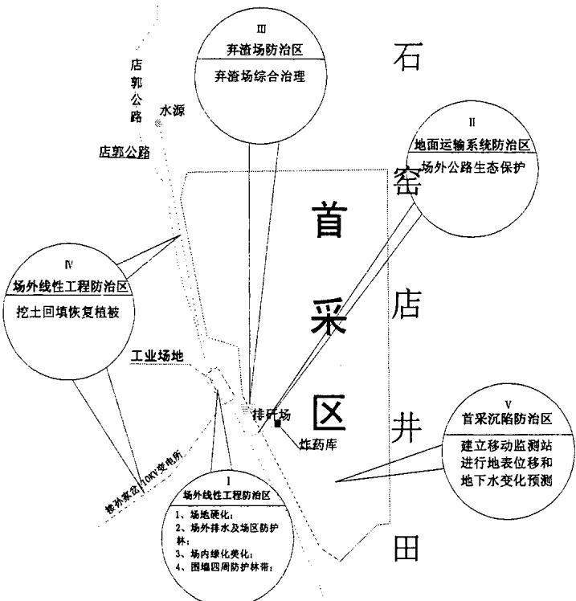  
图 4-1 水土保持防治分区措施布局图  
Fig.4-1 Measures distributed picture of preventing areas of soil and water conservation

## 4.5.4水土保持生态修复分区防治措施体系

## 4.5.4.1 工业场地防治分区

## （1）工业场地防治分区的水土保持措施

工业场地分区的水土保持以绿化为主，主体工程设计中该区工程永久征地范围共11.20hm²，主要防治对象为场内扬尘污染、周边风沙危害。煤矿建设方在建矿过程中已委托有关单位进行工业场地的园林绿化设计，[4本研究从水土保持角度对工业场地的树种筛选、种植、管理等方面提出具体措施。

由于本矿区是风蚀、水蚀并存的水土流失重点预防保护区，工业场地防风固沙林带应具有防风固沙的功效，林带方向与主风方向垂直，措施上采用主副林带相结合的复合结构，形成复合防护林体系，林带宽度约15m。绿化树种的选择，应以生长快的乡土树种为主，以引进树种为辅，同时要以耐干旱、耐瘠薄、耐沙表日灼的树草种为主。绿化布置上遵循点、线、面相结合的原则，以工业场地场前区中心绿化带为重点，形成花园式广场，利用部分边角空地布置小游园，并与布置在场内道路两旁的林荫道有机结合。主体工程可行性研究中拟布设工业场地绿化美化措施3.36hm²，其中植草面积 $1 . 7 9 \mathrm { h m } ^ { 2 }$ ，这些具有水土保持功能的措施实施后，可以基本满足防治水土流失的目的，场地绿化率可达30%。厂区内雨水通过雨水管网收集到道路排水管网，进而排到拦渣坝下游的沟道中。

## （2）建筑小区间空闲地绿化

按照适地适树、适地适草的原则，首先考虑防护作用，兼顾绿化、美化和香化。绿篱栽植的地块采用水平沟整地，沟宽1.3m，沟深0.3m，其他树坑均采用穴状整地。乔木栽植坑规程按 $0 . 6 \mathrm { m } \times 0 . 6 \mathrm { m } \times 0 . 6 \mathrm { m }$ ；灌木栽植坑规格按 $0 . 4 \mathrm { m } \times 0 . 4 \mathrm { m } \times 0 . 4 \mathrm { m }$ 。空地植草坪，必须施足底肥，整平、耕翻、耙耱。树种选择上采用常绿树种与落叶树种混交，措施上乔、灌、草混交，对景式多层次布局，中心突出遮挡式种植。常绿树种可选用油松、樟子松；落叶树种可选用白蜡、女贞；灌木选用丁香、红叶小檗和榆叶梅；绿篱选用桧柏，宽度0.8m。林带内油松中间布设，樟子松围绕油松布设，白蜡和女贞四角布设，丁香、红叶小檗和榆叶梅呈簇状点缀其间，空地植草坪，草子选用披碱草、紫花苜蓿、百里香、茵陈蒿等。造林时间以春季为宜，油松和樟子松选用8年生实生苗，树高在1.5m以上，树形优美，生长状况良好；白蜡、女贞选用1\~2年生实生苗，苗高200cm，生长良好，树形优美、树干通直；红叶小檗和榆叶梅选用出圃高度在80cm以上，基部有三个以上分枝的生长良好的实生苗；桧柏选用4年生实生苗，树势旺盛，全株成丛，基部丰满，灌丛直径大于20cm，起运时根部必须包扎湿草，切勿伤根部土团，栽植时连湿草一同埋入土中，株距 25cm。

## (3)场内路旁绿化

场内道路绿化带采用乔、灌结合，以达到最佳的绿化美化效果。乔木树坑规格为0.6m$\times 0 . 6 \mathrm { m } \times 0 . 6 \mathrm { m }$ ；灌木栽植坑规格按 $0 . 4 \mathrm { m } \times 0 . 4 \mathrm { m } \times 0 . 4 \mathrm { m }$ 。乔木树种可选择刺槐，灌木树种选用榆叶梅、丁香等。乔、灌之间以2m间距为宜。造林时间以春季为宜。刺槐选用4～6年生树形良好、干直立、胸际直径大于4cm，分枝点在2.2m以上，高2.5m，已充分木质化的优良树种；灌木选用出圃高度在50cm以上，基部有三个以上分枝的生长良好的实生苗，与刺槐相间栽植。消防水池中的水经过处理达到灌溉标准后用于林草植被灌溉。

## 4.5.4.2 地面运输系统防治区

## (1)运研道路和进场道路

排研道路和进场道路防治措[4]施在主体设计中已有，主要包括路基排水边沟。道路路面两侧形成2%的比降以利路面排水。路基两侧设排水沟，可降低地下水位，拦截路基径流，保持路基稳定。运矸道路两侧绿化滞尘林带 $0 . 4 ~ \mathrm { \hbar } \mathrm { h m } ^ { 2 }$ ，靠近道路两侧各栽植两排柠条苗，株距1m，行距1m。本措施体系新增路基两侧影响面积 $0 . 4 \mathrm { h m } ^ { 2 }$ ，考虑撒播沙蒿，以快速形成防沟植被层。

## (2)炸药库道路

炸药库道路防治措施主要[66-71]为路基两侧渗沟和两侧防风固沙灌草带。炸药库道路全长1.6km，路基宽3.5m，泥结碎石路面。基本整平路基后，利用粗渣在路面铺设厚60cm的碎石面层，铺设时路面两侧形成2%的比降以利于路面排水。路基两侧挖渗沟，一方面降低地下水位，保持路基稳定；另一方面也可促进边沟衍生植被。边沟边坡撒播龙须草，以快速形成防沙植被层，撒播面积 $0 . 6 4 \mathrm { h m } ^ { 2 }$ 。道路两侧各栽植两排紫穗槐苗，株距1m，行距1m。本技术体系新增路基两侧影响面积 $1 . 2 8 \mathrm { h m } ^ { 2 }$ ，考虑在雨季撒播龙须草草籽，以恢复地表植被。

## 4.5.4.3 弃渣场防治区

## (1) 拦渣坝工程

主体工程设计根据骨于坝坝址选择条件，将坝址选在距离矿井工业场地南侧约0.5km处的自然冲沟沟道内，筑坝形式采用碾压土石坝，筑坝材料采用井巷工程弃碴。反滤体为干砌石结构，泄洪建筑物采用竖井、涵洞、排水沟。根据《开发建设项目水土保持方案技术规范》（SL204-98）和《水土保持治沟骨干工程技术规范》（SL289-2003），结合沟道具体情况和计划弃渣量，拦渣坝的洪水设计标准分别采用30年一遇设计，50年一遇校核。

榆林地区产流方式属于超渗产流，根据《榆林地区水文手册》，产流计算的方式有三种，洪峰面积相关法、多参数经验综合法和暴雨推求洪水法，本研究在进行洪水设计时采用洪峰面积相关法、多参数经验综合法两种方法推求暴雨洪水。经分析计算，弃渣场坝址上游30年一遇洪峰流量为 $5 . 7 8 \mathrm { m } ^ { 3 } / \mathrm { s }$ ，50年一遇洪峰流量为 $6 . 6 6 \mathrm { m } ^ { 3 } / \mathrm { s }$ 。坝体上游布设竖井，坝体埋设涵管。上下游坡面与山体交线处设纵向排水沟，战台和坝顶布设横向排水沟，下游坝体坡角处设置反滤体，坝体的设计参数见表2，坝体的拦渣量库容曲线见图4-2。本措施体系需修竖井9.0m，埋设涵管50.5m，排水沟631.3m。

## (2) 排水沟

长历时高强度的降雨，[65]特别是短历时高强度的夏季暴雨易形成坡面产流对坡面产生冲蚀，危害土坝的安全，同时通过反滤体渗出的水会侵蚀坝体坡角，因此在坝体上下游面与坝体交线处设纵向排水沟，α台设置横向排水沟，坝顶布设横向排水沟，将汇水引入至下游主沟道，横向排水沟出水口水头高于纵向排水沟，防止水倒流。横向排水沟沟道比降采用1%，上下游坝坡同山坡交界线处排水沟的基础要采取防渗处理。排水沟陡缓坡段做好衔接，衔接处基础要夯实加厚。

## (3) 泄水建筑物

## (a)竖井

排水竖井采用钢筋混凝土结构，上部内径为1.0米，下部水面附近内径增加为1.5米。竖井侧壁设置渗水孔，直径为15cm，渗水孔外采用钢筋做一网片挡住竖井外部的反滤材料。竖井外部用块石、碎石、粗砂作成厚约1米的反滤体。排水竖井的底面低于泄洪洞底面4米，并铺设2米厚的卵石作为护底，保证竖井底部不受洪水的冲蚀。

## (b）涵洞

涵洞是将十坝上游洪水下泄到坝下游，考虑到涵洞在工作状态下，有压流和无压流交替出现的情况，为避免因洞身漏水影响坝体安全，涵洞设计成无压的。洞壁和填料要结合紧密，防止洞外壁面产生集中渗流，引起填料产生渗透变形，造成坝体的不稳定，故涵洞四周地基要用浆砌石进行处理形成截水环。涵洞采用钢筋混凝土结构，长 50.5m，内径100cm，最大泄洪量 $7 . 9 2 \mathrm { m } ^ { 3 } / \mathrm { s }$ (取值为百年一遇设计流量)，平均比降2.7%。

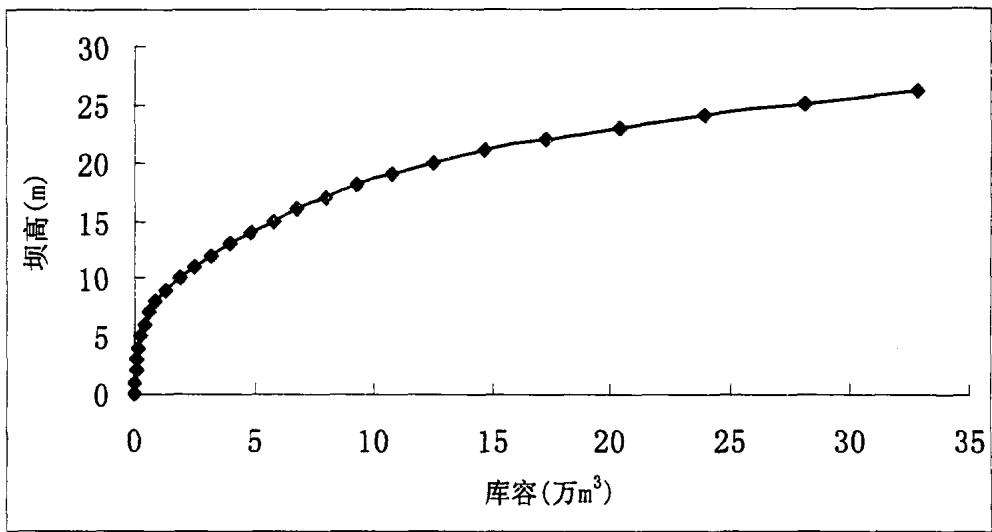  
图 4-2 拦渣坝库容曲线图  
Fig.4-2 Curve picture of tailing dam's reservoir capacity

## 4.5.4.4 场外线性工程防治区

距石窑店煤矿约9km处，有榆林供电局建设的孙家岔110/35/10kV变电站，该变电站可供石窑店煤矿用电，因输电线路塔基扰动地表，破坏地表植被，引起风蚀、水蚀，此项工程永久占地、破坏地表植被0.14hm²；地面生产、生活给水系统，由水源井泵房加压通过一条输水管道送水至矿井工业场地日用消防水池，通过日用消防泵房内变频调速恒压供水装置供水给各用户，此项工程临时占地、破坏地表植被约3.85hm²。

临时施工区的破坏地表植被约 $5 . 4 0 \mathrm { h m } ^ { 2 }$ ，本防治区防治范围共 $9 . 3 9 \mathrm { h m } ^ { 2 }$ ，本措施体系新增输电线路直接影响区 $5 . 4 \mathrm { h m } ^ { 2 } ; $ 输水线路直接影响区 $3 . 3 \mathrm { h m } ^ { 2 }$ ，需要在各项工程完工后对裸露地表采取恢复植被措施 $1 7 . 9 5 \ \mathrm { h m } ^ { 2 } .$ 。具体方式为在雨季来临之前撒播沙蒿草籽，按$1 0 \mathrm { k g } / \mathrm { h m } ^ { 2 }$ 考虑，共需撒播沙蒿草籽179.5kg。撒播草籽前需铺设1m×1m的紫草沙蒿草障，以防止风沙带走草籽。

## 4.5.4.5 首采沉陷防治区

该矿区主要为黄土丘陵沟壑区，[66-70]沉陷区土地复垦以非充填复垦为主。对沉陷区进行综合整治，及时堵塞裂缝，平整沉陷耕地，以恢复沉陷耕地使用能力和防止水土流失。对沉陷造成的土地破坏，影响林草、农作物正常生长时，及时补偿、恢复，同时结合退耕还林还草计划，种植林草，营造新林，以改善生态环境。采煤生产过程中，由于地表沉陷、地下水位下降，对地表植被的生长影响较大。经实验研究表明，沙柳、油蒿等灌木在地下水位lm左右时生长旺盛，在地下水位5m以下时生长困难。沙地植被一旦衰退，沙漠即有活化的条件，如果多处成片发生，将造成局部生态灾难。因此，加强管理、加强监测、加强预防、积极治理是本区生态保护的中心任务。因为井田内第四系地层为本井田植被生长发育的涵养层；而这个水层受井下开采影响的程度较小，因而恢复植被还是比较容易的。

## 4.5.5 小结

本研究针对石窑店煤矿在建设和生产过程中的水土流失和生态环境恶化问题，将该矿区水土流失防治区划分为工业场地防治区、弃渣场治理区、地面运输系统防治区、场外线性工程防治区、首采沉陷防治区等五部分，并根据各水土流失防治区的水土流失特点和各自的植被生长立地条件的差异，提出了相应的水土保持工程措施和生态植被恢复措施。各分区的水土保持与生态修复措施包括两部分，即纳入本研究的主体设计中具有水土保持功能的工程和措施，以及本研究新增的水土保持与生态修复工程和措施，这些措施的实施和建设对做好矿区水土保持，防止生态破坏，实现资源合理利用，促进人与自然和谐，推动煤矿生产建设的可持续发展具有重大意义，同时为当地的矿产资源开发和生态环境修复提供科学依据和技术支撑。

## 4.6 效益分析

本方案水土保持防治措施是紧密结合项目区水土流失特点和主体工程实际作出的，方案实施后，项目建设新增的水土流失可以得到有效控制，水土流失危害将显著减轻，项目区生态环境会得到有效保护。水土保持工程具有良好的生态、经济和社会效益。

## 4.6.1 生态效益

本方案针对项目建设过程中，可能造成水土流失的各种施工因素，均考虑了有效的水土流失预防措施，并根据各区域的水土流失不同形式和特点，有针对性的全面布设了工程、植物措施，其控制比、扰动土地治理率、水土流失治理度、拦渣率、林草植被覆盖率、植被恢复系数计算值分别达1.30、100%、100%、100%、30%和100%。水土保持方案措施指标分析见表4-15。

表4-15 水土保持方案措施指标计算表
<table><tr><td rowspan=1 colspan=1>指标名称</td><td rowspan=1 colspan=2>控制比</td><td rowspan=1 colspan=2>扰动土地治理率</td><td rowspan=1 colspan=2>治理度</td><td rowspan=1 colspan=2>拦渣率</td><td rowspan=1 colspan=2>林草植被覆盖率</td><td rowspan=1 colspan=2>植被恢复系数</td></tr><tr><td rowspan=2 colspan=1>指标值(%)</td><td rowspan=1 colspan=1>1300</td><td rowspan=1 colspan=1>小于</td><td rowspan=1 colspan=1>28.32</td><td rowspan=1 colspan=1></td><td rowspan=1 colspan=1>3.36</td><td rowspan=1 colspan=1></td><td rowspan=1 colspan=1>40.94</td><td rowspan=1 colspan=1></td><td rowspan=1 colspan=1>3.36</td><td rowspan=1 colspan=1></td><td rowspan=1 colspan=1>3.36</td><td rowspan=2 colspan=1>100</td></tr><tr><td rowspan=1 colspan=1>1000</td><td rowspan=1 colspan=1>0.6</td><td rowspan=1 colspan=1>28.32</td><td rowspan=1 colspan=1>100</td><td rowspan=1 colspan=1>3.36</td><td rowspan=1 colspan=1>100</td><td rowspan=1 colspan=1>40.94</td><td rowspan=1 colspan=1>100</td><td rowspan=1 colspan=1>28.32</td><td rowspan=1 colspan=1>30</td><td rowspan=1 colspan=1>3.36</td></tr></table>

因此，本方案水土保持措施的全面实施，加强管理保护，通过本方案水土保持措施的全面实施，加强管理保护，可以实现如下防治目标：扰动土地治理率达到95%；水土流失治理程度达到90%；水土流失控制比小于1.5；设计水平年拦渣率达到95%，方案服务期末拦渣率达到98%；植被恢复系数达到98%；林草植被覆盖率达到25%。从而最终实现项目区内水土流失达到基本防治，水土资源和生态环境得到有效保护，主体工程安全运行得到保障的总体目标。

## 4.6.2 社会效益

方案的实施，将减少水土流失对主体工程带来的危害，同时植被的恢复和对工业场区的绿化美化，改善职工的工作、生活以及场区周边人民群众的生产生活环境；表土填沟造地，改善耕地耕作条件，提高土地产出率；工程建设可解决当地剩余劳动力，使农村剩余劳力有用武之地，提高劳动生产率，改善群众生产生活条件，增加农民的收入；可带动当地餐饮业、服务业等相关产业发展，促进项目区及周边地区经济的发展。

## 4.6.3 经济效益

水土保持经济效益包括直接经济效益和间接经济效益两类。直接经济效益指方案治理后防护林带、灌木林的木材蓄积和产柴量，草类的鲜草产量；间接经济效益指饲料、枝条、果品、粮食等分别用于饲养、编织、加工后，其附加值的提高，由此带来的经济效益。本项目生态效益、社会效益显著，也可带来适当的经济效益。

## 5 结论与展望

环境岩土工程研究环境与岩土体之间的相互作用和影响，应用岩土工程的理论、技术和方法为治理和保护环境服务。本文定位于工程活动与岩土环境的关系上。通过对石窑店煤矿工程进行环境修复，以及建设活动产生的水土保持处置问题的研究，得出以下结论：

## 5.1 结论

(1)根系的的存在，能起到了加筋作用、锚固作用。并且根系的弹性模量要比土层大很多，这样会在土层变形过程中产生约束力，在防治滑动过程中根系的抗剪作用发挥了比较大的作用。植物的垂直根系穿过容易发生破坏的浅层土层，深入到相对稳定的深层土层中，能够起到预应力锚杆作用。植物向纵横方向都有分布的特点起到加筋作用，侧向根系的牵引和支撑作用，提高土体的强度。同时考虑到植物自认的生物特性，植物能够降低雨水的冲蚀，从而起到降低在雨水发生时所产生的滑坡泥石流现象的发生。由此可见根不仅起到护坡的作用，还降低水土流失的发生起到水土保持的作用，因此在工程中合理利用植物可以收到多重效果，为石窑店煤矿边坡生的态修复植物措施提供有益的补充。

(2)通过理论分析计算石窑店煤矿拦渣坝坝坡的抗滑稳定系数、坝体抗滑稳定系数和坝基承载力，均满足设计要求；利用有限元软件对该拦渣坝在假定的两种工矿条件下的稳定性进行了分析，绘出了一系列坝体应力场和位移场图，得到坝体中应力场和位移场的分布规律，其最大值区域如下：

(a)位移的最大值区域：坝体中迎渣面离坝顶3m～9m、垂直迎渣面斜向坝体内5m的范围；

(b)应力的最大值区域：坝体迎渣面的坝脚处从迎渣面向背渣面延伸15m左右、从坝底向坝顶延伸5m左右的三角形区域，坡脚是一个应力集中区，也是坡体破坏的起点。

这些区域将指导在建坝过程中采取措施进行重点防护，以确保矿渣达到堆渣高度时坝体的安全。

除了在有暴雨洪水矿渣湿润时坝体抗滑稳定不满足稳定性要求外，其余各项均满足要求，且强度储备很大，说明该坝无论是在拦渣运行期还是在坝库堆满的运行后期都是稳定的，但是在有暴雨洪水时坝体有可能产生滑移，建议在坝体下游采取抗滑桩等措施，以确保坝体的稳定性。通过有限元软件的计算，两种工况下坝体中的压应力和位移均满足要求，坝体是安全的。

拦渣坝稳定性计算不同于一般的水库或边坡，对拦渣坝稳定性分析时要综合考虑各影响因素，如水的渗透作用对坝体稳定的影响等。所建模型为二维平面应变模型，不能全面模拟坝体的实际受力和位移情况，同时采用稳定性计算公式得出的稳定性系数，可以减少人为指定滑动面而带来计算误差，但不能得出坝体可能发生破坏的大概区域，但有限元有不完善的地方，即误差累积和不可计算稳定系数等缺点，本文结合理论计算和数值仿真两种方法，各取所长，优势互补，可以更好地为拦渣坝的设计工作服务，建议实际设计工作中多种方法综合运用，以便对拦渣坝的设计更科学，同时该方法也可为防治泥石流的拦渣坝的设计提供有益的参考。

（3）本研究针对石窑店煤矿在建设和生产过程中的水土流失和生态环境恶化问题将该矿区水土流失防治区划分为工业场地防治区、弃渣场治理区、地面运输系统防治区、场外线性工程防治区、首采沉陷防治区等五部分，并根据各水土流失防治区的水土流失特点和各自的植被生长立地条件的差异，提出了相应的水土保持工程措施和生态植被恢复措施。各分区的水土保持与生态修复措施包括两部分，即纳入本研究的主体设计中具有水土保持功能的工程和措施，以及本研究新增的水土保持与生态修复工程和措施，这些措施的实施和建设对做好矿区水土保持，防止生态破坏，实现资源合理利用，促进人与自然和谐，推动煤矿生产建设的可持续发展具有重大意义，同时为当地的矿产资源开发和生态环境修复提供科学依据和技术支撑。

## 5.2 展望

岩土工程活动会引发环境问题，这就对岩土工程提出了挑战，所以我们也可以把环境岩土工程理解为用岩土工程技术解决一切岩土工程活动可能产生的环境问题，采用比以前先进的岩土技术和切实的岩土工程措施，使工程建设过程和建成后，都不会引发环境问题。换言之，是解决被人类活动于扰或破坏了的岩土环境重新塑造人—地和谐的人类生存环境等技术问题，使人类工程活动与岩土环境相协调。同时，由于岩土工程活动引发的环境问题是一个不可逆的过程，因此针对其成因机制开展一些前瞻性的基础研究，例如在特定的岩土工程设计阶段事先对因工程活动对环境可能产生的某种影响进行预测与评估，基于所获得的认识修改工程设计与施工方案，并在工程正常运营—岩土环境渐进演化过程中寻求一些适当的防控措施，为工程建设可持续发展提供必要的理论指导。

探索新的理论和方法，用于对复杂或特殊岩土体以及环境变化影响下的岩土体的性质进行评价，使结果更符合实际并为工程建设的设计、施工等提供可靠的参数与信息:揭示人类生活生产活动与岩土环境之间的相互关系，特别要对人类工程活动对环境的影响进行评价和预测，合理利用环境资源，防止和控制环境向恶化的方向发展，使环境能够满足人类可持续发展的需要;用岩土工程的理论、技术和方法治理、改善和控制自然及人为条件下恶化的环境，以期将环境恶化减少到最小限度。

植物的时空特性，接触面的研究等目前国内研究不多，今后可在这些领域内开展研究。

## 致谢

本文是在导师李占斌教授、刘奉银副教授，悉心指导下完成的。三年来，导师无论是在学习上还是在生活上都给予我极大的关怀、帮助和支持。在本文选题和论文写作过程中，导师均倾注了大量的精力。导师严谨的治学精神、求实的治学态度、深厚的学术造诣、勤勉的工作作风、一丝不苟的钻研精神和忠诚厚道的做人风范都给我潜移默化的影响，将使我受益匪浅。特向导师致以最衷心的感谢与最崇高的敬意！师泽绵绵，在此只能略表寸心！

感谢岩土所李宁教授、邵生俊教授、郭增玉教授、党发宁教授、胡再强教授、崔中兴教授、陈存礼副教授、袁继国副教授、丁卫华副教授、陈蕴生副教授，范留明副教授以及水资源李鹏副教授和其他老师的帮助和指导，在此特向他们表示深刻的谢意！

同时也感谢和我一起生活学习多年的同学邹兵华，感谢他在学习生活上给予我的帮助，论文的能够得以完成，我的父母、家人在生活和学业上对我的莫大关怀、支持和帮助！多年来他们为支持我的学业任劳任怨，奉献他们的所有，在漫长的求学生涯中，他们一直给予我最大限度的支持和鼓励，在此表示由衷的谢意！

最后借此机会，感谢所有关心和支持我的老师和同学，祝他们生活幸福。

## 参考文献

【1】李相然，姚志祥．城市岩土地基工程地质[M]．北京：中国建材工业出版社．2002，9.

【2】方晓阳．环境岩土工程学(一、二、三)[J]，刘洁译．地下空间，1996，16(2、3、4)

【3】袁建新．环境岩土工程问题综述[J]．岩土力学，1996，17(2)：88-93.

【4】曲永新，张永双，冯玉勇．当前国际环境地质工程研究的热点领域及其相关技术[J]．工程地质学报，1998，6(4)：301-304.

【5】 施斌．注重理论与应用相结合的环境岩土工程[J].水文地质工程地质，2000，27(2)：1-3.

【6】龚晓南．21世纪岩土工程发展展望[J]. 岩土工程学报，2000，22(2):238-242.

【7】 J. K. Mitchell, Ceotechnology the Environmental Perspective[A], Proceeding of the 3d International Symposium, vo. 1 1. Penn-sylvania: Technomic Publishing Company. Inc, 1996, 1-17.

【8】文海家，李耀光，陈林.环境岩土工程学的基础理论体系探讨[J].地下空间，2000，20(4):254-258.

【9】白彦光，武胜忠，彭彦彬，祝日雄．环境岩土工程的内容和特点[J].太原理工大学学报，2003，34(1): 102-105.

【10】李永盛，高广运等，环境岩土工程理论与实践[M]. 上海：同济大学出版社．2002. 6.

【11】钱易，唐孝炎．环境保护与可持续发展[M]. 北京：高等教育出版社，2000. 7.

【12】程胜高．高速公路环境评价与发展[M]. 北京：中国环境科学出版社，2002.

【13】侍倩，刘文娟，王敏强，詹长久．植被对坡面防护作用的机理分析及定量估算[J].水土保持研究，2004，(3)：126-129.

【14】林春伟．基于环境岩土工程的古代水利工程研究及评价体系的建立[D].广西：广西大学硕士论文，2004.

【15】阮广雄．环境岩土工程综合评价及建筑垃圾加固地基的应用研究[D].广东：广东大学硕士论文，2006

【16】Stout, B.Bstudies of the root systems of deeiduous trees[M].S.Blaek Roek Forest Bullet in No 15, Harvard University Cambridge, 1956

【17】程洪,张新全．草本植物根系网固土原理的力学试验探究[J]. 水土保持通报,2002,22(5)：20-23.

【18】陈晶．加筋土挡墙的加筋机理和理论研究综述[J].水利科技与经济,2006,12(12):803-805.

【19】刘修萍．林木根系固土有限元数值模拟[D]. 北京：北京林业大学，2008：109-128.

【20】封金财,王建华．植物根的存在对边坡稳定性的作用[J]. 华东交通大学学报,2003,20(5):42-45.

【21】刘增荣，刘春原，梁波．土力学[M].上海：同济大学出版社，2005.

【22】王礼先．水土保持学[M]．北京：中国林业出版社，2005.

【23】李亮，魏丽敏．基础工程[M]．长沙：中南大学出版社,2005.

【24】刘丽萍，折学森．土石混合料压实特性试验研究[J]．岩石力学与工程学报，2006，25（1）:206—209.

【25】刘松玉，邱钰，童立元，缪林昌．煤矸石的强度特性试验研究[J]. 岩石力学与工程学报，2006，25(1): 199-205.

【26】庞建勇，郭兰波．平顶山矿区煤巷围岩综合分类方法探讨[J]. 岩石力学与工程学报，2006，25(1): 179-182.

【27】孙海涛，丁德馨，李向阳．有限单元法在龙王山金矿拦渣坝优化设计中的应用[J].南华大学学报，2005，9（31）：1-4.

【28】王敏强，聂向珍.土(堆)石坝施工过程位移场有限元仿真分析[J]. 武汉大学学报(工学版)，2003，36(2): 74-78.

【29】戚筱俊．工程地质及水文地质[M]. 北京：中国水利水电出版社，1996.

【30】阮伏水，吴雄海．关于土壤可蚀性指标的讨论[J]. 水土保持通报，1996，16(6)：68-72.

【31】赵名茶．能量水分平衡与农业生产潜力网络试验研究[M].气象出版社，1992

【32】廖绵浚．农地水土保持论丛(第七版)[M]．淑馨出版社，台湾，1990

【33】蒋定生,李新华,范兴科,等．黄土高原水土流失危险程度预警研究[J].土壤侵蚀与水土保持学报，1995(1): 12-19.

【34】颜志丰,孔令海,秦鹏,等．准格尔矿区水土流失现状和趋势预测[J].人民黄河,2008，5(30)：66-69

【35】李锐,唐克丽.神府—东胜矿区一、二期工程环境效应考察[J].水土保持研究,1994(4):5-17.

【36】高玉华，林海鹰，王晓惠.开发建投项目水土流失预测方法探讨[J].黑龙江水利科技，2002(1):25.

【37】李智广，曾大林.开发建设项目土壤流失量预测方法初探开发建设项目土壤流失量预测方法初探[J].中国水土保持，2001(4):24-28

【38】项元和，王正文.内蒙古平庄煤矿生产建设过程中水土流失预测[J].水土保持学报，2002，16(5):139-141.

【39】于杰，马良军，郭宏伟，杨英.涩宁兰输气管道工程水土流失量预测[J].南海科技2001(6):41-42.

【40】牛四平，刘志刚，杨才敏.开发建设项目新增水土流失量预测探讨[J].山西水土保持科技，200212(4):24-26.

【41】何国清，杨伦．凌赓娣等．矿山开采沉陷学[M]. 徐州：中国矿业大学出版社，1991.

【42】郑文华，姜岩，王方缓，孙德刚．条带开采地表移动变形预计计算方法的分析[J]．矿山测量，1999,(3): 49-51.

【43】郭广礼．煤矿开采沉陷有效控制的新途径[J]. 中国矿业大学学报．2004,(2)，150-152.

【44】刘宝琛，廖国华．煤矿地表移动的基本规律[M]. 北京：中国工业出版社，1965.

【45】吕保民．减轻地表沉陷的开采技术[J]. 科技情报开发与经济，2006，16(9)：292-293.

【46】虎维岳．矿山开挖与环境负效应[J]. 煤炭学报，1998,23(5)：513-516.

【47】韦朝阳,张立城,何书金,等．我国煤矿区生态环境现状与综合整治对策[J]. 地理学报,1997,52(4):300-307.

【48】张永波,买凌云．采煤诱发的自然灾害及其防治对策[J]. 自然灾害学报,1999,8(4)：133-137.

【49】盛业华,郭达志,张书毕,等．工矿区环境动态监测与分析研究[M]. 北京：地质出版社，2001.

【50】杜培军,胡召玲,郭达志,等．工矿区陆面演变监测分析与调控治理研究[M].北京：地质出版社，2005.

【51】 Odemerbo, F0. Variation in erosion-slope relationship on cut-slopes along a tropical high-way [J].Tropical Geography Singapore 1986, 7(2)98-107

【52】R. J. Perry, D. L. Churcher, Application of high density paste backfill at Dome Mine[J]. CIM Bulletin, 1990(5): 53-58.

【53】陈仲颐,周景星,王洪瑾．土力学[M]. 北京：清华大学出版社,1994.

【54】Kiranmay Sarma. Impact of coalmining on vegetation: a case study in jaintia hills district of Meghalaya, India [D]. Nether-lands: ITC, 2005.

【55】 FinkelmanR B, CrossPM K. The type of data needed for assessing the environmental and health impacts of coal[J]. Inter-national Journal of Coal Geology, 1999 (40): 91-101.

【54】 Velz R.A and LoganT.Jsteepland erosion research in the Dominican Republie, in Land Conversation for Future Generations[R]. Bangkok 1988, 991\~1000

【55】周萍,李志忠．空间遥感技术(3S)用于矿山地质环境与生产安全监测[J]. 中国矿业,2002,11(5):1-4.

【56】王晓红,聂洪峰,李成尊,等．不同遥感数据源在矿山开发状况及环境调查中的应用[J]. 国土资源遥感,2006(2): 69-71.

【57】尤正富,张燕平．徐州煤矿区土地利用格局演变分析[J]. 地理学报,2006,61(4)：349-358.

【58】彭亚飞． 基坑施工中的地下水处理及工程应用[J]. 山西建筑,2007,33(10)：177-178.

【59】陈崇希,林敏．地下水动力学[M]. 武汉：中国地质大学出版社,1999.

【60】韩建平．水土流失的危害与森林的作用[J]. 山西林业科技.2002,3(1)：29-32.

【61】孙习稳,李晓妹.水土流失是我国最严重的公害[J]. 国土与自然资源研究,2002(4)：36-38.

【62】中国科学院黄土高原综合科学考察队.黄土高原地区土壤侵蚀区域特征及其治理途径[M].1991.

【63】王金龙,马为民.关于流域生态补偿问题的探讨[J].水土保持学报,2002,16（6)：82\~83.

【64】王玉俭．山东省水土保持区划探讨[J]. 水土保持通报，1990，10（5)：19-22.

【65】王治国，王春红．对我国水土保持区划与规划中若干问题的认识[J]. 中国水土保持科学，2007，5（1): 105-109.

【66】魏晓，孙峰华.宁夏水土保持及区划研究[J]. 水土保持研究，2005，12（6)：119-121.

【67】王金南,万军等.中国生态补偿政策评估与框架初探[M]. 生态补偿机制与政策设计国际研讨会论文集,北京：中国环境科学出版社,2006：13-24.

【68】李铁军，李晓华．植被固坡机制的研究[J]. 水土保持科技情报，2004(2)：1-3

【69】李晓华，李铁军．林木根系固坡机制实验模型[J]. 水土保持科技情报，2004，2，8-9

【70】刘震．中国的水土保持现状及今后发展方向[J].水土保持科技情报，2004，(1)：1-4

【71】欧阳仲春．现代土工加筋技术[M]. 北京：人民交通出版社，1991

【72】史敏华，王棣，李任敏．石灰岩土主要水保灌木根系分布特征与根抗拉力研究初报[J].山西林业科技，1994(l)：27-19.

【73】Bennett.H.H.Soil Conservation[M].NewYork.NY:MeGraw-HillBook Company, Inc,1939

## 附录

## 在读期间的发表的论文

1.时乐石窑店煤矿水土保持与生态修复措施体系研究，水资源与水工程学报，2009.2

2.邹兵华，李占斌，时乐等发泡剂对水泥宏观发泡效果的试验研究，工业建筑，2008.1

## 在读期间的科研项目

1.西安市曲江南湖地质勘探分析研究

2.陕西中化能源二甲醚项目水土保持研究

3.西气东输中卫黄河隧道穿越工程水土保持保护研究

4.新疆五彩湾露天煤矿水土保持研究