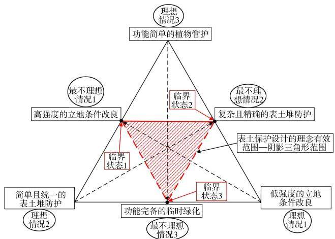
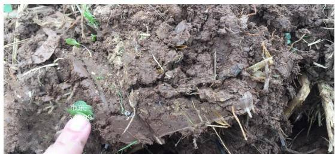
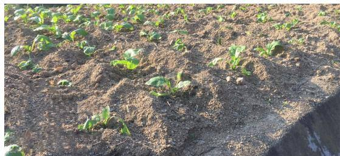
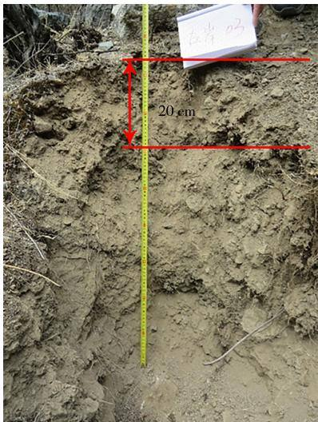

# 关于表土保护不可能三角的设想

张雪杨，仲康，黄斌，王旭东，方舒，马力，程龙，王余杰

（长江勘测规划设计研究有限责任公司，湖北武汉430010)

[关键词]表土保护；不可能三角；有效范围

「摘要]近年来，在水土保持工程的实践中，表土保护及其后续工作愈发得到关注。但是，如何同时实现表土保护的多重目的、确保表土保护设计的有效性，仍然缺乏明确规范或统一指导。为解释表土保护工作的困难和复杂，以有效性为出发点，构建了表土保护不可能三角，在该三角上初步划定了表土保护措施设计的理论有效范围，并对可能出现的实际工况进行了举例阐述。

[中图分类号]S157.6

[文献标识码]C

DOI:10.3969/j. issn.1000-0941.2024.01.003

[引用格式]张雪杨，仲康，黄斌，等.关于表土保护不可能三角的设想[J].中国水土保持，2024(1):8-12.

## 1 表土保护工作体系

## 1.1 表土的自然防护

在施工扰动发生前，天然表土处于主要依靠自然防护、仅需少量人工管护的理想状态。自然防护具体表现为：在未遭受显著人工扰动的前提下，自然界里多数表土能够与生态环境中的植被、地形等条件形成有机整体，能自发、有效地防治水土流失；初始表土农化性质相对较佳，大气循环与水循环为土壤补充营养元素，水热运动加速岩石分化过程、改善土壤质地，地壳运动和地表水文活动改变土层结构；表土内含有种类丰富且数量充足的植物种子，表土内部的环境可使种子自行萌发，团聚体水稳性好；仅需进行简单的(人工)立地条件改良和补充少量植物管护，植被即可恢复，土壤即可长期达到稳定状态，从而有效控制自身的水土流失。但是，在施工扰动发生后，由于大范围的开挖，植物被刨出，因此表土内的种子遭到损害、难以萌发；原有的土体被打碎，土壤质地呈现粗粒化，土层结构被打乱；心土裸露于土壤表面，表土失去植物提供的固氮、固碳、固土、运送水分及固定肥力等作用，速效养分和有机物均会发生显著损失，土壤生物的生存环境显著恶化，土壤生产力下降，土壤基本丧失原有的生态功能[1-2]。

总而言之，施工扰动会将以自然防护为主的表土理想状态彻底破坏。因此，如果不采取有效的水土保持措施，那么表土将发生显著的流失。

## 1.2 表土保护的目的及措施类型

表土保护工作需要同时达成3个目的：①防治表土在临时堆存期内流失；②对农化性质不佳的表土进行改良，同时保护原有的优质表土；③尽量维持表土内原有的、较适宜的生物生存环境，若表土内原有的生物生存环境本就不佳或因临时堆存而遭受显著损失，则还需另加改善。

参考农林行业相关规范可知，生产建设项目中的表土保护措施可被划分为立地条件改良、表土堆防护和临时绿化三大类。其中：①立地条件改良包括表土培肥(针对农化性质较好的原有表土)、土壤熟化(针对生土或农化性质不佳的原有表土）、土壤质地改良和土层结构改良等四类措施，其主要目的是向土壤直接补充养分和有机质，改善土壤农化性质，恢复正常的土壤供肥能力，以便在覆土后土壤能尽快发挥正常的生态功能。②表土堆防护包括临时拦挡、临时苫盖、临时截排水，乃至表土堆布置(涉及表土堆的坡度、堆高、堆置形状及占地面积大小等），其主要目的是减少表土堆在临时堆存期内发生的水土流失，但是没有向土壤补充养分或有机质的作用3]。③临时绿化包括栽植固氮、固碳、固土等作物，其主要目的是尽量维持表土内原有的、适宜的生物生存环境，向土壤间接补充养分和有机质，或作为前两类措施的补充。

## 1.3 表土保护措施设计的基本思路

目前，设计人员通常按设计V级弃渣场防护措施的思路对表土堆存场布设防护措施。

1)与弃土弃渣不同，为使表土具备正常的生态功能、可用作绿化覆土，在表土临时堆存期内，需完成立地条件改良工作。

2)进行临时绿化时，需栽植抗逆性较强的植物(例如聚合草、韭菜、蒲公英、萝卜等)、固氮植物(例如白车轴草、苜蓿、合欢、软荚红豆等豆科植物)和覆盖植物(例如黑麦草、紫云英等生长迅速的植物)。

3)若项目区水土流失严重，则需栽植固土能力极强的植物(例如腋花苋)。

4)为了减少征地面积和防护措施工程量，表土堆存场的设计堆高通常≥5m，但是这会使表土堆过高，进而压实下层表土，阻碍表土内的排水与换气，在下层表土内形成渍水、厌氧环境，养分和有机质在该环境下容易分解、损失，多数土壤生物难以生存。因此，为减小对土壤生物生存环境的破坏，维持正常的表土生态功能，表土平均堆存高度应≤2.5m(局部可放宽至3.0 m)。

## 2 表土保护不可能三角

## 2.1 表土保护的理论基础

对设计人员而言，在设计表土保护措施时，希望出现3种理想情况：

1)仅需低强度的立地条件改良(以下简称“理想情况1”）。初始表土农化性质极佳，表土剥离及回覆过程能严格参照土壤剖面分层情况设计，表土临时堆存期内鲜有水土流失发生，因此仅需对表土开展低强度的立地条件改良。

2)仅需简单且统一的表土堆防护(以下简称“理想情况2”）。施工期很短、表土临时堆存期很短，或者施工时序设计合理、基本可以做到随剥随覆，因此仅需对表土堆布置简单且统一的表土堆防护。

3)仅需功能简单的植物管护(以下简称“理想情况3”）。表土内仍含有大量具备萌发能力的植物种子，表土内部的环境仍然可使种子自行萌发，因此仅需辅以少量功能简单的人工(植物)管护。

本研究以表土保护为出发点，参考蒙代尔不可能三角理论，构建了表土保护不可能三角这一概念[4]。该三角理论的逻辑基础是即便在表土农化性质极好、生态环境极佳的黑土分布区，区内土壤仅承受农业生产所带来的扰动，便会出现显著的水土流失问题，无法保证同时满足理想情况1、2、3。在生产实践中，挖掘作业带来的扰动远超农业生产所带来的扰动，因此必然会使土壤劣化、打破土壤原有的自然防护，使土壤至多满足原有的2种理想情况。

## 2.2 表土保护不可能三角的组成

图1为表土保护不可能三角示意图。以项目区初始表土农化性质极佳、生态环境极好为前提条件，该三角形的3个顶点分别代表3种理想情况.3个顶点对边的中点则分别代表与理想情况绝对对立的3种最不理想情况，即必须采取高强度的立地条件改良、复杂且精确的表土堆防护或功能完备的临时绿化。从3个顶点处分别朝对边中点做连线(带箭头虚线)，保护措施的难度及强度会沿线逐渐增加。三角形三边中点的连线构成一个较小的三角形(阴影三角形)，该三角形覆盖的范围即为表土保护设计的理论有效范围4]。

  
图1 表土保护不可能三角示意

## 2.3 表土保护工作可能出现的实际工况

表1为可能出现的表土保护工作局面，由表1可知，在生产实践中，可能出现的表土保护工作实际工况有：

1)若项目区初始表土农化性质、生态环境均为优，则3种理想情况除不能同时出现外，可任意组合，这种情况主要存在于东三省黑土区、成都平原及赤水河中下游等生态环境良好、土壤肥沃的地区[5]。在该情况下，可直接采用表土不可能三角表示，3种临界状态均可出现。

2)若项目区初始表土农化性质一般、生态环境一般，则与初始表土农化性质为优时相比，由于初始表土农化性质一般，且表土堆防护措施没有补充养分或有机质的作用，不能仅靠该措施解决表土生产力相对不足的问题，因此理想情况1和理想情况3不能同时出现，即不存在临界状态2或近似临界状态2，表土保护措施的强度须更大，且表土保护设计的理论有效范围(阴影三角形的面积)将向内有限缩小，但是近似临界状态仍然存在。这种情况在我国广泛存在，是最常见的表土保护工作局面6]，主要存在于以荆门市东宝区为代表的土壤较肥沃的平原或低矮丘陵区域(见图2)。当地平原较多，地形平缓，土壤发育普遍较好，铁锰胶膜显著，因此有机质含量较高；表土层厚30\~35cm，局部25\~30 cm，且不同地块成土效果的差异较小，因此不存在普遍的、显著的立地条件障碍，仅需结合园艺措施，适当对表土补充有机肥和速效化肥。建议改良措施有：①土壤熟化。按比例对生土施加有机肥，再将生土和熟土按比例进行充分混合，以增殖熟土中原有的、功能完整的微生物群落，并适当混入绿肥。②土壤质地改良。在熟土内混入一定量的砂粒，进行充分

混合，以提高土壤孔隙度。

表1 可能出现的表土保护工作局面
<table><tr><td rowspan="2">初始表土 农化性质</td><td colspan="2">表土保护状态</td><td rowspan="2">说明</td></tr><tr><td>能出现的理想情况不能同时出现的理想情况</td><td></td></tr><tr><td rowspan="5">优</td><td>理想情况1、2</td><td>理想情况3</td><td>临界状态3或近似临界状态3 临界状态2或近似临界状态2</td></tr><tr><td>理想情况1、3</td><td>理想情况2</td><td></td></tr><tr><td>理想情况2、3</td><td>理想情况1</td><td>临界状态1或近似临界状态1</td></tr><tr><td>理想情况1</td><td>理想情况2、3</td><td>非临界状态</td></tr><tr><td>理想情况2 理想情况3</td><td>理想情况1、3</td><td></td></tr><tr><td rowspan="5">一般</td><td>理想情况1、2</td><td>理想情况1、2 理想情况3</td><td></td></tr><tr><td>理想情况2、3</td><td>理想情况1</td><td rowspan="2">与初始农化性质为优的表土相比，理论有效范围的区域将向内有限缩小，近似临界状 态仍然存在；表土堆防护没有补充养分或有机质的作用，因此理想情况1与理想情况3</td></tr><tr><td>理想情况1</td><td>理想情况2、3</td></tr><tr><td>理想情况2</td><td></td><td>不能同时出现;表土保护措施的强度须更大</td></tr><tr><td>理想情况3</td><td>理想情况1、3 理想情况1、2</td><td></td></tr><tr><td rowspan="3">较恶劣</td><td>理想情况1</td><td>理想情况2、3</td><td></td></tr><tr><td>理想情况2</td><td></td><td>与初始农化性质为优的表土相比，理论有效范围将进一步缩小,不再存在近似临界状</td></tr><tr><td>理想情况3</td><td>理想情况1、3 理想情况1、2</td><td>态；无法同时出现两种及以上的理想情况；表土保护措施的强度须进一步增大</td></tr><tr><td>极恶劣</td><td>无</td><td>理想情况1、2、3均不出现</td><td>与初始农化性质为优的表土相比,理论有效范围将向内缩小至最小面积;3种理想情 况均无法出现;表土保护措施的强度须增至最高水平</td></tr></table>

在该情况下，阴影三角形向内仅有限收缩，近似临界状态仍然存在，仍可采用表土不可能三角表示，3种近似临界状态均可出现。

  
图2 荆州市东宝区土壤条件

3)若项目区初始表土农化性质和生态环境均较恶劣，则与初始表土农化性质为优时相比，无法同时出现2种及以上的理想情况，表土保护措施的强度须进一步增大，表土保护设计的理论有效范围将进一步缩小，不再存在近似临界状态。

这种情况主要存在于土壤较贫瘠的高陡丘陵区域[7]。以宜昌市夷陵区为例(见图3），该地区山地较多，地形地势复杂，多坡地；临近三峡库区，水域较多，降雨丰富；表土层普遍较薄、厚15\~25cm，且不同地块成土效果的差异较大，因此土壤类型及级配的差异较大；当阳市至夷陵区的土壤沙化现象逐渐变显著，且以粗砂为主，部分地块表层混杂一定量的块石或砾石。因此，当地的立地条件障碍是土壤沙化、粗骨化及土壤贫瘠。

  
图3 宜昌市夷陵区土壤条件

在现场勘察中，笔者发现当地人普遍采用构筑砂田的办法(覆盖耕作技术中的一种)进行改良，即就地利用卵石、砾石、粗砂、细砂的混合物，将其作为覆盖材料，铺在经过深耕、施肥、压平作业后的农地上，以此达到保墒、保温、保土、增产的作用。这种改良产物与“上黏下砂”的蒙金型土层结构相近，堪称就地取材进行立地条件改良的典范。立地条件改良后，补充土壤熟化的措施，达到最终改良效果。在该情况下，阴影三角形将向内较大幅度地收缩，不再存在任何近似临界状态。

4)若项目区初始表土农化性质及生态环境均极恶劣，则与初始农化性质为优时的表土相比，3种理想情况都不能出现，表土保护措施的强度须增至最高水平，且表土保护设计的理论有效范围将向内缩小至最小面积。这种情况主要存在于金沙江干热河谷上游地区等生态环境极端恶劣的区域[7]。

以云南省德钦县为例(见图4)。首先，由于长期的江水冲刷和高温干旱，当地水土流失严重，土壤中的水分和养分均容易快速流失，土壤粉粒的含量普遍偏低，因此在沿江两岸可以轻易采集到不适宜植被生长的壤质砂土、粉砂质壤土、粉砂质黏壤土乃至基本丧失生态功能的砾石土或砾质土，简言之，土壤质地(或级配)极其糟糕。其次，由于当地河道曲折易变，生产力较低的土壤在河道两岸不规则分布，土壤改良障碍也不大相同，因此在缺乏精确调查、未制定精确调配计划的前提下，不能采用惯例，即简单地混合不同地块的表土并采用同一套改良工艺进行土壤改良。再次，在表土中普遍严重缺乏粉粒、混杂大量的砂砾或砾石.土层难以构成保水、保肥的土层结构，土壤生产力及供肥能力堪忧，部分土层甚至呈现“上黏下砂”的沙漏型土层结构。此外，沿江两岸表土资源总量严重不足，难以通过简单的表土调配和表土培肥来满足项目绿化覆土的需求，如何填补覆土的缺口成为难题。

  
图4 云南省德钦县土壤条件

因此，在当地，应首先通盘考虑如下问题并设计改良方案：表土资源利用(包括表土剥离、培肥、回覆及土壤熟化）、表土堆存与防护、立地条件改良(主要包括土壤生产力及级配的改良、土层结构改良等)及植被恢复。然后开展现场小试，根据小试结果调整改良方案。

在当地的立地条件改良过程中，关键点在于：为恢复土壤保水性、保肥性及生产力，首先必须在原有表土内筛掉粒径>2mm的大颗粒，然后混入大量外源粉粒，使粉粒的体积比≥25%，以此重构土壤的级配：其次为减少外源有机质的使用量、恢复土壤生物生存环境，应该栽植大量绿肥植物(常用豆科植物，例如大豆、苜蓿等)；最后，当地位于干热河谷上游地区，有机肥应选取冷性的牛粪或偏冷性的猪粪，以减缓有机肥的分解速度，提高有机质的利用效率。在该情况下，阴影三角形将向内缩至最小面积，无任何近似临界状态。

## 3 研究意义及展望

## 3.1 研究意义

1)表土保护不可能三角反映的是定性概念，足以证明以项目区内初始表土农化性质极佳、生态环境极

好为前提条件，在施工扰动发生后，3种理想情况不再可能同时发生。

2)证明若项目区内初始表土农化性质及生态环境条件不佳，则立地条件改良的难度会增加，其强度也必须增加，理想情况越来越难出现。

3)可用该概念向业主及审查专家阐述在生态脆弱区开展高强度表土保护工作的艰巨性。

## 3.2 研究展望

若以项目区内初始表土农化性质极佳、生态环境极好为前提条件，则可构成一个正三角形，表土保护设计的理论有效范围即阴影三角形也为正三角形，且阴影三角形三个顶点分别位于黑色三角形的三边中点上，但若某些初始条件相对恶劣，则阴影三角形将按不确定比例缩小。具体解决方案是须将3种理想情况进行加权处理，据此绘制不同前提条件下的表土保护不可能三角形[8-9]。

## 4 结束语

本研究通过构建表土保护不可能三角这一概念，反映表土保护工作的必要性和艰巨性。表土保护方案大体可根据如下思路设计：基于对植物、土壤、微生物的广泛调查与长期监测，根据数学模型及加权矩阵评估各项保护措施的重要性，精确设计表土保护措施，计算工作量[9]。

综上所述，只有通过开展生态调查及研究式的勘察设计，才能真正做好生产建设项目的表土保护及生态恢复工作。

## [参考文献]

[1]平原，马美景，郭忠录.像呵护皮肤一样呵护土壤：论土壤的重要性及表土保护与利用[J]. 中国水土保持,2021(1)：14-17.

2]张振超，张琳琳，王冬梅，等.生产建设项目表土保护与利用[J].中国水土保持科学,2015,13(1):127-132.

[3]黄昌勇，徐建明.土壤学[M].3版.北京：中国农业出版社，2010:85-87.

[4]乔桂明.国际金融学[M].3版.苏州：苏州大学出版社，2017:264-264.

[5]丛日亮，兰景涛.生产建设项目表土保护与利用专题报告编制内容探讨[J].水土保持应用技术,2021(5):48-50.

[6]李宏伟，李晓燕，刘刚.关中平原区表土资源保护与利用设计实践探讨[J].陕西水利,2020(10):182-183,186.

[7]张雪杨，马力，郭镒维，等.基于工程设计经验的表土保护与利用设计流程优化及思考[J]. 中国水土保持,2021(5):21-26.

# 2018—2022年安徽省水土流失动态变化分析

高小强1，郭宪杰²，凤海明1，步永伟²，朱继鹏1，周祖煜²

（1.安徽省水土保持监测总站，安徽合肥230022；2.杭州水保科技有限公司，浙江杭州310004)

[关键词]水土流失；动态监测；重点防治区；安徽省；2018—2022年

[摘 要]通过对安徽省省级防治区、省级水土流失重点防治区县及省级水土流失重点防治区进行土地利用情况遥感解译、植被覆盖度指数分析，利用中国土壤流失方程水力侵蚀计算模型对区域水土流失进行5a的连续监测，分析土地利用、植被覆盖度和水土流失面积、强度和分布的变化情况，结果表明：近5a，省级水土流失重点防治区以占省级防治区范围1/7的土地面积，集中了近1/2的水土流失面积，从土地利用类型占比来看，占比为64.78%的林地和20.24%的耕地对水土流失治理影响最大：省级水土流失重点防治区内的植被高覆盖度面积占比从91.11%提升至96.79%，超出省级防治区约8个百分点，显著降低了水土流失率：省级水土流失重点防治区内水土流失面积年均减少45.40km2，占省级防治区范围内年均减少量的50.55%，水土流失预防和治理的成效比较显著。

[中图分类号]S157

[文献标识码]A

DOI:10.3969/j. issn.1000-0941.2024.01.004

[引用格式]高小强，郭宪杰，凤海明，等.2018—2022年安徽省水土流失动态变化分析[J].中国水土保持，2024(1)：12-16.

安徽省位于我国中东部，地处长江、淮河、新安江三大流域，横跨三个亚气候带，地貌以平原、丘陵和低山为主，自然植被自北而南从落叶阔叶林渐次过渡到常绿阔叶林1-2]。受气候、地形地貌、生态环境和人类活动影响，水土流失情况也是南北有差异、东西有区别。

为加强水土流失预防和治理工作，保护和合理利用水土资源，促进生态文明建设，保障经济社会可持续发展，安徽省于2017年印发了《安徽省人民政府关于划定省级水土流失重点预防区和重点治理区的通告》(皖政秘〔2017]94号)文件，划定省级水土流失重点预防区和重点治理区(以下简称“省级重点防治区”)。重点预防区主要是指目前水土流失较轻，但存在潜在水土流失风险的生态脆弱或敏感区域；重点治理区主要是指水土流失较严重，对当地和下游国民经济和社会发展造成主要制约因素的区域。各级政府加强对水土流失重点防治区水土保持工作的组织领导，建立完善的水土流失综合防治体系，切实加强水土流失动态监测，依法防治水土流失，不断改善生态环境。

[8]许文年.植被混凝土生态防护技术理论与实践[M].北京：中国水利水电出版社,2012:105-121.

[9]赵冰琴，夏栋，夏露，等.向家坝工程扰动区植被恢复土壤质量评价[J].中国环境科学,2020,40(3):1224-1234.

安徽省按照水利部统一部署与要求，根据《安徽省水土流失动态监测规划(2018—2022年)》，采用中国土壤流失方程水力侵蚀计算模型，计算评价安徽省省级防治区的监测成果，并对省级重点防治区进行重点监测分析。根据《安徽省水土保持公报(2022年)》，全省2022年水土流失面积为11689.04 km²，占全省土地面积的8.37%。据最新要求，安徽省2025年、2035年水土保持率目标分别是91.80%和92.88%。本研究重点分析2018—2022年省级水土流失重点防治区土地利用、植被覆盖度和水土流失的动态变化情况，分析变化原因，以期能为安徽省省级重点防治区的水土流失防治提供参考和思路。

## 1 研究区概况

根据全国水土保持区划，安徽省水土流失的类型以水力侵蚀为主，其形式主要是面蚀3]。安徽省省级防治区涉及安徽省15个市的87个县(市、区)，面积为