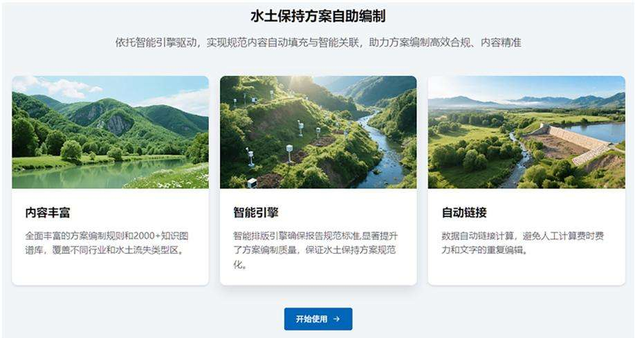
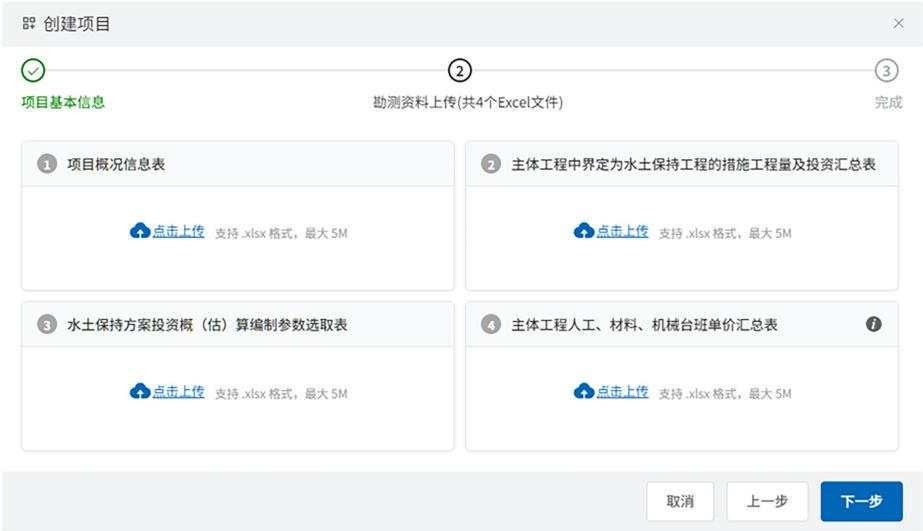
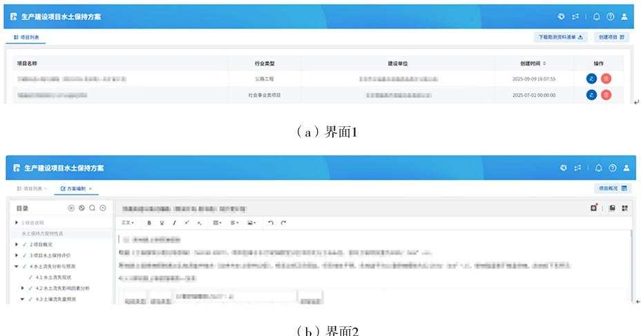

# 生产建设项目水土保持方案自助生成系统研究与应用

赵方莹12，李 枫，苏光瑞1，王智勇1，韩世豪1，牛恩祥1，张子奇1

（1.北京圣海林生态环境科技股份有限公司，北京100192；

2. 中国水土保持学会科技产业工作委员会，北京100192)

摘要：针对传统水土保持方案编制效率低、成本高、不规范的问题，通过标准化、智能化的方法，采用自主开发的模板引擎实现了水土保持方案章节、图表、数据的自动填充，结合规则引擎与知识图谱，支持包括但不限于MS、Word/PDF多格式输出，开发了一套智能化的水土保持方案自助生成系统。该系统建立了丰富的水土保持方案编制规则和知识图谱库，覆盖不同行业和水土流失类型区，智能排版引擎确保生成的方案符合规范要求，显著提升了方案编制质量和效率，降低了成本，促进了水土保持方案规范化与数据共享。实测结果表明，借助该系统可将方案编制周期缩短90%，编制成本降低80%以上，为水土保持方案编制提供了高效、便捷的新途径。

关键词：生产建设项目；水土保持；方案编制；自助生成；智能化

中图分类号：S157

文献标识码：A

引用格式：赵方莹，李枫，苏光瑞，等.生产建设项目水土保持方案自助生成系统研究与应用[J].中国水土保持，2026(8):69-73,80.

生产建设项目水土保持方案编制是贯彻《中华人民共和国水土保持法》(以下简称《水土保持法》)等法律法规、落实水土保持“三同时”制度、协调经济发展与生态保护、防治水土流失和加快生态文明建设的重要抓手。随着《生产建设项目水土保持技术标准》(GB50433—2018)的全面实施，水土保持方案编制规范化要求日益提高。根据《中国水土保持公报(2024年)》,2024年全国审批生产建设项目水土保持方案8.98万个，其中县级审批项目7.32万个，占比81.51%。生产建设项目水土保持方案编制过程中存在专业人员不足和编制周期长、成本高、质量参差不齐等问题，难以满足当前社会多方面的需求。

加快培育新时代水土保持新质生产力，要以新时代水土保持目标任务为导向，以信息化、智慧化为引领，持续创新攻坚，强化科技创新与技术成果转化应用，稳固水土流失防治成效，全面提升水土保持功能和生态产品供给能力[1]。《水土保持法》修订实施以来，我国水土保持信息化工作获得了较为全面的发展，为水土保持工作带来了技术革新。但大数据技术在水土保持信息化中的应用尚处于探索阶段，信息系统功能不完善、应用不充分、数据资源建设不完善、智慧化发展程度不够，并且信息化、数字化工作应用更多的是出于监测监管的需要，缺少对水土保持方案编制工作的支撑[2-3]。人工智能、大数据等技术的快速发展,尤其是豆包、ChatGPT、DeepSeek等基于AI技术软件的开发应用，为水土保持方案编制工作智能化提供了可能。

基于针对水土保持方案的专业化自助生成系统研究仍属空白的现状，笔者团队根据水土保持方案编制要求，构建结构化知识体系，研究开发了水土保持方案自助生成系统，旨在提高方案编制质量、提升编制效率、降低编制成本。

## 1 方案编制存在的问题

目前编制生产建设项目水土保持方案时编制单位容易忽视方案各章节之间的逻辑关系，文字撰写、数据计算与分析工作量大、周期长，存在效率低、成本高、内容不规范、标准不统一等问题。同时，社会对水土保持方案的需求旺盛，且按照深化“放管服”改革和优化营商环境的要求，行业已降低水土保持技术服务的准入门槛，对技术服务单位不再设资质要求，方案编制工作已全面社会化、市场化，但技术服务单位质量良莠不齐，部分技术人员专业能力不足，导致编制完成的方案质量差异较大、问题突出，难以满足社会对水土保持方案多方面的支撑需求[4-6]。

## 1.1 水土保持评价和措施配置不合理，非技术性错误多

水土保持方案编制技术人员经验不足、水土保持相关知识储备欠缺，无法全面解读主体行业的建设特征、施工工艺与水土流失特点，也无法对主体工程的选址和布设开展科学合理的水土保持评价：方案重点不突出，防治措施布设不合理，投资估算不科学，与项目实际脱节，无法指导水土流失防治工作；方案的文字、数据存在多处非技术性错误5]；技术人员未能厘清方案各章节间数据的紧密关联，数据分析深度不足，难以识别潜在问题，导致方案全文前后表述不一致。

## 1.2 前期调查和勘测基础工作不扎实，对主体项目解读不清

项目前期开展的调查和勘测工作包括外业调查勘测和内业资料收集，是水土保持方案编制的基础和保障，是对项目布设和施工工艺充分解读的前提。只有认真落实这些前期工作，对水土流失产生环节的分析才能准确到位，采取的防治措施才能落地实用，关键数据收集才能准确完整，编制的水土保持方案才具备可操作性。部分方案编制技术人员不重视前期调查勘测和资料收集分析工作，基础资料不充分，缺少相应支撑材料，对项目基本情况介绍不详细甚至存在漏项，对项目所属行业认知不足，导致对主体工程水土保持相关内容的分析评价不到位，水土保持措施设计与实际情况不符,方案难以落地执行[4,7-8]。

## 1.3 内容不完整、不规范

对规范、技术标准及相关文件理解不到位，内容不完整，关键信息和数据缺失，缺少支撑性文件，文本不规范等，是目前水土保持方案编制中常见的问题。水土保持方案是在法律法规、标准条款框架内对建设行为的约定，其内容必须响应水土保持相关法律法规和标准的条款：若内容不完整或不规范，则会给水土保持方案的审查、实施及后续跟踪监管带来困难[4]。

## 2 方案自助生成系统开发技术路线

借助信息化、AI技术和大数据分析，按照水土保持方案标准化编制要求，研究开发水土保持方案自助生成系统，以解决目前水土保持方案编制存在的问题。

## 2.1 系统设计

采用模块化设计思想，将系统分为方案编制规则、基础数据采集、智能分析计算和知识图谱、方案生成四大核心模块。

1)方案编制规则模块。内置行业规范和技术标

准，包含1000多条强制性条文检查规则。

2)基础数据采集模块。通过结构化表单收集项目基础信息，通过动态表单(表单字段关联度达92%)采集项目特征。

3)智能分析计算和知识图谱模块。基于水土保持特征构建参数化模型，具备防治措施体系布设、措施配置和投资估算等核心功能。

4)方案生成模块。依据行业规范，支持工程师参与融合编辑、审核，最终生成完整方案。

## 2.2 系统架构

系统整体架构包括基础数据、业务逻辑整合、用户交互三层结构。系统采用B/S模式，实现中心化一体部署与多终端应用。

1)基础数据层。主要包括：①法律法规和行业技术标准、规范数据库；②知识图谱数据库(涵盖各省级行政区、36类行业的典型项目案例）:③水土保持投资概(估)算编制规定、定额，以及各省级行政区人工、材料、机械价格数据库；④数字化业务逻辑规则库；⑤水土保持方案编制基础数据库；⑥监测设备、仪表数据库；⑦模型/公式计算数据库；⑧系统管理模块，含系统基础管理、用户管理、安全管理等功能。

2)业务逻辑层。将水土保持方案编制需遵循的业务规则内置到系统中，实现规则选型、规则应用、规则检验等全节点覆盖；自动整合基础数据、行业数据、项目数据等；内嵌机器学习、图像识别、GIS制图、监测设备数据集成、公式自动计算等功能。

数据安全方面：业务逻辑封装与数据分发按情况实施动态加密token验证方式；实施数据层(包括数据库、非结构化数据资料等）与应用层物理隔绝，使用严格的鉴权验证逻辑保证数据使用安全；实施涉密数据与业务数据分库分服处理的物理鉴权方式(如移动设备 token鉴权或物理密钥等)。

3)用户交互。基于Web浏览器“所见即所得”的用户操作界面，简单易用，还拥有完整丰富的使用指南与用户使用手册。

## 2.3 开发环境

基于性能与兼容性并重的原则，系统采取前后端分离、数据层与业务逻辑层物理隔绝的开发模式，在保证数据安全性的同时，兼顾系统测试、跨平台移植与调优等工作。

## 3 方案自助生成实现技术方案

## 3.1 规则

《生产建设项目水土保持技术标准》(GB 50433—2018)、《生产建设项目水土流失防治标准》（GB/T

50434—2018）、《水土保持工程设计规范》（GB51018—2014)、《水土保持工程调查与勘测标准》(GB/T51297—2018)、《生产建设项目水土保持监测与评价标准》(GB/T51240—2018)、《生产建设项目水土保持技术文件编写和印制格式规定(试行)》(办水保〔2018]135号)对水土保持方案编制内容和格式体例有明确规范，北京市、重庆市等地根据上述规范出台了水土保持方案编制指南。

在系统中预先设置包括国家、地方行业技术标准或规定，以及水土流失类型区划等，能按照部批或省级及以下审批、报告书或报告表、行政省份(自治区、直辖市)地域、所属行业等，自动快速适配相应规则，包括相应的内容、体例格式等，保证水土保持方案内容的全面、规范，解决现有编制中内容缺失和不规范问题。

## 3.2 数据源

在系统中内置编制水土保持方案所需资料清单，加强对项目前期调查和勘测工作内容的要求，以及对主体工程布局与施工工艺的分析解读。通过对多源数据融合与标准化处理，解决项目原始基础数据资料缺乏、关键数据信息缺失、不能对主体工程设计的选址和布局进行科学合理分析、水土保持方案与现场实际不符等问题。

1)原始基础数据。《生产建设项目水土保持技术标准》(GB50433—2018)中明确了调查和勘测资料的内容与要求。系统将数据资料处理前置，列出了包含项目区及项目原始数据清单，对原始数据进行规范化、格式化处理，便于系统自动识别。调查、勘测等原始资料的完整性及预处理的规范性，直接影响水土保持方案的生成完整度与质量。

调查和勘测资料清单分为三类：一是项目信息清单，包含项目名称、建设单位、建设内容及规模、建设工期及投资等；二是项目区自然概况信息清单，包含项目区气象、土壤、植被、水土流失现状、涉及水土保持敏感区情况等；三是现场勘察照片、项目支撑性文件、基础信息底图、主体工程设计图纸等信息清单。

2)分析处理后数据。根据《生产建设项目土壤流失量测算导则》（SL773—2018）规定，测算土壤流失量。依据水土保持措施工程量、水土保持监测工程汇总数据，按照相关定额及规定开展水土保持投资估算。结合方案各章节间的数据关联关系，链接并调用原始数据或处理后的数据。

3)依据专项规划或文件确定相关数据指标值。依据全国水土保持区划一级区划，确定土壤侵蚀模数允许值。按照《生产建设项目水土流失防治标准》(GB/T50434—2018),结合项目所处的水土流失类型区，计算并调整各项水土流失防治指标值。

4)市场信息。水土保持估算所需的人工、机械、材料基础单价，依据主体工程单价或市场信息确定。

## 3.3 知识图谱与功能实现

1)依据项目所在省份、所在水土流失类型区、所属行业，结合水土流失特征、水土保持措施核心信息，建立“项目类型一地形条件—防治标准—措施配置一投资估算”关联规则库。构建知识图谱库，依托知识图谱规则引擎，通过内置、输入、选择、链接、计算及融合编辑等人机互动方式，实现相关信息元素的自助推荐与匹配，解决编制人员经验不足的问题，大幅提升方案编制效率。

2)通过与调查和勘测资料清单的关联、推理，自动生成项目及项目区概况章节。

3)从海量数据样本中筛选300多个推荐版本纳入知识图谱库，供编制时参考推荐，最终由工程师参与确认，生成项目水土保持评价章节。

4)依据《生产建设项目土壤流失量测算导则》(SL773—2018)内置相关条文和计算公式，结合调查和勘测提交的各项因子及数值，对各类型计算公式进行适配，自动计算生成施工期、自然恢复期土壤流失量预测值，进而生成水土流失预测章节。

5)从大量样本中筛选300多个措施体系框图、1200多个防治分区、4000多个措施设计说明，纳入知识图谱库，供推荐参考，最终由工程师选择确认。针对相关措施需计算、统计的部分，将计算、统计公式内置，输入或选择相应的参数，可自动计算、统计相应数值，同时保留自定义计算、统计功能，进而生成水土保持措施章节。

6)依托系统内置相关内容，通过推理运算及工程师选择，经工程师融合编辑确认，生成水土保持监测章节。

7)开发投资估算编制子系统，内置估算编制规则、单价及推荐措施组价信息，自动生成投资估算；结合系统内置内容与项目数据，由工程师融合编辑完成效益分析章节。

8)结合系统内置核心内容与项目实际情况，由工程师融合编辑，生成水土保持管理章节。

9)在所有章节编制完成后，通过数据链接、逻辑推理自动生成综合说明章节。

## 3.4 工程师参与

项目水土保持分析评价应科学合理。项目水土保持评价是检验项目主体设计是否落实水土保持法律法规、技术标准的重要手段，是从源头上开展水土保持的重要环节。针对项目水土保持分析评价，目前构建的编制规则库和知识图谱支持智能推理、推荐，但仍需工程师介入。工程师可根据系统推荐的同一地区、同类行业的水土保持分析评价知识图谱，结合项目自身特性，有针对性地分析、核实，最终进行融合编辑并确认评价。如，在项目选址与建设方案合理性分析评价阶段，工程师可依据系统提供的水土保持相关法规、标准，对照项目选址及建设方案开展对比分析，明确水土保持强制性与许可性要求，对许可条件进行研判评价，得出与实际相符的评价结论[4]。

水土保持方案的核心是建立水土流失防治措施体系[9]。系统虽构建了丰富的水土流失防治措施体系知识图谱库，建立了项目“行业类型一地形条件一防治标准一措施配置一工程量一投资估算”关联规则库，但仍保留了自定义输入功能。工程师可以选择系统自动匹配推荐的水土流失防治措施体系、措施布设说明，以及措施布设图的知识图谱，通过自定义添加、删减或融合编辑等人机互动界面，形成符合项目特性的水土流失防治措施体系。为了能够准确表达，项目的平面布局图、防治责任范围、防治分区图等还需要工程师参与绘制。

## 4 成果与应用

## 4.1 应用操作

用户通过网页端上传项目基础信息后，系统会根据选择的审批级别、所在省份、行业类型、地理位置，自动选配编制规则和水土流失类型区，推荐最优的水土保持措施组合、对应的投资估算，由工程师参与评价、审核、确认后，生成包含文字、图表、附图的完整方案。系统使用界面见图1、图2、图3。

  
图1 水土保持方案自助生成系统界面

  
图2 项目基础信息资料清单上传界面

  
图3 方案自助编制界面

## 4.2 测试效果

选取项目建设地点位于北京、新疆、西藏、宁夏、甘肃等10个省(自治区、直辖市)，涉及公路、机场、水利枢纽、城市管网、输变电等15个行业，分属于北方土石山区、北方风沙区、南方红壤区等8个水土保持区划的30个已审批项目进行回溯测试，邀请6名编制人员开展对比试验(见表1)。与原有传统编制方式相比，系统将编制内业时间从 30 d缩短至3 d，成本从 5万元降低至1万元以内，生成的方案科学合理、符合规范要求，特别是措施设计具有针对性，体现了区域特点。同时，系统还提供了人工修改接口，允许专业人员对自动生成的结果进行调整优化。实际应用表明，系统生成结果能够满足大多数生产建设项目的需求，具有良好的用户体验。

## 5 结论

通过标准化、智能化的方法，采用自主开发的模板引擎实现章节、图表、数据的自动填充，支持MS、Word/PDF多格式输出，首创开发了水土保持方案自助生成系统。建立了2000多个水土保持方案编制规则和知识图谱库，覆盖不同行业项目类型和区域特点；设计了智能排版引擎，确保生成的方案符合规范要求，显著提升了方案编制质量和效率，降低了成本，促进了水土保持方案规范化与数据共享。

该系统实现了信息化、智慧化等先进技术和新质生产力在水土保持方案编制环节的应用，提高了方案编制单位的工作质量和效率，便于水土保持措施的落地实施，有利于方案审查和后续监管工作的开展。该系统的推广应用将有助于提升水土保持方案编制整体水平，为生态文明建设提供技术支持。实测结果表明，借助该系统可将方案编制周期缩短90%，编制成本降低80%以上，为水土保持方案编制提供了高效、便捷的新途径。后续将进一步扩大系统应用范围，持续优化，提升性能，使其发挥更大的经济社会效益。

表1 选取参与系统测试的项目统计
<table><tr><td>项目建设地点</td><td>所属行业类型</td><td>样本数量/个</td></tr><tr><td rowspan="4">北京市</td><td>公路工程</td><td>1</td></tr><tr><td>轨道交通工程</td><td>1</td></tr><tr><td>城市管网工程</td><td>1</td></tr><tr><td>社会事业类项目</td><td>1</td></tr><tr><td rowspan="5">新疆维吾 尔自治区</td><td>房地产工程</td><td>1</td></tr><tr><td>露天煤矿</td><td>1</td></tr><tr><td>井采煤矿</td><td>1</td></tr><tr><td>输变电工程</td><td>1</td></tr><tr><td>油气管道工程</td><td>1</td></tr><tr><td rowspan="2">西藏自治区</td><td>房地产工程</td><td>1</td></tr><tr><td>输变电工程</td><td>1</td></tr><tr><td rowspan="3">宁夏回族 自治区</td><td>公路工程</td><td>1</td></tr><tr><td>井采煤矿</td><td>1</td></tr><tr><td>其他小型水利工程</td><td>1</td></tr><tr><td rowspan="4">甘肃省</td><td>铁路工程</td><td>1</td></tr><tr><td>其他小型水利工程</td><td>1</td></tr><tr><td>露天煤矿</td><td>1</td></tr><tr><td>轨道交通工程</td><td>1</td></tr><tr><td rowspan="3">广西壮族自治区</td><td>引调水工程</td><td>1</td></tr><tr><td>油气管道工程</td><td>1</td></tr><tr><td>核电工程</td><td>1</td></tr><tr><td rowspan="2">贵州省</td><td>机场工程</td><td>1</td></tr><tr><td>水利枢纽工程</td><td>1</td></tr><tr><td rowspan="2">四川省</td><td>社会事业类项目</td><td>1</td></tr><tr><td>铁路工程</td><td>1</td></tr><tr><td rowspan="2">湖北省</td><td>水利枢纽工程</td><td>1</td></tr><tr><td>引调水工程</td><td>1</td></tr><tr><td rowspan="3">黑龙江省</td><td>机场工程</td><td>1</td></tr><tr><td>核电工程</td><td>1</td></tr><tr><td>城市管网工程</td><td>1</td></tr></table>

(下转第 80页)