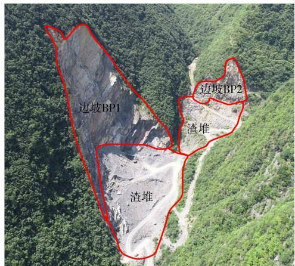
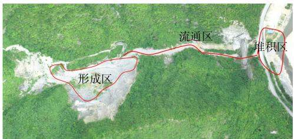

# 露天采石场历史遗留矿山生态修复措施研究

董阳，张昌翌，蒲凯超，王楠，席志轩

（西北有色勘测工程有限责任公司，陕西西安710038)

摘要：为贯彻习近平生态文明思想，落实好历史遗留废弃矿山生态修复工作，结合我国目前基本国情，以陕西省秦岭山区一处露天采石场历史遗留矿山生态修复项目为例，从地质灾害隐患、地形地貌景观破坏、土地损毁三方面综合分析其矿山地质环境问题，并提出具体的生态修复治理措施，即在工程实践中通过“清渣+拦挡+排水+绿化”的综合治理措施，彻底消除矿区内泥石流地质灾害隐患，使区内矿山地质环境得到极大改善，维护社会和谐稳定。

关键词：露天采石场；历史遗留矿山；生态修复；治理措施

中图分类号：S157

文献标识码：B

DOI:10.3969/j. issn.1000-0941.2025.01.013

引用格式：董阳，张昌翌，蒲凯超，等.露天采石场历史遗留矿山生态修复措施研究[J].中国水土保持，2025(1)：51-53,56.

长期以来，受高强度的国土开发建设、矿产资源开发利用等诸多因素影响，加之早期的矿山企业大多重开采、轻修复，我国一些地区生态系统破损退化严重[1]。党的十八大以来，历史遗留矿山生态修复问题已受到以自然资源管理与规划部门为首的社会各界的普遍关注[2-4]。张进德等[5]在分析我国区域生态特征的前提下，提出了废弃矿山生态修复策略；闫石等[6]在综合考虑矿山社会-生态-经济复合生态系统整体性的前提下，提出了矿山生态修复成效的评估体系；王雁林等7针对陕西省历史遗留矿山恢复治理面积大的特点，提出了利用市场化手段推进历史遗留矿山生态修复的几种做法；赵方莹等8]通过分析准格尔旗地区矿山资源开采导致的生态环境问题，提出了包括做好总体规划、制定技术标准等一系列建议；魏增超等9]在分析露天采石场矿山地质环境问题的基础上，提出了坡面危岩清理、削坡、场地整平、建挡土墙和排水工程等生态修复措施。

矿山地质环境问题是一个长期持续性演化的过程，生态修复工作必须结合矿山实际和我国基本国情，以维持生态平衡和可持续发展为根本目标进行。为贯彻习近平生态文明思想，落实好历史遗留废弃矿山生态修复工作，切实履行废弃矿山生态修复任务要求，发展经济建设和构建和谐社会，陕西省自然资源厅下发了一系列有关历史遗留矿山生态修复工作的指示文件，并对地方政府在历史遗留矿山生态修复方面提供了大量的资金支持。本研究以陕西省秦岭山区一处露天采石场历史遗留矿山生态修复项目为依托，从地质灾害隐患、地形地貌景观破坏、土地损毁三方面综合分析该历史遗留矿山地质环境问题，并在此基础上提出相应的生态修复治理措施，以期为类似的项目提供参考。

## 1 工程概况

该矿山开采矿种为建筑用石灰岩，矿区面积0.199km2,矿山开办于2008年，于2011年11月关闭，至闭矿之前矿山一直进行石料开采，开采矿石总体积约12万m³。

矿山地处秦岭山脉南麓，地貌单元属低山区剥蚀地貌，矿山开采区总体地势西高东低、南北高中间低，海拔530\~800m，相对高差270m。区内原始地层主要由第四系残坡积含碎石粉质黏土、洪积碎石和泥盆系灰岩组成，开采区坡面山体裸露，坡脚及进矿道路区覆盖大量早期采矿活动形成的矿渣堆积碎(块)石。

## 2 矿山地质环境问题

矿区现状矿山生态环境问题主要为：矿山开采废渣堆积于沟内，存在1处泥石流地质灾害隐患；露天开采形成2处基岩边坡，废石渣堆积破坏地形地貌、损毁土地、堵塞河道(见图1)。

## 2.1 泥石流地质灾害隐患

矿山位于乾佑河一支沟内(见图2)，矿山开采区距离沟口乾佑河主河道500m，矿区所在支沟全长1.87 km,为V形沟谷，沟床纵坡平均坡降32.1%，相对高差约600 m,沟床平均坡度 $1 7 . 8 ^ { \circ }$ ,汇水区面积约$1 . 0 1 9 { \mathrm { ~ k m } } ^ { 2 }$ O

  
图 1 开采区全貌(镜向 265°)

  
图 2 泥石流沟全貌(镜向 0°)

沟内及沟谷两侧山体顶部植被发育良好，沟口为乾佑河主河道及G211银榕线，总体较为开阔，地形较为平坦。开采区坡面山体裸露，植被稀少，坡脚处堆积大量矿渣，矿渣堆主要成分为泥盆系灰岩碎(块)石，粒径大多为0.1\~1.0m，间有少量大块石。采矿区矿渣堆积体沿坡体自然堆积，长约400m，宽3\~80m,厚0.5\~9.0m,物源堆积体总体积约 $4 7 \ 0 0 0 \ \mathrm { m } ^ { 3 }$ ,为泥石流提供了物源。

该支沟近年来未发生过大的泥石流地质灾害，但是该处汇水面积较大，矿山开采渣堆形成了泥石流物源，损毁沟中植被，堵塞中下部沟道，且沟口为乾佑河主河道及G211银榕线，还对过往行人造成威胁，属于小型沟谷型泥石流，按物源成因分为弃渣型泥石流。根据《泥石流灾害防治工程勘查规范(试行)》(T/CAGHP 006—2018)附录I中泥石流沟易发程度数量化评分表(表I.1)，对该泥石流沟易发程度进行综合打分，得出易发程度数量化评分总分值为88分，再根据泥石流沟易发程度数量化综合评判等级标准表(表I.3），判定该泥石流沟易发程度等级为中等易发。

## 2.2 矿区地形地貌景观破坏现状

## 2.2.1 露天开采破坏地形地貌景观

该矿山共形成2处露天开采边坡(BP1、BP2)，共破坏地形地貌景观面积 $3 1 \ 6 0 0 \ \mathrm { m } ^ { 2 }$ 。露天开采是对山体进行自上而下的剥挖，其对矿区地形地貌的破坏方式是将原始坡面一定区域的地质体剥挖并移除，形成地形较陡的裸露开采边坡。开采边坡坡面陡立、基岩裸露，与周边未破坏的边坡坡面景观极不协调。

BP1高陡边坡位于勘查区南侧斜坡，该边坡高140 m、宽145m,坡向346°,岩层产状 $5 5 ^ { \circ } \angle 6 0 ^ { \circ }$ ,坡体形态呈上陡下缓的趋势，整体坡度 $6 5 ^ { \circ } \sim 7 1 ^ { \circ } ; \mathrm { B P } 2$ 高陡边坡位于勘查区西侧斜坡，该边坡高50m、宽65m，坡向82°，岩层产状75°∠70°，坡体呈上陡下缓的趋势，整体坡度45°\~55°。两处开采边坡坡面岩体裸露，岩体结构较好，定性分析坡体整体稳定性较好，不存在发生崩塌的可能性，但坡体表层岩体风化较为严重，局部外凸，可能发生少量掉块现象。

## 2.2.2 废渣堆积破坏地形地貌景观

矿山开采形成的废渣直接堆积在露天采场的坡脚部位，加之后期洪水搬运，于沟道中形成大面积废渣堆，废渣堆以覆盖、堆填的方式改变了原始地形地貌特征，破坏了植被的生长环境。渣堆纵向自BP2坡脚处一直延伸至矿山所在沟口处，其中BP1、BP2坡脚部位大量堆积原始采矿活动形成的渣堆，另外多次强降雨冲刷作用导致坡脚处渣堆顺沟下移至沟道内。渣堆主要成分为原采矿活动堆积形成的泥盆系石灰岩碎石，多为棱角状，磨圆性和分选性差，透水性好，表层植被难以自然生长。废渣堆积破坏地形地貌面积约 $1 2 \ 8 5 3 \ \mathrm { m } ^ { 2 }$ O

## 2.3 矿区土地损毁现状

矿山露天开采时，挖除了原始坡面上可供植物生长的残坡积土，形成了新的裸露基岩坡面，导致原土地功能丧失。治理区废渣堆积以压占的方式覆盖原始沟道和沟谷河道，渣石压覆厚度较大，裸露的砂石保水性差，短期内无法通过自然作用形成可供植物生长的土壤，不具备土地利用功能。边坡BP1、BP2开采挖损土地面积分别为 $2 . 8 9 , 0 . 2 7 \ \mathrm { h m } ^ { 2 }$ ，废石渣堆压损土地面积为 $1 . 2 9 \ \mathrm { h m } ^ { 2 }$ ,共计损毁土地 $4 . 4 5 ~ \mathrm { h m } ^ { 2 }$ ,损毁土地原始地类均为灌木林地。

## 3 生态修复总体方案

生态修复总体方案采用“清渣+拦挡+排水+绿化”的综合治理措施，具体如下：

1)对BP1底部渣堆进行部分清理，清理后在渣堆外侧修建格宾石笼挡墙，墙后渣堆表层覆土绿化，种植紫穗槐、撒播草籽。

2)在BP2坡体上部三级平台及边坡与渣堆交界处平台补植紫穗槐、撒播草籽，在坡脚处种植爬山虎。

3)在BP2底部修建浆砌石拦挡坝，坝体设置泄

水孔。

4)对进矿道路主沟道进行废渣清理，清理后修建C20混凝土排水渠。

5)拆除矿区内废弃建筑物，拆除后整平场地、覆土绿化。

## 4 生态修复措施分项工程

## 4.1 废渣堆清理工程

对矿区内BP1、BP2坡脚处渣堆进行部分清理，然后整平，石渣清理体积约 $6 0 0 0 ~ \mathrm { m } ^ { 3 }$ ,渣堆顶部整平面积约 $7 \ 0 0 0 \ \mathrm { m } ^ { 2 }$ 0

## 4.2 拦挡工程

## 4.2.1 BP1 底部渣堆外侧修建格宾石笼挡墙

对BP1底部渣堆进行部分清理，清理后在渣堆外侧修建格宾石笼挡墙，防止强降雨等异常天气下径流冲刷废石堵塞河道。根据地形及河道清理深度，设置格宾石笼挡墙，高3.0m、埋深0.4m、顶宽1.0m，挡墙基底坐于坚硬基岩或碎石土上，必要时采用砂石垫层地基处理，处理厚度不宜小于0.3m。

## 4.2.2 BP2 底部设置拦挡坝

在BP2底部修建重力式拦挡坝，用于拦挡上部沟道内水沙，调节下泄水量和输沙量。拦挡坝设计为重力式浆砌石坝，坝体采用M7.5浆砌石砌筑，坝高4.0m,基础埋深1.5m。在距坝体底部0.5m高处设置一排直径300 mm的 PVC泄水孔，用以排出坝后积水，布置间距2.0m。坝顶长27.3m,溢流口段长6.0m、深0.5m。坝后设长4.0m护坦，与沟底同宽，护坦采用M7.5浆砌石砌筑，护坦凸起段设置一排直径100mm 的 PVC 管以排除积水，间距1.0 m。

## 4.3 拆除工程

将矿区内已有废弃建筑物拆除，拆除面积约$1 1 9 . 1 2 \mathrm { ~ m } ^ { 2 }$ ,拆除体积约83.38 m³,拆除后将废弃建筑物垃圾外运，对场地进行整平，整平后覆土绿化。

## 4.4 排水工程

对进矿道路主沟道进行废渣清理，清理后修建C20混凝土排水渠，用于将沟内残留弃渣顺利排向沟口主河道内，防止泥石流发生。排水渠宽3.0m、深0.5m，每隔8\~10m留一伸缩缝。排水渠纵向轴线布置与支沟主流中心线基本一致，利用天然沟道随弯就势。

## 4.5 生物治理工程

在BP2坡体上部三级平台及边坡与渣堆交界处平台补植紫穗槐、撒播紫花苜蓿草籽，在坡脚种植爬山虎；对BP1底部格宾石笼挡墙后渣堆表层覆土绿化，对拆除矿区废弃建筑物后的场地整平、覆土绿化，覆土有效厚度0.3m(该厚度不因降雨等外在因素而减少），采用灌草结合方式进行绿化，种植紫穗槐、撒播紫花苜蓿草籽，在斜坡坡脚处种植爬山虎。

由于大部分复垦区域为堆渣坡面，存在坡度，因此为减少水土流失、提高成活率，对灌木的栽种采用穴栽苗植的方式。灌木林地设计株距150 cm、行距200 cm,设计穴形以方形为主，穴边长 30 cm、深 30cm。灌木选用株高 40 cm、胸径不小于 2 cm 的紫穗槐。灌木林间人工撒播紫花苜蓿草籽60kg/hm²。总绿化面积为 $8 \ 3 3 6 \ \mathrm { m } ^ { 2 }$ ,共种植紫穗槐2779株，撒播草籽50.02 kg。各斜坡坡脚处种植爬山虎，总长358 m，株间距0.5m,共种植716株。

## 5 效益分析

生态修复项目实施后，该废弃矿山地质环境将得到有效治理，这对于保障当地人民群众生命财产安全具有十分重要的意义。具体体现如下：

1)该处历史遗留矿山生态修复项目的实施，是贯彻落实《陕西省秦岭生态环境保护条例》的具体体现，是规范秦岭生态环境保护区矿业开发秩序的深化，将给社会树立地域经济发展应当与秦岭生态环境保护相结合的理念，在提高生态环境质量的同时，促进经济社会的可持续发展。

2)项目实施后，将彻底消除废弃矿区泥石流地质灾害隐患，有效防止矿山岩土侵蚀和水土流失，减轻水土污染程度，保护当地的生物多样性，维护秦岭天然生态屏障功能，同时使当地群众的生命和财产安全得到基本保障，维护社会的和谐稳定；治理后的废弃矿山，与周边山体融为一体，生态环境将得到极大改善，矿区植被的恢复将极大改善人们的视觉感观。

3)该矿山生态修复项目的实施，可完成包含开采边坡及其底部废渣堆积区、废弃建筑物拆除区与进矿道路整治区在内总面积约4.45hm²的生态修复绩效，达到自然资源部门的绩效考核目标；同时，矿山生态修复项目的施工及后期林地养护等均可为当地农民带来一定的经济收入。

## 6 结束语

矿山生态修复是国土空间生态保护的重要组成部分，露天采石场存在的矿山地质环境问题主要有矿山开采诱发的崩塌、滑坡、泥石流等地质灾害隐患，矿区地形地貌景观的破坏及土地资源损毁等问题。露天采石场生态修复应与地质灾害治理相结合，在此基础上，通过采取废石渣堆清理、拦挡，矿区内废弃建筑

(下转第56 页)

措施有效结合下，对崩岗进行了全面整治，使得“烂山地貌”焕然一新，水土流失得到有效控制，遏制了河道、水库的淤积，恢复了水生态系统循环功能，洪涝干旱灾害隐患大大减轻，当地群众的生产生活条件得到极大改善。

3)脱贫攻坚任务取得实效。通过雇用当地群众植草造林、修建工程及参与项目后期管护工作等，给群众创造了就业机会，增加了经济收入，有效促进了农村社会经济的可持续发展，同时给群众树立了崩岗防治成功的自信心和决心，调动了群众参与崩岗防治的积极性，共同推进了脱贫攻坚及乡村振兴工作。

## 4 存在的问题与建议

陆川县崩岗防治工作结合当地自然气候优势、区域社会经济发展水平和群众的社会需求，坚持生态效益与经济效益相统一、工程措施与植物措施相结合，多措并举，创新了崩岗治理模式，提高了当地水土保持率，同时创建了长效管护机制，带动了区域经济社会发展，有效促进了乡村振兴。但仍存在以下不足，建议在未来相关治理工作中加以改进。

1)崩岗治理资金不足，崩岗分布错综复杂，治理工作没有确定是从“座”还是“群”去治理，投资标准不固定，建议建立一套合理、可行的治理投资标准。此外，崩岗治理后会改变土地利用现状，应探索一个耕地占补平衡的有效机制，激发广大群众的治理积极性，充分发动民间资本进行崩岗治理。

2)地形复杂的活跃型崩岗，治理难度大，难以达到预期治理效果，因此应深入研究不同部位修复技术组合以及崩岗发育阶段、侵蚀程度、地形地貌等因素对修复效果的影响机制，提高崩岗治理效率。建议完善崩岗分布现状数据库，根据崩岗的位置、发育趋势、影响范围等提出适宜的崩岗治理评价体系，分轻重缓

（上接第53页)物拆除，排水工程及相应的生物治理工程等措施，达到恢复区内生态环境系统，因地制宜再造矿山美学景观的目的。

## 参考文献：

[1]张博超，童辉，龙明，等.矿山废弃地生态环境修复主要路径的研究[J].能源与节能,2023(4):51-53,57.

[2]张星星，宋旭东，冯德俊，等.长江经济带矿山生态修复的对策及建议探讨：以成都市废弃露天矿为例[J].资源与人居环境,2023(1):67-71.

[3]于恒隽.长江重点生态区历史遗留废弃矿山生态修复体系构建探讨：以云南省红河州为例[J]. 林业建设,2023(2)：41-46.

急、分阶段开展预防治理工作。

3)作物种植结构不合理，没有充分利用土地资源，应注重构建水土流失治理与农业生产相结合的技术体系。治理管护工作是一项长期性的任务，若不及时管护，则崩岗治理工作将功亏一篑。建议将管护工作的维护费用纳入治理投资总预算中，层层压实责任，形成网格化管理，落实责任人，切实打破“重建轻管”的普遍现象。

## 参考文献：

[1]熊平生.中国南方红壤丘陵区崩岗侵蚀基本问题研究综述[J].亚热带水土保持,2016,28(4):28-32.

[2]冯舒悦，文慧，倪世民，等.南方典型崩岗综合治理模式研究[J].中国水土保持,2019(2):18-22.

[3]冯明汉，廖纯艳，李双喜，等.我国南方崩岗侵蚀现状调查[J].人民长江,2009,40(8):66-68,75.

[4]黄艳霞.广西崩岗侵蚀的现状、成因及治理模式[J]. 中国水土保持,2007(2):3-4.

[5]吕卡锋，蓝维光，陈汉勇.陆川县崩岗成因分析及防治措施[C]//朱金兆.发展水土保持科技实现人与自然和谐：中国水土保持学会第三次全国会员代表大会学术论文集1985—2005.北京：中国农业科学技术出版社，2006：509-510.

[6]张利超，谢颂华，肖胜生，等.江西省崩岗侵蚀危害及防治对策[J].中国水土保持,2014(9):15-17.

[7]梁音，杨轩，潘贤章，等.南方红壤丘陵区水土流失特点及 防治对策[J].中国水土保持,2008(12):50-53.

[8]丁光敏.福建省崩岗侵蚀成因及治理模式研究[J].水土保持通报,2001,21(5):10-15.

9]王为旖楠，王云峰.五华县坪田水生态清洁型小流域治理措施及实践[J].广东水利水电,2021(12):75-78.

(责任编辑 徐素霞)

[4]乔西鼎，禹志加.黄河流域新安县段历史遗留矿山生态修复技术研究[J]. 能源与环保,2023,45(1):96-103.

[5]张进德，郗富瑞.我国废弃矿山生态修复研究[J]. 生态学报,2020,40(21):7921-7930.

[6]闫石，孟祥芳，马妍，等.矿山生态修复成效评估[J].洁净煤技术,2023,29(增刊2):593-599.

[7]王雁林，马园园，刘杰.陕西省市场化方式推进历史遗留矿山生态修复探讨[J].陕西地质,2021,39(1):71-74.

[8]赵方莹，苏兆瑞，袁志琼，等.矿山生态修复综合对策[J].中国水土保持,2023(4):16-18.

[9]魏增超，马忠胜，王倩.露天矿山生态修复新思路[J].露天采矿技术,2023,38(2):110-113.

(责任编辑 徐素霞)