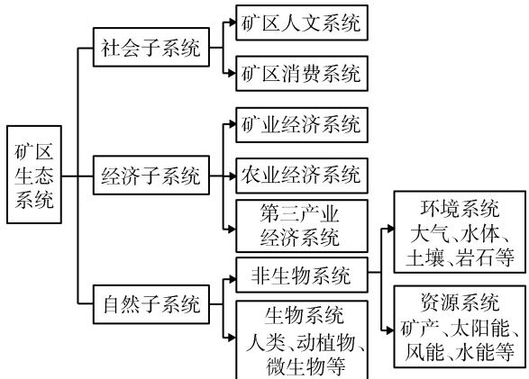
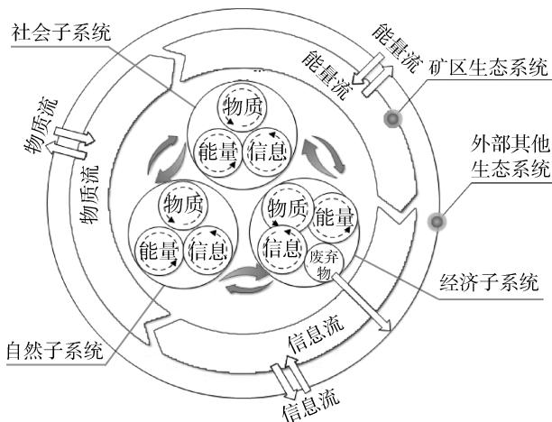
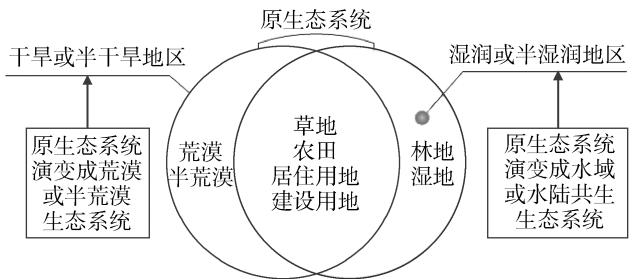
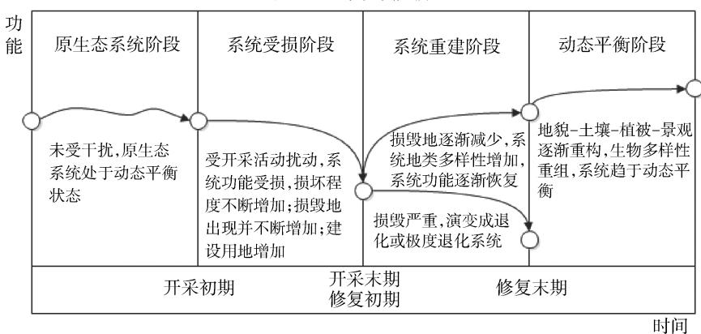

文章编号：1004-4051(2023)01-0060-07

DOI:10.12075/j.issn.1004-4051.2023.01.003

# 矿区生态系统演变与修复模式研究

李云鹏，孔胃，楚储，蔡永宁（济南市勘察测绘研究院，山东济南250101)

摘要：矿产资源的开发利用活动造成矿区环境污染与生态破坏，影响矿区生态系统结构与功能的稳定性，明晰矿区生态系统的结构、功能和演变机理，对研究受损矿区生态系统的修复与重建具有重要意义。本文以矿区生态系统为研究对象，阐述矿区生态系统作为社会-经济-自然一体的复合型生态系统的内涵特征结构和功能。矿区生态系统具有复合性，人工性，开放性和能量、物质流动的特殊性等特征，能够在维持系统内部能量、物质、信息流动平衡的同时，与外部系统进行能量、物质、信息的交换。明确了煤矿区生态系统演变的2种类型，位于干旱或半干旱地区的矿区生态系统演变成荒漠或半荒漠生态系统、位于湿润或半湿润地区的矿区生态系统演变成水域或水陆共生生态系统；演变阶段可划分为原生态系统阶段、系统受损阶段、系统重建阶段以及系统动态平衡阶段等4个阶段。针对受损矿区生态系统的修复，提出3种修复模式：自然年恢复模式、辅助再生模式和生态重建模式。本文在总结矿区生态系统演变类型、演变阶段及演变过程的基础上，提出了针对矿区生态系统的修复模式，旨在为矿区生态系统提供科学、合理的修复和重建模式，人工正确诱导受损矿区生态系统的最终演替方向，确保矿区土地复垦与生态恢复重建的潜在风险最小化，从而促进矿区生态系统的动态平衡、合理再利用和可持续发展。

关键词：矿区生态系统；演变类型；演变阶段；演变过程；修复模式

文献标识码：A

# Study on the evolution and restoration model of mining area ecosystem

LI Yunpeng, KONG Wei, CHU Chu, CAI Yongning (Jinan Geotechnical Investigation and Surveying Institute, Jinan 250101, China)

Abstract: The development and utilization of mineral resources in mining area causes environment pollution and ecology destroying,affects the stability of the structure and function of mining area ecosystem. It is of great significance to clarify the structure, function and evolution mechanism of mining area ecosystem for researching the restoration and reconstruction of the damaged mining area ecosystem. This paper takes the mining area ecosystem as the research object, describes the connotation, characteristics, structure and function of the mining area ecosystem as a social-economic-natural compound ecosystem. There are four characteristics:complex,artificial,open and special energy material flow of the mining area ecosystem. The mining area ecosystem can exchange energy, matter and information with the external system while maintaining the balance of internal energy, matter and information flow. Clears two evolution types of coal mining area ecosystem,one is that the mining area ecosystem located in arid or semi-arid area evolves into desert or semi-desert ecosystem,and the other is that the mining area ecosystem located in humid or semihumid area evolved into water area or amphibious symbiotic ecosystem. Its evolution stages can be divided into original ecosystem stage,damaged stage,ecological reconstruction prototype stage and dynamic balance stage. Three restoration models of natural regeneration, assisted regeneration and reconstruction are

proposed for ecological restoration in mining area. Based on the summary of the evolution types, evolution phases,and evolution process for mining area ecosystem,the restoration models of mining area ecosystem are put forward. The paper aims to provide a scientific and reasonable restoration and reconstruction models for the mining area ecosystem, artificially and correctly induce the final succession direction of the damaged mining area ecosystem,and ensure that the potential risks of land reclamation and ecological restoration and reconstruction in the mining area are minimized. Thus,it can promote the dynamic balance, rational reuse and sustainable development of mining area ecosystem.

Keywords: mining area ecosystem; evolution type; evolution stage; evolution process; restoration model

矿产资源是人类社会赖以生存和发展的重要物质基础，其大规模、持续性开发利用，带来了矿山安全、环境污染及生态破坏等一系列问题1-3]，对整个矿区生态系统的组成、结构和功能均造成破坏。矿区生态系统的稳定性丧失，发生逆向演替，整个系统处于极度破损状态，严重影响了矿区的可持续发展[4-5]。因此，研究矿区生态系统的演变趋势和生态修复模式，对维护矿区的生态安全，促进矿业的可持续发展具有重要意义。

当前，学者们对矿区生态系统的研究主要集中在矿区生态系统服务价值、矿区生态系统弹性力及生态风险评估。如刘英等[6基于InVEST模型集成水源供给、土壤保持、碳储存3项生态系统服务构建综合生态系统服务评价模型，对神东矿区的生态系统服务价值进行评价；GUERNIC等7对铀矿开采所导致的矿区重金属污染水环境，造成矿区生物体内重金属元素累积，进而影响生物健康的研究；顿耀龙等8基于灰色模型对平朔矿区在经济转型背景下生态系统服务价值变化进行预测分析；吴秦豫等9选取矿区恢复力的关键影响因素，利用GIS和突变级数方法，对陕西省神木市煤炭基地的生态恢复力和矿区生态系统退化风险进行评价。而在矿区生态系统演替方面，则侧重于对矿区生态系统中土地、植被或景观格局等矿区局部演替的研究[10-12]，同时，研究中更加注重对局部演替过程中所采取的针对矿区土壤修复技术或方法的修复后效应研究[13-14]，而对矿区生态系统在矿产资源开发利用前后整个系统的结构、功能、演变过程及演替方向等方面的研究比较缺乏。

矿产资源的开发利用不可避免地对矿区生态系统造成了破坏，如何利用先进的理论及技术手段对矿区进行生态修复，改善矿区环境，解决矿区环境污染、生态破坏等问题一直是学者们研究的重点领域。随着科学技术的不断发展、相关研究的不断深入，矿区生态系统修复方式逐渐多样化。如近年来新兴的利用生物炭钝化修复技术、微生物作用联合修复技术、城市污泥工程修复技术等对矿区进行生态修复[15-17]，改善了矿区生态环境，对维护矿区生态系统的稳定，促进生态系统健康发展具有重要作用。

本文在对比矿产资源开采前后矿区生态系统变化的基础上，总结矿区生态系统的演变类型、演变阶段及演变过程，提出针对矿区生态系统的修复模式，为促进矿区生态系统的良性、可持续发展提供理论依据和技术参考。

## 1 矿区生态系统

矿区生态系统是一个典型的多层次、多功能复合的生态系统，由社会、经济、自然3个子系统耦合而成[18]，在改造和适应自然环境的基础上建立起来，由矿区空间范围内的居民与自然环境系统以及人工建造的社会环境系统相互作用而形成，以矿产资源开发利用为主导的社会-经济-自然复合型生态系统。

## 1.1 矿区生态系统结构

矿区生态系统是由社会、经济、自然3个子系统耦合而成的复合生态系统，从复合系统的角度出发，矿区生态系统分为社会子系统、经济子系统和自然子系统。社会子系统以矿区居民为核心，以满足矿区居民的居住、就业、教育、医疗、消费等需求为目标，分为矿区人文系统和矿区消费系统。经济子系统是指利用矿区内外系统提供的物质和能量等资源，生产出满足国民经济需要的矿产品的过程，按照产业类型可分为矿业经济系统、农业经济系统、第三产业经济系统。自然子系统分为非生物系统和生物系统，非生物系统包含环境系统(大气、水体、土壤、岩石等)和资源系统(矿产资源、太阳能、风能、水能等)，生物系统包含人类、动植物、微生物等。矿区生态系统的结构划分如图1所示。

## 1.2 矿区生态系统功能

生态系统功能是生态系统体现的功效或作用，矿区生态系统作为一种人类主导的复合型生态系统，其功能是指系统及其内部各子系统体现的功效或作用，主要表现在生产、能量流动、物质循环和信息传递等方面。

根据矿区生态系统中能量、物质及信息的交换方向及流动范围，矿区生态系统功能可划分为外部功能和内部功能。外部功能是指矿区生态系统对外部其他系统产生的作用，通过与外部其他系统进行能量、物质与信息交换，确保矿区生态系统内部能量、物质和信息循坏的平衡。内部功能是指矿区生态系统内部社会子系统、经济子系统、自然子系统之间相互作用，保持系统内部能量、物质和信息循环畅通，同时，形成各种反馈机制来调节外部功能。矿区生态系统内外部功能示意如图2所示。

  
图1 矿区生态系统结构

Fig. 1 Structure of mining area ecosystem  
  
图2 矿区生态系统内外部功能示意图  
Fig. 2 Schematic diagram of internal and external functions of mining area ecosystem

## 1.3 矿区生态系统特征

矿区生态系统作为一种人类主导的社会-经济-自然为一体的复合型生态系统，既具备自然生态系统中生物与自然环境间的相互协调，能量、物质、信息的流动、循环，以及自我协调的功能；又受到人类活动的控制和干扰，自我调节能力较差19]。根据矿区生态系统组成结构和功能，该系统具有以下4个特征。

1）复合性。矿区生态系统既受自然环境影响，又受到科技发展和人类活动的支配。该系统是以矿产资源开发利用活动为中心的，兼具社会、经济和自然性质的复合型生态系统。

2）人工性。在矿区生态系统中，人类出于生产、生活需求，在矿区内兴建公路、住宅、医院、学校、商场等基础设施，对矿区进行了人工改造。在人工改造的过程中，改变了原始自然生态系统的结构、功能和演变方向。该系统是以矿区生产作业区为核心的人工、半人工生态系统，系统的产生、发展和消亡均按照人的意愿进行。

3）开放性。作为一种复合型生态系统，矿区生态系统在内部社会子系统、经济子系统、自然子系统相互促进、相互协调的基础上，要不断从外部系统进行能量、物质、信息的交换，同时，向外部系统排放废弃物以维持自身的健康运转。该系统的发展与外部系统息息相关，受自然生态规律和社会经济规律的共同支配。

4）能量、物质流动的特殊性。自然生态系统中能量、物质流动主要通过系统内部各种错综复杂的食物网进行传递，具体表现为生物的新陈代谢。矿区生态系统能量、物质流动主要受到人为支配，经过各种机械设备运转后多方向流转。该系统能量、物质的流动是开放式的，并且需要大量的辅助能源与辅助物质。

## 2 矿区生态系统演变

矿区生态系统演变是指随着时间推移与矿产资源开采，原生态系统受到干扰被另外一种生态系统代替的过程。矿区生态系统的演变方式与其地理位置、自然气候条件、矿产资源开采方式、矿种类型以及人类生产生活等息息相关，不同的演变条件下矿区生态系统的演变类型、演变过程均不相同。本文该部分以煤矿区生态系统为研究对象，结合煤矿区原生态系统、自然气候条件等，对煤矿区生态系统的演变类型和过程进行分析、总结。

## 2.1 演变类型

煤矿区生态系统的演变类型很大程度上取决于其原生态系统类型，以及该系统所在地的自然气候条件。煤炭资源未开发利用前，原生态系统类型一般分为自然生态系统和人工生态系统。自然生态系统主要为林地、草地、湿地、荒漠、半荒漠等；人工生态系统主要为农田、居住用地、城镇等。

煤炭资源进行开发利用活动后，位于干旱或半干旱地区的矿区生态系统在人类活动的干扰下，矿区土壤、植被等景观遭到破坏，同时在干旱气候的长期影响下，最终演变为荒漠或半荒漠生态系统；位于湿润或半湿润地区的煤矿区生态系统，煤炭资源开发利用破坏原有岩层后造成地面塌陷，由于地下水位较高，地下水流入塌陷坑，最终演变成水域或水陆共生生态系统。

因此，煤矿区生态系统演变类型可分为2种情况，如图3所示。一种是位于干旱或半干旱地区的矿区生态系统演变成荒漠或半荒漠生态系统；另一种是位于湿润或半湿润地区的矿区生态系统演变成水域或水陆共生生态系统。

  
图3 煤矿矿区生态系统演变类型  
Fig. 3 Evolution types of coal mining area ecosystem

## 2.2 演变阶段与过程

按照煤炭资源开发利用过程，矿区生态系统演变可分为4个阶段，即原生态系统阶段、系统受损阶段、系统重建阶段以及系统动态平衡阶段[20]。矿区生态系统各演变阶段及演变过程如图4所示。矿区生态系统演变过程可根据各个演变阶段进行具体划分。

1）原生态系统阶段。煤炭资源开发利用前，原生态系统一般为农田、林地、草地、居住用地等生态系统，系统未受到外部活动干扰，其功能相对稳定，处于动态平衡状态。

2）系统受损阶段。原生态系统受到煤炭资源开发利用活动的干扰，生态系统功能逐渐受损，且受损程度不断增加；损毁地出现并不断增加，增速先加快后减缓；整个生态环境遭受破坏，生态系统发生逆向演替，形成受损生态系统，系统功能逐渐丧失。

3）系统重建阶段。煤炭资源开发利用活动结束后，按照是否进行生态重建可分为两种情况。一种是不采取任何修复方式，矿区生态系统在损毁严重，系统功能基本丧失的情况下，继续发生逆向演替，最终形成系统功能完全丧失的退化或极度退化生态系统；另一种是对受损的矿区生态系统进行生态重建，损毁地逐渐减少，生物多样性增加，系统逐渐发生正向演替，系统功能逐渐恢复，最终形成功能相对稳定、完善的生态系统。

4）动态平衡阶段。在生态重构下，矿区生态系统经历了地貌重构、土壤重构、植被重构、景观重构、生物多样性重组与保护[21]。系统功能完全恢复，系统趋于动态平衡状态。

  
图4 煤矿区生态系统演变阶段与过程  
Fig. 4 Evolution stage and process of coal mining area ecosystem

## 3 矿区生态系统修复模式

矿区生态系统修复主要是针对矿产资源开发利用活动带来的生态环境问题，采取科学、系统的生态修复工程和长期的生态抚育措施，修复矿区受损生态系统，逐渐恢复矿区生态系统功能，从而实现矿区生态环境的可持续发展。按照矿区生态系统演变阶段与过程，结合受损矿区生态系统的退化程度和现有的矿区生态修复技术，可划分为自然恢复、辅助再生和生态重建等3种矿区生态系统修复模式。

## 3.1 自然恢复模式

自然恢复是一种无为而治的修复理念，是指依靠自然力量修复生态系统的过程和方法。自然力量是指自然界存在的风、雨、重力、冻融等自然界存在的各种生物、化学和物理等作用22]，自然恢复周期

较长而成本较低。

矿区生态系统的自然恢复是指在不实施任何人为活动的情况下，主要依靠自然作用逐渐修复受损后的矿区生态系统，使得系统逐渐恢复到结构稳定、功能完善的较高水平的生态系统状态。常见的矿区生态系统自我恢复有矿区水域自我恢复、矿区植被自我恢复等。以煤矿区生态修复为例，针对采煤沉陷影响较小，具备自然修复能力的矿区，适宜选择自然恢复模式。特别是针对结构简单、功能单一的生态系统，应选择自然恢复，从而避免因人工修复给环境带来的干预和扰动，以最小的修复成本获取最大的修复效益，实现矿区生态系统的动态平衡。

## 3.2 辅助再生模式

辅助再生模式是以受损矿区生态系统的自我恢复能力为基础，辅以物质与能量的人工输入，促进退化或受损的矿区生态系统结构和功能逐步恢复并进入良性循环的活动[23]。辅助再生模式适用于受损矿区生态系统中度退化、具备一定自然恢复能力的区域，需要积极引入生物干预措施和非生物干预措施进行修复。

## 3.2.1 生物干预措施

生物干预措施主要分为2种，一种是控制入侵植物和动物，减少外来生物对原矿区生态系统的干扰；另一种是重新引入矿区生态系统中所需的动植物、微生物等，加快生态多样性重组，促进矿区生态系统结构和功能的修复。①通过引入超富集植物对矿区土壤中进行吸收、转移，改善矿区土壤理化性质，降低土壤重金属污染24]。土壤肥力较差的地区可选择种植豆科植物提高土壤肥力。林木修复可选择耐贫瘠树种，并且进行多树种混交种植提高其稳定性。②在植物修复取得一定作用后，在矿区土壤中放养如蚯蚓等低等生物，改善土壤物理结构，增加土壤孔隙度，降低土壤重金属含量。同时，蚯蚓能够增加磷等速效成分，促进土壤农作物的生长等。③通过引入微生物，利用微生物生命代谢活动减少土壤环境中有毒有害物质的浓度，降低其毒性，从而改善土壤环境，改进土壤结构，如采用复合菌和生物炭对土壤中重金属Ni、Cd进行修复，结果显示修复后的土壤中根际土壤细菌增加、真菌群落结构多样化，土壤环境明显改善[25]。

## 3.2.2 非生物干预措施

非生物干预措施主要是采取物理修复技术、化学修复技术对矿区生态系统进行污染修复。

1）物理修复技术。根据具体的矿区土壤条件、损毁地特性等，一是采取排土、换土、去表土、客土与深耕翻土等方法改善矿区土壤环境，具体操作是在矿产资源开采前将地表土壤分层挖取保存，以保证土壤物理结构、营养元素及土壤中生物扰动量最小，开采活动结束后，利用挖取保存的土壤进行覆土工程；二是针对采煤塌陷地，采用煤矸石、粉煤灰、黄河泥沙等材料进行填充后覆土，特别是黄河泥沙夹层式充填复垦技术对采煤塌陷地复垦具有积极意义，黄河泥沙充填层中夹土壤层后能够有效改善重构土壤的水分运动特性并提高保水性[26]。

2）化学修复技术。一是通过在矿区土壤中添加化学试剂改善土壤pH值，平衡土壤酸碱性；二是在矿区土壤中施用适量的煤基复混肥，提高土壤中碱性磷酸酶的活性，改善土壤环境27]；三是通过添加化学物质与矿区土壤中的重金属阳离子发生反应，降低矿区土壤中重金属污染程度及迁移能力[28]。

## 3.3 生态重建模式

针对矿区生态系统受损程度严重、物种生存环境条件不稳定、生态退化严重等情况，可采取地貌重塑、土壤重构、植被重建等方法结合工程技术手段，对受损的矿区生态系统进行生态重建。本文针对高潜水位煤矿区生态系统和部分矿区废弃地提出了水陆生态构建和转型利用两种生态重建模式。

## 3.3.1 水陆生态构建

水陆生态构建是高潜水位煤矿区生态修复的重要手段，高潜水位煤矿区进行开采后，容易造成地表岩层破坏，地面沉陷，地下水位较高便会流入地表，积聚于地势低洼区，形成零星或集中连片的水域。根据水域范围和面积，采用不同的方法进行水陆生态构建。

1）地表沉陷区较浅，水域积聚面积较小，一般可采用疏排法建立排水系统，降低潜水位；或者通过煤矸石、粉煤灰、生活垃圾及河流泥沙等充填沉陷坑，覆土后再利用。

2）地表沉陷区较深，水域积聚面积较小，可利用挖深垫浅法，挖深沉陷较深的地区，将挖出的土方充填至沉陷较浅的地区，挖深区域可治理应用为鱼塘、垫浅区域可治理应用为耕地。

3）大面积常年连片积水区，可进行立体生态开发，将沉陷积水区建成水产养殖、饲料种植、林果蔬种植等综合性基地。除此之外，还可进行生态建设，构建自然生态水域、观光旅游用地、工业景观和工业遗产用地等。

## 3.3.2 转型利用

部分矿区废弃地或经过地质勘探后已经“沉稳”的采矿沉陷区可做建设用地使用，一般包括发展下游产业、房地产开发、文化产业开发等。

1）发展下游产业。靠近城市或煤炭工业城市可借助煤矿区优势，发展下游产业。如开采-洗选-发电、开采-洗选-发电-煤化工、开采-洗选-发电-高耗能产业等。

2）房地产开发。可分为旧区改造和新区开发，旧区改造是指对矿区废弃地中遗留的工业建筑和配套设施进行改造利用或拆除重建，优化原有地块的用地性质和功能，房地产开发企业取得土地使用权后，依据城市规划要求在原工业废弃地上开发房地产商品，实现城市存量土地资源价值的提升。新区开发是针对受矿采资源开采活动破坏后，已恢复为城市建设用地后所进行的开发利用，这类开发的优势在于区位上接近自然生态环境，地价较低且具备一定的基础设施条件，开发商能够以较低的成本实现具有特色概念、能产生附加值的产品。

3）文化产业开发。利用矿区废弃地及废弃工业设施发展以文化产业为主导的产业园区，属于一种新兴产业。如石家庄正丰矿区利用现有优势资源，打造矿区全域旅游产业。

## 4 结 语

通过对矿区生态系统内涵与特征、结构与功能的认识可知，矿区生态系统是一个社会-经济-自然的复合型生态系统，具备外部功能与内部功能。外部功能负责与外部其他系统进行能量、物质与信息交换，确保矿区生态系统内部能量、物质和信息循坏的平衡。内部功能负责保持系统内部能量、物质和信息循环畅通，同时，形成各种反馈机制来调节外部功能。各子系统的复合组成与内外部功能使得矿区生态系统具有复合性，人工性，开放性和能量、物质流动的特殊性等特征。

结合煤炭资源开采前原生态系统类型、所在地自然气候条件等分析得知，煤矿区生态系统位于干旱或半干旱地区时演变成荒漠或半荒漠生态系统，位于湿润或半湿润地区时演变成水域或水陆共生生态系统；其演变阶段包括原生态系统阶段、系统受损阶段、系统重建阶段以及系统动态平衡阶段等4个阶段。针对受损矿区生态系统的修复，提出3种修复模式：自然恢复模式、辅助再生模式和生态重建模式。

本文研究总结了矿区生态系统的演变类型、演变阶段及演变过程，提出针对矿区生态系统的修复模式，旨在为生态环境脆弱的矿区资源开发集中区提供科学、合理的修复和重建模式，人工正确诱导受损矿区生态系统的最终演替方向，确保矿区土地复垦与生态恢复重建的潜在风险最小化，从而促进矿区生态系统的合理再利用和良性、可持续发展。 \_

## 参考文献

1]卿艳彬，卿国屏，易菲霆，等.郴州鲁塘矿区矿山地质环境问题 及生态修复方案探讨[J].中国矿业，2021,30(S1)：80-85. QING Yanbin, QING Guoping, YI Feiting, et al. Discussion on mine geological environment problems and ecological restoration scheme in Lutang Mining Area of Chenzhou[J]. China MiningMagazine,2021,30(S1):80-85.

[2] 张进德，郗富瑞.我国废弃矿山生态修复研究[J].生态学报，2020,40(21):7921-7930.ZHANG Jinde, XI Furui. Study on ecological restoration ofabandoned mines in China[J]. Acta Ecologica Sinica, 2020, 40(21):7921-7930.

[3] 孙琦.煤矿区生态风险演化过程及防控机制研究[D].北京：中国地质大学(北京)，2017.

[4]肖武，张文凯，吕雪娇，等.西部生态脆弱区矿山不同开采强度 下生态系统服务时空变化：以神府矿区为例[J]. 自然资源学 报，2020,35(1):68-81. XIAO Wu,ZHANG Wenkai, LYU Xuejiao, et al. Spatio-temporal patterns of ecological capital under different mining intensities in an ecologically fragile mining area in Western China: a case study of Shenfu Mining Area[J]. Journal of Natural Resources,2020,35(1):68-81.

[5] 李娜.白杨河矿区煤炭开采对流域生态系统的影响[J].煤炭 工程，2019,51(8)：27-30. LI Na. Impact of coal mining on basin ecosystem in Baiyanghe Mining Area[J].Coal Engineering,2019,51(8):27-30.

[6]刘英，魏嘉莉，毕银丽，等.神东矿区生态系统服务功能评价 [J].煤炭学报，2021，46(5):1599-1613. LIU Ying, WEI Jiali, BI Yinli, et al. Evaluation of ecosystem service function in Shendong Mining Area[J]. Journal of China Coal Society,2021,46(5):1599-1613.

[7 ] GUERNIC A L, SANCHEZ W, BADO-NILLES A, et al. In situ effects of metal contamination from former uranium mining sites on the health of the three-spined stickleback[J]. Ecotoxicology,2016,25(6):1234-1259.

8]顿耀龙，王军，白中科，等.基于灰色模型预测的矿区生态系统服务价值变化研究：以山西平朔露天矿区为例[J].资源科学，2015,37(3):494-502.DUN Yaolong, WANG Jun, BAI Zhongke, et al. Changes inPingshuo opencast mining area ecosystem service values basedon grey prediction modeling[J]. Resources Science, 2015, 37(3):494-502.

9]吴秦豫，张绍良，杨永均，等.基于恢复力的半干旱矿区生态系 统退化风险空间评估[J].煤炭学报，2021，46(5):1587-1598. WU Qinyu, ZHANG Shaoliang, YANG Yongjun, et al. Spatial assessment of ecosystem degradation risk in semi-arid mining area based on resilience indicators[J\_. Journal of China Coal Society,2021,46(5):1587-1598.

[10] STAMOU G P, PAPATHEODOROU E M. Studying the complexity of the secondary succession process in the soil of

restored open mine lignite areas; the role of chemical template[J]. Applied Soil Ecology,2016,103:50-56.

[11]卢永强.高潜水位矿区复垦土壤微生物群落演替规律研究[D].徐州：中国矿业大学，2021.

12李保杰.矿区土地景观格局演变及其生态效应研究：以徐州市贾汪矿区为例D].徐州：中国矿业大学，2014.

[13] WANG M M,ZHU Y,CHENG L R, et al. Review on utilization of biochar for metal-contaminated soil and sediment remediation[J]. Journal of Environmental Sciences, 2018, 63 (1):156-173.

[14] METSLAID S,STANTURF J A, HORDO M, et al. Growth responses of Scots pine to climatic factors on reclaimed oil shale mined land[J]. Environmental Science and Pollution Research,2016,23(14):13637-13652.

[15]杨凯，王营营，丁爱中.生物炭对铅矿区污染土壤修复效果的稳 定性研究[J].农业环境科学学报，2021，40(12):2715-2722. YANG Kai, WANG Yingying, DING Aizhong. Stability of biochar-remediated contaminated soil from a lead mine site[J]. Journal of Agro-Environment Science, 2021, 40(12) : 2715-2722.

[16]潘志强，张淑琴，任大军，等.城市污泥的直接施用对矿区土壤 修复的影响[J].环境工程，2019,37(11):189-193，183. PAN Zhiqiang, ZHANG Shuqin, REN Dajun, et al. Effects of direct application of sewage sludge on soil remediation in abandoned mining area[J]. Environmental Engineering,2019, 37(11):189-193,183.

[17] YANG G H,ZHU G Y,LI H L, et al. Accumulation and bioavailability of heavy metals in a soil-wheat/maize system with long-term sewage sludge amendments[J]. Journal of Integrative Agriculture,2018,17(8):1861-1870.

[18]杨庚.景观格局演变背景下晋北大型露天矿区生态系统弹性与风险评价[D].北京：中国地质大学(北京)，2021.

[19]闫旭骞，王广成.矿区复合生态系统理论初探[J].中国矿业， 2003,12(8):24-27. YAN Xuqian, WANG Guangcheng. Primary discussion on mining area compound ecosystem theory[J]. China Mining Magazine,2003,12(8):24-27.

[20]张笑然，白中科，曾银贵，等.特大型露天煤矿区生态系统演变 及其生态储存估算[J].生态学报，2016，36(16):5038-5048. ZHANG Xiaoran,BAI Zhongke,ZENG Yingui, et al. Ecosystem evolution and ecological storage in outsize open-pit mining areaJ]. Acta Ecologica Sinica,2016,36(16):5038-5048.

[21]白中科，周伟，王金满，等.再论矿区生态系统恢复重建[J].中国土地科学，2018,32(11):1-9.BAI Zhongke, ZHOU Wei, WANG Jinman, et al. Rethink on

ecosystem restoration and rehabilitation of mining areas[J]. China Land Science,2018,32(11):1-9.

[22]胡振琪，龙精华，王新静.论煤矿区生态环境的自修复、自然修 复和人工修复[J].煤炭学报，2014，39(8):1751-1757. HU Zhenqi, LONG Jinghua, WANG Xinjing. Self-healing, natural restoration and artificial restoration of ecological environment for coal mining[J]. Journal of China Coal Society, 2014,39(8):1751-1757.

[23]白中科，师学义，周伟，等.人工如何支持引导生态系统自然恢 复[J].中国土地科学，2020,34(9):1-9. BAI Zhongke,SHI Xueyi,ZHOU Wei, et al. How does artificiality support and guide the natural restoration of ecosystems [J]. China Land Science,2020,34(9) :1-9.

[24] 曾鹏，郭朝晖，韩自玉，等.桑树(Morus alba L.)原位修复某尾矿区重金属污染土壤[J].环境化学，2020,39(5)：1395-1403.ZENG Peng, GUO Zhaohui, HAN Ziyu, et al. In-situ phytore-mediation of heavy metal-contaminated soil by Morus alba L.near a mine tailing[J]. Environmental Chemistry, 2020, 39(5):1395-1403.

[25]杨昳，陈元晖，张春燕，等.复合菌和鸡粪生物炭对镍和镉污染 土壤的修复效果研究[J/OL].农业环境科学学报：1-14[2022- 05-05]. http: ∥ kns. cnki. net/kcms/detail/12. 1347. S. 20220412.1603.004.html. YANG Yi,CHEN Yuanhui, ZHANG Chunyan, et al. Remediation effect of compound bacteria and chicken manure-derived biochar in nickel and cadmium-contaminated soil [J/OL]. Journal of Agro-Environment Science:1-14[2022-05-05]. http:/kns.cnki.net/kcms/detail/12.1347.S.20220412.1603. 004.html.

[26]王晓彤，胡振琪，梁宇生.基于Hydrus-1D的黄河泥沙充填复 垦土壤夹层结构优化[J].农业工程学报，2022，38(2):76-86. WANG Xiaotong, HU Zhenqi, LIANG Yusheng. Structural optimization of reclaimed subsidence land interlayers filling with the Yellow River sediments using a Hydrus-1D model [J]. Transactions of the Chinese Society of Agricultural Engineering,2022,38(2):76-86.

[27]刘洋.生物炭煤基复混肥对复垦土壤磷及玉米产量的影响[D].太谷：山西农业大学，2018.

[28]邓敏，程蓉，舒荣波，等.攀西矿区典型重金属污染土壤化学 微生物联合修复技术探索[J].矿产综合利用，2021(4):1-9. DENG Min, CHENG Rong, SHU Rongbo, et al. Exploration of chemical-microbial combined remediation technology for typical heavy metals-contaminated soils in Panxi Mining Region[J]. Multipurpose Utilization of Mineral Resources, 2021(4):1-9.