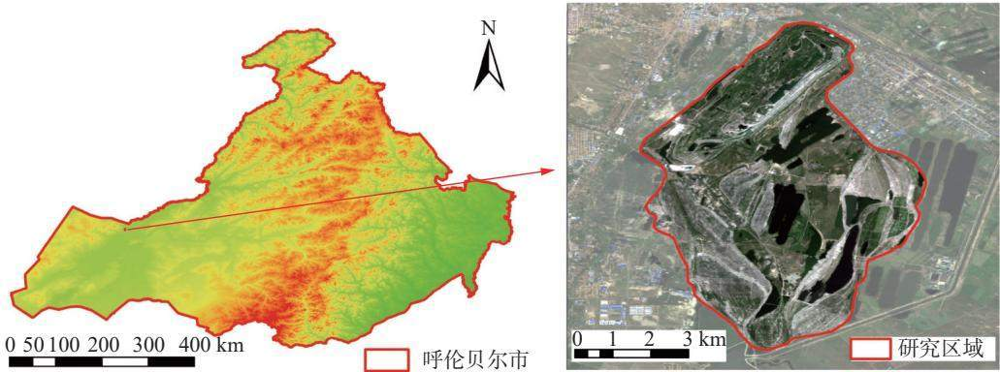
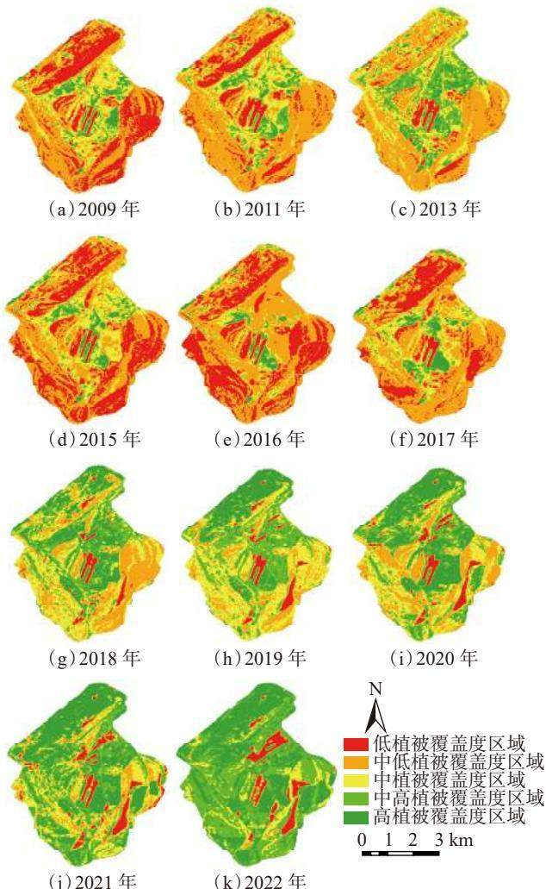
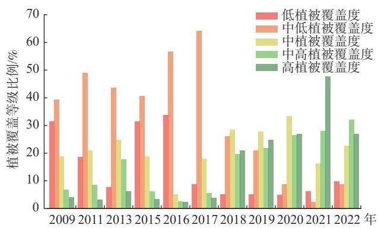
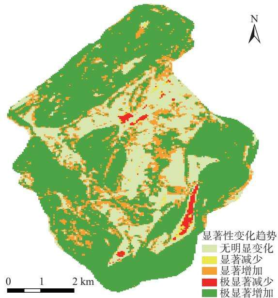
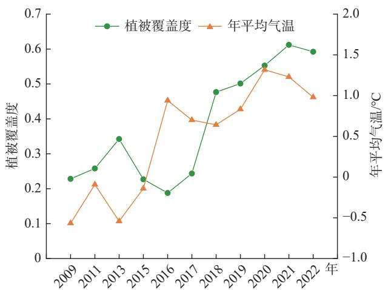
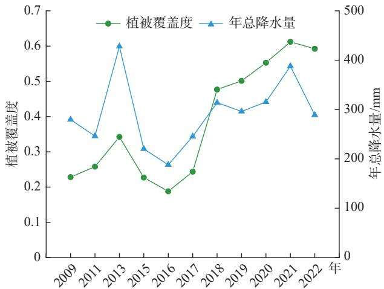
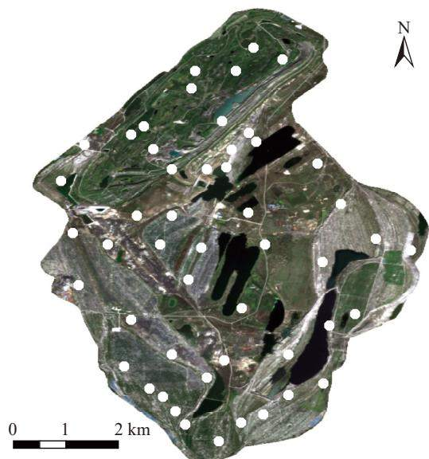

文章编号：1004-4051(2024)03-0043-08

DOI:10.12075/j.issn.1004-4051.20230100

# 灵泉露天矿生态修复效果及驱动因素分析

邹兰兰'，冯启言'，郝明'，孟庆俊'，王立艳²，秦东富²(1. 中国矿业大学环境与测绘学院，江苏徐州 221116;2. 扎赉诺尔煤业有限责任公司，内蒙古满洲里021410)

摘要：煤矿开采通常会破坏土壤、植被，从而造成生态损伤。目前，高寒地区露天矿的生态修复工作尚处在起步阶段，针对高寒地区露天矿开展的生态修复效果及其驱动因素分析的研究较少。以灵泉露天矿为研究区，基于2009—2022年共11期Landsat影像，利用像元二分模型计算植被覆盖度，对矿区生态修复前后开展长时序植被覆盖动态监测，并进行生态修复效果和驱动因素分析。研究结果显示：矿区近十年来的植被覆盖度总体呈上升趋势，2017年大面积修复以后上升趋势尤为显著。气温和降水量是导致高寒地区露天矿植被覆盖度发生波动性变化的关键自然因素，其中，降水量是影响植被覆盖度持续上升的主要自然因素。植被覆盖度和土壤养分含量的变化相辅相成，植被覆盖度上升的同时会使土壤肥力提升，土壤肥力提升后又会促进植被覆盖度的上升。人工修复是高寒地区露天矿生态修复的主要方式，是高寒地区露天矿植被覆盖度上升的主要原因。研究结果表明，多年来的生态修复工作取得了显著效果，同时可为高寒地区露天矿的生态修复提供科学依据。

关键词：生态修复；高寒地区；像元二分模型；最小二乘法；植被覆盖度；灵泉露天矿中图分类号：TD88文献标识码：A

# Ecological restoration effect and driving factors analysis of Lingquan Open-Pit Mine

ZOU Lanlan, FENG Qiyan, HAO Ming', MENG Qingjun, WANG Liyan2, QIN Dongfu²

(1. School of Environment and Surveying, China University of Mining and Technology, Xuzhou 221116, China; 2. Zhalainaoer Coal Industry Co., Ltd., Manzhouli 021410, China)

Abstract: Coal mining often leads to soil and vegetation damage, resulting in ecological damage. At present, the ecological restoration of open-pit mines in alpine regions is still in the initial stage, and there are few studies on the ecological restoration effect and its drving factors of open-pit mines in alpine regions. Taking Lingquan Open-Pit Mine as the research area, based on eleven Landsat images from 2009 to 2022, the vegetation coverage is calculated by using the dimidiate pixel model, the long-time dynamic monitoring of vegetation coverage before and after the ecological restoration of the mining area is carried out, and the ecological restoration effect and driving factors are analyzed. The research results show that the vegetation coverage in the mining area has increased in the past ten years, especially after

the large-scale restoration in 2017. Temperature and precipitation are the key natural factors that lead to the fluctuating change of vegetation coverage in open-pit mines in alpine regions, and precipitation is the main natural factor that affects the continuous growth of vegetation coverage. The change of vegetation coverage and soil nutrient content complement each other. The increase of vegetation coverage will increase soil fertility, which in turn will promote the growth of vegetation coverage Artificial restoration is the main way of ecological restoration in open-pit mines in alpine regions and the main reason for the increase of vegetation coverage in open-pit mines in alpine regions. The research results show that the ecological restoration has achieved remarkable results over the years, and can provide scientific basis for the ecological restoration of open-pit mines in alpine regions.

Keywords: ecological restoration; alpine region; dimidiate pixel model; least squares; vegetation

coverage; Lingquan Open-Pit Mine

煤炭是我国重要能源之一，但煤矿的露天开采会严重损坏自然生态环境，引发一系列环境问题，甚至会破坏大量的土地资源，阻碍社会经济发展和生态环境不断优化，因此，露天矿闭坑后的生态修复极为重要。植被覆盖状况是反映生态修复效果的重要指标，分析其驱动因素不仅可以为矿区后续的生态修复提供科学依据，而且对类似露天矿的生态修复也具有重要参考意义。

矿区植被覆盖度动态监测以及植被变化趋势分析是研究煤矿露天开采对区域生态环境影响的重要内容[],可以用来判断生态修复的效果及生态系统的结构稳定性，以便及时调整生态修复对策。植被覆盖度变化是反映矿区环境变化的重要指标[2]。ROUSE等[3]最初提出归一化植被指数(NDVI)，旨在研究区域尺度和全球性的植被生长状态和生长趋势情况，由于NDVI在反映植被的生长状况、覆盖程度及光合作用的强度方面较为准确[45],同时在提取研究区植被覆盖信息方面应用也较为广泛-6]，目前已成为植被变化研究最常用的指标[7]。

利用遥感技术监测植被覆盖度变化，可快速、准确分析矿区生态修复效果[8],因此，国内外学者陆续开展了一系列研究。国外学者最初使用Landsat数据提取植被覆盖度，并对其进行动态监测。RAIMUNDO等[9]基于Landsat TM影像监测了巴西亚马逊流域矿区的土地利用/覆盖情况，研究发现研究区的土地退化面积在逐年增加；ERENER10采用遥感影像监测了土耳其露天矿区1987—2006年地表植被变化特征；KERGOAT等1]利用遥感影像的短波红外监测了干旱地区的植被覆盖度；GUTMAN等12]还研究了植被变化情况与降雨、气温等气象因子之间的关系，证明了气候对植被的影响。近年来，国内在矿区生态环境监测和利用遥感数据监测研究煤矿露天开采导致的环境问题方面取得了较大进展[13]。汪桂生等[14]利用MODIS NDVI时间序列产品提取了2005—2014年淮南矿区的植被覆盖度，并分析了其时空演化特征；李林叶等15]以呼伦贝尔草原为研究对象，基于20002016年的MODIS数据分析了呼伦贝尔草原植被年际空间分布变化规律，结合气象数据在区域尺度上分析了植被覆盖度年际变化及其与气候因子的关系。目前，高寒地区露天矿的生态修复尚处于起步阶段，因此，针对高寒地区露天矿开展的生态修复效果及其驱动因素分析的研究较少，生态修复效果的驱动因素也尚不明确。

针对上述问题，本文以灵泉露天矿为例，利用2009—2022年共11期Landsat遥感影像数据(其中，2010年、2012年、2014年矿区植被生长期的影像含云量较大，故剔除)，基于像元二分模型对高寒地区露天矿的矿坑及周边排土场植被覆盖度进行动态分析，以期评估高寒地区露天矿区生态修复治理成效及存在问题，为后续的生态修复提供依据。

## 1 研究区域与数据来源

## 1.1 研究区概况

灵泉露天矿位于内蒙古自治区呼伦贝尔市扎赉诺尔煤田中北部(图1)，整个矿区的面积约为1809.02 hm²[16]。研究区属中温带半干旱大陆性季风气候带17]，全年平均气温较低，植被生长期短。灵泉露天矿开工建设于1960年，于2017年10月正式关闭，经过近60年的露天开采，形成了矿坑、东排土场、南排土场，其中，矿坑面积约500hm²，东排土场及南排土场面积约为1300hm2[18]。矿区自2012年10月开始陆续开展生态修复工作，在矿坑北部植树种草，开始了局部修复。2017年10月煤矿正式关闭后逐步扩展了修复范围，开始了大面积的生态修复与治理，进行复合式绿化，乔、灌、草相结合的生态修复模式并利用矿坑水建设成小型蓄水池，使其得到了充分利用。截至2021年底，矿区的沙棘地带基本实现了自修复。

  
图1 研究区地理位置  
Fig. 1 Geographical location of the study area

## 1.2 数据来源

1)遥感影像数据。本文所用的数据为灵泉露天矿2009—2022年共11期的Landsat遥感影像。遥感影像空间分辨率为30m，获取时间集中在7月一9月，该时段是满洲里地区植被最茂盛的时段，云含量低，影像可用性高。在ENVI5.3软件中对影像进行一系列预处理，提取矿区的植被指数。

2)土壤养分数据。本文所使用的土壤养分数据来源于现场采样实验室测定。在研究区内兼顾不同土质及恢复措施的区域，于2021年5月采集不同区域土壤表层0～20cm的土壤，并记录每个采样点的坐标，采集土样于密封袋中运回实验室，风干后拣出石砾和植物根系，研磨，过2mm网筛，测定土壤养分含量，包括H值、全氮、碱解氮、全磷、有效磷、全钾、速效钾、有机质等。

## 2 研究方法

## 2.1 植被覆盖度的遥感反演方法

植被覆盖度(FVC)是反映植被覆盖情况的综合性量化指标，可以评估区域生态环境状况；此外，植被覆盖度变化还可以反映矿区环境演变过程。目前，利用遥感影像反演植被覆盖度的方法有经验模型法、植被指数法、像元分解模型法、决策树分类法、神经网络法等19]，其中，像元二分模型法是目前应用较为广泛的一种方法20-21]。本文利用基于归一化植被指数(NDVI)的像元二分模型来提取灵泉露天矿的植被覆盖度，其适用于区域性尺度的植被动态监测和对FVC的反演。NDVI指数由地物光谱信息计算得到，计算见式(1)。

$$
N D V I = { \frac { N I R - R } { N I R + R } }\tag{1}
$$

式中：NDVI为归一化植被指数；R为红波段的反射率；  
NIR为近红外波段的反射率。

根据像元二分模型的原理得到植被覆盖度，计

算见式(2)。

$$
F V C = \frac { N D V I - N D V I _ { s o i l } } { N D V I _ { \nu e g } - N D V I _ { s o i l } }\tag{2}
$$

式中：FVC为植被覆盖度； $N D W I _ { s o i l }$ 为完全是裸土或无植被覆盖像元的NDVI值； $N D W I _ { \nu e g }$ 为完全由植被覆盖像元的NDVI值，即纯植被像元的NDVI值，计算分别见式(3)和式(4)。

$$
N D V I _ { s o i l } = \frac { F V C _ { \operatorname* { m a x } } \times N D V I _ { \operatorname* { m i n } } - F V C _ { \operatorname* { m i n } } \times N D V I _ { \operatorname* { m a x } } } { F V C _ { \operatorname* { m a x } } - F V C _ { \operatorname* { m i n } } }\tag{3}
$$

$$
N D V I _ { \nu e g } = \frac { \left( 1 - F V C _ { \mathrm { m i n } } \right) \times N D V I _ { \mathrm { m a x } } - \left( 1 - F V C _ { \mathrm { m a x } } \right) \times N D V I _ { \mathrm { m i n } } } { F V C _ { \mathrm { m a x } } - F V C _ { \mathrm { m i n } } }\tag{4}
$$

在有实测数据的情况下，取实测数据中植被覆盖度的最大值和最小值作为 $F V C _ { \operatorname* { m a x } }$ 和 $F V C _ { \mathrm { m i n } } ,$ 这两个实测数据对应图像的NDVI作为 $N D V I _ { \operatorname* { m a x } }$ 和 $N D W I _ { \mathrm { m i n } } \circ$ 在没有实测数据的情况下，取一定置信度范围内的$N D V I _ { \operatorname* { m a x } }$ 和 $N D V I _ { \operatorname* { m i n } } , F V C _ { \operatorname* { m a x } }$ 和 $F V C _ { \operatorname* { m i n } }$ 根据经验估算。

## 2.2 植被覆盖度的变化趋势及显著性分析

将时间作为自变量，年际植被覆盖度作为因变量，采用最小二乘法，逐像元进行线性回归拟合，获取2009—2022年像元植被覆盖度变化趋势，计算公式见式(5)[22]。

$$
\theta _ { s l o p e } = \frac { { n } \times \displaystyle \sum _ { i = 1 } ^ { n } i \times y _ { i } - \displaystyle \sum _ { i = 1 } ^ { n } i \times \displaystyle \sum _ { i = 1 } ^ { n } y _ { i } } { { n } \times \displaystyle \sum _ { i = 1 } ^ { n } i ^ { 2 } - ( \displaystyle \sum _ { i = 1 } ^ { n } i ) }\tag{5}
$$

式中： $\theta _ { s l o p e }$ 为单个像元线性回归方程的斜率，即年际变化率；n为监测时间段的年数； $y _ { i }$ 为第i年像元的植被覆盖度。当 $\theta _ { s l o p e } { > } 0$ 时，表示该像元在研究时段内植被覆盖度呈上升趋势；当 $\theta _ { s l o p e } { < } 0$ 时，表示该像元在研究时段内植被覆盖度呈下降趋势。趋势的显著性检验用F检验，显著性仅代表趋势变化可置信程度的高低，与变化快慢无关，计算见式(6)～式(8)。

$$
F = \left( n - 2 \right) \times { \frac { U } { Q } }\tag{6}
$$

$$
U = \sum _ { i = 1 } ^ { n } \left( { \hat { y } } _ { i } - { \bar { y } } \right) ^ { 2 }\tag{7}
$$

$$
Q = \sum _ { i = 1 } ^ { n } \left( y _ { i } - { \hat { y } } _ { i } \right) ^ { 2 }\tag{8}
$$

式中：n为监测时间段的年数；U为误差平方和；Q为回归平方和；为拟合回归值；y为n年的平均值；yi为第i年的值。根据检验结果将变化趋势分为5个等级：极显著增加 $( \theta _ { s l o p e } { > } 0 , P { < } 0 . 0 1 )$ ；显著增加 $( \theta _ { s l o p e } { > } 0 $ 0.01<P<0.05)；无明显变化(P>0.05)；显著减少( $\cdot \theta _ { s l o p e } { < } 0 $ 0.01<P<0.05)；极显著减少 $( \theta _ { s l o p e } { < } 0 , P { < } 0 . 0 1 )$ 0

## 3 结果与讨论

## 3.1 时间序列植被覆盖度空间分布特征

利用像元二分模型反演矿区共11期的植被覆盖度，其取值范围为0\~1,值越大表示植被覆盖度越高，水体的植被覆盖度取值均表现为较低。参考土壤侵蚀分类分级标准现有研究成果23],并结合研究区实际情况，将植被覆盖度分为5个等级：FVC<10%表示低植被覆盖度；10%≤FVC<30%表示中低植被覆盖度；30%≤FVC<50%表示中植被覆盖度；50%≤FVC<70%表示中高植被覆盖度；FVC≥70%表示高植被覆盖度。由此得到2009—2022年灵泉露天矿植被覆盖度空间分布图，如图2所示。

由图2可知，不同年份植被覆盖度的空间分布上表现出一定的规律。在2009—2017年间，矿区还未完全关闭，没有开展大面积的修复工作，植被覆盖度较低的区域主要分布在受采矿影响较大的矿坑、东排土场、南排土场，以及矿区中间的小排土场；而植被覆盖度较高的区域主要分布在矿坑，以及排土场以外未受到开采活动影响的区域。2017年灵泉露天矿正式关闭后，开始了大面积的生态修复工作，使得矿区整体的植被覆盖情况有了明显改善，因此，2018一2022年间，矿区植被覆盖度较低区域主要分布在矿坑的陡边坡、东排土场和南排土场的部分区域，植被覆盖度较高区域主要分布在矿坑以及矿区中部未受到采矿活动影响的区域。

## 3.2 时间序列植被覆盖度时间分布特征

统计2009—2022年灵泉露天矿各等级植被覆盖度面积所占比例情况，如图3所示。由图3可知，2009—2013年矿区整体植被覆盖度得到改善，中高植被覆盖度区域面积占比由2009年的6.68%上升到2013年的17.68%,植被覆盖度有较大提升，而低植被覆盖度区域面积占比由31.41%下降至7.66%，呈显著下降趋势，矿坑和排土场基本没有低植被覆盖度区域。这是因为灵泉露天矿从2012年10月开始实施大面积生态修复措施，对部分绿化区域进行土地平整；2013年根据生态修复规划开始进行绿化复垦，修复面积约26.34hm²，效果显著。2013—2016年植被覆盖度呈下降趋势，到2016年低植被覆盖度区域面积和中低植被度覆盖区域面积达到了总面积的84.89%，是研究时段内植被覆盖度最低的一年。2017—2021年植被覆盖度又呈现逐步上升趋势，这是因为2017年10月灵泉露天矿闭坑后，在煤矿矿坑北部、采坑内部、沿帮排土场等区域陆续开展了边坡整治和生态修复工作，效果显著。2017—2021年矿区高植被覆盖度区域面积占比持续扩大，由2017年的4.48%提升到2021年的40.01%。由此可见，2017年以后矿区生态修复效果显著。2022年植被覆盖度整体呈现略降低趋势，这是因为2022年天气较为干旱，降水量较2021年明显下降，导致矿区植被覆盖度出现了短暂下降趋势。总体来说，2009—2022年矿区整体植被覆盖度呈上升-下降-上升趋势。

  
图2 2009—2022 年植被覆盖度空间分布  
Fig. 2 Spatial distribution of vegetation coverage from 2009 to 2022

  
图3 2009—2022 年不同等级植被覆盖度变化  
Fig. 3 Change of vegetation coverage at different levels from 2009 to 2022

## 3.3 植被覆盖度年际变化趋势

利用一元线性回归分析法结合最小二乘法，获得2009—2022年灵泉露天矿植被覆盖度的年际变化趋势空间分布图，如图4所示。由图4可知，矿区植被覆盖度整体呈现上升趋势，小部分区域呈现下降趋势，主要分布在矿区的水域周边。

  
图4 2009—2022 年植被覆盖度年际变化趋势空间分布  
Fig. 4 Spatial distribution of inter-annual change trend of vegetation coverage from 2009 to 2022

统计2009—2022年灵泉露天矿植被覆盖度年际变化趋势显著性等级所占比例及面积见表1。2009一2022年矿区整体植被覆盖度呈上升趋势，75.24%的矿区植被状况趋于好转，其中，显著增加区域面积占矿区总面积的13.45%,极显著增加区域面积占矿区总面积的61.79%，主要分布在矿坑、东排土场、南排土场。灵泉露天矿从2012年10月开始实施大面积生态修复措施，对部分绿化区域进行土地平整，2013年根据生态修复规划开始进行绿化复垦，修复面积约26.34hm2;2017年10月灵泉露天矿闭坑以后，在煤矿矿坑北部、采坑内部、沿帮排土场等区域又陆续开展了边坡整治和生态修复工作，生态修复效果显著，矿区的植被覆盖度整体呈现上升趋势。1.87%的矿区植被状况趋于退化，主要分布在东排土场中部以及小排土场周边，将其改造成了水圈，用于矿区植被的灌溉。22.89%的矿区植被无明显变化，主要分布在矿坑和排土场以外的矿区中部，未受到采矿活动影响的区域，植被状况无显著变化。

表1 2009—2022 年植被覆盖度年际变化趋势及面积  
Table 1 Inter-annual change trend of vegetation coverage and area from 2009 to 2022
<table><tr><td>植被覆盖度年际 变化趋势等级</td><td>划分依据</td><td>面积/km²</td><td>占比/%</td></tr><tr><td>极显著减少</td><td> $\theta _ { s l o p e } { < } 0 , P { < } 0 . 0 1$ </td><td>0.285</td><td>1.10</td></tr><tr><td>显著减少</td><td> $\theta _ { s l o p e } < 0 , 0 . 0 1 < P < 0 . 0 5$ </td><td>0.198</td><td>0.77</td></tr><tr><td>无明显变化</td><td>P&gt;0.05</td><td>5.909</td><td>22.89</td></tr><tr><td>显著增加</td><td> $\theta _ { s l o p e } { > } 0 , 0 . 0 1 { < } P { < } 0 . 0 5$ </td><td>3.473</td><td>13.45</td></tr><tr><td>极显著增加</td><td> $\theta _ { s l o p e } { > } 0 , P { < } 0 . 0 1$ </td><td>15.955</td><td>61.79</td></tr></table>

## 3.4 植被覆盖度变化驱动因素分析

## 3.4.1 气温

根据灵泉露天矿2009—2022年植被覆盖度均值，结合当地气象站点的年均气温，得到植被覆盖度与年平均气温随时间变化的趋势曲线，如图5所示。由图5可知，在研究时段内，多年平均气温在0.5℃左右，灵泉露天矿年平均气温呈现缓慢升高的趋势，这与全球的气温变化趋势相同，也与区域的生态环境状况有关。2017年以前研究区的气温波动幅度较大，年平均气温与植被覆盖度的变化趋势关系不明显，这是由于2017年以前，灵泉露天矿还处在开采状态中，人为采矿活动对植被覆盖度的影响较大，导致气温对其作用不明显。2017年之后，灵泉露天矿的年平均气温波动幅度明显下降，达到了较为稳定的状态，且年平均气温与植被覆盖度的变化趋势也基本同步，在气温和人工修复工作的共同影响下，植被覆盖度也呈现了上升趋势。

  
图 5 2009—2022 年植被覆盖度与年平均气温变化趋势  
Fig. 5 Change trend of vegetation coverage and annual average temperature from 2009 to 2022

## 3.4.2 降水量

对灵泉露天矿2009—2022年植被覆盖度均值进行统计，结合从中国气象数据网获取的当地年降水量数据，得到2009—2022年灵泉露天矿植被覆盖度与年降水量随时间变化的趋势曲线，如图6所示。由图6可知，植被覆盖度的变化趋势与降水量的变化趋势基本同步，其中，2013年和2016年植被覆盖度受降水量的影响最大。2013年是研究时段内降水量最充足的年份，其植被覆盖度也相应有较大提升；2016年降水量大幅降低，与此同时，植被覆盖度也明显低于其他年份，可见矿区植被覆盖度受降水量影响较大。2009—2022年灵泉露天矿年降水量呈增加-下降-增加的变化趋势。2013年，由于降水量充足，并得益于当年大面积的生态修复工程，植被覆盖度明显上升；2015—2016年降水量大幅度降低成为当年植被覆盖度的限制因子，尤其是2016年，满洲里地区受“厄尔尼诺”后期和“拉尼娜”事件的影响，年降水量较常年同期偏少三成，仅188mm，满洲里地区持续无有效降水，出现长达两个多月的持续干旱，最高气温达41.0℃，突破1957年有气象记录以来最高值，出现极端高温，夏季持续高温干旱致使草原牧草生长停滞。2017年10月灵泉露天矿闭坑以后，在煤矿矿坑北部、采坑内部、沿帮排土场等区域陆续开展了边坡整治和生态修复，2017—2022年在生态修复和降水量增加的作用下，植被覆盖度呈上升趋势，降水量的增加极大地促进了植被生长。

## 3.4.3 土壤养分含量

土壤化学性质是影响土壤肥力水平的重要因素之一，主要是通过影响土壤结构状况和养分状况间接影响植物生长。为探究土壤化学性质对植被覆盖度的影响，在灵泉露天矿矿坑、南排土场、东排土场以及小排土场设置图7中的采样点共50个。

取土壤样本用于测得土壤的pH值、有机质、全氮、碱解氮、全磷、速效磷、全钾、速效钾，分析植被覆盖度和土壤化学性质的相关性，计算植被覆盖度与各指标的相关系数，见表2。

  
图6 2009—2022年植被覆盖度与年总降水量变化趋势

Fig.6 Change trend of vegetation coverage and annual total precipitation from 2009 to 2022  
  
图7 土壤采样点分布图  
Fig. 7 Distribution of soil sampling points (注：图中白色符号为采样点)

由表2可知，植被覆盖度与pH值、有机质和全氮的显著相关性较强。其中，植被覆盖度与pH值呈显著负相关，相关系数为-0.235，与有机质和全氮呈显著正相关，相关系数分别为0.528、0.446。说明矿区经过生态修复后，植被覆盖度上升的同时，伴随着大量的残根落叶被土壤中的微生物分解，为土壤提供了有机质和腐殖质，从而提升了土壤的肥力。而土壤肥力的提升也为植被提供了生长所需的氮、磷、钾等元素和有机质，从而促进了植被的生长，使得矿区的植被覆盖度上升。总体来说，植被覆盖度的变化与土壤养分含量相辅相成，植被覆盖度上升的同时会使土壤肥力提升，而土壤肥力提升后又反过来促进了植被覆盖度的上升。

表2 植被覆盖度与土壤性质的相关系数  
Table 2 Correlation coefficient between vegetation coverage and soil properties
<table><tr><td rowspan=1 colspan=1>系数</td><td rowspan=1 colspan=1>FVC</td><td rowspan=1 colspan=3>pH值       有机质       全氮</td><td rowspan=1 colspan=1>碱解氮</td><td rowspan=1 colspan=1>全磷</td><td rowspan=1 colspan=1>速效磷</td><td rowspan=1 colspan=1>全钾</td><td rowspan=1 colspan=1>速效钾</td></tr><tr><td rowspan=1 colspan=1>FVC</td><td rowspan=1 colspan=1>1</td><td rowspan=1 colspan=1>-0.235*</td><td rowspan=1 colspan=1>0.528**</td><td rowspan=1 colspan=1>0.446*</td><td rowspan=1 colspan=1>0.427</td><td rowspan=1 colspan=1>0.012</td><td rowspan=1 colspan=1>-0.215</td><td rowspan=1 colspan=1>0.285</td><td rowspan=1 colspan=1>-0.154</td></tr><tr><td rowspan=1 colspan=1>pH值</td><td rowspan=1 colspan=1>一</td><td rowspan=1 colspan=1>1</td><td rowspan=1 colspan=1>0.169</td><td rowspan=1 colspan=1>0.114</td><td rowspan=1 colspan=1>0.026</td><td rowspan=1 colspan=1>-0.157</td><td rowspan=1 colspan=1>-0.183</td><td rowspan=1 colspan=1>-0.174</td><td rowspan=1 colspan=1>-0.326</td></tr><tr><td rowspan=1 colspan=1>有机质</td><td rowspan=1 colspan=1>一</td><td rowspan=1 colspan=1>一</td><td rowspan=1 colspan=1>1</td><td rowspan=1 colspan=1>0.696**</td><td rowspan=1 colspan=1>0.796**</td><td rowspan=1 colspan=1>0.545**</td><td rowspan=1 colspan=1>0.481*</td><td rowspan=1 colspan=1>-0.280</td><td rowspan=1 colspan=1>-0.265</td></tr><tr><td rowspan=1 colspan=1>全氮</td><td rowspan=1 colspan=1>一</td><td rowspan=1 colspan=1>一</td><td rowspan=1 colspan=1>一</td><td rowspan=1 colspan=1>1</td><td rowspan=1 colspan=1>0.861**</td><td rowspan=1 colspan=1>0.593**</td><td rowspan=1 colspan=1>0.578**</td><td rowspan=1 colspan=1>-0.384*</td><td rowspan=1 colspan=1>-0.242</td></tr><tr><td rowspan=1 colspan=1>碱解氮</td><td rowspan=1 colspan=1>一</td><td rowspan=1 colspan=1>一</td><td rowspan=1 colspan=1>一</td><td rowspan=1 colspan=1>一</td><td rowspan=1 colspan=1>1</td><td rowspan=1 colspan=1>0.594**</td><td rowspan=1 colspan=1>0.614**</td><td rowspan=1 colspan=1>-0.223</td><td rowspan=1 colspan=1>-0.112</td></tr><tr><td rowspan=1 colspan=1>全磷</td><td rowspan=1 colspan=1>一</td><td rowspan=1 colspan=1>一</td><td rowspan=1 colspan=1>一</td><td rowspan=1 colspan=1>一</td><td rowspan=1 colspan=1>一</td><td rowspan=1 colspan=1>1</td><td rowspan=1 colspan=1>0.658**</td><td rowspan=1 colspan=1>-0.142</td><td rowspan=1 colspan=1>0.057</td></tr><tr><td rowspan=1 colspan=1>速效磷</td><td rowspan=1 colspan=1>一</td><td rowspan=1 colspan=1>一</td><td rowspan=1 colspan=1>一</td><td rowspan=1 colspan=1>一</td><td rowspan=1 colspan=1>一</td><td rowspan=1 colspan=1>一</td><td rowspan=1 colspan=1>1</td><td rowspan=1 colspan=1>-0.405**</td><td rowspan=1 colspan=1>-0.120</td></tr><tr><td rowspan=1 colspan=1>全钾</td><td rowspan=1 colspan=1>一</td><td rowspan=1 colspan=1>一</td><td rowspan=1 colspan=1>一</td><td rowspan=1 colspan=1>一</td><td rowspan=1 colspan=1>一</td><td rowspan=1 colspan=1>一</td><td rowspan=1 colspan=1>一</td><td rowspan=1 colspan=1>1</td><td rowspan=2 colspan=1>0.596**1</td></tr><tr><td rowspan=1 colspan=1>速效钾</td><td rowspan=1 colspan=1>一</td><td rowspan=1 colspan=1>一</td><td rowspan=1 colspan=1>一</td><td rowspan=1 colspan=1>一</td><td rowspan=1 colspan=1>一</td><td rowspan=1 colspan=1>一</td><td rowspan=1 colspan=1>一</td><td rowspan=1 colspan=1>一</td></tr></table>

注：\*\*为在0.01水平上显著相关；\*为在0.05水平上显著相关。

## 3.4.4 人为因素

灵泉露天矿自2012年10月逐步开展生态修复工程，根据治理工程措施的不同可分为两个阶段。第一阶段(2012—2016年)：在面向矿区范围内的矿坑北部开展土地复垦工程，重点采取土地平整、边帮整治和植树种草等工程，突出边帮稳定性和水土流失管控等技术措施。灵泉露天矿从2012年10月开始大面积生态修复措施，对部分绿化区域进行土地平整，2013年根据生态修复规划开始进行绿化复垦，修复面积约26.34hm²,2014年在采坑西帮北部种植了部分榆树；2015年治理采坑西帮中部，面积为12.29hm²,2016年在采坑西帮中部进行土地平整和树木栽种等，后续又分别在采坑下部等地实施人工垃圾清理、表土覆盖、土地平整、草种播种、乔木栽种、灌木栽种等生态修复工程。第二阶段(2017一2019年)：逐步加强资金投入，面向采矿内部、沿帮排土场等开展生态修复工程，重点采取植树种草和生态修复等工程，突出草本植物品种选择、土壤改良和水资源调控等技术措施。目前，灵泉露天矿共完成生态修复面积超过430hm²、种植乔木71500株、灌木27200丛、培育各类树苗80000株，并建设小型蓄水池21hm²。通过分期实施生态修复治理工程，累计治理面积持续增大，生态修复治理取得了显著效果，矿区植被覆盖度得到明显改善，高植被覆盖面积占比从2009年的4.01%提升到了2021年的47.57%，说明在近十年的矿区生态环境改善中，人工修复是植被覆盖度持续增长的主要原因。

## 4 结论

植被覆盖度是衡量地表植被状况的重要指标之一，能有效反映矿区生态环境修复效果。本文以我国典型高寒地区灵泉露天矿为研究区，基于20092022年共11期的Landsat遥感影像数据，分析了植被覆盖度的变化趋势和空间差异，探讨了高寒地区露天矿生态修复效果及驱动因素，研究结果可为高寒露天矿的生态修复提供科学依据。主要结论如下所述。

1)研究区整体植被覆盖度呈上升趋势，自2017年矿区关闭后开展大面积复垦工作以来，上升趋势尤为显著。植被覆盖度大幅度上升的主要原因是持续的生态修复工程治理。

2)气温和降水量是导致高寒地区露天矿植被覆盖度发生波动性变化的关键自然因素，其中，降水量是影响植被覆盖度持续上升的主要自然因素。

3)植被覆盖度的变化和土壤养分含量相辅相成，植被覆盖度上升的同时会使土壤肥力提升，土壤肥力提升后又会促进植被覆盖度的上升。

4)人工修复是高寒地区露天矿生态修复的主要方式，也是高寒地区露天矿植被覆盖度上升的主要原因。

此外，灵泉露天矿植被覆盖度较低的区域主要分布在工作帮边坡、北端帮、外排土场斑秃，主要原因是边坡水土保持困难、植被生长条件差，是生态修复的难点，需要继续加大人工生态修复力度。同时，需要加强矿区生物多样性监测和生态系统稳定性评估，为可持续闭坑生态修复工作提供科技支撑。

## 参考文献(References):

[1] 严丹霖,孟楠,杨树旺.矿产资源开发对生态环境影响的多维 分析[J].中国国土资源经济，2015,28(5):39-42. YAN Danlin, MENG Nan, YANG Shuwang. Multidimensional analysis of the impact of mineral resources development on the ecological environment[J]. Natural Resource Economics of China, 2015, 28 (5): 39-42.

[2] 赵龙辉,曾强,杨洁,等.准南煤田阜康矿区地表植被覆盖度变化趋势分析[J].矿业安全与环保，2019,46(6):113-118.ZHAO Longhui, ZENG Qiang, YANG Jie, et al. Analysis on the

change trend of surface vegetation coverage in Fukang Mining Area of Zhunnan Coalfield[J]. Mining Safety & Environmental Protection, 2019, 46(6): 113-118.

[ 3] ROUSE J W, HAAS R H, SCHELL J A, et al. Monitoring vegetation systems in the great plains with ERTS[M]. Washington DC: Third ERTS Symposium, NASA, 1973: 309-317.

[ 4 ] PRINCE S D. A model of regional primary production for use with coarse resolution satellite data[J]. International Journal of Remote Sensing, 1991, 12(6): 1313-1330.

[ 5 ] CARLSON T N, RIPLEY D A. On the relation between NDVI, fractional vegetation cover, and leaf area index[J]. Remote Sensing of Environment, 1997, 62(3): 241-252.

[ 6 ] KAUFMANN R K, ZHOU L Y, TUCKER C J, et al. Variations in northern vegetation activity inferred from satellite data of vegetation index during 1981 to 1999[J]. Journal of Geophysical Research Atmospheres, 2002, 107(11): 1-8.

[7] 袁沫汐,邹玲,林爱文,等.湖北省地区植被覆盖变化及其对气 候因子的响应[J].生态学报，2016,36(17):5315-5323. YUAN Moxi, ZOU Ling, LIN Aiwen, et al. Change of vegetation cover and its response to climate factors in Hubei Province [J]. Journal of Ecology, 2016,36(17): 5315-5323.

[8] 赵菁菁,鲁明星,谷海红,等.基于植被覆盖度变化的矿区生态 修复效果研究[J].矿业研究与开发，2018,38(10):115-118. ZHAO Jingjing, LU Mingxing, GU Haihong, et al. Study on ecological restoration effect of mining area based on vegetation coverage change[J]. Mining Research and Development, 2018, 38(10): 115-118.

[ 9 ] RAIMUNDO A F, SHIMABUKURO Y E. Digital processing of a Landsat-TM time series for mapping and monitoring degraded areas caused by independent gold miners, Roraima State, Brazilian Amazon[J]. Remote Sensing of Environment, 2002, 79(1): 42-50.

[ 10 ] ERENER A. Remote sensing of vegetation health for reclaimed areas of Seyitomer Open Cast Coal Mine[J]. International Journal of Coal Geology, 2011, 86(1): 20-26.

[11 ] KERGOAT L, HIERNAUX P, DARDEL C, et al. Dry-season vegetation mass and cover fraction from SWIR1.6 and SWIR2.1 band ratio: ground-radiometer and MODIS data in the Sahel[J]. International Journal of Applied Earth Observations and Geoinformation, 2015, 39: 56-64.

[12 ] GUTMAN G, IGNATOV A. The derivation of the green vegetation fraction from NOAA/AVHRR data for use in numerical weather prediction models [J]. International Journal of Remote Sensing, 1998, 19 (8): 1533-1543.

[13] 陈财.攀枝花市植被覆盖度演变趋势及影响因素分析[D].绵阳:西南科技大学,2019.

[14] 汪桂生，仇凯健.利用MODISNDVI进行淮南矿区植被覆盖度 动态监测[J].测绘通报，2018(6):34-40. WANG Guisheng, QIU Kaijian. Dynamic monitoring of vegetation

coverage in Huainan mining area using MODIS NDVI[J]. Bulletin of Surveying and Mapping, 2018(6): 34-40.

[15]李林叶，田美荣,梁会，等.2000—2016年呼伦贝尔草原植被覆盖度时空变化及其影响因素分析[J].生态与农村环境学报，2018, 34(7):584-591.LI Linye, TIAN Meirong, LIANG Hui, et al. Analysis of spatiotempo-ral changes and influencing factors of vegetation coverage in Hulun-beier Grassland from 2000 to 2016[J]. Journal of Ecology and RuralEnvironment, 2018, 34(7): 584-591.

[16] 秦东富.高寒干旱地区露天矿植被复垦试验[J].内蒙古煤炭经 济,2016(16):50-52. QIN Dongfu. Vegetation reclamation test in open-pit mines in cold and arid regions [J]. Inner Mongolia Coal Economy, 2016(16): 50-52.

[17] 赵碧莹.满洲里地区2016年天气特征分析[J].吉林农业，2017(9):94.ZHAO Biying. Analysis of weather characteristics in Manzhouli in2016[J]. Jilin Agriculture, 2017(9): 94.

[18] 孟庆俊,冯启言,张淇翔，等.高寒地区露天煤矿生态修复区生 物多样性评估[J].能源环境保护，2018,32(3)：44-49. MENG Qingjun, FENG Qiyan, ZHANG Qixiang, et al. Biodiversity assessment of ecological restoration area of opencast coal mine in alpine region[J]. Energy and Environmental Protection, 2018, 32 (3): 44-49.

[19] 程红芳,章文波,陈锋.植被覆盖度遥感估算方法研究进展[J]. 国土资源遥感，2008(1):13-18. CHENG Hongfang, ZHANG Wenbo, CHEN Feng. Research progress on remote sensing estimation methods for vegetation coverage[J]. Remote Sensing of Land and Resources, 2008(1): 13-18.

[20] 李苗苗.植被覆盖度的遥感估算方法研究[D].北京:中国科学院研究生院遥感应用研究所,2003.

[21] 张星星,何政伟,赵银兵,等.基于OLI影像植被覆盖度估算探 索[J].地理空间信息，2015,13(4)：99-101. ZHANG Xingxing, HE Zhengwei, ZHAO Yinbing, et al. Exploration of vegetation coverage estimation based on OLI image[J]. Geospatial Information, 2015, 13(4): 99-101.

[22] 穆少杰,李建龙，陈奕兆,等.2001-2010年内蒙古植被覆盖度时 空变化特征[J].地理学报,2012,67(9):1255-1268. MU Shaojie, LI Jianlong, CHEN Yizhao, et al. Temporal and spatial characteristics of vegetation coverage in Inner Mongolia from 2001 to 2010[J]. Journal of Geography, 2012, 67(9): 1255-1268.

[23]彭飞,范闻捷,徐希孺,等.2000-2014年呼伦贝尔草原植被覆盖度时空变化分析[J].北京大学学报(自然科学版)，2017,53(3): 563-572.PENG Fei, FAN Wenjie, XU Xiru, et al. Analysis of spatiotemporalchange of vegetation coverage in Hulunbeier Grassland from 2000 to2014[J]. Journal of Peking University(Natural Science Edition),2017,53(3):563-572.