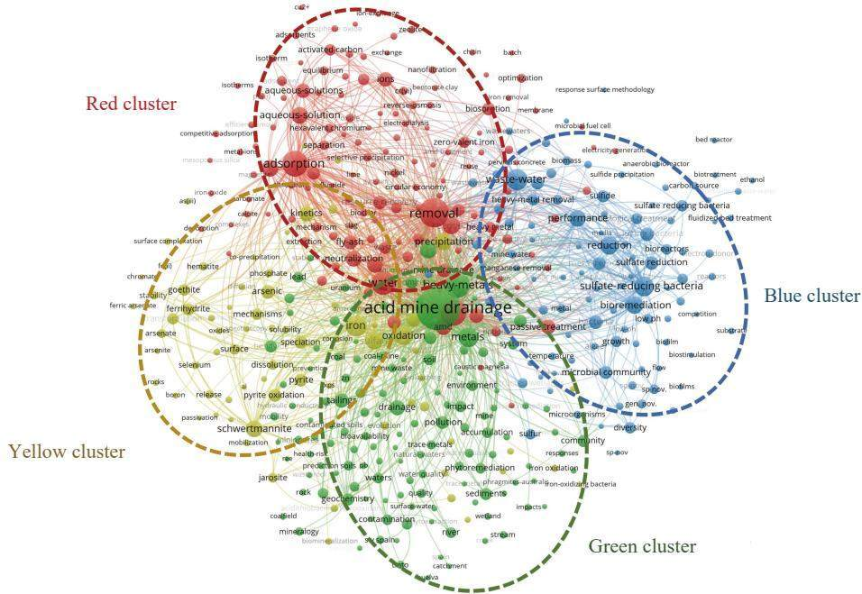
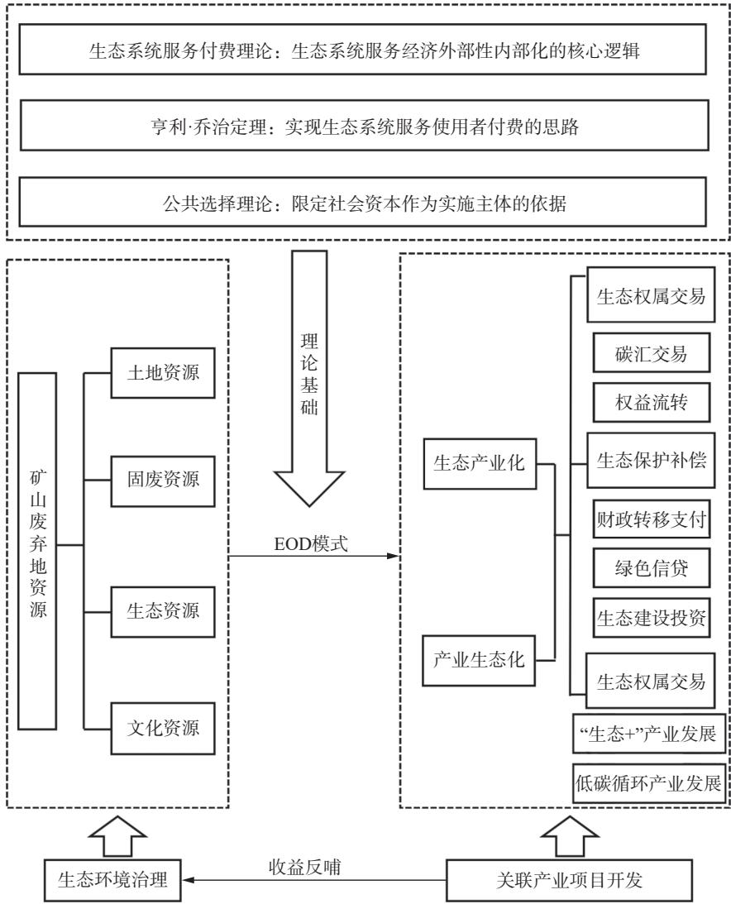

绿色矿业

文章编号：1004-4051(2024)10-0102-17

DOI:10.12075/j.issn.1004-4051.20241314

# 我国金属矿山废弃地生态修复研究进展及趋势分析

梅振然'，赵中秋123，杨侨4，田锐'，柏航'，高林'，郑嘉鑫'，史孟超

(1. 中国地质大学(北京)土地科学技术学院，北京100083;

2. 自然资源部土地整治重点实验室，北京100035;

3. 自然资源部矿区生态修复工程技术创新中心，北京100035;4. 自然资源部国土整治中心，北京100035)

摘要：实施矿山废弃地生态修复工程是破解矿产资源开发和生态保护的重要举措，但当前对煤矿等非金属矿生态修复研究较多，针对金属矿生态修复研究多集中于单一修复技术，在金属矿山废弃地生态修复中仍存在关键修复技术针对性弱、恢复周期长等问题。本文通过文献研究法，在简要分析金属矿山废弃地主要生态环境问题的基础上，对生态修复的影响因素、修复理念和模式、生态修复技术和监测评估与适应性管理等方面的研究进展进行综述。研究结果表明：金属矿山废弃地生态修复主要受区域自然经济社会条件、废弃地特征和废弃地生态系统稳定性等因素影响；废弃地生态修复理念经历了由静态平衡向动态非平衡的转变，并且向着多维性、复杂性发展；生态修复模式从单纯的生态恢复转向生态重建和可持续发展，更加注重生态、经济和社会效益的协调统一，综合治理模式逐渐形成；生态修复技术经历了从基础治理到综合技术应用的演变，这一过程中，生态工程技术、生物技术、物理技术和化学技术逐步融合，并形成了系统化的修复方案。基于矿山生态修复监测评估与适应性管理研究现状，以减量化、低碳化、资源化为原则提出了针对金属矿山废弃地生态修复的研究展望。

关键词：金属矿山；矿山废弃地；修复理念；修复模式；修复技术；监测评估与适应性管理中图分类号：TD-0;X171.4文献标识码：A

# Research progress and trend analysis of ecological restoration of metal mine wasteland in China

MEI Zhenran', ZHAO Zhongqiu¹,2,3, YANG Qiao4, TIAN Rui', BAI Hang', GAO Lin', ZHENG Jiaxin', SHI Mengchao'

(1. School of Land Science and Technology, China University of Geosciences (Beijing), Beijing 100083, China; 2. Key Laboratory of Land Consolidation and Rehabilitation, Ministry of Natural Resources, Beijing 100035, China; 3. Technology Innovation Center for Ecological Restoration in Mining Areas, Ministry of Natural Resources, Beijing 100035, China;

4. Land Consolidation and Rehabilitation Center, Ministry of Natural Resources, Beijing 100035, China)

Abstract: Implementing ecological restoration projects on mine wasteland is crucial for balancing mineral resource development and ecological preservation. Currently, research on ecological restoration focuses more on non-metallic minerals like coal, with studies on metal mining ecological restoration often concentrating on singular restoration techniques. Challenges persist, including weak specificity in key restoration technologies and lengthy recovery periods. This paper reviews the research progress in terms of the influencing factors of ecological restoration, restoration concepts and modes, ecological restoration technologies, monitoring and evaluation, and adaptive management, etc., based on briefly analyzing the main ecological and environmental problems of metal mine processing and metallurgical wasteland through the literature research method. The research indicates that the ecological restoration of metal mine wasteland is mainly affected by regional natural economic and social conditions, wasteland characteristics and the stability of wasteland ecosystems, etc.; the concept of ecological restoration of wasteland has gone through the development from static equilibrium to dynamic nonequilibrium, and has developed towards multidimensionality and complexity; the ecological restoration mode has shifted from pure ecological restoration to ecological reconstruction and sustainable development, and has emphasized on the coordination and unity of ecological, economic and social benefits, and the comprehensive management of ecological restoration. The ecological restoration mode has shifted from pure ecological recovery to ecological reconstruction and sustainable development, paying more attention to the coordination and unity of ecological, economic and social benefits, and the comprehensive management mode has gradually formed; the ecological restoration technology has experienced the evolution from basic management to the application of comprehensive technology, and in the process, the ecological engineering technology, biotechnology, physical technology and chemical technology have been gradually integrated, and a systematic restoration program has been formed. Finally, based on the current situation of monitoring and evaluation of mine ecological restoration and adaptive management research, the research outlook for ecological restoration of metal mine mining and metallurgical wasteland is proposed based on the principles of reduction, decarbonization and resource utilization.

Keywords: metal mine; mine wasteland; restoration concept; restoration model; restoration technology; monitoring, evaluation and adaptive management

## 0 引 言

现代工业的快速发展离不开金属资源在先进技术发展和国民经济中发挥的重要作用[]。但作为资源密集型产业，金属矿山采选冶造成的环境问题日益受到关注]。一方面，受采矿活动影响地表土地资源受到严重扰动和损毁，矿区地质灾害频发；另一方面，随着硫化金属矿山的不断开采，矿产品位不断下降，对选冶药剂的依赖程度不断增加。这些化学药剂通常拥有复杂的成分结构，并且由于缺乏有效的监管和处理方法，它们会随着其他生产废弃物一起排入尾矿。这些污染物通过空气流通、地表径流、地下水等途径直接或间接地进入环境中，不仅造成严重的土地损毁，而且导致重金属、有机选冶药剂的污染及其复合污染，对水土等其他环境造成破坏，严重影响生态系统安全和人类健康[]。

我国金属矿资源的品质差，贫矿多富矿少，小型矿多大型矿少，共伴生矿多、单一矿种少，由此造成生产工艺能耗高、水耗大、“三废”排放量大，属于环境污染比较严重的行业之一[45]。相较于欧美矿业发达国家，我国矿山生态修复起步较晚，早期以矿山土地复垦为主。此后，相关研究人员在矿山生态修复的理论研究、技术研发和实践等方面做出努力并取得丰硕成果。经过长期对矿山生态修复实践研究，白中科等[]提出矿山生态修复“五元共轭”理论，即矿区“地貌重塑、土壤重构、植被重建、景观重现、生物多样性重组与保护”的五个阶段，进一步拓展了人工引导生态系统自然修复的内涵。基于自然修复与人工干预的结合，卞正富等提出引导型矿山生态修复模式，其根本是降低矿区生态修复成本，避免过度人工干预。此外，祝怡斌等[8]根据废弃地地表物质含土量和物质含岩特征对金属矿山废弃地的人工土壤进行了分类，弥补了金属矿山场地人工土壤统一分类的不足。随着16SrDNA高通量测序、激光诱导击穿光谱技术和合成孔径雷达干涉测量技术等现代科技的发展和应用，极大促进了矿山生态修复进程[9-11]。

但是，矿山生态修复研究仍存在理论滞后实践、评价验收体系缺乏科学依据、修复生态系统自维持力差、技术转化和辐射推广难等问题12]。此外，以往矿区生态修复研究多集中在非金属矿区生态修复，对于金属矿区生态修复研究多集中在污染治理技术且多存在于实验室条件下，如土壤基质改良，重金属-有机选冶药剂污染的物理、化学和植物-微生物联合修复等。但金属矿山生态修复不是单一的污染治理研究，需要系统考虑场地自然特征、污染治理、修复效率和长期效应等13]。尤其是在碳中和目标背景下，后矿业时代的加速来临，金属矿山生态修复在节能减排和固碳增汇等方面被赋予新的历史使命，将迫使金属矿山生态修复在标准规范、管理机制和技术体系等方面做出改革和创新14]。因此，本文在前人研究的基础上，对金属矿山废弃地生态修复影响因素、理念、模式、技术和监测评估与适应性管理的研究进行综述，通过不同层次的分析概述，为金属矿山废弃地生态修复研究提供一个系统性思路。

## 1 金属矿山废弃地主要生态环境问题

当前，国内外学者对“矿山废弃地”的理解和界定并不统一，国际上通常称之为“Mine Wasteland”，国内学者一般称之为“矿业废弃地”“工矿废弃地”

“矿山废弃地”等(表1)15-22],这些概念由于主管部门和不同专业侧重点不同虽有所差异，但对于矿业开发导致的生态环境问题的实质是一样的。根据不同工程对土地的破坏特点，金属矿山的采选冶过程对土地的破坏方式可以分为永久性建设占地、临时性占地、挖损压占土地、诱发性破坏土地和污染土地等。因此，本文将这个过程中受损的土地类型，包括剥离表土、开采的岩石碎块和低品位矿石堆积而成的废石堆积地；矿体开采完毕后留下的采空区和塌陷区，即采矿废弃地；选矿过程中产生的尾矿堆积形成的尾矿废弃地；被采矿作业面、机械设施、辅助建筑和道路交通等先占用后发生地表形变的废弃土地；受金属冶炼活动或工业废弃物侵蚀和污染的土地包括堆浸场等，即在矿产资源开发过程中形成的无经济价值土地统称为金属矿山废弃地[15,21-22]。杨金中等[23]利用空间分辨率优于2.5m的多光谱遥感数据进行全国矿山环境遥感监测，结果表明，我国采矿损毁土地约360万hm2，约占全国陆域面积的0.37%。其中，以露天采场为主的挖损土地约145万hm²，以排土场、尾矿库和废石场等为主的压占土地约130万hm²，塌陷地约 84万 hm²。

表1“矿山废弃地”相近概念辨析  
Table 1 Identification of similar concepts of “mine wasteland"
<table><tr><td>概念</td><td>定义</td><td>特点及分类</td><td>区别</td><td>参考文献</td></tr><tr><td rowspan="2">矿业废 弃地</td><td></td><td>矿业活动中因开采、加工、冶炼等造成的包括采矿废弃地、尾矿废弃地、废渣堆聚焦于矿业活动过程中各环节产</td><td></td><td></td></tr><tr><td>废弃土地，通常包括矿坑、尾矿库、废石积地、选冶活动遗留场地等。特征为地生的废弃地，包括开采、加工和[15]~[17] 堆等</td><td>质破坏、环境污染、生态破坏等</td><td>冶炼等环节</td><td></td></tr><tr><td rowspan="3">工矿废 弃地</td><td>工业和矿业活动废弃的土地，包括因采矿</td><td>分类为采矿塌陷地、废弃村庄、采石宕涵盖范围更广，既包括矿业活动</td><td></td><td></td></tr><tr><td>造成的地表变形和工业生产废弃的建筑</td><td>口、废弃工业广场等。特征为地面沉降、废弃地，也包括工业活动废弃地。</td><td></td><td>[18]~[19]</td></tr><tr><td>用地</td><td>房屋坍塌、岩石裸露、水土流失、废弃特征多样，既有地质破坏，也有建 建筑设施等</td><td>筑废弃物问题</td><td></td></tr><tr><td rowspan="3">弃地</td><td></td><td>分类为永久性建设占地、临时性占地、</td><td>范围最广，涵盖所有受矿业活动</td><td></td></tr><tr><td>矿山废 矿产资源开发过程中因采矿活动造成的挖损压占土地、诱发性破坏土地和污染</td><td></td><td>影响的被破坏的、非经治理难以[20]~[22]</td><td></td></tr><tr><td>无经济价值土地</td><td>土地等。特征为土地利用受限，环境质 量下降，生态系统退化</td><td>利用的土地资源</td><td></td></tr></table>

整体而言，我国金属矿产资源总量大，但分布不平衡，南方多北方少，主要分布在长江流域，而且矿产资源品质较差，多以复杂难选的金属硫化物伴生贫矿为主，对选冶药剂的依赖程度很大，必须投入大量的选治药剂，如阴离子型的黄药和黑药、芳基类的捕获剂等来获取目标金属24]。此外，由于历史遗留等原因，金属矿山开采伴随着长期无序的“民采”行为。因此，矿山开采和冶炼活动通常会对矿区附近的土壤、水体及植被等造成严重的重金属、有机选治药剂及其复合污染[25],如堆放选矿后含硫固体废弃物尾矿库、冶炼活动产生酸性矿山废水和废渣等经降水淋溶向地表、地下渗透及周边的土壤、水体和植被中迁移转化，引发环境污染问题，并对人类身体健康造成严重威胁2]。此外，受采选冶活动影响，矿区废弃地遭到剧烈扰动，近几年，随着生态文明建设的深入开展，金属矿山采选冶引起的环境问题愈发得到全社会的关注。

## 1.1 地质灾害问题

大规模高强度的金属矿产资源开发，使得矿区地质地貌受到剧烈扰动，破坏了矿区原有的地应力平衡，导致矿区塌陷、崩塌和泥石流等地质灾害频发26]。这些地质灾害不仅对矿山的可持续发展构成严重挑战，还对周边环境生态安全和人类健康构成严重威胁。金属矿山废弃地地质灾害受到地区和矿山类型的多样性影响，特别是在山区雨季时期，滑坡和崩塌的发生频率相对较高。山区地质条件的复杂性和不稳定性，以及高降水量的影响，共同增加了滑坡和崩塌的潜在风险，对于地震带或者地震活跃地区的金属矿山亦是如此27]。如2016年发生在八宝山铜矿的滑坡事故，由于矿山所处地区的山体稳定性受损和高降水量等自然环境因素，大量土石材料滚滑而下，导致了数十人失踪和受伤的严重后果。此外，水文地质灾害问题也备受关注，包括地下水位下降和水质污染。矿山开采活动通常会涉及地下水的抽取和排放，导致地下水位下降，对周边农田和村庄的水资源构成潜在威胁。我国金属矿山废弃地的地质灾害是一个复杂且迫切需要解决的挑战。几十年来的矿业开发活动已经使得浅层易采的金属矿床变得稀缺，采矿活动不得不转向地质条件更为复杂和难以开采的矿山28]。因此，废弃地的规模和数量持续增加，如果不采取科学的治理措施，由此引发的地质灾害风险将显著上升。

## 1.2 土壤环境问题

金属采选冶过程中大量采矿废水和选矿废液直接排放，废渣和尾矿等固体废弃物堆放和淋滤，不仅占用了大量土地资源，还导致了矿山土壤中重金属的富集，造成土壤环境污染29]。这种污染在土壤生态环境方面表现为土壤空间形态的落差增大、基质的物理结构恶化、肥力和团粒结构的下降，从而改变了土壤养分的初始条件，增加了养分流失的机会，限制了植物生长活动30]。此外，金属矿山采选冶还会导致土壤中重金属含量过高，以及含硫物质氧化生成酸性氧化物，进而形成酸性废水或导致土壤盐碱化(式(1))，使农作物产量减少甚至绝收27]。

$$
\mathrm { S O _ { 4 } ^ { 2 - } + N a ^ { 2 + }  N a _ { 2 } S O _ { 4 } }\tag{1}
$$

而且这些化学元素通常无法被生物降解且具有强大的迁移转化能力，能够进入食物链31]，当这些有毒元素通过食物链进入人体，尤其是重金属在生物体内发生生物累积和放大现象时，会导致人体内的重金属组织浓度增加，给矿区居民的身体健康带来无法逆转的威胁[32]。

$$
\mathrm { C d C O _ { 3 } } + 2 \mathrm { H ^ { + } }  \mathrm { C d ^ { 2 + } } + \mathrm { H _ { 2 } O } + \mathrm { C O _ { 2 } }\tag{2}
$$

总的来看，金属矿山废弃地的土壤污染问题不仅在数量上呈现严峻态势，而且其影响范围和深度也不断扩大，这对于我国的农业生产和矿区居民的健康构成了巨大挑战。因此，金属矿山废弃地土壤环境问题迫切需要加强监管，采取科学有效的措施，以减缓土壤污染的速度，保护土壤生态系统，维护人类的生存环境。

## 1.3 水体环境问题

金属硫化物矿山产生的尾矿通常含有无价值的硫化物矿物，如黄铁矿(FeS₂)和毒黄铁矿(FeAsS)。当这些尾矿暴露在氧气和水体的环境中时，会产生酸性矿山废水(AMD)。这一过程可以由下列方程式表示。式(3)表明了在水和氧气的参与下，黄铁矿形成 $\mathrm { F e } ^ { 2 \cdot }$ 和 $\mathrm { H } _ { 2 } \mathrm { S O } _ { 4 } ,$ 式(4)进一步显示在氧气充足且存在必要微生物的环境中， $\mathrm { F e } ^ { 2 + }$ 被氧化成 $\mathrm { F e } ^ { 3 + }$ ，式(5)和式(6)则说明 $\mathrm { F e } ^ { 3 + }$ 会形成Fe(OH)₃沉淀并释放出 H⁺,随着溶液酸度增加， $\mathrm { F e } ( \mathrm { O H } ) ^ { + }$ 3将再次水解，使 $\mathrm { F e } ^ { 3 \cdot }$ 返回溶液并促进 $\mathrm { F e S } _ { 2 }$ 的氧化，并产生更多的H+[33-34]。

$$
2 \mathrm { F e S } _ { 2 } + 2 \mathrm { H } _ { 2 } \mathrm { O } + 7 \mathrm { O } _ { 2 } \to 2 \mathrm { F e } ^ { 2 + } + 4 \mathrm { H } ^ { + } + 4 \mathrm { S O } _ { 4 } ^ { 2 - }\tag{3}
$$

$$
4 \mathrm { F e } ^ { 2 + } + \mathrm { O } _ { 2 } + 4 \mathrm { H } ^ { + }  4 \mathrm { F e } ^ { 3 + } + 2 \mathrm { H } _ { 2 } \mathrm { O }\tag{4}
$$

$$
\mathrm { F e } ^ { 3 + } + 3 \mathrm { H } _ { 2 } \mathrm { O }  \mathrm { F e } ( \mathrm { O H } ) _ { 3 } + 3 \mathrm { H } ^ { + }\tag{5}
$$

$$
\mathrm { F e S } _ { 2 } + 1 4 \mathrm { F e } ^ { 3 + } + 8 \mathrm { H } _ { 2 } \mathrm { O }  1 5 \mathrm { F e } ^ { 2 + } + 1 6 \mathrm { H } ^ { + } + 2 \mathrm { S O } _ { 4 } ^ { 2 - }\tag{6}
$$

由于 AMD 的 $\mathrm { p H }$ 值极低(低于pH值3)，危险重金属(如镉(Cd)、铜(Cu)、铁(Fe)、锰(Mn)、铅(Pb)和锌(Zn))和有毒重金属(如砷(As)和硒(Se))的浓度升高5]。此外，受污染的酸性渗滤液不仅限于尾砂，还会在废弃岩石和含有硫化物矿物的地下/隧道开挖碎片中产生。这种低pH值、含有高浓度有害元素和有毒元素的废水问题，已成为全球采矿和矿物加工工业面临的严重环境挑战之一[26]。此外，堆积在排土场和尾矿库等废弃物在雨水冲刷作用下，可导致重金属、溶解的盐类和悬浮未溶解的颗粒状污染物直接流入地表水或渗入地下水，造成矿区水文污染。特别是在有色金属矿区废弃后，由于人为停用用于降低地下水位的水泵以便开展采矿活动，地下水位显著上升，与露天或地下硫化物岩石发生反应，直接造成地下水和地表水污染[36]。金属硫化物矿山废水和废渣产生的酸性矿山废水，以及污染废物对环境的不利影响，已成为国际上采矿和矿物加工工业亟需应对的严重问题。

## 1.4 大气环境问题

金属采选冶过程是复杂的、多阶段的，涉及采矿、破碎、研磨、矿石浓缩、熔炼、精炼和废物管理等。有色金属采选冶过程中会释放出大量的二氧化硫、细颗粒物(PM)等有毒物质，以印度某金属矿区为例，大气粉尘样品中的金属浓度高于页岩中大多数金属的平均浓度，达到中度至极度严重的金属污染，并且已经对当地居民身体健康产生不可修复的危害37]。

特别是火法冶炼工艺的金属冶炼厂在生产活动中常产生大量砷(As)、镉(Cd)和铅(Pb)的固体颗粒，这些有毒小颗粒常常通过空气传播对人类呼吸系统造成危害[8]。此外，冶金工业和采矿活动释放的含重金属元素的粉尘可能通过干湿大气沉降直接或间接地被植物的地上组织吸收。同时，大气粉尘中的重金属元素很容易通过风力运输和地表径流进入地下水、农作物和蔬菜区土壤表层，对人类健康产生威胁36]。

## 2 金属矿山废弃地生态修复影响因素

我国金属矿区废弃地生态问题具有多样性、复杂性、多因性和地域特征，因此，废弃地生态修复要综合考虑区域自然经济社会条件、矿山废弃地特征和废弃地生态系统稳定性等因素。

## 2.1 区域自然经济社会条件

区域的自然地理、气候条件等因素直接影响废弃地生态系统的恢复速度和效果39]。我国金属矿山废弃地主要分布在我国南方丘陵地带和山谷地区，一般具有充足的降雨量和适宜的积温，有助于提高土壤的水分和养分含量、利于植物生长并促进生态系统的恢复；但受低纬度和季风气候影响，废弃地地区雨季集中且短时降雨较大易引发泥石流、山体滑坡等地质灾害对生态修复项目产生不利影响。在金属矿开采后，受地形和地质结构影响，矿区的开采标高和堆填标高之间有较大的高差，坡体坡度甚至达到25°～50°，采矿之后的基岩侵蚀严重，对生态修复工作造成较大不利影响。土质是影响废弃地生态修复的另一因素，我国金属矿山废弃地周边大多是岩石坡面和砂石，土层稀少、岩石裸漏、污染严重，植物难以存活，这种土壤环境条件会在很大程度上阻碍生态修复工作的推进40]。此外，水资源的丰富度、水质状况，以及水流动态也关乎废弃地生态系统的水土保持和生态功能的恢复程度。

经济社会条件对于废弃地生态修复项目的实施和可持续性至关重要。人口密度、城市化水平、产业结构等因素直接影响到废弃地生态修复资金的筹集和项目的推进。地区的经济发展水平和资源禀赋情况将直接影响到废弃地生态修复项目的可行性和效果。特别是政府的支持和投入在保障项目成功实施中起着至关重要的作用。政府在项目资金、政策支持、法规制定和监管等方面的积极作用，是推动废弃地生态修复项目取得长期成效的重要保障。

## 2.2 矿山废弃地特征

矿山废弃地规模、生产工艺、矿业活动时期和环境问题性质等特征因素决定生态修复项目的难易。一般来说大型矿山对原地貌扰动和生态破坏更为严重，生态修复难度也较大。在生产工艺方面，我国大多数的金属矿开采是露天进行的，而且开采过程中采用组合台阶陡帮剥岩方法较多，造成了台阶坡面角度较大，对废弃地的生态修复造成了较大的影响41]。此外，许多金属矿山废弃地生态修复也面临着历史遗留因素的挑战，这些因素包括矿山历史活动和早期技术和管理不足引起的环境问题等。金属矿山的开采活动往往涵盖几十年甚至上百年的时间，这期间往往伴随着大规模采矿、矿石处理、废弃物堆积和大气排放等过程，加之一些民采矿山的无序开采，遗留了大量的矿山地质环境问题，如占用与损毁土地资源、植被破坏、地下含水层破坏与污染、地形地貌景观破坏和水土流失等42]。这些无疑加剧了金属矿山废弃地生态修复的困难。

## 2.3 废弃地生态系统稳定性

生态系统稳定性对矿山废弃地生态修复的影响体现在生态系统的抗干扰能力、修复方式和实施效果等方面。稳定的生态系统具有较强的抗干扰能力，能够更好地应对外界环境变化和人为干扰，有利于生态修复项目的实施和长期效果的持续维护。

在具有较高生态阈值、原有生态系统结构与功能稳定性良好的矿区，生态系统表现出强大的抗压性。例如，我国东部部分地势平坦的平原丘陵地区，拥有良好的自然本底禀赋，水热及光照条件优越，生物种群结构健康，原生生态系统稳定性好，在适度的矿产开发活动下，生态系统仍能保持自身结构与功能的稳定性和完整性，并在扰动消除后一段时间内通过自然修复和人工干预能够达到扰动前状态[39]。

相反，在生态脆弱敏感区域，如西南岩溶石漠化和高原高寒地区，土壤侵蚀、坡面崩塌、植被覆盖不足等现象严重影响了生态系统的稳定性，阻碍了生态修复项目的实施和效果[43-44]。这些区域的废弃矿山在没有人工干预条件下很难恢复到之前的状态。因此，这类区域的矿山废弃地生态修复应当以工程措施为主，人工修复与自然修复相结合。在这种情况下，生态修复项目需要更加注重对生态系统结构的重新构建和功能的恢复，以及对外界干扰的持续监测和管理。

## 3 金属矿山废弃地生态修复技术

金属矿山生产活动造成的生态环境破坏和污染问题涉及多个要素，如地质地貌、水土资源和植物多样性等。目前，许多学者已经从不同方面开展了多项研究工作，在矿山环境治理修复模式、矿山航测应用与地貌重塑模拟、土壤重构与植被重建、污染修复等方面取得了诸多成果，各项生态修复技术日趋成熟为金属矿山生态修复提供了有效的方法和思路。

## 3.1 地貌重塑技术

金属矿山开采活动不可避免地产生地质结构破化问题，诱发塌陷、滑坡、崩塌等地质灾害，因此，地貌重塑是矿山生态修复的基础[6]。基于矿山原有地貌，重塑一个符合矿山开采工艺、损毁特点等特有因素的地貌，对于矿山废弃地生态恢复具有一定的积极意义。当前，国内外学者对于矿区地貌重塑开展了多项研究与实践，早期对平台和坡面进行简单的回填整平技术虽然具有施工上的便捷性，但极易产生新的侵蚀和生态破坏，已经不能满足当前金属矿区生态治理的要求。基于自然的解决方案(Nature-based Solutions, NbS)这一概念在 2008年首次提出，此后不少学者将这一概念引入到矿区生态修复中，尤其是地貌重塑。GeoFluv模型为矿山生态恢复项目中的地貌重塑提供了一种新的综合方法，该模型以流域为单元，在分析现有地形和土壤特性的基础上，通过整合地貌学、水文学和生态学原理，通过构建相对稳健的坡面和沟道来实现坡面产流产汇间的动态平衡[45]。通过恢复自然排水模式和沉积物迁移过程，GeoFluv元素旨在减轻侵蚀、控制沉积物和提高栖息地多样性，从而促进采矿后环境中生态系统的恢复和复原[46]。GeoFluv建模方法具有整体性和科学性，是实现可持续矿山生态恢复成果的重要工具。如杨翠霞[45]引入GeoFluv模型并基于临近未扰动区域对北京市房山区某典型废弃采石场进行近自然地形重塑，使重塑地貌和临近未扰动地貌相融合并满足暴雨期河道演变的汇流。总体上，地貌重塑理论经历了传统坡面重塑→等高线重塑→自然相似性重塑→近自然地貌重塑的过程。

## 3.2 土壤重构与污染修复技术

矿产资源的开发首先对土地造成影响，无论是露天开采导致的直接挖掘破坏，还是地下开采引起的地表沉降，或冶炼过程中排放的废气和废水，以及金属矿渣的堆放都会导致土体破坏及污染，影响其肥力和生物多样性。因此，矿区生态修复的首要任务是恢复土壤。土壤重构是矿区生态系统恢复的核心]，重构土壤质量直接决定土地复垦状况。表土是土壤重构过程中的首要选择，但矿区土壤发育不良等自然因素及采矿活动造成的排土场等废弃地导致许多矿区表土稀缺问题严重47]。对于表土稀缺矿区土壤重构的实质在于人工构造并改良表层土壤，为植物定植提供先决条件，因此，表土替代物的选择是表土稀缺矿区土壤重构过程的关键。土壤重构过程中所用到的材料主要是开采前剥离的表土，但在没有足够的表土时，也会使用各类成土母质或固体废弃物，也称为“表土替代材料”“新土源”“人工土壤”“人造土”等[48]。如ASENSIO等[49]在西班牙北部金属矿区尾矿库，利用贻贝残渣、锯末、污水污泥等通过增加有机碳和pH值来改善矿山土壤的性质。胡振琪等[50]、纪妍等[51]、位蓓蕾等[52]通过理化性质分析及出苗率分析筛选了Ⅲ层亚黏土作为表土替代材料，在此基础上，添加了草炭、蛭石和腐植酸等物质，通过对紫花苜蓿的生长性能和逆境抗性的评估确定改良配方，研究结果显示，分别添加50g/kg的草炭、10g/kg的蛭石和0.5g/kg的硝基腐殖酸时，对亚黏土基质的改良效果最佳。表土替代物有效地解决了土壤重构过程中表土稀缺的问题，并实现了矿区固体废弃物的资源化利用。

对于金属矿山废弃地土壤的基质贫瘠和重金属污染等环境问题，一些学者通过利用有机改良剂[53]矿物质[54]和生物炭[5]等途径进行土壤原位基质改良的研究。原位基质改良作为一种针对性强、效果显著的土壤改良方法，通过添加特定的改良剂，调节土壤性质、控制微生物结构、改善土壤酸化和减轻重金属毒性等问题。LIU等5通过在酸性矿山废弃地施加菌肥、生物炭等土壤改良剂，显著提高了修复后土壤的pH值，调节了土壤的强酸性环境，提高了土壤的肥力，增加了土壤微生物多样性，并有效降低了重金属有效态含量。尽管土壤基质改良在培育土壤健康和促进生态系统恢复方面有着显著的潜力，但其固有的局限性(如可能导致土壤板结)，以及持续、长期维护的必要性也凸显了其局限性。

此外，随着金属矿产资源的开采，新开采的矿产资源品位不断下降，对有机选冶药剂的依赖不断增加，使得金属矿区生态修复不仅要面对土层贫瘠，还要注重污染治理[31]。目前，已开发的原位和非原位的修复重金属污染场地的物理修复技术、化学修复技术和生物修复技术都旨在降低重金属的总浓度或生物可利用部分，以减轻随后在食物链中的积累。这些修复技术采用封闭、萃取/去除和固定机制，通过物理、化学、生物、电和热修复过程减少污染影响。这些技术具有各自的优缺点和适用性。一般来说，原位土壤修复比异位处理更具成本效益，污染物去除/萃取比固定和封闭更有利。综合评估表明，稳定化/固化应用广泛但不能从土壤中根除重金属，是一种临时性的土壤修复技术，植物修复法的效率有待提高，表面封盖和填埋适用于小规模的严重污染场地，玻璃化虽然在固定重金属等方面有着独特优势，但是其修复成本高昂，这些技术可以相互结合，将污染土壤修复到安全利用水平[57-63]。土壤污染联合技术修复应用案例见表2。

表2 土壤污染联合技术修复方案  
Table 2 Joint technical remediation programs for soil pollution
<table><tr><td rowspan="2"></td><td rowspan="2">修复技术</td><td colspan="3">修复案例</td><td rowspan="2">参考文献</td></tr><tr><td>污染类别</td><td>添加剂</td><td>效率/%</td></tr><tr><td rowspan="5">理化协同修复</td><td rowspan="5">固化/稳定化-土壤淋洗</td><td></td><td></td><td>Cd, 36.5; Pb, 73.6;</td><td rowspan="5">[57]</td></tr><tr><td>Cd、Pb、Cu和 Zn</td><td>FeCl3，石灰，生物炭和黑炭</td><td>Cu, 70.9;</td></tr><tr><td></td><td></td><td></td></tr><tr><td></td><td></td><td>Zn, 53.4</td></tr><tr><td></td><td>Pb, 82;</td><td></td></tr><tr><td>植物-微生物</td><td>电动修复-土壤淋洗</td><td>Pb、PHE</td><td>Tween 80, EDTA 硒(Se)、铜绿假单胞菌(P.aeruginosa)、</td><td>PHE, 73</td><td>[58]</td></tr><tr><td>协同修复</td><td></td><td>壬基酚(NP)和Cd</td><td>黑麦草(Lolium perenne L.)</td><td>NP, 79.6; Cd, 49.4</td><td>[59]</td></tr><tr><td>理化-生物</td><td>电动技术与生物修复协同</td><td>Cr(VI)</td><td>Bacillus licheniformis SR3</td><td>90.4</td><td>[60]</td></tr><tr><td>协同修复</td><td>氧化/还原与生物修复协同</td><td>Cr(VI)</td><td>硫酸亚铁(FeSO₄)，沼气固体残留物</td><td>99.92</td><td>[61]</td></tr><tr><td rowspan="4">纳米材料</td><td>与生物修复协同</td><td>Pb</td><td>羟基磷灰石纳米颗粒</td><td>将可用铅含量</td><td>[62]</td></tr><tr><td></td><td></td><td></td><td>从27降低到4</td><td></td></tr><tr><td>与土壤淋洗协同</td><td>Cu、Pb、Sb</td><td>纳米零价铁(nZVI)</td><td>Cu, &gt;90; Pb, &gt;80;</td><td>[63]</td></tr><tr><td></td><td></td><td></td><td>Sb, 60~70</td><td></td></tr></table>

## 3.3 水体修复技术

酸性矿井排水(AMD)是在富含硫化物的废物暴露到环境中时形成的高浓度金属离子的酸性水，是重要的采矿废物之一，如果处理不当会严重加剧采矿业造成的水污染64]。AMD治理方法大致可分为末端治理和源头控制两种途径。末端治理方法通常涉及使用各种中和剂，以确保污水达到规定的排放标准，如硫化沉淀、通过生物/微生物调解减少硫酸盐、电解絮凝、吸附和离子交换法等[65]。但大多数技术都集中于处理一种AMD产品(如去除硫酸盐)，并且常常会产生大量的二次废物，因此，需要长期监测直到AMD的来源(如毒砂、黄铁矿和磁黄铁矿)耗尽和/或转化为非反应相。因此，对AMD进行有效的源头控制显得尤为重要。源头控制主要通过阻隔氧气、水与金属硫化矿物接触，以及抑制产酸微生物活性等方法实现抑制AMD形成，从源头减少其排放量，如覆盖、中和、表面钝化等方法66]。但源头控制治理技术仍处于早期实验阶段，且多集中于纯黄铁矿系统，未来应对其长效性和稳定性进行评估和证实[36]。

此外已有研究表明AMD可以被视为有价值元素的潜在来源，可以对其进行回收和再利用，不仅减少尾矿坝/蓄水池中处置的矿山废物量节省土地占用量，还能替代部分传统建筑材料实现废弃物资源化再利用[67]。但一些目标元素的浓度可能低于竞争元素，因此，选择性技术将非常重要。所选技术应能够适应不断变化的条件，例如pH值、酸度、温度和成分，尽管大多数研究表明元素的回收取得了成功，但由于胶结、高能耗、高化学品成本，以及生产吸附剂和溶剂等技术部件的高成本，它们并不适合大规模应用[64,68]。

文献统计能够定量揭示学科领域的知识结构，并提供对学科发展、时间模式和未来趋势的洞察。因此，基于 Web of Science 核心合集数据库，以“TS=(“acid\* mine drainage” OR“acid mine wastewater” OR(acid rock drainage))AND TS=(treatment\*OR remov\*OR remed\*OR treating)”为检索策略，收集了 2013—2023年有关矿山酸性废水治理文献，为了提高分析的准确性，对会议论文和书籍章节进行了过滤，并根据检索结果删除了与主题无关的文献，最终保留了2529篇文献。从2013—2023年发表的AMD修复论文中提取关键词，对冗余词进行过滤和合并，利用VOSviewer进行关键词聚类分析(图1，表3)可知，吸附在AMD治理中的应用(红色簇)、AMD环境地球化学循环研究(黄色簇)、硫酸盐还原菌(SRB)在AMD修复中的应用(蓝色簇)、AMD的环境风险评估研究(绿色簇)是AMD修复领域的主要研究内容。

AMD中的源头控制技术和资源循环利用，将是未来AMD修复研究的主要重点之一。未来的AMD修复技术应从管道末端处理转向源头控制，同时采用多种技术组合，并继续投资开发低成本和高效的AMD修复方法。

## 3.4 植被重建技术

植被重建是金属矿山废弃地生态修复的主要环节之一，运用生态学、植物学等原理科学制定矿山废弃地植被重建的植物搭配方案并指导其过程管理，对矿山废弃地植被重建影响重大。早期矿山废弃地植被恢复常以自然恢复为主，但随着研究和实践的深入，发现生态系统的自我恢复十分缓慢，逐渐向人工引导植被恢复发展。选择适宜的植物物种在人工建植过程中具有重要意义，生态修复初期，引入快速生长繁衍的先锋物种，能够形成有效盖度和生物量，改善土壤生境，为后期适生植物定植和群落多样性、稳定性提供保障69]。近年来，矿区植被重建研究主要集中在植物物种组合优选、建植技术和重建效果评价等方面，并取得了一定的研究成果70-71]。根据矿山废弃地不同边坡类型及坡度，综合利用植生袋、纤维毯、生态带等毯垫、枕袋和团粒喷薄技术已被广泛应用7]。在物种组合方面，已有大量研究表明“乔灌草”组合的效果大于灌草或者单一植被组合，如通过对金铜尾矿库18种植物生长情况和重金属赋存状况研究发现，银合欢、刺槐、胡枝子和紫花苜蓿等为适合的草-灌-乔植物组合73],但植物物种的选取应根据实际情况，因地制宜，结合先锋植物和乡土植物；在建植技术方面，喷混快速绿化、喷混植生技术、生态袋梯田法建植技术和植被混凝土边坡防护技术等新技术不断产生应用[74]；在重建效果评价方面，以土壤理化性质为标准，采用主成分分析法对6种植被重建方案进行综合评价，发现混交林的改良效果比纯林好75]。值得注意的是，植被重建是一个长周期过程，当前针对不同植被重建年限效果评价等长时间跨度下研究成果较少，此外，目前矿山废弃地植被重建研究多集中在铅锌矿和煤矿区，对其他金属矿研究较少，研究未来应加强研究。

  
图1 AMD 治理研究关键词共现网络  
Fig. 1 Keywords co-occurrence network of AMD remediation research

表3 不同关键词族群的核心关键词  
Table 3 Core keywords in different keyword clusters
<table><tr><td>簇</td><td>关键词</td></tr><tr><td>Red cluster(红色簇)</td><td>removal; adsorption; remediation; water; recovery</td></tr><tr><td>Yellow cluster(黄色簇)</td><td>iron; oxidation; precipitation; sulfate; schwertmannite</td></tr><tr><td>Blue cluster(蓝色簇)</td><td>waste-water; sulfate-reducing bacteria; reduction; bioremediation; performance</td></tr><tr><td>Green cluster(绿色簇)</td><td>acid mine drainage; tailings; metals; heavy metals; drainage</td></tr></table>

## 4 金属矿山废弃地生态修复理念和模式

## 4.1 生态修复理念

金属矿山生态修复是为了弥补矿山活动对环境所造成的损害，恢复生态系统功能和生态平衡的关键过程。近些年，矿山生态修复理念中更多的考虑到人与自然生态系统耦合的修复，在符合自然利益的条件下，也符合人类社会的利益，更加注重生态系统的服务能力，在很大的程度打破了以往人类社会系统与自然生态系统互相独立的局面76]。

## 4.1.1“因地制宜”修复理念

因地制宜就是强调根据具体地区的特点量身定制适合的修复方案，坚持生态修复治理优先，从而最大程度地恢复受损的生态系统，积极发展适宜产业，促进可持续发展。金属矿山生态修复应当充分考虑不同地区的特点和需求。在对矿山生态环境进行评估时，全面了解土壤质量、植被状况、水资源情况，以及周边生物多样性的基础上根据生态功能特点、生态系统特征、生态环境条件进行矿山生态修复区划，针对障碍因子制定个性化的修复策略，如丘陵山区、岩溶石漠化区的矿山，其修复的首要任务是消除矿山地质安全隐患；位于高原山地及海拔高的矿山，适宜生长的动植物种类少，生态修复周期长且不易恢复，需要人为干预才能达到预期效果77]。

此外根据具体地区的特点和条件，将生态修复与文化传承、生态旅游等产业相融合，因地制宜建设国家矿山公园也是促进资源枯竭型城市绿色转型的重要途径78]。当前对国家矿山公园研究多集中在对矿业遗迹景观的保护和开发再利用78]；矿山公园旅游开发和旅游价值评估[79]；矿山公园的建设、规划和设计分析，以及对矿山公园的现状、空间结构和发展前景总结80]等。但国家矿山公园建设当前仍面临缺乏多元的资金来源、公园管理制度落后、营收分配机制僵化等问题，未来的研究应当对其进行更为详细的探讨[81-83]。

## 4.1.2“边采边治”修复理念

边采边治理念是针对传统生态修复末端治理存在的种种问题提出的一种新的思路和方法4]。传统的生态修复往往是在矿山开采完成后进行的，这种末端治理容易导致损毁土地长期荒废、生态环境恶化等问题。边采边复理念则是在矿山开采过程中，即源头控制和过程治理阶段，就开始进行生态修复，以解决传统方法所面临的种种困难和挑战[85]。如冯恒强8根椐平果铝土矿采矿用地所具有的临时性和可恢复性的特点，通过采矿-复垦联合工艺的应用与研究，实现“采矿占地、洗矿还泥、复垦还田”的良性循环。在矿山酸性废水修复中，引入基于源头控制的尾矿覆盖、表面钝化等技术，通过减少与空气、水和细菌的接触抑制硫化物矿物氧化，从而避免了酸性矿山排水的产生[87]。这些实践展示了边采边治理的实施可行性，并提出了在矿山生态修复中的创新思路和方法。

边采边治理理念的核心在于将生态修复纳入矿山开采过程的早期阶段，通过优选采矿位置、采矿工艺并及时采取生态保护和修复措施，避免环境问题进一步恶化，并为矿山开采后的生态修复奠定了良好的基础。将矿山开采与生态修复同时进行，可以有效控制环境污染，并最大限度地保护和维护生态系统的完整性和稳定性。

## 4.1.3“基于自然的解决方案”修复理念

“基于自然的解决方案”，也称为NbS理念，它是一系列能够有效地、适应性地解决社会挑战，同时提供人类福祉和生物多样性收益的保护、可持续管理并恢复自然的或经过改造的生态系统的行动[88]。这种方法具有广泛的适用性，其理论基础、实施途径等几乎涵盖了当前的生态保护修复概念和方法89]。典型的NbS实践案例有：日本大崎市水稻田与湿地生态修复、厄瓜多尔森林恢复与可持续管理，以及城市绿色设施和西班牙巴塞罗那绿色设施与生物多样性规划等90]。它改变了以往过度依赖人工干预和片面工程技术手段的生态修复方式，将NbS引入金属矿山废弃地生态保护修复中，按照自然规律和特征去修复构造对于实现碳中和目标和绿色矿山建设至关重要1]。以地貌重塑为例，如果没有运用基于自然的地貌原理，受损场地边坡整形未与当地自然环境融合，不仅导致后期养护成本增加，还会因长期稳定性差产生较为严重的水土侵蚀和景观破碎化。

## 4.1.4“山水林田湖草沙生命共同体”修复理念

中国生态修复研究开始于20世纪80年代，自党的十八大以来，生态文明建设成为我国的总体布局之一，国土空间生态修复发展迅速。2015年11月，党的十八届五中全会提出“筑牢生态安全屏障，坚持保护优先、自然恢复为主，实施山水林田湖生态保护修复工程，开展大规模国土绿化行动”。在具体进行金属矿山废弃地生态修复时，必须要充分考虑废弃地复杂的生态系统环境，还要考虑生态系统中各个因素之间的相互影响、相互制约，将整个废弃地的所有要素作为一个有机整体，统筹山水林田湖草各生态要素进行系统修复，整体设计，统筹推进，分步修复受损生态功能。

在生态恢复理念发展的过程中，经历了由静态平衡向动态非平衡的发展，更加强调过程，生态修复的发展方向向着多维性、复杂性发展，而且按照特定的轨道、特定的标准发展。过去的生态修复指的是在静态平衡的环境中，对过去曾经存在过的生态系统或者栖息地进行重建，使得遭到破坏的生态系统恢复到被破坏以前的状态。这种生态修复需要有未受到破坏的参考生态系统作为生态修复的参考，然后按照参考生态系统的标准，进行生态修复。但是近些年来，全球环境变化加剧，很多生态系统都受到了或大或小的影响和破坏，按照之前的理念进行生态修复显然是不可取的。因此，国际上很多学者提出了面向未来的生态修复，注重生物多样性和生态系功能，在有限的基础上重建因环境退化而丧失的生态结构，从而建立一个在未来环境中自我维持的生态系统。

## 4.2 生态修复模式

矿山生态修复模式涵盖了自然恢复模式、辅助

再生模式和生态环境导向的开发(EOD)等模式，每种模式都反映了对矿山生态修复理念和实践的不同阶段的发展与优化，不同生态修复模式对比见表4。

## 4.2.1 自然恢复模式

自然恢复模式是对轻度受损的矿区生态系统进行修复的一种方法。该方法依靠生态系统的自我调节和修复能力，通过生态过程自行修复受损的地区，以恢复受损区域原有的生态平衡和生物多样性92]。对于金属矿区受损生态系统而言，其自然恢复受到受损程度、地理环境、气候条件，以及生态系统的自然修复潜力等多因素影响。如轻微的土壤侵蚀或植被破坏，可能更容易自然修复，但当废弃地受到重金属、有机污染或大面积的挖掘活动影响可能会降低自然恢复的可能性[93]。如BRASIL等[94]对巴西东亚马逊地区的某个铝土矿退化区域进行了自然修复研究，结果显示，在经过七年自然再生后，受损土壤的理化指标，如有机物含量、密度、孔隙率和水分渗透性等得到了有效恢复。此外，植被重现还要考虑是否存在足够的自然种子库来支持，因为野生植物的侵入对于生态重建具有至关重要的作用95]。总的来说，自然恢复的主要优点在于其成本低廉，无需大规模人为投入，能够节约生态恢复的成本。但自然恢复的速度受到生态系统受损程度的限制，恢复过程可能非常缓慢，甚至需要几十年乃至百年7]。

## 4.2.2 辅助再生模式

辅助再生生态修复模式有多个名词称谓，如“自然修复及其人工促进模式”“人工支持引导的生态系统自然恢复”“引导型矿山生态修复模式”“自然恢复为主，人工修复为辅”等，其根本目标就是在自然修复能力短期内无法完成受损生态系统恢复的场地寻求生态系统恢复和人工干预之间的平衡点，达到以最少的人工干预实现受损生态系统的良性可持续发展1296]。在这一过程中，首要考虑的是矿山生态环境要素自然恢复特征识别，如土壤参数、地下水位风积沙区超大工作面开采生态环境破坏过程与恢复对策等生境要素自然恢复的过程，以便采取适度的人工干预措施97]。其次是对矿山生态问题诊断和修复方向判断，在对修复区位确定和生态阈值识别的基础上，因地因时、分区分类地对修复技术进行筛选和实施，通过提高人工干预的针对性和有效性，以减少过度人工干预的成本消耗。由于金属矿山采选冶活动对生态系统的扰动通常是高强度的，过度的人工干预和完全依靠自然修复的生态修复模式在“双碳”背景下已逐渐被摒弃，因此，及时采取有效的人工干预措施是当前矿山废弃地生态修复的主要途径。

## 4.2.3 生态环境导向的开发(Ecology-Oriented Develop-ment, EOD)模式

生态导向概念最早由美国学者霍纳蔡夫斯基提出，是生态修复从单纯强调修复治理向利用区域生态产品价值引导区域经济发展的生态导向发展98]。EOD模式是一种创新性的项目组织实施方式，其以生态环境保护修复为基础，通过开展特色产业运营，搭建环境治理与产业开发的桥梁，推动区域综合开发，其核心在于生态环境保护的外部经济性内部化[98-99]。从需求端说，我国历史遗留矿山生态修复的资金投入需求较大，仅靠政府的被动投入不仅难以满足需求还会导致财政压力激增，因此，推动矿山废弃地生态修复项目由公益性项目转变为具有开发价值的经营性项目对于破解经济发展和生态保护之间矛盾、推动经济社会可持续发展具有重要现实意义。2020年以来，生态环境部等多部门联合印发《关于推荐生态环境导向的开发模式试点项目的通知》等相关文件，试点文件中共资助9个矿区生态修复类项目，如个旧市有色金属矿区生态环境导向的开发项目、内蒙古蚂蚁山生态环境治理项目等100]。生态环境导向的开发模式通过将环境效益转化到碳汇交易、生态农业、文旅康养等领域的收益，以区域整体溢价增值反哺生态环境治理，从而找到经济发展与生态保护的平衡点以解决资金渠道缺乏、总体投入不足的困境，实现了生态修复治理与关联产业开发项目一体化推进，这对我国金属矿山生态修复在经济可行性等方面提供了新的启示和路径(图2)。

表4 矿山废弃地生态修复模式对比  
Table 4 Comparison of ecological rehabilitation models for mine wasteland
<table><tr><td>修复模式</td><td>特征</td><td>优点</td><td>缺点</td><td>经典案例</td><td>参考文献</td></tr><tr><td>自然恢复</td><td>依靠生态系统的自我调节 和修复能力；适用于轻度 受损区域；恢复过程缓慢 在自然恢复能力不足的情</td><td>人为干预</td><td>成本低廉；无需大规模恢复速度慢，可能需要几十巴西东亚马逊地区的铝土矿退 年；受损程度严重时效果差化区域(经过七年自然再生)</td><td></td><td>[92]~[95]</td></tr><tr><td>辅助再生</td><td>况下，引入人工干预；综 合考虑自然恢复特征和修 复技术</td><td>自然修复</td><td>提高了修复的效率和效需要人工干预，成本可能较各类矿山生态系统的人工支持 负面效果</td><td>果；平衡了人工干预和高；人工干预不当可能导致引导自然恢复(如风积沙区开采[96]~[97] 后修复)</td><td></td></tr><tr><td>生态环境导向发结合；通过生态环境效 的开发(EOD）益转化为经济收益；强调</td><td>将生态修复与区域经济开 综合开发与修复并重</td><td>解决了资金不足问题； 实现了生态修复与经济 发展的双赢</td><td>需要开发与修复的平衡，个旧市有色金属矿区生态环境 可能涉及复杂的 利益协调</td><td>导向的开发项目；内蒙古蚂蚁山[98]~[101] 生态环境治理项目</td><td></td></tr></table>

从我国金属矿区废弃地的空间布局来看，大多数位于生态系统脆弱的地区，因此，对金属矿区废弃地进行生态修复就不能单纯的依靠自然恢复或者人工修复，必须要破除以往“修复就是上工程”的理念，按照生态系统的内在规律，因地因时制宜、分区分类施策，处理好“自然恢复和人工修复”的关系，实现矿区废弃地的生态系统的良性循环，在此基础上推动矿区生态修复由公益性项目转变为具有开发价值的经营性项目，将生态修复带来的经济价值内部化以实现区域经济发展和废弃地保护融合共生。

## 5 监测评估与适应性管理式

## 5.1 监测评估

随着当前矿山生态修复在全球范围内快速发展，矿山废弃地生态修复的相关理论和技术不断丰富和改进，特别是金属矿山废弃地的生态修复，目前受到越来越多的关注。因此，对矿山废弃地的生态修复效果与质量进行监测评估，识别和补救生态修复动态发展过程中存在的问题，也成为生态修复过程中必不可缺的一部分，国内外的很多专家已经提出很多对生态修复工程质量进行监测的方法，促进了矿山废弃地生态修复监测评估发展[102]。

目前，国外很多学者已经提出了多个针对矿山生态修复监测评估的评价指标和方法，主要从多个角度评估生态修复的效果和质量。例如，国际生态协会根据生态恢复的结构与功能自维持性、生态系统抗干扰能力及与相邻生态系统的物质能量交流等三个主要方面，提出了九个评估生态修复质量的指标[103]。KRABBENHOFT等[104]则提出了地形土壤单元评价方法，通过比较矿山废弃地土壤和植被因子与附近地区参照地的差异，评估生态修复的质量和效果。国内部分学者认为，进行矿山废弃地生态修复监测评估的理论研究可以多从生态安全评价、生态系统健康诊断与生态服务功能评价等研究领域的评估方法进行理论丰富，在实践当中可以多采取生态服务价值理论、效益评价方法105]。如李江峰10在对北京铁矿山废弃地进行生态修复质量和效果评估时，主要侧重于分析恢复植被的多样性、监测和评价生态修复措施及效果，以及评估修复后景观效果等三个方面。

  
图2 生态环境导向的开发模式  
Fig. 2 Ecology-oriented development pattern  
(资料来源：文献[98]、[99]、[101]，有修改）

金属矿山生态修复是一个长期过程，要实现金属矿山废弃地修复系统的持续健康发展，就不能只关注生态修复工程实施阶段，而是要建立长期科学有效的监测评估机制。目前，关于矿山废弃地生态修复质量和效果的评价指标体系尚未形成完整的结构，而且对于生态修复效益的评价研究相对较少，缺乏统一的评价标准。因此，未来需要加强这些方面的研究，以推动矿山废弃地生态修复领域的发展。

## 5.2 适应性管理

适应性管理是通过科学管理、监测和调控管理活动来提高当前数据收集水平，以满足生态系统容量和社会需求方面的变化。影响适应性管理的因素有人才资源的缺乏、资金的保障、政府支持的不确定性、法律法规的限制、管理人员的意愿、沟通交流的效果等。

欧美国家20世纪初就已经着手研究生态修复，但是到20世纪80年代，生态系统退化问题严重，特别是矿山废弃地修复问题。因此，欧美国家率先将通过适应性管理来达到生态修复目标作为生态修复研究的重要方向。以美国为例，美国在引入生态适应性管理的适用条件包括：系统存在较大的不确定性和复杂性；系统正处于快速发展时期；可通过技术和机制的手段，将学习的内容应用到改进管理实践中；管理具有灵活性；利益相关者和决策者对适应性管理的理念和方案的认可等。如在海岸生态修复研究中，THOM等107]提出了有效的适应性管理方法，并明确了适应性管理需要明确的目标、概念化模型和决策框架等三个主要组成部分。

我国废弃地生态修复适应性管理是生态文明建设中不断创新衍生的产物，随着生态文明思想的深入，生态修复适应性管理得到一定发展。如杨永均等[108]对澳大利亚矿山生态修复的制度体系、存在问题，以及改革措施进行了深入研究和分析，为我国的矿山生态修复适应性管理发展提出了宝贵的意见。官炎俊等102]经过长期矿区复垦实践，在借鉴相关领域适应性管理理念的基础上对矿区土地复垦适应性管理的内涵进行系统阐述，并提出“目标制定-规划设计-方案执行-监测评估-信息反馈-模式修正”六要素一体的适应性管理基本框架。

进入新时代以来，我国积极推荐矿山废弃地生态修复研究，大力推进绿色矿山建设，正从矿业大国向矿业强国迈进。《山水林田湖草生态保护修复工程指南(试行)》明确指出了我国的生态修复要引入适应性管理，就目前金属矿山废弃地生态修复实践而言，其理念深入尚浅，并未形成系统性的技术体系和实践案例。基于矿山生态系统的多变性和复杂性，矿山生态修复周期长、见效慢等的特点，在金属矿山废弃地生态修复的过程中，正确引入适应性管理具有一定的积极意义。

## 6 展望

经过几十年的理论研究和工程实践，金属矿山废弃地生态修复已有了较大进展，但在污染治理模式、修复效果监测评价体系构建、生态修复新技术等很多方面仍有较大发展空间。分析表明，未来应以减量化、低碳化、资源化为原则，在以下方面开展深入研究。

1)我国金属矿山废弃地数量众多、成因类型复杂，因此在面对多重复合污染场地时，由于其污染源复杂、污染物成分多样，仅使用某种单一技术难以进行有效修复。未来金属矿山生态修复应突破单一技术缺陷，加强共性问题研究，在多学科背景下将污染协同治理和生态修复联合，构建集成场地类型-污染特征-修复目标-生态修复的协同一体化技术模式，推动生态修复的技术转化与辐射推广。

2)生态产品价值转化对于破解经济发展和生态保护之间矛盾、推动经济社会可持续发展具有重要现实意义。在顶层制度设计和基础理论研究方面相关学者们做出了诸多有益探索，但对生态产品和价值转化的概念和内涵仍未形成统一认识，此外生态产品外部性的内部化实践过程也受到区域资源条件和经济水平的限制，因此，在金属矿山废弃地生态修复中对生态产品价值核算体系、实现路径机制和成效评价等方面仍需进一步深化创新。

3)社会资本参与金属矿山废弃地生态修复是当前经济下行压力的必然选择。引入市场化机制，建立金属矿山废弃地生态修复的市场交易体系，是实现投融资机制多元化的关键一步。市场化机制的引入可以借助碳排放交易、矿山存量建设用地指标流转等途径创造市场需求，拓展资本主体。通过引入市场化机制、拓展融资途径、建立风险共担机制和鼓励社会参与，明确财政资金、社会资本和金融机构参与方式，建立一个可持续的金属矿山废弃地生态修复体系，对于实现生态保护与经济发展的良性循环具有重要积极意义。

4)新技术的不断发展和广泛应用为金属矿山废弃地生态修复带来了新的可能性和突破。基因编辑技术的进步为植物修复提供了全新的途径，通过调整植物的基因表达，增强其在重金属污染环境中的适应性和生长能力。生物技术的进步为土壤修复提供了更多选择，例如利用生物修复共生菌促进土壤中有害物质的降解和转化，或者通过合成生物学方法设计具有特定功能的微生物来修复废弃地土壤。工程技术的创新也将为生态修复提供更好的支持，智能化、自动化的土壤修复装置将提高修复效率和精度，同时减少人力和时间成本。综合利用遥感技术、地理信息系统和人工智能等技术，能够实现对废弃地生态恢复过程的精准监测和管理，为决策者提供科学依据。

5)当前金属矿山废弃地生态修复还未能从现状治理向损毁过程和源头延伸的彻底转变，矿区生态修复工程中衍生出只顾“短期政绩，简单快干”“一年青，两年黄，三年死光光”等形式问题100]。因此，需要科学构建修复工程效果监测评价体系，从不同空间和时间尺度量化关键限制因子识别、全生态环境要素修复、修复技术转化与辐射等评价指标，在修复工程验收层面倒逼修复主体对生态恢复的认知提高。

## 参考文献(References):

[ 1 ] 郭学益，田庆华,刘咏,等.有色金属资源循环研究应用进展 [J].中国有色金属学报,2019,29(9):1859-1901. GUO Xueyi, TIAN Qinghua, LIU Yong, et al. Progress in research and application of non-ferrous metal resources recycling[J]. The Chinese Journal of Nonferrous Metals, 2019, 29(9): 1859-1901.

[ 2 ] YANG R, XU Y, LIU K. Energy and environmental performance evaluation of China's non-ferrous metals industry from the perspective of network structure[J]. Clean Technologies and Environmental Policy, 2023, 25(3): 845-863.

[ 3 ] LI M S. Ecological restoration of mineland with particular reference to the metalliferous mine wasteland in China: a review of research and practice[J]. Science of The Total Environment, 2006, 357(1-3): 38-53.

[4] 王小马,赵鹏大.我国矿产资源禀赋、国家安全以及解决之道[J].中国矿业，2007,16(3):4-6.WANG Xiaoma, ZHAO Pengda. The natural gift of mineral re-

sources and the solved methods of natural secure[J]. China Mining Magazine, 2007, 16(3): 4-6.

[5 ] 鞠建华,韩见,冯聪.我国矿产资源综合利用现状评估与发展 路径[J].中国矿业，2024,33(6)：14-25. JU Jianhua, HAN Jian, FENG Cong. Evaluation and development path of comprehensive utilization of mineral resources in China[J]. China Mining Magazine, 2024, 33(6): 14-25.

[6] 白中科,周伟,王金满,等.再论矿区生态系统恢复重建[J].中 国土地科学,2018,32(11):1-9. BAI Zhongke, ZHOU Wei, WANG Jinman, et al. Rethink on ecosystem restoration and rehabilitation of mining areas[J]. China Land Science, 2018, 32(11): 1-9.

[ 7] 卞正富，雷少刚，金丹,等.矿区土地修复的几个基本问题[J]. 煤炭学报,2018,43(1):190-197. BIAN Zhengfu, LEI Shaogang, JIN Dan, et al. Several basic scientific issues related to mined land remediation [J]. Journal of China Coal Society, 2018, 43(1): 190-197.

[8 ] 祝怡斌,周连碧，霍汉鑫，等.金属矿山场地人工土壤特征研 究[J].有色金属(矿山部分),2018,70(4):62-65. ZHU Yibin, ZHOU Lianbi, HUO Hanxin, et al. Artificial soil characteristics of metal mine site [J]. Nonferrous Metals(Mining Section), 2018, 70(4): 62-65.

[9] 林晓梅,曹玉莹,赵上勇，等.激光诱导击穿光谱技术对土壤 中重金属元素Cr的定量分析[J].光谱学与光谱分析，2021, 41(3):875-879. LIN Xiaomei, CAO Yuying, ZHAO Shangyong, et al. Quantitative analysis of Cr in soil by laser-induced breakdown spectroscopy[J]. Spectroscopy and Spectral Analysis, 2021, 41(3): 875-879.

[10] 曾鹏,郭朝晖，肖细元,等.构树修复对重金属污染土壤环境 质量的影响[J].中国环境科学,2018,38(7):2639-2645. ZENG Peng, GUO Zhaohui, XIAO Xiyuan, et al. Effect of phytoremediation with Broussonetia papyrifera on the biological quality in soil contaminated with heavy metals[J]. China Environmental Science, 2018, 38(7): 2639-2645.

[11] 李聪聪，王佟，王辉，等.木里煤田聚乎更矿区生态环境修复 监测技术与方法[J].煤炭学报，2021,46(5):1451-1462. LI Congcong, WANG Tong, WANG Hui, et al. Monitoring technology and method of ecological environment rehabilitation and treatment in Jyuhugeng Mining Area[J]. Journal of China Coal Society, 2021,46(5):1451-1462.

[12] 雷少刚，卞正富,杨永均.论引导型矿山生态修复[J].煤炭学 报,2022,47(2):915-921. LEI Shaogang, BIAN Zhengfu, YANG Yongjun. Discussion on the guided restoration for mine ecosystem [J]. Journal of China Coal Society, 2022, 47(2): 915-921.

[13] 周连碧，王琼,杨越晴.典型金属矿区污染土壤生态修复研究 与实践进展[J].有色金属(冶炼部分),2021(3):10-18. ZHOU Lianbi, WANG Qiong, YANG Yueqing. Progress in research and practice of ecological restoration of contaminated soil in typical metal mining areas[J]. Nonferrous Metals(Mining Section), 2021(3):10-18.

[14]卞正富，于昊辰,韩晓彤.碳中和目标背景下矿山生态修复的路径选择[J].煤炭学报，2022,47(1):449-459.

BIAN Zhengfu, YU Haochen, HAN Xiaotong. Solutions to mine ecological restoration under the context of carbon [J]. Journal of China Coal Society, 2022, 47(1): 449-459.

[15] 韩煜,全占军,王琦,等.金属矿山废弃地生态修复技术研究[J].环境保护科学，2016,42(2):108-113,128.HAN Yu, QUAN Zhanjun, WANG Qi, et al. Research of ecologicalrestoration of metal mine abandoned lands [J]. Environmental Pro-tection Science, 2016, 42(2): 108-113, 128.

[16] 宋书巧,周永章.矿业废弃地及其生态恢复与重建[J].矿产保 护与利用，2001(5)：43-49 SONG Shuqiao, ZHOU Yongzhang. Mining wasteland and its ecological restoration and reconstruction[J]. Conservation and Utilization of Mineral Resources, 2001(5): 43-49.

[17] 张春秀,魏忠义,索赟.对鞍山建立矿区废弃地复垦保证金制 度的探讨[J].金属矿山,2008(4)：142-145. ZHANG Chunxiu, WEI Zhongyi, SUO Yun. Investigation on setting up reclamation security deposit for mine waste land in Anshan[J]. Metal Mine, 2008(4): 142-145.

[18] 魏平,谢红彬,罗琳,等.资源型城市矿业废弃地分类与再利 用模式[J].地质学刊，2023,47(1):73-83. WEI Ping, XIE Hongbin, LUO Lin, et al. Classification and reuse mode of abandoned mining land in resource-based cities [J]. Journal of Geology, 2023, 47(1): 73-83.

[19] 孟超,侯湖平,张绍良，等.东部资源枯竭型城市矿地融合导 向的工矿废弃地修复策略:以徐州市工矿废弃地为例[J].中 国矿业，2021,30(7):78-84. MENG Chao, HOU Huping, ZHANG Shaoliang, et al. Research on the rehabilitation strategy of abandoned industrial and mining land in the suburbs based on mine and regional integration: a case study of Xuzhou City [J]. China Mining Magazine, 2021, 30(7): 78-84.

[20] 周妍,张立平，周旭，等.县域工矿废弃地复垦空间集中连片 度评价方法研究[J].生态环境学报，2015,24(11):1837-1842. ZHOU Yan, ZHANG Liping, ZHOU Xu, et al. The method for assessing the spatial connectivity of abandoned mine land in county scale[J]. Ecology and Environmental Sciences, 2015, 24(11): 1837-1842.

[21] 王英辉,陈学军.金属矿山废弃地生态恢复技术[J].金属矿山， 2007(6): 4-7, 12. WANG Yinghui, CHEN Xuejun. Ecological restoration technology for metal mine wasteland[J]. Metal Mine, 2007(6): 4-7, 12.

[22]位振亚,罗仙平,梁健,等.南方稀土矿山废弃地生态修复技 术进展[J].有色金属科学与工程，2018,9(4)：102-106. WEI Zhenya, LUO Xianping, LIANG Jian, et al. Research progress of ecological restoration of abandoned land in southern rare earth mine[J]. Nonferrous Metals Science and Engineering, 2018, 9(4): 102-106.

[23] 杨金中,许文佳,姚维岭,等.全国采矿损毁土地分布与治理 状况及存在问题[J].地学前缘，2021,28(4):83-89. YANG Jinzhong, XU Wenjia, YAO Weiling, et al. Land destroyed by mining in China: damage distribution, rehabilitation status and existing problems [J]. Earth Science Frontiers, 2021, 28(4): 83-89.

[24] 刘建丽.广西典型有色金属尾矿原位矿化修复中细菌群落响应机制[D].北京:北京科技大学,2019.

[ 25 ] WANG F, YAO J, SI Y, et al. Short-time effect of heavy metals upon microbial community activity [J]. Journal of Hazardous Materials, 2010,173(1-3): 510-516.

[ 26] TSAI L J, YU K C, CHEN S, et al. Effect of temperature on removal of heavy metals from contaminated river sediments via bioleaching[J]. Water Research, 2003, 37(10): 2449-2457.

[ 27 ] LIN H, WANG Z, LIU C, et al. Technologies for removing heavy metal from contaminated soils on farmland: a review[J]. Chemosphere, 2022, 305: 135457.

[28] 李成习，龚甲桂,高文凯，等.露天矿转地下矿山地质环境问 题分析及治理方法研究:以仓上金矿为例[J].中国矿业，2022， 31(5): 75-80. LI Chengxi, GONG Jiagui, GAO Wenkai, et al. Analysis of mine geological environment problems and research on treatment methods of open-pit mines to underground mines: taking Cangshang Gold Mine as an example[J]. China Mining Magazine, 2022, 31(5): 75-80.

[29] 张涛，廖长君,蒋林伶，等.广西某有色金属矿山生态修复工程实例[J].中国矿业，2020,29(1)：62-67.ZHANG Tao, LIAO Changjun, JIANG Linling, et al. Case project ofecological restoration of a nonferrous metal mine in Guangxi[J].China Mining Magazine, 2020, 29(1): 62-67.

[ 30 ] VENKATESWARLU K, NIROLA R, KUPPUSAMY S, et al. Abandoned metalliferous mines: ecological impacts and potential approaches for reclamation [J]. Reviews in Environmental Science and Bio-technology, 2016, 15(2): 327-354.

[ 31 ] SONG P, XU D, YUE J, et al. Recent advances in soil remediation technology for heavy metal contaminated sites: a critical review[J]. Science of The Total Environment, 2022, 838: 156417.

[ 32 ] ALI H, KHAN E, SAJAD M A. Phytoremediation of heavy metals-Concepts and applications [J]. Chemosphere, 2013, 91(7): 869-881.

[ 33 ] NLEYA Y, SIMATE G S, NDLOVU S. Sustainability assessment of the recovery and utilization of acid from acid mine drainage[J]. Journal of Cleaner Production, 2016, 113: 17-27.

[ 34 ] PARK I, TABELIN C B, JEON S, et al. A review of recent strategies for acid mine drainage prevention and mine tailings recycling[J]. Chemosphere, 2019, 219: 588-606.

[ 35 ] KEFENI K K, MSAGATI T A M, MAMBA B B. Acid mine drainage: prevention, treatment options, and resource recovery: a review[J]. Journal of Cleaner Production, 2017, 151: 475-493.

[ 36 ] COETZEE J J, BANSAL N, CHIRWA E M N. Chromium in environment, its toxic effect from chromite-mining and ferrochrome industries, and its possible bioremediation [J]. Exposure and Health, 2020,12(1): 51-62.

[ 37 ] MAHATO M K, SINGH A K, GIRI S. Evaluation of metal contamination, flux and the associated human health risk from atmospheric dust fall in metal mining areas of Southern Jharkhand, India [J]. Environmental Science and Pollution Research, 2022, 29(20): 30348-30362.

[ 38 ] XU D M, FU R B, LIU H Q, et al. Current knowledge from heavy metal pollution in Chinese smelter contaminated soils, health risk implications and associated remediation progress in recent decades: a critical review[J]. Journal of Cleaner Production, 2021, 286: 124989.

[39] 张进德,郗富瑞.我国废弃矿山生态修复研究[J].生态学报，

2020,40(21): 7921-7930. ZHANG Jinde, XI Furui. Study on ecological restoration of abandoned mines in China[J]. Acta Ecologica Sinica, 2020, 40(21): 7921-7930.

[40] 晏闻博,柳丹,彭丹莉，等.重金属矿山生态治理与环境修复 技术进展[J].浙江农林大学学报，2015,32(3):467-477. YAN Wenbo, LIU Dan, PENG Danli, et al. Technology advances of ecological restoration and environmental remediation of heavy metal mines[J]. Journal of Zhejiang A & F University, 2015, 32(3): 467-477.

[41] 杨金燕,杨锴，田丽燕，等.我国矿山生态环境现状及治理措 施[J].环境科学与技术,2012,35(S2):182-188. YANG Jinyan, YANG Kai, TIAN Liyan, et al. Environmental impacts of mining activities in China and the corresponding management and remediation strategies: an overview[J]. Environmental Science & Technology, 2012, 35(S2): 182-188.

[42] 周连碧.我国矿区土地复垦与生态重建的研究与实践[J].有 色金属，2007(2):90-94. ZHOU Lianbi. Investigation and practice on mining land rehabilitation and ecological reconstruction in China[J]. Nonferrous Metals, 2007(2):90-94.

[43] 李聪聪，王佟,赵欣,等.边坡监测与治理技术在高寒矿区露 天煤矿生态修复中的应用研究[J].中国矿业，2024,33(4): 122-131. LI Congcong, WANG Tong, ZHAO Xin, et al. Application research of slope monitoring and treatment technology in ecological restoration of open-pit coal mines in alpine mining areas [J]. China Mining Magazine, 2024, 33(4): 122-131.

[44] 白晓永,张思蕊,冉晨,等.我国西南喀斯特生态修复的十大问题与对策[J].中国科学院院刊,2023,38(12)：1903-1914.BAI Xiaoyong, ZHANG Sirui, RAN Chen, et al. Ten problems andsolutions for restoration of karst ecosystem in Southwest China[J].Bulletin of Chinese Academy of Sciences, 2023, 38(12): 1903-1914.

[45] 杨翠霞.露天开采矿区废弃地近自然地形重塑研究[D].北京：北京林业大学,2014.

[ 46] ZAPICO I, MOLINA A, LARONNE J B, et al. Stabilization by geomorphic reclamation of a rotational landslide in an abandoned mine next to the Alto Tajo Natural Park[J]. Engineering Geology, 2020, 264: 105321.

[47] 胡振琪.矿山复垦土壤重构的理论与方法[J].煤炭学报，2022， 47(7):2499-2515. HU Zhenqi. Theory and method of soil reconstruction of reclaimed mined land[J]. Journal of China Coal Society, 2022, 47(7): 2499-2515.

[48]况欣宇.基于采矿固废的东部草原表土稀缺矿区土壤重构试验研究[D].北京:中国地质大学(北京),2020.

[ 49 ] ASENSIO V, VEGA F A, ANDRADE M L, et al. Technosols made of wastes to improve physico-chemical characteristics of a copper mine soil[J]. Pedosphere, 2013, 23(1): 1-9.

[50] 胡振琪,位蓓蕾,林衫,等.露天矿上覆岩土层中表土替代材 料的筛选[J].农业工程学报，2013,29(19):209-214. HU Zhenqi, WEI Beilei, LIN Shan, et al. Selection of topsoil alternatives from overburden of surface coal mines [J]. Transactions of the

Chinese Society of Agricultural Engineering (Transactions of the CSAE), 2013, 29(19): 209-214.

[51] 纪妍,位蓓蕾，杨洁，等.草炭对露天矿表土替代材料改良效 果初报[J].广东农业科学，2013,40(3):139-141,146. JI Yan, WEI Beilei, YANG Jie, et al. Preliminary study on the improvement of topsoil alternatives by peat in a surface coal mine[J]. Guangdong Agricultural Sciences, 2013, 40(3): 139-141, 146.

[52] 位蓓蕾，陈玉玖,胡振琪,等.紫花苜蓿对蛭石改良某煤矿表 土替代材料的响应[J].金属矿山，2013(5):131-134,152. WEI Beilei, CHEN Yujiu, HU Zhenqi, et al. Response of purple alfalfa for vermiculite as material substitute modifying the surface soil of an open-pit mine[J]. Metal Mine, 2013(5): 131-134, 152.

[53] 代德敏,蒋旭升,刘杰,等.3种有机改良剂对铅锌矿尾砂适生 性改善的研究[J].生态环境学报，2023,32(4):784-793. DAI Demin, JIANG Xusheng, LIU Jie, et al. Study on suitability of Pb/Zn mine tailings using three different organic amendments[J]. Ecology and Environmental Sciences, 2023, 32(4): 784-793.

[ 54 ] MIGNARDI S, CORAMI A, FERRINI V. Immobilization of Co and Ni in mining-impacted soils using phosphate amendments [J]. Water Air and Soil Pollution, 2013, 224(2): 1447.

[ 55 ] LAN J, ZHANG S, DONG Y, et al. Stabilization and passivation of multiple heavy metals in soil facilitating by pinecone-based biochar: mechanisms and microbial community evolution[J]. Journal of Hazardous Materials, 2021, 420: 126588.

[ 56 ] LIU J, ZHANG S, LI E, et al. Effects of cubic ecological restoration of mining wasteland and the preferred restoration scheme[J]. Science of The Total Environment, 2022, 851: 158155.

[ 57 ] ZHAI X, LI Z, HUANG B, et al. Remediation of multiple heavy metal-contaminated soil through the combination of soil washing and in situ immobilization[J]. Science of The Total Environment, 2018, 635: 92-99.

[ 58 ] ALCÁNTARA M T, GÓMEZ J, PAZOS M, et al. Electrokinetic remediation of lead and phenanthrene polluted soils [J]. Geoderma, 2012, 173-174: 128-133.

[ 59 ] NI G, SHI G, HU C, et al. Selenium improved the combined remediation efficiency of Pseudomonas aeruginosa and ryegrass on cadmium-nonylphenol co-contaminated soil[J]. Environmental Pollution, 2021,287:117552.

[ 60 ] SARANKUMAR R K, SELVI A, MURUGAN K, et al. Electrokinetic (EK) and Bio-electrokinetic (BEK) remediation of hexavalent chromium in contaminated soil using alkalophilic bio-anolyte [J]. Indian Geotechnical Journal, 2020, 50(3): 330-338.

[ 61 ] GAO Y, WANG H, XU R, et al. Remediation of Cr(VI)-contaminated soil by combined chemical reduction and microbial stabilization: the role of biogas solid residue (BSR) [J]. Ecotoxicology and Environmental Safety, 2022, 231: 113198.

[ 62 ] LAGO-VILA M, RODRÍGUEZ-SEIJO A, VEGA F A, et al. Phytotoxicity assays with hydroxyapatite nanoparticles lead the way to recover firing range soils [J]. Science of The Total Environment, 2019, 690:1151-1161.

[ 63 ] BOENTE C, SIERRA C, MARTÍNEZ-BLANCO D, et al. Nanoscale zero-valent iron-assisted soil washing for the removal of potentially toxic elements[J]. Journal of Hazardous Materials, 2018, 350: 55-65.

[ 64 ] MOSAI A K, NDLOVU G, TUTU H. Improving acid mine drainage treatment by combining treatment technologies: a review[J]. Science of The Total Environment, 2024, 919: 170806.

[ 65 ] NAIDU G, RYU S, THIRUVENKATACHARI R, et al. A critical review on remediation, reuse, and resource recovery from acid mine drainage[J]. Environmental Pollution, 2019, 247: 1110-1124.

[66] 曾威鸿,董颖博,林海.酸性矿山废水源头控制技术研究进展[J].安全与环境工程,2020,27(1):104-110.ZENG Weihong, DONG Yingbo, LIN Hai. Research progress ofsource control technologies of acid mine drainage J]. Safety and En-vironmental Engineering, 2020, 27(1): 104-110.

[ 67 ] ONUAGULUCHI O, EREN Ö. Recycling of copper tailings as an additive in cement mortars[J]. Construction and Building Materials, 2012,37:723-727.

[ 68] MOKGEHLE T M, TAVENGWA N T. Recent developments in materials used for the removal of metal ions from acid mine drainage[J]. Applied Water Science, 2021, 11(2): 1-11.

[69] 杨鑫光,李希来，王克宙，等.煤矸石山生态恢复的主要路径[J].生态学报，2022,42(19):7740-7751.YANG Xinguang, LI Xilai, WANG Kezhou, et al. Major paths ofecological restoration of coal mine spoils [J]. Acta Ecologica Sinica,2022,42(19):7740-7751.

[70] 孔令伟,薛春晓,苏凤，等.不同建植技术对露天煤矿排土场 生态修复效果的影响及评价[J].水土保持研究，2017,24(1): 187-193. KONG Lingwei, XUE Chunxiao, SU Feng, et al. Evaluation and effect of different construction techniques on the ecological restoration of the stackpile in opencast coal mine[J]. Research of Soil and Water Conservation, 2017, 24(1): 187-193.

[71] 杨辉,侯永莉,郝喆,等.铁尾矿废弃地植物修复技术研究进 展及展望[J].中国矿业，2022,31(12):43-49. YANG Hui, HOU Yongli, HAO Zhe, et al. Research progress and prospect of phytoremediation technology for iron tailings waste land [J]. China Mining Magazine, 2022, 31(12): 43-49.

[72] 徐慧，吕庆,杨雨荷，等.边坡植被重建效果评价：研究进展与展望[J].生态学杂志，2022,41(3):589-596.XU Hui, LYU Qing, YANG Yuhe, et al. Evaluation of slope re-vege-tation effect: research progress and prospect[J]. Chinese Journal ofEcology, 2022, 41(3): 589-596.

[73] 夏令,刘旭,崔旭，等.高钙细粒金铜尾矿复垦植被筛选研究 [J].金属矿山，2020(10):203-208. XIA Ling, LIU Xu, CUI Xu, et al. Research on plant selection for reclamation of gold and copper tailings with high calcium fine grain [J]. Metal Mine, 2020(10): 203-208.

[74] 田占良.基于非污染矿山高陡边坡微地形的多种客土喷播技 术应用研究[J].中国矿业，2022,31(2):86-91. TIAN Zhanliang. Research on the application of multiple guest soil spray seeding techniques based on the micro-topography of high and steep slopes in non-polluted mine[J]. China Mining Magazine, 2022, 31(2):86-91.

[75] 陈金辉.矿山废弃地植被恢复方式对土壤性质的影响[J].金属矿山，2016(3)：147-150.CHEN Jinhui. Effect of mine wastelands vegetation on soil proper-

ties [J]. Metal Mine, 2016(3): 147-150.

[ 76 ] PERRING M P, ERICKSON T E, BRANCALION P H S. Rocketing restoration: enabling the upscaling of ecological restoration in the Anthropocene[J]. Restoration Ecology, 2018, 26(6): 1017-1023.

[77] 侯金武,余洋.试论科学推进矿山生态修复[J].矿业安全与环 保，2023,50(6):1-6. HOU Jinwu, YU Yang. Discourse on scientific advancements in mining ecological restoration [J]. Mining Safet & Environmental Protection, 2023, 50(6): 1-6.

[78] 程慧,游珊，任春悦.资源枯竭型城市转型背景下矿业遗产旅 游游憩价值评价：以黄石国家矿山公园为例[J].湖南师范大 学自然科学学报，2023,46(2):33-41. CHENG Hui, YOU Shan, REN Chunyue. Evaluation of tourism and recreation value of mining heritage in the context of transformation of resource-depleted cities: take Huangshi National Mine Park as an example [J]. Journal of Natural Science of Hunan Normal University, 2023, 46(2): 33-41.

[79] 雷彬,李江风,汪樱，等.基于矿业遗迹保护和利用的樟村坪 国家矿山公园规划探析[J].规划师，2015,31(3):51-56. LEI Bin, LI Jiangfeng, WANG Ying, et al. Mining industry relic preservation and utilization oriented Zhangcunping Mining Mountain Park planning[J]. Planners, 2015, 31(3): 51-56.

[80] 张平,吴越，王顶,等.“城市双修”理念下湘潭锰矿国家矿山 公园规划研究[J].工业建筑，2022,52(6):31-39. ZHANG Ping, WU Yue, WANG Ding, et al. Research on reconstruction planning of Xiangtan manganese mine national park under the concept of urban renewal and ecological restoration[J]. Industrial Construction, 2022, 52(6): 31-39.

[81] 袁二军,王延伦,张文,等.基于SWOT分析青海北山国家地 质公园开发、保护研究[J].中国矿业，2021,30(11)：50-55. YUAN Erjun, WANG Yanlun, ZHANG Wen, et al. Study on development and protection of Qinghai Beishan National Geopark based on SWOT analysis[J]. China Mining Magazine, 2021, 30(11): 50-55.

[82]赵西君.中国国家公园管理体制建设[J].社会科学家，2019(7):70-74.ZHAO Xijun. Building China's National Park managementsystem[J]. Social Scientist, 2019(7): 70-74.

[83] 甄莎,高伟明,张忠慧.中国国家矿山公园现状研究[J].中国 矿业,2018,27(11):11-17. ZHEN Sha, GAO Weiming, ZHANG Zhonghui. Research on the current situation of national mine parks in China[J]. China Mining Magazine, 2018, 27(11): 11-17.

[84] 胡振琪，肖武,赵艳玲.再论煤矿区生态环境“边采边复”[J]. 煤炭学报，2020,45(1):351-359. HU Zhenqi, XIAO Wu, ZHAO Yanling. Re-discussion on coal mine eco-environment concurrent mining and reclamation[J]. Journal of China Coal Society, 2020, 45(1): 351-359.

[85] 胡振琪，肖武.矿山土地复垦的新理念与新技术:边采边复 [J].煤炭科学技术,2013,41(9):178-181. HU Zhenqi, XIAO Wu. New idea and new technology of mine land reclamation: concurrent mining and reclamation[J]. Coal Science and Technology, 2013, 41(9): 178-181.

[86] 冯恒强.平果铝土矿采矿-复垦联合工艺的应用与研究[J].金 属矿山,2008(8):26-29. FENG Hengqiang. Research and application of mining-reclamation combined process in Pingguo Bauxite Mine[J]. Metal Mine, 2008(8): 26-29.

[ 87 ] SI M, CHEN Y, LI C, et al. Recent advances and future prospects on the tailing covering technology for oxidation prevention of sulfide tailings[J]. Toxics, Multidisciplinary Digital Publishing Institute, 2023,11(1):11.

[ 88 ] DICK J, MILLER J D, CARRUTHERS-JONES J, et al. How are nature based solutions contributing to priority societal challenges surrounding human well-being in the United Kingdom: a systematic map protocol[J]. Environmental Evidence, 2019, 8(1): 37.

[89] 王志芳,简钰清，黄志彬,等.基于自然解决方案的研究视角 综述及中国应用启示[J].风景园林，2022,29(6):12-19. WANG Zhifang, JIAN Yuqing, HUANG Zhibin, et al. A review of nature-based solutions research perspectives and enlightenments thereof to the application in China [J]. Landscape Architecture, 2022, 29(6): 12-19.

[90] 杨崇曜，周妍，陈妍，等.基于NbS的山水林田湖草生态保护 修复实践探索[J].地学前缘，2021,28(4):25-34. YANG Chongyao, ZHOU Yan, CHEN Yan, et al. Ecosystem conservation and restoration through Nature-based Solutions [J]. Earth Science Frontier, 2021, 28(4): 25-34.

[91] 崔君,魏海英，王晓军.基于NbS的矿山可持续性评价研究： 以北岳恒山露天矿区为例[J].中国矿业，2022,31(5)：69-74. CUI Jun, WEI Haiying, WANG Xiaojun. Research on assessment of sustainability in coal mine based on NbS of Hengshan open-pit mining area[J]. China Mining Magazine, 2022, 31(5): 69-74.

[92]胡振琪,龙精华，王新静.论煤矿区生态环境的自修复、自然 修复和人工修复[J].煤炭学报，2014,39(8)：1751-1757. HU Zhenqi, LONG Jinghua, WANG Xinjing. Self-healing, natural restoration and artificial restoration of ecological environment for coal mining[J]. Journal of China Coal Society, 2014, 39(8): 1751-1757.

[ 93 ] LI T, WU M, DUAN C, et al. The effect of different restoration approaches on vegetation development in metal mines[J]. Science of The Total Environment, 2022, 806: 150626.

[ 94 ] BRASIL N A B, SCHWARTZ G, NORONHA N C, et al. Natural regeneration for restoration of degraded areas after bauxite mining: a case study in the Eastern Amazon[J]. Ecological Engineering, 2021, 171:106392.

[95] 岳建英,郭春燕,李晋川,等.安太堡露天煤矿复垦区野生植 物定居分析[J].干旱区研究，2016,33(2):399-409. YUE Jianying, GUO Chunyan, LI Jinchuan, et al. Colonized wild plants in the reclamation area of the Antaibao Opencast Coal Mine[J]. Arid Zone Studies, 2016, 33(2): 399-409.

[96] 白中科,师学义,周伟,等.人工如何支持引导生态系统自然 修复[J]. 中国土地科学，2020,34(9):1-9. BAI Zhongke, SHI Xueyi, ZHOU Wei, et al. How does artificiality support and guide the natural restoration of ecosystems [J]. China Land Science, 2020, 34(9): 1-9.

[ 97 ] BRADSHAW A. Restoration of mined lands -using natural processes[J]. Ecological Engineering, 1997, 8(4): 255-269.

[98] 石敏俊，陈岭楠，赵云皓，等.生态环境导向的开发(EOD)模式的理论逻辑与实践探索[J]. 中国环境管理，2024,16(2):5-14.SHI Minjun, CHEN Lingnan, ZHAO Yunhao, et al. Theoretical log-ic and practical exploration of the eco-environment oriented develop-ment (EOD) mode[J]. Chinese Journal of Environmental Manage-ment, 2024, 16(2): 5-14.

[99] 张林波,虞慧怡,李岱青，等.生态产品内涵与其价值实现途 径[J].农业机械学报,2019,50(6):173-183. ZHANG Linbo, YU Huiyi, LI Daiqing, et al. Connotation and value implementation mechanism of ecological products[J]. Transactions of the Chinese Society for Agricultural Machinery, 2019, 50(6): 173-183.

[100] 李海东,胡国长,燕守广.矿区生态修复目标与模式研究[J]. 生态与农村环境学报，2022,38(8):963-971. LI Haidong, HU Guochang, YAN Shouguang. Target and modes of ecological restoration in mining areas[J]. Journal of Ecology and Rural Environment, 2022, 38(8): 963-971.

[101] 高艳妮,王世曦，杨春艳，等.基于矿山生态修复的生态产品 价值实现主要模式与路径[J].环境科学研究，2022,35(12): 2777-2784. GAO Yanni, WANG Shixi, YANG Chunyan, et al. Main models and paths for realizing the value of ecological products based on mine ecosystem restoration [J]. Research of Environmental Sciences, 2022, 35(12):2777-2784.

[102] 官炎俊,王娟，周伟,等.露天矿区土地复垦适应性管理:内涵 解析与框架构建[J].中国土地科学，2023,37(2)：102-112. GUAN Yanjun, WANG Juan, ZHOU Wei, et al. Adaptive management of land reclamation in opencast mining areas: connotation analysis and framework construction[J]. China Land Science, 2023, 37(2): 102-112.

[ 103 ] ABU T T, ARONSON J, SHAW K. Rays of hope from the ecological restoration alliance of botanic gardens, following its recent meeting in Amman, Jordan[J]. Restoration Ecology, 2016, 24(5): 573-576.

[ 104 ] KRABBENHOFT K, KIRBY D, BIONDINI M, et al. Topoedaphic unit analysis: a site classification-system for reclaimed mined lands[J]. Catena, 1993, 20(3): 289-301.

[105] 关军洪,郝培尧,董丽,等.矿山废弃地生态修复研究进展[J]. 生态科学，2017,36(2):193-200. GUAN Junhong, HAO Peiyao, DONG Li, et al. Review on ecological restoration of mine wasteland[J]. Ecological Science, 2017, 36(2): 193-200.

[106] 李江锋.北京矿山废弃地生态恢复质量评价研究[D].北京：北京林业大学,2010.

[ 107 ] THOM R M, WILLIAMS G, BORDE A, et al. Adaptively addressing uncertainty in estuarine and near coastal restoration projects[J]. Journal of Coastal Research, 2005, 59: 94-108.

[108] 杨永均，ERSKINEP,陈浮，等.澳大利亚矿山生态修复制度及 其改革与启示[J].国土资源情报，2020(2):43-48. YANG Yongjun, ERSKINE P, CHEN Fu, et al. The reform and its implication of mined land rehabilitation policy system in Australia[J]. Natural Resources Information, 2020(2): 43-48.