# 中部矿粮复合区采煤沉陷及耕地损毁研究现状与展望

郭文兵1，2，赵高博1，3，白二虎1，2，马 超4，聂小军4，陈俊杰4，张合兵4

（1． 河南理工大学 能源科学与工程学院，河南 焦作 454000；2． 煤炭安全生产与清洁高效利用省部共建协同创新中心，河南 焦作 454000；3． 西弗吉尼亚大学 矿业工程系，西弗吉尼亚州 摩根敦 26506；4． 河南理工大学 测绘科学与工程学院，河南 焦作 454000）

摘 要：河南作为中原地区产煤和产粮大省，煤炭安全高效开采与耕地保护、粮食增产的矛盾较为突出。 如何修复因开采煤炭导致损毁的耕地、保护矿区未损毁的耕地，同时稳定煤炭产能，是中部矿粮复合区目前面临的重大难题之一。 在分析了中部矿粮复合区典型特征与其面临的瓶颈问题基础上，从采动覆岩与含（隔）水层破坏、采动地表沉陷规律与土壤退化、矿区耕地损毁及农作物长势、源头减沉控损与土地损毁修复技术等4 个方面分析了采煤沉陷及耕地损毁问题的研究发展历程，包括采动覆岩含（隔）水层破坏及结构失稳、采动覆岩破坏充分采动定义及判据、采动地表沉陷与覆岩破坏整体响应行为、地表沉陷对土壤退化与耕地损毁影响、沉陷区耕地损毁识别与农作物长势监测、煤矿开采损毁土地修复技术等；在现有成果分析的基础上，展望了中部矿粮复合区采煤沉陷及耕地损毁的4 个发展方向：采动覆岩结构失稳与含（隔）水层破坏传导机理、采动地表沉陷规律与土地损毁作用机理、矿区耕地损毁及农作物长势时空演变规律与源头减沉控损与耕地损毁高效协同修复技术，以便揭示“覆岩破坏—地表沉陷—耕地损毁—作物响应”传导驱动机制，形成中部矿粮复合区源头减沉控损与耕地损毁高效协同修复的综合技术体系，为煤矿绿色开采与保障粮食安全提供理论和技术支撑。

关键词：中部矿粮复合区；覆岩破坏；地表沉陷；耕地损毁；作物响应

中图分类号：TD88；S158

文献标志码：A

文章编号：0253－9993（2023）01－0388－14

# Research status and prospect on cultivated land damage at surface subsidence basin due to longwall mining in the central coal grain compound area

GUO Wenbing1，2，ZHAO Gaobo1，3，BAI Erhu1，2，MA Chao4，NIE Xiaojun4，CHEN Junjie4，ZHANG Hebing

（1． School of Energy Science and Engineering， Henan Polytechnic University， Jiaozuo 454000， China； 2． State Collaborative Innovation Center of Coal Work Safety and Clean⁃efficiency Utilization， Jiaozuo 454000， China；3． Department of Mining Engineering， West Virginia University，Morgantown WV 26506，USA；4． School of Surveying and Land Information Engineering，Henan Polytechnic University，Jiaozuo 454000，China）

Abstract：As a large coal and grain producing province in Central China， the contradiction between safe and efficient coal mining and cultivated land protection，grain production is more prominent in Henan Province． How to repair the damaged farmland due to coal mining，protect the undamaged farmland in the mining area，and stabilize the coal production capacity is one of the major problems facing the central coal grain compound area． Based on the analysis of the typical characteristics and the bottleneck problems of the central coal grain compound area，this paper analyzes the

移动阅读

research and development progress of mining subsidence and farmland damage from four aspects：mining overburden and aquifer damage，surface subsidence law and soil degradation，mining farmland damage and crop growth，source subsidence control and land damage repair technology． It includes the failure of aquifer and structural instability，the definition and criterion of full mining，the overall response behavior of surface subsidence and overburden failure，the impact of surface subsidence on soil degradation and cultivated land damage， the identification of cultivated land damage and crop growth monitoring in subsidence area，and the remediation technology of coal mining damaged land． Based on the analysis of the current investigations， four development directions of mining subsidence and cultivated land damage in the central mine grain complex area are presented：the transmission mechanism of overburden strata structure instabili ty and aquifer damage caused by mining，the law of mining induced surface subsidence and the mechanism of land damage，temporal and spatial evolution law of cultivated land damage and crop growth in mining area，and the efficient collaborative restoration technology for controlling overburden failure and reducing surface subsidence from the source． These four directions will help to obtain the transmission coupling mechanism of ‘ overburden failure⁃surface subsidence⁃cultivated land damage⁃crop responses ’． Finally， the paper will present an efficient collaborative rehabilitation technological system for mining subsidence and cultivated land damage in central coal grain compound area． It will provide theoretical and technical supports for green coal mining and food security．

Key words：central coal grain compound area；overburden failure；surface subsidence；cultivated land damage；crop responses

粮食安全和能源安全是国家安全战略体系的重要组成部分。 煤炭作为我国能源结构的主体将在未来相当长一段时间内难以改变，2020 年我国煤炭产量为39亿t，煤炭消费量占我国能源总消费的58％。 煤炭开采在促进国民经济发展的同时，带来覆岩（含水层）破坏、地下水位下降、地表沉陷、耕地损毁、土壤墒情与肥力下降等一系列问题 对区域粮食生产造成了严重影响我国人均占有土地面积约 0．93 ha，人均耕地面积0．087 ha。 据预测，我国受开采影响的土地损毁面积约为303 万ha，并以每年约7 万ha 的速度增加［1］。 上述问题已引起政府、学术界的高度关注，习近平总书记在中央财经领导小组研究我国能源发展战略时，明确要求 对煤炭的关注度不能放松 要加强煤炭开发对水资源的破坏和地表生态影响的研究”。

河南作为中原地区的主体，既是我国 13 个粮食核心区之一，也是我国 8 个超亿吨产煤大省之一，属于中部矿粮复合区 煤炭开采造成的地表沉陷 土地损毁与耕地产能提升矛盾突出。 如何修复因采煤已损毁的耕地、保护矿区未损毁耕地，同时稳定煤炭产能，是矿粮复合区目前面临的重大难题之一。 目前对采动覆岩破坏与地表沉陷问题的研究较多 对采煤引起耕地损毁机理与控制修复需要进行协同和系统性研究，在此基础上，并将沉陷区内作物响应问题考虑在内。 因此，有必要回顾上述 3 方面的研究发展历程，对以往有关采动覆岩与含（隔）水层破坏、地表沉陷与土壤退化、耕地损毁与作物长势、土地损毁修复技术的研究内容和方法进行总结，笔者就该领域目前研究存在的问题进行了分析和展望。

## 1 中部矿粮复合区概况

河南是我国唯一地跨长江 淮河 黄河 海河四大流域的省份，其地形地貌和水资源分布是中国的一个缩影。 其粮食产量 6 828 万 t（2020） 位居全国第 2，以全国 的耕地产出全国 的粮食 同时煤炭产量 10 490．6 万 t（2020） 位居全国第 8，因此河南属于典型的中部矿粮复合区。

目前 河南省煤炭开采主要分布于豫北 豫西和豫东地区，拥有郑州、平顶山、永夏（永城）、义马（三门峡）、焦作、鹤壁六大矿区，如图 1 所示。 省内埋深2 000 m 以内的含煤面积约189 万 ha，约占全省耕地面积的 23．2％。 因煤炭开采造成土地损毁面积达$1 6 \times 1 0 ^ { 8 } ~ \mathrm { m } ^ { 2 }$ ，其中耕地占70％以上，造成年减产粮食约万 粮食安全保障和矿产资源供给矛盾日益凸显，对我国的粮食安全和能源安全造成重大影响。

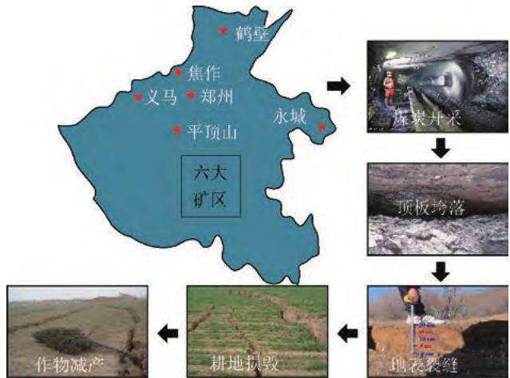  
图 1 河南六大矿区煤炭开采导致作物减产流程  
Fig．1 Flow chart of crop yield reduction caused by coal mining in six mining areas of Henan Province

根据河南省统计年鉴数据，进一步分析近 10 a河南六大矿区煤炭产量与其所在市耕地面积变化，如图2 所示。

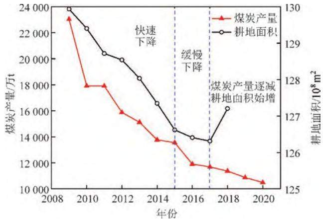  
图 2 六大矿区煤炭产量与其所在市耕地面积变化曲线  
Fig．2 Change curves of coal production and cultivated land area in six mining areas

由图 可知 年河南六大矿区煤炭产量、耕地面积变化趋势一致，共同经历了快速下降、缓慢下降阶段。 自 2018 年后，耕地面积呈现增加趋势，一方面与煤炭年产量继续减少相关，另一方面与近几年政府相关部门加强采煤地表生态管控有关。因此可知 耕地面积受煤炭产量的影响 煤炭年产量减少，对耕地面积的增加有正面影响。

尽管 年河南省耕地面积呈现增加趋势 但当下采煤损毁耕地的整治修复主要以恢复生产条件为主，部分损毁耕地修复后质量达不到中高产田标准 其根源在于覆岩 含水层 破坏及地表沉陷如何导致耕地损毁与耕地质量下降、损毁传导耦合驱动机制等科学问题认识不清晰 再者 煤炭开采因河南省矿区资源禀赋、煤层赋存、水文地质条件不一，开采条件、管理方式迥异，煤炭开采对覆岩与地表的损毁方式、特征、机理各异，损毁耕地整治修复的重点、路径、模式与技术有较大差异。

河南省既要严守 18 亿亩（1．2 亿 ha）耕地红线不动摇的强烈需求以提高粮食产量，又要稳定煤炭产能 因此亟需从粮食安全和能源供给全过程视角，对以往有关采动覆岩与含（隔）水层破坏、地表沉陷与土壤退化、耕地损毁与作物长势、土地损毁修复技术的研究内容和方法进行总结分析，为解决采煤沉陷导致的耕地损毁制约粮食增产瓶颈问题指明方向。

## 2 采动覆岩与含（隔）水层破坏

## 2.1 采动覆岩破坏及结构失稳

煤炭开采引起地层原岩应力重新分布，导致从顶板到高位岩层直至松散层都发生不同程度的损伤破坏 其中 采动覆岩结构及其失稳判据是岩层控制的核心问题之一。 目前国内外学者在采动覆岩破坏结构模型方面开展了大量的研究，提出了“悬臂梁”、台阶下沉 与 压力拱 等理论和假说 分别从不同角度揭示了采场上覆岩层结构的形成机理。 钱鸣高等［2］建立并分析了采动覆岩“砌体梁”结构模型的形成与失稳条件，并提出了“关键层”理论，揭示了基本顶“O－X”型破断机理。 宋振骐［3］ 通过研究受采动破断岩层之间的接触状态，认为破断岩块能向采空区内垮落岩块及煤壁传递水平相互作用力进而形成 传递岩梁”结构，并在此基础上能保持自身稳定性。 上述研究对采动覆岩破坏结构的研究具有重要理论意义。

相关研究基于不同的采矿地质条件，完善和发展了采动覆岩破坏结构模型。 李江华等［4］ 基于河南赵固煤矿巨厚松散层薄基岩工作面 建立了硬岩复合破断上覆岩层载荷传递力学模型 研究了覆岩载荷传递特征。 上述成果为采动覆岩结构及其失稳判据的研究做出了重要贡献。 采动覆岩破坏向上扩展至高位岩层 当前对于采动裂隙带高度的研究较为充分PENG 院士［5］ 研究了美国中厚煤层开采裂隙带高度与采厚和覆岩岩性的关系；我国《建筑物、水体、铁路及主要井巷煤柱留设与压煤开采规范 中指出 裂隙带高度主要与岩性和采高有关。

此外，裂隙带高度同样受煤层覆岩岩性组合特征的影响。 基于此认识，许家林等［6］ 提出了一种基于关键层位置预计裂隙带高度的方法；REZAEI M 等［7］考虑了几何参数和地质力学参数，提出了一种基于应变能平衡的长壁开采动态稳定区的非时变分析模型，用于计算裂隙带高度；MAJDI A 等［8］ 阐述了裂隙带高度发育机理，提出了估算裂隙带高度的方法，并与现场测量结果进行了比较和验证；张宏伟等［9］ 提出了特厚煤层综放开采裂隙带高度的理论计算方法。郭文兵等［10］建立了 3 个垮落带、裂隙带内岩层失稳力学模型，如图3 所示（其中， $F _ { \mathrm { ~ s ~ } } , F _ { \mathrm { ~ h ~ } }$ 分别为剪切力和水平力， $\mathbf { \partial } _ { \mathbf { k N } } { \mathbf { \nabla } } _ { \mathbf { ; } } M$ 为弯矩， $\mathrm { k N } \cdot \mathrm { m } ; G _ { i } \mathrm { , } G _ { k i } ^ { \prime }$ 为第 i 层岩层悬空完整，悬空稳定部分的自重， $\mathrm { k N } ; L _ { \mathrm { k } i \mathrm { m a x } } \setminus L _ { \mathrm { s } i \mathrm { m a x } } \setminus L _ { \mathrm { k } i \mathrm { m a x } } ^ { \prime }$ 为第 i 层岩层的极限悬空距离 极限悬伸距离和破断岩块长度， $\operatorname { m } ; q _ { i } \mathrm { ~ , ~ } q _ { i } ^ { \prime } \mathrm { ~ , ~ } q _ { i } ^ { \prime \prime }$ 为岩层悬空部分悬伸部分、破坏岩块所受的载荷集度， $\mathbf { k } \mathbf { N } / \mathbf { m } ; h _ { i }$ 为第 i 层岩层厚度， $\mathrm { m } ; x$ 为第 i 层岩层悬空垮落后第（i＋1）层岩层突增的悬空距离，m），基于此提出了一种基于覆岩破坏传递预计裂缝带高度的方法。

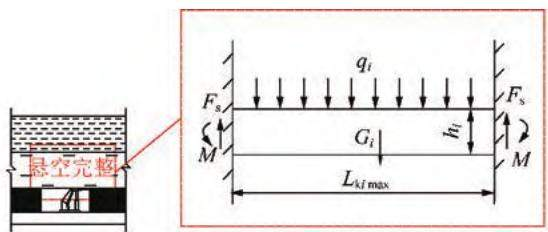

(a)垮落带内岩层悬空完整力学模型  
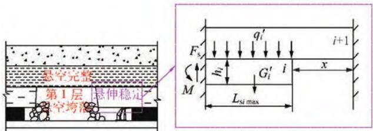  
(b)垮落带内岩层悬伸稳定力学模型

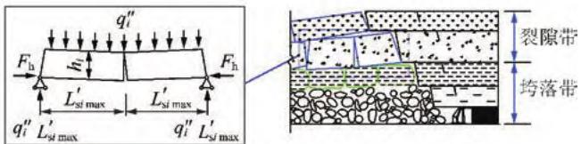  
(c)裂隙带内相邻失稳岩块三铰拱力学模型  
图 3 岩层固支梁、悬臂梁、三铰拱力学模型［10］  
Fig．3 Mechanical model of rock fixed beam，cantilever beam and three hinged arch［10］

上述研究揭示了采动覆岩破坏结构与裂隙发育规律之间的关系，为河南省典型地质采矿条件下的采动覆岩结构特征、裂隙发育规律和覆岩（含水层）破坏研究奠定基础。

## 2. 2 覆岩破坏充分采动的定义及判据

随着工作面推进距离的增加，由工作面顶板失稳垮落传递至高层位岩层发生悬伸破断，覆岩破坏高度增加，地表沉陷区逐步增大［11］，如图4 所示。

图4（b）表述了工作面（其中， $L _ { \mathrm { p } }$ 为倾向长度；T为开采厚度； ${ \ ; } \alpha$ 为覆岩破断角 $; \omega$ 为超前移动角）。 推进至1～4 过程中不同的覆岩破坏采动程度。 工作面推进至1～2 时，为覆岩破坏非充分采动（覆岩破坏高度或导水裂隙带高度为 $H _ { 1 } , H _ { 2 } )$ ；推进至3 时（推进距离为 L′），达到覆岩破坏充分采动（覆岩破坏高度为 $H _ { \mathrm { f m a x } } )$ ；推进至4 时 $( L _ { \mathrm { s } 4 } )$ ，覆岩破坏达到超充分采动，地表达到充分采动（地表最大下沉值为 $W _ { \mathrm { m a x } } )$ 笔者［11］将覆岩破坏高度达到某采矿地质条件下的最大值阶段定义为覆岩破坏充分采动，达到覆岩破坏充分采动后，覆岩破坏高度不再且随开采尺寸的增加而增加 并提出了以临界工作面尺寸判断覆岩破坏是否达到充分采动［12］，其计算公式为

$$
L = \left\{ \frac { 3 8 4 E _ { j } I _ { j } \big [ T - \displaystyle \sum _ { i = 1 } ^ { j - 1 } h _ { i } ( k _ { i } - 1 ) \big ] } { 5 q } \right\} ^ { \frac { 1 } { 4 } } +\tag{1}
$$

式中， $E _ { j }$ 为第 $j$ 层岩层的弹性模量， $\mathrm { P a } ; I _ { j } .$ 为第j 层岩层的截面矩， $\mathrm { m } ^ { 4 }$ ； $k _ { i }$ 为第 i 层岩层的残余碎胀系数； $; \varphi _ { 1 }$ $\varphi _ { 2 }$ 分别为覆岩的前方和后方断裂角，（°）；q 为岩层自身载荷集度， $\mathbf { k N } / \mathbf { m }$ 。

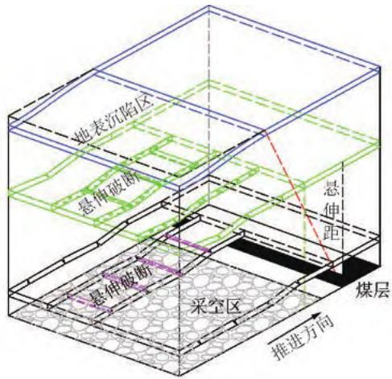

(a)上覆岩层悬伸破断示意  
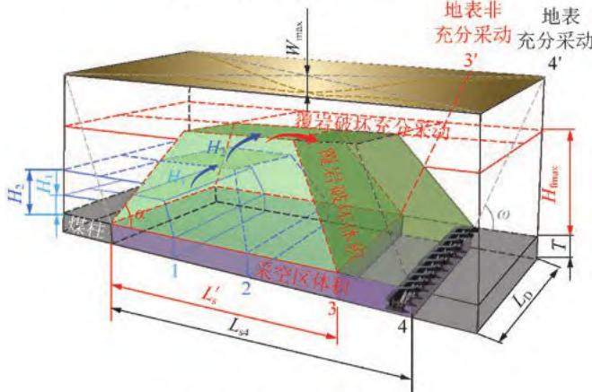  
(b)覆岩破坏采动程度三维示意  
图 4 煤炭开采引起的覆岩破坏传递过程［11］  
Fig．4 Overburden failure transfer process due to coal mining［11］

## 2.3 采动含（隔）水层破坏及其判据

煤炭开采导致包括含 隔 水层在内的覆岩变形破坏，采动裂隙贯通隔水层并进入含水层，引发地下水资源流失［13］，采动水资源流失将导致潜水位下降，给土壤墒情和农作物正常生长带来不利影响［14－15］对于高潜水位矿区 如河南永煤陈四楼煤 $\overrightarrow { A }$ 水资源补给充足，采后地表易形成沉陷积水区，导致农田损毁［16］ 。

目前，许多学者针对采动含（隔）水层破坏机理展开研究 其中 采动隔水层裂隙发育规律及其贯通性得到了广泛的关注 笔者［17］揭示了薄基岩厚松散层下充填开采覆岩裂隙高度及其变化规律，指出上行裂隙和下行裂隙综合作用下隔水层的残余厚度可作为保水开采安全性判定依据 黄庆享［18］ 提出采动覆岩“上行裂隙”与“下行裂隙”，并指出裂隙带的导通性决定着覆岩隔水层的隔水性，如图5 所示。

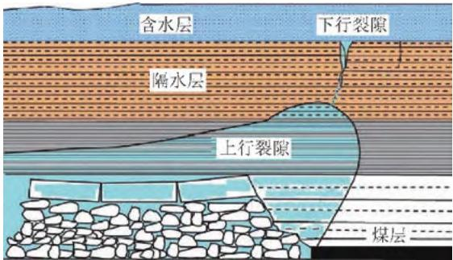  
图 5 采动覆岩“上行裂隙”和“下行裂隙”［18］  
Fig．5 Upward fracture and downward fracture of overburden［18］

另外一些学者聚焦隔水层本身，重点研究采动覆岩移动变形过程中，隔水层的应力、变形和损伤等参数的变化是否超过其破坏阈值 从而判断隔水层的稳定性［19］ 。

上述研究主要以应力、变形或裂隙作为隔水层的失稳判据，实质是判断隔水层的结构稳定性，但在量化分析采动水资源流失方面尚不准确 在分析煤炭开采对粮食生产的影响时，不可忽视浅表水资源少量但长期的渗漏对地表农作物和植被的破坏［20－21］。 基于此认识，余伊河通过室内三轴渗流实验针对隔水层的渗透性开展了研究［22］，如图6 所示。

另外，孟召平等［23］ 指出采动岩体渗透性主要受应变控制，采空区岩石渗透性则依赖于岩体破坏程度与裂隙开度；ADHIKARY D P 等［24］ 针对矿区地下渗透性的封隔测试结果表明 采空区上覆岩层渗透性增大 3 个数量级；MINORU Sato 等［25］ 研究了主应力对渗透率各向异性发展的影响，指出砂岩和泥岩渗透率各向异性发展规律的区别。 大量研究发现渗透率随有效应力增加呈式（2）所示的指数增大趋势：

$$
\begin{array} { r } { d = d _ { 0 } \mathrm { { e x p } } ^ { 3 ( \frac { 1 } { d ^ { \mathrm { { r } } } } - \frac { 1 } { d ^ { \mathrm { { p } } } } ) ( \sigma ^ { \mathrm { { e s } } } - \sigma ^ { \mathrm { { e s } } } ) } } \end{array}\tag{2}
$$

式中， $, d$ 为隔水层当前渗透率； $d _ { 0 }$ 为隔水层初始渗透率； $d ^ { \mathrm { r } }$ 为隔水层基质颗粒的体积模量， $\mathrm { M P a } ; d ^ { \mathrm { p } }$ 为隔水层孔隙的体积模量， $\operatorname { M P a } ; \boldsymbol { \sigma } ^ { \mathrm { e s } }$ 为隔水层当前有效应力， $\mathrm { M P a } ; \sigma _ { 0 } ^ { \mathrm { e s } }$ 为隔水层初始有效应力，MPa。

综上所述，目前对采动覆岩与含（隔）水层破坏从静态力学分析方面进行了较为充分的研究。 随着工作面的推进，采动顶板失稳类型与基岩－含（隔）水层界面处的应力状态将发生改变，有必要进一步开展采动顶板－基岩－含 隔 水层破坏的动态力学分析揭示采动顶板失稳类型转化机制与基岩－含（隔）水层破坏传导机理（图7），为源头控制采动地表沉陷与土地损毁提供理论基础。

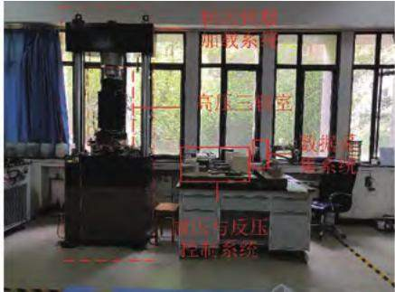  
(a)高温高压岩不三轴测试系统

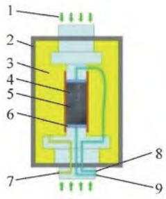

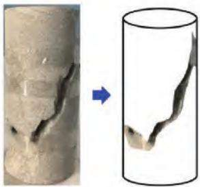  
(b)高压三轴室  
(c)破坏后的岩样  
1—轴压：2—压力缸：3—液压油：4—热缩膜；5—岩样：6—透水垫片；7—进油口：8—进水口；9—出水口

图 岩石三轴渗流实验系统与试验结果［22］  
Fig．6 Rock triaxial permeability test system and results［22］  
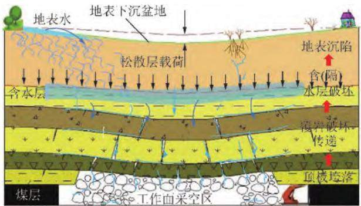  
图 7 采动顶板－基岩－含（隔）水层破坏传导示意  
Fig．7 Failure transfer of roof⁃bedrock⁃aquifer

## 3 采动地表沉陷规律与土壤退化

## 3.1 采动地表沉陷规律

煤炭开采影响到地表，致使地表移动变形，改变了地表原有的形态。 目前地表移动变形监测方法主要包括建立地表移动观测站、BDS 采空区监测系统及监测基站、与“天－空－地－井”一体化动态监测等方法，如图8 所示。 不同地质采矿条件下，地表移动和变形规律存在一定的差异。 国内外学者对地表沉陷规律进行了大量的研究 等［26］对美国东部的深部长壁开采、德国等地的硬岩开采下的沉陷

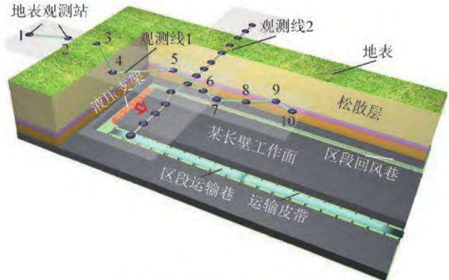  
(a)地表移动观测站观测方法

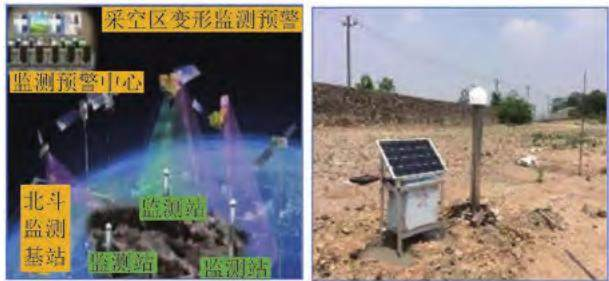  
(b)BDS采空区监测系统及监测基站

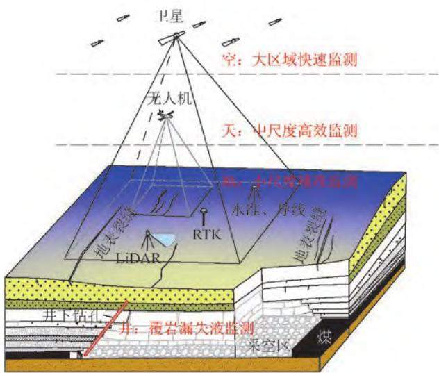  
(c)“天-空-地-井”一体化动态监测  
图 8 采动地表沉陷监测方法  
Fig．8 Monitoring method of surface subsidence by mining

规律进行了分析；MALINOWSKA A 等［27］ 用 GIS 研究开采沉陷对地表建（构）筑物的影响；滕永海和王金庄［28］分析了综采放顶煤下地表剧烈移动区的沉陷特征；徐乃忠和高超［29］ 研究了正断层对地表沉陷的作用机理及影响规律；郭广礼等［30］ 研究煤炭地下气化地表移动变形；胡炳南和颜丙双［31］ 分析了充填开采地表沉陷的主控因素及其对地表沉陷的影响规律；胡青峰等［32］以大同矿区特厚煤层重复开采条件为研究背景 开展了特厚煤层重复开采覆岩与地表移动变形规律研究；郭文兵等［33］ 针对河南厚湿陷表土层矿井进行了相关研究，得到了特定开采条件下地表沉陷特征。

另外，国内外学者对地表沉陷的预测方法和地表非连续变形破坏进行了深入研究。 GHABRAIE B 和［34］分析了澳大利亚多煤层长壁开采的覆岩沉陷机理，给出地表沉陷预计方法；余学义等［35］ 基于分层传递理论，修正了概率积分法模型，并成功应用于厚黄土层煤层开采沉陷预测。 波兰学者 AGNIESZKA A等［36］利用 PS－InSAR 技术对浅埋煤层开采产生的塌陷坑进行了调查分析；吴侃等［37］ 结合统一强度理论，推导得出了采动地裂缝极限发育深度计算方法；戴华阳等［38］通过实测，确定了神东矿区上湾矿地表裂缝拉伸、压缩、台阶、塌陷4 种非连续变形的分区分布主要参数。 上述研究对采煤地表沉陷规律、建（构）筑物以及生态修复研究等发挥了重要作用。

## 3.2 采动地表沉陷与覆岩破坏整体响应行为

传统的岩层移动主要关注在工作面上覆部分岩层移动规律 而开采地沉陷则关注地面移动变形问题 但是这 个不同的研究方向本质都涉及到工作面回采后上覆岩层和地面表土层的整体移动行为。 因此，基于此认识，相关学者针对工作面回采后上覆岩层和地面表土层的整体响应行为进行了研究

笔者创新性的将长壁开采二维覆岩破坏及地表下沉简化为4 类采动影响面积（采空区长方形面积、上覆岩层预破坏梯形面积、覆岩破坏后的面积与地表下沉面积）之间的关系，较为直观地体现了长壁开采导致的覆岩破坏与地表下沉，建立了采动覆岩破坏与地表沉陷的准静态联系［11］，如图 9（a）所示，工作面推进至位置1 时，采空区矩形面积为 $S _ { \mathrm { G 1 } }$ ，上覆岩层预破坏梯形面积为 $S _ { \mathrm { { 0 1 } } }$ ，覆岩破坏后的面积由于破坏岩层碎胀系数增长至 $S _ { 0 1 } K _ { 1 } ( K _ { 1 }$ 为覆岩破坏后的碎胀系数），且地表下沉值为 $W _ { 1 }$ ，地表下沉面积为 $S _ { \mathrm { s 1 } }$ ，这时覆岩破坏高度为 $H _ { 1 }$ ，失稳岩层与未失稳岩层的离层高度为 $\varDelta _ { \mathrm { ~ 1 ~ } \mathrm { { ~ c ~ } ~ } }$ 。 当工作面推进至位置 2～3 时，覆岩破坏高度为 $H _ { 2 } , H _ { \mathrm { m a x } }$ ，离层高度为 $\Delta _ { 2 \setminus } \Delta _ { 3 }$ ，地表下沉值为 $W _ { 2 } \ 、 W _ { 3 }$ ；当工作面从位置 $3 \left( L _ { \mathrm { s } } ^ { \prime } \right)$ 推进至 时 $( \cal L _ { \mathrm { s } 4 } )$ 地表达到充分采动，最大下沉值为 $W _ { \mathrm { m a x } }$ ，地裂缝深度为 $H _ { \mathrm { c } }$ ；左建平等［39］建立了岩层移动与地表沉降共轭内、外“类双曲线”模型，可用于描述岩层移动与地表沉降规律，其中，内“类双曲线”隐含在覆岩内部，可通过一些地球物理探测方法近似获得，外“内双曲线”体现在地表沉陷、岩层冒落等外部形态，可以直接观测得到，如图9（b）所示。

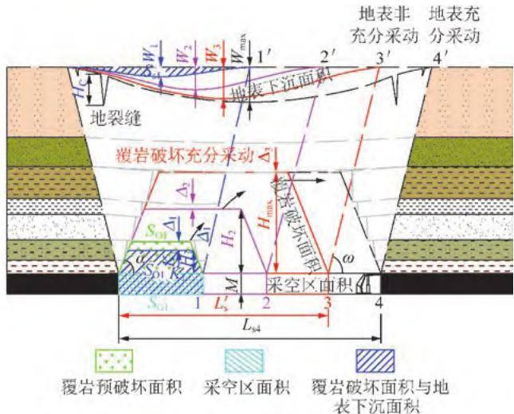  
(a)覆岩破坏与地表下沉的准静态关系[]

岩层移动与地表沉降共轭“类双曲线”移动模型  
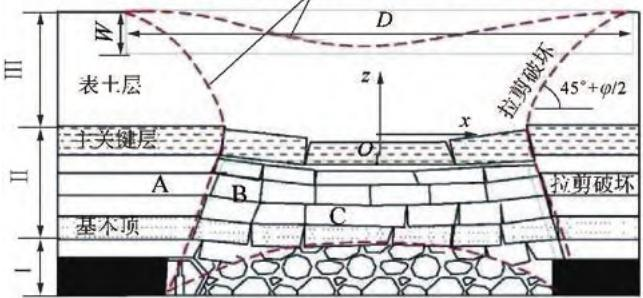  
1—目落拱：Ⅱ—裂隙拱；ⅢⅢ—弯曲下沉带ABC—砌体梁结构：A—支撑压力影响区：B—离层区：C—重新压实区：W—地表下沉量；ω—内摩擦角  
(b)岩层移动与地表沉陷共轭内、外“类双曲线”模型[39]

图 9 煤矿开采地表下沉与覆岩破坏整体响应行为

Fig．9 Overall response behavior of surface subsidence and overburden failure in coal mining

## 3.3 地表沉陷对土壤退化的影响

聚焦沉陷区土壤退化机理 相关学者开展了大量研究。 HOWLADAR M F［40］ 对孟加拉 Barapukuria 煤矿区土壤质量的研究表明：开采沉陷区土壤渗透性降低，土壤保水性变差；TRIPATHI N 等［41］ 对印度 Sin⁃gareni 煤矿区沉陷土地的研究认为：拉伸区土壤碳、氮、磷等养分含量显著低于挤压区，导致沉陷区土壤碳、氮、磷等养分的空间变异性增大；美国 DAVIDBartsch 等通过现场实测研究了俄亥俄州某矿长壁工作面开采对地下不同层位水文情况的影响，如图 10所示，从 2000 年 1 月至 2001 年 5 月，控制点潜（ 深）水井的相对水位曲线与实测点潜（深）水井的相对水位曲线基本一致，当相邻工作面、目标工作面回采至实测点后，实测点潜（深）水井的相对水位曲线均低于控制点潜（深）水井的相对水位曲线，说明工作面的开采导致了地下潜（深）水位下降，因此长壁开采对地下潜水位与深水位的水况受影响显著［42］。

另外，毕银丽等［43］研究发现，沉陷明显增加了水分的垂直入渗深度，减小了表层土壤的持水能力，沉陷使得土壤水分与其影响因素之间相关性更强；臧荫桐等［44］研究了沉陷区土壤采动影响下理化性质的变化，发现采动沉陷后土壤含水量普遍下降，土壤孔隙度显著增大，而土壤容重、硬度显著减小，局部开裂地段全氮 全磷含量显著减小 聂小军等［45］ 采用137同位素示踪技术，重点研究了沉陷地土壤侵蚀对土壤有机碳（SOC）、全氮（TN）、全磷（TP）养分的影响，得出 与 均与 $^ { 1 3 7 } \mathrm { C s }$ 含量呈正相关关系 其中相关系数 $r = 0 . 7 6 \sim 0 . 8 7$ ，概率 $p < 0 . 0 5$ ，如图 11 所示，另一方面，矿区土壤有机碳、氮、磷养分含量随采煤扰动下土壤侵蚀强度的增加而降低，因此认为土壤侵蚀是开采沉陷驱动土壤退化的一个关键中间过程。

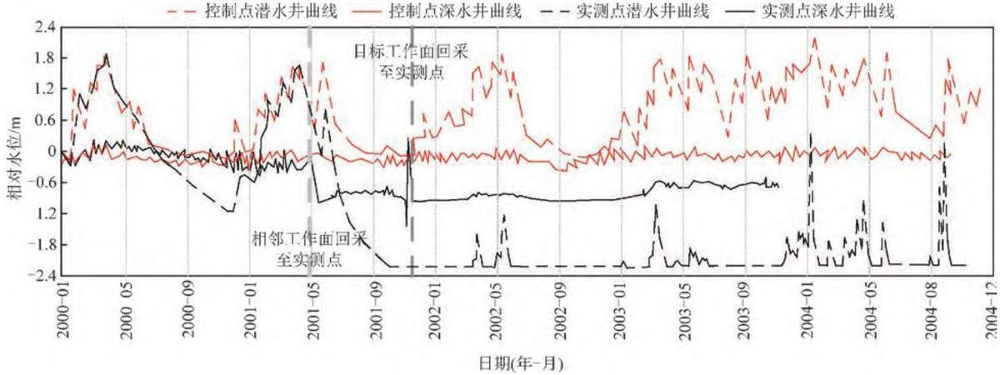  
图 10 工作面回采对控制点与实测点的潜、深水井相对水位影响曲线［42  
Fig．10 Influence curves of panel mining on relative water level of control point and measured point［42］

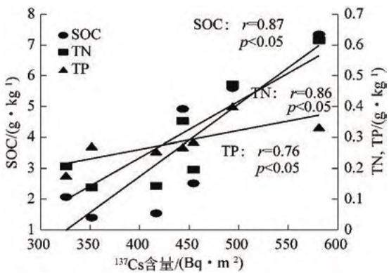  
图 11 沉陷区土壤养分含量与土壤侵蚀之间的关系［45］  
Fig．11 Correlations between soil nutrients and soil erosion in mining⁃induced subsidedareas［45］

国内外学者在矿区采动地表沉陷规律及其对土壤退化机理方面，已取得了大量的研究成果。 基于此 需求聚焦中部矿粮复合区 尤其是河南不稳定煤层放顶煤开采、薄基岩厚松散层下开采、高潜水位厚煤层开采3 种地质采矿类型，地表沉陷分布规律时空分异性强，且开采沉陷对土壤退化影响的相关研究不足，需要从“源头策动－过程传递－终端响应”系统论的视角，对“地下采动—覆岩移动—地表沉陷—土壤侵蚀—土壤退化”驱动机理进行深入研究。

## 4 矿区耕地损毁及农作物长势

## 4. 1 沉陷区耕地损毁识别及时空演变规律

大范围获取矿区耕地损毁区域 长时序监测沉陷影响耕地的范围和程度，是进行沉陷区耕地识别及时空变化规律研究的前提。 合成孔径雷达干涉测量（InSAR）及其衍生技术作为新型主动式地表形变监测技术，以其大范围、高精度、不受云雨天气影响的技术优势，且能克服传统监测方法的耗时费力、采样率低、周期长、成本高等局限，已成为精准监测矿区沉陷变化的重要手段之一。

近年来国外学者开展了大量基于 InSAR 衍生技术的矿区地表形变重构和预计研究，发展了行之有效的方法［46］。 国内学者也进行了有益的探索，如改进多时相 DInSAR 的算法，实现了矿区尺度开采沉陷影响区监测；进一步利用 SBAS InSAR 时序分析技术，从工作面尺度获得了地表下沉的动态规律等［47］。

沉陷造成的耕地退化 地表塌陷和积水还严重影响矿粮复合区耕地数量和质量。 精准识别提取沉陷区耕地，是进行农作物长势监测和时空变化规律分析的前提。 当前，矿区耕地信息的提取方面，以最大似然、最小距离、决策树、人工神经网络、支持向量机等计算机识别方法从遥感影像上自动提取为主 如

Celik 将遗传算法（GA）用于最小化代价函数，对混合高斯模型的参数进行估计 很好地解决了差值影像的二类问题［48］ 等［49］ 运用层集理论寻找影像上对象的最优全局轮廓，与常规方法相比，该方法能更精确地检测对象的结构和区域，进而抑制虚检误差 然而传统机器学习与模式识别方法往往受 同物异谱、异物同谱”现象影响，使得分类效果较差。 亟需构建并优化多粒度扫描级联随机决策森林模型，在特征组合随机森林的基础上，改进混合节点分裂；然后通过多输入自适应模型提高森林规模；级联森林方面，将多层逐级学习思想引入到随机森林中构建深度随机森林模型，提高森林鲁棒性和泛化能力，如图12 所示。

在沉陷区时空演变监测方面 已经有部分研究如李晶等［50］利用IFZ 与NDVI 进行矿区土地利用／覆盖变化研究，重构矿区森林覆盖与采矿扰动之间的关系。 刘培等［51］基于 CA⁃Markov 模型对矿区土地覆盖进行了遥感动态变化监测，分析了煤矿区热环境与土地覆盖变化耦合关系。 然而，目前研究主要侧重于静态、短期的沉陷区植被生态变化和土地景观格局变化，矿粮复合区耕地变化及农作物长势监测有待深入研究，长时序、高精度损毁耕地及农作物的多时相遥感技术精准监测对耕地保护和粮食安全更具科学价值。

## 4.2 采动影响下沉陷区农作物长势监测

基于多光谱、高光谱、激光雷达、地物光谱仪遥感技术的采动影响研究，是农作物抗逆研究的热点。 国外关于矿区重金属胁迫和酸性矿井水胁迫导致植被反射光谱特征、红边响应特征变化研究已取得一些进展［52］。 国内学者通过地面采样实测分析，获得了开采前后沉陷区土壤 pH、土壤养分、土壤物理性质及其迁移特征［53］；开采沉陷对土壤和农作物根系损伤，造成土壤持水能力减弱，进而形成断根胁迫和干旱胁迫，导致光合作用能力变差，生产力下降等，也取得了研究进展［54］。 在此基础上，需要进行沉陷区生态恢复过程中农作物长势关键指标、土壤理化生特性的时空变化的研究，阐明耕地退化导致农作物功能性损伤和生理指标发生变异的机理，尤其是在土壤退化特征和农作物长势关键生理指标间建立起有机联系 为沉陷区损毁耕地修复提供理论支持。 根据以上研究成果分析可知：国内外基于农作物长势关键指标的采矿影响遥感机理研究相对薄弱，开采沉陷影响土壤退化及作物损伤的程度 范围和时间尚需深入研究 亟需从区域尺度和工作面尺度分析采煤活动对地表农作物的影响规律，研究农作物长势关键指标的时空变化规律，阐明直接采损及间接影响下农作物响应机制。

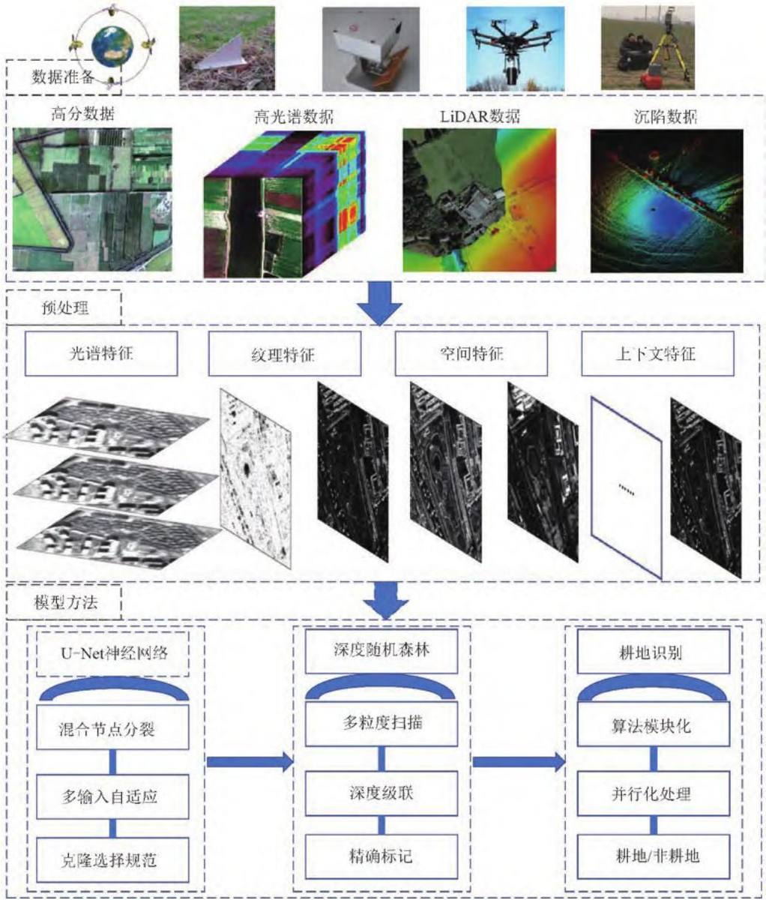  
图 12 遥感深度随机决策森林模型构建与优化技术流程  
Fig．12 Construction and optimization of remote sensing depth random decision forest model

## 5 源头减沉控损与土地损毁修复技术

## 5. 1 源头减沉控损技术

煤炭开采引起的覆岩和地表移动是矿区耕地损毁的源头。 因此，源头减沉控损技术是指采取井上下技术措施控制开采引起的覆岩和地表移动，从而在源头上实现减沉控损的目的。 如煤炭开采引起的覆岩和地表移动可以通过开采方法的选择、开采参数优化以及采用充填材料置换煤炭开采等，减缓覆岩与地表变形是实现源头减沉控损的有效举措。 国内外学者在控制覆岩与地表变形方面进行了大量研究。 主要有协调开采 充填开采 部分开采 覆岩离层注浆 保水开采等。 协调开采是通过调整工作面开采布置方式、开采顺序等实现控制地表移动和变形；充填开采主要包括矸石充填、膏体充填、（超）高水充填、胶结充填等［55］；部分开采主要有限厚开采、条带开采、房柱式开采等，留下的煤柱用于控制上覆岩层。 覆岩离层注浆是在地表通过钻孔将注浆材料注入到覆岩离层空间内，可以对其上覆岩层起到支承作用，阻止和减缓上覆岩层继续下沉，达到减缓地表沉陷之目的。郭文兵等提出了地下水原位保护技术的两主要步骤：加固煤柱的条带开采（图 13（a））、留窄煤柱的置换煤柱充填开采（图13（b））［56］。 上述这些方法各有优缺点，在不同的条件下均有应用。

## 5.2 煤炭开采损毁土地修复技术

煤炭开采损毁土地修复技术可以分为人工主动修复与自恢复引导技术。 自恢复引导技术立足生态系统本身的自恢复力，辅助适当的人工调控，诱导损毁土地主动反馈，逐渐恢复到相对健康状态，最终实现煤炭资源可持续开采与生态环境保护［57］。 由于自恢复引导技术实现受损生态系统的恢复需要很长时间，甚至长达百年，因此它主要适用于自然生态区的损毁土地修复。 对于中部矿粮复合区，采取自恢复引导技术修复农业系统时效慢、耗时长，制约粮食增产。

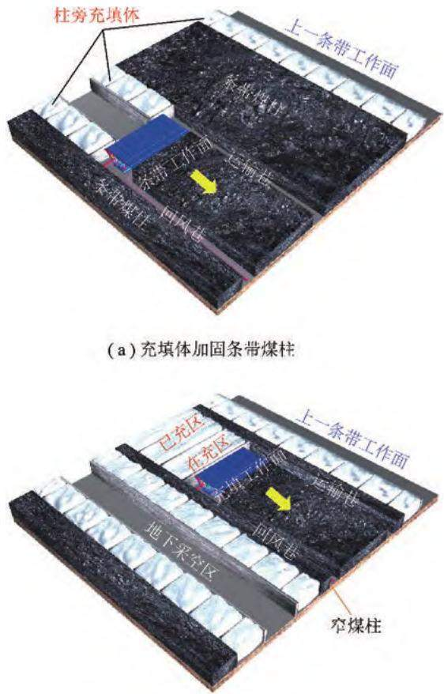  
(b) 回采条带煤柱的充填工作面  
图 13 地下水原位保护技术步骤示意［56］  
Fig．13 Process of in⁃situ protection technology of aquifers［56］

人工主动修复能快速改善矿区土地的破坏，实现土地生产力的恢复，因此，一直以来都是矿区生态修复的研究焦点。 对于粮食生产为主要功能的农业区，特别是矿粮复合区，煤炭开采损毁土地修复技术较为单一 主要为挖深垫浅与充填复垦 修复的主要目标是造地复田，缓解耕地减少导致的人地矛盾［58］。 挖深垫浅技术仅适用于中 高潜水位地区地表沉陷较深的耕地恢复。 充填修复技术的实施又受限于充填材料的可获取性，对于中部矿粮复合区而言，一方面，大多煤矿区潜水位较低，地表沉陷较浅；另一方面，充填材料获取困难，因此，这两项修复技术在区域内的适用范围有限 目前 区域内的煤炭开采损毁土地绝大部分仍然处于未治理状态，影响区域土地持续利用与粮食产能提升。

从水土保持的角度 研发科学的土地修复技术是提升中部矿粮复合区沉陷耕地生产力与粮食保障能力的有效手段。 近期，河南理工大学煤矿区土地整治与生态修复团队初步开展了损毁耕地修复研究，发现 沿采煤工作面走向在沉陷地表布设梯田＋灌溉管理的技术模式能有效削弱倾向大坡度导致的水－土－肥流失，作物产量能够达到甚至超过正常农田水平［59］。 此外，生物碳土壤改良作为近年来土壤修复的前沿技术，具有改善土壤结构、提升土壤水肥条件、防治土壤盐碱化等优势，但该技术在沉陷耕地上的应用研究尚未开展 以上 种水土保持技术 对于中部矿粮复合区煤炭开采损毁耕地的高效修复具有重要参考价值。

综上所述，矿粮复合区源头控损技术主要侧重于减缓地表沉陷、保护建（构）筑物或水体，需要从损毁耕地修复角度来开展有针对性的源头控损技术研究。损毁土地修复技术主要侧重于以工程措施 挖深垫浅、充填复垦等）为主的土地复垦，需从水土保持的角度来开展基于沉陷地形的耕地修复技术研究。 从“地－气－水－土－生”生态系统修复的视角，亟需开展井下源头控损与土地修复相结合的高效协同修复技术研究，以此为矿粮复合区的煤炭绿色开采、土地可持续利用与耕地产能提升提供理论和技术支撑。

## 6 问题与展望

## 6.1 存在问题

综合上述国内外研究，围绕采煤诱发覆岩破坏、地表沉陷、土地损毁及修复等方面已开展了相关研究 但针对中部矿粮复合区典型地质采矿条件采煤沉陷规律、耕地损毁驱动机制及作物响应方面的研究仍有以下几方面不完善：

（1）河南典型地质采矿条件下采动“顶板－覆岩－含（隔）水层”破坏传导机制尚不明晰。 目前对采动顶板失稳类型的判断主要基于静态力学分析，在采动顶板失稳类型的动态转化机制及其对覆岩裂隙发育的影响方面研究较少；在采动含（隔）水层破坏机理的研究中，将含（隔）水层的变形直接等同于覆岩的变形，没有考虑基岩－含（隔）水层界面处的应力传导与破坏驱动机制，以及该机制对采后含（隔）水层渗透性自然或人工修复的影响

（2）河南典型矿区采动地表沉陷与损毁耕地土壤退化的耦合作用机理尚需进一步研究。 不同地质采矿条件地表沉陷规律、土地损毁退化类型、退化程度差异很大，对河南不稳定煤层放顶煤开采、薄基岩厚松散层和高潜水位厚煤层开采矿区的开采沉陷规律分析不足 且缺少覆岩破坏对地表沉陷驱动机理的系统研究。 目前研究侧重于探讨地表沉陷对土壤退化的间接影响，需要进一步揭示地表沉陷－土壤侵蚀－土壤退化间的作用机理。

（3）中部矿粮复合区农作物长势时空响应特征尚不明晰。 农作物生长对耕地的覆盖度变化影响显著，地表物候变化和开采扰动容易导致干涉测量失效，影响了土地沉陷区域的提取精度，传统的遥感影像分类建模方法难以精准识别损毁耕地，基于沉陷区土壤理化生特征变化，对地表农作物的叶绿素、类胡萝卜素 氮素等长势关键指标间的响应关系需要进一步研究。

（4）中部矿粮复合区煤炭开采损毁耕地的高效协同修复技术研究亟需开展 源头控损技术侧重于地表减沉、建（构）筑物保护，欠缺耕地保护目标导向的源头控损技术研究。 损毁土地修复技术侧重于高成本工程复垦 推广受限 欠缺基于沉陷地形高效利用的低成本、易推广的耕地修复技术研究。 从“地－气－水－土－生 生态系统修复的视角 亟需开展井下源头控损与土地修复相结合的高效协同修复技术研究，以此为矿粮复合区的煤炭绿色开采、土地可持续利用与耕地产能提升提供技术支撑。

## 6. 2 研究展望

通过对采动覆岩与含 隔 水层破坏 地表沉陷与土壤退化、耕地损毁与作物长势、土地损毁修复技术的研究内容进行了简要回顾 结合 个方面的研究思路总结了中部矿粮复合区采煤沉陷及耕地损毁相关研究成果以及修复关键技术，提出以下研究展望：

基于河南典型地质采矿条件 构建采动顶板破断岩块结构动态力学模型，阐明顶板破断岩块结构时空演化规律，分析基岩顶部与含（隔）水层界面上岩－土双介质破坏驱动与传导机制 揭示顶板－基岩－含（隔）水层破坏动力学传导机理。

（2）厘清不同地质采矿条件下覆岩破坏与地表沉陷之间的作用关系 揭示采动覆岩破坏－地表沉陷传导机理 研究不同类型沉陷区损毁耕地的理化和微生物特性之间的变化规律、土壤侵蚀特征及土壤理化特性变化规律，揭示中部矿粮复合区地表沉陷对耕地土壤退化的驱动机制。

（3） 探索河南典型地质采矿条件下多时相DInSAR 干涉测量技术与方法，从工作面尺度识别沉陷区耕地／非耕地信息、提取采煤影响下农作物关键生长期的遥感生态指标，基于此，建立农作物长势时空变化模型，分析沉陷区损毁耕地农作物长势响应特征及时空演变规律。

针对河南典型地质采矿条件 优化工作面开采参数，提出源头减沉控损的开采方法，确定源头减沉控损开采方法的有效控制范围；研发不同损毁特征耕地土壤修复关键技术，构建具有针对性的丘陵、平原区损毁耕地修复模式，形成中部矿粮复合区源头减沉控损与耕地损毁高效协同修复的综合技术体系。

## 参考文献（References）：

［1］ 李树志． 我国采煤沉陷区治理实践与对策分析［J］． 煤炭科学技术，2019，47（1）：36－43．LI Shuzhi． Control practices and countermeasure analysis oncoal mining subsidence area in China［ J］ ． Coal Science and Tech⁃nology，2019，47（1）：36－43．

［2］ 钱鸣高，许家林． 煤炭开采与岩层运动［J］． 煤炭学报，2019，44（4）：973－984．QIAN Minggao，XU Jialin． Behaviors of strata movement in coal min⁃ing ［J］． Journal of China Coal Society，2019，44（4）：973－984

［3］ 宋振骐．实用矿山压力控制［M］．徐州：中国矿业大学出版社，1988．

［4］ 李江华，许延春，姜鹏，等． 巨厚松散层薄基岩工作面覆岩载荷传递特征研究［J］． 煤炭科学技术，2017，45（11）：95－100．LI Jianghua，XU Yanchun，JIANG Peng，et al． Study on load trans⁃mission characteristics of overburden rock above coalmining facein thin bedrock of super thick unconsolidated stratum［ J］ ． Coal Sci⁃ence and Technology，2017，45（11）：95－100．

［5］ PENG S Syd． Surface subsidence engineering：Theory and practice ［M］． Australia：CRC Press，2020．

许家林 朱卫兵 王晓振 基于关键层位置的导水裂隙带高度预计方法［J］． 煤炭学报，2012，37（5）：762－769．XU Jialin， ZHU Weibing， WANG Xiaozhen． New method topredict the height of fractured water⁃conducting zone by locationof key strata ［ J ］ ． Journal of China Coal Society， 2012， 37 （ 5 ） ：762－769．

［7］ REZAEI M，HOSSAINI M F，MAJDI A． A time⁃independent energy model to determine the height of destressed zone above the mined panel in longwall coal mining ［ J］ ． Tunnelling Underground Space Technology Incorporating Trenchless Technology Research， 2015， 47：81－92．

［8］ MAJDI A，HASSANI F P，NASIRI M Y． Prediction of the height of destressed zone above the mined panel roof in longwall coal mining ［ J］ ． International Journal of Coal Geology，2012，98： 62－72．

［9］ 张宏伟，朱志洁，霍利杰，等． 特厚煤层综放开采覆岩破坏高度［J］． 煤炭学报，2014，39（5）：816－821．ZHANG Hongwei， ZHU Zhijie， HUO Lijie， et al． Overburden fail⁃ure height of super⁃high seam by fully mechanized caving method［J］． Journal of China Coal Society，2014，39（5）：816－821．

［10］ GUO Wenbing，ZHAO Gaobo，LOU Gaozhong，et al． A new method of predicting the height of the fractured water⁃conducting

zone due to high⁃intensity longwall coal mining in China ［ J ］ ． Rock Mechanics and Rock Engineering，2018，52：2789－2802．

［11］ 郭文兵，赵高博，白二虎．煤矿高强度长壁开采覆岩破坏充分采动及其判据［J］．煤炭学报，2020，45（11）：3657－3666GUO Wenbing， ZHAO Gaobo， BAI Erhu． Critical failure ofoverlying rock strata and its criteria induced by high⁃intensity long⁃wall mining ［ J］． Journal of China Coal Society，2020，45 （ 11）：3657－3666．

［12］ 郭文兵，娄高中．覆岩破坏充分采动程度定义及判别方法［J］．煤炭学报，2019，44（3）：755－766．GUO Wenbing， LOU Gaozhong． Definition and distinguishingmethod of critical mining degree of overburden failure［ J］ ． Journaof China Coal Society，2019，44（3）：755－766．

［13］ 范立民． 保水采煤的科学内涵［ J］． 煤炭学报，2017，42（ 1）：27－35．FAN Limin． Scientific connotation of water⁃preserved mining ［ J］ ．Journal of China Coal Society，2017，42（1）：27－35．

［14］ 张东升，李文平，来兴平，等． 我国西北煤炭开采中的水资源保护基础理论研究进展［J］． 煤炭学报，2017，42（1）：36－43．ZHANG Dongsheng，LI Wenping，LAI Xingping，et al． Developmenton basic theory of water protection during coal mining in northwestof China［J］． Journal of China Coal Society，2017，42（1）：36－43．

［15］ 胡振琪，多玲花，王晓彤． 采煤沉陷地夹层式充填复垦原理与方法［J］． 煤炭学报，2018，43（1）：198－206．HU Zhenqi，DUO Linghua，WANG Xiaotong． Principle and methodof reclaiming subsidence land with inter⁃layers of filling materals［J］． Journal of China Coal Society，2018，43（1）：198－206．

［16］ 范廷玉，严家平，王顺，等． 采煤沉陷水域底泥及周边土壤性质差异 分 析 及 其 环 境 意 义 ［ J ］． 煤 炭 学 报， 2014， 39 （ 10 ）：2075－2082．FAN Tingyu，YAN Jiaping，WANG Shun，et al． Difference betweensediment samples from coal mine subsidence water and soil samplesaround it and its environment significance ［ J］ ． Journal of ChinaCoal Society，2014，39（10）：2075－2082．

［17］ 郭文兵，杨达明，谭毅，等． 薄基岩厚松散层下充填保水开采安全性分析［J］． 煤炭学报，2017，42（1）：106－111．GUO Wenbing，YANG Daming，TAN Yi，et al． Study on safety ofoverlying strata by backfilling in water⁃preserved miningunder thick alluvium and thin bedrock ［ J ］ ． Journal of ChinaCoal Society，2017，42（1）：106－111

［18］ 黄庆享． 浅埋煤层保水开采岩层控制研究［J］． 煤炭学报，2017，42（1）：50－55．HUANG Qingxiang． Research on roof control of water conserva⁃tion mining in shallow seam ［ J］ ． Journal of China Coal Society，2017，42（1）：50－55．

［19］ 马立强，许玉军，张东升，等． 壁式连采连充保水采煤条件下隔水层与地表变形特征［J］． 采矿与安全工程学报，2019，36（1）：30－36．MA Liqiang，XU Yujun，ZHANG Dongsheng，et al． Characteristicsof aquiclude and surface deformation in continuous mining and fill⁃ing with wall system for water conservation［ J］ ． Journal of Mining＆ Safety Engineering，2019，36（1）：30－36．

［20］ 王双明，孙强，乔军伟，等． 论煤炭绿色开采的地质保障［J］．煤

炭学报，2020，45（1）：8－15．WANG Shuangming， SUN Qiang， QIAO Junwei， et al． Geolog⁃ical guarantee of coal green mining［ J］ ． Journal of China Coal Soci⁃ety，2020，45（1）：8－15．

［21］ 彭苏萍，毕银丽． 黄河流域煤矿区生态环境修复关键技术与战略思考［J］． 煤炭学报，2020，45（4）：1211－1221．PENG Suping，BI Yinli． Strategic consideration and core technologyabout environmental ecological restoration in coal mine areas in theYellow River basin of China ［ J］ ． Journal of China Coal Society，2020，45（4）：1211－1221．

［22］ 余伊河． 采场边界覆岩损伤破坏特征及渗透性演化规律［D］．徐州：中国矿业大学，2020．YU Yihe． Damage failure characteristics and permeability evolutionlaw of overburden at gob boundares ［ D］ ．Xuzhou：China Universityof Mining and Technology，2020

［23］ 孟召平，张娟，师修昌，等． 煤矿采空区岩体渗透性计算模型及其数值模拟分析［J］． 煤炭学报，2016，41（8）：1997－2005．MENG Zhaoping， ZHANG Juan， SHI Xiuchang， et al． Calcula⁃tion model of rock mass permeability in coal mine goaf and its nu⁃merical simulation analysis ［ J ］ ． Journal of China Coal Society，2016，41（8）：1997－2005

［24］ ADHIKARY D P，GUO Hua． Modelling of longwall mining⁃inducedstrata permeability change［J］． Rock Mechanics and Rock Engineer⁃ing，2015，48（1）：345－359．

［25］ MINORU Sato，TAKATO T，MANABU T． Development of the per⁃meability anisotropy of submarine sedimentary rocks under true tri⁃axial stresses ［ J ］ ． International Journal of Rock Mechanicsand Mining Sciences，2018，108（11）：8－27．

［26］ AXEL Preusse，HEINZ⁃JÜRGEN Kateloe，ANTON Sroka． Subsidence and uplift prediction in German and Polish hard coal mining［C］ ／ ／ 31th International Conference on Ground Control in Mining USA，2012．

［27］ MALINOWSKAA， HEJMANOWSKI R． Building damage risk assessment on mining terrains in Poland with GIS application ［ J］ ． International Journal of Rock Mechanics and Mining Sciences， 2010，47：238－245．

［28］ 滕永海，王金庄． 综采放顶煤地表沉陷规律及机理［J］． 煤炭学报，2008，33（3）：264－267．TENG Yonghai， WANG Jinzhuang． The law and mechanismof ground subsidence induced by coal mining using fully⁃mecha⁃nized caving method ［ J］ ． Journal of China Coal Society， 2008，33（3）：264－267．

［29］ 徐乃忠，高超． 正断层存在的地表沉陷特殊性规律研究［J］． 采矿与岩层控制工程学报，2020，2（1）：101－106XU Naizhong，GAO Chao． Study on the special rules of surface sub⁃sidence affected by normal faults［ J］ ． Journal of Mining and StrataControl Engineering，2020，2（1）：101－106．

郭广礼 李怀展 查剑锋 等 无井式煤炭地下气化岩层及地表移动与控制［J］． 煤炭学报，2019，44（8）：2539－2546．GUO Guangli， LI Huaizhan， ZHA Jianfeng， et al． Movementand control of strata and surface during UCG without shaft ［ J］ ．Journal of China Coal Society，2019，44（8）：2539－2546．

［31］ 胡炳南，颜丙双． 充填采煤开采沉陷主控因素及其影响规律研

究［J］． 煤矿开采，2016，21（2）：57－59．HU Bingnan，YAN Bingshuang． Main control factors and influencerule of mining subsidence by backfill mining［ J］ ． Journal of Miningand Strata Control Engineering，2016，21（2）：57－59．

［32］ 胡青峰，崔希民，刘文锴，等． 特厚煤层重复开采覆岩与地表移动变形规律研究［J］． 采矿与岩层控制工程学报，2020，2（2）：23021．HU Qingfeng， CUI Ximin， LIU Wenkai， et al． Law of overburdenand surface movement and deformation due to mining superthick coal seam［ J］ ． Journal of Mining and Strata Control Engineer⁃ing，2020，2（2）：23021．

［33］ 郭文兵，黄成飞，陈俊杰． 厚湿陷黄土层下综放开采动态地表移动特征［J］． 煤炭学报，2010，35（S1）：38－43．GUO Wenbing，HUANG Chengfei，CHEN Junjie． The dynamic sur⁃face movement characteristics of fully mechanized caving miningunder thick hydrous collapsed loess［ J］ ． Journal of China Coal So⁃ciety，2010，35（S1）：38－43．

［34］ GHABRAIE B，REN G． Mechanism and prediction of ground surface subsidence due to multiple⁃seam longwall mining［A］． 35th International Conference on Ground Control in Mining［C］． USA，2016．

［35］ 余学义，郭文彬，赵兵朝，等． 厚黄土层煤层开采沉陷规律研究［J］． 煤炭科学技术，2015，43（7）：6－10，24．YU Xueyi，GUO Wenbin，ZHAO Bingchao，et al． Study on miningsubsidence law of coal seam with thick overlying loess stratum［ J］ ．Coal Science and Technology，2015，43（7）：6－10，24．

［36］ AGNIESZKA A M，WOJCIECH T W，RYSZARD H，et al． Sinkhole occurrence monitoring over shallow abandoned coal mines with satellite⁃based persistent scatterer interferometry［ J］ ． Engineering Geology，2019，262：105336

［37］ 吴侃，李亮，敖建锋，等． 开采沉陷引起地表土体裂缝极限深度探讨［J］． 煤炭科学技术，2010，38（6）：108－111，103．WU Kan，LI Liang，AO Jianfeng，et al． Discussion on limit develop⁃ment depth of cracks in surface soil mass caused by mining subsid⁃ence ［ J ］． Coal Science and Technology， 2010， 38 （ 6 ）： 108 －111，103．

［38］ 戴华阳，罗景程，郭俊廷，等． 上湾矿高强度开采地表裂缝发育规律实测研究［J］． 煤炭科学技术，2020，48（10）：124－129．DAI Huayang， LUO Jingcheng， GUO Junting， et al． In⁃sitesurveying and study on development laws of surface cracks by high⁃intensity mining in Shangwan Mine［ J］ ． Coal Science and Technol⁃ogy，2020，48（10）：124－129．

［39］ 左建平，吴根水，孙运江，等．岩层移动内外“类双曲线”整体模型研究［J］．煤炭学报，2021，46（2）：333－343．ZUO Jianping， WU Genshui， SUN Yunjiang， et al． Investigationon the conjugate inner and outer analogous hyperbola model of uni⁃fied strata movement and surface subsidence［ J］ ． Journal of ChinaCoal Society，2021，46（2）：333－343．

［40］ HOWLADARM F． Environmental impacts of subsidence around the Barapukuria Coal Mining area in Bangladesh［ J］ ． Energy，Ecology and Environment，2016，1：370－385．

［41］ TRIPATHI N，SINGH R S，SINGH J S． Impact of post⁃mining subsidence on nitrogen transformation in southern tropical dry deciduous forest， India ［ J］ ． Environmental Research， 2009， 109：

258－266．

［42］ DAVID Bartsch， JAMES Runkle， RAY Hicks， et al． Impacts of longwall mining on hydrology，soil moisture，and tree health in Belmont country，Ohio［ C］／／24th International Conference on Ground Control in Mining． USA，2005．

［43］ 毕银丽，伍越，张健，等． 采用 HYDRUS 模拟采煤沉陷地裂缝区土壤水盐运移规律［J］． 煤炭学报，2020，45（1）：360－367．BI Yinli，WU Yue，ZHANG Jian，et al． Simulation of soil water andsalt movement in mining ground fissure zone based on HYDRUS［J］． Journal of China Coal Society，2020，45（1）：360－367．

［44］ 臧荫桐，汪季，丁国栋，等． 采煤沉陷后风沙土理化性质变化及其评价研究［J］． 土壤学报，2010，47（2）：262－269．ZANG Yintong，WANG Ji，DING Guodong，et al． Variation of phys⁃ico⁃chemical properties of aeolian sandy soil at coal mining subsid⁃ence and its evaluation［ J］ ． Acta Pedologica Sinica，2010，47（2） ：262－269．

［45］ 聂小军，高爽，陈永亮，等． 西北风积沙区采煤扰动下土壤侵蚀与养分演变特征［J］． 农业工程学报，2018，34（2）：127－134．NIE Xiaojun，GAO Shuang，CHEN Yongliang，et al． Characteristicsof soil erosion and nutrients evolution under coal miningdisturbance in aeolian sand area of Northwest China［ J］ ． Transac⁃tions of the Chinese Society of Agricultural Engineering（Transactions of the CSAE），2018，34（2）：127－134．

［46］ MARIA Przyłucka，GERARDO Herrera，MAREK Graniczny ，et al．Combination of conventional and advanced dinsar to monitor veryfast mining subsidence with terrasar⁃x data： Bytom City （ Poland）［J］． Remote Sensing，2015，7：5300－5328

［47］ MA Chao，CHENG Xiaoqian，YANG Yali，et al． Investigation on miningsubsidence based on multi⁃temporal InSAR and time⁃series analysisof the small baseline subset⁃case study of working faces 22201⁃1／ 2 inBu’ertai Mine，Shendong Coalfield，China［J］． Remote Sensing，2016，8（11）：951－976．

［48］ CELIK T． Change detection in satellite images using a genetic algo⁃rithm approach ［ J ］ ． IEEE Geoscience and Remote SensingLetters，2010，7（2）：386－390．

［49］ BAZI Yakoub，MELGANi Farid，ALSHARARI Hamed D． Unsupervised change detection in multispectral remotely sensed imagery with level set methods ［ J］ ． IEEE Transactions on Geoscience and Remote Sensing，2010，48（8）：3178－3187．

［50］ 李晶，焦利鹏，申莹莹，等． 基于 IFZ 与 NDVI 的矿区土地利用／覆盖变化研究［J］． 煤炭学报，2016，41（11）：2822－2829．LI Jing， JIAO Lipeng， SHEN Yingying， et al． Land use and cov⁃er change in coal mining area by IFZ and NDVI ［ J］ ． Journal ofChina Coal Society，2016，41（11）：2822－2829．

［51］ 刘培，杜培军，逄云峰． 基于遥感和CA⁃Markov 模型的煤矿区热环境与土地覆盖变化模拟评价［J］． 煤炭学报，2012，37（11）：1847－1853．LIU Pei， DU Peijun， PANG Yunfeng． Analysis and simulation ofland cover and thermal environment in mining area based on remotesensing data and CA⁃Markov model［ J］ ． Journal of China Coal So⁃ciety，2012，37（11）：1847－1853．

［52］ BHARAT Sharma Acharya，GEHENDRA Kharel． Acid mine drainage from coal mining in the United States⁃An overview［J］． Journal of Hy⁃

drology，2020，588：125061．

［53］ 徐占军，赵思萌，王培周，等． 煤炭开采对“矿⁃农”复合区农田质量影响评价［J］． 农业工程学报，2020，36（9）：273－282．XU Zhanjun， ZHAO Simeng， WANG Peizhou， et al． Evaluationof the impacts of coal mining on farmland quality in mine⁃agriculture regions in China ［ J ］ ． Transactions of the ChineseSociety of Agricultural Engineering （ Transactions of the CSAE） ，2020，36（9）：273－282．

［54］ 马守臣，张合兵，王锐，等． 煤矸石填埋场土壤微生物学特性的时空变异［J］． 煤炭学报，2015，40（7）：1608－1614．MA Shouchen，ZHANG Hebing，WANG Rui，et al． Spatial⁃temporalvariation of soil microbial characteristics in coal gangue field ［ J］ ．Journal of China Coal Society，2015，40（7）：1608－1614

［55］ 张吉雄，巨峰，李猛，等． 煤矿矸石井下分选协同原位充填开采方法［J］． 煤炭学报，2020，45（1）：131－140．ZHANG Jixiong，JU Feng，LI Meng， et al． Method of coal gangueseparation and coordinated in－situ backfill mining［ J］ ． Journal ofChina Coal Society，2020，45（1）：131－140

［56］ 白二虎，郭文兵，张合兵，等．黄河流域中上游煤⁃水协调开采的地下水原位保护技术［J］．煤炭学报，2021，46（S2）：907－914BAI Erhu， GUO Wenbing， ZHANG Hebing， et al． In situ

groundwater protection technology based on mining⁃conservation coordination in the middle and upper reaches of Yellow River Basin ［J］． Journal of China Coal Society，2021，46（S2）：907－914．

［57］ 胡振琪，龙精华，王新静． 论煤矿区生态环境的自修复、自然修复和人工修复［J］． 煤炭学报，2014，39（8）：1751－1757．HU Zhenqi， LONG Jinghua， WANG Xinjing． Self⁃healing， naturalrestoration and artificial restoration of ecological environmentfor coal mining［ J］ ． Journal of China Coal Society，2014，39（ 8） ：1751－1757．

［58］ 赵会顺，胡振琪，袁冬竹，等． 基于土方平衡的挖深垫浅复垦开挖深度研究⁃赵固矿区采煤塌陷地为例［J］． 中国矿业大学学报，2019，48（6）：1375－1382ZHAO Huishun， HU Zhenqi， YUAN Dongzhu， et al． Initial dig⁃ging depth of deeping⁃digging and shllow⁃filling reclamation basedon earthwork balance：A case study of collapse in Zhaogu miningarea［ J］ ． Journal of China University of Mining ＆ Technology，2019，48（6）：1375－1382．

［59］ NIE Xiaojun， ZHANG Hebing， LI Shengyu． Effects of irrigationand tillage on soil organic carbon and nutrients in mining⁃inducedsubsided cropland［J］． Soil Research，2019，57（5）：513－519．