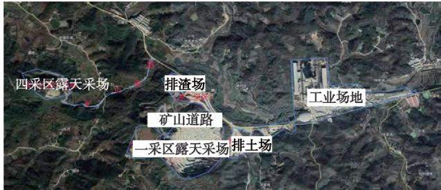
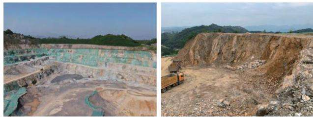
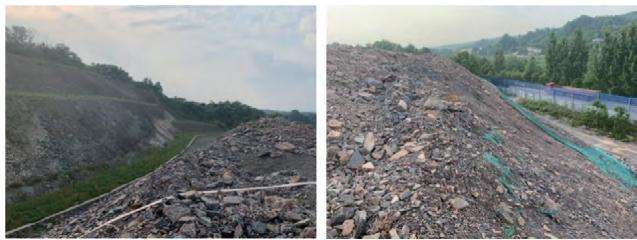
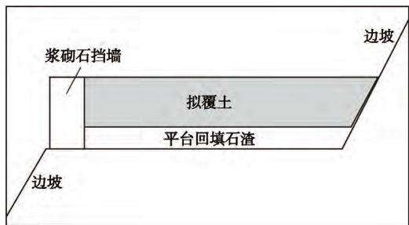
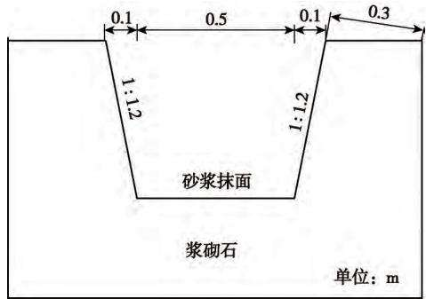
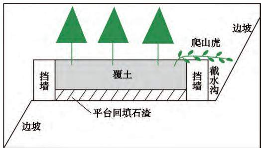
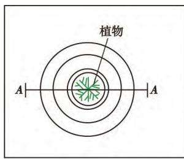
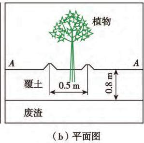
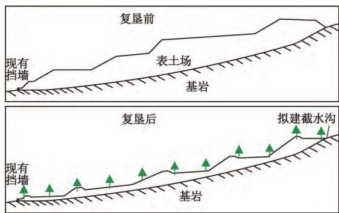

# 信阳市灵山坡水泥灰岩矿矿山生态环境修复治理研究

周小雨1，2，王少辉1，2，崔毅斌1，2

（1． 河南省地球物理空间信息研究院，河南 郑州　 450000； 2． 河南省地质物探工程技术研究中心，河南 郑州　 450000）

摘要：矿区为大型露天开采水泥灰岩矿，矿区面积290.38 hm2，通过调查，确定评估区面积为313.93hm2。 评估区内岩石完整坚硬，总体稳定性较好，区内现状评估地质灾害危险性小，预测露天采场引发、加剧崩塌、滑坡的可能性中等，危险性中等；采场整体挖损深度大于0.4 m，表土层全部破坏，地形地貌损毁程度为重度。 分析地质生态环境修复方法，首先清理危岩体，预计清除危岩体 3；其次采取废渣清理回填＋砌筑挡土墙＋平整废渣 ＋排水沟工程等工程手段修复地形地貌景观；最后通过露天采场土地复垦、废渣场土地复垦、矿山道路两侧绿化、地表堆土场复垦等工程进行矿区土地复垦。 以此缓解矿山开发与环境保护之间的矛盾，适应经济社会可持续发展的战略要求。

关键词：灵山坡水泥灰岩矿；地质环境特征；现状评估；生态环境修复

中图分类号：TD167

文献标志码：A

文章编号：1003 － 0506（2022）08 － 0032 － 06

# Research on ecological environment restoration measures of Linghillside limestone ore for cement in Xinyang City

Zhou Xiaoyu1，2 ，Wang Shaohui1，2 ，Cui Yibin1，2（1． Henan Institute of Geophysical and Spatial Information，Zhengzhou　 450000，China；2． Henan Province Geophysical Engineering Technology Research Center，Zhengzhou　 450000，China）

Abstract：The mining area is a large open⁃pit cement limestone mine with an area of 290. 38 hm2 ． Through the investigation，the evaluation area is determined to be 313. 93 hm2 ． The rock in the evaluation area is complete and hard，and the overall stability is good． The risk of geological disaster in the evaluation area is small，and the possibility of collapse and landslide triggered or aggravated by open⁃pit stope is medium and the risk is medium． The overall depth of the stope is ＞ 0. 4 m，and the topsoil is completely destroyed，and the degree of topographical and geomorphic damage is severe． The restoration method of geological ecological environment is discussed． First ly，dangerous rock mass is cleared，and 4 000 m3 is estimated to be cleared． Secondly，such engineering means as ＂ waste residue clearing and backfilling ＋ retaining wall laying ＋ leveling waste residue ＋ drainage ditch＂ were adopted to repair the topographic and geomorphic landscape． Finally，land reclamation in mining area is carried out through open⁃pit stope land reclamation，waste slag field land reclamation，afforestation on both sides of mine road，surface pile field reclamation and other projects，so as to alleviate the contradiction between mine development and environmental protection and adapt to the strategic requirements of sustainable economic and social development．

Keywords：Linghillside limestone ore；geological environment characteristics；restoration and improvement of the ecological environment

河南省信阳市浉河区灵山坡矿区水泥灰岩矿开 区面积 2. 903 8 km2，开采深度在标高 ＋ 273 ～ ＋ 105采矿种为水泥用石灰岩，生产规模206. 96 万 t／a，矿 m。 矿区内共提交了水泥用大理岩矿、建筑用花岗

岩矿 建筑用片麻岩矿和建筑用大理岩矿共 个矿种。 采用露天开采方式，公路开拓汽车运输方案，自上而下台阶式开采。 开采过程中，原有的地质环境条件遭受了极大破坏，坡壁和采场底部基岩大面积裸露 采场底部堆积着大量废石弃渣 区内植被受到严重破坏等［1］。 根据当地政府要求矿产资源开采的同时，进行生态系统修复，尽最大可能缓减矿山开发与环境保护之间的矛盾［2⁃4］。

本文通过地质环境综合调查，查明了矿山开采对周边环境影响的范围，确定了矿区地质环境评估面积，查明了矿山岩土体结构、水文地质条件，工程地质条件；地形地貌条件及破坏的严重程度；分析了现状地质灾害体的危险性，预测了地质灾害发生的可能性及危害程度；讨论了矿山生态环境修复治理方案［5⁃10］。 因地制宜地推进矿山生态地质环境综合治理，为矿山生态环境修复提供参考。

## 1　 矿区地质概况

矿区位于桐柏—大别复背斜带南翼，区内地层受区域构造的控制，为倒转层序，地层产状多变，小型褶皱、断裂构造较为发育。

矿区出露地层以上古元界肖家庙岩组二段地层为主，为一套副变质岩（变碎屑岩），大致分为四个岩性层，自下而上依次为：白云斜长片麻岩层，下部夹数层大理岩透镜体，是区内的次要含矿层；大理岩夹斜长角闪片麻岩层，该层厚度较大，分布范围较广，是区内主要含矿层；大理岩层，上部为薄层状白云质大理岩，该层厚度较小，出露范围有限，是区内的次要含矿层；斜长角闪片麻岩层，该层基本不含矿。

## 2　 工程地质条件

从矿区现有众多的开采工作面上可见其边坡角一般70°左右，高 10 ～20 m，仍较稳定；按照本矿床采用工业指标要求开采边坡为 55°，接近或小于现有工作面边坡角。 受个别不利结构面影响（倾向采场的节理裂隙面），局部可能会出现小方量基岩崩塌或滑坡。

矿区内的大理岩，矿石的结构为中粒—粗粒变晶结构，矿石构造以块状构造为主。 岩石坚硬完整，抗压强度高，颗粒固结紧密，颜色白色—灰白色，含有一定量夹石，稳固性好，有利于露天开采。 矿区内的角闪斜长片麻岩、白云斜长片麻岩和变粒岩，岩石较坚硬，较完整，抗压强度较高，局部因矿物成分变化而含软弱夹层及软弱结构面 总体稳定性较好矿区内的花岗岩，岩石较坚硬，较完整，抗压强度较高，总体稳定性较好［11］。

据矿体与围岩的组合关系分析，采场边坡采用55°边坡角为稳定边坡，对于顺层的边坡采用地层倾角为边坡角，稳定性良好，故露天开采的边坡稳定性较好［12］ 。

## 3　 矿区开采现状及环境影响评估

## 3. 1　 矿山现状

全矿区总的生产规模为 206.96 万 t／a，主要为露天开采，生产建设规模均为大型。 全矿区共划分为一采区、二采区、三采区、四采区4 个采区（图1）。其中，二、三采区采矿活动均已停止，已作为排渣场使用且已复垦复绿；一、四采区为该矿山目前生产采区，其中一采区已形成公路开拓汽车运输系统，采场内台阶高度为 15 m，目前已形成 145、160、175、190、205、215 m 共 6 个台阶，台阶坡面角为 70° ～ 75°；二采区已形成公路开拓汽车运输系统，采场内台阶高度为 15 m，目前已形成 205、215 m 共 2 个台阶，台阶坡面角为75°。

  
图1　 矿山开采现状影像  
Fig. 1　 Image of mining status

## 3.2　 矿区环境影响评估

## 3. 2. 1　 评估范围

根据矿山地质环境调查与开发建设方案，此次评估将矿区范围与矿区外工业场地作为评估区范围，矿区面积 $2 9 0 . 3 8 ~ \mathrm { \ h m } ^ { 2 }$ ， 工业场地面积 23. 55hm2，评估区面积 $3 1 3 . 9 3 ~ \mathrm { h m } ^ { 2 }$ 。 并将评估区场地类型划分为露天采场、预测露天采场、工业场地、临时表土堆场 临时废石场 废石场 矿山道路和评估区其他区，各区面积见表1。

表1　 评估区各场地面积

Tab. 1　 List of site areas in the evaluation area

<table><tr><td>评估区</td><td>现状面积/hm²</td><td>预测面积/hm²</td></tr><tr><td>露天采场</td><td>14.86</td><td>119.26</td></tr><tr><td>工业场地</td><td>23.55</td><td>23.55</td></tr><tr><td>临时表土堆场</td><td>1.58</td><td>2.29</td></tr><tr><td>废渣场</td><td>3.82</td><td>1.88</td></tr><tr><td>矿山道路</td><td>1.57</td><td>1.48</td></tr><tr><td>评估区其他区</td><td>268.55</td><td>165.47</td></tr><tr><td>合计</td><td>313.93</td><td>313.93</td></tr></table>

## 3.2.2　 矿山地质灾害危险性现状评估

通过野外调查及访问，评估区内现状条件下未发现崩塌、滑坡、泥石流、地裂缝、不稳定斜坡等地质灾害。 未发生因灾情引起的人员伤亡及经济损失，地质灾害危险性分级为小，现状条件下地质灾害对矿山地质环境影响较轻［13⁃15］。

## 3.2.3　 地形地貌景观破坏现状评估

（1）露天采场。 据现场调查，一采区露天采场位于工业场地的西南部，露天采场呈椭圆形长轴长484 m，采场边坡高度可达 87. 3 m，坡度约 75°，规模大，破坏面积为 $1 4 . 8 3 ~ \mathrm { h m } ^ { 2 }$ ，每个平台边坡高度为15m，平台宽度为 4 m，边坡角为 70°，边坡为逆向坡，稳定性较好。 四采区露天采场位于矿区的西部，破坏面积为 $3 . 2 9 \ \mathrm { h m } ^ { 2 }$ ，露天采场呈不规则状长222 m，宽146 m，采场边坡高度32 m，坡度约70°，边坡岩石部分地段较破碎，其稳定性差。 采场整体挖损深度大于 0. 4 m，表土层全部破坏，土地损毁程度为重度［16］ ，如图 2 所示。

  
图2　 矿区地形地貌破坏现状  
Fig. 2　 Damage status of landform in mining area

（2）表土堆场。 位于一采区东北角，主要用于表层土剥离时的表土堆放，表土堆场长260 m，宽70 ～160 m，表土厚度可达8 m，局部含少量碎石，占地面积为 $1 . 5 8 ~ \mathrm { h m } ^ { 2 }$ ，压占时间大于5 年。 地表原植被主要是灌木与杂草，全部压占，土地损毁程度为重度［16］ 。

（3）临时排渣场。 位于二采区采坑内，二采区目前不再开采，现场已形成坑深 15 m，长度 286 m，宽度213 m，破坏面积为 $3 . 8 2 ~ \mathrm { h m } ^ { 2 }$ ，压占时间已经大于 年 地表主要是含碎石黏性土 地表原植被主要是灌木与杂草，林地区域表土层厚度一般 0. 4 ～1.5 m，全部压实板结，土地损毁程度为重度［17］，如图3 所示。

  
图3　 排渣场占压土地类型  
Fig. 3　 Type of land occupied by slag dumping site

（4）工业场地。 位于矿区的东北侧，占地面积为 $2 3 . 5 5 \ \mathrm { h m } ^ { 2 }$ ，主要用于办公、住宿、产品加工等。土地损毁方式主要为压占，压占时间已经大于5 年，表土层厚度可达 1.0 ～3.0 m，地表全部压实板结，土地损毁程度为重度［17］。

（5）矿山道路。 矿山目前有 2 条矿山运输道路，一条用于一采区运输使用，长约4 km，宽约4 m；一条用于四采区运输使用，长约459 m，占地面积为1.57 hm2。 道路内侧切坡较少，损毁方式主要是压占，压占时间已经大于 5 年。 地表原植被主要是灌木与杂草，林地区域表土层厚度一般 0.4 ～1. 5 m，全部压实板结，土地损毁程度为重度［16］。

## 4　 矿山生态环境修复讨论

## 4.1　 地质灾害防治

地质灾害防治主要是进行危岩体清除，防治崩塌灾害。 为保证坡面上岩石完整性，避免增加裂隙，采用风镐开挖石方方式削坡清理危岩体 削坡后边坡角要小于开发利用方案设计坡角 70°，不能有松动岩石。 清除方式采用风镐开挖，产生石渣修建挡土墙利用。 预计清除危岩体4 000 m3。

（1）当台阶工作线临近最终边坡时，进行预裂控制爆破，确保最终台阶坡面及边帮岩石的完整性与稳定。 遵循“采剥并举、剥离先行”的原则，禁止一面墙式开采及掏底开采

（2）在开采过程中，定期检查边坡，不稳定地段在暴雨过后及时检查，发现工作面有裂痕，或者在坡面上有浮石、危石可能塌落时，及时清理。 对裂隙带附近，要特别引起重视，发现问题及时处理。

（3）矿区内已形成的高陡边坡在矿山开采前进行削坡处理，撬除危岩。

（4）开采境界周围 2 m 范围内，清除可能危及人员安全的不稳定岩石等，边界上覆盖的松散岩石层厚度超过2 m 时，对其进行削坡至70°。

## 4.2　 地形地貌景观修复

## 4.2.1　 露天采场治理工程

（1）废渣清理回填。 采场周边临时堆放的废渣，占压土地，破坏地形地貌景观，引发水土流失。针对治理区废渣分布和现状地势，对废渣进行部分清理，清理废渣 7 600 m3。 同时充分利用区内现有土壤资源，剥离表土集中存放，留作生物工程用土；不足部分按指定区域挖运与生态恢复［18］。

（2）砌筑挡土墙。 沿各平台外侧边缘与内侧边坡脚砌筑浆砌石挡墙，挡墙横断面为矩形。 岩石平台上挡墙高度1. 0 m，宽度 0. 6 m，基础落在平台基岩上，外侧挡墙距离平台外缘 0.2 m。 内侧挡墙距离边坡脚0.3 m，与边坡共同构成排水沟，使雨水沿沟流向平台两端后，沿山坡自然流出。 岩石平台与边坡治理断面如图4 所示。

  
图4　 岩石平台与边坡治理剖面  
Fig. 4　 Treatment section of rock platform slope

挡土墙材料为 M10 浆砌片石，片石极限抗压强度不低于50 MPa，间隔 5 m 设置 1 道伸缩缝，伸缩缝宽度2 cm，墙后不设反滤层。 平台内侧挡墙墙脚间隔10 m 留边长 10 cm 的正方形泄水孔。 根据挡墙长度与断面积计算共需要浆砌石挡墙10 551 m3。

（3）平整废渣。 采坑底部平台105 m，后期将作为废渣场，回填高度为120 m，回填废渣后对废渣进行平整，表面起伏小于 15 cm。 平整方式利用挖掘机挖高填低，并刮平，根据回填废渣量估算，预计需要机械平整废渣 8 485 m3。

（4）排水沟工程。 在采场台阶平台和底部平台120 m 四周设置排水沟，汇水面积为0. 40 km2；排水沟断面为梯形，与道路两侧修建，断面尺寸为顶宽

0. 7 m，底宽 0. 5 m，深 0. 5 m，沟壁厚 0. 3 m，过水断面面积 2 排水沟采用 浆砌石砌筑 沿长度方向每隔15 ～20 m 或地层变化处设置一道变形缝。 变形缝从顶到底贯穿整个排水渠，缝宽 2 ～ 3cm，缝内用沥青麻筋或沥青木板堵塞即可，如图 5所示。

  
图5　 梯形排水沟  
Fig. 5　 Trapezoidal drain

## 4. 2. 2　 工业场地治理工程

对工业场地内简易房屋进行拆除，拆除清理建筑物后 就可以直接实施复垦工程 需要机械拆除房屋 2 对产生的混凝土废渣 直接运往采场回填低洼处，预计需要汽车清运废渣 $1 \ 2 0 0 \ \mathrm { m } ^ { 3 }$ ，运距 300 m。

## 4.2.3　 废渣场治理工程

（1）砌筑挡渣墙。 沿平台外侧边缘砌筑浆砌石挡墙，挡墙横断面为矩形。 挡墙高度1.8 m（拟回填废渣0. 5 m 与覆土厚度0. 8 m），宽度0. 6 m，基础埋深0.5 m。 挡墙材料为 M10 浆砌片石，片石极限抗压强度不低于50 MPa，间隔 5 m 设置 1 道伸缩缝，伸缩缝宽度2 cm，墙后不设反滤层。 预计修建浆砌石挡墙 120 m，根据挡墙长度与断面积计算需要浆砌石挡墙 163. 8 m3。

（2）平整废渣。 对废渣进行平整，表面起伏应小于15 cm。 平整方式为利用挖掘机挖高填低，并刮平，根据回填废渣量估算，预计需要机械平整挖废渣 1 120 m3。

## 4. 2. 4　 修筑道路

为方便植物管护与农业生产，需要留设道路，因此在露天采场各平台与边坡上部分区域修筑道路与采场周边道路连通，方便生产通行，道路宽 3 m，混凝土路面厚0. 20 m，碎石路基厚0. 30 m。 需要修筑长度约 100 m。

## 4.3　 矿区土地复垦

## 4.3.1　 露天采场土地复垦

拟开采场范围内可剥离表土面积为 104.43 万$\mathbf { m } ^ { 2 }$ ，土壤厚度 0. 6 ～ 2. 5 m，预计可以剥离 93. 99 万m2，表土 $7 5 1 9 2 0 \ \mathrm { m } ^ { 3 } .$ 。 为了促进植物根系生长，在平台上部先铺垫厚 0. 4 m 碎石土再覆土 0. 6 m，可利用治理区废渣，覆土方量 $6 4 8 \ 0 6 0 \ \mathrm { ~ m ~ } ^ { 3 }$ 。 对采场平台与渣土边坡栽植侧柏。 侧柏胸径2. 0 cm 左右，带土球，坑穴为圆形，直径 0. 5 m，深度 0. 5 m，株行距$2 . 0 \ \mathrm { m } \times 2 . 0 \ \mathrm { m } _ { \odot }$ 株行距 $2 . 0 \mathrm { ~ m ~ } \times 2 . 0 \mathrm { ~ m } { - 2 . 5 \mathrm { ~ m ~ } \times }$ 2.5 m 交叉种植。 根据植树场地面积与栽植密度计算，预计需栽植侧柏27 775 株，茶树采用株行距3. 0$\mathrm { m } \times 3 . 0 \mathrm { ~ m }$ ，茶树98 057 株。 沿各平台内侧边坡脚栽植1 行爬山虎绿化边坡，地径约1 cm，坑穴规格0. 3m ×0. 3 m，需栽植爬山虎 78 033 株，如图 6 所示。

  
图6　 采场台阶绿化剖面  
Fig. 6　 Section of stope steps greening

## 4.3.2　 废渣场土地复垦

废渣场复垦单元面积为 $1 . 8 8 ~ \mathrm { h m } ^ { 2 }$ ，复垦方向为有林地。 废渣回填平整后，场地平坦，可以直接实施复垦工程，需要覆土 $1 1 \ 2 8 0 \ \mathrm { m } ^ { 3 }$ 。 栽植侧柏，侧柏胸径 2. 0 cm 左右，带土球，坑穴为圆形，直径 0. 5 m，深度 0. 5 m，株行距 $2 . 0 \ \mathrm { m } \times 2 . 0 \ \mathrm { m } _ { \odot }$ 。 共需栽植侧柏4 700 株，如图 7 所示。

  
图7　 植树平面及剖面  
Fig. 7　 Plane⁃planting and section drawing

## 4.3.3　 矿山道路两侧绿化

矿山道路复垦单元面积为 1.48 hm2，复垦方向为农村道路。 覆土量为 0.22 m3／穴，需要覆土 22m3。 道路两侧土层厚度大于 0.6 m，可以直接栽植侧柏绿化。 侧柏胸径为 2 cm，带土球，植树坑穴规格为 0. 6 m × 0. 6 m，株距为 2. 0 m，共需栽植侧柏100 株。

## 4. 3. 4　 表土堆场复垦

表土堆场复垦单元面积为 $2 . 2 9 \ \mathrm { h m } ^ { 2 }$ ，复垦方向为有林地。 表土堆场下方已经设置浆砌石挡墙，可以直接利用，环境治理工程中也已经布置截水沟工程，其他各场地取土后，剩余表土厚度大于 1.0 m，取土后保持场地平缓，可以直接复垦绿化，因此仅部署临时复绿土壤防护、植树绿化工程即可。 表土堆场复垦前后对比如图8 所示。

  
图8　 表土堆场复垦前后对比  
Fig. 8　 Comparison of topsoil yard before and after reclamation

## 5　 效益分析

通过矿区边坡整治、危岩清理、回填平整、道路工程、排水和绿化工程的实施可减少地质灾害的发生及生态地貌的破坏、 提高土地利用率、 美化环境，减少因矿渣堆放等引起的扬尘，避免堆积物氧化造成大气质量恶化，有效地改善治理区环境现状。进一步改善当地居民的生产生活条件、提高土地利用率和农业生产效率。 同时，有助于缓解矿业开发与环境保护之间的矛盾，适应经济社会可持续发展的战略要求。

## 6　 结语

通过对矿区地质环境现状调查 查明了矿山地质环境现状以及存在的地质环境问题，开展矿山地质环境影响的评估，讨论地质环境恢复治理方法，采取措施开展生态地质环境治理 得出以下认识

（1）该矿山地质环境影响评估区面积为313. 93hm2，评估区重要程度为重要，矿山生产建设规模为大型 地质环境条件复杂程度为复杂 矿山地质环境影响评估级别确定为一级，地质灾害危险性评估级别为一级。

（2）经矿山地质环境现状评估，一采区露天场、四采区露天场、临时表土堆场、临时废渣场为矿山地质环境影响严重区；工业场地、矿山道路为矿山地质环境影响较严重区；已复垦区、其他区矿山地质环境影响较轻区。

（3）区内现状评估地质灾害危险性小。 预测评估地质灾害认为：预测露天采场引发、加剧崩塌、滑坡的可能性中等，危险性中等；临时表土堆场、临时废渣场引发崩塌、滑坡、泥石流的可能性中等，危险性中等，加剧崩塌、滑坡、泥石流的可能性小，危险性小；工业场地、矿山道路、已复垦区、评估区其他区引发、加剧崩塌、滑坡、泥石流的可能性小，危险性小；矿山工程遭受崩塌、滑坡、泥石流的可能性小，危险性小。

矿山地质环境保护与治理工程主要是清理危岩体、修建挡墙、截水沟、拆除清运建筑物、回填平整废渣、修建采场内农村道路等，对地质灾害、地形地貌景观破坏与水土污染情况进行监测。 复垦工程主要是表土剥离、覆土、绿化、管护等。

## 参考文献（References） ：

［1］　 周亚光． 玉皇全采石场建筑石料用灰岩矿矿山地质环境治理工程设计［J］． 能源与环保，2020，42（9）：45⁃49．Zhou Yaguang． Design of the mine geological environment treat⁃ment project for limestone mines used for building stones in Yu⁃huangquan Quarry ［ J］ ． China Energy and Environmental Protec⁃tion，2020，42（9）：45⁃49．

［2］　 徐步元． 甘肃省矿山地质生态环境恢复治理对策研究［ D］． 兰州：兰州大学，2008

［3］　 温久川． 矿区生态环境问题及生态恢复研究［ D］． 呼和浩特：内蒙古大学，2012

［4］　 张闯，刘世冲，尚晓雨． 山西省某县矿山生态环境恢复治理总体规划研究［J］． 地质灾害与环境保护，2020，31（2）：106⁃110．Zhang Chuang，Liu Shichong， Shang Xiaoyu． Study on the overallplanning of mine ecological environment restoration and manage⁃ment in a county of Shanxi Province［ J］ ． Geological Hazards andEnvironmental Protection，2020，31（2）：106⁃110．

［5］　 马世斌，李生辉，安萍，等． 青海省聚乎更煤矿区矿山地质环境

遥感监测及质量评价［ J］． 国土资源遥感，2015，27 （2）：139⁃145．Ma Shibin，Li Shenghui，An Ping，et al． Remote sensing monitoringand quality evaluation for the mine geological environment of theJuhugeng coal mining area in Qinghai Province［ J］ ． Remote Sens⁃ing For Land ＆ Resources，2015，27（2）：139⁃145．

［6］　 李永红，姚超伟，程晓露，等． 神府煤矿区矿山地质环境问题及恢复治理探讨———以赵家梁煤矿为例［J］． 资源与产业，2014，16（6）：112⁃117．Li Yonghong，Yao Chaowei，Cheng Xiaolu，et al． A case study onZhaojialiang Coal Mine：geologically environmental issues and res⁃toration in Shenfu Coal Mine［ J］ ． Resources ＆ Industries，2014，16（6）：112⁃117．

［7］　 陈龙，柴波，梁敏，等． 湖北黄梅马尾山铁矿废弃地恢复的工程学研究［J］． 环境工程学报，2017，11（3）：1966⁃1974．Chen Long，Chai Bo，Liang Min，et al． Engineering study on recla⁃mation of Maweishan iron mine slag wasteland in Huangmei，Hu⁃bei， China ［ J ］ ． Chinese Journal of Environmental Engineering，2017，11（3） ：1966⁃1974．

［8］　 武乐霞． 矿山地质环境治理工程技术研究［J］． 能源与环保，2020，42（4）：46⁃51．Wu Yuexia． Study on engineering technology of mine geological en⁃vironment control ［ J ］ ． China Energy and Environmental Protec⁃tion，2020，42（4）：46⁃51．

［9］　 田安家，杜琴瑶，刘格升，等． 矿山地质环境治理与土地复垦可行性分析［J］． 能源与环保，2021，43（4）：1⁃7，14．Tian Anjia，Du Qinyao，Liu Gesheng，et al． Feasibility analysis ofmine geological environment control and land reclamation［ J］ ． Chi⁃na Energy and Environmental Protection，2021，43（4）：1⁃7，14．

［10］ 孟瑞娜． 某矿山地质环境恢复与治理工程施工勘查［J］． 西部探矿工程，2014，26（6）：145⁃147．Meng Ruina． Construction survey of a mine geological environmentrestoration and treatment project［ J］ ． West⁃China Exploration En⁃gineering，2014，26（6）：145⁃147．

［11］ 贾晗，刘军省，殷显阳，等． 安徽铜陵硫铁矿集中开采区矿山地质环境评价研究［J］． 地学前缘，2021，28（4）：131⁃141．Ja Han，Liu Junxing，Yin Xianyang，et al． Ecological evaluation ofthe Tongling pyrite mining district in Anhui Province ［ J］ ． EarthScience Frontiers，2021，28（4）：131⁃141．

［12］ 何芳，徐友宁，乔冈，等． 中国矿山地质灾害分布特征［J］． 地质通报，2012，31（2／3）：476⁃485．He Fang，Xu Youning，Qiao Gang，et al． Distribution characteristicsof mine geological hazards in China ［ J ］ ． Geological Bulletin ofChina，2012，31（2／3）：476⁃485．

［13］ 范立民，马雄德，李永红，等． 西部高强度采煤区矿山地质灾害现状与防控技术［J］． 煤炭学报，2017，42（2）：276⁃285．Fan Limin， Ma Xiongde， Li Yonghong， et al． Geological disastersand control technology in high intensity mining area of westernChina［J］． Journal of China Coal Society，2017，42（2）：276⁃285．

（下转第 49 页）

effect of newly restored wetland on water quality of coastal water［ J］． China Water ＆ Wastewater，2021，37（3） ：65⁃68，73．

［16］ 魏强，席增雷，苏寒云，等． 曹妃甸滨海湿地生态系统支持服务价值空间分异研究［J］． 地理科学，2021，41（5）：890⁃899Wei Qiang，Xi Zenglei，Su Hanyun，et al． Spatial differentiation ofsupporting service value of coastal wetland ecosystem in the Caofei⁃dian district of Tangshan in Hebei Province ［ J ］ ． Scientia Geo⁃graphica Sinica，2021，41（5） ：890⁃899．

黄建涛 郑伟 万年新 等 近 年来莱州湾滨海湿地景观格局变化特征研究［J］． 海洋科学，2021，45（2）：76⁃90．Huang Jiantao，Zheng Wei，Wan Nianxin，et al． Characteristics ofchanges occurring in the landscape patterns in the coastal wetlandsof the Laizhou Bay in the last 30 years ［ J ］ ． Marine Sciences，2021，45（2）：76⁃90．

［18］ 吴双，王晗，李倩倩，等． 黄河下游滩区园林植物设计及生态修复研究———以河南省长垣市黄河滩区为例［J］． 江苏农业科学，2021，49（8）：141⁃148，157．

## （上接第 37 页）

［14］ 张小连，张文炤，武成周，等． 矿山地质环境治理工程技术［J］能源与环保，2020，42（10）：1⁃6．Zhang Xiaolian，Zhang Wenzhao，Wu Chengzhou，et al． Mine geo⁃logical environment treatment engineering technology ［ J ］ ． ChinaEnergy and Environmental Protection，2020，42（10）：1⁃6．

［15］ 王小利，张志辉． 铝土矿矿山地质环境恢复治理工程设计［J］．能源与环保，2021，43（4）：8⁃14．Wang Xiaoli，Zhang Zhihui． Engineering design for restoration andtreatment of geological environment of bauxite mine［ J］ ． China En⁃ergy and Environmental Protection，2021，43（4） ：8⁃14．

［16］ 卫华鹏，李文彬． 矿井隐蔽致灾地质因素及防治措施分析［ J］．能源与环保，2019，41（11） ：28⁃30，35．Wei Huapeng，Li Wenbin． Analysis on geological factors and pre⁃

## （上接第 42 页）

［11］ 褚加计，朱洪生，陈广东，等． 河南省矿山地质环境问题现状及发展趋势分析［J］． 农业经济与科技，2016，27（16）：1⁃3．Chu Jiaji，Zhu Hongsheng，Chen Guangdong，et al． Analysis on thecurrent situation and development trend of mine geological environ⁃ment problems in Henan Province［ J］ ． Agricultural Economy andScience Technology，2016，27（16） ：1⁃3．

［12］ 武乐霞． 矿山地质环境治理工程技术研究［J］． 能源与环保，2020，42（4）：46⁃51Wu Yuexia． Study on engineering technology of mine geological en⁃vironment control ［ J ］ ． China Energy and Environmental Protec⁃tion，2020，42（4）：46⁃51．

［13］ 田安家，杜琴瑶，刘格升，等． 矿山地质环境治理与土地复垦可行性分析［ J］． 能源与环保，2021，43（4） ：1⁃7，14．Tian Anjia，Du Qinyao，Liu Gesheng，et al． Feasibility analysis of

Wu Shuang， Wang Han， Li Qianqian， et al． Research on gardenplant design and ecological restoration in the lower Yellow Riverfloodplain：taking the Yellow River floodplain in Changyuan City，Henan Province as an example［ J］ ． Jiangsu Agricultural Sciences，2021，49（8）：141⁃148，157．

［19］ 孙姝博，孙虎，徐崟尧，等． 运城黄河湿地景观空间格局变化及其驱动因素［J］． 水生态学杂志，2021，42（1）：17⁃25．Sun Shubo，Sun Hu，Xu Yinyao，et al． Analysis of landscape pat⁃tern changes and driving forces in the Yellow River Wetland ofYuncheng City［J］． Journal of Hydroecology，2021，42（1）：17⁃25．

［20］ 鲁宏旺，胡文敏，佘济云，等． 生态退杨对洞庭湖湿地景观格局变化影响研究［J］． 南京林业大学学报（自然科学版），2020，44（3）：171⁃178．Lu Hongwang，Hu Wenmin，She Jiyun，et al． Study on the influenceof ecological poplar withdrawal on the landscape pattern ofDongting Lake wetland［ J］ ． Journal of Nanjing Forestry University（Natural Science Edition），2020，44（3）：171⁃178．

vention measures of mine concealed disaster［ J］ ． China Energy andEnvironmental Protection，2019，41（11） ：28⁃30，35．

［17］ 韩琳琳，张华，范旭光，等． 矿山地质环境治理与土地复垦工程设计研究［J］． 能源与环保，2021，43（4）：30⁃36Han Linlin，Zhang Hua，Fan Xuguang，et al． Study on mine geological environment control and design of land reclamation engineering［ J］ ． China Energy and Environmental Protection，2021，43 （ 4 ） ：30⁃36．

苏文韬 胡伟 牛耀岚 能源利用 环境保护与社会可持续发展探讨［J］． 能源与环保，2019，41（7）：133⁃137．Su Wentao， Hu Wei， Niu Yaolan． Discussions on energy utilization，environmental protection and sustainable social development［J］． China Energy and Environmental Protection，2019，41 （7 ）：133⁃137．

mine geological environment control and land reclamation［ J］ ． China Energy and Environmental Protection，2021，43（4） ：1⁃7，14

［14］ 肖家乐，徐家杰，薛鲲． 鹤壁市誉达灰岩矿山地质环境影响评估与恢复治理［J］． 能源与环保，2022，44（2）：97⁃101．Xiao Jiale， Xu Jiajie， Xue Kun． Geological environmental impactassessment and restoration treatment of Yuda limestone Mine inHebi City［ J］ ． China Energy and Environmental Protection，2022，44（2） ：97⁃101．

［15］ 韩琳琳，张华，范旭光，等． 矿山地质环境治理与土地复垦工程设计研究［J］． 能源与环保，2021，43（4）：30⁃36．Han Linlin，Zhang Hua，Fan Xuguang，et al． Study on mine geolog⁃ical environment control and design of land reclamation engineering［J］． China Energy and Environmental Protection，2021，43 （4 ）：30⁃36．