文章编号：1004-4051（2024）11-0077-09

DOI：10.12075/j.issn.1004-4051.20241144

# 典型煤粮复合区采煤沉陷积水区域时空演变 特征与驱动力

陈　超1,2，卫志超1,2，王　果1,2，谢　瑞2，杨福芹2（1. 河南理工大学测绘与国土信息工程学院，河南 焦作 454000；2. 河南工程学院土木工程学院，河南 郑州 451191）

摘　要：采煤沉陷积水是高潜水位煤粮复合区的主要生态破坏特征，开展沉陷积水区域时空演变特征与驱动机制研究对于煤粮复合区水土资源优化配置与土地复垦具有重要意义。为揭示煤粮复合区采煤沉陷积水区域的时空演变特征与驱动机制，以典型煤粮复合区永城矿区为研究区，利用源自 Landsat图像的 1990—2020年中国 30 m分辨率土地覆盖数据，使用ArcGIS软件中的按掩膜提取和按属性提取等功能提取不同年份水体分布信息，对比分析不同年份永城矿区水体面积变化及空间分布信息，从而揭示永城矿区长时序采煤沉陷积水区域面积时空演变特征。基于煤炭开采沉陷过程，探讨开采沉陷与地下水位及地表积水的耦合关系，结合煤炭开采、降水量、地下水位等因素分析采煤沉陷积水区域时空演变的驱动机制。研究结果表明，1990—2020 年永城矿区水体面积增加 8.233 2 km2，其中，1990—2000 年变化幅度较小，2000年后煤炭井工开采沉陷累积效应显现，2000—2005年和 2010—2015年年均增长率较高，分别为12.821 3%和10.141 2%；积水区域扩张部分主要分布在永城矿区中部、西南部、东南部和东部；煤炭井工开采是水体面积增加的主要驱动力，决定了采煤沉陷区水域的空间分布范围和扩展方向；地下水位和降雨量则在一定程度上影响了采煤沉陷区水域分布范围；地质结构及生态修复工程促进了采煤沉陷区积水区域增加。通过研究典型采煤沉陷积水区域长时序演变特征及驱动机制，为高潜水位煤粮复合区土地资源可持续利用与生态修复提供科学依据。

关键词：煤粮复合区；采煤沉陷积水区域；时空演变；驱动力；生态修复中图分类号：TD-0；X87　　文献标识码：A

# Temporal and spatial evolution characteristics and driving forces of coal mining subsidence waterlogging area in typical overlapped area of coal-crop

CHEN Chao1,2，WEI Zhichao1,2，WANG Guo1,2，XIE Rui2，YANG Fuqin2 （1. School of Surveying and Land Information Engineering，Henan Polytechnic University，Jiaozuo 454000，China； 2. College of Civil Engineering，Henan University of Engineering，Zhengzhou 451191，China）

Abstract： Coal mining subsidence waterlogging is the main ecological damage characteristic in overlapped area of coal-crop with high underground water level, it is of great significance to study the

temporal and spatial evolution characteristics and driving mechanism of mining subsidence waterlogging area for optimal allocation of water and soil resources and land reclamation in overlapped area of coal-crop. Aiming to reveal the temporal and spatial evolution characteristics and driving mechanism of the subsidence waterlogging area in the overlapped area of coal-crop, Yongcheng Mining Area, a typical overlapped area of coal-crop, is selected as the research area, and the functions of ArcGIS software such as mask extraction and attribute extraction are used to extract waterlogging distribution information using the 30 m resolution land cover data of China from 1990 to 2020 from Landsat images. The variation and spatial distribution of waterlogging area in Yongcheng Mining Area in different years are compared and analyzed, thus the long time series evolution characteristics of coal subsidence waterlogging area in Yongcheng Mining Area is revealed. Based on coal mining subsidence process, the coupling relationship between mining subsidence and groundwater level and surface waterlogging is discussed, and the driving mechanism of temporal and spatial evolution of coal subsidence waterlogging area in combination with factors such as coal mining, precipitation and groundwater level is analyzed. The results show that the water body area of Yongcheng Mining Area increased by 8.233 2 km2 from 1990 to 2020, and the variation range is small during the period of 1990- 2000, however, the mining subsidence accumulative effect appeared after 2000, and the average annual growth rates of 2000-2005 and 2010-2015 are 12.821 3% and 10.141 2%, respectively. The expansion part of the waterlogging area mainly distributes in the middle, southwest, southeast and east of Yongcheng Mining Area. Coal underground mining is the main driving force for the increase of waterlogging area, which determines the spatial distribution range and extension direction of waterlogging area in coal mining subsidence area. The groundwater level and rainfall affect the waterlogging area distribution range in the coal mining subsidence area to some extent. Geological structure and ecological restoration project promote the increase of waterlogging area in coal mining subsidence area. The long time series evolution characteristics and the analysis of driving factors of typical coal mining subsidence waterlogging area are comprehensively studied, which could provide scientific basis for the sustainable utilization of land resources and ecological restoration in the overlapped area of coal-crop with high underground water level.

Keywords：overlapped area of coal-crop； coal mining subsidence waterlogging area； temporal and spatial evolution；driving force；ecological restoration

## 0 引 言

煤炭是我国的主体能源，其中，85%以上煤炭资源来自井工开采，这不可避免造成土地破坏[1]。在我国中东部高潜水位煤粮复合区，煤炭井工开采往往导致地表塌陷积水，引起矿区景观格局发生改变并致使大量耕地损毁，严重威胁煤粮复合区高质量发展和国家粮食安全[2-3]。煤粮复合区承担着保障区域乃至国家能源安全与粮食安全的双重职责，开展土地复垦与生态修复是推动煤粮复合区生态保护与高质量发展的重要技术途径，而科学认识采煤沉陷区土地利用时空演变特征与驱动机制是有效开展土地复垦与生态修复的基础和前提，尤其是探明采煤沉陷积水区域范围与时空演变特征可为矿区生态修复提供基础数据支撑[4-5]。因此，如何揭示高潜水位煤粮复合区土地利用变化特别是采煤沉陷积水区域时空演变特征与驱动力已成为亟待解决的科学问题[6]。

近年来，遥感技术在数据、算法、算力方面的迅速发展推动了矿区水体监测研究的进步[7]。现有研究主要集中在采煤沉陷积水区扩展信息识别提取、水域扩展驱动力分析、积水区生态影响及治理等方面。如彭苏萍等[8] 较早利用多时相 TM图像提取煤矿区积水塌陷面积扩展变化信息，为淮南矿区积水塌陷区的监测治理和综合利用提供依据。赵艳辉等[9]以徐州市沛北矿区四期 SPOT-4/5影像为数据源，运用土地利用重要性指数、间隙度指数和分形维数三个指标，分析矿区水域空间变化特征；结合煤炭产量和粮食单产，分析塌陷水域空间扩展驱动因素及对耕地影响，发现煤炭开采是区域景观格局演变主要驱动因素，采煤沉陷改变了水域空间分布特征。毕卫华等[10] 以任楼煤矿塌陷积水区为例，基于建矿后五期 Landsat遥感影像，通过多光谱计算和主成分分析获取 RSEI指数，并提取北、东、南、西四个方向数据，发现采煤塌陷积水总体上对周边生态环境产生正面影响，影响强度随距离增加呈“凸型”抛物线变化，具有显著的方向性差异和年度变化特征，为深入认识采煤塌陷积水的生态影响提供了新思路。李晶等[11]以兖州煤田为研究区，采用基于阈值分割的改进的归一化差异水体指数法提取了研究区 1990—2014年的水体信息并分析其时空变化特征，该研究实现了煤矿区地表水体变化的动态监测，有助于定量评估煤炭开采的生态累积效应。杨光华等[12] 采用高分辨率遥感影像（RS）获取信息和地理信息系统（GIS）空间分析相结合的方法，利用土地利用现状图、矿井分布图、行政区划图和采煤塌陷地调查统计资料等相关数据，以人机交互式解译方式提取济宁市煤炭开采以来至 2009年采煤塌陷导致的积水耕地信息。HE 等[13-14]、赵艳玲等[15] 基于 Google Earth Engine 云平台，在缺乏采煤信息条件下，提出了一套集变化检测、机器学习等多种方法、从区域尺度自动提取采煤沉陷水体及其扰动信息的技术方案，构建了黄淮海平原中部地区采煤沉陷水体数据集，为采煤沉陷水体识别与提取提供新方案。崔琛[16] 采用三期 Landsat8OLI遥感影像对赵固二矿采煤沉陷积水区域动态变化特征进行监测，认为地下水埋深、开采工作面推进距离与地表积水范围变化具有较高相关性，其中，工作面推进距离是采煤沉陷区积水范围变化的主要影响因素。陆垂裕等[17] 借助水文推理和数值模拟分析，对淮南典型孤立采煤沉陷区地下水作用机制进行辨析，发现当地降水、蒸发水文条件是孤立沉陷区积水的控制性因素，而地下水补给作用相对较弱。付艳华等[18]、张瑞娅等[19]、杨光华等[20] 探讨了煤粮复合区采煤沉陷积水区形成原因及过程，阐述了煤粮复合区土地损毁现状并提出相关对策建议。分析认为，多时相遥感影像已应用于采煤沉陷积水区域扩展研究，但成本和精度及数据融合处理限制了进一步应用。此外，现有研究多基于单一时间点或少许年份监测来对比分析扩展格局，缺乏长时序尺度监测，监测时序不够精细。在驱动因素分析方面，侧重于开采沉陷过程或水文过程的单一视角分析，缺乏结合煤炭产量、降水量，以及开采沉陷过程与潜水位关系的耦合分析。

针对上述不足，本文以典型煤粮复合区——永城矿区为例，利用中国 30 m分辨率年度土地覆盖栅格数据集，揭示典型高潜水位煤粮复合区长时序采煤沉陷积水区域时空演变特征，基于煤炭开采沉陷过程，分析开采沉陷与地下水位及地表积水的耦合关系，结合煤炭开采、降水量、地下水位等因素阐明典型高潜水位煤粮复合区采煤沉陷积水区域时空演变驱动机制，以期为我国中东部高潜水位煤粮复合区土地复垦与生态修复提供科学参考。

## 1　研究区概况

永城市位于河南省东部（图 1），地处豫鲁苏皖四省接合部，位于黄河冲积平原北部，地理坐标为115°58′55″～116°37′48″E，33°42′54″～34°17′16″N，东 西 长约 60 km， 南 北 宽 约 50 km， 面 积为 2 020 km2，2022 年人口 168 万人，GDP 为 800.11 亿元。永城市地表水系发达，境内有王引河、沱河、浍河、包河等河流，皆为淮河流域洪泽湖水系，河流方向均由西北流向东南，至安徽省境内汇入淮河，各主要河流均有很多支流且大部分为季节性河流。永城矿区土壤肥沃，是我国重要粮油生产基地；地下潜水位高，为我国典型高潜水位矿区。

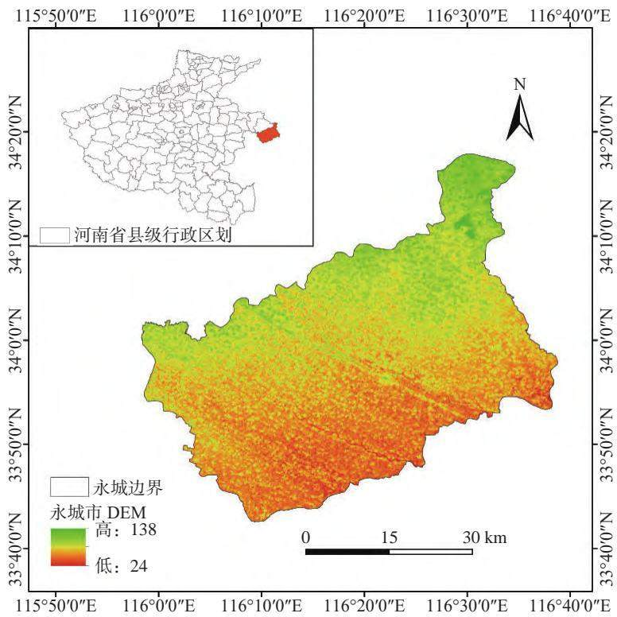  
图1　研究区地理位置  
Fig. 1 Geographical location of the research area

永城市煤矿资源丰富，煤层赋存稳定，主要可采煤层倾角平缓，适于机械化开采，地下煤炭分布面积1 328 km2，储量 63.9 亿 t，是全国六大无烟煤基地之一、全国七大煤化工基地之一，煤炭年产量超过2 300万t。永城矿区万吨塌陷率高达 0.457 hm2，而单煤层开采引起的地表万吨塌陷率超过 0.667 hm2。永城矿区岩层一般上覆较厚的松散层，该区域开采沉陷盆地具有典型厚松散层矿区地表移动变形特征，如下沉系数接近 1或大于 1（地表下沉值接近或大于采厚）、主要影响角正切值偏小，地表沉陷范围大，开采边界处水平移动值一般大于下沉值。区内煤炭资源由神火集团与永煤集团共同开发，其中，神火集团涉及四处煤矿，分别为葛店煤矿、新庄煤矿、薛湖煤矿、流河煤矿。永煤集团涉及五处煤矿，分别为陈四楼煤矿、车集煤矿、城郊煤矿、新桥煤矿、顺和煤矿。已有研究表明[21] 永城矿区属于煤粮复合区范畴，长期煤炭开采导致矿区出现采煤沉陷积水等地质环境问题，常年积水区域位于重要粮食生产区，严重威胁农业生产及粮食安全，由此引发的生态与社会问题制约了永城矿区生态保护与高质量发展。

## 2　数据来源与处理方法

## 2.1　数据来源

本文所用土地覆盖数据来源于中国30 m分辨率长时序土地覆被数据[22]，该数据集基于 GEE上所有可获得的 Landsat数据，构建时空特征，结合随机森林分类器得到分类结果，经包含时空滤波和逻辑推理的后处理方法进一步提高 CLCD（annual China LandCover Dataset）的时空一致性，总体精度达 80%。该数据集在持续更新（https://doi.org/10.5281/zenodo.5816591），广泛应用于土地利用变化研究，可信度较高。降水量数据来源于欧盟及欧洲中期天气预报中心等组织发布的 ERA5-Land数据集。煤炭产量数据来源于永城市统计局所统计的 1980—2020年历年原煤产量数据。

## 2.2　数据处理

1）降水量原始数据为逐月的平均降水栅格数据，首先，基于原始数据计算 12个月降水的平均值得到逐年的平均降水栅格数据；其次，对研究区内的栅格值求平均数，得到县级的逐年平均降水量，进而得到年降水量。

2）水体面积提取：首先，使用 ArcGIS软件提取掩膜所定义区域内的栅格像元；其次，提取永城市区域内呈现水体属性的像元，进而得到永城市水体分布栅格数据；最后，将单个像元的面积乘像元个数获取水体面积（图2）。

## 3　结果与分析

## 3.1　永城矿区水体面积时空演变特征

在时间变化方面，1990—2020年，永城矿区水体面 积 增加 8.233 2 km2。 其 中 ， 1990—1995 年 减 少0.165 6 km2， 年 均 变 化 率 −1.773 4%； 1995—2000 年 增加 0.584 1 km2， 年 均 变 化 率 5.871 2%； 2000—2005 年增加 1.948 5 km2， 年 均 变 化 率 12.821 3%； 2005—2010年 增加 0.932 4 km2， 年 均 变 化 率 4.001 4%； 2010—2015 年增加 3.249 9 km2，水域面积增加较大，年均变化率 10.141 2%；2015—2020 年增加 1.683 9 km2，年均变化率 3.687 3%。永城市及永城矿区历年水体面积变化情况如图3所示。

此外，本文对永城矿区水体面积增长率进一步分析，在观测期间，矿区水体面积负增长年份有1993—1994 年、2009 年、2010 年、2020 年，其余观测年为正增长年份，其中，2013年和 2003年增长率较高，分别为 22.01%、20.08%（图 4）。

在空间变化方面，1990—2000年，由于永城矿区范围煤炭开采强度较低，煤炭井工开采对地表的影响小，因而水域面积变化较小，大部分为占地表水系主要部分的持续水体，新增水体基本可忽略。2000年后，煤炭井工开采对地表的影响显现，产生积聚效应，永城矿区水体变化幅度增大，具体而言：① 2000—2005年，永城市中部和东部水体分布出现大面积增加，分别为陈四楼煤矿、葛店煤矿和新庄煤矿所在地，新庄煤矿、陈四楼煤矿分别于1995年、1997年投产，受采煤扰动影响后地表反应较快，从而形成新的水体分布。此外，由于地表水系受采煤扰动影响，较少部分地表也呈现水体分布减少现象（图 5（a））。② 2005—2010年，永城市中部和东部水域面积总体上保持增加，分析认为中部陈四楼煤矿地表减少的水体分布集中，增加的水体分布较为分散，而东部葛店煤矿和新庄煤矿增加的水体分布占主要部分（图5（b））。③ 2010—2015年，水体面积增加最多，由于城郊煤矿和车集煤矿开采活动波及地表，形成大面积采煤沉陷区，使得矿区地表积水严重，上述两煤矿位置分布如图 5（c）所示，其中，车集煤矿、城郊煤矿分别于

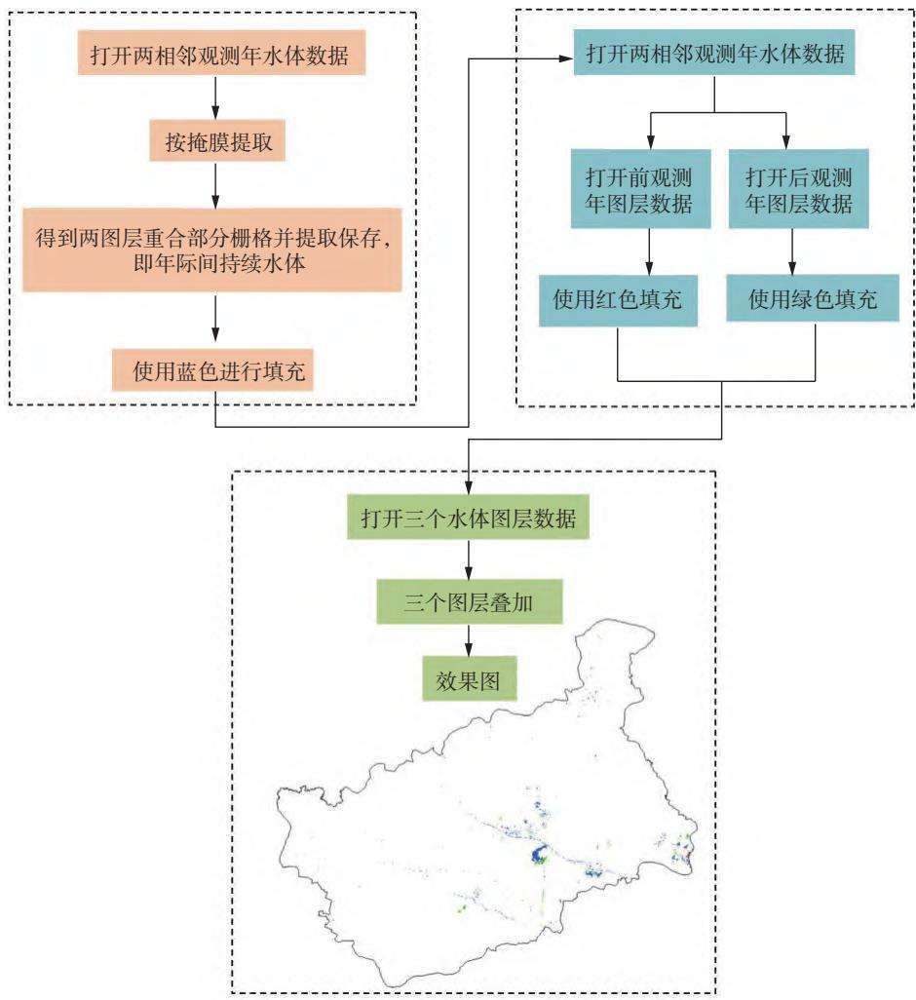  
图2　水体信息提取流程

Fig. 2 Flow of extracting water information  
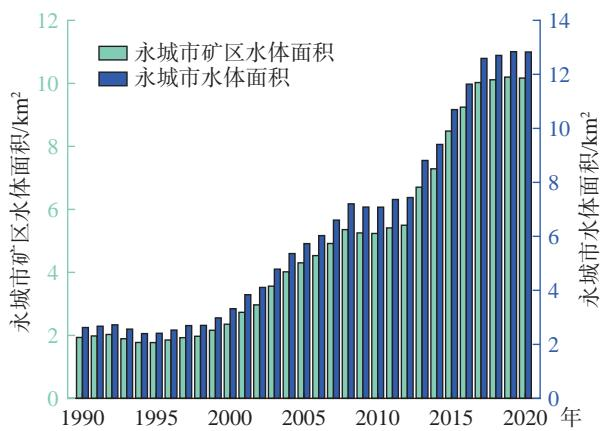  
图3　永城市及永城矿区历年水体面积  
Fig. 3 Water body area over the years of Yongcheng City and Yongcheng Mining Area

1999年、2003年投产。东部新庄煤矿及葛店煤矿所在地（两大煤矿相邻且葛店煤矿在左，新庄煤矿在右）水体分布五年内的变化较为复杂，增加的水体面积与减少的水体面积大致相当。④ 2015—2020年，水体面积趋于稳定，但水体面积整体仍处于上升阶段，陈四楼煤矿和城郊煤矿所在区域为永城市中部（两大煤矿相邻且陈四楼煤矿在北，城郊煤矿在南），车集煤矿位于永城市东南方向，两个区域持续水体面积占主要部分，增加的水体面积次之，减少的水体分布极少；新桥煤矿（2007年投产）位于永城市西南方向，观测期内水体分布变化较大，增加水体分布较多；

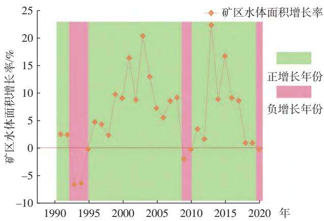  
图4　矿区水体面积增长率  
Fig. 4 Growth rate of water body area in the mining area

葛店煤矿水体分布变化趋于稳定，大部分水域为持续水体，而新庄煤矿水体分布变化复杂，增加水体的分布位于煤矿北部，减少水体的分布位于煤矿东部，持续水体分布主要位于煤矿中部与南部，上述矿区及水体分布如图 5（d）所示。分析认为水体面积扩展区域与研究时段永城矿区煤炭开采区域高度复合，表明煤炭开采主导了永城矿区水体面积扩展范围和方向，这也与我国中东部兖州矿区、两淮矿区相关研究 [8-9,11,15] 一 致 。

## 3.2　驱动力分析

## 3.2.1　煤矿区开采沉陷与地下水位及地表积水的耦合关系

煤炭井工开采不可避免地引起采空区上覆岩土体移动变形，导致地表大范围沉陷，地表形成开采沉陷盆地[23]。矿区原有地表水系和地下水系遭到破坏，降水和地表径流将汇集于沉陷盆地而难以排出。当地下水位比沉陷区水位高时，沉陷盆地与地下水产生水力联系，浅层地下水将作为水源越流、侧向补给沉陷区，形成积水。因此，大气降水、浅层地下水和地表径流是采煤沉陷积水的主要水源[18]。因而，在高潜水位矿区由于降雨、地下水补给等容易产生开采沉陷盆地积水（图 6）[24]，且随开采范围和采厚的增加而扩展、加深。当地表采煤沉陷范围持续扩展，积水区域相连成片出现大范围采煤沉陷积水区域[25]。在此过程中，井工开采顺序及采厚主导了采煤沉陷积水区域范围扩展方向和深度的发展，而地下水位与沉陷量的协同演进变化影响了采煤沉陷积水范围与深度，大气降水量则在一定程度上影响采煤沉陷积水分布范围。分析认为开采沉陷与地下水位及地表积水具有复杂的耦合关系，地下水位是前置地质条件，开采沉陷是直接驱动因素，而地表积水与地下水位具有一定互馈作用，三者构成了采煤沉陷积水区的联动体，这与陆垂裕等[17] 研究结果相符。

## 3.2.2　煤炭产量与水体面积相关性分析

根据永城市统计局原煤产量数据，统计永城矿区1980—2020年累计 40 a煤炭产量。在逐年产量方面，自 1990年开始，原煤年产量大幅增加，峰值产量为 2011 年的 2 111.5 万 t。自 2012 年原煤产量开始下降，在 2015年及以后维持在 1 500万 t/a左右。在累计产量方面，20世纪煤炭累计产量较低；煤炭行业在2003—2012年迎来“黄金十年”，煤炭累计产量迅速 增 长， 在 2020 年 达 到 32 179.31 万 t。 本 文 使 用Origin软件将累计产量与水体面积的相关性可视化处理，即将永城市原煤累计产量与观测年水体面积两个变量因素进行线性拟合，永城市原煤累计产量与观测年水体面积间的相关系数为 r＝0.984 6，显著性P＜0.01，呈现显性正相关（图7）。

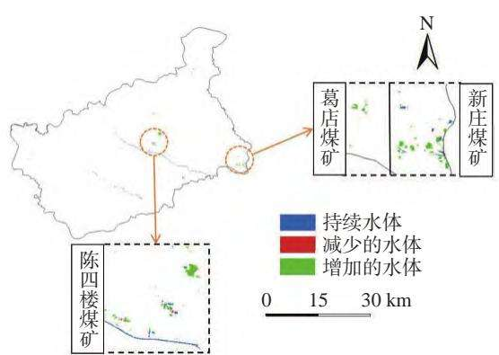  
（a） 2000—2005 年

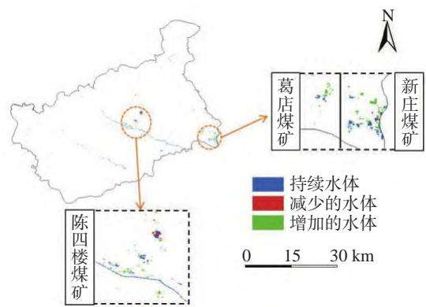  
（b） 2005—2010 年

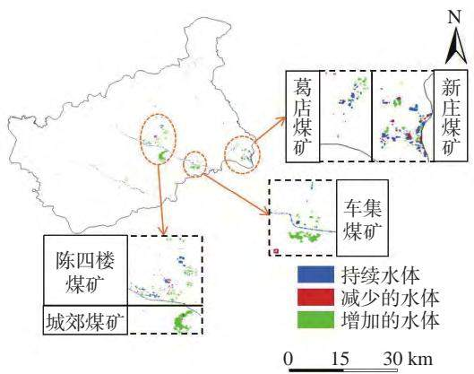  
（c） 2010—2015 年

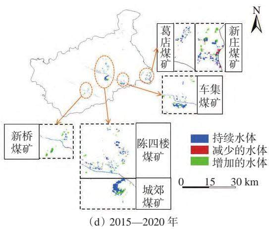  
图5　矿区水体面积空间变化  
Fig. 5 Spatial changes of the water body area in the mining area

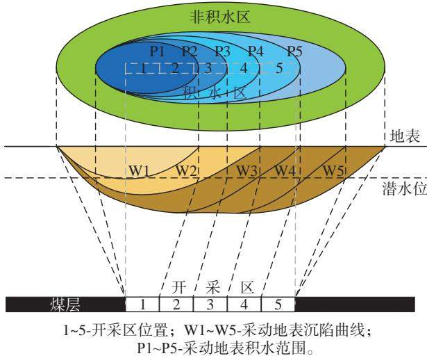  
图6　开采沉陷与地下水位及地表积水的关系  
Fig. 6 Relationship between mining subsidence and groundwater level and surface waterlogging （资料来源：文献 [24]）

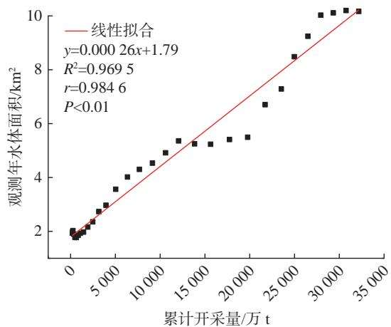  
图7　煤炭产量与水体面积相关性  
Fig. 7 Correlation between coal yield and water body area

由图 7可知，永城矿区煤炭产量与水体面积变化量具有高度相关性，两者具备显性正相关关系。永城矿区原煤产量的增加是引起水体面积变化的主要驱动因素，这表明煤炭井工开采直接驱动永城矿区水体面积变化。分析认为这与我国中东部煤粮复合区采矿地质条件紧密相关，永城矿区为典型高潜水位煤粮复合区，潜水位埋深小，而该区域具有煤层厚度大、可采煤层多、下沉系数大、松散层厚等特征[2,25-26]，煤炭井工开采引发地表大范围沉陷变形，当开采范围较大、开采煤层较多时，开采沉陷区域扩展相连，形成大范围采煤沉陷积水区域且积水深度较大。因而，持续水体面积也将增加，导致水体总面积持续稳定增加。这也与临近的徐州矿区[9]、两淮矿区 [8,10,13-14,17-18,25]、 兖 州 矿 区 [11] 相 关 研 究 相 符 。

## 3.2.3　降水量与水体面积相关性分析

本文统计永城市 1990—2020年降水量及年蒸发量，并将二者相减得出年净降水量。统计表明，2003 年，年降水量远高于平均值，为 1 505.608 4 mm，2001年和 2012年年降水量远低于平均值，分别为600.993 3 mm、593.905 0 mm。

本文使用 Origin软件将年际间平均年降水量与年际间变化水体面积的相关性进行可视化，计算得到年降水量与水体面积间的相关系数为 $r { = } { - } 0 . 3 1 4 \ 6 .$ 显著性 $P { > } 0 . 0 8 ;$ ；年蒸发量与水体面积间的相关系数$r = 0 . 2 2 5 9 .$ ，显著性 $P > 0 . 2 0 ;$ 年净降水量与水体面积间的相关系数为 $r = 0 . 3 2 6 { \mathrm { ~ 7 } } ,$ ，显著性 $P { > } 0 . 0 7 ,$ 。分析认为降水量与水体面积相关程度并不明显（图 8），拟合结果表明，降水量并非永城市水体面积变化的主要驱动因素，这是由于永城矿区地处北方，天然水体较少，因而降水量年际变化对研究区水体面积变化影响不显著，这也与李晶等[11] 在兖州矿区相关研究结果一致。

## 3.2.4　地质与生态修复因素分析

1）在地质构造方面，永城矿区位于秦岭-昆仑纬向构造带北支南侧东延部分，为新华夏系第二沉降带内之华北凹陷的一部分。此类地质构造条件使得该矿区岩层在受到采煤扰动影响时，更易发生形变。在近地表 50 m深度范围内，岩土体主要为第四系全新统河流相冲洪积层和上更新统河湖相冲积层，岩性主要为粉土、粉质黏土互层，并夹细砂、粉细砂层，属松软土工程地质区[26]，该类松软土层结构使矿区在受采煤扰动时，更易发生沉陷[27]。分析认为永城矿区地质构造使其容易发生大范围开采沉陷变形，加之潜水位较浅，导致地表大范围沉陷积水。

2）永城市政府高度重视采煤沉陷区水体治理工作，将其纳入城市可持续发展和生态环境保护的重要议程。在 2009年之前，永城市日月湖所在区域为城郊煤矿采煤沉陷区，永城市政府为解决采煤沉陷积水治理难题，规划建设“日月湖生态旅游景区”，形成 6 km2 的水面并蓄水 2 000万 m3。此外，永城市政府近年来逐步推进海绵城市建设，提高城市雨水排涝系统规划设计标准，按照排蓄并举原则，“工程治水”与“生态治水”相结合，源头减量与末端处理相结合，大力推行低生态影响开发建设模式，注重矿区经济发展与环境相协调[5]，建设渗、滞、蓄、净、用、排相结合的雨水收集利用设施。上述日月湖生态旅游景区与海绵城市建设对永城矿区水体面积增加具有重要推动作用。

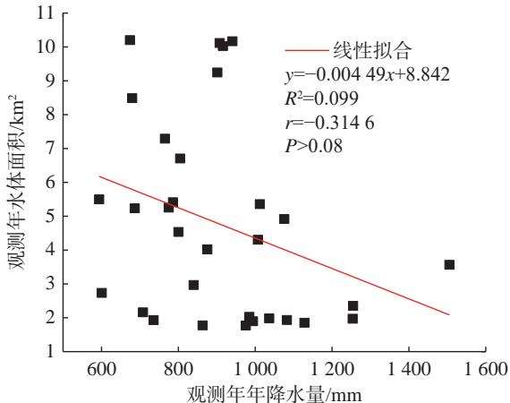  
（a）年降水量

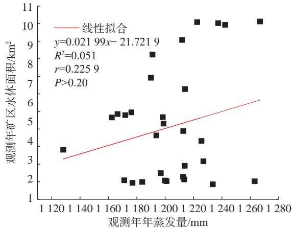  
（b）年蒸发量

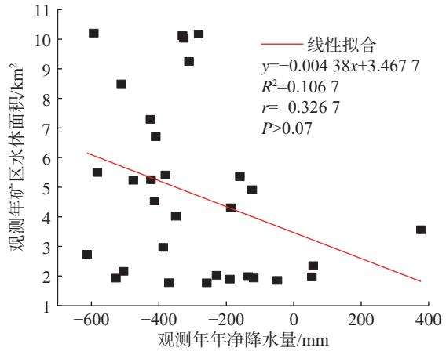  
（c）年净降水量  
图8　降水量与水体面积相关性  
Fig. 8 Correlation between precipitation and water body area

## 4　结　论

1）本文以典型煤粮复合区永城矿区为例，利用土地覆被数据提取 1990—2020年水体信息，揭示1990—2020年间水体面积时空演变特征。从时间变化上看，1990—2020年永城矿区水体面积整体呈现大幅上升趋势，1990—2000年变化幅度不大，2000年后增加幅度显著，共增加 8.233 2 km2。从空间分布上看，水体面积增加区域分别集中在永城市中部城郊煤矿、陈四楼煤矿，西南部新桥煤矿，东南部车集煤

矿和东部葛店、新庄煤矿。

2）永城矿区年际间变化的水域面积和年际间平均年降水量之间相关程度不明显；而永城市原煤累计产量与观测年水体面积间的相关系数为 r=0.984 6，结果呈显性正相关，表明煤炭开采是采煤沉陷水域面积增加的主要驱动力，煤炭开采沉陷累积效应对于水体面积增加起主要作用。

3）从开采沉陷视角揭示了开采沉陷与地下水位及地表积水的耦合关系，采矿顺序及采厚主导了采煤沉陷积水范围扩展方向和深度的发展，而地下水位与沉陷量的协同演进影响了采煤沉陷积水范围与深度的发展；永城矿区地质构造是水体面积增加的重要外在条件，采煤沉陷区生态重构、海绵城市建设等生态修复工程是水体面积增加的重要影响因素。

## 参考文献（References）：

胡振琪, 肖武, 赵艳玲. 再论煤矿区生态环境“边采边复”[J].［ 1 ］煤炭学报，2020，45（1）：351-359.HU Zhenqi, XIAO Wu, ZHAO Yanling. Re-discussion on coal mineeco-environment concurrent mining and reclamation[J]. Journal ofChina Coal Society，2020，45（1）：351-359.

李超, 崔瑞豪, 张曦, 等. 基于物元可拓法的高潜水位煤矿区土［ 2 ］地损毁程度评价[J]. 中国矿业，2024，33（1）：87-97.LI Chao, CUI Ruihao, ZHANG Xi, et al. Evaluation of land damagedegree in coal mining area with high groundwater level based on mat-ter element extension method[J]. China Mining Magazine， 2024，33（1）：87-97.

郭广礼, 李怀展, 查剑锋, 等. 平原煤粮主产复合区煤矿开采和［ 3 ］耕地保护协同发展研究现状及对策[J]. 煤炭科学技术，2023，51（1）：417-427.GUO Guangli, LI Huaizhan, ZHA Jianfeng, et al. Research status andcountermeasures of coordinated development of coal mining and culti-vated land protection in the plain coal-cropland overlapped areas[J].Coal Science and Technology，2023，51（1）：417-427.

梁宏伟. 地下开采煤矿区新增补充耕地与煤矿开采相互影响［ 4 ］ 分析: 以龙岩市某地下开采煤矿为例[J]. 中国矿业，2023， 32（12）：65-72. LIANG Hongwei. Analysis on the interaction between newly increased supplementary cultivated land and coal mining in underground coal mining area: a case study of underground coal mining in Longyan City[J]. China Mining Magazine，2023，32（12）：65-72.

李云鹏, 孔胃, 楚储, 等. 矿区生态系统演变与修复模式研［ 5 ］究[J]. 中国矿业，2023，32（1）：60-66.LI Yunpeng, KONG Wei, CHU Chu, et al. Study on the evolution andrestoration model of mining area ecosystem[J]. China Mining Maga-zine，2023，32（1）：60-66.

周金余, 李平, 张贺. 黄河流域煤矿生态修复技术研究现状及［ 6 ］展望[J]. 中国矿业，2021，30（7）：8-14.ZHOU Jinyu, LI Ping, ZHANG He. Research status and prospect ofecological restoration technology for coal mines in the Yellow RiverBasin[J]. China Mining Magazine，2021，30（7）：8-14.

［ 7 ］ 张成业, 李军, 雷少刚, 等. 矿区生态环境定量遥感监测研究进

展与展望[J]. 金属矿山，2022（3）：1-27.ZHANG Chengye, LI Jun, LEI Shaogang, et al. Progress and prospectof the quantitative remote sensing for monitoring the eco-environmentin mining area[J]. Metal Mine，2022（3）：1-27.

彭苏萍, 王磊, 孟召平, 等. 遥感技术在煤矿区积水塌陷动态监［ 8 ］测 中 的 应 用: 以 淮 南 矿 区 为 例 [J]. 煤 炭 学 报 ， 2002， 27（4）：374-378.PENG Suping, WANG Lei, MENG Zhaoping, et al. Monitoring theseeper subside in coal district by the remote sensing: examples fromHuainan Coal District[J]. Journal of China Coal Society，2002，27（4）：374-378.

赵艳辉, 赵华. 高潜水位矿区水域空间扩展特征分析: 以徐州［ 9 ］沛北矿区为例[J]. 中国矿业，2017，26（2）：95-98, 105.ZHAO Yanhui, ZHAO Hua. Waters spatial evolution of landscapepattern of underground mining area: a case study of in northern PeiCounty, Xuzhou City[J]. China Mining Magazine，2017，26（2）：95-98, 105.

毕卫华, 钱倬珺, 王辉, 等. 基于 RSEI 的采煤塌陷积水对生态环［10］境的影响研究[J]. 中国矿业，2021，30（12）：38-44.BI Weihua, QIAN Zhuojun, WANG Hui, et al. Study on the impact ofcoal mining subsidence ponding on ecological environment based onRSEI[J]. China Mining Magazine，2021，30（12）：38-44.

李晶, 申莹莹, 焦利鹏, 等. 基于 Landsat TM/ OLI 影像的兖州煤［11］田 水 域 面 积 动 态 监 测[J]. 农 业 工 程 学 报 ， 2017， 33（18）：243-250.LI Jing, SHEN Yingying, JIAO Lipeng, et al. Dynamic monitoring ofwater areas in Yanzhou Coalfield based on Landsat TM/ OLIimages[J]. Transactions of the Chinese Society of Agricultural Engineering，2017，33（18）：243-250.

杨光华, 胡振琪, 杨耀淇. 采煤塌陷积水耕地信息提取方法研［12］究: 以山东省济宁市为例[J]. 金属矿山，2013（9）：152-157.YANG Guanghua, HU Zhenqi, YANG Yaoqi. Information extractionof coal mining subsidence farmland submerged in water taking JiningCity of Shandong Province as a case[J]. Metal Mine， 2013（9）：152-157.

HE T T, XIAO W, ZHAO Y L, et al. Identification of waterlogging in［13］ Eastern China induced by mining subsidence: a case study of Google Earth Engine time-series analysis applied to the Huainan Coal Field[J]. Remote Sensing of Environment，2020，242：111742.

HE T T, XIAO W, ZHAO Y L, et al. Continues monitoring of subsi-［14］ dence water in mining area from the eastern plain in China from 1986 to 2018 using Landsat imagery and Google Earth Engine[J]. Journal of Cleaner Production，2021，279：123610.

赵艳玲, 丁宝亮, 何厅厅, 等. 基于 Google Earth Engine 的采煤沉［15］陷 水 体 方 向 变 化 自 动 识 别[J]. 煤 炭 学 报 ， 2022， 47（7）：2745-2755.ZHAO Yanling, DING Baoliang, HE Tingting, et al. Monitoring ofsubsidence water body change based on Google Earth Engine[J].Journal of China Coal Society，2022，47（7）：2745-2755.

崔琛. 采煤沉陷区积水范围动态变化遥感监测研究[J]. 地理空［16］间信息，2022，20（12）：100-103.CUI Chen. Remote sensing monitoring research on dynamic change ofwater covering range in mining subsidence area[J]. Geospatial Information，2022，20（12）：100-103.

陆垂裕, 陆春辉, 李慧, 等. 淮南采煤沉陷区积水过程地下水作［17］用机制[J]. 农业工程学报，2015，31（10）：122-131.

LU Chuiyu, LU Chunhui, LI Hui, et al. Groundwater influencing mechanism in water-ponding process of Huainan coal mining subsidence area[J]. Transactions of the Chinese Society of Agricultural Engineering，2015，31（10）：122-131.

付艳华, 胡振琪, 肖武, 等. 高潜水位煤矿区采煤沉陷湿地及其［18］生态治理[J]. 湿地科学，2016，14（5）：671-676.FU Yanhua, HU Zhenqi, XIAO Wu, et al. Subsidence wetlands in coalmining areas with high water level and their ecological restoration[J].Wetland Science，2016，14（5）：671-676.

张瑞娅, 邹勇, 吴云, 等. 采煤塌陷深积水区现状分析与治理对［19］策探讨[J]. 煤炭工程，2014，46（9）：73-75.ZHANG Ruiya, ZOU Yong, WU Yun, et al. Present status analysis ondeep water area of mining subsidence and discussion on control coun-termeasures[J]. Coal Engineering，2014，46（9）：73-75.

杨光华, 胡振琪, 赵艳玲, 等. 高潜水位采煤沉陷地复垦治理对［20］策研究[J]. 煤炭工程，2014，46（6）：91-95.YANG Guanghua, HU Zhenqi, ZHAO Yanling, et al. Proposals oncountermeasures of reclamation control in coal mining subsidenceland with high underground water level[J]. Coal Engineering，2014，46（6）：91-95.

HU Z Q, YANG G H, XIAO W, et al. Farmland damage and its im-［21］ pact on the overlapped areas of cropland and coal resources in the eastern plains of China[J]. Resources, Conservation and Recycling， 2014，86：1-8.

YANG J, HUANG X. The 30 m annual land cover dataset and its dy-［22］namics in China from 1990 to 2019[J]. Earth System Science Data，2021，13（8）：3907-3925.

孙庆先, 张勇, 陈清通, 等. 我国开采沉陷学 70 年研究综述及技［23］术展望[J]. 中国矿业，2024，33（3）：86-99.SUN Qingxian, ZHANG Yong, CHEN Qingtong, et al. 70 year re-view and technical outlook on mining subsidence research inChina[J]. China Mining Magazine，2024，33（3）：86-99.

胡振琪, 李根生, 袁冬竹. 东部煤粮复合区采煤沉陷地边采边［24］复时机[J]. 煤炭学报，2023，48（1）：373-387.HU Zhenqi, LI Gensheng, YUAN Dongzhu. Timing of concurrentmining and reclamation in coal-grain overlapping areas with mining-induced subsidence, Eastern China[J]. Journal of China Coal Society，2023，48（1）：373-387.

陈晓谢, 张文涛, 朱晓峻, 等. 高潜水位采煤沉陷区积水范围动［25］态演化规律[J]. 煤田地质与勘探，2020，48（2）：126-133.CHEN Xiaoxie, ZHANG Wentao, ZHU Xiaojun, et al. Dynamic evo-lution law of water accumulation range in coal mining subsidence areawith high-level groundwater[J]. Coal Geology & Exploration，2020，48（2）：126-133.

路东臣, 方士军, 郭文秀. 永城市城市地质环境特征及城市规［26］划地学建议[J]. 价值工程，2019，38（21）：284-286.LU Dongchen, FANG Shijun, GUO Wenxiu. Characteristics of urbangeological environment and suggestions of urban geology planningabout Yongcheng City[J]. Value Engineering，2019，38（21）：284-286.

唐夺, 高成林, 朱筱宇. 矿山地质灾害和工程地质水文地质环［27］境问题的预防策略探析[J]. 中国矿业，2024，33（S1）：120-123.TANG Duo, GAO Chenglin, ZHU Xiaoyu. Analysis of preventionstrategies for mining geological disasters and engineering geologicalhydrogeological environmental issues[J]. China Mining Magazine，2024，33（S1）：120-123.