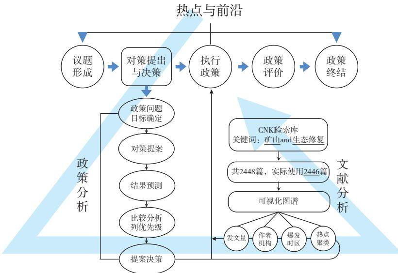
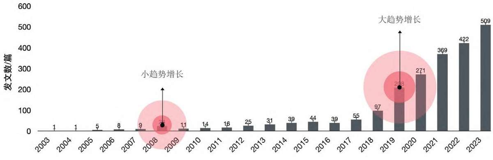
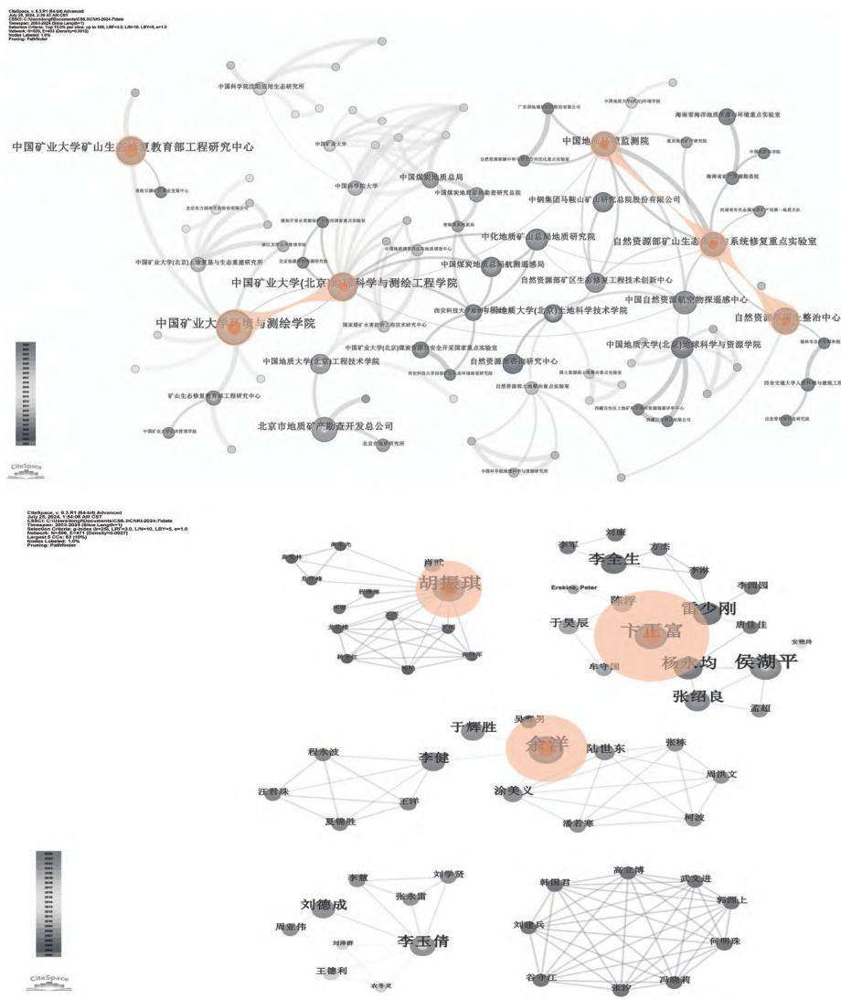
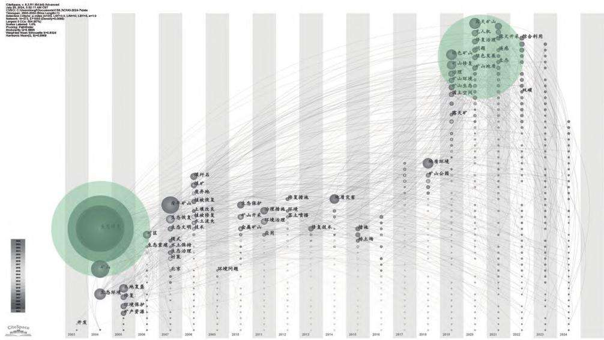
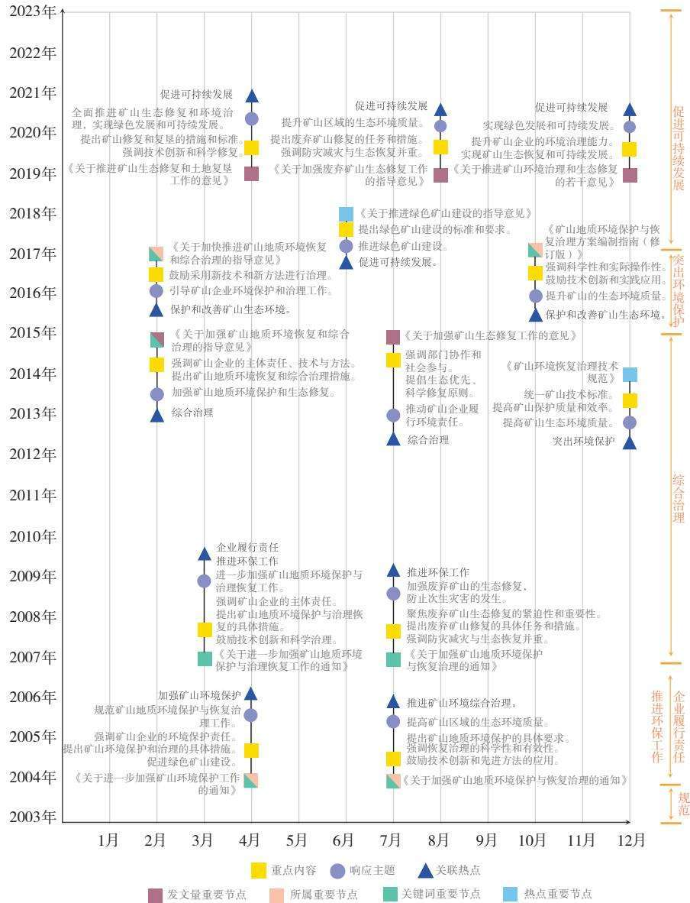
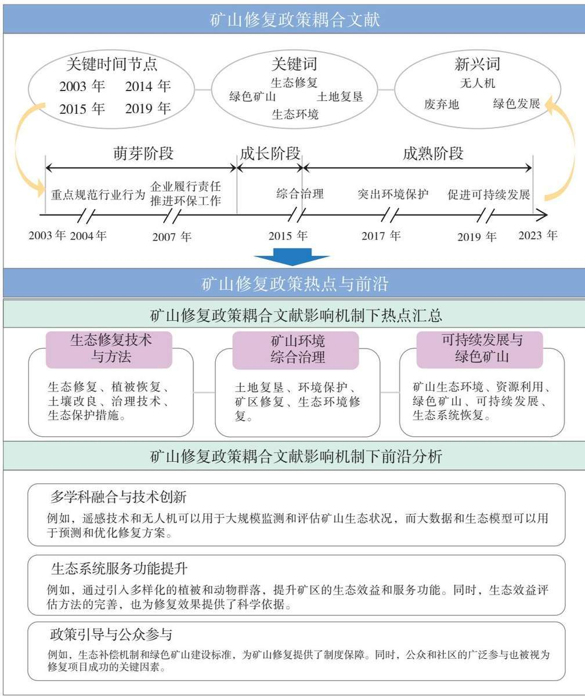

# 国内矿山生态修复热点与前沿研究

——基于文献与政策耦合分析

■ 李宿慧1,2/李美艳3/王 蒙4/胡心童1,2/蔡永立1,2

（1.上海交通大学设计学院，上海 200240；2.自然资源部国土空间生态治理数字工程技术创新中心，上海200240；3.山东土地数字科技集团有限公司，济南 250014；4.山东省国土空间数据和遥感技术研究院，济南250014）

摘　要：文章聚焦矿山生态修复领域的热点与前沿问题，采用CiteSpace可视化图谱研究方法，结合相关政策文件分析，系统归纳和总结了国内矿山生态修复研究的整体脉络和阶段特征。通过探究学术文献与政策发布的演进关系，为相关政策制定和研究提供参考，推动矿山生态修复领域的创新发展和应用推广，为矿山生态修复领域的未来发展提供新的视角和思路。文章收集了自1986年以来有关矿山生态修复的政策文件和2003—2024年的相关学术文献，通过对发文量、研究机构、发文作者及突显词的分析，揭示了矿山生态修复研究的高频关键词、主要研究主题和热点领域。通过政策与文献的耦合分析，揭示了政策对矿山生态修复研究的引导作用，并提出了五点优化建议：(1)聚焦热点，促进研究与实践推陈出新；(2)顺势而为，加强技术创新与应用；(3)加强跨学科合作，全面强化社会公众参与和政策宣传教育工作；(4)优化评估机制，保障技术实施与动态调整；(5)促进政策与科研的耦合。

关键词：矿山；生态修复；学术文献；政策；耦合分析

中图分类号：X321；X171.4；F062.1 文献标识码：A 文章编号：1672-6995（2026）08-0097-09

DOI：10.19676/j.cnki.1672-6995.001191

# Hotspots and Frontier Research on Ecological Restoration of Domestic Mines —Based on Literature and Policy Coupling Analysis

LI Suhui1,2, LI Meiyan3, WANG Meng4, HU Xintong1,2, CAI Yongli1,2

(1. School of Design, Shanghai Jiao Tong University, Shanghai 200240, China; 2. Digital Engineering Technology Innovation Center for Territorial Spatial Ecological Governance, Ministry of Natural Resources, Shanghai 200240, China; 3. Shandong Land Digital Technology Group Co., Ltd., Jinan 250014, China; 4. Shandong Institute of Land Spatial Data and Remote Sensing Technology, Jinan 250014, China)

Abstract: This study focuses on hotspots and cutting-edge issues in mine ecological restoration through visual bibliometric analysis using CiteSpace. Coupled with policy document analysis, it systematically delineates and summarizes the overall context and stage characteristics of mine ecological restoration research in China. By exploring the evolutionary relationship between academic literature and policy issuance, this paper provides references for relevant policy formulation and research, promotes innovative development and application promotion in the field of mine ecological restoration, and offers new perspectives and ideas for the future development of this field. This study collected the policy documents on mine ecological restoration since 1986 and related academic literature from 2003 to 2024, and revealed the high-frequency keywords, main research topics and hot areas of mine ecological restoration research through the analysis of the number of publications, research institutions, authors and burst terms. Through the coupling analysis of policies and literatures, the guiding effect of policy on mine ecological restoration research is revealed, and five optimization suggestions are put forward: (1) focus on hot spots to promote research and practice to bring forth the new; (2) take advantage of the trend to strengthen technological innovation and application; (3) strengthen interdisciplinary cooperation, comprehensively enhance

public participation and policy publicity as well as education; (4) optimize the evaluation mechanism to ensure the implementation and dynamic adjustment of technologies; (5) strengthen the science-policy nexus.

Keywords: mine; ecological restoration; academic literature; policy; coupling analysis

## 0 引言

矿山生态修复概念的形成并非一蹴而就，而是经历了从“矿山地质环境保护与治理”到“生态修复”的不断演变。早期阶段主要以矿山地质灾害防治、土地复垦为核心，旨在解决矿山开采导致的地质安全和土地利用问题。随着生态文明建设理念的提出，矿山生态修复逐渐从单一的地质治理拓展至生态功能的全面恢复，目标涵盖生物多样性提升、生态系统服务优化及区域可持续发展。这一演进过程不仅反映了环境保护理念的升级，也为现阶段的矿山生态修复研究奠定了理论与实践基础。自20世纪90年代我国开始重视矿山生态修复以来，相关政策不断出台并完善，对矿山生态修复的指导和支持逐步加强；与此同时，也掀起了关于矿山与生态修复的学术潮，推动了矿山生态修复的发展[1]。然而，无论是学术研究，还是政策制订，单一视角下的分析都缺乏多维度考量[2-3]，亟需一套耦合分析流程，使得文献研究的学术严谨结合政策制定的多角度思维，并总结二者的动态互动机制。

在当今数据开放的时代背景下，基于政策作用于相关文献的研究已经取得了一些成果[4]。例如，牟泽宇等利用CiteSpace可视化图谱研究方法，结合政策的发展，探寻老字号研究热点与趋势[5]。矿山生态修复作为环境保护和资源管理的重要领域，其研究热点和前沿趋势备受关注[6-8]。矿山生态修复不仅涉及生态环境的恢复和治理，还关系到地方经济的发展和社会的可持续发展[9-10]。国内关于矿山生态修复的政策不断出台，为相关研究提供了重要的指导和支持[11]。同时，随着研究工具和方法的不断进步，利用CiteSpace等可视化工具对矿山生态修复研究的热点和趋势进行分析，能够帮助我们更好地理解该领域的发展动态和未来方向[12]。鉴于此，本文采用CiteSpace可视化图谱研究方法，归纳出文献中的重要节点，结合各节点下出台的政策，对矿山生态修复研究进行系统归纳与前沿探索，厘清已有研究的整体脉络与阶段特征，探讨在政策影响下矿山生态修复研究的热点与前沿，以期为学者后续研究提供新的研究思路与参考材料[13]。

## 1 研究设计与数据来源

## 1.1 研究设计

本文研究路线设计的核心思路是，学术文献与政策发布具有相互影响、协同发展的演进关系。如图1所示，从议题形成开始，到政策的提出、执行、评估和终结，再投入政策分析和文献分析的参与过程[14-15]，形成了“总—分—列—汇”的全生命周期，并从中把握热点与前沿内容。政策分析方面，整理了自1986年以来我国有关矿山生态修复的政策（表1），以便后续配合可视化图谱穿插使用[16-18]。值得一提的是，在整理政策的过程中，除了梳理年份、机构、名称这些基本信息之外，在结合文献分析时，还将各个政策的重点内容、响应主题及关联热点进行了梳理，以便更加深入地探索政策与文献的相互作用关系。文献分析方面，通过CNKI检索相关文献、分析文献数据、可视化图谱等步骤，支持政策分析和决策。

虽然政策分析与文献分析存在相互作用，但二者并不是“一个萝卜一个坑”的直接影响关系[19-20]，只有通过政策分析和文献分析两者的相互平衡、调节，才能支撑起整个结构，达到探索热点与前沿的效果。故本文设计了“撬杆天平模型”结构，用于研究矿山生态修复的全流程思路。

## 1.2 数据来源

本文中涉及两组研究对象——政策文件与学术文献。首先，对于政策文件的搜集，主要是在各个政府官方网站、政策数据库、学术期刊和会议论文，以及相关专业书籍和报告中查阅整理。文献方面，采用CiteSpace工具在CNKI（中国知网）中采集文献数据。关键词为“矿山”“生态修复”；时间段设置在1986年（第一部矿山生态修复政策颁布）

  
图1“撬杆天平模型”技术路线

表1 我国矿山修复相关政策整理及应用
<table><tr><td rowspan=1 colspan=1>年份</td><td rowspan=1 colspan=1>名称</td><td rowspan=1 colspan=1>主要内容</td></tr><tr><td rowspan=1 colspan=1>1986年</td><td rowspan=1 colspan=1>《中华人民共和国矿产资源法》</td><td rowspan=1 colspan=1>矿山企业开采矿产时应当保护环境，对破坏的耕地、林地等进行复垦利用、植树种草或采取其他措施</td></tr><tr><td rowspan=1 colspan=1></td><td rowspan=1 colspan=1></td><td rowspan=1 colspan=1></td></tr><tr><td rowspan=1 colspan=1>2023年</td><td rowspan=1 colspan=1>《2024年历史遗留废弃矿山生态修复示范工程项目》</td><td rowspan=1 colspan=1>严格审核项目建设的必要性、可行性，统筹推进历史遗留废弃矿山综合治理</td></tr></table>

注：受篇幅所限，表中只列举两个年份的政策，其他年份从略。

至2024年，实际时间段为2003年（第一篇关于矿山生态修复的论文问世）至2024年；期刊类型设置为“全部”。采集截止时间为2024年07月25日，共搜索到符合条件的文献2458篇，排除重复、无参考价值的无用文献，实际对2446篇文献进行了整理，并分析发文量、作者/所属机构、爆发时区及热点聚类的各个节点与相关政策之间的相互关系。

## 2 多角度研究现状的分析

## 2.1 文献发文量分析

文献的发文量最能直接体现政策与文献二者间的互动关系。从图2可以看出，从2003年第一篇矿山生态修复相关文章发表至2023年，矿山生态修复的发文量总体呈现逐年递增的趋势，尤其是在2019年之后，发文量显著增加。整个发展过程大致可以分为三个阶段：①萌芽阶段。2003—2014年，矿山生态修复的发文量较低，每年的发文量徘徊在1～31篇之间，研究关注度较低，发文量增长较为缓慢。②成长阶段。2015—2018年，矿山生态修复的发文量逐渐增多，每年的发文量在39～55篇之间。这一时期矿山生态修复研究的逐步兴起，研究逐渐受到更多学者和机构的关注。③成熟阶段。2019年之后，矿山生态修复的发文量迅速增长。2019年的发文量达到208篇，2020年则攀升至271篇，到2023年更是达到509篇的峰值，显示出该领域

研究的迅猛发展和广泛关注。

## 2.2 作者合作及研究机构分析

通过研究机构聚类图谱（图3a）可以了解到，矿山生态修复领域的研究主要集中在地质研究类机构。图3a中的线条展示不同机构之间的合作关系。例如，中国矿业大学与中国地质科学院、自然资源部等多个机构保持紧密的合作，这种合作关系有助于资源共享和研究成果的扩展。不同颜色的节点和线条表示不同时间段内的合作情况。由此可以看出，随着时间的推移，机构之间的合作关系越来越密切，这表明该领域的研究正在不断扩展和深化。图3a中不同颜色的节点也展示了不同的研究热点。可以看出，早期的研究热点主要集中在基础研究和技术开发，而近期的研究热点则更多地集中在应用研究和政策影响方面。

  
图2 2002—2023年年度发文量统计图谱

作者聚类图谱中（图3b），圆圈直径越大代表这位作者在矿山生态修复领域具有较高的影响力，表明该作者的研究成果不仅数量多，而且质量高，在学术界得到广泛的认可。这些核心作者之间的合作关系密切，形成一个稳定的研究团队。或者核心作者不仅在同一机构内合作，也与其他机构的研究人员保持合作。跨机构的合作有助于整合不同机构的资源和优势，推动研究的深入发展。不同颜色的节点表示不同时间段内的合作情况。可以看出，早期的合作网络相对较小，而近期的合作网络则更为广泛和复杂，这表明随着研究的不断深入，合作网络也在不断扩展。

## 2.3 关键词爆发时区分析

通过关键词时区聚类 (图4) 可以了解到，关键词“生态修复”在2003年左右就已经出现，并且在2004—2005年持续爆发，成为主要研究热点。之后，这一关键词也在不同时间点持续受到关注。图4中的连线表示关键词之间的关系和共现情况。较粗的连线表示两个关键词在同一篇文章中频繁共现，反映了它们之间的紧密联系。例如，“生态修

  
图3 文献出处数据统计图谱（所属及作者）

复”与“绿色矿山”“生态环境”“土地复垦”等关键词之间的连线较粗，表明这些主题在研究中有较高的关联性。

## 2.4关键词聚类

表2为TOP5关键聚类分析结果。通过表2可以看出，不同年份的研究热点和趋势有所不同。其中，Log-likelihood Ratio（对数似然比，LLR）是一种用于比较两个统计模型（通常是嵌套模型）的指标，通常用于评估一个较复杂的模型是否比一个较简单的模型明显更好。p值是统计假设检验中的一个重要概念，用于衡量观察到的结果与零假设（通常表示无效假设）之间的偏离程度。p值表示在零假设为真时，得到至少与实际观测值一样极端的结果的概率。p值越小，意味着观测数据与零假设的偏离越大，零假设成立的可能性越小。反之，零假设成立的可能性越大[21-22]。

  
图4 关键词时区统计图谱

从早期的生态修复、矿山公园等基础研究，到后期的绿色矿山、地质灾害、技术应用等，再到最新的地质环境、绿色发展和生态文明等综合治理，研究领域逐渐扩展和深入。这些关键词聚类反映了矿山生态修复领域的研究重点和发展方向。

同时，在图5中可以看到，关键词“生态修复”在2003年左右就已经出现，并且在2004—2005年爆发，成为主要研究热点。之后，这一关键词在不同时间点持续受到关注。一些关键词如“生态恢复”“废弃地”“水土保持”等在较早的年份（如2008年）就开始受到关注，并且持续了一段时间的引用高峰。另一些关键词如“无人机”“黄河流域”等则在较近的年份（如2020年后）开始爆发，显示出这些领域的研究正在逐渐兴起。关键词的引用强度差异较大，反映出不同领域的研究热点和关注度不同。通过对关键词的引用强度和爆发信息分析，揭示了生态恢复、环境保护、矿山治理等领域的研究热点和趋势，也可为相关领域的研究人员提供有价值的参考和指导[23]。

## 3 讨论和结论

对以上内容进行整合梳理如图6所示。根据文献发文量（玫红色方块区域）分析可知，通常文献与政策的互动关系体现为，领域内新理念的引入被政府决策者吸收形成政策，政策发布实施后又直接引起相关研究的增多。发文量的数据节点主要在2015年和2019年。2015年的政策，多以“鼓励、规范”为目标；到2019年之后，政策目标着重强调“提升品质、实现可持续目标”。总体来说，矿山生态修复过程的关注度经历了从低到高、逐步增长的过程，特别是在2019年，《关于推进矿山生态修复和土地复垦工作的意见》《关于加强废弃矿山生态修复工作的指导意见》《关于推进矿山环境治理和生态修复的若干意见》等政策的发布，实现了成果“井喷式”的推动力。这反映了矿山生态修复作为环境保护和可持续发展重要组成部分的研究热度和关注度在不断提高[24]。预测未来这一领域可能会继续保持热度，同时，随着政策的不断完善和科技的进步，矿山生态修复领域有望实现更多的创新和突破[25-26]。

表2 Top5关键词聚类整理
<table><tr><td rowspan=1 colspan=1>年度</td><td rowspan=1 colspan=1>识别词 (LLR)</td><td rowspan=1 colspan=1>P—level (p值)</td></tr><tr><td rowspan=1 colspan=1>2014年</td><td rowspan=1 colspan=1>生态修复（159.76，1.0E—4)；矿山公园(32.35，1.0E—4)；规划设计（16.13，1.0E—4)；闭坑矿山(16.13，1.0E—4)；地灾治理（13.44，0.001)</td><td rowspan=1 colspan=1>收缩城市（1.5)；京津冀周边（1.5)；土地再利用（1.5)；水环境（1.5）；世界生态恢复大会（1.5)</td></tr><tr><td rowspan=1 colspan=1>2014年</td><td rowspan=1 colspan=1>矿山(103.69，1.0E—4)；生态环境(59.13，1.1.0E—4)；生态恢复(45.75，1.1.0E—4)；植被修复(25.58，1.1.0E—4)；基质改良(12.28，0.001)</td><td rowspan=1 colspan=1>策略研究（0.58)；框架（0.58)；集体土地（0.58）；高寒地区（0.58)；地质条件(0.58)</td></tr><tr><td rowspan=1 colspan=1>2015年</td><td rowspan=1 colspan=1>废弃矿山(67.01，1.0E—4)；模式(28.81，1.0E4)；生态治理(23.24，1.0E—4)；国土空间(21.96，1.0E—4)；北京(19.16，1.0E—4)</td><td rowspan=1 colspan=1>皖南区域（0.42）；敦化市（0.42)；黄土高原（0.42）；活化利用（0.42）；水资源(0.42)</td></tr><tr><td rowspan=1 colspan=1>2018年</td><td rowspan=1 colspan=1>绿色矿山(56.68，1.0E—4)；地质灾害(42.08，1.0E-4)；无人机(33.65，1.0E—4)；土地复垦(32.58，1.0E—4)；煤矿(27.11，1.0E—4)</td><td rowspan=1 colspan=1>矿产资源综合利用(0.45)；忻州市(0.45)；五龙沟(0.45)；碳酸盐岩(0.45)；远程集中控制系统(0.45)</td></tr><tr><td rowspan=1 colspan=1>2019年</td><td rowspan=1 colspan=1>地质环境(52.14，1.0E—4)；矿山修复(43.6，1.0E-4)；恢复治理(33.65，1.0E—4)；绿色发展(32.9，1.0E—4)；生态31.55，1.0E—4)</td><td rowspan=1 colspan=1>治理效果（0.45）；京北地区（0.45)；石拐区(0.45)；金矿(0.45)；酸性废水二段中和法(0.45)</td></tr></table>

Top 30 Keywords with the Strongest Citation Top 30 Keywords with the Strongest Citation Top 30 Keywords with the Strongest Citation Bursts Bursts Bursts
<table><tr><td>Keywords Year Strength Begin End</td><td></td><td>2003 - 2024</td><td>Keywords Year Strength Begin End</td><td>2003- 2024</td><td></td><td></td><td>Keywords Year Strength Begin End</td><td>2003 - 2024</td></tr><tr><td>水土保持 2008</td><td></td><td>2.41 2008 2019</td><td>200874120082018</td><td></td><td></td><td>生态恢复</td><td>2008 2008</td><td>10.87 2016 2020</td></tr><tr><td>水土流失 2008</td><td></td><td>1.9 2008 2019</td><td>植修复2008</td><td>3.17 2008 2018</td><td></td><td>一夜有地</td><td>7.41 2008 2018</td><td></td></tr><tr><td></td><td></td><td>废20087.412008 2018</td><td>煤矿</td><td>20082722008 2014</td><td></td><td>土地复垦 2008</td><td>5.66 2018 2019</td><td></td></tr><tr><td></td><td></td><td>植20883.1720082018</td><td>水土保持 2008</td><td>2.41 2008 2019</td><td></td><td>生态修复 2006</td><td>4.76 2012 2013</td><td></td></tr><tr><td>环境问题 2011</td><td></td><td>2.32 2011 2020</td><td>水土流失 2008</td><td>1.9 2008 2019</td><td></td><td>2020</td><td>4.11 2020 2022</td><td></td></tr><tr><td>煤矿</td><td>2008</td><td>2.72 2008 2014</td><td>矿山 2007</td><td>2.86 2010 2012</td><td></td><td>无人机 生态文明 2014</td><td>3.19 2019 2020</td><td></td></tr><tr><td></td><td></td><td>生态 200810.87 2016 2020</td><td>环境问题</td><td>20112.322011 2020</td><td></td><td>植械修复 2008</td><td>3.17 2008 2018</td><td></td></tr><tr><td>对策</td><td>2014</td><td>2.04 2014 2018</td><td>生复2006</td><td>4.76 2012 2013</td><td></td><td>景观再生</td><td>3.152015 2017</td><td></td></tr><tr><td>矿山公园 2015</td><td></td><td>1.93 2018 2022</td><td>矿山开采 2013</td><td>1.54 2013 2015</td><td></td><td>2015 高陡边坡 2022</td><td>3.12 2022 2024</td><td></td></tr><tr><td>基质改良</td><td>2014</td><td>1.71 2014 2018</td><td>风景园林 2014</td><td>2.15 2014 2017</td><td></td><td></td><td>2.86 2010 2012</td><td></td></tr><tr><td>风景园林 2014</td><td></td><td>2.15 2014 2017</td><td>对策 2014</td><td>2.04 2014 2018</td><td></td><td></td><td>2007 2008 2.72 2008 2014</td><td></td></tr><tr><td>矿山环境 2019</td><td></td><td>1.64 2019 2022</td><td>基质改良 2014</td><td>1.71 2014 2018</td><td></td><td></td><td>2008 2.68 2016 2018</td><td></td></tr><tr><td>无人机</td><td>2020</td><td>4.11 2020 2022</td><td>景观再生 2015</td><td>3.15 2015 2017</td><td></td><td>规划设计 2018</td><td>2.43 2018 2019</td><td></td></tr><tr><td>景观再生 2015</td><td></td><td>3.15 2015 2017</td><td>生态恢复 2008</td><td>10.87 2016 2020</td><td></td><td>水土保持 2008</td><td>2.41 2008 2019</td><td></td></tr><tr><td>高随边坡</td><td>2022</td><td>3.12 2022 2024</td><td>矿区 2008</td><td>2.68 2016 2018</td><td></td><td>环境问题 2011</td><td>2.32 2011 2020</td><td></td></tr><tr><td>矿山</td><td>2007</td><td>2.86 2010 2012</td><td>土地复垦 2008</td><td>5.66 2018 2019</td><td></td><td>2019</td><td>2.22 2021 2022</td><td></td></tr><tr><td>矿区</td><td>2008</td><td>2.68 2016 2018</td><td>规划设计 2018</td><td>2.43 2018 2019</td><td></td><td>风景园林 2014</td><td>2.15 2014 2017</td><td></td></tr><tr><td>黄河流域 2022</td><td></td><td>2.08 2022 2024</td><td>矿山公园 2015</td><td>1.93 2018 2022</td><td></td><td>黄河流域 2022</td><td>2.08 2022 2024</td><td></td></tr><tr><td>景观设计</td><td>2020</td><td>1.64 2020 2022</td><td>生态文明 2014</td><td></td><td></td><td>2014</td><td>2.04 2014 2018</td><td></td></tr><tr><td>生态</td><td>2022</td><td>1.56 2022 2024</td><td>治理 2019</td><td>3.19 2019 2020</td><td></td><td></td><td></td><td></td></tr><tr><td>矿山开采 2013</td><td></td><td>1.54 2013 2015</td><td>矿山环境 2019</td><td>1.65 2019 2020</td><td></td><td>岩质边坡 2020</td><td>2.03 2020 2021</td><td></td></tr><tr><td>土地复垦</td><td>2008</td><td>5.66 2018 2019</td><td>2020</td><td>1.64 2019 2022</td><td></td><td>矿山公园 2015</td><td>1.93 2018 2022</td><td></td></tr><tr><td>生态修复 2006</td><td></td><td>4.76 2012 2013</td><td>无人机 岩质边坡 2020</td><td>4.11 2020 2022</td><td></td><td>水土流失 2008</td><td>1.9 2008 2019</td><td></td></tr><tr><td>生态文明 2014</td><td></td><td>3.19 2019 2020</td><td></td><td>2.03 2020 2021</td><td></td><td>基质改良 2014</td><td>1.71 2014 2018</td><td></td></tr><tr><td>规划设计 2018</td><td></td><td></td><td>景观设计 2020</td><td>1.64 2020 2022</td><td></td><td>2019</td><td>1.65 2019 2020</td><td></td></tr><tr><td>应用</td><td>2019</td><td>2.43 2018 2019 2.22 2021 2022</td><td>环境治理 2012</td><td>1.6 2020 2021</td><td></td><td>景观设计 2020</td><td>1.64 2020 2022</td><td></td></tr><tr><td>岩质边坡</td><td>2020</td><td>2.03 2020 2021</td><td>应用 2019</td><td>2.22 2021 2022</td><td></td><td>矿山环境 2019</td><td>1.64 2019 2022</td><td></td></tr><tr><td>治理</td><td>2019</td><td>1.65 2019 2020</td><td>遇感 2021</td><td>1.53 2021 2022</td><td>生态</td><td>环境治理 2012</td><td>1.6 2020 2021</td><td></td></tr><tr><td>环境治理 2012</td><td></td><td></td><td>高陡边坡 2022 2022</td><td>3.12 2022 2024</td><td></td><td>2022</td><td>1.56 2022 2024</td><td></td></tr><tr><td>遥感</td><td>2021</td><td>1.6 2020 2021 1.53 2021 2022</td><td>黄河流域 生态 2022</td><td>2.08 2022 2024 1.56 2022 2024</td><td></td><td>矿山开采 2013 遥感 2021</td><td>1.54 2013 2015 1.53 2021 2022</td><td></td></tr></table>

图5 按照爆发强度-爆发持续时长-爆发开始年份（从左到右）排序统计图谱  
点与前沿如图7所示。

与前面发文量机构与作者聚类图谱的时间节点相同，2004年和2017年同为关键词时间节点。此外，我国还在2007年发布了关于矿山地质的相关政策，用于指导矿山治理的整体发展。同样，从矿山修复政策的发展趋势来看，在2015年前，相关政策主要侧重于监督工作，明确矿山修复的指导方针；之后的政策方向则偏向于加大生态修复力度，深化细节，实现可持续目标。

最后，根据不同热点爆发的时间节点，2014年是进入矿山修复发展的第二阶段——发展阶段的过渡节点，这一年度发布的政策多以意见、指导为方向进行内容拟定，为迅速地进入下一阶段的发展奠定了良好的基础。2018年政策文件中开始融入绿色理念，指导矿山环境的建设，切实推动落实可持续的目标。关于矿山生态修复文献与政策耦合分析热

## 4 展望和建议

## 4.1 展望

## 4.1.1 热点主题

(1)生态修复技术与方法是矿山生态环境恢复的基础[27]，其核心内容涵盖了生态修复、植被恢复、土壤改良、治理技术及生态保护措施等方面。本文的研究重点在于如何通过科学技术手段有效恢复被破坏的矿山植被、改善土壤质量，并实施系统性的生态保护措施。相关技术的创新和优化为生态修复的成功奠定了坚实基础，逐渐成为学术界和实践领域的热点研究方向。

(2)矿山环境综合治理是实现矿区可持续发展的关键，其核心包括土地复垦、环境保护、矿区修复及生态环境恢复等内容。该研究领域主要关注通过土地复垦和矿区环境保护措施，系统地恢复和改善被破坏的矿山生态环境，使其重新具备生态功能。通过综合治理措施的实施，矿山地区的生态系统得以有效恢复，生态效益显著提升。

(3)可持续发展与绿色矿山是矿山资源管理的重要议题[28]，其核心在于矿山生态环境的保护与资源利用的平衡。该主题着重探讨如何在矿山开发过程中有效保护生态环境，确保资源的高效利用，以实

  
图6 矿山生态修复政策和文献重要节点耦合分析

修复的科学性和有效性。

(2)生态系统服务功能的提升。矿山生态修复不仅旨在恢复物理环境，也更加关注生态系统服务功能的全面提升。近年来，越来越多的研究将焦点放在生物多样性保护和生态系统功能恢复方面，试图通过引入多样化的植被和动物群落，全面提升矿区的生态效益和服务功能。此外，生态效益评估方法的不断完善，也为修复效果的科学评估提供了可靠依据，推动了矿区生态系统的长期可持续发展。

(3)政策引导与公众参与已成为矿山生态修复的重要趋势。各级政府通过出台生态补偿机制、绿色矿山建设标准等政策法规，为矿山生态修复提供制度保障[29]。同时，公众和社区的广泛参与也被视为修复项目成功的关键因素[30]。通过鼓励公众和社区的积极参与，修复项目的社会认可度与执行效果显著提高，从而形成了政府、企业与公众协同治理的良性机制，促进矿区生态环境的可持续修复与管理。

现矿山的长期可持续发展。通过绿色矿山建设标准的实施，矿区生态系统恢复与资源的可持续利用得以并行推进，为矿业的生态转型提供了有效路径。

## 4.1.2 前沿

(1)多学科融合与技术创新。随着科技的进步，矿山生态修复逐渐向多学科融合方向发展，涉及大数据分析、遥感技术及无人机应用等前沿技术的引入。这些技术为矿山生态修复提供了更加精准、高效的手段。例如，遥感技术与无人机的结合，可以用于大规模监测和评估矿山的生态状况，而大数据分析与生态模型则为修复方案的预测与优化提供了有力支持。此类技术的进步极大地提升了矿山生态

## 4.2 建议

本文对国内矿山生态修复全流程的相关政策文件与学术文献的整合、分析与探讨，提出的“政策与文献分析热点与前沿-天平撬杆模型”不仅是一个系统性的决策流程，更是一个集成了问题发现、对策提出、执行评估、决策支持等多个环节的综合性分析工具，可为解决复杂的社会经济问题提供有力的支持和指导。基于对矿山生态修复领域的热点与前沿的探寻，本文提出了五点建议供研究者和政策制定者参考。

(1)聚焦热点，促进研究与实践推陈出新。矿山生态修复研究逐渐扩展到更广泛的环境治理和资源利用领域。关键词“地质灾害”“土地复垦”“绿色发展”等的出现频率增加，表明研究内容从单一的生态修复逐步扩展到综合治理、可持续发展和资源综合利用。这一趋势反映了政策对环境治理全局性的要求，推动研究者在更广泛的背景下思考和解决矿山生态修复问题。相关政策制定部门应明确政策目标和实施路径，提供充足的资金和资源，激励更多科研机构和企业参与矿山生态修复研究与实践。建议设立专项资金，支持技术创新和项目的开发与应用。

  
图7 矿山生态修复政策和文献耦合分析热点与前沿“一张图”

(2)顺势而为，推动技术创新与应用。基于

CiteSpace的分析，我们可以清晰地看到矿山生态修复研究的发展脉络。未来研究将更加注重技术的集成与应用、生态环境的系统治理和可持续发展的实践。关键词如“生态修复技术”“绿色矿山”“环境治理”等的不断演变，预示着这些领域将继续成为研究的重点和前沿方向。建议加强技术创新，鼓励科研单位和企业合作，开发新型生态修复技术和材料。同时，推动这些技术在实际修复项目中的应用，形成示范效应，以点带面，提升整体修复水平。

(3)加强跨学科合作，全面强化社会公众参与和宣传教育工作。矿山生态修复涉及环境科学、地质

学、工程技术等多个学科领域。建议加强跨学科合作，整合各领域的知识和技术，共同解决矿山生态修复中的复杂问题。建立跨学科研究平台，促进学术交流与合作，推动科研成果的转化与应用。矿山生态修复需要社会各界的共同参与和支持。建议加强公众参与，鼓励社区居民、环保组织等积极参与修复项目的规划和实施。通过宣传教育，提高公众的环保意识和参与热情，营造良好的社会氛围，推动矿山生态修复事业的可持续发展。

(4)优化评估机制，保障技术实施与动态调整。

矿山生态修复的核心在于技术的实践应用。在当前社会背景下，政策在学术研究方向上具有显著引导作用，而科研则通过理论创新和技术实践为政策的实施提供支撑，二者之间形成动态互动关系。此外，对于矿山这样小尺度的修复区域，重点应放在成熟可行技术的选择与高效实施上，监测评估作为成熟技术规范的一部分，应辅助于修复工作的实施

和效果评估。

(5)强化政策与科研的耦合。在矿山生态修复发展中，政策与科研的耦合至关重要。政策的出台和实施为研究提供了方向和支持，而科学研究的成果反过来又能为政策制定提供依据和参考。建议未来进一步加强政策与科研的互动，推动矿山生态修复领域的创新发展和应用推广。

## 参考文献

[1] 刘少君,刘博.矿山生态修复研究综述 [J].世界有色金 属,2019(10):170-171.

[2] 谢伟.矿山生态修复工程的效益评估与可持续发展策略[J].世界有色金属,2024(10):145-147.

[3] 韩永亮.中国矿山生态环境恢复治理现状和对策[J].能源与节能,2014(3):110-111.

[4] 安秀芬,黄晓鹂,张霞,等.期刊工作文献计量学学术论文的关键词分析[J].中国科技期刊研究,2002,13(6):505-506.

[5] 牟泽宇,陈艳,王运.基于CiteSpace与政策分析老字号研究热点与趋势[J].商业经济,2024(7):81-84.

[6] 荣冬梅,冯聪.矿山生态修复中生态产品价值实现机制探析[J].中国国土资源经济,2023,36(2):65-71.

[7] CHEN Fang, YAO Qiang, TIAN Jingyi. Review of ecological restoration technology for mine tailings in China[J]. Engineering Review,2016,36(2):115-121.

[8] 周鑫,田倩倩,刘光哲,等.基于CiteSpace的国内外生态修复领域研究热点及趋势研究[J].温带林业研究,2024,7(1):51-59,63.

[9] Young R E,Gann G D.WALDER B, et al.International principles and standards for the ecological restoration and recovery of mine sites[J].Restoration Ecology,2022,30(S2):e13815.

[10]朱晓华,王立威,王英男,等.矿山自然恢复政策研究及模式探索[J].中国土地,2023(11):21-23.

[11] 魏海瑞,于卫红,程佳雪.中国政策量化研究的热点与趋势:基于CiteSpace可视化分析[J].科技和产业,2023,23(16):74-81.

[12]魏诗琪.基于CiteSpace工具的国内政策变迁研究知识图谱分析[J].现代商贸工业,2024,45(16):150-152.

[13] 刘伟聪,杨木壮,陈俊垚,等.基于CiteSpace的中国国土空间生态修复研究知识图谱分析[J].国土与自然资源研究,2021(1):86-91.

[14] 陈振明,张敏.国内政策工具研究新进展:1998—2016[J].江苏行政学院学报,2017(6):109-116.

[15] 汪大锟,化柏林.政策文本量化研究综述[J].科技情报研究,2023,5(1):92-105.

[16] 袁浩,许尔文,赵维俊,等.基于CiteSpace对矿山修复研究领域的可视化分析[J].农业与技术,2024,44(4):78-81.

[17] 贾梦旋,王金满,李禹凝,等.基于自然解决方案的矿山生态修复研究进展[J].煤炭科学技术,2024,52(8):209-221.

[18]高云峰,徐友宁,祝雅轩,等.矿山生态环境修复研究热点与前沿分析:基于VOSviewer和CiteSpace的大数据可视化研究[J].地质通报,2018,37(12):2144-2153.

[19]胡龙兵,李小华.基于CiteSpace的国内矿山生态修复高引文献计量分析[J].矿产勘查,2023,14(7):1215-1222.

[20]邵泽强,刘书奇,陆文龙,等.基于CiteSpace的矿山生态修复的文献计量分析[J].环境工程,2023,41(S2):707-711.

[21] CHEN Chaom ei,HU Zhigang,LIU Shengbo,et al.Em erging trends in regenerative medicine:a scientometric analysis in CiteSpace[J].Expert Opin Biol Ther,2012,12(5):593-608.

[22] 陈悦,陈超美,刘则渊,等.CiteSpace知识图谱的方法论功能[J].科学学研究,2015,33(2):242-253.

[23]谢伟.矿山生态修复工程的效益评估与可持续发展策略[J].世 界有色金属,2024(10):145-147.

[24]郭冬艳,吴尚昆,杨繁,等.中国绿色矿山建设成效和政策建议[J].自然资源情报,2024(2):21-26.

[25]付方建.矿山生态修复工程面临的主要问题及解决策略[J].工程技术研究,2022,7(12):225-227.

[26] 钟树达,张电吉,方凯贤.基于CiteSpace和Excel的国内智慧矿山 热点、发展过程与发展趋势探析[J].现代矿业,2021,37(6):10- 13.

[27]武强.生态安全与资源安全双保障要求下的矿山生态修复政策技术研究指引[J].上海国土资源,2024,45(2):1-4.

[28]赵晓林,程红刚,岳本江,等.矿山生态修复的研究热点和主流操作方式[J].中国水土保持,2021(6):46-48.

[29]刘向敏,马宗奎,张超宇,等.矿山生态修复工程管理现状、问题与对策建议[J].中国国土资源经济,2020,33(4):23-28.

[30]张绍良,张黎明,侯湖平,等.生态自然修复及其研究综述[J].干旱区资源与环境,2017,31(1):160-166.