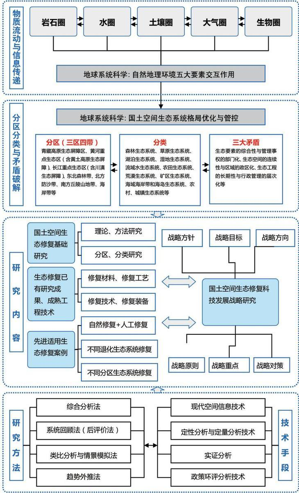

DOI:10.13745/j.esf.sf.2021.6.20

# 国土空间生态修复若干重大问题研究

白中科

1. 中国地质大学(北京）土地科学技术学院，北京100083

2. 自然资源部土地整治重点实验室，北京100035

3. 自然资源部矿区生态修复工程技术创新中心，北京100083

## BAI Zhongke

1. School of Land Science and Technology, China University of Geosciences (Beijing), Beijing 100083, China

2. Key Laboratory of Land Consolidation and Rehabilitation, Ministry of Natural Resources, Beijing 100035, China

3. Technology Innovation Center for Ecological Restoration Engineering in Mining Area, Ministry of Natural Resources, Beijing 100083, China

BAI Zhongke. The major issues in ecological restoration of China's territorial space. Earth Science Frontiers, 2021, 28(4)：001-013

Abstract: Ecological restoration of China's territorial space is fundamental to sustainable development of the Chinese nation in building a beautiful country. The research methods used in this study included comprehensive literature analysis, systematic review, empirical and analogous analyses, trend extrapolation, and environmental impact assessment. This paper systematically examined the territorial ecological restoration from the aspects of national strategy and top-level design, expounded the research methodology from the perspectives of project planning, technical route and method, field station, and plot, analyzed the problems of “pseudo-ecology" and “fake technology", and pointed out the strategic guidelines, objectives, directions, principles, priorities, and countermeasures for improving ecological restoration. In addition, from five aspects of ecological restoration including the major scientific issues and hotspots, context analysis, zoning classification, differential management, and ecological compensation mechanism, this research advocated scientific and technological support to boosting ecological restoration of China's territorial space, and discusses the issues of “two (ecological) barriers and three (protection) zones", scientific advancement of ecological restoration, and integration of management and technical ideas. The study results provide a scientific basis for solving the three major contradictions—interconnectedness of ecological elements and departmentalization of management authorities, continuity of ecological space and division of local administrations, and long-term nature of ecological engineering and temporariness of administrative tenures—in the “overall protection, systematic restoration and comprehensive management" of territorial space.

Keywords: territorial space; ecological restoration; fully-array ecoystems of mountains-rivers-forests-farmlands-lakes-grasslands-sands; pseudo-ecology; fake technology; developmental strategy

摘要：国土空间生态保护与修复是实现美丽中国、关系中华民族永续发展的根本大计。本文采用文献资料综合分析法、系统回顾法、实证分析法、类比分析法、趋势外推法、政策环评等相结合的方法开展了一系列工作：从国家方略、顶层设计两个方面，梳理了国土空间生态保护与修复的脉络；从国土空间生态修复规划、技术路经与方法、野外台站和科研样地等角度，阐明了国土空间生态保护与修复研究的方法论；举例辨析了国

土空间生态保护与修复的若干“伪生态”和“假技术问题”；指出了国土空间生态保护与修复发展的战略方针、战略目标、战略方向、战略原则、战略重点、战略对策；从生态保护与修复的重大科学问题和热点、语境分析、分区分类、差异化、生态补偿机制等5个方面，提出了助推中国国土空间生态保护与修复需要的科技支撑；讨论了“两屏三带”、科学推进生态修复，以及管理逻辑与技术逻辑融合问题。研究结果为破解国土空间“整体保护、系统修复与综合治理”过程中生态要素的综合性与管理事权的部门化、生态空间的连续性与区域的政区化、生态工程的长期性与行政管理的届次化三大矛盾，提供了科学依据。

关键词：国土空间；生态保护与修复；山水林田湖草沙；伪生态；假技术；发展战略

中图分类号:X171.4;X32 文献标志码：A 文章编号：1005-2321(2021)04-0001-0013

## 0 引言

“绿水青山就是金山银山”已作为执政理念写入党的十九大报告1]、《中国共产党章程(修正案)》2]；党的十九大对国土空间开发保护格局提出了更高要求；《建立空间规划体系并监督实施的若干意见》3对国土空间规划编制要求更加明确，这些都将有助于推动国土空间集约、高效、绿色发展。开展山水林田湖草沙一体化生态保护修复工程，需按照生态系统的整体性、系统性及其内在规律，统筹考虑自然生态各要素，将山上山下、地上地下、陆地海洋以及流域上下游进行整体保护、系统修复、综合治理；需要统一明确实施的原则、方法、程序、内容和要求，以便有效规范山水林田湖草沙一体化生态保护修复工程实施质量，进而增强国土不同类型生态系统的循环能力，维护生态平衡。

鉴于目前国内官方政策文件、媒体报道及国内外文献中出现的“生态修复”“生态保护修复”“生态保护和修复”“生态保护与修复”等不同术语表达。为避免引起读者概念混淆，论文题目采用“生态修复”。其实，随着认知的不断发展，“生态修复”的内涵已非常丰富了，其科学内涵已包括“保护保育”“自然修复”“辅助再生”和“生态重建”等技术模式了，尤其是对矿区生态重建，即包含在开发过程中需要保护的敏感性目标，还需要保护矿产资源开发后具有文化价值的“矿山遗迹”，更包含在生态重建过程中，采用前期的人工支持引导，使矿区极度受损和退化的生态系统尽快进入“自然修复”4]。因此，论文所述“生态修复”是广义的，涵盖保护与修复等内容，在保护中修复、修复中保护，二者不可切割、互相补充、互为一体。

基于以上考虑，本文遵循人与自然和谐共生的理念[5]，进行国土空间生态修复若干重大问题研究。其实践上的指导意义，将涉及在我国“三区四带”重要的生态功能区科学、合理、及时保护与修复若干系统完整、功能持续的生态系统，准确估计和把握经济发展规模与生态价值互逆影响的后果，人工正确地支持和引导生态系统自然修复，确保生态保护与修复的最小风险，为支撑两个一百年中华民族的伟大复兴提供生态安全保障。

## 1 国土空间生态保护与修复脉络梳理

## 1.1 国家方略

2013年11月，习近平总书记在《关于〈中共中央关于全面深化改革若干重大问题的决定〉的说明》6中指出：“我们要认识到，山水林田湖是一个生命共同体，人的命脉在田，田的命脉在水，水的命脉在山，山的命脉在土，土的命脉在树。用途管制和生态修复必须遵守自然规律，如果种树的只管种树、治水的只管治水、护田的单纯护田，很容易顾此失彼，最终造成生态的系统性破坏。由一个部门负责领土范围内所有国土空间用途管制职责，对山水林田湖进行统一保护、统一修复是十分必要的。”

2015年9月，中共中央、国务院印发了《生态文明体制改革总体方案》7]，提出“树立山水林田湖是一个生命共同体的理念”。2015年11月，党的十八届五中全会提出“筑牢生态安全屏障，坚持保护优先、自然恢复为主，实施山水林田湖生态保护修复工程，开展大规模国土绿化行动”[8]。

2018年3月，中共中央印发了《深化党和国家机构改革方案》9]，明确提出自然资源部要履行好“统一行使全民所有自然资源资产所有者职责，统一行使所有国土空间用途管制和生态保护修复职责”。同年，国家对实施乡村振兴战略进行了全面部署。

2019年1月，国土空间规划体系总体方案10已得到中央全面深化改革委员会审议通过；将主体功能区规划、土地利用规划、城乡规划等空间规划融合为统一的国土空间规划，实现“多规合一”，是党中央做出的重大决策部署。国土空间规划划定的“城市开发边界、永久基本农田红线和生态保护红线”形成合理的城镇、农业、生态空间布局，正在扭转以往“三线”各自划定造成空间重叠、自然资源难以统一管控的窘态。

综上，“山水林田湖草沙”是一个生命共同体，应按照自然生态的整体性、系统性及其内在规律，统筹考虑自然生态各要素，进行整体保护、系统修复、综合治理，促进“山水林田湖草沙”生态保护修复工程系统性、整体性、协同性有机统一。

## 1.2 顶层设计

## 1.2.1 山水林田湖草生态保护与修复工程试点

为解决自然资源所有者不到位、空间性规划重叠、部门职责交叉重复等问题，中国已设立专项在全国推进“山水林田湖草沙”生态保护与修复工程试点，其重点是影响国家生态安全格局的核心区、关系中华民族永续发展的重点区、生态系统受损的严重区、开展保护与修复最迫切的关键区。2016年，财政部、原国土资源部、原环境保护部印发《关于推进山水林田湖生态保护修复工作的通知》11]，分3批共安排25个山水林田湖草生态保护与修复工程试点。其中，2016年在“河北京津冀水源涵养区”“陕西黄土高原”“甘肃祁连山北麓”“青海祁连山南麓”“江西赣州南方丘陵山地”5个区域实施；2017年在“福建闽江流域”“山东泰山”“云南抚仙湖”“四川华蓥山”“吉林长白山”“广西左右江流域”6个区域实施；2018年在“内蒙古乌梁素海流域”“河北雄安新区”“山西汾河中上游”“黑龙江小兴安岭-三江平原”“重庆长江上游生态屏障(重庆段)”“广东粤北南岭山区”“湖北长江三峡地区“湖南湘江流域和洞庭湖”“宁夏贺兰山东麓”“贵州乌蒙山区”“浙江钱塘江源头区域”“西藏拉萨河流域”“河南南太行地区”14个区域实施。3批试点总投资2425.48亿元，中央财政下达奖补资金共330亿元，基本涵盖了“两屏三带”生态功能区块。

## 1.2.2 《全国重要生态系统保护和修复重大工程总体布局(2021—2035年)》[12]

为进一步贯彻落实中央决策部署，明确当前和今后一段时期实施重要生态系统保护和修复的总体思路、主要目标、重点任务、重大工程和政策举措，2018年10月以来，由国家发展改革委与自然资源部共同牵头，水利部、林草局等多部门参与，在充分调研论证的基础上，围绕全国重要生态系统保护和修复任务组织开展了一系列研究与分析工作，编制形成以“三区四带”为核心的《全国重要生态系统保护和修复重大工程总体布局(2021—2035年)》12]。这是当前和今后一段时期推进全国重要生态系统保护与修复重大工程的指导性规划。

规划以国家生态安全战略格局为基础，突出对国家重大战略的生态支撑，统筹考虑生态系统的完整性、地理单元的连续性和经济社会发展的可持续性，提出了以青藏高原生态屏障区、黄河重点生态区(含黄土高原生态屏障)、长江重点生态区(含川滇生态屏障)、东北森林带、北方防沙带、南方丘陵山地带、海岸带等“三区四带”为核心的全国重要生态系统保护和修复重大工程总体布局，并根据各区域的自然生态状况、主要生态问题，统筹山水林田湖草各生态要素，部署了青藏高原生态屏障区生态保护与修复重大工程等九大工程。

值得明确的是：青藏高原生态屏障生态保护修复区涵盖了长江、黄河的源头；黄河重点生态区是从湟水河到入海口，即黄河重点生态区不包括源头区；海岸带的范围中包括了长江三角洲(长江入海)；提出长江源头和入海口的余下的部分为长江重点区涵盖的范围。

为依法履行统一行使所有国土空间生态保护修复职责，统筹和科学推进山水林田湖草一体化保护修复，自然资源部颁发了《关于开展省级国土空间生态修复规划编制工作的通知》[13]，逐级编写省级、市级、县级的国土空间生态修复专项规划等，以做到“国家”宏观层面可指导、省级中观层面可控制、市级和县级微观层面可操作。

## 1.2.3 《山水林田湖草生态保护修复工程指南(试行)》[14]

为落实《全国重要生态系统保护和修复重大工程总体布局(2021—2035年)》提出的任务，2020年，由自然资源部办公厅、财政部办公厅、生态环境部办公厅联合印发《山水林田湖草生态保护修复工程指南(试行)》(以下简称《指南》)14]，全面指导和规范各地山水林田湖草生态保护修复工程实施，推动山水林田湖草一体化保护与修复。《指南》在总结2016—2018年期间实施的3批25个“山水林田湖草生态保护修复工程”试点实践经验教训的基础上，充分吸收借鉴国内外生态保护修复先进理念与相关标准、案例经验，广纳各方建议，经过多轮编制修改完善，既适用于中央财政支持的山水林田湖草生态保护与修复工程，也适用于地方自行开展的各类生态保护与修复工程，旨在推动国土空间整体保护、系统修复、综合治理。这是中国第一个按照山水林田湖草沙是一个生命共同体理念系统指导生态保护与修复实践、带有通则性质的规范，是一项重要的标志性成果。

《指南》充分考虑了与国土空间生态保护与修复有关规划、项目储备库、项目管理、监测评价、技术标准体系等顶层设计相关工作的衔接，体现了行政逻辑和技术逻辑的统一。《指南》与国土空间生态修复顶层设计通盘考虑，将其纳入制度标准体系的一体化建设。标准体系总体架构为“1十N”。其中，“1”是《指南》，定位为总体技术指导性文件。根据《指南》明确的技术流程和关键环节，后续将围绕“1”逐步推进“N”个技术标准的研究，包括实施方案编制规程、验收规程、效果评价规范、技术导则、适应性管理规范、可行性研究报告编制规程和资金测算规范等。

2021年，国务院又批准在“辽宁辽河流域”“贵州武陵山区”“广东南岭山区”“内蒙古科尔沁草原”“福建九龙江流域”“浙江瓯江源头区域”“安徽巢湖流域”“山东沂蒙山区域”“新疆塔里木和重要源流区”“甘肃甘南黄河上游水源涵养区”10个区实施“山水林田湖草沙保护和修复工程”项目。

值得一提的是，自2013年首次提出“山水林田湖是一个生命共同体”理念以来，通过“三北”防护林、天然林保护、退耕还林还草等重点工程，尤其是山水林田湖草生态保护修复工程的试点实践和理论升华，推动这一理念内涵得到丰富和拓展。

从“山水林田湖”保护与修复，到“山水林田湖草”保护与修复，再到“山水林田湖草沙一体化保护与修复”，认知不断深化，修复的重点对象要素、重点范围逐渐完善和扩大。

“山水林田湖”这个词组原本没有“草”字，沈国舫院士15]2017年春节前夕提出了应增加个“草”字，因为草原和草地是中国地带性植被中面积最大的(约4亿hm²），生态功能也非常重要，这个建议得到中央认可并写入了十九大报告。2021年3月5日，习近平总书记来到他所在的内蒙古代表团参加审议，再次强调要统筹“山水林田湖草沙”系统治理。

概括其演进过程，有四大转变[16]：一是在治理理念上，强调整体系统观，坚持人与自然和谐共生，坚持节约优先、保护优先、自然恢复为主的方针；人与自然是生命共同体，人类必须尊重自然、顺应自然、保护自然。二是在治理内容上，随着实践和理论的升华，自然生态要素增加了“草”和“沙”；流域从“三水统筹”转变为“五水统筹”，同时增加了“江河湖库”的协同治理。三是在治理方式上，要统筹兼顾、整体施策、多措并举，注重综合治理、系统治理、源头治理，强调整体性、系统性、关联性、耦合性和科学性；坚持整体推进和重点突破有机结合，实现生态一体化保护与修复。四是在治理机制上，强调协调联动、协同发力；落实主体功能区战略，实施国土空间用途管控，严守生态红线；加强全过程自然生态监管，开展成效监测评估，应对全球气候变化。

2021年2月，财政部办公厅、自然资源部办公厅、生态环境部办公厅，发布了《关于组织申报中央财政支持山水林田湖草沙一体化保护和修复工程项目的通知》17]。生态保护修复的目标和理念在逐步转变、系统性要求更高，中央资金在工程类型上的倾向性也由传统的环境治理类转为生态功能提升类，由以往单纯的关注环境指标是否达标，转变为关注区域生态功能的整体提升。

## 2 国土空间生态保护与修复方法论

生态系统管理是“山水林田湖草沙”生态修复保护的核心理论基础，是运用生态学理论、整体性思维解决发展与保护之间问题的重要方法论，应在研究的技术路径和方法上有所突破。

国土空间生态保护与修复基本的思维方式即方法(论)，就是利用多个相关学科方法和技术，进行优化组合，加上必要的创新，这一方法(论)要求从事这项重大工程的专家应具有宽广的知识面，并力求多学科专家携手攻关，如需要地理学、地质地貌学、地球化学、土壤学、水土保持学、水文地质学、植物生态学、植物生理学、植物营养学、环境微生物学、作物栽培学、林木培育学、土地利用规划学、资源环境经济学、土地利用工程学、恢复生态学、景观生态学、环境美学等学科的交叉与融合。而自然资源领域的天、空、地、网立体化感知技术，多源数据融合与认知技术，在线协调和管控技术，国土大数据分析与决策支撑技术等的应用，可望解决传统手段无法解决的管理难题[18-19]。

## 2.1 国土空间生态修复规划

从规划定位上讲，国土空间生态修复规划是国土空间规划的重要专项规划；从用途管制层面讲，国土空间生态修复规划有不同层级的生态修复规划。比如，《全国重要生态系统保护和修复重大工程总体布局(2021—2035年)》是针对国家层面、考虑国家生态安全的指导性文件；《山水林田湖草生态保护修复工程指南(试行)》是针对流域尺度或景观尺度区域性的生态保护修复指南；《省级国土空间生态修复规划》是在中观层面可控制、微观层面可操作的生态保护修复规划，应依据国家、省级国民经济和社会发展规划纲要、国土空间总体规划，衔接全国生态保护和自然资源利用规划、全国重要生态系统保护和修复重大工程总体规划等相关规划，落实全国和省级生态保护格局、生态修复目标任务，维护国家生态安全、强化农田生态功能、提高城市生态品质，同时作为市、县级国土空间生态修复规划编制、科学开展生态修复工作的依据。

从实施层面上讲，先进适用的生态保护修复技术系统，应生态系统尺度和场地尺度的国土空间生态保护修复工程落地，要达到问题导向-目标导向一效果导向的统筹，安全、生态、景观的权衡问题，因地制宜地采取不同的技术。

## 2.2 技术路径与方法

国土空间生态保护与修复，应通过生态系统完整性、脆弱性、敏感性、承载力等多角度表达发现相悖之处，应以“生态系统最优、子系统次优”为基本要求，应联合运用系统回顾法、生态制图法、类比法、情景模拟法、趋势外推法、景观功能监测与评价等方法，进行生态系统结构与功能评价。应从岩石圈、土壤圈、水圈、生物圈和大气圈进行地球科学系统思维从“点-线-面-网”互逆的角度，回答“流域尺度”、“生态系统”尺度和“场地”尺度进行生态受损与退化的识别与诊断。具体方法如下[18-19]：

(1)可通过综合分析法，归纳、分析、鉴别长期以来国土空间相关研究水平、动态、需要解决的问题以及未来发展方向。(2)可通过现代空间信息技术，进行国土空间信息的快速获取、精确的定位、观察和取证，尤其较客观分析国土空间人为扰动对未来可能产生的重大影响与结果。(3)可通过系统回顾法与政策环评相结合方法，对国土空间“整体保护、系统修复与综合治理”相关法律性制度、规范性制度、制度性规定及先进典型案例进行系统筛选，根据国土生态安全的价值观念，对国土整治这一行为的结果，以及产生这一结果的制度或政策进行评判。(4)可通过定性分析与定量分析相结合的方法，判别分析者的直觉、经验，对国土空间的特点、性质、发展变化规律做出判断。(5)可通过实证分析法与情景模拟法相结合方法，选择典型案例分析国土空间生态修复实践等事例和经验，编制情境相似的多种方案，测评国家和区域尺度下的国土空间生态修复的效果。(6)可通过类比分析法和趋势外推法相结合方法，选择生物气候条件相似的已开发建设项目的整体保护、系统修复和综合治理效果，分析正在建设开发和将要建设开发流域或区域的发展趋态。

## 2.3 野外台站和科研样地[20]

## 2.3.1 野外台站科研样地的作用与意义

野外台站是重要的科技基础设施，提供各生态系统水、土、气、生各生态要素大量、直接、综合和长期的定位观测数据，是开展生态系统长期定位监测、跨区域与跨学科联网观测、试验与研究的三位一体野外科技平台，其主要任务是“监测、研究、试验、示范”。

科研样地是野外站最重要的科研设施，通过对科研样地内水、土、气、生各生态要素长期定位观测、试验，为长时间-大空间区域尺度多个生态系统的比较研究、生态系统动态及其功能演变研究、主要生态过程的时空分异规律研究等提供长期稳定平台。

因此，国土空间生态保护修复，应充分借用国内外野外台站和科研样地多年的观测成果，通过实证分析，客观遴选符合实施区域生态保护修复先进适用的实践案例，说明可借鉴的技术模式。必要时，也可收集实施区域失败的案例，以规避本区域生态保护修复工程发生的风险。

## 2.3.2 国内外已有的具有代表性的野外台站科研样地

发达国家十分重视生态系统水、土、气、生要素的长期定位观测和联网研究，特别是在长期观测和科研样地建设，以及观测仪器和装备的自动化方面具有引领作用。如英国Rothamsted试验站、美国Hubbard Brook森林生态系统研究站、美国 CedarCreek草地生态系统研究站，都有几十年甚至上百年的长期观测数据和样品积累，为研究相关生态系统组成、动态、功能和服务的基础过程和原理，以及生物多样性丧失、氮沉降、二氧化碳浓度升高、气候变暖、降雨格局改变、外来物种入侵对生态系统功能和服务的影响机制，以及农学、土壤学、植物营养学、生态学和环境科学的发展做出了重要贡献。

中国已有的具有代表性的野外台站科研样地，包括中国科学院于1988年提出并创建了中国生态系统研究网络(Chinese Ecosystem Research Net-work，CERN)，是一个涵盖中国主要区域和生态系统类型。建于2004年的中国森林生物多样性监测网络大样地(Chinese Forest Biodiversity Monito-ringNetwork，CForBio)，是全球森林生物多样性研究最活跃的组成部分。建于1979年的中国科学院内蒙古草原生态系统定位研究站(内蒙古草原站)，是我国在温带草原区建立的第一个生态系统长期定位研究站。

目前，中国科学院野外站科研样地建设中普遍存在的问题及影响是：科研样地建设经费缺乏保障、建设滞后极大地影响了联网研究的水平，以及缺乏顶层设计，没有统一规划，很难做到规范化管理，导致可持续性差，无法确保一些关键数据的长期稳定获取。这在一定程度上限制了长期观测关键数据的共享和积累，制约了野外站作为我国生态文明和“美丽中国”建设重要科技支撑平台作用的发挥。加之长期以来，中国在履行部门指导、协调、监督工作职责时，生态要素分设在不同管理机构，存在管理体制不健全、全社会共同监督机制不完善、生态监测监控网络不统一、生态大数据集成应用未建立等突出问题，以致难以准确监测中国重要生态区域生态环境状况，也不便及时发现和控制重大生态破坏和环境污染行为，直接影响生态系统的复合功能与可持续利用。目前，中国国土空间生态保护修复基础数据薄弱、生态演替规律不明确、修复目标不科学、修复技术应用性不强，加之技术规范标准薄弱、理念认识不到位、系统性不强等问题，亟待借用国内科学研究实验基地通过实证(案例)分析，进行生态问题识别和诊断，客观遴选先进适用技术方案。

## 2.3.3 倒逼野外站科研样地建设

新时期，面向生态文明和“美丽中国”建设、山水林田湖草沙系统治理的重大国家需求和重大前沿科学问题，以生态系统类型代表性和地域代表性突出、建设条件较为成熟、与国家重点科技研发计划项目和区域生态保护等关系密切的野外站为基础，中国科学院在荒漠-绿洲区、高寒草原区、北方草原区、黄土高原区、华北粮食主产区、温带次生林区、沼泽湿地区、大型浅水湖泊、城郊农业区、南方丘陵区、喀斯特区等类型区的11个野外站进行31个科研样地的试点建设。试点站科研样地建设目标：满足长期生态学研究的需要；建立科研样地规范与标准；建设开展联网研究的平台；实现样地资源的共享。

专家20提出，应将重点在森林、农田、草地、荒漠、湿地、海湾、喀斯特等生态系统类型野外站进行科研样地建设。在科研样地全面建设的基础上，重点开展科研样地建设的规范化、标准化研究；推动野外站科研样地的全面建设；依靠野外站样地和实验平台，开展区域和全国尺度的联网研究；开放科研样地资源，吸引中国科学院院外科学家开展联合研究，提高科学水平。

## 3 国土空间生态保护与修复的“伪生态”“假技术”辨析

## 3.1 “伪生态”辨析

从“生态文明”到“绿水青山就是金山银山”，从“十四五”的“生态保护和绿色发展”到2035年“美丽中国”的发展目标，都表明了生态修复的重要性、紧迫性、战略性、科学性。但目前生态修复尚未构建明确的可检验的目标和科学方法，导致全国生态修复参差不齐、工程效果不佳，出现生态修复的形式主义“伪生态”，呈现如下：

(1)科学修复理念认知不足。科学修复理念是建立在于知识和经验的基础上。在生态修复认识理念认识不到位的情况下，必然导致无意识的“伪生态”。如不懂生态系统演替规律，只考虑眼下生态恢复，恢复后的生态抗逆性极差、生态系统极不稳定，根本经不起“旱灾”“水灾”“虫灾”“火灾”的考验，没过几年就退化了；不遵循本地自然生态系统，建设所谓的人为生态工程，导致生态系统破碎，系统功能退化。

(2)无规划或规划不系统。忽略了“山水林田湖草沙”的相互关系，尤其是空间相互关系；忽略了“山水林田湖草沙”作为生态系统结构、功能和其为生态系统服务能力；忽略了“山水林田湖草沙”与城市扩张和经济发展的空间相互关系；有的规划不系统，由无相互关联的各单项工程拼盘而成，缺乏科学合理的生态修复规划，随便撒点草籽，夏天绿就算恢复了；生态修复模式过于单一化，什么长得快、成林快、郁闭快、好交差，就做什么；本应造乡土树种，却引来外来树种；本应造混交林，却造成了纯林；本应造乡土树种、却引来外来树种。

(3)追求政绩的形象工程。地方政府提出“大种树、种大树”“集中连片、景观成规模”等口号，强行推进、劳民伤财；为应付检查，在裸露破损山体上喷绿漆，或者大面积地挂塑料树叶网；甚至盲目推崇推广所谓的生态修复技术模式，把少量的点作为样板示范，夸大其作用，到处宣传，致使选择所谓的典型生态修复模式，不考虑自然条件和人文特点的情况下，在不同类型生态区全面推广。

(4)为修而修或过度修复。偷梁换柱、故弄玄虚，邯郸学步、为修而修。本应恢复混交林或复层林综合发挥其效果，实际简单造了人工林、单层林，密度还非常大，林下几乎没有草灌，专家把它称为“绿色荒漠”：远看绿油油、近看水土流；没有设定科学的修复目标，没有考虑区域地理及降雨等要素，在干旱地区大面积造林。

(5)水生态修复单一。水系生态修复是单个城市的、单一河道的，没有放在一个流域系统内综合上下游的问题、左右岸的问题，导致出现“三面光”；没有确保河流有一定的生态流量；没有考虑污染源控制的问题，实现源头控制；把“消灭黑臭水体”作为治理目标，尚未建立起根据每条水系切合实际的修复目标、工程方案、时间周期、成本预算，尚未考虑流域内植被生态系统、湿地生态系统、水岸植被生态系统、农田生态系统、城市生态系统，更未考虑城市可持续发展、防洪防旱、水质水资源、多样性生境保护、自然资源保护等。

(6)矿山生态修复风险预控弱。对矿山开发一刀切叫“关停”，或一刀切“全修复”，或一刀切地修复成什么样。矿权零碎、单点治理、区域整合治理难；产权分割、治理热情不长久；监测短暂、长期问题难发现。缺失矿山开发审批、设计、风险评估等程序，把修复的成本和风险转嫁给政府和社会。

(7)土壤污染修复回报低。对土壤生态修复的产品价格、安全食品价格的补偿经济模式尚未建立起来，生态修复尚未得到实质性的经济回报；尚未从安全土壤、安全食品生产基地入手，通过验证土壤安全性和确立安全生产基地，并与安全食品价格挂钩(类似有机食品)，逐步推动污染土壤的生态修复。

## 3.2“假技术”辨析

结合30多年土地复垦与生态修复研究的实践，在先进适用国土空间生态修复技术遴选中，应避免由于忽略基本问题，从而导致科学研究、试验示范、推广应用、监测监管等研究结果失真的7大“假技术”16]：

(1)尚未追溯理论依据，摸着石头过河，研究过程盲目进行的生态修复技术；

(2)一味借用传统的研究方法，尚未考虑生态修复的特殊情况、造成研究结果与实际情况偏差较大的生态修复技术；

(3)研发系统知识断片、逻辑起点与终点不明、应用性不强的生态修复技术；

(4)研究边界不清，造成影响评价等研究结果随意放大或缩小的生态修复技术；

(5)尚未系统考虑生态受损点、线、面、网的关系，只见树木不见森林，造成与事物发展趋势相悖的生态修复技术；

(6)对室内盆栽实验、野外小区试验或田间实验应有的功能认识不足、实地调查与观测时间尺度和空间尺度不够，造成应用效果不佳的生态修复技术；

(7)实验分析结果只注重技术分析、忽略经济分析，造成实验试验结果难以推广的生态修复技术。

由于自然条件和社会背景的差异较大，经济基础与法规的制约程度不同，才造成适用技术选择有别，这才会形成生态修复领域技术。因此，国土空间“整体保护、系统修复与综合治理”技术与管理研究方案遴选，应引入后评价(回顾性评价)进行技术优选，即在传统“引进—组装一配套一应用”的模式中，融入“评价、筛选、分离、剔除”环节，形成“引进一评价—筛选—分离一剔除—组装—配套一应用”模式，客观评价生态修复先进适用技术。

国土空间生态保护与修复技术效果，需要接受大自然的检验，检验在极端气候状况下保护修复工程的形态与功能变化等，其效果检验需要后评价。后评价是验证原生态修复的结论是否正确、工程生态环境保护措施是否有效、提出保护与修复措施是否到位，从而为正在开展的生态保护修复工程提出补救措施、为同类地区将要开展的生态保护与修复工程的环境影响预测、控制和治理提供更科学合理的方法。因此，得到实际检验的先进适用生态修复技术核心要素应包括技术功能、技术性能、技术方案、技术特点、技术指标、技术来源、知识产权支持、适用范围及应用实例等。需要注意的是，先进适用的技术一定要有适用范围，并有技术经济分析，建立本土化可复制的方案。

## 4 国土空间生态保护与修复发展战略研究逻辑框架

国土空间生态保护与修复发展战略，包括战略方针、战略目标、战略方向、战略原则、战略重点、战略对策等。战略方针是国土空间生态保护修复事业发展和保障生态安全的指导思想，是国土空间生态修复发展战略目标、战略方向以及实现途径的原则性指针。战略方向是国土空间生态保护与修复战略活动的努力方向，是预期需要开展的、并且经过主观努力必须要达到的结果和目标，是国土空间生态修复生态安全战略的主干或轴心。战略原则是关于国土空间生态保护与修复事业发展与保障生态安全过程中必须遵循的基本原则。战略重点是对于实现国土空间生态保护与修复整体战略起决定性、关键性、优先作用的目标。战略对策主要包括实现国土空间生态保护与修复战略目标的途径、手段、方法和步骤。国土空间生态保护与修复发展战略研究逻辑关系如图1所示。

  
Fig. 1 Logic diagram illustrating the developmental strategy for ecological conservation and restoration of territorial space http://www.earthsciencefrontiers. net.cn 地学前缘，2021,28(4)  
图1 国土空间生态保护修复发展战略研究逻辑关系图

地球系统科学是研究地球系统整体行为的科学。其应用方向主要是解决人类社会所面临的资源、环境、生态、灾害等问题，而这些问题主要发生与人类联系最为密切的近地表部分，称为地球关键带。关键带提供了植物生长的物质基础，为经济社会供应了粮食、植物纤维和生物能；作为碳、氮存储、运移和转化的载体，参与调节着大气中温室气体的浓度变化；承载着社会经济发展所排放的工农业废弃物，通过储存、过滤、吸附和化学作用，减轻污染物的负面效应；储存、输送土壤水和地下水，控制和影响着经济发展所需的水资源数量和质量等，在一定程度上决定着人类生活生产的空间布局和发展规模21]。由图1可看出，与传统学科比较，以地球系统科学研究国土空间生态保护修复包含以下理念：

(1)全局性：实施山水林田湖草沙生态保护修复工程，重点是要解决关键区域的突出生态环境问题，维护国家生态安全格局。

(2)整体性：生态保护修复工程核心要义，从过去的单一要素保护修复转变为以多要素构成的生态系统服务功能提升为导向的保护修复。

(3)系统性：山水林田湖草沙生态保护修复，按照“源-汇”理论，从源头—过程—末端，分析评价不同生态系统间生物迁移、污染物传输等生态过程的相互关系和影响，采取管理和技术等工程手段，实施系统性保护修复。

(4)功能性：山水林田湖草沙生态保护修复，应以生态系统功能保护恢复为核心，评估生态重要性、敏感性，由传统线性思维转变为非线性思维方法，分层次、分区域开展保护修复，推进生态系统由“疾病治疗”到“健康管理”的转变。

## 5 国土空间生态保护与修复的科技支撑

## 5.1 生态保护与修复的重大科学问题和热点

国土空间生态保护与修复重大科学问题包括：一是回答中国国土空间生态保护与修复重大工程在哪儿实施更科学；二是回答国土空间生态保护与修复重大工程怎么实施更合理；三是回答国土空间生态保护与修复重大工程实施的效果如何；等等。

因此，笔者提出如下参考选题，作为今后国土空间生态保护与修复的研究热点：(1)关于国土空间生态保护与修复本土化发展战略及路径研究；(2)关于国土空间生态保护与修复的分区分类研究；(3)关于国土空间生态与修复参照系选择研究；(4)关于自然-社会-经济复合生态系统演变机理研究；(5)关于生态问题识别与诊断研究；(6)关于基于自然的解决方案研究；(7)关于人工如何支持引导生态系统自然修复模式研究；(8)关于国土空间生态保护与修复效果跟踪监测与评价研究；(9)关于国土空间生态保护与修复适应性管理研究；(10)关于国土空间生态与修复研究可借鉴的生态学若于个基本科学问题研究；(11)关于生态保护与修复科学研究范式与创新性成果验证研究；等等。

## 5.2 生态保护与修复的语境分析

## 5.2.1 生态保护与修复的国际语境

生态修复（ecological restoration)是在欧美国家提出的“荒野保护”“重新自然化”“景观生态学”“再野化”等概念基础上发展而来。而“荒野”“重新自然化”“再野化”的概念，需要根据我国不同区域、不同生态系统受损程度、不同保护目标选择使用，才能符合中国国情。2002年以来，国外对“生态修复”的定义是：协助一个遭到退化、损伤或破坏的生态系统恢复的过程。其中，“协助”是关键词，其实质是希望人为地创造或促进生态系统发展，在实施过程中，虽然通常以工程和经济方面的考虑为主，但主要的逻辑和理念仍必须是生态学的。

2019年9月，联合国气候行动峰会确定“基于自然的解决方案”为全球6项重要行动之一，并由中国和新西兰担任NbS行动的牵头国家。峰会发布了世界NbS案例汇编，收录了近200个优秀的NbS提案和案例，我国生物多样性保护、生态红线划定和自然保护地建立等也被收录其中。NbS颠覆了以往片面依赖技术手段实施生态治理的方式，其“基于自然”的核心理念，与山水工程遵循的核心理念十分契合。NbS的相关理念、准则、方法、工具及一系列成功案例对我国山水林田湖草生态保护修复理论发展与实践应用具有重要的启示和借鉴意义。

中国的山水林田湖草沙生态保护与修复工程有其技术逻辑与行政逻辑双重含义：是指按照山水田林湖草沙是生命共同体理念，依据国土空间总体规划以及国土空间生态保护与修复等相关专项规划，在一定区域范围内，为提升生态系统自我恢复能力，增强生态系统稳定性，促进自然生态系统质量的整体改善和生态产品供应能力的全面增强，遵循自然生态系统演替规律和内在机理，对受损、退化、服务功能下降的生态系统进行整体保护、系统修复、综合治理的过程和活动[14]。

## 5.2.2 生态恢复实践的国际原则与标准

《生态恢复实践的国际原则与标准》21为恢复项目提供了一个强有力的框架，以实现预期目标，应对一系列挑战，其中包括有效设计和实施恢复方案、解释复杂的生态系统动态系统(特别是在气候变化背景下），以及指导与土地管理优先事项和决策相关的权衡关系。《标准》强调了生态恢复在连接社会、社区、生产力和可持续发展目标的作用。该《标准》还为行业、社区和政府提供开展恢复性活动的建议。随着世界进入联合国生态系统恢复10年(2021一2030），该标准提供了一个蓝图，以确保生态恢复在实现社会和环境公平，并最终实现经济效益和成果方面发挥其全部潜力。

中国需要在充分了解国际生态修复标准内容的基础上，根据中国国土空间的先天脆弱性、人为扰动的剧烈程度、经济基础和制度差异，以及生态系统退化的类型、程度和修复的目标，制定适宜本土化的中国生态保护与修复方案。

## 5.2.3 生态保护修复的国内概念与范式[24]

目前，生态保护与修复相关概念在不同部门行业、专业学科引发了的所谓“认知混乱”。就国土整治而言，30多年来经历过如下情况：曾出现广义的土地整理(包括土地开发、土地整理、土地复垦)；也曾出现过从土地整理到土地整治(部门职能及名称的更换)；还曾出现土地整治、国土整治、国土综合整治，田水路林村、山水林田湖、山水林田湖草、山水林田湖草沙，以及整体保护、系统修复、综合治理；等等。

研究认为，厘清概念的内涵和外延重要，但概念核心思想或理念指导下的行动方案更重要。因为概念代表一种观点，代表一个学派，代表一种潮流，代表一种事物发展的趋势。同一概念，即使名称不变，内涵与外延也因国别不同、专业学科不同，时代不同而不同，尤其是不同的管理部门认知不同等。这些都是事物发展轨迹的正常现象。关键是新时期要全面推进山水林田湖草沙生态保护与修复事业发展，应从生态系统管理的角度“求同存异”，在同一频道上“对接一互补—协同一融合—提升”，按同一范式出指导性的思想和顶层设计；而不是抓住概念理解的偏差无休止地争执而影响事物的发展。

范式(paradigm)是科学的标志。国内外诸多专家学者认为，范式是具有以下特点的科学成就：能够把一些坚定的拥护者吸引过来，为一批组织起来的科学工作者留下各种有待解决的问题；范式具有相对稳定的“专业基质”，包括科学理论和方法、社会一心理、形而上等部分；拥护者们掌握了共有的范式而形成科学共同体，共同体内部交流比较充分，有相同的探索目标，专业方面的看法也比较一致；范式包括范例(案例)，即共同体的典型事例和具体的题解；范式不仅留下有待解决的问题，而且提供了解决这些问题的途径，提供了选择问题的标准，即哪些问题值得研究，哪些不值得；等等。

## 5.3 生态保护与修复分区分类

2016年09月29日国务院印发《关于同意新增部分县(市、区、旗)纳入国家重点生态功能区的批复》，至此，国家重点生态功能区的县市区数量由原来的436个增加至676个，占国土面积的比例从41%提高到53%。国家25个重点生态功能区面积385.8797万km²，436个县级行政区；《全国重要生态系统保护和修复重大工程总体布局(2021—2035年)》已初步明确了“三区四带”为核心的全国重要生态系统保护和修复重大工程总体布局；分布在676个市(县、区)中，已确定的25个国家重点生态功能区、45个世界文化自然遗产、407个国家级自然保护区、8个国家公园、225个国家级风景名胜区、764个国家森林公园、218个国家地质公园、570个国家湿地公园、33个国家沙漠公园、4855个国有林场。随着时间的推移和认识的不断深化，具体个数还会有发展变化。傅伯杰院士认为，在“十四五”期间，首先国土空间要进行整体规划和分类，理清哪些是属于利用的区域，哪些是属于保护的区域，哪些是属于修复的区域，这样明确之后再来进行系统治理。要从流域的尺度、区域的角度考虑山水林田湖草和人之间的相互作用，进行系统分析和诊断问题，提出系统的解决方案[25]。

因此，山水林田湖草沙一体化生态保护与修复工程，应根据最新的国土空间规划、重要生态系统保护和修复重大工程规划等相关规划及相关规定要求，确定工程实施范围、建设规模和期限。

## 5.4 生态保护与修复的差异化

不同区域生态保护修复工程类型、目标和内容的具有明显的差异性。同一区域水平地带性和垂直地带性不同，生态修复的模式选择也不同。对于过去退化比较严重的类型通过人工修复来使它尽快扭转退化态势，恢复到初期阶段。对于退化程度不是很严重的情况，应在人工辅助的修复基础上让其达到自然的修复。把各个自然资源要素、各类生态系统纳入一起，考虑他们之间的相互作用，进行系统修复。将破坏程度与恢复机理和政策结合起来，逐渐达到人和环境协调、自然环境和人类活动和谐的生态修复新阶段。因此，生态修复一定要因地制宜、宜草则草、宜林则林、宜荒则荒。

如草原生态保护修复，既不同于人工干预越少越好的森林生态系统修复，也不同于人工干预越多越好的农耕生态系统修复。草原生态系统是一个草-畜一人(包括野生动植物)共生的生命共同体，是兼有生产和生态两个功能的生态系统，缺一不可[23]。

对于荒漠生态系统生态修复，卢琦认为，荒漠的物种丰富度虽然比不上森林和湿地，却是我国抗逆性植物集中分布的资源库，保存了大量孑遗物种，是许多第三纪古老植物的避难所，还进化演化出一大批珍贵、特有、稀有等专属物种，比如裸果木、半日花、沙冬青、霸王、梭梭、沙拐枣及中国特有单种属四合木属、刺属、革和百花蒿属等植物种7因此，要转变对荒漠的认识，认识到“荒漠不荒”，严格遵循不同类型荒漠的内在机理和规律，科学规划，因地制宜、因时制宜，荒漠适合栽啥就种啥，宜荒则荒、宜林则林、宜灌则灌、宜草则草，打造多元共生的荒漠生态系统，确保荒漠生态系统的原生性、完整性，才能让荒漠这种特殊资源保值增效。

## 5.5 生态保护与修复生态补偿机制、措施

中国生态补偿实践于20世纪90年代初期。借鉴国际经验，对不同尺度上的各种生态系统的服务功能进行定量估算。中国的生态补偿主要有从以下几个方面的形式：(1)由中央相关部委推动，以国家政策形式实施的生态补偿；(2)地方自主性的探索实践；(3)近些年来初步开始的国际生态补偿市场交易的参与。

2005年，十六届五中全会首次提出建立生态补偿机制以来，尤其是党的十八大以来，不论是中央层面还是各级地方政府层面都展现出对生态补偿机制建设的高度重视，将其作为落实生态文明体制改革的重要抓手。但中国的生态补偿实践项目规模大、涉及领域全、资金投入不断增加，同时政策法规也在不断完善。相关项目包括了全国层面到市县级范围的不同尺度，其中多个国家级的生态补偿项目涉及的资金投入量巨大、覆盖地域宽广、参与农户多、补偿力度大，在世界范围内都是较为罕见的。

根据国务院2016年印发的《关于健全生态保护补偿机制的意见》25]，生态补偿的国家框架主要涉及森林、草原、湿地、荒漠、海洋、水流、耕地七大领域和限制开发区、重点生态功能区两个重点领域另外，一些省(区)还在生态补偿国家框架基础上，探索了一些其他领域的生态补偿机制，新疆提出冰川领域生态补偿，山东探索大气领域的生态补偿实践。到2020年，实现森林、草原、湿地、荒漠、海洋、水流、耕地等重点领域和禁止开发区域、重点生态功能区等重要区域生态保护补偿全覆盖。补偿水平与经济社会发展状况相适应，跨地区、跨流域补偿试点示范取得明显进展，多元化补偿机制初步建立，基本建立符合我国国情的生态保护补偿制度体系，促进形成绿色生产方式和生活方式。

虽然我国在森林、草原、海洋等多个领域进行了生态补偿取得了一定成效，但仍然存在“法规、规范性文件分散”“关注领域单一”“资金来源单一”“生态补偿金额不统一”等问题。应进一步加强生态补偿实践研究，揭示生态系统在生态与环境服务方面的巨大价值，证明单纯以GDP为核算标准的现行经济核算体系的缺陷和环境生态效应的外部性造成的市场失灵，从而从理论上阐明了进行生态补偿的重要意义。

## 6 结论与讨论

## 6.1 结论

《关于<中共中央关于全面深化改革若于重大问题的决定>的说明》《生态文明体制改革总体方案》《深化党和国家机构改革方案》《国土空间规划体系总体方案》，以及《关于推进山水林田湖生态保护修复工作的通知》全国重要生态系统保护和修复重大工程总体布局(2021—2035年)》《山水林田湖草生态保护修复工程指南(试行)关于组织申报中央财政支持山水林田湖草沙一体化保护和修复工程项目的通知》等政策文件[6-7,9-12-14,17]，已构成中国国土空间生态保护与修复国家方略和顶层制度设计。

国土空间生态保护与修复方法论，须秉持“共商”“共建”“共享”原则，通过多学科交叉融合、多专家联手攻关，进行“对接一互补一协同一融合一提升”；而充分借用国内外野外台站和科研样地多年的观测成果，客观遴选符合实施区域生态保护修复先进适用的实践案例，或收集实施区域失败的案例规避生态保护修复工程发生的风险至关重要。

国土空间生态保护与修复的“伪生态”主要体现在科学修复理念认知不足、无规划或规划不系统、追求政绩的形象工程、为修而修或过渡修复、水生态修复单一、矿山生态修复风险预控弱、土壤污染修复回报低等7方面，以及由于忽略基本问题、导致科学研究、试验示范、推广应用、监测监管等研究结果失真的7大“假技术”。

国土空间生态保护与修复发展战略包括战略方针、战略目标、战略方向、战略原则、战略重点、战略对策等。与传统学科比较，以地球系统科学思维进行国土空间生态保护修复研究，可以充分实现全局性、整体性、系统性、功能性之理念。

“问题导向-目标导向-效果导向”相统一的科技助推国土空间生态保护与修复的重要手段，是亟待回答国土空间生态保护与修复重大工程在哪儿实施更科学、怎么实施更合理和实施的效果如何；亟待进行生态保护与修复的国际语境分析和充分了解国际生态修复标准内容，制定适宜本土化的中国生态保护与修复方案；亟待构建生态保护与修复的研究范式；亟待进行国土空间生态保护与修复分区与分类、差异化技术模式和生态补偿机制与措施研究。

## 6.2 讨论

## 6.2.1 关于“两屏三带”问题

我国在“十一五”期间构筑了“两屏三带”国家生态安全格局的基本构架。“两屏”包括青藏高原生态屏障和黄土高原一川滇生态屏障；“三带”指的是东北森林带、南方丘陵山地带和北方防沙带。在未来的规划中，傅伯杰院士建议25]，应根据中国自然地理格局和生态特征，在“两屏三带”基础上构筑更加切合生态安全保护的“四屏四带”格局。他认为，黄土高原一川滇生态屏障在自然地理和生态区划上不是一个整体，特征和生态功能也不一样，应将其分开，川滇生态屏障归入青藏高原生态屏障，黄土高原建成是水土保持生态带。此外，北方的防沙带应从内蒙古东部延伸到新疆西部，它既有防风固沙功能，也有生物多样性和水源涵养功能，是综合性的生态功能带，应叫北方生态屏障。秦岭一线是中国重要的南北地理分界线，具有重要的生态屏障功能，应建立秦岭-大别山生态屏障，加强其生态保护与恢复。长江流域应以水资源和水环境保护为主，建立长江中下游水体和湿地生态保护带。同理，在海岸带地区也应该建立海岸带生态保护带。随着进一步的生态修复和保护，以及生态系统质量的提高，他建议，可构筑“四屏四带”和3个廊道，形成网络化的国家生态安全格局。

## 6.2.2 关于科学推进生态修复问题

推进生态修复，既要从战略和全局高度认识把握新发展理念，又要增强落实新发展理念本领，避免工作步入误区[28]。

生态系统是由众多要素组成而且要素之间存在大量非线性联系的极其复杂系统，在解决区域性生态问题时，已有的研究储备和经验积累可能难以支撑马上找准问题产生的根源、找对修复治理的方法，这就要求在生态系统管理中建立健全容错、改进和创新机制，统筹“问题导向-目标导向-效果导向”，持续、系统地解决生态问题。

修复功能受损的生态系统，不能仅从局域尺度分析问题，更不能“头痛医头”，而是要以系统思维考量、以整体观念推进。应集成整合项目资金和政策制度，推动建立上下联动的生态修复工作机制、形成多方参与的生态修复工作格局，实施多层次、立体化复杂系统工程，实现系统性修复治理。

生态修复应尊重和顺应自然规律，避免一味地“改天换地”，特别是要避免“旧伤未愈，又添新伤”。需停止人为干扰，依靠生态系统的自我调节和自组织能力向有序方向演化，或者人工支持引导生态系统自我恢复，使遭到破坏的生态系统逐步恢复或向良性循环方向发展。

生态修复直观上容易表现为各类工程建设，但绝不能单纯采取工程思维“一修(建)了之”，应充分考虑人工支持引导3～5年后，受损的生态系统是否朝正向演替的方向健康发展29]。因此，修复前做好调查评估，修复中抓好工程管理、权属调整，修复后加强监测监督、反馈调控等，确保生态修复成果长久发挥作用。

## 6.2.3 关于管理逻辑与技术逻辑融合问题

国土空间生态保护与修复管理层面涉及财政部、自然资源部、生态环境部、水利部、农业农村部等部门的协调、标准研制、监测监管和系统管理等。从管理角度来说，国土空间生态修复各类规划，是定思路、定方向、定目标、定途径，确保规划的合理规划从技术层面来说，各类保护修复类技术如何实现科学落地，需要通过技术支撑规划落地；管理层面与技术层面也需要不同环节互相衔接、兼容。

通过实践认识、再实践再认识路径开展工作。生态修复研究、推广应用、系统管理离不开基础研究，集“理论方法-工程技术-试验示范-标准规范一监测监管”为一体的互检平台是国土空间“整体保护、系统修复与综合治理”制度创新的重要支撑。也就是说，理论方法指导工程技术，工程技术需要野外试验示范，试验示范是为了推进标准(规范)建设，有了标准(规范)才可便于监测(监管)，监测(监管)是为了更好地在国土空间更大范围内推广应用。若逆向考虑，国土空间“整体保护、系统修复与综合治理”的推广应用要靠监测(监管)，监测(监管)需要依据标准(规范)，标准(规范)来自成功的工程技术试验示范，工程技术需要理论方法的指导17]。

## 参考文献

[1] 黄承梁.树立和践行绿水青山就是金山银山的理念[J]. 求是，2018(13)：52-52.

[2]新华社.十九大关于《中国共产党章程(修正案)》的决议 [EB/OL]. (2017-10-24)[2021-05-17]. http://www. cnr. cn/tj/tt/20171024/t20171024\_523998955.shtml.

[3] 中华人民共和国国务院.关于建立国土空间规划体系并监督实施的若干意见[EB/OL].(2019-05-23）[2021-05-17]. http://www. gov.cn/zhengce/2019-05/23/content\_5394187. htm.

[4]白中科，师学义，周伟，等．人工如何支持引导生态系统自然修复[J]. 中国土地科学，2020，34(9)：1-9.

[5] 光明网.[专家学者看两会]以系统观念推进山水林田湖草沙综合治理[EB/OL].（2019-05-23）[2021-05-17]. https://theory. gmw.cn/2021-03/15/content\_34687590. htm.

6]新华网．习近平：关于《中共中央关于全面深化改革若干重大问题的决定》的说明[EB/OL].（2013-11-15）[2021-05-21]. https://china. huanqiu.com/article/9CaKrnJDaOw.

[7] 中华人民共和国国务院．生态文明体制改革总体方案[EB/ OL]. (2019-09-21)[2021-05-21]. http://www. gov. cn/ guowuyuan/2015-09/21/content\_2936327.htm.

[8]新华网.坚持绿色发展，筑牢生态安全屏障[EB/OL]. (2015-11-02) [2021-05-21]. http://www. xinhuanet. com/ politics/2015-11/02/c\_128384171. htm.

[9]新华社.中共中央印发《深化党和国家机构改革方案》EB/ OL]. (2018-03-22)[2021-05-21]. http://www. beijingreview.com.cn/shishi/201803/t20180322\_800124344\_1.html.

[10] 中国国土空间规划.国土空间规划体系总体方案获中央全面深化改革委员会审议通过[J]. 上海土地，2019(2)：4-5.

[11] 中华人民共和国国务院.三部门关于推进山水林田湖生态保护修复工作的通知[EB/OL]. （2016-10-09）[2021-05-26]. ht-tp://www.gov.cn/xinwen/2016-10/09/content\_5116335.htm.

[12]中华人民共和国国家发展和改革委员会，自然资源部．关于印发《全国重要生态系统保护和修复重大工程总体规划

(2021—2035年)》的通知[EB/OL].（2020-09-11）[2021-05-27]. https://www. ndrc. gov. cn/xxgk/zcfb/tz/202006/t20200611\_1231112.html.

[13] 自然资源部.关于开展省级国土空间生态修复规划编制工作的通知[EB/OL]. （2020-09-24）[2021-05-17]. http://www.gov.cn/zhengce/zhengceku/2020-09/24/content\_5546660. htm.

[14] 中华人民共和国国务院.《山水林田湖草生态保护修复工程指南》解读[EB/OL]. (2020-09-11）[2021-05-27]. http://www.gov.cn/zhengce/2020-09/11/content\_5542551.htm.

[15] 沈国舫.山水林田湖草生命共同体可持续综合经营的战略思考C//第十九届全国森林培育学术研讨会．福州：中国林学会森林培育分会，2019.

[16] 王波.以系统观念谋划山水林田湖草沙治理工程[N]. 中国环境报，2021-03-11(3).

[17]财政部办公厅，自然资源部办公厅，生态环境部办公厅．关于组织申报中央财政支持山水林田湖草沙一体化保护和修复工程项目的通知[EB/OL].（2021-02-21）[2021-05-21].http://www.mee. gov. cn/xxgk2018/xxgk/xxgk10/202102/t20210221\_821778.html.

[18]白中科，周伟，王金满，等．再论矿区生态系统恢复重建[J].中国土地科学，2018，32(11)：1-9.

[19]白中科，周伟，王金满，等．试论国土空间整体保护、系统修复与综合治理[J]. 中国土地科学，2019，33(2)：1-11.

[20]杨萍，白永飞，宋长春，等．野外站科研样地建设的思考、探索与展望[J]. 中国科学院院刊，2020，35(1)：125-134.

[21]徐勇，吴等定，杨建锋，等．地球系统科学与地质工作转型发展战略研究M.北京：地质出版社，2019.

[22] GANN G D , MCDONALD T , WALDER B , et al. International principles and standards for the practice of ecological restoration. Second edition [J]. Restoration Ecology, 2019, 27 (1):1-46.

[23] 称多县文学艺术界联合会．县委书记：牧人是我的生态老师 [EB/OL]. (2018-06-15) [2020-09-16]. https://mp. weixin. qq. com/s/gEGSNJTieuR\_zPD5lG8DfQ.

[24] 白中科．亟待建立山水林田湖草生态保护修复试验示范科学范式[J]. 土地科学动态，2019(5)：5-8.

[25]中国发展门户网．傅伯杰院士解读“十四五”国土空间生态修 复思路[EB/OL]. (2021-02-09）[2021-05-27]. http://cn. chinagate.cn/news/node\_8022552.htm.

[26]中华人民共和国国务院.关于建立国土空间规划体系并监督实施的若干意见[EB/OL].（2016-05-13）[2020-05-17]. ht-tp://www. gov. cn/xinwen/2016-05/13/content\_5073164.htm.

[27]叶晓婷，郑挺颖．中国林业科学研究院首席专家卢琦：要荒漠，不要荒漠化[J]. 环境与生活，2020(6)：66-73.

[28] 刘新卫.中国自然资源报，对科学开展生态修复工作的思考 [EB/OL].(2020-03-08)[2021-05-27]. https://baijiahao. baidu. com/s? id = 1693617249579368718&wfr = spider&for = pc.

[29]白中科，师学义，周伟，等．人工如何支持引导生态系统自然修复[J]. 中国土地科学，2020，34(9)：1-9.