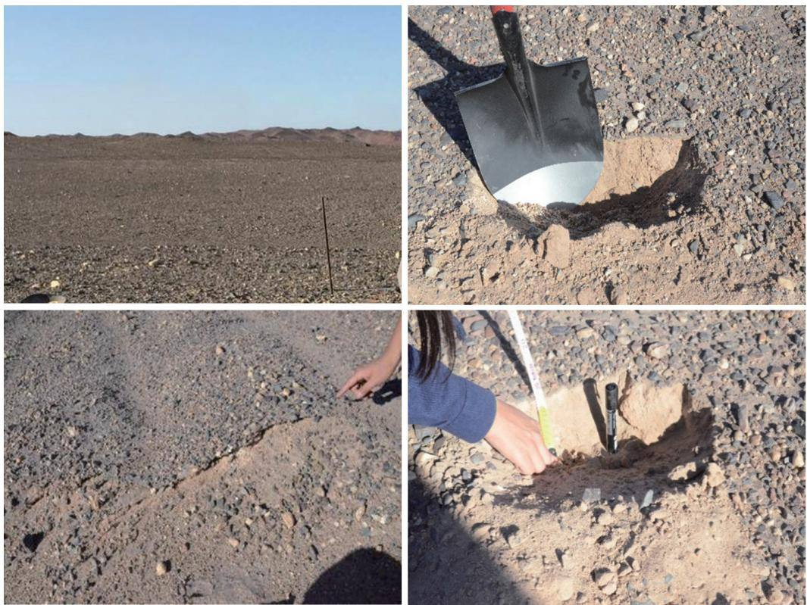
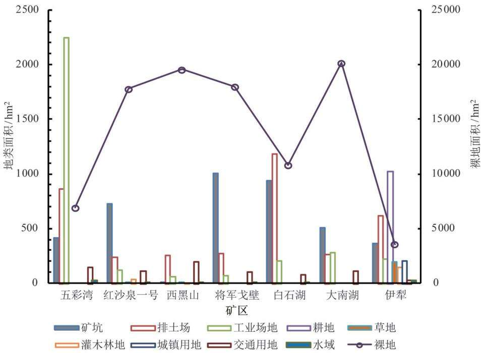
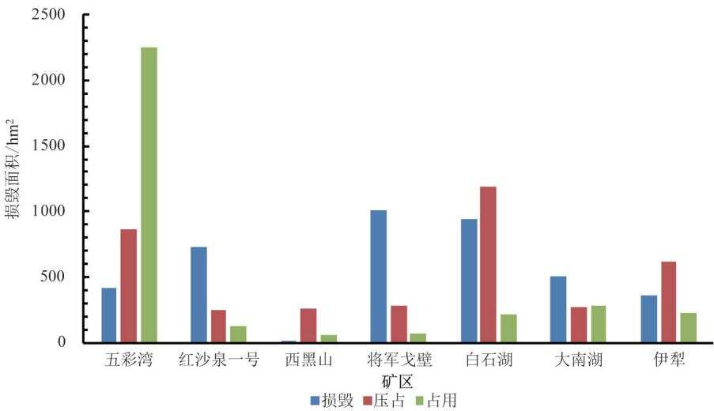
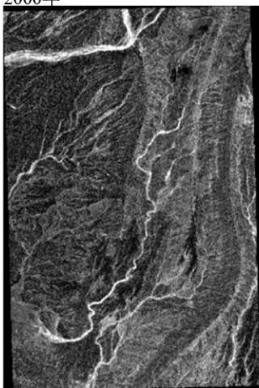
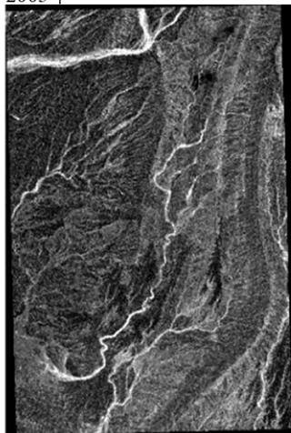
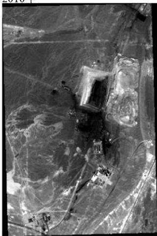
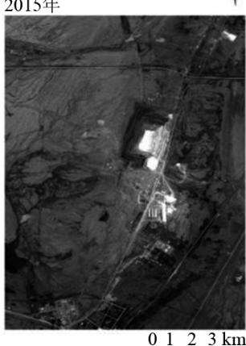
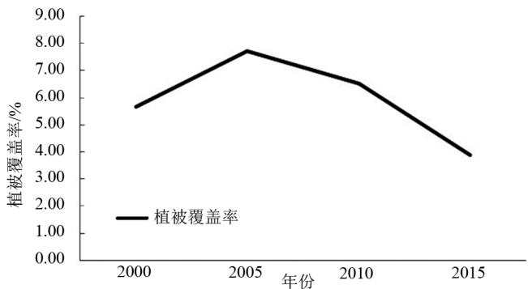
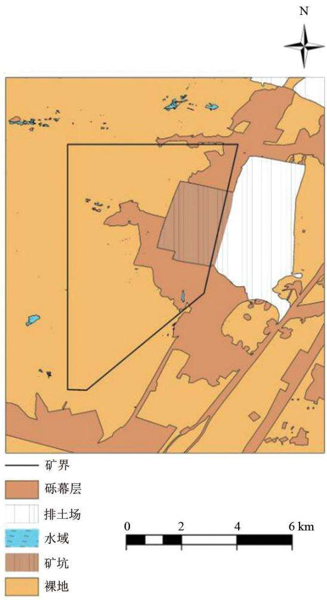
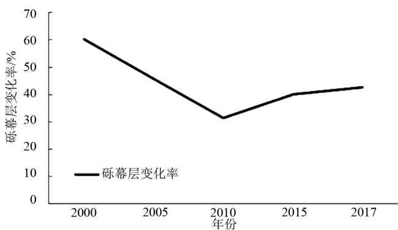

DOI:10.13745/j.esf.sf.2020.10.15

# 新疆荒漠露天矿区生态受损及砾幕层重构方法研究

张俊杰1，白中科1,2,3，\*，杨博宇1

1. 中国地质大学(北京）土地科学技术学院，北京100083

2. 自然资源部土地整治重点实验室，北京100035

3. 自然资源部矿区生态修复工程技术创新中心，北京100083

ZHANG Junjie1, BAI Zhongke1,2,3, \* , YANG Boyu¹

1. School of Land Science and Technology, China University of Geosciences (Beijing), Beijing 100083, China

2. Key Laboratory of Land Consolidation and Rehabilitation , Ministry of Natural Resources , Beijing 100035, China

3. Technological Innovation Center for Ecological Restoration Engineering in Mining Area , Ministry of Natural Resources , Beijing 100083, China

ZHANG Junjie, BAI Zhongke, YANG Boyu. Gravel curtain layer in the desert open-pit mining area of Xinjiang: Ecological damage and reconstruction method. Earth Science Frontiers , 2021, 28(4) : 142-152

Abstract: The large scale topsoil stripping and land acquisition during open-pit mining lead to destructions of land surface, vegetation, and underground water systems as well as alteration of landscape patterns, causing a series of ecological environmental problems. Open-pit mining in the desert area of northwestern China, an important successor mining location in China's future coal resources strategy, can severely threaten the country's land and ecological securities if there are no targeted countermeasures for ecosystem restoration. In this study, seven typical open-pit coal mines in the northwest desert area were selected for the landform remodeling, gravel layer reconstruction, and desert vegetation restoration studies through field investigation, empirical analysis, remote sensing imaging, and comparative analysis. The results are as follows: (1) The seven open-pit mines caused a variety of land disturbances. Among all mines, the land destruction in Baishihu is most severe, reaching 1190.3 hm² ; the occupied land in Wucaiwan is the largest at 2251.0 hm2 ; the land excavation in Jungjun Gobi is most severe, reaching 1007.3 hm² ; the bare land area in Dananhu is the largest at 20164.2 hm²; the vegetation around Yili is most abundant at 343. 3 hm² ; and the traffic land around Xiheishan is the largest, reaching 194. 3 hm². (2) The area of the gravel layer in Wuheishan, the most representative open-pine mine selected for gravel layer study, decreased from 60. 12% in 2000 to 31.28% in 2010, then increased to 42.75% in 2017. (3) For the Wucaiwan mine, the estimated biomass was 12.53 $\mathrm { g / ( m ^ { 2 } \cdot \mathrm { a } ) }$ ; the landscape diversity index was 0. 2193; the landscape dominance was 1. 7807; and the landscape evenness was 0. 1097. This area has insufficient ecological carrying capacity, weak resistence to ecological disturbance, and low ecological integrity. (4) The vegetation coverage of the Wucaiwan mining area showed an upward trend from 2000 to 2005, reaching 7.72% in 2005, followed by a downward trend from 2005 to 2015, reaching 3.89% in 2015. It can be concluded that the desert open-pit mining area in northwestern China has suffered relatively severe ecological damage. Therefore, the reconstruction of gravel curtains in this area is most urgent, and human support and guidance should be adopted to improve the rate and effectiveness of natural ecological restoration, so that the damaged habitats

# can spontaneously shift towards recovery and virtuous cycle through active self-feedback.

# Keywords: northwest desert; open-pit coal mine; ecological restoration; gravel cover; vegetation coverage

摘要：露天矿开采过程中的岩土剥离、土地压占导致大面积的地表、植被及地下水系被破坏和景观格局的改变，带来一系列生态环境问题。西北荒漠矿区作为我国未来煤炭资源战略的重要接替区，若无针对性的生态修复对策，将会严重威胁到我国国土生态安全。选取西北荒漠区7座典型露天煤矿，采用实地调研与实证研究法、遥感影像法、比较研究法等，从地貌重塑、砾幕层重构、荒漠植被重建3方面进行研究。结果如下：(1)新疆7座露天煤矿均有不同程度的土地扰动情况，白石湖矿区土地压占情况最严重，达到1190.3hm²；五彩湾矿区土地占用面积最大，为2251.0hm²；将军戈壁土地挖损面积最严重，达到1007.3hm²；大南湖矿区裸地面积最多，达到20164.2hm2；伊犁露天煤矿周边植被较多，达到343.3hm²；西黑山矿区周边交通用地最多，达到194.3hm²。（2)选择最具有代表性的五彩湾露天矿区进行砾幕层研究，其砾幕层面积比例由2000年的60.12%下降到2010年的31.28%，再上升至2017年的42.75%。（3)五彩湾矿区生物量为12.53 $\mathrm { g } / ( \mathrm { m } ^ { 2 } \cdot \mathrm { a } )$ 景观多样性指数为0.2193，景观优势度为1.7807，景观均匀度为0.1097，其生态承载能力较弱，生态体系阻抗干扰能力较差，且区域的生态完整性较低。（4)五彩湾矿区植被覆盖率在2000年至2005年呈现上升趋势，2005年达7.72%，2005年至2015年呈现下降趋势，2015年降至3.89%。总的来说，西北荒漠露天矿区生态受损程度较为严重，应以砾幕层重构为主，采取人工支持引导的方式，提高自然生态修复的速率与效果，使受损生境通过自身主动反馈，走向自发恢复的良性循环。

关键词：西北荒漠；露天煤矿；生态重建；砾幕层；植被覆盖度

中图分类号:X171.4;X87 文献标志码：A 文章编号：1005-2321(2021)04-0142-0011

## 0 引言

煤炭资源开发利用为全国能源生产和经济发展做出了巨大贡献，中国煤炭产量一直在增加，2010年至2017年，中国煤炭产量增加了2.8亿吨。中国对煤炭的依赖在短期内难以停止，但煤炭开采所造成的土地损毁、生态环境破坏等代价也是巨大的。据自然资源部土地整治重点实验室长期跟踪测算，1949年以来，中国因矿山、砖瓦窑、铁路、公路、水利水电、石油天然气等生产建设项目以及自然灾毁等原因，已经损毁土地约1000万hm²[1-2]，至2020年因上述原因损毁土地累计约1200万hm²。生态环境的破坏与我国煤炭资源的分布息息相关，我国煤炭资源地理分布不均匀，呈西多东少、北富南贫；煤炭资源与地区的经济发达程度呈现逆向分布；煤炭资源与水资源呈逆向分布；优质动力煤资源丰富，优质无烟煤和优质炼焦用煤资源不多[3]。煤炭开采造成的土地生态及地质灾害问题越来越受到关注[4]。

煤炭开采应十分注重后期生态系统恢复与重建，特别是对损毁土地修复机制的研究[5-6]。矿区生态系统不同于其他生态系统，结构与功能具有复杂性、动态性、稳定性等特征7]。矿山生态修复就是将矿区受损生态系统恢复到相对健康的状态[8]，土壤重构是矿区生态系统修复的核心[9]。在采煤沉陷地采用煤矸石、粉煤灰等充填材料进行复垦[10-11]；在表土缺乏地区筛选适宜表土材料进行露天矿复垦[12]。国内外学者在土壤改良、植被配置、施工技术、法律法规、过程监督管理等领域都进行了大量研究[13-14]，矿区生态恢复与重建是多学科、多部门、多行业相结合的系统工程[15]。中国将生态系统恢复与重建的理论研究用于实践[16]，前期主要是土地退化与土壤退化相结合的研究[17]；后期生态恢复与重建受到重视18]，对退化生态系统的类型、特征、分布、退化机理、退化程度与恢复重建的机理、模式、技术等方面展开了广泛的研究[19]。如李树志[20]对鄂尔多斯盆地生态脆弱区煤炭开采与生态环境保护技术进行了研究；杜建平等[21构建适宜性评价指标体系并用于制定煤矿占地生态化复垦利用决策；刘士余等[22]对山西煤矿区土地从荒漠化成因、程度、范围、分布等进行了分类。

“十三五”期间，我国煤炭生产格局包括加快大型煤炭基地外煤矿关闭退出；降低鲁西、冀中、河南、两淮大型煤炭基地生产规模；控制蒙东(东北)、晋北、晋中、晋东、云贵、宁东大型煤炭基地规模；有序推进陕北、神东、黄陇、新疆大型煤炭基地建设23]。在我国新疆地区，大型露天煤矿的开采所造成的生态受损是大家共同关注的课题[24]。矿区剥离、开采、运输、排弃等过程破坏了原地貌的土壤结构[25]，会对土壤物理性质、化学性质和生物性质产生影响[26]。矿区土壤在平衡土壤养分、水和能量流动过程中发挥重要作用[27]，矿区土地生态修复实施目标正是将矿区损毁土地恢复成原地貌或高于原地貌状态[28]。通过 Citespace 对荒漠生态修复进行知识图谱分析，将985篇文献进行聚类分析，发现生态系统、生态环境、气候变化、砾石等关键词出现频次较高。西北荒漠区由于特殊的区位因素形成了恶劣的水、热及土壤条件，致使评价区内地表植物难以自然生长，经过长期的风蚀作用，大部分地面表层布满了砾石或碎石，形成砾幕层。砾幕层是指在暖温带荒漠气候条件下，由于风蚀作用土壤表层细土被吹走、由残留的沙砾和碎屑逐渐形成的地表覆盖层。

申元村等[29]根据砾幕层特征及形成条件的区域分异，选取多重指标，将全国砾幕层分为3个一级区、9个二级区、19个三级区。王健铭等30]采用DCCA排序和半变异函数模型，探讨砾幕层区域植物群落组成，确定了砾幕层水土条件的空间异质性及植物多样性维持的关键因素。在无植物覆盖的砾石荒漠地区，砾幕层在保护土地资源方面具有重要作用，可以保护下部沙土不被吹蚀，从而减少风沙物质来源和保护土壤资源。Gunin等[31证实砾幕层对植物群落光谱图像的形成具有重要作用，尤其是在低投影覆盖条件下。Yu等32]通过沉积学、地球化学及孢粉学对蒙古地区砾幕层进行推演，提出了砾幕层的演进与退化。Mu等[33]提出一种“形态特征的技术”，对新疆哈密地区的砾幕层进行基于遥感影像的形态特征划分。西北荒漠区地表砾幕层约7～8cm，存量极少，受限于地表生物丰富度低的原因，生态环境十分脆弱，煤炭开发所造成的主要环境问题是露天开采对天然砾幕层的破坏。西北干旱戈壁荒漠区破坏土地生态复垦目标应定位于尽量减少原生态扰动，以保护地表砾幕层、增加地表覆盖为核心进行植被建设[34]。

国内对矿区砾幕层的破损和重构研究较少，大部分研究集中于我国西部砾石的成因、矿区沉积物砾石组分分析或者相关的储藏油气砾石分析。冯益明等35]基于遥感影像将新疆的东部戈壁分为伏土戈壁、沙砾质戈壁和石质戈壁。本研究基于粗沙质戈壁通过监督分类对五彩湾矿区砾幕层的空间分布进行划分，将现场踏勘与遥感图像相结合，确定其区域分布特征，同时对砾幕层重构的不同时期、不同作用进行探讨研究。

## 1 材料与方法

## 1.1 研究区概况

中国能源资源禀赋一直是缺油、少气、相对富煤。截至2016年末，全国煤炭查明储量15980亿吨，可供中国持续利用160年。其中，新疆地区的可采储量位居前位，占全国的20.20%。新疆戈壁区国家批复矿区36个，本文选取新疆7座具有代表性的露天煤矿(表1)进行生态受损研究。这7座露天煤矿均处于《全国主体功能区划》“北方防沙带”主体功能区36]，并且均属于准噶尔盆地温性荒漠与绿洲农业生态区。这7座煤矿基本覆盖新疆的不同生物气候带、地貌类型、土壤类型和采矿工艺，并且生态环境脆弱，水资源严重不足，植被覆盖度低，植被恢复与砾幕层重构是需首要解决的问题[37]。对其进行研究对将新疆资源优势转为经济优势，加快经济社会发展，实现社会长治久安具有深远的意义[38]。

新疆地处我国西北干旱-半干旱区，大部分地方降雨稀少，多年平均降雨量小于200mm，个别地方甚至小于50mm。如吐鲁番盆地多年平均降雨量仅15.2mm，五彩湾露天矿区年平均降水量106mm，年蒸发量1202\~2382mm，5月至8月偶有雷阵雨，冬季积雪稀少。区内常年多风，风力一般4级至5级，地势呈北高南低的缓倾斜坡。地貌形态为残丘状的剥蚀平原，海拔534～695m，相对高差161m左右。属于温带大陆性干旱区。研究区属于准噶尔盆地剥蚀-洪积砾质戈壁亚地区，其山麓洪积扇上物质为山洪侵蚀堆积体，为坡积-洪积砾石、粗砾质戈壁，著名戈壁有诺敏戈壁、将军戈壁、二百四戈壁等。

新疆地区荒漠植被覆盖度较低，大面积为裸地，干旱少雨、风蚀严重、缺乏表土是此区域的显著特点，也是新疆露天矿区生态恢复与重建最大的制约因素。未经采矿扰动的原始地貌，植被稀少，甚至绵延数百公里都是戈壁荒漠，草木不生。采矿活动对土壤物理和化学环境产生影响，造成土壤质量下降，即使采矿后进行砾幕层回填，也必然导致土体结构发生变换。砾幕层的研究对于分析西北干旱矿区生态失衡具有重要意义。西北荒漠区土地利用以自然原始的戈壁、裸岩石砾地为主，地表裸露无植被覆盖。戈壁及裸岩石砾地表有一层砾幕覆盖，本研究对砾幕层进行了现场采样(图1)。

表1 西北荒漠区七个典型露天煤矿的基本数据  
Table 1 Basic informaton on the seven typical opencast coal mines in the northwest desert area
<table><tr><td>序号</td><td>煤矿分布</td><td>建设地点</td><td>生产规模  $/ ( 1 0 ^ { 4 } ~ \mathrm { t } \cdot \mathrm { a } ^ { - 1 } )$ </td><td>矿型</td></tr><tr><td>1</td><td>新疆准东煤田五彩湾矿区三号露天煤矿</td><td>新疆 昌吉回族自治州</td><td>2000</td><td>特大型</td></tr><tr><td>2</td><td>红沙泉一号露天煤矿</td><td>新疆 昌吉回族自治州</td><td>1000</td><td>大型</td></tr><tr><td>3</td><td>新疆准东煤田吉木萨尔县南露天煤矿(帐篷沟)一期工程</td><td>新疆 昌吉回族自治州</td><td>1000</td><td>大型</td></tr><tr><td>4</td><td>新疆西黑山矿区将军戈壁二号露天煤矿一期工程</td><td>新疆 昌吉回族自治州</td><td>1000</td><td>大型</td></tr><tr><td>5</td><td>新疆广汇新能源有限公司白石湖露天煤矿</td><td>新疆 哈密</td><td>800</td><td>大型</td></tr><tr><td>6</td><td>新疆昌吉英格玛煤电投资有限责任公司奇台西黑山露天煤矿</td><td>新疆 昌吉回族自治州</td><td>600</td><td>中型</td></tr><tr><td>7</td><td>国网能源哈密煤电有限公司大南湖二号露天煤矿</td><td>新疆 哈密</td><td>300</td><td>中型</td></tr></table>

## 1.2 数据来源

本研究涉及矿区环境遥感监测主要使用高分二号遥感影像，数据来源为自生态环境部卫星环境应用中心购买的新疆矿区7处露天矿遥感影像。影像时间为7月至10月。分类前，影像均经过辐射定标和大气校正等预处理(表2)。

新疆矿区地物组成相对简单，遥感影像的空间分辨率高，对于地物具有较好的目视判别力，因此分类方法以人工目视解译和实地调查验证为主，简要流程如下：

确定矿区地类分类系统→选定感兴趣区→确定样本→选择适合分类器→影像分类→分类后处理和目视解译纠正→精度验证。利用分类后处理进行精度检验，本研究中，以kappa系数=0.80作为临界值。超过临界值，分类结果视为可信；当计算出的kappa值低于临界值时，分类结果视为不可信，需建立样本重新进行分类，直至分类精度达到要求。

  
图1 露天煤矿砾幕层采样图  
Fig. 1 Gravel curtain layer sampling in opencast coal mines  
http://www.earthsciencefrontiers. net.cn 地学前缘，2021，28(4)

表2 西北荒漠区环境修复矿区遥感影像列表  
Table 2 List of remote sensing image collections for the environmental restoration in the northwest desert mining area
<table><tr><td>露天矿区名称</td><td>遥感影像数据</td><td>卫星过境时间</td></tr><tr><td>五彩湾</td><td>GF-2</td><td>2017-07</td></tr><tr><td>红沙泉</td><td>GF-2</td><td>2017-07</td></tr><tr><td>西黑山</td><td>GF-2</td><td>2015-10</td></tr><tr><td>将军戈壁</td><td>GF-2</td><td>2015-10</td></tr><tr><td>白石湖</td><td>GF-2</td><td>2017-10</td></tr><tr><td>大南湖</td><td>GF-2</td><td>2017-07</td></tr><tr><td>伊犁</td><td>GF-2</td><td>2017-07</td></tr><tr><td>五彩湾</td><td>landsat7</td><td>2000-08</td></tr><tr><td>五彩湾</td><td>landsatTM</td><td>2005-09</td></tr><tr><td>五彩湾</td><td>landsatTM</td><td>2010-08</td></tr><tr><td>五彩湾</td><td>langsat8</td><td>2015-09</td></tr><tr><td>五彩湾</td><td>landsat7</td><td>2000-09</td></tr><tr><td>五彩湾</td><td>landsatTM</td><td>2005-08</td></tr><tr><td>五彩湾</td><td>landsatTM</td><td>2010-09</td></tr><tr><td>五彩湾</td><td>landsat8</td><td>2017-08</td></tr></table>

## 1.3 研究方法

## 1.3.1 植被覆盖度

归一化植被指数又称为NDVI，是指近红外波段与红外波段数值之差与这两个波段之和的比值，NDVI是植物生长状态以及植被空间分布密度的最佳指示因子，可以尽可能地消除阴影以及大气的干扰，同时也与植物分布密度呈线性相关[39]。其公式为

$$
\mathrm { N D V I { = } \frac { F L O A T B A N D { 4 } { - } F L O A T B A N D { 3 } } { F L O A T B A N D { 4 } { + } F L O A T B A N D { 3 } } }\tag{1}
$$

$$
\mathrm { V F C = \frac { N D V I - N D V I _ { \mathrm { s o i l } } } { N D V I _ { \mathrm { v e g } } - N D V I _ { \mathrm { s o i l } } } }\tag{2}
$$

$$
\mathrm { N D V I _ { s o i l } { = } \frac { V F C _ { m a x } { \times } N D V I _ { m i n } - V F C _ { m i n } { \times } N D V I _ { m a x } } { V F C _ { m a x } { - } V F C _ { m i n } } }\tag{3}
$$

$$
\mathrm { N D W } _ { \mathrm { v e g } } = \frac { ( 1 - \mathrm { V F C } _ { \mathrm { m i n } } ) \times \mathrm { N D V I } _ { \mathrm { m a x } } - ( 1 - \mathrm { V F C } _ { \mathrm { m a x } } ) \times \mathrm { N D V I } _ { \mathrm { m i n } } } { \mathrm { V F C } _ { \mathrm { m a x } } - \mathrm { V F C } _ { \mathrm { m i n } } }\tag{4}
$$

式中，当区域内将 $\mathrm { V F C } _ { \mathrm { m a x } }$ 可以近似取100%且$\mathrm { V F C } _ { \operatorname* { m i n } }$ 可以近似取0%时，式(2)可变为

$$
\mathrm { V F C = \frac { N D V I - N D V I _ { \mathrm { m i n } } } { N D V I _ { \mathrm { m a x } } - N D V I _ { \mathrm { m i n } } } }\tag{5}
$$

## 1.3.2 线性回归模型

根据矿区采样数据得出研究区草地监测样带生物量(表3)，并在SPSS中进行回归分析得出生物量与遥感参数公式。

利用实测生物量数据与NDVI数据进行线性回归分析，用最小二乘法对各波段数据与生物量的散点数据进行拟合，其相关系数为0.828，呈现显著正相关。将实测生物量数据与生物量模型估算数据进行比较，得出其计算精度为78.99%。建立遥感参数与生物量两者的线性回归模型。

$$
Y = - 3 ~ 3 3 1 . 5 1 + 3 0 . 4 0 8 \times \mathrm { N D V I }\tag{6}
$$

式中：Y为单位面积上的生物量干重；NDVI为影像的NDVI值。

## 1.3.3 砾幕层监督分类

砾幕层监督分类是本次研究的重点。对遥感图像上的各类地物选取一定数量的像元40]，将其作为感兴趣区并与其他地物加以区分。通过野外勘测与图像对比确定分离性较好的训练样本，采用最为普遍与实用的最大似然法生成图像。最后进行图像对比修正，通过聚类方法将样本区代入全部遥感影像中，得到监督分类图。

表3 研究区草地监测样条生物量统计表  
Table 3 Statistical table of grassland biomass monitoring sites in the study area
<table><tr><td rowspan="2">编号 草场类型</td><td rowspan="2"></td><td rowspan="2">优势种</td><td rowspan="2">面积  $/ \mathrm { k m } ^ { 2 }$ </td><td colspan="3">地理位置</td><td rowspan="2">生物量/  $( \mathrm { g } \cdot \mathrm { m } ^ { - 2 } \cdot \mathrm { a } ^ { - 1 } )$ </td></tr><tr><td>地点</td><td>经度</td><td>纬度</td></tr><tr><td>1</td><td>梭梭柴荒漠</td><td>梭梭柴、沙拐枣+杂类草</td><td>240</td><td>研究区东侧</td><td>89°07′49″E</td><td>44°50′39″N</td><td>13.62</td></tr><tr><td>2</td><td>梭梭柴荒漠</td><td>梭梭柴、沙拐枣+杂类草</td><td>240</td><td>研究区西侧</td><td>89°16′00″E</td><td> $4 4 ^ { \circ } 5 0 ^ { \prime } 0 0 ^ { \prime \prime } \mathrm { N }$ </td><td>11.44</td></tr></table>

## 2 结果与分析

## 2.1 土地利用扰动情况

露天开采对矿区生态系统会产生强烈干扰，原生生态系统结构和功能遭到破坏，生态环境的主要损毁类型有挖损、塌陷、压占。通过遥感解译得到新疆戈壁区典型露天矿各土地利用类型面积(图2)并统计其土地损毁面积（图3）。

截至2015年，将军戈壁露天矿坑面积达到$1 ~ 0 0 7 . 3 ~ \mathrm { h m ^ { 2 } }$ ，占其土地损毁面积的74.26%，排土场压占面积为276.7hm²，工矿场地占用面积为$7 2 . 5 ~ \mathrm { { h m ^ { 2 } } }$ ;西黑山为新开采矿区，露天矿坑面积为$1 1 . 5 ~ \mathrm { h m } ^ { 2 }$ ，排土场压占面积为 $2 5 6 . 4 ~ \mathrm { h m ^ { 2 } }$ ，工业场地占用面积为61.2hm²；五彩湾矿区土地占用面积最大，达到 $2 \ 2 5 1 . 0 \ \mathrm { h m ^ { 2 } }$ ，占其损毁面积的63.80%；白石湖矿区土地占用情况最严重，达到1190.3hm²，占其土地损毁面积的50.89%；红沙泉一号周边植被情况好于其他5个矿区，面积达到6.0hm²；大南湖矿区裸地最多，达到20164.2hm²。

煤矿在“剥-采-运-排-复”活动中的土地损毁对矿区生态系统产生了直接或间接的影响，人类的活动对其产生了剧烈扰动，7座露天矿区均呈现不同程度的损毁。根据损毁面积及周边生态环境实地勘察得出，五彩湾矿区土地损毁最为严重，其次是白石湖矿区，大南湖矿区、伊犁将军戈壁矿区损毁也较为严重，红沙泉一号、西黑山矿区损毁程度较轻(图2,3)。

## 2.2 五彩湾矿区生态环境遥感监测

新疆“十一五”规划中已确定建设准东、伊犁、吐哈、库拜四大煤炭产业基地，并将准东列为四大基地之首。在准东西部矿区总规中，五彩湾露天煤矿被列为第一个露天矿，采矿规模最大，土地损毁面积较大，矿区周围环境敏感区域和保护区较多(卡拉麦里山自然保护区、古生物化石群保护区、风蚀雅丹地貌等)，主要属于天山北坡主产区和将军戈壁硅化木及卡拉麦里山有蹄类动物保护生态功能区。土地对荒漠化高度敏感，沙丘流动性强，生态系统脆弱，土壤稳定性差。根据现场踏勘，对五彩湾矿区边界及矿区的影响区进行了划分，细致地区分出了砾幕层区域，同时也对植被覆盖度的区分范围做出了测算。NDVI值计算采用了常用的灰度模型(图4)。

对五彩湾矿区 2000—2015年的 NDVI值(图4)进行比较，其NDVI值呈现往复波动，2010年矿区南侧NDVI值较高，是由于采矿作业区南侧人工防护林的构建改善了区域生态环境，其植

  
图2 西北荒漠区露天煤矿地类划分及面积  
Fig. 2 Land types and areas of each land type and bare land in the seven opencast coal mines in the northwest desert area

2015年  
  
图3 西北荒漠区典型露天矿土地损毁面积  
Fig. 3 Area of land damage in the seven typical opencast mines in the northwest desert area

2000年  

2005年  

2010年  

  
图 4 五彩湾矿区 2000—2015 年 NDVI 图  
Fig. 4 Historical NDVI images (2000 - 2015) of the Wucaiwan mining area

被指数也远远高于原地貌值。

2000年至2005年由于植被的自然演替，植被覆盖率呈现上升的状态；2005年至2010年五彩湾矿区大规模的交通用地以及工业设施的建立，导致其生态系统遭到破坏，植被覆盖率开始呈现下降趋势；2010年至2015年由于露天煤矿进行大规模开采，植被遭到了严重的破坏，虽然矿区开采方进行了相应的复垦措施，但由于当地气候恶劣，水源稀少，植被的生长较于其他地区呈现缓慢的增长趋势(图5)。在矿区，初级生产力与景观结构组成的关系更为密切[41]，五彩湾区域内主要以石膏灰棕漠土为主且成了地带性土壤，整个研究区内植被生产力处于偏低的水平。研究区内植被生物量为

  
图 5 五彩湾矿区 2000—2015 年植被覆盖率图  
Fig. 5 Vegetation coverage of the Wucaiwan mining area during 2000 − 2015

12.53 $\mathrm { g / ( m ^ { 2 } \cdot \mathrm { a ) } } ^ { }$ (干质量)的区域占整个研究区面积的 92.87%，但是其区域生物量总量仅有 68 8348 kg/a，相比整个五彩湾矿区总量较低，总体分级水平小于$5 0 ~ \mathrm { g } / ( \mathrm { m } ^ { 2 } \cdot \mathrm { a } )$ ，说明该区域生态体系的生态承载能力较为脆弱，对外界干扰的恢复能力较弱，生态系统恢复稳定性较低。从植被分布的空间异质性角度分析，当给定的景观类型数 Shannon-Wiener指数为最大值 $H _ { \mathrm { m a x } }$ 时，各景观类型的面积比例相同，而且各景观斑块在景观中分布的均匀程度最大。研究区的 Shannon-Wiener指数为 0.219 3，由计算可得， $H _ { \mathrm { m a x } }$ 为 2.0,Shannon-Wiener 指数只有 $H _ { \mathrm { m a x } }$ 的10.97%。

## 2.3 五彩湾矿区砾幕层年际变化

研究通过划定矿区的影响边界，确定砾幕层分布，通过监督分类来有效地判断砾幕层的面积变化。对于五彩湾矿区砾幕层区域划分，土地利用分类中并没有砾幕层这一类别，对矿界范围的裸地经过遥感解译与实地验证判定其为砾幕层。其总体分类精度达到92.8357%，kappa系数为0.82，符合要求。

新疆准东地区土壤隶属灰棕漠土、棕漠土，遥感图像中其砾幕层呈现灰白相间，色调不匀(图6)。

从砾幕层的变化(图7)可以看出，2000年占有比为60.12%，矿区开采后占有比逐渐下降至最低值31.28%。矿区随后依据边开采边复垦的策略，开始逐渐回填砾幕层，使砾幕层面积占比恢复到42.75%。在2010年后砾幕层面积也显现增加趋势，煤炭资源开采量减少的同时也减少了对砾幕层的破坏。

西北荒漠露天矿区砾幕层重构即针对在露天采矿中被破坏的砾幕层采取恰当的工艺，应用物理、化学及工程措施，构造适宜的砾幕层剖面。砾幕层下方多形成孔泡结皮层[42]，它是干透表土突然浸湿后，孔隙中的空气受到压缩，一方面引起团聚体崩解、土壤消散、土壤垒结重新排列以及结皮的重新形成；另一方面，当结皮上部的水分变干的时候，由于土体的收缩将正在起泡的空气封闭起来，形成气泡状孔隙[43]，地表的砾幕和其表层下的细土孔泡结皮层进一步提高了抗风蚀的能力。通过研究建立荒漠区露天矿砾幕层重构技术体系，将体系划分为砾幕层重构准备期、实施期和维护期。

砾幕层重构准备期主要包括砾幕层剥离、砾幕层存放。通过现场实地调查，荒漠露天矿区砾幕层剥离适用于机械剥离，对于部分地形复杂地区，机械施工困难时采用人工剥离，做到“先剥后采”，剥离厚度为20～30cm。荒漠露天矿区进行剥离时由于物理化学作用，极易风化成抗蚀能力差的土体并且会产生大量的扬尘，要采取洒水降尘措施。同时注意采煤工艺与剥离工艺的衔接。五彩湾煤矿区采用单斗-卡车-半固定破碎站半连续的开采工艺，剥离工艺采用单斗-卡车工艺，在时间与空间上更好地衔接。在实地勘察得出荒漠露天矿区砾幕层存放基本适用分散堆状砾幕层，由于西北地区干旱少雨，适生物种少，在砾幕层存放时采用密目网苫盖，洒水结皮同时撒播一些草籽(以沙蒿等牧草为主)来固存砾幕层，防止风蚀。在排土场的周围修筑拦渣堤、防洪渠以及排水沟等工程，防止水土流失。

  
矿界范围内棕褐色区域为遥感解译的砾幕层范围。  
图6 五彩湾矿区砾幕层分布图

Fig. 6 Gravel cover distribution map of the Wucaiwan mining area  
  
图7 五彩湾矿区砾幕层年际变化现状  
Fig. 7 Interannual variation in gravel cover in the Wucaiwan mining area

砾幕层重构实施期主要包括剖面重构、土壤改良以及植物的筛选和配置。对干旱矿区现场调查发现，其土壤属于石膏棕漠土，大部分为碱性土，土壤容重大，含水量小，土壤容易板结。西北干旱露天煤矿区大都处于人烟稀少的区域，砾幕层中微生物、酶活性以及生化作用强度均处于较低状态。通过土壤的改良和适生植物的种植来改善排十场的十壤贫瘠问题。将剥离砾幕层与表土按照剥离物的强度来调整排弃顺序，排土场设计排弃方式为卡车-推土机排土，排土场构筑采取岩土混排工艺，将细颗粒物料充填到岩块裂缝中，减轻非均匀沉降程度，同时逐层堆垫，逐层压实；对外排土场排土工艺应先堆放沙土或粒径小土石方，最后堆放大粒径的砾石，以达到尽快形成地表砾幕层、减少扰动以保护土壤结皮的目的。在排土场上采用砾石直接铺覆工艺，同时洒水，通过自然作用形成人工砾幕层。五彩湾露天矿区购买了较多培育土，将培育土与砾幕层充分融合压实构成排土场主体。在外排土场顶部和迎风坡面用砾石压盖，并进行洒水降尘；在每个台阶底部周围设置护坡，采取防护措施后可有效控制风力侵蚀。在排土场建设完成后及时整地，平台复垦采用覆土，覆土来源为建设初期采掘场的剥离表土。研究区植被类型属于亚非荒漠区准噶尔一哈萨克斯坦荒漠亚区植被。对于植被恢复，以恢复梭梭群落为最终目标，大面积种植梭梭（Haloxylon ammodendron （C. A.Mey.）Bunge）、琵琶柴（Reaumuria songonica(Pal L) Maxim.)、沙拐枣（Calligonum mongoli-cumTurcz.)等植被，以人工建设引导为主，逐步过渡到自然恢复。

砾幕层重构维护期主要包括水土保持和人工管护，其主要工程措施包括周边设置土石结构挡土围埂，同时在排土场平台内侧修筑排水沟，在平台外侧修筑围梗，规整流路，疏导水流，使积水汇入排水系统，防止边坡的切沟侵蚀。对于排土场定期碾压，降低起尘；配置洒水车适时适量洒水；设置防风沙障，对于植被恢复采取以水定地、量水而行的原则，同时进行定期生态监测，观测植被长势以及砾幕层重构状况。

## 3 讨论与结论

## 3.1 讨论

西北荒漠露天煤矿的建设及运营使矿区占地范围内的土地利用格局遭到破坏，降低了植被覆盖率，破坏了原有生态系统的结构与功能。在确保生态恢复措施的实施后，露天煤矿建设和运营对研究区自然体系恢复稳定性和阻抗稳定性的影响相对较小，在区域自然生态体系可承受范围内。矿山施工和开采过程造成的生态损失可得到恢复与补偿，煤炭开采不会对区域土地利用格局和生态资源产生大的不利影响。应继续加强生态保护，严格落实各项生态恢复措施，最大限度减少地表扰动，有效防范环境风险。

西北干旱区大型露天矿区砾幕层重构的实质就是通过人为措施，控制砾幕层剥离与回填，强调不易风化、贫瘠性砾幕层的有序排放，使砾幕层颗粒大小、物理、化学等性状逐渐趋于正常化。西北荒漠露天矿区大量的剥离物形成的巨大排土场，将会对周边环境造成影响，导致风力侵蚀加剧，加速土壤沙漠化，砾幕层对于外排土场的水土流失防治将起到决定性的作用。砾幕层重构作为西北荒漠露天复垦5个阶段(地貌重塑、土壤重构、水文稳定、植被重建及生物多样性重组)中的重要组成部分，将在实践中践行土地复垦与生态修复的新理念。

多数西北荒漠露天煤矿缺少跟踪评价制度，缺少环境监测与环境管理，应当对煤矿区域环境质量、环境影响等进行定期跟踪评价，保证评价的准确性，及时对环保措施进行相应调整，及早发现人工生态系统发育过程中出现的问题，并制定相关解决方案，预防人工群落出现逆演替状况。通过创新减损开采技术来保障砾幕层，同时也实现西部煤炭资源开发与生态环境保护协调发展。

## 3.2 结论

(1)本文结合新疆煤矿土地损毁类型及生态环境特点，以遥感监测与实地踏勘为主要手段，得出新疆7座露天煤矿生态受损均呈现较为严重状态，露天煤矿开采对景观格局、生态过程、生态生境造成了巨大影响；必须采取合理有效的措施，从土地利用结构与景观格局入手，优化矿区生态系统结构和提高

生态系统功能。

(2)2000年至2015年间五彩湾露天矿区土地利用/覆盖景观格局总体趋于简单，呈现自然演替作用下的上升趋势及采矿活动和自然作用下的下降趋势，景观基底的荒漠草场生态完整性较高，斑块数目却在逐渐增加，破碎化程度明显增高，生态系统呈现逐步退化趋势。

(3)2000年至2017年间五彩湾露天煤矿砾幕层面积呈现先下降后上升趋势。作为西北荒漠地区有效防治风沙、控制水土流失的重要途径，西北荒漠区露天煤矿砾幕层重构分为3个阶段，其中每个技术环节都以砾幕层重构为核心，并且彼此之间相互联系，相互制约，共同组成砾幕层重构技术体系。在砾幕层重构的实践应用中只有充分认识到技术体系的作用，并合理选择、安排各个技术环节，才能实现矿区土地复垦与生态重建。

## 参考文献

[1]白中科，周伟，王金满，等．再论矿区生态系统恢复重建[J]中国土地科学，2018，32(11)：1-9.

[2]白中科，杨侨，白甲林.论绿色矿山建设的源头管控与过程监管[J]. 中国矿业，2018，27(8)：75-79.

3] 贺佑国，叶旭东，王震．关于煤炭工业“十三五”规划的思考[J]. 煤炭经济研究，2015，35(1)：6-8，21.

[ 4 ] HILSON G. Defining “cleaner production" and “pollution prevention" in the mining context[J]. Minerals Engineering, 2003, 16(4): 305-321.

[5] 赵鑫.基于RS、GIS的哈密三道岭矿区生态环境调查与评价[D]. 西安：西安科技大学，2013.

[ 6 ] TOWNS D R, BALLANTINE W J. Conservation and restoration of New Zealand Island ecosystems [J]. Trends in Ecology & Evolution, 1993,8(12): 452-457.

[7]卞正富，许家林，雷少刚．论矿山生态建设[J].煤炭学报，2007,32(1):13-19.

8]卞正富，雷少刚，金丹，等．矿区土地修复的几个基本问题[J]. 煤炭学报，2018，43(1)：190-197.

[9]胡振琪．我国土地复垦与生态修复30年：回顾、反思与展望[J]. 煤炭科学技术，2019，47(1)：25-35.

[10]徐良骥，黄璨，章如芹，等．煤矸石充填复垦地理化特性与重金属分布特征J. 农业工程学报，2014，30(5)：211-219.

[11] 孙绍先，李树志.我国煤矿土地复垦和塌陷区综合治理的发展与技术途径[J]. 矿山测量，1991，19(1)：34-38，63.

[12]胡振琪，位蓓蕾，林衫，等．露天矿上覆岩土层中表土替代材料的筛选[J]. 农业工程学报，2013，29(19)：209-214.

[13] BRADSHAW A D, CHADWICK M J. The restoration of land: the ecology and reclamation of derelict and degraded

landM. Oxford: Blackwell Scientific Publications, 1980.

[14] 宋锐涛．不同生态恢复与重建措施下的物种多样性与土壤特征：以长汀县河田地区为例D.福州：福建师范大学，2013.

[15] 温晓丽．宝日希勒矿区生态环境恢复与治理技术研究[J].内蒙古煤炭经济，2016(8)：63-65.

[16] 吴历勇．煤矿区生态恢复理论与技术研究进展[J]. 矿产保护与利用，2012(4)：54-58.

[17]常秋玲，康鸳鸯．河南采煤塌陷区土地复垦与生态恢复浅析[J]. 中国矿业，2006，15(11)：43-45.

[18]魏艳，侯明明，王宏镇，等．矿业废弃地的生态恢复与重建研究[J]. 矿业快报，2006，22(11)：36-39.

[19]白中科，赵景逵，李晋川，等．大型露天煤矿生态系统受损研究：以平朔露天煤矿为例[J].生态学报，1999，19(6)：870-875.

[20] 李树志．我国采煤沉陷土地损毁及其复垦技术现状与展望[J]. 煤炭科学技术，2014，42(1)：93-97.

[21]杜建平，邵景安，周春蓉，等．基于生态适宜度和三角模型的煤矿临时建设用地复垦决策研究[J]. 自然资源学报，2018,33(11)：1872-1885.

[22]刘士余，孟菁玲，张成梁.山西煤矿区土地荒漠化类型和成因分析[J]. 水土保持研究，2006，13(5)：163-165.

[23」裘品姬.新疆煤炭行业“十三五”发展的思考与建议[J].煤炭经济研究，2015，35(1)：14-21.

24秦伟，朱清科，张学霞，等．植被覆盖度及其测算方法研究进展[J]. 西北农林科技大学学报(自然科学版)，2006，34(9):163-170.

[25] AHIRWAL J, MAITI S K. Development of Technosol properties and recovery of carbon stock after 16 years of revegetation on coal mine degraded lands, India[J]. Catena,2018,166:114-123.

[26] FENG Y, WANG J M, BAI Z K, et al. Effects of surface coal mining and land reclamation on soil properties: a review[J]. Earth-Science Reviews, 2019, 191: 12-25.

[27] DOMINATI E, PATTERSON M, MACKAY A. A framework for classifying and quantifying the natural capital and ecosystem services of soils[J]. Ecological Economics, 2010, 69(9):1858-1868.

[28] UPADHYAY N, VERMA S, SINGH A P, et al. Soil ecophysiological and microbiological indices of soil health: a study of coal mining site in Sonbhadra, Uttar Pradesh[J]. Journal of Soil Science and Plant Nutrition, 2016, 16(3): 778-800.

[29]申元村，王秀红，程维明，等.中国戈壁综合自然区划研究[J]. 地理科学进展，2016，35(1)：57-66.

[30]王健铭，董芳宇，巴海·那斯拉，等.中国黑戈壁植物多样性分布格局及其影响因素[J]. 生态学报，2016，36(12)：3488-3498.

[31] GUNIN P D, DEDKOV V P, DANZHALOVA E V, et al. NDVI for monitoring of the state of steppe and desert ecosystems of the Gobi[J]. Arid Ecosystems, 2019, 9(3) : 179-186.

[32] YU K F, LEHMKUHL F, SCHLÜTZ F, et al. Late Quaternary environments in the Gobi Desert of Mongolia: vegetation, hydrological, and palaeoclimate evolution[J]. Palaeogeography, Palaeoclimatology, Palaeoecology, 2019, 514: 77-91.

[33] MU Y, WANG F, ZHENG B Y, et al. McGET: a rapid image-based method to determine the morphological characteristics of gravels on the Gobi desert surface[J]. Geomorphology, 2018, 304:89-98.

[34]王金满，白中科，崔艳，等．干旱戈壁荒漠矿区破坏土地生态化复垦模式分析[J]. 资源与产业，2010，12(2)：83-88.

[35]冯益明，吴波，周娜，等．基于遥感影像识别的戈壁分类体系研究[J]. 中国沙漠，2013，33(3)：635-641.

[36]赵廷宁，张玉秀，曹兵，等．西北干旱荒漠区煤炭基地生态安全保障技术[J]. 水土保持学报，2018，32(1)：1-5.

[37] 张诗吟．准东露天煤矿排土场植被恢复的研究[D]. 乌鲁木齐：新疆大学，2017.

[38] 吴煜．新疆干旱荒漠区煤矿开采区域的水土保持措施探讨[J]. 中国水土保持，2017(6)：33-35.

[39] 李苗苗．植被覆盖度的遥感估算方法研究[D]. 北京：中国科学院研究生院(遥感应用研究所)，2003.

[40]杨超，邬国锋，李清泉，等.植被遥感分类方法研究进展[J].地理与地理信息科学，2018，34(4)：24-32.

[41]康萨如拉，牛建明，张庆，等．草原区矿产开发对景观格局和初级生产力的影响：以黑岱沟露天煤矿为例[J].生态学报，2014，34(11)：2855-2867.

[42] 季方．塔里木盆地荒漠类型及其抗风蚀特征初探[J]. 水土保持学报，2001，15(1)：16-18，53.

[43] 雷文进，顾国安.中国土壤系统分类中干旱土分类的修订说明J.土壤，1996，28(5)：232-236.

# 《地学前缘》中文版入选EI检索系统

经Elsevier工程信息公司中国信息部通知，由中国地质大学(北京)和北京大学主办的中文刊《地学前缘》从2013年第1期开始，正式被EI检索系统收录。这将进一步提高《地学前缘》的知名度和影响力。EI(The Engineering Index，简称 EI)创刊于1884年，是美国工程信息公司(Engineering information Inc.)出版的著名工程技术类综合性检索工具，是世界著名的三大检索系统之一。

收录《地学前缘》的国外检索系统

EI工程索引(美国)

AJ俄罗斯《文摘杂志》(俄罗斯)

JST日本科学技术振兴机构中国文献数据库(日本)

CA化学文摘(网络版)(美国)

Ulrichsweb乌利希期刊指南(网络版)(美国)

GRP地质学参考及预览数据库(美国)

ZR 动物学记录(英国)

Scopus 文摘与引文数据库(荷兰)