梁世伟，许领，胡而已.露天矿山生态修复中的土壤重构试验[J].地质科技通报，2023，42(6)：242-248.Liang Shiwei,Xu Ling, Hu Eryi. Field model tests of soil reconstruction in ecological restoration of open-pit mines[J]. Bulletinof Geological Science and Technology,2023,42(6) :242-248.

# 露天矿山生态修复中的土壤重构试验

梁世伟1,2a,2b，许领2a,2b，胡而已1

（1.应急管理部信息研究院，北京100020；2.西安交通大学a.人居环境与建筑工程学院；b.灾害防治与生态修复研究院，西安710049)

摘要：针对甘肃临洮县张家沟石灰岩矿Ⅳ矿区的地质环境破坏问题，采用喷播复绿工艺对试验矿区进行了生态恢复治理。结合在露天矿试验区和实验室同时选择6种不同配比生态土（客土十有机营养土十土壤改良材料复合肥及其他)进行了种植，分析了在不同湿度下4种草本植物和2种灌木不同混合比例的生长特征。试验结果表明：不同配比的生态土影响植物生长过程，其中在6种不同配比生态土中，生态土配比为客土(40%）十有机营养土(36%)+土壤改良材料(20%)+复合肥及其他(4%)+草籽(草本、灌木)的环境状态下的植被生长更趋于稳定：在湿度为17%～30%的环境条件下，草本植物与灌木比例为40：1的植被生长更趋于稳定，而在湿度为30%～44%的环境条件下，草本植物与灌木比例为20：1的植被生长更趋于稳定。研究结果揭示了在不同生态土配比下植被的生长规律特征，可为露天矿山的生态修复治理提供参考。

关键词：露天矿山；土壤重构；植被；模型试验；生态修复

2022-08-29收稿；2022-09-29修回；2022-10-07接受

中图分类号：X171.4文章编号：2096-8523(2023)06-0242-07

doi:10.19509/j. cnki. dzkq. tb20220459

开放科学(资源服务)标识码(OSID)：

# Field model tests of soil reconstruction in ecological restoration of open-pit mines

Liang Shiwei1,2a,2b , Xu Ling2a,2b, Hu Eryi

(1. Information Research Institute of the Ministry of Emergency Management, Beijing 100020, China; 2a. School of Human Settlements and Civil Engineering; 2b. Disaster Prevention and Ecological Restoration Research Institute, Xi'an Jiaotong University, Xi'an 710049, China)

Abstract: [Objective]To address the problem of geological environment destruction in the IⅣ mining area of Zhangjiagou Limestone Mine in Lintao County, Gansu Province, the spraying regreening technology was used to carry out ecological restoration and management in the test mining area. Methods In this study, 6 kinds of ecological soils with different formulations of foreign soil, organic nutrient soil, soil improvement material compound, and fertilizer and others were selected for planting experiments conducted in the open-pit mine test area and laboratory at the same time, so as to analyse plant growth characteristics under different humidity levels and different mixing ratios of 4 herbs and 2 shrubs. [Results] The results showed that the formulation of ecological soil affected the growth process of plants. The plant community

was more stable when the percentage of foreign soil, organic nutrient soil, soil improvement material compound, and fertilizer and others were 40%, 36%, 20% and 4%, respectively, of the ecological soil and the grass seeds were planted. The plant community with a herb to shrub ratio of 40 : 1 was more stable under environmental conditions of 17% to 30% humidity, while the plant community with a herb to shrub ratio of 20 : 1 was more stable under the environmental conditions of 30% to 44% humidity. [Conclusion] The research results can provide a reference for ecological restoration and management of open-pit mines.

Key words: open-pit mine; soil reconstruction; plant community; model test; ecological restoration

Received:2022-08-29;Revised:2022-09-29;Accepted:2022-10-07

近年来，面对日益严重的矿山地质环境破坏问题，矿山的生态修复治理势在必行，而土壤重构和植被恢复是矿区生态系统重建恢复的核心与保障。其中土壤重构是以矿山损毁土地的土壤恢复或重构为目的，应用一些工程措施及物理、化学、生物等改良措施，重新构造一个适宜植被生长的良好土壤环境[1]。植被恢复是利用生态学的原理对矿区的植被进行科学规划，恢复不同区域植被生物量、密度、多样性等[2-3]。因此，研究露天矿区的土壤重构与植被恢复对矿山的生态修复可持续发展有重要的意义。

目前，研究矿山生态修复中的土壤重建和植被恢复问题的学者越来越多。牛星4通过对伊敏露天煤矿废弃地恢复样地的野外调查和室内分析，运用数量生态学方法对不同恢复样地土壤的物理化学性质进行了研究，明确了不同样地土壤物理化学性质的差异；胡振琪等5]研究了基于“源头和过程控制的理念”，提出了露天矿区“边采边复”概念；刘英[6]研究了半干旱矿区植被引导型恢复模式，为绿色矿山建设、矿区植被重建利用提供了方法论基础。冯昶栋等[7]通过样地调查和室内萌发法研究了乌海新星露天煤矿区3种不同干扰条件下的土壤种子库及与其地表植被之间的变化规律。杜华栋等[8以我国煤炭化工基地—榆神府矿区黄土塌陷地为研究区，结合植物群落演替特征分析了黄土塌陷地植被恢复与土壤质量之间的演变规律。毕银丽等[9]针对西部干旱半干旱区露天矿区重构土壤生态难的现状，采用微生物一植物联合修复技术，有效地促进了矿区土层结构重构和植被优化作用10]。这些学者大部分都是根据矿山地质环境破坏的特点、方式、分布及危害程度，抓住重点和关键环节，因地制宜，在矿区现场进行土壤重构和植被恢复试验[11-15]，很少采用实验室与矿区现场试验相结合的方法研究露天矿山生态修复中的土壤重构与植被恢复[16-21]。

因此，笔者拟以甘肃临洮县张家沟石灰岩矿Ⅳ矿区为研究区，采用矿山生态修复中的土壤重构现场试验与实验室试验相结合的研究方法，探讨在不同生态土配比下植被的生长规律和特征，对该露天矿区采取地质灾害治理、土壤层重构、植被恢复等多方面的综合治理措施进行恢复治理有重要的意义。

## 1 研究区概况

## 1.1 矿区地质环境问题

研究区位于甘肃省临洮县张家沟石灰岩矿Ⅳ矿区，开采矿种为水泥用石灰岩，开采方式为露天开采，生产规模120万t/a，开采有效期限自2010年8月4日至2021年8月4日，面积1.3757km²，已经开采了9年零2个月，剩余服务年限8个月。矿区地形地貌如图1所示，海拔2093～2281m，相对高差188m，山势整体北高南低，坡度30°～60°，切割深度不大，山势平缓，植被发育一般，属构造一侵蚀构造中山地貌。范围为东经103°44′12.63"～103°44′25.38″，北纬35°50′51.04″\~35°50′39.81"。选择该矿区露天采矿后生态问题较严重的区域为研究对象，该区属温带半干旱气候，年平均气温为7℃，年极端最高气温36.1℃（2000年)，年极端最低气温一29.6℃（1955年），年降水量在300～600mm之间。全年无霜期145～165d。年蒸发量1200～1600mm，为降水量的3倍多。一日最大降水量为1438mm，连续最大降水量为150.9mm。最大冻土深度86 cm。

该矿区土壤类型为灰钙土，在矿区范围内广泛分布。表层呈弱腐殖化，土壤有机质质量分数1%\~2.5%，呈中性一碱性，pH值6.5～8.5，局部有碱化现象。土壤剖面分为腐殖质层、母质层、钙积层，腐殖质层厚度3～5m，呈灰黄棕色或淡灰棕色，亮度值较高；母质层黄土母质比较疏松，有时可见少量的盐结晶；钙积层在地面以下 50 cm 或 80 cm 的部位出现，钙积层比腐殖质层及母质层紧实，块状结构，植物根系很少，在结构面或孔壁可见到白色假菌丝状或斑块状石灰质新生体，有时还有少量雏形砂姜。矿区由于气候干燥，降水稀少，地质环境脆弱，致使天然植被低矮、稀疏，覆盖率极低，以荒坡为主，植被总覆盖度小于10%。经调查，石灰岩矿Ⅳ矿区自开采以来重开采、轻保护，加之早期开矿企业开采技术落后，开采条件简陋，开采手段粗放，区内矿山地质环境问题主要表现在对地形地貌景观的破坏、引起不稳定边坡地质灾害、对含水层的破坏和土地资源的破坏。针对目前已恶化的地质环境的现状，必须采取及时而有效的措施进行治理和恢复，对该露天矿区采取地质灾害治理、土壤层重构、植被恢复等多方面的综合治理措施。

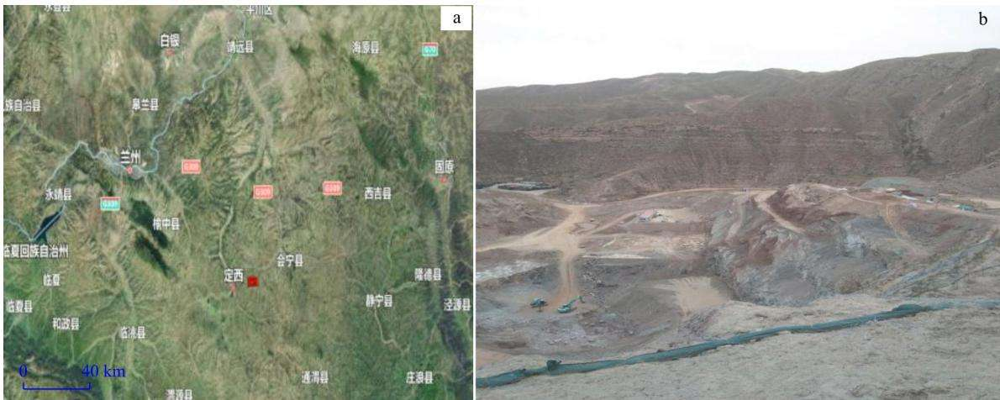  
图1 矿区位置(a)及矿区周边地形地貌(b)  
Fig. 1 Location of the mining area (a) and topography around the mining area (b)

## 1.2 试验概况

## 1.2.1 室内试验

参考该地区生态修复工程经验和治理区周边植被类型，室内试验设计6个不同生态土配比类型的试验盒子来模拟土壤重构与植被恢复试验，草种选择多年生、根系发达、适宜本土生长的草本植物，如高羊茅、紫羊茅、早熟禾、黑麦草等草本植物。试验盒子中的土壤客土基层以客土为主要材料，并掺加有机营养土、土壤改良材料、混合肥、保水剂、团粒剂、微生物菌剂等。然后按照不同比例向客土中掺入上述材料，搅拌均匀后设计成6个不同生态土配比类型的试验盒子，详细配比如表1所示。

表1 6个不同生态土配比类型的试验盒详细配比  
Table 1 Statistics on the detailed ratio of 6 experiment boxes with different ecological soil ratio types wB/%
<table><tr><td rowspan="2">生态土配料</td><td colspan="6">试验盒编号</td></tr><tr><td>1</td><td>2</td><td>3</td><td>4</td><td>5</td><td>6</td></tr><tr><td>客土</td><td>100</td><td>50</td><td>45</td><td>50</td><td>50</td><td>40</td></tr><tr><td>有机营养土</td><td>0</td><td>50</td><td>35</td><td>48</td><td>30</td><td>36</td></tr><tr><td>土壤改良材料</td><td>0</td><td>0</td><td>20</td><td>0</td><td>18</td><td>20</td></tr><tr><td>多含量复合肥</td><td>0</td><td>0</td><td>0</td><td>1.4</td><td>1.4</td><td>2.8</td></tr><tr><td>保水剂</td><td>0</td><td>0</td><td>0</td><td>0.5</td><td>0.5</td><td>1.0</td></tr><tr><td>团粒剂</td><td>0</td><td>0</td><td>0</td><td>0.05</td><td>0.05</td><td>0.1</td></tr><tr><td>微生物菌剂</td><td>0</td><td>0</td><td>0</td><td>0.05</td><td>0.05</td><td>0.1</td></tr></table>

## 1.2.2 现场试验

在三易矿山的植被恢复区域，本次现场试验采用传统的系统取样原则：现场试验田样方总范围为16m×6m。在自然资源部矿区土地复垦三易矿山的现场基地建立了8种不同类型试验田，每个大小为2m×2m，永久性固定试验样方如表2所示。其中试验田1～6分别对应试验盒1～6中生态土的配比，草种选择多年生、根系发达、适宜本土生长的草本植物，如高羊茅、紫羊茅、早熟禾、黑麦草等草本植物。而试验田7和8中生态土配比均选择试验盒6的生态土配比，草种选择草本植物和灌木，有沙棘、荆条等，试验田7草本植物与灌木比例为20：1，试验田8草本植物与灌木比例为40：1；并且现场试验田分为了3种不同湿度环境状态：自然不浇水、17%～30%湿度和30%～44%湿度的试验样方，实现了从样点到样方长期系统定位监测植被的生长变化规律。

现场每块试验田样方的选取和划分都是按照环境优良、地理位置方便的原则，本次试验田的喷播复绿施工设计采用3层喷射层，其中下层为改良后的适合植物生长的客土基造层，中层为植物根系生长层，上层为含复合纤维的、能够很好附着于地表的草种层，喷播面积 $9 6 ~ \mathrm { m } ^ { 2 }$ (图2)。现场试验田具体设计如下：①客土基层(下部基层)，以客土为主要材料，并掺加有机营养土、土壤改良材料、混合肥、保水剂、团粒剂、微生物菌剂等，其配比如表1所示；客土中掺入上述材料后，搅拌均匀，然后用喷射机喷于坡面，喷层的厚度为8～10cm。②客土基层（中部生长层)，由于该矿山现场试验田大部分为基岩，锁水能力弱，因而必须增加土层厚度，确保植物根系生长所需的生长空间，用高压喷射机将高团粒客土基喷于试验田，喷层的厚度为8～10cm，高团粒客土基成分配比情况如表1所示。③纤维喷播植草层（上部草种层），采用纤维液压喷播技术，将催芽后的种子混合一定比例的水、复合纤维、黏合剂、有机肥料（根据情况，也可另加保水剂等材料），装入液压喷播机罐内，利用离心泵把混合浆料通过软管输送喷播到已喷客土的表层，形成均匀覆盖层保护下的草种层，喷射厚度1～2cm。喷播后应检查是否存在漏播现象。

表2 三易矿山现场进行模型试验田的划分情况  
Table 2 Division of the model test field at the Sanyi mine site
<table><tr><td>试验田编号</td><td>1</td><td>2</td><td>3</td><td>4</td><td>5</td><td>6</td><td>7</td><td>8</td></tr><tr><td>①自然不浇水</td><td>①-1</td><td>①-2</td><td>①-3</td><td>①-4</td><td>①-5</td><td>①-6</td><td>①-7</td><td>①-8</td></tr><tr><td>②17%~30%湿度</td><td>②-1</td><td>②-2</td><td>②-3</td><td>②-4</td><td>②-5</td><td>②-6</td><td>②-7</td><td>②-8</td></tr><tr><td>③30%~44%湿度</td><td>③-1</td><td>③-2</td><td>③-3</td><td>③-4</td><td>③-5</td><td>③-6</td><td>③-7</td><td>③-8</td></tr></table>

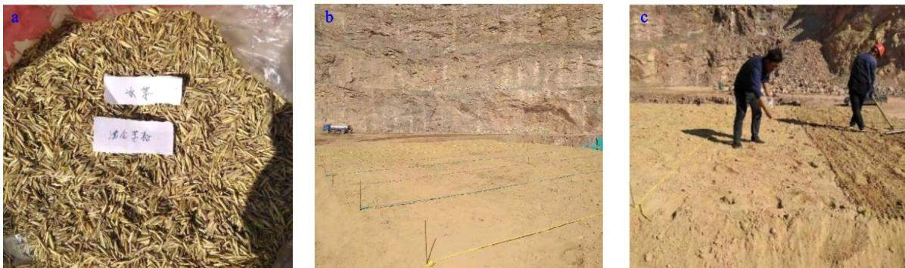  
a.草籽的选取；b.试验田区域划分；c.试验田撒草籽  
图2 试验田的划分情况  
Fig. 2 Division of the experimental field

## 2 试验结果与分析

## 2.1 不同生态土配比下的植被生长特征

之前学者对土壤水文性质做了大量研究，但主要集中于林地、草地、农田等区域，针对生态脆弱的矿区研究相对较少，矿区生态修复中的土壤性质及配比缺少试验研究[22-23]。因此，试验盒经过80d的自然环境培养，每天浇水使其土壤湿度保持在17%～44%，统计在自然生长状态下6个不同生态土配比类型的试验盒子的草本植物生长的平均高度与种群密度，如表3所示，可以看出6个试验盒的生态土中有机营养土对草本植物生长有良好的促进作用；生态土中土壤改良材料也对草本植物生长有良好的促进作用，并且植物群落生长稳定；生态土中多含量复合肥、保水剂、团粒剂、微生物菌剂等对植物生长高度变化的影响比对植物群落生长的影响更加明显；生态土中客土、有机营养土、土壤改良材料、多含量复合肥、保水剂、团粒剂、微生物菌剂等共同作用时明显对植物的生长高度和植物群落生长有良好的促进作用；生态土中的多含量复合肥、保水剂、团粒剂、微生物菌剂等含量为4%时的植物生长趋势和植物群落比含量为2%时更趋于稳定良好。

表3 6个试验盒中草本植物生长的平均高度与种群密度  
Table 3 Mean height and population density of herbaceous plants in six boxes
<table><tr><td>试验盒编号</td><td>平均高度/cm</td><td>种群密度/(个·m−2)</td></tr><tr><td>1</td><td>18.1</td><td>418</td></tr><tr><td>2</td><td>21.5</td><td>442</td></tr><tr><td>3</td><td>27.3</td><td>635</td></tr><tr><td>4</td><td>32.4</td><td>521</td></tr><tr><td>5</td><td>38.2</td><td>766</td></tr><tr><td>6</td><td>43.5</td><td>897</td></tr></table>

经过了80d的自然环境生长，可以看出6个试验盒中的草本植物生长状况都是从第10 d开始有幼苗生长出芽，之后草本植物的幼苗生长开始到80d后有比较明显的差异变化如表3、图3所示。其中试验盒1中的草本植物平均生长高度18.1 cm，试验盒2中的草本植物平均生长高度21.5cm，试验盒2草本植物的平均生长高度比试验盒1大概高3.4cm，如图3-a中所示；试验盒3中的草本植物平均生长高度27.3cm，试验盒3草本植物的平均生长高度比试验盒2大概高5.8cm，如图3-b所示；试验盒4中的草本植物平均生长高度32.4cm，试验盒4草本植物的平均生长高度比试验盒2大概高10.9m，如图3-c所示；试验盒5中的草本植物平均生长高度38.2cm，试验盒6中的草本植物平均生长高度43.5cm，试验盒6草本植物的平均生长高度比试验盒3大概高16.2 cm，试验盒5 草本植物的平均生长高度比试验盒3大概高10.9cm，试验盒6草本植物的平均生长高度比试验盒5大概高5.3 cm，如图3-d所示。

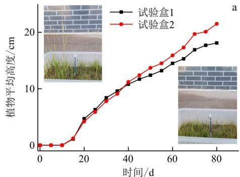

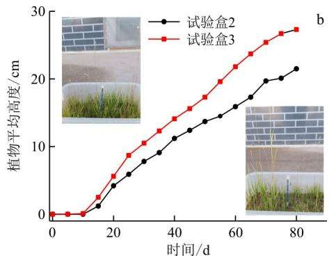

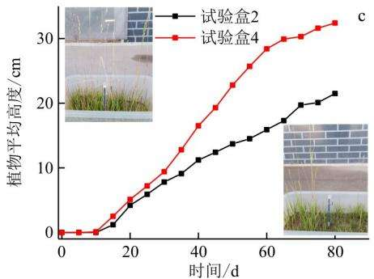

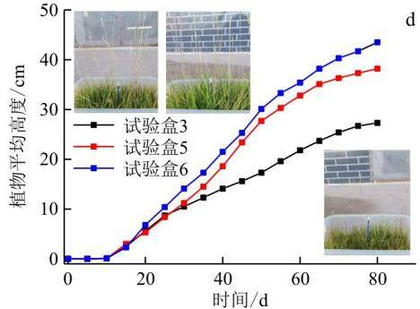  
图3 试验盒的植物生长对比分析  
Fig. 3 Comparative analysis of plant growth in the experimental box

## 2.2 土壤重构下不同湿度植被生长规律

结合之前的学者[10,23]关于露天矿山的土壤重构下植被的生长特性研究，在三易露天矿山上的试验田划分区域植物种植观察80d后，再将纵向8个试验田区域横向划分为自然条件下不浇水、17%～30%湿度、30%～44%湿度3个不同湿度区域来研究种植的灌木和草本植物的种群生长规律。在这3种生长状态下统计不同湿度条件下试验田植物生长80d的平均高度和种群密度如表4所示，可以看出在8块试验田的不同湿度生态土对草本植物生长也有不同的促进作用；生态土中土壤的湿度在17%～44%比自然不浇水情况下草本植物生长高度略高，并且植物群落生长更趋稳定；其中试验田③-8中的植物平均高度最高为 69.8 cm，试验田⑦-2的植被密度最大为975个 $/ \mathrm { m } ^ { 2 }$ ，因此，可以看出有灌木和草本植物混合区域的植物生长趋势和植物群落更趋于稳定良好；而生态土湿度为17%～30%相对于湿度为30%～44%的植物生长趋势和植物群落更趋于稳定良好。

为了研究土壤重构下不同湿度植被生长规律，特取试验田7和8为例，观察可知灌木和草本植物生长状况均从第10d开始幼苗生长出芽，之后灌木和草本植物的幼苗生长高度开始有比较明显的差异变化(图4，5)。其中在自然不浇水情况下试验田8比试验田7的植物高3.3cm，种群密度大21个 $/ \mathrm { m } ^ { 2 }$ (表4)，可看出草本植物与灌木比例为20：1的植被生长更趋于稳定，如图5-a所示；在17%～30%湿度条件下试验田7比试验田8的植物高5.5cm，种群密度大51个 $/ \mathrm { m } ^ { 2 }$ (表4)，可看出草本植物与灌木比例为 $4 0 : 1$ 的植被生长更趋于稳定，如图5-b所示；在30%～44%湿度条件下试验田8比试验田7的植物高2.1 cm，种群密度也大42个 $/ \mathrm { m } ^ { 2 } \cdot$ (表4)，可看出草本植物与灌木比例为20：1的植被生长更趋于稳定，如图5-c所示。在试验田土壤重构下的生态土作用，其他的试验田1～6在不同的湿度条件下也存在类似种群生长变化规律(表4)。

表4 不同湿度条件下试验田植物生长 80 d 平均高度和种群密度  
Table 4 Mean height and population density of plants in the experimental field during 80 days of growth under different humidity conditions
<table><tr><td rowspan="2">试验田 编号</td><td colspan="2">自然不浇水</td><td colspan="2">17%~30%湿度</td><td colspan="2">30%~44%湿度</td></tr><tr><td>cm</td><td>高度/种群密度/高度/种群密度/  $( \uparrow \cdot \textrm { m } ^ { - 2 } )$ </td><td>cm</td><td> $( \uparrow \cdot \textrm { m } ^ { - 2 } )$ </td><td> $\frac { 1 } { 1 5 } \frac { A E } { 1 5 } /$  cm</td><td>种群密度/  $( \uparrow \cdot \textrm { m } ^ { - 2 } )$ </td></tr><tr><td>1</td><td>20.1</td><td>348</td><td>26.4</td><td>445</td><td>31.5</td><td>423</td></tr><tr><td>2</td><td>22.7</td><td>364</td><td>31.7</td><td>463</td><td>35.9</td><td>483</td></tr><tr><td>3</td><td>27.5</td><td>478</td><td>39.3</td><td>673</td><td>41.2</td><td>653</td></tr><tr><td>4</td><td>32.1</td><td>432</td><td>44.6</td><td>568</td><td>47.1</td><td>575</td></tr><tr><td>5</td><td>34.8</td><td>584</td><td>50.2</td><td>766</td><td>53.6</td><td>821</td></tr><tr><td>6</td><td>37.4</td><td>642</td><td>53.6</td><td>865</td><td>56.9</td><td>884</td></tr><tr><td>7</td><td>41.3</td><td>725</td><td>69.2</td><td>975</td><td>67.7</td><td>906</td></tr><tr><td>8</td><td>44.6</td><td>746</td><td>63.7</td><td>924</td><td>69.8</td><td>948</td></tr></table>

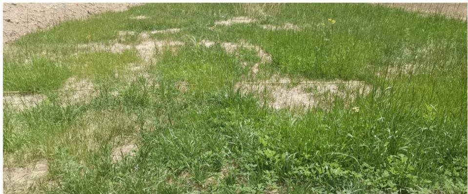  
图4 试验田的植被生长变化

Fig. 4 Changes in plant community in the experimental field  
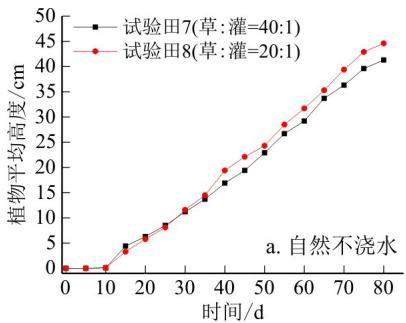

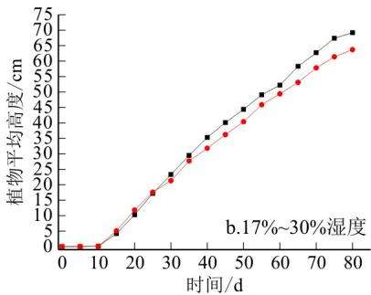

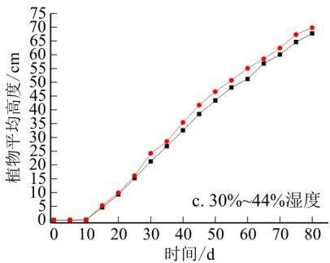  
图5 不同湿度条件下试验田灌木与草本植物混合生长变化  
Fig. 5 Changes in the mixed growth of shrubs and herbs in the experimental field under different humidity conditions

因此，在本次三易露天矿山生态修复中，根据室内试验和现场土壤重构试验结果，择优选取了生态土配比 $( \boldsymbol { \varpi } _ { \mathrm { B } } )$ 为客土(40%)+有机营养土(36%)+土壤改良材料(20%)+复合肥及其他(4%)+草籽作为实际现场矿山实施方案，草种选择草本植物和灌木，如高羊茅、紫羊茅、早熟禾、黑麦草、沙棘、荆条等植物，在17%～30%湿度条件下草本植物与灌木以40：1比例相结合的方式进行喷播养护，每亩地播种量约 20 kg，治理区植草面积为 3.25 hm²。对该露天矿采用生态棒+挂网喷播的生物治理方法进行边坡绿化，进一步综合治理做好三易矿山的生态修复(图6)。

## 3 结论

(1)在生态土中客土、有机营养土、土壤改良材料、多含量复合肥、保水剂、团粒剂、微生物菌剂等共同作用时明显对植物的生长高度和植物群落生长有良好的促进作用；而生态土中的多含量复合肥、保水剂、团粒剂、微生物菌剂等质量分数为4%时的植物生长趋势和植物群落比质量分数为2%时更趋于稳定良好。

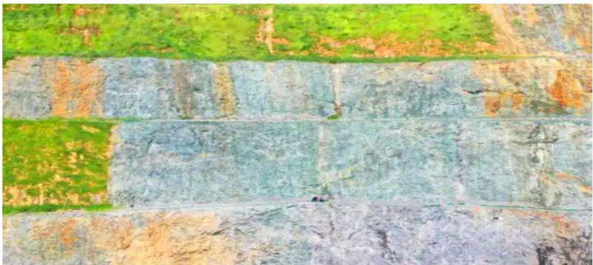  
图6 矿区修复实际效果  
Fig. 6 Practical effect of mining area restoration

(2)在6种不同生态土配比下的植被生长中，发现生态土配比 $( \boldsymbol { \varpi } _ { \mathrm { ~ B ~ } } )$ 为客土（40%）+有机营养土（36%）+土壤改良材料（20%）+复合肥及其他(4%)十草籽的环境状态下植被的生长更趋于稳定。

(3)在土壤重构下不同湿度植被生长中，湿度为17%～30%的环境条件下草本植物与灌木比例为40：1的植被生长更趋于稳定，而在湿度为30%～44%的环境条件下草本植物与灌木比例为20：1的植被生长更趋于稳定。

(4)结合当地的气候特点以及工程条件，本次矿山修复方案选用客土(40%)+有机营养土(36%)十土壤改良材料(20%)+复合肥及其他(4%)+草籽的配比方法，草本植物与灌木比例为40：1的搭配，修复策略更得当，更科学。

(所有作者声明不存在利益冲突)

## 参考文献：

[1]罗明，白中科，刘喜韬，等.土地复垦潜力调查评价研究[M].北 京：中国农业科技出版社，2013:74-78. Luo M,Bai Z K,Liu X T,et al. Investigation and evaluation of land reclamation potential[M]. Beijing:China Agricultural Science and Technology Press,2013:74-78(in Chinese).

[2]白中科，周伟，王金满，等.再论矿区生态系统恢复重建[J].中 国土地科学，2018,32(11):1-9. Bai Z K,Zhou W, Wang J M, et al. Rethink on ecosystem restoration and rehabilitation of mining areas[J]. China Land Science,2018,32(11):1-9(in Chinese with English abstract).

[3]翟淑花，于家烁，齐干，等.降雨入渗条件下堆积体边坡致灾因 子试验分析[J].地质科技通报，2023，42(3)：9-15. Zhai S H, Yu J S, Qi G, et al. Triggering factor analysis of deposit slope under rainfall infiltration based on laboratory experiments[J]. Bulletin of Geological Science and Technology, 2023,42(3) :9-15(in Chinese with English abstract).

[4] 牛星.伊敏露天煤矿废弃地植被恢复及其效果研究[D].呼和 浩特：内蒙古农业大学，2013. Niu X. Studies on revegetation and restoration effects of Yimin opencast mining wasteland[D]. Hohhot: Inner Mongolia Agricultural University,2013(in Chinese with English abstract).

[5]胡振琪，肖武，赵艳玲.再论煤矿区生态环境“边采边复”[J].煤 炭学报，2020，45(1):351-359. Hu Z Q, Xiao W, Zhao Y L. Re-discussion on coal mine eco-environment concurrent mining and reclamation[J]. Journal of China Coal Society,2020,45(1) :351-359(in Chinese with English abstract).

[6] 刘英.半干旱煤矿区受损植被引导型恢复研究[D].江苏徐州： 中国矿业大学，2020. Liu Y. Study on guided restoration of damaged vegetation in semi-arid coal mine area[D]. Xuzhou Jiangsu: China University of Mining and Technology, 2020 (in Chinese with English ab-

stract).

[7]冯昶栋，郭小平，罗超，等.干旱矿区不同干扰强度下土壤种子 库特征[J].草业科学，2021,38(3):443-452. Feng C D, Guo X P, Luo C, et al. Characteristics of the soil seed bank under different disturbance intensities in an arid mining area[J]. Pratacultural Science, 2021,38(3):443-452(in Chinese with English abstract).

[8]杜华栋，曹祎晨，聂文杰，等.黄土沟壑区采煤塌陷地人工与自 然植被恢复下土壤性质演变特征[J].煤炭学报，2021，46(5)： 1641-1649. Du H D, Cao Y C, Nie W J, et al. Evolution of soil properties under artificial and natural revegetation in loess gully coal mining subsidence area[J]. Journal of China Coal Society, 2021,46 (5):1641-1649(in Chinese with English abstract).

[9]毕银丽，彭苏萍，杜善周.西部干旱半干旱露天煤矿生态重构技 术难点及发展方向[J].煤炭学报，2021，46(5)：1355-1364. Bi Y L,Peng S P, Du S Z. Technological difficulties and future directions of ecological reconstruction in open pit coal mine of the arid and semi-arid areas of western China[J]. Journal of China Coal Society, 2021,46(5):1355-1364(in Chinese with English abstract).

[10]张根，闫杰.露天矿建设对生态环境影响评价及生态恢复研究 [J].露天采矿技术，2017,32(9):80-83. Zhang G, Yan J. Study on the impact evaluation of open-pit mine construction on ecological environment and ecological restoration[J]. Opencast Mining Technology, 2017,32(9) :80-83 (in Chinese with English abstract).

[11] Singh A N,Singh J S. Experiments on ecological restoration of coal mine spoil using native trees in a dry tropical environment,India:A synthesisLJ].New Forests,2006,31(1):25-39.

[12] Benvenuti M, Mascaro I, Corsini F, et al. Mine waste dumps and heavy metal pollution in abandoned mining district of Boccheggiano (Southern Tuscany,Italy)[J]. Environmental Geology,1997,30(3/4):238-243.

[13] Miao Z, Marrs R. Ecological restoration and land reclamation in open-cast mines in Shanxi Province,China[J]. Journal of Environmental Management,2000,59(3):205-215.

[14] Vibhash R, Phalguni S, Dheeraj K, et al. A review on dump slope stabilization by revegetation with reference to indigenous plant[J]. Ecological Processes,2015,4(1) :1-11.

[15] Leavitt K J,Fernandez G C J,Nowak R S. Plant establishment on angle of repose mine waste dumps[J]. Journal of Range Management,2000,53(4):442-452.

[16] Mathiyazhagan N, Natarajan D. Impact of mine waste dumps on growth and biomass of economically important crops[J]. Journal of Environmental Biology,2012,33(6):1069-1074.

[17] Vetluzhskikh N V. Flora and vegetation of gold mining waste dumps in Mariinskaya Taiga[J]. Russian Journal of Ecology, 2010,41(3):269-271.

[18] Pirrone A, Castagnetti C, Mariella J, et al. Yeast flora in oropharyngeal and rectal mucous membranes of healthy and critically ill neonatal foals[J]. Journal of Equine Veterinary Science,2011,32(2):93-98.

[19 Park S,Kim M, Cheon M, et al. MP-08. 19 prevalence of antimicrobial resistance in rectal normal flora of patients undergoing transrectal ultrasonography-guided prostate biopsy in Korea[J]. Urology,2011,78(3):S92. （下转第 256 页）

Control &Health Monitoring,2019,26(3) :e2313.

[11] Cha Y J, Choi W, Suh G, et al. Autonomous structural visual inspection using region: Based deep learning for detecting multiple damage types[J]. Computer-Aided Civil and Infrastructure Engineering,2018,33(9):731-747.

[12] Protopapadakis E, Voulodimos A,Doulamis A,et al. Automatic crack detection for tunnel inspection using deep learning and heuristic image post-processing[J]. Applied Intelligence, 2019, 49(7):2793-2806.

[13] Ren Y P, Huang J S, Hong Z Y, et al. Image-based concrete crack detection in tunnels using deep fully convolutional networks[J]. Construction and Building Materials, 2020, 234: 117367.

[14] Kim B, Cho S. Image-based concrete crack assessment using mask and region-based convolutional neural network [J]. Structural Control &Health Monitoring,2019,26(8) :e2381.

[15] Dong Y A, Wang J, Wang Z F, et al. A deep-learning-based multiple defect detection method for tunnel lining damages [J].IEEE Access,2019,7:182643-182657.

[16]常惠，饶志强，李益晨，等.基于改进残差网络的铁路隧道裂缝 检测算法研究[J].东北师大学报：自然科学版，2021，53(3)： 56-63. Chang H,Rao Z Q, Li Y C, et al. Research on crack detection algorithm of railway tunnel based on improved residual network[J]. Journal of Northeast Normal University: Natural Science Edition,2021,53(3):56-63(in Chinese with English abstract).

[17] Zhang Q, Barri K, Babanajad S K, et al. Real-time detection of cracks on concrete bridge decks using deep learning in the Frequency Domain[J]. Engineering,2021,7(12):1786-1796.

[18] Zhao X Y, Huang P, Shu X B. Wavelet-attention CNN for image classification[J]. Multimedia Systems, 2022, 28(3):915-

## （上接第 248 页)

[20]郭婷婷.矿区不同重构方式下土壤水文性质研究[D].太原：山 西大学，2020. Guo T T. Study onproperties of soil hydrological under different reconstruction patterns in mining area[D]. Taiyuan:Shanxi University,2020(in Chinese with English abstract).

[21]王强民，赵明，彭鸿杰，等.旱区不同层状结构土壤的水分运移 过程与模拟[J].水文地质工程地质，2023，50(4)：84-94. Wang Q M,Zhao M, Peng H J, et al. Water transport process and simulation of layered soils with different configurations in an arid region [J]. Hydrogeology & Engineering Geology, 2023,50(4) :84-94(in Chinese with English abstract).

[22]郭志萍，李斌，孙西欢，等.不同生态修复模式下土壤水文性质及其对溶质运移的影响J」.环境科学学报，2019，39（12)：

924.

[19] Watanabe T, Wolf D F. Image classification in frequency domain with 2SReLU:A second harmonics superposition activation function[J]. Applied Soft Computing,2021,112:107851.

[20] Brosch T, Tam R. Efficient training of convolutional deep belief networks in the frequency domain for application to high-resolution 2D and 3D images[J]. Neural computation,2015,27(1) : 211-227.

[21]庞庆华，董显蔚，周斌，等.基于情感分析与TextRank的负面 在线评论关键词抽取[J].情报科学，2022，40(5):111-117. Pang Q H, Dong X W, Zhou B, et al. Keyword extraction of negative online reviews based on sentiment analysis[J]. Information Science,2022,40(5):111-117(in Chinese with English abstract).

[22]李冉冉，刘大明，刘正，等.融合笔画特征的胶囊网络文本分类 [J].计算机工程，2022，48(3)：69-73,80. Li R R,Liu D M,Liu Z, et al. Text classification using capsule network integrating stroke features[J]. Computer Engineering,2022,48(3):69-73,80(in Chinese with English abstract).

[23] Zou J Z, Yang J X, Wang G P, et al. Bridge structural damage identification based on parallel CNN-GRU[J]. IOP Conference Series:Earth and Environmental Science,2021,626:012017.

[24]王亚飞，韩静，郭凰，等.基于Bi-LSTM的结构变形预测[J].计 算机系统应用，2021，30(11):304-309. Wang Y F, Han J, Guo H, et al. Prediction of structural deformation based on Bi-LSTM[J]. Computer Systems & Applications,2021,30 (11):304-309(in Chinese with English abstract).

[25] Cho K,Merrienboer B,Gulcehre C, et al. Learning phrase representations using RNN encoder-decoder for statistical machine translation[J]. CoRR, 2014. doi: org/10. 48550/arXiv. 1406. 1078.

Guo Z P,Li B, Sun X H, et al. Soil hydrological properties and their effects on solute transport under different ecological restoration models in coal mining area[J]. Journal of Environmental Sciences,2019,39(12):4251-4260(in Chinese with English abstract).

23福纳德.中国东部草原区露天矿排土场土壤构建与改良研究 [D].江苏徐州：中国矿业大学，2019. Fernand N A A. Construction and improvement of open pit mine dumped soil structure in China eastern grassland area [D]. Xuzhou Jiangsu: China University of Mining and Technology,2019(in Chinese with English abstract).