  
移动扫码阅读

张合兵，张 克，刘 培，等．基于RS 和GIS 的矿区生态指标提取与安全评价:以焦作矿区为例．［J］．煤炭科学技术，2020，48(4):80－88. doi:10. 13199 /j. cnki. cst. 2020. 04. 007

ZHANG Hebing，ZHANG Ke，LIU Pei，et al．Ecological indexes extraction and safety assessment of coal mining area based on RS and GIS:taking Jiaozuo Coal Mining Area as an example［J］． Coal Science and Technology，2020，48 (4):80－88. doi:10. 13199 /j. cnki. cst. 2020. 04. 007

# 基于 RS 和 GIS 的矿区生态指标提取与安全评价———以焦作矿区为例

张合兵1，2，张 克3，刘 培1，2，余志远1，2，赵嘉伟1，2

(1 河南理工大学 测绘与国土信息工程学院，河南 焦作 454003;2 河南理工大学 自然资源部矿山时空信息与生态修复重点实验室，河南 焦作 454003;3．河南工业职业技术学院 城市建设学院，河南 南阳 473000)

摘 要:为了快速、高效地对煤矿区生态安全状况进行评价 借助遥感( RS) 地理信息系统( GIS) 空间景观格局分析等技术 在压力－状态－响应( PSR) 模型的基础上拓展构建压力－状态－响应－格局( PSRP) 模型 对焦作矿区33 年( 1993—2026 年) 的生态安全状况进行评价与动态变化模拟分析。 以遥感卫星影像数据为主要数据源 选取矿区 1993 年、2004 年、2018 年遥感数据及社会、经济统计数据 提取用于生态安全评价的建筑用地指数、归一化植被指数、生态弹性度、绿度指数、生物丰富度、湿度指数 破碎度指数 城市扩展强度 干度指数 人口密度 多样性指数 分维度12 个关键技术指标 利用层次分析法( AHP) 确定指标在生态安全评价的目标层 准则层 指标层 3 个层次体系 并进一步计算12 个指标的权重 从而对生态安全进行评价 最后利用 CA－Markov 模型模拟获取 2026 年结果数据 对焦作矿区生态安全状况趋势评价分析和动态变化监测进行研究。 结果表明: ①利用遥感技术能有效提取用于生态安全评价的绝大多数指标 并且有较好的提取精度 基础指标土地利用/覆盖分类提取结果精度为 92%以上; ②CA－Markov 模型可以进行土地利用/覆盖变化趋势模拟与预测 在该试验选择的3 期数据集中预测精度达到 83%; ③20 多年来焦作市裸地和建筑景观变化幅度最大 水体、植被景观变化相对较小 不同的地物覆盖类型均受到人类生产生活的影响; ④1993—2018 年间 焦作市生态安全状态总体情况先是大幅下降 然后达到平缓稳定状态 其中 1993—2004 年间生态状态呈现下降趋势 2004—2018 年间焦作市的生态状况总体上没有显著的变化; ⑤针对典型矿区 1993 年整个矿区还是处于稳定和安全的状态 到2004 年 由于矿产资源大量的开采 部分地区由 1993 年的稳定状态转为临界状态 2018 年以来 由于矿区的陆续关闭 矿区的生态安全状况相比于 2004 年没有太大的变化 模型预测表明到 2026 年焦作市及其矿区生态指数将呈现出轻微下降趋势 典型矿区与焦作区域表现出一致的生态安全等级分布状况和变化趋势。 研究结果可为维护矿区及其周边生态环境的原生平衡、引导矿区资源的合理开采与利用提供技术支持。

关键词:遥感; 生态指标; 景观格局; 生态安全评价; 焦作矿区

中图分类号: TD88

文献标志码: A

文章编号: 0253－2336(2020)04－0080－09

# Ecological indexes extraction and safety assessment of coal mining area based on RS and GIS:taking Jiaozuo Coal Mining Area as an example

ZHANG Hebin 1，2，ZHANG Ke3，LIU Pei1，2，YU Zhi uan1，2，ZHAO Jiawei1，2

(1．Key Laboratory of Spatial－temporal Information and Ecological Restoration of Mines(MNR) ，Henan Poly－technic University，Jiaozuo 454003，China; 2．School of Surveying and Mapping Land Information Engineering，Henan Polytechnic University，Jiaozuo 454003，China; 3．School of Urban Construction，Henan polytechnic institute，Nanyang 473000，China)

Abstract:In order to evaluate the ecological security status of coal mining area in a timely and efficient manner，the methodology of remote i ( RS) ， hi i f ti t ( GIS) ， d ti l l d tt l i h t d th t t sponse (PSR) model to build a pressure－state－response－pattern (PSRP) model in this research． The ecological security status of Jiaozuo Mining Area of 33 years (1993—2026) was evaluated and the dynamic changes were simulated and analyzed． Taking the remote sensing satellite image as the main data source，the remotely sensed data captured in 1993，2004，and 2018 and social and economic statistics data over the stud area were selected to extract the buildin area index，normalized difference ve etation index，and ecolo ical elasticit ，reen ness index，biolo ical richness index，humidit index，fra mentation index，urban ex ansion intensit ，dr ness index，o ulation densit ，di versity index，et al，12 key technical indicators． And then the analytic hierarchy process (AHP) method was selected to determine the indi- cators in the three－layer security evaluation system，the target layer，the criterion layer，and the indicator layer，and further calculates the wei ht of 12 indicators to evaluate ecolo ical securit Finall ，the CA－Markov model was used to simulate and obtain result of 2026 to conduct ecological security in the research area and to simulate and analyze ecological security situation and trends in future． The results demonstrate that:①the use of remote sensing technology can effectively extract most of the indicators used for ecological security evaluation ( 11 f th 12 i di t i thi t d di tl t t d f t i d t ) ， d th h b tt t ti d b i indicators The accurac of the land use /cover classification is better than 92%; ②The CA－Markov model can simulate and redict the land use /cover change trend． The prediction accuracy of the selected three－phase data set in this experiment reaches 83%; ③In the past 20 years，Jiaozuo has experienced the largest changes in bare land and building landscapes，with relatively small changes in water and vege- tation landscapes． Different types of ground cover have been affected by human production and life． ④From 1993 to 2018，the overall eco- lo ical securit status of Jiaozuo Cit declined shar l ，and then reached a entle and stable state Amon them，the ecolo ical status showed a downward trend from 1993 to 2004，and the ecological status from 2004 to 2018 did not change significantly． ⑤For typical mining areas，in 1993，The entire mining area is still in a stable and safe state． By 2004，due to the large amount of mining activities，part of the ar- ea has changed from a stable to a critical state in 1993 While due to the successive closure of the mining area，the ecological securit sta tus of the mining area has not changed much since 2018 compared to 2004． Prediction result by CA－Markov model shown that by 2026 there will be a slight downward trend，and the typical mining area and Jiaozuo area will show the same ecological security level distribution and change trend． The research results can provide technical support for maintaining the original balance of the mining area and its sur- rounding ecological environment and guiding the rational exploitation and utilization of the mining area resources

Key words:remote sensing;ecological indexes;landscape pattern;ecological security assessment;Jiaozuo Coal Mining Area

## 0 引 言

焦作市作为矿产资源丰富的矿产经济地区，在过去的几十年经济发展迅速，然而剧烈的人类活动，如地下开采、地面建筑扩张等，给自然资源和生态环境带来巨大的压力，威胁着城市人居安全［1］，进一步影响城市的可持续发展，使得焦作市的生态环境受到了严峻挑战。 生态系统的研究，对于解决由于煤矿开采及相关活动过程所带来的人口、经济、交通、资源以及环境［2］等一系列问题有很大的指导作用［3］。 目前，传统的生态监测方法通常不能满足人们对特殊区域，特别是煤矿 湿地等生态环境复杂区域的实时监测的需求［4］。 近年来，随着科学技术的快速发展，遥感技术以其大范围、多尺度、高频率、多平台的观测特点，利用遥感影像提取的土地覆盖 地表参数等信息，可以从格局 过程 机制 影响 预测模拟等方面综合研究景观格局变化［5］和生态安全变化［6－7］情况，进而作出预测预警［8］。 近年来，国内外学者对生态系统安全评价的研究越来越多，且分别构建了不同的评价体系模型［9－11］。 国际经济合作与发展组织( OECD) 提出了 “压力－ 状态－ 响应 ”(PSR)评价体系模型［12］;联合国可持续发展委员会(UNCSD)提出了 “驱动力－状态－响应 ”(DSR)评价体系［13］; 欧洲环境署提出了 “驱动力 － 影响 ”(DPSIR) 评价体系模型［14］。 目前，国内主要用OECD 提出的PSR 模型来对生态系统安全状况进行评定［15－16］;在此之外，国内的一些学者研究提出了物元模型、生态足迹、景观格局等模型方法［13］。 矿产资源开采改变了矿区周边的自然景观，排放了大量废物，对周边环境的景观格局产生了较大影响［17］。 景观格局指数是矿区生态安全评价的重要因素［4］，笔者在 PSR 模型的基础上加入了景观格局指数，拓展构建 PSRP 模型，以多期遥感影像为主要数据源，借助 RS、GIS 和空间景观格局分析等技术，对焦作市及周边矿区的景观格局变化以及生态系统安全的评价进行研究，以期提供一种快速、高效的煤矿区生态安全评价方法，为矿区及其周边生态环境监测和保护提供技术支撑。

## 1 研究区概况

焦作市坐落于河南省西北部，古时又被称作山阳和怀州，地理坐标在 $3 5 ^ { \circ } 1 0 ^ { \prime } - 3 5 ^ { \circ } 2 1 ^ { \prime } \mathrm { N }$ 和 $1 1 3 ^ { \circ }$ 4'—113°26'E，总面积 $4 ~ 0 7 2 ~ \mathrm { k m } ^ { 2 }$ 。 焦作市地貌结构不一，从北向南分别是山地、丘陵、平原、滩涂。 焦作地区矿产储备量大 质量高 品类多，占河南全省矿产种类的25%，焦作的煤炭资源开采为河南甚至全国的经济发展做出了巨大贡献，但同时也给焦作地区带来了生态环境上的巨大损失。 由于大量矿物资源的开采，造成了国土资源的塌陷 挖损 压占等，同时也导致了地表和地下水资源的大量流失。 如焦作市的九里山矿、演马矿、冯营矿、白庄矿、方庄一矿、方庄二矿 古汉山矿 小马矿 中马矿 韩王矿和朱村矿等 11 个矿区，塌陷区目前已损毁耕地 2 151．47hm2 、 园地 $7 3 . 9 2 \ \mathrm { h m } ^ { 2 }$ 、 林地 $4 3 8 . 7 0 \ \mathrm { h m } ^ { 2 }$ 、 草地 65．19hm2、交通运输用地 $7 0 . 7 0 \ \mathrm { h m } ^ { 2 }$ 、水域及水利设施用地$2 2 5 . 6 5 ~ \mathrm { h m } ^ { 2 }$ 、其他土地 $1 0 4 . 0 8 ~ \mathrm { h m } ^ { 2 }$ 、城镇村及工矿用地 $1 1 8 9 . 3 3 \ \mathrm { h m } ^ { 2 }$ ，共计 $4 \ 3 1 9 . 0 4 \ \mathrm { h m } ^ { 2 }$ 。

## 2 研究区地表遥感数据预处理

研究选取的遥感数据有 1993 年、 2004 年的Landsat TM 数据和 2018 年的 Landsat 8 数据，影像全部来自于美国地质调查局(USGS)，所选数据以7—10 月数据为主，数据质量较好。 采用 ENVI 遥感图像处理软件，对原始的遥感影像进行了几何校正影像镶嵌和裁剪，使影像的空间位置误差控制在 1个像元以内;为提高遥感图像分类精度，又对镶嵌后影像进行了大气校正;最后运用支持向量机(SVM)的分类方法对数据进行了分类处理，主要分为植被、水体、耕地、裸地和人造地表 5 大类(图 1)，总体分类精度和 $\mathrm { K a p p a }$ 系数评价指标见表 1。

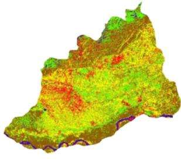  
(a) 1993年分类结果

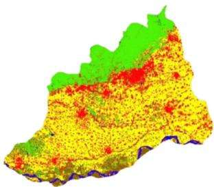  
(b) 2004年分类结果

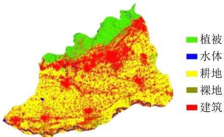

(c) 2018年分类结果  
图 1 研究区地表覆盖信息提取结果  
Fig．1 Extraction Results of surface coverage information in study area  
表 1 地表覆盖类型提取总体精度及 Kappa 系数  
Table 1 Overall accuracy and Kappa coefficient of land class extraction
<table><tr><td>年份</td><td>1993年</td><td>2004年</td><td>2018年</td></tr><tr><td>总体精度/%</td><td>92.472 1</td><td>98.620 0</td><td>92.431 9</td></tr><tr><td>Kappa 系数</td><td>0.900 9</td><td>0.979 2</td><td>0.890 5</td></tr></table>

## 3 PSRP 生态安全评价模型

依据构建的 PSRP 生态安全评价模型，将预处理后的生态安全指标因子输入到构建的模型中，计算获取生态安全状况分布图。 最后结合多期生态安全状态结果和 CA－Markov 模型，对生态安全变化状况和未来发展趋势进行模拟预测，并结合景观格局指数、土地利用覆盖分类变化结果进行综合分析。

建立科学合理的评价指标体系是开展生态安全评价的基础，研究综合考虑矿区实际生态情况的复杂性，结合相关 PSR 模型的生态安全指标［18－21］，重点选取以下指标作为本研究的 PSR 模型指标:城市扩展强度、建筑用地指数［22］、归一化植被指数、生物丰富度指数;生态弹性度［23］、绿度指数、湿度指数、干度指数［24］、人口密度。 在原有 PSR 模型指标的基础上，增加景观格局指标，构建 PSRP 生态安全评价模型，模型框架如图2 所示，使生态安全评价更加科学合理。 选取的景观格局指标有［4］:破碎度指数、分维度指数、多样性指数［25］。 12 个指标中有 11个通过遥感数据直接提取。

## 3．1 指标提取方法

矿产资源的开发对周边自然环境的斑块水平和景观水平产生了较大影响［17］，为充分反映具体影响程度，研究结合景观分析尺度，选取合适的斑块水平和景观水平［26］。 在斑块水平上分析景观格局时选取最大斑块指数 斑块个数 平均斑块形状 斑块密度、聚集度指数、边界密度、散布与并列指数平均斑块分维数。 在景观水平上分析景观格局选取斑块密度、斑块个数、散布与并列指数、多样性指数、蔓延度指数、最大斑块指数、均匀度指数。

研究借助 Fragstats 景观格局分析软件进行景观格局指数定量分析，选取适宜的景观格局指标和分析尺度。 在斑块水平和景观水平上选取相关性较小的景观格局指数［27］，对研究区 1993—2018 年长时间序列城市景观格局进行分析。

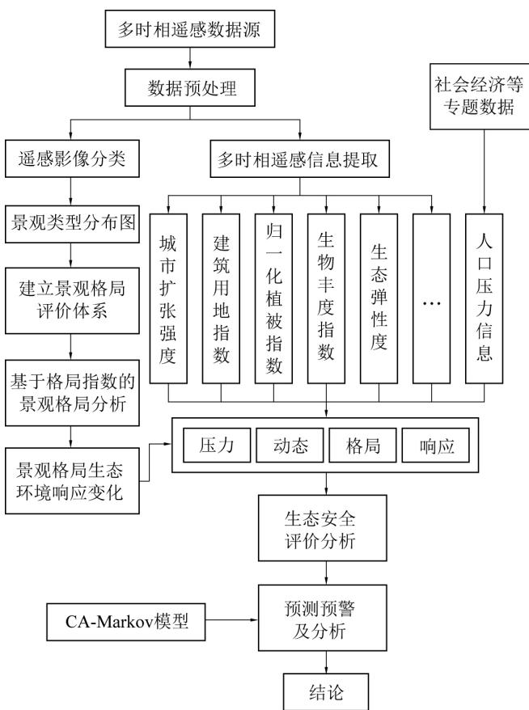  
图 2 PSRP 生态安全评价模型  
Fig．2 Conceptual model of the PSRP

## 3．2 CA－Markov 模型预测

CA－Markov 是 CA 和 Markov 两种模型的综合，具备元胞自动机模型模拟复杂空间变化和马尔科夫模型定量化预测的能力，有效提高了预测的精度及运算的效率［28－29］。

CA 是一种时间、空间、状态都离散，且空间上相互作用和时间有上因果关系的局部网格动力学模型［30］ 。 它 是 细 胞 ( Cells ) 、 状 态 ( States ) 、 领 域(Neighbors) 和规则 ( Rules) 4 个元组构成的集合 。在变化模拟过程中，将研究区域划分为若干个形状大小一致的元胞，每一个元胞在某一时刻 t+1 的状态是由相邻元胞在 t 时刻的状态以及模型的转换规则所决定，模型转换规则是元胞自动机的核心。 模型表达式为

$$
S _ { ( \mathbf { \Phi } _ { t + 1 } ) } = \textit { f } ( \textbf { } S _ { ( \mathbf { \Phi } _ { t } ) } \textbf { } \textbf { } N \mathbf { \Phi } )\tag{1}
$$

式中 $: S _ { ( t + 1 ) } \setminus S _ { ( t ) }$ 分别为 t+1、t 时刻的元胞状态的集合 $\mathord { \left\{ \begin{array} { l l } { \bullet f } \end{array} \right.}  $ 为空间元胞的状态的转换规则函数;N 为元胞领域。

CA－Markov 模型的构建步骤如下:①定义元胞、元胞的空间和状态;②选择滤波器，采用 5 × 5的滤波器，拟定一个元胞周围 5×5 个元胞组成的矩形空间来影响元胞状态;③建立 CA 转换规则，转换规则是 CA－Markov 的核心部分，决定元胞自动机的动态转化过程，Markov 模型模拟的转移矩阵作为元胞状态的转换规则能反映每一个元胞各种可能状态发生变化的容易程度;④确定起始时刻和循环次数，以 2004 年和 2018 年为起始数据，以预测间隔为 11 年，进行 CA－Markov 模型预测，得到下一个时期即 2026 年焦作市地表覆盖类型分布状况。

## 3．3 生态安全评价体系及 PSRP 模型评价标准

以 CECD 提出的 PSR 模型为基础，按照动态性、层次性、可行性的原则，创建了包含 3 个不同层次共12 个指标的生态安全评价模型体系［13，28，31］。为了便于模型的量化和计算，对所有的指标进行归一化处理，然后将指标放大 10 倍，使得所有的指标值均在0～10。 由于12 个指标对生态系统安全评价的作用程度不同，为了更好地确定生态系统安全评价体系中每个指标的相对重要程度，研究采用层次分析法(AHP)系统地确定各个指标的权重，其结果见表 2。

表 2 PSRP 模型指标层及各层指标权重  
Table 2 Layers of PSRP model and corresponding layer weights
<table><tr><td>目标层</td><td>准则层</td><td>指标层</td><td>权重</td></tr><tr><td rowspan="6">生态</td><td rowspan="2">系统压力(0.1190)</td><td>人口密度</td><td>0.369 4</td></tr><tr><td>城市扩展强度</td><td>0.327 7 0.302 9</td></tr><tr><td rowspan="3"></td><td>建筑用地指数</td></tr><tr><td>归一化植被指数 系统状态(0.4485)</td><td>0.3077</td></tr><tr><td>生物丰富度</td><td>0.3377</td></tr><tr><td>安全 综合</td><td>生态弹性度</td><td>0.354 6</td></tr><tr><td>评价</td><td>系统响应(0.3077)</td><td>绿度指数</td><td>0.3487</td></tr><tr><td rowspan="5"></td><td rowspan="2"></td><td>湿度指数</td><td>0.343 6</td></tr><tr><td>干度指数</td><td>0.307 7</td></tr><tr><td rowspan="2">系统格局(0.1248)</td><td>破碎度指数</td><td>0.307 5</td></tr><tr><td>分维度指数</td><td>0.332 7</td></tr><tr><td></td><td>多样性指数</td><td>0.359 8</td></tr></table>

为合理使用各个指标，确保各个指标都能在一定程度上应用于生态系统的安全评价体系，本研究的安全评价模型通过各个指标的加权求和得到，其数学模型为

$$
E S I = \sum _ { i \ : = 1 } ^ { n } \left( w _ { i } \boldsymbol { x } _ { i } \right)\tag{2}
$$

其中，ESI 为生态安全评价体系的安全指数值;$w _ { i }$ 为第i 项指标的权重系数; $x _ { i }$ 为第i 个指标标准化值［28］。 同时参考国内外生态安全等级划分原则，对系统安全体系进行等级划分［32－33］，见表3。

表 3 生态安全等级划分  
Table 3 Classification of ecological security
<table><tr><td>安全等级</td><td>状态</td><td>取值范围</td><td>说明</td></tr><tr><td>I</td><td>危险</td><td>(0,5.0)</td><td>生态系统服务功能严重退化，生态环境和生态系统结构受到较大破坏，受外界干扰恢复困难，生态问题较大</td></tr><tr><td>Ⅱ</td><td>临界</td><td>5.0,6.0)</td><td>生态环境受到一定的破坏，但生态系统尚可维持基本功能，生态系统结构抗风险能力弱，受干扰后易恶化</td></tr><tr><td>Ⅲ</td><td>安全</td><td>[6.0,8.0)</td><td>生态系统服务功能较为完善，生态环境较少受到破坏，生态系统结构尚完整，受干扰后一般可恢复，生态问 题不显著</td></tr><tr><td>IV</td><td>稳定</td><td></td><td>8.0,10.0)生态系统服务功能基本完善，生态环境基本未受到破坏，生态系统结构完整，生态系统弹性力强</td></tr></table>

## 4 生态安全评价结果与分析

## 4．1 景观格局指数提取结果与变化分析

通过计算获取 1993—2004 年 、 2004—2018 年间研究区土地利用变化幅度，见表 4 和表 5。 其中1993—2004 年土地利用综合变化动态度为59．47%，2004—2018 年 土 地 利 用 综 合 变 化 动 态 度 为44．47% 。

表 4 1993—2004 年与 2004—2018 年土地利用变化  
Table 4 Land use change in 1993—2004 and 2004—2018
<table><tr><td rowspan="2">土地利 用类型</td><td colspan="3">1993—2004年土地面积  $/ \mathrm { h m } ^ { 2 }$ </td><td rowspan="2">变化幅 度/%</td><td rowspan="2">变化动 态度/%</td><td rowspan="2">土地利 用类型</td><td colspan="3">2004—2018年土地面积  $/ \mathrm { h m } ^ { 2 }$ </td><td rowspan="2">变化幅 度/%</td><td rowspan="2">变化动 态度1%</td></tr><tr><td>1993年</td><td>2004年</td><td>变化量</td><td>2004年</td><td>2008年</td><td>变化量</td></tr><tr><td>植被</td><td>16 573.25</td><td>91 055.34</td><td>4482.09</td><td>5.18</td><td>0.47</td><td>植被</td><td>91 055.34</td><td>80 277.12</td><td>-10 778.22</td><td>-11.84</td><td>-1.08</td></tr><tr><td>水体</td><td>8 268.93</td><td>7506.09</td><td>-762.84</td><td>-9.23</td><td>-0.84</td><td>水体</td><td>7 506.09</td><td>6 082.2</td><td>-1 423.89</td><td>-18.97</td><td>-1.72</td></tr><tr><td>耕地</td><td>139 937.85</td><td>197 197.65</td><td>57 259.80</td><td>40.92</td><td>3.72</td><td>耕地</td><td>197 197.65</td><td>176 089.68</td><td>-21 107.97</td><td>-10.70</td><td>-0.97</td></tr><tr><td>裸地</td><td>136 942.47</td><td>32 786.46-104 156.01</td><td></td><td>-76.06</td><td>-6.91</td><td>裸地</td><td>32 786.46</td><td>26 297.28</td><td>-6 489.18</td><td>-19.79</td><td>-1.80</td></tr><tr><td>人造地表</td><td>48 803.31</td><td>91 998.63</td><td>43195.32</td><td>88.51</td><td>8.05</td><td>人造地表</td><td>91 998.63</td><td>131 785.74</td><td>3 9787.11</td><td>43.25</td><td>3.93</td></tr></table>

林业的发展也在一定程度上挤占了耕地面积。

## 分析表 4 可知:

1)植被呈增加－减少的变化趋势 植被在1993—2004 年间具有小幅度增加，变化动态度为0．47%，在 2004—2018 年 间 植 被 减 少 了 11． 84% 。1993—2018 年间，植被整体面积是减少的。 植被的主要流向是人造地表，主要是焦作市在这期间城镇人口的快速增加，导致城市建筑用地的快速扩展，挤占了部分植被面积。

2)水体呈现出减少－减少变化趋势。 研究区在1993—2004 年和 2004—2018 年间水体面积变化均为减少，而且2004—2018 年间研究区水体变化动态度在所有地类中最大，变化最显著 水体减少的原因主要是由于矿产资源的开采导致的水资源的流失以及耕地的大幅度增加使得水资源更多的应用于灌溉田地，导致河流水资源的流失。

3)耕地呈增加－减少变化趋势。 在 1993—2004年间具有大幅度增加，变化动态度为 3．72%。 而在2004—2018 年间耕地减少了 0．97%。 整体上，在1993—2018 年间耕地是减少的。 耕地在 1993—2004 年大幅度增加的原因可能是人口的大幅度增长导致的;而在 2004—2018 年，耕地减少的原因可能是人造地表扩建占据了大量耕地，另外村镇人口不断迁入城市，导致一些地区耕地搁置和废弃，而且

4)裸地呈减少－减少变化趋势 裸地在 1993—2004 年间减少的速度较大，动态度为－ 6 91%，2004—2018 年间裸地减少速度相对于前期有所减慢，动态度为－1．8%。 从总体上来看，1993—2018 年间裸地是大幅度减少的，这一方面是人口的快速增加所导致的城市用地的增加，另一方面，随着城市经济发展，开荒造林也利用了一部分裸地资源。

5)人造地表呈增加－增加的趋势 总体上，1993—2018 年人造地表面积呈现大幅度增加的趋势其中在1993—2004 年间增加最为剧烈，其动态变化度为8．05%。 主要是由于人口的增加导致城市化进程不断加快，城市工业基础设施完备推动经济快速发展促进城区不断扩大，人造地表面积不断增加。

分析 1993 年 、 2004 年和 2018 年间研究区各景观格局指数变化柱状图如图 3 所示。

## 由图 3 分析可知:

1)植被景观格局指数变化。 1993—2018 年间植被总景观面积呈现增加－减少的变化趋势，植被斑块数量 斑块密度 边缘密度 最大形状指数 散布与分裂指数是持续减少的，植被聚集度持续增加，最大斑块指数大幅度增加，随后又小幅度减小，平均斑块分维度、平均形状指数呈现先减小后增加的态势。

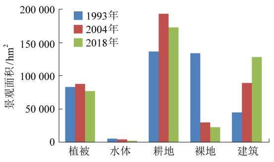  
(a) 景观面积

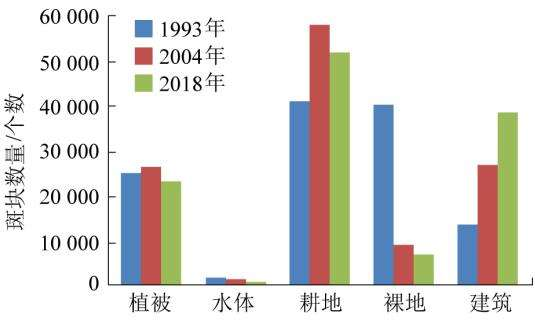  
(b) 斑块数量

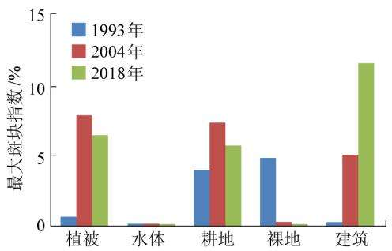  
(c) 最大斑块指数

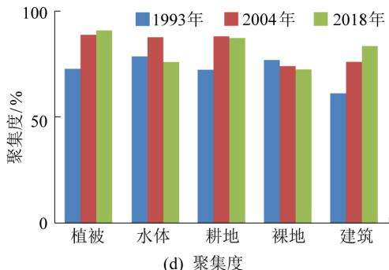  
图 3 景观格局指数  
Fig．3 Landscape pattern index

2)水体景观变化。 1993—2018 年间水体总景观面积呈现减少的变化趋势，水体斑块数量、斑块密度、边缘密度、最大形状指数、平均形状指数、平均斑块分维度先减少后增加，聚集度 最大斑块指数先增加后减小，散布与分裂指数不断增加。

3)耕地景观变化。 1993—2018 年间耕地景观总面积是先增加后减小的。 斑块数量、斑块密度、边缘密度是减小的，最大斑块指数、聚集度是先增加后减小的，平均形状指数 最大形状指数 平均斑块分维度、散布与分裂指数是先减小后增加的。

4)裸地景观变化。 1993—2018 年间裸地总景观面积是减小的。 斑块数量 斑块密度 边缘密度最大斑块指数、最大形状指数、聚集度、平均形状指数是减小的，平均斑块分维度先大幅度减小又略微增加，散布与分裂指数先增加后减小。

5)建筑景观变化。 1993—2018 年间建筑总景观面积是急剧增加的。 斑块数量、斑块密度、最大形状指数是减小的，边缘密度 平均形状指数是先增加后减小的，最大斑块指数 聚集度 平均斑块分维度是增加的，散布与分裂指数是先减小后增加的。

通过计算获取 1993 年 、 2004 年和 2018 年间整体景观格局指数变化情况见表 5。

表 5 整体景观格局指数变化  
Table 5 Index change of overall landscape pattern
<table><tr><td rowspan="2">年份</td><td rowspan="2">NP(斑块 数量)</td><td rowspan="2">PD(斑块 密度)</td><td rowspan="2">LPI(最 大斑块</td><td rowspan="2">IJI(散 布与分</td><td rowspan="2">CONTAG (蔓延度)</td><td rowspan="2">SHDI(香</td><td>SHEI(均</td><td>DI(优 势度</td></tr><tr><td>浓多样</td><td>匀度</td></tr><tr><td>1993</td><td>193 545</td><td>23.827 3</td><td>指数) 5.273 7</td><td>裂指数) 72.696 3</td><td>32.380 5</td><td>性指数) 1.3841</td><td>指数) 0.860 0</td><td>指数） 0.140 0</td></tr><tr><td>2004</td><td>81 812</td><td>10.071 8</td><td>8.232 5</td><td>67.496 9</td><td>44.925 7</td><td>1.2897</td><td>0.8013</td><td>0.198 7</td></tr><tr><td>2018</td><td>57 871</td><td>7.127 2</td><td>11.829 9</td><td>66.906 0</td><td>46.082 4</td><td>1.278 9</td><td>0.794 6</td><td>0.205 4</td></tr><tr><td></td><td></td><td></td><td></td><td></td><td></td><td></td><td></td><td></td></tr></table>

由表5 可知:整体景观水平上，斑块数量、斑块密度、散布与分裂指数总体呈现下降趋势，散布与分裂指数、蔓延度、优势度呈现增加趋势，香浓多样性指数、均匀度指数没有太大的浮动变化。

## 4．2 CA－Markov 预测结果分析

利用 CA － Markov 预测模型，基于 1993—2004年地表覆盖结果预测 2018 年研究区地表覆盖类型，基于2004—2018 年焦作市地表覆盖类型结果，预测下一个时期即 2026 年研究区地表覆盖类型分布状况如图4 所示。

为了验证模型预测的可靠度，首先基于 1993 年和2004 年实际数据对 2018 年的状态进行预测，生成预测结果图并利用 2018 年的实际真实数据进行验证分析，结果显示利用 CA－Markov 模型预测结果的总体精度为 83%，kappa 系数为 0． 75，满足应用需求。

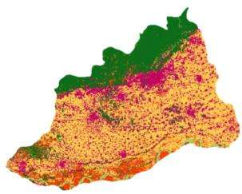  
(a) 2004年

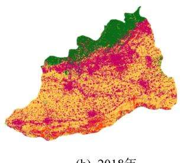  
(b) 2018年

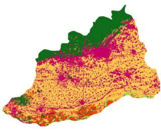  
(c) 2018年

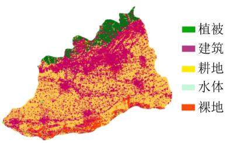  
(d) 2026年  
图 4 土地利用分类 CA－Markov 预测结果  
Fig．4 Land use / cover classification predicted by CA Markov model

从预测结果来看在 2018—2026 年间，焦作市北部山区的植被将大幅度减少，中部平原地区的耕地将被城市建筑所占用;南部滩地的裸地将会减少，但减少的幅度不会太大。 为了城市的更好发展，建议应加强植被保护，防止水土流失，对城市的发展应制

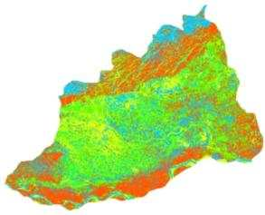  
(a) 1993年

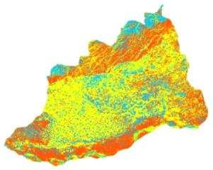  
(b) 2004年

定有效可行的规划。

## 4．3 生态安全评价结果分析

根据上述方法进行生态安全评价，结果如图 5所示。

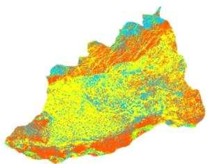  
(c) 2018年

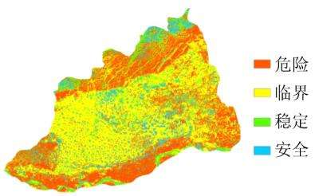  
(d) 2026年  
图 5 1993—2026 年焦作生态安全等级图  
Fig．5 Ecological security level map of Jiaozuo among 1993 and 2026

由图5 可知，1993—2004 年间焦作市总体生态状态呈现下降趋势，2004—2018 年间焦作市的生态状况总体上没有太多的变化。 在 1993—2004 年间，焦作市生态状况变化明显，其中，北部山区以及南部黄河岸区区域的生态状况没有较大改变，但在中部、西部 东部地区，其生态状况下降明显，特别是西部地区，大部分区域由原来的 “稳定”转为 “临界”状态;中部有近 50%的地区其生态状况没有发生变化，但另一部分也同样由原来的 “稳定”转为 “临界”状态，东部大约有 60%地区由 “稳定”转为 “临界”，同时小部分由 “安全”转为 “稳定”。 在 2004—2018年间，焦作市各地生态安全状况没有太大的变化;预测结果表明2026 年，焦作市安全状况不会发生太大波动。

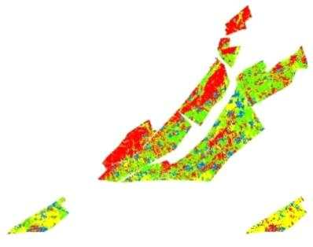  
(a) 1993年

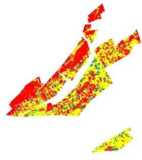  
(b) 2004年

## 4．4 焦作矿区生态安全评价分析

依据生成的焦作市生态安全评价结果，用焦作市矿区的矢量文件裁剪出焦作矿区的生态安全评价结果如图6 所示。

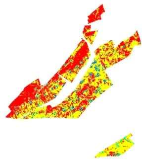  
(c) 2018年

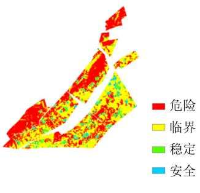  
(d) 2026年  
图 6 焦作市矿区生态安全评价与预测  
Fig．6 Ecological safety evaluation and forecast of Jiaozuo Mining Area

由图6 可知，在1993 年，由于矿产资源的开采，焦作矿区的生态状况虽然有部分处于危险之中，整体还是处于稳定和安全的状态;到 2004 年，由于矿产资源的大量开采，造成的生态环境问题也随之而来，其中大部分地区由 1993 年的稳定状态转为临界状态，整个矿区有 90%以上都处于临界状态及以下;2018 年以后焦作矿区的生态安全状况相比于2004 年没有太大的变化，其原因主要是由于矿区的陆续关闭，对生态环境的破坏程度降低，而且在国家政策层面，也加大了矿区生态环境保护，关闭后的矿区经过农民的开垦与修复，使得矿区的生态环境得到了稳定，没有进一步恶化。

## 5 结 论

1)利用 Landsat 影像和 CA－Markov 模型对焦作市20 多年来的景观变化和生态安全进行评估分析。20 多年来焦作市裸地和建筑景观变化幅度最大，水体 植被景观变化相对较小。 建筑景观面积大幅度增加，裸地景观面积大幅度减少，其他景观类型也都发生了不同程度的变化。 预测到2026 年，由于人口的快速增长以及经济的飞速发展，建筑景观面积将会进一步增加，但幅度不会太大，裸地将会持续减少，植被面积应该会有小幅度上升。

2)不同的地物覆盖类型均受到人类生产生活的影响。 随着人类活动的影响，建筑景观面积增加，分布集中且不断向外扩展;植被的破碎程度降低，聚集程度增加，集中造林成果显著;水体的景观面积逐年较少;耕地 裸地的最大斑块指数大幅度减少，表明田块数量增加，农业精细化程度不断提高

3)1993—2018 年间，焦作市生态安全状态总体情况先是大幅下降，最后达到平缓稳定状态1993—2004 年间，焦作市生态安全状态快速下降，尤其是西部 东部 中部地区，主要是由焦作市经济快速发展，煤炭等矿产资源的过快开采，人口快速增长，建筑的不断扩展，植被覆盖率降低造成的;2004—2018 年趋于平缓，主要是由于国家对生态保护宣传措施使人们意识到生态安全的重要性，同时退耕还林等相关政策对焦作市生态安全稳定起到了推动的作用。

4)矿产资源开发对焦作市的生态环境影响显著。 1993—2018 年间，焦作矿区的生态安全状态由1993—2004 年的急速下降状态变为 2004—2018 年的稳定状态，可见矿物的大量开采对生态环境的破坏程度是十分显著的;大量的矿物开采会破坏地表结构，产生断裂层，导致地下水的流失从而影响地面植被生长，继而对生态环境造成破坏。 人为的复垦以及环境保护措施虽然能够防止生态环境继续恶化，但要想使其恢复到以前的状态仍需持续投入大量的人力物力 因此，在进行矿产资源开采时，一定不能盲目扩大生产，必须考虑到当地的生态环境承载能力，做到合理开发利用，及时开展矿山生态修复工作，保障绿色矿山长久发展。

参考文献( References) :

［1］ 卞正富，于昊辰，侯 竟，等 西部重点煤矿区土地退化的影响因素及其评估［J］ 煤炭学报，2020，45(1):338－350BIAN Zhengfu，YU Haochen，HOU Jing，et al． Influencing factorsand evaluation of land degradation of 12 coal mine areas inWestern China［J］． Journal of China Coal Society，2020，45( 1) :338－350．

［2］ 马雄德，范立民．榆神矿区地下水与生态环境演化特征［J］． 煤炭科学技术，2019，47(10):245－252MA Xiongde，FAN Limin． Evolution characteristics of groundwaterand eco－ environment in Yulin － Shenmu Mining Area［J］． CoalScience and Technology，2019，47(10):245－252．

［3］ 宋子岭，赵东洋，张宇航，等．露天煤矿绿色开采生态环境评价体系模糊评判研究［J］．煤炭科学技术，2019，47(10):58－66．SONG Ziling，ZHAO Dongyang，ZHANG Yuhang，et al． Study on e-valuation model and application of green mining ecological environ-ment evaluation s stem in open － pit coal mine［J］ Coal Scienceand Technology，2019，47(10):58－66

［4］ XU Jiaxing，ZHAO Hua，YIN Pengcheng，et al． Landscape ecologicalquality assessment and its dynamic change in coal mining area acase study of Peixian［J］． Environmental Earth Sciences，2019，78(24):707－720

［5］ MA Libang，BO Jie，LI Xiaoyang，et al． Identifying key landscape pat- tern indices influencing the ecological security of inland river basin: The middle and lower reaches of Shule River Basin as an example［J］． Science of The Total Environment，2019，674:424－438．

［6］ WU Xue，LIU Shiliang，SUN Yongxiu，et al． Ecological security e-valuation based on entropy matter－element model A case study ofKunming city，southwest China［J］． Ecological Indicators，2019，102:469－478．

［7］ YANG Zijiang，HE Xiong，ASHRAF Muhammad Aqeel． Land－usechange in plateau lake basin and its impact on urban ecological se-curity［J］． Arabian Journal of Geosciences，2020，13(2) :96．

［8］ 李德仁 论时空大数据的智能处理与服务［J］ 地球信息科学学报，2019，21(12):1825－1831．LI Deren． The intelligent processing and service of spatiotemporalbig data［J］． Journal of Geo－information Science，2019，21( 12) :1825－1831

［9］ RUAN Wenqi，LI Yongquan，ZHANG Shuning，et al． Evaluation anddrive mechanism of tourism ecological security based on the DPSIR－DEA model［J］． Tourism Management，2019，75:609－625．

［10］ LU Shasha，QIN Fan，CHEN Ni，et al． Spatiotemporal differences in forest ecological security warning values in Beijing Using an in- tegrated evaluation index system and system dynamics model［J］． Ecological Indicators，2019，104:549－558．

［11］ LI Zhaotian，YUAN Mengjiao，HU Mengmeng，et al． Evaluation of ecological security and influencing factors analysis based on ro- bustness analysis and the BP－DEMALTE model:A case study of the Pearl River Delta urban agglomeration［J］． Ecological Indica- tors，2019，101:595－602．

［12］ 钱海滨，薛永森，田彦军．土地资源合理利用评价研究综述

［J］中国土地科学，2001，15(2):14－19QIAN Haibin，XUE Yongsen，TIAN Yanjun ． A review of the e-valuation of the rational use of land resources［J］ China LandSciences，2001，15(2):14－19

［13］ 李中才，刘林德，孙玉峰，等．基于 PSR 方法的区域生态安全评价［J］．生态学报，2010，30(23):6495－6503．LI Zhongcai，LIU Linde，SUN Yufeng，et al． Assessment methodof regional ecological security based on Pressure－State－Responsemodel［J］． Acta Ecologica Sinica，2010，30(23):6495－6503．

［14］ 侯向阳，肖 平．可持续发展指标体系的构建方法探讨［J］．生态科学，1998，17(2):82－87．HOU Xiangyang，XIAO Ping． Discussion on the constructionmethod of sustainable development index system［J］． EcologicalScience，1998，17(2):82－87．

［15］ 邵亚琴，汪云甲，李永峰，等 草原区煤电基地开发生态环境时空响应及综合评价［J］ 煤炭学报，2019，44(12):3874－3886．SHAO Yaqin，WANG Yunjia，LI Yongfeng，et al． Spatial －temporal response and comprehensive evaluation of ecological en-vironment of prairie coal － electricity base development ［J］．Journal of China Coal Society，2019，44(12):3874－3886．

［16］ 张周爱，杜 芳，黄 赳，等 露天矿区的生态网络格局评价:以胜利露天矿区为例［J］ 煤炭学报，2019，44(12):3839－3848ZHANG Zhouai，DU Fang，HUANG Jiu，et al． Evaluation of eco-logical network in surface coal mine:A case study of Shengli openpit mining area［J］． Journal of China Coal Society，2019，44(12):3839－3848

［17］ FESTIN Emma Sandell，TIGABU Mulualem，CHILESHE MutaleN，et al． Progresses in restoration of post－mining landscape in Af-rica［J］． Journal of Forestry Research，2019，30(2) :381－396．

［18］ LI Hengkai，YANG Liu，WANG Xiuli． Assessment of ecologicalsecurity in Rare earth mining area based on PSR model［J］． Jour-nal of Applied Science and Engineering，2018，21(1):9－16

［19］ SUN Baodi，TANG Jingchao，YU Dehu，et al． Ecosystem healthassessment A PSR analysis combining AHP and FCE methods forJiaozhou Bay，China［J］． Ocean ＆ coastal management，2019，168:41－50．

［20］ HAZBAVI Zeinab，SADEGHI Seyed Hazbavi，GHOLAMALIFARD Mehdi，et al． Watershed health assessment using the pressure－state－ response (PSR) framework［J］． Land Degradation ＆ Development， 2020，31(1):3－19．

［21］ MEN Baohui，LIU Haoyue． Water resource system vulnerability assessment of the Heihe River Basin based on pressure－state－re- sponse ( PSR) model under the changing environment［J］． Water Supply，2018，18(6):1956－1967．

［22］ 马晨阳，甄江红，冯琰玮，等．基于城市扩展的呼和浩特市综合生态风险评价［J］．生态学杂志，2019，38(11):3472－3479．MA Chenyang，ZHEN Jianghong，FENG Yanwei，et al． Compre-hensive assessment of ecological risks based on urban expansion:The case of Hohhot［J］． Chinese Journal of Ecology，2019，38(11):3472－3479．

［23］ 刘建红，徐建军，李 诚，等．基于遥感更新的省级生物丰度归一化系数研究:以湖北省为例［J］．江汉大学学报:自然科学

版，2007，35(4):46－50 LIU Jianhong，XU Jianjun，LI Cheng，et al． A study on the nor- malization coefficient of provincial biological abundance based on remote sensing updating: a case study of Hubei Province［J］． Journal of Jianghan University，2007，35(4):46－50．

［24］ 徐涵秋．城市遥感生态指数的创建及其应用［J］．生态学报，2013，33(24):7853－7862XU Hanqiu． A remote sensing urban ecological index and its ap-plication［J］． Acta Ecologica Sinica，2013，33(24):7853－7862．

［25］ 李保杰． 矿区土地景观格局演变及其生态效应研究［D］．中国矿业大学，2014

［26］ GINGRAS －HILL Tristan，NWAISHI Felix C，MACRAE MerrinL，et al． Ecohydrological functioning of an upland undergoing rec-lamation on post－mining landscape of the Athabasca oil sands re-gion，Canada［J］． Ecohydrology，2018，11(4):1－12．

［27］ 陈慧梅 近20 年来苏北地区土地利用变化的景观格局特征研究［J］江西农业学报，2013，25(10):109－113，117CHEN Huimei． Landscape pattern characteristics of land usechange in Northern Jiangsu in recent 20 years［J］． Acta Agricul-turae Jiangxi，2013，25(10):109－113，117．

［28］ 虞继进，陈雪玲，陈绍杰 基于遥感和 PSR 模型的城市景观生态安全评价:以福建省龙岩市为例［J］国土资源遥感，2013，25(1):143－149．YU Jijin，CHEN Xueling，CHEN Shaojie．Urban landscape ecolog-ical security assessment based on remote sensing and PSR model:a case study of Longyan City，Fujian Province［J］． RemoteSensing for Land ＆ Resources，2013，25(1):143－149

［29］ 郑青华，罗格平，朱 磊，等．基于 CA\_Markov 模型的伊犁河三角洲景观格局预测［J］．应用生态学报，2010，21(4):873－882．ZHENG Qinghua，LUO Geping，ZHU Lei，et al． Prediction of land-scape patterns in Ili River Delta based on CA\_Markov model［J］．Chinese Journal of Applied Ecology，2010，21(4):873－882．

［30］ 王 羊，高 阳，赵 琳，等． 元胞自动机模型的尺度敏感性分析［J］．北京大学学报:自然科学版，2011，47(4):750－757．WANG Yang，GAO Yang，ZHAO Lin，et al． Scale sensitiveanalysis of cellular automata model［J］． Journal of Peking Univer-sity，2011，47(4):750－757．

［31］ 余 敦，陈文波．基于物元模型的鄱阳湖生态经济区土地生态安全评价［J］应用生态学报，2011，22(10):2681－2685YU Dun，CHEN Wenbo． Land ecological safety in Poyang LakeEco－ economic Zone: An evaluation based on matter － elementmodel［J］． Chinese Journal of Applied Ecology，2011，22( 10) :2681－2685．

［32］ 孙彩歌，钟凯文，刘旭拢，等 基于 ALOS 遥感数据的新丰江流域生态安全 GIS 评价［J］．地球信息科学学报，2010，12(2):2301－2308．SUN Caige，ZHONG Kaiwen，LIU Xulong，et al． GIS analysis ofecological security evaluation in Xinfengjiang River valley usingALOS data［J］． Journal of Geo － information Science，2010，12(2):2301－2308．

［33］ LIANG Pei，DU Liming，YUE Guijie ． Ecological Security Assessment of Beijing Based on PSR Model［J］． Procedia Environmental Sci- ences，2010(2):832－841