DOI:10.13451/j.sxu.ns.2024117

# 安太堡露天矿区不同复垦地土壤肥力特征及其影响因子

宋崴，闫舟，王芳，李婷，刘福，王翔(山西省生物研究院有限公司，山西太原030006)

摘要：安太堡露天煤矿作为中国最大的露天煤矿，在开采过程中生态环境遭到了严重破坏。本文在安太堡露天矿区分别选择复垦三年的油松地、苜蓿地、土豆地和退化苜蓿地四种不同复垦模式对土地展开不同模式的复垦，对不同复垦模式的土壤理化性质、酶活性以及微生物数量等19项土壤质量评价指标进行测量，以期为安太堡露天矿区与其他露天煤矿的生态修复提供科学理论帮助。结果发现在经过复垦后，四种复垦地的土壤的pH值均没有出现显著变化，复垦油松地的土壤含水量显著下降至(9.27±0.461)%、土壤容重显著增加至(1.33±0.076)g/cm³；复垦土豆地的田间持水量显著提高至(17.63±0.992)%；复垦土豆地的土壤有机碳含量高达(9.25±0.816)g/kg，显著高于其他复垦模式土地；复垦油松地、复垦苜蓿地的全氮含量分别高达(0.52±0.204)g/kg、(0.52±0.025)g/kg;复垦苜蓿地的碱解氮含量高达到(14.93±0.038)mg/kg;复垦土豆地的全磷含量显著增加至(0.51±0.035)g/kg、速效磷含量显著增加至(16.11±0.827)mg/kg。复垦苜蓿地、复垦土豆地的蔗糖酶活性显著升高分别达到(0.138±0.003 2)mg/(100 g·h)、(0.135±0.0016)mg/(100 g·h)；复垦土豆地的脲酶活性最高达到(1.323±0.0625)mg/(100 g·h);退化苜蓿地、复垦首蓿地、复垦土豆地的土壤过氧化氢酶含量均显著高于未复垦地；未复垦地的多酚氧化酶与碱性磷酸酶活性均为最低，分别为(0.001±0.0001)mg/(100g·h)、(0.013±0.0010)mg/(100g·h)，复垦油松地多酚氧化酶与碱性磷酸酶活性达到最高，分别达到(0.003±0.0001)mg/(100g·h)、(0.040±0.0055)mg/(100 g·h)。复垦油松地、退化苜蓿地、复垦土豆地中的细菌数量显著增加，分别达到(8.12±0.489)×106 cfu/g、(7.64±0.623)×106 cfu/g、(8.93±0.197)×106 cfu/g;退化苜蓿地的自生固氮菌数量显著升高至 $( 2 . 0 1 { \pm } 0 . 2 5 4 ) { \times } 1 0 ^ { 3 } \mathrm { c f u / g } ;$ 退化苜蓿地、复垦油松地的反硝化细菌数量分别显著升高至 $( 1 4 . 3 3 \pm 0 . 6 2 9 ) \times 1 0 ^ { 3 } \ \mathrm { c f u / g . } \ ( 1 0 . 5 7 \pm 0 . 9 2 5 ) \times 1 0 ^ { 3 } \ \mathrm { c f u / g }$ ，复垦土豆地的反硝化细菌数量最低，仅为$( 3 . 3 9 { \pm } 0 . 6 3 6 ) { \times } 1 0 ^ { 3 } ~ \mathrm { c f u / g } ;$ 未复垦地的放线菌数量最低，退化苜蓿地的放线菌数量最高，达到(1.94±0.154)×103cfu/g。复垦苜蓿地、复垦土豆地的真菌数量分别达到(7.99±0.518)×102 cfu/g、(7.89±0.229)×102 cfu/g。复垦油松地、退化苜蓿地真菌数量则显著低于未复垦地。研究结果为国内露天煤矿的生态修复具有借鉴意义。

关键词：露天矿区；复垦模式；理化性质；酶活性；多样性

中图分类号：S158

文献标志码：A

文章编号:0253-2395(2024)06-1307-11

# Soil Fertility Characteristics and Influencing Factors of Different Open-pit Mine Reclaimed Lands in Antaibao

SONG Wei, YAN Zhou, WANG Fang, LI Ting, LIU Fu, WANG Xiang (Shanxi Institute of Biological Research Co., Ltd., Taiyuan 030006, China)

Abstract: This study investigated the effectiveness of four reclamation modes on three-year reclamation of Chinese pine (Pinus tabuliformis), alfalfa (Medicago sativa), potato (Solanum tuberosum), and degraded alfalfa field at the Antaibao coal mine, the largest open-pit coal mine in China that has suffered severe ecological degradation due to the mining activities. Nineteen soil quality

indicators, including physicochemical properties, enzyme activities, and microbial populations, were measured across these reclamation modes, in order to provide theoretical help for the ecological restoration of Antaibao mine and other coal mines. The results show that soil pH remained relatively stable across the four reclamation modes after reclamation. Soil moisture content of reclaimed Chinese pine field decreased significantly to (9.27±0.461)% , and the soil bulk density increased significantly to (1.33±0.076)g/cm³. Conversely, the field water-holding capacity of reclaimed potato field increased significantly to (17.63±0.992)%, while soil organic carbon content was highest in the potato field, reaching (9.25±0.816)g/kg, significantly exceeding other reclamation modes. Total nitrogen content of reclaimed Chinese pine and alfalfa fields was highest, reaching (0.52±0.204)g/kg and (0.52±0.025)g/kg, respectively. The available nitrogen content of reclaimed alfalfa field exhibited the highest at (14.93±0.038)mg kg. Total phosphorus content of reclaimed potato field increased significantly to (0.51±0.035)g/kg, while the available phosphorus content increased significantly to (16.11±0.827)mg/kg. Sucrase activity increased significantly in reclaimed alfalfa and potato fields, reaching (0.138±0.003 2)mg/100 g·h and (0.135±0.001 6)mg/(100 g·h), respectively. Urease activity was highest in reclaimed potato field, reaching (1.323±0.062 5)mg/(100 g·h). The catalase content was significantly higher in degraded alfalfa, reclaimed alfalfa and potato fields, compared to the unreclaimed control. Polyphenol oxidase and alkaline phosphatase activities were the lowest in the unreclaimed control ((0.001±0.000 1)mg/(100g·h) and (0.013±0.001 0)mg/(100 g·h), respectively), while highest in reclaimed Chinese pine field ((0.003±0.000 1)mg/(100 g·h) and (0.040±0.005 5)mg/(100 g·h), respectively). The number of bacterial increased significantly in Chinese pine, degraded alfalfa, and potato fields, reaching (8.12±0.489) ×106 cfu/g, (7.64±0.623) ×10⁶ cfu/g, and (8.93±0.197)×10⁶ cfu/g, respectively. The number of nitrogen-fixing bacteria increased significantly in degraded alfalfa field ((2.01± 0.254)×103 cfu/g). Denitrifying bacteria were significantly higher in the degraded alfalfa and Chinese pine fields ((14.33±0.629)×10³ cfu/g and (10.57±0.925) ×10³ cfu/g, respectively), while the potato field had the lowest count ((3.39±0.636) ×103 cfu/g). Actinomycetes were least abundant in the unreclaimed control and most abundant in the degraded alfalfa field ((1.94±0.154)×10³ cfu/ g). Fungal populations reached (7.99±0.518)×10² cfu/g and (7.89±0.229)×10² cfu/g in the alfalfa and potato fields, respectively, and were significantly lower in the Chinese pine and degraded alfalfa fields compared to the unreclaimed control. In conclusion, different reclamation strategies have varying impacts on soil properties and microbial communities in post-mining environments These findings provide valuable insights for guiding ecological restoration efforts in open-pit coal mines in China.

Key words: open-pit coal mine; reclamation models; physicochemical properties; enzyme activity; diversity

## 0 引言

煤炭是我国重要的化石能源，但在煤炭开采过程中高强度、大规模地清除植被、处理尾矿[1-3]等措施严重破坏了矿区的土壤与生态环境，造成严重的环境污染，导致如今的矿区生态系统成为世界上退化最为严重的生态系统之二[4]，面临着巨大的环境治理压力[5]。相较于地下开采，露天开采会导致土壤物理结构和化学成分比例发生巨大变化，导致生态退化更加严重，在开采及闭坑后产生更多环境问题[6-10]。

针对目前矿区存在的生态环境问题，进行生态恢复极为迫切。矿区土地复垦是指采用工程、生物措施等技术手段，对矿山生产建设过程中破坏的土地进行整治，以确保土壤的化学、物理和生物性质恢复至可利用状态或有更高利用价值[11-14]。近年来，矿区废弃地复垦与生态重建成为国内外生态学领域重要的研究课题[15-17]，有研究对不同复垦模式下土壤养分改善及微生物丰度、结构多样性差异特征等方面进行了探讨，发现有510多种不同的生物，在吸附与净化作用下能够有效改善矿山生态环境，提升其周围土壤的肥力[11]；矿区复垦土壤的肥力评价也对矿区生态修复起着重要作用，有学者结合生态环境治理分析揭示了土壤养分指标的分布特征[18-23]。目前，国内煤矿生态恢复研究大多从水土流失防治、植被长势等方面进行，从土壤理化性质、微生物、酶活性等方面探索植被恢复模式、寻找露天煤矿生态修复的有效方法极为重要。

安太堡露天煤矿位于山西省北部的平朔矿区，地理坐标为112°19′03″E—112°24′17″E，39°30′29″N—39°35′26″N，平均海拔高程在1300m\~1400m，该地区冬春干旱少雨、寒冷多风，夏秋降水集中、温凉少风，属于半干旱大陆性季风气候，土壤类型为栗钙土与栗褐土的过渡类型，土壤物理风化作用强烈，土质偏砂。矿区总面积375.12km²，地质储量约为126亿t。安太堡露天煤矿是中国最大的露天煤矿，长期高强度开采造成植被被完全破坏、水土流失，对生态环境造成了巨大的破坏，是黄土高原丘陵生态极度脆弱区。本研究在对安太堡露天矿区展开多年不同模式的土地复垦工作基础上，分别选择复垦三年的油松地、苜蓿地、土豆地和退化苜蓿地四种不同复垦模式的土地。对土壤的理化性质、酶活性以及微生物数量等19项土壤质量综合评价指标进行测量，并利用因子分析法综合评价土壤肥力，以期为进一步对安太堡露天矿区以及国内其他露天煤矿的生态修复提供科学理论帮助。

## 1 材料与方法

## 1.1 研究区概况

研究区位于山西省朔州市区与平鲁区交界处，安太堡露天煤矿生态复垦区(东经112°11'—112°30′,北纬39°23′—39°37′），属典型的温带半干旱大陆性季风气候区，冬季寒冷干燥；夏秋降水集中、温凉少风。区内年平均气温5.4℃～13.8℃(最高可达37.9℃，最低为—32.4℃)；平均年降水量为428.2 mm～449.0 mm（最高年降水量757.4 mm，最低年降水量195.6mm)[24]，是我国生态最脆弱、水土流失最严重的地区之一。该区土壤以栗钙土和栗褐土为主，物理风化强烈，土质偏砂，土体干旱，地带性植被类型属于草原。因露天开采、岩土排弃，原地貌形态、地层结构、生物种群已不复存在。

## 1.2 土样采集方法

供试土壤采自朔州市平鲁区安太堡露天矿区复垦地，基础条件一致，无外来土壤，采样地分别为复垦三年的油松地(RP)、苜蓿地(RA)、土豆地（RT）、退化苜蓿地(DA）和未复垦地（WR），本研究涉及样地基本信息见表1。于2020年6月一7月，在采样点使用五点取样法选取植被的对角线处，用5cm内径的无菌土钻采集0～20cm的土样[25]，将土壤样品中的石块与植物残体去除，并将样品平均分成两份。其中一部分放入无菌密封袋中，于4℃条件下储存，用于测量土壤含水量、田间持水量、容重、微生物数量、酶活力；另一部分进行风干处理后用于测量土壤 $\mathrm { p H }$ 等理化性质。

## 1.3 土壤理化性质的测定

土壤pH值使用pH计在土壤:水(1:2.5)的悬浮液中振荡30min后测定；含水量的测定采用烘干法；田间持水量和容重的测定采用环刀法；土壤有机碳的测定采用重铬酸钾氧化法；全氮的测定采用凯氏法；碱解氮的测定采用碱解扩散法；全磷和速效磷的测定采用钼锑抗比色法[26]，每份土样各项理化性质的测定设置三个重复。

## 1.4 土壤酶活性的测定

蔗糖酶的测定采用硫代硫酸钠滴定法；脲酶的测定采用苯酚钠比色法；过氧化氢酶的测定采用高锰酸钾滴定法；多酚氧化酶的测定采用焦性没食子酸比色法27]；碱性磷酸酶的测定采用磷酸苯二钠比色法。

## 1.5 土壤微生物的测定

土壤微生物主要类群数量的测定采用稀释涂布平板法[28]，其中细菌使用牛肉膏蛋白胨培养基培养[29]；真菌使用马丁氏培养基培养[30]；自生固氮菌使用改良阿须贝培养基MPN法(统计学和微生物学结合的一种定量检测法)[31]；反硝化细菌使用反硝化细菌培养基培养；放线菌使用高氏一号培养基培养。

## 1.6 分析方法

按照许明祥[32]的方法区分各指标的敏感性差异，根据变异系数 $\mathcal { V } \mathrm { { C V } }$ 的大小将其划分为极敏感 $( \mathrm { \Delta } _ { \mathrm { U C V } } { \geqslant } 1 0 0 \% )$ 、高度敏感 $( 4 0 \% < \%$ ≤100%）、中度敏感 $( \mathrm { 1 0 \% { < } } v _ { \mathrm { c v } } { \leqslant } 4 0 \% )$ 和低度敏感 $( \sigma _ { \mathrm { C V } } { \leqslant } 1 0 \% )$

研究数据使用Excel软件进行统计整理，

表1 不同植被恢复模式样地基本信息  
Table 1 Basic information of the different vegetation recovery types
<table><tr><td>样品</td><td>植被模式</td><td>复垦类型</td></tr><tr><td>RP</td><td>复垦油松地</td><td>经过复垦，栽培油松三年</td></tr><tr><td>RA</td><td>复垦苜蓿地</td><td>经过复垦,栽培苜蓿三年</td></tr><tr><td>RT</td><td>复垦土豆地</td><td>经过复垦，栽培土豆三年</td></tr><tr><td>DA</td><td>退化苜蓿地</td><td>连续种植3年苜蓿后开始退化，样品为退化3年后的样地。</td></tr><tr><td>WR</td><td>未复垦地</td><td>未经任何方式复垦</td></tr></table>

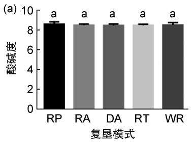

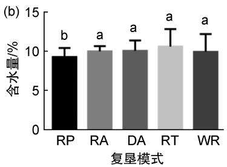

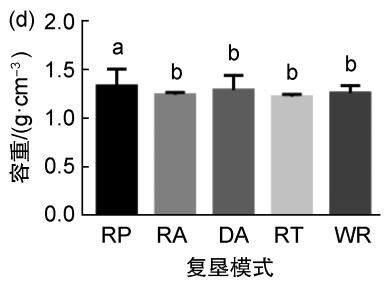

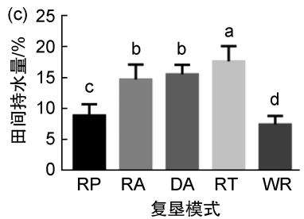

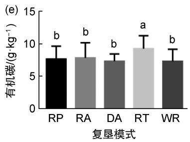

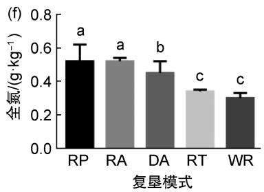

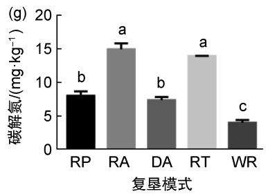

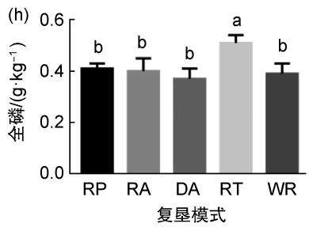  
图1 不同复垦地土壤理化指标

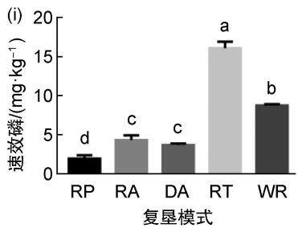  
(a)酸碱度；(b)含水量；(c)田间持水量；(d)容重；(e)有机碳；(f)全氮；(g)碱解氮；(h)全磷；(i)速效磷。图中小写字母为0.05水平上的显著性差异。  
Fig. 1 Soil physical and chemical indexes in different reclaimed land  
(a) pH; (b) Water content; (c) Field capacity; (d) Bulk; (e) Organic carbon; (f) Total nitrogen; (g) Available nitrogen; (h) Total phosphorus; (i) Available phosphorus.The lowercase letters are significant differences at the 0.05 level.

SPSS20.0软件进行分析处理。不同复垦地土壤理化性质、酶活性和微生物数量差异显著性采用最小显著差数法(LSD)单因素方差分析检验。在SPSS中将数据标准化后进行Bartlett球形度检验，分析得到相关因子的特征值、方差贡献率、各成分因子得分和综合得分及其排名，由公式(1)计算综合得分。

$$
F = \alpha _ { 1 } F _ { 1 } + \alpha _ { 2 } F _ { 2 } + \cdots + \alpha _ { n } F _ { n } ,\tag{1}
$$

其中F为土壤肥力综合评分； $\alpha _ { n }$ 为各因子的方差贡献率； $F _ { n }$ 为各因子得分， $F _ { n } { = } \omega _ { 1 j } X _ { 1 j } { + }$ $\omega _ { 2 j } X _ { 2 j } + \cdots + \omega _ { n j } X _ { n j } , \omega _ { n j }$ 为第n个变量在第j个因子处的因子得分系数， $X _ { n j }$ 为第n个变量在第j个因子处的标准化值。

## 2 结果与分析

## 2.1 不同复垦模式的土壤理化性质及相关性

不同复垦地的土壤理化性质变化如图1，与未复垦地相比，四种复垦地土壤的pH值均没有出现显著变化；复垦油松地土壤含水量与未复垦地相比显著下降至 $9 . 2 7 \% \pm 0 . 4 6 1 .$ %，其余三种复垦土地的土壤含水量则没有出现显著变化；四种复垦地土壤在复垦后田间持水量均有显著提高，其中复垦土豆地的田间持水量最高，达到 $1 7 . 6 3 \% \pm 0 . 9 9 2 \%$ ；复垦油松地的土壤容重显著增加至 $( 1 . 3 3 { \pm } 0 . 0 7 6 ) \ \mathrm { g / c m ^ { 3 } }$ ，其余三种复垦土地则没有发现显著差异；复垦土豆地的土壤有机碳含量高达 $( 9 . 2 5 { \pm } 0 . 8 1 6 ) ~ \mathrm { g / k g }$ ,并显著高于其他类型土地，其余三种复垦地有机碳含量与未复垦地没有发现显著差异；不同复垦模式土壤的全氮含量均显著高于未复垦地，其中复垦油松地、复垦苜蓿地的全氮含量分别高达 $( 0 . 5 2 \pm 0 . 2 0 4 ) ~ \mathrm { g / k g } \cdot ( 0 . 5 2 \pm 0 . 0 2 5 ) ~ \mathrm { g / k g } ;$ 不同复垦模式土壤的碱解氮含量同样显著高于未复垦地，其中复垦苜蓿地的碱解氮含量高达到 $( 1 4 . 9 3 \pm 0 . 0 3 8 ) \mathrm { m g / k g }$ ；复垦土豆地的全磷含量相较于其余三种复垦土地与未复垦土地显著增加，达到 $( 0 . 5 1 { \pm } 0 . 0 3 5 ) ~ \mathrm { g / k g }$ ；复垦土豆地的速效磷含量相比于未复垦地显著增加至$( 1 6 . 1 1 { \pm } 0 . 8 2 7 ) \mathrm { m g / k g }$ ，其余三种复垦土地的速效磷含量则显著降低。

土壤理化性质间相关性如表2所示，pH与土壤含水量之间互为极显著负相关，相关性为一0.707；速效磷分别与含水量、全磷之间均呈极显著正相关，相关性达0.671、0.714；而与全氮则显著性则为一0.538，显示为显著负相关；田间持水量与碱解氮互为极显著正相关，相关性达0.740；容重与速效磷之间显示显著负相关，相关性为一0.526；有机碳分别与全磷、速效磷之间互为极显著正相关，相关性分别为0.652、0.611。其余土壤理化性质之间，没有表现出显著的相关性。

## 2.2 不同复垦模式的土壤酶活性及相关性

不同复垦地的土壤酶活性变化见图2，与未复垦地相比，复垦苜蓿地、复垦土豆地的蔗糖酶活性分别显著升高，分别达到(0.138±0.0032)$\mathrm { m g / ( 1 0 0 ~ g \cdot h ) \Omega _ { \times } ( 0 . 1 3 5 \pm 0 . 0 0 1 ~ 6 ) m g / ( 1 0 0 ~ g \cdot h ) }$ ;未复垦地的脲酶活性最低，其余四种复垦土地的脲酶活性有显著差异，其中复垦土豆地的脲酶活性最高达到 $( 1 . 3 2 3 { \pm } 0 . 0 6 2 5 ) \mathrm { m g / ( 1 0 0 \ g \cdot h ) }$ i退化苜蓿地、复垦苜蓿地、复垦土豆地的土壤过氧化氢酶含量均显著高于未复垦地，三者之间差异显著，其中退化苜蓿地的过氧化氢酶含量最高，达到 $( 5 . 2 5 6 { \pm } 0 . 0 0 9 \ 8 ) \mathrm { m g / ( 1 0 0 \  g \cdot h ) }$ ;与其余四种复垦土地相比，未复垦地的多酚氧化酶与碱性磷酸酶活性均为最低，分别为$( 0 . 0 0 1 \pm 0 . 0 0 0 1 ) \mathrm { m g } / ( 1 0 0 \mathrm { g } \cdot \mathrm { h } ) \ l _ { \cdot } ( 0 . 0 1 3 \pm 0 . 0 0 1 0 )$ $\mathrm { m g / ( 1 0 0 \ g \cdot h ) }$ ，复垦油松地多酚氧化酶与碱性磷酸酶活性达到最高，分别达到(0.003±0.0001)$\mathrm { m g / ( 1 0 0 ~ g \cdot h ) } \mathrm { ~ . ( 0 . 0 4 0 { \pm } 0 . 0 0 5 ~ 5 ) \mathrm { m g / ( 1 0 0 ~ g \cdot h ) } }$ O

土壤酶活性间相关性如表3所示，脲酶与过氧化氢酶之间相关性高达0.739，互为极显著正相关；多酚氧化酶与碱性磷酸酶之间同样为极显著正相关，相关性为0.646；其余土壤酶活性之间没有表现出显著的相关性。

## 2.3 不同复垦地微生物数量及相关性

不同复垦地的土壤微生物数量的变化如图3所示，复垦油松地、退化苜蓿地、复垦土豆地中的细菌数量显著增加，分别达到(8.12±$0 . 4 8 9 ) \ \times 1 0 ^ { 6 } \ \mathrm { { \ c f u / g } \cdot ( 7 . 6 4 \pm 0 . 6 2 3 ) \ \times 1 0 ^ { 6 } \mathrm { { \ c f u / g } } }$ $( 8 . 9 3 { \pm } 0 . 1 9 7 ) \times 1 0 ^ { 6 } ~ \mathrm { c f u / g }$ ；在多种细菌中，退化苜蓿地与复垦土豆地的自生固氮菌数量显著高于未复垦地，退化苜蓿地更是高达(2.01±$0 . 2 5 4 ) \times 1 0 ^ { 3 } ~ \mathrm { c f u / g }$ ；退化苜蓿地、复垦油松地的反硝化细菌数量显著高于未复垦地，分别高达$( 1 4 . 3 3 \pm 0 . 6 2 9 ) \times 1 0 ^ { 3 } \mathrm { { c f u / g . } ( 1 0 . 5 7 \pm 0 . 9 2 5 ) \times }$ $1 0 ^ { 3 } ~ \mathrm { c f u / g }$ ，复垦土豆地的反硝化细菌数量最低，仅为 $( 3 . 3 9 { \pm } 0 . 6 3 6 ) \times 1 0 ^ { 3 } ~ \mathrm { c f u / g }$ ；未复垦地的放线菌数量最低，其余四种复垦土地中退化苜蓿地的放线菌数量最高，达到 $( 1 . 9 4 \pm 0 . 1 5 4 ) \times 1 0 ^ { 3 }$ $\mathrm { c f u / g _ { \mathrm { \circ } } }$ 复垦苜蓿地、复垦土豆地的真菌数量分别达到 $( \mathrm { ~ 7 . 9 9 { \pm } 0 . 5 1 8 ~ ) ~ \times 1 0 ^ { 2 } ~ \Delta ~ \ c f u / g }$ 、（7.89±$0 . 2 2 9 ) \times 1 0 ^ { 2 } ~ \mathrm { c f u / g }$ ，与未复垦地无显著差异。复垦油松地、退化苜蓿地真菌数量则显著低于未复垦地。

表2 土壤理化性质间的相关性  
Table 2 Correlation among physical and chemical properties of soil
<table><tr><td></td><td>酸碱度pH</td><td>含水量</td><td>田间持水量</td><td>容重</td><td>有机碳</td><td>全氮</td><td>碱解氮</td><td>全磷</td><td>速效磷</td></tr><tr><td>酸碱度pH</td><td>1</td><td></td><td></td><td></td><td></td><td></td><td></td><td></td><td></td></tr><tr><td>含水量</td><td>-0.707**</td><td>1</td><td></td><td></td><td></td><td></td><td></td><td></td><td></td></tr><tr><td>田间持水量</td><td>-0.437</td><td>0.472</td><td>1</td><td></td><td></td><td></td><td></td><td></td><td></td></tr><tr><td>容重</td><td>0.283</td><td>-0.387</td><td>-0.369</td><td>1</td><td></td><td></td><td></td><td></td><td></td></tr><tr><td>有机碳</td><td>-0.273</td><td>0.237</td><td>0.389</td><td>-0.268</td><td>1</td><td></td><td></td><td></td><td></td></tr><tr><td>全氮</td><td>0.136</td><td>-0.385</td><td>-0.005</td><td>-0.077</td><td>-0.083</td><td>1</td><td></td><td></td><td></td></tr><tr><td>碱解氮</td><td>-0.165</td><td>0.052</td><td>0.740**</td><td>-0.375</td><td>0.467</td><td>0.21</td><td>1</td><td></td><td></td></tr><tr><td>全磷</td><td>-0.053</td><td>0.262</td><td>0.343</td><td>-0.18</td><td>0.652**</td><td>-0.19</td><td>0.43</td><td>1</td><td></td></tr><tr><td>速效磷</td><td>-0.409</td><td>0.671**</td><td>0.384</td><td>-0.526*</td><td>0.611*</td><td>-0.538*</td><td>0.284</td><td>0.714**</td><td>1</td></tr></table>

注：\*\*在0.01水平(双侧)上显著相关，\*在0.05水平(双侧)上显著相关。  
Note:\*\* significantly correlated at the 0. 01 level (two-sided). \* significantly correlated at the 0. 05 level (two-sided).

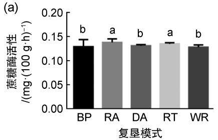

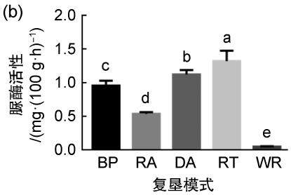

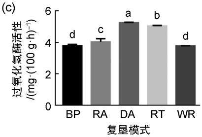

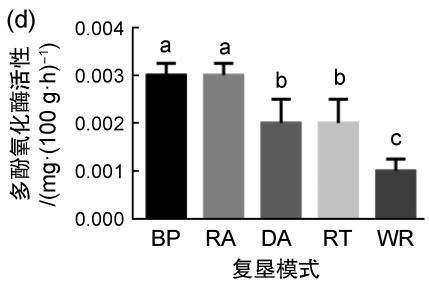

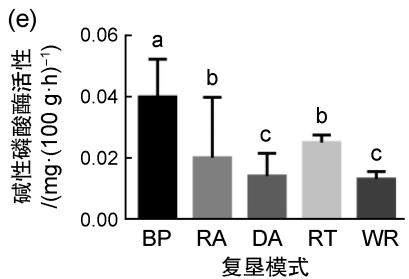  
图2 不同复垦地土壤酶活性  
(a)蔗糖酶活性；(b)脲酶活性；(c)过氧化氢酶活性；(d)多酚氧化酶活性；(e)碱性磷酸酶活性。图中小写字母加0.05水平上的显著性差异。  
Fig. 2 Enzymatic activity in different reclaimed lands

(a) Sucrase activity; (b) Urease activity; (c) Catalase activity; (d) Polyphenol oxidase activity; (e) Alkaline phosphatase activity. The lowercase letters are significant differences at the 0.05 level.  
表3 土壤酶活性间的相关性  
Table 3 Correlation among soil enzyme activities
<table><tr><td rowspan="2"></td><td rowspan="2">蔗糖酶</td><td rowspan="2">脲酶</td><td rowspan="2">过氧化 氢酶</td><td rowspan="2">多酚氧 化酶</td><td rowspan="2">碱性磷 酸酶</td></tr><tr><td></td></tr><tr><td>蔗糖酶 脲酶</td><td>1</td><td></td><td></td><td></td><td></td></tr><tr><td>过氧化氢酶</td><td>-0.046</td><td>1</td><td>1</td><td></td><td></td></tr><tr><td>多酚氧化</td><td>-0.009</td><td>0.739**</td><td>-0.096</td><td>1</td><td></td></tr><tr><td></td><td>0.43</td><td>0.448</td><td></td><td></td><td></td></tr><tr><td>碱性磷酸酶</td><td>-0.119</td><td>0.348</td><td>-0.316</td><td>0.646**</td><td>1</td></tr></table>

注：\*\*在0.01水平(双侧)上显著相关，\*在0.05水平(双侧)上显著相关。  
Note: \*\* significantly correlated at the 0.01 level (twosided). \* significantly correlated at the 0.05 level (twosided).

土壤微生物数量间的相关性如表4所示，细菌与真菌数量间呈现极显著负相关，相关性指数为一0.683；细菌与自生固氮菌、反硝化细菌数量间均呈现极显著正相关，相关性指数分别高达0.655、0.877；反硝化细菌与真菌、自生固氮菌以及放线菌数量之间分别呈现极显著负相关、极显著正相关、极显著正相关，相关性指数分别为—0.739、0.802、0.699。其余微生物数量之间无显著的相关性。

## 2.4 不同复垦地土壤综合评价

为了区分各指标的敏感性差异，根据变异系数大小将其划分为高度敏感(40%<vcv≤100%）、中度敏感(10%<vcv≤40%)和低度敏感(vcv≤10%）。据此对本研究所选的19项理化及生物属性指标的敏感性分级结果见表5。其中作为土壤质量评价高度敏感的指标有碱解氮、速效磷、脲酶、碱性磷酸酶、细菌、反硝化细菌，是矿区植被恢复土壤质量评价的主要指标和恢复的主要目标；中度敏感的指标有含水量、田间持水量、全氮、全磷、过氧化氢酶、多酚氧化酶、真菌、放线菌、固氮菌，其中土壤化学和生物学性质占大多数，可以作为土壤质量恢复的敏感性指标；低度敏感的指标有pH、容重、有机碳、蔗糖酶。

经因子分析进行处理的19项理化及生物属性指标，3个公因子可以获得不同复垦地土壤水平得分，由各因子得分和方差贡献率加权得到不同复垦地土壤肥力综合评分(表6)为：复垦土豆地(1.33)>复垦苜蓿地(0.83)>复垦油松地(—0.38)>退化苜蓿地(—0.61)>未复垦地(一1.17)。这一结果表明经过复垦的土地土壤相比未复垦地均有所好转，且与从土壤理化性质、酶活性和微生物数量分析的结果一致。

(e)  
(d)  
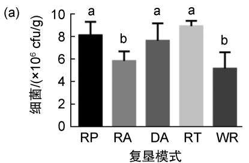

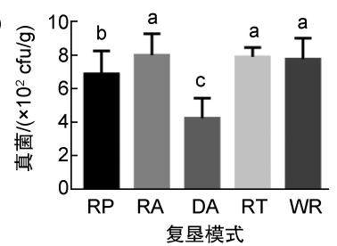

(c)  
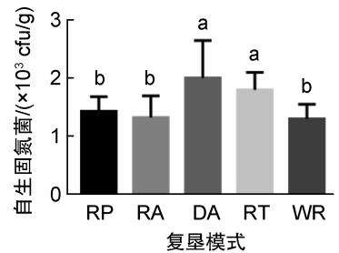

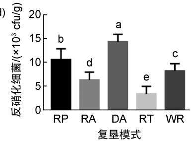

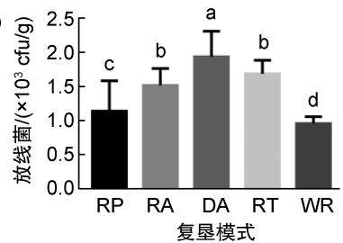  
图3 不同复垦地微生物数量  
(a)细菌；(b)真菌；(c)自生固氮菌；(d)反硝化细菌；(e)放线菌。图中小写字母加0.05水平上的显著性差异。  
Fig. 3 Microbial quantity in different reclaimed lands

(a) Bacterium; (b) Fung; (c) Rhizobacter; (d) Denitrifying bacteria; (e) Actinomycetes. The lowercase letters are significant differences at the 0.05 level.  
表4 土壤微生物数量间的相关性  
Table 4 Correlation among soil microbial numbers
<table><tr><td colspan="2">细菌</td><td>真菌</td><td>自生固 氮菌</td><td>反硝化 细菌</td><td colspan="2">放线菌</td></tr><tr><td colspan="2">细菌</td><td>1</td><td></td><td></td><td></td><td rowspan="6"></td></tr><tr><td colspan="2">真菌</td><td> $- 0 . 6 8 3 ^ { * * }$ </td><td>1</td><td></td><td></td></tr><tr><td colspan="2">自生固氮菌</td><td>0.655**</td><td>-0.363</td><td>1</td><td></td></tr><tr><td colspan="2">反硝化细菌</td><td> $0 . 8 7 7 * *$ </td><td>—0.739**</td><td>0.802**</td><td>1</td></tr><tr><td colspan="2">放线菌</td><td>0.393</td><td>-0.508</td><td>0.51</td><td>0.699**</td></tr></table>

注：\*\*在0.01水平(双侧)上显著相关，\*在0.05水平(双侧)上显著相关。  
Note: \*\* significantly correlated at the 0.01 level (two-sided). \* significantly correlated at the 0. 05 level (two-sided).

## 3 讨论

煤矿开采会造成土壤生态系统的严重破坏，通过在四种不同模式下对矿区的土地进行复垦，复垦油松地和与其他类型土壤相比，含水量显著降低至(9.27±0.461)%，说明植被保持水分的能力显著下降。田间持水量是土壤的一项物理性质，与土壤的结构、质地、有机质含量以及土地利用状况有关[33]；土壤容重是土壤在自然结构状态下，单位体积的干土重量[34]。相较于未复垦地，四种复垦地土壤田间持水量均有显著提高，其中复垦土豆地的田间持水量最高，达到$( 1 7 . 6 3 { \pm } 0 . 9 9 2 )$ %；复垦油松地的土壤容重显著高于其他类型土地，达到 $( 1 . 3 3 { \pm } 0 . 0 7 6 ) \mathrm { g / c m ^ { 3 } }$ 说明其保水保肥能力较弱，这与一些学者的研究结果也表现一致[35-36]。由于气候、地域和人为活动的影响，土壤的理化性质会呈现出复杂的多样性[37]。有机碳含量对揭示土壤肥力水平[38-40]，促进植物生长有着重要作用[41-43]，通过三年连续栽培土豆土壤有机碳含量显著提高至$( 9 . 2 5 { \pm } 0 . 8 1 6 ) \mathrm { g / k g }$ 。氮素含量是影响土壤肥力的重要指标，是土壤肥力强弱表现的客观体现[44-46]，不同复垦模式土壤全氮、碱解氮含量均显著高于未复垦地；土壤磷是植物和土壤微生物必需的营养元素[38]，对于评价土壤养分状况和恢复效果有着重要的指示作用[39]，复垦土豆地的全磷、速效磷含量显著高于未复垦地。复垦土豆地中氮、磷含量增加可能是因为植被种植过程中施用肥料所致。碱解氮含量作为植物氮素营养较无机氮有更好的相关性，四种复垦地碱解氮含量显著高于未复垦地，说明土壤中有机质含量丰富，熟化程度较高。速效磷作为土壤中较容易被植物吸收利用的磷，除复垦土豆地外其余三种复垦地速效磷含量显著降低，这可能是因为种植植被有效地吸收利用了磷，而土豆对速效磷的吸收利用能力较差。

表5 不同复垦地土壤质量综合指标敏感度分级  
Table 5 Sensitivity classification of comprehensive indexes of soil quality in different reclaimed lands
<table><tr><td>指标敏感度</td><td>变异系数UcV</td><td>指标</td></tr><tr><td>高度敏感</td><td> $4 0 \% < \boldsymbol { v } _ { \mathrm { c v } } { \leqslant } 1 0 0 \%$ </td><td>碱解氮、速效磷、脲酶、碱性磷酸酶、细菌、反硝化细菌</td></tr><tr><td>中度敏感</td><td> $1 0 \% < \boldsymbol { v } _ { \mathrm { c v } } { \leqslant } 4 0 \%$ </td><td>含水量、田间持水量、全氮、全磷、过氧化氢酶、多酚氧化酶、真菌、放线菌、固氮菌</td></tr><tr><td>低度敏感</td><td> $\leqslant 1 0 \%$ </td><td>pH、容重、有机碳、蔗糖酶</td></tr></table>

表6 不同复垦地土壤因子得分及土壤肥力综合评分  
Table 6 Scores and comprehensive scores of soil factors in different reclaimed lands
<table><tr><td rowspan="2">复垦地名称</td><td colspan="4">因子得分Factor score</td></tr><tr><td>因子1</td><td>因子2</td><td>因子3</td><td>综合评分</td></tr><tr><td>复垦油松地</td><td>-1.87</td><td>2.35</td><td>-1.02</td><td>-0.38</td></tr><tr><td>复垦苜蓿地</td><td>0.45</td><td>1.59</td><td>1.28</td><td>0.83</td></tr><tr><td>复垦土豆地</td><td>3.2</td><td>0.04</td><td>-0.05</td><td>1.33</td></tr><tr><td>退化苜蓿地</td><td>-1.37</td><td>-2</td><td>2.48</td><td>-0.61</td></tr><tr><td>未复垦地</td><td>-0.41</td><td>-1.98</td><td>-2.68</td><td>-1.17</td></tr></table>

土壤酶活性强弱可以较直接地反映出土壤肥力状况和演变规律[47-48]。与未复垦地相比，通过复垦显著提高了土壤蔗糖酶、脲酶、过氧化氢酶、多酚氧化酶以及碱性磷酸酶活性，其中，复垦土豆地5种土壤酶活性均显著高于未复垦地的土壤酶活性。说明通过栽培土豆的复垦模式，使土壤熟化程度、肥力水平、有机质的积累程度均显著增加。

土壤微生物可以作为敏感性指标来观测土壤的生物性状[49-50]。土壤中细菌、放线菌数量越多，表明土壤肥力水平高[51]。与未复垦地相比，四种复垦地细菌数量均有所提高，其中复垦油松地、退化苜蓿地、复垦土豆地的变化显著，四种复垦地放线菌数量均显著提高；自生固氮菌则是土壤中能够独立进行固氮的细菌，四种复垦地土壤中自生固氮菌数量均有所提高，这与土壤中全氮含量变化趋势一致。

## 4 结论

本研究得到了不同复垦模式下19项土壤质量评价指标与土壤肥力的分析结果，发现通过种植油松的复垦模式可以使土壤含水量显著下降、土壤容重增加；通过种植土豆的复垦模式，土壤田间持水量提高至（17.63±0.992)%、有机碳含量增加至（9.25±0.816）g/kg、全磷含量增加至（0.51±0.035）g/kg、速效磷含量增加至（16.11±0.827）mg/kg；通过不同模式的复垦，部分土壤酶活性、微生物数量有不同程度增加。接下来可以通过尝试更多种复垦模式对不同土壤质量评价指标与土壤肥力的影响，便于在矿区生态恢复的过程中，根据想要改善的土壤指标定向选择对应的复垦模式，为矿区复垦地土壤的生态恢复工作提供更多理论依据。

## 参考文献：

[1] MUKHOPADHYAY S, MASTO R E, YADAV A, et al. Soil Quality Index for Evaluation of Reclaimed Coal Mine Spoil[J]. Sci Total Environ, 2016, 542(Pt A): 540− 550. DOI: 10.1016/j.scitotenv.2015.10.035.

[2] WANG J M, YANG R X, FENG Y. Spatial Variability of Reconstructed Soil Properties and the Optimization of Sampling Number for Reclaimed Land Monitoring in an Opencast Coal Mine[J]. Arab J Geosci, 2017, 10(2): 46. DOI:10.1007/s12517-017-2836-0.

[3] 白中科,周伟,王金满,等.再论矿区生态系统恢复重建 [J]. 中国土地科学, 2018, 32(11): 1-9. DOI: 10.11994/ zgtdkx.20181107.162318. BAI Z K, ZHOU W, WANG J M, et al. Rethink on Ecosystem Restoration and Rehabilitation of Mining Areas[J]. China Land Sci, 2018, 32(11): 1-9. DOI: 10.11994/zgtdkx.20181107.162318.

[4] 赵冰清,郭东罡，白中科.黄土区露天煤矿排土场刺槐×油 松复垦模式17\~22年间群落生长动态[J].农业环境科学 学报, 2018, 37(3): 485-494. DOI: 10.11654/jaes.2017-1097. ZHAO B Q, GUO D G, BAI Z K. Community Growth Dynamics of Robinia pseudoacacia Pinus tabuliformis Reclamation Pattern from the 17th to 22nd Year in an Open-pit Coal Mine Waste Dump in Loess Area[J]. J Agro Environ Sci, 2018, 37(3): 485-494. DOI: 10.11654/ jaes.2017-1097.

[5] 胡振琪，肖武.关于煤炭工业绿色发展战略的若干思考:基于生态修复视角[J]. 煤炭科学技术,2020,48(4): 35-42.HU Z Q, XIAO W. Some Thoughts on Green DevelopmentStrategy of Coal Industry: From Aspects of EcologicalRestoration[J]. Coal Sci Technol, 2020, 48(4): 35-42.

[6] 卞正富.我国煤矿区土地复垦与生态重建研究[J].资 源·产业, 2005, 7(2): 18-24. DOI: 10.3969/j.issn.1673- 2464.2005.02.006. BIAN Z F. Research on the Recultivation and Ecological Reconstruction in Coal Mining Area in China[J]. Res

Ind, 2005, 7(2): 18-24. DOI: 10.3969/j. issn. 1673- 2464.2005.02.006.

[7] 黄雨晗,况欣宇,曹银贵,等.草原露天矿区复垦地与未损 毁地土壤物理性质对比[J].生态与农村环境学报,2019， 35(7): 940-946. DOI:10.19741/j.issn.1673-4831.2018.0621. HUANG Y H, KUANG X Y, CAO Y G, et al. Comparison of Soil Physical Properties Between Reclaimed Land and Undamaged Land in Grassland Opencast Mining Area[J]. JEcol Rural Environ, 2019, 35(7): 940–946. DOI: 10.19741/ j.issn.1673-4831.2018.0621.

[8] ROONEY R C, BAYLEY S E, SCHINDLER D W. Oil Sands Mining and Reclamation Cause Massive Loss of Peatland and Stored Carbon[J]. Proc Natl Acad Sci USA, 2012, 109(13): 4933-4937. DOI: 10.1073/pnas.1117693108.

[9] DONG J H, YU M, BIAN Z F, et al. The Safety Study of Heavy Metal Pollution in Wheat Planted in Reclaimed Soil of Mining Areas in Xuzhou, China[J]. Environ Earth Sci, 2012, 66(2): 673-682. DOI: 10.1007/s12665-011-1275-6.

[10] TRIPATHI N, SINGH R S, CHAULYA S K. Dump Stability and Soil Fertility of a Coal Mine Spoil in Indian Dry Tropical Environment: A Long-term Study [J]. Environ Manage, 2012, 50(4): 695-706. DOI: 10.1007/s00267-012-9908-4.

[11] 周际,赵财胜,张丽佳,等.矿区土地复垦与土壤修复研究进展[J]. 东北师大学报(自然科学版), 2023, 55(1):151-156.DOI: 10.16163/j.cnki.dslkxb202109220001.ZHOU J, ZHAO S C, ZHANG L J, et al. ResearchProgress of Land Rehabilitation and Soil Remediationin Mining Area[J]. J Northeast Norm Univ Nat Sci Ed,2023, 55(1): 151-156. DOI: 10.16163/j. cnki.dslkxb202109220001.

[12] 孙雪亮,赵建港,余勤飞,等.新疆某露天矿排土场土壤 质量分级评价[J].金属矿山，2021,8:178-185.DOI: 10.19614/j.cnki.jsks.202108028. SUN X L, ZHAO J G, YU Q F, et al. Classification and Evaluation of Soil Quality of an Open-pit Mine Dump in Xinjiang[J]. Met Mine, 2021, 8: 178-185. DOI: 10.19614/j.cnki.jsks.202108028.

[13] KUEFFER C, KAISER-BUNBURY C N. Reconciling Conflicting Perspectives for Biodiversity Conservation in the Anthropocene[J]. Frontiers Ecol & Environ, 2014, 12(2): 131-137. DOI: 10.1890/120201.

[14] 王佟,杜斌,李聪聪,等.高原高寒煤矿区生态环境修复 治理模式与关键技术[J]. 煤炭学报,2021,46 (1):230- 244. DOI: 10.13225/j.cnki.jccs.2021.0073. WANG T, DU B, LI C C, et al. Ecological Environment Rehabilitation Management Model and Key Technologies in Plateau Alpine Coal Mine[J]. J China Coal Soc, 2021, 46 (1):230-244. DOI: 10.13225/j.cnki.jccs.2021.0073.

[15] COPLEY J. Ecology Goes Underground[J]. Nature, 2000, 406(6795): 452-454. DOI: 10.1038/35020131.

[16] HORTON T R, BRUNS T D. The Molecular Revolution in Ectomycorrhizal Ecology: Peeking into the Black-box[J]. Mol Ecol, 2001, 10(8): 1855-1871. DOI: 10.1046/j.0962-1083.2001.01333.x.

[17] 孙泰森，白中科.大型露天煤矿废弃地生态重建的理 论与方法[J]. 水土保持学报, 2001, 15(5): 56-71. DOI: 10.3321/j.issn:1009-2242.2001.05.015. SUN T S, BAI Z K. Theories and Methods of Ecological Rehabilitation of Abandoned Land from Large-scale Opencast Coal Mine[J]. J Soil Water Conserv, 2001, 15(5): 56-71. DOI: 10.3321/j.issn:1009-2242.2001.05.015.

[18] 李鑫,张文菊,邬磊,等.土壤质量评价指标体系的构建 及评价方法[J]. 中国农业科学，2021,54(14):3043- 3056. DOI: 10.3864/j.issn.0578-1752.2021.14.010. LI X, ZHANG W J, WU L, et al. Advance in Indicator Screening and Methodologies of Soil Quality Evaluation[J]. Sci Agric Sin, 2021,54(14): 3043-3056. DOI: 10.3864/j.issn.0578-1752.2021.14.010.

[19] 周伟,王文杰,张波,等.长春城市森林绿地土壤肥力 评价[J].生态学报，2017, 37(4): 1211-1220. DOI: 10.5846/stxb201604180723. ZHOU W, WANG W J, ZHANG B, et al. Soil FertiIity Evaluation for Urban Forests and Green Spaces in Changchun City[J]. Acta Ecol Sinica, 2017, 37(4): 1211-1220.DOI: 10.5846/stxb201604180723.

[20] 张浩,张宇婕,于亚军.煤矸山复垦林地、草地土壤生 态肥力差异分析[J]. 土壤通报,2020, 51(3):545-551. DOI: 10.19336/j.cnki.trtb.2020.03.06. ZHANG H, ZHANG Y J, YU Y J. Difference in Soil Ecological Fertility Between Reclaimed Woodland and Grassland in a Coal Waste Pile[J]. Chin J Soil Sci, 2020, 51(3): 545-551. DOI: 10.19336/j.cnki.trtb.2020.03.06.

[21] 杨旭初,叶会财,李大明,等.基于模糊数学和主成分分 析的长期施肥红壤旱地土壤肥力评价[J].中国土壤与 肥料, 2018, 3:79-84. DOI: 10.11838/sfsc.20180313. YANG X C, YE H C, LI D M, et al. Assessment of Red Soil Upland Fertility in Long-term Fertilization Based on Fuzzy Mathematics and Principal Component Analysis[J]. Soil Fertiliz Sci, 2018, 3: 79-84. DOI: 10.11838/sfsc.20180313.

[22] WANG J M, YANG R X, FENG Y. Spatial Variability of Reconstructed Soil Properties and the Optimization of Sampling Number for Reclaimed Land Monitoring in an Opencast Coal Mine[J]. Arab J Geosci, 2017, 10 (2): 46. DOI: 10.1007/s12517-017-2836-0.

[23] 武泽宇,薛亮,张显松,等.喀斯特白云岩坡地旱季不同植被类型土壤水分空间变异性[J].林业科学研究,2021,34(4):74-83. DOI: 10.13275/j.cnki.lykxyj.2021.04.009.

WU Z Y, XUE L, ZHANG X S, et al. Spatial Variability of Soil Moisture Under Typical Vegetation Types on Karst Dolomite Slope in Dry Season[J]. For Res, 2021, 34(4):74- 83. DOI: 10.13275/j.cnki.lykxyj.2021.04.009.

[24] 张瀛澜.不同复垦模式的刺槐人工林对土壤理化性质及微生物的影响研究[D]. 太原: 山西大学,2021.ZHANG Y L. Effects of Robinia Pseudoacacia Plantationswith Different Reclamation Modes on Soil Physical andChemical Properties and Microorganisms[D]. Taiyuan:Shanxi University, 2021.

[25] 张旭升,郭鹏杰,张瀛澜,等.不同植被恢复模式下矿区 复垦土壤真菌群落组成及多样性[J].菌物学报,2022,41 (11): 1831-1844. DOI: 10.13346/j.mycosystema.220062. ZHANG X S, GUO P J, ZHANG Y L, et al. Community Composition and Diversity of Fungi in Reclaimed Soil in Mining Areas under Different Vegetation Restoration Types [J]. Mycosystema, 2022, 41(11): 1831–1844. DOI: 10.13346/j.mycosystema.220062.

[26] KELLY J J, TATE R L III. Effects of Heavy Metal Contamination and Remediation on Soil Microbial Communities in the Vicinity of a Zinc Smelter[J]. J Env Quality, 1998, 27(3): 609-617. DOI: 10.2134/jeq1998.00472 425002700030019x.

[27] PENG J J. Study of Soil Microbial Biomass and Enzymatic Activity[C]//Proceedings of the 2018 International Conference on Mechanical, Electronic, Control and Automation Engineering (MECAE 2018). Paris, France: Atlantis Press, 2018: DOI: 10.2991/mecae-18.2018.150.

[28] 许光辉,郑洪元,张德生,等.长白山北坡自然保护区森 林土壤微生物生态分布及其生化特性的研究[J].生态 学报,1984, 4(3): 207-223. XU G H, ZHENG H Y, ZHANG D S, et al. Study on Ecological Distribution and Biochemical Properties of Forest Soil Microorganisms on the Northern Slope of the Changbai Shan Mountain Natural Reserve[J]. Acta Ecologica Sinica, 1984, 4(3):207-223.

[29] 王岩,代群威,赵玉连.土壤耐锶细菌的筛选及其吸附 效果[J]. 核化学与放射化学， 2017, 39(4): 284-289. DOI: 10.7538/hhx.2017.39.04.0284. WANG Y, DAI Q W, ZHAO Y L. Screening and Adsorption Effect Analysis of Strontium Tolerant Bacteria in Soil[J]. J Nucl Radiochem, 2017, 39(4): 284-289. DOI: 10.7538/hhx.2017.39.04.0284.

[30] 隽加香，王倩，陈辉,等.双孢蘑菇二次发酵料高温菌 的提取与鉴定[J]. 现代农业科技, 2020(6): 76. DOI: 10.3969/j.issn.1007-5739.2020.06.045. JUAN J X, WANG Q, CHEN H, et al. Extraction and Identification of Thermophilic Bacteria from the Secondary Fermentation Feed of Agaricus bisporus[J]. Mod Agric Sci Technol, 2020(6): 76. DOI: 10.3969/j.

issn.1007-5739.2020.06.045.

[31] 王贵,赵骥民,郝清玉，等.不同植被土壤好气性自生固 氮菌的时空变化格局及其菌株的初步筛选[J].广东农业 科学, 2013, 40(13): 60-64. DOI: 10.3969/j. issn.1004- 874X.2013.13.020. WANG G, ZHAO J M, HAO Q Y, et al. Quantitative Distribution and Preliminary Selecting Strains of the Soil Azotobacter in Forest with Different Vegetation Types[J]. Guangdong Agric Sci, 2013, 40(13): 60−64. DOI: 10.3969/j.issn.1004-874X.2013.13.020.

[32] 许明祥,刘国彬,赵允格.黄土丘陵区土壤质量评价指 标研究[J]. 应用生态学报,2005,16(10): 1843-1848. XU M X, LIU G B, ZHAO Y G. Assessment Indicators of Soil Quality in Hilly Loess Plateau[J]. Chin J Appl Ecol, 2005, 16(10): 1843–1848.

[33] ČÍŽKOVÁ B, WOŚ B, PIETRZYKOWSKI M, et al. Development of Soil Chemical and Microbial Properties in Reclaimed and Unreclaimed Grasslands in Heaps after Opencast Lignite Mining[J]. Ecol Eng, 2018, 123: 103-111. DOI: 10.1016/j.ecoleng.2018.09.004.

[34] EZEOKOLI O T, MASHIGO S K, PATERSON D G, et al. Microbial Community Structure and Relationship with Physicochemical Properties of Soil Stockpiles in Selected South African Opencast Coal Mines[J]. Soil Sci Plant Nutr, 2019, 65(4): 332-341. DOI: 10.1080/ 00380768.2019.1621667.

[35] 曹银贵,白中科,张耿杰,等.山西平朔露天矿区复垦农 用地表层土壤质量差异对比[J].农业环境科学学报,2013， 32(12): 2422-2428. DOI: 10.11654/jaes.2013.12.015. CAO Y G, BAI Z K, ZHANG G J, et al. Soil Quality of Surface Reclaimed Farmland in Large Open-cast Mining Area of Shanxi Province[J]. J Agro Environ Sci, 2013, 32 (12): 2422-2428. DOI: 10.11654/jaes.2013.12.015.

[36] 刘愫倩,徐绍辉,李晓鹏,等.土体构型对土壤水氮储 运的影响研究进展[J]. 土壤，2016, 48(2): 219-224. DOI: 10.13758/j.cnki.tr.2016.02.002. LIU S Q, XU S H, LI X P, et al. Effects of Soil Profile Configuration on Soil Water and Nitrogen Storage and Transportation: a Review[J]. Soils, 2016, 48(2): 219- 224. DOI: 10.13758/j.cnki.tr.2016.02.002.

[37] 肖烨，商丽娜，黄志刚，等.吉林东部山地沼泽湿地土 壤碳、氮、磷含量及其生态化学计量学特征[J].地理 科学, 2014, 34(8): 994-1001. XIAO Y, SHANG L N, HUANG Z G, et al. Ecological Stoichiometry Characteristics of Soil Carbon, Nitrogen and Phosphorus in Mountain Swamps of Eastern Jilin Province[J]. Sci Geogr Sin, 2014, 34(8): 994–1001.

[38] 鲁如坤.土壤农业化学分析方法[M].北京:中国农业科技出版社,2000.LU R K. Methods of soil agrochemical analysis[M].

China Agriculture Scientech Press, 2000.

[39] 张艾明,刘苏蓝，余洪茜，等.农牧交错区不同玉米种 植年限对土壤氮磷养分的影响研究[J].湖北农业科 学, 2022, 61(14): 74-77. DOI: 10.14088/j. cnki. issn0439-8114.2022.14.012. ZHANG A M, LIU S L, YU H Q, et al. Effects of Different Planting Years of Maize on Soil Nitrogen and Phosphorus in Agro-pastoral Ecotone[J]. Hubei Agric Sci, 2022, 61(14): 74-77. DOI: 10.14088/j. cnki. issn0439-8114.2022.14.012.

[40] ZHOU G Y, XU S, CIAIS P, et al. Climate and Litter C/N Ratio Constrain Soil Organic Carbon Accumulation[J] Natl Sci Rev, 2019, 6(4): 746–757. DOI: 10.1093/nsr/ nwz045.

[41] WEI S B, LI X, LU Z F, et al. A Transcriptional Regulator that Boosts Grain Yields and Shortens the Growth Duration of Rice[J]. Science, 2022, 377(6604): eabi8455. DOI: 10.1126/science.abi8455.

[42] 苗娟，周传艳，李世杰,等.不同林龄云南松林土壤有 机碳和全氮积累特征[J]. 应用生态学报,2014,25(3): 625-631. MIAO J, ZHOU C Y, LI S J, et al. Accumulation of Soil Organic Carbon and Total Nitrogen in Pinus yunnanensis Forests at Different Age Stages[J]. Chin J Appl Ecol, 2014, 25(3): 625–631.

[43] 王萍萍，段英华,徐明岗，等.不同肥力潮土硝化潜势 及其影响因素[J]. 土壤学报， 2019, 56(1): 124-134. DOI:10.11766/trxb201804080533. WANG P P, DUAN Y H, XU M G, et al. Nitrification Potential in Fluvo-aquic Soils Different in Fertility and Its Influencing Factors[J]. Acta Pedol Sin, 2019, 56(1): 124-134.DOI:10.11766/trxb201804080533.

[44] 牛丽楠,邵全琴，宁佳,等.黄土高原生态恢复程度及 恢复潜力评估[J]. 自然资源学报, 2023, 38(3): 779- 794. DOI: 10.31497/zrzyxb.20230314. NIU L N, SHAO Q Q, NING J, et al. Evaluation on the Degree and Potential of Ecological Restoration in Loess Plateau[J]. J Nat Resour, 2023, 38(3): 779–794. DOI: 10.31497/zrzyxb.20230314.

[45] 黄宇，汪思龙，冯宗炜，等.不同人工林生态系统林地土壤质量评价[J]. 应用生态学报,2004,15(12): 2199-2205. DOI: http://ir.rcees.ac.cn/handle/311016/11867.HUANG Y, WANG S L, FENG Z W, et al. Soil quality

assessment of forest stand in different plantation esosystems[J]. Chin J Appl Ecol, 2004, 15(12): 2199– 2205. DOI: http://ir.rcees.ac.cn/handle/311016/11867.

[46] 姜丽娜,马洁,刘建康,等.毛乌素沙地不同植被恢复措 施下土壤理化性质空间分布特征[J].水土保持通报,2022, 42(5): 1-7. DOI: 1000-288X(2022)05-0001-07. JIANG L N, MA J, LIU J K, et al. Spatial distribution of soil physicochemical properties Under different vegetation restoration measures in Mu Us Sand land[J]. Bull Soil Water Conserv, 2022, 42(5): 1–7. DOI: 1000- 288X(2022)05-0001-07.

[47] 宋崴,王芳,闫舟,等.二甲戊灵对高粱种植土壤酶活性 和微生物的影响[J].山西农业大学学报(自然科学版) 2023, 43(1): 37-45. DOI: 10.13842/j. cnki. issn1671- 8151.202212025. SONG W, WANG F, YAN Z, et al. Impacts of Pendimethalin on Soil Enzyme Activity and Microbial Community in Sorghum Cultivation[J]. J Shanxi Agric Univ Nat Sci Ed, 2023, 43(1): 37-45. DOI: 10.13842/j. cnki.issn1671-8151.202212025.

[48] 张萍,郭辉军,刀志灵，等.高黎贡山土壤微生物生化 活性的初步研究[J]. 土壤学报, 2000, 37(2): 275-279. DOI: 10.3321/j.issn: 0564-3929.2000.02.017. ZHANG P, GUO H J, DAO Z L, et al. Preliminary Study on Soil Biochemical Activities in Gaoligong Mountains[J]. Acta Pedol Sin, 2000, 37(2): 275-279. DOI: 10.3321/j.issn: 0564-3929.2000.02.017.

[49] ALI S, XIE L N. Plant Growth Promoting and Stress Mitigating Abilities of Soil Born Microorganisms[J]. Recent Pat Food Nutr Agric, 2020, 11(2): 96–104. DOI: 10.2174/2212798410666190515115548.

[50] 张彦军，郭胜利.环境因子对土壤微生物呼吸及其温 度敏感性变化特征的影响[J]. 环境科学,2019,40(3): 1446-1456. DOI: 10.13227/j.hjkx.201705155. ZHANG Y J, GUO S L. Effect of Environmental Factors on Variation Characteristics of Soil Microbial Respiration and Its Temperature Sensitivity[J]. Environ Sci, 2019, 40 (3): 1446-1456. DOI: 10.13227/j.hjkx.201705155.

[51] FRANCIOSO O, CIAVATTA C, SANCHEZ-CORTES S, et al. Spectroscopic Characterization of Soil Organic Matter in Long-term Amendment Trials[J]. Soil Sci, 2000, 165(6):495-504. DOI: 10.1097/00010694-200006000- 00005.