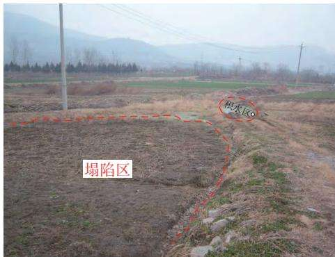
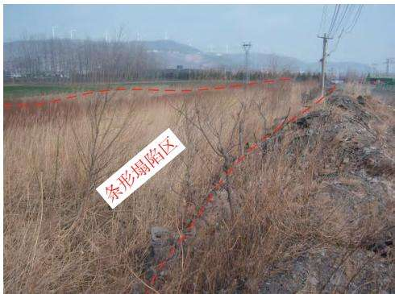
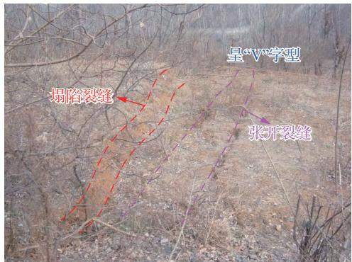
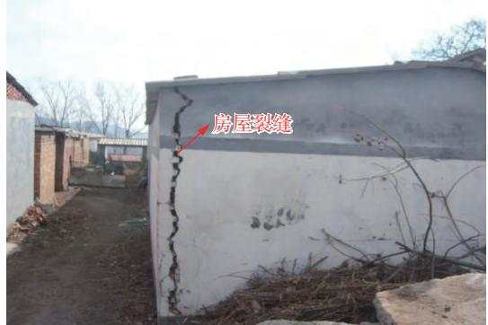
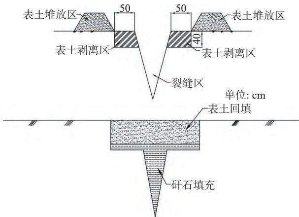
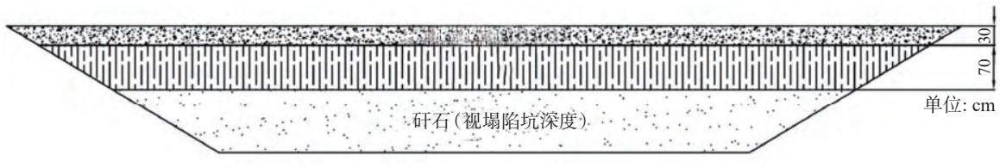

文章编号：1004-4051（2026）02-0138-08

DOI：10.12075/j.issn.1004-4051.20240426

# 平煤十矿开采塌陷区土地破坏情况及复垦技术研究

葛利玲1，方士军1，徐飞亚2，张旭飞3（1. 河南省国土空间调查规划院，河南 郑州 450016；2. 黄河水利职业技术学院，河南 开封 475000；3. 河南理工大学，河南 焦作 454000）

摘　要：地下开采导致的地表沉陷、植被退化、土地压占等地质灾害和生态环境问题日趋严重，若不采取相应的技术措施，不仅给企业带来巨大的经济损失，同时也会影响到矿区的可持续发展和周边人民生活的稳定。因此，为了减轻这种负面影响，本文以深部多煤层重复开采的平煤十矿为工程背景，通过实地调查、理论分析、室内计算，对煤塌陷区的土地破坏情况进行分析，并对不同时期不同类型的破坏形式提出相应的矿区地质环境保护和土地复垦技术措施。结果表明，平煤十矿的煤炭开采对地面的损毁主要为大面积地表沉陷（1 824.89 hm2）和矸石压占土地，以及沉陷导致的不同程度的地裂缝。而针对平煤十矿煤炭开采对土地造成的破坏，本研究提出了传统土地复垦模式和“分段治理、一次性复全高”等新技术。将破坏后的土地全部复垦为农用地，包括耕地、园地、林地、草地和农村道路等，并采取土壤重构、植被重建和配套工程等措施。同时，在结合“超前复垦”“边采边复”模式，实行“分段治理、一次性复全高”的技术措施下，复垦取得了良好的效果。该研究结果完善了平煤矿区动态土地复垦技术体系，对类似矿区生态环境治理和完善土地复垦技术具有重要的指导作用。

关键词：地表沉陷；深部多煤层重复开采；边采边复；土地复垦；可持续发展中图分类号：TD88　　文献标识码：A

# Research on land destruction and reclamation technology in coal mining subsidence of Pingmei No.10 Mine

GE Liling1，FANG Shijun1，XU Feiya2，ZHANG Xufei3 （1. Henan Institute of Land and Space Survey and Planning，Zhengzhou 450016，China； 2. Yellow River Conservancy Technical Institute，Kaifeng 475000，China； 3. Henan Polytechnic University，Jiaozuo 454000，China）

Abstract： Geological disasters and ecological environmental problems, such as surface subsidence, vegetation degradation, and land occupation caused by underground mining, are increasingly severe. Without corresponding technical measures, these issues will not only result in significant economic

losses for enterprises but also impact the sustainable development of mining areas and the stability of surrounding communities. Therefore, to mitigate this negative impact, this paper analyzes land damage in coal subsidence areas through field investigation, theoretical analysis, and indoor calculation using Pingmei No.10 Mine as an engineering background. The study proposes corresponding technical measures for geological environment protection and land reclamation in the mining area for different types of damage forms during various periods. The results show that large-scale surface subsidence （1 824.89 hm2）, gangue compression of the land, and ground cracks caused by subsidence are the primary damages to the ground from coal mining at Pingmei No.10 Mine. To address these issues effectively, this study suggests traditional land reclamation models along with new technologies such as “sectional management and one-time restoration full height implement”. All damaged lands will be reclaimed into agricultural lands including cultivated lands, garden lands forestlands grasslands rural roads while implementing soil reconstruction vegetation reconstruction supporting projects simultaneously with “advance reclamation mode” and “concurrent mining and reclamation mode” “sectional management and one time restoration full height implementation” technical measures achieving good results dynamic land reclamation technology system improvement in Pingmei coal mining area guiding role.

Keywords：surface subsidence；deep repeated mining of multiple coal seams；concurrent mining and reclamation；land reclamation；sustainable development

## 0　引　言

煤炭作为我国的能源经济命脉[1]，在保障了国民经济快速发展的同时，其开采活动也产生了一系列的负面环境效应，如地面沉陷、地裂缝、煤矸石堆积、水质破坏等，并诱发山体滑坡、泥石流等严重的地质灾害问题[2-4]。2017年，国土资源部等六部门联合印发《关于加快建设绿色矿山的实施意见》，指出要加大矿山生态环境综合治理力度，大力推进矿区土地节约集约利用和耕地保护[5]，矿区土地复垦与生态修复已成为新时代建设绿色矿山和确保矿区可持续发展的热点问题和重点区域[6-7]。

世界上最早的土地复垦是1766年德国在若德褐煤矿进行的复垦[8]。1977年，美国政府颁布《露天采矿管理与复垦法》，明确规定要在露天开采作业中进行土地复垦工作[9]。我国对矿山土地复垦和生态修复的研究起始于 20世纪 50年代，最初只是对东部矿区开采沉陷地提出了相应的土地复垦模型[10]。随着《土地复垦规定》（1988年）的颁布实施，许多学者开展大量的研究和实践工作，探索出利用煤矸石、粉煤灰等对开采塌陷区的土地进行充填复垦、土地修整及挖深垫浅等一系列方法[11-15]。之后，又有学者相继提出预复垦[16]、超前复垦[17-18]、动态复垦[19] 等概念和方法。2013年，中国矿业大学胡振琪教授提出边开采边复垦（CMR）技术[20]，即将采矿与复垦充分有效结合，实现采矿复垦一体化，是一种“源头减损”“防控结合”的综合型土地复垦技术。如今，边采边复技术已广泛应用于我国矿区土地复垦和生态修复，取得了良好的效果[21-23]。

平煤十矿作为深部多煤层重复开采的老矿区，煤炭资源开采后引起的地面塌陷区面积大、地裂缝分布多、煤矸石堆积严重，使得土地复垦的规划和实施变得更加复杂和被动。本文针对该矿区不同时期不同类型的土地破坏情况，采用“分段治理、一次性复全高”模式，综合利用“超前复垦”“边采边复”等采煤塌陷区治理新技术，提出了相应的矿区地质环境保护和土地复垦技术措施，进一步完善和补充了矿区生态环境治理和土地复垦技术的内容，具有重要的实际意义。

## 1　矿区概况

## 1.1　地理位置及开采情况

平煤十矿位于平顶山市区东北部，生产能力330万 t/a，属于中国平煤神马集团大型骨干矿井。地理坐标：东经 113°19′20″～113°23′18″，北纬33°44′47″～33°48′45″。交通以铁路、公路为主，矿井通过矿区专用铁路与国铁接轨，东临 311国道，交通极为便利。

平煤十矿始建于 1958年，1982年进行改扩建。目前矿区范围总面积 25.99 km2，保有储量 1.98 亿 t，可采储量 1.5亿 t，资源储量丰富。矿井开采煤层为五2煤组、四3煤组、四2煤组、四1煤组、二2煤组、二1煤组，采高 0.8～2.4 m。其中。五 2煤组和四 3煤组已基本全部采完，采空区面积达到 13.58 km2。目前开采的四 2煤组、四 1煤组开采深度最大达到950 m。各煤组采空区情况见表1。

## 1.2　土地资源情况

平煤十矿矿区内除矿山建设和开采外，其他人类工程活动较为简单，主要有农业生产、村镇及道路建设等。矿区土地以耕地、园地和林地为主，占矿区土地范围的 61.6%，其余的为草地、工矿用地、交通运输用地等。矿区地貌主要是丘陵和平原，耕地地块较为平整、集中连片。矿区土地利用结构统计见表 2。

表 1 平煤十矿各煤组采空区情况  
Table 1 Mined-out areas of each mining group in Pingmei No.10 Mine
<table><tr><td colspan="2">煤组</td><td>厚度/m</td><td>平均 厚度/m</td><td>埋藏 深度/m</td><td>开采 起始时间</td><td>采空区 面积/km²</td></tr><tr><td colspan="2">五组 五2</td><td>0.40~5.00</td><td>2.19</td><td></td><td>130~9001964—2010年</td><td>6.76</td></tr><tr><td rowspan="3">四组</td><td>四3</td><td>0.20~3.23</td><td>1.02</td><td></td><td>243~937 1964—2023年</td><td>6.92</td></tr><tr><td>四2</td><td>0.79~9.21</td><td>4.23</td><td></td><td>255～9451967年—至今</td><td>10.39</td></tr><tr><td>四1</td><td>0.30~3.03</td><td>1.31</td><td></td><td>260～9501981年—至今</td><td>0.27</td></tr><tr><td rowspan="3">二组</td><td>二2</td><td>1.27~3.52</td><td>2.11</td><td></td><td>220～9101996年—至今</td><td>4.30</td></tr><tr><td>二12</td><td>20.47~3.52</td><td>1.49</td><td></td><td>227~9151997年—至今</td><td>1.43</td></tr><tr><td>二11</td><td>0.36~3.18</td><td>1.95</td><td></td><td>231～9201996年—至今</td><td>1.36</td></tr></table>

表 2 平煤十矿矿区土地利用结构情况  
Table 2 Land use structure in mining areas in Pingmei No.10 Mine
<table><tr><td>序号</td><td>地类分类</td><td>面积/hm²</td><td>占比/%</td><td>备注</td></tr><tr><td>1</td><td>耕地</td><td>576.68</td><td>22.19</td><td>土地类型为褐土</td></tr><tr><td>2</td><td>园地</td><td>332.55</td><td>12.79</td><td>土地类型为褐土</td></tr><tr><td>3</td><td>林地</td><td>691.84</td><td>26.62</td><td>土地类型为褐土</td></tr><tr><td>4</td><td>草地</td><td>260.65</td><td>10.03</td><td>草地土质多为砂质壤土或 粉砂质黏壤土</td></tr><tr><td>5</td><td>住宅用地</td><td>241.41</td><td>9.29</td><td></td></tr><tr><td>6</td><td>工矿用地</td><td>228.38</td><td>8.79</td><td></td></tr><tr><td>7</td><td>其他土地</td><td>267.70</td><td>10.29</td><td>包括交通运输用地、 水域及水利设施用地等</td></tr><tr><td>总计</td><td></td><td>2 599.21</td><td></td><td></td></tr></table>

沉陷和矸石压占土地[24]。根据 1.2节可知，平煤十矿历经 60余年的开采，已形成大面积采空区，主要位于矿区南部，该区域地面塌陷及地裂缝等地质灾害严重，而地下开采活动对含水层产生破坏、地表矸石排放压占土地，对该地区地形地貌景观也会产生一定影响。

## 2.1　地面塌陷

截至 2023年底，矿区相对地面塌陷深度 1.84～5.23 m，累计造成塌陷区总面积 1 824.89 hm2。在地表变化剧烈地区，可以看到地表错动等明显山区塌陷特征（图 1）。经野外调查，在董庄村东北部分布有地面塌陷区，有少量积水及湿地，地势中间稍低，直径约200 m，面积约 3 hm2；上徐村西北部存在地面塌陷区，现状条件已经为小麦地，塌陷迹象不太明显；工业广场 2号矸石山北侧，呈东西向分布有条形塌陷区，东西长约 300 m、南北宽约 50 m，面积约 1.5 hm2，十年前已经复垦过，但塌陷迹象仍然明显，夏季有积水，冬季有杂草分布。

## 2.2　地裂缝

一般认为，当地表受到外来或自身的应力大于其本身所能承受的最大应力时，产生不同程度的破坏，形成各种类型的地裂缝[25]。地裂缝也是井工开采引起的最常见的地质灾害之一，不仅破坏耕地种植、道路交通、房屋稳定等，严重时对人民的生命财产也会造成巨大的影响。根据实地调查可知，平煤十矿地裂缝多集中分布于塌陷区边缘，呈群缝出现，大多呈平行状，竖直方向发育呈“V”字型，如图2（a）所示。地表裂缝长度为 60～120 m，宽度为 0.05～0.30 m，深度为 0.10～0.30 m。受采矿活动影响的村庄约 15个，引起的房屋和道路地裂缝约 22处。其中，房屋裂缝宽度为 0.01～0.04 m，长度为 1.5～4.0 m，如图 2（b）所示；道路裂缝宽度为 0.01～0.2 m，长度为 2～10 m。

## 2　煤炭开采对土地的破坏情况

井工开采造成的土地破坏形式主要表现为地表

## 2.3　预测评估及阶段划分

为最大限度地避免或减轻因矿产开发引发的地质灾害危害，减少对土地资源的影响和破坏，平煤十矿在采用传统土地复垦模式的基础上，采用“分段治理、一次性复全高”模式，进一步探索“超前复垦”“边采边复”等煤矿沉陷区治理新技术。超前复垦技术是指地表未塌陷前进行土地复垦；边采边复技术是指地表正在塌陷但还未完全稳定，使采煤与复垦充分有效结合，边采煤、边复垦。这两种技术的关键因素都取决于地表沉陷预测的准确。若预测值偏小，可能造成耕地受涝；若预测值偏大，可能造成水土流失，不利于土壤保水保肥。因此，平煤十矿根据采掘工作面接替顺序，对未来开采活动划分为适用期（2022 年 4 月 —2027 年 3 月 ）和 远 期 （2027 年 4 月 —闭坑），并参考附近矿区地表移动实测参数，结合本矿区实际地质采矿条件、综合柱状图、井上下对照图，基于概率积分法对地表移动变形进行预测分析，并预测评估开采沉陷对土地破坏的影响，见表3。

（a）董庄村东北部地面塌陷季节性积水  
  
（b）平煤十矿 2 号矸石山北侧地面塌陷  
图1　积水与坍塌情况  
Fig. 1 Waterlogging and collapse

  
（a）地表裂缝

  
（b）房屋裂缝  
图2　地表裂缝和房屋裂缝分布情况  
Fig. 2 Distribution of ground and building cracks

表 3 平煤十矿开采沉陷对土地破坏预测评估  
Table 3 Prediction and evaluation of land damage caused by mining subsidence in Pingmei No. 10 Mine
<table><tr><td>阶段划分</td><td>累计塌陷面积/hm²</td><td>地裂缝</td><td>含水层破坏</td><td>地下水位</td><td>地形地貌景观破坏</td></tr><tr><td>适用期(2022年4月—2027年3月）</td><td>953.1</td><td>严重(区域面积达4.56hm²)</td><td>严重</td><td>持续下降</td><td>严重</td></tr><tr><td>远期(2027年4月—闭坑)</td><td>1 368.0</td><td>严重</td><td>严重</td><td>持续下降</td><td>严重</td></tr></table>

## 3　煤炭开采破坏土地复垦技术

针对平煤十矿采煤沉陷区对土地破坏现状和预测评估，分为正在塌陷受害的和未来预测塌陷受害的，从地质灾害防治（主要为塌陷坑和地裂缝充填）、含水层破坏防治、地形地貌景观修复及矿区土地复垦四个方面实施分段治理。

## 3.1　地质灾害防治技术

鉴于矿山已塌陷和未来塌陷区地形地貌主要为丘陵地区，因此，本次治理地面塌陷的工程技术措施主要为土地平整与土方回填。具体为对地面塌陷裂缝进行充填；对中度塌陷损毁区（主要针对耕地）进行充填、平整；对受影响坑塘坝体、沟渠坡岸进行加高加固。

1）地裂缝充填。当塌陷区内裂缝宽度小于100 mm时，可采用人工直接充填裂缝法，即人工直接就地挖土，填补裂缝，填土夯实后进行平整；当裂缝宽度大于 100 mm时，需填入煤矸石，再将裂缝两侧表土填入，矸石充填裂缝具体流程如图 3所示。①表土剥离：先沿着地表裂缝剥离表土，剥离宽度为裂缝周围0.5 m，剥离土层就近堆放在裂缝两侧，剥离厚度为 0.4 m。②充填裂缝：可用小平车向裂缝中倒矸石，当充填高度距地表 l m左右时，应开始用木杆做第一次捣实，然后每充填 40 cm左右捣实一次，直到距地表40 cm时，再将之前剥离的表土覆盖于其上。③表土回覆：将裂缝两侧剥离的耕植土均匀覆盖在己完成整治工程的地表上并进行平整，达到正常耕

  
图3　矸石充填裂缝具体流程  
Fig. 3 Specific process of crack filling

种的要求。

2）塌陷坑回填。对重度塌区域和季节性积水区使用机械挖方取出表层熟土，按照设计标高和坡度，采用煤矸石进行填垫、平整，使各地块的地面坡度保持在规定的标准内，达到治理塌陷坑的目的。在施工中，需采用“分层剥离、交错回填”的土壤重构方法，使复垦后的土层厚度增大而优于原土地。设计先将表土 1 m剥离，按生土、熟土分别堆放，回填矸石至设计标高，分层碾压（每 0.5 m为一层），回填至设计标高，最后回覆表土（图4）。

  
图4　塌陷坑回填  
Fig. 4 Backfill of subsidence pit

3）土地平整。对于轻度塌陷损毁的耕地及中度塌陷损毁的耕地，地表会出现因不均匀塌陷产生土丘或土坑。本次平整方法为修改局部地形面法，即对进行局部的适当修改，而不是全部改变其原有地形面貌，只是将过于弯曲、凸凹的地段修直平顺，高地削除，低地填平，倒坡取削但不强调纵坡完全一致，能实现对灌排水无阻碍即可。在进行土地平整时，应在满足耕作要求的基础上，合理调配土方，尽量保持平整单元内的挖填方平衡，以减少运土工程量。

4）堤坝加固。在开采过程中对坝体出现的裂缝主要采取裂缝灌浆法，对坝体进行维护和加固。利用压力使浆液通过管道钻孔注入裂缝内，浆液在压力作用下析水后密实、胶结，堵塞裂缝，达到加固防渗之目的；地面塌陷稳定后，对坝体下沉的治理措施主要是加高加宽坝体、调整坝体溢水口标高，使溢水口与水面的相对标高与未下沉之前溢水口与水面的相对标高相同。

## 3.2　矿区土地复垦

根据土地复垦农、林、草等级标准及农用地优先的原则，将破坏后的土地全部复垦为农用地，包括耕地、园地、林地、草地和农村道路等。土地复垦工程技术措施主要包括土壤重构（包括裂缝充填、土壤剥覆、平整、土壤培肥、翻耕）、植被重建（农田防护、林草恢复）及相关配套工程（水源、灌排、道路等）。

1）土壤重构技术措施。按照“熟土剥离-土地平整-土壤培肥”的流程，首先要把表层的熟土尽可能地剥离后在合适的地方贮存并加以养护和妥善管理以保持其肥力；然后待土地平整结束后，将相邻地块剥离表土直接回覆至已平整区域，并综合采用有机肥、无机化肥和种植绿肥作物方法，改善土壤结构，培肥土壤。

2）植被重建措施。包括对损毁的林地、草地进行植被重建，以及将空闲地复垦为其他草地。针对不同的损毁程度，对于地表沉陷引起植株倾斜，应及时扶正树体；对于沉陷程度较重，严重损毁地表结构，从而导致植物死亡的，应及时补植或补播，补植植物尽量与原植被相一致。根据平煤十矿地质条件和土壤条件，选择适宜性强、水土保持能力较强、生长能力较强的乔木（速生杨和刺槐）作为种植及补栽树种，并通过合理的管护和监测措施提高造林效率和成活率，增强系统抗逆性。

3）配套工程措施。在地表塌陷过程中，不仅地表上方建构筑物会受到损害破坏，相应的交通工程、灌排工程等仍然会受到一定的影响。在进行野外调查后发现，平煤十矿附近的乡村公路、田间路等破坏严重。为不影响道路的正常使用，保证其功能，在地表稳沉前，对破坏的道路进行铺垫、压实，同时对两边有边坡的道路进行护坡，田间路和生产路的维护可随耕地的复垦同步进行。排水沟和灌溉渠工程应随时进行监测观察，及时采取相应的加固措施进行修复。

## 3.3　主要工程量

综上所述，平煤十矿针对不同类型土地破坏形式和不同时期土地破坏受损程度，综合采用“超前复垦”“边采边复”技术措施，实行“分段治理、一次性复全高”，因地制宜，矿山地质环境治理工程与土地复垦工程同步进行，工程量见表4。

## 3.4　效益分析

1）成本利润分析。平煤十矿生产剩余服务年限24.2 a，生态修复工程总费用 20 051.19 万元（其中矿山地质环境治理静态总投资估算为 8 262.60万元，土地复垦工程静态总投资 11 788.59万元。），平均每年费用828.56万元。目前该矿井不含税售价约630元/t，吨煤成本约 580元/t，除去各项成本与税金外，运营期年净利润总额为 9 321.26万元，2.2 a即可收回项目总投资，经济上可行。

表 4 平煤十矿矿山地质环境治理和土地复垦工程量  
Table 4 Quantity of work of mine geological environment management and land reclamation in Pingmei No.10 Mine
<table><tr><td colspan="2">工程类型</td><td rowspan="2">单位</td><td>正在塌陷受害区</td><td colspan="2">未来预测塌陷受害区</td></tr><tr><td colspan="2"></td><td>第一阶段</td><td>第二阶段 （2022年4月—2027年3月）（2027年4月—闭坑）</td><td>第三阶段</td></tr><tr><td rowspan="8">矿山地质环境 治理工程量</td><td rowspan="3">地裂缝充填工程</td><td>治理面积/hm²</td><td>18.20</td><td>8.60</td><td>61.10</td></tr><tr><td>熟土剥离/万m³</td><td>0.22</td><td>0.10</td><td>1.04</td></tr><tr><td>矸石充填/万m³</td><td>0.09</td><td>0.04</td><td>0.60</td></tr><tr><td rowspan="3">塌陷坑回填工程</td><td>治理面积/hm²</td><td>12.10</td><td>2.60</td><td>8.20</td></tr><tr><td>生土剥离/万m³</td><td>8.50</td><td>2.56</td><td>5.77</td></tr><tr><td>充填量/万m³</td><td>25.94</td><td>4.38</td><td>20.60</td></tr><tr><td rowspan="3">堤坝加固工程</td><td>预测加固长度/m</td><td>3 600.00</td><td>1350.00</td><td>2 200.00</td></tr><tr><td>回填土方量/万m³</td><td>1.51</td><td>0.40</td><td>1.06</td></tr><tr><td>表土剥覆/100m³</td><td>9 606.00</td><td>4725.00</td><td>一</td></tr><tr><td rowspan="6">矿山土地 复垦工程量</td><td>土壤重构工程</td><td>土地平整/100m³</td><td>34 695.00</td><td>17 355.00</td><td>一</td></tr><tr><td></td><td>土壤培肥/hm²</td><td>341.58</td><td>177.32</td><td>一</td></tr><tr><td rowspan="3">植被重建工程</td><td>速生杨/100株</td><td>2 748.95</td><td>1 898.33</td><td>一</td></tr><tr><td>苹果树/100株</td><td>1 751.63</td><td>687.28</td><td>一</td></tr><tr><td>撒播植草/hm²</td><td>772.18</td><td>533.24</td><td>一</td></tr><tr><td rowspan="4">配套工程</td><td>旧路面挖除/10m²</td><td>18.44</td><td>8.32</td><td>一</td></tr><tr><td>混凝土路面/1000m²</td><td>9.22</td><td>4.16</td><td>一</td></tr><tr><td>生产路/1000m²</td><td>10.38</td><td>4.68</td><td></td></tr><tr><td>修复排洪沟等/100 m</td><td>899.00</td><td>262.00</td><td>一 一</td></tr></table>

2）经济效益。由表 4可知，第一阶段矿山环境治理工程和土地复垦工程基本完成，截至 2023年底，平煤十矿已投入 2 500余万元。直接经济效益表现为土地复垦减少破坏土地的经济损失和增加地类增加的收益。该方案部署工程的实施可以为当地村民增加就业机会，增加家庭收入，可以产生一定的间接经济效益。

3）生态效益。通过实施生态修复工程，可以使损毁区域复绿，恢复林地，防风固砂，使水土得以保持，可以提高地面植被覆盖率，涵养水源，固氮储碳，可以净化空气，对局部环境空气和小气候产生正效与长效影响，增加动物群落多样性。

4）社会效益。通过对生态修复工程进行综合治理，设置围栏、警示牌与主动防护网，削坡治理预测塌陷区，封堵充填矿井等，最大限度减少了地质灾害危险性与安全隐患，避免危害采矿人员与周边居民生命财产。

## 4　结　论

1）平煤十矿属于深部多煤组重复开采的老矿区，开采对土地的破坏形式主要为地裂缝、塌陷坑和地形地貌景观改变。塌陷区总面积 1 824.89 hm2，地裂缝长度最大可达 120 m，最宽可达 0.40 m。

2）本着因地制宜的原则，根据不同时期不同类型的土地破坏形式，提出了采用“分段治理、一次性复全高”模式，综合利用“超前复垦”“边采边复”等采煤塌陷区治理新技术，合理规划地下煤炭开采与土地复垦技术，既可控制地表沉陷，又能充分利用煤矿产生的煤矸石，实现良好的经济效益、社会效益和生态效益。

## 参考文献（References）：

罗世兴. 我国采矿业能源消费碳排放时空分异与驱动因素分［ 1 ］析[J]. 中国矿业，2024，33（4）：113-121.LUO Shixing. Analysis on spatio-temporal differentiation and drivingfactors of carbon emission from energy consumption of mining indus-try in China[J]. China Mining Magazine，2024，33（4）：113-121.

郭广礼, 李怀展, 查剑锋, 等. 平原煤粮主产复合区煤矿开采和［ 2 ］耕地保护协同发展研究现状及对策[J]. 煤炭科学技术，2023，51（1）：416-426.GUO Guangli, LI Huaizhan, ZHA Jianfeng, et al. Research status andcountermeasures of coordinated development of coal mining and culti-vated land protection in the plain coal-cropland overlapped areas[J].Coal Science and Technology，2023，51（1）：416-426.

胡振琪, 肖武. 关于煤炭工业绿色发展战略的若干思考: 基于［ 3 ］生态修复视角[J]. 煤炭科学技术，2020，48（4）：35-42.HU Zhenqi, XIAO Wu. Some thoughts on green development strate-

gy of coal industry: from aspects of ecological restoration[J]. CoalScience and Technology，2020，48（4）：35-42.

李全生. 蒙东草原区大型露天煤矿减损开采与生态修复关键［4］技术[J]. 采矿与安全工程学报，2023，40（5）：905-915.LI Quansheng. Key technologies for damage reduction mining andecological restoration of larges-scale open pit coal mines in grasslandarea of eastern Inner Mongolia[J]. Journal of Mining & Safety Engineering，2023，40（5）：905-915.

宋复蓉, 曾向阳, 陈勇. 矿粮复合区“三生”空间冲突诊断及演［5］化特征分析: 以大冶市陈贵镇为例[J]. 水土保持研究，2024，31（2）：401-412.SONG Furong, ZENG Xiangyang, CHEN Yong. Diagnosis and opti-mization of “production-living-ecology” space conflict in the mine-grain mixed zone[J]. Research of Soil and Water Conservation，2024，31（2）：401-412.

邹兰兰, 冯启言, 郝明, 等. 灵泉露天矿生态修复效果及驱动因［ 6 ］素分析[J]. 中国矿业，2024，33（3）：43-50.ZOU Lanlan, FENG Qiyan, HAO Ming, et al. Ecological restorationeffect and driving factors analysis of Lingquan Open-Pit Mine[J].China Mining Magazine，2024，33（3）：43-50.

全毅博, 甘能俭, 伍静, 等. 基于 FAHP-Entropy 赋权法的矿山地［ 7 ］质环境影响评价: 以武鸣区灰岩矿山为例[J]. 中国矿业，2024，33（2）：53-62.QUAN Yibo, GAN Nengjian, WU Jing, et al. Mine geological envi-ronmental impact evaluation based on FAHP-Entropy WeightingMethod: an example of limestone mines in Wuming District[J]. Chi-na Mining Magazine，2024，33（2）：53-62.

胡振琪, 毕银丽. 2000 年北京国际土地复垦学术研讨会综述［ 8 ］[J]. 中国土地科学，2000（4）：15-17.HU Zhenqi, BI Yinli. Summary of 2000 Beijing International LandReclamation Symposium[J]. China Land Science，2000（4）：15-17.

王忠鑫, 田会, 王东, 等. 露天采矿科学目标的演变与未来发展［ 9 ］趋势[J]. 煤炭学报，2024，49（S1）：1-26.WANG Zhongxin, TIAN Hui, WANG Dong, et al. Evolution and fu-ture prospect of scientific objectives of open-pit mining[J]. Journal ofChina Coal Society，2024，49（S1）：1-26.

李凤明, 丁鑫品, 孙家恺. 我国采煤沉陷区生态环境现状与治［10］理技术发展趋势[J]. 煤矿安全，2021，52（11）：232-239.LI Fengming, DING Xinpin, SUN Jiakai. Ecological environment sta-tus and development trend of governance technology of coal miningsubsidence area in China[J]. Safety in Coal Mines， 2021， 52（11）：232-239.

刘辉, 朱晓峻, 程桦, 等. 高潜水位采煤沉陷区人居环境与生态［11］重构关键技术: 以安徽淮北绿金湖为例[J]. 煤炭学报，2021，46（12）：4021-4032.LIU Hui, ZHU Xiaojun, CHENG Hua, et al. Key technology of hu-man environment and ecological reconstruction in high submersiblelevel coal mining subsidence area: a case study from Lyujin Lake,Huaibei[J]. Journal of China Coal Society，2021，46（12）：4021-4032.

徐艳, 王璐, 樊嘉琦, 等. 采煤塌陷区生态修复技术研究进展［12］[J]. 中国农业大学学报，2020，25（7）：89-90.XU Yan, WANG Lu, FAN Jiaqi, et al. Ecological restoration technologies in coal-mining subsidence area: a review[J]. Journal of Chi-

na Agricultural University，2020，25（7）：89-90.

彭苏萍, 毕银丽. 黄河流域煤矿区生态环境修复关键技术与战［13］略思考[J]. 煤炭学报，2020，45（4）：1211-1221.PENG Suping, BI Yinli. Strategic consideration and core technologyabout environmental ecological restoration in coal mine areas in theYellow River Basin of China[J]. Journal of China Coal Society，2020，45（4）：1211-1221.

胡振琪, 李根生, 袁冬竹. 东部煤粮复合区采煤沉陷地边采边［14］复时机[J]. 煤炭学报，2023，48（1）：373-387.HU Zhenqi, LI Gensheng, YUAN Dongzhu. Timing of concurrentmining and reclamation in coal-grain overlapping areas with mining-induced subsidence, Eastern China[J]. Journal of China Coal Society，2023，48（1）：373-387.

张振国, 王月, 陈军典, 等. 铁尾矿资源化利用现状与发展策略［15］[J]. 科技导报，2024，42（2）：90-103.ZHANG Zhenguo, WANG Yue, CHEN Jundian, et al. Current situa-tion and countermeasures of iron tailings resource utilization[J]. Sci-ence and Technology Review，2024，42（2）：90-103.

李学良, 杜亚敏, 郭鑫, 等. 采煤沉陷区动态预复垦理论分析及［16］工程实践[J]. 矿业安全与环保，2023，50（1）：86-91.LI Xueliang, DU Yamin, GUO Xin, et al. Theoretical analysis and en-gineering practice of dynamic pre-reclamation in coal mining subsi-dence area[J]. Mining Safety & Environmental Protection， 2023，50（1）：86-91.

赵会顺, 胡振琪, 陈超, 等. 采煤预塌陷区超前复垦适宜性评价［17］及复垦方向划定[J]. 农业工程学报，2019，35（11）：245-255.ZHAO Huishun, HU Zhenqi, CHEN Chao, et al. Suitability evalua-tion and reclamation objectives for advanced land reclamation in coalmining pre-subsidence area[J]. Transactions of the Chinese Society ofAgricultural Engineering （Transactions of the CSAE），2019，35（11）：245-255.

胡振琪, 肖武, 王培俊, 等. 试论井工煤矿边开采边复垦技术［18］[J]. 煤炭学报，2013，38（2）：301-307.HU Zhenqi, XIAO Wu, WANG Peijun, et al. Concurrent mining andreclamation for underground coal mining[J]. Journal of China CoalSociety，2013，38（2）：301-307.

魏跃东. 生产矿井矸石山动态复垦方案研究[J]. 金属矿山，［19］2019（10）：140-146.WEI Yuedong. Study on dynamic reclamation scheme of gangue hillin production mine[J]. Metal Mine，2019（10）：140-146.

胡振琪, 肖武, 赵艳玲. 再论煤矿区生态环境“边采边复”[J].［20］煤炭学报，2020，45（1）：351-359.HU Zhenqi, XIAO Wu, ZHAO Yanling. Re-discussion on coal mineeco-environment concurrent mining and reclamation[J]. Journal ofChina Coal Society，2020，45（1）：351-359.

陈浮, 朱燕峰, 马静, 等. 东部平原采煤沉陷区降污固碳协同修［21］复机制与关键技术[J]. 煤炭学报，2023，48（7）：2836-2849.CHEN Fu, ZHU Yanfeng, MA Jing, et al. Cooperative remediationmechanism and key technologies for pollution reduction and carbonsequestration in coal mining subsidence areas of the eastern plain[J].Journal of China Coal Society，2023，48（7）：2836-2849.

阎仲康, 曹银贵, 李志涛, 等. 内蒙古东部草原区矿山生态修复［22］研究: 关键技术与减碳路径[J]. 农业资源与环境学报，2023，

40（3）：570-582. YAN Zhongkang, CAO Yingui, LI Zhitao, et al. Ecological restoration of mines in eastern grassland area of Inner Mongolia, China: key technologies and carbon reduction paths[J]. Journal of Agricultural Resources and Environment，2023，40（3）：570-582.

李全生, 李晓斌, 许家林, 等. 岩层采动裂隙演化规律与生态治［23］理技术研究进展[J]. 煤炭科学技术，2022，50（1）：28-47.LI Quansheng, LI Xiaobin, XU Jialin, et al. Research advances in mining fractures evolution law of rock strata and ecological treatmenttechnology[J]. Coal Science and Technology，2022，50（1）：28-47.

苗勇刚, 王海军, 张长锁, 等. 某金属矿地下开采地表沉降影响［24］分析[J]. 中国矿业，2023，32（11）：197-205.MIAO Yonggang, WANG Haijun, ZHANG Changsuo, et al. Analysisof surface subsidence impact of underground mining in a metalmine[J]. China Mining Magazine，2023，32（11）：197-205.

陆玉根, 段鑫, 孙国权, 等. 地表动态塌陷坑回填治理研究与实［25］践[J]. 中国矿业, 2023, 32（S2）: 49-54.LU Yugen, DUAN Xin, SUN Guoquan, et al. Research and practiceon backfill treatment of surface dynamic collapse pit[J]. China Min-ing Magazine, 2023, 32（S2）: 49-54.