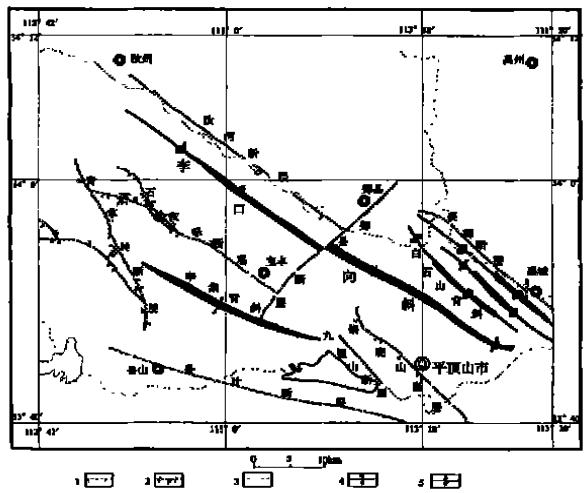
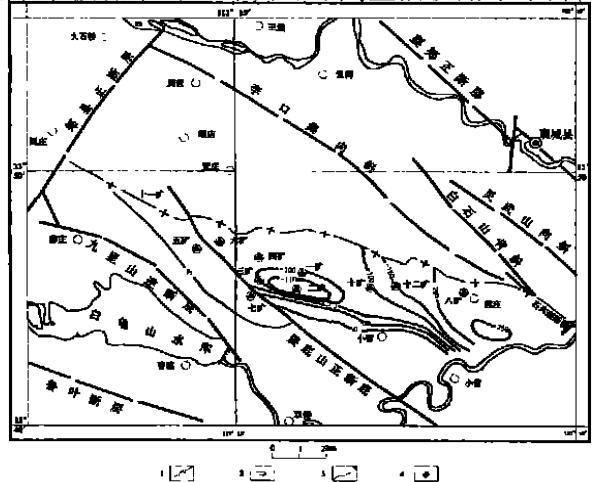

文章编号： 1006－4362（2004）03－0006－06

# 平顶山矿区环境地质问题及防治对策

王现国1，2，吴东民2，牛波3，杜春彦4

．中国地质大学，武汉 ； ．河南省地质工程公司，郑州 ；3．洛阳市环境保护设计研究所，洛阳 471000；4．河南省地质科学研究所，郑州 450053）

摘要： 采用大量调查数据对平顶山矿区环境地质问题进行了详细的分析研究，区内主要有地面变形、水资源系统破坏、土地资源破坏、矿坑突水、瓦斯突出、水土流失等环境地质问题，其环境地质问题十分突出，已严重制约了矿区国民经济可持续发展。作者根据实际情况提出了平顶山矿区环境地质问题的防治措施，避免、减轻或得以治理，并对防治投资、管理提出了建议。

关键词： 平顶山矿区；环境地质问题；防治措施

中图分类号： ；

文献标识码： A

平顶山矿区是我国重要煤炭工业基地，区内煤质优良，煤种齐全，有焦精煤、肥精煤、 ／ 焦精煤、筛混煤、筛混中块煤。现有 对生产矿井，年生产能力 $2 ~ 3 4 1 . 1 \times 1 0 ^ { 4 }$ 。 区内煤矿自 年建矿，截止1996年末，剩余保有储量 $2 6 . 5 9 \times 1 0 ^ { 8 } \mathrm { ~ t ~ }$ ，其中工业储量 $2 5 . 5 3 \times 1 0 ^ { 8 } \mathrm { ~ t ~ }$ ，可采储量 $1 3 . 2 3 \times 1 0 ^ { 8 }$ ， 级储量 $1 . 0 6 \times 1 0 ^ { 8 } \mathrm { ~ t ~ }$ 。 平顶山矿区是我国建矿比较早的老矿山， 多年的开采，在为国家做出贡献的同时，也使矿区地质环境日益恶化，为了保证平顶山矿区经济与社会的可持续发展，加强地质环境保护工作迫在眉睫。

## 1 区域概况

平顶山矿区位于河南省中部，矿区绵延60 ，横跨叶、襄、郏、宝丰、鲁山五县和汝州市。 包括平顶山、韩梁、朝川三个煤田，地理坐标：东经 ° ′～$1 1 4 \ 9 0 \ ^ { \prime } ,$ ，北纬 $3 3 ~ 9 0 \sim 3 4 ~ 9 5 ~ ^ { \prime }$ ，含煤面积 $7 6 7 ~ \mathrm { k m } ^ { 2 }$

## 1．1 地形地貌

平顶山矿区地处伏牛山脉与黄淮冲积平原的过渡地带，地势西高东低，西部山地海拔多在 $5 0 0 \mathrm { ~ m ~ }$ 左右，东部冲积平原海拔多在 $1 5 0 \mathrm { ~ m ~ }$ 以下，北部、中

部和南部地形比较复杂，分布有汝河、沙河等河谷冲积平原和不连续的低山、丘陵，海拔在 $8 0 \sim 5 0 0 \ \mathrm { m }$ 之间。

## 1．2 气象水文

平顶山矿区地处北亚热带向暖温带的过渡地带，气候具有明显的过渡特征，季风性气侯特征明显，四季分明。 年平均气温14．5～15．2℃，年平均降水量 ，降水量年际变化大，年内分配不均，最大年降水量1288．5 ，年最小降水量408．2，年降水量的 ．％集中在 ～ 月份。 年平均蒸发量 ． ，全年无霜期 。

区内河流均属淮河流域沙颖河水系，水系发育，河网密布，区内主要河流有汝河、沙河、湛河；渠系主要有白龟山水库北干渠，水库主要有白龟山水库、外口水库、凤凰岭水库等。

## 1．3 区域地质概况

平顶山矿区位于华北板块与华北板块南缘构造带的结合部位，由华北台型地壳组合组成，基底为太古界太华群，盖层为板内盆地稳定沉积。从零星的基岩露头和钻孔资料看，从老到新依次有太古界太华群（ Ar th） ，中元古界汝阳群（ Pt ry） 、上元古界震旦系罗圈组（ Zl） 、古生界寒武系（ ∈） 、石炭系（ C） 、二叠系（ P） 、新生界老第三系（ E） 、新第三系（ N） 及第四系等。

受华北板块南缘构造带的影响，区内以北西向构造为主，发育一系列北西向褶皱构造和中浅层次的逆冲推覆构造 见图 ，主要褶皱有李口向斜、辛集向斜。断裂以北西向为主，主要有石灰窑、九里山、锅底山、襄－郏、青草岭断层等，近东西向的鲁山－叶县断层 三门峡－鲁山深大断裂的东延部分 从矿区的南部通过，且具有一定的活动性。喜山期发育北东向断裂，主要有郏县断层、井营－郏山断层。

鲁－叶断层带在鲁山县境内有温泉分布，年 月 日在白龟山水库一带发生 ． 级地震，襄－郏断层带上 年 月 日曾发生 ． 级地震。 说明断裂仍在活动。

  
图 区域构造纲要图  
Fig．1 Structure map of the area  
．正断层；．逆断层；．隐伏断层；．向斜；．背斜

## 2 主要环境地质问题

随着煤炭工业的发展，采煤量的增加， 多年的强力开发，使得矿区地质环境日益恶化。煤矿开采引发的环境地质问题主要有：地面变形、水资源系统破坏、土地资源破坏、矿坑突水、瓦斯突出、水土流失等。

## 2．1 地面变形

由于煤矿开采，引起地表稳定性变差，其主要环境地质问题及地质灾害有：地面塌陷、崩塌、滑坡、地裂缝、泥石流等。

## （1） 地面塌陷

目前地面塌陷面积 $1 8 5 . 4 ~ \mathrm { k m } ^ { 2 }$ ，开采沉陷影响土地总面积 $1 5 ~ 5 2 0 \mathrm { { h m } ^ { 2 } }$ ；地表沉陷深度一般 $2 { \sim } 6 \mathrm { \ m }$ 左右，最大沉降深度可达 $1 0 \mathrm { { _ m } }$ ，万吨沉陷率 ． ～$0 . 3 7 7 { \bf \ h m } ^ { 2 } / \times 1 0 ^ { 4 } $ ，平均万吨沉陷率为 $\mathrm { 0 . 2 0 4 \ h m ^ { 2 } / }$ $\times 1 0 _ { \textup { t } _ { \circ } } ^ { 4 }$ 采煤沉陷影响村庄 个，厂矿、企业、单位、学校、村庄公共设施等 个，造成建筑物强烈变形破坏的村庄 个，异 就 地拆建、抗变形村庄、单位等 个。共计受灾人数 人；耕地$\mathrm { { h m } ^ { 2 } }$ ，房屋195480间，厂矿、企业、单位、学校等建筑面积（ 已变形） $6 0 . \ 5 9 \times 1 0 ^ { 4 } \ \mathrm { m } ^ { 2 }$ ，目前已补偿费用．万元。

## （2） 崩塌、滑坡

区内崩塌、滑坡灾害较少，主要分布在山区土质陡崖、陡坡及人类活动形成的陡崖、陡坡处。 煤矿开采形成地面沉陷、地裂缝等，在这些外因作用下，致使斜坡失稳，坡体破碎形成崩塌、滑坡灾害。 区内崩塌 处，滑坡 处，娘娘山滑坡体，直接威胁 国道，造成公路变形长度 ；郏县前窑村潜在崩塌，造成 人死亡， 人重伤。

## （3） 泥石流

泥石流是由于降水作用突然发生在沟谷及山坡上的一种挟带大量泥砂、石块等固体物质的特殊洪流。具有暴发突然，运动速度快，能量大的特点，其破坏性非常强。平顶山矿区曾发生过多次泥石流，未造成人员伤亡，但造成部分果园、农田、林场被毁。目前在稻田沟上游下晋沟村处，煤矸石堆放在沟谷内，沟谷堵塞长度 左右，如遇大的暴雨，沟谷堵塞，具有形成泥石流的潜在危险。

## （4） 地裂缝

地裂缝灾害是区内主要地质灾害类型之一，采空区地裂缝十分发育。 矿区规模较大的地裂缝有条，落凫山电视转播台地裂缝，长约 $5 0 0 \mathrm { ~ m ~ }$ ，宽 ～$2 0 \mathrm { { _ { c m } } }$ ，其走向为 °，造成墙体开裂，地下室墙壁产生严重裂缝，直接威胁着电视转播台的正常运行。王建庄地裂缝长度 $5 0 0 \mathrm { _ m }$ 左右，宽度 ～ ，可见深度 $2 _ { \mathrm { ~ m ~ } }$ ，走向 °，造成 间房子严重损坏。娘娘山地裂缝位于娘娘山的东山坡上，地裂缝多达数十条，宽度一般在 $1 . 5 { \sim } 3 \mathrm { ~ m }$ ，最宽可达3．5 ，山体整体下滑 $2 { \sim } 5 \mathrm { ~ m }$ ，最大可达 。其中 条大的裂缝，长度断续延伸约 $4 ~ 5 0 0 \mathrm { ~ m ~ }$ ，纵贯整个青草岭东坡中上部。 目前该地裂缝引起局部产生崩塌、滑坡，直接威胁207国道和山下居民的安全。

## 2．2 水资源系统破坏

煤矿开采引起的水资源系统破坏主要有两方面，一是由于煤矿废水排放引起的水质污染；另一方面是由于煤矿大面积、大流量的疏干排水造成的水源枯竭。

## （1） 水质污染

根据 年矿区污水排放量统计资料显示：各类废水年排放量 $5 \ 3 0 0 \times 1 0 ^ { 4 }$ ，其中矿井水 ．$\times 1 0 _ { \mathrm { ~ t ~ } } ^ { 4 }$ ，约占废水总量的 ％，其他废水 ．$\times \ 1 0 ^ { 4 } \mathrm { ~ t ~ }$ 。 累计年排放悬浮物2004．88 ，$2 ~ 2 5 6 . 5 7 \mathrm { ~ t ~ }$ ，挥发酚6．62 ，氰化物0．051 。

据 年平顶山市环保局公报，湛河所控制的三个断面，两个劣于Ⅴ类水质，尤其下游污染严重，综合污染指数为 ． 。

## （2） 水资源枯竭

随着平煤集团矿业开发的不断加强，矿坑排水量不断增加，目前已造成寒武系灰岩岩溶水水资源枯竭。 目前条件下，煤矿日平均总排水量 ． ×$1 0 ~ \mathrm { { \Omega m } ^ { 3 } }$ ，其中平顶山煤田平均日排水量 ．$\mathbf { m } ^ { 3 }$ ，韩梁煤田平均日排水量 $1 5 ~ 9 8 3 . 8 5 \mathrm { m } ^ { 3 }$ ，朝川煤田日平均排水量 $2 8 ~ 8 5 6 . 2 4 ~ \mathrm { m } ^ { 3 }$

平顶山矿区经过多年的疏干性排水，浅部含水层已被疏干，深部寒武灰岩地下水位已由 年10月的83 下降到2001年 $- 1 1 0 _ { \mathbf { \theta m } ( } = \pi ^ { 2 }$ 附近） 、$- 2 5 0 _ { \mathrm { ~ m } ( }$ 八矿附近） 。 在李口集向斜南翼已形成一个沿轴向长达40 左右的降落漏斗。

韩梁矿区矿坑日排水量 $1 5 ~ 9 9 4 . 8 ~ \mathrm { m } ^ { 3 }$ ，造成浅层地下水被疏干，矿区内农田井、生活饮用水水井$\sim 5 0 \mathrm { \ m } )$ 都已干枯，使矿区内 个村 户人吃水困难，深层地下水位也已大幅度降低，已由原来 $5 0 \mathrm { m }$ 降到现在－140m，降幅达 $1 9 0 _ { \mathrm { ~ m ~ } }$ ，地下水资源量也大大减少。

  
图2 平顶山灰岩含水层等水位线图  
Fig． Water level in limestone in Pingdingshan mine area S ．等水位线；2．地下水流向；3．生产矿井深部边界；4．井筒

## 2．3 土地资源破坏

煤矿开采对土地资源的破坏，主要表现在矸石山占压土地和开采沉陷毁坏耕地。 矿区自建矿以来产生煤矸石直接堆放在地表，已形成 座矸石山及个排灰场，共占压耕地 $6 8 7 . 4 \ : \mathrm { h m } ^ { 2 }$ 。 矿区地面沉陷面积 $1 8 5 . 4 ~ \mathrm { k m } ^ { 2 }$ ，其中平顶山区 $1 1 9 . 7 ~ \mathrm { k m } ^ { 2 }$ ，塌陷耕地 $4 ~ 2 0 8 . 4 7 ~ \mathrm { h m } ^ { 2 }$ ，常年积水 $1 ~ 0 1 0 . 0 ~ \mathrm { h m } ^ { 2 }$ ，季节积水$1 \ { 0 5 2 . 1 3 } \ \mathrm { h m } ^ { 2 }$ ，干旱裂缝地 $2 \ 1 4 6 . \ 3 \ \mathrm { h m } ^ { 2 }$ ；韩梁区及朝川区塌陷地面积 $6 5 . 7 ~ \mathrm { k m } ^ { 2 }$ ，塌陷耕地 ．$\mathrm { { h m } ^ { 2 } }$ ，其中常年积水地 ． $\mathrm { { h m } ^ { 2 } }$ ，季节积水地$5 7 7 . 4 7 \mathrm { h m } ^ { 2 }$ ，干旱及裂缝地 $1 ~ 1 7 8 . 0 7 ~ \mathrm { h m } ^ { 2 }$

矿区土壤汞污染比较严重，特别是一矿区，超标达 倍，除 外，其他元素 、 、 等 都有不同程度的超标，矿区土壤污染为煤矸石长期淋滤相应元素迁移至地表，被土壤吸收而富集所致。

## 2．4 坑道突水

坑道突水是煤矿开采的主要环境地质问题之一。平顶山矿区自建矿以来大型的突水有 次，中型突水 次，小型突水 次，流量最大 $\mathrm { ~ 4 ~ 9 9 9 ~ m ^ { 3 } / }$ $\mathrm { ~ h ~ } _ { \circ }$ 造成淹井 次，死亡 人，受伤 余人，直接经济损失约 万元。 其中大型突水经济损失约4000万元。 突水水源一般为岩溶裂隙水。

## 2．5 瓦斯突出、煤层自燃、热害及矸石山自燃

自 年 月 日发生第一次煤与瓦斯突出至 年末，累计发生煤与瓦斯突出 次，总突出煤量 ． ；瓦斯涌出总量 $3 9 5 ~ 2 1 4 ~ \mathrm { m } ^ { 3 }$ ，突出强度最大的一次为八矿 年 月 日己 －风巷掘进工作面，突出强度 ／次，瓦斯涌出量 $4 0 \ 2 1 7 \ \mathrm { m } ^ { 3 }$ 0

矿区所采丁、戊、己、庚等 组 层煤，均属有自燃倾向煤层，各煤层在开采过程中都曾发生自燃发火。 从1962年到1990年的28年间，矿区共发生内因火灾 次，累计封闭回采工作面 个，冻结煤量448. $2 \times 1 0 ^ { 4 }$ t。 1991年至今，未发生重大火灾事故，没有封闭回采工作面。

目前出现高温热害矿井的地温梯度为：五矿$3 . 3 \mathsf { ^ C } / 1 0 0 \mathrm { ~ m ~ }$ ，四 $\mathfrak { A } ^ { 2 } \ 3 . \ 2 \mathsf { C } \ / / 1 0 0 \ \mathrm { ~ m ~ }$ ，八 矿 3．2～$4 . 4 ^ { \circ } \mathsf { C } / 1 0 0 \mathrm { m }$ 。 据井下实测，采深达到 $5 0 0 \sim 7 0 0 \mathrm { ~ m ~ }$ 工作面即出现高温热害，在 $5 \sim 7$ 月份气温为 $2 7 \sim$

36℃，相对湿度平均为94％～100％。

现有的矸石山中，有 座发生过不同程度的自燃，自燃矸石山占矸石山总数的 ％左右。 目前一矿、三环公司、四矿、六矿、十矿主矸石山和铁运处西斜排矸场煤矸石山正在自燃。 煤矸石在自燃过程中排放 等有害气体，引起大气环境污染。

## 2．6 水土流失

水土流失的成因主要有两个：一为自然因素，二是人为因素。而人为因素起主要作用，煤矿开采造成山体开裂、破碎，人类的滥采滥伐林木，陡地开荒地下水位下降等，使植被覆盖率减少，土壤覆盖层和原有的保土设施破坏，从而使土壤抗蚀能力减小，造成水土流失。据平顶山矿区生态环境调查成果：原有水土流失面积 $2 ~ 7 0 0 . 5 ~ \mathrm { k m } ^ { 2 }$ ，到 年底已初步治理面积 $8 8 ~ \mathrm { k m } ^ { 2 }$ ， ～ 年初步治理面积$\mathrm { k m } ^ { 2 }$ ，尚有 $8 1 2 . 5 ~ \mathrm { k m } ^ { 2 }$ 水土流失面积亟待解决。

## 主要环境地质问题的防治措施

防治是为了保护和改善矿区地质环境，正确处理好矿山经济发展与地质环境保护之间的辩证关系，合理开发和利用矿产资源，最大限度保护地质环境，保障矿区经济可持续发展。

## 3．1 矿区地面塌陷防治

平顶山矿区已形成的塌陷地面积为 ．$\mathrm { k m } ^ { 2 }$ ，根据灾害情况，对常年和季节性积水地，采取“一疏二平三改造”的塌陷治理措施：“一疏”即挖沟开渠，建设渠系配套工程，旱能浇、涝能排，疏排塌陷区积水；“二平”即对已排除积水的塌陷地，采用平整和梯田的办法，复垦还耕，或采用剥离煤矸石充填方式进行复垦还耕；“三改造”即对疏排无法排除积水的塌陷坑，采取“就地取土建渔塘，垫高土地造菜田”的方法进行改造。

以往，多是在塌陷区形成以后，已经造成了危害，才着手进行治理，这种“滞后”的治理行为，常常事倍功半，今后应当提倡以防为主，防治结合的原则。 在塌陷区形成之前，就采取“超前”防治措施，即在制定开采设计时就考虑预防措施，并在开采过程中认真实施，包括在采矿过程中所使用的各种“减塌技术和措施”等，如充填采矿法，条带采矿法，多煤层、多工作面协调采矿法以及井下支护和岩层加固措施等，采取这些措施能够大大减少矿区塌陷的范围、塌陷幅度，减缓塌陷的时间进程，减轻塌陷的危害程度。 综合治理方法见表 。

表 1 采矿塌陷区综合治理系统  
T able1 Synthetical treatment system in collapse area
<table><tr><td rowspan=20 colspan=1>塌陷区综合治理</td><td rowspan=6 colspan=1>井采减塌技术措施</td><td rowspan=3 colspan=1>充填采矿法</td><td rowspan=1 colspan=1>干式充填法</td><td rowspan=1 colspan=1>人力、重力、风力充填</td></tr><tr><td rowspan=1 colspan=1>水力充填法</td><td rowspan=1 colspan=1>水砂充填、尾矿充填</td></tr><tr><td rowspan=1 colspan=1>胶结充填法</td><td rowspan=1 colspan=1></td></tr><tr><td rowspan=1 colspan=3>条带采矿法</td></tr><tr><td rowspan=1 colspan=3>房柱采矿法</td></tr><tr><td rowspan=1 colspan=3>覆盖破碎带、断裂带注浆法</td></tr><tr><td rowspan=11 colspan=1>土地复用还田于民</td><td rowspan=1 colspan=3>改旱地为水田</td></tr><tr><td rowspan=1 colspan=3>井上、井下疏、排水一降低地下潜水位高度</td></tr><tr><td rowspan=1 colspan=3>挖深垫浅或围盆造田</td></tr><tr><td rowspan=6 colspan=1>发展塌陷区&quot;立体型&quot;生态农业</td><td rowspan=1 colspan=2>外缘带二旱作物</td></tr><tr><td rowspan=1 colspan=2>外缘带内水生作物</td></tr><tr><td rowspan=1 colspan=2>水旱过渡带一林业(喜湿林木)</td></tr><tr><td rowspan=1 colspan=2>牧业(喜湿牧草)</td></tr><tr><td rowspan=1 colspan=2>积水区边缘带一养殖业(水禽、小水兽及高产值养殖业)</td></tr><tr><td rowspan=1 colspan=2>积水区一养鱼业(提倡网箱养鱼</td></tr><tr><td rowspan=1 colspan=1>矸石</td><td rowspan=2 colspan=2>综合利用</td></tr><tr><td rowspan=1 colspan=1>废石</td></tr><tr><td rowspan=3 colspan=1>村镇迁建</td><td rowspan=1 colspan=3>矸石、废石回填，强夯加固，人造迁建地基</td></tr><tr><td rowspan=1 colspan=3>设计抗变形建筑物</td></tr><tr><td rowspan=1 colspan=3>环境优美、美化</td></tr><tr><td rowspan=1 colspan=5>中国知网   https://www.cnki.net</td></tr></table>

## 3．2 矸石山灭火及复垦

平顶山矿区现有矸石山 座，现存矸石量． ，占地 ． 2，其中有 座呈现不同程度的自燃，自燃产生的有毒有害气体对矿区环境造成了严重污染。 矸石山灭火目前主要采用黄土覆盖法、石灰乳喷洒法、浇注灭火剂等。 矸石山绿化主要采用坡覆土、种树、植草。 煤矸石综合利用是解决煤矸石堆放的最有效途径，目前主要应用于发电、建筑材料、修路等。

## 3．3 矿区崩塌、滑坡、泥石流等地质灾害防治

煤矿开采诱发的地质灾害主要有滑坡、崩塌、泥石流、地裂缝、矸石山边坡失稳等，这些地质灾害已影响到矿山生产和当地居民的安全。崩塌、滑坡治理主要是在上缘及坡面修排水沟；滑坡中下游部打抗滑桩；滑坡下缘修挡土墙等。 必要时采用避让，放坡卸载等措施。 泥石流防治主要根据泥石流沟的地形特征和废矿渣等泥石流堆积物的分布位置，划分泥石流的供给区、流放区和堆积区，修建拦渣坝、格栅坝、排水沟、排导槽等。 同时对这些突发性地质灾害应建立地质灾害防治系统，该系统包括预防、预警和治理（ 表2） 。

表 2 滑坡、崩塌、泥石流防治系统表  
T able 2 Prevention and treatment system of landside，co-l lapse and debris flow
<table><tr><td rowspan=29 colspan=1>滑坡泥石流防治系统</td><td rowspan=7 colspan=1>预防系统</td><td rowspan=3 colspan=2>避、撤</td><td rowspan=1 colspan=1>划定滑坡，泥石流危险区</td></tr><tr><td rowspan=1 colspan=1>撤离危险区的人财，物</td></tr><tr><td rowspan=1 colspan=1>禁止在危险区建居民点、工厂、铁路等</td></tr><tr><td rowspan=4 colspan=2>保护环境</td><td rowspan=1 colspan=1>保护恢复区域林草覆盖</td></tr><tr><td rowspan=1 colspan=1>合理施工，避免造成坡体失稳</td></tr><tr><td rowspan=1 colspan=1>严禁乱采乱挖，合理堆放废土、弃碴</td></tr><tr><td rowspan=1 colspan=1>改善坡面排水系统</td></tr><tr><td rowspan=5 colspan=1>预警系统</td><td rowspan=1 colspan=2>确定活动的、危险</td><td rowspan=1 colspan=1>的滑坡、泥石流点</td></tr><tr><td rowspan=3 colspan=2>监测(人工、仪器</td><td rowspan=1 colspan=1>降雨(暴雨)泉水变化</td></tr><tr><td rowspan=1 colspan=1>地表变化、岩体破坏、滑坡移位</td></tr><tr><td rowspan=1 colspan=1>裂缝变化移位地声</td></tr><tr><td rowspan=1 colspan=1>预测评价</td><td rowspan=1 colspan=2>分析研究建立评价系统预警预报</td></tr><tr><td rowspan=17 colspan=1>治理系统</td><td rowspan=11 colspan=2>工程措施</td><td rowspan=1 colspan=1>载水工程</td></tr><tr><td rowspan=1 colspan=1>排水工程</td></tr><tr><td rowspan=1 colspan=1>减重工程</td></tr><tr><td rowspan=1 colspan=1>抗滑工程</td></tr><tr><td rowspan=1 colspan=1>抗岸工程</td></tr><tr><td rowspan=1 colspan=1>固土工程</td></tr><tr><td rowspan=1 colspan=1>调蓄水工程</td></tr><tr><td rowspan=1 colspan=1>稳坡工程</td></tr><tr><td rowspan=1 colspan=1>拦挡工程</td></tr><tr><td rowspan=1 colspan=1>排导工程</td></tr><tr><td rowspan=1 colspan=1>停淤工程</td></tr><tr><td rowspan=5 colspan=2>生物措施</td><td rowspan=1 colspan=1></td></tr><tr><td rowspan=1 colspan=1>沟头预防林</td></tr><tr><td rowspan=1 colspan=1>沟坡防护林</td></tr><tr><td rowspan=1 colspan=1>沟底防冲林</td></tr><tr><td rowspan=1 colspan=1></td></tr><tr><td rowspan=1 colspan=2>社会经济措施</td><td rowspan=1 colspan=1></td></tr></table>

## 3．4 煤矿瓦斯突出的防治

瓦斯突出可以预防和避免，除了要掌握瓦斯赋存规律及其爆炸条件外，主要应控制人为诱发因素，平煤集团防治煤与瓦斯突出主要措施有：①优化通风系统，完善通风系统，完善突出采区专用回风巷，提高矿井抗灾能力。②坚持瓦斯的抽放工作，实施本煤抽放与顶板高位抽放、井下局部抽放与地面抽放相结合等综合抽放技术。 ③强化现场管理，落实“四位一体”综合防突措施。④研究探索适合各突出煤层的实际预测敏感指标及临界值，提高预测预报的准确性。

## 4 建议

通过对平顶山矿区地质环境问题的分析研究，初步掌握了矿区资源开发过程中遇到和诱发的环境地质问题。 针对所存在的环境地质问题提出了不同环境地质问题的防治措施，为平顶山矿区地质环境问题的治理恢复提供依据。 但是地质环境问题是多年来积累形成的， 年以前，由于计划经济时期矿区把大部分利润交给了国家，没有及时实施矿山环境治理，也没有留下环境治理的费用，仅塌陷地采用三年一次清，或征用土地的方法给予补偿，均无治理。矿山地质环境已达到非治理不可的程度，仅靠企业和地方政府难以达到，急需国家投资支持治理恢复矿山地质环境。

建议对于历史遗留的地质环境问题以国家出资为主，建立政府引导，市场运作的投入机制，多元化、多渠道筹集资金。 同时切实加强对地质环境防治管理，建立矿区与地方政府合作的统一地质环境防治管理机构，专门负责组织管理，协调各方面的关系，并负责监督工作，以期达到防灾减灾的目的。

## 参考文献

［1］ 董祥，王彦祺，张明义．矿区环境地质问题的预测与防治［M］ 地质出版社，

［ ］ 张梁，等．地质灾害灾情评估理论与实践［ ］．地质出版社，1998.

［ ］ 赵云章，等．河南省环境地质问题研究［ ］．

［ ］ 刘平河，王现国，梁天佑，等．河南省平顶山煤矿区地质环境调查报告［R］．2002

（ 下转第16页）

# RESTORING THE ECOLOGY┐ENVIRONMENT AND SUSTAINABLE ECONOMIC DEVELOPMENT IN COLLAPSE AREA OF COAL MINES

SI Shuang-yin1，ZHANG Yun-bei2，M A Jing-jie2，HE Liu-lan2，QIN Sh-i chang1 （1．N o．2Geological Exploration Institute，Yanzhou 272100，China； 2．Jining Bureau of Land and Resources，Jining 272001，China）

Abstract： Present condition of coal exploitation in the Jining Pronvince and some geological environmental problems are briefly introduced in this paper．T he three methods of land reclaiming in collapse area are suggested．General blue-print to restoring environment of coa-l minings are put forw ard，w hich includes developing agriculture resources and beautifying existences and obtaining economic benefits

Key words： eco-geological environment；sustainable development；surface collapse area作者简介： 司双印（1962－ ） ，男，研究员，主要从事矿产地质和资源规划研究。

（ 上接第10页）

# ENVIRONMENTAL GEOLOGICAL PROBLEMS AND PREVENTION COUNTERMEASURES IN PINGDINGSHAN COAL FIELD

WANG Xian-guo1，2，WU Dong-min2，NIU Bo3，DU Chun-yan4 （1．China U niversity of Geosciences，Wuhan 430074，China；   
2．Henan Geologic Engineering Company，Zhengzhou 450053，China；   
3．Luoyang Institute of Environmental Piotection，Luoyang 471000，China；   
4．Henan Institute of Geosciences，Zhengzhou 450053，China）

Abstract: A great deal of survey data has been used in studying environment geological problems in Pingdingshan Coal field T here are environmental geological problems，w hich are mainly ground surface deformation，w ater resources system destruction， land resources destruction，mine outburst of w ater，fire damp outburst，loss of soil．Environmental geological problem of field has become, so serious that restricts sustainable development of economy of coal field. The authors put forw ard prevention measures and give some suggestions of management and prevention

Key words： PingDingshan Coal field；environmental geological problem ；prevention measures

作者简介： 王现国 － ，男，中国地质大学，博士生，主要研究方向：水资源环境地质、地质灾害防治。