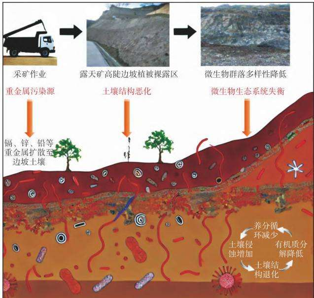
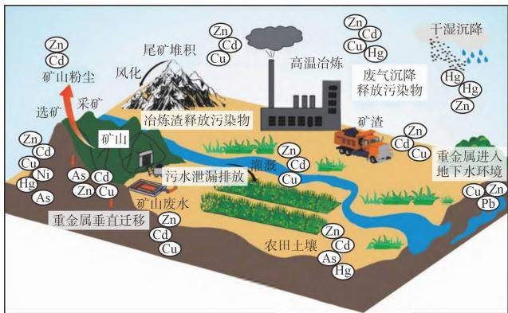

# 微生物在露天矿高陡坡面生态修复中的应用与展望

党电邦1，吕 莹2，湛 金1，杨 亚2，齐志雅2，刘兴宇2\*

（1．青海金川矿业有限责任公司；2．中国地质大学（北京）科学研究院）

摘要：露天矿高陡坡面的开采活动导致了严重的生态破坏，诸如土壤退化、重金属污染及水土流失等问题显著增加了生态修复的难度。综述了露天矿高陡坡面生态修复面临的关键挑战，系统分析了微生物在土壤改良、重金属污染控制及与植物协同作用中的机制。微生物通过分解有机质、形成团粒结构、固定和转化重金属，显著改善土壤结构，增强保水能力，并降低重金属的迁移性和生态毒性。同时，微生物与植物共生的协同作用显著提升了植被恢复的成功率，促进了生态系统的重建。结合典型案例分析，说明微生物修复技术在无客土条件下展现出卓越的修复效果，特别是在重金属污染严重的区域。提出未来的发展方向应聚焦于菌种筛选优化、修复策略调整及技术标准化的建立，以推动微生物修复技术在矿区生态修复中的广泛应用。

关键词：微生物修复；露天矿；高陡坡面；土壤改良；重金属污染；生态恢复

中图分类号：TD16

文献标志码：A

文章编号：1001－1277（2024）12－0013－0

doi：10．11792／hj2024120

## 引 言

露天矿高陡坡面的开采活动通常伴随着大规模的地表扰动，导致严重的生态破坏［1］。这些坡面在矿石开采过程中被剥离，土壤流失和植被破坏成为常态［2－3］。随之而来的水土流失、土壤退化及重金属污染，使得局部生态系统失去自我调节和恢复能力［4］。这些环境问题不仅局限于矿区内部，还会影响周边区域的土壤质量和水资源，导致水系污染、土地荒漠化和生物多样性减少［5－7］。随着时间推移，生态破坏对区域气候调节、碳吸收等生态服务功能也产生了深远影响，迫切需要生态修复措施来应对这一挑战［8］。

露天矿高陡坡面生态修复面临复杂且多重的技术和资源挑战。首先，由于大部分表土层在开采过程中已经流失，土壤严重贫瘠，缺乏必要的养分和有机质，植物很难在这样的环境中定植［9］。陡峭的地形进一步加剧了土壤结构的脆弱性，导致水土流失加速［10］。其次，露天矿区普遍存在的重金属污染，不仅破坏了土壤的生态功能，还阻碍了微生物和植物的正常生长，传统的物理和化学修复手段难以同时应对这些复杂的生态问题［8，11－12］。此外，极端气候条件，如频繁的干旱和暴雨，更为生态修复增加了难度［13］。因此，土壤贫瘠、地形复杂、污染严重与气候极端等多重因素的叠加，显著增加了露天矿高陡坡面生态修复

的难度和成本。

在应对这些复杂问题时，微生物修复技术展现出了独特的优势。微生物通过分解土壤中的有机物质，恢复土壤养分的循环，进而改善土壤结构，增强其保水性和肥力［9］。此外，微生物还能通过生物吸附和代谢反应，将重金属固定或转化为无毒或低毒形态，显著降低其生态毒性，为植物恢复创造了更安全的生长环境［14］。这种技术不仅能在无客土条件下独立应用，还能与植物修复技术相结合，形成微生物 －植物协同作用，进一步加速植被恢复和生态系统重建［15］。与传统的工程修复手段相比，微生物修复技术具有成本低、操作简便、环境友好的优点，并且可以长期维持生态系统的稳定［16］。本文详细探讨了微生物修复技术在土壤改良、重金属污染控制和植被恢复中的作用机制，并结合国内外典型修复案例，展示其在露天矿高陡坡面生态修复中的应用效果。同时，分析了微生物修复技术在不同生态条件下的适应性和推广潜力，为未来生态修复工作提供理论基础和实践参考。

## 1 露天矿高陡坡面生态修复面临的关键挑战

露天矿高陡坡面生态修复工作极为复杂且充满挑战［17－18］。这主要是由于其生态环境的脆弱性和恶劣的地理条件，使得这些坡面在开采后通常面临显著的生态退化问题。开采活动导致土壤贫瘠、重金属污染、水土流失等生态问题相互交织，极大地增加了修复工作的难度［19］。此外，极端气候条件的频繁干扰进一步加剧了生态系统的恢复难度［20］。为此，本文详细分析了露天矿高陡坡面生态修复中面临的六大关键挑战，以期为生态修复技术的应用与优化提供理论参考和实践依据。

## 1．1 土壤退化

露天矿高陡坡面的开采导致表土层的严重流失，破坏了土壤的物理结构和团粒结构，使得土壤松散且营养缺乏［10］。土壤有机质含量显著降低，导致肥力不足，植物难以获取生长所需的养分，无法实现自然定植与恢复。这种土壤退化的恶性循环进一步降低了生态系统自我修复能力，尤其是在坡面条件下，土壤易被侵蚀，修复难度不断增加［21］。因此，土壤改良的核心任务是增加有机质、稳定土壤结构，并提高其保水和供肥能力，从而为后续的植物恢复创造有利条件。

## 1．2 重金属污染

重金属污染是露天矿高陡坡面生态修复中的主要障碍之一，矿石开采和加工过程中释放的重金属元素（如铅、锌、镉）通过地表径流或土壤渗透积累，对土壤和水体造成长期的生态毒性［22］。这些重金属难以自然降解，不仅抑制植物的正常生长，还破坏了土壤中的微生物群落结构，进一步阻碍了生态系统的恢复。此外，重金属通过食物链传递，对更高营养级生物，包括人类，产生了潜在威胁。因此，控制重金属污染是矿区生态修复的核心任务之一，需通过微生物固定、植物萃取及土壤改良等措施降低重金属的迁移性和生物有效性。

## 1．3 水土流失

露天矿高陡坡面因坡度陡峭、植被破坏导致水土流失严重，雨水冲刷下，大量土壤颗粒被带走，使得土壤贫瘠并造成下游区域淤积和水体污染［1］。水土流失的直接后果是土壤进一步退化，土壤养分大量流失，植被恢复变得更加困难。严重的水土流失也会影响矿区的地形稳定性，增加修复难度，同时还会带来重金属污染的迁移问题，使污染扩展到矿区外的更大范围［23］。因此，防止水土流失是高陡坡面生态修复的优先任务之一，可以通过工程措施（如坡面加固）与生物措施（如植被覆盖）相结合，达到稳定坡面、减少水土流失的目的。

## 1．4 极端气候

极端气候条件，如干旱、高温和暴雨，对露天矿高陡坡面的生态修复工作产生了显著影响。干旱和高温会降低土壤水分含量，抑制植物和微生物的生长和繁殖，而暴雨则加剧了水土流失和重金属污染的迁移，破坏了土壤的生态平衡［24］。这些极端气候条件的频繁发生，使得修复工作复杂化，不仅影响了植物的生长，也对微生物的代谢活动造成了抑制［25］。因此，针对极端气候的适应性修复措施，如耐旱植物和耐高温微生物的使用，是矿区生态恢复的重要策略。

## 1．5 植物定植困难

植物定植是露天矿高陡坡面生态修复的关键环节，但由于土壤贫瘠、重金属污染和水土流失的共同作用，植物成活率极低［26］。贫瘠土壤无法提供足够的养分，重金属毒性抑制根系发育，而水土流失使幼苗根系难以稳固扎根［27］。这些问题叠加，导致植被恢复进展缓慢且成效不佳。提高植物定植成功率需要结合多种手段，如增加土壤有机质、降低重金属毒性、选择抗逆性植物，并结合工程措施减少水土流失。

## 1．6 微生物生态系统失衡

露天矿高陡坡面微生物生态系统通常表现出多样性降低、群落数量减少及生态功能受损等特点（如图1所示）。重金属污染和土壤贫瘠导致微生物种类和数量大幅减少，削弱了土壤中养分的分解与循环，影响了土壤改良及植物生长［28］。此外，微生物减少使得重金属污染难以通过自然途径得到有效固定和转化，进一步加剧了生态失衡。因此，恢复微生物群落的多样性和数量是矿区生态修复的重要内容，可以通过引入外源微生物和菌根共生技术有效促进土壤微生物生态系统的恢复。

  
图 1 露天矿高陡坡面微生物生态系统失衡过程示意图  
Fig．1 Schematicdiagramoftheimbalanceprocessinth microbialecosystemonhighandsteepslopesofopen-pitmine

## 2 微生物在露天矿高陡坡面生态修复中的作用机制

鉴于上述生态修复的挑战，微生物因其在土壤改良和污染控制中的独特作用，成为应对这些困难的重要解决方案。微生物作为生态系统的重要组成部分，通过其独特的生物化学功能在土壤改良、重金属污染控制及与植物的协同作用中发挥了重要作用［29－30］微生物能够分解有机质、促进养分循环，并通过复杂的生物地球化学过程固定或转化重金属，同时与植物形成互利共生体系，提高植物对不良环境的适应能力［31］。本文深入探讨微生物在这些方面的具体作用机制，以揭示其在露天矿高陡坡面生态修复中的多重效应与潜力。

## 2．1 微生物对土壤改良的作用机制

微生物在土壤改良过程中扮演着关键角色，其主要通过分解有机质、恢复土壤养分循环、促进土壤结构稳定化等一系列机制发挥作用［32－33］。首先，微生物具备强大的有机物分解能力，通过分解动植物残体、枯枝落叶及其他土壤中沉积的有机质，将其转化为植物可吸收的养分（如氮、磷、钾等）。这一过程不仅能够显著提高土壤肥力，还为植物生长提供了必要的养分支持。其次，在露天矿高陡坡面，由于土壤流失和矿产开采造成的营养物质匮乏，微生物的这一功能显得尤为重要［1］。贫瘠土壤中的微生物能够通过持续分解有机质，补充土壤中的养分，帮助恢复其自然生产力。

除了养分供应，微生物还通过分泌多糖类物质等胞外聚合物，帮助土壤颗粒聚集形成团粒结构［34］。团粒结构是土壤改良的核心要素之一，能够有效改善土壤的通气性、保水性和抗侵蚀能力。团粒结构的形成使得土壤的孔隙结构更为稳定，这对于露天矿高陡坡面的水土保持至关重要［35］。此外，微生物的代谢活动还能够通过改善土壤的物理性质，如增加土壤的渗透性、抗压能力，使土壤具备更强的结构稳定性，减少水土流失的风险。这些过程共同作用，为植物提供了更加适宜的生长环境，从而有助于实现土壤和植被的自然修复。

## 2．2 微生物在重金属污染控制中的作用机制

矿区开采过程中释放的重金属元素（如铅、镉、锌等）通过渗流和地表径流，严重污染了土壤和水体（如图2所示）。微生物可通过一系列生物地球化学过程，有效固定、转化或降解这些重金属，减少其对生态环境的毒性［36］。首先，微生物能够通过生物吸附、络合及生物沉淀等机制将重金属离子固定在土壤颗粒表面，减少其迁移性和生物有效性。例如：某些细菌和真菌能够通过细胞壁上的功能团吸附重金属离子，从而降低其生态毒性。其次，微生物能够通过氧化还原反应将有毒重金属转化为更稳定、低毒或无毒的化合物。例如：硫酸盐还原菌能够将溶解态的金属离子还原为金属硫化物，通过沉淀的方式将其固定在土壤中，显著减少了金属离子的迁移性［37］。这一过程不仅减少了土壤和水体中的重金属污染，还为植物创造了更安全的生长环境。此外，微生物的代谢活动，还可以生成各种有机酸和多肽，这些物质能够进一步促进土壤中微生物的繁殖与群落恢复，增强土壤的生态自我修复能力［38］。这种动态的生态平衡恢复机制，使得微生物不仅能控制重金属毒性，还能为整个土壤生态系统的健康提供保障。

  
图2 矿区开采过程中向环境释放重金属的主要途径  
Fig．2 Mainpathwaysofheavymetalreleas intotheenvironmentduringminingoperation

## 2．3 微生物与植物协同作用机制

微生物与植物的协同作用是露天矿高陡坡面生态恢复的核心策略之 ［39－41］。微生物不仅通过改善土壤环境促进植物生长，而且还能够通过与植物根系的共生关系，增强植物对恶劣环境的适应能力。首先，根际微生物通过分解土壤中的有机质，持续为植物提供所需的营养物质（如氮、磷、钾等），这在贫瘠的矿区土壤中尤为重要。微生物能够通过代谢活动释放养分，帮助植物在贫瘠、干旱和重金属污染严重的环境中扎根并顺利生长。其次，微生物通过与植物根系形成共生关系，如菌根共生，可以显著增强植物的养分吸收能力，尤其是在资源匮乏的环境下。菌根共生网络通过扩大植物根系的吸收范围，使植物能够更高效地获取土壤中的水分和养分，从而提高植物对逆境的耐受性。此外，某些微生物还能够通过分泌有机酸或合成特定的酶类，帮助植物吸收并固定土壤中的重金属，减少重金属对植物的毒害作用。这种协同效应，不仅有助于植物在污染严重的坡面土壤中定植，还加速了整个生态系统的恢复过程。

通过微生物与植物协同作用机制，露天矿高陡坡面的生态恢复能够实现更为稳定和持续的效果。微生物在土壤改良、养分供给、重金属毒性缓解等方面与植物相互促进，共同应对恶劣的矿区环境，从而为整个生态系统的重建奠定了坚实基础。

## 3 微生物修复技术在露天矿高陡坡面修复中的应用与推广

微生物修复技术在露天矿高陡坡面生态修复中展现出了巨大的应用潜力，尤其是在无客土条件下，其在土壤改良、重金属污染控制及植被恢复方面的优势得到了广泛关注。通过分析国内外典型修复案例，探讨微生物修复技术的应用效果，并讨论该技术在不同条件下的适应性及面临的挑战。

## 3．1 国内外露天矿高陡坡面微生物修复工程案例

典型露天矿高陡坡面微生物修复工程应用案例如表1所示。从表1可以看出：国内外在该领域的研究展现出明显的区域差异。国外倾向于在无客土条件下，利用多种微生物群落实现低成本、高效能和可持续性的修复方案［42－46］。这些国家积累了丰富的技术推广经验，重视微生物多功能性的应用。相比之下，国内尽管起步较晚，但近年来在各大矿区积极推进微生物修复技术试验和应用，尤其关注土壤质量提升和污染物控制，研究体系也在逐步完善中［39 41，47－50

表1 典型露天矿高陡坡面微生物修复技术工程应用案例  
Table1 Caseanalysisofengineeringapplicationsofmicrobialremediationtechnologyinhighandsteepslopesofopen-pitmine
<table><tr><td>序号</td><td>案例地点</td><td>修复重点与目标</td><td>使用的微生物修复技术</td><td>应对的主要环境挑战</td><td>文献来源</td></tr><tr><td>1</td><td>巴西米纳斯吉拉斯铁矿</td><td>土壤结构改善与水土保持</td><td>利用蓝藻和固氮菌改善土壤</td><td>土壤结构退化与水土流失</td><td>[42]</td></tr><tr><td>2</td><td>美国科罗拉多州萨米特维尔金矿</td><td>控制酸性矿坑水，重金属污染治 理，植被恢复</td><td>利用硫氧化菌修复</td><td>酸性矿坑水与重金属污染</td><td>[43]</td></tr><tr><td>3</td><td>智利安第斯山脉铜矿</td><td>改善土壤肥力，促进植被定植，减 少水土流失</td><td>固氮菌和蓝藻联合修复</td><td>贫瘠土壤与高海拔环境</td><td>[44]</td></tr><tr><td>4</td><td>巴西米纳斯吉拉斯州铁矿区</td><td>改善土壤结构，控制酸性和重金属 污染</td><td>微生物生物膜修复</td><td>土壤酸性与重金属污染</td><td>[45]</td></tr><tr><td>5</td><td>加拿大不列颠哥伦比亚煤矿</td><td>提高土壤持水性，改善坡面稳定性</td><td>降解菌和微生物生物膜联合修 复</td><td>煤矿废弃物污染与坡面稳 定性</td><td>[46]</td></tr><tr><td>6</td><td>中国老虎城石灰岩矿高陡边坡</td><td>坡面稳定与生态恢复</td><td>微生物-植物联合修复</td><td>高陡边坡稳定性与植被恢 复困难</td><td>[23]</td></tr><tr><td>7</td><td>中国德兴铜矿阳桃坞坡面</td><td>坡面稳定与重金属污染治理</td><td>微生物-植物协同修复</td><td>重金属污染与坡面稳定性</td><td>[39]</td></tr><tr><td>8</td><td>中国内蒙古露天煤矿</td><td>土壤质量恢复与植被定植</td><td>微生物-植物联合修复</td><td>土壤退化与水土流失</td><td>[40]</td></tr><tr><td>9</td><td>中国陕西黄土高原露天煤矿区</td><td>水土流失控制与植被恢复</td><td>微生物-植物联合修复</td><td>水土流失与植被稀少</td><td>[41]</td></tr><tr><td>10</td><td>中国铁山采石场</td><td>土壤稳定与植被恢复</td><td>苔藓和微生物共同改善土壤</td><td>土壤侵蚀与坡面不稳定</td><td>[47]</td></tr><tr><td>11</td><td>中国青藏高原高山采矿区</td><td>提高土壤养分并丰富微生物种类</td><td>利用特定微生物(如变形菌和 厚壁菌)修复土壤</td><td>高海拔环境与极端气候条 件</td><td>[48]</td></tr><tr><td>12</td><td>中国安太堡露天煤矿</td><td>土壤稳定与重金属污染控制</td><td>利用硫氧化细菌(如硫杆菌)和 金属还原细菌(如地杆菌)修复</td><td>重金属污染与土壤退化</td><td>[49]</td></tr><tr><td>13</td><td>中国芒来露天煤矿</td><td>防治滑坡和水土流失</td><td>微生物与工程措施结合</td><td>滑坡与水蚀风险</td><td>[50]</td></tr></table>

此外，在实际应用中，根据矿区的具体环境特征进行微生物修复技术调整和优化。例如：在加拿大不列颠哥伦比亚煤矿，广泛应用了降解菌与微生物生物膜联合修复技术，有效提升了土壤持水能力和坡面稳定性，同时缓解了煤矿废弃物造成的污染问题［46］。而在巴西米纳斯吉拉斯州铁矿区，微生物生物膜技术用于控制土壤酸性和重金属污染，通过增强土壤微生物多样性，改善了土壤结构并实现了污染物的稳定化［45］。国内案例同样展现了微生物修复技术的灵活性和适应性。例如：在中国安太堡露天煤矿，利用硫氧化细菌和金属还原菌来处理重金属污染并改善土壤肥力，有效控制了坡面土壤退化问题［49］。此外，中国青藏高原高山采矿区通过引入变形菌和厚壁菌群落，增加了土壤微生物多样性，使得土壤在高海拔和极端气候条件下得到显著改善［48］。这些案例表明，微生物修复技术在不同地质和气候条件下具有高度的适应性，能够有效应对复杂的矿区生态修复挑战。

通过分析这些典型案例可以发现，微生物修复技术在无客土条件下应用展现了显著成效，尤其在控制重金属污染、改善土壤肥力及支持植被恢复方面。这些修复技术通过微生物群落的生物化学特性，有效解决了矿区生态修复的多重挑战，为未来的广泛应用提供了实践依据。总结国内外技术的应用差异和成效，微生物修复在全球矿区生态恢复中具备极大潜力，丰富了该领域的科学知识，并为未来研究与实践奠定了坚实基础。

## 3．2 微生物修复技术在露天矿高陡坡面生态修复中的适应性分析

微生物修复技术因其灵活性和多功能性，在高陡坡面的修复中表现出一定的适应性。不同微生物在不同环境条件下表现出较强的生物功能，如在贫瘠土壤中的有机质分解、重金属污染环境中的毒性缓解等。微生物的适应性体现在其对土壤条件、重金属污染环境及与植物共生等多种生态因素的适应能力。

在土壤条件方面的适应性：露天矿高陡坡面普遍存在土壤贫瘠的问题，微生物能够在此类贫瘠环境中存活，并通过分解有限的有机质维持代谢活动。特定的微生物菌种，如固氮菌，能够在缺乏氮源的情况下，通过固定大气中的氮为土壤补充养分。这种特性显著增强了微生物在营养匮乏矿区土壤中的适应能力。

在重金属污染环境中的适应性：微生物在重金属污染土壤修复中发挥着重要作用，尤其是某些特定菌种能够通过生物吸附、络合和沉淀等机制固定重金属，防止其向周围环境扩散。此外，耐金属菌种还能够通过代谢将重金属离子转化为无毒或低毒形态，从而显著降低其生态毒性。这使得微生物修复技术在重金属污染的露天矿区表现出较强的修复适应性。

在与植物共生方面的适应性：微生物与植物根系形成共生关系，显著提高了植物在恶劣环境中的生存能力。通过菌根共生系统，植物能够更有效地吸收水分和养分，从而增强其对不良环境的耐受性。这种共生机制不仅增强了微生物的修复效果，还能够在植物修复技术中发挥协同作用，特别是在缺乏土壤改良物质的露天矿区环境中。

## 3．3 微生物修复技术在露天矿高陡坡面生态修复中的应用潜力

微生物修复技术在露天矿高陡坡面的应用潜力广阔，尤其在矿区生态环境受损严重的情况下，其独特的生物修复机制展现了显著优势。通过微生物的自然代谢过程，修复技术能够有效改善土壤结构，促进有机质分解和养分循环，为植物生长创造更适宜的条件。与传统的工程手段相比，微生物修复具有低成本、环境友好、可持续等优点，尤其适用于生态脆弱的矿区。此外，菌种培育和工业化生产的推进为该技术的广泛应用奠定了基础，提升了其在大规模矿区生态修复中应用的可行性。

微生物修复技术的灵活性和多功能性进一步扩大了其应用潜力。它不仅可以独立发挥修复作用，还能够与其他修复方法协同使用。例如：微生物与植物修复技术结合，通过微生物改善土壤环境并帮助植物根系扎根，能显著提高植被的定植率和生长速度。在污染较为严重的矿区，微生物的重金属吸附、固定及转化能力，为生态系统的重建提供了一个更为安全的环境，提升了整体修复效率。此外，微生物修复技术还可以根据不同矿区的地质和气候条件进行调整和优化，进一步增强了技术的适应性。

微生物修复的推广还依赖于技术标准化流程的建立和完善的监测体系。通过统一的操作流程和效果评估标准，可以提高不同矿区之间的技术可复制性，确保修复工作的质量和稳定性。同时，生态监测体系能够实时评估修复效果，根据监测结果动态调整修复策略，保障技术的长期效果。这些因素使得微生物修复技术在矿区大规模应用中具备广泛的潜力，并逐渐成为露天矿高陡坡面修复的核心手段。

## 4 结论与展望

1）通过对露天矿高陡坡面生态修复的主要挑战及微生物修复技术的深入分析，探讨了微生物在土壤改良、重金属污染控制及与植物协同作用等方面的作用机制。露天矿开采引发的土壤退化、重金属污染、水土流失及极端气候的影响，显著加大了生态系统的修复难度。微生物因其在贫瘠土壤中的有机质分解和重金属毒性缓解等功能，展现出极大的修复潜力。在土壤改良过程中，微生物通过分解有机质、形成团粒结构和增强土壤保水能力，为植物生长提供了更加稳定的环境。在重金属污染控制方面，微生物不仅能够吸附和固定重金属，还可通过代谢将重金属转化为无毒或低毒形态，显著降低其迁移性和生态毒性。与此同时，微生物与植物之间的协同机制大大提高了植被恢复的成功率，为露天矿生态修复的稳定性提供了保障。

2）微生物修复技术的推广和应用，尤其是在无客土条件下，能够有效应对露天矿高陡坡面生态修复中的多重挑战。通过与植物修复技术的结合，微生物修复技术不仅降低了修复成本，还加快了生态系统的自然重建进程。微生物修复技术在不同矿区条件下均表现出较强的适应性，尤其是在重金属污染严重的区域，其修复效果显著。因此，微生物修复技术在露天矿高陡坡面生态修复中的应用潜力广阔，具有重要的实践价值。

3）尽管微生物修复技术在露天矿高陡坡面的生态修复中展现出巨大潜力，但仍有许多关键问题需要解决和优化。首先，针对不同矿区的地质、气候及污染状况，如何优化微生物菌种的筛选和修复策略仍然是技术发展的重点。为提升微生物修复的适应性和效果，亟须开发能应对极端气候和高污染环境的耐受性菌种。此外，菌种的规模化生产和供应链管理是确保微生物修复技术大规模应用的关键环节。未来，微生物修复技术与其他生态修复方法的结合将进一步提升修复效果，特别是与植物修复、工程修复技术的协同作用，将为矿区生态重建提供更全面的解决方案。同时，在修复过程中建立标准化流程和生态监测体系，对于确保修复工作的长期稳定性和可持续性至关重要。通过有效的监测和反馈机制，及时调整修复策略，不仅可以提高技术效率，还能确保修复效果的持续性。综上所述，微生物修复技术在露天矿高陡坡面生态修复中具有广泛的应用前景，未来研究与应用的重点将集中于技术的优化、推广及与其他修复方法的整合，为矿区生态修复提供更具实效性和可持续性的解决方案。

## ［参 考 文 献］

［1］ 高轩，邵鹏远，康春景，等．露天矿山高陡岩质边坡生态修复技术的应用现状与发展趋势［J］．能源与环保，2022，44（8）：2731

［2］ 李予红，赵金召，张万河，等．露天矿山高陡岩质边坡生态修复技术研究现状与发展趋势［J］．河北地质大学学报，2021，4（3）：82－86

［3］ CHENL，YUXX，LUOR，etal．Highsteeprockslopeinstabilitmechanisminducedbythepillardeteriorationinthemountainminingarea［J］．Mathematics，2023，11（8）：1889

［4］ 卞正富，于昊辰，侯竟，等．西部重点煤矿区土地退化的影响因素及其评估［J］．煤炭学报，2020，45（1）：338－350

［5］ WANGWC，YANYF，QUY，etal．ShallowfailureofweakslopeinBayanOboWestMine［J］．InternationalJournalofEnvironmentaResearchandPublicHealth，2022，19（15）：9755

［6］ 袁磊，周建伟，温冰，等．基于地境再造法的矿山高陡岩质边坡生态修复技术及其应用［C］∥中国煤炭学会煤矿土地复垦与生态修复专业委员会．2016全国土地复垦与生态修复学术研讨会———矿山土地复垦理论、技术、实践与评价．北京：中国煤炭学会煤矿土地复垦与生态修复专业委员会，2016

［7］ 邹乾胜．某锰矿露天废石场边坡稳定性评价及高陡边坡防治［J］中国锰业，2024，42（3）：55－59

［8］ 彭苏萍，毕银丽．黄河流域煤矿区生态环境修复关键技术与战略思考［J］．煤炭学报，2020，45（4）：1211－1221

［9］ 周锐．露天煤矿高陡岩质边坡生态修复技术的应用［J］．煤炭新视界，2023（1）：175－177

［10］ 刘具，宋世杰，杨磊，等．N元素在陕北矿区采煤沉陷坡面土壤中的空间异质性研究［J］．绿色科技，2021，23（6）：25－27

［11］ 李志卫．露天采矿矿山地质环境问题与恢复治理措施［J］．当代化工研究，2021（12）：123－124

［12］ BENJAMINMG，MIRIAMMR，KHALILK，etal．Reconditionindegradedminesitesoilswithexogenoussoilmicrobes：Plantfitnesandsoilmicrobiomeoutcomes［J］．FrontiersinMicrobiology，2019，10：1617

［13］ 刘铁军，卢建男，张哲乾，等．干旱半干旱区裸露边坡适宜喷播的绿化基质筛选［J］．草业科学，2016，33（7）：1291－1296

［14］ 李静，曹溪桐，邱凯，等．微生物菌剂对边坡绿化植物生长的影响［J］．中国水土保持，2024（9）：56－59

［15］ 蒋婧，宋明华．植物与土壤微生物在调控生态系统养分循环中

的作用［J］．植物生态学报，2010，34（8）：979－988

［16］ HANGL，GAOYF，LEONAP，etal．Microbiallyinducedcarbonateprecipitationforimprovingtheinternalstabilityofsiltysanslopesunderseepageconditions［J］．ActaGeotechnica，2022，1（5）：2719－2732

［17］ 李小双，李耀基，宗世荣，等．露天磷矿山采空区绿色复垦技术研究［J］．金属矿山，2014（8）：153－156

［18］ 刘本同，钱华，何志华，等．我国岩石边坡植被修复技术现状和展望［J］．浙江林业科技，2004，24（3）：47－54

［19］ 夏嘉南，李恒，雷少刚，等．胜利矿区周边自然草原坡面植被分布模拟及复垦应用［J］．生态学杂志，2021，40（9）：3007－3016

［20］ 许飞，尹晓晴，包含，等．干旱半干旱区岩质边坡生态基材防护特性与优化配比［J］．科学技术与工程，2024，24（5）：2158－2167

［21］ WANGLJ，TANGXG，LIUX，etal．Mineralsolubilizingmicroorganismsandtheircombinationwithplantsenhanceslopestabilitbyregulatingsoilaggregatestructure［J］．FrontiersinPlantScence，2023，14：1303102

［22］ 姚丰平，张飞英，吴益庆，等．废弃铅锌矿堆碴边坡重金属污染营林修复技术研究［J］．浙江林业科技，2020，40（3）：31－37

［23］ 黄文忠，杨建新，孙永瑞．老虎垅石灰岩矿高陡边坡治理研究［J］现代矿业，2023，39（4）：255－257

［24］ CHENG，CHANGC，HEXB，etal．Variationsinmicrobialcharac teristicsofoverlandflowfromsteepslopeswithbiocrustsdurin rainfallinasemiaridregion［J］．JournalofHydrology，2024，635： 131158

［25］ 韩美清，闫晓俊，周宇，等．植物配置对岷江干旱河谷铁路边坡土壤理化性质的影响［J］．重庆师范大学学报（自然科学版），2020，37（2）：134－140

［26］ 苏绘梦，黄景春，王玲，等．高陡岩质边坡植被根系发育地境特征研究［J］．中南林业科技大学学报，2017，37（11）：56－62

［27］ 高云峰，徐友宁，陈华清．露天矿硬岩边坡复绿技术现状及存在问题［J］．中国矿业，2019，28（2）：60－65

［28］ 王振宇．焦作市区北部灰岩矿岩石边坡复绿方法探讨［J］．水土保持应用技术，2013（6）：15－16

［29］ 王涛，邓琳，何琳燕，等．微生物菌剂对砒砂岩土壤的改良作用［J］．中国环境科学，2020，40（2）：764－770

［30］ 黄骤屹，陈雪峰，郭媛媛，等．基于植被 －土壤 －微生物生态原理的边坡土壤持续肥力保证技术研究［J］．交通世界，202（29）：8－12

［31］ 鞠孟辰，卜崇峰，王清玄，等．藻类与微生物添加对高陡边坡生物结皮人工恢复的影响［J］．水土保持通报，2019，39（6）：124－128，135

［32］ 吴曼颖．根际微生物对武陵山片区岩质边坡生态恢复进展研究［J］．南方园艺，2018，29（6）：69－71

［33］ GOWTHAMANS，IKIT，NAKASHIMAK，etal．Feasibilitystudforslopesoilstabilizationbymicrobialinducedcarbonateprecipitation（MICP）usingindigenousbacteriaisolatedfromcoldsubarctiregion［J］．SNAppliedSciences，2019，1（11）：1－16

［34］ QIUTY，PEÑUELASJ，CHENYL，etal．Arbuscularmycorrhiza fungalinteractionsbridgethesupportofroot-associatedmicrobiot forslopemultifunctionalityinanerosion-proneecosystem［J］．Imeta， 2024，3（3）：e187

［35］ 石韫玉，崔羽，张萌，等．陶粒与微生物菌剂对露天煤矿土壤的

改良及植物生长效果［J］．中国草地学报，2023，45（10）：8797

［36］ LVY，TANGCY，LIUXY，etal．Stabilizationandmechanismouraniumsequestrationbyamixedcultureconsortiaofsulfate-reducingandphosphate-solubilizingbacteria［J］．ScienceoftheTotaEnvironment，2022，827：154216

［37］ LVY，TANGCY，LIUXY，etal．Optimizationofenvironmenta conditionsformicrobialstabilizationofuraniumtailings，andth microbialcommunityresponse［J］．FrontiersinMicrobiology，2022， 12：770206

［38］ LVY，LIJ，YEHP，etal．Bioleachingbehaviorsofsiliconandmetalinelectrolyticmanganeseresidueusingsilicatebacteria［J］．JournaloCleanerProduction，2019，228：901－909

［39］ XINGJC，ZHANGJJ，WANGJ，etal．Ecologicalrestorationinthloessplateau，Chinanecessitatestargetedmanagementstrategy：EvidencefromtheBeiluoRiverBasin［J］．Forests，2023，14（9）：1753

［40］ GUEDESRS，RAMOSSJ，GASTAUERM，etal．Challengesan potentialapproachesforsoilrecoveryinironopenpitminesan wastepiles［J］．EnvironmentalEarthSciences，2021，80：640

［41］ GUEDESRS，RAMOSSJ，GASTAUERM，etal．Phosphoruslabi lityincreaseswiththerehabilitationadvanceofironminelandi theeasternAmazon［J］．EnvironmentalMonitoringandAssess ment，2020，192：390

［42］ LISD，LIUZK，WANGL，etal．Selectionofdominantmossspecieforecologicalrestorationofabandonedmines－AcasestudyofTieshaQuarryinQixingDistrict，Guilin，China［M］．Amsterdam：IOSPress，2022：1310－1324

［43］ DUSG，SAROGLOUC，CHENYF，etal．Anewapproachfo evaluationofslopestabilityinlargeopen-pitmines：Acasestudya

theDexingCopperMine，China［J］．EnvironmentalEarthSciences，2022，81：102

［44］ XUDL，LIXF，CHENJ，etal．Researchprogressofsoilandvegetationrestorationtechnologyinopen-pitcoalmine：Areview［J］Agriculture，2023，13：226

［45］ KONGLK，ZHANGL，WANGYN，etal．ImpactofecologicalrestorationonthephysicochemicalpropertiesandbacterialcommuntiesinAlpineMiningareasoils［J］．Microorganisms，2024，12（1）：41

［46］ WUFM，ZHENGZP，ZHANGXY，etal．Researchonecosystem statusevaluationofopen-pitmines［C］∥BAEYENSJ，DEWILR， ROSSIB，etal．Proceedingsof20224thinternationalconferenceo environmentsciencesandrenewable．Singapore：Springer，2023： 23－31

［47］ LIUS，GAOYR，CHENJW，etal．Responsesofsoilbacterialcommunitystructuretodifferentartificiallyrestoredforestsinopen-picoalminedumpsontheloessplateau，China［J］．FrontiersinMicrobiology，2023，14：1198313

［48］ PLUMLEEIGS，EDELMANP．AnupdateonUSGSstudiesofth SummitvilleMineanditsdownstreamenvironmentaleffects［R］ FortCollins：ColoradoStateUniversity，1995

［49］ SINGHB，CRASWELLE．Fertilizersandnitratepollutionofsurfacandgroundwater：Anincreasinglypervasiveglobalproblem［J］．SNAppliedSciences，2021，3：518

［50］ FIELDS－JOHNSONCW，ZIPPERCE，BURGERJA，etal．ForesrestorationonsteepslopesaftercoalsurfacemininginAppalachiaUSA：Soilgradingandseedingeffects［J］．ForestEcologyandManagement，2012，270：126－134

# Applicationandprospectsofmicroorganismsinecologica restorationofhighandsteepslopesinopen-pitmine

DangDianbang1,LüYing2,ZhanJin1,YangYa2,QiZhiya2,LiuXingyu

(1．QinghaiJinchuanMiningCo．,Ltd．;2．ScientificResearchInstitute,ChinaUniversityofGeosciences(Beijing))

Abstract:Miningactivitiesonhighandsteepslopesofopen-pitmineshaveledtosevereecologicaldamage, includingsoildegradation,heavymetalpollution,andwaterandsoilerosion,makingecologicalrestorationhighl challenging．Thispaperreviewsthecriticalchallengesinrestoringhighandsteepslopesandsystematicallyanalyze themechanismsbywhichmicroorganismsimprovesoil,controlheavymetalpollution,andinteractsynergisticallywit plants．Microorganismsenhancesoilstructure,andwaterretention,andreduceheavymetalmobilityandtoxicityb decomposingorganicmatter,formingaggregates,andimmobilizingandtransformingheavymetals．Theirsymbioti relationship with plants significantly increases vegetation recovery success rates and accelerates ecosystem reconstruction．Casestudieshighlightthesuperiorrestorationoutcomesofmicrobialtechnologieswithouttopsoi, particularlyinareasheavilypollutedbyheavymetals．Futuredevelopmentdirectionsshouldfocusonstrainscreenin optimization,restorationstrategyadjustment,andstandardizedmethodologiesestablishmenttopromotethebroa applicationofmicrobialtechnologiesinmineecologicalrestoration

Keywords:microbialrestoration;open-pitmine;highandsteepslope;soilimprovement;heavymetalpollution; ecologicalrestoratio

场“微生物氧化-化学固定 ”等创新型研究成果，实施工程 1 0 余项 。 在 Environmental Science & Technology，Science of the Total Environment，Environmental Pollution，Journal of Hazardous Materials 等期刊发表 SCI 论文1 00 余篇；出版 Remediation of Chromium-contaminated Soil: Theory and Practice，《矿冶污染场地治理与生态修复》《铬污染微生物治理理论与技术》 3 部专著，授权国家专利 60 多项；获国家科技进步奖二等奖 1 项 省部级自然科学/科技进步奖一等奖2项

## 特约召集人简介

迟崇哲，长春黄金研究院有限公司环境保护研究所所长，正高级工程师，中国有色金属产业技术创新战略联盟专家委员会委员，吉林省环境保护产业协会固体废物处理利用委员会副主任委员，中国有色金属学会第八届环境保护学术委员会委员，《黄金》第三届编委会编委 长期从事有色金属及黄金行业环境保护与资源化利用研究工作，参与和负责国家重点研发计划项目 1 项 吉林省重大科技专项 3 项 黄金行业重点科研项目若干，参与编制黄金行业标准与规范 3 项，主持及参与黄金行业“三废”治理技术开发及工程化应用项目 20 余项，开发出多项黄金行业环保适用 先进核心技术，经专家鉴定均达到了

国际领先 国际先进或国内领先水平 先后获得省部级科技奖 23 项，其中，环保部科学技术奖 2 项 中国黄金协会科学技术奖 19 项，中国安全协会科学技术奖 2 项；核心期刊发表论文 23 篇，申请并授权国家发明专利1 1 项 。

刘兴宇，中国地质大学（北京）教授，博士生导师，华润环保土壤修复首席科学家，中组部“万人计划”青年拔尖人才，科技部重点研发计划项目首席，国家科技奖励评审专家 长期从事环境生物技术研究工作，研发了成套针对重金属污染治理与生态修复的微生物技术体系，获授权国家发明专利 40 余项；发表 SCI、EI 等高水平论文 70 余篇。主持科技部重点研发计划项目 国家自然科学基金重点项目 面上项目等多项纵向科研项目；获省部级科技奖 7 项，其中，2 项排名第一 技术成果应用于国内全域 20 个不同类型有色金属矿冶区污染防控与生态修复工程，合同总额 9.69 亿元，利税 1.20 亿元，节支 2.03 亿元。

曹百川，博士，华南师范大学生命科学学院副研究员，注册环保工程师，主要从事微生物生态与矿山生态修复领域的研究工作 先后主持国家自然科学基金项目 广东省基础与应用基础研究基金项目等十余项课题。 在 Water Research，Global Change Biology，《科学通报》等国内外学术期刊发表学术论文 20 余篇，授权国家发明专利 7 项，参与编写地方标准、团体标准 4 项，获教育部自然科学奖二等奖 1 项，以技术负责人身份参与十余项矿区生态修复工程（含多个中央环保督察项目）