# 生态修复模式对淮南矿区重构土壤 $\mathbf { C O } _ { 2 }$ 通量日变化的影响

周育智1，王芳1，陈孝杨1，2,3，陈敏1，刘本乐1

（1.安徽理工大学地球与环境学院，安徽淮南232001；2.安徽省煤炭勘探工程技术研究中心，安徽宿州234000；3.中国科学技术大学地球和空间科学学院，安徽合肥230026)

摘要：目的探讨淮南矿区不同生态修复模式(植被类型和覆土厚度)对土壤 $\mathrm { C O _ { 2 } }$ 通量的影响，以期为该区域以及相似矿区的生态修复提供理论依据及参数。方法采用静态箱一碱液吸收法对淮南市采煤沉陷生态修复区土壤CO2通量进行动态测定，分析土壤CO₂通量日变化特征，以及土壤呼吸速率对地表温度、地下5cm土壤温度和土壤含水量的敏感性。「结果不同生态修复模式下土壤 $\mathrm { C O _ { 2 } }$ 通量日变化格局均表现为单峰曲线，最高峰出现在14:00，最低值出现在6:00，其均值大小依次为：B区(灌木林)>C区(灌木林)>D区(乔木林)>A区(草地)，且 B，C与 A区差异显著 $( \phi < 0 . 0 5 )$ ，其他区之间差异不显著 $( \phi >$ 0.05)。不同覆土厚度下土壤表层 $\mathrm { C O _ { 2 } }$ 通量平均值的大小依次为： $4 0 \mathrm { - } 8 0 \mathrm { ~ c m } > 0 \mathrm { - } 2 0 \mathrm { ~ c m } > 2 0 \mathrm { - } 4 0 \mathrm { ~ c m } >$ 80—100cm。其最大值和变幅的大小顺序也遵循平均值大小顺序。4种修复模式下土壤 $\mathrm { C O _ { 2 } }$ 通量与地下$5 ~ \mathrm { c m }$ 土壤温度、地表温度均呈指数方程关系 $, R ^ { 2 }$ 值分别在0.34～0.70，0.48～0.83之间，与土壤含水量呈二次方函数关系，R值在0.08～0.44之间。结论|不同植被类型条件下，土壤CO2通量大小表现为：灌木林>乔木林>草地；不同覆土厚度条件下，除了覆土40—80cm的样地外，土壤CO₂通量随覆土厚度的增加而减少。植被类型对土壤CO2通量的影响较覆土厚度显著。

关键词：土壤 $\mathrm { C O _ { 2 } }$ 通量；重构土壤；生态修复模式；植被类型；覆土厚度

文献标识码：A

文章编号：1000-288X(2016)06-0040-07

中图分类号：T167，S281

文献参数：周育智，王芳，陈孝杨，等．生态修复模式对淮南矿区重构土壤CO₂通量日变化的影响[J].水土保持通报，2016,36(6):040-046.DOI:10.13961/j.cnki.stbctb.2016.06.007

# Effects of Ecological Restoration Patterns on Diurnal Variation of $\mathbf { C O } _ { 2 }$ Flux from Rehabilitated Soil of Coal Mining Areas in Huainan City

ZHOU Yuzhi1 , WANG Fang1 , CHEN Xiaoyang1,2,3 , CHEN Min1 , LIU Benle1

(1. School of Earth and Environment , Anhui University of Science and Technology, Huainan,

Anhui 232001, China; 2. Engineering and Technology Research Center on Coal Exploration of Anhui, Suzhou, Anhui 234000, China; 3. School of Earth and Space Sciences , University of Science and Technology of China , Hefei, Anhui 230026, China)

Abstract: [Objective] To explore the effects of ecological restoration patterns in coal ming areas of Huainan City, including rehabilitation thickness of soil and reestablished vegetation type on soil $\mathrm { C O _ { 2 } }$ flux, and to provide theoretical basis for ecological restoration patterns similar coal mining region. [Methods] Method of close static chamber-alkali absorption was used to measure the diurnal variation of reconstructing soil CO2 flux. Meanwhile, temperatures of soil surface and 5 cm depth and soil water content were measured and their influences on soil CO2 flux were analyzed in different ecological remediation patterns for coal mining district in Huainan City, Anhui Province. Results  Diurnal variation of soil $\mathrm { C O _ { 2 } }$ flux exhibited an obvious unimodal

pattern during the whole observation period, with peak value at $1 4 : 0 0$ and minimum flux at $6 : 0 0$ for all of the ecological restoration models. The flux ranked at different revegetation districts as: B(brushwood) ${ } > \mathrm { C }$ (brushwood)>D(arboreal forest)>A(grassland). Soil $\mathrm { C O _ { 2 } }$ flux of B and C districts were significantly higher than that of $\mathrm { A } ( \phi { < } 0 . 0 5 )$ ; no significant differences among others were observed $_ { \phi > 0 . 0 5 ) }$ . Soil $\mathrm { C O _ { 2 } }$ flux with different rehabilitation thickness ranked $\mathrm { { } s ; ~ 4 0 - 8 0 ~ c m { > } 0 - 2 0 ~ c m { > } 2 0 - 4 0 ~ c m { > } 8 0 - 1 0 0 ~ c m }$ , and their maximum and amplitude also followed this order. Significant relationships were found between soil temperature in 0 and 5 cm depth and soil $\mathrm { C O _ { 2 } }$ flux, which could be described by exponential equation. $R ^ { 2 }$ ranged from 0. 34 to 0. 70 and from 0. 48 to 0. 83, respectively. Relationship between soil $\mathrm { C O _ { 2 } }$ flux and soil water content can be described by quadratic equation, with 0. $0 8 \sim 0 . 4 4 ~ R ^ { 2 }$ value. [Conclusion] Soil CO2 flux differed under different vegetation types, the highest occurred in brushwood5.22 $\mu \mathrm { m o l } / ( \mathrm { m ^ { 2 } \cdot \mathrm { s } ) } ]$ , followed by arboreal forest4.56 $\mu \mathrm { m o l / ( m ^ { 2 } \bullet s ) } ]$ , the lowest was grassland3. 89 $\mu \mathrm { m o l } / ( \mathrm { m ^ { 2 } \cdot \mathrm { s } ) } ]$ . Except for $4 0 { - } 8 0$ cm thickness, soil $\mathrm { C O _ { 2 } }$ flux decreased with the increase of soil rehabilitation thickness. The influence of vegetation on soil $\mathrm { C O _ { 2 } }$ flux was more significant than the one of soil rehabilitation thickness.

Keywords: soil $\mathbf { C O } _ { 2 }$ flux; rehabilitated soil; ecological restoration models; vegetation type; soil rehabilitation thickness

全球 $\mathrm { C O _ { 2 } }$ 浓度升高及其所引起的全球变暖问题是当前人类所面临的最为严峻的生态环境问题，而土壤圈碳循环过程的失衡被认为是大气 $\mathrm { C O _ { 2 } }$ 浓度增加的一个重要原因。相关学者通过对全球碳通量的研究表明，人类活动平均每年向大气排放CO2约$7 . 1 \ \mathrm { P g / a } ,$ 由于土壤呼吸从土壤向大气释放的CO₂通量高达 $6 8 \sim 7 7 ~ \mathrm { P g / a }$ ，约占大气 $\mathrm { C O _ { 2 } }$ 总量的10%，是燃烧化石燃料排放 $\mathrm { C O _ { 2 } } \left( 5 . 4 \ \mathrm { P g / a } \right)$ 的12.6\~14.3倍[1-2]，可见土壤是 $\mathrm { C O _ { 2 } }$ 的重要潜在排放源。鉴于这种较大数量级的碳通量，土壤 $\mathrm { C O _ { 2 } }$ 通量在数量上的微小变化都可能引起大气 $\mathrm { C O _ { 2 } }$ 浓度的显著变化，同时，可能决定特殊区域的碳源与汇效应[3]。从严格意义上，土壤呼吸(土壤表面 $\mathrm { C O _ { 2 } }$ 碳通量)是指未扰动土壤中产生以及向大气释放 $\mathrm { C O _ { 2 } }$ 的所有代谢过程，是土壤圈与大气圈进行 $\mathrm { C O _ { 2 } }$ 等气体交换的重要生态系统过程，也是全球碳循环中最大的通量之一[4-5]，仅次于陆地植被通过光合作用所固定的碳通量100${ \sim } 1 2 0 \ \mathrm { P g / a ^ { [ 6 ] } }$

目前，国内外对土壤 $\mathrm { C O _ { 2 } }$ 通量的研究对象主要集中在森林、草地、湿地、农田等生态系统。他们通过野外原位测试和室内试验研究相结合，对不同生态系统土壤 $\mathrm { C O _ { 2 } }$ 通量的日变化及季节动态规律进行研究，探讨土壤呼吸变化与土壤因素、环境因素、气候因素及人为因素的关系。例如，Yan等7通过对亚热带小气候环境下不同森林类型土壤CO2通量变化规律的研究，发现土壤 $\mathrm { C O _ { 2 } }$ 通量随季节呈单峰变化曲线，且与土壤温度存在显著相关性。陈盖等8]从剖面尺度研究侵蚀剖面土壤呼吸特征，发现有机碳对土壤呼吸的影响最大，可解释土壤呼吸变异的54.72%。淮南矿区是华东地区面积较大的采煤沉陷区之一，并以6.5km²/a的速度增加，预计2020年土地塌陷面积将达到 $1 8 6 . 9 \ \mathrm { k m ^ { 2 } }$ 。大多数学者充分利用煤矸石等固体废弃物的工程特性(较为理想的地基回填材料)，通过煤矸石充填复垦使一些塌陷地能够再度为人类所用，提高受损土地的可利用率和实现固体废弃物(煤矸石)减量化、资源化与无害化。因采煤引起的土地塌陷，破坏了土壤剖面结构和理化特性，使原有的生态系统服务功能遭到破坏。为修复该区域原有的生态系统服务功能，该区域开展了以煤矸石充填复垦为主的生态修复工程，但该生态修复模式对土壤 $\mathrm { C O _ { 2 } }$ 通量会产生什么影响目前尚缺乏相关研究，本文试图通过比较不同植被类型、不同覆土厚度间的土壤 $\mathrm { C O _ { 2 } }$ 通量，探讨植被类型和覆土厚度对土壤 $\mathrm { C O _ { 2 } }$ 通量的影响，有利于制定更加合理的复垦区土壤和植被管理措施，并筛选出最优的植被类型，从而为该区域以及相似矿区的生态修复提供参考。

## 1 研究区自然条件与研究方法

## 1.1 研究区自然概况

研究区位于安徽省中部淮南市主要煤矸石充填复垦区，分别为创大生态园修复区（A区， $3 2 ^ { \circ } 4 9 ^ { \prime } \mathrm { N }$ $\mathrm { 1 1 6 ^ { \circ } 4 8 ^ { \prime } E ) ; }$ 大通 $\overrightarrow { A }$ 生态修复区（B区， $3 2 ^ { \circ } 3 7 ^ { \prime } \mathrm { ~ N ~ }$ $1 1 7 ^ { \circ } 0 1 ^ { \prime } \mathrm { E } )$ ；新庄孜矿生态修复区（C区， $3 2 ^ { \circ } 3 5 ^ { \prime } \mathrm { N }$ $1 1 6 ^ { \circ } 4 9 ^ { \prime } \mathrm { E } )$ ；潘一矿生态修复区（D区， $3 2 ^ { \circ } 4 7 ^ { \prime } \mathrm { ~ N ~ }$ $1 1 6 ^ { \circ } 5 0 ^ { \prime } \mathrm { E } )$ ，该地区气候属于大陆性暖温带半湿润季风气候，处于亚热带向暖温带气候过渡地带，兼具南北气候特点，气候温和湿润，四季分明；该区年平均气温 $1 5 . 3 ~ \mathrm { { ^ \circ C } }$ ，全年无霜期224d，年日照2279.2h，年平均降水量为937.2mm，季节性降水分布不均，降水主要集中在夏季，雨热同季节。土壤类型以砂浆黄土为主，是在黄土母质上发育的地带性土壤。由于采煤区塌陷深度和生态修复工程的差异，形成了具有不同覆土厚度的区域。A区的覆土厚度分3个等级$( 2 0 - 4 0 , 4 0 - 8 0 , 8 0 - 1 0 0 ~ \mathrm { c m } )$ ，B区的覆土厚度基本在13 cm左右，C区的覆土厚度分2个等级（40—80，80—100cm)，D区的覆土厚度分3个等级（0—20，20—40，40—80cm）。除了A区地形为高台，其他修复区的地形较为平缓，修复区具体情况详见表1。

表1 研究区概况
<table><tr><td>研究区</td><td>植被类型</td><td>优势种</td><td>填充基质</td><td>覆土厚度  $/ \mathrm { c m }$ </td><td>土壤质地</td><td>海拔  $/ \mathrm { m }$ </td><td>恢复年限/a</td></tr><tr><td>A</td><td>草地</td><td>狗牙草、球穗莎草、马蹄金</td><td>煤矸石</td><td>20—100</td><td>粉砂质黏土</td><td>52</td><td>10</td></tr><tr><td>B</td><td>灌木林</td><td>夹竹桃、沙柳、铺地柏</td><td>煤矸石</td><td>13</td><td>粉砂质黏土</td><td>51</td><td>15</td></tr><tr><td>C</td><td>灌木林</td><td>黄杨、铺地柏、沙柳、夹竹桃</td><td>煤矸石</td><td>40—100</td><td>黏壤土</td><td>51</td><td>11</td></tr><tr><td>D</td><td>乔木林</td><td>乔松、黑松、朴树</td><td>煤矸石</td><td>0—80</td><td>壤质黏土</td><td>51</td><td>11</td></tr></table>

注：A为创大生态园修复区；B为大通矿生态修复区；C为新庄孜矿生态修复区；D为潘一矿生态修复区。下同。

## 1.2 研究方法

1.2.1 土壤 $\mathrm { C O _ { 2 } }$ 通量测定土壤 $\mathrm { C O _ { 2 } }$ 通量的测定方法采用静态箱碱液吸收法[9]，静态箱为 $\mathrm { P V C }$ 塑料桶，桶高26 cm，桶口直径27 cm，桶底直径18 cm。底座为白铁皮材料制成，高10 cm，内径26cm，外径32cm。测量前，先将地表植被齐地剪去，并尽量不要扰动和破坏表层土壤，再将底座插入土中，在底座环内注入一定高度的水。测量时，放入装有20ml的1 mol/L $\mathrm { N a O H }$ 溶液的烧杯，将PVC塑料桶倒扣于底座环内，底座环内水的高度高于PVC塑料桶桶口以确保试验的密封性。本次试验在春季进行，选择的监测时间段为06：00—18：00，每2h监测1次，每个研究区域选择5个试验点，按照随机性原则在每个试验点设有5个重复，取平均值作为该点的CO₂通量排放值。每次监测设一空白对照试验，用薄膜隔绝地表气体交换，其他处理操作同试验组。每次监测结束后，取出烧杯，用约1mol/LHCL溶液滴定剩余的$\mathrm { N a O H }$ 溶液，根据剩余 $\mathrm { N a O H }$ 的量计算土壤CO₂通量。土壤CO₂通量的计算公式为：

$$
Q = { \frac { ( V _ { \mathrm { { \scriptsize 0 } } } - V ) C _ { \mathrm { { \scriptsize { H C L } } } } \times 4 4 \times 1 0 ~ 0 0 0 } { 2 \times 1 ~ 0 0 0 ~ S } }
$$

式中：Q土壤 $\mathrm { C O _ { 2 } }$ 通量 $[ \mathrm { g / ( m ^ { 2 } \cdot \ d ) } ]$ ，为表示方便，后文将其转换为 $[ \mu \mathrm { m o l / } ( \mathrm { m } ^ { 2 } \bullet \mathrm { s } ) ] \} \ V _ { 0 }$ 空白组滴定时消耗的盐酸体积(ml)；V—试验组滴定时消耗的盐酸体积(ml)； $C _ { \mathrm { H C L } }$ 盐酸浓度(mol/L)；S——密封装置底环的面积 $( \mathrm { c m } ^ { 2 } )$ 0

1.2.2 土壤温度及理化性质的测定土壤呼吸速率测定的同时用温度计分别测定土壤地表温度及地下$5 ~ \mathrm { c m }$ 土壤温度。土壤理化性质的测定在室内实验室进行，含水量和容重的测定采用环刀取样法； $\mathrm { ; p H }$ 值采用电位法测定(土水比为1:2.5)。

## 1.3 资料分析

采用 Excel2003，SPSS16.0等数据处理软件对数据进行处理和作图，在野外测量统计的资料利用Excel2003进行整理统计，对试验所取得的数据按不同土壤温度、不同覆土厚度和不同植被类型进行分类处理作图。

## 2 结果与分析

## 2.1 不同生态修复模式下(植被类型)土壤 $\mathbf { C O } _ { 2 }$ 通

## 量、地表温度及地下5 cm土壤温度的日变化

图1显示了不同生态修复模式下土壤CO₂通量、地表温度和地下5cm土壤温度的日变化特征，即土壤呼吸表现出较强的时间变化，具有明显的日变化特征，基本上呈现一致的单峰变化曲线，早晚低而中午高，整体上呈现先升高再降低趋势。地表温度均大于地下5cm土壤温度，土壤 $\mathrm { C O _ { 2 } }$ 通量峰值与 $5 ~ \mathrm { c m }$ 深度土壤温度峰值出现的时间相近，而地表土壤温度峰值出现的时间较早，与欧强等[10]研究结果一致。

A，B，C和 D区的土壤 $\mathrm { C O _ { 2 } }$ 通量日平均值分别为$3 . 8 9 , 5 . 4 2 , 5 . 0 2 , 4 . 5 6 \ \mu \mathrm { m o l } / ( \mathrm { m } ^ { 2 } \bullet \mathrm { s } )$ ，均值大小顺序依次为：B区>C区>D区 ${ } > \mathrm { A }$ 区，且A区与C区差异显著 $( p { < } 0 . \ : 0 5 )$ ，与B区差异极显著 $( \phi { < } 0 . \ : 0 1 )$ 其他区之间差异不显著 $( \phi > 0 . 0 5 )$ 。这说明不同生态修复模式对土壤 $\mathrm { C O _ { 2 } }$ 通量影响较大，具体表现在：灌木林>乔木林>草地(表2)，与常宗强等11]研究结果(草地>灌木丛>园柏林)存在一定差异，这种差异可能是由于A区地形特点为中间高台，保水保肥能力差，有机质容易淋失，而除了土壤温度之外，有机质含量和土壤含水量也是影响土壤 $\mathrm { C O _ { 2 } }$ 排放通量的主要环境因子。

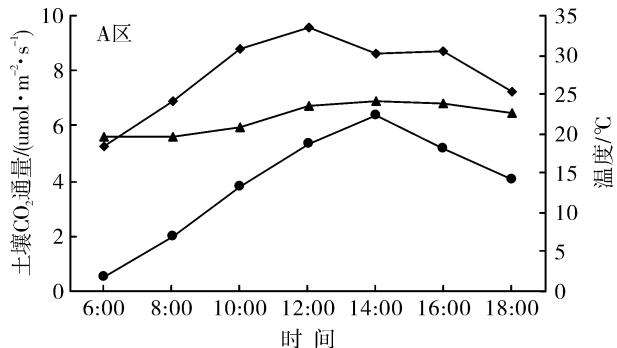

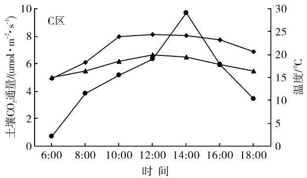

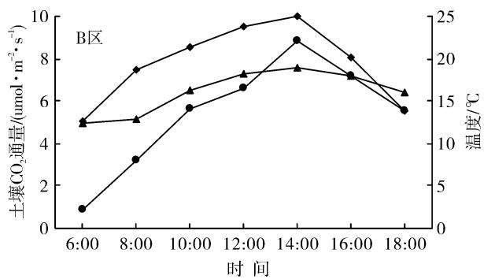

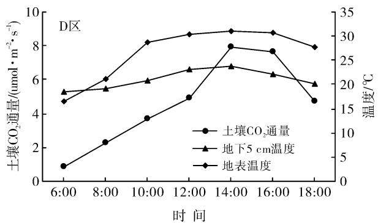  
图1 不同生态修复模式下(植被类型)土壤 $\mathbf { C O } _ { 2 }$ 通量、地表温度及地下5 cm土壤温度的日变化

表2 不同生态修复模式下(植被类型)土壤呼吸的平均值及变异统计
<table><tr><td>研究区</td><td>均值/  $( \mu \mathrm { m o l } \cdot \mathrm { m } ^ { - 2 } \cdot \mathrm { s } ^ { - 1 } )$ </td><td>标准偏差/  $( \mu \mathrm { m o l } \cdot \mathrm { m } ^ { - 2 } \cdot \mathrm { s } ^ { - 1 } )$ </td><td>最大值/  $( \mu \mathrm { m o l } \cdot \mathrm { m } ^ { - 2 } \cdot \mathrm { s } ^ { - 1 } )$ </td><td>最小值/  $( \mu \mathrm { m o l } \cdot \mathrm { m } ^ { - 2 } \cdot \mathrm { s } ^ { - 1 } )$ </td><td>变幅/  $( \mu \mathrm { m o l } \cdot \mathrm { m } ^ { - 2 } \cdot \mathrm { s } ^ { - 1 } )$ </td><td>变异系数/ %</td></tr><tr><td>A</td><td>3.89</td><td>2.04</td><td>6.37</td><td>0.53</td><td>5.84</td><td>52.37</td></tr><tr><td>B</td><td>5.42</td><td>2.65</td><td>8.88</td><td>0.86</td><td>8.02</td><td>48.86</td></tr><tr><td>C</td><td>5.02</td><td>2.80</td><td>9.69</td><td>0.72</td><td>8.97</td><td>55.70</td></tr><tr><td>D</td><td>4.56</td><td>2.60</td><td>7.89</td><td>0.88</td><td>7.01</td><td>56.95</td></tr></table>

在日间的整个观察期内，A区的土壤 $\mathrm { C O _ { 2 } }$ 通量日变化范围为 $0 . 5 3 { \sim } 6 . 3 7 ~ \mu \mathrm { m o l / ( m ^ { 2 } \bullet s ) }$ ，日变化最高值出现在14h，最低值出现在6h，且日变化中最高值约是最低值的12倍；B区的土壤 $\mathrm { C O _ { 2 } }$ 通量日变化范围为 $0 . 8 6 { \sim } 8 . 8 8 ~ \mu \mathrm { m o l / ( m ^ { 2 } \bullet s ) }$ ，日变化最高值出现在14h，最低值出现在6h，且日变化中最高值约是最低值的10倍；C区的土壤 $\mathrm { C O _ { 2 } }$ 通量0.72\~9.69$\mu \mathrm { m o l } / ( \mathrm { m } ^ { 2 } \cdot \mathrm { s } )$ ，日变化最高值出现在14h，最低值出现在6h，且日变化中最高值约是最低值的13倍；D区的土壤 $\mathrm { C O _ { 2 } }$ 通量 $0 . 8 8 { \sim } 7 . 8 9 ~ \mu \mathrm { m o l / ( m ^ { 2 } \bullet \ s ) }$ ，日变化最高值出现在14h，最低值出现在6h，且日变化中最高值约是最低值的9倍。值得注意的是，不同生态修复模式下，下午2点左右时间段的土壤CO₂通量存在显著差异 $( p { < } 0 . \ : 0 5 )$ ，早晚时间段土壤 $\mathrm { C O _ { 2 } }$ 通量不存在显著差异 $( \phi > 0 . 0 5 )$

## 2.2 不同生态修复模式下(覆土厚度)土壤 $\mathbf { C O } _ { 2 }$ 通量日变化

从图2可以看出，不同覆土厚度下样地土壤呼吸速率的日变化格局相似，均呈不对称的单峰曲线[12]。与不同生态修复模式下(植被类型)土壤呼吸速率日变化相似，早上6时至下午15h，随着土壤温度的升高，土壤表层CO₂通量逐渐增加，15时左右达到最高峰，15h后，土壤表层 $\mathrm { C O _ { 2 } }$ 通量又迅速减少，至18h仍高于早晨6 h。

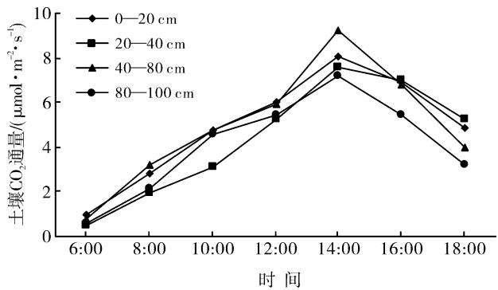  
图2 不同生态修复模式下(覆土厚度)土壤CO₂通量的日变化

因研究区覆土厚度、复垦时间及复垦后土壤熟化程度等因素的差异，土壤呼吸日均值、日变化幅度、最高值和最低值大小存在差异(表3)，不同覆土厚度下土壤表层CO₂通量平均值的大小依次为： $4 0 - 8 0 ~ \mathrm { { c m } }$ $\begin{array} { r } { [ 4 . 9 6 ~ \mu \mathrm { m o l / ( m ^ { 2 } ~ \bullet ~ s ) } ] > 0 - 2 0 ~ \mathrm { c m } \complement 4 . 9 0 ~ \mu \mathrm { m o l / ( m ^ { 2 } ~ \bullet ~ s ) } } \end{array}$ $\bullet \ \mathrm { s ) } 7 { \geq } 2 0 \mathrm { - } 4 0 \ \mathrm { c m } [ 4 . \ 3 6 \ \mu \mathrm { m o l / ( m ^ { 2 } \bullet \ s ) } ] { > } 8 0 \mathrm { - } 1 0 0 ]$ $\mathrm { c m } [ 4 . 0 8 ~ \mu \mathrm { m o l / ( m } ^ { 2 } \cdot \mathrm { s ) } ]$ ，其最大值和变幅的大小顺序也遵循这一顺序，但是其最小值却不符合这一顺序。其中日变化幅度最大的是 $4 0 - 8 0 ~ \mathrm { { \ c m } }$ ，其次是0—20和 $2 0 - 4 0 \mathrm { c m }$ ，变化幅度最小的是80—100cm，基本符合随覆土厚度增加日变化幅度减少。这说明 $\frac { A E } { A E } \pm \frac { E } { A F } \frac { A E } { A X } \times \frac { 1 } { 2 } \pm \frac { A E } { A X } \cos _ { 2 }$ 通量日变化的影响较大，因为对于煤矸石充填复垦土壤，下垫层煤矸石的存在对所覆表土的理化性质、微生物活性，根呼吸速率和有机质的矿化速率产生较大影响。相关研究表明：复垦土壤 $\mathrm { p H }$ 值较大、有机质含量降低、因下垫层煤矸石缓慢氧化而改变整个土壤剖面水气热特征等变化都会对土壤中微生物活性、根及根际微生物呼吸产生限制作用[13-15]。由表2—3可以看出，不同植被类型条件下重构土壤 $\mathrm { C O _ { 2 } }$ 通量日均值的变化区间为3.89～$5 . 4 2 \ \mu \mathrm { m o l / ( m } ^ { 2 } \ \bullet \ \mathrm { s ) }$ ，而不同覆土厚度条件下重构土壤 $\mathrm { C O _ { 2 } }$ 通量日均值的变化区间相对较小，为4.08～$4 . 9 6 ~ \mu \mathrm { m o l / ( m } ^ { 2 } \cdot \mathrm {  ~ s ~ ) }$ ，这说明与植被类型相比，覆土厚度对重构土壤 $\mathrm { C O _ { 2 } }$ 通量影响相对较小，其原因可能与覆土厚度的作用效果部分被植被类型所覆盖有关。总之，综合考虑植被类型和覆土厚度两者的交互影响可以更加全面的了解重构土壤 $\mathrm { C O _ { 2 } }$ 通量的变化及矿区土壤碳通量模型。

表3 不同生态修复模式下(覆土厚度)土壤 $\mathbf { C O } _ { 2 }$ 通量的平均值及变异统计
<table><tr><td>覆土厚度/ cm</td><td>均值/  $( \mu \mathrm { m o l } \cdot \mathrm { m } ^ { - 2 } \cdot \mathrm { s } ^ { - 1 } )$ </td><td>标准偏差/  $( \mu \mathrm { m o l } \cdot \mathrm { m } ^ { - 2 } \cdot \mathrm { s } ^ { - 1 } )$ </td><td>最大值/  $( \mu \mathrm { m o l } \cdot \mathrm { m } ^ { - 2 } \cdot \mathrm { s } ^ { - 1 } )$ </td><td>最小值/  $( \mu \mathrm { m o l } \cdot \mathrm { m } ^ { - 2 } \cdot \mathrm { s } ^ { - 1 } )$ </td><td>变幅/  $( \mu \mathrm { m o l } \cdot \mathrm { m } ^ { - 2 } \cdot \mathrm { s } ^ { - 1 } )$ </td><td>变异系数/ %</td></tr><tr><td>0—20</td><td>4.90</td><td>2.42</td><td>8.03</td><td>0.94</td><td>7.09</td><td>49.39</td></tr><tr><td>20—40</td><td>4.36</td><td>2.62</td><td>7.56</td><td>0.49</td><td>7.07</td><td>60.13</td></tr><tr><td>40—80</td><td>4.96</td><td>2.72</td><td>9.25</td><td>0.75</td><td>8.50</td><td>54.88</td></tr><tr><td>80—100</td><td>4.08</td><td>2.25</td><td>7.17</td><td>0.60</td><td>6.57</td><td>55.04</td></tr></table>

注：0—20 cm 包括 B 区和 D 区；20—40 cm 包括 A 区和 D 区；40—80 cm 包括 A 区，C 区和 D 区；80—100 cm 包括 A 区和 C 区。

## 2.3 土壤 $\mathbf { C O } _ { 2 }$ 通量与地表温度、地下5 cm 土壤温度及土壤含水量的关系

通过对不同生态修复模式下土壤CO₂通量与地表温度、地下5cm土壤温度及土壤含水量进行了回归分析，结果表明：土壤 $\mathrm { C O _ { 2 } }$ 通量与地表温度和地下5 cm土壤温度呈极显著指数正相关关系，其中与地表温度的拟合效果优于地下5 cm土壤温度；与土壤含水量呈显著二次方函数关系(除C区外)(表4)。

表4 不同生态修复模式下土壤呼吸与环境因子的拟合模型
<table><tr><td>生态修复模式</td><td>环境因子</td><td>模型</td><td>相关系数 R2</td><td>显著水平  $\boldsymbol { \phi }$ </td><td>N</td></tr><tr><td rowspan="3">A</td><td>地表温度</td><td> $Q { = } 0 . \ 0 7 2 \ 7 \mathrm { e } ^ { 0 . 1 3 4 \ 6 3 \ T }$ </td><td>0.63535</td><td> $\mathit { p } { < } 0 . \ : 0 1$ </td><td>42</td></tr><tr><td>地下 5 cm 土壤温度</td><td> $Q { = } 0 . \ 0 3 1 \ 1 \mathrm { e } ^ { 0 . 2 0 7 \ 3 9 \ T }$ </td><td>0.34351</td><td> $\mathit { p } { < } 0 . \ : 0 1$ </td><td>42</td></tr><tr><td>土壤含水量</td><td> $Q \mathrm { = } 0 . 0 3 9 \ 7 2 W ^ { 2 } \mathrm { - } 1 . 7 6 6 \ 9 W \mathrm { + } 2 3 . 2$ </td><td>0.44267</td><td> $\mathit { p } { < } 0 . \ : 0 1$ </td><td>30</td></tr><tr><td rowspan="3">B</td><td>地表温度</td><td> $Q { = } 0 . \ 4 0 4 \ 8 6 \ \mathrm { e } ^ { 0 . 1 2 2 \ 7 2 \ T }$ </td><td>0.47864</td><td> $\mathit { p } { < } 0 . \ : 0 1$ </td><td>28</td></tr><tr><td>地下 5 cm 土壤温度</td><td> $Q { = } 0 . \ 0 6 0 \ 2 6 \ \mathrm { e } ^ { 0 . 2 6 7 \ 1 5 \ T }$ </td><td>0.69851</td><td> $\mathit { p } { < } 0 . \ : 0 1$ </td><td>28</td></tr><tr><td>土壤含水量</td><td> $Q \mathrm { = } 0 . \ 0 3 3 \ 3 6 W ^ { 2 } + 0 . \ 9 2 8 \ 5 3 W \mathrm { - } 0 . \ 6 7 4 \ 2 7$ </td><td>0.21306</td><td> $\mathit { p } { < } 0 . \ : 0 5$ </td><td>20</td></tr><tr><td rowspan="3">C</td><td>地表温度</td><td> $Q { = } 0 . \ 0 9 3 \ 9 6 \ \mathrm { e } ^ { 0 . 1 7 4 \ 4 4 \ T }$ </td><td>0.60039</td><td> $\mathit { p } { < } 0 . \ : 0 1$ </td><td>42</td></tr><tr><td>地下 5 cm 土壤温度</td><td> $Q = 0 . \ 0 2 1 \ 9 \ \mathrm { e } ^ { 0 . 2 9 3 \ 3 1 \ T }$ </td><td>0.476 27</td><td> $\mathit { p } { < } 0 . \ : 0 1$ </td><td>42</td></tr><tr><td>土壤含水量</td><td> $Q \mathrm { = } 0 . 0 7 7 ~ 1 5 W ^ { 2 } \mathrm { - } 2 . 5 5 1 W \mathrm { + } 2 5 . 9$ </td><td>0.08037</td><td> $_ { p > 0 . 0 5 }$ </td><td>30</td></tr><tr><td rowspan="3">D</td><td>地表温度</td><td>Q=0.089 48 e0. 138 02 T</td><td>0.832 35</td><td> $\mathit { p } { < } 0 . \ : 0 1$ </td><td>35</td></tr><tr><td>地下 5 cm 土壤温度</td><td> $Q { = } 0 . \ 0 2 2 \ 0 3 \ \mathrm { e } ^ { 0 . 2 4 2 \ 5 1 \ T }$ </td><td>0.47935</td><td> $\mathit { p } { < } 0 . \ : 0 1$ </td><td>35</td></tr><tr><td>土壤含水量</td><td> $Q { = } 0 . 0 4 7 ~ 3 3 W ^ { 2 } { - } 1 . 7 2 2 ~ 1 W { + } 1 9 . 6 $ </td><td>0.36607</td><td> $\mathit { p } { < } 0 . \ : 0 1$ </td><td>25</td></tr></table>

对于不同生态修复模式，不同环境因子对土壤$\mathrm { C O _ { 2 } }$ 通量的影响程度存在一定的差异。A区土壤

CO2通量与地表温度相关性最好 $( R = 0 , 8 0 )$ ,其次为土壤含水量 $( R = 0 . 6 7 )$ ，地下 5 cm土壤温度(R=0.59)相关性最差；B区土壤CO2通量与环境因子的关系强弱依次为：地下5cm土壤温度$( R { = } 0 . 8 4 ) \mathrm { > }$ 地表温度 $( R = 0 . 6 9 ) >$ 土壤含水量$( R { = } 0 . 4 6 ) ; \mathrm { C }$ 区：地表温度(R=0.77)>地下5 cm土壤温度 $( R = 0 . 6 9 ) >$ 土壤含水量 $( R = 0 , 2 8 )$ , D 区地表温度 $( R = 0 . 9 1 ) >$ 地下 5 cm 土壤温度$( R { = } 0 . 6 9 ) ^ { \sum }$ 土壤含水量 $( R { = } 0 . 6 1 )$ 。因生态修复模式存在差异，地表温度、地下 $5 ~ \mathrm { c m }$ 土壤温度及土壤含水量对土壤 $\mathrm { C O _ { 2 } }$ 通量的影响程度也存在差异，但仍存在一定相似性，研究发现土壤 $\mathrm { C O _ { 2 } }$ 通量与地下 $5 ~ \mathrm { c m }$ 土壤温度和地表温度的相关关系均较强(表4），这2个层次的温度变化通过影响植物生长而影响植物群落生物量、碳素的同化和分配能力、微生物和根系的数量和活性来间接调控土壤呼吸速率[16-18]。

## 3 讨论与结论

## 3.1 植被类型和覆土厚度对重构土壤呼吸的影响

土壤CO2排放(也被称为地下部分呼吸)是土壤中生物代谢和生物化学过程等所有因素的综合产物，来源于3个生物过程(植物根呼吸、土壤微生物呼吸和土壤中活的有机体呼吸)和一个非生物过程(土壤中碳素的化学氧化过程 $) ^ { [ 1 9 ] }$ 。其中植物根系呼吸和土壤微生物呼吸释放的 $\mathrm { C O _ { 2 } }$ 量占土壤呼吸释放总量的比重较大，因此，所有影响植物根系和土壤微生物生长的因素都会对土壤呼吸产生较大影响。煤矸石充填复垦技术应用于淮南矿区打破了原有生态系统土壤与大气之间的碳循环，一方面，对土地的剧烈扰动加速了碳的排放，另一方面又将煤矸石所含有的大量的碳固定于土壤。所以土壤呼吸特征即相似于其他自然生态系统，又区别于其他自然生态系统。

土壤CO2通量因生态修复模式的不同而 $\vec { \cal J } ^ { \pm }$ 生差异，其中B区土壤 $\mathrm { C O _ { 2 } }$ 通量日均值最大$5 . 4 2 \ \mu \mathrm { m o l / ( m } ^ { 2 } \ ^ { \bullet } \ \mathrm { s ) }$ ，分别比A，C，D区高出39.3%，8.0%，18.9%，且A和C区差异显著 $( \phi { < } 0 . \ : 0 5 )$ ,与B区差异极显著 $( \phi { < } 0 . 0 1 )$ ，其他区之间差异不显著$( \phi > 0 . 0 5 )$ (见表2)。

不同生态修复模式通过改变群落生产力而改变土壤 $\mathrm { C O _ { 2 } }$ 通量，群落生 $\vec { \cal J } ^ { \pm }$ 力的大小反映该生态系统光合作用所固定的碳量，进而决定植被凋落物通过一系列生物化学作用返回到土壤中有机质的量。

大多数研究表明 $[ 2 0 - 2 1 ]$ ，土壤 $\mathrm { C O _ { 2 } }$ 释放的本质是有机质的转化，有机质的多少决定了土壤呼吸的强弱。4种生态修复模式下土壤 $\mathrm { C O _ { 2 } }$ 通量日均值大小为：灌木林>乔木林>草地(图1）。造成这种差异的原因可能有：（1）塌陷区充填基质存在差异，从而导致其对上覆土壤的理化性质、微生物种类及活性产生的影响不同；（2）利用填充基质充填后上覆土层的厚度不同，由于覆土厚度的差异会导致填充基质对上层土壤的影响亦存在差异；（3）修复区采用不同的植被种植，植被自身呼吸速率的差异以及微生物对枯枝落叶分解速率的差异也会导致监测时土壤 $\mathrm { C O _ { 2 } }$ 通量日均值存在差异。

与自然土壤不同，煤矸石充填复垦重构土壤 $\mathrm { C O _ { 2 } }$ 通量还受覆土厚度和施工中的压实等因素的影响。本研究结果表明：不同覆土厚度下土壤表层 $\mathrm { C O _ { 2 } }$ 通量平均值的大小依次为： $4 0 - 8 0 ~ \mathrm { c m } { > } 0 { - } 2 0 ~ \mathrm { c m } { > } 2 0 { - }$ $4 0 ~ \mathrm { c m } { > } 8 0 { - } 1 0 0 ~ \mathrm { c m }$ ，日变化幅度最大的是 $4 0 { - } 8 0$ $\mathrm { c m }$ ，其次是0—20和20—40cm，变化幅度最小的是$8 0 { - } 1 0 0 ~ \mathrm { c m }$ ，基本符合随覆土厚度增加日变化幅度减少，这说明除了植被类型，覆土厚度对土壤 $\mathrm { C O _ { 2 } }$ 通量影响较大，综合考虑两者的交互影响能更加全面的了解复垦区土壤碳通量模型。压实问题是煤矸石充填复垦区普遍存在的现象[22-24]，但土壤容重作为土壤物理性质的综合表现，其大小会直接或间接决定土壤水、气孔隙度，微生物活性、根部穿透能力和土壤物理功能[25-26]，进而对土壤 $\mathrm { C O _ { 2 } }$ 通量产生影响。何娜等[27]以落叶松人工林为研究对象，发现压实程度与土壤表面CO₂通量存在负相关性。

## 3.2 土壤温度和土壤含水量对重构土壤呼吸的影响

土壤 $\mathrm { C O _ { 2 } }$ 释放是一个与土壤温度、含水量、植被类型、覆土厚度及有机质等因子密切相关的复杂的生态过程，其各个因子之间是相 $\overline { { \boldsymbol { \mathbf { \nabla } } \boldsymbol { \mathbf { \textmu } } \boldsymbol { \mathbf { \Sigma } } } }$ 影响、相互作用[28」。一些研究认为土壤温度可以解释土壤呼吸的大部分变异，是影响土壤呼吸的主控因子。本研究中，地表温度和地下5cm土壤温度均与土壤呼吸呈指数函数关系，这与大多数研究结果相一致[29-30]。

杨金艳等[31]通过对东北次生林区6个典型的森林生态系统的土壤表面 $\mathrm { C O _ { 2 } }$ 通量及其与土壤水热因子的相关性进行研究，发现土壤温度、土壤含水量及其交互作用是影响土壤呼吸的主要环境因子，因此，生态系统土壤表层 $\mathrm { C O _ { 2 } }$ 通量估算时要综合考虑土壤水热条件因素。

李小宇等32认为，黄土丘陵人工林坡地土壤$\mathrm { C O _ { 2 } }$ 通量与土壤温度、土壤水分仅在夏季有显著相关性，但本研究土壤 $\mathrm { C O _ { 2 } }$ 排放速率与土壤温度在春季也有显著相关性，二者结果不一致。这可能是因为黄土丘陵地区独特的小区域气候和陡坡地形，并且夏季水蚀(面蚀)过程强烈会导致土壤有机质和水分的重新分配，而该地区土壤 $\mathrm { C O _ { 2 } }$ 排放速率的空间变化分布主要受地形剖面和土壤侵蚀再分布过程的控制。

土壤含水量是土壤呼吸的另一个重要的影响因子。一般情况，只考虑含水量对土壤呼吸的影响效果较差，而综合考虑土壤温度和含水量的交互作用可以达到更好的拟合效果，这一结论在大多数研究[31-33]中得到证实。本研究中，土壤表面CO2通量与土壤含水量呈二次方函数关系，且均达到显著差异(除C区外），这可能是因为土壤水分通过影响土壤溶解性有机质的变化、植物和微生物能量的分配及土壤透气性、植物根系生长来间接改变土壤呼吸的变化[2]。

## 参考文献]

[1] Raich J W, Potter C S. Global patterns of carbon dioxide emissions from soils[J]. Global Biogeochemical Cycles, 1995,9(1):23-36.

[2]王铭.松嫩平原西部盐碱化生态系统土壤呼吸特征及土壤 $\mathrm { C O _ { 2 } }$ 无机通量研究[D].中国科学院研究生院，2014.

[3] Maier C A, Albaugh T J, Lee Allen H, et al. Respiratory carbon use and carbon storage in mid-rotation loblolly pine(Pinus taeda L. )plantations: The effect of site resources on the stand carbon balance [J]. Global Change Biology, 2004,10(8):1335-1350.

[4] Schlesinger W H, Andrews J A. Soil respiration and the global carbon cycle[J]. Biogeochemistry, 2000,48(1) :7-20.

[5] Luo Yiqi，Zhou Xuhui. 土壤呼吸与环境[M]. 姜丽芬，曲来叶，周玉梅，等译.北京：高等教育出版社，2007.

[6] Raich J W, Schlesinger W H. The global carbon dioxide flux in soil respiration and its relationship to vegetation and climate[J]. Tellus Series B: Chemical and Physical Meteorology,1992,44(2):81-99.

[7] Yan Wende, Xu Wangming, Chen Xiaoyong, et al. Soil CO2 flux in different types of forests under a subtropical microclimatic Environment[J]. Pedosphere, 2014, 24 (2):243-250.

[8]陈盖，许明祥，张亚锋，等.黄土丘陵区不同有机碳背景下侵蚀坡面土壤呼吸特征[J].环境科学，2015，36(9)：3383-3392.

[9]梁福源，宋林华，王静.土壤 $\mathrm { C O _ { 2 } }$ 浓度昼夜变化及其对土壤CO2排放量的影响J.地理科学进展，2003，22（2)：170-176.

[10]欧强，王江涛，周剑虹，等.滨海湿地不同水位梯度下的土壤CO2通量比较[J].应用与环境生物学报，2014，20(6):992-998.

[11]常宗强，冯起，司建华，等.祁连山不同植被类型土壤碳贮量和碳通量[J].生态学杂志，2008,27(5)：681-688.

12陈孝杨，王芳，严家平，等.覆土厚度对矿区复垦土壤呼

吸昼夜变化的影响J].中国矿业大学学报，2016，45(1):163-169.

[13]张杰琼，方凤满，余健，等.淮南大通矿区复垦土壤微生物量碳氮的分布特征[J].水土保持通报，2014，34(3)：267-270.

[14] 董霁红，王莹.煤矿塌陷区废碴充填复垦土壤理化性质研究[J].矿业研究与开发，2008,28(1)：68-70,88.

[15]田晔，刘小燕，张明旭.微生物促进煤矸石复垦利用研究现状与展望[J].硅酸盐通报，2015，34（9）：2529-2533.

[16]丁访军，聂洋，高艳平，等.黔中喀斯特地区5种林型冬季土壤呼吸研究[J].水土保持通报，2010，30（1）：11-16.

[17]林莉萨，韩士杰，王跃思.长白山阔叶红松林土壤 $\mathrm { C O _ { 2 } }$ 释放通量[J].东北林业大学学报，2005，33(1)：11-13.

[18]杨文佳，李永夫，姜培坤，等.亚热带毛竹人工林土壤呼 吸组分动态变化及其影响因素[J].应用生态学报， 2015,26(10):2937-2945.

[19] 刘意立.我国亚热带季风气候区湿地土壤 $\mathrm { C O _ { 2 } } , \mathrm { C H }$ 排放规律研究[D].浙江杭州：浙江大学，2014.

[20]沈征涛，王宝军，施斌，等.温湿度对土壤 $\mathrm { C O _ { 2 } }$ 释放影响的试验研究J.南京大学学报：自然科学版，2012，48(6):761-767.

[21]李涛，李芹，王树明，等.云南河口不同林龄人工橡胶林土壤CO2浓度的变化规律及其影响因素[J]. 热带作物学报，2015,36(1):9-15.

[22]戚家忠，胡振琪，赵艳玲.铲运机复垦重构土壤容重值的时空变异特性[J].中国矿业大学学报，2005，34(4)：467-471.

[23]曹银贵，白中科，张耿杰，等.山西平朔露天矿区复垦农用地表层土壤质量差异对比[J].农业环境科学学报，2013,32(12):2422-2428.

[24]张学礼，胡振琪，初士立.矿山复垦土壤压实问题分析[J].能源环境保护，2004,18(3):1-4.

[25] Rosenzweig S T, Carson M A, Baer S G, et al. Changes in soil properties, microbial biomass, and fluxes of C and N in soil following post-agricultural grassland restoration [J]. Applied Soil Ecology, 2016, 100: 186-194.

「26刘晚苟，李良贤，谢海容，等.土壤容重对野生香根草幼苗根系形态及其生物量的影响[J].草业学报，2015，24(4):214-220.

[27]何娜，王立海，孟春.压实对落叶松人工林夏季土壤呼吸日变化的影响[J].应用生态学报，2010，21（12）：3070-3076.

(下转第 52 页)

# 西北地区种植甘草对土壤次生盐渍化的影响

李昂1，吴应珍2，马明广1，张鸣1，孙海丽1，闫立本3

（1.兰州城市学院化学与环境工程学院，甘肃兰州730070；

2.甘肃农业大学人文学院，甘肃兰州730070；3.甘肃酒泉科技示范农场，甘肃酒泉735000)

摘要：[目的]研究西北地区植被特征指标与土壤表层盐含量、碱性间的相互关系，为该区土壤次生盐渍化防治工作提供科学依据。「方法以甘草(Glycyrrhiza uralensis)植被和其下部土壤为研究对象，通过测定甘草植被的盖度、高度、地上生物量和其下部土壤表层(0—5cm)的含水率、pH值、电导率、盐含量等指标，并利用SPSS统计软件进行分析。结果甘草植被的盖度、高度、地上生物量和其下部土壤的含水率均随甘草生长年限的增加呈显著升高的趋势(p<0.05)，而土壤的pH值、电导率、盐含量正好相反，均表现出显著降低的趋势(p<0.05)；相关分析结果显示，耕地表层土壤的pH值、盐含量与甘草植被特征指标间呈显著的负相关关系，相关系数的大小顺序均为：植被盖度>植株高度>地上生物量；回归分析显示，土壤pH值和盐含量与甘草植被的这3个性状指标间均表现为负线性函数关系，甘草植被的盖度、高度、地上生物量每提高1个单位，可使土壤表层的pH值分别下降0.012，0.011和0.002，盐含量分别降低0.108，0.107，0.015g/kg。「结论西北干旱地区耕地中种植甘草对其下部土壤表层的盐含量和碱性(pH值)影响显著，其中植被的盖度对表层土壤的盐碱影响最大；从耕地表层抑盐角度考虑，应优先选择种植枝叶稠密、植株高大的作物。

关键词：植被覆盖；土壤的次生盐渍化；土壤盐含量；甘草

文献标识码：A

文章编号：1000-288X(2016)06-0047-06

中图分类号：S157

文献参数：李昂，吴应珍，马明广，等．西北地区种植甘草对土壤次生盐渍化的影响[J]．水土保持通报，2016,36(6):047-052.DOI:10.13961/j. cnki. stbctb.2016.06.008

# Effects of Glycyrrhiza Uralensis Plantation on Soil Secondary Salinification in Northwest China

LI Ang1 , WU Yingzhen2 , MA Mingguang1 , ZHANG Ming1 , SUN Haili¹ , YAN Liben³ (1. School of Chemistry and Environmental Engineering, Lanzhou City University , Lanzhou, Gansu 730070, China; 2. College of Humanities, Gansu Agricultural University, Lanzhou, Gansu 730070, China; 3. Jiuquan Science Demonstration Farm in Gansu Provence , Jiuquan, Gansu 735000, China)

Abstract: [Objective] The relationship between salinification and alkaline of topsoil and vegetation cover was analyzed to provide scientific basis for the prevention and control of soil secondary salinization in this area. [Methods] Plant height, aboveground biomass of glycyrrhiza community and soil moisture, pH value, salt content in soil surface(0—5 cm) were measured. The relationships between indexes of vegetation characteristics and physical and chemical indexes of topsoil through measuring vegetation coverage were analyzed. [Results With the extension of growing years, the vegetation coverage, plant height and aboveground biomass of Glycyrrhiza uralensis appeared an increasing trend. On the contrary, salt content and pH value of topsoil indicated a decreasing trend. Correlation analysis displayed, there was a negative relation between soil salt content and pH value of topsoil and all indexes of vegetation characteristics. Correlation coefficients ranked as vegetation coverage> plant height > aboveground biomass. Regression analysis indicated, salt content and pH value of topsoil and indexes of vegetation characteristics all showed a negative linear relation. When coverage, height and aboveground biomass of Glycyrrhiza uralensis vegetation each increased one

unit, pH values of topsoil decreased 0. 012, 0.011 and 0. 002, salt content of topsoil decreased 0. 108, 0. 107 and 0. 015 g/kg. [Conclusion Vegetation significantly influenced salt content and pH value of topsoil. The most influence index is vegetation. When only considering the restraining of soil salt, those crops with more branches and leaves, and with high stalks should be selected.

Keywords: vegetation coverage; soil secondary salinification; soil salt content; Glycyrrhiza uralensis

西北地区自然环境恶劣，这里气候干旱、降雨稀少、太阳辐射强烈、土壤盐含量相对较高，对农作物的定期灌溉就成了保证农业持续发展的一项重要举措。在灌溉过程中，因灌溉不当(如大水漫灌)而引发的土壤次生盐渍化问题为该区农业可持续发展所面临的主要障碍之一[1-2]。许多研究[3-4]发现，干旱、半干旱灌区耕地中的水盐运动表现出季节性的积盐和脱盐过程的交互更替，即春季蒸发积盐，夏季淋溶脱盐，秋季蒸发积盐，冬季冻结稳定。以往治理土壤盐碱大多采用水利工程措施，这不仅工程规模大、费用高，而且，改良过程中除把盐离子淋溶外，同时也排走植物必需的一些矿质元素(如Fe，N，P等)[5]。在西北地区采取引水洗盐来治理土壤盐碱，不仅浪费宝贵的水资源和流失土壤肥力，而且还有可能使下游耕地的地下水位升高，加重其盐碱危害[6]。盐碱地的改良不仅要降低土壤盐含量，还要提高土壤肥力3]。鉴于以上认识，近年来，盐碱地的生物治理受到广大科技工作者的关注[7-8]。如蔺海明等[7]研究发现，与裸地相比，种植毛苕子可使耕地0—20 cm土层盐含量降低77.7%～88.3%；彭红春等[9]在治理柴达木盆地弃耕盐碱地时发现，建植人工混播草地不仅能提高植被的盖度和地上生物量，而且还能显著降低0—30cm土层的盐含量；李昂等[10]研究也发现，当耕地种植小麦、小麦/毛苕子、红豆草后，在其生长期间土壤表层(0—20cm)的盐含量均比裸地低；当单作小麦处理中的春小麦收获后，其表层土壤盐含量快速升高，秋末时表层含盐量甚至比裸地的还高。从以上研究可以看出，前人在生物措施治理土壤盐碱方面已做了大量研究，但有关植被性状特征与土壤表层盐含量间到底有怎样的定量关系，以及植被的哪些性状指标对土壤盐碱影响最为明显等有关问题却鲜有文献报道。甘草(Glycyrrhiza uralensis)为豆科多年生草本或亚灌木，主要分布于光照充足、昼夜温差较大、雨量较少的荒漠与半荒漠地区，具有抗寒、抗旱和耐热、耐盐碱等特点。甘草广泛用于医药、食品、日用化工、畜牧养殖等产业，是社会需求最大的中药材。随着甘草野生资源的急剧减少和各地禁止乱挖滥采，人工栽培甘草面积不断扩大。为了提高农民收入、保护生态环境，甘肃酒泉地区政府根据市场需求和当地环境条件，积极引导农民调整农业种植结构，大力推广甘草种植。鉴于甘草植被在生态建设中具有固沙、固土、改善土壤肥力等作用，针对西北地区耕地春、秋季积盐的特点，试验以甘草植被和其下部土壤为研究对象(图1)，通过测定不同生长年限甘草植被的盖度、高度、地上生物量和其下部土壤表层(0—5 cm)的含水率、电导率、盐含量，来揭示种植甘草对土壤盐碱的影响，以及土壤表层盐含量与甘草植被间的相互关系，旨在为西北地区采取生物措施预防土壤次生盐渍化提供科学依据。

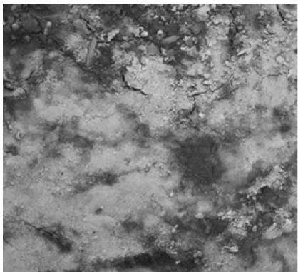  
裸地

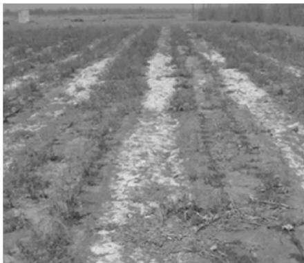  
甘草生长1a耕地  
图1 春季同一地块中裸地及甘草地的盐碱状况

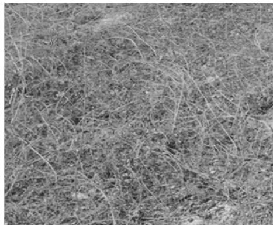  
甘草生长3a耕地

## 1 试验区概况

试验地点位于甘肃酒泉科技示范农场(39°33′12"N，

99°03′06"E)，该区气候属中温带沙漠干旱性气候类型，年日照时数3288h，年有效积温1800～3600℃，降水量年均83mm（主要集中于6,7,8月

这3个月），蒸发量年均2511mm，干燥指数>4，土壤类型为棕漠土和风沙土[11]。

## 2 试验设计及测定

每年4月中旬农场利用播种机、并采用条播方式播种甘草(施肥和播种同步进行），播种行距40cm、株距10 cm，密度25万株/ $^ { \prime } \ \mathrm { h m } ^ { 2 }$ 。为了维持甘草正常生长，每年4月初按每 $1 \ \mathrm { h m ^ { 2 } }$ 过磷酸钙 750 kg、尿素$3 0 0 ~ \mathrm { k g }$ 、钾肥 $1 5 0 ~ \mathrm { k g }$ 量撒播施肥，同时引祁连山融化雪水漫灌甘草地，此后5—8月的每月月初利用地下水浇灌耕地(漫灌水深10cm左右），地下水盐含量在$1 \mathrm { { \sim } 2 \ g / L }$ 范围变化[12]。甘草地及未耕种地根据杂草生长状况定期除草，甘草地的其他田间管理依据甘草栽培常规管理措施进行。根据农场甘草生长3～4a后采收的实际情况，试验采取空间序列替换时间序列的研究方法[13]，即首先在该农场的同一地块中选取未耕种(CK)和甘草已生长1～4a的地块共5块样地(每块样地的面积约 $\mathrm { ~ 2 ~ 0 0 0 ~ m ^ { 2 } } )$ 。然后分别于2012年9月30日和2013年4月30日在每个样地中随机设置4个大小 $1 \mathrm { ~ m ~ } { \times } 1 \mathrm { ~ m ~ }$ 的样方，并采用常规方法测定样方内甘草植被的盖度、高度和地上生物量[14-15]。地上部分测试完后再用土钻钻取0—5 cm土层的土样，并利用所取土样测定土壤的含水率、pH值、电导率和盐含量(取土样前1月均未灌水)。土壤含水率采用烘干法，土壤的 $\mathrm { p H }$ 值和电导率采用水土比5:1的悬液和浸提液分别用酸度计和电导率仪直接测定，土壤盐含量采用残渣烘干法测定[16]。

试验所得数据采用SPSS 13.0统计软件进行统计分析，即各指标分别进行单因素方差分析，若差异显著再用S-N-K方法进行不同水平间的多重比较；多个因素间的相关分析采用Pearson法，并用双尾检测的方法检验其显著性；图表采用Excel 2003 软件进行制作[11,13」

## 3 结果与分析

## 3.1 不同生长年限甘草植被的特征

就甘草植被的盖度而言（图2)，2012年9月测定结果显示，甘草生长1a样地中的植被盖度最低、仅为18.8%，而甘草生长2,3，4a样地中的盖度分别提高到29.8%，68.3%，84%；4月末测定结果同样显示 $, 2 \sim 4 \mathrm { ~ a ~ }$ 样地中的甘草植被盖度仍比1 a样地中盖度提高近0.9，4.8，5.6倍。对于植被高度而言（图2)，在秋末和翌年春季2次测定的时间点，4a样地中的甘草植被高度均最高，3，2，1a样地中的植被高度分别比4a样地的降低近6.7%，57.9%，79.7%和23.8%，60.2%,87.6%。对于甘草植被的地上生物量而言(图2)，首次测定结果显示，甘草生长1a样地中的地上生物量仅为118.4 $\mathrm { g / m ^ { 2 } }$ ，而2～4a样地中分别为212.8,493.6,614.3 $\mathrm { g / m ^ { 2 } }$ ，分别比1a样地中的量提高近0.8,3.2，4.2倍；翌年4月测定结果同样显示相似趋势。

从以上测定结果还可看出（图2），尽管经秋末至翌年春季的风力作用，甘草地中的部分枯枝落叶被风吹蚀，甘草植被的盖度、高度、地上生物量均有不同程度的下降，但2次的结果均显示，随着甘草生长年限的增加，甘草植被的盖度、高度、地上生物量均呈升高趋势，且不同年际间表现出显著差异 $( \phi { < } 0 . \ : 0 5 )$ o

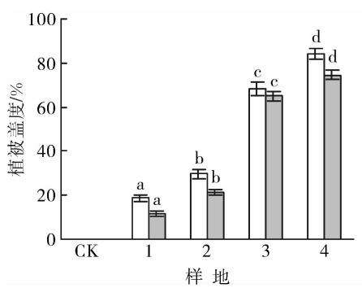

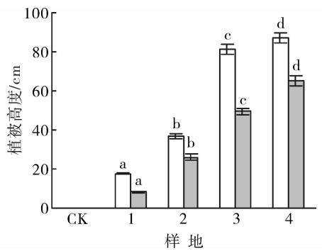

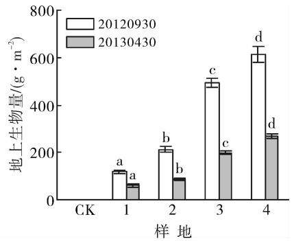  
注：样地CK为裸地；1—4为甘草生长1～4a样地；同一测定时间不同处理上的不同字母表示差异达到显著(p<0.05)。下同。  
图2 不同样地中甘草植被的群落特征

## 3.2 甘草植被下方土壤的含水率及盐碱含量

就土壤的含水率而言（图3），首次测定(2012年9月)结果显示，裸地(CK)表层土壤 $\left( \mathrm { 0 - 5 ~ c m } \right)$ 的含水率仅为2.73%，而甘草生长样地中的土壤含水率均比裸地高，甘草生长1～4a样地中的含水率分别比裸地提高近0.3，0.7,1.1，1.5倍，即随着甘草生长年限的增加，耕地地表的含水率表现出显著升高的趋势 $( p { < } 0 . \ : 0 5 )$ ;第2次测定(2013年4月)同样也表现出相同的趋势。其原因可能是：秋末和初春季节，该地阳光充足，由于耕地表层覆盖有甘草枝叶(或枯枝落叶)，减弱了太阳光对地表的直接照射和土壤水分的自然蒸发，从而使甘草地地表的土壤含水率较裸地高；就甘草地而言，随着甘草生长年限的增加，地表的枯枝落叶覆盖量显著增加，地表水分蒸发明显减少，从而甘草地地表的含水率表现出显著升高的趋势。类似研究如王学芳等[17]也发现，4月初春播地（裸地)的表层土壤 $\left( 0 { - } 5 ~ \mathrm { c m } \right)$ 含水率仅为4.2%，而地表覆盖有冬小麦和冬油菜枯叶的表层土壤含水率达8.5%和11.8%。对于土壤的 pH值而言(图3)，其变化趋势正好相反，2012年9月末测定结果显示，裸地的pH值最高、达8.83，而种植甘草样地中的pH值均比裸地低，甘草生长1，2，3，4a样地中的pH值分别比裸地降低近2.3%，2.9%，7.6%和11.5%，即随着甘草生长年限的增加，甘草样地中的pH值表现出降低趋势；翌年4月测定结果的变化趋势也与9月类似。就土壤的电导率而言（图3），其变化趋势与pH值类似，裸地的均值仍最高，而甘草生长1，2，3，

4a样地中的电导率均值分别比裸地均值降低了33.2%,70.2%,81.5%，93.8%，即表层土壤的电导率随着甘草生长年限的延长呈显著降低趋势$( \phi { < } 0 . \ : 0 5 )$ 。对于土壤表层的盐含量而言(图3)，甘草地表层的可溶性盐含量均比裸地低，甘草生长1～4a样地中的盐含量均值分别为7.21，3.45，1.83，1.63g/kg，分别比裸地均值降低了37.3%，70%，84.1%,85.9%，即随着甘草生长年限的增加，耕地表层土壤的盐含量表现出明显降低的趋势 $( \phi { < } 0 . \ : 0 5 )$ 产生这种变化趋势的原因可能是由于甘草地地表覆盖有枯枝落叶，减少了土壤水分的自然蒸发(即提高了表层土壤的含水率)和随水上移到土壤表层的盐分积累，从而使甘草地表层的盐含量明显低于裸地；就甘草地而言，随着甘草生长年限的增加，样地地表的枯枝落叶覆盖量显著增加，地表水分蒸发明显减少(即地表水分含量明显提高)，从而使得样地表层土壤含盐量显著降低。这一变化趋势从图1中裸地、甘草生长1 a和3 a样地的表层盐碱分布情况中可以得到直观验证。

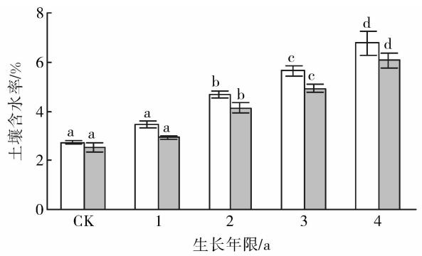

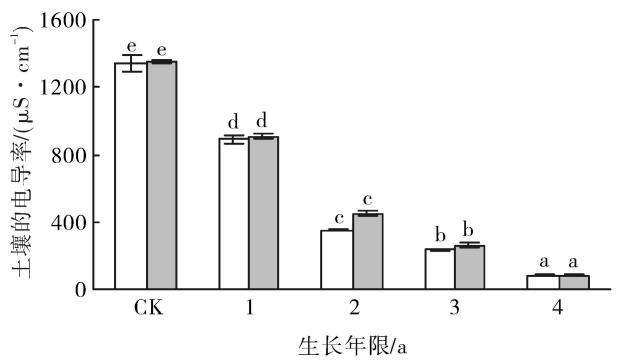

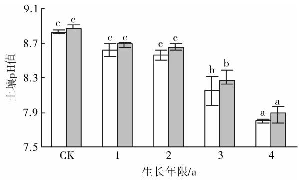

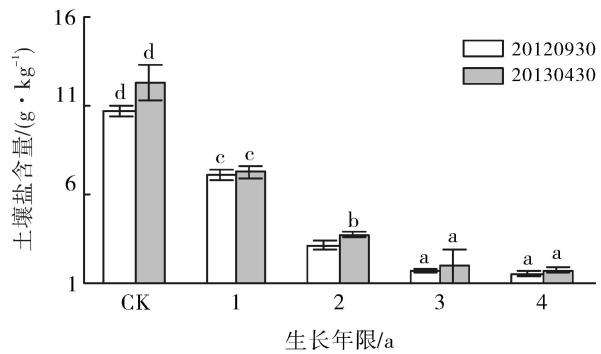  
图 3 不同样地土壤表层(0—5 cm)的含水率及盐碱含量

## 3.3 土壤盐碱与植被特征指标间的相互关系

相关分析显示(表1），甘草植被的盖度、高度和地上生物量任意二者间均表现为显著正相关关系$( p { < } 0 . \ : 0 5 )$ ，其中盖度与高度间相关系数最大$( r { = } 0 . 9 5 8 )$ ，其次依次为高度与地上生物量、盖度与地上生物量；表层土壤含水率与甘草植被的特征指标间均表现出正相关关系，其中土壤含水率与甘草植被盖度间相关系数最高 $( r { = } 0 . 9 1 2 )$ ，而土壤含水率与土壤的 $\mathrm { p H }$ 值、电导率、盐含量间均表现出负相关关系；对于pH值而言，其与甘草植被特征指标间均表现出负相关关系，其中甘草植被盖度与pH值间相关性最强 $\left( r = - 0 . 9 1 0 \right)$ ；对于电导率和含盐量而言，二者间表现出显著的正相关关系(r=0.975)，而它们与甘草植被的特征指标间均表现出显著的负相关关系，其中盖度与二者间的相关性最强（r=一0.896，r=一0.862)。回归分析结果显示，土壤含水率与甘草植被的盖度(r=0.912)、高度(r=0.870)、生物量$( r { = } 0 . 7 8 4 )$ 间分别存在显著的正线性回归关系，其中土壤含水率与植被盖度间的相关系数最大；甘草植被盖度每提高1%，可使表层土壤含水率提高0.043%。对于土壤的pH值而言(图3)，其与甘草植被的盖度(r=—0.910)、高度（r = — 0.873)、生物量（r =一0.865)间表现出负线性回归关系，其与植被盖度间的相关系数仍为最大；盖度每提高1%，可使耕地表层土壤的pH值降低0.012。对于耕地表层的含盐量而言，它与甘草植被的盖度（r=一0.862）、高度（r=—0.862）、生物量（r=—0.742）间也表现为负线性回归关系，其中盖度与含盐量间的相关系数依然最大；盖度每降低1%，可使表层土壤盐含量提高0.108 g/kg。

表1 甘草植被特征指标与土壤盐碱含量间的相关分析
<table><tr><td>指标</td><td>盖度</td><td>高度</td><td>地上生物量</td><td>土壤含水率</td><td>pH值</td><td>电导率</td><td>盐含量</td></tr><tr><td>盖度</td><td>1</td><td>0.958**</td><td>0.872**</td><td>0.912**</td><td>-0.910**</td><td>-0.896**</td><td>-0.862**</td></tr><tr><td>高度</td><td></td><td>1</td><td>0.943**</td><td>0.870**</td><td>-0.873**</td><td>-0.894**</td><td>-0.862 **</td></tr><tr><td>地上生物量</td><td></td><td></td><td>1</td><td>0.784**</td><td>-0.818**</td><td>-0.771**</td><td>-0.742**</td></tr><tr><td>土壤含水率</td><td></td><td></td><td></td><td>1</td><td>-0.865**</td><td>-0.894**</td><td>-0.864**</td></tr><tr><td>pH值</td><td></td><td></td><td></td><td></td><td>1</td><td>-0.807**</td><td>-0.759**</td></tr><tr><td>电导率</td><td></td><td></td><td></td><td></td><td></td><td>1</td><td>0.975**</td></tr><tr><td>盐含量</td><td></td><td></td><td></td><td></td><td></td><td></td><td>1</td></tr></table>

注：样本数n=40；\*\*表示在0.01水平上显著相关(双尾检测）。

## 4 讨论与结论

干旱、半干旱地区由于大水漫灌、过量灌溉等不合理的灌溉措施，以及排水设施的不完善等原因，导致地下水位抬高并超过临界水位；再加上地表水分蒸发剧烈，使得地下水和溶解的盐离子通过土壤孔隙移动至地表，水分蒸发而盐分留存积累；当积累到一定程度时，土壤中的盐分就会对农作物产生盐碱危害[1,18]。当耕地种植农作物后，通过农作物地上部分的遮蔽，降低和减缓了地表的温度和空气流速，同时地表的空气湿度也相应地得到提高，从而减弱了土壤水分的自然蒸发和移动到土壤表层的可溶性盐分(图1)[3]。如李发明等[19]研究发现，耕地0—10 cm 土层的电导率、盐含量随紫花苜蓿种植年限的增加呈下降趋势。本研究结果也显示，甘草植被的盖度、高度、地上生物量和地表土壤的含水量随着甘草生长年限的增加，均表现出显著升高的趋势；而土壤表层的pH值、电导率、盐含量变化正好相反，均表现出显著降低的趋势。其原因可能是当甘草生长年限增加时，耕地地表被甘草植被覆盖的越来越厚实，从而使得土壤表层水分的自然蒸发量变得愈来愈少，相应地也使上移到土壤表层的盐分和土壤碱性 $\mathrm { ( p H }$ 值)呈减小趋势。这一结果也与蔺海明等[7]研究毛苕子抑制土壤积盐所得的研究结果相一致。

地上植物(或枯枝落叶)是植被生态功能发挥的前提和基础。尽管前人已对生物措施防治土壤盐碱做了大量研究，但却很少探讨植被特征指标与土壤盐碱间的定量相互关系。如蔺海明等7尽管研究了不同播种密度毛苕子对土壤盐碱的影响，但却没有阐明土壤盐碱与植被特征指标间的相互关系；彭红春等[9]尽管对比了人工草地与自然植被的地上生物量和地表盐含量的动态变化，遗憾地是也没有定量分析植被地上生物量与土壤盐分间的相互关系。本研究相关分析显示，耕地表层的含水率与地表植被的盖度、高度、地上生物量间呈显著的正线性关系，即当植被地上部分增大时，其下部土壤表层的含水率也相应地线性增加。而对于土壤的pH值而言，其与地表植被特征量间呈显著的负线性关系，即当甘草植被的盖度、高度、地上生物量每降低1个单位，可使耕地表层土壤的pH值分别上升0.012，0.011，0.002。对于耕地表层的盐含量而言，其与植被特征指标间也呈显著的负线性函数关系，即当地表植被增加时，其下部土壤表层的盐含量呈明显下降趋势，其中植被盖度对耕地表层盐含量的影响最大；当植被盖度每增加1%时，可使土壤表层盐含量降低0.108g/kg。

综合以上，西北干旱地区灌溉耕地中的地表植被对其下部土壤表层的盐含量和碱性(pH值)影响显著；就地上植被而言，对土壤表层盐碱影响最大的是其盖度；从耕地表层抑盐的角度考虑，西北灌区应优先选择种植枝叶稠密、植株高大的作物。

## [参考文献]

[1]王葆芳，杨晓晖，江泽平.引黄灌区水资源利用与土壤盐渍化防治[J].干旱区研究，2004，21(2):139-143.

[2]缑倩倩，韩致文，王国华.中国西北干旱区灌区土壤盐渍化问题研究进展[J].中国农学通报，2011，27（29）：246-250.

[3] 李昂.生物措施防治土壤盐渍化的机理及研究进展[J].甘肃高师学报，2013,18(2):56-59.

[4任继周，朱兴运.河西走廊盐渍地的生物改良与优化生产模式[M].北京：科学出版社，1998.

[5]赵可夫，范海，江行玉，等.盐生植物在盐渍土壤改良中的作用[J].应用与环境生物学报，2002，8(1):31-35.

[6]王少丽，高占义，郭庭天.灌区土壤盐渍化发展模拟预测与对策研究[J].灌溉排水学报，2006,25(1):71-76.

[7]蔺海明，贾恢先，张有福，等.毛苕子对次生盐碱地抑盐效应的研究[J].草业学报，2003，12(4):58-62.

[8] 杨劲松.中国盐渍土研究的发展历程与展望[J].土壤学报，2008,45(5):837-845.

「9]彭红春，李海英，沈振西，等.利用人工种草改良柴达木盆地弃耕盐碱地[J].草业学报，2003，12(5)：26-30.

10李昂，吕正文，蔺海明，等.秦王川灌区不同绿色覆盖方式预防土壤次生盐渍化效应研究[J].草业科学，2008，

(上接第 46 页)

[28]吴雅琼，刘国华，傅伯杰，等.中国森林生态系统土壤CO2释放分布规律及其影响因素[J].生态学报，2007，27(5):2126-2135.

[29]刘斌，鲁绍伟，高东，等.物理性环境因素对淮北地区杨树人工林土壤呼吸的影响[J].西部林业科学，2014，43(6):148-153.

[30]吴蒙，马姜明，梁士楚，等.桂林市尧山桉树及马尾松林春、夏两季土壤碳通量特征[J].水土保持通报，2015，35(1):303-310.

25(10):20-24.

「11李昂，高天鹏，张鸣，等.西北风蚀区植被覆盖对土壤风蚀动态的影响[J].水土保持学报，2014，28（6）：210-123.

[12]李昂，张鸣，蔺海明，等.西北风蚀区种植甘草对地表微环境和土壤物理性状的影响[J].干旱区资源与环境，2014,28(10):128-132.

13李昂，张鸣，蔺海明，等.种植甘草预防土壤风蚀效应[J].草业科学，2014,31(5):839-843.

[14]李昂，张鸣，杜国祯.物种组成、丰富度、密度和土壤养分对群落补偿效应的影响[J].生态学杂志，2012，31(10):2443-2448.

[15] Li Ang, Niu Kechang, Du Guozhen. Resource availability, species composition and sown density effects on productivity of experimental plant communities [J]. Plant Soil, 2011,344(1):177-186.

[16]鲍士旦.土壤农化分析)[M].3版.北京：中国农业出版社，2007:178-188.

[17]王学芳，孙万仓，李芳，等.中国西部冬油菜种植的生态效应评价[J].应用生态学报，2009，20(3)：647-652.

[18]张浩，李志华，何蛟涛，等.干旱区盐渍土形成和水盐运移机理[J].生物学通报，2011，46(4):10-12.

[19]李发明，朱淑娟，王耀林，等.引黄灌区种植苜蓿对盐渍化土地理化性状的影响J].水土保持研究，2009，16(4):104-108.

[31]杨金艳，王传宽.土壤水热条件对东北森林土壤表面CO2通量的影响[J].植物生态学报，2006，30（2）：286-294.

[32]李小宇，李勇，于寒青，等.退耕还林坡地土壤CO₂排放的空间变化：地形的控制作用[J.植物营养与肥料学报，2015,21(5):1217-1224.

[33]刘硕，李玉娥，孙晓涵，等.温度和土壤含水量对温带森林土壤温室气体排放的影响[J].生态环境学报，2013，22(7):1093-1098.