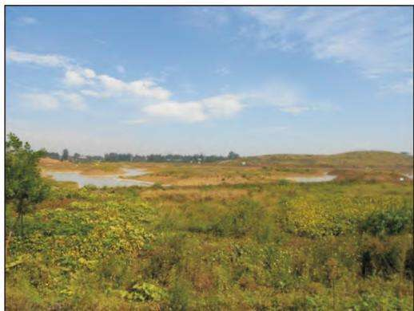
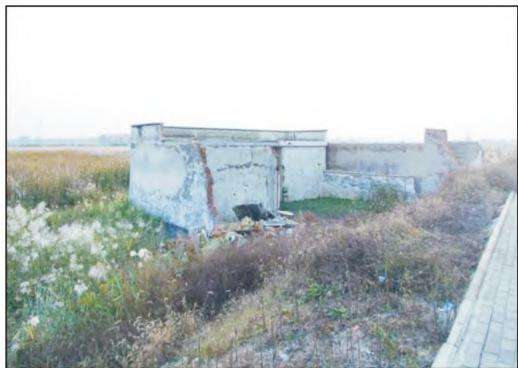
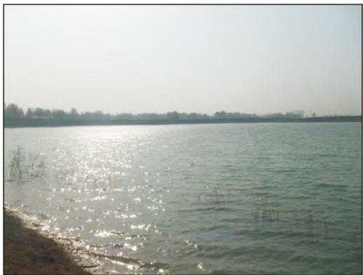
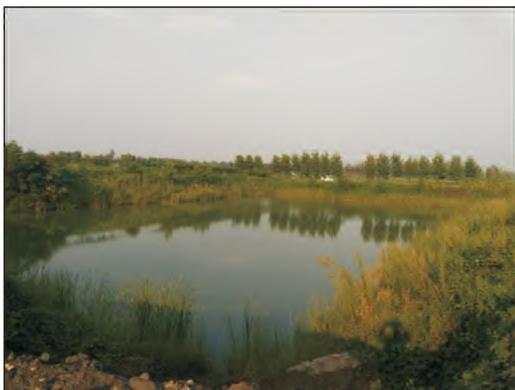
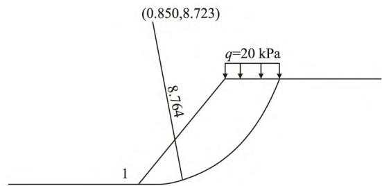
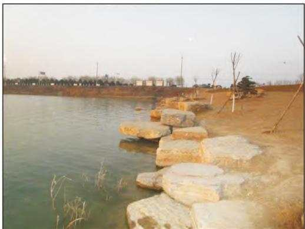
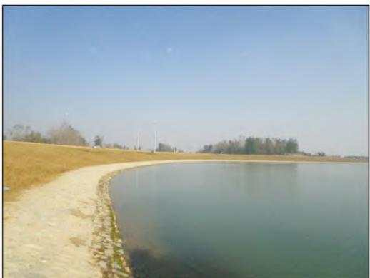
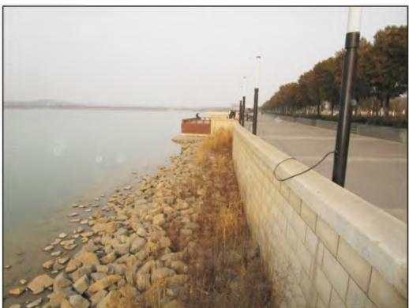
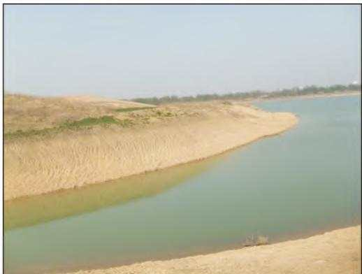

文章编号 ： 1006－4362（2022）03－0108－05

# 永城市采煤塌陷积水区生态治理工程及相关问题探讨

李再兴1，2，3 ， 徐伟1，2，3 ， 蒋丽1，2，3 ， 姚娇娇4

（1．河南省地质矿产勘查开发局测绘地理信息院 ，郑州 450006；2．河南省天空地遥感智能监测工程技术研究中心 郑州 450006；3．河南省自然资源天空地遥感智能监测研究科技创新中心 郑州 450006；4．河南省地质矿产勘查开发局第三地质勘查院 ，郑州 451464）

摘要 ： 地处华北平原南部边缘的永城地区 多年的煤炭资源开采形成了诸多的采空塌陷区 对其治理常利用塌陷区多积水的特征 建立起鱼塘 湿地 湖泊生态公园等工程来恢复生态 效果较好 然而该类工程的岸坡稳定性及渗漏问题探讨相对较少 本文以永城地区采煤塌陷区蓄水治理工程为例 探讨了该类工程问题并提出了有关建议 为同类工程有效运行提供参考

关键词 ： 华北平原 ；塌陷区治理 ；岸坡稳定性 ；渗漏

中图分类号 ： TD167；P642．26；X171．4

文献标识码 ： A

# DISCUSSIONONECOLOGICALCONTROLPROJECT ANDRELATEDPROBLEMSINSUBSIDENCEWATER AREAOFYONGCHENGCOALMINING

LIZai－xing1，2，3，XU Wei1，2，3，JIANGLi1，2，3，YAOJiao－jiao4

（1．InstituteofSurveying， MappingandGeoinformationofHenanprovincialBureauof Geo－explorationandMineralDevelopment， Zhengzhou450006，China；

2．HenanProvinceSkyandEarthRemoteSensingIntelligentMonitoringEngineering TechnologyResearchCenter， Zhengzhou450006，China；

3．ScienceandTechnologyInnovationCenterofSkyandEarthRemoteSensingIntelligent MonitoringResearchofNaturalResourcesinHenanProvince，Zhengzhou 450006，China； 4．TheThirdGeologicalExplorationInstituteofHenanBureau，Zhengzhou 451464，China）

Abstract： LocatedinthesouthernedgeoftheNorthChinaPlainyongchengarea， many miningsubsidenceareashavebeenformedafteryearsofcoalmining．Thetreatmentofthe subsidenceareaoftentakesadvantageofthecharacteristicsofmuchwatertheestablishment offishpond wetland lakeecologicalparkandotherprojectstorestoretheecologythe effectisbetter．However theproblemsofbankslopestabilityandleakagearerarelydis－ cussed，thispapertakesyongchengcoalminingsubsidenceareawaterstoragemanagement projectasanexample，thiskindofengineeringproblemsarediscussedandsomesuggestions areputforward，Itprovidesreferencefortheeffectiveoperationofsimilarprojects

Keywords： thenorthChinaplain； subsidenceareacontrol； bankstability；leakage

基金项目 ： 财政部 国土资源部2012～2014年度矿山地质环境治理示范工程专项资金及地方资金项目

淮海经济区中西部的徐州 淮北 宿州及永城诸地 地处华北平原的南部边缘 煤炭资源丰富 矿山多年的开采 形成了众多的采空塌陷积水区 造成了当地生态环境的破坏 在充分利用积水区域的基础上 结合专项规划或城市发展需要等 采用建立湿地 生态湖泊 生态湖泊水上公园或生态鱼塘等工程理念 恢复生态 构建起环境优美 风景宜人的生态或休闲旅游生态新景观等［1－3］

以永城为例 以“生态水城”为指导思想 综合考虑旅游产业 农业发展和环境效益等多个因素来进行恢复治理 整体上其可分为四大模式 景观治理模式 生态湿地模式 高效农业模式及生态休闲观光农业治理模式［4］ 而这些治理模式中常涉及鱼塘 湿地及湖泊等蓄水工程

以永城市东西城区间采煤塌陷区为例 采用“挖深垫浅”的治理思路 结合当地发展规划 构建 湿地＋生态湖泊”的景观治理复垦模式 即日月湖生态修复工程 现为国家级水利风景区 2017年2月经省林业厅批复永城市日月湖成为省级湿地公园建设试点 。

尽管永城地区塌陷积水生态治理工程生态修复效果显著 但其对蓄水工程岸坡的稳定性和水体渗漏问题探讨相对较少 本次拟以永城地区该类生态治理工程为例 探讨蓄水后工程地质问题 为同类地区的矿山生态修复及后期管护提供参考

## 1 区域地质背景

## 1．1 水文

永城市内地表水系发育 主要有沱河 包河 浍河 王引河及其支河 由西北向东南展布 至安徽省境内汇入淮河 各主要河流均有很多支流

## 1．2 地形地貌

永城市位于黄淮海平原腹地 地貌类型单一 除东北部的芒砀山群外 黄淮冲积平原为本区的主要地貌类型，地势西北高 东南低，地形平坦，总体标高在31．9m左右，高差不大

## 1．3 地层岩性

永城煤田属华北地层区 鲁西分区徐州小区除芒山及南部柏山出露零星的寒武系 奥陶系外 其余全被新近系 第四系厚层松散沉积物所覆盖 第四系广泛覆盖于新近系之上 厚度近90．00m 主要岩性为褐黄 棕黄色粘土 粉质粘土以及黄色及灰褐色粉砂 细砂组成

## 1．4 水文地质

在钻孔揭露的深度内可划分为［5］ ： 松散岩类孔隙水 碎屑岩类孔隙裂隙水 岩溶水3个含水层 又可细分为10个含水岩组 各含水层组之间都存在隔水层 使各含水层之间不存在或存在微弱的水力联系 广大平原区第四系含水层直接接受大气降水补给 地下水位很浅 一般埋深3．0～5．0m 以内资源丰富 主要用于农业灌溉与农民生活用水

## 1．5 工程地质

以某矿山塌陷区生态治理工程为例［4，6］ ， 在勘探深度范围内其地层岩性自上而下主要由人工填土 粘性土 粉土及砂性土组成 为第四系全新统河流相沉积 $( \mathrm { Q _ { h } } ^ { \mathrm { a l } } )$ 据其工程地质性质， 场地可划分为4个工程地质单元层， 土承载力特征值为110～250kPa 压缩模量5．1～10．20MPa

## 2 地面塌陷地质灾害

该区主要地质灾害类型为因煤炭开采而引起的地面塌陷及其伴生地裂缝 其在地表上表现为凹陷盆地形态，多为四周略高 中间稍低的碟型洼地 因不同矿山煤层埋深 厚度等因素的不同 塌陷深度深浅不一 据以往调查数据［6］ 采煤区的塌陷中心深度一般为0．5～4m 平均为2．25m

在地势较低或塌陷中心区域 因地表高程低于潜水位 塌陷区域会常年积水 在一部分区域尽管地表高程高于潜水位 但因大气降水的补给 也会季节性积水 对于塌陷积水区域的耕地恢复难度较大［4］

## 3 治理工程

## 3．1 湿地与湖泊工程

结合当地景观规划 按照“挖深垫浅” “挖湖堆山”和“保留矿山塌陷遗迹”的总体治理思路，对于塌陷较深区域实施开挖工程和蓄水工程 营造自然水域景观体系；打造生态湿地区和湖泊风景区

## 3．1．1 湿地工程

利用塌陷区特征 结合规划 科普 人文景观的需要 建设不同主题的湿地公园 ：一是在距城市较远的塌陷区，由于塌陷深度较浅，且存在一定的季节性积水 结合当地生态环境 为了涵养水源 建立生态湿地区 为科普 科学研究提供平台； 二是针对靠近城市的大面积塌陷区 利用其塌陷深浅位置的不同较浅区建立生态湿地区（图1） ，与人文景观相融合，起到净化水源 美化市容和改善整个城市山水生态风貌目的 为城市特色旅游建设提供平台

另外由于矿山大面积塌陷，不仅造成了耕地的大量损毁，而且造成了诸多房屋开裂， 甚至不能居住 从而造成许多居民离开家园 为了让更多的人了解 认识和体验塌陷区风貌 根据当地规划 保留一部分塌陷区受损的原始房屋 建立生态湿地区（图2） 且为矿山湿地公园的建立提供平台

总体来说 湿地区建设是利用现有的塌陷相对较浅的积水区域 进行局部或少量的开挖 或者不再开挖 仅局部整饰后形成的生态景观区 一般水深1～2m 局部达到3m左右 且该区水生植物往往大量繁殖

  
图1 浅层生态湿地区

  
图2 房屋保留湿地区

## 3．1．2 湖泊工程

结合当地规划 充分发挥区位优势 将离城市中心较近的 靠近主干道的大面积采煤塌陷区及其积水区 开发成由浅到深 由外到内水域景观区 即形成浅部的湿地与深部的湖泊相结合 湖中小岛与岸边堆山相结合 把城市的人文风貌融入到水域景观治理中 起到既美化环境又展现城市的内涵 为当地居民提供一个生态休闲旅游的好去处 正如前面所述的“日月湖生态修复工程”是此方面最好的诠释

治理思路上 湖泊工程是采取的挖深垫浅的工作方法 在大面积塌陷积水的基础上进一步地开挖以达到蓄水的深度合理 水域面积可观的情况下 形成的湖泊景观区（图3） 一般水深达到3～5m，汛期水量增加 水位会有所上升 但最高水位线不会超

过湖岸线。

## 3．2 鱼塘工程

针对不同矿山的地质环境的破坏程度不同 相应的治理方法 治理措施 治理思路应结合矿山实际情况确定 永城地区众多塌陷区 应当地村民组要求 尽可能的恢复耕地 在土源不足的情况下 在塌陷相对较深的区域进一步开挖 开挖的土方回填至开挖取土区以往的相对较浅的区域 以达到耕种要求；而原取土区域形成的取土坑 改造成鱼塘 （图4） ，交与当地百姓， 发展种植＋养鱼的综合农业经济 。

鱼塘的挖深和大小 一般考虑恢复耕地所需土方平衡的需要和当地鱼塘养鱼所需积水深度的经验等诸多因素来确定 一般来说开挖深度h在塌陷面以下3～5m 地下常水位线下2～3m；长宽在十几米到数百米的规模； 边坡回填高度 H 一般为1～2m 设计坡比多控制在1:2～1:1

  
图3 景观湖泊区

  
图4 鱼塘工程区

## 4 工程地质问题

## 4．1 水体的补给

塌陷区水域治理工程蓄水水源主要来源于3个方面 大气降水 浅层地下水和河流水

## （1） 大气降水补给

塌陷区开挖形成地表水体后 可直接接受大气降水的补给 永城地区属于暖温带半湿润季风气候 降水量年际变幅大 年内分配不均 暴雨及连阴雨较多 根据永城气象站多年的气象资料分析 历年平均降水量800mm 是该地塌陷区地表水水体重要补给源之一

## （2） 浅层地下水补给

日月湖等治理工程实施期间 实测周边区域地下水位埋深多在4．0～6．0m 水位标高多在27．00～29．00m 在一个水文年里 有一定的变幅 总体上控制在27．50～28．50m 标高左右 据调查 蓄水工程开挖的底标高一般低于地下水位线标高 接受地下水补给；尤其日月湖工程底标高低于常水位线数米 地下水是湖泊的重要补给源

## （3） 河流补给

众多蓄水工程周边存在河流 河流亦是蓄水工程重要补给源之一 当河流水位高于地下水位时，在一定条件下 可通过地下径流补给蓄水工程

## 4．2 工程水体的渗漏

本文所指的工程水体的渗漏是指治理后的湖（塘）水体通过一些通道（介质）排泄出去 使湖（塘）中的水位下降的现象

以日月湖为例 治理工程开挖的地层主要为人工填土和粉质粘土 其中湖底部位于粉质粘土层内据钻孔资料显示 粉质粘土层中含有透镜体 岩性多为粉砂 这就意味着湖边坡和底部局部地段有粉砂层的存在

在综合考虑降雨 蒸发及径流补给的情况下 经过计算 丰水年湖水充沛 湖水以补给地下水为主；枯水年和平水年湖水不足 以地下水补给湖水为主部分月份（常在汛期）也存在湖水补给地下水 即在丰水年或在部分月份中 湖水水位高于地下水位时存在水体渗漏现象

## 4．3 岸坡的稳定性

湖（塘）等工程开挖后 尤其湖泊和湿地开挖后形成的岸坡线较长 其岩性为粉质粘土 粉土 局部存在粉砂 工程蓄水后 采用何种坡比和护坡形式直接影响了岸坡的稳定性和工程的正常运转 在不考虑湖内水位降落影响下， 以日月湖二期岸坡为例［7］ ，地面无超载现象， 采用瑞典圆弧法，选择最不利情况考虑，以地面超载20kPa计，设计最陡（坡比1:1） 进行验算 计算结果表明 （图5） ， 稳定系数＝1．626，大于规范规定标准

其它湖段与该湖段地质情况及工况情况类似湖岸坡度更缓 更有利于湖岸稳定 在工程实施过程中 考虑到工程效果和安全 在不同的地段采用不同的边坡形式，诸如天然土质边坡 叠石边坡 浆砌石护坡以及直立边坡等等（图6 图7 图8和图9）

  
图5 瑞典条分法稳定性验算图

  
图6 叠石岸坡

  
图7 浆砌石岸坡

  
图8 砌石直立岸坡

  
图9 自然土质岸坡

## 5 探讨与建议

## 5．1 工程问题探讨

（1） 据勘查数据［6］ ， 该类蓄水工程的底板和边坡岩性一般以粉质粘土为主体 渗透系数平均值为$1 4 . 1 { \times } 1 0 ^ { - 5 } \mathrm { c m / s }$ 为相对隔水层 而地下水和临近的河流水如何通过以粉质粘土层为主体的地层中渗流成为其重要的补给源 需要进一步研究

（2） 不同位置的蓄水工程 其水文地质条件存在差异，补径排有所不同，故蓄水工程的挖深和常水位需因地而设 以确保工程得到有效水源 以保证其长久运行

（3） 湖（塘）岸坡岩性多为粉质粘土 但局部存在含砂透镜体，这必将影响边坡的稳定；同时湖（塘）的底蚀 侧蚀作用和常水位线的上下波动 都将影响了岸坡的稳定性 需要进一步研究

（4） 护坡的形式有多种，有叠石 浆砌石和自然开挖边坡的等等，需进一步研究一种安全 经济和可靠的边坡形式 既要考虑边坡的稳定性 又要兼顾其美观生态性

## 5．2 建议

（1） 华北平原南部 淮海经济区西部的永城 地势平坦 地下水埋藏浅 且煤炭资源丰富 多年的开采引起诸多的地质环境问题 工程治理多采用“挖深垫浅”的涉水储水工程 诸多的人工地表水工程的出现 必然对区域水环境发生影响 建议开展区域水环境调查 调查地下水与地表水 浅层地下水与中深层的水力联系 研究水环境变化等等

（2） 建议针对重大的湖泊景观工程 湿地工程开展专门的水文地质调查 调查补径排途径 水质变化以及由此引起的周边生态环境的变化 以保证治理工程高效安全生态运行

## 参考文献

［1］ 李莹 ，雷璇 ，王旭春．采煤塌陷区水体综合利用策略探究［C］中国环境科学学会科学技术年会论文集 2020：50－55

［2］ 丁尚昊 何君佳 程成 等．淮北采煤塌陷区生态修复路径———以南湖采煤塌陷区为例［J］．安徽农学通报 ，2020，26（7） ：139－140150

［3］ 庞晶 ，宋晓慧 ，周茂敬．采煤塌陷区综合治理模式研究———以菏泽市采煤塌陷区为例 ［J］．山东财经大学学报 201830（4） ：109－119

［4］ 李再兴 姚娇娇 徐伟 等 华北平原高潜水区采煤塌陷区治理模式研究及问题分析［J］．地质灾害与环境保护 201930（4）73－76

［5］ 薛泉 方士军 李明立 等．河南省永城市矿山环境地质调查评价与研究［R］．郑州 河南省地质科学研究所 2002

［6］ 车志强 ，杨 扬 ，李再兴 ，等．永城市东西城区间采煤塌陷区矿山地质环境治理示范工程（二期） 勘查报告［R］．郑州 ： 河南省地质矿产勘查开发局测绘地理信息院 ，2014

［7］ 李再兴 徐伟 蒋丽 等．永城市东西城区间采煤塌陷区矿山地质环境治理示范工程（二期） 设计书［R］．郑州 ： 河南省地质矿产勘查开发局测绘地理信息院 2014