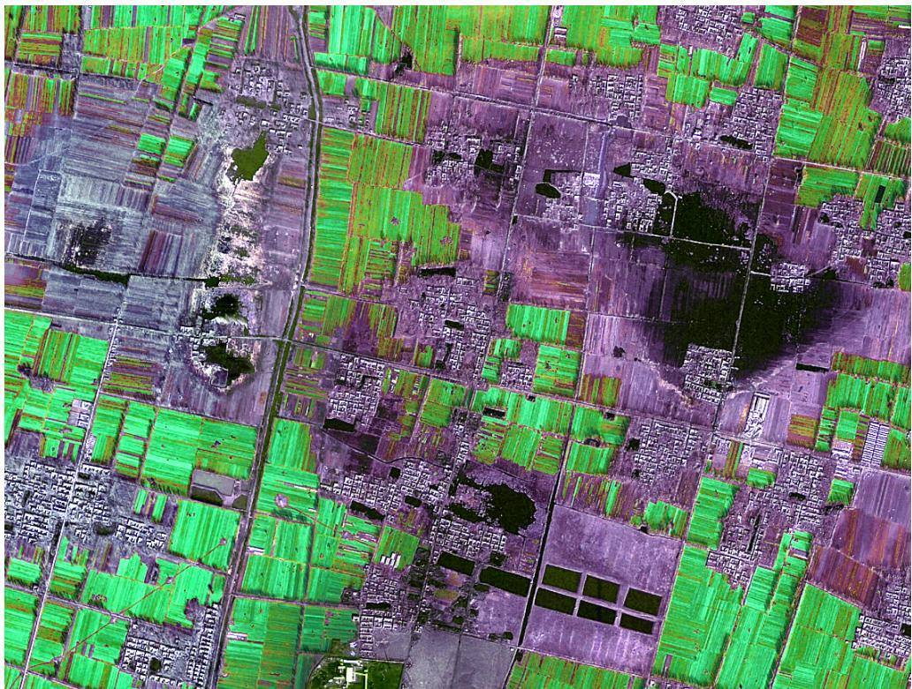

# 永城市陈四楼煤矿土地复垦适宜性评价研究

豆飞飞，李 萍，朱嘉伟（河南农业大学资源与环境学院，郑州450002）

摘 要：为了采取指数和法和极限条件法对陈四楼煤矿土地复垦适宜性进行评价。以GIS软件为平台，利用河南省永城市土壤图、地形图、土地利用现状图进行空间叠加分析最终确定4个评价单元。依据研究区的自然、经济、社会现状和相关技术标准，确定了宜农、宜林、宜渔3个复垦方向的评价指标，然后采用指数和法和极限条件法对矿区复垦土地进行适宜性评价。结果表明：评价总面积为73.7 hm2，其中适宜农业种植用地面积为25 hm2，适宜林业种植用地面积为20 hm2，适宜渔业养殖用地面积为28.7 hm2。通过评价研究建立矿区土地复垦适宜性评价等级体系。

关键词：陈四楼煤矿；土地复垦适宜性评价；指数和法；极限条件法

中图分类号：X752

文献标志码：A

论文编号：2013-0195

# Research on Suitability Evaluation of Land Reclamation of the Chensilou Coal Mine inYongcheng

Dou Feifei, Li Ping, Zhu Jiawei

(The College ofResources and Environment, Henan Agricultural University, Zhengzhou 450002)

Abstract: In order to evaluate the suitability evaluation of land reclamation of the Chensilou coal mining for taking the index method and limit condition method. The study finally determined four evaluation units making use of the soil map and the current land used map and GIS software platform. According to the study area's natural, economic and social current situation and related technical standards, the paper identified the indicators of the reclamation direction of agricultural, forest, fishery. Then it was evaluated to the recalmation land of mining areas for taking the index method and limit condition method. The results suggested that, the total area of 73.7 hm2 could be divided into three parts, the area of suitable agricultural was 25 hm2, the area of suitable forest was 20 hm2, the area of suitable forest was 28.7 hm2. The study established the suitability evaluation system of land reclamation.

Key words: the Chensilou Coal Mine; the suitability evaluation of land reclamation; the index method; the limit condition method

## 0 引言

在煤矿资源大量开发过程中，煤炭生产必然造成土地资源的大量破坏，严重地干扰矿区的生态环境，威胁到社会的可持续发展。土地资源被破坏的形势对中国生态安全、粮食安全、乃至社会安全等都提出了严峻挑战。而矿区土地复垦工作能有效的减少煤炭资源开发过程中对土地、水、生物等生态环境的影响，遏制矿区生态环境恶化趋势，对于促进国民经济和社会将抗发展意义重大。土地复垦适宜性评价为实现矿区土地的有效复垦及复垦土地的合理提供了基础和依据。李志强等[1]采用极限条件法对安家岭煤矿排土场待复垦土地对农林牧业的适宜性进行评价，初步构建了土地复垦适宜性评价体系及其模型。潘元庆等[2]以河南省重点煤矿基地为例，对矿区土地复垦的适宜性等级进行了研究，为矿区土地复垦适宜性评价借鉴和参考。目前土地复垦适宜性评价工作采用的方法主要有极限条件法、指数和法等，极限条件法主要用于评价土地适宜类，指数和法主要用于评价土地质量等，是评价过程由浅入深需要依次采用的2种方法，但是，目前适宜性评价工作尤其是土地复垦方案编制工作中，常出现2种方法中任选其一的情况，造成评价结果与客观实际严重不符。因此，笔者以河南省永城市陈四楼煤矿为例，系统研究了煤矿采矿塌陷区土地复垦适宜性评价的方法、步骤，对提高评价成果的实用性具有重要意义。

## 1 矿区概况

陈四楼煤矿地处河南省永城市永城煤田中部，为永城市顺和乡、城厢乡、陈集乡三乡共同管辖，1990年7月开工建设，1997年11月正式投产，设计生产能力240万t/年，设计服务年限为64.7年，开拓方式为立井单水平上下山开拓，采煤方法为走向长壁或倾斜长壁综采和炮采。矿区东西宽度为5 km，南北走向距离为12 km，矿区总面积为62.4 km2，井田可采或局部可采煤层共4层，煤层总厚度为8.4m。

陈四楼煤矿位于华北地台区鲁西台隆永城断陷褶皱带的西部，西与华北坳陷通许凸起毗邻，位于该隐伏背斜山西翼。井田内地势平坦，相对高差小，一般地面标高31\~35 m。陈四楼煤矿地处淮河冲积平原北部，地势平坦，微向东南倾斜。区内最高点标高为+40.2 m，最低点标高为+27.10 m，一般地形标高为+32\~+35 m，陈四楼井田地面标高一般在34.2\~34.8 m，潜水位距地表一般为1\~4 m。在陈四楼井田南部的沱河、小白河、永砀路东沟和韩沟3条支流分布于井田上方。

当前由于采煤造成的塌陷面积为73.7 hm2，其中耕地53 hm2，废弃村址17 hm2，坑塘3.7 hm2，最大塌陷深度3.6 m，平均塌陷3.0 m，原地面平均标高34.6\~34.9 m，塌陷后地面标高31.0\~34.6 m。塌陷盆地中央形成常年积水区，积水面积28.7 hm2，最大积水深度2.0 m，平均深度1.2 m，积水量4.16×103m（3 图1）。

## 2 塌陷区土地复垦适宜性评价过程

## 2.1 土地复垦初步方向

土地复垦适宜性评价工作是针对特定土地复垦利

  
图1 陈四楼采煤塌陷区现状图

用方向开展的，并依据此特定复垦方向的复垦适宜程度做出的评价[3]。塌陷地复垦适宜性评价一般针对农业生产用地、建设生产用地及园林绿化用地等特定方向。但损毁土地的复垦方向常受塌陷地塌陷程度的限制，塌陷土地损毁程度与塌陷地复垦利用方向的限制强度往往成正比例关系。此外，园林绿化用地利用方向对土地自然条件要求较低，因此园林绿化用地利用方向对一般的土地条件均较适宜，而农业生产用地、建设生产用地利用方向对土地的自然条件要求较高[4]。因此笔者在进行塌陷区土地复垦适宜性评价时，主要针对农业生产用地中的农业种植方向、林业种植方向及渔业养殖方向进行评价。

## 2.2 划分评价单元

塌陷区土地复垦适宜性评价应首先从评价单元的划分开始。土地复垦评价单元的确定一般依据复垦区土地的损毁类型、程度、限制因素和土壤类型等[5]。本次土地复垦适宜性评价单元的确定采用综合法，即以GIS软件为平台，把土壤图、地形图（高程点）、地下水位线等值线图、土地塌陷下沉线等值线图、土地利用现状图进行空间叠加分析，最终确定4个评价单元，分别为常年积水塌陷区、季节性积水塌陷区、非积水塌陷区Ⅰ、非积水塌陷区Ⅱ。

## 2.3 确定评价指标

土地适宜性评价的实质是针对某种特定土地利用类型的适宜性及其适宜程度来对土地的自然属性、社会属性、经济属性进行评价的过程[6]。本研究遵循土地适宜性评价的主导性、综合性、差异性等基本原则，首先对本次研究所在区域内影响土地利用的自然、社会、经济等因素进行全面系统的分析，初步确定参评因素；其次对初选因素进行相关性分析，剔除相关性较大或有重复影响的因素；最后依据《中国1:100万土地资源图》[7]标准，同时结合《土地管理手册》[8]中对待复垦土地复垦指标（挖损及塌陷破坏土地），最终确定农业种植方向、林业种植方向及渔业养殖方向的土地适宜性评价指标。

其中，农业种植方向的评价指标为：地形坡度、土壤质地、土层厚度、排灌条件、积水深度、塌陷深度等；林业种植方向的评价指标为：土壤质地、坡度、土层厚度、排水条件及塌陷深度等；渔业养殖方向的评价指标为：水质状况、区位条件、排灌条件、外部条件和积水状况。

## 2.4 评价指标等级及权重确定

依据《土地复垦方案编制技术规程》[9]、《1:100万土地资源图》等国家行业规范和标准，同时参照国内煤矿塌陷区土地复垦适宜性评价中评价指标的划分方法，将复垦方向适宜等级数划分为4级标准，即 级（适宜）、Ⅱ级（基本适宜）、Ⅲ级（不适宜）、Ⅳ级（难利用）。其中适宜类土地为对破坏的土地采取一般复垦方法和技术就能达到复垦利用方向的要求；基本适宜类土地为对破坏土地必须采取较复杂的现代复垦方法和技术才能达到复垦利用方向的要求；不适宜类和难利用类土地为就当代的科学技术水平，不管采用何种复垦方法和技术都无法达到复垦利用方向的要求。

笔者采用专家经验法确定评价指标的权重值，即依据大量实地调查获取的数据资料，经过专家的分析论证，并结合自身经验最终确定不同复垦方向的各个评价指标的权重值。各复垦利用方向的指标权重值和等级标准见表1\~3。

## 2.5 评价方法

土地复垦适宜性评价评价常用方法有极限条件法、指数和法与多因素综合模糊法等，本次研究主要采用指数和法和极限条件法综合进行评价。首先依据每个评价指标等级的高低，分别赋以相应的等级分值，即一级为3分，二级为2分，三级为1分，四级0分。其次计算出参评指标的等级指数，即用参评指标的权重值乘以相应的等级分。采用指数和法的计算公式见式(1)。

表1 农业种植方向的指标等级、权重及评价指标
<table><tr><td colspan="2">评价指标</td><td>坡度/°</td><td>土壤质地</td><td>土层厚度/cm</td><td>排灌状况</td><td>积水深度/m</td><td>塌陷深度/m</td></tr><tr><td colspan="2">指标权重</td><td>0.17</td><td>0.16</td><td>0.14</td><td>0.20</td><td>0.18</td><td>0.15</td></tr><tr><td rowspan="4">指标等级</td><td>一级</td><td>0~5</td><td>壤土</td><td>90~100</td><td>排灌状况稳定</td><td>&lt;0.5</td><td>&lt;2</td></tr><tr><td>二级</td><td>5~15</td><td>粘土、砂壤土</td><td>90~60</td><td>排灌状况一般</td><td>0.5~2</td><td>2~5</td></tr><tr><td>三级</td><td>15~25</td><td>重粘土、砂土</td><td>60~30</td><td>排灌状况差</td><td>2~3</td><td>5~10</td></tr><tr><td>四级</td><td>&gt;25</td><td>砂质土、砾土</td><td>&lt;30</td><td>无排灌保证</td><td>&gt;3</td><td>&gt;10</td></tr></table>

表2 林业利用方向的指标等级、权重及评价指标
<table><tr><td colspan="2">评价指标</td><td>土壤质地</td><td>坡度/°</td><td>土层厚度/cm</td><td>排灌状况</td><td>塌陷深度/m</td></tr><tr><td colspan="2">指标权重</td><td>0.23</td><td>0.22</td><td>0.16</td><td>0.21</td><td>0.18</td></tr><tr><td rowspan="4">指标等级</td><td>一级</td><td>壤土</td><td>0~5</td><td>80~100</td><td>排灌状况稳定</td><td>&lt;2</td></tr><tr><td>二级</td><td>粘土、砂壤土</td><td>5~20</td><td>50~80</td><td>排灌状况一般</td><td>2~5</td></tr><tr><td>三级</td><td>重粘土、砂土</td><td>20~35</td><td>20~50</td><td>排灌状况差</td><td>5~10</td></tr><tr><td>四级</td><td>砂质土、砾土</td><td>&gt;35°</td><td>&lt;20</td><td>无排灌保证</td><td>&gt;10</td></tr></table>

表3 渔业利用方向的评价指标、权重及指标等级
<table><tr><td colspan="2">评价指标</td><td>水质状况</td><td>区位条件</td><td>排灌状况</td><td>外部条件</td><td>积水状况</td></tr><tr><td colspan="2">指标权重</td><td>0.20</td><td>0.17</td><td>0.23</td><td>0.13</td><td>0.27</td></tr><tr><td rowspan="4">指标等级</td><td>一级</td><td>水质全部达标</td><td>距大城市近，交通条件好</td><td>排灌状况稳定</td><td>距污染源远，有成片开发可能</td><td>常年积水</td></tr><tr><td>二级</td><td>主要检测项目达标</td><td>距中小城市近，交通条件好</td><td>排灌状况一般</td><td>据污染源远，无成片开发可能</td><td>季节性积水</td></tr><tr><td>三级</td><td>主要监测项目不达标</td><td>距小城镇近，交通条件差</td><td>排灌状况差</td><td>距污染源近，有成片开发可能</td><td>短期积水</td></tr><tr><td>四级</td><td>监测项目多数不达标</td><td>距城市远，交通条件差</td><td>无排灌保证</td><td>距污染源近，无成片开发可能</td><td>无积水</td></tr></table>

$$
R ( j ) = \sum _ { i = 1 } ^ { n } F _ { i } \times W _ { i }\tag{……………………………… (1}
$$

其中 $R ( j )$ 为第 $\dot { } \boldsymbol { { \mathbf { \mathit { J } } } }$ 单元的综合得分，Fi、Wi分别是第i个参评指标的等级分和权重值，n为参评指标的个数。

此外，还需要结合极限条件法进行评价。当评价单元的某一评价指标严重影响评价单元对于特定复垦方向的适宜程度时，即某一参评指标的等级指数为0，不论此评价单元的最终得分多么高，都确定为不适宜等级。

最后确定土地复垦适宜性等级的范围，具体步骤如下：首先计算最高和最低土地适宜性等级的指数和，当所有评价指标等级分为3时，指数和最高分为3分，当所有评价因子指标等级分为0时，指数和最低分0分；其次确定等级梯度分段值，用最高指数和的分值与最低指数和的分值相减，除以等级个数，所得平均值即为划分等级的梯度分段值，比如农业用地的梯度分段值=(3-0)/4=0.75[10]。最后依据梯度分段值来划分陈四楼煤矿土地复垦适宜性等级的指数和范围，见表4。

表4 陈四楼煤矿土地复垦适宜性等级指数和范围
<table><tr><td>适宜性等级</td><td>I</td><td>Ⅱ</td><td>Ⅲ</td><td>IV</td></tr><tr><td>指数和范围</td><td>2.25~3</td><td>1.5~2.25</td><td>0.75~1.5</td><td>0~0.75</td></tr></table>

## 3 评价结果与分析

## 3.1 评价结果

根据上述评价方法对陈四楼煤矿土地复垦适宜性进行评价，得出：此次评价总面积为73.7 hm2，其中适宜农业种植用地面积为 $2 5 \mathrm { ~ h m } ^ { 2 }$ ，适宜林业种植用地面积为 $2 0 \ \mathrm { h m } ^ { 2 }$ ，适宜渔业养殖用地面积为28.7 hm2。然后依据各评价单元损毁后的土地状况和各评价指标的，求出各评价单元的加权指数和，同时参照表4中划分的相应标准，最终得出各评价单元的复垦适宜性评价结果。塌陷区各个评价单元的复垦适宜性评价结果见表5。

## 3.2 评价结果分析

位于陈四集东北部的常年积水塌陷区，潜水位较高，造成塌陷区常年积水，引起土壤次生盐碱化，农作物无法正常生长，但此塌陷区积水水质状况较好，具备良好的排水灌溉条件，因此确定为宜渔复垦方向。针对此种复垦方向可采用挖深垫浅法进行复垦，即根据塌陷形成的地形地貌，将塌陷区较深的部分继续挖深整形，整治后成为规划鱼塘，使其深度在2.5 m以上，挖出的土方垫在塌陷较浅处，垫高地面，平整成形，使其具有水产养殖的功能。挖深垫浅复垦塌陷地，能够调整农业生产结构，使单一的农业经济改变为农渔业并举，从而提高经济效益[11]。

位于陈四集南部的季节性积水塌陷区，在6、7、8月雨季积水深度达到2 m左右，由于潜水位埋深一般小于4 m，地表下沉后，潜水位上升，引起地表水出露，随着潜水位变化，积水深度也随之变化，但土壤水分一般均达到饱和，对农作物生长影响较大，因此确定为宜林复垦方向。此区域可采用疏排法复垦，即通过开挖沟渠、疏浚水系，将塌陷区积水引入附近的河流、湖泊或者设泵站强行排除积水，疏排法复垦可以有效的降低复垦标高，缩小复垦范围，减少复垦工程费用和征地费用，显著的提高土地复垦率[12]。

表5 塌陷区各评价单元的适宜性评价结果
<table><tr><td>评价单  $\widehat { \pi }$ </td><td>宜农评价</td><td>宜林评价</td><td>宜渔评价</td><td>适宜方向</td><td>选择方向</td><td>面积/hm²</td></tr><tr><td>常年积水塌陷区</td><td>0.89</td><td>1.75</td><td>2.53</td><td>宜农Ⅲ、宜林Ⅱ、宜渔Ⅰ</td><td>渔</td><td>28.7</td></tr><tr><td>季节性积水塌陷区</td><td>0.95</td><td>2.23</td><td>1.46</td><td>宜农Ⅲ、宜林Ⅱ、宜渔Ⅲ</td><td>林</td><td>13.4</td></tr><tr><td>非积水塌陷区I</td><td>1.55</td><td>2.78</td><td>0.71</td><td>宜农Ⅱ、宜林Ⅰ、宜渔Ⅳ</td><td>林</td><td>16.6</td></tr><tr><td>非积水塌陷区Ⅱ</td><td>2.45</td><td>2.66</td><td>0.54</td><td>宜农Ⅰ、宜林Ⅰ、宜渔Ⅳ</td><td>农</td><td>25.0</td></tr></table>

位于下沉盆地周围的非积水塌陷区，土壤质地为壤土，而且排水条件较好，其中非积水塌陷区Ⅰ地表起伏较大，地面坡度大于5°，确定为宜林复垦方向，地面坡度小于5°的非积水塌陷区Ⅱ，确定为宜农复垦方向。针对非积水塌陷区Ⅰ，土壤有机质含量较低，土壤肥力差，为提高复垦后的土地生产力，可首先用推土机将起伏的地表平整，然后覆盖30 cm左右的熟土，结合土地平整技术平整土地，然后根据本地的气候、地形、水文地质条件，选择合适的树木品种进行种植。对于非积水塌陷区Ⅱ可采用削高垫底法，将挖沟开渠过程中挖出的土填洼来平整土地，并结合土壤改良措施，改善土壤的养分状况、物理性状，将其复垦为耕地[13]。

## 4 结论与讨论

本次研究借鉴了前人的理论和方法，故评价步骤与一般性土地适宜性评价过程有相似之处，但本次研究也有创新之处，一是本次研究选择极限条件法和指数和法相结合的方法对待复垦土地进行研究，较大程度地克服目前适宜性评价工作中两种方法中任选其一进行评价所造成的评价结果与客观实际严重不符的缺陷，对提高评价结果的实用性、科学性具有重要意义。二是在评价指标选取的过程中，本次研究充分考虑了不同复垦方向的特性及其联系，针对宜农、宜林、宜渔三种复垦方向，选取的评价指标既有一致性又有差异性。相同的评价指标越多，越利于在不同的复垦利用方向之间进行比较；而不同的评价指标更能反映出针对特定复垦利用方向的客观情况，使评价结果更加精准科学。此外，同一评价指标针对不同的复垦利用方向，其评价标准均有所不同，例如农业种植方向和林业种植方向对的土壤质地状况的要求明显不同。

笔者在本次研究中也有不甚理想之处，如采用专家打分法确定各复垦方向评价指标的权重值时，该方法存在一定的主观性，易对评价结果的精确性、客观性造成一定程度的影响。因此，在今后的评价工作中笔者应选用更为精准、有效的评价方法进行评价，以期进一步提高评价结果的准确性。

## 5 矿区塌陷土地复垦的对策措施

针对陈四楼煤矿土地复垦，除了结果分析中所采用的具体工程技术措施外，还应做好以下几方面的工

作，才能有效保障土地复垦工作的顺利开展。

## 5.1 加大政策保障力度，保障复垦工作顺利开展

由于煤炭资源是在一定条件下形成的不可再生资源，进行开采活动后必然会对地表造成破坏，使得地面高低不平，给复垦工作带来了较大困难。此外在采煤造成的塌陷地区，大量的群众被迫迁出塌陷区。因此，对采煤塌陷地的复垦，必须在政策上给予一定的倾斜，保障失地群众的基本生活和相关权益，依此保证复垦工作的顺利开展。

## 5.2 做好塌陷区前期调查与规划工作，并与相关规划相协调

开展塌陷区破坏土地情况调查，并制定土地复垦规划，在论证研究的基础上进行土地复垦工作；同时土地复垦规划应与煤矿资源开发利用规划、土地利用规划、城市规划等相衔接，注重整体协调均衡发展，统筹规划耕地保护与煤炭资源开发[14]。

## 5.3 完善塌陷区土地复垦技术体系

一是加大先进采矿技术的引进和研究，提高采矿技术水平，尽量少地破坏土地；二是创新塌陷区土地复垦技术，在进行土地复垦技术研究时，综合考虑整个矿区的开发规划，土地破坏状况，自然条件以及复垦条件，实现多种行业、综合。协调的生态复合技术研究；三是依据待复垦土地的具体状况来确定适宜的复垦利用方向，制定严格的土地复垦质量评价标准和验收制度，对于达不到复垦质量标准的项目，一律不予验收，以期望将复垦土地的经济效益、社会效益、生态效益达到最大化。

## 5.4 拓宽资金筹集渠道，增加对土地复垦的投入

资金是开展矿区土地复垦工作的重要保证，应多方筹资，专款专用，用于矿区土地复垦工程，才能使煤矿塌陷区土地复垦工作顺利的开展起来，因此应建立土地复垦基金制度。首先由县级以上土地管理部门负责管理使用，主要用于历史遗留的废弃地复垦以及对复垦期间农民的生活补贴以及社会、农民自发的复垦补贴，资金渠道来源主要为：煤炭生产建设征地的耕地占用税；从煤矿企业缴纳的城市建设维护费中提取一定的比例；无能力自行复垦企业缴纳的土地复垦费；矿区土地复垦后，利用过程中总土地流转所得收益[15]。

## 参考文献

[1] 李志强,曹永新,李伟光,等.安家岭露天矿排土场复垦适宜性评价

与效益分析[J].露天采矿技术,2007(2):58-60.

[2] 潘元庆,刘晓丽,谷志云,等.河南省煤炭基地土地复垦适宜性评价及利用模式研究[J].内蒙古科技与经济,2007(11):3-6.

[3] 赵志声,陈国钧.矿山土地复垦适宜性评价[J].中国科技博览,2010(24):41-42.

[4] 张慧.典型平原区采煤塌陷地复垦方案研究[D].南京:南京师范大学,2007:15-16.

[5] 中华人民共和国国土资源部.TD/T 1031.1—2011 土地复垦方案编制技术规程[S].北京:中国大地出版社,2011:24-25.

[6] 倪绍祥.土地类型与土地评价概论[M].北京:高等教育出版社,1999:210-211.

[7] 国家计划委员会自然资源综合考察委员会.中国1:100万土地资源图[M].北京:中国人民大学出版社,1991:146-149.

[8] 国土资源部.土地管理手册[M].北京:中国大地出版社,2006:235-240.

[9] 中华人民共和国国土资源部.TD/T 1031.1—2011 土地复垦方案编制技术规程[S].北京:中国大地出版社,2011:156-158.

[10] 刘二伟,赵艺学.郭家山煤矿土地复垦适宜性评价[J].山西农业科学,2010,38(7):62-65.

[11] 冯国宝.煤矿废弃地的治理与生态恢复[M].北京:中国农业出版社,2009:66-67.

[12] 李书银,董来启,王书宏,等.永城矿区陈四楼采煤塌陷区生态恢复与综合治理[J].科教文汇,2008(12):208-210.

[13] 魏启福,刘亚坪,宗杰,等.平原地区采煤塌陷地的复垦模式与技术-以河南省永城市为例[A].第六届全国土地复垦学术会议论文集[C].北京.中国大地出版社,2001:89-90.

[14] 许军,李笑一,孙彩敏,等,我国矿区土地复垦的主要问题及其对策[J].中国煤炭,2010,36(12):103-104.

[15] 颜世强,姚华军,胡小平.我国矿业破坏土地复垦问题及对策[J].中国矿业,2008,17(3):36-37.