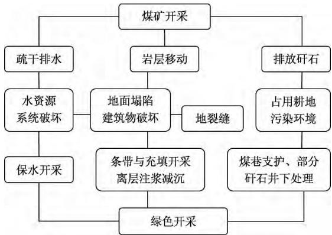

# 河南永城煤炭矿区环境地质问题及防治对策

苏凯峰( 河南省国土资源科学研究院，河南 郑州 450053)

摘要:依据野外调查资料，对河南永城煤炭矿区开采引发的地面塌陷、地裂缝、水资源系统破环、土地资源破坏等环境地质问题进行了详细的分析研究 根据实际情况，提出了永城煤炭矿区不同环境地质问题的防治措施，避免 减轻或得以治理，并对防治投资 管理提出了建议。 同时，提出了在地面塌陷形成以前就采取 “超前”的综合防治措施，提出“和谐开发 合理改造 以用促治”综合治理的思想

关键词:煤炭矿区;环境地质问题;地面沉陷;地裂缝;防治对策;永城

文章编号: 1003-8035( 2014) 01-0077-05

中图分类号: P66

文献标识码: A

永城市位于河南省东部，东临安徽淮北，境内煤炭资源丰富，是一个新兴的能源基地。 永城是以煤炭工业发展起来的城市，开发伊始，其开采强度就非常大，经过几十年的矿山开采，在矿区周边引起了许多环境地质问题，矿区开发引起的地质灾害和地质环境问题日渐突出和明显，已成为制约当地社会经济持续发展、 影响人民生活的重要因素之一。 矿业开发诱发的以地面塌陷、地裂缝等为主的地质灾害频繁发生，不仅破环了生态环境，造成土地资源的破坏，水环境的污染，也严重威胁到人民群众生命财产［1 － 10］。 因此，认真研究永城煤炭矿区环境地质问题，探讨开采活动引发的不同环境地质问题的防治，对避免 减轻地质灾害造成的破坏 影响具有非常重要的意义。

## 1 矿区环境地质条件

永城市地处华北平原的东南边缘与黄淮冲积平原的交接部位，地势平坦，西北略高，东南稍低 区内水系发育，多呈西北—东南向展布，地貌类型单一。区域地层属华北地台区鲁西分区徐州小区，出露地层有寒武系 奥陶系碳酸盐岩，石炭系 二叠系煤系地层，新近系砂岩、粉质粘土及第四系冲湖积物。

在区域大地构造位置上，永城市处于中朝准地台鲁西台隆西缘次级构造单元永城断陷褶皱带。 区内构造形迹主要为一系列 NNE 向相对比较紧密的背斜和比较宽缓的向斜组成的隔档式褶皱，向西逐渐变为形态比较简单的宽缓短轴背、向斜，在褶皱构造形迹的基础上迭加发育一系列 NNE 向的高角度正断层，形成隆陷断块相间排列的断陷褶皱构造样式，由于断块作用，原始的褶皱形态遭受破坏而不完整。

依据地质、水文地质、埋藏条件等，区内自上而下 分为三个含水岩组，即松散岩类孔隙含水岩组、裂隙 岩类裂隙含水岩组、碳酸盐岩岩溶裂隙含水岩组。

## 2 煤矿采矿引起的主要环境地质问题

永城市丰富的煤炭资源为当地经济崛起 社会发展提供了条件。 但几十年的煤炭矿山开采，导致矿区地质环境条件不断恶化，生物链遭到不同程度的破坏，产生如地面塌陷 地裂缝 植被破坏 地表景观破坏及水土体污染等等地质环境问题。 矿山开采造成日益突出的环境地质问题，已严重制约着社会经济的持续发展

## 2. 1 地面塌陷

地面塌陷是永城市最主要、最典型的地质灾害，分布范围广，造成损失大 塌陷均为因地下采煤活动造成的。 据调查，开采煤层己形成 22．61km2 的采空区，塌陷区面积达46．82km2( 表1) ，塌陷区地面塌陷深度一般 0 ～ 2． 8m 。

地面塌陷主要是地下开采煤矿形成的大面积采空区，采空区上部各种岩层从顶板开始向下依次脱离 弯曲，向采空区位移而形成 地面塌陷范围和最大塌陷幅度与矿层开采的范围 深度 厚度及开采方式有关。 采空塌陷主要危害是沉陷区变形十分严重，耕地破坏、绝产、常年性和季节性积水、村庄搬迁、建筑物变形等。

表1 永城煤炭矿区塌陷区统计表  
Table 1 Statistical list of Yongcheng coal mining subsidence area
<table><tr><td rowspan="2">矿区名称</td><td rowspan="2">塌陷区编号</td><td colspan="3">移动角</td><td rowspan="2">覆盖层厚度(m)</td><td rowspan="2">采空区面积( km²)</td><td rowspan="2">塌陷区 面积( km²)</td></tr><tr><td>覆盖层</td><td>上山角</td><td>下山角</td></tr><tr><td rowspan="2">城郊矿</td><td>城郊一区</td><td>43°</td><td>70°</td><td> $7 0 ^ { \circ } - 0 . 6 \alpha$ </td><td>360</td><td>1.49</td><td>5.18</td></tr><tr><td>城郊二区</td><td>43°</td><td>70°</td><td> $7 0 ^ { \circ } - 0 . 6 \alpha$ </td><td>320</td><td>0.42</td><td>1.45</td></tr><tr><td rowspan="2">陈四楼矿</td><td>陈四楼一区</td><td>43°</td><td>70°</td><td> $7 0 ^ { \circ } - 0 . 6 \alpha$ </td><td>355</td><td>2.18</td><td>4.84</td></tr><tr><td>陈四楼二区</td><td>43°</td><td> $7 0 ^ { \circ }$ </td><td> $7 0 ^ { \circ } - 0 . 6 \alpha$ </td><td>340</td><td>4.37</td><td>7.78</td></tr><tr><td rowspan="2">车集矿</td><td>车集一区</td><td>43°</td><td>70°</td><td> $7 0 ^ { \circ } - 0 . 6 \alpha$ </td><td>240</td><td>1.54</td><td>4.31</td></tr><tr><td>车集二区</td><td>43°</td><td>70°</td><td> $7 0 ^ { \circ } - 0 . 6 \alpha$ </td><td>240</td><td>2.94</td><td>5.64</td></tr><tr><td rowspan="2">葛店矿</td><td>葛店一区</td><td>43°</td><td>70°</td><td> $7 0 ^ { \circ } - 0 . 6 \alpha$ </td><td>180</td><td>1.54</td><td>2.93</td></tr><tr><td>葛店二区</td><td> $4 3 ^ { \circ }$ </td><td> $7 0 ^ { \circ }$ </td><td> $7 0 ^ { \circ } - 0 . 6 \alpha$ </td><td>170</td><td>1.76</td><td>3.20</td></tr><tr><td>新庄矿</td><td>斩庄一区</td><td> $4 3 ^ { \circ }$ </td><td> $7 0 ^ { \circ }$ </td><td> $7 0 ^ { \circ } - 0 . 6 \alpha$ </td><td>155</td><td>6.37</td><td>11.49</td></tr></table>

表2 永城煤炭矿区开采塌陷区住宅受损情况统计表  
岩体厚度与塌陷发育期有关。 采空区大，上覆岩体厚度小，塌陷发育周期短，地裂缝的规模就大; 反之，地裂缝规模小。 地裂缝一般出现在地面变形整个过程中，直到塌陷区稳定后才逐渐停止。

Table 2 Statistical list of residential damage in Yongcheng coal mining subsidence area
<table><tr><td>矿区名称</td><td>受灾户数</td><td>受灾人口</td><td>受灾住宅面积(  $\times 1 0 ^ { 4 } \mathrm m ^ { 2 } )$ </td></tr><tr><td>城郊矿</td><td>1720</td><td>5950</td><td>48.22</td></tr><tr><td>陈四楼矿</td><td>1950</td><td>7050</td><td>54.65</td></tr><tr><td>车集矿</td><td>1830</td><td>6900</td><td>52.10</td></tr><tr><td>葛店矿</td><td>2600</td><td>9600</td><td>70.60</td></tr><tr><td>新庄矿</td><td>2540</td><td>9450</td><td>69.15</td></tr><tr><td>合计</td><td>10640</td><td>38950</td><td>294.72</td></tr></table>

据永城市统计资料，采煤塌陷区受损居民 10640户，38950 口人，塌陷村庄 107 个，塌陷面积 $4 6 . 8 2 \mathrm { k m } ^ { 2 }$ (耕地面积 $3 7 . 0 5 \mathrm { k m } ^ { 2 }$ ，村庄庄盘面积 $5 . 6 7 \mathrm { k m } ^ { 2 }$ ，其他4．$1 0 \mathrm { k m } ^ { 2 } )$ ，住宅受损面积达 $2 9 4 . 7 2 \times 1 0 ^ { 4 } \mathrm { m } ^ { 2 }$ 。 受损学校18 所，受损建筑物90 栋，建筑面积 $2 3 4 0 6 \mathrm { m } ^ { 2 }$ ; 医院( 卫生所) 受损2 家，受损建筑物3 栋，建筑面积 $5 4 7 3 \mathrm { m } ^ { 2 } ;$ 企(事) 业单位 35 个，受损建筑物 79 栋，建筑面积$8 2 4 5 5 \mathrm { m } ^ { 2 } ;$ 乡政府 1 个，受损建筑物 6 栋，建筑面积$8 4 6 5 \mathrm { m } ^ { 2 }$ 。 塌陷区土地基本丧失了耕种条件( 表2) 。

## 2. 2 地裂缝

地裂缝主要分布在采空区的边缘地带 由于地层受到较大的横向拉力，弯曲变形较大，使两侧土层差异固结变形量发生改变，形成地裂缝 当这种现象发生在有人类活动的地区时，便于形成一种地质灾害( 表 3) 。

永城矿区地裂缝主要为采矿塌陷伴生的地裂缝，沿塌陷盆地四周呈条形、弧形分布，大体平行于工作面推进方向，裂缝长度一般小于 1km，多数在 200 ～500m，裂缝宽 $0 . 2 \sim 1 \mathrm { m } , \cdot$ 个别超过 1m，深 2 ～3m。

永城采煤塌陷区地裂缝规模与采空区大小、上覆

表3 永城煤田地裂缝发育特征一览表  
Table 3 The ground fissure growth feature list of Yongcheng coalfield
<table><tr><td>位置</td><td>始发时间</td><td>走向(°)</td><td>长度(m)</td><td>宽度(m)</td><td>深度(m)</td></tr><tr><td>刘大庄东北</td><td>2002.4</td><td>120</td><td>425</td><td>0.5</td><td>3.0</td></tr><tr><td>玉林堂西南</td><td>2002.9</td><td>115</td><td>650</td><td>0.7</td><td>2.8</td></tr><tr><td>戴楼东</td><td>2003.8</td><td>110</td><td>675</td><td>0.2</td><td>2.4</td></tr><tr><td>秦庄南</td><td>2004.5</td><td>180</td><td>450</td><td>0.8</td><td>2.8</td></tr><tr><td>东大营东</td><td>2005.2</td><td>110</td><td>575</td><td>0.5</td><td>2.5</td></tr><tr><td>王楼西北</td><td>2001.7</td><td>45</td><td>325</td><td>0.3</td><td>2.2</td></tr><tr><td>石楼西</td><td>2004.8</td><td>180</td><td>800</td><td>1.1</td><td>2.0</td></tr><tr><td>任庄东</td><td>2003.2</td><td>45</td><td>575</td><td>0.6</td><td>1.8</td></tr><tr><td>李楼东北</td><td>2001.9</td><td>175</td><td>625</td><td>0.7</td><td>2.6</td></tr><tr><td>黄药店西南</td><td>2000.7</td><td>10</td><td>377</td><td>0.3</td><td>2.5</td></tr><tr><td>黄老家东南</td><td>2002.6</td><td>175</td><td>853</td><td>0.6</td><td>2.4</td></tr></table>

## 2. 3 煤矸石

煤矸石系在建井 巷道掘进和选煤过程中产生的废石，主要为砂岩、粉砂岩、砂质泥岩、泥岩及少量天然焦和炭质泥岩 煤矸石是由无机质和少量有机质组成的混合物，组成煤矸石成分的元素达数十种，主要包括 Si、 $\mathrm { A l . F e . C a . M g . K . N a . S . T i . P }$ 等，且大多以铝硅酸盐的形式存在。 煤矸石的化学成分主要由$\mathrm { S i O } _ { 2 } \setminus \mathrm { A l } _ { 2 } \mathrm { O } _ { 3 }$ 和 $\mathrm { F e } _ { 2 } \mathrm { O } _ { 3 }$ 构成。

煤矸石是永城煤田各开采矿井产生的主要固体废弃物，其排放量见表4。 煤矸石废弃物对环境的影响主要是大气、水及土地。

表4 永城煤炭矿区矸石山统计表  
Table 4 The refuse heap statistical list of the Yongcheng coalfield
<table><tr><td>矿区名称</td><td>矸石山(座)</td><td>占地面积(  $\mathrm { m } ^ { 2 } )$ </td><td>高度(m)</td><td>体积(  $\mathrm { m } ^ { 3 } )$ </td></tr><tr><td>城郊矿</td><td>1</td><td>27150</td><td>41</td><td>371050</td></tr><tr><td>陈四楼矿</td><td>1</td><td>11020</td><td>29</td><td>106526</td></tr><tr><td>车集矿</td><td>1</td><td>12510</td><td>40</td><td>166800</td></tr><tr><td>葛店矿</td><td>1</td><td>10504</td><td>21</td><td>73528</td></tr><tr><td>新庄矿</td><td>1</td><td>20160</td><td>35</td><td>235200</td></tr><tr><td>合计</td><td>5</td><td>81344</td><td>一</td><td>953104</td></tr></table>

## 2. 4 矿山开采对地下水的破坏

矿区开采引起的有关水体环境灾害主要有: 地表水体污染、地下水污染及区域地下水位下降。 根据永城5 个煤炭矿区矿井水水质化验成果，总硬度、溶解性总固体、F－ 、Cl－ 、SO2 － 等指标的含量超过界限值，水质较差，比照 《地下水质量标准》( GB/T14848 －93) 进行评价，属Ⅳ、V 类水质，直接排放造成地表水及地下水的污染( 表5) 。

表5 永城煤炭开采矿区矿井排水主要化学成分一览表  
Table 5 The main chemical components list of the Yongcheng coal mining area mine drainage  
单位: mg /L
<table><tr><td>分析项目</td><td>城郊矿</td><td>陈四楼矿</td><td>车集矿</td><td>葛店矿</td><td>新庄矿</td></tr><tr><td>PH</td><td>7.95</td><td>7.80</td><td>7.70</td><td>7.99</td><td>7.70</td></tr><tr><td>总硬度</td><td>1084.53</td><td>739.40</td><td>885.41</td><td>542.70</td><td>502.14</td></tr><tr><td>溶解性总固体</td><td>2629.93</td><td>2024.34</td><td>2254.23</td><td>1451.86</td><td>2481.21</td></tr><tr><td> $\mathrm { C l }$ </td><td>264.12</td><td>300.07</td><td>341.20</td><td>253.49</td><td>264.07</td></tr><tr><td> $\mathrm { S O } _ { 4 } ^ { 2 - }$ </td><td>1427.96</td><td>799.42</td><td>850.04</td><td>579.98</td><td>1086.00</td></tr><tr><td> ${ \mathrm { H C O } } _ { 3 } ^ { - }$ </td><td>200.73</td><td>451.10</td><td>351.40</td><td>329.32</td><td>351.40</td></tr><tr><td> $\mathrm { F }$ </td><td>1.09</td><td>1.03</td><td>0.89</td><td>2.14</td><td>1.29</td></tr><tr><td> $\mathrm { K } ^ { + } + \mathrm { N a } ^ { + }$ </td><td>456.43</td><td>439.14</td><td>402.17</td><td>251.59</td><td>574.23</td></tr><tr><td> $\mathrm { C a } ^ { 2 + }$ </td><td>279.95</td><td>190.18</td><td>216.08</td><td>145.96</td><td>119.06</td></tr><tr><td> $\mathrm { M g } ^ { 2 + }$ </td><td>93.61</td><td>65.07</td><td>84.90</td><td>43.30</td><td>48.82</td></tr><tr><td> $\mathrm { N O } _ { 3 } ^ { - }$ </td><td>2.03</td><td>3.70</td><td>5.82</td><td>4.56</td><td>0.45</td></tr><tr><td> $\mathrm { N O } _ { 2 } ^ { - }$ </td><td>1.00</td><td>&lt;0.002</td><td>0.024</td><td>0.012</td><td>0.016</td></tr><tr><td> $\mathrm { N H } _ { 4 } ^ { + }$ </td><td>0.28</td><td>0.18</td><td>0.14</td><td>&lt;0.02</td><td>8.00</td></tr><tr><td>总α离子</td><td>0.92</td><td>0.112</td><td>0.162</td><td>0.144</td><td>0.210</td></tr><tr><td>总β离子</td><td>0.087</td><td>0.105</td><td>0.127</td><td>0.108</td><td>0.142</td></tr></table>

煤矸石长期露天堆放于地表，在降水作用下，其淋溶水直接渗入地下，对地下水水质也有影响，使得水体受到不同程度的污染。

此外，为了疏干采煤工作面涌水，确保井下安全生产，煤矿需要大量疏排矿坑水。 依据 2003 年的统计资料，5 对开采矿井 2001 年 8 月 ～2003 年 7 月排水总量为 74870500m3，年平均排水量 37435250m3，平均每天排水 102562. 33m3。 大量的排水不仅造成了地下水位的降低，进而可能诱发地面塌陷，而且由于地下水位的降低，将影响人们的生活用水，给日常生活带来了不便。

## 2. 5 矿山开采对土地资源的破坏

地下采空引起了地面塌陷 地裂缝 水体破坏等的同时，也造成了土地资源的破坏。 主要表现在: 地面塌陷使得地表易形成积水湖，常年积水和季节性积水都影响了土地资源的利用;干旱及裂缝也影响了土地资源的利用;煤矸石不仅占压了土地，而且经过长期的淋滤会使得土壤水受到污染，使得 F－ 、SO2 － 等元素在不同程度上超标。

## 3 主要环境地质问题的防治措施

综上所述，针对采矿引起的各种环境地质问题，需根据矿区不同环境地质问题，需要采用不同的治理措施 要正确处理好矿山经济发展与地质环境保护之间的辩证关系，合理开发和利用矿产资源，最大限度保护地质环境，保障矿区经济可持续发展。

地面塌陷和地裂缝是采空在不同时间和空间的两种表现，就其根源是采空引起的; 而矿区水污染主要是由于污水排放 煤矸石长期淋滤作用引起的。 因此，要解决采矿 环境保护 社会经济效益三者间的关系，就必须正确处理好地下采空 －地面塌陷 －水质污染 －煤矸石堆放四者的关系。 对此提出 “和谐开发、合理改造、以用促治”的综合治理思想，实行绿色矿业，走“绿色矿业之路”，使得矿山开发与社会经济效益及社会环境和谐发展，促进能源的可持续发展( 图 1) 。

  
图1 绿色开采技术路线  
Fig. 1 Green mining technology

和谐开发就是要着眼于未来，不能以牺牲环境为代价盲目开采;在技术、设备等硬件条件允许下开发，要实施矿产资源开发 环境保护协调发展战略，坚持矿区生态环境保护和环境地质问题控制预防为主 预防与治理相结合的原则，合理改造以往开发模式; 结合矿区资源分布、开发情况及矿区环境地质现状，按照“谁开发 谁保护，谁污染 谁治理，谁破坏 谁恢复，谁使用 谁补偿”的原则，立足现状，在开发利用资源的同时，以用促治，因地制宜，作好矿区生态环境保护工作。

地表塌陷主要是地下开采煤矿形成的大面积采空区而形成，其范围和最大塌陷幅度与矿层开采的范围、深度、厚度及开采方式有关。 以往多是在塌陷区形成以后，已经造成了危害，才着手进行治理，这种“滞后”的治理行为，常常事倍功半 在塌陷区形成之前，就采取“超前”防治措施，即在制定开采设计时就考虑预防措施，并在开采过程中认真实施，包括在采矿过程中所使用的各种 “减塌技术和措施”等，如充填采矿法，条带采矿法，多煤层、多工作面协调采矿法以及井下支护和岩层加固措施等，能够大大减少矿区塌陷的范围 塌陷幅度，减缓塌陷的时间进程，从而减轻塌陷的危害程度。

地表塌陷区生态复垦技术就是将矿区开采破坏的土地、生物种群恢复到原有的状态或达到可利用的地步，甚至恢复到更高的生态水平，它包括土地工程复垦 矿区生态复垦技术等。 永城塌陷区复垦技术方案及综合治理措施如表6。

表6 塌陷区综合防治技术、措施  
Table 6 The comprehensive prevention measures of ground collapse
<table><tr><td>治理项目、环节</td><td>治理措施、方案</td></tr><tr><td>井下开采</td><td>充填开采(干式充填、水力充填、胶结式充 填)、条带开采、房柱开采、离层注浆减沉</td></tr><tr><td>土地复垦技术</td><td>疏干法、挖深垫浅法、充填复垦、直接利用法、 生态工程复垦、兴建矿山公园</td></tr><tr><td>土地复垦模式</td><td>耕地+养殖用地、建设用地+养殖用地、兴建 矿山公园</td></tr><tr><td>煤矸石综合利用</td><td>发电和供热、生产建筑材料及制品(矸石砖、 矸石水泥、多孔轻骨料、建筑陶瓷)、高岭土新 型工业填料、提取化工产品、回收煤炭资源、</td></tr><tr><td>植被绿化</td><td>造田、铺路 植草坪、种树木、护岸绿化林带</td></tr><tr><td>水污染防治</td><td>建设污水处理厂、采用浅层地下水与矿井水 混灌，防止土壤次生盐碱化</td></tr></table>

开采塌陷区盆地中央地带及地势低洼区域，极易因积水而成为湖沼，为此应建立新的排水系统，把积水疏干，进行合理复垦，避免土地资源的浪费。 对此应根据塌陷区的实际情况，采用合理的复垦技术。 通常可以分为:

(1) 疏干法，该方法应用于低潜水位地区。

(2) 挖深垫浅法，通常采取再挖深的方法，形成水( 鱼) 塘，把取出的土方充填于塌陷浅的区域，形成可以耕种的土地，达到水产养殖和农业种植并举的利用目标。

(3) 直接利用法，对于大面积的塌陷地，特别是大面积积水或积水很深的水体以及未稳定塌陷地或暂难复垦的塌陷地，常根据塌陷地现状因地制宜地直接加以利用 如网箱养鱼 养鸭，种植浅水藕 耐湿作物。

(4) 兴建矿山公园 永城采煤塌陷地复垦利用方向可以为: “耕地 + 养殖用地”复垦模式 “建设用地 +养殖用地”复垦模式、 “养殖用地 + 林地”复垦模式。

煤矸石是永城煤炭矿区各开采矿井产生的主要固体废弃物 根据调查已投产的五座矿井( 城郊矿陈四楼矿 车集矿 葛店矿 新庄矿) 煤矸石的堆放量占地约54. 22km2，对矿区生态地质环境造成一定的影响。 煤矸石综合治理要以大宗量利用为主，其主攻方向为煤矸石发电、矸石建材及其制品、复垦回填以及煤矸石山无公害处理，兼顾发展高科技含量 高附加值的煤矸石综合利用技术和产品。 另外可以利用煤矸石回填采空区，避免采空引起大面积的塌陷。 对煤矸石的综合有效的利用可以减少煤矸石占用土地，降低对环境的污染。

## 4 结论与建议

通过对永城煤炭矿区地质环境问题的分析研究，初步掌握了矿区资源开发过程中遇到和诱发的环境地质问题。 针对所存在的环境地质问题，提出了不同环境地质问题的防治措施，为永城煤炭矿区地质环境问题的治理恢复提供依据。 建议在开发前对区域环境容量或承载力评价及矿业开发地质环境影响评价;同时通过技术创新，优化工艺流程，通过矿山环境治理和生态恢复，实现开发前后环境扰动的最小化和生态再造的最优化［11］。

## 参考文献:

［1］ 武强. 我国矿山环境地质问题类型划分研究［J］． 水文地质工程地质，2003( 5) : 107 － 112．

WU Qiang． Study of classification of geologic environmental problems in mines in China ［J］． Hydrogeology ＆ Engineering Geology，2003( 5) : 107 － 112．

［2］ 皱友峰，邓喀中，马伟民． 矿山开采沉陷工程［M］． 徐州:中国矿业大学出版社，2003:9．ZHOU Youfeng，DENG Kezhong，MA Weimin． Miningsubsidence engineering［M］． Xuzhou: China University ofMining and Technology Press，2003: 9．

［3］ 王可丽，徐毅． 浅谈我国矿山环境地质问题［J］． 煤炭技术，2004( 6) : 94 － 96WANG Keli，XU Yi． Talking about environment geologyproblem in our country's mine［J］． Coal Technology，2004( 6) : 94 － 96．

［4］ 徐友宁． 中国西北地区矿山环境地质问题调查与评价［M］． 北京:地质出版社，2006:4．XU Youning． In northwest China's investigation andevaluation of mine environmental geological problems［M］． Beijing: Geological Publishing House，2006: 4．

［5］ 刘育平，李晓莉，张连猛． 矿山地质环境保护问题分析及对策研究 －以贵州省为例［J］． 水文地质工程地质，2010( 5) : 137 － 139．LIU Yuping， LI Xiaoli， ZHANG Lianmeng． Minegeological environment protection problem analysis andcountermeasures research-in guizhou province as anexample［J］． Hydrogeology ＆ Engineering Geology，2010( 5) : 137 － 139．

［6］ 徐德兰，郭长林． 黑龙江地质环境特征与主要地质灾害［J］． 中国地质灾害与防治学报，2011( 3) : 101 － 105．XU Delan， GUO Changlin． The characteristics ofthegeological environment and geological disasters，

Heilongjiang province ［J］． The Chinese Journal of Geological Hazard and Control，2011( 3) : 101 － 105．

［7］ 张梁，张业成，罗元华，等． 地质灾害灾性评估理论实践［M］． 北京: 地质出版社，2002: 24 － 30．ZHANG Liang，ZHANG Yecheng，LUO Yuanhua，et al．Geological disasters and disaster assessment sexual theoryinto practice［M］． Beijing: Geological Publishing House，2002: 24 － 30．

［8］ 汪名鹏． 江苏沭阳县主城区环境地质问题及防治对策［J］． 中国地质灾害与防治学报，2012( 1) : 122 － 126．WANG Mingpeng． Environmental geological problems inShuyang City and the prevention countermeasures［J］．The Chinese Journal of Geological Hazard and Control，2012( 1) : 122 － 126．

［9］ 河南 省 地 质 测 绘 总 院． 永 城 塌 陷 区 调 查 报 告［R］． 2003．Geological Surveying and Mapping Institute of HenanProvince． In city always subsidence survey report［R］． 2003．

［10］ 潘懋，李铁锋． 灾害地质学［M］． 北京: 北京大学出版社，2002: 175 － 176．PAN Mao，LI Tiefeng． Disaster Geology［M］． Beijing:Peking University Press，2002: 175 － 176．

［11］ 张成，张皞，崇立国，等． 矿山环境综合治理与防治技术［J］． 科技创业月刊，2011( 8) : 152 － 154．ZHANG Cheng，ZHANG Gao，CHONG Liguo，et al． Thecomprehensive management of the enviromment of mineand Control technology［J］． Pioneering with Science ＆Technology Monthly，2011( 8) : 152 － 154．

# Environmental geological problems in the coal mining area and prevention measures of Yongcheng County，Henan Province

SU Kai-feng ( Henan Academy of Land and Resources Sciences，Henan，Zhengzhou 450053，China)

Abstract: Based on the field investigation data，this paper analyzes environmental geological problems of Yongcheng caused by coal mining，such as ground collapse ground fissures water resources system destruction and land resources destruction． According to the actual situation，this paper proposed the corresponding preventive measures of the different environmental geological problems and gave some suggestions on investment and management． At the same time，the paper put forward some comprehensive prevention measures before surface collapse，and put forward the “harmonious development，rational transformation，to govern by using ” comprehensive governance thinking．

Key words: coal mining area; environmental geological problems; ground collapse; ground fissures; prevention measures; Yongcheng