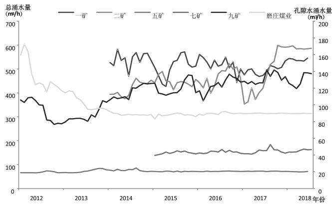
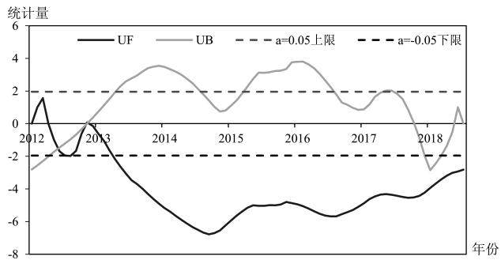
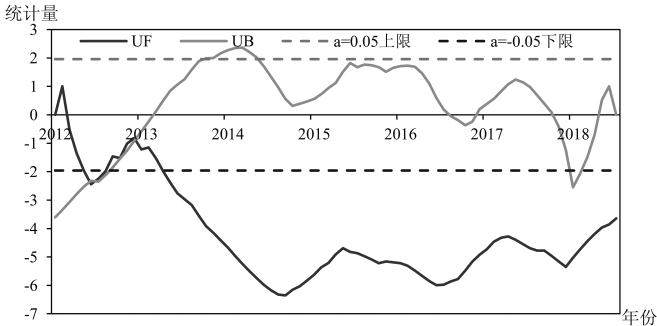
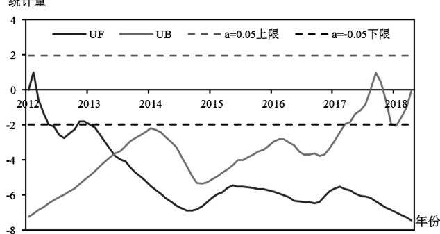
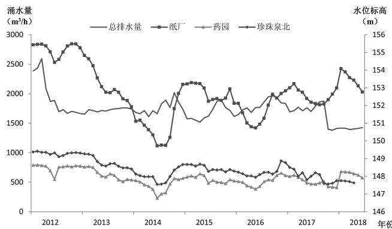

# 济源市煤矿矿井排水对孔隙地下水位的影响

□王振宇（河南省地质矿产勘查开发局第二地质矿产调查院）

摘 要：济源市孔隙水含水层厚度大，补给来源广，水量丰富，水质良好，为济源市工农业生产的重要水源之一。近些年来，随着工农业的发展，加大了孔隙地下水的开采，从而导致了地下水水位的整体下降，其中煤矿矿井排水也是一个影响因素。文章搜集了济源市目前生产矿井的涌水量和地下水长观井数据，采用 趋势检验法分析了近年来地下水位的变化趋势，并与涌水量变化进行对比，从而得出矿井排水不是造成区内地下水位下降的主要原因，为管理部门在水资源开发与保护决策中提供参考。关键词：矿井排水；地下水位；下降；Mann-Kendall检验

中图分类号：P641.8

文献标识码：B

文章编号：1673-8853（2019）08-0032-03

## 0 引言

济源市孔隙地下水主要分布在中东部倾斜平原区第四系和新近系松散砂砾石、砂卵石和中粗细砂层。其中第四系孔隙水富水区位于沁河冲洪积扇和蟒河冲洪积扇区，冲洪积扇区含水层厚度大、颗粒粗、补给条件优越，单井出水量一般为 3 ，局部达到 3 左右。坡洪积斜地及交接洼地区则富水性弱，单井出水量一般为 1 000 m3/d，局部为 1 000～3 000 m3/d。渗透系数由300 m/d左右变为10 m/d左右。受河流作用，含水层具有条带状分布特征，从山区到平原，水量、水质都具较为明显的分带性；山前边缘地带地下水位埋藏深度为10～45 m，向平原的中部和东部逐渐变浅，埋藏深度0.80～3.00 m，该含水层厚度大，补给来源广，水量丰富，水质良好，为济源市工农业生产的重要水源之一。

近些年来，随着工农业的发展，加大了孔隙地下水的开采，从而导致了地下水水位的整体下降。煤矿矿井排水也是其中一个影响因素，为分析煤矿矿井排水对孔隙地下水位的影响，本文根据2012年以来矿井排水及地下水位常观资料，首先利用Mann-Kendall趋势检验法来分析地下水位的变化趋势，然后与矿井排水资料进行对比，分析矿井排水对地下水位的影响，从而为管理部门在水资源开发与保护决策中提供参考。

## 1 生产矿井基本概况及涌水量

济源市煤矿主要分布在克井井田，原有生产矿井20余对，年破产重组后有 余对生产矿井，近年来受经济形势影响，加之国家淘汰落后产能，推进供给侧结构性改革的需要，相继关停了部分矿井，目前克井井田内有生产矿井 余对，分别为鹤济煤业的磨庄矿，济源煤业有限公司的一矿、二矿、五矿、七矿、九矿等。

克井井田各矿井主采煤层均为二叠系山西组的二 煤层，主要充水含水层为奥陶系灰岩水、石炭系太原组L8灰岩岩溶裂隙水、煤层顶板砂岩裂隙水，此外煤矿在浅部采煤时，还受大气降水与第四系砂砾石层孔隙水以及老窑、老空水的充水影响。受所处位置地层岩性组合特征、构造等条件影响，各矿井涌水量有所差别。

根据矿井涌水情况调查结果，目前研究区内6对生产矿井总的涌水量为1 304.70 m3/h（见表1）。

目前各生产矿井涌水量比较稳定，其中济煤一矿、二矿矿井涌水量较大，占总涌水量的79.80%。2012年区内几座矿井关闭，矿井总的涌水量有所减小，减少了637 m3/h，2017年随着克井二矿、济联矿和济煤三矿的关停，矿井涌水量进一步减少，但与之相邻的矿井涌水量有所增加，总涌水量减少了近300 m3/h。2012年以来济源市各生产矿井涌水量变化见图1。

## 2 地下水位变化趋势分析

为了解地下水位的变化趋势，选取有代表性的纸厂、药园、珍珠泉北三个长观孔数据，采用Mann-Kendall趋势检验法分析各长观孔地下水位的变化趋势。

## 2.1 Mann-Kendall 趋势检验

## 2.1.1 Mann-Kendall趋势检验原理

表1 济源市各生产矿井涌水量构成表
<table><tr><td rowspan="2">序号</td><td rowspan="2">煤矿名称</td><td rowspan="2">多年平均涌水量  $\left( \mathrm { m } ^ { 3 } / \mathrm { h } \right)$ </td><td colspan="6">涌水来源</td></tr><tr><td>孔隙水  $\mathrm { ( m ^ { 3 } / h ) }$ </td><td>所占比例(%)</td><td>顶底板砂岩水  $\left( \mathrm { m } ^ { 3 } / \mathrm { h } \right)$ </td><td>所占比例(%)</td><td>老空水等(m³/h)</td><td>所占比例(%)</td></tr><tr><td>1</td><td>鹤济磨庄矿</td><td>89.70</td><td>14.20</td><td>15.80</td><td>44.30</td><td>49.40</td><td>31.20</td><td>34.80</td></tr><tr><td>2</td><td>济煤一矿</td><td>510.20</td><td>161.70</td><td>31.70</td><td>58.40</td><td>11.40</td><td>290.10</td><td>56.90</td></tr><tr><td>3</td><td>济煤二矿</td><td>509.20</td><td>163.40</td><td>32.10</td><td>47.60</td><td>9.30</td><td>298.10</td><td>58.60</td></tr><tr><td>4</td><td>济煤五矿</td><td>20.40</td><td>5.30</td><td>26</td><td>12.80</td><td>62.70</td><td>2.30</td><td>11.30</td></tr><tr><td>5</td><td>济煤  $\pm \pi$ </td><td>44.70</td><td>12.70</td><td>28.40</td><td>23.80</td><td>53.20</td><td>8.20</td><td>18.40</td></tr><tr><td>6</td><td>济煤  $\hbar \textcircled { \hbar } ^ { * }$ </td><td>130.50</td><td>33.90</td><td>26</td><td>57</td><td>43.70</td><td>39.50</td><td>30.30</td></tr><tr><td></td><td>合计</td><td>1304.70</td><td>391.20</td><td>30</td><td>243.90</td><td>18.70</td><td>669.50</td><td>51.30</td></tr></table>

  
图1 济源市各生产矿井涌水量变化曲线图

在Mann-Kendall趋势检验中，假设H0为时间序列数据$\left( \mathbf { \rho } _ { \mathrm { X } _ { 1 } } , \mathbf { \rho } _ { \mathrm { X } _ { 2 } } , \cdots , \mathbf { \rho } _ { \mathrm { X } _ { n } } \right)$ ，是 $\mathbf { n }$ 个独立的、随机变量同分布的样本，趋势检验的统计量如下：

$$
\begin{array} { r } { S = \sum _ { i = 2 } ^ { n } \sum _ { j = 1 } ^ { i - 1 } s i g n ( X _ { i } - X _ { j } ) } \end{array}\tag{1}
$$

其中，sign（）为符号函数。当Xi-Xj大于、等于或小于零时，定义 $s i g n ( X _ { i } { - } X _ { j } )$ ）分别为 $1 , 0 , - 1 , \ y _ { \mathrm { n } } \geqslant$ 8时，统计量S大致服从正态分布，其均值为 ，方差为： $V a r ( S ) { = } n ( n { - } 1 ) ( 2 n { + } 5 ) / 1 8$

标准化统计量公式如下：

$$
Z _ { c } = \left\{ \begin{array} { l l } { ( S - 1 ) / \sqrt { V a r ( S ) } } & { S > 0 } \\ { 0 } & { S = 0 } \\ { ( S + 1 ) / \sqrt { V a r ( S ) } } & { S < 0 } \end{array} \right.\tag{2}
$$

在双边趋势检验中，对于给定的置信水平α，若Z $\scriptstyle \left| \geqslant Z _ { 1 - \alpha / 2 } \right.$ 表示即在置信水平α上，时间序列数据存在明显的上升或下降趋势。Z 值为正值表示增加趋势，负值表示减少趋势。Z 的绝对值大于等于1.28、1.64、2.32时表示分别通过了信度90%、、 显著性检验。

## 2.1.2 Mann-Kendall趋势检验分析

根据纸厂、药园、珍珠泉北3个长观孔2012年-2018年8年间的地下水位数据，运用Mann-Kendall方法做趋势检验，结果如表2。从表2可知，济源市的地下水位从2012年以来呈下降趋势，全部通过了0.01的显著性检验，说明地下水位下降非常明显。

表2 Mann-Kendall水位变化趋势检验表
<table><tr><td>长观孔位置</td><td>Z值</td><td>趋势方向</td><td>显著性</td></tr><tr><td>纸厂</td><td>-2.81***</td><td>下降</td><td>显著</td></tr><tr><td>药园</td><td> $- 3 . 6 2 ^ { * * * }$ </td><td>下降</td><td>显著</td></tr><tr><td>珍珠泉北</td><td>-7.33***</td><td>下降</td><td>显著</td></tr></table>

注： 表示通过 的显著性检验。

## 2.2 Mann-Kendall 突变检验

## 2.2.1 Mann-Kendall突变检验原理

对于一时间序列 （含有 个样本），构造一个秩序列：

$$
\begin{array} { r l } { S _ { k } = \sum _ { i = 1 } ^ { k } r _ { i } \quad } & { { } ( k = 2 , 3 , \dots , n ) } \end{array}\tag{3}
$$

其中：

$$
\begin{array} { r l } & { \{ \begin{array} { l l } { \ r _ { i } = + 1 , \ X _ { i } > X _ { j } } \\ { \ r _ { i } = 0 , \qquad \overbrace { \underset { \mathcal { H } } { \mathcal { H } } } ^ { \mathcal { H } } } \end{array}  \quad ( j = 1 , 2 , \dots , i ) } \\ & { \overset { \underset { i \times \nmid } {  } } { \underset { i \times \nmid } { \overset {  } { \sum } } } \times \xi \overset { \nmid } { \underset { i } {  } } \overbrace { \underset { \mathcal { H } } { \mathbb { H } } } ^ { \Xi \mathrm { H } } : } \\ & { U F _ { k } = [ s _ { k } - E ( s _ { k } ) ] / \sqrt { V a r ( s _ { k } ) } \quad ( k = 1 , 2 , \dots , n ) } \\ & { \overset { \nmid } { \underset { i \times \nmid } { \plus } } : E ( s _ { k } ) = n ( n + 1 ) / 4 , V a r ( S _ { k } ) = n ( n - 1 ) ( 2 n + 5 ) / 7 2 _ { \circ } } \end{array}
$$

UF 为标准正态分布，给定一显著水平α，查正态分布表得到临界值U，当 $\mathrm { U F _ { k } > U _ { a } }$ ，表明序列存在明显的趋势变化。一般取显著性水平系数 $\scriptstyle \alpha = 0 . 0 5$ ，那么 $\mathrm { U } _ { 0 . 0 5 } { = } { \pm } 1 . 9 6$ 。再按照上式计算，并使计算值乘以-1，得到UB。若UF 或UB 的值大于零，则表明序列呈上升趋势，小于零则表明呈下降趋势，当它们超过临界线时，则表明上升或下降显著。如果出现交点，且交点在临界线内，则此点就是突变点的开始。

## 2.2.2 Mann-Kendall突变检验分析

根据纸厂、药园、珍珠泉北 个长观孔 年 年间的地下水数据，运用Mann-Kendall方法做突变检验，结果如图2～图4。

  
图2 纸厂水位M-K统计量曲线图

对纸厂地下水水位来说，UF曲线从2012年3月份开始处于0值以下，说明地下水位呈下降趋势；2013年3月份以后，超过了临界线，说明地下水位呈显著下降趋势。根据UF和UB曲线交点的位置说明纸厂的地下水位在2012年11月份开始突变。

对药园地下水水位来说，UF曲线从2012年2月份开始处于0值以下，说明地下水位呈下降趋势；2013年3月份以后，超过了临界线，说明地下水位呈显著下降趋势。根据UF和UB曲线交点的位置说明纸厂的地下水位在 年 月份开始突变。

  
图3 药园水位M-K统计量曲线图

  
图4 珍珠泉北水位M-K统计量曲线图

对珍珠泉北地下水水位来说， 曲线从 年 月份开始处于 值以下，说明地下水位呈下降趋势； 年 月份以后超过了临界线，说明地下水位呈显著下降趋势。根据UF和UB曲线交点的位置说明纸厂的地下水位在2013年5月份开始突变。

上述分析表明：从统计学意义上看，纸厂、药园和珍珠泉北等 处地下水水位均呈显著的下降趋势，且均在 年前后发生了突变。

## 3 矿井排水对地下水位的影响分析

为了解矿井排水对地下水位的影响，绘制了矿井总排水量

与地下水位动态变化曲线，如图5。

  
图5 矿井总排水量与水位动态变化曲线图

由图5可知，矿井涌水量在2012年出现了显著的减少，而与此同时各长观孔水位也呈现出显著降低趋势，且在 年前后发生了突变，即观测孔水位和矿井涌水量呈现同步下降趋势，这表明自 年以来，矿井排水对孔隙地下水位的变化影响不大，不是造成该地区地下水位下降的主要原因。

## 4 结论

①通过Mann-Kendall方法检验，纸厂、药园和珍珠泉北等3处地下水水位均呈显著的下降趋势，且均在2013年前后发生了突变。

②根据矿井涌水量和观测孔地下水位对比分析，观测孔水位和矿井涌水量呈现同步下降趋势，说明自 年以来，矿井排水对孔隙地下水位的变化影响不大。

## 参考文献：

［1］谢葆，郭涛，张卫东，赵建生.Mann-Kendall检验方法在黄水沟部分水文要素变化趋势中的分析应用［J］.水利科技与经济，2013，19（1），26-28.

［］詹亚辉，张涛，王振宇 河南省济源市济渎泉泉域水文地质调查及泉水复流措施研究报告［ ］河南省地质矿产勘查开发局第二地质矿产调查院.2018年.收稿日期：2019-6-20

编辑：符 蕾

