卞正富，雷少刚，金丹,等.矿区土地修复的几个基本问题[J].煤炭学报,2018,43(1):190-197.doi:10.13225/j. cnki. jccs.2017. 4004

BIAN Zhengfu , LEI Shaogang ,JIN Dan , et al. Several basic scientific issues related to mined land remediation[ J]. Journal of China Coal Society,2018 ,43(1) :190–197. doi:10.13225/j. cnki. jccs. 2017.4004

# 矿区土地修复的几个基本问题

卞正富，雷少刚，金丹，王丽

(1.中国矿业大学国土资源研究所,江苏徐州 221116；2.矿山生态修复教育部工程研究中心,江苏徐州 221116)

摘要：通过对与土地复垦有关的概念梳理后，提出以土地修复作为高一级学科建设的名称涵盖土地复垦的名称。基于生态系统自恢复力的假说，讨论了矿区土地修复过程中，自然恢复与人工干预的作用，提出了引导型矿山土地自修复模式及其应用条件，指出了对关键限制性因素及其阈值的识别与修复是矿山生态系统引导自修复的关键；并进一步讨论了引导型矿区土地修复目标的合理程度。还讨论了采前预防及采后修复在矿区土地修复中的作用，对于露天矿山，采前预防或减损工艺应成为主流，在剥采排复一体化工艺实现后，土壤重构成为露天矿区土地修复成功的关键，而对于井工开采矿山，采前预防措施通常被用于局部需要特殊保护的地表建构筑物或具有重要保护价值的生态类型区，采后修复仍是主要的技术手段。 T

关键词：土地修复；土地复垦；生态重建；生态恢复

中图分类号：TD88

文献标志码：A

文章编号:0253-9993(2018)01-0190-08

# Several basic scientific issues related to mined land remediation

BIAN Zhengfu ,LEI Shaogang, JIN Dan , WANG Li

(Institute for Land Resources , China University of Mining and Technology, Xuzhou 221116 , China; 2. Ministry of Education Engineering Research Center for Mine Ecological Restoration ,Xuzhou 221116, China)

Abstract: Based on analyzing the concepts relevant to land reclamation , mined land remediation is proposed to act as the higher hierarchy for discipline development instead of mined land reclamation , which covers restoration , reclamation and rehabilitation. In terms of ecological resilience , the roles of natural restoration and manual intervention are discussed and a kind of self restoration model (SRM) for mined land ecosystem induced by manual intervention is proposed;the identification and remediation of the critical restrictive factors are also emphasized. Further studies on the acceptable conditions and remediation targets for SRM are introduced. Whichever preventive measures before mining or remediation measures after mining to be taken are up to the mining methods , remediation cost and ecological service value. In general situation considering nowadays mining technology , preventive measures before mining and low damage techniques for open-pit mining should be taken as essential methods. After integrated mining, stripping, disposal and reclamation into a whole, resoiling becomes into the key step for successful mined land remediation. On the other hand , preventive measures before mining are only used for protecting special surface buildings or most valuable ecological zones impacted by underground mining.

Key words: land remediation;land restoration ;land rehabilitation;land reclamation

## 1 关于矿区土地修复的概念

经过自1988年国务院土地复垦规定颁布、1989年实施以来近30年的实践与研究，土地复垦一词已经广泛被固定下来，其定义“是指对在生产建设过程中，因挖损、塌陷、压占等造成破坏的土地，采取整治措施，使其恢复到可供利用状态的活动”。2011年土地复垦条例将土地复垦定义调整为“是指对生产建设活动和自然灾害损毁的土地，采取整治措施，使其达到可供利用状态的活动”。在土地复垦规定颁布实施之前，土地复垦还被称为土地复用、造地复田、复土造田、复耕还田等，土地复垦规定颁布后，土地复垦的概念明确为将破坏的土地恢复到可供利用状态的活动，也就意味着复垦后无论是否为耕地、农林用途还是建设利用、休闲游乐利用都视为土地复垦。即使这样，由于汉字“垦”在很多词典里均作“垦，耕也”解释，土地复垦也就被理解为将破坏的土地改造为种植用地之意。

在矿山损毁的土地中，除了挖损、塌陷、压占3种类型外，还常有污染的土地，如排矸场、尾矿库及其周边土地。对于污染的土地在土地复垦规定中没有明确指出，但是实际上是难以回避的，因为挖损、塌陷、压占土地，特别是压占土地常伴有污染问题，复垦时是需要重点考虑的。对于污染土地，常使用土壤修复、土地修复一词。

由于矿产资源开发带来一系列的社会、经济、环境问题，这些问题是区域性的，土地复垦或土地修复被认为是单一的工程手段和目标指向，因此有人提出了矿区生态重建，自20世纪90年代后期，我国的矿区土地复垦通常被“矿区土地复垦与生态重建”取代。事实上，如果我们对照土地的概念就不难理解土地复垦是包含了生态恢复的目标的，土地是指由地球陆地部分一定高度和深度范围内的岩石、矿藏、土壤、水文、大气和植被等要素构成的自然综合体。BLASI等则将土地生态网络定义为保持结构和功能异质性的各种自然与生物特征的环境要素的总和[1]。因而在土地复垦时，不仅需要考虑地形因素，还要考虑土壤、水文、植被等多种环境要素及其相互之间以及与动植物、人类活动之间的相互作用[2]。

国际上，与土地复垦有关的概念有 Remediation，Restoration，Reclamation和 Rehabilitation（简称R4)。这几个概念通常是可以混用的，但是对于政府、企业、环境保护者、当地社区、普通民众等不同的利益相关者来说，这几个概念通常又有显著的区别，区别主要体现在各自的目标追求不同[3]。Remediation为针对污染场地的，需要去除污染物，保证气、水、土和人类的健康;Restoration为恢复采矿扰动前的生态系统，包括生物多样性、生态系统的结构和功能；Reclama-tion为要恢复原来的生态服务价值，包括采矿前的生态服务和地球化学循环功能，恢复后的生态系统不一定是采矿扰动前的生态系统；Rehabilitation为优先考虑粮食、生物质生产和水的供应，主要是农业、农林与水产养殖业，剩余的还有将废弃土地再开发，用于基础设施和休闲场所变成绿色或蓝色空间。可以看出，从Remediation , Restoration , Reclamation到 Rehabilita-tion，可以理解为修复、恢复、重建与复垦是处理采矿废弃(含污染)土地的几种措施，从修复到复垦的难度逐渐减小。近期，中国煤炭学会在中国科协的指导与支持下，开展了“煤矿区土地复垦与生态重建”学科进展研究。为避免中文词义上的歧义，同时遵循高级涵盖低级的原则，笔者建议以土地修复作为高一级学科名称去讨论土地复垦等相关问题。

## 2 自然恢复与人工干预在土地修复中的作用

矿区土地修复或生态恢复过程中，自然恢复力及人工于预均发挥着重要的作用，不同的学者对两者作用的重要性的认识存在差异。需要搞清楚哪些生态因子在何种破坏程度下可以实现自恢复；当需要人工干预时，何时干预、如何干预、干预到什么程度。只有这样才能算是处理好了自然恢复与人工干预的关系，以保证矿山生态系统走上良性循环道路。

## 2.1 矿山土地生态系统自然恢复的基础与特征

矿山土地生态系统与一般生态系统一样,其要素包括大气、植被、地形、地下水、地表水、岩层结构、植物、动物、微生物等多方面，也存在着物质、能量与信息流动，具有结构与功能、复杂性、动态性、稳定性等特征，并提供生态服务功能[4]。它是受人类活动较强干扰的一种特殊生态系统。依据生态系统理论，生态系统的结构和功能之所以能够保持相对的稳定状态，即具有稳定性，是因为它本身具有一定的自我调节能力，即自修复力[5-6]。这种生态系统固有的、动态变化的自修复力维持着生态系统健康及其更新。矿山土地生态系统同样具有自修复力，利用其固有的自修复力进行环境要素修复与生态功能恢复这种生态恢复方式被称之为自然恢复。受损生态系统能否依靠自然恢复取决于生态系统受损程度。其主要优点是采矿后几乎无需人为投入，可大量节约矿山生态恢复的成本，并且遵从原有生态环境特征与自然演替规律，与相邻自然生态系统可以较好的融合，具有可持续性；其缺点是受到生态系统受损程度的限制，其恢复过程可能非常缓慢，甚至长达百年：一些严重的生态环境破坏损伤，如重金属污染、露天采坑、永久地裂缝等几乎不可能自我修复。BRADSHAW指出利用自然过程恢复受扰动的矿山自然环境要素，并分析了利用自然过程恢复矿山生态系统的主要方式7-8]。FERNÀNDEZ等(2014)研究指出开采扰动停止后采区植物群落组成结构可自然恢复[9]；韩霁(2007)研究指出在干旱少雨的中国西部采取自然恢复，可以形成更为稳定的植物群落10]；胡振琪等(2014)分析了矿山生态系统利用自然的力量实现自修复、自然修复等恢复方式[11]。结合已有自然恢复的理论研究，笔者认为矿山土地生态系统自然恢复是指，煤炭开采及塌陷造成的外界干扰消失后，依靠生态系统本身的自修复力(包括自组织与自调控能力)，或辅以外界人工调控行为，使受损的环境要素与生态系统(包括构成系统的各子系统），恢复到相对健康的状态，最终实现区域煤炭资源可持续开采利用和生态环境保护。

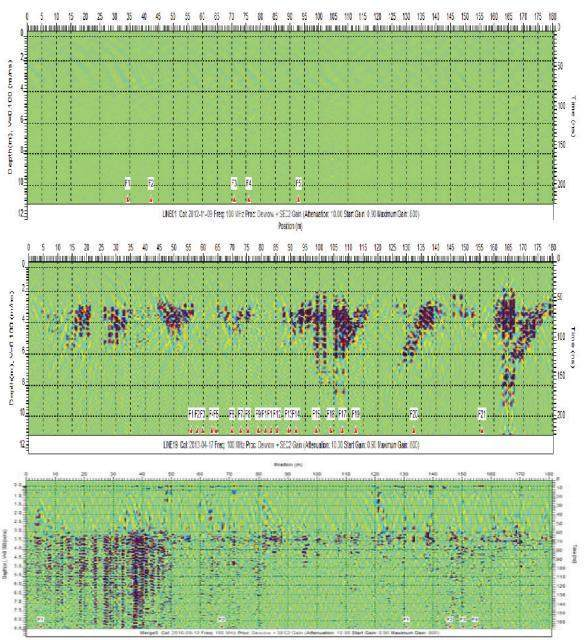

在利用矿山土地生态系统自修复力开展自然恢复需要考虑以下几个方面：

(1)认识矿山生态环境要素的自然恢复特征。

煤炭采空后对矿区生态系统产生强烈干扰性，原有生态系统结构和功能遭到破坏，生态环境因子相应发生变化，如地下水位下降、岩层结构破坏、土壤含水量下降、土壤速效氮流失、土壤孔隙增大，植被受损、景观生态系统发生变化等。同时，也有越来越多的专家、学者关注到地下开采扰动后矿区生态环境要素的自然恢复特征。掌握这些土壤参数[8]、地裂缝[11-12]，地下水位[12]等生境要素自然恢复的时间、空间、过程特征，有助于判别采取矿山生态自然恢复的前提与可行性，并识别其自然恢复的限制因素或阈值条件，以便于通过适度的人工干预促进矿山土地生态系统自然恢复。

相关研究发现在风积沙采煤沉陷区土壤具备一定的自修复能力，风沙区采煤沉陷后2\~7a，土壤含水量可自然恢复至75%左右，土壤孔隙度可完全恢复，土壤N，P元素含量沉陷后12\~17a才能逐步恢复[13]。上述研究表明，采煤塌陷后短期内土壤水含量、氮含量、空隙度、容重都显著下降[14]，从长时间序列来看土壤孔隙和土壤水自修复能力较强、恢复较快，而土壤N，P恢复需要经历较长的时期[15]。图1为采用探地雷达对神东矿区大柳塔52煤某工作面硬梁地土体采前(上)、采后两月(中)、采后3a(下)的变化监测，初步发现采后两个月时间无论中性区、压缩区还是拉伸区，土体性质都因沉陷变形影响而变化，并呈现不连续非均匀扰动；主要出现在2\~6m深度(根系层)范围，最深可达11m。然而沉陷后3a探测到的沉陷区扰动土体除局部较大的变形区,大部分区域基本恢复正常,体现出了土体结构的自恢复性；也即植被根系层土体物理性质部分自然恢复到了较为均质的状态。

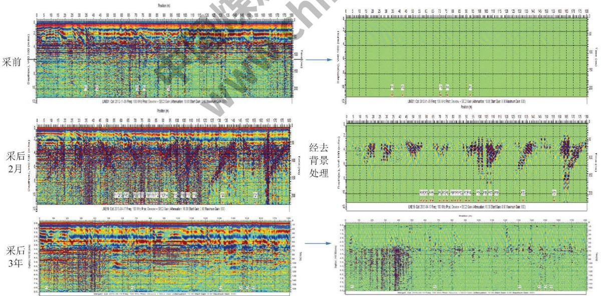  
图1 采前(上)、采后两月(中)、采后3 a(下)土壤剖面GPR(100 MHz)信息处理对比  
Fig. 1 Comparisons of GPR signals( 100 MHz) of the soil profile among the stage of pre-mining (up) ,two months after mining (middle) ,three years after mining (down)

卞正富等(2016)结合开采沉陷规律与现场观测，指出了井工开采沉陷区的中性区随着工作面的推过，地表趋于稳定，采动过程中形成的临时性动态地裂缝具有自愈合的特征；在保证不影响井下生产的安全性前提下，此环境损伤主要利用自然恢复即可[12]而采后位于拉伸区地表起伏的大量永久性地裂缝连通了沟道，改变了区域沟道网络的分布，导致大量水土资源流入地裂缝，加剧了地表水土资源的流失(图

2)。因此，需要对这些永久性地裂缝进行人工干预治理[16]。

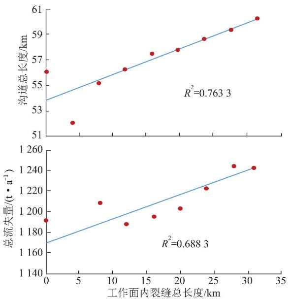  
图2 沉陷区永久性地裂缝长度与沟道和水土流失量的关系  
Fig. 2 Relationship between the permanent ground fissure length with channel (left) and soil erosion (right)

## (2)掌握矿山植被系统自然恢复的演替特征。

植被生态系统是指示矿山土地生态系统健康与演替方向的主要标识。因此理解采矿扰动后矿山植被生态系统的自然恢复演替方向、时空特征以及恢复演替的限制因素是判断矿山生态良性演替以及人工干预合理程度的关键。然而，已有研究对植物群落与胁迫环境因子相互作用的生态过程及生态关系的定量分析还很不足，对沉陷干扰下植被系统恢复及演替的过程及规律认识不清。笔者采用静态样方法，分析了神东大柳塔矿井沉陷后1,2,3,4,6,8,10,12,16 a采空区植物的种类、高度、密度、盖度、频度及其土壤理化性质，并应用冗余分析(RDA)方法，对沉陷区关键环境影响因子约束下物种重要值及群落恢复力综合指数时序变化特征进行了定量分析(图3)。初步发现沉陷1\~4a，矿山植被生态系统恢复力快速降低，群落演替类型逆行演替：沉陷4\~8a，矿山植被生态系统恢复力缓慢降低，群落演替类型逆行演替：沉陷8\~12 a,矿山植被生态系统经过8a恢复演替进入进展演替阶段，恢复力逐渐增加:沉陷后12a，恢复力基本恢复到采煤沉陷前水平。土壤水是影响该矿山植被系统恢复演替的关键环境因子，开采沉陷时间和速效磷是限制系统稳定性的主要因素。在物种尺度方面，一年生草本植物对开采沉陷的适应性较好，受采煤沉陷引起的土壤水分、有机质、速效磷变化影响较小；小半灌木、多年生草本植物受土壤水、速效磷和有机质影响较大，且与沉陷后恢复更新时间成显著负相关：多年生草本植物、一年生草本植物与恢复更新时间密切相关，且与土壤水、速效磷成显著负相关。上述沉陷区植被系统自然恢复的演替特征研究结果，可为是否采取人工干预措施，以及干预的时机、方式与物种选择等提供参考。

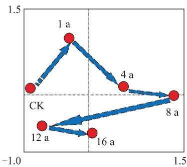

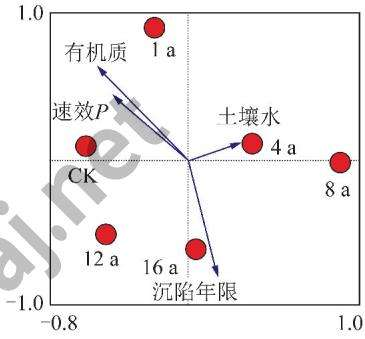  
图 3 植被系统恢复与沉陷年限RDA 排序(上)，与环境因子RDA 排序(下)  
Fig. 3 RDA ranking of vegetation restoration and subsidence years (up) , and environmental factors (down)

## 2.2 引导型矿山生态修复模式

无论是自然恢复还是人工修复都各有优缺点，以及使用的前提。自然恢复普遍存在于各种生态修复模式中，即使完全人工重建的生态系统仍然离不开环境要素与生态系统长期的自然变化演替。当然完全的采用自然恢复，也不是绝对排除人的主观能动性，而是强调人由主宰到辅助的角色转变[17-18]。因此，只有适度、科学的人工干预引导自然恢复过程才是修复受损矿山生态系统应采取的修复模式。引导型矿山生态修复模式要求自然恢复与人工干预的结合，其立足于矿山生态系统固有的修复能力，使受损生境通过自身的主动反馈，不断自发地走向恢复和良性循环；人为干预应该重点考虑矿山生态系统的本底环境地质条件、合理的演替方向和修复目标、受损程度及限制条件、可以容忍的演替恢复时间，以及人工干预的成本等。

仍以干旱半干旱的生态脆弱矿区植被系统重建为例，为减轻采矿对生态环境的负面影响，大多矿区已开展了各种以植被重建为主的生态建设工作。尽管在土壤改良、地裂缝治理、土壤根际环境改善、菌根等植被重建技术方面已取得了重要进展，然而，由于盲目地强调提高植被覆盖度，这些重建技术的成本往往太高，对原有植被种群冲击较大、大量新进灌乔植被的种植所开挖的大量鱼磷坑直接破坏了原有地表植被，加之部分重建植被成活率低，管护期结束之后，大量新增物种难以适应严酷的气候地理条件，出现生长缓慢，甚至衰亡。形成了环保资金的高投入与植被重建的低效性的矛盾，现有西部矿区人工重建植被系统的可持续性不容乐观。另一方面，开采引起的地表沉陷对植被的影响并不全是负面的，部分区域的植被覆盖量以及生物多样性相比采前都呈现了增加的情况[19]。从适度干扰理论的角度来看，这些区域由于地势的改变植被呈现出了一种良好的自修复演替现象。当务之急，应严格遵循当地自然生态系统发展规律，识别区域内的植物生长限制因子、生物多样性、先锋树种及主要伴生树种的生态位和现有植物的群落动态和种群空间分布格局，采用引导型植被修复的模式，引导受损植被系统自修复进程。 X

## 3 土地修复的目标及其合理程度

实现矿山土地的可持续利用、恢复矿山土地的生产能力已经成为国际上主要矿业国家的发展主旨，然而却不可能形成统一的修复模式与修复目标。现有的矿山生态恢复也并非一定要使受损生态系统的结构和功能恢复到受干扰前的状态。因此，无论是自然恢复、人工修复，还是两者相结合的引导型自然恢复模式，都需要根据受损矿山所处的特定社会、经济、环境复合系统以及人们对采后矿区土地的保护和利用方向，科学制定修复目标，明确修复应达到的合理程度。对于完全人为主导并改变土地利用方式的土地修复的合理程度主要取决于矿区土地修复所能带来的社会、经济与生态综合效益。这些效益评价已有相关的指标体系，但大都取决于矿区土地修复管理者的主观期望值。

本文主要讨论引导型矿区土地修复目标达成的合理程度。BRADSHAW(1997)指出有效地识别影响极端的土壤条件限制因素，并进行适度合理的人为治理之后，土壤与植被的自然恢复进程会更加顺畅[8]。因此，原有受损土地生态系统一旦完全满足水、肥、气、热等基本需求，矿区生态系统即可进入良好的自修复进程，其难点在于如何把这些影响或阻碍受损生态系统自修复进程的关键限制性因子度量出来。因此，笔者认为在特定修复目标下，引导型矿山生态修复模式应以限制性因素及其阈值识别为根本出发点，并以限制因素是否修复到阈值条件作为矿区土地修复目标的合理程度判别的基本标准。取决于不同受损生态系统本底条件，其可能的限制性因素包括地下水位、土壤水、土壤养分、重金属、pH值、盐分、坡度、温度、多样性、覆盖度等等。因此，如何有效识别受损生态系统的关键限制因素及其阈值是引导型矿区土地修复面临的关键问题之一。

以西部干旱半干旱生态脆弱的神东矿区为例分析生态修复的限制因素。从前面分析可知土壤水作为该矿区植被生长的关键影响因素主要受到地下潜水位埋深与降水影响。如图4所示，对补连沟地区开展的地下水埋深与植物群落的关系现场调查表明，地下潜水埋深3.2,8.0m为两个不同的阈值，当低于3.2m之后，沟谷地区的湿生植被演替为旱生植被；当低于8m之后，旱生植被演替为沙生植被、土地覆盖格局发生演替。从区域性植被指数与土壤含水率的相互关系来看，生长季土壤含水率8%为影响该区域植被生长的拐点[17]。当这些限制性条件满足之后，整体气候条件良好稳定的条件下，该区域的植被系统的自然恢复进程将会较顺利地进行。如图5所示，该矿区的植被与其所在晋陕蒙接壤流域的植被具有非常高的相似性，通过遥感反演该区域多年的生长季平均土壤水基本都高于8%，并呈增加趋势[20-21]。因此，总体呈现出受区域降水影响下的植被年周期性变化，也即该矿区达到了良好的环境条件，表明近些年该区域植被系统具有了较好的自修复能力。

图6为大柳塔矿区采用人工种植与自然恢复两种修复模式后植被覆盖度的变化趋势。两种恢复区原有本土物种有：油蒿、柠条、胡枝子、杨树、沙柳、沙棘、狗娃花、紫花苜蓿等。人工修复区主要新增的经济物种有：文冠果、欧李、油松、长柄扁桃、沙棘。通过遥感历史反演得到采后恢复区域的土壤含水率都超过了8%以上[20]，因此经过14 a的采后恢复，两种修复区植被覆盖度均表现为先升后平稳的趋势，植被覆盖度几乎达到了70%以上。尽管人工修复模式的植被增加速度与植被覆盖度高于自然恢复区，但两种修复模式下的植被变化总体趋势仍较为相似，而人工修复模式区并不能保证在停止人工干预(如灌溉)后仍能持续保持较高的植被覆盖度。因此，在该半干旱生态脆弱区，作为控制该区域本土植物生长的土壤含水率达到其自然恢复的阈值条件后，无论是人工恢复还是自然恢复都可以达到相似的生态恢复效果。

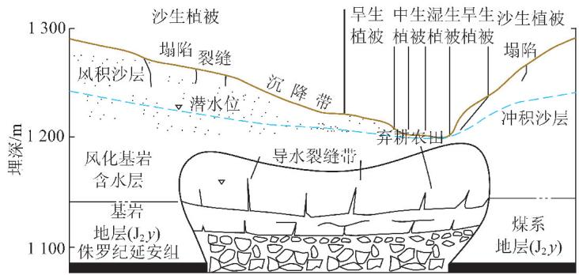

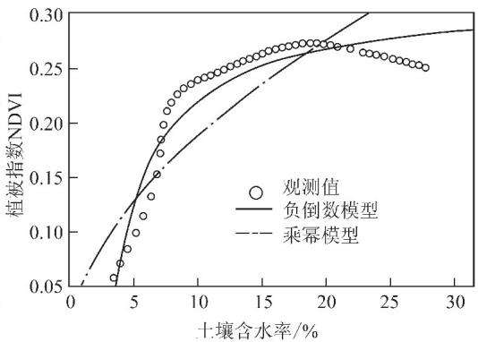  
图4 风积沙区地下水埋深与植物群落的关系(左)，区域NDVI与土壤水的关系(右)

Fig. 4 Relationship between groundwater table and plant community in aeolian sand area (left) , the relationship between the regional NDVI with soil water content (right)  
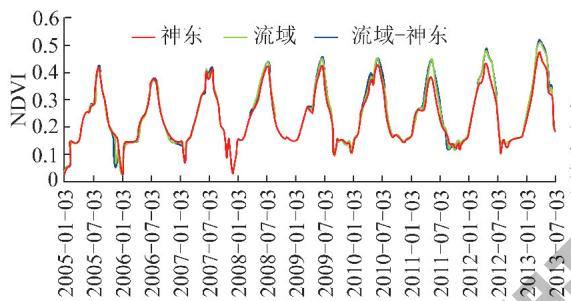

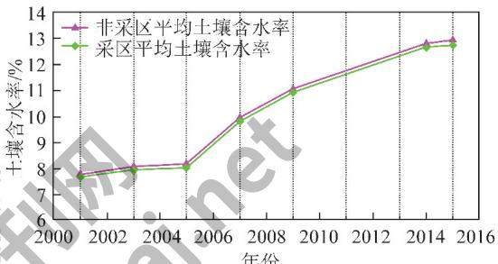

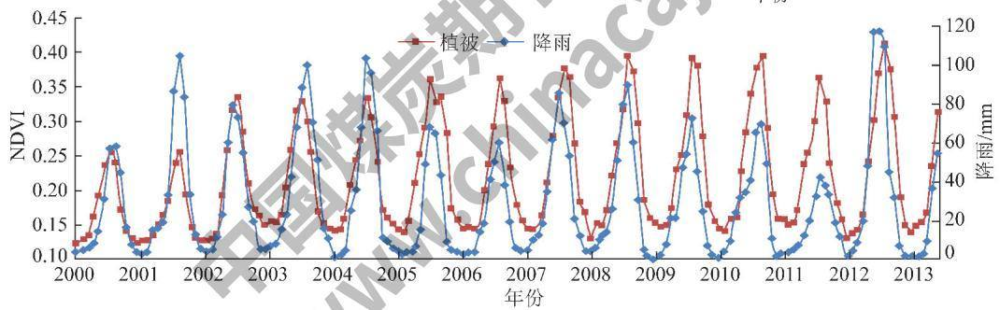  
图5 矿区植被与流域植被变化高度相似，样区近些年土壤水呈增加趋势(上)，植被与降雨变化高度周期性相似(下)

Fig. 5 High similarity of the vegetation variations between the mining area and its basin , an increasing trend of the soil water at the study area in the recent years (up) ;highly similarity of the periodic change between vegetation and rainfall (down)  
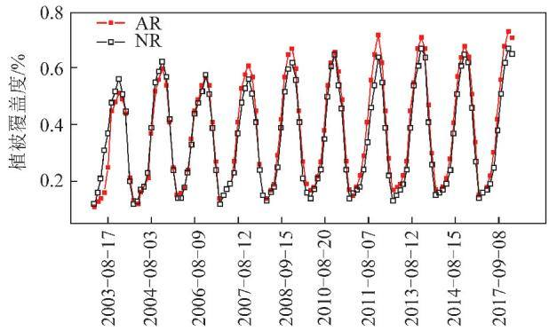

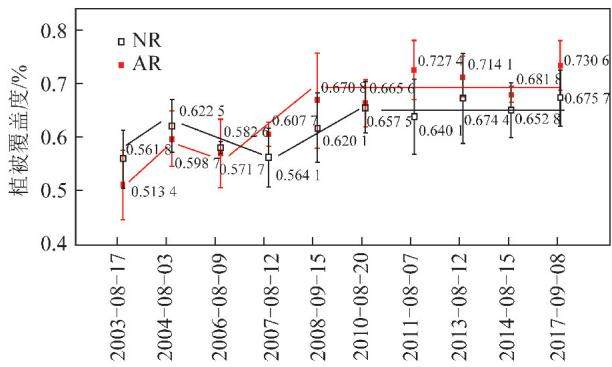  
图6 人工恢复区(AR)与自然恢复区(NR)不同年植被覆盖度的变化趋势  
Fig. 6 Trends of vegetation coverage between artificial restoration area (AR) and natural restoration area (NR) in the last 14 years

## 4 采前预防与采后修复在矿区土地修复中的作用

矿区土地修复按实施阶段可分为采前预防与采后修复，通常根据不同开采方式下的扰动过程和结果确定预防和修复的目标。露天采矿由于大规模的岩土扰动，导致植被与生物群落消失，从而导致露天矿山景观类型的深刻变化。井工矿多由于地表塌陷对地面建构筑物、农田等造成不同程度的破坏，通常不会像露天开采那样彻底改变矿区原始景观，只有在地表塌陷形成大面积积水区，才会完全改变原始土地景观。当前矿区土地修复的主要手段是采后修复，采取采前预防措施的非常有限。

矿区土地修复属于一种环境保护措施，在环保意识日益觉醒的今天，大家不禁要问为什么还要走先破坏后治理的老路，能不能采取保护性开采措施？对于露天矿山，由于采取合理的剥采排复一体化工艺，可以大大地减少后期土地修复成本，因此采前预防或减损工艺被广泛重视并被得到应用。露天矿区土地修复中，地貌重塑可以与采矿工艺有机地结合起来，有效地降低成本，为后续的土地修复创造良好的条件。植被重建则是在重塑的地貌和重构的土壤上开展的生态修复行为，因此土壤重构是露天矿区土地修复能否成功的关键。一种常见的人工干预做法是从扰动区域中取土进行表土置换，或从其他地方取土进行表土转移，再引进新的种子库、昆虫群落和植物病原菌进行土壤重构与地貌重塑，对生态系统进行恢复和重建。该做法对于大面积的矿区土地修复而言，工程成本比较高。为了解决表土来源的问题，0'BRIEN等(2017)提出了一种扰动土壤混合工艺用于修复受原油开采污染的底土[22]。他们的做法是按照1：1的体积比将污染底土与本地未受污染的农业表土进行混合，统计数据表明，对比本地天然土壤和扰动土壤，混合土壤实现了地表空间上和地下深度上的同质,但由于土壤有机碳、植物可用养分、生物活性方面的改变，混合土壤的表现显著不同。土壤混合工艺适用于大尺度扰动区域的土地修复，有助于降低工程成本、促进土壤参数的恢复。

对于地下开采矿山，由于采前预防需要改变生产工艺，如采取充填开采，成本太高，且受到预测、保护技术的限制，很难达到预期的保护效果，同时，大量历史遗留采矿塌陷土地的现实，大部分的矿区土地修复实践为采后修复。另一方面，地下开采引起的矿区土地景观类型的改变在不同区域显现出的生态服务价值改变不像露天矿山那样明显，如华东地区很多矿区开采沉陷引起局部地表积水，形成了“塌陷湖”，将原有农耕生态类型改变为水陆共生生态类型，如果该区域原农耕系统存在旱季缺水或雨季水涝威胁，那么保留一部分“塌陷湖”作为水源或泄洪区，塌陷湖就成为农耕系统有利的因素，而不必采取采前减沉措施。近年来，随着城市化进程的加速，过去的远郊矿山变成了近郊矿山甚至城中矿山，不少地方将塌陷积水区改造成休闲游乐场所，如徐州的潘安湖湿地公园和九里湖湿地公园、唐山的南湖城市中央生态公园、淮北的南湖湿地公园等，成为当地甚至全国闻名的旅游胜地，发挥了极高的生态服务与休闲游乐价值。这也从一个侧面说明，对于井工矿山未必需要采取采前减沉措施保护原农耕景观生态类型。当然，在井工矿区土地修复中，采前预防措施在某些特定的情况下，仍然可以发挥较高的经济、生态与社会效益，如在沉陷积水前将表土剥离收集堆放以备充填复垦使用，在特殊的建构筑物下或具有重要保护价值的生态类型区采取充填开采措施或其他保护性开采措施等。

因此，是否采取采前预防措施，需要从经济成本-效益、生态服务价值以及社会效益等方面进行综合核算。土地修复的投资评估不仅要考虑矿石量、矿物品位、商品价格等营业收入、试生产的资金、正式运营成本，还要去除项目风险中的货币时间价值，以及考虑到气候变化等非市场风险的影响与商品价格、外币兑换等市场风险的系统关联性[23-25]。

## 5结语

经过30多年的理论研究和工程实践，我国矿区2土地复垦已进入一个新的历史阶段，需要对一些基本问题进行必要的总结和反思。笔者从学科建设与工程实践需要出发,提出了以矿区土地修复作为高一级学科名称替代矿区土地复垦或土地复垦与生态重建。基于生态系统自恢复力假说，分析了自然恢复与人工干预在矿区土地修复中的作用，在利用矿山土地生态系统自修复力开展自然恢复时需要考虑不同的生态环境要素的自然恢复特征，并掌握矿山植被系统自然恢复的演替特征以及限制其自然恢复演替的关键因素，由于矿产开采对土地生态系统的扰动通常是高强度的扰动，因此，大多数情况下，矿区土地修复应该是引导型生态自修复模式，必须采取适度、适时、科学的人工干预，并依靠其自身的恢复力，使受损生境通过自身的主动反馈，不断自发地走向恢复和良性循环。矿区土地修复的合理目标同样必须考虑生态系统的自恢复力以及环境条件，并以关键限制因素是否修复到阈值条件作为矿区土地修复合理程度的重要标准，不可过度依赖不恰当的人工干预措施盲目追求高指标，如过高的植被覆盖率。关于采前预防与采后修复措施的选取，主要基于两个主要因素，一是开采方式，通常情况下，露天矿山借助科学的采剥排复一体化工艺可有效降低后期的修复成本，而井工矿山就难以做到，二是需要考虑土地修复成本和生态系统服务价值，如果采前生态系统具有特殊的保护价值，这时应当采取采前减损措施，否则采取采后修复措施，仍可将受损的土地生态系统修复到可供利用的状态和人类可接受的程度。

## 参考文献(References):

[1] BLASI C, ZAVATTERO L, MARIGNANI M, et al. The concept of land ecological network and its design using a land unit approach [J]. Plant Biosystems,2008 ,142(3) :540-549.

[2] 卞正富.矿区土地复垦界面要素的演替规律及其调控研究[M].北京：高等教育出版社,2001.

[3] LIMAA Ana T, MITCHELLA Kristen, O' CONNELLA David W, et al. The legacy of surface mining: Remediation , restoration , reclamationand rehabilitation [ J]. Environmental Science & Policy , 2016, 66:227-233.

[4] 卞正富，许家林,雷少刚.论矿山生态建设[J].煤炭学报,2007， 32(1):13-19. BIAN Zhengfu , XU Jialin , LEI Shaogang. Discussion on mine ecological construction[ J]. Journal of China Coal Society , 2007 ,32 ( 1) : 13-19.

[5] 张雪萍.生态学原理[M].北京:科学出版社,2011.

[6] 张绍良，杨永均，侯湖平.新型生态系统理论及其争议综述[J]. 生态学报,2016,36(17):5307-5314. ZHANG Shaoliang, YANG Yongjun , HOU Huping. Overview of novel ecosystems theory and its critiques[ J]. Acta Ecologica Sinca,2016, 36(17):5307-5314.

[7] BRADSHAW A. The use of natural processes in reclamation-advantages and difficulties [ J]. Landscape and Urban Planning, 2000, 51(2-4):89-100.

[8] BRADSHAW A. Restoration of mined lands-using natural processes [J]. Ecological Engineering,1997,8(4) :255-269.

[9] FERNÀNDEZ Montoni M V, FERNÀNDEZ Honaine M, RÍO J L Del. An assessment of spontaneous vegetation recovery in aggregate quarries in coastal sand dunes in Buenos Aires province, Argentina [J]. Environmental Management,2014,54(2):180-193.

[10] 韩霁.自然修复与人工修复不可偏废[N].经济日报,2007-05-15.

11] 胡振琪，龙精华，王新静.论煤矿区生态环境的自修复、自然修 复和人工修复[J].煤炭学报,2014,39(8):1751-1757. HU Zhenqi, LONG Jinghua, WANG Xinjing. Self-healing, natural restoration and artificial restoration of ecological environment for coal mining. [J] . Journal of China Coal Society ,2014,39 (8) : 1751-1757.

「12]卞正富，雷少刚，刘辉，等.风积沙区超大工作面开采生态环境 破坏过程与恢复对策[J].采矿与安全工程学报,2016,33(2)： 305-310. BIAN Zhengfu, LEI Shaogang, LIU Hui, et al. The process and countermeasures for ecological damage and restoration in coal mining area with super-size mining face at aeolian sandy site[ J]. Journal of Mining & Safety Engineering,2016,33 (2) :305-310.

[13] 王琦，全占军，韩煜，等.风沙区采煤塌陷不同恢复年限土壤理化性质变化[J].水土保持学报,2014,28(2):118-122,126.WANG Qi, QUAN Zhanjun , HAN Yu, et al. Changes of soil physi-

cal and chemical properties under different coal mining subsidence years in windy desert area[ J]. Journal of Soil and Water Conservation,2014,28(2):118-122,126.

14]郄晨龙，卞正富，杨德军，等.鄂尔多斯煤田高强度井工煤矿开 采对土壤物理性质的扰动[J].煤炭学报,2015,40(6):1448- 1456. QIE Chenlong, BIAN Zhengfu, YANG Dejun , et al. Effect of highintensity underground coal mining disturbance on soil physical properties[ J]. Journal of China Coal Society ,2015 ,40 (6) :1448- 1456.

[15] 王新静，杨耀淇，高杨.风沙区采煤沉陷土壤质量演变的时效评 价[J].煤炭工程,2013,1(1):89-92. WANG Xinjing, YANG Yaoqi, GAO Yang. Evaluation on evolution time effect of soil quality in mining subsidence ground of windy desert area[ J]. Coal Engineering,2013,1(1) :89-92.

[16] 刘辉，雷少刚，邓喀中，等.超高水材料地裂缝充填治理技术[J].煤炭学报,2014,39(1):72-77.LIU Hui , LEI Shaogang, DENG Kazhong , et al. Research on groundfissure treatment filling with super-high-water material[ J]. Journal

张绍良，张黎明，侯湖平，等.生态自然修复及其研究综述[J]. 干旱区资源与环境,2017,31(1):160-166. ZHANG Shaoliang, ZHANG Liming, HOU Huping, et al. Ecological natural restoration and its review[ J]. Journal of Arid Land Resources and Environment ,2017,31 (1) :160-166.

[18] RICHARD J Hobbs , SALVATORE Arico, JAMES Aronson , et al. Novel ecosystems: Theoretical and management aspects of the new ecological world order [ J ]. Global Ecology and Biogeography, 2006,15(1):1-7.

19] 雷少刚.缺水矿区关键环境要素的监测与采动影响规律研究[M].徐州：中国矿业大学出版社,2012.

[20] WANG Yuchen , BIAN Zhengfu , LEI Shaogang, et al. Investigating spatial and temporal variations of soil moisture content in an arid mining area using an improved thermal inertia model[ J]. Journal of Arid Land ,2017,9(5) :712−726.

[21] 雷少刚，卞正富.西部干旱区煤炭开采环境影响研究[J].生态 学报,2014,34(11):2837-2843. LEI Shaogang, BIAN Zhengfu. Research progress on the environment impacts from underground coal mining in arid western area of China[ J]. Acta Ecological Sinica,2014,34(11) :2837-2843.

[22] O' BRIEN P L, DESUTTER T M, RITTER S S, et al. A large-scale soil-mixing process for reclamation of heavily disturbed soils[ J]. Ecological Engineering,2017(109) :84-91.

[23] ESPINOZA R D, ROJO J. Towards sustainable mining ( Part I) : Valuing investment opportunities inthe mining sector[ J]. Resources Policy ,2017(52) :7-18.

[24] ESPINOZA R D, MORRIS J W F. Towards sustainable mining(Part II) : Accounting for mine reclamation andpost reclamation care liabilities[ J]. Resources Policy ,2017(52) :29-38.

[25] BIAN Z, MIAO X, LEI S, et al. The challenges of reusing mining and mineral-processing wastes[J]. Science ,2012 ,337(6095) :702.