  
移动阅读

卞正富，于昊辰，侯竟，等.西部重点煤矿区土地退化的影响因素及其评估[J].煤炭学报,2020,45(1):338- 350. doi:10. 13225/j. cnki. jccs. YG19.1722   
BIAN Zhengfu, YU Haochen , HOU Jing, et al. Influencing factors and evaluation of land degradation of 12 coal mine areas in Western China[ J]. Journal of China Coal Society ,2020 ,45(1) :338-350. doi:10. 13225/j. cnki. jccs. YG19. 1722

# 西部重点煤矿区土地退化的影响因素及其评估

卞正富1,2,3，于昊辰1,2，侯 竟1,2，牟守国1,2,3

(1.中国矿业大学 环境与测绘学院，江苏 徐州 221116；2.中国矿业大学 国土资源研究所，江苏 徐州 221116；3.矿山生态修复教育部工程研究中心,江苏徐州 221116)

摘要：中国西部生态环境极其脆弱，煤炭资源开发与自然因素共同作用导致的矿区土地退化不容忽视，本文旨在揭示我国西部煤矿区土地退化的成因、程度、分布与趋势，为矿区土地退化防治与国土空间生态修复提供数据基础与决策依据。提出了煤矿区土地退化的概念，将煤矿区土地退化的直接因素划分为挖损、塌陷和压占，间接因素或外在表现划分为土壤侵蚀、植被退化与沙漠化或石漠化，结合实地调查并辅以高分辨率与高光谱遥感数据解译，提取了上述土地退化因素信息，并提出了土地退化外在表现的分级评价标准，进而构建了西部煤矿区土地退化的综合评价模型，对分布于黄土高原区、西南山地丘陵区、北方草原区和西北干旱区的12个重点煤矿区进行了土地退化信息提取、土地退化因素分析与土地退化综合评价。结果表明：①影响井工煤矿的万吨塌陷率的因素有累计采厚、平均采深、煤层倾角及上覆岩性，影响露天煤矿的万吨损毁率的因素包括煤层厚度、剥离岩土厚度及其堆放方式。②不同地域的矿区土地退化主要表现有所不同：黄土高原区为植被退化和土壤侵蚀，西南山地丘陵区为土壤侵蚀，北方草原区与西北干旱区植被退化、土壤侵蚀与沙漠化3者兼有。③矿山尺度的土地退化要比矿区尺度的更为剧烈，露天开采引起的土地退化要强于井工开采 $; \bar { \varkappa } \dot { \bar { J } }$ 区尺度的土地退化程度与煤炭资源开发强度(用煤矿扰动面积与矿区总面积之比表示)有关，开发强度越大，矿区土地退化程度越严重，而土地退化程度与开发强度并不呈正比，它还与矿区的生态脆弱性或承载力有关。因此，不同区域、不同采煤方法造成的土地退化形式及退化程度不一，因此需要采取不同的修复策略；为防止过度土地退化，需要根据矿区生态承载力确定合适的开发强度。

关键词：土地退化；影响因素；评估；煤矿区；西部

中图分类号：TD88

文献标志码：A

文章编号:0253-9993(2020)01-0338-13

# Influencing factors and evaluation of land degradation of 12 coal mine areas in Western China

BIAN Zhengfu1,2,3 , YU Haochen1,2 , HOU Jing1,2 , MU Shouguo1,2,3

(1. School of Environment Science and Spatial Informatics , China University of Mining and Technology, Xuzhou 221116, China; 2. Institute for Land Resources , China University of Mining and Technology , Xuzhou 221116, China; 3. Engineering Research Center of Mine Ecological Construction ,Ministry of Education ,Xuzhou 221116, China)

Abstract: The ecological environment in western China is extremely fragile. The land degradation caused by coal resource exploitation and natural factors cannot be ignored in Coal Mine Area (CMA). This paper aims to reveal the causes , degree , distribution and trend of land degradation in CMAs in western China , and to provide basis for land degradation prevention and land space ecological restoration in CMAs. The concept of land degradation in CMAa is pro-

posed , and the affecting factors are categorized into direct and indirect factors (or external manifestations) . Direct factors include excavation , occupation, and subsidence. Indirect factors include soil erosion , vegetation degradation, and desertification or stony desertification. These land degradation factors are obtained by combining field survey data and supplementary interpretation of high-resolution and hyperspectral remote sensing data. Moreover, a comprehensive evaluation model for land degradation in western CMA is constructed based on the grading evaluation criteria for the indirect factors of land degradation. Finally , an empirical study was carried out on 12 key CMAs in the Loess Plateau Region (LPR) , Southwest Mountain and Hilly Region (SMHR) , Northern Steppe Region (NSR) and Northwest Arid Region (NAR) . The results show that :1 the subsidence rate of per 10 000 tons is mainly affected by factors such as mining thickness , burial depth , dip angle and overlying lithology , while the damage rate of per 10 000 tons is mainly affected by factors including coal seam thickness , stripped rock and soil thickness, and rock and soil stacking methods. ② Different regions have different main manifestations of land degradation. Among them , LPR is vegetation degradation and soil erosion, SMHR is soil erosion , while NSR and NAR are vegetation degradation , soil erosion , and desertification. ③ The land degradation of mine-scale is far more severe than CMA-scale, and the impact open-pit mining is more severe than underground mining. In addition , the degree of land degradation on the CMA scale is related to the Coal Resource Development Intensity (Referred to as CRDI, expressed as the ratio of the disturbance area of the coal mine to the total area of the CMA). Among them , the greater the CRDI , the more severe the land degradation in the mining area. However , the degree of land degradation is not directly proportional to CRDI, and it is also related to the ecological vulnerability or carrying capacity of the CMA. In conclusion , as the forms and degrees of land degradation are different due to diverse methods of coal mining in different regions , it requires to take corresponding stategies of land restoration. In order to prevent the excessive land degradation , it's necessary to determine the rational exploitation intensity according to the ecological carrying capacity of CMAs.

Key words: land degradation ; influencing factors; evaluation; coal mine area; western China

受人类活动与气候波动的共同干扰，土地退化正成为全世界面临的重大环境问题1]，遏制土地退化对保障生态系统服务及人类福祉至关重要[2]。煤炭资源开发过程会对土地造成直接损毁，如挖损、压占、塌陷[3-4]等，显著改变了生态环境要素的表现、组成和结构，严重制约矿区生态系统的完整性[5]，进而诱发矿区土地退化[6]。另外，当前中国能源重心已转移至地处干旱半干旱区、生态环境脆弱的西部省份[7]，高强度的煤炭开采可能引发比中部、东部地区更为严重的土地退化[8]。

国外对土地退化主要围绕碳源/碳汇[9-10]、植被恢复演替[11]、退化土地重建[12]等方面开展研究，在方法上包括遥感识别与解译[13-15]、土壤理化性质测定实验[9]等。但土地退化过程复杂，实验测定多采用小尺度采样，且监测点密度不足，难以实现实时动态监测。GLASOD,ASSOD,RUSSIA等[16]方法依据区域的异质性，结合土地退化成因、特点、主要表现等划分不同类型。国内对矿区土地退化的研究多集中于因素、分类、调查[8,17]，或围绕土壤质量、生态健康、景观尺度等方面[18-19],以及利用3S技术开展土地退化的较大尺度监测[20-21]。

土地退化具有复杂性、区域性、动态性等特点，且导致土地退化的因素具有多样性。因此人为干扰生态系统内各环境因子及其生态学过程都可能引起土地退化22]。同时，矿区土地退化受气候波动与开采扰动[23-24]等自然及人为因素的共同影响，表现为土壤侵蚀、沙漠化/石漠化、植被退化等。结合科技基础性工作专项项目“西部重点矿区土地退化因素调查”的部分成果，统筹考虑开采类型、地域分布、矿区的典型性与代表性等条件，从黄土高原区、西南山地丘陵区、北方草原区和西北干旱区选择12个重点煤矿区(图1)开展煤矿区土地退化研究，并将煤矿区土地退化定义为：以受煤炭资源开发活动的扰动为主，兼受自然因素与其他人为活动干扰等多种营力作用的影响，矿区及其周边土地结构遭受损毁，质量下降及生产力衰退的演替过程。其中，黄土高原区包括宁夏石嘴山矿区、灵武矿区，陕西榆神矿区、旬耀矿区，甘肃华亭矿区，内蒙古神东矿区和准格尔矿区；西南山地丘陵区包括贵州盘县矿区和云南小龙潭矿区;北方草原区包括内蒙古平庄矿区和胜利矿区；西北干旱区包括新疆准东矿区。

采用现场调查和遥感解译方法，提取矿区2013，2015,2017年的挖损、压占和塌陷3类土地损毁信息，分析土壤侵蚀、沙漠化/石漠化、植被退化等土地退化的主要表现，判断各煤矿区土地退化的关键因素，建立西部重点煤矿区土地退化综合评价模型并按照退化程度分等定级，为西部煤炭资源的保护性开发提供决策依据。

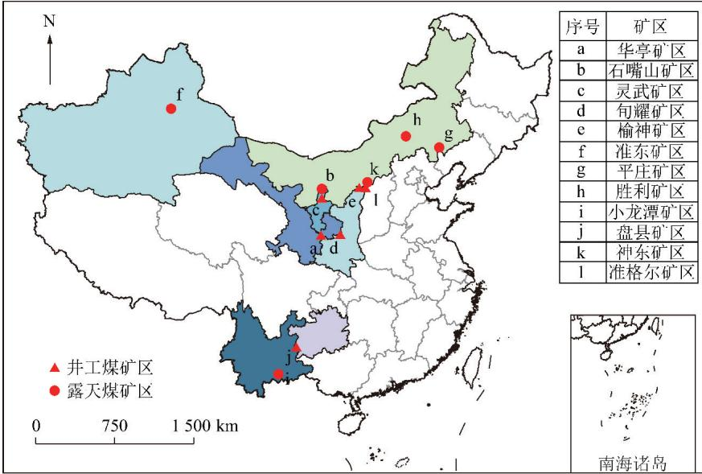  
图1 西部重点煤矿分区  
Fig. 1 Location of 12 coal mine areas in Western China

## 1 方 法

## 1.1 西部重点煤矿区土地损毁状况信息提取方法

## (1)土地损毁信息提取

露天矿山为露天采场挖损、排土场压占；井工矿山为煤矸石压占、采空区塌陷3]。结合实地调查并辅以高分辨率与高光谱遥感数据解译[25]，提取挖损、压占、塌陷等信息，如图2所示。

## (2)井工矿万吨塌陷率与露天矿万吨损毁率

万吨塌陷率是矿区塌陷土地面积与累计煤炭采出量的比值，可采用式(1)[26]计算：

$$
P = \frac { S } { Q } = \frac { 1 5 \pi _ { \big \lfloor } ^ { \ominus } { \big ( a + 2 d _ { \delta } \big ) } \big ( \frac { b } { \cos { \alpha } } + d _ { \beta } + d _ { \tau } \big ) { \big \rceil } } { 4 a b c M \gamma / \cos { \alpha } }\tag{1}
$$

式中，S为塌陷区面积， $\tan ^ { 2 } : Q$ 为煤炭开采量，万 $\operatorname { t } ; a$ 和b分别为采区倾向和走向在平面上的投影长度， $\operatorname* { m } ; \delta , \beta , \tau$ 分别为走向、倾向下山、倾向上山地表边界角： $; d _ { \delta } , d _ { \beta } , d _ { \tau }$ 则对应为主断面开采边界至塌陷边界的水平距离，m;α为煤层的倾角；M为开采厚度，m；γ为煤的密度， $V \mathrm { m } ^ { 3 } ; c$ 为采区采出率，%；P为万吨塌陷率，hm²/万t。

露天矿土地损毁程度既可用剥采比来描述，也可用万吨损毁率表示。由于剥采比不够直观，且与井工开采万吨塌陷率无法比较，已知剥采比后可采取换算的方法得到露天矿万吨损毁率，见式(2)：

露天矿区土地损毁识别  
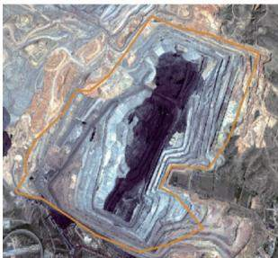  
(a)露天采场挖损

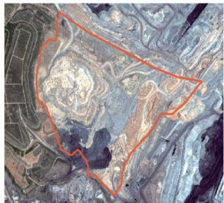  
(b)排土场压占

井工矿区土地损毁识别  
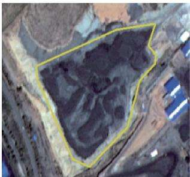  
(c)煤矸石压占

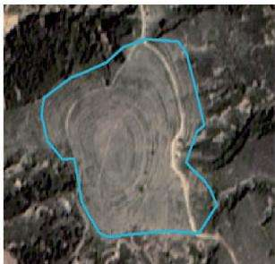  
(d)采空区塌陷  
图2 土地损毁遥感影像特征解译  
Fig. 2 Interpretation of land damage characteristics using remote sensing image

$$
\lvert \eta = V _ { \mathrm { e } } / Q _ { \mathrm { m } }
$$

$$
\omega _ { \mathrm { e } } = \frac { S _ { \mathrm { e } } + S _ { \mathrm { m } } } { Q _ { _ m } } = \frac { 3 V _ { \mathrm { e } } / ( h _ { \mathrm { e } } + h _ { \mathrm { m } } ) } { Q _ { \mathrm { m } } } + \frac { S _ { \mathrm { m } } } { Q _ { \mathrm { m } } } =
$$

$$
\frac { 3 } {  { h _ { \mathrm { e } } } +  { h _ { \mathrm { m } } } }  { \langle \frac { \eta + 1 } { \gamma } \rbrace }\tag{2}
$$

$$
\omega _ { \mathrm { o } } = S _ { \mathrm { o } } / Q _ { \mathrm { m } } = \frac { 3 V _ { \mathrm { e } } \varepsilon / h _ { \mathrm { o } } } { Q _ { \mathrm { m } } } = 3 \eta \varepsilon / h _ { \mathrm { o } }
$$

$$
\mathrm { ~ } \omega = \omega _ { \mathrm { ~ e ~ } } + \omega _ { \mathrm { ~ o ~ } }
$$

式中， $\eta$ 为剥采比， $\mathrm { m } ^ { 3 } / \mathrm { t }$ i $V _ { \mathrm { e } }$ 为煤炭开采剥离下来的表土体积， $\mathbf { m } ^ { 3 }$ i $Q _ { \mathrm { m } }$ 为开采的煤炭质量，t; $\omega _ { \mathrm { e } }$ 和 $\omega _ { \mathrm { o } }$ 分別为露天煤矿的万吨挖损率 $\cdot \mathrm { h m } ^ { 2 }$ /万 t)与万吨压占率(hm²/万t)； $\omega$ 为露天煤矿的土地损毁率， $\mathrm { h m } ^ { 2 } /$ 万t; $h _ { \mathrm { m } }$ 为煤层厚度，m； $h _ { \mathrm { e } }$ 为表土平均厚度即煤层埋深，m；h为煤层厚度与表土厚度之和，m； $S _ { \mathrm { m } }$ 为煤田底部投影面积； $S _ { \mathrm { e } }$ 为开采土体投影面积， $\mathbf { m } ^ { 2 }$ i $S _ { \mathrm { o } }$ 为排土场投影面积， $\mathbf { m } ^ { 2 }$ i $h _ { \mathrm { { o } } }$ 为排土场平均高度，m；ε为土体膨胀系数，无量纲，取 $\varepsilon = 1 . \ 1 ; \gamma = 1 . 5 \ { \mathrm { t / m } } ^ { 3 }$ 0

## 1.2 西部重点煤矿区土地退化信息提取

## (1)植被退化信息提取

植被退化信息可通过植被覆盖度变化反映。笔 者运用像元二分法模型估算植被覆盖度(FVC):

$$
F V C = { \frac { N D V I - N D V I _ { \mathrm { s o i l } } } { N D V I _ { \mathrm { v e g } } ~ - N D V I _ { \mathrm { s o i l } } } }\tag{3}
$$

其中， $N D W _ { \mathrm { v e g } }$ $N D W _ { \mathrm { s o i l } }$ 分别为植被和裸土的NDVI值 $. \circ$ 利用3 期Landsat 8 OLI影像测算矿区范围内植被覆盖度。将植被覆盖度划分为裸土地(0\~10%)、低覆盖度(10%\~30%)，中覆盖度(30%\~45%)、和高覆盖度(45%\~100%)4个等级。

## (2)土壤侵蚀信息提取方法

考虑模型成熟性及资料的可获取性，笔者采用RUSLE 模型[27]测算土壤侵蚀：

$$
A = R K L S C P\tag{4}
$$

其中，A为预测土壤侵蚀量， $\nu ( \mathbf { h } \mathbf { m } ^ { 2 } \cdot \mathbf { a } )$ ;R 为降雨侵蚀力因子，采用国家气象信息中心的基于日降雨资料的降雨侵蚀力估算方法；K为土壤可蚀性因子，基于世界土壤数据库(HWSD)土壤数据集(v1.1)运算得出;L与S分别为坡长与坡度因子(无量纲)，依据DEM高程数据提取；C为植被覆盖因子(无量纲)； $P$ 为水土保持措施因子，将裸地、草地、建设用地、水域分别赋值为0.6,0.1,0.5,0。结合 SL190—2007《土壤侵蚀分类分级标准》，将强度、极强度和剧烈侵蚀合并为强度侵蚀，测算结果划分为微度、轻度、中度、强度侵蚀4个等级。

## (3)沙漠化/石漠化信息提取方法

沙漠化是土地退化的重要表现。构建反照率(Albedo)-NDVI特征空间[28],见式(5)：

$$
I = a N D V I - A l b e d o\tag{5}
$$

根据Albedo-NDVI 回归方程求解 $a _ { \textup { O } }$ 利用自然断裂法将Ⅰ值分为4级，依次为无沙漠化、轻度沙漠化、中度沙漠化、重度沙漠化。

石漠化是由多种营力导致地表基岩裸露的土地退化过程，多发生在湿润半湿润气候区。基于Land-sat 8 OLI影像反演 NDVI、归一化退化指数(NDDI)、归一化湿度指数(NDMI)和地表温度 $( T _ { \mathrm { { s } } } ) 4$ 项因子，运用主成分分析构建石漠化评价模型并测算[29]，并将结果划分为无石漠化、轻度石漠化、中度石漠化、重度石漠化共4个等级。

## 1.3 西部重点煤矿区土地退化综合评价

采用灰色关联分析法，分析不同煤矿区土地退化的主要表现[4]。因神东、准格尔2个煤矿区有较长时间、较高分辨率的跟踪监测数据，笔者还运用随机森林法分析了土地退化因素及其主要表现。以NDVI值为参考指标，运用ArcGIS 10.6的PCA计算重分类后的植被退化、沙漠化、土壤侵蚀权重，并对3者加权求和，可得矿区土地退化结果，见式(6)：

$$
\small L D = a _ { 1 } B _ { 1 } + a _ { 2 } B _ { 2 } + a _ { 3 } B _ { 3 }\tag{6}
$$

其中，LD为土地退化的测算结果 $\dag { a _ { 1 } , a _ { 2 } , a _ { 3 } }$ 分别为植被退化、沙漠化/石漠化、土壤侵蚀的权重； $B _ { 1 } , B _ { 2 } , B _ { 3 }$ 对应其分级测算值。LD取值为 $1 \sim 4 _ { \circ }$ 将土地退化测算结果划分为无退化（1.00\~1.50）、轻度退化(1.50\~2.00)、中度退化(2.00\~2.75)、重度退化(2.75\~4.00)4个等级。

## 2 结果与分析讨论

## 2.1 西部重点煤矿区土地损毁结果分析

结合调研及测算结果，得到土地损毁面积、万吨损毁率与万吨塌陷率等相关参数，见表1,2。

表1为井工煤矿万吨塌陷率相关参数结果。数据显示：旬耀矿区万吨塌陷率较高，盘县矿区万吨塌陷率最低。采深较大、倾角较小、煤层厚度较小是旬耀矿区万吨塌陷率较高的原因；而盘县矿区是由于煤层厚度大、采深相对较小以及倾角较大所致，故万吨塌陷率较低。结合式(1），影响万吨塌陷率的主要因素有采厚(多煤层开采时，累计采厚)、埋深、倾角、上覆岩性与基岩和表土厚度等，岩性、基岩和表土厚度决定了边界角的大小，从而决定了塌陷影响的范围。

表2为露天矿万吨损毁率测算结果。小龙潭矿区万吨损毁率最低，其特点是煤层埋藏浅、煤层较厚、排土场堆垫高度较高致使剥采比小、损毁率低：石嘴山矿区万吨损毁率最高，这是由于汝箕沟煤矿煤层埋藏深、煤层相对较薄、排土场堆垫高度小，导致剥采比高、损毁率高。因此，结合式(2)得出：露天煤矿区的万吨土地损毁率主要与煤层厚度、剥离岩土厚度及岩土堆放方式有关。

依据信息识别与测算结果，按土地损毁面积加权计算，得出西部重点煤矿区露天煤矿万吨损毁率与井工煤矿万吨塌陷率，结果见表3。

表1 井工煤矿万吨塌陷率及相关参数  
Table 1 Parameters and results of the collapse rate of per 10 000 tons for subterranean coal mine
<table><tr><td>矿区及矿山</td><td>损毁面  $\Re { \mathrm { , / h m } ^ { 2 } }$ </td><td>上覆基岩 厚度/m</td><td>平均倾 角/(°)</td><td>平均埋  $\sharp _ { \sf d } \qquad $ </td><td>煤层(累计)开 采厚度/m</td><td>可采煤 层数量</td><td>万吨塌陷率/  $( \mathrm { h m } ^ { 2 } \cdot \mathcal { F } \mathrm { t } ^ { - 1 } )$ </td></tr><tr><td>榆神矿区常乐堡</td><td>143</td><td>49.5</td><td>0.5</td><td>117</td><td>6.61</td><td>9</td><td>0.3000</td></tr><tr><td>灵武矿区羊场湾</td><td>512</td><td>91.8</td><td>10.0</td><td>100</td><td>7.70</td><td>4</td><td>0.2573</td></tr><tr><td>旬耀矿区青岗坪</td><td>234</td><td>174.0</td><td>3.0</td><td>335</td><td>8.20</td><td>4</td><td>0.3240</td></tr><tr><td>华亭矿区大柳</td><td>986</td><td>360.0</td><td>15.0</td><td>750</td><td>16.44</td><td>5</td><td>0.2460</td></tr><tr><td>神东矿区补连塔</td><td>2 738</td><td>123.0</td><td>2.0</td><td>205</td><td>4.42</td><td>7</td><td>0.2447</td></tr><tr><td>盘县矿区红果</td><td>154</td><td>230.0</td><td>40.0</td><td>290</td><td>21.58</td><td>9</td><td>0.2380</td></tr></table>

表2 露天煤矿万吨损毁率及相关测算结果

Table 2 Parameters and results of the damage rate of per 10 000 tons for open-pit coal mine
<table><tr><td>矿区及矿山</td><td>损毁面  $\Re \mathrm { { \perthousand} }$ </td><td>剥采比/  $( \mathbf { m } ^ { 3 } \cdot \mathbf { t } ^ { - 1 } )$ </td><td>煤层厚  $\frac { \ m } { \times } / \ m$ </td><td>煤层埋  $\overrightarrow { \vert } \overrightarrow { \kappa } / \mathrm { m }$ </td><td>煤层厚度与 埋深之和/m 均高度/m</td><td>排土场平</td><td>万吨挖损率/  $( \mathrm { h m } ^ { 2 } \cdot \mathcal { F } \mathrm { t } ^ { - 1 } )$ </td><td>万吨压占率/  $( \mathrm { h m } ^ { 2 } \cdot \mathcal { F } \mathrm { t } ^ { - 1 } )$ </td><td>万吨损毁率/  $( \mathrm { h m } ^ { 2 } \cdot \mathcal { F } \mathrm { t } ^ { - 1 } )$ </td></tr><tr><td>石嘴山矿区汝箕沟</td><td>997</td><td>6.90</td><td>26.53</td><td>137.54</td><td>164.07</td><td>60</td><td>0.1387</td><td>0.3793</td><td>0.5180</td></tr><tr><td>准格尔矿区黑岱沟</td><td>424</td><td>3.46</td><td>28.80</td><td>56.14</td><td>84.94</td><td>80</td><td>0.146 0</td><td>0.142 7</td><td>0.2887</td></tr><tr><td>小龙潭矿区小龙潭</td><td>226</td><td>1.29</td><td>72.00</td><td>39.72</td><td>111.72</td><td>200</td><td>0.0527</td><td>0.0213</td><td>0.0740</td></tr><tr><td>平庄矿区元宝山</td><td>128</td><td>3.09</td><td>84.29</td><td>113.21</td><td>197.50</td><td>214</td><td>0.060 0</td><td>0.0473</td><td>0.107 3</td></tr><tr><td>胜利矿区胜利1号</td><td>1 457</td><td>2.66</td><td>33.42</td><td>62.78</td><td>96.20</td><td>60</td><td>0.1040</td><td>0.146 0</td><td>0.250 0</td></tr><tr><td>准东矿区五彩湾</td><td>2 923</td><td>3.13</td><td>60.15</td><td>74.28</td><td>134.43</td><td>80</td><td>0.0847</td><td>0.1293</td><td>0.214 0</td></tr></table>

表3 西部重点煤矿区土地万吨损毁率和万吨塌陷率  
Table 3 Situation of land destruction of 12 coal mine areas in western China

$$
\mathbf { h m } ^ { 2 } / \mathcal { F } \mathrm { ~ t ~ }
$$

<table><tr><td>参数</td><td>黄土高原区</td><td>西南山地丘陵区</td><td>北方草原区</td><td>西北干旱区</td><td>西部煤矿区平均</td></tr><tr><td>露天煤矿万吨损毁率</td><td>0.4879</td><td>0.0740</td><td>0.235 2</td><td>0.2140</td><td>0.3049</td></tr><tr><td>井工煤矿万吨塌陷率</td><td>0.2576</td><td>0.2380</td><td></td><td></td><td>0.2575</td></tr></table>

## 2.2 西部重点煤矿区土地退化表现分析

## (1)植被退化分析

植被退化的解译结果如图3(a)与图4所示。分析发现：①西北干旱区裸土地与低覆盖度占比超过90%，且无高覆盖度区域，表明植被生长状况较差；西南山地丘陵区高植被覆盖面积约占2/3，植被生长状况良好；黄土高原区与北方草原区则以中、低植被覆盖为主。②从变化状况看，研究期内：西南山地丘陵区高覆盖度减少3.32%，其他等级稍有增加，表明该地区植被退化较为不明显；黄土高原区中覆盖度面积增加11.74%，其余等级面积有波动，主要由高覆盖度向中覆盖度转移，存在植被退化现象；北方草原区高、中覆盖度分别减少1.60%和3.01%，其他等级面土壤侵蚀呈加重的趋势；北方草原区3个年度的侵蚀状况存在波动，2013\~2017年间微度侵蚀占比降低2.74%，其他侵蚀等级均有所增加，强度侵蚀主要集中于采矿扰动区周围，侵蚀程度呈加重趋势；西北干积有所增加，植被退化较为明显；西北于旱区裸土地呈大幅度增加趋势，中覆盖度减少7.87%，表明该区域植被退化状况极为严峻。

## (2)土壤侵蚀分析

土壤侵蚀解译结果如图3(b)与图5所示，分析发现：①黄土高原区、北方草原区、西北干旱区的微度和轻度侵蚀面积占比较高，西南山地丘陵区则以强度侵蚀为主。②从变化状况看，黄土高原区研究期间微度侵蚀减少10.20%、轻度及中度侵蚀共增加10.34%、强度侵蚀小范围下降，表明侵蚀状况有加重的趋势；西南山地丘陵区3个年度的侵蚀状况有波动，但是2017年较2013年强度侵蚀范围增加4.81%，其他等级侵蚀范围有不同程度的下降，说明旱区微度侵蚀大幅减少9.22%，强度、中度侵蚀面积增加且均分布于采矿扰动区周围，表明区域受采煤扰动导致土壤侵蚀加剧。

## (3)沙漠化/石漠化分析

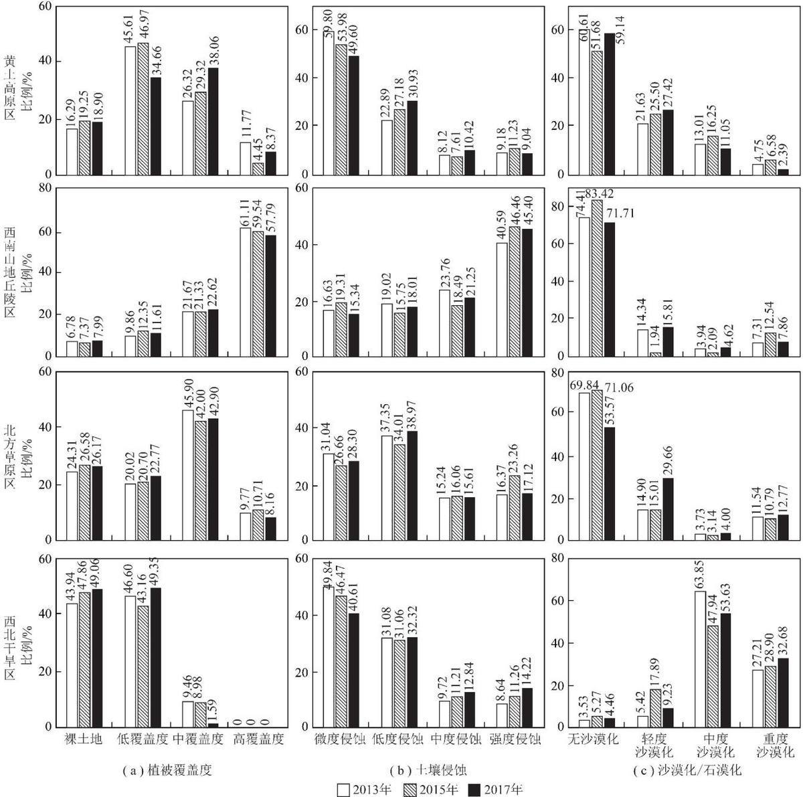  
图3 西部煤矿区不同植被覆盖度、土壤侵蚀、沙漠化/石漠化程度比较  
Fig. 3 Comparison of the proportion of different vegetation coverage , soil erosion , and desertification /stony desertification in western CMAs

沙漠化/石漠化的解译结果如图3(c)与图6所示。分析表明：①西南山地丘陵区绝大多数土地的石漠化程度较低，西北干旱区主要是中度沙漠化，其他2个区域则以无沙漠化及轻度沙漠化为主。②从变化状况看，黄土高原区沙漠化存在波动，2013\~2017年轻度沙漠化面积增加5.79%，其他沙漠化程度面积小幅减少，中度和重度沙漠化区域向轻度沙漠化转移，表明沙漠化稍有缓解，这可能与黄土高原区近年来的气候变化相关；西南山地丘陵区石漠化程度有微弱的波动,2013,2015,2017年无石漠化面积占比分别为74.41%,83.42%,71.71%,其他程度的石漠化面积稍有增加，石漠化程度基本稳定：北方草原区在研究期内无沙漠化面积减少16.26%，其他程度沙漠化面积有所增加，沙漠化呈加重的趋势：西北干旱区3个年度的中度沙漠化面积变化存在波动，但研究期内中度沙漠化面积减少10.22%，重度沙漠化面积增幅达5.47%，沙漠化呈加剧的态势。

## 2.3 西部重点煤矿区土地退化的影响因素分析

研究区土地的主要损毁形式及退化表现的结果见表4。

(1)黄土高原自然环境较为特殊，易受人为活动影响而加剧土壤侵蚀。石嘴山和准格尔土地损毁的

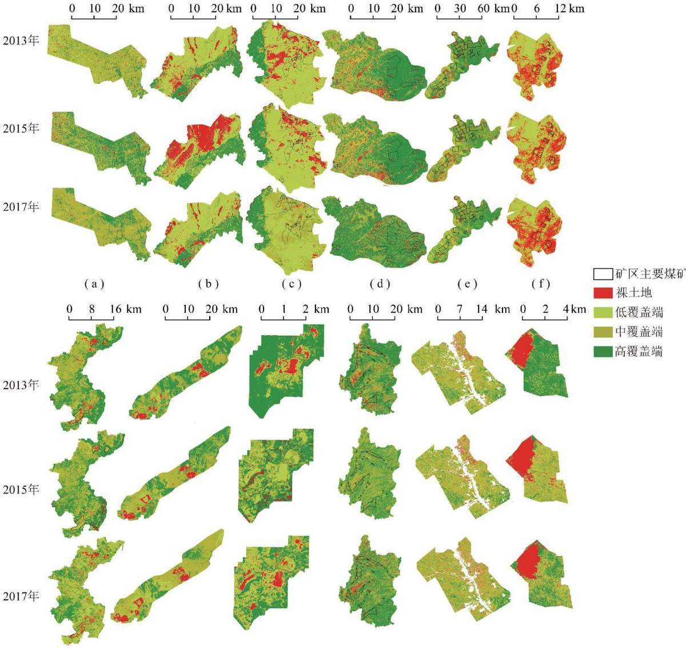  
图4 西部煤矿区植被覆盖分布((a)\~(1)同图1)  
Fig. 4 Distribution of vegetation coverage of 12 coal mine areas((a) ∼ (1) are the same as Fig. 1)

(g)

(h)

(i)

(j)

(k)

(1)

关键因素仍是土地挖损，其次是排土场压占土地；其他井工煤矿的关键因素则为煤矿石堆积压占与采空区塌陷，因此要重视煤矸石的处理和利用，如合理堆放、填埋或充填采空区以及资源化利用，这样既可减轻矸石无序堆放造成的土地退化，又可延长产业链带来一定的经济效益。

(2)西南山地丘陵区的小龙潭煤矿煤层较厚、采坑较深，但剥离岩土堆积压占土地较多，因此小龙潭露天开采导致土地损毁的主要因素为排土场压占；盘县矿区煤矸石压占对土地退化影响较大。该地区山地较多，强降雨可能导致水土流失加重，要关注土壤侵蚀与石漠化演变，预防地质灾害。

(3)北方草原区是典型的草原生态系统，胜利与平庄矿区土地损毁主要为挖损、排土场压占，采矿剥离活动对植被的清除加速了草地逆向演替，区域内水土保持能力下降，有轻度沙漠化及植被退化的倾向。

(4)准东矿区地处戈壁地区，是典型的荒漠生态系统，植被覆盖率极低，自我修复能力较弱，极易受外界干扰发生逆向演替，挖损、压占均对土地退化影响较大，土地退化主要表现为沙漠化和植被退化。

## 2.4 西部煤矿区土地退化综合评价

矿区包括多个煤矿，是由煤炭资源正在开采或规划开采的边界圈定的范围，涵盖了煤炭开采、加工等生产及人类生活的聚集区：而矿山则是由单一煤矿开采及其受到影响的范围构成的区域。露天开采与井工开采方式对地表扰动的过程存在差异，故在矿山尺度分析需分别讨论。露天矿山选择矿区范围内的全部露天矿分析，包括露天采坑、排土场、建设用地等，井工矿采动选取1个典型煤矿分析(表4)。土地退化综合评价结果见表5\~7及图7。

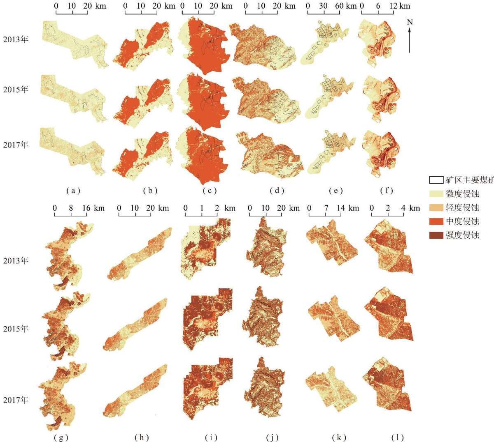  
图5 西部煤矿区土壤侵蚀分布((a)\~(1)同图1)  
Fig. 5 Distribution of soil erosion of 12 coal mine areas((a) \~ (1) are the same as Fig. 1)

表4 西部重点煤矿区土地的主要损毁形式及主要退化表现  
Table 4 Land damage and external manifestations of land degradation in 12 coal mine areas
<table><tr><td>区域</td><td>矿区</td><td>典型矿山</td><td>开采方式</td><td>主要损毁形式</td><td>主要退化表现</td></tr><tr><td rowspan="7">黄土高原区</td><td>石嘴山矿区</td><td>汝箕沟露天矿</td><td>露天</td><td>挖损、压占</td><td>植被退化、土壤侵蚀</td></tr><tr><td>灵武矿区</td><td>羊场湾矿井</td><td>井工</td><td>压占、塌陷</td><td>土壤侵蚀</td></tr><tr><td>榆神矿区</td><td>常乐堡矿井</td><td>井工</td><td>压占、塌陷</td><td>沙漠化</td></tr><tr><td>旬耀矿区</td><td>青岗坪矿井</td><td>井工</td><td>塌陷、压占</td><td>土壤侵蚀</td></tr><tr><td>华亭矿区</td><td>大柳矿井</td><td>井工</td><td>压占</td><td>土壤侵蚀</td></tr><tr><td>神东矿区</td><td>补连塔矿井</td><td>井工</td><td>压占、塌陷</td><td>土壤侵蚀</td></tr><tr><td>准格尔矿区</td><td>黑岱沟露天矿</td><td>露天</td><td>挖损、压占</td><td>植被退化、土壤侵蚀</td></tr><tr><td rowspan="2">西南山地丘陵区</td><td>盘县矿区</td><td>红果矿井</td><td>井工</td><td>压占</td><td>土壤侵蚀</td></tr><tr><td>小龙潭矿区</td><td>小龙潭露天矿</td><td>露天</td><td>压占</td><td>土壤侵蚀</td></tr><tr><td rowspan="2">北方草原区</td><td>平庄矿区</td><td>元宝山西露天矿</td><td>露天</td><td>挖损</td><td>土壤侵蚀、沙漠化</td></tr><tr><td>胜利矿区</td><td>胜利露天矿</td><td>露天</td><td>挖损、压占</td><td>植被退化、沙漠化</td></tr><tr><td>西北干旱区</td><td>准东矿区</td><td>五彩湾露天矿</td><td>露天</td><td>挖损、压占</td><td>植被退化、沙漠化、土壤侵蚀</td></tr></table>

0 1 km

2013年

0- 10 20 km 1

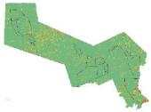

0 10 20 km

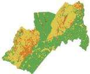

0 10 20 km 1

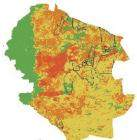

10 20 km

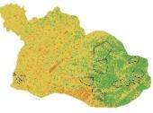

0 30 60 km

0 6 12 km

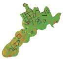

2015年

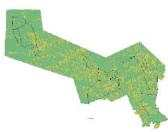

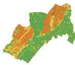

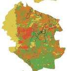

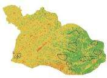

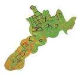  
2017年

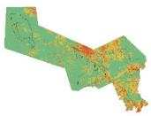  
(a)

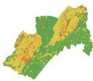  
(b)

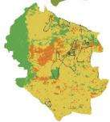

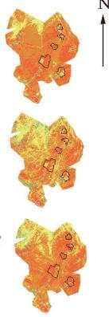  
(c)

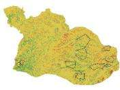  
0 8 16 km  
10 20 km  
(d)

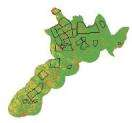  
(e)  
0 10 20 km L 1  
(f)  
2013年

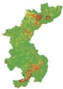

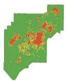  
0 7 14 km

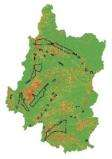

0 2 4km矿区主要煤矿无沙/石漠化轻度沙/石漠化中度沙/石漠化重度沙/石漠化

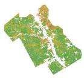

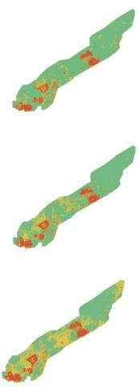

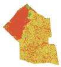  
2015年

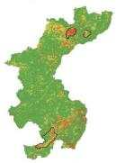

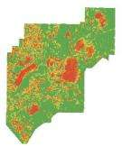

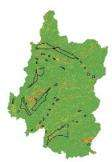

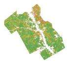

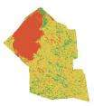

2017年

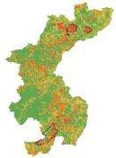

(g)

(h)  
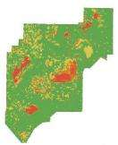  
(i)

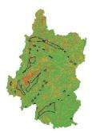  
(j)

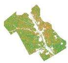

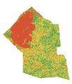  
(k)  
(1)  
图6 西部煤矿区沙漠化、石漠化分布((a)\~(1)同图1)

Fig. 6 Distribution of desertification and stony desertification of 12 coal mine areas((a) ∼ (1) are the same as Fig. 1)  
表5 矿区尺度的土地退化数据  
Table 5 Statistical of land degradation on the CMA scale
<table><tr><td rowspan="2">强度</td><td colspan="6">黄土高原</td><td colspan="6">西南山地丘陵区</td></tr><tr><td colspan="2">2013年</td><td colspan="2">2015年</td><td colspan="2">2017年</td><td colspan="2">2013年</td><td colspan="2">2015年</td><td colspan="2">2017年</td></tr><tr><td>分级</td><td>面积</td><td>比例</td><td>面积</td><td>比例</td><td>面积</td><td>比例</td><td>面积</td><td>比例</td><td>面积</td><td>比例</td><td>面积</td><td>比例</td></tr><tr><td>无退化</td><td>2 349.15</td><td>23.72</td><td>2 838.54</td><td>28.66</td><td>2 085.47</td><td>21.05</td><td>506.24</td><td>12.28</td><td>480.32</td><td>11.65</td><td>468.03</td><td>11.35</td></tr><tr><td>轻度退化</td><td>4 874.37</td><td>49.21</td><td>3 951.59</td><td>39.90</td><td>4 453.58</td><td>44.96</td><td>2 785.68</td><td>67.55</td><td>2 923.56</td><td>70.89</td><td>2 671.94</td><td>64.79</td></tr><tr><td>中度退化</td><td>2211.27</td><td>22.32</td><td>2 460.68</td><td>24.84</td><td>2 700.86</td><td>27.27</td><td>797.70</td><td>19.34</td><td>646.90</td><td>15.69</td><td>893.26</td><td>21.66</td></tr><tr><td>重度退化</td><td>470.15</td><td>4.75</td><td>654.13</td><td>6.60</td><td>665.03</td><td>6.71</td><td>34.41</td><td>0.83</td><td>73.25</td><td>1.78</td><td>90.80</td><td>2.20</td></tr></table>

<table><tr><td rowspan="2">强度 分级</td><td colspan="2">2013年</td><td colspan="2">2015年</td><td colspan="2">2017年</td><td colspan="2">2013年</td><td colspan="2">2015年</td><td colspan="2">2017年</td></tr><tr><td>面积</td><td>比例</td><td>面积</td><td>比例</td><td>面积</td><td>比例</td><td>面积</td><td>比例</td><td>面积</td><td>比例</td><td>面积</td><td>比例</td></tr><tr><td>无退化</td><td>66.54</td><td>4.87</td><td>61.38</td><td>4.49</td><td>55.23</td><td>4.04</td><td>0</td><td>0</td><td>0</td><td>0</td><td>0</td><td>0</td></tr><tr><td>轻度退化</td><td>288.21</td><td>21.08</td><td>266.79</td><td>19.51</td><td>270.11</td><td>19.76</td><td>42.26</td><td>11.95</td><td>37.54</td><td>10.62</td><td>17.45</td><td>4.93</td></tr><tr><td>中度退化</td><td>560.59</td><td>41.01</td><td>481.02</td><td>35.18</td><td>634.60</td><td>46.42</td><td>242.44</td><td>68.56</td><td>237.45</td><td>67.15</td><td>240.25</td><td>67.94</td></tr><tr><td>重度退化</td><td>451.78</td><td>33.05</td><td>557.93</td><td>40.81</td><td>407.18</td><td>29.78</td><td>68.92</td><td>19.49</td><td>78.63</td><td>22.24</td><td>95.92</td><td>27.13</td></tr></table>

注：面积单位是 $\mathrm { k m } ^ { 2 }$ ，比例单位是%，下同。

表6 露天矿山尺度的土地退化数据  
Table 6 Statistical of land degradation on the open-pit coal mine scale
<table><tr><td rowspan="3">强度 分级</td><td colspan="6">黄土高原</td><td colspan="6">西南山地丘陵区</td></tr><tr><td colspan="2">2013年</td><td colspan="2">2015年</td><td colspan="2">2017年</td><td colspan="2">2013年</td><td colspan="2">2015年</td><td colspan="2">2017年</td></tr><tr><td>面积</td><td>比例</td><td>面积</td><td>比例</td><td>面积</td><td>比例</td><td>面积</td><td>比例</td><td>面积</td><td>比例</td><td>面积</td><td>比例</td></tr><tr><td>无退化</td><td>12.48</td><td>23.82</td><td>11.10</td><td>21.18</td><td>9.72</td><td>18.55</td><td>2.85</td><td>20.85</td><td>2.27</td><td>16.61</td><td>2.57</td><td>18.80</td></tr><tr><td>轻度退化</td><td>9.12</td><td>17.40</td><td>9.70</td><td>18.51</td><td>4.46</td><td>8.51</td><td>3.09</td><td>22.60</td><td>4.01</td><td>29.33</td><td>3.00</td><td>21.95</td></tr><tr><td>中度退化</td><td>21.68</td><td>41.37</td><td>21.32</td><td>40.69</td><td>21.91</td><td>41.81</td><td>5.22</td><td>38.19</td><td>4.02</td><td>29.41</td><td>5.42</td><td>39.65</td></tr><tr><td>重度退化</td><td>9.12</td><td>17.40</td><td>10.28</td><td>19.62</td><td>16.31</td><td>31.13</td><td>2.51</td><td>18.36</td><td>3.37</td><td>24.65</td><td>2.68</td><td>19.60</td></tr><tr><td rowspan="3">强度</td><td colspan="7">北方草原区</td><td colspan="5">西北干旱区</td></tr><tr><td colspan="2">2013年</td><td colspan="2">2015年</td><td colspan="2">2017年</td><td colspan="2">2013年</td><td colspan="2">2015年</td><td colspan="2">2017年</td></tr><tr><td>分级 面积</td><td>比例</td><td>面积</td><td></td><td>比例</td><td>面积</td><td>比例</td><td>面积</td><td>比例</td><td>面积</td><td>比例</td><td>面积</td><td>比例</td></tr><tr><td>无退化</td><td>3.07</td><td>2.40</td><td>2.95</td><td>2.31</td><td>1.66</td><td>1.30</td><td>0</td><td>0</td><td>0</td><td>0</td><td>0</td><td>0</td></tr><tr><td>轻度退化</td><td>7.28</td><td>5.70</td><td>5.82</td><td>4.55</td><td>8.50</td><td>6.65</td><td>3.47</td><td>8.02</td><td>2.24</td><td>5.18</td><td>2.16</td><td>4.99</td></tr><tr><td>中度退化</td><td>43.05</td><td>33.68</td><td>42.37</td><td>33.15</td><td>32.48</td><td>25.41</td><td>23.69</td><td>54.75</td><td>22.34</td><td>51.63</td><td>21.34</td><td>49.32</td></tr><tr><td>重度退化</td><td>74.41</td><td>58.22</td><td>76.67</td><td>59.99</td><td>85.17</td><td>66.64</td><td>16.11</td><td>37.23</td><td>18.69</td><td>43.19</td><td>19.77</td><td>45.69</td></tr></table>

表7 井工矿山尺度的土地退化数据  
Table 7 Statistical of land degradation on the underground coal mine scale
<table><tr><td rowspan="3">强度</td><td colspan="6">黄土高原</td><td colspan="6">西南山地丘陵区</td></tr><tr><td colspan="2">2013年</td><td colspan="2">2015年</td><td colspan="2">2017年</td><td colspan="2">2013年</td><td colspan="2">2015年</td><td colspan="2">2017年</td></tr><tr><td>面积</td><td>比例</td><td>面积</td><td>比例</td><td>面积</td><td>比例</td><td>面积</td><td>比例</td><td>面积</td><td>比例</td><td>面积</td><td>比例</td></tr><tr><td>无退化</td><td>66.49</td><td>29.48</td><td>62.77</td><td>27.83</td><td>52.17</td><td>23.13</td><td>0.25</td><td>22.94</td><td>0.22</td><td>20.18</td><td>0.22</td><td>20.18</td></tr><tr><td>轻度退化</td><td>75.03</td><td>33.27</td><td>75.28</td><td>33.38</td><td>75.73</td><td>33.58</td><td>0.43</td><td>39.45</td><td>0.39</td><td>35.78</td><td>0.41</td><td>37.61</td></tr><tr><td>中度退化</td><td>68.94</td><td>30.57</td><td>70.24</td><td>31.14</td><td>72.71</td><td>32.24</td><td>0.26</td><td>23.85</td><td>0.29</td><td>26.61</td><td>0.26</td><td>23.85</td></tr><tr><td>重度退化</td><td>15.08</td><td>6.69</td><td>17.25</td><td>7.65</td><td>24.93</td><td>11.05</td><td>0.15</td><td>13.76</td><td>0.19</td><td>17.43</td><td>0.20</td><td>18.35</td></tr></table>

(1)黄土高原区。①矿区尺度以轻度退化为主，露天矿山尺度则以中度、重度退化为主，露天矿山重度退化比例约17.40%\~31.13%，井工矿山尺度以轻度、中度退化为主，重度退化比例远小于露天矿山，约6.69%\~11.05%，表明露天采煤扰动比井工采煤更为剧烈。②研究期内，矿区无退化和轻度退化面积占比减少2.67%，中度及重度退化面积共增加6.91%；;露天矿山重度退化面积增加13.73%，无退化面积减少5.27%；井工矿山重度退化面积增加4.36%,无退化面积减少6.35%。由此说明矿区和矿山尺度土地退化均呈加剧趋势。

(2)西南山地丘陵区。①矿区尺度以轻度退化为主，露天矿山以中度退化为主，井工矿山以轻度退化为主。②研究期内,2015年在矿区和矿山尺度都表现出波动，可能与当年的气候有关。2013—2017年矿区及井工矿山的各个退化强度上变化不大，土地退化趋势不明显。小龙潭露天矿所处特殊的地理位置及煤炭赋存特点，采坑面积基本稳定、排土场面积小幅增加，土地退化稍有增加。

(3)北方草原区。①矿区尺度以中度退化为主，矿山尺度则以重度退化为主，表明草原矿区煤炭开采扰动剧烈，露天矿山土地退化比矿区尺度更为明显。大量剥离物堆积成的排土场土壤瘠薄，加速了土地沙化，使得矿山土地退化态势严峻。②研究期内矿区与矿山尺度的土地退化变化趋势并不一致，矿区重度退化面积减少3.27%，中度退化面积增加5.41%，退化程度稍有减缓；矿山重度退化面积增加8.42%，中度退化面积减少8.27%，土地退化加重。

(4)西北干旱区。①矿区中度退化约占矿区总面积2/3，矿山以中度、重度退化为主，2者之和超过矿山总面积的90%，表明该区域土地重度退化主要集中在矿山及其周边。②研究期内，矿区重度退化面积增加7.64%，矿山重度退化面积增加4.59%，矿山与矿区尺度土地退化均表现为加重的趋势。值得关注的是，相比其他3个区域，该区域不存在无退化区域，土地退化形势更为严峻。这是由于该区域位于典型大陆性温带极干旱气候区，多年平均降水量仅35mm，而蒸发量却达2800mm，水资源极度匮乏，戈壁地貌有机质积累量少，植被覆盖度较低，生态环境极为脆弱，易损毁、难修复，因此新疆等地区煤炭资源的开发强度必须适应其环境承载力。

## 2.5 露天开采规模对矿区土地退化的影响

如果用煤矿扰动范围与矿区总面积之比表示煤炭资源开发强度，那么露天开采引起矿区土地退化的程度就与煤炭资源开发强度有关，见表8。准格尔露天矿区包括黑岱沟和哈尔乌素2个矿山群，煤矿扰动范围与矿区总面积之比高达35.54%，矿山尺度与矿区尺度的土地退化变化基本处于同等水平，以重度退化面积增加为主。平庄矿区煤矿扰动范围与矿区总面积之比相对较小，仅为7.40%，虽矿山尺度重度退化面积有所增加，但矿区尺度的重度退化面积减少。准东矿区处于戈壁的脆弱生态环境，煤矿扰动范围与矿区总面积之比为12.24%，虽然不高，但矿区尺度与矿山尺度重度退化面积均呈增加趋势。因此，为防止矿区土地过度退化，根据不同区域的生态承载力，露天煤矿存在合理的开发强度，以约束采煤影响的空间扩散。

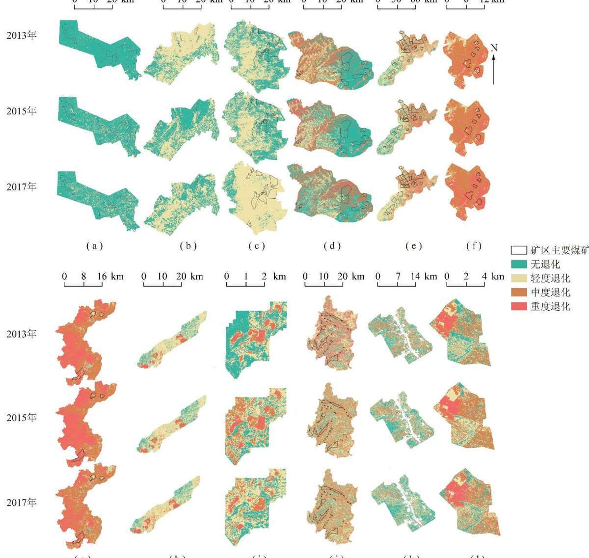  
(h)  
(i)  
(j)  
(k)  
(1)  
图7 西部12个重点煤矿区土地退化分级((a)\~(1)同图1)  
Fig. 7 Distribution of land degradation of 12 coal mine areas((a) ∼ (1) are the same as Fig. 1)

表8 2013—2017年露天采矿在矿山与矿区尺度的土地退化数据  
Table 8 Changes of land degradation on the open-pit coal mine scale & CMA scale from 2013 to 2017
<table><tr><td rowspan="2">矿区 名称</td><td rowspan="2">开发强 度/%</td><td rowspan="2">尺度</td><td colspan="4">面积变化  $/ \mathrm { k m } ^ { 2 }$ </td><td rowspan="2">矿区 名称</td><td rowspan="2">开发强 度/%</td><td rowspan="2">尺度</td><td colspan="4">面积变化  $/ \mathrm { k m } ^ { 2 }$ </td></tr><tr><td>无退化</td><td>轻度退化</td><td>中度退化重度退化</td><td></td><td>无退化</td><td>轻度退化</td><td>中度退化</td><td>重度退化</td></tr><tr><td rowspan="2">石嘴山</td><td rowspan="2">14.54</td><td>矿山</td><td>-0.14</td><td>-0.89</td><td>-0.46</td><td>1.49</td><td rowspan="2">平庄</td><td rowspan="2">7.40</td><td>矿山</td><td>0</td><td>-1.82</td><td>-6.24</td><td>8.06</td></tr><tr><td>矿区</td><td>-12.84</td><td>-28.37</td><td>38.1</td><td>3.11</td><td></td><td>矿区</td><td>0.28</td><td>-12.18</td><td>61.28 -49.38</td></tr><tr><td rowspan="2">准格尔</td><td rowspan="2">35.54</td><td>矿山</td><td>-2.62</td><td>-3.77</td><td>0.69</td><td>5.70</td><td rowspan="2">胜利</td><td rowspan="2">13.76</td><td>矿山</td><td>-1.41</td><td>3.04</td><td>-4.33</td><td>2.70</td></tr><tr><td>矿区</td><td>-9.12</td><td>-0.82</td><td>1.12</td><td>8.82</td><td></td><td>矿区</td><td>-11.59 -5.92</td><td>12.73</td><td>4.78</td></tr><tr><td rowspan="2">小龙潭</td><td rowspan="2">20.21</td><td>矿山</td><td>-0.28</td><td>-0.09</td><td>0.20</td><td>0.17</td><td rowspan="2">准东</td><td rowspan="2">12.24</td><td>矿山</td><td>0 0</td><td>-1.31</td><td>-2.35</td><td>3.66</td></tr><tr><td>矿区</td><td>-16.97</td><td>7.38</td><td>10.11</td><td>-0.52</td><td></td><td>矿区</td><td>-11.35</td><td>7.67</td><td>3.68</td></tr></table>

## 3 结 论

(1)揭示了西部煤矿区万吨塌陷率与万吨损毁率的主要影响因素。万吨塌陷率：除旬耀矿区较高外，其余矿区的万吨塌陷率差异较小，其主要影响因素有累计采厚、平均采深、煤层倾角、上覆岩性及基岩和表土厚度。万吨损毁率：西南山地丘陵区的小龙潭矿区万吨损毁率最低(0.5180 hm²/万t)，黄土高原区的石嘴山矿区万吨损毁率最高（0.0740 hm²/万t)，其主要影响因素包括煤层厚度、剥离岩土厚度及岩土堆放方式。

(2)辨识了西部煤矿区土地损毁及其退化的主要外在表现。导致矿区土地损毁的主要因素包括：露天矿山的挖损与排土场压占，井工矿山的煤矸石压占与采空区塌陷。不同区域的退化表现也存在差异，黄土高原区采矿扰动加剧土地退化，主要表现为土壤侵蚀和植被退化：西南山地丘陵区土地退化主要表现为土壤侵蚀:北方草原区土与西北干旱区环境本底条件较差，土地退化的主要表现兼有土壤侵蚀、植被退化与沙漠化。

(3)分析了矿区与矿山两个尺度土地退化程度、趋势及其差异性。矿区尺度上，黄土高原区与西南山地丘陵区轻度退化面积占比较高，北方草原区与西北干旱区则以中度退化为主。露天矿山尺度：西南山地丘陵区以中度退化为主，西北干旱区、黄土高原区以中度、重度退化为主，北方草原区以重度退化为主。井工矿山尺度：黄土高原区主要为轻度及中度退化，西南山地丘陵区主要为轻度退化。整体看，矿山尺度的土地退化比矿区尺度更为剧烈，表明煤炭开采是导致矿山土地退化的关键因素，且露天开采对土地退化的扰动强度远强于井工开采。因此，针对不同区域、不同采煤方法造成的土地退化需要采取不同的生态修复策略。

(4)发现矿区尺度的土地退化程度与煤炭资源开发强度有关，开发强度越大，矿区土地退化程度越严重，而矿区土地退化程度与开发强度并不呈正比，它还与矿区的生态脆弱性或承载力有关。为防止过度土地退化，需要根据矿区生态承载力确定合适的开发强度。因此，需要根据矿区生态的脆弱性和承载力的差异性，将煤炭开采规模与开发强度控制在合理区间，以约束采煤影响的空间扩散。

## 参考文献(References)：

[1] 江泽慧.中国干旱地区土地退化综合监测与评价指标体系建设研究[M].北京：中国林业出版社,2013.

[2] 郭晓娜，陈睿山，李强，等.土地退化过程、机制与影响——以土 地退化与恢复专题评估报告为基础[J]. 生态学报，2019， 39(17):6567-6575. GUO Xiaona, CHEN Ruishan, LI Qiang, et al. Processes , mechanisms, and impacts of land degradation in the IPBES Thematic Assessment[ J]. Acta Ecologica Sinica,2019 ,39(17) :6567-6575.

[3]卞正富，雷少刚，金丹，等.矿区土地修复的几个基本问题[J]. 煤炭学报,2018,43(1):190-197. BIAN Zhengfu , LEI Shaogang, JIN Dan , et al. Several basic scientific issues related to mined land remediation[ J]. Journal of China Society,2018,43(1):190–197.

[4] 于昊辰，牟守国，卞正富，等.北方草原露天煤矿区植被退化因 素分析[J]. 生态与农村环境学报,2019,35(1):1-8. YU Haochen , MU Shouguo , BIAN Zhengfu , et al. Analysis for vegetation degradation factors in opencast coal mines in Northern Grass-Land Area, China[ J]. Journal of Ecology and Rural Environment,2019,35(1):1-8.

[5] 白中科，周伟，王金满，等.再论矿区生态系统恢复重建[J].中 国土地科学,2018,32(11):1-9. BAI Zhongke , ZHOU Wei , WANG Jinman , et al. Rethink on ecosystem restoration and rehabilitation of mining areas [ J ]. China Land Science,2018,32(11) :1-9.

[6] 卞正富，沈渭寿.西部重点矿区土地退化因素调查[J].生态与 农村环境学报,2016,32(2):173-177. BIAN Zhengfu , SHEN Weishou. Driving factors of land degradation in major mining areas in West China[ J]. Journal of Ecology and Rural Environment ,2016,32(2) :173-177.

[7] 王丽，雷少刚，卞正富.系统视角下中国西部煤炭开采生态损伤与自然修复研究综述[J].资源开发与市场,2017,33(10)：1188-1192.

WANG Li , LEI Shaogang, BIAN Zhengfu. Review on study of ecological damage and natural recovery in the coal mining subsidence area in Western China [ J ]. Resource Development & Market, 2017, 33(10):1188-1192.

[8]李海东，沈渭寿，司万童，等.中国矿区土地退化因素调查：概念、 类型与方法[J].生态与农村环境学报,2015,31(4):445-451. LI Haidong, SHEN Weishou , SI Wantong , et al. Investigation of driving factors of land degradation in mine areas in China : Concept , types and approaches [ J]. Journal of Ecology and Rural Environment, 2015,31(4):445-451.

[9] AHIRWAL Jitendra, MAITI Subodh Kumar, SINGH Ashok Kumar. Changes in ecosystem carbon pool and soil CO flux following post-mine reclamation in dry tropical environment , India[ J]. Science of the Total Environment ,2017(583) :153-162.

[10] CHUAI Xiaowei , QI Xinxian , ZHANG Xiuying, et al. Land degradation monitoring using terrestrial ecosystem carbon sinks/sources and their response to climate change in China[ J]. Land Degradation & Development,2018,29(10) :3489-3502.

[11] OUEDRAOGO Issa, BARRON Jennie, TUMBO Siza, et al. Land cover transition in northern Tanzania[ J]. Land Degradation and Development ,2015,27(3) :682-692.

[12] NOVIANTI Vivi, MARRS Rob H, CHOESIN Devi N, et al. Natural regeneration on land degraded by coal mining in a tropical climate: Lessons for ecological restoration from Indonesia[ J]. Land Degradation & Development ,2018,29(11) :4050-4060.

[13] MAO Dehua , WANG Zongming, WU Bingfang, et al. Land degradation and restoration in the arid and semiarid zones of China: Quantified evidence and implications from satellites[ J]. Land Degradation & Development ,2018,29(11):3841-3851.

[14] IBÁÑEZ J, CONTADOR J F, LAVADO Schnabel S, et al. A modelbased integrated assessment of land degradation by water erosion in a valuable Spanish rangeland[ J]. Environmental Modelling & Software,2014,55:201-213.

[15] ABDEL-KADER Fawzy Hassan. Assessment and monitoring of land degradation in the northwest coast region , Egypt using Earth observations data [ J ]. The Egyptian Journal of Remote Sensing and Space Science,2019,22(2) :165-173.

[16] 孙武，李森.土地退化评价与监测技术路线的研究[J]. 地理科 学,2000(1):92-96. SUN Wu , LI Sen. Technical framework on monitoring and assessing of land degradation [ J ]. Scientia Geographica Sinica, 2000 ( 1) : 92-96.

[17] 沈渭寿，曹学章，沈发云.中国土地退化的分类与分级[J].生 态与农村环境学报,2006(4):88-93. SHEN Weishou, CAO Xuezhang, SHEN Fayun. Classification and grading of land degradation in China [ J]. Journal of Ecology and Rural Environment ,2006(4) :88-93.

[18] 杨超，王金亮.流域土地退化研究综述[J]. 云南师范大学学报(自然科学版),2015,35(1):73-78.YANG Chao , WANG Jinliang. Progress in the research on basinland degradation[J]. Journal of Yunnan Normal Unviersity ,2015,35(1):73-78.

[19] WU Zhenhua, LEI Shaogang, HE BaoJie , et al. Assessment of land-

scape ecological health : A case study of a mining city in a semi-arid steppe[ J]. International Journal of Environmental Research and Public Health ,2019,16(5) :752.

[20] 郭山川,汤傲,李效顺，等.融合主被动遥感的乌海矿区土地损 伤测度[J].生态与农村环境学报,2018(8):678-685. GUO Shanchuan, TANG Ao, LI Xiaoshun , et al. Measurement of land damage based on active and passive remote sensing in Wuhai Mining Area[ J]. Journal of Ecology and Rural Environment, 2018(8):678-685.

[21] 李心慧，雷少刚，田雨，等.基于时间序列的准格尔典型矿区土地退 化特征分析[J].河南农业大学学报,2019,53(2):273-281. LI Xinhui , LEI Shaogang, TIAN Yu , et al. Analysis of land degradation characteristics in typical mining areas of Jungar Banner based on time sequence [ J]. Journal of Henan Agricultural University, 2019,53(2):273-281.

[22] 陈彬，俞炜炜，陈光程，等.滨海湿地生态修复若干问题探讨 [J].应用海洋学学报,2019,38(4):464-473. CHEN Bin, YU Weiwei, CHENG Guangcheng, et al. Coastal wetland restoration: An overview [ J]. Journal of Applied Oceanography ,2019,38(4) :464-473.

[23]杨永均，张绍良，侯湖平，等.基于非线性动力学模型的矿山土 地生态系统恢复力机制[J].煤炭学报,2019,44(10):3174- 3184. YANG Yongjun, ZHANG Shaoliang, HOU Huping, et al. Resilience mechanism of land ecosystem in mining area based on nonlinear dynamic model [ J ]. Journal of China Coal Society, 2019, 44(10):3174-3184.

[24] 卞正富.矿山生态学导论[M].北京:煤炭工业出版社,2015.

[25] 姚维岭，余江宽，路云阁.基于ZY-3卫星数据的神东煤矿区土 地退化人为影响因素调查与评价[J].生态与农村环境学报， 2016,32(3):355-360. YAO Weiling, YU Jiangkuan , LU Yunge. Investigation and assessment of artificial influencing factors of land degradation in Shendong Coal Mining Area Based on ZY-3 satellite data[ J] . Journal of Ecology and Rural Environment,2016,32(3) :355-360.

[26] 尹国勋，邓寅生，李栋臣，等.煤矿环境地质灾害与防治[M].北京：煤炭工业出版社，1997.

27] 李天宏,郑丽娜.基于 RUSLE模型的延河流域2001—2010年土壤侵蚀动态变化[J]. 自然资源学报,2012,27(7):1164-1175.LI Tianhong,ZHENG Lina. Soil erosion changes in the Yanhe Wa-tershed from 2001 to 2010 based on RUSLE model [ J]. Journal ofNatural Resource,2012,27(7) :1164–1175.

[28] MA Zongyi, XIE Yaowen , JIAO Jizong, et al. The construction and application of an ALEDO-NDVI based desertification monitoring model[ J]. Procedia Environmental Sciences ,2011 , 10 : 2029- 2035.

[29] 李辉霞，李森，周红艺.粤北典型岩溶山区土地石漠化程度遥感 评价[J].水土保持通报,2011,31(6):155-159. LI Huixia , LI Sen , ZHOU Hongyi. Assessment of rocky desertification in typical Karst Mountain Area of North Guangdong Province based on RS[ J]. Bulletin of Soil and Water Conservation , 2011 , 31(6):155-159.