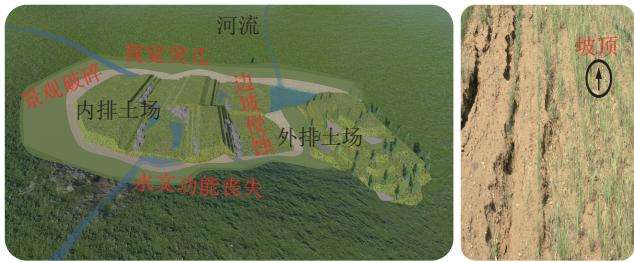
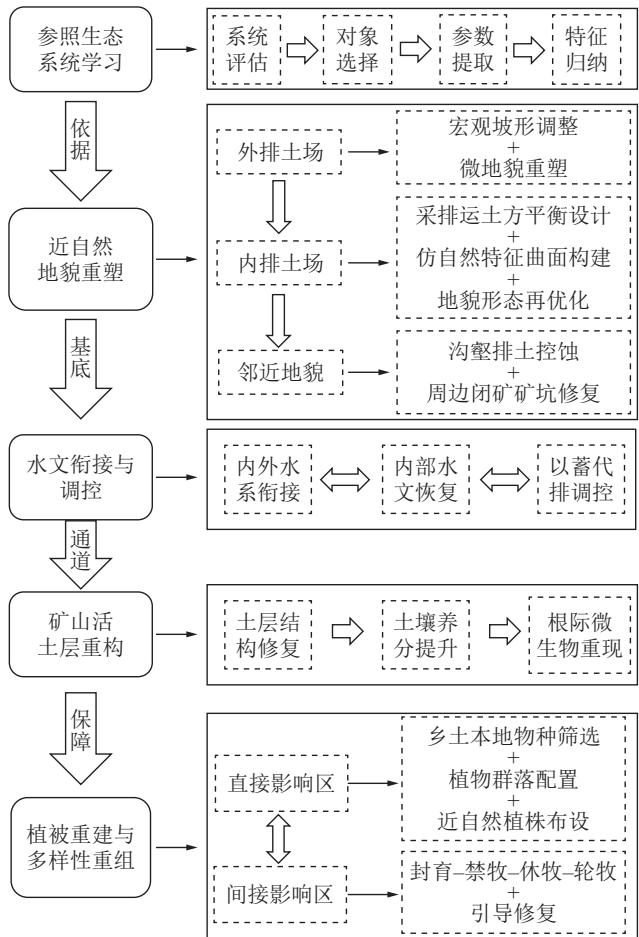
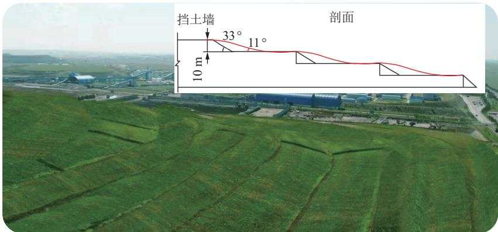
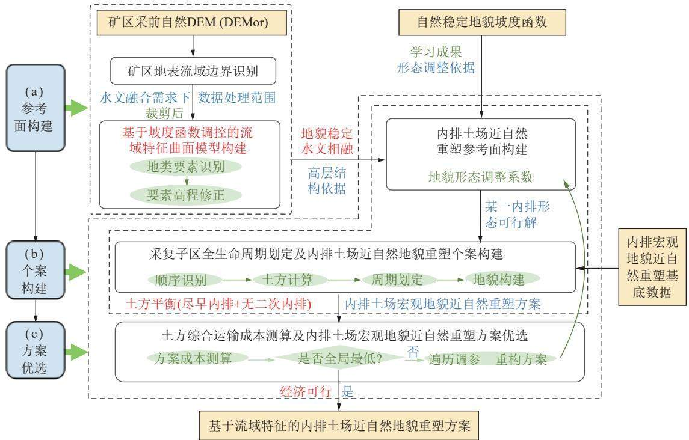
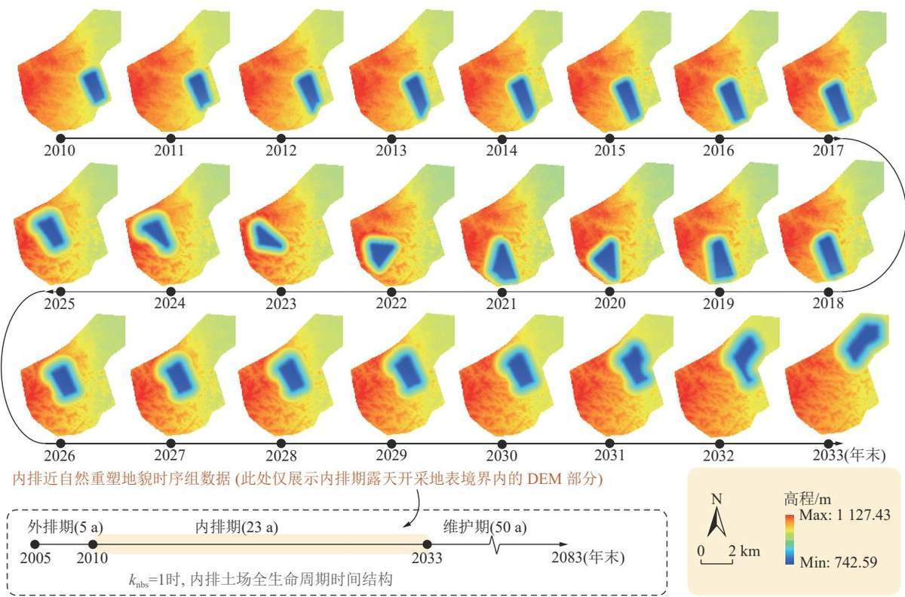
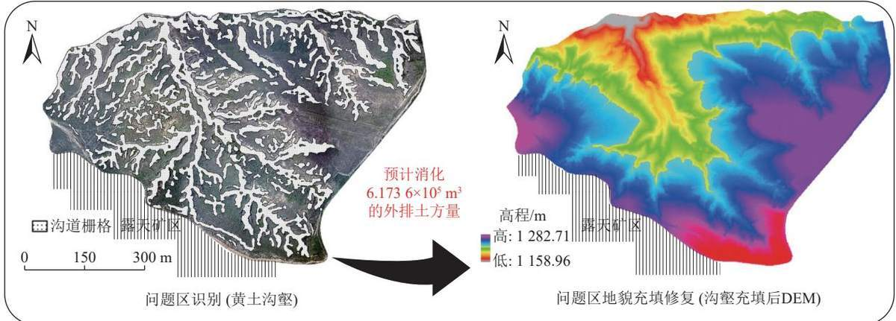
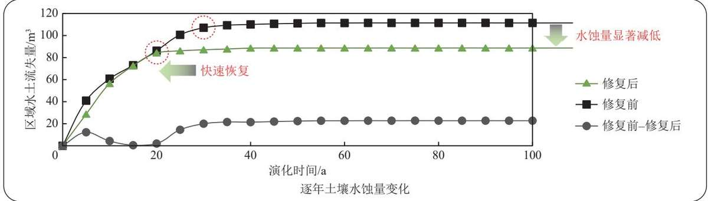
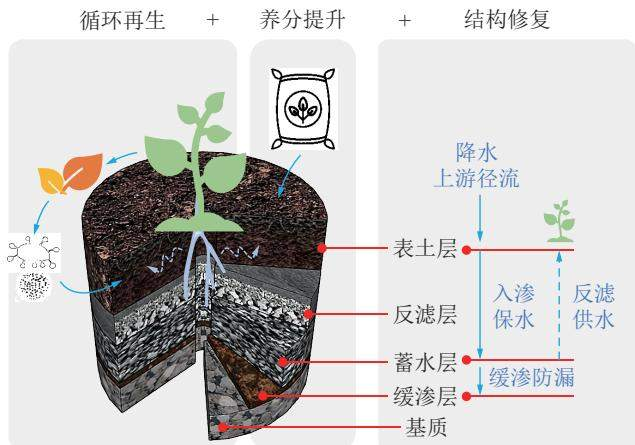
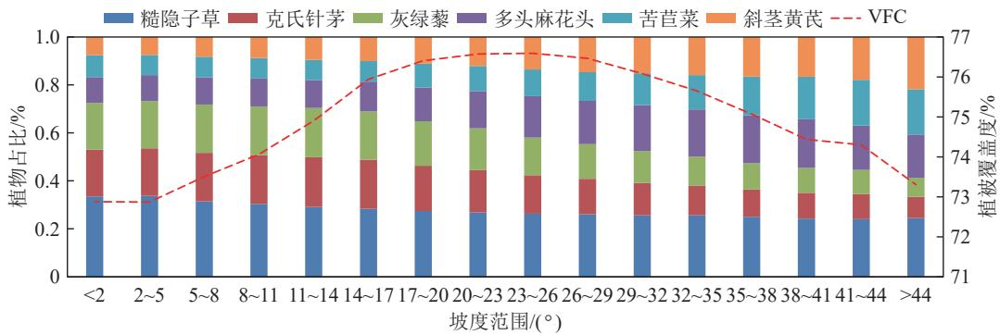

矿山环境保护

# 论露天矿区近自然生态修复

雷少刚，夏嘉南，卞正富，程伟

(中国矿业大学矿山生态修复教育部工程研究中心,江苏徐州 221116)

摘要：露天矿区生态修复面临着重建生态系统自维持力低、维持成本高，尤其是修复后“采矿痕迹”明显等问题，亟待协调好人工修复与自然恢复的关系，升级发展传统生态修复模式，促进露天矿区人与自然和谐共生。在长期的理论方法研究和应用实践经验总结基础上，(①提出了露天矿区近自然生态修复的必要性及其理论内涵与技术框架。近自然矿山生态修复是参照本地自然地貌、水文、土壤、植被、景观及其演变规律，使修复后的矿业斑块达到与周边自然生态系统近似的结构与功能状态，并与周边自然地貌、水系、景观相融合的修复模式，是对传统生态修复模式的升级，逼近“采矿无痕”是其追求的理想状态。②近自然生态修复是露天矿生态化设计的重要构成，其技术环节主要包括，参照生态系统学习、近自然地貌重塑、水文衔接与调控、矿山活土层重构、植被重建与多样性重组等。参照生态系统学习为后续各个修复环节提供修复目标与参数。近自然地貌重塑是近自然生态修复的核心与基础，包括内排土场全生命周期近自然地貌重塑、外排土场近自然地貌重塑、邻近自然问题地貌协同重塑等。水文衔接与调控要解决河道沟道的优化布局、矿区上下游水系的衔接、以蓄代排径流调控等。矿山活土层重构包括矿山土物理结构重组、微生物和养分循环过程重构等内容；植被重建与多样性重组包括近自然的植物群落与多样性配置，以及近自然的植株空间布局等。③实践分析表明，露天矿近自然生态修复有助于减少土壤侵蚀，提高地貌稳定性，增强重建生态系统的自维持能力，有利于实现露天矿区“采矿无痕”，促进人与自然和谐共生。

关键词：露天开采；矿山生态；生态化设计；自然修复；地貌重塑

中图分类号：TD88

文献标志码：A

文章编号：0253-9993(2024)04-2021-10

# Near-natural ecological restoration in open-pit mine area

LEI Shaogang, XIA Jianan, BIAN Zhengfu, CHENG Wei

(Engineering Research Center of Ministry of Education for Mine Ecological Restoration, China University of Mining & Technology, Xuzhou 221116, China)

Abstract: Ecological restoration in open-pit mining areas faces some problems such as low self-sustaining capacity and high maintenance costs, especially obvious mining traces after restoration. It is urgent to coordinate the relationship between artificial restoration and natural restoration, upgrade and develop traditional ecological restoration models, and promote harmonious coexistence between humans and nature in open-pit mining areas. (1) Based on long-term theoretical research and practical experience, this article proposes the necessity, theoretical connotation, and technical framework of near-natural ecological restoration in open-pit mining areas. Near-natural mining ecological restoration is a restoration

model that refers to the local natural landforms, hydrology, soil, vegetation, landscape and their evolution laws, so that the repaired mining patches reach a structural and functional state similar to the surrounding natural ecosystem, and integrate with the surrounding natural landforms, water systems, and landscape. It is an upgrade to the traditional ecological restoration model, approaching the ideal state of “mining without trace". ② Near-natural ecological restoration is an important component of ecological design in open-pit mines, and its technical aspects mainly include learning from ecosystems, reshaping near-natural landforms, hydrological connection and regulation, reconstruction of active soil layers, vegetation reconstruction and diversity recombination, etc. Ecosystem learning can provide restoration objectives and parameters for subsequent restoration processes. The reshaping of near-natural landforms is the core and foundation of near-natural ecological restoration, including the reshaping of near-natural landforms throughout the entire life cycle of the inner dumping site, the reshaping of near-natural landforms of the outer dumping site, and the collaborative reshaping of adjacent natural problem landforms. The hydrological connection and regulation need to solve the optimization layout of river channels. the connection of upstream and downstream water systems in mining areas, and the regulation of using storage to replace runoff. The reconstruction of active soil layers in mines includes the physical structure reorganization of mining soil, the reconstruction of microbial and nutrient cycling processes, and other related contents. Vegetation reconstruction and diversity recombination include near-natural plant communities and diversity configuration, as well as near-natural plant spatial layout. 3 Practical analysis shows that the near-natural ecological restoration of open-pit mines helps to reduce soil erosion, improve geomorphic stability, enhance the self-sustaining ability of the reconstructed ecosystem, promote seamless mining in open-pit mining areas, and harmonious coexistence between humans and nature

Key words: open pit mining; mining ecology; ecological design; natural restoration; landscape reshaping

煤炭是我国的主体能源，是国家能源安全的“压舱石”。露天煤矿因建设速度快、开采能力大、劳动效率高、生产成本低等诸多优势，已成为我国能源安全的“稳定器”[1]。截至2022年底，露天煤矿全年产能超10.4亿t,约占我国煤炭总产能的25%。未来，随着新疆煤炭大规模开发和中东部地区井工煤炭资源枯竭，露天煤矿产量占比将进一步增加[2-3]。我国现有露天煤矿共400余座，主要分布在内蒙古、新疆等地，大多位于北方防沙带和东部草原区等重要生态功能区[4],受干旱半干旱气候等因素影响，区内土壤贫瘠、风速大、干旱缺水、植被稀少、生态脆弱[5]。露天开采是一种剥离上覆岩土层以采出下伏煤炭资源的开采方法，采剥量巨大，单矿每年可达上亿立方米，采损压占面积大，煤矿生命周期内排土场累积的采排面积可达 $5 0 \mathrm { k m } ^ { 2 }$ 以上[6-7],采后矿区地形地貌、景观格局变化剧烈，生态环境影响程度高，土壤侵蚀和粉尘控制难度大。因此，露天煤矿规模开采与脆弱生态环境保护矛盾突出[8-11]。

为此，《国务院关于印发打赢蓝天保卫战三年行动计划的通知》(2018年)第十九条明确规定，若露天矿山生态修复不达标需停产整顿…，重点区域原则上禁止新建露天矿山建设项目[12]。2020年，内蒙古出台《关于促进全区煤炭工业高质量发展的意见》明确指出“草原上严禁新上煤矿项目，不扩大井(矿)田范围，不核增产能、井工开采不变更露天开采………”。由此可见，露天煤矿生态保护修复成效能否满足人们对美好生态环境的要求，已成为制约露天煤矿发展的重要因素，亟需进一步发展升级现有露天煤矿生态修复理论与技术水平，促进人工修复与自然环境相融合、矿山生态修复与产业振兴相融合、生态修复与居民福祉相融合3]。笔者通过理论与实践探索发现，近自然生态修复较为适合当前露天矿区面临的高质量生态修复需求。笔者拟重点讨论露天煤矿近自然生态修复的必要性、内涵、技术方法等。

## 1 露天矿近自然生态修复必要性分析

## 1.1 近自然生态修复的需求与发展背景

党的十八大、十九大、二十大报告先后明确提出：坚持节约优先、保护优先、自然恢复为主的方针；推动绿色发展，促进人与自然和谐共生。这就要求矿山生态修复需要处理好人工修复与自然恢复的关系，实现人工自然协同修复、精准修复、适度修复。近年来，基于自然的解决方案 (Nature-based Solutions, NbS) 在我国生态保护修复领域也逐渐得到认可。早在19世纪德国就利用不同物种、不同龄级的适生树种恢复接近于天然林的混交林，通过近自然生态修复建立了“近自然林业”的营林模式。目前，近自然生态修复已在河道、湿地、林业等领域得到了推广应用[14-17]。因此，近自然生态修复是践行NbS理念的重要途径，有利于促进人与自然和谐共生，是将生态修复向以自然恢复

为主转变的重要举措。

## 1.2 露天矿近自然生态修复的必要性分析

生态修复是解决露天煤炭开采与生态保护矛盾的关键手段。近年来，我国露天煤矿生态修复理论与技术得到了飞速发展，形成了一批理论与技术成果。然而，由于缺乏全过程生态化设计、系统修复和动态监管，现有矿区生态修复理论与技术仍然满足不了当前露天矿区高质量发展与实践需求，例如出现修复的生态系统结构功能单一、水文功能丧失、侵蚀严重、自我维持能力低、易退化难持续、景观破碎、采矿痕迹明显等多种问题(图1)。

  
图1 传统内排土场景观生态问题示意(左)与沿着“条列式”植株汇集的径流引起的坡面细沟侵蚀(右)  
Fig.1 Illustration of the landscape ecological problems of the inner dump with insufficient ecological design (left) and erosion caused by the plants on the slope (right)

(1)外排土场台阶地貌，形成大量难修复的边坡。传统外排土场地貌重塑方式将自然地貌转变为平台一边坡交替的“梯田式”人工堆叠地貌，排土场高度往往高达100m，与周边自然地貌景观差异显著，形成明显的台阶地貌“采矿痕迹”，高陡边坡生态修复成为了露天矿区生态修复的重点与难点。

(2)内排土场景观与周边邻近自然地貌景观冲突。由于煤层埋深、煤厚等赋存条件空间变化，以及采排复计划调整和临时用地空间限制等影响，导致内排土场形成过程中地貌重塑困难，易出现平台-边坡交替的“梯田式”人工堆叠破碎的“采矿痕迹”。

(3)地貌重塑区水文条件与周边自然水文条件衔接性差。采后原始自然地表沟道、水文网络消失，内排土场与邻近自然区域上下游水文网络衔接18-20]；内排土场地表不均匀沉降，地表积水、径流过程紊乱易失控，土壤盐渍化加剧，造成复垦土地退化的同时，地表侵蚀较自然区域也更加明显[21-23]。

(4)植被多样性配置单一，土壤复合侵蚀防控不够。一方面，排土场植被重建时多沿坡向呈规则“条列式”机械化种植布设，使雨水容易沿条列植株形成径流路径，导致坡面侵蚀沟发育明显(图1右),植被护土效果并不理想[24-25];另一方面，植被重建初期植物多样性配置低，重建植被景观与周边自然植被的多样性与景观视觉差异明显；此外，容易忽视土壤重构与改良，重建植被难自维持，易退化。

(5)露天矿挖损压占区与周边邻近非开采区域未能一体化治理修复。露天矿周边也可能存在冲蚀沟壑、生态退化等自然非开采区域；露天煤矿生态修复不仅要考虑与邻近自然景观如何相协调，也需要与煤矿周边小流域一体化协同治理。

早在1977年，美国《露天开采管理和复垦法》就明确规定:露天开采破坏区应尽可能恢复至原始自然状态，使之与周围自然地貌相融，尽可能使重塑后的地貌维持稳定，减少后期人为干预。这是较早要求矿山生态修复达到近自然状态的国家性法律规定。当然，恢复到原始自然状态是极为困难，但至少应做到近似自然，与自然相融。

国家《山水林田湖草生态保护修复工程指南(试行)》明确规定要：尊重自然风貌，以本地适宜的生态系统为优行参照标准。综上所述，露天矿近自然生态修复的好处在于，首先，能充分遵循和利用自然规律，因地制宜实施生态修复；其次，可以为露天矿地貌重塑、土壤重构、水文重调、植被重建、景观重现等修复环节提供近自然的关系模型与修复程度判定依据，进而明确生态修复目标程度或调控阈值这一难题；从而，充分利用生态系统的自我调节能力与自组织能力，逐步恢复与重建其生态功能;能更好地维持生物多样性实现恢复后生态系统的稳定和可持续7,可促进人工修复与自然恢复相协同。

## 2 近自然矿山生态修复理论内涵分析

近自然生态修复是一种“师法自然”的修复方式。近自然矿山生态修复可定义为：效仿周边邻近自然生态系统或采前自然生态系统的地形、水文、土壤、植被、景观特征及其演变规律，使修复后的矿业斑块达到与周边自然生态系统近似的结构与功能状态，并与周边邻近自然地貌、水系、景观相融合的一种修复模式。具体来讲，就是遵循近自然引导型生态修复原则26],将受挖损压占直接影响区域或间接影响的周边区域恢复到近似自然状态，实现修复后“采矿痕迹”基本消除，修复后排土场等矿业景观与周边自然景观融为一体。

与传统矿山生态修复模式的区别在于，近自然修复更强调修复后生态系统与周边自然生态系统具有较好的相似性和相融性。因此，露天矿近自然生态修复是对传统生态修复模式的发展升级，逼近“采矿无痕”是其追求的理想状态。当然，从三生空间的修复方向差异来看，近自然矿山生态修复更适合于生态空间修复。由于露天煤矿开采生态环境影响涉及地层、地貌、水文、土壤、植被、生态、景观等多个方面。因此，需要从多个角度分别认识露天煤矿近自然生态修复的内涵：

(1)从地层地貌角度看，采用近似自然地层的内排土场地层重构，有利于与周边隔水层、含水层相衔接，可促进地下水的恢复与存储;地形地貌形态在很大程度上决定了区域景观系统的物质与能量流动，合理的地形地貌对景观生态的长期稳定性有着重要的物质承载与场景塑造作用;露天矿近自然生态修复就需要实现重塑地形地貌与采前或周边自然地形地貌相似相融。

(2)从地表水文角度看，要实现露天矿区内部，尤其是重塑的内排土场和外排土场的地表水文过程与周边上下游自然水系相衔接，与当地气候条件相适应修复后土壤抗侵蚀程度与自然区相近似。

(3)从土壤角度看，要重构露天矿排土场活土层，也即效仿自然土壤，重构排土场矿山土物理一生物一化学一营养过程，实现排土场土壤生态系统正向演替和自维持。

(4)从植被角度看，要形成与当地水土条件相适应、与周边自然植被相近似、或与矿区生态产业发展相协调的植被空间布局和植物多样性配置。

(5)从景观生态角度看，重建的露天矿区景观系统要与周边自然区域的景观系统相融合，或具有类似的结构与功能状态。

(6)从消除“采矿痕迹”角度看，地貌重塑、水文重构、植被重建、多样性重组等多侧重于“形似”自然，直观的体现“采矿无痕”，土壤活土层重构则侧重于内在的“神似”自然。

(7)从露天矿近自然生态修复的实践意义来看，将有利于恢复近似自然的景观生态，有利于矿区地貌稳定与水土保持，有利于重建生态系统长期自维持与减少管护成本，有助于协调好自然修复与人工修复之间的关系，促进露天煤矿开采与区域生态保护修复相协调，有利于绿色矿山和矿区生态文明建设。

## 3 露天矿区近自然生态修复技术方法

白中科等2提出矿区生态系统恢复重建的基本途径就是通过“地貌重塑、土壤重构、植被重建、景观再现、生物多样性重组与保护”来实现。本研究所提出的露天矿近自然生态修复技术框架是借鉴上述过程，并根据修复区本底条件、修复目标等，将近自然的约束条件和技术思路融入到矿区近自然生态修复各修复环节，主要包括：“参照生态系统学习、近自然地貌重塑、水文衔接与调控、矿山活土层重构、植被重建与多样性重组”等，从而实现近自然的景观生态效果。图2为露天矿区近自然生态修复的基本框架。

  
图2 露天矿近自然生态修复技术框架  
Fig.2 Technical framework diagram of near-natural ecological restoration of open-pit mine

## 3.1 参照自然生态系统学习

露天矿山近自然生态修复首先需要明确学习效仿的参照自然生态系统。《山水林田湖草保护修复工程指南》将其定义为一个能作为生态恢复目标或基准的生态系统；通常包括破坏前的生态系统、未因人类活动而退化的本地生态系统，以及能够适应正在发生的或可预测的环境变化的生态系统。其次，要掌握拟达到的近自然状态特征及其参数。这就需要从参照自然生态系统学习提取关键自然生态参数、关系模型、演变规律，例如，坡长、坡高、边坡角、曲率等关键坡形特征参数，沟道密度、宽深比、弯曲度、河道分形等水文参数，植物多样性、立地条件及其空间配置、群落演替规律，以及上述关键参数间的相互关系，进而为近自然生态修复的后续环节提供科学依据28]。

## 3.2 近自然地貌重塑

提升露天矿排土场堆叠地貌与周边自然地貌间能量流和物质流的融合度及其协调性，重塑近自然地貌是露天矿近自然生态修复的根本前提，是决定生态修复成效的关键环节；其技术思路是学习自然稳定地貌特征，用自然坡形代替梯田式直线坡形，塑形结果可较好适应当地气候环境，稳定性好、抗侵蚀能力强。按近自然地貌重塑的区位来分，主要包括：外排土场近自然地貌重塑[29-30]、内排土场全生命周期近自然地貌重塑31-32]、邻近自然问题地貌协同重塑等内容。按近自然地貌重塑的尺度来分，可分为宏观地貌和微观地貌重塑。

(1)外排土场近自然地貌重塑。外排土场是露天矿区较为明显的矿业景观，主要是对外排土场传统台阶直线边坡进行坡形调整和微地貌重塑。台阶坡形可以采用反 S型边坡28],或反S组合形成波浪式近自然边坡29；并结合本地植物类型，配以水平沟、鱼鳞坑、竹节沟或网格状斜坡等集流控蚀微地貌，以增加排土场坡面粗糙度，降低土壤侵蚀，实现排土场边坡稳定，增加重建植被立地条件异质性，形成近似自然的边坡地貌形态。例如，宝日希勒露天煤矿位于内蒙古东部呼伦贝尔市陈巴尔虎旗(简称陈旗)煤田东部，位于呼伦贝尔大草原，属于高寒地区，年均降雨量370mm,以短时暴雨为主，年均蒸发量1240mm。该煤矿的北排土场南坡原台阶坡度达到了33°，土壤复合侵蚀严重，植被养护成本高，与周边美丽草原景观融合度差。为此对该排土场边坡进行了近自然地貌重塑，图3为台阶边坡实施近自然地貌重塑的原理和初步效果。

  
图3 宝日希勒露天煤矿外排土场近自然边坡重塑效果  
Fig.3 Near-natural slope remodeling effect of the outer dump of an open-pit coal mine in Baorixile

(2)内排土场全生命周期近自然地貌重塑。由于内排土场的形成将占据矿山生命周期的绝大部分时间与空间，加上内排的土方量受剥采比和煤层埋藏影响而动态变化，因此需要根据自然水文地形特征、开采计划、煤层赋存、运距控制等多个约束条件，开展采-排-运土方平衡设计、仿自然特征曲面构建、地貌形态再优化等工作，从内排土场形成初期或尽可能早地实施全生命周期近自然地貌重塑，并将其纳入露天矿生态化开采设计中。内排土场全生命周期近自然地貌重塑技术路径及其时序动态重塑过程结果分别如图4、5所示。

(3)邻近自然问题地貌协同重塑。针对露天矿周边存在的一些冲沟、沟壑等自然问题地貌，在排土作业过程中，根据环保设计要求，可进行矿区内外问题地貌协同重塑，从而减少沟壑区与非沟壑区坡度及其变化范围间的差异，避免悬崖式断沟引发的面源性表土流失；其好处一方面增大了采-排作业空间和后期土地利用空间，另一方面实现周边生态环境问题的协调治理，减少了正常土地压占和区域水土流失。图6为准格尔某黄土沟壑露天矿区构建沟壑回填地貌模型，其中结合GIS空间分析与 CLIDE模拟，模拟研究区问题地貌回填后百年演化过程，进一步通过测算充填修复前后区域土壤水蚀量，分析黄土沟壑区回填治理的可行性。结果表明，通过回填研究区沟壑地貌可减少矿区土方外排，并使充填后地貌具有更高的稳定性。回填后地貌百年土壤水蚀总量较原地貌减少20.4%。演化过程中，充填地貌较原始地貌发育速度更快，较原始地貌仅需2/3的时间(20a)即可达到相对稳定。

## 3.3 水文衔接与调控

确保重塑地貌区水系与周边自然水系相衔接，修复区水系沟道重塑，以蓄代排调控修复区地表径流，提升水土保持能力，是矿区近自然水文修复过程中必须考虑的内容。地表径流在形成和汇聚过程中对边坡形态的影响主要体现在河道的生成和发育。沟道对边坡形态演化影响的主要参数包括，表征沟道纵向发育情况的宽深比，表征沟道空间形态的弯曲度，以及表征沟道两侧坡面地表形态的子脊间距。随时间推移，需保持重建沟道的三维形态，促进沟道植被恢复，及水生栖息条件改善[33-34]。从流域景观尺度，还需要掌握当地自然地貌水系的布局类型，如树状水系、格状水系、放射状水系等。基于河流地貌原理，露天矿区重建水系与上下游未扰动区的水系衔接，这样可以恢复其地表水文过程(输入、调蓄、输出),避免自身及周边未扰动区景观退化。在水系衔接设计中，要考虑集水面积与沟道坡降等水文特征因素。大规模的内排土场修复区，由于地层物料与压实作用，土体紧实渗透性差，集中降雨易导致大范围地表积水问题。为此，需要结合重塑地形，采用“以蓄代排”的思路，构建分布式近自然近地表涵水层，以增加内排土场涵养水源的能力，并减少水资源浪费与土壤侵蚀，从而增加重塑地貌的稳定性。

  
图4 内排土场全生命周期近自然地貌重塑技术路径

Fig.4 Technical path of near-natural landform reshaping of the inner dump  
  
图5 某矿内排土场全生命周期近自然地貌重塑时序动态结果  
Fig.5 Near-natural landform reshaping scheme for the whole life cycle of an inner dump

  
图6 某矿区周边问题地貌协同充填修复及效果模拟验证  
Fig.6 Collaborative filling and restoration of landform problems around a open-pit mine and its effect simulation

## 3.4 矿山活土层重构

排土场矿山土是在露天开采和复垦过程中，由于爆破、剥离、运输、堆积、混堆等工艺导致大量物质混堆所形成，其结构、形态、养分、水分、微生物等基本性质与自然土壤具有显著区别，影响着植被系统的稳定性与自维持能力35]。活土层具有完整的土壤物理、化学、生物、营养转化过程，是健康土壤必不可少的组成部分，是适合植物微生物生长的土层36]。因此，露天矿区土壤重构也应形成近似自然的活土层。矿山活土层重构的基本思路包括(图7):①在土壤物理性质方面，消除种植层土壤障碍因子，效仿自然土层，至下而上构建缓渗功能层、涵水功能层和根系营养层，形成具有保水保肥能力的土壤物理结构；②在土壤养分化学性质方面，通过腐殖质层再造、水肥一体化、风化熟化促进等手段提升土壤养分；③模仿根系分泌物通过激发效应促进土著微生物扩繁与利用植物益生元移植优势种群等措施共同优化根际圈环境，促进土

  
图7 矿山活土层近自然重构原理示意  
Fig.7 Reconstruction principle of mining active soil layer imitating natural soil  
壤速效养分分解循环[37]。

## 3.5 植被重建与多样性重组

植被覆盖及其多样性是矿区土壤保持的重要影响因素，也是矿山生态修复成效的直接体现。对于受开采间接影响的区域，禁止或减少人为干扰，采取封育、禁牧、休牧、轮牧等方式使植被依靠自身的恢复能力进行自修复。对于植被重建，实践证明“师法自然”的近自然重建植被能更好、更快地适应当地环境，仅需较少维护费用即可有效提升重建区的保土保肥

能力[38]

不同的植株分布方式对边坡土壤侵蚀控制差异明显。为避免图1右所示的问题，要提前掌握周边自然区域植株的空间分布特征，在植被建植过程中选取适宜的近自然植株分布形态设计。夏嘉南等(2021)模拟对比分析了传统“条带状”与近自然植株布局对地表侵蚀的控制效果，结果表明植株近自然布设较传统条带布设方式能减少46.3%的边坡土壤水蚀量25]。

图8为宝日希勒露天矿排土场北坡不同立地条件下的植物类型及其比例配置情况。分析表明，该坡面复垦初期仅单一种植了披碱草，在风力传播作用下，邻近草原的植物种子到达了该坡面，经过10多年的自然演替，由单一禾本科演替到以菊科为主，豆科、藜科和禾本科共存，形成了与周边草原植物多样性近似的状况，而披碱草则在2～3a内基本消失；该边坡植被群落进入了正向演替、基本实现自维持，节约了大量管护成本。因此，在复垦初期和演替过渡阶段，根据邻近自然植物多样性特征和立地条件，采用近自然的理念进行本地物种筛选和群落配置，将有利于加速引导重建系统的正向演替过程。

  
图8 宝日希勒排土场北坡不同立地条件下的近自然植物配置  
Fig.8 Near-natural plant configuration under different site conditions on the north slope of the Baorixile dump

## 4 结 语

露天矿区矿业景观人工痕迹明显，与周边自然地形地貌、水文、景观不协调、融合度低，进而易导致修复后生态系统稳定性差，自维持难等。这些问题的解决一方面要从开采源头是进行控制，协调好露天矿剥-采-排-复等主要环节的时空关系，做好露天矿全生命周期生态化设计，优化调控开采环节支撑后期矿山近自然生态修复；另一方面，落实露天矿动态修复，明确近自然修复的对象、目标、程度、措施，“形似”与“神似”相结合，做好地貌-水文-土壤-植被联合系统近自然修复。

露天矿近自然生态修复模式是对传统生态修复模式的升级发展，更强调合理的时空布局，要求在时间上考虑全生命周期的生态修复规划，在空间上要求剥-采-排-复合理优化布局，和矿区内部外部协同修复，该模式并不会明显改变修复初期的成本。从长远来看，露天矿区近自然生态修复有利于提高重建生态系统的稳定性，减少生态修复及维护成本，促进矿业景观与自然景观有机融合，实现露天矿区“采矿无痕”，符合人与自然和谐共生的理念。

在当前生态文明建设的新形势下，笔者建议露天煤矿实施生态化设计，并将近自然生态修复列入露天矿生态化设计的指导原则与重要内容，系统性加强对参照生态系统及其特征参数的识别方法，以及近自然生态修复关键技术研发，建立近自然生态修复的科学评价方法，形成可复制可推广的应用模式，并向其他类型的露天矿、井工煤矿和其他重大工程扰动修复区推广。为此，尤其需要煤炭行业、煤矿企业、生态修复企业与各级行政管理部门，列入相关技术标准，推行露天矿生态化设计、实施露天矿区近自然生态修复及其动态监管，从技术、管理、政策上保障露天矿区近自然生态修复，实现露天矿区“采矿无痕”，助推“美丽中国”早日实现。

## 参考文献(References):

[1] 田会，才庆祥，甄选.中国露天采煤事业的发展展望[J].煤炭工程， 2014, 46(10): 11-14. TIAN Hui, CAI Qingxiang, ZHEN Xuan. Development prospects of surface coal mining industry in China[J]. Coal Engineering, 2014, 46(10): 11-14.

[2] 杨博宇，白中科.露天煤矿区低碳土地利用途径研究[J].中国矿业， 2019, 28(6): 89–93. YANG Boyu, BAI Zhongke. Research on the low-carbon land use in opencast coal mine area[J]. China Mining Magazine, 2019, 28(6): 89-93.

[3] 李全生.蒙东草原区大型露天煤矿减损开采与生态修复关键技术 [J]. 采矿与安全工程学报,2023,40(5):905-915. LI Quansheng. Key technologies for damage reduction mining and ecological restoration of large-scale open pit coal mines in grassland

area of eastern Inner Mongolia[J]. Journal of Mining & Safety Engineering, 2023, 40(5): 905–915.

[4] 李浩荡，佘长超，周永利，等.我国露天煤矿开采技术综述及展望 [J].煤炭科学技术,2019,47(10):24-35. LI Haodang, SHE Changchao, ZHOU Yongli, et al. Summary and prospect of open-pit coal mining technology in China[J]. Coal Science and Technology, 2019, 47(10): 24–35.

[5] 王韶辉，才庆祥，刘福明.中国露天采煤发展现状与建议[J].中国 矿业,2014,23(7):83-87. WANG Shaohui, CAI Qingxiang, LIU Fuming. Development status and suggestions of open-cut mining technology in China[J]. China Mining Magazine, 2014, 23(7): 83–87.

[6] 袁加巧,柏少军，毕云霄，等.国内外矿山酸性废水治理与综合利用 研究进展[J].有色金属工程,2022,12(4):131-139. YUAN Jiaqiao, BAI Shaojun, BI Yunxiao, et al. Research progress of acid mine drainage treatment and resourece comprehensive utilization at home and abroad[J]. Nonferrous Metals Engineering, 2022, 12(4): 131-139.

[7] 白中科，赵景逵.工矿区土地复垦、生态重建与可持续发展[J].科 技导报,2001(9):49-52. BAI Zhongke, ZHAO Jingkui. Land reclamation, ecological reconstruction and sustainable development in industrial and mining areas[J]. Science & Technology Review, 2001(9): 49–52.

[8] CARNEIRO BRANDÃO PEREIRA T, BATISTA DOS SANTOS K, LAUTERT-DUTRA W, et al. Acid mine drainage (AMD) treatment by neutralization: Evaluation of physical-chemical performance and ecotoxicological effects on zebrafish (Danio rerio) development[J]. Chemosphere, 2020, 253: 126665.

[9] ZHOU Z, CHEN Z, PAN H, et al. Cadmium contamination in soils and crops in four mining areas, China[J]. Journal of Geochemical Exploration, 2018, 192: 72–84.

[10] 赵玉国，吉莉，董霁红，等.蒙东典型大型露天矿生态储存指标体 系及过程分析——以宝矿、敏矿、胜利矿为例[J].煤炭科学技术， 2022, 50(5): 271-280. ZHAO Yuguo, JI Li, DONG Jihong, et al. Analysis of index system and state of ecological storage of typical large open-pit mines in Eastern Inner Mongolia: Taking Baorixile, Yinmin and Shengli No. 1 open-pit coal mine as examples[J]. Coal Science and Technology, 2022, 50(5): 271–280.

[11] 黄元仿，张世文，张立平，等.露天煤矿土地复垦生物多样性保护 与恢复研究进展[J].农业机械学报,2015,46(8):72-82. HUANG Yuanfang, ZHANG Shiwen, ZHANG Liping, et al. Research progress on conservation and restoration of biodiversity in land reclamation of opencast coal mine[J]. Transactions of the Chinese Society for Agricultural Machinery, 2015, 46(8): 72–82.

[12] 国务院.国务院关于印发打赢蓝天保卫战三年行动计划的通知 [J]. 中华人民共和国国务院公报,2018(20):40-52. State Department. Circular of the State Council on printing and issuing the three-year action plan for fighting to win the battle against air pollution[J]. Gazette of the State Council of the People's Republic of China, 2018(20): 40–52.

[13] 卞正富，雷少刚，王楠.生态文明背景下的矿山生态修复模式[J].中国土地,2023(11):4-8.

BAI Zhengfu, LEI Shaogang, WANG Nan. The ecological restoration model of mines under the background of ecological civilization[J]. China Land, 2023(11): 4–8.

[14] 陈航.草原露天煤矿内排土场近自然地貌重塑模拟研究[D].徐州： 中国矿业大学,2019. CHEN Hang. Research on near-natural landform reshaping simulation of inner dump of the open-pit coal mine in grassland areas [D] Xuzhou: China University of Mining and Technology, 2019.

[15] 贺丽，宾建，邓东周，等.植被近自然恢复研究进展[J].四川林业科 技,2017,38(5):18-22. HE Li, BIN Jian, DENG Dongzhou, et al. Review on progress in vegetation close-to-nature recovery[J]. Journal of Sichuan Forestry Science and Technology, 2017, 38(5): 18–22.

[16] 宁璐，崔向新，刘艳萍，等.内蒙古典型草原区露天矿土壤侵蚀机 理及防控技术研究进展[J].北方园艺,2022(22):132-138 NING Lu, CUI Xiangxin, LIU Yanping, et al. Research progress on soil ersion mechanism and contral technology of open-pit mine in typical steppe region of Inner Mongolia[J]. Northern Horticulture, 2022(22): 132-138.

[17] 贺金生.推动退化生态系统的近自然恢复[N].光明日报，2022-11–05(07).

[18] NICOLAU J M. Trends in relief design and construction in opencast mining reclamation[J]. Land Degradation & Development, 2003, 14(2): 215-226.

[19] KOPONEN P, NYGREN P, SABATIER D, et al. Tree species diversity and forest structure in relation to microtopography in a tropical freshwater swamp forest in French Guiana[J]. Plant Ecology, 2004, 173(1): 17–32.

[20] THOMPSON S E, KATUL G G, PORPORATO A. Role of microtopography in rainfall - runoff partitioning: An analysis using idealized geometry[J]. Water Resources Research, 2010, 46(7): 1-11.

[21] 杨娅双，王金满，万德鹏.人工堆垫地貌微地形改造及其水土保持 效果研究进展[J].生态学杂志,2018,37(2):569-579. YANG Yashuang, WANG Jinman, WAN Depeng. Micro-topography modification and its effects on the conservation of soil and water in artificiallypiled landform area: A review[J]. Chinese Journal of Ecology, 2018, 37(2): 569–579.

[22] WORLANYO A S, JIANGFENG L. Evaluating the environmental and economic impact of mining for post-mined land restoration and land-use: A review[J]. Journal of Environmental Management, 2021, 279:111623.

[23] ACHARYA B S, KHAREL G. Acid mine drainage from coal mining in the United States: An overview[J]. Journal of Hydrology, 2020, 588:125061.

[24] 夏嘉南，李根生，卞正富等.露天矿内排土场近自然地貌重塑研 究——以新疆黑山露天矿为例[J].煤炭科学技术,2022,50(11): 213-221. XIA Jianan, LI Gengsheng, BIAN Zhengfu, et al. Research on the reshaping of the near-natural landform of the internal dump for openpit mine: a case study of Heishan open-pit mine, Xinjiang, China[J] Coal Science and Technology, 2022, 50(11): 213-221.

[25] 夏嘉南，李恒，雷少刚，等.胜利矿区周边自然草原坡面植被分布模拟及复垦应用[J].生态学杂志,2021,40(9):3007-3016.

XIA Jianan, LI Heng, LEI Shaogang, et al. Simulation of vegetation distribution on natural grassland slopes around Shengli mining area and its application in reclamation[J]. Chinese Journal of Ecology, 2021, 40(9): 3007–3016.

[26] 雷少刚，卞正富，杨永均.论引导型矿山生态修复[J].煤炭学报， 2022, 47(2): 915–921. LEI Shaogang, BAI Zhengfu, YANG Yongjun. Discussion on the guided restoration for mine ecosystem[J]. Journal of China Coal Society, 2022, 47(2): 915–921.

[27] 白中科，周伟，王金满，等.再论矿区生态系统恢复重建[J].中国土 地科学,2018,32(11):1-9. BAI Zhongke, ZHOU Wei, WANG Jinman, et al. Rethink on ecosystem restoration and rehabilitation of mining areas[J]. China Land Science, 2018, 32(11): 1–9.

[28] 李恒，雷少刚，黄云鑫，等.基于自然边坡模型的草原煤矿排土场 坡形重塑[J].煤炭学报,2019,44(12):3830-3838. LI Heng, LEI Shaogang, HUANG Yunxin, et al. Reshaping slope form of grassland coal mine dump based on natural slope model[J]. Journal of China Coal Society, 2019, 44(12): 3830–3838.

[29] 李树志，郭孝理，李学良，等.我国东部草原区露天矿排土场仿自 然地貌土地整形方法[J].煤炭学报,2019,44(12):3636-3643. LI Shuzhi, GUO Xiaoli, LI Xueliang, et al. Land reshaping method of imitating natural geomorphology for open-pit mine dump in eastern grassland area of China[J]. Journal of China Coal Society, 2019, 44(12): 3636-3643.

[30] 夏嘉南，李恒，雷少刚.自然坡线提取及边坡近自然整形应用 以草原矿区为例[J].干旱区资源与环境,2021,35(6):80-88. XIA Jianan, LI Heng, LEI Shaogang. Natural slope line extraction and application of slope near-natural shaping: Taking grassland mining area as an example[J]. Journal of Arid Land Resources and Environment, 2021, 35(6): 80–88.

[31] 雷少刚，张周爱，陈航，等.草原煤电基地景观生态恢复技术策略 [J]. 煤炭学报,2019,44(12): 3662-3669. LEI Shaogang, ZHANG Zhouai, CHEN Hang, et al. Landscape ecology restoration strategies for the coal-electricity base in steppe of

China[J]. Journal of China Coal Society, 2019, 44(12): 3662–3669.

[32] 夏嘉南，李根生，李园园，等.水文融合的草原露天矿内排土场地 貌重塑优化[J].煤炭学报,2023,48(4):1673-1686. XIA Jianan, LI Gensheng, LI Yuanyuan, et al. Landform reshaping optimization of inner dump based on hydrological fusion in grassland open-pit coal mine[J]. Journal of China Coal Society, 2023, 48(4): 1673-1686.

[33] HARMAN W A, UNGER S J, FORTNEY R H. A natural channel design approach to stream restoration on reclaimed surface mine lands[C]//2004 National Meeting of the American Society of Mining and Reclamation and the 25th West Virginia Surface Mine Drainage Task Force. Lexington, KY: ASMR, 2004: 791-810.

[34] HEY R D. Fluvial geomorphological methodology for natural stable channel design[J]. Journal of the American Water Resources Association, 2006, 42(2): 357–386.

[35] 路晓，王金满，李博，等.矿山土壤特性及其分类研究进展[J].土壤， 2017,49(4): 670–678 LU Xiao, WANG Jinman, LI Bo, et al. Progresses in soil properties and classification of mining soils[J]. Soils, 2017, 49(4): 670–678.

[36] 吴金水，葛体达，胡亚军.稻田土壤关键元素的生物地球化学耦合 过程及其微生物调控机制[J].生态学报,2015,35(20):6626-6634. WU Jinshui, GE Tida, HU Yajun. A review on the couping of biogeochemical process for key elements and microbial regulation mechanisms in paddy rice ecosystems[J]. Acta Ecologica Sinica, 2015, 35(20): 6626-6634.

[37] 程伟，朱卓，王文杰，等.腐殖质层再造修复西部矿区退化土壤的 生态效应[J].煤炭学报,2023,48(7):2850-2857. CHENG Wei, ZHU Zhuo, WANG Wenjie, et al. Ecological effects of humus layer reconstruction on the restoration of degraded soil in western mining areas[J]. Journal of China Coal Society, 2023, 48(7): 2850-2857.

[38] GHESTEM M, CAO K, MA W, et al. A framework for identifying plant species to be used as “ecological engineers" for fixing soil on unstable slopes[J]. PLoS One, 2014, 9(8): 1-20.