采矿理论与工程

# 露天煤矿岩土层重构的发展过程、原理与适配技术

胡振琪1,2,3，张子璇²，孙 煌²

(1. 中国矿业大学,江苏徐州 221116;2.中国矿业大学(北京) 矿山生态安全教育部工程研究中心,北京 100083;3.深部煤炭安全开采与环境保护全国重点实验室,安徽淮南 232000)

摘要：岩土层是生态环境的基础，露天开采彻底破坏了煤层上覆原始岩土层系统并严重影响生态环境，露天矿的生态修复是对岩土层全新的人工重构过程，岩土层重构是矿山生态系统功能恢复与提升的关键。在揭示露天煤矿岩土层重构发展演变过程的基础上，革新岩土层重构原理与方法，并探究重构岩土层剖面中关键层的适配性重构技术，以期为露天煤矿生态修复提供基础理论与关键技术支撑。系统梳理了露天煤矿开采对原始岩土层系统(地层)的破坏及其环境影响机制，阐明了岩土层与土壤重构、地球关键带和地球圈层系统的关系，定义了岩土层重构概念和内涵，明确了岩土层重构是对包括土壤层和岩石层整个岩土层系统功能的重建。认为广义的土壤重构与岩土层重构是一致的，狭义的土壤重构专指土壤层的重构。将露天煤矿岩土层重构研究的发展归纳为4个发展阶段，阐明了岩土层重构从1.0到4.0各发展阶段的背景、特征和研究重点，揭示了人们对岩土层功能认知不断提升、矿山修复技术不断完善的演变过程，同时得到了矿山土壤改良与重构工程在经济投入上呈显著负相关的关键结论。依据生物生态位原理和地质成土理论，创新性提出了岩土层“生态位”与“关键层”新理念与新认知，提出了露天煤矿岩土层重构的两大原理及其实施方法。“生态位原理”就是依据分层生态位特性的定量分析，尤其是生态位适宜度和竞争重叠性，确定各自的位置和相互关系，解决了是否层次合并、分几层和空间关系，形成基础剖面构型；“关键层重构”原理就是通过生态功能分析和提升措施实现关键层识别与功能提升，达到关键层功能最优和岩土层剖面构型最佳。基于上述原理与方法，以我国东部草原区露天煤矿生态修复为例，详细介绍了适宜于地质环境和气候等条件的适配性关键层重构技术，明确了重构剖面构型优化和表土关键层重构的具体方法，取得显著的实际效果。

关键词：矿山复垦；露天矿；岩土层重构；土壤重构；生态位；关键层；地层

中图分类号：TD88

文献标志码：A

文章编号：0253-9993(2025)07-3338-14

# Development process, principles and adaptive technologies for rock and soil layer reconstruction in open-pit coal mines

HU Zhenqi1, 2, 3, ZHANG Zixuan², SUN Huang²

(1. China University of Mining and Technology, Xuzhou 221116, China; 2. Engineering Research Center for Mine Ecological Safety, Ministry of Education, China University of Mining and Technology-Beijing, Beijing 100083, China; 3.State Key Laboratory of Safe Mining of Deep Coal and Environmental Protection, Huainan 232000, China)

移动阅读

Abstract: The rock and soil layer serves as the fundamental basis of ecosystems. Open-pit coal mining causes the complete destruction of the original overlying geotechnical system, leading to severe environmental consequences. The ecological restoration of open-pit coal mining usually results brand new rock and soil layers with a artificial reconstruction process. The reconstruction of rock and soil layer is pivotal for restoring and enhancing mine ecosystem functions. It aims to elucidate the evolutionary process of rock and soil layer reconstruction across different development stages, innovate the principles and methodologies of reconstruction, and explore adaptive reconstruction technologies for critical layers within reconstructed geotechnical profiles. The ultimate goal is to provide fundamental theories and key technical support for ecological restoration in open-pit coal mines. It systematically reviews the impacts of open-pit mining on the original geotechnical system (strata) and its environmental consequences. It clarifies the interrelationships among geotechnical layer and soil reconstruction, the critical zone, and Earth system processes. The concept and connotation of rock and soil layer reconstruction are defined, emphasizing that the reconstruction process entails restoring the functional integrity of the entire geotechnical system, including both soil and rock layers. The study asserts that broadly defined soil reconstruction aligns with rock and soil layer reconstruction, whereas narrowly defined soil reconstruction focuses solely on the soil layer. The development of rock and soil layer reconstruction in open-pit coal mines is categorized into four evolutionary stages. The study delineates the background, characteristics, and research foci of each stage, from Rock and Soil Layer Reconstruction 1.0 to 4.0, illustrating the progressive enhancement of geotechnical functionality cognition and continuous advancement in mine rehabilitation technologies. A crucial finding is that the economic investment in mine soil amelioration and reconstruction projects exhibits a significant inverse correlation. The Ecological Niche Principle involves quantitative analysis of stratified ecological niche characteristics, particularly ecological niche suitability and competitive overlap, to determine the spatial configuration and hierarchical relationships of reconstructed layers. This principle addresses key questions such as whether to merge layers, the optimal number of layers, and their spatial relationships, ultimately guiding the formation of the fundamental profile configuration. The Critical Layer Reconstruction Principle focuses on identifying and enhancing key functional layers through ecological function analysis and optimization measures. This principle aims to achieve optimal critical layer functionality and the best possible rock and soil profile configuration. Applying these principles and methodologies, the study presents a case of ecological restoration in an open-pit coal mine in the eastern grassland region of China, demonstrating the development and application of adaptive critical layer reconstruction technologies tailored to specific geological and climatic conditions. The research provides detailed optimization strategies for reconstructed profile configurations and specific methods for topsoil critical layer reconstruction, achieving significant practical outcomes.

Key words: mine reclamation; open-pit mine; rock and soil layer reconstruction; soil reconstruction; ecological niche; critical layer; strata

## 0 引 言

煤炭是我国最主要的能源，是我国能源安全的压舱石]。煤炭的开采不可避免地破坏了煤层的上覆岩土层(土壤层和岩石层，简称土层和岩层),造成了严重的生态环境损伤，直接影响区域生态环境和生态安全，严重情况甚至导致矿山关闭，影响能源安全。因此，矿山生态修复成为保障生态安全和能源安全双赢的重要技术支撑[2]。

近年来，露天开采比例增长迅速，已经达到全国煤炭总产量的23%3],且比例呈逐年上升趋势。露天煤矿开采是对原始岩土层系统的完全破坏过程，该过程致使原始岩土层系统由密实有序的层状结构变为破碎无序的地质松散体，其对土地和生态环境的破坏最显著。由于露天开采大都是位于生态敏感区，因此，其对生态环境的影响受到了更大关注。

原始地层是经过漫长的地质沉积发展而形成的多层结构，其矿物组成、特性和功能受不同地质时期的自然环境影响。露天开采破坏了整个地层，为人为重新构造岩土层系统提供了契机。因此，露天矿的生态修复是一个对原始地层破坏后的全新人工重构过程。从20世纪20年代开始重视矿区生态修复以来，世界各国都开展了大量的土地复垦与生态修复实践，取得了一定成绩。然而，在实践中仍然存在着诸多失败或耐久性差的案例。失败的主要原因是生态修复过程往往没有关注各个地层的生态功能和作用，大都是按照地层剥离顺序直接排土重构，导致岩土层结构混乱、关键功能层缺失，特别是重构的表层土壤条件差，直接影响水肥等立地条件，进而造成土壤生产力低或植被恢复困难，甚至出现“一年绿、两年黄、三年死光光”的现象。这不仅浪费了大量的人力、物力和财力，也延缓了矿区生态环境的恢复进程。因此，科学的岩土层重构(以往称为土壤重构)是矿山生态修复的核心和关键[4]。

近100多年来矿区生态修复领域学者一直关注岩土层的重构，特别是采用“soil reconstruction”一词[4-5]。胡振琪[6]在1997年提出煤矿山复垦土壤剖面重构的基本原理与方法，近年来又形成新的土壤重构的理论与方法，其中将露天矿岩层和土层的重构均统一称为土壤重构[4,7]。此外，众多学者采用土体重构、土层重构、地层重构等概念8-10描述和表征矿区生态修复的过程。由于多学科交叉的特点，出现不同名词描述同一问题的现象是正常的，应深刻领会不同名词的相同内涵、正确理解不同名词的现实差异。更为重要的是，如何把握其科学内涵。笔者认为岩土层重构的科学问题是：原有历经长期地质历史演化而来的有序的且分为几十、甚至上百层的岩土层，经矿山开采破坏后是否需要分层构造、分多少层合适，用何原理或方法确定分层数量、厚度、空间位置以及整个重构岩土层的结构与功能。针对这一亟待解决的问题，笔者从系统梳理矿山开采对岩土层破坏及其环境影响机制入手，通过探究矿山岩土层重构研究的发展历程，界定岩土层重构的定义与内涵，揭示岩土层重构的基本原理与方法，总结具有长效稳定性和高质性的岩土层重构适配技术，以期为矿山生态修复提供理论指导和实践支持。

## 1 开采对原始岩土层系统的破坏及其环境影响

## 1.1 岩土层系统与地球关键带及地球表面圈层的关系

## 1.1.1 地层与地球表面圈层系统

地球表面系统由五大圈层构成，包括岩石圈、土壤圈、水圈、大气圈和生物圈(图1)。地层是地球表层的重要组成部分，是地球表层由岩石和土体组成的连续或间断性层状地质单元，贯穿于地表至深部的地壳范围12]。地层包括岩石层和土壤层，可称之为岩土层系统。岩土层系统在岩石圈、土壤圈中的存在形式和性质对其他圈层的动态平衡具有重要影响，例如，岩土层结构的稳定性直接影响地表水资源的渗透、储存与分布特征，同时对大气圈和生物圈的能量和物质交换过程具有重要作用[13]；土壤中含有丰富的生物、也是生物圈的重要组成部分，土壤层的结构直接影响生物多样性和生产能力[14]。因此，土壤层是岩土层系统中的生态关键带(层组)。

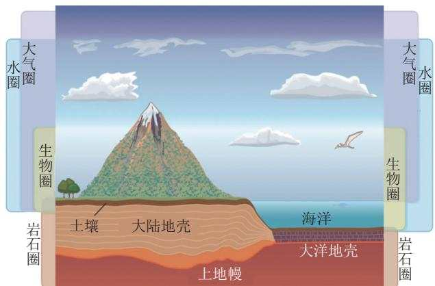  
图1 地球外部环境圈层示意[11]  
Fig.1 Schematic diagram of earth's external environmental spheres[11]

## 1.1.2 岩土层系统与地球关键带

地球关键带是地球表层至关重要的区域之一，其范围从树冠顶部延伸至第1个地下水位底部[15](图2)。该区域位于包气带内，具有透水透气性的特征，是陆地生物活动和物质循环最为活跃的场所[16]。地层作为地球表层由岩石和土体构成的层状结构，在地表向下的空间上比地球关键带更广，其土壤层和部分上部岩石层构成了地球关键带的重要组成部分。岩土层的物理结构和化学组成直接影响着关键带内的水分渗透、养分循环和生物活动的空间分布与生存模式等。需特别指出的是:深部岩石层往往不属于地球关键带，但露天煤矿开采活动会打破这种界限，破坏煤层上覆岩石层的同时在排土场重构又形成了新的“地层(岩土层)”结构。由于地下水位可能因开采活动而发生变化，新的包气带范围可能向下延伸，将原本属于深部、非关键带的岩石层纳入到新的地球关键带中。这是一个重要的变化，即由非关键带的岩石层转变为地球关键带的一部分，而其影响需要开展深入研究。

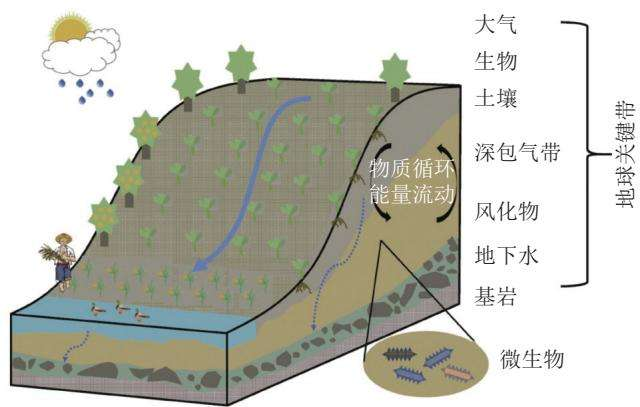  
图2 地球关键带示意[15]  
Fig.2 Schematic diagram of the critical zone of the earth[15]

## 1.2 开采对土层的破坏及其环境影响

土壤是生物之基。矿山开采对土层造成的严重破坏主要体现在土壤结构、土壤侵蚀、水分循环和生物群落受损等方面。土层结构的扰动破坏使其原有的生态功能受损或丧失，并加剧土壤受到风蚀、水蚀等多重侵蚀，削弱了关键带对生态系统的保护功能;进而改变地下水的补给与排泄模式，导致地下水位下降，加剧区域水资源的短缺现象；而土层的不稳定性加剧则会间接阻碍植被根系的正常发育，导致土壤微生物群落多样性与区域生物多样性的显著下降。此外，矿石开采及加工过程中产生的废弃物，如排放的尾矿、废水和矿渣，可能通过渗透、径流等方式进入不同土层，导致土壤重金属(如铅、镉、汞)和其他有毒污染物的积累，进而影响人类健康和生态系统安全7-18]。

## 1.3 开采对岩层的破坏及其环境影响

岩石层对上部土壤层和地球关键带发挥基础支撑作用，其稳定性和完整性在维持地质环境与生态系统功能中起着重要作用。矿山开采对岩石层的干扰与损坏通常表现为岩石层结构的破坏以及化学组分的流失。其主要破坏及影响具体表现在以下2个方面：(①原始分层、致密的岩石层被完全破坏成岩石散体，稳定性和含水层遭到破坏；②岩石层化学组成与位置以及地下水文条件的改变，易导致岩石层中释放的重金属和其他有害物质通过淋滤、积水引起污染扩散，进而威胁生态系统和人类健康。

## 2 矿山岩土层重构的概念与发展过程

露天开采过程中，岩土层剥离之后的排土堆放过程，实际上就是岩土层的重构过程。因此，露天矿岩土层重构与开采工艺紧密相关，其发展历程在一定程度上体现了矿山生态修复理念与技术的发展历史与演进脉络。

## 2.1 矿山岩土层重构的相关概念与内涵

矿山生态修复的发展历史，源于露天矿开采导致的岩土层完全破坏，其修复研究随着对土壤、生态认识的提高而逐渐提高，并逐步涉及到与重构结合的开采工艺的改进与优化。但在矿山岩土层重构中存在土壤重构、土体重构、土层重构、岩土层重构、地层重构等多种不同术语。

自然地层(岩土层)是漫长地质历史过程中形成的多层结构(图3)，主要包括上部的土壤层和下部的岩石层。土壤层是生物生存的基础介质；岩石层能够对土壤和地表生态发挥支撑作用，同时其含水层能够为区域生态提供丰富的水资源。受沉积环境的影响，不同区域地层的结构、层数各不相同，地质学研究主要包括分析各层形成时间、沉积环境、岩性等，如浅部的土壤层(地质学常常用第四纪描述);而土壤学家主要研究浅部土壤的发生发育过程和理化生特性，并主要从耕作层(A层)、心土层(B层)和土壤母质(C层)分析土壤的基本特性，不同的土壤特性其生态功能和生产力不同。因此，从重构对象来看，地层重构就是对岩层和土层的重构，亦可称之为岩土层重构。由于土壤层是整个地层中的生态关键带，修复的重点应是土壤层，但其重构过程不可能为“空中楼阁”，露天开采时，煤层上覆岩石层亦被视为重构对象，与原始土壤层一并进行重构，构成新土壤层的基础支撑层，但其层次分布由密实分层有序变为松散无序。因此，露天煤矿的岩土层重构或地层重构均可理解为广义的土壤重构。为更好地理解与区分，不妨将浅部土壤层的重构称之为狭义的土壤重构，并界定其主要目标是通过填充、改良和培育等方式恢复土壤的肥力与生态功能，从而为植被恢复和生态系统重建提供适宜的基质条件。狭义的土壤重构更注重表层土壤的质量提升与生物多样性的恢复，更需要明确各土层功能及其层间相互作用关系，同时要求与下部岩土层重构的稳定性修复相协调，以实现地质、土壤与生态功能的整体优化。

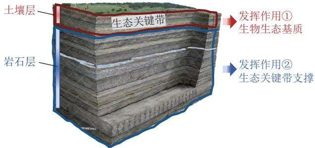  
图 3 地层示意  
Fig.3 Schematic diagram of stratum

由此可见，矿山生态修复是一个交叉学科，不同学科领域虽在使用名词术语时存在差异，但其本质是相同的，均指向对被破坏岩土层的修复。因此，不妨假设：广义的土壤重构=地层重构=岩土层重构。岩土层重构是对整个地层系统的重建，其重构核心是功能重建：为既定的生态功能目标，采取物理、化学、生物和工程措施，重新构造岩土层的过程。

综上，岩土层重构或地层重构与广义的土壤重构内涵基本一致，均是对整个岩土层系统生态功能的重建，而狭义的土壤重构则聚焦于表层地层土壤层的生态功能与生产力的恢复、提升。

## 2.2 矿山修复启蒙阶段的岩土层重构：岩土层(土壤) 重构1.0

20世纪初开始重视矿区生态修复时，相关研究场景往往始于露天煤矿排土场，而传统技术工艺排弃重构的土壤(图4a),往往导致岩土层颠倒或混合，常常缺乏单独的表土层。因此，矿山土(露天矿剥离物)则成为当时的重点研究对象19],相关研究主要包括2部分：一是矿山土基本特征的研究，二是矿山土土壤改良措施的研究，以期达到生态修复效果。BUSSLER等[20]研究矿山土的物理特性发现，矿山土具有较高的土壤容重、低的孔隙度、低的透能力、较高的粗碎屑含量和较低的保水能力等。在宾西法尼亚的一个类似的研究21]中发现：尽管矿山剥离物中存在较大的孔隙，但其总孔隙度仍十分低，此外他们发现矿山土具有较高的粗碎屑含量和较差的土壤结构。在大平原以北地带，矿山剥离物具有较高的黏土和钠含量22]，植物生长因缺水而受到了严重的影响[23],剥离物的渗水率通常比自然形成的土壤低[24-25]。在矿山土的改良方面，往往采用有机质(如堆肥、绿肥和农作物残体的添加[26-27]等)改善土壤结构、增加土壤孔隙度、提高土壤的透水性和通气性，以及提高土壤的水分保持能力和抗侵蚀能力。此外，还采用微生物接种、土壤动物引入、解磷菌添加等方式，以促进植物生长和菌的应用[28-29]。

矿山剥离物形成土壤的过程得到了较多关注。THOMMPSON 等[30]评价了5～64 a 的露天采矿剥离物的土壤形成过程，并发现A1耕作层土壤形成的厚度仅仅从 5 a 的 3 cm 到 30 a 的 10 cm,并推测 30 a 以后A1层土壤的厚度不会再增加；此外，土壤结构形成的深度仅从 5 a 的 3 cm 到 55 a 的 35 cm, 土壤特性自然变化相当缓慢。因此，为实现矿山土地生产能力的快速恢复，在剥离物上覆盖表土已被认为是一个较好的发展方向。

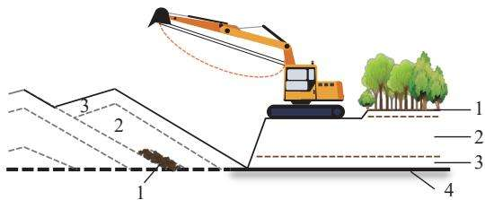  
(a)传统的剥离方法，依次剥离废石(重构1.0)

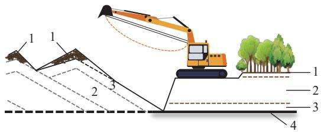  
(b)改进的剥离方法，交替处理废石(重构2.0)  
1—表层土壤；2—页岩、砂岩；3—酸性层页岩、砂岩；4—煤  
图4 岩土层重构1.0和2.0工艺示意  
Fig.4 Schematic diagrams of the technique process for rock and soil layer reconstruction 1.0 and 2.0

针对早期的这种被动的重构土壤，不妨称之为岩土层(土壤)重构1.0。岩土层重构1.0是矿区土地复垦与生态修复的起步/萌芽阶段，其研究对象是矿山没有主动考虑复垦修复造成的岩石土壤的混合土(矿山土)，特征是土层混合，主要措施是土壤改良。

## 2.3 矿山修复初始阶段的岩土层重构：岩土层(土壤)重构 2.0

随着开采工艺的提升和复垦意识的加强，尤其是针对岩土混合改良土壤的投入大、效果欠佳且时间较长等重构问题，人们逐渐认识到了表土对植物生长的重要性，并通过改进采矿工艺，尽可能地剥离和回填表土(图4b)。岩土层重构由此开始进入2.0阶段。因此，岩土层重构2.0是矿山修复的初步发展阶段，标志着对岩土层重构与生态修复的认识从简单的原位改良发展到注重表层土壤层覆盖，而有无表土覆盖层则是区分岩土层重构1.0和2.0的关键要素。

这一阶段的岩土层重构的研究重点主要包括表土层的剥离与贮存、表土回填覆盖、表土替代材料和土壤改良等方面[31-34]。其中，剥离原始表土层厚度的确定、堆存位置与方法、表土覆盖厚度、替代材料的筛选与造土方法、表土及下部土壤等系统改良均得到了更多的探索。针对此阶段的研究方法，胡振琪等[35]归纳总结并创新性提出了多材料混配、生物化学改良的表土层快速成土技术。该技术主要包括需求分析、基质材料筛选、快速熟化和组配优选四大步骤，重点通过实地踏勘、辅助改良材料研制、室内外种植试验等实现。此外，很多学者针对植物生长介质层水肥供给开展了大量的研究，其中煤基生物土和岩土基新表土的构造均为岩土层重构2.0的典型代表[36-37]。因此，岩土层重构2.0的核心在于自然表土剥离回填与改良和表土替代材料的研制，旨在解决传统混合土改良困难且耗时长的问题。

## 2.4 矿山修复发展阶段的岩土层重构：岩土层(土壤)重构3.0

岩土层重构2.0研究发现，表土层的增加在一定情况下可以快速实现植被的成功恢复，但恢复植被质量、数量无法长时间维持较高水平，耐久性差则成为首要解决问题。学者们逐渐认识到土壤剖面构型以及整个岩土层结构对整体功能影响的重要性。因此，在仿自然理念的影响下，岩土层重构开始具备“仿自然重构”意识，开始重视岩土层重构剖面结构，并重点关注植物生长介质层的构造，以此成为岩土层重构3.0的标志，并进一步推动了采矿工艺的改进。

岩土层重构3.0是在“仿自然重构”理念背景下发展起来的更为先进和系统的岩土层重构方法，标志着矿区土地复垦与生态修复进入了一个崭新的时代。这一阶段的核心理念是：不仅关注表土层的改良与构建，更强调整个重构岩土层剖面构型(特别是土壤剖面构型)的重要性，以表土层+心土层重构为主要任务。

美国联邦采矿与复垦法中明确规定:对复垦为优质农田的土壤，必须分别剥离和回填表土和心土，且达到至少1.22 m的厚度。BULOT等[38]在复垦土壤重构研究中发现，保持原始土层顺序(特别是表土层)进行客土回填有利于植物的快速恢复。怀特伍德矿采用了在回填材料上覆盖0.35～1.0m心土，再覆盖20cm表土的方式开展生态修复工作，整个复垦过程包括用采矿混合材料及剥离材料填满露天矿坑，塑造景观后重新种植，实现了土地生态修复的可持续性[39];美国太阳黑子矿试验田中的重构试验表明，复垦1a后的玉米根系数(163 cm)远超对照处理组[40]。在国内，胡振琪于1997年提出恢复原始土层顺序的土壤剖面重构原理，并对矿山土地复垦实践中的土壤重构进行了系统研究，明确了概念内涵、分类及提出一般方法，研制出“分层剥离、交错回填”的露天矿采复一体化工艺，并建立了数学模型[6]。该工艺主要应用于露天矿复垦，并将其推广应用到采煤沉陷地复垦土壤重构过程中。该阶段的研究表明，借鉴仿自然重构理念的土壤剖面质量和植被恢复力均达到了前所未有的效果。

## 2.5 矿山修复快速发展阶段的岩土层重构：岩土层重 构4.0

岩土层重构3.0是基于仿自然重构原理，但因原始岩土层结构与质量受沉积环境的影响较大，甚至存在障碍层，因此需要构造比原岩土层结构更好、整体功能更优的重构岩土层剖面，同时考虑到矿山存在多种可能的土壤材料，因此可以设计和构建一个优于原有地层剖面的全新剖面结构。岩土层重构4.0的核心理念是“按照理想的岩土层剖面设计重构”，其主要特征是重构后的岩土层剖面可能优于原始岩土层剖面构型，从而更好地满足预期的土地用途和生态功能需求。重构过程重点关注各岩土层的功能、障碍消除及重构剖面整体的动态平衡等问题。这一阶段代表性成果是黄河泥沙充填复垦后，因充填材料泥沙漏水漏肥，设计了“五花肉式”的夹层结构并成功实践，同时揭示了夹层土壤质地、厚度、位置和层数对土壤剖面构型的影响[41-42]。这是一个正在研究和发展的新阶段，由于是理想的、比原有自然岩土层剖面更优的岩土层重构过程，需要科学合理的优化方法和理论支撑。因此，这一阶段将是具有理论支撑的重构新阶段，将改变传统靠经验确定重构岩土层结构的历史。

岩土层重构从1.0阶段到4.0阶段的发展，是人们对岩土层功能认识不断进步的过程，也是矿山修复技术不断完善的过程，其剖面特征变化可以用图5清晰地进行展示。同时，土壤改良与重构工程经济投入的变化也可反映出各个发展阶段的特征和差异(图6),重构效果越好的土壤，其改良投入则越少。因此，重构工程与土壤改良的投入呈显著负相关。

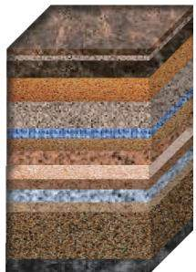  
(a) 原始地层-有序多层

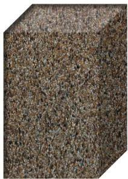  
(b) 1.0-无序混乱

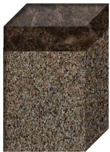  
(c) 2.0-重构表土层

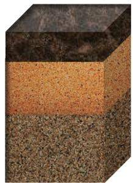  
(d) 3.0-重构表土+心土层  
图5 岩土层重构1.0\~4.0重构剖面示意

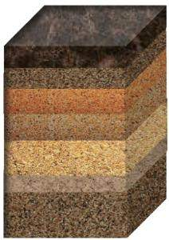  
(e) 4.0-理想化功能重构  
Fig.5 Schematic diagram of rock and soil layer reconstruction profiles from 1.0 to 4.0

## 3 矿山岩土层重构原理

露天煤矿的生态修复亟需在短期内重构一个具

备既定生态功能的岩土层系统，以支撑植被恢复和生态系统的重建。然而，如何科学地构建一个“理想”乃至“优于自然”的岩土层，仍面临诸多挑战。这不仅需

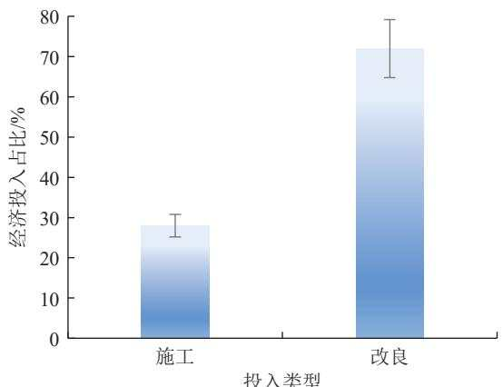  
(a) 岩土层重构1.0

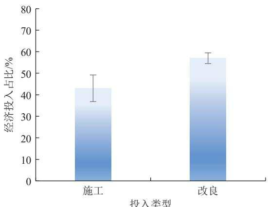  
(b) 岩土层重构2.0

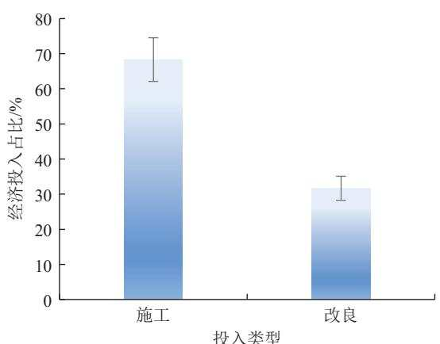  
(c) 岩土层重构3.0

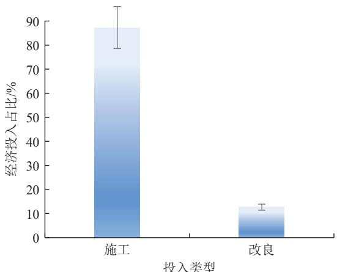  
(d) 岩土层重构4.0  
图6 矿山土壤改良与重构工程经济投入在不同重构阶段的对比  
Fig.6 Comparison of economic investment in mined soil improvement and reconstruction engineering at different reconstruction stages

要全新的理念和深刻的认知，更需要建立科学的重构理论，以指导矿区岩土层的合理构建。

## 3.1岩土层剖面新认知：岩土层“生态位”和“关 键层”

自然的岩土层表层的土壤层是经过岩石的风化而逐渐形成的，土壤学家往往自下而上区将其分为土壤母质层(C层)、心土层(B层)和表土层(A层),以此反映土壤的发生、发育和形态特征。该分层现象是地质学和土壤学的共同认知，均体现了地球表层物质在垂直方向上的差异，并受到大气、水、生物等外部圈层的影响。将这种自然岩土层的分层特点与矿山岩土层重构联系起来，说明在矿山生态修复中，需要充分考虑岩土层的分层结构和功能，才能实现可持续的生态恢复。面对几十、上百层的原始岩土层，过多层次重构的现实性较差、经济成本过高，且如何构造一直缺乏理论支撑。

生态位是生态学中的核心概念，指的是生物在生态系统中的功能地位。类似地，在岩土层重构中，借鉴生物生态位原理[43-44]和地质成土理论[35],可以发现每一岩土层都有特定的位置和生态功能。通常，岩土层的位置越靠近地表，其生物含量越丰富、生态功能性越强。在整个岩土层系统中，总有对生态系统发挥关键作用的地层，不同的岩土层结构，其岩土层系统的功能也不相同。因此，定义岩土层系统功能的2大要素：“生态位”与“关键层”(图7):各个岩土层在空间上所占据的位置及其与相关岩土层之间的功能关系与作用，称之为岩土层“生态位”；对整个岩土层系统功能发挥关键作用的岩土层，称之为“关键层”(或称“生态功能关键层”或“生态关键层”),如表土关键层，其主要功能保障为萌芽幼苗生长供养或植物生长养分支撑，又如涵水层或透水层，其作用是区域水文调蓄和重要支撑[4]。这一新概念的提出旨在从理念上认识不同岩土层功能的差异和岩土层剖面构型的重要性，是解决矿山岩土层重构中是否分层、如何分层、分几层、如何科学设计构型等难题的基础与核心。

## 3.2 生态位原理

每一岩土层因其物理化学和生物特性的不同，对重构岩土层系统的生态功能发挥不同的作用，因而具有各自独特的空间位置和功能，即岩土层生态位[4]。空间位、宽度、重叠、差距和竞争是生态位的5个基本特性5]。岩土层生态位原理就是依据分层生态位的特性分析确定各自的位置和相互关系，解决是否层次合并、分几层和空间关系，形成基础剖面构型，为进一步的剖面构型优化和功能提升奠定基础。原理的具体分析方法是：基于每一岩土层理化生特性确定其对目标生态位的适宜度，基于生态位的竞争、重叠性确定岩土层的合并与否，基于相对差距和空间位确定岩土层的相互空间位置关系，利用宽度确定岩土层的厚度，从而初步确定重构岩土层的剖面构型(图8)。以上生态位的适宜度和5大特性的定量分析模型见文献[4]。

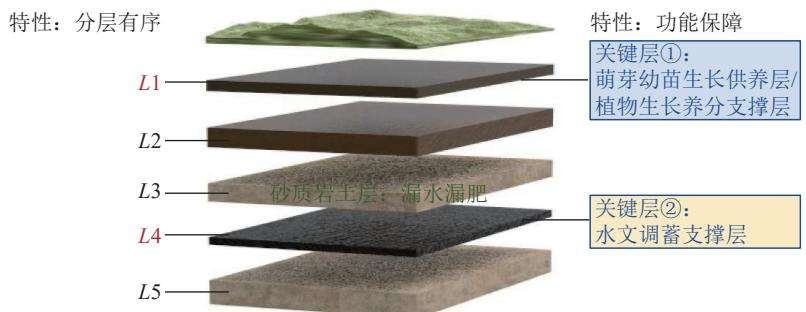  
注：L1～L5分别表示各岩土层层次，仅示意  
图7 岩土层“生态位”和“关键层”示意  
Fig.7 Schematic diagram of “ecological niche" and “"critical layer" in rock and soil layer

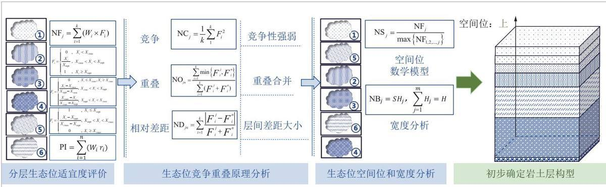  
图8 生态位原理分析过程  
Fig.8 Analytical process of the ecological niche principle

## 3.3 关键层原理

原始岩土层分层多，结构复杂，而矿区生态修复常以高效、长效为主，因此重构过程必须高度重视关键需求和目标。从岩土层重构主要矛盾的视角，不难发现，岩土层中总有对生态系统功能发挥关键作用的层次，即关键层(功能关键层)。但是，不同区域的本底条件也会对岩土层的重构功能需求起到关键的制约作用，因此，在生态位原理分析的基础上，重构岩土层关键层的功能识别(含位置、作用等)与提升，对于整个岩土层构型的优化和实现既定的重构岩土层生态功能目标至关重要。

关键层重构原理就是通过生态功能分析和提升措施实现关键层识别与功能提升，从而达到关键层功能最优和岩土层剖面构型最佳。原理应用的具体方法是：首先，基于重构岩土层整体的生态需求，以生态位差距为先导，融合自然胁迫因子、水肥运移、物质转换等影响要素进行岩土层功能分析，实现关键层精准识别(功能、位置等),明确各岩土层功能障碍，并确定各关键层功能的提升目标；通过理-化-生耦合提升手段和模拟试验，构建岩土层动态功能平衡模型，明确岩土层溶质运移与物质转化机制，实现关键层位置、厚度、层数、质地等生态位特征要素的精细刻画与结构优化，最终，达到重构岩土层整体功能提升的目标，同时能够实现重构岩土层剖面构型的最优(图9)。关键层功能提升往往需要专业的理论知识和科学的重构方法，如表土层水肥功能提升需要专业的土壤改良技术，漏水漏肥的障碍关键层需要土层改性或添加隔水夹层等重构技术。此外，先进的数值和物理模拟是科学确定功能提升方案和揭示功能提升机制的必要方法。

关键层功能提升的过程也是岩土整体构型不断优化的过程。该过程主要通过多源土壤复合体抗逆性模型以及层状土壤水肥运移和养分平衡原理，构建不同功能目标下的水肥平衡与补充模型等；然后借鉴物理结构改善-化学特质改性-生物群落丰富的功能提升方式，进行微区域岩土层剖面构型改造，如夹层式岩土层重构改变夹层层数和组配材料等，可有效改变重构关键岩土层的水分入渗速率，使其更接近甚至优于参考系岩土层的入渗特性。功能提升的最终剖面构型主要通过数值模拟、土柱和盆栽种植等试验验证得到(图10)。

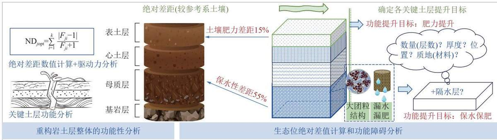  
图9 关键层原理分析过程  
Fig.9 Analytical process of the critical layer principle

综上，矿山生态修复中的岩土层重构是以生态功能恢复或提升为目标，以“生态位”、“关键层”重构两大原理为指导，重构岩土层中的各土层、岩石层及剖面结构以实现整体功能最优的过程。其中，矿山岩土层重构的“生态位”和“关键层”两大原理与方法为因地制宜且科学高效的实现矿山生态修复提供重要支撑，通过其具体的理论分析方法的实施，如人工或自然调节措施等，提升岩土层关键层的生态功能，促进了整个重构岩土层剖面的孔隙兼容与水肥连通，具有仿自然甚至超自然的循环运输机制的同时，进一步保障了矿山岩土层结构的稳定性、高质性和植被恢复的长效性。

## 4 矿山岩土层关键层重构的适配性技术

岩土层关键层重构是矿山生态功能恢复与提升的核心，其直接决定重构岩土层剖面的关键功能与作用。但是各矿区的自然条件和破坏特征存在较大差异，严重影响矿山岩土层重构的技术实施方法和生态功能的提升效果。因此，矿山岩土层关键层重构需基于不同生态区域修复目的与重构需求，结合当地的气候、地质、水文、生态与社会经济条件，重点考虑自然胁迫条件及原始岩土层自然基础条件等，同时利用生态位与关键层重构原理开展个性化、适配性技术研究，构建结构适配、成分适配和功能适配的重构关键层，才能更有效地实现矿区生态系统的恢复与可持续发展。本文以我国东部草原区露天矿为例，详细分析岩土关键层重构的适配性技术，具体过程如下。

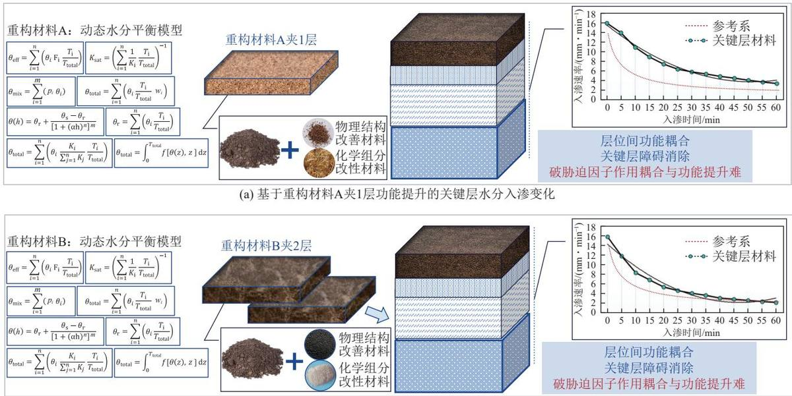  
(b)基于重构材料B夹2层功能提升的关键层水分入渗变化  
图10 以动态水分平衡为例的关键层功能提升示意  
Fig.10 Schematic diagram of critical layer function enhancement using dynamic water balance as an example

## 4.1 背景分析与技术介绍

我国东部草原区露天矿区在表土剥离、堆存和回填时存在不同程度的损失和退化，此外排土场边坡的形成使得复垦面积显著增加，原有表土数量明显不足。若仅考虑土源扩充和化学、生物改良，必将增加大量重构成本，甚至因客源取土而造成新的废弃地36]。因此，胡振琪团队以宝日希勒露天矿为研究区，借助岩土层生态位和关键层原理分析方法，研发了基于原始地层材料的露天矿新表土关键层重构技术[45-46]。

## 4.2 生态位分析与岩土层优选

首先，基于生态位原理进行重构岩土剖面的各层生态位分析，已知研究区煤层上方的岩土层共7层(图11a),通过生态位特征要素定量分析和适宜度评价，进一步明确重构岩土层的分层情况及各层次相互影响机制。结果表明，以IV层为分界层，其上方各层间竞争、重叠和相对差距特征差异较大，特别是Ⅲ层(亚黏土)风化及原状基质的竞争性较强，与Ⅱ层黄土的重叠性小，可为植物提供矿质营养元素如CaO、$\mathrm { M g O } , \mathrm { F e } _ { 2 } \mathrm { O } _ { 3 } , \mathrm { M n O } _ { 2 }$ 等氧化物的含量较高[36, 44]; IV层及其下方的基质均属于质地较硬的岩石层，各层次相对差距较小，相对竞争性较弱，生态功能作用较弱；因此，IⅣ层及以下岩土层具有重叠性，可合并重构为1层；Ⅲ层亚黏土层则可作为表土替代材料用于Ⅰ层重构。以表土层为评价目标构建岩土层生态位适宜度评价指标体系，最终通过计算得到煤层上方7层岩土层的空间位置关系(由上到下):Ⅲ、Ⅱ、I、Ⅳ、V、V、Ⅶ，其中下面4层岩土层(IⅣ～Ⅶ)表现出较低且相似空间适宜度评价值(表1,表2),具备重叠性，因此可以合并置于下部的空间位，即应置于最下方。

## 4.3 关键层识别与功能目标确定

首先，基于东部草原区重构岩土层整体的生态需求即恢复草地生产力，以生态位绝对差距为先导，进行重构岩土层I、Ⅱ、Ⅲ层与目标生态位的差值分析计算，结果表明Ⅰ层和Ⅱ层距离目标生态位的绝对差值较大。结合实地调查所观测的各岩土层厚度、岩性、硬度和根系分布等状况，发现表层种植土(简称表土)约0.5m，质地较砂，沙化现象严重，表土竞争性弱、空间位低、绝对差距大，整体物理结构差、质量差。融合研究区降水少、风沙大的自然胁迫因子、表土层土壤宽度(厚度)不足且水肥保持弱等本底生态条件，进行表层岩土层的功能目标分析，明确了岩土层重构关键是构造大量的、适宜本地植物生长的新表土。其中，Ⅱ层自身水肥立地条件不适合作为植物生长介质层，Ⅲ层虽可通过与Ⅰ层充分混合的方式增加表土的生态位宽度，但二者的含水供养功能和生物功能均有待提升，均需进行物理结构和有机质等营养物质补给，因此增厚提质型表土层则为该区域的重构关键层。

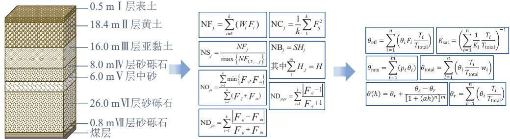  
(a) 原始岩土层剖面  
(b)生态位适宜度评价+生态位特征分析  
(c)关键层识别-动态水分平衡模型

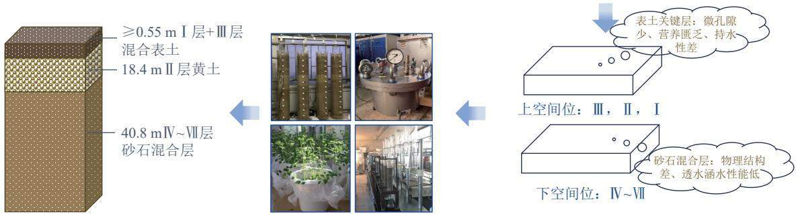  
(d) 重构岩土层剖面  
(e)关键层功能提升及优选过程 (f)明确重构剖面各岩土层空间位置及关键层功能障碍  
图11 研究区岩土层剖面重构过程示意  
Fig.11 Schematic diagram of the reconstruction progress of rock and soil layer profiles in the study area

表1 重构岩土层生态位竞争特征要素计算结果  
Table 1 Calculation results of ecological niche competition characteristics in reconstructed rock and soil layers
<table><tr><td>生态位特征</td><td>I</td><td>Ⅱ</td><td>Ⅲ</td><td>ⅣV</td><td>V</td><td>VI</td><td>VII</td></tr><tr><td>竞争</td><td>0.57</td><td>0.65</td><td>0.94</td><td>0.14</td><td>0.24</td><td>0.13</td><td>0.12</td></tr></table>

对照组  
表2 重构岩土层生态位重叠、相对差距特征要素计算结果  
Table 2 Calculation results of ecological niche overlap and relative disparity characteristics in reconstructed rock and soil layers
<table><tr><td>生态位特征</td><td>基质</td><td>I</td><td>Ⅱ</td><td>Ⅲ</td><td>Ⅳ</td><td>V</td><td>VI</td><td>VII</td></tr><tr><td rowspan="7"></td><td>I</td><td>1.00</td><td></td><td></td><td></td><td></td><td></td><td></td></tr><tr><td>I</td><td>0.32</td><td>1.00</td><td></td><td></td><td></td><td></td><td></td></tr><tr><td>Ⅲ</td><td>0.58</td><td></td><td>1.00</td><td></td><td></td><td></td><td></td></tr><tr><td>IV</td><td>0</td><td>0</td><td>0</td><td>1.00</td><td></td><td></td><td></td></tr><tr><td>V</td><td>0</td><td>0</td><td>0</td><td>0.69</td><td>1.00</td><td></td><td></td></tr><tr><td>VI</td><td>0</td><td>0</td><td>0</td><td>0.91</td><td>0.72</td><td>1.00</td><td></td></tr><tr><td>II</td><td>0</td><td>0</td><td>0</td><td>0.88</td><td>0.85</td><td>0.98</td><td>1.00</td></tr><tr><td rowspan="7">相对差距</td><td>I</td><td>1.00</td><td></td><td></td><td></td><td></td><td></td><td></td></tr><tr><td>I</td><td>0.76</td><td>1.00</td><td></td><td></td><td></td><td></td><td></td></tr><tr><td>Ⅲ</td><td>0.55</td><td>0.62</td><td>1.00</td><td></td><td></td><td></td><td></td></tr><tr><td>IV</td><td>0.92</td><td>0.87</td><td>0.81</td><td>1.00</td><td></td><td></td><td></td></tr><tr><td>V</td><td>0.89</td><td>0.90</td><td>0.85</td><td>0.35</td><td>1.00</td><td></td><td></td></tr><tr><td>VI</td><td>0.94</td><td>0.92</td><td>0.88</td><td>0.21</td><td>0.27</td><td>1.00</td><td></td></tr><tr><td>II</td><td>0.97</td><td>0.96</td><td>0.90</td><td>0.26</td><td>0.29</td><td>0.15</td><td>1.00</td></tr></table>

## 4.4 障碍消除与功能提升

根据上述生态位分析结果和关键层功能目标，各地表基质与理想表土层均差距较大。作为优选表土替代材料的Ⅲ层亚黏土层，在物理结构上，其黏粒含量较高，透气性较差；在营养元素含量上，其除速效钾外均较低[43],难以直接作为表土关键层材料。为进一步消除上述重构障碍及提升新表土生态功能，选择蛭石、秸秆和硝基腐殖酸为功能辅助基质，通过材料自身较好的阳离子交换性、吸附性和有机质含量，实现保水、增肥、提质和透气等多重作用。结合室内紫花苜蓿的盆栽种植试验，发现不同组配的表土替代材料对于植株的干重与其鲜重之间具有较高的一致性，最终优选岩基表土的最佳组配为蛭石：秸秆：硝基腐殖酸质量比为 $5 0 : 5 0 : 0 . 5 ,$ 试验植物地上下营养元素含量均超出对照组的45%以上(图12)。表土关键层的功能提升过程进一步验证了3层岩土层重构基质材料能够保证表土厚度增加至少0.5cm，功能辅助基质材料可有效加速新表土的成土熟化进程，从而改善岩土关键层的理化性质，促进植物的生长，实现表土关键层的增厚提质功能目标。

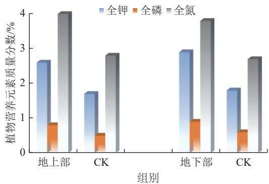  
图12 岩基新表土最优处理地上下部营养元素含量  
Fig.12 Nutrient content of the above- and below-ground parts of test plants for optimal treatment of the new topsoil based on rock substrate

## 4.5 岩土关键层重构效果

通过露天新表土野外试验基地的持续耕种发现，植物生产力水平始终维持稳定，基本上与正常对照土地持平(图13),成功实现东部草原区岩基新表土关键

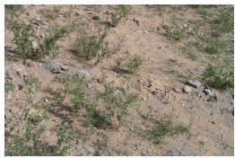

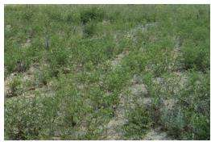  
图13 露天矿岩基新表土植物长势对比  
Fig.13 Comparative diagram of vegetation growth on newly formed bedrock topsoil in open-pit mines

层重构。

综上，基于原始地层材料的露天矿新表土关键层重构技术，打破了传统的就地取材重构和单一的物料添加(图11d)，为草原区露天矿岩土层的重构提供了长效可施的方法。

## 5 结论与展望

## 5.1 结论

1)阐述了露天开采对煤层上覆原始岩土层系统的彻底破坏及其环境影响，揭示了露天矿生态修复的实质就是对岩土层的重新再造过程，界定了岩土层重构概念和内涵，阐明了其与土壤重构、地球关键带和地球圈层系统的关系，明确了岩土层重构的核心是系统功能重建，凝练了科学问题—原有历经长期地质历史演化而来的有序分为几十、甚至上百层的地层，被矿山开采破坏后是否需要分层构造、分多少层合适、用何原理或方法确定分层数量、厚度、空间位置以及整个重构岩土层的结构与功能。

2)揭示了露天煤矿岩土层重构研究的历史演变过程，首次详细归纳了不同发展阶段的岩土层重构从1.0到4.0的背景、特征和研究重点，揭示了不同阶段的岩土层构型和资金投入的差异，发现岩土层重构的效果越好土壤改良投入越少。岩土层重构3.0和4.0适宜于在开采过程中同步实施，显然主要用于正在开采的矿山；而岩土层重构1.0和2.0主要用于废弃矿山土地。因此，废弃矿山生态修复如果做到重构2.0就已经能够很好地满足生态功能的恢复，而在经济条件容许的情况，则可考虑重构“表土+心土”的近3.0剖面构型。

3)创新性提出了岩土层“生态位”与“关键层”新理念与新认知，提出了露天煤矿岩土层重构的原理：以岩土层生态系统功能恢复重建为目标，通过“生态位”和“关键层”两大原理的分析和构建，实现岩土层剖面构型最优和功能最佳。从理论上解决了将数十层甚至上百层的原始地层，重构后岩土层分几层、相互空间关系、关键层位置与功能以及最优剖面构型等难题，改变了传统采用经验确定重构岩土层层数和结构的历史。

4)以草原矿区露天煤矿为例，介绍了适宜于地质环境和气候等条件的适配性关键层重构技术，明确了重构剖面优化和表土关键层重构的具体方法。

## 5.2 展望

岩土层是生态的基础。露天矿生态修复一直进行岩土层重构的实践，但缺乏统一的认识和理论支撑。本文是首次系统阐述露天矿岩土层重构的原理与方法，因此，一定存在不少需要完善和发展之处，如生态位原理分析方法的进一步细化、关键层功能识别模型与标准的进一步发展、功能提升方法的进一步研究等。此外，针对岩石层重构的研究也将是未来发展的趋势，露天开采前如何识别岩石层的环境风险和确定适宜的生态功能岩石层、原始岩石层中的含水层是否需要重构、岩石层不分层松散堆积后是否会成为蓄水区域、原始岩石层存在一些高硫或重金属的岩层如何在重构时处置重构问题等。总之，岩土层重构是矿山生态修复的永恒主题，不同的地质采矿条件、不同的气候胁迫等都对重构产生重大影响，需要基于生态位与关键层理论，进一步研究适配性的岩土层重构技术。

## 参考文献(References):

[1] 武强，涂坤，曾一凡，等.打造我国主体能源(煤炭)升级版面临的 主要问题与对策探讨[J].煤炭学报,2019,44(6):1625-1636. WU Qiang, TU Kun, ZENG Yifan, et al. Discussion on the main problems and countermeasures for building an upgrade version of main energy(coal) industry in China[J]. Journal of China Coal Society, 2019, 44(6): 1625–1636.

[2] 刘峰，郭林峰，赵路正.双碳背景下煤炭安全区间与绿色低碳技术 路径[J].煤炭学报,2022,47(1):1-15. LIU Feng, GUO Linfeng, ZHAO Luzheng. Research on coal safety range and green low-carbon technology path under the dual-carbon background[J]. Journal of China Coal Society, 2022, 47(1): 1–15.

[3] 周伟，田涯，王知乐，等.露天煤矿端帮压覆资源回收方法研究现状 与展望[J].采矿与安全工程学报,2025,42(3):497-509. ZHOU Wei, TIAN Ya, WANG Zhile, et al. Research status and prospects on recovery methods for the resources under end slopes in open-pit coal mines[J]. Journal of Mining & Safety Engineering, 2025, 42(3): 497–509.

[4] 胡振琪.矿山复垦土壤重构的理论与方法[J].煤炭学报，2022， 47(7): 2499–2515. HU Zhenqi. Theory and method of soil reconstruction of reclaimed mined land[J]. Journal of China Coal Society, 2022, 47(7): 2499-2515.

[5] MOFFAT A J, MCNEILL J, MOFFAT A. Reclaiming disturbed land for forestry[M]. London: H. M. S. O, 1994: 15-45.

[6] 胡振琪.煤矿山复垦土壤剖面重构的基本原理与方法[J].煤炭学 报, 1997, 22(6): 617-622. HU Zhenqi. Principle and method of soil profile reconstruction for coal mine land reclamation[J]. Journal of China Coal Society, 1997, 22(6): 617–622.

[7] 胡振琪.煤矿区复垦土壤重构的理论与方法[M].北京：科学出版社,2021:73-82.

[8] 韩霁昌，孙婴婴，张扬，等.复配型土体有机重构技术初探：以砒砂 岩与沙复配成土为例[J].土地开发工程研究,2016,1(1):16-23. HAN Jichang, SUN Yingying, ZHANG Yang, et al. Research on principle of compound land organic reconstruction technology: Taking soft rock-sand amended soil as an example[J]. Land Develop-

ment and Engineering Research, 2016, 1(1): 16–23.

[9] 毕银丽，高学江，柯增鸣，等.露天煤矿排土场土层重构及接菌对植 物根系提水作用试验研究[J].煤田地质与勘探，2022,50(12): 12-20. BI Yinli, GAO Xuejiang, KE Zengming, et al. Experimental study on effect of soil layer reconstruction and inoculation on plant root hydraulic lift in open-pit coal mine dump[J]. Coal Geology & Exploration, 2022, 50(12): 12–20.

[10] 王靖伟.露天煤矿排土场地层重构试验研究[D].徐州：中国矿业 大学,2019. WANG Jingwei. Experimental study on stratum reconstruction of dump soil in open-pit coal mine[D]. Xuzhou: China University of Mining and Technology, 2019.

[11] Encyclopædia Britannica. Encyclopædia Britannica[M]. Fifteenth edition. Chicago: Encyclopædia Britannica, Inc., 2013.

[12] 任纪舜，牛宝贵，赵磊，等.地球系统多圈层构造观的基本内涵[J]. 地质力学学报,2019,25(5):607-612. REN Jishun, NIU Baogui, ZHAO Lei, et al. Basic ideas of the multisphere tectonics of earth system[J]. Journal of Geomechanics, 2019, 25(5): 607–612.

[13] SEGOBYE M, MOTLOGELWA L K, NKWAE B, et al. Comparison of GRACE gravity anomaly solutions for terrestrial water storage variability in arid and semi-arid Botswana[J]. South African Journal of Geomatics, 2023, 12(1): 56–72.

[14] NYLE C AND WEIL R. The nature and properties of soils[M]. Fifteenth edition. Columbus: Pearson, 2016: 500–550.

[15] 杨顺华，宋效东，吴华勇，等.地球关键带研究评述：现状与展望 [J]. 土壤学报,2024,61(2):308-318. YANG Shunhua, SONG Xiaodong, WU Huayong, et al. A review and discussion on the earth's critical zone research: Status quo and prospect[J]. Acta Pedologica Sinica, 2024, 61(2): 308-318.

[16] 王云强，张少康，张萍萍，等.黄土高原关键带土壤水文过程研究 进展与展望[J].地质通报,2024,43(8):1346-1360. WANG Yunqiang, ZHANG Shaokang, ZHANG Pingping, et al. Research progress and prospect of soil hydrological processes in critical zone of the Loess Plateau[J]. Geological Bulletin of China, 2024, 43(8): 1346-1360.

[17] 董霁红，卞正富，王贺封.矿山充填复垦场地重金属含量对比研究 [J]. 中国矿业大学学报,2007,36(4): 531-536. DONG Jihong, BIAN Zhengfu, WANG Hefeng. Comparison of heavy metal contents between different reclaimed soils and the control soil[J]. Journal of China University of Mining & Technology, 2007, 36(4): 531-536.

[18] 王卓理，马建华，耿鹏旭，等.平顶山市煤矿塌陷区复垦土壤重金 属分布及污染分析[J].农业环境科学学报,2009,28(4):668-672. WANG Zhuoli, MA Jianhua, GENG Pengxu, et al. Heavy metals distribution and pollution of the reclaimed soil in subsidence area of Pingdingshan City coal mine[J]. Journal of Agro-Environment Science, 2009, 28(4): 668–672.

[19] 胡振琪.矿山复垦土壤的物理特性及其在深耕措施下的改良[D]徐州：中国矿业大学，1991.HU Zhenqi. Physical Properties of Recalaimed Mine Soils and TheirAmelioration via Deep Tillage[D]. Xuzhou: China University of

Mining & Techonology, 1991.

[20] BUSSLER B H, BYRNES W R, POPE P E, et al. Properties of minesoil reclaimed for forest land use[J]. Soil Science Society of America Journal, 1984, 48(1): 178–184.

[21] PEDERSEN T A, ROGOWSKI A S, PENNOCK J R R. Physical characteristics of some minesoils[J]. Soil Science Society of America Journal, 1980, 44(2): 321–328.

[22] MERRILL S D, SMITH S J, POWER J F. Effect of disturbed soil thickness on soil water use and movement under perennial grass[J]. Soil Science Society of America Journal, 1985, 49(1): 196–202.

[23] HARGIS N E, REDENTE E F. Soil handling for surface mine reclamation[J]. Journal of Soil and Water Conservation, 1984, 39(5): 300-305.

[24] ARNOLD F B. Soil water and solute movement in montana strip mine spoils[C]. 1976: 24–52.

[25] POLE M W, BROWN T H, ZIMMERMAN L. Water movement in a reclaimed site and associated soils at a mine site in western north dakota[J]. North Dakota Farm Research, 1980, 37: 5-20.

[26] KUNTZE H. Soil reclamation, improvement, recultivation and conservation in Germany[J]. Zeitschrift Für Pflanzenernä hrung und Bodenkunde, 1986, 149(4): 500–512.

[27] OMER E A, FATTAH A, RAZIN M, et al. Effect of cutting, phosphorus and potassium fertilization on guar plant (Cyamoposis tetragonoloba) in newly reclaimed soil in Egypt[J]. Plant Foods for Human Nutrition, 1993, 44(3): 277-284.

[28] MAHMOUD G A, ABEED A H A, MOSTAFA H H A, et al. Responses of pea (pisum sativum L. ) to single and consortium bio-fertilizers in clay and newly reclaimed soils[J]. Plants, 2023, 12(23): 3931.

[29] TOPP W, SIMON M, KAUTZ G, et al. Soil fauna of a reclaimed lignite open-cast mine of the Rhineland: Improvement of soil quality by surface pattern[J]. Ecological Engineering, 2001, 17(2-3): 307-322.

[30] THOMPSON P J, JANSEN I J, HOOKS C L. Penetrometer resistance and bulk density as parameters for predicting root system performance in mine soils[J]. Soil Science Society of America Journal, 1987, 51(5): 1288–1293.

[31] 付梅臣，陈秋计.矿区生态复垦中表土剥离及其工艺[J].金属矿山， 2004(8): 63-65. FU Meichen, CHEN Qiuji. Surface soil stripping and its technology in ecological reclamation in mine area[J]. Metal Mine, 2004(8): 63-65.

[32] 杨海春，尚涛，周伟，等.准格尔矿区表土剥离与复垦一体化研究 [J]. 煤炭技术, 2010,29(9): 67-69. YANG Haichun, SHANG Tao, ZHOU Wei, et al. Integrating operation study of soil stripping and land reclamation in Zhungeer Mine area[J]. Coal Technology, 2010, 29(9): 67–69.

[33] 荣颖，胡振琪，杜玉玺，等.露天矿区土壤基质改良材料研究进展 [J]. 金属矿山, 2018(2): 164-171. RONG Ying, HU Zhenqi, DU Yuxi, et al. Research advance of soil amelioration materials in opencast mines[J]. Metal Mine, 2018(2): 164-171.

[34] 王佟，蔡杏兰，李飞，等.高原高寒矿区生态地质层修复中的土壤

层构建与成分变化差异[J].煤炭学报,2022,47(6):2407-2419. WANG Tong, CAI Xinglan, LI Fei, et al. Soil layer construction and composition changes in restoration of ecological and geological layer in alpine mining area on plateau[J]. Journal of China Coal Society, 2022, 47(6): 2407–2419.

[35] 胡振琪，张子璇，孙煌.试论矿山生态修复的地质成土[J].煤田地 质与勘探,2022,50(12):21-29 HU Zhenqi, ZHANG Zixuan, SUN Huang. Geological soil formation for ecological restoration of mining areas and its case study[J]. Coal Geology & Exploration, 2022, 50(12): 21–29.

[36]胡振琪，康惊涛，魏秀菊，等.煤基混合物对复垦土壤的改良及苜 蓿增产效果[J].农业工程学报,2007,23(11):120-124. HU Zhenqi, KANG Jingtao, WEI Xiuju, et al. Experimental research on improvement of reclaimed soil properties and plant production based on different ratioes of coal-based mixed materials[J] Transactions of the Chinese Society of Agricultural Engineering, 2007,23(11):120-124.

[37]位蓓蕾，胡振琪，张建勇，等.紫花苜蓿对草炭改良露天矿表土替 代材料的响应[J].农业环境科学学报,2013,32(10):2020-2026. WEI Beilei, HU Zhenqi, ZHANG Jianyong, et al. The response of the peat improved open pit mine topsoil alternative materials for medicago sativa[J]. Journal of Agro-Environment Science, 2013, 32(10): 2020-2026.

[38] BULOT A, POTARD K, BUREAU F, et al. Ecological restoration by soil transfer: Impacts on restored soil profiles and topsoil functions[J]. Restoration Ecology, 2017, 25(3): 354–366.

[39] BRADSHAW A. Restoration of mined lands: Using natural processes[J]. Ecological Engineering, 1997, 8(4): 255-269.

[40] FEHRENBACHER D J, JANSEN I J, FEHRENBACHER J B. Corn root development in constructed soils on surface-mined land in western Illinois[J]. Soil Science Society of America Journal, 1982, 46(2): 353-359.

[41] 邵芳，胡振琪，王培俊，等.基于黄河泥沙充填复垦采煤沉陷地覆 土材料的优选[J].农业工程学报,2016,32(S2):352-358. SHAO Fang, HU Zhenqi, WANG Peijun, et al. Selection of alternative soil for filling reclamation with Yellow River sediment in coalmining subsidence areas[J]. Transactions of the Chinese Society of Agricultural Engineering, 2016, 32(S2): 352–358.

[42] HU Z Q, WANG X T, MCSWEENEY K, et al. Restoring subsided coal mined land to farmland using optimized placement of Yellow River sediment to amend soil[J]. Land Degradation & Development, 2022, 33(7): 1029–1042.

[43] 包庆德，夏承伯.生态位：概念内涵的完善与外延辐射的拓展:纪 念“生态位”提出100周年[J].自然辩证法研究，2010,26(11): 43-48. BAO Qingde, XIA Chengbai. Niche: Perfection of concept connotation and expansion of epitaxial radiation: In memory of niche's 100 anniversary[J]. Studies in Dialectics of Nature, 2010, 26(11): 43-48.

[44] 张光明，谢寿昌.生态位概念演变与展望[J].生态学杂志，1997, 16(6): 46–51. ZHANG Guangming, XIE Shouchang. Developement of niche concept and its perspectives: A review[J]. Chinese Journal of Ecology, 1997, 16(6): 46–51.

[45] 位蓓蕾.露天矿表土替代材料的筛选与改良研究[D].北京：中国 矿业大学(北京),2014 WEI Beilei. Selection and Improvement of Topsoil Alternatives from Overburden of Surface Coal Mines [D]. Beijing: China University of Mining & Technology-Beijing, 2014.

[46] 胡振琪，位蓓蕾，林衫，等.露天矿上覆岩土层中表土替代材料的 筛选[J].农业工程学报,2013,29(19):209-214. HU Zhenqi, WEI Beilei, LIN Shan, et al. Selection of topsoil alternatives from overburden of surface coal mines[J]. Transactions of the Chinese Society of Agricultural Engineering, 2013, 29(19): 209-214.