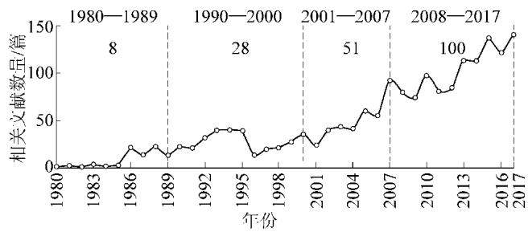
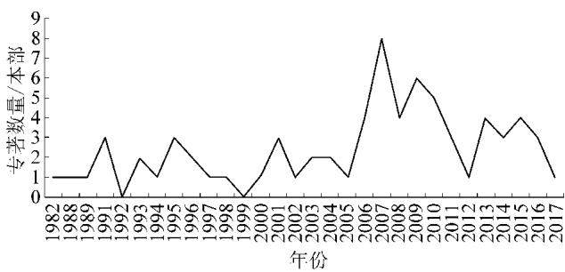
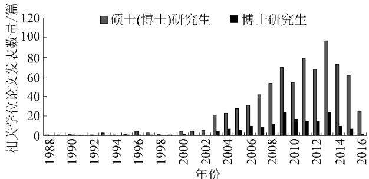

  
移动扫码阅读

胡振琪.我国土地复垦与生态修复30年：回顾、反思与展望[J].煤炭科学技术,2019,47(1):25-35.doi:10.13199/j. cnki. cst. 2019.01.004

HU Zhenqi.The 30 years' land reclamation and ecological restoration in China: review , rethinking and prospect[ J]. Coal Science and Technology ,2019,47(1) :25-35.doi:10. 13199/j. cnki. cst. 2019.01.004

# 我国土地复垦与生态修复30年：回顾、反思与展望

胡振琪(中国矿业大学，江苏 徐州 221116)

摘要：在《土地复垦规定》颁布实施30周年之际，回顾了土地复垦与生态重建的相关政策法规文件、理论和技术成果、科研成果以及人才培养情况；重点阐述了对土地复垦有里程碑作用的法规，介绍了3个独特技术原理的研究进展，对监测诊断、采煤沉陷地治理、煤矸石山生态修复、露天矿复垦等方面的技术进行了述评，并从科技获奖、学术论文和研究生培养等方面给予了定量分析。从最基本的名词概念和发展历史阶段划分等基本问题的反思入手，重点对“谁破坏、谁复垦”的基本原则、复垦责任、复垦资金、复垦监管机制等土地复垦的政策与监管进行了反思，并分别对露天矿、沉陷地、煤矸石山等损毁土地复垦技术进行了反思。最后，对我国土地复垦与生态重建进行展望，认为未来研究的重点是：监测诊断技术、边采边复技术、高质量耕地复垦技术、系统的生态修复技术、关闭矿山的生态修复技术和生态修复监管技术。

关键词：土地复垦；生态重建；生态修复；关闭矿山

中图分类号：TD88

文献标志码：A

文章编号:0253-2336(2019)01-0025-11

# The 30 years' land reclamation and ecological restoration in China:review , rethinking and prospect

HU Zhenqi (China University of Mining and Technology, Xuzhou 221116, China)

Abstract: With the Stipulation on Land Reclamation being issued for 30 years , the paper reviewed the related policies , regulations , and achievements on theory, technology and education in the field of land reclamation and ecological restoration.Some mile-stone regulations and three particular theory and principle on mined land reclantion were introduced.It reviewed the progress of some techniques , such as monitoring and diagnoses , subsidend land reclamation , ecological restoration of coal waste piles and surface mined land reclamation.Some quantitative data on scientific and technology awards , published papers and training students in the field of land reclamation in the passed thirty years were also introduced in this paper.Based on the rethinking of the conception of reclamation and historic phases of reclamation , some important issues on policies and supervision , such as principle , responsibility , funds , regulatory mechanisms of land reclamation were rethought in this paper.The proplems on current reclamation technology for surface and underground coal mines were presented.Finally , the paper prospected some important techniques , such as monitoring and diagnosing, current mining and reclamation , prime farmland reclamation, eco-system restoration , abandoned mined land reclamation and supervision and management.

Key words:land reclamation; ecological reconstruction ;ecological restoration; abandoned mines

## 0 引 言

矿产资源的开发利用给我国经济建设带来强有力支持的同时，也造成生态破坏与环境污染，严重制约着我国生态文明建设。而土地复垦与生态修复作为绿色矿山建设的重要手段，是实现矿区经济绿色发展的必经之路。1989年1月1日实施的《土地复垦规定》距今刚好30周年，尽管我国的土地复垦与生态修复工作取得了诸多成效，但在矿区土地复垦与生态修复的理论、技术、法规和监管等方面仍存在很多问题，我国的矿山土地复垦与生态修复率仅20%左右，与世界先进水平还有很大差距。随着国家绿色发展战略的实施，矿区生态环境面临巨大的压力，因此实有必要对30年来我国矿区土地复垦与生态修复进行回顾和展望，并进行深入的反思，以期为绿色矿山建设提供有力支撑。

## 1 我国土地复垦与生态修复 30 年回顾

笔者在2009年对土地复垦与生态重建20年进行了回顾[1]，现主要对前期回顾进行一些必要的补充，并重点对2008—2018年土地复垦与生态修复进行回顾。

## 1.1 土地复垦与生态修复相关政策法规文件的回顾

1988年10月21日国务院常务会议通过，1989年1月1日正式实施的《土地复垦规定》，标志着我国土地复垦与生态修复工作开始走上了法制的轨道，我国土地复垦与生态修复工作进入了一个有组织、有领导的法制时期。

2006年国土资源部等7部委颁发《关于加强生产建设项目土地复垦管理工作的通知》(国土资发〔2006]225号)，土地复垦工作纳入开采许可和用地审批，即要求编制土地复垦方案。2007年出台《关于组织土地复垦方案编报和审查有关问题的通知》(国土资发〔2007〕81号)，对土地复垦方案的编制内容、审批要求等进一步进行明确，从而使土地复垦有了很好的抓手，促进了复垦义务人对土地复垦的重视。《全国土地利用总体规划纲要(2006—2020年)》《全国矿产资源规划(2008—2015年)》和《全国土地整治规划(2011—2015)》均对土地复垦提出了明确要求，确立了土地复垦的重点区域和复垦目标。2011年修订的《土地复垦条例》，标志着土地复垦工作全新阶段的开始，随后出台了《土地复垦条例实施办法》，构建了我国土地复垦的基本制度框架。此后，加强了土地复垦技术标准和规范的编制，先后颁布TD/T1031—2011《土地复垦方案编制规程》、TD/T1036—2013《土地复垦质量控制标准》、TD/T1044—2014《生产项目土地复垦验收规程》和TD/T1049—2016《矿山土地信息基础信息调查规程》等技术规范，使土地复垦迈入了高速发展的新时期。

2015年出台的《历史遗留工矿废弃地复垦利用试点管理办法》(国土资规〔2015〕1号):将历史遗留工矿废弃地复垦，与城市新增建设用地挂钩，调整建设用地布局，解决土地复垦资金不足和城市建设缺乏空间的矛盾。2017年出台的《关于加快建设绿色矿山的实施意见》(国土资规〔2017]4号)提出绿色矿山建设要求及支持政策。2017年出台的《国土资源部土地复垦“双随机一公开”监督检查实施细则》(国土资规〔2017〕23号)要求进行土地复垦监督检查。2017年颁布的《关于开展绿色矿业发展示范区建设的函》（国土资规〔2017〕1392号）提出到2020年在全国创建50个以上具有区域特色的绿色矿业发展示范区的目标。2018年自然资源部成立并设立国土空间生态修复司，使矿区土地复垦与生态修复有了统一的管理机构，期待更完善的政策与法规的颁布。

## 1.2 土地复垦与生态修复理论和技术成果回顾

## 1.2.1 土地复垦与生态修复的相关基础理论与原理的研究

土地复垦与生态修复是一门涉及多学科的交叉性应用学科，相关学科的理论应为最主要的支撑理论，如开采沉陷学、恢复生态学、景观生态学、地理学、土壤学、植物学、土力学等。但在多年的研究与实践中，也形成了较为独特的技术原理或理论。

1)采复一体化(边采边复)理念与技术原理：笔者将国外的露天采矿工艺与我国露天矿实际情况相结合，研究了露天煤矿剥离-采矿-回填-复垦的一体化工艺过程，提出了横跨采场倒堆内排工艺的露天矿“采复一体化”的基本原理及定量化表达[2]。针对井工煤矿创新性地提出了采复一体化的“边开采边复垦”的概念和技术原理3]，充分考虑地下开采与地面复垦措施的耦合，通过合理减轻土地损毁的开采措施和沉陷前或沉陷过程中的复垦时机与方案的优选，实现采矿与复垦同步进行的一种复垦思想，是对以往沉陷稳定后再复垦技术的革新4]。

2)土壤重构原理与方法：采取适当的采矿和重构技术工艺，应用工程措施及物理、化学、生物、生态措施，重新构造一个适宜的土壤剖面和土壤肥力因素，在较短的时间内恢复和提高重构土壤的生产力，并改善重构土壤的环境质量[5-6]。笔者提出了“分层剥离、交错回填”的土壤重构原理并构建了数学模型，同时成功应用于露天矿采矿-复垦一体化土壤重构和采煤沉陷地“挖深垫浅”复垦土壤剖面重构模型与方法的描述5,7]。近年提出的“夹层式土壤剖面重构原理与方法”为充填复垦技术的革新奠定了理论基础[8]。

3)地貌重塑理念：国外的土地复垦发源于露天矿，露天矿开采对地表景观破坏最显著，因此，国外对地貌重塑很重视，要求恢复近似原地貌的生态景观。我国露天矿较少，对地貌重塑的重视程度较低，也因此对地貌重塑的研究起步较晚，主要针对采矿习惯性形成的排土场台阶型地貌进行研究，并侧重于水土保持的研究，近年来主要是引入国外的仿自然地貌重塑的理念与方法，正处于吸收、消化阶段9-10]。

## 1.2.2 开采对土地和环境的监测与诊断技术

矿区土地与环境监测是有效地进行土地复垦与生态修复的前提条件和基本要求。由于矿区土地与生态环境监测对象、指标复杂多样，具有综合性、动态性、不确定性、隐性显性共存等特征，必须以地下采矿地质信息为先导，通过宏观、微观监测，空天地监测等多种技术手段。经过30年的研究发展，取得如下进展。

1)从传统地面监测手段发展到“星-空-地-井”一体化监测。传统的矿区土地与环境监测手段主要依赖大地水准测量、近景摄影测量、静态GPS测量或动态GPS测量等，工作量大、成本高且难以长期保存。随着航空航天遥感技术发展，遥感技术、合成孔径雷达测量(Synthetic Aperture Radar, SAR)技术、无人机技术[11]等在矿区土地与环境监测中应用增多，已经形成了“星-空-地-井”一体化监测体系。如基于开采沉陷知识的矿区形变SAR信息提取技术[12]、基于多数据源的矿区土地生态损伤信息获取方法[13]。这些技术方法可有效地获取整个监测区域面上的土地与环境信息，形变监测精度较高，可达到亚厘米级。

2)从对土地损毁信息的监测发展到土地与环境损毁信息的综合监测，且关注隐性信息的监测。传统矿区土地与环境监测主要关注地面下沉、积水面积、露天开采挖损、压占面积等土地的显性损毁信息，随着矿区土地复垦与生态修复综合治理的需要，对植被变化、景观变化、土壤变化等信息及损毁边界、自燃煤矸石山内部燃烧点、土壤裂缝等隐性信息的监测越来越重要。如提出了利用连续归一化差分植被指数(NDVI)时间序列数据监测矿区植被状态变化的方法14]，构建了自燃煤矸石山内部自燃位置点解算模型[15-16]，研发了开采沉陷预计为先导(预计裂缝区)、地球物理手段探测(高密度电法测漏水通道、探地雷达确定裂缝位置）、田间渗水验证相结合的探测技术，实现地表以下2m内土壤裂缝的位置确定[17]。

3)从对矿区土地与环境的损毁监测发展到损毁-治理等全过程的监测。如基于3S技术和地统计学，整合复垦前、中、后不同阶段不同部门的多源数据，提出了包含监测点布设、监测指标最小数据集确立、监测手段选择为一体的面向复垦区内的土壤、地表水、地下水和农作物的工矿废弃地复垦跟踪监测方案制定方法18]，将探地雷达作为检测手段，对复垦实验区的土壤质量和工程质量进行无损检测[19-20]；以平朔露天煤矿为实例，结合野外土壤采样和室内土样测定，选择土地的污染情况、地形坡度、理化性质以及土地生产力作为矿区土地质量监测指标，建立了矿区土地质量监测与评价的指标体系[21]。

## 1.2.3 采煤沉陷地治理技术

采煤沉陷地的治理一直是煤矿区土地复垦与生态修复的研究重点，在采煤沉陷地复垦高潜水位方面，由最初提出的疏排法、挖深垫浅法、泥浆泵法等非充填复垦的技术方法[22-23]，到使用煤矸石、粉煤灰、黄河泥沙等作为充填材料的充填复垦技术[24-25]，都有很大进展。最新研发的黄河泥沙充填复垦技术，攻克了取沙输沙技术、土工布排水固结技术，提出了间隔条带式充填沉陷地复垦技术工艺流程以及交替多层多次充填复垦技术，这一技术减少了充填过程中细粒径泥沙流失，加快了充填后期饱和泥沙的侧向排水，缩短了复垦工期，该技术不仅解决了充填材料不足的问题而且也解决了黄河泥沙淤积问题[26-27]。以上这些采煤沉陷地治理技术都是“先破坏、后复垦”的末端治理方法，即在土地稳沉后再采取复垦治理措施，这时生态环境已经遭到极大的破坏，复垦施工难度增大，成本增加，因此，为了更好地保护生态环境，提高复垦效率，相关学者提出了边采边复技术[4]。由于边采边复技术是在地面沉陷前或沉陷过程中采取的复垦措施，从而促进了“末端治理”向“源头和过程控制与治理”的转变，极大地提高了土地复垦率，减少了对土地的破坏。《土地复垦规定》颁布后的20年里，我国主要对东部高潜水位矿区进行了大量复垦技术研究和实践。近10年来在西部采煤沉陷地治理的研究才得到重视，并取得飞速发展：如西部风沙区采煤沉陷存在自修复现象及分区治理模式、保水采煤技术等，煤矿复垦方面7项国家科技进步奖中的5项都是近10年围绕西部矿区而产生的。

随着国家对生态环境保护日益重视，开展了矿区受损土地建设城市景观湿地的技术研究，并在多个地区建立试点，取得良好的效果[28]。目前采煤沉陷湿地治理主要是通过采取水质净化、水系连通、基底改造、植物修复和景观设计等治理技术，使采煤沉陷湿地成为水质优良、景观优美的稳定、功能多样的湿地生态系统。近几年，我国采煤湿地的规划和治理方向主要是湿地公园、水产养殖、水库/蓄水池和人工湿地污水处理系统等[29-30]。通过采煤沉陷湿地治理，采煤塌陷地的生态环境得到很大程度的改善。

## 1.2.4 煤矸石山生态修复技术

煤矸石是煤矿生产的必然产物，是矿区的主要污染源之一。即使我国煤矸石的综合利用率有了大幅度的提高，但是仍有很多煤矸石堆积如山。煤矸石山一方面占用大量土地，另一方面酸性煤矸石山的自燃易造成大气污染，甚至引发矸石山爆炸，严重影响矿区周边百姓生命安全。目前煤矸石山的生态修复主要从非酸性煤矸石山绿化、自燃煤矸石山的综合治理等方面着手。

非酸性煤矸石山研究，从矸石山整地方式、绿化植被的选择、种植及管理方式等方面总结出了一套完整的煤矸石山绿化技术[31-32]。后期随着研究的不断深入，又提出了以“配土栽植”为核心的煤矸石山无覆土绿化技术，重点研究植被恢复技术及其效应，筛选出适合煤矸石山生长的植被类。为了促进煤矸石山植被的生长，通过接种丛植菌根促进植被的生长发育，提高煤矸石山植被的成活率[33]。通过物种的筛选及植被生境的改善，不断优化煤矸石山绿化技术。酸性煤矸石山往往自燃和容易复燃，是治理的难点。传统采用注浆与黄土覆盖相结合的灭火方法，但实践表明，经此方法治理后的煤矸石山复燃现象比较严重34]，针对此问题，提出了在煤矸石与覆盖土壤之间增加隔离层的方法35]。随着煤矸石山灭火技术的不断发展，提出了通过利用杀菌剂抑制煤矸石山酸化以防止煤矸石山的自燃与复燃，形成了酸性自燃煤矸石山原位治理与生态修复一体化技术，实现控灭防一体化自燃煤矸石山的综合治理[36-37]。

## 1.2.5 露天矿复垦技术

我国露天煤矿相对较少，起步较晚，技术标准的要求与国外有一定差距。最初露天矿复垦没能有计划、有组织地进行复垦，只在排土场及采空区开垦种植，且多数为个体的“小开荒”，复田地块零落，没有统一规划。但随着复垦规划的不断完善，露天矿的复垦从过去的以外排土场复垦为主，发展为采矿-复垦一体化的治理技术。该技术实现了采矿过程的各个工序有序结合，同时结合GPS、GIS及三维可视化技术，对露天矿采场、排土场复垦前后情况进行虚拟展示，实现边开采、边复垦、边预控的目的。随着对复垦土壤质量的要求不断提高，相关研究采用植被修复与微生物修复的方式来改良排土场复垦土壤质量。目前露天矿复垦已经达到了国际先进水平，尤其是我国独特的黄土高原大型露天煤矿土地复垦与生态修复技术与实践，取得了显著的成效。

## 1.3 土地复垦与生态修复科研成果回顾

以煤矿区为例，对30多年来的土地复垦成果进行了定量分析[38]。

## 1.3.1 科技获奖

经过相关研究人员30年的努力，煤矿区土地复垦与生态修复已经获得国家奖7项(表1)，省部级二等奖及以上奖项共49项。

表1 煤矿区土地复垦与生态修复获得的国家科技奖  
Table 1 National science and technology awards in the field of land reclamation and ecological restoration in mining area
<table><tr><td>序号</td><td>项目</td><td>成果简介</td><td>获奖等级</td><td>获奖时间</td></tr><tr><td>1</td><td>采煤沉陷地 利用技术体系 研究</td><td>提出了以疏排法为核心的非充填复垦技术，具体包括建立防洪、排涝、降渍系统，挖 非充填复垦与深垫浅与台田相结合，较大幅度地提高了复垦土地的耕种率；复垦后的土地利用包括 国家科技进步 基塘利用模式、庭院生态利用模式、立体利用模式等，较大幅度地提高了沉陷区土地利 用效益和当地的农民收入</td><td>三等奖</td><td>1997</td></tr><tr><td>2</td><td>煤矿区土地 生态环境损害 的综合治理 技术</td><td>研发了煤矿区土地生态环境损害的综合监测与预测技术，揭示了煤矿区土地生态环 境损害的机理和规律；首次创立了以“分层剥离、交错回填”为核心的土壤重构原理、方 法和数学模型，革新或提出了多种复垦工程技术，解决了构造适宜土壤介质的关键技 术问题;提出了以“配土栽植”为核心的煤矸石山无覆土绿化技术和复垦土壤微生物改 良和添加改良剂改良的实用技术，解决了迅速恢复植被与生产力的关键技术问题；提 出了包括监测预测、管理、规划、工程和生物与改善等五大技术的土地生态环境损害治 理的综合技术体系</td><td>国家科技进步 二等奖</td><td>2004</td></tr><tr><td>3</td><td>荒漠化地区 大型煤炭基地 生态环境综合 防治技术</td><td>以神东矿区生态环境为研究对象，创建了荒漠化地区煤炭开采过程中的“井上井下 互动，大范围生态环境防治，控制采矿沉陷造成的局部沙化”的主动型生态环境综合防 治技术体系—神东环境防治模式；研究揭示了矿区水资源承载力与生态环境的关 系，研发了控制地下水流失的开采技术、井下水采空区过滤净化技术与矿井污水回用 技术，构建了矿区水循环利用系统，为大规模开采与生态建设用水提供了保障</td><td>国家科技进步 二等奖</td><td>2008</td></tr></table>

续表1 煤矿区土地复垦与生态修复获得的国家科技奖  
Table 1 National science and technology awards in the field of land reclamation and ecological restoration in mining area
<table><tr><td>序号</td><td>项目</td><td>成果简介</td><td>获奖等级</td><td>获奖时间</td></tr><tr><td>4</td><td>鄂尔多斯盆 键技术</td><td>首次提出了生态脆弱区必须实行“保水位开采”的新理念，揭示了煤水地质特征及组 地生态脆弱区合类型，研发了固液耦合模拟实验装置和导水裂隙带高度实测新技术，编制了我国第 煤炭开采与生一幅采煤方法规划图，发明了保水位采煤新技术，解决了保水开采区高效高回收率采 态环境保护关煤与生态环境保护并重的技术难题，为绿色矿区建设提供了技术支撑，推广应用取得 巨大经济、环境效益</td><td>国家科技进步 二等奖</td><td>2011</td></tr><tr><td>5</td><td>协调开发技术</td><td>首次以现代煤矿群的资源与环境协调开发为目的，创造并成功应用了超大工作面综 千万吨矿井采工艺与关键技术，开发了生态脆弱区生态环境协调控制与修复技术、协调开发评价 群资源与环境 与资源配置关键技术，建成世界上最大的千万吨矿井群，总产能超过2亿t,单矿平均 1258万t/a,开采效率、回收率、安全率、植被覆盖率和水利用率显著提高，总体达到国 际领先水平</td><td>国家科技进步 二等奖</td><td>2012</td></tr><tr><td>6</td><td>生态脆弱区 技术</td><td>针对煤炭现代开采与水资源短缺和生态脆弱的矛盾，以神东现代煤炭开采为工程依 煤炭现代开采托，创新研究方法，利用现代开采水资源的运移规律和地表生态“自修复”规律，首次开 地下水和地表发了煤矿分布式地下水库技术和应用“自修复”规律的地表生态主动性减损及修复技 生态保护关键 术，建立了示范工程，为煤炭开采水资源和地表生态保护探索了一条新的技术途径</td><td>国家科技进步 二等奖</td><td>2014</td></tr><tr><td>7</td><td>西部干旱半 干旱煤矿区土 地复垦的微生 物修复技术与 应用</td><td>利用微生物(主要为丛枝菌根真菌)复垦新技术从根本上挖掘土壤中潜在的肥力，改 善废弃基质理化性质，修复受损根系，加速养分的生物循环，增加生态系统的多样性、 稳定性与可持续性，为西部干旱半干旱煤矿区土地复垦和生态修复探索出一条高效可国家科技进步 行的新路，形成了4项煤矿区微生物复垦关键技术，填补了国内外空白，并在陕西、内 蒙古、宁夏和新疆等西部干旱半干旱矿区全面推广应用，获得显著的经济、生态和社会 效益</td><td>二等奖</td><td>2016</td></tr></table>

阶段为2007—2011年，共26本，平均每年出版著作约5本(图2)。

## 1.3.2 论文论著

1)在中国知网(CNKI)期刊全文数据库，以“土地复垦”、“生态重建”、“生态修复”为关键词，对1980—2017年期间发表的文献进行模糊检索，对检索出的文献进行筛选：一是1995年(包括1995年）之前的文章全部统计；二是1995年以后发表的期刊论文，按照期刊复合影响因子与综合影响因子均为0.5以上的原则进行筛选(期刊的影响因子按2017年7月使用CNKI数据库检索时的数据），共检索出论文1727篇。可以发现土地复垦与生态修复发表文献逐年增加(图1)，且近几年文献数量增速最快。其中发文数量较高的期刊有：中国矿业(92篇)、煤炭科学技术(90篇)、农业工程学报(82篇)、煤炭学报(77篇)、金属矿山(75篇)、中国煤炭(68篇)、煤矿环境保护(57篇)、中国矿业大学学报(55篇)、中国土地科学(52篇)。

2)经查询检索不完全统计，关于土地复垦与生态修复的相关专著共72本，其中最早的著作是由马恩霖与邬立国于1982年编译的《露天开采复田》。2018年出版发行了《煤矿区土地复垦与生态修复学科发展报告》[38]，详细介绍了近30年我国煤矿区土地复垦与生态修复技术开发、科学研究、人才培养、实践方面的研究进展。整体看来，出版专著最多的

  
图1土地复垦与生态修复领域不同时期发表论文数量

Fig. 1 Numbers of articles of land reclamation and ecological restoration field in different stages  
  
图2 土地复垦与生态修复不同时期发表专著数量  
Fig. 2 Numbers of monographs of land reclamation and ecological restoration field in different stages

## 1.4 人才培养情况

从培养研究生数量来看，经CNKI、部分学校统计，从1988—2017年共计毕业矿区土地复垦与生态修复方面研究生为766位，其中博士研究生173位，各年度分布情况如图3所示。目前研究生培养多在测绘类、管理类、环境类、农学类、采矿类、地质类、地理类、法学类等相关学科下进行培养，既充分体现了矿区土地复垦与生态修复的多学科交叉的特点，也体现出培养单位的特点。

  
图3 土地复垦与生态修复相关学位论文发表数量  
Fig.3 Numbers of relative dissertation of land reclamation and ecological restoration field

## 2 我国土地复垦与生态修复 30 年反思

## 2.1 名称概念的反思

《土地复垦规定》颁布已经30年，关于“土地复垦”的名称概念一直不断受到质疑，直接影响着土地复垦与生态修复的稳定发展。我国对于土地复垦与生态重建研究比较晚，其名称主要来源于国外，国外对土地复垦与生态修复常用:Reclamation或Re-habilitation或Restoration称谓，其目的是将采矿损毁的土地和环境进行恢复治理，达到等于或优于采矿前的土地利用和生态环境状态。目前，国外对这3个英文词已视为同一含义，只是各个国家的习惯不同而采用其中之一，其研究对象、目标都是一致的。我国最早将这一类活动称为“造地复田”、“覆田”、“垦复”、“复耕”、“复垦”等，直到1988年11月国务院颁布了《土地复垦规定》，“土地复垦”一词才被确定下来。但此后，许多学者对这一说法提出了质疑，提出用“生态重建”取代之[39-40]。由此可见，土地复垦的真正内涵(或广义的土地复垦)与生态重建是一致的[41-42]。由于土地复垦一词已经在国家法规中确定，且我国人多地少，将采矿破坏的土地尽可能多地恢复成耕地也是我国的重点，因此土地复垦一词在我国是非常重要的[43-45]。同时，随着对环境、生态的日益重视，生态重建、生态恢复、生态修复等名词也日益被学者提及和关注，为此，将土地和生态合并一起称呼就逐渐被认可，如中国矿业大学(北京)于2001年建立了“土地复垦与生态重建研究所”、2008年编著了煤炭行业的专用教材《土地复垦与生态重建》，由于近年来“生态修复”比“生态重建”和“生态恢复”更多地用于生态系统的恢复治理，于是，“土地复垦与生态修复”就成为本学科领域的名称，其目的是再生利用损毁的土地、恢复破坏的生态环境。

## 2.2 历史及其阶段划分的反思

针对土地复垦与生态修复历史阶段的划分，不同学者存在不同观点。有的学者按照土地复垦法规颁布实施来划分历史，有的从研究重点、突出成果划分阶段。不同视角可能划分的阶段也不尽相同。笔者以国家有关土地复垦法律法规的颁布实施与煤矿区生态修复研究与实践的成就相结合，将煤矿区土地复垦划分为以下4个发展阶段。

## 2.2.1 萌芽阶段(1980—1989 年)

进入20世纪80年代，随着我国经济的迅速发展，人口快速增长，人们环保意识的增强、国外关于土地复垦与生态修复理论和技术的引进，极大地推动了我国土地复垦与生态修复工作的发展。马恩霖1982年翻译了国外的《露天矿复田》，金天1983年介绍了我国露天煤矿的土地复垦问题。原煤炭工业部组织实施了“六五科技攻关项目”—“塌陷区造地复田综合治理的研究”（1983—1986年，煤炭科学院唐山分院和淮北矿务局承担），在安徽淮北成功复垦了大量采煤塌陷地，形成了疏排法、挖深垫浅、充填复垦等采煤塌陷地复垦技术。1989年生效的《土地复垦规定》，标志着我国土地复垦与生态修复走上了法制化轨道以及土地复垦学科幼苗诞生。这一阶段为煤矿区土地复垦的起步和萌芽阶段。

## 2.2.2 初创阶段(1990—2000 年)

20世纪90年代，国家土地管理部门不断加大矿区土地复垦工作，先后设立12个土地复垦试验示范点，大面积进行土地复垦试点工作；科研单位、高等院校纷纷与地方土地管理部门、煤炭企业进行科研合作，研发土地复垦与生态修复新技术、新模式。该阶段，“土地复垦学”的概念、“土壤重构原理与方法”等土地复垦的基本概念和基本问题得到研究，采煤沉陷地治理技术有新的进展，煤矸石山和露天矿复垦也取得进步，2000年在北京成功召开了首届土地复垦国际学术研讨会，标志着我国土地复垦的研究与国际接轨，促进了该学科在中国的建立与发展。

## 2.2.3 发展阶段(2001—2007 年)

进入21世纪，国土资源部结合国家投资土地整理项目的实施，开始在科研上给予一定投入，“十五”期间国家“863”计划中安排了若干土地复垦科研项目，步入稳定发展期；同时全国各地都在研发新的土地复垦与生态修复技术，实施土地复垦示范工程。该阶段土地复垦与生态修复以学科概念的进一步完善和土壤重构概念与方法的提出为核心，以技术的全面深入研究并取得东中部煤矿区土地复垦技术突破为特征，以2007年土地复垦正式纳入采矿许可和用地审批为标志。

## 2.2.4 高速发展阶段(2008—至今)

在此阶段，土地复垦与生态修复得到了长足发展，形成一个比较独立的知识体系，国家“863”计划、国家科技支撑计划、国家自然科学基金都对土地复垦研究有更大的投入，使得土地复垦的科研经费成倍增加，科研条件得到极大改善，土地复垦的研究队伍不断壮大。众多学者围绕土地复垦与生态修复，不断开发新技术、新方法和新方向。本阶段以土地复垦与生态修复新理念、新技术的提出为核心，以西部生态脆弱区土地复垦与生态修复技术的突破性成果为特征，以《土地复垦条例》的颁布及相关标准和监管方法的涌现为标志。

## 2.3 政策与监管的反思

## 2.3.1 土地复垦基本原则“谁破坏(损毁)、谁复垦”的反思

从《土地复垦规定》颁布之日起，土地复垦的基本原则就是“谁破坏、谁复垦”，而且国家多次出台文件，要求“不欠新账、快还旧账”。矿山企业是矿山土地复垦的责任人，应该主动承担复垦义务，尤其是履行对新破坏土地的复垦。但在实践中，矿山履行复垦义务的情况不容乐观，完全履行复垦义务的很少，破坏(损毁)土地面积不断增加，土地复垦率仅为15%\~25%。因此，需要对这一现象进行反思，为什么这一在国外发达国家执行比较好的复垦原则在我国无法很好实施呢？有些企业想履行复垦义务，但涉及政府、农民等多方面的利益协调，困难重重，企业单一力量无法实现。是否应该制定符合我国实际的复垦原则呢？为此，笔者建议：基于我国土地公有制性质，采用“政府牵头、企业履责、农民配合、科技支撑”的复垦原则来推动复垦工作。一定要由政府牵头和协调，作为政绩考核的重要内容。企业不仅要有履行复垦义务的意识，而且要在资金、人力等方面履行复垦责任。

## 2.3.2 土地复垦责任的反思

矿区土地复垦与生态修复工作的首要任务是要明确修复责任的主体，即由谁来负责修复。《土地复垦条例》对责任主体做了比较明确的规定：生产建设损毁的土地由生产建设主体复垦；不能确定复垦义务人的历史遗留土地和自然损毁土地由政府组织进行复垦。这些规定看似复垦责任主体明确了，但由于实际执行中对历史遗留土地认知的差异，复垦主体通常存在模糊地带。一些老矿山，责任主体明确，但由于其损毁的土地通常可以分为计划经济时期和市场经济时期，矿山企业通常会以计划经济时期利润上缴为由，不愿意承担，有时也无力承担这一部分复垦责任，导致复垦工作无法推进。这些复垦旧账和新账的界限，需要给出统一、明确的规定，以便理清复垦责任主体。

## 2.3.3 矿山地质环境保护与土地复垦方案的反思

2006年前后，矿山地质环境和土地复垦分别纳入了开采许可，要求矿山申请开采许可证时必须编制《矿山地质环境保护与恢复治理方案》和《土地复垦方案》，并通过相应的评审，2017年开始将二者合并，要求编制《矿山地质环境保护与土地复垦方案》。10多年来，原国土资源部评审了大量的《矿山地质环境保护与恢复治理方案》和《土地复垦方案》，但许多矿山通常仅是为了获得许可证而编写。需要深入反思的是，那么多的矿山编制了相关的方案，为什么几乎没有按照方案实施呢？如何革新方案的编制、评审和实施监督，这些都值得深思。

## 2.3.4 土地复垦资金的反思

国外采用的是“基金”+“保证金”的复垦资金筹措体制。我国30年来，没有建立起很好的复垦资金筹措制度，值得深入反思。国际上对生产矿山一直采用“复垦保证金”制度来实现矿山完全履行复垦义务。我国曾经建立和实施了矿山地质环境保证金制度，很好地促进了矿山的环境治理和土地复垦，但在返还保证金等方面存在不足，如今也被取消了。

《土地复垦条例》中规定矿山企业应按照土地复垦方案中确定的资金数额，将土地复垦费用足额预存到专门账户中，由矿山企业、国土资源主管部门和银行签订协议，共同监管土地复垦费用的使用。矿山企业需根据土地复垦方案确定的计划，向当地国土资源部主管部门提出预存土地复垦费用使用申请。经批准后，银行凭国土资源部门出具的支取通知书，向矿山企业支取复垦费用，专门用于土地复垦。这一复垦资金的要求，在实际中鲜少得到实施，需要很好地反思。

## 2.3.5 土地复垦与生态修复监管机制的反思

土地复垦与生态修复监管是一个涵盖土地复垦与生态修复全过程的监督和管理活动，近年来，我国的土地复垦与生态修复监管已经初见成效，但仍存在大量问题，如“监管机构不健全”、“缺乏专门有效的监管部门”、“各监管机构及部门之间缺乏有效的配合”、“监管主体工作认识不到位”、“监管人员的工作业务水平不高”、“监管手段落后”等问题。2018年12月24日焦点访谈节目暴露出的“江苏复垦土地骗局8 000t危险废弃物埋地下”，充分说明复垦质量监测和复垦工程监管需要反思。

目前，自然资源部设立国土空间生态修复司，对矿山土地复垦与生态修复进行统一的监管，职责已经明确，监管效率会有提高，但应该加快完善政策法规和标准体系，尤其在可操作性层面做出战略部署。吸取以往和国外的经验，国家层面的政策和标准可以原则一些，但省一级的政策和标准一定要具体和可操作性。同时，要明确监管机构和人员，加强人员培训，进行科学的行政和技术监管。

## 2.4 土地复垦与生态修复技术的反思

## 2.4.1 露天矿土地复垦与生态修复的反思

露天矿需要剥离和回填煤层上覆岩土层，是非常容易在采矿过程中复垦土地、实现采复一体化的。而我国的露天煤矿往往还是聚焦在排土场的复垦，没有从源头、剥离回填工艺中考虑环境保护与复垦的需求。因此，尽管我国露天煤矿都或多或少地进行了土地复垦与生态修复，在近年的环保督查中，仍屡被点名整改。许多露天矿排渣存在自燃现象，由于没有从工艺上科学设计，修复后复燃率很高。此外，国外专家考察我国露天矿复垦后提出了3个问题值得反思：为什么我国露天矿复垦的地貌不是原地貌、与周围地貌不一致？为什么要经常浇水？为什么不采用本土植物？露天矿通常需要挖损大量土地，用地量很大，但我国对露天矿没有符合实际的特殊用地政策，征用土地困难，导致许多矿山先用地再办手续，违法用地现象较多，一旦严格执法，矿山只有停产。露天矿要高质量复垦，需要剥离和贮存大量表土，该用地面积也需要政策保证来实现高质量复垦技术的实施。

## 2.4.2 采煤沉陷地复垦的反思

采煤沉陷地复垦的工程技术大都适宜东部高潜水位地区，中西部低浅水位的复垦技术相对较少。此外，采煤塌陷地治理工程技术的革新较慢，很多还是20世纪80年代提出的技术，因此，在复垦工艺、设备方面还需要加大创新力度，对技术的适用条件需要明确界定。对新近提出的边采边复、黄河泥沙充填复垦仍需要进一步完善和推广。高质量耕地复垦的技术没有专门的技术标准。近年来休闲景观型采煤沉陷地治理技术得到广泛关注，但其中的关键技术和难点是什么？是不是需要静等沉陷稳定大量积水后再治理，在治理中如何处理生态与美观的协调，这都需要不断研究与发展。

## 2.4.3 煤矸石山生态修复的反思

煤矸石是矿区最主要的污染源，煤矸石山污染特征与严重性还没有很好揭示；煤矸石山治理后复燃率仍然很高;治理中的误区仍然很大，新技术的应用和推广仍然很不够。加强新排煤矸石山实施防止自燃的堆放方法是一种源头控制技术，需要规范和推广。煤矸石山自燃的治理需要在自燃诊断、灭火防火、植被恢复和监测预警等方面全面系统治理，才能有效防止复燃、恢复生态，也需要进一步规范和培训推广。

## 3 展 望

绿色发展是我国的发展理念，矿区的土地复垦与生态修复是保障矿区绿色发展，构建绿色矿山的关键。展望未来，矿区土地复垦与生态修复将会蓬勃发展，并将在以下6个方面得到发展和关注。

1)矿区土地和生态环境损毁的监测诊断技术：矿区土地与生态环境损毁的特征与问题诊断是生态修复的关键。未来将重视污染源的监测与诊断和全面系统的问题诊断，在关注显性损毁因子的监测外，需要加大隐伏损毁信息的监测诊断。除先进的遥感技术外，先进的无人机及人工智能技术将在监测诊断中发挥越来越大的作用。

2)资源开采与生态环境保护相协调的边采边复技术。在边采边复理念逐步深入人心的基础上，实用的边采边复技术将不断产生和付诸实践，既满足日益严格的环境保护要求，也将实现事半功倍的显著成效，其重点是探讨地下开采措施与地面修复措施相结合，实现地下煤炭资源的开采与地面生态环境的保护与修复同步进行，真正做到煤炭资源开采与生态环境保护相协调。

3)高质量耕地复垦技术。耕地是土地的精华，“十分珍惜、合理利用土地和切实保护耕地”是我国的一项基本国策。我国煤粮复合区面积较大，耕地损失严重，因此，应重点研发减少耕地破坏的开采沉陷控制技术和绿色开采技术、保土型的边采边复技术、无污染充填复垦技术等。为提高恢复耕地质量，应重点研究表土保护与构建技术、夹层式土壤剖面构造技术、复垦耕地地力提升技术等。

4)系统的生态修复技术。按照生态系统的整体性、系统性和内在规律，对矿区破坏的生态环境实施生态修复工程，提升生态功能，重建“山水林田湖草”系统。利用自然生态系统的演化规律，因地制宜地多目标、系统修复：对东部高潜水位采煤沉陷地加强生态景观湿地的研究，拓展土地利用的多样性；对于西部生态脆弱矿区加强减少扰动的工程治理技术、植被快速恢复技术、仿自然地貌修复技术、人工与自然修复综合治理技术等方面。

5)关闭矿山的生态修复技术。矿山都是有寿命的，面对我国关闭矿山日益增多、分布广、修复资金缺乏的现状，矿山关闭及其生态修复已经成为我国的研究重点和难点。针对关闭矿山，其生态修复的重点是：矿区生态环境损毁的调查诊断技术、土地清洁和污染治理技术、废弃地和地下空间的可持续利用、地貌重塑技术和植被恢复技术等。

6)矿区生态修复监管技术。目前我国土地复垦与生态修复缺乏完备、可操作的监管机制，可以借鉴国际上多年的修复经验，重点加强监管政策的完善、尽快建立明确的监管机构、人员及职责，进一步完善土地复垦与生态修复项目从立项到验收的全过程监管机制，增加政策的执行力。同时，进一步建立和完善可操作、易实施的技术标准，加强培训以提高监管人员专业知识和执法能力。

## 参考文献(References)：

[1] 胡振琪.中国土地复垦与生态重建20年：回顾与展望[J].科技 导报,2009,27(17):25-29. HU Zhenqi.Review and prospect of land reclamation and ecological restoration in China [ J]. Science & Technology Review , 2009, 27 (17):25-29.

[2] 胡振琪，张国良.煤矿沉陷区泥浆泵复田技术研究[J].中国矿 业大学学报，1994,23(1):60-65. HU Zhenqi ,ZHANG Guoliang.Study on the technique of reclaiming subsidence area by use of a hydraulic dredge pump in coal mines [J] .Journal of China University of Mining and Technology , 1994, 23(1):60-65.

[3]胡振琪，肖 武.矿山土地复垦的新理念与新技术:边采边复 [J].煤炭科学技术,2013,40(9):178-181. HU Zhenqi,XIAO Wu.New idea and new technology of mine land reclamation : concurrent mining and reclamation [ J]. Coal Science and Technology ,2013,40(9) :178-181.

[4] 胡振琪，肖 武，王培俊，等.试论井工煤矿边开采边复垦技术 [J].煤炭学报,2013,37(2):301-307. HU Zhenqi, XIAO Wu, WANG Peijun, et al. Concurrent mining and reclamation for underground coal mining [J] .Journal of China Coal Soceity,2013,37(2) :301-307.

[5] 胡振琪.煤矿山复垦土壤剖面重构的基本原理与方法[J].煤炭 学报,1997,31(6):59-64. HU Zhenqi.Principle and method of soil profile reconstruction for coal mine land reclamation [ J]. Journal of China Coal Society,

1997,31(6):59–64.

[6] 胡振琪,魏忠义,秦 萍.矿山复垦土壤重构的概念与方法[J]. 土壤,2005,37(1):8-12. HU Zhenqi , WEI Zhongyi, QIN Ping. Concept and methods for soil reconstruction in mined land reclamation[ J].Soils ,2005,37(1) :8 -12.

[7] 胡振琪.露天矿复垦土壤的研究现状[J].农业环境保护，1997，16(2) :90-92.HU Zhenqi. Research status of reclaimed soil in open - pit mines[J] .Aago-Envionmental Protection , 1997,16(2) :90-92.

[8]胡振琪，多玲花，王晓彤.采煤沉陷地夹层式充填复垦原理与 方法[J].煤炭学报,2018,43(1):198-206. HU Zhenqi , DUO Linghua, WANG Xiaotong.Principle and method of reclaiming subsidence land with inter-layers of filling materals [J].Journal of China Coal Soceity ,2018,43(1) :198-206.

[9] 胡振琪.论露天煤矿复垦的有关问题[J].煤矿环境保护，1996， 10(5):11-14. HU Zhenqi. On relevant problems of open - pit coal mine reclamation [ J ]. Coal Mine Environmental Protection , 1996, 10 (5):11-14.

[10] 张成梁，LI B Larry.美国煤矿废弃地的生态修复[J].生态学 报,2011,31(1):276-285. ZHANG Chengliang, LI B Larry.Ecological reclamation and restoration of abandoned coal mine in the United States[J] .Acta Ecologicasinica,2011,31(1):276-285.

11]肖 武，胡振琪，张建勇，等.无人机遥感在矿区监测与土地复 垦中的应用前景[J].中国矿业,2017,26(6):71-78. XIAO Wu, HU Zhenqi, ZHANG Jianyong, et al. The status and prospect of UAV remote sensing in mine monitoring and land reclamation[J].China Mining Magazine,2017,26(6) :71-78.

[12] 范洪冬.矿区地表沉降监测的 DInSAR 信息提取方法[M].徐州：中国矿业大学出版社，2016.

[13] HU Zhenqi, XU Xianlei , ZHAO Yanling. Dynamic monitoring of land subsidence in mining area from multi-source remote-sensing data: a case study at Yanzhou, China[ J]. International Journal of Remote Sensing,2012,33(17) :5528–5545.

[ 14] TIAN Feng, WANG Yunjia, FENSHOLT Rasmus, et al. Mapping and evaluation of NDVI trends from synthetic time series obtained by blending landsat and MODIS data around a coalfield on the loess plateau[J].Remote Sensing,2013,5(9) :4255-4279.

15] 盛耀彬，汪云甲，束立勇.煤矸石山自燃深度测算方法研究与 应用[J].中国矿业大学学报,2008,37(4):545-549. SHENG Yaobin, WANG Yunjia, SHU Liyong. Investigation of a method for calculating the spontaneous combustion depth of a mine rock dump and its application [ J ]. Journal of China University of Mining & Technology , 2008,37(4) :545–549.

[16] 胡振琪，高 杨，苏未曰，等.基于点火源模型反演测算煤矸石 山着火点深度研究[J].煤炭科学技术,2015,43(1)：134- 137. HU Zhenqi, GAO Yang, SU Weiyue ,et al.Study on inverting calculation of ignition point depth in coal waste pile based on ignition source model[ J].Coal Science and Technology , 2015,43 (1):134-137.

[ 17] LI Xiaojing, HU Zhenqi, LI Shuangcheng, et al. Anomalies of mountainous mining paddy in western China[ J].Soil & Tillage Research,2015,145:10–19.

[18] 周 妍，罗 明，周 旭，等.工矿废弃地复垦土地跟踪监测方 案制定方法与实证研究[J].农业工程学报,2017,33(12)： 240-248. ZHOU Yan, LUO Ming, ZHOU Xu, et al. Making method of tracking monitoring scheme for abandoned industrial and mining land reclamation and its empirical research [J]. Transactions of the Chinese Society of Agricultural Engineering, 2017, 33 (12) : 240-248.

[19] 王新静，胡振琪，李恩来，等.土地复垦工程中覆土、衬砌及路 面厚度的无损检测[J].农业工程学报,2013,29(9):231- 238. WANG Xinjing, HU Zhenqi , LI Enlai , et al.Nondestructive measurement of depths of earthing, canal lining and roadbed of reclamation projects [J] .Transactions of the Chinese Society of Agricultural Engineering,2013,29(9) :231-238.

[20] 赵艳玲，胡振琪，杨俊国，等.基于探地雷达的农田地埋管管径 探测[J].农业工程学报,2012,28(12):153-158. ZHAO Yanling, HU Zhenqi, YANG Junguo , et al.Detection of underground pipeline diameter in farmland using ground-penetrating radar[ J].Transactions of the Chinese Society of Agricultural Engineering,2012,28(12):153-158.

[21] 张耿杰.矿区复垦土地质量监测与评价研究[D].北京：中国地质大学(北京),2013.

[22] 孙绍先，李树志.我国煤矿土地复垦和塌陷区综合治理的技术 途径[J].矿山测量，1991(1):34-38,63. SUN Shaoxian , LI Shuzhi.Technical approaches on comprehensive management of coal mine land reclamation and subsidence area in China[J].China Land Science,1991 (1) :34-38,63.

[23]卞正富，张国良，翟广忠.采煤沉陷地疏排法复垦技术原理与 实践[J].中国矿业大学学报，1996,25(4):84-88. BIAN Zhengfu ,ZHANG Guoliang, ZHAI Guangzhong.Principle of dredging and draining method of subsided land reclamation for coal mining and its application[ J] .Journal of China University of Mininig & Technology , 1996,25(4) :84–88.

「24] 胡振琪，戚家忠，司继涛.粉煤灰充填复垦土壤理化性状研究 [J].煤炭学报,2002,27(6):639-643. HU Zhenqi , QI Jiazhong , Si Jitao.Physical and chemical properties of reclaimed soil filled with fly ash [J] .Journal of China Coal Soceity,2002,27(6) :639-643.

[25] 徐良骥，黄 璨，章如芹，等.煤矸石充填复垦地理化特性与重 金属分布特征[J].农业工程学报,2014,30(5):211-219. XU Liangji, HUANG Can, ZHANG Ruqin, et al. Physical and chemical properties and distribution characteristics of heavy metals in reclaimed land filled with coal gangue [ J].Transactions of the Chinese Society of Agricultural Engineering,2014,30(5) : 211-219.

[26] 胡振琪，王培俊，邵 芳.引黄河泥沙充填复垦采煤沉陷地技 术的试验研究[J].农业工程学报,2015,31(3):288-295. HU Zhenqi , WANG Peijun , SHAO Fang.Technique for filling reclamation of mining subsidence land with Yellow River Sediment

[J].Transactions of the Chinese Society of Agricultural Engineering,2015,31(3):288-295.

「27] 胡振琪，邵 芳，多玲花，等.黄河泥沙间隔条带式充填采煤沉 陷地复垦技术及实践[J].煤炭学报,2017,43(3):557-566. HU Zhenqi , SHAO Fang, DUO Linghua. Technique of reclaiming subsided land with Yellow River sediments in the form of spaced strips [J] .Journal of China Coal Soceity ,2017,43(3) :557-566.

[28] 林振山，王国祥.矿区塌陷地改造与构造湿地建设：以徐州煤 矿矿区塌陷地改造为例[J].自然资源学报,2005,19(5):790 -795. LIN Zhenshan , WANG Guoxiang. Remediation of subsided land and creation of constructed wetland in mining area: a case of remediation of subsided land in Xuzhou Mining Area[ J].Journal of Natural Resources,2005, 19(5) :790–795.

[29] 王振龙，章启兵，李 瑞.采煤沉陷区雨洪利用与生态修复技 术研究[J].自然资源学报,2009,24(7):1155-1162. WANG Zhenlong, ZHANG Qibing, LI Rui.Study on rain-flood resources comprehensive utilization and ecological restoration technology of coal mining depressed area[ J ] . Journal of Natural Resources,2009,24(7) :1155-1162.

30]付艳华，胡振琪，肖 武，等.高潜水位煤矿区采煤沉陷湿地及 其生态治理[J].湿地科学,2016(5):671-676. FU Yanhua, HU Zhenqi , XIAO Wu , et al.Subsidence wetlands in coal mining areas with high water level and their ecological restoration[J].Wetland Science ,2016(5) :671-676.

[31] 胡振琪.矸石山绿化造林的基本技术模式[J].煤矿环境保护， 1995(6):35-37. HU Zhenqi.Basic technical models of greening and afforestation in coal gangue dumps [ J]. Energy Environmental Protection , 1995 (6):35-37.

[32] 胡振琪.半干旱地区煤矸石山绿化技术研究[J].煤炭学报，1995,21(3):322-324.HU Zhenqi. Afforestation of waste pile in semi - arid areas [J].Journal of China Coal Soceity , 1995,21 (3) :322-324.

33]毕银丽，吴王燕，刘银平.丛枝菌根在煤矸石山土地复垦中的 应用[J].生态学报,2007,27(9):3738-3743. BI Yinli, WU Wangyan , LIU Yinping. Application of arbuscular mycorrhizas in land reclamation of coal spoil heaps[ J] .Acta Ecologicasinica,2007,27(9):3738-3743.

[34] 朱留生.煤矿矸石山灭火治理与自燃预警技术研究[J].煤炭 科学技术,2012,39(8):111-114. ZHU Liusheng.Study on fire extinguishing and spontaneous combustion early warning technology to mine coal rejects hill [ J]. Coal Science and Technology,2012,39(8) :111–114.

[35]陈胜华，胡振琪，陈胜艳.煤矸石山防自燃隔离层的构建及其 效果[J].农业工程学报,2014,30(2):235-243. CHEN Shenghua , HU Zhenqi, CHEN Shengyan.Construction of isolation layers for preventing spontaneous combustion of coal gangue dump and its effects [ J].Transactions of the Chinese Society of Agricultural Engineering, 2014,30(2) :235-243.

36]胡振琪，张明亮，马保国，等.利用专性杀菌剂进行煤矸石山酸化污染原位控制试验[J].环境科学研究,2008,21(5):23-26.

HU Zhenqi, ZHANG Mingliang, MA Baoguo , et al.Selective bactericides for at -source pollution control of acid coal waste piles [J].Research of Environmental Sciences ,2008,21(5) :23-26.

37] 胡振琪，纪晶晶，王幼珊，等.AM真菌对复垦土壤中苜蓿养分 吸收的影响[J].中国矿业大学学报,2009,38(3):428-432. HU Zhenqi, JI Jingjing, WANG Youshan, et al. Effect of arbuscular mycorrhizal fungi on alfalfa's nutrition absorption in reclamation soil [ J ]. Journal of China University of Mining & Technology ,2009,38(3) :428-432.

[38]中国煤炭学会.煤矿区土地复垦与生态重建学科发展报告[M].北京：中国科学技术出版社,2018.

[39] 徐嵩龄.采矿地的生态重建和恢复生态学[J].科技导报， 1994,12(3):49–51. XU Songling.Ecological reconstruction at mines and restoration ecology [J].Science & Technology Review , 1994,12(3) :49-51.

[40] 史源英，白中科.生态重建是矿区可持续发展的最终选择[J]. 中国农业科技导报，1999(1):10. SHI Yuanying, BAI Zhongke. Ecological restoration is the final choice of sustainable development in mining areas [J].Review of China Agricultural Science and Technology , 1999(1) : 10.

[41] 胡振琪.土地复垦学研究现状与发展[J].中国科学基金，1997

(1):21-26. HU Zhenqi.Recent development on land reclamation science[ J]. Bulletin of National Natural Science Foundation of China, 1997 (1):21-26.

[42] 胡振琪，赵艳玲，程玲玲.中国土地复垦目标与内涵扩展[J]. 中国土地科学,2004,18(3):3-8. HU Zhenqi , ZHAO Yanling, CHENG Lingling. Extension of goal and meaning of land reclamation in China [ J]. China Land Science,2004,18(3):3-8.

[43] 胡振琪，卞正富，成 枢，等.土地复垦与生态重建[M].徐州：中国矿业大学出版社,2008.

[44] 胡振琪,刘海滨.试论土地复垦学[J].中国土地科学，1993,7(5):37-40.HU Zhenqi, LIU Haibin. On land reclamation [ J]. China LandScience,1993,7(5):37-40.

[45] 林家聪，卞正富.矿山开发与土地复垦[J].中国矿业大学学 报,1990,19(2):95-103. LIN Jiacong, BIAN Zhengfu. Mine exploitation and land reclamation[ J] .Journal of China University of Mining & Technology,1990,19(2) :95–103.