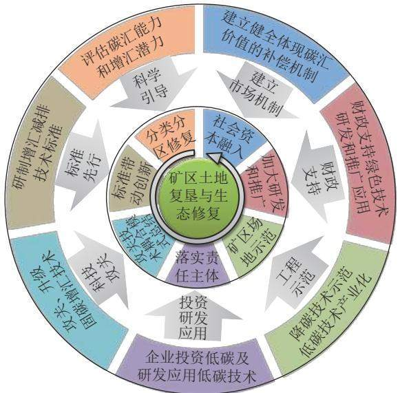
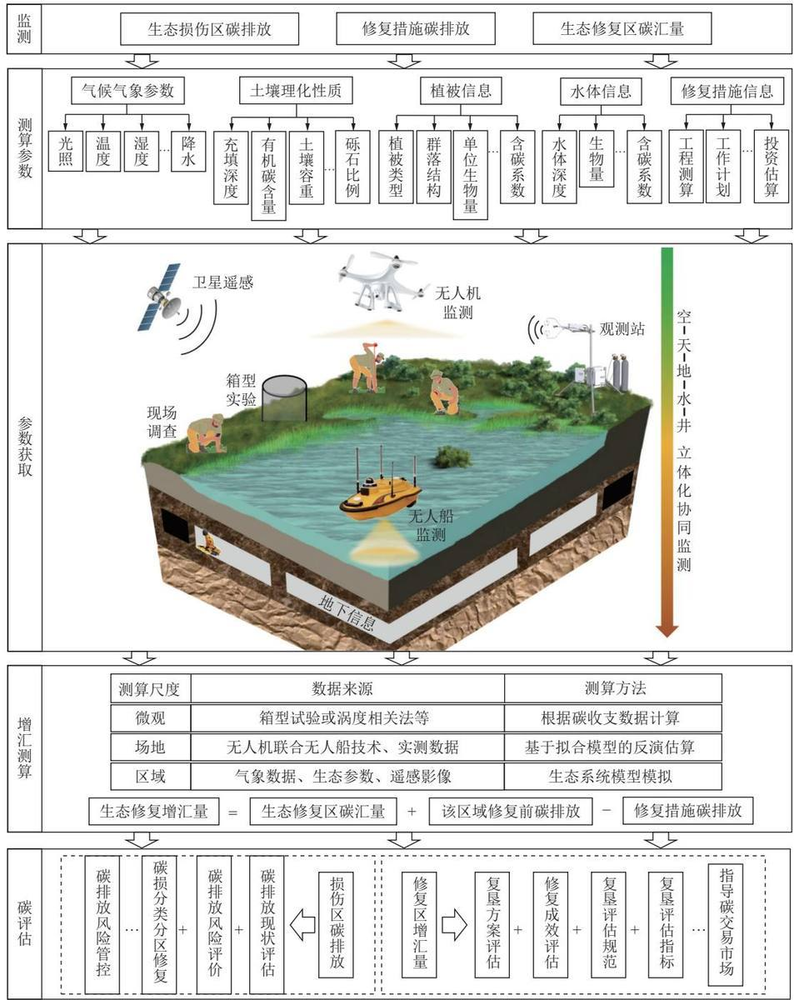
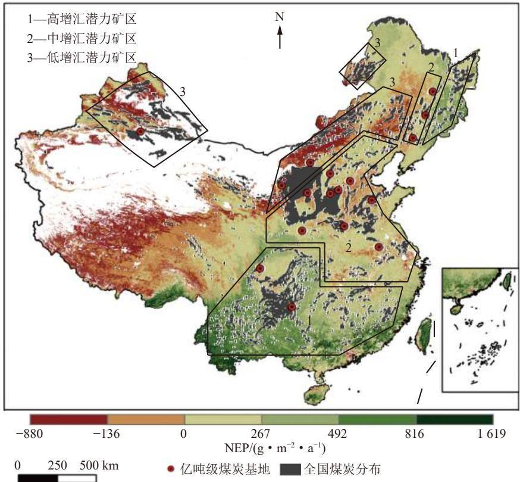
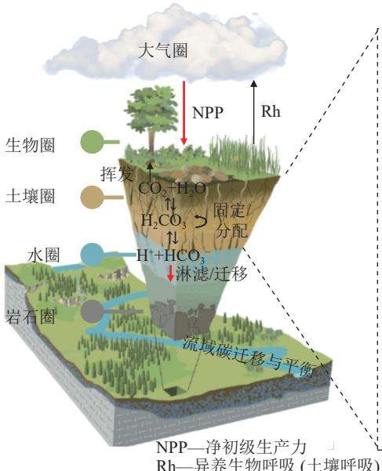
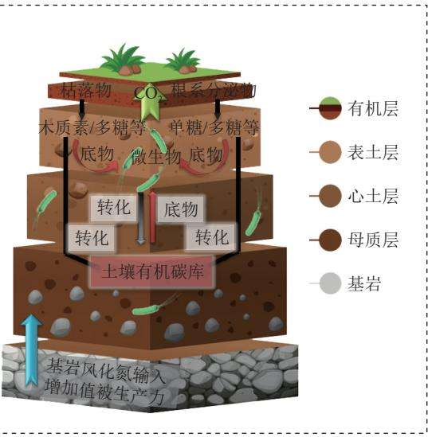

# 碳中和目标下矿区土地复垦与生态修复的机遇与挑战

胡振琪理源源李根生韩佳政刘曙光

引用本文：

胡振琪，理源源，李根生，等.碳中和目标下矿区土地复垦与生态修复的机遇与挑战[J].煤炭科学技术,2023,51(1):474-483.

HU Zhenqi, LI Yuanyuan, LI Gensheng. Opportunities and challenges of land reclamation and ecological restoration in mining areas under carbon neutral target[J]. Coal Science and Technology, 2023, 51(1): 474–483.

在线阅读 View online: https://doi.org/10.13199/j.cnki.cst.2023-0047

您可能感兴趣的其他文章

Articles you may be interested in

黄土高原矿区生态修复固碳机制与增汇潜力及调控

Mechanism, potential and regulation of carbon sequestration and sink enhancement in ecological restoration of mining areas in the Loess Plateau

煤炭科学技术.2023, 51(1): 502-513 https://doi.org/10.13199/j.cnki.cst.2023-2250

碳中和背景下煤炭矿山生态修复的几个基本问题

Several basic issues of ecological restoration of coal mines under background of carbon neutrality

煤炭科学技术.2022, 50(1): 286-292 http://www.mtkxjs.com.cn/article/id/b9feecbb-55a9-4848-ba51-5b6269dfbba7

矿区复垦地人工生态系统碳汇能力与生物多样性功能协同效益解析

Synergistic benefit analysis of carbon sink capacity and biodiversity function of artificial ecosystems in mining reclamation sites 煤炭科学技术.2024, 52(7): 257-266 https://doi.org/10.12438/cst.2023-1242

我国土地复垦与生态修复30年：回顾、反思与展望

The 30 years’ land reclamation and ecological restoration in China:review,rethinking and prospect

煤炭科学技术.2019(1) http://www.mtkxjs.com.cn/article/id/e8d3e657-0caf-4575-8939-847e59f67965

北方大型露天矿区土壤有机碳库扰动与恢复研究

Study on disturbance and restoration of soil organic carbon pool in large-scale open-pit mining areas in Northern China

煤炭科学技术.2023, 51(12): 100-109 https://doi.org/10.12438/cst.2023-0965

植被恢复类型对露采矿山复垦土壤丰富和稀有微生物类群的影响

Impacts of vegetation restoration type on abundant and rare microflora inreclaimed soil of open-pit mining area 煤炭科学技术.2024,52(2): 363-377 https://doi.org/10.12438/cst.2023-1882

  
关注微信公众号，获得更多资讯信息

## 煤炭加工与环保

  
移动扫码阅读

胡振琪，理源源，李根生，等.碳中和目标下矿区土地复垦与生态修复的机遇与挑战[J].煤炭科学技术，2023，51(1):474-483.

HU Zhenqi, LI Yuanyuan, LI Gensheng, et al. Opportunities and challenges of land reclamation and ecological restoration in mining areas under carbon neutral target[J]. Coal Science and Technology, 2023, 51(1): 474–483.

# 碳中和目标下矿区土地复垦与生态修复的机遇与挑战

胡振琪1²，理源源¹，李根生3，韩佳政¹，刘曙光

(1. 中国矿业大学环境与测绘学院,江苏徐州 221116;2.中国矿业大学江苏省煤基温室气体减排与资源化利用重点实验室,江苏徐州 221008;3.中国矿业大学公共管理学院,江苏徐州 221116)

摘要：绿色发展和2060年实现碳中和已成为我国的国家发展战略，矿区土地复垦与生态修复是煤炭工业绿色发展的必由之路。分析矿区土地复垦与生态修复的属性，发现其除了具有恢复绿色和生态功能外，还具有双重增汇作用，不仅抑制了受损土地产生碳排放，而且因植被和生态的恢复增加了碳汇，因此，矿区生态修复是绿色增汇技术，符合国家发展战略，将迎来全新的发展机遇。碳中和政策对矿区生态修复的激励主要体现在引导科学修复、立定先行标准、开展科技攻关、落实企业主体责任、建立工程示范、加强财政支持和建立市场机制7大方面。碳中和导向下的矿区生态修复将迎来5大技术挑战：①科学测算评估矿区生态修复带来的增汇效果，重点从监测目标、测算参数、参数获取和测算方法4个方面进行研究；②将碳中和理念融入矿区生态修复规划设计、探索增汇的规划布局、修复措施以及优选增汇修复方案，发挥矿区生态修复规划设计对增汇的龙头作用；③地形重塑设计既要考虑原有的水土保持措施带来的植被恢复增汇效果，也要增加碳汇功能的专项设计和对比分析；④科学分析和评估不同土壤重构技术的增汇效应，推广增汇型土壤重构技术，同步开展增汇型重构材料及土壤剖面研究；⑤研发兼顾生态效益和增汇效果的植物种群选择和植被恢复技术。

关键词：碳中和；土地复垦；生态修复；增汇测算评估；地貌重塑；土壤重构；植被恢复

中图分类号：X171.4

文献标志码：A

文章编号：0253-2336(2023)01-0474-10

# Opportunities and challenges of land reclamation and ecological restoration in mining areas under carbon neutral target

HU Zhenqi¹,2, LI Yuanyuan, LI Gensheng³, HAN Jiazheng1, LIU Shuguang'

(1.School of Environment and Spatial Informatics, China University of Mining and Technology, Xuzhou 221116, China; 2.Jiangsu Key Laboratory of Coal-Based Greenhouse Gas Control and Utilization, China University of Mining and Technology, Xuzhou 221008, China; 3.School of Public Policy & Management, China University of Mining and Technology, Xuzhou 221116, China)

Abstract: Green development and carbon neutrality in 2060 have become China's national development strategy. Land reclamation and ecological restoration in mining areas are the only way to green development of coal industry. It is found that in addition to restoring green and ecological functions, it also has a dual role in increasing carbon sinks, which not only prevents and suppresses carbon emissions due to land damage, but also increases carbon sinks due to vegetation and ecological restoration by analyzing the properties of land reclamation and ecological restoration in mining areas. Therefore, mining area ecological restoration is a green technology for increasing carbon sinks, which is in line with the national development strategy and will usher in new development opportunities. The incentive of the carbon neutral policy to the ecological restoration of the mining area is mainly embodied in seven aspects: guiding the scientific restoration, setting the

leading standards, carrying out scientific and technological research, implementing the main responsibilities of enterprises, setting the project demonstration, strengthening financial support and establishing the market mechanism. Five major technical challenges will be faced by the ecological restoration of mining areas under the guidance of carbon neutrality: ① Carry out the research on the effect of reducing carbon and increasing sink of ecological restoration in mining areas from the four aspects of monitoring objectives, measurement parameters, parameter acquisition and calculation methods, and simultaneously carry out the assessment of reducing carbon and increasing sink of ecological restoration in mining areas; ② Leading role of the ecological restoration planning in the mining area in the increase of carbon sinks is played through the planning incorporating the concept of carbon neutrality, the planning measures and schemes for the increase of carbon sinks, and the optimization of restoration schemes based on carbon sink; 3 In addition to considering the function of water and soil conservation traditionally, increases the design and comparative analysis of increasing the carbon sink function in landform remodeling design; 4 Scientifically analyze and evaluate the sink increasing effect of different soil reconstructions, popularize sink increasing soil reconstruction technology, and simultaneously research the sink increasing reconstruction materials and soil profile; ⑤ Research and develop plant community selection and vegetation restoration technologies considering both ecological benefits and sink enhancement effects.

Key words: carbon neutralization; land reclamation; ecological restoration; calculation and evaluation of sink enhancement; landform remodeling; soil reconstruction; vegetation restoration

## 0 引 言

煤炭是我国主体能源，约占一次能源生产与消费的60%，是我国能源安全的压舱石。随着国家绿色发展战略和“双碳”目标的积极推进，煤炭工业面临前所未有的环境保护和减排增汇压力。为应对全球气候变化，世界各国积极减少碳排放，增加碳汇，将实现碳中和作为发展目标。煤炭作为高碳产品，其开发利用过程的高排放已经得到全球关注。2020年我国提出2060年实现碳中和的奋斗目标，而要实现碳中和需要同时做好脱碳和固碳的“加减”法，尤其是要在做好碳减排的同时，充分发挥固碳端的作用。众所周知，煤炭开采常常导致土地挖损、塌陷和压占，引发耕地损失、植被退化甚至死亡等生态环境问题，使原生态环境系统的碳汇功能急剧退化甚至完全丧失。据不完全统计，我国煤炭开采损毁土地已达200万hm²,每年还以8万hm²以上的速度递增。面积如此庞大的生态损伤不仅不能为碳中和贡献碳汇，甚至排放大量的二氧化碳。因此，矿山土地复垦与生态修复已经成为我国研究的重点和热点，它不仅是保护土地资源和生态环境的需要，也是“碳中和”目标的需要。各行各业围绕“碳中和”目标都在探讨实施路径和技术方案，矿山生态修复如何基于“碳中和”目标找出自己的道路也是当前亟待解决的问题。尽管已经有一些学者做了相关的探讨[1-2]但如何在现有技术的基础上，从矿山生态修复的属性和特点出发，研究“碳中和”目标下矿山生态修复独特的技术路径和方案，仍然是亟待解决的问题。为此，有必要从机遇与挑战的视角，探讨“碳中和”目标的矿山生态修复的新思路和新技术。

## 1 碳中和目标下矿区土地复垦与生态修复的 机遇

## 1.1 矿区土地复垦与生态修复属性决定了其历史机遇

矿区土地复垦与生态修复是针对矿山开采导致的土地与环境损伤，采取整治措施，使其恢复到可供利用的期望状态的行动或活动，目的是对矿区损毁生态系统功能的恢复或再造。由于矿区主要位于非城市区，矿区损毁的土地往往是耕地、林地、园地、草原、湿地等，矿山开采损毁土地首先是对绿色植被的损毁，导致碳汇损失以及增加了碳排放，如煤矸石堆积和自燃导致植被消亡及碳排放。矿区土地复垦与生态修复就是恢复绿色、恢复原有的生态功能，亦即恢复了碳汇功能，同时抑制了损毁土地上的碳排放。因此，矿区土地复垦与生态修复的属性就是绿色增汇技术，理所当然在碳中和目标下发挥重要作用，其作用主要体现在：①减少土地损毁与碳排放量；②恢复土地和环境损毁前的碳汇功能；③坚持科学低碳化生态修复方式，利用新技术实现比原有生态系统更多的碳汇。前2个作用是原有矿区土地复垦与生态修复技术已经实现的，需要进一步进行定量化碳汇监测和评估，第3个作用需要以碳中和目标为指引，研发矿区生态修复新思路、新技术，并产生新增碳汇量，这将是今后矿山生态修复领域的研究重点。

## 1.2 碳中和战略的相关政策将激励矿区土地复垦与 生态修复

为实现碳中和愿景，积极应对气候变化，国家在政策层面进行了相关系列部署，如图1所示。我国碳中和政策分别从引导科学修复、立定先行标准、开展科技攻关、落实企业主体责任、建立工程示范、加强财政支持、建立市场机制7方面激励矿区土地复垦与生态修复。

  
图1 碳中和政策激励矿区土地复垦与生态修复示意  
Fig.1 Sketch of ecological restoration in mining area stimulated by carbon neutral policy

1)引导科学修复。《科技支撑碳达峰碳中和实施方案(2022—2030年)》提出生态系统碳汇潜力空间格局概念，引导矿区重点加强损毁土地碳排放现状和增汇潜力评估，在此基础上科学划分修复分区，因地制宜地制定分区修复增汇策略。

2)立定先行标准。《建立健全碳达峰碳中和标准计量体系实施方案》提出加快资源保护和生态修复增汇减排技术标准研制。先行标准的驱动为矿区生态修复开展技术创新提供先驱动力。

3)开展科技攻关。《中共中央国务院关于完整准确全面贯彻新发展理念做好碳达峰碳中和工作的意见》、《科技支撑碳达峰碳中和实施方案(2022一2030年)》和《高等学校碳中和科技创新行动计划》都强调了高新技术对于提升生态系统碳汇的重要作用，将重点推进固碳增汇技术的攻关与升级。矿区生态修复作为绿色增汇技术，也将在碳中和政策的激励下实现增汇技术的突破。同时，通过技术耦合与模式总结，推动矿区生态修复快速发展。

4)落实企业主体责任。《中共中央国务院关于完整准确全面贯彻新发展理念做好碳达峰碳中和工作的意见》提出国有企业要加大绿色低碳投资，积极开展低碳零碳负碳技术研发应用。通过加大投资与研发力度，充分发挥企业在矿山生态修复增汇中的关键作用，进一步明确企业是矿区土地复垦与生态修复的责任主体。

5)建立工程示范。《2030年前碳达峰行动方案》提出实施重大节能降碳技术示范工程，支持已取得突破的绿色低碳关键技术开展产业化示范应用，从政策上鼓励重大科技进步落地。在促进先进技术的推广应用中，矿区生态损伤土地将积极发挥场地示范作用。

6)加强财政支持。《财政支持做好碳达峰碳中和工作的意见》提出加强对低碳零碳负碳、节能环保等绿色技术研发和推广应用的财政支持。矿区土地复垦与生态修复作为绿色、环保、负碳技术，在财政支持下将加大研发和推广力度。

7)建立市场机制。《2030年前碳达峰行动方案》提出建立健全能够体现碳汇价值的生态保护补偿机制，矿区修复产生的碳汇市场效益将吸引更多的社会资本参与矿区土地复垦与生态修复，将其彻底盘活，从根本上推动构建“谁修复、谁受益”的生态修复市场机制。

## 2 碳中和目标下矿区土地复垦与生态修复的 挑战

矿区土地复垦与生态修复具有绿色增汇的技术属性，国家碳中和政策为该领域的发展提供了难得的发展机遇，但如何在碳中和目标下创新发展矿区土地复垦与生态修复就值得深入探讨，否则就会陷入传统的研究思路和技术之中。基于此，笔者提出了碳中和导向下矿区生态修复技术的挑战。

## 2.1 矿区生态修复增汇测算评估

“碳中和”的关键是增加碳汇，矿区生态修复正是增汇的技术手段。对增汇量进行测算有助于评估矿区生态修复对碳中和的贡献、优化修复手段、指导未来科学修复。但矿区生态修复到底可以增汇多少未有定论，原因主要包括以下3个方面：①测算目标不一。不同矿区生态修复的手段和目标往往不一致，因此增汇效果也不尽相同。另外不同矿区的自然本底值具有差异，进一步削减了不同研究之间的可比性；②测算因子不一，有研究只测算地上植被和土壤，忽略了土壤生物和枯落物的碳汇作用；③测算方法不一，生态系统碳汇测算方法种类繁多，分别适用于不同的研究尺度，在矿区中暂未形成统一的方法。因此，如何科学测算评估矿区修复增汇量是亟待解决的问题。

如图2所示，科学测算矿区修复增汇量应重点从监测目标、测算参数、参数获取和测算方法4个方面开展。监测目标应着眼于生态破坏后的碳排放监测、生态修复不同措施的碳收支监测、生态修复后碳汇监测。测算所需参数应包含气候气象、土壤理化性质、植被信息、水体信息、修复措施信息等多源信息。应基于空(遥感卫星)、天(无人机)、地(实地调查监测)、水(无人船)、井(地下信息)立体化监测实现多尺度参数的获取。根据研究需求，从微观、场地、区域等不同尺度选用不同的测算方法展开测算研究。最终，在测算的基础上开展矿区生态修复碳评估，包括：生态损伤区碳排放评估及修复区增汇量评估。

  
图2 矿区生态修复增汇测算评估体系  
Fig.2 Calculation and evaluation system of sink enhancement by ecological restoration in mining area

## 2.2 矿区生态修复规划设计中的增汇技术

规划设计是矿区生态修复的基础和核心，其质量的高低直接决定了修复质量的高低。因此，规划设计应与时俱进，充分考虑矿区生态修复的增汇作用。

1)从全生命周期视角将碳中和理念充分融入矿区生态修复规划。只有矿区生态修复规划中采用了碳中和的新理念，才能保证矿区生态修复向着碳中和拟定的目标发展。因此，应在修复土地利用格局、地貌设计、修复技术选择等方面，增加碳中和的指导原则。

2)统筹规划矿区土地利用格局，合理设计增汇型生态修复规划布局。如图3所示，以原生生态系统的净生态系统生产力(NEP)作为对照，可大致将全国矿区的增汇潜力分为高、中、低3类。以云贵大型煤炭基地为代表的增汇潜力较高的矿区应优先复垦为林地、草地、湿地等碳汇系统；以新疆、宁东、神东煤炭基地为代表的低碳汇潜力矿区和植被恢复成本高的西部矿区可规划为低碳产业或碳汇产业，如光伏+生态修复。增汇潜力适中的矿区应同步优化碳汇效益、经济效益和社会效益[4]。

  
图3 我国净生态系统生产力(NEP)以及矿区增汇潜力分布[3]  
Fig.3 Distribution of net ecosystem productivity (NEP) and sink potential in mining areas in China [3]

3)以不同生态修复方案在碳中和方面的贡献作为优选规划方案的标准。开展不同土地利用方式的碳效益测算，主张在矿区生态修复规划中明确体现修复的碳成本和碳效益分析，在此基础上开展复垦增汇方案的可行性分析和多目标决策。

## 2.3 矿区地形重塑中的增汇技术

地形重塑技术通过对地形和水流的设计，重新塑造一个与周边景观协调的新地貌或合理设计地形[5-6],最大限度地抑制水土流失，提升植被恢复的增汇功能。

除此之外，应加强具有增汇功能地形的设计，使矿区地形重塑技术成为构建高碳储量的土壤及植被系统、增强修复区域碳汇功能的基础和保障。坡度、坡长、坡向、海拔等地形对小气候有很强的影响，决定生态系统的碳循环过程，具体见表1。因此，应合理组配关键的地形要素，通过地形设计充分发挥修复生态系统的碳汇功能。

对比分析不同地形的增汇效益。应基于不同重塑地形的碳收支测算，对比优选出增汇功能较强的地形。在此基础上进一步分析影响修复生态系统碳汇功能的关键地形因素，总结出地形重塑增汇的质量控制标准。

## 2.4 矿区土壤重构中的增汇技术

国内外学者已对原生生态系统的土壤碳固存过程和固碳机制进行了深入研究[18-19],近年相继出现了矿区复垦生态系统土壤有机碳(SOC)的评价性报道[20-21],但如何通过土壤重构技术提高碳汇应进一步研究。

1)科学分析和评估不同土壤重构技术的增汇效用，对于增汇效益较强的技术应重点推广。

2)从机理出发研究具有增汇作用的重构材料，突破重构土壤固碳的限制性因素[22-24]。表土覆盖、土壤改良剂、土壤组分、土壤理化性质、土壤微生物等均影响重构土壤的碳收支，见表2。应重点从上述5个方面开展矿区土壤重构增汇材料研究。

表1 地形要素对生态系统碳储量和碳收支的影响  
Table 1 Effects of topographic factors on carbon storage and carbon budget of ecosystem
<table><tr><td>地形重 塑指标</td><td>土壤固碳规律</td><td>土壤固碳实例</td><td>植被增汇规律</td><td>植被增汇实例</td></tr><tr><td>坡度</td><td>坡度与土壤呼吸速率呈负 相关关系[8]</td><td>坡度为5°栓皮栎样地的土壤呼吸 速率分别比坡度为15°和30°样地 的呼吸速率高26.1%和39.0%[9]</td><td>中高坡度地带林地固碳 量最大；缓坡度地带草 地的固碳能力最强</td><td>中高坡度林地(坡度15°~25°)固碳量约 716.93 g/m²；缓坡度(坡度8°~15°)草地的 固碳能力约748.65 g/m² [10]</td></tr><tr><td rowspan="2">坡向</td><td>土壤有机碳(SOC)密度： 阳坡低阴坡高</td><td>北坡平均SOC密度分别是南坡、 西南坡和西坡的3.2、2.9和1.9倍[11] 塞尔维亚，北向和西北向土壤表 层有机碳含量最高[8]</td><td>阴坡有利于植被发挥碳汇作用</td><td rowspan="2">黄土高原-刺槐，阳坡植被的净CO₂同化率 和光合固碳能力均低于阴坡[7,12]</td></tr><tr><td>丛枝菌根群落：阳坡高阴 坡低</td><td>阳坡丛枝菌根多样性、丰富度、 孢子密度、总根定殖量、丛枝丰 度、囊泡丰度和菌丝定殖量均显 著高于阴坡[13]</td><td>阴坡、陡坡植被恢复能够有效 增加SOC含量，有效给予土壤 正反馈[14]</td></tr><tr><td></td><td>短坡地的年土壤微生物碳 坡长 损失量小于长坡地，更有 利于土壤微生物碳积累</td><td>土壤微生物碳损失量短坡地约为 641.72  $\mathbf { g } / ( \mathbf { h } \mathbf { m } ^ { 2 } \cdot \mathbf { a } )$  ，长坡地约为 814.32 g/(hm2·a)[15]</td><td></td><td></td></tr><tr><td></td><td>0~60 cm深度范围土层， 海拔 低海拔和高海拔SOC密度 显著高于中海拔</td><td>埃塞俄比亚中南部地区海拔1500~ 1800m、1800~2100m、2100~随着海拔增高，植被碳储量密 2300m；SOC密度分别为106.4、度逐步增大 84.9、123.5 Mg /hm²[16]</td><td></td><td>缙云山植被的碳储量密度在海拔最高处达 65.46 Mg/hm²；在550~600 m处为62 Mg/hm 在350~400m处为31.99Mg/hm²，从整体 趋势上看，植被的碳储量密度随着海拔高 度的增加而增大[17]</td></tr></table>

表2 重构土壤材料的增汇途径及面临的挑战  
Table 2 Ways and challenges to increase sink of reconstituted soil materials
<table><tr><td colspan="2">增汇途径</td><td>挑战</td></tr><tr><td colspan="2">表土覆盖</td><td>采用表土覆盖有助于土壤固碳增汇[25]，应进一步优选有助于增汇的覆盖材料组配</td></tr><tr><td rowspan="2">改良剂</td><td>煤基生物土 煤基营养剂</td><td>研究土壤改良剂作用下土壤固碳增汇的响应</td></tr><tr><td>生物质炭</td><td>生物质炭的输入改善土壤理化性质的同时，具有增加SOC含量和增加碳排放双重作用26-27]；应进一步研究生 物质炭对改良土壤碳收支的影响</td></tr><tr><td rowspan="2">土壤组分</td><td>SOC</td><td>SOC与土壤粉粒、黏粒、水分、孔隙度呈显著正相关；与土壤容重、pH呈负相关[28-30]；应合理控制关键参数， 调节SOC含量，促进土壤固碳增汇</td></tr><tr><td>土壤团聚体</td><td>土壤的固碳功能与土壤团聚体的形成和稳定密切相关[31]，土壤团聚体与SOC含量显著相关32]，应在增加SOC 含量的基础上加强土壤团聚体监测，研究土壤团聚体固碳机理</td></tr><tr><td rowspan="3">理化性质</td><td>粒径分布</td><td>不同粒径颗粒物中，溶解性有机碳(DOC)含量分布不同，细砂DOC含量最高，石砾DOC含量最低[33]；应合理 控制土壤粒径分布，增加重构土壤的碳汇</td></tr><tr><td>土壤pH</td><td>土壤pH值会影响微生物活性、土壤酶活性，从而影响有机碳的分解[34]；合理控制土壤pH抑制微生物活性，减 缓有机碳分解导致的碳排放；进一步探究减缓SOC分解速率、增加碳吸收速率的途径下增加碳汇的可行性</td></tr><tr><td>土壤含水率</td><td>植被根系可以增加土壤碳输入，应进一步研究植被根系生长增加SOC的积累对含水率的响应</td></tr><tr><td colspan="2">土壤微生物 益明显微生物，探明其固碳机理，并用于示范验证</td><td>以真菌为主导的微生物群落参与土壤碳循环，对SOC具有稳定作用，减少碳排放，增加碳汇[35]；筛选固碳效</td></tr></table>

注：细砂粒径0.05\~0.2mm；石砾粒径2\~10mm。

3)通过土壤重构技术构造可在短期内恢复和提高碳汇功能的土壤剖面[36]。可重点从以下2方面展开研究：①在生物地球化学循环规律的基础之上，结合地球关键带理论，探明参与大气-植被-土壤复合系统碳循环的关键层，以此为依据优化重构土壤的深度(图4a)；②在土层生态位理论的指导下，探明生态位内部和不同生态位之间的碳循环过程，通过调控关键途径增加碳汇，如：抑制碳排放或促进碳吸收，提高重构土壤的碳汇(图4b)。

## 2.5 矿区植被恢复中的增汇技术

植被恢复不仅是矿区土地复垦与生态修复的最终目标，也是碳中和背景下发挥修复生态系统碳汇功能的最重要一环。以往主要从植被筛选、植被种植、生态演替以及抚育管理等方面研究具有自我维持能力、污染物去除能力、减少水土流失能力的植被系统[39-41]。碳中和背景下，需要研发兼顾生态效益和增汇效果的植被恢复技术，统筹生态修复、污染治理和固碳增汇。

  
(a)地球关键带生物地球化学碳循环示意

  
(b)土层生态位碳循环示意  
图4 地球关键带生物地球化学碳循环与土层生态位碳循环示意[37-38]  
Fig.4 Sketch of biogeochemical carbon cycle in key zones of the earth and carbon cycle in soil layer niche [37-38]

1)筛选兼顾环境适宜性和增加碳汇效果的植被。矿区损毁土地具有水土流失、土壤贫瘠、污染物富集等属性，盲目地以碳汇功能作为植被筛选的单一目标将导致修复不可持续，最终以失败告终。因此，应在因地制宜地筛选矿区适生植物的基础上，优选增汇效果较好的植被。

2)对于修复为耕地的生态系统，由于其地上植被生长期较短，植被碳汇通常很小，甚至为零，因此应重点加强农田土壤固碳研究。一方面，在施用有机肥、秸秆还田、免耕、休耕等措施的基础上探索新型农田管理方式，实现土壤碳汇；另一方面，充分发挥作物对土壤固碳的正反馈作用，逐步提高土壤的固碳能力。

3)对于修复为林地的生态系统，应重点从以下3方面开展增汇技术研究：①积极探索生态系统增汇量和增汇稳定性对物种多样性和植被密度的响应.在此基础上科学配置植被的空间分布；②探讨使植被群落维持在高碳汇演替阶段的技术途径。植被群落的碳汇能力一般与演替阶段呈正相关关系42-43]。因此，应从生态演替规律出发，促进植被群落演替并维持在高碳汇阶段，充分发挥矿区修复生态系统的碳汇功能；③结合碳汇监测技术开展植被抚育管理。对林地的碳汇开展长期监测，从空间上识别碳汇异常区，重点管护或补播。

4)对于复垦为湿地的生态系统，首先应结合无人机和无人船等手段研发湿地生态系统碳汇监测技术，为开展湿地增汇技术研究奠定基础。其次，研发湿地增汇抚育管理技术，如：合理地管理湿地水位，通过人工调控达到促进植物光合固碳、降低土壤呼吸及湿地厌氧带甲烷排放的最佳水位，同步减排增汇[44]。

## 结 论

1)矿区土地复垦与生态修复具有双重增汇作用，既可以抑制受损土地的碳排放量，又可以复原原有碳汇，并通过修复技术的革新进一步增加碳汇，在碳中和背景下具有很大的发展机遇。基于上述矿区生态修复的绿色增汇属性，碳中和相关政策将从以下七大方面激励其发展，分别是：引导科学修复、立定先行标准、开展科技攻关、落实企业主体责任、建立工程示范、加强财政支持和建立市场机制。

2)碳中和目标下的矿区生态修复面临五大挑战：①科学测算评估矿区生态修复带来的减碳增汇效果;②矿区规划设计应加强以下3方面的工作：规划中融入碳中和理念、统筹规划增汇型矿区土地利用格局以及优选增汇修复方案；③地形重塑设计应在考虑水土保持作用的基础上，基于地形条件对小气候的影响，设计具有增汇功能的地形以及基于不同重塑地形的碳汇对比分析优选增汇地形；④在推广增汇型土壤重构技术的基础上研发增汇型土壤重构材料，并基于地球关键带和土层生态位理论构造增汇型土壤剖面；⑤兼顾生态效益和增汇效果筛选植被并基于不同的植被恢复类型，针对性地研发植被恢复增汇技术。

## 4 展 望

1)研发矿区碳收支预警技术。基于生态系统碳收支长期监测，从时间尺度分析碳收支变化规律，并对未来一段时间内的变化趋势做出预测，对生态损伤区碳排放将要增加或生态修复区碳汇将要减少的节点及时分析原因，提前制定对策，预防碳排放增加及碳汇降低的现象，提高矿区碳汇量。

2)通过 $\overrightarrow { A }$ 区生态修复技术与电力、水利、CCUS(碳捕获、利用与封存)等技术的融合实现减排增汇双向碳中和。例如：耦合矿区生态修复和CCUS技术。一方面，将捕集的 $\mathrm { C O } _ { 2 }$ 封存在废弃矿井，实现$\mathrm { C O } _ { 2 }$ 的地质封存，减少碳排放；另一方面，封存在矿井的CO₂可能会通过扩散作用迁移至修复层，产生$\mathrm { C O } _ { 2 }$ 施肥效应，提高植被的碳汇功能。

3)陆地与湿地协同增汇。湿地与陆地生态系统一样，都是重要的碳汇，充分发挥湿地的碳汇作用对实现碳中和意义重大。尤其是在东部高潜水位矿区采煤沉陷区形成连片积水区。如何通过修复技术充分发挥矿区水体的碳汇功能，还需对大气-水-植被-土壤复合系统碳循环开展深入研究；如何确定陆地-湿地复合系统的碳汇量对复垦率的响应，还须加强对水生生态系统功能的定量表达。

4)研发能源互补减排增汇模式，如：积水区光伏发电+采空区利用地面积水优势进行抽水蓄能+煤电的多能互补同步实现减碳增汇。

## 参考文献(References):

[1] 卞正富，于昊辰，韩晓彤.碳中和目标背景下矿山生态修复的路 径选择[J].煤炭学报,2022,47(1):449-459. BIAN Zhengfu, YU Haochen, HAN Xiaotong. Solutions to mine ecological restoration under the context of carbon[J]. Journal of China Coal society, 2022, 47(1): 449-459.

[2] 李树志，李学良，尹大伟.碳中和背景下煤炭矿山生态修复的几 个基本问题[J].煤炭科学技术,2022,50(1):286-292. LI Shuzhi, LI Xueliang, YIN Dawei. Several basic issues of ecological restoration of coal mines under background of carbon neutrality[J]. Coal Science and Technology, 2022, 50(1): 286–292.

[ 3 ] ZHANG Danni, ZHAO Yuhao, WU Jiansheng. Assessment of car-

bon balance attribution and carbon storage potential in China's terrestrial ecosystem[J]. Resources Conservation and Recycling, 2023: 189.

[4] 郭月峰.小流域防护林碳汇效应及空间配置研究[D].呼和浩特: 内蒙古农业大学,2014 GUO Yuefeng. Carbon sink effect and spatial configuration in protection forests in small watershed [D]. Hohhot : Inner Mongolia Agricultural University, 2014.

[5] 田秀民，马春霞，鲁旭东，等.微地形重塑对大型排土场平台水沙 及植被的影响[J].水土保持研究,2021,28(3):74-82. TIAN Xiumin, MA Chunxia, LU Xudong, et al. Impact of microtopographic reconstruction reconstruction on runoff and sediment yield and vegetation of large waste dump platform[J]. Research of Soil and Water Conservation, 2021, 28(3): 74-82.

[6] 李 恒，雷少刚，黄云鑫，等.基于自然边坡模型的草原煤矿排土 场坡形重塑[J].煤炭学报,2019,44(12):3830-3838. LI Heng, LEI Shaogang, HUANG Yunxin, et al. Reshaping slope form of grassland coal mine dump based on natural slope model[J]. Journal of China Coal Society, 2019, 44(12) : 3830— 3838.

[ 7 ] XIAO Yinggong, MARCUS Giese, KLAUS Dittert, et al. Topographic influences on shoot litter and root decomposition in semiarid hilly grasslands[J]. Geoderma, 2016, 282: 112-119.

[8 ] JAKSIC Snezana, NINKOV Jordana, MILIC Stanko, et al. Influence of slope gradient and sspect on soil organic carbon content in the region of Nis, Serbia[J]. Sustainability, 2021, 13: 8332.

[9] 郝艺晴，田慧敏，胡晓杰，等.坡度和季节变化对鸡公山栓皮栎林 土壤呼吸速率的影响[J].浙江林业科技,2021,41(6):9-14. HAO Yiqing, TIAN Huimin, HU Xiaojie, et al. Effect of different slope and season on soil respiratory rate in quercus variabilis forest in jigongshan national nature reserve[J]. Journal of Zhejiang Forestry Science and Technology, 2021, 41(6): 9–14.

[10] 姚 楠,刘广全,贾 磊,等.基于坡度视角的黄土高原退耕还 林(草)工程碳汇效应分析[J].南京林业大学学报(自然科学版), 2023,47(1):180-188. YAO Nan, LIU Guangquan, JIA Lei, et al. Analysis of carbon sequestration effect of sloping land conversion program in Loess Plateau from the perspective of slope. Journal of nanjing forestry university (natural sciences edition), 2023,47(1): 180-188.

[ 11 ] ZHU Meng, FENG Qi, QIN Yanyan, et al. Soil organic carbon as functions of slope aspects and soil depths in a semiarid alpine region of Northwest China[J]. Catena, 2017, 152: 94–102.

[ 12 ] ZHENG Yuan, ZHAO Zhong, ZHOU Jingjing, et al. The importance of slope aspect and stand age on the photosynthetic carbon fixation capacity of forest: a case study with black locust (Robinia pseudoacacia) plantations on the Loess Plateau[J]. Acta Physiologiae Plantarum, 2011, 33(2): 419–429.

[ 13 ] LIU Min, ZHENG Rong, BAI Shulan, et al. Slope aspect influences arbuscular mycorrhizal fungus communities in arid ecosystems of the Daqingshan Mountains, Inner Mongolia, North China[J]. Mycorrhiza, 2016, 27(3): 189–200.

[14]林 枫，王丽芳，文 琦.黄土高原土壤有机碳固存对植被恢复的动态响应及其碳汇价值[J].水土保持研究，2021,28(3):

LIN feng, WANG Lifang, WEN Qi. Dynamic responses of sequestration of soil organic carbon to vegatation restoration and the values of carbon sink in the Loess Plateau[J]. Research of Soil and Water Conservation, 2021, 28(3): 53-58.

[ 15 ] KARA Oemer, SENSOY Hueseyin, BOLAT Ilyas. Slope length effects on microbial biomass and activity of eroded sediments [J]. Journal of Soils and Sediments, 2010, 10(3): 434–439.

[ 16 ] TADESSE Eyob, NEGASH Mesele. Impacts of indigenous agroforestry practices and elevation gradient on ecosystem carbon stocks in smallholdings' farming system in South-Central Ethiopia[J]. Agroforestry Systems, 2023, 97: 13-30.

[17] 徐少君，曾 波，苏晓磊，等.基于RS/GIS的重庆缙云山自然保 护区植被及碳储量密度空间分布研究[J].生态学报，2012, 32(7):2174-2184. XU Shaojun, ZENG Bo, SU Xiaolei, et al. Spatial distribution of vegetation and carbon density in Jinyun Mountain Nature Reserve based on RS /GIS[J]. Acta Ecologica Sinica, 2012, 32(7): 2174-2184.

[ 18 ] MELILLO J M, FREY S D, DEANGELIS K M, et al. Long-term pattern and magnitude of soil carbon feedback to the climate system in a warming world[J]. Science, 2017, 358(6359): 101-104.

[19 ] YAN Meifang, GUO Nan, REN Hongrui, et al. Autotrophic and heterotrophic respiration of a poplar plantation chronosequence in northwest China[J]. Forest Ecology and Management, 2015, 337: 119-125.

[ 20 ] YUAN Ye, ZHAO Zhongqiu, BAI Zhongke, et al. Reclamation patterns vary carbon sequestration by trees and soils in an opencast coal mine, China[J]. Catena, 2016, 147: 404-410.

[21] 李俊超，党廷辉，薛 江，等.植被重建下露天煤矿排土场边坡 土壤碳储量变化[J]. 土壤学报,2015,52(2):453-460. LI Junchao, DANG Tinghui, XUE Jiang, et al. Variability of soil organic carbon storage in dump slope of opencast coal mine under revegetation[J]. Acta Pedologica Sinica, 2015, 52( 2) : 453-460.

[ 22 ] HUMBERTO BLANCO-Canqui, RATTAN Lal. Mechanisms of Carbon Sequestration in Soil Aggregates[J]. Critical Reviews in Plant Sciences, 2004, 23(6): 481–504.

[ 23 ] CROW Susan E, LAJTHA Kate, FILLEY Timothy R, et al. Sources of plant-derived carbon and stability of organic matter in soil: implications for global change[J]. Global Change Biology, 2009,15(8): 2003-2019.

[ 24 ] PAUL Eldor A. The nature and dynamics of soil organic matter: Plant inputs, microbial transformations, and organic matter stabilization[J]. Soil Biology & Biochemistry, 2016, 98: 109–126.

[ 25 ] AKALA V A, LAL R. Soil organic carbon pools and sequestration rates in reclaimed minesoils in Ohio[J]. Journal of Environmental Quality, 2001, 30(6): 2098–2104.

[26 ] KUPPUSAMY Saranya, THAVAMANI Palanisami, MEGHA-RAJ Mallavarapu, et al. Agronomic and remedial benefits and risks of applying biochar to soil: Current knowledge and future research directions[J]. Environment International, 2016, 87: 1-12.

[ 27 ] ANGELES Munoz Maria, GUZMAN Jose German, ZORNOZA

Raul, et al. Effects of biochar and marble mud on mine waste properties to reclaim tailing ponds [J]. 2016, 27 (4): 1227-1235.

[28 ] AHIRWAL Jitendra, MAITI Subodh Kumar. Assessment of carbon sequestration potential of revegetated coal mine overburden dumps: a chronosequence study from dry tropical climate [J]. Journal of Environmental Mangement, 2017, 201: 369–377.

[29] 安尼瓦尔·买买提，杨元合，郭兆迪，等.新疆草地植被的地上生物量[J].北京大学学报(自然科学版),2006,42(4):521-526.Anwar MOHAMMAT, YANG Yuanhe, GUO Zhaodi, et al.Grassland aboveground biomass in Xinjiang[J]. Acta Scientiar-um Naturalium Universitatis Pekinensis, 2006, 42(4): 521–526.

[30] 王同智，薛 焱，包玉英，等.不同复垦方式对黑岱沟露天矿排土场土壤有机碳的影响[J].安全与环境学报，2014,14(2)：174-178.WANG Tongzhi, XUE Yan, BAO Yuying, et al. Soil organic car-bon content of the spoiled bank under different reclamationmodes, Heidaigou Open Pit, Inner Mongolia[J]. Journal of Safetyand Environment, 2014, 14(2): 174-178.

[31 ] SIX Johan, PAUSTIAN Keith. Aggregate-associated soil organic matter as an ecosystem property and a measurement tool[J]. Soil Biology & Biochemistry, 2014, 68: A4-A9.

[32] 唐 骏，党廷辉，薛 江，等.植被恢复对黄土区煤矿排土场土 壤团聚体特征的影响[J].生态学报,2016,36(16):5067-5077. TANG Jun, DANG Tinghui, XUE Jiang, et al. Effects of vegetation restoration on soil aggregate characteristics of an opencast coal mine dump in the loess area[J]. Acta Ecologica Sinica, 2016, 36(16):5067-5077.

[33] 郑永红，胡友彪，张治国.煤矿复垦区重构土壤溶解性有机碳空 间分布特征[J].土壤,2017,49(5):977-981. ZHENG Yonghong, HU Youbiao, ZHANG Zhiguo. Spatial distribution characteristics of dissolved organic carbon in reconstructed soil in coal mine reclamation area[J]. Soils, 2017, 49(5) : 977-981.

[34] 黄昌勇.面向21世纪课程教材土壤学[M].杭州:中国农业出版社,2000.

[35] 刘满强，陈小云，郭菊花，等.土壤生物对土壤有机碳稳定性的影响[J].地球科学进展,2007,22(2):152-158.LIU Manqiang, CHEN Xiaoyun, GUO Juhua, et al. Soi biota onsoil organic carbon stabilization[J]. Advances in Earth Science,2007,22(2):152-158.

[36] 胡振琪，魏忠义，秦 萍.矿山复垦土壤重构的概念与方法[J]. 土壤,2005,37(1):8-12. HU Zhenqi, WEI Zhongyi, QIN Ping. Concept of and methods for soil reconstruction in mined land reclamation[J]. Soils, 2005, 37(1): 8-12.

[37 ] CHOROVER Jon, KRETZSCHMAR Ruben, GARCIA-PICHEL Ferran, et al. Soil Biogeochemical Processes within the Critical Zone[J]. Elements, 2007, 3(5): 321-326.

[38] 温学发，张心昱，魏 杰，等.地球关键带视角理解生态系统碳 生物地球化学过程与机制[J]. 地球科学进展，2019,34(5): 471-479. WEN Xuefa, ZHANG Xinyu, WEI Jie, et al. Understanding the biogeochemical process and mechanism of ecosystem carbon

cycle from the perspective of the Earth's critical zone[J]. Advances in Earth Science, 2019, 34(5): 471-479.

[ 39 ] GUO Donggang, ZHAO Bingqing, SHUANGGUAN TieLiang, et al. Dynamic parameters of plant communities partially reflect the soil quality improvement in eco-reclamation area of an opencast coal mine [J]. Clean-Soil, Air, Water, 2013, 41 (10): 1018-1026.

[40] 郭逍宇,张金屯,宫辉力,等.安太堡矿区复垦地植被恢复过程 多样性变化[J].2005,25 (4): 763-770. GUO Xiaoyu, ZHANG Jintun, GONG Huili, et al. Analysis of changes of the species diversity in the process of vegetation restoration in Antaibao Mining Field, China [J]. Acta ecologica sinica, 2005, 25 (4): 763-770.

[41] 王改玲，白中科.安太堡露天煤矿排土场植被恢复的主要限制 因子及对策[J].水土保持研究,2002,9(1):38-40. WANG Gailing, BAI Zhongke. Main limiting factors for re-vegetation and measures of dumping site in Antaibao Opencast Mine[J]. Research of Soil and Water Conservation, 2002, 9(1) : 38-40.

42梅雪英，张修峰.崇明东滩湿地自然植被演替过程中储碳及固

碳功能变化[J].应用生态学报,2007,18(4):933-936. MEI Xueying, ZHANG Xiufeng. Carbon storage and carbon fixation during the succession of natural vegetation in wetland ecosystem on east beach of Chongming Island[J]. Chinese Journal of Applied Ecology, 2007, 18(4): 933–936.

[43]夏艳菊，张 静，邹 顺，等.南亚热带森林群落演替过程中结 构多样性与碳储量的变化[J]. 生态环境学报，2018,27(3): 424-431. XIA Yanju, ZHANG Jing, ZOU Shun, et al. Dynamics of structural diversity and carbon storage along a successional gradient in South subtropical forest[J]. Ecology and Environmental Sciences, 2018,27(3):424-431.

[44]马 莉，牟长城，王 彪，等.排水造林对温带小兴安岭沼泽湿 地碳源/汇的影响[J].林业科学,2017,53(10):1-12. MA Li, MOU Changcheng, WANG Biao, et al. Effects of wetland drainage for dorestation on carbon source or sink of temperate marshes wetlands in Xiaoxing'an Mountains of China[J]. Scientia Silvae Sinicae, 2017, 53(10): 1–12.