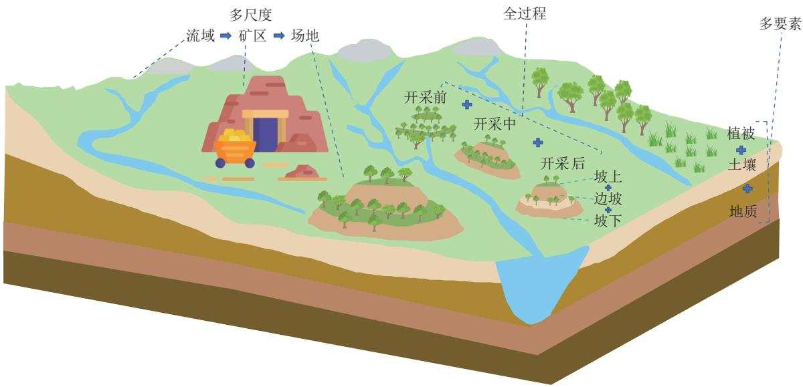
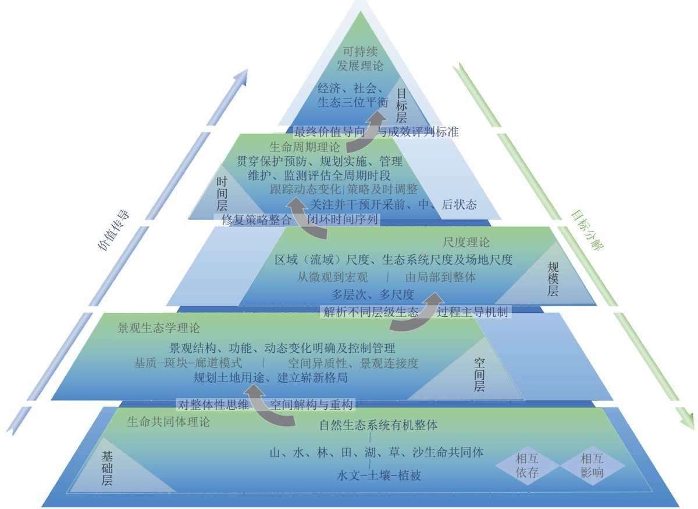
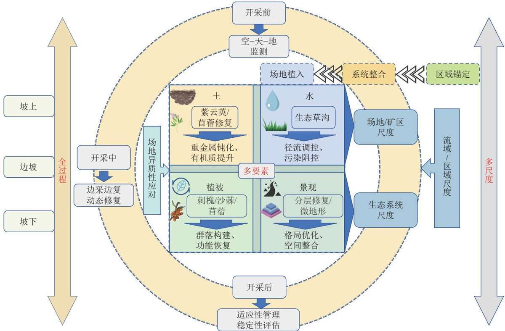
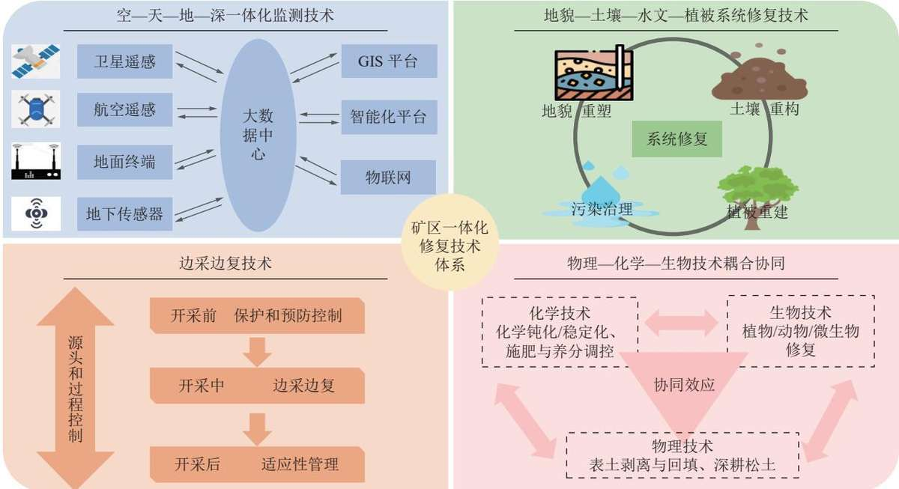

## 试论矿区一体化生态修复

王金满吴大为叶甜甜刘悦李速马艺源冯宇

引用本文：

王金满，吴大为，叶甜甜，等.试论矿区一体化生态修复[J].煤炭科学技术,2026,54(1):486-500.

WANG Jinman, WU Dawei, YE Tiantian. Discussion on integrated ecological restoration in mining areas[J]. Coal Science and Technology, 2026, 54(1): 486–500.

在线阅读 View online: https://doi.org/10.12438/cst.2025-1206

您可能感兴趣的其他文章

Articles you may be interested in

基于自然解决方案的矿山生态修复研究进展

Ecological restoration of mines based on Nature-based Solution: a review

煤炭科学技术.2024, 52(8): 209-221 https://doi.org/10.12438/cst.2023-1306

北方防沙带大型露天煤矿区生态保护与修复技术

Ecological protection and restoration technology of large-scale open-pit coal mining area in the northern sand-proof belt

煤炭科学技术.2024, 52(1): 323-333 https://doi.org/10.12438/cst.2023-1902

基于NbS的全生命周期矿山生态修复理论框架及技术路径

Theoretical framework and technical pathway for the integrated ecological restoration throughout the overall life cycle of mining based on NbS

煤炭科学技术.2025, 53(1): 377-391 https://doi.org/10.12438/cst.2024-0797

碳中和目标下矿区土地复垦与生态修复的机遇与挑战

Opportunities and challenges of land reclamation and ecological restoration in mining areas under carbon neutral target

煤炭科学技术. 2023, 51(1): 474-483 https://doi.org/10.13199/j.cnki.cst.2023-0047

黄土高原矿区生态修复固碳机制与增汇潜力及调控

Mechanism, potential and regulation of carbon sequestration and sink enhancement in ecological restoration of mining areas in the Loess Plateau

煤炭科学技术.2023,51(1): 502-513 https://doi.org/10.13199/j.cnki.cst.2023-2250

黄河底泥基植生基材用于矿区生态修复的效果

Effect of planting substrate based on Yellow River sediment for ecological restoration in mining area

煤炭科学技术.2025,53(4):401-413 https://doi.org/10.12438/cst.2023-1702

  
关注微信公众号，获得更多资讯信息

  
移动扫码阅读

王金满，吴大为，叶甜甜，等.试论矿区一体化生态修复[J].煤炭科学技术,2026,54(1):486-500.

中图分类号：X171.4

supporting theories for this integrated approach and proposes implementation pathways, models, and a key technology system for integrated mining area restoration from the perspectives of multi-element synergy, multi-scale linkage, and whole-process management. The main conclusions are as follows: (① From the perspectives of elements, scales, and processes, the connotation of "Integrated Ecological Restoration in Mining Areas" is proposed, emphasizing the systemic, synergistic, and sustainable nature of ecological restoration in these areas. This moves beyond isolated interventions towards a comprehensive understanding of the ecosystem as an interconnected whole. ② A supporting theoretical framework for integrated ecological restoration in mining areas is constructed, centering on the Life Community Theory, Landscape Ecology Theory, Scale Theory, and Life Cycle Theory. This multi-dimensional theoretical foundation provides the necessary principles for guiding the holistic restoration of complex mining ecosystems, addressing interactions across biological, physical, and temporal dimensions. ③ Centered around the ecosystem restoration pathway of “Pattern-Process-Service-Sustainability", a tripartite implementation path for integrated ecological restoration in mining areas is proposed. This path integrates “Multi-element Synergy, Multiscale Linkage, and Whole-process Management" into a unified framework, ensuring coordinated action across different ecosystem components, hierarchical levels, and all stages from pre-mining planning to post-closure monitoring. (4 A key technology system for integrated ecological restoration in mining areas, coupling multiple techniques, has been synthesized. This system includes: “Air-Space-Ground-Deep" integrated monitoring technologies for comprehensive data acquisition; the coupled application and synergy of physical, chemical, and biological restoration techniques to address diverse degradation issues; technologies for the systematic restoration of the soil-hydrology-vegetation complex, recognizing their tight interlinkages; and concurrent mining and rehabilitation techniques to minimize the restoration lag time and integrate restoration into active mining operations. This integrated technological suite provides practical tool support for the implementation of ecological restoration projects in mining areas.

Key words: mining area; integrated ecological restoration; scale; implementation path; sustainable development

## 0 引 言

矿产资源作为国家能源安全与经济社会发展的战略保障，其开发活动在支撑中国现代化建设的同时，也不可避免地导致了一系列生态环境问题，且其负面影响往往具有滞后性和累积性[1-3]。这不仅破坏了区域生态系统结构与功能，更威胁着可持续发展目标的实现。党和国家始终将生态文明建设置于关乎人民福祉和民族未来的战略高度。党的十八大明确提出生态文明建设的长远大计地位，党的十九大则进一步确立了“绿水青山就是金山银山”的理念，强调人与自然和谐共生，党的二十大报告明确提出“推动绿色发展，促进人与自然和谐共生”的战略部署，强调“提升生态系统多样性、稳定性、持续性”，并将“山水林田湖草沙一体化保护修复”列为生态文明建设的核心任务。

当前，在“双碳”目标的时代背景与“山水林田湖草沙生命共同体”理念的指引下，矿区生态修复已成为践行习近平生态文明思想和实现受损生态系统修复的关键手段[4]。当前中国矿区生态修复工作正处于深刻转型期，自然资源部“两统一”职责的顶层设计，既为矿区生态修复赋予了国土空间系统治理的新内涵，又推动矿区生态修复向一体化系统修复方向转变。矿区生态修复的技术标准也取得重大突破，《煤矿土地复垦与生态修复技术规范》(GB/T43934—2024)等4项国家标准，首次将“边开采、边修复”列为强制要求，强调生态修复须全程融入矿山全生命周期。矿区生态修复与国际可持续发展目标也高度契合，呼应联合国SDG15.3“土地退化零增长”和IRMA矿山闭合标准倡导的时空协同理念。

在当前矿区生态修复实践中，“碎片化”修复是核心困境，表现为传统模式在修复对象上呈“单要素修复”，割裂了生态系统各组分的内在联系[5-0];空间尺度上聚焦局部点状修复，忽视了其在流域、景观等更大尺度中的生态功能与关联7];在技术层面上往往过度依赖工程措施，缺乏对生态修复的系统性考量8]。这种单要素、单尺度、依赖单一技术的割裂治理方式，难以有效应对矿区生态系统中多要素、多尺度、全过程相互作用的复杂性，导致修复效果难以持久，生态系统整体结构、功能与服务难以恢复。为应对上述矿区“碎片化”生态修复核心困境，需以生命共同体理念为根本，强调整体性、系统性与协同性，将矿区及影响区域视为有机生命整体进行综合施策。在此，首先需要进一步厘清“系统性修复”与“一体化修复”的内涵与关系。“系统性修复”侧重于将矿区生态系统理解为一个结构和功能完整的整体，强调修复需统筹其内部多要素、多过程的复杂关联。而“一体化修复”则是在此认知基础上，针对“碎片化”治理困境提出实践范式，它更强调在行动层面实现整合修复：一是跨生态要素的协同整合，打破土壤、水、植被等单要素治理的壁垒；二是跨空间尺度的联动整合，贯通场地、矿区、流域等不同层级的修复行动；三是跨时间过程的管控整合，将修复活动有机嵌入矿山“规划—开采一闭坑—管护”的全生命周期。

因此，“一体化”是“系统性”思想在复杂矿区生态系统治理中的具体实现路径。基于此，本研究将基于整体性、系统性和协同性要求，系统阐释“矿区一体化生态修复”的内涵，分析矿区一体化生态修复的支撑理论，并从多要素协同、多尺度联动、全过程管控等方面探讨矿区一体化修复实现路径与关键技术体系，以期推动矿区一体化生态修复，进而实现矿区生态系统结构与功能的整体恢复和可持续提升。

## 1 矿区一体化生态修复的内涵

## 1.1 矿区生态修复内涵演变

中国在矿区生态修复领域的专用术语“土地复垦”一词最早出现在《土地复垦规定》(1989年1月1日生效)，是指对在生产建设过程中，因挖损、塌陷、压占等造成破坏的土地，采取整治措施，使其恢复到可供利用状态的活动[9]。2009年3月出台的《矿山地质环境保护规定》将矿山地质环境保护从单一的地质灾害治理拓展为涵盖土地复垦、生态重建、资源保护及长期监测的综合管理体系。2011年3月5日《土地复垦条例》颁布实施，确定土地复垦是指对生产建设活动和自然灾害损毁的土地，采取整治措施，使其达到可供利用状态的活动[10-11]。2018年自然资源部成立之后国家层面出台的文件中采用了“矿山生态修复”一词。2024年，《煤矿土地复垦与生态修复技术规范》(GB/T 43934—2024)等国家标准明确矿山土地复垦与生态修复是“针对矿产资源开采造成的地质环境破坏、土地损毁和生态系统破坏等问题，依靠人工支持引导和自然恢复力，采取预防和修复措施，使矿山地质环境达到安全稳定、损毁土地得到复垦利用、生态系统功能得到恢复或改善的活动”[12]。2025年7月1日起修订施行的《中华人民共和国矿产资源法》单独设立矿区生态修复一章，明确矿区生态修复应当坚持自然恢复与人工修复相结合，遵循“因地制宜、科学规划、系统治理、合理利用”的原则，并对矿区生态修复的基本原则、主要内容和矿区生态修复方案编制、矿区生态修复费用提取等作出规定。

可见，矿区生态修复作为应对矿产资源开发造成环境破坏的重要手段，其内涵随着时代发展、科技进步以及人们对生态环境认知的深化而不断演变，经历了从单一、被动到系统、主动的深刻转变。这一演变历程清晰地表明，矿区生态修复的内涵正从简单的“修补”走向复杂的“重塑”，从被动的“应对”走向主动的“设计”，其核心是修复理念的不断提升和对生态系统整体性的日益重视，这为“矿区一体化生态修复”概念的提出奠定了基础。

## 1.2 矿区一体化生态修复内涵

基于生命共同体理论，矿区生态修复需突破传统单一要素治理模式，转向系统化、整体性修复以应对矿区一系列复合生态问题。矿区受多要素影响，矿区生态修复需统筹所有生态要素及其相互作用关系。鉴于矿区生态问题在不同空间尺度上呈现异质性特征，需基于各尺度空间特性实施多尺度差异化修复策略。矿区修复过程需覆盖各个阶段，通过全生命周期管理确保修复效果的长期可持续性。矿区一体化生态修复是一种系统化、多维度的生态修复模式，本研究从多尺度、多要素和全过程3个维度对矿区一体化生态修复内涵进行深入阐释(图1)。

矿区生态系统受地质、土壤、植被、水体、景观、生物多样性等多重自然要素影响，各要素之间具有紧密的耦合关系。矿区一体化生态修复强调对这些受损要素及其相互作用进行统筹修复，实现生态功能的整体恢复。例如，地形重塑为后续土壤重构和植被重建奠定基础，而土壤与植被的恢复又直接影响景观格局与生物多样性的重建。白中科等3]提出的矿区生态重建“五元共轭论”系统阐释了地貌重塑、土壤重构、植被重建、景观重现、生物多样性重组与保护5个阶段在矿区生态恢复中的关键作用，为深入理解一体化修复的理论内涵提供了重要支撑。全过程修复理念将生态修复贯穿于矿产资源开发的全生命周期，包括时间维度和生态过程2个层面。矿区生态问题具有显著的空间异质性，需根据不同空间尺度(流域、矿区、场地)实施差异化修复。宏观尺度上，从流域层面统筹规划，保障区域生态安全格局，协调矿区与周边环境的整体性；中观尺度聚焦矿区整体，恢复其景观结构与生态功能，提升生态系统稳定性；微观尺度则针对排土场、矸石山等典型人工堆积地貌开展精细化修复。多尺度一体化修复强调在不同空间层级、时间阶段及生态要素之间建立协同机制，形成上下联动、内外协调的治理体系。其中，时间维度包含开采前、开采中、开采后3个阶段，具体涉及矿山规划、建设、生产、闭坑及后期管护等各个阶段；生态过程具有复合性、多功能性等特征，包含坡上、边坡、坡下等。

综上，矿区一体化生态修复是在矿区生态修复内涵演变的基础上，为应对当前矿区生态修复面临的复杂问题和挑战而提出的一种综合性修复理念和方法。基于传统的矿区土地复垦与生态修复方法理念，为满足矿区多要素、多尺度、全过程的迫切要求，笔者认为矿区一体化生态修复是针对采矿活动造成的复合型生态损伤，通过多要素协同、多尺度联动、全过程管控的系统性修复策略，实现矿区复合生态系统整体恢复和可持续利用的活动。总之，矿区一体化生态修复是一种更高级、更全面的修复范式，它超越了传统修复的局限性，强调系统性、协同性和可持续性，旨在从根本上解决矿区生态环境问题，实现矿区生态的全面恢复和区域的绿色发展。

  
图1 矿区一体化生态修复示意  
Fig.1 Schematic diagram of integrated ecological restoration in the mining area

## 2 矿区一体化生态修复支撑理论

矿区一体化生态修复的实施，尤其是针对矿区这一受人类行为强烈扰动的特定对象，离不开科学理论的系统支撑。笔者将生命共同体、景观生态学、尺度、生命周期和可持续发展共五大理论引入，并按照“基础—空间一规模一时间一目标”的递进层级构建逻辑性矿区一体化生态修复理论体系框架，为矿区一体化生态修复提供系统指导。

## 2.1 生命共同体理论

作为一体化修复的思想基础，生命共同体理论为治理统筹指明了整体性及系统性的必要性4]，奠定了理论框架中被首要考虑的根本性共生价值取向。生命共同体理论源于对中国传统生态文化的继承与发展，结合生态文明建设的长期实践探索，是对自然界普遍联系和整体性的认识，强调人类是自然生态系统的一部分，与山水林田湖草沙等自然要素共同构成了一个相互依存、相互影响、相互制约的有机整体[14-15]。该理论经历了从聚焦单一要素治理，忽视系统关联性，导致修复效果碎片化的历程，逐步发展到目前强调“全要素、全过程”协同[16-17],要求制定复合生态系统修复目标，涵盖社会、经济、自然子系统。

该理论核心在于生态系统的各个组成部分并非孤立存在，而是通过物质循环、能量流动和信息传递紧密联系[18],共同维持着生态系统的结构与功能。任何对系统某一要素的扰动，都可能通过复杂的相互作用网络，引发连锁反应，最终影响到整个生态系统的稳定与健康。矿区作为人类活动高度集中的区域，其开发与利用往往对区域内生态系统造成系统性破坏与联动影响。具体而言，露天矿开采过程中地表植被被大量破坏、土壤结构被扰动，形成裸露的山体和废弃地19,造成严重的土壤侵蚀和生态功能退化。井工矿虽不直接暴露于地表，但地下挖掘影响下的地下水循环改变、大面积采空将引发地面沉降、裂缝和地表水体干涸，所产生的噪声、粉尘和重金属渗漏进一步影响表土质量和植被恢复20],破坏原有的水土保持格局，威胁区域生态系统的稳定性。这些问题不仅破坏了自然生态系统的平衡，也对人类社会产生了土地资源浪费、景观破坏及居民生活质量降低等间接影响。生命共同体理论强调人与自然是共生共荣的命运共同体，修复矿区生态环境，必须以恢复“人一自然”复合系统的平衡为出发点，从“生命共同体”视角统筹考虑矿区对区域生态系统各要素的综合影响，通过综合手段实现整体性修复与综合治理。矿区生态修复，意味着不能仅仅关注被破坏的土地、植被或周边人居点，而必须将矿山视为一个嵌入在更大区域生态系统中的子系统，其修复过程需要考虑与周边水系、土壤、大气、生物以及人类社区的相互关系[21]。从要素层面来讲，矿区生态修复需统筹岩石圈、水圈、土壤圈、生物圈和大气圈[22]五大圈层，综合诊断自然要素、结构关系与生态安全问题，实现整个生态系统的结构和功能的恢复。此外，以“最优价值生命共同体”[23]为目标是理论的重点内容，通过优化生态资源配置，满足生物多样性需求和人民美好生活需要，实现生态价值和自然资本的提升。

## 2.2 景观生态学理论

生命共同体理论作为价值基石，确立了矿区修复必须遵循的“人一自然一社会”复合系统整体性原则。然而，这一宏观哲学理念需在物理空间中找到其具象化的表达载体。因此，在生命共同体提供的基础导向下，景观生态学理论承担起将整体性思维进行空间解构与重构的任务。景观生态学理论核心在于研究景观格局、生态过程及其动态变化，强调景观格局与生态过程之间的相互作用关系24]。该理论发展初期基于斑块一廊道一基质模型25],侧重地形重塑和植被重建的局部修复，后引入生态系统服务评估，优化景观格局以提升稳定性，到目前发展为主张“格局与过程耦合—生态系统服务—景观可持续性”[26]路径，指导矿区景观重现与生物多样性重组。

矿山开发活动对景观格局的破坏是系统性的、剧烈的。矿山开发、井下采挖直接或间接导致基质改变与景观破碎化，大面积的开挖、剥离和堆弃活动、岩体应力平衡破坏引发的大规模沉陷及次生地质灾害[27-28]彻底改变原有基质并形成以裸露的排土场、尾矿库、矿坑为主的破碎化景观，极大降低景观的连接度、凸显空间异质性。同时，矿区形成的这些“斑块”往往具有负生态功能29]，原本具有正生态功能的斑块也因面积缩小、隔离度增加而功能衰退；此外，矿区建设中的道路、铁路、管线等线性工程阻断或削弱了原有河流、林带等生态廊道的连接，阻碍物种迁移和物质流动，加剧了景观孤立、廊道阻断与功能退化[30]。传统修复中对矿区在整体区域景观网络中位置、作用的忽视造成了难以避免的“孤岛”效应31]，这也是矿区生态修复分层错位的表现。

从景观生态学“格局一过程一—尺度”级联的角度出发，矿区一体化修复需要在多个维度上进行协同修复32]。将矿区修复纳入区域生态安全格局或流域综合治理的框架，考虑矿区修复对生态流，包括如水源涵养、物种迁移、污染物迁移等的影响，并利用生态过程促进矿区生态恢复，摒除单一功能或结构修复的局限性，在多级联动过程中增强生态韧性。景观格局优化则应着眼于矿区本身及周边区域范围，根据“斑块一廊道一基质”理论，通过大规模植被重建，改变以裸露地为主的基质性质，逐步恢复区域性的生态背景，恢复基质功能。同时规划和建设生态廊道，连接破碎化的生态斑块并合理布局，考虑其大小、形状和空间分布，提高斑块的生态功能，重建良好生境。景观生态学理论为矿区一体化生态修复提供了从空间格局优化入手、多维度协同、注重格局与过程互动的系统性思维框架(图2)。不仅要修复“点”(场地)，更要关注“线”(廊道)和“面”(基质与区域格局)，还须通过改善垂直与平面景观结构来促进生态过程的恢复[33],最终实现矿区生态系统在空间上的完整性和功能上的可持续性。以往研究也证明了基于景观生态学原理的修复规划能够更有效地提升矿区生态系统的整体服务功能和长期稳定性[34-35]。此外，理论还强调“源一汇”景观理论的应用36]，通过定量评估建立生态系统的风险识别网络，制定科学合理的修复策略。

## 2.3 尺度理论

矿区空间格局的优化有了景观生态学理论所提供的理想蓝图，但其实施效能高度依赖于其与矿区生态系统内在的时空异质性相匹配。尺度背景失位的空间于预都可能使修复措施失效甚至产生倒退效果。为此，尺度理论被引入框架，它作为空间布局与动态过程之间的关键转换器，负责解析不同层级上生态过程的主导机制，确保景观生态学所设计的空间结构能够在多尺度上实现协同增效及风险可控。尺度理论源于地理学与生态学的交叉研究，结合了空间异质性与层级系统思想，是对生态过程与格局在不同空间和时间维度上表现规律的认识，强调生态现象的观测、理解与干预必须依托于特定的尺度背景16]。该理论经历了从单一尺度静态分析，忽视尺度效应及跨尺度关联的局限性阶段，逐步发展为多尺度动态系统分析，强调尺度间的相互作用与嵌套关系，到目前进一步融入“适应性管理”理念，要求在不同尺度上协同推进生态修复，兼顾局部优化与整体系统稳定。该理论核心在于生态系统的结构、功能与过程具有显著的尺度依赖性，不同尺度上的主导因素与作用机制存在差异，且各尺度之间通过信息传递、能量流动和物质循环紧密联系，共同构成一个多层级、多维度、动态演化的复杂系统。任何单一尺度的干预若脱离对跨尺度关联的理解，都可能因尺度错配而导致修复效果不理想甚至产生负面外溢效应，即生态系统的可持续修复必须考虑尺度多样性及其互动关系。

  
图2 矿区一体化生态修复多维度理论框架  
Fig.2 Multidimensional theoretical framework for integrated ecological restoration in mining areas

矿区作为典型的多尺度复合生态系统，其生态破坏与修复过程在空间上表现为从小尺度(如露天矿排土场、矸石山、地下矿井下等场地)到中尺度(如中观的矿区、小流域单元)再到大尺度(如区域或流域)的多级嵌套，在时间上则涉及短期(如工程措施)、中期(如植被恢复)和长期(如生态系统功能重建)的动态演变(图2)。采矿活动在不同尺度上引发的生态问题具有显著差异性：在微观尺度上，表现为土壤理化性质恶化、重金属污染及微生物群落结构失衡，中观尺度上，表现为地表塌陷、水文系统改变及植被覆盖度下降，宏观尺度上，则可能导致区域生物多样性丧失、生态系统服务功能退化及景观格局破碎化。这些多尺度问题相互交织、彼此影响，使得矿区生态修复面临复杂的尺度挑战。尺度理论的本质决定了修复实践需要明确不同尺度上的关键生态问题及其主导驱动机制，并制定针对性的修复策略。因而在微观尺度上，应重点开展土壤改良与土壤重构；在中观尺度上，需统筹地形重塑与植被恢复；在宏观尺度上，则要关注矿区与周边生态系统的协同保护与功能整合。此外，尺度转换是矿区生态修复的关键环节，通过“自上而下”的目标分解与“自下而上”的效应整合，实现多尺度修复策略的有机衔接与协同增效。从分层视角出发，多尺度协同治理框架下明确各尺度的修复目标、优先序与实施路径也是必要的，跨尺度监测与评估有助于动态调整修复策略。在空间尺度上的“点一线一面”相结合的修复网络建立，在时间尺度上的短期应急治理、长期生态重建分阶段的计划制定可确保修复效果的稳定性。此外，尺度理论还强调社会一生态系统的跨尺度互动，矿区修复需充分考虑不同利益相关者在多尺度上的参与和协作，通过政策整合、资源调配与信息共享，推动形成政府主导、企业主体、社会参与的多元共治格局。

## 2.4 生命周期理论

尺度理论的多尺度协同治理解决了修复策略在空间与时间维度上的“在哪做”“做什么”的问题，但矿区的生态演替是一个具有显著路径依赖性和阶段累积性的动态过程。静态的、割裂的干预无法应对生命周期各阶段传递的复合型风险。因此，必须引入全过程的动态管理机制，生命周期理论正是为此而设。该理论源于工业生态学与可持续管理思想的融合，关注人类活动从产生到消亡全过程环境影响的结果[36]。该理论经历了从末端治理、忽视全周期影响，导致修复滞后与资源浪费的阶段，逐步融入“全生命周期管理”理念，将资源利用、污染控制与生态修复统筹考虑，到目前发展为强调全流程协同，聚焦风险管控与应对。该理论核心支撑在于矿区生态系统在不同阶段具有不同的主导过程与生态影响特征，各阶段之间通过资源流动、能量转换与信息反馈紧密联系，共同构成一个环环相扣、前后呼应的整体系统。任何对某一阶段的忽视或不当干预，都可能通过时间维度的传递效应，导致后续修复难度加大或产生新的生态问题。

矿区作为典型的高强度人类活动区域，其开发与修复就是一个具有时间序列性、阶段关联性和整体连续性的非静止过程。要实现一体化生态修复，就要求从矿区的前、中、后生命阶段，包括规划、设计、开采、闭矿到修复、维护、监测、适应性管理全过程实施系统性干预，推动矿区生态一经济—社会复合系统的可持续发展。生命周期理论强调矿区开发与修复的时间连续性与阶段关联性，矿区的生态破坏往往是多阶段累积作用的结果，因此修复工作必须贯穿始终并实时动态调整，而非仅在闭矿后被动应对。统筹考虑矿区各阶段的生态影响与生态需求，达到源头预防、过程控制与末端治理有机结合的目的(图2)。对于矿区生态修复，生命周期意味着不能仅关注闭矿后的生态修复，而必须将生态修复理念融入矿山开发的全过程，从规划阶段就设定生态保护目标，在开采阶段实施绿色减损开采技术，在闭矿阶段推进生态功能重建，结合开发完成后的生态修复长效管理与生态补偿机制，实现生态监测、生态评估、碳汇交易等，最终实现矿区生态系统的整体恢复与可持续利用。从阶段层面来讲，矿区生态修复需统筹规划期、开采期、运营期、修复期、监测维护期五大阶段，综合诊断各阶段的生态风险与生态问题，制定针对性的修复策略与管理措施，确保整个生命周期内生态系统的健康与稳定。总而言之，参考“全生命周期可持续矿区”的目标范式，于各个可控环节优化资源利用效率、减少环境足迹、提升生态服务功能，在生态修复的同时带来矿区生态价值、经济价值与社会价值的协同提升。

## 2.5 可持续发展理论

对于延续监管周期的治理对象，理想的修复效果并非仅限于生态系统的技术性短期恢复，而是要实现其综合价值的可持续提升。这就需要一个统领性的目标框架来定义修复的最终成效并指导价值实现路径，可持续发展理论正是这一顶层设计，为整个矿区一体化生态修复体系提供最终的价值导向与成效评判标准。可持续发展理论强调生态修复应兼顾经济、社会和环境的协调发展，实现生态、经济和社会效益的统一。其核心在于协调经济发展、社会进步与生态保护三者之间的关系，实现资源利用与生态环境的长期平衡7]。该理论强调在矿区生态修复过程中，不仅要恢复受损的生态系统功能，还要兼顾区域经济转型与社会福祉提升，推动矿区从资源依赖型向可持续发展型转变。矿区生态修复不仅是对受损生态系统的修复，更是对矿区资源利用方式的优化与升级。在矿区生态修复过程中，应注重生态修复与产业发展的协同，通过生态修复带动绿色产业发展，实现“绿水青山就是金山银山”的目标。

在“可持续”视角下，矿区一体化生态修复本质在于围绕系统调控矿区生态经济系统实现资源开发、环境保护、经济增长与社会发展动态平衡主线开展(图2)。突破传统生态修复的孤立视角，将矿区生态修复置于“自然一经济—社会”复合系统的全局中，强调修复过程需兼顾生态效益、经济效益与社会效益的协同提升。在矿区生态修复中，可持续发展理论体现为3个基本原则：一是生态优先可持续，使修复后生态系统仍有自我维持的能力，提升重建系统的长时间序列存活韧性。通过修复土地、水体和植被，重建生态系统服务功能，扭转脆弱生态系统抵抗力稳定性与物种多样性的负相关关系；二是经济并行可持续，要求矿区开发从“资源消耗型”向“循环利用型”转型，实现结构组成可控并在此基础上优化提升。在具体实践中，应结合矿区的资源禀赋和市场需求，探索生态产业融合路径，发展生态友好型产业，包括生态旅游、生态农业、生态林业等，实现生态修复与经济发展的双赢；三是社会公平可持续，注重修复成果的普惠共享。建立生态产品价值实现机制，使修复成果转化为强辐射范围的可感知民生福祉。在就业提升、知情监督、低碳共享的过程中不断提升人居生活质量，系统实现“生态一经济—社会”的良性循环。

这些矿区一体化生态修复支撑理论虽各有侧重，但彼此紧密联系、互为补充。生命共同体理论强调人与自然及各生态要素的有机统一，是整体性修复的思想基础，自下而上为基础价值传导；景观生态学理论关注空间格局与生态过程的相互作用，为优化矿区空间布局提供科学依据。尺度理论揭示不同时空尺度下生态过程的异质性与关联性，指导修复策略的多尺度协同。生命周期理论贯穿矿区开发与修复全过程，强调全周期资源环境管理，三重理论应用实现横向耦合，即空间、规模、时间三维的协同作用；可持续发展理论则统领全局，明确矿区修复的经济、社会与生态协调目标，自上至下为顶层目标分解。五者共同构成一个逻辑严密、层次分明的理论体系，为矿区一体化生态修复提供坚实的理论基础(图2)。

## 3 矿区一体化生态修复的实现路径

矿区生态系统的复杂性要求矿区生态修复突破传统碎片化修复范式。基于生命共同体等理念，一体化修复路径通过多要素协同、多尺度联动与全过程管理的系统整合[37,将生态修复理论转化为可操作的实现路径。该路径本质上是“格局一过程一服务一可持续”[38]修复途径的具体实践。多尺度联动优化区域生态安全格局与景观结构，奠定系统稳定性的空间基础；全过程管理重点恢复生态系统中生态过程的连续性；多要素协同重点提升系统功能，推动水源涵养、碳汇增强与生物多样性维护等生态系统服务的改善；而生态一经济—社会协同机制则贯穿全程，保障矿区生态修复的可持续性。

## 3.1 多要素协同：从分类治理到系统整合

传统矿山生态修复中土壤修复多聚焦于土壤重构或肥力提升[8],却忽视水文条件对重构土壤稳定性的调控作用；植被恢复常片面追求覆盖率指标3],未能考量植物根系对土壤结构的重塑能力；水系修复集中于单一的土壤保水技术等[39-40],忽视流域的水文过程重建;地质稳定修复方面仅处理显性问题(如固废堆积、塌陷)[41-42],将土壤、植被、水治理割裂为孤立环节，忽视了地质环境稳定是实现矿区一体化生态修复的载体。地质稳定、土壤重构、水体治理、植被重建的割裂实施，导致生态功能碎片化。笔者认为，实现多要素协同的根本在于超越单一要素的物理修复模式，转向探索要素间生态关联的系统性重建。基于生命共同体理念，矿区生态修复必须将矿山视为区域生态系统的有机组成部分，统筹考虑其与周边地质、水系、土壤、大气及生物群落的相互作用，最终实现生态系统整体结构与功能的恢复43]。

实现多要素协同，需构建一个以关键生态过程为驱动、以景观格局为空间载体的系统性修复框架。其核心在于识别并强化地质、水、土与植被四大要素间的耦合机制，通过激发彼此间的正向反馈，驱动生态系统结构与功能的整体性恢复(图3)。具体而言，应以地质为基础框架，精准评估基底稳定性与地球化学背景，将其视为生态重建的起点，为水土保持和植被定植提供坚实的立地条件与安全保障；以水为脉络，将水文过程视为连接多要素的生态通道，引导其实现养分输送、生境连通与生物活性的激活；以土壤为基础，超越其物理基质的传统认知，着力恢复其生物地球化学循环功能，尤其重视微生物群落多样性的重建，使其成为维系元素循环与支撑植被演替的关键引擎；以植被为媒介，从追求单一成活率转向强调生态功能，优选具固氮、深根、凋落物分解能力强等功能性状的物种，发挥其改良土壤、调控微气候的作用；最终，通过优化各要素的协同作用，在地质框架内实现物质和能量的良性循环，从而达成生态系统在结构完整性、过程连续性与服务可持续性上的整体跃升。在具体实践中，内蒙古胜利煤田通过地质整形、水资源循环利用、土壤改良与植被配置等多要素协同修复，实现植被覆盖率提升41.78%、植物多样性增加 50%,废迹地治理率达100%[44]。

多要素协同的本质在于解构“地质一土壤一水文一植被”系统的非线性互馈网络，通过“物质一能量一空间”的三维耦合实现生态系统整体功能提升，未来研究需聚焦“根一土”界面与“水一土”界面的过程机制建模，推动生态修复从经验叠加向系统设计范式转型。

## 3.2 多尺度联动：全域统筹的修复逻辑

传统矿山修复常常受困于单一尺度的思维局限。在区域/流域尺度，规划宏大但缺乏具体技术支撑和跨行政区协调机制，例如虽认识到保护水源涵养区的重要性，却因未能有效衔接场地具体措施而导致规划悬空5]；在生态系统尺度上，缺乏对景观连通性与生态过程完整性的整体考量[45]。在场地尺度，技术应用又往往“见树不见林”，例如在排土场局部成功提高了植被覆盖率[46],却忽略了该场地作为水土流失和泥沙输出的“源头”，其产生的泥沙会顺流而下淤塞下游河道，反而加剧了流域尺度的生态退化。

多尺度的矿区生态修复须以全域统筹为核心逻辑，打破传统单一尺度治理的局限，要围绕“格局一过程一服务一可持续”修复途径，联动小尺度(排土场、矸石山、井下等场地)、中尺度(矿区、小流域单元)、大尺度(区域、流域)(图3)。这要求将矿区理解为一个由宏观“区域”、中观“矿区、小流域单元”与微观“具体场地”3个核心尺度构成的复合空间层级体系，每一个尺度层级既具有其独特的生态矛盾、修复目标和干预手段，又通过复杂的生态过程与服务流与其他尺度发生交互作用。在区域层面，应科学识别矿区在更大流域或生态格局中的定位，通过系统性策略实现生态功能的跨区域协同，保障生态格局安全，如在关键区域布局植被屏障控制水土流失在下游构建湿地系统净化水质，形成“源头阻控一末端治理”的连续性生态屏障。在中观矿区、小流域单元尺度，矿区生态修复核心是恢复那些被采矿破坏的、支撑生态系统运行的关键过程，比如水循环、物种流动、养分循环等，重点修复景观连通性与生态过程完整性，识别并构建生态廊道，连接破碎生境斑块。在具体场地层面，则须根据不同矿区类型，实施适应性技术。露天煤矿区通过微地形模仿自然地形[47]，引导雨水下渗和汇流，重塑健康的水文过程，提升有限水资源的利用效率；井工矿区生态修复需从被动维稳转向主动恢复，通过科学充填重塑稳定地层结构，并利用采空区构建井下调蓄与净化系统，重塑健康水文过程，为上游修复奠定稳固基底。在具体实践中，宁东基地通过划分立地类型、识别关键因子并进行微地形改造，实现了从场地精准修复到区域生态功能提升的多尺度效益整合[48]。

  
图3 矿区一体化修复实现路径  
Fig.3 Implementation path of integrated restoration in mining areas

多尺度联动的根本目标，在于通过“格局一过程一服务—可持续”[26]的途径，系统性地重构矿区的生态格局、恢复其关键生态过程，从而通过自上而下的目标分解与自下而上的效应整合提升生态系统服务的连续性、稳定性和完整性，未来研究应聚焦研发跨尺度生态过程模拟与优化决策工具，建立流域修复与场地工程之间的技术衔接标准，解决尺度错配导致的问题。

## 3.3 全过程管理：全周期动态调控

当前矿区生态修复的一个关键短板在于缺乏覆盖矿山全生命周期的、动态连贯的管理思维，缺乏从规划、开采到闭矿后长期管护的联动性、整体性和系统性统筹[49]。矿区生态演变过程复杂漫长，仅仅关注开采结束后的某个孤立修复环节或片面追求短期效果，往往难以准确评估和保障修复的长期生态效益，甚至可能因措施不当导致二次退化或功能缺失。因此，必须将时间维度深度融入生态修复中，建立贯穿全链条的动态适应性管理框架。

为实现系统性、可持续的生态修复，必须构建时空双维融合的全过程管理框架。在时间维度上，生命周期理论强调修复应贯穿开发始终，统筹规划期、开采期、运营期、修复期与监测维护期五大阶段，实现源头预防、过程控制与末端治理的有机结合(图3)。规划阶段需依托“空一天一地一深”一体化生态监测网络，识别生态敏感区与潜在地质风险，规避重要生态空间；开采阶段应严格施行“边采边复”要求[50-51]，借助物联网等技术实时监测生态修复的关键参数，实现数据驱动的动态调控；运营期需聚焦资源高效利用以及环境影响控制，通过建设粉尘抑制系统及固体废物资源化设施，将环境影响降至最低，并为后续修复积累可用资源；修复期是对受损区域进行系统性生态重建的关键时期，重点实施地形重塑、土壤重构、植被恢复与景观营建工程，依据立地条件筛选先锋物种与适生植物群落，快速覆盖地表、控制水土流失，奠定生态系统自我恢复的基础；监测维护期则须转向以适应性管理为核心的长效管护机制，依据监测数据持续优化植被群落结构、维护水土工程设施，推动生态系统正向演替。在空间维度上，必须统筹“坡上一边坡一坡下”这一完整生态序列，实施差异化、联动性的修复策略，而井工矿则需要实施针对“地下开采区一地表影响区”的垂直空间体系的修复策略。例如，坡上平台区域作为源区控制关键，应注重地表稳定性维护与植被重建，遵循“以水定绿”的原则，优先选择耐旱、耐贫瘠的乡土草本与灌木组合，并辅以鱼鳞坑等微地形改造技术来集雨；边坡作为生态过程的关键传导区，需依据坡度与地质条件采取微地形植草、格构梁锚固与植生袋喷播等工程、生物复合技术，实现固土蓄水、阻控侵蚀；坡下区域则承担末端拦截与净化功能，应构建多重防护体系，沉淀泥沙、降解污染物，完成“上截一中蓄一下净”的生态修复闭环。西部矿区构建了覆盖“规划一开采一修复”全过程的生态修复技术体系，通过探查评估、优化开采与分区防控保护含水层，并在地表实施综合治理，最终实现水资源保护与生态正向演替[52]。

为保障上述全过程管理的有效实施，必须构建“政府主导、企业主责、社会参与”的多元共治机制，为一体化修复提供坚实的制度保障。政府角色应侧重于规制、激励与监管，通过完善法律法规与标准体系、创设生态补偿与碳汇交易等市场化政策，并实施对修复方案、资金使用及工程质量的全程严格监管，履行其引导与监督的公共职责。矿山企业作为生态修复的责任主体，必须将“边采边复”的法定要求内化为生产环节，确保修复资金足额提取与专用，积极应用绿色开采与一体化修复技术，承担起从源头减损到末端修复的全过程实施责任。与此同时，应鼓励社会公众与科研机构积极参与，通过信息公开与反馈渠道，保障公众的知情权与监督权，借助科研机构的技术创新力量，并通过发展“修复+”产业使当地社区共享生态红利，最终形成权责清晰、激励相容的协同治理格局，确保修复目标的可持续实现。

全过程管理是实现矿区“格局一过程一服务一可持续”一体化修复的核心。它通过全生命周期管控和立体空间格局重塑，为提升生态系统服务提供了实施框架，其有效实施依赖于技术与治理的协同。未来研究应致力于两大重点：其一，在技术层面，需构建融合多源监测数据与人工智能的数字化管理平台，实现对生态过程的动态模拟、智能诊断与自适应调控；其二，在管理层面，深化对“政府一企业一社会”多元共治机制的研究，明晰各方权责边界与协同路径，构建激励相容的制度保障。

## 4 矿区一体化生态修复技术体系

传统的矿区生态修复多采用单要素末端治理的方式，虽然能够缓解矿区生态环境问题，但是存在效率低、成本高、周期长的问题。矿区一体化修复技术体系涵盖了多尺度监测、多要素协同、多技术耦合和全生命周期管理等多方面(图4)，采用矿区一体化修复技术能够有效实现矿区生态环境与经济功能的整体恢复，促进矿区可持续发展。

## 4.1 矿区“空—天—地—深”一体化监测技术

长期大规模的煤炭开采活动对矿区生态环境造成了严重破坏，引发了水土流失、植被退化、地表塌陷等一系列生态问题，严重制约矿区的可持续发展。目前高效、科学且持续地获取矿区的生态环境监测数据，成为推动矿区生态治理修复的关键支撑[53]。“空一天一地—深”一体化监测技术与常用的“星一天—地—井”和“空一天—地—井”一体化监测技术相比都可以对矿区地上、地下环境进行监测，但“空一天一地一深”一体化监测技术监测的地表深度更深，可以应用于矿区勘探、开采和修复的各个阶段。因此，矿区“空一天一地—深”一体化监测技术具有重要的实践意义。

矿区“空一天一地一深”一体化监测技术需要构建数据采集、存储、处理与分析等平台(图4)。依托卫星遥感、航空遥感、地面终端及地下传感器等多种设备，采集覆盖天、空、地、地下等多尺度数据[54]。其中，卫星遥感可以实现全周期的矿区地表沉降、植被覆盖变化的动态监测，航空遥感如无人机可采集高空间分辨率的影像数据，精准识别地表裂缝、地表沉陷、边坡变形、土壤侵蚀等生态问题，地面布设的各类气象、水文、土壤传感器可实时获取土壤理化性质、降水、气温、径流等参数，而地下传感器则能够对地下水文地质条件等进行感知。数据采集过程覆盖了矿区开采前、开采中和开采后3个关键阶段，并利用卫星遥感、航空遥感、地面终端及地下传感器等设备监测“区域—矿山—场地”尺度的地貌、地质、土壤、植被、水文等要素，从而实现煤矿区生态环境的全过程、全要素、全周期智能监测。将监测的矿区生态数据存储于大数据中心，利用GIS平台、智能数据平台和物联网对监测数据进行处理和分析，及时对矿区生态环境以及生态修复效果进行评估和预警，并制定科学的矿区生态修复决策[54]。

  
图4 矿区一体化修复技术体系  
Fig.4 Diagram of integrated restoration technology system in mining areas

## 4.2 边采边复技术

传统的矿区修复方式为“先破坏，后修复”，这种修复方式缺乏联动性和系统性，导致矿区修复出现效率低、周期长和成本高等问题。因而，矿区一体化生态修复要实现边开采边修复。边采边复是在采矿过程中紧密结合煤矿开采导致的生态环境损伤问题，同步采取各种措施进行治理,使生态环境损伤减轻，即边开采边修复，其核心在于将保护、预防控制与复垦修复措施贯穿于采矿活动的全时序过程中，使矿区生态修复从“末端修复”转向“源头防控”，根据修复对象可分为露天矿边采边复、采煤沉陷地边采边复、固体废弃物边堆边治1]。

边开采边修复要求在开采前做好保护和预防控制措施，保护措施包括避让措施、减缓措施和重要物种与人文保护，结合矿区开发特点和资源空间分布特征，重点确定矿产开发过程中特殊环境、敏感保护目标以及重要物种、人文景观、文物等重要保护对象，并优化矿山开采工艺流程，最大限度减少地质环境问题(图4)。进行露天矿开采时，要求在矿山规划阶段进行环境影响评估，避免在生态敏感区和关键物种栖息地进行开采活动。进行井工矿开采时，要求在开采前通过钻探、物探等地质勘探技术和专业软件对该区域的地质环境进行探测和分析，避免在地质不稳定的区域进行开采，并确保开采活动不会对地质结构造成严重影响[55]。预防控制措施包括固体废物综合利用、物种采集利用、表土剥离利用与植被移植利用和胁迫因子消除。固体废物综合利用要求选用合适的固体废物处理技术，加大对固体废弃物的利用，减少对地形地貌的破坏和土地压占；物种采集利用要求收集保存受损区的种子资源，以防止遗传基因流失；表土剥离利用与植被移植利用要求保护矿山土壤资源和土壤种子库，对地表植被及剩余生物群以及自然恢复的部分植被进行保护利用。胁迫因子消除是指采取相应措施消除地质环境破坏、污染、水土流失及煤矸石自燃等风险因子[55]。开采过程中应紧密结合采矿工艺时序，及时开展地貌重塑、土壤重构、植被恢复和景观营建等修复工作[12]让矿产资源开采与生态修复实现时间和空间上的交替连续。例如，在采矿过程中，对已结束开采的区域及时进行边坡稳定治理、场地平整和土壤覆盖，并选用适生植物进行植被重建，逐步恢复区域生态功能和景观结构。此外，在开采后要建立适应性管理机制。跟踪已修复区域的生态修复效果，对土壤质量、植被覆盖度、生物多样性等生态指标进行全周期监测评估，结合生态修复目标和监测评估结果对生态修复过程中产生的新问题及时进行响应和修复[55]。在生态修复过程中应充分借鉴已有经验做法，对可能导致偏离生态修复目标或者因生态修复造成新的损毁的生产工艺、预防控制和生态修复措施和技术、工程部署和时序安排等，进行相应调整修正。

## 4.3 “地貌—土壤—水文—植被”系统修复技术

矿区是一个由地貌、土壤、水文与植被等多要素构成的复合生态系统，各要素之间相互作用、相互影响，共同维持生态系统的稳定性。在矿区生态修复过程中长期存在注重单一要素的现象，这种生态修复方式导致矿区生态系统稳定性差56],严重影响矿区整体生态修复效果。因此，在生态修复过程中应综合考虑各要素间的协同作用，构建多要素系统修复技术体系。

“地貌一土壤一水文一植被”系统修复技术是一种基于多要素协同的生态修复技术(图4)。该技术是在调查与分析矿区生态环境现状的基础上，精准识别出矿区核心生态问题和关键限制要素，并分析各要素之间的协同关系。该技术以“问题导向”为指引确定修复的优先次序与重点区域，重点针对如水土流失、土壤压实和植被退化等主导因素，同时以“目标牵引”为原则明确生态修复后应实现的生态服务功能，如土地利用功能恢复、水源涵养和植被覆盖度提高等。在具体实施过程中，强调对地貌、土壤、水文和植被等受损要素进行系统修复，以实现矿区生态功能的整体恢复。例如，通过地貌重塑技术构建稳定的地表形态，为土壤重构和植被重建奠定基础，进行土壤重构可以改善土体结构，增强土壤持水性，为植被生长和水文修复创造条件，植被生长可以增强土壤稳定性，减少水土流失，促进生物多样性恢复，通过涵养水源、调节径流，可稳固土壤，促进植被生长。“地貌一土壤一水文一植被”系统修复技术利用各要素间的相互作用，形成正反馈循环，实现可持续的矿区生态重建。

## 4.4 “物理—化学—生物”协同修复技术

在矿区生态修复过程中，土壤重构已成为重点和核心任务。土壤重构是指通过工程措施与生态治理相结合重构土壤层，并改善土壤质量，恢复和提高重构土壤的生产力58]。传统的土壤重构仅关注单一方面的修复，如土壤的物理结构或肥力恢复，而未能全面考虑土壤的物理、化学和生物过程[55]。矿产资源开采会导致土壤压实、肥力下降、水土流失、地表塌陷等多种问题，因此，在土壤重构过程中不能简单地叠加物理、化学、生物3种技术(图4)，需要让3种技术相互创造有利条件、相互促进，最终形成健康、稳定、自维持的土壤生态系统。其中，物理技术用来构建稳定的土壤结构，为化学物质迁移与微生物栖息提供空间；化学技术用来改善土壤理化性质，为生物代谢提供适宜的环境；生物技术则借助植物、动物、微生物等促进土壤生物活性，加速土壤物质循环，进一步巩固物理与化学修复效果。3种技术协同修复，形成“1+1+1>3”的效果。物理技术主要有表土剥离、分层回填、深耕松土、机械平整等。露天矿在进行土壤重构时，应先清除地面建筑物、构筑物及硬化地面等。井工矿在土壤重构时，对于具备表土剥离条件的区域，应优先进行表土剥离，井工塌陷地区域应优先填补地表裂缝。通过这些措施构建适宜的土层剖面，改善十壤结构和孔隙，为十壤中化学物质迁移提供空间，为微生物生存提供良好的栖息条件，以便更好地进行化学修复和生物修复；化学技术更多用来修复土壤理化性质，提高土壤肥力，例如施用钝化剂降低土壤重金属含量，添加有机肥、化肥来提高土壤氮磷钾含量以改善土壤肥力等，化学修复可为植物生长和微生物生存提供必需的养分，同时调节pH值创造一个适宜生物生存的环境；生物技术则是利用植物、动物、微生物等修复方式加速生物多样性重现，通过种植抗逆性强的先锋植物固氮增肥、稳定表层，投放蚯蚓等动物促进土壤团聚体的形成和加速物质循环，利用从枝菌根真菌、根瘤菌等微生物增强土壤污染物降解能力，这些方法可以提高土壤生物多样性，并改善土壤的物理和化学性质。

## 5 结论与建议

## 5.1 结论

1）从多尺度、多要素和全过程3个维度对矿区一体化生态修复内涵进行深入阐释，强调其是一种以多要素协同为基础、多尺度联动为架构、全过程管控为保障的系统性修复模式。

2）通过引入生命共同体、景观生态学、尺度、生命周期和可持续发展共五大理论，从整体性、空间结构、时空维度、过程管理和长远目标5个层面构建矿区一体化生态修复理论框架。

3）围绕“格局—过程一服务—可持续”的生态系统修复途径，提出了“要素-尺度-过程”协调联动的三位一体生态修复实现路径。

4）集成并构建了涵盖“空一天一地一深”一体化监测、边采边复、地貌一土壤一水文一植被系统修复和物理一化学一生物协同等关键技术的矿区一体化生态修复技术体系。

## 5.2 建议

1）加强多要素协同的机理性研究，通过长期观测与实验，重点揭示地质一土壤一水文一植被等关键界面的互馈过程与驱动机制推动，修复技术从经验叠加转向系统设计。

2）发展多尺度联动的规划与决策工具，实现从流域生态目标到场地修复技术的跨尺度衔接与优化配置，解决尺度错配问题。

3）构建“智慧监管一协同治理”体系，通过技术平台与制度创新实现生态风险的智能预警与多元共治。

## 参考文献(References):

[1] 宋洁.煤矿开发建设项目水土流失防治对策[J].中国水土保持， 2011(8):19-20. SONG Jie. Countermeasures for prevention and control of soil erosion in coal mine development and construction projects[J]. Soil and Water Conservation in China, 2011(8): 19–20.

[2] 史兴民，刘春霞.煤矿区居民对环境问题的感知：以陕西省彬长 矿区为例[J].干旱区地理,2012,35(4):631-638. SHI Xingmin, LIU Chunxia. Perception difference of environmental problem in coal mine area: A case of Binchang Mine Area, Shaanxi Province[J]. Arid Land Geography, 2012, 35(4): 631- 638.

[3] 黄元仿，张世文，张立平，等.露天煤矿土地复垦生物多样性保护 与恢复研究进展[J].农业机械学报,2015,46(8):72-82. HUANG Yuanfang, ZHANG Shiwen, ZHANG Liping, et al. Research progress on conservation and restoration of biodiversity in land reclamation of opencast coal mine[J]. Transactions of the Chinese Society for Agricultural Machinery, 2015, 46(8): 72-82.

[4] 胡振琪，理源源，李根生，等.碳中和目标下矿区土地复垦与生态 修复的机遇与挑战[J].煤炭科学技术,2023,51(1):474-483. HU Zhenqi, LI Yuanyuan, LI Gensheng, et al. Opportunities and challenges of land reclamation and ecological restoration in mining areas under carbon neutral target[J]. Coal Science and Technology, 2023, 51(1): 474–483.

[5] 朱天琳，卢慧婷，王雪，等.国土空间生态保护修复规划编制技术 框架探索：以山东省东营市东部区域为例[J].规划师，2024， 40(12): 90-98. ZHU Tianlin, LU Huiting, WANG Xue, et al. Exploration of the technical framework for formulating territorial spatial ecological preservation and restoration planning: Taking the eastern region of Dongying City in Shandong Province as an example[J]. Planners, 2024, 40(12):90–98.

[ 6 ] ZHU D W. Research on remediation methods of contaminated land and development trend[J]. Environment, Resource and Ecology Journal, 2018, 2(1): 15-21.

[7] 杜亚敏，鞠正山，冯金超.我国矿山生态修复现状及发展对策 [J]. 中国土地,2024(4):51-53. DU Yamin, JU Zhengshan, FENG Jinchao. Present situation and development countermeasures of mine ecological restoration in

China[J]. China Land, 2024(4): 51-53.

[8 ] FENG Y, WANG J M, BAI Z K, et al. Effects of surface coal mining and land reclamation on soil properties: A review[J]. Earth-Science Reviews, 2019, 191: 12–25.

[9] 刘文峰，周保精.矿区土地复垦及生态修复研究进展[J].能源科 技,2023,21(5):12-15. LIU Wenfeng, ZHOU Baojing. Progress of research on land reclamation and ecological restoration in mining areas[J]. Energy Science and Technology, 2023, 21(5): 12–15.

[10] 胡振琪.再论土地复垦学[J].中国土地科学,2019,33(5):1-8. HU Zhenqi. Re-exploration of land reclamation science[J]. China Land Science, 2019, 33(5): 1-8.

[11] 胡振琪，赵艳玲.矿山生态修复面临的主要问题及解决策略[J]. 中国煤炭,2021,47(9):2-7.HU Zhenqi, ZHAO Yanling. Main problems in ecological restora-tion of mines and their solutions[J]. China Coal, 2021, 47(9):2-7.

[12] 白中科，赵中秋，冯宇.煤矿土地复垦与生态修复技术规范要点 分析[J].中国土地,2025(6):10-13. BAI Zhongke, ZHAO Zhongqiu, FENG Yu. Analysis on technical specifications of coal mine land reclamation and ecological restoration[J]. China Land, 2025(6): 10-13.

[13] 白中科，周伟，王金满，等.再论矿区生态系统恢复重建[J].中 国土地科学,2018,32(11):1-9. BAI Zhongke, ZHOU Wei, WANG Jinman, et al. Rethink on ecosystem restoration and rehabilitation of mining areas[J]. China Land Science, 2018, 32(11): 1-9.

[14] 成金华，尤喆.“山水林田湖草是生命共同体”原则的科学内涵 与实践路径[J]. 中国人口·资源与环境,2019,29(2):1-6. CHENG Jinhua, YOU Zhe. Scientific connotation and practical paths about the principle of taking mountains, rivers, forests, farmlands, lakes, and grasslands as a life community'[J]. China Population, Resources and Environment, 2019, 29(2): 1–6.

[15] 邹长新，王燕，王文林，等.山水林田湖草系统原理与生态保护 修复研究[J].生态与农村环境学报,2018,34(11):961-967. ZOU Changxin, WANG Yan, WANG Wenlin, et al. Theory of mountain-river-forest-farmland-lake-grass system and ecological protection and restoration research[J]. Journal of Ecology and Rural Environment, 2018, 34(11): 961-967.

[16] 彭建，吕丹娜，董建权，等.过程耦合与空间集成：国土空间生态 修复的景观生态学认知[J]. 自然资源学报,2020,35(1):3-13. PENG Jian, LYU Danna, DONG Jianquan, et al. Processes coupling and spatial integration: Characterizing ecological restoration of territorial space in view of landscape ecology[J]. Journal of Natural Resources, 2020, 35(1): 3-13.

[17] 杨庆媛，张浩哲，唐强.基于适应性循环模型的重庆市国土空间 生态修复分区[J].地理学报,2022,77(10):2583-2598. YANG Qingyuan, ZHANG Haozhe, TANG Qiang. Ecological restoration zoning of territorial space in Chongqing City based on adaptive cycle model [J]. Acta Geographica Sinica, 2022, 77(10): 2583-2598.

[18] 吴钢，赵萌，王辰星.山水林田湖草生态保护修复的理论支撑体 系研究[J].生态学报,2019,39(23):8685-8691. WU Gang, ZHAO Meng, WANG Chenxing. Research on the theoretical support system of ecological protection and restoration of full-array ecosystems [J]. Acta Ecologica Sinica, 2019, 39(23): 8685-8691.

[ 19 ] HOU X Y, LIU S L, CHENG F Y, et al. Vegetation community composition along disturbance gradients of four typical open-pit mines in Yunnan Province of southwest China[J]. Land Degradation & Development, 2019, 30(4): 437–447.

[20] 谷欣博，潘卫东，阿斯哈尔·尼亚孜别克，等.井工煤矿煤炭生 产碳排放核算及减排路径研究[J].煤炭科学技术，2025， 53(S1):497-507. GU Xinbo, PAN Weidong, A SIhaer Niyazibieke, et al. Study on carbon emission accounting and emission reduction path of coal production in coal mine[J]. Coal Science and Technology, 2025, 53(S1):497-507.

[21] 俞孔坚.生物保护的景观生态安全格局[J]. 生态学报，1999，19(1): 8-15.YU Kongjian. Landscape ecological security patterns in biologic-al conservation[J]. Acta Ecologica Sinica, 1999, 19(1): 8-15.

[22] 李海东，胡国长，燕守广.矿区生态修复目标与模式研究[J].生 态与农村环境学报,2022,38(8):963-971. LI Haidong, HU Guochang, YAN Shouguang. Target and modes of ecological restoration in mining areas[J]. Journal of Ecology and Rural Environment, 2022, 38(8): 963–971.

[23] 赵文斌.最优价值生命共同体理论[J].风景园林,2021,28(S2): 16-24. ZHAO Wenbin. The theory of optimal value life community [J]. Landscape Architecture, 2021, 28(S2): 16-24.

[24] 张娜.生态学中的尺度问题：内涵与分析方法[J].生态学报，2006,26(7):2340-2355.ZHANG Na. Scale issues in ecology: Concepts of scale and scaleanalysis [J]. Acta Ecologica Sinica, 2006, 26(7): 2340-2355.

[ 25 ] WU J G. Past, present and future of landscape ecology[J]. Landscape Ecology, 2007, 22(10): 1433-1435.

[ 26 ] FU B J, LIU Y X, ZHAO W W, et al. The emerging “pattern-process-service-sustainability" paradigm in landscape ecology[J]. Landscape Ecology, 2025, 40(3): 54.

[ 27 ] VANDEN Berghe JF, BALLARD JC, PIRSON M, et al. Risks of Tailings Dams Failure[J]. Geotechnical Safety and Risk, 2011, 209-216.

[28] 徐启胜，王金满，时文婷.大型露天煤矿区景观格局变化对水土 流失的影响：以山西平朔矿区为例[J].中国土地科学，2022， 36(4):96-106. XU Qisheng, WANG Jinman, SHI Wenting. Influence of landscape pattern changes in large-scale open-pit coal mining area on soil erosion: A case study on pingshuo mining area in Shanxi Province[J]. China Land Science, 2022, 36(4): 96–106.

[29] 陈平，罗静，李菲菲，等.基于放射源理论的区域生态系统评价 方法[J].生态环境,2007,16(4):1299-1303. CHEN Ping, LUO Jing, LI Feifei, et al. Method of quantitative assessment for regional ecosystem based on the theory of radioactive resource[J]. Ecology and Environment, 2007, 16(4): 1299-1303.

[30] 刘佳妮，李伟强，包志毅.道路网络理论在景观破碎化效应研究 中的运用：以浙江省公路网络为例[J].生态学报,2008,28(9): 4352-4362. LIU Jiani, LI Weiqiang, BAO Zhiyi. Application of road network theory in studying ecological effects of landscape fragmentation: A case study with the road network of Zhejiang Province[J]. Acta Ecologica Sinica, 2008, 28(9): 4352-4362.

[ 31 ] WU Z H, LEI S G, YAN Q W, et al. Landscape ecological net-

work construction controlling surface coal mining effect on landscape ecology: A case study of a mining city in semi-arid steppe[J]. Ecological Indicators, 2021, 133: 108403.

[32] 王震宇，刘晓民，刘廷玺，等.煤-水协调共采全生命周期影响因 子研究[J].煤炭科学技术,2021,49(12):243-251. WANG Zhenyu, LIU Xiaomin, LIU Tingxi, et al. Study on influencing factors of coal-water coordinated mining based on theory of full life cycle[J]. Coal Science and Technology, 2021, 49(12): 243-251.

[ 33 ] ZHAO T N, LIU Y B, DENG Y Y, et al. Progress and prospect of mine ecological restoration in China[J]. Journal of Resources and Ecology, 2023, 14(4): 681–682.

[34] 杜华栋,刘云龙，毕银丽，等.1995—2021年榆神府矿区景观生态风险时空异质性研究[J]. 煤炭科学技术，2024, 52(6):270-279.DU Huadong, LIU Yunlong, BI Yinli, et al. Spatial-temporal het-erogeneity of landscape ecological risk in Yushenfu Mining Areafrom 1995 to 2021[J]. Coal Science and Technology, 2024,52(6): 270-279.

[35]陈利顶，傅伯杰，赵文武.“源”“汇”景观理论及其生态学意 义[J].生态学报,2006,26(5):1444-1449. CHEN Liding, FU Bojie, ZHAO Wenwu. Source-sink landscape theory and its ecological significance[J]. Acta Ecologica Sinica, 2006, 26(5):1444–1449.

[36] 牛文元.可持续发展理论的内涵认知：纪念联合国里约环发大 会20周年[J].中国人口·资源与环境,2012,22(5):9-14. NIU Wenyuan. The theoretical connotation of sustainable development: The 20th anniversary of UN conference on environment and development in Rio de Janeiro, Brazil[J]. China Population Resources and Environment, 2012, 22(5): 9–14.

[37] 贾梦旋，王金满，李禹凝，等.基于自然解决方案的矿山生态修 复研究进展[J].煤炭科学技术,2024,52(8):209-221. JIA Mengxuan, WANG Jinman, LI Yuning, et al. Ecological restoration of mines based on Nature-based Solution: A review [J]. Coal Science and Technology, 2024, 52(8): 209–221.

[ 38 ] YIN C C, ZHAO W W, PEREIRA P. Ecosystem restoration along the “pattern-process-service-sustainability" path for achieving land degradation neutrality[J]. Landscape and Urban Planning, 2025, 253: 105227.

[39] 方杰，徐智敏，程伟，等.北方防沙带干旱半干旱露天矿区水资 源保护利用关键技术与途径[J].煤田地质与勘探,2025,53(7): 12-26. FANG Jie, XU Zhimin, CHENG Wei, et al. Key technologies and approaches for water resource conservation and utilization in arid to semi-arid open-pit coal mining areas in the northern sand prevention belt of China[J]. Coal Geology & Exploration, 2025, 53(7): 12-26.

[40] 陈敏，张大超，朱清江，等.离子型稀土矿山废弃地生态修复研 究进展[J].中国稀土学报,2017,35(4):461-468. CHEN Min, ZHANG Dachao, ZHU Qingjiang, et al. Ionic rare earth mine of abandoned land of ecological restoration of research progress [J]. Journal of the Chinese Society of Rare Earths, 2017,35(4):461-468.

[41]赵欣，王佟，王伟超，等.青海木里矿区四号井生态地质修复与 效果[J].煤田地质与勘探,2025,53(4):119-127. ZHAO Xin, WANG Tong, WANG Weichao, et al. Measures and effects of eco-geological restoration in well No. 4 in the Muli

mining area, Qinghai Province, China[J]. Coal Geology & Exploration, 2025, 53(4): 119–127.

[42]卢震，高琪，员俊杰，等.干旱区废弃矿山环境地质问题现状及 生态修复方案：以包头市为例[J]. 中国矿业，2024,33(S1): 111-115. LU Zhen, GAO Qi, YUN Junjie, et al. Present situation of environmental geological problems and ecological restoration scheme of abandoned mines in arid area: Take Baotou City as an example[J]. China Mining Magazine, 2024, 33(S1): 111-115.

[43]李全生，李淋，方杰，等.生态保护型煤炭开采技术与实践[J]. 煤炭科学技术,2024,52(4):28-37. LI Quansheng, LI Lin, FANG Jie, et al. Ecological protection coal mining technology system and engineering practice[J]. Coal Science and Technology, 2024, 52(4): 28–37.

[44] 李全生.煤炭生态型露天开采理论与技术体系及其应用[J].煤 炭学报,2024,49(5):2426-2444. LI Quansheng. Theory and technical system of coal ecological open-pit mining and its application[J]. Journal of China Coal Society, 2024, 49(5): 2426-2444.

[45] 张进德，郗富瑞.我国废弃矿山生态修复研究[J].生态学报，2020,40(21):7921-7930.ZHANG Jinde, XI Furui. Study on ecological restoration of aban-doned mines in China[J]. Acta Ecologica Sinica, 2020, 40(21):7921-7930.

[46]周甲男，郑颖娟，马苏，等.神东矿区不同恢复模式下植物多样 性特征[J].环境科学研究,2024,37(12):2771-2781. ZHOU Jianan, ZHENG Yingjuan, MA Su, et al. Characteristics of plant diversity in the Shendong mining area under different restoration modes[J]. Research of Environmental Sciences, 2024, 37(12):2771-2781.

[47] 王悦，王金满，时文婷，等.降雨强度与微地形塑造对露天煤矿 排土场边坡土壤水分的影响[J]. 水土保持学报,2022,36(6): 241-249. WANG Yue, WANG Jinman, SHI Wenting, et al. The influence of rainfall intensity and micro-topography shaping on soil moisture of dump slope in opencast coalmine [J]. Journal of Soil and Water Conservation, 2022, 36(6): 241-249.

[48]武春丽，侯晓磊，杨建英，等.宁东煤炭基地矸石山生态修复技 术模式评价[J].生态学报,2025,45(1):461-474. WU Chunli, HOU Xiaolei, YANG Jianying, et al. Evaluation of ecological restoration technology model of Gangue Mountain in Ningdong Coal Base[J]. Acta Ecologica Sinica, 2025, 45(1): 461-474.

[49] 官炎俊，王娟，周伟，等.露天矿区土地复垦适应性管理：内涵解 析与框架构建[J]. 中国土地科学,2023,37(2):102-112. GUAN Yanjun, WANG Juan, ZHOU Wei, et al. Adaptive management of land reclamation in opencast mining areas: Connotation analysis and framework construction [J]. China Land Science, 2023,37(2):102-112.

[50] 胡振琪，肖武，王培俊，等.试论井工煤矿边开采边复垦技术 [J]. 煤炭学报,2013,38(2):301-307. HU Zhenqi, XIAO Wu, WANG Peijun, et al. Concurrent mining and reclamation for underground coal mining[J]. Journal of

China Coal Society, 2013, 38(2): 301-307.

[51]胡振琪，肖武，赵艳玲.再论煤矿区生态环境“边采边复”[J]. 煤炭学报,2020,45(1):351-359. HU Zhenqi, XIAO Wu, ZHAO Yanling. Re-discussion on coal mine eco-environment concurrent mining and reclamation[J]. Journal of China Coal Society, 2020, 45(1): 351–359.

[52] 孙建，陈运生，赵光明，等.西部生态脆弱矿区井工保水开采全 过程技术框架与实践[J/OL].煤炭学报，1-17[2025-10-14]. SUN Jian, CHEN Yunsheng, ZHAO Guangming, et al. Technical framework and engineering practice of the whole process of underground water-preserved mining in western ecologically fragile mining areas [J/OL]. Journal of China Coal Society, 1-17[2025-10-14].

[53] 程洋，刘薇，张娜，等.神东采煤沉陷区生态环境一体化监测技 术与应用[J].煤田地质与勘探,2024,52(12):143-154. CHENG Yang, LIU Wei, ZHANG Na, et al. An integrated ecosystem monitoring technology for coal mining subsidence areas and its application in the Shendong mining area[J]. Coal Geology & Exploration, 2024, 52(12): 143-154.

[54]张凯，李全生，戴华阳，等.矿区地表移动“空天地”一体化监测 技术研究[J].煤炭科学技术,2020,48(2):207-213. ZHANG Kai, LI Quansheng, DAI Huayang, et al. Research on integrated monitoring technology and practice of “space-sky-ground" on surface movement in mining area[J]. Coal Science and Technology, 2020, 48(2): 207-213.

55」 王金满，冯宇，叶甜甜，等.基于NbS的全生命周期矿山生态修 复理论框架及技术路径[J]. 煤炭科学技术，2025,53(1): 377-391. WANG Jinman, FENG Yu, YE Tiantian, et al. Theoretical framework and technical pathway for the integrated ecological restoration throughout the overall life cycle of mining based on NbS [J]. Coal Science and Technology, 2025, 53(1): 377–391.

[56]李全生，李淋，方杰，等.北方防沙带大型露天煤矿区生态保护 与修复技术[J].煤炭科学技术,2024,52(1):323-333. LI Quansheng, LI Lin, FANG Jie, et al. Ecological protection and restoration technology of large-scale open-pit coal mining area in the northern sand-proof belt[J]. Coal Science and Technology, 2024,52(1):323-333.

[57]周妍，王金满，陈妍，等.基于自然的山水林田湖草沙一体化保 护和修复技术路径探索[J]. 中国土地科学，2024,38(6): 40-49. ZHOU Yan, WANG Jinman, CHEN Yan, et al. Technological path exploration for application of nature-based solutions to integrated ecological conservation and restoration project of mountains, rivers, forests, farmland, lakes, grassland and deserts[J]. China Land Science, 2024, 38(6): 40–49.

[58] 夏冬，邵国梁，李小光，等.基于岩质边坡生态修复的土壤重构 研究现状及趋势[J/OL].煤炭科学技术，1-24[2025-09-01]. XIA Dong, SHAO Guoliang, LI Xiaoguang, et al. Research status and trend of soil reconstruction based on rock slope ecological restoration[J/OL]. Coal Science and Technology, 1-24[2025- 09-01].