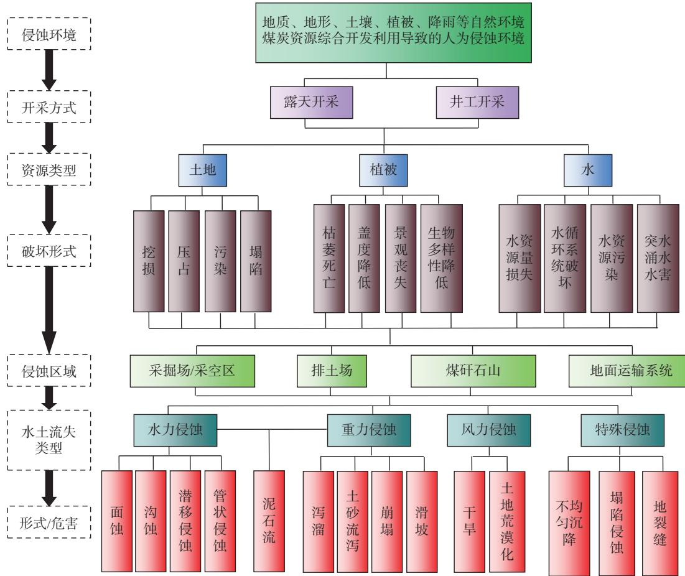

# 煤矿区水土流失特征及防控措施效应研究进展

李叶鑫1\*，吕 刚2，刘国阳1，刘 港1

（1. 沈阳工业大学建筑与土木工程学院，辽宁沈阳 110870；2. 辽宁工程技术大学环境科学与工程学院，辽宁阜新 123000）

摘　要：煤炭是我国的主要能源，也是重要的工业原料，为我国经济发展和中华民族伟大复兴作出了十分重要的贡献。然而，煤炭资源开发利用会严重影响矿区生态环境，产生一系列的生态环境问题。回顾总结国内外煤矿区水土保持研究，对我国煤矿区生态文明建设以及“双碳”目标的实现具有重要意义。本研究介绍了我国煤矿区岩土侵蚀环境组成与危害，分析煤矿区侵蚀环境作用特点以及与自然侵蚀环境的差异，总结排土场平台－边坡系统、煤矸石山和矿区道路等露天开采区域以及井工开采的水土流失特征，从土壤改良措施、植物措施和工程措施等角度归纳煤矿区水土流失防控措施效应，以期为煤矿区土地复垦与生态修复提供有力支撑。提出今后应加强煤矿区侵蚀过程与机理研究，掌握复合营力作用下排土场侵蚀特征，以不断丰富煤矿区水土流失防控措施内涵及效应。

关　键　词：水土流失；煤矿区；土地复垦；水土保持；生态修复

中图分类号：S157

文献标识码：A

文章编号：0564−3945(2025)01−0291−10

DOI: 10.19336/j.cnki.trtb.2024060301

李叶鑫, 吕　刚, 刘国阳, 刘　港. 煤矿区水土流失特征及防控措施效应研究进展 [J]. 土壤通报, 2025, 56(1): 291 − 300

LI Ye-xin, LÜ Gang, LIU Guo-yang, LIU Gang. A Review on Soil Erosion Characteristics and Control Practice Effect in Coal Mining Areas[J]. Chinese Journal of Soil Science, 2025, 56(1): 291 − 300

煤炭是我国的主要能源，也是重要的工业原料[1]。据《中国矿产资源报告 2023》统计数据，2022 年一次能源生产总量为 46.6 亿吨标准煤，比上年增长9.2%，占能源生产结构的 67.4%[2]，煤炭资源的开发利用为我国全面建成小康社会、实现“两个百年”奋斗目标和中华民族伟大复兴的中国梦提供了能源保障[3]。我国煤炭资源主要分布在干旱和半干旱地区，生态环境极其脆弱，大规模的开采会加剧破坏当地的生态系统[4]，改变矿区及其周围的土壤理化性质和水文平衡[5]，严重影响矿区生态环境和高质量发展[6]。黄河流域是我国煤炭开发规模最大的地区之一，煤炭年产量约占全国的 70%，其生态环境问题尤为严重，如煤炭资源开采诱发的地面塌陷、地裂缝、崩塌、滑坡和泥石流等次生地质灾害频发，导致地下水位下降和水资源短缺，诱发水土流失、土地荒漠化和重金属污染等一系列生态环境问题[7]。因此，矿山生态修复是美丽中国、绿水青山就是金山银山、山水林田湖草沙等生态文明建设工作的重要内容。

2020 年 5 月，在习近平生态文明思想的指引下，国家发展改革委、自然资源部等多个部门共同研究编制了《全国重要生态系统保护和修复重大工程总体规划（2021 \~ 2035 年）》，统筹山水林田湖草沙一体化保护和修复，在青藏高原、黄河重点生态区、长江重点生态区和东北地区及三北地区制定生态保护和修复重大工程，实施地质环境治理、地形重塑、土壤重构和植被重建等综合治理工程，恢复矿区生态环境。同年 10 月，国务院印发《2030 年前碳达峰行动方案》，提出要加强退化土地生态修复和水土流失综合治理。我国诸多学者对煤矿区水土流失与生态修复进行了深入研究。1998 年，白中科等[8] 从排土场坡度、容重、物质组成和坡度等角度分析其与水土流失及植被恢复的关系；卞正富等[9] 讨论了矿区水土流失形式，提出复垦区水土流失防控措施；2003 年，吕春娟等[10] 指出矿区水土流失是一种典型的人为加速侵蚀，论述了矿区塌陷地、排土场、煤矸石山的水土流失特征，提出对应的防治对策。2007 年，卞正富等[11] 提出矿山生态建设的概念、原理和技术与方法，并进行了案例分析。2008 年后，我国土地复垦与生态修复进入了高速发展阶段，取得了丰富成果[12−19]。煤矿区水土流失治理与生态修复是实现“双碳”目标的重要途径，面对新时期生态文明建设和碳中和战略，有必要对近些年来煤矿区水土保持工作进行回顾总结。基于此，本研究查阅了国内外相关文献并进行系统总结，综述了煤矿区岩土侵蚀环境组成与作用特点、水土流失特征及防控措施效应等方面的最新研究进展，以期为煤矿区土地复垦与生态修复提供有力支撑。

## 1    煤矿区岩土侵蚀环境

## 1.1    侵蚀环境组成

煤矿区岩土侵蚀环境是指在煤矿资源开采所导致的水土流失防治责任范围内，对水土流失发生发展有一定影响的环境条件，包括地质、地形、地貌、土壤、降雨等自然环境和煤炭资源综合开发利用导致的人为侵蚀环境[20−21]。煤矿区水土流失就是由于人为扰动地面或堆置废弃物而造成的岩土废弃物的混合搬运迁移和沉积，其结果是导致水土资源的破坏和损失，最终使土地生产力下降甚至完全丧失，是一种典型的人为加速侵蚀[8,20]。煤炭资源开采的主要方式为露天开采和井工开采。露天开采主要是通过剥离掉覆盖在矿产资源上部的岩土，揭露出矿产资源，再直接采掘矿产资源的开采项目，其占地面积大，扰动土壤和岩层严重，不仅形成大面积的采掘场（矿坑），还能产生大量的弃土（石、渣），无序堆放进一步加剧了水土流失。井工开采主要是通过掘井建巷道进行矿产资源地下开采的项目，在开挖扰动原地貌的同时，会形成大面积地表沉陷，破坏土地资源，影响地表水和地下水资源。煤炭资源开采对土地、植被、水资源的破坏形式、水土流失类型及危害如图 1。

  
图 1 煤矿区岩土侵蚀环境  
Fig.1 Soil and rock erosion environment in coal mining areas

## 1.2    侵蚀环境作用特点

与自然侵蚀环境相比，煤炭资源开采过程中侵蚀环境作用具有如下特点：

（1）侵蚀对象的特殊性。煤炭资源开采会开挖扰动大面积岩土，经一系列工艺所形成的弃土弃渣物质组成复杂，主要包括土壤、岩石、煤矸石、母质、砾石、粉煤灰等物质，与自然侵蚀环境相比，侵蚀对象不仅仅是土壤，而是一种岩土混合物质，其水土流失应称为岩土侵蚀[22]。

（2）水土流失类型的复杂性。除水力和重力等自然侵蚀动力外，高强度的开挖、扰动、压占等人为侵蚀动力更加显著，爆破和机械振动等矿山人为活动所诱发的崩塌、滑坡、建筑物破坏等灾害频发，煤矿区岩土侵蚀、植被损毁、水资源破坏等均与煤炭资源开采强度、范围等关系密切，岩土扰动程度大，植被和土壤破坏严重，以人为因素导致的侵蚀动力作用为主，侵蚀形成复杂多样，水力侵蚀和重力侵蚀相互影响，互为动力，岩土侵蚀发生频率更强。

（3）水土流失强度大。煤炭资源的开采深度由地表、浅层岩体向深部地层发展，侵蚀对象也由表层土壤转变为深层岩土，煤矿区的采掘场边坡、排土场平台－边坡系统、煤矸石山、地面运输系统（矿区道路）多为裸地，其侵蚀量和侵蚀强度更大，侵蚀强度可达自然侵蚀强度的几十倍，如：新形成的排土场土壤侵蚀模数高达 $3 \times 1 0 ^ { 4 } \mathrm { ~ t ~ k m ^ { - 2 } ~ a ^ { - 1 [ 2 0 ] } }$ 。采掘场、排土场、煤矸石山的边坡多为高陡边坡，地形地貌的改变会增加地表侵蚀动能和边坡失稳的可能性。相关数据表明，排土场在集中股流作用下导致的浅沟侵蚀模数可达 $2 4 . 4 6 ~ \mathrm { m } ^ { 3 } ~ \mathrm { h m } ^ { - 2 }$ a–1，切沟侵蚀呈“V”字型，其溯源侵蚀速度高达 5.7 m a−1[22]。

（4）与主体工程联系紧密。井工开采引起岩土体应力变化，导致周围岩层发生复杂的移动变形，产生塌陷侵蚀。塌陷侵蚀出现的位置、程度以及采动地裂缝数量和范围取决于采空区的面积和工作面的推进方向、位置，与主体工程的施工进度有关。

## 2    水土流失特征

我国煤矿区多处于干旱半干旱地区，生态环境脆弱，降雨量稀少而蒸发量大，随着矿产资源开发利用，土壤、植被和水资源等自然景观地貌均被严重破坏，水土流失极其严重[23]，影响矿区植被恢复与重建，威胁生态系统的稳定性[24]。露天开采会形成大面积的采掘场（矿坑）、排土场、煤矸石山、地面运输系统等区域，其中矿坑的露天边坡在地下水渗流和自身重力等作用下极易发生崩塌、滑坡等地质灾害[25]；排土场为松散堆积体，在重力作用下会出现不均匀沉降，同时由于平台在压实作用下会降低下垫面入渗能力，产生大量的地表径流，增大水土流失和滑坡等灾害发生的可能性[26]；煤矸石山由煤矸石堆弃形成，是洗煤过程中产生的固体废弃物，含有铅（Pb）、锡（Sn）、砷（As）、铬（Cr）

等重金属元素，在雨水冲刷和淋溶作用下渗入土壤并向深层土壤和地下水运动，影响区域生态环境[27−28]。煤矿区道路在经过大型机械的频繁碾压后形成上松下紧结构，渗透能力减低，容易形成地表径流，导致表层浮土极易发生侵蚀，形成浅沟、切沟等沟蚀，破坏、割裂道路[29]。井工开采会形成大面积的采空区，地表岩体受力平衡被打破，出现塌陷区，导致地表形变和地裂缝，降低植被覆盖度和土地生产力[30]。

## 2.1    露天开采水土流失特征

露天煤矿开采不可避免地损伤植物和降低植被覆盖度，挖掘、搬运和堆弃表层土壤和深层岩体，形成水土流失，严重影响矿区土壤质量和生态环境，降低土壤抗侵蚀能力，尤其是在降雨侵蚀力高值期[31]。露天煤矿开采破坏生态环境，一方面表现为开挖扰动大量土地，地表植被、水系被严重破坏，大面积表层土壤及深层岩土裸露在外，诱发水力侵蚀和重力侵蚀，增加崩塌和滑坡等灾害发生的可能性[32]；另一方面会产生大量弃土弃渣，堆弃形成排土场和煤矸石山压占和破坏现有耕地、林地或草地等自然地貌，丧失地表全部植被[33]。相关数据表明，我国煤炭资源与耕地资源高度重合，其重合面积约占我国耕地面积的 10.8%，煤炭资源的开采将造成$1 . 3 \times 1 0 ^ { 7 } \ : \mathrm { h m } ^ { 2 }$ 耕地损失[34]。排土场是平台与边坡交替出现的松散堆积体，是露天煤矿新增水土流失的主要策源地，已成为煤矿区水土流失研究中的重点和热点[35−36]。排土场具有地形堆垫高速性、地质层组紊乱性、地面形态单一性、地表物质复杂性、整体构型松散性等特点，其独特的地貌形态和物质组成使得水土流失过程具有特殊性[8]。大型机械碾压后的排土场平台变得紧实，不利于植被根系延伸、穿插，在一定程度上限制排土场植被恢复与重建。相关研究表明，排土场平台土壤容重高达1.8 g cm–3，导致下垫面渗透能力降低，其稳定入渗率低于 0.2 mm min−1 [37]，原地貌土壤植物根系穿透阻力为 $2 . 1 3 \sim 6 . 2 1 \mathrm { ~ k g ~ c m } ^ { - 3 }$ 而排土场平台植物根系穿透阻力高达 30 \~ 60kg cm−3[38]，这也间接体现了排土场平台植被恢复的困难程度。

与排土场平台不同，排土场边坡坡度较陡且多为岩土自然安息角，长度约在 30 \~ 50 m，物质组成松散易侵蚀，土壤容重仅为 $0 . 9 \sim 1 . 2 \ \mathrm { g \ c m } ^ { - 3 }$ ，土壤抗冲性和抗蚀性较差，容易形成面蚀、细沟、浅沟、切沟等水力侵蚀和滑塌、泥石流等重力侵蚀[38−39]。排土场边坡侵蚀量高达 $1 4 1 8 3 \mathrm { t } \mathrm { k m } ^ { - 2 } \mathrm { a } ^ { - 1 }$ ，属极强烈侵蚀程度，这与降雨强度、降雨量以及降雨侵蚀力关系密切[40]。水力侵蚀和重力侵蚀是排土场边坡侵蚀的主要类型，沟蚀和滑坡是土壤侵蚀的主要形式[41]。排土场边坡沟蚀的发育程度和形态特征与边坡部位有关，已有研究结果表明，细沟的密度、割裂度和宽深比等指标在边坡坡中最大，而在坡顶和坡脚则较小[42]。排土场平台紧实、边坡松散，引起排土场微地形和地表水文过程变化，加快地表径流汇集形成集中股流，在水流的不断冲刷侵蚀作用下，排土场细沟侵蚀逐渐发育成为浅沟侵蚀和切沟侵蚀，甚至导致冲沟侵蚀和坡面泥石流，致使大量岩土搬运、堆积在下层平台。由于排土场边坡结构松散且岩土尺寸大小不一，在自身重力和不均匀沉降等作用下形成地裂缝、陷穴等[43]，降雨和地表径流形成的水分会沿着裂缝和陷穴等优先通道汇集到排土场坡脚而涌出，诱发浅层滑坡和泥石流等重力侵蚀[41,44]。

煤矸石山具有物质组成复杂和可侵蚀颗粒较少等特点，其水土流失营力以径流冲刷和重力为主，出现集中股流所引起的浅沟侵蚀，泻溜、崩塌、滑坡等重力侵蚀时常出现[45]。由于煤矸石内部孔隙发达且连通性较好，导致渗透能力强、蓄水保土能力差[46]，容易形成垂直侵蚀，大量地表径流沿煤矸石内部的孔隙向深处运移[47]。相关研究表明，边坡坡度和放水流量是影响煤矸石侵蚀过程的重要因素，其侵蚀程度和侵蚀量是重力和径流侵蚀能力共同作用的结果[48]。在小坡度、小流量条件下，煤矸石侵蚀过程具有随机性，可分为蠕变阶段、严重冲蚀阶段和弱侵蚀阶段 3 个阶段；在大坡度和大流量条件下，侵蚀过程具有突发性，可分为表面泥沙严重流失阶段、侵蚀沟发育阶段和稳定侵蚀阶段 3 个阶段[49]。此外，煤矸石崩解风化和自燃会改变粒径分布特征、孔隙结构、土壤水分再分布、电导率等物理性质[50−51] 和粘聚力、抗剪强度、承载比等力学性质[52]，提高了煤矸石淋溶能力[53]，进而增大重金属污染范围和程度[54]。

矿区道路是物质和能量的主要流通通道，多为平整压实的土质道路[55]。矿区道路经过重型自卸汽车碾压后变得紧实，然而却在表层形成一定厚度的浮土，其物理性质与下层道路之间存在显著差异[29]，导致其侵蚀过程和侵蚀特征也不同，其侵蚀过程可以划分为浮土片蚀阶段和细沟侵蚀阶段[56]。作为矿区重要的产沙单元，矿区道路坚硬、入渗能力差，容易形成地表集中股流，是排土场径流排泄的主要通道，在地形、重力等作用下增加侵蚀动能和侵蚀量，形成浅沟、切沟等沟蚀，破坏、割裂道路，严重威胁矿区安全生产[57]。相关研究表明，矿区道路侵蚀速率与降雨强度、放水流量、坡度等因素呈显著正相关[29,58]，可达自然道路侵蚀速率的 50 倍[59]，且侵蚀量与细沟密度和形态参数显著相关[35]。然而，目前关于矿区道路侵蚀的研究相对较少，今后应该更加关注这方面的研究。

## 2.2    井工开采水土流失特征

我国煤炭以井工开采为主，约占煤炭总产量的96%[60]。井工开采会引起上层周围岩体变形、移动和错位，形成了大面积的塌陷地，改变下垫面土壤抗侵蚀能力，破坏地下水系，影响植被生长，导致植被退化[61]。相关数据表明，我国采煤沉陷区总面积高达 $6 \times 1 0 ^ { 4 } ~ \mathrm { k m } ^ { 2 }$ ，主要集中在山西、陕西、贵州、内蒙古和山东等地区，预计影响 $0 . 4 5 \times 1 0 ^ { 4 } \mathrm { k m } ^ { 2 }$ 建设用地和 $2 \times 1 0 ^ { 4 } \mathrm { k m } ^ { 2 }$ 耕地[60]。塌陷地不仅严重影响社会经济的健康发展，更是井工开采水土流失和生态系统退化的主要区域。土地塌陷会引起土壤质地、水分、有机质等土壤理化性质的变化，降低土壤质量，增加土壤理化性质的空间变异程度[62]。一方面会增大土壤孔隙度，土壤质地砂化[63]；另一方面增大土壤水分入渗能力，改变土壤水分运移规律及其再分布特征[64]，进而影响土壤盐分的分布特征，若土壤中盐分含量过高，会影响植物吸收水分和养分，进而抑制植物生长甚至导致植物死亡[65]。地裂缝是塌陷区最为常见的一种破坏形式，造成地表径流渗漏和大量土壤养分流失，加大水力侵蚀和重力侵蚀发生的可能性[66−67]。研究表明，煤炭开采利用会导致 88.80% 土地发生不同程度的沉陷，塌陷地侵蚀量增加 $4 2 . 3 2 \times 1 0 ^ { 4 } \sim 7 9 . 0 5 \times 1 0 ^ { 4 } \mathrm { ~ t ~ }$ ，侵蚀模数高达$2 3 2 1 . 7 8 \sim 4 3 3 5 . 6 4 \mathrm { t k m ^ { - 2 } } \mathrm { a ^ { - 1 } } \mathrm { \ell ^ { [ 6 8 ] } }$ ，水力侵蚀和重力侵蚀频发，同时伴随着风力侵蚀[69−70]。

## 3    防控措施效应

国外煤矿区生态修复起步相对较早，主要以矿区土地复垦为主，如：英国在 1942 年正规开采煤炭资源后，复垦 $2 . 4 \times 1 0 ^ { 4 } \ : \mathrm { h m } ^ { 2 }$ ，将 90% 土地用于农业；美国 1971 年矿山土地复垦率为 79.5%[71]。随着土地复垦的不断发展，矿区水土保持不仅要预防水土流失，合理利用水土资源，还要改善矿区生态环境，提高土地生产力。针对煤矿区水土流失的特殊性，应该提出相应的防控措施，通过在煤矿区复垦地貌上重构自然坡体，不仅可以降低地表侵蚀强度，还可有效促进地貌修复进程[72]。我国土地复垦起步较晚，但也有 30 年的历史，期间完善和颁布了多项政策和法律法规，形成了土地复垦与生态修复理论和技术[14]。相关数据表明，发达国家土地复垦率为85%，而我国不足 30%[73]，远低于发达国家，严重威胁国家耕地资源。目前，煤矿区水土流失防控措施主要以土壤改良措施、植物措施、工程措施为主。

## 3.1    土壤改良措施

表土是地球陆地表面能够产生植物收获物的疏松表层，为植被生长提供所需的营养成分。表土资源十分珍贵，形成 1 cm 厚的表土需要 100 \~ 400 a [74]。露天煤矿土地复垦需要大量表土，为了解决表土缺乏的问题，研究表土替代材料十分必要。表土替代材料是从矿区土地复垦环境建设的可持续发展的角度出发，利用非表土等资源的理化性质，将其合理配比，综合利用，使之成为适合植物生长的新型土壤[75]。不仅可以有效地提高植被存活率，加快区域植被恢复，还具有经济环保等优点。国外关于表土替代材料的研究开展较早，相关研究发现粉煤灰[76−77]、煤矸石[77]、风化的褐色砂岩[78−79] 和板岩粉末[80] 等均可以作为非表土资源，所研发的表土替代材料稳定且应用广泛。国内关于表土替代材料研究相对较晚，但也研究出多种表土替代材料，多为风化煤、煤矸石、粉煤灰等混合物[81−82] 或表土、煤矸石、岩土剥离物、粉煤灰等混合物[83−84]，有效解决了矿区表土稀缺的问题，与此同时还开展表土替代材料对土壤持水能力、水分运移规律[85−86] 和植物生物量[87] 影响等方面的研究，为区域土地复垦提供技术支撑。

表土替代材料的研发与应用不仅可以充分利用矿山废弃物、提高大宗固废综合利用效率，还能解决矿山土地复垦表土资源缺乏这一难题，应用前景良好，但不同配比表土替代材料的研发及其适用性有待于进一步研究。此外，从目前的研究成果来看多为室内模拟试验，研究尺度较小，而试验结果在矿区实际应用效果不清楚，对矿区重构土体入渗－蒸发－径流水文过程认识不足，不同尺度重构土体水文过程的形成机理与尺度效应尚不清楚。

## 3.2    植物措施

植物措施是通过增加植被覆盖度、提高地表粗糙度、改善土壤结构等方式来防治水土流失，进而保护水土资源。植被恢复是生态恢复的前提与基础，不仅可以重构退化或损坏的生态系统，还能改善土壤结构、土壤肥力和土壤微生物状况[88]。露天开采和井工开采都会不同程度地破坏植被，通过合理有效地土地复垦与植被重建，可以恢复地貌景观，提高土地利用效率。我国煤矿区生态修复以土地复垦和造林绿化为主，应因地制宜地选取复垦树种或草种，尤其是豆科植物的种植能够提高土壤肥力和抗侵蚀能力，吸收矿区废弃物中的重金属元素，是一类适用于矿区复垦的先锋植物[89−90]。

人工修复和自然修复是我国矿山生态修复的主要措施，两种措施相辅相成，但在具体布设措施时也要做到因地制宜。尽管自然修复过程相对比较缓慢且脆弱[91]，但随着修复时间的推移，矿区植物种群的生态位宽度和重叠程度在不断变化，且随着恢复年限的增加，生态位重叠程度逐渐增大，植物多样性和群落丰富度等相关指标均增大，经过多年的自然修复逐渐接近原生自然区域[92]，自然修复的应用空间更大，适应性更加广泛[93]，是生物修复的最高状态[13]。与自然修复相比，我国矿区人工修复技术相对较为完善，修复时间短且前期恢复效果更佳，具有目的性强和效率高等特点。相关研究表明，人工植被恢复措施能够显著提高植物种和土壤抗侵蚀能力，降低地表径流量和侵蚀量，这是植被覆盖度提高、土壤质量改良以及根系固土作用增强导致的[94−97]。

植被恢复可以提高矿区植被覆盖度，增加地表枯落物蓄积量，增强土壤抗侵蚀能力。植被林冠层和枯落物层能够降低雨滴对裸露地表的溅蚀作用，最大程度地保护表层土壤，拦蓄地表径流、增加土壤入渗、防治水土流失；同时，植物根系改良土壤结构，主根、侧根和须根等不同径级植物根系在土壤中延伸、穿插和固结土壤，形成根土复合体，对土体产生支撑、锚固和加筋的作用，增强土体的抗剪切能力和抗侵蚀能力。不同植被配置模式对排土场水土流失的影响不同，植被的盖度、空间格局、根系构型及分布特征等因素都会影响排土场细沟侵蚀，如：均匀分布的植被格局，其植被覆盖度更加完整致密，不利于集中股流的形成，而对于丛生或带状分布的植被格局，有水流汇集的可能，对细沟侵蚀的防控效果相对较差[98−99]。此外，人工植被恢复可改变生态系统演替的方向和速度，应考虑乔、灌、草等配置的合理搭配，植物措施的配置、分布格局、植被覆盖度等也会影响减水减沙效益，应做到排土场植被类型演替与植被恢复阶段需吻合。

## 3.3    工程措施

煤炭资源的开采会开挖扰动地表土壤，破坏地表植被，减少耕地、园地、林地和草地等土地利用类型面积，降低表土土壤质量。为了提高表土资源的保护与利用，我国对其制定了相关的法律法规，如《中华人民共和国水土保持法》《中华人民共和国土地管理法》《中华人民共和国土地法》《土地复垦条例》《开发建设项目水土保持技术规范》等。相关研究表明，表土剥离深度与土壤剖面结构、土层深度、土壤熟化程度等关系密切，按照土壤发生层次进行剥离，在条件允许的矿区应该采取边采边复技术，实现矿区可持续发展[100]。剥离的表土要注意临时堆放的位置和利用情况，在保证安全的前提下要符合就近原则和防洪行洪规定，选择距离较近、交通较为方便的位置，加强表土堆水土流失的监测与防治。在堆放过程中需要设置临时防护措施，如：拦挡、排水、沉沙以及覆盖。

煤矿区最为常见的堆积体是由煤矿开采过程中形成的大量弃土、弃渣、弃石及其他废弃物的混合堆砌而成，组成成分复杂，疏松多孔易侵蚀。为防治煤矿区弃土弃渣水土流失，通常采取拦挡工程、截排水工程、护坡工程等水土保持工程措施，将排土场以适当方式分割成若干径流分散单元，可有效地控制排土场水蚀[38]。排土场坡面微地形的改变（如：鱼鳞坑、水平阶、生态棒和挡水埂等措施）可以有效缓解由于短期暴雨而形成的大量地表径流[33]，增加下垫面入渗能力，其减流效益和减沙效益高达72.72% 和 99.30%[101]。工程措施常与植物措施相结合（如：围埂、排水沟、平整土地和防护林建设等），其水土流失防治效果优于单一植物措施或工程措施。

矿区道路表层坚硬，密度较大，入渗能力低，容易形成地表径流，是排土场径流排泄的通道，细沟、浅沟、切沟和冲沟等侵蚀沟类型发育严重[38]。在道路侵蚀的防治中，应该做到分散径流，尽量使矿区道路不排水或者少排水，可以在道路两侧、平台上侧或者地势较低的前端布设排水沟或者集流槽，并将汇集的地表径流导入蓄水池，用于干旱半干旱地区露天煤矿排土场植被恢复与节水灌溉。

采煤塌陷地会破坏原地貌，威胁土地安全，容易引发滑坡、泥石流等水土流失灾害，也会影响周边建筑物和水资源。采煤塌陷地的治理措施应该遵循因地制宜原则，可以将其复垦为农田、林地、草地和水域等不同土地利用方式。在塌陷地周边会出现不同程度的塌陷裂缝，可以先对其进行充填[102]，再采取施水、施肥、种植先锋植物等措施来提高矿区土壤质量[103]。同时对整个塌陷地进行整地、覆土等工程措施，重构煤矿区土壤，为采煤塌陷地土地复垦与生态修复提供条件。

## 4    展望

本研究归纳总结相关研究，对当前煤矿区水土流失特征及防控措施效应展开论述，今后还应该在以下几方面开展更加深入的探索工作：

（1）加强煤矿区侵蚀过程与机理研究。岩土侵蚀概念的提出已有 30 a，期间诸多学者采用模拟降雨和放水冲刷等经典方法完成了煤矿区排土场、煤矸石山、道路等方面土壤侵蚀规律研究，丰富煤矿区侵蚀类型与形式，阐明侵蚀规律，建立侵蚀量预测预报模型。今后，应进一步重视煤矿区侵蚀动力学过程研究，完善复杂地形地貌条件下排土场或煤矸石山岩土侵蚀过程与机理研究。

（2）开展复合营力作用下排土场侵蚀特征研究。截止目前，关于排土场岩土侵蚀特征的研究多为一种外营力，而对于复合侵蚀营力作用下的研究相对较少。随着全球气候变暖，极端暴雨事件发生频率增加，所导致的破坏性和危害性更加严重。极端暴雨的发生会促进排土场水力侵蚀，诱发重力侵蚀。因此，在今后研究中应加强水力、重力、冻融、风力等多营力作用下排土场岩土侵蚀特征的研究，探究各营力叠加的侵蚀效应，开展室内模拟、现场实验、野外监测等多手段、多尺度研究。

（3）丰富煤矿区水土流失防控措施内涵及效应，助力新时期碳中和战略实施。已有学者研究了煤矿区植物措施和工程措施的减流减沙效益，揭示防控措施的作用机理，提出全生命周期视角下煤矿区生态保护修复理念。作为“双碳”目标的主战场，煤矿区生态修复要遵循全局考虑、系统修复、因地制宜等基本原则，还要充分考虑水土资源、功能分区、生态景观和绿色发展之间的内在联系，根据煤矿区水土流失类型及形式，针对性地开展生态修复工作,丰富煤矿区碳汇过程、固碳增汇能力、生态碳汇估算模型等研究内容；保证极端暴雨条件下排水系统健全畅通，针对煤矿区地形地貌特点提高排土场和煤矸石山水分资源化利用水平，加强对防控措施效应的长期监测与评价，建立煤矿区生态防护体系，量化防控措施效应，确保煤矿区生态修复稳定、安全、高质量发展，助力碳达峰碳中和目标的实现。

## 参考文献：

刘　峰, 郭林峰, 赵路正. 双碳背景下煤炭安全区间与绿色低碳技[ 1 ]术路径 [J]. 煤炭学报, 2022, 47(1): 1 − 15.

[ 2 ] 中华人民共和国自然资源部. 中国矿产资源报告 2023[R]. 北京:地质出版社, 2023: 14.

[ 3 ] 谢和平, 吴立新, 郑德志. 2025 年中国能源消费及煤炭需求预测[J]. 煤炭学报, 2019, 44(7): 1949 − 1960.

Bi Yinli, Zhang Yanxu, Zou Hui. Plant growth and their root[ 4 ] development after inoculation of arbuscular mycorrhizal fungi in coal mine subsided areas[J]. International Journal of Coal Science & Technology, 2018, 5(1): 47 − 53.

Ahirwal J, Maiti S K. Assessment of soil properties of different land[ 5 ] uses generated due to surface coal mining activities in tropical Sal (Shorea robusta) forest, India[J]. Catena, 2016, 140: 155 − 163.

Feng Yu, Wang Jinman, Bai Zhongke, et al. Effects of surface coal[ 6 ] mining and land reclamation on soil properties: A review[J]. Earth-Science Reviews, 2019, 191: 12 − 25.

[ 7 ] 申艳军, 杨博涵, 王双明, 等. 黄河几字弯区煤炭基地地质灾害与生态环境典型特征 [J]. 煤田地质与勘探, 2022, 50(6): 104 − 117.

[ 8 ] 白中科, 胡振华, 王治国. 露天矿排土场人为加速侵蚀及分类研究[J]. 土壤侵蚀与水土保持学报, 1998, 4(1): 34 − 40.

[ 9 ] 卞正富, 张国良, 胡喜宽. 矿区水土流失及其控制研究 [J]. 土壤侵蚀与水土保持学报, 1998, 4(4): 31 − 36.

吕春娟, 白中科, 赵景逵. 矿区土壤侵蚀与水土保持研究进展 [J].[ 10 ]水土保持学报, 2003, 17(6): 85 − 88,91.

卞正富, 许家林, 雷少刚. 论矿山生态建设 [J]. 煤炭学报, 2007,[ 11 ]32(1): 13 − 19.

卞正富, 于昊辰, 韩晓彤. 碳中和目标背景下矿山生态修复的路径[ 12 ]选择 [J]. 煤炭学报, 2022, 47(1): 449 − 459.

胡振琪, 龙精华, 王新静. 论煤矿区生态环境的自修复、自然修复[ 13 ]和人工修复 [J]. 煤炭学报, 2014, 39(8): 1751 − 1757.

胡振琪. 我国土地复垦与生态修复 30 年: 回顾、反思与展望 [J].[ 14 ]煤炭科学技术, 2019, 47(1): 25 − 35.

毕银丽, 郭　芸, 刘　峰, 等. 西部煤矿区生物土壤结皮的生态修[ 15 ]复作用及其碳中和贡献 [J]. 煤炭学报, 2022, 47(8): 2883 − 2895.

雷少刚, 卞正富, 杨永均. 论引导型矿山生态修复 [J]. 煤炭学报,[ 16 ]2022, 47(2): 915 − 921.

彭苏萍, 毕银丽. 黄河流域煤矿区生态环境修复关键技术与战略[ 17 ]思考 [J]. 煤炭学报, 2020, 45(4): 1211 − 1221.

李树志, 李学良, 尹大伟. 碳中和背景下煤炭矿山生态修复的几个[ 18 ]基本问题 [J]. 煤炭科学技术, 2022, 50(1): 286 − 292.

张进德, 郗富瑞. 我国废弃矿山生态修复研究 [J]. 生态学报, 2020,[ 19 ]40(21): 7921 − 7930.

李文银, 白中科, 蔡继清. 工矿区水土保持 [M]. 北京: 科学出版社,[ 20 ]1996.

高学田, 唐克丽, 张平仓, 等. 神府─东胜矿区一、二期工程中新的[ 21 ]人为加速侵蚀 [J]. 水土保持研究, 1994, 8(4): 23 − 34,111.

王治国, 白中科, 赵景逵, 等. 黄土区大型露天矿排土场岩土侵蚀[ 22 ]及其控制技术的研究 [J]. 水土保持学报, 1994, 8(2): 10 − 17.

谷　裕, 王金满, 刘慧娟, 等. 干旱半干旱煤矿区土壤含水率研究[ 23 ]进展 [J]. 灌溉排水学报, 2016, 35(4): 81 − 86.

Wang J, Liu W, Yang R, et al. Assessment of the potential ecological[ 24 ] risk of heavy metals in reclaimed soils at an opencast coal mine[J]. Disaster Advances, 2013, 6(S3): 366 − 377.

王文龙, 李占斌, 张平仓. 神府东胜煤田开发中人为泥石流发育现[ 25 ]状及其分布特征 [J]. 山地学报, 2003, 21(3): 354 − 359.

郭明明, 王文龙, 李建明, 等. 神府矿区弃土弃渣体侵蚀特征及预[ 26 ]测 [J]. 土壤学报, 2015, 52(5): 1044 − 1057.

彭　建, 蒋一军, 吴健生, 等. 我国矿山开采的生态环境效应及土[ 27 ]地复垦典型技术 [J]. 地理科学进展, 2005, 24(2): 38 − 47.

梁　冰, 薛　强, 刘晓丽. 煤矸石中硫酸盐对地下水污染的环境预[ 28 ]测 [J]. 煤炭学报, 2003, 40(5): 527 − 530.

郭明明, 王文龙, 李建明, 等. 野外模拟降雨条件下矿区土质道路[ 29 ]径流产沙及细沟发育研究 [J]. 农业工程学报, 2016, 32(24): 155 −163.

王义方, 李新举, 李富强, 等. 基于多时相遥感影像的采煤塌陷区[ 30 ]典型扰动轨迹识别−−以山东省济宁市典型高潜水位矿区为例[J]. 地质学报, 2019, 93(S1): 301 − 309.

史东梅, 江　东, 卢喜平, 等. 重庆涪陵区降雨侵蚀力时间分布特[ 31 ]征 [J]. 农业工程学报, 2008, 24(9): 16 − 21.

Shao W, Bogaard T, Bakker M, et al. The influence of preferential[ 32 ] flow on pressure propagation and landslide triggering of the Rocca Pitigliana landslide [J]. Journal of Hydrology, 2016: 360-372.

杨娅双, 王金满, 万德鹏. 人工堆垫地貌微地形改造及其水土保持[ 33 ]效果研究进展 [J]. 生态学杂志, 2018, 37(2): 569 − 579.

胡振琪. 矿山土地复垦与生态修复领域“十四五”高质量发展的若[ 34 ]干思考 [J]. 智能矿山, 2021, 2(1): 29 − 32.

Zhang L, Wang J, Bai Z, et al. Effects of vegetation on runoff and[ 35 ] soil erosion on reclaimed land in an opencast coal-mine dump in a loess area[J]. Catena, 2015, 128: 44 − 53.

Zhao Z, Shahrour I, Bai Z, et al. Soils development in opencast coal[ 36 ] mine spoils reclaimed for 1-13 years in the West-Northern Loess Plateau of China[J]. European Journal of Soil Biology, 2013, 55: 40 − 46.

白中科, 王文英, 李晋川, 等. 黄土区大型露天煤矿剧烈扰动土地[ 37 ]生态重建研究 [J]. 应用生态学报, 1998, 9(6): 63 − 68.

魏忠义, 白中科. 露天矿大型排土场水蚀控制的径流分散概念及[ 38 ]其分散措施 [J]. 煤炭学报, 2003, 28(5): 486 − 490.

魏忠义, 胡振琪, 白中科. 露天煤矿排土场平台“堆状地面”土壤重[ 39 ]构方法 [J]. 煤炭学报, 2001, 38(1): 18 − 21.

郭建英, 何京丽, 李锦荣, 等. 典型草原大型露天煤矿排土场边坡[ 40 ]水蚀控制效果 [J]. 农业工程学报, 2015, 31(3): 296 − 303.

Li Y, Lv G, Wang D, et a. Erosion failure of slope in a dump with[ 41 ] ground fissure under heavy rain[J]. Water, 2022, 14(21): 3425.

陈同德, 王文龙, 董玉锟, 等. 露天煤矿排土场不同治理模式边坡[ 42 ]细沟侵蚀特征研究 [J]. 草地学报, 2017, 25(1): 61 − 68.

李叶鑫, 王道涵, 吕　刚, 等. 煤矿区土体裂缝特征及其生态环境[ 43 ]效应研究进展 [J]. 生态学杂志, 2018, 37(12): 3769 − 3779.

郑开欢, 罗周全, 罗成彦, 等. 持续暴雨作用下排土场层状碎石土[ 44 ]边坡稳定性 [J]. 北京科技大学学报, 2016, 38(9): 1204 − 1211.

王青杵, 王贵平. 黄土高原煤炭开采区水土流失特征的研究 [J]. 水[ 45 ]土保持研究, 2001, 8(4): 83 − 85,132.

冯晶晶, 张成梁, 刘治辛, 等. 自然降水条件下煤矸石坡土壤含水[ 46 ]量及径流变化 [J]. 中国水土保持科学, 2016, 14(4): 60 − 67.

李建明, 王文龙, 王　贞, 等. 神府煤田废弃堆积体新增水土流失[ 47 ]研究 [J]. 自然灾害学报, 2014, 23(2): 239 − 249.

冯慧敏, 王电龙, 胡振华. 风化煤矸石坡面水土流失规律模拟 [J].[ 48 ]中国水土保持科学, 2013, 11(2): 39 − 44.

胡振华, 王电龙, 呼起跃. 煤矸石松散堆置体坡面侵蚀规律研究[ 49 ][J]. 水土保持学报, 2007, 21(3): 23 − 27.

严家平, 陈孝杨, 蔡　毅, 等. 不同风化年限的淮南矿区煤矸石理[ 50 ]化性质变化规律 [J]. 农业工程学报, 2017, 33(3): 168 − 174.

徐良骥, 朱小美, 刘曙光, 等. 不同粒径煤矸石温度场影响下重构[ 51 ]土壤水分时空响应特征 [J]. 煤炭学报, 2018, 43(8): 2304 − 2310.

张清峰, 王东权, 于广云, 等. 煤矸石风化对其物理力学性能影响[ 52 ]的研究 [J]. 中国矿业大学学报, 2019, 48(4): 768 − 774.

张耀方, 江　东, 史东梅, 等. 重庆市煤矿开采区土壤侵蚀特征及[ 53 ]水土保持模式研究 [J]. 水土保持研究, 2011, 18(6): 94 − 99.

Liu G J, Zhang H Y, Gao L F, et al. Petrological and mineralogical[ 54 ] characterizations and chemical composition of coal ashes from power plants in Yanzhou mining district, China[J]. Fuel Processing Technology, 2004, 85(15): 1635 − 1646.

田　野, 张　瞻, 薛远建. 基于固废利用的矿区道路抑尘研究 [J].[ 55 ]中国矿业, 2019, 28(8): 91 − 93,98.

李建明, 秦　伟, 左长清, 等. 黄土区土质道路浮土侵蚀过程 [J]. 应[ 56 ]用生态学报, 2015, 26(5): 1484 − 1494.

Cao L X, Zhang K L, Dai H L, et al. Modeling interrill erosion on[ 57 ] unpaved roads in the Loess Plateau of China[J]. Land Degradation and Development, 2015, 26(8): 825 − 832.

黄鹏飞, 王文龙, 罗　婷, 等. 非硬化土路径流侵蚀产沙动力参数[ 58 ]分析 [J]. 应用生态学报, 2013, 24(2): 497 − 502.

Carlos E. Ramos Scharrón. Sediment production from unpaved roads[ 59 ] in a sub-tropical dry setting-Southwestern Puerto Rico[J]. Catena, 2010, 82(3): 146 − 158.

李佳洺, 余建辉, 张文忠. 中国采煤沉陷区空间格局与治理模式[ 60 ][J]. 自然资源学报, 2019, 34(4): 867 − 880.

胡振琪, 肖　武, 王培俊, 等. 试论井工煤矿边开采边复垦技术 [J].[ 61 ]煤炭学报, 2013, 38(2): 301 − 307.

郄晨龙, 卞正富, 杨德军, 等. 鄂尔多斯煤田高强度井工煤矿开采[ 62 ]对土壤物理性质的扰动 [J]. 煤炭学报, 2015, 40(6): 1448 − 1456.

臧荫桐, 汪　季, 丁国栋, 等. 采煤沉陷后风沙土理化性质变化及[ 63 ]其评价研究 [J]. 土壤学报, 2010, 47(2): 262 − 269.

[ 64 ] 臧荫桐, 丁国栋, 高　永, 等. 采煤沉陷对风沙区土壤非饱和水分

入渗的影响 [J]. 水科学进展, 2012, 23(6): 757 − 767.

毕银丽, 伍　越, 张　健, 等. 采用 HYDRUS 模拟采煤沉陷地裂缝[ 65 ]区土壤水盐运移规律 [J]. 煤炭学报, 2020, 45(1): 360 − 367.

Sahu P, Lokhande R D. An investigation of sinkhole subsidence and[ 66 ] its preventive measures in underground coal mining[J]. Procedia Earth and Planetary Science, 2015, 11: 63 − 75.

张合兵, 聂小军, 程静霞. 137Cs 示踪采煤沉陷坡土壤侵蚀及其对[ 67 ]土壤养分的影响 [J]. 农业工程学报, 2015, 31(4): 137 − 143.

白中科, 段永红, 杨红云, 等. 采煤沉陷对土壤侵蚀与土地利用的[ 68 ]影响预测 [J]. 农业工程学报, 2006, 22(6): 67 − 70.

左合君, 赵国平, 胡春元, 等. 采煤塌陷区地表动态演变对风蚀影[ 69 ]响研究−−以神府东胜煤田补连塔矿风沙区为例 [J]. 干旱区资源与环境, 2009, 23(7): 87 − 92.

赵国平, 毕银丽, 李军保, 等. 神府煤田风沙区采煤塌陷对风蚀的[ 70 ]影响 [J]. 水土保持通报, 2016, 36(4): 129 − 132.

陈莎莎. 试论矿区的植被恢复与水土保持 [J]. 福建水土保持,[ 71 ] 2001, 13(4): 27 − 29.

Emmerton B, Burgess J, Esterle J, et al. The application of natural[ 72 ] landform analogy and geology-based spoil classification to improve surface stability of elevated spoil landforms in the Bowen Basin, Australia-A review[J]. Land Degradation & Development, 2018, 29(5): 1489 − 1508.

王萌辉. 矿区土地复垦与生态修复综合标准化研究 [D]. 北京: 中[ 73 ]国地质大学, 2019.

杨紫千, 刘小庆, 董秀茹, 等. 我国表土剥离技术启蒙与发展研究[ 74 ]综述 [J]. 中国农业资源与区划, 2017, 38(11): 54 − 60.

刘雪冉, 胡振琪, 许　涛, 等. 露天煤矿表土替代材料研究综述 [J].[ 75 ]中国矿业, 2017, 26(3): 81 − 85.

Ram L, Srivastava N, Tripathi R, et al. Management of mine spoil for[ 76 ] crop productivity with lignite fly ash and biological amendments[J]. Journal of Environmental Management, 2006, 79(2): 173 − 187.

Baker D E, Baker C S, Sajwan K S. Evaluation of coal combustion[ 77 ] products as components in disturbed land reclamation by the Baker Soil Test [J]. Biogrochemistry of Trace Elements in Coal and Coal Combustion Byproducts, 1999: 145-166.

Sena K, Barton C, Hall S, et al. Influence of spoil type on[ 78 ] afforestation success and natural vegetative recolonization on a surface coal mine in Appalachia, United States[J]. Restoration ecology, 2015, 23(2): 131 − 138.

Wilson Kokes L, Skousen J. Nutrient concentrations in tree leaves on[ 79 ] brown and gray reclaimed mine soils in West Virginia[J]. Science of the Total Environment, 2014, 481(15): 418 − 424.

Paradela R, Moldesa A B, Barral M T. Characterization of slate[ 80 ] processing fines according to parameters of relevance for minespoil reclamation[J]. Applied Clay Science, 2007, 41(3): 172 − 180.

胡振琪, 康惊涛, 魏秀菊, 等. 煤基混合物对复垦土壤的改良及苜[ 81 ]蓿增产效果 [J]. 农业工程学报, 2007, 23(11): 120 − 124.

Hu Zhenqi, Zhu Qi, Liu Xueran, et al. Preparation of topsoil[ 82 ] alternatives for open-pit coal mines in the Hulunbuir grassland area,

China[J]. Applied Soil Ecology, 2020, 147: 103431.

Kuang Xinyu, Cao Yingui, Luo Gubai , et al. Responses of melilotus[ 83 ] officinalis growth to the composition of different topsoil substitute materials in the reclamation of open-pit mining grassland area in Inner Mongolia [J]. Materials, 2019, 12(23): 3888.

Wang Lingling, Wang Fan, Wang Shufei, et al. Analysis of[ 84 ] differences in chemical properties of reconstructed soil under different proportions of topsoil substitute materials[J]. Environmental Science and Pollution Research, 2021, 28(24): 31230 − 31245.

荣　颖, 王　淳, 胡振琪. 表土替代材料不同夹层位置对风沙土水[ 85 ]分入渗和蒸发的影响 [J]. 农业资源与环境学报, 2022, 39(5): 967 −977.

Wang X, Zhao Y, Liu H, et al. Evaluating the water holding capacity[ 86 ] of multilayer soil profiles using Hydrus-1D and multi-criteria decision analysis[J]. Water, 2020, 12(3): 773.

况欣宇, 曹银贵, 罗古拜, 等. 基于不同重构土壤材料配比的草木[ 87 ]樨生物量差异分析 [J]. 农业资源与环境学报, 2019, 36(4): 453 −461.

毕江涛, 贺达汉, 黄泽勇. 退化生态系统土壤微生物种群数量和分[ 88 ]布对植被恢复的响应 [J]. 地理科学, 2009, 29(2): 94 − 99.

Zhang Z Q, Shu W S, Lan C Y, et al. Soil seed bank as an input of[ 89 ] seed source in revegetation of lead / zinc mine tailings[J]. Restoration Ecology, 2001, 9(4): 378 − 385.

袁雪红, 高照良, 张　翔, 等. 不同豆科植物对黄土高原弃土场的[ 90 ]改良效果 [J]. 中国水土保持科学, 2016, 14(4): 121 − 127.

Macdonald J A. Peer reviewed: evaluating natural attenuation for[ 91 ] groundwater cleanup[J]. Environmental Science & Technology, 2000, 34(15): 346 − 353.

赵方莹, 李江锋, 程小琴. 北京首云铁矿沙厂矿区自然恢复植物种[ 92 ]群的生态位特征 [J]. 中国水土保持科学, 2009, 7(6): 80 − 84.

张绍良, 张黎明, 侯湖平, 等. 生态自然修复及其研究综述 [J]. 干旱[ 93 ]区资源与环境, 2017, 31(1): 160 − 166.

珊　丹, 邢恩德, 荣　浩, 等. 草原矿区排土场不同植被配置类型[ 94 ]生态恢复 [J]. 生态学杂志, 2019, 38(2): 30 − 36.

唐　骏, 党廷辉, 薛　江, 等. 植被恢复对黄土区煤矿排土场土壤[ 95 ]团聚体特征的影响 [J]. 生态学报, 2016, 36(16): 5067 − 5077.

史倩华, 王文龙, 刘瑞顺, 等. 植被恢复措施对不同排土年限煤矿[ 96 ]排土场边坡细沟侵蚀的影响 [J]. 农业工程学报, 2016, 32(17): 226 −232.

杨　波, 王文龙, 郭明明, 等. 矿区排土场边坡不同植被配置模式[ 97 ]的控蚀效益研究 [J]. 土壤学报, 2019, 56(6): 1347 − 1358.

Cui Z, Kang H, Wang W, et al. Vegetation restoration restricts rill[ 98 ] development on dump slopes in coalfields[J]. Science of The Total Environment, 2022, 820: 153203.

崔志强. 不同植被配置对排土场边坡细沟发育过程的影响机制研[ 99 ]究 [D]. 杨凌: 中国科学院大学 (中国科学院教育部水土保持与生态环境研究中心), 2022.

胡振琪, 肖　武, 赵艳玲. 再论煤矿区生态环境“边采边复”[J]. 煤[ 100 ]炭学报, 2020, 45(1): 351 − 359.

杨　波, 王文龙, 郭明明, 等. 模拟降雨条件下弃渣体边坡不同防[ 101 ]护措施的减水减沙效益 [J]. 土壤学报, 2017, 54(6): 1357 − 1368.

刘　辉, 雷少刚, 邓喀中, 等. 超高水材料地裂缝充填治理技术 [J].[ 102 ]煤炭学报, 2014, 39(1): 72 − 77.

史沛丽, 张玉秀, 胡振琪, 等. 采煤塌陷对中国西部风沙区土壤质[ 103 ]量的影响机制及修复措施 [J]. 中国科学院大学学报, 2017, 34(3):318 − 328.

# A Review on Soil Erosion Characteristics and Control Practice Effect in Coal Mining Areas

LI Ye-xin1\*, LÜ Gang2, LIU Guo-yang1, LIU Gang1

(1. School of Architecture and Civil Engineering, Shenyang University of Technology, Shenyang 110870, China; 2. College of Environmental Science and Engineering, Liaoning Technical University, Fuxin 123000, China)

Abstract: Coal is a main energy and an important industrial raw material in China, which has made a very important contribution to economic development and the great rejuvenation of the Chinese nation. However, the development and utilization of coal resources will seriously affect the ecological environment in the mining areas, resulting in a series of ecological environmental problems. To review and summarize the researches on soil and water conservation in coal mining areas at home and abroad is of great significance to the construction of ecological civilization and the realization of the carbon peak and carbon neutrality (“Double Carbon Targets”) in China In this paper, the composition and harmfulness of soil and rock erosion environment in coal mining areas was introduced, the characteristics of soil erosion environment and the differences between them and natural erosion environment was analyzed, the soil erosion characteristics for open-pit mining and underground mining was summarized, the control practices’ effects were summarized from the soil improvement measures, vegetation measures and engineering measures. These works could provide strong support for land reclamation and ecological restoration in coal mining areas. The contents of future research include: to strengthen the study of erosion processes and mechanisms in coal mining areas, to research on erosion characteristics of the dump under the action of composite forces, and to enrich the connotation and effects of soil erosion control practices’ effects.

[ 责任编辑：韩春兰 ]

Key words: Soil erosion; Coal mining area; Land reclamation; Soil and water conservation; Ecological restoration